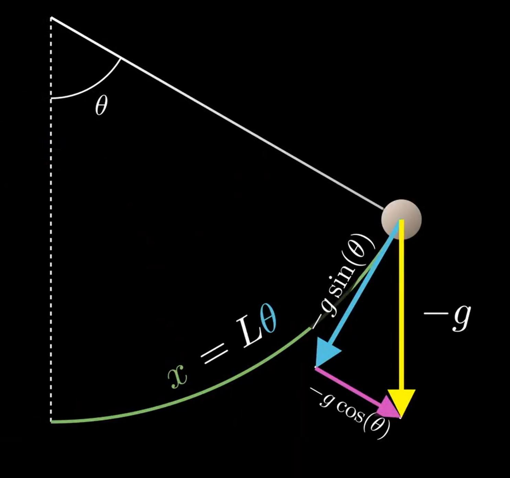
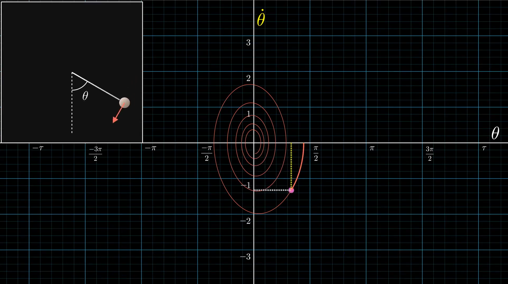
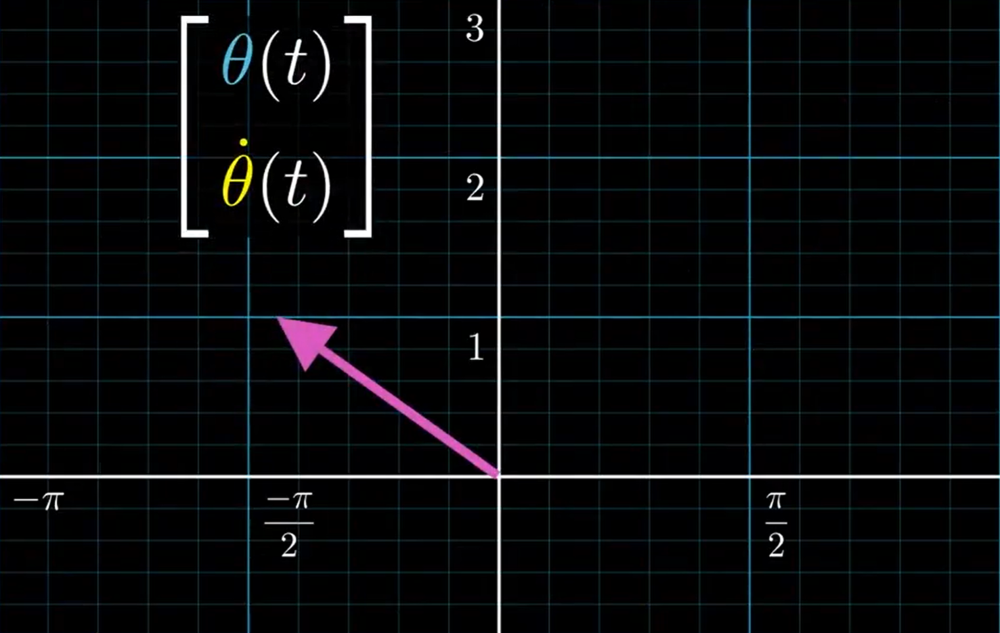
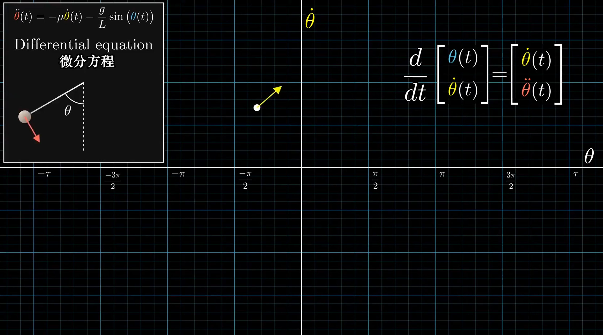

该系列为3Blue1Brown微分方程系列视频笔记，原视频可见：https://www.bilibili.com/video/av50290975或https://www.youtube.com/watch?v=p_di4Zn4wz4&list=PLZHQObOWTQDNPOjrT6KVlfJuKtYTftqH6

由于笔者水平有限，文中难免存在一些不足和错误之处，诚请各位批评指正。

# 1 引言

相比于绝对量，微分方程更善于描述相对变化量。例如在描述生物种群数量时，微分方程可以很好的描述数量的变化，但不能直观描述数量的绝对值。在牛顿力学中，运动经常通过力来描述，因为力决定了代表状态变化的加速度。

微分方程可分为两种，**常微分方程**（ordinary differential equation）和**偏微分方程**（partial differential equation）

常微分方程的自变量只有一个，通常情况下是时间，因为描述随着时间推移而变化的量是微分方程的典例。而偏微分方程有多个自变量，在（二）中将详细介绍偏微分方程，我们可以将偏微分方程想象成随时间变化的连续体，例如固体中任意一点的温度。

# 2 抛体运动

在抛体运动中，只考虑竖直方向的运动，不考虑空气阻力，抛体的速度矢量将会每秒增加 9.8 m/s的向下分量，也就是竖直向下的重力加速度对抛体运动的作用。

设抛体的高度为 $y$ ， $y$ 的一阶导为 $\dot{y}$ ，也就是速度， $y$ 的二阶导为 $\ddot{y}$ ，也就是加速度。由此我们可以得到一个简单的微分方程：
$$
\ddot{y}(t)=-g
$$
首先，对于速度，我们只需要知道 $-g$ 是哪个函数的导数，这个问题的求解我们可以通过积分来解决：
$$
\dot{y}(t)=-g t+v_{0}
$$
同样的，对于位移，在这里也就是高度，我们需要知道 $-g t+v_{0}$ 是哪个函数的导数，即：
$$
y(t)=-(1 / 2) g t^{2}+v_{0} t+y_{0}
$$
这样，我们便解出了一个微分方程——**根据有关函数变化率的信息，计算出函数是什么**。这个例子非常简单，只需要通过积分运算来求解，因为函数与函数的变化率没有同时出现在一个方程中。

# 3 推广

当作用在物体上的力取决于物体的位置时，事情就会变得更加复杂。比如研究行星运动时，引力与行星间距离的平方成反比，而引力的大小决定加速度的大小，而加速度的大小最终会影响行星间距。也就是说，描述位置变化率的速度本身的变化率加速度是位置的函数。

以上描述反映了一个现象，在微分方程问题中，**我们往往需要找到一个函数，而其导数或高阶导数也是由这个函数本身定义的**。例如
$$
\begin{array}{c}
\dot{x}(t)=k x(t) \\
\ddot{\theta}(t)=-\mu \dot{\theta}(t)-\frac{g}{L} \sin (\theta(t)) \\
\frac{\partial T}{\partial t}=\frac{\partial^{2} T}{\partial x^{2}}+\frac{\partial^{2} T}{\partial y^{2}}+\frac{\partial^{2} T}{\partial z^{2}}
\end{array}
$$

# 4 单摆

在物理学中，二阶微分方程是最常见的，即方程中最高阶导数为二阶导的微分方程。而单摆问题是我们理解微分方程的一个很不错的例子。这里我们研究单摆与竖直方向所成的夹角 $\theta$ 随时间的变化规律。

在初始 $\theta$ 角很小且没有空气阻力时，单摆运动是一种简单简谐运动：
$$
\theta(t)=\theta_{0} \cos (\sqrt{g / L} t)
$$
但当初始 $\theta$ 角稍大时，这个公式便不再好用了，当初始 $\theta$ 角接近 180° 时， $\theta$ 角的时域曲线甚至不再像三角函数曲线了。

为了分析描述单摆运动的普适方程，我们描述有关物理量如下图：

其中，我们定义右侧 $\theta$ 为正，加速度也就是弧长 $x$ 的二阶导为：
$$
a=\ddot{x}=-g \sin (\theta)
$$
其中，由于 $x = L\theta$ ，我们可以将上式变换得到：
$$
L\ddot{\theta}=-g \sin (\theta)
$$

$$
\ddot{\theta}=-\frac{g}{L} \sin (\theta)
$$

接下来，我们再在方程中加入空气阻力，一般来说空气阻力与物体运动速度成正比，可得：
$$
\ddot{\theta}=-\mu \dot{\theta}-\frac{g}{L} \sin (\theta)
$$
考虑到我们夹角 $\theta$ 关于时间 $t$ 的变化规律，我们可以将上式写成：
$$
\ddot{\theta}(t)={-\mu \dot{\theta}}(t)-\frac{g}{L} \sin (\theta(t))
$$
这样一来，我们就得到了描述单摆运动的微分方程。

# 5 相空间

为了更形象的理解和描述单摆的运动，我们可以在二维平面中把所有可能的状态“画”出来，这里我们引入相空间（phase space）的概念。在数学与物理学中，相空间一个用以表示出一系统所有可能状态的空间，系统每个可能的状态都有其相对应的相空间的点。

单摆的状态可以用两个量来表示：角度 $\theta$ 和角速度 $\dot{\theta}$ ，而加速度只是关于这两个值的函数。因此我们可以以角度 $\theta$ 为横坐标，以角速度 $\dot{\theta}$ 为纵坐标，所以**单摆的任意一个状态都可以用这个二维平面上的一个特定的点来描述**，这样一来我们便得到描述单摆运动的相空间：

这个内螺旋轨迹，意味着每次摆动之后速度和位移的峰值都减小了一些，从某种意义上来说，这个点在被原点吸引。

通过这个空间，我们可以将微分方程可视化为向量场。

单摆状态可以用向量表示：
$$
\left[\begin{array}{l}
\theta(t) \\
\dot{\theta}(t)
\end{array}\right]
$$
表现在图像上即为：

我们可以把这个向量想象成上图的箭头，也可以想象成一个点，无论哪种方式，它都有两个坐标，每个坐标都是关于时间的函数。

既然这个向量是关于时间的函数，我们就可以将其对时间求导，就可以得到这个向量的变化率。同样的，导数仍然是一个向量，代表着这个向量的**变化趋势速度的大小和方向**：
$$
\frac{d}{d t}\left[\begin{array}{l}
\theta(t) \\
\dot{\theta}(t)
\end{array}\right]=\left[\begin{array}{l}
\dot{\theta}(t) \\
\ddot{\theta}(t)
\end{array}\right]
$$
将这个向量的起点放在 $\left[\begin{array}{l}
\theta(t) \\
\dot{\theta}(t)
\end{array}\right]$ 点上，我们可以进一步将**变化率向量**可视化出来：

这个状态向量的第二个分类是 $\dot{\theta}$ ，而变化率向量的第一个分量也是 $\dot{\theta}$ 。因此，当一个点在图像上越靠上，即 $\dot{\theta}$ 越大，这个向量就越有向右运动的趋势。反之，当一个点越靠下，就意味着这个向量越有向左运动的趋势。

变化率向量的第二个分量是 $\ddot{\theta}$ ，根据上文中给出的单摆运动微分方程，我们可以将变化率向量改写为：
$$
\frac{d}{d t}\left[\begin{array}{l}
\theta(t) \\
\dot{\theta}(t)
\end{array}\right]= \left[\begin{array}{l}
\dot{\theta}(t) \\
\ddot{\theta}(t)
\end{array}\right]=\left[\begin{array}{c}
\dot{\theta}(t) \\
-\mu \dot{\theta}(t)-(g / L) \sin (\theta(t))
\end{array}\right]
$$
这样我们就可以得到变化率向量第二个分量的具体值，这样我们就可以得到任意一个状态的变化率向量的大小与方向，注意，**这里重申一遍，状态向量的起点为原点，而变化率向量的起点为其对应的状态向量的终点**。对于空间中所有的点，即所有的状态，我们都对其求导，并画出每一个状态的变化率向量，这里为了画面的直观与整洁，将所有变化率向量统一了长度，与此同时通过颜色来表示其大小，这样我们就可以直观看出任意一个状态的变化趋势：

当进行到此处时，我们已经讲一个二阶微分方程分解为了两个一阶微分方程：
$$
\frac{d}{d t}\left[\begin{array}{l}
\theta(t) \\
\dot{\theta}(t)
\end{array}\right]=\left[\begin{array}{c}
\dot{\theta}(t) \\
-\mu \dot{\theta}(t)-(g / L) \sin (\theta(t))
\end{array}\right]
$$
这是微分方程中一个常用的技巧，与其考虑单一变量的高阶导数，不如考虑高维向量的一阶导数。以这种形式，我们可以很好的**可视化求解方程的逻辑和意义**。

人类花了很久才找到通过相空间描述运动学这种方法，在《混乱》这本书中，James Gleick将相空间描述为“现代科学最伟大的发明之一”。

原因之一是：我们从中可以得到的不仅仅是一个单一的初始状态，而是**初始状态的集合**，通过求导得到状态的变化率，我们又可以得到每个状态的变化趋势，拥有了状态和对应的变化趋势，我们就可以得到状态运动的轨迹（变化的情况）。所有的轨迹构成的集合，就像是流动的液体，所以我们称之为**相流**（phase flow）。它会引申出很多思考，比如稳定性问题：原点与 （0,$\pi$）均为系统的不动点，但他们稳定吗？仔细思考一下不难发现，在原点处足够稳定，而（0,$\pi$）却不然。如果不通过单摆模型本身，而是通过相流来分析这个问题，我们的直觉思路很大一部分在于不动点附近的一小块区域内的相流是向内收敛还是向外发散。

相空间描述这个方法的精妙之处在于，任何常微分方程系统都可以用这样的向量图表示，但一般情况下，这个相空间的维度都不底，例如著名的三体问题，每个质点都用三个坐标来描述它的位置，即一个三维向量，同样的，也需要三个坐标来描述他的动量，也就是另一个三维向量。所以整个系统自由度为18，这就意味着我们需要一个18维的相空间来表示三体问题的状态。

# 6 求解的逻辑和意义

当系统从某个初始状态开始变化时，空间中的这个点会沿着某个轨道移动。在这个运动过程中，这个点的速度会和当前状态的变化率向量吻合，值得强调的是：**这个速度和物理空间中的单摆运动速度是不一样的**，因为相空间是一个抽象空间，这个速度也是一个抽象的概念，它只代表 ${\theta}$ 和 $\dot{\theta}$ 的变化率。

再次明确了状态与其变化率，我们就可以理解求解微分方程的一个思路：假设我们实际模型的初始状态位于相空间中的某一点，并沿着它变化率向量的方向移动一小步，时长为 $\Delta t$ 。步长即为 $\Delta t$ 乘上向量的长度，当 $\Delta t$ 足够小时，我们的这一步就足够**精确**。当我们不断**重复这个过程**，就可以沿着轨迹不断前进到新的状态。通过迭代就可以得到初始状态会发展为的任意一个状态，这只是迭代次数的问题。

这被称为微分方程的数值解法，数值解法有时可能很复杂繁琐，但他能在准确性和时效性间取得很好的平衡。最重要的是，我们可以非常轻易的用计算机语言实现，这样一来我们就可以将微分方程这个强有力的数学工具应用于实际生产过程中了。