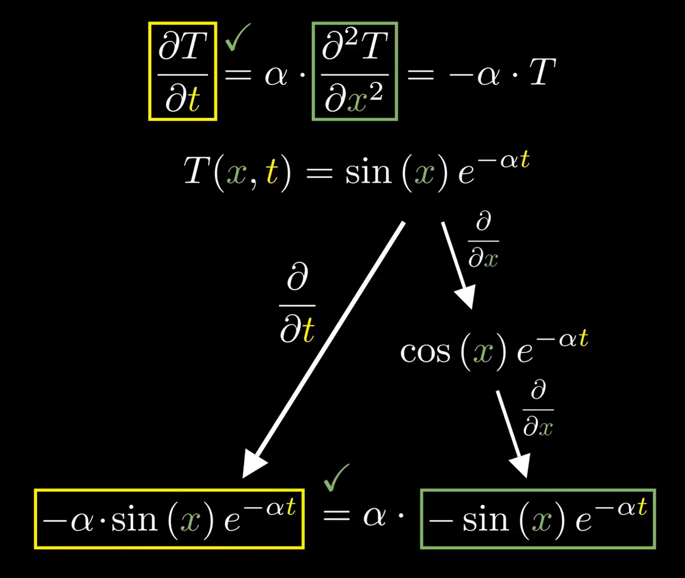

该系列为3Blue1Brown微分方程系列视频笔记，原视频可见：https://www.bilibili.com/video/av50290975或https://www.youtube.com/watch?v=p_di4Zn4wz4&list=PLZHQObOWTQDNPOjrT6KVlfJuKtYTftqH6

由于笔者水平有限，文中难免存在一些不足和错误之处，诚请各位批评指正。

# 1 引言

在[3B1B微分方程系列笔记（二）](https://www.cnblogs.com/HongxiWong/p/12450813.html)中我们介绍了通过热传导公式理解偏微分方程，这一章将继续以热传导公式为基础，介绍偏微分方程的求解，求解偏微分方程时，满足偏微分方程的解有很多，但不是所有的解都可以满足我们的要求，因此我们只有偏微分方程是远远不够的，还需要分析边界条件，最后由初始条件确定最后的解。

# 2 偏微分方程

首先，特定的正弦函数是热传导方程十分简单的解，因为正弦函数的二阶导与其本身成比例，通过对不同正弦函数的线性组合可以得到更复杂的解。傅里叶级数告诉我们，所有函数都可以表示成正弦曲线的和。这种种条件奠定了正弦函数解的优越性。事实上，正弦函数在很多地方都会很方便处理，解微分方程只是其中一个例子。

我们通过正弦函数入手解这个偏微分方程。

我们假设一个金属杆的温度符合正弦函数 $sin(x)$ ：
$$
T(x, 0)=\sin (x)
$$
通过将 $T$ 对 $x$ 求偏导和二阶偏导可得：
$$
\frac{\partial T}{\partial x}(x, 0)=\cos (x)
$$

$$
\frac{\partial^{2} T}{\partial x^{2}}(x, 0)=-\sin (x)
$$

根据一维热传导公式：
$$
\frac{\partial T}{\partial t}(x, t)=\alpha \cdot \frac{\partial^{2} T}{\partial x^{2}}(x, t)
$$
可推导得：
$$
\frac{\partial T}{\partial t}(x, 0)=\alpha \cdot \frac{\partial^{2} T}{\partial x^{2}}(x, 0)=-\alpha \cdot T(x, 0)
$$
我们不难发现一个有趣的性质：在初始状态下，每个点的温度变化速率都与这个点的温度成正比，而且比例系数处处相等。经过一小个时间段后，曲线的幅值会缩小，下一小个时间段后曲线幅值将继续缩小。经过计算我们发现，这个性质在任何时候都成立。正弦函数表示温度曲线的一大好处就是，正弦波特殊在它们会同比例缩小，也就是说，在每一个时间 $t$ 下，曲线幅值的缩小都像是 $sin(x)$ 乘某个常数。

这里我们已经将热传导公式等号的右侧大致描述了出来，也就是说关于空间关系的偏导我们已经得到了大体的思路，那现在我们需要在另外一项来描述等号左侧，即对时间关系的偏导。根据正弦函数表示温度曲线的性质我们可以知道，温度随时间变化率与温度本身成正比。当我们看到某个量的变化率与其本身成正比时，我们会首先想到指数函数：
$$
e^{kx}
$$
那我们应该怎么用指数函数来更新温度表达式（即(1)式）以反应关于时间的关系呢？对于正弦波表示的热传导公式，右边的表达式，即空间关系的偏导，会等于 $-\alpha$ 乘上温度正弦波函数本身，即(5)式。为了保证等式相等，将温度表达式对时间求偏导应该使其缩小 $-\alpha$ 倍，这样这样我们只需要在 $sin(x)$ 的基础上乘一个 $e^{-\alpha t}$ 即可，这样温度表达式就可以改为：
$$
T(x, t)=\sin (x) e^{-\alpha t}
$$
接下来我们验证一下：

可以看到，将方程 $T(x, t)=\sin (x) e^{-\alpha t}$ 对时间 $t$ 求一阶偏导和对位置 $x$ 求二阶偏导的值是完全相同的，这很符合我们的热传导公式。

但是！如果真的这么简单，就不需要边界条件什么事了！

# 3 边界条件

事实上，就算杆子上的温度恰好是这个完美的正弦曲线，温度也不会像指数那样改变，因为在刚刚的分析当中，对于杆子的两个边界点，我们假设其温度保持不变。但我们仔细思考一下，如果不存在杆子与外界的热传递，边界点的温度会在开始的一瞬间就会改变，改变到和自己紧紧相临的那个点的温度相等！也就是说在系统开始的一瞬间，边界点内测的一阶导会始终等于0。

在[3B1B微分方程系列笔记（二）](https://www.cnblogs.com/HongxiWong/p/12450813.html)中，我们提到对 $x$ 求二阶导数的直观理解是，美一点的值都会趋向于相邻两点的平均值，但在边界点上，有一边没有相邻点。那么边界点的值应该趋向于内测相邻那一点的值，变化速率与差值成正比。这也就导致了，系统开始以后，边界的斜率会一直等于0。

显然，刚才的正弦函数显然不能满足这个条件。也就是说，找一个符合热传导方程本身的函数并不够，它还必须满足在 $t>0$ 时，边界必须是水平的，用数学意义表述就是
$$
\frac{\partial T}{\partial x}(0, t)=\frac{\partial T}{\partial x}(L, t)=0
$$
其中 $L$ 为杆的长度，且 $t>0$ 。

这就是边界条件的一个例子，当我们实际要去接偏微分方程时，边界条件往往都会出现，而且和偏微分方程本身一样需要我们关注。

加上边界条件之后，我们需要对温度表达式进行进一步修改，才可以接近真实的解。这里我们只需要稍作调整，使函数在边界水平即可。这里不难想到，我们可以通过余弦函数来代替正弦函数。任意一个余弦函数都可以满足在 $x=0$ 处的一阶导为0，但不一定能满足在 $x=L$ 处一阶导也为0，因此我们需要调整余弦函数的周期，通过在 $x$ 前乘上一个系数 $\omega$ ，并且 $\omega$ 越大意味着正弦波震动的越快。但是根据链式法则，函数的二阶导前会出现一个新系数 $\omega^2$ ：
$$
\cos ({\omega} \cdot x) \stackrel{\frac{\partial}{\partial x}}{\rightarrow}-\omega \sin (\omega \cdot x) \stackrel{\frac{\partial}{\partial x}}{\rightarrow}-\omega^{2} \cos (\omega \cdot x)
$$
为了保证等式左右相等，我们需要使指数项的一阶导也乘上 $\omega^2$ ，即：
$$
T(x, t)=\cos (\omega \cdot x) e^{-\alpha \omega^2 t}
$$
刚刚提到， $\omega$ 越大意味着正弦波震动的越快，也就是说 $\omega$ 越大，正余弦波各一阶导为零点的曲率就越大，对于一个曲率更大的温度函数，它会降温的更快，并且是平方倍的加快。新的指数函数完美的印证了这一点，直觉告诉我们这个方向是正确的。

接下来我们再来约束 $\omega$ 的值，由于杆长为 $L$ ，那么满足边界条件的余弦函数的最低频率就是 $\pi /L$ ，通过$n(\pi / L)$ 代替 $\omega$ ，我们可以把温度函数写为：
$$
T(x, t)=\cos (n(\pi / L) x) e^{-\alpha(n \pi / L)^{2} t}
$$
这样，我们就得到了同时满足偏微分方程和边界条件的温度函数。

为了使笔记序号与视频序号对应，（三）就先讲到这里，求解的剩余部分将在（四）中继续展开 。