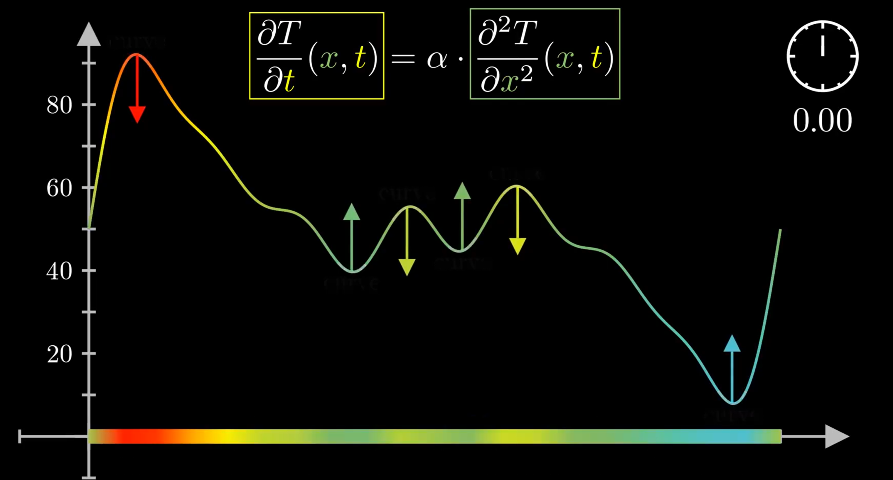
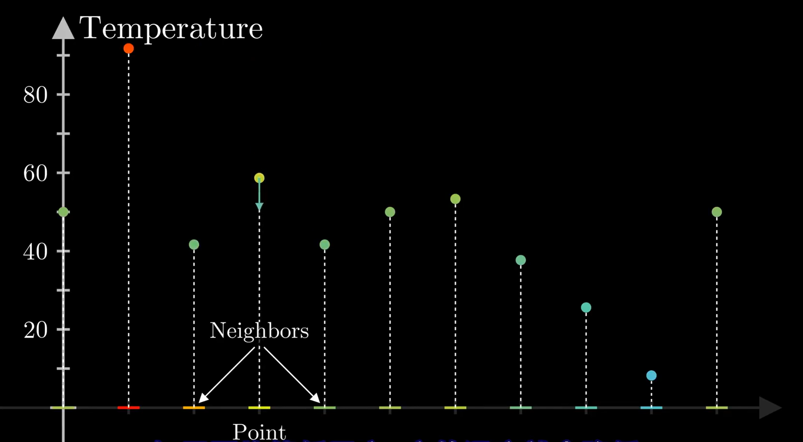

该系列为3Blue1Brown微分方程系列视频笔记，原视频可见：https://www.bilibili.com/video/av50290975或https://www.youtube.com/watch?v=p_di4Zn4wz4&list=PLZHQObOWTQDNPOjrT6KVlfJuKtYTftqH6

由于笔者水平有限，文中难免存在一些不足和错误之处，诚请各位批评指正。

# 1 引言

在[3B1B微分方程系列笔记（一）](https://www.cnblogs.com/HongxiWong/p/12444929.html)中我们介绍了通过单摆的例子结合相空间理解了常微分方程，这一章将以热传导公式为例，介绍偏微分方程

# 2 热传导公式

想象这样一个场景，我们有一块杆，并且知道在当前时刻杆上每一点的温度，需要研究每点的温度随时间的变化情况。涉及到状态随时间的变化，而变化趋势又由周围变量的值所影响，某一点两侧相邻的两个点的平均温度与这个点相差越多，这个点温度就会变化得更快，这反映到热传导方程上便是一件很直觉的事：
$$
\frac{\partial T}{\partial t}(x, t)=\alpha \cdot \frac{\partial^{2} T}{\partial x^{2}}(x, t)
$$

## 2.1 如何理解

一阶导数的大小描述的是自变量变化影响函数值变化的程度，而二阶导数描述的是刚刚的程度变化的程度。这点反映在初等函数图像上，一阶导数便是函数图像的切线斜率，导数值越大切线斜率越大，而二阶导数便是函数图像的凹凸程度，二阶导越大说明斜率（一阶导数）随自变量变化而变化的越剧烈，也就是越函数图像越凸或者越凹。

通过这样的理解，我们可以这样描述一维热传导公式：一个点的温度随时间的变化与这个点与周围温度差值的差值成正比，“与周围温度差值的差值”通俗直观一点的描述便是这个点突不突出，反映在图像上便是曲率：

通过观察图像，我们可以很直观的理解这个一维公式。但是刚刚提到的“与周围温度差值的差值”，这个拗口的概念又该如何理解，这要就从离散推广到连续来看了。

## 2.2 从离散到连续

这个公式并不难理解，但是我们如何自己推导得到这样的公式呢？有一种思路便是分析离散的情况然后进一步推广到连续。

我们关注离散以后的其中一个点，与它相邻的两个点温度的平均值如果小于这个点的温度，那这个点的温度就会降低，这个差值越大，这个点温度降低的就会越快，反之亦然。这样的规律通过数学公式表达可以得到：
$$
\frac{d T_{2}}{d t}=\alpha\left(\frac{T_{1}+T_{3}}{2}-T_{2}\right)
$$
其中$T_1$ $T_2$ $T_3$ 分别为这三个点的温度，通过对该式进行变形，可得：
$$
\frac{d T_{2}}{d t}=\frac{\alpha}{2}\left(\left(T_{3}-T_{2}\right)-\left(T_{2}-T_{1}\right)\right)
$$
到这里就出现了刚才提到的“与周围温度差值的差值”，离散模型中的差值可以推广为连续模型中的一阶导数，而差值的差值则可以推广为二阶导数，这样一来，我们就得到了热传导公式的一维形式。既然我们可以从离散推广到连续，我们也可以从一维推广到二维甚至三维：
$$
\frac{\partial T}{\partial t}(x, y,  t)=\alpha\left(\frac{\partial^{2} T}{\partial x^{2}}(x, y,  t)+\frac{\partial^{2} T}{\partial y^{2}}(x, y,  t)\right)
$$

$$
\frac{\partial T}{\partial t}(x, y, z, t)=\alpha\left(\frac{\partial^{2} T}{\partial x^{2}}(x, y, z, t)+\frac{\partial^{2} T}{\partial y^{2}}(x, y, z, t)+\frac{\partial^{2} T}{\partial z^{2}}(x, y, z, t)\right)
$$
其中，我们称这些二阶偏导的和为拉普拉斯算子：
$$
{\nabla^{2} T}={\left(\frac{\partial^{2} T}{\partial x^{2}}+\frac{\partial^{2} T}{\partial y^{2}}+\frac{\partial^{2} T}{\partial x^{2}}\right)}
$$

# 3 ODE与PDE的区别联系

经过单摆与热传导公式，我们已经对常微分方程与偏微分方程有了一定的理解，接下来我们思考一下他们其中的联系。

在三体问题中，每个星体的状态都会影响其他星体的同时也会受其他星体的影响，三个星体，一个星体有三个位置参数和三个动量参数，一共18个自由度。而在热传导问题中，每个点的温度在影响其他点温度的同时也会受其他点温度的影响，但在热传导问题中存在无穷多的点，无穷多的点也就意味着无穷多的自由度。某种意义上，常微分方程像是有限个方程的集合，而偏微分方程像是无穷多方程的集合。