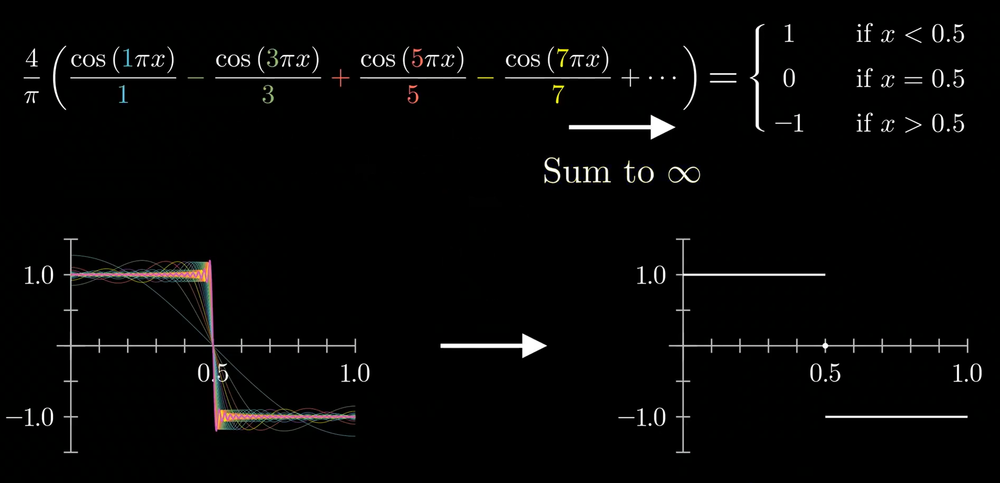
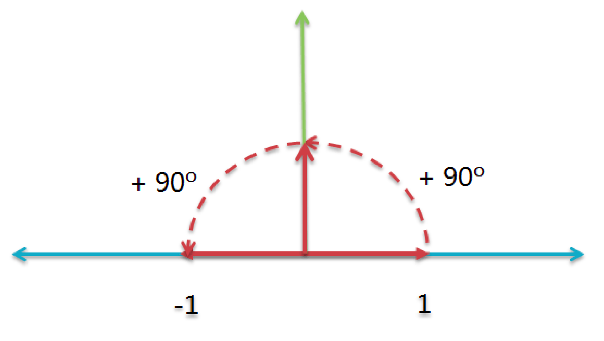
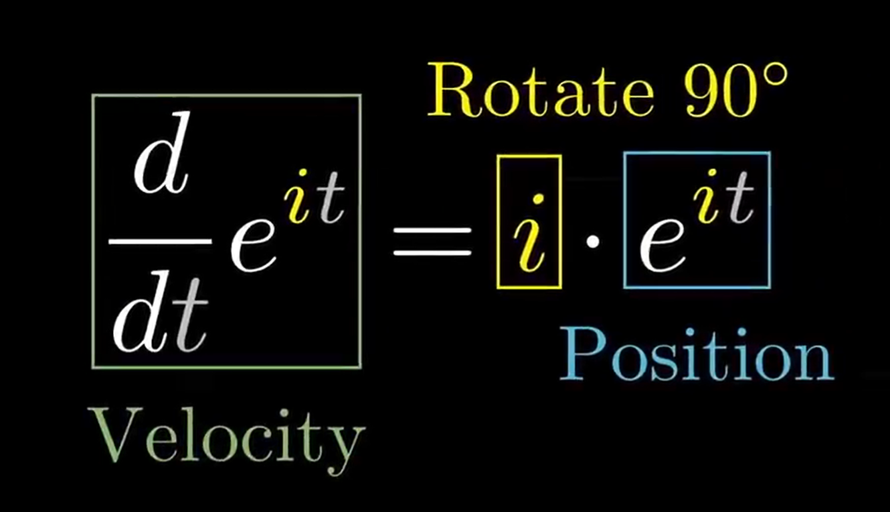

该系列为3Blue1Brown微分方程系列视频笔记，原视频可见：https://www.bilibili.com/video/av50290975或https://www.youtube.com/watch?v=p_di4Zn4wz4&list=PLZHQObOWTQDNPOjrT6KVlfJuKtYTftqH6

由于笔者水平有限，文中难免存在一些不足和错误之处，诚请各位批评指正。

# 1 引言

在[3B1B微分方程系列笔记（三）](https://www.cnblogs.com/HongxiWong/p/12452185.html)中我们介绍了求解热传导公式步骤中的两个条件，偏微分方程本身和边界条件。我们了解到余弦函数可以作为合适的解，但现实中的温度曲线往往与余弦函数相差甚远。因此我们需要将多个余弦函数通过线性组合的方式来拟合温度曲线，因为多个解的线性组合是一个新的方程的解。该篇将介绍拟合的强有力的方式——傅里叶级数。但是该篇笔记并不包含视频内全部知识点，仅包含笔者暂时理解的部分知识点，所以这里强烈建议大家从原视频学习。

# 2 理解与求解

傅里叶级数的公式长这个样：
$$
\begin{aligned}
f(t) &=\frac{a_{0}}{2}+a_{1} \cos (\omega t)+b_{1} \sin (\omega t) \\
&+a_{2} \cos (2 \omega t)+b_{2} \sin (2 \omega t) \\
&+\ldots \\
&=\frac{a_{0}}{2}+\sum_{n=1}^{\infty}\left[a_{n} \cos (n \omega t)+b_{n} \sin (n \omega t)\right]
\end{aligned}
$$
其中：
$$
\begin{aligned}
a_{n} &=\frac{2}{T} \int_{t_{0}}^{t_{0}+T} f(t) \cos (n \omega t) d t \\
b_{n} &=\frac{2}{T} \int_{t_{0}}^{t_{0}+T} f(t) \sin (n \omega t) d t
\end{aligned}
$$
实质就是：将任何周期函数或周期信号分解成一个（可能由无穷个元素组成的）简单正弦或余弦函数的集合。

我们来举一个例子：
$$
\frac{4}{\pi}\left(\frac{\cos (1 \pi x)}{1}-\frac{\cos (3 \pi x)}{3}+\frac{\cos (5 \pi x)}{5}-\frac{\cos (7 \pi x)}{7}+\cdots\right)=\left\{\begin{array}{cl}
1 & \text { if } x<0.5 \\
0 & \text { if } x=0.5 \\
-1 & \text { if } x>0.5
\end{array}\right.
$$
这个公式可以用来拟合视频中阶跃函数的例子：

那任意一个函数我们该如何拟合？关键就在求出**合适的正弦或余弦函数前的系数**。

## 2.1 引入复数

这里我们需要引入复数，即通过复数函数代替正弦或余弦函数。因为实数域函数的输入输出都在实数轴上，也就是只有一个轴，从这个角度理解，实数域函数实质上是一维的，这并不利于我们直观理解。

根据欧拉公式我们知道：
$$
e^{i x}=\cos x+i \sin x
$$
考虑到解热传导方程中我们需要余弦函数，因此我们对欧拉公式进行变形得到：
$$
2 \cos (x)=e^{i x}+e^{-i x}
$$
考虑到热传导问题研究的是关于时间的变化规律，因此我们将这里的 $x$ 替换为时间 $t$ ，而傅里叶级数的精髓就是这个复指数函数：
$$
e^{i t}
$$
这个函数意味着，它的输出值将会以每秒1单位的速率绕单位圆旋转，这一时间可能有些难以理解，在该篇笔记的最后将会解释原因，现在只需要知道这个意义即可。

经过对欧拉公式的变换，我们得到了 $cos(t)$ 与 $e^{it}$ 的关系。我们把函数拆解成一系列小向量的和，并且这些小向量都按照固定的整数频率旋转，通过这些旋转向量的叠加，我们就可以得到任意的曲线，也就是任意的函数。不过这里的旋转是用复指数函数 $e^{i t}$ 来描述的，最后我们只需要通过欧拉公式或者欧拉公式的变形将其转换成正弦或余弦函数即可。

而每个向量的旋转，我们通过这个公式来描述：
$$
C_{n} e^{n \cdot 2 \pi i t}
$$
其中 $2\pi$ 意味着逆时针的一圈，而 $2\pi it$ 前的系数决定旋转的速率，指数函数前的 $c_n$ 同时决定着箭头开始旋转的初始位置和箭头长度，如果乘上一个代表选择的复指数，例如 $e^{(\pi / 4) i}$ ，则意味着箭头从45°位置开始旋转，而如果乘上一个常数，则意味着改变箭头的长度：

通过这些复指数函数，我们的目的是去描述任意的函数（曲线），就像上文提到过的：我们需要通过这个函数本身，来一个一个找出每一项的系数：
$$
f(t)=\cdots+c_{-2} e^{-2 \cdot 2 \pi i t}+c_{-1} e^{-1 \cdot 2 \pi i t}+c_{0} e^{0 \cdot 2 \pi i t}+c_{1} e^{1 \cdot 2 \pi i t}+c_{2} e^{2 \cdot 2 \pi i t}+\cdots
$$
最简单的是找中间的常数项，这一项代表着整个曲线的重心（假设按照时间 $t$ 均匀离散后的每个点质量均相等，那这一项的确是物理意义上的重心），从数学角度理解，这个 $c_0$ 实际上就是这个曲线函数从0到1的积分：
$$
c_{0}=\int_{0}^{1} f(t) d t
$$
理解这个概念也很简单，我们将和的积分转换成积分的和，除了 $c_0$ ，每一项的积分都是0，因为在一秒内，这些箭头都以均匀的速度绕着原点旋转了一圈的整数倍。

通过这个例子，我们发现，在这无穷多项中，只有常数项的积分是不为0的。因此我们可以通过这个性质来计算任意一项，只需要在原函数的基础上乘上一个 $e^{-n\cdot 2\pi it}$ ，就可以将 $c_n$ 项变为常数项，这样一来， $c_n$ 项以外的项的积分就全为0了，而 $c_n$ 项的积分就是 $c_n$ 的值，这样一来我们就得到了计算 $c_n$ 的方法：
$$
c_{n}=\int_{0}^{1} f(t) e^{-n \cdot 2 \pi i t} d t
$$
积分的计算就可以交给计算机通过迭代求出数值解即可。

# 3 理解 $e^{i t}$

该篇笔记的最后我们来解释为什么 $e^{i t}$ 意味着输出值将会以每秒1单位的速率绕单位圆旋转。

指数函数 $e^{x}$ 的重要性质就是它的导数就是他本身。让我们从速度和位置（注意这里是位置而不是位移）的角度来理解这件事，我们将时间 $t$ 作为函数的输入，我们会发现这个函数的输出在实轴上运动的规律非常特殊：**函数输出运动的速度（导数值）与输出值位置（函数值）始终相等**。当我们在时间 $t$ 前面乘上一个实数作为系数，通过链式法则我们知道：经过求导以后这个实数会乘到这个函数本身上。这就导致了**函数输出运动的速度（导数值）与输出值位置（函数值）始终保持一个固定的倍数**。

有了这样的认识，我们把问题扩展到复平面。在时间 $t$ 前面乘上一个 $i$ 得到了我们的函数 $e^{i t}$ 。那这个函数输出运动的速度与输出值位置有什么关系呢？

我们抛弃数值上的理解，将 $*i$ 这个计算理解为一个**行为**。我们是这样定义 $i$ 的：
$$
i^2=-1
$$
这个等式看起来不够直观，我们变一下形：
$$
i*i=-1
$$
还不够直观，继续：
$$
1*i*i=-1
$$
这个时候我们再结合复平面来感受一下这个等式：

刚刚我们提到，要将 $*i$ 这个计算理解为一个**行为**，那我们通过这张图来感受一下这是一个怎样的行为：将实数1连续施加两次这个行为，1变成了-1。也就是说我们通过两次 $*i$ 这个行为，将实数1在复平面上旋转了180°，这也就意味着 $*i$ 这个行为，实际上就是是沿逆时针旋转90°，至于为什么是逆时针，因为考虑到习惯，数学家将复数轴的在复平面中的正方向定义为上，因此实数1只 $*i$ 一次会落在逆时针旋转90°位置的 $(0,i)$ 。

了解到了 $*i$ 是沿逆时针旋转90°，回到 $e^{i t}$ 这个函数：

我们发现，这个函数输出运动的速度与输出值位置始终垂直！始终与位置（在这里可以理解为位矢）垂直的速度会导致什么运动？很显然，是**圆周运动**。

$t=0$ 时， $e^{i t}=1$ ，这是我们的初始状态.上文提到过，这个公式意味着以每秒1单位的速率绕单位圆旋转，当 $t=\pi$ 时，转过过180°，即-1，当 $t=2\pi$ 时，则刚好转过一圈：

