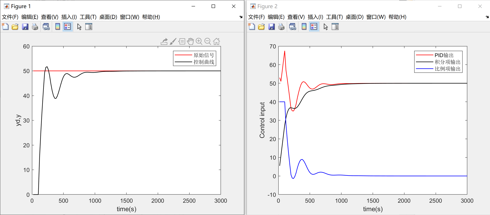
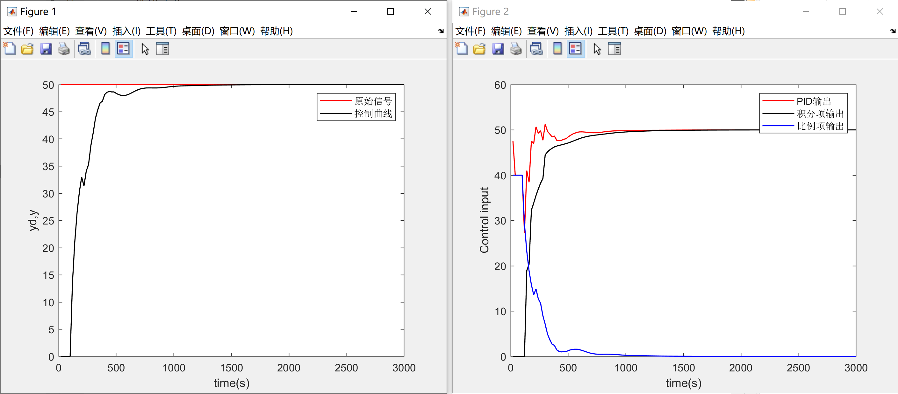
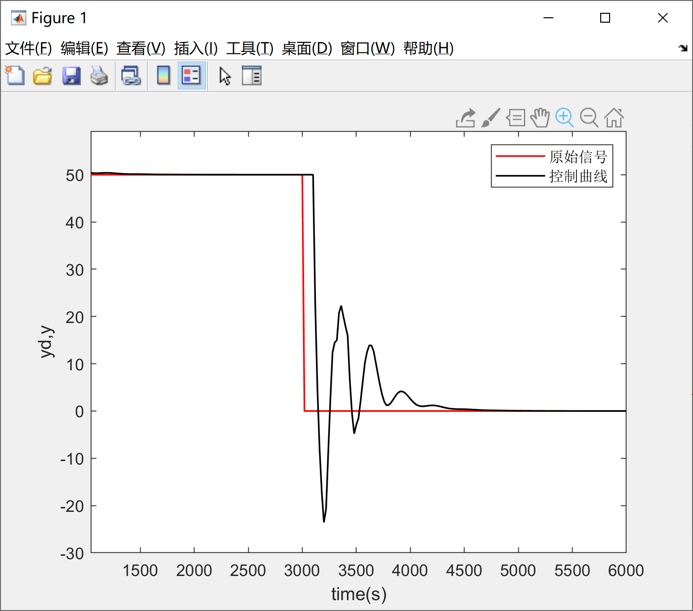

本系列旨在以我自己写的PID lib为例，讲一下PID的几点基本优化，PID的基本原理网上有很多资料，因此本系列将不会涉及PID的基本实现原理，在这里特别推荐Matlab tech talk的PID教程：https://ww2.mathworks.cn/videos/series/understanding-pid-control.html。

由于笔者大一在读，还没有学习自动控制原理等课程，因此本系列将不会从自控原理角度展开，相反的，本系列将试图**从“直觉”展开**，通过直观的描述让大家从直觉上感受并理解PID的一些包括微分先行、积分分离等基础的优化。

由于笔者水平有限，文中难免存在一些不足和错误之处，诚请各位批评指正。


# 1 积分分离

## 1.1 问题

在[我的PID库与PID基本优化（二）](https://www.cnblogs.com/HongxiWong/p/12405456.html)中提到过，在目标信号瞬间发生变化时，会导致微分项输出出现异常。这样的情况不仅会导致微分项出现问题，同样会影响积分项的稳定性。例如在系统启动或者设定值被人为大幅度改变时，由于误差瞬间增大，误差的积分会迅速累积，从而导致积分项输出过大，进而产生较大的超调，严重时甚至会引起系统振荡：



## 1.2 解决方案

在消除微分冲击问题时，我们通过将误差的微分拆解成两项，去掉其中引起冲击的一项以解决问题。但对于积分项来说，将误差的积分拆成两项并删掉目标信号的积分是不现实的，因为这样积分控制就失去了消除静态误差的能力。

因此我们需要换一种思路，既然在目标信号瞬间变化时，误差的瞬间增大导致了积分的过分积累。我们只需要在误差超过一定阈值时停止积分过程，当误差小于这个阈值，降至合理范围的时候，我们再继续积分过程，这样就避免了由于目标信号变化引起的巨大误差累积到积分项中。

从图二中可以看到，积分项是在控制过程开始一段时间后开始积累，避免了过分累积，从而减小了超调：



## 1.3 代码实现

库中并没有实现积分分离，而是选择了过渡效果更平缓的变积分策略，因此以下代码并未在库中出现

```c
static void f_Integral_Separation(PID_TypeDef *pid)
{
    //首先判断该周期内积分项是否为积累趋势
    //只有本次积分为积累趋势才会取消积分项
    //在本篇结束前会详细分析这么处理的意义
    if (pid->Err * pid->Iout > 0)
    {
        if (ABS(pid->Err) <= pid->MaxErr)
            return; //完整积分
        else
            pid->ITerm = 0;//取消积分环节
    }
}
```


# 2 变速积分

## 2.1 问题

变速积分与积分分离解决的问题相同，但在积分分离中，我们对误差只有积和不积两种对策，但0和1之间的过渡未免太突兀了，因此我们引入变速积分的概念。


## 2.2 解决方案

变速积分与积分分离解决的问题的方式大致相同，可以将变速积分理解为积分分离的一个再优化。变速积分用连续函数代替积分分离中单纯的0，1切换。

这个连续函数可以是线性的也可以是非线性的，一般我们使用一个比较简单的形式：
$$
ITerm=\left\{\begin{array}{lr}
Ki * Err & |Err| \leq B \\
Ki*Err*\frac{A-|Err|+B}{A} & B<|Err| \leq A+B \\
0 & |Err|>\operatorname{A} + B
\end{array}\right.
$$

## 2.3 代码实现

```c
static void f_Changing_Integral_Rate(PID_TypeDef *pid)
{
    if (pid->Err * pid->Iout > 0)
    {
        if (ABS(pid->Err) <= pid->ScalarB)
            return; //完整积分
        if (ABS(pid->Err) <= (pid->ScalarA + pid->ScalarB))
            //使用线性函数过渡
            pid->ITerm *= (pid->ScalarA - ABS(pid->Err) + pid->ScalarB) / pid->ScalarA;
        else
            pid->ITerm = 0;//取消积分环节
    }
}
```

# 3 最后的问题

在积分分离与变速积分的代码实现中，我都会在算法开始前判断下当前周期下积分是否为累积趋势，只有在累积趋势下才会通过一些方法抑制积分的过度积累。目的是为了避免在控制信号发生变化，导致误差瞬间反向时，由于误差过大导致积分限制算法发挥作用，这样一来积分无法迅速减小。在误差反向过程中，积分居高不下会导致PID输出持续保持较高水平，从而导致响应严重滞后。

这样的滞后在某些控制频率较低的场合下甚至会导致超调和振荡，下图为前文PID参数保持不变时将目标值归零后控制曲线的变化：



因此，需要在积分分离或变速积分在对积分项进行处理前先判断一下积分是否会累积，如果当前周期的误差会导致积分减小，则无需抑制积分减小的趋势，因为这两种算法归根结底是为了避免积分过度积累而非积分的快速变化。