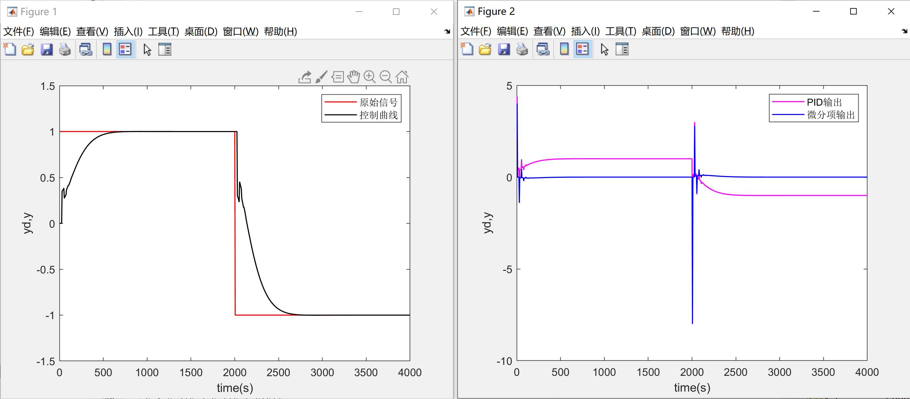
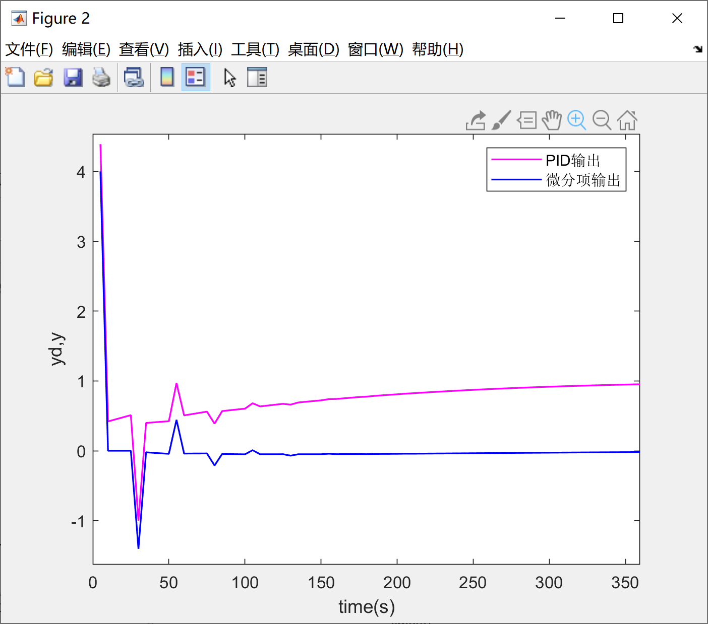
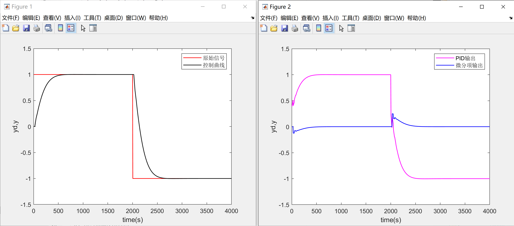

本系列旨在以我自己写的PID lib为例，讲一下PID的几点基本优化，PID的基本原理网上有很多资料，因此本系列将不会涉及PID的基本实现原理，在这里特别推荐Matlab tech talk的PID教程：https://ww2.mathworks.cn/videos/series/understanding-pid-control.html。

由于笔者大一在读，还没有学习自动控制原理等课程，因此本系列将不会从自控原理角度展开，相反的，本系列将试图**从“直觉”展开**，通过直观的描述让大家从直觉上感受并理解PID的一些包括微分先行、积分分离等基础的优化。

由于笔者水平有限，文中难免存在一些不足和错误之处，诚请各位批评指正。

[我的PID库与PID基本优化（一）](https://www.cnblogs.com/HongxiWong/p/12404424.html)中讲解了代码结构与代码使用，算法有关内容于该篇开始

# 1 梯形积分

## 1.1 问题

积分项的作用在绝大多数情况下是消除静差，为了更精准的消除静差，我们需要提高积分项的计算精度。在一般的PID算法中，我们通过矩形面积来近似计算积分，在微积分中我们了解到，当 $\Delta t$ 趋近于无穷小时，这些矩形面积的累加就会无限逼近曲线与坐标轴围成的面积。

## 1.2 解决方案

为了达到更精准的控制，我们一般可以通过提高控制频率来实现，但在某些情况下受制于控制设备算力，我们无法以很高的频率来运行我们的算法。因此我们可以用梯形代替矩形，以此获得更高的积分精度，这种方式在控制频率越低的场合提高精度的效果越好。

## 1.3 代码实现

```c
static void f_Trapezoid_Intergral(PID_TypeDef *pid)
{
    pid->ITerm = pid->Ki * ((pid->Err + pid->Last_Err) / 2);
}
```


# 2 微分先行

## 2.1 问题

在常规PID中，微分项是微分系数乘误差的微分，而误差的微分又可以化成目标信号的微分减去输入（测量值）的微分，即：
$$
Dout = Kd *\frac{d \text { Err }}{d t}=Kd*(\frac{d \text { Target }}{d t}-\frac{d \text { Input }}{d t})
$$
当目标信号瞬间发生变化时，其微分会变得非常非常大，这会导致微分项的值也在瞬间变得巨大。这样异常的积分项添加至控制算法中，会导致PID的输出出现我们不希望看到的峰值，这样的峰值可能会影响系统的稳定性，甚至对执行器或者系统其他部分造成损坏，我们称这种现象为积分冲击（Derivative Kick）。

如下图所示，微分冲击会使被控对象发生瞬间的抖动，通过观察PID输出与微分项输出，我们可以直观感受到微分冲击的威力：



将图像2放大来看，在阶跃信号刚产生时，微分项会给整个输出带来巨大的尖峰：




## 2.2 解决方案

通过公式我们可以看到，是目标信号的微分引入的异常数值，因此我们只需要扔掉目标信号的微分，只保留输入（测量值）的微分（注意不要漏掉符号）：
$$
Dout =-Kd*\frac{d \text { Input }}{d t}
$$
经过对微分项的一点点调整，我们可以看到，现在的控制曲线变得更加平滑，PID的输出也不会出现异常的峰值：




## 2.3 代码实现

```c
static void f_Derivative_On_Measurement(PID_TypeDef *pid)
{
    pid->Dout = pid->Kd * (pid->Last_Measure - pid->Measure);
}
```

