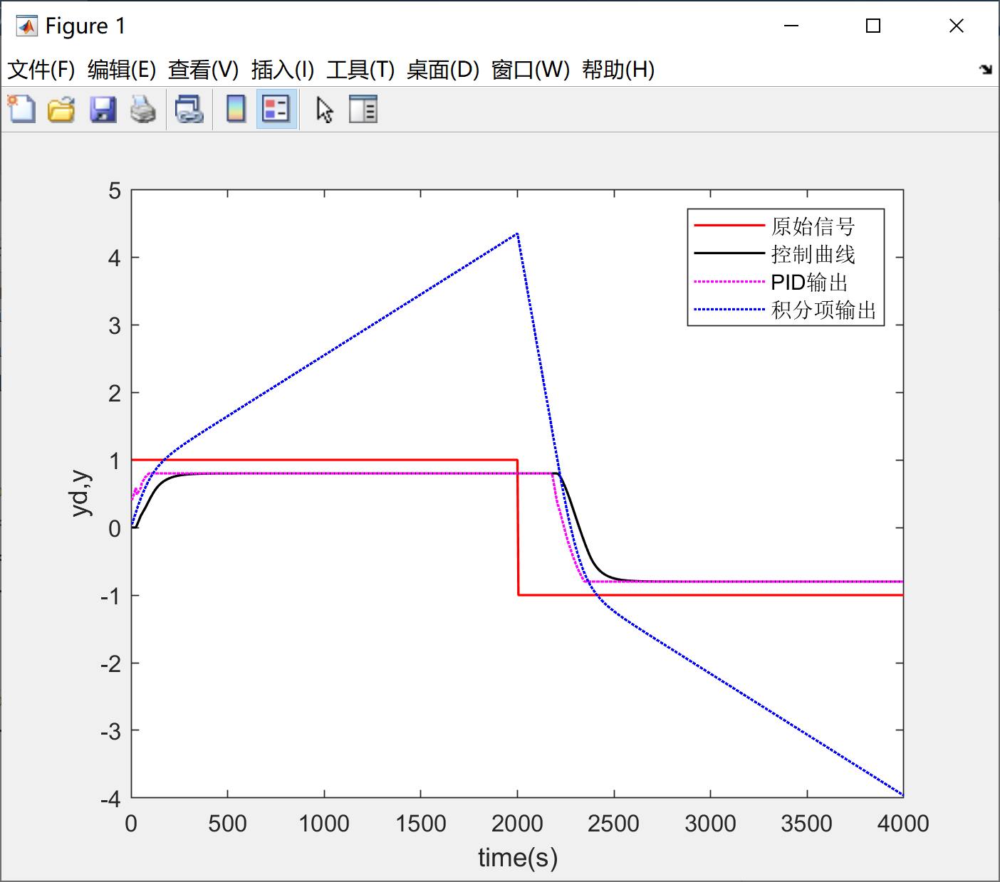

本系列旨在以我自己写的PID lib为例，讲一下PID的几点基本优化，PID的基本原理网上有很多资料，因此本系列将不会涉及PID的基本实现原理，在这里特别推荐Matlab tech talk的PID教程：https://ww2.mathworks.cn/videos/series/understanding-pid-control.html。

由于笔者大一在读，还没有学习自动控制原理等课程，因此本系列将不会从自控原理角度展开，相反的，本系列将试图**从“直觉”展开**，通过直观的描述让大家从直觉上感受并理解PID的一些包括微分先行、积分分离等基础的优化。

由于笔者水平有限，文中难免存在一些不足和错误之处，诚请各位批评指正。


# 1 积分抗饱和

## 1.1 问题

我们都知道PID只适用于线性非时变的控制场合，但执行器或者被控对象很少可以做到严格线性，在对控制效果要求较高的场合，我们只能选取工作范围中近似线性的部分。又或者单纯的限制执行器的作用量，以此来保护系统的安全，如阀门的限位、电机的限速等。无论出于以上哪一个目的，我们都需要对PID的输出量进行限制，我们一般称之为输出限幅。

但在某些情况下，输出限幅的存在或者执行器本身的限制导致了被控对象无法达到我们的期望值，这就意味着误差将会持续存在，持续存在的误差会使积分项过分积累，从而导致我们在下调期望值使误差反向时，积分项需要一段时间来下降至最大输出一下，这段过程中PID的输出将会持续保持最大，从而导致响应的严重滞后，我们将这种情况称之为积分饱和（integral windup）。图像上可以看到，积分饱和导致的响应滞后和[我的PID库与PID基本优化（三）](https://www.cnblogs.com/HongxiWong/p/12409382.html)结尾提到的情况非常相似：



## 1.2 解决方案

我们一般通过对积分限幅的方式实现积分抗饱和，为了解决积分饱和问题，我们需要先分析是什么导致了积分的过度积累，是输出限幅导致的无法消除的误差。因此一种思路便是在PID输出达到输出限幅时停止积分过程。考虑到过大的积分项会导致系统的超调和不稳定，因此我们也可以设定一个合适的积分阈值，来通过这个阈值对积分进行限幅。这两种方式相互独立互不影响，因此我们可以在积分抗饱和中同时采用以上两种策略。

经过积分抗饱和处理后，我们可以看到系统响应的滞后已经被大幅改善：


## 1.3 代码实现

```c
static void f_Integral_Limit(PID_TypeDef *pid)
{
    float temp_Output, temp_Iout;
    temp_Iout = pid->Iout + pid->ITerm;
    temp_Output = pid->Pout + pid->Iout + pid->Dout;
    if (ABS(temp_Output) > pid->MaxOut)
    {
        if (pid->Err * pid->Iout > 0)
        {
			//在取消积分作用前，同样需要先判断当前周期内积分是否积累
            //如果积分为减小趋势则不需要限制其减小
            //原因与（三）中相同。
            pid->ITerm = 0;
        }
    }
    
    if (temp_Iout > pid->IntegralLimit)
    {
        pid->ITerm = 0;
        pid->Iout = pid->IntegralLimit;
    }
    if (temp_Iout < -pid->IntegralLimit)
    {
        pid->ITerm = 0;
        pid->Iout = -pid->IntegralLimit;
    }
}
```

本系列关于PID基本优化策略不出意外的话就到此结束了，在系列结束的前最后我再扯一下我的电机堵转保护的实现，库中剩余部分不再单独讲解了，全部代码已经发布在Github中，链接在[我的PID库与PID基本优化（一）](https://www.cnblogs.com/HongxiWong/p/12404424.html)

# 2 电机堵转保护

## 1.1 思路分析

电机堵转保护实现的关键和前提就在准确判断电机是否堵转，识别太严苛或者太宽松都会严重影响实际应用，因此我们需要尽可能的提高识别的准确性，而提高识别准确性的关键又在准确提取电机堵转发生的典型特征。

电机堵转发生时，电机转速会非常小或者直接为零，同时电机温度会上升，考虑到大多数电机内没有集成温度传感器，我并没有选择应用温度上升这一特征。这样就只能从转速极小这一特征入手：

最简单的方式是判断转速是否小于一个阈值，但是用脚趾头想一想就知道这个思路不可行，因为电机本身目标速度为零的时候就会被误判为堵转，这是我们不希望看到的。那既然上一个思路在目标速度为零的时候会发生误判，那我们就可以将目标速度纳入判断。

思路进行到这里，我们不难想到，如果电机的实际转速与目标转速相差很远，这就是电机堵转的一个重要特征。但在电机起转时，电机实际转速与目标转速相差很远，这显然不是堵转。因此只有这样的状态持续一段时间，一段远比电机起转所需时间要长的时间，这样我们我们离精准判断只差最后一步，在PID输出本身就不大的时候，电机因为正常的负载导致无法旋转，这显然也没有必要当作堵转处理，因此我们还需要将这种情况挑出来。不过这种情况不常出现，因为即使电机的目标转速很小，PID算法中的积分项也会使电机保持目标转速。

下面我们直接上代码：

## 2.2 代码实现

```c
static void f_PID_ErrorHandle(PID_TypeDef *pid)
{
    //排除PID输出本身很小的情况
    if (pid->Output < pid->MaxOut * 0.01)
        return;
	
    //考虑到该判断策略的灵活性，0.9这个常数的选取是很灵活的
    if ((ABS(pid->Target - pid->Measure) / pid->Target) > 0.9f)
    {
        //电机堵转计数
        pid->ERRORHandler.ERRORCount++;
    }
    else
    {
        pid->ERRORHandler.ERRORCount = 0;
    }

    if (pid->ERRORHandler.ERRORCount > 1000)
    {
        //上述现象持续一段时间则被认定为电机堵转
        pid->ERRORHandler.ERRORType = Motor_Blocked;
    }
}
```

