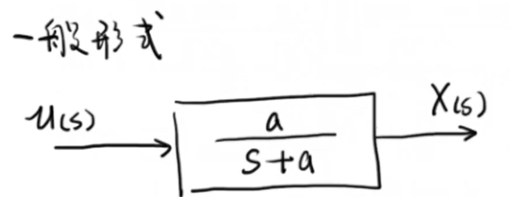
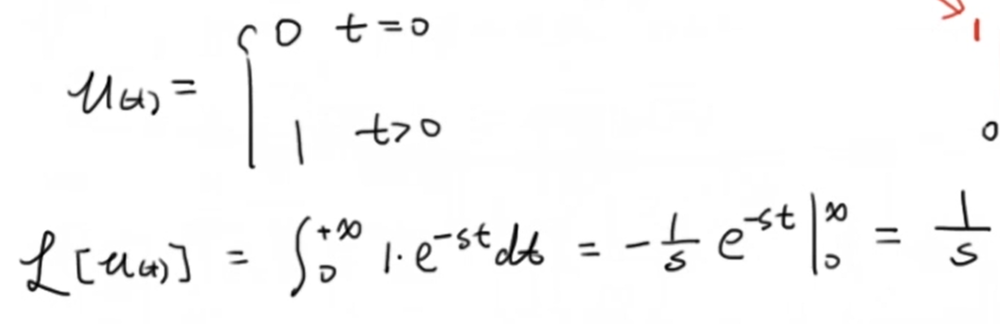
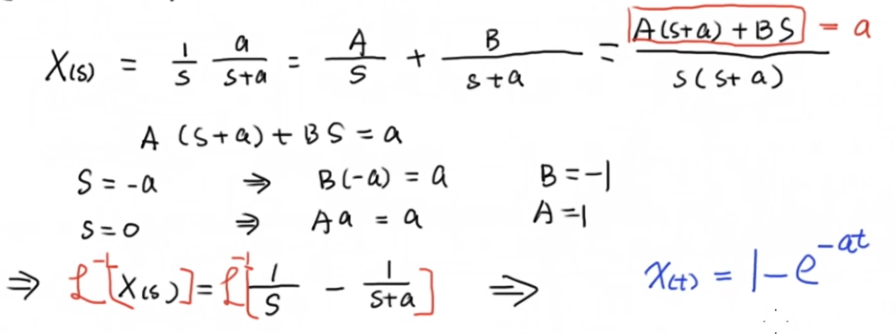
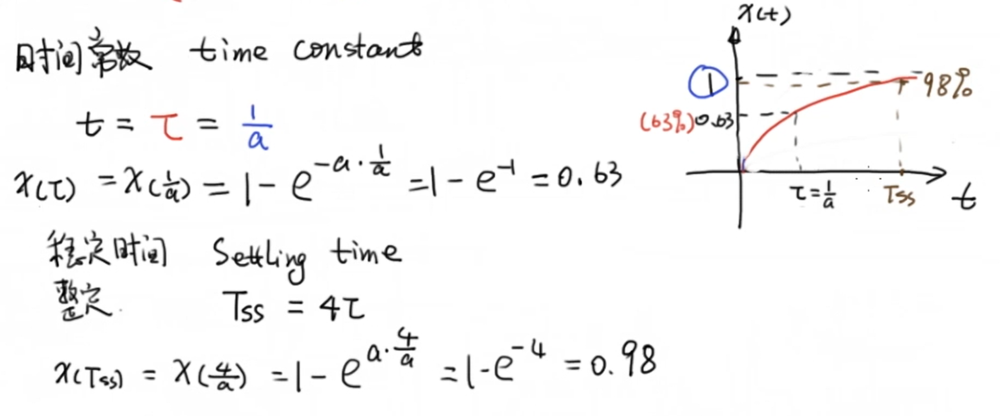
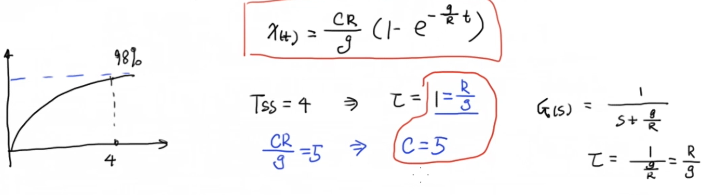
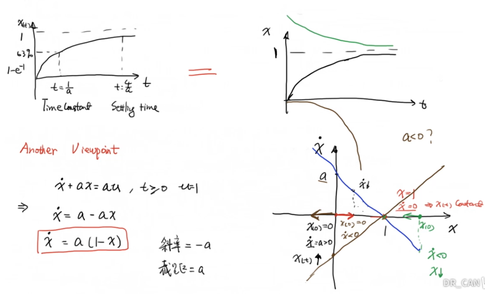

# 1 一阶系统的一般形式

# 2 单位阶跃

# 3 阶跃响应

将单位阶跃函数的 $s$ 域表示与一阶系统的传递函数相乘，我们可以得到这个系统的输出，再对其进行拉普拉斯逆变换，即可得到系统输出在时域中的表现：

# 4 时间常数

**时间常数**（英语：**Time constant**）是一个描述一阶线性时不变系统中对随时间变化的输入信号的响应能力的参数，由上升沿时间确定，通常用 $\tau$ 表示，在形式为 $a/(s+a)$ 的一阶系统中，$\tau = 1/a$ ，当 $t = \tau$ 时，系统的输出约等于收敛值的0.63倍。

类似的，稳定时间，也叫整定时间 $T_{ss} = 4\tau$ 。也就是四倍的时间常数，当 $t = T_{ss}$ 时，系统的输出约等于收敛值的0.98倍：

# 5 系统识别

时间常数是一阶线性时不变系统的一个主要的特征参数，因此我们可以通过时间常数来进行系统识别。

以上一节的流体模型为例，我们通过一个管子像水槽中注水，并且注水的速度是恒定的 $C = 5$ ，通过记录水位高度的变化曲线，我们可以得到系统的稳定时间，从而得到系统的时间常数。

假设系统稳定时间为4s，即系统输出等于0.98倍的 $C$ 时 $t=4$，那这个系统的时间常数就为1。我们又可以根据$\tau = 1/a$ ，即 $\tau = R/g$ ，计算出 $R$ 的值。这样一来我们就得到了这个系统的传递函数：

# 6 换一种思路

左上角的图是通过传递函数来分析得到的这个一阶系统的阶跃响应。另外的，我们可以抛开传递函数，通过相空间来分析这个系统的响应，关于相空间可以参考笔者之前的博客[3B1B微分方程系列笔记（一）](https://www.cnblogs.com/HongxiWong/p/12444929.html)。

首先我们写出描述这个系统阶跃响应的微分方程，这个微分方程可以通过拉普拉斯逆变换得到，即图片左下部分的公式，我们可以以 $x$ 和 $\dot{x}$ 为坐标轴画出图形，其中蓝色和褐色部分分别表示 $a$ 为不同极性时的情况。而黑色和绿色部分分别代表 $a>0$ 时初始位置不同的情况。

