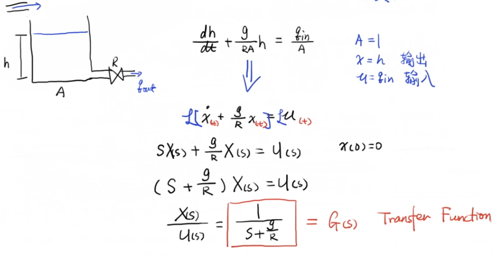
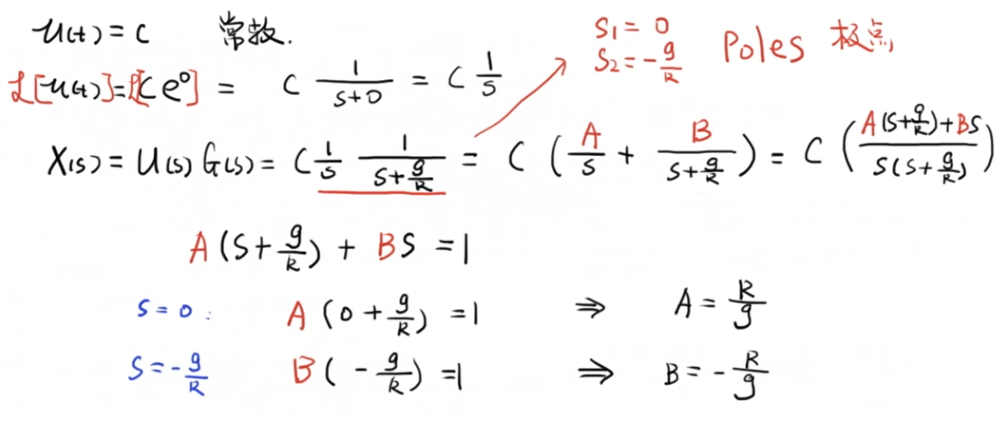
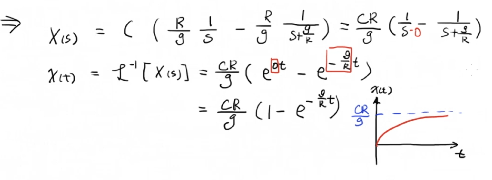

# 1 传递函数

一个流体模型的例子，以水的流入作为输入，以水箱的高度作为输出，通过对该模型的微分方程进行拉普拉斯变换，我们可以得到 $(s+g/R)X(s)=U(s)$ 这样的方程，经过移项我们可以得到系统输出与输入的比值，而这个比值的表达式就是这个系统的传递函数

# 2 极点

我们现在给这个系统一个恒定的输入，也就是一个常数 $c$。对这个输入做拉普拉斯变换可以得到其在 $s$ 域下的表现形式：$U(s) = c/S$。通过将系统输入与传递函数相乘，我们可以求出系统在当前输入下的输出表现。

然后我们对其进行拉普拉斯逆变换，就可以得到系统输出的时域函数。通过分析这个时域函数和它的图像，我们可以看到在恒定输入下这个系统是稳定的，系统输出最终会收敛到 $cR/g$ ：

这是一个典型的一阶系统的响应，而这个系统的关键点，就在指数部分。可以看到这有 $0t$ 和 $-g/Rt$ 两个指数。其中 0 意味着这个系统不会变，是稳定的，而 $-g/R$ 意味着它会随着时间不断衰减。所以说这个系统是稳定的，不会随着时间增长到无穷。

这两个系数不仅出现在了系统输出的时域函数中，同样也出现在了其 $s$ 域表达式中。这两个值，便是使传递函数分母为 0 的值，这就是所谓的极点。

# 3 总结

经过上面的例子，我们就可以理解经典控制理论的一个基本理念了。就是**通过设计不同的系统输入，来配置这个系统的极点，让这个极点达到一个我们期望的值，从而达到控制系统输出的目的**。