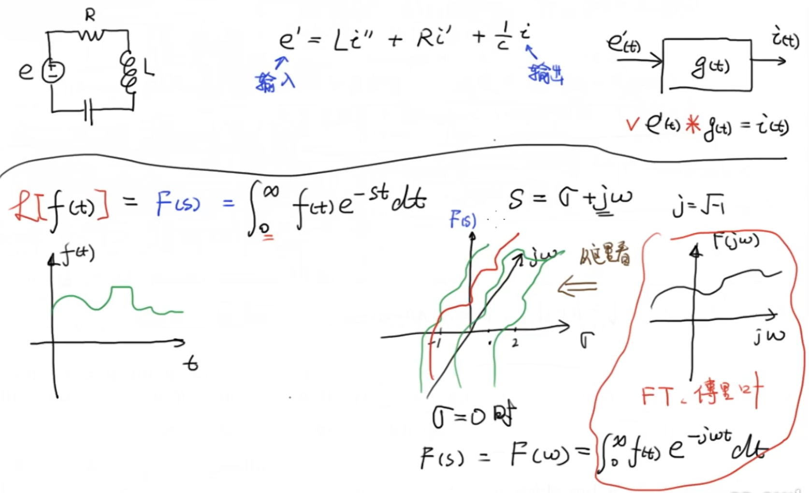
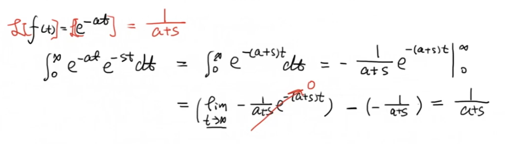
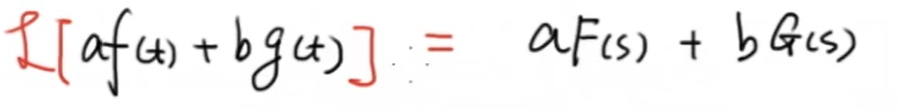
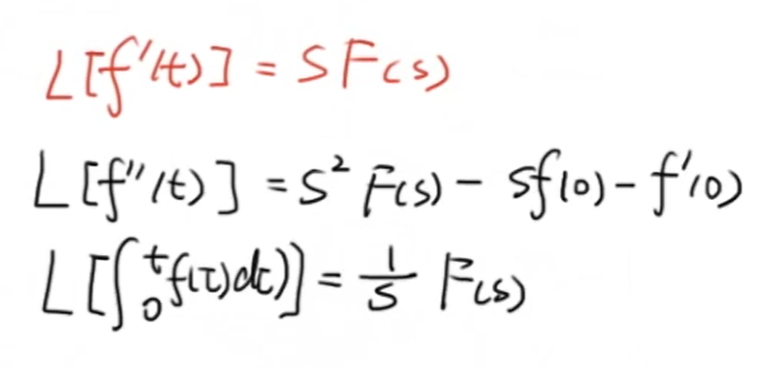
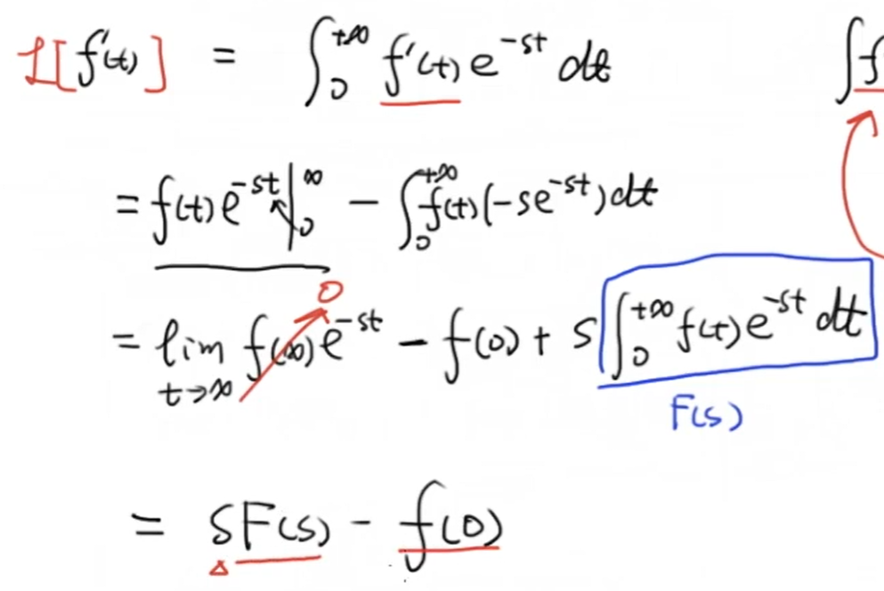
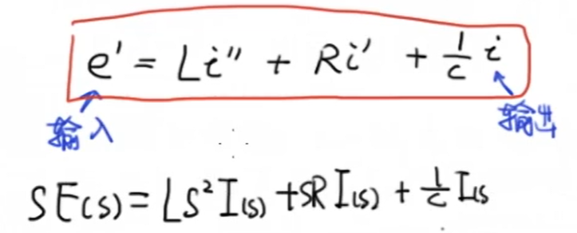
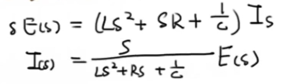
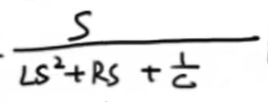

# 1 定义

**拉普拉斯变换**（英语：Laplace transform）是[应用数学](https://zh.wikipedia.org/wiki/应用数学)中常用的一种[积分变换](https://zh.wikipedia.org/wiki/积分变换)，又名**拉氏转换**，其符号为 $\mathcal{L}\{f(t)\}$ 。拉氏变换是一个[线性变换](https://zh.wikipedia.org/wiki/线性变换)，可将一个有实数变量 $t (t>0)$ 的函数转换为一个变量为复数的 $s$ 函数：
$$
F(s)=\int_{0}^{\infty} f(t) e^{-s t} \mathrm{d} t\\其中：s=\sigma+i \omega \quad \sigma和 \omega为实数
$$

# 2 电路的例子

分析这个电路系统的输入（电压）与输出（电流）的关系，实际上就需要我们对这个微分方程进行求解。如果我们用一个系统框图来表示，这个变化过程 $g(t)$ 就包含着这个系统的特征，也就是微分方程所包含的内容。通过对 $e'(t)$ 与 $g( t )$ 进行卷积运算可以得到 $i(t)$ 。但这样分析和计算都相对复杂，这时我们就需要借助拉普拉斯变换，将微分方程转换成代数方程、卷积运算转换为乘法运算。

对时域函数 $f(t)$ 做拉普拉斯变换的公式如下图中表示，这将二维平面上的曲线变换为了三维复空间中的曲面。当我们沿观察 $\sigma$ 轴观察 $F(s)Oj\omega$ 平面，即 $\sigma = 0$ 时，图像就变成了在虚轴上的一条曲线，而拉普拉斯变换就变成了另一个我们熟悉形式，也就是傅里叶变换。

而当我们沿着 $F(s)$ 轴观察 $\sigma O j\omega$ 平面时，我们往往会关注图像也就是这个系统的极点与零点，进而对系统进行分析。

#  3 指数函数的例子

# 4 性质

- 线性：

- 积分与导数的拉普拉斯变换：

其中，导数的拉普拉斯变换推导如下：

一般情况下我们将系统的初始条件设置为0，因此 $f(0) = 0$ 即可忽略。

# 5 回到电路的例子

通过拉普拉斯变换，我们可以对刚刚电路系统的微分方程进行变换：

经过整理可得：

这样一来，我们就把一个微分方程转换成了一个仅含有加减乘除的代数方程。

其中：

就是所谓的系统传递函数。

