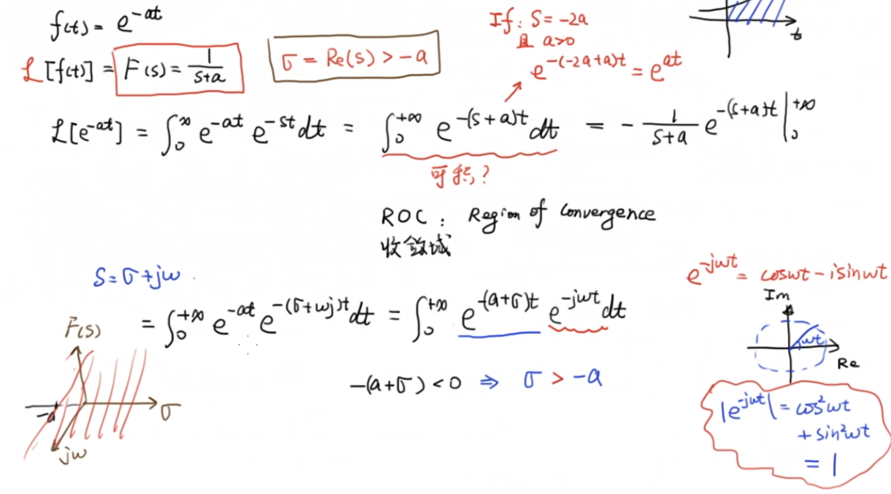
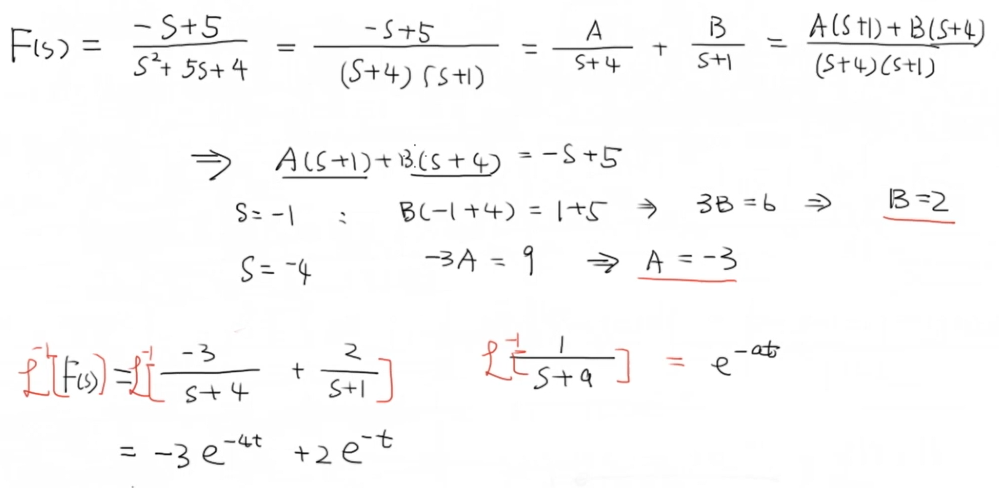
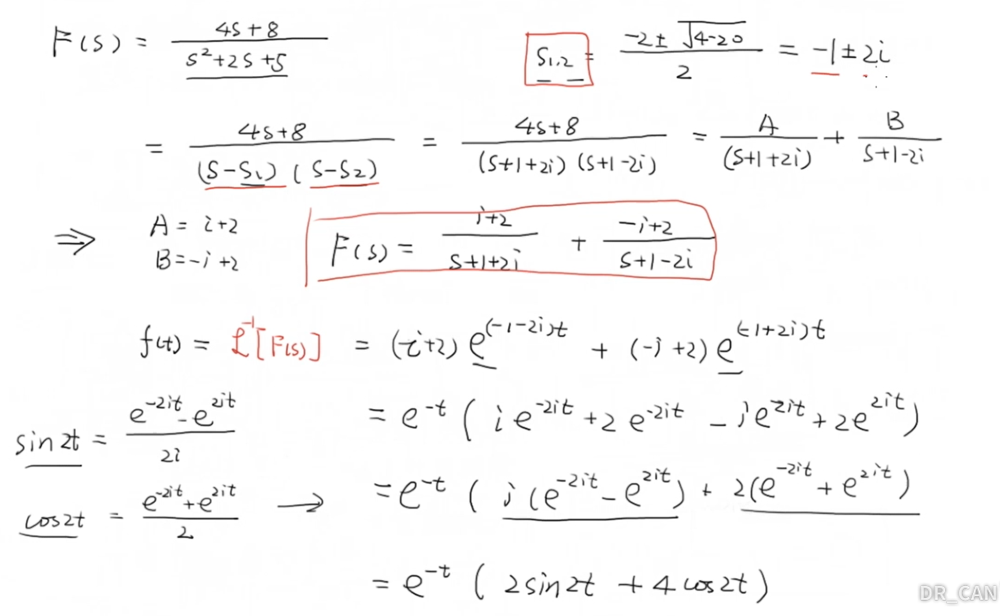

# 1 拉普拉斯变换收敛域

在一般的工程应用中，拉普拉斯变换的积分上下限分别为正无穷和零，因此被积函数在 $t$ 趋近于正无穷时的收敛情况会引出这样一个问题——是否可积？

这里以 $f(t)=e^{-at}$ 为例，介绍了拉普拉斯变换的收敛域，也就是当 $s$ 中的 $\sigma$ 在一定范围内被积函数是可积的，这个范围我们就称其为拉普拉斯变换的收敛域。显示在图像上，就是 $\sigma>-a$ 的部分：

## 2 拉普拉斯逆变换

一个简单的例子：

一个略微复杂的例子：

