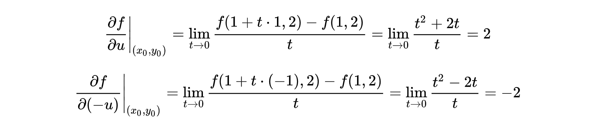

# 1 多元函数微分

## 1.1 全微分

如果函数%3C%2Ftitle%3E%0A%3Cdefs%20aria-hidden%3D%22true%22%3E%0A%3Cpath%20stroke-width%3D%221%22%20id%3D%22E1-MJMATHI-7A%22%20d%3D%22M347%20338Q337%20338%20294%20349T231%20360Q211%20360%20197%20356T174%20346T162%20335T155%20324L153%20320Q150%20317%20138%20317Q117%20317%20117%20325Q117%20330%20120%20339Q133%20378%20163%20406T229%20440Q241%20442%20246%20442Q271%20442%20291%20425T329%20392T367%20375Q389%20375%20411%20408T434%20441Q435%20442%20449%20442H462Q468%20436%20468%20434Q468%20430%20463%20420T449%20399T432%20377T418%20358L411%20349Q368%20298%20275%20214T160%20106L148%2094L163%2093Q185%2093%20227%2082T290%2071Q328%2071%20360%2090T402%20140Q406%20149%20409%20151T424%20153Q443%20153%20443%20143Q443%20138%20442%20134Q425%2072%20376%2031T278%20-11Q252%20-11%20232%206T193%2040T155%2057Q111%2057%2076%20-3Q70%20-11%2059%20-11H54H41Q35%20-5%2035%20-2Q35%2013%2093%2084Q132%20129%20225%20214T340%20322Q352%20338%20347%20338Z%22%3E%3C%2Fpath%3E%0A%3Cpath%20stroke-width%3D%221%22%20id%3D%22E1-MJMAIN-3D%22%20d%3D%22M56%20347Q56%20360%2070%20367H707Q722%20359%20722%20347Q722%20336%20708%20328L390%20327H72Q56%20332%2056%20347ZM56%20153Q56%20168%2072%20173H708Q722%20163%20722%20153Q722%20140%20707%20133H70Q56%20140%2056%20153Z%22%3E%3C%2Fpath%3E%0A%3Cpath%20stroke-width%3D%221%22%20id%3D%22E1-MJMATHI-66%22%20d%3D%22M118%20-162Q120%20-162%20124%20-164T135%20-167T147%20-168Q160%20-168%20171%20-155T187%20-126Q197%20-99%20221%2027T267%20267T289%20382V385H242Q195%20385%20192%20387Q188%20390%20188%20397L195%20425Q197%20430%20203%20430T250%20431Q298%20431%20298%20432Q298%20434%20307%20482T319%20540Q356%20705%20465%20705Q502%20703%20526%20683T550%20630Q550%20594%20529%20578T487%20561Q443%20561%20443%20603Q443%20622%20454%20636T478%20657L487%20662Q471%20668%20457%20668Q445%20668%20434%20658T419%20630Q412%20601%20403%20552T387%20469T380%20433Q380%20431%20435%20431Q480%20431%20487%20430T498%20424Q499%20420%20496%20407T491%20391Q489%20386%20482%20386T428%20385H372L349%20263Q301%2015%20282%20-47Q255%20-132%20212%20-173Q175%20-205%20139%20-205Q107%20-205%2081%20-186T55%20-132Q55%20-95%2076%20-78T118%20-61Q162%20-61%20162%20-103Q162%20-122%20151%20-136T127%20-157L118%20-162Z%22%3E%3C%2Fpath%3E%0A%3Cpath%20stroke-width%3D%221%22%20id%3D%22E1-MJMAIN-28%22%20d%3D%22M94%20250Q94%20319%20104%20381T127%20488T164%20576T202%20643T244%20695T277%20729T302%20750H315H319Q333%20750%20333%20741Q333%20738%20316%20720T275%20667T226%20581T184%20443T167%20250T184%2058T225%20-81T274%20-167T316%20-220T333%20-241Q333%20-250%20318%20-250H315H302L274%20-226Q180%20-141%20137%20-14T94%20250Z%22%3E%3C%2Fpath%3E%0A%3Cpath%20stroke-width%3D%221%22%20id%3D%22E1-MJMATHI-78%22%20d%3D%22M52%20289Q59%20331%20106%20386T222%20442Q257%20442%20286%20424T329%20379Q371%20442%20430%20442Q467%20442%20494%20420T522%20361Q522%20332%20508%20314T481%20292T458%20288Q439%20288%20427%20299T415%20328Q415%20374%20465%20391Q454%20404%20425%20404Q412%20404%20406%20402Q368%20386%20350%20336Q290%20115%20290%2078Q290%2050%20306%2038T341%2026Q378%2026%20414%2059T463%20140Q466%20150%20469%20151T485%20153H489Q504%20153%20504%20145Q504%20144%20502%20134Q486%2077%20440%2033T333%20-11Q263%20-11%20227%2052Q186%20-10%20133%20-10H127Q78%20-10%2057%2016T35%2071Q35%20103%2054%20123T99%20143Q142%20143%20142%20101Q142%2081%20130%2066T107%2046T94%2041L91%2040Q91%2039%2097%2036T113%2029T132%2026Q168%2026%20194%2071Q203%2087%20217%20139T245%20247T261%20313Q266%20340%20266%20352Q266%20380%20251%20392T217%20404Q177%20404%20142%20372T93%20290Q91%20281%2088%20280T72%20278H58Q52%20284%2052%20289Z%22%3E%3C%2Fpath%3E%0A%3Cpath%20stroke-width%3D%221%22%20id%3D%22E1-MJMAIN-2C%22%20d%3D%22M78%2035T78%2060T94%20103T137%20121Q165%20121%20187%2096T210%208Q210%20-27%20201%20-60T180%20-117T154%20-158T130%20-185T117%20-194Q113%20-194%20104%20-185T95%20-172Q95%20-168%20106%20-156T131%20-126T157%20-76T173%20-3V9L172%208Q170%207%20167%206T161%203T152%201T140%200Q113%200%2096%2017Z%22%3E%3C%2Fpath%3E%0A%3Cpath%20stroke-width%3D%221%22%20id%3D%22E1-MJMATHI-79%22%20d%3D%22M21%20287Q21%20301%2036%20335T84%20406T158%20442Q199%20442%20224%20419T250%20355Q248%20336%20247%20334Q247%20331%20231%20288T198%20191T182%20105Q182%2062%20196%2045T238%2027Q261%2027%20281%2038T312%2061T339%2094Q339%2095%20344%20114T358%20173T377%20247Q415%20397%20419%20404Q432%20431%20462%20431Q475%20431%20483%20424T494%20412T496%20403Q496%20390%20447%20193T391%20-23Q363%20-106%20294%20-155T156%20-205Q111%20-205%2077%20-183T43%20-117Q43%20-95%2050%20-80T69%20-58T89%20-48T106%20-45Q150%20-45%20150%20-87Q150%20-107%20138%20-122T115%20-142T102%20-147L99%20-148Q101%20-153%20118%20-160T152%20-167H160Q177%20-167%20186%20-165Q219%20-156%20247%20-127T290%20-65T313%20-9T321%2021L315%2017Q309%2013%20296%206T270%20-6Q250%20-11%20231%20-11Q185%20-11%20150%2011T104%2082Q103%2089%20103%20113Q103%20170%20138%20262T173%20379Q173%20380%20173%20381Q173%20390%20173%20393T169%20400T158%20404H154Q131%20404%20112%20385T82%20344T65%20302T57%20280Q55%20278%2041%20278H27Q21%20284%2021%20287Z%22%3E%3C%2Fpath%3E%0A%3Cpath%20stroke-width%3D%221%22%20id%3D%22E1-MJMAIN-29%22%20d%3D%22M60%20749L64%20750Q69%20750%2074%20750H86L114%20726Q208%20641%20251%20514T294%20250Q294%20182%20284%20119T261%2012T224%20-76T186%20-143T145%20-194T113%20-227T90%20-246Q87%20-249%2086%20-250H74Q66%20-250%2063%20-250T58%20-247T55%20-238Q56%20-237%2066%20-225Q221%20-64%20221%20250T66%20725Q56%20737%2055%20738Q55%20746%2060%20749Z%22%3E%3C%2Fpath%3E%0A%3C%2Fdefs%3E%0A%3Cg%20stroke%3D%22currentColor%22%20fill%3D%22currentColor%22%20stroke-width%3D%220%22%20transform%3D%22matrix(1%200%200%20-1%200%200)%22%20aria-hidden%3D%22true%22%3E%0A%20%3Cuse%20xlink%3Ahref%3D%22%23E1-MJMATHI-7A%22%20x%3D%220%22%20y%3D%220%22%3E%3C%2Fuse%3E%0A%20%3Cuse%20xlink%3Ahref%3D%22%23E1-MJMAIN-3D%22%20x%3D%22746%22%20y%3D%220%22%3E%3C%2Fuse%3E%0A%20%3Cuse%20xlink%3Ahref%3D%22%23E1-MJMATHI-66%22%20x%3D%221802%22%20y%3D%220%22%3E%3C%2Fuse%3E%0A%20%3Cuse%20xlink%3Ahref%3D%22%23E1-MJMAIN-28%22%20x%3D%222353%22%20y%3D%220%22%3E%3C%2Fuse%3E%0A%20%3Cuse%20xlink%3Ahref%3D%22%23E1-MJMATHI-78%22%20x%3D%222742%22%20y%3D%220%22%3E%3C%2Fuse%3E%0A%20%3Cuse%20xlink%3Ahref%3D%22%23E1-MJMAIN-2C%22%20x%3D%223315%22%20y%3D%220%22%3E%3C%2Fuse%3E%0A%20%3Cuse%20xlink%3Ahref%3D%22%23E1-MJMATHI-79%22%20x%3D%223760%22%20y%3D%220%22%3E%3C%2Fuse%3E%0A%20%3Cuse%20xlink%3Ahref%3D%22%23E1-MJMAIN-29%22%20x%3D%224257%22%20y%3D%220%22%3E%3C%2Fuse%3E%0A%3C%2Fg%3E%0A%3C%2Fsvg%3E)在点%3C%2Ftitle%3E%0A%3Cdefs%20aria-hidden%3D%22true%22%3E%0A%3Cpath%20stroke-width%3D%221%22%20id%3D%22E1-MJMAIN-28%22%20d%3D%22M94%20250Q94%20319%20104%20381T127%20488T164%20576T202%20643T244%20695T277%20729T302%20750H315H319Q333%20750%20333%20741Q333%20738%20316%20720T275%20667T226%20581T184%20443T167%20250T184%2058T225%20-81T274%20-167T316%20-220T333%20-241Q333%20-250%20318%20-250H315H302L274%20-226Q180%20-141%20137%20-14T94%20250Z%22%3E%3C%2Fpath%3E%0A%3Cpath%20stroke-width%3D%221%22%20id%3D%22E1-MJMATHI-78%22%20d%3D%22M52%20289Q59%20331%20106%20386T222%20442Q257%20442%20286%20424T329%20379Q371%20442%20430%20442Q467%20442%20494%20420T522%20361Q522%20332%20508%20314T481%20292T458%20288Q439%20288%20427%20299T415%20328Q415%20374%20465%20391Q454%20404%20425%20404Q412%20404%20406%20402Q368%20386%20350%20336Q290%20115%20290%2078Q290%2050%20306%2038T341%2026Q378%2026%20414%2059T463%20140Q466%20150%20469%20151T485%20153H489Q504%20153%20504%20145Q504%20144%20502%20134Q486%2077%20440%2033T333%20-11Q263%20-11%20227%2052Q186%20-10%20133%20-10H127Q78%20-10%2057%2016T35%2071Q35%20103%2054%20123T99%20143Q142%20143%20142%20101Q142%2081%20130%2066T107%2046T94%2041L91%2040Q91%2039%2097%2036T113%2029T132%2026Q168%2026%20194%2071Q203%2087%20217%20139T245%20247T261%20313Q266%20340%20266%20352Q266%20380%20251%20392T217%20404Q177%20404%20142%20372T93%20290Q91%20281%2088%20280T72%20278H58Q52%20284%2052%20289Z%22%3E%3C%2Fpath%3E%0A%3Cpath%20stroke-width%3D%221%22%20id%3D%22E1-MJMAIN-30%22%20d%3D%22M96%20585Q152%20666%20249%20666Q297%20666%20345%20640T423%20548Q460%20465%20460%20320Q460%20165%20417%2083Q397%2041%20362%2016T301%20-15T250%20-22Q224%20-22%20198%20-16T137%2016T82%2083Q39%20165%2039%20320Q39%20494%2096%20585ZM321%20597Q291%20629%20250%20629Q208%20629%20178%20597Q153%20571%20145%20525T137%20333Q137%20175%20145%20125T181%2046Q209%2016%20250%2016Q290%2016%20318%2046Q347%2076%20354%20130T362%20333Q362%20478%20354%20524T321%20597Z%22%3E%3C%2Fpath%3E%0A%3Cpath%20stroke-width%3D%221%22%20id%3D%22E1-MJMAIN-2C%22%20d%3D%22M78%2035T78%2060T94%20103T137%20121Q165%20121%20187%2096T210%208Q210%20-27%20201%20-60T180%20-117T154%20-158T130%20-185T117%20-194Q113%20-194%20104%20-185T95%20-172Q95%20-168%20106%20-156T131%20-126T157%20-76T173%20-3V9L172%208Q170%207%20167%206T161%203T152%201T140%200Q113%200%2096%2017Z%22%3E%3C%2Fpath%3E%0A%3Cpath%20stroke-width%3D%221%22%20id%3D%22E1-MJMATHI-79%22%20d%3D%22M21%20287Q21%20301%2036%20335T84%20406T158%20442Q199%20442%20224%20419T250%20355Q248%20336%20247%20334Q247%20331%20231%20288T198%20191T182%20105Q182%2062%20196%2045T238%2027Q261%2027%20281%2038T312%2061T339%2094Q339%2095%20344%20114T358%20173T377%20247Q415%20397%20419%20404Q432%20431%20462%20431Q475%20431%20483%20424T494%20412T496%20403Q496%20390%20447%20193T391%20-23Q363%20-106%20294%20-155T156%20-205Q111%20-205%2077%20-183T43%20-117Q43%20-95%2050%20-80T69%20-58T89%20-48T106%20-45Q150%20-45%20150%20-87Q150%20-107%20138%20-122T115%20-142T102%20-147L99%20-148Q101%20-153%20118%20-160T152%20-167H160Q177%20-167%20186%20-165Q219%20-156%20247%20-127T290%20-65T313%20-9T321%2021L315%2017Q309%2013%20296%206T270%20-6Q250%20-11%20231%20-11Q185%20-11%20150%2011T104%2082Q103%2089%20103%20113Q103%20170%20138%20262T173%20379Q173%20380%20173%20381Q173%20390%20173%20393T169%20400T158%20404H154Q131%20404%20112%20385T82%20344T65%20302T57%20280Q55%20278%2041%20278H27Q21%20284%2021%20287Z%22%3E%3C%2Fpath%3E%0A%3Cpath%20stroke-width%3D%221%22%20id%3D%22E1-MJMAIN-29%22%20d%3D%22M60%20749L64%20750Q69%20750%2074%20750H86L114%20726Q208%20641%20251%20514T294%20250Q294%20182%20284%20119T261%2012T224%20-76T186%20-143T145%20-194T113%20-227T90%20-246Q87%20-249%2086%20-250H74Q66%20-250%2063%20-250T58%20-247T55%20-238Q56%20-237%2066%20-225Q221%20-64%20221%20250T66%20725Q56%20737%2055%20738Q55%20746%2060%20749Z%22%3E%3C%2Fpath%3E%0A%3C%2Fdefs%3E%0A%3Cg%20stroke%3D%22currentColor%22%20fill%3D%22currentColor%22%20stroke-width%3D%220%22%20transform%3D%22matrix(1%200%200%20-1%200%200)%22%20aria-hidden%3D%22true%22%3E%0A%20%3Cuse%20xlink%3Ahref%3D%22%23E1-MJMAIN-28%22%20x%3D%220%22%20y%3D%220%22%3E%3C%2Fuse%3E%0A%3Cg%20transform%3D%22translate(389%2C0)%22%3E%0A%20%3Cuse%20xlink%3Ahref%3D%22%23E1-MJMATHI-78%22%20x%3D%220%22%20y%3D%220%22%3E%3C%2Fuse%3E%0A%20%3Cuse%20transform%3D%22scale(0.707)%22%20xlink%3Ahref%3D%22%23E1-MJMAIN-30%22%20x%3D%22809%22%20y%3D%22-213%22%3E%3C%2Fuse%3E%0A%3C%2Fg%3E%0A%20%3Cuse%20xlink%3Ahref%3D%22%23E1-MJMAIN-2C%22%20x%3D%221415%22%20y%3D%220%22%3E%3C%2Fuse%3E%0A%3Cg%20transform%3D%22translate(1861%2C0)%22%3E%0A%20%3Cuse%20xlink%3Ahref%3D%22%23E1-MJMATHI-79%22%20x%3D%220%22%20y%3D%220%22%3E%3C%2Fuse%3E%0A%20%3Cuse%20transform%3D%22scale(0.707)%22%20xlink%3Ahref%3D%22%23E1-MJMAIN-30%22%20x%3D%22693%22%20y%3D%22-213%22%3E%3C%2Fuse%3E%0A%3C%2Fg%3E%0A%20%3Cuse%20xlink%3Ahref%3D%22%23E1-MJMAIN-29%22%20x%3D%222805%22%20y%3D%220%22%3E%3C%2Fuse%3E%0A%3C%2Fg%3E%0A%3C%2Fsvg%3E)可微分，那么该函数在点%3C%2Ftitle%3E%0A%3Cdefs%20aria-hidden%3D%22true%22%3E%0A%3Cpath%20stroke-width%3D%221%22%20id%3D%22E1-MJMAIN-28%22%20d%3D%22M94%20250Q94%20319%20104%20381T127%20488T164%20576T202%20643T244%20695T277%20729T302%20750H315H319Q333%20750%20333%20741Q333%20738%20316%20720T275%20667T226%20581T184%20443T167%20250T184%2058T225%20-81T274%20-167T316%20-220T333%20-241Q333%20-250%20318%20-250H315H302L274%20-226Q180%20-141%20137%20-14T94%20250Z%22%3E%3C%2Fpath%3E%0A%3Cpath%20stroke-width%3D%221%22%20id%3D%22E1-MJMATHI-78%22%20d%3D%22M52%20289Q59%20331%20106%20386T222%20442Q257%20442%20286%20424T329%20379Q371%20442%20430%20442Q467%20442%20494%20420T522%20361Q522%20332%20508%20314T481%20292T458%20288Q439%20288%20427%20299T415%20328Q415%20374%20465%20391Q454%20404%20425%20404Q412%20404%20406%20402Q368%20386%20350%20336Q290%20115%20290%2078Q290%2050%20306%2038T341%2026Q378%2026%20414%2059T463%20140Q466%20150%20469%20151T485%20153H489Q504%20153%20504%20145Q504%20144%20502%20134Q486%2077%20440%2033T333%20-11Q263%20-11%20227%2052Q186%20-10%20133%20-10H127Q78%20-10%2057%2016T35%2071Q35%20103%2054%20123T99%20143Q142%20143%20142%20101Q142%2081%20130%2066T107%2046T94%2041L91%2040Q91%2039%2097%2036T113%2029T132%2026Q168%2026%20194%2071Q203%2087%20217%20139T245%20247T261%20313Q266%20340%20266%20352Q266%20380%20251%20392T217%20404Q177%20404%20142%20372T93%20290Q91%20281%2088%20280T72%20278H58Q52%20284%2052%20289Z%22%3E%3C%2Fpath%3E%0A%3Cpath%20stroke-width%3D%221%22%20id%3D%22E1-MJMAIN-30%22%20d%3D%22M96%20585Q152%20666%20249%20666Q297%20666%20345%20640T423%20548Q460%20465%20460%20320Q460%20165%20417%2083Q397%2041%20362%2016T301%20-15T250%20-22Q224%20-22%20198%20-16T137%2016T82%2083Q39%20165%2039%20320Q39%20494%2096%20585ZM321%20597Q291%20629%20250%20629Q208%20629%20178%20597Q153%20571%20145%20525T137%20333Q137%20175%20145%20125T181%2046Q209%2016%20250%2016Q290%2016%20318%2046Q347%2076%20354%20130T362%20333Q362%20478%20354%20524T321%20597Z%22%3E%3C%2Fpath%3E%0A%3Cpath%20stroke-width%3D%221%22%20id%3D%22E1-MJMAIN-2C%22%20d%3D%22M78%2035T78%2060T94%20103T137%20121Q165%20121%20187%2096T210%208Q210%20-27%20201%20-60T180%20-117T154%20-158T130%20-185T117%20-194Q113%20-194%20104%20-185T95%20-172Q95%20-168%20106%20-156T131%20-126T157%20-76T173%20-3V9L172%208Q170%207%20167%206T161%203T152%201T140%200Q113%200%2096%2017Z%22%3E%3C%2Fpath%3E%0A%3Cpath%20stroke-width%3D%221%22%20id%3D%22E1-MJMATHI-79%22%20d%3D%22M21%20287Q21%20301%2036%20335T84%20406T158%20442Q199%20442%20224%20419T250%20355Q248%20336%20247%20334Q247%20331%20231%20288T198%20191T182%20105Q182%2062%20196%2045T238%2027Q261%2027%20281%2038T312%2061T339%2094Q339%2095%20344%20114T358%20173T377%20247Q415%20397%20419%20404Q432%20431%20462%20431Q475%20431%20483%20424T494%20412T496%20403Q496%20390%20447%20193T391%20-23Q363%20-106%20294%20-155T156%20-205Q111%20-205%2077%20-183T43%20-117Q43%20-95%2050%20-80T69%20-58T89%20-48T106%20-45Q150%20-45%20150%20-87Q150%20-107%20138%20-122T115%20-142T102%20-147L99%20-148Q101%20-153%20118%20-160T152%20-167H160Q177%20-167%20186%20-165Q219%20-156%20247%20-127T290%20-65T313%20-9T321%2021L315%2017Q309%2013%20296%206T270%20-6Q250%20-11%20231%20-11Q185%20-11%20150%2011T104%2082Q103%2089%20103%20113Q103%20170%20138%20262T173%20379Q173%20380%20173%20381Q173%20390%20173%20393T169%20400T158%20404H154Q131%20404%20112%20385T82%20344T65%20302T57%20280Q55%20278%2041%20278H27Q21%20284%2021%20287Z%22%3E%3C%2Fpath%3E%0A%3Cpath%20stroke-width%3D%221%22%20id%3D%22E1-MJMAIN-29%22%20d%3D%22M60%20749L64%20750Q69%20750%2074%20750H86L114%20726Q208%20641%20251%20514T294%20250Q294%20182%20284%20119T261%2012T224%20-76T186%20-143T145%20-194T113%20-227T90%20-246Q87%20-249%2086%20-250H74Q66%20-250%2063%20-250T58%20-247T55%20-238Q56%20-237%2066%20-225Q221%20-64%20221%20250T66%20725Q56%20737%2055%20738Q55%20746%2060%20749Z%22%3E%3C%2Fpath%3E%0A%3C%2Fdefs%3E%0A%3Cg%20stroke%3D%22currentColor%22%20fill%3D%22currentColor%22%20stroke-width%3D%220%22%20transform%3D%22matrix(1%200%200%20-1%200%200)%22%20aria-hidden%3D%22true%22%3E%0A%20%3Cuse%20xlink%3Ahref%3D%22%23E1-MJMAIN-28%22%20x%3D%220%22%20y%3D%220%22%3E%3C%2Fuse%3E%0A%3Cg%20transform%3D%22translate(389%2C0)%22%3E%0A%20%3Cuse%20xlink%3Ahref%3D%22%23E1-MJMATHI-78%22%20x%3D%220%22%20y%3D%220%22%3E%3C%2Fuse%3E%0A%20%3Cuse%20transform%3D%22scale(0.707)%22%20xlink%3Ahref%3D%22%23E1-MJMAIN-30%22%20x%3D%22809%22%20y%3D%22-213%22%3E%3C%2Fuse%3E%0A%3C%2Fg%3E%0A%20%3Cuse%20xlink%3Ahref%3D%22%23E1-MJMAIN-2C%22%20x%3D%221415%22%20y%3D%220%22%3E%3C%2Fuse%3E%0A%3Cg%20transform%3D%22translate(1861%2C0)%22%3E%0A%20%3Cuse%20xlink%3Ahref%3D%22%23E1-MJMATHI-79%22%20x%3D%220%22%20y%3D%220%22%3E%3C%2Fuse%3E%0A%20%3Cuse%20transform%3D%22scale(0.707)%22%20xlink%3Ahref%3D%22%23E1-MJMAIN-30%22%20x%3D%22693%22%20y%3D%22-213%22%3E%3C%2Fuse%3E%0A%3C%2Fg%3E%0A%20%3Cuse%20xlink%3Ahref%3D%22%23E1-MJMAIN-29%22%20x%3D%222805%22%20y%3D%220%22%3E%3C%2Fuse%3E%0A%3C%2Fg%3E%0A%3C%2Fsvg%3E)的偏导数%3C%2Ftitle%3E%0A%3Cdefs%20aria-hidden%3D%22true%22%3E%0A%3Cpath%20stroke-width%3D%221%22%20id%3D%22E1-MJMATHI-66%22%20d%3D%22M118%20-162Q120%20-162%20124%20-164T135%20-167T147%20-168Q160%20-168%20171%20-155T187%20-126Q197%20-99%20221%2027T267%20267T289%20382V385H242Q195%20385%20192%20387Q188%20390%20188%20397L195%20425Q197%20430%20203%20430T250%20431Q298%20431%20298%20432Q298%20434%20307%20482T319%20540Q356%20705%20465%20705Q502%20703%20526%20683T550%20630Q550%20594%20529%20578T487%20561Q443%20561%20443%20603Q443%20622%20454%20636T478%20657L487%20662Q471%20668%20457%20668Q445%20668%20434%20658T419%20630Q412%20601%20403%20552T387%20469T380%20433Q380%20431%20435%20431Q480%20431%20487%20430T498%20424Q499%20420%20496%20407T491%20391Q489%20386%20482%20386T428%20385H372L349%20263Q301%2015%20282%20-47Q255%20-132%20212%20-173Q175%20-205%20139%20-205Q107%20-205%2081%20-186T55%20-132Q55%20-95%2076%20-78T118%20-61Q162%20-61%20162%20-103Q162%20-122%20151%20-136T127%20-157L118%20-162Z%22%3E%3C%2Fpath%3E%0A%3Cpath%20stroke-width%3D%221%22%20id%3D%22E1-MJMATHI-78%22%20d%3D%22M52%20289Q59%20331%20106%20386T222%20442Q257%20442%20286%20424T329%20379Q371%20442%20430%20442Q467%20442%20494%20420T522%20361Q522%20332%20508%20314T481%20292T458%20288Q439%20288%20427%20299T415%20328Q415%20374%20465%20391Q454%20404%20425%20404Q412%20404%20406%20402Q368%20386%20350%20336Q290%20115%20290%2078Q290%2050%20306%2038T341%2026Q378%2026%20414%2059T463%20140Q466%20150%20469%20151T485%20153H489Q504%20153%20504%20145Q504%20144%20502%20134Q486%2077%20440%2033T333%20-11Q263%20-11%20227%2052Q186%20-10%20133%20-10H127Q78%20-10%2057%2016T35%2071Q35%20103%2054%20123T99%20143Q142%20143%20142%20101Q142%2081%20130%2066T107%2046T94%2041L91%2040Q91%2039%2097%2036T113%2029T132%2026Q168%2026%20194%2071Q203%2087%20217%20139T245%20247T261%20313Q266%20340%20266%20352Q266%20380%20251%20392T217%20404Q177%20404%20142%20372T93%20290Q91%20281%2088%20280T72%20278H58Q52%20284%2052%20289Z%22%3E%3C%2Fpath%3E%0A%3Cpath%20stroke-width%3D%221%22%20id%3D%22E1-MJMAIN-28%22%20d%3D%22M94%20250Q94%20319%20104%20381T127%20488T164%20576T202%20643T244%20695T277%20729T302%20750H315H319Q333%20750%20333%20741Q333%20738%20316%20720T275%20667T226%20581T184%20443T167%20250T184%2058T225%20-81T274%20-167T316%20-220T333%20-241Q333%20-250%20318%20-250H315H302L274%20-226Q180%20-141%20137%20-14T94%20250Z%22%3E%3C%2Fpath%3E%0A%3Cpath%20stroke-width%3D%221%22%20id%3D%22E1-MJMAIN-30%22%20d%3D%22M96%20585Q152%20666%20249%20666Q297%20666%20345%20640T423%20548Q460%20465%20460%20320Q460%20165%20417%2083Q397%2041%20362%2016T301%20-15T250%20-22Q224%20-22%20198%20-16T137%2016T82%2083Q39%20165%2039%20320Q39%20494%2096%20585ZM321%20597Q291%20629%20250%20629Q208%20629%20178%20597Q153%20571%20145%20525T137%20333Q137%20175%20145%20125T181%2046Q209%2016%20250%2016Q290%2016%20318%2046Q347%2076%20354%20130T362%20333Q362%20478%20354%20524T321%20597Z%22%3E%3C%2Fpath%3E%0A%3Cpath%20stroke-width%3D%221%22%20id%3D%22E1-MJMAIN-2C%22%20d%3D%22M78%2035T78%2060T94%20103T137%20121Q165%20121%20187%2096T210%208Q210%20-27%20201%20-60T180%20-117T154%20-158T130%20-185T117%20-194Q113%20-194%20104%20-185T95%20-172Q95%20-168%20106%20-156T131%20-126T157%20-76T173%20-3V9L172%208Q170%207%20167%206T161%203T152%201T140%200Q113%200%2096%2017Z%22%3E%3C%2Fpath%3E%0A%3Cpath%20stroke-width%3D%221%22%20id%3D%22E1-MJMATHI-79%22%20d%3D%22M21%20287Q21%20301%2036%20335T84%20406T158%20442Q199%20442%20224%20419T250%20355Q248%20336%20247%20334Q247%20331%20231%20288T198%20191T182%20105Q182%2062%20196%2045T238%2027Q261%2027%20281%2038T312%2061T339%2094Q339%2095%20344%20114T358%20173T377%20247Q415%20397%20419%20404Q432%20431%20462%20431Q475%20431%20483%20424T494%20412T496%20403Q496%20390%20447%20193T391%20-23Q363%20-106%20294%20-155T156%20-205Q111%20-205%2077%20-183T43%20-117Q43%20-95%2050%20-80T69%20-58T89%20-48T106%20-45Q150%20-45%20150%20-87Q150%20-107%20138%20-122T115%20-142T102%20-147L99%20-148Q101%20-153%20118%20-160T152%20-167H160Q177%20-167%20186%20-165Q219%20-156%20247%20-127T290%20-65T313%20-9T321%2021L315%2017Q309%2013%20296%206T270%20-6Q250%20-11%20231%20-11Q185%20-11%20150%2011T104%2082Q103%2089%20103%20113Q103%20170%20138%20262T173%20379Q173%20380%20173%20381Q173%20390%20173%20393T169%20400T158%20404H154Q131%20404%20112%20385T82%20344T65%20302T57%20280Q55%20278%2041%20278H27Q21%20284%2021%20287Z%22%3E%3C%2Fpath%3E%0A%3Cpath%20stroke-width%3D%221%22%20id%3D%22E1-MJMAIN-29%22%20d%3D%22M60%20749L64%20750Q69%20750%2074%20750H86L114%20726Q208%20641%20251%20514T294%20250Q294%20182%20284%20119T261%2012T224%20-76T186%20-143T145%20-194T113%20-227T90%20-246Q87%20-249%2086%20-250H74Q66%20-250%2063%20-250T58%20-247T55%20-238Q56%20-237%2066%20-225Q221%20-64%20221%20250T66%20725Q56%20737%2055%20738Q55%20746%2060%20749Z%22%3E%3C%2Fpath%3E%0A%3C%2Fdefs%3E%0A%3Cg%20stroke%3D%22currentColor%22%20fill%3D%22currentColor%22%20stroke-width%3D%220%22%20transform%3D%22matrix(1%200%200%20-1%200%200)%22%20aria-hidden%3D%22true%22%3E%0A%20%3Cuse%20xlink%3Ahref%3D%22%23E1-MJMATHI-66%22%20x%3D%220%22%20y%3D%220%22%3E%3C%2Fuse%3E%0A%20%3Cuse%20transform%3D%22scale(0.707)%22%20xlink%3Ahref%3D%22%23E1-MJMATHI-78%22%20x%3D%22693%22%20y%3D%22-213%22%3E%3C%2Fuse%3E%0A%20%3Cuse%20xlink%3Ahref%3D%22%23E1-MJMAIN-28%22%20x%3D%22995%22%20y%3D%220%22%3E%3C%2Fuse%3E%0A%3Cg%20transform%3D%22translate(1384%2C0)%22%3E%0A%20%3Cuse%20xlink%3Ahref%3D%22%23E1-MJMATHI-78%22%20x%3D%220%22%20y%3D%220%22%3E%3C%2Fuse%3E%0A%20%3Cuse%20transform%3D%22scale(0.707)%22%20xlink%3Ahref%3D%22%23E1-MJMAIN-30%22%20x%3D%22809%22%20y%3D%22-213%22%3E%3C%2Fuse%3E%0A%3C%2Fg%3E%0A%20%3Cuse%20xlink%3Ahref%3D%22%23E1-MJMAIN-2C%22%20x%3D%222411%22%20y%3D%220%22%3E%3C%2Fuse%3E%0A%3Cg%20transform%3D%22translate(2856%2C0)%22%3E%0A%20%3Cuse%20xlink%3Ahref%3D%22%23E1-MJMATHI-79%22%20x%3D%220%22%20y%3D%220%22%3E%3C%2Fuse%3E%0A%20%3Cuse%20transform%3D%22scale(0.707)%22%20xlink%3Ahref%3D%22%23E1-MJMAIN-30%22%20x%3D%22693%22%20y%3D%22-213%22%3E%3C%2Fuse%3E%0A%3C%2Fg%3E%0A%20%3Cuse%20xlink%3Ahref%3D%22%23E1-MJMAIN-29%22%20x%3D%223800%22%20y%3D%220%22%3E%3C%2Fuse%3E%0A%3C%2Fg%3E%0A%3C%2Fsvg%3E)、%3C%2Ftitle%3E%0A%3Cdefs%20aria-hidden%3D%22true%22%3E%0A%3Cpath%20stroke-width%3D%221%22%20id%3D%22E1-MJMATHI-66%22%20d%3D%22M118%20-162Q120%20-162%20124%20-164T135%20-167T147%20-168Q160%20-168%20171%20-155T187%20-126Q197%20-99%20221%2027T267%20267T289%20382V385H242Q195%20385%20192%20387Q188%20390%20188%20397L195%20425Q197%20430%20203%20430T250%20431Q298%20431%20298%20432Q298%20434%20307%20482T319%20540Q356%20705%20465%20705Q502%20703%20526%20683T550%20630Q550%20594%20529%20578T487%20561Q443%20561%20443%20603Q443%20622%20454%20636T478%20657L487%20662Q471%20668%20457%20668Q445%20668%20434%20658T419%20630Q412%20601%20403%20552T387%20469T380%20433Q380%20431%20435%20431Q480%20431%20487%20430T498%20424Q499%20420%20496%20407T491%20391Q489%20386%20482%20386T428%20385H372L349%20263Q301%2015%20282%20-47Q255%20-132%20212%20-173Q175%20-205%20139%20-205Q107%20-205%2081%20-186T55%20-132Q55%20-95%2076%20-78T118%20-61Q162%20-61%20162%20-103Q162%20-122%20151%20-136T127%20-157L118%20-162Z%22%3E%3C%2Fpath%3E%0A%3Cpath%20stroke-width%3D%221%22%20id%3D%22E1-MJMATHI-79%22%20d%3D%22M21%20287Q21%20301%2036%20335T84%20406T158%20442Q199%20442%20224%20419T250%20355Q248%20336%20247%20334Q247%20331%20231%20288T198%20191T182%20105Q182%2062%20196%2045T238%2027Q261%2027%20281%2038T312%2061T339%2094Q339%2095%20344%20114T358%20173T377%20247Q415%20397%20419%20404Q432%20431%20462%20431Q475%20431%20483%20424T494%20412T496%20403Q496%20390%20447%20193T391%20-23Q363%20-106%20294%20-155T156%20-205Q111%20-205%2077%20-183T43%20-117Q43%20-95%2050%20-80T69%20-58T89%20-48T106%20-45Q150%20-45%20150%20-87Q150%20-107%20138%20-122T115%20-142T102%20-147L99%20-148Q101%20-153%20118%20-160T152%20-167H160Q177%20-167%20186%20-165Q219%20-156%20247%20-127T290%20-65T313%20-9T321%2021L315%2017Q309%2013%20296%206T270%20-6Q250%20-11%20231%20-11Q185%20-11%20150%2011T104%2082Q103%2089%20103%20113Q103%20170%20138%20262T173%20379Q173%20380%20173%20381Q173%20390%20173%20393T169%20400T158%20404H154Q131%20404%20112%20385T82%20344T65%20302T57%20280Q55%20278%2041%20278H27Q21%20284%2021%20287Z%22%3E%3C%2Fpath%3E%0A%3Cpath%20stroke-width%3D%221%22%20id%3D%22E1-MJMAIN-28%22%20d%3D%22M94%20250Q94%20319%20104%20381T127%20488T164%20576T202%20643T244%20695T277%20729T302%20750H315H319Q333%20750%20333%20741Q333%20738%20316%20720T275%20667T226%20581T184%20443T167%20250T184%2058T225%20-81T274%20-167T316%20-220T333%20-241Q333%20-250%20318%20-250H315H302L274%20-226Q180%20-141%20137%20-14T94%20250Z%22%3E%3C%2Fpath%3E%0A%3Cpath%20stroke-width%3D%221%22%20id%3D%22E1-MJMATHI-78%22%20d%3D%22M52%20289Q59%20331%20106%20386T222%20442Q257%20442%20286%20424T329%20379Q371%20442%20430%20442Q467%20442%20494%20420T522%20361Q522%20332%20508%20314T481%20292T458%20288Q439%20288%20427%20299T415%20328Q415%20374%20465%20391Q454%20404%20425%20404Q412%20404%20406%20402Q368%20386%20350%20336Q290%20115%20290%2078Q290%2050%20306%2038T341%2026Q378%2026%20414%2059T463%20140Q466%20150%20469%20151T485%20153H489Q504%20153%20504%20145Q504%20144%20502%20134Q486%2077%20440%2033T333%20-11Q263%20-11%20227%2052Q186%20-10%20133%20-10H127Q78%20-10%2057%2016T35%2071Q35%20103%2054%20123T99%20143Q142%20143%20142%20101Q142%2081%20130%2066T107%2046T94%2041L91%2040Q91%2039%2097%2036T113%2029T132%2026Q168%2026%20194%2071Q203%2087%20217%20139T245%20247T261%20313Q266%20340%20266%20352Q266%20380%20251%20392T217%20404Q177%20404%20142%20372T93%20290Q91%20281%2088%20280T72%20278H58Q52%20284%2052%20289Z%22%3E%3C%2Fpath%3E%0A%3Cpath%20stroke-width%3D%221%22%20id%3D%22E1-MJMAIN-30%22%20d%3D%22M96%20585Q152%20666%20249%20666Q297%20666%20345%20640T423%20548Q460%20465%20460%20320Q460%20165%20417%2083Q397%2041%20362%2016T301%20-15T250%20-22Q224%20-22%20198%20-16T137%2016T82%2083Q39%20165%2039%20320Q39%20494%2096%20585ZM321%20597Q291%20629%20250%20629Q208%20629%20178%20597Q153%20571%20145%20525T137%20333Q137%20175%20145%20125T181%2046Q209%2016%20250%2016Q290%2016%20318%2046Q347%2076%20354%20130T362%20333Q362%20478%20354%20524T321%20597Z%22%3E%3C%2Fpath%3E%0A%3Cpath%20stroke-width%3D%221%22%20id%3D%22E1-MJMAIN-2C%22%20d%3D%22M78%2035T78%2060T94%20103T137%20121Q165%20121%20187%2096T210%208Q210%20-27%20201%20-60T180%20-117T154%20-158T130%20-185T117%20-194Q113%20-194%20104%20-185T95%20-172Q95%20-168%20106%20-156T131%20-126T157%20-76T173%20-3V9L172%208Q170%207%20167%206T161%203T152%201T140%200Q113%200%2096%2017Z%22%3E%3C%2Fpath%3E%0A%3Cpath%20stroke-width%3D%221%22%20id%3D%22E1-MJMAIN-29%22%20d%3D%22M60%20749L64%20750Q69%20750%2074%20750H86L114%20726Q208%20641%20251%20514T294%20250Q294%20182%20284%20119T261%2012T224%20-76T186%20-143T145%20-194T113%20-227T90%20-246Q87%20-249%2086%20-250H74Q66%20-250%2063%20-250T58%20-247T55%20-238Q56%20-237%2066%20-225Q221%20-64%20221%20250T66%20725Q56%20737%2055%20738Q55%20746%2060%20749Z%22%3E%3C%2Fpath%3E%0A%3C%2Fdefs%3E%0A%3Cg%20stroke%3D%22currentColor%22%20fill%3D%22currentColor%22%20stroke-width%3D%220%22%20transform%3D%22matrix(1%200%200%20-1%200%200)%22%20aria-hidden%3D%22true%22%3E%0A%20%3Cuse%20xlink%3Ahref%3D%22%23E1-MJMATHI-66%22%20x%3D%220%22%20y%3D%220%22%3E%3C%2Fuse%3E%0A%20%3Cuse%20transform%3D%22scale(0.707)%22%20xlink%3Ahref%3D%22%23E1-MJMATHI-79%22%20x%3D%22693%22%20y%3D%22-213%22%3E%3C%2Fuse%3E%0A%20%3Cuse%20xlink%3Ahref%3D%22%23E1-MJMAIN-28%22%20x%3D%22942%22%20y%3D%220%22%3E%3C%2Fuse%3E%0A%3Cg%20transform%3D%22translate(1331%2C0)%22%3E%0A%20%3Cuse%20xlink%3Ahref%3D%22%23E1-MJMATHI-78%22%20x%3D%220%22%20y%3D%220%22%3E%3C%2Fuse%3E%0A%20%3Cuse%20transform%3D%22scale(0.707)%22%20xlink%3Ahref%3D%22%23E1-MJMAIN-30%22%20x%3D%22809%22%20y%3D%22-213%22%3E%3C%2Fuse%3E%0A%3C%2Fg%3E%0A%20%3Cuse%20xlink%3Ahref%3D%22%23E1-MJMAIN-2C%22%20x%3D%222358%22%20y%3D%220%22%3E%3C%2Fuse%3E%0A%3Cg%20transform%3D%22translate(2803%2C0)%22%3E%0A%20%3Cuse%20xlink%3Ahref%3D%22%23E1-MJMATHI-79%22%20x%3D%220%22%20y%3D%220%22%3E%3C%2Fuse%3E%0A%20%3Cuse%20transform%3D%22scale(0.707)%22%20xlink%3Ahref%3D%22%23E1-MJMAIN-30%22%20x%3D%22693%22%20y%3D%22-213%22%3E%3C%2Fuse%3E%0A%3C%2Fg%3E%0A%20%3Cuse%20xlink%3Ahref%3D%22%23E1-MJMAIN-29%22%20x%3D%223747%22%20y%3D%220%22%3E%3C%2Fuse%3E%0A%3C%2Fg%3E%0A%3C%2Fsvg%3E)必定存在，且%3C%2Ftitle%3E%0A%3Cdefs%20aria-hidden%3D%22true%22%3E%0A%3Cpath%20stroke-width%3D%221%22%20id%3D%22E1-MJMATHI-7A%22%20d%3D%22M347%20338Q337%20338%20294%20349T231%20360Q211%20360%20197%20356T174%20346T162%20335T155%20324L153%20320Q150%20317%20138%20317Q117%20317%20117%20325Q117%20330%20120%20339Q133%20378%20163%20406T229%20440Q241%20442%20246%20442Q271%20442%20291%20425T329%20392T367%20375Q389%20375%20411%20408T434%20441Q435%20442%20449%20442H462Q468%20436%20468%20434Q468%20430%20463%20420T449%20399T432%20377T418%20358L411%20349Q368%20298%20275%20214T160%20106L148%2094L163%2093Q185%2093%20227%2082T290%2071Q328%2071%20360%2090T402%20140Q406%20149%20409%20151T424%20153Q443%20153%20443%20143Q443%20138%20442%20134Q425%2072%20376%2031T278%20-11Q252%20-11%20232%206T193%2040T155%2057Q111%2057%2076%20-3Q70%20-11%2059%20-11H54H41Q35%20-5%2035%20-2Q35%2013%2093%2084Q132%20129%20225%20214T340%20322Q352%20338%20347%20338Z%22%3E%3C%2Fpath%3E%0A%3Cpath%20stroke-width%3D%221%22%20id%3D%22E1-MJMAIN-3D%22%20d%3D%22M56%20347Q56%20360%2070%20367H707Q722%20359%20722%20347Q722%20336%20708%20328L390%20327H72Q56%20332%2056%20347ZM56%20153Q56%20168%2072%20173H708Q722%20163%20722%20153Q722%20140%20707%20133H70Q56%20140%2056%20153Z%22%3E%3C%2Fpath%3E%0A%3Cpath%20stroke-width%3D%221%22%20id%3D%22E1-MJMATHI-66%22%20d%3D%22M118%20-162Q120%20-162%20124%20-164T135%20-167T147%20-168Q160%20-168%20171%20-155T187%20-126Q197%20-99%20221%2027T267%20267T289%20382V385H242Q195%20385%20192%20387Q188%20390%20188%20397L195%20425Q197%20430%20203%20430T250%20431Q298%20431%20298%20432Q298%20434%20307%20482T319%20540Q356%20705%20465%20705Q502%20703%20526%20683T550%20630Q550%20594%20529%20578T487%20561Q443%20561%20443%20603Q443%20622%20454%20636T478%20657L487%20662Q471%20668%20457%20668Q445%20668%20434%20658T419%20630Q412%20601%20403%20552T387%20469T380%20433Q380%20431%20435%20431Q480%20431%20487%20430T498%20424Q499%20420%20496%20407T491%20391Q489%20386%20482%20386T428%20385H372L349%20263Q301%2015%20282%20-47Q255%20-132%20212%20-173Q175%20-205%20139%20-205Q107%20-205%2081%20-186T55%20-132Q55%20-95%2076%20-78T118%20-61Q162%20-61%20162%20-103Q162%20-122%20151%20-136T127%20-157L118%20-162Z%22%3E%3C%2Fpath%3E%0A%3Cpath%20stroke-width%3D%221%22%20id%3D%22E1-MJMAIN-28%22%20d%3D%22M94%20250Q94%20319%20104%20381T127%20488T164%20576T202%20643T244%20695T277%20729T302%20750H315H319Q333%20750%20333%20741Q333%20738%20316%20720T275%20667T226%20581T184%20443T167%20250T184%2058T225%20-81T274%20-167T316%20-220T333%20-241Q333%20-250%20318%20-250H315H302L274%20-226Q180%20-141%20137%20-14T94%20250Z%22%3E%3C%2Fpath%3E%0A%3Cpath%20stroke-width%3D%221%22%20id%3D%22E1-MJMATHI-78%22%20d%3D%22M52%20289Q59%20331%20106%20386T222%20442Q257%20442%20286%20424T329%20379Q371%20442%20430%20442Q467%20442%20494%20420T522%20361Q522%20332%20508%20314T481%20292T458%20288Q439%20288%20427%20299T415%20328Q415%20374%20465%20391Q454%20404%20425%20404Q412%20404%20406%20402Q368%20386%20350%20336Q290%20115%20290%2078Q290%2050%20306%2038T341%2026Q378%2026%20414%2059T463%20140Q466%20150%20469%20151T485%20153H489Q504%20153%20504%20145Q504%20144%20502%20134Q486%2077%20440%2033T333%20-11Q263%20-11%20227%2052Q186%20-10%20133%20-10H127Q78%20-10%2057%2016T35%2071Q35%20103%2054%20123T99%20143Q142%20143%20142%20101Q142%2081%20130%2066T107%2046T94%2041L91%2040Q91%2039%2097%2036T113%2029T132%2026Q168%2026%20194%2071Q203%2087%20217%20139T245%20247T261%20313Q266%20340%20266%20352Q266%20380%20251%20392T217%20404Q177%20404%20142%20372T93%20290Q91%20281%2088%20280T72%20278H58Q52%20284%2052%20289Z%22%3E%3C%2Fpath%3E%0A%3Cpath%20stroke-width%3D%221%22%20id%3D%22E1-MJMAIN-2C%22%20d%3D%22M78%2035T78%2060T94%20103T137%20121Q165%20121%20187%2096T210%208Q210%20-27%20201%20-60T180%20-117T154%20-158T130%20-185T117%20-194Q113%20-194%20104%20-185T95%20-172Q95%20-168%20106%20-156T131%20-126T157%20-76T173%20-3V9L172%208Q170%207%20167%206T161%203T152%201T140%200Q113%200%2096%2017Z%22%3E%3C%2Fpath%3E%0A%3Cpath%20stroke-width%3D%221%22%20id%3D%22E1-MJMATHI-79%22%20d%3D%22M21%20287Q21%20301%2036%20335T84%20406T158%20442Q199%20442%20224%20419T250%20355Q248%20336%20247%20334Q247%20331%20231%20288T198%20191T182%20105Q182%2062%20196%2045T238%2027Q261%2027%20281%2038T312%2061T339%2094Q339%2095%20344%20114T358%20173T377%20247Q415%20397%20419%20404Q432%20431%20462%20431Q475%20431%20483%20424T494%20412T496%20403Q496%20390%20447%20193T391%20-23Q363%20-106%20294%20-155T156%20-205Q111%20-205%2077%20-183T43%20-117Q43%20-95%2050%20-80T69%20-58T89%20-48T106%20-45Q150%20-45%20150%20-87Q150%20-107%20138%20-122T115%20-142T102%20-147L99%20-148Q101%20-153%20118%20-160T152%20-167H160Q177%20-167%20186%20-165Q219%20-156%20247%20-127T290%20-65T313%20-9T321%2021L315%2017Q309%2013%20296%206T270%20-6Q250%20-11%20231%20-11Q185%20-11%20150%2011T104%2082Q103%2089%20103%20113Q103%20170%20138%20262T173%20379Q173%20380%20173%20381Q173%20390%20173%20393T169%20400T158%20404H154Q131%20404%20112%20385T82%20344T65%20302T57%20280Q55%20278%2041%20278H27Q21%20284%2021%20287Z%22%3E%3C%2Fpath%3E%0A%3Cpath%20stroke-width%3D%221%22%20id%3D%22E1-MJMAIN-29%22%20d%3D%22M60%20749L64%20750Q69%20750%2074%20750H86L114%20726Q208%20641%20251%20514T294%20250Q294%20182%20284%20119T261%2012T224%20-76T186%20-143T145%20-194T113%20-227T90%20-246Q87%20-249%2086%20-250H74Q66%20-250%2063%20-250T58%20-247T55%20-238Q56%20-237%2066%20-225Q221%20-64%20221%20250T66%20725Q56%20737%2055%20738Q55%20746%2060%20749Z%22%3E%3C%2Fpath%3E%0A%3C%2Fdefs%3E%0A%3Cg%20stroke%3D%22currentColor%22%20fill%3D%22currentColor%22%20stroke-width%3D%220%22%20transform%3D%22matrix(1%200%200%20-1%200%200)%22%20aria-hidden%3D%22true%22%3E%0A%20%3Cuse%20xlink%3Ahref%3D%22%23E1-MJMATHI-7A%22%20x%3D%220%22%20y%3D%220%22%3E%3C%2Fuse%3E%0A%20%3Cuse%20xlink%3Ahref%3D%22%23E1-MJMAIN-3D%22%20x%3D%22746%22%20y%3D%220%22%3E%3C%2Fuse%3E%0A%20%3Cuse%20xlink%3Ahref%3D%22%23E1-MJMATHI-66%22%20x%3D%221802%22%20y%3D%220%22%3E%3C%2Fuse%3E%0A%20%3Cuse%20xlink%3Ahref%3D%22%23E1-MJMAIN-28%22%20x%3D%222353%22%20y%3D%220%22%3E%3C%2Fuse%3E%0A%20%3Cuse%20xlink%3Ahref%3D%22%23E1-MJMATHI-78%22%20x%3D%222742%22%20y%3D%220%22%3E%3C%2Fuse%3E%0A%20%3Cuse%20xlink%3Ahref%3D%22%23E1-MJMAIN-2C%22%20x%3D%223315%22%20y%3D%220%22%3E%3C%2Fuse%3E%0A%20%3Cuse%20xlink%3Ahref%3D%22%23E1-MJMATHI-79%22%20x%3D%223760%22%20y%3D%220%22%3E%3C%2Fuse%3E%0A%20%3Cuse%20xlink%3Ahref%3D%22%23E1-MJMAIN-29%22%20x%3D%224257%22%20y%3D%220%22%3E%3C%2Fuse%3E%0A%3C%2Fg%3E%0A%3C%2Fsvg%3E)在点%3C%2Ftitle%3E%0A%3Cdefs%20aria-hidden%3D%22true%22%3E%0A%3Cpath%20stroke-width%3D%221%22%20id%3D%22E1-MJMAIN-28%22%20d%3D%22M94%20250Q94%20319%20104%20381T127%20488T164%20576T202%20643T244%20695T277%20729T302%20750H315H319Q333%20750%20333%20741Q333%20738%20316%20720T275%20667T226%20581T184%20443T167%20250T184%2058T225%20-81T274%20-167T316%20-220T333%20-241Q333%20-250%20318%20-250H315H302L274%20-226Q180%20-141%20137%20-14T94%20250Z%22%3E%3C%2Fpath%3E%0A%3Cpath%20stroke-width%3D%221%22%20id%3D%22E1-MJMATHI-78%22%20d%3D%22M52%20289Q59%20331%20106%20386T222%20442Q257%20442%20286%20424T329%20379Q371%20442%20430%20442Q467%20442%20494%20420T522%20361Q522%20332%20508%20314T481%20292T458%20288Q439%20288%20427%20299T415%20328Q415%20374%20465%20391Q454%20404%20425%20404Q412%20404%20406%20402Q368%20386%20350%20336Q290%20115%20290%2078Q290%2050%20306%2038T341%2026Q378%2026%20414%2059T463%20140Q466%20150%20469%20151T485%20153H489Q504%20153%20504%20145Q504%20144%20502%20134Q486%2077%20440%2033T333%20-11Q263%20-11%20227%2052Q186%20-10%20133%20-10H127Q78%20-10%2057%2016T35%2071Q35%20103%2054%20123T99%20143Q142%20143%20142%20101Q142%2081%20130%2066T107%2046T94%2041L91%2040Q91%2039%2097%2036T113%2029T132%2026Q168%2026%20194%2071Q203%2087%20217%20139T245%20247T261%20313Q266%20340%20266%20352Q266%20380%20251%20392T217%20404Q177%20404%20142%20372T93%20290Q91%20281%2088%20280T72%20278H58Q52%20284%2052%20289Z%22%3E%3C%2Fpath%3E%0A%3Cpath%20stroke-width%3D%221%22%20id%3D%22E1-MJMAIN-30%22%20d%3D%22M96%20585Q152%20666%20249%20666Q297%20666%20345%20640T423%20548Q460%20465%20460%20320Q460%20165%20417%2083Q397%2041%20362%2016T301%20-15T250%20-22Q224%20-22%20198%20-16T137%2016T82%2083Q39%20165%2039%20320Q39%20494%2096%20585ZM321%20597Q291%20629%20250%20629Q208%20629%20178%20597Q153%20571%20145%20525T137%20333Q137%20175%20145%20125T181%2046Q209%2016%20250%2016Q290%2016%20318%2046Q347%2076%20354%20130T362%20333Q362%20478%20354%20524T321%20597Z%22%3E%3C%2Fpath%3E%0A%3Cpath%20stroke-width%3D%221%22%20id%3D%22E1-MJMAIN-2C%22%20d%3D%22M78%2035T78%2060T94%20103T137%20121Q165%20121%20187%2096T210%208Q210%20-27%20201%20-60T180%20-117T154%20-158T130%20-185T117%20-194Q113%20-194%20104%20-185T95%20-172Q95%20-168%20106%20-156T131%20-126T157%20-76T173%20-3V9L172%208Q170%207%20167%206T161%203T152%201T140%200Q113%200%2096%2017Z%22%3E%3C%2Fpath%3E%0A%3Cpath%20stroke-width%3D%221%22%20id%3D%22E1-MJMATHI-79%22%20d%3D%22M21%20287Q21%20301%2036%20335T84%20406T158%20442Q199%20442%20224%20419T250%20355Q248%20336%20247%20334Q247%20331%20231%20288T198%20191T182%20105Q182%2062%20196%2045T238%2027Q261%2027%20281%2038T312%2061T339%2094Q339%2095%20344%20114T358%20173T377%20247Q415%20397%20419%20404Q432%20431%20462%20431Q475%20431%20483%20424T494%20412T496%20403Q496%20390%20447%20193T391%20-23Q363%20-106%20294%20-155T156%20-205Q111%20-205%2077%20-183T43%20-117Q43%20-95%2050%20-80T69%20-58T89%20-48T106%20-45Q150%20-45%20150%20-87Q150%20-107%20138%20-122T115%20-142T102%20-147L99%20-148Q101%20-153%20118%20-160T152%20-167H160Q177%20-167%20186%20-165Q219%20-156%20247%20-127T290%20-65T313%20-9T321%2021L315%2017Q309%2013%20296%206T270%20-6Q250%20-11%20231%20-11Q185%20-11%20150%2011T104%2082Q103%2089%20103%20113Q103%20170%20138%20262T173%20379Q173%20380%20173%20381Q173%20390%20173%20393T169%20400T158%20404H154Q131%20404%20112%20385T82%20344T65%20302T57%20280Q55%20278%2041%20278H27Q21%20284%2021%20287Z%22%3E%3C%2Fpath%3E%0A%3Cpath%20stroke-width%3D%221%22%20id%3D%22E1-MJMAIN-29%22%20d%3D%22M60%20749L64%20750Q69%20750%2074%20750H86L114%20726Q208%20641%20251%20514T294%20250Q294%20182%20284%20119T261%2012T224%20-76T186%20-143T145%20-194T113%20-227T90%20-246Q87%20-249%2086%20-250H74Q66%20-250%2063%20-250T58%20-247T55%20-238Q56%20-237%2066%20-225Q221%20-64%20221%20250T66%20725Q56%20737%2055%20738Q55%20746%2060%20749Z%22%3E%3C%2Fpath%3E%0A%3C%2Fdefs%3E%0A%3Cg%20stroke%3D%22currentColor%22%20fill%3D%22currentColor%22%20stroke-width%3D%220%22%20transform%3D%22matrix(1%200%200%20-1%200%200)%22%20aria-hidden%3D%22true%22%3E%0A%20%3Cuse%20xlink%3Ahref%3D%22%23E1-MJMAIN-28%22%20x%3D%220%22%20y%3D%220%22%3E%3C%2Fuse%3E%0A%3Cg%20transform%3D%22translate(389%2C0)%22%3E%0A%20%3Cuse%20xlink%3Ahref%3D%22%23E1-MJMATHI-78%22%20x%3D%220%22%20y%3D%220%22%3E%3C%2Fuse%3E%0A%20%3Cuse%20transform%3D%22scale(0.707)%22%20xlink%3Ahref%3D%22%23E1-MJMAIN-30%22%20x%3D%22809%22%20y%3D%22-213%22%3E%3C%2Fuse%3E%0A%3C%2Fg%3E%0A%20%3Cuse%20xlink%3Ahref%3D%22%23E1-MJMAIN-2C%22%20x%3D%221415%22%20y%3D%220%22%3E%3C%2Fuse%3E%0A%3Cg%20transform%3D%22translate(1861%2C0)%22%3E%0A%20%3Cuse%20xlink%3Ahref%3D%22%23E1-MJMATHI-79%22%20x%3D%220%22%20y%3D%220%22%3E%3C%2Fuse%3E%0A%20%3Cuse%20transform%3D%22scale(0.707)%22%20xlink%3Ahref%3D%22%23E1-MJMAIN-30%22%20x%3D%22693%22%20y%3D%22-213%22%3E%3C%2Fuse%3E%0A%3C%2Fg%3E%0A%20%3Cuse%20xlink%3Ahref%3D%22%23E1-MJMAIN-29%22%20x%3D%222805%22%20y%3D%220%22%3E%3C%2Fuse%3E%0A%3C%2Fg%3E%0A%3C%2Fsvg%3E)的全微分为：

%5Cmathrm%7Bd%7Dx%2Bf_y(x_0%2Cy_0)%5Cmathrm%7Bd%7Dy%3C%2Ftitle%3E%0A%3Cdefs%20aria-hidden%3D%22true%22%3E%0A%3Cpath%20stroke-width%3D%221%22%20id%3D%22E1-MJMAIN-64%22%20d%3D%22M376%20495Q376%20511%20376%20535T377%20568Q377%20613%20367%20624T316%20637H298V660Q298%20683%20300%20683L310%20684Q320%20685%20339%20686T376%20688Q393%20689%20413%20690T443%20693T454%20694H457V390Q457%2084%20458%2081Q461%2061%20472%2055T517%2046H535V0Q533%200%20459%20-5T380%20-11H373V44L365%2037Q307%20-11%20235%20-11Q158%20-11%2096%2050T34%20215Q34%20315%2097%20378T244%20442Q319%20442%20376%20393V495ZM373%20342Q328%20405%20260%20405Q211%20405%20173%20369Q146%20341%20139%20305T131%20211Q131%20155%20138%20120T173%2059Q203%2026%20251%2026Q322%2026%20373%20103V342Z%22%3E%3C%2Fpath%3E%0A%3Cpath%20stroke-width%3D%221%22%20id%3D%22E1-MJMATHI-7A%22%20d%3D%22M347%20338Q337%20338%20294%20349T231%20360Q211%20360%20197%20356T174%20346T162%20335T155%20324L153%20320Q150%20317%20138%20317Q117%20317%20117%20325Q117%20330%20120%20339Q133%20378%20163%20406T229%20440Q241%20442%20246%20442Q271%20442%20291%20425T329%20392T367%20375Q389%20375%20411%20408T434%20441Q435%20442%20449%20442H462Q468%20436%20468%20434Q468%20430%20463%20420T449%20399T432%20377T418%20358L411%20349Q368%20298%20275%20214T160%20106L148%2094L163%2093Q185%2093%20227%2082T290%2071Q328%2071%20360%2090T402%20140Q406%20149%20409%20151T424%20153Q443%20153%20443%20143Q443%20138%20442%20134Q425%2072%20376%2031T278%20-11Q252%20-11%20232%206T193%2040T155%2057Q111%2057%2076%20-3Q70%20-11%2059%20-11H54H41Q35%20-5%2035%20-2Q35%2013%2093%2084Q132%20129%20225%20214T340%20322Q352%20338%20347%20338Z%22%3E%3C%2Fpath%3E%0A%3Cpath%20stroke-width%3D%221%22%20id%3D%22E1-MJMAIN-3D%22%20d%3D%22M56%20347Q56%20360%2070%20367H707Q722%20359%20722%20347Q722%20336%20708%20328L390%20327H72Q56%20332%2056%20347ZM56%20153Q56%20168%2072%20173H708Q722%20163%20722%20153Q722%20140%20707%20133H70Q56%20140%2056%20153Z%22%3E%3C%2Fpath%3E%0A%3Cpath%20stroke-width%3D%221%22%20id%3D%22E1-MJMATHI-66%22%20d%3D%22M118%20-162Q120%20-162%20124%20-164T135%20-167T147%20-168Q160%20-168%20171%20-155T187%20-126Q197%20-99%20221%2027T267%20267T289%20382V385H242Q195%20385%20192%20387Q188%20390%20188%20397L195%20425Q197%20430%20203%20430T250%20431Q298%20431%20298%20432Q298%20434%20307%20482T319%20540Q356%20705%20465%20705Q502%20703%20526%20683T550%20630Q550%20594%20529%20578T487%20561Q443%20561%20443%20603Q443%20622%20454%20636T478%20657L487%20662Q471%20668%20457%20668Q445%20668%20434%20658T419%20630Q412%20601%20403%20552T387%20469T380%20433Q380%20431%20435%20431Q480%20431%20487%20430T498%20424Q499%20420%20496%20407T491%20391Q489%20386%20482%20386T428%20385H372L349%20263Q301%2015%20282%20-47Q255%20-132%20212%20-173Q175%20-205%20139%20-205Q107%20-205%2081%20-186T55%20-132Q55%20-95%2076%20-78T118%20-61Q162%20-61%20162%20-103Q162%20-122%20151%20-136T127%20-157L118%20-162Z%22%3E%3C%2Fpath%3E%0A%3Cpath%20stroke-width%3D%221%22%20id%3D%22E1-MJMATHI-78%22%20d%3D%22M52%20289Q59%20331%20106%20386T222%20442Q257%20442%20286%20424T329%20379Q371%20442%20430%20442Q467%20442%20494%20420T522%20361Q522%20332%20508%20314T481%20292T458%20288Q439%20288%20427%20299T415%20328Q415%20374%20465%20391Q454%20404%20425%20404Q412%20404%20406%20402Q368%20386%20350%20336Q290%20115%20290%2078Q290%2050%20306%2038T341%2026Q378%2026%20414%2059T463%20140Q466%20150%20469%20151T485%20153H489Q504%20153%20504%20145Q504%20144%20502%20134Q486%2077%20440%2033T333%20-11Q263%20-11%20227%2052Q186%20-10%20133%20-10H127Q78%20-10%2057%2016T35%2071Q35%20103%2054%20123T99%20143Q142%20143%20142%20101Q142%2081%20130%2066T107%2046T94%2041L91%2040Q91%2039%2097%2036T113%2029T132%2026Q168%2026%20194%2071Q203%2087%20217%20139T245%20247T261%20313Q266%20340%20266%20352Q266%20380%20251%20392T217%20404Q177%20404%20142%20372T93%20290Q91%20281%2088%20280T72%20278H58Q52%20284%2052%20289Z%22%3E%3C%2Fpath%3E%0A%3Cpath%20stroke-width%3D%221%22%20id%3D%22E1-MJMAIN-28%22%20d%3D%22M94%20250Q94%20319%20104%20381T127%20488T164%20576T202%20643T244%20695T277%20729T302%20750H315H319Q333%20750%20333%20741Q333%20738%20316%20720T275%20667T226%20581T184%20443T167%20250T184%2058T225%20-81T274%20-167T316%20-220T333%20-241Q333%20-250%20318%20-250H315H302L274%20-226Q180%20-141%20137%20-14T94%20250Z%22%3E%3C%2Fpath%3E%0A%3Cpath%20stroke-width%3D%221%22%20id%3D%22E1-MJMAIN-30%22%20d%3D%22M96%20585Q152%20666%20249%20666Q297%20666%20345%20640T423%20548Q460%20465%20460%20320Q460%20165%20417%2083Q397%2041%20362%2016T301%20-15T250%20-22Q224%20-22%20198%20-16T137%2016T82%2083Q39%20165%2039%20320Q39%20494%2096%20585ZM321%20597Q291%20629%20250%20629Q208%20629%20178%20597Q153%20571%20145%20525T137%20333Q137%20175%20145%20125T181%2046Q209%2016%20250%2016Q290%2016%20318%2046Q347%2076%20354%20130T362%20333Q362%20478%20354%20524T321%20597Z%22%3E%3C%2Fpath%3E%0A%3Cpath%20stroke-width%3D%221%22%20id%3D%22E1-MJMAIN-2C%22%20d%3D%22M78%2035T78%2060T94%20103T137%20121Q165%20121%20187%2096T210%208Q210%20-27%20201%20-60T180%20-117T154%20-158T130%20-185T117%20-194Q113%20-194%20104%20-185T95%20-172Q95%20-168%20106%20-156T131%20-126T157%20-76T173%20-3V9L172%208Q170%207%20167%206T161%203T152%201T140%200Q113%200%2096%2017Z%22%3E%3C%2Fpath%3E%0A%3Cpath%20stroke-width%3D%221%22%20id%3D%22E1-MJMATHI-79%22%20d%3D%22M21%20287Q21%20301%2036%20335T84%20406T158%20442Q199%20442%20224%20419T250%20355Q248%20336%20247%20334Q247%20331%20231%20288T198%20191T182%20105Q182%2062%20196%2045T238%2027Q261%2027%20281%2038T312%2061T339%2094Q339%2095%20344%20114T358%20173T377%20247Q415%20397%20419%20404Q432%20431%20462%20431Q475%20431%20483%20424T494%20412T496%20403Q496%20390%20447%20193T391%20-23Q363%20-106%20294%20-155T156%20-205Q111%20-205%2077%20-183T43%20-117Q43%20-95%2050%20-80T69%20-58T89%20-48T106%20-45Q150%20-45%20150%20-87Q150%20-107%20138%20-122T115%20-142T102%20-147L99%20-148Q101%20-153%20118%20-160T152%20-167H160Q177%20-167%20186%20-165Q219%20-156%20247%20-127T290%20-65T313%20-9T321%2021L315%2017Q309%2013%20296%206T270%20-6Q250%20-11%20231%20-11Q185%20-11%20150%2011T104%2082Q103%2089%20103%20113Q103%20170%20138%20262T173%20379Q173%20380%20173%20381Q173%20390%20173%20393T169%20400T158%20404H154Q131%20404%20112%20385T82%20344T65%20302T57%20280Q55%20278%2041%20278H27Q21%20284%2021%20287Z%22%3E%3C%2Fpath%3E%0A%3Cpath%20stroke-width%3D%221%22%20id%3D%22E1-MJMAIN-29%22%20d%3D%22M60%20749L64%20750Q69%20750%2074%20750H86L114%20726Q208%20641%20251%20514T294%20250Q294%20182%20284%20119T261%2012T224%20-76T186%20-143T145%20-194T113%20-227T90%20-246Q87%20-249%2086%20-250H74Q66%20-250%2063%20-250T58%20-247T55%20-238Q56%20-237%2066%20-225Q221%20-64%20221%20250T66%20725Q56%20737%2055%20738Q55%20746%2060%20749Z%22%3E%3C%2Fpath%3E%0A%3Cpath%20stroke-width%3D%221%22%20id%3D%22E1-MJMAIN-2B%22%20d%3D%22M56%20237T56%20250T70%20270H369V420L370%20570Q380%20583%20389%20583Q402%20583%20409%20568V270H707Q722%20262%20722%20250T707%20230H409V-68Q401%20-82%20391%20-82H389H387Q375%20-82%20369%20-68V230H70Q56%20237%2056%20250Z%22%3E%3C%2Fpath%3E%0A%3C%2Fdefs%3E%0A%3Cg%20stroke%3D%22currentColor%22%20fill%3D%22currentColor%22%20stroke-width%3D%220%22%20transform%3D%22matrix(1%200%200%20-1%200%200)%22%20aria-hidden%3D%22true%22%3E%0A%20%3Cuse%20xlink%3Ahref%3D%22%23E1-MJMAIN-64%22%20x%3D%220%22%20y%3D%220%22%3E%3C%2Fuse%3E%0A%20%3Cuse%20xlink%3Ahref%3D%22%23E1-MJMATHI-7A%22%20x%3D%22556%22%20y%3D%220%22%3E%3C%2Fuse%3E%0A%20%3Cuse%20xlink%3Ahref%3D%22%23E1-MJMAIN-3D%22%20x%3D%221302%22%20y%3D%220%22%3E%3C%2Fuse%3E%0A%3Cg%20transform%3D%22translate(2359%2C0)%22%3E%0A%20%3Cuse%20xlink%3Ahref%3D%22%23E1-MJMATHI-66%22%20x%3D%220%22%20y%3D%220%22%3E%3C%2Fuse%3E%0A%20%3Cuse%20transform%3D%22scale(0.707)%22%20xlink%3Ahref%3D%22%23E1-MJMATHI-78%22%20x%3D%22693%22%20y%3D%22-213%22%3E%3C%2Fuse%3E%0A%3C%2Fg%3E%0A%20%3Cuse%20xlink%3Ahref%3D%22%23E1-MJMAIN-28%22%20x%3D%223354%22%20y%3D%220%22%3E%3C%2Fuse%3E%0A%3Cg%20transform%3D%22translate(3743%2C0)%22%3E%0A%20%3Cuse%20xlink%3Ahref%3D%22%23E1-MJMATHI-78%22%20x%3D%220%22%20y%3D%220%22%3E%3C%2Fuse%3E%0A%20%3Cuse%20transform%3D%22scale(0.707)%22%20xlink%3Ahref%3D%22%23E1-MJMAIN-30%22%20x%3D%22809%22%20y%3D%22-213%22%3E%3C%2Fuse%3E%0A%3C%2Fg%3E%0A%20%3Cuse%20xlink%3Ahref%3D%22%23E1-MJMAIN-2C%22%20x%3D%224770%22%20y%3D%220%22%3E%3C%2Fuse%3E%0A%3Cg%20transform%3D%22translate(5215%2C0)%22%3E%0A%20%3Cuse%20xlink%3Ahref%3D%22%23E1-MJMATHI-79%22%20x%3D%220%22%20y%3D%220%22%3E%3C%2Fuse%3E%0A%20%3Cuse%20transform%3D%22scale(0.707)%22%20xlink%3Ahref%3D%22%23E1-MJMAIN-30%22%20x%3D%22693%22%20y%3D%22-213%22%3E%3C%2Fuse%3E%0A%3C%2Fg%3E%0A%20%3Cuse%20xlink%3Ahref%3D%22%23E1-MJMAIN-29%22%20x%3D%226159%22%20y%3D%220%22%3E%3C%2Fuse%3E%0A%20%3Cuse%20xlink%3Ahref%3D%22%23E1-MJMAIN-64%22%20x%3D%226549%22%20y%3D%220%22%3E%3C%2Fuse%3E%0A%20%3Cuse%20xlink%3Ahref%3D%22%23E1-MJMATHI-78%22%20x%3D%227105%22%20y%3D%220%22%3E%3C%2Fuse%3E%0A%20%3Cuse%20xlink%3Ahref%3D%22%23E1-MJMAIN-2B%22%20x%3D%227900%22%20y%3D%220%22%3E%3C%2Fuse%3E%0A%3Cg%20transform%3D%22translate(8901%2C0)%22%3E%0A%20%3Cuse%20xlink%3Ahref%3D%22%23E1-MJMATHI-66%22%20x%3D%220%22%20y%3D%220%22%3E%3C%2Fuse%3E%0A%20%3Cuse%20transform%3D%22scale(0.707)%22%20xlink%3Ahref%3D%22%23E1-MJMATHI-79%22%20x%3D%22693%22%20y%3D%22-213%22%3E%3C%2Fuse%3E%0A%3C%2Fg%3E%0A%20%3Cuse%20xlink%3Ahref%3D%22%23E1-MJMAIN-28%22%20x%3D%229843%22%20y%3D%220%22%3E%3C%2Fuse%3E%0A%3Cg%20transform%3D%22translate(10233%2C0)%22%3E%0A%20%3Cuse%20xlink%3Ahref%3D%22%23E1-MJMATHI-78%22%20x%3D%220%22%20y%3D%220%22%3E%3C%2Fuse%3E%0A%20%3Cuse%20transform%3D%22scale(0.707)%22%20xlink%3Ahref%3D%22%23E1-MJMAIN-30%22%20x%3D%22809%22%20y%3D%22-213%22%3E%3C%2Fuse%3E%0A%3C%2Fg%3E%0A%20%3Cuse%20xlink%3Ahref%3D%22%23E1-MJMAIN-2C%22%20x%3D%2211259%22%20y%3D%220%22%3E%3C%2Fuse%3E%0A%3Cg%20transform%3D%22translate(11704%2C0)%22%3E%0A%20%3Cuse%20xlink%3Ahref%3D%22%23E1-MJMATHI-79%22%20x%3D%220%22%20y%3D%220%22%3E%3C%2Fuse%3E%0A%20%3Cuse%20transform%3D%22scale(0.707)%22%20xlink%3Ahref%3D%22%23E1-MJMAIN-30%22%20x%3D%22693%22%20y%3D%22-213%22%3E%3C%2Fuse%3E%0A%3C%2Fg%3E%0A%20%3Cuse%20xlink%3Ahref%3D%22%23E1-MJMAIN-29%22%20x%3D%2212649%22%20y%3D%220%22%3E%3C%2Fuse%3E%0A%20%3Cuse%20xlink%3Ahref%3D%22%23E1-MJMAIN-64%22%20x%3D%2213038%22%20y%3D%220%22%3E%3C%2Fuse%3E%0A%20%3Cuse%20xlink%3Ahref%3D%22%23E1-MJMATHI-79%22%20x%3D%2213595%22%20y%3D%220%22%3E%3C%2Fuse%3E%0A%3C%2Fg%3E%0A%3C%2Fsvg%3E)

%5C%20%E8%BF%9E%E7%BB%AD%5Cimplies%20f(x%2Cy)%5C%20%E5%9C%A8%5C%20(x_0%2Cy_0)%5C%20%E7%82%B9%E5%8F%AF%E5%BE%AE%E5%88%86%3C%2Ftitle%3E%0A%3Cdefs%20aria-hidden%3D%22true%22%3E%0A%3Cpath%20stroke-width%3D%221%22%20id%3D%22E1-MJMAIN-2202%22%20d%3D%22M202%20508Q179%20508%20169%20520T158%20547Q158%20557%20164%20577T185%20624T230%20675T301%20710L333%20715H345Q378%20715%20384%20714Q447%20703%20489%20661T549%20568T566%20457Q566%20362%20519%20240T402%2053Q321%20-22%20223%20-22Q123%20-22%2073%2056Q42%20102%2042%20148V159Q42%20276%20129%20370T322%20465Q383%20465%20414%20434T455%20367L458%20378Q478%20461%20478%20515Q478%20603%20437%20639T344%20676Q266%20676%20223%20612Q264%20606%20264%20572Q264%20547%20246%20528T202%20508ZM430%20306Q430%20372%20401%20400T333%20428Q270%20428%20222%20382Q197%20354%20183%20323T150%20221Q132%20149%20132%20116Q132%2021%20232%2021Q244%2021%20250%2022Q327%2035%20374%20112Q389%20137%20409%20196T430%20306Z%22%3E%3C%2Fpath%3E%0A%3Cpath%20stroke-width%3D%221%22%20id%3D%22E1-MJMATHI-66%22%20d%3D%22M118%20-162Q120%20-162%20124%20-164T135%20-167T147%20-168Q160%20-168%20171%20-155T187%20-126Q197%20-99%20221%2027T267%20267T289%20382V385H242Q195%20385%20192%20387Q188%20390%20188%20397L195%20425Q197%20430%20203%20430T250%20431Q298%20431%20298%20432Q298%20434%20307%20482T319%20540Q356%20705%20465%20705Q502%20703%20526%20683T550%20630Q550%20594%20529%20578T487%20561Q443%20561%20443%20603Q443%20622%20454%20636T478%20657L487%20662Q471%20668%20457%20668Q445%20668%20434%20658T419%20630Q412%20601%20403%20552T387%20469T380%20433Q380%20431%20435%20431Q480%20431%20487%20430T498%20424Q499%20420%20496%20407T491%20391Q489%20386%20482%20386T428%20385H372L349%20263Q301%2015%20282%20-47Q255%20-132%20212%20-173Q175%20-205%20139%20-205Q107%20-205%2081%20-186T55%20-132Q55%20-95%2076%20-78T118%20-61Q162%20-61%20162%20-103Q162%20-122%20151%20-136T127%20-157L118%20-162Z%22%3E%3C%2Fpath%3E%0A%3Cpath%20stroke-width%3D%221%22%20id%3D%22E1-MJMATHI-78%22%20d%3D%22M52%20289Q59%20331%20106%20386T222%20442Q257%20442%20286%20424T329%20379Q371%20442%20430%20442Q467%20442%20494%20420T522%20361Q522%20332%20508%20314T481%20292T458%20288Q439%20288%20427%20299T415%20328Q415%20374%20465%20391Q454%20404%20425%20404Q412%20404%20406%20402Q368%20386%20350%20336Q290%20115%20290%2078Q290%2050%20306%2038T341%2026Q378%2026%20414%2059T463%20140Q466%20150%20469%20151T485%20153H489Q504%20153%20504%20145Q504%20144%20502%20134Q486%2077%20440%2033T333%20-11Q263%20-11%20227%2052Q186%20-10%20133%20-10H127Q78%20-10%2057%2016T35%2071Q35%20103%2054%20123T99%20143Q142%20143%20142%20101Q142%2081%20130%2066T107%2046T94%2041L91%2040Q91%2039%2097%2036T113%2029T132%2026Q168%2026%20194%2071Q203%2087%20217%20139T245%20247T261%20313Q266%20340%20266%20352Q266%20380%20251%20392T217%20404Q177%20404%20142%20372T93%20290Q91%20281%2088%20280T72%20278H58Q52%20284%2052%20289Z%22%3E%3C%2Fpath%3E%0A%3Cpath%20stroke-width%3D%221%22%20id%3D%22E1-MJMATHI-79%22%20d%3D%22M21%20287Q21%20301%2036%20335T84%20406T158%20442Q199%20442%20224%20419T250%20355Q248%20336%20247%20334Q247%20331%20231%20288T198%20191T182%20105Q182%2062%20196%2045T238%2027Q261%2027%20281%2038T312%2061T339%2094Q339%2095%20344%20114T358%20173T377%20247Q415%20397%20419%20404Q432%20431%20462%20431Q475%20431%20483%20424T494%20412T496%20403Q496%20390%20447%20193T391%20-23Q363%20-106%20294%20-155T156%20-205Q111%20-205%2077%20-183T43%20-117Q43%20-95%2050%20-80T69%20-58T89%20-48T106%20-45Q150%20-45%20150%20-87Q150%20-107%20138%20-122T115%20-142T102%20-147L99%20-148Q101%20-153%20118%20-160T152%20-167H160Q177%20-167%20186%20-165Q219%20-156%20247%20-127T290%20-65T313%20-9T321%2021L315%2017Q309%2013%20296%206T270%20-6Q250%20-11%20231%20-11Q185%20-11%20150%2011T104%2082Q103%2089%20103%20113Q103%20170%20138%20262T173%20379Q173%20380%20173%20381Q173%20390%20173%20393T169%20400T158%20404H154Q131%20404%20112%20385T82%20344T65%20302T57%20280Q55%20278%2041%20278H27Q21%20284%2021%20287Z%22%3E%3C%2Fpath%3E%0A%3Cpath%20stroke-width%3D%221%22%20id%3D%22E1-MJMAIN-28%22%20d%3D%22M94%20250Q94%20319%20104%20381T127%20488T164%20576T202%20643T244%20695T277%20729T302%20750H315H319Q333%20750%20333%20741Q333%20738%20316%20720T275%20667T226%20581T184%20443T167%20250T184%2058T225%20-81T274%20-167T316%20-220T333%20-241Q333%20-250%20318%20-250H315H302L274%20-226Q180%20-141%20137%20-14T94%20250Z%22%3E%3C%2Fpath%3E%0A%3Cpath%20stroke-width%3D%221%22%20id%3D%22E1-MJMAIN-30%22%20d%3D%22M96%20585Q152%20666%20249%20666Q297%20666%20345%20640T423%20548Q460%20465%20460%20320Q460%20165%20417%2083Q397%2041%20362%2016T301%20-15T250%20-22Q224%20-22%20198%20-16T137%2016T82%2083Q39%20165%2039%20320Q39%20494%2096%20585ZM321%20597Q291%20629%20250%20629Q208%20629%20178%20597Q153%20571%20145%20525T137%20333Q137%20175%20145%20125T181%2046Q209%2016%20250%2016Q290%2016%20318%2046Q347%2076%20354%20130T362%20333Q362%20478%20354%20524T321%20597Z%22%3E%3C%2Fpath%3E%0A%3Cpath%20stroke-width%3D%221%22%20id%3D%22E1-MJMAIN-2C%22%20d%3D%22M78%2035T78%2060T94%20103T137%20121Q165%20121%20187%2096T210%208Q210%20-27%20201%20-60T180%20-117T154%20-158T130%20-185T117%20-194Q113%20-194%20104%20-185T95%20-172Q95%20-168%20106%20-156T131%20-126T157%20-76T173%20-3V9L172%208Q170%207%20167%206T161%203T152%201T140%200Q113%200%2096%2017Z%22%3E%3C%2Fpath%3E%0A%3Cpath%20stroke-width%3D%221%22%20id%3D%22E1-MJMAIN-29%22%20d%3D%22M60%20749L64%20750Q69%20750%2074%20750H86L114%20726Q208%20641%20251%20514T294%20250Q294%20182%20284%20119T261%2012T224%20-76T186%20-143T145%20-194T113%20-227T90%20-246Q87%20-249%2086%20-250H74Q66%20-250%2063%20-250T58%20-247T55%20-238Q56%20-237%2066%20-225Q221%20-64%20221%20250T66%20725Q56%20737%2055%20738Q55%20746%2060%20749Z%22%3E%3C%2Fpath%3E%0A%3Cpath%20stroke-width%3D%221%22%20id%3D%22E1-MJMAIN-27F9%22%20d%3D%22M1218%20514Q1218%20525%201234%20525Q1239%20525%201242%20525T1247%20525T1251%20524T1253%20523T1255%20520T1257%20517T1260%20512Q1297%20438%201358%20381T1469%20300T1565%20263Q1582%20258%201582%20250T1573%20239T1536%20228T1478%20204Q1334%20134%201260%20-12Q1256%20-21%201253%20-22T1238%20-24Q1218%20-24%201218%20-17Q1218%20-13%201223%200Q1258%2069%201309%20123L1319%20133H70Q56%20140%2056%20153Q56%20168%2072%20173H1363L1373%20181Q1412%20211%201490%20250Q1489%20251%201472%20259T1427%20283T1373%20319L1363%20327H710L707%20328L390%20327H72Q56%20332%2056%20347Q56%20360%2070%20367H1319L1309%20377Q1276%20412%201247%20458T1218%20514Z%22%3E%3C%2Fpath%3E%0A%3C%2Fdefs%3E%0A%3Cg%20stroke%3D%22currentColor%22%20fill%3D%22currentColor%22%20stroke-width%3D%220%22%20transform%3D%22matrix(1%200%200%20-1%200%200)%22%20aria-hidden%3D%22true%22%3E%0A%3Cg%20transform%3D%22translate(120%2C0)%22%3E%0A%3Crect%20stroke%3D%22none%22%20width%3D%221260%22%20height%3D%2260%22%20x%3D%220%22%20y%3D%22220%22%3E%3C%2Frect%3E%0A%3Cg%20transform%3D%22translate(71%2C725)%22%3E%0A%20%3Cuse%20xlink%3Ahref%3D%22%23E1-MJMAIN-2202%22%20x%3D%220%22%20y%3D%220%22%3E%3C%2Fuse%3E%0A%20%3Cuse%20xlink%3Ahref%3D%22%23E1-MJMATHI-66%22%20x%3D%22567%22%20y%3D%220%22%3E%3C%2Fuse%3E%0A%3C%2Fg%3E%0A%3Cg%20transform%3D%22translate(60%2C-736)%22%3E%0A%20%3Cuse%20xlink%3Ahref%3D%22%23E1-MJMAIN-2202%22%20x%3D%220%22%20y%3D%220%22%3E%3C%2Fuse%3E%0A%20%3Cuse%20xlink%3Ahref%3D%22%23E1-MJMATHI-78%22%20x%3D%22567%22%20y%3D%220%22%3E%3C%2Fuse%3E%0A%3C%2Fg%3E%0A%3C%2Fg%3E%0A%3Cg%20transform%3D%22translate(1500%2C0)%22%3E%0A%3Ctext%20font-family%3D%22monospace%22%20stroke%3D%22none%22%20transform%3D%22scale(59.79916666666667)%20matrix(1%200%200%20-1%200%200)%22%3E%E3%80%81%3C%2Ftext%3E%0A%3C%2Fg%3E%0A%3Cg%20transform%3D%22translate(2277%2C0)%22%3E%0A%3Cg%20transform%3D%22translate(120%2C0)%22%3E%0A%3Crect%20stroke%3D%22none%22%20width%3D%221238%22%20height%3D%2260%22%20x%3D%220%22%20y%3D%22220%22%3E%3C%2Frect%3E%0A%3Cg%20transform%3D%22translate(60%2C725)%22%3E%0A%20%3Cuse%20xlink%3Ahref%3D%22%23E1-MJMAIN-2202%22%20x%3D%220%22%20y%3D%220%22%3E%3C%2Fuse%3E%0A%20%3Cuse%20xlink%3Ahref%3D%22%23E1-MJMATHI-66%22%20x%3D%22567%22%20y%3D%220%22%3E%3C%2Fuse%3E%0A%3C%2Fg%3E%0A%3Cg%20transform%3D%22translate(86%2C-736)%22%3E%0A%20%3Cuse%20xlink%3Ahref%3D%22%23E1-MJMAIN-2202%22%20x%3D%220%22%20y%3D%220%22%3E%3C%2Fuse%3E%0A%20%3Cuse%20xlink%3Ahref%3D%22%23E1-MJMATHI-79%22%20x%3D%22567%22%20y%3D%220%22%3E%3C%2Fuse%3E%0A%3C%2Fg%3E%0A%3C%2Fg%3E%0A%3C%2Fg%3E%0A%3Cg%20transform%3D%22translate(4005%2C0)%22%3E%0A%3Ctext%20font-family%3D%22monospace%22%20stroke%3D%22none%22%20transform%3D%22scale(59.79916666666667)%20matrix(1%200%200%20-1%200%200)%22%3E%E5%9C%A8%3C%2Ftext%3E%0A%3C%2Fg%3E%0A%20%3Cuse%20xlink%3Ahref%3D%22%23E1-MJMAIN-28%22%20x%3D%225032%22%20y%3D%220%22%3E%3C%2Fuse%3E%0A%3Cg%20transform%3D%22translate(5422%2C0)%22%3E%0A%20%3Cuse%20xlink%3Ahref%3D%22%23E1-MJMATHI-78%22%20x%3D%220%22%20y%3D%220%22%3E%3C%2Fuse%3E%0A%20%3Cuse%20transform%3D%22scale(0.707)%22%20xlink%3Ahref%3D%22%23E1-MJMAIN-30%22%20x%3D%22809%22%20y%3D%22-213%22%3E%3C%2Fuse%3E%0A%3C%2Fg%3E%0A%20%3Cuse%20xlink%3Ahref%3D%22%23E1-MJMAIN-2C%22%20x%3D%226448%22%20y%3D%220%22%3E%3C%2Fuse%3E%0A%3Cg%20transform%3D%22translate(6893%2C0)%22%3E%0A%20%3Cuse%20xlink%3Ahref%3D%22%23E1-MJMATHI-79%22%20x%3D%220%22%20y%3D%220%22%3E%3C%2Fuse%3E%0A%20%3Cuse%20transform%3D%22scale(0.707)%22%20xlink%3Ahref%3D%22%23E1-MJMAIN-30%22%20x%3D%22693%22%20y%3D%22-213%22%3E%3C%2Fuse%3E%0A%3C%2Fg%3E%0A%20%3Cuse%20xlink%3Ahref%3D%22%23E1-MJMAIN-29%22%20x%3D%227838%22%20y%3D%220%22%3E%3C%2Fuse%3E%0A%3Cg%20transform%3D%22translate(8477%2C0)%22%3E%0A%3Ctext%20font-family%3D%22monospace%22%20stroke%3D%22none%22%20transform%3D%22scale(59.79916666666667)%20matrix(1%200%200%20-1%200%200)%22%3E%E8%BF%9E%3C%2Ftext%3E%0A%3C%2Fg%3E%0A%3Cg%20transform%3D%22translate(9255%2C0)%22%3E%0A%3Ctext%20font-family%3D%22monospace%22%20stroke%3D%22none%22%20transform%3D%22scale(59.79916666666667)%20matrix(1%200%200%20-1%200%200)%22%3E%E7%BB%AD%3C%2Ftext%3E%0A%3C%2Fg%3E%0A%20%3Cuse%20xlink%3Ahref%3D%22%23E1-MJMAIN-27F9%22%20x%3D%2210588%22%20y%3D%220%22%3E%3C%2Fuse%3E%0A%20%3Cuse%20xlink%3Ahref%3D%22%23E1-MJMATHI-66%22%20x%3D%2212782%22%20y%3D%220%22%3E%3C%2Fuse%3E%0A%20%3Cuse%20xlink%3Ahref%3D%22%23E1-MJMAIN-28%22%20x%3D%2213332%22%20y%3D%220%22%3E%3C%2Fuse%3E%0A%20%3Cuse%20xlink%3Ahref%3D%22%23E1-MJMATHI-78%22%20x%3D%2213722%22%20y%3D%220%22%3E%3C%2Fuse%3E%0A%20%3Cuse%20xlink%3Ahref%3D%22%23E1-MJMAIN-2C%22%20x%3D%2214294%22%20y%3D%220%22%3E%3C%2Fuse%3E%0A%20%3Cuse%20xlink%3Ahref%3D%22%23E1-MJMATHI-79%22%20x%3D%2214739%22%20y%3D%220%22%3E%3C%2Fuse%3E%0A%20%3Cuse%20xlink%3Ahref%3D%22%23E1-MJMAIN-29%22%20x%3D%2215237%22%20y%3D%220%22%3E%3C%2Fuse%3E%0A%3Cg%20transform%3D%22translate(15876%2C0)%22%3E%0A%3Ctext%20font-family%3D%22monospace%22%20stroke%3D%22none%22%20transform%3D%22scale(59.79916666666667)%20matrix(1%200%200%20-1%200%200)%22%3E%E5%9C%A8%3C%2Ftext%3E%0A%3C%2Fg%3E%0A%20%3Cuse%20xlink%3Ahref%3D%22%23E1-MJMAIN-28%22%20x%3D%2216904%22%20y%3D%220%22%3E%3C%2Fuse%3E%0A%3Cg%20transform%3D%22translate(17293%2C0)%22%3E%0A%20%3Cuse%20xlink%3Ahref%3D%22%23E1-MJMATHI-78%22%20x%3D%220%22%20y%3D%220%22%3E%3C%2Fuse%3E%0A%20%3Cuse%20transform%3D%22scale(0.707)%22%20xlink%3Ahref%3D%22%23E1-MJMAIN-30%22%20x%3D%22809%22%20y%3D%22-213%22%3E%3C%2Fuse%3E%0A%3C%2Fg%3E%0A%20%3Cuse%20xlink%3Ahref%3D%22%23E1-MJMAIN-2C%22%20x%3D%2218320%22%20y%3D%220%22%3E%3C%2Fuse%3E%0A%3Cg%20transform%3D%22translate(18765%2C0)%22%3E%0A%20%3Cuse%20xlink%3Ahref%3D%22%23E1-MJMATHI-79%22%20x%3D%220%22%20y%3D%220%22%3E%3C%2Fuse%3E%0A%20%3Cuse%20transform%3D%22scale(0.707)%22%20xlink%3Ahref%3D%22%23E1-MJMAIN-30%22%20x%3D%22693%22%20y%3D%22-213%22%3E%3C%2Fuse%3E%0A%3C%2Fg%3E%0A%20%3Cuse%20xlink%3Ahref%3D%22%23E1-MJMAIN-29%22%20x%3D%2219709%22%20y%3D%220%22%3E%3C%2Fuse%3E%0A%3Cg%20transform%3D%22translate(20349%2C0)%22%3E%0A%3Ctext%20font-family%3D%22monospace%22%20stroke%3D%22none%22%20transform%3D%22scale(59.79916666666667)%20matrix(1%200%200%20-1%200%200)%22%3E%E7%82%B9%3C%2Ftext%3E%0A%3C%2Fg%3E%0A%3Cg%20transform%3D%22translate(21126%2C0)%22%3E%0A%3Ctext%20font-family%3D%22monospace%22%20stroke%3D%22none%22%20transform%3D%22scale(59.79916666666667)%20matrix(1%200%200%20-1%200%200)%22%3E%E5%8F%AF%3C%2Ftext%3E%0A%3C%2Fg%3E%0A%3Cg%20transform%3D%22translate(21903%2C0)%22%3E%0A%3Ctext%20font-family%3D%22monospace%22%20stroke%3D%22none%22%20transform%3D%22scale(59.79916666666667)%20matrix(1%200%200%20-1%200%200)%22%3E%E5%BE%AE%3C%2Ftext%3E%0A%3C%2Fg%3E%0A%3Cg%20transform%3D%22translate(22681%2C0)%22%3E%0A%3Ctext%20font-family%3D%22monospace%22%20stroke%3D%22none%22%20transform%3D%22scale(59.79916666666667)%20matrix(1%200%200%20-1%200%200)%22%3E%E5%88%86%3C%2Ftext%3E%0A%3C%2Fg%3E%0A%3C%2Fg%3E%0A%3C%2Fsvg%3E)

%5C%20%E5%9C%A8%5C%20(x_0%2Cy_0)%5C%20%E7%82%B9%E5%8F%AF%E5%BE%AE%E5%88%86%5Cimplies%20f(x%2Cy)%5C%20%E5%9C%A8%5C%20(x_0%2Cy_0)%5C%20%E7%82%B9%E8%BF%9E%E7%BB%AD%3C%2Ftitle%3E%0A%3Cdefs%20aria-hidden%3D%22true%22%3E%0A%3Cpath%20stroke-width%3D%221%22%20id%3D%22E1-MJMATHI-66%22%20d%3D%22M118%20-162Q120%20-162%20124%20-164T135%20-167T147%20-168Q160%20-168%20171%20-155T187%20-126Q197%20-99%20221%2027T267%20267T289%20382V385H242Q195%20385%20192%20387Q188%20390%20188%20397L195%20425Q197%20430%20203%20430T250%20431Q298%20431%20298%20432Q298%20434%20307%20482T319%20540Q356%20705%20465%20705Q502%20703%20526%20683T550%20630Q550%20594%20529%20578T487%20561Q443%20561%20443%20603Q443%20622%20454%20636T478%20657L487%20662Q471%20668%20457%20668Q445%20668%20434%20658T419%20630Q412%20601%20403%20552T387%20469T380%20433Q380%20431%20435%20431Q480%20431%20487%20430T498%20424Q499%20420%20496%20407T491%20391Q489%20386%20482%20386T428%20385H372L349%20263Q301%2015%20282%20-47Q255%20-132%20212%20-173Q175%20-205%20139%20-205Q107%20-205%2081%20-186T55%20-132Q55%20-95%2076%20-78T118%20-61Q162%20-61%20162%20-103Q162%20-122%20151%20-136T127%20-157L118%20-162Z%22%3E%3C%2Fpath%3E%0A%3Cpath%20stroke-width%3D%221%22%20id%3D%22E1-MJMAIN-28%22%20d%3D%22M94%20250Q94%20319%20104%20381T127%20488T164%20576T202%20643T244%20695T277%20729T302%20750H315H319Q333%20750%20333%20741Q333%20738%20316%20720T275%20667T226%20581T184%20443T167%20250T184%2058T225%20-81T274%20-167T316%20-220T333%20-241Q333%20-250%20318%20-250H315H302L274%20-226Q180%20-141%20137%20-14T94%20250Z%22%3E%3C%2Fpath%3E%0A%3Cpath%20stroke-width%3D%221%22%20id%3D%22E1-MJMATHI-78%22%20d%3D%22M52%20289Q59%20331%20106%20386T222%20442Q257%20442%20286%20424T329%20379Q371%20442%20430%20442Q467%20442%20494%20420T522%20361Q522%20332%20508%20314T481%20292T458%20288Q439%20288%20427%20299T415%20328Q415%20374%20465%20391Q454%20404%20425%20404Q412%20404%20406%20402Q368%20386%20350%20336Q290%20115%20290%2078Q290%2050%20306%2038T341%2026Q378%2026%20414%2059T463%20140Q466%20150%20469%20151T485%20153H489Q504%20153%20504%20145Q504%20144%20502%20134Q486%2077%20440%2033T333%20-11Q263%20-11%20227%2052Q186%20-10%20133%20-10H127Q78%20-10%2057%2016T35%2071Q35%20103%2054%20123T99%20143Q142%20143%20142%20101Q142%2081%20130%2066T107%2046T94%2041L91%2040Q91%2039%2097%2036T113%2029T132%2026Q168%2026%20194%2071Q203%2087%20217%20139T245%20247T261%20313Q266%20340%20266%20352Q266%20380%20251%20392T217%20404Q177%20404%20142%20372T93%20290Q91%20281%2088%20280T72%20278H58Q52%20284%2052%20289Z%22%3E%3C%2Fpath%3E%0A%3Cpath%20stroke-width%3D%221%22%20id%3D%22E1-MJMAIN-2C%22%20d%3D%22M78%2035T78%2060T94%20103T137%20121Q165%20121%20187%2096T210%208Q210%20-27%20201%20-60T180%20-117T154%20-158T130%20-185T117%20-194Q113%20-194%20104%20-185T95%20-172Q95%20-168%20106%20-156T131%20-126T157%20-76T173%20-3V9L172%208Q170%207%20167%206T161%203T152%201T140%200Q113%200%2096%2017Z%22%3E%3C%2Fpath%3E%0A%3Cpath%20stroke-width%3D%221%22%20id%3D%22E1-MJMATHI-79%22%20d%3D%22M21%20287Q21%20301%2036%20335T84%20406T158%20442Q199%20442%20224%20419T250%20355Q248%20336%20247%20334Q247%20331%20231%20288T198%20191T182%20105Q182%2062%20196%2045T238%2027Q261%2027%20281%2038T312%2061T339%2094Q339%2095%20344%20114T358%20173T377%20247Q415%20397%20419%20404Q432%20431%20462%20431Q475%20431%20483%20424T494%20412T496%20403Q496%20390%20447%20193T391%20-23Q363%20-106%20294%20-155T156%20-205Q111%20-205%2077%20-183T43%20-117Q43%20-95%2050%20-80T69%20-58T89%20-48T106%20-45Q150%20-45%20150%20-87Q150%20-107%20138%20-122T115%20-142T102%20-147L99%20-148Q101%20-153%20118%20-160T152%20-167H160Q177%20-167%20186%20-165Q219%20-156%20247%20-127T290%20-65T313%20-9T321%2021L315%2017Q309%2013%20296%206T270%20-6Q250%20-11%20231%20-11Q185%20-11%20150%2011T104%2082Q103%2089%20103%20113Q103%20170%20138%20262T173%20379Q173%20380%20173%20381Q173%20390%20173%20393T169%20400T158%20404H154Q131%20404%20112%20385T82%20344T65%20302T57%20280Q55%20278%2041%20278H27Q21%20284%2021%20287Z%22%3E%3C%2Fpath%3E%0A%3Cpath%20stroke-width%3D%221%22%20id%3D%22E1-MJMAIN-29%22%20d%3D%22M60%20749L64%20750Q69%20750%2074%20750H86L114%20726Q208%20641%20251%20514T294%20250Q294%20182%20284%20119T261%2012T224%20-76T186%20-143T145%20-194T113%20-227T90%20-246Q87%20-249%2086%20-250H74Q66%20-250%2063%20-250T58%20-247T55%20-238Q56%20-237%2066%20-225Q221%20-64%20221%20250T66%20725Q56%20737%2055%20738Q55%20746%2060%20749Z%22%3E%3C%2Fpath%3E%0A%3Cpath%20stroke-width%3D%221%22%20id%3D%22E1-MJMAIN-30%22%20d%3D%22M96%20585Q152%20666%20249%20666Q297%20666%20345%20640T423%20548Q460%20465%20460%20320Q460%20165%20417%2083Q397%2041%20362%2016T301%20-15T250%20-22Q224%20-22%20198%20-16T137%2016T82%2083Q39%20165%2039%20320Q39%20494%2096%20585ZM321%20597Q291%20629%20250%20629Q208%20629%20178%20597Q153%20571%20145%20525T137%20333Q137%20175%20145%20125T181%2046Q209%2016%20250%2016Q290%2016%20318%2046Q347%2076%20354%20130T362%20333Q362%20478%20354%20524T321%20597Z%22%3E%3C%2Fpath%3E%0A%3Cpath%20stroke-width%3D%221%22%20id%3D%22E1-MJMAIN-27F9%22%20d%3D%22M1218%20514Q1218%20525%201234%20525Q1239%20525%201242%20525T1247%20525T1251%20524T1253%20523T1255%20520T1257%20517T1260%20512Q1297%20438%201358%20381T1469%20300T1565%20263Q1582%20258%201582%20250T1573%20239T1536%20228T1478%20204Q1334%20134%201260%20-12Q1256%20-21%201253%20-22T1238%20-24Q1218%20-24%201218%20-17Q1218%20-13%201223%200Q1258%2069%201309%20123L1319%20133H70Q56%20140%2056%20153Q56%20168%2072%20173H1363L1373%20181Q1412%20211%201490%20250Q1489%20251%201472%20259T1427%20283T1373%20319L1363%20327H710L707%20328L390%20327H72Q56%20332%2056%20347Q56%20360%2070%20367H1319L1309%20377Q1276%20412%201247%20458T1218%20514Z%22%3E%3C%2Fpath%3E%0A%3C%2Fdefs%3E%0A%3Cg%20stroke%3D%22currentColor%22%20fill%3D%22currentColor%22%20stroke-width%3D%220%22%20transform%3D%22matrix(1%200%200%20-1%200%200)%22%20aria-hidden%3D%22true%22%3E%0A%20%3Cuse%20xlink%3Ahref%3D%22%23E1-MJMATHI-66%22%20x%3D%220%22%20y%3D%220%22%3E%3C%2Fuse%3E%0A%20%3Cuse%20xlink%3Ahref%3D%22%23E1-MJMAIN-28%22%20x%3D%22550%22%20y%3D%220%22%3E%3C%2Fuse%3E%0A%20%3Cuse%20xlink%3Ahref%3D%22%23E1-MJMATHI-78%22%20x%3D%22940%22%20y%3D%220%22%3E%3C%2Fuse%3E%0A%20%3Cuse%20xlink%3Ahref%3D%22%23E1-MJMAIN-2C%22%20x%3D%221512%22%20y%3D%220%22%3E%3C%2Fuse%3E%0A%20%3Cuse%20xlink%3Ahref%3D%22%23E1-MJMATHI-79%22%20x%3D%221957%22%20y%3D%220%22%3E%3C%2Fuse%3E%0A%20%3Cuse%20xlink%3Ahref%3D%22%23E1-MJMAIN-29%22%20x%3D%222455%22%20y%3D%220%22%3E%3C%2Fuse%3E%0A%3Cg%20transform%3D%22translate(3094%2C0)%22%3E%0A%3Ctext%20font-family%3D%22monospace%22%20stroke%3D%22none%22%20transform%3D%22scale(59.79916666666667)%20matrix(1%200%200%20-1%200%200)%22%3E%E5%9C%A8%3C%2Ftext%3E%0A%3C%2Fg%3E%0A%20%3Cuse%20xlink%3Ahref%3D%22%23E1-MJMAIN-28%22%20x%3D%224122%22%20y%3D%220%22%3E%3C%2Fuse%3E%0A%3Cg%20transform%3D%22translate(4511%2C0)%22%3E%0A%20%3Cuse%20xlink%3Ahref%3D%22%23E1-MJMATHI-78%22%20x%3D%220%22%20y%3D%220%22%3E%3C%2Fuse%3E%0A%20%3Cuse%20transform%3D%22scale(0.707)%22%20xlink%3Ahref%3D%22%23E1-MJMAIN-30%22%20x%3D%22809%22%20y%3D%22-213%22%3E%3C%2Fuse%3E%0A%3C%2Fg%3E%0A%20%3Cuse%20xlink%3Ahref%3D%22%23E1-MJMAIN-2C%22%20x%3D%225537%22%20y%3D%220%22%3E%3C%2Fuse%3E%0A%3Cg%20transform%3D%22translate(5983%2C0)%22%3E%0A%20%3Cuse%20xlink%3Ahref%3D%22%23E1-MJMATHI-79%22%20x%3D%220%22%20y%3D%220%22%3E%3C%2Fuse%3E%0A%20%3Cuse%20transform%3D%22scale(0.707)%22%20xlink%3Ahref%3D%22%23E1-MJMAIN-30%22%20x%3D%22693%22%20y%3D%22-213%22%3E%3C%2Fuse%3E%0A%3C%2Fg%3E%0A%20%3Cuse%20xlink%3Ahref%3D%22%23E1-MJMAIN-29%22%20x%3D%226927%22%20y%3D%220%22%3E%3C%2Fuse%3E%0A%3Cg%20transform%3D%22translate(7567%2C0)%22%3E%0A%3Ctext%20font-family%3D%22monospace%22%20stroke%3D%22none%22%20transform%3D%22scale(59.79916666666667)%20matrix(1%200%200%20-1%200%200)%22%3E%E7%82%B9%3C%2Ftext%3E%0A%3C%2Fg%3E%0A%3Cg%20transform%3D%22translate(8344%2C0)%22%3E%0A%3Ctext%20font-family%3D%22monospace%22%20stroke%3D%22none%22%20transform%3D%22scale(59.79916666666667)%20matrix(1%200%200%20-1%200%200)%22%3E%E5%8F%AF%3C%2Ftext%3E%0A%3C%2Fg%3E%0A%3Cg%20transform%3D%22translate(9121%2C0)%22%3E%0A%3Ctext%20font-family%3D%22monospace%22%20stroke%3D%22none%22%20transform%3D%22scale(59.79916666666667)%20matrix(1%200%200%20-1%200%200)%22%3E%E5%BE%AE%3C%2Ftext%3E%0A%3C%2Fg%3E%0A%3Cg%20transform%3D%22translate(9899%2C0)%22%3E%0A%3Ctext%20font-family%3D%22monospace%22%20stroke%3D%22none%22%20transform%3D%22scale(59.79916666666667)%20matrix(1%200%200%20-1%200%200)%22%3E%E5%88%86%3C%2Ftext%3E%0A%3C%2Fg%3E%0A%20%3Cuse%20xlink%3Ahref%3D%22%23E1-MJMAIN-27F9%22%20x%3D%2211232%22%20y%3D%220%22%3E%3C%2Fuse%3E%0A%20%3Cuse%20xlink%3Ahref%3D%22%23E1-MJMATHI-66%22%20x%3D%2213426%22%20y%3D%220%22%3E%3C%2Fuse%3E%0A%20%3Cuse%20xlink%3Ahref%3D%22%23E1-MJMAIN-28%22%20x%3D%2213976%22%20y%3D%220%22%3E%3C%2Fuse%3E%0A%20%3Cuse%20xlink%3Ahref%3D%22%23E1-MJMATHI-78%22%20x%3D%2214366%22%20y%3D%220%22%3E%3C%2Fuse%3E%0A%20%3Cuse%20xlink%3Ahref%3D%22%23E1-MJMAIN-2C%22%20x%3D%2214938%22%20y%3D%220%22%3E%3C%2Fuse%3E%0A%20%3Cuse%20xlink%3Ahref%3D%22%23E1-MJMATHI-79%22%20x%3D%2215383%22%20y%3D%220%22%3E%3C%2Fuse%3E%0A%20%3Cuse%20xlink%3Ahref%3D%22%23E1-MJMAIN-29%22%20x%3D%2215881%22%20y%3D%220%22%3E%3C%2Fuse%3E%0A%3Cg%20transform%3D%22translate(16520%2C0)%22%3E%0A%3Ctext%20font-family%3D%22monospace%22%20stroke%3D%22none%22%20transform%3D%22scale(59.79916666666667)%20matrix(1%200%200%20-1%200%200)%22%3E%E5%9C%A8%3C%2Ftext%3E%0A%3C%2Fg%3E%0A%20%3Cuse%20xlink%3Ahref%3D%22%23E1-MJMAIN-28%22%20x%3D%2217548%22%20y%3D%220%22%3E%3C%2Fuse%3E%0A%3Cg%20transform%3D%22translate(17937%2C0)%22%3E%0A%20%3Cuse%20xlink%3Ahref%3D%22%23E1-MJMATHI-78%22%20x%3D%220%22%20y%3D%220%22%3E%3C%2Fuse%3E%0A%20%3Cuse%20transform%3D%22scale(0.707)%22%20xlink%3Ahref%3D%22%23E1-MJMAIN-30%22%20x%3D%22809%22%20y%3D%22-213%22%3E%3C%2Fuse%3E%0A%3C%2Fg%3E%0A%20%3Cuse%20xlink%3Ahref%3D%22%23E1-MJMAIN-2C%22%20x%3D%2218964%22%20y%3D%220%22%3E%3C%2Fuse%3E%0A%3Cg%20transform%3D%22translate(19409%2C0)%22%3E%0A%20%3Cuse%20xlink%3Ahref%3D%22%23E1-MJMATHI-79%22%20x%3D%220%22%20y%3D%220%22%3E%3C%2Fuse%3E%0A%20%3Cuse%20transform%3D%22scale(0.707)%22%20xlink%3Ahref%3D%22%23E1-MJMAIN-30%22%20x%3D%22693%22%20y%3D%22-213%22%3E%3C%2Fuse%3E%0A%3C%2Fg%3E%0A%20%3Cuse%20xlink%3Ahref%3D%22%23E1-MJMAIN-29%22%20x%3D%2220353%22%20y%3D%220%22%3E%3C%2Fuse%3E%0A%3Cg%20transform%3D%22translate(20993%2C0)%22%3E%0A%3Ctext%20font-family%3D%22monospace%22%20stroke%3D%22none%22%20transform%3D%22scale(59.79916666666667)%20matrix(1%200%200%20-1%200%200)%22%3E%E7%82%B9%3C%2Ftext%3E%0A%3C%2Fg%3E%0A%3Cg%20transform%3D%22translate(21770%2C0)%22%3E%0A%3Ctext%20font-family%3D%22monospace%22%20stroke%3D%22none%22%20transform%3D%22scale(59.79916666666667)%20matrix(1%200%200%20-1%200%200)%22%3E%E8%BF%9E%3C%2Ftext%3E%0A%3C%2Fg%3E%0A%3Cg%20transform%3D%22translate(22548%2C0)%22%3E%0A%3Ctext%20font-family%3D%22monospace%22%20stroke%3D%22none%22%20transform%3D%22scale(59.79916666666667)%20matrix(1%200%200%20-1%200%200)%22%3E%E7%BB%AD%3C%2Ftext%3E%0A%3C%2Fg%3E%0A%3C%2Fg%3E%0A%3C%2Fsvg%3E)

## 1.2 高阶偏导数

如果函数%3C%2Ftitle%3E%0A%3Cdefs%20aria-hidden%3D%22true%22%3E%0A%3Cpath%20stroke-width%3D%221%22%20id%3D%22E1-MJMATHI-7A%22%20d%3D%22M347%20338Q337%20338%20294%20349T231%20360Q211%20360%20197%20356T174%20346T162%20335T155%20324L153%20320Q150%20317%20138%20317Q117%20317%20117%20325Q117%20330%20120%20339Q133%20378%20163%20406T229%20440Q241%20442%20246%20442Q271%20442%20291%20425T329%20392T367%20375Q389%20375%20411%20408T434%20441Q435%20442%20449%20442H462Q468%20436%20468%20434Q468%20430%20463%20420T449%20399T432%20377T418%20358L411%20349Q368%20298%20275%20214T160%20106L148%2094L163%2093Q185%2093%20227%2082T290%2071Q328%2071%20360%2090T402%20140Q406%20149%20409%20151T424%20153Q443%20153%20443%20143Q443%20138%20442%20134Q425%2072%20376%2031T278%20-11Q252%20-11%20232%206T193%2040T155%2057Q111%2057%2076%20-3Q70%20-11%2059%20-11H54H41Q35%20-5%2035%20-2Q35%2013%2093%2084Q132%20129%20225%20214T340%20322Q352%20338%20347%20338Z%22%3E%3C%2Fpath%3E%0A%3Cpath%20stroke-width%3D%221%22%20id%3D%22E1-MJMAIN-3D%22%20d%3D%22M56%20347Q56%20360%2070%20367H707Q722%20359%20722%20347Q722%20336%20708%20328L390%20327H72Q56%20332%2056%20347ZM56%20153Q56%20168%2072%20173H708Q722%20163%20722%20153Q722%20140%20707%20133H70Q56%20140%2056%20153Z%22%3E%3C%2Fpath%3E%0A%3Cpath%20stroke-width%3D%221%22%20id%3D%22E1-MJMATHI-66%22%20d%3D%22M118%20-162Q120%20-162%20124%20-164T135%20-167T147%20-168Q160%20-168%20171%20-155T187%20-126Q197%20-99%20221%2027T267%20267T289%20382V385H242Q195%20385%20192%20387Q188%20390%20188%20397L195%20425Q197%20430%20203%20430T250%20431Q298%20431%20298%20432Q298%20434%20307%20482T319%20540Q356%20705%20465%20705Q502%20703%20526%20683T550%20630Q550%20594%20529%20578T487%20561Q443%20561%20443%20603Q443%20622%20454%20636T478%20657L487%20662Q471%20668%20457%20668Q445%20668%20434%20658T419%20630Q412%20601%20403%20552T387%20469T380%20433Q380%20431%20435%20431Q480%20431%20487%20430T498%20424Q499%20420%20496%20407T491%20391Q489%20386%20482%20386T428%20385H372L349%20263Q301%2015%20282%20-47Q255%20-132%20212%20-173Q175%20-205%20139%20-205Q107%20-205%2081%20-186T55%20-132Q55%20-95%2076%20-78T118%20-61Q162%20-61%20162%20-103Q162%20-122%20151%20-136T127%20-157L118%20-162Z%22%3E%3C%2Fpath%3E%0A%3Cpath%20stroke-width%3D%221%22%20id%3D%22E1-MJMAIN-28%22%20d%3D%22M94%20250Q94%20319%20104%20381T127%20488T164%20576T202%20643T244%20695T277%20729T302%20750H315H319Q333%20750%20333%20741Q333%20738%20316%20720T275%20667T226%20581T184%20443T167%20250T184%2058T225%20-81T274%20-167T316%20-220T333%20-241Q333%20-250%20318%20-250H315H302L274%20-226Q180%20-141%20137%20-14T94%20250Z%22%3E%3C%2Fpath%3E%0A%3Cpath%20stroke-width%3D%221%22%20id%3D%22E1-MJMATHI-78%22%20d%3D%22M52%20289Q59%20331%20106%20386T222%20442Q257%20442%20286%20424T329%20379Q371%20442%20430%20442Q467%20442%20494%20420T522%20361Q522%20332%20508%20314T481%20292T458%20288Q439%20288%20427%20299T415%20328Q415%20374%20465%20391Q454%20404%20425%20404Q412%20404%20406%20402Q368%20386%20350%20336Q290%20115%20290%2078Q290%2050%20306%2038T341%2026Q378%2026%20414%2059T463%20140Q466%20150%20469%20151T485%20153H489Q504%20153%20504%20145Q504%20144%20502%20134Q486%2077%20440%2033T333%20-11Q263%20-11%20227%2052Q186%20-10%20133%20-10H127Q78%20-10%2057%2016T35%2071Q35%20103%2054%20123T99%20143Q142%20143%20142%20101Q142%2081%20130%2066T107%2046T94%2041L91%2040Q91%2039%2097%2036T113%2029T132%2026Q168%2026%20194%2071Q203%2087%20217%20139T245%20247T261%20313Q266%20340%20266%20352Q266%20380%20251%20392T217%20404Q177%20404%20142%20372T93%20290Q91%20281%2088%20280T72%20278H58Q52%20284%2052%20289Z%22%3E%3C%2Fpath%3E%0A%3Cpath%20stroke-width%3D%221%22%20id%3D%22E1-MJMAIN-2C%22%20d%3D%22M78%2035T78%2060T94%20103T137%20121Q165%20121%20187%2096T210%208Q210%20-27%20201%20-60T180%20-117T154%20-158T130%20-185T117%20-194Q113%20-194%20104%20-185T95%20-172Q95%20-168%20106%20-156T131%20-126T157%20-76T173%20-3V9L172%208Q170%207%20167%206T161%203T152%201T140%200Q113%200%2096%2017Z%22%3E%3C%2Fpath%3E%0A%3Cpath%20stroke-width%3D%221%22%20id%3D%22E1-MJMATHI-79%22%20d%3D%22M21%20287Q21%20301%2036%20335T84%20406T158%20442Q199%20442%20224%20419T250%20355Q248%20336%20247%20334Q247%20331%20231%20288T198%20191T182%20105Q182%2062%20196%2045T238%2027Q261%2027%20281%2038T312%2061T339%2094Q339%2095%20344%20114T358%20173T377%20247Q415%20397%20419%20404Q432%20431%20462%20431Q475%20431%20483%20424T494%20412T496%20403Q496%20390%20447%20193T391%20-23Q363%20-106%20294%20-155T156%20-205Q111%20-205%2077%20-183T43%20-117Q43%20-95%2050%20-80T69%20-58T89%20-48T106%20-45Q150%20-45%20150%20-87Q150%20-107%20138%20-122T115%20-142T102%20-147L99%20-148Q101%20-153%20118%20-160T152%20-167H160Q177%20-167%20186%20-165Q219%20-156%20247%20-127T290%20-65T313%20-9T321%2021L315%2017Q309%2013%20296%206T270%20-6Q250%20-11%20231%20-11Q185%20-11%20150%2011T104%2082Q103%2089%20103%20113Q103%20170%20138%20262T173%20379Q173%20380%20173%20381Q173%20390%20173%20393T169%20400T158%20404H154Q131%20404%20112%20385T82%20344T65%20302T57%20280Q55%20278%2041%20278H27Q21%20284%2021%20287Z%22%3E%3C%2Fpath%3E%0A%3Cpath%20stroke-width%3D%221%22%20id%3D%22E1-MJMAIN-29%22%20d%3D%22M60%20749L64%20750Q69%20750%2074%20750H86L114%20726Q208%20641%20251%20514T294%20250Q294%20182%20284%20119T261%2012T224%20-76T186%20-143T145%20-194T113%20-227T90%20-246Q87%20-249%2086%20-250H74Q66%20-250%2063%20-250T58%20-247T55%20-238Q56%20-237%2066%20-225Q221%20-64%20221%20250T66%20725Q56%20737%2055%20738Q55%20746%2060%20749Z%22%3E%3C%2Fpath%3E%0A%3C%2Fdefs%3E%0A%3Cg%20stroke%3D%22currentColor%22%20fill%3D%22currentColor%22%20stroke-width%3D%220%22%20transform%3D%22matrix(1%200%200%20-1%200%200)%22%20aria-hidden%3D%22true%22%3E%0A%20%3Cuse%20xlink%3Ahref%3D%22%23E1-MJMATHI-7A%22%20x%3D%220%22%20y%3D%220%22%3E%3C%2Fuse%3E%0A%20%3Cuse%20xlink%3Ahref%3D%22%23E1-MJMAIN-3D%22%20x%3D%22746%22%20y%3D%220%22%3E%3C%2Fuse%3E%0A%20%3Cuse%20xlink%3Ahref%3D%22%23E1-MJMATHI-66%22%20x%3D%221802%22%20y%3D%220%22%3E%3C%2Fuse%3E%0A%20%3Cuse%20xlink%3Ahref%3D%22%23E1-MJMAIN-28%22%20x%3D%222353%22%20y%3D%220%22%3E%3C%2Fuse%3E%0A%20%3Cuse%20xlink%3Ahref%3D%22%23E1-MJMATHI-78%22%20x%3D%222742%22%20y%3D%220%22%3E%3C%2Fuse%3E%0A%20%3Cuse%20xlink%3Ahref%3D%22%23E1-MJMAIN-2C%22%20x%3D%223315%22%20y%3D%220%22%3E%3C%2Fuse%3E%0A%20%3Cuse%20xlink%3Ahref%3D%22%23E1-MJMATHI-79%22%20x%3D%223760%22%20y%3D%220%22%3E%3C%2Fuse%3E%0A%20%3Cuse%20xlink%3Ahref%3D%22%23E1-MJMAIN-29%22%20x%3D%224257%22%20y%3D%220%22%3E%3C%2Fuse%3E%0A%3C%2Fg%3E%0A%3C%2Fsvg%3E)的两个混合偏导数在区域![D](data:image/svg+xml;utf8,%3Csvg%20xmlns%3Axlink%3D%22http%3A%2F%2Fwww.w3.org%2F1999%2Fxlink%22%20width%3D%221.924ex%22%20height%3D%222.176ex%22%20style%3D%22font-size%3A14px%3Bvertical-align%3A%20-0.338ex%3B%22%20viewBox%3D%220%20-791.3%20828.5%20936.9%22%20role%3D%22img%22%20focusable%3D%22false%22%20xmlns%3D%22http%3A%2F%2Fwww.w3.org%2F2000%2Fsvg%22%20aria-labelledby%3D%22MathJax-SVG-1-Title%22%3E%0A%3Ctitle%20id%3D%22MathJax-SVG-1-Title%22%3ED%3C%2Ftitle%3E%0A%3Cdefs%20aria-hidden%3D%22true%22%3E%0A%3Cpath%20stroke-width%3D%221%22%20id%3D%22E1-MJMATHI-44%22%20d%3D%22M287%20628Q287%20635%20230%20637Q207%20637%20200%20638T193%20647Q193%20655%20197%20667T204%20682Q206%20683%20403%20683Q570%20682%20590%20682T630%20676Q702%20659%20752%20597T803%20431Q803%20275%20696%20151T444%203L430%201L236%200H125H72Q48%200%2041%202T33%2011Q33%2013%2036%2025Q40%2041%2044%2043T67%2046Q94%2046%20127%2049Q141%2052%20146%2061Q149%2065%20218%20339T287%20628ZM703%20469Q703%20507%20692%20537T666%20584T629%20613T590%20629T555%20636Q553%20636%20541%20636T512%20636T479%20637H436Q392%20637%20386%20627Q384%20623%20313%20339T242%2052Q242%2048%20253%2048T330%2047Q335%2047%20349%2047T373%2046Q499%2046%20581%20128Q617%20164%20640%20212T683%20339T703%20469Z%22%3E%3C%2Fpath%3E%0A%3C%2Fdefs%3E%0A%3Cg%20stroke%3D%22currentColor%22%20fill%3D%22currentColor%22%20stroke-width%3D%220%22%20transform%3D%22matrix(1%200%200%20-1%200%200)%22%20aria-hidden%3D%22true%22%3E%0A%20%3Cuse%20xlink%3Ahref%3D%22%23E1-MJMATHI-44%22%20x%3D%220%22%20y%3D%220%22%3E%3C%2Fuse%3E%0A%3C%2Fg%3E%0A%3C%2Fsvg%3E)内连续，那么必有：

%3Df_%7By%20x%7D(x%2C%20y)%2C%5Cquad%20(x%2Cy)%5Cin%20D%3C%2Ftitle%3E%0A%3Cdefs%20aria-hidden%3D%22true%22%3E%0A%3Cpath%20stroke-width%3D%221%22%20id%3D%22E1-MJMATHI-66%22%20d%3D%22M118%20-162Q120%20-162%20124%20-164T135%20-167T147%20-168Q160%20-168%20171%20-155T187%20-126Q197%20-99%20221%2027T267%20267T289%20382V385H242Q195%20385%20192%20387Q188%20390%20188%20397L195%20425Q197%20430%20203%20430T250%20431Q298%20431%20298%20432Q298%20434%20307%20482T319%20540Q356%20705%20465%20705Q502%20703%20526%20683T550%20630Q550%20594%20529%20578T487%20561Q443%20561%20443%20603Q443%20622%20454%20636T478%20657L487%20662Q471%20668%20457%20668Q445%20668%20434%20658T419%20630Q412%20601%20403%20552T387%20469T380%20433Q380%20431%20435%20431Q480%20431%20487%20430T498%20424Q499%20420%20496%20407T491%20391Q489%20386%20482%20386T428%20385H372L349%20263Q301%2015%20282%20-47Q255%20-132%20212%20-173Q175%20-205%20139%20-205Q107%20-205%2081%20-186T55%20-132Q55%20-95%2076%20-78T118%20-61Q162%20-61%20162%20-103Q162%20-122%20151%20-136T127%20-157L118%20-162Z%22%3E%3C%2Fpath%3E%0A%3Cpath%20stroke-width%3D%221%22%20id%3D%22E1-MJMATHI-78%22%20d%3D%22M52%20289Q59%20331%20106%20386T222%20442Q257%20442%20286%20424T329%20379Q371%20442%20430%20442Q467%20442%20494%20420T522%20361Q522%20332%20508%20314T481%20292T458%20288Q439%20288%20427%20299T415%20328Q415%20374%20465%20391Q454%20404%20425%20404Q412%20404%20406%20402Q368%20386%20350%20336Q290%20115%20290%2078Q290%2050%20306%2038T341%2026Q378%2026%20414%2059T463%20140Q466%20150%20469%20151T485%20153H489Q504%20153%20504%20145Q504%20144%20502%20134Q486%2077%20440%2033T333%20-11Q263%20-11%20227%2052Q186%20-10%20133%20-10H127Q78%20-10%2057%2016T35%2071Q35%20103%2054%20123T99%20143Q142%20143%20142%20101Q142%2081%20130%2066T107%2046T94%2041L91%2040Q91%2039%2097%2036T113%2029T132%2026Q168%2026%20194%2071Q203%2087%20217%20139T245%20247T261%20313Q266%20340%20266%20352Q266%20380%20251%20392T217%20404Q177%20404%20142%20372T93%20290Q91%20281%2088%20280T72%20278H58Q52%20284%2052%20289Z%22%3E%3C%2Fpath%3E%0A%3Cpath%20stroke-width%3D%221%22%20id%3D%22E1-MJMATHI-79%22%20d%3D%22M21%20287Q21%20301%2036%20335T84%20406T158%20442Q199%20442%20224%20419T250%20355Q248%20336%20247%20334Q247%20331%20231%20288T198%20191T182%20105Q182%2062%20196%2045T238%2027Q261%2027%20281%2038T312%2061T339%2094Q339%2095%20344%20114T358%20173T377%20247Q415%20397%20419%20404Q432%20431%20462%20431Q475%20431%20483%20424T494%20412T496%20403Q496%20390%20447%20193T391%20-23Q363%20-106%20294%20-155T156%20-205Q111%20-205%2077%20-183T43%20-117Q43%20-95%2050%20-80T69%20-58T89%20-48T106%20-45Q150%20-45%20150%20-87Q150%20-107%20138%20-122T115%20-142T102%20-147L99%20-148Q101%20-153%20118%20-160T152%20-167H160Q177%20-167%20186%20-165Q219%20-156%20247%20-127T290%20-65T313%20-9T321%2021L315%2017Q309%2013%20296%206T270%20-6Q250%20-11%20231%20-11Q185%20-11%20150%2011T104%2082Q103%2089%20103%20113Q103%20170%20138%20262T173%20379Q173%20380%20173%20381Q173%20390%20173%20393T169%20400T158%20404H154Q131%20404%20112%20385T82%20344T65%20302T57%20280Q55%20278%2041%20278H27Q21%20284%2021%20287Z%22%3E%3C%2Fpath%3E%0A%3Cpath%20stroke-width%3D%221%22%20id%3D%22E1-MJMAIN-28%22%20d%3D%22M94%20250Q94%20319%20104%20381T127%20488T164%20576T202%20643T244%20695T277%20729T302%20750H315H319Q333%20750%20333%20741Q333%20738%20316%20720T275%20667T226%20581T184%20443T167%20250T184%2058T225%20-81T274%20-167T316%20-220T333%20-241Q333%20-250%20318%20-250H315H302L274%20-226Q180%20-141%20137%20-14T94%20250Z%22%3E%3C%2Fpath%3E%0A%3Cpath%20stroke-width%3D%221%22%20id%3D%22E1-MJMAIN-2C%22%20d%3D%22M78%2035T78%2060T94%20103T137%20121Q165%20121%20187%2096T210%208Q210%20-27%20201%20-60T180%20-117T154%20-158T130%20-185T117%20-194Q113%20-194%20104%20-185T95%20-172Q95%20-168%20106%20-156T131%20-126T157%20-76T173%20-3V9L172%208Q170%207%20167%206T161%203T152%201T140%200Q113%200%2096%2017Z%22%3E%3C%2Fpath%3E%0A%3Cpath%20stroke-width%3D%221%22%20id%3D%22E1-MJMAIN-29%22%20d%3D%22M60%20749L64%20750Q69%20750%2074%20750H86L114%20726Q208%20641%20251%20514T294%20250Q294%20182%20284%20119T261%2012T224%20-76T186%20-143T145%20-194T113%20-227T90%20-246Q87%20-249%2086%20-250H74Q66%20-250%2063%20-250T58%20-247T55%20-238Q56%20-237%2066%20-225Q221%20-64%20221%20250T66%20725Q56%20737%2055%20738Q55%20746%2060%20749Z%22%3E%3C%2Fpath%3E%0A%3Cpath%20stroke-width%3D%221%22%20id%3D%22E1-MJMAIN-3D%22%20d%3D%22M56%20347Q56%20360%2070%20367H707Q722%20359%20722%20347Q722%20336%20708%20328L390%20327H72Q56%20332%2056%20347ZM56%20153Q56%20168%2072%20173H708Q722%20163%20722%20153Q722%20140%20707%20133H70Q56%20140%2056%20153Z%22%3E%3C%2Fpath%3E%0A%3Cpath%20stroke-width%3D%221%22%20id%3D%22E1-MJMAIN-2208%22%20d%3D%22M84%20250Q84%20372%20166%20450T360%20539Q361%20539%20377%20539T419%20540T469%20540H568Q583%20532%20583%20520Q583%20511%20570%20501L466%20500Q355%20499%20329%20494Q280%20482%20242%20458T183%20409T147%20354T129%20306T124%20272V270H568Q583%20262%20583%20250T568%20230H124V228Q124%20207%20134%20177T167%20112T231%2048T328%207Q355%201%20466%200H570Q583%20-10%20583%20-20Q583%20-32%20568%20-40H471Q464%20-40%20446%20-40T417%20-41Q262%20-41%20172%2045Q84%20127%2084%20250Z%22%3E%3C%2Fpath%3E%0A%3Cpath%20stroke-width%3D%221%22%20id%3D%22E1-MJMATHI-44%22%20d%3D%22M287%20628Q287%20635%20230%20637Q207%20637%20200%20638T193%20647Q193%20655%20197%20667T204%20682Q206%20683%20403%20683Q570%20682%20590%20682T630%20676Q702%20659%20752%20597T803%20431Q803%20275%20696%20151T444%203L430%201L236%200H125H72Q48%200%2041%202T33%2011Q33%2013%2036%2025Q40%2041%2044%2043T67%2046Q94%2046%20127%2049Q141%2052%20146%2061Q149%2065%20218%20339T287%20628ZM703%20469Q703%20507%20692%20537T666%20584T629%20613T590%20629T555%20636Q553%20636%20541%20636T512%20636T479%20637H436Q392%20637%20386%20627Q384%20623%20313%20339T242%2052Q242%2048%20253%2048T330%2047Q335%2047%20349%2047T373%2046Q499%2046%20581%20128Q617%20164%20640%20212T683%20339T703%20469Z%22%3E%3C%2Fpath%3E%0A%3C%2Fdefs%3E%0A%3Cg%20stroke%3D%22currentColor%22%20fill%3D%22currentColor%22%20stroke-width%3D%220%22%20transform%3D%22matrix(1%200%200%20-1%200%200)%22%20aria-hidden%3D%22true%22%3E%0A%20%3Cuse%20xlink%3Ahref%3D%22%23E1-MJMATHI-66%22%20x%3D%220%22%20y%3D%220%22%3E%3C%2Fuse%3E%0A%3Cg%20transform%3D%22translate(490%2C-150)%22%3E%0A%20%3Cuse%20transform%3D%22scale(0.707)%22%20xlink%3Ahref%3D%22%23E1-MJMATHI-78%22%20x%3D%220%22%20y%3D%220%22%3E%3C%2Fuse%3E%0A%20%3Cuse%20transform%3D%22scale(0.707)%22%20xlink%3Ahref%3D%22%23E1-MJMATHI-79%22%20x%3D%22572%22%20y%3D%220%22%3E%3C%2Fuse%3E%0A%3C%2Fg%3E%0A%20%3Cuse%20xlink%3Ahref%3D%22%23E1-MJMAIN-28%22%20x%3D%221347%22%20y%3D%220%22%3E%3C%2Fuse%3E%0A%20%3Cuse%20xlink%3Ahref%3D%22%23E1-MJMATHI-78%22%20x%3D%221736%22%20y%3D%220%22%3E%3C%2Fuse%3E%0A%20%3Cuse%20xlink%3Ahref%3D%22%23E1-MJMAIN-2C%22%20x%3D%222309%22%20y%3D%220%22%3E%3C%2Fuse%3E%0A%20%3Cuse%20xlink%3Ahref%3D%22%23E1-MJMATHI-79%22%20x%3D%222754%22%20y%3D%220%22%3E%3C%2Fuse%3E%0A%20%3Cuse%20xlink%3Ahref%3D%22%23E1-MJMAIN-29%22%20x%3D%223251%22%20y%3D%220%22%3E%3C%2Fuse%3E%0A%20%3Cuse%20xlink%3Ahref%3D%22%23E1-MJMAIN-3D%22%20x%3D%223919%22%20y%3D%220%22%3E%3C%2Fuse%3E%0A%3Cg%20transform%3D%22translate(4975%2C0)%22%3E%0A%20%3Cuse%20xlink%3Ahref%3D%22%23E1-MJMATHI-66%22%20x%3D%220%22%20y%3D%220%22%3E%3C%2Fuse%3E%0A%3Cg%20transform%3D%22translate(490%2C-150)%22%3E%0A%20%3Cuse%20transform%3D%22scale(0.707)%22%20xlink%3Ahref%3D%22%23E1-MJMATHI-79%22%20x%3D%220%22%20y%3D%220%22%3E%3C%2Fuse%3E%0A%20%3Cuse%20transform%3D%22scale(0.707)%22%20xlink%3Ahref%3D%22%23E1-MJMATHI-78%22%20x%3D%22497%22%20y%3D%220%22%3E%3C%2Fuse%3E%0A%3C%2Fg%3E%0A%3C%2Fg%3E%0A%20%3Cuse%20xlink%3Ahref%3D%22%23E1-MJMAIN-28%22%20x%3D%226322%22%20y%3D%220%22%3E%3C%2Fuse%3E%0A%20%3Cuse%20xlink%3Ahref%3D%22%23E1-MJMATHI-78%22%20x%3D%226711%22%20y%3D%220%22%3E%3C%2Fuse%3E%0A%20%3Cuse%20xlink%3Ahref%3D%22%23E1-MJMAIN-2C%22%20x%3D%227284%22%20y%3D%220%22%3E%3C%2Fuse%3E%0A%20%3Cuse%20xlink%3Ahref%3D%22%23E1-MJMATHI-79%22%20x%3D%227729%22%20y%3D%220%22%3E%3C%2Fuse%3E%0A%20%3Cuse%20xlink%3Ahref%3D%22%23E1-MJMAIN-29%22%20x%3D%228227%22%20y%3D%220%22%3E%3C%2Fuse%3E%0A%20%3Cuse%20xlink%3Ahref%3D%22%23E1-MJMAIN-2C%22%20x%3D%228616%22%20y%3D%220%22%3E%3C%2Fuse%3E%0A%20%3Cuse%20xlink%3Ahref%3D%22%23E1-MJMAIN-28%22%20x%3D%2210061%22%20y%3D%220%22%3E%3C%2Fuse%3E%0A%20%3Cuse%20xlink%3Ahref%3D%22%23E1-MJMATHI-78%22%20x%3D%2210451%22%20y%3D%220%22%3E%3C%2Fuse%3E%0A%20%3Cuse%20xlink%3Ahref%3D%22%23E1-MJMAIN-2C%22%20x%3D%2211023%22%20y%3D%220%22%3E%3C%2Fuse%3E%0A%20%3Cuse%20xlink%3Ahref%3D%22%23E1-MJMATHI-79%22%20x%3D%2211468%22%20y%3D%220%22%3E%3C%2Fuse%3E%0A%20%3Cuse%20xlink%3Ahref%3D%22%23E1-MJMAIN-29%22%20x%3D%2211966%22%20y%3D%220%22%3E%3C%2Fuse%3E%0A%20%3Cuse%20xlink%3Ahref%3D%22%23E1-MJMAIN-2208%22%20x%3D%2212633%22%20y%3D%220%22%3E%3C%2Fuse%3E%0A%20%3Cuse%20xlink%3Ahref%3D%22%23E1-MJMATHI-44%22%20x%3D%2213578%22%20y%3D%220%22%3E%3C%2Fuse%3E%0A%3C%2Fg%3E%0A%3C%2Fsvg%3E)

**例题**：

​	函数![z=\sqrt{|xy|}](data:image/svg+xml;utf8,%3Csvg%20xmlns%3Axlink%3D%22http%3A%2F%2Fwww.w3.org%2F1999%2Fxlink%22%20width%3D%2210.289ex%22%20height%3D%224.843ex%22%20style%3D%22font-size%3A14px%3Bvertical-align%3A%20-1.838ex%3B%22%20viewBox%3D%220%20-1293.7%204430.1%202085%22%20role%3D%22img%22%20focusable%3D%22false%22%20xmlns%3D%22http%3A%2F%2Fwww.w3.org%2F2000%2Fsvg%22%20aria-labelledby%3D%22MathJax-SVG-1-Title%22%3E%0A%3Ctitle%20id%3D%22MathJax-SVG-1-Title%22%3Ez%3D%5Csqrt%7B%7Cxy%7C%7D%3C%2Ftitle%3E%0A%3Cdefs%20aria-hidden%3D%22true%22%3E%0A%3Cpath%20stroke-width%3D%221%22%20id%3D%22E1-MJMATHI-7A%22%20d%3D%22M347%20338Q337%20338%20294%20349T231%20360Q211%20360%20197%20356T174%20346T162%20335T155%20324L153%20320Q150%20317%20138%20317Q117%20317%20117%20325Q117%20330%20120%20339Q133%20378%20163%20406T229%20440Q241%20442%20246%20442Q271%20442%20291%20425T329%20392T367%20375Q389%20375%20411%20408T434%20441Q435%20442%20449%20442H462Q468%20436%20468%20434Q468%20430%20463%20420T449%20399T432%20377T418%20358L411%20349Q368%20298%20275%20214T160%20106L148%2094L163%2093Q185%2093%20227%2082T290%2071Q328%2071%20360%2090T402%20140Q406%20149%20409%20151T424%20153Q443%20153%20443%20143Q443%20138%20442%20134Q425%2072%20376%2031T278%20-11Q252%20-11%20232%206T193%2040T155%2057Q111%2057%2076%20-3Q70%20-11%2059%20-11H54H41Q35%20-5%2035%20-2Q35%2013%2093%2084Q132%20129%20225%20214T340%20322Q352%20338%20347%20338Z%22%3E%3C%2Fpath%3E%0A%3Cpath%20stroke-width%3D%221%22%20id%3D%22E1-MJMAIN-3D%22%20d%3D%22M56%20347Q56%20360%2070%20367H707Q722%20359%20722%20347Q722%20336%20708%20328L390%20327H72Q56%20332%2056%20347ZM56%20153Q56%20168%2072%20173H708Q722%20163%20722%20153Q722%20140%20707%20133H70Q56%20140%2056%20153Z%22%3E%3C%2Fpath%3E%0A%3Cpath%20stroke-width%3D%221%22%20id%3D%22E1-MJMAIN-7C%22%20d%3D%22M139%20-249H137Q125%20-249%20119%20-235V251L120%20737Q130%20750%20139%20750Q152%20750%20159%20735V-235Q151%20-249%20141%20-249H139Z%22%3E%3C%2Fpath%3E%0A%3Cpath%20stroke-width%3D%221%22%20id%3D%22E1-MJMATHI-78%22%20d%3D%22M52%20289Q59%20331%20106%20386T222%20442Q257%20442%20286%20424T329%20379Q371%20442%20430%20442Q467%20442%20494%20420T522%20361Q522%20332%20508%20314T481%20292T458%20288Q439%20288%20427%20299T415%20328Q415%20374%20465%20391Q454%20404%20425%20404Q412%20404%20406%20402Q368%20386%20350%20336Q290%20115%20290%2078Q290%2050%20306%2038T341%2026Q378%2026%20414%2059T463%20140Q466%20150%20469%20151T485%20153H489Q504%20153%20504%20145Q504%20144%20502%20134Q486%2077%20440%2033T333%20-11Q263%20-11%20227%2052Q186%20-10%20133%20-10H127Q78%20-10%2057%2016T35%2071Q35%20103%2054%20123T99%20143Q142%20143%20142%20101Q142%2081%20130%2066T107%2046T94%2041L91%2040Q91%2039%2097%2036T113%2029T132%2026Q168%2026%20194%2071Q203%2087%20217%20139T245%20247T261%20313Q266%20340%20266%20352Q266%20380%20251%20392T217%20404Q177%20404%20142%20372T93%20290Q91%20281%2088%20280T72%20278H58Q52%20284%2052%20289Z%22%3E%3C%2Fpath%3E%0A%3Cpath%20stroke-width%3D%221%22%20id%3D%22E1-MJMATHI-79%22%20d%3D%22M21%20287Q21%20301%2036%20335T84%20406T158%20442Q199%20442%20224%20419T250%20355Q248%20336%20247%20334Q247%20331%20231%20288T198%20191T182%20105Q182%2062%20196%2045T238%2027Q261%2027%20281%2038T312%2061T339%2094Q339%2095%20344%20114T358%20173T377%20247Q415%20397%20419%20404Q432%20431%20462%20431Q475%20431%20483%20424T494%20412T496%20403Q496%20390%20447%20193T391%20-23Q363%20-106%20294%20-155T156%20-205Q111%20-205%2077%20-183T43%20-117Q43%20-95%2050%20-80T69%20-58T89%20-48T106%20-45Q150%20-45%20150%20-87Q150%20-107%20138%20-122T115%20-142T102%20-147L99%20-148Q101%20-153%20118%20-160T152%20-167H160Q177%20-167%20186%20-165Q219%20-156%20247%20-127T290%20-65T313%20-9T321%2021L315%2017Q309%2013%20296%206T270%20-6Q250%20-11%20231%20-11Q185%20-11%20150%2011T104%2082Q103%2089%20103%20113Q103%20170%20138%20262T173%20379Q173%20380%20173%20381Q173%20390%20173%20393T169%20400T158%20404H154Q131%20404%20112%20385T82%20344T65%20302T57%20280Q55%20278%2041%20278H27Q21%20284%2021%20287Z%22%3E%3C%2Fpath%3E%0A%3Cpath%20stroke-width%3D%221%22%20id%3D%22E1-MJSZ2-221A%22%20d%3D%22M1001%201150Q1017%201150%201020%201132Q1020%201127%20741%20244L460%20-643Q453%20-650%20436%20-650H424Q423%20-647%20423%20-645T421%20-640T419%20-631T415%20-617T408%20-594T399%20-560T385%20-512T367%20-448T343%20-364T312%20-259L203%20119L138%2041L111%2067L212%20188L264%20248L472%20-474L983%201140Q988%201150%201001%201150Z%22%3E%3C%2Fpath%3E%0A%3C%2Fdefs%3E%0A%3Cg%20stroke%3D%22currentColor%22%20fill%3D%22currentColor%22%20stroke-width%3D%220%22%20transform%3D%22matrix(1%200%200%20-1%200%200)%22%20aria-hidden%3D%22true%22%3E%0A%20%3Cuse%20xlink%3Ahref%3D%22%23E1-MJMATHI-7A%22%20x%3D%220%22%20y%3D%220%22%3E%3C%2Fuse%3E%0A%20%3Cuse%20xlink%3Ahref%3D%22%23E1-MJMAIN-3D%22%20x%3D%22746%22%20y%3D%220%22%3E%3C%2Fuse%3E%0A%3Cg%20transform%3D%22translate(1802%2C0)%22%3E%0A%20%3Cuse%20xlink%3Ahref%3D%22%23E1-MJSZ2-221A%22%20x%3D%220%22%20y%3D%22-24%22%3E%3C%2Fuse%3E%0A%3Crect%20stroke%3D%22none%22%20width%3D%221627%22%20height%3D%2260%22%20x%3D%221000%22%20y%3D%221067%22%3E%3C%2Frect%3E%0A%3Cg%20transform%3D%22translate(1000%2C0)%22%3E%0A%20%3Cuse%20xlink%3Ahref%3D%22%23E1-MJMAIN-7C%22%20x%3D%220%22%20y%3D%220%22%3E%3C%2Fuse%3E%0A%20%3Cuse%20xlink%3Ahref%3D%22%23E1-MJMATHI-78%22%20x%3D%22278%22%20y%3D%220%22%3E%3C%2Fuse%3E%0A%20%3Cuse%20xlink%3Ahref%3D%22%23E1-MJMATHI-79%22%20x%3D%22851%22%20y%3D%220%22%3E%3C%2Fuse%3E%0A%20%3Cuse%20xlink%3Ahref%3D%22%23E1-MJMAIN-7C%22%20x%3D%221348%22%20y%3D%220%22%3E%3C%2Fuse%3E%0A%3C%2Fg%3E%0A%3C%2Fg%3E%0A%3C%2Fg%3E%0A%3C%2Fsvg%3E)在点%3C%2Ftitle%3E%0A%3Cdefs%20aria-hidden%3D%22true%22%3E%0A%3Cpath%20stroke-width%3D%221%22%20id%3D%22E1-MJMAIN-28%22%20d%3D%22M94%20250Q94%20319%20104%20381T127%20488T164%20576T202%20643T244%20695T277%20729T302%20750H315H319Q333%20750%20333%20741Q333%20738%20316%20720T275%20667T226%20581T184%20443T167%20250T184%2058T225%20-81T274%20-167T316%20-220T333%20-241Q333%20-250%20318%20-250H315H302L274%20-226Q180%20-141%20137%20-14T94%20250Z%22%3E%3C%2Fpath%3E%0A%3Cpath%20stroke-width%3D%221%22%20id%3D%22E1-MJMAIN-30%22%20d%3D%22M96%20585Q152%20666%20249%20666Q297%20666%20345%20640T423%20548Q460%20465%20460%20320Q460%20165%20417%2083Q397%2041%20362%2016T301%20-15T250%20-22Q224%20-22%20198%20-16T137%2016T82%2083Q39%20165%2039%20320Q39%20494%2096%20585ZM321%20597Q291%20629%20250%20629Q208%20629%20178%20597Q153%20571%20145%20525T137%20333Q137%20175%20145%20125T181%2046Q209%2016%20250%2016Q290%2016%20318%2046Q347%2076%20354%20130T362%20333Q362%20478%20354%20524T321%20597Z%22%3E%3C%2Fpath%3E%0A%3Cpath%20stroke-width%3D%221%22%20id%3D%22E1-MJMAIN-2C%22%20d%3D%22M78%2035T78%2060T94%20103T137%20121Q165%20121%20187%2096T210%208Q210%20-27%20201%20-60T180%20-117T154%20-158T130%20-185T117%20-194Q113%20-194%20104%20-185T95%20-172Q95%20-168%20106%20-156T131%20-126T157%20-76T173%20-3V9L172%208Q170%207%20167%206T161%203T152%201T140%200Q113%200%2096%2017Z%22%3E%3C%2Fpath%3E%0A%3Cpath%20stroke-width%3D%221%22%20id%3D%22E1-MJMAIN-29%22%20d%3D%22M60%20749L64%20750Q69%20750%2074%20750H86L114%20726Q208%20641%20251%20514T294%20250Q294%20182%20284%20119T261%2012T224%20-76T186%20-143T145%20-194T113%20-227T90%20-246Q87%20-249%2086%20-250H74Q66%20-250%2063%20-250T58%20-247T55%20-238Q56%20-237%2066%20-225Q221%20-64%20221%20250T66%20725Q56%20737%2055%20738Q55%20746%2060%20749Z%22%3E%3C%2Fpath%3E%0A%3C%2Fdefs%3E%0A%3Cg%20stroke%3D%22currentColor%22%20fill%3D%22currentColor%22%20stroke-width%3D%220%22%20transform%3D%22matrix(1%200%200%20-1%200%200)%22%20aria-hidden%3D%22true%22%3E%0A%20%3Cuse%20xlink%3Ahref%3D%22%23E1-MJMAIN-28%22%20x%3D%220%22%20y%3D%220%22%3E%3C%2Fuse%3E%0A%20%3Cuse%20xlink%3Ahref%3D%22%23E1-MJMAIN-30%22%20x%3D%22389%22%20y%3D%220%22%3E%3C%2Fuse%3E%0A%20%3Cuse%20xlink%3Ahref%3D%22%23E1-MJMAIN-2C%22%20x%3D%22890%22%20y%3D%220%22%3E%3C%2Fuse%3E%0A%20%3Cuse%20xlink%3Ahref%3D%22%23E1-MJMAIN-30%22%20x%3D%221335%22%20y%3D%220%22%3E%3C%2Fuse%3E%0A%20%3Cuse%20xlink%3Ahref%3D%22%23E1-MJMAIN-29%22%20x%3D%221835%22%20y%3D%220%22%3E%3C%2Fuse%3E%0A%3C%2Fg%3E%0A%3C%2Fsvg%3E)的偏导数，证明偏导数存在，但不连续。

​	根据偏导数：

-f(x%2C0)%7D%7Bh%7D%3D%5Cdisplaystyle%20%5Clim_%7Bh%5Cto%200%7D%5Cfrac%7B0%7D%7Bh%7D%3D0%3C%2Ftitle%3E%0A%3Cdefs%20aria-hidden%3D%22true%22%3E%0A%3Cpath%20stroke-width%3D%221%22%20id%3D%22E1-MJMAIN-2202%22%20d%3D%22M202%20508Q179%20508%20169%20520T158%20547Q158%20557%20164%20577T185%20624T230%20675T301%20710L333%20715H345Q378%20715%20384%20714Q447%20703%20489%20661T549%20568T566%20457Q566%20362%20519%20240T402%2053Q321%20-22%20223%20-22Q123%20-22%2073%2056Q42%20102%2042%20148V159Q42%20276%20129%20370T322%20465Q383%20465%20414%20434T455%20367L458%20378Q478%20461%20478%20515Q478%20603%20437%20639T344%20676Q266%20676%20223%20612Q264%20606%20264%20572Q264%20547%20246%20528T202%20508ZM430%20306Q430%20372%20401%20400T333%20428Q270%20428%20222%20382Q197%20354%20183%20323T150%20221Q132%20149%20132%20116Q132%2021%20232%2021Q244%2021%20250%2022Q327%2035%20374%20112Q389%20137%20409%20196T430%20306Z%22%3E%3C%2Fpath%3E%0A%3Cpath%20stroke-width%3D%221%22%20id%3D%22E1-MJMATHI-7A%22%20d%3D%22M347%20338Q337%20338%20294%20349T231%20360Q211%20360%20197%20356T174%20346T162%20335T155%20324L153%20320Q150%20317%20138%20317Q117%20317%20117%20325Q117%20330%20120%20339Q133%20378%20163%20406T229%20440Q241%20442%20246%20442Q271%20442%20291%20425T329%20392T367%20375Q389%20375%20411%20408T434%20441Q435%20442%20449%20442H462Q468%20436%20468%20434Q468%20430%20463%20420T449%20399T432%20377T418%20358L411%20349Q368%20298%20275%20214T160%20106L148%2094L163%2093Q185%2093%20227%2082T290%2071Q328%2071%20360%2090T402%20140Q406%20149%20409%20151T424%20153Q443%20153%20443%20143Q443%20138%20442%20134Q425%2072%20376%2031T278%20-11Q252%20-11%20232%206T193%2040T155%2057Q111%2057%2076%20-3Q70%20-11%2059%20-11H54H41Q35%20-5%2035%20-2Q35%2013%2093%2084Q132%20129%20225%20214T340%20322Q352%20338%20347%20338Z%22%3E%3C%2Fpath%3E%0A%3Cpath%20stroke-width%3D%221%22%20id%3D%22E1-MJMATHI-78%22%20d%3D%22M52%20289Q59%20331%20106%20386T222%20442Q257%20442%20286%20424T329%20379Q371%20442%20430%20442Q467%20442%20494%20420T522%20361Q522%20332%20508%20314T481%20292T458%20288Q439%20288%20427%20299T415%20328Q415%20374%20465%20391Q454%20404%20425%20404Q412%20404%20406%20402Q368%20386%20350%20336Q290%20115%20290%2078Q290%2050%20306%2038T341%2026Q378%2026%20414%2059T463%20140Q466%20150%20469%20151T485%20153H489Q504%20153%20504%20145Q504%20144%20502%20134Q486%2077%20440%2033T333%20-11Q263%20-11%20227%2052Q186%20-10%20133%20-10H127Q78%20-10%2057%2016T35%2071Q35%20103%2054%20123T99%20143Q142%20143%20142%20101Q142%2081%20130%2066T107%2046T94%2041L91%2040Q91%2039%2097%2036T113%2029T132%2026Q168%2026%20194%2071Q203%2087%20217%20139T245%20247T261%20313Q266%20340%20266%20352Q266%20380%20251%20392T217%20404Q177%20404%20142%20372T93%20290Q91%20281%2088%20280T72%20278H58Q52%20284%2052%20289Z%22%3E%3C%2Fpath%3E%0A%3Cpath%20stroke-width%3D%221%22%20id%3D%22E1-MJMAIN-3D%22%20d%3D%22M56%20347Q56%20360%2070%20367H707Q722%20359%20722%20347Q722%20336%20708%20328L390%20327H72Q56%20332%2056%20347ZM56%20153Q56%20168%2072%20173H708Q722%20163%20722%20153Q722%20140%20707%20133H70Q56%20140%2056%20153Z%22%3E%3C%2Fpath%3E%0A%3Cpath%20stroke-width%3D%221%22%20id%3D%22E1-MJMAIN-6C%22%20d%3D%22M42%2046H56Q95%2046%20103%2060V68Q103%2077%20103%2091T103%20124T104%20167T104%20217T104%20272T104%20329Q104%20366%20104%20407T104%20482T104%20542T103%20586T103%20603Q100%20622%2089%20628T44%20637H26V660Q26%20683%2028%20683L38%20684Q48%20685%2067%20686T104%20688Q121%20689%20141%20690T171%20693T182%20694H185V379Q185%2062%20186%2060Q190%2052%20198%2049Q219%2046%20247%2046H263V0H255L232%201Q209%202%20183%202T145%203T107%203T57%201L34%200H26V46H42Z%22%3E%3C%2Fpath%3E%0A%3Cpath%20stroke-width%3D%221%22%20id%3D%22E1-MJMAIN-69%22%20d%3D%22M69%20609Q69%20637%2087%20653T131%20669Q154%20667%20171%20652T188%20609Q188%20579%20171%20564T129%20549Q104%20549%2087%20564T69%20609ZM247%200Q232%203%20143%203Q132%203%20106%203T56%201L34%200H26V46H42Q70%2046%2091%2049Q100%2053%20102%2060T104%20102V205V293Q104%20345%20102%20359T88%20378Q74%20385%2041%20385H30V408Q30%20431%2032%20431L42%20432Q52%20433%2070%20434T106%20436Q123%20437%20142%20438T171%20441T182%20442H185V62Q190%2052%20197%2050T232%2046H255V0H247Z%22%3E%3C%2Fpath%3E%0A%3Cpath%20stroke-width%3D%221%22%20id%3D%22E1-MJMAIN-6D%22%20d%3D%22M41%2046H55Q94%2046%20102%2060V68Q102%2077%20102%2091T102%20122T103%20161T103%20203Q103%20234%20103%20269T102%20328V351Q99%20370%2088%20376T43%20385H25V408Q25%20431%2027%20431L37%20432Q47%20433%2065%20434T102%20436Q119%20437%20138%20438T167%20441T178%20442H181V402Q181%20364%20182%20364T187%20369T199%20384T218%20402T247%20421T285%20437Q305%20442%20336%20442Q351%20442%20364%20440T387%20434T406%20426T421%20417T432%20406T441%20395T448%20384T452%20374T455%20366L457%20361L460%20365Q463%20369%20466%20373T475%20384T488%20397T503%20410T523%20422T546%20432T572%20439T603%20442Q729%20442%20740%20329Q741%20322%20741%20190V104Q741%2066%20743%2059T754%2049Q775%2046%20803%2046H819V0H811L788%201Q764%202%20737%202T699%203Q596%203%20587%200H579V46H595Q656%2046%20656%2062Q657%2064%20657%20200Q656%20335%20655%20343Q649%20371%20635%20385T611%20402T585%20404Q540%20404%20506%20370Q479%20343%20472%20315T464%20232V168V108Q464%2078%20465%2068T468%2055T477%2049Q498%2046%20526%2046H542V0H534L510%201Q487%202%20460%202T422%203Q319%203%20310%200H302V46H318Q379%2046%20379%2062Q380%2064%20380%20200Q379%20335%20378%20343Q372%20371%20358%20385T334%20402T308%20404Q263%20404%20229%20370Q202%20343%20195%20315T187%20232V168V108Q187%2078%20188%2068T191%2055T200%2049Q221%2046%20249%2046H265V0H257L234%201Q210%202%20183%202T145%203Q42%203%2033%200H25V46H41Z%22%3E%3C%2Fpath%3E%0A%3Cpath%20stroke-width%3D%221%22%20id%3D%22E1-MJMATHI-68%22%20d%3D%22M137%20683Q138%20683%20209%20688T282%20694Q294%20694%20294%20685Q294%20674%20258%20534Q220%20386%20220%20383Q220%20381%20227%20388Q288%20442%20357%20442Q411%20442%20444%20415T478%20336Q478%20285%20440%20178T402%2050Q403%2036%20407%2031T422%2026Q450%2026%20474%2056T513%20138Q516%20149%20519%20151T535%20153Q555%20153%20555%20145Q555%20144%20551%20130Q535%2071%20500%2033Q466%20-10%20419%20-10H414Q367%20-10%20346%2017T325%2074Q325%2090%20361%20192T398%20345Q398%20404%20354%20404H349Q266%20404%20205%20306L198%20293L164%20158Q132%2028%20127%2016Q114%20-11%2083%20-11Q69%20-11%2059%20-2T48%2016Q48%2030%20121%20320L195%20616Q195%20629%20188%20632T149%20637H128Q122%20643%20122%20645T124%20664Q129%20683%20137%20683Z%22%3E%3C%2Fpath%3E%0A%3Cpath%20stroke-width%3D%221%22%20id%3D%22E1-MJMAIN-2192%22%20d%3D%22M56%20237T56%20250T70%20270H835Q719%20357%20692%20493Q692%20494%20692%20496T691%20499Q691%20511%20708%20511H711Q720%20511%20723%20510T729%20506T732%20497T735%20481T743%20456Q765%20389%20816%20336T935%20261Q944%20258%20944%20250Q944%20244%20939%20241T915%20231T877%20212Q836%20186%20806%20152T761%2085T740%2035T732%204Q730%20-6%20727%20-8T711%20-11Q691%20-11%20691%200Q691%207%20696%2025Q728%20151%20835%20230H70Q56%20237%2056%20250Z%22%3E%3C%2Fpath%3E%0A%3Cpath%20stroke-width%3D%221%22%20id%3D%22E1-MJMAIN-30%22%20d%3D%22M96%20585Q152%20666%20249%20666Q297%20666%20345%20640T423%20548Q460%20465%20460%20320Q460%20165%20417%2083Q397%2041%20362%2016T301%20-15T250%20-22Q224%20-22%20198%20-16T137%2016T82%2083Q39%20165%2039%20320Q39%20494%2096%20585ZM321%20597Q291%20629%20250%20629Q208%20629%20178%20597Q153%20571%20145%20525T137%20333Q137%20175%20145%20125T181%2046Q209%2016%20250%2016Q290%2016%20318%2046Q347%2076%20354%20130T362%20333Q362%20478%20354%20524T321%20597Z%22%3E%3C%2Fpath%3E%0A%3Cpath%20stroke-width%3D%221%22%20id%3D%22E1-MJMATHI-66%22%20d%3D%22M118%20-162Q120%20-162%20124%20-164T135%20-167T147%20-168Q160%20-168%20171%20-155T187%20-126Q197%20-99%20221%2027T267%20267T289%20382V385H242Q195%20385%20192%20387Q188%20390%20188%20397L195%20425Q197%20430%20203%20430T250%20431Q298%20431%20298%20432Q298%20434%20307%20482T319%20540Q356%20705%20465%20705Q502%20703%20526%20683T550%20630Q550%20594%20529%20578T487%20561Q443%20561%20443%20603Q443%20622%20454%20636T478%20657L487%20662Q471%20668%20457%20668Q445%20668%20434%20658T419%20630Q412%20601%20403%20552T387%20469T380%20433Q380%20431%20435%20431Q480%20431%20487%20430T498%20424Q499%20420%20496%20407T491%20391Q489%20386%20482%20386T428%20385H372L349%20263Q301%2015%20282%20-47Q255%20-132%20212%20-173Q175%20-205%20139%20-205Q107%20-205%2081%20-186T55%20-132Q55%20-95%2076%20-78T118%20-61Q162%20-61%20162%20-103Q162%20-122%20151%20-136T127%20-157L118%20-162Z%22%3E%3C%2Fpath%3E%0A%3Cpath%20stroke-width%3D%221%22%20id%3D%22E1-MJMAIN-28%22%20d%3D%22M94%20250Q94%20319%20104%20381T127%20488T164%20576T202%20643T244%20695T277%20729T302%20750H315H319Q333%20750%20333%20741Q333%20738%20316%20720T275%20667T226%20581T184%20443T167%20250T184%2058T225%20-81T274%20-167T316%20-220T333%20-241Q333%20-250%20318%20-250H315H302L274%20-226Q180%20-141%20137%20-14T94%20250Z%22%3E%3C%2Fpath%3E%0A%3Cpath%20stroke-width%3D%221%22%20id%3D%22E1-MJMAIN-2B%22%20d%3D%22M56%20237T56%20250T70%20270H369V420L370%20570Q380%20583%20389%20583Q402%20583%20409%20568V270H707Q722%20262%20722%20250T707%20230H409V-68Q401%20-82%20391%20-82H389H387Q375%20-82%20369%20-68V230H70Q56%20237%2056%20250Z%22%3E%3C%2Fpath%3E%0A%3Cpath%20stroke-width%3D%221%22%20id%3D%22E1-MJMAIN-2C%22%20d%3D%22M78%2035T78%2060T94%20103T137%20121Q165%20121%20187%2096T210%208Q210%20-27%20201%20-60T180%20-117T154%20-158T130%20-185T117%20-194Q113%20-194%20104%20-185T95%20-172Q95%20-168%20106%20-156T131%20-126T157%20-76T173%20-3V9L172%208Q170%207%20167%206T161%203T152%201T140%200Q113%200%2096%2017Z%22%3E%3C%2Fpath%3E%0A%3Cpath%20stroke-width%3D%221%22%20id%3D%22E1-MJMAIN-29%22%20d%3D%22M60%20749L64%20750Q69%20750%2074%20750H86L114%20726Q208%20641%20251%20514T294%20250Q294%20182%20284%20119T261%2012T224%20-76T186%20-143T145%20-194T113%20-227T90%20-246Q87%20-249%2086%20-250H74Q66%20-250%2063%20-250T58%20-247T55%20-238Q56%20-237%2066%20-225Q221%20-64%20221%20250T66%20725Q56%20737%2055%20738Q55%20746%2060%20749Z%22%3E%3C%2Fpath%3E%0A%3Cpath%20stroke-width%3D%221%22%20id%3D%22E1-MJMAIN-2212%22%20d%3D%22M84%20237T84%20250T98%20270H679Q694%20262%20694%20250T679%20230H98Q84%20237%2084%20250Z%22%3E%3C%2Fpath%3E%0A%3C%2Fdefs%3E%0A%3Cg%20stroke%3D%22currentColor%22%20fill%3D%22currentColor%22%20stroke-width%3D%220%22%20transform%3D%22matrix(1%200%200%20-1%200%200)%22%20aria-hidden%3D%22true%22%3E%0A%3Cg%20transform%3D%22translate(120%2C0)%22%3E%0A%3Crect%20stroke%3D%22none%22%20width%3D%221260%22%20height%3D%2260%22%20x%3D%220%22%20y%3D%22220%22%3E%3C%2Frect%3E%0A%3Cg%20transform%3D%22translate(112%2C676)%22%3E%0A%20%3Cuse%20xlink%3Ahref%3D%22%23E1-MJMAIN-2202%22%20x%3D%220%22%20y%3D%220%22%3E%3C%2Fuse%3E%0A%20%3Cuse%20xlink%3Ahref%3D%22%23E1-MJMATHI-7A%22%20x%3D%22567%22%20y%3D%220%22%3E%3C%2Fuse%3E%0A%3C%2Fg%3E%0A%3Cg%20transform%3D%22translate(60%2C-736)%22%3E%0A%20%3Cuse%20xlink%3Ahref%3D%22%23E1-MJMAIN-2202%22%20x%3D%220%22%20y%3D%220%22%3E%3C%2Fuse%3E%0A%20%3Cuse%20xlink%3Ahref%3D%22%23E1-MJMATHI-78%22%20x%3D%22567%22%20y%3D%220%22%3E%3C%2Fuse%3E%0A%3C%2Fg%3E%0A%3C%2Fg%3E%0A%20%3Cuse%20xlink%3Ahref%3D%22%23E1-MJMAIN-3D%22%20x%3D%221777%22%20y%3D%220%22%3E%3C%2Fuse%3E%0A%3Cg%20transform%3D%22translate(2834%2C0)%22%3E%0A%3Cg%20transform%3D%22translate(39%2C0)%22%3E%0A%20%3Cuse%20xlink%3Ahref%3D%22%23E1-MJMAIN-6C%22%3E%3C%2Fuse%3E%0A%20%3Cuse%20xlink%3Ahref%3D%22%23E1-MJMAIN-69%22%20x%3D%22278%22%20y%3D%220%22%3E%3C%2Fuse%3E%0A%20%3Cuse%20xlink%3Ahref%3D%22%23E1-MJMAIN-6D%22%20x%3D%22557%22%20y%3D%220%22%3E%3C%2Fuse%3E%0A%3C%2Fg%3E%0A%3Cg%20transform%3D%22translate(0%2C-660)%22%3E%0A%20%3Cuse%20transform%3D%22scale(0.707)%22%20xlink%3Ahref%3D%22%23E1-MJMATHI-68%22%20x%3D%220%22%20y%3D%220%22%3E%3C%2Fuse%3E%0A%20%3Cuse%20transform%3D%22scale(0.707)%22%20xlink%3Ahref%3D%22%23E1-MJMAIN-2192%22%20x%3D%22576%22%20y%3D%220%22%3E%3C%2Fuse%3E%0A%20%3Cuse%20transform%3D%22scale(0.707)%22%20xlink%3Ahref%3D%22%23E1-MJMAIN-30%22%20x%3D%221577%22%20y%3D%220%22%3E%3C%2Fuse%3E%0A%3C%2Fg%3E%0A%3Cg%20transform%3D%22translate(1469%2C0)%22%3E%0A%3Cg%20transform%3D%22translate(286%2C0)%22%3E%0A%3Crect%20stroke%3D%22none%22%20width%3D%228837%22%20height%3D%2260%22%20x%3D%220%22%20y%3D%22220%22%3E%3C%2Frect%3E%0A%3Cg%20transform%3D%22translate(60%2C770)%22%3E%0A%20%3Cuse%20xlink%3Ahref%3D%22%23E1-MJMATHI-66%22%20x%3D%220%22%20y%3D%220%22%3E%3C%2Fuse%3E%0A%20%3Cuse%20xlink%3Ahref%3D%22%23E1-MJMAIN-28%22%20x%3D%22550%22%20y%3D%220%22%3E%3C%2Fuse%3E%0A%20%3Cuse%20xlink%3Ahref%3D%22%23E1-MJMATHI-78%22%20x%3D%22940%22%20y%3D%220%22%3E%3C%2Fuse%3E%0A%20%3Cuse%20xlink%3Ahref%3D%22%23E1-MJMAIN-2B%22%20x%3D%221734%22%20y%3D%220%22%3E%3C%2Fuse%3E%0A%20%3Cuse%20xlink%3Ahref%3D%22%23E1-MJMATHI-68%22%20x%3D%222735%22%20y%3D%220%22%3E%3C%2Fuse%3E%0A%20%3Cuse%20xlink%3Ahref%3D%22%23E1-MJMAIN-2C%22%20x%3D%223311%22%20y%3D%220%22%3E%3C%2Fuse%3E%0A%20%3Cuse%20xlink%3Ahref%3D%22%23E1-MJMAIN-30%22%20x%3D%223757%22%20y%3D%220%22%3E%3C%2Fuse%3E%0A%20%3Cuse%20xlink%3Ahref%3D%22%23E1-MJMAIN-29%22%20x%3D%224257%22%20y%3D%220%22%3E%3C%2Fuse%3E%0A%20%3Cuse%20xlink%3Ahref%3D%22%23E1-MJMAIN-2212%22%20x%3D%224869%22%20y%3D%220%22%3E%3C%2Fuse%3E%0A%20%3Cuse%20xlink%3Ahref%3D%22%23E1-MJMATHI-66%22%20x%3D%225870%22%20y%3D%220%22%3E%3C%2Fuse%3E%0A%20%3Cuse%20xlink%3Ahref%3D%22%23E1-MJMAIN-28%22%20x%3D%226420%22%20y%3D%220%22%3E%3C%2Fuse%3E%0A%20%3Cuse%20xlink%3Ahref%3D%22%23E1-MJMATHI-78%22%20x%3D%226810%22%20y%3D%220%22%3E%3C%2Fuse%3E%0A%20%3Cuse%20xlink%3Ahref%3D%22%23E1-MJMAIN-2C%22%20x%3D%227382%22%20y%3D%220%22%3E%3C%2Fuse%3E%0A%20%3Cuse%20xlink%3Ahref%3D%22%23E1-MJMAIN-30%22%20x%3D%227827%22%20y%3D%220%22%3E%3C%2Fuse%3E%0A%20%3Cuse%20xlink%3Ahref%3D%22%23E1-MJMAIN-29%22%20x%3D%228328%22%20y%3D%220%22%3E%3C%2Fuse%3E%0A%3C%2Fg%3E%0A%20%3Cuse%20xlink%3Ahref%3D%22%23E1-MJMATHI-68%22%20x%3D%224130%22%20y%3D%22-715%22%3E%3C%2Fuse%3E%0A%3C%2Fg%3E%0A%3C%2Fg%3E%0A%20%3Cuse%20xlink%3Ahref%3D%22%23E1-MJMAIN-3D%22%20x%3D%2210991%22%20y%3D%220%22%3E%3C%2Fuse%3E%0A%3Cg%20transform%3D%22translate(12047%2C0)%22%3E%0A%3Cg%20transform%3D%22translate(39%2C0)%22%3E%0A%20%3Cuse%20xlink%3Ahref%3D%22%23E1-MJMAIN-6C%22%3E%3C%2Fuse%3E%0A%20%3Cuse%20xlink%3Ahref%3D%22%23E1-MJMAIN-69%22%20x%3D%22278%22%20y%3D%220%22%3E%3C%2Fuse%3E%0A%20%3Cuse%20xlink%3Ahref%3D%22%23E1-MJMAIN-6D%22%20x%3D%22557%22%20y%3D%220%22%3E%3C%2Fuse%3E%0A%3C%2Fg%3E%0A%3Cg%20transform%3D%22translate(0%2C-660)%22%3E%0A%20%3Cuse%20transform%3D%22scale(0.707)%22%20xlink%3Ahref%3D%22%23E1-MJMATHI-68%22%20x%3D%220%22%20y%3D%220%22%3E%3C%2Fuse%3E%0A%20%3Cuse%20transform%3D%22scale(0.707)%22%20xlink%3Ahref%3D%22%23E1-MJMAIN-2192%22%20x%3D%22576%22%20y%3D%220%22%3E%3C%2Fuse%3E%0A%20%3Cuse%20transform%3D%22scale(0.707)%22%20xlink%3Ahref%3D%22%23E1-MJMAIN-30%22%20x%3D%221577%22%20y%3D%220%22%3E%3C%2Fuse%3E%0A%3C%2Fg%3E%0A%3Cg%20transform%3D%22translate(1469%2C0)%22%3E%0A%3Cg%20transform%3D%22translate(286%2C0)%22%3E%0A%3Crect%20stroke%3D%22none%22%20width%3D%22696%22%20height%3D%2260%22%20x%3D%220%22%20y%3D%22220%22%3E%3C%2Frect%3E%0A%20%3Cuse%20xlink%3Ahref%3D%22%23E1-MJMAIN-30%22%20x%3D%2298%22%20y%3D%22676%22%3E%3C%2Fuse%3E%0A%20%3Cuse%20xlink%3Ahref%3D%22%23E1-MJMATHI-68%22%20x%3D%2260%22%20y%3D%22-715%22%3E%3C%2Fuse%3E%0A%3C%2Fg%3E%0A%3C%2Fg%3E%0A%20%3Cuse%20xlink%3Ahref%3D%22%23E1-MJMAIN-3D%22%20x%3D%222849%22%20y%3D%220%22%3E%3C%2Fuse%3E%0A%20%3Cuse%20xlink%3Ahref%3D%22%23E1-MJMAIN-30%22%20x%3D%223906%22%20y%3D%220%22%3E%3C%2Fuse%3E%0A%3C%2Fg%3E%0A%3C%2Fg%3E%0A%3C%2Fg%3E%0A%3C%2Fsvg%3E)

​	同理

![\frac{\partial z}{\partial y}=0](data:image/svg+xml;utf8,%3Csvg%20xmlns%3Axlink%3D%22http%3A%2F%2Fwww.w3.org%2F1999%2Fxlink%22%20width%3D%227.571ex%22%20height%3D%226.009ex%22%20style%3D%22font-size%3A14px%3Bvertical-align%3A%20-2.505ex%3B%22%20viewBox%3D%220%20-1508.9%203259.6%202587.3%22%20role%3D%22img%22%20focusable%3D%22false%22%20xmlns%3D%22http%3A%2F%2Fwww.w3.org%2F2000%2Fsvg%22%20aria-labelledby%3D%22MathJax-SVG-1-Title%22%3E%0A%3Ctitle%20id%3D%22MathJax-SVG-1-Title%22%3E%5Cfrac%7B%5Cpartial%20z%7D%7B%5Cpartial%20y%7D%3D0%3C%2Ftitle%3E%0A%3Cdefs%20aria-hidden%3D%22true%22%3E%0A%3Cpath%20stroke-width%3D%221%22%20id%3D%22E1-MJMAIN-2202%22%20d%3D%22M202%20508Q179%20508%20169%20520T158%20547Q158%20557%20164%20577T185%20624T230%20675T301%20710L333%20715H345Q378%20715%20384%20714Q447%20703%20489%20661T549%20568T566%20457Q566%20362%20519%20240T402%2053Q321%20-22%20223%20-22Q123%20-22%2073%2056Q42%20102%2042%20148V159Q42%20276%20129%20370T322%20465Q383%20465%20414%20434T455%20367L458%20378Q478%20461%20478%20515Q478%20603%20437%20639T344%20676Q266%20676%20223%20612Q264%20606%20264%20572Q264%20547%20246%20528T202%20508ZM430%20306Q430%20372%20401%20400T333%20428Q270%20428%20222%20382Q197%20354%20183%20323T150%20221Q132%20149%20132%20116Q132%2021%20232%2021Q244%2021%20250%2022Q327%2035%20374%20112Q389%20137%20409%20196T430%20306Z%22%3E%3C%2Fpath%3E%0A%3Cpath%20stroke-width%3D%221%22%20id%3D%22E1-MJMATHI-7A%22%20d%3D%22M347%20338Q337%20338%20294%20349T231%20360Q211%20360%20197%20356T174%20346T162%20335T155%20324L153%20320Q150%20317%20138%20317Q117%20317%20117%20325Q117%20330%20120%20339Q133%20378%20163%20406T229%20440Q241%20442%20246%20442Q271%20442%20291%20425T329%20392T367%20375Q389%20375%20411%20408T434%20441Q435%20442%20449%20442H462Q468%20436%20468%20434Q468%20430%20463%20420T449%20399T432%20377T418%20358L411%20349Q368%20298%20275%20214T160%20106L148%2094L163%2093Q185%2093%20227%2082T290%2071Q328%2071%20360%2090T402%20140Q406%20149%20409%20151T424%20153Q443%20153%20443%20143Q443%20138%20442%20134Q425%2072%20376%2031T278%20-11Q252%20-11%20232%206T193%2040T155%2057Q111%2057%2076%20-3Q70%20-11%2059%20-11H54H41Q35%20-5%2035%20-2Q35%2013%2093%2084Q132%20129%20225%20214T340%20322Q352%20338%20347%20338Z%22%3E%3C%2Fpath%3E%0A%3Cpath%20stroke-width%3D%221%22%20id%3D%22E1-MJMATHI-79%22%20d%3D%22M21%20287Q21%20301%2036%20335T84%20406T158%20442Q199%20442%20224%20419T250%20355Q248%20336%20247%20334Q247%20331%20231%20288T198%20191T182%20105Q182%2062%20196%2045T238%2027Q261%2027%20281%2038T312%2061T339%2094Q339%2095%20344%20114T358%20173T377%20247Q415%20397%20419%20404Q432%20431%20462%20431Q475%20431%20483%20424T494%20412T496%20403Q496%20390%20447%20193T391%20-23Q363%20-106%20294%20-155T156%20-205Q111%20-205%2077%20-183T43%20-117Q43%20-95%2050%20-80T69%20-58T89%20-48T106%20-45Q150%20-45%20150%20-87Q150%20-107%20138%20-122T115%20-142T102%20-147L99%20-148Q101%20-153%20118%20-160T152%20-167H160Q177%20-167%20186%20-165Q219%20-156%20247%20-127T290%20-65T313%20-9T321%2021L315%2017Q309%2013%20296%206T270%20-6Q250%20-11%20231%20-11Q185%20-11%20150%2011T104%2082Q103%2089%20103%20113Q103%20170%20138%20262T173%20379Q173%20380%20173%20381Q173%20390%20173%20393T169%20400T158%20404H154Q131%20404%20112%20385T82%20344T65%20302T57%20280Q55%20278%2041%20278H27Q21%20284%2021%20287Z%22%3E%3C%2Fpath%3E%0A%3Cpath%20stroke-width%3D%221%22%20id%3D%22E1-MJMAIN-3D%22%20d%3D%22M56%20347Q56%20360%2070%20367H707Q722%20359%20722%20347Q722%20336%20708%20328L390%20327H72Q56%20332%2056%20347ZM56%20153Q56%20168%2072%20173H708Q722%20163%20722%20153Q722%20140%20707%20133H70Q56%20140%2056%20153Z%22%3E%3C%2Fpath%3E%0A%3Cpath%20stroke-width%3D%221%22%20id%3D%22E1-MJMAIN-30%22%20d%3D%22M96%20585Q152%20666%20249%20666Q297%20666%20345%20640T423%20548Q460%20465%20460%20320Q460%20165%20417%2083Q397%2041%20362%2016T301%20-15T250%20-22Q224%20-22%20198%20-16T137%2016T82%2083Q39%20165%2039%20320Q39%20494%2096%20585ZM321%20597Q291%20629%20250%20629Q208%20629%20178%20597Q153%20571%20145%20525T137%20333Q137%20175%20145%20125T181%2046Q209%2016%20250%2016Q290%2016%20318%2046Q347%2076%20354%20130T362%20333Q362%20478%20354%20524T321%20597Z%22%3E%3C%2Fpath%3E%0A%3C%2Fdefs%3E%0A%3Cg%20stroke%3D%22currentColor%22%20fill%3D%22currentColor%22%20stroke-width%3D%220%22%20transform%3D%22matrix(1%200%200%20-1%200%200)%22%20aria-hidden%3D%22true%22%3E%0A%3Cg%20transform%3D%22translate(120%2C0)%22%3E%0A%3Crect%20stroke%3D%22none%22%20width%3D%221185%22%20height%3D%2260%22%20x%3D%220%22%20y%3D%22220%22%3E%3C%2Frect%3E%0A%3Cg%20transform%3D%22translate(74%2C676)%22%3E%0A%20%3Cuse%20xlink%3Ahref%3D%22%23E1-MJMAIN-2202%22%20x%3D%220%22%20y%3D%220%22%3E%3C%2Fuse%3E%0A%20%3Cuse%20xlink%3Ahref%3D%22%23E1-MJMATHI-7A%22%20x%3D%22567%22%20y%3D%220%22%3E%3C%2Fuse%3E%0A%3C%2Fg%3E%0A%3Cg%20transform%3D%22translate(60%2C-736)%22%3E%0A%20%3Cuse%20xlink%3Ahref%3D%22%23E1-MJMAIN-2202%22%20x%3D%220%22%20y%3D%220%22%3E%3C%2Fuse%3E%0A%20%3Cuse%20xlink%3Ahref%3D%22%23E1-MJMATHI-79%22%20x%3D%22567%22%20y%3D%220%22%3E%3C%2Fuse%3E%0A%3C%2Fg%3E%0A%3C%2Fg%3E%0A%20%3Cuse%20xlink%3Ahref%3D%22%23E1-MJMAIN-3D%22%20x%3D%221702%22%20y%3D%220%22%3E%3C%2Fuse%3E%0A%20%3Cuse%20xlink%3Ahref%3D%22%23E1-MJMAIN-30%22%20x%3D%222759%22%20y%3D%220%22%3E%3C%2Fuse%3E%0A%3C%2Fg%3E%0A%3C%2Fsvg%3E)

​	因此偏导数存在。

​	假设函数在%3C%2Ftitle%3E%0A%3Cdefs%20aria-hidden%3D%22true%22%3E%0A%3Cpath%20stroke-width%3D%221%22%20id%3D%22E1-MJMAIN-28%22%20d%3D%22M94%20250Q94%20319%20104%20381T127%20488T164%20576T202%20643T244%20695T277%20729T302%20750H315H319Q333%20750%20333%20741Q333%20738%20316%20720T275%20667T226%20581T184%20443T167%20250T184%2058T225%20-81T274%20-167T316%20-220T333%20-241Q333%20-250%20318%20-250H315H302L274%20-226Q180%20-141%20137%20-14T94%20250Z%22%3E%3C%2Fpath%3E%0A%3Cpath%20stroke-width%3D%221%22%20id%3D%22E1-MJMAIN-30%22%20d%3D%22M96%20585Q152%20666%20249%20666Q297%20666%20345%20640T423%20548Q460%20465%20460%20320Q460%20165%20417%2083Q397%2041%20362%2016T301%20-15T250%20-22Q224%20-22%20198%20-16T137%2016T82%2083Q39%20165%2039%20320Q39%20494%2096%20585ZM321%20597Q291%20629%20250%20629Q208%20629%20178%20597Q153%20571%20145%20525T137%20333Q137%20175%20145%20125T181%2046Q209%2016%20250%2016Q290%2016%20318%2046Q347%2076%20354%20130T362%20333Q362%20478%20354%20524T321%20597Z%22%3E%3C%2Fpath%3E%0A%3Cpath%20stroke-width%3D%221%22%20id%3D%22E1-MJMAIN-2C%22%20d%3D%22M78%2035T78%2060T94%20103T137%20121Q165%20121%20187%2096T210%208Q210%20-27%20201%20-60T180%20-117T154%20-158T130%20-185T117%20-194Q113%20-194%20104%20-185T95%20-172Q95%20-168%20106%20-156T131%20-126T157%20-76T173%20-3V9L172%208Q170%207%20167%206T161%203T152%201T140%200Q113%200%2096%2017Z%22%3E%3C%2Fpath%3E%0A%3Cpath%20stroke-width%3D%221%22%20id%3D%22E1-MJMAIN-29%22%20d%3D%22M60%20749L64%20750Q69%20750%2074%20750H86L114%20726Q208%20641%20251%20514T294%20250Q294%20182%20284%20119T261%2012T224%20-76T186%20-143T145%20-194T113%20-227T90%20-246Q87%20-249%2086%20-250H74Q66%20-250%2063%20-250T58%20-247T55%20-238Q56%20-237%2066%20-225Q221%20-64%20221%20250T66%20725Q56%20737%2055%20738Q55%20746%2060%20749Z%22%3E%3C%2Fpath%3E%0A%3C%2Fdefs%3E%0A%3Cg%20stroke%3D%22currentColor%22%20fill%3D%22currentColor%22%20stroke-width%3D%220%22%20transform%3D%22matrix(1%200%200%20-1%200%200)%22%20aria-hidden%3D%22true%22%3E%0A%20%3Cuse%20xlink%3Ahref%3D%22%23E1-MJMAIN-28%22%20x%3D%220%22%20y%3D%220%22%3E%3C%2Fuse%3E%0A%20%3Cuse%20xlink%3Ahref%3D%22%23E1-MJMAIN-30%22%20x%3D%22389%22%20y%3D%220%22%3E%3C%2Fuse%3E%0A%20%3Cuse%20xlink%3Ahref%3D%22%23E1-MJMAIN-2C%22%20x%3D%22890%22%20y%3D%220%22%3E%3C%2Fuse%3E%0A%20%3Cuse%20xlink%3Ahref%3D%22%23E1-MJMAIN-30%22%20x%3D%221335%22%20y%3D%220%22%3E%3C%2Fuse%3E%0A%20%3Cuse%20xlink%3Ahref%3D%22%23E1-MJMAIN-29%22%20x%3D%221835%22%20y%3D%220%22%3E%3C%2Fuse%3E%0A%3C%2Fg%3E%0A%3C%2Fsvg%3E)处可微，则全微分为：

%5CDelta%20x%2Bf_y(0%2C0)%5CDelta%20y%3D0%3C%2Ftitle%3E%0A%3Cdefs%20aria-hidden%3D%22true%22%3E%0A%3Cpath%20stroke-width%3D%221%22%20id%3D%22E1-MJMAIN-64%22%20d%3D%22M376%20495Q376%20511%20376%20535T377%20568Q377%20613%20367%20624T316%20637H298V660Q298%20683%20300%20683L310%20684Q320%20685%20339%20686T376%20688Q393%20689%20413%20690T443%20693T454%20694H457V390Q457%2084%20458%2081Q461%2061%20472%2055T517%2046H535V0Q533%200%20459%20-5T380%20-11H373V44L365%2037Q307%20-11%20235%20-11Q158%20-11%2096%2050T34%20215Q34%20315%2097%20378T244%20442Q319%20442%20376%20393V495ZM373%20342Q328%20405%20260%20405Q211%20405%20173%20369Q146%20341%20139%20305T131%20211Q131%20155%20138%20120T173%2059Q203%2026%20251%2026Q322%2026%20373%20103V342Z%22%3E%3C%2Fpath%3E%0A%3Cpath%20stroke-width%3D%221%22%20id%3D%22E1-MJMATHI-66%22%20d%3D%22M118%20-162Q120%20-162%20124%20-164T135%20-167T147%20-168Q160%20-168%20171%20-155T187%20-126Q197%20-99%20221%2027T267%20267T289%20382V385H242Q195%20385%20192%20387Q188%20390%20188%20397L195%20425Q197%20430%20203%20430T250%20431Q298%20431%20298%20432Q298%20434%20307%20482T319%20540Q356%20705%20465%20705Q502%20703%20526%20683T550%20630Q550%20594%20529%20578T487%20561Q443%20561%20443%20603Q443%20622%20454%20636T478%20657L487%20662Q471%20668%20457%20668Q445%20668%20434%20658T419%20630Q412%20601%20403%20552T387%20469T380%20433Q380%20431%20435%20431Q480%20431%20487%20430T498%20424Q499%20420%20496%20407T491%20391Q489%20386%20482%20386T428%20385H372L349%20263Q301%2015%20282%20-47Q255%20-132%20212%20-173Q175%20-205%20139%20-205Q107%20-205%2081%20-186T55%20-132Q55%20-95%2076%20-78T118%20-61Q162%20-61%20162%20-103Q162%20-122%20151%20-136T127%20-157L118%20-162Z%22%3E%3C%2Fpath%3E%0A%3Cpath%20stroke-width%3D%221%22%20id%3D%22E1-MJMAIN-3D%22%20d%3D%22M56%20347Q56%20360%2070%20367H707Q722%20359%20722%20347Q722%20336%20708%20328L390%20327H72Q56%20332%2056%20347ZM56%20153Q56%20168%2072%20173H708Q722%20163%20722%20153Q722%20140%20707%20133H70Q56%20140%2056%20153Z%22%3E%3C%2Fpath%3E%0A%3Cpath%20stroke-width%3D%221%22%20id%3D%22E1-MJMATHI-78%22%20d%3D%22M52%20289Q59%20331%20106%20386T222%20442Q257%20442%20286%20424T329%20379Q371%20442%20430%20442Q467%20442%20494%20420T522%20361Q522%20332%20508%20314T481%20292T458%20288Q439%20288%20427%20299T415%20328Q415%20374%20465%20391Q454%20404%20425%20404Q412%20404%20406%20402Q368%20386%20350%20336Q290%20115%20290%2078Q290%2050%20306%2038T341%2026Q378%2026%20414%2059T463%20140Q466%20150%20469%20151T485%20153H489Q504%20153%20504%20145Q504%20144%20502%20134Q486%2077%20440%2033T333%20-11Q263%20-11%20227%2052Q186%20-10%20133%20-10H127Q78%20-10%2057%2016T35%2071Q35%20103%2054%20123T99%20143Q142%20143%20142%20101Q142%2081%20130%2066T107%2046T94%2041L91%2040Q91%2039%2097%2036T113%2029T132%2026Q168%2026%20194%2071Q203%2087%20217%20139T245%20247T261%20313Q266%20340%20266%20352Q266%20380%20251%20392T217%20404Q177%20404%20142%20372T93%20290Q91%20281%2088%20280T72%20278H58Q52%20284%2052%20289Z%22%3E%3C%2Fpath%3E%0A%3Cpath%20stroke-width%3D%221%22%20id%3D%22E1-MJMAIN-28%22%20d%3D%22M94%20250Q94%20319%20104%20381T127%20488T164%20576T202%20643T244%20695T277%20729T302%20750H315H319Q333%20750%20333%20741Q333%20738%20316%20720T275%20667T226%20581T184%20443T167%20250T184%2058T225%20-81T274%20-167T316%20-220T333%20-241Q333%20-250%20318%20-250H315H302L274%20-226Q180%20-141%20137%20-14T94%20250Z%22%3E%3C%2Fpath%3E%0A%3Cpath%20stroke-width%3D%221%22%20id%3D%22E1-MJMAIN-30%22%20d%3D%22M96%20585Q152%20666%20249%20666Q297%20666%20345%20640T423%20548Q460%20465%20460%20320Q460%20165%20417%2083Q397%2041%20362%2016T301%20-15T250%20-22Q224%20-22%20198%20-16T137%2016T82%2083Q39%20165%2039%20320Q39%20494%2096%20585ZM321%20597Q291%20629%20250%20629Q208%20629%20178%20597Q153%20571%20145%20525T137%20333Q137%20175%20145%20125T181%2046Q209%2016%20250%2016Q290%2016%20318%2046Q347%2076%20354%20130T362%20333Q362%20478%20354%20524T321%20597Z%22%3E%3C%2Fpath%3E%0A%3Cpath%20stroke-width%3D%221%22%20id%3D%22E1-MJMAIN-2C%22%20d%3D%22M78%2035T78%2060T94%20103T137%20121Q165%20121%20187%2096T210%208Q210%20-27%20201%20-60T180%20-117T154%20-158T130%20-185T117%20-194Q113%20-194%20104%20-185T95%20-172Q95%20-168%20106%20-156T131%20-126T157%20-76T173%20-3V9L172%208Q170%207%20167%206T161%203T152%201T140%200Q113%200%2096%2017Z%22%3E%3C%2Fpath%3E%0A%3Cpath%20stroke-width%3D%221%22%20id%3D%22E1-MJMAIN-29%22%20d%3D%22M60%20749L64%20750Q69%20750%2074%20750H86L114%20726Q208%20641%20251%20514T294%20250Q294%20182%20284%20119T261%2012T224%20-76T186%20-143T145%20-194T113%20-227T90%20-246Q87%20-249%2086%20-250H74Q66%20-250%2063%20-250T58%20-247T55%20-238Q56%20-237%2066%20-225Q221%20-64%20221%20250T66%20725Q56%20737%2055%20738Q55%20746%2060%20749Z%22%3E%3C%2Fpath%3E%0A%3Cpath%20stroke-width%3D%221%22%20id%3D%22E1-MJMAIN-394%22%20d%3D%22M51%200Q46%204%2046%207Q46%209%20215%20357T388%20709Q391%20716%20416%20716Q439%20716%20444%20709Q447%20705%20616%20357T786%207Q786%204%20781%200H51ZM507%20344L384%20596L137%2092L383%2091H630Q630%2093%20507%20344Z%22%3E%3C%2Fpath%3E%0A%3Cpath%20stroke-width%3D%221%22%20id%3D%22E1-MJMAIN-2B%22%20d%3D%22M56%20237T56%20250T70%20270H369V420L370%20570Q380%20583%20389%20583Q402%20583%20409%20568V270H707Q722%20262%20722%20250T707%20230H409V-68Q401%20-82%20391%20-82H389H387Q375%20-82%20369%20-68V230H70Q56%20237%2056%20250Z%22%3E%3C%2Fpath%3E%0A%3Cpath%20stroke-width%3D%221%22%20id%3D%22E1-MJMATHI-79%22%20d%3D%22M21%20287Q21%20301%2036%20335T84%20406T158%20442Q199%20442%20224%20419T250%20355Q248%20336%20247%20334Q247%20331%20231%20288T198%20191T182%20105Q182%2062%20196%2045T238%2027Q261%2027%20281%2038T312%2061T339%2094Q339%2095%20344%20114T358%20173T377%20247Q415%20397%20419%20404Q432%20431%20462%20431Q475%20431%20483%20424T494%20412T496%20403Q496%20390%20447%20193T391%20-23Q363%20-106%20294%20-155T156%20-205Q111%20-205%2077%20-183T43%20-117Q43%20-95%2050%20-80T69%20-58T89%20-48T106%20-45Q150%20-45%20150%20-87Q150%20-107%20138%20-122T115%20-142T102%20-147L99%20-148Q101%20-153%20118%20-160T152%20-167H160Q177%20-167%20186%20-165Q219%20-156%20247%20-127T290%20-65T313%20-9T321%2021L315%2017Q309%2013%20296%206T270%20-6Q250%20-11%20231%20-11Q185%20-11%20150%2011T104%2082Q103%2089%20103%20113Q103%20170%20138%20262T173%20379Q173%20380%20173%20381Q173%20390%20173%20393T169%20400T158%20404H154Q131%20404%20112%20385T82%20344T65%20302T57%20280Q55%20278%2041%20278H27Q21%20284%2021%20287Z%22%3E%3C%2Fpath%3E%0A%3C%2Fdefs%3E%0A%3Cg%20stroke%3D%22currentColor%22%20fill%3D%22currentColor%22%20stroke-width%3D%220%22%20transform%3D%22matrix(1%200%200%20-1%200%200)%22%20aria-hidden%3D%22true%22%3E%0A%20%3Cuse%20xlink%3Ahref%3D%22%23E1-MJMAIN-64%22%20x%3D%220%22%20y%3D%220%22%3E%3C%2Fuse%3E%0A%20%3Cuse%20xlink%3Ahref%3D%22%23E1-MJMATHI-66%22%20x%3D%22556%22%20y%3D%220%22%3E%3C%2Fuse%3E%0A%20%3Cuse%20xlink%3Ahref%3D%22%23E1-MJMAIN-3D%22%20x%3D%221384%22%20y%3D%220%22%3E%3C%2Fuse%3E%0A%3Cg%20transform%3D%22translate(2441%2C0)%22%3E%0A%20%3Cuse%20xlink%3Ahref%3D%22%23E1-MJMATHI-66%22%20x%3D%220%22%20y%3D%220%22%3E%3C%2Fuse%3E%0A%20%3Cuse%20transform%3D%22scale(0.707)%22%20xlink%3Ahref%3D%22%23E1-MJMATHI-78%22%20x%3D%22693%22%20y%3D%22-213%22%3E%3C%2Fuse%3E%0A%3C%2Fg%3E%0A%20%3Cuse%20xlink%3Ahref%3D%22%23E1-MJMAIN-28%22%20x%3D%223436%22%20y%3D%220%22%3E%3C%2Fuse%3E%0A%20%3Cuse%20xlink%3Ahref%3D%22%23E1-MJMAIN-30%22%20x%3D%223825%22%20y%3D%220%22%3E%3C%2Fuse%3E%0A%20%3Cuse%20xlink%3Ahref%3D%22%23E1-MJMAIN-2C%22%20x%3D%224326%22%20y%3D%220%22%3E%3C%2Fuse%3E%0A%20%3Cuse%20xlink%3Ahref%3D%22%23E1-MJMAIN-30%22%20x%3D%224771%22%20y%3D%220%22%3E%3C%2Fuse%3E%0A%20%3Cuse%20xlink%3Ahref%3D%22%23E1-MJMAIN-29%22%20x%3D%225272%22%20y%3D%220%22%3E%3C%2Fuse%3E%0A%20%3Cuse%20xlink%3Ahref%3D%22%23E1-MJMAIN-394%22%20x%3D%225661%22%20y%3D%220%22%3E%3C%2Fuse%3E%0A%20%3Cuse%20xlink%3Ahref%3D%22%23E1-MJMATHI-78%22%20x%3D%226495%22%20y%3D%220%22%3E%3C%2Fuse%3E%0A%20%3Cuse%20xlink%3Ahref%3D%22%23E1-MJMAIN-2B%22%20x%3D%227289%22%20y%3D%220%22%3E%3C%2Fuse%3E%0A%3Cg%20transform%3D%22translate(8290%2C0)%22%3E%0A%20%3Cuse%20xlink%3Ahref%3D%22%23E1-MJMATHI-66%22%20x%3D%220%22%20y%3D%220%22%3E%3C%2Fuse%3E%0A%20%3Cuse%20transform%3D%22scale(0.707)%22%20xlink%3Ahref%3D%22%23E1-MJMATHI-79%22%20x%3D%22693%22%20y%3D%22-213%22%3E%3C%2Fuse%3E%0A%3C%2Fg%3E%0A%20%3Cuse%20xlink%3Ahref%3D%22%23E1-MJMAIN-28%22%20x%3D%229232%22%20y%3D%220%22%3E%3C%2Fuse%3E%0A%20%3Cuse%20xlink%3Ahref%3D%22%23E1-MJMAIN-30%22%20x%3D%229622%22%20y%3D%220%22%3E%3C%2Fuse%3E%0A%20%3Cuse%20xlink%3Ahref%3D%22%23E1-MJMAIN-2C%22%20x%3D%2210122%22%20y%3D%220%22%3E%3C%2Fuse%3E%0A%20%3Cuse%20xlink%3Ahref%3D%22%23E1-MJMAIN-30%22%20x%3D%2210567%22%20y%3D%220%22%3E%3C%2Fuse%3E%0A%20%3Cuse%20xlink%3Ahref%3D%22%23E1-MJMAIN-29%22%20x%3D%2211068%22%20y%3D%220%22%3E%3C%2Fuse%3E%0A%20%3Cuse%20xlink%3Ahref%3D%22%23E1-MJMAIN-394%22%20x%3D%2211457%22%20y%3D%220%22%3E%3C%2Fuse%3E%0A%20%3Cuse%20xlink%3Ahref%3D%22%23E1-MJMATHI-79%22%20x%3D%2212291%22%20y%3D%220%22%3E%3C%2Fuse%3E%0A%20%3Cuse%20xlink%3Ahref%3D%22%23E1-MJMAIN-3D%22%20x%3D%2213066%22%20y%3D%220%22%3E%3C%2Fuse%3E%0A%20%3Cuse%20xlink%3Ahref%3D%22%23E1-MJMAIN-30%22%20x%3D%2214122%22%20y%3D%220%22%3E%3C%2Fuse%3E%0A%3C%2Fg%3E%0A%3C%2Fsvg%3E)

-f(0%2C0)%3D%5Csqrt%7B%7C%5CDelta%20x%20%5Ccdot%20%5CDelta%20y%7C%7D%3C%2Ftitle%3E%0A%3Cdefs%20aria-hidden%3D%22true%22%3E%0A%3Cpath%20stroke-width%3D%221%22%20id%3D%22E1-MJMAIN-394%22%20d%3D%22M51%200Q46%204%2046%207Q46%209%20215%20357T388%20709Q391%20716%20416%20716Q439%20716%20444%20709Q447%20705%20616%20357T786%207Q786%204%20781%200H51ZM507%20344L384%20596L137%2092L383%2091H630Q630%2093%20507%20344Z%22%3E%3C%2Fpath%3E%0A%3Cpath%20stroke-width%3D%221%22%20id%3D%22E1-MJMATHI-66%22%20d%3D%22M118%20-162Q120%20-162%20124%20-164T135%20-167T147%20-168Q160%20-168%20171%20-155T187%20-126Q197%20-99%20221%2027T267%20267T289%20382V385H242Q195%20385%20192%20387Q188%20390%20188%20397L195%20425Q197%20430%20203%20430T250%20431Q298%20431%20298%20432Q298%20434%20307%20482T319%20540Q356%20705%20465%20705Q502%20703%20526%20683T550%20630Q550%20594%20529%20578T487%20561Q443%20561%20443%20603Q443%20622%20454%20636T478%20657L487%20662Q471%20668%20457%20668Q445%20668%20434%20658T419%20630Q412%20601%20403%20552T387%20469T380%20433Q380%20431%20435%20431Q480%20431%20487%20430T498%20424Q499%20420%20496%20407T491%20391Q489%20386%20482%20386T428%20385H372L349%20263Q301%2015%20282%20-47Q255%20-132%20212%20-173Q175%20-205%20139%20-205Q107%20-205%2081%20-186T55%20-132Q55%20-95%2076%20-78T118%20-61Q162%20-61%20162%20-103Q162%20-122%20151%20-136T127%20-157L118%20-162Z%22%3E%3C%2Fpath%3E%0A%3Cpath%20stroke-width%3D%221%22%20id%3D%22E1-MJMAIN-3D%22%20d%3D%22M56%20347Q56%20360%2070%20367H707Q722%20359%20722%20347Q722%20336%20708%20328L390%20327H72Q56%20332%2056%20347ZM56%20153Q56%20168%2072%20173H708Q722%20163%20722%20153Q722%20140%20707%20133H70Q56%20140%2056%20153Z%22%3E%3C%2Fpath%3E%0A%3Cpath%20stroke-width%3D%221%22%20id%3D%22E1-MJMAIN-28%22%20d%3D%22M94%20250Q94%20319%20104%20381T127%20488T164%20576T202%20643T244%20695T277%20729T302%20750H315H319Q333%20750%20333%20741Q333%20738%20316%20720T275%20667T226%20581T184%20443T167%20250T184%2058T225%20-81T274%20-167T316%20-220T333%20-241Q333%20-250%20318%20-250H315H302L274%20-226Q180%20-141%20137%20-14T94%20250Z%22%3E%3C%2Fpath%3E%0A%3Cpath%20stroke-width%3D%221%22%20id%3D%22E1-MJMAIN-30%22%20d%3D%22M96%20585Q152%20666%20249%20666Q297%20666%20345%20640T423%20548Q460%20465%20460%20320Q460%20165%20417%2083Q397%2041%20362%2016T301%20-15T250%20-22Q224%20-22%20198%20-16T137%2016T82%2083Q39%20165%2039%20320Q39%20494%2096%20585ZM321%20597Q291%20629%20250%20629Q208%20629%20178%20597Q153%20571%20145%20525T137%20333Q137%20175%20145%20125T181%2046Q209%2016%20250%2016Q290%2016%20318%2046Q347%2076%20354%20130T362%20333Q362%20478%20354%20524T321%20597Z%22%3E%3C%2Fpath%3E%0A%3Cpath%20stroke-width%3D%221%22%20id%3D%22E1-MJMAIN-2B%22%20d%3D%22M56%20237T56%20250T70%20270H369V420L370%20570Q380%20583%20389%20583Q402%20583%20409%20568V270H707Q722%20262%20722%20250T707%20230H409V-68Q401%20-82%20391%20-82H389H387Q375%20-82%20369%20-68V230H70Q56%20237%2056%20250Z%22%3E%3C%2Fpath%3E%0A%3Cpath%20stroke-width%3D%221%22%20id%3D%22E1-MJMATHI-78%22%20d%3D%22M52%20289Q59%20331%20106%20386T222%20442Q257%20442%20286%20424T329%20379Q371%20442%20430%20442Q467%20442%20494%20420T522%20361Q522%20332%20508%20314T481%20292T458%20288Q439%20288%20427%20299T415%20328Q415%20374%20465%20391Q454%20404%20425%20404Q412%20404%20406%20402Q368%20386%20350%20336Q290%20115%20290%2078Q290%2050%20306%2038T341%2026Q378%2026%20414%2059T463%20140Q466%20150%20469%20151T485%20153H489Q504%20153%20504%20145Q504%20144%20502%20134Q486%2077%20440%2033T333%20-11Q263%20-11%20227%2052Q186%20-10%20133%20-10H127Q78%20-10%2057%2016T35%2071Q35%20103%2054%20123T99%20143Q142%20143%20142%20101Q142%2081%20130%2066T107%2046T94%2041L91%2040Q91%2039%2097%2036T113%2029T132%2026Q168%2026%20194%2071Q203%2087%20217%20139T245%20247T261%20313Q266%20340%20266%20352Q266%20380%20251%20392T217%20404Q177%20404%20142%20372T93%20290Q91%20281%2088%20280T72%20278H58Q52%20284%2052%20289Z%22%3E%3C%2Fpath%3E%0A%3Cpath%20stroke-width%3D%221%22%20id%3D%22E1-MJMAIN-2C%22%20d%3D%22M78%2035T78%2060T94%20103T137%20121Q165%20121%20187%2096T210%208Q210%20-27%20201%20-60T180%20-117T154%20-158T130%20-185T117%20-194Q113%20-194%20104%20-185T95%20-172Q95%20-168%20106%20-156T131%20-126T157%20-76T173%20-3V9L172%208Q170%207%20167%206T161%203T152%201T140%200Q113%200%2096%2017Z%22%3E%3C%2Fpath%3E%0A%3Cpath%20stroke-width%3D%221%22%20id%3D%22E1-MJMATHI-79%22%20d%3D%22M21%20287Q21%20301%2036%20335T84%20406T158%20442Q199%20442%20224%20419T250%20355Q248%20336%20247%20334Q247%20331%20231%20288T198%20191T182%20105Q182%2062%20196%2045T238%2027Q261%2027%20281%2038T312%2061T339%2094Q339%2095%20344%20114T358%20173T377%20247Q415%20397%20419%20404Q432%20431%20462%20431Q475%20431%20483%20424T494%20412T496%20403Q496%20390%20447%20193T391%20-23Q363%20-106%20294%20-155T156%20-205Q111%20-205%2077%20-183T43%20-117Q43%20-95%2050%20-80T69%20-58T89%20-48T106%20-45Q150%20-45%20150%20-87Q150%20-107%20138%20-122T115%20-142T102%20-147L99%20-148Q101%20-153%20118%20-160T152%20-167H160Q177%20-167%20186%20-165Q219%20-156%20247%20-127T290%20-65T313%20-9T321%2021L315%2017Q309%2013%20296%206T270%20-6Q250%20-11%20231%20-11Q185%20-11%20150%2011T104%2082Q103%2089%20103%20113Q103%20170%20138%20262T173%20379Q173%20380%20173%20381Q173%20390%20173%20393T169%20400T158%20404H154Q131%20404%20112%20385T82%20344T65%20302T57%20280Q55%20278%2041%20278H27Q21%20284%2021%20287Z%22%3E%3C%2Fpath%3E%0A%3Cpath%20stroke-width%3D%221%22%20id%3D%22E1-MJMAIN-29%22%20d%3D%22M60%20749L64%20750Q69%20750%2074%20750H86L114%20726Q208%20641%20251%20514T294%20250Q294%20182%20284%20119T261%2012T224%20-76T186%20-143T145%20-194T113%20-227T90%20-246Q87%20-249%2086%20-250H74Q66%20-250%2063%20-250T58%20-247T55%20-238Q56%20-237%2066%20-225Q221%20-64%20221%20250T66%20725Q56%20737%2055%20738Q55%20746%2060%20749Z%22%3E%3C%2Fpath%3E%0A%3Cpath%20stroke-width%3D%221%22%20id%3D%22E1-MJMAIN-2212%22%20d%3D%22M84%20237T84%20250T98%20270H679Q694%20262%20694%20250T679%20230H98Q84%20237%2084%20250Z%22%3E%3C%2Fpath%3E%0A%3Cpath%20stroke-width%3D%221%22%20id%3D%22E1-MJMAIN-7C%22%20d%3D%22M139%20-249H137Q125%20-249%20119%20-235V251L120%20737Q130%20750%20139%20750Q152%20750%20159%20735V-235Q151%20-249%20141%20-249H139Z%22%3E%3C%2Fpath%3E%0A%3Cpath%20stroke-width%3D%221%22%20id%3D%22E1-MJMAIN-22C5%22%20d%3D%22M78%20250Q78%20274%2095%20292T138%20310Q162%20310%20180%20294T199%20251Q199%20226%20182%20208T139%20190T96%20207T78%20250Z%22%3E%3C%2Fpath%3E%0A%3Cpath%20stroke-width%3D%221%22%20id%3D%22E1-MJSZ2-221A%22%20d%3D%22M1001%201150Q1017%201150%201020%201132Q1020%201127%20741%20244L460%20-643Q453%20-650%20436%20-650H424Q423%20-647%20423%20-645T421%20-640T419%20-631T415%20-617T408%20-594T399%20-560T385%20-512T367%20-448T343%20-364T312%20-259L203%20119L138%2041L111%2067L212%20188L264%20248L472%20-474L983%201140Q988%201150%201001%201150Z%22%3E%3C%2Fpath%3E%0A%3C%2Fdefs%3E%0A%3Cg%20stroke%3D%22currentColor%22%20fill%3D%22currentColor%22%20stroke-width%3D%220%22%20transform%3D%22matrix(1%200%200%20-1%200%200)%22%20aria-hidden%3D%22true%22%3E%0A%20%3Cuse%20xlink%3Ahref%3D%22%23E1-MJMAIN-394%22%20x%3D%220%22%20y%3D%220%22%3E%3C%2Fuse%3E%0A%20%3Cuse%20xlink%3Ahref%3D%22%23E1-MJMATHI-66%22%20x%3D%22833%22%20y%3D%220%22%3E%3C%2Fuse%3E%0A%20%3Cuse%20xlink%3Ahref%3D%22%23E1-MJMAIN-3D%22%20x%3D%221661%22%20y%3D%220%22%3E%3C%2Fuse%3E%0A%20%3Cuse%20xlink%3Ahref%3D%22%23E1-MJMATHI-66%22%20x%3D%222718%22%20y%3D%220%22%3E%3C%2Fuse%3E%0A%20%3Cuse%20xlink%3Ahref%3D%22%23E1-MJMAIN-28%22%20x%3D%223268%22%20y%3D%220%22%3E%3C%2Fuse%3E%0A%20%3Cuse%20xlink%3Ahref%3D%22%23E1-MJMAIN-30%22%20x%3D%223658%22%20y%3D%220%22%3E%3C%2Fuse%3E%0A%20%3Cuse%20xlink%3Ahref%3D%22%23E1-MJMAIN-2B%22%20x%3D%224380%22%20y%3D%220%22%3E%3C%2Fuse%3E%0A%20%3Cuse%20xlink%3Ahref%3D%22%23E1-MJMAIN-394%22%20x%3D%225381%22%20y%3D%220%22%3E%3C%2Fuse%3E%0A%20%3Cuse%20xlink%3Ahref%3D%22%23E1-MJMATHI-78%22%20x%3D%226215%22%20y%3D%220%22%3E%3C%2Fuse%3E%0A%20%3Cuse%20xlink%3Ahref%3D%22%23E1-MJMAIN-2C%22%20x%3D%226787%22%20y%3D%220%22%3E%3C%2Fuse%3E%0A%20%3Cuse%20xlink%3Ahref%3D%22%23E1-MJMAIN-30%22%20x%3D%227232%22%20y%3D%220%22%3E%3C%2Fuse%3E%0A%20%3Cuse%20xlink%3Ahref%3D%22%23E1-MJMAIN-2B%22%20x%3D%227955%22%20y%3D%220%22%3E%3C%2Fuse%3E%0A%20%3Cuse%20xlink%3Ahref%3D%22%23E1-MJMAIN-394%22%20x%3D%228956%22%20y%3D%220%22%3E%3C%2Fuse%3E%0A%20%3Cuse%20xlink%3Ahref%3D%22%23E1-MJMATHI-79%22%20x%3D%229789%22%20y%3D%220%22%3E%3C%2Fuse%3E%0A%20%3Cuse%20xlink%3Ahref%3D%22%23E1-MJMAIN-29%22%20x%3D%2210287%22%20y%3D%220%22%3E%3C%2Fuse%3E%0A%20%3Cuse%20xlink%3Ahref%3D%22%23E1-MJMAIN-2212%22%20x%3D%2210898%22%20y%3D%220%22%3E%3C%2Fuse%3E%0A%20%3Cuse%20xlink%3Ahref%3D%22%23E1-MJMATHI-66%22%20x%3D%2211899%22%20y%3D%220%22%3E%3C%2Fuse%3E%0A%20%3Cuse%20xlink%3Ahref%3D%22%23E1-MJMAIN-28%22%20x%3D%2212450%22%20y%3D%220%22%3E%3C%2Fuse%3E%0A%20%3Cuse%20xlink%3Ahref%3D%22%23E1-MJMAIN-30%22%20x%3D%2212839%22%20y%3D%220%22%3E%3C%2Fuse%3E%0A%20%3Cuse%20xlink%3Ahref%3D%22%23E1-MJMAIN-2C%22%20x%3D%2213340%22%20y%3D%220%22%3E%3C%2Fuse%3E%0A%20%3Cuse%20xlink%3Ahref%3D%22%23E1-MJMAIN-30%22%20x%3D%2213785%22%20y%3D%220%22%3E%3C%2Fuse%3E%0A%20%3Cuse%20xlink%3Ahref%3D%22%23E1-MJMAIN-29%22%20x%3D%2214285%22%20y%3D%220%22%3E%3C%2Fuse%3E%0A%20%3Cuse%20xlink%3Ahref%3D%22%23E1-MJMAIN-3D%22%20x%3D%2214953%22%20y%3D%220%22%3E%3C%2Fuse%3E%0A%3Cg%20transform%3D%22translate(16009%2C0)%22%3E%0A%20%3Cuse%20xlink%3Ahref%3D%22%23E1-MJSZ2-221A%22%20x%3D%220%22%20y%3D%22-24%22%3E%3C%2Fuse%3E%0A%3Crect%20stroke%3D%22none%22%20width%3D%224016%22%20height%3D%2260%22%20x%3D%221000%22%20y%3D%221067%22%3E%3C%2Frect%3E%0A%3Cg%20transform%3D%22translate(1000%2C0)%22%3E%0A%20%3Cuse%20xlink%3Ahref%3D%22%23E1-MJMAIN-7C%22%20x%3D%220%22%20y%3D%220%22%3E%3C%2Fuse%3E%0A%20%3Cuse%20xlink%3Ahref%3D%22%23E1-MJMAIN-394%22%20x%3D%22278%22%20y%3D%220%22%3E%3C%2Fuse%3E%0A%20%3Cuse%20xlink%3Ahref%3D%22%23E1-MJMATHI-78%22%20x%3D%221112%22%20y%3D%220%22%3E%3C%2Fuse%3E%0A%20%3Cuse%20xlink%3Ahref%3D%22%23E1-MJMAIN-22C5%22%20x%3D%221906%22%20y%3D%220%22%3E%3C%2Fuse%3E%0A%20%3Cuse%20xlink%3Ahref%3D%22%23E1-MJMAIN-394%22%20x%3D%222407%22%20y%3D%220%22%3E%3C%2Fuse%3E%0A%20%3Cuse%20xlink%3Ahref%3D%22%23E1-MJMATHI-79%22%20x%3D%223240%22%20y%3D%220%22%3E%3C%2Fuse%3E%0A%20%3Cuse%20xlink%3Ahref%3D%22%23E1-MJMAIN-7C%22%20x%3D%223738%22%20y%3D%220%22%3E%3C%2Fuse%3E%0A%3C%2Fg%3E%0A%3C%2Fg%3E%0A%3C%2Fg%3E%0A%3C%2Fsvg%3E)

​	由全微分可知，若

%3C%2Ftitle%3E%0A%3Cdefs%20aria-hidden%3D%22true%22%3E%0A%3Cpath%20stroke-width%3D%221%22%20id%3D%22E1-MJMAIN-394%22%20d%3D%22M51%200Q46%204%2046%207Q46%209%20215%20357T388%20709Q391%20716%20416%20716Q439%20716%20444%20709Q447%20705%20616%20357T786%207Q786%204%20781%200H51ZM507%20344L384%20596L137%2092L383%2091H630Q630%2093%20507%20344Z%22%3E%3C%2Fpath%3E%0A%3Cpath%20stroke-width%3D%221%22%20id%3D%22E1-MJMATHI-7A%22%20d%3D%22M347%20338Q337%20338%20294%20349T231%20360Q211%20360%20197%20356T174%20346T162%20335T155%20324L153%20320Q150%20317%20138%20317Q117%20317%20117%20325Q117%20330%20120%20339Q133%20378%20163%20406T229%20440Q241%20442%20246%20442Q271%20442%20291%20425T329%20392T367%20375Q389%20375%20411%20408T434%20441Q435%20442%20449%20442H462Q468%20436%20468%20434Q468%20430%20463%20420T449%20399T432%20377T418%20358L411%20349Q368%20298%20275%20214T160%20106L148%2094L163%2093Q185%2093%20227%2082T290%2071Q328%2071%20360%2090T402%20140Q406%20149%20409%20151T424%20153Q443%20153%20443%20143Q443%20138%20442%20134Q425%2072%20376%2031T278%20-11Q252%20-11%20232%206T193%2040T155%2057Q111%2057%2076%20-3Q70%20-11%2059%20-11H54H41Q35%20-5%2035%20-2Q35%2013%2093%2084Q132%20129%20225%20214T340%20322Q352%20338%20347%20338Z%22%3E%3C%2Fpath%3E%0A%3Cpath%20stroke-width%3D%221%22%20id%3D%22E1-MJMAIN-2212%22%20d%3D%22M84%20237T84%20250T98%20270H679Q694%20262%20694%20250T679%20230H98Q84%20237%2084%20250Z%22%3E%3C%2Fpath%3E%0A%3Cpath%20stroke-width%3D%221%22%20id%3D%22E1-MJMAIN-64%22%20d%3D%22M376%20495Q376%20511%20376%20535T377%20568Q377%20613%20367%20624T316%20637H298V660Q298%20683%20300%20683L310%20684Q320%20685%20339%20686T376%20688Q393%20689%20413%20690T443%20693T454%20694H457V390Q457%2084%20458%2081Q461%2061%20472%2055T517%2046H535V0Q533%200%20459%20-5T380%20-11H373V44L365%2037Q307%20-11%20235%20-11Q158%20-11%2096%2050T34%20215Q34%20315%2097%20378T244%20442Q319%20442%20376%20393V495ZM373%20342Q328%20405%20260%20405Q211%20405%20173%20369Q146%20341%20139%20305T131%20211Q131%20155%20138%20120T173%2059Q203%2026%20251%2026Q322%2026%20373%20103V342Z%22%3E%3C%2Fpath%3E%0A%3Cpath%20stroke-width%3D%221%22%20id%3D%22E1-MJMAIN-3D%22%20d%3D%22M56%20347Q56%20360%2070%20367H707Q722%20359%20722%20347Q722%20336%20708%20328L390%20327H72Q56%20332%2056%20347ZM56%20153Q56%20168%2072%20173H708Q722%20163%20722%20153Q722%20140%20707%20133H70Q56%20140%2056%20153Z%22%3E%3C%2Fpath%3E%0A%3Cpath%20stroke-width%3D%221%22%20id%3D%22E1-MJMATHI-6F%22%20d%3D%22M201%20-11Q126%20-11%2080%2038T34%20156Q34%20221%2064%20279T146%20380Q222%20441%20301%20441Q333%20441%20341%20440Q354%20437%20367%20433T402%20417T438%20387T464%20338T476%20268Q476%20161%20390%2075T201%20-11ZM121%20120Q121%2070%20147%2048T206%2026Q250%2026%20289%2058T351%20142Q360%20163%20374%20216T388%20308Q388%20352%20370%20375Q346%20405%20306%20405Q243%20405%20195%20347Q158%20303%20140%20230T121%20120Z%22%3E%3C%2Fpath%3E%0A%3Cpath%20stroke-width%3D%221%22%20id%3D%22E1-MJMAIN-28%22%20d%3D%22M94%20250Q94%20319%20104%20381T127%20488T164%20576T202%20643T244%20695T277%20729T302%20750H315H319Q333%20750%20333%20741Q333%20738%20316%20720T275%20667T226%20581T184%20443T167%20250T184%2058T225%20-81T274%20-167T316%20-220T333%20-241Q333%20-250%20318%20-250H315H302L274%20-226Q180%20-141%20137%20-14T94%20250Z%22%3E%3C%2Fpath%3E%0A%3Cpath%20stroke-width%3D%221%22%20id%3D%22E1-MJMATHI-3C1%22%20d%3D%22M58%20-216Q25%20-216%2023%20-186Q23%20-176%2073%2026T127%20234Q143%20289%20182%20341Q252%20427%20341%20441Q343%20441%20349%20441T359%20442Q432%20442%20471%20394T510%20276Q510%20219%20486%20165T425%2074T345%2013T266%20-10H255H248Q197%20-10%20165%2035L160%2041L133%20-71Q108%20-168%20104%20-181T92%20-202Q76%20-216%2058%20-216ZM424%20322Q424%20359%20407%20382T357%20405Q322%20405%20287%20376T231%20300Q217%20269%20193%20170L176%20102Q193%2026%20260%2026Q298%2026%20334%2062Q367%2092%20389%20158T418%20266T424%20322Z%22%3E%3C%2Fpath%3E%0A%3Cpath%20stroke-width%3D%221%22%20id%3D%22E1-MJMAIN-29%22%20d%3D%22M60%20749L64%20750Q69%20750%2074%20750H86L114%20726Q208%20641%20251%20514T294%20250Q294%20182%20284%20119T261%2012T224%20-76T186%20-143T145%20-194T113%20-227T90%20-246Q87%20-249%2086%20-250H74Q66%20-250%2063%20-250T58%20-247T55%20-238Q56%20-237%2066%20-225Q221%20-64%20221%20250T66%20725Q56%20737%2055%20738Q55%20746%2060%20749Z%22%3E%3C%2Fpath%3E%0A%3C%2Fdefs%3E%0A%3Cg%20stroke%3D%22currentColor%22%20fill%3D%22currentColor%22%20stroke-width%3D%220%22%20transform%3D%22matrix(1%200%200%20-1%200%200)%22%20aria-hidden%3D%22true%22%3E%0A%20%3Cuse%20xlink%3Ahref%3D%22%23E1-MJMAIN-394%22%20x%3D%220%22%20y%3D%220%22%3E%3C%2Fuse%3E%0A%20%3Cuse%20xlink%3Ahref%3D%22%23E1-MJMATHI-7A%22%20x%3D%22833%22%20y%3D%220%22%3E%3C%2Fuse%3E%0A%20%3Cuse%20xlink%3Ahref%3D%22%23E1-MJMAIN-2212%22%20x%3D%221524%22%20y%3D%220%22%3E%3C%2Fuse%3E%0A%20%3Cuse%20xlink%3Ahref%3D%22%23E1-MJMAIN-64%22%20x%3D%222524%22%20y%3D%220%22%3E%3C%2Fuse%3E%0A%20%3Cuse%20xlink%3Ahref%3D%22%23E1-MJMATHI-7A%22%20x%3D%223081%22%20y%3D%220%22%3E%3C%2Fuse%3E%0A%20%3Cuse%20xlink%3Ahref%3D%22%23E1-MJMAIN-3D%22%20x%3D%223827%22%20y%3D%220%22%3E%3C%2Fuse%3E%0A%20%3Cuse%20xlink%3Ahref%3D%22%23E1-MJMATHI-6F%22%20x%3D%224884%22%20y%3D%220%22%3E%3C%2Fuse%3E%0A%20%3Cuse%20xlink%3Ahref%3D%22%23E1-MJMAIN-28%22%20x%3D%225369%22%20y%3D%220%22%3E%3C%2Fuse%3E%0A%20%3Cuse%20xlink%3Ahref%3D%22%23E1-MJMATHI-3C1%22%20x%3D%225759%22%20y%3D%220%22%3E%3C%2Fuse%3E%0A%20%3Cuse%20xlink%3Ahref%3D%22%23E1-MJMAIN-29%22%20x%3D%226276%22%20y%3D%220%22%3E%3C%2Fuse%3E%0A%3C%2Fg%3E%0A%3C%2Fsvg%3E)

​	那么，函数在此点可微，其中%5E2%2B(%5CDelta%20y)%5E2%7D%3C%2Ftitle%3E%0A%3Cdefs%20aria-hidden%3D%22true%22%3E%0A%3Cpath%20stroke-width%3D%221%22%20id%3D%22E1-MJMATHI-3C1%22%20d%3D%22M58%20-216Q25%20-216%2023%20-186Q23%20-176%2073%2026T127%20234Q143%20289%20182%20341Q252%20427%20341%20441Q343%20441%20349%20441T359%20442Q432%20442%20471%20394T510%20276Q510%20219%20486%20165T425%2074T345%2013T266%20-10H255H248Q197%20-10%20165%2035L160%2041L133%20-71Q108%20-168%20104%20-181T92%20-202Q76%20-216%2058%20-216ZM424%20322Q424%20359%20407%20382T357%20405Q322%20405%20287%20376T231%20300Q217%20269%20193%20170L176%20102Q193%2026%20260%2026Q298%2026%20334%2062Q367%2092%20389%20158T418%20266T424%20322Z%22%3E%3C%2Fpath%3E%0A%3Cpath%20stroke-width%3D%221%22%20id%3D%22E1-MJMAIN-3D%22%20d%3D%22M56%20347Q56%20360%2070%20367H707Q722%20359%20722%20347Q722%20336%20708%20328L390%20327H72Q56%20332%2056%20347ZM56%20153Q56%20168%2072%20173H708Q722%20163%20722%20153Q722%20140%20707%20133H70Q56%20140%2056%20153Z%22%3E%3C%2Fpath%3E%0A%3Cpath%20stroke-width%3D%221%22%20id%3D%22E1-MJMAIN-28%22%20d%3D%22M94%20250Q94%20319%20104%20381T127%20488T164%20576T202%20643T244%20695T277%20729T302%20750H315H319Q333%20750%20333%20741Q333%20738%20316%20720T275%20667T226%20581T184%20443T167%20250T184%2058T225%20-81T274%20-167T316%20-220T333%20-241Q333%20-250%20318%20-250H315H302L274%20-226Q180%20-141%20137%20-14T94%20250Z%22%3E%3C%2Fpath%3E%0A%3Cpath%20stroke-width%3D%221%22%20id%3D%22E1-MJMAIN-394%22%20d%3D%22M51%200Q46%204%2046%207Q46%209%20215%20357T388%20709Q391%20716%20416%20716Q439%20716%20444%20709Q447%20705%20616%20357T786%207Q786%204%20781%200H51ZM507%20344L384%20596L137%2092L383%2091H630Q630%2093%20507%20344Z%22%3E%3C%2Fpath%3E%0A%3Cpath%20stroke-width%3D%221%22%20id%3D%22E1-MJMATHI-78%22%20d%3D%22M52%20289Q59%20331%20106%20386T222%20442Q257%20442%20286%20424T329%20379Q371%20442%20430%20442Q467%20442%20494%20420T522%20361Q522%20332%20508%20314T481%20292T458%20288Q439%20288%20427%20299T415%20328Q415%20374%20465%20391Q454%20404%20425%20404Q412%20404%20406%20402Q368%20386%20350%20336Q290%20115%20290%2078Q290%2050%20306%2038T341%2026Q378%2026%20414%2059T463%20140Q466%20150%20469%20151T485%20153H489Q504%20153%20504%20145Q504%20144%20502%20134Q486%2077%20440%2033T333%20-11Q263%20-11%20227%2052Q186%20-10%20133%20-10H127Q78%20-10%2057%2016T35%2071Q35%20103%2054%20123T99%20143Q142%20143%20142%20101Q142%2081%20130%2066T107%2046T94%2041L91%2040Q91%2039%2097%2036T113%2029T132%2026Q168%2026%20194%2071Q203%2087%20217%20139T245%20247T261%20313Q266%20340%20266%20352Q266%20380%20251%20392T217%20404Q177%20404%20142%20372T93%20290Q91%20281%2088%20280T72%20278H58Q52%20284%2052%20289Z%22%3E%3C%2Fpath%3E%0A%3Cpath%20stroke-width%3D%221%22%20id%3D%22E1-MJMAIN-29%22%20d%3D%22M60%20749L64%20750Q69%20750%2074%20750H86L114%20726Q208%20641%20251%20514T294%20250Q294%20182%20284%20119T261%2012T224%20-76T186%20-143T145%20-194T113%20-227T90%20-246Q87%20-249%2086%20-250H74Q66%20-250%2063%20-250T58%20-247T55%20-238Q56%20-237%2066%20-225Q221%20-64%20221%20250T66%20725Q56%20737%2055%20738Q55%20746%2060%20749Z%22%3E%3C%2Fpath%3E%0A%3Cpath%20stroke-width%3D%221%22%20id%3D%22E1-MJMAIN-32%22%20d%3D%22M109%20429Q82%20429%2066%20447T50%20491Q50%20562%20103%20614T235%20666Q326%20666%20387%20610T449%20465Q449%20422%20429%20383T381%20315T301%20241Q265%20210%20201%20149L142%2093L218%2092Q375%2092%20385%2097Q392%2099%20409%20186V189H449V186Q448%20183%20436%2095T421%203V0H50V19V31Q50%2038%2056%2046T86%2081Q115%20113%20136%20137Q145%20147%20170%20174T204%20211T233%20244T261%20278T284%20308T305%20340T320%20369T333%20401T340%20431T343%20464Q343%20527%20309%20573T212%20619Q179%20619%20154%20602T119%20569T109%20550Q109%20549%20114%20549Q132%20549%20151%20535T170%20489Q170%20464%20154%20447T109%20429Z%22%3E%3C%2Fpath%3E%0A%3Cpath%20stroke-width%3D%221%22%20id%3D%22E1-MJMAIN-2B%22%20d%3D%22M56%20237T56%20250T70%20270H369V420L370%20570Q380%20583%20389%20583Q402%20583%20409%20568V270H707Q722%20262%20722%20250T707%20230H409V-68Q401%20-82%20391%20-82H389H387Q375%20-82%20369%20-68V230H70Q56%20237%2056%20250Z%22%3E%3C%2Fpath%3E%0A%3Cpath%20stroke-width%3D%221%22%20id%3D%22E1-MJMATHI-79%22%20d%3D%22M21%20287Q21%20301%2036%20335T84%20406T158%20442Q199%20442%20224%20419T250%20355Q248%20336%20247%20334Q247%20331%20231%20288T198%20191T182%20105Q182%2062%20196%2045T238%2027Q261%2027%20281%2038T312%2061T339%2094Q339%2095%20344%20114T358%20173T377%20247Q415%20397%20419%20404Q432%20431%20462%20431Q475%20431%20483%20424T494%20412T496%20403Q496%20390%20447%20193T391%20-23Q363%20-106%20294%20-155T156%20-205Q111%20-205%2077%20-183T43%20-117Q43%20-95%2050%20-80T69%20-58T89%20-48T106%20-45Q150%20-45%20150%20-87Q150%20-107%20138%20-122T115%20-142T102%20-147L99%20-148Q101%20-153%20118%20-160T152%20-167H160Q177%20-167%20186%20-165Q219%20-156%20247%20-127T290%20-65T313%20-9T321%2021L315%2017Q309%2013%20296%206T270%20-6Q250%20-11%20231%20-11Q185%20-11%20150%2011T104%2082Q103%2089%20103%20113Q103%20170%20138%20262T173%20379Q173%20380%20173%20381Q173%20390%20173%20393T169%20400T158%20404H154Q131%20404%20112%20385T82%20344T65%20302T57%20280Q55%20278%2041%20278H27Q21%20284%2021%20287Z%22%3E%3C%2Fpath%3E%0A%3Cpath%20stroke-width%3D%221%22%20id%3D%22E1-MJSZ2-221A%22%20d%3D%22M1001%201150Q1017%201150%201020%201132Q1020%201127%20741%20244L460%20-643Q453%20-650%20436%20-650H424Q423%20-647%20423%20-645T421%20-640T419%20-631T415%20-617T408%20-594T399%20-560T385%20-512T367%20-448T343%20-364T312%20-259L203%20119L138%2041L111%2067L212%20188L264%20248L472%20-474L983%201140Q988%201150%201001%201150Z%22%3E%3C%2Fpath%3E%0A%3C%2Fdefs%3E%0A%3Cg%20stroke%3D%22currentColor%22%20fill%3D%22currentColor%22%20stroke-width%3D%220%22%20transform%3D%22matrix(1%200%200%20-1%200%200)%22%20aria-hidden%3D%22true%22%3E%0A%20%3Cuse%20xlink%3Ahref%3D%22%23E1-MJMATHI-3C1%22%20x%3D%220%22%20y%3D%220%22%3E%3C%2Fuse%3E%0A%20%3Cuse%20xlink%3Ahref%3D%22%23E1-MJMAIN-3D%22%20x%3D%22795%22%20y%3D%220%22%3E%3C%2Fuse%3E%0A%3Cg%20transform%3D%22translate(1851%2C0)%22%3E%0A%20%3Cuse%20xlink%3Ahref%3D%22%23E1-MJSZ2-221A%22%20x%3D%220%22%20y%3D%2242%22%3E%3C%2Fuse%3E%0A%3Crect%20stroke%3D%22none%22%20width%3D%226425%22%20height%3D%2260%22%20x%3D%221000%22%20y%3D%221133%22%3E%3C%2Frect%3E%0A%3Cg%20transform%3D%22translate(1000%2C0)%22%3E%0A%20%3Cuse%20xlink%3Ahref%3D%22%23E1-MJMAIN-28%22%20x%3D%220%22%20y%3D%220%22%3E%3C%2Fuse%3E%0A%20%3Cuse%20xlink%3Ahref%3D%22%23E1-MJMAIN-394%22%20x%3D%22389%22%20y%3D%220%22%3E%3C%2Fuse%3E%0A%20%3Cuse%20xlink%3Ahref%3D%22%23E1-MJMATHI-78%22%20x%3D%221223%22%20y%3D%220%22%3E%3C%2Fuse%3E%0A%3Cg%20transform%3D%22translate(1795%2C0)%22%3E%0A%20%3Cuse%20xlink%3Ahref%3D%22%23E1-MJMAIN-29%22%20x%3D%220%22%20y%3D%220%22%3E%3C%2Fuse%3E%0A%20%3Cuse%20transform%3D%22scale(0.707)%22%20xlink%3Ahref%3D%22%23E1-MJMAIN-32%22%20x%3D%22550%22%20y%3D%22583%22%3E%3C%2Fuse%3E%0A%3C%2Fg%3E%0A%20%3Cuse%20xlink%3Ahref%3D%22%23E1-MJMAIN-2B%22%20x%3D%222861%22%20y%3D%220%22%3E%3C%2Fuse%3E%0A%20%3Cuse%20xlink%3Ahref%3D%22%23E1-MJMAIN-28%22%20x%3D%223861%22%20y%3D%220%22%3E%3C%2Fuse%3E%0A%20%3Cuse%20xlink%3Ahref%3D%22%23E1-MJMAIN-394%22%20x%3D%224251%22%20y%3D%220%22%3E%3C%2Fuse%3E%0A%20%3Cuse%20xlink%3Ahref%3D%22%23E1-MJMATHI-79%22%20x%3D%225084%22%20y%3D%220%22%3E%3C%2Fuse%3E%0A%3Cg%20transform%3D%22translate(5582%2C0)%22%3E%0A%20%3Cuse%20xlink%3Ahref%3D%22%23E1-MJMAIN-29%22%20x%3D%220%22%20y%3D%220%22%3E%3C%2Fuse%3E%0A%20%3Cuse%20transform%3D%22scale(0.707)%22%20xlink%3Ahref%3D%22%23E1-MJMAIN-32%22%20x%3D%22550%22%20y%3D%22583%22%3E%3C%2Fuse%3E%0A%3C%2Fg%3E%0A%3C%2Fg%3E%0A%3C%2Fg%3E%0A%3C%2Fg%3E%0A%3C%2Fsvg%3E)

​	令![\Delta x=\Delta y](data:image/svg+xml;utf8,%3Csvg%20xmlns%3Axlink%3D%22http%3A%2F%2Fwww.w3.org%2F1999%2Fxlink%22%20width%3D%229.455ex%22%20height%3D%222.509ex%22%20style%3D%22font-size%3A14px%3Bvertical-align%3A%20-0.671ex%3B%22%20viewBox%3D%220%20-791.3%204071.1%201080.4%22%20role%3D%22img%22%20focusable%3D%22false%22%20xmlns%3D%22http%3A%2F%2Fwww.w3.org%2F2000%2Fsvg%22%20aria-labelledby%3D%22MathJax-SVG-1-Title%22%3E%0A%3Ctitle%20id%3D%22MathJax-SVG-1-Title%22%3E%5CDelta%20x%3D%5CDelta%20y%3C%2Ftitle%3E%0A%3Cdefs%20aria-hidden%3D%22true%22%3E%0A%3Cpath%20stroke-width%3D%221%22%20id%3D%22E1-MJMAIN-394%22%20d%3D%22M51%200Q46%204%2046%207Q46%209%20215%20357T388%20709Q391%20716%20416%20716Q439%20716%20444%20709Q447%20705%20616%20357T786%207Q786%204%20781%200H51ZM507%20344L384%20596L137%2092L383%2091H630Q630%2093%20507%20344Z%22%3E%3C%2Fpath%3E%0A%3Cpath%20stroke-width%3D%221%22%20id%3D%22E1-MJMATHI-78%22%20d%3D%22M52%20289Q59%20331%20106%20386T222%20442Q257%20442%20286%20424T329%20379Q371%20442%20430%20442Q467%20442%20494%20420T522%20361Q522%20332%20508%20314T481%20292T458%20288Q439%20288%20427%20299T415%20328Q415%20374%20465%20391Q454%20404%20425%20404Q412%20404%20406%20402Q368%20386%20350%20336Q290%20115%20290%2078Q290%2050%20306%2038T341%2026Q378%2026%20414%2059T463%20140Q466%20150%20469%20151T485%20153H489Q504%20153%20504%20145Q504%20144%20502%20134Q486%2077%20440%2033T333%20-11Q263%20-11%20227%2052Q186%20-10%20133%20-10H127Q78%20-10%2057%2016T35%2071Q35%20103%2054%20123T99%20143Q142%20143%20142%20101Q142%2081%20130%2066T107%2046T94%2041L91%2040Q91%2039%2097%2036T113%2029T132%2026Q168%2026%20194%2071Q203%2087%20217%20139T245%20247T261%20313Q266%20340%20266%20352Q266%20380%20251%20392T217%20404Q177%20404%20142%20372T93%20290Q91%20281%2088%20280T72%20278H58Q52%20284%2052%20289Z%22%3E%3C%2Fpath%3E%0A%3Cpath%20stroke-width%3D%221%22%20id%3D%22E1-MJMAIN-3D%22%20d%3D%22M56%20347Q56%20360%2070%20367H707Q722%20359%20722%20347Q722%20336%20708%20328L390%20327H72Q56%20332%2056%20347ZM56%20153Q56%20168%2072%20173H708Q722%20163%20722%20153Q722%20140%20707%20133H70Q56%20140%2056%20153Z%22%3E%3C%2Fpath%3E%0A%3Cpath%20stroke-width%3D%221%22%20id%3D%22E1-MJMATHI-79%22%20d%3D%22M21%20287Q21%20301%2036%20335T84%20406T158%20442Q199%20442%20224%20419T250%20355Q248%20336%20247%20334Q247%20331%20231%20288T198%20191T182%20105Q182%2062%20196%2045T238%2027Q261%2027%20281%2038T312%2061T339%2094Q339%2095%20344%20114T358%20173T377%20247Q415%20397%20419%20404Q432%20431%20462%20431Q475%20431%20483%20424T494%20412T496%20403Q496%20390%20447%20193T391%20-23Q363%20-106%20294%20-155T156%20-205Q111%20-205%2077%20-183T43%20-117Q43%20-95%2050%20-80T69%20-58T89%20-48T106%20-45Q150%20-45%20150%20-87Q150%20-107%20138%20-122T115%20-142T102%20-147L99%20-148Q101%20-153%20118%20-160T152%20-167H160Q177%20-167%20186%20-165Q219%20-156%20247%20-127T290%20-65T313%20-9T321%2021L315%2017Q309%2013%20296%206T270%20-6Q250%20-11%20231%20-11Q185%20-11%20150%2011T104%2082Q103%2089%20103%20113Q103%20170%20138%20262T173%20379Q173%20380%20173%20381Q173%20390%20173%20393T169%20400T158%20404H154Q131%20404%20112%20385T82%20344T65%20302T57%20280Q55%20278%2041%20278H27Q21%20284%2021%20287Z%22%3E%3C%2Fpath%3E%0A%3C%2Fdefs%3E%0A%3Cg%20stroke%3D%22currentColor%22%20fill%3D%22currentColor%22%20stroke-width%3D%220%22%20transform%3D%22matrix(1%200%200%20-1%200%200)%22%20aria-hidden%3D%22true%22%3E%0A%20%3Cuse%20xlink%3Ahref%3D%22%23E1-MJMAIN-394%22%20x%3D%220%22%20y%3D%220%22%3E%3C%2Fuse%3E%0A%20%3Cuse%20xlink%3Ahref%3D%22%23E1-MJMATHI-78%22%20x%3D%22833%22%20y%3D%220%22%3E%3C%2Fuse%3E%0A%20%3Cuse%20xlink%3Ahref%3D%22%23E1-MJMAIN-3D%22%20x%3D%221683%22%20y%3D%220%22%3E%3C%2Fuse%3E%0A%20%3Cuse%20xlink%3Ahref%3D%22%23E1-MJMAIN-394%22%20x%3D%222740%22%20y%3D%220%22%3E%3C%2Fuse%3E%0A%20%3Cuse%20xlink%3Ahref%3D%22%23E1-MJMATHI-79%22%20x%3D%223573%22%20y%3D%220%22%3E%3C%2Fuse%3E%0A%3C%2Fg%3E%0A%3C%2Fsvg%3E)

![\displaystyle \lim_{\Delta x\to 0}\frac{\Delta f-df}{\rho}=\frac{1}{\sqrt{2}}](data:image/svg+xml;utf8,%3Csvg%20xmlns%3Axlink%3D%22http%3A%2F%2Fwww.w3.org%2F1999%2Fxlink%22%20width%3D%2221.58ex%22%20height%3D%226.509ex%22%20style%3D%22font-size%3A14px%3Bvertical-align%3A%20-2.838ex%3B%22%20viewBox%3D%220%20-1580.7%209291.2%202802.6%22%20role%3D%22img%22%20focusable%3D%22false%22%20xmlns%3D%22http%3A%2F%2Fwww.w3.org%2F2000%2Fsvg%22%20aria-labelledby%3D%22MathJax-SVG-1-Title%22%3E%0A%3Ctitle%20id%3D%22MathJax-SVG-1-Title%22%3E%5Cdisplaystyle%20%5Clim_%7B%5CDelta%20x%5Cto%200%7D%5Cfrac%7B%5CDelta%20f-df%7D%7B%5Crho%7D%3D%5Cfrac%7B1%7D%7B%5Csqrt%7B2%7D%7D%3C%2Ftitle%3E%0A%3Cdefs%20aria-hidden%3D%22true%22%3E%0A%3Cpath%20stroke-width%3D%221%22%20id%3D%22E1-MJMAIN-6C%22%20d%3D%22M42%2046H56Q95%2046%20103%2060V68Q103%2077%20103%2091T103%20124T104%20167T104%20217T104%20272T104%20329Q104%20366%20104%20407T104%20482T104%20542T103%20586T103%20603Q100%20622%2089%20628T44%20637H26V660Q26%20683%2028%20683L38%20684Q48%20685%2067%20686T104%20688Q121%20689%20141%20690T171%20693T182%20694H185V379Q185%2062%20186%2060Q190%2052%20198%2049Q219%2046%20247%2046H263V0H255L232%201Q209%202%20183%202T145%203T107%203T57%201L34%200H26V46H42Z%22%3E%3C%2Fpath%3E%0A%3Cpath%20stroke-width%3D%221%22%20id%3D%22E1-MJMAIN-69%22%20d%3D%22M69%20609Q69%20637%2087%20653T131%20669Q154%20667%20171%20652T188%20609Q188%20579%20171%20564T129%20549Q104%20549%2087%20564T69%20609ZM247%200Q232%203%20143%203Q132%203%20106%203T56%201L34%200H26V46H42Q70%2046%2091%2049Q100%2053%20102%2060T104%20102V205V293Q104%20345%20102%20359T88%20378Q74%20385%2041%20385H30V408Q30%20431%2032%20431L42%20432Q52%20433%2070%20434T106%20436Q123%20437%20142%20438T171%20441T182%20442H185V62Q190%2052%20197%2050T232%2046H255V0H247Z%22%3E%3C%2Fpath%3E%0A%3Cpath%20stroke-width%3D%221%22%20id%3D%22E1-MJMAIN-6D%22%20d%3D%22M41%2046H55Q94%2046%20102%2060V68Q102%2077%20102%2091T102%20122T103%20161T103%20203Q103%20234%20103%20269T102%20328V351Q99%20370%2088%20376T43%20385H25V408Q25%20431%2027%20431L37%20432Q47%20433%2065%20434T102%20436Q119%20437%20138%20438T167%20441T178%20442H181V402Q181%20364%20182%20364T187%20369T199%20384T218%20402T247%20421T285%20437Q305%20442%20336%20442Q351%20442%20364%20440T387%20434T406%20426T421%20417T432%20406T441%20395T448%20384T452%20374T455%20366L457%20361L460%20365Q463%20369%20466%20373T475%20384T488%20397T503%20410T523%20422T546%20432T572%20439T603%20442Q729%20442%20740%20329Q741%20322%20741%20190V104Q741%2066%20743%2059T754%2049Q775%2046%20803%2046H819V0H811L788%201Q764%202%20737%202T699%203Q596%203%20587%200H579V46H595Q656%2046%20656%2062Q657%2064%20657%20200Q656%20335%20655%20343Q649%20371%20635%20385T611%20402T585%20404Q540%20404%20506%20370Q479%20343%20472%20315T464%20232V168V108Q464%2078%20465%2068T468%2055T477%2049Q498%2046%20526%2046H542V0H534L510%201Q487%202%20460%202T422%203Q319%203%20310%200H302V46H318Q379%2046%20379%2062Q380%2064%20380%20200Q379%20335%20378%20343Q372%20371%20358%20385T334%20402T308%20404Q263%20404%20229%20370Q202%20343%20195%20315T187%20232V168V108Q187%2078%20188%2068T191%2055T200%2049Q221%2046%20249%2046H265V0H257L234%201Q210%202%20183%202T145%203Q42%203%2033%200H25V46H41Z%22%3E%3C%2Fpath%3E%0A%3Cpath%20stroke-width%3D%221%22%20id%3D%22E1-MJMAIN-394%22%20d%3D%22M51%200Q46%204%2046%207Q46%209%20215%20357T388%20709Q391%20716%20416%20716Q439%20716%20444%20709Q447%20705%20616%20357T786%207Q786%204%20781%200H51ZM507%20344L384%20596L137%2092L383%2091H630Q630%2093%20507%20344Z%22%3E%3C%2Fpath%3E%0A%3Cpath%20stroke-width%3D%221%22%20id%3D%22E1-MJMATHI-78%22%20d%3D%22M52%20289Q59%20331%20106%20386T222%20442Q257%20442%20286%20424T329%20379Q371%20442%20430%20442Q467%20442%20494%20420T522%20361Q522%20332%20508%20314T481%20292T458%20288Q439%20288%20427%20299T415%20328Q415%20374%20465%20391Q454%20404%20425%20404Q412%20404%20406%20402Q368%20386%20350%20336Q290%20115%20290%2078Q290%2050%20306%2038T341%2026Q378%2026%20414%2059T463%20140Q466%20150%20469%20151T485%20153H489Q504%20153%20504%20145Q504%20144%20502%20134Q486%2077%20440%2033T333%20-11Q263%20-11%20227%2052Q186%20-10%20133%20-10H127Q78%20-10%2057%2016T35%2071Q35%20103%2054%20123T99%20143Q142%20143%20142%20101Q142%2081%20130%2066T107%2046T94%2041L91%2040Q91%2039%2097%2036T113%2029T132%2026Q168%2026%20194%2071Q203%2087%20217%20139T245%20247T261%20313Q266%20340%20266%20352Q266%20380%20251%20392T217%20404Q177%20404%20142%20372T93%20290Q91%20281%2088%20280T72%20278H58Q52%20284%2052%20289Z%22%3E%3C%2Fpath%3E%0A%3Cpath%20stroke-width%3D%221%22%20id%3D%22E1-MJMAIN-2192%22%20d%3D%22M56%20237T56%20250T70%20270H835Q719%20357%20692%20493Q692%20494%20692%20496T691%20499Q691%20511%20708%20511H711Q720%20511%20723%20510T729%20506T732%20497T735%20481T743%20456Q765%20389%20816%20336T935%20261Q944%20258%20944%20250Q944%20244%20939%20241T915%20231T877%20212Q836%20186%20806%20152T761%2085T740%2035T732%204Q730%20-6%20727%20-8T711%20-11Q691%20-11%20691%200Q691%207%20696%2025Q728%20151%20835%20230H70Q56%20237%2056%20250Z%22%3E%3C%2Fpath%3E%0A%3Cpath%20stroke-width%3D%221%22%20id%3D%22E1-MJMAIN-30%22%20d%3D%22M96%20585Q152%20666%20249%20666Q297%20666%20345%20640T423%20548Q460%20465%20460%20320Q460%20165%20417%2083Q397%2041%20362%2016T301%20-15T250%20-22Q224%20-22%20198%20-16T137%2016T82%2083Q39%20165%2039%20320Q39%20494%2096%20585ZM321%20597Q291%20629%20250%20629Q208%20629%20178%20597Q153%20571%20145%20525T137%20333Q137%20175%20145%20125T181%2046Q209%2016%20250%2016Q290%2016%20318%2046Q347%2076%20354%20130T362%20333Q362%20478%20354%20524T321%20597Z%22%3E%3C%2Fpath%3E%0A%3Cpath%20stroke-width%3D%221%22%20id%3D%22E1-MJMATHI-66%22%20d%3D%22M118%20-162Q120%20-162%20124%20-164T135%20-167T147%20-168Q160%20-168%20171%20-155T187%20-126Q197%20-99%20221%2027T267%20267T289%20382V385H242Q195%20385%20192%20387Q188%20390%20188%20397L195%20425Q197%20430%20203%20430T250%20431Q298%20431%20298%20432Q298%20434%20307%20482T319%20540Q356%20705%20465%20705Q502%20703%20526%20683T550%20630Q550%20594%20529%20578T487%20561Q443%20561%20443%20603Q443%20622%20454%20636T478%20657L487%20662Q471%20668%20457%20668Q445%20668%20434%20658T419%20630Q412%20601%20403%20552T387%20469T380%20433Q380%20431%20435%20431Q480%20431%20487%20430T498%20424Q499%20420%20496%20407T491%20391Q489%20386%20482%20386T428%20385H372L349%20263Q301%2015%20282%20-47Q255%20-132%20212%20-173Q175%20-205%20139%20-205Q107%20-205%2081%20-186T55%20-132Q55%20-95%2076%20-78T118%20-61Q162%20-61%20162%20-103Q162%20-122%20151%20-136T127%20-157L118%20-162Z%22%3E%3C%2Fpath%3E%0A%3Cpath%20stroke-width%3D%221%22%20id%3D%22E1-MJMAIN-2212%22%20d%3D%22M84%20237T84%20250T98%20270H679Q694%20262%20694%20250T679%20230H98Q84%20237%2084%20250Z%22%3E%3C%2Fpath%3E%0A%3Cpath%20stroke-width%3D%221%22%20id%3D%22E1-MJMATHI-64%22%20d%3D%22M366%20683Q367%20683%20438%20688T511%20694Q523%20694%20523%20686Q523%20679%20450%20384T375%2083T374%2068Q374%2026%20402%2026Q411%2027%20422%2035Q443%2055%20463%20131Q469%20151%20473%20152Q475%20153%20483%20153H487H491Q506%20153%20506%20145Q506%20140%20503%20129Q490%2079%20473%2048T445%208T417%20-8Q409%20-10%20393%20-10Q359%20-10%20336%205T306%2036L300%2051Q299%2052%20296%2050Q294%2048%20292%2046Q233%20-10%20172%20-10Q117%20-10%2075%2030T33%20157Q33%20205%2053%20255T101%20341Q148%20398%20195%20420T280%20442Q336%20442%20364%20400Q369%20394%20369%20396Q370%20400%20396%20505T424%20616Q424%20629%20417%20632T378%20637H357Q351%20643%20351%20645T353%20664Q358%20683%20366%20683ZM352%20326Q329%20405%20277%20405Q242%20405%20210%20374T160%20293Q131%20214%20119%20129Q119%20126%20119%20118T118%20106Q118%2061%20136%2044T179%2026Q233%2026%20290%2098L298%20109L352%20326Z%22%3E%3C%2Fpath%3E%0A%3Cpath%20stroke-width%3D%221%22%20id%3D%22E1-MJMATHI-3C1%22%20d%3D%22M58%20-216Q25%20-216%2023%20-186Q23%20-176%2073%2026T127%20234Q143%20289%20182%20341Q252%20427%20341%20441Q343%20441%20349%20441T359%20442Q432%20442%20471%20394T510%20276Q510%20219%20486%20165T425%2074T345%2013T266%20-10H255H248Q197%20-10%20165%2035L160%2041L133%20-71Q108%20-168%20104%20-181T92%20-202Q76%20-216%2058%20-216ZM424%20322Q424%20359%20407%20382T357%20405Q322%20405%20287%20376T231%20300Q217%20269%20193%20170L176%20102Q193%2026%20260%2026Q298%2026%20334%2062Q367%2092%20389%20158T418%20266T424%20322Z%22%3E%3C%2Fpath%3E%0A%3Cpath%20stroke-width%3D%221%22%20id%3D%22E1-MJMAIN-3D%22%20d%3D%22M56%20347Q56%20360%2070%20367H707Q722%20359%20722%20347Q722%20336%20708%20328L390%20327H72Q56%20332%2056%20347ZM56%20153Q56%20168%2072%20173H708Q722%20163%20722%20153Q722%20140%20707%20133H70Q56%20140%2056%20153Z%22%3E%3C%2Fpath%3E%0A%3Cpath%20stroke-width%3D%221%22%20id%3D%22E1-MJMAIN-31%22%20d%3D%22M213%20578L200%20573Q186%20568%20160%20563T102%20556H83V602H102Q149%20604%20189%20617T245%20641T273%20663Q275%20666%20285%20666Q294%20666%20302%20660V361L303%2061Q310%2054%20315%2052T339%2048T401%2046H427V0H416Q395%203%20257%203Q121%203%20100%200H88V46H114Q136%2046%20152%2046T177%2047T193%2050T201%2052T207%2057T213%2061V578Z%22%3E%3C%2Fpath%3E%0A%3Cpath%20stroke-width%3D%221%22%20id%3D%22E1-MJMAIN-32%22%20d%3D%22M109%20429Q82%20429%2066%20447T50%20491Q50%20562%20103%20614T235%20666Q326%20666%20387%20610T449%20465Q449%20422%20429%20383T381%20315T301%20241Q265%20210%20201%20149L142%2093L218%2092Q375%2092%20385%2097Q392%2099%20409%20186V189H449V186Q448%20183%20436%2095T421%203V0H50V19V31Q50%2038%2056%2046T86%2081Q115%20113%20136%20137Q145%20147%20170%20174T204%20211T233%20244T261%20278T284%20308T305%20340T320%20369T333%20401T340%20431T343%20464Q343%20527%20309%20573T212%20619Q179%20619%20154%20602T119%20569T109%20550Q109%20549%20114%20549Q132%20549%20151%20535T170%20489Q170%20464%20154%20447T109%20429Z%22%3E%3C%2Fpath%3E%0A%3Cpath%20stroke-width%3D%221%22%20id%3D%22E1-MJMAIN-221A%22%20d%3D%22M95%20178Q89%20178%2081%20186T72%20200T103%20230T169%20280T207%20309Q209%20311%20212%20311H213Q219%20311%20227%20294T281%20177Q300%20134%20312%20108L397%20-77Q398%20-77%20501%20136T707%20565T814%20786Q820%20800%20834%20800Q841%20800%20846%20794T853%20782V776L620%20293L385%20-193Q381%20-200%20366%20-200Q357%20-200%20354%20-197Q352%20-195%20256%2015L160%20225L144%20214Q129%20202%20113%20190T95%20178Z%22%3E%3C%2Fpath%3E%0A%3C%2Fdefs%3E%0A%3Cg%20stroke%3D%22currentColor%22%20fill%3D%22currentColor%22%20stroke-width%3D%220%22%20transform%3D%22matrix(1%200%200%20-1%200%200)%22%20aria-hidden%3D%22true%22%3E%0A%3Cg%20transform%3D%22translate(332%2C0)%22%3E%0A%20%3Cuse%20xlink%3Ahref%3D%22%23E1-MJMAIN-6C%22%3E%3C%2Fuse%3E%0A%20%3Cuse%20xlink%3Ahref%3D%22%23E1-MJMAIN-69%22%20x%3D%22278%22%20y%3D%220%22%3E%3C%2Fuse%3E%0A%20%3Cuse%20xlink%3Ahref%3D%22%23E1-MJMAIN-6D%22%20x%3D%22557%22%20y%3D%220%22%3E%3C%2Fuse%3E%0A%3C%2Fg%3E%0A%3Cg%20transform%3D%22translate(0%2C-675)%22%3E%0A%20%3Cuse%20transform%3D%22scale(0.707)%22%20xlink%3Ahref%3D%22%23E1-MJMAIN-394%22%20x%3D%220%22%20y%3D%220%22%3E%3C%2Fuse%3E%0A%20%3Cuse%20transform%3D%22scale(0.707)%22%20xlink%3Ahref%3D%22%23E1-MJMATHI-78%22%20x%3D%22833%22%20y%3D%220%22%3E%3C%2Fuse%3E%0A%20%3Cuse%20transform%3D%22scale(0.707)%22%20xlink%3Ahref%3D%22%23E1-MJMAIN-2192%22%20x%3D%221406%22%20y%3D%220%22%3E%3C%2Fuse%3E%0A%20%3Cuse%20transform%3D%22scale(0.707)%22%20xlink%3Ahref%3D%22%23E1-MJMAIN-30%22%20x%3D%222406%22%20y%3D%220%22%3E%3C%2Fuse%3E%0A%3C%2Fg%3E%0A%3Cg%20transform%3D%22translate(2055%2C0)%22%3E%0A%3Cg%20transform%3D%22translate(286%2C0)%22%3E%0A%3Crect%20stroke%3D%22none%22%20width%3D%223800%22%20height%3D%2260%22%20x%3D%220%22%20y%3D%22220%22%3E%3C%2Frect%3E%0A%3Cg%20transform%3D%22translate(60%2C725)%22%3E%0A%20%3Cuse%20xlink%3Ahref%3D%22%23E1-MJMAIN-394%22%20x%3D%220%22%20y%3D%220%22%3E%3C%2Fuse%3E%0A%20%3Cuse%20xlink%3Ahref%3D%22%23E1-MJMATHI-66%22%20x%3D%22833%22%20y%3D%220%22%3E%3C%2Fuse%3E%0A%20%3Cuse%20xlink%3Ahref%3D%22%23E1-MJMAIN-2212%22%20x%3D%221606%22%20y%3D%220%22%3E%3C%2Fuse%3E%0A%20%3Cuse%20xlink%3Ahref%3D%22%23E1-MJMATHI-64%22%20x%3D%222606%22%20y%3D%220%22%3E%3C%2Fuse%3E%0A%20%3Cuse%20xlink%3Ahref%3D%22%23E1-MJMATHI-66%22%20x%3D%223130%22%20y%3D%220%22%3E%3C%2Fuse%3E%0A%3C%2Fg%3E%0A%20%3Cuse%20xlink%3Ahref%3D%22%23E1-MJMATHI-3C1%22%20x%3D%221641%22%20y%3D%22-686%22%3E%3C%2Fuse%3E%0A%3C%2Fg%3E%0A%3C%2Fg%3E%0A%20%3Cuse%20xlink%3Ahref%3D%22%23E1-MJMAIN-3D%22%20x%3D%226540%22%20y%3D%220%22%3E%3C%2Fuse%3E%0A%3Cg%20transform%3D%22translate(7319%2C0)%22%3E%0A%3Cg%20transform%3D%22translate(397%2C0)%22%3E%0A%3Crect%20stroke%3D%22none%22%20width%3D%221454%22%20height%3D%2260%22%20x%3D%220%22%20y%3D%22220%22%3E%3C%2Frect%3E%0A%20%3Cuse%20xlink%3Ahref%3D%22%23E1-MJMAIN-31%22%20x%3D%22476%22%20y%3D%22676%22%3E%3C%2Fuse%3E%0A%3Cg%20transform%3D%22translate(60%2C-920)%22%3E%0A%20%3Cuse%20xlink%3Ahref%3D%22%23E1-MJMAIN-221A%22%20x%3D%220%22%20y%3D%2239%22%3E%3C%2Fuse%3E%0A%3Crect%20stroke%3D%22none%22%20width%3D%22500%22%20height%3D%2260%22%20x%3D%22833%22%20y%3D%22780%22%3E%3C%2Frect%3E%0A%20%3Cuse%20xlink%3Ahref%3D%22%23E1-MJMAIN-32%22%20x%3D%22833%22%20y%3D%220%22%3E%3C%2Fuse%3E%0A%3C%2Fg%3E%0A%3C%2Fg%3E%0A%3C%2Fg%3E%0A%3C%2Fg%3E%0A%3C%2Fsvg%3E)

​	即

%3C%2Ftitle%3E%0A%3Cdefs%20aria-hidden%3D%22true%22%3E%0A%3Cpath%20stroke-width%3D%221%22%20id%3D%22E1-MJMAIN-394%22%20d%3D%22M51%200Q46%204%2046%207Q46%209%20215%20357T388%20709Q391%20716%20416%20716Q439%20716%20444%20709Q447%20705%20616%20357T786%207Q786%204%20781%200H51ZM507%20344L384%20596L137%2092L383%2091H630Q630%2093%20507%20344Z%22%3E%3C%2Fpath%3E%0A%3Cpath%20stroke-width%3D%221%22%20id%3D%22E1-MJMATHI-7A%22%20d%3D%22M347%20338Q337%20338%20294%20349T231%20360Q211%20360%20197%20356T174%20346T162%20335T155%20324L153%20320Q150%20317%20138%20317Q117%20317%20117%20325Q117%20330%20120%20339Q133%20378%20163%20406T229%20440Q241%20442%20246%20442Q271%20442%20291%20425T329%20392T367%20375Q389%20375%20411%20408T434%20441Q435%20442%20449%20442H462Q468%20436%20468%20434Q468%20430%20463%20420T449%20399T432%20377T418%20358L411%20349Q368%20298%20275%20214T160%20106L148%2094L163%2093Q185%2093%20227%2082T290%2071Q328%2071%20360%2090T402%20140Q406%20149%20409%20151T424%20153Q443%20153%20443%20143Q443%20138%20442%20134Q425%2072%20376%2031T278%20-11Q252%20-11%20232%206T193%2040T155%2057Q111%2057%2076%20-3Q70%20-11%2059%20-11H54H41Q35%20-5%2035%20-2Q35%2013%2093%2084Q132%20129%20225%20214T340%20322Q352%20338%20347%20338Z%22%3E%3C%2Fpath%3E%0A%3Cpath%20stroke-width%3D%221%22%20id%3D%22E1-MJMAIN-2212%22%20d%3D%22M84%20237T84%20250T98%20270H679Q694%20262%20694%20250T679%20230H98Q84%20237%2084%20250Z%22%3E%3C%2Fpath%3E%0A%3Cpath%20stroke-width%3D%221%22%20id%3D%22E1-MJMAIN-64%22%20d%3D%22M376%20495Q376%20511%20376%20535T377%20568Q377%20613%20367%20624T316%20637H298V660Q298%20683%20300%20683L310%20684Q320%20685%20339%20686T376%20688Q393%20689%20413%20690T443%20693T454%20694H457V390Q457%2084%20458%2081Q461%2061%20472%2055T517%2046H535V0Q533%200%20459%20-5T380%20-11H373V44L365%2037Q307%20-11%20235%20-11Q158%20-11%2096%2050T34%20215Q34%20315%2097%20378T244%20442Q319%20442%20376%20393V495ZM373%20342Q328%20405%20260%20405Q211%20405%20173%20369Q146%20341%20139%20305T131%20211Q131%20155%20138%20120T173%2059Q203%2026%20251%2026Q322%2026%20373%20103V342Z%22%3E%3C%2Fpath%3E%0A%3Cpath%20stroke-width%3D%221%22%20id%3D%22E1-MJMAIN-2260%22%20d%3D%22M166%20-215T159%20-215T147%20-212T141%20-204T139%20-197Q139%20-190%20144%20-183L306%20133H70Q56%20140%2056%20153Q56%20168%2072%20173H327L406%20327H72Q56%20332%2056%20347Q56%20360%2070%20367H426Q597%20702%20602%20707Q605%20716%20618%20716Q625%20716%20630%20712T636%20703T638%20696Q638%20692%20471%20367H707Q722%20359%20722%20347Q722%20336%20708%20328L451%20327L371%20173H708Q722%20163%20722%20153Q722%20140%20707%20133H351Q175%20-210%20170%20-212Q166%20-215%20159%20-215Z%22%3E%3C%2Fpath%3E%0A%3Cpath%20stroke-width%3D%221%22%20id%3D%22E1-MJMATHI-6F%22%20d%3D%22M201%20-11Q126%20-11%2080%2038T34%20156Q34%20221%2064%20279T146%20380Q222%20441%20301%20441Q333%20441%20341%20440Q354%20437%20367%20433T402%20417T438%20387T464%20338T476%20268Q476%20161%20390%2075T201%20-11ZM121%20120Q121%2070%20147%2048T206%2026Q250%2026%20289%2058T351%20142Q360%20163%20374%20216T388%20308Q388%20352%20370%20375Q346%20405%20306%20405Q243%20405%20195%20347Q158%20303%20140%20230T121%20120Z%22%3E%3C%2Fpath%3E%0A%3Cpath%20stroke-width%3D%221%22%20id%3D%22E1-MJMAIN-28%22%20d%3D%22M94%20250Q94%20319%20104%20381T127%20488T164%20576T202%20643T244%20695T277%20729T302%20750H315H319Q333%20750%20333%20741Q333%20738%20316%20720T275%20667T226%20581T184%20443T167%20250T184%2058T225%20-81T274%20-167T316%20-220T333%20-241Q333%20-250%20318%20-250H315H302L274%20-226Q180%20-141%20137%20-14T94%20250Z%22%3E%3C%2Fpath%3E%0A%3Cpath%20stroke-width%3D%221%22%20id%3D%22E1-MJMATHI-3C1%22%20d%3D%22M58%20-216Q25%20-216%2023%20-186Q23%20-176%2073%2026T127%20234Q143%20289%20182%20341Q252%20427%20341%20441Q343%20441%20349%20441T359%20442Q432%20442%20471%20394T510%20276Q510%20219%20486%20165T425%2074T345%2013T266%20-10H255H248Q197%20-10%20165%2035L160%2041L133%20-71Q108%20-168%20104%20-181T92%20-202Q76%20-216%2058%20-216ZM424%20322Q424%20359%20407%20382T357%20405Q322%20405%20287%20376T231%20300Q217%20269%20193%20170L176%20102Q193%2026%20260%2026Q298%2026%20334%2062Q367%2092%20389%20158T418%20266T424%20322Z%22%3E%3C%2Fpath%3E%0A%3Cpath%20stroke-width%3D%221%22%20id%3D%22E1-MJMAIN-29%22%20d%3D%22M60%20749L64%20750Q69%20750%2074%20750H86L114%20726Q208%20641%20251%20514T294%20250Q294%20182%20284%20119T261%2012T224%20-76T186%20-143T145%20-194T113%20-227T90%20-246Q87%20-249%2086%20-250H74Q66%20-250%2063%20-250T58%20-247T55%20-238Q56%20-237%2066%20-225Q221%20-64%20221%20250T66%20725Q56%20737%2055%20738Q55%20746%2060%20749Z%22%3E%3C%2Fpath%3E%0A%3C%2Fdefs%3E%0A%3Cg%20stroke%3D%22currentColor%22%20fill%3D%22currentColor%22%20stroke-width%3D%220%22%20transform%3D%22matrix(1%200%200%20-1%200%200)%22%20aria-hidden%3D%22true%22%3E%0A%20%3Cuse%20xlink%3Ahref%3D%22%23E1-MJMAIN-394%22%20x%3D%220%22%20y%3D%220%22%3E%3C%2Fuse%3E%0A%20%3Cuse%20xlink%3Ahref%3D%22%23E1-MJMATHI-7A%22%20x%3D%22833%22%20y%3D%220%22%3E%3C%2Fuse%3E%0A%20%3Cuse%20xlink%3Ahref%3D%22%23E1-MJMAIN-2212%22%20x%3D%221524%22%20y%3D%220%22%3E%3C%2Fuse%3E%0A%20%3Cuse%20xlink%3Ahref%3D%22%23E1-MJMAIN-64%22%20x%3D%222524%22%20y%3D%220%22%3E%3C%2Fuse%3E%0A%20%3Cuse%20xlink%3Ahref%3D%22%23E1-MJMATHI-7A%22%20x%3D%223081%22%20y%3D%220%22%3E%3C%2Fuse%3E%0A%20%3Cuse%20xlink%3Ahref%3D%22%23E1-MJMAIN-2260%22%20x%3D%223827%22%20y%3D%220%22%3E%3C%2Fuse%3E%0A%20%3Cuse%20xlink%3Ahref%3D%22%23E1-MJMATHI-6F%22%20x%3D%224884%22%20y%3D%220%22%3E%3C%2Fuse%3E%0A%20%3Cuse%20xlink%3Ahref%3D%22%23E1-MJMAIN-28%22%20x%3D%225369%22%20y%3D%220%22%3E%3C%2Fuse%3E%0A%20%3Cuse%20xlink%3Ahref%3D%22%23E1-MJMATHI-3C1%22%20x%3D%225759%22%20y%3D%220%22%3E%3C%2Fuse%3E%0A%20%3Cuse%20xlink%3Ahref%3D%22%23E1-MJMAIN-29%22%20x%3D%226276%22%20y%3D%220%22%3E%3C%2Fuse%3E%0A%3C%2Fg%3E%0A%3C%2Fsvg%3E)

​	函数在%3C%2Ftitle%3E%0A%3Cdefs%20aria-hidden%3D%22true%22%3E%0A%3Cpath%20stroke-width%3D%221%22%20id%3D%22E1-MJMAIN-28%22%20d%3D%22M94%20250Q94%20319%20104%20381T127%20488T164%20576T202%20643T244%20695T277%20729T302%20750H315H319Q333%20750%20333%20741Q333%20738%20316%20720T275%20667T226%20581T184%20443T167%20250T184%2058T225%20-81T274%20-167T316%20-220T333%20-241Q333%20-250%20318%20-250H315H302L274%20-226Q180%20-141%20137%20-14T94%20250Z%22%3E%3C%2Fpath%3E%0A%3Cpath%20stroke-width%3D%221%22%20id%3D%22E1-MJMAIN-30%22%20d%3D%22M96%20585Q152%20666%20249%20666Q297%20666%20345%20640T423%20548Q460%20465%20460%20320Q460%20165%20417%2083Q397%2041%20362%2016T301%20-15T250%20-22Q224%20-22%20198%20-16T137%2016T82%2083Q39%20165%2039%20320Q39%20494%2096%20585ZM321%20597Q291%20629%20250%20629Q208%20629%20178%20597Q153%20571%20145%20525T137%20333Q137%20175%20145%20125T181%2046Q209%2016%20250%2016Q290%2016%20318%2046Q347%2076%20354%20130T362%20333Q362%20478%20354%20524T321%20597Z%22%3E%3C%2Fpath%3E%0A%3Cpath%20stroke-width%3D%221%22%20id%3D%22E1-MJMAIN-2C%22%20d%3D%22M78%2035T78%2060T94%20103T137%20121Q165%20121%20187%2096T210%208Q210%20-27%20201%20-60T180%20-117T154%20-158T130%20-185T117%20-194Q113%20-194%20104%20-185T95%20-172Q95%20-168%20106%20-156T131%20-126T157%20-76T173%20-3V9L172%208Q170%207%20167%206T161%203T152%201T140%200Q113%200%2096%2017Z%22%3E%3C%2Fpath%3E%0A%3Cpath%20stroke-width%3D%221%22%20id%3D%22E1-MJMAIN-29%22%20d%3D%22M60%20749L64%20750Q69%20750%2074%20750H86L114%20726Q208%20641%20251%20514T294%20250Q294%20182%20284%20119T261%2012T224%20-76T186%20-143T145%20-194T113%20-227T90%20-246Q87%20-249%2086%20-250H74Q66%20-250%2063%20-250T58%20-247T55%20-238Q56%20-237%2066%20-225Q221%20-64%20221%20250T66%20725Q56%20737%2055%20738Q55%20746%2060%20749Z%22%3E%3C%2Fpath%3E%0A%3C%2Fdefs%3E%0A%3Cg%20stroke%3D%22currentColor%22%20fill%3D%22currentColor%22%20stroke-width%3D%220%22%20transform%3D%22matrix(1%200%200%20-1%200%200)%22%20aria-hidden%3D%22true%22%3E%0A%20%3Cuse%20xlink%3Ahref%3D%22%23E1-MJMAIN-28%22%20x%3D%220%22%20y%3D%220%22%3E%3C%2Fuse%3E%0A%20%3Cuse%20xlink%3Ahref%3D%22%23E1-MJMAIN-30%22%20x%3D%22389%22%20y%3D%220%22%3E%3C%2Fuse%3E%0A%20%3Cuse%20xlink%3Ahref%3D%22%23E1-MJMAIN-2C%22%20x%3D%22890%22%20y%3D%220%22%3E%3C%2Fuse%3E%0A%20%3Cuse%20xlink%3Ahref%3D%22%23E1-MJMAIN-30%22%20x%3D%221335%22%20y%3D%220%22%3E%3C%2Fuse%3E%0A%20%3Cuse%20xlink%3Ahref%3D%22%23E1-MJMAIN-29%22%20x%3D%221835%22%20y%3D%220%22%3E%3C%2Fuse%3E%0A%3C%2Fg%3E%0A%3C%2Fsvg%3E)点不可微，根据微分的关系不可微的函数没有连续的偏导数

​	综上所述，偏导数存在但不连续

## 1.3 方向导数与梯度

### 1.3.1 方向导数的定义

假设该单位向量![\boldsymbol{u}](data:image/svg+xml;utf8,%3Csvg%20xmlns%3Axlink%3D%22http%3A%2F%2Fwww.w3.org%2F1999%2Fxlink%22%20width%3D%221.583ex%22%20height%3D%221.676ex%22%20style%3D%22font-size%3A14px%3Bvertical-align%3A%20-0.338ex%3B%22%20viewBox%3D%220%20-576.1%20681.5%20721.6%22%20role%3D%22img%22%20focusable%3D%22false%22%20xmlns%3D%22http%3A%2F%2Fwww.w3.org%2F2000%2Fsvg%22%20aria-labelledby%3D%22MathJax-SVG-1-Title%22%3E%0A%3Ctitle%20id%3D%22MathJax-SVG-1-Title%22%3E%5Cboldsymbol%7Bu%7D%3C%2Ftitle%3E%0A%3Cdefs%20aria-hidden%3D%22true%22%3E%0A%3Cpath%20stroke-width%3D%221%22%20id%3D%22E1-MJMATHBI-75%22%20d%3D%22M189%20389Q189%20397%20187%20399T176%20401Q150%20399%20126%20372T89%20304Q84%20288%2081%20285T61%20282H55H44Q24%20282%2024%20296Q24%20307%2035%20331T65%20383T117%20431T187%20452Q237%20452%20272%20427T308%20362Q308%20347%20273%20254T238%20111Q238%2043%20291%2043Q319%2043%20344%2058T380%2086T391%20103T426%20247T464%20396Q472%20414%20491%20429T535%20444T574%20429T588%20397Q588%20390%20570%20315T534%20168L516%2097Q514%2089%20514%2072Q514%2042%20531%2042Q544%2042%20556%2056Q574%2076%20589%20134Q594%20155%20598%20158T619%20162H624H635Q655%20162%20655%20148Q654%20142%20652%20132T638%2094T614%2047T575%209T520%20-8Q509%20-8%20498%20-7T478%20-3T461%202T446%208T434%2016T424%2023T416%2029T410%2035T406%2039L405%2041L397%2034Q347%20-7%20288%20-7H281Q148%20-7%20122%2078Q116%2095%20116%20125V136Q116%20174%20152%20273T189%20389Z%22%3E%3C%2Fpath%3E%0A%3C%2Fdefs%3E%0A%3Cg%20stroke%3D%22currentColor%22%20fill%3D%22currentColor%22%20stroke-width%3D%220%22%20transform%3D%22matrix(1%200%200%20-1%200%200)%22%20aria-hidden%3D%22true%22%3E%0A%20%3Cuse%20xlink%3Ahref%3D%22%23E1-MJMATHBI-75%22%20x%3D%220%22%20y%3D%220%22%3E%3C%2Fuse%3E%0A%3C%2Fg%3E%0A%3C%2Fsvg%3E)在![xy](data:image/svg+xml;utf8,%3Csvg%20xmlns%3Axlink%3D%22http%3A%2F%2Fwww.w3.org%2F1999%2Fxlink%22%20width%3D%222.485ex%22%20height%3D%222.009ex%22%20style%3D%22font-size%3A14px%3Bvertical-align%3A%20-0.671ex%3B%22%20viewBox%3D%220%20-576.1%201070%20865.1%22%20role%3D%22img%22%20focusable%3D%22false%22%20xmlns%3D%22http%3A%2F%2Fwww.w3.org%2F2000%2Fsvg%22%20aria-labelledby%3D%22MathJax-SVG-1-Title%22%3E%0A%3Ctitle%20id%3D%22MathJax-SVG-1-Title%22%3Exy%3C%2Ftitle%3E%0A%3Cdefs%20aria-hidden%3D%22true%22%3E%0A%3Cpath%20stroke-width%3D%221%22%20id%3D%22E1-MJMATHI-78%22%20d%3D%22M52%20289Q59%20331%20106%20386T222%20442Q257%20442%20286%20424T329%20379Q371%20442%20430%20442Q467%20442%20494%20420T522%20361Q522%20332%20508%20314T481%20292T458%20288Q439%20288%20427%20299T415%20328Q415%20374%20465%20391Q454%20404%20425%20404Q412%20404%20406%20402Q368%20386%20350%20336Q290%20115%20290%2078Q290%2050%20306%2038T341%2026Q378%2026%20414%2059T463%20140Q466%20150%20469%20151T485%20153H489Q504%20153%20504%20145Q504%20144%20502%20134Q486%2077%20440%2033T333%20-11Q263%20-11%20227%2052Q186%20-10%20133%20-10H127Q78%20-10%2057%2016T35%2071Q35%20103%2054%20123T99%20143Q142%20143%20142%20101Q142%2081%20130%2066T107%2046T94%2041L91%2040Q91%2039%2097%2036T113%2029T132%2026Q168%2026%20194%2071Q203%2087%20217%20139T245%20247T261%20313Q266%20340%20266%20352Q266%20380%20251%20392T217%20404Q177%20404%20142%20372T93%20290Q91%20281%2088%20280T72%20278H58Q52%20284%2052%20289Z%22%3E%3C%2Fpath%3E%0A%3Cpath%20stroke-width%3D%221%22%20id%3D%22E1-MJMATHI-79%22%20d%3D%22M21%20287Q21%20301%2036%20335T84%20406T158%20442Q199%20442%20224%20419T250%20355Q248%20336%20247%20334Q247%20331%20231%20288T198%20191T182%20105Q182%2062%20196%2045T238%2027Q261%2027%20281%2038T312%2061T339%2094Q339%2095%20344%20114T358%20173T377%20247Q415%20397%20419%20404Q432%20431%20462%20431Q475%20431%20483%20424T494%20412T496%20403Q496%20390%20447%20193T391%20-23Q363%20-106%20294%20-155T156%20-205Q111%20-205%2077%20-183T43%20-117Q43%20-95%2050%20-80T69%20-58T89%20-48T106%20-45Q150%20-45%20150%20-87Q150%20-107%20138%20-122T115%20-142T102%20-147L99%20-148Q101%20-153%20118%20-160T152%20-167H160Q177%20-167%20186%20-165Q219%20-156%20247%20-127T290%20-65T313%20-9T321%2021L315%2017Q309%2013%20296%206T270%20-6Q250%20-11%20231%20-11Q185%20-11%20150%2011T104%2082Q103%2089%20103%20113Q103%20170%20138%20262T173%20379Q173%20380%20173%20381Q173%20390%20173%20393T169%20400T158%20404H154Q131%20404%20112%20385T82%20344T65%20302T57%20280Q55%20278%2041%20278H27Q21%20284%2021%20287Z%22%3E%3C%2Fpath%3E%0A%3C%2Fdefs%3E%0A%3Cg%20stroke%3D%22currentColor%22%20fill%3D%22currentColor%22%20stroke-width%3D%220%22%20transform%3D%22matrix(1%200%200%20-1%200%200)%22%20aria-hidden%3D%22true%22%3E%0A%20%3Cuse%20xlink%3Ahref%3D%22%23E1-MJMATHI-78%22%20x%3D%220%22%20y%3D%220%22%3E%3C%2Fuse%3E%0A%20%3Cuse%20xlink%3Ahref%3D%22%23E1-MJMATHI-79%22%20x%3D%22572%22%20y%3D%220%22%3E%3C%2Fuse%3E%0A%3C%2Fg%3E%0A%3C%2Fsvg%3E)面上的坐标为：

![\boldsymbol{u}=\begin{pmatrix}u_1\\u_2\end{pmatrix}](data:image/svg+xml;utf8,%3Csvg%20xmlns%3Axlink%3D%22http%3A%2F%2Fwww.w3.org%2F1999%2Fxlink%22%20width%3D%2211.238ex%22%20height%3D%226.176ex%22%20style%3D%22font-size%3A14px%3Bvertical-align%3A%20-2.505ex%3B%22%20viewBox%3D%220%20-1580.7%204838.5%202659.1%22%20role%3D%22img%22%20focusable%3D%22false%22%20xmlns%3D%22http%3A%2F%2Fwww.w3.org%2F2000%2Fsvg%22%20aria-labelledby%3D%22MathJax-SVG-1-Title%22%3E%0A%3Ctitle%20id%3D%22MathJax-SVG-1-Title%22%3E%5Cboldsymbol%7Bu%7D%3D%5Cbegin%7Bpmatrix%7Du_1%5C%5Cu_2%5Cend%7Bpmatrix%7D%3C%2Ftitle%3E%0A%3Cdefs%20aria-hidden%3D%22true%22%3E%0A%3Cpath%20stroke-width%3D%221%22%20id%3D%22E1-MJMATHBI-75%22%20d%3D%22M189%20389Q189%20397%20187%20399T176%20401Q150%20399%20126%20372T89%20304Q84%20288%2081%20285T61%20282H55H44Q24%20282%2024%20296Q24%20307%2035%20331T65%20383T117%20431T187%20452Q237%20452%20272%20427T308%20362Q308%20347%20273%20254T238%20111Q238%2043%20291%2043Q319%2043%20344%2058T380%2086T391%20103T426%20247T464%20396Q472%20414%20491%20429T535%20444T574%20429T588%20397Q588%20390%20570%20315T534%20168L516%2097Q514%2089%20514%2072Q514%2042%20531%2042Q544%2042%20556%2056Q574%2076%20589%20134Q594%20155%20598%20158T619%20162H624H635Q655%20162%20655%20148Q654%20142%20652%20132T638%2094T614%2047T575%209T520%20-8Q509%20-8%20498%20-7T478%20-3T461%202T446%208T434%2016T424%2023T416%2029T410%2035T406%2039L405%2041L397%2034Q347%20-7%20288%20-7H281Q148%20-7%20122%2078Q116%2095%20116%20125V136Q116%20174%20152%20273T189%20389Z%22%3E%3C%2Fpath%3E%0A%3Cpath%20stroke-width%3D%221%22%20id%3D%22E1-MJMAIN-3D%22%20d%3D%22M56%20347Q56%20360%2070%20367H707Q722%20359%20722%20347Q722%20336%20708%20328L390%20327H72Q56%20332%2056%20347ZM56%20153Q56%20168%2072%20173H708Q722%20163%20722%20153Q722%20140%20707%20133H70Q56%20140%2056%20153Z%22%3E%3C%2Fpath%3E%0A%3Cpath%20stroke-width%3D%221%22%20id%3D%22E1-MJMAIN-28%22%20d%3D%22M94%20250Q94%20319%20104%20381T127%20488T164%20576T202%20643T244%20695T277%20729T302%20750H315H319Q333%20750%20333%20741Q333%20738%20316%20720T275%20667T226%20581T184%20443T167%20250T184%2058T225%20-81T274%20-167T316%20-220T333%20-241Q333%20-250%20318%20-250H315H302L274%20-226Q180%20-141%20137%20-14T94%20250Z%22%3E%3C%2Fpath%3E%0A%3Cpath%20stroke-width%3D%221%22%20id%3D%22E1-MJMATHI-75%22%20d%3D%22M21%20287Q21%20295%2030%20318T55%20370T99%20420T158%20442Q204%20442%20227%20417T250%20358Q250%20340%20216%20246T182%20105Q182%2062%20196%2045T238%2027T291%2044T328%2078L339%2095Q341%2099%20377%20247Q407%20367%20413%20387T427%20416Q444%20431%20463%20431Q480%20431%20488%20421T496%20402L420%2084Q419%2079%20419%2068Q419%2043%20426%2035T447%2026Q469%2029%20482%2057T512%20145Q514%20153%20532%20153Q551%20153%20551%20144Q550%20139%20549%20130T540%2098T523%2055T498%2017T462%20-8Q454%20-10%20438%20-10Q372%20-10%20347%2046Q345%2045%20336%2036T318%2021T296%206T267%20-6T233%20-11Q189%20-11%20155%207Q103%2038%20103%20113Q103%20170%20138%20262T173%20379Q173%20380%20173%20381Q173%20390%20173%20393T169%20400T158%20404H154Q131%20404%20112%20385T82%20344T65%20302T57%20280Q55%20278%2041%20278H27Q21%20284%2021%20287Z%22%3E%3C%2Fpath%3E%0A%3Cpath%20stroke-width%3D%221%22%20id%3D%22E1-MJMAIN-31%22%20d%3D%22M213%20578L200%20573Q186%20568%20160%20563T102%20556H83V602H102Q149%20604%20189%20617T245%20641T273%20663Q275%20666%20285%20666Q294%20666%20302%20660V361L303%2061Q310%2054%20315%2052T339%2048T401%2046H427V0H416Q395%203%20257%203Q121%203%20100%200H88V46H114Q136%2046%20152%2046T177%2047T193%2050T201%2052T207%2057T213%2061V578Z%22%3E%3C%2Fpath%3E%0A%3Cpath%20stroke-width%3D%221%22%20id%3D%22E1-MJMAIN-32%22%20d%3D%22M109%20429Q82%20429%2066%20447T50%20491Q50%20562%20103%20614T235%20666Q326%20666%20387%20610T449%20465Q449%20422%20429%20383T381%20315T301%20241Q265%20210%20201%20149L142%2093L218%2092Q375%2092%20385%2097Q392%2099%20409%20186V189H449V186Q448%20183%20436%2095T421%203V0H50V19V31Q50%2038%2056%2046T86%2081Q115%20113%20136%20137Q145%20147%20170%20174T204%20211T233%20244T261%20278T284%20308T305%20340T320%20369T333%20401T340%20431T343%20464Q343%20527%20309%20573T212%20619Q179%20619%20154%20602T119%20569T109%20550Q109%20549%20114%20549Q132%20549%20151%20535T170%20489Q170%20464%20154%20447T109%20429Z%22%3E%3C%2Fpath%3E%0A%3Cpath%20stroke-width%3D%221%22%20id%3D%22E1-MJMAIN-29%22%20d%3D%22M60%20749L64%20750Q69%20750%2074%20750H86L114%20726Q208%20641%20251%20514T294%20250Q294%20182%20284%20119T261%2012T224%20-76T186%20-143T145%20-194T113%20-227T90%20-246Q87%20-249%2086%20-250H74Q66%20-250%2063%20-250T58%20-247T55%20-238Q56%20-237%2066%20-225Q221%20-64%20221%20250T66%20725Q56%20737%2055%20738Q55%20746%2060%20749Z%22%3E%3C%2Fpath%3E%0A%3Cpath%20stroke-width%3D%221%22%20id%3D%22E1-MJSZ3-28%22%20d%3D%22M701%20-940Q701%20-943%20695%20-949H664Q662%20-947%20636%20-922T591%20-879T537%20-818T475%20-737T412%20-636T350%20-511T295%20-362T250%20-186T221%2017T209%20251Q209%20962%20573%201361Q596%201386%20616%201405T649%201437T664%201450H695Q701%201444%20701%201441Q701%201436%20681%201415T629%201356T557%201261T476%201118T400%20927T340%20675T308%20359Q306%20321%20306%20250Q306%20-139%20400%20-430T690%20-924Q701%20-936%20701%20-940Z%22%3E%3C%2Fpath%3E%0A%3Cpath%20stroke-width%3D%221%22%20id%3D%22E1-MJSZ3-29%22%20d%3D%22M34%201438Q34%201446%2037%201448T50%201450H56H71Q73%201448%2099%201423T144%201380T198%201319T260%201238T323%201137T385%201013T440%20864T485%20688T514%20485T526%20251Q526%20134%20519%2053Q472%20-519%20162%20-860Q139%20-885%20119%20-904T86%20-936T71%20-949H56Q43%20-949%2039%20-947T34%20-937Q88%20-883%20140%20-813Q428%20-430%20428%20251Q428%20453%20402%20628T338%20922T245%201146T145%201309T46%201425Q44%201427%2042%201429T39%201433T36%201436L34%201438Z%22%3E%3C%2Fpath%3E%0A%3C%2Fdefs%3E%0A%3Cg%20stroke%3D%22currentColor%22%20fill%3D%22currentColor%22%20stroke-width%3D%220%22%20transform%3D%22matrix(1%200%200%20-1%200%200)%22%20aria-hidden%3D%22true%22%3E%0A%20%3Cuse%20xlink%3Ahref%3D%22%23E1-MJMATHBI-75%22%20x%3D%220%22%20y%3D%220%22%3E%3C%2Fuse%3E%0A%20%3Cuse%20xlink%3Ahref%3D%22%23E1-MJMAIN-3D%22%20x%3D%22959%22%20y%3D%220%22%3E%3C%2Fuse%3E%0A%3Cg%20transform%3D%22translate(2015%2C0)%22%3E%0A%20%3Cuse%20xlink%3Ahref%3D%22%23E1-MJSZ3-28%22%3E%3C%2Fuse%3E%0A%3Cg%20transform%3D%22translate(903%2C0)%22%3E%0A%3Cg%20transform%3D%22translate(-11%2C0)%22%3E%0A%3Cg%20transform%3D%22translate(0%2C650)%22%3E%0A%20%3Cuse%20xlink%3Ahref%3D%22%23E1-MJMATHI-75%22%20x%3D%220%22%20y%3D%220%22%3E%3C%2Fuse%3E%0A%20%3Cuse%20transform%3D%22scale(0.707)%22%20xlink%3Ahref%3D%22%23E1-MJMAIN-31%22%20x%3D%22809%22%20y%3D%22-213%22%3E%3C%2Fuse%3E%0A%3C%2Fg%3E%0A%3Cg%20transform%3D%22translate(0%2C-750)%22%3E%0A%20%3Cuse%20xlink%3Ahref%3D%22%23E1-MJMATHI-75%22%20x%3D%220%22%20y%3D%220%22%3E%3C%2Fuse%3E%0A%20%3Cuse%20transform%3D%22scale(0.707)%22%20xlink%3Ahref%3D%22%23E1-MJMAIN-32%22%20x%3D%22809%22%20y%3D%22-213%22%3E%3C%2Fuse%3E%0A%3C%2Fg%3E%0A%3C%2Fg%3E%0A%3C%2Fg%3E%0A%20%3Cuse%20xlink%3Ahref%3D%22%23E1-MJSZ3-29%22%20x%3D%222086%22%20y%3D%22-1%22%3E%3C%2Fuse%3E%0A%3C%2Fg%3E%0A%3C%2Fg%3E%0A%3C%2Fsvg%3E)

根据刚才的分析，割线的极限是切线，那么割线的斜率的极限也就是切线的斜率，即切线的斜率为：

-f(x_0%2Cy_0)%7D%7Bt%7D%2C%5Cquad%20t%5Cin%5Cmathbb%7BR%7D%3C%2Ftitle%3E%0A%3Cdefs%20aria-hidden%3D%22true%22%3E%0A%3Cpath%20stroke-width%3D%221%22%20id%3D%22E1-MJMAIN-6C%22%20d%3D%22M42%2046H56Q95%2046%20103%2060V68Q103%2077%20103%2091T103%20124T104%20167T104%20217T104%20272T104%20329Q104%20366%20104%20407T104%20482T104%20542T103%20586T103%20603Q100%20622%2089%20628T44%20637H26V660Q26%20683%2028%20683L38%20684Q48%20685%2067%20686T104%20688Q121%20689%20141%20690T171%20693T182%20694H185V379Q185%2062%20186%2060Q190%2052%20198%2049Q219%2046%20247%2046H263V0H255L232%201Q209%202%20183%202T145%203T107%203T57%201L34%200H26V46H42Z%22%3E%3C%2Fpath%3E%0A%3Cpath%20stroke-width%3D%221%22%20id%3D%22E1-MJMAIN-69%22%20d%3D%22M69%20609Q69%20637%2087%20653T131%20669Q154%20667%20171%20652T188%20609Q188%20579%20171%20564T129%20549Q104%20549%2087%20564T69%20609ZM247%200Q232%203%20143%203Q132%203%20106%203T56%201L34%200H26V46H42Q70%2046%2091%2049Q100%2053%20102%2060T104%20102V205V293Q104%20345%20102%20359T88%20378Q74%20385%2041%20385H30V408Q30%20431%2032%20431L42%20432Q52%20433%2070%20434T106%20436Q123%20437%20142%20438T171%20441T182%20442H185V62Q190%2052%20197%2050T232%2046H255V0H247Z%22%3E%3C%2Fpath%3E%0A%3Cpath%20stroke-width%3D%221%22%20id%3D%22E1-MJMAIN-6D%22%20d%3D%22M41%2046H55Q94%2046%20102%2060V68Q102%2077%20102%2091T102%20122T103%20161T103%20203Q103%20234%20103%20269T102%20328V351Q99%20370%2088%20376T43%20385H25V408Q25%20431%2027%20431L37%20432Q47%20433%2065%20434T102%20436Q119%20437%20138%20438T167%20441T178%20442H181V402Q181%20364%20182%20364T187%20369T199%20384T218%20402T247%20421T285%20437Q305%20442%20336%20442Q351%20442%20364%20440T387%20434T406%20426T421%20417T432%20406T441%20395T448%20384T452%20374T455%20366L457%20361L460%20365Q463%20369%20466%20373T475%20384T488%20397T503%20410T523%20422T546%20432T572%20439T603%20442Q729%20442%20740%20329Q741%20322%20741%20190V104Q741%2066%20743%2059T754%2049Q775%2046%20803%2046H819V0H811L788%201Q764%202%20737%202T699%203Q596%203%20587%200H579V46H595Q656%2046%20656%2062Q657%2064%20657%20200Q656%20335%20655%20343Q649%20371%20635%20385T611%20402T585%20404Q540%20404%20506%20370Q479%20343%20472%20315T464%20232V168V108Q464%2078%20465%2068T468%2055T477%2049Q498%2046%20526%2046H542V0H534L510%201Q487%202%20460%202T422%203Q319%203%20310%200H302V46H318Q379%2046%20379%2062Q380%2064%20380%20200Q379%20335%20378%20343Q372%20371%20358%20385T334%20402T308%20404Q263%20404%20229%20370Q202%20343%20195%20315T187%20232V168V108Q187%2078%20188%2068T191%2055T200%2049Q221%2046%20249%2046H265V0H257L234%201Q210%202%20183%202T145%203Q42%203%2033%200H25V46H41Z%22%3E%3C%2Fpath%3E%0A%3Cpath%20stroke-width%3D%221%22%20id%3D%22E1-MJMATHI-74%22%20d%3D%22M26%20385Q19%20392%2019%20395Q19%20399%2022%20411T27%20425Q29%20430%2036%20430T87%20431H140L159%20511Q162%20522%20166%20540T173%20566T179%20586T187%20603T197%20615T211%20624T229%20626Q247%20625%20254%20615T261%20596Q261%20589%20252%20549T232%20470L222%20433Q222%20431%20272%20431H323Q330%20424%20330%20420Q330%20398%20317%20385H210L174%20240Q135%2080%20135%2068Q135%2026%20162%2026Q197%2026%20230%2060T283%20144Q285%20150%20288%20151T303%20153H307Q322%20153%20322%20145Q322%20142%20319%20133Q314%20117%20301%2095T267%2048T216%206T155%20-11Q125%20-11%2098%204T59%2056Q57%2064%2057%2083V101L92%20241Q127%20382%20128%20383Q128%20385%2077%20385H26Z%22%3E%3C%2Fpath%3E%0A%3Cpath%20stroke-width%3D%221%22%20id%3D%22E1-MJMAIN-2192%22%20d%3D%22M56%20237T56%20250T70%20270H835Q719%20357%20692%20493Q692%20494%20692%20496T691%20499Q691%20511%20708%20511H711Q720%20511%20723%20510T729%20506T732%20497T735%20481T743%20456Q765%20389%20816%20336T935%20261Q944%20258%20944%20250Q944%20244%20939%20241T915%20231T877%20212Q836%20186%20806%20152T761%2085T740%2035T732%204Q730%20-6%20727%20-8T711%20-11Q691%20-11%20691%200Q691%207%20696%2025Q728%20151%20835%20230H70Q56%20237%2056%20250Z%22%3E%3C%2Fpath%3E%0A%3Cpath%20stroke-width%3D%221%22%20id%3D%22E1-MJMAIN-30%22%20d%3D%22M96%20585Q152%20666%20249%20666Q297%20666%20345%20640T423%20548Q460%20465%20460%20320Q460%20165%20417%2083Q397%2041%20362%2016T301%20-15T250%20-22Q224%20-22%20198%20-16T137%2016T82%2083Q39%20165%2039%20320Q39%20494%2096%20585ZM321%20597Q291%20629%20250%20629Q208%20629%20178%20597Q153%20571%20145%20525T137%20333Q137%20175%20145%20125T181%2046Q209%2016%20250%2016Q290%2016%20318%2046Q347%2076%20354%20130T362%20333Q362%20478%20354%20524T321%20597Z%22%3E%3C%2Fpath%3E%0A%3Cpath%20stroke-width%3D%221%22%20id%3D%22E1-MJMATHI-66%22%20d%3D%22M118%20-162Q120%20-162%20124%20-164T135%20-167T147%20-168Q160%20-168%20171%20-155T187%20-126Q197%20-99%20221%2027T267%20267T289%20382V385H242Q195%20385%20192%20387Q188%20390%20188%20397L195%20425Q197%20430%20203%20430T250%20431Q298%20431%20298%20432Q298%20434%20307%20482T319%20540Q356%20705%20465%20705Q502%20703%20526%20683T550%20630Q550%20594%20529%20578T487%20561Q443%20561%20443%20603Q443%20622%20454%20636T478%20657L487%20662Q471%20668%20457%20668Q445%20668%20434%20658T419%20630Q412%20601%20403%20552T387%20469T380%20433Q380%20431%20435%20431Q480%20431%20487%20430T498%20424Q499%20420%20496%20407T491%20391Q489%20386%20482%20386T428%20385H372L349%20263Q301%2015%20282%20-47Q255%20-132%20212%20-173Q175%20-205%20139%20-205Q107%20-205%2081%20-186T55%20-132Q55%20-95%2076%20-78T118%20-61Q162%20-61%20162%20-103Q162%20-122%20151%20-136T127%20-157L118%20-162Z%22%3E%3C%2Fpath%3E%0A%3Cpath%20stroke-width%3D%221%22%20id%3D%22E1-MJMAIN-28%22%20d%3D%22M94%20250Q94%20319%20104%20381T127%20488T164%20576T202%20643T244%20695T277%20729T302%20750H315H319Q333%20750%20333%20741Q333%20738%20316%20720T275%20667T226%20581T184%20443T167%20250T184%2058T225%20-81T274%20-167T316%20-220T333%20-241Q333%20-250%20318%20-250H315H302L274%20-226Q180%20-141%20137%20-14T94%20250Z%22%3E%3C%2Fpath%3E%0A%3Cpath%20stroke-width%3D%221%22%20id%3D%22E1-MJMATHI-78%22%20d%3D%22M52%20289Q59%20331%20106%20386T222%20442Q257%20442%20286%20424T329%20379Q371%20442%20430%20442Q467%20442%20494%20420T522%20361Q522%20332%20508%20314T481%20292T458%20288Q439%20288%20427%20299T415%20328Q415%20374%20465%20391Q454%20404%20425%20404Q412%20404%20406%20402Q368%20386%20350%20336Q290%20115%20290%2078Q290%2050%20306%2038T341%2026Q378%2026%20414%2059T463%20140Q466%20150%20469%20151T485%20153H489Q504%20153%20504%20145Q504%20144%20502%20134Q486%2077%20440%2033T333%20-11Q263%20-11%20227%2052Q186%20-10%20133%20-10H127Q78%20-10%2057%2016T35%2071Q35%20103%2054%20123T99%20143Q142%20143%20142%20101Q142%2081%20130%2066T107%2046T94%2041L91%2040Q91%2039%2097%2036T113%2029T132%2026Q168%2026%20194%2071Q203%2087%20217%20139T245%20247T261%20313Q266%20340%20266%20352Q266%20380%20251%20392T217%20404Q177%20404%20142%20372T93%20290Q91%20281%2088%20280T72%20278H58Q52%20284%2052%20289Z%22%3E%3C%2Fpath%3E%0A%3Cpath%20stroke-width%3D%221%22%20id%3D%22E1-MJMAIN-2B%22%20d%3D%22M56%20237T56%20250T70%20270H369V420L370%20570Q380%20583%20389%20583Q402%20583%20409%20568V270H707Q722%20262%20722%20250T707%20230H409V-68Q401%20-82%20391%20-82H389H387Q375%20-82%20369%20-68V230H70Q56%20237%2056%20250Z%22%3E%3C%2Fpath%3E%0A%3Cpath%20stroke-width%3D%221%22%20id%3D%22E1-MJMATHI-75%22%20d%3D%22M21%20287Q21%20295%2030%20318T55%20370T99%20420T158%20442Q204%20442%20227%20417T250%20358Q250%20340%20216%20246T182%20105Q182%2062%20196%2045T238%2027T291%2044T328%2078L339%2095Q341%2099%20377%20247Q407%20367%20413%20387T427%20416Q444%20431%20463%20431Q480%20431%20488%20421T496%20402L420%2084Q419%2079%20419%2068Q419%2043%20426%2035T447%2026Q469%2029%20482%2057T512%20145Q514%20153%20532%20153Q551%20153%20551%20144Q550%20139%20549%20130T540%2098T523%2055T498%2017T462%20-8Q454%20-10%20438%20-10Q372%20-10%20347%2046Q345%2045%20336%2036T318%2021T296%206T267%20-6T233%20-11Q189%20-11%20155%207Q103%2038%20103%20113Q103%20170%20138%20262T173%20379Q173%20380%20173%20381Q173%20390%20173%20393T169%20400T158%20404H154Q131%20404%20112%20385T82%20344T65%20302T57%20280Q55%20278%2041%20278H27Q21%20284%2021%20287Z%22%3E%3C%2Fpath%3E%0A%3Cpath%20stroke-width%3D%221%22%20id%3D%22E1-MJMAIN-31%22%20d%3D%22M213%20578L200%20573Q186%20568%20160%20563T102%20556H83V602H102Q149%20604%20189%20617T245%20641T273%20663Q275%20666%20285%20666Q294%20666%20302%20660V361L303%2061Q310%2054%20315%2052T339%2048T401%2046H427V0H416Q395%203%20257%203Q121%203%20100%200H88V46H114Q136%2046%20152%2046T177%2047T193%2050T201%2052T207%2057T213%2061V578Z%22%3E%3C%2Fpath%3E%0A%3Cpath%20stroke-width%3D%221%22%20id%3D%22E1-MJMAIN-2C%22%20d%3D%22M78%2035T78%2060T94%20103T137%20121Q165%20121%20187%2096T210%208Q210%20-27%20201%20-60T180%20-117T154%20-158T130%20-185T117%20-194Q113%20-194%20104%20-185T95%20-172Q95%20-168%20106%20-156T131%20-126T157%20-76T173%20-3V9L172%208Q170%207%20167%206T161%203T152%201T140%200Q113%200%2096%2017Z%22%3E%3C%2Fpath%3E%0A%3Cpath%20stroke-width%3D%221%22%20id%3D%22E1-MJMATHI-79%22%20d%3D%22M21%20287Q21%20301%2036%20335T84%20406T158%20442Q199%20442%20224%20419T250%20355Q248%20336%20247%20334Q247%20331%20231%20288T198%20191T182%20105Q182%2062%20196%2045T238%2027Q261%2027%20281%2038T312%2061T339%2094Q339%2095%20344%20114T358%20173T377%20247Q415%20397%20419%20404Q432%20431%20462%20431Q475%20431%20483%20424T494%20412T496%20403Q496%20390%20447%20193T391%20-23Q363%20-106%20294%20-155T156%20-205Q111%20-205%2077%20-183T43%20-117Q43%20-95%2050%20-80T69%20-58T89%20-48T106%20-45Q150%20-45%20150%20-87Q150%20-107%20138%20-122T115%20-142T102%20-147L99%20-148Q101%20-153%20118%20-160T152%20-167H160Q177%20-167%20186%20-165Q219%20-156%20247%20-127T290%20-65T313%20-9T321%2021L315%2017Q309%2013%20296%206T270%20-6Q250%20-11%20231%20-11Q185%20-11%20150%2011T104%2082Q103%2089%20103%20113Q103%20170%20138%20262T173%20379Q173%20380%20173%20381Q173%20390%20173%20393T169%20400T158%20404H154Q131%20404%20112%20385T82%20344T65%20302T57%20280Q55%20278%2041%20278H27Q21%20284%2021%20287Z%22%3E%3C%2Fpath%3E%0A%3Cpath%20stroke-width%3D%221%22%20id%3D%22E1-MJMAIN-32%22%20d%3D%22M109%20429Q82%20429%2066%20447T50%20491Q50%20562%20103%20614T235%20666Q326%20666%20387%20610T449%20465Q449%20422%20429%20383T381%20315T301%20241Q265%20210%20201%20149L142%2093L218%2092Q375%2092%20385%2097Q392%2099%20409%20186V189H449V186Q448%20183%20436%2095T421%203V0H50V19V31Q50%2038%2056%2046T86%2081Q115%20113%20136%20137Q145%20147%20170%20174T204%20211T233%20244T261%20278T284%20308T305%20340T320%20369T333%20401T340%20431T343%20464Q343%20527%20309%20573T212%20619Q179%20619%20154%20602T119%20569T109%20550Q109%20549%20114%20549Q132%20549%20151%20535T170%20489Q170%20464%20154%20447T109%20429Z%22%3E%3C%2Fpath%3E%0A%3Cpath%20stroke-width%3D%221%22%20id%3D%22E1-MJMAIN-29%22%20d%3D%22M60%20749L64%20750Q69%20750%2074%20750H86L114%20726Q208%20641%20251%20514T294%20250Q294%20182%20284%20119T261%2012T224%20-76T186%20-143T145%20-194T113%20-227T90%20-246Q87%20-249%2086%20-250H74Q66%20-250%2063%20-250T58%20-247T55%20-238Q56%20-237%2066%20-225Q221%20-64%20221%20250T66%20725Q56%20737%2055%20738Q55%20746%2060%20749Z%22%3E%3C%2Fpath%3E%0A%3Cpath%20stroke-width%3D%221%22%20id%3D%22E1-MJMAIN-2212%22%20d%3D%22M84%20237T84%20250T98%20270H679Q694%20262%20694%20250T679%20230H98Q84%20237%2084%20250Z%22%3E%3C%2Fpath%3E%0A%3Cpath%20stroke-width%3D%221%22%20id%3D%22E1-MJMAIN-2208%22%20d%3D%22M84%20250Q84%20372%20166%20450T360%20539Q361%20539%20377%20539T419%20540T469%20540H568Q583%20532%20583%20520Q583%20511%20570%20501L466%20500Q355%20499%20329%20494Q280%20482%20242%20458T183%20409T147%20354T129%20306T124%20272V270H568Q583%20262%20583%20250T568%20230H124V228Q124%20207%20134%20177T167%20112T231%2048T328%207Q355%201%20466%200H570Q583%20-10%20583%20-20Q583%20-32%20568%20-40H471Q464%20-40%20446%20-40T417%20-41Q262%20-41%20172%2045Q84%20127%2084%20250Z%22%3E%3C%2Fpath%3E%0A%3Cpath%20stroke-width%3D%221%22%20id%3D%22E1-MJAMS-52%22%20d%3D%22M17%20665Q17%20672%2028%20683H221Q415%20681%20439%20677Q461%20673%20481%20667T516%20654T544%20639T566%20623T584%20607T597%20592T607%20578T614%20565T618%20554L621%20548Q626%20530%20626%20497Q626%20447%20613%20419Q578%20348%20473%20326L455%20321Q462%20310%20473%20292T517%20226T578%20141T637%2072T686%2035Q705%2030%20705%2016Q705%207%20693%20-1H510Q503%206%20404%20159L306%20310H268V183Q270%2067%20271%2059Q274%2042%20291%2038Q295%2037%20319%2035Q344%2035%20353%2028Q362%2017%20353%203L346%20-1H28Q16%205%2016%2016Q16%2035%2055%2035Q96%2038%20101%2052Q106%2060%20106%20341T101%20632Q95%20645%2055%20648Q17%20648%2017%20665ZM241%2035Q238%2042%20237%2045T235%2078T233%20163T233%20337V621L237%20635L244%20648H133Q136%20641%20137%20638T139%20603T141%20517T141%20341Q141%20131%20140%2089T134%2037Q133%2036%20133%2035H241ZM457%20496Q457%20540%20449%20570T425%20615T400%20634T377%20643Q374%20643%20339%20648Q300%20648%20281%20635Q271%20628%20270%20610T268%20481V346H284Q327%20346%20375%20352Q421%20364%20439%20392T457%20496ZM492%20537T492%20496T488%20427T478%20389T469%20371T464%20361Q464%20360%20465%20360Q469%20360%20497%20370Q593%20400%20593%20495Q593%20592%20477%20630L457%20637L461%20626Q474%20611%20488%20561Q492%20537%20492%20496ZM464%20243Q411%20317%20410%20317Q404%20317%20401%20315Q384%20315%20370%20312H346L526%2035H619L606%2050Q553%20109%20464%20243Z%22%3E%3C%2Fpath%3E%0A%3C%2Fdefs%3E%0A%3Cg%20stroke%3D%22currentColor%22%20fill%3D%22currentColor%22%20stroke-width%3D%220%22%20transform%3D%22matrix(1%200%200%20-1%200%200)%22%20aria-hidden%3D%22true%22%3E%0A%20%3Cuse%20xlink%3Ahref%3D%22%23E1-MJMAIN-6C%22%3E%3C%2Fuse%3E%0A%20%3Cuse%20xlink%3Ahref%3D%22%23E1-MJMAIN-69%22%20x%3D%22278%22%20y%3D%220%22%3E%3C%2Fuse%3E%0A%20%3Cuse%20xlink%3Ahref%3D%22%23E1-MJMAIN-6D%22%20x%3D%22557%22%20y%3D%220%22%3E%3C%2Fuse%3E%0A%3Cg%20transform%3D%22translate(36%2C-640)%22%3E%0A%20%3Cuse%20transform%3D%22scale(0.707)%22%20xlink%3Ahref%3D%22%23E1-MJMATHI-74%22%20x%3D%220%22%20y%3D%220%22%3E%3C%2Fuse%3E%0A%20%3Cuse%20transform%3D%22scale(0.707)%22%20xlink%3Ahref%3D%22%23E1-MJMAIN-2192%22%20x%3D%22361%22%20y%3D%220%22%3E%3C%2Fuse%3E%0A%20%3Cuse%20transform%3D%22scale(0.707)%22%20xlink%3Ahref%3D%22%23E1-MJMAIN-30%22%20x%3D%221362%22%20y%3D%220%22%3E%3C%2Fuse%3E%0A%3C%2Fg%3E%0A%3Cg%20transform%3D%22translate(1390%2C0)%22%3E%0A%3Cg%20transform%3D%22translate(286%2C0)%22%3E%0A%3Crect%20stroke%3D%22none%22%20width%3D%2214055%22%20height%3D%2260%22%20x%3D%220%22%20y%3D%22220%22%3E%3C%2Frect%3E%0A%3Cg%20transform%3D%22translate(60%2C770)%22%3E%0A%20%3Cuse%20xlink%3Ahref%3D%22%23E1-MJMATHI-66%22%20x%3D%220%22%20y%3D%220%22%3E%3C%2Fuse%3E%0A%20%3Cuse%20xlink%3Ahref%3D%22%23E1-MJMAIN-28%22%20x%3D%22550%22%20y%3D%220%22%3E%3C%2Fuse%3E%0A%3Cg%20transform%3D%22translate(940%2C0)%22%3E%0A%20%3Cuse%20xlink%3Ahref%3D%22%23E1-MJMATHI-78%22%20x%3D%220%22%20y%3D%220%22%3E%3C%2Fuse%3E%0A%20%3Cuse%20transform%3D%22scale(0.707)%22%20xlink%3Ahref%3D%22%23E1-MJMAIN-30%22%20x%3D%22809%22%20y%3D%22-213%22%3E%3C%2Fuse%3E%0A%3C%2Fg%3E%0A%20%3Cuse%20xlink%3Ahref%3D%22%23E1-MJMAIN-2B%22%20x%3D%222188%22%20y%3D%220%22%3E%3C%2Fuse%3E%0A%20%3Cuse%20xlink%3Ahref%3D%22%23E1-MJMATHI-74%22%20x%3D%223189%22%20y%3D%220%22%3E%3C%2Fuse%3E%0A%3Cg%20transform%3D%22translate(3550%2C0)%22%3E%0A%20%3Cuse%20xlink%3Ahref%3D%22%23E1-MJMATHI-75%22%20x%3D%220%22%20y%3D%220%22%3E%3C%2Fuse%3E%0A%20%3Cuse%20transform%3D%22scale(0.707)%22%20xlink%3Ahref%3D%22%23E1-MJMAIN-31%22%20x%3D%22809%22%20y%3D%22-213%22%3E%3C%2Fuse%3E%0A%3C%2Fg%3E%0A%20%3Cuse%20xlink%3Ahref%3D%22%23E1-MJMAIN-2C%22%20x%3D%224577%22%20y%3D%220%22%3E%3C%2Fuse%3E%0A%3Cg%20transform%3D%22translate(5022%2C0)%22%3E%0A%20%3Cuse%20xlink%3Ahref%3D%22%23E1-MJMATHI-79%22%20x%3D%220%22%20y%3D%220%22%3E%3C%2Fuse%3E%0A%20%3Cuse%20transform%3D%22scale(0.707)%22%20xlink%3Ahref%3D%22%23E1-MJMAIN-30%22%20x%3D%22693%22%20y%3D%22-213%22%3E%3C%2Fuse%3E%0A%3C%2Fg%3E%0A%20%3Cuse%20xlink%3Ahref%3D%22%23E1-MJMAIN-2B%22%20x%3D%226189%22%20y%3D%220%22%3E%3C%2Fuse%3E%0A%20%3Cuse%20xlink%3Ahref%3D%22%23E1-MJMATHI-74%22%20x%3D%227189%22%20y%3D%220%22%3E%3C%2Fuse%3E%0A%3Cg%20transform%3D%22translate(7551%2C0)%22%3E%0A%20%3Cuse%20xlink%3Ahref%3D%22%23E1-MJMATHI-75%22%20x%3D%220%22%20y%3D%220%22%3E%3C%2Fuse%3E%0A%20%3Cuse%20transform%3D%22scale(0.707)%22%20xlink%3Ahref%3D%22%23E1-MJMAIN-32%22%20x%3D%22809%22%20y%3D%22-213%22%3E%3C%2Fuse%3E%0A%3C%2Fg%3E%0A%20%3Cuse%20xlink%3Ahref%3D%22%23E1-MJMAIN-29%22%20x%3D%228577%22%20y%3D%220%22%3E%3C%2Fuse%3E%0A%20%3Cuse%20xlink%3Ahref%3D%22%23E1-MJMAIN-2212%22%20x%3D%229189%22%20y%3D%220%22%3E%3C%2Fuse%3E%0A%20%3Cuse%20xlink%3Ahref%3D%22%23E1-MJMATHI-66%22%20x%3D%2210190%22%20y%3D%220%22%3E%3C%2Fuse%3E%0A%20%3Cuse%20xlink%3Ahref%3D%22%23E1-MJMAIN-28%22%20x%3D%2210740%22%20y%3D%220%22%3E%3C%2Fuse%3E%0A%3Cg%20transform%3D%22translate(11130%2C0)%22%3E%0A%20%3Cuse%20xlink%3Ahref%3D%22%23E1-MJMATHI-78%22%20x%3D%220%22%20y%3D%220%22%3E%3C%2Fuse%3E%0A%20%3Cuse%20transform%3D%22scale(0.707)%22%20xlink%3Ahref%3D%22%23E1-MJMAIN-30%22%20x%3D%22809%22%20y%3D%22-213%22%3E%3C%2Fuse%3E%0A%3C%2Fg%3E%0A%20%3Cuse%20xlink%3Ahref%3D%22%23E1-MJMAIN-2C%22%20x%3D%2212156%22%20y%3D%220%22%3E%3C%2Fuse%3E%0A%3Cg%20transform%3D%22translate(12601%2C0)%22%3E%0A%20%3Cuse%20xlink%3Ahref%3D%22%23E1-MJMATHI-79%22%20x%3D%220%22%20y%3D%220%22%3E%3C%2Fuse%3E%0A%20%3Cuse%20transform%3D%22scale(0.707)%22%20xlink%3Ahref%3D%22%23E1-MJMAIN-30%22%20x%3D%22693%22%20y%3D%22-213%22%3E%3C%2Fuse%3E%0A%3C%2Fg%3E%0A%20%3Cuse%20xlink%3Ahref%3D%22%23E1-MJMAIN-29%22%20x%3D%2213546%22%20y%3D%220%22%3E%3C%2Fuse%3E%0A%3C%2Fg%3E%0A%20%3Cuse%20xlink%3Ahref%3D%22%23E1-MJMATHI-74%22%20x%3D%226847%22%20y%3D%22-686%22%3E%3C%2Fuse%3E%0A%3C%2Fg%3E%0A%3C%2Fg%3E%0A%20%3Cuse%20xlink%3Ahref%3D%22%23E1-MJMAIN-2C%22%20x%3D%2215852%22%20y%3D%220%22%3E%3C%2Fuse%3E%0A%20%3Cuse%20xlink%3Ahref%3D%22%23E1-MJMATHI-74%22%20x%3D%2217297%22%20y%3D%220%22%3E%3C%2Fuse%3E%0A%20%3Cuse%20xlink%3Ahref%3D%22%23E1-MJMAIN-2208%22%20x%3D%2217937%22%20y%3D%220%22%3E%3C%2Fuse%3E%0A%20%3Cuse%20xlink%3Ahref%3D%22%23E1-MJAMS-52%22%20x%3D%2218882%22%20y%3D%220%22%3E%3C%2Fuse%3E%0A%3C%2Fg%3E%0A%3C%2Fsvg%3E)

对于二元函数%3C%2Ftitle%3E%0A%3Cdefs%20aria-hidden%3D%22true%22%3E%0A%3Cpath%20stroke-width%3D%221%22%20id%3D%22E1-MJMATHI-7A%22%20d%3D%22M347%20338Q337%20338%20294%20349T231%20360Q211%20360%20197%20356T174%20346T162%20335T155%20324L153%20320Q150%20317%20138%20317Q117%20317%20117%20325Q117%20330%20120%20339Q133%20378%20163%20406T229%20440Q241%20442%20246%20442Q271%20442%20291%20425T329%20392T367%20375Q389%20375%20411%20408T434%20441Q435%20442%20449%20442H462Q468%20436%20468%20434Q468%20430%20463%20420T449%20399T432%20377T418%20358L411%20349Q368%20298%20275%20214T160%20106L148%2094L163%2093Q185%2093%20227%2082T290%2071Q328%2071%20360%2090T402%20140Q406%20149%20409%20151T424%20153Q443%20153%20443%20143Q443%20138%20442%20134Q425%2072%20376%2031T278%20-11Q252%20-11%20232%206T193%2040T155%2057Q111%2057%2076%20-3Q70%20-11%2059%20-11H54H41Q35%20-5%2035%20-2Q35%2013%2093%2084Q132%20129%20225%20214T340%20322Q352%20338%20347%20338Z%22%3E%3C%2Fpath%3E%0A%3Cpath%20stroke-width%3D%221%22%20id%3D%22E1-MJMAIN-3D%22%20d%3D%22M56%20347Q56%20360%2070%20367H707Q722%20359%20722%20347Q722%20336%20708%20328L390%20327H72Q56%20332%2056%20347ZM56%20153Q56%20168%2072%20173H708Q722%20163%20722%20153Q722%20140%20707%20133H70Q56%20140%2056%20153Z%22%3E%3C%2Fpath%3E%0A%3Cpath%20stroke-width%3D%221%22%20id%3D%22E1-MJMATHI-66%22%20d%3D%22M118%20-162Q120%20-162%20124%20-164T135%20-167T147%20-168Q160%20-168%20171%20-155T187%20-126Q197%20-99%20221%2027T267%20267T289%20382V385H242Q195%20385%20192%20387Q188%20390%20188%20397L195%20425Q197%20430%20203%20430T250%20431Q298%20431%20298%20432Q298%20434%20307%20482T319%20540Q356%20705%20465%20705Q502%20703%20526%20683T550%20630Q550%20594%20529%20578T487%20561Q443%20561%20443%20603Q443%20622%20454%20636T478%20657L487%20662Q471%20668%20457%20668Q445%20668%20434%20658T419%20630Q412%20601%20403%20552T387%20469T380%20433Q380%20431%20435%20431Q480%20431%20487%20430T498%20424Q499%20420%20496%20407T491%20391Q489%20386%20482%20386T428%20385H372L349%20263Q301%2015%20282%20-47Q255%20-132%20212%20-173Q175%20-205%20139%20-205Q107%20-205%2081%20-186T55%20-132Q55%20-95%2076%20-78T118%20-61Q162%20-61%20162%20-103Q162%20-122%20151%20-136T127%20-157L118%20-162Z%22%3E%3C%2Fpath%3E%0A%3Cpath%20stroke-width%3D%221%22%20id%3D%22E1-MJMAIN-28%22%20d%3D%22M94%20250Q94%20319%20104%20381T127%20488T164%20576T202%20643T244%20695T277%20729T302%20750H315H319Q333%20750%20333%20741Q333%20738%20316%20720T275%20667T226%20581T184%20443T167%20250T184%2058T225%20-81T274%20-167T316%20-220T333%20-241Q333%20-250%20318%20-250H315H302L274%20-226Q180%20-141%20137%20-14T94%20250Z%22%3E%3C%2Fpath%3E%0A%3Cpath%20stroke-width%3D%221%22%20id%3D%22E1-MJMATHI-78%22%20d%3D%22M52%20289Q59%20331%20106%20386T222%20442Q257%20442%20286%20424T329%20379Q371%20442%20430%20442Q467%20442%20494%20420T522%20361Q522%20332%20508%20314T481%20292T458%20288Q439%20288%20427%20299T415%20328Q415%20374%20465%20391Q454%20404%20425%20404Q412%20404%20406%20402Q368%20386%20350%20336Q290%20115%20290%2078Q290%2050%20306%2038T341%2026Q378%2026%20414%2059T463%20140Q466%20150%20469%20151T485%20153H489Q504%20153%20504%20145Q504%20144%20502%20134Q486%2077%20440%2033T333%20-11Q263%20-11%20227%2052Q186%20-10%20133%20-10H127Q78%20-10%2057%2016T35%2071Q35%20103%2054%20123T99%20143Q142%20143%20142%20101Q142%2081%20130%2066T107%2046T94%2041L91%2040Q91%2039%2097%2036T113%2029T132%2026Q168%2026%20194%2071Q203%2087%20217%20139T245%20247T261%20313Q266%20340%20266%20352Q266%20380%20251%20392T217%20404Q177%20404%20142%20372T93%20290Q91%20281%2088%20280T72%20278H58Q52%20284%2052%20289Z%22%3E%3C%2Fpath%3E%0A%3Cpath%20stroke-width%3D%221%22%20id%3D%22E1-MJMAIN-2C%22%20d%3D%22M78%2035T78%2060T94%20103T137%20121Q165%20121%20187%2096T210%208Q210%20-27%20201%20-60T180%20-117T154%20-158T130%20-185T117%20-194Q113%20-194%20104%20-185T95%20-172Q95%20-168%20106%20-156T131%20-126T157%20-76T173%20-3V9L172%208Q170%207%20167%206T161%203T152%201T140%200Q113%200%2096%2017Z%22%3E%3C%2Fpath%3E%0A%3Cpath%20stroke-width%3D%221%22%20id%3D%22E1-MJMATHI-79%22%20d%3D%22M21%20287Q21%20301%2036%20335T84%20406T158%20442Q199%20442%20224%20419T250%20355Q248%20336%20247%20334Q247%20331%20231%20288T198%20191T182%20105Q182%2062%20196%2045T238%2027Q261%2027%20281%2038T312%2061T339%2094Q339%2095%20344%20114T358%20173T377%20247Q415%20397%20419%20404Q432%20431%20462%20431Q475%20431%20483%20424T494%20412T496%20403Q496%20390%20447%20193T391%20-23Q363%20-106%20294%20-155T156%20-205Q111%20-205%2077%20-183T43%20-117Q43%20-95%2050%20-80T69%20-58T89%20-48T106%20-45Q150%20-45%20150%20-87Q150%20-107%20138%20-122T115%20-142T102%20-147L99%20-148Q101%20-153%20118%20-160T152%20-167H160Q177%20-167%20186%20-165Q219%20-156%20247%20-127T290%20-65T313%20-9T321%2021L315%2017Q309%2013%20296%206T270%20-6Q250%20-11%20231%20-11Q185%20-11%20150%2011T104%2082Q103%2089%20103%20113Q103%20170%20138%20262T173%20379Q173%20380%20173%20381Q173%20390%20173%20393T169%20400T158%20404H154Q131%20404%20112%20385T82%20344T65%20302T57%20280Q55%20278%2041%20278H27Q21%20284%2021%20287Z%22%3E%3C%2Fpath%3E%0A%3Cpath%20stroke-width%3D%221%22%20id%3D%22E1-MJMAIN-29%22%20d%3D%22M60%20749L64%20750Q69%20750%2074%20750H86L114%20726Q208%20641%20251%20514T294%20250Q294%20182%20284%20119T261%2012T224%20-76T186%20-143T145%20-194T113%20-227T90%20-246Q87%20-249%2086%20-250H74Q66%20-250%2063%20-250T58%20-247T55%20-238Q56%20-237%2066%20-225Q221%20-64%20221%20250T66%20725Q56%20737%2055%20738Q55%20746%2060%20749Z%22%3E%3C%2Fpath%3E%0A%3C%2Fdefs%3E%0A%3Cg%20stroke%3D%22currentColor%22%20fill%3D%22currentColor%22%20stroke-width%3D%220%22%20transform%3D%22matrix(1%200%200%20-1%200%200)%22%20aria-hidden%3D%22true%22%3E%0A%20%3Cuse%20xlink%3Ahref%3D%22%23E1-MJMATHI-7A%22%20x%3D%220%22%20y%3D%220%22%3E%3C%2Fuse%3E%0A%20%3Cuse%20xlink%3Ahref%3D%22%23E1-MJMAIN-3D%22%20x%3D%22746%22%20y%3D%220%22%3E%3C%2Fuse%3E%0A%20%3Cuse%20xlink%3Ahref%3D%22%23E1-MJMATHI-66%22%20x%3D%221802%22%20y%3D%220%22%3E%3C%2Fuse%3E%0A%20%3Cuse%20xlink%3Ahref%3D%22%23E1-MJMAIN-28%22%20x%3D%222353%22%20y%3D%220%22%3E%3C%2Fuse%3E%0A%20%3Cuse%20xlink%3Ahref%3D%22%23E1-MJMATHI-78%22%20x%3D%222742%22%20y%3D%220%22%3E%3C%2Fuse%3E%0A%20%3Cuse%20xlink%3Ahref%3D%22%23E1-MJMAIN-2C%22%20x%3D%223315%22%20y%3D%220%22%3E%3C%2Fuse%3E%0A%20%3Cuse%20xlink%3Ahref%3D%22%23E1-MJMATHI-79%22%20x%3D%223760%22%20y%3D%220%22%3E%3C%2Fuse%3E%0A%20%3Cuse%20xlink%3Ahref%3D%22%23E1-MJMAIN-29%22%20x%3D%224257%22%20y%3D%220%22%3E%3C%2Fuse%3E%0A%3C%2Fg%3E%0A%3C%2Fsvg%3E)，沿某单位向量：

![\boldsymbol{u}=\begin{pmatrix}u_1\\u_2\end{pmatrix}](data:image/svg+xml;utf8,%3Csvg%20xmlns%3Axlink%3D%22http%3A%2F%2Fwww.w3.org%2F1999%2Fxlink%22%20width%3D%2211.238ex%22%20height%3D%226.176ex%22%20style%3D%22font-size%3A14px%3Bvertical-align%3A%20-2.505ex%3B%22%20viewBox%3D%220%20-1580.7%204838.5%202659.1%22%20role%3D%22img%22%20focusable%3D%22false%22%20xmlns%3D%22http%3A%2F%2Fwww.w3.org%2F2000%2Fsvg%22%20aria-labelledby%3D%22MathJax-SVG-1-Title%22%3E%0A%3Ctitle%20id%3D%22MathJax-SVG-1-Title%22%3E%5Cboldsymbol%7Bu%7D%3D%5Cbegin%7Bpmatrix%7Du_1%5C%5Cu_2%5Cend%7Bpmatrix%7D%3C%2Ftitle%3E%0A%3Cdefs%20aria-hidden%3D%22true%22%3E%0A%3Cpath%20stroke-width%3D%221%22%20id%3D%22E1-MJMATHBI-75%22%20d%3D%22M189%20389Q189%20397%20187%20399T176%20401Q150%20399%20126%20372T89%20304Q84%20288%2081%20285T61%20282H55H44Q24%20282%2024%20296Q24%20307%2035%20331T65%20383T117%20431T187%20452Q237%20452%20272%20427T308%20362Q308%20347%20273%20254T238%20111Q238%2043%20291%2043Q319%2043%20344%2058T380%2086T391%20103T426%20247T464%20396Q472%20414%20491%20429T535%20444T574%20429T588%20397Q588%20390%20570%20315T534%20168L516%2097Q514%2089%20514%2072Q514%2042%20531%2042Q544%2042%20556%2056Q574%2076%20589%20134Q594%20155%20598%20158T619%20162H624H635Q655%20162%20655%20148Q654%20142%20652%20132T638%2094T614%2047T575%209T520%20-8Q509%20-8%20498%20-7T478%20-3T461%202T446%208T434%2016T424%2023T416%2029T410%2035T406%2039L405%2041L397%2034Q347%20-7%20288%20-7H281Q148%20-7%20122%2078Q116%2095%20116%20125V136Q116%20174%20152%20273T189%20389Z%22%3E%3C%2Fpath%3E%0A%3Cpath%20stroke-width%3D%221%22%20id%3D%22E1-MJMAIN-3D%22%20d%3D%22M56%20347Q56%20360%2070%20367H707Q722%20359%20722%20347Q722%20336%20708%20328L390%20327H72Q56%20332%2056%20347ZM56%20153Q56%20168%2072%20173H708Q722%20163%20722%20153Q722%20140%20707%20133H70Q56%20140%2056%20153Z%22%3E%3C%2Fpath%3E%0A%3Cpath%20stroke-width%3D%221%22%20id%3D%22E1-MJMAIN-28%22%20d%3D%22M94%20250Q94%20319%20104%20381T127%20488T164%20576T202%20643T244%20695T277%20729T302%20750H315H319Q333%20750%20333%20741Q333%20738%20316%20720T275%20667T226%20581T184%20443T167%20250T184%2058T225%20-81T274%20-167T316%20-220T333%20-241Q333%20-250%20318%20-250H315H302L274%20-226Q180%20-141%20137%20-14T94%20250Z%22%3E%3C%2Fpath%3E%0A%3Cpath%20stroke-width%3D%221%22%20id%3D%22E1-MJMATHI-75%22%20d%3D%22M21%20287Q21%20295%2030%20318T55%20370T99%20420T158%20442Q204%20442%20227%20417T250%20358Q250%20340%20216%20246T182%20105Q182%2062%20196%2045T238%2027T291%2044T328%2078L339%2095Q341%2099%20377%20247Q407%20367%20413%20387T427%20416Q444%20431%20463%20431Q480%20431%20488%20421T496%20402L420%2084Q419%2079%20419%2068Q419%2043%20426%2035T447%2026Q469%2029%20482%2057T512%20145Q514%20153%20532%20153Q551%20153%20551%20144Q550%20139%20549%20130T540%2098T523%2055T498%2017T462%20-8Q454%20-10%20438%20-10Q372%20-10%20347%2046Q345%2045%20336%2036T318%2021T296%206T267%20-6T233%20-11Q189%20-11%20155%207Q103%2038%20103%20113Q103%20170%20138%20262T173%20379Q173%20380%20173%20381Q173%20390%20173%20393T169%20400T158%20404H154Q131%20404%20112%20385T82%20344T65%20302T57%20280Q55%20278%2041%20278H27Q21%20284%2021%20287Z%22%3E%3C%2Fpath%3E%0A%3Cpath%20stroke-width%3D%221%22%20id%3D%22E1-MJMAIN-31%22%20d%3D%22M213%20578L200%20573Q186%20568%20160%20563T102%20556H83V602H102Q149%20604%20189%20617T245%20641T273%20663Q275%20666%20285%20666Q294%20666%20302%20660V361L303%2061Q310%2054%20315%2052T339%2048T401%2046H427V0H416Q395%203%20257%203Q121%203%20100%200H88V46H114Q136%2046%20152%2046T177%2047T193%2050T201%2052T207%2057T213%2061V578Z%22%3E%3C%2Fpath%3E%0A%3Cpath%20stroke-width%3D%221%22%20id%3D%22E1-MJMAIN-32%22%20d%3D%22M109%20429Q82%20429%2066%20447T50%20491Q50%20562%20103%20614T235%20666Q326%20666%20387%20610T449%20465Q449%20422%20429%20383T381%20315T301%20241Q265%20210%20201%20149L142%2093L218%2092Q375%2092%20385%2097Q392%2099%20409%20186V189H449V186Q448%20183%20436%2095T421%203V0H50V19V31Q50%2038%2056%2046T86%2081Q115%20113%20136%20137Q145%20147%20170%20174T204%20211T233%20244T261%20278T284%20308T305%20340T320%20369T333%20401T340%20431T343%20464Q343%20527%20309%20573T212%20619Q179%20619%20154%20602T119%20569T109%20550Q109%20549%20114%20549Q132%20549%20151%20535T170%20489Q170%20464%20154%20447T109%20429Z%22%3E%3C%2Fpath%3E%0A%3Cpath%20stroke-width%3D%221%22%20id%3D%22E1-MJMAIN-29%22%20d%3D%22M60%20749L64%20750Q69%20750%2074%20750H86L114%20726Q208%20641%20251%20514T294%20250Q294%20182%20284%20119T261%2012T224%20-76T186%20-143T145%20-194T113%20-227T90%20-246Q87%20-249%2086%20-250H74Q66%20-250%2063%20-250T58%20-247T55%20-238Q56%20-237%2066%20-225Q221%20-64%20221%20250T66%20725Q56%20737%2055%20738Q55%20746%2060%20749Z%22%3E%3C%2Fpath%3E%0A%3Cpath%20stroke-width%3D%221%22%20id%3D%22E1-MJSZ3-28%22%20d%3D%22M701%20-940Q701%20-943%20695%20-949H664Q662%20-947%20636%20-922T591%20-879T537%20-818T475%20-737T412%20-636T350%20-511T295%20-362T250%20-186T221%2017T209%20251Q209%20962%20573%201361Q596%201386%20616%201405T649%201437T664%201450H695Q701%201444%20701%201441Q701%201436%20681%201415T629%201356T557%201261T476%201118T400%20927T340%20675T308%20359Q306%20321%20306%20250Q306%20-139%20400%20-430T690%20-924Q701%20-936%20701%20-940Z%22%3E%3C%2Fpath%3E%0A%3Cpath%20stroke-width%3D%221%22%20id%3D%22E1-MJSZ3-29%22%20d%3D%22M34%201438Q34%201446%2037%201448T50%201450H56H71Q73%201448%2099%201423T144%201380T198%201319T260%201238T323%201137T385%201013T440%20864T485%20688T514%20485T526%20251Q526%20134%20519%2053Q472%20-519%20162%20-860Q139%20-885%20119%20-904T86%20-936T71%20-949H56Q43%20-949%2039%20-947T34%20-937Q88%20-883%20140%20-813Q428%20-430%20428%20251Q428%20453%20402%20628T338%20922T245%201146T145%201309T46%201425Q44%201427%2042%201429T39%201433T36%201436L34%201438Z%22%3E%3C%2Fpath%3E%0A%3C%2Fdefs%3E%0A%3Cg%20stroke%3D%22currentColor%22%20fill%3D%22currentColor%22%20stroke-width%3D%220%22%20transform%3D%22matrix(1%200%200%20-1%200%200)%22%20aria-hidden%3D%22true%22%3E%0A%20%3Cuse%20xlink%3Ahref%3D%22%23E1-MJMATHBI-75%22%20x%3D%220%22%20y%3D%220%22%3E%3C%2Fuse%3E%0A%20%3Cuse%20xlink%3Ahref%3D%22%23E1-MJMAIN-3D%22%20x%3D%22959%22%20y%3D%220%22%3E%3C%2Fuse%3E%0A%3Cg%20transform%3D%22translate(2015%2C0)%22%3E%0A%20%3Cuse%20xlink%3Ahref%3D%22%23E1-MJSZ3-28%22%3E%3C%2Fuse%3E%0A%3Cg%20transform%3D%22translate(903%2C0)%22%3E%0A%3Cg%20transform%3D%22translate(-11%2C0)%22%3E%0A%3Cg%20transform%3D%22translate(0%2C650)%22%3E%0A%20%3Cuse%20xlink%3Ahref%3D%22%23E1-MJMATHI-75%22%20x%3D%220%22%20y%3D%220%22%3E%3C%2Fuse%3E%0A%20%3Cuse%20transform%3D%22scale(0.707)%22%20xlink%3Ahref%3D%22%23E1-MJMAIN-31%22%20x%3D%22809%22%20y%3D%22-213%22%3E%3C%2Fuse%3E%0A%3C%2Fg%3E%0A%3Cg%20transform%3D%22translate(0%2C-750)%22%3E%0A%20%3Cuse%20xlink%3Ahref%3D%22%23E1-MJMATHI-75%22%20x%3D%220%22%20y%3D%220%22%3E%3C%2Fuse%3E%0A%20%3Cuse%20transform%3D%22scale(0.707)%22%20xlink%3Ahref%3D%22%23E1-MJMAIN-32%22%20x%3D%22809%22%20y%3D%22-213%22%3E%3C%2Fuse%3E%0A%3C%2Fg%3E%0A%3C%2Fg%3E%0A%3C%2Fg%3E%0A%20%3Cuse%20xlink%3Ahref%3D%22%23E1-MJSZ3-29%22%20x%3D%222086%22%20y%3D%22-1%22%3E%3C%2Fuse%3E%0A%3C%2Fg%3E%0A%3C%2Fg%3E%0A%3C%2Fsvg%3E)

在%3C%2Ftitle%3E%0A%3Cdefs%20aria-hidden%3D%22true%22%3E%0A%3Cpath%20stroke-width%3D%221%22%20id%3D%22E1-MJMAIN-28%22%20d%3D%22M94%20250Q94%20319%20104%20381T127%20488T164%20576T202%20643T244%20695T277%20729T302%20750H315H319Q333%20750%20333%20741Q333%20738%20316%20720T275%20667T226%20581T184%20443T167%20250T184%2058T225%20-81T274%20-167T316%20-220T333%20-241Q333%20-250%20318%20-250H315H302L274%20-226Q180%20-141%20137%20-14T94%20250Z%22%3E%3C%2Fpath%3E%0A%3Cpath%20stroke-width%3D%221%22%20id%3D%22E1-MJMATHI-78%22%20d%3D%22M52%20289Q59%20331%20106%20386T222%20442Q257%20442%20286%20424T329%20379Q371%20442%20430%20442Q467%20442%20494%20420T522%20361Q522%20332%20508%20314T481%20292T458%20288Q439%20288%20427%20299T415%20328Q415%20374%20465%20391Q454%20404%20425%20404Q412%20404%20406%20402Q368%20386%20350%20336Q290%20115%20290%2078Q290%2050%20306%2038T341%2026Q378%2026%20414%2059T463%20140Q466%20150%20469%20151T485%20153H489Q504%20153%20504%20145Q504%20144%20502%20134Q486%2077%20440%2033T333%20-11Q263%20-11%20227%2052Q186%20-10%20133%20-10H127Q78%20-10%2057%2016T35%2071Q35%20103%2054%20123T99%20143Q142%20143%20142%20101Q142%2081%20130%2066T107%2046T94%2041L91%2040Q91%2039%2097%2036T113%2029T132%2026Q168%2026%20194%2071Q203%2087%20217%20139T245%20247T261%20313Q266%20340%20266%20352Q266%20380%20251%20392T217%20404Q177%20404%20142%20372T93%20290Q91%20281%2088%20280T72%20278H58Q52%20284%2052%20289Z%22%3E%3C%2Fpath%3E%0A%3Cpath%20stroke-width%3D%221%22%20id%3D%22E1-MJMAIN-30%22%20d%3D%22M96%20585Q152%20666%20249%20666Q297%20666%20345%20640T423%20548Q460%20465%20460%20320Q460%20165%20417%2083Q397%2041%20362%2016T301%20-15T250%20-22Q224%20-22%20198%20-16T137%2016T82%2083Q39%20165%2039%20320Q39%20494%2096%20585ZM321%20597Q291%20629%20250%20629Q208%20629%20178%20597Q153%20571%20145%20525T137%20333Q137%20175%20145%20125T181%2046Q209%2016%20250%2016Q290%2016%20318%2046Q347%2076%20354%20130T362%20333Q362%20478%20354%20524T321%20597Z%22%3E%3C%2Fpath%3E%0A%3Cpath%20stroke-width%3D%221%22%20id%3D%22E1-MJMAIN-2C%22%20d%3D%22M78%2035T78%2060T94%20103T137%20121Q165%20121%20187%2096T210%208Q210%20-27%20201%20-60T180%20-117T154%20-158T130%20-185T117%20-194Q113%20-194%20104%20-185T95%20-172Q95%20-168%20106%20-156T131%20-126T157%20-76T173%20-3V9L172%208Q170%207%20167%206T161%203T152%201T140%200Q113%200%2096%2017Z%22%3E%3C%2Fpath%3E%0A%3Cpath%20stroke-width%3D%221%22%20id%3D%22E1-MJMATHI-79%22%20d%3D%22M21%20287Q21%20301%2036%20335T84%20406T158%20442Q199%20442%20224%20419T250%20355Q248%20336%20247%20334Q247%20331%20231%20288T198%20191T182%20105Q182%2062%20196%2045T238%2027Q261%2027%20281%2038T312%2061T339%2094Q339%2095%20344%20114T358%20173T377%20247Q415%20397%20419%20404Q432%20431%20462%20431Q475%20431%20483%20424T494%20412T496%20403Q496%20390%20447%20193T391%20-23Q363%20-106%20294%20-155T156%20-205Q111%20-205%2077%20-183T43%20-117Q43%20-95%2050%20-80T69%20-58T89%20-48T106%20-45Q150%20-45%20150%20-87Q150%20-107%20138%20-122T115%20-142T102%20-147L99%20-148Q101%20-153%20118%20-160T152%20-167H160Q177%20-167%20186%20-165Q219%20-156%20247%20-127T290%20-65T313%20-9T321%2021L315%2017Q309%2013%20296%206T270%20-6Q250%20-11%20231%20-11Q185%20-11%20150%2011T104%2082Q103%2089%20103%20113Q103%20170%20138%20262T173%20379Q173%20380%20173%20381Q173%20390%20173%20393T169%20400T158%20404H154Q131%20404%20112%20385T82%20344T65%20302T57%20280Q55%20278%2041%20278H27Q21%20284%2021%20287Z%22%3E%3C%2Fpath%3E%0A%3Cpath%20stroke-width%3D%221%22%20id%3D%22E1-MJMAIN-29%22%20d%3D%22M60%20749L64%20750Q69%20750%2074%20750H86L114%20726Q208%20641%20251%20514T294%20250Q294%20182%20284%20119T261%2012T224%20-76T186%20-143T145%20-194T113%20-227T90%20-246Q87%20-249%2086%20-250H74Q66%20-250%2063%20-250T58%20-247T55%20-238Q56%20-237%2066%20-225Q221%20-64%20221%20250T66%20725Q56%20737%2055%20738Q55%20746%2060%20749Z%22%3E%3C%2Fpath%3E%0A%3C%2Fdefs%3E%0A%3Cg%20stroke%3D%22currentColor%22%20fill%3D%22currentColor%22%20stroke-width%3D%220%22%20transform%3D%22matrix(1%200%200%20-1%200%200)%22%20aria-hidden%3D%22true%22%3E%0A%20%3Cuse%20xlink%3Ahref%3D%22%23E1-MJMAIN-28%22%20x%3D%220%22%20y%3D%220%22%3E%3C%2Fuse%3E%0A%3Cg%20transform%3D%22translate(389%2C0)%22%3E%0A%20%3Cuse%20xlink%3Ahref%3D%22%23E1-MJMATHI-78%22%20x%3D%220%22%20y%3D%220%22%3E%3C%2Fuse%3E%0A%20%3Cuse%20transform%3D%22scale(0.707)%22%20xlink%3Ahref%3D%22%23E1-MJMAIN-30%22%20x%3D%22809%22%20y%3D%22-213%22%3E%3C%2Fuse%3E%0A%3C%2Fg%3E%0A%20%3Cuse%20xlink%3Ahref%3D%22%23E1-MJMAIN-2C%22%20x%3D%221415%22%20y%3D%220%22%3E%3C%2Fuse%3E%0A%3Cg%20transform%3D%22translate(1861%2C0)%22%3E%0A%20%3Cuse%20xlink%3Ahref%3D%22%23E1-MJMATHI-79%22%20x%3D%220%22%20y%3D%220%22%3E%3C%2Fuse%3E%0A%20%3Cuse%20transform%3D%22scale(0.707)%22%20xlink%3Ahref%3D%22%23E1-MJMAIN-30%22%20x%3D%22693%22%20y%3D%22-213%22%3E%3C%2Fuse%3E%0A%3C%2Fg%3E%0A%20%3Cuse%20xlink%3Ahref%3D%22%23E1-MJMAIN-29%22%20x%3D%222805%22%20y%3D%220%22%3E%3C%2Fuse%3E%0A%3C%2Fg%3E%0A%3C%2Fsvg%3E)点的%22%20aria-hidden%3D%22true%22%3E%0A%3Cg%20fill%3D%22Salmon%22%20stroke%3D%22Salmon%22%3E%0A%3Cg%20fill%3D%22Salmon%22%20stroke%3D%22Salmon%22%3E%0A%3Cg%20fill%3D%22Salmon%22%20stroke%3D%22Salmon%22%3E%0A%3Cg%20fill%3D%22Salmon%22%20stroke%3D%22Salmon%22%3E%0A%3Cg%20fill%3D%22Salmon%22%20stroke%3D%22Salmon%22%3E%0A%3Ctext%20font-family%3D%22monospace%22%20stroke%3D%22none%22%20transform%3D%22scale(59.79916666666667)%20matrix(1%200%200%20-1%200%200)%22%3E%E6%96%B9%3C%2Ftext%3E%0A%3C%2Fg%3E%0A%3C%2Fg%3E%0A%3C%2Fg%3E%0A%3Cg%20fill%3D%22Salmon%22%20stroke%3D%22Salmon%22%20transform%3D%22translate(777%2C0)%22%3E%0A%3Cg%20fill%3D%22Salmon%22%20stroke%3D%22Salmon%22%3E%0A%3Cg%20fill%3D%22Salmon%22%20stroke%3D%22Salmon%22%3E%0A%3Ctext%20font-family%3D%22monospace%22%20stroke%3D%22none%22%20transform%3D%22scale(59.79916666666667)%20matrix(1%200%200%20-1%200%200)%22%3E%E5%90%91%3C%2Ftext%3E%0A%3C%2Fg%3E%0A%3C%2Fg%3E%0A%3C%2Fg%3E%0A%3Cg%20fill%3D%22Salmon%22%20stroke%3D%22Salmon%22%20transform%3D%22translate(1554%2C0)%22%3E%0A%3Cg%20fill%3D%22Salmon%22%20stroke%3D%22Salmon%22%3E%0A%3Cg%20fill%3D%22Salmon%22%20stroke%3D%22Salmon%22%3E%0A%3Ctext%20font-family%3D%22monospace%22%20stroke%3D%22none%22%20transform%3D%22scale(59.79916666666667)%20matrix(1%200%200%20-1%200%200)%22%3E%E5%AF%BC%3C%2Ftext%3E%0A%3C%2Fg%3E%0A%3C%2Fg%3E%0A%3C%2Fg%3E%0A%3Cg%20fill%3D%22Salmon%22%20stroke%3D%22Salmon%22%20transform%3D%22translate(2332%2C0)%22%3E%0A%3Cg%20fill%3D%22Salmon%22%20stroke%3D%22Salmon%22%3E%0A%3Cg%20fill%3D%22Salmon%22%20stroke%3D%22Salmon%22%3E%0A%3Ctext%20font-family%3D%22monospace%22%20stroke%3D%22none%22%20transform%3D%22scale(59.79916666666667)%20matrix(1%200%200%20-1%200%200)%22%3E%E6%95%B0%3C%2Ftext%3E%0A%3C%2Fg%3E%0A%3C%2Fg%3E%0A%3C%2Fg%3E%0A%3C%2Fg%3E%0A%3C%2Fg%3E%0A%3C%2Fg%3E%0A%3C%2Fsvg%3E)为：

%7D%3D%5Clim_%7Bt%5Cto%200%7D%5Cfrac%7Bf(x_0%2Btu_1%2C%20y_0%2Btu_2)-f(x_0%2Cy_0)%7D%7Bt%7D%2C%5Cquad%20t%5Cin%5Cmathbb%7BR%7D%3C%2Ftitle%3E%0A%3Cdefs%20aria-hidden%3D%22true%22%3E%0A%3Cpath%20stroke-width%3D%221%22%20id%3D%22E1-MJMAIN-2202%22%20d%3D%22M202%20508Q179%20508%20169%20520T158%20547Q158%20557%20164%20577T185%20624T230%20675T301%20710L333%20715H345Q378%20715%20384%20714Q447%20703%20489%20661T549%20568T566%20457Q566%20362%20519%20240T402%2053Q321%20-22%20223%20-22Q123%20-22%2073%2056Q42%20102%2042%20148V159Q42%20276%20129%20370T322%20465Q383%20465%20414%20434T455%20367L458%20378Q478%20461%20478%20515Q478%20603%20437%20639T344%20676Q266%20676%20223%20612Q264%20606%20264%20572Q264%20547%20246%20528T202%20508ZM430%20306Q430%20372%20401%20400T333%20428Q270%20428%20222%20382Q197%20354%20183%20323T150%20221Q132%20149%20132%20116Q132%2021%20232%2021Q244%2021%20250%2022Q327%2035%20374%20112Q389%20137%20409%20196T430%20306Z%22%3E%3C%2Fpath%3E%0A%3Cpath%20stroke-width%3D%221%22%20id%3D%22E1-MJMATHI-66%22%20d%3D%22M118%20-162Q120%20-162%20124%20-164T135%20-167T147%20-168Q160%20-168%20171%20-155T187%20-126Q197%20-99%20221%2027T267%20267T289%20382V385H242Q195%20385%20192%20387Q188%20390%20188%20397L195%20425Q197%20430%20203%20430T250%20431Q298%20431%20298%20432Q298%20434%20307%20482T319%20540Q356%20705%20465%20705Q502%20703%20526%20683T550%20630Q550%20594%20529%20578T487%20561Q443%20561%20443%20603Q443%20622%20454%20636T478%20657L487%20662Q471%20668%20457%20668Q445%20668%20434%20658T419%20630Q412%20601%20403%20552T387%20469T380%20433Q380%20431%20435%20431Q480%20431%20487%20430T498%20424Q499%20420%20496%20407T491%20391Q489%20386%20482%20386T428%20385H372L349%20263Q301%2015%20282%20-47Q255%20-132%20212%20-173Q175%20-205%20139%20-205Q107%20-205%2081%20-186T55%20-132Q55%20-95%2076%20-78T118%20-61Q162%20-61%20162%20-103Q162%20-122%20151%20-136T127%20-157L118%20-162Z%22%3E%3C%2Fpath%3E%0A%3Cpath%20stroke-width%3D%221%22%20id%3D%22E1-MJMATHI-75%22%20d%3D%22M21%20287Q21%20295%2030%20318T55%20370T99%20420T158%20442Q204%20442%20227%20417T250%20358Q250%20340%20216%20246T182%20105Q182%2062%20196%2045T238%2027T291%2044T328%2078L339%2095Q341%2099%20377%20247Q407%20367%20413%20387T427%20416Q444%20431%20463%20431Q480%20431%20488%20421T496%20402L420%2084Q419%2079%20419%2068Q419%2043%20426%2035T447%2026Q469%2029%20482%2057T512%20145Q514%20153%20532%20153Q551%20153%20551%20144Q550%20139%20549%20130T540%2098T523%2055T498%2017T462%20-8Q454%20-10%20438%20-10Q372%20-10%20347%2046Q345%2045%20336%2036T318%2021T296%206T267%20-6T233%20-11Q189%20-11%20155%207Q103%2038%20103%20113Q103%20170%20138%20262T173%20379Q173%20380%20173%20381Q173%20390%20173%20393T169%20400T158%20404H154Q131%20404%20112%20385T82%20344T65%20302T57%20280Q55%20278%2041%20278H27Q21%20284%2021%20287Z%22%3E%3C%2Fpath%3E%0A%3Cpath%20stroke-width%3D%221%22%20id%3D%22E1-MJMAIN-7C%22%20d%3D%22M139%20-249H137Q125%20-249%20119%20-235V251L120%20737Q130%20750%20139%20750Q152%20750%20159%20735V-235Q151%20-249%20141%20-249H139Z%22%3E%3C%2Fpath%3E%0A%3Cpath%20stroke-width%3D%221%22%20id%3D%22E1-MJMAIN-2223%22%20d%3D%22M139%20-249H137Q125%20-249%20119%20-235V251L120%20737Q130%20750%20139%20750Q152%20750%20159%20735V-235Q151%20-249%20141%20-249H139Z%22%3E%3C%2Fpath%3E%0A%3Cpath%20stroke-width%3D%221%22%20id%3D%22E1-MJMAIN-28%22%20d%3D%22M94%20250Q94%20319%20104%20381T127%20488T164%20576T202%20643T244%20695T277%20729T302%20750H315H319Q333%20750%20333%20741Q333%20738%20316%20720T275%20667T226%20581T184%20443T167%20250T184%2058T225%20-81T274%20-167T316%20-220T333%20-241Q333%20-250%20318%20-250H315H302L274%20-226Q180%20-141%20137%20-14T94%20250Z%22%3E%3C%2Fpath%3E%0A%3Cpath%20stroke-width%3D%221%22%20id%3D%22E1-MJMATHI-78%22%20d%3D%22M52%20289Q59%20331%20106%20386T222%20442Q257%20442%20286%20424T329%20379Q371%20442%20430%20442Q467%20442%20494%20420T522%20361Q522%20332%20508%20314T481%20292T458%20288Q439%20288%20427%20299T415%20328Q415%20374%20465%20391Q454%20404%20425%20404Q412%20404%20406%20402Q368%20386%20350%20336Q290%20115%20290%2078Q290%2050%20306%2038T341%2026Q378%2026%20414%2059T463%20140Q466%20150%20469%20151T485%20153H489Q504%20153%20504%20145Q504%20144%20502%20134Q486%2077%20440%2033T333%20-11Q263%20-11%20227%2052Q186%20-10%20133%20-10H127Q78%20-10%2057%2016T35%2071Q35%20103%2054%20123T99%20143Q142%20143%20142%20101Q142%2081%20130%2066T107%2046T94%2041L91%2040Q91%2039%2097%2036T113%2029T132%2026Q168%2026%20194%2071Q203%2087%20217%20139T245%20247T261%20313Q266%20340%20266%20352Q266%20380%20251%20392T217%20404Q177%20404%20142%20372T93%20290Q91%20281%2088%20280T72%20278H58Q52%20284%2052%20289Z%22%3E%3C%2Fpath%3E%0A%3Cpath%20stroke-width%3D%221%22%20id%3D%22E1-MJMAIN-30%22%20d%3D%22M96%20585Q152%20666%20249%20666Q297%20666%20345%20640T423%20548Q460%20465%20460%20320Q460%20165%20417%2083Q397%2041%20362%2016T301%20-15T250%20-22Q224%20-22%20198%20-16T137%2016T82%2083Q39%20165%2039%20320Q39%20494%2096%20585ZM321%20597Q291%20629%20250%20629Q208%20629%20178%20597Q153%20571%20145%20525T137%20333Q137%20175%20145%20125T181%2046Q209%2016%20250%2016Q290%2016%20318%2046Q347%2076%20354%20130T362%20333Q362%20478%20354%20524T321%20597Z%22%3E%3C%2Fpath%3E%0A%3Cpath%20stroke-width%3D%221%22%20id%3D%22E1-MJMAIN-2C%22%20d%3D%22M78%2035T78%2060T94%20103T137%20121Q165%20121%20187%2096T210%208Q210%20-27%20201%20-60T180%20-117T154%20-158T130%20-185T117%20-194Q113%20-194%20104%20-185T95%20-172Q95%20-168%20106%20-156T131%20-126T157%20-76T173%20-3V9L172%208Q170%207%20167%206T161%203T152%201T140%200Q113%200%2096%2017Z%22%3E%3C%2Fpath%3E%0A%3Cpath%20stroke-width%3D%221%22%20id%3D%22E1-MJMATHI-79%22%20d%3D%22M21%20287Q21%20301%2036%20335T84%20406T158%20442Q199%20442%20224%20419T250%20355Q248%20336%20247%20334Q247%20331%20231%20288T198%20191T182%20105Q182%2062%20196%2045T238%2027Q261%2027%20281%2038T312%2061T339%2094Q339%2095%20344%20114T358%20173T377%20247Q415%20397%20419%20404Q432%20431%20462%20431Q475%20431%20483%20424T494%20412T496%20403Q496%20390%20447%20193T391%20-23Q363%20-106%20294%20-155T156%20-205Q111%20-205%2077%20-183T43%20-117Q43%20-95%2050%20-80T69%20-58T89%20-48T106%20-45Q150%20-45%20150%20-87Q150%20-107%20138%20-122T115%20-142T102%20-147L99%20-148Q101%20-153%20118%20-160T152%20-167H160Q177%20-167%20186%20-165Q219%20-156%20247%20-127T290%20-65T313%20-9T321%2021L315%2017Q309%2013%20296%206T270%20-6Q250%20-11%20231%20-11Q185%20-11%20150%2011T104%2082Q103%2089%20103%20113Q103%20170%20138%20262T173%20379Q173%20380%20173%20381Q173%20390%20173%20393T169%20400T158%20404H154Q131%20404%20112%20385T82%20344T65%20302T57%20280Q55%20278%2041%20278H27Q21%20284%2021%20287Z%22%3E%3C%2Fpath%3E%0A%3Cpath%20stroke-width%3D%221%22%20id%3D%22E1-MJMAIN-29%22%20d%3D%22M60%20749L64%20750Q69%20750%2074%20750H86L114%20726Q208%20641%20251%20514T294%20250Q294%20182%20284%20119T261%2012T224%20-76T186%20-143T145%20-194T113%20-227T90%20-246Q87%20-249%2086%20-250H74Q66%20-250%2063%20-250T58%20-247T55%20-238Q56%20-237%2066%20-225Q221%20-64%20221%20250T66%20725Q56%20737%2055%20738Q55%20746%2060%20749Z%22%3E%3C%2Fpath%3E%0A%3Cpath%20stroke-width%3D%221%22%20id%3D%22E1-MJMAIN-3D%22%20d%3D%22M56%20347Q56%20360%2070%20367H707Q722%20359%20722%20347Q722%20336%20708%20328L390%20327H72Q56%20332%2056%20347ZM56%20153Q56%20168%2072%20173H708Q722%20163%20722%20153Q722%20140%20707%20133H70Q56%20140%2056%20153Z%22%3E%3C%2Fpath%3E%0A%3Cpath%20stroke-width%3D%221%22%20id%3D%22E1-MJMAIN-6C%22%20d%3D%22M42%2046H56Q95%2046%20103%2060V68Q103%2077%20103%2091T103%20124T104%20167T104%20217T104%20272T104%20329Q104%20366%20104%20407T104%20482T104%20542T103%20586T103%20603Q100%20622%2089%20628T44%20637H26V660Q26%20683%2028%20683L38%20684Q48%20685%2067%20686T104%20688Q121%20689%20141%20690T171%20693T182%20694H185V379Q185%2062%20186%2060Q190%2052%20198%2049Q219%2046%20247%2046H263V0H255L232%201Q209%202%20183%202T145%203T107%203T57%201L34%200H26V46H42Z%22%3E%3C%2Fpath%3E%0A%3Cpath%20stroke-width%3D%221%22%20id%3D%22E1-MJMAIN-69%22%20d%3D%22M69%20609Q69%20637%2087%20653T131%20669Q154%20667%20171%20652T188%20609Q188%20579%20171%20564T129%20549Q104%20549%2087%20564T69%20609ZM247%200Q232%203%20143%203Q132%203%20106%203T56%201L34%200H26V46H42Q70%2046%2091%2049Q100%2053%20102%2060T104%20102V205V293Q104%20345%20102%20359T88%20378Q74%20385%2041%20385H30V408Q30%20431%2032%20431L42%20432Q52%20433%2070%20434T106%20436Q123%20437%20142%20438T171%20441T182%20442H185V62Q190%2052%20197%2050T232%2046H255V0H247Z%22%3E%3C%2Fpath%3E%0A%3Cpath%20stroke-width%3D%221%22%20id%3D%22E1-MJMAIN-6D%22%20d%3D%22M41%2046H55Q94%2046%20102%2060V68Q102%2077%20102%2091T102%20122T103%20161T103%20203Q103%20234%20103%20269T102%20328V351Q99%20370%2088%20376T43%20385H25V408Q25%20431%2027%20431L37%20432Q47%20433%2065%20434T102%20436Q119%20437%20138%20438T167%20441T178%20442H181V402Q181%20364%20182%20364T187%20369T199%20384T218%20402T247%20421T285%20437Q305%20442%20336%20442Q351%20442%20364%20440T387%20434T406%20426T421%20417T432%20406T441%20395T448%20384T452%20374T455%20366L457%20361L460%20365Q463%20369%20466%20373T475%20384T488%20397T503%20410T523%20422T546%20432T572%20439T603%20442Q729%20442%20740%20329Q741%20322%20741%20190V104Q741%2066%20743%2059T754%2049Q775%2046%20803%2046H819V0H811L788%201Q764%202%20737%202T699%203Q596%203%20587%200H579V46H595Q656%2046%20656%2062Q657%2064%20657%20200Q656%20335%20655%20343Q649%20371%20635%20385T611%20402T585%20404Q540%20404%20506%20370Q479%20343%20472%20315T464%20232V168V108Q464%2078%20465%2068T468%2055T477%2049Q498%2046%20526%2046H542V0H534L510%201Q487%202%20460%202T422%203Q319%203%20310%200H302V46H318Q379%2046%20379%2062Q380%2064%20380%20200Q379%20335%20378%20343Q372%20371%20358%20385T334%20402T308%20404Q263%20404%20229%20370Q202%20343%20195%20315T187%20232V168V108Q187%2078%20188%2068T191%2055T200%2049Q221%2046%20249%2046H265V0H257L234%201Q210%202%20183%202T145%203Q42%203%2033%200H25V46H41Z%22%3E%3C%2Fpath%3E%0A%3Cpath%20stroke-width%3D%221%22%20id%3D%22E1-MJMATHI-74%22%20d%3D%22M26%20385Q19%20392%2019%20395Q19%20399%2022%20411T27%20425Q29%20430%2036%20430T87%20431H140L159%20511Q162%20522%20166%20540T173%20566T179%20586T187%20603T197%20615T211%20624T229%20626Q247%20625%20254%20615T261%20596Q261%20589%20252%20549T232%20470L222%20433Q222%20431%20272%20431H323Q330%20424%20330%20420Q330%20398%20317%20385H210L174%20240Q135%2080%20135%2068Q135%2026%20162%2026Q197%2026%20230%2060T283%20144Q285%20150%20288%20151T303%20153H307Q322%20153%20322%20145Q322%20142%20319%20133Q314%20117%20301%2095T267%2048T216%206T155%20-11Q125%20-11%2098%204T59%2056Q57%2064%2057%2083V101L92%20241Q127%20382%20128%20383Q128%20385%2077%20385H26Z%22%3E%3C%2Fpath%3E%0A%3Cpath%20stroke-width%3D%221%22%20id%3D%22E1-MJMAIN-2192%22%20d%3D%22M56%20237T56%20250T70%20270H835Q719%20357%20692%20493Q692%20494%20692%20496T691%20499Q691%20511%20708%20511H711Q720%20511%20723%20510T729%20506T732%20497T735%20481T743%20456Q765%20389%20816%20336T935%20261Q944%20258%20944%20250Q944%20244%20939%20241T915%20231T877%20212Q836%20186%20806%20152T761%2085T740%2035T732%204Q730%20-6%20727%20-8T711%20-11Q691%20-11%20691%200Q691%207%20696%2025Q728%20151%20835%20230H70Q56%20237%2056%20250Z%22%3E%3C%2Fpath%3E%0A%3Cpath%20stroke-width%3D%221%22%20id%3D%22E1-MJMAIN-2B%22%20d%3D%22M56%20237T56%20250T70%20270H369V420L370%20570Q380%20583%20389%20583Q402%20583%20409%20568V270H707Q722%20262%20722%20250T707%20230H409V-68Q401%20-82%20391%20-82H389H387Q375%20-82%20369%20-68V230H70Q56%20237%2056%20250Z%22%3E%3C%2Fpath%3E%0A%3Cpath%20stroke-width%3D%221%22%20id%3D%22E1-MJMAIN-31%22%20d%3D%22M213%20578L200%20573Q186%20568%20160%20563T102%20556H83V602H102Q149%20604%20189%20617T245%20641T273%20663Q275%20666%20285%20666Q294%20666%20302%20660V361L303%2061Q310%2054%20315%2052T339%2048T401%2046H427V0H416Q395%203%20257%203Q121%203%20100%200H88V46H114Q136%2046%20152%2046T177%2047T193%2050T201%2052T207%2057T213%2061V578Z%22%3E%3C%2Fpath%3E%0A%3Cpath%20stroke-width%3D%221%22%20id%3D%22E1-MJMAIN-32%22%20d%3D%22M109%20429Q82%20429%2066%20447T50%20491Q50%20562%20103%20614T235%20666Q326%20666%20387%20610T449%20465Q449%20422%20429%20383T381%20315T301%20241Q265%20210%20201%20149L142%2093L218%2092Q375%2092%20385%2097Q392%2099%20409%20186V189H449V186Q448%20183%20436%2095T421%203V0H50V19V31Q50%2038%2056%2046T86%2081Q115%20113%20136%20137Q145%20147%20170%20174T204%20211T233%20244T261%20278T284%20308T305%20340T320%20369T333%20401T340%20431T343%20464Q343%20527%20309%20573T212%20619Q179%20619%20154%20602T119%20569T109%20550Q109%20549%20114%20549Q132%20549%20151%20535T170%20489Q170%20464%20154%20447T109%20429Z%22%3E%3C%2Fpath%3E%0A%3Cpath%20stroke-width%3D%221%22%20id%3D%22E1-MJMAIN-2212%22%20d%3D%22M84%20237T84%20250T98%20270H679Q694%20262%20694%20250T679%20230H98Q84%20237%2084%20250Z%22%3E%3C%2Fpath%3E%0A%3Cpath%20stroke-width%3D%221%22%20id%3D%22E1-MJMAIN-2208%22%20d%3D%22M84%20250Q84%20372%20166%20450T360%20539Q361%20539%20377%20539T419%20540T469%20540H568Q583%20532%20583%20520Q583%20511%20570%20501L466%20500Q355%20499%20329%20494Q280%20482%20242%20458T183%20409T147%20354T129%20306T124%20272V270H568Q583%20262%20583%20250T568%20230H124V228Q124%20207%20134%20177T167%20112T231%2048T328%207Q355%201%20466%200H570Q583%20-10%20583%20-20Q583%20-32%20568%20-40H471Q464%20-40%20446%20-40T417%20-41Q262%20-41%20172%2045Q84%20127%2084%20250Z%22%3E%3C%2Fpath%3E%0A%3Cpath%20stroke-width%3D%221%22%20id%3D%22E1-MJAMS-52%22%20d%3D%22M17%20665Q17%20672%2028%20683H221Q415%20681%20439%20677Q461%20673%20481%20667T516%20654T544%20639T566%20623T584%20607T597%20592T607%20578T614%20565T618%20554L621%20548Q626%20530%20626%20497Q626%20447%20613%20419Q578%20348%20473%20326L455%20321Q462%20310%20473%20292T517%20226T578%20141T637%2072T686%2035Q705%2030%20705%2016Q705%207%20693%20-1H510Q503%206%20404%20159L306%20310H268V183Q270%2067%20271%2059Q274%2042%20291%2038Q295%2037%20319%2035Q344%2035%20353%2028Q362%2017%20353%203L346%20-1H28Q16%205%2016%2016Q16%2035%2055%2035Q96%2038%20101%2052Q106%2060%20106%20341T101%20632Q95%20645%2055%20648Q17%20648%2017%20665ZM241%2035Q238%2042%20237%2045T235%2078T233%20163T233%20337V621L237%20635L244%20648H133Q136%20641%20137%20638T139%20603T141%20517T141%20341Q141%20131%20140%2089T134%2037Q133%2036%20133%2035H241ZM457%20496Q457%20540%20449%20570T425%20615T400%20634T377%20643Q374%20643%20339%20648Q300%20648%20281%20635Q271%20628%20270%20610T268%20481V346H284Q327%20346%20375%20352Q421%20364%20439%20392T457%20496ZM492%20537T492%20496T488%20427T478%20389T469%20371T464%20361Q464%20360%20465%20360Q469%20360%20497%20370Q593%20400%20593%20495Q593%20592%20477%20630L457%20637L461%20626Q474%20611%20488%20561Q492%20537%20492%20496ZM464%20243Q411%20317%20410%20317Q404%20317%20401%20315Q384%20315%20370%20312H346L526%2035H619L606%2050Q553%20109%20464%20243Z%22%3E%3C%2Fpath%3E%0A%3C%2Fdefs%3E%0A%3Cg%20stroke%3D%22currentColor%22%20fill%3D%22currentColor%22%20stroke-width%3D%220%22%20transform%3D%22matrix(1%200%200%20-1%200%200)%22%20aria-hidden%3D%22true%22%3E%0A%3Cg%20transform%3D%22translate(120%2C0)%22%3E%0A%3Crect%20stroke%3D%22none%22%20width%3D%221260%22%20height%3D%2260%22%20x%3D%220%22%20y%3D%22220%22%3E%3C%2Frect%3E%0A%3Cg%20transform%3D%22translate(71%2C725)%22%3E%0A%20%3Cuse%20xlink%3Ahref%3D%22%23E1-MJMAIN-2202%22%20x%3D%220%22%20y%3D%220%22%3E%3C%2Fuse%3E%0A%20%3Cuse%20xlink%3Ahref%3D%22%23E1-MJMATHI-66%22%20x%3D%22567%22%20y%3D%220%22%3E%3C%2Fuse%3E%0A%3C%2Fg%3E%0A%3Cg%20transform%3D%22translate(60%2C-736)%22%3E%0A%20%3Cuse%20xlink%3Ahref%3D%22%23E1-MJMAIN-2202%22%20x%3D%220%22%20y%3D%220%22%3E%3C%2Fuse%3E%0A%20%3Cuse%20xlink%3Ahref%3D%22%23E1-MJMATHI-75%22%20x%3D%22567%22%20y%3D%220%22%3E%3C%2Fuse%3E%0A%3C%2Fg%3E%0A%3C%2Fg%3E%0A%3Cg%20transform%3D%22translate(1500%2C1441)%22%3E%0A%20%3Cuse%20xlink%3Ahref%3D%22%23E1-MJMAIN-2223%22%20x%3D%220%22%20y%3D%22-751%22%3E%3C%2Fuse%3E%0A%3Cg%20transform%3D%22translate(0%2C-1311.7163286713287)%20scale(1%2C0.4803146853146854)%22%3E%0A%20%3Cuse%20xlink%3Ahref%3D%22%23E1-MJMAIN-2223%22%3E%3C%2Fuse%3E%0A%3C%2Fg%3E%0A%20%3Cuse%20xlink%3Ahref%3D%22%23E1-MJMAIN-2223%22%20x%3D%220%22%20y%3D%22-2133%22%3E%3C%2Fuse%3E%0A%3C%2Fg%3E%0A%3Cg%20transform%3D%22translate(1778%2C-977)%22%3E%0A%20%3Cuse%20transform%3D%22scale(0.707)%22%20xlink%3Ahref%3D%22%23E1-MJMAIN-28%22%20x%3D%220%22%20y%3D%220%22%3E%3C%2Fuse%3E%0A%3Cg%20transform%3D%22translate(275%2C0)%22%3E%0A%20%3Cuse%20transform%3D%22scale(0.707)%22%20xlink%3Ahref%3D%22%23E1-MJMATHI-78%22%20x%3D%220%22%20y%3D%220%22%3E%3C%2Fuse%3E%0A%20%3Cuse%20transform%3D%22scale(0.574)%22%20xlink%3Ahref%3D%22%23E1-MJMAIN-30%22%20x%3D%22705%22%20y%3D%22-243%22%3E%3C%2Fuse%3E%0A%3C%2Fg%3E%0A%20%3Cuse%20transform%3D%22scale(0.707)%22%20xlink%3Ahref%3D%22%23E1-MJMAIN-2C%22%20x%3D%221468%22%20y%3D%220%22%3E%3C%2Fuse%3E%0A%3Cg%20transform%3D%22translate(1235%2C0)%22%3E%0A%20%3Cuse%20transform%3D%22scale(0.707)%22%20xlink%3Ahref%3D%22%23E1-MJMATHI-79%22%20x%3D%220%22%20y%3D%220%22%3E%3C%2Fuse%3E%0A%20%3Cuse%20transform%3D%22scale(0.574)%22%20xlink%3Ahref%3D%22%23E1-MJMAIN-30%22%20x%3D%22604%22%20y%3D%22-304%22%3E%3C%2Fuse%3E%0A%3C%2Fg%3E%0A%20%3Cuse%20transform%3D%22scale(0.707)%22%20xlink%3Ahref%3D%22%23E1-MJMAIN-29%22%20x%3D%222743%22%20y%3D%220%22%3E%3C%2Fuse%3E%0A%3C%2Fg%3E%0A%20%3Cuse%20xlink%3Ahref%3D%22%23E1-MJMAIN-3D%22%20x%3D%224371%22%20y%3D%220%22%3E%3C%2Fuse%3E%0A%3Cg%20transform%3D%22translate(5428%2C0)%22%3E%0A%20%3Cuse%20xlink%3Ahref%3D%22%23E1-MJMAIN-6C%22%3E%3C%2Fuse%3E%0A%20%3Cuse%20xlink%3Ahref%3D%22%23E1-MJMAIN-69%22%20x%3D%22278%22%20y%3D%220%22%3E%3C%2Fuse%3E%0A%20%3Cuse%20xlink%3Ahref%3D%22%23E1-MJMAIN-6D%22%20x%3D%22557%22%20y%3D%220%22%3E%3C%2Fuse%3E%0A%3Cg%20transform%3D%22translate(36%2C-640)%22%3E%0A%20%3Cuse%20transform%3D%22scale(0.707)%22%20xlink%3Ahref%3D%22%23E1-MJMATHI-74%22%20x%3D%220%22%20y%3D%220%22%3E%3C%2Fuse%3E%0A%20%3Cuse%20transform%3D%22scale(0.707)%22%20xlink%3Ahref%3D%22%23E1-MJMAIN-2192%22%20x%3D%22361%22%20y%3D%220%22%3E%3C%2Fuse%3E%0A%20%3Cuse%20transform%3D%22scale(0.707)%22%20xlink%3Ahref%3D%22%23E1-MJMAIN-30%22%20x%3D%221362%22%20y%3D%220%22%3E%3C%2Fuse%3E%0A%3C%2Fg%3E%0A%3C%2Fg%3E%0A%3Cg%20transform%3D%22translate(6818%2C0)%22%3E%0A%3Cg%20transform%3D%22translate(286%2C0)%22%3E%0A%3Crect%20stroke%3D%22none%22%20width%3D%2214055%22%20height%3D%2260%22%20x%3D%220%22%20y%3D%22220%22%3E%3C%2Frect%3E%0A%3Cg%20transform%3D%22translate(60%2C770)%22%3E%0A%20%3Cuse%20xlink%3Ahref%3D%22%23E1-MJMATHI-66%22%20x%3D%220%22%20y%3D%220%22%3E%3C%2Fuse%3E%0A%20%3Cuse%20xlink%3Ahref%3D%22%23E1-MJMAIN-28%22%20x%3D%22550%22%20y%3D%220%22%3E%3C%2Fuse%3E%0A%3Cg%20transform%3D%22translate(940%2C0)%22%3E%0A%20%3Cuse%20xlink%3Ahref%3D%22%23E1-MJMATHI-78%22%20x%3D%220%22%20y%3D%220%22%3E%3C%2Fuse%3E%0A%20%3Cuse%20transform%3D%22scale(0.707)%22%20xlink%3Ahref%3D%22%23E1-MJMAIN-30%22%20x%3D%22809%22%20y%3D%22-213%22%3E%3C%2Fuse%3E%0A%3C%2Fg%3E%0A%20%3Cuse%20xlink%3Ahref%3D%22%23E1-MJMAIN-2B%22%20x%3D%222188%22%20y%3D%220%22%3E%3C%2Fuse%3E%0A%20%3Cuse%20xlink%3Ahref%3D%22%23E1-MJMATHI-74%22%20x%3D%223189%22%20y%3D%220%22%3E%3C%2Fuse%3E%0A%3Cg%20transform%3D%22translate(3550%2C0)%22%3E%0A%20%3Cuse%20xlink%3Ahref%3D%22%23E1-MJMATHI-75%22%20x%3D%220%22%20y%3D%220%22%3E%3C%2Fuse%3E%0A%20%3Cuse%20transform%3D%22scale(0.707)%22%20xlink%3Ahref%3D%22%23E1-MJMAIN-31%22%20x%3D%22809%22%20y%3D%22-213%22%3E%3C%2Fuse%3E%0A%3C%2Fg%3E%0A%20%3Cuse%20xlink%3Ahref%3D%22%23E1-MJMAIN-2C%22%20x%3D%224577%22%20y%3D%220%22%3E%3C%2Fuse%3E%0A%3Cg%20transform%3D%22translate(5022%2C0)%22%3E%0A%20%3Cuse%20xlink%3Ahref%3D%22%23E1-MJMATHI-79%22%20x%3D%220%22%20y%3D%220%22%3E%3C%2Fuse%3E%0A%20%3Cuse%20transform%3D%22scale(0.707)%22%20xlink%3Ahref%3D%22%23E1-MJMAIN-30%22%20x%3D%22693%22%20y%3D%22-213%22%3E%3C%2Fuse%3E%0A%3C%2Fg%3E%0A%20%3Cuse%20xlink%3Ahref%3D%22%23E1-MJMAIN-2B%22%20x%3D%226189%22%20y%3D%220%22%3E%3C%2Fuse%3E%0A%20%3Cuse%20xlink%3Ahref%3D%22%23E1-MJMATHI-74%22%20x%3D%227189%22%20y%3D%220%22%3E%3C%2Fuse%3E%0A%3Cg%20transform%3D%22translate(7551%2C0)%22%3E%0A%20%3Cuse%20xlink%3Ahref%3D%22%23E1-MJMATHI-75%22%20x%3D%220%22%20y%3D%220%22%3E%3C%2Fuse%3E%0A%20%3Cuse%20transform%3D%22scale(0.707)%22%20xlink%3Ahref%3D%22%23E1-MJMAIN-32%22%20x%3D%22809%22%20y%3D%22-213%22%3E%3C%2Fuse%3E%0A%3C%2Fg%3E%0A%20%3Cuse%20xlink%3Ahref%3D%22%23E1-MJMAIN-29%22%20x%3D%228577%22%20y%3D%220%22%3E%3C%2Fuse%3E%0A%20%3Cuse%20xlink%3Ahref%3D%22%23E1-MJMAIN-2212%22%20x%3D%229189%22%20y%3D%220%22%3E%3C%2Fuse%3E%0A%20%3Cuse%20xlink%3Ahref%3D%22%23E1-MJMATHI-66%22%20x%3D%2210190%22%20y%3D%220%22%3E%3C%2Fuse%3E%0A%20%3Cuse%20xlink%3Ahref%3D%22%23E1-MJMAIN-28%22%20x%3D%2210740%22%20y%3D%220%22%3E%3C%2Fuse%3E%0A%3Cg%20transform%3D%22translate(11130%2C0)%22%3E%0A%20%3Cuse%20xlink%3Ahref%3D%22%23E1-MJMATHI-78%22%20x%3D%220%22%20y%3D%220%22%3E%3C%2Fuse%3E%0A%20%3Cuse%20transform%3D%22scale(0.707)%22%20xlink%3Ahref%3D%22%23E1-MJMAIN-30%22%20x%3D%22809%22%20y%3D%22-213%22%3E%3C%2Fuse%3E%0A%3C%2Fg%3E%0A%20%3Cuse%20xlink%3Ahref%3D%22%23E1-MJMAIN-2C%22%20x%3D%2212156%22%20y%3D%220%22%3E%3C%2Fuse%3E%0A%3Cg%20transform%3D%22translate(12601%2C0)%22%3E%0A%20%3Cuse%20xlink%3Ahref%3D%22%23E1-MJMATHI-79%22%20x%3D%220%22%20y%3D%220%22%3E%3C%2Fuse%3E%0A%20%3Cuse%20transform%3D%22scale(0.707)%22%20xlink%3Ahref%3D%22%23E1-MJMAIN-30%22%20x%3D%22693%22%20y%3D%22-213%22%3E%3C%2Fuse%3E%0A%3C%2Fg%3E%0A%20%3Cuse%20xlink%3Ahref%3D%22%23E1-MJMAIN-29%22%20x%3D%2213546%22%20y%3D%220%22%3E%3C%2Fuse%3E%0A%3C%2Fg%3E%0A%20%3Cuse%20xlink%3Ahref%3D%22%23E1-MJMATHI-74%22%20x%3D%226847%22%20y%3D%22-686%22%3E%3C%2Fuse%3E%0A%3C%2Fg%3E%0A%3C%2Fg%3E%0A%20%3Cuse%20xlink%3Ahref%3D%22%23E1-MJMAIN-2C%22%20x%3D%2221280%22%20y%3D%220%22%3E%3C%2Fuse%3E%0A%20%3Cuse%20xlink%3Ahref%3D%22%23E1-MJMATHI-74%22%20x%3D%2222725%22%20y%3D%220%22%3E%3C%2Fuse%3E%0A%20%3Cuse%20xlink%3Ahref%3D%22%23E1-MJMAIN-2208%22%20x%3D%2223365%22%20y%3D%220%22%3E%3C%2Fuse%3E%0A%20%3Cuse%20xlink%3Ahref%3D%22%23E1-MJAMS-52%22%20x%3D%2224310%22%20y%3D%220%22%3E%3C%2Fuse%3E%0A%3C%2Fg%3E%0A%3C%2Fsvg%3E)

**以上是国际上的定义。**

同济教程的定义有所不同：

%7D%3D%5Clim_%7B%5Ccolor%7Bred%7D%7Bt%5Cto%200%5E%2B%7D%7D%5Cfrac%7Bf(x_0%2Btu_1%2C%20y_0%2Btu_2)-f(x_0%2Cy_0)%7D%7Bt%7D%2C%5Cquad%20t%5Cin%5Cmathbb%7BR%7D%3C%2Ftitle%3E%0A%3Cdefs%20aria-hidden%3D%22true%22%3E%0A%3Cpath%20stroke-width%3D%221%22%20id%3D%22E1-MJMAIN-2202%22%20d%3D%22M202%20508Q179%20508%20169%20520T158%20547Q158%20557%20164%20577T185%20624T230%20675T301%20710L333%20715H345Q378%20715%20384%20714Q447%20703%20489%20661T549%20568T566%20457Q566%20362%20519%20240T402%2053Q321%20-22%20223%20-22Q123%20-22%2073%2056Q42%20102%2042%20148V159Q42%20276%20129%20370T322%20465Q383%20465%20414%20434T455%20367L458%20378Q478%20461%20478%20515Q478%20603%20437%20639T344%20676Q266%20676%20223%20612Q264%20606%20264%20572Q264%20547%20246%20528T202%20508ZM430%20306Q430%20372%20401%20400T333%20428Q270%20428%20222%20382Q197%20354%20183%20323T150%20221Q132%20149%20132%20116Q132%2021%20232%2021Q244%2021%20250%2022Q327%2035%20374%20112Q389%20137%20409%20196T430%20306Z%22%3E%3C%2Fpath%3E%0A%3Cpath%20stroke-width%3D%221%22%20id%3D%22E1-MJMATHI-66%22%20d%3D%22M118%20-162Q120%20-162%20124%20-164T135%20-167T147%20-168Q160%20-168%20171%20-155T187%20-126Q197%20-99%20221%2027T267%20267T289%20382V385H242Q195%20385%20192%20387Q188%20390%20188%20397L195%20425Q197%20430%20203%20430T250%20431Q298%20431%20298%20432Q298%20434%20307%20482T319%20540Q356%20705%20465%20705Q502%20703%20526%20683T550%20630Q550%20594%20529%20578T487%20561Q443%20561%20443%20603Q443%20622%20454%20636T478%20657L487%20662Q471%20668%20457%20668Q445%20668%20434%20658T419%20630Q412%20601%20403%20552T387%20469T380%20433Q380%20431%20435%20431Q480%20431%20487%20430T498%20424Q499%20420%20496%20407T491%20391Q489%20386%20482%20386T428%20385H372L349%20263Q301%2015%20282%20-47Q255%20-132%20212%20-173Q175%20-205%20139%20-205Q107%20-205%2081%20-186T55%20-132Q55%20-95%2076%20-78T118%20-61Q162%20-61%20162%20-103Q162%20-122%20151%20-136T127%20-157L118%20-162Z%22%3E%3C%2Fpath%3E%0A%3Cpath%20stroke-width%3D%221%22%20id%3D%22E1-MJMATHI-75%22%20d%3D%22M21%20287Q21%20295%2030%20318T55%20370T99%20420T158%20442Q204%20442%20227%20417T250%20358Q250%20340%20216%20246T182%20105Q182%2062%20196%2045T238%2027T291%2044T328%2078L339%2095Q341%2099%20377%20247Q407%20367%20413%20387T427%20416Q444%20431%20463%20431Q480%20431%20488%20421T496%20402L420%2084Q419%2079%20419%2068Q419%2043%20426%2035T447%2026Q469%2029%20482%2057T512%20145Q514%20153%20532%20153Q551%20153%20551%20144Q550%20139%20549%20130T540%2098T523%2055T498%2017T462%20-8Q454%20-10%20438%20-10Q372%20-10%20347%2046Q345%2045%20336%2036T318%2021T296%206T267%20-6T233%20-11Q189%20-11%20155%207Q103%2038%20103%20113Q103%20170%20138%20262T173%20379Q173%20380%20173%20381Q173%20390%20173%20393T169%20400T158%20404H154Q131%20404%20112%20385T82%20344T65%20302T57%20280Q55%20278%2041%20278H27Q21%20284%2021%20287Z%22%3E%3C%2Fpath%3E%0A%3Cpath%20stroke-width%3D%221%22%20id%3D%22E1-MJMAIN-7C%22%20d%3D%22M139%20-249H137Q125%20-249%20119%20-235V251L120%20737Q130%20750%20139%20750Q152%20750%20159%20735V-235Q151%20-249%20141%20-249H139Z%22%3E%3C%2Fpath%3E%0A%3Cpath%20stroke-width%3D%221%22%20id%3D%22E1-MJMAIN-2223%22%20d%3D%22M139%20-249H137Q125%20-249%20119%20-235V251L120%20737Q130%20750%20139%20750Q152%20750%20159%20735V-235Q151%20-249%20141%20-249H139Z%22%3E%3C%2Fpath%3E%0A%3Cpath%20stroke-width%3D%221%22%20id%3D%22E1-MJMAIN-28%22%20d%3D%22M94%20250Q94%20319%20104%20381T127%20488T164%20576T202%20643T244%20695T277%20729T302%20750H315H319Q333%20750%20333%20741Q333%20738%20316%20720T275%20667T226%20581T184%20443T167%20250T184%2058T225%20-81T274%20-167T316%20-220T333%20-241Q333%20-250%20318%20-250H315H302L274%20-226Q180%20-141%20137%20-14T94%20250Z%22%3E%3C%2Fpath%3E%0A%3Cpath%20stroke-width%3D%221%22%20id%3D%22E1-MJMATHI-78%22%20d%3D%22M52%20289Q59%20331%20106%20386T222%20442Q257%20442%20286%20424T329%20379Q371%20442%20430%20442Q467%20442%20494%20420T522%20361Q522%20332%20508%20314T481%20292T458%20288Q439%20288%20427%20299T415%20328Q415%20374%20465%20391Q454%20404%20425%20404Q412%20404%20406%20402Q368%20386%20350%20336Q290%20115%20290%2078Q290%2050%20306%2038T341%2026Q378%2026%20414%2059T463%20140Q466%20150%20469%20151T485%20153H489Q504%20153%20504%20145Q504%20144%20502%20134Q486%2077%20440%2033T333%20-11Q263%20-11%20227%2052Q186%20-10%20133%20-10H127Q78%20-10%2057%2016T35%2071Q35%20103%2054%20123T99%20143Q142%20143%20142%20101Q142%2081%20130%2066T107%2046T94%2041L91%2040Q91%2039%2097%2036T113%2029T132%2026Q168%2026%20194%2071Q203%2087%20217%20139T245%20247T261%20313Q266%20340%20266%20352Q266%20380%20251%20392T217%20404Q177%20404%20142%20372T93%20290Q91%20281%2088%20280T72%20278H58Q52%20284%2052%20289Z%22%3E%3C%2Fpath%3E%0A%3Cpath%20stroke-width%3D%221%22%20id%3D%22E1-MJMAIN-30%22%20d%3D%22M96%20585Q152%20666%20249%20666Q297%20666%20345%20640T423%20548Q460%20465%20460%20320Q460%20165%20417%2083Q397%2041%20362%2016T301%20-15T250%20-22Q224%20-22%20198%20-16T137%2016T82%2083Q39%20165%2039%20320Q39%20494%2096%20585ZM321%20597Q291%20629%20250%20629Q208%20629%20178%20597Q153%20571%20145%20525T137%20333Q137%20175%20145%20125T181%2046Q209%2016%20250%2016Q290%2016%20318%2046Q347%2076%20354%20130T362%20333Q362%20478%20354%20524T321%20597Z%22%3E%3C%2Fpath%3E%0A%3Cpath%20stroke-width%3D%221%22%20id%3D%22E1-MJMAIN-2C%22%20d%3D%22M78%2035T78%2060T94%20103T137%20121Q165%20121%20187%2096T210%208Q210%20-27%20201%20-60T180%20-117T154%20-158T130%20-185T117%20-194Q113%20-194%20104%20-185T95%20-172Q95%20-168%20106%20-156T131%20-126T157%20-76T173%20-3V9L172%208Q170%207%20167%206T161%203T152%201T140%200Q113%200%2096%2017Z%22%3E%3C%2Fpath%3E%0A%3Cpath%20stroke-width%3D%221%22%20id%3D%22E1-MJMATHI-79%22%20d%3D%22M21%20287Q21%20301%2036%20335T84%20406T158%20442Q199%20442%20224%20419T250%20355Q248%20336%20247%20334Q247%20331%20231%20288T198%20191T182%20105Q182%2062%20196%2045T238%2027Q261%2027%20281%2038T312%2061T339%2094Q339%2095%20344%20114T358%20173T377%20247Q415%20397%20419%20404Q432%20431%20462%20431Q475%20431%20483%20424T494%20412T496%20403Q496%20390%20447%20193T391%20-23Q363%20-106%20294%20-155T156%20-205Q111%20-205%2077%20-183T43%20-117Q43%20-95%2050%20-80T69%20-58T89%20-48T106%20-45Q150%20-45%20150%20-87Q150%20-107%20138%20-122T115%20-142T102%20-147L99%20-148Q101%20-153%20118%20-160T152%20-167H160Q177%20-167%20186%20-165Q219%20-156%20247%20-127T290%20-65T313%20-9T321%2021L315%2017Q309%2013%20296%206T270%20-6Q250%20-11%20231%20-11Q185%20-11%20150%2011T104%2082Q103%2089%20103%20113Q103%20170%20138%20262T173%20379Q173%20380%20173%20381Q173%20390%20173%20393T169%20400T158%20404H154Q131%20404%20112%20385T82%20344T65%20302T57%20280Q55%20278%2041%20278H27Q21%20284%2021%20287Z%22%3E%3C%2Fpath%3E%0A%3Cpath%20stroke-width%3D%221%22%20id%3D%22E1-MJMAIN-29%22%20d%3D%22M60%20749L64%20750Q69%20750%2074%20750H86L114%20726Q208%20641%20251%20514T294%20250Q294%20182%20284%20119T261%2012T224%20-76T186%20-143T145%20-194T113%20-227T90%20-246Q87%20-249%2086%20-250H74Q66%20-250%2063%20-250T58%20-247T55%20-238Q56%20-237%2066%20-225Q221%20-64%20221%20250T66%20725Q56%20737%2055%20738Q55%20746%2060%20749Z%22%3E%3C%2Fpath%3E%0A%3Cpath%20stroke-width%3D%221%22%20id%3D%22E1-MJMAIN-3D%22%20d%3D%22M56%20347Q56%20360%2070%20367H707Q722%20359%20722%20347Q722%20336%20708%20328L390%20327H72Q56%20332%2056%20347ZM56%20153Q56%20168%2072%20173H708Q722%20163%20722%20153Q722%20140%20707%20133H70Q56%20140%2056%20153Z%22%3E%3C%2Fpath%3E%0A%3Cpath%20stroke-width%3D%221%22%20id%3D%22E1-MJMAIN-6C%22%20d%3D%22M42%2046H56Q95%2046%20103%2060V68Q103%2077%20103%2091T103%20124T104%20167T104%20217T104%20272T104%20329Q104%20366%20104%20407T104%20482T104%20542T103%20586T103%20603Q100%20622%2089%20628T44%20637H26V660Q26%20683%2028%20683L38%20684Q48%20685%2067%20686T104%20688Q121%20689%20141%20690T171%20693T182%20694H185V379Q185%2062%20186%2060Q190%2052%20198%2049Q219%2046%20247%2046H263V0H255L232%201Q209%202%20183%202T145%203T107%203T57%201L34%200H26V46H42Z%22%3E%3C%2Fpath%3E%0A%3Cpath%20stroke-width%3D%221%22%20id%3D%22E1-MJMAIN-69%22%20d%3D%22M69%20609Q69%20637%2087%20653T131%20669Q154%20667%20171%20652T188%20609Q188%20579%20171%20564T129%20549Q104%20549%2087%20564T69%20609ZM247%200Q232%203%20143%203Q132%203%20106%203T56%201L34%200H26V46H42Q70%2046%2091%2049Q100%2053%20102%2060T104%20102V205V293Q104%20345%20102%20359T88%20378Q74%20385%2041%20385H30V408Q30%20431%2032%20431L42%20432Q52%20433%2070%20434T106%20436Q123%20437%20142%20438T171%20441T182%20442H185V62Q190%2052%20197%2050T232%2046H255V0H247Z%22%3E%3C%2Fpath%3E%0A%3Cpath%20stroke-width%3D%221%22%20id%3D%22E1-MJMAIN-6D%22%20d%3D%22M41%2046H55Q94%2046%20102%2060V68Q102%2077%20102%2091T102%20122T103%20161T103%20203Q103%20234%20103%20269T102%20328V351Q99%20370%2088%20376T43%20385H25V408Q25%20431%2027%20431L37%20432Q47%20433%2065%20434T102%20436Q119%20437%20138%20438T167%20441T178%20442H181V402Q181%20364%20182%20364T187%20369T199%20384T218%20402T247%20421T285%20437Q305%20442%20336%20442Q351%20442%20364%20440T387%20434T406%20426T421%20417T432%20406T441%20395T448%20384T452%20374T455%20366L457%20361L460%20365Q463%20369%20466%20373T475%20384T488%20397T503%20410T523%20422T546%20432T572%20439T603%20442Q729%20442%20740%20329Q741%20322%20741%20190V104Q741%2066%20743%2059T754%2049Q775%2046%20803%2046H819V0H811L788%201Q764%202%20737%202T699%203Q596%203%20587%200H579V46H595Q656%2046%20656%2062Q657%2064%20657%20200Q656%20335%20655%20343Q649%20371%20635%20385T611%20402T585%20404Q540%20404%20506%20370Q479%20343%20472%20315T464%20232V168V108Q464%2078%20465%2068T468%2055T477%2049Q498%2046%20526%2046H542V0H534L510%201Q487%202%20460%202T422%203Q319%203%20310%200H302V46H318Q379%2046%20379%2062Q380%2064%20380%20200Q379%20335%20378%20343Q372%20371%20358%20385T334%20402T308%20404Q263%20404%20229%20370Q202%20343%20195%20315T187%20232V168V108Q187%2078%20188%2068T191%2055T200%2049Q221%2046%20249%2046H265V0H257L234%201Q210%202%20183%202T145%203Q42%203%2033%200H25V46H41Z%22%3E%3C%2Fpath%3E%0A%3Cpath%20stroke-width%3D%221%22%20id%3D%22E1-MJMATHI-74%22%20d%3D%22M26%20385Q19%20392%2019%20395Q19%20399%2022%20411T27%20425Q29%20430%2036%20430T87%20431H140L159%20511Q162%20522%20166%20540T173%20566T179%20586T187%20603T197%20615T211%20624T229%20626Q247%20625%20254%20615T261%20596Q261%20589%20252%20549T232%20470L222%20433Q222%20431%20272%20431H323Q330%20424%20330%20420Q330%20398%20317%20385H210L174%20240Q135%2080%20135%2068Q135%2026%20162%2026Q197%2026%20230%2060T283%20144Q285%20150%20288%20151T303%20153H307Q322%20153%20322%20145Q322%20142%20319%20133Q314%20117%20301%2095T267%2048T216%206T155%20-11Q125%20-11%2098%204T59%2056Q57%2064%2057%2083V101L92%20241Q127%20382%20128%20383Q128%20385%2077%20385H26Z%22%3E%3C%2Fpath%3E%0A%3Cpath%20stroke-width%3D%221%22%20id%3D%22E1-MJMAIN-2192%22%20d%3D%22M56%20237T56%20250T70%20270H835Q719%20357%20692%20493Q692%20494%20692%20496T691%20499Q691%20511%20708%20511H711Q720%20511%20723%20510T729%20506T732%20497T735%20481T743%20456Q765%20389%20816%20336T935%20261Q944%20258%20944%20250Q944%20244%20939%20241T915%20231T877%20212Q836%20186%20806%20152T761%2085T740%2035T732%204Q730%20-6%20727%20-8T711%20-11Q691%20-11%20691%200Q691%207%20696%2025Q728%20151%20835%20230H70Q56%20237%2056%20250Z%22%3E%3C%2Fpath%3E%0A%3Cpath%20stroke-width%3D%221%22%20id%3D%22E1-MJMAIN-2B%22%20d%3D%22M56%20237T56%20250T70%20270H369V420L370%20570Q380%20583%20389%20583Q402%20583%20409%20568V270H707Q722%20262%20722%20250T707%20230H409V-68Q401%20-82%20391%20-82H389H387Q375%20-82%20369%20-68V230H70Q56%20237%2056%20250Z%22%3E%3C%2Fpath%3E%0A%3Cpath%20stroke-width%3D%221%22%20id%3D%22E1-MJMAIN-31%22%20d%3D%22M213%20578L200%20573Q186%20568%20160%20563T102%20556H83V602H102Q149%20604%20189%20617T245%20641T273%20663Q275%20666%20285%20666Q294%20666%20302%20660V361L303%2061Q310%2054%20315%2052T339%2048T401%2046H427V0H416Q395%203%20257%203Q121%203%20100%200H88V46H114Q136%2046%20152%2046T177%2047T193%2050T201%2052T207%2057T213%2061V578Z%22%3E%3C%2Fpath%3E%0A%3Cpath%20stroke-width%3D%221%22%20id%3D%22E1-MJMAIN-32%22%20d%3D%22M109%20429Q82%20429%2066%20447T50%20491Q50%20562%20103%20614T235%20666Q326%20666%20387%20610T449%20465Q449%20422%20429%20383T381%20315T301%20241Q265%20210%20201%20149L142%2093L218%2092Q375%2092%20385%2097Q392%2099%20409%20186V189H449V186Q448%20183%20436%2095T421%203V0H50V19V31Q50%2038%2056%2046T86%2081Q115%20113%20136%20137Q145%20147%20170%20174T204%20211T233%20244T261%20278T284%20308T305%20340T320%20369T333%20401T340%20431T343%20464Q343%20527%20309%20573T212%20619Q179%20619%20154%20602T119%20569T109%20550Q109%20549%20114%20549Q132%20549%20151%20535T170%20489Q170%20464%20154%20447T109%20429Z%22%3E%3C%2Fpath%3E%0A%3Cpath%20stroke-width%3D%221%22%20id%3D%22E1-MJMAIN-2212%22%20d%3D%22M84%20237T84%20250T98%20270H679Q694%20262%20694%20250T679%20230H98Q84%20237%2084%20250Z%22%3E%3C%2Fpath%3E%0A%3Cpath%20stroke-width%3D%221%22%20id%3D%22E1-MJMAIN-2208%22%20d%3D%22M84%20250Q84%20372%20166%20450T360%20539Q361%20539%20377%20539T419%20540T469%20540H568Q583%20532%20583%20520Q583%20511%20570%20501L466%20500Q355%20499%20329%20494Q280%20482%20242%20458T183%20409T147%20354T129%20306T124%20272V270H568Q583%20262%20583%20250T568%20230H124V228Q124%20207%20134%20177T167%20112T231%2048T328%207Q355%201%20466%200H570Q583%20-10%20583%20-20Q583%20-32%20568%20-40H471Q464%20-40%20446%20-40T417%20-41Q262%20-41%20172%2045Q84%20127%2084%20250Z%22%3E%3C%2Fpath%3E%0A%3Cpath%20stroke-width%3D%221%22%20id%3D%22E1-MJAMS-52%22%20d%3D%22M17%20665Q17%20672%2028%20683H221Q415%20681%20439%20677Q461%20673%20481%20667T516%20654T544%20639T566%20623T584%20607T597%20592T607%20578T614%20565T618%20554L621%20548Q626%20530%20626%20497Q626%20447%20613%20419Q578%20348%20473%20326L455%20321Q462%20310%20473%20292T517%20226T578%20141T637%2072T686%2035Q705%2030%20705%2016Q705%207%20693%20-1H510Q503%206%20404%20159L306%20310H268V183Q270%2067%20271%2059Q274%2042%20291%2038Q295%2037%20319%2035Q344%2035%20353%2028Q362%2017%20353%203L346%20-1H28Q16%205%2016%2016Q16%2035%2055%2035Q96%2038%20101%2052Q106%2060%20106%20341T101%20632Q95%20645%2055%20648Q17%20648%2017%20665ZM241%2035Q238%2042%20237%2045T235%2078T233%20163T233%20337V621L237%20635L244%20648H133Q136%20641%20137%20638T139%20603T141%20517T141%20341Q141%20131%20140%2089T134%2037Q133%2036%20133%2035H241ZM457%20496Q457%20540%20449%20570T425%20615T400%20634T377%20643Q374%20643%20339%20648Q300%20648%20281%20635Q271%20628%20270%20610T268%20481V346H284Q327%20346%20375%20352Q421%20364%20439%20392T457%20496ZM492%20537T492%20496T488%20427T478%20389T469%20371T464%20361Q464%20360%20465%20360Q469%20360%20497%20370Q593%20400%20593%20495Q593%20592%20477%20630L457%20637L461%20626Q474%20611%20488%20561Q492%20537%20492%20496ZM464%20243Q411%20317%20410%20317Q404%20317%20401%20315Q384%20315%20370%20312H346L526%2035H619L606%2050Q553%20109%20464%20243Z%22%3E%3C%2Fpath%3E%0A%3C%2Fdefs%3E%0A%3Cg%20stroke%3D%22currentColor%22%20fill%3D%22currentColor%22%20stroke-width%3D%220%22%20transform%3D%22matrix(1%200%200%20-1%200%200)%22%20aria-hidden%3D%22true%22%3E%0A%3Cg%20transform%3D%22translate(120%2C0)%22%3E%0A%3Crect%20stroke%3D%22none%22%20width%3D%221260%22%20height%3D%2260%22%20x%3D%220%22%20y%3D%22220%22%3E%3C%2Frect%3E%0A%3Cg%20transform%3D%22translate(71%2C725)%22%3E%0A%20%3Cuse%20xlink%3Ahref%3D%22%23E1-MJMAIN-2202%22%20x%3D%220%22%20y%3D%220%22%3E%3C%2Fuse%3E%0A%20%3Cuse%20xlink%3Ahref%3D%22%23E1-MJMATHI-66%22%20x%3D%22567%22%20y%3D%220%22%3E%3C%2Fuse%3E%0A%3C%2Fg%3E%0A%3Cg%20transform%3D%22translate(60%2C-736)%22%3E%0A%20%3Cuse%20xlink%3Ahref%3D%22%23E1-MJMAIN-2202%22%20x%3D%220%22%20y%3D%220%22%3E%3C%2Fuse%3E%0A%20%3Cuse%20xlink%3Ahref%3D%22%23E1-MJMATHI-75%22%20x%3D%22567%22%20y%3D%220%22%3E%3C%2Fuse%3E%0A%3C%2Fg%3E%0A%3C%2Fg%3E%0A%3Cg%20transform%3D%22translate(1500%2C1441)%22%3E%0A%20%3Cuse%20xlink%3Ahref%3D%22%23E1-MJMAIN-2223%22%20x%3D%220%22%20y%3D%22-751%22%3E%3C%2Fuse%3E%0A%3Cg%20transform%3D%22translate(0%2C-1311.7163286713287)%20scale(1%2C0.4803146853146854)%22%3E%0A%20%3Cuse%20xlink%3Ahref%3D%22%23E1-MJMAIN-2223%22%3E%3C%2Fuse%3E%0A%3C%2Fg%3E%0A%20%3Cuse%20xlink%3Ahref%3D%22%23E1-MJMAIN-2223%22%20x%3D%220%22%20y%3D%22-2133%22%3E%3C%2Fuse%3E%0A%3C%2Fg%3E%0A%3Cg%20transform%3D%22translate(1778%2C-977)%22%3E%0A%20%3Cuse%20transform%3D%22scale(0.707)%22%20xlink%3Ahref%3D%22%23E1-MJMAIN-28%22%20x%3D%220%22%20y%3D%220%22%3E%3C%2Fuse%3E%0A%3Cg%20transform%3D%22translate(275%2C0)%22%3E%0A%20%3Cuse%20transform%3D%22scale(0.707)%22%20xlink%3Ahref%3D%22%23E1-MJMATHI-78%22%20x%3D%220%22%20y%3D%220%22%3E%3C%2Fuse%3E%0A%20%3Cuse%20transform%3D%22scale(0.574)%22%20xlink%3Ahref%3D%22%23E1-MJMAIN-30%22%20x%3D%22705%22%20y%3D%22-243%22%3E%3C%2Fuse%3E%0A%3C%2Fg%3E%0A%20%3Cuse%20transform%3D%22scale(0.707)%22%20xlink%3Ahref%3D%22%23E1-MJMAIN-2C%22%20x%3D%221468%22%20y%3D%220%22%3E%3C%2Fuse%3E%0A%3Cg%20transform%3D%22translate(1235%2C0)%22%3E%0A%20%3Cuse%20transform%3D%22scale(0.707)%22%20xlink%3Ahref%3D%22%23E1-MJMATHI-79%22%20x%3D%220%22%20y%3D%220%22%3E%3C%2Fuse%3E%0A%20%3Cuse%20transform%3D%22scale(0.574)%22%20xlink%3Ahref%3D%22%23E1-MJMAIN-30%22%20x%3D%22604%22%20y%3D%22-304%22%3E%3C%2Fuse%3E%0A%3C%2Fg%3E%0A%20%3Cuse%20transform%3D%22scale(0.707)%22%20xlink%3Ahref%3D%22%23E1-MJMAIN-29%22%20x%3D%222743%22%20y%3D%220%22%3E%3C%2Fuse%3E%0A%3C%2Fg%3E%0A%20%3Cuse%20xlink%3Ahref%3D%22%23E1-MJMAIN-3D%22%20x%3D%224371%22%20y%3D%220%22%3E%3C%2Fuse%3E%0A%3Cg%20transform%3D%22translate(5428%2C0)%22%3E%0A%3Cg%20transform%3D%22translate(222%2C0)%22%3E%0A%20%3Cuse%20xlink%3Ahref%3D%22%23E1-MJMAIN-6C%22%3E%3C%2Fuse%3E%0A%20%3Cuse%20xlink%3Ahref%3D%22%23E1-MJMAIN-69%22%20x%3D%22278%22%20y%3D%220%22%3E%3C%2Fuse%3E%0A%20%3Cuse%20xlink%3Ahref%3D%22%23E1-MJMAIN-6D%22%20x%3D%22557%22%20y%3D%220%22%3E%3C%2Fuse%3E%0A%3C%2Fg%3E%0A%3Cg%20transform%3D%22translate(0%2C-760)%22%3E%0A%3Cg%20fill%3D%22red%22%20stroke%3D%22red%22%3E%0A%3Cg%20fill%3D%22red%22%20stroke%3D%22red%22%3E%0A%3Cg%20fill%3D%22red%22%20stroke%3D%22red%22%3E%0A%20%3Cuse%20transform%3D%22scale(0.707)%22%20xlink%3Ahref%3D%22%23E1-MJMATHI-74%22%3E%3C%2Fuse%3E%0A%3C%2Fg%3E%0A%3Cg%20fill%3D%22red%22%20stroke%3D%22red%22%20transform%3D%22translate(255%2C0)%22%3E%0A%20%3Cuse%20transform%3D%22scale(0.707)%22%20xlink%3Ahref%3D%22%23E1-MJMAIN-2192%22%3E%3C%2Fuse%3E%0A%3C%2Fg%3E%0A%3Cg%20fill%3D%22red%22%20stroke%3D%22red%22%20transform%3D%22translate(963%2C0)%22%3E%0A%3Cg%20fill%3D%22red%22%20stroke%3D%22red%22%3E%0A%20%3Cuse%20transform%3D%22scale(0.707)%22%20xlink%3Ahref%3D%22%23E1-MJMAIN-30%22%3E%3C%2Fuse%3E%0A%3C%2Fg%3E%0A%3Cg%20fill%3D%22red%22%20stroke%3D%22red%22%20transform%3D%22translate(353%2C256)%22%3E%0A%20%3Cuse%20transform%3D%22scale(0.574)%22%20xlink%3Ahref%3D%22%23E1-MJMAIN-2B%22%3E%3C%2Fuse%3E%0A%3C%2Fg%3E%0A%3C%2Fg%3E%0A%3C%2Fg%3E%0A%3C%2Fg%3E%0A%3C%2Fg%3E%0A%3C%2Fg%3E%0A%3Cg%20transform%3D%22translate(7262%2C0)%22%3E%0A%3Cg%20transform%3D%22translate(286%2C0)%22%3E%0A%3Crect%20stroke%3D%22none%22%20width%3D%2214055%22%20height%3D%2260%22%20x%3D%220%22%20y%3D%22220%22%3E%3C%2Frect%3E%0A%3Cg%20transform%3D%22translate(60%2C770)%22%3E%0A%20%3Cuse%20xlink%3Ahref%3D%22%23E1-MJMATHI-66%22%20x%3D%220%22%20y%3D%220%22%3E%3C%2Fuse%3E%0A%20%3Cuse%20xlink%3Ahref%3D%22%23E1-MJMAIN-28%22%20x%3D%22550%22%20y%3D%220%22%3E%3C%2Fuse%3E%0A%3Cg%20transform%3D%22translate(940%2C0)%22%3E%0A%20%3Cuse%20xlink%3Ahref%3D%22%23E1-MJMATHI-78%22%20x%3D%220%22%20y%3D%220%22%3E%3C%2Fuse%3E%0A%20%3Cuse%20transform%3D%22scale(0.707)%22%20xlink%3Ahref%3D%22%23E1-MJMAIN-30%22%20x%3D%22809%22%20y%3D%22-213%22%3E%3C%2Fuse%3E%0A%3C%2Fg%3E%0A%20%3Cuse%20xlink%3Ahref%3D%22%23E1-MJMAIN-2B%22%20x%3D%222188%22%20y%3D%220%22%3E%3C%2Fuse%3E%0A%20%3Cuse%20xlink%3Ahref%3D%22%23E1-MJMATHI-74%22%20x%3D%223189%22%20y%3D%220%22%3E%3C%2Fuse%3E%0A%3Cg%20transform%3D%22translate(3550%2C0)%22%3E%0A%20%3Cuse%20xlink%3Ahref%3D%22%23E1-MJMATHI-75%22%20x%3D%220%22%20y%3D%220%22%3E%3C%2Fuse%3E%0A%20%3Cuse%20transform%3D%22scale(0.707)%22%20xlink%3Ahref%3D%22%23E1-MJMAIN-31%22%20x%3D%22809%22%20y%3D%22-213%22%3E%3C%2Fuse%3E%0A%3C%2Fg%3E%0A%20%3Cuse%20xlink%3Ahref%3D%22%23E1-MJMAIN-2C%22%20x%3D%224577%22%20y%3D%220%22%3E%3C%2Fuse%3E%0A%3Cg%20transform%3D%22translate(5022%2C0)%22%3E%0A%20%3Cuse%20xlink%3Ahref%3D%22%23E1-MJMATHI-79%22%20x%3D%220%22%20y%3D%220%22%3E%3C%2Fuse%3E%0A%20%3Cuse%20transform%3D%22scale(0.707)%22%20xlink%3Ahref%3D%22%23E1-MJMAIN-30%22%20x%3D%22693%22%20y%3D%22-213%22%3E%3C%2Fuse%3E%0A%3C%2Fg%3E%0A%20%3Cuse%20xlink%3Ahref%3D%22%23E1-MJMAIN-2B%22%20x%3D%226189%22%20y%3D%220%22%3E%3C%2Fuse%3E%0A%20%3Cuse%20xlink%3Ahref%3D%22%23E1-MJMATHI-74%22%20x%3D%227189%22%20y%3D%220%22%3E%3C%2Fuse%3E%0A%3Cg%20transform%3D%22translate(7551%2C0)%22%3E%0A%20%3Cuse%20xlink%3Ahref%3D%22%23E1-MJMATHI-75%22%20x%3D%220%22%20y%3D%220%22%3E%3C%2Fuse%3E%0A%20%3Cuse%20transform%3D%22scale(0.707)%22%20xlink%3Ahref%3D%22%23E1-MJMAIN-32%22%20x%3D%22809%22%20y%3D%22-213%22%3E%3C%2Fuse%3E%0A%3C%2Fg%3E%0A%20%3Cuse%20xlink%3Ahref%3D%22%23E1-MJMAIN-29%22%20x%3D%228577%22%20y%3D%220%22%3E%3C%2Fuse%3E%0A%20%3Cuse%20xlink%3Ahref%3D%22%23E1-MJMAIN-2212%22%20x%3D%229189%22%20y%3D%220%22%3E%3C%2Fuse%3E%0A%20%3Cuse%20xlink%3Ahref%3D%22%23E1-MJMATHI-66%22%20x%3D%2210190%22%20y%3D%220%22%3E%3C%2Fuse%3E%0A%20%3Cuse%20xlink%3Ahref%3D%22%23E1-MJMAIN-28%22%20x%3D%2210740%22%20y%3D%220%22%3E%3C%2Fuse%3E%0A%3Cg%20transform%3D%22translate(11130%2C0)%22%3E%0A%20%3Cuse%20xlink%3Ahref%3D%22%23E1-MJMATHI-78%22%20x%3D%220%22%20y%3D%220%22%3E%3C%2Fuse%3E%0A%20%3Cuse%20transform%3D%22scale(0.707)%22%20xlink%3Ahref%3D%22%23E1-MJMAIN-30%22%20x%3D%22809%22%20y%3D%22-213%22%3E%3C%2Fuse%3E%0A%3C%2Fg%3E%0A%20%3Cuse%20xlink%3Ahref%3D%22%23E1-MJMAIN-2C%22%20x%3D%2212156%22%20y%3D%220%22%3E%3C%2Fuse%3E%0A%3Cg%20transform%3D%22translate(12601%2C0)%22%3E%0A%20%3Cuse%20xlink%3Ahref%3D%22%23E1-MJMATHI-79%22%20x%3D%220%22%20y%3D%220%22%3E%3C%2Fuse%3E%0A%20%3Cuse%20transform%3D%22scale(0.707)%22%20xlink%3Ahref%3D%22%23E1-MJMAIN-30%22%20x%3D%22693%22%20y%3D%22-213%22%3E%3C%2Fuse%3E%0A%3C%2Fg%3E%0A%20%3Cuse%20xlink%3Ahref%3D%22%23E1-MJMAIN-29%22%20x%3D%2213546%22%20y%3D%220%22%3E%3C%2Fuse%3E%0A%3C%2Fg%3E%0A%20%3Cuse%20xlink%3Ahref%3D%22%23E1-MJMATHI-74%22%20x%3D%226847%22%20y%3D%22-686%22%3E%3C%2Fuse%3E%0A%3C%2Fg%3E%0A%3C%2Fg%3E%0A%20%3Cuse%20xlink%3Ahref%3D%22%23E1-MJMAIN-2C%22%20x%3D%2221724%22%20y%3D%220%22%3E%3C%2Fuse%3E%0A%20%3Cuse%20xlink%3Ahref%3D%22%23E1-MJMATHI-74%22%20x%3D%2223170%22%20y%3D%220%22%3E%3C%2Fuse%3E%0A%20%3Cuse%20xlink%3Ahref%3D%22%23E1-MJMAIN-2208%22%20x%3D%2223809%22%20y%3D%220%22%3E%3C%2Fuse%3E%0A%20%3Cuse%20xlink%3Ahref%3D%22%23E1-MJAMS-52%22%20x%3D%2224754%22%20y%3D%220%22%3E%3C%2Fuse%3E%0A%3C%2Fg%3E%0A%3C%2Fsvg%3E)

即从![\boldsymbol{u}](data:image/svg+xml;utf8,%3Csvg%20xmlns%3Axlink%3D%22http%3A%2F%2Fwww.w3.org%2F1999%2Fxlink%22%20width%3D%221.583ex%22%20height%3D%221.676ex%22%20style%3D%22font-size%3A14px%3Bvertical-align%3A%20-0.338ex%3B%22%20viewBox%3D%220%20-576.1%20681.5%20721.6%22%20role%3D%22img%22%20focusable%3D%22false%22%20xmlns%3D%22http%3A%2F%2Fwww.w3.org%2F2000%2Fsvg%22%20aria-labelledby%3D%22MathJax-SVG-1-Title%22%3E%0A%3Ctitle%20id%3D%22MathJax-SVG-1-Title%22%3E%5Cboldsymbol%7Bu%7D%3C%2Ftitle%3E%0A%3Cdefs%20aria-hidden%3D%22true%22%3E%0A%3Cpath%20stroke-width%3D%221%22%20id%3D%22E1-MJMATHBI-75%22%20d%3D%22M189%20389Q189%20397%20187%20399T176%20401Q150%20399%20126%20372T89%20304Q84%20288%2081%20285T61%20282H55H44Q24%20282%2024%20296Q24%20307%2035%20331T65%20383T117%20431T187%20452Q237%20452%20272%20427T308%20362Q308%20347%20273%20254T238%20111Q238%2043%20291%2043Q319%2043%20344%2058T380%2086T391%20103T426%20247T464%20396Q472%20414%20491%20429T535%20444T574%20429T588%20397Q588%20390%20570%20315T534%20168L516%2097Q514%2089%20514%2072Q514%2042%20531%2042Q544%2042%20556%2056Q574%2076%20589%20134Q594%20155%20598%20158T619%20162H624H635Q655%20162%20655%20148Q654%20142%20652%20132T638%2094T614%2047T575%209T520%20-8Q509%20-8%20498%20-7T478%20-3T461%202T446%208T434%2016T424%2023T416%2029T410%2035T406%2039L405%2041L397%2034Q347%20-7%20288%20-7H281Q148%20-7%20122%2078Q116%2095%20116%20125V136Q116%20174%20152%20273T189%20389Z%22%3E%3C%2Fpath%3E%0A%3C%2Fdefs%3E%0A%3Cg%20stroke%3D%22currentColor%22%20fill%3D%22currentColor%22%20stroke-width%3D%220%22%20transform%3D%22matrix(1%200%200%20-1%200%200)%22%20aria-hidden%3D%22true%22%3E%0A%20%3Cuse%20xlink%3Ahref%3D%22%23E1-MJMATHBI-75%22%20x%3D%220%22%20y%3D%220%22%3E%3C%2Fuse%3E%0A%3C%2Fg%3E%0A%3C%2Fsvg%3E)的**正方向**逼近%3C%2Ftitle%3E%0A%3Cdefs%20aria-hidden%3D%22true%22%3E%0A%3Cpath%20stroke-width%3D%221%22%20id%3D%22E1-MJMAIN-28%22%20d%3D%22M94%20250Q94%20319%20104%20381T127%20488T164%20576T202%20643T244%20695T277%20729T302%20750H315H319Q333%20750%20333%20741Q333%20738%20316%20720T275%20667T226%20581T184%20443T167%20250T184%2058T225%20-81T274%20-167T316%20-220T333%20-241Q333%20-250%20318%20-250H315H302L274%20-226Q180%20-141%20137%20-14T94%20250Z%22%3E%3C%2Fpath%3E%0A%3Cpath%20stroke-width%3D%221%22%20id%3D%22E1-MJMATHI-78%22%20d%3D%22M52%20289Q59%20331%20106%20386T222%20442Q257%20442%20286%20424T329%20379Q371%20442%20430%20442Q467%20442%20494%20420T522%20361Q522%20332%20508%20314T481%20292T458%20288Q439%20288%20427%20299T415%20328Q415%20374%20465%20391Q454%20404%20425%20404Q412%20404%20406%20402Q368%20386%20350%20336Q290%20115%20290%2078Q290%2050%20306%2038T341%2026Q378%2026%20414%2059T463%20140Q466%20150%20469%20151T485%20153H489Q504%20153%20504%20145Q504%20144%20502%20134Q486%2077%20440%2033T333%20-11Q263%20-11%20227%2052Q186%20-10%20133%20-10H127Q78%20-10%2057%2016T35%2071Q35%20103%2054%20123T99%20143Q142%20143%20142%20101Q142%2081%20130%2066T107%2046T94%2041L91%2040Q91%2039%2097%2036T113%2029T132%2026Q168%2026%20194%2071Q203%2087%20217%20139T245%20247T261%20313Q266%20340%20266%20352Q266%20380%20251%20392T217%20404Q177%20404%20142%20372T93%20290Q91%20281%2088%20280T72%20278H58Q52%20284%2052%20289Z%22%3E%3C%2Fpath%3E%0A%3Cpath%20stroke-width%3D%221%22%20id%3D%22E1-MJMAIN-30%22%20d%3D%22M96%20585Q152%20666%20249%20666Q297%20666%20345%20640T423%20548Q460%20465%20460%20320Q460%20165%20417%2083Q397%2041%20362%2016T301%20-15T250%20-22Q224%20-22%20198%20-16T137%2016T82%2083Q39%20165%2039%20320Q39%20494%2096%20585ZM321%20597Q291%20629%20250%20629Q208%20629%20178%20597Q153%20571%20145%20525T137%20333Q137%20175%20145%20125T181%2046Q209%2016%20250%2016Q290%2016%20318%2046Q347%2076%20354%20130T362%20333Q362%20478%20354%20524T321%20597Z%22%3E%3C%2Fpath%3E%0A%3Cpath%20stroke-width%3D%221%22%20id%3D%22E1-MJMAIN-2C%22%20d%3D%22M78%2035T78%2060T94%20103T137%20121Q165%20121%20187%2096T210%208Q210%20-27%20201%20-60T180%20-117T154%20-158T130%20-185T117%20-194Q113%20-194%20104%20-185T95%20-172Q95%20-168%20106%20-156T131%20-126T157%20-76T173%20-3V9L172%208Q170%207%20167%206T161%203T152%201T140%200Q113%200%2096%2017Z%22%3E%3C%2Fpath%3E%0A%3Cpath%20stroke-width%3D%221%22%20id%3D%22E1-MJMATHI-79%22%20d%3D%22M21%20287Q21%20301%2036%20335T84%20406T158%20442Q199%20442%20224%20419T250%20355Q248%20336%20247%20334Q247%20331%20231%20288T198%20191T182%20105Q182%2062%20196%2045T238%2027Q261%2027%20281%2038T312%2061T339%2094Q339%2095%20344%20114T358%20173T377%20247Q415%20397%20419%20404Q432%20431%20462%20431Q475%20431%20483%20424T494%20412T496%20403Q496%20390%20447%20193T391%20-23Q363%20-106%20294%20-155T156%20-205Q111%20-205%2077%20-183T43%20-117Q43%20-95%2050%20-80T69%20-58T89%20-48T106%20-45Q150%20-45%20150%20-87Q150%20-107%20138%20-122T115%20-142T102%20-147L99%20-148Q101%20-153%20118%20-160T152%20-167H160Q177%20-167%20186%20-165Q219%20-156%20247%20-127T290%20-65T313%20-9T321%2021L315%2017Q309%2013%20296%206T270%20-6Q250%20-11%20231%20-11Q185%20-11%20150%2011T104%2082Q103%2089%20103%20113Q103%20170%20138%20262T173%20379Q173%20380%20173%20381Q173%20390%20173%20393T169%20400T158%20404H154Q131%20404%20112%20385T82%20344T65%20302T57%20280Q55%20278%2041%20278H27Q21%20284%2021%20287Z%22%3E%3C%2Fpath%3E%0A%3Cpath%20stroke-width%3D%221%22%20id%3D%22E1-MJMAIN-29%22%20d%3D%22M60%20749L64%20750Q69%20750%2074%20750H86L114%20726Q208%20641%20251%20514T294%20250Q294%20182%20284%20119T261%2012T224%20-76T186%20-143T145%20-194T113%20-227T90%20-246Q87%20-249%2086%20-250H74Q66%20-250%2063%20-250T58%20-247T55%20-238Q56%20-237%2066%20-225Q221%20-64%20221%20250T66%20725Q56%20737%2055%20738Q55%20746%2060%20749Z%22%3E%3C%2Fpath%3E%0A%3C%2Fdefs%3E%0A%3Cg%20stroke%3D%22currentColor%22%20fill%3D%22currentColor%22%20stroke-width%3D%220%22%20transform%3D%22matrix(1%200%200%20-1%200%200)%22%20aria-hidden%3D%22true%22%3E%0A%20%3Cuse%20xlink%3Ahref%3D%22%23E1-MJMAIN-28%22%20x%3D%220%22%20y%3D%220%22%3E%3C%2Fuse%3E%0A%3Cg%20transform%3D%22translate(389%2C0)%22%3E%0A%20%3Cuse%20xlink%3Ahref%3D%22%23E1-MJMATHI-78%22%20x%3D%220%22%20y%3D%220%22%3E%3C%2Fuse%3E%0A%20%3Cuse%20transform%3D%22scale(0.707)%22%20xlink%3Ahref%3D%22%23E1-MJMAIN-30%22%20x%3D%22809%22%20y%3D%22-213%22%3E%3C%2Fuse%3E%0A%3C%2Fg%3E%0A%20%3Cuse%20xlink%3Ahref%3D%22%23E1-MJMAIN-2C%22%20x%3D%221415%22%20y%3D%220%22%3E%3C%2Fuse%3E%0A%3Cg%20transform%3D%22translate(1861%2C0)%22%3E%0A%20%3Cuse%20xlink%3Ahref%3D%22%23E1-MJMATHI-79%22%20x%3D%220%22%20y%3D%220%22%3E%3C%2Fuse%3E%0A%20%3Cuse%20transform%3D%22scale(0.707)%22%20xlink%3Ahref%3D%22%23E1-MJMAIN-30%22%20x%3D%22693%22%20y%3D%22-213%22%3E%3C%2Fuse%3E%0A%3C%2Fg%3E%0A%20%3Cuse%20xlink%3Ahref%3D%22%23E1-MJMAIN-29%22%20x%3D%222805%22%20y%3D%220%22%3E%3C%2Fuse%3E%0A%3C%2Fg%3E%0A%3C%2Fsvg%3E)

这种差异导致了有些情况下国际定义中方向导数不存在，而按照同济教材的定义则存在。

### 1.3.2 方向导数的性质

**可微分则方向导数一定存在**，因为如果**可微分意味着点附近的曲面可以用切平面近似。**也意味着所有（与面垂直的）平面和曲面的相交曲线都能够被线性近似，也就是说方向导数存在；并且这些曲线的切线都在切平面上：

因为如果**可微分意味着%3C%2Ftitle%3E%0A%3Cdefs%20aria-hidden%3D%22true%22%3E%0A%3Cpath%20stroke-width%3D%221%22%20id%3D%22E1-MJMAIN-28%22%20d%3D%22M94%20250Q94%20319%20104%20381T127%20488T164%20576T202%20643T244%20695T277%20729T302%20750H315H319Q333%20750%20333%20741Q333%20738%20316%20720T275%20667T226%20581T184%20443T167%20250T184%2058T225%20-81T274%20-167T316%20-220T333%20-241Q333%20-250%20318%20-250H315H302L274%20-226Q180%20-141%20137%20-14T94%20250Z%22%3E%3C%2Fpath%3E%0A%3Cpath%20stroke-width%3D%221%22%20id%3D%22E1-MJMATHI-78%22%20d%3D%22M52%20289Q59%20331%20106%20386T222%20442Q257%20442%20286%20424T329%20379Q371%20442%20430%20442Q467%20442%20494%20420T522%20361Q522%20332%20508%20314T481%20292T458%20288Q439%20288%20427%20299T415%20328Q415%20374%20465%20391Q454%20404%20425%20404Q412%20404%20406%20402Q368%20386%20350%20336Q290%20115%20290%2078Q290%2050%20306%2038T341%2026Q378%2026%20414%2059T463%20140Q466%20150%20469%20151T485%20153H489Q504%20153%20504%20145Q504%20144%20502%20134Q486%2077%20440%2033T333%20-11Q263%20-11%20227%2052Q186%20-10%20133%20-10H127Q78%20-10%2057%2016T35%2071Q35%20103%2054%20123T99%20143Q142%20143%20142%20101Q142%2081%20130%2066T107%2046T94%2041L91%2040Q91%2039%2097%2036T113%2029T132%2026Q168%2026%20194%2071Q203%2087%20217%20139T245%20247T261%20313Q266%20340%20266%20352Q266%20380%20251%20392T217%20404Q177%20404%20142%20372T93%20290Q91%20281%2088%20280T72%20278H58Q52%20284%2052%20289Z%22%3E%3C%2Fpath%3E%0A%3Cpath%20stroke-width%3D%221%22%20id%3D%22E1-MJMAIN-30%22%20d%3D%22M96%20585Q152%20666%20249%20666Q297%20666%20345%20640T423%20548Q460%20465%20460%20320Q460%20165%20417%2083Q397%2041%20362%2016T301%20-15T250%20-22Q224%20-22%20198%20-16T137%2016T82%2083Q39%20165%2039%20320Q39%20494%2096%20585ZM321%20597Q291%20629%20250%20629Q208%20629%20178%20597Q153%20571%20145%20525T137%20333Q137%20175%20145%20125T181%2046Q209%2016%20250%2016Q290%2016%20318%2046Q347%2076%20354%20130T362%20333Q362%20478%20354%20524T321%20597Z%22%3E%3C%2Fpath%3E%0A%3Cpath%20stroke-width%3D%221%22%20id%3D%22E1-MJMAIN-2C%22%20d%3D%22M78%2035T78%2060T94%20103T137%20121Q165%20121%20187%2096T210%208Q210%20-27%20201%20-60T180%20-117T154%20-158T130%20-185T117%20-194Q113%20-194%20104%20-185T95%20-172Q95%20-168%20106%20-156T131%20-126T157%20-76T173%20-3V9L172%208Q170%207%20167%206T161%203T152%201T140%200Q113%200%2096%2017Z%22%3E%3C%2Fpath%3E%0A%3Cpath%20stroke-width%3D%221%22%20id%3D%22E1-MJMATHI-79%22%20d%3D%22M21%20287Q21%20301%2036%20335T84%20406T158%20442Q199%20442%20224%20419T250%20355Q248%20336%20247%20334Q247%20331%20231%20288T198%20191T182%20105Q182%2062%20196%2045T238%2027Q261%2027%20281%2038T312%2061T339%2094Q339%2095%20344%20114T358%20173T377%20247Q415%20397%20419%20404Q432%20431%20462%20431Q475%20431%20483%20424T494%20412T496%20403Q496%20390%20447%20193T391%20-23Q363%20-106%20294%20-155T156%20-205Q111%20-205%2077%20-183T43%20-117Q43%20-95%2050%20-80T69%20-58T89%20-48T106%20-45Q150%20-45%20150%20-87Q150%20-107%20138%20-122T115%20-142T102%20-147L99%20-148Q101%20-153%20118%20-160T152%20-167H160Q177%20-167%20186%20-165Q219%20-156%20247%20-127T290%20-65T313%20-9T321%2021L315%2017Q309%2013%20296%206T270%20-6Q250%20-11%20231%20-11Q185%20-11%20150%2011T104%2082Q103%2089%20103%20113Q103%20170%20138%20262T173%20379Q173%20380%20173%20381Q173%20390%20173%20393T169%20400T158%20404H154Q131%20404%20112%20385T82%20344T65%20302T57%20280Q55%20278%2041%20278H27Q21%20284%2021%20287Z%22%3E%3C%2Fpath%3E%0A%3Cpath%20stroke-width%3D%221%22%20id%3D%22E1-MJMAIN-29%22%20d%3D%22M60%20749L64%20750Q69%20750%2074%20750H86L114%20726Q208%20641%20251%20514T294%20250Q294%20182%20284%20119T261%2012T224%20-76T186%20-143T145%20-194T113%20-227T90%20-246Q87%20-249%2086%20-250H74Q66%20-250%2063%20-250T58%20-247T55%20-238Q56%20-237%2066%20-225Q221%20-64%20221%20250T66%20725Q56%20737%2055%20738Q55%20746%2060%20749Z%22%3E%3C%2Fpath%3E%0A%3C%2Fdefs%3E%0A%3Cg%20stroke%3D%22currentColor%22%20fill%3D%22currentColor%22%20stroke-width%3D%220%22%20transform%3D%22matrix(1%200%200%20-1%200%200)%22%20aria-hidden%3D%22true%22%3E%0A%20%3Cuse%20xlink%3Ahref%3D%22%23E1-MJMAIN-28%22%20x%3D%220%22%20y%3D%220%22%3E%3C%2Fuse%3E%0A%3Cg%20transform%3D%22translate(389%2C0)%22%3E%0A%20%3Cuse%20xlink%3Ahref%3D%22%23E1-MJMATHI-78%22%20x%3D%220%22%20y%3D%220%22%3E%3C%2Fuse%3E%0A%20%3Cuse%20transform%3D%22scale(0.707)%22%20xlink%3Ahref%3D%22%23E1-MJMAIN-30%22%20x%3D%22809%22%20y%3D%22-213%22%3E%3C%2Fuse%3E%0A%3C%2Fg%3E%0A%20%3Cuse%20xlink%3Ahref%3D%22%23E1-MJMAIN-2C%22%20x%3D%221415%22%20y%3D%220%22%3E%3C%2Fuse%3E%0A%3Cg%20transform%3D%22translate(1861%2C0)%22%3E%0A%20%3Cuse%20xlink%3Ahref%3D%22%23E1-MJMATHI-79%22%20x%3D%220%22%20y%3D%220%22%3E%3C%2Fuse%3E%0A%20%3Cuse%20transform%3D%22scale(0.707)%22%20xlink%3Ahref%3D%22%23E1-MJMAIN-30%22%20x%3D%22693%22%20y%3D%22-213%22%3E%3C%2Fuse%3E%0A%3C%2Fg%3E%0A%20%3Cuse%20xlink%3Ahref%3D%22%23E1-MJMAIN-29%22%20x%3D%222805%22%20y%3D%220%22%3E%3C%2Fuse%3E%0A%3C%2Fg%3E%0A%3C%2Fsvg%3E)点附近的曲面可以用切平面近似**；也意味着所有（与![xy](data:image/svg+xml;utf8,%3Csvg%20xmlns%3Axlink%3D%22http%3A%2F%2Fwww.w3.org%2F1999%2Fxlink%22%20width%3D%222.485ex%22%20height%3D%222.009ex%22%20style%3D%22font-size%3A14px%3Bvertical-align%3A%20-0.671ex%3B%22%20viewBox%3D%220%20-576.1%201070%20865.1%22%20role%3D%22img%22%20focusable%3D%22false%22%20xmlns%3D%22http%3A%2F%2Fwww.w3.org%2F2000%2Fsvg%22%20aria-labelledby%3D%22MathJax-SVG-1-Title%22%3E%0A%3Ctitle%20id%3D%22MathJax-SVG-1-Title%22%3Exy%3C%2Ftitle%3E%0A%3Cdefs%20aria-hidden%3D%22true%22%3E%0A%3Cpath%20stroke-width%3D%221%22%20id%3D%22E1-MJMATHI-78%22%20d%3D%22M52%20289Q59%20331%20106%20386T222%20442Q257%20442%20286%20424T329%20379Q371%20442%20430%20442Q467%20442%20494%20420T522%20361Q522%20332%20508%20314T481%20292T458%20288Q439%20288%20427%20299T415%20328Q415%20374%20465%20391Q454%20404%20425%20404Q412%20404%20406%20402Q368%20386%20350%20336Q290%20115%20290%2078Q290%2050%20306%2038T341%2026Q378%2026%20414%2059T463%20140Q466%20150%20469%20151T485%20153H489Q504%20153%20504%20145Q504%20144%20502%20134Q486%2077%20440%2033T333%20-11Q263%20-11%20227%2052Q186%20-10%20133%20-10H127Q78%20-10%2057%2016T35%2071Q35%20103%2054%20123T99%20143Q142%20143%20142%20101Q142%2081%20130%2066T107%2046T94%2041L91%2040Q91%2039%2097%2036T113%2029T132%2026Q168%2026%20194%2071Q203%2087%20217%20139T245%20247T261%20313Q266%20340%20266%20352Q266%20380%20251%20392T217%20404Q177%20404%20142%20372T93%20290Q91%20281%2088%20280T72%20278H58Q52%20284%2052%20289Z%22%3E%3C%2Fpath%3E%0A%3Cpath%20stroke-width%3D%221%22%20id%3D%22E1-MJMATHI-79%22%20d%3D%22M21%20287Q21%20301%2036%20335T84%20406T158%20442Q199%20442%20224%20419T250%20355Q248%20336%20247%20334Q247%20331%20231%20288T198%20191T182%20105Q182%2062%20196%2045T238%2027Q261%2027%20281%2038T312%2061T339%2094Q339%2095%20344%20114T358%20173T377%20247Q415%20397%20419%20404Q432%20431%20462%20431Q475%20431%20483%20424T494%20412T496%20403Q496%20390%20447%20193T391%20-23Q363%20-106%20294%20-155T156%20-205Q111%20-205%2077%20-183T43%20-117Q43%20-95%2050%20-80T69%20-58T89%20-48T106%20-45Q150%20-45%20150%20-87Q150%20-107%20138%20-122T115%20-142T102%20-147L99%20-148Q101%20-153%20118%20-160T152%20-167H160Q177%20-167%20186%20-165Q219%20-156%20247%20-127T290%20-65T313%20-9T321%2021L315%2017Q309%2013%20296%206T270%20-6Q250%20-11%20231%20-11Q185%20-11%20150%2011T104%2082Q103%2089%20103%20113Q103%20170%20138%20262T173%20379Q173%20380%20173%20381Q173%20390%20173%20393T169%20400T158%20404H154Q131%20404%20112%20385T82%20344T65%20302T57%20280Q55%20278%2041%20278H27Q21%20284%2021%20287Z%22%3E%3C%2Fpath%3E%0A%3C%2Fdefs%3E%0A%3Cg%20stroke%3D%22currentColor%22%20fill%3D%22currentColor%22%20stroke-width%3D%220%22%20transform%3D%22matrix(1%200%200%20-1%200%200)%22%20aria-hidden%3D%22true%22%3E%0A%20%3Cuse%20xlink%3Ahref%3D%22%23E1-MJMATHI-78%22%20x%3D%220%22%20y%3D%220%22%3E%3C%2Fuse%3E%0A%20%3Cuse%20xlink%3Ahref%3D%22%23E1-MJMATHI-79%22%20x%3D%22572%22%20y%3D%220%22%3E%3C%2Fuse%3E%0A%3C%2Fg%3E%0A%3C%2Fsvg%3E)面垂直的）平面和曲面的相交曲线都能够被线性近似，也就是说方向导数存在；并且这些曲线的切线都在切平面上：

可得以下结论：

**如果函数%3C%2Ftitle%3E%0A%3Cdefs%20aria-hidden%3D%22true%22%3E%0A%3Cpath%20stroke-width%3D%221%22%20id%3D%22E1-MJMATHI-7A%22%20d%3D%22M347%20338Q337%20338%20294%20349T231%20360Q211%20360%20197%20356T174%20346T162%20335T155%20324L153%20320Q150%20317%20138%20317Q117%20317%20117%20325Q117%20330%20120%20339Q133%20378%20163%20406T229%20440Q241%20442%20246%20442Q271%20442%20291%20425T329%20392T367%20375Q389%20375%20411%20408T434%20441Q435%20442%20449%20442H462Q468%20436%20468%20434Q468%20430%20463%20420T449%20399T432%20377T418%20358L411%20349Q368%20298%20275%20214T160%20106L148%2094L163%2093Q185%2093%20227%2082T290%2071Q328%2071%20360%2090T402%20140Q406%20149%20409%20151T424%20153Q443%20153%20443%20143Q443%20138%20442%20134Q425%2072%20376%2031T278%20-11Q252%20-11%20232%206T193%2040T155%2057Q111%2057%2076%20-3Q70%20-11%2059%20-11H54H41Q35%20-5%2035%20-2Q35%2013%2093%2084Q132%20129%20225%20214T340%20322Q352%20338%20347%20338Z%22%3E%3C%2Fpath%3E%0A%3Cpath%20stroke-width%3D%221%22%20id%3D%22E1-MJMAIN-3D%22%20d%3D%22M56%20347Q56%20360%2070%20367H707Q722%20359%20722%20347Q722%20336%20708%20328L390%20327H72Q56%20332%2056%20347ZM56%20153Q56%20168%2072%20173H708Q722%20163%20722%20153Q722%20140%20707%20133H70Q56%20140%2056%20153Z%22%3E%3C%2Fpath%3E%0A%3Cpath%20stroke-width%3D%221%22%20id%3D%22E1-MJMATHI-66%22%20d%3D%22M118%20-162Q120%20-162%20124%20-164T135%20-167T147%20-168Q160%20-168%20171%20-155T187%20-126Q197%20-99%20221%2027T267%20267T289%20382V385H242Q195%20385%20192%20387Q188%20390%20188%20397L195%20425Q197%20430%20203%20430T250%20431Q298%20431%20298%20432Q298%20434%20307%20482T319%20540Q356%20705%20465%20705Q502%20703%20526%20683T550%20630Q550%20594%20529%20578T487%20561Q443%20561%20443%20603Q443%20622%20454%20636T478%20657L487%20662Q471%20668%20457%20668Q445%20668%20434%20658T419%20630Q412%20601%20403%20552T387%20469T380%20433Q380%20431%20435%20431Q480%20431%20487%20430T498%20424Q499%20420%20496%20407T491%20391Q489%20386%20482%20386T428%20385H372L349%20263Q301%2015%20282%20-47Q255%20-132%20212%20-173Q175%20-205%20139%20-205Q107%20-205%2081%20-186T55%20-132Q55%20-95%2076%20-78T118%20-61Q162%20-61%20162%20-103Q162%20-122%20151%20-136T127%20-157L118%20-162Z%22%3E%3C%2Fpath%3E%0A%3Cpath%20stroke-width%3D%221%22%20id%3D%22E1-MJMAIN-28%22%20d%3D%22M94%20250Q94%20319%20104%20381T127%20488T164%20576T202%20643T244%20695T277%20729T302%20750H315H319Q333%20750%20333%20741Q333%20738%20316%20720T275%20667T226%20581T184%20443T167%20250T184%2058T225%20-81T274%20-167T316%20-220T333%20-241Q333%20-250%20318%20-250H315H302L274%20-226Q180%20-141%20137%20-14T94%20250Z%22%3E%3C%2Fpath%3E%0A%3Cpath%20stroke-width%3D%221%22%20id%3D%22E1-MJMATHI-78%22%20d%3D%22M52%20289Q59%20331%20106%20386T222%20442Q257%20442%20286%20424T329%20379Q371%20442%20430%20442Q467%20442%20494%20420T522%20361Q522%20332%20508%20314T481%20292T458%20288Q439%20288%20427%20299T415%20328Q415%20374%20465%20391Q454%20404%20425%20404Q412%20404%20406%20402Q368%20386%20350%20336Q290%20115%20290%2078Q290%2050%20306%2038T341%2026Q378%2026%20414%2059T463%20140Q466%20150%20469%20151T485%20153H489Q504%20153%20504%20145Q504%20144%20502%20134Q486%2077%20440%2033T333%20-11Q263%20-11%20227%2052Q186%20-10%20133%20-10H127Q78%20-10%2057%2016T35%2071Q35%20103%2054%20123T99%20143Q142%20143%20142%20101Q142%2081%20130%2066T107%2046T94%2041L91%2040Q91%2039%2097%2036T113%2029T132%2026Q168%2026%20194%2071Q203%2087%20217%20139T245%20247T261%20313Q266%20340%20266%20352Q266%20380%20251%20392T217%20404Q177%20404%20142%20372T93%20290Q91%20281%2088%20280T72%20278H58Q52%20284%2052%20289Z%22%3E%3C%2Fpath%3E%0A%3Cpath%20stroke-width%3D%221%22%20id%3D%22E1-MJMAIN-2C%22%20d%3D%22M78%2035T78%2060T94%20103T137%20121Q165%20121%20187%2096T210%208Q210%20-27%20201%20-60T180%20-117T154%20-158T130%20-185T117%20-194Q113%20-194%20104%20-185T95%20-172Q95%20-168%20106%20-156T131%20-126T157%20-76T173%20-3V9L172%208Q170%207%20167%206T161%203T152%201T140%200Q113%200%2096%2017Z%22%3E%3C%2Fpath%3E%0A%3Cpath%20stroke-width%3D%221%22%20id%3D%22E1-MJMATHI-79%22%20d%3D%22M21%20287Q21%20301%2036%20335T84%20406T158%20442Q199%20442%20224%20419T250%20355Q248%20336%20247%20334Q247%20331%20231%20288T198%20191T182%20105Q182%2062%20196%2045T238%2027Q261%2027%20281%2038T312%2061T339%2094Q339%2095%20344%20114T358%20173T377%20247Q415%20397%20419%20404Q432%20431%20462%20431Q475%20431%20483%20424T494%20412T496%20403Q496%20390%20447%20193T391%20-23Q363%20-106%20294%20-155T156%20-205Q111%20-205%2077%20-183T43%20-117Q43%20-95%2050%20-80T69%20-58T89%20-48T106%20-45Q150%20-45%20150%20-87Q150%20-107%20138%20-122T115%20-142T102%20-147L99%20-148Q101%20-153%20118%20-160T152%20-167H160Q177%20-167%20186%20-165Q219%20-156%20247%20-127T290%20-65T313%20-9T321%2021L315%2017Q309%2013%20296%206T270%20-6Q250%20-11%20231%20-11Q185%20-11%20150%2011T104%2082Q103%2089%20103%20113Q103%20170%20138%20262T173%20379Q173%20380%20173%20381Q173%20390%20173%20393T169%20400T158%20404H154Q131%20404%20112%20385T82%20344T65%20302T57%20280Q55%20278%2041%20278H27Q21%20284%2021%20287Z%22%3E%3C%2Fpath%3E%0A%3Cpath%20stroke-width%3D%221%22%20id%3D%22E1-MJMAIN-29%22%20d%3D%22M60%20749L64%20750Q69%20750%2074%20750H86L114%20726Q208%20641%20251%20514T294%20250Q294%20182%20284%20119T261%2012T224%20-76T186%20-143T145%20-194T113%20-227T90%20-246Q87%20-249%2086%20-250H74Q66%20-250%2063%20-250T58%20-247T55%20-238Q56%20-237%2066%20-225Q221%20-64%20221%20250T66%20725Q56%20737%2055%20738Q55%20746%2060%20749Z%22%3E%3C%2Fpath%3E%0A%3C%2Fdefs%3E%0A%3Cg%20stroke%3D%22currentColor%22%20fill%3D%22currentColor%22%20stroke-width%3D%220%22%20transform%3D%22matrix(1%200%200%20-1%200%200)%22%20aria-hidden%3D%22true%22%3E%0A%20%3Cuse%20xlink%3Ahref%3D%22%23E1-MJMATHI-7A%22%20x%3D%220%22%20y%3D%220%22%3E%3C%2Fuse%3E%0A%20%3Cuse%20xlink%3Ahref%3D%22%23E1-MJMAIN-3D%22%20x%3D%22746%22%20y%3D%220%22%3E%3C%2Fuse%3E%0A%20%3Cuse%20xlink%3Ahref%3D%22%23E1-MJMATHI-66%22%20x%3D%221802%22%20y%3D%220%22%3E%3C%2Fuse%3E%0A%20%3Cuse%20xlink%3Ahref%3D%22%23E1-MJMAIN-28%22%20x%3D%222353%22%20y%3D%220%22%3E%3C%2Fuse%3E%0A%20%3Cuse%20xlink%3Ahref%3D%22%23E1-MJMATHI-78%22%20x%3D%222742%22%20y%3D%220%22%3E%3C%2Fuse%3E%0A%20%3Cuse%20xlink%3Ahref%3D%22%23E1-MJMAIN-2C%22%20x%3D%223315%22%20y%3D%220%22%3E%3C%2Fuse%3E%0A%20%3Cuse%20xlink%3Ahref%3D%22%23E1-MJMATHI-79%22%20x%3D%223760%22%20y%3D%220%22%3E%3C%2Fuse%3E%0A%20%3Cuse%20xlink%3Ahref%3D%22%23E1-MJMAIN-29%22%20x%3D%224257%22%20y%3D%220%22%3E%3C%2Fuse%3E%0A%3C%2Fg%3E%0A%3C%2Fsvg%3E)在%3C%2Ftitle%3E%0A%3Cdefs%20aria-hidden%3D%22true%22%3E%0A%3Cpath%20stroke-width%3D%221%22%20id%3D%22E1-MJMAIN-28%22%20d%3D%22M94%20250Q94%20319%20104%20381T127%20488T164%20576T202%20643T244%20695T277%20729T302%20750H315H319Q333%20750%20333%20741Q333%20738%20316%20720T275%20667T226%20581T184%20443T167%20250T184%2058T225%20-81T274%20-167T316%20-220T333%20-241Q333%20-250%20318%20-250H315H302L274%20-226Q180%20-141%20137%20-14T94%20250Z%22%3E%3C%2Fpath%3E%0A%3Cpath%20stroke-width%3D%221%22%20id%3D%22E1-MJMATHI-78%22%20d%3D%22M52%20289Q59%20331%20106%20386T222%20442Q257%20442%20286%20424T329%20379Q371%20442%20430%20442Q467%20442%20494%20420T522%20361Q522%20332%20508%20314T481%20292T458%20288Q439%20288%20427%20299T415%20328Q415%20374%20465%20391Q454%20404%20425%20404Q412%20404%20406%20402Q368%20386%20350%20336Q290%20115%20290%2078Q290%2050%20306%2038T341%2026Q378%2026%20414%2059T463%20140Q466%20150%20469%20151T485%20153H489Q504%20153%20504%20145Q504%20144%20502%20134Q486%2077%20440%2033T333%20-11Q263%20-11%20227%2052Q186%20-10%20133%20-10H127Q78%20-10%2057%2016T35%2071Q35%20103%2054%20123T99%20143Q142%20143%20142%20101Q142%2081%20130%2066T107%2046T94%2041L91%2040Q91%2039%2097%2036T113%2029T132%2026Q168%2026%20194%2071Q203%2087%20217%20139T245%20247T261%20313Q266%20340%20266%20352Q266%20380%20251%20392T217%20404Q177%20404%20142%20372T93%20290Q91%20281%2088%20280T72%20278H58Q52%20284%2052%20289Z%22%3E%3C%2Fpath%3E%0A%3Cpath%20stroke-width%3D%221%22%20id%3D%22E1-MJMAIN-30%22%20d%3D%22M96%20585Q152%20666%20249%20666Q297%20666%20345%20640T423%20548Q460%20465%20460%20320Q460%20165%20417%2083Q397%2041%20362%2016T301%20-15T250%20-22Q224%20-22%20198%20-16T137%2016T82%2083Q39%20165%2039%20320Q39%20494%2096%20585ZM321%20597Q291%20629%20250%20629Q208%20629%20178%20597Q153%20571%20145%20525T137%20333Q137%20175%20145%20125T181%2046Q209%2016%20250%2016Q290%2016%20318%2046Q347%2076%20354%20130T362%20333Q362%20478%20354%20524T321%20597Z%22%3E%3C%2Fpath%3E%0A%3Cpath%20stroke-width%3D%221%22%20id%3D%22E1-MJMAIN-2C%22%20d%3D%22M78%2035T78%2060T94%20103T137%20121Q165%20121%20187%2096T210%208Q210%20-27%20201%20-60T180%20-117T154%20-158T130%20-185T117%20-194Q113%20-194%20104%20-185T95%20-172Q95%20-168%20106%20-156T131%20-126T157%20-76T173%20-3V9L172%208Q170%207%20167%206T161%203T152%201T140%200Q113%200%2096%2017Z%22%3E%3C%2Fpath%3E%0A%3Cpath%20stroke-width%3D%221%22%20id%3D%22E1-MJMATHI-79%22%20d%3D%22M21%20287Q21%20301%2036%20335T84%20406T158%20442Q199%20442%20224%20419T250%20355Q248%20336%20247%20334Q247%20331%20231%20288T198%20191T182%20105Q182%2062%20196%2045T238%2027Q261%2027%20281%2038T312%2061T339%2094Q339%2095%20344%20114T358%20173T377%20247Q415%20397%20419%20404Q432%20431%20462%20431Q475%20431%20483%20424T494%20412T496%20403Q496%20390%20447%20193T391%20-23Q363%20-106%20294%20-155T156%20-205Q111%20-205%2077%20-183T43%20-117Q43%20-95%2050%20-80T69%20-58T89%20-48T106%20-45Q150%20-45%20150%20-87Q150%20-107%20138%20-122T115%20-142T102%20-147L99%20-148Q101%20-153%20118%20-160T152%20-167H160Q177%20-167%20186%20-165Q219%20-156%20247%20-127T290%20-65T313%20-9T321%2021L315%2017Q309%2013%20296%206T270%20-6Q250%20-11%20231%20-11Q185%20-11%20150%2011T104%2082Q103%2089%20103%20113Q103%20170%20138%20262T173%20379Q173%20380%20173%20381Q173%20390%20173%20393T169%20400T158%20404H154Q131%20404%20112%20385T82%20344T65%20302T57%20280Q55%20278%2041%20278H27Q21%20284%2021%20287Z%22%3E%3C%2Fpath%3E%0A%3Cpath%20stroke-width%3D%221%22%20id%3D%22E1-MJMAIN-29%22%20d%3D%22M60%20749L64%20750Q69%20750%2074%20750H86L114%20726Q208%20641%20251%20514T294%20250Q294%20182%20284%20119T261%2012T224%20-76T186%20-143T145%20-194T113%20-227T90%20-246Q87%20-249%2086%20-250H74Q66%20-250%2063%20-250T58%20-247T55%20-238Q56%20-237%2066%20-225Q221%20-64%20221%20250T66%20725Q56%20737%2055%20738Q55%20746%2060%20749Z%22%3E%3C%2Fpath%3E%0A%3C%2Fdefs%3E%0A%3Cg%20stroke%3D%22currentColor%22%20fill%3D%22currentColor%22%20stroke-width%3D%220%22%20transform%3D%22matrix(1%200%200%20-1%200%200)%22%20aria-hidden%3D%22true%22%3E%0A%20%3Cuse%20xlink%3Ahref%3D%22%23E1-MJMAIN-28%22%20x%3D%220%22%20y%3D%220%22%3E%3C%2Fuse%3E%0A%3Cg%20transform%3D%22translate(389%2C0)%22%3E%0A%20%3Cuse%20xlink%3Ahref%3D%22%23E1-MJMATHI-78%22%20x%3D%220%22%20y%3D%220%22%3E%3C%2Fuse%3E%0A%20%3Cuse%20transform%3D%22scale(0.707)%22%20xlink%3Ahref%3D%22%23E1-MJMAIN-30%22%20x%3D%22809%22%20y%3D%22-213%22%3E%3C%2Fuse%3E%0A%3C%2Fg%3E%0A%20%3Cuse%20xlink%3Ahref%3D%22%23E1-MJMAIN-2C%22%20x%3D%221415%22%20y%3D%220%22%3E%3C%2Fuse%3E%0A%3Cg%20transform%3D%22translate(1861%2C0)%22%3E%0A%20%3Cuse%20xlink%3Ahref%3D%22%23E1-MJMATHI-79%22%20x%3D%220%22%20y%3D%220%22%3E%3C%2Fuse%3E%0A%20%3Cuse%20transform%3D%22scale(0.707)%22%20xlink%3Ahref%3D%22%23E1-MJMAIN-30%22%20x%3D%22693%22%20y%3D%22-213%22%3E%3C%2Fuse%3E%0A%3C%2Fg%3E%0A%20%3Cuse%20xlink%3Ahref%3D%22%23E1-MJMAIN-29%22%20x%3D%222805%22%20y%3D%220%22%3E%3C%2Fuse%3E%0A%3C%2Fg%3E%0A%3C%2Fsvg%3E)点可微分，那么函数在该点沿任意单位向量：**

![\boldsymbol{u}=\begin{pmatrix}\cos\alpha\\\cos\beta\end{pmatrix}](data:image/svg+xml;utf8,%3Csvg%20xmlns%3Axlink%3D%22http%3A%2F%2Fwww.w3.org%2F1999%2Fxlink%22%20width%3D%2213.84ex%22%20height%3D%226.176ex%22%20style%3D%22font-size%3A14px%3Bvertical-align%3A%20-2.505ex%3B%22%20viewBox%3D%220%20-1580.7%205958.8%202659.1%22%20role%3D%22img%22%20focusable%3D%22false%22%20xmlns%3D%22http%3A%2F%2Fwww.w3.org%2F2000%2Fsvg%22%20aria-labelledby%3D%22MathJax-SVG-1-Title%22%3E%0A%3Ctitle%20id%3D%22MathJax-SVG-1-Title%22%3E%5Cboldsymbol%7Bu%7D%3D%5Cbegin%7Bpmatrix%7D%5Ccos%5Calpha%5C%5C%5Ccos%5Cbeta%5Cend%7Bpmatrix%7D%3C%2Ftitle%3E%0A%3Cdefs%20aria-hidden%3D%22true%22%3E%0A%3Cpath%20stroke-width%3D%221%22%20id%3D%22E1-MJMATHBI-75%22%20d%3D%22M189%20389Q189%20397%20187%20399T176%20401Q150%20399%20126%20372T89%20304Q84%20288%2081%20285T61%20282H55H44Q24%20282%2024%20296Q24%20307%2035%20331T65%20383T117%20431T187%20452Q237%20452%20272%20427T308%20362Q308%20347%20273%20254T238%20111Q238%2043%20291%2043Q319%2043%20344%2058T380%2086T391%20103T426%20247T464%20396Q472%20414%20491%20429T535%20444T574%20429T588%20397Q588%20390%20570%20315T534%20168L516%2097Q514%2089%20514%2072Q514%2042%20531%2042Q544%2042%20556%2056Q574%2076%20589%20134Q594%20155%20598%20158T619%20162H624H635Q655%20162%20655%20148Q654%20142%20652%20132T638%2094T614%2047T575%209T520%20-8Q509%20-8%20498%20-7T478%20-3T461%202T446%208T434%2016T424%2023T416%2029T410%2035T406%2039L405%2041L397%2034Q347%20-7%20288%20-7H281Q148%20-7%20122%2078Q116%2095%20116%20125V136Q116%20174%20152%20273T189%20389Z%22%3E%3C%2Fpath%3E%0A%3Cpath%20stroke-width%3D%221%22%20id%3D%22E1-MJMAIN-3D%22%20d%3D%22M56%20347Q56%20360%2070%20367H707Q722%20359%20722%20347Q722%20336%20708%20328L390%20327H72Q56%20332%2056%20347ZM56%20153Q56%20168%2072%20173H708Q722%20163%20722%20153Q722%20140%20707%20133H70Q56%20140%2056%20153Z%22%3E%3C%2Fpath%3E%0A%3Cpath%20stroke-width%3D%221%22%20id%3D%22E1-MJMAIN-28%22%20d%3D%22M94%20250Q94%20319%20104%20381T127%20488T164%20576T202%20643T244%20695T277%20729T302%20750H315H319Q333%20750%20333%20741Q333%20738%20316%20720T275%20667T226%20581T184%20443T167%20250T184%2058T225%20-81T274%20-167T316%20-220T333%20-241Q333%20-250%20318%20-250H315H302L274%20-226Q180%20-141%20137%20-14T94%20250Z%22%3E%3C%2Fpath%3E%0A%3Cpath%20stroke-width%3D%221%22%20id%3D%22E1-MJMAIN-63%22%20d%3D%22M370%20305T349%20305T313%20320T297%20358Q297%20381%20312%20396Q317%20401%20317%20402T307%20404Q281%20408%20258%20408Q209%20408%20178%20376Q131%20329%20131%20219Q131%20137%20162%2090Q203%2029%20272%2029Q313%2029%20338%2055T374%20117Q376%20125%20379%20127T395%20129H409Q415%20123%20415%20120Q415%20116%20411%20104T395%2071T366%2033T318%202T249%20-11Q163%20-11%2099%2053T34%20214Q34%20318%2099%20383T250%20448T370%20421T404%20357Q404%20334%20387%20320Z%22%3E%3C%2Fpath%3E%0A%3Cpath%20stroke-width%3D%221%22%20id%3D%22E1-MJMAIN-6F%22%20d%3D%22M28%20214Q28%20309%2093%20378T250%20448Q340%20448%20405%20380T471%20215Q471%20120%20407%2055T250%20-10Q153%20-10%2091%2057T28%20214ZM250%2030Q372%2030%20372%20193V225V250Q372%20272%20371%20288T364%20326T348%20362T317%20390T268%20410Q263%20411%20252%20411Q222%20411%20195%20399Q152%20377%20139%20338T126%20246V226Q126%20130%20145%2091Q177%2030%20250%2030Z%22%3E%3C%2Fpath%3E%0A%3Cpath%20stroke-width%3D%221%22%20id%3D%22E1-MJMAIN-73%22%20d%3D%22M295%20316Q295%20356%20268%20385T190%20414Q154%20414%20128%20401Q98%20382%2098%20349Q97%20344%2098%20336T114%20312T157%20287Q175%20282%20201%20278T245%20269T277%20256Q294%20248%20310%20236T342%20195T359%20133Q359%2071%20321%2031T198%20-10H190Q138%20-10%2094%2026L86%2019L77%2010Q71%204%2065%20-1L54%20-11H46H42Q39%20-11%2033%20-5V74V132Q33%20153%2035%20157T45%20162H54Q66%20162%2070%20158T75%20146T82%20119T101%2077Q136%2026%20198%2026Q295%2026%20295%20104Q295%20133%20277%20151Q257%20175%20194%20187T111%20210Q75%20227%2054%20256T33%20318Q33%20357%2050%20384T93%20424T143%20442T187%20447H198Q238%20447%20268%20432L283%20424L292%20431Q302%20440%20314%20448H322H326Q329%20448%20335%20442V310L329%20304H301Q295%20310%20295%20316Z%22%3E%3C%2Fpath%3E%0A%3Cpath%20stroke-width%3D%221%22%20id%3D%22E1-MJMATHI-3B1%22%20d%3D%22M34%20156Q34%20270%20120%20356T309%20442Q379%20442%20421%20402T478%20304Q484%20275%20485%20237V208Q534%20282%20560%20374Q564%20388%20566%20390T582%20393Q603%20393%20603%20385Q603%20376%20594%20346T558%20261T497%20161L486%20147L487%20123Q489%2067%20495%2047T514%2026Q528%2028%20540%2037T557%2060Q559%2067%20562%2068T577%2070Q597%2070%20597%2062Q597%2056%20591%2043Q579%2019%20556%205T512%20-10H505Q438%20-10%20414%2062L411%2069L400%2061Q390%2053%20370%2041T325%2018T267%20-2T203%20-11Q124%20-11%2079%2039T34%20156ZM208%2026Q257%2026%20306%2047T379%2090L403%20112Q401%20255%20396%20290Q382%20405%20304%20405Q235%20405%20183%20332Q156%20292%20139%20224T121%20120Q121%2071%20146%2049T208%2026Z%22%3E%3C%2Fpath%3E%0A%3Cpath%20stroke-width%3D%221%22%20id%3D%22E1-MJMATHI-3B2%22%20d%3D%22M29%20-194Q23%20-188%2023%20-186Q23%20-183%20102%20134T186%20465Q208%20533%20243%20584T309%20658Q365%20705%20429%20705H431Q493%20705%20533%20667T573%20570Q573%20465%20469%20396L482%20383Q533%20332%20533%20252Q533%20139%20448%2065T257%20-10Q227%20-10%20203%20-2T165%2017T143%2040T131%2059T126%2065L62%20-188Q60%20-194%2042%20-194H29ZM353%20431Q392%20431%20427%20419L432%20422Q436%20426%20439%20429T449%20439T461%20453T472%20471T484%20495T493%20524T501%20560Q503%20569%20503%20593Q503%20611%20502%20616Q487%20667%20426%20667Q384%20667%20347%20643T286%20582T247%20514T224%20455Q219%20439%20186%20308T152%20168Q151%20163%20151%20147Q151%2099%20173%2068Q204%2026%20260%2026Q302%2026%20349%2051T425%20137Q441%20171%20449%20214T457%20279Q457%20337%20422%20372Q380%20358%20347%20358H337Q258%20358%20258%20389Q258%20396%20261%20403Q275%20431%20353%20431Z%22%3E%3C%2Fpath%3E%0A%3Cpath%20stroke-width%3D%221%22%20id%3D%22E1-MJMAIN-29%22%20d%3D%22M60%20749L64%20750Q69%20750%2074%20750H86L114%20726Q208%20641%20251%20514T294%20250Q294%20182%20284%20119T261%2012T224%20-76T186%20-143T145%20-194T113%20-227T90%20-246Q87%20-249%2086%20-250H74Q66%20-250%2063%20-250T58%20-247T55%20-238Q56%20-237%2066%20-225Q221%20-64%20221%20250T66%20725Q56%20737%2055%20738Q55%20746%2060%20749Z%22%3E%3C%2Fpath%3E%0A%3Cpath%20stroke-width%3D%221%22%20id%3D%22E1-MJSZ3-28%22%20d%3D%22M701%20-940Q701%20-943%20695%20-949H664Q662%20-947%20636%20-922T591%20-879T537%20-818T475%20-737T412%20-636T350%20-511T295%20-362T250%20-186T221%2017T209%20251Q209%20962%20573%201361Q596%201386%20616%201405T649%201437T664%201450H695Q701%201444%20701%201441Q701%201436%20681%201415T629%201356T557%201261T476%201118T400%20927T340%20675T308%20359Q306%20321%20306%20250Q306%20-139%20400%20-430T690%20-924Q701%20-936%20701%20-940Z%22%3E%3C%2Fpath%3E%0A%3Cpath%20stroke-width%3D%221%22%20id%3D%22E1-MJSZ3-29%22%20d%3D%22M34%201438Q34%201446%2037%201448T50%201450H56H71Q73%201448%2099%201423T144%201380T198%201319T260%201238T323%201137T385%201013T440%20864T485%20688T514%20485T526%20251Q526%20134%20519%2053Q472%20-519%20162%20-860Q139%20-885%20119%20-904T86%20-936T71%20-949H56Q43%20-949%2039%20-947T34%20-937Q88%20-883%20140%20-813Q428%20-430%20428%20251Q428%20453%20402%20628T338%20922T245%201146T145%201309T46%201425Q44%201427%2042%201429T39%201433T36%201436L34%201438Z%22%3E%3C%2Fpath%3E%0A%3C%2Fdefs%3E%0A%3Cg%20stroke%3D%22currentColor%22%20fill%3D%22currentColor%22%20stroke-width%3D%220%22%20transform%3D%22matrix(1%200%200%20-1%200%200)%22%20aria-hidden%3D%22true%22%3E%0A%20%3Cuse%20xlink%3Ahref%3D%22%23E1-MJMATHBI-75%22%20x%3D%220%22%20y%3D%220%22%3E%3C%2Fuse%3E%0A%20%3Cuse%20xlink%3Ahref%3D%22%23E1-MJMAIN-3D%22%20x%3D%22959%22%20y%3D%220%22%3E%3C%2Fuse%3E%0A%3Cg%20transform%3D%22translate(2015%2C0)%22%3E%0A%20%3Cuse%20xlink%3Ahref%3D%22%23E1-MJSZ3-28%22%3E%3C%2Fuse%3E%0A%3Cg%20transform%3D%22translate(903%2C0)%22%3E%0A%3Cg%20transform%3D%22translate(-11%2C0)%22%3E%0A%3Cg%20transform%3D%22translate(0%2C650)%22%3E%0A%20%3Cuse%20xlink%3Ahref%3D%22%23E1-MJMAIN-63%22%3E%3C%2Fuse%3E%0A%20%3Cuse%20xlink%3Ahref%3D%22%23E1-MJMAIN-6F%22%20x%3D%22444%22%20y%3D%220%22%3E%3C%2Fuse%3E%0A%20%3Cuse%20xlink%3Ahref%3D%22%23E1-MJMAIN-73%22%20x%3D%22945%22%20y%3D%220%22%3E%3C%2Fuse%3E%0A%20%3Cuse%20xlink%3Ahref%3D%22%23E1-MJMATHI-3B1%22%20x%3D%221506%22%20y%3D%220%22%3E%3C%2Fuse%3E%0A%3C%2Fg%3E%0A%3Cg%20transform%3D%22translate(33%2C-750)%22%3E%0A%20%3Cuse%20xlink%3Ahref%3D%22%23E1-MJMAIN-63%22%3E%3C%2Fuse%3E%0A%20%3Cuse%20xlink%3Ahref%3D%22%23E1-MJMAIN-6F%22%20x%3D%22444%22%20y%3D%220%22%3E%3C%2Fuse%3E%0A%20%3Cuse%20xlink%3Ahref%3D%22%23E1-MJMAIN-73%22%20x%3D%22945%22%20y%3D%220%22%3E%3C%2Fuse%3E%0A%20%3Cuse%20xlink%3Ahref%3D%22%23E1-MJMATHI-3B2%22%20x%3D%221506%22%20y%3D%220%22%3E%3C%2Fuse%3E%0A%3C%2Fg%3E%0A%3C%2Fg%3E%0A%3C%2Fg%3E%0A%20%3Cuse%20xlink%3Ahref%3D%22%23E1-MJSZ3-29%22%20x%3D%223206%22%20y%3D%22-1%22%3E%3C%2Fuse%3E%0A%3C%2Fg%3E%0A%3C%2Fg%3E%0A%3C%2Fsvg%3E)

**的方向导数存在，且**：

%7D%3Df_x(x_0%2Cy_0)%5Ccos%5Calpha%2Bf_y(x_0%2Cy_0)%5Ccos%5Cbeta%3C%2Ftitle%3E%0A%3Cdefs%20aria-hidden%3D%22true%22%3E%0A%3Cpath%20stroke-width%3D%221%22%20id%3D%22E1-MJMAIN-2202%22%20d%3D%22M202%20508Q179%20508%20169%20520T158%20547Q158%20557%20164%20577T185%20624T230%20675T301%20710L333%20715H345Q378%20715%20384%20714Q447%20703%20489%20661T549%20568T566%20457Q566%20362%20519%20240T402%2053Q321%20-22%20223%20-22Q123%20-22%2073%2056Q42%20102%2042%20148V159Q42%20276%20129%20370T322%20465Q383%20465%20414%20434T455%20367L458%20378Q478%20461%20478%20515Q478%20603%20437%20639T344%20676Q266%20676%20223%20612Q264%20606%20264%20572Q264%20547%20246%20528T202%20508ZM430%20306Q430%20372%20401%20400T333%20428Q270%20428%20222%20382Q197%20354%20183%20323T150%20221Q132%20149%20132%20116Q132%2021%20232%2021Q244%2021%20250%2022Q327%2035%20374%20112Q389%20137%20409%20196T430%20306Z%22%3E%3C%2Fpath%3E%0A%3Cpath%20stroke-width%3D%221%22%20id%3D%22E1-MJMATHI-66%22%20d%3D%22M118%20-162Q120%20-162%20124%20-164T135%20-167T147%20-168Q160%20-168%20171%20-155T187%20-126Q197%20-99%20221%2027T267%20267T289%20382V385H242Q195%20385%20192%20387Q188%20390%20188%20397L195%20425Q197%20430%20203%20430T250%20431Q298%20431%20298%20432Q298%20434%20307%20482T319%20540Q356%20705%20465%20705Q502%20703%20526%20683T550%20630Q550%20594%20529%20578T487%20561Q443%20561%20443%20603Q443%20622%20454%20636T478%20657L487%20662Q471%20668%20457%20668Q445%20668%20434%20658T419%20630Q412%20601%20403%20552T387%20469T380%20433Q380%20431%20435%20431Q480%20431%20487%20430T498%20424Q499%20420%20496%20407T491%20391Q489%20386%20482%20386T428%20385H372L349%20263Q301%2015%20282%20-47Q255%20-132%20212%20-173Q175%20-205%20139%20-205Q107%20-205%2081%20-186T55%20-132Q55%20-95%2076%20-78T118%20-61Q162%20-61%20162%20-103Q162%20-122%20151%20-136T127%20-157L118%20-162Z%22%3E%3C%2Fpath%3E%0A%3Cpath%20stroke-width%3D%221%22%20id%3D%22E1-MJMATHI-75%22%20d%3D%22M21%20287Q21%20295%2030%20318T55%20370T99%20420T158%20442Q204%20442%20227%20417T250%20358Q250%20340%20216%20246T182%20105Q182%2062%20196%2045T238%2027T291%2044T328%2078L339%2095Q341%2099%20377%20247Q407%20367%20413%20387T427%20416Q444%20431%20463%20431Q480%20431%20488%20421T496%20402L420%2084Q419%2079%20419%2068Q419%2043%20426%2035T447%2026Q469%2029%20482%2057T512%20145Q514%20153%20532%20153Q551%20153%20551%20144Q550%20139%20549%20130T540%2098T523%2055T498%2017T462%20-8Q454%20-10%20438%20-10Q372%20-10%20347%2046Q345%2045%20336%2036T318%2021T296%206T267%20-6T233%20-11Q189%20-11%20155%207Q103%2038%20103%20113Q103%20170%20138%20262T173%20379Q173%20380%20173%20381Q173%20390%20173%20393T169%20400T158%20404H154Q131%20404%20112%20385T82%20344T65%20302T57%20280Q55%20278%2041%20278H27Q21%20284%2021%20287Z%22%3E%3C%2Fpath%3E%0A%3Cpath%20stroke-width%3D%221%22%20id%3D%22E1-MJMAIN-7C%22%20d%3D%22M139%20-249H137Q125%20-249%20119%20-235V251L120%20737Q130%20750%20139%20750Q152%20750%20159%20735V-235Q151%20-249%20141%20-249H139Z%22%3E%3C%2Fpath%3E%0A%3Cpath%20stroke-width%3D%221%22%20id%3D%22E1-MJMAIN-2223%22%20d%3D%22M139%20-249H137Q125%20-249%20119%20-235V251L120%20737Q130%20750%20139%20750Q152%20750%20159%20735V-235Q151%20-249%20141%20-249H139Z%22%3E%3C%2Fpath%3E%0A%3Cpath%20stroke-width%3D%221%22%20id%3D%22E1-MJMAIN-28%22%20d%3D%22M94%20250Q94%20319%20104%20381T127%20488T164%20576T202%20643T244%20695T277%20729T302%20750H315H319Q333%20750%20333%20741Q333%20738%20316%20720T275%20667T226%20581T184%20443T167%20250T184%2058T225%20-81T274%20-167T316%20-220T333%20-241Q333%20-250%20318%20-250H315H302L274%20-226Q180%20-141%20137%20-14T94%20250Z%22%3E%3C%2Fpath%3E%0A%3Cpath%20stroke-width%3D%221%22%20id%3D%22E1-MJMATHI-78%22%20d%3D%22M52%20289Q59%20331%20106%20386T222%20442Q257%20442%20286%20424T329%20379Q371%20442%20430%20442Q467%20442%20494%20420T522%20361Q522%20332%20508%20314T481%20292T458%20288Q439%20288%20427%20299T415%20328Q415%20374%20465%20391Q454%20404%20425%20404Q412%20404%20406%20402Q368%20386%20350%20336Q290%20115%20290%2078Q290%2050%20306%2038T341%2026Q378%2026%20414%2059T463%20140Q466%20150%20469%20151T485%20153H489Q504%20153%20504%20145Q504%20144%20502%20134Q486%2077%20440%2033T333%20-11Q263%20-11%20227%2052Q186%20-10%20133%20-10H127Q78%20-10%2057%2016T35%2071Q35%20103%2054%20123T99%20143Q142%20143%20142%20101Q142%2081%20130%2066T107%2046T94%2041L91%2040Q91%2039%2097%2036T113%2029T132%2026Q168%2026%20194%2071Q203%2087%20217%20139T245%20247T261%20313Q266%20340%20266%20352Q266%20380%20251%20392T217%20404Q177%20404%20142%20372T93%20290Q91%20281%2088%20280T72%20278H58Q52%20284%2052%20289Z%22%3E%3C%2Fpath%3E%0A%3Cpath%20stroke-width%3D%221%22%20id%3D%22E1-MJMAIN-30%22%20d%3D%22M96%20585Q152%20666%20249%20666Q297%20666%20345%20640T423%20548Q460%20465%20460%20320Q460%20165%20417%2083Q397%2041%20362%2016T301%20-15T250%20-22Q224%20-22%20198%20-16T137%2016T82%2083Q39%20165%2039%20320Q39%20494%2096%20585ZM321%20597Q291%20629%20250%20629Q208%20629%20178%20597Q153%20571%20145%20525T137%20333Q137%20175%20145%20125T181%2046Q209%2016%20250%2016Q290%2016%20318%2046Q347%2076%20354%20130T362%20333Q362%20478%20354%20524T321%20597Z%22%3E%3C%2Fpath%3E%0A%3Cpath%20stroke-width%3D%221%22%20id%3D%22E1-MJMAIN-2C%22%20d%3D%22M78%2035T78%2060T94%20103T137%20121Q165%20121%20187%2096T210%208Q210%20-27%20201%20-60T180%20-117T154%20-158T130%20-185T117%20-194Q113%20-194%20104%20-185T95%20-172Q95%20-168%20106%20-156T131%20-126T157%20-76T173%20-3V9L172%208Q170%207%20167%206T161%203T152%201T140%200Q113%200%2096%2017Z%22%3E%3C%2Fpath%3E%0A%3Cpath%20stroke-width%3D%221%22%20id%3D%22E1-MJMATHI-79%22%20d%3D%22M21%20287Q21%20301%2036%20335T84%20406T158%20442Q199%20442%20224%20419T250%20355Q248%20336%20247%20334Q247%20331%20231%20288T198%20191T182%20105Q182%2062%20196%2045T238%2027Q261%2027%20281%2038T312%2061T339%2094Q339%2095%20344%20114T358%20173T377%20247Q415%20397%20419%20404Q432%20431%20462%20431Q475%20431%20483%20424T494%20412T496%20403Q496%20390%20447%20193T391%20-23Q363%20-106%20294%20-155T156%20-205Q111%20-205%2077%20-183T43%20-117Q43%20-95%2050%20-80T69%20-58T89%20-48T106%20-45Q150%20-45%20150%20-87Q150%20-107%20138%20-122T115%20-142T102%20-147L99%20-148Q101%20-153%20118%20-160T152%20-167H160Q177%20-167%20186%20-165Q219%20-156%20247%20-127T290%20-65T313%20-9T321%2021L315%2017Q309%2013%20296%206T270%20-6Q250%20-11%20231%20-11Q185%20-11%20150%2011T104%2082Q103%2089%20103%20113Q103%20170%20138%20262T173%20379Q173%20380%20173%20381Q173%20390%20173%20393T169%20400T158%20404H154Q131%20404%20112%20385T82%20344T65%20302T57%20280Q55%20278%2041%20278H27Q21%20284%2021%20287Z%22%3E%3C%2Fpath%3E%0A%3Cpath%20stroke-width%3D%221%22%20id%3D%22E1-MJMAIN-29%22%20d%3D%22M60%20749L64%20750Q69%20750%2074%20750H86L114%20726Q208%20641%20251%20514T294%20250Q294%20182%20284%20119T261%2012T224%20-76T186%20-143T145%20-194T113%20-227T90%20-246Q87%20-249%2086%20-250H74Q66%20-250%2063%20-250T58%20-247T55%20-238Q56%20-237%2066%20-225Q221%20-64%20221%20250T66%20725Q56%20737%2055%20738Q55%20746%2060%20749Z%22%3E%3C%2Fpath%3E%0A%3Cpath%20stroke-width%3D%221%22%20id%3D%22E1-MJMAIN-3D%22%20d%3D%22M56%20347Q56%20360%2070%20367H707Q722%20359%20722%20347Q722%20336%20708%20328L390%20327H72Q56%20332%2056%20347ZM56%20153Q56%20168%2072%20173H708Q722%20163%20722%20153Q722%20140%20707%20133H70Q56%20140%2056%20153Z%22%3E%3C%2Fpath%3E%0A%3Cpath%20stroke-width%3D%221%22%20id%3D%22E1-MJMAIN-63%22%20d%3D%22M370%20305T349%20305T313%20320T297%20358Q297%20381%20312%20396Q317%20401%20317%20402T307%20404Q281%20408%20258%20408Q209%20408%20178%20376Q131%20329%20131%20219Q131%20137%20162%2090Q203%2029%20272%2029Q313%2029%20338%2055T374%20117Q376%20125%20379%20127T395%20129H409Q415%20123%20415%20120Q415%20116%20411%20104T395%2071T366%2033T318%202T249%20-11Q163%20-11%2099%2053T34%20214Q34%20318%2099%20383T250%20448T370%20421T404%20357Q404%20334%20387%20320Z%22%3E%3C%2Fpath%3E%0A%3Cpath%20stroke-width%3D%221%22%20id%3D%22E1-MJMAIN-6F%22%20d%3D%22M28%20214Q28%20309%2093%20378T250%20448Q340%20448%20405%20380T471%20215Q471%20120%20407%2055T250%20-10Q153%20-10%2091%2057T28%20214ZM250%2030Q372%2030%20372%20193V225V250Q372%20272%20371%20288T364%20326T348%20362T317%20390T268%20410Q263%20411%20252%20411Q222%20411%20195%20399Q152%20377%20139%20338T126%20246V226Q126%20130%20145%2091Q177%2030%20250%2030Z%22%3E%3C%2Fpath%3E%0A%3Cpath%20stroke-width%3D%221%22%20id%3D%22E1-MJMAIN-73%22%20d%3D%22M295%20316Q295%20356%20268%20385T190%20414Q154%20414%20128%20401Q98%20382%2098%20349Q97%20344%2098%20336T114%20312T157%20287Q175%20282%20201%20278T245%20269T277%20256Q294%20248%20310%20236T342%20195T359%20133Q359%2071%20321%2031T198%20-10H190Q138%20-10%2094%2026L86%2019L77%2010Q71%204%2065%20-1L54%20-11H46H42Q39%20-11%2033%20-5V74V132Q33%20153%2035%20157T45%20162H54Q66%20162%2070%20158T75%20146T82%20119T101%2077Q136%2026%20198%2026Q295%2026%20295%20104Q295%20133%20277%20151Q257%20175%20194%20187T111%20210Q75%20227%2054%20256T33%20318Q33%20357%2050%20384T93%20424T143%20442T187%20447H198Q238%20447%20268%20432L283%20424L292%20431Q302%20440%20314%20448H322H326Q329%20448%20335%20442V310L329%20304H301Q295%20310%20295%20316Z%22%3E%3C%2Fpath%3E%0A%3Cpath%20stroke-width%3D%221%22%20id%3D%22E1-MJMATHI-3B1%22%20d%3D%22M34%20156Q34%20270%20120%20356T309%20442Q379%20442%20421%20402T478%20304Q484%20275%20485%20237V208Q534%20282%20560%20374Q564%20388%20566%20390T582%20393Q603%20393%20603%20385Q603%20376%20594%20346T558%20261T497%20161L486%20147L487%20123Q489%2067%20495%2047T514%2026Q528%2028%20540%2037T557%2060Q559%2067%20562%2068T577%2070Q597%2070%20597%2062Q597%2056%20591%2043Q579%2019%20556%205T512%20-10H505Q438%20-10%20414%2062L411%2069L400%2061Q390%2053%20370%2041T325%2018T267%20-2T203%20-11Q124%20-11%2079%2039T34%20156ZM208%2026Q257%2026%20306%2047T379%2090L403%20112Q401%20255%20396%20290Q382%20405%20304%20405Q235%20405%20183%20332Q156%20292%20139%20224T121%20120Q121%2071%20146%2049T208%2026Z%22%3E%3C%2Fpath%3E%0A%3Cpath%20stroke-width%3D%221%22%20id%3D%22E1-MJMAIN-2B%22%20d%3D%22M56%20237T56%20250T70%20270H369V420L370%20570Q380%20583%20389%20583Q402%20583%20409%20568V270H707Q722%20262%20722%20250T707%20230H409V-68Q401%20-82%20391%20-82H389H387Q375%20-82%20369%20-68V230H70Q56%20237%2056%20250Z%22%3E%3C%2Fpath%3E%0A%3Cpath%20stroke-width%3D%221%22%20id%3D%22E1-MJMATHI-3B2%22%20d%3D%22M29%20-194Q23%20-188%2023%20-186Q23%20-183%20102%20134T186%20465Q208%20533%20243%20584T309%20658Q365%20705%20429%20705H431Q493%20705%20533%20667T573%20570Q573%20465%20469%20396L482%20383Q533%20332%20533%20252Q533%20139%20448%2065T257%20-10Q227%20-10%20203%20-2T165%2017T143%2040T131%2059T126%2065L62%20-188Q60%20-194%2042%20-194H29ZM353%20431Q392%20431%20427%20419L432%20422Q436%20426%20439%20429T449%20439T461%20453T472%20471T484%20495T493%20524T501%20560Q503%20569%20503%20593Q503%20611%20502%20616Q487%20667%20426%20667Q384%20667%20347%20643T286%20582T247%20514T224%20455Q219%20439%20186%20308T152%20168Q151%20163%20151%20147Q151%2099%20173%2068Q204%2026%20260%2026Q302%2026%20349%2051T425%20137Q441%20171%20449%20214T457%20279Q457%20337%20422%20372Q380%20358%20347%20358H337Q258%20358%20258%20389Q258%20396%20261%20403Q275%20431%20353%20431Z%22%3E%3C%2Fpath%3E%0A%3C%2Fdefs%3E%0A%3Cg%20stroke%3D%22currentColor%22%20fill%3D%22currentColor%22%20stroke-width%3D%220%22%20transform%3D%22matrix(1%200%200%20-1%200%200)%22%20aria-hidden%3D%22true%22%3E%0A%3Cg%20transform%3D%22translate(120%2C0)%22%3E%0A%3Crect%20stroke%3D%22none%22%20width%3D%221260%22%20height%3D%2260%22%20x%3D%220%22%20y%3D%22220%22%3E%3C%2Frect%3E%0A%3Cg%20transform%3D%22translate(71%2C725)%22%3E%0A%20%3Cuse%20xlink%3Ahref%3D%22%23E1-MJMAIN-2202%22%20x%3D%220%22%20y%3D%220%22%3E%3C%2Fuse%3E%0A%20%3Cuse%20xlink%3Ahref%3D%22%23E1-MJMATHI-66%22%20x%3D%22567%22%20y%3D%220%22%3E%3C%2Fuse%3E%0A%3C%2Fg%3E%0A%3Cg%20transform%3D%22translate(60%2C-736)%22%3E%0A%20%3Cuse%20xlink%3Ahref%3D%22%23E1-MJMAIN-2202%22%20x%3D%220%22%20y%3D%220%22%3E%3C%2Fuse%3E%0A%20%3Cuse%20xlink%3Ahref%3D%22%23E1-MJMATHI-75%22%20x%3D%22567%22%20y%3D%220%22%3E%3C%2Fuse%3E%0A%3C%2Fg%3E%0A%3C%2Fg%3E%0A%3Cg%20transform%3D%22translate(1500%2C1441)%22%3E%0A%20%3Cuse%20xlink%3Ahref%3D%22%23E1-MJMAIN-2223%22%20x%3D%220%22%20y%3D%22-751%22%3E%3C%2Fuse%3E%0A%3Cg%20transform%3D%22translate(0%2C-1311.7163286713287)%20scale(1%2C0.4803146853146854)%22%3E%0A%20%3Cuse%20xlink%3Ahref%3D%22%23E1-MJMAIN-2223%22%3E%3C%2Fuse%3E%0A%3C%2Fg%3E%0A%20%3Cuse%20xlink%3Ahref%3D%22%23E1-MJMAIN-2223%22%20x%3D%220%22%20y%3D%22-2133%22%3E%3C%2Fuse%3E%0A%3C%2Fg%3E%0A%3Cg%20transform%3D%22translate(1778%2C-977)%22%3E%0A%20%3Cuse%20transform%3D%22scale(0.707)%22%20xlink%3Ahref%3D%22%23E1-MJMAIN-28%22%20x%3D%220%22%20y%3D%220%22%3E%3C%2Fuse%3E%0A%3Cg%20transform%3D%22translate(275%2C0)%22%3E%0A%20%3Cuse%20transform%3D%22scale(0.707)%22%20xlink%3Ahref%3D%22%23E1-MJMATHI-78%22%20x%3D%220%22%20y%3D%220%22%3E%3C%2Fuse%3E%0A%20%3Cuse%20transform%3D%22scale(0.574)%22%20xlink%3Ahref%3D%22%23E1-MJMAIN-30%22%20x%3D%22705%22%20y%3D%22-243%22%3E%3C%2Fuse%3E%0A%3C%2Fg%3E%0A%20%3Cuse%20transform%3D%22scale(0.707)%22%20xlink%3Ahref%3D%22%23E1-MJMAIN-2C%22%20x%3D%221468%22%20y%3D%220%22%3E%3C%2Fuse%3E%0A%3Cg%20transform%3D%22translate(1235%2C0)%22%3E%0A%20%3Cuse%20transform%3D%22scale(0.707)%22%20xlink%3Ahref%3D%22%23E1-MJMATHI-79%22%20x%3D%220%22%20y%3D%220%22%3E%3C%2Fuse%3E%0A%20%3Cuse%20transform%3D%22scale(0.574)%22%20xlink%3Ahref%3D%22%23E1-MJMAIN-30%22%20x%3D%22604%22%20y%3D%22-304%22%3E%3C%2Fuse%3E%0A%3C%2Fg%3E%0A%20%3Cuse%20transform%3D%22scale(0.707)%22%20xlink%3Ahref%3D%22%23E1-MJMAIN-29%22%20x%3D%222743%22%20y%3D%220%22%3E%3C%2Fuse%3E%0A%3C%2Fg%3E%0A%20%3Cuse%20xlink%3Ahref%3D%22%23E1-MJMAIN-3D%22%20x%3D%224371%22%20y%3D%220%22%3E%3C%2Fuse%3E%0A%3Cg%20transform%3D%22translate(5428%2C0)%22%3E%0A%20%3Cuse%20xlink%3Ahref%3D%22%23E1-MJMATHI-66%22%20x%3D%220%22%20y%3D%220%22%3E%3C%2Fuse%3E%0A%20%3Cuse%20transform%3D%22scale(0.707)%22%20xlink%3Ahref%3D%22%23E1-MJMATHI-78%22%20x%3D%22693%22%20y%3D%22-213%22%3E%3C%2Fuse%3E%0A%3C%2Fg%3E%0A%20%3Cuse%20xlink%3Ahref%3D%22%23E1-MJMAIN-28%22%20x%3D%226423%22%20y%3D%220%22%3E%3C%2Fuse%3E%0A%3Cg%20transform%3D%22translate(6812%2C0)%22%3E%0A%20%3Cuse%20xlink%3Ahref%3D%22%23E1-MJMATHI-78%22%20x%3D%220%22%20y%3D%220%22%3E%3C%2Fuse%3E%0A%20%3Cuse%20transform%3D%22scale(0.707)%22%20xlink%3Ahref%3D%22%23E1-MJMAIN-30%22%20x%3D%22809%22%20y%3D%22-213%22%3E%3C%2Fuse%3E%0A%3C%2Fg%3E%0A%20%3Cuse%20xlink%3Ahref%3D%22%23E1-MJMAIN-2C%22%20x%3D%227839%22%20y%3D%220%22%3E%3C%2Fuse%3E%0A%3Cg%20transform%3D%22translate(8284%2C0)%22%3E%0A%20%3Cuse%20xlink%3Ahref%3D%22%23E1-MJMATHI-79%22%20x%3D%220%22%20y%3D%220%22%3E%3C%2Fuse%3E%0A%20%3Cuse%20transform%3D%22scale(0.707)%22%20xlink%3Ahref%3D%22%23E1-MJMAIN-30%22%20x%3D%22693%22%20y%3D%22-213%22%3E%3C%2Fuse%3E%0A%3C%2Fg%3E%0A%20%3Cuse%20xlink%3Ahref%3D%22%23E1-MJMAIN-29%22%20x%3D%229228%22%20y%3D%220%22%3E%3C%2Fuse%3E%0A%3Cg%20transform%3D%22translate(9785%2C0)%22%3E%0A%20%3Cuse%20xlink%3Ahref%3D%22%23E1-MJMAIN-63%22%3E%3C%2Fuse%3E%0A%20%3Cuse%20xlink%3Ahref%3D%22%23E1-MJMAIN-6F%22%20x%3D%22444%22%20y%3D%220%22%3E%3C%2Fuse%3E%0A%20%3Cuse%20xlink%3Ahref%3D%22%23E1-MJMAIN-73%22%20x%3D%22945%22%20y%3D%220%22%3E%3C%2Fuse%3E%0A%3C%2Fg%3E%0A%20%3Cuse%20xlink%3Ahref%3D%22%23E1-MJMATHI-3B1%22%20x%3D%2211291%22%20y%3D%220%22%3E%3C%2Fuse%3E%0A%20%3Cuse%20xlink%3Ahref%3D%22%23E1-MJMAIN-2B%22%20x%3D%2212153%22%20y%3D%220%22%3E%3C%2Fuse%3E%0A%3Cg%20transform%3D%22translate(13154%2C0)%22%3E%0A%20%3Cuse%20xlink%3Ahref%3D%22%23E1-MJMATHI-66%22%20x%3D%220%22%20y%3D%220%22%3E%3C%2Fuse%3E%0A%20%3Cuse%20transform%3D%22scale(0.707)%22%20xlink%3Ahref%3D%22%23E1-MJMATHI-79%22%20x%3D%22693%22%20y%3D%22-213%22%3E%3C%2Fuse%3E%0A%3C%2Fg%3E%0A%20%3Cuse%20xlink%3Ahref%3D%22%23E1-MJMAIN-28%22%20x%3D%2214096%22%20y%3D%220%22%3E%3C%2Fuse%3E%0A%3Cg%20transform%3D%22translate(14486%2C0)%22%3E%0A%20%3Cuse%20xlink%3Ahref%3D%22%23E1-MJMATHI-78%22%20x%3D%220%22%20y%3D%220%22%3E%3C%2Fuse%3E%0A%20%3Cuse%20transform%3D%22scale(0.707)%22%20xlink%3Ahref%3D%22%23E1-MJMAIN-30%22%20x%3D%22809%22%20y%3D%22-213%22%3E%3C%2Fuse%3E%0A%3C%2Fg%3E%0A%20%3Cuse%20xlink%3Ahref%3D%22%23E1-MJMAIN-2C%22%20x%3D%2215512%22%20y%3D%220%22%3E%3C%2Fuse%3E%0A%3Cg%20transform%3D%22translate(15957%2C0)%22%3E%0A%20%3Cuse%20xlink%3Ahref%3D%22%23E1-MJMATHI-79%22%20x%3D%220%22%20y%3D%220%22%3E%3C%2Fuse%3E%0A%20%3Cuse%20transform%3D%22scale(0.707)%22%20xlink%3Ahref%3D%22%23E1-MJMAIN-30%22%20x%3D%22693%22%20y%3D%22-213%22%3E%3C%2Fuse%3E%0A%3C%2Fg%3E%0A%20%3Cuse%20xlink%3Ahref%3D%22%23E1-MJMAIN-29%22%20x%3D%2216902%22%20y%3D%220%22%3E%3C%2Fuse%3E%0A%3Cg%20transform%3D%22translate(17458%2C0)%22%3E%0A%20%3Cuse%20xlink%3Ahref%3D%22%23E1-MJMAIN-63%22%3E%3C%2Fuse%3E%0A%20%3Cuse%20xlink%3Ahref%3D%22%23E1-MJMAIN-6F%22%20x%3D%22444%22%20y%3D%220%22%3E%3C%2Fuse%3E%0A%20%3Cuse%20xlink%3Ahref%3D%22%23E1-MJMAIN-73%22%20x%3D%22945%22%20y%3D%220%22%3E%3C%2Fuse%3E%0A%3C%2Fg%3E%0A%20%3Cuse%20xlink%3Ahref%3D%22%23E1-MJMATHI-3B2%22%20x%3D%2218964%22%20y%3D%220%22%3E%3C%2Fuse%3E%0A%3C%2Fg%3E%0A%3C%2Fsvg%3E)

**由这些方向导数和偏导数决定的切线都在同一个平面上，也就是在切平面上。*：

![img](data:image/png;base64,iVBORw0KGgoAAAANSUhEUgAAAfEAAAFKCAYAAAANP2bLAAAgAElEQVR4Xu2dCZhU1Zn3/7V0N8hmszQKE8Uo0CuLBmOSiQLBGCMuCI6iZtN8bhlnwhIlUfkwjDNEgTw+yWTyJNGZKAhGxShkBkYSUD8XBLqhF0SiglFEUWgBUbq7qu73nFtWUV1dy71131t1l38/Tx5D17nvPef3nu5fn+WeG9A0TQO/SIAESIAEXEmg/WA7Wlpb0FDfgMqBla5sAytdOIEAJV44vPQrN27ciF/cvxT/9MM5OO+88+QCMxIJkAAJZCDQ3t6OlhYK3M+dgxIXyr4S+BVXXoVzv3w2nnvxFTz+h0cpciG2DEMCJNCTQELgNbV1GDJ4EBH5lAAlLpD4hMCVuCdOnAj17xn/cCVFLsCWIUiABHoS+OjIx9jeuBVjGsZwCt3nHYQSt9gBUgWuptADgQDUNoNnn32WIrfIlpeTAAlkGIEfbEdrWwtGj65GVVUVEfmcACVusQPcu3gxvjhhQnLqPCFxFVaJfNPmzbht7lyLd+HlJEACJABwDZy9IJ0AJS7cJ1IlLhya4UiABHxMgGvgPk5+jqZT4sL9ghIXBspwJEACyRE4N7GxM3AkbnMfoMRtBszwJOAzAhyB+yzhJpvLkbhJYPmKU+L5CPFzEiABowQSB7lUV3MTm1FmfitHiQtnnBIXBspwJOBTAhS4TxNvstmUuElg+YpT4vkI8XMSIIF8BNRz4G3bGlFbx6NU87Hy++eUuHAPoMSFgTIcCfiMQHwNvBk1tfU8ic1nuS+kuZR4IdRyXEOJCwNlOBLwEQFuYvNRsoWaSokLgUyEKVTi+/fvx7r1f0Zb83ZUDR2K2bNmCdeM4UiABJxMQAm8tbUF9ZxCd3KaHFc3Slw4JVYlfvONN+DSK2Zi+YO/Ea4Zw5EACTiVADexOTUzzq8XJS6co0IlrqoRjUTQu08f/P73D2HmVVcK14zhSIAEpAkc6tQwoDxgKSyn0C3h8/3FlLhwF7Ai8fXr1+P888/HwQMH+WYi4bwwHAk4kQAF7sSsuKtOlLhwvqxIfP78+Xjo4WXYs/tN4VoxHAmQgNMIUOBOy4g760OJC+fNjMRjsZj+prOhQ6pQW1+HyV8Zj5NHT+i2Hv7BhwfQuHULpkyaiFB5hXBtGY4ESKAUBBLPgY+qqeNjZKVIgIfuSYkLJ9OoxFesfBSPP7oc37v+Bhz5+CgOfrAXt/7zXCx/ZEVyPfyF55/Dpi1bURHW8PBDy/Hy5q3J2qpfAiNOPRV/eupJfOWr5wq3guFIgATsIhDfxNaM6uoavg/cLsg+ikuJCyfbiMQfWLYC9/7L3di0eQtO7NdXr4GaSl+4cCHeefWvGF59hv69efPmYdGiRVAy//tzz0OkqwuhcFj/7Mknn8T06dNx8NDhZAzhpjAcCZCAMAHuQhcGynCgxIU7QT6J73p1J+rHje2xA/1Ht92Gxx57PLkersTdGYli0qRJmDNnDtatW4fW1tZkba+78SY0vfIympq2CbeA4UiABOwgkBB4Qz2PUrWDr19jUuLCmc8n8WuuuwFPPbYChw8dQjAYTN49fT082tmhr4GrdfOhJw/DrFk/xE/mzUuWr6+vx7kTJ+FXv/yFcAsYjgRIQJoAN7FJE2W8BAFKXLgv5JK4EnKv3r0xdepUrHriieSdcz0fvmHDBkyePLnbNLv6i37goIFYtWoVpk2bJtwChiMBEpAkQIFL0mSsdAKUuHCfyCVxtRmtsn8//Oy++3Db3LnJO6up8m984xtJUStJVw6s1D9X6+Jr1qzpNpXO9XDhpDEcCdhEgGvgNoFl2CQBSly4MxiRePoIWol65aN/0NfD1Zp5c1srZsyYodfs8unTESorx2MrVyRryvVw4aQxHAnYQIACtwEqQ/YgQIkLd4p8a+Ljx4/D7B/djm9dPVO/8/am7bj08mk488zx+hT7vy5ahJtvvBGVlfGRuBJ2R1cs+ez4Bx98gLHjx2PmlVdiyZIlwrVnOBIgAQkCSuDNLc0Y0zCGpy9KAGWMrAQoceHOkU/iStqz/vG7mP3jhXhr9y797uPGfQFzZs/C3Nt/jDf37Ok21f7Ga7tw6fTL9cfPotEoXnrpJSxduhSrV6/W19b5RQIk4CwCag18R2sLavk2MmclxqO1ocSFE5tP4up2aiPb/3vhBYw986zkM97qZLZ3334HY8eP7VGjxMluo07+HNZu2Yybr/8uPj1ymCe4CeeO4UjAKoHE60SreRKbVZS83iABStwgKKPFjEjcaKxMm9rUo2jjz5nMqXSjEFmOBIpEgLvQiwSat+lGgBIX7hCSEu/brx8uvGhqclObOuntt/cvxtq/PMtT2oTzxnAkYIUAN7FZocdrrRCgxK3Qy3CtpMSX/vznOG3ECHx+xOfx1OqnsWfvXixdvJgCF84Zw5GAFQLq0dHmpkbwJDYrFHltoQQo8ULJZblOUuLqFmoj3Nt738bZZ5/NlyUI54rhSMAqAU6hWyXI660SoMStEky7XlriwtVjOBIgASECFLgQSIaxRIASt4Sv58WUuDBQhiMBBxJQU+jbG7eitq6e7wN3YH78VCVKXDjblLgwUIYjAYcRUJvYtjQ2YeyYei5xOSw3fqwOJS6Q9cS7wBOhNE0TiMoQJEACTiPAXehOywjrQ4kL9wGOxIWBMhwJOIQA18AdkghWoxsBSly4Q1DiwkAZjgQcQIACd0ASWIWMBChx4Y5BiQsDZThfEIhFIgiGw7a2NRrTEAoGTN+DAjeNjBcUkQAlLgybEhcGynC+J6DeHRAMBg1zKFTWmW6QWAPnQS6G8bNgkQlQ4sLAKXFhoAznewJmJa42lqqfQ6tf3MRmlSCvLwYBSlyYMiUuDJThSKAEBNRz4G3bGjGKbyMrAX3e0gwBStwMLQNlKXEDkFiEBAwSyLdWnu9zg7fpViw+Am9GQ/0YVA6sLCQEryGBohGgxIVRU+LCQBnOtwRiXV0IlpUVtf3cxFZU3LyZAAFKXABiaghKXBgow5FAkQjs378fO3fu5NvIisSbt5EhQInLcExGocSFgTIcCRSBADexFQEyb2ELAUpcGCslLgyU4XxPwO5pdU6h+76LuRoAJS6cPkpcGCjD+ZqAHRvXUoEmBM7nwH3dzVzdeEpcOH2UuDBQhvM1ATslzhG4r7uWZxpPiQunkhIXBspwniWgxWII5DmJLZvErcqdz4F7tlv5rmGUuHDKKXFhoAznWQLpEs+09m1V1pngJZ4Dr66u4fvAPdu7/NMwSlw415S4MFCG8z0BKxvb0o9s5S5033cnzwGgxIVTSokLA2U4XxLoONaBil4V3dqeaVSea6TeQ+Dt7WhpaUFNbR2GDB7kS65stPcIUOLCOaXEhYEynOcIZBJ0aiPzfV4IEG5iK4Qar3EDAUpcOEuUuDBQhiMBiwQocIsAebmjCVDiwumhxIWBMpynCEQiEYTD4aK1ic+BFw01b1QiApS4MHhKXBgow3mWgB3T5qmwKHDPdh02LIUAJS7cHShxYaAMRwIFEFDPgW9v3IraunpuYiuAHy9xDwFKXDhXlLgwUIYjAZME1Ah8R2sLausa+D5wk+xY3H0EKHHhnFHiwkAZznUEorEYQnlOYrOrUZxCt4ss4zqVACUunBlKXBgow7mOQLrEja59Gy2XDQh3obuuq7DCAgQocQGIqSEocWGgDEcCGQikH/LCk9jYTfxKgBIXzjwlLgyU4VxFIBKNIRwK2lrn9DPXEwLn60Rtxc7gDiVAiQsnhhIXBspwriFwtDOCPuXFewZcgaHAXdM9WFGbCFDiwmApcWGgDOcaAsUYhafCMLoGnn6GumuAsqIkYIAAJW4AkpkilLgZWixLAuYIHIlo6BcOgM+Bm+PG0t4lQIkL55YSFwbKcK4jYOeIXEk8cvgjtLa1YPToar4P3HW9gxWWJkCJCxOlxIWBMpyrCNi9Lq5G4M1NjeAmNld1C1bWRgKUuDBcSlwYKMMVlUCu93MXtSIZbmZ0DbzU9eT9SaCYBChxYdqUuDBQhiMBtQu9vR0tLS2oqa3jWejsESSQQoASF+4OlLgwUIbzPQEK3PddgAByEKDEhbsHJS4MlOF8TSDXSWylmvrXIhEEivhOdF93ADY+LwFKPC8icwUocXO8WJoEshHgUarsGySQnwAlnp+RqRKUuClcLEwCGQmoXeht2xoxqib7GrjRkTgPe2En8zIBSlw4u5S4MFCG8x2B+Bp4M2pq63NuYks/Q913oNhgEgBAiQt3A0pcGCjD+YqAHZvYOBL3VRfyXWMpceGUU+LCQBnONwS4Bu6bVLOhggQocUGYKhQlLgyU4XxBgAL3RZrZSBsIUOLCUClxYaAM53kCqVPolScOQJiPb3k+52ygHAFKXI6lHokSFwbKcJ4mYMcauKeBsXEkkEaAEhfuEpS4MFCG8ywBCtyzqWXDikiAEheGTYkLA2U4TxLI9Rx4x7EOVPSq8GS72SgSkCZAiQsTpcSFgTKcrQSikS6EwmW23iM9eOI58Ib6MagcWFnUe/NmJOA1ApS4cEYpcWGgDGcbgWhnJ0Ll5bbFzxRYchc6D3spaup4M4cSoMSFE0OJCwNlOHEC0ZiGUDCAYo/CuQYunkoGJAGe2CbRB+bPn4+FCxcmQ2maJhGWMUjAMwTsEPiRiIZ+4YBnGLEhJFAIAY7EC6GW4xqOxIWBMpztBOwekdshcAWFEre9a/AGLiBAiQsniRIXBspwthKwe11ccg3cVhAMTgIuJUCJCyeOEhcGynC2EjAyCj/cpaF/mflp68QIvKG+gbvQbc0ig/uZACUunH1KXBgowxVMINvbu1KlnE3i2b5vVOjqOfDtjVtRW5f7daIFN47T6VbQ8VoPEaDEhZNJiQsDZbiCCaRL3O6p80RF1Qh8R2sLRo6uRlVVVcH1l7qQryKVIsk4TiRAiQtnhRIXBspwthOQlLtdm9hsh8AbkIBLCVDiwomjxIWBMlxBBKJdXQiVmTuJLdMUuhnBU+AFpYoXkYAlApS4JXw9L6bEhYEynGkChQjc9E3SLuAudKsEeT0JFEaAEi+MW9arKHFhoAxnmkCxJW5U4FybNp1KXkACeQlQ4nkRmStQXl6Gzs4ucxexNAkIESi6wNvb0dLSAj5GJpRAhiEBkwQocZPA8hXnSDwfIX7uFQKJETgF7pWMsh1uJECJC2eNEhcGynAFEbB7RK42sTU3N9v6HHhBDedFJOAzApS4cMIpcWGgDOc4AmoE3trWgvo6nsTmuOSwQr4jQIkLp5wSFwbKcD0IGHmPdraRuNURutFNbEwbCZBAcQhQ4sKcKXFhoAyXV+JWxWwUMZ8DN0qK5UigeAQocWHWlLgwUIYrCYH0x8Eo8JKkgTclgbwEKPG8iMwVoMTN8WJpcwQikSjC4ZDhiyRG6RS4YdwsSAJFJ0CJCyOnxIWBMlxJCUiugfOwl5Kmkjf3KAFKXDixlLgwUIZLEjA7CreKTlLgVuvC60mABDIToMSFewYlLgyU4UpCQL0PvG1bI0bV1GHI4EElqQNvSgIkkJ8AJZ6fkakSlLgpXCxcAAG7R+RcAy8gKbyEBEpEgBIXBk+JCwNluKISoMCLips3IwHLBChxywi7B6DEhYEyXDcCdo7CuQbOzkYC7iNAiQvnjBIXBspwRSFAgRcFM29CAuIEKHFhpJS4MFCGs50Ap9BtR8wbkIBtBChxYbSUuDBQhutBQHJKnQJnByMBdxOgxIXzR4kLA/VJuFgkgmA4bKq1ZmWe/uIUCtwUbhYmAUcSoMSF00KJCwP1Qbiuzk6UlZcXtaVGngPnCWtFTQlvRgIFEaDEC8KW/SJKXBioD8IVMgq3gkVtYmtuaUZNTQ2qqqqyhop2diJU5D8urLSL15KAHwlQ4sJZp8SFgTKcKAHuQhfFyWAkUHIClLhwCihxYaA+Cmf3iJxr4D7qTGyqbwhQ4sKppsSFgfoknN3r4hS4TzoSm+k7ApS4cMopcWGgPgln5yjcqwK3k5lPuh2b6QEClLhwEilxYaAeCGdkl3c2IVkVFdfAPdCB2AQSyEGAEhfuHpS4MFAPhEuXuN1T5wlkFLgHOg+bQAJ5CFDiwl2EEhcG6qNwknJXz4Fvb9yK2rp6vg/cR32ITfUfAUpcOOeUuDBQl4fTIhEETJ7ElmkK3Yzg1Rr4jtYWjBxdnfM5cJejZfVJgAQAUOLC3YASFwbKcKYIGNnEln78arYbGFnLN1U5FiYBEhAnQIkLI6XEhYG6OFwho3ArzTUicBXfqMQ19Ve+lQrxWhIgAdsJUOLCiClxYaAMZ4gAN7EZwsRCJOA5ApS4cEopcWGgHghn94g8IfCG+gZUDqz0ADE2gQRIwCgBStwoKYPlKHGDoFhMhAAFLoKRQUjAtQQoceHUUeLCQF0ezs5RuNE1cJcjZPVJgARyEKDEhbsHJS4MlOEyEuBz4OwYJEACigAlLtwPKHFhoAzXgwA3sbFTkAAJJAhQ4sJ9gRIXBuqBcFam1NOf1U5MoXMTmwc6BptAAgIEKHEBiKkhKHFhoC4N19HRiYqK8m61NyvzbAKvqa3jUaou7ResNglIE6DEhYlS4sJAHRguk6BTq5nv80KaZGQTWyQSRTgcyhve6GEveQOxAAmQQMkJUOLCKaDEhYEyHIwI3Aymjzo1nFjOs9jMMGNZEnAqAUpcIDPz58/HwoULk5E0TR1YyS8SKJxATNMQDASQ2MTGKfTCWfJKEvAyAUpcOLsciQsDdXA4O6bNU5vLXegOTj6rRgIOIUCJCyeCEhcG6tNw6jnwtm2NGFXDTWw+7QJsNgkYIkCJG8JkvBAlbpyVF0tKjM7jI/BmNNSP4VnoXuwkbBMJCBKgxAVhqlCUuDDQEoQr5e5t6U1sJcDHW5IACRSRACUuDJsSFwZagnDpEjc6ujZaLluTuAZegmTzliTgcgKUuHACKXFhoA4OZ0Xa6Qe/UOAOTjSrRgIOJkCJCyeHEhcGWuRwsUgEwXC4qHd16hR6+olxRYXCm5EACRgiQIkbwmS8ECVunBVLIvkceK6z0Evxh4XKDSXOHkoCzidAiQvniBIXBlrEcMWWpdEROGVqrROQnzV+vNrZBChx4fxQ4sJAPRpOCXxHawtq6xr4GJnLcmz2RTYuax6r6zIClLhwwihxYaAeDBcfgfM5cLemlhJ3a+a8WW9KXDivlLgwUI+F4/vA3Z/QaCyGUDDo/oawBZ4gQIkLp5ESFwZa5HB2rotT4EVOJm9HAj4gQIkLJ5kSFwYqGK6UIyijm9gEm8tQJEACPiBAiQsnmRIXBioYrlQSp8AFk+iDUFxz90GSBZtIiQvCVKEocWGgLguXfmSrEvj27dsxdsxY7kJ3WS5ZXRJwAwFKXDhLlLgwUKFw0UgEIZtPYushcP1tZC2orq5GVVWVUEsYxssEOAr3cnbtaRslLsyVEhcGmieckYM8iiHw9Gqqs9Bb21pRX1dveQRupI3Fpc67OZVAqZaMnMrDD/WixIWzTIkLAxUIF+3sQKi8QiCSsRCJg1xGjuYI3BgxlrJCgKN3K/Tcfy0lLpxDSlwYaBHCSY7U+RhZERLmwVtYGUFT4h7sECaaRImbgGWkKCVuhFJpykjKOlMLKPDceeWyQGn6Pe/qbQKUuHB+KXFhoELh3Czwrs5OlJWXC5FgGBIgAS8RoMSFs0mJCwP9LFxU0xAKBAoObqfEOQIvOC28UJCAlSl5wWowVJEJUOLCwClxYaAAojENc5qB608DGgb0FLmRadpsErcqdx7kIp9vRiQBEjBOgBI3zspQSUrcECZThVoOafjVG8DPGoD+ZfklXqzd6B8d+RjNTY2oqa3DkMGDTLWJhUmABEhAggAlLkExJQYlLgwUwFN7NWxpBxbWFz6drmplZdSdPlWpBL69cStq6+opcPmUM6INBIzMWNlwW4a0mQAlLgyYEhcGCmDpaxp6BYFbRmYehW9uj3+/pn/PkbqS7YeBPjij7/FrM8k8l+DTBa6m0F/esg3nnDXO8kEu8rTcH5Fru+ZzmIkZOZrn6MYrKHHhrFHiMkBfPaxh1xFg7ydAyxGgth9wygnx2JcOjwt53zENv3odmHoysGYfcCQC/LTuuMgTa+kdsexT8WZrq05ie3krBW6WmxvLpx+j6+Q2UNhOzo69daPEhflS4rJAc62H39Wq4abTgeG9A7i5UdNvfMvpxze/NbVr+M3ueH3+40xrU/EqhlGBu+mXv2y2vBXNyrvlOXXtrb7g5NZQ4sLZocRlgWZbD3/9Yw1P7wVmjw4gVda/HAeEgnFhq2vXvh8fxd+aYSreTE2VwNXLTBrqGziFbgYcyxaNAEfjRUPtqBtR4sLpoMRlgar18NP7Hp9CzxT9V3/V9Cn3hn7d183VSP3DTuDCk4BLhhU+EudjZLI5zRfNCTKyMgrP1z5+TgKSBChxSZp8n7gozZim4QdN3afIM90gMZV+w2nA+Mq4rNVjZv/YGj/lLPX7ZitIgZslZr18JKYh/NlsivVomSPk+0Mhk8QpdruywbhWCFDiVuhluJYjcTmgmdbD058BT5RRd019jjx9PVztPn+3M4TPnWB8RM6T2ORyaSaS3RIvNL4RiXM/hJlMs6wEAUpcgmJKDEpcDujT72rYfPD48+FqN/rOw8CkquMi3nRAw3+9BQwu7/4ceWI9fGSf+Lq5+rf6Suxsz1dLtQa+o60FtXVcA8/Hip8bIxDr6kKwrMxYYZYiAYMEKHGDoIwWo8SNkspfLv35cCXidAmnjsQTO9CV7H+2E1CPlqlNbbecASxoAxbUHt/0luvu8RF4Mxrqx3ATW/40ubpEx7EOVPQq3rvmXQ2LlXckAUpcOC2UuBxQ9az4/+wDzj8JePNjYGIVMCDDsav/s0/D0/viwg6p9XAAU4cBD+6OPzt+Su94DCPnrnMNXC5/ToyUby08V50jkQjC4bATm8U6+ZgAJS6cfEpcFqja3PbWJ8BpffKvZavT2fr16ZN8xEzVJNdJbOnP8iYeI8t2FrqRNVF1T66LyvYBL0TjVLoXsujMNlDiwnmhxIWBFilcPoEXqRq8jY0ErEydJ0bwmUbjHKHbmDSGzkuAEs+LyFwBStwcLyeUVlPoO1pbMHJ0NaqqqrJWycpUrBPaWeo68BSzUmeA9/ciAUpcOKuUuDBQm8NxDTw7YC9Jt5ijZU6d2/xDy/DdCFDiwh2CEhcGamM4t0yhG12Ll0alHsrLvxNB+q6Fxcv3B0cxJa5aQJEXlkdeZZ4AJW6eWc4rKHFhoDaF43PgNoEtUdhINIZwKFiiu/O2JFA6ApS4MHtKXBioDeH4HLgNUEsY8mhnBH3Kez76le37Jawqb00C4gQocWGklLgwUOFwPEpVGKiHw6WP7hO727nB0cNJd2HTKHHhpFHiwkAFw3ETmyBMl4TKt1ZuphlWHlEzcx+WJQEzBChxM7QMlKXEDUAqQpE3XtuFjZu34lj7Ppw/5ZsYctJQtLS0INtBLkWoEm/hAQIUuQeS6LEmUOLCCaXEhYEWEO6BZStw17wfYcLEC/SrX3zmT/j2tddg3o9/giGDBxUQkZf4nUCm3e0Uut97hTPaT4kL54ESFwZqMpwagX/1a5Pxjd+9jIqq4frVHfv3YvV3voAXNm7EqJrqHhElp1xNVpfFSYAESMASAUrcEr6eF1PiwkBNhvv3XyzF/25qw7DZv+t25btLv4+vf7EOP7h1NiVukimLkwAJOJcAJS6Qm/nz52PhwoXJSJoWf3c1v4pPoBCJG60ldyUbJeWuckYfRSv2gTHuosjalooAJS5MniNxYaAmw+WaTn/2z39GbX2dyYgsbgcBLmHYQZUx/UiAEhfOOiUuDNRkOPUY2X333YffPvAgvnz+RfrVmzeuwx23z844lW4yPIsLEcgk8WikC6FwWc47UP5CCWAYzxCgxIVTSYkLAzURLvUs9MMHDuC2eXP1qxcu/DeOwE1wtLtotLMTofJyu2/D+CTgCwKUuHCaKXFhoAbDfXTkYzQ3NaKhvgGVAyv1q+bNm4dQKIR77rnHYBRnFvPa6NPIiLuQTNgVt5C68BoSKBYBSlyYNCUuDNRAuMQIvLq6+/vA77jjDv1qt0vcAALHFol2dSFUlnuKXKrylLgUScZxEwFKXDhblLgw0Dzhch2lSokXNxfqbloshkCQbxMrPnne0a8EKHHhzFPiwkBzhEuMwFOn0FOLU+LFywXvRAIkUBoClLgwd0pcGGiWcErgzS3NGNMwJrkGnl6UEi9OLhJ3yTZ1bmRKPdcI3sj1xW0p70YCziFAiQvnghIXBpohnBJ4a1sLRo/uvgaeXnT9+vX6t6ZMmWJ/pVLuEIlGEQ6FinpPL9/MaRLnoT9e7m3uaxslLpwzSlwYaFo4tQa+ZWsTvnDm+KwjcHtrwOilJsBH1EqdAd7fSQQoceFsUOLCQFPCZXqMzL67MbKTCVDkTs4O61ZMApS4MG1KXBjoZ+Fy7UK3546MmkogEokiHOYSAXsFCTiNACUunBFKXBgoAApcnikjkgAJeIMAJS6cR0pcFiin0GV5Ojma0zawOZkV60YCCQKUuHBfoMTlgFLgcizdEMmoxHkymxuyyToWiwAlLkyaEpcBqgTetq0Ro2rqMGTwIJmgjNKDQFdnJ8oc9DISoyJnKkmABOIEKHHhnkCJWwcaXwNvRk1tvSWBl+o5cesEGIEESIAEjBGgxI1xMlyKEjeMKmNByU1sPLHNWi54NQmQgPMJUOLCOaLECwea7W1khUakxDOTSxxxGotEEAyHC8Wb9bpC4nIaXTwNDOgTApS4cKIp8cKASgtc1UJa4jFNQzAQKKyBvCovAYo8LyIWIIEeBChx4U5BiZsHmphCz/Y2MvMR41dIS7zQevA6EiABErCLACUuTJYSNwdUcg08/c5+lrgWiSBgw1S5ueyyNAmQgN0EKHFhwpS4caD53gduPFLmkn6WeCYiFLvVHsXrScB5BChx4ZxQ4saAFuM58FJJXCZ5R9IAAB7iSURBVFPPbhrD4OpSTnvG3NUwWXkSKJAAJV4guGyXUeL5gaoReLN6DrymBlVVVfkvKLBEqSReYHVddxkl7rqUscIeJECJCyeVEs8N1I5d6Nnu6EWJJx4PE+62BYcr5HGygm/GC0mABHoQoMSFOwUlnh2onZvYhNPIcCRAAiTgCgKUuHCaKPHMQClw6x2to6MTFRXlBQVy2gi+oEbwIhIgAY7E7e4DlHhPwnbvQrc7p06Jb0Xi0m3gerg0UcYjgcIIcCReGLesV1Hi3dHYdZCLcNpcH64UI22K3PXdhg3wAAFKXDiJlPhxoBR4984VjUQQynIACzeICf8gMhwJ+IQAJS6caEo8DlQ9B769cStq66y9TlQ4PQxHAiRAAp4iQIkLp9OJEo92diC6Y7fe0lDtaQiVV3Rrtdb+LtAVRKDqJBEaagS+o7UFI0dX2/ocuEhlGcTzBDRNg/q55BcJeJEAJS6cVadJXNv/PjofehmBKaPxybKX9Nb2+9erkyJXb47q+NFDCMZiqLjzEgSqhloiktjEVlNbhyGDB1mKxYsByWl2J22MY25JgARkCFDiMhyTUZwm8Y7FT6H82+cAQ6rQ8c+/0+sZvO6rCI06BaETTkDntp263Ht1RlBx//ctjVictgbuxcNezHTX9D8AKHEz9FiWBNxBgBIXzpOTJK7tfw/RlY0I/9M3u8m6bMn3ECoL6y3vWPZnaK+8icApVaiYe2nBNJwmcNWQYkk8FouhprYWCxbcjZlXXdmDoVrOSF3CSP93Lui5NsMlrovGYggFgwXnjheSAAm4lwAlLpw7J0lcNS2xHhj997Xoeu1tlDWMQOj/nJ9stRqpa3/b3+P7ZrA49SCXYkn8gWUrcPP138WokSPR2traU+I5dqWb4cyyJEACJJBOgBIX7hNOk7hqnhopdv7wAb2lqVPpapTXNfs/k98vH1dtmoYTR+CJRsyfPx/RaBT33HOP6XYZvUCxnXHFFQiVlePxR1fikRUrM47Gjcazqxyn0u0iy7gkUFoClLgwfydKPHXdO3UqXX0/9uDzOgG1Ho6P9pnape70k9iKIXE1Ch/QqwzVI0ehYdxY1NXVZRyNW+lmmabUzUzJq3t7UeKxri4Ey8qsoOW1JOB6ApS4cAqdLHFtUF/0v316cv00fT1c/TtQPzy56S3S0YlwlrO6E8+Bj2kYg8qBlcIUZcIVQ+KXT5+OVU88oVd4+rRLsOqPq5Oj8Vzr2UbXsbPFMLJWLkORUUiABJxMgBIXzo4TJa42uHX8y2q9pYmRuHo2/NA96/Tv9R53CsqunoSupasR/qdv9HiOPB2Rk6fQU+tqt8QffmQFepeXYcaMGfpttzdtx7gzxyVH47lE+8GHB9C4dQumTJqYl7dwF2U4EiABDxGgxIWT6USJqyYmptT7njIUgd5l0D7tQuiqs/RnyD997yB6nzRQf5Y88ehZtlG4WwSu2mz3xrbUUXiiG6nvPblqVc618Reefw6btmxFRVjDww8tx8ubtyZ7oZrhGHHqqfjTU0/iK189V7h3MhwJkIDXCFDiwhl1qsRVM9VO9VhXZ4+Rn9GpWTV6fHVHGxrqGxw7hZ6aznnz5iEUCuXd2KY2pwVNPqKVPgpP3Dd9NJ6pe6l6LVq0COvXr8f555+PSFdX8kz1J598EtOnT8fBQ4dxYr++wr2T4UiABLxGgBIXzqiTJW6lqU59jCxXm5Qk1deUKVOsND3jtZlG4YmC6WvjqQFS6zRnzhysW7eu20a46268CU2vvIympm36ZWY3sEk2tJA/bnLdXzqeZFsZiwTcSoASF86cFyXuRoELp7VbuGyjcDOjcSW0oScPw6xZP8RP5s1Lxq+vr8e5EyfhV7/8RcklLs2QEpcmyngkAFDiwr3AaxJ30xq4cCqzhss1Ck8fja9atQrTpk3rEWvDhg2YPHky3nn1rxhefYb+uVoPr+zfr8d6eilH48ViyvuQAAkURoASL4xb1qu8JPHEc+DV1XwbWSLhK1Y+il4V5RnFnNop8q2Nq3XxNWvWdJtK53q48A8jw5GADwhQ4sJJ9orE1aiwbVsjRtXwbWSpXcTIKNzIaFytmwcr+uCxlSuS4dPXw4W7JsORAAl4kAAlLpxUL0g8PoXejJraer5ONKV/qFH4/UvuRe2ZE9DRFUNFWTD5X1Us8b3EJXtaN2HDi9synuKmhK3KL3/wN3pxtfN/7LixmHnllViyZIn+PU6jC/9wMhwJeJAAJS6QVHWoyMKFC5OR1KNcVr52H9Ww8zAwsBx47xgwsQoYUBawEtLwte0fvo+/tbViWN04CjyNmtp01tbWZphlasG1a9figgsuSH7rjdd24dLpl+v9Rp3v/tJLL2Hp0qVYvXo1pk6dmixHkReEmxeRgG8IUOLCqbY6Ev+ffRpG9AFq+selrZ7hntMawk/rgP42i1wdCNO+ZhvKb5qEysFDhckwXCYC6uCXEUOGYe2Wzfqb0D49cpgnuLGrkAAJGCZAiRtGZaygFYkrgX9hIDCkovuo++ZGDbecDjQMsGc0ru1/H7GnmvHh+wdQNm4IBk79mrHGOryUnc+JW2l6pk1tk78yHuPPmZycSrcSP9+1H3VqOLHcnr6U7978nARIQJYAJS7LE4VK/PWPNRzpAsZXdv/lmhiJf+fUnp9Zrbqaqo3u2I3gc2/iwOHDGDx0EPC9ScnTw6zGL/X1dh+7Wmj7+vbrhwsvmprc1KbehPbb+xdj7V+e5SlthULldSTgUwKUuHDiC5W4GoVfeHLP0dGmAxr+6y3gl+OAUFBm9KT+MIi2vo7Q5rf1M9QTAg9e2oBA1UnCREoXzqkSX/rzn+O0ESPw+RGfx1Orn8aevXuxdPHiogk8qo555Ss8S9cxeWcSECRAiQvCVKEKkfihLg2N7cBZld3XvZVsF+wM4fLhx0fh0ZhmSeaJqXN0RqFFY7rAT+zVG0er+2LA5C8hdMIJyPUKUmFctoZzqsRVo9Vz5G/vfRtnn302qqqqbOXA4CRAAt4lQIkL57YQiavRdk3/uMCf2qth7ydAFMAbR4FLhwGTqqyPwFNH3+kCDw84AcFLxyBQ5a3NbE6WuHC3YzgSIAGfEqDEhRNfiMSVuC8d3nMt/N3OEJbsQred6WZH4uq86kjzLn3qXMlbfaWOwJXAoxM+l/cVpMKYihKOEi8KZt6EBEighAQocWH4UhJPVMvKzvTUqfOEvNV/E1Po4d4ViAwoQ9nVk0y/ilMYmy3hKHFbsDIoCZCAgwhQ4sLJMCvx9k4Nu44AXxzUc8pcjaJ/sC2AC08CLhlmfkpdPfeddQTeu0JvefCKcZ7azJaaTkpcuHMzHAmQgOMIUOLCKTEr8dT18PSq7Dqi4ed/haVnxFNF/mH7R/omNjUCV1Pq0YEVnh2FK5ZGJc5T0TL/EKhzB83/6Sj8A8VwJEACOQlQ4sIdxKzEf/VXDbeMzPyrUq2Vr30fWNRQ+LGrakq986GXof1tPwKnVEGtgSc2tgVu+pqnTwczKnHhLsBwJEACJFA0ApS4MGqzEr93p4Y5o4FQIPMhL5OGoMemN6NVTgj8o2OfJkfg6lo1Co+d+3lPbmYzyoblSIAESMALBChx4Syakbh6Ucra9+IvOklfE1cjdLWX/NYso/R81U4V+KD+/RG66ix0vdt+fI38hikIlYXzheHnDiCg9kYEg0EH1IRVIAEScBoBSlw4I2YkvmG/hnEnQt/YdrAT+otPIhrw/H7gtL7IeIKbkepmEnjiGXC1Rl427ETPbmYzwserZSKRKMLhkFebx3aRAAlkIECJC3cLMxJXR61+efDx9e5s56ebqWKqwNVZ6F47StUMC5YlARIgAa8ToMSFM2xG4pkOebFSnVwjcCtxeS0JSBBQy0fq54NfJEACcgQocTmWeiSjEs/1fHghVaLAC6HGa0iABEjA3QQoccH87TumYeK4GmzavAXBXn3QJxR/81imo1JbDmk45YTCHx1LrbYSeHTl1uRJbOXfPsdz56ALpomhSIAESMAzBChxoVR+dORjLH+vD7Zs/F98YeLXk1HV5KHapKZ2oPcvA4b37v6mMqu35wjcKkFeTwIkQALuJUCJC+Vu91EN//0udIk3nPt19AoCvcPAxxGgbxj4JBK/kZL68BOAUf2AUX2tvSOcAs+dPB72ItS5GYYESMCxBChxodTs/VTDH9+JS/zbl34dJ5YBH3VB/+/fPoH+etFjMaCyPC72xINAapQ+rhI4uZe5DT+cQs+fOEo8PyOWIAEScDcBSlwof6kSv+3Kr2NYb6BvSMPH0YD+392fBBAKADsPA7s/jr8vXH2pUfqnkfjofGKVsTVyjsCNJU1a4tFYDCEeumIMPkuRAAkUhQAlLoQ5l8TbO+Mj8ITU1b/VyyUSQo8FgKD6BoCaAcC5g7NPs1PgxhMmLXHjd2ZJEiABEigOAUpciHMmiesj7c9G4wmRp3+vTxhoPRT/X+ra+WV/pzbBdZ9ip8DNJYsSN8eLpUmABNxHgBIXylk2iWcTefr31VR7Y3t87VxNtas187MGAhMGAsFAABS4+URR4uaZ8QoSIAF3EaDEhfKVS+K5RJ7+2fvHgC0HgRNS1sovDH2I4B828zlwk7mixE0CY3ESIAHXEaDEhVKmDnpZ9XZ8d3piY1t66ExT66llEp+rBfPlbwFqrfyUo/tw1tPPIhwIgGehm0sWJW6OF0uTAAm4jwAlLpSzfCPxxG3yiTwxMj/YFcBLO+MCj3Z1oaK8HOU3TULl4KFCNfZ+GErc+zlmC0nA7wQocaEeYFTi+abWE9V5Z0cLTny6TR+BRzQNAwc0oteUUUDN9QgE+G5pI2lbv369XmzKlCk5i/N93ZnxRCNdCIXLjKBmGRIggRIRoMSFwJuReD6RJwSeGIH3778VFaft0GsaGD0TgVHXCtWaYUiABEiABOwmsH//fqxb/2e0NW9H1dChmD1rltgtKXEhlKlnp2dbE0+/Vaap9VSBB0MhBP5+KIZ9sQbRZ+YiGD4cD/Glf0Nw8BihmjMMCZAACZCAnQQSEr/5xhtw6RUzsfzB34jdjhIXQlmIxNNH5Edf7z6Fji8P0QWOYAg4ug/ay3fqtY1F+iNw0X8hVF5hqPaRA68idOR1YPCZCPQdbugaFiIBEiABEpAjEI1E0LtPH/z+9w9h5lVXigWmxIVQZpO4kY1sqgrpU+iRLw0+LvBEHd9ZD+21Ffq/AqdfhkDt/8lZe+2DJl38qiwGnAEceh3R1/6C8LR4DPWl6n1iv75CFBiGBEiABEggEwG1R+f888/H+++/j6qqKjFIlLgQSiPHrma71Z7WZgxesyO5iU0fgX+pPnPxVJGf+1sEBgzLWE7bsxpHnp2Lfpdt6Fbm2MrxqBhzi/4HgNrQFdj5QPz/R6NQ0/f8Kh4BLRJBIBwu3g15JxIggZIRmD9/Ph56eBn27H5TtA6UuBBOsxvbkoPrz3ahq01sqWvg+hR6pq+UafVsm9zU9Pknay5Dvwlzewg68uRMRDp2otdVTdB2LUN00FkID6oRosAwJEACJEACioAaJD377LMYdfLnMLz6DEz+ynicPHpCj/VwNRu66cUXUH/q6Xo59bXr1Z3Y/be3MGXSxLzLppS4UH8rROKmRuCp9dyzWp8WVxvdYl9e3EPCCVGX/8NWBNPeuqXt+C2ObF6MvtfuQOCNFdzpLpR/hiEBEiCBBIEVKx/F448ux/euvwFHPj6Kgx/sxa3/PBfLH1nRbT183bp1aNuxA6eNGIFlD/0nvjl9Jo6178PAIcOxe89uPLJsGVpbW3OCpcSF+p1ZiWfchZ5tCj2tjtFP2xF8ca7+XX29u+b70DRNF7baPHF0eR36DjwDwYv/1KN1avR95KWF+ig9OvTvPT0KN/qcuFAXYBgSIAESwAPLVuDef7kbmzZvSe43UlPpCxcuxDuv/rXbaPuZ9f+NH9w6W6e2Zs0aXPvt7+Ceu+/Qv3fOhLPQunMXDh861GMwloqZEhfqdGYkbkXgyeqmjMa1C1Ylp1zUtPzRR+qTU+npzUuVeL6NcUJoShaGJ7aVDD1vTAK+JKCmwevHje2xA/3OO+/EsuWPdFsPV2JfsGBBUtAPP7IC37n2Ghw8dFiX/47WNlSUleH00aM4Ei9GbzIq8YKn0NMbkbo2fuZcBIZP0ktEOztwdMWY7BJPTKd/69Wcf90Vg5nd96DE7SbM+CRAAqkErrnuBjz12Ioeo+dM6+Hqd3XqY8LX3XgTml55GU1N20xB5UjcFK7shY1IXGQEnlKF6LpZ+rp4+uNmsdUX6aXSp9O1915E9KVf6Bvb1Ho5Og4g0NmVdYe7EJqShaHES4aeNyYB3xFQG9l69e6NqVOnYtUTTyTbb/T58NHV1Zh22WVYtGiRKXaUuClc5iWeeE5cWuB6TfashvbGH/X/G0h53ExrfxfR565BaOTV8efDj+4FIp/G//+w8xB9+mvxzwBop12GYO8hQhScFYYSd1Y+WBsS8DIBtcu8sn8//Oy++3Db3PieJfW1YcMGTJ48Obke3t7ejsrKym4oPvjwAKqGDMbatWtxwQUXJD8zco4HJS7Uq3KNxG0RuKr34Tf1kbU+Gs9wprq2/32gawdiQ77cbdpG02LA+y9DqzrH01PqlLhQ52YYEiCBvAQSEl+1ahWmTZuWLD9v3jysfPQP+nq4WjNvbmvFjBkzoHamjx8/Xj/4Re1mv3rmVYh0HEv+rja6MZcSz5saYwWySfzjN94AHtts7CAXY7fqVio5pc4Xo/Sg5xWJxyIRBHkoTAE/HbyEBIpLYPz4cZj9o9vxratn6jfe3rQdl14+DWeeOV6fYleb2WbNmoUXXngBF198Me6++6eYP/8uTJ92Cdat34BDhw4hpJ4y6uzAbT/+CZYsWZK3AZR4XkTGCmSSuG0j8NQqfbZLPTR6ct5jWI21xDulvCJx72SELSEBbxNQ0p71j9/F7B8vxFu7d+mNHTfuC5gzexbm3v5jvLlnjz7Vrkbkl18xQ3/s7NXXXsNFF1yI+3/9H6ivHq0/M75p0ybMmTMHQ4bkX+qkxIX6VLrEY7vjLzPpdhKbwefATVUp5VGzTM+Fm4rlscKUuMcSyuaQgAsIqI1sW7Zsxui6huRz4mrN+92338HY8WOTLVCj7Q3PPY9JEyci9NlM2xuv7UJHVxdq6+sMt5QSN4wqd8FUid901t/h7/7UbNsUereapGxuS31eXKhZrg2jfhhumxffXLJw4b+Z+qFwbaNZcRIgAU8TuHfxYnxxwgScd955yXZS4kIpT0j8veefwk17Py2OwFXd92+G1vJrvRWpO9SFmuXKMOrEpLvm/QgTJsZ3eW7euA533D47eTJSolHpz2labWxHRycqKsrzhjH64pOuzk6UleePl/eGnxVQs0KhsrK8xaORLoTC+cvlDfRZgaOdEfQpl3vRS0y9Z8BAO4zWj+VIwC0E1FnsM/7hSjz+h0eTIqfEhbKnJL511z6c9fSz+hS6/stSvY2s2uY3g332etFs56gLNc81YdQI/Ktfm4xv/O5lVFTF353esX8v1n7/HGx8Zj1G1VTr31NTXokpLCc2rlQCl2ZhVOAdxzpQ0asi7+0p8LyIWMDjBNJFTokLJXzvztf1XegnHjyEQ717Y+vwTTglmPvgeqFbHw9T+38ROjH/Rgjx+zoo4B+eeBzb39yLYbN/161W7y79Pr7+xboeo/FEIXVQQ/rLYorRLOn7aur1smkvvSlGO4zew2h7o7GYvks335fR9hq9b7778XMScAKBVJEH7rrrLk3tkOOXNQKXX3YxflEzXQ/yyzfuQV8ctBawgKvvfUbDofbi37eAqtp6ySXXXJdR4k8vf9DW+zI4CZAACRSLgHKO+nLMSDwQCOhv4nLjlzqBp6mpCUMHDcatt3wH65/6fUmaERw8Ruy+bs2H4en0tHOLxcAVGCjfSFHlQ3/SweXPi6t2dEWiCIfyj7IVSqeOyFU71NR+wAP5cOvv3dQfNbf+vkr/dWG0HRs3bsQVV16lr41T4gX+0k1cpgTe0tKCmto6DBk8CEaTYPG2tl/u5nakb2x78Zk/YcGdt/Xc2ObwdfH0X1J+lLjtHd3EDVL/oKDETYArQlE3/74y+8fIM888g6uv/VZyc5tjJP7Tny7UT65x05c6Zq+5qREN9Q2oHBg/C9crncmN+UjtO2qPwh+feRp/+cvGnI+Y5RsBm+2PRtdoje5QT9xfKh9G62e23UbLS7XD6P3sKsd22EW2sLh+yUfqCDzxmJljJF5Y6kp3VfvBdjS3NGNMw5ikwL0k8dKR5Z1JgARIgAQyEeBz4kL9IjECr66u1g+vNzsdIlQNhiEBEiABEvA5AY7ETXaAxBp46hQ6JW4SIouTAAmQAAmIEKDETWDMNQJPhPHKmrgJLCxKAiRAAiRQIgKUuEHw+UbglLhBkCxGAiRAAiQgRoASN4DSqMBVKK+MxNWu7ZraWixYcDdmXnWlTkn6rHHpo0UNpJJFSIAESMBTBCjxPOlUu9BbWo8/B54v+16RuHrW+ubrv4tRI0eitTV+fKxRiRt9EUg+lonPjb64w2g8liMBEiABrxCgxHNk0swI3EvT6WoUPuOKKxCIdWHVH1dj1apVmDZtmlf6PNtBAiRAAp4hQIlnSaUS+I7WFtTWHT/IxUjWvTASV6PwAb3KUD1yFBrGjUVdXV1yNG6EAcuQAAmQAAkUhwAlnoHzBx8ewKs7WlFdXdPjOfB8aSkvL0NnZ1e+Yo7+/PLp07HqiSf0Ok6fdkmP0bjR13hKT6s7GhorRwIkQAIlIECJp0GPj8CbMaqmXj8L3eyX20fiDz+yAr3LyzBjxgy96dubtmPcmeO6jcZzrY2rPQSvbH4F9aeejuHVZ+gx1EtJXt+zG1MmTUSoPP7OaKN/COTjH+3sRKi8PF8xfk4CJEACniRAiaekNbGJLdNJbEaz73aJp47CE21OjMYfWbEyuVM9E49169ahbccO1NXW4je//nd8c/pMHGvfh4FDhmP3nt14ZNkyTssb7UgsRwIkQAIGCFDin0FKfxuZAXYZi7hZ4umj8MSIubWlredoPO0NYIkXjvzg1tk6lzVr1uDab38H99x9h/72sMlfGY9Xml/H4UOHEAwaew1loTngdSRAAiTgFwKUOAApgatO42aJZxqFp4/Gs+1Unz9/PhYsWJAU9JNPPonp06fj4KHD6F1ejp07XkXfE3rj9NGj/PKzxXaSAAmQgO0EfC9xSYG7WeKZRuGpvS/T2niu3nnNdTdg32ub8ZcXmpLFrKyDp7660+xz45nKRyNdCIXLbP8B4w1IgARIwE4CvpZ4Ic+B50uGW0fiuUbhRkfjqWxGV1dj2mWXYdGiRTklHotEEAyH82FFpvdvZ7o2EokiHA51i0eJ58XLAiRAAi4l4FuJq5eZtG1rxKiauoJ2oWfLtxslvmLlo+hVUd7tQJdMo2ajo/H9+/dj6NChWL16NaZOnaqjUjvaD3x0KO8je8V4LI072l3624rVJgES6EHAlxKP70JvLug58Hx9yI0SNzIKzzcaVzvTx48fr0taHRbz/W9djUiXmrKOj7LXr1+v/3fKlCnHR+adHclHzvJxtftzit1uwoxPAiRgBwHfSVziMbJciXCbxJVwf3v/YtSeOUFvVkdXDBVl3XePp35vT+smbHhxW7fnxtVO9Isvvhh33/1TzJ9/l35AzLr1G/DxkSNJVHPmzMGSJUsyotNiMQQM7FhXx8Ea2dmeKV6ma6OxGEIG7mvHDx5jkgAJkIAEAV9JXHoTW6YEuE3i9fX1aGtrK6gvrV27Vj/A5Y03duPyK2bgjjvv0p8Hv+iCC3H/r/8D9dWjcdqIEdi0aROUxIcMGVLQfXgRCZAACZBAZgK+kXhiBN5Qb+4sdLMdx20SN9u+bOXVmveG557HpIkTk1Po6qS2jq4u1NbXSd2mRxy+ztQ2tAxMAiTgAgK+kHgxRuCJXPtV4i7o66wiCZAACXiOgOclXkyBq95BiXvuZ4QNIgESIAHHEvC0xNVjZM1NjbB7Cj01u5S4Y/s6K0YCJEACniPgWYkrgW9v3IoxDWNQObCyaImjxIuGmjciARIgAd8T8KTE468TbUFtnb2b2DL1Hkrc9z9TBEACJEACRSPgOYmXYgqd0+lF66+8EQmQAAmQQAoBT0m82JvYOBLnzxIJkAAJkEApCXhG4qUegSeSyOn0UnZn3psESIAE/EXAExK3421khXYDSrxQcryOBEiABEjALAHXS1ydxNbc0lz0XejZQFPiZrsgy5MACZAACRRKwNUSt/tlJoVApcQLocZrSIAESIAECiHgWok7aQo9FTwlXkg35DUkQAIkQAKFEHClxBMj8JraOgwZPKiQdtt2DSVuG1oGJgESIAESSCPgOok7ZRd6tp5EifNnjARIgARIoFgEXCVx/SS2thbU1hb/JDajCaHEjZJiORIgARIgAasEXCNxp4/AE4mgxK12SV5PAiRAAiRglIArJK7WwFvbWjB6dDWqqqqMtq0k5SjxkmDnTUmABEjAlwQcL3Gn7kLnmrgvf17YaBIgARJwFIH/D+Oe23sNR1Q4AAAAAElFTkSuQmCC)

**例题**：

对于二元函数：

%3Dx%5E2%2By%5E2%3C%2Ftitle%3E%0A%3Cdefs%20aria-hidden%3D%22true%22%3E%0A%3Cpath%20stroke-width%3D%221%22%20id%3D%22E1-MJMATHI-66%22%20d%3D%22M118%20-162Q120%20-162%20124%20-164T135%20-167T147%20-168Q160%20-168%20171%20-155T187%20-126Q197%20-99%20221%2027T267%20267T289%20382V385H242Q195%20385%20192%20387Q188%20390%20188%20397L195%20425Q197%20430%20203%20430T250%20431Q298%20431%20298%20432Q298%20434%20307%20482T319%20540Q356%20705%20465%20705Q502%20703%20526%20683T550%20630Q550%20594%20529%20578T487%20561Q443%20561%20443%20603Q443%20622%20454%20636T478%20657L487%20662Q471%20668%20457%20668Q445%20668%20434%20658T419%20630Q412%20601%20403%20552T387%20469T380%20433Q380%20431%20435%20431Q480%20431%20487%20430T498%20424Q499%20420%20496%20407T491%20391Q489%20386%20482%20386T428%20385H372L349%20263Q301%2015%20282%20-47Q255%20-132%20212%20-173Q175%20-205%20139%20-205Q107%20-205%2081%20-186T55%20-132Q55%20-95%2076%20-78T118%20-61Q162%20-61%20162%20-103Q162%20-122%20151%20-136T127%20-157L118%20-162Z%22%3E%3C%2Fpath%3E%0A%3Cpath%20stroke-width%3D%221%22%20id%3D%22E1-MJMAIN-28%22%20d%3D%22M94%20250Q94%20319%20104%20381T127%20488T164%20576T202%20643T244%20695T277%20729T302%20750H315H319Q333%20750%20333%20741Q333%20738%20316%20720T275%20667T226%20581T184%20443T167%20250T184%2058T225%20-81T274%20-167T316%20-220T333%20-241Q333%20-250%20318%20-250H315H302L274%20-226Q180%20-141%20137%20-14T94%20250Z%22%3E%3C%2Fpath%3E%0A%3Cpath%20stroke-width%3D%221%22%20id%3D%22E1-MJMATHI-78%22%20d%3D%22M52%20289Q59%20331%20106%20386T222%20442Q257%20442%20286%20424T329%20379Q371%20442%20430%20442Q467%20442%20494%20420T522%20361Q522%20332%20508%20314T481%20292T458%20288Q439%20288%20427%20299T415%20328Q415%20374%20465%20391Q454%20404%20425%20404Q412%20404%20406%20402Q368%20386%20350%20336Q290%20115%20290%2078Q290%2050%20306%2038T341%2026Q378%2026%20414%2059T463%20140Q466%20150%20469%20151T485%20153H489Q504%20153%20504%20145Q504%20144%20502%20134Q486%2077%20440%2033T333%20-11Q263%20-11%20227%2052Q186%20-10%20133%20-10H127Q78%20-10%2057%2016T35%2071Q35%20103%2054%20123T99%20143Q142%20143%20142%20101Q142%2081%20130%2066T107%2046T94%2041L91%2040Q91%2039%2097%2036T113%2029T132%2026Q168%2026%20194%2071Q203%2087%20217%20139T245%20247T261%20313Q266%20340%20266%20352Q266%20380%20251%20392T217%20404Q177%20404%20142%20372T93%20290Q91%20281%2088%20280T72%20278H58Q52%20284%2052%20289Z%22%3E%3C%2Fpath%3E%0A%3Cpath%20stroke-width%3D%221%22%20id%3D%22E1-MJMAIN-2C%22%20d%3D%22M78%2035T78%2060T94%20103T137%20121Q165%20121%20187%2096T210%208Q210%20-27%20201%20-60T180%20-117T154%20-158T130%20-185T117%20-194Q113%20-194%20104%20-185T95%20-172Q95%20-168%20106%20-156T131%20-126T157%20-76T173%20-3V9L172%208Q170%207%20167%206T161%203T152%201T140%200Q113%200%2096%2017Z%22%3E%3C%2Fpath%3E%0A%3Cpath%20stroke-width%3D%221%22%20id%3D%22E1-MJMATHI-79%22%20d%3D%22M21%20287Q21%20301%2036%20335T84%20406T158%20442Q199%20442%20224%20419T250%20355Q248%20336%20247%20334Q247%20331%20231%20288T198%20191T182%20105Q182%2062%20196%2045T238%2027Q261%2027%20281%2038T312%2061T339%2094Q339%2095%20344%20114T358%20173T377%20247Q415%20397%20419%20404Q432%20431%20462%20431Q475%20431%20483%20424T494%20412T496%20403Q496%20390%20447%20193T391%20-23Q363%20-106%20294%20-155T156%20-205Q111%20-205%2077%20-183T43%20-117Q43%20-95%2050%20-80T69%20-58T89%20-48T106%20-45Q150%20-45%20150%20-87Q150%20-107%20138%20-122T115%20-142T102%20-147L99%20-148Q101%20-153%20118%20-160T152%20-167H160Q177%20-167%20186%20-165Q219%20-156%20247%20-127T290%20-65T313%20-9T321%2021L315%2017Q309%2013%20296%206T270%20-6Q250%20-11%20231%20-11Q185%20-11%20150%2011T104%2082Q103%2089%20103%20113Q103%20170%20138%20262T173%20379Q173%20380%20173%20381Q173%20390%20173%20393T169%20400T158%20404H154Q131%20404%20112%20385T82%20344T65%20302T57%20280Q55%20278%2041%20278H27Q21%20284%2021%20287Z%22%3E%3C%2Fpath%3E%0A%3Cpath%20stroke-width%3D%221%22%20id%3D%22E1-MJMAIN-29%22%20d%3D%22M60%20749L64%20750Q69%20750%2074%20750H86L114%20726Q208%20641%20251%20514T294%20250Q294%20182%20284%20119T261%2012T224%20-76T186%20-143T145%20-194T113%20-227T90%20-246Q87%20-249%2086%20-250H74Q66%20-250%2063%20-250T58%20-247T55%20-238Q56%20-237%2066%20-225Q221%20-64%20221%20250T66%20725Q56%20737%2055%20738Q55%20746%2060%20749Z%22%3E%3C%2Fpath%3E%0A%3Cpath%20stroke-width%3D%221%22%20id%3D%22E1-MJMAIN-3D%22%20d%3D%22M56%20347Q56%20360%2070%20367H707Q722%20359%20722%20347Q722%20336%20708%20328L390%20327H72Q56%20332%2056%20347ZM56%20153Q56%20168%2072%20173H708Q722%20163%20722%20153Q722%20140%20707%20133H70Q56%20140%2056%20153Z%22%3E%3C%2Fpath%3E%0A%3Cpath%20stroke-width%3D%221%22%20id%3D%22E1-MJMAIN-32%22%20d%3D%22M109%20429Q82%20429%2066%20447T50%20491Q50%20562%20103%20614T235%20666Q326%20666%20387%20610T449%20465Q449%20422%20429%20383T381%20315T301%20241Q265%20210%20201%20149L142%2093L218%2092Q375%2092%20385%2097Q392%2099%20409%20186V189H449V186Q448%20183%20436%2095T421%203V0H50V19V31Q50%2038%2056%2046T86%2081Q115%20113%20136%20137Q145%20147%20170%20174T204%20211T233%20244T261%20278T284%20308T305%20340T320%20369T333%20401T340%20431T343%20464Q343%20527%20309%20573T212%20619Q179%20619%20154%20602T119%20569T109%20550Q109%20549%20114%20549Q132%20549%20151%20535T170%20489Q170%20464%20154%20447T109%20429Z%22%3E%3C%2Fpath%3E%0A%3Cpath%20stroke-width%3D%221%22%20id%3D%22E1-MJMAIN-2B%22%20d%3D%22M56%20237T56%20250T70%20270H369V420L370%20570Q380%20583%20389%20583Q402%20583%20409%20568V270H707Q722%20262%20722%20250T707%20230H409V-68Q401%20-82%20391%20-82H389H387Q375%20-82%20369%20-68V230H70Q56%20237%2056%20250Z%22%3E%3C%2Fpath%3E%0A%3C%2Fdefs%3E%0A%3Cg%20stroke%3D%22currentColor%22%20fill%3D%22currentColor%22%20stroke-width%3D%220%22%20transform%3D%22matrix(1%200%200%20-1%200%200)%22%20aria-hidden%3D%22true%22%3E%0A%20%3Cuse%20xlink%3Ahref%3D%22%23E1-MJMATHI-66%22%20x%3D%220%22%20y%3D%220%22%3E%3C%2Fuse%3E%0A%20%3Cuse%20xlink%3Ahref%3D%22%23E1-MJMAIN-28%22%20x%3D%22550%22%20y%3D%220%22%3E%3C%2Fuse%3E%0A%20%3Cuse%20xlink%3Ahref%3D%22%23E1-MJMATHI-78%22%20x%3D%22940%22%20y%3D%220%22%3E%3C%2Fuse%3E%0A%20%3Cuse%20xlink%3Ahref%3D%22%23E1-MJMAIN-2C%22%20x%3D%221512%22%20y%3D%220%22%3E%3C%2Fuse%3E%0A%20%3Cuse%20xlink%3Ahref%3D%22%23E1-MJMATHI-79%22%20x%3D%221957%22%20y%3D%220%22%3E%3C%2Fuse%3E%0A%20%3Cuse%20xlink%3Ahref%3D%22%23E1-MJMAIN-29%22%20x%3D%222455%22%20y%3D%220%22%3E%3C%2Fuse%3E%0A%20%3Cuse%20xlink%3Ahref%3D%22%23E1-MJMAIN-3D%22%20x%3D%223122%22%20y%3D%220%22%3E%3C%2Fuse%3E%0A%3Cg%20transform%3D%22translate(4178%2C0)%22%3E%0A%20%3Cuse%20xlink%3Ahref%3D%22%23E1-MJMATHI-78%22%20x%3D%220%22%20y%3D%220%22%3E%3C%2Fuse%3E%0A%20%3Cuse%20transform%3D%22scale(0.707)%22%20xlink%3Ahref%3D%22%23E1-MJMAIN-32%22%20x%3D%22809%22%20y%3D%22583%22%3E%3C%2Fuse%3E%0A%3C%2Fg%3E%0A%20%3Cuse%20xlink%3Ahref%3D%22%23E1-MJMAIN-2B%22%20x%3D%225427%22%20y%3D%220%22%3E%3C%2Fuse%3E%0A%3Cg%20transform%3D%22translate(6428%2C0)%22%3E%0A%20%3Cuse%20xlink%3Ahref%3D%22%23E1-MJMATHI-79%22%20x%3D%220%22%20y%3D%220%22%3E%3C%2Fuse%3E%0A%20%3Cuse%20transform%3D%22scale(0.707)%22%20xlink%3Ahref%3D%22%23E1-MJMAIN-32%22%20x%3D%22706%22%20y%3D%22583%22%3E%3C%2Fuse%3E%0A%3C%2Fg%3E%0A%3C%2Fg%3E%0A%3C%2Fsvg%3E)

在%3C%2Ftitle%3E%0A%3Cdefs%20aria-hidden%3D%22true%22%3E%0A%3Cpath%20stroke-width%3D%221%22%20id%3D%22E1-MJMAIN-28%22%20d%3D%22M94%20250Q94%20319%20104%20381T127%20488T164%20576T202%20643T244%20695T277%20729T302%20750H315H319Q333%20750%20333%20741Q333%20738%20316%20720T275%20667T226%20581T184%20443T167%20250T184%2058T225%20-81T274%20-167T316%20-220T333%20-241Q333%20-250%20318%20-250H315H302L274%20-226Q180%20-141%20137%20-14T94%20250Z%22%3E%3C%2Fpath%3E%0A%3Cpath%20stroke-width%3D%221%22%20id%3D%22E1-MJMAIN-31%22%20d%3D%22M213%20578L200%20573Q186%20568%20160%20563T102%20556H83V602H102Q149%20604%20189%20617T245%20641T273%20663Q275%20666%20285%20666Q294%20666%20302%20660V361L303%2061Q310%2054%20315%2052T339%2048T401%2046H427V0H416Q395%203%20257%203Q121%203%20100%200H88V46H114Q136%2046%20152%2046T177%2047T193%2050T201%2052T207%2057T213%2061V578Z%22%3E%3C%2Fpath%3E%0A%3Cpath%20stroke-width%3D%221%22%20id%3D%22E1-MJMAIN-2C%22%20d%3D%22M78%2035T78%2060T94%20103T137%20121Q165%20121%20187%2096T210%208Q210%20-27%20201%20-60T180%20-117T154%20-158T130%20-185T117%20-194Q113%20-194%20104%20-185T95%20-172Q95%20-168%20106%20-156T131%20-126T157%20-76T173%20-3V9L172%208Q170%207%20167%206T161%203T152%201T140%200Q113%200%2096%2017Z%22%3E%3C%2Fpath%3E%0A%3Cpath%20stroke-width%3D%221%22%20id%3D%22E1-MJMAIN-32%22%20d%3D%22M109%20429Q82%20429%2066%20447T50%20491Q50%20562%20103%20614T235%20666Q326%20666%20387%20610T449%20465Q449%20422%20429%20383T381%20315T301%20241Q265%20210%20201%20149L142%2093L218%2092Q375%2092%20385%2097Q392%2099%20409%20186V189H449V186Q448%20183%20436%2095T421%203V0H50V19V31Q50%2038%2056%2046T86%2081Q115%20113%20136%20137Q145%20147%20170%20174T204%20211T233%20244T261%20278T284%20308T305%20340T320%20369T333%20401T340%20431T343%20464Q343%20527%20309%20573T212%20619Q179%20619%20154%20602T119%20569T109%20550Q109%20549%20114%20549Q132%20549%20151%20535T170%20489Q170%20464%20154%20447T109%20429Z%22%3E%3C%2Fpath%3E%0A%3Cpath%20stroke-width%3D%221%22%20id%3D%22E1-MJMAIN-29%22%20d%3D%22M60%20749L64%20750Q69%20750%2074%20750H86L114%20726Q208%20641%20251%20514T294%20250Q294%20182%20284%20119T261%2012T224%20-76T186%20-143T145%20-194T113%20-227T90%20-246Q87%20-249%2086%20-250H74Q66%20-250%2063%20-250T58%20-247T55%20-238Q56%20-237%2066%20-225Q221%20-64%20221%20250T66%20725Q56%20737%2055%20738Q55%20746%2060%20749Z%22%3E%3C%2Fpath%3E%0A%3C%2Fdefs%3E%0A%3Cg%20stroke%3D%22currentColor%22%20fill%3D%22currentColor%22%20stroke-width%3D%220%22%20transform%3D%22matrix(1%200%200%20-1%200%200)%22%20aria-hidden%3D%22true%22%3E%0A%20%3Cuse%20xlink%3Ahref%3D%22%23E1-MJMAIN-28%22%20x%3D%220%22%20y%3D%220%22%3E%3C%2Fuse%3E%0A%20%3Cuse%20xlink%3Ahref%3D%22%23E1-MJMAIN-31%22%20x%3D%22389%22%20y%3D%220%22%3E%3C%2Fuse%3E%0A%20%3Cuse%20xlink%3Ahref%3D%22%23E1-MJMAIN-2C%22%20x%3D%22890%22%20y%3D%220%22%3E%3C%2Fuse%3E%0A%20%3Cuse%20xlink%3Ahref%3D%22%23E1-MJMAIN-32%22%20x%3D%221335%22%20y%3D%220%22%3E%3C%2Fuse%3E%0A%20%3Cuse%20xlink%3Ahref%3D%22%23E1-MJMAIN-29%22%20x%3D%221835%22%20y%3D%220%22%3E%3C%2Fuse%3E%0A%3C%2Fg%3E%0A%3C%2Fsvg%3E)点沿下向量的方向导数：

![\boldsymbol{u}=\begin{pmatrix}1\\0\end{pmatrix}](data:image/svg+xml;utf8,%3Csvg%20xmlns%3Axlink%3D%22http%3A%2F%2Fwww.w3.org%2F1999%2Fxlink%22%20width%3D%2210.016ex%22%20height%3D%226.176ex%22%20style%3D%22font-size%3A14px%3Bvertical-align%3A%20-2.505ex%3B%22%20viewBox%3D%220%20-1580.7%204312.6%202659.1%22%20role%3D%22img%22%20focusable%3D%22false%22%20xmlns%3D%22http%3A%2F%2Fwww.w3.org%2F2000%2Fsvg%22%20aria-labelledby%3D%22MathJax-SVG-1-Title%22%3E%0A%3Ctitle%20id%3D%22MathJax-SVG-1-Title%22%3E%5Cboldsymbol%7Bu%7D%3D%5Cbegin%7Bpmatrix%7D1%5C%5C0%5Cend%7Bpmatrix%7D%3C%2Ftitle%3E%0A%3Cdefs%20aria-hidden%3D%22true%22%3E%0A%3Cpath%20stroke-width%3D%221%22%20id%3D%22E1-MJMATHBI-75%22%20d%3D%22M189%20389Q189%20397%20187%20399T176%20401Q150%20399%20126%20372T89%20304Q84%20288%2081%20285T61%20282H55H44Q24%20282%2024%20296Q24%20307%2035%20331T65%20383T117%20431T187%20452Q237%20452%20272%20427T308%20362Q308%20347%20273%20254T238%20111Q238%2043%20291%2043Q319%2043%20344%2058T380%2086T391%20103T426%20247T464%20396Q472%20414%20491%20429T535%20444T574%20429T588%20397Q588%20390%20570%20315T534%20168L516%2097Q514%2089%20514%2072Q514%2042%20531%2042Q544%2042%20556%2056Q574%2076%20589%20134Q594%20155%20598%20158T619%20162H624H635Q655%20162%20655%20148Q654%20142%20652%20132T638%2094T614%2047T575%209T520%20-8Q509%20-8%20498%20-7T478%20-3T461%202T446%208T434%2016T424%2023T416%2029T410%2035T406%2039L405%2041L397%2034Q347%20-7%20288%20-7H281Q148%20-7%20122%2078Q116%2095%20116%20125V136Q116%20174%20152%20273T189%20389Z%22%3E%3C%2Fpath%3E%0A%3Cpath%20stroke-width%3D%221%22%20id%3D%22E1-MJMAIN-3D%22%20d%3D%22M56%20347Q56%20360%2070%20367H707Q722%20359%20722%20347Q722%20336%20708%20328L390%20327H72Q56%20332%2056%20347ZM56%20153Q56%20168%2072%20173H708Q722%20163%20722%20153Q722%20140%20707%20133H70Q56%20140%2056%20153Z%22%3E%3C%2Fpath%3E%0A%3Cpath%20stroke-width%3D%221%22%20id%3D%22E1-MJMAIN-28%22%20d%3D%22M94%20250Q94%20319%20104%20381T127%20488T164%20576T202%20643T244%20695T277%20729T302%20750H315H319Q333%20750%20333%20741Q333%20738%20316%20720T275%20667T226%20581T184%20443T167%20250T184%2058T225%20-81T274%20-167T316%20-220T333%20-241Q333%20-250%20318%20-250H315H302L274%20-226Q180%20-141%20137%20-14T94%20250Z%22%3E%3C%2Fpath%3E%0A%3Cpath%20stroke-width%3D%221%22%20id%3D%22E1-MJMAIN-31%22%20d%3D%22M213%20578L200%20573Q186%20568%20160%20563T102%20556H83V602H102Q149%20604%20189%20617T245%20641T273%20663Q275%20666%20285%20666Q294%20666%20302%20660V361L303%2061Q310%2054%20315%2052T339%2048T401%2046H427V0H416Q395%203%20257%203Q121%203%20100%200H88V46H114Q136%2046%20152%2046T177%2047T193%2050T201%2052T207%2057T213%2061V578Z%22%3E%3C%2Fpath%3E%0A%3Cpath%20stroke-width%3D%221%22%20id%3D%22E1-MJMAIN-30%22%20d%3D%22M96%20585Q152%20666%20249%20666Q297%20666%20345%20640T423%20548Q460%20465%20460%20320Q460%20165%20417%2083Q397%2041%20362%2016T301%20-15T250%20-22Q224%20-22%20198%20-16T137%2016T82%2083Q39%20165%2039%20320Q39%20494%2096%20585ZM321%20597Q291%20629%20250%20629Q208%20629%20178%20597Q153%20571%20145%20525T137%20333Q137%20175%20145%20125T181%2046Q209%2016%20250%2016Q290%2016%20318%2046Q347%2076%20354%20130T362%20333Q362%20478%20354%20524T321%20597Z%22%3E%3C%2Fpath%3E%0A%3Cpath%20stroke-width%3D%221%22%20id%3D%22E1-MJMAIN-29%22%20d%3D%22M60%20749L64%20750Q69%20750%2074%20750H86L114%20726Q208%20641%20251%20514T294%20250Q294%20182%20284%20119T261%2012T224%20-76T186%20-143T145%20-194T113%20-227T90%20-246Q87%20-249%2086%20-250H74Q66%20-250%2063%20-250T58%20-247T55%20-238Q56%20-237%2066%20-225Q221%20-64%20221%20250T66%20725Q56%20737%2055%20738Q55%20746%2060%20749Z%22%3E%3C%2Fpath%3E%0A%3Cpath%20stroke-width%3D%221%22%20id%3D%22E1-MJSZ3-28%22%20d%3D%22M701%20-940Q701%20-943%20695%20-949H664Q662%20-947%20636%20-922T591%20-879T537%20-818T475%20-737T412%20-636T350%20-511T295%20-362T250%20-186T221%2017T209%20251Q209%20962%20573%201361Q596%201386%20616%201405T649%201437T664%201450H695Q701%201444%20701%201441Q701%201436%20681%201415T629%201356T557%201261T476%201118T400%20927T340%20675T308%20359Q306%20321%20306%20250Q306%20-139%20400%20-430T690%20-924Q701%20-936%20701%20-940Z%22%3E%3C%2Fpath%3E%0A%3Cpath%20stroke-width%3D%221%22%20id%3D%22E1-MJSZ3-29%22%20d%3D%22M34%201438Q34%201446%2037%201448T50%201450H56H71Q73%201448%2099%201423T144%201380T198%201319T260%201238T323%201137T385%201013T440%20864T485%20688T514%20485T526%20251Q526%20134%20519%2053Q472%20-519%20162%20-860Q139%20-885%20119%20-904T86%20-936T71%20-949H56Q43%20-949%2039%20-947T34%20-937Q88%20-883%20140%20-813Q428%20-430%20428%20251Q428%20453%20402%20628T338%20922T245%201146T145%201309T46%201425Q44%201427%2042%201429T39%201433T36%201436L34%201438Z%22%3E%3C%2Fpath%3E%0A%3C%2Fdefs%3E%0A%3Cg%20stroke%3D%22currentColor%22%20fill%3D%22currentColor%22%20stroke-width%3D%220%22%20transform%3D%22matrix(1%200%200%20-1%200%200)%22%20aria-hidden%3D%22true%22%3E%0A%20%3Cuse%20xlink%3Ahref%3D%22%23E1-MJMATHBI-75%22%20x%3D%220%22%20y%3D%220%22%3E%3C%2Fuse%3E%0A%20%3Cuse%20xlink%3Ahref%3D%22%23E1-MJMAIN-3D%22%20x%3D%22959%22%20y%3D%220%22%3E%3C%2Fuse%3E%0A%3Cg%20transform%3D%22translate(2015%2C0)%22%3E%0A%20%3Cuse%20xlink%3Ahref%3D%22%23E1-MJSZ3-28%22%3E%3C%2Fuse%3E%0A%3Cg%20transform%3D%22translate(903%2C0)%22%3E%0A%3Cg%20transform%3D%22translate(-11%2C0)%22%3E%0A%20%3Cuse%20xlink%3Ahref%3D%22%23E1-MJMAIN-31%22%20x%3D%220%22%20y%3D%22650%22%3E%3C%2Fuse%3E%0A%20%3Cuse%20xlink%3Ahref%3D%22%23E1-MJMAIN-30%22%20x%3D%220%22%20y%3D%22-750%22%3E%3C%2Fuse%3E%0A%3C%2Fg%3E%0A%3C%2Fg%3E%0A%20%3Cuse%20xlink%3Ahref%3D%22%23E1-MJSZ3-29%22%20x%3D%221560%22%20y%3D%22-1%22%3E%3C%2Fuse%3E%0A%3C%2Fg%3E%0A%3C%2Fg%3E%0A%3C%2Fsvg%3E)

的方向导数分别为2，那么沿着![-\boldsymbol{u}](data:image/svg+xml;utf8,%3Csvg%20xmlns%3Axlink%3D%22http%3A%2F%2Fwww.w3.org%2F1999%2Fxlink%22%20width%3D%223.391ex%22%20height%3D%222.176ex%22%20style%3D%22font-size%3A14px%3Bvertical-align%3A%20-0.505ex%3B%22%20viewBox%3D%220%20-719.6%201460%20936.9%22%20role%3D%22img%22%20focusable%3D%22false%22%20xmlns%3D%22http%3A%2F%2Fwww.w3.org%2F2000%2Fsvg%22%20aria-labelledby%3D%22MathJax-SVG-1-Title%22%3E%0A%3Ctitle%20id%3D%22MathJax-SVG-1-Title%22%3E-%5Cboldsymbol%7Bu%7D%3C%2Ftitle%3E%0A%3Cdefs%20aria-hidden%3D%22true%22%3E%0A%3Cpath%20stroke-width%3D%221%22%20id%3D%22E1-MJMAIN-2212%22%20d%3D%22M84%20237T84%20250T98%20270H679Q694%20262%20694%20250T679%20230H98Q84%20237%2084%20250Z%22%3E%3C%2Fpath%3E%0A%3Cpath%20stroke-width%3D%221%22%20id%3D%22E1-MJMATHBI-75%22%20d%3D%22M189%20389Q189%20397%20187%20399T176%20401Q150%20399%20126%20372T89%20304Q84%20288%2081%20285T61%20282H55H44Q24%20282%2024%20296Q24%20307%2035%20331T65%20383T117%20431T187%20452Q237%20452%20272%20427T308%20362Q308%20347%20273%20254T238%20111Q238%2043%20291%2043Q319%2043%20344%2058T380%2086T391%20103T426%20247T464%20396Q472%20414%20491%20429T535%20444T574%20429T588%20397Q588%20390%20570%20315T534%20168L516%2097Q514%2089%20514%2072Q514%2042%20531%2042Q544%2042%20556%2056Q574%2076%20589%20134Q594%20155%20598%20158T619%20162H624H635Q655%20162%20655%20148Q654%20142%20652%20132T638%2094T614%2047T575%209T520%20-8Q509%20-8%20498%20-7T478%20-3T461%202T446%208T434%2016T424%2023T416%2029T410%2035T406%2039L405%2041L397%2034Q347%20-7%20288%20-7H281Q148%20-7%20122%2078Q116%2095%20116%20125V136Q116%20174%20152%20273T189%20389Z%22%3E%3C%2Fpath%3E%0A%3C%2Fdefs%3E%0A%3Cg%20stroke%3D%22currentColor%22%20fill%3D%22currentColor%22%20stroke-width%3D%220%22%20transform%3D%22matrix(1%200%200%20-1%200%200)%22%20aria-hidden%3D%22true%22%3E%0A%20%3Cuse%20xlink%3Ahref%3D%22%23E1-MJMAIN-2212%22%20x%3D%220%22%20y%3D%220%22%3E%3C%2Fuse%3E%0A%20%3Cuse%20xlink%3Ahref%3D%22%23E1-MJMATHBI-75%22%20x%3D%22778%22%20y%3D%220%22%3E%3C%2Fuse%3E%0A%3C%2Fg%3E%0A%3C%2Fsvg%3E)，即反方向的方向导数为？

套用下公式来计算（国际通用的定义）：

所以沿反方向的方向导数为-2。

也就是说沿着![\boldsymbol{u}](data:image/svg+xml;utf8,%3Csvg%20xmlns%3Axlink%3D%22http%3A%2F%2Fwww.w3.org%2F1999%2Fxlink%22%20width%3D%221.583ex%22%20height%3D%221.676ex%22%20style%3D%22font-size%3A14px%3Bvertical-align%3A%20-0.338ex%3B%22%20viewBox%3D%220%20-576.1%20681.5%20721.6%22%20role%3D%22img%22%20focusable%3D%22false%22%20xmlns%3D%22http%3A%2F%2Fwww.w3.org%2F2000%2Fsvg%22%20aria-labelledby%3D%22MathJax-SVG-1-Title%22%3E%0A%3Ctitle%20id%3D%22MathJax-SVG-1-Title%22%3E%5Cboldsymbol%7Bu%7D%3C%2Ftitle%3E%0A%3Cdefs%20aria-hidden%3D%22true%22%3E%0A%3Cpath%20stroke-width%3D%221%22%20id%3D%22E1-MJMATHBI-75%22%20d%3D%22M189%20389Q189%20397%20187%20399T176%20401Q150%20399%20126%20372T89%20304Q84%20288%2081%20285T61%20282H55H44Q24%20282%2024%20296Q24%20307%2035%20331T65%20383T117%20431T187%20452Q237%20452%20272%20427T308%20362Q308%20347%20273%20254T238%20111Q238%2043%20291%2043Q319%2043%20344%2058T380%2086T391%20103T426%20247T464%20396Q472%20414%20491%20429T535%20444T574%20429T588%20397Q588%20390%20570%20315T534%20168L516%2097Q514%2089%20514%2072Q514%2042%20531%2042Q544%2042%20556%2056Q574%2076%20589%20134Q594%20155%20598%20158T619%20162H624H635Q655%20162%20655%20148Q654%20142%20652%20132T638%2094T614%2047T575%209T520%20-8Q509%20-8%20498%20-7T478%20-3T461%202T446%208T434%2016T424%2023T416%2029T410%2035T406%2039L405%2041L397%2034Q347%20-7%20288%20-7H281Q148%20-7%20122%2078Q116%2095%20116%20125V136Q116%20174%20152%20273T189%20389Z%22%3E%3C%2Fpath%3E%0A%3C%2Fdefs%3E%0A%3Cg%20stroke%3D%22currentColor%22%20fill%3D%22currentColor%22%20stroke-width%3D%220%22%20transform%3D%22matrix(1%200%200%20-1%200%200)%22%20aria-hidden%3D%22true%22%3E%0A%20%3Cuse%20xlink%3Ahref%3D%22%23E1-MJMATHBI-75%22%20x%3D%220%22%20y%3D%220%22%3E%3C%2Fuse%3E%0A%3C%2Fg%3E%0A%3C%2Fsvg%3E)和沿着![-\boldsymbol{u}](data:image/svg+xml;utf8,%3Csvg%20xmlns%3Axlink%3D%22http%3A%2F%2Fwww.w3.org%2F1999%2Fxlink%22%20width%3D%223.391ex%22%20height%3D%222.176ex%22%20style%3D%22font-size%3A14px%3Bvertical-align%3A%20-0.505ex%3B%22%20viewBox%3D%220%20-719.6%201460%20936.9%22%20role%3D%22img%22%20focusable%3D%22false%22%20xmlns%3D%22http%3A%2F%2Fwww.w3.org%2F2000%2Fsvg%22%20aria-labelledby%3D%22MathJax-SVG-1-Title%22%3E%0A%3Ctitle%20id%3D%22MathJax-SVG-1-Title%22%3E-%5Cboldsymbol%7Bu%7D%3C%2Ftitle%3E%0A%3Cdefs%20aria-hidden%3D%22true%22%3E%0A%3Cpath%20stroke-width%3D%221%22%20id%3D%22E1-MJMAIN-2212%22%20d%3D%22M84%20237T84%20250T98%20270H679Q694%20262%20694%20250T679%20230H98Q84%20237%2084%20250Z%22%3E%3C%2Fpath%3E%0A%3Cpath%20stroke-width%3D%221%22%20id%3D%22E1-MJMATHBI-75%22%20d%3D%22M189%20389Q189%20397%20187%20399T176%20401Q150%20399%20126%20372T89%20304Q84%20288%2081%20285T61%20282H55H44Q24%20282%2024%20296Q24%20307%2035%20331T65%20383T117%20431T187%20452Q237%20452%20272%20427T308%20362Q308%20347%20273%20254T238%20111Q238%2043%20291%2043Q319%2043%20344%2058T380%2086T391%20103T426%20247T464%20396Q472%20414%20491%20429T535%20444T574%20429T588%20397Q588%20390%20570%20315T534%20168L516%2097Q514%2089%20514%2072Q514%2042%20531%2042Q544%2042%20556%2056Q574%2076%20589%20134Q594%20155%20598%20158T619%20162H624H635Q655%20162%20655%20148Q654%20142%20652%20132T638%2094T614%2047T575%209T520%20-8Q509%20-8%20498%20-7T478%20-3T461%202T446%208T434%2016T424%2023T416%2029T410%2035T406%2039L405%2041L397%2034Q347%20-7%20288%20-7H281Q148%20-7%20122%2078Q116%2095%20116%20125V136Q116%20174%20152%20273T189%20389Z%22%3E%3C%2Fpath%3E%0A%3C%2Fdefs%3E%0A%3Cg%20stroke%3D%22currentColor%22%20fill%3D%22currentColor%22%20stroke-width%3D%220%22%20transform%3D%22matrix(1%200%200%20-1%200%200)%22%20aria-hidden%3D%22true%22%3E%0A%20%3Cuse%20xlink%3Ahref%3D%22%23E1-MJMAIN-2212%22%20x%3D%220%22%20y%3D%220%22%3E%3C%2Fuse%3E%0A%20%3Cuse%20xlink%3Ahref%3D%22%23E1-MJMATHBI-75%22%20x%3D%22778%22%20y%3D%220%22%3E%3C%2Fuse%3E%0A%3C%2Fg%3E%0A%3C%2Fsvg%3E)得到的方向导数是不一样的，虽然从几何上看，最终得到的切线是一样的，只是因为![\boldsymbol{u}](data:image/svg+xml;utf8,%3Csvg%20xmlns%3Axlink%3D%22http%3A%2F%2Fwww.w3.org%2F1999%2Fxlink%22%20width%3D%221.583ex%22%20height%3D%221.676ex%22%20style%3D%22font-size%3A14px%3Bvertical-align%3A%20-0.338ex%3B%22%20viewBox%3D%220%20-576.1%20681.5%20721.6%22%20role%3D%22img%22%20focusable%3D%22false%22%20xmlns%3D%22http%3A%2F%2Fwww.w3.org%2F2000%2Fsvg%22%20aria-labelledby%3D%22MathJax-SVG-1-Title%22%3E%0A%3Ctitle%20id%3D%22MathJax-SVG-1-Title%22%3E%5Cboldsymbol%7Bu%7D%3C%2Ftitle%3E%0A%3Cdefs%20aria-hidden%3D%22true%22%3E%0A%3Cpath%20stroke-width%3D%221%22%20id%3D%22E1-MJMATHBI-75%22%20d%3D%22M189%20389Q189%20397%20187%20399T176%20401Q150%20399%20126%20372T89%20304Q84%20288%2081%20285T61%20282H55H44Q24%20282%2024%20296Q24%20307%2035%20331T65%20383T117%20431T187%20452Q237%20452%20272%20427T308%20362Q308%20347%20273%20254T238%20111Q238%2043%20291%2043Q319%2043%20344%2058T380%2086T391%20103T426%20247T464%20396Q472%20414%20491%20429T535%20444T574%20429T588%20397Q588%20390%20570%20315T534%20168L516%2097Q514%2089%20514%2072Q514%2042%20531%2042Q544%2042%20556%2056Q574%2076%20589%20134Q594%20155%20598%20158T619%20162H624H635Q655%20162%20655%20148Q654%20142%20652%20132T638%2094T614%2047T575%209T520%20-8Q509%20-8%20498%20-7T478%20-3T461%202T446%208T434%2016T424%2023T416%2029T410%2035T406%2039L405%2041L397%2034Q347%20-7%20288%20-7H281Q148%20-7%20122%2078Q116%2095%20116%20125V136Q116%20174%20152%20273T189%20389Z%22%3E%3C%2Fpath%3E%0A%3C%2Fdefs%3E%0A%3Cg%20stroke%3D%22currentColor%22%20fill%3D%22currentColor%22%20stroke-width%3D%220%22%20transform%3D%22matrix(1%200%200%20-1%200%200)%22%20aria-hidden%3D%22true%22%3E%0A%20%3Cuse%20xlink%3Ahref%3D%22%23E1-MJMATHBI-75%22%20x%3D%220%22%20y%3D%220%22%3E%3C%2Fuse%3E%0A%3C%2Fg%3E%0A%3C%2Fsvg%3E)和![-\boldsymbol{u}](data:image/svg+xml;utf8,%3Csvg%20xmlns%3Axlink%3D%22http%3A%2F%2Fwww.w3.org%2F1999%2Fxlink%22%20width%3D%223.391ex%22%20height%3D%222.176ex%22%20style%3D%22font-size%3A14px%3Bvertical-align%3A%20-0.505ex%3B%22%20viewBox%3D%220%20-719.6%201460%20936.9%22%20role%3D%22img%22%20focusable%3D%22false%22%20xmlns%3D%22http%3A%2F%2Fwww.w3.org%2F2000%2Fsvg%22%20aria-labelledby%3D%22MathJax-SVG-1-Title%22%3E%0A%3Ctitle%20id%3D%22MathJax-SVG-1-Title%22%3E-%5Cboldsymbol%7Bu%7D%3C%2Ftitle%3E%0A%3Cdefs%20aria-hidden%3D%22true%22%3E%0A%3Cpath%20stroke-width%3D%221%22%20id%3D%22E1-MJMAIN-2212%22%20d%3D%22M84%20237T84%20250T98%20270H679Q694%20262%20694%20250T679%20230H98Q84%20237%2084%20250Z%22%3E%3C%2Fpath%3E%0A%3Cpath%20stroke-width%3D%221%22%20id%3D%22E1-MJMATHBI-75%22%20d%3D%22M189%20389Q189%20397%20187%20399T176%20401Q150%20399%20126%20372T89%20304Q84%20288%2081%20285T61%20282H55H44Q24%20282%2024%20296Q24%20307%2035%20331T65%20383T117%20431T187%20452Q237%20452%20272%20427T308%20362Q308%20347%20273%20254T238%20111Q238%2043%20291%2043Q319%2043%20344%2058T380%2086T391%20103T426%20247T464%20396Q472%20414%20491%20429T535%20444T574%20429T588%20397Q588%20390%20570%20315T534%20168L516%2097Q514%2089%20514%2072Q514%2042%20531%2042Q544%2042%20556%2056Q574%2076%20589%20134Q594%20155%20598%20158T619%20162H624H635Q655%20162%20655%20148Q654%20142%20652%20132T638%2094T614%2047T575%209T520%20-8Q509%20-8%20498%20-7T478%20-3T461%202T446%208T434%2016T424%2023T416%2029T410%2035T406%2039L405%2041L397%2034Q347%20-7%20288%20-7H281Q148%20-7%20122%2078Q116%2095%20116%20125V136Q116%20174%20152%20273T189%20389Z%22%3E%3C%2Fpath%3E%0A%3C%2Fdefs%3E%0A%3Cg%20stroke%3D%22currentColor%22%20fill%3D%22currentColor%22%20stroke-width%3D%220%22%20transform%3D%22matrix(1%200%200%20-1%200%200)%22%20aria-hidden%3D%22true%22%3E%0A%20%3Cuse%20xlink%3Ahref%3D%22%23E1-MJMAIN-2212%22%20x%3D%220%22%20y%3D%220%22%3E%3C%2Fuse%3E%0A%20%3Cuse%20xlink%3Ahref%3D%22%23E1-MJMATHBI-75%22%20x%3D%22778%22%20y%3D%220%22%3E%3C%2Fuse%3E%0A%3C%2Fg%3E%0A%3C%2Fsvg%3E)两者定义的正方向是反的，所以导致了求出来的导数值是相反数。

### 1.3.3 梯度

那怎么找到方向导数的最大值呢？在可微分的情况下，方向导数是这么计算的：

%7D%3Df_x(x_0%2Cy_0)%5Ccos%5Calpha%2Bf_y(x_0%2Cy_0)%5Ccos%5Cbeta%3C%2Ftitle%3E%0A%3Cdefs%20aria-hidden%3D%22true%22%3E%0A%3Cpath%20stroke-width%3D%221%22%20id%3D%22E1-MJMAIN-2202%22%20d%3D%22M202%20508Q179%20508%20169%20520T158%20547Q158%20557%20164%20577T185%20624T230%20675T301%20710L333%20715H345Q378%20715%20384%20714Q447%20703%20489%20661T549%20568T566%20457Q566%20362%20519%20240T402%2053Q321%20-22%20223%20-22Q123%20-22%2073%2056Q42%20102%2042%20148V159Q42%20276%20129%20370T322%20465Q383%20465%20414%20434T455%20367L458%20378Q478%20461%20478%20515Q478%20603%20437%20639T344%20676Q266%20676%20223%20612Q264%20606%20264%20572Q264%20547%20246%20528T202%20508ZM430%20306Q430%20372%20401%20400T333%20428Q270%20428%20222%20382Q197%20354%20183%20323T150%20221Q132%20149%20132%20116Q132%2021%20232%2021Q244%2021%20250%2022Q327%2035%20374%20112Q389%20137%20409%20196T430%20306Z%22%3E%3C%2Fpath%3E%0A%3Cpath%20stroke-width%3D%221%22%20id%3D%22E1-MJMATHI-66%22%20d%3D%22M118%20-162Q120%20-162%20124%20-164T135%20-167T147%20-168Q160%20-168%20171%20-155T187%20-126Q197%20-99%20221%2027T267%20267T289%20382V385H242Q195%20385%20192%20387Q188%20390%20188%20397L195%20425Q197%20430%20203%20430T250%20431Q298%20431%20298%20432Q298%20434%20307%20482T319%20540Q356%20705%20465%20705Q502%20703%20526%20683T550%20630Q550%20594%20529%20578T487%20561Q443%20561%20443%20603Q443%20622%20454%20636T478%20657L487%20662Q471%20668%20457%20668Q445%20668%20434%20658T419%20630Q412%20601%20403%20552T387%20469T380%20433Q380%20431%20435%20431Q480%20431%20487%20430T498%20424Q499%20420%20496%20407T491%20391Q489%20386%20482%20386T428%20385H372L349%20263Q301%2015%20282%20-47Q255%20-132%20212%20-173Q175%20-205%20139%20-205Q107%20-205%2081%20-186T55%20-132Q55%20-95%2076%20-78T118%20-61Q162%20-61%20162%20-103Q162%20-122%20151%20-136T127%20-157L118%20-162Z%22%3E%3C%2Fpath%3E%0A%3Cpath%20stroke-width%3D%221%22%20id%3D%22E1-MJMATHI-75%22%20d%3D%22M21%20287Q21%20295%2030%20318T55%20370T99%20420T158%20442Q204%20442%20227%20417T250%20358Q250%20340%20216%20246T182%20105Q182%2062%20196%2045T238%2027T291%2044T328%2078L339%2095Q341%2099%20377%20247Q407%20367%20413%20387T427%20416Q444%20431%20463%20431Q480%20431%20488%20421T496%20402L420%2084Q419%2079%20419%2068Q419%2043%20426%2035T447%2026Q469%2029%20482%2057T512%20145Q514%20153%20532%20153Q551%20153%20551%20144Q550%20139%20549%20130T540%2098T523%2055T498%2017T462%20-8Q454%20-10%20438%20-10Q372%20-10%20347%2046Q345%2045%20336%2036T318%2021T296%206T267%20-6T233%20-11Q189%20-11%20155%207Q103%2038%20103%20113Q103%20170%20138%20262T173%20379Q173%20380%20173%20381Q173%20390%20173%20393T169%20400T158%20404H154Q131%20404%20112%20385T82%20344T65%20302T57%20280Q55%20278%2041%20278H27Q21%20284%2021%20287Z%22%3E%3C%2Fpath%3E%0A%3Cpath%20stroke-width%3D%221%22%20id%3D%22E1-MJMAIN-7C%22%20d%3D%22M139%20-249H137Q125%20-249%20119%20-235V251L120%20737Q130%20750%20139%20750Q152%20750%20159%20735V-235Q151%20-249%20141%20-249H139Z%22%3E%3C%2Fpath%3E%0A%3Cpath%20stroke-width%3D%221%22%20id%3D%22E1-MJMAIN-2223%22%20d%3D%22M139%20-249H137Q125%20-249%20119%20-235V251L120%20737Q130%20750%20139%20750Q152%20750%20159%20735V-235Q151%20-249%20141%20-249H139Z%22%3E%3C%2Fpath%3E%0A%3Cpath%20stroke-width%3D%221%22%20id%3D%22E1-MJMAIN-28%22%20d%3D%22M94%20250Q94%20319%20104%20381T127%20488T164%20576T202%20643T244%20695T277%20729T302%20750H315H319Q333%20750%20333%20741Q333%20738%20316%20720T275%20667T226%20581T184%20443T167%20250T184%2058T225%20-81T274%20-167T316%20-220T333%20-241Q333%20-250%20318%20-250H315H302L274%20-226Q180%20-141%20137%20-14T94%20250Z%22%3E%3C%2Fpath%3E%0A%3Cpath%20stroke-width%3D%221%22%20id%3D%22E1-MJMATHI-78%22%20d%3D%22M52%20289Q59%20331%20106%20386T222%20442Q257%20442%20286%20424T329%20379Q371%20442%20430%20442Q467%20442%20494%20420T522%20361Q522%20332%20508%20314T481%20292T458%20288Q439%20288%20427%20299T415%20328Q415%20374%20465%20391Q454%20404%20425%20404Q412%20404%20406%20402Q368%20386%20350%20336Q290%20115%20290%2078Q290%2050%20306%2038T341%2026Q378%2026%20414%2059T463%20140Q466%20150%20469%20151T485%20153H489Q504%20153%20504%20145Q504%20144%20502%20134Q486%2077%20440%2033T333%20-11Q263%20-11%20227%2052Q186%20-10%20133%20-10H127Q78%20-10%2057%2016T35%2071Q35%20103%2054%20123T99%20143Q142%20143%20142%20101Q142%2081%20130%2066T107%2046T94%2041L91%2040Q91%2039%2097%2036T113%2029T132%2026Q168%2026%20194%2071Q203%2087%20217%20139T245%20247T261%20313Q266%20340%20266%20352Q266%20380%20251%20392T217%20404Q177%20404%20142%20372T93%20290Q91%20281%2088%20280T72%20278H58Q52%20284%2052%20289Z%22%3E%3C%2Fpath%3E%0A%3Cpath%20stroke-width%3D%221%22%20id%3D%22E1-MJMAIN-30%22%20d%3D%22M96%20585Q152%20666%20249%20666Q297%20666%20345%20640T423%20548Q460%20465%20460%20320Q460%20165%20417%2083Q397%2041%20362%2016T301%20-15T250%20-22Q224%20-22%20198%20-16T137%2016T82%2083Q39%20165%2039%20320Q39%20494%2096%20585ZM321%20597Q291%20629%20250%20629Q208%20629%20178%20597Q153%20571%20145%20525T137%20333Q137%20175%20145%20125T181%2046Q209%2016%20250%2016Q290%2016%20318%2046Q347%2076%20354%20130T362%20333Q362%20478%20354%20524T321%20597Z%22%3E%3C%2Fpath%3E%0A%3Cpath%20stroke-width%3D%221%22%20id%3D%22E1-MJMAIN-2C%22%20d%3D%22M78%2035T78%2060T94%20103T137%20121Q165%20121%20187%2096T210%208Q210%20-27%20201%20-60T180%20-117T154%20-158T130%20-185T117%20-194Q113%20-194%20104%20-185T95%20-172Q95%20-168%20106%20-156T131%20-126T157%20-76T173%20-3V9L172%208Q170%207%20167%206T161%203T152%201T140%200Q113%200%2096%2017Z%22%3E%3C%2Fpath%3E%0A%3Cpath%20stroke-width%3D%221%22%20id%3D%22E1-MJMATHI-79%22%20d%3D%22M21%20287Q21%20301%2036%20335T84%20406T158%20442Q199%20442%20224%20419T250%20355Q248%20336%20247%20334Q247%20331%20231%20288T198%20191T182%20105Q182%2062%20196%2045T238%2027Q261%2027%20281%2038T312%2061T339%2094Q339%2095%20344%20114T358%20173T377%20247Q415%20397%20419%20404Q432%20431%20462%20431Q475%20431%20483%20424T494%20412T496%20403Q496%20390%20447%20193T391%20-23Q363%20-106%20294%20-155T156%20-205Q111%20-205%2077%20-183T43%20-117Q43%20-95%2050%20-80T69%20-58T89%20-48T106%20-45Q150%20-45%20150%20-87Q150%20-107%20138%20-122T115%20-142T102%20-147L99%20-148Q101%20-153%20118%20-160T152%20-167H160Q177%20-167%20186%20-165Q219%20-156%20247%20-127T290%20-65T313%20-9T321%2021L315%2017Q309%2013%20296%206T270%20-6Q250%20-11%20231%20-11Q185%20-11%20150%2011T104%2082Q103%2089%20103%20113Q103%20170%20138%20262T173%20379Q173%20380%20173%20381Q173%20390%20173%20393T169%20400T158%20404H154Q131%20404%20112%20385T82%20344T65%20302T57%20280Q55%20278%2041%20278H27Q21%20284%2021%20287Z%22%3E%3C%2Fpath%3E%0A%3Cpath%20stroke-width%3D%221%22%20id%3D%22E1-MJMAIN-29%22%20d%3D%22M60%20749L64%20750Q69%20750%2074%20750H86L114%20726Q208%20641%20251%20514T294%20250Q294%20182%20284%20119T261%2012T224%20-76T186%20-143T145%20-194T113%20-227T90%20-246Q87%20-249%2086%20-250H74Q66%20-250%2063%20-250T58%20-247T55%20-238Q56%20-237%2066%20-225Q221%20-64%20221%20250T66%20725Q56%20737%2055%20738Q55%20746%2060%20749Z%22%3E%3C%2Fpath%3E%0A%3Cpath%20stroke-width%3D%221%22%20id%3D%22E1-MJMAIN-3D%22%20d%3D%22M56%20347Q56%20360%2070%20367H707Q722%20359%20722%20347Q722%20336%20708%20328L390%20327H72Q56%20332%2056%20347ZM56%20153Q56%20168%2072%20173H708Q722%20163%20722%20153Q722%20140%20707%20133H70Q56%20140%2056%20153Z%22%3E%3C%2Fpath%3E%0A%3Cpath%20stroke-width%3D%221%22%20id%3D%22E1-MJMAIN-63%22%20d%3D%22M370%20305T349%20305T313%20320T297%20358Q297%20381%20312%20396Q317%20401%20317%20402T307%20404Q281%20408%20258%20408Q209%20408%20178%20376Q131%20329%20131%20219Q131%20137%20162%2090Q203%2029%20272%2029Q313%2029%20338%2055T374%20117Q376%20125%20379%20127T395%20129H409Q415%20123%20415%20120Q415%20116%20411%20104T395%2071T366%2033T318%202T249%20-11Q163%20-11%2099%2053T34%20214Q34%20318%2099%20383T250%20448T370%20421T404%20357Q404%20334%20387%20320Z%22%3E%3C%2Fpath%3E%0A%3Cpath%20stroke-width%3D%221%22%20id%3D%22E1-MJMAIN-6F%22%20d%3D%22M28%20214Q28%20309%2093%20378T250%20448Q340%20448%20405%20380T471%20215Q471%20120%20407%2055T250%20-10Q153%20-10%2091%2057T28%20214ZM250%2030Q372%2030%20372%20193V225V250Q372%20272%20371%20288T364%20326T348%20362T317%20390T268%20410Q263%20411%20252%20411Q222%20411%20195%20399Q152%20377%20139%20338T126%20246V226Q126%20130%20145%2091Q177%2030%20250%2030Z%22%3E%3C%2Fpath%3E%0A%3Cpath%20stroke-width%3D%221%22%20id%3D%22E1-MJMAIN-73%22%20d%3D%22M295%20316Q295%20356%20268%20385T190%20414Q154%20414%20128%20401Q98%20382%2098%20349Q97%20344%2098%20336T114%20312T157%20287Q175%20282%20201%20278T245%20269T277%20256Q294%20248%20310%20236T342%20195T359%20133Q359%2071%20321%2031T198%20-10H190Q138%20-10%2094%2026L86%2019L77%2010Q71%204%2065%20-1L54%20-11H46H42Q39%20-11%2033%20-5V74V132Q33%20153%2035%20157T45%20162H54Q66%20162%2070%20158T75%20146T82%20119T101%2077Q136%2026%20198%2026Q295%2026%20295%20104Q295%20133%20277%20151Q257%20175%20194%20187T111%20210Q75%20227%2054%20256T33%20318Q33%20357%2050%20384T93%20424T143%20442T187%20447H198Q238%20447%20268%20432L283%20424L292%20431Q302%20440%20314%20448H322H326Q329%20448%20335%20442V310L329%20304H301Q295%20310%20295%20316Z%22%3E%3C%2Fpath%3E%0A%3Cpath%20stroke-width%3D%221%22%20id%3D%22E1-MJMATHI-3B1%22%20d%3D%22M34%20156Q34%20270%20120%20356T309%20442Q379%20442%20421%20402T478%20304Q484%20275%20485%20237V208Q534%20282%20560%20374Q564%20388%20566%20390T582%20393Q603%20393%20603%20385Q603%20376%20594%20346T558%20261T497%20161L486%20147L487%20123Q489%2067%20495%2047T514%2026Q528%2028%20540%2037T557%2060Q559%2067%20562%2068T577%2070Q597%2070%20597%2062Q597%2056%20591%2043Q579%2019%20556%205T512%20-10H505Q438%20-10%20414%2062L411%2069L400%2061Q390%2053%20370%2041T325%2018T267%20-2T203%20-11Q124%20-11%2079%2039T34%20156ZM208%2026Q257%2026%20306%2047T379%2090L403%20112Q401%20255%20396%20290Q382%20405%20304%20405Q235%20405%20183%20332Q156%20292%20139%20224T121%20120Q121%2071%20146%2049T208%2026Z%22%3E%3C%2Fpath%3E%0A%3Cpath%20stroke-width%3D%221%22%20id%3D%22E1-MJMAIN-2B%22%20d%3D%22M56%20237T56%20250T70%20270H369V420L370%20570Q380%20583%20389%20583Q402%20583%20409%20568V270H707Q722%20262%20722%20250T707%20230H409V-68Q401%20-82%20391%20-82H389H387Q375%20-82%20369%20-68V230H70Q56%20237%2056%20250Z%22%3E%3C%2Fpath%3E%0A%3Cpath%20stroke-width%3D%221%22%20id%3D%22E1-MJMATHI-3B2%22%20d%3D%22M29%20-194Q23%20-188%2023%20-186Q23%20-183%20102%20134T186%20465Q208%20533%20243%20584T309%20658Q365%20705%20429%20705H431Q493%20705%20533%20667T573%20570Q573%20465%20469%20396L482%20383Q533%20332%20533%20252Q533%20139%20448%2065T257%20-10Q227%20-10%20203%20-2T165%2017T143%2040T131%2059T126%2065L62%20-188Q60%20-194%2042%20-194H29ZM353%20431Q392%20431%20427%20419L432%20422Q436%20426%20439%20429T449%20439T461%20453T472%20471T484%20495T493%20524T501%20560Q503%20569%20503%20593Q503%20611%20502%20616Q487%20667%20426%20667Q384%20667%20347%20643T286%20582T247%20514T224%20455Q219%20439%20186%20308T152%20168Q151%20163%20151%20147Q151%2099%20173%2068Q204%2026%20260%2026Q302%2026%20349%2051T425%20137Q441%20171%20449%20214T457%20279Q457%20337%20422%20372Q380%20358%20347%20358H337Q258%20358%20258%20389Q258%20396%20261%20403Q275%20431%20353%20431Z%22%3E%3C%2Fpath%3E%0A%3C%2Fdefs%3E%0A%3Cg%20stroke%3D%22currentColor%22%20fill%3D%22currentColor%22%20stroke-width%3D%220%22%20transform%3D%22matrix(1%200%200%20-1%200%200)%22%20aria-hidden%3D%22true%22%3E%0A%3Cg%20transform%3D%22translate(120%2C0)%22%3E%0A%3Crect%20stroke%3D%22none%22%20width%3D%221260%22%20height%3D%2260%22%20x%3D%220%22%20y%3D%22220%22%3E%3C%2Frect%3E%0A%3Cg%20transform%3D%22translate(71%2C725)%22%3E%0A%20%3Cuse%20xlink%3Ahref%3D%22%23E1-MJMAIN-2202%22%20x%3D%220%22%20y%3D%220%22%3E%3C%2Fuse%3E%0A%20%3Cuse%20xlink%3Ahref%3D%22%23E1-MJMATHI-66%22%20x%3D%22567%22%20y%3D%220%22%3E%3C%2Fuse%3E%0A%3C%2Fg%3E%0A%3Cg%20transform%3D%22translate(60%2C-736)%22%3E%0A%20%3Cuse%20xlink%3Ahref%3D%22%23E1-MJMAIN-2202%22%20x%3D%220%22%20y%3D%220%22%3E%3C%2Fuse%3E%0A%20%3Cuse%20xlink%3Ahref%3D%22%23E1-MJMATHI-75%22%20x%3D%22567%22%20y%3D%220%22%3E%3C%2Fuse%3E%0A%3C%2Fg%3E%0A%3C%2Fg%3E%0A%3Cg%20transform%3D%22translate(1500%2C1441)%22%3E%0A%20%3Cuse%20xlink%3Ahref%3D%22%23E1-MJMAIN-2223%22%20x%3D%220%22%20y%3D%22-751%22%3E%3C%2Fuse%3E%0A%3Cg%20transform%3D%22translate(0%2C-1311.7163286713287)%20scale(1%2C0.4803146853146854)%22%3E%0A%20%3Cuse%20xlink%3Ahref%3D%22%23E1-MJMAIN-2223%22%3E%3C%2Fuse%3E%0A%3C%2Fg%3E%0A%20%3Cuse%20xlink%3Ahref%3D%22%23E1-MJMAIN-2223%22%20x%3D%220%22%20y%3D%22-2133%22%3E%3C%2Fuse%3E%0A%3C%2Fg%3E%0A%3Cg%20transform%3D%22translate(1778%2C-977)%22%3E%0A%20%3Cuse%20transform%3D%22scale(0.707)%22%20xlink%3Ahref%3D%22%23E1-MJMAIN-28%22%20x%3D%220%22%20y%3D%220%22%3E%3C%2Fuse%3E%0A%3Cg%20transform%3D%22translate(275%2C0)%22%3E%0A%20%3Cuse%20transform%3D%22scale(0.707)%22%20xlink%3Ahref%3D%22%23E1-MJMATHI-78%22%20x%3D%220%22%20y%3D%220%22%3E%3C%2Fuse%3E%0A%20%3Cuse%20transform%3D%22scale(0.574)%22%20xlink%3Ahref%3D%22%23E1-MJMAIN-30%22%20x%3D%22705%22%20y%3D%22-243%22%3E%3C%2Fuse%3E%0A%3C%2Fg%3E%0A%20%3Cuse%20transform%3D%22scale(0.707)%22%20xlink%3Ahref%3D%22%23E1-MJMAIN-2C%22%20x%3D%221468%22%20y%3D%220%22%3E%3C%2Fuse%3E%0A%3Cg%20transform%3D%22translate(1235%2C0)%22%3E%0A%20%3Cuse%20transform%3D%22scale(0.707)%22%20xlink%3Ahref%3D%22%23E1-MJMATHI-79%22%20x%3D%220%22%20y%3D%220%22%3E%3C%2Fuse%3E%0A%20%3Cuse%20transform%3D%22scale(0.574)%22%20xlink%3Ahref%3D%22%23E1-MJMAIN-30%22%20x%3D%22604%22%20y%3D%22-304%22%3E%3C%2Fuse%3E%0A%3C%2Fg%3E%0A%20%3Cuse%20transform%3D%22scale(0.707)%22%20xlink%3Ahref%3D%22%23E1-MJMAIN-29%22%20x%3D%222743%22%20y%3D%220%22%3E%3C%2Fuse%3E%0A%3C%2Fg%3E%0A%20%3Cuse%20xlink%3Ahref%3D%22%23E1-MJMAIN-3D%22%20x%3D%224371%22%20y%3D%220%22%3E%3C%2Fuse%3E%0A%3Cg%20transform%3D%22translate(5428%2C0)%22%3E%0A%20%3Cuse%20xlink%3Ahref%3D%22%23E1-MJMATHI-66%22%20x%3D%220%22%20y%3D%220%22%3E%3C%2Fuse%3E%0A%20%3Cuse%20transform%3D%22scale(0.707)%22%20xlink%3Ahref%3D%22%23E1-MJMATHI-78%22%20x%3D%22693%22%20y%3D%22-213%22%3E%3C%2Fuse%3E%0A%3C%2Fg%3E%0A%20%3Cuse%20xlink%3Ahref%3D%22%23E1-MJMAIN-28%22%20x%3D%226423%22%20y%3D%220%22%3E%3C%2Fuse%3E%0A%3Cg%20transform%3D%22translate(6812%2C0)%22%3E%0A%20%3Cuse%20xlink%3Ahref%3D%22%23E1-MJMATHI-78%22%20x%3D%220%22%20y%3D%220%22%3E%3C%2Fuse%3E%0A%20%3Cuse%20transform%3D%22scale(0.707)%22%20xlink%3Ahref%3D%22%23E1-MJMAIN-30%22%20x%3D%22809%22%20y%3D%22-213%22%3E%3C%2Fuse%3E%0A%3C%2Fg%3E%0A%20%3Cuse%20xlink%3Ahref%3D%22%23E1-MJMAIN-2C%22%20x%3D%227839%22%20y%3D%220%22%3E%3C%2Fuse%3E%0A%3Cg%20transform%3D%22translate(8284%2C0)%22%3E%0A%20%3Cuse%20xlink%3Ahref%3D%22%23E1-MJMATHI-79%22%20x%3D%220%22%20y%3D%220%22%3E%3C%2Fuse%3E%0A%20%3Cuse%20transform%3D%22scale(0.707)%22%20xlink%3Ahref%3D%22%23E1-MJMAIN-30%22%20x%3D%22693%22%20y%3D%22-213%22%3E%3C%2Fuse%3E%0A%3C%2Fg%3E%0A%20%3Cuse%20xlink%3Ahref%3D%22%23E1-MJMAIN-29%22%20x%3D%229228%22%20y%3D%220%22%3E%3C%2Fuse%3E%0A%3Cg%20transform%3D%22translate(9785%2C0)%22%3E%0A%20%3Cuse%20xlink%3Ahref%3D%22%23E1-MJMAIN-63%22%3E%3C%2Fuse%3E%0A%20%3Cuse%20xlink%3Ahref%3D%22%23E1-MJMAIN-6F%22%20x%3D%22444%22%20y%3D%220%22%3E%3C%2Fuse%3E%0A%20%3Cuse%20xlink%3Ahref%3D%22%23E1-MJMAIN-73%22%20x%3D%22945%22%20y%3D%220%22%3E%3C%2Fuse%3E%0A%3C%2Fg%3E%0A%20%3Cuse%20xlink%3Ahref%3D%22%23E1-MJMATHI-3B1%22%20x%3D%2211291%22%20y%3D%220%22%3E%3C%2Fuse%3E%0A%20%3Cuse%20xlink%3Ahref%3D%22%23E1-MJMAIN-2B%22%20x%3D%2212153%22%20y%3D%220%22%3E%3C%2Fuse%3E%0A%3Cg%20transform%3D%22translate(13154%2C0)%22%3E%0A%20%3Cuse%20xlink%3Ahref%3D%22%23E1-MJMATHI-66%22%20x%3D%220%22%20y%3D%220%22%3E%3C%2Fuse%3E%0A%20%3Cuse%20transform%3D%22scale(0.707)%22%20xlink%3Ahref%3D%22%23E1-MJMATHI-79%22%20x%3D%22693%22%20y%3D%22-213%22%3E%3C%2Fuse%3E%0A%3C%2Fg%3E%0A%20%3Cuse%20xlink%3Ahref%3D%22%23E1-MJMAIN-28%22%20x%3D%2214096%22%20y%3D%220%22%3E%3C%2Fuse%3E%0A%3Cg%20transform%3D%22translate(14486%2C0)%22%3E%0A%20%3Cuse%20xlink%3Ahref%3D%22%23E1-MJMATHI-78%22%20x%3D%220%22%20y%3D%220%22%3E%3C%2Fuse%3E%0A%20%3Cuse%20transform%3D%22scale(0.707)%22%20xlink%3Ahref%3D%22%23E1-MJMAIN-30%22%20x%3D%22809%22%20y%3D%22-213%22%3E%3C%2Fuse%3E%0A%3C%2Fg%3E%0A%20%3Cuse%20xlink%3Ahref%3D%22%23E1-MJMAIN-2C%22%20x%3D%2215512%22%20y%3D%220%22%3E%3C%2Fuse%3E%0A%3Cg%20transform%3D%22translate(15957%2C0)%22%3E%0A%20%3Cuse%20xlink%3Ahref%3D%22%23E1-MJMATHI-79%22%20x%3D%220%22%20y%3D%220%22%3E%3C%2Fuse%3E%0A%20%3Cuse%20transform%3D%22scale(0.707)%22%20xlink%3Ahref%3D%22%23E1-MJMAIN-30%22%20x%3D%22693%22%20y%3D%22-213%22%3E%3C%2Fuse%3E%0A%3C%2Fg%3E%0A%20%3Cuse%20xlink%3Ahref%3D%22%23E1-MJMAIN-29%22%20x%3D%2216902%22%20y%3D%220%22%3E%3C%2Fuse%3E%0A%3Cg%20transform%3D%22translate(17458%2C0)%22%3E%0A%20%3Cuse%20xlink%3Ahref%3D%22%23E1-MJMAIN-63%22%3E%3C%2Fuse%3E%0A%20%3Cuse%20xlink%3Ahref%3D%22%23E1-MJMAIN-6F%22%20x%3D%22444%22%20y%3D%220%22%3E%3C%2Fuse%3E%0A%20%3Cuse%20xlink%3Ahref%3D%22%23E1-MJMAIN-73%22%20x%3D%22945%22%20y%3D%220%22%3E%3C%2Fuse%3E%0A%3C%2Fg%3E%0A%20%3Cuse%20xlink%3Ahref%3D%22%23E1-MJMATHI-3B2%22%20x%3D%2218964%22%20y%3D%220%22%3E%3C%2Fuse%3E%0A%3C%2Fg%3E%0A%3C%2Fsvg%3E)

可以把方向导数看作如下两个向量（其中![\boldsymbol{u}](data:image/svg+xml;utf8,%3Csvg%20xmlns%3Axlink%3D%22http%3A%2F%2Fwww.w3.org%2F1999%2Fxlink%22%20width%3D%221.583ex%22%20height%3D%221.676ex%22%20style%3D%22font-size%3A14px%3Bvertical-align%3A%20-0.338ex%3B%22%20viewBox%3D%220%20-576.1%20681.5%20721.6%22%20role%3D%22img%22%20focusable%3D%22false%22%20xmlns%3D%22http%3A%2F%2Fwww.w3.org%2F2000%2Fsvg%22%20aria-labelledby%3D%22MathJax-SVG-1-Title%22%3E%0A%3Ctitle%20id%3D%22MathJax-SVG-1-Title%22%3E%5Cboldsymbol%7Bu%7D%3C%2Ftitle%3E%0A%3Cdefs%20aria-hidden%3D%22true%22%3E%0A%3Cpath%20stroke-width%3D%221%22%20id%3D%22E1-MJMATHBI-75%22%20d%3D%22M189%20389Q189%20397%20187%20399T176%20401Q150%20399%20126%20372T89%20304Q84%20288%2081%20285T61%20282H55H44Q24%20282%2024%20296Q24%20307%2035%20331T65%20383T117%20431T187%20452Q237%20452%20272%20427T308%20362Q308%20347%20273%20254T238%20111Q238%2043%20291%2043Q319%2043%20344%2058T380%2086T391%20103T426%20247T464%20396Q472%20414%20491%20429T535%20444T574%20429T588%20397Q588%20390%20570%20315T534%20168L516%2097Q514%2089%20514%2072Q514%2042%20531%2042Q544%2042%20556%2056Q574%2076%20589%20134Q594%20155%20598%20158T619%20162H624H635Q655%20162%20655%20148Q654%20142%20652%20132T638%2094T614%2047T575%209T520%20-8Q509%20-8%20498%20-7T478%20-3T461%202T446%208T434%2016T424%2023T416%2029T410%2035T406%2039L405%2041L397%2034Q347%20-7%20288%20-7H281Q148%20-7%20122%2078Q116%2095%20116%20125V136Q116%20174%20152%20273T189%20389Z%22%3E%3C%2Fpath%3E%0A%3C%2Fdefs%3E%0A%3Cg%20stroke%3D%22currentColor%22%20fill%3D%22currentColor%22%20stroke-width%3D%220%22%20transform%3D%22matrix(1%200%200%20-1%200%200)%22%20aria-hidden%3D%22true%22%3E%0A%20%3Cuse%20xlink%3Ahref%3D%22%23E1-MJMATHBI-75%22%20x%3D%220%22%20y%3D%220%22%3E%3C%2Fuse%3E%0A%3C%2Fg%3E%0A%3C%2Fsvg%3E)就是代表该方向的单位向量）：

%3D%5Cbegin%7Bpmatrix%7Df_x(x_0%2Cy_0)%5C%5Cf_y(x_0%2Cy_0)%5Cend%7Bpmatrix%7D%2C%5Cquad%5Cboldsymbol%7Bu%7D%3D%5Cbegin%7Bpmatrix%7D%5Ccos%5Calpha%5C%5C%5Ccos%5Cbeta%5Cend%7Bpmatrix%7D%3C%2Ftitle%3E%0A%3Cdefs%20aria-hidden%3D%22true%22%3E%0A%3Cpath%20stroke-width%3D%221%22%20id%3D%22E1-MJMAIN-2207%22%20d%3D%22M46%20676Q46%20679%2051%20683H781Q786%20679%20786%20676Q786%20674%20617%20326T444%20-26Q439%20-33%20416%20-33T388%20-26Q385%20-22%20216%20326T46%20676ZM697%20596Q697%20597%20445%20597T193%20596Q195%20591%20319%20336T445%2080L697%20596Z%22%3E%3C%2Fpath%3E%0A%3Cpath%20stroke-width%3D%221%22%20id%3D%22E1-MJMATHI-66%22%20d%3D%22M118%20-162Q120%20-162%20124%20-164T135%20-167T147%20-168Q160%20-168%20171%20-155T187%20-126Q197%20-99%20221%2027T267%20267T289%20382V385H242Q195%20385%20192%20387Q188%20390%20188%20397L195%20425Q197%20430%20203%20430T250%20431Q298%20431%20298%20432Q298%20434%20307%20482T319%20540Q356%20705%20465%20705Q502%20703%20526%20683T550%20630Q550%20594%20529%20578T487%20561Q443%20561%20443%20603Q443%20622%20454%20636T478%20657L487%20662Q471%20668%20457%20668Q445%20668%20434%20658T419%20630Q412%20601%20403%20552T387%20469T380%20433Q380%20431%20435%20431Q480%20431%20487%20430T498%20424Q499%20420%20496%20407T491%20391Q489%20386%20482%20386T428%20385H372L349%20263Q301%2015%20282%20-47Q255%20-132%20212%20-173Q175%20-205%20139%20-205Q107%20-205%2081%20-186T55%20-132Q55%20-95%2076%20-78T118%20-61Q162%20-61%20162%20-103Q162%20-122%20151%20-136T127%20-157L118%20-162Z%22%3E%3C%2Fpath%3E%0A%3Cpath%20stroke-width%3D%221%22%20id%3D%22E1-MJMAIN-28%22%20d%3D%22M94%20250Q94%20319%20104%20381T127%20488T164%20576T202%20643T244%20695T277%20729T302%20750H315H319Q333%20750%20333%20741Q333%20738%20316%20720T275%20667T226%20581T184%20443T167%20250T184%2058T225%20-81T274%20-167T316%20-220T333%20-241Q333%20-250%20318%20-250H315H302L274%20-226Q180%20-141%20137%20-14T94%20250Z%22%3E%3C%2Fpath%3E%0A%3Cpath%20stroke-width%3D%221%22%20id%3D%22E1-MJMATHI-78%22%20d%3D%22M52%20289Q59%20331%20106%20386T222%20442Q257%20442%20286%20424T329%20379Q371%20442%20430%20442Q467%20442%20494%20420T522%20361Q522%20332%20508%20314T481%20292T458%20288Q439%20288%20427%20299T415%20328Q415%20374%20465%20391Q454%20404%20425%20404Q412%20404%20406%20402Q368%20386%20350%20336Q290%20115%20290%2078Q290%2050%20306%2038T341%2026Q378%2026%20414%2059T463%20140Q466%20150%20469%20151T485%20153H489Q504%20153%20504%20145Q504%20144%20502%20134Q486%2077%20440%2033T333%20-11Q263%20-11%20227%2052Q186%20-10%20133%20-10H127Q78%20-10%2057%2016T35%2071Q35%20103%2054%20123T99%20143Q142%20143%20142%20101Q142%2081%20130%2066T107%2046T94%2041L91%2040Q91%2039%2097%2036T113%2029T132%2026Q168%2026%20194%2071Q203%2087%20217%20139T245%20247T261%20313Q266%20340%20266%20352Q266%20380%20251%20392T217%20404Q177%20404%20142%20372T93%20290Q91%20281%2088%20280T72%20278H58Q52%20284%2052%20289Z%22%3E%3C%2Fpath%3E%0A%3Cpath%20stroke-width%3D%221%22%20id%3D%22E1-MJMAIN-30%22%20d%3D%22M96%20585Q152%20666%20249%20666Q297%20666%20345%20640T423%20548Q460%20465%20460%20320Q460%20165%20417%2083Q397%2041%20362%2016T301%20-15T250%20-22Q224%20-22%20198%20-16T137%2016T82%2083Q39%20165%2039%20320Q39%20494%2096%20585ZM321%20597Q291%20629%20250%20629Q208%20629%20178%20597Q153%20571%20145%20525T137%20333Q137%20175%20145%20125T181%2046Q209%2016%20250%2016Q290%2016%20318%2046Q347%2076%20354%20130T362%20333Q362%20478%20354%20524T321%20597Z%22%3E%3C%2Fpath%3E%0A%3Cpath%20stroke-width%3D%221%22%20id%3D%22E1-MJMAIN-2C%22%20d%3D%22M78%2035T78%2060T94%20103T137%20121Q165%20121%20187%2096T210%208Q210%20-27%20201%20-60T180%20-117T154%20-158T130%20-185T117%20-194Q113%20-194%20104%20-185T95%20-172Q95%20-168%20106%20-156T131%20-126T157%20-76T173%20-3V9L172%208Q170%207%20167%206T161%203T152%201T140%200Q113%200%2096%2017Z%22%3E%3C%2Fpath%3E%0A%3Cpath%20stroke-width%3D%221%22%20id%3D%22E1-MJMATHI-79%22%20d%3D%22M21%20287Q21%20301%2036%20335T84%20406T158%20442Q199%20442%20224%20419T250%20355Q248%20336%20247%20334Q247%20331%20231%20288T198%20191T182%20105Q182%2062%20196%2045T238%2027Q261%2027%20281%2038T312%2061T339%2094Q339%2095%20344%20114T358%20173T377%20247Q415%20397%20419%20404Q432%20431%20462%20431Q475%20431%20483%20424T494%20412T496%20403Q496%20390%20447%20193T391%20-23Q363%20-106%20294%20-155T156%20-205Q111%20-205%2077%20-183T43%20-117Q43%20-95%2050%20-80T69%20-58T89%20-48T106%20-45Q150%20-45%20150%20-87Q150%20-107%20138%20-122T115%20-142T102%20-147L99%20-148Q101%20-153%20118%20-160T152%20-167H160Q177%20-167%20186%20-165Q219%20-156%20247%20-127T290%20-65T313%20-9T321%2021L315%2017Q309%2013%20296%206T270%20-6Q250%20-11%20231%20-11Q185%20-11%20150%2011T104%2082Q103%2089%20103%20113Q103%20170%20138%20262T173%20379Q173%20380%20173%20381Q173%20390%20173%20393T169%20400T158%20404H154Q131%20404%20112%20385T82%20344T65%20302T57%20280Q55%20278%2041%20278H27Q21%20284%2021%20287Z%22%3E%3C%2Fpath%3E%0A%3Cpath%20stroke-width%3D%221%22%20id%3D%22E1-MJMAIN-29%22%20d%3D%22M60%20749L64%20750Q69%20750%2074%20750H86L114%20726Q208%20641%20251%20514T294%20250Q294%20182%20284%20119T261%2012T224%20-76T186%20-143T145%20-194T113%20-227T90%20-246Q87%20-249%2086%20-250H74Q66%20-250%2063%20-250T58%20-247T55%20-238Q56%20-237%2066%20-225Q221%20-64%20221%20250T66%20725Q56%20737%2055%20738Q55%20746%2060%20749Z%22%3E%3C%2Fpath%3E%0A%3Cpath%20stroke-width%3D%221%22%20id%3D%22E1-MJMAIN-3D%22%20d%3D%22M56%20347Q56%20360%2070%20367H707Q722%20359%20722%20347Q722%20336%20708%20328L390%20327H72Q56%20332%2056%20347ZM56%20153Q56%20168%2072%20173H708Q722%20163%20722%20153Q722%20140%20707%20133H70Q56%20140%2056%20153Z%22%3E%3C%2Fpath%3E%0A%3Cpath%20stroke-width%3D%221%22%20id%3D%22E1-MJSZ3-28%22%20d%3D%22M701%20-940Q701%20-943%20695%20-949H664Q662%20-947%20636%20-922T591%20-879T537%20-818T475%20-737T412%20-636T350%20-511T295%20-362T250%20-186T221%2017T209%20251Q209%20962%20573%201361Q596%201386%20616%201405T649%201437T664%201450H695Q701%201444%20701%201441Q701%201436%20681%201415T629%201356T557%201261T476%201118T400%20927T340%20675T308%20359Q306%20321%20306%20250Q306%20-139%20400%20-430T690%20-924Q701%20-936%20701%20-940Z%22%3E%3C%2Fpath%3E%0A%3Cpath%20stroke-width%3D%221%22%20id%3D%22E1-MJSZ3-29%22%20d%3D%22M34%201438Q34%201446%2037%201448T50%201450H56H71Q73%201448%2099%201423T144%201380T198%201319T260%201238T323%201137T385%201013T440%20864T485%20688T514%20485T526%20251Q526%20134%20519%2053Q472%20-519%20162%20-860Q139%20-885%20119%20-904T86%20-936T71%20-949H56Q43%20-949%2039%20-947T34%20-937Q88%20-883%20140%20-813Q428%20-430%20428%20251Q428%20453%20402%20628T338%20922T245%201146T145%201309T46%201425Q44%201427%2042%201429T39%201433T36%201436L34%201438Z%22%3E%3C%2Fpath%3E%0A%3Cpath%20stroke-width%3D%221%22%20id%3D%22E1-MJMATHBI-75%22%20d%3D%22M189%20389Q189%20397%20187%20399T176%20401Q150%20399%20126%20372T89%20304Q84%20288%2081%20285T61%20282H55H44Q24%20282%2024%20296Q24%20307%2035%20331T65%20383T117%20431T187%20452Q237%20452%20272%20427T308%20362Q308%20347%20273%20254T238%20111Q238%2043%20291%2043Q319%2043%20344%2058T380%2086T391%20103T426%20247T464%20396Q472%20414%20491%20429T535%20444T574%20429T588%20397Q588%20390%20570%20315T534%20168L516%2097Q514%2089%20514%2072Q514%2042%20531%2042Q544%2042%20556%2056Q574%2076%20589%20134Q594%20155%20598%20158T619%20162H624H635Q655%20162%20655%20148Q654%20142%20652%20132T638%2094T614%2047T575%209T520%20-8Q509%20-8%20498%20-7T478%20-3T461%202T446%208T434%2016T424%2023T416%2029T410%2035T406%2039L405%2041L397%2034Q347%20-7%20288%20-7H281Q148%20-7%20122%2078Q116%2095%20116%20125V136Q116%20174%20152%20273T189%20389Z%22%3E%3C%2Fpath%3E%0A%3Cpath%20stroke-width%3D%221%22%20id%3D%22E1-MJMAIN-63%22%20d%3D%22M370%20305T349%20305T313%20320T297%20358Q297%20381%20312%20396Q317%20401%20317%20402T307%20404Q281%20408%20258%20408Q209%20408%20178%20376Q131%20329%20131%20219Q131%20137%20162%2090Q203%2029%20272%2029Q313%2029%20338%2055T374%20117Q376%20125%20379%20127T395%20129H409Q415%20123%20415%20120Q415%20116%20411%20104T395%2071T366%2033T318%202T249%20-11Q163%20-11%2099%2053T34%20214Q34%20318%2099%20383T250%20448T370%20421T404%20357Q404%20334%20387%20320Z%22%3E%3C%2Fpath%3E%0A%3Cpath%20stroke-width%3D%221%22%20id%3D%22E1-MJMAIN-6F%22%20d%3D%22M28%20214Q28%20309%2093%20378T250%20448Q340%20448%20405%20380T471%20215Q471%20120%20407%2055T250%20-10Q153%20-10%2091%2057T28%20214ZM250%2030Q372%2030%20372%20193V225V250Q372%20272%20371%20288T364%20326T348%20362T317%20390T268%20410Q263%20411%20252%20411Q222%20411%20195%20399Q152%20377%20139%20338T126%20246V226Q126%20130%20145%2091Q177%2030%20250%2030Z%22%3E%3C%2Fpath%3E%0A%3Cpath%20stroke-width%3D%221%22%20id%3D%22E1-MJMAIN-73%22%20d%3D%22M295%20316Q295%20356%20268%20385T190%20414Q154%20414%20128%20401Q98%20382%2098%20349Q97%20344%2098%20336T114%20312T157%20287Q175%20282%20201%20278T245%20269T277%20256Q294%20248%20310%20236T342%20195T359%20133Q359%2071%20321%2031T198%20-10H190Q138%20-10%2094%2026L86%2019L77%2010Q71%204%2065%20-1L54%20-11H46H42Q39%20-11%2033%20-5V74V132Q33%20153%2035%20157T45%20162H54Q66%20162%2070%20158T75%20146T82%20119T101%2077Q136%2026%20198%2026Q295%2026%20295%20104Q295%20133%20277%20151Q257%20175%20194%20187T111%20210Q75%20227%2054%20256T33%20318Q33%20357%2050%20384T93%20424T143%20442T187%20447H198Q238%20447%20268%20432L283%20424L292%20431Q302%20440%20314%20448H322H326Q329%20448%20335%20442V310L329%20304H301Q295%20310%20295%20316Z%22%3E%3C%2Fpath%3E%0A%3Cpath%20stroke-width%3D%221%22%20id%3D%22E1-MJMATHI-3B1%22%20d%3D%22M34%20156Q34%20270%20120%20356T309%20442Q379%20442%20421%20402T478%20304Q484%20275%20485%20237V208Q534%20282%20560%20374Q564%20388%20566%20390T582%20393Q603%20393%20603%20385Q603%20376%20594%20346T558%20261T497%20161L486%20147L487%20123Q489%2067%20495%2047T514%2026Q528%2028%20540%2037T557%2060Q559%2067%20562%2068T577%2070Q597%2070%20597%2062Q597%2056%20591%2043Q579%2019%20556%205T512%20-10H505Q438%20-10%20414%2062L411%2069L400%2061Q390%2053%20370%2041T325%2018T267%20-2T203%20-11Q124%20-11%2079%2039T34%20156ZM208%2026Q257%2026%20306%2047T379%2090L403%20112Q401%20255%20396%20290Q382%20405%20304%20405Q235%20405%20183%20332Q156%20292%20139%20224T121%20120Q121%2071%20146%2049T208%2026Z%22%3E%3C%2Fpath%3E%0A%3Cpath%20stroke-width%3D%221%22%20id%3D%22E1-MJMATHI-3B2%22%20d%3D%22M29%20-194Q23%20-188%2023%20-186Q23%20-183%20102%20134T186%20465Q208%20533%20243%20584T309%20658Q365%20705%20429%20705H431Q493%20705%20533%20667T573%20570Q573%20465%20469%20396L482%20383Q533%20332%20533%20252Q533%20139%20448%2065T257%20-10Q227%20-10%20203%20-2T165%2017T143%2040T131%2059T126%2065L62%20-188Q60%20-194%2042%20-194H29ZM353%20431Q392%20431%20427%20419L432%20422Q436%20426%20439%20429T449%20439T461%20453T472%20471T484%20495T493%20524T501%20560Q503%20569%20503%20593Q503%20611%20502%20616Q487%20667%20426%20667Q384%20667%20347%20643T286%20582T247%20514T224%20455Q219%20439%20186%20308T152%20168Q151%20163%20151%20147Q151%2099%20173%2068Q204%2026%20260%2026Q302%2026%20349%2051T425%20137Q441%20171%20449%20214T457%20279Q457%20337%20422%20372Q380%20358%20347%20358H337Q258%20358%20258%20389Q258%20396%20261%20403Q275%20431%20353%20431Z%22%3E%3C%2Fpath%3E%0A%3C%2Fdefs%3E%0A%3Cg%20stroke%3D%22currentColor%22%20fill%3D%22currentColor%22%20stroke-width%3D%220%22%20transform%3D%22matrix(1%200%200%20-1%200%200)%22%20aria-hidden%3D%22true%22%3E%0A%20%3Cuse%20xlink%3Ahref%3D%22%23E1-MJMAIN-2207%22%20x%3D%220%22%20y%3D%220%22%3E%3C%2Fuse%3E%0A%20%3Cuse%20xlink%3Ahref%3D%22%23E1-MJMATHI-66%22%20x%3D%22833%22%20y%3D%220%22%3E%3C%2Fuse%3E%0A%20%3Cuse%20xlink%3Ahref%3D%22%23E1-MJMAIN-28%22%20x%3D%221384%22%20y%3D%220%22%3E%3C%2Fuse%3E%0A%3Cg%20transform%3D%22translate(1773%2C0)%22%3E%0A%20%3Cuse%20xlink%3Ahref%3D%22%23E1-MJMATHI-78%22%20x%3D%220%22%20y%3D%220%22%3E%3C%2Fuse%3E%0A%20%3Cuse%20transform%3D%22scale(0.707)%22%20xlink%3Ahref%3D%22%23E1-MJMAIN-30%22%20x%3D%22809%22%20y%3D%22-213%22%3E%3C%2Fuse%3E%0A%3C%2Fg%3E%0A%20%3Cuse%20xlink%3Ahref%3D%22%23E1-MJMAIN-2C%22%20x%3D%222799%22%20y%3D%220%22%3E%3C%2Fuse%3E%0A%3Cg%20transform%3D%22translate(3245%2C0)%22%3E%0A%20%3Cuse%20xlink%3Ahref%3D%22%23E1-MJMATHI-79%22%20x%3D%220%22%20y%3D%220%22%3E%3C%2Fuse%3E%0A%20%3Cuse%20transform%3D%22scale(0.707)%22%20xlink%3Ahref%3D%22%23E1-MJMAIN-30%22%20x%3D%22693%22%20y%3D%22-213%22%3E%3C%2Fuse%3E%0A%3C%2Fg%3E%0A%20%3Cuse%20xlink%3Ahref%3D%22%23E1-MJMAIN-29%22%20x%3D%224189%22%20y%3D%220%22%3E%3C%2Fuse%3E%0A%20%3Cuse%20xlink%3Ahref%3D%22%23E1-MJMAIN-3D%22%20x%3D%224856%22%20y%3D%220%22%3E%3C%2Fuse%3E%0A%3Cg%20transform%3D%22translate(5913%2C0)%22%3E%0A%20%3Cuse%20xlink%3Ahref%3D%22%23E1-MJSZ3-28%22%3E%3C%2Fuse%3E%0A%3Cg%20transform%3D%22translate(903%2C0)%22%3E%0A%3Cg%20transform%3D%22translate(-11%2C0)%22%3E%0A%3Cg%20transform%3D%22translate(0%2C723)%22%3E%0A%20%3Cuse%20xlink%3Ahref%3D%22%23E1-MJMATHI-66%22%20x%3D%220%22%20y%3D%220%22%3E%3C%2Fuse%3E%0A%20%3Cuse%20transform%3D%22scale(0.707)%22%20xlink%3Ahref%3D%22%23E1-MJMATHI-78%22%20x%3D%22693%22%20y%3D%22-213%22%3E%3C%2Fuse%3E%0A%20%3Cuse%20xlink%3Ahref%3D%22%23E1-MJMAIN-28%22%20x%3D%22995%22%20y%3D%220%22%3E%3C%2Fuse%3E%0A%3Cg%20transform%3D%22translate(1384%2C0)%22%3E%0A%20%3Cuse%20xlink%3Ahref%3D%22%23E1-MJMATHI-78%22%20x%3D%220%22%20y%3D%220%22%3E%3C%2Fuse%3E%0A%20%3Cuse%20transform%3D%22scale(0.707)%22%20xlink%3Ahref%3D%22%23E1-MJMAIN-30%22%20x%3D%22809%22%20y%3D%22-213%22%3E%3C%2Fuse%3E%0A%3C%2Fg%3E%0A%20%3Cuse%20xlink%3Ahref%3D%22%23E1-MJMAIN-2C%22%20x%3D%222411%22%20y%3D%220%22%3E%3C%2Fuse%3E%0A%3Cg%20transform%3D%22translate(2856%2C0)%22%3E%0A%20%3Cuse%20xlink%3Ahref%3D%22%23E1-MJMATHI-79%22%20x%3D%220%22%20y%3D%220%22%3E%3C%2Fuse%3E%0A%20%3Cuse%20transform%3D%22scale(0.707)%22%20xlink%3Ahref%3D%22%23E1-MJMAIN-30%22%20x%3D%22693%22%20y%3D%22-213%22%3E%3C%2Fuse%3E%0A%3C%2Fg%3E%0A%20%3Cuse%20xlink%3Ahref%3D%22%23E1-MJMAIN-29%22%20x%3D%223800%22%20y%3D%220%22%3E%3C%2Fuse%3E%0A%3C%2Fg%3E%0A%3Cg%20transform%3D%22translate(26%2C-728)%22%3E%0A%20%3Cuse%20xlink%3Ahref%3D%22%23E1-MJMATHI-66%22%20x%3D%220%22%20y%3D%220%22%3E%3C%2Fuse%3E%0A%20%3Cuse%20transform%3D%22scale(0.707)%22%20xlink%3Ahref%3D%22%23E1-MJMATHI-79%22%20x%3D%22693%22%20y%3D%22-213%22%3E%3C%2Fuse%3E%0A%20%3Cuse%20xlink%3Ahref%3D%22%23E1-MJMAIN-28%22%20x%3D%22942%22%20y%3D%220%22%3E%3C%2Fuse%3E%0A%3Cg%20transform%3D%22translate(1331%2C0)%22%3E%0A%20%3Cuse%20xlink%3Ahref%3D%22%23E1-MJMATHI-78%22%20x%3D%220%22%20y%3D%220%22%3E%3C%2Fuse%3E%0A%20%3Cuse%20transform%3D%22scale(0.707)%22%20xlink%3Ahref%3D%22%23E1-MJMAIN-30%22%20x%3D%22809%22%20y%3D%22-213%22%3E%3C%2Fuse%3E%0A%3C%2Fg%3E%0A%20%3Cuse%20xlink%3Ahref%3D%22%23E1-MJMAIN-2C%22%20x%3D%222358%22%20y%3D%220%22%3E%3C%2Fuse%3E%0A%3Cg%20transform%3D%22translate(2803%2C0)%22%3E%0A%20%3Cuse%20xlink%3Ahref%3D%22%23E1-MJMATHI-79%22%20x%3D%220%22%20y%3D%220%22%3E%3C%2Fuse%3E%0A%20%3Cuse%20transform%3D%22scale(0.707)%22%20xlink%3Ahref%3D%22%23E1-MJMAIN-30%22%20x%3D%22693%22%20y%3D%22-213%22%3E%3C%2Fuse%3E%0A%3C%2Fg%3E%0A%20%3Cuse%20xlink%3Ahref%3D%22%23E1-MJMAIN-29%22%20x%3D%223747%22%20y%3D%220%22%3E%3C%2Fuse%3E%0A%3C%2Fg%3E%0A%3C%2Fg%3E%0A%3C%2Fg%3E%0A%20%3Cuse%20xlink%3Ahref%3D%22%23E1-MJSZ3-29%22%20x%3D%225250%22%20y%3D%22-1%22%3E%3C%2Fuse%3E%0A%3C%2Fg%3E%0A%20%3Cuse%20xlink%3Ahref%3D%22%23E1-MJMAIN-2C%22%20x%3D%2212066%22%20y%3D%220%22%3E%3C%2Fuse%3E%0A%20%3Cuse%20xlink%3Ahref%3D%22%23E1-MJMATHBI-75%22%20x%3D%2213511%22%20y%3D%220%22%3E%3C%2Fuse%3E%0A%20%3Cuse%20xlink%3Ahref%3D%22%23E1-MJMAIN-3D%22%20x%3D%2214470%22%20y%3D%220%22%3E%3C%2Fuse%3E%0A%3Cg%20transform%3D%22translate(15527%2C0)%22%3E%0A%20%3Cuse%20xlink%3Ahref%3D%22%23E1-MJSZ3-28%22%3E%3C%2Fuse%3E%0A%3Cg%20transform%3D%22translate(903%2C0)%22%3E%0A%3Cg%20transform%3D%22translate(-11%2C0)%22%3E%0A%3Cg%20transform%3D%22translate(0%2C650)%22%3E%0A%20%3Cuse%20xlink%3Ahref%3D%22%23E1-MJMAIN-63%22%3E%3C%2Fuse%3E%0A%20%3Cuse%20xlink%3Ahref%3D%22%23E1-MJMAIN-6F%22%20x%3D%22444%22%20y%3D%220%22%3E%3C%2Fuse%3E%0A%20%3Cuse%20xlink%3Ahref%3D%22%23E1-MJMAIN-73%22%20x%3D%22945%22%20y%3D%220%22%3E%3C%2Fuse%3E%0A%20%3Cuse%20xlink%3Ahref%3D%22%23E1-MJMATHI-3B1%22%20x%3D%221506%22%20y%3D%220%22%3E%3C%2Fuse%3E%0A%3C%2Fg%3E%0A%3Cg%20transform%3D%22translate(33%2C-750)%22%3E%0A%20%3Cuse%20xlink%3Ahref%3D%22%23E1-MJMAIN-63%22%3E%3C%2Fuse%3E%0A%20%3Cuse%20xlink%3Ahref%3D%22%23E1-MJMAIN-6F%22%20x%3D%22444%22%20y%3D%220%22%3E%3C%2Fuse%3E%0A%20%3Cuse%20xlink%3Ahref%3D%22%23E1-MJMAIN-73%22%20x%3D%22945%22%20y%3D%220%22%3E%3C%2Fuse%3E%0A%20%3Cuse%20xlink%3Ahref%3D%22%23E1-MJMATHI-3B2%22%20x%3D%221506%22%20y%3D%220%22%3E%3C%2Fuse%3E%0A%3C%2Fg%3E%0A%3C%2Fg%3E%0A%3C%2Fg%3E%0A%20%3Cuse%20xlink%3Ahref%3D%22%23E1-MJSZ3-29%22%20x%3D%223206%22%20y%3D%22-1%22%3E%3C%2Fuse%3E%0A%3C%2Fg%3E%0A%3C%2Fg%3E%0A%3C%2Fsvg%3E)

的点积，即：

%7D%0A%20%20%20%20%20%20%20%20%26amp%3B%3D%5Cnabla%20f(x_0%2Cy_0)%5Ccdot%5Cboldsymbol%7Bu%7D%5C%5C%0A%20%20%20%20%20%20%20%20%26amp%3B%3D%5Cleft%7C%5Cnabla%20f(x_0%2Cy_0)%5Cright%7C%5Cleft%7C%5Cboldsymbol%7Bu%7D%5Cright%7C%5Ccos%5Ctheta%5C%5C%0A%20%20%20%20%20%20%20%20%5C%5C%0A%20%20%20%20%20%20%20%20%26amp%3B%3D%5Cleft%7C%5Cnabla%20f(x_0%2Cy_0)%5Cright%7C%5Ccos%5Ctheta%0A%5Cend%7Baligned%7D%0A%3C%2Ftitle%3E%0A%3Cdefs%20aria-hidden%3D%22true%22%3E%0A%3Cpath%20stroke-width%3D%221%22%20id%3D%22E1-MJMAIN-2202%22%20d%3D%22M202%20508Q179%20508%20169%20520T158%20547Q158%20557%20164%20577T185%20624T230%20675T301%20710L333%20715H345Q378%20715%20384%20714Q447%20703%20489%20661T549%20568T566%20457Q566%20362%20519%20240T402%2053Q321%20-22%20223%20-22Q123%20-22%2073%2056Q42%20102%2042%20148V159Q42%20276%20129%20370T322%20465Q383%20465%20414%20434T455%20367L458%20378Q478%20461%20478%20515Q478%20603%20437%20639T344%20676Q266%20676%20223%20612Q264%20606%20264%20572Q264%20547%20246%20528T202%20508ZM430%20306Q430%20372%20401%20400T333%20428Q270%20428%20222%20382Q197%20354%20183%20323T150%20221Q132%20149%20132%20116Q132%2021%20232%2021Q244%2021%20250%2022Q327%2035%20374%20112Q389%20137%20409%20196T430%20306Z%22%3E%3C%2Fpath%3E%0A%3Cpath%20stroke-width%3D%221%22%20id%3D%22E1-MJMATHI-66%22%20d%3D%22M118%20-162Q120%20-162%20124%20-164T135%20-167T147%20-168Q160%20-168%20171%20-155T187%20-126Q197%20-99%20221%2027T267%20267T289%20382V385H242Q195%20385%20192%20387Q188%20390%20188%20397L195%20425Q197%20430%20203%20430T250%20431Q298%20431%20298%20432Q298%20434%20307%20482T319%20540Q356%20705%20465%20705Q502%20703%20526%20683T550%20630Q550%20594%20529%20578T487%20561Q443%20561%20443%20603Q443%20622%20454%20636T478%20657L487%20662Q471%20668%20457%20668Q445%20668%20434%20658T419%20630Q412%20601%20403%20552T387%20469T380%20433Q380%20431%20435%20431Q480%20431%20487%20430T498%20424Q499%20420%20496%20407T491%20391Q489%20386%20482%20386T428%20385H372L349%20263Q301%2015%20282%20-47Q255%20-132%20212%20-173Q175%20-205%20139%20-205Q107%20-205%2081%20-186T55%20-132Q55%20-95%2076%20-78T118%20-61Q162%20-61%20162%20-103Q162%20-122%20151%20-136T127%20-157L118%20-162Z%22%3E%3C%2Fpath%3E%0A%3Cpath%20stroke-width%3D%221%22%20id%3D%22E1-MJMATHI-75%22%20d%3D%22M21%20287Q21%20295%2030%20318T55%20370T99%20420T158%20442Q204%20442%20227%20417T250%20358Q250%20340%20216%20246T182%20105Q182%2062%20196%2045T238%2027T291%2044T328%2078L339%2095Q341%2099%20377%20247Q407%20367%20413%20387T427%20416Q444%20431%20463%20431Q480%20431%20488%20421T496%20402L420%2084Q419%2079%20419%2068Q419%2043%20426%2035T447%2026Q469%2029%20482%2057T512%20145Q514%20153%20532%20153Q551%20153%20551%20144Q550%20139%20549%20130T540%2098T523%2055T498%2017T462%20-8Q454%20-10%20438%20-10Q372%20-10%20347%2046Q345%2045%20336%2036T318%2021T296%206T267%20-6T233%20-11Q189%20-11%20155%207Q103%2038%20103%20113Q103%20170%20138%20262T173%20379Q173%20380%20173%20381Q173%20390%20173%20393T169%20400T158%20404H154Q131%20404%20112%20385T82%20344T65%20302T57%20280Q55%20278%2041%20278H27Q21%20284%2021%20287Z%22%3E%3C%2Fpath%3E%0A%3Cpath%20stroke-width%3D%221%22%20id%3D%22E1-MJMAIN-7C%22%20d%3D%22M139%20-249H137Q125%20-249%20119%20-235V251L120%20737Q130%20750%20139%20750Q152%20750%20159%20735V-235Q151%20-249%20141%20-249H139Z%22%3E%3C%2Fpath%3E%0A%3Cpath%20stroke-width%3D%221%22%20id%3D%22E1-MJMAIN-2223%22%20d%3D%22M139%20-249H137Q125%20-249%20119%20-235V251L120%20737Q130%20750%20139%20750Q152%20750%20159%20735V-235Q151%20-249%20141%20-249H139Z%22%3E%3C%2Fpath%3E%0A%3Cpath%20stroke-width%3D%221%22%20id%3D%22E1-MJMAIN-28%22%20d%3D%22M94%20250Q94%20319%20104%20381T127%20488T164%20576T202%20643T244%20695T277%20729T302%20750H315H319Q333%20750%20333%20741Q333%20738%20316%20720T275%20667T226%20581T184%20443T167%20250T184%2058T225%20-81T274%20-167T316%20-220T333%20-241Q333%20-250%20318%20-250H315H302L274%20-226Q180%20-141%20137%20-14T94%20250Z%22%3E%3C%2Fpath%3E%0A%3Cpath%20stroke-width%3D%221%22%20id%3D%22E1-MJMATHI-78%22%20d%3D%22M52%20289Q59%20331%20106%20386T222%20442Q257%20442%20286%20424T329%20379Q371%20442%20430%20442Q467%20442%20494%20420T522%20361Q522%20332%20508%20314T481%20292T458%20288Q439%20288%20427%20299T415%20328Q415%20374%20465%20391Q454%20404%20425%20404Q412%20404%20406%20402Q368%20386%20350%20336Q290%20115%20290%2078Q290%2050%20306%2038T341%2026Q378%2026%20414%2059T463%20140Q466%20150%20469%20151T485%20153H489Q504%20153%20504%20145Q504%20144%20502%20134Q486%2077%20440%2033T333%20-11Q263%20-11%20227%2052Q186%20-10%20133%20-10H127Q78%20-10%2057%2016T35%2071Q35%20103%2054%20123T99%20143Q142%20143%20142%20101Q142%2081%20130%2066T107%2046T94%2041L91%2040Q91%2039%2097%2036T113%2029T132%2026Q168%2026%20194%2071Q203%2087%20217%20139T245%20247T261%20313Q266%20340%20266%20352Q266%20380%20251%20392T217%20404Q177%20404%20142%20372T93%20290Q91%20281%2088%20280T72%20278H58Q52%20284%2052%20289Z%22%3E%3C%2Fpath%3E%0A%3Cpath%20stroke-width%3D%221%22%20id%3D%22E1-MJMAIN-30%22%20d%3D%22M96%20585Q152%20666%20249%20666Q297%20666%20345%20640T423%20548Q460%20465%20460%20320Q460%20165%20417%2083Q397%2041%20362%2016T301%20-15T250%20-22Q224%20-22%20198%20-16T137%2016T82%2083Q39%20165%2039%20320Q39%20494%2096%20585ZM321%20597Q291%20629%20250%20629Q208%20629%20178%20597Q153%20571%20145%20525T137%20333Q137%20175%20145%20125T181%2046Q209%2016%20250%2016Q290%2016%20318%2046Q347%2076%20354%20130T362%20333Q362%20478%20354%20524T321%20597Z%22%3E%3C%2Fpath%3E%0A%3Cpath%20stroke-width%3D%221%22%20id%3D%22E1-MJMAIN-2C%22%20d%3D%22M78%2035T78%2060T94%20103T137%20121Q165%20121%20187%2096T210%208Q210%20-27%20201%20-60T180%20-117T154%20-158T130%20-185T117%20-194Q113%20-194%20104%20-185T95%20-172Q95%20-168%20106%20-156T131%20-126T157%20-76T173%20-3V9L172%208Q170%207%20167%206T161%203T152%201T140%200Q113%200%2096%2017Z%22%3E%3C%2Fpath%3E%0A%3Cpath%20stroke-width%3D%221%22%20id%3D%22E1-MJMATHI-79%22%20d%3D%22M21%20287Q21%20301%2036%20335T84%20406T158%20442Q199%20442%20224%20419T250%20355Q248%20336%20247%20334Q247%20331%20231%20288T198%20191T182%20105Q182%2062%20196%2045T238%2027Q261%2027%20281%2038T312%2061T339%2094Q339%2095%20344%20114T358%20173T377%20247Q415%20397%20419%20404Q432%20431%20462%20431Q475%20431%20483%20424T494%20412T496%20403Q496%20390%20447%20193T391%20-23Q363%20-106%20294%20-155T156%20-205Q111%20-205%2077%20-183T43%20-117Q43%20-95%2050%20-80T69%20-58T89%20-48T106%20-45Q150%20-45%20150%20-87Q150%20-107%20138%20-122T115%20-142T102%20-147L99%20-148Q101%20-153%20118%20-160T152%20-167H160Q177%20-167%20186%20-165Q219%20-156%20247%20-127T290%20-65T313%20-9T321%2021L315%2017Q309%2013%20296%206T270%20-6Q250%20-11%20231%20-11Q185%20-11%20150%2011T104%2082Q103%2089%20103%20113Q103%20170%20138%20262T173%20379Q173%20380%20173%20381Q173%20390%20173%20393T169%20400T158%20404H154Q131%20404%20112%20385T82%20344T65%20302T57%20280Q55%20278%2041%20278H27Q21%20284%2021%20287Z%22%3E%3C%2Fpath%3E%0A%3Cpath%20stroke-width%3D%221%22%20id%3D%22E1-MJMAIN-29%22%20d%3D%22M60%20749L64%20750Q69%20750%2074%20750H86L114%20726Q208%20641%20251%20514T294%20250Q294%20182%20284%20119T261%2012T224%20-76T186%20-143T145%20-194T113%20-227T90%20-246Q87%20-249%2086%20-250H74Q66%20-250%2063%20-250T58%20-247T55%20-238Q56%20-237%2066%20-225Q221%20-64%20221%20250T66%20725Q56%20737%2055%20738Q55%20746%2060%20749Z%22%3E%3C%2Fpath%3E%0A%3Cpath%20stroke-width%3D%221%22%20id%3D%22E1-MJMAIN-3D%22%20d%3D%22M56%20347Q56%20360%2070%20367H707Q722%20359%20722%20347Q722%20336%20708%20328L390%20327H72Q56%20332%2056%20347ZM56%20153Q56%20168%2072%20173H708Q722%20163%20722%20153Q722%20140%20707%20133H70Q56%20140%2056%20153Z%22%3E%3C%2Fpath%3E%0A%3Cpath%20stroke-width%3D%221%22%20id%3D%22E1-MJMAIN-2207%22%20d%3D%22M46%20676Q46%20679%2051%20683H781Q786%20679%20786%20676Q786%20674%20617%20326T444%20-26Q439%20-33%20416%20-33T388%20-26Q385%20-22%20216%20326T46%20676ZM697%20596Q697%20597%20445%20597T193%20596Q195%20591%20319%20336T445%2080L697%20596Z%22%3E%3C%2Fpath%3E%0A%3Cpath%20stroke-width%3D%221%22%20id%3D%22E1-MJMAIN-22C5%22%20d%3D%22M78%20250Q78%20274%2095%20292T138%20310Q162%20310%20180%20294T199%20251Q199%20226%20182%20208T139%20190T96%20207T78%20250Z%22%3E%3C%2Fpath%3E%0A%3Cpath%20stroke-width%3D%221%22%20id%3D%22E1-MJMATHBI-75%22%20d%3D%22M189%20389Q189%20397%20187%20399T176%20401Q150%20399%20126%20372T89%20304Q84%20288%2081%20285T61%20282H55H44Q24%20282%2024%20296Q24%20307%2035%20331T65%20383T117%20431T187%20452Q237%20452%20272%20427T308%20362Q308%20347%20273%20254T238%20111Q238%2043%20291%2043Q319%2043%20344%2058T380%2086T391%20103T426%20247T464%20396Q472%20414%20491%20429T535%20444T574%20429T588%20397Q588%20390%20570%20315T534%20168L516%2097Q514%2089%20514%2072Q514%2042%20531%2042Q544%2042%20556%2056Q574%2076%20589%20134Q594%20155%20598%20158T619%20162H624H635Q655%20162%20655%20148Q654%20142%20652%20132T638%2094T614%2047T575%209T520%20-8Q509%20-8%20498%20-7T478%20-3T461%202T446%208T434%2016T424%2023T416%2029T410%2035T406%2039L405%2041L397%2034Q347%20-7%20288%20-7H281Q148%20-7%20122%2078Q116%2095%20116%20125V136Q116%20174%20152%20273T189%20389Z%22%3E%3C%2Fpath%3E%0A%3Cpath%20stroke-width%3D%221%22%20id%3D%22E1-MJMAIN-63%22%20d%3D%22M370%20305T349%20305T313%20320T297%20358Q297%20381%20312%20396Q317%20401%20317%20402T307%20404Q281%20408%20258%20408Q209%20408%20178%20376Q131%20329%20131%20219Q131%20137%20162%2090Q203%2029%20272%2029Q313%2029%20338%2055T374%20117Q376%20125%20379%20127T395%20129H409Q415%20123%20415%20120Q415%20116%20411%20104T395%2071T366%2033T318%202T249%20-11Q163%20-11%2099%2053T34%20214Q34%20318%2099%20383T250%20448T370%20421T404%20357Q404%20334%20387%20320Z%22%3E%3C%2Fpath%3E%0A%3Cpath%20stroke-width%3D%221%22%20id%3D%22E1-MJMAIN-6F%22%20d%3D%22M28%20214Q28%20309%2093%20378T250%20448Q340%20448%20405%20380T471%20215Q471%20120%20407%2055T250%20-10Q153%20-10%2091%2057T28%20214ZM250%2030Q372%2030%20372%20193V225V250Q372%20272%20371%20288T364%20326T348%20362T317%20390T268%20410Q263%20411%20252%20411Q222%20411%20195%20399Q152%20377%20139%20338T126%20246V226Q126%20130%20145%2091Q177%2030%20250%2030Z%22%3E%3C%2Fpath%3E%0A%3Cpath%20stroke-width%3D%221%22%20id%3D%22E1-MJMAIN-73%22%20d%3D%22M295%20316Q295%20356%20268%20385T190%20414Q154%20414%20128%20401Q98%20382%2098%20349Q97%20344%2098%20336T114%20312T157%20287Q175%20282%20201%20278T245%20269T277%20256Q294%20248%20310%20236T342%20195T359%20133Q359%2071%20321%2031T198%20-10H190Q138%20-10%2094%2026L86%2019L77%2010Q71%204%2065%20-1L54%20-11H46H42Q39%20-11%2033%20-5V74V132Q33%20153%2035%20157T45%20162H54Q66%20162%2070%20158T75%20146T82%20119T101%2077Q136%2026%20198%2026Q295%2026%20295%20104Q295%20133%20277%20151Q257%20175%20194%20187T111%20210Q75%20227%2054%20256T33%20318Q33%20357%2050%20384T93%20424T143%20442T187%20447H198Q238%20447%20268%20432L283%20424L292%20431Q302%20440%20314%20448H322H326Q329%20448%20335%20442V310L329%20304H301Q295%20310%20295%20316Z%22%3E%3C%2Fpath%3E%0A%3Cpath%20stroke-width%3D%221%22%20id%3D%22E1-MJMATHI-3B8%22%20d%3D%22M35%20200Q35%20302%2074%20415T180%20610T319%20704Q320%20704%20327%20704T339%20705Q393%20701%20423%20656Q462%20596%20462%20495Q462%20380%20417%20261T302%2066T168%20-10H161Q125%20-10%2099%2010T60%2063T41%20130T35%20200ZM383%20566Q383%20668%20330%20668Q294%20668%20260%20623T204%20521T170%20421T157%20371Q206%20370%20254%20370L351%20371Q352%20372%20359%20404T375%20484T383%20566ZM113%20132Q113%2026%20166%2026Q181%2026%20198%2036T239%2074T287%20161T335%20307L340%20324H145Q145%20321%20136%20286T120%20208T113%20132Z%22%3E%3C%2Fpath%3E%0A%3C%2Fdefs%3E%0A%3Cg%20stroke%3D%22currentColor%22%20fill%3D%22currentColor%22%20stroke-width%3D%220%22%20transform%3D%22matrix(1%200%200%20-1%200%200)%22%20aria-hidden%3D%22true%22%3E%0A%3Cg%20transform%3D%22translate(167%2C0)%22%3E%0A%3Cg%20transform%3D%22translate(-11%2C0)%22%3E%0A%3Cg%20transform%3D%22translate(0%2C2112)%22%3E%0A%3Cg%20transform%3D%22translate(120%2C0)%22%3E%0A%3Crect%20stroke%3D%22none%22%20width%3D%221260%22%20height%3D%2260%22%20x%3D%220%22%20y%3D%22220%22%3E%3C%2Frect%3E%0A%3Cg%20transform%3D%22translate(71%2C725)%22%3E%0A%20%3Cuse%20xlink%3Ahref%3D%22%23E1-MJMAIN-2202%22%20x%3D%220%22%20y%3D%220%22%3E%3C%2Fuse%3E%0A%20%3Cuse%20xlink%3Ahref%3D%22%23E1-MJMATHI-66%22%20x%3D%22567%22%20y%3D%220%22%3E%3C%2Fuse%3E%0A%3C%2Fg%3E%0A%3Cg%20transform%3D%22translate(60%2C-736)%22%3E%0A%20%3Cuse%20xlink%3Ahref%3D%22%23E1-MJMAIN-2202%22%20x%3D%220%22%20y%3D%220%22%3E%3C%2Fuse%3E%0A%20%3Cuse%20xlink%3Ahref%3D%22%23E1-MJMATHI-75%22%20x%3D%22567%22%20y%3D%220%22%3E%3C%2Fuse%3E%0A%3C%2Fg%3E%0A%3C%2Fg%3E%0A%3Cg%20transform%3D%22translate(1500%2C1441)%22%3E%0A%20%3Cuse%20xlink%3Ahref%3D%22%23E1-MJMAIN-2223%22%20x%3D%220%22%20y%3D%22-751%22%3E%3C%2Fuse%3E%0A%3Cg%20transform%3D%22translate(0%2C-1311.7163286713287)%20scale(1%2C0.4803146853146854)%22%3E%0A%20%3Cuse%20xlink%3Ahref%3D%22%23E1-MJMAIN-2223%22%3E%3C%2Fuse%3E%0A%3C%2Fg%3E%0A%20%3Cuse%20xlink%3Ahref%3D%22%23E1-MJMAIN-2223%22%20x%3D%220%22%20y%3D%22-2133%22%3E%3C%2Fuse%3E%0A%3C%2Fg%3E%0A%3Cg%20transform%3D%22translate(1778%2C-977)%22%3E%0A%20%3Cuse%20transform%3D%22scale(0.707)%22%20xlink%3Ahref%3D%22%23E1-MJMAIN-28%22%20x%3D%220%22%20y%3D%220%22%3E%3C%2Fuse%3E%0A%3Cg%20transform%3D%22translate(275%2C0)%22%3E%0A%20%3Cuse%20transform%3D%22scale(0.707)%22%20xlink%3Ahref%3D%22%23E1-MJMATHI-78%22%20x%3D%220%22%20y%3D%220%22%3E%3C%2Fuse%3E%0A%20%3Cuse%20transform%3D%22scale(0.574)%22%20xlink%3Ahref%3D%22%23E1-MJMAIN-30%22%20x%3D%22705%22%20y%3D%22-243%22%3E%3C%2Fuse%3E%0A%3C%2Fg%3E%0A%20%3Cuse%20transform%3D%22scale(0.707)%22%20xlink%3Ahref%3D%22%23E1-MJMAIN-2C%22%20x%3D%221468%22%20y%3D%220%22%3E%3C%2Fuse%3E%0A%3Cg%20transform%3D%22translate(1235%2C0)%22%3E%0A%20%3Cuse%20transform%3D%22scale(0.707)%22%20xlink%3Ahref%3D%22%23E1-MJMATHI-79%22%20x%3D%220%22%20y%3D%220%22%3E%3C%2Fuse%3E%0A%20%3Cuse%20transform%3D%22scale(0.574)%22%20xlink%3Ahref%3D%22%23E1-MJMAIN-30%22%20x%3D%22604%22%20y%3D%22-304%22%3E%3C%2Fuse%3E%0A%3C%2Fg%3E%0A%20%3Cuse%20transform%3D%22scale(0.707)%22%20xlink%3Ahref%3D%22%23E1-MJMAIN-29%22%20x%3D%222743%22%20y%3D%220%22%3E%3C%2Fuse%3E%0A%3C%2Fg%3E%0A%3C%2Fg%3E%0A%3C%2Fg%3E%0A%3Cg%20transform%3D%22translate(4083%2C0)%22%3E%0A%3Cg%20transform%3D%22translate(0%2C2112)%22%3E%0A%20%3Cuse%20xlink%3Ahref%3D%22%23E1-MJMAIN-3D%22%20x%3D%22277%22%20y%3D%220%22%3E%3C%2Fuse%3E%0A%20%3Cuse%20xlink%3Ahref%3D%22%23E1-MJMAIN-2207%22%20x%3D%221334%22%20y%3D%220%22%3E%3C%2Fuse%3E%0A%20%3Cuse%20xlink%3Ahref%3D%22%23E1-MJMATHI-66%22%20x%3D%222167%22%20y%3D%220%22%3E%3C%2Fuse%3E%0A%20%3Cuse%20xlink%3Ahref%3D%22%23E1-MJMAIN-28%22%20x%3D%222718%22%20y%3D%220%22%3E%3C%2Fuse%3E%0A%3Cg%20transform%3D%22translate(3107%2C0)%22%3E%0A%20%3Cuse%20xlink%3Ahref%3D%22%23E1-MJMATHI-78%22%20x%3D%220%22%20y%3D%220%22%3E%3C%2Fuse%3E%0A%20%3Cuse%20transform%3D%22scale(0.707)%22%20xlink%3Ahref%3D%22%23E1-MJMAIN-30%22%20x%3D%22809%22%20y%3D%22-213%22%3E%3C%2Fuse%3E%0A%3C%2Fg%3E%0A%20%3Cuse%20xlink%3Ahref%3D%22%23E1-MJMAIN-2C%22%20x%3D%224133%22%20y%3D%220%22%3E%3C%2Fuse%3E%0A%3Cg%20transform%3D%22translate(4579%2C0)%22%3E%0A%20%3Cuse%20xlink%3Ahref%3D%22%23E1-MJMATHI-79%22%20x%3D%220%22%20y%3D%220%22%3E%3C%2Fuse%3E%0A%20%3Cuse%20transform%3D%22scale(0.707)%22%20xlink%3Ahref%3D%22%23E1-MJMAIN-30%22%20x%3D%22693%22%20y%3D%22-213%22%3E%3C%2Fuse%3E%0A%3C%2Fg%3E%0A%20%3Cuse%20xlink%3Ahref%3D%22%23E1-MJMAIN-29%22%20x%3D%225523%22%20y%3D%220%22%3E%3C%2Fuse%3E%0A%20%3Cuse%20xlink%3Ahref%3D%22%23E1-MJMAIN-22C5%22%20x%3D%226135%22%20y%3D%220%22%3E%3C%2Fuse%3E%0A%20%3Cuse%20xlink%3Ahref%3D%22%23E1-MJMATHBI-75%22%20x%3D%226635%22%20y%3D%220%22%3E%3C%2Fuse%3E%0A%3C%2Fg%3E%0A%3Cg%20transform%3D%22translate(0%2C-152)%22%3E%0A%20%3Cuse%20xlink%3Ahref%3D%22%23E1-MJMAIN-3D%22%20x%3D%22277%22%20y%3D%220%22%3E%3C%2Fuse%3E%0A%3Cg%20transform%3D%22translate(1334%2C0)%22%3E%0A%20%3Cuse%20xlink%3Ahref%3D%22%23E1-MJMAIN-7C%22%3E%3C%2Fuse%3E%0A%20%3Cuse%20xlink%3Ahref%3D%22%23E1-MJMAIN-2207%22%20x%3D%22278%22%20y%3D%220%22%3E%3C%2Fuse%3E%0A%20%3Cuse%20xlink%3Ahref%3D%22%23E1-MJMATHI-66%22%20x%3D%221112%22%20y%3D%220%22%3E%3C%2Fuse%3E%0A%20%3Cuse%20xlink%3Ahref%3D%22%23E1-MJMAIN-28%22%20x%3D%221662%22%20y%3D%220%22%3E%3C%2Fuse%3E%0A%3Cg%20transform%3D%22translate(2052%2C0)%22%3E%0A%20%3Cuse%20xlink%3Ahref%3D%22%23E1-MJMATHI-78%22%20x%3D%220%22%20y%3D%220%22%3E%3C%2Fuse%3E%0A%20%3Cuse%20transform%3D%22scale(0.707)%22%20xlink%3Ahref%3D%22%23E1-MJMAIN-30%22%20x%3D%22809%22%20y%3D%22-213%22%3E%3C%2Fuse%3E%0A%3C%2Fg%3E%0A%20%3Cuse%20xlink%3Ahref%3D%22%23E1-MJMAIN-2C%22%20x%3D%223078%22%20y%3D%220%22%3E%3C%2Fuse%3E%0A%3Cg%20transform%3D%22translate(3523%2C0)%22%3E%0A%20%3Cuse%20xlink%3Ahref%3D%22%23E1-MJMATHI-79%22%20x%3D%220%22%20y%3D%220%22%3E%3C%2Fuse%3E%0A%20%3Cuse%20transform%3D%22scale(0.707)%22%20xlink%3Ahref%3D%22%23E1-MJMAIN-30%22%20x%3D%22693%22%20y%3D%22-213%22%3E%3C%2Fuse%3E%0A%3C%2Fg%3E%0A%20%3Cuse%20xlink%3Ahref%3D%22%23E1-MJMAIN-29%22%20x%3D%224467%22%20y%3D%220%22%3E%3C%2Fuse%3E%0A%20%3Cuse%20xlink%3Ahref%3D%22%23E1-MJMAIN-7C%22%20x%3D%224857%22%20y%3D%22-1%22%3E%3C%2Fuse%3E%0A%3C%2Fg%3E%0A%3Cg%20transform%3D%22translate(6636%2C0)%22%3E%0A%20%3Cuse%20xlink%3Ahref%3D%22%23E1-MJMAIN-7C%22%20x%3D%220%22%20y%3D%220%22%3E%3C%2Fuse%3E%0A%20%3Cuse%20xlink%3Ahref%3D%22%23E1-MJMATHBI-75%22%20x%3D%22278%22%20y%3D%220%22%3E%3C%2Fuse%3E%0A%20%3Cuse%20xlink%3Ahref%3D%22%23E1-MJMAIN-7C%22%20x%3D%22960%22%20y%3D%220%22%3E%3C%2Fuse%3E%0A%3C%2Fg%3E%0A%3Cg%20transform%3D%22translate(8041%2C0)%22%3E%0A%20%3Cuse%20xlink%3Ahref%3D%22%23E1-MJMAIN-63%22%3E%3C%2Fuse%3E%0A%20%3Cuse%20xlink%3Ahref%3D%22%23E1-MJMAIN-6F%22%20x%3D%22444%22%20y%3D%220%22%3E%3C%2Fuse%3E%0A%20%3Cuse%20xlink%3Ahref%3D%22%23E1-MJMAIN-73%22%20x%3D%22945%22%20y%3D%220%22%3E%3C%2Fuse%3E%0A%3C%2Fg%3E%0A%20%3Cuse%20xlink%3Ahref%3D%22%23E1-MJMATHI-3B8%22%20x%3D%229548%22%20y%3D%220%22%3E%3C%2Fuse%3E%0A%3C%2Fg%3E%0A%3Cg%20transform%3D%22translate(0%2C-2803)%22%3E%0A%20%3Cuse%20xlink%3Ahref%3D%22%23E1-MJMAIN-3D%22%20x%3D%22277%22%20y%3D%220%22%3E%3C%2Fuse%3E%0A%3Cg%20transform%3D%22translate(1334%2C0)%22%3E%0A%20%3Cuse%20xlink%3Ahref%3D%22%23E1-MJMAIN-7C%22%3E%3C%2Fuse%3E%0A%20%3Cuse%20xlink%3Ahref%3D%22%23E1-MJMAIN-2207%22%20x%3D%22278%22%20y%3D%220%22%3E%3C%2Fuse%3E%0A%20%3Cuse%20xlink%3Ahref%3D%22%23E1-MJMATHI-66%22%20x%3D%221112%22%20y%3D%220%22%3E%3C%2Fuse%3E%0A%20%3Cuse%20xlink%3Ahref%3D%22%23E1-MJMAIN-28%22%20x%3D%221662%22%20y%3D%220%22%3E%3C%2Fuse%3E%0A%3Cg%20transform%3D%22translate(2052%2C0)%22%3E%0A%20%3Cuse%20xlink%3Ahref%3D%22%23E1-MJMATHI-78%22%20x%3D%220%22%20y%3D%220%22%3E%3C%2Fuse%3E%0A%20%3Cuse%20transform%3D%22scale(0.707)%22%20xlink%3Ahref%3D%22%23E1-MJMAIN-30%22%20x%3D%22809%22%20y%3D%22-213%22%3E%3C%2Fuse%3E%0A%3C%2Fg%3E%0A%20%3Cuse%20xlink%3Ahref%3D%22%23E1-MJMAIN-2C%22%20x%3D%223078%22%20y%3D%220%22%3E%3C%2Fuse%3E%0A%3Cg%20transform%3D%22translate(3523%2C0)%22%3E%0A%20%3Cuse%20xlink%3Ahref%3D%22%23E1-MJMATHI-79%22%20x%3D%220%22%20y%3D%220%22%3E%3C%2Fuse%3E%0A%20%3Cuse%20transform%3D%22scale(0.707)%22%20xlink%3Ahref%3D%22%23E1-MJMAIN-30%22%20x%3D%22693%22%20y%3D%22-213%22%3E%3C%2Fuse%3E%0A%3C%2Fg%3E%0A%20%3Cuse%20xlink%3Ahref%3D%22%23E1-MJMAIN-29%22%20x%3D%224467%22%20y%3D%220%22%3E%3C%2Fuse%3E%0A%20%3Cuse%20xlink%3Ahref%3D%22%23E1-MJMAIN-7C%22%20x%3D%224857%22%20y%3D%22-1%22%3E%3C%2Fuse%3E%0A%3C%2Fg%3E%0A%3Cg%20transform%3D%22translate(6636%2C0)%22%3E%0A%20%3Cuse%20xlink%3Ahref%3D%22%23E1-MJMAIN-63%22%3E%3C%2Fuse%3E%0A%20%3Cuse%20xlink%3Ahref%3D%22%23E1-MJMAIN-6F%22%20x%3D%22444%22%20y%3D%220%22%3E%3C%2Fuse%3E%0A%20%3Cuse%20xlink%3Ahref%3D%22%23E1-MJMAIN-73%22%20x%3D%22945%22%20y%3D%220%22%3E%3C%2Fuse%3E%0A%3C%2Fg%3E%0A%20%3Cuse%20xlink%3Ahref%3D%22%23E1-MJMATHI-3B8%22%20x%3D%228142%22%20y%3D%220%22%3E%3C%2Fuse%3E%0A%3C%2Fg%3E%0A%3C%2Fg%3E%0A%3C%2Fg%3E%0A%3C%2Fg%3E%0A%3C%2Fsvg%3E)

其中![\theta](data:image/svg+xml;utf8,%3Csvg%20xmlns%3Axlink%3D%22http%3A%2F%2Fwww.w3.org%2F1999%2Fxlink%22%20width%3D%221.09ex%22%20height%3D%222.176ex%22%20style%3D%22font-size%3A14px%3Bvertical-align%3A%20-0.338ex%3B%22%20viewBox%3D%220%20-791.3%20469.5%20936.9%22%20role%3D%22img%22%20focusable%3D%22false%22%20xmlns%3D%22http%3A%2F%2Fwww.w3.org%2F2000%2Fsvg%22%20aria-labelledby%3D%22MathJax-SVG-1-Title%22%3E%0A%3Ctitle%20id%3D%22MathJax-SVG-1-Title%22%3E%5Ctheta%3C%2Ftitle%3E%0A%3Cdefs%20aria-hidden%3D%22true%22%3E%0A%3Cpath%20stroke-width%3D%221%22%20id%3D%22E1-MJMATHI-3B8%22%20d%3D%22M35%20200Q35%20302%2074%20415T180%20610T319%20704Q320%20704%20327%20704T339%20705Q393%20701%20423%20656Q462%20596%20462%20495Q462%20380%20417%20261T302%2066T168%20-10H161Q125%20-10%2099%2010T60%2063T41%20130T35%20200ZM383%20566Q383%20668%20330%20668Q294%20668%20260%20623T204%20521T170%20421T157%20371Q206%20370%20254%20370L351%20371Q352%20372%20359%20404T375%20484T383%20566ZM113%20132Q113%2026%20166%2026Q181%2026%20198%2036T239%2074T287%20161T335%20307L340%20324H145Q145%20321%20136%20286T120%20208T113%20132Z%22%3E%3C%2Fpath%3E%0A%3C%2Fdefs%3E%0A%3Cg%20stroke%3D%22currentColor%22%20fill%3D%22currentColor%22%20stroke-width%3D%220%22%20transform%3D%22matrix(1%200%200%20-1%200%200)%22%20aria-hidden%3D%22true%22%3E%0A%20%3Cuse%20xlink%3Ahref%3D%22%23E1-MJMATHI-3B8%22%20x%3D%220%22%20y%3D%220%22%3E%3C%2Fuse%3E%0A%3C%2Fg%3E%0A%3C%2Fsvg%3E)为两向量的夹角，而方向导数就是%3C%2Ftitle%3E%0A%3Cdefs%20aria-hidden%3D%22true%22%3E%0A%3Cpath%20stroke-width%3D%221%22%20id%3D%22E1-MJMAIN-2207%22%20d%3D%22M46%20676Q46%20679%2051%20683H781Q786%20679%20786%20676Q786%20674%20617%20326T444%20-26Q439%20-33%20416%20-33T388%20-26Q385%20-22%20216%20326T46%20676ZM697%20596Q697%20597%20445%20597T193%20596Q195%20591%20319%20336T445%2080L697%20596Z%22%3E%3C%2Fpath%3E%0A%3Cpath%20stroke-width%3D%221%22%20id%3D%22E1-MJMATHI-66%22%20d%3D%22M118%20-162Q120%20-162%20124%20-164T135%20-167T147%20-168Q160%20-168%20171%20-155T187%20-126Q197%20-99%20221%2027T267%20267T289%20382V385H242Q195%20385%20192%20387Q188%20390%20188%20397L195%20425Q197%20430%20203%20430T250%20431Q298%20431%20298%20432Q298%20434%20307%20482T319%20540Q356%20705%20465%20705Q502%20703%20526%20683T550%20630Q550%20594%20529%20578T487%20561Q443%20561%20443%20603Q443%20622%20454%20636T478%20657L487%20662Q471%20668%20457%20668Q445%20668%20434%20658T419%20630Q412%20601%20403%20552T387%20469T380%20433Q380%20431%20435%20431Q480%20431%20487%20430T498%20424Q499%20420%20496%20407T491%20391Q489%20386%20482%20386T428%20385H372L349%20263Q301%2015%20282%20-47Q255%20-132%20212%20-173Q175%20-205%20139%20-205Q107%20-205%2081%20-186T55%20-132Q55%20-95%2076%20-78T118%20-61Q162%20-61%20162%20-103Q162%20-122%20151%20-136T127%20-157L118%20-162Z%22%3E%3C%2Fpath%3E%0A%3Cpath%20stroke-width%3D%221%22%20id%3D%22E1-MJMAIN-28%22%20d%3D%22M94%20250Q94%20319%20104%20381T127%20488T164%20576T202%20643T244%20695T277%20729T302%20750H315H319Q333%20750%20333%20741Q333%20738%20316%20720T275%20667T226%20581T184%20443T167%20250T184%2058T225%20-81T274%20-167T316%20-220T333%20-241Q333%20-250%20318%20-250H315H302L274%20-226Q180%20-141%20137%20-14T94%20250Z%22%3E%3C%2Fpath%3E%0A%3Cpath%20stroke-width%3D%221%22%20id%3D%22E1-MJMATHI-78%22%20d%3D%22M52%20289Q59%20331%20106%20386T222%20442Q257%20442%20286%20424T329%20379Q371%20442%20430%20442Q467%20442%20494%20420T522%20361Q522%20332%20508%20314T481%20292T458%20288Q439%20288%20427%20299T415%20328Q415%20374%20465%20391Q454%20404%20425%20404Q412%20404%20406%20402Q368%20386%20350%20336Q290%20115%20290%2078Q290%2050%20306%2038T341%2026Q378%2026%20414%2059T463%20140Q466%20150%20469%20151T485%20153H489Q504%20153%20504%20145Q504%20144%20502%20134Q486%2077%20440%2033T333%20-11Q263%20-11%20227%2052Q186%20-10%20133%20-10H127Q78%20-10%2057%2016T35%2071Q35%20103%2054%20123T99%20143Q142%20143%20142%20101Q142%2081%20130%2066T107%2046T94%2041L91%2040Q91%2039%2097%2036T113%2029T132%2026Q168%2026%20194%2071Q203%2087%20217%20139T245%20247T261%20313Q266%20340%20266%20352Q266%20380%20251%20392T217%20404Q177%20404%20142%20372T93%20290Q91%20281%2088%20280T72%20278H58Q52%20284%2052%20289Z%22%3E%3C%2Fpath%3E%0A%3Cpath%20stroke-width%3D%221%22%20id%3D%22E1-MJMAIN-30%22%20d%3D%22M96%20585Q152%20666%20249%20666Q297%20666%20345%20640T423%20548Q460%20465%20460%20320Q460%20165%20417%2083Q397%2041%20362%2016T301%20-15T250%20-22Q224%20-22%20198%20-16T137%2016T82%2083Q39%20165%2039%20320Q39%20494%2096%20585ZM321%20597Q291%20629%20250%20629Q208%20629%20178%20597Q153%20571%20145%20525T137%20333Q137%20175%20145%20125T181%2046Q209%2016%20250%2016Q290%2016%20318%2046Q347%2076%20354%20130T362%20333Q362%20478%20354%20524T321%20597Z%22%3E%3C%2Fpath%3E%0A%3Cpath%20stroke-width%3D%221%22%20id%3D%22E1-MJMAIN-2C%22%20d%3D%22M78%2035T78%2060T94%20103T137%20121Q165%20121%20187%2096T210%208Q210%20-27%20201%20-60T180%20-117T154%20-158T130%20-185T117%20-194Q113%20-194%20104%20-185T95%20-172Q95%20-168%20106%20-156T131%20-126T157%20-76T173%20-3V9L172%208Q170%207%20167%206T161%203T152%201T140%200Q113%200%2096%2017Z%22%3E%3C%2Fpath%3E%0A%3Cpath%20stroke-width%3D%221%22%20id%3D%22E1-MJMATHI-79%22%20d%3D%22M21%20287Q21%20301%2036%20335T84%20406T158%20442Q199%20442%20224%20419T250%20355Q248%20336%20247%20334Q247%20331%20231%20288T198%20191T182%20105Q182%2062%20196%2045T238%2027Q261%2027%20281%2038T312%2061T339%2094Q339%2095%20344%20114T358%20173T377%20247Q415%20397%20419%20404Q432%20431%20462%20431Q475%20431%20483%20424T494%20412T496%20403Q496%20390%20447%20193T391%20-23Q363%20-106%20294%20-155T156%20-205Q111%20-205%2077%20-183T43%20-117Q43%20-95%2050%20-80T69%20-58T89%20-48T106%20-45Q150%20-45%20150%20-87Q150%20-107%20138%20-122T115%20-142T102%20-147L99%20-148Q101%20-153%20118%20-160T152%20-167H160Q177%20-167%20186%20-165Q219%20-156%20247%20-127T290%20-65T313%20-9T321%2021L315%2017Q309%2013%20296%206T270%20-6Q250%20-11%20231%20-11Q185%20-11%20150%2011T104%2082Q103%2089%20103%20113Q103%20170%20138%20262T173%20379Q173%20380%20173%20381Q173%20390%20173%20393T169%20400T158%20404H154Q131%20404%20112%20385T82%20344T65%20302T57%20280Q55%20278%2041%20278H27Q21%20284%2021%20287Z%22%3E%3C%2Fpath%3E%0A%3Cpath%20stroke-width%3D%221%22%20id%3D%22E1-MJMAIN-29%22%20d%3D%22M60%20749L64%20750Q69%20750%2074%20750H86L114%20726Q208%20641%20251%20514T294%20250Q294%20182%20284%20119T261%2012T224%20-76T186%20-143T145%20-194T113%20-227T90%20-246Q87%20-249%2086%20-250H74Q66%20-250%2063%20-250T58%20-247T55%20-238Q56%20-237%2066%20-225Q221%20-64%20221%20250T66%20725Q56%20737%2055%20738Q55%20746%2060%20749Z%22%3E%3C%2Fpath%3E%0A%3C%2Fdefs%3E%0A%3Cg%20stroke%3D%22currentColor%22%20fill%3D%22currentColor%22%20stroke-width%3D%220%22%20transform%3D%22matrix(1%200%200%20-1%200%200)%22%20aria-hidden%3D%22true%22%3E%0A%20%3Cuse%20xlink%3Ahref%3D%22%23E1-MJMAIN-2207%22%20x%3D%220%22%20y%3D%220%22%3E%3C%2Fuse%3E%0A%20%3Cuse%20xlink%3Ahref%3D%22%23E1-MJMATHI-66%22%20x%3D%22833%22%20y%3D%220%22%3E%3C%2Fuse%3E%0A%20%3Cuse%20xlink%3Ahref%3D%22%23E1-MJMAIN-28%22%20x%3D%221384%22%20y%3D%220%22%3E%3C%2Fuse%3E%0A%3Cg%20transform%3D%22translate(1773%2C0)%22%3E%0A%20%3Cuse%20xlink%3Ahref%3D%22%23E1-MJMATHI-78%22%20x%3D%220%22%20y%3D%220%22%3E%3C%2Fuse%3E%0A%20%3Cuse%20transform%3D%22scale(0.707)%22%20xlink%3Ahref%3D%22%23E1-MJMAIN-30%22%20x%3D%22809%22%20y%3D%22-213%22%3E%3C%2Fuse%3E%0A%3C%2Fg%3E%0A%20%3Cuse%20xlink%3Ahref%3D%22%23E1-MJMAIN-2C%22%20x%3D%222799%22%20y%3D%220%22%3E%3C%2Fuse%3E%0A%3Cg%20transform%3D%22translate(3245%2C0)%22%3E%0A%20%3Cuse%20xlink%3Ahref%3D%22%23E1-MJMATHI-79%22%20x%3D%220%22%20y%3D%220%22%3E%3C%2Fuse%3E%0A%20%3Cuse%20transform%3D%22scale(0.707)%22%20xlink%3Ahref%3D%22%23E1-MJMAIN-30%22%20x%3D%22693%22%20y%3D%22-213%22%3E%3C%2Fuse%3E%0A%3C%2Fg%3E%0A%20%3Cuse%20xlink%3Ahref%3D%22%23E1-MJMAIN-29%22%20x%3D%224189%22%20y%3D%220%22%3E%3C%2Fuse%3E%0A%3C%2Fg%3E%0A%3C%2Fsvg%3E)向![\boldsymbol{u}](data:image/svg+xml;utf8,%3Csvg%20xmlns%3Axlink%3D%22http%3A%2F%2Fwww.w3.org%2F1999%2Fxlink%22%20width%3D%221.583ex%22%20height%3D%221.676ex%22%20style%3D%22font-size%3A14px%3Bvertical-align%3A%20-0.338ex%3B%22%20viewBox%3D%220%20-576.1%20681.5%20721.6%22%20role%3D%22img%22%20focusable%3D%22false%22%20xmlns%3D%22http%3A%2F%2Fwww.w3.org%2F2000%2Fsvg%22%20aria-labelledby%3D%22MathJax-SVG-1-Title%22%3E%0A%3Ctitle%20id%3D%22MathJax-SVG-1-Title%22%3E%5Cboldsymbol%7Bu%7D%3C%2Ftitle%3E%0A%3Cdefs%20aria-hidden%3D%22true%22%3E%0A%3Cpath%20stroke-width%3D%221%22%20id%3D%22E1-MJMATHBI-75%22%20d%3D%22M189%20389Q189%20397%20187%20399T176%20401Q150%20399%20126%20372T89%20304Q84%20288%2081%20285T61%20282H55H44Q24%20282%2024%20296Q24%20307%2035%20331T65%20383T117%20431T187%20452Q237%20452%20272%20427T308%20362Q308%20347%20273%20254T238%20111Q238%2043%20291%2043Q319%2043%20344%2058T380%2086T391%20103T426%20247T464%20396Q472%20414%20491%20429T535%20444T574%20429T588%20397Q588%20390%20570%20315T534%20168L516%2097Q514%2089%20514%2072Q514%2042%20531%2042Q544%2042%20556%2056Q574%2076%20589%20134Q594%20155%20598%20158T619%20162H624H635Q655%20162%20655%20148Q654%20142%20652%20132T638%2094T614%2047T575%209T520%20-8Q509%20-8%20498%20-7T478%20-3T461%202T446%208T434%2016T424%2023T416%2029T410%2035T406%2039L405%2041L397%2034Q347%20-7%20288%20-7H281Q148%20-7%20122%2078Q116%2095%20116%20125V136Q116%20174%20152%20273T189%20389Z%22%3E%3C%2Fpath%3E%0A%3C%2Fdefs%3E%0A%3Cg%20stroke%3D%22currentColor%22%20fill%3D%22currentColor%22%20stroke-width%3D%220%22%20transform%3D%22matrix(1%200%200%20-1%200%200)%22%20aria-hidden%3D%22true%22%3E%0A%20%3Cuse%20xlink%3Ahref%3D%22%23E1-MJMATHBI-75%22%20x%3D%220%22%20y%3D%220%22%3E%3C%2Fuse%3E%0A%3C%2Fg%3E%0A%3C%2Fsvg%3E)的投影：

![马同学高等数学](data:image/png;base64,iVBORw0KGgoAAAANSUhEUgAAAiwAAAG4CAIAAADpCit2AAAACXBIWXMAAAsSAAALEgHS3X78AABJOElEQVR4nO2dB3iT1f7Hue7JRf96RRAVQREVREWUq6I48IoKKrKGCCjIHgKCAoIyZA0RWW2hhbasAi2lQBldtKUtdO+9995z5P8Nbw1pmqZp+ybN+H6ePHky3qyTN+8n53d+53c6SQghhJAOwlgk5ODgMG7cuMDAQH7lhBBCCWnbQJ06dRo+fPjUqVPpIUIIoYS0bSDhHAaihwghhBLSEufOnRMMJP2onaQflh4ihBBKSNsGkkmIHiKEEEpI2waSlxA9RAghlJBmWbNmjbyBFCQkeMjOzo57ACGEUEJa+aiNJUQIIYQSooQIIYQSooQIIYRQQpQQIYRQQpQQIYQQSogSIkSddFDfdKuYPP19/++djRp9OY7fIyVECRHSOmKLKl3SittwOhGXr87zbwjIeO1UeJ/joTbNbw8D4SCu7y35jXOCXnuUUEKUEOkA9ofndNrv24bTv80D1HlyGAgXLKPz8JD/HFYyvXqNb9rrpyPyKmv0vSULqmqfsg42gA9CKCFKiGiP+nrJKyfDYQj0RVp12hGc1eKTw0BwjHABL3E4Oldhg5jCyvsP+LtnlBhGY9omFMBD3KkoIUqIkFawJywbhniyNUdPbFxVV696m6Ox0t6PeZRUPLvDsgUbKTDPMxknQ2rMsVfifvZJ5U5FCVFChKhLTV19f5swCMMsIked7c0iczYFZrS42XineDwnRo+a2yC+uBIbuKY3u4E+gsbBABh3KkqIEiKkFewKzYIPulkGqbMxNiuprlOnt3SPmV9xdW1zGxyIzHnhhKEdr1NKq9CSHoYSYCSUECVEtEFlbX3voyE4eu4Lz1a9JTZY65euTtIdnu1DB1U5b8hpXq0sRqfvDLaLUBp7JJQQJURIs/wZIu0MKU1gkwcbqE4Aw/FXOOHZZJebPgTawwaemap6DDOuJj5hFQxXydLBMc409GzUFxdjV90Q+SiPoSn08JTKo7VGwfYvngjjHkUJUUKEtIKymrrHLYMghr9Dm+0M4a4xKqdkZpfXCDkIChIKzS9X2NIxuQgbYFhIRWbdT96peODZxMJHDwXiaf8KzXrrTGRSSRWS0PDYzx1jxPrsjxwKhPCkv7L9vhdTiuTvwntQPbLVXNZ7UVWzcUhCCVFChChhe3Amjp4PWzTbGcJdGeXV6jzVx+ei8VTHm5+ganLzSF1eo3xsCWE6zGCVXZ3tnoSNO9+cmeSTVfr0kWBcjSqsEOVTQz9CX8c7q1QQp/y9IxxjcWNyaZX6Twhr4iFNvUsoIUqIEFUg3QAHehxAEZpTGq8bfyVezacSnickr9kD8cobaSqmu75pG4Gemewq4m/yyXu7Q7PR21B4SEJx1V8hWZh41IaKO8KFrUFSB8t3elJLqx88GNC3cfZEQG4ZKiOoiEn65pTheRwb96gIJUQJEdIyW24eiIU+R1OvIBSm7u6637fPMVWZb5NdEppLZXZKK0YQTP4WhOPwhM29Onzw9eW4pd4pl1KkIT5UZ1D/83pllcoGnJ4/HvqQRYB8Oh/Cj3jChdcaZjLBPbM9kpb7pOICOoVh+cq7Ymll1ernuxNKiBIi5BaFVbV3mPjhGIpugfztuDrJWd1ukNAVQPdFdf9DzXpxQqLdc80r7SWbMIwS3Xpm+yh0iVr7wWEjvIpCEVKUg8ONDkmFguoeOOiP/pZw16VUqfAQwWvOwUyQo4QoIULawm++6TiG3nfAX/5GXIUMWjUyv/K6qqMwlKbCK/Kg24Fnw7CQ0nsx9IJ75W/ZGJCBebKtL+MtzaRQKCzU/6R0Di+KwklnoUbkKFgTVzG/qulTZdzsCWEWFPclSogSIqTV4C+/UKL0j4CGsgi48K1LgvrP8J1bIh5+9mYHojkQ1MJwi5rJ03i203J9HZD5T34EsuYUJIS8ABW5FSpGoRSeBy+BWz74Z6oTOkkKIoSEvrqkpLfnnyvtCF5O5ZgQJUQJEdImhLzku8z8hKt3mfqFNzP+oRTMksHDcypUTScS5KGinoKMN27qQRYHk2bWReTIooVzPZK7NB7BQmYBts9V+epN6WoZhDlJ8rcgVxvPs86/IUmvn02YQoQNEsKNTZ/qfLI0O06s5D1CCVFCxOiAP4TO0O9+6ThNc5XOoWnFvrrfF/UXVG9zJlE610fpkRrHeswBEu5Cths2U9AMbsGwk3B51KW4ASelq0UoSCj4n8Q8dGjwhEdaWukHxbxR6aBpjoYsWe7/DgU2lRBubPpUByNz8cCK2pYrGxFKiBIiRDlzPKRTc24zkZ4wNUf9BwpZCd+7teAtIdildBKo4D9hqYhF11IgJGFRIgGLqFz5sZlh56Ll75VJ6Fpmw3ue4iJNLlDoSzUFaxo9e+yWOJEyJ9SPqP6nWDi6g00lJOssNlrHzz/DANboI5QQJUQ6EkESOE1vSSdKsxLUWXcVR2oYopnUMmkQDNNIMVf0erY0bw3hO9gFtysUSkACm0LdVUFCMuXIVu1DyR8VbwZv+G4zP4xjZVdIiz4ID0E3S7ZBD+vgphLCtFkln8teecICoYQoIUJawRRXaR/CN7sh8NWqNDMUk25xy21Bmc1lEAgdEcz7kcXupromYKgJSQcKWy7xSlFIKDiXJB2Sqaq9tdwRppdKp8eqzNYTMhpgOMgGCkGJIMF8snsHnm5YoE9eQgoRPFlCOcslUEKUECEi0IaDKaYHNT00K8X/ZuAOGdjteYdXUqX9HvlbEMdrGg2b6Z6EokTNPQk6TwqBwQlO8Zghi1J48qWDFGYR4VWaTgbCSktItOOeQwlRQoRoD3RccETGIRsZDUgiUH+e5kSneJza+eqDTkcgIU1+hYimb0BFupowD0neW0JATyEhG5+xu1WjuB+6cU1r8wyyjRAWkyWUECVEiJYQcrIx0xPJ0/Kpa+rMSUI1INUziloE9RE+OR8jFHMTjKKwAUaV7jFrNPdWoUMDncjMgZp1GIhS6PQI9DoagrQI2Vyozy4olvFG+A7bcH+ghCghQrS7c/6TSjD8fAwym1v1WGgDM4GwvFA7u2LCdCKlCkRROJQibe6xwhiSTFeIJSLZofkRr3ShhvdnTRaScEmX9p/kCwgRSogSIkQboJTnf+0i0adRJylOaVAORbU19N6wrk+LI1vo98AfmCqExISm9bnVATl1auYEEkqIEiJEF/tSM68qrw6nF6C2EA1ECVFChBC9SSMklBAlRAghhBKihAghhBKihAghhFBClBAhhFBClBAhhBBKiBIihBBKiBIihBBCCRFCCKGEKCFCCKGEKCFCCCGUECVECCGUECVECCGEEqKECCGEEqKECNErAgICttwEF9gahBKihAjRHps2bbqnc5c7PxiHEy7gKtuEUEKUECFa6gNBPJ02nBUW6sYFXGV/iFBClBAh2gAhOHSAGgx084SruJEtQyghSogQSogQSogQgw7H3f0gw3GEEqKECOkITicU3Dtmwb/u/zc6QLe/P+aO+x9kYgKhhCghQrTB737pQgfoxxNXEIJbu3btu+++W1RUxJYhlBAlRIgGKamuG3M5TjDQfQf8cVW4fdeuXTY2NmwfQglRQoRoCq+s0hdOhMoyEX70SpHdFRUVNX36dDYRoYQoIUI0gmlEjnwuHE5RhRXyG6xYscLd3Z0NRSghSogQkVngmaxgoHFX4hW2cXNzW7VqFduKUEKUECGikVhc9YFDlIKBcHJJK266sbe3N1uMUEKUECHi4JNV2sUioKmBhthHsnEIJUQJEaJxMPDzzplIBQlZx+SxZQglRAkRog3yK2sfOxwkM1CvoyFsE0IJUUKEaIlRl+K6WQb9cj1VkNCWoEy2CaGEKCFCtMGvvmkQz/G4fGn+W3pJ76MhxdW1bBZCCVFChGicE3H5MNBvvumyWzLKqtkshBKihAjROOEFFf82D2g6H0gdkKsdExPDNiSUECVESBv5r13kgJPhGeVt6focP3589+7dbENCCVFChLSFGVcT7zHzVzojVR0KCgpGjhxZXNzGhxNCCVFCxHj5KyQLQ0F7w7Lb8yQ7d+48efIkG5NQQpQQIa3AOa0YBprvmdzO54mIiJgxYwbbk1BClBAh6pJdXvPM0ZBh56LrxXi2X375xcPDg61KKCFKiBC1GOEY+6R1cFh+ozUa2oyrq+uvv/7KViWUECVEiBodl5s1EU7FF4j4nNOmTWOuNqGEKCFCWuBITB4MtN4/Q9ynPXbs2J49e9i8hBKihAhplqC88vsO+E9ybsu81BaKn+ZL6/0QQglRQoQop7a+fpBtxMDT4bkVNWwNQglRQoRolWmuiQ8c9HfPKGFTEEqIEiJEq2wLzsRQkGlEDpuCUEKUECFa5WJKEQy02CuFTUEoIUqIEK2SVlaNKUHDLzB/mlBClBAhWmf4+RgUR4gqFGdeKiGUECVEiLos9U5BIO5MopjzUlvM1f7pp59KS0vZ+IQSooSIUXMoKhcG2hQo8rzUFvnzzz9Pnz7N9ieUECVEjBe/nLK7TP2muiZ0wFKt4eEzZ87kV0AoIUqIGCmVtfWvnAp/0zaisKq2Q97A8uXLPT09+UUQSogSIsbIN84JXcwDvLI6bGDG2dl59erV/CIIJUQJEaMDg0AYCjKPyu3YtzF16tS4uDh+HYQSooSIEXEuqRAGWuaT2uHv5OjRo3v37uU3QighSogYC0klVY9bBmHBOl14M3l5eV9++SVztQklRAkRY+Gjc9HPHQuNL67UkfezY8eO69ev83shlBAlRAyfRdek81LPJReyKQglRAkRolUORObAQNuCMtkUhFBChGgV76zSf+33ne6WyKYghBIiRKuUVNf1swl7+0xkWU0dW4MQSogQrTL+SvwjhwJ9s8vYFIRQQoRolXX+6RgKsozOY1MQQgkRolXsEgpgoBXX0/Ti3Xp5efErI5QQJUQMhNiiykcPBY66pB91cUJDQ2fNmsVvjVBClBAxEIaejXrhRGhySZW+vOFly5axM0QoIUqIGAJzPZJvM/G9mFKkR+/Zycnpt99+43dHKCFKiOg3+8KzMRS0MyRL7975t99+Gx8fz2+QUEKUENFXPDJKYKBZ7kn6+Oatra337dvHL5FQQpQQ0UvyK2ufPx6K0aDqunp9fP85OTlfffVVeXk5v0pCCVFCRP/4+nJcV8ugwFw9Pohv377dzs6OXyWhhCghomes8ZXOSz0aq9/zUpGrPXv2bH6bhBKihIg+cTI+HwZa7asf81JVEx4ezi+UUEKUENEbIgsqulgEjL2iH/NSCaGEKCFiUKBCdv+TYRll1WwKQighSoholZnuSXeZ+jmnFbMpCKGEKCGiVf4Olc5L3R2WzaYghBKihIhWcUkvhoHmeSazKQihhCgholWyymt6Hw35yCGaTUEIJUQJEW3zxcXYJ6yCQ/MNubjApUuXvL29+V0TSogSIroF1qlDIA5zgwz7Y165cuX333/n100oIUqI6BCoiQADrfVLN4YPO3ny5MTERH7phBKihIhOEJJX/sBB/4lOxrLegZWVlYmJCb93QglRQqTjqamrf9M24rVT4bkVNUbykbOzs7/++uuKigp++4QSooRIB/OdW+J9B/yvppcY1afetm3bmTNn+O0TSogSIh3JjuAsDAXtD88xughkSMicOXO4AxBKiBIiHcbl1CIYaNG1FOP8+EuXLvXx8eFuQCghSoh0AGml1U8dCf7kfIzxOvjy5fXr13NPIJQQJUQ6gE8vxPQ8EhJVyMF5QighSohol2U+qQjE2SUUsCkIoYQoIaJVLKOl81L/CMhgUxBCCVFCRKv455Tdbeb3rUsCm4IQSogSIlqlvLYOk1LfsI0oqqplaxBCCVFCRKugA9TZPOBaZimbghBKiBIiWmVLYCaGgg5G5rIpCKGEKCGiVc4nF8JAS72NdF5qi8ycOTMpKYntQCghSoiIT2JJVXeroM8djXdeassZg5aWpqambAdCCVFCRHw+Phf97LGQ+OJKNkWz65pnZY0ePbqqqopNQSghSoiIyY9eKQjEOSQVsilaGDPbsuXs2bNsB0IJUUJENJCGAANtCcpkU7RIUFDQ3Llz2Q6EEqKEiDj4ZJfebuKH5YLYFGqyZMmS69evsx0IJUQJkfZSXF378smwt85EYoIqW0NNLl68uG7dOrYDoYQoIdJeJjjF/59F4I3sMjZFq5g0aVJycjLbgVBClBBpOxsCMjAUdDia81JbzeHDhyMiItgOhBKihEgbsU+Uzkv9+Xoqm4IQSogSIlolpqjyP4cDv7wYy6YghBKihIi2ef9sVN/joSmlnHRJCCVECRHtMt8z+V/7fR1TitgUhFBClBDRKibhORgK+jM4i01BCCVECRGt4plZAgP9cJV1oAmhhCghol3yKmteOBH6rn1UTX09W0PcuatsBEIJUUKkBcZcjnvscFBgbjmbQkQyMjLGjh1bXV3NpiCUECVEmuV3v3QE4o7E5LEpRGfz5s0ODg5sB0IJUUJEOafiC2CgX2+ksSk0QWBg4Pz589kOhBKihIgSwgsqHrYIHH05jk2hwdWYfvzR19eX7UAoIUqIKDLEPrKfTVhmOQctNIijo+OGDRvYDoQSooRII2a5J91p6ueUWsym0Cj19fUTJ05MSUlhUxBKiBIiDewOy8ZQ0N+h2WwKLWBhYXHgwAG2A6GEKCEixTW9GAaa68E1b7REeno6crVramrYFIQSooSMHYwAPXcs9AOHKDaFNklN5boYhBKihIhE8uWl2O5WQWH5FWwKQighSoholVU30hCIOxGXz6YghBKihIhWOR6XDwOhPgKbghBKiBIiWiU4r/zBgwHjneLZFIRQQpQQ0SrVdfWD7SJeORWOatlsDUIoIUqIaJXpbon3HvC/ml7CpiCEEqKEiFbZGZKFoaB94ZyXqhOcPHny/PnzbAdCCVFCRsHl1CIYaOE1zkvVFfz9/RcuXMh2IJQQJWT4pJRW9TwS8vH5aDaFTgEJ+fn5sR0IJUQMnM8dY56yDo4urGRT6BQXLlz4448/2A6EEiKGzM8+qQjEnU4oYFPoGnV1dePHj09L40KChBIiBopVTB4MtCEgg02hm5jfhO1AKCFigPjllCEhe7JzAptCZ0E3CJ2h2tpaNgWhhIhBUVZT9/rpCJyKq3mA02k2btzIXG1CCRFDY4prAsrzeGWVsil0P1d7165dbAdCCRHDYWtQJoaCzCJy2BSEUEKUENFu4m+ydF7qEq8UNgUhukx9fT0WObx+/XpmZiYlRAyEhOKqHlbBn16IYVMQortDtmVlMTExbm5uISEheXl57AkRw+F/56N7HQ2BitgUhOggubm5wcHB0A8kBBUxHEcJGRQIwSEQ55BUyKYgRNcoLi5G5A0gBIdAHMeEKCFDwyIqFwbaHKgYXCaE6AhKI2+UECVkCHhnld5h6jfNNZFNoe8j1WwEQgkRPaOoqnbAyXAsmVpZy0OYfrNgwQJMG2I76HtJwJSU9uamUkJEn5jkHP+QRYBvTrODnERfQOkEFFBgO+hvzlt0dLSrqyty3ighSshoir4EZGAoCANCbAoDAEXkxo0bl56ezqbQx5y3q1evxsbGlpeXMxxHCRkL9omFMNByn1Q2hcFw8OBBCwsLtoMeRd58fHxu3Lgh7pIclBDRA7BIXVfLoC8uxrIpDAnk706YMAFHNzaF7hMaGtrcbFNKiBIyfD50iO5zPDS1tJpNYWBs2LABi66yHXQfUSJvlBAlpJcsvJaMQNzFlCI2heHh6+u7aNEitgNTtCkhoqOYRuTAQNuDOS/VkHO1AwIC2A66QGlpKXLeKCFKiDTgkVECA824ynmphsy5c+fEHegmbSAnJycoKEjIeauoqKCEKCEiya2oeelE2BD7yDpOSyVEkzlv3t7eoue8UUKUkN4z9krco4cDg/I0NRxKCCNvmG2KtLf8/HyOCVFCpBFr/dIRiLOOET8flBACSkpK4uLitBx5o4QoIf3gVHwBDLTyBscJCGF2HCVEtEtYfsUjhwK/vhzHpiBErIEfSogSImqW95e8ax/14omwrPIatgYhouS8tb/QNSVECRkLczySbjfxc04rZlMY4zodRUU2NjZsB1GKwyYnJyPnDXOBdb9ELCVEdIW9YdkYCvorNItNYZxUV1ePGTMmIyODTdGedIOoqCgXF5cOz3mjhCghPcMlrRgGmu2exKYwZszMzA4dOsR2aAPIcwsMDHR3d9eRnDdKiBLSJzLKqlGf9P2zUWwKIwdBpIkTJ7Id2oaeLs5ECZGOZ9SluMctg8IL9OnvG9EQ69evv3jxItuBKdqUENESq33TEIizidOP+DXRNKgfs3jxYraDCrKzsykhSoiIw7HYfBhojS/XeCa3mDdvHoY32A5Nc96SkpK8vLyQ80YJUUJEBIJyy/9tHjDuSjybgshz9uzZzZs3sx2a5ryFhYUVFBQwHEcJERGoqqt/60zkgJPhBZW1bA3SaN+oqkKudmYmF5GSRt7QKfTw8IiPj6+srOSYECVEROOHq0l3m/m5Z5SwKUhTios5YVmC3o9ezDalhCgh/eOvkCwMBe0NN6jxVUJEj8IxO44SIuJzKaUIBprvmcymIIRQQkS7sxFLq3odDRl2Ttvr2BOim9TU1CDnDZlvlBAlRLTBCMfYJ62DY4oMc4iVkFaNe0VGRjo7OxtkzhslRAnpIr9cT0Ugzi7BeH9vhICsrKyAgADDznmjhCghncMqOg8GWufPeamk1ZM0DSnyhtmmfn5+LBZOCRGt4ptTdv8B/0nOnJdKWoe5ubmlpaVhfBZ0esLDwwsLC/m1UkJEq5TW1A2yjRh4OhwX2BqkVaDr8M0337AdKCFKiLSdaa6J9x/0984qZVOQNrB27dpLly7pXeSNXxwlRAnpBNuCMjEUZBaZw6YgbcPHx2fJkiX6lfOGleX4xVFClFDHcy65EAb60SuFTUHaw9y5c4ODg/Ui583T0zMhIQHl7/itUUKUUAcTX1yJKUHDL8SwKUg7sbe337p1q26+t+rq6sTExGvXrjHnjRKihHQL6OeZIyGJJfxLSETIK/v666/R1dC13PGIiAgnJyfmvFFClJDO8ZO3dF7quST+Mok4mJiY6GCuNiNvlBAlpJNzO6JyYaBNgQxNENFAyOvQoUNsB0qIEiIt4JVVepep3xSXBDYFMRiKiorYCJQQJaQHFFTVvnoq/E3bCCycytYgBgAWePX390fOmzEXuqaEKCG9YbJzQhfzAL+cMjYFEZ2yqjJbf9uQ1BBt5rzBQFxonBKihPSDjYEZGAo6HJ3LpiDiEpcTt8d1z4hdIyaaTlxpu1LTkTch5w3njMJRQpSQ3nAmsQAGQlIcm4KIyLXYa6vsVk0wnbDHZU9YelhCbsIXf3+RXaypheGxtoIw2xQ9ITY+JUQJ6Q1RhRXdLIOwYB2bgohT9Lay9LT/6emHpi84tsDG1ya9MF122npxq5W3leYmJLHxKSFKSP/46Fz0c8dC08v455G0O/KWHbfbZffnuz5f67DWLcpNXj/C6XrC9dF/jWZDUUKUEGlg0bUUBOIupTB6TtqFZ6wnIm8TzSbudd0bnh7eVD+y0zvj3tl8cHM7c94qKirY5pQQJaT/89gjcmCg7cFMHyLt4viN4yP/HnnS76QK98hO2623vz7i9Ta8CqobYLwHoz7IedO1IkCUECVEWs3VjJLbTHy/d0tkU5B2EpAc8IPlD+oYSDj1/aCvrZOt+s+P2m6o8MacN0qIEjIccipq+tmEvX0mkrNSiSgsOLrAMdRRTQnN3zj/8xmfqz/bFDN+MO+HOW+UECVkOIx3in/kUGBwXjmbgogCDLTCdoWaEopMjew2oFtUYpTq56yrq8MaP4y8UUKUkKGxzj8dQ0FHY/PYFEQs6uvrx+wf45fkp6aHRs4aOeTTIbPn/HDgwAG2HiVECRkRJ+PzYaAV19PYFERcLDwtdlzeoY6BnDydHv7Pgz1fve2/Yzv1HfTvvi/1ys7W1AxWQglRQjpEaH75o4cCv7rEealEfGCXUXtGJecntyiht4a+/tb4TjP2N5xeHX7bqNEj2YCUECVk4NTW1w89G/XCiVBkJbA1iCbYcH6DpZelagOFJYTh5ywzEE4TNnZ67PGH2XqUECVk4MzzSEZOtktaMZuCaC5Xe6blTNUSik6Jvv2O277fc0tCY9d2euKpx9h6lBAlZMjsDsvGUNCuUCYaEc0y/+j85nK1UUnB5JzJhoMb+r/Zd+CIWxIa8P69CxfNY9NRQpSQweKcVgwDzXJPYlMQTXMh5ELTXG3UkVvnsO6zvz7b77A/NDE0LS2t34A+vV7q8urH9zza4+6Bb/ZHNjabjhKihAx0uLisuu/x0PfOtjAngxBRqKuvG7NvjH+Sv6Af1PJBLe3vD32Putqori2/pZ2d3eab/PLLL2w3SogSMlhGX47rahkUUcCCj0RLmHuY/+HwBxaywyp2qGqK2qYtVFtYsOD69etsN0qIEjJAVvumIRCHuUFsCqIdCgoKvHy9tlps3X15N1Z2UOchLi4u7AxRQpSQAYKaCDDQGt90NgXRAhkZGX5+fl5eXklJSUVlrSszys4QJUQJGVyybG7ZQxYBY66o9VeUkPasZ4p1tT08PAIDA9tc+ICdIUqIEjKs40JtPSpk97cJK6yqZWsQzZGSkuLs7BwZGVlc3N75Z+wMUUKUkOEw0z3pLlM/j4wSNgXRbC5cXV1NjTgFONgZooQoIQNhZ0gWhoL2h+ewKYh+8f3337MzRAlRQvrNxZQiGGieZzKbgoib89b+gJtSsFJqaGjo33//PWrUqD59+vzwww9sbUqIEtJXkkqqeh8L+dAhmk1BRJvsnJ7u6+uLnLfkZBH+2SBzASul2tvb79mz5+eff540adIbb7zxzE3Wrl1bW1vLkSFKiBLSY764GPuEVXBcUSWbgrSTioqKuLg4d3f39uS8CeB5duzYsXjx4rFjx37+Dx999NGAAQO6d+/et2/f8ePHR0c3/HPiyBAlRAnpK79cT0Ug7kxiAZuCtDPyFhYWBhlERUWVlIiT27Jq1SqZfoYMGQLxQD+QEFT0559/ogPENDlKiBLSbw5H58JA6/0z2BSknXh7eyPypiCGdoIe1WeffSaLvOECrkJIiMsxTY4SooT0nhvZZQ8c9J/oFM+mIDoIhpSmTZv29NNPowOEbpDQH5o1axbyEThniBKihPSekuq6N20jXj0VXlbDYvhEt7Cysvr444+hH+Reb9myRRaRw+Xy8nLOGaKEKCGDmFrhlnjfAX+f7EZF8glpMectJCREc0kNa9aswZDPq6++um7dOmE2K1KxR4wYAQOdOnWKBRQoIUrIQNgalImhoIORuWwK0qqct6CgoJwc8aczQxtTp0598sknhw8ffuzYMYV7MRkoICCABRQoIUrIQHBIKoSBfvRKYVOQFsnPz8cYDI7sSIYuLRW/32xpaTls2DBE3qZPn46sblGek50hSogS0l1iiyqfPhL8yfkYNgVRDdbSvnHjhiZy3kBZWdnq1atffvnl1157bf369eKu0s3OECVECekun12IgYSSS6rYFEQ1qampmoi8+fj4TJkypUePHoi8HT9+XENv/tChQ4WFhfwSKSFKSLdY6p2CQNz5ZP44SUdMSjt8GJNMe/bsOWPGDIwtsUEoIUrIuEAaAgy0OTCTTUG0CUaSfv31V0TeBg4cuGHDBjYIoYSMkWuZpfeY+X/rksCmIDIw5yY2Nvbq1atIg9ZQDYVvv/0WkbdPP/30xIkTbHBCCRlrglNl7WunwwfZRlTX1bM1iCznzdXVVUM5bxYWFh9++CEib1hhQXPzigglRAnpB+gAdTYPCMgtY1MQIecN2QFYYFvcnDRpGY6SEpQc7d+//+uvv87IG6GEKCEpfwRkYCjIMjqP+72Rk5WVhcibhmabYt2gyZMnP/HEEygwamNjw9YmlBAlJMU2oQAGWuaTyp2eCDkCoj+nubk5Im8ocT1z5kwVpUUJoYSMjsiCiu5WQZ87cl4q0cjq2itXrhQibxs3bmSDEEqIElLk43PRWLQ7o6yae7yx5bzl5Wkw+urp6fnNN98g8qZ+UVFCKCGjY9E16bzUy6kaSb0lugncg1Q0Nze3mBiNdH8PHjz4wQcfCJE3LKLKBieUECWknP3hOTDQn8FZ3NeNgfr6epTYQclODeW8of7NihUr+vXrN2jQoE2bNrHBCSVECanCLb3kdhM/LBfEHd1IZpui6xMcHJybK/7CHIy8EUqIEmplGm55zcsnw96yi+Rebgyg94PIGypSi/7MBw4ceP/993v16oXltCMiItjUhBKihNRiglP8wxaBofmqlkAmhhSIE/cJCwoKEHl76aWXEHnbvHkzW5hQQpRQK/jdLx1DQcdi87mLk9aCVVMnTZrUvXt3rKVta2vLBiGUECXUOmzi8mGglTfSuH8bXs4bhnw09/xmZmZDhw5F5G327NmRkQzkEkqIEmo9IXnljx0O+vJiLHduw8t5A7ggeuQNbvv5558ReXvjjTe2bNnCBieUECXURmrq6j9wiOp7PDS3ooY7twGARAOkGyDnDZN+NDHtFBXkJk6c2K1bt5EjR9rZ2bHBCSVECbWLuR7JCMS5phdzz9Z3kGaNyJsw21QTOW+mpqZC5G3OnDlRUVFscEIJUULt5e/QbBhod2g2d2vDKHSticgb3LZ8+fIXX3wRkbetW7eynQklRAmJw5XUYhholnsS92mifOaym9uECRMQefviiy/OnDnDBiGUECUk3upkpdUvnAh9155BFaIEExOT9957r3fv3nPnzsXyqWwQQglRQiIz+nLcfw4HRhVWcIfWI1DYDeXdUORNE1V2ABasW7ZsGSJvb7755rZt29jghBKihDTCrzfSEIg7FV/AvVm/ct5cXV01lPOGZx4/frwQebO3t2eDE0qIEtIUR2LyYKDf/NK5K+tRzhsSo1FsFCVHxS+avn//u+++++yzz86bNw8vwQYnlBAlpEH8c8pQHW7M5Tjux7pPfn4+Im+YbZqWJn4lC6TSIfL2wgsvDB48ePv27WxtQglRQpov3V9bN8Q+sp9NWFFVLfdjfSm6I/pzOjs7jxs37vHHH//yyy/Pnj3LRiaUECWkJX64mnSHqd+1zBLuxMbJvn37hMjb/Pnz4+LYGyaUECWkRXYEZ2EoyCQih3uwDua8ZWRkaO75MzMzly5dKkTeduzYwQYnlBAlpG0ck4tgoPmeydx9dYrS0lLMwkFmWmhoqCaeH5G3sWPHIvL21VdfnTt3jg1OKCFKqANILKl67lgoqpRy39UdMCMnKChIczlve/fuHTJkyHPPPbdgwYL4+Hg2OKGEKKEOA2s0dLcKii+u5L6rI7NNvb29b9y4oYmct/T09CVLlvTt2/e///3vn3/+yQYnlBAl1MH87JOKQJx9YiF3XF0gMDAQkTfkXotfCfDKFUTeunbtOmrUKEbeCCVECekEh6JyYaA/AjQ46E1aRUWF+HWSdu/e/c477yDytnDhwsTERDYyoYQoIZ3AJ7u0s3nARCeOBxgmssjbW2+9tXPnTjYIoYQoIR2iuLr2v3YRr5wKxwRV7rLaz3nT6Jpvly9fHjNmDCJvX3/99YULF9jghBKihHSO71wT7zXzv5Et/vKapMWcN3d3d0wF1VzkrU+fPoy8EUqIEtJdtgRmYijIPEoj1f5JU2pra5OTk5Hz5uvriyiZ6M+P9VIXL178/PPPI/L2119/scEJJUQJ6S5nkwphoMVeKdxTtUBJSQkiby4uLhrKebt48eLo0aMfe+wxRN4cHR3Z4IRQQjpNTFFlzyMh/zvPpTC1V+haQ5G3v//+++2330bkbdGiRehmsakJoYT0gM8uxDxlHZxSWsXdVE+Bb3788Ue4BwbatWsXG4QQSkhvWOKdgkDcheQiHcsVS5EUM028FZE3nOMyG4QQSkifJGQWmQMDbQ3K1KUlqdMkdoMlhx+TnB0qOd5HEndCcQOXKZL9nSS+a3S8bbOzs1HpQHOFrpFrgIwD5B0g+wA5CDzEEEIJ6ZmEPDNL7j3gP8UlQcdqd38u8ZwnqcyTnP9EKhucoKVbdVXPNtx4ebQu57x5eXlpKOcNT47xHiHyhhEgHlkIoYT0UkJ5lTWvn47Aqaa+XpeqpG2S2PRruGzZtcE3+XILFkBRwo2RB3Q25y0sLKygoED058cMU2S7YbYp5pxeunSpoz6mRhcxIoQSMhYJTXZJePBgQGCu+MsBtCsQZ9lNEvDHzQSy0AbZXBjeaBvzzg23p7nolH4QefPw8MDyB5WV4tcdFyJvqLWDijuaqKKtPllZWdi9fXx8eEQjlBAl1HY2BGRgKMgqJk/n3plspAcXGno8ZnKlBXwbbrTqroM12cRf0ikxETUOUGMU9Q5Q9UBHPineDAaieEQjlBAl1EZOJxTAQMt9dHso+8SLDb6plItrBW1puNFjjmHvQufPn8faCoi8YZ0FrLagU+/Nz88Pe7hGy9wRQgkZrITCCyp6WAd/7hij0y2Y4qg8++DcsIbbkZ7QcTlvGn1+VLbGynJC5E0TvStRwLLf8+bN40GNUEKUUKv5+Hx0r6MhmeXVOt2Cslhc8PZGtws34lR8M6NPi8NCNTU1SUlJyHlDP0ATz5+QkIAVtRF5w+rae/bs0fE93MnJCTt5ZqYuZfYTQgnpvoQWXktGIM4ptVjXW1CWAic/SagoruFG5CZIF3rLkV4O26vx5S2KiyMjI52dnTWU84b1TNGxePzxx3Uw8qaC999/f+XKlTyuEUqIElKXfeHZMNDOkCw9aMFrCxt8k3z+1o2xxxpuhKJAhInE/N+SkiSNRt4CAgI0l/O2Y8cORN5eeOGFpUuX6lreM3pmmOekamTx9OmHHnpIE81CCCVkgBJyTS++09RvupuerCUD9wi+QSYCqC6Wzh+SxeKgKOmsmeES91maewvo9yDypgk3QGnz588XIm9792q8J9cG3nvvvS5dunzxxReq9+TXXntt69atPLQRSogSagGMAL1yMnywXYQ+NWLQVsmx56TKQeUenJ99T1KSKB0EQkUfXD38qKYrJhQWFor+nA4ODl9++SUib+PGjUN8TzcbHnOSJk+ejAs9e/bEnoy5t81tefDgwaeffpqHNkIJUUItMN4p/iGLgLB88RcO0DjoA0E8tY3Le6O2aZmeTdrfvn374MGDEXn76aefMN9Tl98qKtGhFiouIP9t9uzZqjfu1auXqakpj26EEqKEmuU3v3QMBR2PE3/lNAMAOW8aXe46NjYWh/Jnn3323Xff3bdvn160CXpp6vdvMKw1YMAA7kiEEqKEmpnxGZcPA/16oyMLvegmspy38PBwTUTe7O3tMabSrVu38ePHq4ho6SDoBmEHDg4OVtPi2NjGxoZ7FKGEKCFFgvPKu1oGfXUpljufQvUz5Lx5enoiAayqSvx1/LZt2/bmm28i8rZs2TJNz2zVyB+XEyewA5ubm6u5/erVq/VxPXtCCVFCGh5Mqav/wCGqz/FQVMvmzidtkOpqRN6uXbumoZy3mJiYuXPn9u7dG6llJiYmuvbxUWUH41IY40FyhGr1okAqdmAUDcLl8vJyOEn1M+fk5GD7DqzqTQglpIsSmuORhEDc1fQS7nkN2QylpZqOvE2YMMHV1VUHPzvGpbBPrlmzBhnVSA1/+OGHf/nlFxXb33///XffffeKFSs6d+6MR7U8CXrhwieffJL7GKGEKKEGdoVmwUB7wvQvFqRf4JiOyNuLL764fPlydAh0803CN1j+Tv4WZOhhF50yZYrykkm+vphCiw0sLCzUTz3H9t7e3twlCCVECUkupxbBQLM9NFhKQMfB2qYaff7o6Og5c+Yg8jZ06FAdT1BGMO2PP26uz9SYESNGCH0jhduxXN4nn3yyefNm3Lthwwb1X6h///7oC/IwRyghY5dQSmnVSzZh79obaZn9oqKiiIgILICtoee3s7MbOXIkjrYTJ050c3PT/Qb5/vvvlQ6AIXf8kUceaToXFXUicB4XF4e7Pvzww1aUnPX15foOhBKihCRfX4579FBgdKHBVvRCYtuWm+BCo6oQmZn+/v6ay3nDK77xxhsvvfTSzz//nJene4sBNl+AB4SGyq2P/g/Tp0/Hjvrdd981tw/fdtttrXotDIyhHBGPdIQSMl4JrbqRhkAc1qwz1IbdtGnTw53vmffBnTjhAq7Kct5gIE2sLIC/9oi8oS6A7kfelPLAAw80V3oH1btxV3PzUpEdh3uRyqH+a6EEOB6i4/UgCCVECWkK65g8GGitn44ugyZKHwjiSdzQUMYUFx568K79+/cj/oYonOgvZ2tri4GT7t27T5o0yd3dXU8bDWNC8gM/WHwBVUfRNzIzky6ajh21uXmp1tbWuAvN26qXg6pXrVrFgx2hhIxOQn45ZY8cChx7Jc6AWxUBMXSAbtXS3t9p7gd3bty4UfQXwrC8EHlDXll+vuGUO0IpBMxkQrhSmr1y+TJyELAWA/ZVKyurphtjUVfchaGvVr3EqVOn8JyaCIcSQgnproTKauqG2Ee+eCKsuFqzWWEdBupnJztu+XHEvPdvk5cQnAQzifUi6FFhLicib1iu7cCBAwbWhOgPKcjGx8dHqNDT3EygJ554Ah3B1r7QK6+8gpoRPN4RSsiIJDTjauLtJn5eWaUG0nwFEZIEW0nABonLZMnp1yUHHxSUE7Cy08P3/0s+HIfonEJ6QtvA+mwGEHlTtUbgtWt33HFH09unTZumorsDJeNerH7UqteCv7EGBI93hBIyFgltD87EUJBphI7OlFRvCTtHyY1V0vWBbF6SmN4h39dpdHKZsmnjBoXEhPZnOgwaNKhfv36oDqCJpbt1hE8//VRp78TS0hL76scff6z0USdPnsS9R48ebe3LPfPMM8KYEyGUkIFL6EKydF7qgmuamhajPY483ax7hFPITtUp2q1dNXXWrFk4Vn7wwQdYmc2w90YkFzSXICdM7kGuttIHIhMd96IYRBtKuCIopy/tM3XqVGgYE6d4jKaEKKHWkVBchfqkHzpEG0KT+a9rVj9YWTVdtGmhGDn//PPPMdrxzTffYFKRMeyNixYtak5CQq3StWvXNvfYl19++X//+19rXxGJCXhadKT0pYmQCYlg7J49e3iYpoQoodbMDbwY+7hlEFRkCE0WeUC5ga6Mky6uKgbIo3v99ddRXQZpyppI6dZZoFvskDjONrevqgidoTJp165d2/Civ/76q96t7/D111+PHTuWR2pKiBJSi+U+qQjEOSSJXxNaq5SlS4K2SU6/ptxAge0d8hEibzNnzhQib+qvkWNIDBs2DDskdNL0LpQcxV3nz59v7rFoMWyADlMbFm3CA5EIrl9thQm8w4cP58GaEqKEWsAiKhcG2hgg/qI42iPTS+I5T3LokQbfOHwoub7iln4wRJTS3vVpEA767LPPEHmbPHky0sOM9oeHDGzskEOGDGl6119//YW5q6rT6vDYoKCgNrwuSnHrY0lTdBzVWb2CUELGKyHvrNJ/mwdMcm5d4qwOEXu08sywBtmY3SNxnSZJvdJw19mh0hsvfimpaFeyH+pGyyJvWMbbyH94V69exQ6J+j1NS97hgKu0JoKjoyOqKuBYjJJIbRYJngSve+PGDb2rgXvnnXfizfOQTQlRQsp+IVW1g+0iBpwMr6ytb5TIVJpn5W11PqTZuIoOTDhNqvVdV3XkeUE/tda9JL6/SQobZ1XEWEv8fm/zK4SEhPzwww+YpILyz+qvhWMMIEUb++SuXbsUJvTgaKui84RzJyen9vRmsNLdt99+q3fNhSDkwIEDjWrgkBKihNROJ3VNuNvMzzenTP5GzxjPTt93+nzX5z+d/GnwhsHRmTqWL5d+tcppWt2BBwT91Jx5XxJlLqkTM5/CxsZGiLzhkMel1ZTEPjMz0S+85557kJMt5F6vW7cOGQdYE7a5inNCWTms16c0ra7pwhBKb0c3CE+Chc/1rsWwqNLu3bu551BClFDjmmaB0nmpGBCSv/Fs0NmH5j90PeF6w49n5yd/Xv5TJ1qhvkYSfbjS9n3BPfWmd9a5TJOkOYv7Ilh4DX9akUmMdKySEq5l3ixILkDPBt0axNmwwneLwx7Y/vr161gTvYWihX5+mGeDHX7fvn3Nre+wYMECvWsujJah+8jdhhKihG5hn1gIAy31TmlUWDo5oMv8LitsV9wq4XN4xuh9ozs6rB4r8VsrOd63IfJ25FlpkA03igcKP8+YMQORt48++ujQoUP8dWkfROq++uqru+6668cff8QieM2u83v5Mn4O2dk6tNK8/DDY6tWroeSm2Rm5ubm69rYJJdSREsIidb2OhnxyXjGs8cXfX/Rf079RNP/MGoTmKqorOuaTI8XA7TvJgfsa8g7OfSyJOiSpqxZ3bQL8Re3Ro8eUKVMYeesQUGoPNV7/85///Pbbb+qs74e+F471OvLmU1JSZEnnsu4gdqqmQ1+YNuTg4MCvmxKihG4OLF+I6WEdnFra6Gi+4/IO+GbLxUZlpL+z+A43RmREaPUD15ZLZ5sizVpwD+q/uU2XpLU8lqA+dXV169evxz9WRN5wRCsrazQqRrQDShzhK3j22Wd37txZW6tuyXbkyv/f//0flh/sqAx1Adktjz76KJZpF/I1ZDeijobCVCo8hBXwKCFKSMpirxQE4i6mKObq9P6l98MLHs4sarSc6Mc7PoaEvOK8tFbxutb7l2rLp/4psfO8tABPsZjp45ikgsgbFgBF5O3w4cP8IWkf+GPHjh1Y5AKJ721LOxwwYMD27du1/86xHBSq2CG3Aj9J2dJQ6JmhXi0udOnSBXOZG8ZWz57FNvKZ2fjInDBECVFCEpTHhoG2BSkuXI1sbMhmgukEhdt7Lu+J29MKWj3FvfWlry9UXRxXb9JQ9LrG/iOkIUjqxVzQ6NixY5i+jjRfDH1jkJw/Ie2Tk5ODfucjjzyCrHeh99A20KVA0YoOWVgWBSNQHx0/SSEzEPz000+4ERcQ0cVl+c6QvHWw+40fP577ACVk1BLyyCi5/4A/0rKb3jXTciZkc9irUc8gvzQfN94xQ8nKMeL9Ky6ShO+rOjm4oetjclud63QRC4zKR97w9xkHBUbeOgTkVSM8hVWIMDSiTpZ2iyCLRPsFy7FQofDmO3fuDCHJitg+/PDDuIC1o+RXN0dnSD5DASFHw1vbkBKihFpBbkXNwNPhg05H1DWaltrAPbPugW+yixtl73jGSicMPfOzZv5y5gXXey+rOdT91mxT//WSYiWCbDOBgYHff/89Im/4o4qlbvib6RDQY0AXAfvwd999J8qagQJbt2599dVXtfxZKioqBAlhwpMsHpiamopPJ8xtGjVqlGytivLycvlfLlL/0RHk/kAJGa+EvnFOQDcoKK9cSUGUUEfIBqcH5jzQ9ceuvX7u9fJvL7+18S1hQOi9Le+J/HkS7SVO42WF3WrPDpNEW0nq60R8BaychumBiLxhrU+9K/RiMFy5cgXTeu6+++7Fixe3dkHVFqmsrMTvAr2QDvloCKzho8n/QoXF+hISEvr27StLs8RwkWyb++67j7sEJWS8Elrvn4GhIOsY5fmvJm4mkM2Ug1MUbkfRBNx+xOeISH8jcyWhuyR2/0Te9v9L4j5TknFVxIaqqanBYjb4g4zIG/J98b+Vv5MOAW4YOnToY4899vvvv8sG8EVn1apVHbW+A5SDNAQoR5iIKhQlEu5ydXUVrqIR5CsbtWFJWUIJGYiETsUXwEC/XE9tboOVtishG0wJajQBIj/lvtn3PTj3wbKqdg+i5PjVeiyUWHZr0M+xZyUBf6D4m5iL2Pn7I9rz1FNPYVFLa2tr/jw6Cgx7IH+sT58+ODRjNE7T1YPw08AsVxXbzJ07t23Zdy3ORho3bhxeHf0hoSKRfA4CJqUiasdat5QQJXRz/Zv8iietg0c4qqovMPnAZEgIBXvkbzx07RBunGU1q11vPf5U9bmRt5ZUOP8/aVFRcRfyPnIEi3UKkTdZwhLRMlj8FGMkyFgbNGiQNktOwBaqK6Jix1BnZQr5n9jmzZtldyHDTXY7vBIaGtrc/FkmHVBClJCycmv1kmHnop85GpJVXqNqCvqW9+Cb4NSGrB6BL3d/iRvPB7epkHZZhiR4e/Xxl2X6qb86S5LhIe5RD6Ee/OkGuICr/El0FKizh/QwZH+cOXNGyy+N3BP8OlBxTsUqRM25Z/RoaT0qRM9gF/nBG6yZ21ApNz0dhkOSm3AVyQjyuoKQrKysZBJi7JcSooSUMN8zGYE457QWwgKTzCbBN7kltyqZCnlx0w9Pb/VLZnnXXp1Ta/5wQ9KB1dOSgI2SkmQRWwNHHCHyhg4QI2+6AEyAQ7k6NU/V2awNq8Zh4pfyRd4jI5ET0fR2KHPevHnIr8Mvq+l0JchG3lWyzpAQcJO/Kvwwkast7zBCCVFCDewNy4aB/grJanHLJTZLFArETTWf2m1Jt7jsZutIKqu/f0zieCvyVmv/AZabE7cdoByIB/qBhDAIxN+AvjBr1qx3330XM4XHjBnz4IMPIrUMQVQ1a+Qgw171Nj4+PrIMaQXQxcEq7E1dOGfOHOEy4odLly5V2ACvKEsiEDpDmAAku/fNN9+UPXnv3r1Rc6ijkiMIJaTTErqYlHunie+kK+HqbIzRIEgoKjOqYWH84HO4+pfTX+otLpcsCdwkOdk48pbpqaHIG5LfOqpoGGkbiHoJgS+BpKSkd955B7s0yti0vNrI5s3YUhYQa44RI0YsWrSo6e3h4eFNHYYl5mRJBHggMllu/RBuvtC2bdtQT0hehPJ1EFSvX04oIUpISkZZded9DnfvtHp+1fNuUWpVH0DhONsAW+lfv8L019a+ZuGpRkWvDHeJ+yyJeZcG/RzpKQncLCltNgevbfMckW6AsWVM+lHzvzPRKZYtW9Z0MTdMWcUarNirUYr01jBiWVnToR2skofNWlxA6NKlS9gMyyU0LfWG2xWmiKIHI7Papk2bUPtAvg8krV9YUIC6drL3dvHiRaSby7aRv0woIUpIOc+bn759n/vp8IA51nN6/NTDPkj5epeN/h56mj+97OnOczsP2z7sWuw1ldkOtZJoy2rUdpPlvDl8JI3FiQqGfPEXFQcFlDwQcZo90TIYX1G6iA66Qdir0SWSDfLjuI+N0QWRX80hOjoam6G/0uILDRkyRGl5UMxVUpG35uHhgecXpvsInTbhgq2tLeJsWljamFBCBiihL+zOYyho8ZULWKEOp2Unl3Vf2v1CyAUxFpeLQ03rmiPP3dIPekKZYhbYRooRDiXIu8WEU0TeMPmUO7pegxF7EBXVEOmVgTk03bt3x44tJJjh6A8PCUqQj32B22+/HTUI1CktirqoTXeYJUuWTJigWJZX4ccldIwU5voIKQnIpJCPJRJCCbXANt9gGOi9I0cFAwmnxScWoxg2LrRjMWenWuep9Wb3Cu6ps+whCdoiKROztDbKWiPHSYi8od4w92+D2XWB0pVSkR2Au5CkACEJ2WWImwnTP+U3e+mll3CjOin4WBrqzz8Vl6LHSqxKpwrBMdAe+kCTJ0++7bbbUP4ACQ4K2+BezjwjlFArJBSUW37XXqcnTY7JG0g4TbOY9ura1ld7rK2QRB6stnvvVs7bmfckcQ3Fg8UCpUUxxQSRt+nTpyPZl3u2ISGbjiMbIsLAPm7Eqk44xAuKwsAPlvSW7eqwjvwzTJw4ETcKBQAxnCO/lrbiMiWmpkhXa3o7lm1tGqmD9oQlf/gdEUpIHAlV1dV3NbG9b+/5q3GKBhJOqEY6ep/agYWCSInvr9L6OrKcN7cZmAMk4ofCQDTKoiDyhqMSllrQdIkX0uFg1AeSwDh/YmIiujt79uwRJCSfroZ6P8hZkH+UUJlNKMLm5eUl05VSkL6PZ1O48dq1a/fee6/C+hHCLJ/mKiAQQgm1WkJvWNsiELfXz0upgXDyT/bvu6rvzis7W1o031Hi8q3E9K4G/Vj3kAQi8pYhbuQNtf0RJMHEkePHj3NXNpJ9WGERVaGLIwwLyedMK4TvUJEat6BQmzQfMyND9QjNli1blP5YUFKIqdWEEtKghGZdcoWBJp453ZyBhNMWxy0YHCoqV1zY++bicsWS8P0S+1uRN8nZoZJ4G3E/CJbTxqLaiLxhgW0EZLgTGwkIfCkNlKGmDvZt9HVktyAroenEINzSo0cPIRwnX85AaWILNkZuW9O7EOxFuj+/C0IJiS+h07HpnfbfeNnCWrWBhNPwncNRDaHx4nIhkus/1yLXQKYft+mSbDFXvy4tLUV5MYwbY12vDRs2cN81NpBm9scffyidx6qQk4YkN4VbkKWNwjyPP/44gre4KywsTPVrrVixornfy6RJk/Dvh18HoYTElFByadUDe88/su+UOgbCCdUQHvvxscDkm+P/SWdrL42Vuafu8OPS2gflmSK+c8RSvv32W/yN/fTTT2XLIRNj6wZhB1a6pDf+kSiUTkhJScEt8lUMkPAWEhIi+EmdlUkRssMzODs7K70XQTmsL940ZZwQSqiNEup98PQde13tI9UykHCaunekucnAmpNv3Mp5s3sbay6I+54xAIDIW8+ePX/44QfhIEKME6zo05yEkESAuxQmkwpmQuFRPARTTdGHbu0rojjpunXrmrsXZRTw5EpnthJCCbVOQp+ecsBQ0AqXS2rqJzL0aNalyYUmD9zKeXOdJskWc/XrkpISRt6IQjJ0cxJCphzuatpF3rt3rzDLVWkNbEIoIZ2Q0DovPxjoo2NKZgU1PcXf2JZyQraudqfyA12ka5uWK6mn0maQPot5f0888cRnn31mYyNyRgPRX1A2Gztw0wpyQMjSvnBBjHIehFBC2pSQb04ZonDPmDaqjND0FBJzJfXqkgzzW0kHxSdekcSJbAhE3j788ENG3ohSBg8ejB149uzZTe/CeCFK8jQtPEoIJaTTEiqtqXt0v90Dex2uJTSrn6hgy+yLE4pNGgrt4FTj/I0kp9kFKNtSSa6oaOXKlf3790fRSdlilIQoXT9b6bJvKBKqzbXACaGExJHQa5ankZNtEeSrVD8JPptSj70uc0/FgX9L/NdLKlpOK1IfTEGXRd7kq/ET0hRHR0fswA888IDCunOQk+pJP4RQQroooakXnDAUNPWsnYJ7QqMd01wXZh3sLtNP0bH+kjiR6xEgnQlLVWI9ypkzZ7Y4Y4MQgZ07d2Ifxqq4yFuRNxCr5hBKSM8kZBWZAAMNPHREXj/RQeY5F8aUm9xzK+XaaZK4kbfCwkLMAezXrx8ib1gHjDsfaS1mZmaIyAllarH2j/zSpYToPnZ2dk3LKxudhOKLK+/b6/iffTb/6Mc/0Xt9+rFXb0XezDpL/NZKKm+tCdZ+PD09MV8dkTdMej91SuS5RMTYwHrbTF0h+ggMhLJPCh4yOgn1NDuNlRrORwWERTmku8zNOfjYrZy3o/0ksUfFfVFMIRQib7NmzcKxg3shIcTIPYQ1z+Q9ZFwS+uiEPQJxhx235Zz/stLkTrnI20RxZ5tigX0h8jZo0CBG3gghpDkPGZGE7v7k0yn7V98wfVHmnsoDD0r8fpNU5ov4Ku7u7qjwiEWXUU7/9OnT3OEIIUSFh4xFQiluv0TtvzXbtPR4P0mMteiRN6w+iTXHMKMwMjKS+xkhhKjwEFZEw7m03ruwKJahgqXvMRVUph+r7/416GnD/sSEEKIHYBWS5cuXG3JPCEtfx8TEuLm5BQcH51+ev2bUPXnpMSI+/9WrV4XI28iRI5F6yL82hBDS6p6QAX9IlCSAhKAiWWKCQrn7NmNqajp06FBE3ubMmcNVVQghpLUGQs1Dwx8Tqq+vV8iOwzQd9es8WltbI8tA/hY8Fp1HzFF/4403tm7dyj2JEELaYyCjS9FGT0idzhAW7Fq7di2MtWrVKuEWxPQmTpzYrVs3Rt4IIUQsAxmChNA7wZCPmhLCxi12hnx9fZE7iM0EsLgkCqX07t0bS1tioX7uQ4QQ0mYDoWqzgVRMqKurw0L6Pj4+169fT01NVYi8qaiYoLozhOUpBfcMHz4chblQpOvVV19l5I0QQtoPpk4aQu04IefN1dUV5bPy8lpR4U2QUHOdodLSUizng7tQZQcp3V27dsXYD/pAiL/JihYTQggx3iraQuQNidFYUqW8vLzNVbSbdobwtDNmzHj77bf79OnTo0cP9H5QMF8WkWPJUUIIoYQkaTdp/1IOCp2hY8eOIfL21FNPYeAHiyjL3IO6O6h9sGHDhsOHD3NHIYQQrick2qJ2QmcoIiJi1KhRQuRt2LBhCxcuxPDP8ePHsfJCUlIShp24fxBCCCUkvoTQDYJ4Bg4cuHjxYicnp8zMTO4KhBBi7BKS5bxhEVKNSgjs2rVLrAIKhBBC9FtCSE7DLBzkvGHBfMwV1XRPSEWaHCGEECOSUE5OTlBQUJtz3tosoRbnDBFCCDFkCWVnZ3t7e9+4caM9OW/tkRA7Q4QQYtQ9IQ1F3tSUEDtDhBDCMaGOlBA7Q4QQYuASqq2t1YWjvFIJsTNECCEGKyEh583FxQU5bzorIXaGCCHE0CQk5LxhUbi4uLiKigqdDcexM0QIIYYjIUTekpOTkfOGVXnS09N1f0yInSFCCDEcCSHfWnOzTTUnIXaGCCHEECSkI5G3NkiI3SBCCGGKdodJiBBCiH5ICCuNRkVFUUKEEEK0KiEU2sEK4TqV80YJEUKIgUtIyHnz8vLSwZw3SogQQgxWQkLkDbNNw8LCCgoKOCZECCFEexJC/C0+Pr6yspKJCYQQQpgdRwkRQgglRAkRQggRRUJCzhuqvVFChBBCtHpkRs6bn59fRkYGe0KEEEK0fWTW95w3SogQQjgmRAkRQgihhCghQgihhCghQgghlBAlRAghlBAlRAghhBIihBBCCVFChBBCKCFCCCGUECVECCGUECVECCGEEqKECCGEEqKECCGEUEKUECGEUEKUECGEEEqIEiKEEEqIEiKEEEIJUUKEEEIJUUKEEEIoIUqIEEIoIUqIEEIIJUQJEUIIJUQJEUIIoYQIIYRQQpQQIYRQQpQQIYQQSogSIoQQY+L/AWfoGBxBnDlyAAAAAElFTkSuQmCC)

当单位向量![\boldsymbol{u}](data:image/svg+xml;utf8,%3Csvg%20xmlns%3Axlink%3D%22http%3A%2F%2Fwww.w3.org%2F1999%2Fxlink%22%20width%3D%221.583ex%22%20height%3D%221.676ex%22%20style%3D%22font-size%3A14px%3Bvertical-align%3A%20-0.338ex%3B%22%20viewBox%3D%220%20-576.1%20681.5%20721.6%22%20role%3D%22img%22%20focusable%3D%22false%22%20xmlns%3D%22http%3A%2F%2Fwww.w3.org%2F2000%2Fsvg%22%20aria-labelledby%3D%22MathJax-SVG-1-Title%22%3E%0A%3Ctitle%20id%3D%22MathJax-SVG-1-Title%22%3E%5Cboldsymbol%7Bu%7D%3C%2Ftitle%3E%0A%3Cdefs%20aria-hidden%3D%22true%22%3E%0A%3Cpath%20stroke-width%3D%221%22%20id%3D%22E1-MJMATHBI-75%22%20d%3D%22M189%20389Q189%20397%20187%20399T176%20401Q150%20399%20126%20372T89%20304Q84%20288%2081%20285T61%20282H55H44Q24%20282%2024%20296Q24%20307%2035%20331T65%20383T117%20431T187%20452Q237%20452%20272%20427T308%20362Q308%20347%20273%20254T238%20111Q238%2043%20291%2043Q319%2043%20344%2058T380%2086T391%20103T426%20247T464%20396Q472%20414%20491%20429T535%20444T574%20429T588%20397Q588%20390%20570%20315T534%20168L516%2097Q514%2089%20514%2072Q514%2042%20531%2042Q544%2042%20556%2056Q574%2076%20589%20134Q594%20155%20598%20158T619%20162H624H635Q655%20162%20655%20148Q654%20142%20652%20132T638%2094T614%2047T575%209T520%20-8Q509%20-8%20498%20-7T478%20-3T461%202T446%208T434%2016T424%2023T416%2029T410%2035T406%2039L405%2041L397%2034Q347%20-7%20288%20-7H281Q148%20-7%20122%2078Q116%2095%20116%20125V136Q116%20174%20152%20273T189%20389Z%22%3E%3C%2Fpath%3E%0A%3C%2Fdefs%3E%0A%3Cg%20stroke%3D%22currentColor%22%20fill%3D%22currentColor%22%20stroke-width%3D%220%22%20transform%3D%22matrix(1%200%200%20-1%200%200)%22%20aria-hidden%3D%22true%22%3E%0A%20%3Cuse%20xlink%3Ahref%3D%22%23E1-MJMATHBI-75%22%20x%3D%220%22%20y%3D%220%22%3E%3C%2Fuse%3E%0A%3C%2Fg%3E%0A%3C%2Fsvg%3E)和向量%3C%2Ftitle%3E%0A%3Cdefs%20aria-hidden%3D%22true%22%3E%0A%3Cpath%20stroke-width%3D%221%22%20id%3D%22E1-MJMAIN-2207%22%20d%3D%22M46%20676Q46%20679%2051%20683H781Q786%20679%20786%20676Q786%20674%20617%20326T444%20-26Q439%20-33%20416%20-33T388%20-26Q385%20-22%20216%20326T46%20676ZM697%20596Q697%20597%20445%20597T193%20596Q195%20591%20319%20336T445%2080L697%20596Z%22%3E%3C%2Fpath%3E%0A%3Cpath%20stroke-width%3D%221%22%20id%3D%22E1-MJMATHI-66%22%20d%3D%22M118%20-162Q120%20-162%20124%20-164T135%20-167T147%20-168Q160%20-168%20171%20-155T187%20-126Q197%20-99%20221%2027T267%20267T289%20382V385H242Q195%20385%20192%20387Q188%20390%20188%20397L195%20425Q197%20430%20203%20430T250%20431Q298%20431%20298%20432Q298%20434%20307%20482T319%20540Q356%20705%20465%20705Q502%20703%20526%20683T550%20630Q550%20594%20529%20578T487%20561Q443%20561%20443%20603Q443%20622%20454%20636T478%20657L487%20662Q471%20668%20457%20668Q445%20668%20434%20658T419%20630Q412%20601%20403%20552T387%20469T380%20433Q380%20431%20435%20431Q480%20431%20487%20430T498%20424Q499%20420%20496%20407T491%20391Q489%20386%20482%20386T428%20385H372L349%20263Q301%2015%20282%20-47Q255%20-132%20212%20-173Q175%20-205%20139%20-205Q107%20-205%2081%20-186T55%20-132Q55%20-95%2076%20-78T118%20-61Q162%20-61%20162%20-103Q162%20-122%20151%20-136T127%20-157L118%20-162Z%22%3E%3C%2Fpath%3E%0A%3Cpath%20stroke-width%3D%221%22%20id%3D%22E1-MJMAIN-28%22%20d%3D%22M94%20250Q94%20319%20104%20381T127%20488T164%20576T202%20643T244%20695T277%20729T302%20750H315H319Q333%20750%20333%20741Q333%20738%20316%20720T275%20667T226%20581T184%20443T167%20250T184%2058T225%20-81T274%20-167T316%20-220T333%20-241Q333%20-250%20318%20-250H315H302L274%20-226Q180%20-141%20137%20-14T94%20250Z%22%3E%3C%2Fpath%3E%0A%3Cpath%20stroke-width%3D%221%22%20id%3D%22E1-MJMATHI-78%22%20d%3D%22M52%20289Q59%20331%20106%20386T222%20442Q257%20442%20286%20424T329%20379Q371%20442%20430%20442Q467%20442%20494%20420T522%20361Q522%20332%20508%20314T481%20292T458%20288Q439%20288%20427%20299T415%20328Q415%20374%20465%20391Q454%20404%20425%20404Q412%20404%20406%20402Q368%20386%20350%20336Q290%20115%20290%2078Q290%2050%20306%2038T341%2026Q378%2026%20414%2059T463%20140Q466%20150%20469%20151T485%20153H489Q504%20153%20504%20145Q504%20144%20502%20134Q486%2077%20440%2033T333%20-11Q263%20-11%20227%2052Q186%20-10%20133%20-10H127Q78%20-10%2057%2016T35%2071Q35%20103%2054%20123T99%20143Q142%20143%20142%20101Q142%2081%20130%2066T107%2046T94%2041L91%2040Q91%2039%2097%2036T113%2029T132%2026Q168%2026%20194%2071Q203%2087%20217%20139T245%20247T261%20313Q266%20340%20266%20352Q266%20380%20251%20392T217%20404Q177%20404%20142%20372T93%20290Q91%20281%2088%20280T72%20278H58Q52%20284%2052%20289Z%22%3E%3C%2Fpath%3E%0A%3Cpath%20stroke-width%3D%221%22%20id%3D%22E1-MJMAIN-30%22%20d%3D%22M96%20585Q152%20666%20249%20666Q297%20666%20345%20640T423%20548Q460%20465%20460%20320Q460%20165%20417%2083Q397%2041%20362%2016T301%20-15T250%20-22Q224%20-22%20198%20-16T137%2016T82%2083Q39%20165%2039%20320Q39%20494%2096%20585ZM321%20597Q291%20629%20250%20629Q208%20629%20178%20597Q153%20571%20145%20525T137%20333Q137%20175%20145%20125T181%2046Q209%2016%20250%2016Q290%2016%20318%2046Q347%2076%20354%20130T362%20333Q362%20478%20354%20524T321%20597Z%22%3E%3C%2Fpath%3E%0A%3Cpath%20stroke-width%3D%221%22%20id%3D%22E1-MJMAIN-2C%22%20d%3D%22M78%2035T78%2060T94%20103T137%20121Q165%20121%20187%2096T210%208Q210%20-27%20201%20-60T180%20-117T154%20-158T130%20-185T117%20-194Q113%20-194%20104%20-185T95%20-172Q95%20-168%20106%20-156T131%20-126T157%20-76T173%20-3V9L172%208Q170%207%20167%206T161%203T152%201T140%200Q113%200%2096%2017Z%22%3E%3C%2Fpath%3E%0A%3Cpath%20stroke-width%3D%221%22%20id%3D%22E1-MJMATHI-79%22%20d%3D%22M21%20287Q21%20301%2036%20335T84%20406T158%20442Q199%20442%20224%20419T250%20355Q248%20336%20247%20334Q247%20331%20231%20288T198%20191T182%20105Q182%2062%20196%2045T238%2027Q261%2027%20281%2038T312%2061T339%2094Q339%2095%20344%20114T358%20173T377%20247Q415%20397%20419%20404Q432%20431%20462%20431Q475%20431%20483%20424T494%20412T496%20403Q496%20390%20447%20193T391%20-23Q363%20-106%20294%20-155T156%20-205Q111%20-205%2077%20-183T43%20-117Q43%20-95%2050%20-80T69%20-58T89%20-48T106%20-45Q150%20-45%20150%20-87Q150%20-107%20138%20-122T115%20-142T102%20-147L99%20-148Q101%20-153%20118%20-160T152%20-167H160Q177%20-167%20186%20-165Q219%20-156%20247%20-127T290%20-65T313%20-9T321%2021L315%2017Q309%2013%20296%206T270%20-6Q250%20-11%20231%20-11Q185%20-11%20150%2011T104%2082Q103%2089%20103%20113Q103%20170%20138%20262T173%20379Q173%20380%20173%20381Q173%20390%20173%20393T169%20400T158%20404H154Q131%20404%20112%20385T82%20344T65%20302T57%20280Q55%20278%2041%20278H27Q21%20284%2021%20287Z%22%3E%3C%2Fpath%3E%0A%3Cpath%20stroke-width%3D%221%22%20id%3D%22E1-MJMAIN-29%22%20d%3D%22M60%20749L64%20750Q69%20750%2074%20750H86L114%20726Q208%20641%20251%20514T294%20250Q294%20182%20284%20119T261%2012T224%20-76T186%20-143T145%20-194T113%20-227T90%20-246Q87%20-249%2086%20-250H74Q66%20-250%2063%20-250T58%20-247T55%20-238Q56%20-237%2066%20-225Q221%20-64%20221%20250T66%20725Q56%20737%2055%20738Q55%20746%2060%20749Z%22%3E%3C%2Fpath%3E%0A%3C%2Fdefs%3E%0A%3Cg%20stroke%3D%22currentColor%22%20fill%3D%22currentColor%22%20stroke-width%3D%220%22%20transform%3D%22matrix(1%200%200%20-1%200%200)%22%20aria-hidden%3D%22true%22%3E%0A%20%3Cuse%20xlink%3Ahref%3D%22%23E1-MJMAIN-2207%22%20x%3D%220%22%20y%3D%220%22%3E%3C%2Fuse%3E%0A%20%3Cuse%20xlink%3Ahref%3D%22%23E1-MJMATHI-66%22%20x%3D%22833%22%20y%3D%220%22%3E%3C%2Fuse%3E%0A%20%3Cuse%20xlink%3Ahref%3D%22%23E1-MJMAIN-28%22%20x%3D%221384%22%20y%3D%220%22%3E%3C%2Fuse%3E%0A%3Cg%20transform%3D%22translate(1773%2C0)%22%3E%0A%20%3Cuse%20xlink%3Ahref%3D%22%23E1-MJMATHI-78%22%20x%3D%220%22%20y%3D%220%22%3E%3C%2Fuse%3E%0A%20%3Cuse%20transform%3D%22scale(0.707)%22%20xlink%3Ahref%3D%22%23E1-MJMAIN-30%22%20x%3D%22809%22%20y%3D%22-213%22%3E%3C%2Fuse%3E%0A%3C%2Fg%3E%0A%20%3Cuse%20xlink%3Ahref%3D%22%23E1-MJMAIN-2C%22%20x%3D%222799%22%20y%3D%220%22%3E%3C%2Fuse%3E%0A%3Cg%20transform%3D%22translate(3245%2C0)%22%3E%0A%20%3Cuse%20xlink%3Ahref%3D%22%23E1-MJMATHI-79%22%20x%3D%220%22%20y%3D%220%22%3E%3C%2Fuse%3E%0A%20%3Cuse%20transform%3D%22scale(0.707)%22%20xlink%3Ahref%3D%22%23E1-MJMAIN-30%22%20x%3D%22693%22%20y%3D%22-213%22%3E%3C%2Fuse%3E%0A%3C%2Fg%3E%0A%20%3Cuse%20xlink%3Ahref%3D%22%23E1-MJMAIN-29%22%20x%3D%224189%22%20y%3D%220%22%3E%3C%2Fuse%3E%0A%3C%2Fg%3E%0A%3C%2Fsvg%3E)方向一致时，也就是![\cos\theta=1](data:image/svg+xml;utf8,%3Csvg%20xmlns%3Axlink%3D%22http%3A%2F%2Fwww.w3.org%2F1999%2Fxlink%22%20width%3D%228.85ex%22%20height%3D%222.176ex%22%20style%3D%22font-size%3A14px%3Bvertical-align%3A%20-0.338ex%3B%22%20viewBox%3D%220%20-791.3%203810.2%20936.9%22%20role%3D%22img%22%20focusable%3D%22false%22%20xmlns%3D%22http%3A%2F%2Fwww.w3.org%2F2000%2Fsvg%22%20aria-labelledby%3D%22MathJax-SVG-1-Title%22%3E%0A%3Ctitle%20id%3D%22MathJax-SVG-1-Title%22%3E%5Ccos%5Ctheta%3D1%3C%2Ftitle%3E%0A%3Cdefs%20aria-hidden%3D%22true%22%3E%0A%3Cpath%20stroke-width%3D%221%22%20id%3D%22E1-MJMAIN-63%22%20d%3D%22M370%20305T349%20305T313%20320T297%20358Q297%20381%20312%20396Q317%20401%20317%20402T307%20404Q281%20408%20258%20408Q209%20408%20178%20376Q131%20329%20131%20219Q131%20137%20162%2090Q203%2029%20272%2029Q313%2029%20338%2055T374%20117Q376%20125%20379%20127T395%20129H409Q415%20123%20415%20120Q415%20116%20411%20104T395%2071T366%2033T318%202T249%20-11Q163%20-11%2099%2053T34%20214Q34%20318%2099%20383T250%20448T370%20421T404%20357Q404%20334%20387%20320Z%22%3E%3C%2Fpath%3E%0A%3Cpath%20stroke-width%3D%221%22%20id%3D%22E1-MJMAIN-6F%22%20d%3D%22M28%20214Q28%20309%2093%20378T250%20448Q340%20448%20405%20380T471%20215Q471%20120%20407%2055T250%20-10Q153%20-10%2091%2057T28%20214ZM250%2030Q372%2030%20372%20193V225V250Q372%20272%20371%20288T364%20326T348%20362T317%20390T268%20410Q263%20411%20252%20411Q222%20411%20195%20399Q152%20377%20139%20338T126%20246V226Q126%20130%20145%2091Q177%2030%20250%2030Z%22%3E%3C%2Fpath%3E%0A%3Cpath%20stroke-width%3D%221%22%20id%3D%22E1-MJMAIN-73%22%20d%3D%22M295%20316Q295%20356%20268%20385T190%20414Q154%20414%20128%20401Q98%20382%2098%20349Q97%20344%2098%20336T114%20312T157%20287Q175%20282%20201%20278T245%20269T277%20256Q294%20248%20310%20236T342%20195T359%20133Q359%2071%20321%2031T198%20-10H190Q138%20-10%2094%2026L86%2019L77%2010Q71%204%2065%20-1L54%20-11H46H42Q39%20-11%2033%20-5V74V132Q33%20153%2035%20157T45%20162H54Q66%20162%2070%20158T75%20146T82%20119T101%2077Q136%2026%20198%2026Q295%2026%20295%20104Q295%20133%20277%20151Q257%20175%20194%20187T111%20210Q75%20227%2054%20256T33%20318Q33%20357%2050%20384T93%20424T143%20442T187%20447H198Q238%20447%20268%20432L283%20424L292%20431Q302%20440%20314%20448H322H326Q329%20448%20335%20442V310L329%20304H301Q295%20310%20295%20316Z%22%3E%3C%2Fpath%3E%0A%3Cpath%20stroke-width%3D%221%22%20id%3D%22E1-MJMATHI-3B8%22%20d%3D%22M35%20200Q35%20302%2074%20415T180%20610T319%20704Q320%20704%20327%20704T339%20705Q393%20701%20423%20656Q462%20596%20462%20495Q462%20380%20417%20261T302%2066T168%20-10H161Q125%20-10%2099%2010T60%2063T41%20130T35%20200ZM383%20566Q383%20668%20330%20668Q294%20668%20260%20623T204%20521T170%20421T157%20371Q206%20370%20254%20370L351%20371Q352%20372%20359%20404T375%20484T383%20566ZM113%20132Q113%2026%20166%2026Q181%2026%20198%2036T239%2074T287%20161T335%20307L340%20324H145Q145%20321%20136%20286T120%20208T113%20132Z%22%3E%3C%2Fpath%3E%0A%3Cpath%20stroke-width%3D%221%22%20id%3D%22E1-MJMAIN-3D%22%20d%3D%22M56%20347Q56%20360%2070%20367H707Q722%20359%20722%20347Q722%20336%20708%20328L390%20327H72Q56%20332%2056%20347ZM56%20153Q56%20168%2072%20173H708Q722%20163%20722%20153Q722%20140%20707%20133H70Q56%20140%2056%20153Z%22%3E%3C%2Fpath%3E%0A%3Cpath%20stroke-width%3D%221%22%20id%3D%22E1-MJMAIN-31%22%20d%3D%22M213%20578L200%20573Q186%20568%20160%20563T102%20556H83V602H102Q149%20604%20189%20617T245%20641T273%20663Q275%20666%20285%20666Q294%20666%20302%20660V361L303%2061Q310%2054%20315%2052T339%2048T401%2046H427V0H416Q395%203%20257%203Q121%203%20100%200H88V46H114Q136%2046%20152%2046T177%2047T193%2050T201%2052T207%2057T213%2061V578Z%22%3E%3C%2Fpath%3E%0A%3C%2Fdefs%3E%0A%3Cg%20stroke%3D%22currentColor%22%20fill%3D%22currentColor%22%20stroke-width%3D%220%22%20transform%3D%22matrix(1%200%200%20-1%200%200)%22%20aria-hidden%3D%22true%22%3E%0A%20%3Cuse%20xlink%3Ahref%3D%22%23E1-MJMAIN-63%22%3E%3C%2Fuse%3E%0A%20%3Cuse%20xlink%3Ahref%3D%22%23E1-MJMAIN-6F%22%20x%3D%22444%22%20y%3D%220%22%3E%3C%2Fuse%3E%0A%20%3Cuse%20xlink%3Ahref%3D%22%23E1-MJMAIN-73%22%20x%3D%22945%22%20y%3D%220%22%3E%3C%2Fuse%3E%0A%20%3Cuse%20xlink%3Ahref%3D%22%23E1-MJMATHI-3B8%22%20x%3D%221506%22%20y%3D%220%22%3E%3C%2Fuse%3E%0A%20%3Cuse%20xlink%3Ahref%3D%22%23E1-MJMAIN-3D%22%20x%3D%222253%22%20y%3D%220%22%3E%3C%2Fuse%3E%0A%20%3Cuse%20xlink%3Ahref%3D%22%23E1-MJMAIN-31%22%20x%3D%223309%22%20y%3D%220%22%3E%3C%2Fuse%3E%0A%3C%2Fg%3E%0A%3C%2Fsvg%3E)时取得最大值

根据上面的分析，向量%3C%2Ftitle%3E%0A%3Cdefs%20aria-hidden%3D%22true%22%3E%0A%3Cpath%20stroke-width%3D%221%22%20id%3D%22E1-MJMAIN-2207%22%20d%3D%22M46%20676Q46%20679%2051%20683H781Q786%20679%20786%20676Q786%20674%20617%20326T444%20-26Q439%20-33%20416%20-33T388%20-26Q385%20-22%20216%20326T46%20676ZM697%20596Q697%20597%20445%20597T193%20596Q195%20591%20319%20336T445%2080L697%20596Z%22%3E%3C%2Fpath%3E%0A%3Cpath%20stroke-width%3D%221%22%20id%3D%22E1-MJMATHI-66%22%20d%3D%22M118%20-162Q120%20-162%20124%20-164T135%20-167T147%20-168Q160%20-168%20171%20-155T187%20-126Q197%20-99%20221%2027T267%20267T289%20382V385H242Q195%20385%20192%20387Q188%20390%20188%20397L195%20425Q197%20430%20203%20430T250%20431Q298%20431%20298%20432Q298%20434%20307%20482T319%20540Q356%20705%20465%20705Q502%20703%20526%20683T550%20630Q550%20594%20529%20578T487%20561Q443%20561%20443%20603Q443%20622%20454%20636T478%20657L487%20662Q471%20668%20457%20668Q445%20668%20434%20658T419%20630Q412%20601%20403%20552T387%20469T380%20433Q380%20431%20435%20431Q480%20431%20487%20430T498%20424Q499%20420%20496%20407T491%20391Q489%20386%20482%20386T428%20385H372L349%20263Q301%2015%20282%20-47Q255%20-132%20212%20-173Q175%20-205%20139%20-205Q107%20-205%2081%20-186T55%20-132Q55%20-95%2076%20-78T118%20-61Q162%20-61%20162%20-103Q162%20-122%20151%20-136T127%20-157L118%20-162Z%22%3E%3C%2Fpath%3E%0A%3Cpath%20stroke-width%3D%221%22%20id%3D%22E1-MJMAIN-28%22%20d%3D%22M94%20250Q94%20319%20104%20381T127%20488T164%20576T202%20643T244%20695T277%20729T302%20750H315H319Q333%20750%20333%20741Q333%20738%20316%20720T275%20667T226%20581T184%20443T167%20250T184%2058T225%20-81T274%20-167T316%20-220T333%20-241Q333%20-250%20318%20-250H315H302L274%20-226Q180%20-141%20137%20-14T94%20250Z%22%3E%3C%2Fpath%3E%0A%3Cpath%20stroke-width%3D%221%22%20id%3D%22E1-MJMATHI-78%22%20d%3D%22M52%20289Q59%20331%20106%20386T222%20442Q257%20442%20286%20424T329%20379Q371%20442%20430%20442Q467%20442%20494%20420T522%20361Q522%20332%20508%20314T481%20292T458%20288Q439%20288%20427%20299T415%20328Q415%20374%20465%20391Q454%20404%20425%20404Q412%20404%20406%20402Q368%20386%20350%20336Q290%20115%20290%2078Q290%2050%20306%2038T341%2026Q378%2026%20414%2059T463%20140Q466%20150%20469%20151T485%20153H489Q504%20153%20504%20145Q504%20144%20502%20134Q486%2077%20440%2033T333%20-11Q263%20-11%20227%2052Q186%20-10%20133%20-10H127Q78%20-10%2057%2016T35%2071Q35%20103%2054%20123T99%20143Q142%20143%20142%20101Q142%2081%20130%2066T107%2046T94%2041L91%2040Q91%2039%2097%2036T113%2029T132%2026Q168%2026%20194%2071Q203%2087%20217%20139T245%20247T261%20313Q266%20340%20266%20352Q266%20380%20251%20392T217%20404Q177%20404%20142%20372T93%20290Q91%20281%2088%20280T72%20278H58Q52%20284%2052%20289Z%22%3E%3C%2Fpath%3E%0A%3Cpath%20stroke-width%3D%221%22%20id%3D%22E1-MJMAIN-30%22%20d%3D%22M96%20585Q152%20666%20249%20666Q297%20666%20345%20640T423%20548Q460%20465%20460%20320Q460%20165%20417%2083Q397%2041%20362%2016T301%20-15T250%20-22Q224%20-22%20198%20-16T137%2016T82%2083Q39%20165%2039%20320Q39%20494%2096%20585ZM321%20597Q291%20629%20250%20629Q208%20629%20178%20597Q153%20571%20145%20525T137%20333Q137%20175%20145%20125T181%2046Q209%2016%20250%2016Q290%2016%20318%2046Q347%2076%20354%20130T362%20333Q362%20478%20354%20524T321%20597Z%22%3E%3C%2Fpath%3E%0A%3Cpath%20stroke-width%3D%221%22%20id%3D%22E1-MJMAIN-2C%22%20d%3D%22M78%2035T78%2060T94%20103T137%20121Q165%20121%20187%2096T210%208Q210%20-27%20201%20-60T180%20-117T154%20-158T130%20-185T117%20-194Q113%20-194%20104%20-185T95%20-172Q95%20-168%20106%20-156T131%20-126T157%20-76T173%20-3V9L172%208Q170%207%20167%206T161%203T152%201T140%200Q113%200%2096%2017Z%22%3E%3C%2Fpath%3E%0A%3Cpath%20stroke-width%3D%221%22%20id%3D%22E1-MJMATHI-79%22%20d%3D%22M21%20287Q21%20301%2036%20335T84%20406T158%20442Q199%20442%20224%20419T250%20355Q248%20336%20247%20334Q247%20331%20231%20288T198%20191T182%20105Q182%2062%20196%2045T238%2027Q261%2027%20281%2038T312%2061T339%2094Q339%2095%20344%20114T358%20173T377%20247Q415%20397%20419%20404Q432%20431%20462%20431Q475%20431%20483%20424T494%20412T496%20403Q496%20390%20447%20193T391%20-23Q363%20-106%20294%20-155T156%20-205Q111%20-205%2077%20-183T43%20-117Q43%20-95%2050%20-80T69%20-58T89%20-48T106%20-45Q150%20-45%20150%20-87Q150%20-107%20138%20-122T115%20-142T102%20-147L99%20-148Q101%20-153%20118%20-160T152%20-167H160Q177%20-167%20186%20-165Q219%20-156%20247%20-127T290%20-65T313%20-9T321%2021L315%2017Q309%2013%20296%206T270%20-6Q250%20-11%20231%20-11Q185%20-11%20150%2011T104%2082Q103%2089%20103%20113Q103%20170%20138%20262T173%20379Q173%20380%20173%20381Q173%20390%20173%20393T169%20400T158%20404H154Q131%20404%20112%20385T82%20344T65%20302T57%20280Q55%20278%2041%20278H27Q21%20284%2021%20287Z%22%3E%3C%2Fpath%3E%0A%3Cpath%20stroke-width%3D%221%22%20id%3D%22E1-MJMAIN-29%22%20d%3D%22M60%20749L64%20750Q69%20750%2074%20750H86L114%20726Q208%20641%20251%20514T294%20250Q294%20182%20284%20119T261%2012T224%20-76T186%20-143T145%20-194T113%20-227T90%20-246Q87%20-249%2086%20-250H74Q66%20-250%2063%20-250T58%20-247T55%20-238Q56%20-237%2066%20-225Q221%20-64%20221%20250T66%20725Q56%20737%2055%20738Q55%20746%2060%20749Z%22%3E%3C%2Fpath%3E%0A%3C%2Fdefs%3E%0A%3Cg%20stroke%3D%22currentColor%22%20fill%3D%22currentColor%22%20stroke-width%3D%220%22%20transform%3D%22matrix(1%200%200%20-1%200%200)%22%20aria-hidden%3D%22true%22%3E%0A%20%3Cuse%20xlink%3Ahref%3D%22%23E1-MJMAIN-2207%22%20x%3D%220%22%20y%3D%220%22%3E%3C%2Fuse%3E%0A%20%3Cuse%20xlink%3Ahref%3D%22%23E1-MJMATHI-66%22%20x%3D%22833%22%20y%3D%220%22%3E%3C%2Fuse%3E%0A%20%3Cuse%20xlink%3Ahref%3D%22%23E1-MJMAIN-28%22%20x%3D%221384%22%20y%3D%220%22%3E%3C%2Fuse%3E%0A%3Cg%20transform%3D%22translate(1773%2C0)%22%3E%0A%20%3Cuse%20xlink%3Ahref%3D%22%23E1-MJMATHI-78%22%20x%3D%220%22%20y%3D%220%22%3E%3C%2Fuse%3E%0A%20%3Cuse%20transform%3D%22scale(0.707)%22%20xlink%3Ahref%3D%22%23E1-MJMAIN-30%22%20x%3D%22809%22%20y%3D%22-213%22%3E%3C%2Fuse%3E%0A%3C%2Fg%3E%0A%20%3Cuse%20xlink%3Ahref%3D%22%23E1-MJMAIN-2C%22%20x%3D%222799%22%20y%3D%220%22%3E%3C%2Fuse%3E%0A%3Cg%20transform%3D%22translate(3245%2C0)%22%3E%0A%20%3Cuse%20xlink%3Ahref%3D%22%23E1-MJMATHI-79%22%20x%3D%220%22%20y%3D%220%22%3E%3C%2Fuse%3E%0A%20%3Cuse%20transform%3D%22scale(0.707)%22%20xlink%3Ahref%3D%22%23E1-MJMAIN-30%22%20x%3D%22693%22%20y%3D%22-213%22%3E%3C%2Fuse%3E%0A%3C%2Fg%3E%0A%20%3Cuse%20xlink%3Ahref%3D%22%23E1-MJMAIN-29%22%20x%3D%224189%22%20y%3D%220%22%3E%3C%2Fuse%3E%0A%3C%2Fg%3E%0A%3C%2Fsvg%3E)有以下特点：

- 模长：该向量的模长是方向导数的最大值
- 方向：该向量的方向正是取得最大方向导数的方向
- 投影：它向某单位向量![\boldsymbol{u}](data:image/svg+xml;utf8,%3Csvg%20xmlns%3Axlink%3D%22http%3A%2F%2Fwww.w3.org%2F1999%2Fxlink%22%20width%3D%221.583ex%22%20height%3D%221.676ex%22%20style%3D%22font-size%3A14px%3Bvertical-align%3A%20-0.338ex%3B%22%20viewBox%3D%220%20-576.1%20681.5%20721.6%22%20role%3D%22img%22%20focusable%3D%22false%22%20xmlns%3D%22http%3A%2F%2Fwww.w3.org%2F2000%2Fsvg%22%20aria-labelledby%3D%22MathJax-SVG-1-Title%22%3E%0A%3Ctitle%20id%3D%22MathJax-SVG-1-Title%22%3E%5Cboldsymbol%7Bu%7D%3C%2Ftitle%3E%0A%3Cdefs%20aria-hidden%3D%22true%22%3E%0A%3Cpath%20stroke-width%3D%221%22%20id%3D%22E1-MJMATHBI-75%22%20d%3D%22M189%20389Q189%20397%20187%20399T176%20401Q150%20399%20126%20372T89%20304Q84%20288%2081%20285T61%20282H55H44Q24%20282%2024%20296Q24%20307%2035%20331T65%20383T117%20431T187%20452Q237%20452%20272%20427T308%20362Q308%20347%20273%20254T238%20111Q238%2043%20291%2043Q319%2043%20344%2058T380%2086T391%20103T426%20247T464%20396Q472%20414%20491%20429T535%20444T574%20429T588%20397Q588%20390%20570%20315T534%20168L516%2097Q514%2089%20514%2072Q514%2042%20531%2042Q544%2042%20556%2056Q574%2076%20589%20134Q594%20155%20598%20158T619%20162H624H635Q655%20162%20655%20148Q654%20142%20652%20132T638%2094T614%2047T575%209T520%20-8Q509%20-8%20498%20-7T478%20-3T461%202T446%208T434%2016T424%2023T416%2029T410%2035T406%2039L405%2041L397%2034Q347%20-7%20288%20-7H281Q148%20-7%20122%2078Q116%2095%20116%20125V136Q116%20174%20152%20273T189%20389Z%22%3E%3C%2Fpath%3E%0A%3C%2Fdefs%3E%0A%3Cg%20stroke%3D%22currentColor%22%20fill%3D%22currentColor%22%20stroke-width%3D%220%22%20transform%3D%22matrix(1%200%200%20-1%200%200)%22%20aria-hidden%3D%22true%22%3E%0A%20%3Cuse%20xlink%3Ahref%3D%22%23E1-MJMATHBI-75%22%20x%3D%220%22%20y%3D%220%22%3E%3C%2Fuse%3E%0A%3C%2Fg%3E%0A%3C%2Fsvg%3E)的投影就是对应的方向导数

该向量就称为%22%20aria-hidden%3D%22true%22%3E%0A%3Cg%20fill%3D%22Salmon%22%20stroke%3D%22Salmon%22%3E%0A%3Cg%20fill%3D%22Salmon%22%20stroke%3D%22Salmon%22%3E%0A%3Cg%20fill%3D%22Salmon%22%20stroke%3D%22Salmon%22%3E%0A%3Cg%20fill%3D%22Salmon%22%20stroke%3D%22Salmon%22%3E%0A%3Cg%20fill%3D%22Salmon%22%20stroke%3D%22Salmon%22%3E%0A%3Ctext%20font-family%3D%22monospace%22%20stroke%3D%22none%22%20transform%3D%22scale(59.79916666666667)%20matrix(1%200%200%20-1%200%200)%22%3E%E6%A2%AF%3C%2Ftext%3E%0A%3C%2Fg%3E%0A%3C%2Fg%3E%0A%3C%2Fg%3E%0A%3Cg%20fill%3D%22Salmon%22%20stroke%3D%22Salmon%22%20transform%3D%22translate(777%2C0)%22%3E%0A%3Cg%20fill%3D%22Salmon%22%20stroke%3D%22Salmon%22%3E%0A%3Cg%20fill%3D%22Salmon%22%20stroke%3D%22Salmon%22%3E%0A%3Ctext%20font-family%3D%22monospace%22%20stroke%3D%22none%22%20transform%3D%22scale(59.79916666666667)%20matrix(1%200%200%20-1%200%200)%22%3E%E5%BA%A6%3C%2Ftext%3E%0A%3C%2Fg%3E%0A%3C%2Fg%3E%0A%3C%2Fg%3E%0A%3C%2Fg%3E%0A%3C%2Fg%3E%0A%3C%2Fg%3E%0A%3C%2Fsvg%3E)，记作：

%3Dgrad%20f(x_0%2Cy_0)%3D%5Cbegin%7Bpmatrix%7Df_x(x_0%2Cy_0)%5C%5Cf_y(x_0%2Cy_0)%5Cend%7Bpmatrix%7D%3Df_x(x_0%2Cy_0)%5Cboldsymbol%7Bi%7D%2Bf_y(x_0%2Cy_0)%5Cboldsymbol%7Bj%7D%3C%2Ftitle%3E%0A%3Cdefs%20aria-hidden%3D%22true%22%3E%0A%3Cpath%20stroke-width%3D%221%22%20id%3D%22E1-MJMAIN-2207%22%20d%3D%22M46%20676Q46%20679%2051%20683H781Q786%20679%20786%20676Q786%20674%20617%20326T444%20-26Q439%20-33%20416%20-33T388%20-26Q385%20-22%20216%20326T46%20676ZM697%20596Q697%20597%20445%20597T193%20596Q195%20591%20319%20336T445%2080L697%20596Z%22%3E%3C%2Fpath%3E%0A%3Cpath%20stroke-width%3D%221%22%20id%3D%22E1-MJMATHI-66%22%20d%3D%22M118%20-162Q120%20-162%20124%20-164T135%20-167T147%20-168Q160%20-168%20171%20-155T187%20-126Q197%20-99%20221%2027T267%20267T289%20382V385H242Q195%20385%20192%20387Q188%20390%20188%20397L195%20425Q197%20430%20203%20430T250%20431Q298%20431%20298%20432Q298%20434%20307%20482T319%20540Q356%20705%20465%20705Q502%20703%20526%20683T550%20630Q550%20594%20529%20578T487%20561Q443%20561%20443%20603Q443%20622%20454%20636T478%20657L487%20662Q471%20668%20457%20668Q445%20668%20434%20658T419%20630Q412%20601%20403%20552T387%20469T380%20433Q380%20431%20435%20431Q480%20431%20487%20430T498%20424Q499%20420%20496%20407T491%20391Q489%20386%20482%20386T428%20385H372L349%20263Q301%2015%20282%20-47Q255%20-132%20212%20-173Q175%20-205%20139%20-205Q107%20-205%2081%20-186T55%20-132Q55%20-95%2076%20-78T118%20-61Q162%20-61%20162%20-103Q162%20-122%20151%20-136T127%20-157L118%20-162Z%22%3E%3C%2Fpath%3E%0A%3Cpath%20stroke-width%3D%221%22%20id%3D%22E1-MJMAIN-28%22%20d%3D%22M94%20250Q94%20319%20104%20381T127%20488T164%20576T202%20643T244%20695T277%20729T302%20750H315H319Q333%20750%20333%20741Q333%20738%20316%20720T275%20667T226%20581T184%20443T167%20250T184%2058T225%20-81T274%20-167T316%20-220T333%20-241Q333%20-250%20318%20-250H315H302L274%20-226Q180%20-141%20137%20-14T94%20250Z%22%3E%3C%2Fpath%3E%0A%3Cpath%20stroke-width%3D%221%22%20id%3D%22E1-MJMATHI-78%22%20d%3D%22M52%20289Q59%20331%20106%20386T222%20442Q257%20442%20286%20424T329%20379Q371%20442%20430%20442Q467%20442%20494%20420T522%20361Q522%20332%20508%20314T481%20292T458%20288Q439%20288%20427%20299T415%20328Q415%20374%20465%20391Q454%20404%20425%20404Q412%20404%20406%20402Q368%20386%20350%20336Q290%20115%20290%2078Q290%2050%20306%2038T341%2026Q378%2026%20414%2059T463%20140Q466%20150%20469%20151T485%20153H489Q504%20153%20504%20145Q504%20144%20502%20134Q486%2077%20440%2033T333%20-11Q263%20-11%20227%2052Q186%20-10%20133%20-10H127Q78%20-10%2057%2016T35%2071Q35%20103%2054%20123T99%20143Q142%20143%20142%20101Q142%2081%20130%2066T107%2046T94%2041L91%2040Q91%2039%2097%2036T113%2029T132%2026Q168%2026%20194%2071Q203%2087%20217%20139T245%20247T261%20313Q266%20340%20266%20352Q266%20380%20251%20392T217%20404Q177%20404%20142%20372T93%20290Q91%20281%2088%20280T72%20278H58Q52%20284%2052%20289Z%22%3E%3C%2Fpath%3E%0A%3Cpath%20stroke-width%3D%221%22%20id%3D%22E1-MJMAIN-30%22%20d%3D%22M96%20585Q152%20666%20249%20666Q297%20666%20345%20640T423%20548Q460%20465%20460%20320Q460%20165%20417%2083Q397%2041%20362%2016T301%20-15T250%20-22Q224%20-22%20198%20-16T137%2016T82%2083Q39%20165%2039%20320Q39%20494%2096%20585ZM321%20597Q291%20629%20250%20629Q208%20629%20178%20597Q153%20571%20145%20525T137%20333Q137%20175%20145%20125T181%2046Q209%2016%20250%2016Q290%2016%20318%2046Q347%2076%20354%20130T362%20333Q362%20478%20354%20524T321%20597Z%22%3E%3C%2Fpath%3E%0A%3Cpath%20stroke-width%3D%221%22%20id%3D%22E1-MJMAIN-2C%22%20d%3D%22M78%2035T78%2060T94%20103T137%20121Q165%20121%20187%2096T210%208Q210%20-27%20201%20-60T180%20-117T154%20-158T130%20-185T117%20-194Q113%20-194%20104%20-185T95%20-172Q95%20-168%20106%20-156T131%20-126T157%20-76T173%20-3V9L172%208Q170%207%20167%206T161%203T152%201T140%200Q113%200%2096%2017Z%22%3E%3C%2Fpath%3E%0A%3Cpath%20stroke-width%3D%221%22%20id%3D%22E1-MJMATHI-79%22%20d%3D%22M21%20287Q21%20301%2036%20335T84%20406T158%20442Q199%20442%20224%20419T250%20355Q248%20336%20247%20334Q247%20331%20231%20288T198%20191T182%20105Q182%2062%20196%2045T238%2027Q261%2027%20281%2038T312%2061T339%2094Q339%2095%20344%20114T358%20173T377%20247Q415%20397%20419%20404Q432%20431%20462%20431Q475%20431%20483%20424T494%20412T496%20403Q496%20390%20447%20193T391%20-23Q363%20-106%20294%20-155T156%20-205Q111%20-205%2077%20-183T43%20-117Q43%20-95%2050%20-80T69%20-58T89%20-48T106%20-45Q150%20-45%20150%20-87Q150%20-107%20138%20-122T115%20-142T102%20-147L99%20-148Q101%20-153%20118%20-160T152%20-167H160Q177%20-167%20186%20-165Q219%20-156%20247%20-127T290%20-65T313%20-9T321%2021L315%2017Q309%2013%20296%206T270%20-6Q250%20-11%20231%20-11Q185%20-11%20150%2011T104%2082Q103%2089%20103%20113Q103%20170%20138%20262T173%20379Q173%20380%20173%20381Q173%20390%20173%20393T169%20400T158%20404H154Q131%20404%20112%20385T82%20344T65%20302T57%20280Q55%20278%2041%20278H27Q21%20284%2021%20287Z%22%3E%3C%2Fpath%3E%0A%3Cpath%20stroke-width%3D%221%22%20id%3D%22E1-MJMAIN-29%22%20d%3D%22M60%20749L64%20750Q69%20750%2074%20750H86L114%20726Q208%20641%20251%20514T294%20250Q294%20182%20284%20119T261%2012T224%20-76T186%20-143T145%20-194T113%20-227T90%20-246Q87%20-249%2086%20-250H74Q66%20-250%2063%20-250T58%20-247T55%20-238Q56%20-237%2066%20-225Q221%20-64%20221%20250T66%20725Q56%20737%2055%20738Q55%20746%2060%20749Z%22%3E%3C%2Fpath%3E%0A%3Cpath%20stroke-width%3D%221%22%20id%3D%22E1-MJMAIN-3D%22%20d%3D%22M56%20347Q56%20360%2070%20367H707Q722%20359%20722%20347Q722%20336%20708%20328L390%20327H72Q56%20332%2056%20347ZM56%20153Q56%20168%2072%20173H708Q722%20163%20722%20153Q722%20140%20707%20133H70Q56%20140%2056%20153Z%22%3E%3C%2Fpath%3E%0A%3Cpath%20stroke-width%3D%221%22%20id%3D%22E1-MJMATHI-67%22%20d%3D%22M311%2043Q296%2030%20267%2015T206%200Q143%200%20105%2045T66%20160Q66%20265%20143%20353T314%20442Q361%20442%20401%20394L404%20398Q406%20401%20409%20404T418%20412T431%20419T447%20422Q461%20422%20470%20413T480%20394Q480%20379%20423%20152T363%20-80Q345%20-134%20286%20-169T151%20-205Q10%20-205%2010%20-137Q10%20-111%2028%20-91T74%20-71Q89%20-71%20102%20-80T116%20-111Q116%20-121%20114%20-130T107%20-144T99%20-154T92%20-162L90%20-164H91Q101%20-167%20151%20-167Q189%20-167%20211%20-155Q234%20-144%20254%20-122T282%20-75Q288%20-56%20298%20-13Q311%2035%20311%2043ZM384%20328L380%20339Q377%20350%20375%20354T369%20368T359%20382T346%20393T328%20402T306%20405Q262%20405%20221%20352Q191%20313%20171%20233T151%20117Q151%2038%20213%2038Q269%2038%20323%20108L331%20118L384%20328Z%22%3E%3C%2Fpath%3E%0A%3Cpath%20stroke-width%3D%221%22%20id%3D%22E1-MJMATHI-72%22%20d%3D%22M21%20287Q22%20290%2023%20295T28%20317T38%20348T53%20381T73%20411T99%20433T132%20442Q161%20442%20183%20430T214%20408T225%20388Q227%20382%20228%20382T236%20389Q284%20441%20347%20441H350Q398%20441%20422%20400Q430%20381%20430%20363Q430%20333%20417%20315T391%20292T366%20288Q346%20288%20334%20299T322%20328Q322%20376%20378%20392Q356%20405%20342%20405Q286%20405%20239%20331Q229%20315%20224%20298T190%20165Q156%2025%20151%2016Q138%20-11%20108%20-11Q95%20-11%2087%20-5T76%207T74%2017Q74%2030%20114%20189T154%20366Q154%20405%20128%20405Q107%20405%2092%20377T68%20316T57%20280Q55%20278%2041%20278H27Q21%20284%2021%20287Z%22%3E%3C%2Fpath%3E%0A%3Cpath%20stroke-width%3D%221%22%20id%3D%22E1-MJMATHI-61%22%20d%3D%22M33%20157Q33%20258%20109%20349T280%20441Q331%20441%20370%20392Q386%20422%20416%20422Q429%20422%20439%20414T449%20394Q449%20381%20412%20234T374%2068Q374%2043%20381%2035T402%2026Q411%2027%20422%2035Q443%2055%20463%20131Q469%20151%20473%20152Q475%20153%20483%20153H487Q506%20153%20506%20144Q506%20138%20501%20117T481%2063T449%2013Q436%200%20417%20-8Q409%20-10%20393%20-10Q359%20-10%20336%205T306%2036L300%2051Q299%2052%20296%2050Q294%2048%20292%2046Q233%20-10%20172%20-10Q117%20-10%2075%2030T33%20157ZM351%20328Q351%20334%20346%20350T323%20385T277%20405Q242%20405%20210%20374T160%20293Q131%20214%20119%20129Q119%20126%20119%20118T118%20106Q118%2061%20136%2044T179%2026Q217%2026%20254%2059T298%20110Q300%20114%20325%20217T351%20328Z%22%3E%3C%2Fpath%3E%0A%3Cpath%20stroke-width%3D%221%22%20id%3D%22E1-MJMATHI-64%22%20d%3D%22M366%20683Q367%20683%20438%20688T511%20694Q523%20694%20523%20686Q523%20679%20450%20384T375%2083T374%2068Q374%2026%20402%2026Q411%2027%20422%2035Q443%2055%20463%20131Q469%20151%20473%20152Q475%20153%20483%20153H487H491Q506%20153%20506%20145Q506%20140%20503%20129Q490%2079%20473%2048T445%208T417%20-8Q409%20-10%20393%20-10Q359%20-10%20336%205T306%2036L300%2051Q299%2052%20296%2050Q294%2048%20292%2046Q233%20-10%20172%20-10Q117%20-10%2075%2030T33%20157Q33%20205%2053%20255T101%20341Q148%20398%20195%20420T280%20442Q336%20442%20364%20400Q369%20394%20369%20396Q370%20400%20396%20505T424%20616Q424%20629%20417%20632T378%20637H357Q351%20643%20351%20645T353%20664Q358%20683%20366%20683ZM352%20326Q329%20405%20277%20405Q242%20405%20210%20374T160%20293Q131%20214%20119%20129Q119%20126%20119%20118T118%20106Q118%2061%20136%2044T179%2026Q233%2026%20290%2098L298%20109L352%20326Z%22%3E%3C%2Fpath%3E%0A%3Cpath%20stroke-width%3D%221%22%20id%3D%22E1-MJSZ3-28%22%20d%3D%22M701%20-940Q701%20-943%20695%20-949H664Q662%20-947%20636%20-922T591%20-879T537%20-818T475%20-737T412%20-636T350%20-511T295%20-362T250%20-186T221%2017T209%20251Q209%20962%20573%201361Q596%201386%20616%201405T649%201437T664%201450H695Q701%201444%20701%201441Q701%201436%20681%201415T629%201356T557%201261T476%201118T400%20927T340%20675T308%20359Q306%20321%20306%20250Q306%20-139%20400%20-430T690%20-924Q701%20-936%20701%20-940Z%22%3E%3C%2Fpath%3E%0A%3Cpath%20stroke-width%3D%221%22%20id%3D%22E1-MJSZ3-29%22%20d%3D%22M34%201438Q34%201446%2037%201448T50%201450H56H71Q73%201448%2099%201423T144%201380T198%201319T260%201238T323%201137T385%201013T440%20864T485%20688T514%20485T526%20251Q526%20134%20519%2053Q472%20-519%20162%20-860Q139%20-885%20119%20-904T86%20-936T71%20-949H56Q43%20-949%2039%20-947T34%20-937Q88%20-883%20140%20-813Q428%20-430%20428%20251Q428%20453%20402%20628T338%20922T245%201146T145%201309T46%201425Q44%201427%2042%201429T39%201433T36%201436L34%201438Z%22%3E%3C%2Fpath%3E%0A%3Cpath%20stroke-width%3D%221%22%20id%3D%22E1-MJMATHBI-69%22%20d%3D%22M205%20615Q205%20646%20229%20670T283%20694Q310%20694%20324%20679T339%20641Q339%20610%20315%20586T258%20562Q235%20562%20220%20577T205%20615ZM24%20296Q24%20305%2034%20328T63%20380T115%20430T187%20452Q205%20452%20223%20448T262%20435T295%20406T308%20360Q308%20345%20287%20290T240%20170T207%2087Q202%2067%20202%2057Q202%2042%20215%2042Q235%2042%20257%2064Q288%2092%20302%20140Q307%20156%20310%20159T330%20162H336H347Q367%20162%20367%20148Q367%20140%20357%20117T329%2065T276%2014T201%20-8Q158%20-8%20121%2015T83%2084Q83%20104%20133%20229T184%20358Q189%20376%20189%20388Q189%20402%20177%20402Q156%20402%20134%20380Q103%20352%2089%20304Q84%20288%2081%20285T61%20282H55H44Q24%20282%2024%20296Z%22%3E%3C%2Fpath%3E%0A%3Cpath%20stroke-width%3D%221%22%20id%3D%22E1-MJMAIN-2B%22%20d%3D%22M56%20237T56%20250T70%20270H369V420L370%20570Q380%20583%20389%20583Q402%20583%20409%20568V270H707Q722%20262%20722%20250T707%20230H409V-68Q401%20-82%20391%20-82H389H387Q375%20-82%20369%20-68V230H70Q56%20237%2056%20250Z%22%3E%3C%2Fpath%3E%0A%3Cpath%20stroke-width%3D%221%22%20id%3D%22E1-MJMATHBI-6A%22%20d%3D%22M321%20616Q321%20648%20346%20671T400%20694Q425%20694%20440%20680T456%20640Q456%20609%20431%20586T376%20562Q353%20562%20337%20577T321%20616ZM297%20360T297%20373T294%20392T288%20400T278%20401H276Q241%20399%20210%20372T158%20303Q151%20287%20148%20285T129%20282H123H116Q102%20282%2097%20284T92%20298Q96%20331%20153%20391T279%20451Q357%20451%20388%20422T420%20354V339L371%20142Q363%20111%20353%2071T339%2013T329%20-30T318%20-64T308%20-88T296%20-109T283%20-125T264%20-142Q190%20-202%2088%20-202Q44%20-202%2016%20-181T-12%20-125Q-12%20-93%2011%20-68T68%20-43Q92%20-43%20108%20-58T124%20-93Q124%20-121%20106%20-144Q101%20-150%20103%20-150Q120%20-150%20147%20-128T191%20-64Q194%20-57%20242%20136T294%20345Q297%20360%20297%20373Z%22%3E%3C%2Fpath%3E%0A%3C%2Fdefs%3E%0A%3Cg%20stroke%3D%22currentColor%22%20fill%3D%22currentColor%22%20stroke-width%3D%220%22%20transform%3D%22matrix(1%200%200%20-1%200%200)%22%20aria-hidden%3D%22true%22%3E%0A%20%3Cuse%20xlink%3Ahref%3D%22%23E1-MJMAIN-2207%22%20x%3D%220%22%20y%3D%220%22%3E%3C%2Fuse%3E%0A%20%3Cuse%20xlink%3Ahref%3D%22%23E1-MJMATHI-66%22%20x%3D%22833%22%20y%3D%220%22%3E%3C%2Fuse%3E%0A%20%3Cuse%20xlink%3Ahref%3D%22%23E1-MJMAIN-28%22%20x%3D%221384%22%20y%3D%220%22%3E%3C%2Fuse%3E%0A%3Cg%20transform%3D%22translate(1773%2C0)%22%3E%0A%20%3Cuse%20xlink%3Ahref%3D%22%23E1-MJMATHI-78%22%20x%3D%220%22%20y%3D%220%22%3E%3C%2Fuse%3E%0A%20%3Cuse%20transform%3D%22scale(0.707)%22%20xlink%3Ahref%3D%22%23E1-MJMAIN-30%22%20x%3D%22809%22%20y%3D%22-213%22%3E%3C%2Fuse%3E%0A%3C%2Fg%3E%0A%20%3Cuse%20xlink%3Ahref%3D%22%23E1-MJMAIN-2C%22%20x%3D%222799%22%20y%3D%220%22%3E%3C%2Fuse%3E%0A%3Cg%20transform%3D%22translate(3245%2C0)%22%3E%0A%20%3Cuse%20xlink%3Ahref%3D%22%23E1-MJMATHI-79%22%20x%3D%220%22%20y%3D%220%22%3E%3C%2Fuse%3E%0A%20%3Cuse%20transform%3D%22scale(0.707)%22%20xlink%3Ahref%3D%22%23E1-MJMAIN-30%22%20x%3D%22693%22%20y%3D%22-213%22%3E%3C%2Fuse%3E%0A%3C%2Fg%3E%0A%20%3Cuse%20xlink%3Ahref%3D%22%23E1-MJMAIN-29%22%20x%3D%224189%22%20y%3D%220%22%3E%3C%2Fuse%3E%0A%20%3Cuse%20xlink%3Ahref%3D%22%23E1-MJMAIN-3D%22%20x%3D%224856%22%20y%3D%220%22%3E%3C%2Fuse%3E%0A%20%3Cuse%20xlink%3Ahref%3D%22%23E1-MJMATHI-67%22%20x%3D%225913%22%20y%3D%220%22%3E%3C%2Fuse%3E%0A%20%3Cuse%20xlink%3Ahref%3D%22%23E1-MJMATHI-72%22%20x%3D%226393%22%20y%3D%220%22%3E%3C%2Fuse%3E%0A%20%3Cuse%20xlink%3Ahref%3D%22%23E1-MJMATHI-61%22%20x%3D%226845%22%20y%3D%220%22%3E%3C%2Fuse%3E%0A%20%3Cuse%20xlink%3Ahref%3D%22%23E1-MJMATHI-64%22%20x%3D%227374%22%20y%3D%220%22%3E%3C%2Fuse%3E%0A%20%3Cuse%20xlink%3Ahref%3D%22%23E1-MJMATHI-66%22%20x%3D%227898%22%20y%3D%220%22%3E%3C%2Fuse%3E%0A%20%3Cuse%20xlink%3Ahref%3D%22%23E1-MJMAIN-28%22%20x%3D%228448%22%20y%3D%220%22%3E%3C%2Fuse%3E%0A%3Cg%20transform%3D%22translate(8838%2C0)%22%3E%0A%20%3Cuse%20xlink%3Ahref%3D%22%23E1-MJMATHI-78%22%20x%3D%220%22%20y%3D%220%22%3E%3C%2Fuse%3E%0A%20%3Cuse%20transform%3D%22scale(0.707)%22%20xlink%3Ahref%3D%22%23E1-MJMAIN-30%22%20x%3D%22809%22%20y%3D%22-213%22%3E%3C%2Fuse%3E%0A%3C%2Fg%3E%0A%20%3Cuse%20xlink%3Ahref%3D%22%23E1-MJMAIN-2C%22%20x%3D%229864%22%20y%3D%220%22%3E%3C%2Fuse%3E%0A%3Cg%20transform%3D%22translate(10309%2C0)%22%3E%0A%20%3Cuse%20xlink%3Ahref%3D%22%23E1-MJMATHI-79%22%20x%3D%220%22%20y%3D%220%22%3E%3C%2Fuse%3E%0A%20%3Cuse%20transform%3D%22scale(0.707)%22%20xlink%3Ahref%3D%22%23E1-MJMAIN-30%22%20x%3D%22693%22%20y%3D%22-213%22%3E%3C%2Fuse%3E%0A%3C%2Fg%3E%0A%20%3Cuse%20xlink%3Ahref%3D%22%23E1-MJMAIN-29%22%20x%3D%2211254%22%20y%3D%220%22%3E%3C%2Fuse%3E%0A%20%3Cuse%20xlink%3Ahref%3D%22%23E1-MJMAIN-3D%22%20x%3D%2211921%22%20y%3D%220%22%3E%3C%2Fuse%3E%0A%3Cg%20transform%3D%22translate(12977%2C0)%22%3E%0A%20%3Cuse%20xlink%3Ahref%3D%22%23E1-MJSZ3-28%22%3E%3C%2Fuse%3E%0A%3Cg%20transform%3D%22translate(903%2C0)%22%3E%0A%3Cg%20transform%3D%22translate(-11%2C0)%22%3E%0A%3Cg%20transform%3D%22translate(0%2C723)%22%3E%0A%20%3Cuse%20xlink%3Ahref%3D%22%23E1-MJMATHI-66%22%20x%3D%220%22%20y%3D%220%22%3E%3C%2Fuse%3E%0A%20%3Cuse%20transform%3D%22scale(0.707)%22%20xlink%3Ahref%3D%22%23E1-MJMATHI-78%22%20x%3D%22693%22%20y%3D%22-213%22%3E%3C%2Fuse%3E%0A%20%3Cuse%20xlink%3Ahref%3D%22%23E1-MJMAIN-28%22%20x%3D%22995%22%20y%3D%220%22%3E%3C%2Fuse%3E%0A%3Cg%20transform%3D%22translate(1384%2C0)%22%3E%0A%20%3Cuse%20xlink%3Ahref%3D%22%23E1-MJMATHI-78%22%20x%3D%220%22%20y%3D%220%22%3E%3C%2Fuse%3E%0A%20%3Cuse%20transform%3D%22scale(0.707)%22%20xlink%3Ahref%3D%22%23E1-MJMAIN-30%22%20x%3D%22809%22%20y%3D%22-213%22%3E%3C%2Fuse%3E%0A%3C%2Fg%3E%0A%20%3Cuse%20xlink%3Ahref%3D%22%23E1-MJMAIN-2C%22%20x%3D%222411%22%20y%3D%220%22%3E%3C%2Fuse%3E%0A%3Cg%20transform%3D%22translate(2856%2C0)%22%3E%0A%20%3Cuse%20xlink%3Ahref%3D%22%23E1-MJMATHI-79%22%20x%3D%220%22%20y%3D%220%22%3E%3C%2Fuse%3E%0A%20%3Cuse%20transform%3D%22scale(0.707)%22%20xlink%3Ahref%3D%22%23E1-MJMAIN-30%22%20x%3D%22693%22%20y%3D%22-213%22%3E%3C%2Fuse%3E%0A%3C%2Fg%3E%0A%20%3Cuse%20xlink%3Ahref%3D%22%23E1-MJMAIN-29%22%20x%3D%223800%22%20y%3D%220%22%3E%3C%2Fuse%3E%0A%3C%2Fg%3E%0A%3Cg%20transform%3D%22translate(26%2C-728)%22%3E%0A%20%3Cuse%20xlink%3Ahref%3D%22%23E1-MJMATHI-66%22%20x%3D%220%22%20y%3D%220%22%3E%3C%2Fuse%3E%0A%20%3Cuse%20transform%3D%22scale(0.707)%22%20xlink%3Ahref%3D%22%23E1-MJMATHI-79%22%20x%3D%22693%22%20y%3D%22-213%22%3E%3C%2Fuse%3E%0A%20%3Cuse%20xlink%3Ahref%3D%22%23E1-MJMAIN-28%22%20x%3D%22942%22%20y%3D%220%22%3E%3C%2Fuse%3E%0A%3Cg%20transform%3D%22translate(1331%2C0)%22%3E%0A%20%3Cuse%20xlink%3Ahref%3D%22%23E1-MJMATHI-78%22%20x%3D%220%22%20y%3D%220%22%3E%3C%2Fuse%3E%0A%20%3Cuse%20transform%3D%22scale(0.707)%22%20xlink%3Ahref%3D%22%23E1-MJMAIN-30%22%20x%3D%22809%22%20y%3D%22-213%22%3E%3C%2Fuse%3E%0A%3C%2Fg%3E%0A%20%3Cuse%20xlink%3Ahref%3D%22%23E1-MJMAIN-2C%22%20x%3D%222358%22%20y%3D%220%22%3E%3C%2Fuse%3E%0A%3Cg%20transform%3D%22translate(2803%2C0)%22%3E%0A%20%3Cuse%20xlink%3Ahref%3D%22%23E1-MJMATHI-79%22%20x%3D%220%22%20y%3D%220%22%3E%3C%2Fuse%3E%0A%20%3Cuse%20transform%3D%22scale(0.707)%22%20xlink%3Ahref%3D%22%23E1-MJMAIN-30%22%20x%3D%22693%22%20y%3D%22-213%22%3E%3C%2Fuse%3E%0A%3C%2Fg%3E%0A%20%3Cuse%20xlink%3Ahref%3D%22%23E1-MJMAIN-29%22%20x%3D%223747%22%20y%3D%220%22%3E%3C%2Fuse%3E%0A%3C%2Fg%3E%0A%3C%2Fg%3E%0A%3C%2Fg%3E%0A%20%3Cuse%20xlink%3Ahref%3D%22%23E1-MJSZ3-29%22%20x%3D%225250%22%20y%3D%22-1%22%3E%3C%2Fuse%3E%0A%3C%2Fg%3E%0A%20%3Cuse%20xlink%3Ahref%3D%22%23E1-MJMAIN-3D%22%20x%3D%2219242%22%20y%3D%220%22%3E%3C%2Fuse%3E%0A%3Cg%20transform%3D%22translate(20298%2C0)%22%3E%0A%20%3Cuse%20xlink%3Ahref%3D%22%23E1-MJMATHI-66%22%20x%3D%220%22%20y%3D%220%22%3E%3C%2Fuse%3E%0A%20%3Cuse%20transform%3D%22scale(0.707)%22%20xlink%3Ahref%3D%22%23E1-MJMATHI-78%22%20x%3D%22693%22%20y%3D%22-213%22%3E%3C%2Fuse%3E%0A%3C%2Fg%3E%0A%20%3Cuse%20xlink%3Ahref%3D%22%23E1-MJMAIN-28%22%20x%3D%2221293%22%20y%3D%220%22%3E%3C%2Fuse%3E%0A%3Cg%20transform%3D%22translate(21683%2C0)%22%3E%0A%20%3Cuse%20xlink%3Ahref%3D%22%23E1-MJMATHI-78%22%20x%3D%220%22%20y%3D%220%22%3E%3C%2Fuse%3E%0A%20%3Cuse%20transform%3D%22scale(0.707)%22%20xlink%3Ahref%3D%22%23E1-MJMAIN-30%22%20x%3D%22809%22%20y%3D%22-213%22%3E%3C%2Fuse%3E%0A%3C%2Fg%3E%0A%20%3Cuse%20xlink%3Ahref%3D%22%23E1-MJMAIN-2C%22%20x%3D%2222709%22%20y%3D%220%22%3E%3C%2Fuse%3E%0A%3Cg%20transform%3D%22translate(23154%2C0)%22%3E%0A%20%3Cuse%20xlink%3Ahref%3D%22%23E1-MJMATHI-79%22%20x%3D%220%22%20y%3D%220%22%3E%3C%2Fuse%3E%0A%20%3Cuse%20transform%3D%22scale(0.707)%22%20xlink%3Ahref%3D%22%23E1-MJMAIN-30%22%20x%3D%22693%22%20y%3D%22-213%22%3E%3C%2Fuse%3E%0A%3C%2Fg%3E%0A%20%3Cuse%20xlink%3Ahref%3D%22%23E1-MJMAIN-29%22%20x%3D%2224099%22%20y%3D%220%22%3E%3C%2Fuse%3E%0A%20%3Cuse%20xlink%3Ahref%3D%22%23E1-MJMATHBI-69%22%20x%3D%2224488%22%20y%3D%220%22%3E%3C%2Fuse%3E%0A%20%3Cuse%20xlink%3Ahref%3D%22%23E1-MJMAIN-2B%22%20x%3D%2225116%22%20y%3D%220%22%3E%3C%2Fuse%3E%0A%3Cg%20transform%3D%22translate(26117%2C0)%22%3E%0A%20%3Cuse%20xlink%3Ahref%3D%22%23E1-MJMATHI-66%22%20x%3D%220%22%20y%3D%220%22%3E%3C%2Fuse%3E%0A%20%3Cuse%20transform%3D%22scale(0.707)%22%20xlink%3Ahref%3D%22%23E1-MJMATHI-79%22%20x%3D%22693%22%20y%3D%22-213%22%3E%3C%2Fuse%3E%0A%3C%2Fg%3E%0A%20%3Cuse%20xlink%3Ahref%3D%22%23E1-MJMAIN-28%22%20x%3D%2227059%22%20y%3D%220%22%3E%3C%2Fuse%3E%0A%3Cg%20transform%3D%22translate(27449%2C0)%22%3E%0A%20%3Cuse%20xlink%3Ahref%3D%22%23E1-MJMATHI-78%22%20x%3D%220%22%20y%3D%220%22%3E%3C%2Fuse%3E%0A%20%3Cuse%20transform%3D%22scale(0.707)%22%20xlink%3Ahref%3D%22%23E1-MJMAIN-30%22%20x%3D%22809%22%20y%3D%22-213%22%3E%3C%2Fuse%3E%0A%3C%2Fg%3E%0A%20%3Cuse%20xlink%3Ahref%3D%22%23E1-MJMAIN-2C%22%20x%3D%2228475%22%20y%3D%220%22%3E%3C%2Fuse%3E%0A%3Cg%20transform%3D%22translate(28920%2C0)%22%3E%0A%20%3Cuse%20xlink%3Ahref%3D%22%23E1-MJMATHI-79%22%20x%3D%220%22%20y%3D%220%22%3E%3C%2Fuse%3E%0A%20%3Cuse%20transform%3D%22scale(0.707)%22%20xlink%3Ahref%3D%22%23E1-MJMAIN-30%22%20x%3D%22693%22%20y%3D%22-213%22%3E%3C%2Fuse%3E%0A%3C%2Fg%3E%0A%20%3Cuse%20xlink%3Ahref%3D%22%23E1-MJMAIN-29%22%20x%3D%2229864%22%20y%3D%220%22%3E%3C%2Fuse%3E%0A%20%3Cuse%20xlink%3Ahref%3D%22%23E1-MJMATHBI-6A%22%20x%3D%2230254%22%20y%3D%220%22%3E%3C%2Fuse%3E%0A%3C%2Fg%3E%0A%3C%2Fsvg%3E)

其中，grad是英文梯度Gradient的缩写。

## 1.4 导数与雅可比矩阵

### 1.4.1 函数导数与矩阵

一般的多元函数：

%2C%5Cquad%20(y%2Cx_1%2Cx_2%2C%5Ccdots%2Cx_n%5Cin%5Cmathbb%7BR%7D)%3C%2Ftitle%3E%0A%3Cdefs%20aria-hidden%3D%22true%22%3E%0A%3Cpath%20stroke-width%3D%221%22%20id%3D%22E1-MJMATHI-79%22%20d%3D%22M21%20287Q21%20301%2036%20335T84%20406T158%20442Q199%20442%20224%20419T250%20355Q248%20336%20247%20334Q247%20331%20231%20288T198%20191T182%20105Q182%2062%20196%2045T238%2027Q261%2027%20281%2038T312%2061T339%2094Q339%2095%20344%20114T358%20173T377%20247Q415%20397%20419%20404Q432%20431%20462%20431Q475%20431%20483%20424T494%20412T496%20403Q496%20390%20447%20193T391%20-23Q363%20-106%20294%20-155T156%20-205Q111%20-205%2077%20-183T43%20-117Q43%20-95%2050%20-80T69%20-58T89%20-48T106%20-45Q150%20-45%20150%20-87Q150%20-107%20138%20-122T115%20-142T102%20-147L99%20-148Q101%20-153%20118%20-160T152%20-167H160Q177%20-167%20186%20-165Q219%20-156%20247%20-127T290%20-65T313%20-9T321%2021L315%2017Q309%2013%20296%206T270%20-6Q250%20-11%20231%20-11Q185%20-11%20150%2011T104%2082Q103%2089%20103%20113Q103%20170%20138%20262T173%20379Q173%20380%20173%20381Q173%20390%20173%20393T169%20400T158%20404H154Q131%20404%20112%20385T82%20344T65%20302T57%20280Q55%20278%2041%20278H27Q21%20284%2021%20287Z%22%3E%3C%2Fpath%3E%0A%3Cpath%20stroke-width%3D%221%22%20id%3D%22E1-MJMAIN-3D%22%20d%3D%22M56%20347Q56%20360%2070%20367H707Q722%20359%20722%20347Q722%20336%20708%20328L390%20327H72Q56%20332%2056%20347ZM56%20153Q56%20168%2072%20173H708Q722%20163%20722%20153Q722%20140%20707%20133H70Q56%20140%2056%20153Z%22%3E%3C%2Fpath%3E%0A%3Cpath%20stroke-width%3D%221%22%20id%3D%22E1-MJMATHI-66%22%20d%3D%22M118%20-162Q120%20-162%20124%20-164T135%20-167T147%20-168Q160%20-168%20171%20-155T187%20-126Q197%20-99%20221%2027T267%20267T289%20382V385H242Q195%20385%20192%20387Q188%20390%20188%20397L195%20425Q197%20430%20203%20430T250%20431Q298%20431%20298%20432Q298%20434%20307%20482T319%20540Q356%20705%20465%20705Q502%20703%20526%20683T550%20630Q550%20594%20529%20578T487%20561Q443%20561%20443%20603Q443%20622%20454%20636T478%20657L487%20662Q471%20668%20457%20668Q445%20668%20434%20658T419%20630Q412%20601%20403%20552T387%20469T380%20433Q380%20431%20435%20431Q480%20431%20487%20430T498%20424Q499%20420%20496%20407T491%20391Q489%20386%20482%20386T428%20385H372L349%20263Q301%2015%20282%20-47Q255%20-132%20212%20-173Q175%20-205%20139%20-205Q107%20-205%2081%20-186T55%20-132Q55%20-95%2076%20-78T118%20-61Q162%20-61%20162%20-103Q162%20-122%20151%20-136T127%20-157L118%20-162Z%22%3E%3C%2Fpath%3E%0A%3Cpath%20stroke-width%3D%221%22%20id%3D%22E1-MJMAIN-28%22%20d%3D%22M94%20250Q94%20319%20104%20381T127%20488T164%20576T202%20643T244%20695T277%20729T302%20750H315H319Q333%20750%20333%20741Q333%20738%20316%20720T275%20667T226%20581T184%20443T167%20250T184%2058T225%20-81T274%20-167T316%20-220T333%20-241Q333%20-250%20318%20-250H315H302L274%20-226Q180%20-141%20137%20-14T94%20250Z%22%3E%3C%2Fpath%3E%0A%3Cpath%20stroke-width%3D%221%22%20id%3D%22E1-MJMATHI-78%22%20d%3D%22M52%20289Q59%20331%20106%20386T222%20442Q257%20442%20286%20424T329%20379Q371%20442%20430%20442Q467%20442%20494%20420T522%20361Q522%20332%20508%20314T481%20292T458%20288Q439%20288%20427%20299T415%20328Q415%20374%20465%20391Q454%20404%20425%20404Q412%20404%20406%20402Q368%20386%20350%20336Q290%20115%20290%2078Q290%2050%20306%2038T341%2026Q378%2026%20414%2059T463%20140Q466%20150%20469%20151T485%20153H489Q504%20153%20504%20145Q504%20144%20502%20134Q486%2077%20440%2033T333%20-11Q263%20-11%20227%2052Q186%20-10%20133%20-10H127Q78%20-10%2057%2016T35%2071Q35%20103%2054%20123T99%20143Q142%20143%20142%20101Q142%2081%20130%2066T107%2046T94%2041L91%2040Q91%2039%2097%2036T113%2029T132%2026Q168%2026%20194%2071Q203%2087%20217%20139T245%20247T261%20313Q266%20340%20266%20352Q266%20380%20251%20392T217%20404Q177%20404%20142%20372T93%20290Q91%20281%2088%20280T72%20278H58Q52%20284%2052%20289Z%22%3E%3C%2Fpath%3E%0A%3Cpath%20stroke-width%3D%221%22%20id%3D%22E1-MJMAIN-31%22%20d%3D%22M213%20578L200%20573Q186%20568%20160%20563T102%20556H83V602H102Q149%20604%20189%20617T245%20641T273%20663Q275%20666%20285%20666Q294%20666%20302%20660V361L303%2061Q310%2054%20315%2052T339%2048T401%2046H427V0H416Q395%203%20257%203Q121%203%20100%200H88V46H114Q136%2046%20152%2046T177%2047T193%2050T201%2052T207%2057T213%2061V578Z%22%3E%3C%2Fpath%3E%0A%3Cpath%20stroke-width%3D%221%22%20id%3D%22E1-MJMAIN-2C%22%20d%3D%22M78%2035T78%2060T94%20103T137%20121Q165%20121%20187%2096T210%208Q210%20-27%20201%20-60T180%20-117T154%20-158T130%20-185T117%20-194Q113%20-194%20104%20-185T95%20-172Q95%20-168%20106%20-156T131%20-126T157%20-76T173%20-3V9L172%208Q170%207%20167%206T161%203T152%201T140%200Q113%200%2096%2017Z%22%3E%3C%2Fpath%3E%0A%3Cpath%20stroke-width%3D%221%22%20id%3D%22E1-MJMAIN-32%22%20d%3D%22M109%20429Q82%20429%2066%20447T50%20491Q50%20562%20103%20614T235%20666Q326%20666%20387%20610T449%20465Q449%20422%20429%20383T381%20315T301%20241Q265%20210%20201%20149L142%2093L218%2092Q375%2092%20385%2097Q392%2099%20409%20186V189H449V186Q448%20183%20436%2095T421%203V0H50V19V31Q50%2038%2056%2046T86%2081Q115%20113%20136%20137Q145%20147%20170%20174T204%20211T233%20244T261%20278T284%20308T305%20340T320%20369T333%20401T340%20431T343%20464Q343%20527%20309%20573T212%20619Q179%20619%20154%20602T119%20569T109%20550Q109%20549%20114%20549Q132%20549%20151%20535T170%20489Q170%20464%20154%20447T109%20429Z%22%3E%3C%2Fpath%3E%0A%3Cpath%20stroke-width%3D%221%22%20id%3D%22E1-MJMAIN-22EF%22%20d%3D%22M78%20250Q78%20274%2095%20292T138%20310Q162%20310%20180%20294T199%20251Q199%20226%20182%20208T139%20190T96%20207T78%20250ZM525%20250Q525%20274%20542%20292T585%20310Q609%20310%20627%20294T646%20251Q646%20226%20629%20208T586%20190T543%20207T525%20250ZM972%20250Q972%20274%20989%20292T1032%20310Q1056%20310%201074%20294T1093%20251Q1093%20226%201076%20208T1033%20190T990%20207T972%20250Z%22%3E%3C%2Fpath%3E%0A%3Cpath%20stroke-width%3D%221%22%20id%3D%22E1-MJMATHI-6E%22%20d%3D%22M21%20287Q22%20293%2024%20303T36%20341T56%20388T89%20425T135%20442Q171%20442%20195%20424T225%20390T231%20369Q231%20367%20232%20367L243%20378Q304%20442%20382%20442Q436%20442%20469%20415T503%20336T465%20179T427%2052Q427%2026%20444%2026Q450%2026%20453%2027Q482%2032%20505%2065T540%20145Q542%20153%20560%20153Q580%20153%20580%20145Q580%20144%20576%20130Q568%20101%20554%2073T508%2017T439%20-10Q392%20-10%20371%2017T350%2073Q350%2092%20386%20193T423%20345Q423%20404%20379%20404H374Q288%20404%20229%20303L222%20291L189%20157Q156%2026%20151%2016Q138%20-11%20108%20-11Q95%20-11%2087%20-5T76%207T74%2017Q74%2030%20112%20180T152%20343Q153%20348%20153%20366Q153%20405%20129%20405Q91%20405%2066%20305Q60%20285%2060%20284Q58%20278%2041%20278H27Q21%20284%2021%20287Z%22%3E%3C%2Fpath%3E%0A%3Cpath%20stroke-width%3D%221%22%20id%3D%22E1-MJMAIN-29%22%20d%3D%22M60%20749L64%20750Q69%20750%2074%20750H86L114%20726Q208%20641%20251%20514T294%20250Q294%20182%20284%20119T261%2012T224%20-76T186%20-143T145%20-194T113%20-227T90%20-246Q87%20-249%2086%20-250H74Q66%20-250%2063%20-250T58%20-247T55%20-238Q56%20-237%2066%20-225Q221%20-64%20221%20250T66%20725Q56%20737%2055%20738Q55%20746%2060%20749Z%22%3E%3C%2Fpath%3E%0A%3Cpath%20stroke-width%3D%221%22%20id%3D%22E1-MJMAIN-2208%22%20d%3D%22M84%20250Q84%20372%20166%20450T360%20539Q361%20539%20377%20539T419%20540T469%20540H568Q583%20532%20583%20520Q583%20511%20570%20501L466%20500Q355%20499%20329%20494Q280%20482%20242%20458T183%20409T147%20354T129%20306T124%20272V270H568Q583%20262%20583%20250T568%20230H124V228Q124%20207%20134%20177T167%20112T231%2048T328%207Q355%201%20466%200H570Q583%20-10%20583%20-20Q583%20-32%20568%20-40H471Q464%20-40%20446%20-40T417%20-41Q262%20-41%20172%2045Q84%20127%2084%20250Z%22%3E%3C%2Fpath%3E%0A%3Cpath%20stroke-width%3D%221%22%20id%3D%22E1-MJAMS-52%22%20d%3D%22M17%20665Q17%20672%2028%20683H221Q415%20681%20439%20677Q461%20673%20481%20667T516%20654T544%20639T566%20623T584%20607T597%20592T607%20578T614%20565T618%20554L621%20548Q626%20530%20626%20497Q626%20447%20613%20419Q578%20348%20473%20326L455%20321Q462%20310%20473%20292T517%20226T578%20141T637%2072T686%2035Q705%2030%20705%2016Q705%207%20693%20-1H510Q503%206%20404%20159L306%20310H268V183Q270%2067%20271%2059Q274%2042%20291%2038Q295%2037%20319%2035Q344%2035%20353%2028Q362%2017%20353%203L346%20-1H28Q16%205%2016%2016Q16%2035%2055%2035Q96%2038%20101%2052Q106%2060%20106%20341T101%20632Q95%20645%2055%20648Q17%20648%2017%20665ZM241%2035Q238%2042%20237%2045T235%2078T233%20163T233%20337V621L237%20635L244%20648H133Q136%20641%20137%20638T139%20603T141%20517T141%20341Q141%20131%20140%2089T134%2037Q133%2036%20133%2035H241ZM457%20496Q457%20540%20449%20570T425%20615T400%20634T377%20643Q374%20643%20339%20648Q300%20648%20281%20635Q271%20628%20270%20610T268%20481V346H284Q327%20346%20375%20352Q421%20364%20439%20392T457%20496ZM492%20537T492%20496T488%20427T478%20389T469%20371T464%20361Q464%20360%20465%20360Q469%20360%20497%20370Q593%20400%20593%20495Q593%20592%20477%20630L457%20637L461%20626Q474%20611%20488%20561Q492%20537%20492%20496ZM464%20243Q411%20317%20410%20317Q404%20317%20401%20315Q384%20315%20370%20312H346L526%2035H619L606%2050Q553%20109%20464%20243Z%22%3E%3C%2Fpath%3E%0A%3C%2Fdefs%3E%0A%3Cg%20stroke%3D%22currentColor%22%20fill%3D%22currentColor%22%20stroke-width%3D%220%22%20transform%3D%22matrix(1%200%200%20-1%200%200)%22%20aria-hidden%3D%22true%22%3E%0A%20%3Cuse%20xlink%3Ahref%3D%22%23E1-MJMATHI-79%22%20x%3D%220%22%20y%3D%220%22%3E%3C%2Fuse%3E%0A%20%3Cuse%20xlink%3Ahref%3D%22%23E1-MJMAIN-3D%22%20x%3D%22775%22%20y%3D%220%22%3E%3C%2Fuse%3E%0A%20%3Cuse%20xlink%3Ahref%3D%22%23E1-MJMATHI-66%22%20x%3D%221831%22%20y%3D%220%22%3E%3C%2Fuse%3E%0A%20%3Cuse%20xlink%3Ahref%3D%22%23E1-MJMAIN-28%22%20x%3D%222382%22%20y%3D%220%22%3E%3C%2Fuse%3E%0A%3Cg%20transform%3D%22translate(2771%2C0)%22%3E%0A%20%3Cuse%20xlink%3Ahref%3D%22%23E1-MJMATHI-78%22%20x%3D%220%22%20y%3D%220%22%3E%3C%2Fuse%3E%0A%20%3Cuse%20transform%3D%22scale(0.707)%22%20xlink%3Ahref%3D%22%23E1-MJMAIN-31%22%20x%3D%22809%22%20y%3D%22-213%22%3E%3C%2Fuse%3E%0A%3C%2Fg%3E%0A%20%3Cuse%20xlink%3Ahref%3D%22%23E1-MJMAIN-2C%22%20x%3D%223797%22%20y%3D%220%22%3E%3C%2Fuse%3E%0A%3Cg%20transform%3D%22translate(4243%2C0)%22%3E%0A%20%3Cuse%20xlink%3Ahref%3D%22%23E1-MJMATHI-78%22%20x%3D%220%22%20y%3D%220%22%3E%3C%2Fuse%3E%0A%20%3Cuse%20transform%3D%22scale(0.707)%22%20xlink%3Ahref%3D%22%23E1-MJMAIN-32%22%20x%3D%22809%22%20y%3D%22-213%22%3E%3C%2Fuse%3E%0A%3C%2Fg%3E%0A%20%3Cuse%20xlink%3Ahref%3D%22%23E1-MJMAIN-2C%22%20x%3D%225269%22%20y%3D%220%22%3E%3C%2Fuse%3E%0A%20%3Cuse%20xlink%3Ahref%3D%22%23E1-MJMAIN-22EF%22%20x%3D%225714%22%20y%3D%220%22%3E%3C%2Fuse%3E%0A%20%3Cuse%20xlink%3Ahref%3D%22%23E1-MJMAIN-2C%22%20x%3D%227053%22%20y%3D%220%22%3E%3C%2Fuse%3E%0A%3Cg%20transform%3D%22translate(7499%2C0)%22%3E%0A%20%3Cuse%20xlink%3Ahref%3D%22%23E1-MJMATHI-78%22%20x%3D%220%22%20y%3D%220%22%3E%3C%2Fuse%3E%0A%20%3Cuse%20transform%3D%22scale(0.707)%22%20xlink%3Ahref%3D%22%23E1-MJMATHI-6E%22%20x%3D%22809%22%20y%3D%22-213%22%3E%3C%2Fuse%3E%0A%3C%2Fg%3E%0A%20%3Cuse%20xlink%3Ahref%3D%22%23E1-MJMAIN-29%22%20x%3D%228596%22%20y%3D%220%22%3E%3C%2Fuse%3E%0A%20%3Cuse%20xlink%3Ahref%3D%22%23E1-MJMAIN-2C%22%20x%3D%228985%22%20y%3D%220%22%3E%3C%2Fuse%3E%0A%20%3Cuse%20xlink%3Ahref%3D%22%23E1-MJMAIN-28%22%20x%3D%2210430%22%20y%3D%220%22%3E%3C%2Fuse%3E%0A%20%3Cuse%20xlink%3Ahref%3D%22%23E1-MJMATHI-79%22%20x%3D%2210820%22%20y%3D%220%22%3E%3C%2Fuse%3E%0A%20%3Cuse%20xlink%3Ahref%3D%22%23E1-MJMAIN-2C%22%20x%3D%2211317%22%20y%3D%220%22%3E%3C%2Fuse%3E%0A%3Cg%20transform%3D%22translate(11762%2C0)%22%3E%0A%20%3Cuse%20xlink%3Ahref%3D%22%23E1-MJMATHI-78%22%20x%3D%220%22%20y%3D%220%22%3E%3C%2Fuse%3E%0A%20%3Cuse%20transform%3D%22scale(0.707)%22%20xlink%3Ahref%3D%22%23E1-MJMAIN-31%22%20x%3D%22809%22%20y%3D%22-213%22%3E%3C%2Fuse%3E%0A%3C%2Fg%3E%0A%20%3Cuse%20xlink%3Ahref%3D%22%23E1-MJMAIN-2C%22%20x%3D%2212789%22%20y%3D%220%22%3E%3C%2Fuse%3E%0A%3Cg%20transform%3D%22translate(13234%2C0)%22%3E%0A%20%3Cuse%20xlink%3Ahref%3D%22%23E1-MJMATHI-78%22%20x%3D%220%22%20y%3D%220%22%3E%3C%2Fuse%3E%0A%20%3Cuse%20transform%3D%22scale(0.707)%22%20xlink%3Ahref%3D%22%23E1-MJMAIN-32%22%20x%3D%22809%22%20y%3D%22-213%22%3E%3C%2Fuse%3E%0A%3C%2Fg%3E%0A%20%3Cuse%20xlink%3Ahref%3D%22%23E1-MJMAIN-2C%22%20x%3D%2214260%22%20y%3D%220%22%3E%3C%2Fuse%3E%0A%20%3Cuse%20xlink%3Ahref%3D%22%23E1-MJMAIN-22EF%22%20x%3D%2214706%22%20y%3D%220%22%3E%3C%2Fuse%3E%0A%20%3Cuse%20xlink%3Ahref%3D%22%23E1-MJMAIN-2C%22%20x%3D%2216045%22%20y%3D%220%22%3E%3C%2Fuse%3E%0A%3Cg%20transform%3D%22translate(16490%2C0)%22%3E%0A%20%3Cuse%20xlink%3Ahref%3D%22%23E1-MJMATHI-78%22%20x%3D%220%22%20y%3D%220%22%3E%3C%2Fuse%3E%0A%20%3Cuse%20transform%3D%22scale(0.707)%22%20xlink%3Ahref%3D%22%23E1-MJMATHI-6E%22%20x%3D%22809%22%20y%3D%22-213%22%3E%3C%2Fuse%3E%0A%3C%2Fg%3E%0A%20%3Cuse%20xlink%3Ahref%3D%22%23E1-MJMAIN-2208%22%20x%3D%2217865%22%20y%3D%220%22%3E%3C%2Fuse%3E%0A%20%3Cuse%20xlink%3Ahref%3D%22%23E1-MJAMS-52%22%20x%3D%2218810%22%20y%3D%220%22%3E%3C%2Fuse%3E%0A%20%3Cuse%20xlink%3Ahref%3D%22%23E1-MJMAIN-29%22%20x%3D%2219533%22%20y%3D%220%22%3E%3C%2Fuse%3E%0A%3C%2Fg%3E%0A%3C%2Fsvg%3E)

如果可微的话，那么微分方程为：

![\mathrm{d}y=f_{x_1}\mathrm{d}x_1+f_{x_2}\mathrm{d}x_2+\cdots+f_{x_n}\mathrm{d}x_n](data:image/svg+xml;utf8,%3Csvg%20xmlns%3Axlink%3D%22http%3A%2F%2Fwww.w3.org%2F1999%2Fxlink%22%20width%3D%2237.548ex%22%20height%3D%222.843ex%22%20style%3D%22font-size%3A14px%3Bvertical-align%3A%20-1.005ex%3B%22%20viewBox%3D%220%20-791.3%2016166.3%201223.9%22%20role%3D%22img%22%20focusable%3D%22false%22%20xmlns%3D%22http%3A%2F%2Fwww.w3.org%2F2000%2Fsvg%22%20aria-labelledby%3D%22MathJax-SVG-1-Title%22%3E%0A%3Ctitle%20id%3D%22MathJax-SVG-1-Title%22%3E%5Cmathrm%7Bd%7Dy%3Df_%7Bx_1%7D%5Cmathrm%7Bd%7Dx_1%2Bf_%7Bx_2%7D%5Cmathrm%7Bd%7Dx_2%2B%5Ccdots%2Bf_%7Bx_n%7D%5Cmathrm%7Bd%7Dx_n%3C%2Ftitle%3E%0A%3Cdefs%20aria-hidden%3D%22true%22%3E%0A%3Cpath%20stroke-width%3D%221%22%20id%3D%22E1-MJMAIN-64%22%20d%3D%22M376%20495Q376%20511%20376%20535T377%20568Q377%20613%20367%20624T316%20637H298V660Q298%20683%20300%20683L310%20684Q320%20685%20339%20686T376%20688Q393%20689%20413%20690T443%20693T454%20694H457V390Q457%2084%20458%2081Q461%2061%20472%2055T517%2046H535V0Q533%200%20459%20-5T380%20-11H373V44L365%2037Q307%20-11%20235%20-11Q158%20-11%2096%2050T34%20215Q34%20315%2097%20378T244%20442Q319%20442%20376%20393V495ZM373%20342Q328%20405%20260%20405Q211%20405%20173%20369Q146%20341%20139%20305T131%20211Q131%20155%20138%20120T173%2059Q203%2026%20251%2026Q322%2026%20373%20103V342Z%22%3E%3C%2Fpath%3E%0A%3Cpath%20stroke-width%3D%221%22%20id%3D%22E1-MJMATHI-79%22%20d%3D%22M21%20287Q21%20301%2036%20335T84%20406T158%20442Q199%20442%20224%20419T250%20355Q248%20336%20247%20334Q247%20331%20231%20288T198%20191T182%20105Q182%2062%20196%2045T238%2027Q261%2027%20281%2038T312%2061T339%2094Q339%2095%20344%20114T358%20173T377%20247Q415%20397%20419%20404Q432%20431%20462%20431Q475%20431%20483%20424T494%20412T496%20403Q496%20390%20447%20193T391%20-23Q363%20-106%20294%20-155T156%20-205Q111%20-205%2077%20-183T43%20-117Q43%20-95%2050%20-80T69%20-58T89%20-48T106%20-45Q150%20-45%20150%20-87Q150%20-107%20138%20-122T115%20-142T102%20-147L99%20-148Q101%20-153%20118%20-160T152%20-167H160Q177%20-167%20186%20-165Q219%20-156%20247%20-127T290%20-65T313%20-9T321%2021L315%2017Q309%2013%20296%206T270%20-6Q250%20-11%20231%20-11Q185%20-11%20150%2011T104%2082Q103%2089%20103%20113Q103%20170%20138%20262T173%20379Q173%20380%20173%20381Q173%20390%20173%20393T169%20400T158%20404H154Q131%20404%20112%20385T82%20344T65%20302T57%20280Q55%20278%2041%20278H27Q21%20284%2021%20287Z%22%3E%3C%2Fpath%3E%0A%3Cpath%20stroke-width%3D%221%22%20id%3D%22E1-MJMAIN-3D%22%20d%3D%22M56%20347Q56%20360%2070%20367H707Q722%20359%20722%20347Q722%20336%20708%20328L390%20327H72Q56%20332%2056%20347ZM56%20153Q56%20168%2072%20173H708Q722%20163%20722%20153Q722%20140%20707%20133H70Q56%20140%2056%20153Z%22%3E%3C%2Fpath%3E%0A%3Cpath%20stroke-width%3D%221%22%20id%3D%22E1-MJMATHI-66%22%20d%3D%22M118%20-162Q120%20-162%20124%20-164T135%20-167T147%20-168Q160%20-168%20171%20-155T187%20-126Q197%20-99%20221%2027T267%20267T289%20382V385H242Q195%20385%20192%20387Q188%20390%20188%20397L195%20425Q197%20430%20203%20430T250%20431Q298%20431%20298%20432Q298%20434%20307%20482T319%20540Q356%20705%20465%20705Q502%20703%20526%20683T550%20630Q550%20594%20529%20578T487%20561Q443%20561%20443%20603Q443%20622%20454%20636T478%20657L487%20662Q471%20668%20457%20668Q445%20668%20434%20658T419%20630Q412%20601%20403%20552T387%20469T380%20433Q380%20431%20435%20431Q480%20431%20487%20430T498%20424Q499%20420%20496%20407T491%20391Q489%20386%20482%20386T428%20385H372L349%20263Q301%2015%20282%20-47Q255%20-132%20212%20-173Q175%20-205%20139%20-205Q107%20-205%2081%20-186T55%20-132Q55%20-95%2076%20-78T118%20-61Q162%20-61%20162%20-103Q162%20-122%20151%20-136T127%20-157L118%20-162Z%22%3E%3C%2Fpath%3E%0A%3Cpath%20stroke-width%3D%221%22%20id%3D%22E1-MJMATHI-78%22%20d%3D%22M52%20289Q59%20331%20106%20386T222%20442Q257%20442%20286%20424T329%20379Q371%20442%20430%20442Q467%20442%20494%20420T522%20361Q522%20332%20508%20314T481%20292T458%20288Q439%20288%20427%20299T415%20328Q415%20374%20465%20391Q454%20404%20425%20404Q412%20404%20406%20402Q368%20386%20350%20336Q290%20115%20290%2078Q290%2050%20306%2038T341%2026Q378%2026%20414%2059T463%20140Q466%20150%20469%20151T485%20153H489Q504%20153%20504%20145Q504%20144%20502%20134Q486%2077%20440%2033T333%20-11Q263%20-11%20227%2052Q186%20-10%20133%20-10H127Q78%20-10%2057%2016T35%2071Q35%20103%2054%20123T99%20143Q142%20143%20142%20101Q142%2081%20130%2066T107%2046T94%2041L91%2040Q91%2039%2097%2036T113%2029T132%2026Q168%2026%20194%2071Q203%2087%20217%20139T245%20247T261%20313Q266%20340%20266%20352Q266%20380%20251%20392T217%20404Q177%20404%20142%20372T93%20290Q91%20281%2088%20280T72%20278H58Q52%20284%2052%20289Z%22%3E%3C%2Fpath%3E%0A%3Cpath%20stroke-width%3D%221%22%20id%3D%22E1-MJMAIN-31%22%20d%3D%22M213%20578L200%20573Q186%20568%20160%20563T102%20556H83V602H102Q149%20604%20189%20617T245%20641T273%20663Q275%20666%20285%20666Q294%20666%20302%20660V361L303%2061Q310%2054%20315%2052T339%2048T401%2046H427V0H416Q395%203%20257%203Q121%203%20100%200H88V46H114Q136%2046%20152%2046T177%2047T193%2050T201%2052T207%2057T213%2061V578Z%22%3E%3C%2Fpath%3E%0A%3Cpath%20stroke-width%3D%221%22%20id%3D%22E1-MJMAIN-2B%22%20d%3D%22M56%20237T56%20250T70%20270H369V420L370%20570Q380%20583%20389%20583Q402%20583%20409%20568V270H707Q722%20262%20722%20250T707%20230H409V-68Q401%20-82%20391%20-82H389H387Q375%20-82%20369%20-68V230H70Q56%20237%2056%20250Z%22%3E%3C%2Fpath%3E%0A%3Cpath%20stroke-width%3D%221%22%20id%3D%22E1-MJMAIN-32%22%20d%3D%22M109%20429Q82%20429%2066%20447T50%20491Q50%20562%20103%20614T235%20666Q326%20666%20387%20610T449%20465Q449%20422%20429%20383T381%20315T301%20241Q265%20210%20201%20149L142%2093L218%2092Q375%2092%20385%2097Q392%2099%20409%20186V189H449V186Q448%20183%20436%2095T421%203V0H50V19V31Q50%2038%2056%2046T86%2081Q115%20113%20136%20137Q145%20147%20170%20174T204%20211T233%20244T261%20278T284%20308T305%20340T320%20369T333%20401T340%20431T343%20464Q343%20527%20309%20573T212%20619Q179%20619%20154%20602T119%20569T109%20550Q109%20549%20114%20549Q132%20549%20151%20535T170%20489Q170%20464%20154%20447T109%20429Z%22%3E%3C%2Fpath%3E%0A%3Cpath%20stroke-width%3D%221%22%20id%3D%22E1-MJMAIN-22EF%22%20d%3D%22M78%20250Q78%20274%2095%20292T138%20310Q162%20310%20180%20294T199%20251Q199%20226%20182%20208T139%20190T96%20207T78%20250ZM525%20250Q525%20274%20542%20292T585%20310Q609%20310%20627%20294T646%20251Q646%20226%20629%20208T586%20190T543%20207T525%20250ZM972%20250Q972%20274%20989%20292T1032%20310Q1056%20310%201074%20294T1093%20251Q1093%20226%201076%20208T1033%20190T990%20207T972%20250Z%22%3E%3C%2Fpath%3E%0A%3Cpath%20stroke-width%3D%221%22%20id%3D%22E1-MJMATHI-6E%22%20d%3D%22M21%20287Q22%20293%2024%20303T36%20341T56%20388T89%20425T135%20442Q171%20442%20195%20424T225%20390T231%20369Q231%20367%20232%20367L243%20378Q304%20442%20382%20442Q436%20442%20469%20415T503%20336T465%20179T427%2052Q427%2026%20444%2026Q450%2026%20453%2027Q482%2032%20505%2065T540%20145Q542%20153%20560%20153Q580%20153%20580%20145Q580%20144%20576%20130Q568%20101%20554%2073T508%2017T439%20-10Q392%20-10%20371%2017T350%2073Q350%2092%20386%20193T423%20345Q423%20404%20379%20404H374Q288%20404%20229%20303L222%20291L189%20157Q156%2026%20151%2016Q138%20-11%20108%20-11Q95%20-11%2087%20-5T76%207T74%2017Q74%2030%20112%20180T152%20343Q153%20348%20153%20366Q153%20405%20129%20405Q91%20405%2066%20305Q60%20285%2060%20284Q58%20278%2041%20278H27Q21%20284%2021%20287Z%22%3E%3C%2Fpath%3E%0A%3C%2Fdefs%3E%0A%3Cg%20stroke%3D%22currentColor%22%20fill%3D%22currentColor%22%20stroke-width%3D%220%22%20transform%3D%22matrix(1%200%200%20-1%200%200)%22%20aria-hidden%3D%22true%22%3E%0A%20%3Cuse%20xlink%3Ahref%3D%22%23E1-MJMAIN-64%22%20x%3D%220%22%20y%3D%220%22%3E%3C%2Fuse%3E%0A%20%3Cuse%20xlink%3Ahref%3D%22%23E1-MJMATHI-79%22%20x%3D%22556%22%20y%3D%220%22%3E%3C%2Fuse%3E%0A%20%3Cuse%20xlink%3Ahref%3D%22%23E1-MJMAIN-3D%22%20x%3D%221331%22%20y%3D%220%22%3E%3C%2Fuse%3E%0A%3Cg%20transform%3D%22translate(2388%2C0)%22%3E%0A%20%3Cuse%20xlink%3Ahref%3D%22%23E1-MJMATHI-66%22%20x%3D%220%22%20y%3D%220%22%3E%3C%2Fuse%3E%0A%3Cg%20transform%3D%22translate(490%2C-150)%22%3E%0A%20%3Cuse%20transform%3D%22scale(0.707)%22%20xlink%3Ahref%3D%22%23E1-MJMATHI-78%22%20x%3D%220%22%20y%3D%220%22%3E%3C%2Fuse%3E%0A%20%3Cuse%20transform%3D%22scale(0.574)%22%20xlink%3Ahref%3D%22%23E1-MJMAIN-31%22%20x%3D%22705%22%20y%3D%22-243%22%3E%3C%2Fuse%3E%0A%3C%2Fg%3E%0A%3C%2Fg%3E%0A%20%3Cuse%20xlink%3Ahref%3D%22%23E1-MJMAIN-64%22%20x%3D%223741%22%20y%3D%220%22%3E%3C%2Fuse%3E%0A%3Cg%20transform%3D%22translate(4297%2C0)%22%3E%0A%20%3Cuse%20xlink%3Ahref%3D%22%23E1-MJMATHI-78%22%20x%3D%220%22%20y%3D%220%22%3E%3C%2Fuse%3E%0A%20%3Cuse%20transform%3D%22scale(0.707)%22%20xlink%3Ahref%3D%22%23E1-MJMAIN-31%22%20x%3D%22809%22%20y%3D%22-213%22%3E%3C%2Fuse%3E%0A%3C%2Fg%3E%0A%20%3Cuse%20xlink%3Ahref%3D%22%23E1-MJMAIN-2B%22%20x%3D%225546%22%20y%3D%220%22%3E%3C%2Fuse%3E%0A%3Cg%20transform%3D%22translate(6547%2C0)%22%3E%0A%20%3Cuse%20xlink%3Ahref%3D%22%23E1-MJMATHI-66%22%20x%3D%220%22%20y%3D%220%22%3E%3C%2Fuse%3E%0A%3Cg%20transform%3D%22translate(490%2C-150)%22%3E%0A%20%3Cuse%20transform%3D%22scale(0.707)%22%20xlink%3Ahref%3D%22%23E1-MJMATHI-78%22%20x%3D%220%22%20y%3D%220%22%3E%3C%2Fuse%3E%0A%20%3Cuse%20transform%3D%22scale(0.574)%22%20xlink%3Ahref%3D%22%23E1-MJMAIN-32%22%20x%3D%22705%22%20y%3D%22-243%22%3E%3C%2Fuse%3E%0A%3C%2Fg%3E%0A%3C%2Fg%3E%0A%20%3Cuse%20xlink%3Ahref%3D%22%23E1-MJMAIN-64%22%20x%3D%227900%22%20y%3D%220%22%3E%3C%2Fuse%3E%0A%3Cg%20transform%3D%22translate(8457%2C0)%22%3E%0A%20%3Cuse%20xlink%3Ahref%3D%22%23E1-MJMATHI-78%22%20x%3D%220%22%20y%3D%220%22%3E%3C%2Fuse%3E%0A%20%3Cuse%20transform%3D%22scale(0.707)%22%20xlink%3Ahref%3D%22%23E1-MJMAIN-32%22%20x%3D%22809%22%20y%3D%22-213%22%3E%3C%2Fuse%3E%0A%3C%2Fg%3E%0A%20%3Cuse%20xlink%3Ahref%3D%22%23E1-MJMAIN-2B%22%20x%3D%229705%22%20y%3D%220%22%3E%3C%2Fuse%3E%0A%20%3Cuse%20xlink%3Ahref%3D%22%23E1-MJMAIN-22EF%22%20x%3D%2210706%22%20y%3D%220%22%3E%3C%2Fuse%3E%0A%20%3Cuse%20xlink%3Ahref%3D%22%23E1-MJMAIN-2B%22%20x%3D%2212101%22%20y%3D%220%22%3E%3C%2Fuse%3E%0A%3Cg%20transform%3D%22translate(13101%2C0)%22%3E%0A%20%3Cuse%20xlink%3Ahref%3D%22%23E1-MJMATHI-66%22%20x%3D%220%22%20y%3D%220%22%3E%3C%2Fuse%3E%0A%3Cg%20transform%3D%22translate(490%2C-150)%22%3E%0A%20%3Cuse%20transform%3D%22scale(0.707)%22%20xlink%3Ahref%3D%22%23E1-MJMATHI-78%22%20x%3D%220%22%20y%3D%220%22%3E%3C%2Fuse%3E%0A%20%3Cuse%20transform%3D%22scale(0.574)%22%20xlink%3Ahref%3D%22%23E1-MJMATHI-6E%22%20x%3D%22705%22%20y%3D%22-185%22%3E%3C%2Fuse%3E%0A%3C%2Fg%3E%0A%3C%2Fg%3E%0A%20%3Cuse%20xlink%3Ahref%3D%22%23E1-MJMAIN-64%22%20x%3D%2214512%22%20y%3D%220%22%3E%3C%2Fuse%3E%0A%3Cg%20transform%3D%22translate(15069%2C0)%22%3E%0A%20%3Cuse%20xlink%3Ahref%3D%22%23E1-MJMATHI-78%22%20x%3D%220%22%20y%3D%220%22%3E%3C%2Fuse%3E%0A%20%3Cuse%20transform%3D%22scale(0.707)%22%20xlink%3Ahref%3D%22%23E1-MJMATHI-6E%22%20x%3D%22809%22%20y%3D%22-213%22%3E%3C%2Fuse%3E%0A%3C%2Fg%3E%0A%3C%2Fg%3E%0A%3C%2Fsvg%3E)

依然可以改写为矩阵的形式：

![\underbrace{\begin{pmatrix}\mathrm{d}y\end{pmatrix}}_{\boldsymbol{d_y}}\quad=\quad\underbrace{\begin{pmatrix}f_{x_1}&f_{x_2}&\cdots&f_{x_n}\end{pmatrix}}_{T}\quad\underbrace{\begin{pmatrix}\mathrm{d}x_1\\\mathrm{d}x_2\\\vdots\\\mathrm{d}x_b\end{pmatrix}}_{\boldsymbol{d_{x}}}](data:image/svg+xml;utf8,%3Csvg%20xmlns%3Axlink%3D%22http%3A%2F%2Fwww.w3.org%2F1999%2Fxlink%22%20width%3D%2245.413ex%22%20height%3D%2217.509ex%22%20style%3D%22font-size%3A14px%3Bvertical-align%3A%20-10.005ex%3B%20margin-right%3A%20-0.028ex%3B%22%20viewBox%3D%220%20-3231.2%2019552.6%207538.7%22%20role%3D%22img%22%20focusable%3D%22false%22%20xmlns%3D%22http%3A%2F%2Fwww.w3.org%2F2000%2Fsvg%22%20aria-labelledby%3D%22MathJax-SVG-1-Title%22%3E%0A%3Ctitle%20id%3D%22MathJax-SVG-1-Title%22%3E%5Cunderbrace%7B%5Cbegin%7Bpmatrix%7D%5Cmathrm%7Bd%7Dy%5Cend%7Bpmatrix%7D%7D_%7B%5Cboldsymbol%7Bd_y%7D%7D%5Cquad%3D%5Cquad%5Cunderbrace%7B%5Cbegin%7Bpmatrix%7Df_%7Bx_1%7D%26amp%3Bf_%7Bx_2%7D%26amp%3B%5Ccdots%26amp%3Bf_%7Bx_n%7D%5Cend%7Bpmatrix%7D%7D_%7BT%7D%5Cquad%5Cunderbrace%7B%5Cbegin%7Bpmatrix%7D%5Cmathrm%7Bd%7Dx_1%5C%5C%5Cmathrm%7Bd%7Dx_2%5C%5C%5Cvdots%5C%5C%5Cmathrm%7Bd%7Dx_b%5Cend%7Bpmatrix%7D%7D_%7B%5Cboldsymbol%7Bd_%7Bx%7D%7D%7D%3C%2Ftitle%3E%0A%3Cdefs%20aria-hidden%3D%22true%22%3E%0A%3Cpath%20stroke-width%3D%221%22%20id%3D%22E1-MJMAIN-28%22%20d%3D%22M94%20250Q94%20319%20104%20381T127%20488T164%20576T202%20643T244%20695T277%20729T302%20750H315H319Q333%20750%20333%20741Q333%20738%20316%20720T275%20667T226%20581T184%20443T167%20250T184%2058T225%20-81T274%20-167T316%20-220T333%20-241Q333%20-250%20318%20-250H315H302L274%20-226Q180%20-141%20137%20-14T94%20250Z%22%3E%3C%2Fpath%3E%0A%3Cpath%20stroke-width%3D%221%22%20id%3D%22E1-MJMAIN-64%22%20d%3D%22M376%20495Q376%20511%20376%20535T377%20568Q377%20613%20367%20624T316%20637H298V660Q298%20683%20300%20683L310%20684Q320%20685%20339%20686T376%20688Q393%20689%20413%20690T443%20693T454%20694H457V390Q457%2084%20458%2081Q461%2061%20472%2055T517%2046H535V0Q533%200%20459%20-5T380%20-11H373V44L365%2037Q307%20-11%20235%20-11Q158%20-11%2096%2050T34%20215Q34%20315%2097%20378T244%20442Q319%20442%20376%20393V495ZM373%20342Q328%20405%20260%20405Q211%20405%20173%20369Q146%20341%20139%20305T131%20211Q131%20155%20138%20120T173%2059Q203%2026%20251%2026Q322%2026%20373%20103V342Z%22%3E%3C%2Fpath%3E%0A%3Cpath%20stroke-width%3D%221%22%20id%3D%22E1-MJMATHI-79%22%20d%3D%22M21%20287Q21%20301%2036%20335T84%20406T158%20442Q199%20442%20224%20419T250%20355Q248%20336%20247%20334Q247%20331%20231%20288T198%20191T182%20105Q182%2062%20196%2045T238%2027Q261%2027%20281%2038T312%2061T339%2094Q339%2095%20344%20114T358%20173T377%20247Q415%20397%20419%20404Q432%20431%20462%20431Q475%20431%20483%20424T494%20412T496%20403Q496%20390%20447%20193T391%20-23Q363%20-106%20294%20-155T156%20-205Q111%20-205%2077%20-183T43%20-117Q43%20-95%2050%20-80T69%20-58T89%20-48T106%20-45Q150%20-45%20150%20-87Q150%20-107%20138%20-122T115%20-142T102%20-147L99%20-148Q101%20-153%20118%20-160T152%20-167H160Q177%20-167%20186%20-165Q219%20-156%20247%20-127T290%20-65T313%20-9T321%2021L315%2017Q309%2013%20296%206T270%20-6Q250%20-11%20231%20-11Q185%20-11%20150%2011T104%2082Q103%2089%20103%20113Q103%20170%20138%20262T173%20379Q173%20380%20173%20381Q173%20390%20173%20393T169%20400T158%20404H154Q131%20404%20112%20385T82%20344T65%20302T57%20280Q55%20278%2041%20278H27Q21%20284%2021%20287Z%22%3E%3C%2Fpath%3E%0A%3Cpath%20stroke-width%3D%221%22%20id%3D%22E1-MJMAIN-29%22%20d%3D%22M60%20749L64%20750Q69%20750%2074%20750H86L114%20726Q208%20641%20251%20514T294%20250Q294%20182%20284%20119T261%2012T224%20-76T186%20-143T145%20-194T113%20-227T90%20-246Q87%20-249%2086%20-250H74Q66%20-250%2063%20-250T58%20-247T55%20-238Q56%20-237%2066%20-225Q221%20-64%20221%20250T66%20725Q56%20737%2055%20738Q55%20746%2060%20749Z%22%3E%3C%2Fpath%3E%0A%3Cpath%20stroke-width%3D%221%22%20id%3D%22E1-MJSZ4-E152%22%20d%3D%22M-24%20327L-18%20333H-1Q11%20333%2015%20333T22%20329T27%20322T35%20308T54%20284Q115%20203%20225%20162T441%20120Q454%20120%20457%20117T460%2095V60V28Q460%208%20457%204T442%200Q355%200%20260%2036Q75%20118%20-16%20278L-24%20292V327Z%22%3E%3C%2Fpath%3E%0A%3Cpath%20stroke-width%3D%221%22%20id%3D%22E1-MJSZ4-E153%22%20d%3D%22M-10%2060V95Q-10%20113%20-7%20116T9%20120Q151%20120%20250%20171T396%20284Q404%20293%20412%20305T424%20324T431%20331Q433%20333%20451%20333H468L474%20327V292L466%20278Q375%20118%20190%2036Q95%200%208%200Q-5%200%20-7%203T-10%2024V60Z%22%3E%3C%2Fpath%3E%0A%3Cpath%20stroke-width%3D%221%22%20id%3D%22E1-MJSZ4-E151%22%20d%3D%22M-10%2060Q-10%20104%20-10%20111T-5%20118Q-1%20120%2010%20120Q96%20120%20190%2084Q375%202%20466%20-158L474%20-172V-207L468%20-213H451H447Q437%20-213%20434%20-213T428%20-209T423%20-202T414%20-187T396%20-163Q331%20-82%20224%20-41T9%200Q-4%200%20-7%203T-10%2025V60Z%22%3E%3C%2Fpath%3E%0A%3Cpath%20stroke-width%3D%221%22%20id%3D%22E1-MJSZ4-E150%22%20d%3D%22M-18%20-213L-24%20-207V-172L-16%20-158Q75%202%20260%2084Q334%20113%20415%20119Q418%20119%20427%20119T440%20120Q454%20120%20457%20117T460%2098V60V25Q460%207%20457%204T441%200Q308%200%20193%20-55T25%20-205Q21%20-211%2018%20-212T-1%20-213H-18Z%22%3E%3C%2Fpath%3E%0A%3Cpath%20stroke-width%3D%221%22%20id%3D%22E1-MJSZ4-E154%22%20d%3D%22M-10%200V120H410V0H-10Z%22%3E%3C%2Fpath%3E%0A%3Cpath%20stroke-width%3D%221%22%20id%3D%22E1-MJMATHBI-64%22%20d%3D%22M222%20-8Q140%20-8%2089%2034T38%20158Q38%20220%2068%20285T151%20391Q230%20452%20329%20452Q382%20452%20416%20428L422%20424Q423%20424%20447%20523L472%20622H468Q467%20622%20463%20622T453%20623T441%20624T430%20624T420%20624T415%20625Q403%20628%20403%20642Q403%20647%20407%20661T413%20679Q417%20684%20428%20685T504%20690Q577%20694%20591%20694Q608%20694%20612%20679L467%2091Q466%2087%20466%2072Q466%2043%20483%2043Q518%2043%20541%20134Q546%20155%20550%20158T571%20162H576H587Q607%20162%20607%20148Q606%20142%20604%20132T590%2094T566%2047T528%209T474%20-8Q396%20-8%20358%2040Q295%20-8%20222%20-8ZM404%20351Q383%20401%20324%20401Q300%20401%20270%20385T221%20330Q206%20296%20186%20220Q166%20136%20166%20106Q166%2072%20184%2058T228%2043Q256%2043%20284%2057T328%2084T343%20103Q343%20106%20374%20228L404%20351Z%22%3E%3C%2Fpath%3E%0A%3Cpath%20stroke-width%3D%221%22%20id%3D%22E1-MJMATHBI-79%22%20d%3D%22M206%20-150Q240%20-150%20268%20-134T314%20-95T344%20-48T362%20-7T367%2014Q339%20-7%20280%20-7Q230%20-7%20195%205T144%2039T122%2079T115%20122Q115%20175%20152%20274T189%20388Q189%20396%20187%20398T176%20401Q148%20398%20125%20372T89%20304Q84%20288%2081%20285T61%20282H55H44Q24%20282%2024%20296Q24%20306%2034%20329T64%20381T116%20431T188%20452Q239%20452%20273%20427T308%20361Q308%20347%20273%20253T237%20109Q237%2043%20291%2043T388%2098Q388%2099%20425%20246T463%20396Q471%20414%20490%20429T534%20444T573%20430T587%20399Q587%20386%20537%20186T483%20-25Q461%20-84%20410%20-126T296%20-188Q248%20-202%20204%20-202Q127%20-202%2096%20-175T64%20-114Q64%20-82%2086%20-57T144%20-31Q169%20-31%20184%20-45T199%20-83Q199%20-89%20198%20-94T196%20-104T193%20-113T189%20-120T184%20-128T179%20-134T173%20-141T168%20-147Q189%20-150%20206%20-150Z%22%3E%3C%2Fpath%3E%0A%3Cpath%20stroke-width%3D%221%22%20id%3D%22E1-MJMAIN-3D%22%20d%3D%22M56%20347Q56%20360%2070%20367H707Q722%20359%20722%20347Q722%20336%20708%20328L390%20327H72Q56%20332%2056%20347ZM56%20153Q56%20168%2072%20173H708Q722%20163%20722%20153Q722%20140%20707%20133H70Q56%20140%2056%20153Z%22%3E%3C%2Fpath%3E%0A%3Cpath%20stroke-width%3D%221%22%20id%3D%22E1-MJMATHI-66%22%20d%3D%22M118%20-162Q120%20-162%20124%20-164T135%20-167T147%20-168Q160%20-168%20171%20-155T187%20-126Q197%20-99%20221%2027T267%20267T289%20382V385H242Q195%20385%20192%20387Q188%20390%20188%20397L195%20425Q197%20430%20203%20430T250%20431Q298%20431%20298%20432Q298%20434%20307%20482T319%20540Q356%20705%20465%20705Q502%20703%20526%20683T550%20630Q550%20594%20529%20578T487%20561Q443%20561%20443%20603Q443%20622%20454%20636T478%20657L487%20662Q471%20668%20457%20668Q445%20668%20434%20658T419%20630Q412%20601%20403%20552T387%20469T380%20433Q380%20431%20435%20431Q480%20431%20487%20430T498%20424Q499%20420%20496%20407T491%20391Q489%20386%20482%20386T428%20385H372L349%20263Q301%2015%20282%20-47Q255%20-132%20212%20-173Q175%20-205%20139%20-205Q107%20-205%2081%20-186T55%20-132Q55%20-95%2076%20-78T118%20-61Q162%20-61%20162%20-103Q162%20-122%20151%20-136T127%20-157L118%20-162Z%22%3E%3C%2Fpath%3E%0A%3Cpath%20stroke-width%3D%221%22%20id%3D%22E1-MJMATHI-78%22%20d%3D%22M52%20289Q59%20331%20106%20386T222%20442Q257%20442%20286%20424T329%20379Q371%20442%20430%20442Q467%20442%20494%20420T522%20361Q522%20332%20508%20314T481%20292T458%20288Q439%20288%20427%20299T415%20328Q415%20374%20465%20391Q454%20404%20425%20404Q412%20404%20406%20402Q368%20386%20350%20336Q290%20115%20290%2078Q290%2050%20306%2038T341%2026Q378%2026%20414%2059T463%20140Q466%20150%20469%20151T485%20153H489Q504%20153%20504%20145Q504%20144%20502%20134Q486%2077%20440%2033T333%20-11Q263%20-11%20227%2052Q186%20-10%20133%20-10H127Q78%20-10%2057%2016T35%2071Q35%20103%2054%20123T99%20143Q142%20143%20142%20101Q142%2081%20130%2066T107%2046T94%2041L91%2040Q91%2039%2097%2036T113%2029T132%2026Q168%2026%20194%2071Q203%2087%20217%20139T245%20247T261%20313Q266%20340%20266%20352Q266%20380%20251%20392T217%20404Q177%20404%20142%20372T93%20290Q91%20281%2088%20280T72%20278H58Q52%20284%2052%20289Z%22%3E%3C%2Fpath%3E%0A%3Cpath%20stroke-width%3D%221%22%20id%3D%22E1-MJMAIN-31%22%20d%3D%22M213%20578L200%20573Q186%20568%20160%20563T102%20556H83V602H102Q149%20604%20189%20617T245%20641T273%20663Q275%20666%20285%20666Q294%20666%20302%20660V361L303%2061Q310%2054%20315%2052T339%2048T401%2046H427V0H416Q395%203%20257%203Q121%203%20100%200H88V46H114Q136%2046%20152%2046T177%2047T193%2050T201%2052T207%2057T213%2061V578Z%22%3E%3C%2Fpath%3E%0A%3Cpath%20stroke-width%3D%221%22%20id%3D%22E1-MJMAIN-32%22%20d%3D%22M109%20429Q82%20429%2066%20447T50%20491Q50%20562%20103%20614T235%20666Q326%20666%20387%20610T449%20465Q449%20422%20429%20383T381%20315T301%20241Q265%20210%20201%20149L142%2093L218%2092Q375%2092%20385%2097Q392%2099%20409%20186V189H449V186Q448%20183%20436%2095T421%203V0H50V19V31Q50%2038%2056%2046T86%2081Q115%20113%20136%20137Q145%20147%20170%20174T204%20211T233%20244T261%20278T284%20308T305%20340T320%20369T333%20401T340%20431T343%20464Q343%20527%20309%20573T212%20619Q179%20619%20154%20602T119%20569T109%20550Q109%20549%20114%20549Q132%20549%20151%20535T170%20489Q170%20464%20154%20447T109%20429Z%22%3E%3C%2Fpath%3E%0A%3Cpath%20stroke-width%3D%221%22%20id%3D%22E1-MJMAIN-22EF%22%20d%3D%22M78%20250Q78%20274%2095%20292T138%20310Q162%20310%20180%20294T199%20251Q199%20226%20182%20208T139%20190T96%20207T78%20250ZM525%20250Q525%20274%20542%20292T585%20310Q609%20310%20627%20294T646%20251Q646%20226%20629%20208T586%20190T543%20207T525%20250ZM972%20250Q972%20274%20989%20292T1032%20310Q1056%20310%201074%20294T1093%20251Q1093%20226%201076%20208T1033%20190T990%20207T972%20250Z%22%3E%3C%2Fpath%3E%0A%3Cpath%20stroke-width%3D%221%22%20id%3D%22E1-MJMATHI-6E%22%20d%3D%22M21%20287Q22%20293%2024%20303T36%20341T56%20388T89%20425T135%20442Q171%20442%20195%20424T225%20390T231%20369Q231%20367%20232%20367L243%20378Q304%20442%20382%20442Q436%20442%20469%20415T503%20336T465%20179T427%2052Q427%2026%20444%2026Q450%2026%20453%2027Q482%2032%20505%2065T540%20145Q542%20153%20560%20153Q580%20153%20580%20145Q580%20144%20576%20130Q568%20101%20554%2073T508%2017T439%20-10Q392%20-10%20371%2017T350%2073Q350%2092%20386%20193T423%20345Q423%20404%20379%20404H374Q288%20404%20229%20303L222%20291L189%20157Q156%2026%20151%2016Q138%20-11%20108%20-11Q95%20-11%2087%20-5T76%207T74%2017Q74%2030%20112%20180T152%20343Q153%20348%20153%20366Q153%20405%20129%20405Q91%20405%2066%20305Q60%20285%2060%20284Q58%20278%2041%20278H27Q21%20284%2021%20287Z%22%3E%3C%2Fpath%3E%0A%3Cpath%20stroke-width%3D%221%22%20id%3D%22E1-MJMATHI-54%22%20d%3D%22M40%20437Q21%20437%2021%20445Q21%20450%2037%20501T71%20602L88%20651Q93%20669%20101%20677H569H659Q691%20677%20697%20676T704%20667Q704%20661%20687%20553T668%20444Q668%20437%20649%20437Q640%20437%20637%20437T631%20442L629%20445Q629%20451%20635%20490T641%20551Q641%20586%20628%20604T573%20629Q568%20630%20515%20631Q469%20631%20457%20630T439%20622Q438%20621%20368%20343T298%2060Q298%2048%20386%2046Q418%2046%20427%2045T436%2036Q436%2031%20433%2022Q429%204%20424%201L422%200Q419%200%20415%200Q410%200%20363%201T228%202Q99%202%2064%200H49Q43%206%2043%209T45%2027Q49%2040%2055%2046H83H94Q174%2046%20189%2055Q190%2056%20191%2056Q196%2059%20201%2076T241%20233Q258%20301%20269%20344Q339%20619%20339%20625Q339%20630%20310%20630H279Q212%20630%20191%20624Q146%20614%20121%20583T67%20467Q60%20445%2057%20441T43%20437H40Z%22%3E%3C%2Fpath%3E%0A%3Cpath%20stroke-width%3D%221%22%20id%3D%22E1-MJMAIN-22EE%22%20d%3D%22M78%2030Q78%2054%2095%2072T138%2090Q162%2090%20180%2074T199%2031Q199%206%20182%20-12T139%20-30T96%20-13T78%2030ZM78%20440Q78%20464%2095%20482T138%20500Q162%20500%20180%20484T199%20441Q199%20416%20182%20398T139%20380T96%20397T78%20440ZM78%20840Q78%20864%2095%20882T138%20900Q162%20900%20180%20884T199%20841Q199%20816%20182%20798T139%20780T96%20797T78%20840Z%22%3E%3C%2Fpath%3E%0A%3Cpath%20stroke-width%3D%221%22%20id%3D%22E1-MJMATHI-62%22%20d%3D%22M73%20647Q73%20657%2077%20670T89%20683Q90%20683%20161%20688T234%20694Q246%20694%20246%20685T212%20542Q204%20508%20195%20472T180%20418L176%20399Q176%20396%20182%20402Q231%20442%20283%20442Q345%20442%20383%20396T422%20280Q422%20169%20343%2079T173%20-11Q123%20-11%2082%2027T40%20150V159Q40%20180%2048%20217T97%20414Q147%20611%20147%20623T109%20637Q104%20637%20101%20637H96Q86%20637%2083%20637T76%20640T73%20647ZM336%20325V331Q336%20405%20275%20405Q258%20405%20240%20397T207%20376T181%20352T163%20330L157%20322L136%20236Q114%20150%20114%20114Q114%2066%20138%2042Q154%2026%20178%2026Q211%2026%20245%2058Q270%2081%20285%20114T318%20219Q336%20291%20336%20325Z%22%3E%3C%2Fpath%3E%0A%3Cpath%20stroke-width%3D%221%22%20id%3D%22E1-MJSZ4-239B%22%20d%3D%22M837%201154Q843%201148%20843%201145Q843%201141%20818%201106T753%201002T667%20841T574%20604T494%20299Q417%20-84%20417%20-609Q417%20-641%20416%20-647T411%20-654Q409%20-655%20366%20-655Q299%20-655%20297%20-654Q292%20-652%20292%20-643T291%20-583Q293%20-400%20304%20-242T347%20110T432%20470T574%20813T785%201136Q787%201139%20790%201142T794%201147T796%201150T799%201152T802%201153T807%201154T813%201154H819H837Z%22%3E%3C%2Fpath%3E%0A%3Cpath%20stroke-width%3D%221%22%20id%3D%22E1-MJSZ4-239D%22%20d%3D%22M843%20-635Q843%20-638%20837%20-644H820Q801%20-644%20800%20-643Q792%20-635%20785%20-626Q684%20-503%20605%20-363T473%20-75T385%20216T330%20518T302%20809T291%201093Q291%201144%20291%201153T296%201164Q298%201165%20366%201165Q409%201165%20411%201164Q415%201163%20416%201157T417%201119Q417%20529%20517%20109T833%20-617Q843%20-631%20843%20-635Z%22%3E%3C%2Fpath%3E%0A%3Cpath%20stroke-width%3D%221%22%20id%3D%22E1-MJSZ4-239C%22%20d%3D%22M413%20-9Q412%20-9%20407%20-9T388%20-10T354%20-10Q300%20-10%20297%20-9Q294%20-8%20293%20-5Q291%205%20291%20127V300Q291%20602%20292%20605L296%20609Q298%20610%20366%20610Q382%20610%20392%20610T407%20610T412%20609Q416%20609%20416%20592T417%20473V127Q417%20-9%20413%20-9Z%22%3E%3C%2Fpath%3E%0A%3Cpath%20stroke-width%3D%221%22%20id%3D%22E1-MJSZ4-239E%22%20d%3D%22M31%201143Q31%201154%2049%201154H59Q72%201154%2075%201152T89%201136Q190%201013%20269%20873T401%20585T489%20294T544%20-8T572%20-299T583%20-583Q583%20-634%20583%20-643T577%20-654Q575%20-655%20508%20-655Q465%20-655%20463%20-654Q459%20-653%20458%20-647T457%20-609Q457%20-58%20371%20340T100%201037Q87%201059%2061%201098T31%201143Z%22%3E%3C%2Fpath%3E%0A%3Cpath%20stroke-width%3D%221%22%20id%3D%22E1-MJSZ4-23A0%22%20d%3D%22M56%20-644H50Q31%20-644%2031%20-635Q31%20-632%2037%20-622Q69%20-579%20100%20-527Q286%20-228%20371%20170T457%201119Q457%201161%20462%201164Q464%201165%20520%201165Q575%201165%20577%201164Q582%201162%20582%201153T583%201093Q581%20910%20570%20752T527%20400T442%2040T300%20-303T89%20-626Q78%20-640%2075%20-642T61%20-644H56Z%22%3E%3C%2Fpath%3E%0A%3Cpath%20stroke-width%3D%221%22%20id%3D%22E1-MJSZ4-239F%22%20d%3D%22M579%20-9Q578%20-9%20573%20-9T554%20-10T520%20-10Q466%20-10%20463%20-9Q460%20-8%20459%20-5Q457%205%20457%20127V300Q457%20602%20458%20605L462%20609Q464%20610%20532%20610Q548%20610%20558%20610T573%20610T578%20609Q582%20609%20582%20592T583%20473V127Q583%20-9%20579%20-9Z%22%3E%3C%2Fpath%3E%0A%3Cpath%20stroke-width%3D%221%22%20id%3D%22E1-MJMATHBI-78%22%20d%3D%22M74%20282H63Q43%20282%2043%20296Q43%20298%2045%20307T56%20332T76%20365T110%20401T159%20433Q200%20451%20233%20451H236Q273%20451%20282%20450Q358%20437%20382%20400L392%20410Q434%20452%20483%20452Q538%20452%20568%20421T599%20346Q599%20303%20573%20280T517%20256Q494%20256%20478%20270T462%20308Q462%20343%20488%20367Q501%20377%20520%20385Q520%20386%20516%20389T502%20396T480%20400T462%20398Q429%20383%20415%20341Q354%20116%20354%2080T405%2044Q449%2044%20485%2074T535%20142Q539%20156%20542%20159T562%20162H568H579Q599%20162%20599%20148Q599%20135%20586%20111T550%2060T485%2012T397%20-8Q313%20-8%20266%2035L258%2044Q215%20-7%20161%20-7H156Q99%20-7%2071%2025T43%2095Q43%20143%2070%20165T125%20188Q148%20188%20164%20174T180%20136Q180%20101%20154%2077Q141%2067%20122%2059Q124%2054%20136%2049T161%2043Q183%2043%20200%2061T226%20103Q287%20328%20287%20364T236%20400Q200%20400%20164%20377T107%20302Q103%20288%20100%20285T80%20282H74Z%22%3E%3C%2Fpath%3E%0A%3C%2Fdefs%3E%0A%3Cg%20stroke%3D%22currentColor%22%20fill%3D%22currentColor%22%20stroke-width%3D%220%22%20transform%3D%22matrix(1%200%200%20-1%200%200)%22%20aria-hidden%3D%22true%22%3E%0A%20%3Cuse%20xlink%3Ahref%3D%22%23E1-MJMAIN-28%22%3E%3C%2Fuse%3E%0A%3Cg%20transform%3D%22translate(556%2C0)%22%3E%0A%3Cg%20transform%3D%22translate(-11%2C0)%22%3E%0A%3Cg%20transform%3D%22translate(0%2C-47)%22%3E%0A%20%3Cuse%20xlink%3Ahref%3D%22%23E1-MJMAIN-64%22%20x%3D%220%22%20y%3D%220%22%3E%3C%2Fuse%3E%0A%20%3Cuse%20xlink%3Ahref%3D%22%23E1-MJMATHI-79%22%20x%3D%22556%22%20y%3D%220%22%3E%3C%2Fuse%3E%0A%3C%2Fg%3E%0A%3C%2Fg%3E%0A%3C%2Fg%3E%0A%20%3Cuse%20xlink%3Ahref%3D%22%23E1-MJMAIN-29%22%20x%3D%221767%22%20y%3D%220%22%3E%3C%2Fuse%3E%0A%3Cg%20transform%3D%22translate(12%2C-767)%22%3E%0A%20%3Cuse%20xlink%3Ahref%3D%22%23E1-MJSZ4-E152%22%20x%3D%2223%22%20y%3D%220%22%3E%3C%2Fuse%3E%0A%3Cg%20transform%3D%22translate(487.25203490320445%2C0)%20scale(0.34231946349520426%2C1)%22%3E%0A%20%3Cuse%20xlink%3Ahref%3D%22%23E1-MJSZ4-E154%22%3E%3C%2Fuse%3E%0A%3C%2Fg%3E%0A%3Cg%20transform%3D%22translate(627%2C0)%22%3E%0A%20%3Cuse%20xlink%3Ahref%3D%22%23E1-MJSZ4-E151%22%3E%3C%2Fuse%3E%0A%20%3Cuse%20xlink%3Ahref%3D%22%23E1-MJSZ4-E150%22%20x%3D%22450%22%20y%3D%220%22%3E%3C%2Fuse%3E%0A%3C%2Fg%3E%0A%3Cg%20transform%3D%22translate(1532.0262095711903%2C0)%20scale(0.34231946349520426%2C1)%22%3E%0A%20%3Cuse%20xlink%3Ahref%3D%22%23E1-MJSZ4-E154%22%3E%3C%2Fuse%3E%0A%3C%2Fg%3E%0A%20%3Cuse%20xlink%3Ahref%3D%22%23E1-MJSZ4-E153%22%20x%3D%221682%22%20y%3D%220%22%3E%3C%2Fuse%3E%0A%3C%2Fg%3E%0A%3Cg%20transform%3D%22translate(657%2C-1640)%22%3E%0A%20%3Cuse%20transform%3D%22scale(0.707)%22%20xlink%3Ahref%3D%22%23E1-MJMATHBI-64%22%20x%3D%220%22%20y%3D%220%22%3E%3C%2Fuse%3E%0A%20%3Cuse%20transform%3D%22scale(0.574)%22%20xlink%3Ahref%3D%22%23E1-MJMATHBI-79%22%20x%3D%22751%22%20y%3D%22-185%22%3E%3C%2Fuse%3E%0A%3C%2Fg%3E%0A%20%3Cuse%20xlink%3Ahref%3D%22%23E1-MJMAIN-3D%22%20x%3D%223434%22%20y%3D%220%22%3E%3C%2Fuse%3E%0A%3Cg%20transform%3D%22translate(5490%2C0)%22%3E%0A%20%3Cuse%20xlink%3Ahref%3D%22%23E1-MJMAIN-28%22%3E%3C%2Fuse%3E%0A%3Cg%20transform%3D%22translate(556%2C0)%22%3E%0A%3Cg%20transform%3D%22translate(-11%2C0)%22%3E%0A%3Cg%20transform%3D%22translate(0%2C-6)%22%3E%0A%20%3Cuse%20xlink%3Ahref%3D%22%23E1-MJMATHI-66%22%20x%3D%220%22%20y%3D%220%22%3E%3C%2Fuse%3E%0A%3Cg%20transform%3D%22translate(490%2C-150)%22%3E%0A%20%3Cuse%20transform%3D%22scale(0.707)%22%20xlink%3Ahref%3D%22%23E1-MJMATHI-78%22%20x%3D%220%22%20y%3D%220%22%3E%3C%2Fuse%3E%0A%20%3Cuse%20transform%3D%22scale(0.574)%22%20xlink%3Ahref%3D%22%23E1-MJMAIN-31%22%20x%3D%22705%22%20y%3D%22-243%22%3E%3C%2Fuse%3E%0A%3C%2Fg%3E%0A%3C%2Fg%3E%0A%3C%2Fg%3E%0A%3Cg%20transform%3D%22translate(2342%2C0)%22%3E%0A%3Cg%20transform%3D%22translate(0%2C-6)%22%3E%0A%20%3Cuse%20xlink%3Ahref%3D%22%23E1-MJMATHI-66%22%20x%3D%220%22%20y%3D%220%22%3E%3C%2Fuse%3E%0A%3Cg%20transform%3D%22translate(490%2C-150)%22%3E%0A%20%3Cuse%20transform%3D%22scale(0.707)%22%20xlink%3Ahref%3D%22%23E1-MJMATHI-78%22%20x%3D%220%22%20y%3D%220%22%3E%3C%2Fuse%3E%0A%20%3Cuse%20transform%3D%22scale(0.574)%22%20xlink%3Ahref%3D%22%23E1-MJMAIN-32%22%20x%3D%22705%22%20y%3D%22-243%22%3E%3C%2Fuse%3E%0A%3C%2Fg%3E%0A%3C%2Fg%3E%0A%3C%2Fg%3E%0A%20%3Cuse%20xlink%3Ahref%3D%22%23E1-MJMAIN-22EF%22%20x%3D%224696%22%20y%3D%22-6%22%3E%3C%2Fuse%3E%0A%3Cg%20transform%3D%22translate(6868%2C0)%22%3E%0A%3Cg%20transform%3D%22translate(0%2C-6)%22%3E%0A%20%3Cuse%20xlink%3Ahref%3D%22%23E1-MJMATHI-66%22%20x%3D%220%22%20y%3D%220%22%3E%3C%2Fuse%3E%0A%3Cg%20transform%3D%22translate(490%2C-150)%22%3E%0A%20%3Cuse%20transform%3D%22scale(0.707)%22%20xlink%3Ahref%3D%22%23E1-MJMATHI-78%22%20x%3D%220%22%20y%3D%220%22%3E%3C%2Fuse%3E%0A%20%3Cuse%20transform%3D%22scale(0.574)%22%20xlink%3Ahref%3D%22%23E1-MJMATHI-6E%22%20x%3D%22705%22%20y%3D%22-185%22%3E%3C%2Fuse%3E%0A%3C%2Fg%3E%0A%3C%2Fg%3E%0A%3C%2Fg%3E%0A%3C%2Fg%3E%0A%20%3Cuse%20xlink%3Ahref%3D%22%23E1-MJMAIN-29%22%20x%3D%229003%22%20y%3D%220%22%3E%3C%2Fuse%3E%0A%3Cg%20transform%3D%22translate(12%2C-809)%22%3E%0A%20%3Cuse%20xlink%3Ahref%3D%22%23E1-MJSZ4-E152%22%20x%3D%2223%22%20y%3D%220%22%3E%3C%2Fuse%3E%0A%3Cg%20transform%3D%22translate(569.0873447495338%2C0)%20scale(8.956562605214085%2C1)%22%3E%0A%20%3Cuse%20xlink%3Ahref%3D%22%23E1-MJSZ4-E154%22%3E%3C%2Fuse%3E%0A%3C%2Fg%3E%0A%3Cg%20transform%3D%22translate(4245%2C0)%22%3E%0A%20%3Cuse%20xlink%3Ahref%3D%22%23E1-MJSZ4-E151%22%3E%3C%2Fuse%3E%0A%20%3Cuse%20xlink%3Ahref%3D%22%23E1-MJSZ4-E150%22%20x%3D%22450%22%20y%3D%220%22%3E%3C%2Fuse%3E%0A%3C%2Fg%3E%0A%3Cg%20transform%3D%22translate(5231.84363893945%2C0)%20scale(8.956562605214085%2C1)%22%3E%0A%20%3Cuse%20xlink%3Ahref%3D%22%23E1-MJSZ4-E154%22%3E%3C%2Fuse%3E%0A%3C%2Fg%3E%0A%20%3Cuse%20xlink%3Ahref%3D%22%23E1-MJSZ4-E153%22%20x%3D%228918%22%20y%3D%220%22%3E%3C%2Fuse%3E%0A%3C%2Fg%3E%0A%20%3Cuse%20transform%3D%22scale(0.707)%22%20xlink%3Ahref%3D%22%23E1-MJMATHI-54%22%20x%3D%226289%22%20y%3D%22-2361%22%3E%3C%2Fuse%3E%0A%3C%2Fg%3E%0A%3Cg%20transform%3D%22translate(15883%2C0)%22%3E%0A%3Cg%20transform%3D%22translate(0%2C3100)%22%3E%0A%20%3Cuse%20xlink%3Ahref%3D%22%23E1-MJSZ4-239B%22%20x%3D%220%22%20y%3D%22-1156%22%3E%3C%2Fuse%3E%0A%3Cg%20transform%3D%22translate(0%2C-3898.0481540930978)%20scale(1%2C3.495987158908507)%22%3E%0A%20%3Cuse%20xlink%3Ahref%3D%22%23E1-MJSZ4-239C%22%3E%3C%2Fuse%3E%0A%3C%2Fg%3E%0A%20%3Cuse%20xlink%3Ahref%3D%22%23E1-MJSZ4-239D%22%20x%3D%220%22%20y%3D%22-5056%22%3E%3C%2Fuse%3E%0A%3C%2Fg%3E%0A%3Cg%20transform%3D%22translate(1042%2C0)%22%3E%0A%3Cg%20transform%3D%22translate(-11%2C0)%22%3E%0A%3Cg%20transform%3D%22translate(0%2C2300)%22%3E%0A%20%3Cuse%20xlink%3Ahref%3D%22%23E1-MJMAIN-64%22%20x%3D%220%22%20y%3D%220%22%3E%3C%2Fuse%3E%0A%3Cg%20transform%3D%22translate(556%2C0)%22%3E%0A%20%3Cuse%20xlink%3Ahref%3D%22%23E1-MJMATHI-78%22%20x%3D%220%22%20y%3D%220%22%3E%3C%2Fuse%3E%0A%20%3Cuse%20transform%3D%22scale(0.707)%22%20xlink%3Ahref%3D%22%23E1-MJMAIN-31%22%20x%3D%22809%22%20y%3D%22-213%22%3E%3C%2Fuse%3E%0A%3C%2Fg%3E%0A%3C%2Fg%3E%0A%3Cg%20transform%3D%22translate(0%2C900)%22%3E%0A%20%3Cuse%20xlink%3Ahref%3D%22%23E1-MJMAIN-64%22%20x%3D%220%22%20y%3D%220%22%3E%3C%2Fuse%3E%0A%3Cg%20transform%3D%22translate(556%2C0)%22%3E%0A%20%3Cuse%20xlink%3Ahref%3D%22%23E1-MJMATHI-78%22%20x%3D%220%22%20y%3D%220%22%3E%3C%2Fuse%3E%0A%20%3Cuse%20transform%3D%22scale(0.707)%22%20xlink%3Ahref%3D%22%23E1-MJMAIN-32%22%20x%3D%22809%22%20y%3D%22-213%22%3E%3C%2Fuse%3E%0A%3C%2Fg%3E%0A%3C%2Fg%3E%0A%20%3Cuse%20xlink%3Ahref%3D%22%23E1-MJMAIN-22EE%22%20x%3D%22652%22%20y%3D%22-1001%22%3E%3C%2Fuse%3E%0A%3Cg%20transform%3D%22translate(25%2C-2401)%22%3E%0A%20%3Cuse%20xlink%3Ahref%3D%22%23E1-MJMAIN-64%22%20x%3D%220%22%20y%3D%220%22%3E%3C%2Fuse%3E%0A%3Cg%20transform%3D%22translate(556%2C0)%22%3E%0A%20%3Cuse%20xlink%3Ahref%3D%22%23E1-MJMATHI-78%22%20x%3D%220%22%20y%3D%220%22%3E%3C%2Fuse%3E%0A%20%3Cuse%20transform%3D%22scale(0.707)%22%20xlink%3Ahref%3D%22%23E1-MJMATHI-62%22%20x%3D%22809%22%20y%3D%22-213%22%3E%3C%2Fuse%3E%0A%3C%2Fg%3E%0A%3C%2Fg%3E%0A%3C%2Fg%3E%0A%3C%2Fg%3E%0A%3Cg%20transform%3D%22translate(2781%2C3100)%22%3E%0A%20%3Cuse%20xlink%3Ahref%3D%22%23E1-MJSZ4-239E%22%20x%3D%220%22%20y%3D%22-1155%22%3E%3C%2Fuse%3E%0A%3Cg%20transform%3D%22translate(0%2C-3898.0288924558586)%20scale(1%2C3.4975922953451044)%22%3E%0A%20%3Cuse%20xlink%3Ahref%3D%22%23E1-MJSZ4-239F%22%3E%3C%2Fuse%3E%0A%3C%2Fg%3E%0A%20%3Cuse%20xlink%3Ahref%3D%22%23E1-MJSZ4-23A0%22%20x%3D%220%22%20y%3D%22-5056%22%3E%3C%2Fuse%3E%0A%3C%2Fg%3E%0A%3Cg%20transform%3D%22translate(11%2C-3115)%22%3E%0A%20%3Cuse%20xlink%3Ahref%3D%22%23E1-MJSZ4-E152%22%20x%3D%2223%22%20y%3D%220%22%3E%3C%2Fuse%3E%0A%3Cg%20transform%3D%22translate(504.2265777220696%2C0)%20scale(2.1291134444283797%2C1)%22%3E%0A%20%3Cuse%20xlink%3Ahref%3D%22%23E1-MJSZ4-E154%22%3E%3C%2Fuse%3E%0A%3C%2Fg%3E%0A%3Cg%20transform%3D%22translate(1378%2C0)%22%3E%0A%20%3Cuse%20xlink%3Ahref%3D%22%23E1-MJSZ4-E151%22%3E%3C%2Fuse%3E%0A%20%3Cuse%20xlink%3Ahref%3D%22%23E1-MJSZ4-E150%22%20x%3D%22450%22%20y%3D%220%22%3E%3C%2Fuse%3E%0A%3C%2Fg%3E%0A%3Cg%20transform%3D%22translate(2299.454224381989%2C0)%20scale(2.1291134444283797%2C1)%22%3E%0A%20%3Cuse%20xlink%3Ahref%3D%22%23E1-MJSZ4-E154%22%3E%3C%2Fuse%3E%0A%3C%2Fg%3E%0A%20%3Cuse%20xlink%3Ahref%3D%22%23E1-MJSZ4-E153%22%20x%3D%223182%22%20y%3D%220%22%3E%3C%2Fuse%3E%0A%3C%2Fg%3E%0A%3Cg%20transform%3D%22translate(1388%2C-3987)%22%3E%0A%20%3Cuse%20transform%3D%22scale(0.707)%22%20xlink%3Ahref%3D%22%23E1-MJMATHBI-64%22%20x%3D%220%22%20y%3D%220%22%3E%3C%2Fuse%3E%0A%20%3Cuse%20transform%3D%22scale(0.574)%22%20xlink%3Ahref%3D%22%23E1-MJMATHBI-78%22%20x%3D%22751%22%20y%3D%22-185%22%3E%3C%2Fuse%3E%0A%3C%2Fg%3E%0A%3C%2Fg%3E%0A%3C%2Fg%3E%0A%3C%2Fsvg%3E)

或者写作：

![\boldsymbol{d_y}=T\boldsymbol{d_{x}}](data:image/svg+xml;utf8,%3Csvg%20xmlns%3Axlink%3D%22http%3A%2F%2Fwww.w3.org%2F1999%2Fxlink%22%20width%3D%2210.088ex%22%20height%3D%222.843ex%22%20style%3D%22font-size%3A14px%3Bvertical-align%3A%20-1.005ex%3B%22%20viewBox%3D%220%20-791.3%204343.4%201223.9%22%20role%3D%22img%22%20focusable%3D%22false%22%20xmlns%3D%22http%3A%2F%2Fwww.w3.org%2F2000%2Fsvg%22%20aria-labelledby%3D%22MathJax-SVG-1-Title%22%3E%0A%3Ctitle%20id%3D%22MathJax-SVG-1-Title%22%3E%5Cboldsymbol%7Bd_y%7D%3DT%5Cboldsymbol%7Bd_%7Bx%7D%7D%3C%2Ftitle%3E%0A%3Cdefs%20aria-hidden%3D%22true%22%3E%0A%3Cpath%20stroke-width%3D%221%22%20id%3D%22E1-MJMATHBI-64%22%20d%3D%22M222%20-8Q140%20-8%2089%2034T38%20158Q38%20220%2068%20285T151%20391Q230%20452%20329%20452Q382%20452%20416%20428L422%20424Q423%20424%20447%20523L472%20622H468Q467%20622%20463%20622T453%20623T441%20624T430%20624T420%20624T415%20625Q403%20628%20403%20642Q403%20647%20407%20661T413%20679Q417%20684%20428%20685T504%20690Q577%20694%20591%20694Q608%20694%20612%20679L467%2091Q466%2087%20466%2072Q466%2043%20483%2043Q518%2043%20541%20134Q546%20155%20550%20158T571%20162H576H587Q607%20162%20607%20148Q606%20142%20604%20132T590%2094T566%2047T528%209T474%20-8Q396%20-8%20358%2040Q295%20-8%20222%20-8ZM404%20351Q383%20401%20324%20401Q300%20401%20270%20385T221%20330Q206%20296%20186%20220Q166%20136%20166%20106Q166%2072%20184%2058T228%2043Q256%2043%20284%2057T328%2084T343%20103Q343%20106%20374%20228L404%20351Z%22%3E%3C%2Fpath%3E%0A%3Cpath%20stroke-width%3D%221%22%20id%3D%22E1-MJMATHBI-79%22%20d%3D%22M206%20-150Q240%20-150%20268%20-134T314%20-95T344%20-48T362%20-7T367%2014Q339%20-7%20280%20-7Q230%20-7%20195%205T144%2039T122%2079T115%20122Q115%20175%20152%20274T189%20388Q189%20396%20187%20398T176%20401Q148%20398%20125%20372T89%20304Q84%20288%2081%20285T61%20282H55H44Q24%20282%2024%20296Q24%20306%2034%20329T64%20381T116%20431T188%20452Q239%20452%20273%20427T308%20361Q308%20347%20273%20253T237%20109Q237%2043%20291%2043T388%2098Q388%2099%20425%20246T463%20396Q471%20414%20490%20429T534%20444T573%20430T587%20399Q587%20386%20537%20186T483%20-25Q461%20-84%20410%20-126T296%20-188Q248%20-202%20204%20-202Q127%20-202%2096%20-175T64%20-114Q64%20-82%2086%20-57T144%20-31Q169%20-31%20184%20-45T199%20-83Q199%20-89%20198%20-94T196%20-104T193%20-113T189%20-120T184%20-128T179%20-134T173%20-141T168%20-147Q189%20-150%20206%20-150Z%22%3E%3C%2Fpath%3E%0A%3Cpath%20stroke-width%3D%221%22%20id%3D%22E1-MJMAIN-3D%22%20d%3D%22M56%20347Q56%20360%2070%20367H707Q722%20359%20722%20347Q722%20336%20708%20328L390%20327H72Q56%20332%2056%20347ZM56%20153Q56%20168%2072%20173H708Q722%20163%20722%20153Q722%20140%20707%20133H70Q56%20140%2056%20153Z%22%3E%3C%2Fpath%3E%0A%3Cpath%20stroke-width%3D%221%22%20id%3D%22E1-MJMATHI-54%22%20d%3D%22M40%20437Q21%20437%2021%20445Q21%20450%2037%20501T71%20602L88%20651Q93%20669%20101%20677H569H659Q691%20677%20697%20676T704%20667Q704%20661%20687%20553T668%20444Q668%20437%20649%20437Q640%20437%20637%20437T631%20442L629%20445Q629%20451%20635%20490T641%20551Q641%20586%20628%20604T573%20629Q568%20630%20515%20631Q469%20631%20457%20630T439%20622Q438%20621%20368%20343T298%2060Q298%2048%20386%2046Q418%2046%20427%2045T436%2036Q436%2031%20433%2022Q429%204%20424%201L422%200Q419%200%20415%200Q410%200%20363%201T228%202Q99%202%2064%200H49Q43%206%2043%209T45%2027Q49%2040%2055%2046H83H94Q174%2046%20189%2055Q190%2056%20191%2056Q196%2059%20201%2076T241%20233Q258%20301%20269%20344Q339%20619%20339%20625Q339%20630%20310%20630H279Q212%20630%20191%20624Q146%20614%20121%20583T67%20467Q60%20445%2057%20441T43%20437H40Z%22%3E%3C%2Fpath%3E%0A%3Cpath%20stroke-width%3D%221%22%20id%3D%22E1-MJMATHBI-78%22%20d%3D%22M74%20282H63Q43%20282%2043%20296Q43%20298%2045%20307T56%20332T76%20365T110%20401T159%20433Q200%20451%20233%20451H236Q273%20451%20282%20450Q358%20437%20382%20400L392%20410Q434%20452%20483%20452Q538%20452%20568%20421T599%20346Q599%20303%20573%20280T517%20256Q494%20256%20478%20270T462%20308Q462%20343%20488%20367Q501%20377%20520%20385Q520%20386%20516%20389T502%20396T480%20400T462%20398Q429%20383%20415%20341Q354%20116%20354%2080T405%2044Q449%2044%20485%2074T535%20142Q539%20156%20542%20159T562%20162H568H579Q599%20162%20599%20148Q599%20135%20586%20111T550%2060T485%2012T397%20-8Q313%20-8%20266%2035L258%2044Q215%20-7%20161%20-7H156Q99%20-7%2071%2025T43%2095Q43%20143%2070%20165T125%20188Q148%20188%20164%20174T180%20136Q180%20101%20154%2077Q141%2067%20122%2059Q124%2054%20136%2049T161%2043Q183%2043%20200%2061T226%20103Q287%20328%20287%20364T236%20400Q200%20400%20164%20377T107%20302Q103%20288%20100%20285T80%20282H74Z%22%3E%3C%2Fpath%3E%0A%3C%2Fdefs%3E%0A%3Cg%20stroke%3D%22currentColor%22%20fill%3D%22currentColor%22%20stroke-width%3D%220%22%20transform%3D%22matrix(1%200%200%20-1%200%200)%22%20aria-hidden%3D%22true%22%3E%0A%20%3Cuse%20xlink%3Ahref%3D%22%23E1-MJMATHBI-64%22%20x%3D%220%22%20y%3D%220%22%3E%3C%2Fuse%3E%0A%20%3Cuse%20transform%3D%22scale(0.707)%22%20xlink%3Ahref%3D%22%23E1-MJMATHBI-79%22%20x%3D%22863%22%20y%3D%22-213%22%3E%3C%2Fuse%3E%0A%20%3Cuse%20xlink%3Ahref%3D%22%23E1-MJMAIN-3D%22%20x%3D%221405%22%20y%3D%220%22%3E%3C%2Fuse%3E%0A%20%3Cuse%20xlink%3Ahref%3D%22%23E1-MJMATHI-54%22%20x%3D%222462%22%20y%3D%220%22%3E%3C%2Fuse%3E%0A%3Cg%20transform%3D%22translate(3166%2C0)%22%3E%0A%20%3Cuse%20xlink%3Ahref%3D%22%23E1-MJMATHBI-64%22%20x%3D%220%22%20y%3D%220%22%3E%3C%2Fuse%3E%0A%20%3Cuse%20transform%3D%22scale(0.707)%22%20xlink%3Ahref%3D%22%23E1-MJMATHBI-78%22%20x%3D%22863%22%20y%3D%22-213%22%3E%3C%2Fuse%3E%0A%3C%2Fg%3E%0A%3C%2Fg%3E%0A%3C%2Fsvg%3E)

其中矩阵![T](data:image/svg+xml;utf8,%3Csvg%20xmlns%3Axlink%3D%22http%3A%2F%2Fwww.w3.org%2F1999%2Fxlink%22%20width%3D%221.636ex%22%20height%3D%222.176ex%22%20style%3D%22font-size%3A14px%3Bvertical-align%3A%20-0.338ex%3B%22%20viewBox%3D%220%20-791.3%20704.5%20936.9%22%20role%3D%22img%22%20focusable%3D%22false%22%20xmlns%3D%22http%3A%2F%2Fwww.w3.org%2F2000%2Fsvg%22%20aria-labelledby%3D%22MathJax-SVG-1-Title%22%3E%0A%3Ctitle%20id%3D%22MathJax-SVG-1-Title%22%3ET%3C%2Ftitle%3E%0A%3Cdefs%20aria-hidden%3D%22true%22%3E%0A%3Cpath%20stroke-width%3D%221%22%20id%3D%22E1-MJMATHI-54%22%20d%3D%22M40%20437Q21%20437%2021%20445Q21%20450%2037%20501T71%20602L88%20651Q93%20669%20101%20677H569H659Q691%20677%20697%20676T704%20667Q704%20661%20687%20553T668%20444Q668%20437%20649%20437Q640%20437%20637%20437T631%20442L629%20445Q629%20451%20635%20490T641%20551Q641%20586%20628%20604T573%20629Q568%20630%20515%20631Q469%20631%20457%20630T439%20622Q438%20621%20368%20343T298%2060Q298%2048%20386%2046Q418%2046%20427%2045T436%2036Q436%2031%20433%2022Q429%204%20424%201L422%200Q419%200%20415%200Q410%200%20363%201T228%202Q99%202%2064%200H49Q43%206%2043%209T45%2027Q49%2040%2055%2046H83H94Q174%2046%20189%2055Q190%2056%20191%2056Q196%2059%20201%2076T241%20233Q258%20301%20269%20344Q339%20619%20339%20625Q339%20630%20310%20630H279Q212%20630%20191%20624Q146%20614%20121%20583T67%20467Q60%20445%2057%20441T43%20437H40Z%22%3E%3C%2Fpath%3E%0A%3C%2Fdefs%3E%0A%3Cg%20stroke%3D%22currentColor%22%20fill%3D%22currentColor%22%20stroke-width%3D%220%22%20transform%3D%22matrix(1%200%200%20-1%200%200)%22%20aria-hidden%3D%22true%22%3E%0A%20%3Cuse%20xlink%3Ahref%3D%22%23E1-MJMATHI-54%22%20x%3D%220%22%20y%3D%220%22%3E%3C%2Fuse%3E%0A%3C%2Fg%3E%0A%3C%2Fsvg%3E)就是该多元函数的%22%20aria-hidden%3D%22true%22%3E%0A%3Cg%20fill%3D%22Salmon%22%20stroke%3D%22Salmon%22%3E%0A%3Cg%20fill%3D%22Salmon%22%20stroke%3D%22Salmon%22%3E%0A%3Cg%20fill%3D%22Salmon%22%20stroke%3D%22Salmon%22%3E%0A%3Cg%20fill%3D%22Salmon%22%20stroke%3D%22Salmon%22%3E%0A%3Cg%20fill%3D%22Salmon%22%20stroke%3D%22Salmon%22%3E%0A%3Ctext%20font-family%3D%22monospace%22%20stroke%3D%22none%22%20transform%3D%22scale(59.79916666666667)%20matrix(1%200%200%20-1%200%200)%22%3E%E5%AF%BC%3C%2Ftext%3E%0A%3C%2Fg%3E%0A%3C%2Fg%3E%0A%3C%2Fg%3E%0A%3Cg%20fill%3D%22Salmon%22%20stroke%3D%22Salmon%22%20transform%3D%22translate(777%2C0)%22%3E%0A%3Cg%20fill%3D%22Salmon%22%20stroke%3D%22Salmon%22%3E%0A%3Cg%20fill%3D%22Salmon%22%20stroke%3D%22Salmon%22%3E%0A%3Ctext%20font-family%3D%22monospace%22%20stroke%3D%22none%22%20transform%3D%22scale(59.79916666666667)%20matrix(1%200%200%20-1%200%200)%22%3E%E6%95%B0%3C%2Ftext%3E%0A%3C%2Fg%3E%0A%3C%2Fg%3E%0A%3C%2Fg%3E%0A%3C%2Fg%3E%0A%3C%2Fg%3E%0A%3C%2Fg%3E%0A%3C%2Fsvg%3E)。

### 1.4.2 方程组导数与矩阵

下面这样的方程组：

%5C%5C%0A%20%20%20%20%5C%5C%0A%20%20%20%20w%3Dg(x%2Cy)%0A%5Cend%7Bcases%7D%0A%3C%2Ftitle%3E%0A%3Cdefs%20aria-hidden%3D%22true%22%3E%0A%3Cpath%20stroke-width%3D%221%22%20id%3D%22E1-MJMAIN-7B%22%20d%3D%22M434%20-231Q434%20-244%20428%20-250H410Q281%20-250%20230%20-184Q225%20-177%20222%20-172T217%20-161T213%20-148T211%20-133T210%20-111T209%20-84T209%20-47T209%200Q209%2021%20209%2053Q208%20142%20204%20153Q203%20154%20203%20155Q189%20191%20153%20211T82%20231Q71%20231%2068%20234T65%20250T68%20266T82%20269Q116%20269%20152%20289T203%20345Q208%20356%20208%20377T209%20529V579Q209%20634%20215%20656T244%20698Q270%20724%20324%20740Q361%20748%20377%20749Q379%20749%20390%20749T408%20750H428Q434%20744%20434%20732Q434%20719%20431%20716Q429%20713%20415%20713Q362%20710%20332%20689T296%20647Q291%20634%20291%20499V417Q291%20370%20288%20353T271%20314Q240%20271%20184%20255L170%20250L184%20245Q202%20239%20220%20230T262%20196T290%20137Q291%20131%20291%201Q291%20-134%20296%20-147Q306%20-174%20339%20-192T415%20-213Q429%20-213%20431%20-216Q434%20-219%20434%20-231Z%22%3E%3C%2Fpath%3E%0A%3Cpath%20stroke-width%3D%221%22%20id%3D%22E1-MJMATHI-7A%22%20d%3D%22M347%20338Q337%20338%20294%20349T231%20360Q211%20360%20197%20356T174%20346T162%20335T155%20324L153%20320Q150%20317%20138%20317Q117%20317%20117%20325Q117%20330%20120%20339Q133%20378%20163%20406T229%20440Q241%20442%20246%20442Q271%20442%20291%20425T329%20392T367%20375Q389%20375%20411%20408T434%20441Q435%20442%20449%20442H462Q468%20436%20468%20434Q468%20430%20463%20420T449%20399T432%20377T418%20358L411%20349Q368%20298%20275%20214T160%20106L148%2094L163%2093Q185%2093%20227%2082T290%2071Q328%2071%20360%2090T402%20140Q406%20149%20409%20151T424%20153Q443%20153%20443%20143Q443%20138%20442%20134Q425%2072%20376%2031T278%20-11Q252%20-11%20232%206T193%2040T155%2057Q111%2057%2076%20-3Q70%20-11%2059%20-11H54H41Q35%20-5%2035%20-2Q35%2013%2093%2084Q132%20129%20225%20214T340%20322Q352%20338%20347%20338Z%22%3E%3C%2Fpath%3E%0A%3Cpath%20stroke-width%3D%221%22%20id%3D%22E1-MJMAIN-3D%22%20d%3D%22M56%20347Q56%20360%2070%20367H707Q722%20359%20722%20347Q722%20336%20708%20328L390%20327H72Q56%20332%2056%20347ZM56%20153Q56%20168%2072%20173H708Q722%20163%20722%20153Q722%20140%20707%20133H70Q56%20140%2056%20153Z%22%3E%3C%2Fpath%3E%0A%3Cpath%20stroke-width%3D%221%22%20id%3D%22E1-MJMATHI-66%22%20d%3D%22M118%20-162Q120%20-162%20124%20-164T135%20-167T147%20-168Q160%20-168%20171%20-155T187%20-126Q197%20-99%20221%2027T267%20267T289%20382V385H242Q195%20385%20192%20387Q188%20390%20188%20397L195%20425Q197%20430%20203%20430T250%20431Q298%20431%20298%20432Q298%20434%20307%20482T319%20540Q356%20705%20465%20705Q502%20703%20526%20683T550%20630Q550%20594%20529%20578T487%20561Q443%20561%20443%20603Q443%20622%20454%20636T478%20657L487%20662Q471%20668%20457%20668Q445%20668%20434%20658T419%20630Q412%20601%20403%20552T387%20469T380%20433Q380%20431%20435%20431Q480%20431%20487%20430T498%20424Q499%20420%20496%20407T491%20391Q489%20386%20482%20386T428%20385H372L349%20263Q301%2015%20282%20-47Q255%20-132%20212%20-173Q175%20-205%20139%20-205Q107%20-205%2081%20-186T55%20-132Q55%20-95%2076%20-78T118%20-61Q162%20-61%20162%20-103Q162%20-122%20151%20-136T127%20-157L118%20-162Z%22%3E%3C%2Fpath%3E%0A%3Cpath%20stroke-width%3D%221%22%20id%3D%22E1-MJMAIN-28%22%20d%3D%22M94%20250Q94%20319%20104%20381T127%20488T164%20576T202%20643T244%20695T277%20729T302%20750H315H319Q333%20750%20333%20741Q333%20738%20316%20720T275%20667T226%20581T184%20443T167%20250T184%2058T225%20-81T274%20-167T316%20-220T333%20-241Q333%20-250%20318%20-250H315H302L274%20-226Q180%20-141%20137%20-14T94%20250Z%22%3E%3C%2Fpath%3E%0A%3Cpath%20stroke-width%3D%221%22%20id%3D%22E1-MJMATHI-78%22%20d%3D%22M52%20289Q59%20331%20106%20386T222%20442Q257%20442%20286%20424T329%20379Q371%20442%20430%20442Q467%20442%20494%20420T522%20361Q522%20332%20508%20314T481%20292T458%20288Q439%20288%20427%20299T415%20328Q415%20374%20465%20391Q454%20404%20425%20404Q412%20404%20406%20402Q368%20386%20350%20336Q290%20115%20290%2078Q290%2050%20306%2038T341%2026Q378%2026%20414%2059T463%20140Q466%20150%20469%20151T485%20153H489Q504%20153%20504%20145Q504%20144%20502%20134Q486%2077%20440%2033T333%20-11Q263%20-11%20227%2052Q186%20-10%20133%20-10H127Q78%20-10%2057%2016T35%2071Q35%20103%2054%20123T99%20143Q142%20143%20142%20101Q142%2081%20130%2066T107%2046T94%2041L91%2040Q91%2039%2097%2036T113%2029T132%2026Q168%2026%20194%2071Q203%2087%20217%20139T245%20247T261%20313Q266%20340%20266%20352Q266%20380%20251%20392T217%20404Q177%20404%20142%20372T93%20290Q91%20281%2088%20280T72%20278H58Q52%20284%2052%20289Z%22%3E%3C%2Fpath%3E%0A%3Cpath%20stroke-width%3D%221%22%20id%3D%22E1-MJMAIN-2C%22%20d%3D%22M78%2035T78%2060T94%20103T137%20121Q165%20121%20187%2096T210%208Q210%20-27%20201%20-60T180%20-117T154%20-158T130%20-185T117%20-194Q113%20-194%20104%20-185T95%20-172Q95%20-168%20106%20-156T131%20-126T157%20-76T173%20-3V9L172%208Q170%207%20167%206T161%203T152%201T140%200Q113%200%2096%2017Z%22%3E%3C%2Fpath%3E%0A%3Cpath%20stroke-width%3D%221%22%20id%3D%22E1-MJMATHI-79%22%20d%3D%22M21%20287Q21%20301%2036%20335T84%20406T158%20442Q199%20442%20224%20419T250%20355Q248%20336%20247%20334Q247%20331%20231%20288T198%20191T182%20105Q182%2062%20196%2045T238%2027Q261%2027%20281%2038T312%2061T339%2094Q339%2095%20344%20114T358%20173T377%20247Q415%20397%20419%20404Q432%20431%20462%20431Q475%20431%20483%20424T494%20412T496%20403Q496%20390%20447%20193T391%20-23Q363%20-106%20294%20-155T156%20-205Q111%20-205%2077%20-183T43%20-117Q43%20-95%2050%20-80T69%20-58T89%20-48T106%20-45Q150%20-45%20150%20-87Q150%20-107%20138%20-122T115%20-142T102%20-147L99%20-148Q101%20-153%20118%20-160T152%20-167H160Q177%20-167%20186%20-165Q219%20-156%20247%20-127T290%20-65T313%20-9T321%2021L315%2017Q309%2013%20296%206T270%20-6Q250%20-11%20231%20-11Q185%20-11%20150%2011T104%2082Q103%2089%20103%20113Q103%20170%20138%20262T173%20379Q173%20380%20173%20381Q173%20390%20173%20393T169%20400T158%20404H154Q131%20404%20112%20385T82%20344T65%20302T57%20280Q55%20278%2041%20278H27Q21%20284%2021%20287Z%22%3E%3C%2Fpath%3E%0A%3Cpath%20stroke-width%3D%221%22%20id%3D%22E1-MJMAIN-29%22%20d%3D%22M60%20749L64%20750Q69%20750%2074%20750H86L114%20726Q208%20641%20251%20514T294%20250Q294%20182%20284%20119T261%2012T224%20-76T186%20-143T145%20-194T113%20-227T90%20-246Q87%20-249%2086%20-250H74Q66%20-250%2063%20-250T58%20-247T55%20-238Q56%20-237%2066%20-225Q221%20-64%20221%20250T66%20725Q56%20737%2055%20738Q55%20746%2060%20749Z%22%3E%3C%2Fpath%3E%0A%3Cpath%20stroke-width%3D%221%22%20id%3D%22E1-MJMATHI-77%22%20d%3D%22M580%20385Q580%20406%20599%20424T641%20443Q659%20443%20674%20425T690%20368Q690%20339%20671%20253Q656%20197%20644%20161T609%2080T554%2012T482%20-11Q438%20-11%20404%205T355%2048Q354%2047%20352%2044Q311%20-11%20252%20-11Q226%20-11%20202%20-5T155%2014T118%2053T104%20116Q104%20170%20138%20262T173%20379Q173%20380%20173%20381Q173%20390%20173%20393T169%20400T158%20404H154Q131%20404%20112%20385T82%20344T65%20302T57%20280Q55%20278%2041%20278H27Q21%20284%2021%20287Q21%20293%2029%20315T52%20366T96%20418T161%20441Q204%20441%20227%20416T250%20358Q250%20340%20217%20250T184%20111Q184%2065%20205%2046T258%2026Q301%2026%20334%2087L339%2096V119Q339%20122%20339%20128T340%20136T341%20143T342%20152T345%20165T348%20182T354%20206T362%20238T373%20281Q402%20395%20406%20404Q419%20431%20449%20431Q468%20431%20475%20421T483%20402Q483%20389%20454%20274T422%20142Q420%20131%20420%20107V100Q420%2085%20423%2071T442%2042T487%2026Q558%2026%20600%20148Q609%20171%20620%20213T632%20273Q632%20306%20619%20325T593%20357T580%20385Z%22%3E%3C%2Fpath%3E%0A%3Cpath%20stroke-width%3D%221%22%20id%3D%22E1-MJMATHI-67%22%20d%3D%22M311%2043Q296%2030%20267%2015T206%200Q143%200%20105%2045T66%20160Q66%20265%20143%20353T314%20442Q361%20442%20401%20394L404%20398Q406%20401%20409%20404T418%20412T431%20419T447%20422Q461%20422%20470%20413T480%20394Q480%20379%20423%20152T363%20-80Q345%20-134%20286%20-169T151%20-205Q10%20-205%2010%20-137Q10%20-111%2028%20-91T74%20-71Q89%20-71%20102%20-80T116%20-111Q116%20-121%20114%20-130T107%20-144T99%20-154T92%20-162L90%20-164H91Q101%20-167%20151%20-167Q189%20-167%20211%20-155Q234%20-144%20254%20-122T282%20-75Q288%20-56%20298%20-13Q311%2035%20311%2043ZM384%20328L380%20339Q377%20350%20375%20354T369%20368T359%20382T346%20393T328%20402T306%20405Q262%20405%20221%20352Q191%20313%20171%20233T151%20117Q151%2038%20213%2038Q269%2038%20323%20108L331%20118L384%20328Z%22%3E%3C%2Fpath%3E%0A%3Cpath%20stroke-width%3D%221%22%20id%3D%22E1-MJSZ4-23A7%22%20d%3D%22M712%20899L718%20893V876V865Q718%20854%20704%20846Q627%20793%20577%20710T510%20525Q510%20524%20509%20521Q505%20493%20504%20349Q504%20345%20504%20334Q504%20277%20504%20240Q504%20-2%20503%20-4Q502%20-8%20494%20-9T444%20-10Q392%20-10%20390%20-9Q387%20-8%20386%20-5Q384%205%20384%20230Q384%20262%20384%20312T383%20382Q383%20481%20392%20535T434%20656Q510%20806%20664%20892L677%20899H712Z%22%3E%3C%2Fpath%3E%0A%3Cpath%20stroke-width%3D%221%22%20id%3D%22E1-MJSZ4-23A9%22%20d%3D%22M718%20-893L712%20-899H677L666%20-893Q542%20-825%20468%20-714T385%20-476Q384%20-466%20384%20-282Q384%203%20385%205L389%209Q392%2010%20444%2010Q486%2010%20494%209T503%204Q504%202%20504%20-239V-310V-366Q504%20-470%20508%20-513T530%20-609Q546%20-657%20569%20-698T617%20-767T661%20-812T699%20-843T717%20-856T718%20-876V-893Z%22%3E%3C%2Fpath%3E%0A%3Cpath%20stroke-width%3D%221%22%20id%3D%22E1-MJSZ4-23A8%22%20d%3D%22M389%201159Q391%201160%20455%201160Q496%201160%20498%201159Q501%201158%20502%201155Q504%201145%20504%20924Q504%20691%20503%20682Q494%20549%20425%20439T243%20259L229%20250L243%20241Q349%20175%20421%2066T503%20-182Q504%20-191%20504%20-424Q504%20-600%20504%20-629T499%20-659H498Q496%20-660%20444%20-660T390%20-659Q387%20-658%20386%20-655Q384%20-645%20384%20-425V-282Q384%20-176%20377%20-116T342%2010Q325%2054%20301%2092T255%20155T214%20196T183%20222T171%20232Q170%20233%20170%20250T171%20268Q171%20269%20191%20284T240%20331T300%20407T354%20524T383%20679Q384%20691%20384%20925Q384%201152%20385%201155L389%201159Z%22%3E%3C%2Fpath%3E%0A%3C%2Fdefs%3E%0A%3Cg%20stroke%3D%22currentColor%22%20fill%3D%22currentColor%22%20stroke-width%3D%220%22%20transform%3D%22matrix(1%200%200%20-1%200%200)%22%20aria-hidden%3D%22true%22%3E%0A%3Cg%20transform%3D%22translate(0%2C2001)%22%3E%0A%20%3Cuse%20xlink%3Ahref%3D%22%23E1-MJSZ4-23A7%22%20x%3D%220%22%20y%3D%22-900%22%3E%3C%2Fuse%3E%0A%20%3Cuse%20xlink%3Ahref%3D%22%23E1-MJSZ4-23A8%22%20x%3D%220%22%20y%3D%22-2001%22%3E%3C%2Fuse%3E%0A%20%3Cuse%20xlink%3Ahref%3D%22%23E1-MJSZ4-23A9%22%20x%3D%220%22%20y%3D%22-2602%22%3E%3C%2Fuse%3E%0A%3C%2Fg%3E%0A%3Cg%20transform%3D%22translate(1056%2C0)%22%3E%0A%3Cg%20transform%3D%22translate(-11%2C0)%22%3E%0A%3Cg%20transform%3D%22translate(0%2C1201)%22%3E%0A%20%3Cuse%20xlink%3Ahref%3D%22%23E1-MJMATHI-7A%22%20x%3D%220%22%20y%3D%220%22%3E%3C%2Fuse%3E%0A%20%3Cuse%20xlink%3Ahref%3D%22%23E1-MJMAIN-3D%22%20x%3D%22746%22%20y%3D%220%22%3E%3C%2Fuse%3E%0A%20%3Cuse%20xlink%3Ahref%3D%22%23E1-MJMATHI-66%22%20x%3D%221802%22%20y%3D%220%22%3E%3C%2Fuse%3E%0A%20%3Cuse%20xlink%3Ahref%3D%22%23E1-MJMAIN-28%22%20x%3D%222353%22%20y%3D%220%22%3E%3C%2Fuse%3E%0A%20%3Cuse%20xlink%3Ahref%3D%22%23E1-MJMATHI-78%22%20x%3D%222742%22%20y%3D%220%22%3E%3C%2Fuse%3E%0A%20%3Cuse%20xlink%3Ahref%3D%22%23E1-MJMAIN-2C%22%20x%3D%223315%22%20y%3D%220%22%3E%3C%2Fuse%3E%0A%20%3Cuse%20xlink%3Ahref%3D%22%23E1-MJMATHI-79%22%20x%3D%223760%22%20y%3D%220%22%3E%3C%2Fuse%3E%0A%20%3Cuse%20xlink%3Ahref%3D%22%23E1-MJMAIN-29%22%20x%3D%224257%22%20y%3D%220%22%3E%3C%2Fuse%3E%0A%3C%2Fg%3E%0A%3Cg%20transform%3D%22translate(0%2C-1250)%22%3E%0A%20%3Cuse%20xlink%3Ahref%3D%22%23E1-MJMATHI-77%22%20x%3D%220%22%20y%3D%220%22%3E%3C%2Fuse%3E%0A%20%3Cuse%20xlink%3Ahref%3D%22%23E1-MJMAIN-3D%22%20x%3D%22994%22%20y%3D%220%22%3E%3C%2Fuse%3E%0A%20%3Cuse%20xlink%3Ahref%3D%22%23E1-MJMATHI-67%22%20x%3D%222050%22%20y%3D%220%22%3E%3C%2Fuse%3E%0A%20%3Cuse%20xlink%3Ahref%3D%22%23E1-MJMAIN-28%22%20x%3D%222531%22%20y%3D%220%22%3E%3C%2Fuse%3E%0A%20%3Cuse%20xlink%3Ahref%3D%22%23E1-MJMATHI-78%22%20x%3D%222920%22%20y%3D%220%22%3E%3C%2Fuse%3E%0A%20%3Cuse%20xlink%3Ahref%3D%22%23E1-MJMAIN-2C%22%20x%3D%223493%22%20y%3D%220%22%3E%3C%2Fuse%3E%0A%20%3Cuse%20xlink%3Ahref%3D%22%23E1-MJMATHI-79%22%20x%3D%223938%22%20y%3D%220%22%3E%3C%2Fuse%3E%0A%20%3Cuse%20xlink%3Ahref%3D%22%23E1-MJMAIN-29%22%20x%3D%224435%22%20y%3D%220%22%3E%3C%2Fuse%3E%0A%3C%2Fg%3E%0A%3C%2Fg%3E%0A%3C%2Fg%3E%0A%3C%2Fg%3E%0A%3C%2Fsvg%3E)

其实完成了如下映射，所以它就是一个函数：

![\begin{pmatrix}x\\y\end{pmatrix}\xrightarrow{\quad 方程组\quad }\begin{pmatrix}z\\w\end{pmatrix}](data:image/svg+xml;utf8,%3Csvg%20xmlns%3Axlink%3D%22http%3A%2F%2Fwww.w3.org%2F1999%2Fxlink%22%20width%3D%2222.428ex%22%20height%3D%226.343ex%22%20style%3D%22font-size%3A14px%3Bvertical-align%3A%20-2.505ex%3B%20margin-top%3A%20-0.391ex%3B%22%20viewBox%3D%220%20-1652.5%209656.6%202730.8%22%20role%3D%22img%22%20focusable%3D%22false%22%20xmlns%3D%22http%3A%2F%2Fwww.w3.org%2F2000%2Fsvg%22%20aria-labelledby%3D%22MathJax-SVG-1-Title%22%3E%0A%3Ctitle%20id%3D%22MathJax-SVG-1-Title%22%3E%5Cbegin%7Bpmatrix%7Dx%5C%5Cy%5Cend%7Bpmatrix%7D%5Cxrightarrow%7B%5Cquad%20%E6%96%B9%E7%A8%8B%E7%BB%84%5Cquad%20%7D%5Cbegin%7Bpmatrix%7Dz%5C%5Cw%5Cend%7Bpmatrix%7D%3C%2Ftitle%3E%0A%3Cdefs%20aria-hidden%3D%22true%22%3E%0A%3Cpath%20stroke-width%3D%221%22%20id%3D%22E1-MJMAIN-28%22%20d%3D%22M94%20250Q94%20319%20104%20381T127%20488T164%20576T202%20643T244%20695T277%20729T302%20750H315H319Q333%20750%20333%20741Q333%20738%20316%20720T275%20667T226%20581T184%20443T167%20250T184%2058T225%20-81T274%20-167T316%20-220T333%20-241Q333%20-250%20318%20-250H315H302L274%20-226Q180%20-141%20137%20-14T94%20250Z%22%3E%3C%2Fpath%3E%0A%3Cpath%20stroke-width%3D%221%22%20id%3D%22E1-MJMATHI-78%22%20d%3D%22M52%20289Q59%20331%20106%20386T222%20442Q257%20442%20286%20424T329%20379Q371%20442%20430%20442Q467%20442%20494%20420T522%20361Q522%20332%20508%20314T481%20292T458%20288Q439%20288%20427%20299T415%20328Q415%20374%20465%20391Q454%20404%20425%20404Q412%20404%20406%20402Q368%20386%20350%20336Q290%20115%20290%2078Q290%2050%20306%2038T341%2026Q378%2026%20414%2059T463%20140Q466%20150%20469%20151T485%20153H489Q504%20153%20504%20145Q504%20144%20502%20134Q486%2077%20440%2033T333%20-11Q263%20-11%20227%2052Q186%20-10%20133%20-10H127Q78%20-10%2057%2016T35%2071Q35%20103%2054%20123T99%20143Q142%20143%20142%20101Q142%2081%20130%2066T107%2046T94%2041L91%2040Q91%2039%2097%2036T113%2029T132%2026Q168%2026%20194%2071Q203%2087%20217%20139T245%20247T261%20313Q266%20340%20266%20352Q266%20380%20251%20392T217%20404Q177%20404%20142%20372T93%20290Q91%20281%2088%20280T72%20278H58Q52%20284%2052%20289Z%22%3E%3C%2Fpath%3E%0A%3Cpath%20stroke-width%3D%221%22%20id%3D%22E1-MJMATHI-79%22%20d%3D%22M21%20287Q21%20301%2036%20335T84%20406T158%20442Q199%20442%20224%20419T250%20355Q248%20336%20247%20334Q247%20331%20231%20288T198%20191T182%20105Q182%2062%20196%2045T238%2027Q261%2027%20281%2038T312%2061T339%2094Q339%2095%20344%20114T358%20173T377%20247Q415%20397%20419%20404Q432%20431%20462%20431Q475%20431%20483%20424T494%20412T496%20403Q496%20390%20447%20193T391%20-23Q363%20-106%20294%20-155T156%20-205Q111%20-205%2077%20-183T43%20-117Q43%20-95%2050%20-80T69%20-58T89%20-48T106%20-45Q150%20-45%20150%20-87Q150%20-107%20138%20-122T115%20-142T102%20-147L99%20-148Q101%20-153%20118%20-160T152%20-167H160Q177%20-167%20186%20-165Q219%20-156%20247%20-127T290%20-65T313%20-9T321%2021L315%2017Q309%2013%20296%206T270%20-6Q250%20-11%20231%20-11Q185%20-11%20150%2011T104%2082Q103%2089%20103%20113Q103%20170%20138%20262T173%20379Q173%20380%20173%20381Q173%20390%20173%20393T169%20400T158%20404H154Q131%20404%20112%20385T82%20344T65%20302T57%20280Q55%20278%2041%20278H27Q21%20284%2021%20287Z%22%3E%3C%2Fpath%3E%0A%3Cpath%20stroke-width%3D%221%22%20id%3D%22E1-MJMAIN-29%22%20d%3D%22M60%20749L64%20750Q69%20750%2074%20750H86L114%20726Q208%20641%20251%20514T294%20250Q294%20182%20284%20119T261%2012T224%20-76T186%20-143T145%20-194T113%20-227T90%20-246Q87%20-249%2086%20-250H74Q66%20-250%2063%20-250T58%20-247T55%20-238Q56%20-237%2066%20-225Q221%20-64%20221%20250T66%20725Q56%20737%2055%20738Q55%20746%2060%20749Z%22%3E%3C%2Fpath%3E%0A%3Cpath%20stroke-width%3D%221%22%20id%3D%22E1-MJSZ3-28%22%20d%3D%22M701%20-940Q701%20-943%20695%20-949H664Q662%20-947%20636%20-922T591%20-879T537%20-818T475%20-737T412%20-636T350%20-511T295%20-362T250%20-186T221%2017T209%20251Q209%20962%20573%201361Q596%201386%20616%201405T649%201437T664%201450H695Q701%201444%20701%201441Q701%201436%20681%201415T629%201356T557%201261T476%201118T400%20927T340%20675T308%20359Q306%20321%20306%20250Q306%20-139%20400%20-430T690%20-924Q701%20-936%20701%20-940Z%22%3E%3C%2Fpath%3E%0A%3Cpath%20stroke-width%3D%221%22%20id%3D%22E1-MJSZ3-29%22%20d%3D%22M34%201438Q34%201446%2037%201448T50%201450H56H71Q73%201448%2099%201423T144%201380T198%201319T260%201238T323%201137T385%201013T440%20864T485%20688T514%20485T526%20251Q526%20134%20519%2053Q472%20-519%20162%20-860Q139%20-885%20119%20-904T86%20-936T71%20-949H56Q43%20-949%2039%20-947T34%20-937Q88%20-883%20140%20-813Q428%20-430%20428%20251Q428%20453%20402%20628T338%20922T245%201146T145%201309T46%201425Q44%201427%2042%201429T39%201433T36%201436L34%201438Z%22%3E%3C%2Fpath%3E%0A%3Cpath%20stroke-width%3D%221%22%20id%3D%22E1-MJMAIN-2192%22%20d%3D%22M56%20237T56%20250T70%20270H835Q719%20357%20692%20493Q692%20494%20692%20496T691%20499Q691%20511%20708%20511H711Q720%20511%20723%20510T729%20506T732%20497T735%20481T743%20456Q765%20389%20816%20336T935%20261Q944%20258%20944%20250Q944%20244%20939%20241T915%20231T877%20212Q836%20186%20806%20152T761%2085T740%2035T732%204Q730%20-6%20727%20-8T711%20-11Q691%20-11%20691%200Q691%207%20696%2025Q728%20151%20835%20230H70Q56%20237%2056%20250Z%22%3E%3C%2Fpath%3E%0A%3Cpath%20stroke-width%3D%221%22%20id%3D%22E1-MJMAIN-2212%22%20d%3D%22M84%20237T84%20250T98%20270H679Q694%20262%20694%20250T679%20230H98Q84%20237%2084%20250Z%22%3E%3C%2Fpath%3E%0A%3Cpath%20stroke-width%3D%221%22%20id%3D%22E1-MJMATHI-7A%22%20d%3D%22M347%20338Q337%20338%20294%20349T231%20360Q211%20360%20197%20356T174%20346T162%20335T155%20324L153%20320Q150%20317%20138%20317Q117%20317%20117%20325Q117%20330%20120%20339Q133%20378%20163%20406T229%20440Q241%20442%20246%20442Q271%20442%20291%20425T329%20392T367%20375Q389%20375%20411%20408T434%20441Q435%20442%20449%20442H462Q468%20436%20468%20434Q468%20430%20463%20420T449%20399T432%20377T418%20358L411%20349Q368%20298%20275%20214T160%20106L148%2094L163%2093Q185%2093%20227%2082T290%2071Q328%2071%20360%2090T402%20140Q406%20149%20409%20151T424%20153Q443%20153%20443%20143Q443%20138%20442%20134Q425%2072%20376%2031T278%20-11Q252%20-11%20232%206T193%2040T155%2057Q111%2057%2076%20-3Q70%20-11%2059%20-11H54H41Q35%20-5%2035%20-2Q35%2013%2093%2084Q132%20129%20225%20214T340%20322Q352%20338%20347%20338Z%22%3E%3C%2Fpath%3E%0A%3Cpath%20stroke-width%3D%221%22%20id%3D%22E1-MJMATHI-77%22%20d%3D%22M580%20385Q580%20406%20599%20424T641%20443Q659%20443%20674%20425T690%20368Q690%20339%20671%20253Q656%20197%20644%20161T609%2080T554%2012T482%20-11Q438%20-11%20404%205T355%2048Q354%2047%20352%2044Q311%20-11%20252%20-11Q226%20-11%20202%20-5T155%2014T118%2053T104%20116Q104%20170%20138%20262T173%20379Q173%20380%20173%20381Q173%20390%20173%20393T169%20400T158%20404H154Q131%20404%20112%20385T82%20344T65%20302T57%20280Q55%20278%2041%20278H27Q21%20284%2021%20287Q21%20293%2029%20315T52%20366T96%20418T161%20441Q204%20441%20227%20416T250%20358Q250%20340%20217%20250T184%20111Q184%2065%20205%2046T258%2026Q301%2026%20334%2087L339%2096V119Q339%20122%20339%20128T340%20136T341%20143T342%20152T345%20165T348%20182T354%20206T362%20238T373%20281Q402%20395%20406%20404Q419%20431%20449%20431Q468%20431%20475%20421T483%20402Q483%20389%20454%20274T422%20142Q420%20131%20420%20107V100Q420%2085%20423%2071T442%2042T487%2026Q558%2026%20600%20148Q609%20171%20620%20213T632%20273Q632%20306%20619%20325T593%20357T580%20385Z%22%3E%3C%2Fpath%3E%0A%3C%2Fdefs%3E%0A%3Cg%20stroke%3D%22currentColor%22%20fill%3D%22currentColor%22%20stroke-width%3D%220%22%20transform%3D%22matrix(1%200%200%20-1%200%200)%22%20aria-hidden%3D%22true%22%3E%0A%20%3Cuse%20xlink%3Ahref%3D%22%23E1-MJSZ3-28%22%3E%3C%2Fuse%3E%0A%3Cg%20transform%3D%22translate(903%2C0)%22%3E%0A%3Cg%20transform%3D%22translate(-11%2C0)%22%3E%0A%20%3Cuse%20xlink%3Ahref%3D%22%23E1-MJMATHI-78%22%20x%3D%220%22%20y%3D%22653%22%3E%3C%2Fuse%3E%0A%20%3Cuse%20xlink%3Ahref%3D%22%23E1-MJMATHI-79%22%20x%3D%2237%22%20y%3D%22-747%22%3E%3C%2Fuse%3E%0A%3C%2Fg%3E%0A%3C%2Fg%3E%0A%20%3Cuse%20xlink%3Ahref%3D%22%23E1-MJSZ3-29%22%20x%3D%221632%22%20y%3D%22-1%22%3E%3C%2Fuse%3E%0A%3Cg%20transform%3D%22translate(2646%2C0)%22%3E%0A%20%3Cuse%20xlink%3Ahref%3D%22%23E1-MJMAIN-2212%22%20x%3D%22-85%22%20y%3D%220%22%3E%3C%2Fuse%3E%0A%3Cg%20transform%3D%22translate(49.27838618542677%2C0)%20scale(4.860610814373648%2C1)%22%3E%0A%20%3Cuse%20xlink%3Ahref%3D%22%23E1-MJMAIN-2212%22%3E%3C%2Fuse%3E%0A%3C%2Fg%3E%0A%20%3Cuse%20xlink%3Ahref%3D%22%23E1-MJMAIN-2192%22%20x%3D%223218%22%20y%3D%220%22%3E%3C%2Fuse%3E%0A%3Cg%20transform%3D%22translate(28%2C876)%22%3E%0A%3Cg%20transform%3D%22translate(233%2C150)%22%3E%0A%3Cg%20transform%3D%22translate(1000%2C0)%22%3E%0A%3Ctext%20font-family%3D%22monospace%22%20stroke%3D%22none%22%20transform%3D%22scale(42.28439625930456)%20matrix(1%200%200%20-1%200%200)%22%3E%E6%96%B9%3C%2Ftext%3E%0A%3C%2Fg%3E%0A%3Cg%20transform%3D%22translate(1549%2C0)%22%3E%0A%3Ctext%20font-family%3D%22monospace%22%20stroke%3D%22none%22%20transform%3D%22scale(42.28439625930456)%20matrix(1%200%200%20-1%200%200)%22%3E%E7%A8%8B%3C%2Ftext%3E%0A%3C%2Fg%3E%0A%3Cg%20transform%3D%22translate(2099%2C0)%22%3E%0A%3Ctext%20font-family%3D%22monospace%22%20stroke%3D%22none%22%20transform%3D%22scale(42.28439625930456)%20matrix(1%200%200%20-1%200%200)%22%3E%E7%BB%84%3C%2Ftext%3E%0A%3C%2Fg%3E%0A%3C%2Fg%3E%0A%3C%2Fg%3E%0A%3C%2Fg%3E%0A%3Cg%20transform%3D%22translate(7143%2C0)%22%3E%0A%20%3Cuse%20xlink%3Ahref%3D%22%23E1-MJSZ3-28%22%3E%3C%2Fuse%3E%0A%3Cg%20transform%3D%22translate(903%2C0)%22%3E%0A%3Cg%20transform%3D%22translate(-11%2C0)%22%3E%0A%20%3Cuse%20xlink%3Ahref%3D%22%23E1-MJMATHI-7A%22%20x%3D%22124%22%20y%3D%22650%22%3E%3C%2Fuse%3E%0A%20%3Cuse%20xlink%3Ahref%3D%22%23E1-MJMATHI-77%22%20x%3D%220%22%20y%3D%22-750%22%3E%3C%2Fuse%3E%0A%3C%2Fg%3E%0A%3C%2Fg%3E%0A%20%3Cuse%20xlink%3Ahref%3D%22%23E1-MJSZ3-29%22%20x%3D%221776%22%20y%3D%22-1%22%3E%3C%2Fuse%3E%0A%3C%2Fg%3E%0A%3C%2Fg%3E%0A%3C%2Fsvg%3E)

将方程组代表的函数记为![F](data:image/svg+xml;utf8,%3Csvg%20xmlns%3Axlink%3D%22http%3A%2F%2Fwww.w3.org%2F1999%2Fxlink%22%20width%3D%221.741ex%22%20height%3D%222.176ex%22%20style%3D%22font-size%3A14px%3Bvertical-align%3A%20-0.338ex%3B%22%20viewBox%3D%220%20-791.3%20749.5%20936.9%22%20role%3D%22img%22%20focusable%3D%22false%22%20xmlns%3D%22http%3A%2F%2Fwww.w3.org%2F2000%2Fsvg%22%20aria-labelledby%3D%22MathJax-SVG-1-Title%22%3E%0A%3Ctitle%20id%3D%22MathJax-SVG-1-Title%22%3EF%3C%2Ftitle%3E%0A%3Cdefs%20aria-hidden%3D%22true%22%3E%0A%3Cpath%20stroke-width%3D%221%22%20id%3D%22E1-MJMATHI-46%22%20d%3D%22M48%201Q31%201%2031%2011Q31%2013%2034%2025Q38%2041%2042%2043T65%2046Q92%2046%20125%2049Q139%2052%20144%2061Q146%2066%20215%20342T285%20622Q285%20629%20281%20629Q273%20632%20228%20634H197Q191%20640%20191%20642T193%20659Q197%20676%20203%20680H742Q749%20676%20749%20669Q749%20664%20736%20557T722%20447Q720%20440%20702%20440H690Q683%20445%20683%20453Q683%20454%20686%20477T689%20530Q689%20560%20682%20579T663%20610T626%20626T575%20633T503%20634H480Q398%20633%20393%20631Q388%20629%20386%20623Q385%20622%20352%20492L320%20363H375Q378%20363%20398%20363T426%20364T448%20367T472%20374T489%20386Q502%20398%20511%20419T524%20457T529%20475Q532%20480%20548%20480H560Q567%20475%20567%20470Q567%20467%20536%20339T502%20207Q500%20200%20482%20200H470Q463%20206%20463%20212Q463%20215%20468%20234T473%20274Q473%20303%20453%20310T364%20317H309L277%20190Q245%2066%20245%2060Q245%2046%20334%2046H359Q365%2040%20365%2039T363%2019Q359%206%20353%200H336Q295%202%20185%202Q120%202%2086%202T48%201Z%22%3E%3C%2Fpath%3E%0A%3C%2Fdefs%3E%0A%3Cg%20stroke%3D%22currentColor%22%20fill%3D%22currentColor%22%20stroke-width%3D%220%22%20transform%3D%22matrix(1%200%200%20-1%200%200)%22%20aria-hidden%3D%22true%22%3E%0A%20%3Cuse%20xlink%3Ahref%3D%22%23E1-MJMATHI-46%22%20x%3D%220%22%20y%3D%220%22%3E%3C%2Fuse%3E%0A%3C%2Fg%3E%0A%3C%2Fsvg%3E)，那么方程组写作下面的形式就更容易看出是函数了：

![\underbrace{\begin{pmatrix}z\\w\end{pmatrix}}_{\boldsymbol{v}}\quad=F\quad\underbrace{\begin{pmatrix}x\\y\end{pmatrix}}_{\boldsymbol{u}}\quad](data:image/svg+xml;utf8,%3Csvg%20xmlns%3Axlink%3D%22http%3A%2F%2Fwww.w3.org%2F1999%2Fxlink%22%20width%3D%2223.146ex%22%20height%3D%229.509ex%22%20style%3D%22font-size%3A14px%3Bvertical-align%3A%20-5.838ex%3B%22%20viewBox%3D%220%20-1580.7%209965.7%204094.3%22%20role%3D%22img%22%20focusable%3D%22false%22%20xmlns%3D%22http%3A%2F%2Fwww.w3.org%2F2000%2Fsvg%22%20aria-labelledby%3D%22MathJax-SVG-1-Title%22%3E%0A%3Ctitle%20id%3D%22MathJax-SVG-1-Title%22%3E%5Cunderbrace%7B%5Cbegin%7Bpmatrix%7Dz%5C%5Cw%5Cend%7Bpmatrix%7D%7D_%7B%5Cboldsymbol%7Bv%7D%7D%5Cquad%3DF%5Cquad%5Cunderbrace%7B%5Cbegin%7Bpmatrix%7Dx%5C%5Cy%5Cend%7Bpmatrix%7D%7D_%7B%5Cboldsymbol%7Bu%7D%7D%5Cquad%3C%2Ftitle%3E%0A%3Cdefs%20aria-hidden%3D%22true%22%3E%0A%3Cpath%20stroke-width%3D%221%22%20id%3D%22E1-MJMAIN-28%22%20d%3D%22M94%20250Q94%20319%20104%20381T127%20488T164%20576T202%20643T244%20695T277%20729T302%20750H315H319Q333%20750%20333%20741Q333%20738%20316%20720T275%20667T226%20581T184%20443T167%20250T184%2058T225%20-81T274%20-167T316%20-220T333%20-241Q333%20-250%20318%20-250H315H302L274%20-226Q180%20-141%20137%20-14T94%20250Z%22%3E%3C%2Fpath%3E%0A%3Cpath%20stroke-width%3D%221%22%20id%3D%22E1-MJMATHI-7A%22%20d%3D%22M347%20338Q337%20338%20294%20349T231%20360Q211%20360%20197%20356T174%20346T162%20335T155%20324L153%20320Q150%20317%20138%20317Q117%20317%20117%20325Q117%20330%20120%20339Q133%20378%20163%20406T229%20440Q241%20442%20246%20442Q271%20442%20291%20425T329%20392T367%20375Q389%20375%20411%20408T434%20441Q435%20442%20449%20442H462Q468%20436%20468%20434Q468%20430%20463%20420T449%20399T432%20377T418%20358L411%20349Q368%20298%20275%20214T160%20106L148%2094L163%2093Q185%2093%20227%2082T290%2071Q328%2071%20360%2090T402%20140Q406%20149%20409%20151T424%20153Q443%20153%20443%20143Q443%20138%20442%20134Q425%2072%20376%2031T278%20-11Q252%20-11%20232%206T193%2040T155%2057Q111%2057%2076%20-3Q70%20-11%2059%20-11H54H41Q35%20-5%2035%20-2Q35%2013%2093%2084Q132%20129%20225%20214T340%20322Q352%20338%20347%20338Z%22%3E%3C%2Fpath%3E%0A%3Cpath%20stroke-width%3D%221%22%20id%3D%22E1-MJMATHI-77%22%20d%3D%22M580%20385Q580%20406%20599%20424T641%20443Q659%20443%20674%20425T690%20368Q690%20339%20671%20253Q656%20197%20644%20161T609%2080T554%2012T482%20-11Q438%20-11%20404%205T355%2048Q354%2047%20352%2044Q311%20-11%20252%20-11Q226%20-11%20202%20-5T155%2014T118%2053T104%20116Q104%20170%20138%20262T173%20379Q173%20380%20173%20381Q173%20390%20173%20393T169%20400T158%20404H154Q131%20404%20112%20385T82%20344T65%20302T57%20280Q55%20278%2041%20278H27Q21%20284%2021%20287Q21%20293%2029%20315T52%20366T96%20418T161%20441Q204%20441%20227%20416T250%20358Q250%20340%20217%20250T184%20111Q184%2065%20205%2046T258%2026Q301%2026%20334%2087L339%2096V119Q339%20122%20339%20128T340%20136T341%20143T342%20152T345%20165T348%20182T354%20206T362%20238T373%20281Q402%20395%20406%20404Q419%20431%20449%20431Q468%20431%20475%20421T483%20402Q483%20389%20454%20274T422%20142Q420%20131%20420%20107V100Q420%2085%20423%2071T442%2042T487%2026Q558%2026%20600%20148Q609%20171%20620%20213T632%20273Q632%20306%20619%20325T593%20357T580%20385Z%22%3E%3C%2Fpath%3E%0A%3Cpath%20stroke-width%3D%221%22%20id%3D%22E1-MJMAIN-29%22%20d%3D%22M60%20749L64%20750Q69%20750%2074%20750H86L114%20726Q208%20641%20251%20514T294%20250Q294%20182%20284%20119T261%2012T224%20-76T186%20-143T145%20-194T113%20-227T90%20-246Q87%20-249%2086%20-250H74Q66%20-250%2063%20-250T58%20-247T55%20-238Q56%20-237%2066%20-225Q221%20-64%20221%20250T66%20725Q56%20737%2055%20738Q55%20746%2060%20749Z%22%3E%3C%2Fpath%3E%0A%3Cpath%20stroke-width%3D%221%22%20id%3D%22E1-MJSZ3-28%22%20d%3D%22M701%20-940Q701%20-943%20695%20-949H664Q662%20-947%20636%20-922T591%20-879T537%20-818T475%20-737T412%20-636T350%20-511T295%20-362T250%20-186T221%2017T209%20251Q209%20962%20573%201361Q596%201386%20616%201405T649%201437T664%201450H695Q701%201444%20701%201441Q701%201436%20681%201415T629%201356T557%201261T476%201118T400%20927T340%20675T308%20359Q306%20321%20306%20250Q306%20-139%20400%20-430T690%20-924Q701%20-936%20701%20-940Z%22%3E%3C%2Fpath%3E%0A%3Cpath%20stroke-width%3D%221%22%20id%3D%22E1-MJSZ3-29%22%20d%3D%22M34%201438Q34%201446%2037%201448T50%201450H56H71Q73%201448%2099%201423T144%201380T198%201319T260%201238T323%201137T385%201013T440%20864T485%20688T514%20485T526%20251Q526%20134%20519%2053Q472%20-519%20162%20-860Q139%20-885%20119%20-904T86%20-936T71%20-949H56Q43%20-949%2039%20-947T34%20-937Q88%20-883%20140%20-813Q428%20-430%20428%20251Q428%20453%20402%20628T338%20922T245%201146T145%201309T46%201425Q44%201427%2042%201429T39%201433T36%201436L34%201438Z%22%3E%3C%2Fpath%3E%0A%3Cpath%20stroke-width%3D%221%22%20id%3D%22E1-MJSZ4-E152%22%20d%3D%22M-24%20327L-18%20333H-1Q11%20333%2015%20333T22%20329T27%20322T35%20308T54%20284Q115%20203%20225%20162T441%20120Q454%20120%20457%20117T460%2095V60V28Q460%208%20457%204T442%200Q355%200%20260%2036Q75%20118%20-16%20278L-24%20292V327Z%22%3E%3C%2Fpath%3E%0A%3Cpath%20stroke-width%3D%221%22%20id%3D%22E1-MJSZ4-E153%22%20d%3D%22M-10%2060V95Q-10%20113%20-7%20116T9%20120Q151%20120%20250%20171T396%20284Q404%20293%20412%20305T424%20324T431%20331Q433%20333%20451%20333H468L474%20327V292L466%20278Q375%20118%20190%2036Q95%200%208%200Q-5%200%20-7%203T-10%2024V60Z%22%3E%3C%2Fpath%3E%0A%3Cpath%20stroke-width%3D%221%22%20id%3D%22E1-MJSZ4-E151%22%20d%3D%22M-10%2060Q-10%20104%20-10%20111T-5%20118Q-1%20120%2010%20120Q96%20120%20190%2084Q375%202%20466%20-158L474%20-172V-207L468%20-213H451H447Q437%20-213%20434%20-213T428%20-209T423%20-202T414%20-187T396%20-163Q331%20-82%20224%20-41T9%200Q-4%200%20-7%203T-10%2025V60Z%22%3E%3C%2Fpath%3E%0A%3Cpath%20stroke-width%3D%221%22%20id%3D%22E1-MJSZ4-E150%22%20d%3D%22M-18%20-213L-24%20-207V-172L-16%20-158Q75%202%20260%2084Q334%20113%20415%20119Q418%20119%20427%20119T440%20120Q454%20120%20457%20117T460%2098V60V25Q460%207%20457%204T441%200Q308%200%20193%20-55T25%20-205Q21%20-211%2018%20-212T-1%20-213H-18Z%22%3E%3C%2Fpath%3E%0A%3Cpath%20stroke-width%3D%221%22%20id%3D%22E1-MJSZ4-E154%22%20d%3D%22M-10%200V120H410V0H-10Z%22%3E%3C%2Fpath%3E%0A%3Cpath%20stroke-width%3D%221%22%20id%3D%22E1-MJMATHBI-76%22%20d%3D%22M380%20367Q380%20397%20406%20425T465%20453Q493%20453%20516%20430T540%20357Q540%20314%20524%20250T467%20115T373%2013Q338%20-8%20292%20-8Q218%20-8%20167%2023T116%20129Q116%20178%20152%20275T189%20388Q189%20396%20187%20398T176%20401Q148%20398%20125%20372T89%20304Q84%20288%2081%20285T61%20282H55H44Q24%20282%2024%20296Q24%20306%2034%20330T64%20382T116%20431T189%20452Q231%20452%20269%20429T308%20362Q308%20346%20273%20255T238%20114Q238%2043%20306%2043Q336%2043%20363%2065T407%20118T437%20182T456%20239T462%20268Q462%20290%20417%20315Q380%20335%20380%20367Z%22%3E%3C%2Fpath%3E%0A%3Cpath%20stroke-width%3D%221%22%20id%3D%22E1-MJMAIN-3D%22%20d%3D%22M56%20347Q56%20360%2070%20367H707Q722%20359%20722%20347Q722%20336%20708%20328L390%20327H72Q56%20332%2056%20347ZM56%20153Q56%20168%2072%20173H708Q722%20163%20722%20153Q722%20140%20707%20133H70Q56%20140%2056%20153Z%22%3E%3C%2Fpath%3E%0A%3Cpath%20stroke-width%3D%221%22%20id%3D%22E1-MJMATHI-46%22%20d%3D%22M48%201Q31%201%2031%2011Q31%2013%2034%2025Q38%2041%2042%2043T65%2046Q92%2046%20125%2049Q139%2052%20144%2061Q146%2066%20215%20342T285%20622Q285%20629%20281%20629Q273%20632%20228%20634H197Q191%20640%20191%20642T193%20659Q197%20676%20203%20680H742Q749%20676%20749%20669Q749%20664%20736%20557T722%20447Q720%20440%20702%20440H690Q683%20445%20683%20453Q683%20454%20686%20477T689%20530Q689%20560%20682%20579T663%20610T626%20626T575%20633T503%20634H480Q398%20633%20393%20631Q388%20629%20386%20623Q385%20622%20352%20492L320%20363H375Q378%20363%20398%20363T426%20364T448%20367T472%20374T489%20386Q502%20398%20511%20419T524%20457T529%20475Q532%20480%20548%20480H560Q567%20475%20567%20470Q567%20467%20536%20339T502%20207Q500%20200%20482%20200H470Q463%20206%20463%20212Q463%20215%20468%20234T473%20274Q473%20303%20453%20310T364%20317H309L277%20190Q245%2066%20245%2060Q245%2046%20334%2046H359Q365%2040%20365%2039T363%2019Q359%206%20353%200H336Q295%202%20185%202Q120%202%2086%202T48%201Z%22%3E%3C%2Fpath%3E%0A%3Cpath%20stroke-width%3D%221%22%20id%3D%22E1-MJMATHI-78%22%20d%3D%22M52%20289Q59%20331%20106%20386T222%20442Q257%20442%20286%20424T329%20379Q371%20442%20430%20442Q467%20442%20494%20420T522%20361Q522%20332%20508%20314T481%20292T458%20288Q439%20288%20427%20299T415%20328Q415%20374%20465%20391Q454%20404%20425%20404Q412%20404%20406%20402Q368%20386%20350%20336Q290%20115%20290%2078Q290%2050%20306%2038T341%2026Q378%2026%20414%2059T463%20140Q466%20150%20469%20151T485%20153H489Q504%20153%20504%20145Q504%20144%20502%20134Q486%2077%20440%2033T333%20-11Q263%20-11%20227%2052Q186%20-10%20133%20-10H127Q78%20-10%2057%2016T35%2071Q35%20103%2054%20123T99%20143Q142%20143%20142%20101Q142%2081%20130%2066T107%2046T94%2041L91%2040Q91%2039%2097%2036T113%2029T132%2026Q168%2026%20194%2071Q203%2087%20217%20139T245%20247T261%20313Q266%20340%20266%20352Q266%20380%20251%20392T217%20404Q177%20404%20142%20372T93%20290Q91%20281%2088%20280T72%20278H58Q52%20284%2052%20289Z%22%3E%3C%2Fpath%3E%0A%3Cpath%20stroke-width%3D%221%22%20id%3D%22E1-MJMATHI-79%22%20d%3D%22M21%20287Q21%20301%2036%20335T84%20406T158%20442Q199%20442%20224%20419T250%20355Q248%20336%20247%20334Q247%20331%20231%20288T198%20191T182%20105Q182%2062%20196%2045T238%2027Q261%2027%20281%2038T312%2061T339%2094Q339%2095%20344%20114T358%20173T377%20247Q415%20397%20419%20404Q432%20431%20462%20431Q475%20431%20483%20424T494%20412T496%20403Q496%20390%20447%20193T391%20-23Q363%20-106%20294%20-155T156%20-205Q111%20-205%2077%20-183T43%20-117Q43%20-95%2050%20-80T69%20-58T89%20-48T106%20-45Q150%20-45%20150%20-87Q150%20-107%20138%20-122T115%20-142T102%20-147L99%20-148Q101%20-153%20118%20-160T152%20-167H160Q177%20-167%20186%20-165Q219%20-156%20247%20-127T290%20-65T313%20-9T321%2021L315%2017Q309%2013%20296%206T270%20-6Q250%20-11%20231%20-11Q185%20-11%20150%2011T104%2082Q103%2089%20103%20113Q103%20170%20138%20262T173%20379Q173%20380%20173%20381Q173%20390%20173%20393T169%20400T158%20404H154Q131%20404%20112%20385T82%20344T65%20302T57%20280Q55%20278%2041%20278H27Q21%20284%2021%20287Z%22%3E%3C%2Fpath%3E%0A%3Cpath%20stroke-width%3D%221%22%20id%3D%22E1-MJMATHBI-75%22%20d%3D%22M189%20389Q189%20397%20187%20399T176%20401Q150%20399%20126%20372T89%20304Q84%20288%2081%20285T61%20282H55H44Q24%20282%2024%20296Q24%20307%2035%20331T65%20383T117%20431T187%20452Q237%20452%20272%20427T308%20362Q308%20347%20273%20254T238%20111Q238%2043%20291%2043Q319%2043%20344%2058T380%2086T391%20103T426%20247T464%20396Q472%20414%20491%20429T535%20444T574%20429T588%20397Q588%20390%20570%20315T534%20168L516%2097Q514%2089%20514%2072Q514%2042%20531%2042Q544%2042%20556%2056Q574%2076%20589%20134Q594%20155%20598%20158T619%20162H624H635Q655%20162%20655%20148Q654%20142%20652%20132T638%2094T614%2047T575%209T520%20-8Q509%20-8%20498%20-7T478%20-3T461%202T446%208T434%2016T424%2023T416%2029T410%2035T406%2039L405%2041L397%2034Q347%20-7%20288%20-7H281Q148%20-7%20122%2078Q116%2095%20116%20125V136Q116%20174%20152%20273T189%20389Z%22%3E%3C%2Fpath%3E%0A%3C%2Fdefs%3E%0A%3Cg%20stroke%3D%22currentColor%22%20fill%3D%22currentColor%22%20stroke-width%3D%220%22%20transform%3D%22matrix(1%200%200%20-1%200%200)%22%20aria-hidden%3D%22true%22%3E%0A%20%3Cuse%20xlink%3Ahref%3D%22%23E1-MJSZ3-28%22%3E%3C%2Fuse%3E%0A%3Cg%20transform%3D%22translate(903%2C0)%22%3E%0A%3Cg%20transform%3D%22translate(-11%2C0)%22%3E%0A%20%3Cuse%20xlink%3Ahref%3D%22%23E1-MJMATHI-7A%22%20x%3D%22124%22%20y%3D%22650%22%3E%3C%2Fuse%3E%0A%20%3Cuse%20xlink%3Ahref%3D%22%23E1-MJMATHI-77%22%20x%3D%220%22%20y%3D%22-750%22%3E%3C%2Fuse%3E%0A%3C%2Fg%3E%0A%3C%2Fg%3E%0A%20%3Cuse%20xlink%3Ahref%3D%22%23E1-MJSZ3-29%22%20x%3D%221776%22%20y%3D%22-1%22%3E%3C%2Fuse%3E%0A%3Cg%20transform%3D%22translate(12%2C-1465)%22%3E%0A%20%3Cuse%20xlink%3Ahref%3D%22%23E1-MJSZ4-E152%22%20x%3D%2223%22%20y%3D%220%22%3E%3C%2Fuse%3E%0A%3Cg%20transform%3D%22translate(491.2838801412997%2C0)%20scale(0.7667242253999662%2C1)%22%3E%0A%20%3Cuse%20xlink%3Ahref%3D%22%23E1-MJSZ4-E154%22%3E%3C%2Fuse%3E%0A%3C%2Fg%3E%0A%3Cg%20transform%3D%22translate(806%2C0)%22%3E%0A%20%3Cuse%20xlink%3Ahref%3D%22%23E1-MJSZ4-E151%22%3E%3C%2Fuse%3E%0A%20%3Cuse%20xlink%3Ahref%3D%22%23E1-MJSZ4-E150%22%20x%3D%22450%22%20y%3D%220%22%3E%3C%2Fuse%3E%0A%3C%2Fg%3E%0A%3Cg%20transform%3D%22translate(1714.3080548092855%2C0)%20scale(0.7667242253999662%2C1)%22%3E%0A%20%3Cuse%20xlink%3Ahref%3D%22%23E1-MJSZ4-E154%22%3E%3C%2Fuse%3E%0A%3C%2Fg%3E%0A%20%3Cuse%20xlink%3Ahref%3D%22%23E1-MJSZ4-E153%22%20x%3D%222038%22%20y%3D%220%22%3E%3C%2Fuse%3E%0A%3C%2Fg%3E%0A%20%3Cuse%20transform%3D%22scale(0.707)%22%20xlink%3Ahref%3D%22%23E1-MJMATHBI-76%22%20x%3D%221493%22%20y%3D%22-3223%22%3E%3C%2Fuse%3E%0A%20%3Cuse%20xlink%3Ahref%3D%22%23E1-MJMAIN-3D%22%20x%3D%223790%22%20y%3D%220%22%3E%3C%2Fuse%3E%0A%20%3Cuse%20xlink%3Ahref%3D%22%23E1-MJMATHI-46%22%20x%3D%224847%22%20y%3D%220%22%3E%3C%2Fuse%3E%0A%3Cg%20transform%3D%22translate(6596%2C0)%22%3E%0A%20%3Cuse%20xlink%3Ahref%3D%22%23E1-MJSZ3-28%22%3E%3C%2Fuse%3E%0A%3Cg%20transform%3D%22translate(903%2C0)%22%3E%0A%3Cg%20transform%3D%22translate(-11%2C0)%22%3E%0A%20%3Cuse%20xlink%3Ahref%3D%22%23E1-MJMATHI-78%22%20x%3D%220%22%20y%3D%22653%22%3E%3C%2Fuse%3E%0A%20%3Cuse%20xlink%3Ahref%3D%22%23E1-MJMATHI-79%22%20x%3D%2237%22%20y%3D%22-747%22%3E%3C%2Fuse%3E%0A%3C%2Fg%3E%0A%3C%2Fg%3E%0A%20%3Cuse%20xlink%3Ahref%3D%22%23E1-MJSZ3-29%22%20x%3D%221632%22%20y%3D%22-1%22%3E%3C%2Fuse%3E%0A%3Cg%20transform%3D%22translate(12%2C-1467)%22%3E%0A%20%3Cuse%20xlink%3Ahref%3D%22%23E1-MJSZ4-E152%22%20x%3D%2223%22%20y%3D%220%22%3E%3C%2Fuse%3E%0A%3Cg%20transform%3D%22translate(489.65530871272824%2C0)%20scale(0.5952956539713947%2C1)%22%3E%0A%20%3Cuse%20xlink%3Ahref%3D%22%23E1-MJSZ4-E154%22%3E%3C%2Fuse%3E%0A%3C%2Fg%3E%0A%3Cg%20transform%3D%22translate(734%2C0)%22%3E%0A%20%3Cuse%20xlink%3Ahref%3D%22%23E1-MJSZ4-E151%22%3E%3C%2Fuse%3E%0A%20%3Cuse%20xlink%3Ahref%3D%22%23E1-MJSZ4-E150%22%20x%3D%22450%22%20y%3D%220%22%3E%3C%2Fuse%3E%0A%3C%2Fg%3E%0A%3Cg%20transform%3D%22translate(1640.6794833807141%2C0)%20scale(0.5952956539713947%2C1)%22%3E%0A%20%3Cuse%20xlink%3Ahref%3D%22%23E1-MJSZ4-E154%22%3E%3C%2Fuse%3E%0A%3C%2Fg%3E%0A%20%3Cuse%20xlink%3Ahref%3D%22%23E1-MJSZ4-E153%22%20x%3D%221894%22%20y%3D%220%22%3E%3C%2Fuse%3E%0A%3C%2Fg%3E%0A%20%3Cuse%20transform%3D%22scale(0.707)%22%20xlink%3Ahref%3D%22%23E1-MJMATHBI-75%22%20x%3D%221334%22%20y%3D%22-3226%22%3E%3C%2Fuse%3E%0A%3C%2Fg%3E%0A%3C%2Fg%3E%0A%3C%2Fsvg%3E)

或者再写简单点，这样可以看出该函数![F](data:image/svg+xml;utf8,%3Csvg%20xmlns%3Axlink%3D%22http%3A%2F%2Fwww.w3.org%2F1999%2Fxlink%22%20width%3D%221.741ex%22%20height%3D%222.176ex%22%20style%3D%22font-size%3A14px%3Bvertical-align%3A%20-0.338ex%3B%22%20viewBox%3D%220%20-791.3%20749.5%20936.9%22%20role%3D%22img%22%20focusable%3D%22false%22%20xmlns%3D%22http%3A%2F%2Fwww.w3.org%2F2000%2Fsvg%22%20aria-labelledby%3D%22MathJax-SVG-1-Title%22%3E%0A%3Ctitle%20id%3D%22MathJax-SVG-1-Title%22%3EF%3C%2Ftitle%3E%0A%3Cdefs%20aria-hidden%3D%22true%22%3E%0A%3Cpath%20stroke-width%3D%221%22%20id%3D%22E1-MJMATHI-46%22%20d%3D%22M48%201Q31%201%2031%2011Q31%2013%2034%2025Q38%2041%2042%2043T65%2046Q92%2046%20125%2049Q139%2052%20144%2061Q146%2066%20215%20342T285%20622Q285%20629%20281%20629Q273%20632%20228%20634H197Q191%20640%20191%20642T193%20659Q197%20676%20203%20680H742Q749%20676%20749%20669Q749%20664%20736%20557T722%20447Q720%20440%20702%20440H690Q683%20445%20683%20453Q683%20454%20686%20477T689%20530Q689%20560%20682%20579T663%20610T626%20626T575%20633T503%20634H480Q398%20633%20393%20631Q388%20629%20386%20623Q385%20622%20352%20492L320%20363H375Q378%20363%20398%20363T426%20364T448%20367T472%20374T489%20386Q502%20398%20511%20419T524%20457T529%20475Q532%20480%20548%20480H560Q567%20475%20567%20470Q567%20467%20536%20339T502%20207Q500%20200%20482%20200H470Q463%20206%20463%20212Q463%20215%20468%20234T473%20274Q473%20303%20453%20310T364%20317H309L277%20190Q245%2066%20245%2060Q245%2046%20334%2046H359Q365%2040%20365%2039T363%2019Q359%206%20353%200H336Q295%202%20185%202Q120%202%2086%202T48%201Z%22%3E%3C%2Fpath%3E%0A%3C%2Fdefs%3E%0A%3Cg%20stroke%3D%22currentColor%22%20fill%3D%22currentColor%22%20stroke-width%3D%220%22%20transform%3D%22matrix(1%200%200%20-1%200%200)%22%20aria-hidden%3D%22true%22%3E%0A%20%3Cuse%20xlink%3Ahref%3D%22%23E1-MJMATHI-46%22%20x%3D%220%22%20y%3D%220%22%3E%3C%2Fuse%3E%0A%3C%2Fg%3E%0A%3C%2Fsvg%3E)的自变量为![\boldsymbol{u}](data:image/svg+xml;utf8,%3Csvg%20xmlns%3Axlink%3D%22http%3A%2F%2Fwww.w3.org%2F1999%2Fxlink%22%20width%3D%221.583ex%22%20height%3D%221.676ex%22%20style%3D%22font-size%3A14px%3Bvertical-align%3A%20-0.338ex%3B%22%20viewBox%3D%220%20-576.1%20681.5%20721.6%22%20role%3D%22img%22%20focusable%3D%22false%22%20xmlns%3D%22http%3A%2F%2Fwww.w3.org%2F2000%2Fsvg%22%20aria-labelledby%3D%22MathJax-SVG-1-Title%22%3E%0A%3Ctitle%20id%3D%22MathJax-SVG-1-Title%22%3E%5Cboldsymbol%7Bu%7D%3C%2Ftitle%3E%0A%3Cdefs%20aria-hidden%3D%22true%22%3E%0A%3Cpath%20stroke-width%3D%221%22%20id%3D%22E1-MJMATHBI-75%22%20d%3D%22M189%20389Q189%20397%20187%20399T176%20401Q150%20399%20126%20372T89%20304Q84%20288%2081%20285T61%20282H55H44Q24%20282%2024%20296Q24%20307%2035%20331T65%20383T117%20431T187%20452Q237%20452%20272%20427T308%20362Q308%20347%20273%20254T238%20111Q238%2043%20291%2043Q319%2043%20344%2058T380%2086T391%20103T426%20247T464%20396Q472%20414%20491%20429T535%20444T574%20429T588%20397Q588%20390%20570%20315T534%20168L516%2097Q514%2089%20514%2072Q514%2042%20531%2042Q544%2042%20556%2056Q574%2076%20589%20134Q594%20155%20598%20158T619%20162H624H635Q655%20162%20655%20148Q654%20142%20652%20132T638%2094T614%2047T575%209T520%20-8Q509%20-8%20498%20-7T478%20-3T461%202T446%208T434%2016T424%2023T416%2029T410%2035T406%2039L405%2041L397%2034Q347%20-7%20288%20-7H281Q148%20-7%20122%2078Q116%2095%20116%20125V136Q116%20174%20152%20273T189%20389Z%22%3E%3C%2Fpath%3E%0A%3C%2Fdefs%3E%0A%3Cg%20stroke%3D%22currentColor%22%20fill%3D%22currentColor%22%20stroke-width%3D%220%22%20transform%3D%22matrix(1%200%200%20-1%200%200)%22%20aria-hidden%3D%22true%22%3E%0A%20%3Cuse%20xlink%3Ahref%3D%22%23E1-MJMATHBI-75%22%20x%3D%220%22%20y%3D%220%22%3E%3C%2Fuse%3E%0A%3C%2Fg%3E%0A%3C%2Fsvg%3E)，因变量为![\boldsymbol{v}](data:image/svg+xml;utf8,%3Csvg%20xmlns%3Axlink%3D%22http%3A%2F%2Fwww.w3.org%2F1999%2Fxlink%22%20width%3D%221.318ex%22%20height%3D%221.676ex%22%20style%3D%22font-size%3A14px%3Bvertical-align%3A%20-0.338ex%3B%22%20viewBox%3D%220%20-576.1%20567.5%20721.6%22%20role%3D%22img%22%20focusable%3D%22false%22%20xmlns%3D%22http%3A%2F%2Fwww.w3.org%2F2000%2Fsvg%22%20aria-labelledby%3D%22MathJax-SVG-1-Title%22%3E%0A%3Ctitle%20id%3D%22MathJax-SVG-1-Title%22%3E%5Cboldsymbol%7Bv%7D%3C%2Ftitle%3E%0A%3Cdefs%20aria-hidden%3D%22true%22%3E%0A%3Cpath%20stroke-width%3D%221%22%20id%3D%22E1-MJMATHBI-76%22%20d%3D%22M380%20367Q380%20397%20406%20425T465%20453Q493%20453%20516%20430T540%20357Q540%20314%20524%20250T467%20115T373%2013Q338%20-8%20292%20-8Q218%20-8%20167%2023T116%20129Q116%20178%20152%20275T189%20388Q189%20396%20187%20398T176%20401Q148%20398%20125%20372T89%20304Q84%20288%2081%20285T61%20282H55H44Q24%20282%2024%20296Q24%20306%2034%20330T64%20382T116%20431T189%20452Q231%20452%20269%20429T308%20362Q308%20346%20273%20255T238%20114Q238%2043%20306%2043Q336%2043%20363%2065T407%20118T437%20182T456%20239T462%20268Q462%20290%20417%20315Q380%20335%20380%20367Z%22%3E%3C%2Fpath%3E%0A%3C%2Fdefs%3E%0A%3Cg%20stroke%3D%22currentColor%22%20fill%3D%22currentColor%22%20stroke-width%3D%220%22%20transform%3D%22matrix(1%200%200%20-1%200%200)%22%20aria-hidden%3D%22true%22%3E%0A%20%3Cuse%20xlink%3Ahref%3D%22%23E1-MJMATHBI-76%22%20x%3D%220%22%20y%3D%220%22%3E%3C%2Fuse%3E%0A%3C%2Fg%3E%0A%3C%2Fsvg%3E)：

![\boldsymbol{v}=F\boldsymbol{u}](data:image/svg+xml;utf8,%3Csvg%20xmlns%3Axlink%3D%22http%3A%2F%2Fwww.w3.org%2F1999%2Fxlink%22%20width%3D%227.74ex%22%20height%3D%222.176ex%22%20style%3D%22font-size%3A14px%3Bvertical-align%3A%20-0.338ex%3B%22%20viewBox%3D%220%20-791.3%203332.6%20936.9%22%20role%3D%22img%22%20focusable%3D%22false%22%20xmlns%3D%22http%3A%2F%2Fwww.w3.org%2F2000%2Fsvg%22%20aria-labelledby%3D%22MathJax-SVG-1-Title%22%3E%0A%3Ctitle%20id%3D%22MathJax-SVG-1-Title%22%3E%5Cboldsymbol%7Bv%7D%3DF%5Cboldsymbol%7Bu%7D%3C%2Ftitle%3E%0A%3Cdefs%20aria-hidden%3D%22true%22%3E%0A%3Cpath%20stroke-width%3D%221%22%20id%3D%22E1-MJMATHBI-76%22%20d%3D%22M380%20367Q380%20397%20406%20425T465%20453Q493%20453%20516%20430T540%20357Q540%20314%20524%20250T467%20115T373%2013Q338%20-8%20292%20-8Q218%20-8%20167%2023T116%20129Q116%20178%20152%20275T189%20388Q189%20396%20187%20398T176%20401Q148%20398%20125%20372T89%20304Q84%20288%2081%20285T61%20282H55H44Q24%20282%2024%20296Q24%20306%2034%20330T64%20382T116%20431T189%20452Q231%20452%20269%20429T308%20362Q308%20346%20273%20255T238%20114Q238%2043%20306%2043Q336%2043%20363%2065T407%20118T437%20182T456%20239T462%20268Q462%20290%20417%20315Q380%20335%20380%20367Z%22%3E%3C%2Fpath%3E%0A%3Cpath%20stroke-width%3D%221%22%20id%3D%22E1-MJMAIN-3D%22%20d%3D%22M56%20347Q56%20360%2070%20367H707Q722%20359%20722%20347Q722%20336%20708%20328L390%20327H72Q56%20332%2056%20347ZM56%20153Q56%20168%2072%20173H708Q722%20163%20722%20153Q722%20140%20707%20133H70Q56%20140%2056%20153Z%22%3E%3C%2Fpath%3E%0A%3Cpath%20stroke-width%3D%221%22%20id%3D%22E1-MJMATHI-46%22%20d%3D%22M48%201Q31%201%2031%2011Q31%2013%2034%2025Q38%2041%2042%2043T65%2046Q92%2046%20125%2049Q139%2052%20144%2061Q146%2066%20215%20342T285%20622Q285%20629%20281%20629Q273%20632%20228%20634H197Q191%20640%20191%20642T193%20659Q197%20676%20203%20680H742Q749%20676%20749%20669Q749%20664%20736%20557T722%20447Q720%20440%20702%20440H690Q683%20445%20683%20453Q683%20454%20686%20477T689%20530Q689%20560%20682%20579T663%20610T626%20626T575%20633T503%20634H480Q398%20633%20393%20631Q388%20629%20386%20623Q385%20622%20352%20492L320%20363H375Q378%20363%20398%20363T426%20364T448%20367T472%20374T489%20386Q502%20398%20511%20419T524%20457T529%20475Q532%20480%20548%20480H560Q567%20475%20567%20470Q567%20467%20536%20339T502%20207Q500%20200%20482%20200H470Q463%20206%20463%20212Q463%20215%20468%20234T473%20274Q473%20303%20453%20310T364%20317H309L277%20190Q245%2066%20245%2060Q245%2046%20334%2046H359Q365%2040%20365%2039T363%2019Q359%206%20353%200H336Q295%202%20185%202Q120%202%2086%202T48%201Z%22%3E%3C%2Fpath%3E%0A%3Cpath%20stroke-width%3D%221%22%20id%3D%22E1-MJMATHBI-75%22%20d%3D%22M189%20389Q189%20397%20187%20399T176%20401Q150%20399%20126%20372T89%20304Q84%20288%2081%20285T61%20282H55H44Q24%20282%2024%20296Q24%20307%2035%20331T65%20383T117%20431T187%20452Q237%20452%20272%20427T308%20362Q308%20347%20273%20254T238%20111Q238%2043%20291%2043Q319%2043%20344%2058T380%2086T391%20103T426%20247T464%20396Q472%20414%20491%20429T535%20444T574%20429T588%20397Q588%20390%20570%20315T534%20168L516%2097Q514%2089%20514%2072Q514%2042%20531%2042Q544%2042%20556%2056Q574%2076%20589%20134Q594%20155%20598%20158T619%20162H624H635Q655%20162%20655%20148Q654%20142%20652%20132T638%2094T614%2047T575%209T520%20-8Q509%20-8%20498%20-7T478%20-3T461%202T446%208T434%2016T424%2023T416%2029T410%2035T406%2039L405%2041L397%2034Q347%20-7%20288%20-7H281Q148%20-7%20122%2078Q116%2095%20116%20125V136Q116%20174%20152%20273T189%20389Z%22%3E%3C%2Fpath%3E%0A%3C%2Fdefs%3E%0A%3Cg%20stroke%3D%22currentColor%22%20fill%3D%22currentColor%22%20stroke-width%3D%220%22%20transform%3D%22matrix(1%200%200%20-1%200%200)%22%20aria-hidden%3D%22true%22%3E%0A%20%3Cuse%20xlink%3Ahref%3D%22%23E1-MJMATHBI-76%22%20x%3D%220%22%20y%3D%220%22%3E%3C%2Fuse%3E%0A%20%3Cuse%20xlink%3Ahref%3D%22%23E1-MJMAIN-3D%22%20x%3D%22845%22%20y%3D%220%22%3E%3C%2Fuse%3E%0A%20%3Cuse%20xlink%3Ahref%3D%22%23E1-MJMATHI-46%22%20x%3D%221901%22%20y%3D%220%22%3E%3C%2Fuse%3E%0A%20%3Cuse%20xlink%3Ahref%3D%22%23E1-MJMATHBI-75%22%20x%3D%222651%22%20y%3D%220%22%3E%3C%2Fuse%3E%0A%3C%2Fg%3E%0A%3C%2Fsvg%3E)

方程组既然是函数，那么函数就会有微分。对方程组的每个方程求微分，就可以得到该方程组所代表的函数的微分：

![ \begin{cases}     \mathrm{d}z=\frac{\partial f}{\partial x}\mathrm{d}x+\frac{\partial f}{\partial y}\mathrm{d}y\\     \\     \mathrm{d}w=\frac{\partial g}{\partial x}\mathrm{d}x+\frac{\partial g}{\partial y}\mathrm{d}y \end{cases} ](data:image/svg+xml;utf8,%3Csvg%20xmlns%3Axlink%3D%22http%3A%2F%2Fwww.w3.org%2F1999%2Fxlink%22%20width%3D%2222.077ex%22%20height%3D%2211.509ex%22%20style%3D%22font-size%3A14px%3Bvertical-align%3A%20-5.171ex%3B%22%20viewBox%3D%220%20-2728.8%209505.2%204955.4%22%20role%3D%22img%22%20focusable%3D%22false%22%20xmlns%3D%22http%3A%2F%2Fwww.w3.org%2F2000%2Fsvg%22%20aria-labelledby%3D%22MathJax-SVG-1-Title%22%3E%0A%3Ctitle%20id%3D%22MathJax-SVG-1-Title%22%3E%0A%5Cbegin%7Bcases%7D%0A%20%20%20%20%5Cmathrm%7Bd%7Dz%3D%5Cfrac%7B%5Cpartial%20f%7D%7B%5Cpartial%20x%7D%5Cmathrm%7Bd%7Dx%2B%5Cfrac%7B%5Cpartial%20f%7D%7B%5Cpartial%20y%7D%5Cmathrm%7Bd%7Dy%5C%5C%0A%20%20%20%20%5C%5C%0A%20%20%20%20%5Cmathrm%7Bd%7Dw%3D%5Cfrac%7B%5Cpartial%20g%7D%7B%5Cpartial%20x%7D%5Cmathrm%7Bd%7Dx%2B%5Cfrac%7B%5Cpartial%20g%7D%7B%5Cpartial%20y%7D%5Cmathrm%7Bd%7Dy%0A%5Cend%7Bcases%7D%0A%3C%2Ftitle%3E%0A%3Cdefs%20aria-hidden%3D%22true%22%3E%0A%3Cpath%20stroke-width%3D%221%22%20id%3D%22E1-MJMAIN-7B%22%20d%3D%22M434%20-231Q434%20-244%20428%20-250H410Q281%20-250%20230%20-184Q225%20-177%20222%20-172T217%20-161T213%20-148T211%20-133T210%20-111T209%20-84T209%20-47T209%200Q209%2021%20209%2053Q208%20142%20204%20153Q203%20154%20203%20155Q189%20191%20153%20211T82%20231Q71%20231%2068%20234T65%20250T68%20266T82%20269Q116%20269%20152%20289T203%20345Q208%20356%20208%20377T209%20529V579Q209%20634%20215%20656T244%20698Q270%20724%20324%20740Q361%20748%20377%20749Q379%20749%20390%20749T408%20750H428Q434%20744%20434%20732Q434%20719%20431%20716Q429%20713%20415%20713Q362%20710%20332%20689T296%20647Q291%20634%20291%20499V417Q291%20370%20288%20353T271%20314Q240%20271%20184%20255L170%20250L184%20245Q202%20239%20220%20230T262%20196T290%20137Q291%20131%20291%201Q291%20-134%20296%20-147Q306%20-174%20339%20-192T415%20-213Q429%20-213%20431%20-216Q434%20-219%20434%20-231Z%22%3E%3C%2Fpath%3E%0A%3Cpath%20stroke-width%3D%221%22%20id%3D%22E1-MJMAIN-64%22%20d%3D%22M376%20495Q376%20511%20376%20535T377%20568Q377%20613%20367%20624T316%20637H298V660Q298%20683%20300%20683L310%20684Q320%20685%20339%20686T376%20688Q393%20689%20413%20690T443%20693T454%20694H457V390Q457%2084%20458%2081Q461%2061%20472%2055T517%2046H535V0Q533%200%20459%20-5T380%20-11H373V44L365%2037Q307%20-11%20235%20-11Q158%20-11%2096%2050T34%20215Q34%20315%2097%20378T244%20442Q319%20442%20376%20393V495ZM373%20342Q328%20405%20260%20405Q211%20405%20173%20369Q146%20341%20139%20305T131%20211Q131%20155%20138%20120T173%2059Q203%2026%20251%2026Q322%2026%20373%20103V342Z%22%3E%3C%2Fpath%3E%0A%3Cpath%20stroke-width%3D%221%22%20id%3D%22E1-MJMATHI-7A%22%20d%3D%22M347%20338Q337%20338%20294%20349T231%20360Q211%20360%20197%20356T174%20346T162%20335T155%20324L153%20320Q150%20317%20138%20317Q117%20317%20117%20325Q117%20330%20120%20339Q133%20378%20163%20406T229%20440Q241%20442%20246%20442Q271%20442%20291%20425T329%20392T367%20375Q389%20375%20411%20408T434%20441Q435%20442%20449%20442H462Q468%20436%20468%20434Q468%20430%20463%20420T449%20399T432%20377T418%20358L411%20349Q368%20298%20275%20214T160%20106L148%2094L163%2093Q185%2093%20227%2082T290%2071Q328%2071%20360%2090T402%20140Q406%20149%20409%20151T424%20153Q443%20153%20443%20143Q443%20138%20442%20134Q425%2072%20376%2031T278%20-11Q252%20-11%20232%206T193%2040T155%2057Q111%2057%2076%20-3Q70%20-11%2059%20-11H54H41Q35%20-5%2035%20-2Q35%2013%2093%2084Q132%20129%20225%20214T340%20322Q352%20338%20347%20338Z%22%3E%3C%2Fpath%3E%0A%3Cpath%20stroke-width%3D%221%22%20id%3D%22E1-MJMAIN-3D%22%20d%3D%22M56%20347Q56%20360%2070%20367H707Q722%20359%20722%20347Q722%20336%20708%20328L390%20327H72Q56%20332%2056%20347ZM56%20153Q56%20168%2072%20173H708Q722%20163%20722%20153Q722%20140%20707%20133H70Q56%20140%2056%20153Z%22%3E%3C%2Fpath%3E%0A%3Cpath%20stroke-width%3D%221%22%20id%3D%22E1-MJMAIN-2202%22%20d%3D%22M202%20508Q179%20508%20169%20520T158%20547Q158%20557%20164%20577T185%20624T230%20675T301%20710L333%20715H345Q378%20715%20384%20714Q447%20703%20489%20661T549%20568T566%20457Q566%20362%20519%20240T402%2053Q321%20-22%20223%20-22Q123%20-22%2073%2056Q42%20102%2042%20148V159Q42%20276%20129%20370T322%20465Q383%20465%20414%20434T455%20367L458%20378Q478%20461%20478%20515Q478%20603%20437%20639T344%20676Q266%20676%20223%20612Q264%20606%20264%20572Q264%20547%20246%20528T202%20508ZM430%20306Q430%20372%20401%20400T333%20428Q270%20428%20222%20382Q197%20354%20183%20323T150%20221Q132%20149%20132%20116Q132%2021%20232%2021Q244%2021%20250%2022Q327%2035%20374%20112Q389%20137%20409%20196T430%20306Z%22%3E%3C%2Fpath%3E%0A%3Cpath%20stroke-width%3D%221%22%20id%3D%22E1-MJMATHI-66%22%20d%3D%22M118%20-162Q120%20-162%20124%20-164T135%20-167T147%20-168Q160%20-168%20171%20-155T187%20-126Q197%20-99%20221%2027T267%20267T289%20382V385H242Q195%20385%20192%20387Q188%20390%20188%20397L195%20425Q197%20430%20203%20430T250%20431Q298%20431%20298%20432Q298%20434%20307%20482T319%20540Q356%20705%20465%20705Q502%20703%20526%20683T550%20630Q550%20594%20529%20578T487%20561Q443%20561%20443%20603Q443%20622%20454%20636T478%20657L487%20662Q471%20668%20457%20668Q445%20668%20434%20658T419%20630Q412%20601%20403%20552T387%20469T380%20433Q380%20431%20435%20431Q480%20431%20487%20430T498%20424Q499%20420%20496%20407T491%20391Q489%20386%20482%20386T428%20385H372L349%20263Q301%2015%20282%20-47Q255%20-132%20212%20-173Q175%20-205%20139%20-205Q107%20-205%2081%20-186T55%20-132Q55%20-95%2076%20-78T118%20-61Q162%20-61%20162%20-103Q162%20-122%20151%20-136T127%20-157L118%20-162Z%22%3E%3C%2Fpath%3E%0A%3Cpath%20stroke-width%3D%221%22%20id%3D%22E1-MJMATHI-78%22%20d%3D%22M52%20289Q59%20331%20106%20386T222%20442Q257%20442%20286%20424T329%20379Q371%20442%20430%20442Q467%20442%20494%20420T522%20361Q522%20332%20508%20314T481%20292T458%20288Q439%20288%20427%20299T415%20328Q415%20374%20465%20391Q454%20404%20425%20404Q412%20404%20406%20402Q368%20386%20350%20336Q290%20115%20290%2078Q290%2050%20306%2038T341%2026Q378%2026%20414%2059T463%20140Q466%20150%20469%20151T485%20153H489Q504%20153%20504%20145Q504%20144%20502%20134Q486%2077%20440%2033T333%20-11Q263%20-11%20227%2052Q186%20-10%20133%20-10H127Q78%20-10%2057%2016T35%2071Q35%20103%2054%20123T99%20143Q142%20143%20142%20101Q142%2081%20130%2066T107%2046T94%2041L91%2040Q91%2039%2097%2036T113%2029T132%2026Q168%2026%20194%2071Q203%2087%20217%20139T245%20247T261%20313Q266%20340%20266%20352Q266%20380%20251%20392T217%20404Q177%20404%20142%20372T93%20290Q91%20281%2088%20280T72%20278H58Q52%20284%2052%20289Z%22%3E%3C%2Fpath%3E%0A%3Cpath%20stroke-width%3D%221%22%20id%3D%22E1-MJMAIN-2B%22%20d%3D%22M56%20237T56%20250T70%20270H369V420L370%20570Q380%20583%20389%20583Q402%20583%20409%20568V270H707Q722%20262%20722%20250T707%20230H409V-68Q401%20-82%20391%20-82H389H387Q375%20-82%20369%20-68V230H70Q56%20237%2056%20250Z%22%3E%3C%2Fpath%3E%0A%3Cpath%20stroke-width%3D%221%22%20id%3D%22E1-MJMATHI-79%22%20d%3D%22M21%20287Q21%20301%2036%20335T84%20406T158%20442Q199%20442%20224%20419T250%20355Q248%20336%20247%20334Q247%20331%20231%20288T198%20191T182%20105Q182%2062%20196%2045T238%2027Q261%2027%20281%2038T312%2061T339%2094Q339%2095%20344%20114T358%20173T377%20247Q415%20397%20419%20404Q432%20431%20462%20431Q475%20431%20483%20424T494%20412T496%20403Q496%20390%20447%20193T391%20-23Q363%20-106%20294%20-155T156%20-205Q111%20-205%2077%20-183T43%20-117Q43%20-95%2050%20-80T69%20-58T89%20-48T106%20-45Q150%20-45%20150%20-87Q150%20-107%20138%20-122T115%20-142T102%20-147L99%20-148Q101%20-153%20118%20-160T152%20-167H160Q177%20-167%20186%20-165Q219%20-156%20247%20-127T290%20-65T313%20-9T321%2021L315%2017Q309%2013%20296%206T270%20-6Q250%20-11%20231%20-11Q185%20-11%20150%2011T104%2082Q103%2089%20103%20113Q103%20170%20138%20262T173%20379Q173%20380%20173%20381Q173%20390%20173%20393T169%20400T158%20404H154Q131%20404%20112%20385T82%20344T65%20302T57%20280Q55%20278%2041%20278H27Q21%20284%2021%20287Z%22%3E%3C%2Fpath%3E%0A%3Cpath%20stroke-width%3D%221%22%20id%3D%22E1-MJMATHI-77%22%20d%3D%22M580%20385Q580%20406%20599%20424T641%20443Q659%20443%20674%20425T690%20368Q690%20339%20671%20253Q656%20197%20644%20161T609%2080T554%2012T482%20-11Q438%20-11%20404%205T355%2048Q354%2047%20352%2044Q311%20-11%20252%20-11Q226%20-11%20202%20-5T155%2014T118%2053T104%20116Q104%20170%20138%20262T173%20379Q173%20380%20173%20381Q173%20390%20173%20393T169%20400T158%20404H154Q131%20404%20112%20385T82%20344T65%20302T57%20280Q55%20278%2041%20278H27Q21%20284%2021%20287Q21%20293%2029%20315T52%20366T96%20418T161%20441Q204%20441%20227%20416T250%20358Q250%20340%20217%20250T184%20111Q184%2065%20205%2046T258%2026Q301%2026%20334%2087L339%2096V119Q339%20122%20339%20128T340%20136T341%20143T342%20152T345%20165T348%20182T354%20206T362%20238T373%20281Q402%20395%20406%20404Q419%20431%20449%20431Q468%20431%20475%20421T483%20402Q483%20389%20454%20274T422%20142Q420%20131%20420%20107V100Q420%2085%20423%2071T442%2042T487%2026Q558%2026%20600%20148Q609%20171%20620%20213T632%20273Q632%20306%20619%20325T593%20357T580%20385Z%22%3E%3C%2Fpath%3E%0A%3Cpath%20stroke-width%3D%221%22%20id%3D%22E1-MJMATHI-67%22%20d%3D%22M311%2043Q296%2030%20267%2015T206%200Q143%200%20105%2045T66%20160Q66%20265%20143%20353T314%20442Q361%20442%20401%20394L404%20398Q406%20401%20409%20404T418%20412T431%20419T447%20422Q461%20422%20470%20413T480%20394Q480%20379%20423%20152T363%20-80Q345%20-134%20286%20-169T151%20-205Q10%20-205%2010%20-137Q10%20-111%2028%20-91T74%20-71Q89%20-71%20102%20-80T116%20-111Q116%20-121%20114%20-130T107%20-144T99%20-154T92%20-162L90%20-164H91Q101%20-167%20151%20-167Q189%20-167%20211%20-155Q234%20-144%20254%20-122T282%20-75Q288%20-56%20298%20-13Q311%2035%20311%2043ZM384%20328L380%20339Q377%20350%20375%20354T369%20368T359%20382T346%20393T328%20402T306%20405Q262%20405%20221%20352Q191%20313%20171%20233T151%20117Q151%2038%20213%2038Q269%2038%20323%20108L331%20118L384%20328Z%22%3E%3C%2Fpath%3E%0A%3Cpath%20stroke-width%3D%221%22%20id%3D%22E1-MJSZ4-23A7%22%20d%3D%22M712%20899L718%20893V876V865Q718%20854%20704%20846Q627%20793%20577%20710T510%20525Q510%20524%20509%20521Q505%20493%20504%20349Q504%20345%20504%20334Q504%20277%20504%20240Q504%20-2%20503%20-4Q502%20-8%20494%20-9T444%20-10Q392%20-10%20390%20-9Q387%20-8%20386%20-5Q384%205%20384%20230Q384%20262%20384%20312T383%20382Q383%20481%20392%20535T434%20656Q510%20806%20664%20892L677%20899H712Z%22%3E%3C%2Fpath%3E%0A%3Cpath%20stroke-width%3D%221%22%20id%3D%22E1-MJSZ4-23A9%22%20d%3D%22M718%20-893L712%20-899H677L666%20-893Q542%20-825%20468%20-714T385%20-476Q384%20-466%20384%20-282Q384%203%20385%205L389%209Q392%2010%20444%2010Q486%2010%20494%209T503%204Q504%202%20504%20-239V-310V-366Q504%20-470%20508%20-513T530%20-609Q546%20-657%20569%20-698T617%20-767T661%20-812T699%20-843T717%20-856T718%20-876V-893Z%22%3E%3C%2Fpath%3E%0A%3Cpath%20stroke-width%3D%221%22%20id%3D%22E1-MJSZ4-23A8%22%20d%3D%22M389%201159Q391%201160%20455%201160Q496%201160%20498%201159Q501%201158%20502%201155Q504%201145%20504%20924Q504%20691%20503%20682Q494%20549%20425%20439T243%20259L229%20250L243%20241Q349%20175%20421%2066T503%20-182Q504%20-191%20504%20-424Q504%20-600%20504%20-629T499%20-659H498Q496%20-660%20444%20-660T390%20-659Q387%20-658%20386%20-655Q384%20-645%20384%20-425V-282Q384%20-176%20377%20-116T342%2010Q325%2054%20301%2092T255%20155T214%20196T183%20222T171%20232Q170%20233%20170%20250T171%20268Q171%20269%20191%20284T240%20331T300%20407T354%20524T383%20679Q384%20691%20384%20925Q384%201152%20385%201155L389%201159Z%22%3E%3C%2Fpath%3E%0A%3Cpath%20stroke-width%3D%221%22%20id%3D%22E1-MJSZ4-23AA%22%20d%3D%22M384%20150V266Q384%20304%20389%20309Q391%20310%20455%20310Q496%20310%20498%20309Q502%20308%20503%20298Q504%20283%20504%20150Q504%2032%20504%2012T499%20-9H498Q496%20-10%20444%20-10T390%20-9Q386%20-8%20385%202Q384%2017%20384%20150Z%22%3E%3C%2Fpath%3E%0A%3C%2Fdefs%3E%0A%3Cg%20stroke%3D%22currentColor%22%20fill%3D%22currentColor%22%20stroke-width%3D%220%22%20transform%3D%22matrix(1%200%200%20-1%200%200)%22%20aria-hidden%3D%22true%22%3E%0A%3Cg%20transform%3D%22translate(0%2C2643)%22%3E%0A%20%3Cuse%20xlink%3Ahref%3D%22%23E1-MJSZ4-23A7%22%20x%3D%220%22%20y%3D%22-900%22%3E%3C%2Fuse%3E%0A%3Cg%20transform%3D%22translate(0%2C-1509.0787548198325)%20scale(1%2C2.083854517105571)%22%3E%0A%20%3Cuse%20xlink%3Ahref%3D%22%23E1-MJSZ4-23AA%22%3E%3C%2Fuse%3E%0A%3C%2Fg%3E%0A%20%3Cuse%20xlink%3Ahref%3D%22%23E1-MJSZ4-23A8%22%20x%3D%220%22%20y%3D%22-2644%22%3E%3C%2Fuse%3E%0A%3Cg%20transform%3D%22translate(0%2C-3902.0799093278265)%20scale(1%2C2.083854517105571)%22%3E%0A%20%3Cuse%20xlink%3Ahref%3D%22%23E1-MJSZ4-23AA%22%3E%3C%2Fuse%3E%0A%3C%2Fg%3E%0A%20%3Cuse%20xlink%3Ahref%3D%22%23E1-MJSZ4-23A9%22%20x%3D%220%22%20y%3D%22-3887%22%3E%3C%2Fuse%3E%0A%3C%2Fg%3E%0A%3Cg%20transform%3D%22translate(1056%2C0)%22%3E%0A%3Cg%20transform%3D%22translate(-11%2C0)%22%3E%0A%3Cg%20transform%3D%22translate(0%2C1546)%22%3E%0A%20%3Cuse%20xlink%3Ahref%3D%22%23E1-MJMAIN-64%22%20x%3D%220%22%20y%3D%220%22%3E%3C%2Fuse%3E%0A%20%3Cuse%20xlink%3Ahref%3D%22%23E1-MJMATHI-7A%22%20x%3D%22556%22%20y%3D%220%22%3E%3C%2Fuse%3E%0A%20%3Cuse%20xlink%3Ahref%3D%22%23E1-MJMAIN-3D%22%20x%3D%221302%22%20y%3D%220%22%3E%3C%2Fuse%3E%0A%3Cg%20transform%3D%22translate(2081%2C0)%22%3E%0A%3Cg%20transform%3D%22translate(397%2C0)%22%3E%0A%3Crect%20stroke%3D%22none%22%20width%3D%22926%22%20height%3D%2260%22%20x%3D%220%22%20y%3D%22220%22%3E%3C%2Frect%3E%0A%3Cg%20transform%3D%22translate(67%2C590)%22%3E%0A%20%3Cuse%20transform%3D%22scale(0.707)%22%20xlink%3Ahref%3D%22%23E1-MJMAIN-2202%22%20x%3D%220%22%20y%3D%220%22%3E%3C%2Fuse%3E%0A%20%3Cuse%20transform%3D%22scale(0.707)%22%20xlink%3Ahref%3D%22%23E1-MJMATHI-66%22%20x%3D%22567%22%20y%3D%220%22%3E%3C%2Fuse%3E%0A%3C%2Fg%3E%0A%3Cg%20transform%3D%22translate(60%2C-451)%22%3E%0A%20%3Cuse%20transform%3D%22scale(0.707)%22%20xlink%3Ahref%3D%22%23E1-MJMAIN-2202%22%20x%3D%220%22%20y%3D%220%22%3E%3C%2Fuse%3E%0A%20%3Cuse%20transform%3D%22scale(0.707)%22%20xlink%3Ahref%3D%22%23E1-MJMATHI-78%22%20x%3D%22567%22%20y%3D%220%22%3E%3C%2Fuse%3E%0A%3C%2Fg%3E%0A%3C%2Fg%3E%0A%3C%2Fg%3E%0A%20%3Cuse%20xlink%3Ahref%3D%22%23E1-MJMAIN-64%22%20x%3D%223525%22%20y%3D%220%22%3E%3C%2Fuse%3E%0A%20%3Cuse%20xlink%3Ahref%3D%22%23E1-MJMATHI-78%22%20x%3D%224081%22%20y%3D%220%22%3E%3C%2Fuse%3E%0A%20%3Cuse%20xlink%3Ahref%3D%22%23E1-MJMAIN-2B%22%20x%3D%224876%22%20y%3D%220%22%3E%3C%2Fuse%3E%0A%3Cg%20transform%3D%22translate(5654%2C0)%22%3E%0A%3Cg%20transform%3D%22translate(342%2C0)%22%3E%0A%3Crect%20stroke%3D%22none%22%20width%3D%22910%22%20height%3D%2260%22%20x%3D%220%22%20y%3D%22220%22%3E%3C%2Frect%3E%0A%3Cg%20transform%3D%22translate(60%2C590)%22%3E%0A%20%3Cuse%20transform%3D%22scale(0.707)%22%20xlink%3Ahref%3D%22%23E1-MJMAIN-2202%22%20x%3D%220%22%20y%3D%220%22%3E%3C%2Fuse%3E%0A%20%3Cuse%20transform%3D%22scale(0.707)%22%20xlink%3Ahref%3D%22%23E1-MJMATHI-66%22%20x%3D%22567%22%20y%3D%220%22%3E%3C%2Fuse%3E%0A%3C%2Fg%3E%0A%3Cg%20transform%3D%22translate(78%2C-451)%22%3E%0A%20%3Cuse%20transform%3D%22scale(0.707)%22%20xlink%3Ahref%3D%22%23E1-MJMAIN-2202%22%20x%3D%220%22%20y%3D%220%22%3E%3C%2Fuse%3E%0A%20%3Cuse%20transform%3D%22scale(0.707)%22%20xlink%3Ahref%3D%22%23E1-MJMATHI-79%22%20x%3D%22567%22%20y%3D%220%22%3E%3C%2Fuse%3E%0A%3C%2Fg%3E%0A%3C%2Fg%3E%0A%3C%2Fg%3E%0A%20%3Cuse%20xlink%3Ahref%3D%22%23E1-MJMAIN-64%22%20x%3D%227027%22%20y%3D%220%22%3E%3C%2Fuse%3E%0A%20%3Cuse%20xlink%3Ahref%3D%22%23E1-MJMATHI-79%22%20x%3D%227584%22%20y%3D%220%22%3E%3C%2Fuse%3E%0A%3C%2Fg%3E%0A%3Cg%20transform%3D%22translate(0%2C-1547)%22%3E%0A%20%3Cuse%20xlink%3Ahref%3D%22%23E1-MJMAIN-64%22%20x%3D%220%22%20y%3D%220%22%3E%3C%2Fuse%3E%0A%20%3Cuse%20xlink%3Ahref%3D%22%23E1-MJMATHI-77%22%20x%3D%22556%22%20y%3D%220%22%3E%3C%2Fuse%3E%0A%20%3Cuse%20xlink%3Ahref%3D%22%23E1-MJMAIN-3D%22%20x%3D%221550%22%20y%3D%220%22%3E%3C%2Fuse%3E%0A%3Cg%20transform%3D%22translate(2329%2C0)%22%3E%0A%3Cg%20transform%3D%22translate(397%2C0)%22%3E%0A%3Crect%20stroke%3D%22none%22%20width%3D%22926%22%20height%3D%2260%22%20x%3D%220%22%20y%3D%22220%22%3E%3C%2Frect%3E%0A%3Cg%20transform%3D%22translate(92%2C590)%22%3E%0A%20%3Cuse%20transform%3D%22scale(0.707)%22%20xlink%3Ahref%3D%22%23E1-MJMAIN-2202%22%20x%3D%220%22%20y%3D%220%22%3E%3C%2Fuse%3E%0A%20%3Cuse%20transform%3D%22scale(0.707)%22%20xlink%3Ahref%3D%22%23E1-MJMATHI-67%22%20x%3D%22567%22%20y%3D%220%22%3E%3C%2Fuse%3E%0A%3C%2Fg%3E%0A%3Cg%20transform%3D%22translate(60%2C-451)%22%3E%0A%20%3Cuse%20transform%3D%22scale(0.707)%22%20xlink%3Ahref%3D%22%23E1-MJMAIN-2202%22%20x%3D%220%22%20y%3D%220%22%3E%3C%2Fuse%3E%0A%20%3Cuse%20transform%3D%22scale(0.707)%22%20xlink%3Ahref%3D%22%23E1-MJMATHI-78%22%20x%3D%22567%22%20y%3D%220%22%3E%3C%2Fuse%3E%0A%3C%2Fg%3E%0A%3C%2Fg%3E%0A%3C%2Fg%3E%0A%20%3Cuse%20xlink%3Ahref%3D%22%23E1-MJMAIN-64%22%20x%3D%223773%22%20y%3D%220%22%3E%3C%2Fuse%3E%0A%20%3Cuse%20xlink%3Ahref%3D%22%23E1-MJMATHI-78%22%20x%3D%224329%22%20y%3D%220%22%3E%3C%2Fuse%3E%0A%20%3Cuse%20xlink%3Ahref%3D%22%23E1-MJMAIN-2B%22%20x%3D%225124%22%20y%3D%220%22%3E%3C%2Fuse%3E%0A%3Cg%20transform%3D%22translate(5902%2C0)%22%3E%0A%3Cg%20transform%3D%22translate(342%2C0)%22%3E%0A%3Crect%20stroke%3D%22none%22%20width%3D%22873%22%20height%3D%2260%22%20x%3D%220%22%20y%3D%22220%22%3E%3C%2Frect%3E%0A%3Cg%20transform%3D%22translate(66%2C590)%22%3E%0A%20%3Cuse%20transform%3D%22scale(0.707)%22%20xlink%3Ahref%3D%22%23E1-MJMAIN-2202%22%20x%3D%220%22%20y%3D%220%22%3E%3C%2Fuse%3E%0A%20%3Cuse%20transform%3D%22scale(0.707)%22%20xlink%3Ahref%3D%22%23E1-MJMATHI-67%22%20x%3D%22567%22%20y%3D%220%22%3E%3C%2Fuse%3E%0A%3C%2Fg%3E%0A%3Cg%20transform%3D%22translate(60%2C-451)%22%3E%0A%20%3Cuse%20transform%3D%22scale(0.707)%22%20xlink%3Ahref%3D%22%23E1-MJMAIN-2202%22%20x%3D%220%22%20y%3D%220%22%3E%3C%2Fuse%3E%0A%20%3Cuse%20transform%3D%22scale(0.707)%22%20xlink%3Ahref%3D%22%23E1-MJMATHI-79%22%20x%3D%22567%22%20y%3D%220%22%3E%3C%2Fuse%3E%0A%3C%2Fg%3E%0A%3C%2Fg%3E%0A%3C%2Fg%3E%0A%20%3Cuse%20xlink%3Ahref%3D%22%23E1-MJMAIN-64%22%20x%3D%227238%22%20y%3D%220%22%3E%3C%2Fuse%3E%0A%20%3Cuse%20xlink%3Ahref%3D%22%23E1-MJMATHI-79%22%20x%3D%227794%22%20y%3D%220%22%3E%3C%2Fuse%3E%0A%3C%2Fg%3E%0A%3C%2Fg%3E%0A%3C%2Fg%3E%0A%3C%2Fg%3E%0A%3C%2Fsvg%3E)

也可以写成矩阵的形式：

![\underbrace{\begin{pmatrix}\mathrm{d}z\\\mathrm{d}w\end{pmatrix}}_{\boldsymbol{d_{v}}}\quad=\quad\underbrace{\begin{pmatrix}\frac{\partial f}{\partial x}&\frac{\partial f}{\partial y}\\\frac{\partial g}{\partial x}&\frac{\partial g}{\partial y}\end{pmatrix}}_{T}\quad\underbrace{\begin{pmatrix}\mathrm{d}x\\\mathrm{d}y\end{pmatrix}}_{\boldsymbol{d_{u}}}](data:image/svg+xml;utf8,%3Csvg%20xmlns%3Axlink%3D%22http%3A%2F%2Fwww.w3.org%2F1999%2Fxlink%22%20width%3D%2236.54ex%22%20height%3D%2212.676ex%22%20style%3D%22font-size%3A14px%3Bvertical-align%3A%20-7.505ex%3B%20margin-right%3A%20-0.028ex%3B%22%20viewBox%3D%220%20-2226.5%2015732.3%205457.7%22%20role%3D%22img%22%20focusable%3D%22false%22%20xmlns%3D%22http%3A%2F%2Fwww.w3.org%2F2000%2Fsvg%22%20aria-labelledby%3D%22MathJax-SVG-1-Title%22%3E%0A%3Ctitle%20id%3D%22MathJax-SVG-1-Title%22%3E%5Cunderbrace%7B%5Cbegin%7Bpmatrix%7D%5Cmathrm%7Bd%7Dz%5C%5C%5Cmathrm%7Bd%7Dw%5Cend%7Bpmatrix%7D%7D_%7B%5Cboldsymbol%7Bd_%7Bv%7D%7D%7D%5Cquad%3D%5Cquad%5Cunderbrace%7B%5Cbegin%7Bpmatrix%7D%5Cfrac%7B%5Cpartial%20f%7D%7B%5Cpartial%20x%7D%26amp%3B%5Cfrac%7B%5Cpartial%20f%7D%7B%5Cpartial%20y%7D%5C%5C%5Cfrac%7B%5Cpartial%20g%7D%7B%5Cpartial%20x%7D%26amp%3B%5Cfrac%7B%5Cpartial%20g%7D%7B%5Cpartial%20y%7D%5Cend%7Bpmatrix%7D%7D_%7BT%7D%5Cquad%5Cunderbrace%7B%5Cbegin%7Bpmatrix%7D%5Cmathrm%7Bd%7Dx%5C%5C%5Cmathrm%7Bd%7Dy%5Cend%7Bpmatrix%7D%7D_%7B%5Cboldsymbol%7Bd_%7Bu%7D%7D%7D%3C%2Ftitle%3E%0A%3Cdefs%20aria-hidden%3D%22true%22%3E%0A%3Cpath%20stroke-width%3D%221%22%20id%3D%22E1-MJMAIN-28%22%20d%3D%22M94%20250Q94%20319%20104%20381T127%20488T164%20576T202%20643T244%20695T277%20729T302%20750H315H319Q333%20750%20333%20741Q333%20738%20316%20720T275%20667T226%20581T184%20443T167%20250T184%2058T225%20-81T274%20-167T316%20-220T333%20-241Q333%20-250%20318%20-250H315H302L274%20-226Q180%20-141%20137%20-14T94%20250Z%22%3E%3C%2Fpath%3E%0A%3Cpath%20stroke-width%3D%221%22%20id%3D%22E1-MJMAIN-64%22%20d%3D%22M376%20495Q376%20511%20376%20535T377%20568Q377%20613%20367%20624T316%20637H298V660Q298%20683%20300%20683L310%20684Q320%20685%20339%20686T376%20688Q393%20689%20413%20690T443%20693T454%20694H457V390Q457%2084%20458%2081Q461%2061%20472%2055T517%2046H535V0Q533%200%20459%20-5T380%20-11H373V44L365%2037Q307%20-11%20235%20-11Q158%20-11%2096%2050T34%20215Q34%20315%2097%20378T244%20442Q319%20442%20376%20393V495ZM373%20342Q328%20405%20260%20405Q211%20405%20173%20369Q146%20341%20139%20305T131%20211Q131%20155%20138%20120T173%2059Q203%2026%20251%2026Q322%2026%20373%20103V342Z%22%3E%3C%2Fpath%3E%0A%3Cpath%20stroke-width%3D%221%22%20id%3D%22E1-MJMATHI-7A%22%20d%3D%22M347%20338Q337%20338%20294%20349T231%20360Q211%20360%20197%20356T174%20346T162%20335T155%20324L153%20320Q150%20317%20138%20317Q117%20317%20117%20325Q117%20330%20120%20339Q133%20378%20163%20406T229%20440Q241%20442%20246%20442Q271%20442%20291%20425T329%20392T367%20375Q389%20375%20411%20408T434%20441Q435%20442%20449%20442H462Q468%20436%20468%20434Q468%20430%20463%20420T449%20399T432%20377T418%20358L411%20349Q368%20298%20275%20214T160%20106L148%2094L163%2093Q185%2093%20227%2082T290%2071Q328%2071%20360%2090T402%20140Q406%20149%20409%20151T424%20153Q443%20153%20443%20143Q443%20138%20442%20134Q425%2072%20376%2031T278%20-11Q252%20-11%20232%206T193%2040T155%2057Q111%2057%2076%20-3Q70%20-11%2059%20-11H54H41Q35%20-5%2035%20-2Q35%2013%2093%2084Q132%20129%20225%20214T340%20322Q352%20338%20347%20338Z%22%3E%3C%2Fpath%3E%0A%3Cpath%20stroke-width%3D%221%22%20id%3D%22E1-MJMATHI-77%22%20d%3D%22M580%20385Q580%20406%20599%20424T641%20443Q659%20443%20674%20425T690%20368Q690%20339%20671%20253Q656%20197%20644%20161T609%2080T554%2012T482%20-11Q438%20-11%20404%205T355%2048Q354%2047%20352%2044Q311%20-11%20252%20-11Q226%20-11%20202%20-5T155%2014T118%2053T104%20116Q104%20170%20138%20262T173%20379Q173%20380%20173%20381Q173%20390%20173%20393T169%20400T158%20404H154Q131%20404%20112%20385T82%20344T65%20302T57%20280Q55%20278%2041%20278H27Q21%20284%2021%20287Q21%20293%2029%20315T52%20366T96%20418T161%20441Q204%20441%20227%20416T250%20358Q250%20340%20217%20250T184%20111Q184%2065%20205%2046T258%2026Q301%2026%20334%2087L339%2096V119Q339%20122%20339%20128T340%20136T341%20143T342%20152T345%20165T348%20182T354%20206T362%20238T373%20281Q402%20395%20406%20404Q419%20431%20449%20431Q468%20431%20475%20421T483%20402Q483%20389%20454%20274T422%20142Q420%20131%20420%20107V100Q420%2085%20423%2071T442%2042T487%2026Q558%2026%20600%20148Q609%20171%20620%20213T632%20273Q632%20306%20619%20325T593%20357T580%20385Z%22%3E%3C%2Fpath%3E%0A%3Cpath%20stroke-width%3D%221%22%20id%3D%22E1-MJMAIN-29%22%20d%3D%22M60%20749L64%20750Q69%20750%2074%20750H86L114%20726Q208%20641%20251%20514T294%20250Q294%20182%20284%20119T261%2012T224%20-76T186%20-143T145%20-194T113%20-227T90%20-246Q87%20-249%2086%20-250H74Q66%20-250%2063%20-250T58%20-247T55%20-238Q56%20-237%2066%20-225Q221%20-64%20221%20250T66%20725Q56%20737%2055%20738Q55%20746%2060%20749Z%22%3E%3C%2Fpath%3E%0A%3Cpath%20stroke-width%3D%221%22%20id%3D%22E1-MJSZ3-28%22%20d%3D%22M701%20-940Q701%20-943%20695%20-949H664Q662%20-947%20636%20-922T591%20-879T537%20-818T475%20-737T412%20-636T350%20-511T295%20-362T250%20-186T221%2017T209%20251Q209%20962%20573%201361Q596%201386%20616%201405T649%201437T664%201450H695Q701%201444%20701%201441Q701%201436%20681%201415T629%201356T557%201261T476%201118T400%20927T340%20675T308%20359Q306%20321%20306%20250Q306%20-139%20400%20-430T690%20-924Q701%20-936%20701%20-940Z%22%3E%3C%2Fpath%3E%0A%3Cpath%20stroke-width%3D%221%22%20id%3D%22E1-MJSZ3-29%22%20d%3D%22M34%201438Q34%201446%2037%201448T50%201450H56H71Q73%201448%2099%201423T144%201380T198%201319T260%201238T323%201137T385%201013T440%20864T485%20688T514%20485T526%20251Q526%20134%20519%2053Q472%20-519%20162%20-860Q139%20-885%20119%20-904T86%20-936T71%20-949H56Q43%20-949%2039%20-947T34%20-937Q88%20-883%20140%20-813Q428%20-430%20428%20251Q428%20453%20402%20628T338%20922T245%201146T145%201309T46%201425Q44%201427%2042%201429T39%201433T36%201436L34%201438Z%22%3E%3C%2Fpath%3E%0A%3Cpath%20stroke-width%3D%221%22%20id%3D%22E1-MJSZ4-E152%22%20d%3D%22M-24%20327L-18%20333H-1Q11%20333%2015%20333T22%20329T27%20322T35%20308T54%20284Q115%20203%20225%20162T441%20120Q454%20120%20457%20117T460%2095V60V28Q460%208%20457%204T442%200Q355%200%20260%2036Q75%20118%20-16%20278L-24%20292V327Z%22%3E%3C%2Fpath%3E%0A%3Cpath%20stroke-width%3D%221%22%20id%3D%22E1-MJSZ4-E153%22%20d%3D%22M-10%2060V95Q-10%20113%20-7%20116T9%20120Q151%20120%20250%20171T396%20284Q404%20293%20412%20305T424%20324T431%20331Q433%20333%20451%20333H468L474%20327V292L466%20278Q375%20118%20190%2036Q95%200%208%200Q-5%200%20-7%203T-10%2024V60Z%22%3E%3C%2Fpath%3E%0A%3Cpath%20stroke-width%3D%221%22%20id%3D%22E1-MJSZ4-E151%22%20d%3D%22M-10%2060Q-10%20104%20-10%20111T-5%20118Q-1%20120%2010%20120Q96%20120%20190%2084Q375%202%20466%20-158L474%20-172V-207L468%20-213H451H447Q437%20-213%20434%20-213T428%20-209T423%20-202T414%20-187T396%20-163Q331%20-82%20224%20-41T9%200Q-4%200%20-7%203T-10%2025V60Z%22%3E%3C%2Fpath%3E%0A%3Cpath%20stroke-width%3D%221%22%20id%3D%22E1-MJSZ4-E150%22%20d%3D%22M-18%20-213L-24%20-207V-172L-16%20-158Q75%202%20260%2084Q334%20113%20415%20119Q418%20119%20427%20119T440%20120Q454%20120%20457%20117T460%2098V60V25Q460%207%20457%204T441%200Q308%200%20193%20-55T25%20-205Q21%20-211%2018%20-212T-1%20-213H-18Z%22%3E%3C%2Fpath%3E%0A%3Cpath%20stroke-width%3D%221%22%20id%3D%22E1-MJSZ4-E154%22%20d%3D%22M-10%200V120H410V0H-10Z%22%3E%3C%2Fpath%3E%0A%3Cpath%20stroke-width%3D%221%22%20id%3D%22E1-MJMATHBI-64%22%20d%3D%22M222%20-8Q140%20-8%2089%2034T38%20158Q38%20220%2068%20285T151%20391Q230%20452%20329%20452Q382%20452%20416%20428L422%20424Q423%20424%20447%20523L472%20622H468Q467%20622%20463%20622T453%20623T441%20624T430%20624T420%20624T415%20625Q403%20628%20403%20642Q403%20647%20407%20661T413%20679Q417%20684%20428%20685T504%20690Q577%20694%20591%20694Q608%20694%20612%20679L467%2091Q466%2087%20466%2072Q466%2043%20483%2043Q518%2043%20541%20134Q546%20155%20550%20158T571%20162H576H587Q607%20162%20607%20148Q606%20142%20604%20132T590%2094T566%2047T528%209T474%20-8Q396%20-8%20358%2040Q295%20-8%20222%20-8ZM404%20351Q383%20401%20324%20401Q300%20401%20270%20385T221%20330Q206%20296%20186%20220Q166%20136%20166%20106Q166%2072%20184%2058T228%2043Q256%2043%20284%2057T328%2084T343%20103Q343%20106%20374%20228L404%20351Z%22%3E%3C%2Fpath%3E%0A%3Cpath%20stroke-width%3D%221%22%20id%3D%22E1-MJMATHBI-76%22%20d%3D%22M380%20367Q380%20397%20406%20425T465%20453Q493%20453%20516%20430T540%20357Q540%20314%20524%20250T467%20115T373%2013Q338%20-8%20292%20-8Q218%20-8%20167%2023T116%20129Q116%20178%20152%20275T189%20388Q189%20396%20187%20398T176%20401Q148%20398%20125%20372T89%20304Q84%20288%2081%20285T61%20282H55H44Q24%20282%2024%20296Q24%20306%2034%20330T64%20382T116%20431T189%20452Q231%20452%20269%20429T308%20362Q308%20346%20273%20255T238%20114Q238%2043%20306%2043Q336%2043%20363%2065T407%20118T437%20182T456%20239T462%20268Q462%20290%20417%20315Q380%20335%20380%20367Z%22%3E%3C%2Fpath%3E%0A%3Cpath%20stroke-width%3D%221%22%20id%3D%22E1-MJMAIN-3D%22%20d%3D%22M56%20347Q56%20360%2070%20367H707Q722%20359%20722%20347Q722%20336%20708%20328L390%20327H72Q56%20332%2056%20347ZM56%20153Q56%20168%2072%20173H708Q722%20163%20722%20153Q722%20140%20707%20133H70Q56%20140%2056%20153Z%22%3E%3C%2Fpath%3E%0A%3Cpath%20stroke-width%3D%221%22%20id%3D%22E1-MJMAIN-2202%22%20d%3D%22M202%20508Q179%20508%20169%20520T158%20547Q158%20557%20164%20577T185%20624T230%20675T301%20710L333%20715H345Q378%20715%20384%20714Q447%20703%20489%20661T549%20568T566%20457Q566%20362%20519%20240T402%2053Q321%20-22%20223%20-22Q123%20-22%2073%2056Q42%20102%2042%20148V159Q42%20276%20129%20370T322%20465Q383%20465%20414%20434T455%20367L458%20378Q478%20461%20478%20515Q478%20603%20437%20639T344%20676Q266%20676%20223%20612Q264%20606%20264%20572Q264%20547%20246%20528T202%20508ZM430%20306Q430%20372%20401%20400T333%20428Q270%20428%20222%20382Q197%20354%20183%20323T150%20221Q132%20149%20132%20116Q132%2021%20232%2021Q244%2021%20250%2022Q327%2035%20374%20112Q389%20137%20409%20196T430%20306Z%22%3E%3C%2Fpath%3E%0A%3Cpath%20stroke-width%3D%221%22%20id%3D%22E1-MJMATHI-66%22%20d%3D%22M118%20-162Q120%20-162%20124%20-164T135%20-167T147%20-168Q160%20-168%20171%20-155T187%20-126Q197%20-99%20221%2027T267%20267T289%20382V385H242Q195%20385%20192%20387Q188%20390%20188%20397L195%20425Q197%20430%20203%20430T250%20431Q298%20431%20298%20432Q298%20434%20307%20482T319%20540Q356%20705%20465%20705Q502%20703%20526%20683T550%20630Q550%20594%20529%20578T487%20561Q443%20561%20443%20603Q443%20622%20454%20636T478%20657L487%20662Q471%20668%20457%20668Q445%20668%20434%20658T419%20630Q412%20601%20403%20552T387%20469T380%20433Q380%20431%20435%20431Q480%20431%20487%20430T498%20424Q499%20420%20496%20407T491%20391Q489%20386%20482%20386T428%20385H372L349%20263Q301%2015%20282%20-47Q255%20-132%20212%20-173Q175%20-205%20139%20-205Q107%20-205%2081%20-186T55%20-132Q55%20-95%2076%20-78T118%20-61Q162%20-61%20162%20-103Q162%20-122%20151%20-136T127%20-157L118%20-162Z%22%3E%3C%2Fpath%3E%0A%3Cpath%20stroke-width%3D%221%22%20id%3D%22E1-MJMATHI-78%22%20d%3D%22M52%20289Q59%20331%20106%20386T222%20442Q257%20442%20286%20424T329%20379Q371%20442%20430%20442Q467%20442%20494%20420T522%20361Q522%20332%20508%20314T481%20292T458%20288Q439%20288%20427%20299T415%20328Q415%20374%20465%20391Q454%20404%20425%20404Q412%20404%20406%20402Q368%20386%20350%20336Q290%20115%20290%2078Q290%2050%20306%2038T341%2026Q378%2026%20414%2059T463%20140Q466%20150%20469%20151T485%20153H489Q504%20153%20504%20145Q504%20144%20502%20134Q486%2077%20440%2033T333%20-11Q263%20-11%20227%2052Q186%20-10%20133%20-10H127Q78%20-10%2057%2016T35%2071Q35%20103%2054%20123T99%20143Q142%20143%20142%20101Q142%2081%20130%2066T107%2046T94%2041L91%2040Q91%2039%2097%2036T113%2029T132%2026Q168%2026%20194%2071Q203%2087%20217%20139T245%20247T261%20313Q266%20340%20266%20352Q266%20380%20251%20392T217%20404Q177%20404%20142%20372T93%20290Q91%20281%2088%20280T72%20278H58Q52%20284%2052%20289Z%22%3E%3C%2Fpath%3E%0A%3Cpath%20stroke-width%3D%221%22%20id%3D%22E1-MJMATHI-79%22%20d%3D%22M21%20287Q21%20301%2036%20335T84%20406T158%20442Q199%20442%20224%20419T250%20355Q248%20336%20247%20334Q247%20331%20231%20288T198%20191T182%20105Q182%2062%20196%2045T238%2027Q261%2027%20281%2038T312%2061T339%2094Q339%2095%20344%20114T358%20173T377%20247Q415%20397%20419%20404Q432%20431%20462%20431Q475%20431%20483%20424T494%20412T496%20403Q496%20390%20447%20193T391%20-23Q363%20-106%20294%20-155T156%20-205Q111%20-205%2077%20-183T43%20-117Q43%20-95%2050%20-80T69%20-58T89%20-48T106%20-45Q150%20-45%20150%20-87Q150%20-107%20138%20-122T115%20-142T102%20-147L99%20-148Q101%20-153%20118%20-160T152%20-167H160Q177%20-167%20186%20-165Q219%20-156%20247%20-127T290%20-65T313%20-9T321%2021L315%2017Q309%2013%20296%206T270%20-6Q250%20-11%20231%20-11Q185%20-11%20150%2011T104%2082Q103%2089%20103%20113Q103%20170%20138%20262T173%20379Q173%20380%20173%20381Q173%20390%20173%20393T169%20400T158%20404H154Q131%20404%20112%20385T82%20344T65%20302T57%20280Q55%20278%2041%20278H27Q21%20284%2021%20287Z%22%3E%3C%2Fpath%3E%0A%3Cpath%20stroke-width%3D%221%22%20id%3D%22E1-MJMATHI-67%22%20d%3D%22M311%2043Q296%2030%20267%2015T206%200Q143%200%20105%2045T66%20160Q66%20265%20143%20353T314%20442Q361%20442%20401%20394L404%20398Q406%20401%20409%20404T418%20412T431%20419T447%20422Q461%20422%20470%20413T480%20394Q480%20379%20423%20152T363%20-80Q345%20-134%20286%20-169T151%20-205Q10%20-205%2010%20-137Q10%20-111%2028%20-91T74%20-71Q89%20-71%20102%20-80T116%20-111Q116%20-121%20114%20-130T107%20-144T99%20-154T92%20-162L90%20-164H91Q101%20-167%20151%20-167Q189%20-167%20211%20-155Q234%20-144%20254%20-122T282%20-75Q288%20-56%20298%20-13Q311%2035%20311%2043ZM384%20328L380%20339Q377%20350%20375%20354T369%20368T359%20382T346%20393T328%20402T306%20405Q262%20405%20221%20352Q191%20313%20171%20233T151%20117Q151%2038%20213%2038Q269%2038%20323%20108L331%20118L384%20328Z%22%3E%3C%2Fpath%3E%0A%3Cpath%20stroke-width%3D%221%22%20id%3D%22E1-MJSZ4-239B%22%20d%3D%22M837%201154Q843%201148%20843%201145Q843%201141%20818%201106T753%201002T667%20841T574%20604T494%20299Q417%20-84%20417%20-609Q417%20-641%20416%20-647T411%20-654Q409%20-655%20366%20-655Q299%20-655%20297%20-654Q292%20-652%20292%20-643T291%20-583Q293%20-400%20304%20-242T347%20110T432%20470T574%20813T785%201136Q787%201139%20790%201142T794%201147T796%201150T799%201152T802%201153T807%201154T813%201154H819H837Z%22%3E%3C%2Fpath%3E%0A%3Cpath%20stroke-width%3D%221%22%20id%3D%22E1-MJSZ4-239D%22%20d%3D%22M843%20-635Q843%20-638%20837%20-644H820Q801%20-644%20800%20-643Q792%20-635%20785%20-626Q684%20-503%20605%20-363T473%20-75T385%20216T330%20518T302%20809T291%201093Q291%201144%20291%201153T296%201164Q298%201165%20366%201165Q409%201165%20411%201164Q415%201163%20416%201157T417%201119Q417%20529%20517%20109T833%20-617Q843%20-631%20843%20-635Z%22%3E%3C%2Fpath%3E%0A%3Cpath%20stroke-width%3D%221%22%20id%3D%22E1-MJSZ4-239C%22%20d%3D%22M413%20-9Q412%20-9%20407%20-9T388%20-10T354%20-10Q300%20-10%20297%20-9Q294%20-8%20293%20-5Q291%205%20291%20127V300Q291%20602%20292%20605L296%20609Q298%20610%20366%20610Q382%20610%20392%20610T407%20610T412%20609Q416%20609%20416%20592T417%20473V127Q417%20-9%20413%20-9Z%22%3E%3C%2Fpath%3E%0A%3Cpath%20stroke-width%3D%221%22%20id%3D%22E1-MJSZ4-239E%22%20d%3D%22M31%201143Q31%201154%2049%201154H59Q72%201154%2075%201152T89%201136Q190%201013%20269%20873T401%20585T489%20294T544%20-8T572%20-299T583%20-583Q583%20-634%20583%20-643T577%20-654Q575%20-655%20508%20-655Q465%20-655%20463%20-654Q459%20-653%20458%20-647T457%20-609Q457%20-58%20371%20340T100%201037Q87%201059%2061%201098T31%201143Z%22%3E%3C%2Fpath%3E%0A%3Cpath%20stroke-width%3D%221%22%20id%3D%22E1-MJSZ4-23A0%22%20d%3D%22M56%20-644H50Q31%20-644%2031%20-635Q31%20-632%2037%20-622Q69%20-579%20100%20-527Q286%20-228%20371%20170T457%201119Q457%201161%20462%201164Q464%201165%20520%201165Q575%201165%20577%201164Q582%201162%20582%201153T583%201093Q581%20910%20570%20752T527%20400T442%2040T300%20-303T89%20-626Q78%20-640%2075%20-642T61%20-644H56Z%22%3E%3C%2Fpath%3E%0A%3Cpath%20stroke-width%3D%221%22%20id%3D%22E1-MJSZ4-239F%22%20d%3D%22M579%20-9Q578%20-9%20573%20-9T554%20-10T520%20-10Q466%20-10%20463%20-9Q460%20-8%20459%20-5Q457%205%20457%20127V300Q457%20602%20458%20605L462%20609Q464%20610%20532%20610Q548%20610%20558%20610T573%20610T578%20609Q582%20609%20582%20592T583%20473V127Q583%20-9%20579%20-9Z%22%3E%3C%2Fpath%3E%0A%3Cpath%20stroke-width%3D%221%22%20id%3D%22E1-MJMATHI-54%22%20d%3D%22M40%20437Q21%20437%2021%20445Q21%20450%2037%20501T71%20602L88%20651Q93%20669%20101%20677H569H659Q691%20677%20697%20676T704%20667Q704%20661%20687%20553T668%20444Q668%20437%20649%20437Q640%20437%20637%20437T631%20442L629%20445Q629%20451%20635%20490T641%20551Q641%20586%20628%20604T573%20629Q568%20630%20515%20631Q469%20631%20457%20630T439%20622Q438%20621%20368%20343T298%2060Q298%2048%20386%2046Q418%2046%20427%2045T436%2036Q436%2031%20433%2022Q429%204%20424%201L422%200Q419%200%20415%200Q410%200%20363%201T228%202Q99%202%2064%200H49Q43%206%2043%209T45%2027Q49%2040%2055%2046H83H94Q174%2046%20189%2055Q190%2056%20191%2056Q196%2059%20201%2076T241%20233Q258%20301%20269%20344Q339%20619%20339%20625Q339%20630%20310%20630H279Q212%20630%20191%20624Q146%20614%20121%20583T67%20467Q60%20445%2057%20441T43%20437H40Z%22%3E%3C%2Fpath%3E%0A%3Cpath%20stroke-width%3D%221%22%20id%3D%22E1-MJMATHBI-75%22%20d%3D%22M189%20389Q189%20397%20187%20399T176%20401Q150%20399%20126%20372T89%20304Q84%20288%2081%20285T61%20282H55H44Q24%20282%2024%20296Q24%20307%2035%20331T65%20383T117%20431T187%20452Q237%20452%20272%20427T308%20362Q308%20347%20273%20254T238%20111Q238%2043%20291%2043Q319%2043%20344%2058T380%2086T391%20103T426%20247T464%20396Q472%20414%20491%20429T535%20444T574%20429T588%20397Q588%20390%20570%20315T534%20168L516%2097Q514%2089%20514%2072Q514%2042%20531%2042Q544%2042%20556%2056Q574%2076%20589%20134Q594%20155%20598%20158T619%20162H624H635Q655%20162%20655%20148Q654%20142%20652%20132T638%2094T614%2047T575%209T520%20-8Q509%20-8%20498%20-7T478%20-3T461%202T446%208T434%2016T424%2023T416%2029T410%2035T406%2039L405%2041L397%2034Q347%20-7%20288%20-7H281Q148%20-7%20122%2078Q116%2095%20116%20125V136Q116%20174%20152%20273T189%20389Z%22%3E%3C%2Fpath%3E%0A%3C%2Fdefs%3E%0A%3Cg%20stroke%3D%22currentColor%22%20fill%3D%22currentColor%22%20stroke-width%3D%220%22%20transform%3D%22matrix(1%200%200%20-1%200%200)%22%20aria-hidden%3D%22true%22%3E%0A%20%3Cuse%20xlink%3Ahref%3D%22%23E1-MJSZ3-28%22%3E%3C%2Fuse%3E%0A%3Cg%20transform%3D%22translate(903%2C0)%22%3E%0A%3Cg%20transform%3D%22translate(-11%2C0)%22%3E%0A%3Cg%20transform%3D%22translate(124%2C650)%22%3E%0A%20%3Cuse%20xlink%3Ahref%3D%22%23E1-MJMAIN-64%22%20x%3D%220%22%20y%3D%220%22%3E%3C%2Fuse%3E%0A%20%3Cuse%20xlink%3Ahref%3D%22%23E1-MJMATHI-7A%22%20x%3D%22556%22%20y%3D%220%22%3E%3C%2Fuse%3E%0A%3C%2Fg%3E%0A%3Cg%20transform%3D%22translate(0%2C-750)%22%3E%0A%20%3Cuse%20xlink%3Ahref%3D%22%23E1-MJMAIN-64%22%20x%3D%220%22%20y%3D%220%22%3E%3C%2Fuse%3E%0A%20%3Cuse%20xlink%3Ahref%3D%22%23E1-MJMATHI-77%22%20x%3D%22556%22%20y%3D%220%22%3E%3C%2Fuse%3E%0A%3C%2Fg%3E%0A%3C%2Fg%3E%0A%3C%2Fg%3E%0A%20%3Cuse%20xlink%3Ahref%3D%22%23E1-MJSZ3-29%22%20x%3D%222333%22%20y%3D%22-1%22%3E%3C%2Fuse%3E%0A%3Cg%20transform%3D%22translate(12%2C-1465)%22%3E%0A%20%3Cuse%20xlink%3Ahref%3D%22%23E1-MJSZ4-E152%22%20x%3D%2223%22%20y%3D%220%22%3E%3C%2Fuse%3E%0A%3Cg%20transform%3D%22translate(497.57763014129966%2C0)%20scale(1.429224225399966%2C1)%22%3E%0A%20%3Cuse%20xlink%3Ahref%3D%22%23E1-MJSZ4-E154%22%3E%3C%2Fuse%3E%0A%3C%2Fg%3E%0A%3Cg%20transform%3D%22translate(1084%2C0)%22%3E%0A%20%3Cuse%20xlink%3Ahref%3D%22%23E1-MJSZ4-E151%22%3E%3C%2Fuse%3E%0A%20%3Cuse%20xlink%3Ahref%3D%22%23E1-MJSZ4-E150%22%20x%3D%22450%22%20y%3D%220%22%3E%3C%2Fuse%3E%0A%3C%2Fg%3E%0A%3Cg%20transform%3D%22translate(1998.8518048092856%2C0)%20scale(1.429224225399966%2C1)%22%3E%0A%20%3Cuse%20xlink%3Ahref%3D%22%23E1-MJSZ4-E154%22%3E%3C%2Fuse%3E%0A%3C%2Fg%3E%0A%20%3Cuse%20xlink%3Ahref%3D%22%23E1-MJSZ4-E153%22%20x%3D%222595%22%20y%3D%220%22%3E%3C%2Fuse%3E%0A%3C%2Fg%3E%0A%3Cg%20transform%3D%22translate(1120%2C-2337)%22%3E%0A%20%3Cuse%20transform%3D%22scale(0.707)%22%20xlink%3Ahref%3D%22%23E1-MJMATHBI-64%22%20x%3D%220%22%20y%3D%220%22%3E%3C%2Fuse%3E%0A%20%3Cuse%20transform%3D%22scale(0.574)%22%20xlink%3Ahref%3D%22%23E1-MJMATHBI-76%22%20x%3D%22751%22%20y%3D%22-185%22%3E%3C%2Fuse%3E%0A%3C%2Fg%3E%0A%20%3Cuse%20xlink%3Ahref%3D%22%23E1-MJMAIN-3D%22%20x%3D%224347%22%20y%3D%220%22%3E%3C%2Fuse%3E%0A%3Cg%20transform%3D%22translate(6403%2C0)%22%3E%0A%3Cg%20transform%3D%22translate(0%2C2143)%22%3E%0A%20%3Cuse%20xlink%3Ahref%3D%22%23E1-MJSZ4-239B%22%20x%3D%220%22%20y%3D%22-1156%22%3E%3C%2Fuse%3E%0A%3Cg%20transform%3D%22translate(0%2C-2019.9364539466587)%20scale(1%2C0.4221545891107344)%22%3E%0A%20%3Cuse%20xlink%3Ahref%3D%22%23E1-MJSZ4-239C%22%3E%3C%2Fuse%3E%0A%3C%2Fg%3E%0A%20%3Cuse%20xlink%3Ahref%3D%22%23E1-MJSZ4-239D%22%20x%3D%220%22%20y%3D%22-3142%22%3E%3C%2Fuse%3E%0A%3C%2Fg%3E%0A%3Cg%20transform%3D%22translate(1042%2C0)%22%3E%0A%3Cg%20transform%3D%22translate(-11%2C0)%22%3E%0A%3Cg%20transform%3D%22translate(0%2C1046)%22%3E%0A%3Cg%20transform%3D%22translate(120%2C0)%22%3E%0A%3Crect%20stroke%3D%22none%22%20width%3D%22926%22%20height%3D%2260%22%20x%3D%220%22%20y%3D%22220%22%3E%3C%2Frect%3E%0A%3Cg%20transform%3D%22translate(67%2C590)%22%3E%0A%20%3Cuse%20transform%3D%22scale(0.707)%22%20xlink%3Ahref%3D%22%23E1-MJMAIN-2202%22%20x%3D%220%22%20y%3D%220%22%3E%3C%2Fuse%3E%0A%20%3Cuse%20transform%3D%22scale(0.707)%22%20xlink%3Ahref%3D%22%23E1-MJMATHI-66%22%20x%3D%22567%22%20y%3D%220%22%3E%3C%2Fuse%3E%0A%3C%2Fg%3E%0A%3Cg%20transform%3D%22translate(60%2C-451)%22%3E%0A%20%3Cuse%20transform%3D%22scale(0.707)%22%20xlink%3Ahref%3D%22%23E1-MJMAIN-2202%22%20x%3D%220%22%20y%3D%220%22%3E%3C%2Fuse%3E%0A%20%3Cuse%20transform%3D%22scale(0.707)%22%20xlink%3Ahref%3D%22%23E1-MJMATHI-78%22%20x%3D%22567%22%20y%3D%220%22%3E%3C%2Fuse%3E%0A%3C%2Fg%3E%0A%3C%2Fg%3E%0A%3C%2Fg%3E%0A%3Cg%20transform%3D%22translate(0%2C-1047)%22%3E%0A%3Cg%20transform%3D%22translate(120%2C0)%22%3E%0A%3Crect%20stroke%3D%22none%22%20width%3D%22926%22%20height%3D%2260%22%20x%3D%220%22%20y%3D%22220%22%3E%3C%2Frect%3E%0A%3Cg%20transform%3D%22translate(92%2C590)%22%3E%0A%20%3Cuse%20transform%3D%22scale(0.707)%22%20xlink%3Ahref%3D%22%23E1-MJMAIN-2202%22%20x%3D%220%22%20y%3D%220%22%3E%3C%2Fuse%3E%0A%20%3Cuse%20transform%3D%22scale(0.707)%22%20xlink%3Ahref%3D%22%23E1-MJMATHI-67%22%20x%3D%22567%22%20y%3D%220%22%3E%3C%2Fuse%3E%0A%3C%2Fg%3E%0A%3Cg%20transform%3D%22translate(60%2C-451)%22%3E%0A%20%3Cuse%20transform%3D%22scale(0.707)%22%20xlink%3Ahref%3D%22%23E1-MJMAIN-2202%22%20x%3D%220%22%20y%3D%220%22%3E%3C%2Fuse%3E%0A%20%3Cuse%20transform%3D%22scale(0.707)%22%20xlink%3Ahref%3D%22%23E1-MJMATHI-78%22%20x%3D%22567%22%20y%3D%220%22%3E%3C%2Fuse%3E%0A%3C%2Fg%3E%0A%3C%2Fg%3E%0A%3C%2Fg%3E%0A%3C%2Fg%3E%0A%3Cg%20transform%3D%22translate(2155%2C0)%22%3E%0A%3Cg%20transform%3D%22translate(0%2C1046)%22%3E%0A%3Cg%20transform%3D%22translate(120%2C0)%22%3E%0A%3Crect%20stroke%3D%22none%22%20width%3D%22910%22%20height%3D%2260%22%20x%3D%220%22%20y%3D%22220%22%3E%3C%2Frect%3E%0A%3Cg%20transform%3D%22translate(60%2C590)%22%3E%0A%20%3Cuse%20transform%3D%22scale(0.707)%22%20xlink%3Ahref%3D%22%23E1-MJMAIN-2202%22%20x%3D%220%22%20y%3D%220%22%3E%3C%2Fuse%3E%0A%20%3Cuse%20transform%3D%22scale(0.707)%22%20xlink%3Ahref%3D%22%23E1-MJMATHI-66%22%20x%3D%22567%22%20y%3D%220%22%3E%3C%2Fuse%3E%0A%3C%2Fg%3E%0A%3Cg%20transform%3D%22translate(78%2C-451)%22%3E%0A%20%3Cuse%20transform%3D%22scale(0.707)%22%20xlink%3Ahref%3D%22%23E1-MJMAIN-2202%22%20x%3D%220%22%20y%3D%220%22%3E%3C%2Fuse%3E%0A%20%3Cuse%20transform%3D%22scale(0.707)%22%20xlink%3Ahref%3D%22%23E1-MJMATHI-79%22%20x%3D%22567%22%20y%3D%220%22%3E%3C%2Fuse%3E%0A%3C%2Fg%3E%0A%3C%2Fg%3E%0A%3C%2Fg%3E%0A%3Cg%20transform%3D%22translate(18%2C-1047)%22%3E%0A%3Cg%20transform%3D%22translate(120%2C0)%22%3E%0A%3Crect%20stroke%3D%22none%22%20width%3D%22873%22%20height%3D%2260%22%20x%3D%220%22%20y%3D%22220%22%3E%3C%2Frect%3E%0A%3Cg%20transform%3D%22translate(66%2C590)%22%3E%0A%20%3Cuse%20transform%3D%22scale(0.707)%22%20xlink%3Ahref%3D%22%23E1-MJMAIN-2202%22%20x%3D%220%22%20y%3D%220%22%3E%3C%2Fuse%3E%0A%20%3Cuse%20transform%3D%22scale(0.707)%22%20xlink%3Ahref%3D%22%23E1-MJMATHI-67%22%20x%3D%22567%22%20y%3D%220%22%3E%3C%2Fuse%3E%0A%3C%2Fg%3E%0A%3Cg%20transform%3D%22translate(60%2C-451)%22%3E%0A%20%3Cuse%20transform%3D%22scale(0.707)%22%20xlink%3Ahref%3D%22%23E1-MJMAIN-2202%22%20x%3D%220%22%20y%3D%220%22%3E%3C%2Fuse%3E%0A%20%3Cuse%20transform%3D%22scale(0.707)%22%20xlink%3Ahref%3D%22%23E1-MJMATHI-79%22%20x%3D%22567%22%20y%3D%220%22%3E%3C%2Fuse%3E%0A%3C%2Fg%3E%0A%3C%2Fg%3E%0A%3C%2Fg%3E%0A%3C%2Fg%3E%0A%3C%2Fg%3E%0A%3Cg%20transform%3D%22translate(4515%2C2143)%22%3E%0A%20%3Cuse%20xlink%3Ahref%3D%22%23E1-MJSZ4-239E%22%20x%3D%220%22%20y%3D%22-1155%22%3E%3C%2Fuse%3E%0A%3Cg%20transform%3D%22translate(0%2C-2019.9171923094195)%20scale(1%2C0.4237597255473315)%22%3E%0A%20%3Cuse%20xlink%3Ahref%3D%22%23E1-MJSZ4-239F%22%3E%3C%2Fuse%3E%0A%3C%2Fg%3E%0A%20%3Cuse%20xlink%3Ahref%3D%22%23E1-MJSZ4-23A0%22%20x%3D%220%22%20y%3D%22-3142%22%3E%3C%2Fuse%3E%0A%3C%2Fg%3E%0A%3Cg%20transform%3D%22translate(12%2C-2158)%22%3E%0A%20%3Cuse%20xlink%3Ahref%3D%22%23E1-MJSZ4-E152%22%20x%3D%2223%22%20y%3D%220%22%3E%3C%2Fuse%3E%0A%3Cg%20transform%3D%22translate(523.8343534308624%2C0)%20scale(4.193089834827615%2C1)%22%3E%0A%20%3Cuse%20xlink%3Ahref%3D%22%23E1-MJSZ4-E154%22%3E%3C%2Fuse%3E%0A%3C%2Fg%3E%0A%3Cg%20transform%3D%22translate(2245%2C0)%22%3E%0A%20%3Cuse%20xlink%3Ahref%3D%22%23E1-MJSZ4-E151%22%3E%3C%2Fuse%3E%0A%20%3Cuse%20xlink%3Ahref%3D%22%23E1-MJSZ4-E150%22%20x%3D%22450%22%20y%3D%220%22%3E%3C%2Fuse%3E%0A%3C%2Fg%3E%0A%3Cg%20transform%3D%22translate(3185.9320840584605%2C0)%20scale(4.193089834827615%2C1)%22%3E%0A%20%3Cuse%20xlink%3Ahref%3D%22%23E1-MJSZ4-E154%22%3E%3C%2Fuse%3E%0A%3C%2Fg%3E%0A%20%3Cuse%20xlink%3Ahref%3D%22%23E1-MJSZ4-E153%22%20x%3D%224916%22%20y%3D%220%22%3E%3C%2Fuse%3E%0A%3C%2Fg%3E%0A%20%3Cuse%20transform%3D%22scale(0.707)%22%20xlink%3Ahref%3D%22%23E1-MJMATHI-54%22%20x%3D%223459%22%20y%3D%22-4267%22%3E%3C%2Fuse%3E%0A%3C%2Fg%3E%0A%3Cg%20transform%3D%22translate(12794%2C0)%22%3E%0A%20%3Cuse%20xlink%3Ahref%3D%22%23E1-MJSZ3-28%22%3E%3C%2Fuse%3E%0A%3Cg%20transform%3D%22translate(903%2C0)%22%3E%0A%3Cg%20transform%3D%22translate(-11%2C0)%22%3E%0A%3Cg%20transform%3D%22translate(0%2C653)%22%3E%0A%20%3Cuse%20xlink%3Ahref%3D%22%23E1-MJMAIN-64%22%20x%3D%220%22%20y%3D%220%22%3E%3C%2Fuse%3E%0A%20%3Cuse%20xlink%3Ahref%3D%22%23E1-MJMATHI-78%22%20x%3D%22556%22%20y%3D%220%22%3E%3C%2Fuse%3E%0A%3C%2Fg%3E%0A%3Cg%20transform%3D%22translate(37%2C-747)%22%3E%0A%20%3Cuse%20xlink%3Ahref%3D%22%23E1-MJMAIN-64%22%20x%3D%220%22%20y%3D%220%22%3E%3C%2Fuse%3E%0A%20%3Cuse%20xlink%3Ahref%3D%22%23E1-MJMATHI-79%22%20x%3D%22556%22%20y%3D%220%22%3E%3C%2Fuse%3E%0A%3C%2Fg%3E%0A%3C%2Fg%3E%0A%3C%2Fg%3E%0A%20%3Cuse%20xlink%3Ahref%3D%22%23E1-MJSZ3-29%22%20x%3D%222189%22%20y%3D%22-1%22%3E%3C%2Fuse%3E%0A%3Cg%20transform%3D%22translate(12%2C-1467)%22%3E%0A%20%3Cuse%20xlink%3Ahref%3D%22%23E1-MJSZ4-E152%22%20x%3D%2223%22%20y%3D%220%22%3E%3C%2Fuse%3E%0A%3Cg%20transform%3D%22translate(495.94905871272823%2C0)%20scale(1.2577956539713948%2C1)%22%3E%0A%20%3Cuse%20xlink%3Ahref%3D%22%23E1-MJSZ4-E154%22%3E%3C%2Fuse%3E%0A%3C%2Fg%3E%0A%3Cg%20transform%3D%22translate(1012%2C0)%22%3E%0A%20%3Cuse%20xlink%3Ahref%3D%22%23E1-MJSZ4-E151%22%3E%3C%2Fuse%3E%0A%20%3Cuse%20xlink%3Ahref%3D%22%23E1-MJSZ4-E150%22%20x%3D%22450%22%20y%3D%220%22%3E%3C%2Fuse%3E%0A%3C%2Fg%3E%0A%3Cg%20transform%3D%22translate(1925.223233380714%2C0)%20scale(1.2577956539713948%2C1)%22%3E%0A%20%3Cuse%20xlink%3Ahref%3D%22%23E1-MJSZ4-E154%22%3E%3C%2Fuse%3E%0A%3C%2Fg%3E%0A%20%3Cuse%20xlink%3Ahref%3D%22%23E1-MJSZ4-E153%22%20x%3D%222451%22%20y%3D%220%22%3E%3C%2Fuse%3E%0A%3C%2Fg%3E%0A%3Cg%20transform%3D%22translate(1015%2C-2340)%22%3E%0A%20%3Cuse%20transform%3D%22scale(0.707)%22%20xlink%3Ahref%3D%22%23E1-MJMATHBI-64%22%20x%3D%220%22%20y%3D%220%22%3E%3C%2Fuse%3E%0A%20%3Cuse%20transform%3D%22scale(0.574)%22%20xlink%3Ahref%3D%22%23E1-MJMATHBI-75%22%20x%3D%22751%22%20y%3D%22-185%22%3E%3C%2Fuse%3E%0A%3C%2Fg%3E%0A%3C%2Fg%3E%0A%3C%2Fg%3E%0A%3C%2Fsvg%3E)

或者写作：

![\boldsymbol{d_{v}}=T\boldsymbol{d_{u}}](data:image/svg+xml;utf8,%3Csvg%20xmlns%3Axlink%3D%22http%3A%2F%2Fwww.w3.org%2F1999%2Fxlink%22%20width%3D%2210.086ex%22%20height%3D%222.509ex%22%20style%3D%22font-size%3A14px%3Bvertical-align%3A%20-0.671ex%3B%22%20viewBox%3D%220%20-791.3%204342.7%201080.4%22%20role%3D%22img%22%20focusable%3D%22false%22%20xmlns%3D%22http%3A%2F%2Fwww.w3.org%2F2000%2Fsvg%22%20aria-labelledby%3D%22MathJax-SVG-1-Title%22%3E%0A%3Ctitle%20id%3D%22MathJax-SVG-1-Title%22%3E%5Cboldsymbol%7Bd_%7Bv%7D%7D%3DT%5Cboldsymbol%7Bd_%7Bu%7D%7D%3C%2Ftitle%3E%0A%3Cdefs%20aria-hidden%3D%22true%22%3E%0A%3Cpath%20stroke-width%3D%221%22%20id%3D%22E1-MJMATHBI-64%22%20d%3D%22M222%20-8Q140%20-8%2089%2034T38%20158Q38%20220%2068%20285T151%20391Q230%20452%20329%20452Q382%20452%20416%20428L422%20424Q423%20424%20447%20523L472%20622H468Q467%20622%20463%20622T453%20623T441%20624T430%20624T420%20624T415%20625Q403%20628%20403%20642Q403%20647%20407%20661T413%20679Q417%20684%20428%20685T504%20690Q577%20694%20591%20694Q608%20694%20612%20679L467%2091Q466%2087%20466%2072Q466%2043%20483%2043Q518%2043%20541%20134Q546%20155%20550%20158T571%20162H576H587Q607%20162%20607%20148Q606%20142%20604%20132T590%2094T566%2047T528%209T474%20-8Q396%20-8%20358%2040Q295%20-8%20222%20-8ZM404%20351Q383%20401%20324%20401Q300%20401%20270%20385T221%20330Q206%20296%20186%20220Q166%20136%20166%20106Q166%2072%20184%2058T228%2043Q256%2043%20284%2057T328%2084T343%20103Q343%20106%20374%20228L404%20351Z%22%3E%3C%2Fpath%3E%0A%3Cpath%20stroke-width%3D%221%22%20id%3D%22E1-MJMATHBI-76%22%20d%3D%22M380%20367Q380%20397%20406%20425T465%20453Q493%20453%20516%20430T540%20357Q540%20314%20524%20250T467%20115T373%2013Q338%20-8%20292%20-8Q218%20-8%20167%2023T116%20129Q116%20178%20152%20275T189%20388Q189%20396%20187%20398T176%20401Q148%20398%20125%20372T89%20304Q84%20288%2081%20285T61%20282H55H44Q24%20282%2024%20296Q24%20306%2034%20330T64%20382T116%20431T189%20452Q231%20452%20269%20429T308%20362Q308%20346%20273%20255T238%20114Q238%2043%20306%2043Q336%2043%20363%2065T407%20118T437%20182T456%20239T462%20268Q462%20290%20417%20315Q380%20335%20380%20367Z%22%3E%3C%2Fpath%3E%0A%3Cpath%20stroke-width%3D%221%22%20id%3D%22E1-MJMAIN-3D%22%20d%3D%22M56%20347Q56%20360%2070%20367H707Q722%20359%20722%20347Q722%20336%20708%20328L390%20327H72Q56%20332%2056%20347ZM56%20153Q56%20168%2072%20173H708Q722%20163%20722%20153Q722%20140%20707%20133H70Q56%20140%2056%20153Z%22%3E%3C%2Fpath%3E%0A%3Cpath%20stroke-width%3D%221%22%20id%3D%22E1-MJMATHI-54%22%20d%3D%22M40%20437Q21%20437%2021%20445Q21%20450%2037%20501T71%20602L88%20651Q93%20669%20101%20677H569H659Q691%20677%20697%20676T704%20667Q704%20661%20687%20553T668%20444Q668%20437%20649%20437Q640%20437%20637%20437T631%20442L629%20445Q629%20451%20635%20490T641%20551Q641%20586%20628%20604T573%20629Q568%20630%20515%20631Q469%20631%20457%20630T439%20622Q438%20621%20368%20343T298%2060Q298%2048%20386%2046Q418%2046%20427%2045T436%2036Q436%2031%20433%2022Q429%204%20424%201L422%200Q419%200%20415%200Q410%200%20363%201T228%202Q99%202%2064%200H49Q43%206%2043%209T45%2027Q49%2040%2055%2046H83H94Q174%2046%20189%2055Q190%2056%20191%2056Q196%2059%20201%2076T241%20233Q258%20301%20269%20344Q339%20619%20339%20625Q339%20630%20310%20630H279Q212%20630%20191%20624Q146%20614%20121%20583T67%20467Q60%20445%2057%20441T43%20437H40Z%22%3E%3C%2Fpath%3E%0A%3Cpath%20stroke-width%3D%221%22%20id%3D%22E1-MJMATHBI-75%22%20d%3D%22M189%20389Q189%20397%20187%20399T176%20401Q150%20399%20126%20372T89%20304Q84%20288%2081%20285T61%20282H55H44Q24%20282%2024%20296Q24%20307%2035%20331T65%20383T117%20431T187%20452Q237%20452%20272%20427T308%20362Q308%20347%20273%20254T238%20111Q238%2043%20291%2043Q319%2043%20344%2058T380%2086T391%20103T426%20247T464%20396Q472%20414%20491%20429T535%20444T574%20429T588%20397Q588%20390%20570%20315T534%20168L516%2097Q514%2089%20514%2072Q514%2042%20531%2042Q544%2042%20556%2056Q574%2076%20589%20134Q594%20155%20598%20158T619%20162H624H635Q655%20162%20655%20148Q654%20142%20652%20132T638%2094T614%2047T575%209T520%20-8Q509%20-8%20498%20-7T478%20-3T461%202T446%208T434%2016T424%2023T416%2029T410%2035T406%2039L405%2041L397%2034Q347%20-7%20288%20-7H281Q148%20-7%20122%2078Q116%2095%20116%20125V136Q116%20174%20152%20273T189%20389Z%22%3E%3C%2Fpath%3E%0A%3C%2Fdefs%3E%0A%3Cg%20stroke%3D%22currentColor%22%20fill%3D%22currentColor%22%20stroke-width%3D%220%22%20transform%3D%22matrix(1%200%200%20-1%200%200)%22%20aria-hidden%3D%22true%22%3E%0A%20%3Cuse%20xlink%3Ahref%3D%22%23E1-MJMATHBI-64%22%20x%3D%220%22%20y%3D%220%22%3E%3C%2Fuse%3E%0A%20%3Cuse%20transform%3D%22scale(0.707)%22%20xlink%3Ahref%3D%22%23E1-MJMATHBI-76%22%20x%3D%22863%22%20y%3D%22-213%22%3E%3C%2Fuse%3E%0A%20%3Cuse%20xlink%3Ahref%3D%22%23E1-MJMAIN-3D%22%20x%3D%221389%22%20y%3D%220%22%3E%3C%2Fuse%3E%0A%20%3Cuse%20xlink%3Ahref%3D%22%23E1-MJMATHI-54%22%20x%3D%222445%22%20y%3D%220%22%3E%3C%2Fuse%3E%0A%3Cg%20transform%3D%22translate(3150%2C0)%22%3E%0A%20%3Cuse%20xlink%3Ahref%3D%22%23E1-MJMATHBI-64%22%20x%3D%220%22%20y%3D%220%22%3E%3C%2Fuse%3E%0A%20%3Cuse%20transform%3D%22scale(0.707)%22%20xlink%3Ahref%3D%22%23E1-MJMATHBI-75%22%20x%3D%22863%22%20y%3D%22-213%22%3E%3C%2Fuse%3E%0A%3C%2Fg%3E%0A%3C%2Fg%3E%0A%3C%2Fsvg%3E)

其中矩阵![T](data:image/svg+xml;utf8,%3Csvg%20xmlns%3Axlink%3D%22http%3A%2F%2Fwww.w3.org%2F1999%2Fxlink%22%20width%3D%221.636ex%22%20height%3D%222.176ex%22%20style%3D%22font-size%3A14px%3Bvertical-align%3A%20-0.338ex%3B%22%20viewBox%3D%220%20-791.3%20704.5%20936.9%22%20role%3D%22img%22%20focusable%3D%22false%22%20xmlns%3D%22http%3A%2F%2Fwww.w3.org%2F2000%2Fsvg%22%20aria-labelledby%3D%22MathJax-SVG-1-Title%22%3E%0A%3Ctitle%20id%3D%22MathJax-SVG-1-Title%22%3ET%3C%2Ftitle%3E%0A%3Cdefs%20aria-hidden%3D%22true%22%3E%0A%3Cpath%20stroke-width%3D%221%22%20id%3D%22E1-MJMATHI-54%22%20d%3D%22M40%20437Q21%20437%2021%20445Q21%20450%2037%20501T71%20602L88%20651Q93%20669%20101%20677H569H659Q691%20677%20697%20676T704%20667Q704%20661%20687%20553T668%20444Q668%20437%20649%20437Q640%20437%20637%20437T631%20442L629%20445Q629%20451%20635%20490T641%20551Q641%20586%20628%20604T573%20629Q568%20630%20515%20631Q469%20631%20457%20630T439%20622Q438%20621%20368%20343T298%2060Q298%2048%20386%2046Q418%2046%20427%2045T436%2036Q436%2031%20433%2022Q429%204%20424%201L422%200Q419%200%20415%200Q410%200%20363%201T228%202Q99%202%2064%200H49Q43%206%2043%209T45%2027Q49%2040%2055%2046H83H94Q174%2046%20189%2055Q190%2056%20191%2056Q196%2059%20201%2076T241%20233Q258%20301%20269%20344Q339%20619%20339%20625Q339%20630%20310%20630H279Q212%20630%20191%20624Q146%20614%20121%20583T67%20467Q60%20445%2057%20441T43%20437H40Z%22%3E%3C%2Fpath%3E%0A%3C%2Fdefs%3E%0A%3Cg%20stroke%3D%22currentColor%22%20fill%3D%22currentColor%22%20stroke-width%3D%220%22%20transform%3D%22matrix(1%200%200%20-1%200%200)%22%20aria-hidden%3D%22true%22%3E%0A%20%3Cuse%20xlink%3Ahref%3D%22%23E1-MJMATHI-54%22%20x%3D%220%22%20y%3D%220%22%3E%3C%2Fuse%3E%0A%3C%2Fg%3E%0A%3C%2Fsvg%3E)就是该方程组所代表的函数的%22%20aria-hidden%3D%22true%22%3E%0A%3Cg%20fill%3D%22Salmon%22%20stroke%3D%22Salmon%22%3E%0A%3Cg%20fill%3D%22Salmon%22%20stroke%3D%22Salmon%22%3E%0A%3Cg%20fill%3D%22Salmon%22%20stroke%3D%22Salmon%22%3E%0A%3Cg%20fill%3D%22Salmon%22%20stroke%3D%22Salmon%22%3E%0A%3Cg%20fill%3D%22Salmon%22%20stroke%3D%22Salmon%22%3E%0A%3Ctext%20font-family%3D%22monospace%22%20stroke%3D%22none%22%20transform%3D%22scale(59.79916666666667)%20matrix(1%200%200%20-1%200%200)%22%3E%E5%AF%BC%3C%2Ftext%3E%0A%3C%2Fg%3E%0A%3C%2Fg%3E%0A%3C%2Fg%3E%0A%3Cg%20fill%3D%22Salmon%22%20stroke%3D%22Salmon%22%20transform%3D%22translate(777%2C0)%22%3E%0A%3Cg%20fill%3D%22Salmon%22%20stroke%3D%22Salmon%22%3E%0A%3Cg%20fill%3D%22Salmon%22%20stroke%3D%22Salmon%22%3E%0A%3Ctext%20font-family%3D%22monospace%22%20stroke%3D%22none%22%20transform%3D%22scale(59.79916666666667)%20matrix(1%200%200%20-1%200%200)%22%3E%E6%95%B0%3C%2Ftext%3E%0A%3C%2Fg%3E%0A%3C%2Fg%3E%0A%3C%2Fg%3E%0A%3C%2Fg%3E%0A%3C%2Fg%3E%0A%3C%2Fg%3E%0A%3C%2Fsvg%3E)。

### 1.4.3 雅可比矩阵

由于矩阵![T](data:image/svg+xml;utf8,%3Csvg%20xmlns%3Axlink%3D%22http%3A%2F%2Fwww.w3.org%2F1999%2Fxlink%22%20width%3D%221.636ex%22%20height%3D%222.176ex%22%20style%3D%22font-size%3A14px%3Bvertical-align%3A%20-0.338ex%3B%22%20viewBox%3D%220%20-791.3%20704.5%20936.9%22%20role%3D%22img%22%20focusable%3D%22false%22%20xmlns%3D%22http%3A%2F%2Fwww.w3.org%2F2000%2Fsvg%22%20aria-labelledby%3D%22MathJax-SVG-1-Title%22%3E%0A%3Ctitle%20id%3D%22MathJax-SVG-1-Title%22%3ET%3C%2Ftitle%3E%0A%3Cdefs%20aria-hidden%3D%22true%22%3E%0A%3Cpath%20stroke-width%3D%221%22%20id%3D%22E1-MJMATHI-54%22%20d%3D%22M40%20437Q21%20437%2021%20445Q21%20450%2037%20501T71%20602L88%20651Q93%20669%20101%20677H569H659Q691%20677%20697%20676T704%20667Q704%20661%20687%20553T668%20444Q668%20437%20649%20437Q640%20437%20637%20437T631%20442L629%20445Q629%20451%20635%20490T641%20551Q641%20586%20628%20604T573%20629Q568%20630%20515%20631Q469%20631%20457%20630T439%20622Q438%20621%20368%20343T298%2060Q298%2048%20386%2046Q418%2046%20427%2045T436%2036Q436%2031%20433%2022Q429%204%20424%201L422%200Q419%200%20415%200Q410%200%20363%201T228%202Q99%202%2064%200H49Q43%206%2043%209T45%2027Q49%2040%2055%2046H83H94Q174%2046%20189%2055Q190%2056%20191%2056Q196%2059%20201%2076T241%20233Q258%20301%20269%20344Q339%20619%20339%20625Q339%20630%20310%20630H279Q212%20630%20191%20624Q146%20614%20121%20583T67%20467Q60%20445%2057%20441T43%20437H40Z%22%3E%3C%2Fpath%3E%0A%3C%2Fdefs%3E%0A%3Cg%20stroke%3D%22currentColor%22%20fill%3D%22currentColor%22%20stroke-width%3D%220%22%20transform%3D%22matrix(1%200%200%20-1%200%200)%22%20aria-hidden%3D%22true%22%3E%0A%20%3Cuse%20xlink%3Ahref%3D%22%23E1-MJMATHI-54%22%20x%3D%220%22%20y%3D%220%22%3E%3C%2Fuse%3E%0A%3C%2Fg%3E%0A%3C%2Fsvg%3E)的存在，所有的微分都具备了相同的形式：

![ \begin{array}{c|c}     \hline     \\     \quad一元函数\quad&\quad\boldsymbol{d_y}=T\boldsymbol{d_{x}}\quad \\     \quad二元函数\quad&\quad\boldsymbol{d_z}=T\boldsymbol{d_{xy}}\quad\\     \quad多元函数\quad&\quad\boldsymbol{d_y}=T\boldsymbol{d_{x}}\quad\\     \quad方程组\quad&\quad\boldsymbol{d_{v}}=T\boldsymbol{d_{u}}\quad\\     \\     \hline \end{array} ](data:image/svg+xml;utf8,%3Csvg%20xmlns%3Axlink%3D%22http%3A%2F%2Fwww.w3.org%2F1999%2Fxlink%22%20width%3D%2232.018ex%22%20height%3D%2221.843ex%22%20style%3D%22font-size%3A14px%3Bvertical-align%3A%20-10.338ex%3B%22%20viewBox%3D%220%20-4953.4%2013785.3%209404.4%22%20role%3D%22img%22%20focusable%3D%22false%22%20xmlns%3D%22http%3A%2F%2Fwww.w3.org%2F2000%2Fsvg%22%20aria-labelledby%3D%22MathJax-SVG-1-Title%22%3E%0A%3Ctitle%20id%3D%22MathJax-SVG-1-Title%22%3E%0A%5Cbegin%7Barray%7D%7Bc%7Cc%7D%0A%20%20%20%20%5Chline%0A%20%20%20%20%5C%5C%0A%20%20%20%20%5Cquad%E4%B8%80%E5%85%83%E5%87%BD%E6%95%B0%5Cquad%26amp%3B%5Cquad%5Cboldsymbol%7Bd_y%7D%3DT%5Cboldsymbol%7Bd_%7Bx%7D%7D%5Cquad%20%5C%5C%0A%20%20%20%20%5Cquad%E4%BA%8C%E5%85%83%E5%87%BD%E6%95%B0%5Cquad%26amp%3B%5Cquad%5Cboldsymbol%7Bd_z%7D%3DT%5Cboldsymbol%7Bd_%7Bxy%7D%7D%5Cquad%5C%5C%0A%20%20%20%20%5Cquad%E5%A4%9A%E5%85%83%E5%87%BD%E6%95%B0%5Cquad%26amp%3B%5Cquad%5Cboldsymbol%7Bd_y%7D%3DT%5Cboldsymbol%7Bd_%7Bx%7D%7D%5Cquad%5C%5C%0A%20%20%20%20%5Cquad%E6%96%B9%E7%A8%8B%E7%BB%84%5Cquad%26amp%3B%5Cquad%5Cboldsymbol%7Bd_%7Bv%7D%7D%3DT%5Cboldsymbol%7Bd_%7Bu%7D%7D%5Cquad%5C%5C%0A%20%20%20%20%5C%5C%0A%20%20%20%20%5Chline%0A%5Cend%7Barray%7D%0A%3C%2Ftitle%3E%0A%3Cdefs%20aria-hidden%3D%22true%22%3E%0A%3Cpath%20stroke-width%3D%221%22%20id%3D%22E1-MJMATHBI-64%22%20d%3D%22M222%20-8Q140%20-8%2089%2034T38%20158Q38%20220%2068%20285T151%20391Q230%20452%20329%20452Q382%20452%20416%20428L422%20424Q423%20424%20447%20523L472%20622H468Q467%20622%20463%20622T453%20623T441%20624T430%20624T420%20624T415%20625Q403%20628%20403%20642Q403%20647%20407%20661T413%20679Q417%20684%20428%20685T504%20690Q577%20694%20591%20694Q608%20694%20612%20679L467%2091Q466%2087%20466%2072Q466%2043%20483%2043Q518%2043%20541%20134Q546%20155%20550%20158T571%20162H576H587Q607%20162%20607%20148Q606%20142%20604%20132T590%2094T566%2047T528%209T474%20-8Q396%20-8%20358%2040Q295%20-8%20222%20-8ZM404%20351Q383%20401%20324%20401Q300%20401%20270%20385T221%20330Q206%20296%20186%20220Q166%20136%20166%20106Q166%2072%20184%2058T228%2043Q256%2043%20284%2057T328%2084T343%20103Q343%20106%20374%20228L404%20351Z%22%3E%3C%2Fpath%3E%0A%3Cpath%20stroke-width%3D%221%22%20id%3D%22E1-MJMATHBI-79%22%20d%3D%22M206%20-150Q240%20-150%20268%20-134T314%20-95T344%20-48T362%20-7T367%2014Q339%20-7%20280%20-7Q230%20-7%20195%205T144%2039T122%2079T115%20122Q115%20175%20152%20274T189%20388Q189%20396%20187%20398T176%20401Q148%20398%20125%20372T89%20304Q84%20288%2081%20285T61%20282H55H44Q24%20282%2024%20296Q24%20306%2034%20329T64%20381T116%20431T188%20452Q239%20452%20273%20427T308%20361Q308%20347%20273%20253T237%20109Q237%2043%20291%2043T388%2098Q388%2099%20425%20246T463%20396Q471%20414%20490%20429T534%20444T573%20430T587%20399Q587%20386%20537%20186T483%20-25Q461%20-84%20410%20-126T296%20-188Q248%20-202%20204%20-202Q127%20-202%2096%20-175T64%20-114Q64%20-82%2086%20-57T144%20-31Q169%20-31%20184%20-45T199%20-83Q199%20-89%20198%20-94T196%20-104T193%20-113T189%20-120T184%20-128T179%20-134T173%20-141T168%20-147Q189%20-150%20206%20-150Z%22%3E%3C%2Fpath%3E%0A%3Cpath%20stroke-width%3D%221%22%20id%3D%22E1-MJMAIN-3D%22%20d%3D%22M56%20347Q56%20360%2070%20367H707Q722%20359%20722%20347Q722%20336%20708%20328L390%20327H72Q56%20332%2056%20347ZM56%20153Q56%20168%2072%20173H708Q722%20163%20722%20153Q722%20140%20707%20133H70Q56%20140%2056%20153Z%22%3E%3C%2Fpath%3E%0A%3Cpath%20stroke-width%3D%221%22%20id%3D%22E1-MJMATHI-54%22%20d%3D%22M40%20437Q21%20437%2021%20445Q21%20450%2037%20501T71%20602L88%20651Q93%20669%20101%20677H569H659Q691%20677%20697%20676T704%20667Q704%20661%20687%20553T668%20444Q668%20437%20649%20437Q640%20437%20637%20437T631%20442L629%20445Q629%20451%20635%20490T641%20551Q641%20586%20628%20604T573%20629Q568%20630%20515%20631Q469%20631%20457%20630T439%20622Q438%20621%20368%20343T298%2060Q298%2048%20386%2046Q418%2046%20427%2045T436%2036Q436%2031%20433%2022Q429%204%20424%201L422%200Q419%200%20415%200Q410%200%20363%201T228%202Q99%202%2064%200H49Q43%206%2043%209T45%2027Q49%2040%2055%2046H83H94Q174%2046%20189%2055Q190%2056%20191%2056Q196%2059%20201%2076T241%20233Q258%20301%20269%20344Q339%20619%20339%20625Q339%20630%20310%20630H279Q212%20630%20191%20624Q146%20614%20121%20583T67%20467Q60%20445%2057%20441T43%20437H40Z%22%3E%3C%2Fpath%3E%0A%3Cpath%20stroke-width%3D%221%22%20id%3D%22E1-MJMATHBI-78%22%20d%3D%22M74%20282H63Q43%20282%2043%20296Q43%20298%2045%20307T56%20332T76%20365T110%20401T159%20433Q200%20451%20233%20451H236Q273%20451%20282%20450Q358%20437%20382%20400L392%20410Q434%20452%20483%20452Q538%20452%20568%20421T599%20346Q599%20303%20573%20280T517%20256Q494%20256%20478%20270T462%20308Q462%20343%20488%20367Q501%20377%20520%20385Q520%20386%20516%20389T502%20396T480%20400T462%20398Q429%20383%20415%20341Q354%20116%20354%2080T405%2044Q449%2044%20485%2074T535%20142Q539%20156%20542%20159T562%20162H568H579Q599%20162%20599%20148Q599%20135%20586%20111T550%2060T485%2012T397%20-8Q313%20-8%20266%2035L258%2044Q215%20-7%20161%20-7H156Q99%20-7%2071%2025T43%2095Q43%20143%2070%20165T125%20188Q148%20188%20164%20174T180%20136Q180%20101%20154%2077Q141%2067%20122%2059Q124%2054%20136%2049T161%2043Q183%2043%20200%2061T226%20103Q287%20328%20287%20364T236%20400Q200%20400%20164%20377T107%20302Q103%20288%20100%20285T80%20282H74Z%22%3E%3C%2Fpath%3E%0A%3Cpath%20stroke-width%3D%221%22%20id%3D%22E1-MJMATHBI-7A%22%20d%3D%22M66%20-8H60Q34%20-8%2034%205Q34%209%2042%2022T70%2059T115%20110Q162%20156%20255%20229T381%20332L389%20339H381Q348%20332%20298%20329T212%20325T172%20321Q168%20318%20151%20318H146Q116%20318%20116%20332Q116%20334%20118%20342Q128%20374%20154%20402Q205%20452%20265%20452Q304%20452%20352%20422T426%20392Q441%20392%20462%20421T485%20451T508%20452H518Q539%20452%20539%20438Q539%20431%20516%20401T458%20334Q412%20289%20312%20210Q229%20146%20191%20111L183%20103H195Q203%20103%20213%20104T240%20107T268%20110Q301%20114%20337%20116T391%20119T428%20123T455%20134T469%20157Q473%20166%20495%20166Q521%20166%20525%20161Q532%20156%20528%20141Q510%2081%20456%2037T337%20-7Q297%20-7%20251%2022T177%2052Q154%2052%20134%2038T100%208L88%20-7Q86%20-8%2066%20-8Z%22%3E%3C%2Fpath%3E%0A%3Cpath%20stroke-width%3D%221%22%20id%3D%22E1-MJMATHBI-76%22%20d%3D%22M380%20367Q380%20397%20406%20425T465%20453Q493%20453%20516%20430T540%20357Q540%20314%20524%20250T467%20115T373%2013Q338%20-8%20292%20-8Q218%20-8%20167%2023T116%20129Q116%20178%20152%20275T189%20388Q189%20396%20187%20398T176%20401Q148%20398%20125%20372T89%20304Q84%20288%2081%20285T61%20282H55H44Q24%20282%2024%20296Q24%20306%2034%20330T64%20382T116%20431T189%20452Q231%20452%20269%20429T308%20362Q308%20346%20273%20255T238%20114Q238%2043%20306%2043Q336%2043%20363%2065T407%20118T437%20182T456%20239T462%20268Q462%20290%20417%20315Q380%20335%20380%20367Z%22%3E%3C%2Fpath%3E%0A%3Cpath%20stroke-width%3D%221%22%20id%3D%22E1-MJMATHBI-75%22%20d%3D%22M189%20389Q189%20397%20187%20399T176%20401Q150%20399%20126%20372T89%20304Q84%20288%2081%20285T61%20282H55H44Q24%20282%2024%20296Q24%20307%2035%20331T65%20383T117%20431T187%20452Q237%20452%20272%20427T308%20362Q308%20347%20273%20254T238%20111Q238%2043%20291%2043Q319%2043%20344%2058T380%2086T391%20103T426%20247T464%20396Q472%20414%20491%20429T535%20444T574%20429T588%20397Q588%20390%20570%20315T534%20168L516%2097Q514%2089%20514%2072Q514%2042%20531%2042Q544%2042%20556%2056Q574%2076%20589%20134Q594%20155%20598%20158T619%20162H624H635Q655%20162%20655%20148Q654%20142%20652%20132T638%2094T614%2047T575%209T520%20-8Q509%20-8%20498%20-7T478%20-3T461%202T446%208T434%2016T424%2023T416%2029T410%2035T406%2039L405%2041L397%2034Q347%20-7%20288%20-7H281Q148%20-7%20122%2078Q116%2095%20116%20125V136Q116%20174%20152%20273T189%20389Z%22%3E%3C%2Fpath%3E%0A%3C%2Fdefs%3E%0A%3Cg%20stroke%3D%22currentColor%22%20fill%3D%22currentColor%22%20stroke-width%3D%220%22%20transform%3D%22matrix(1%200%200%20-1%200%200)%22%20aria-hidden%3D%22true%22%3E%0A%3Cg%20transform%3D%22translate(75%2C0)%22%3E%0A%3Cg%20transform%3D%22translate(389%2C0)%22%3E%0A%3Cg%20transform%3D%22translate(0%2C2367)%22%3E%0A%3Cg%20transform%3D%22translate(1000%2C0)%22%3E%0A%3Ctext%20font-family%3D%22monospace%22%20stroke%3D%22none%22%20transform%3D%22scale(59.79916666666667)%20matrix(1%200%200%20-1%200%200)%22%3E%E4%B8%80%3C%2Ftext%3E%0A%3C%2Fg%3E%0A%3Cg%20transform%3D%22translate(1777%2C0)%22%3E%0A%3Ctext%20font-family%3D%22monospace%22%20stroke%3D%22none%22%20transform%3D%22scale(59.79916666666667)%20matrix(1%200%200%20-1%200%200)%22%3E%E5%85%83%3C%2Ftext%3E%0A%3C%2Fg%3E%0A%3Cg%20transform%3D%22translate(2554%2C0)%22%3E%0A%3Ctext%20font-family%3D%22monospace%22%20stroke%3D%22none%22%20transform%3D%22scale(59.79916666666667)%20matrix(1%200%200%20-1%200%200)%22%3E%E5%87%BD%3C%2Ftext%3E%0A%3C%2Fg%3E%0A%3Cg%20transform%3D%22translate(3332%2C0)%22%3E%0A%3Ctext%20font-family%3D%22monospace%22%20stroke%3D%22none%22%20transform%3D%22scale(59.79916666666667)%20matrix(1%200%200%20-1%200%200)%22%3E%E6%95%B0%3C%2Ftext%3E%0A%3C%2Fg%3E%0A%3C%2Fg%3E%0A%3Cg%20transform%3D%22translate(0%2C808)%22%3E%0A%3Cg%20transform%3D%22translate(1000%2C0)%22%3E%0A%3Ctext%20font-family%3D%22monospace%22%20stroke%3D%22none%22%20transform%3D%22scale(59.79916666666667)%20matrix(1%200%200%20-1%200%200)%22%3E%E4%BA%8C%3C%2Ftext%3E%0A%3C%2Fg%3E%0A%3Cg%20transform%3D%22translate(1777%2C0)%22%3E%0A%3Ctext%20font-family%3D%22monospace%22%20stroke%3D%22none%22%20transform%3D%22scale(59.79916666666667)%20matrix(1%200%200%20-1%200%200)%22%3E%E5%85%83%3C%2Ftext%3E%0A%3C%2Fg%3E%0A%3Cg%20transform%3D%22translate(2554%2C0)%22%3E%0A%3Ctext%20font-family%3D%22monospace%22%20stroke%3D%22none%22%20transform%3D%22scale(59.79916666666667)%20matrix(1%200%200%20-1%200%200)%22%3E%E5%87%BD%3C%2Ftext%3E%0A%3C%2Fg%3E%0A%3Cg%20transform%3D%22translate(3332%2C0)%22%3E%0A%3Ctext%20font-family%3D%22monospace%22%20stroke%3D%22none%22%20transform%3D%22scale(59.79916666666667)%20matrix(1%200%200%20-1%200%200)%22%3E%E6%95%B0%3C%2Ftext%3E%0A%3C%2Fg%3E%0A%3C%2Fg%3E%0A%3Cg%20transform%3D%22translate(0%2C-750)%22%3E%0A%3Cg%20transform%3D%22translate(1000%2C0)%22%3E%0A%3Ctext%20font-family%3D%22monospace%22%20stroke%3D%22none%22%20transform%3D%22scale(59.79916666666667)%20matrix(1%200%200%20-1%200%200)%22%3E%E5%A4%9A%3C%2Ftext%3E%0A%3C%2Fg%3E%0A%3Cg%20transform%3D%22translate(1777%2C0)%22%3E%0A%3Ctext%20font-family%3D%22monospace%22%20stroke%3D%22none%22%20transform%3D%22scale(59.79916666666667)%20matrix(1%200%200%20-1%200%200)%22%3E%E5%85%83%3C%2Ftext%3E%0A%3C%2Fg%3E%0A%3Cg%20transform%3D%22translate(2554%2C0)%22%3E%0A%3Ctext%20font-family%3D%22monospace%22%20stroke%3D%22none%22%20transform%3D%22scale(59.79916666666667)%20matrix(1%200%200%20-1%200%200)%22%3E%E5%87%BD%3C%2Ftext%3E%0A%3C%2Fg%3E%0A%3Cg%20transform%3D%22translate(3332%2C0)%22%3E%0A%3Ctext%20font-family%3D%22monospace%22%20stroke%3D%22none%22%20transform%3D%22scale(59.79916666666667)%20matrix(1%200%200%20-1%200%200)%22%3E%E6%95%B0%3C%2Ftext%3E%0A%3C%2Fg%3E%0A%3C%2Fg%3E%0A%3Cg%20transform%3D%22translate(388%2C-2309)%22%3E%0A%3Cg%20transform%3D%22translate(1000%2C0)%22%3E%0A%3Ctext%20font-family%3D%22monospace%22%20stroke%3D%22none%22%20transform%3D%22scale(59.79916666666667)%20matrix(1%200%200%20-1%200%200)%22%3E%E6%96%B9%3C%2Ftext%3E%0A%3C%2Fg%3E%0A%3Cg%20transform%3D%22translate(1777%2C0)%22%3E%0A%3Ctext%20font-family%3D%22monospace%22%20stroke%3D%22none%22%20transform%3D%22scale(59.79916666666667)%20matrix(1%200%200%20-1%200%200)%22%3E%E7%A8%8B%3C%2Ftext%3E%0A%3C%2Fg%3E%0A%3Cg%20transform%3D%22translate(2554%2C0)%22%3E%0A%3Ctext%20font-family%3D%22monospace%22%20stroke%3D%22none%22%20transform%3D%22scale(59.79916666666667)%20matrix(1%200%200%20-1%200%200)%22%3E%E7%BB%84%3C%2Ftext%3E%0A%3C%2Fg%3E%0A%3C%2Fg%3E%0A%3C%2Fg%3E%0A%3Cline%20stroke-linecap%3D%22square%22%20stroke-width%3D%2220.9%22%20y1%3D%2210%22%20x2%3D%2210%22%20x1%3D%2210%22%20y2%3D%229055%22%20transform%3D%22translate(5999%2C-4283)%22%3E%3C%2Fline%3E%0A%3Cg%20transform%3D%22translate(6499%2C0)%22%3E%0A%3Cg%20transform%3D%22translate(196%2C2367)%22%3E%0A%3Cg%20transform%3D%22translate(1000%2C0)%22%3E%0A%20%3Cuse%20xlink%3Ahref%3D%22%23E1-MJMATHBI-64%22%20x%3D%220%22%20y%3D%220%22%3E%3C%2Fuse%3E%0A%20%3Cuse%20transform%3D%22scale(0.707)%22%20xlink%3Ahref%3D%22%23E1-MJMATHBI-79%22%20x%3D%22863%22%20y%3D%22-213%22%3E%3C%2Fuse%3E%0A%3C%2Fg%3E%0A%20%3Cuse%20xlink%3Ahref%3D%22%23E1-MJMAIN-3D%22%20x%3D%222405%22%20y%3D%220%22%3E%3C%2Fuse%3E%0A%20%3Cuse%20xlink%3Ahref%3D%22%23E1-MJMATHI-54%22%20x%3D%223462%22%20y%3D%220%22%3E%3C%2Fuse%3E%0A%3Cg%20transform%3D%22translate(4166%2C0)%22%3E%0A%20%3Cuse%20xlink%3Ahref%3D%22%23E1-MJMATHBI-64%22%20x%3D%220%22%20y%3D%220%22%3E%3C%2Fuse%3E%0A%20%3Cuse%20transform%3D%22scale(0.707)%22%20xlink%3Ahref%3D%22%23E1-MJMATHBI-78%22%20x%3D%22863%22%20y%3D%22-213%22%3E%3C%2Fuse%3E%0A%3C%2Fg%3E%0A%3C%2Fg%3E%0A%3Cg%20transform%3D%22translate(0%2C808)%22%3E%0A%3Cg%20transform%3D%22translate(1000%2C0)%22%3E%0A%20%3Cuse%20xlink%3Ahref%3D%22%23E1-MJMATHBI-64%22%20x%3D%220%22%20y%3D%220%22%3E%3C%2Fuse%3E%0A%20%3Cuse%20transform%3D%22scale(0.707)%22%20xlink%3Ahref%3D%22%23E1-MJMATHBI-7A%22%20x%3D%22863%22%20y%3D%22-213%22%3E%3C%2Fuse%3E%0A%3C%2Fg%3E%0A%20%3Cuse%20xlink%3Ahref%3D%22%23E1-MJMAIN-3D%22%20x%3D%222381%22%20y%3D%220%22%3E%3C%2Fuse%3E%0A%20%3Cuse%20xlink%3Ahref%3D%22%23E1-MJMATHI-54%22%20x%3D%223437%22%20y%3D%220%22%3E%3C%2Fuse%3E%0A%3Cg%20transform%3D%22translate(4141%2C0)%22%3E%0A%20%3Cuse%20xlink%3Ahref%3D%22%23E1-MJMATHBI-64%22%20x%3D%220%22%20y%3D%220%22%3E%3C%2Fuse%3E%0A%3Cg%20transform%3D%22translate(610%2C-150)%22%3E%0A%20%3Cuse%20transform%3D%22scale(0.707)%22%20xlink%3Ahref%3D%22%23E1-MJMATHBI-78%22%20x%3D%220%22%20y%3D%220%22%3E%3C%2Fuse%3E%0A%20%3Cuse%20transform%3D%22scale(0.707)%22%20xlink%3Ahref%3D%22%23E1-MJMATHBI-79%22%20x%3D%22659%22%20y%3D%220%22%3E%3C%2Fuse%3E%0A%3C%2Fg%3E%0A%3C%2Fg%3E%0A%3C%2Fg%3E%0A%3Cg%20transform%3D%22translate(196%2C-750)%22%3E%0A%3Cg%20transform%3D%22translate(1000%2C0)%22%3E%0A%20%3Cuse%20xlink%3Ahref%3D%22%23E1-MJMATHBI-64%22%20x%3D%220%22%20y%3D%220%22%3E%3C%2Fuse%3E%0A%20%3Cuse%20transform%3D%22scale(0.707)%22%20xlink%3Ahref%3D%22%23E1-MJMATHBI-79%22%20x%3D%22863%22%20y%3D%22-213%22%3E%3C%2Fuse%3E%0A%3C%2Fg%3E%0A%20%3Cuse%20xlink%3Ahref%3D%22%23E1-MJMAIN-3D%22%20x%3D%222405%22%20y%3D%220%22%3E%3C%2Fuse%3E%0A%20%3Cuse%20xlink%3Ahref%3D%22%23E1-MJMATHI-54%22%20x%3D%223462%22%20y%3D%220%22%3E%3C%2Fuse%3E%0A%3Cg%20transform%3D%22translate(4166%2C0)%22%3E%0A%20%3Cuse%20xlink%3Ahref%3D%22%23E1-MJMATHBI-64%22%20x%3D%220%22%20y%3D%220%22%3E%3C%2Fuse%3E%0A%20%3Cuse%20transform%3D%22scale(0.707)%22%20xlink%3Ahref%3D%22%23E1-MJMATHBI-78%22%20x%3D%22863%22%20y%3D%22-213%22%3E%3C%2Fuse%3E%0A%3C%2Fg%3E%0A%3C%2Fg%3E%0A%3Cg%20transform%3D%22translate(196%2C-2309)%22%3E%0A%3Cg%20transform%3D%22translate(1000%2C0)%22%3E%0A%20%3Cuse%20xlink%3Ahref%3D%22%23E1-MJMATHBI-64%22%20x%3D%220%22%20y%3D%220%22%3E%3C%2Fuse%3E%0A%20%3Cuse%20transform%3D%22scale(0.707)%22%20xlink%3Ahref%3D%22%23E1-MJMATHBI-76%22%20x%3D%22863%22%20y%3D%22-213%22%3E%3C%2Fuse%3E%0A%3C%2Fg%3E%0A%20%3Cuse%20xlink%3Ahref%3D%22%23E1-MJMAIN-3D%22%20x%3D%222389%22%20y%3D%220%22%3E%3C%2Fuse%3E%0A%20%3Cuse%20xlink%3Ahref%3D%22%23E1-MJMATHI-54%22%20x%3D%223445%22%20y%3D%220%22%3E%3C%2Fuse%3E%0A%3Cg%20transform%3D%22translate(4150%2C0)%22%3E%0A%20%3Cuse%20xlink%3Ahref%3D%22%23E1-MJMATHBI-64%22%20x%3D%220%22%20y%3D%220%22%3E%3C%2Fuse%3E%0A%20%3Cuse%20transform%3D%22scale(0.707)%22%20xlink%3Ahref%3D%22%23E1-MJMATHBI-75%22%20x%3D%22863%22%20y%3D%22-213%22%3E%3C%2Fuse%3E%0A%3C%2Fg%3E%0A%3C%2Fg%3E%0A%3C%2Fg%3E%0A%3C%2Fg%3E%0A%3Cline%20stroke-linecap%3D%22square%22%20stroke-width%3D%2275%22%20y2%3D%2237%22%20y1%3D%2237%22%20x1%3D%2237%22%20x2%3D%2213747%22%20transform%3D%22translate(0%2C4782)%22%3E%3C%2Fline%3E%0A%3Cline%20stroke-linecap%3D%22square%22%20stroke-width%3D%2275%22%20y2%3D%2237%22%20y1%3D%2237%22%20x1%3D%2237%22%20x2%3D%2213747%22%20transform%3D%22translate(0%2C-4358)%22%3E%3C%2Fline%3E%0A%3C%2Fg%3E%0A%3C%2Fsvg%3E)

只是每一行的![T](data:image/svg+xml;utf8,%3Csvg%20xmlns%3Axlink%3D%22http%3A%2F%2Fwww.w3.org%2F1999%2Fxlink%22%20width%3D%221.636ex%22%20height%3D%222.176ex%22%20style%3D%22font-size%3A14px%3Bvertical-align%3A%20-0.338ex%3B%22%20viewBox%3D%220%20-791.3%20704.5%20936.9%22%20role%3D%22img%22%20focusable%3D%22false%22%20xmlns%3D%22http%3A%2F%2Fwww.w3.org%2F2000%2Fsvg%22%20aria-labelledby%3D%22MathJax-SVG-1-Title%22%3E%0A%3Ctitle%20id%3D%22MathJax-SVG-1-Title%22%3ET%3C%2Ftitle%3E%0A%3Cdefs%20aria-hidden%3D%22true%22%3E%0A%3Cpath%20stroke-width%3D%221%22%20id%3D%22E1-MJMATHI-54%22%20d%3D%22M40%20437Q21%20437%2021%20445Q21%20450%2037%20501T71%20602L88%20651Q93%20669%20101%20677H569H659Q691%20677%20697%20676T704%20667Q704%20661%20687%20553T668%20444Q668%20437%20649%20437Q640%20437%20637%20437T631%20442L629%20445Q629%20451%20635%20490T641%20551Q641%20586%20628%20604T573%20629Q568%20630%20515%20631Q469%20631%20457%20630T439%20622Q438%20621%20368%20343T298%2060Q298%2048%20386%2046Q418%2046%20427%2045T436%2036Q436%2031%20433%2022Q429%204%20424%201L422%200Q419%200%20415%200Q410%200%20363%201T228%202Q99%202%2064%200H49Q43%206%2043%209T45%2027Q49%2040%2055%2046H83H94Q174%2046%20189%2055Q190%2056%20191%2056Q196%2059%20201%2076T241%20233Q258%20301%20269%20344Q339%20619%20339%20625Q339%20630%20310%20630H279Q212%20630%20191%20624Q146%20614%20121%20583T67%20467Q60%20445%2057%20441T43%20437H40Z%22%3E%3C%2Fpath%3E%0A%3C%2Fdefs%3E%0A%3Cg%20stroke%3D%22currentColor%22%20fill%3D%22currentColor%22%20stroke-width%3D%220%22%20transform%3D%22matrix(1%200%200%20-1%200%200)%22%20aria-hidden%3D%22true%22%3E%0A%20%3Cuse%20xlink%3Ahref%3D%22%23E1-MJMATHI-54%22%20x%3D%220%22%20y%3D%220%22%3E%3C%2Fuse%3E%0A%3C%2Fg%3E%0A%3C%2Fsvg%3E)有所不同，需要如下来定义：

假如![f_1,f_2,\cdots,f_n](data:image/svg+xml;utf8,%3Csvg%20xmlns%3Axlink%3D%22http%3A%2F%2Fwww.w3.org%2F1999%2Fxlink%22%20width%3D%2212.957ex%22%20height%3D%222.509ex%22%20style%3D%22font-size%3A14px%3Bvertical-align%3A%20-0.671ex%3B%22%20viewBox%3D%220%20-791.3%205578.6%201080.4%22%20role%3D%22img%22%20focusable%3D%22false%22%20xmlns%3D%22http%3A%2F%2Fwww.w3.org%2F2000%2Fsvg%22%20aria-labelledby%3D%22MathJax-SVG-1-Title%22%3E%0A%3Ctitle%20id%3D%22MathJax-SVG-1-Title%22%3Ef_1%2Cf_2%2C%5Ccdots%2Cf_n%3C%2Ftitle%3E%0A%3Cdefs%20aria-hidden%3D%22true%22%3E%0A%3Cpath%20stroke-width%3D%221%22%20id%3D%22E1-MJMATHI-66%22%20d%3D%22M118%20-162Q120%20-162%20124%20-164T135%20-167T147%20-168Q160%20-168%20171%20-155T187%20-126Q197%20-99%20221%2027T267%20267T289%20382V385H242Q195%20385%20192%20387Q188%20390%20188%20397L195%20425Q197%20430%20203%20430T250%20431Q298%20431%20298%20432Q298%20434%20307%20482T319%20540Q356%20705%20465%20705Q502%20703%20526%20683T550%20630Q550%20594%20529%20578T487%20561Q443%20561%20443%20603Q443%20622%20454%20636T478%20657L487%20662Q471%20668%20457%20668Q445%20668%20434%20658T419%20630Q412%20601%20403%20552T387%20469T380%20433Q380%20431%20435%20431Q480%20431%20487%20430T498%20424Q499%20420%20496%20407T491%20391Q489%20386%20482%20386T428%20385H372L349%20263Q301%2015%20282%20-47Q255%20-132%20212%20-173Q175%20-205%20139%20-205Q107%20-205%2081%20-186T55%20-132Q55%20-95%2076%20-78T118%20-61Q162%20-61%20162%20-103Q162%20-122%20151%20-136T127%20-157L118%20-162Z%22%3E%3C%2Fpath%3E%0A%3Cpath%20stroke-width%3D%221%22%20id%3D%22E1-MJMAIN-31%22%20d%3D%22M213%20578L200%20573Q186%20568%20160%20563T102%20556H83V602H102Q149%20604%20189%20617T245%20641T273%20663Q275%20666%20285%20666Q294%20666%20302%20660V361L303%2061Q310%2054%20315%2052T339%2048T401%2046H427V0H416Q395%203%20257%203Q121%203%20100%200H88V46H114Q136%2046%20152%2046T177%2047T193%2050T201%2052T207%2057T213%2061V578Z%22%3E%3C%2Fpath%3E%0A%3Cpath%20stroke-width%3D%221%22%20id%3D%22E1-MJMAIN-2C%22%20d%3D%22M78%2035T78%2060T94%20103T137%20121Q165%20121%20187%2096T210%208Q210%20-27%20201%20-60T180%20-117T154%20-158T130%20-185T117%20-194Q113%20-194%20104%20-185T95%20-172Q95%20-168%20106%20-156T131%20-126T157%20-76T173%20-3V9L172%208Q170%207%20167%206T161%203T152%201T140%200Q113%200%2096%2017Z%22%3E%3C%2Fpath%3E%0A%3Cpath%20stroke-width%3D%221%22%20id%3D%22E1-MJMAIN-32%22%20d%3D%22M109%20429Q82%20429%2066%20447T50%20491Q50%20562%20103%20614T235%20666Q326%20666%20387%20610T449%20465Q449%20422%20429%20383T381%20315T301%20241Q265%20210%20201%20149L142%2093L218%2092Q375%2092%20385%2097Q392%2099%20409%20186V189H449V186Q448%20183%20436%2095T421%203V0H50V19V31Q50%2038%2056%2046T86%2081Q115%20113%20136%20137Q145%20147%20170%20174T204%20211T233%20244T261%20278T284%20308T305%20340T320%20369T333%20401T340%20431T343%20464Q343%20527%20309%20573T212%20619Q179%20619%20154%20602T119%20569T109%20550Q109%20549%20114%20549Q132%20549%20151%20535T170%20489Q170%20464%20154%20447T109%20429Z%22%3E%3C%2Fpath%3E%0A%3Cpath%20stroke-width%3D%221%22%20id%3D%22E1-MJMAIN-22EF%22%20d%3D%22M78%20250Q78%20274%2095%20292T138%20310Q162%20310%20180%20294T199%20251Q199%20226%20182%20208T139%20190T96%20207T78%20250ZM525%20250Q525%20274%20542%20292T585%20310Q609%20310%20627%20294T646%20251Q646%20226%20629%20208T586%20190T543%20207T525%20250ZM972%20250Q972%20274%20989%20292T1032%20310Q1056%20310%201074%20294T1093%20251Q1093%20226%201076%20208T1033%20190T990%20207T972%20250Z%22%3E%3C%2Fpath%3E%0A%3Cpath%20stroke-width%3D%221%22%20id%3D%22E1-MJMATHI-6E%22%20d%3D%22M21%20287Q22%20293%2024%20303T36%20341T56%20388T89%20425T135%20442Q171%20442%20195%20424T225%20390T231%20369Q231%20367%20232%20367L243%20378Q304%20442%20382%20442Q436%20442%20469%20415T503%20336T465%20179T427%2052Q427%2026%20444%2026Q450%2026%20453%2027Q482%2032%20505%2065T540%20145Q542%20153%20560%20153Q580%20153%20580%20145Q580%20144%20576%20130Q568%20101%20554%2073T508%2017T439%20-10Q392%20-10%20371%2017T350%2073Q350%2092%20386%20193T423%20345Q423%20404%20379%20404H374Q288%20404%20229%20303L222%20291L189%20157Q156%2026%20151%2016Q138%20-11%20108%20-11Q95%20-11%2087%20-5T76%207T74%2017Q74%2030%20112%20180T152%20343Q153%20348%20153%20366Q153%20405%20129%20405Q91%20405%2066%20305Q60%20285%2060%20284Q58%20278%2041%20278H27Q21%20284%2021%20287Z%22%3E%3C%2Fpath%3E%0A%3C%2Fdefs%3E%0A%3Cg%20stroke%3D%22currentColor%22%20fill%3D%22currentColor%22%20stroke-width%3D%220%22%20transform%3D%22matrix(1%200%200%20-1%200%200)%22%20aria-hidden%3D%22true%22%3E%0A%20%3Cuse%20xlink%3Ahref%3D%22%23E1-MJMATHI-66%22%20x%3D%220%22%20y%3D%220%22%3E%3C%2Fuse%3E%0A%20%3Cuse%20transform%3D%22scale(0.707)%22%20xlink%3Ahref%3D%22%23E1-MJMAIN-31%22%20x%3D%22693%22%20y%3D%22-213%22%3E%3C%2Fuse%3E%0A%20%3Cuse%20xlink%3Ahref%3D%22%23E1-MJMAIN-2C%22%20x%3D%22944%22%20y%3D%220%22%3E%3C%2Fuse%3E%0A%3Cg%20transform%3D%22translate(1389%2C0)%22%3E%0A%20%3Cuse%20xlink%3Ahref%3D%22%23E1-MJMATHI-66%22%20x%3D%220%22%20y%3D%220%22%3E%3C%2Fuse%3E%0A%20%3Cuse%20transform%3D%22scale(0.707)%22%20xlink%3Ahref%3D%22%23E1-MJMAIN-32%22%20x%3D%22693%22%20y%3D%22-213%22%3E%3C%2Fuse%3E%0A%3C%2Fg%3E%0A%20%3Cuse%20xlink%3Ahref%3D%22%23E1-MJMAIN-2C%22%20x%3D%222333%22%20y%3D%220%22%3E%3C%2Fuse%3E%0A%20%3Cuse%20xlink%3Ahref%3D%22%23E1-MJMAIN-22EF%22%20x%3D%222779%22%20y%3D%220%22%3E%3C%2Fuse%3E%0A%20%3Cuse%20xlink%3Ahref%3D%22%23E1-MJMAIN-2C%22%20x%3D%224118%22%20y%3D%220%22%3E%3C%2Fuse%3E%0A%3Cg%20transform%3D%22translate(4563%2C0)%22%3E%0A%20%3Cuse%20xlink%3Ahref%3D%22%23E1-MJMATHI-66%22%20x%3D%220%22%20y%3D%220%22%3E%3C%2Fuse%3E%0A%20%3Cuse%20transform%3D%22scale(0.707)%22%20xlink%3Ahref%3D%22%23E1-MJMATHI-6E%22%20x%3D%22693%22%20y%3D%22-213%22%3E%3C%2Fuse%3E%0A%3C%2Fg%3E%0A%3C%2Fg%3E%0A%3C%2Fsvg%3E)都是![x_1,x_2,\cdots,x_n](data:image/svg+xml;utf8,%3Csvg%20xmlns%3Axlink%3D%22http%3A%2F%2Fwww.w3.org%2F1999%2Fxlink%22%20width%3D%2213.528ex%22%20height%3D%222.009ex%22%20style%3D%22font-size%3A14px%3Bvertical-align%3A%20-0.671ex%3B%22%20viewBox%3D%220%20-576.1%205824.6%20865.1%22%20role%3D%22img%22%20focusable%3D%22false%22%20xmlns%3D%22http%3A%2F%2Fwww.w3.org%2F2000%2Fsvg%22%20aria-labelledby%3D%22MathJax-SVG-1-Title%22%3E%0A%3Ctitle%20id%3D%22MathJax-SVG-1-Title%22%3Ex_1%2Cx_2%2C%5Ccdots%2Cx_n%3C%2Ftitle%3E%0A%3Cdefs%20aria-hidden%3D%22true%22%3E%0A%3Cpath%20stroke-width%3D%221%22%20id%3D%22E1-MJMATHI-78%22%20d%3D%22M52%20289Q59%20331%20106%20386T222%20442Q257%20442%20286%20424T329%20379Q371%20442%20430%20442Q467%20442%20494%20420T522%20361Q522%20332%20508%20314T481%20292T458%20288Q439%20288%20427%20299T415%20328Q415%20374%20465%20391Q454%20404%20425%20404Q412%20404%20406%20402Q368%20386%20350%20336Q290%20115%20290%2078Q290%2050%20306%2038T341%2026Q378%2026%20414%2059T463%20140Q466%20150%20469%20151T485%20153H489Q504%20153%20504%20145Q504%20144%20502%20134Q486%2077%20440%2033T333%20-11Q263%20-11%20227%2052Q186%20-10%20133%20-10H127Q78%20-10%2057%2016T35%2071Q35%20103%2054%20123T99%20143Q142%20143%20142%20101Q142%2081%20130%2066T107%2046T94%2041L91%2040Q91%2039%2097%2036T113%2029T132%2026Q168%2026%20194%2071Q203%2087%20217%20139T245%20247T261%20313Q266%20340%20266%20352Q266%20380%20251%20392T217%20404Q177%20404%20142%20372T93%20290Q91%20281%2088%20280T72%20278H58Q52%20284%2052%20289Z%22%3E%3C%2Fpath%3E%0A%3Cpath%20stroke-width%3D%221%22%20id%3D%22E1-MJMAIN-31%22%20d%3D%22M213%20578L200%20573Q186%20568%20160%20563T102%20556H83V602H102Q149%20604%20189%20617T245%20641T273%20663Q275%20666%20285%20666Q294%20666%20302%20660V361L303%2061Q310%2054%20315%2052T339%2048T401%2046H427V0H416Q395%203%20257%203Q121%203%20100%200H88V46H114Q136%2046%20152%2046T177%2047T193%2050T201%2052T207%2057T213%2061V578Z%22%3E%3C%2Fpath%3E%0A%3Cpath%20stroke-width%3D%221%22%20id%3D%22E1-MJMAIN-2C%22%20d%3D%22M78%2035T78%2060T94%20103T137%20121Q165%20121%20187%2096T210%208Q210%20-27%20201%20-60T180%20-117T154%20-158T130%20-185T117%20-194Q113%20-194%20104%20-185T95%20-172Q95%20-168%20106%20-156T131%20-126T157%20-76T173%20-3V9L172%208Q170%207%20167%206T161%203T152%201T140%200Q113%200%2096%2017Z%22%3E%3C%2Fpath%3E%0A%3Cpath%20stroke-width%3D%221%22%20id%3D%22E1-MJMAIN-32%22%20d%3D%22M109%20429Q82%20429%2066%20447T50%20491Q50%20562%20103%20614T235%20666Q326%20666%20387%20610T449%20465Q449%20422%20429%20383T381%20315T301%20241Q265%20210%20201%20149L142%2093L218%2092Q375%2092%20385%2097Q392%2099%20409%20186V189H449V186Q448%20183%20436%2095T421%203V0H50V19V31Q50%2038%2056%2046T86%2081Q115%20113%20136%20137Q145%20147%20170%20174T204%20211T233%20244T261%20278T284%20308T305%20340T320%20369T333%20401T340%20431T343%20464Q343%20527%20309%20573T212%20619Q179%20619%20154%20602T119%20569T109%20550Q109%20549%20114%20549Q132%20549%20151%20535T170%20489Q170%20464%20154%20447T109%20429Z%22%3E%3C%2Fpath%3E%0A%3Cpath%20stroke-width%3D%221%22%20id%3D%22E1-MJMAIN-22EF%22%20d%3D%22M78%20250Q78%20274%2095%20292T138%20310Q162%20310%20180%20294T199%20251Q199%20226%20182%20208T139%20190T96%20207T78%20250ZM525%20250Q525%20274%20542%20292T585%20310Q609%20310%20627%20294T646%20251Q646%20226%20629%20208T586%20190T543%20207T525%20250ZM972%20250Q972%20274%20989%20292T1032%20310Q1056%20310%201074%20294T1093%20251Q1093%20226%201076%20208T1033%20190T990%20207T972%20250Z%22%3E%3C%2Fpath%3E%0A%3Cpath%20stroke-width%3D%221%22%20id%3D%22E1-MJMATHI-6E%22%20d%3D%22M21%20287Q22%20293%2024%20303T36%20341T56%20388T89%20425T135%20442Q171%20442%20195%20424T225%20390T231%20369Q231%20367%20232%20367L243%20378Q304%20442%20382%20442Q436%20442%20469%20415T503%20336T465%20179T427%2052Q427%2026%20444%2026Q450%2026%20453%2027Q482%2032%20505%2065T540%20145Q542%20153%20560%20153Q580%20153%20580%20145Q580%20144%20576%20130Q568%20101%20554%2073T508%2017T439%20-10Q392%20-10%20371%2017T350%2073Q350%2092%20386%20193T423%20345Q423%20404%20379%20404H374Q288%20404%20229%20303L222%20291L189%20157Q156%2026%20151%2016Q138%20-11%20108%20-11Q95%20-11%2087%20-5T76%207T74%2017Q74%2030%20112%20180T152%20343Q153%20348%20153%20366Q153%20405%20129%20405Q91%20405%2066%20305Q60%20285%2060%20284Q58%20278%2041%20278H27Q21%20284%2021%20287Z%22%3E%3C%2Fpath%3E%0A%3C%2Fdefs%3E%0A%3Cg%20stroke%3D%22currentColor%22%20fill%3D%22currentColor%22%20stroke-width%3D%220%22%20transform%3D%22matrix(1%200%200%20-1%200%200)%22%20aria-hidden%3D%22true%22%3E%0A%20%3Cuse%20xlink%3Ahref%3D%22%23E1-MJMATHI-78%22%20x%3D%220%22%20y%3D%220%22%3E%3C%2Fuse%3E%0A%20%3Cuse%20transform%3D%22scale(0.707)%22%20xlink%3Ahref%3D%22%23E1-MJMAIN-31%22%20x%3D%22809%22%20y%3D%22-213%22%3E%3C%2Fuse%3E%0A%20%3Cuse%20xlink%3Ahref%3D%22%23E1-MJMAIN-2C%22%20x%3D%221026%22%20y%3D%220%22%3E%3C%2Fuse%3E%0A%3Cg%20transform%3D%22translate(1471%2C0)%22%3E%0A%20%3Cuse%20xlink%3Ahref%3D%22%23E1-MJMATHI-78%22%20x%3D%220%22%20y%3D%220%22%3E%3C%2Fuse%3E%0A%20%3Cuse%20transform%3D%22scale(0.707)%22%20xlink%3Ahref%3D%22%23E1-MJMAIN-32%22%20x%3D%22809%22%20y%3D%22-213%22%3E%3C%2Fuse%3E%0A%3C%2Fg%3E%0A%20%3Cuse%20xlink%3Ahref%3D%22%23E1-MJMAIN-2C%22%20x%3D%222497%22%20y%3D%220%22%3E%3C%2Fuse%3E%0A%20%3Cuse%20xlink%3Ahref%3D%22%23E1-MJMAIN-22EF%22%20x%3D%222943%22%20y%3D%220%22%3E%3C%2Fuse%3E%0A%20%3Cuse%20xlink%3Ahref%3D%22%23E1-MJMAIN-2C%22%20x%3D%224282%22%20y%3D%220%22%3E%3C%2Fuse%3E%0A%3Cg%20transform%3D%22translate(4727%2C0)%22%3E%0A%20%3Cuse%20xlink%3Ahref%3D%22%23E1-MJMATHI-78%22%20x%3D%220%22%20y%3D%220%22%3E%3C%2Fuse%3E%0A%20%3Cuse%20transform%3D%22scale(0.707)%22%20xlink%3Ahref%3D%22%23E1-MJMATHI-6E%22%20x%3D%22809%22%20y%3D%22-213%22%3E%3C%2Fuse%3E%0A%3C%2Fg%3E%0A%3C%2Fg%3E%0A%3C%2Fsvg%3E)的函数，并且相对于各个自变量的偏微分都存在，那么定义![T](data:image/svg+xml;utf8,%3Csvg%20xmlns%3Axlink%3D%22http%3A%2F%2Fwww.w3.org%2F1999%2Fxlink%22%20width%3D%221.636ex%22%20height%3D%222.176ex%22%20style%3D%22font-size%3A14px%3Bvertical-align%3A%20-0.338ex%3B%22%20viewBox%3D%220%20-791.3%20704.5%20936.9%22%20role%3D%22img%22%20focusable%3D%22false%22%20xmlns%3D%22http%3A%2F%2Fwww.w3.org%2F2000%2Fsvg%22%20aria-labelledby%3D%22MathJax-SVG-1-Title%22%3E%0A%3Ctitle%20id%3D%22MathJax-SVG-1-Title%22%3ET%3C%2Ftitle%3E%0A%3Cdefs%20aria-hidden%3D%22true%22%3E%0A%3Cpath%20stroke-width%3D%221%22%20id%3D%22E1-MJMATHI-54%22%20d%3D%22M40%20437Q21%20437%2021%20445Q21%20450%2037%20501T71%20602L88%20651Q93%20669%20101%20677H569H659Q691%20677%20697%20676T704%20667Q704%20661%20687%20553T668%20444Q668%20437%20649%20437Q640%20437%20637%20437T631%20442L629%20445Q629%20451%20635%20490T641%20551Q641%20586%20628%20604T573%20629Q568%20630%20515%20631Q469%20631%20457%20630T439%20622Q438%20621%20368%20343T298%2060Q298%2048%20386%2046Q418%2046%20427%2045T436%2036Q436%2031%20433%2022Q429%204%20424%201L422%200Q419%200%20415%200Q410%200%20363%201T228%202Q99%202%2064%200H49Q43%206%2043%209T45%2027Q49%2040%2055%2046H83H94Q174%2046%20189%2055Q190%2056%20191%2056Q196%2059%20201%2076T241%20233Q258%20301%20269%20344Q339%20619%20339%20625Q339%20630%20310%20630H279Q212%20630%20191%20624Q146%20614%20121%20583T67%20467Q60%20445%2057%20441T43%20437H40Z%22%3E%3C%2Fpath%3E%0A%3C%2Fdefs%3E%0A%3Cg%20stroke%3D%22currentColor%22%20fill%3D%22currentColor%22%20stroke-width%3D%220%22%20transform%3D%22matrix(1%200%200%20-1%200%200)%22%20aria-hidden%3D%22true%22%3E%0A%20%3Cuse%20xlink%3Ahref%3D%22%23E1-MJMATHI-54%22%20x%3D%220%22%20y%3D%220%22%3E%3C%2Fuse%3E%0A%3C%2Fg%3E%0A%3C%2Fsvg%3E)为：

%7D%7B%5Cpartial%20(x_1%2Cx_2%2C%5Ccdots%2Cx_m)%7D%3D%5Cbegin%7Bpmatrix%7D%5Cfrac%7B%5Cpartial%20f_1%7D%7B%5Cpartial%20x_1%7D%26amp%3B%5Cfrac%7B%5Cpartial%20f_1%7D%7B%5Cpartial%20x_2%7D%26amp%3B%5Ccdots%26amp%3B%5Cfrac%7B%5Cpartial%20f_1%7D%7B%5Cpartial%20x_m%7D%5C%5C%5Cfrac%7B%5Cpartial%20f_2%7D%7B%5Cpartial%20x_1%7D%26amp%3B%5Cfrac%7B%5Cpartial%20f_2%7D%7B%5Cpartial%20x_2%7D%26amp%3B%5Ccdots%26amp%3B%5Cfrac%7B%5Cpartial%20f_2%7D%7B%5Cpartial%20x_m%7D%5C%5C%5Cvdots%26amp%3B%5Cvdots%26amp%3B%5Cddots%26amp%3B%5Cvdots%5C%5C%5Cfrac%7B%5Cpartial%20f_n%7D%7B%5Cpartial%20x_1%7D%26amp%3B%5Cfrac%7B%5Cpartial%20f_n%7D%7B%5Cpartial%20x_2%7D%26amp%3B%5Ccdots%26amp%3B%5Cfrac%7B%5Cpartial%20f_n%7D%7B%5Cpartial%20x_m%7D%5Cend%7Bpmatrix%7D%3C%2Ftitle%3E%0A%3Cdefs%20aria-hidden%3D%22true%22%3E%0A%3Cpath%20stroke-width%3D%221%22%20id%3D%22E1-MJMATHI-54%22%20d%3D%22M40%20437Q21%20437%2021%20445Q21%20450%2037%20501T71%20602L88%20651Q93%20669%20101%20677H569H659Q691%20677%20697%20676T704%20667Q704%20661%20687%20553T668%20444Q668%20437%20649%20437Q640%20437%20637%20437T631%20442L629%20445Q629%20451%20635%20490T641%20551Q641%20586%20628%20604T573%20629Q568%20630%20515%20631Q469%20631%20457%20630T439%20622Q438%20621%20368%20343T298%2060Q298%2048%20386%2046Q418%2046%20427%2045T436%2036Q436%2031%20433%2022Q429%204%20424%201L422%200Q419%200%20415%200Q410%200%20363%201T228%202Q99%202%2064%200H49Q43%206%2043%209T45%2027Q49%2040%2055%2046H83H94Q174%2046%20189%2055Q190%2056%20191%2056Q196%2059%20201%2076T241%20233Q258%20301%20269%20344Q339%20619%20339%20625Q339%20630%20310%20630H279Q212%20630%20191%20624Q146%20614%20121%20583T67%20467Q60%20445%2057%20441T43%20437H40Z%22%3E%3C%2Fpath%3E%0A%3Cpath%20stroke-width%3D%221%22%20id%3D%22E1-MJMAIN-3D%22%20d%3D%22M56%20347Q56%20360%2070%20367H707Q722%20359%20722%20347Q722%20336%20708%20328L390%20327H72Q56%20332%2056%20347ZM56%20153Q56%20168%2072%20173H708Q722%20163%20722%20153Q722%20140%20707%20133H70Q56%20140%2056%20153Z%22%3E%3C%2Fpath%3E%0A%3Cpath%20stroke-width%3D%221%22%20id%3D%22E1-MJMAIN-2202%22%20d%3D%22M202%20508Q179%20508%20169%20520T158%20547Q158%20557%20164%20577T185%20624T230%20675T301%20710L333%20715H345Q378%20715%20384%20714Q447%20703%20489%20661T549%20568T566%20457Q566%20362%20519%20240T402%2053Q321%20-22%20223%20-22Q123%20-22%2073%2056Q42%20102%2042%20148V159Q42%20276%20129%20370T322%20465Q383%20465%20414%20434T455%20367L458%20378Q478%20461%20478%20515Q478%20603%20437%20639T344%20676Q266%20676%20223%20612Q264%20606%20264%20572Q264%20547%20246%20528T202%20508ZM430%20306Q430%20372%20401%20400T333%20428Q270%20428%20222%20382Q197%20354%20183%20323T150%20221Q132%20149%20132%20116Q132%2021%20232%2021Q244%2021%20250%2022Q327%2035%20374%20112Q389%20137%20409%20196T430%20306Z%22%3E%3C%2Fpath%3E%0A%3Cpath%20stroke-width%3D%221%22%20id%3D%22E1-MJMAIN-28%22%20d%3D%22M94%20250Q94%20319%20104%20381T127%20488T164%20576T202%20643T244%20695T277%20729T302%20750H315H319Q333%20750%20333%20741Q333%20738%20316%20720T275%20667T226%20581T184%20443T167%20250T184%2058T225%20-81T274%20-167T316%20-220T333%20-241Q333%20-250%20318%20-250H315H302L274%20-226Q180%20-141%20137%20-14T94%20250Z%22%3E%3C%2Fpath%3E%0A%3Cpath%20stroke-width%3D%221%22%20id%3D%22E1-MJMATHI-66%22%20d%3D%22M118%20-162Q120%20-162%20124%20-164T135%20-167T147%20-168Q160%20-168%20171%20-155T187%20-126Q197%20-99%20221%2027T267%20267T289%20382V385H242Q195%20385%20192%20387Q188%20390%20188%20397L195%20425Q197%20430%20203%20430T250%20431Q298%20431%20298%20432Q298%20434%20307%20482T319%20540Q356%20705%20465%20705Q502%20703%20526%20683T550%20630Q550%20594%20529%20578T487%20561Q443%20561%20443%20603Q443%20622%20454%20636T478%20657L487%20662Q471%20668%20457%20668Q445%20668%20434%20658T419%20630Q412%20601%20403%20552T387%20469T380%20433Q380%20431%20435%20431Q480%20431%20487%20430T498%20424Q499%20420%20496%20407T491%20391Q489%20386%20482%20386T428%20385H372L349%20263Q301%2015%20282%20-47Q255%20-132%20212%20-173Q175%20-205%20139%20-205Q107%20-205%2081%20-186T55%20-132Q55%20-95%2076%20-78T118%20-61Q162%20-61%20162%20-103Q162%20-122%20151%20-136T127%20-157L118%20-162Z%22%3E%3C%2Fpath%3E%0A%3Cpath%20stroke-width%3D%221%22%20id%3D%22E1-MJMAIN-31%22%20d%3D%22M213%20578L200%20573Q186%20568%20160%20563T102%20556H83V602H102Q149%20604%20189%20617T245%20641T273%20663Q275%20666%20285%20666Q294%20666%20302%20660V361L303%2061Q310%2054%20315%2052T339%2048T401%2046H427V0H416Q395%203%20257%203Q121%203%20100%200H88V46H114Q136%2046%20152%2046T177%2047T193%2050T201%2052T207%2057T213%2061V578Z%22%3E%3C%2Fpath%3E%0A%3Cpath%20stroke-width%3D%221%22%20id%3D%22E1-MJMAIN-2C%22%20d%3D%22M78%2035T78%2060T94%20103T137%20121Q165%20121%20187%2096T210%208Q210%20-27%20201%20-60T180%20-117T154%20-158T130%20-185T117%20-194Q113%20-194%20104%20-185T95%20-172Q95%20-168%20106%20-156T131%20-126T157%20-76T173%20-3V9L172%208Q170%207%20167%206T161%203T152%201T140%200Q113%200%2096%2017Z%22%3E%3C%2Fpath%3E%0A%3Cpath%20stroke-width%3D%221%22%20id%3D%22E1-MJMAIN-32%22%20d%3D%22M109%20429Q82%20429%2066%20447T50%20491Q50%20562%20103%20614T235%20666Q326%20666%20387%20610T449%20465Q449%20422%20429%20383T381%20315T301%20241Q265%20210%20201%20149L142%2093L218%2092Q375%2092%20385%2097Q392%2099%20409%20186V189H449V186Q448%20183%20436%2095T421%203V0H50V19V31Q50%2038%2056%2046T86%2081Q115%20113%20136%20137Q145%20147%20170%20174T204%20211T233%20244T261%20278T284%20308T305%20340T320%20369T333%20401T340%20431T343%20464Q343%20527%20309%20573T212%20619Q179%20619%20154%20602T119%20569T109%20550Q109%20549%20114%20549Q132%20549%20151%20535T170%20489Q170%20464%20154%20447T109%20429Z%22%3E%3C%2Fpath%3E%0A%3Cpath%20stroke-width%3D%221%22%20id%3D%22E1-MJMAIN-22EF%22%20d%3D%22M78%20250Q78%20274%2095%20292T138%20310Q162%20310%20180%20294T199%20251Q199%20226%20182%20208T139%20190T96%20207T78%20250ZM525%20250Q525%20274%20542%20292T585%20310Q609%20310%20627%20294T646%20251Q646%20226%20629%20208T586%20190T543%20207T525%20250ZM972%20250Q972%20274%20989%20292T1032%20310Q1056%20310%201074%20294T1093%20251Q1093%20226%201076%20208T1033%20190T990%20207T972%20250Z%22%3E%3C%2Fpath%3E%0A%3Cpath%20stroke-width%3D%221%22%20id%3D%22E1-MJMATHI-6E%22%20d%3D%22M21%20287Q22%20293%2024%20303T36%20341T56%20388T89%20425T135%20442Q171%20442%20195%20424T225%20390T231%20369Q231%20367%20232%20367L243%20378Q304%20442%20382%20442Q436%20442%20469%20415T503%20336T465%20179T427%2052Q427%2026%20444%2026Q450%2026%20453%2027Q482%2032%20505%2065T540%20145Q542%20153%20560%20153Q580%20153%20580%20145Q580%20144%20576%20130Q568%20101%20554%2073T508%2017T439%20-10Q392%20-10%20371%2017T350%2073Q350%2092%20386%20193T423%20345Q423%20404%20379%20404H374Q288%20404%20229%20303L222%20291L189%20157Q156%2026%20151%2016Q138%20-11%20108%20-11Q95%20-11%2087%20-5T76%207T74%2017Q74%2030%20112%20180T152%20343Q153%20348%20153%20366Q153%20405%20129%20405Q91%20405%2066%20305Q60%20285%2060%20284Q58%20278%2041%20278H27Q21%20284%2021%20287Z%22%3E%3C%2Fpath%3E%0A%3Cpath%20stroke-width%3D%221%22%20id%3D%22E1-MJMAIN-29%22%20d%3D%22M60%20749L64%20750Q69%20750%2074%20750H86L114%20726Q208%20641%20251%20514T294%20250Q294%20182%20284%20119T261%2012T224%20-76T186%20-143T145%20-194T113%20-227T90%20-246Q87%20-249%2086%20-250H74Q66%20-250%2063%20-250T58%20-247T55%20-238Q56%20-237%2066%20-225Q221%20-64%20221%20250T66%20725Q56%20737%2055%20738Q55%20746%2060%20749Z%22%3E%3C%2Fpath%3E%0A%3Cpath%20stroke-width%3D%221%22%20id%3D%22E1-MJMATHI-78%22%20d%3D%22M52%20289Q59%20331%20106%20386T222%20442Q257%20442%20286%20424T329%20379Q371%20442%20430%20442Q467%20442%20494%20420T522%20361Q522%20332%20508%20314T481%20292T458%20288Q439%20288%20427%20299T415%20328Q415%20374%20465%20391Q454%20404%20425%20404Q412%20404%20406%20402Q368%20386%20350%20336Q290%20115%20290%2078Q290%2050%20306%2038T341%2026Q378%2026%20414%2059T463%20140Q466%20150%20469%20151T485%20153H489Q504%20153%20504%20145Q504%20144%20502%20134Q486%2077%20440%2033T333%20-11Q263%20-11%20227%2052Q186%20-10%20133%20-10H127Q78%20-10%2057%2016T35%2071Q35%20103%2054%20123T99%20143Q142%20143%20142%20101Q142%2081%20130%2066T107%2046T94%2041L91%2040Q91%2039%2097%2036T113%2029T132%2026Q168%2026%20194%2071Q203%2087%20217%20139T245%20247T261%20313Q266%20340%20266%20352Q266%20380%20251%20392T217%20404Q177%20404%20142%20372T93%20290Q91%20281%2088%20280T72%20278H58Q52%20284%2052%20289Z%22%3E%3C%2Fpath%3E%0A%3Cpath%20stroke-width%3D%221%22%20id%3D%22E1-MJMATHI-6D%22%20d%3D%22M21%20287Q22%20293%2024%20303T36%20341T56%20388T88%20425T132%20442T175%20435T205%20417T221%20395T229%20376L231%20369Q231%20367%20232%20367L243%20378Q303%20442%20384%20442Q401%20442%20415%20440T441%20433T460%20423T475%20411T485%20398T493%20385T497%20373T500%20364T502%20357L510%20367Q573%20442%20659%20442Q713%20442%20746%20415T780%20336Q780%20285%20742%20178T704%2050Q705%2036%20709%2031T724%2026Q752%2026%20776%2056T815%20138Q818%20149%20821%20151T837%20153Q857%20153%20857%20145Q857%20144%20853%20130Q845%20101%20831%2073T785%2017T716%20-10Q669%20-10%20648%2017T627%2073Q627%2092%20663%20193T700%20345Q700%20404%20656%20404H651Q565%20404%20506%20303L499%20291L466%20157Q433%2026%20428%2016Q415%20-11%20385%20-11Q372%20-11%20364%20-4T353%208T350%2018Q350%2029%20384%20161L420%20307Q423%20322%20423%20345Q423%20404%20379%20404H374Q288%20404%20229%20303L222%20291L189%20157Q156%2026%20151%2016Q138%20-11%20108%20-11Q95%20-11%2087%20-5T76%207T74%2017Q74%2030%20112%20181Q151%20335%20151%20342Q154%20357%20154%20369Q154%20405%20129%20405Q107%20405%2092%20377T69%20316T57%20280Q55%20278%2041%20278H27Q21%20284%2021%20287Z%22%3E%3C%2Fpath%3E%0A%3Cpath%20stroke-width%3D%221%22%20id%3D%22E1-MJMAIN-22EE%22%20d%3D%22M78%2030Q78%2054%2095%2072T138%2090Q162%2090%20180%2074T199%2031Q199%206%20182%20-12T139%20-30T96%20-13T78%2030ZM78%20440Q78%20464%2095%20482T138%20500Q162%20500%20180%20484T199%20441Q199%20416%20182%20398T139%20380T96%20397T78%20440ZM78%20840Q78%20864%2095%20882T138%20900Q162%20900%20180%20884T199%20841Q199%20816%20182%20798T139%20780T96%20797T78%20840Z%22%3E%3C%2Fpath%3E%0A%3Cpath%20stroke-width%3D%221%22%20id%3D%22E1-MJMAIN-22F1%22%20d%3D%22M133%20760Q133%20784%20150%20802T193%20820Q217%20820%20235%20804T254%20761Q254%20736%20237%20718T194%20700T151%20717T133%20760ZM580%20460Q580%20484%20597%20502T640%20520Q664%20520%20682%20504T701%20461Q701%20436%20684%20418T641%20400T598%20417T580%20460ZM1027%20160Q1027%20184%201044%20202T1087%20220Q1111%20220%201129%20204T1148%20161Q1148%20136%201131%20118T1088%20100T1045%20117T1027%20160Z%22%3E%3C%2Fpath%3E%0A%3Cpath%20stroke-width%3D%221%22%20id%3D%22E1-MJSZ4-239B%22%20d%3D%22M837%201154Q843%201148%20843%201145Q843%201141%20818%201106T753%201002T667%20841T574%20604T494%20299Q417%20-84%20417%20-609Q417%20-641%20416%20-647T411%20-654Q409%20-655%20366%20-655Q299%20-655%20297%20-654Q292%20-652%20292%20-643T291%20-583Q293%20-400%20304%20-242T347%20110T432%20470T574%20813T785%201136Q787%201139%20790%201142T794%201147T796%201150T799%201152T802%201153T807%201154T813%201154H819H837Z%22%3E%3C%2Fpath%3E%0A%3Cpath%20stroke-width%3D%221%22%20id%3D%22E1-MJSZ4-239D%22%20d%3D%22M843%20-635Q843%20-638%20837%20-644H820Q801%20-644%20800%20-643Q792%20-635%20785%20-626Q684%20-503%20605%20-363T473%20-75T385%20216T330%20518T302%20809T291%201093Q291%201144%20291%201153T296%201164Q298%201165%20366%201165Q409%201165%20411%201164Q415%201163%20416%201157T417%201119Q417%20529%20517%20109T833%20-617Q843%20-631%20843%20-635Z%22%3E%3C%2Fpath%3E%0A%3Cpath%20stroke-width%3D%221%22%20id%3D%22E1-MJSZ4-239C%22%20d%3D%22M413%20-9Q412%20-9%20407%20-9T388%20-10T354%20-10Q300%20-10%20297%20-9Q294%20-8%20293%20-5Q291%205%20291%20127V300Q291%20602%20292%20605L296%20609Q298%20610%20366%20610Q382%20610%20392%20610T407%20610T412%20609Q416%20609%20416%20592T417%20473V127Q417%20-9%20413%20-9Z%22%3E%3C%2Fpath%3E%0A%3Cpath%20stroke-width%3D%221%22%20id%3D%22E1-MJSZ4-239E%22%20d%3D%22M31%201143Q31%201154%2049%201154H59Q72%201154%2075%201152T89%201136Q190%201013%20269%20873T401%20585T489%20294T544%20-8T572%20-299T583%20-583Q583%20-634%20583%20-643T577%20-654Q575%20-655%20508%20-655Q465%20-655%20463%20-654Q459%20-653%20458%20-647T457%20-609Q457%20-58%20371%20340T100%201037Q87%201059%2061%201098T31%201143Z%22%3E%3C%2Fpath%3E%0A%3Cpath%20stroke-width%3D%221%22%20id%3D%22E1-MJSZ4-23A0%22%20d%3D%22M56%20-644H50Q31%20-644%2031%20-635Q31%20-632%2037%20-622Q69%20-579%20100%20-527Q286%20-228%20371%20170T457%201119Q457%201161%20462%201164Q464%201165%20520%201165Q575%201165%20577%201164Q582%201162%20582%201153T583%201093Q581%20910%20570%20752T527%20400T442%2040T300%20-303T89%20-626Q78%20-640%2075%20-642T61%20-644H56Z%22%3E%3C%2Fpath%3E%0A%3Cpath%20stroke-width%3D%221%22%20id%3D%22E1-MJSZ4-239F%22%20d%3D%22M579%20-9Q578%20-9%20573%20-9T554%20-10T520%20-10Q466%20-10%20463%20-9Q460%20-8%20459%20-5Q457%205%20457%20127V300Q457%20602%20458%20605L462%20609Q464%20610%20532%20610Q548%20610%20558%20610T573%20610T578%20609Q582%20609%20582%20592T583%20473V127Q583%20-9%20579%20-9Z%22%3E%3C%2Fpath%3E%0A%3C%2Fdefs%3E%0A%3Cg%20stroke%3D%22currentColor%22%20fill%3D%22currentColor%22%20stroke-width%3D%220%22%20transform%3D%22matrix(1%200%200%20-1%200%200)%22%20aria-hidden%3D%22true%22%3E%0A%20%3Cuse%20xlink%3Ahref%3D%22%23E1-MJMATHI-54%22%20x%3D%220%22%20y%3D%220%22%3E%3C%2Fuse%3E%0A%20%3Cuse%20xlink%3Ahref%3D%22%23E1-MJMAIN-3D%22%20x%3D%22982%22%20y%3D%220%22%3E%3C%2Fuse%3E%0A%3Cg%20transform%3D%22translate(1760%2C0)%22%3E%0A%3Cg%20transform%3D%22translate(397%2C0)%22%3E%0A%3Crect%20stroke%3D%22none%22%20width%3D%227487%22%20height%3D%2260%22%20x%3D%220%22%20y%3D%22220%22%3E%3C%2Frect%3E%0A%3Cg%20transform%3D%22translate(281%2C770)%22%3E%0A%20%3Cuse%20xlink%3Ahref%3D%22%23E1-MJMAIN-2202%22%20x%3D%220%22%20y%3D%220%22%3E%3C%2Fuse%3E%0A%20%3Cuse%20xlink%3Ahref%3D%22%23E1-MJMAIN-28%22%20x%3D%22567%22%20y%3D%220%22%3E%3C%2Fuse%3E%0A%3Cg%20transform%3D%22translate(957%2C0)%22%3E%0A%20%3Cuse%20xlink%3Ahref%3D%22%23E1-MJMATHI-66%22%20x%3D%220%22%20y%3D%220%22%3E%3C%2Fuse%3E%0A%20%3Cuse%20transform%3D%22scale(0.707)%22%20xlink%3Ahref%3D%22%23E1-MJMAIN-31%22%20x%3D%22693%22%20y%3D%22-213%22%3E%3C%2Fuse%3E%0A%3C%2Fg%3E%0A%20%3Cuse%20xlink%3Ahref%3D%22%23E1-MJMAIN-2C%22%20x%3D%221901%22%20y%3D%220%22%3E%3C%2Fuse%3E%0A%3Cg%20transform%3D%22translate(2346%2C0)%22%3E%0A%20%3Cuse%20xlink%3Ahref%3D%22%23E1-MJMATHI-66%22%20x%3D%220%22%20y%3D%220%22%3E%3C%2Fuse%3E%0A%20%3Cuse%20transform%3D%22scale(0.707)%22%20xlink%3Ahref%3D%22%23E1-MJMAIN-32%22%20x%3D%22693%22%20y%3D%22-213%22%3E%3C%2Fuse%3E%0A%3C%2Fg%3E%0A%20%3Cuse%20xlink%3Ahref%3D%22%23E1-MJMAIN-2C%22%20x%3D%223290%22%20y%3D%220%22%3E%3C%2Fuse%3E%0A%20%3Cuse%20xlink%3Ahref%3D%22%23E1-MJMAIN-22EF%22%20x%3D%223736%22%20y%3D%220%22%3E%3C%2Fuse%3E%0A%20%3Cuse%20xlink%3Ahref%3D%22%23E1-MJMAIN-2C%22%20x%3D%225075%22%20y%3D%220%22%3E%3C%2Fuse%3E%0A%3Cg%20transform%3D%22translate(5520%2C0)%22%3E%0A%20%3Cuse%20xlink%3Ahref%3D%22%23E1-MJMATHI-66%22%20x%3D%220%22%20y%3D%220%22%3E%3C%2Fuse%3E%0A%20%3Cuse%20transform%3D%22scale(0.707)%22%20xlink%3Ahref%3D%22%23E1-MJMATHI-6E%22%20x%3D%22693%22%20y%3D%22-213%22%3E%3C%2Fuse%3E%0A%3C%2Fg%3E%0A%20%3Cuse%20xlink%3Ahref%3D%22%23E1-MJMAIN-29%22%20x%3D%226535%22%20y%3D%220%22%3E%3C%2Fuse%3E%0A%3C%2Fg%3E%0A%3Cg%20transform%3D%22translate(60%2C-771)%22%3E%0A%20%3Cuse%20xlink%3Ahref%3D%22%23E1-MJMAIN-2202%22%20x%3D%220%22%20y%3D%220%22%3E%3C%2Fuse%3E%0A%20%3Cuse%20xlink%3Ahref%3D%22%23E1-MJMAIN-28%22%20x%3D%22567%22%20y%3D%220%22%3E%3C%2Fuse%3E%0A%3Cg%20transform%3D%22translate(957%2C0)%22%3E%0A%20%3Cuse%20xlink%3Ahref%3D%22%23E1-MJMATHI-78%22%20x%3D%220%22%20y%3D%220%22%3E%3C%2Fuse%3E%0A%20%3Cuse%20transform%3D%22scale(0.707)%22%20xlink%3Ahref%3D%22%23E1-MJMAIN-31%22%20x%3D%22809%22%20y%3D%22-213%22%3E%3C%2Fuse%3E%0A%3C%2Fg%3E%0A%20%3Cuse%20xlink%3Ahref%3D%22%23E1-MJMAIN-2C%22%20x%3D%221983%22%20y%3D%220%22%3E%3C%2Fuse%3E%0A%3Cg%20transform%3D%22translate(2428%2C0)%22%3E%0A%20%3Cuse%20xlink%3Ahref%3D%22%23E1-MJMATHI-78%22%20x%3D%220%22%20y%3D%220%22%3E%3C%2Fuse%3E%0A%20%3Cuse%20transform%3D%22scale(0.707)%22%20xlink%3Ahref%3D%22%23E1-MJMAIN-32%22%20x%3D%22809%22%20y%3D%22-213%22%3E%3C%2Fuse%3E%0A%3C%2Fg%3E%0A%20%3Cuse%20xlink%3Ahref%3D%22%23E1-MJMAIN-2C%22%20x%3D%223454%22%20y%3D%220%22%3E%3C%2Fuse%3E%0A%20%3Cuse%20xlink%3Ahref%3D%22%23E1-MJMAIN-22EF%22%20x%3D%223900%22%20y%3D%220%22%3E%3C%2Fuse%3E%0A%20%3Cuse%20xlink%3Ahref%3D%22%23E1-MJMAIN-2C%22%20x%3D%225239%22%20y%3D%220%22%3E%3C%2Fuse%3E%0A%3Cg%20transform%3D%22translate(5684%2C0)%22%3E%0A%20%3Cuse%20xlink%3Ahref%3D%22%23E1-MJMATHI-78%22%20x%3D%220%22%20y%3D%220%22%3E%3C%2Fuse%3E%0A%20%3Cuse%20transform%3D%22scale(0.707)%22%20xlink%3Ahref%3D%22%23E1-MJMATHI-6D%22%20x%3D%22809%22%20y%3D%22-213%22%3E%3C%2Fuse%3E%0A%3C%2Fg%3E%0A%20%3Cuse%20xlink%3Ahref%3D%22%23E1-MJMAIN-29%22%20x%3D%226978%22%20y%3D%220%22%3E%3C%2Fuse%3E%0A%3C%2Fg%3E%0A%3C%2Fg%3E%0A%3C%2Fg%3E%0A%20%3Cuse%20xlink%3Ahref%3D%22%23E1-MJMAIN-3D%22%20x%3D%2210044%22%20y%3D%220%22%3E%3C%2Fuse%3E%0A%3Cg%20transform%3D%22translate(11100%2C0)%22%3E%0A%3Cg%20transform%3D%22translate(0%2C4288)%22%3E%0A%20%3Cuse%20xlink%3Ahref%3D%22%23E1-MJSZ4-239B%22%20x%3D%220%22%20y%3D%22-1156%22%3E%3C%2Fuse%3E%0A%3Cg%20transform%3D%22translate(0%2C-6228.209146146446)%20scale(1%2C7.309671270288782)%22%3E%0A%20%3Cuse%20xlink%3Ahref%3D%22%23E1-MJSZ4-239C%22%3E%3C%2Fuse%3E%0A%3C%2Fg%3E%0A%20%3Cuse%20xlink%3Ahref%3D%22%23E1-MJSZ4-239D%22%20x%3D%220%22%20y%3D%22-7432%22%3E%3C%2Fuse%3E%0A%3C%2Fg%3E%0A%3Cg%20transform%3D%22translate(1042%2C0)%22%3E%0A%3Cg%20transform%3D%22translate(-11%2C0)%22%3E%0A%3Cg%20transform%3D%22translate(0%2C3162)%22%3E%0A%3Cg%20transform%3D%22translate(120%2C0)%22%3E%0A%3Crect%20stroke%3D%22none%22%20width%3D%221284%22%20height%3D%2260%22%20x%3D%220%22%20y%3D%22220%22%3E%3C%2Frect%3E%0A%3Cg%20transform%3D%22translate(88%2C619)%22%3E%0A%20%3Cuse%20transform%3D%22scale(0.707)%22%20xlink%3Ahref%3D%22%23E1-MJMAIN-2202%22%20x%3D%220%22%20y%3D%220%22%3E%3C%2Fuse%3E%0A%3Cg%20transform%3D%22translate(401%2C0)%22%3E%0A%20%3Cuse%20transform%3D%22scale(0.707)%22%20xlink%3Ahref%3D%22%23E1-MJMATHI-66%22%20x%3D%220%22%20y%3D%220%22%3E%3C%2Fuse%3E%0A%20%3Cuse%20transform%3D%22scale(0.574)%22%20xlink%3Ahref%3D%22%23E1-MJMAIN-31%22%20x%3D%22604%22%20y%3D%22-304%22%3E%3C%2Fuse%3E%0A%3C%2Fg%3E%0A%3C%2Fg%3E%0A%3Cg%20transform%3D%22translate(60%2C-451)%22%3E%0A%20%3Cuse%20transform%3D%22scale(0.707)%22%20xlink%3Ahref%3D%22%23E1-MJMAIN-2202%22%20x%3D%220%22%20y%3D%220%22%3E%3C%2Fuse%3E%0A%3Cg%20transform%3D%22translate(401%2C0)%22%3E%0A%20%3Cuse%20transform%3D%22scale(0.707)%22%20xlink%3Ahref%3D%22%23E1-MJMATHI-78%22%20x%3D%220%22%20y%3D%220%22%3E%3C%2Fuse%3E%0A%20%3Cuse%20transform%3D%22scale(0.574)%22%20xlink%3Ahref%3D%22%23E1-MJMAIN-31%22%20x%3D%22705%22%20y%3D%22-243%22%3E%3C%2Fuse%3E%0A%3C%2Fg%3E%0A%3C%2Fg%3E%0A%3C%2Fg%3E%0A%3C%2Fg%3E%0A%3Cg%20transform%3D%22translate(0%2C1046)%22%3E%0A%3Cg%20transform%3D%22translate(120%2C0)%22%3E%0A%3Crect%20stroke%3D%22none%22%20width%3D%221284%22%20height%3D%2260%22%20x%3D%220%22%20y%3D%22220%22%3E%3C%2Frect%3E%0A%3Cg%20transform%3D%22translate(88%2C619)%22%3E%0A%20%3Cuse%20transform%3D%22scale(0.707)%22%20xlink%3Ahref%3D%22%23E1-MJMAIN-2202%22%20x%3D%220%22%20y%3D%220%22%3E%3C%2Fuse%3E%0A%3Cg%20transform%3D%22translate(401%2C0)%22%3E%0A%20%3Cuse%20transform%3D%22scale(0.707)%22%20xlink%3Ahref%3D%22%23E1-MJMATHI-66%22%20x%3D%220%22%20y%3D%220%22%3E%3C%2Fuse%3E%0A%20%3Cuse%20transform%3D%22scale(0.574)%22%20xlink%3Ahref%3D%22%23E1-MJMAIN-32%22%20x%3D%22604%22%20y%3D%22-304%22%3E%3C%2Fuse%3E%0A%3C%2Fg%3E%0A%3C%2Fg%3E%0A%3Cg%20transform%3D%22translate(60%2C-451)%22%3E%0A%20%3Cuse%20transform%3D%22scale(0.707)%22%20xlink%3Ahref%3D%22%23E1-MJMAIN-2202%22%20x%3D%220%22%20y%3D%220%22%3E%3C%2Fuse%3E%0A%3Cg%20transform%3D%22translate(401%2C0)%22%3E%0A%20%3Cuse%20transform%3D%22scale(0.707)%22%20xlink%3Ahref%3D%22%23E1-MJMATHI-78%22%20x%3D%220%22%20y%3D%220%22%3E%3C%2Fuse%3E%0A%20%3Cuse%20transform%3D%22scale(0.574)%22%20xlink%3Ahref%3D%22%23E1-MJMAIN-31%22%20x%3D%22705%22%20y%3D%22-243%22%3E%3C%2Fuse%3E%0A%3C%2Fg%3E%0A%3C%2Fg%3E%0A%3C%2Fg%3E%0A%3C%2Fg%3E%0A%20%3Cuse%20xlink%3Ahref%3D%22%23E1-MJMAIN-22EE%22%20x%3D%22622%22%20y%3D%22-1466%22%3E%3C%2Fuse%3E%0A%3Cg%20transform%3D%22translate(0%2C-3198)%22%3E%0A%3Cg%20transform%3D%22translate(120%2C0)%22%3E%0A%3Crect%20stroke%3D%22none%22%20width%3D%221284%22%20height%3D%2260%22%20x%3D%220%22%20y%3D%22220%22%3E%3C%2Frect%3E%0A%3Cg%20transform%3D%22translate(60%2C625)%22%3E%0A%20%3Cuse%20transform%3D%22scale(0.707)%22%20xlink%3Ahref%3D%22%23E1-MJMAIN-2202%22%20x%3D%220%22%20y%3D%220%22%3E%3C%2Fuse%3E%0A%3Cg%20transform%3D%22translate(401%2C0)%22%3E%0A%20%3Cuse%20transform%3D%22scale(0.707)%22%20xlink%3Ahref%3D%22%23E1-MJMATHI-66%22%20x%3D%220%22%20y%3D%220%22%3E%3C%2Fuse%3E%0A%20%3Cuse%20transform%3D%22scale(0.574)%22%20xlink%3Ahref%3D%22%23E1-MJMATHI-6E%22%20x%3D%22604%22%20y%3D%22-304%22%3E%3C%2Fuse%3E%0A%3C%2Fg%3E%0A%3C%2Fg%3E%0A%3Cg%20transform%3D%22translate(60%2C-451)%22%3E%0A%20%3Cuse%20transform%3D%22scale(0.707)%22%20xlink%3Ahref%3D%22%23E1-MJMAIN-2202%22%20x%3D%220%22%20y%3D%220%22%3E%3C%2Fuse%3E%0A%3Cg%20transform%3D%22translate(401%2C0)%22%3E%0A%20%3Cuse%20transform%3D%22scale(0.707)%22%20xlink%3Ahref%3D%22%23E1-MJMATHI-78%22%20x%3D%220%22%20y%3D%220%22%3E%3C%2Fuse%3E%0A%20%3Cuse%20transform%3D%22scale(0.574)%22%20xlink%3Ahref%3D%22%23E1-MJMAIN-31%22%20x%3D%22705%22%20y%3D%22-243%22%3E%3C%2Fuse%3E%0A%3C%2Fg%3E%0A%3C%2Fg%3E%0A%3C%2Fg%3E%0A%3C%2Fg%3E%0A%3C%2Fg%3E%0A%3Cg%20transform%3D%22translate(2513%2C0)%22%3E%0A%3Cg%20transform%3D%22translate(0%2C3162)%22%3E%0A%3Cg%20transform%3D%22translate(120%2C0)%22%3E%0A%3Crect%20stroke%3D%22none%22%20width%3D%221284%22%20height%3D%2260%22%20x%3D%220%22%20y%3D%22220%22%3E%3C%2Frect%3E%0A%3Cg%20transform%3D%22translate(88%2C619)%22%3E%0A%20%3Cuse%20transform%3D%22scale(0.707)%22%20xlink%3Ahref%3D%22%23E1-MJMAIN-2202%22%20x%3D%220%22%20y%3D%220%22%3E%3C%2Fuse%3E%0A%3Cg%20transform%3D%22translate(401%2C0)%22%3E%0A%20%3Cuse%20transform%3D%22scale(0.707)%22%20xlink%3Ahref%3D%22%23E1-MJMATHI-66%22%20x%3D%220%22%20y%3D%220%22%3E%3C%2Fuse%3E%0A%20%3Cuse%20transform%3D%22scale(0.574)%22%20xlink%3Ahref%3D%22%23E1-MJMAIN-31%22%20x%3D%22604%22%20y%3D%22-304%22%3E%3C%2Fuse%3E%0A%3C%2Fg%3E%0A%3C%2Fg%3E%0A%3Cg%20transform%3D%22translate(60%2C-451)%22%3E%0A%20%3Cuse%20transform%3D%22scale(0.707)%22%20xlink%3Ahref%3D%22%23E1-MJMAIN-2202%22%20x%3D%220%22%20y%3D%220%22%3E%3C%2Fuse%3E%0A%3Cg%20transform%3D%22translate(401%2C0)%22%3E%0A%20%3Cuse%20transform%3D%22scale(0.707)%22%20xlink%3Ahref%3D%22%23E1-MJMATHI-78%22%20x%3D%220%22%20y%3D%220%22%3E%3C%2Fuse%3E%0A%20%3Cuse%20transform%3D%22scale(0.574)%22%20xlink%3Ahref%3D%22%23E1-MJMAIN-32%22%20x%3D%22705%22%20y%3D%22-243%22%3E%3C%2Fuse%3E%0A%3C%2Fg%3E%0A%3C%2Fg%3E%0A%3C%2Fg%3E%0A%3C%2Fg%3E%0A%3Cg%20transform%3D%22translate(0%2C1046)%22%3E%0A%3Cg%20transform%3D%22translate(120%2C0)%22%3E%0A%3Crect%20stroke%3D%22none%22%20width%3D%221284%22%20height%3D%2260%22%20x%3D%220%22%20y%3D%22220%22%3E%3C%2Frect%3E%0A%3Cg%20transform%3D%22translate(88%2C619)%22%3E%0A%20%3Cuse%20transform%3D%22scale(0.707)%22%20xlink%3Ahref%3D%22%23E1-MJMAIN-2202%22%20x%3D%220%22%20y%3D%220%22%3E%3C%2Fuse%3E%0A%3Cg%20transform%3D%22translate(401%2C0)%22%3E%0A%20%3Cuse%20transform%3D%22scale(0.707)%22%20xlink%3Ahref%3D%22%23E1-MJMATHI-66%22%20x%3D%220%22%20y%3D%220%22%3E%3C%2Fuse%3E%0A%20%3Cuse%20transform%3D%22scale(0.574)%22%20xlink%3Ahref%3D%22%23E1-MJMAIN-32%22%20x%3D%22604%22%20y%3D%22-304%22%3E%3C%2Fuse%3E%0A%3C%2Fg%3E%0A%3C%2Fg%3E%0A%3Cg%20transform%3D%22translate(60%2C-451)%22%3E%0A%20%3Cuse%20transform%3D%22scale(0.707)%22%20xlink%3Ahref%3D%22%23E1-MJMAIN-2202%22%20x%3D%220%22%20y%3D%220%22%3E%3C%2Fuse%3E%0A%3Cg%20transform%3D%22translate(401%2C0)%22%3E%0A%20%3Cuse%20transform%3D%22scale(0.707)%22%20xlink%3Ahref%3D%22%23E1-MJMATHI-78%22%20x%3D%220%22%20y%3D%220%22%3E%3C%2Fuse%3E%0A%20%3Cuse%20transform%3D%22scale(0.574)%22%20xlink%3Ahref%3D%22%23E1-MJMAIN-32%22%20x%3D%22705%22%20y%3D%22-243%22%3E%3C%2Fuse%3E%0A%3C%2Fg%3E%0A%3C%2Fg%3E%0A%3C%2Fg%3E%0A%3C%2Fg%3E%0A%20%3Cuse%20xlink%3Ahref%3D%22%23E1-MJMAIN-22EE%22%20x%3D%22622%22%20y%3D%22-1466%22%3E%3C%2Fuse%3E%0A%3Cg%20transform%3D%22translate(0%2C-3198)%22%3E%0A%3Cg%20transform%3D%22translate(120%2C0)%22%3E%0A%3Crect%20stroke%3D%22none%22%20width%3D%221284%22%20height%3D%2260%22%20x%3D%220%22%20y%3D%22220%22%3E%3C%2Frect%3E%0A%3Cg%20transform%3D%22translate(60%2C625)%22%3E%0A%20%3Cuse%20transform%3D%22scale(0.707)%22%20xlink%3Ahref%3D%22%23E1-MJMAIN-2202%22%20x%3D%220%22%20y%3D%220%22%3E%3C%2Fuse%3E%0A%3Cg%20transform%3D%22translate(401%2C0)%22%3E%0A%20%3Cuse%20transform%3D%22scale(0.707)%22%20xlink%3Ahref%3D%22%23E1-MJMATHI-66%22%20x%3D%220%22%20y%3D%220%22%3E%3C%2Fuse%3E%0A%20%3Cuse%20transform%3D%22scale(0.574)%22%20xlink%3Ahref%3D%22%23E1-MJMATHI-6E%22%20x%3D%22604%22%20y%3D%22-304%22%3E%3C%2Fuse%3E%0A%3C%2Fg%3E%0A%3C%2Fg%3E%0A%3Cg%20transform%3D%22translate(60%2C-451)%22%3E%0A%20%3Cuse%20transform%3D%22scale(0.707)%22%20xlink%3Ahref%3D%22%23E1-MJMAIN-2202%22%20x%3D%220%22%20y%3D%220%22%3E%3C%2Fuse%3E%0A%3Cg%20transform%3D%22translate(401%2C0)%22%3E%0A%20%3Cuse%20transform%3D%22scale(0.707)%22%20xlink%3Ahref%3D%22%23E1-MJMATHI-78%22%20x%3D%220%22%20y%3D%220%22%3E%3C%2Fuse%3E%0A%20%3Cuse%20transform%3D%22scale(0.574)%22%20xlink%3Ahref%3D%22%23E1-MJMAIN-32%22%20x%3D%22705%22%20y%3D%22-243%22%3E%3C%2Fuse%3E%0A%3C%2Fg%3E%0A%3C%2Fg%3E%0A%3C%2Fg%3E%0A%3C%2Fg%3E%0A%3C%2Fg%3E%0A%3Cg%20transform%3D%22translate(5037%2C0)%22%3E%0A%20%3Cuse%20xlink%3Ahref%3D%22%23E1-MJMAIN-22EF%22%20x%3D%2255%22%20y%3D%223162%22%3E%3C%2Fuse%3E%0A%20%3Cuse%20xlink%3Ahref%3D%22%23E1-MJMAIN-22EF%22%20x%3D%2255%22%20y%3D%221046%22%3E%3C%2Fuse%3E%0A%20%3Cuse%20xlink%3Ahref%3D%22%23E1-MJMAIN-22F1%22%20x%3D%220%22%20y%3D%22-1466%22%3E%3C%2Fuse%3E%0A%20%3Cuse%20xlink%3Ahref%3D%22%23E1-MJMAIN-22EF%22%20x%3D%2255%22%20y%3D%22-3198%22%3E%3C%2Fuse%3E%0A%3C%2Fg%3E%0A%3Cg%20transform%3D%22translate(7320%2C0)%22%3E%0A%3Cg%20transform%3D%22translate(0%2C3162)%22%3E%0A%3Cg%20transform%3D%22translate(120%2C0)%22%3E%0A%3Crect%20stroke%3D%22none%22%20width%3D%221501%22%20height%3D%2260%22%20x%3D%220%22%20y%3D%22220%22%3E%3C%2Frect%3E%0A%3Cg%20transform%3D%22translate(197%2C619)%22%3E%0A%20%3Cuse%20transform%3D%22scale(0.707)%22%20xlink%3Ahref%3D%22%23E1-MJMAIN-2202%22%20x%3D%220%22%20y%3D%220%22%3E%3C%2Fuse%3E%0A%3Cg%20transform%3D%22translate(401%2C0)%22%3E%0A%20%3Cuse%20transform%3D%22scale(0.707)%22%20xlink%3Ahref%3D%22%23E1-MJMATHI-66%22%20x%3D%220%22%20y%3D%220%22%3E%3C%2Fuse%3E%0A%20%3Cuse%20transform%3D%22scale(0.574)%22%20xlink%3Ahref%3D%22%23E1-MJMAIN-31%22%20x%3D%22604%22%20y%3D%22-304%22%3E%3C%2Fuse%3E%0A%3C%2Fg%3E%0A%3C%2Fg%3E%0A%3Cg%20transform%3D%22translate(60%2C-451)%22%3E%0A%20%3Cuse%20transform%3D%22scale(0.707)%22%20xlink%3Ahref%3D%22%23E1-MJMAIN-2202%22%20x%3D%220%22%20y%3D%220%22%3E%3C%2Fuse%3E%0A%3Cg%20transform%3D%22translate(401%2C0)%22%3E%0A%20%3Cuse%20transform%3D%22scale(0.707)%22%20xlink%3Ahref%3D%22%23E1-MJMATHI-78%22%20x%3D%220%22%20y%3D%220%22%3E%3C%2Fuse%3E%0A%20%3Cuse%20transform%3D%22scale(0.574)%22%20xlink%3Ahref%3D%22%23E1-MJMATHI-6D%22%20x%3D%22705%22%20y%3D%22-185%22%3E%3C%2Fuse%3E%0A%3C%2Fg%3E%0A%3C%2Fg%3E%0A%3C%2Fg%3E%0A%3C%2Fg%3E%0A%3Cg%20transform%3D%22translate(0%2C1046)%22%3E%0A%3Cg%20transform%3D%22translate(120%2C0)%22%3E%0A%3Crect%20stroke%3D%22none%22%20width%3D%221501%22%20height%3D%2260%22%20x%3D%220%22%20y%3D%22220%22%3E%3C%2Frect%3E%0A%3Cg%20transform%3D%22translate(197%2C619)%22%3E%0A%20%3Cuse%20transform%3D%22scale(0.707)%22%20xlink%3Ahref%3D%22%23E1-MJMAIN-2202%22%20x%3D%220%22%20y%3D%220%22%3E%3C%2Fuse%3E%0A%3Cg%20transform%3D%22translate(401%2C0)%22%3E%0A%20%3Cuse%20transform%3D%22scale(0.707)%22%20xlink%3Ahref%3D%22%23E1-MJMATHI-66%22%20x%3D%220%22%20y%3D%220%22%3E%3C%2Fuse%3E%0A%20%3Cuse%20transform%3D%22scale(0.574)%22%20xlink%3Ahref%3D%22%23E1-MJMAIN-32%22%20x%3D%22604%22%20y%3D%22-304%22%3E%3C%2Fuse%3E%0A%3C%2Fg%3E%0A%3C%2Fg%3E%0A%3Cg%20transform%3D%22translate(60%2C-451)%22%3E%0A%20%3Cuse%20transform%3D%22scale(0.707)%22%20xlink%3Ahref%3D%22%23E1-MJMAIN-2202%22%20x%3D%220%22%20y%3D%220%22%3E%3C%2Fuse%3E%0A%3Cg%20transform%3D%22translate(401%2C0)%22%3E%0A%20%3Cuse%20transform%3D%22scale(0.707)%22%20xlink%3Ahref%3D%22%23E1-MJMATHI-78%22%20x%3D%220%22%20y%3D%220%22%3E%3C%2Fuse%3E%0A%20%3Cuse%20transform%3D%22scale(0.574)%22%20xlink%3Ahref%3D%22%23E1-MJMATHI-6D%22%20x%3D%22705%22%20y%3D%22-185%22%3E%3C%2Fuse%3E%0A%3C%2Fg%3E%0A%3C%2Fg%3E%0A%3C%2Fg%3E%0A%3C%2Fg%3E%0A%20%3Cuse%20xlink%3Ahref%3D%22%23E1-MJMAIN-22EE%22%20x%3D%22731%22%20y%3D%22-1466%22%3E%3C%2Fuse%3E%0A%3Cg%20transform%3D%22translate(0%2C-3198)%22%3E%0A%3Cg%20transform%3D%22translate(120%2C0)%22%3E%0A%3Crect%20stroke%3D%22none%22%20width%3D%221501%22%20height%3D%2260%22%20x%3D%220%22%20y%3D%22220%22%3E%3C%2Frect%3E%0A%3Cg%20transform%3D%22translate(168%2C625)%22%3E%0A%20%3Cuse%20transform%3D%22scale(0.707)%22%20xlink%3Ahref%3D%22%23E1-MJMAIN-2202%22%20x%3D%220%22%20y%3D%220%22%3E%3C%2Fuse%3E%0A%3Cg%20transform%3D%22translate(401%2C0)%22%3E%0A%20%3Cuse%20transform%3D%22scale(0.707)%22%20xlink%3Ahref%3D%22%23E1-MJMATHI-66%22%20x%3D%220%22%20y%3D%220%22%3E%3C%2Fuse%3E%0A%20%3Cuse%20transform%3D%22scale(0.574)%22%20xlink%3Ahref%3D%22%23E1-MJMATHI-6E%22%20x%3D%22604%22%20y%3D%22-304%22%3E%3C%2Fuse%3E%0A%3C%2Fg%3E%0A%3C%2Fg%3E%0A%3Cg%20transform%3D%22translate(60%2C-451)%22%3E%0A%20%3Cuse%20transform%3D%22scale(0.707)%22%20xlink%3Ahref%3D%22%23E1-MJMAIN-2202%22%20x%3D%220%22%20y%3D%220%22%3E%3C%2Fuse%3E%0A%3Cg%20transform%3D%22translate(401%2C0)%22%3E%0A%20%3Cuse%20transform%3D%22scale(0.707)%22%20xlink%3Ahref%3D%22%23E1-MJMATHI-78%22%20x%3D%220%22%20y%3D%220%22%3E%3C%2Fuse%3E%0A%20%3Cuse%20transform%3D%22scale(0.574)%22%20xlink%3Ahref%3D%22%23E1-MJMATHI-6D%22%20x%3D%22705%22%20y%3D%22-185%22%3E%3C%2Fuse%3E%0A%3C%2Fg%3E%0A%3C%2Fg%3E%0A%3C%2Fg%3E%0A%3C%2Fg%3E%0A%3C%2Fg%3E%0A%3C%2Fg%3E%0A%3Cg%20transform%3D%22translate(10270%2C4288)%22%3E%0A%20%3Cuse%20xlink%3Ahref%3D%22%23E1-MJSZ4-239E%22%20x%3D%220%22%20y%3D%22-1155%22%3E%3C%2Fuse%3E%0A%3Cg%20transform%3D%22translate(0%2C-6228.189884509206)%20scale(1%2C7.311276406725379)%22%3E%0A%20%3Cuse%20xlink%3Ahref%3D%22%23E1-MJSZ4-239F%22%3E%3C%2Fuse%3E%0A%3C%2Fg%3E%0A%20%3Cuse%20xlink%3Ahref%3D%22%23E1-MJSZ4-23A0%22%20x%3D%220%22%20y%3D%22-7432%22%3E%3C%2Fuse%3E%0A%3C%2Fg%3E%0A%3C%2Fg%3E%0A%3C%2Fg%3E%0A%3C%2Fsvg%3E)

该矩阵![T](data:image/svg+xml;utf8,%3Csvg%20xmlns%3Axlink%3D%22http%3A%2F%2Fwww.w3.org%2F1999%2Fxlink%22%20width%3D%221.636ex%22%20height%3D%222.176ex%22%20style%3D%22font-size%3A14px%3Bvertical-align%3A%20-0.338ex%3B%22%20viewBox%3D%220%20-791.3%20704.5%20936.9%22%20role%3D%22img%22%20focusable%3D%22false%22%20xmlns%3D%22http%3A%2F%2Fwww.w3.org%2F2000%2Fsvg%22%20aria-labelledby%3D%22MathJax-SVG-1-Title%22%3E%0A%3Ctitle%20id%3D%22MathJax-SVG-1-Title%22%3ET%3C%2Ftitle%3E%0A%3Cdefs%20aria-hidden%3D%22true%22%3E%0A%3Cpath%20stroke-width%3D%221%22%20id%3D%22E1-MJMATHI-54%22%20d%3D%22M40%20437Q21%20437%2021%20445Q21%20450%2037%20501T71%20602L88%20651Q93%20669%20101%20677H569H659Q691%20677%20697%20676T704%20667Q704%20661%20687%20553T668%20444Q668%20437%20649%20437Q640%20437%20637%20437T631%20442L629%20445Q629%20451%20635%20490T641%20551Q641%20586%20628%20604T573%20629Q568%20630%20515%20631Q469%20631%20457%20630T439%20622Q438%20621%20368%20343T298%2060Q298%2048%20386%2046Q418%2046%20427%2045T436%2036Q436%2031%20433%2022Q429%204%20424%201L422%200Q419%200%20415%200Q410%200%20363%201T228%202Q99%202%2064%200H49Q43%206%2043%209T45%2027Q49%2040%2055%2046H83H94Q174%2046%20189%2055Q190%2056%20191%2056Q196%2059%20201%2076T241%20233Q258%20301%20269%20344Q339%20619%20339%20625Q339%20630%20310%20630H279Q212%20630%20191%20624Q146%20614%20121%20583T67%20467Q60%20445%2057%20441T43%20437H40Z%22%3E%3C%2Fpath%3E%0A%3C%2Fdefs%3E%0A%3Cg%20stroke%3D%22currentColor%22%20fill%3D%22currentColor%22%20stroke-width%3D%220%22%20transform%3D%22matrix(1%200%200%20-1%200%200)%22%20aria-hidden%3D%22true%22%3E%0A%20%3Cuse%20xlink%3Ahref%3D%22%23E1-MJMATHI-54%22%20x%3D%220%22%20y%3D%220%22%3E%3C%2Fuse%3E%0A%3C%2Fg%3E%0A%3C%2Fsvg%3E)称为%22%20aria-hidden%3D%22true%22%3E%0A%3Cg%20fill%3D%22Salmon%22%20stroke%3D%22Salmon%22%3E%0A%3Cg%20fill%3D%22Salmon%22%20stroke%3D%22Salmon%22%3E%0A%3Cg%20fill%3D%22Salmon%22%20stroke%3D%22Salmon%22%3E%0A%3Cg%20fill%3D%22Salmon%22%20stroke%3D%22Salmon%22%3E%0A%3Cg%20fill%3D%22Salmon%22%20stroke%3D%22Salmon%22%3E%0A%3Ctext%20font-family%3D%22monospace%22%20stroke%3D%22none%22%20transform%3D%22scale(59.79916666666667)%20matrix(1%200%200%20-1%200%200)%22%3E%E9%9B%85%3C%2Ftext%3E%0A%3C%2Fg%3E%0A%3C%2Fg%3E%0A%3C%2Fg%3E%0A%3Cg%20fill%3D%22Salmon%22%20stroke%3D%22Salmon%22%20transform%3D%22translate(777%2C0)%22%3E%0A%3Cg%20fill%3D%22Salmon%22%20stroke%3D%22Salmon%22%3E%0A%3Cg%20fill%3D%22Salmon%22%20stroke%3D%22Salmon%22%3E%0A%3Ctext%20font-family%3D%22monospace%22%20stroke%3D%22none%22%20transform%3D%22scale(59.79916666666667)%20matrix(1%200%200%20-1%200%200)%22%3E%E5%8F%AF%3C%2Ftext%3E%0A%3C%2Fg%3E%0A%3C%2Fg%3E%0A%3C%2Fg%3E%0A%3Cg%20fill%3D%22Salmon%22%20stroke%3D%22Salmon%22%20transform%3D%22translate(1554%2C0)%22%3E%0A%3Cg%20fill%3D%22Salmon%22%20stroke%3D%22Salmon%22%3E%0A%3Cg%20fill%3D%22Salmon%22%20stroke%3D%22Salmon%22%3E%0A%3Ctext%20font-family%3D%22monospace%22%20stroke%3D%22none%22%20transform%3D%22scale(59.79916666666667)%20matrix(1%200%200%20-1%200%200)%22%3E%E6%AF%94%3C%2Ftext%3E%0A%3C%2Fg%3E%0A%3C%2Fg%3E%0A%3C%2Fg%3E%0A%3Cg%20fill%3D%22Salmon%22%20stroke%3D%22Salmon%22%20transform%3D%22translate(2332%2C0)%22%3E%0A%3Cg%20fill%3D%22Salmon%22%20stroke%3D%22Salmon%22%3E%0A%3Cg%20fill%3D%22Salmon%22%20stroke%3D%22Salmon%22%3E%0A%3Ctext%20font-family%3D%22monospace%22%20stroke%3D%22none%22%20transform%3D%22scale(59.79916666666667)%20matrix(1%200%200%20-1%200%200)%22%3E%E7%9F%A9%3C%2Ftext%3E%0A%3C%2Fg%3E%0A%3C%2Fg%3E%0A%3C%2Fg%3E%0A%3Cg%20fill%3D%22Salmon%22%20stroke%3D%22Salmon%22%20transform%3D%22translate(3109%2C0)%22%3E%0A%3Cg%20fill%3D%22Salmon%22%20stroke%3D%22Salmon%22%3E%0A%3Cg%20fill%3D%22Salmon%22%20stroke%3D%22Salmon%22%3E%0A%3Ctext%20font-family%3D%22monospace%22%20stroke%3D%22none%22%20transform%3D%22scale(59.79916666666667)%20matrix(1%200%200%20-1%200%200)%22%3E%E9%98%B5%3C%2Ftext%3E%0A%3C%2Fg%3E%0A%3C%2Fg%3E%0A%3C%2Fg%3E%0A%3C%2Fg%3E%0A%3C%2Fg%3E%0A%3C%2Fg%3E%0A%3C%2Fsvg%3E)。因为雅可比矩阵的英文名为Jacobian Matrix，所以上述矩阵又常写作：

%7D%7B%5Cpartial%20(x_1%2Cx_2%2C%5Ccdots%2Cx_m)%7D%3C%2Ftitle%3E%0A%3Cdefs%20aria-hidden%3D%22true%22%3E%0A%3Cpath%20stroke-width%3D%221%22%20id%3D%22E1-MJMATHI-4A%22%20d%3D%22M447%20625Q447%20637%20354%20637H329Q323%20642%20323%20645T325%20664Q329%20677%20335%20683H352Q393%20681%20498%20681Q541%20681%20568%20681T605%20682T619%20682Q633%20682%20633%20672Q633%20670%20630%20658Q626%20642%20623%20640T604%20637Q552%20637%20545%20623Q541%20610%20483%20376Q420%20128%20419%20127Q397%2064%20333%2021T195%20-22Q137%20-22%2097%208T57%2088Q57%20130%2080%20152T132%20174Q177%20174%20182%20130Q182%2098%20164%2080T123%2056Q115%2054%20115%2053T122%2044Q148%2015%20197%2015Q235%2015%20271%2047T324%20130Q328%20142%20387%20380T447%20625Z%22%3E%3C%2Fpath%3E%0A%3Cpath%20stroke-width%3D%221%22%20id%3D%22E1-MJMAIN-3D%22%20d%3D%22M56%20347Q56%20360%2070%20367H707Q722%20359%20722%20347Q722%20336%20708%20328L390%20327H72Q56%20332%2056%20347ZM56%20153Q56%20168%2072%20173H708Q722%20163%20722%20153Q722%20140%20707%20133H70Q56%20140%2056%20153Z%22%3E%3C%2Fpath%3E%0A%3Cpath%20stroke-width%3D%221%22%20id%3D%22E1-MJMAIN-2202%22%20d%3D%22M202%20508Q179%20508%20169%20520T158%20547Q158%20557%20164%20577T185%20624T230%20675T301%20710L333%20715H345Q378%20715%20384%20714Q447%20703%20489%20661T549%20568T566%20457Q566%20362%20519%20240T402%2053Q321%20-22%20223%20-22Q123%20-22%2073%2056Q42%20102%2042%20148V159Q42%20276%20129%20370T322%20465Q383%20465%20414%20434T455%20367L458%20378Q478%20461%20478%20515Q478%20603%20437%20639T344%20676Q266%20676%20223%20612Q264%20606%20264%20572Q264%20547%20246%20528T202%20508ZM430%20306Q430%20372%20401%20400T333%20428Q270%20428%20222%20382Q197%20354%20183%20323T150%20221Q132%20149%20132%20116Q132%2021%20232%2021Q244%2021%20250%2022Q327%2035%20374%20112Q389%20137%20409%20196T430%20306Z%22%3E%3C%2Fpath%3E%0A%3Cpath%20stroke-width%3D%221%22%20id%3D%22E1-MJMAIN-28%22%20d%3D%22M94%20250Q94%20319%20104%20381T127%20488T164%20576T202%20643T244%20695T277%20729T302%20750H315H319Q333%20750%20333%20741Q333%20738%20316%20720T275%20667T226%20581T184%20443T167%20250T184%2058T225%20-81T274%20-167T316%20-220T333%20-241Q333%20-250%20318%20-250H315H302L274%20-226Q180%20-141%20137%20-14T94%20250Z%22%3E%3C%2Fpath%3E%0A%3Cpath%20stroke-width%3D%221%22%20id%3D%22E1-MJMATHI-66%22%20d%3D%22M118%20-162Q120%20-162%20124%20-164T135%20-167T147%20-168Q160%20-168%20171%20-155T187%20-126Q197%20-99%20221%2027T267%20267T289%20382V385H242Q195%20385%20192%20387Q188%20390%20188%20397L195%20425Q197%20430%20203%20430T250%20431Q298%20431%20298%20432Q298%20434%20307%20482T319%20540Q356%20705%20465%20705Q502%20703%20526%20683T550%20630Q550%20594%20529%20578T487%20561Q443%20561%20443%20603Q443%20622%20454%20636T478%20657L487%20662Q471%20668%20457%20668Q445%20668%20434%20658T419%20630Q412%20601%20403%20552T387%20469T380%20433Q380%20431%20435%20431Q480%20431%20487%20430T498%20424Q499%20420%20496%20407T491%20391Q489%20386%20482%20386T428%20385H372L349%20263Q301%2015%20282%20-47Q255%20-132%20212%20-173Q175%20-205%20139%20-205Q107%20-205%2081%20-186T55%20-132Q55%20-95%2076%20-78T118%20-61Q162%20-61%20162%20-103Q162%20-122%20151%20-136T127%20-157L118%20-162Z%22%3E%3C%2Fpath%3E%0A%3Cpath%20stroke-width%3D%221%22%20id%3D%22E1-MJMAIN-31%22%20d%3D%22M213%20578L200%20573Q186%20568%20160%20563T102%20556H83V602H102Q149%20604%20189%20617T245%20641T273%20663Q275%20666%20285%20666Q294%20666%20302%20660V361L303%2061Q310%2054%20315%2052T339%2048T401%2046H427V0H416Q395%203%20257%203Q121%203%20100%200H88V46H114Q136%2046%20152%2046T177%2047T193%2050T201%2052T207%2057T213%2061V578Z%22%3E%3C%2Fpath%3E%0A%3Cpath%20stroke-width%3D%221%22%20id%3D%22E1-MJMAIN-2C%22%20d%3D%22M78%2035T78%2060T94%20103T137%20121Q165%20121%20187%2096T210%208Q210%20-27%20201%20-60T180%20-117T154%20-158T130%20-185T117%20-194Q113%20-194%20104%20-185T95%20-172Q95%20-168%20106%20-156T131%20-126T157%20-76T173%20-3V9L172%208Q170%207%20167%206T161%203T152%201T140%200Q113%200%2096%2017Z%22%3E%3C%2Fpath%3E%0A%3Cpath%20stroke-width%3D%221%22%20id%3D%22E1-MJMAIN-32%22%20d%3D%22M109%20429Q82%20429%2066%20447T50%20491Q50%20562%20103%20614T235%20666Q326%20666%20387%20610T449%20465Q449%20422%20429%20383T381%20315T301%20241Q265%20210%20201%20149L142%2093L218%2092Q375%2092%20385%2097Q392%2099%20409%20186V189H449V186Q448%20183%20436%2095T421%203V0H50V19V31Q50%2038%2056%2046T86%2081Q115%20113%20136%20137Q145%20147%20170%20174T204%20211T233%20244T261%20278T284%20308T305%20340T320%20369T333%20401T340%20431T343%20464Q343%20527%20309%20573T212%20619Q179%20619%20154%20602T119%20569T109%20550Q109%20549%20114%20549Q132%20549%20151%20535T170%20489Q170%20464%20154%20447T109%20429Z%22%3E%3C%2Fpath%3E%0A%3Cpath%20stroke-width%3D%221%22%20id%3D%22E1-MJMAIN-22EF%22%20d%3D%22M78%20250Q78%20274%2095%20292T138%20310Q162%20310%20180%20294T199%20251Q199%20226%20182%20208T139%20190T96%20207T78%20250ZM525%20250Q525%20274%20542%20292T585%20310Q609%20310%20627%20294T646%20251Q646%20226%20629%20208T586%20190T543%20207T525%20250ZM972%20250Q972%20274%20989%20292T1032%20310Q1056%20310%201074%20294T1093%20251Q1093%20226%201076%20208T1033%20190T990%20207T972%20250Z%22%3E%3C%2Fpath%3E%0A%3Cpath%20stroke-width%3D%221%22%20id%3D%22E1-MJMATHI-6E%22%20d%3D%22M21%20287Q22%20293%2024%20303T36%20341T56%20388T89%20425T135%20442Q171%20442%20195%20424T225%20390T231%20369Q231%20367%20232%20367L243%20378Q304%20442%20382%20442Q436%20442%20469%20415T503%20336T465%20179T427%2052Q427%2026%20444%2026Q450%2026%20453%2027Q482%2032%20505%2065T540%20145Q542%20153%20560%20153Q580%20153%20580%20145Q580%20144%20576%20130Q568%20101%20554%2073T508%2017T439%20-10Q392%20-10%20371%2017T350%2073Q350%2092%20386%20193T423%20345Q423%20404%20379%20404H374Q288%20404%20229%20303L222%20291L189%20157Q156%2026%20151%2016Q138%20-11%20108%20-11Q95%20-11%2087%20-5T76%207T74%2017Q74%2030%20112%20180T152%20343Q153%20348%20153%20366Q153%20405%20129%20405Q91%20405%2066%20305Q60%20285%2060%20284Q58%20278%2041%20278H27Q21%20284%2021%20287Z%22%3E%3C%2Fpath%3E%0A%3Cpath%20stroke-width%3D%221%22%20id%3D%22E1-MJMAIN-29%22%20d%3D%22M60%20749L64%20750Q69%20750%2074%20750H86L114%20726Q208%20641%20251%20514T294%20250Q294%20182%20284%20119T261%2012T224%20-76T186%20-143T145%20-194T113%20-227T90%20-246Q87%20-249%2086%20-250H74Q66%20-250%2063%20-250T58%20-247T55%20-238Q56%20-237%2066%20-225Q221%20-64%20221%20250T66%20725Q56%20737%2055%20738Q55%20746%2060%20749Z%22%3E%3C%2Fpath%3E%0A%3Cpath%20stroke-width%3D%221%22%20id%3D%22E1-MJMATHI-78%22%20d%3D%22M52%20289Q59%20331%20106%20386T222%20442Q257%20442%20286%20424T329%20379Q371%20442%20430%20442Q467%20442%20494%20420T522%20361Q522%20332%20508%20314T481%20292T458%20288Q439%20288%20427%20299T415%20328Q415%20374%20465%20391Q454%20404%20425%20404Q412%20404%20406%20402Q368%20386%20350%20336Q290%20115%20290%2078Q290%2050%20306%2038T341%2026Q378%2026%20414%2059T463%20140Q466%20150%20469%20151T485%20153H489Q504%20153%20504%20145Q504%20144%20502%20134Q486%2077%20440%2033T333%20-11Q263%20-11%20227%2052Q186%20-10%20133%20-10H127Q78%20-10%2057%2016T35%2071Q35%20103%2054%20123T99%20143Q142%20143%20142%20101Q142%2081%20130%2066T107%2046T94%2041L91%2040Q91%2039%2097%2036T113%2029T132%2026Q168%2026%20194%2071Q203%2087%20217%20139T245%20247T261%20313Q266%20340%20266%20352Q266%20380%20251%20392T217%20404Q177%20404%20142%20372T93%20290Q91%20281%2088%20280T72%20278H58Q52%20284%2052%20289Z%22%3E%3C%2Fpath%3E%0A%3Cpath%20stroke-width%3D%221%22%20id%3D%22E1-MJMATHI-6D%22%20d%3D%22M21%20287Q22%20293%2024%20303T36%20341T56%20388T88%20425T132%20442T175%20435T205%20417T221%20395T229%20376L231%20369Q231%20367%20232%20367L243%20378Q303%20442%20384%20442Q401%20442%20415%20440T441%20433T460%20423T475%20411T485%20398T493%20385T497%20373T500%20364T502%20357L510%20367Q573%20442%20659%20442Q713%20442%20746%20415T780%20336Q780%20285%20742%20178T704%2050Q705%2036%20709%2031T724%2026Q752%2026%20776%2056T815%20138Q818%20149%20821%20151T837%20153Q857%20153%20857%20145Q857%20144%20853%20130Q845%20101%20831%2073T785%2017T716%20-10Q669%20-10%20648%2017T627%2073Q627%2092%20663%20193T700%20345Q700%20404%20656%20404H651Q565%20404%20506%20303L499%20291L466%20157Q433%2026%20428%2016Q415%20-11%20385%20-11Q372%20-11%20364%20-4T353%208T350%2018Q350%2029%20384%20161L420%20307Q423%20322%20423%20345Q423%20404%20379%20404H374Q288%20404%20229%20303L222%20291L189%20157Q156%2026%20151%2016Q138%20-11%20108%20-11Q95%20-11%2087%20-5T76%207T74%2017Q74%2030%20112%20181Q151%20335%20151%20342Q154%20357%20154%20369Q154%20405%20129%20405Q107%20405%2092%20377T69%20316T57%20280Q55%20278%2041%20278H27Q21%20284%2021%20287Z%22%3E%3C%2Fpath%3E%0A%3C%2Fdefs%3E%0A%3Cg%20stroke%3D%22currentColor%22%20fill%3D%22currentColor%22%20stroke-width%3D%220%22%20transform%3D%22matrix(1%200%200%20-1%200%200)%22%20aria-hidden%3D%22true%22%3E%0A%20%3Cuse%20xlink%3Ahref%3D%22%23E1-MJMATHI-4A%22%20x%3D%220%22%20y%3D%220%22%3E%3C%2Fuse%3E%0A%20%3Cuse%20xlink%3Ahref%3D%22%23E1-MJMAIN-3D%22%20x%3D%22911%22%20y%3D%220%22%3E%3C%2Fuse%3E%0A%3Cg%20transform%3D%22translate(1689%2C0)%22%3E%0A%3Cg%20transform%3D%22translate(397%2C0)%22%3E%0A%3Crect%20stroke%3D%22none%22%20width%3D%227487%22%20height%3D%2260%22%20x%3D%220%22%20y%3D%22220%22%3E%3C%2Frect%3E%0A%3Cg%20transform%3D%22translate(281%2C770)%22%3E%0A%20%3Cuse%20xlink%3Ahref%3D%22%23E1-MJMAIN-2202%22%20x%3D%220%22%20y%3D%220%22%3E%3C%2Fuse%3E%0A%20%3Cuse%20xlink%3Ahref%3D%22%23E1-MJMAIN-28%22%20x%3D%22567%22%20y%3D%220%22%3E%3C%2Fuse%3E%0A%3Cg%20transform%3D%22translate(957%2C0)%22%3E%0A%20%3Cuse%20xlink%3Ahref%3D%22%23E1-MJMATHI-66%22%20x%3D%220%22%20y%3D%220%22%3E%3C%2Fuse%3E%0A%20%3Cuse%20transform%3D%22scale(0.707)%22%20xlink%3Ahref%3D%22%23E1-MJMAIN-31%22%20x%3D%22693%22%20y%3D%22-213%22%3E%3C%2Fuse%3E%0A%3C%2Fg%3E%0A%20%3Cuse%20xlink%3Ahref%3D%22%23E1-MJMAIN-2C%22%20x%3D%221901%22%20y%3D%220%22%3E%3C%2Fuse%3E%0A%3Cg%20transform%3D%22translate(2346%2C0)%22%3E%0A%20%3Cuse%20xlink%3Ahref%3D%22%23E1-MJMATHI-66%22%20x%3D%220%22%20y%3D%220%22%3E%3C%2Fuse%3E%0A%20%3Cuse%20transform%3D%22scale(0.707)%22%20xlink%3Ahref%3D%22%23E1-MJMAIN-32%22%20x%3D%22693%22%20y%3D%22-213%22%3E%3C%2Fuse%3E%0A%3C%2Fg%3E%0A%20%3Cuse%20xlink%3Ahref%3D%22%23E1-MJMAIN-2C%22%20x%3D%223290%22%20y%3D%220%22%3E%3C%2Fuse%3E%0A%20%3Cuse%20xlink%3Ahref%3D%22%23E1-MJMAIN-22EF%22%20x%3D%223736%22%20y%3D%220%22%3E%3C%2Fuse%3E%0A%20%3Cuse%20xlink%3Ahref%3D%22%23E1-MJMAIN-2C%22%20x%3D%225075%22%20y%3D%220%22%3E%3C%2Fuse%3E%0A%3Cg%20transform%3D%22translate(5520%2C0)%22%3E%0A%20%3Cuse%20xlink%3Ahref%3D%22%23E1-MJMATHI-66%22%20x%3D%220%22%20y%3D%220%22%3E%3C%2Fuse%3E%0A%20%3Cuse%20transform%3D%22scale(0.707)%22%20xlink%3Ahref%3D%22%23E1-MJMATHI-6E%22%20x%3D%22693%22%20y%3D%22-213%22%3E%3C%2Fuse%3E%0A%3C%2Fg%3E%0A%20%3Cuse%20xlink%3Ahref%3D%22%23E1-MJMAIN-29%22%20x%3D%226535%22%20y%3D%220%22%3E%3C%2Fuse%3E%0A%3C%2Fg%3E%0A%3Cg%20transform%3D%22translate(60%2C-771)%22%3E%0A%20%3Cuse%20xlink%3Ahref%3D%22%23E1-MJMAIN-2202%22%20x%3D%220%22%20y%3D%220%22%3E%3C%2Fuse%3E%0A%20%3Cuse%20xlink%3Ahref%3D%22%23E1-MJMAIN-28%22%20x%3D%22567%22%20y%3D%220%22%3E%3C%2Fuse%3E%0A%3Cg%20transform%3D%22translate(957%2C0)%22%3E%0A%20%3Cuse%20xlink%3Ahref%3D%22%23E1-MJMATHI-78%22%20x%3D%220%22%20y%3D%220%22%3E%3C%2Fuse%3E%0A%20%3Cuse%20transform%3D%22scale(0.707)%22%20xlink%3Ahref%3D%22%23E1-MJMAIN-31%22%20x%3D%22809%22%20y%3D%22-213%22%3E%3C%2Fuse%3E%0A%3C%2Fg%3E%0A%20%3Cuse%20xlink%3Ahref%3D%22%23E1-MJMAIN-2C%22%20x%3D%221983%22%20y%3D%220%22%3E%3C%2Fuse%3E%0A%3Cg%20transform%3D%22translate(2428%2C0)%22%3E%0A%20%3Cuse%20xlink%3Ahref%3D%22%23E1-MJMATHI-78%22%20x%3D%220%22%20y%3D%220%22%3E%3C%2Fuse%3E%0A%20%3Cuse%20transform%3D%22scale(0.707)%22%20xlink%3Ahref%3D%22%23E1-MJMAIN-32%22%20x%3D%22809%22%20y%3D%22-213%22%3E%3C%2Fuse%3E%0A%3C%2Fg%3E%0A%20%3Cuse%20xlink%3Ahref%3D%22%23E1-MJMAIN-2C%22%20x%3D%223454%22%20y%3D%220%22%3E%3C%2Fuse%3E%0A%20%3Cuse%20xlink%3Ahref%3D%22%23E1-MJMAIN-22EF%22%20x%3D%223900%22%20y%3D%220%22%3E%3C%2Fuse%3E%0A%20%3Cuse%20xlink%3Ahref%3D%22%23E1-MJMAIN-2C%22%20x%3D%225239%22%20y%3D%220%22%3E%3C%2Fuse%3E%0A%3Cg%20transform%3D%22translate(5684%2C0)%22%3E%0A%20%3Cuse%20xlink%3Ahref%3D%22%23E1-MJMATHI-78%22%20x%3D%220%22%20y%3D%220%22%3E%3C%2Fuse%3E%0A%20%3Cuse%20transform%3D%22scale(0.707)%22%20xlink%3Ahref%3D%22%23E1-MJMATHI-6D%22%20x%3D%22809%22%20y%3D%22-213%22%3E%3C%2Fuse%3E%0A%3C%2Fg%3E%0A%20%3Cuse%20xlink%3Ahref%3D%22%23E1-MJMAIN-29%22%20x%3D%226978%22%20y%3D%220%22%3E%3C%2Fuse%3E%0A%3C%2Fg%3E%0A%3C%2Fg%3E%0A%3C%2Fg%3E%0A%3C%2Fg%3E%0A%3C%2Fsvg%3E)

套用上面的定义，对于一元函数%3C%2Ftitle%3E%0A%3Cdefs%20aria-hidden%3D%22true%22%3E%0A%3Cpath%20stroke-width%3D%221%22%20id%3D%22E1-MJMATHI-79%22%20d%3D%22M21%20287Q21%20301%2036%20335T84%20406T158%20442Q199%20442%20224%20419T250%20355Q248%20336%20247%20334Q247%20331%20231%20288T198%20191T182%20105Q182%2062%20196%2045T238%2027Q261%2027%20281%2038T312%2061T339%2094Q339%2095%20344%20114T358%20173T377%20247Q415%20397%20419%20404Q432%20431%20462%20431Q475%20431%20483%20424T494%20412T496%20403Q496%20390%20447%20193T391%20-23Q363%20-106%20294%20-155T156%20-205Q111%20-205%2077%20-183T43%20-117Q43%20-95%2050%20-80T69%20-58T89%20-48T106%20-45Q150%20-45%20150%20-87Q150%20-107%20138%20-122T115%20-142T102%20-147L99%20-148Q101%20-153%20118%20-160T152%20-167H160Q177%20-167%20186%20-165Q219%20-156%20247%20-127T290%20-65T313%20-9T321%2021L315%2017Q309%2013%20296%206T270%20-6Q250%20-11%20231%20-11Q185%20-11%20150%2011T104%2082Q103%2089%20103%20113Q103%20170%20138%20262T173%20379Q173%20380%20173%20381Q173%20390%20173%20393T169%20400T158%20404H154Q131%20404%20112%20385T82%20344T65%20302T57%20280Q55%20278%2041%20278H27Q21%20284%2021%20287Z%22%3E%3C%2Fpath%3E%0A%3Cpath%20stroke-width%3D%221%22%20id%3D%22E1-MJMAIN-3D%22%20d%3D%22M56%20347Q56%20360%2070%20367H707Q722%20359%20722%20347Q722%20336%20708%20328L390%20327H72Q56%20332%2056%20347ZM56%20153Q56%20168%2072%20173H708Q722%20163%20722%20153Q722%20140%20707%20133H70Q56%20140%2056%20153Z%22%3E%3C%2Fpath%3E%0A%3Cpath%20stroke-width%3D%221%22%20id%3D%22E1-MJMATHI-66%22%20d%3D%22M118%20-162Q120%20-162%20124%20-164T135%20-167T147%20-168Q160%20-168%20171%20-155T187%20-126Q197%20-99%20221%2027T267%20267T289%20382V385H242Q195%20385%20192%20387Q188%20390%20188%20397L195%20425Q197%20430%20203%20430T250%20431Q298%20431%20298%20432Q298%20434%20307%20482T319%20540Q356%20705%20465%20705Q502%20703%20526%20683T550%20630Q550%20594%20529%20578T487%20561Q443%20561%20443%20603Q443%20622%20454%20636T478%20657L487%20662Q471%20668%20457%20668Q445%20668%20434%20658T419%20630Q412%20601%20403%20552T387%20469T380%20433Q380%20431%20435%20431Q480%20431%20487%20430T498%20424Q499%20420%20496%20407T491%20391Q489%20386%20482%20386T428%20385H372L349%20263Q301%2015%20282%20-47Q255%20-132%20212%20-173Q175%20-205%20139%20-205Q107%20-205%2081%20-186T55%20-132Q55%20-95%2076%20-78T118%20-61Q162%20-61%20162%20-103Q162%20-122%20151%20-136T127%20-157L118%20-162Z%22%3E%3C%2Fpath%3E%0A%3Cpath%20stroke-width%3D%221%22%20id%3D%22E1-MJMAIN-28%22%20d%3D%22M94%20250Q94%20319%20104%20381T127%20488T164%20576T202%20643T244%20695T277%20729T302%20750H315H319Q333%20750%20333%20741Q333%20738%20316%20720T275%20667T226%20581T184%20443T167%20250T184%2058T225%20-81T274%20-167T316%20-220T333%20-241Q333%20-250%20318%20-250H315H302L274%20-226Q180%20-141%20137%20-14T94%20250Z%22%3E%3C%2Fpath%3E%0A%3Cpath%20stroke-width%3D%221%22%20id%3D%22E1-MJMATHI-78%22%20d%3D%22M52%20289Q59%20331%20106%20386T222%20442Q257%20442%20286%20424T329%20379Q371%20442%20430%20442Q467%20442%20494%20420T522%20361Q522%20332%20508%20314T481%20292T458%20288Q439%20288%20427%20299T415%20328Q415%20374%20465%20391Q454%20404%20425%20404Q412%20404%20406%20402Q368%20386%20350%20336Q290%20115%20290%2078Q290%2050%20306%2038T341%2026Q378%2026%20414%2059T463%20140Q466%20150%20469%20151T485%20153H489Q504%20153%20504%20145Q504%20144%20502%20134Q486%2077%20440%2033T333%20-11Q263%20-11%20227%2052Q186%20-10%20133%20-10H127Q78%20-10%2057%2016T35%2071Q35%20103%2054%20123T99%20143Q142%20143%20142%20101Q142%2081%20130%2066T107%2046T94%2041L91%2040Q91%2039%2097%2036T113%2029T132%2026Q168%2026%20194%2071Q203%2087%20217%20139T245%20247T261%20313Q266%20340%20266%20352Q266%20380%20251%20392T217%20404Q177%20404%20142%20372T93%20290Q91%20281%2088%20280T72%20278H58Q52%20284%2052%20289Z%22%3E%3C%2Fpath%3E%0A%3Cpath%20stroke-width%3D%221%22%20id%3D%22E1-MJMAIN-29%22%20d%3D%22M60%20749L64%20750Q69%20750%2074%20750H86L114%20726Q208%20641%20251%20514T294%20250Q294%20182%20284%20119T261%2012T224%20-76T186%20-143T145%20-194T113%20-227T90%20-246Q87%20-249%2086%20-250H74Q66%20-250%2063%20-250T58%20-247T55%20-238Q56%20-237%2066%20-225Q221%20-64%20221%20250T66%20725Q56%20737%2055%20738Q55%20746%2060%20749Z%22%3E%3C%2Fpath%3E%0A%3C%2Fdefs%3E%0A%3Cg%20stroke%3D%22currentColor%22%20fill%3D%22currentColor%22%20stroke-width%3D%220%22%20transform%3D%22matrix(1%200%200%20-1%200%200)%22%20aria-hidden%3D%22true%22%3E%0A%20%3Cuse%20xlink%3Ahref%3D%22%23E1-MJMATHI-79%22%20x%3D%220%22%20y%3D%220%22%3E%3C%2Fuse%3E%0A%20%3Cuse%20xlink%3Ahref%3D%22%23E1-MJMAIN-3D%22%20x%3D%22775%22%20y%3D%220%22%3E%3C%2Fuse%3E%0A%20%3Cuse%20xlink%3Ahref%3D%22%23E1-MJMATHI-66%22%20x%3D%221831%22%20y%3D%220%22%3E%3C%2Fuse%3E%0A%20%3Cuse%20xlink%3Ahref%3D%22%23E1-MJMAIN-28%22%20x%3D%222382%22%20y%3D%220%22%3E%3C%2Fuse%3E%0A%20%3Cuse%20xlink%3Ahref%3D%22%23E1-MJMATHI-78%22%20x%3D%222771%22%20y%3D%220%22%3E%3C%2Fuse%3E%0A%20%3Cuse%20xlink%3Ahref%3D%22%23E1-MJMAIN-29%22%20x%3D%223344%22%20y%3D%220%22%3E%3C%2Fuse%3E%0A%3C%2Fg%3E%0A%3C%2Fsvg%3E)，那么雅可比矩阵为：

%7D%7B%5Cpartial%20(x)%7D%3D%5Cfrac%7B%5Cmathrm%7Bd%7Df%7D%7B%5Cmathrm%7Bd%7Dx%7D%3C%2Ftitle%3E%0A%3Cdefs%20aria-hidden%3D%22true%22%3E%0A%3Cpath%20stroke-width%3D%221%22%20id%3D%22E1-MJMATHI-54%22%20d%3D%22M40%20437Q21%20437%2021%20445Q21%20450%2037%20501T71%20602L88%20651Q93%20669%20101%20677H569H659Q691%20677%20697%20676T704%20667Q704%20661%20687%20553T668%20444Q668%20437%20649%20437Q640%20437%20637%20437T631%20442L629%20445Q629%20451%20635%20490T641%20551Q641%20586%20628%20604T573%20629Q568%20630%20515%20631Q469%20631%20457%20630T439%20622Q438%20621%20368%20343T298%2060Q298%2048%20386%2046Q418%2046%20427%2045T436%2036Q436%2031%20433%2022Q429%204%20424%201L422%200Q419%200%20415%200Q410%200%20363%201T228%202Q99%202%2064%200H49Q43%206%2043%209T45%2027Q49%2040%2055%2046H83H94Q174%2046%20189%2055Q190%2056%20191%2056Q196%2059%20201%2076T241%20233Q258%20301%20269%20344Q339%20619%20339%20625Q339%20630%20310%20630H279Q212%20630%20191%20624Q146%20614%20121%20583T67%20467Q60%20445%2057%20441T43%20437H40Z%22%3E%3C%2Fpath%3E%0A%3Cpath%20stroke-width%3D%221%22%20id%3D%22E1-MJMAIN-3D%22%20d%3D%22M56%20347Q56%20360%2070%20367H707Q722%20359%20722%20347Q722%20336%20708%20328L390%20327H72Q56%20332%2056%20347ZM56%20153Q56%20168%2072%20173H708Q722%20163%20722%20153Q722%20140%20707%20133H70Q56%20140%2056%20153Z%22%3E%3C%2Fpath%3E%0A%3Cpath%20stroke-width%3D%221%22%20id%3D%22E1-MJMAIN-2202%22%20d%3D%22M202%20508Q179%20508%20169%20520T158%20547Q158%20557%20164%20577T185%20624T230%20675T301%20710L333%20715H345Q378%20715%20384%20714Q447%20703%20489%20661T549%20568T566%20457Q566%20362%20519%20240T402%2053Q321%20-22%20223%20-22Q123%20-22%2073%2056Q42%20102%2042%20148V159Q42%20276%20129%20370T322%20465Q383%20465%20414%20434T455%20367L458%20378Q478%20461%20478%20515Q478%20603%20437%20639T344%20676Q266%20676%20223%20612Q264%20606%20264%20572Q264%20547%20246%20528T202%20508ZM430%20306Q430%20372%20401%20400T333%20428Q270%20428%20222%20382Q197%20354%20183%20323T150%20221Q132%20149%20132%20116Q132%2021%20232%2021Q244%2021%20250%2022Q327%2035%20374%20112Q389%20137%20409%20196T430%20306Z%22%3E%3C%2Fpath%3E%0A%3Cpath%20stroke-width%3D%221%22%20id%3D%22E1-MJMAIN-28%22%20d%3D%22M94%20250Q94%20319%20104%20381T127%20488T164%20576T202%20643T244%20695T277%20729T302%20750H315H319Q333%20750%20333%20741Q333%20738%20316%20720T275%20667T226%20581T184%20443T167%20250T184%2058T225%20-81T274%20-167T316%20-220T333%20-241Q333%20-250%20318%20-250H315H302L274%20-226Q180%20-141%20137%20-14T94%20250Z%22%3E%3C%2Fpath%3E%0A%3Cpath%20stroke-width%3D%221%22%20id%3D%22E1-MJMATHI-66%22%20d%3D%22M118%20-162Q120%20-162%20124%20-164T135%20-167T147%20-168Q160%20-168%20171%20-155T187%20-126Q197%20-99%20221%2027T267%20267T289%20382V385H242Q195%20385%20192%20387Q188%20390%20188%20397L195%20425Q197%20430%20203%20430T250%20431Q298%20431%20298%20432Q298%20434%20307%20482T319%20540Q356%20705%20465%20705Q502%20703%20526%20683T550%20630Q550%20594%20529%20578T487%20561Q443%20561%20443%20603Q443%20622%20454%20636T478%20657L487%20662Q471%20668%20457%20668Q445%20668%20434%20658T419%20630Q412%20601%20403%20552T387%20469T380%20433Q380%20431%20435%20431Q480%20431%20487%20430T498%20424Q499%20420%20496%20407T491%20391Q489%20386%20482%20386T428%20385H372L349%20263Q301%2015%20282%20-47Q255%20-132%20212%20-173Q175%20-205%20139%20-205Q107%20-205%2081%20-186T55%20-132Q55%20-95%2076%20-78T118%20-61Q162%20-61%20162%20-103Q162%20-122%20151%20-136T127%20-157L118%20-162Z%22%3E%3C%2Fpath%3E%0A%3Cpath%20stroke-width%3D%221%22%20id%3D%22E1-MJMAIN-29%22%20d%3D%22M60%20749L64%20750Q69%20750%2074%20750H86L114%20726Q208%20641%20251%20514T294%20250Q294%20182%20284%20119T261%2012T224%20-76T186%20-143T145%20-194T113%20-227T90%20-246Q87%20-249%2086%20-250H74Q66%20-250%2063%20-250T58%20-247T55%20-238Q56%20-237%2066%20-225Q221%20-64%20221%20250T66%20725Q56%20737%2055%20738Q55%20746%2060%20749Z%22%3E%3C%2Fpath%3E%0A%3Cpath%20stroke-width%3D%221%22%20id%3D%22E1-MJMATHI-78%22%20d%3D%22M52%20289Q59%20331%20106%20386T222%20442Q257%20442%20286%20424T329%20379Q371%20442%20430%20442Q467%20442%20494%20420T522%20361Q522%20332%20508%20314T481%20292T458%20288Q439%20288%20427%20299T415%20328Q415%20374%20465%20391Q454%20404%20425%20404Q412%20404%20406%20402Q368%20386%20350%20336Q290%20115%20290%2078Q290%2050%20306%2038T341%2026Q378%2026%20414%2059T463%20140Q466%20150%20469%20151T485%20153H489Q504%20153%20504%20145Q504%20144%20502%20134Q486%2077%20440%2033T333%20-11Q263%20-11%20227%2052Q186%20-10%20133%20-10H127Q78%20-10%2057%2016T35%2071Q35%20103%2054%20123T99%20143Q142%20143%20142%20101Q142%2081%20130%2066T107%2046T94%2041L91%2040Q91%2039%2097%2036T113%2029T132%2026Q168%2026%20194%2071Q203%2087%20217%20139T245%20247T261%20313Q266%20340%20266%20352Q266%20380%20251%20392T217%20404Q177%20404%20142%20372T93%20290Q91%20281%2088%20280T72%20278H58Q52%20284%2052%20289Z%22%3E%3C%2Fpath%3E%0A%3Cpath%20stroke-width%3D%221%22%20id%3D%22E1-MJMAIN-64%22%20d%3D%22M376%20495Q376%20511%20376%20535T377%20568Q377%20613%20367%20624T316%20637H298V660Q298%20683%20300%20683L310%20684Q320%20685%20339%20686T376%20688Q393%20689%20413%20690T443%20693T454%20694H457V390Q457%2084%20458%2081Q461%2061%20472%2055T517%2046H535V0Q533%200%20459%20-5T380%20-11H373V44L365%2037Q307%20-11%20235%20-11Q158%20-11%2096%2050T34%20215Q34%20315%2097%20378T244%20442Q319%20442%20376%20393V495ZM373%20342Q328%20405%20260%20405Q211%20405%20173%20369Q146%20341%20139%20305T131%20211Q131%20155%20138%20120T173%2059Q203%2026%20251%2026Q322%2026%20373%20103V342Z%22%3E%3C%2Fpath%3E%0A%3C%2Fdefs%3E%0A%3Cg%20stroke%3D%22currentColor%22%20fill%3D%22currentColor%22%20stroke-width%3D%220%22%20transform%3D%22matrix(1%200%200%20-1%200%200)%22%20aria-hidden%3D%22true%22%3E%0A%20%3Cuse%20xlink%3Ahref%3D%22%23E1-MJMATHI-54%22%20x%3D%220%22%20y%3D%220%22%3E%3C%2Fuse%3E%0A%20%3Cuse%20xlink%3Ahref%3D%22%23E1-MJMAIN-3D%22%20x%3D%22982%22%20y%3D%220%22%3E%3C%2Fuse%3E%0A%3Cg%20transform%3D%22translate(1760%2C0)%22%3E%0A%3Cg%20transform%3D%22translate(397%2C0)%22%3E%0A%3Crect%20stroke%3D%22none%22%20width%3D%222039%22%20height%3D%2260%22%20x%3D%220%22%20y%3D%22220%22%3E%3C%2Frect%3E%0A%3Cg%20transform%3D%22translate(71%2C770)%22%3E%0A%20%3Cuse%20xlink%3Ahref%3D%22%23E1-MJMAIN-2202%22%20x%3D%220%22%20y%3D%220%22%3E%3C%2Fuse%3E%0A%20%3Cuse%20xlink%3Ahref%3D%22%23E1-MJMAIN-28%22%20x%3D%22567%22%20y%3D%220%22%3E%3C%2Fuse%3E%0A%20%3Cuse%20xlink%3Ahref%3D%22%23E1-MJMATHI-66%22%20x%3D%22957%22%20y%3D%220%22%3E%3C%2Fuse%3E%0A%20%3Cuse%20xlink%3Ahref%3D%22%23E1-MJMAIN-29%22%20x%3D%221507%22%20y%3D%220%22%3E%3C%2Fuse%3E%0A%3C%2Fg%3E%0A%3Cg%20transform%3D%22translate(60%2C-771)%22%3E%0A%20%3Cuse%20xlink%3Ahref%3D%22%23E1-MJMAIN-2202%22%20x%3D%220%22%20y%3D%220%22%3E%3C%2Fuse%3E%0A%20%3Cuse%20xlink%3Ahref%3D%22%23E1-MJMAIN-28%22%20x%3D%22567%22%20y%3D%220%22%3E%3C%2Fuse%3E%0A%20%3Cuse%20xlink%3Ahref%3D%22%23E1-MJMATHI-78%22%20x%3D%22957%22%20y%3D%220%22%3E%3C%2Fuse%3E%0A%20%3Cuse%20xlink%3Ahref%3D%22%23E1-MJMAIN-29%22%20x%3D%221529%22%20y%3D%220%22%3E%3C%2Fuse%3E%0A%3C%2Fg%3E%0A%3C%2Fg%3E%0A%3C%2Fg%3E%0A%20%3Cuse%20xlink%3Ahref%3D%22%23E1-MJMAIN-3D%22%20x%3D%224595%22%20y%3D%220%22%3E%3C%2Fuse%3E%0A%3Cg%20transform%3D%22translate(5373%2C0)%22%3E%0A%3Cg%20transform%3D%22translate(397%2C0)%22%3E%0A%3Crect%20stroke%3D%22none%22%20width%3D%221249%22%20height%3D%2260%22%20x%3D%220%22%20y%3D%22220%22%3E%3C%2Frect%3E%0A%3Cg%20transform%3D%22translate(71%2C725)%22%3E%0A%20%3Cuse%20xlink%3Ahref%3D%22%23E1-MJMAIN-64%22%20x%3D%220%22%20y%3D%220%22%3E%3C%2Fuse%3E%0A%20%3Cuse%20xlink%3Ahref%3D%22%23E1-MJMATHI-66%22%20x%3D%22556%22%20y%3D%220%22%3E%3C%2Fuse%3E%0A%3C%2Fg%3E%0A%3Cg%20transform%3D%22translate(60%2C-716)%22%3E%0A%20%3Cuse%20xlink%3Ahref%3D%22%23E1-MJMAIN-64%22%20x%3D%220%22%20y%3D%220%22%3E%3C%2Fuse%3E%0A%20%3Cuse%20xlink%3Ahref%3D%22%23E1-MJMATHI-78%22%20x%3D%22556%22%20y%3D%220%22%3E%3C%2Fuse%3E%0A%3C%2Fg%3E%0A%3C%2Fg%3E%0A%3C%2Fg%3E%0A%3C%2Fg%3E%0A%3C%2Fsvg%3E)

对于多元函数%3C%2Ftitle%3E%0A%3Cdefs%20aria-hidden%3D%22true%22%3E%0A%3Cpath%20stroke-width%3D%221%22%20id%3D%22E1-MJMATHI-79%22%20d%3D%22M21%20287Q21%20301%2036%20335T84%20406T158%20442Q199%20442%20224%20419T250%20355Q248%20336%20247%20334Q247%20331%20231%20288T198%20191T182%20105Q182%2062%20196%2045T238%2027Q261%2027%20281%2038T312%2061T339%2094Q339%2095%20344%20114T358%20173T377%20247Q415%20397%20419%20404Q432%20431%20462%20431Q475%20431%20483%20424T494%20412T496%20403Q496%20390%20447%20193T391%20-23Q363%20-106%20294%20-155T156%20-205Q111%20-205%2077%20-183T43%20-117Q43%20-95%2050%20-80T69%20-58T89%20-48T106%20-45Q150%20-45%20150%20-87Q150%20-107%20138%20-122T115%20-142T102%20-147L99%20-148Q101%20-153%20118%20-160T152%20-167H160Q177%20-167%20186%20-165Q219%20-156%20247%20-127T290%20-65T313%20-9T321%2021L315%2017Q309%2013%20296%206T270%20-6Q250%20-11%20231%20-11Q185%20-11%20150%2011T104%2082Q103%2089%20103%20113Q103%20170%20138%20262T173%20379Q173%20380%20173%20381Q173%20390%20173%20393T169%20400T158%20404H154Q131%20404%20112%20385T82%20344T65%20302T57%20280Q55%20278%2041%20278H27Q21%20284%2021%20287Z%22%3E%3C%2Fpath%3E%0A%3Cpath%20stroke-width%3D%221%22%20id%3D%22E1-MJMAIN-3D%22%20d%3D%22M56%20347Q56%20360%2070%20367H707Q722%20359%20722%20347Q722%20336%20708%20328L390%20327H72Q56%20332%2056%20347ZM56%20153Q56%20168%2072%20173H708Q722%20163%20722%20153Q722%20140%20707%20133H70Q56%20140%2056%20153Z%22%3E%3C%2Fpath%3E%0A%3Cpath%20stroke-width%3D%221%22%20id%3D%22E1-MJMATHI-66%22%20d%3D%22M118%20-162Q120%20-162%20124%20-164T135%20-167T147%20-168Q160%20-168%20171%20-155T187%20-126Q197%20-99%20221%2027T267%20267T289%20382V385H242Q195%20385%20192%20387Q188%20390%20188%20397L195%20425Q197%20430%20203%20430T250%20431Q298%20431%20298%20432Q298%20434%20307%20482T319%20540Q356%20705%20465%20705Q502%20703%20526%20683T550%20630Q550%20594%20529%20578T487%20561Q443%20561%20443%20603Q443%20622%20454%20636T478%20657L487%20662Q471%20668%20457%20668Q445%20668%20434%20658T419%20630Q412%20601%20403%20552T387%20469T380%20433Q380%20431%20435%20431Q480%20431%20487%20430T498%20424Q499%20420%20496%20407T491%20391Q489%20386%20482%20386T428%20385H372L349%20263Q301%2015%20282%20-47Q255%20-132%20212%20-173Q175%20-205%20139%20-205Q107%20-205%2081%20-186T55%20-132Q55%20-95%2076%20-78T118%20-61Q162%20-61%20162%20-103Q162%20-122%20151%20-136T127%20-157L118%20-162Z%22%3E%3C%2Fpath%3E%0A%3Cpath%20stroke-width%3D%221%22%20id%3D%22E1-MJMAIN-28%22%20d%3D%22M94%20250Q94%20319%20104%20381T127%20488T164%20576T202%20643T244%20695T277%20729T302%20750H315H319Q333%20750%20333%20741Q333%20738%20316%20720T275%20667T226%20581T184%20443T167%20250T184%2058T225%20-81T274%20-167T316%20-220T333%20-241Q333%20-250%20318%20-250H315H302L274%20-226Q180%20-141%20137%20-14T94%20250Z%22%3E%3C%2Fpath%3E%0A%3Cpath%20stroke-width%3D%221%22%20id%3D%22E1-MJMATHI-78%22%20d%3D%22M52%20289Q59%20331%20106%20386T222%20442Q257%20442%20286%20424T329%20379Q371%20442%20430%20442Q467%20442%20494%20420T522%20361Q522%20332%20508%20314T481%20292T458%20288Q439%20288%20427%20299T415%20328Q415%20374%20465%20391Q454%20404%20425%20404Q412%20404%20406%20402Q368%20386%20350%20336Q290%20115%20290%2078Q290%2050%20306%2038T341%2026Q378%2026%20414%2059T463%20140Q466%20150%20469%20151T485%20153H489Q504%20153%20504%20145Q504%20144%20502%20134Q486%2077%20440%2033T333%20-11Q263%20-11%20227%2052Q186%20-10%20133%20-10H127Q78%20-10%2057%2016T35%2071Q35%20103%2054%20123T99%20143Q142%20143%20142%20101Q142%2081%20130%2066T107%2046T94%2041L91%2040Q91%2039%2097%2036T113%2029T132%2026Q168%2026%20194%2071Q203%2087%20217%20139T245%20247T261%20313Q266%20340%20266%20352Q266%20380%20251%20392T217%20404Q177%20404%20142%20372T93%20290Q91%20281%2088%20280T72%20278H58Q52%20284%2052%20289Z%22%3E%3C%2Fpath%3E%0A%3Cpath%20stroke-width%3D%221%22%20id%3D%22E1-MJMAIN-31%22%20d%3D%22M213%20578L200%20573Q186%20568%20160%20563T102%20556H83V602H102Q149%20604%20189%20617T245%20641T273%20663Q275%20666%20285%20666Q294%20666%20302%20660V361L303%2061Q310%2054%20315%2052T339%2048T401%2046H427V0H416Q395%203%20257%203Q121%203%20100%200H88V46H114Q136%2046%20152%2046T177%2047T193%2050T201%2052T207%2057T213%2061V578Z%22%3E%3C%2Fpath%3E%0A%3Cpath%20stroke-width%3D%221%22%20id%3D%22E1-MJMAIN-2C%22%20d%3D%22M78%2035T78%2060T94%20103T137%20121Q165%20121%20187%2096T210%208Q210%20-27%20201%20-60T180%20-117T154%20-158T130%20-185T117%20-194Q113%20-194%20104%20-185T95%20-172Q95%20-168%20106%20-156T131%20-126T157%20-76T173%20-3V9L172%208Q170%207%20167%206T161%203T152%201T140%200Q113%200%2096%2017Z%22%3E%3C%2Fpath%3E%0A%3Cpath%20stroke-width%3D%221%22%20id%3D%22E1-MJMAIN-32%22%20d%3D%22M109%20429Q82%20429%2066%20447T50%20491Q50%20562%20103%20614T235%20666Q326%20666%20387%20610T449%20465Q449%20422%20429%20383T381%20315T301%20241Q265%20210%20201%20149L142%2093L218%2092Q375%2092%20385%2097Q392%2099%20409%20186V189H449V186Q448%20183%20436%2095T421%203V0H50V19V31Q50%2038%2056%2046T86%2081Q115%20113%20136%20137Q145%20147%20170%20174T204%20211T233%20244T261%20278T284%20308T305%20340T320%20369T333%20401T340%20431T343%20464Q343%20527%20309%20573T212%20619Q179%20619%20154%20602T119%20569T109%20550Q109%20549%20114%20549Q132%20549%20151%20535T170%20489Q170%20464%20154%20447T109%20429Z%22%3E%3C%2Fpath%3E%0A%3Cpath%20stroke-width%3D%221%22%20id%3D%22E1-MJMAIN-22EF%22%20d%3D%22M78%20250Q78%20274%2095%20292T138%20310Q162%20310%20180%20294T199%20251Q199%20226%20182%20208T139%20190T96%20207T78%20250ZM525%20250Q525%20274%20542%20292T585%20310Q609%20310%20627%20294T646%20251Q646%20226%20629%20208T586%20190T543%20207T525%20250ZM972%20250Q972%20274%20989%20292T1032%20310Q1056%20310%201074%20294T1093%20251Q1093%20226%201076%20208T1033%20190T990%20207T972%20250Z%22%3E%3C%2Fpath%3E%0A%3Cpath%20stroke-width%3D%221%22%20id%3D%22E1-MJMATHI-6E%22%20d%3D%22M21%20287Q22%20293%2024%20303T36%20341T56%20388T89%20425T135%20442Q171%20442%20195%20424T225%20390T231%20369Q231%20367%20232%20367L243%20378Q304%20442%20382%20442Q436%20442%20469%20415T503%20336T465%20179T427%2052Q427%2026%20444%2026Q450%2026%20453%2027Q482%2032%20505%2065T540%20145Q542%20153%20560%20153Q580%20153%20580%20145Q580%20144%20576%20130Q568%20101%20554%2073T508%2017T439%20-10Q392%20-10%20371%2017T350%2073Q350%2092%20386%20193T423%20345Q423%20404%20379%20404H374Q288%20404%20229%20303L222%20291L189%20157Q156%2026%20151%2016Q138%20-11%20108%20-11Q95%20-11%2087%20-5T76%207T74%2017Q74%2030%20112%20180T152%20343Q153%20348%20153%20366Q153%20405%20129%20405Q91%20405%2066%20305Q60%20285%2060%20284Q58%20278%2041%20278H27Q21%20284%2021%20287Z%22%3E%3C%2Fpath%3E%0A%3Cpath%20stroke-width%3D%221%22%20id%3D%22E1-MJMAIN-29%22%20d%3D%22M60%20749L64%20750Q69%20750%2074%20750H86L114%20726Q208%20641%20251%20514T294%20250Q294%20182%20284%20119T261%2012T224%20-76T186%20-143T145%20-194T113%20-227T90%20-246Q87%20-249%2086%20-250H74Q66%20-250%2063%20-250T58%20-247T55%20-238Q56%20-237%2066%20-225Q221%20-64%20221%20250T66%20725Q56%20737%2055%20738Q55%20746%2060%20749Z%22%3E%3C%2Fpath%3E%0A%3C%2Fdefs%3E%0A%3Cg%20stroke%3D%22currentColor%22%20fill%3D%22currentColor%22%20stroke-width%3D%220%22%20transform%3D%22matrix(1%200%200%20-1%200%200)%22%20aria-hidden%3D%22true%22%3E%0A%20%3Cuse%20xlink%3Ahref%3D%22%23E1-MJMATHI-79%22%20x%3D%220%22%20y%3D%220%22%3E%3C%2Fuse%3E%0A%20%3Cuse%20xlink%3Ahref%3D%22%23E1-MJMAIN-3D%22%20x%3D%22775%22%20y%3D%220%22%3E%3C%2Fuse%3E%0A%20%3Cuse%20xlink%3Ahref%3D%22%23E1-MJMATHI-66%22%20x%3D%221831%22%20y%3D%220%22%3E%3C%2Fuse%3E%0A%20%3Cuse%20xlink%3Ahref%3D%22%23E1-MJMAIN-28%22%20x%3D%222382%22%20y%3D%220%22%3E%3C%2Fuse%3E%0A%3Cg%20transform%3D%22translate(2771%2C0)%22%3E%0A%20%3Cuse%20xlink%3Ahref%3D%22%23E1-MJMATHI-78%22%20x%3D%220%22%20y%3D%220%22%3E%3C%2Fuse%3E%0A%20%3Cuse%20transform%3D%22scale(0.707)%22%20xlink%3Ahref%3D%22%23E1-MJMAIN-31%22%20x%3D%22809%22%20y%3D%22-213%22%3E%3C%2Fuse%3E%0A%3C%2Fg%3E%0A%20%3Cuse%20xlink%3Ahref%3D%22%23E1-MJMAIN-2C%22%20x%3D%223797%22%20y%3D%220%22%3E%3C%2Fuse%3E%0A%3Cg%20transform%3D%22translate(4243%2C0)%22%3E%0A%20%3Cuse%20xlink%3Ahref%3D%22%23E1-MJMATHI-78%22%20x%3D%220%22%20y%3D%220%22%3E%3C%2Fuse%3E%0A%20%3Cuse%20transform%3D%22scale(0.707)%22%20xlink%3Ahref%3D%22%23E1-MJMAIN-32%22%20x%3D%22809%22%20y%3D%22-213%22%3E%3C%2Fuse%3E%0A%3C%2Fg%3E%0A%20%3Cuse%20xlink%3Ahref%3D%22%23E1-MJMAIN-2C%22%20x%3D%225269%22%20y%3D%220%22%3E%3C%2Fuse%3E%0A%20%3Cuse%20xlink%3Ahref%3D%22%23E1-MJMAIN-22EF%22%20x%3D%225714%22%20y%3D%220%22%3E%3C%2Fuse%3E%0A%20%3Cuse%20xlink%3Ahref%3D%22%23E1-MJMAIN-2C%22%20x%3D%227053%22%20y%3D%220%22%3E%3C%2Fuse%3E%0A%3Cg%20transform%3D%22translate(7499%2C0)%22%3E%0A%20%3Cuse%20xlink%3Ahref%3D%22%23E1-MJMATHI-78%22%20x%3D%220%22%20y%3D%220%22%3E%3C%2Fuse%3E%0A%20%3Cuse%20transform%3D%22scale(0.707)%22%20xlink%3Ahref%3D%22%23E1-MJMATHI-6E%22%20x%3D%22809%22%20y%3D%22-213%22%3E%3C%2Fuse%3E%0A%3C%2Fg%3E%0A%20%3Cuse%20xlink%3Ahref%3D%22%23E1-MJMAIN-29%22%20x%3D%228596%22%20y%3D%220%22%3E%3C%2Fuse%3E%0A%3C%2Fg%3E%0A%3C%2Fsvg%3E)，其雅可比矩阵为：

%7D%7B%5Cpartial%20(x_1%2Cx_2%2C%5Ccdots%2Cx_n)%7D%3D%5Cbegin%7Bpmatrix%7D%5Cfrac%7B%5Cpartial%20f%7D%7B%5Cpartial%7Bx_1%7D%7D%26amp%3B%5Cfrac%7B%5Cpartial%20f%7D%7B%5Cpartial%7Bx_2%7D%7D%26amp%3B%5Ccdots%26amp%3B%5Cfrac%7B%5Cpartial%20f%7D%7B%5Cpartial%7Bx_n%7D%7D%5Cend%7Bpmatrix%7D%3C%2Ftitle%3E%0A%3Cdefs%20aria-hidden%3D%22true%22%3E%0A%3Cpath%20stroke-width%3D%221%22%20id%3D%22E1-MJMATHI-54%22%20d%3D%22M40%20437Q21%20437%2021%20445Q21%20450%2037%20501T71%20602L88%20651Q93%20669%20101%20677H569H659Q691%20677%20697%20676T704%20667Q704%20661%20687%20553T668%20444Q668%20437%20649%20437Q640%20437%20637%20437T631%20442L629%20445Q629%20451%20635%20490T641%20551Q641%20586%20628%20604T573%20629Q568%20630%20515%20631Q469%20631%20457%20630T439%20622Q438%20621%20368%20343T298%2060Q298%2048%20386%2046Q418%2046%20427%2045T436%2036Q436%2031%20433%2022Q429%204%20424%201L422%200Q419%200%20415%200Q410%200%20363%201T228%202Q99%202%2064%200H49Q43%206%2043%209T45%2027Q49%2040%2055%2046H83H94Q174%2046%20189%2055Q190%2056%20191%2056Q196%2059%20201%2076T241%20233Q258%20301%20269%20344Q339%20619%20339%20625Q339%20630%20310%20630H279Q212%20630%20191%20624Q146%20614%20121%20583T67%20467Q60%20445%2057%20441T43%20437H40Z%22%3E%3C%2Fpath%3E%0A%3Cpath%20stroke-width%3D%221%22%20id%3D%22E1-MJMAIN-3D%22%20d%3D%22M56%20347Q56%20360%2070%20367H707Q722%20359%20722%20347Q722%20336%20708%20328L390%20327H72Q56%20332%2056%20347ZM56%20153Q56%20168%2072%20173H708Q722%20163%20722%20153Q722%20140%20707%20133H70Q56%20140%2056%20153Z%22%3E%3C%2Fpath%3E%0A%3Cpath%20stroke-width%3D%221%22%20id%3D%22E1-MJMAIN-2202%22%20d%3D%22M202%20508Q179%20508%20169%20520T158%20547Q158%20557%20164%20577T185%20624T230%20675T301%20710L333%20715H345Q378%20715%20384%20714Q447%20703%20489%20661T549%20568T566%20457Q566%20362%20519%20240T402%2053Q321%20-22%20223%20-22Q123%20-22%2073%2056Q42%20102%2042%20148V159Q42%20276%20129%20370T322%20465Q383%20465%20414%20434T455%20367L458%20378Q478%20461%20478%20515Q478%20603%20437%20639T344%20676Q266%20676%20223%20612Q264%20606%20264%20572Q264%20547%20246%20528T202%20508ZM430%20306Q430%20372%20401%20400T333%20428Q270%20428%20222%20382Q197%20354%20183%20323T150%20221Q132%20149%20132%20116Q132%2021%20232%2021Q244%2021%20250%2022Q327%2035%20374%20112Q389%20137%20409%20196T430%20306Z%22%3E%3C%2Fpath%3E%0A%3Cpath%20stroke-width%3D%221%22%20id%3D%22E1-MJMAIN-28%22%20d%3D%22M94%20250Q94%20319%20104%20381T127%20488T164%20576T202%20643T244%20695T277%20729T302%20750H315H319Q333%20750%20333%20741Q333%20738%20316%20720T275%20667T226%20581T184%20443T167%20250T184%2058T225%20-81T274%20-167T316%20-220T333%20-241Q333%20-250%20318%20-250H315H302L274%20-226Q180%20-141%20137%20-14T94%20250Z%22%3E%3C%2Fpath%3E%0A%3Cpath%20stroke-width%3D%221%22%20id%3D%22E1-MJMATHI-66%22%20d%3D%22M118%20-162Q120%20-162%20124%20-164T135%20-167T147%20-168Q160%20-168%20171%20-155T187%20-126Q197%20-99%20221%2027T267%20267T289%20382V385H242Q195%20385%20192%20387Q188%20390%20188%20397L195%20425Q197%20430%20203%20430T250%20431Q298%20431%20298%20432Q298%20434%20307%20482T319%20540Q356%20705%20465%20705Q502%20703%20526%20683T550%20630Q550%20594%20529%20578T487%20561Q443%20561%20443%20603Q443%20622%20454%20636T478%20657L487%20662Q471%20668%20457%20668Q445%20668%20434%20658T419%20630Q412%20601%20403%20552T387%20469T380%20433Q380%20431%20435%20431Q480%20431%20487%20430T498%20424Q499%20420%20496%20407T491%20391Q489%20386%20482%20386T428%20385H372L349%20263Q301%2015%20282%20-47Q255%20-132%20212%20-173Q175%20-205%20139%20-205Q107%20-205%2081%20-186T55%20-132Q55%20-95%2076%20-78T118%20-61Q162%20-61%20162%20-103Q162%20-122%20151%20-136T127%20-157L118%20-162Z%22%3E%3C%2Fpath%3E%0A%3Cpath%20stroke-width%3D%221%22%20id%3D%22E1-MJMAIN-29%22%20d%3D%22M60%20749L64%20750Q69%20750%2074%20750H86L114%20726Q208%20641%20251%20514T294%20250Q294%20182%20284%20119T261%2012T224%20-76T186%20-143T145%20-194T113%20-227T90%20-246Q87%20-249%2086%20-250H74Q66%20-250%2063%20-250T58%20-247T55%20-238Q56%20-237%2066%20-225Q221%20-64%20221%20250T66%20725Q56%20737%2055%20738Q55%20746%2060%20749Z%22%3E%3C%2Fpath%3E%0A%3Cpath%20stroke-width%3D%221%22%20id%3D%22E1-MJMATHI-78%22%20d%3D%22M52%20289Q59%20331%20106%20386T222%20442Q257%20442%20286%20424T329%20379Q371%20442%20430%20442Q467%20442%20494%20420T522%20361Q522%20332%20508%20314T481%20292T458%20288Q439%20288%20427%20299T415%20328Q415%20374%20465%20391Q454%20404%20425%20404Q412%20404%20406%20402Q368%20386%20350%20336Q290%20115%20290%2078Q290%2050%20306%2038T341%2026Q378%2026%20414%2059T463%20140Q466%20150%20469%20151T485%20153H489Q504%20153%20504%20145Q504%20144%20502%20134Q486%2077%20440%2033T333%20-11Q263%20-11%20227%2052Q186%20-10%20133%20-10H127Q78%20-10%2057%2016T35%2071Q35%20103%2054%20123T99%20143Q142%20143%20142%20101Q142%2081%20130%2066T107%2046T94%2041L91%2040Q91%2039%2097%2036T113%2029T132%2026Q168%2026%20194%2071Q203%2087%20217%20139T245%20247T261%20313Q266%20340%20266%20352Q266%20380%20251%20392T217%20404Q177%20404%20142%20372T93%20290Q91%20281%2088%20280T72%20278H58Q52%20284%2052%20289Z%22%3E%3C%2Fpath%3E%0A%3Cpath%20stroke-width%3D%221%22%20id%3D%22E1-MJMAIN-31%22%20d%3D%22M213%20578L200%20573Q186%20568%20160%20563T102%20556H83V602H102Q149%20604%20189%20617T245%20641T273%20663Q275%20666%20285%20666Q294%20666%20302%20660V361L303%2061Q310%2054%20315%2052T339%2048T401%2046H427V0H416Q395%203%20257%203Q121%203%20100%200H88V46H114Q136%2046%20152%2046T177%2047T193%2050T201%2052T207%2057T213%2061V578Z%22%3E%3C%2Fpath%3E%0A%3Cpath%20stroke-width%3D%221%22%20id%3D%22E1-MJMAIN-2C%22%20d%3D%22M78%2035T78%2060T94%20103T137%20121Q165%20121%20187%2096T210%208Q210%20-27%20201%20-60T180%20-117T154%20-158T130%20-185T117%20-194Q113%20-194%20104%20-185T95%20-172Q95%20-168%20106%20-156T131%20-126T157%20-76T173%20-3V9L172%208Q170%207%20167%206T161%203T152%201T140%200Q113%200%2096%2017Z%22%3E%3C%2Fpath%3E%0A%3Cpath%20stroke-width%3D%221%22%20id%3D%22E1-MJMAIN-32%22%20d%3D%22M109%20429Q82%20429%2066%20447T50%20491Q50%20562%20103%20614T235%20666Q326%20666%20387%20610T449%20465Q449%20422%20429%20383T381%20315T301%20241Q265%20210%20201%20149L142%2093L218%2092Q375%2092%20385%2097Q392%2099%20409%20186V189H449V186Q448%20183%20436%2095T421%203V0H50V19V31Q50%2038%2056%2046T86%2081Q115%20113%20136%20137Q145%20147%20170%20174T204%20211T233%20244T261%20278T284%20308T305%20340T320%20369T333%20401T340%20431T343%20464Q343%20527%20309%20573T212%20619Q179%20619%20154%20602T119%20569T109%20550Q109%20549%20114%20549Q132%20549%20151%20535T170%20489Q170%20464%20154%20447T109%20429Z%22%3E%3C%2Fpath%3E%0A%3Cpath%20stroke-width%3D%221%22%20id%3D%22E1-MJMAIN-22EF%22%20d%3D%22M78%20250Q78%20274%2095%20292T138%20310Q162%20310%20180%20294T199%20251Q199%20226%20182%20208T139%20190T96%20207T78%20250ZM525%20250Q525%20274%20542%20292T585%20310Q609%20310%20627%20294T646%20251Q646%20226%20629%20208T586%20190T543%20207T525%20250ZM972%20250Q972%20274%20989%20292T1032%20310Q1056%20310%201074%20294T1093%20251Q1093%20226%201076%20208T1033%20190T990%20207T972%20250Z%22%3E%3C%2Fpath%3E%0A%3Cpath%20stroke-width%3D%221%22%20id%3D%22E1-MJMATHI-6E%22%20d%3D%22M21%20287Q22%20293%2024%20303T36%20341T56%20388T89%20425T135%20442Q171%20442%20195%20424T225%20390T231%20369Q231%20367%20232%20367L243%20378Q304%20442%20382%20442Q436%20442%20469%20415T503%20336T465%20179T427%2052Q427%2026%20444%2026Q450%2026%20453%2027Q482%2032%20505%2065T540%20145Q542%20153%20560%20153Q580%20153%20580%20145Q580%20144%20576%20130Q568%20101%20554%2073T508%2017T439%20-10Q392%20-10%20371%2017T350%2073Q350%2092%20386%20193T423%20345Q423%20404%20379%20404H374Q288%20404%20229%20303L222%20291L189%20157Q156%2026%20151%2016Q138%20-11%20108%20-11Q95%20-11%2087%20-5T76%207T74%2017Q74%2030%20112%20180T152%20343Q153%20348%20153%20366Q153%20405%20129%20405Q91%20405%2066%20305Q60%20285%2060%20284Q58%20278%2041%20278H27Q21%20284%2021%20287Z%22%3E%3C%2Fpath%3E%0A%3Cpath%20stroke-width%3D%221%22%20id%3D%22E1-MJSZ2-28%22%20d%3D%22M180%2096T180%20250T205%20541T266%20770T353%20944T444%201069T527%201150H555Q561%201144%20561%201141Q561%201137%20545%201120T504%201072T447%20995T386%20878T330%20721T288%20513T272%20251Q272%20133%20280%2056Q293%20-87%20326%20-209T399%20-405T475%20-531T536%20-609T561%20-640Q561%20-643%20555%20-649H527Q483%20-612%20443%20-568T353%20-443T266%20-270T205%20-41Z%22%3E%3C%2Fpath%3E%0A%3Cpath%20stroke-width%3D%221%22%20id%3D%22E1-MJSZ2-29%22%20d%3D%22M35%201138Q35%201150%2051%201150H56H69Q113%201113%20153%201069T243%20944T330%20771T391%20541T416%20250T391%20-40T330%20-270T243%20-443T152%20-568T69%20-649H56Q43%20-649%2039%20-647T35%20-637Q65%20-607%20110%20-548Q283%20-316%20316%2056Q324%20133%20324%20251Q324%20368%20316%20445Q278%20877%2048%201123Q36%201137%2035%201138Z%22%3E%3C%2Fpath%3E%0A%3C%2Fdefs%3E%0A%3Cg%20stroke%3D%22currentColor%22%20fill%3D%22currentColor%22%20stroke-width%3D%220%22%20transform%3D%22matrix(1%200%200%20-1%200%200)%22%20aria-hidden%3D%22true%22%3E%0A%20%3Cuse%20xlink%3Ahref%3D%22%23E1-MJMATHI-54%22%20x%3D%220%22%20y%3D%220%22%3E%3C%2Fuse%3E%0A%20%3Cuse%20xlink%3Ahref%3D%22%23E1-MJMAIN-3D%22%20x%3D%22982%22%20y%3D%220%22%3E%3C%2Fuse%3E%0A%3Cg%20transform%3D%22translate(1760%2C0)%22%3E%0A%3Cg%20transform%3D%22translate(397%2C0)%22%3E%0A%3Crect%20stroke%3D%22none%22%20width%3D%227291%22%20height%3D%2260%22%20x%3D%220%22%20y%3D%22220%22%3E%3C%2Frect%3E%0A%3Cg%20transform%3D%22translate(2697%2C770)%22%3E%0A%20%3Cuse%20xlink%3Ahref%3D%22%23E1-MJMAIN-2202%22%20x%3D%220%22%20y%3D%220%22%3E%3C%2Fuse%3E%0A%20%3Cuse%20xlink%3Ahref%3D%22%23E1-MJMAIN-28%22%20x%3D%22567%22%20y%3D%220%22%3E%3C%2Fuse%3E%0A%20%3Cuse%20xlink%3Ahref%3D%22%23E1-MJMATHI-66%22%20x%3D%22957%22%20y%3D%220%22%3E%3C%2Fuse%3E%0A%20%3Cuse%20xlink%3Ahref%3D%22%23E1-MJMAIN-29%22%20x%3D%221507%22%20y%3D%220%22%3E%3C%2Fuse%3E%0A%3C%2Fg%3E%0A%3Cg%20transform%3D%22translate(60%2C-771)%22%3E%0A%20%3Cuse%20xlink%3Ahref%3D%22%23E1-MJMAIN-2202%22%20x%3D%220%22%20y%3D%220%22%3E%3C%2Fuse%3E%0A%20%3Cuse%20xlink%3Ahref%3D%22%23E1-MJMAIN-28%22%20x%3D%22567%22%20y%3D%220%22%3E%3C%2Fuse%3E%0A%3Cg%20transform%3D%22translate(957%2C0)%22%3E%0A%20%3Cuse%20xlink%3Ahref%3D%22%23E1-MJMATHI-78%22%20x%3D%220%22%20y%3D%220%22%3E%3C%2Fuse%3E%0A%20%3Cuse%20transform%3D%22scale(0.707)%22%20xlink%3Ahref%3D%22%23E1-MJMAIN-31%22%20x%3D%22809%22%20y%3D%22-213%22%3E%3C%2Fuse%3E%0A%3C%2Fg%3E%0A%20%3Cuse%20xlink%3Ahref%3D%22%23E1-MJMAIN-2C%22%20x%3D%221983%22%20y%3D%220%22%3E%3C%2Fuse%3E%0A%3Cg%20transform%3D%22translate(2428%2C0)%22%3E%0A%20%3Cuse%20xlink%3Ahref%3D%22%23E1-MJMATHI-78%22%20x%3D%220%22%20y%3D%220%22%3E%3C%2Fuse%3E%0A%20%3Cuse%20transform%3D%22scale(0.707)%22%20xlink%3Ahref%3D%22%23E1-MJMAIN-32%22%20x%3D%22809%22%20y%3D%22-213%22%3E%3C%2Fuse%3E%0A%3C%2Fg%3E%0A%20%3Cuse%20xlink%3Ahref%3D%22%23E1-MJMAIN-2C%22%20x%3D%223454%22%20y%3D%220%22%3E%3C%2Fuse%3E%0A%20%3Cuse%20xlink%3Ahref%3D%22%23E1-MJMAIN-22EF%22%20x%3D%223900%22%20y%3D%220%22%3E%3C%2Fuse%3E%0A%20%3Cuse%20xlink%3Ahref%3D%22%23E1-MJMAIN-2C%22%20x%3D%225239%22%20y%3D%220%22%3E%3C%2Fuse%3E%0A%3Cg%20transform%3D%22translate(5684%2C0)%22%3E%0A%20%3Cuse%20xlink%3Ahref%3D%22%23E1-MJMATHI-78%22%20x%3D%220%22%20y%3D%220%22%3E%3C%2Fuse%3E%0A%20%3Cuse%20transform%3D%22scale(0.707)%22%20xlink%3Ahref%3D%22%23E1-MJMATHI-6E%22%20x%3D%22809%22%20y%3D%22-213%22%3E%3C%2Fuse%3E%0A%3C%2Fg%3E%0A%20%3Cuse%20xlink%3Ahref%3D%22%23E1-MJMAIN-29%22%20x%3D%226781%22%20y%3D%220%22%3E%3C%2Fuse%3E%0A%3C%2Fg%3E%0A%3C%2Fg%3E%0A%3C%2Fg%3E%0A%20%3Cuse%20xlink%3Ahref%3D%22%23E1-MJMAIN-3D%22%20x%3D%229847%22%20y%3D%220%22%3E%3C%2Fuse%3E%0A%3Cg%20transform%3D%22translate(10903%2C0)%22%3E%0A%20%3Cuse%20xlink%3Ahref%3D%22%23E1-MJSZ2-28%22%3E%3C%2Fuse%3E%0A%3Cg%20transform%3D%22translate(764%2C0)%22%3E%0A%3Cg%20transform%3D%22translate(-11%2C0)%22%3E%0A%3Cg%20transform%3D%22translate(0%2C-3)%22%3E%0A%3Cg%20transform%3D%22translate(120%2C0)%22%3E%0A%3Crect%20stroke%3D%22none%22%20width%3D%221284%22%20height%3D%2260%22%20x%3D%220%22%20y%3D%22220%22%3E%3C%2Frect%3E%0A%3Cg%20transform%3D%22translate(246%2C590)%22%3E%0A%20%3Cuse%20transform%3D%22scale(0.707)%22%20xlink%3Ahref%3D%22%23E1-MJMAIN-2202%22%20x%3D%220%22%20y%3D%220%22%3E%3C%2Fuse%3E%0A%20%3Cuse%20transform%3D%22scale(0.707)%22%20xlink%3Ahref%3D%22%23E1-MJMATHI-66%22%20x%3D%22567%22%20y%3D%220%22%3E%3C%2Fuse%3E%0A%3C%2Fg%3E%0A%3Cg%20transform%3D%22translate(60%2C-451)%22%3E%0A%20%3Cuse%20transform%3D%22scale(0.707)%22%20xlink%3Ahref%3D%22%23E1-MJMAIN-2202%22%20x%3D%220%22%20y%3D%220%22%3E%3C%2Fuse%3E%0A%3Cg%20transform%3D%22translate(401%2C0)%22%3E%0A%20%3Cuse%20transform%3D%22scale(0.707)%22%20xlink%3Ahref%3D%22%23E1-MJMATHI-78%22%20x%3D%220%22%20y%3D%220%22%3E%3C%2Fuse%3E%0A%20%3Cuse%20transform%3D%22scale(0.574)%22%20xlink%3Ahref%3D%22%23E1-MJMAIN-31%22%20x%3D%22705%22%20y%3D%22-243%22%3E%3C%2Fuse%3E%0A%3C%2Fg%3E%0A%3C%2Fg%3E%0A%3C%2Fg%3E%0A%3C%2Fg%3E%0A%3C%2Fg%3E%0A%3Cg%20transform%3D%22translate(2513%2C0)%22%3E%0A%3Cg%20transform%3D%22translate(0%2C-3)%22%3E%0A%3Cg%20transform%3D%22translate(120%2C0)%22%3E%0A%3Crect%20stroke%3D%22none%22%20width%3D%221284%22%20height%3D%2260%22%20x%3D%220%22%20y%3D%22220%22%3E%3C%2Frect%3E%0A%3Cg%20transform%3D%22translate(246%2C590)%22%3E%0A%20%3Cuse%20transform%3D%22scale(0.707)%22%20xlink%3Ahref%3D%22%23E1-MJMAIN-2202%22%20x%3D%220%22%20y%3D%220%22%3E%3C%2Fuse%3E%0A%20%3Cuse%20transform%3D%22scale(0.707)%22%20xlink%3Ahref%3D%22%23E1-MJMATHI-66%22%20x%3D%22567%22%20y%3D%220%22%3E%3C%2Fuse%3E%0A%3C%2Fg%3E%0A%3Cg%20transform%3D%22translate(60%2C-451)%22%3E%0A%20%3Cuse%20transform%3D%22scale(0.707)%22%20xlink%3Ahref%3D%22%23E1-MJMAIN-2202%22%20x%3D%220%22%20y%3D%220%22%3E%3C%2Fuse%3E%0A%3Cg%20transform%3D%22translate(401%2C0)%22%3E%0A%20%3Cuse%20transform%3D%22scale(0.707)%22%20xlink%3Ahref%3D%22%23E1-MJMATHI-78%22%20x%3D%220%22%20y%3D%220%22%3E%3C%2Fuse%3E%0A%20%3Cuse%20transform%3D%22scale(0.574)%22%20xlink%3Ahref%3D%22%23E1-MJMAIN-32%22%20x%3D%22705%22%20y%3D%22-243%22%3E%3C%2Fuse%3E%0A%3C%2Fg%3E%0A%3C%2Fg%3E%0A%3C%2Fg%3E%0A%3C%2Fg%3E%0A%3C%2Fg%3E%0A%20%3Cuse%20xlink%3Ahref%3D%22%23E1-MJMAIN-22EF%22%20x%3D%225037%22%20y%3D%22-3%22%3E%3C%2Fuse%3E%0A%3Cg%20transform%3D%22translate(7210%2C0)%22%3E%0A%3Cg%20transform%3D%22translate(0%2C-3)%22%3E%0A%3Cg%20transform%3D%22translate(120%2C0)%22%3E%0A%3Crect%20stroke%3D%22none%22%20width%3D%221341%22%20height%3D%2260%22%20x%3D%220%22%20y%3D%22220%22%3E%3C%2Frect%3E%0A%3Cg%20transform%3D%22translate(275%2C590)%22%3E%0A%20%3Cuse%20transform%3D%22scale(0.707)%22%20xlink%3Ahref%3D%22%23E1-MJMAIN-2202%22%20x%3D%220%22%20y%3D%220%22%3E%3C%2Fuse%3E%0A%20%3Cuse%20transform%3D%22scale(0.707)%22%20xlink%3Ahref%3D%22%23E1-MJMATHI-66%22%20x%3D%22567%22%20y%3D%220%22%3E%3C%2Fuse%3E%0A%3C%2Fg%3E%0A%3Cg%20transform%3D%22translate(60%2C-451)%22%3E%0A%20%3Cuse%20transform%3D%22scale(0.707)%22%20xlink%3Ahref%3D%22%23E1-MJMAIN-2202%22%20x%3D%220%22%20y%3D%220%22%3E%3C%2Fuse%3E%0A%3Cg%20transform%3D%22translate(401%2C0)%22%3E%0A%20%3Cuse%20transform%3D%22scale(0.707)%22%20xlink%3Ahref%3D%22%23E1-MJMATHI-78%22%20x%3D%220%22%20y%3D%220%22%3E%3C%2Fuse%3E%0A%20%3Cuse%20transform%3D%22scale(0.574)%22%20xlink%3Ahref%3D%22%23E1-MJMATHI-6E%22%20x%3D%22705%22%20y%3D%22-185%22%3E%3C%2Fuse%3E%0A%3C%2Fg%3E%0A%3C%2Fg%3E%0A%3C%2Fg%3E%0A%3C%2Fg%3E%0A%3C%2Fg%3E%0A%3C%2Fg%3E%0A%20%3Cuse%20xlink%3Ahref%3D%22%23E1-MJSZ2-29%22%20x%3D%229723%22%20y%3D%22-1%22%3E%3C%2Fuse%3E%0A%3C%2Fg%3E%0A%3C%2Fg%3E%0A%3C%2Fsvg%3E)

而方程组（所代表的函数）：

%5C%5C%0A%20%20%20%20%5C%5C%0A%20%20%20%20w%3Dg(x%2Cy)%0A%5Cend%7Bcases%7D%0A%3C%2Ftitle%3E%0A%3Cdefs%20aria-hidden%3D%22true%22%3E%0A%3Cpath%20stroke-width%3D%221%22%20id%3D%22E1-MJMAIN-7B%22%20d%3D%22M434%20-231Q434%20-244%20428%20-250H410Q281%20-250%20230%20-184Q225%20-177%20222%20-172T217%20-161T213%20-148T211%20-133T210%20-111T209%20-84T209%20-47T209%200Q209%2021%20209%2053Q208%20142%20204%20153Q203%20154%20203%20155Q189%20191%20153%20211T82%20231Q71%20231%2068%20234T65%20250T68%20266T82%20269Q116%20269%20152%20289T203%20345Q208%20356%20208%20377T209%20529V579Q209%20634%20215%20656T244%20698Q270%20724%20324%20740Q361%20748%20377%20749Q379%20749%20390%20749T408%20750H428Q434%20744%20434%20732Q434%20719%20431%20716Q429%20713%20415%20713Q362%20710%20332%20689T296%20647Q291%20634%20291%20499V417Q291%20370%20288%20353T271%20314Q240%20271%20184%20255L170%20250L184%20245Q202%20239%20220%20230T262%20196T290%20137Q291%20131%20291%201Q291%20-134%20296%20-147Q306%20-174%20339%20-192T415%20-213Q429%20-213%20431%20-216Q434%20-219%20434%20-231Z%22%3E%3C%2Fpath%3E%0A%3Cpath%20stroke-width%3D%221%22%20id%3D%22E1-MJMATHI-7A%22%20d%3D%22M347%20338Q337%20338%20294%20349T231%20360Q211%20360%20197%20356T174%20346T162%20335T155%20324L153%20320Q150%20317%20138%20317Q117%20317%20117%20325Q117%20330%20120%20339Q133%20378%20163%20406T229%20440Q241%20442%20246%20442Q271%20442%20291%20425T329%20392T367%20375Q389%20375%20411%20408T434%20441Q435%20442%20449%20442H462Q468%20436%20468%20434Q468%20430%20463%20420T449%20399T432%20377T418%20358L411%20349Q368%20298%20275%20214T160%20106L148%2094L163%2093Q185%2093%20227%2082T290%2071Q328%2071%20360%2090T402%20140Q406%20149%20409%20151T424%20153Q443%20153%20443%20143Q443%20138%20442%20134Q425%2072%20376%2031T278%20-11Q252%20-11%20232%206T193%2040T155%2057Q111%2057%2076%20-3Q70%20-11%2059%20-11H54H41Q35%20-5%2035%20-2Q35%2013%2093%2084Q132%20129%20225%20214T340%20322Q352%20338%20347%20338Z%22%3E%3C%2Fpath%3E%0A%3Cpath%20stroke-width%3D%221%22%20id%3D%22E1-MJMAIN-3D%22%20d%3D%22M56%20347Q56%20360%2070%20367H707Q722%20359%20722%20347Q722%20336%20708%20328L390%20327H72Q56%20332%2056%20347ZM56%20153Q56%20168%2072%20173H708Q722%20163%20722%20153Q722%20140%20707%20133H70Q56%20140%2056%20153Z%22%3E%3C%2Fpath%3E%0A%3Cpath%20stroke-width%3D%221%22%20id%3D%22E1-MJMATHI-66%22%20d%3D%22M118%20-162Q120%20-162%20124%20-164T135%20-167T147%20-168Q160%20-168%20171%20-155T187%20-126Q197%20-99%20221%2027T267%20267T289%20382V385H242Q195%20385%20192%20387Q188%20390%20188%20397L195%20425Q197%20430%20203%20430T250%20431Q298%20431%20298%20432Q298%20434%20307%20482T319%20540Q356%20705%20465%20705Q502%20703%20526%20683T550%20630Q550%20594%20529%20578T487%20561Q443%20561%20443%20603Q443%20622%20454%20636T478%20657L487%20662Q471%20668%20457%20668Q445%20668%20434%20658T419%20630Q412%20601%20403%20552T387%20469T380%20433Q380%20431%20435%20431Q480%20431%20487%20430T498%20424Q499%20420%20496%20407T491%20391Q489%20386%20482%20386T428%20385H372L349%20263Q301%2015%20282%20-47Q255%20-132%20212%20-173Q175%20-205%20139%20-205Q107%20-205%2081%20-186T55%20-132Q55%20-95%2076%20-78T118%20-61Q162%20-61%20162%20-103Q162%20-122%20151%20-136T127%20-157L118%20-162Z%22%3E%3C%2Fpath%3E%0A%3Cpath%20stroke-width%3D%221%22%20id%3D%22E1-MJMAIN-28%22%20d%3D%22M94%20250Q94%20319%20104%20381T127%20488T164%20576T202%20643T244%20695T277%20729T302%20750H315H319Q333%20750%20333%20741Q333%20738%20316%20720T275%20667T226%20581T184%20443T167%20250T184%2058T225%20-81T274%20-167T316%20-220T333%20-241Q333%20-250%20318%20-250H315H302L274%20-226Q180%20-141%20137%20-14T94%20250Z%22%3E%3C%2Fpath%3E%0A%3Cpath%20stroke-width%3D%221%22%20id%3D%22E1-MJMATHI-78%22%20d%3D%22M52%20289Q59%20331%20106%20386T222%20442Q257%20442%20286%20424T329%20379Q371%20442%20430%20442Q467%20442%20494%20420T522%20361Q522%20332%20508%20314T481%20292T458%20288Q439%20288%20427%20299T415%20328Q415%20374%20465%20391Q454%20404%20425%20404Q412%20404%20406%20402Q368%20386%20350%20336Q290%20115%20290%2078Q290%2050%20306%2038T341%2026Q378%2026%20414%2059T463%20140Q466%20150%20469%20151T485%20153H489Q504%20153%20504%20145Q504%20144%20502%20134Q486%2077%20440%2033T333%20-11Q263%20-11%20227%2052Q186%20-10%20133%20-10H127Q78%20-10%2057%2016T35%2071Q35%20103%2054%20123T99%20143Q142%20143%20142%20101Q142%2081%20130%2066T107%2046T94%2041L91%2040Q91%2039%2097%2036T113%2029T132%2026Q168%2026%20194%2071Q203%2087%20217%20139T245%20247T261%20313Q266%20340%20266%20352Q266%20380%20251%20392T217%20404Q177%20404%20142%20372T93%20290Q91%20281%2088%20280T72%20278H58Q52%20284%2052%20289Z%22%3E%3C%2Fpath%3E%0A%3Cpath%20stroke-width%3D%221%22%20id%3D%22E1-MJMAIN-2C%22%20d%3D%22M78%2035T78%2060T94%20103T137%20121Q165%20121%20187%2096T210%208Q210%20-27%20201%20-60T180%20-117T154%20-158T130%20-185T117%20-194Q113%20-194%20104%20-185T95%20-172Q95%20-168%20106%20-156T131%20-126T157%20-76T173%20-3V9L172%208Q170%207%20167%206T161%203T152%201T140%200Q113%200%2096%2017Z%22%3E%3C%2Fpath%3E%0A%3Cpath%20stroke-width%3D%221%22%20id%3D%22E1-MJMATHI-79%22%20d%3D%22M21%20287Q21%20301%2036%20335T84%20406T158%20442Q199%20442%20224%20419T250%20355Q248%20336%20247%20334Q247%20331%20231%20288T198%20191T182%20105Q182%2062%20196%2045T238%2027Q261%2027%20281%2038T312%2061T339%2094Q339%2095%20344%20114T358%20173T377%20247Q415%20397%20419%20404Q432%20431%20462%20431Q475%20431%20483%20424T494%20412T496%20403Q496%20390%20447%20193T391%20-23Q363%20-106%20294%20-155T156%20-205Q111%20-205%2077%20-183T43%20-117Q43%20-95%2050%20-80T69%20-58T89%20-48T106%20-45Q150%20-45%20150%20-87Q150%20-107%20138%20-122T115%20-142T102%20-147L99%20-148Q101%20-153%20118%20-160T152%20-167H160Q177%20-167%20186%20-165Q219%20-156%20247%20-127T290%20-65T313%20-9T321%2021L315%2017Q309%2013%20296%206T270%20-6Q250%20-11%20231%20-11Q185%20-11%20150%2011T104%2082Q103%2089%20103%20113Q103%20170%20138%20262T173%20379Q173%20380%20173%20381Q173%20390%20173%20393T169%20400T158%20404H154Q131%20404%20112%20385T82%20344T65%20302T57%20280Q55%20278%2041%20278H27Q21%20284%2021%20287Z%22%3E%3C%2Fpath%3E%0A%3Cpath%20stroke-width%3D%221%22%20id%3D%22E1-MJMAIN-29%22%20d%3D%22M60%20749L64%20750Q69%20750%2074%20750H86L114%20726Q208%20641%20251%20514T294%20250Q294%20182%20284%20119T261%2012T224%20-76T186%20-143T145%20-194T113%20-227T90%20-246Q87%20-249%2086%20-250H74Q66%20-250%2063%20-250T58%20-247T55%20-238Q56%20-237%2066%20-225Q221%20-64%20221%20250T66%20725Q56%20737%2055%20738Q55%20746%2060%20749Z%22%3E%3C%2Fpath%3E%0A%3Cpath%20stroke-width%3D%221%22%20id%3D%22E1-MJMATHI-77%22%20d%3D%22M580%20385Q580%20406%20599%20424T641%20443Q659%20443%20674%20425T690%20368Q690%20339%20671%20253Q656%20197%20644%20161T609%2080T554%2012T482%20-11Q438%20-11%20404%205T355%2048Q354%2047%20352%2044Q311%20-11%20252%20-11Q226%20-11%20202%20-5T155%2014T118%2053T104%20116Q104%20170%20138%20262T173%20379Q173%20380%20173%20381Q173%20390%20173%20393T169%20400T158%20404H154Q131%20404%20112%20385T82%20344T65%20302T57%20280Q55%20278%2041%20278H27Q21%20284%2021%20287Q21%20293%2029%20315T52%20366T96%20418T161%20441Q204%20441%20227%20416T250%20358Q250%20340%20217%20250T184%20111Q184%2065%20205%2046T258%2026Q301%2026%20334%2087L339%2096V119Q339%20122%20339%20128T340%20136T341%20143T342%20152T345%20165T348%20182T354%20206T362%20238T373%20281Q402%20395%20406%20404Q419%20431%20449%20431Q468%20431%20475%20421T483%20402Q483%20389%20454%20274T422%20142Q420%20131%20420%20107V100Q420%2085%20423%2071T442%2042T487%2026Q558%2026%20600%20148Q609%20171%20620%20213T632%20273Q632%20306%20619%20325T593%20357T580%20385Z%22%3E%3C%2Fpath%3E%0A%3Cpath%20stroke-width%3D%221%22%20id%3D%22E1-MJMATHI-67%22%20d%3D%22M311%2043Q296%2030%20267%2015T206%200Q143%200%20105%2045T66%20160Q66%20265%20143%20353T314%20442Q361%20442%20401%20394L404%20398Q406%20401%20409%20404T418%20412T431%20419T447%20422Q461%20422%20470%20413T480%20394Q480%20379%20423%20152T363%20-80Q345%20-134%20286%20-169T151%20-205Q10%20-205%2010%20-137Q10%20-111%2028%20-91T74%20-71Q89%20-71%20102%20-80T116%20-111Q116%20-121%20114%20-130T107%20-144T99%20-154T92%20-162L90%20-164H91Q101%20-167%20151%20-167Q189%20-167%20211%20-155Q234%20-144%20254%20-122T282%20-75Q288%20-56%20298%20-13Q311%2035%20311%2043ZM384%20328L380%20339Q377%20350%20375%20354T369%20368T359%20382T346%20393T328%20402T306%20405Q262%20405%20221%20352Q191%20313%20171%20233T151%20117Q151%2038%20213%2038Q269%2038%20323%20108L331%20118L384%20328Z%22%3E%3C%2Fpath%3E%0A%3Cpath%20stroke-width%3D%221%22%20id%3D%22E1-MJSZ4-23A7%22%20d%3D%22M712%20899L718%20893V876V865Q718%20854%20704%20846Q627%20793%20577%20710T510%20525Q510%20524%20509%20521Q505%20493%20504%20349Q504%20345%20504%20334Q504%20277%20504%20240Q504%20-2%20503%20-4Q502%20-8%20494%20-9T444%20-10Q392%20-10%20390%20-9Q387%20-8%20386%20-5Q384%205%20384%20230Q384%20262%20384%20312T383%20382Q383%20481%20392%20535T434%20656Q510%20806%20664%20892L677%20899H712Z%22%3E%3C%2Fpath%3E%0A%3Cpath%20stroke-width%3D%221%22%20id%3D%22E1-MJSZ4-23A9%22%20d%3D%22M718%20-893L712%20-899H677L666%20-893Q542%20-825%20468%20-714T385%20-476Q384%20-466%20384%20-282Q384%203%20385%205L389%209Q392%2010%20444%2010Q486%2010%20494%209T503%204Q504%202%20504%20-239V-310V-366Q504%20-470%20508%20-513T530%20-609Q546%20-657%20569%20-698T617%20-767T661%20-812T699%20-843T717%20-856T718%20-876V-893Z%22%3E%3C%2Fpath%3E%0A%3Cpath%20stroke-width%3D%221%22%20id%3D%22E1-MJSZ4-23A8%22%20d%3D%22M389%201159Q391%201160%20455%201160Q496%201160%20498%201159Q501%201158%20502%201155Q504%201145%20504%20924Q504%20691%20503%20682Q494%20549%20425%20439T243%20259L229%20250L243%20241Q349%20175%20421%2066T503%20-182Q504%20-191%20504%20-424Q504%20-600%20504%20-629T499%20-659H498Q496%20-660%20444%20-660T390%20-659Q387%20-658%20386%20-655Q384%20-645%20384%20-425V-282Q384%20-176%20377%20-116T342%2010Q325%2054%20301%2092T255%20155T214%20196T183%20222T171%20232Q170%20233%20170%20250T171%20268Q171%20269%20191%20284T240%20331T300%20407T354%20524T383%20679Q384%20691%20384%20925Q384%201152%20385%201155L389%201159Z%22%3E%3C%2Fpath%3E%0A%3C%2Fdefs%3E%0A%3Cg%20stroke%3D%22currentColor%22%20fill%3D%22currentColor%22%20stroke-width%3D%220%22%20transform%3D%22matrix(1%200%200%20-1%200%200)%22%20aria-hidden%3D%22true%22%3E%0A%3Cg%20transform%3D%22translate(0%2C2001)%22%3E%0A%20%3Cuse%20xlink%3Ahref%3D%22%23E1-MJSZ4-23A7%22%20x%3D%220%22%20y%3D%22-900%22%3E%3C%2Fuse%3E%0A%20%3Cuse%20xlink%3Ahref%3D%22%23E1-MJSZ4-23A8%22%20x%3D%220%22%20y%3D%22-2001%22%3E%3C%2Fuse%3E%0A%20%3Cuse%20xlink%3Ahref%3D%22%23E1-MJSZ4-23A9%22%20x%3D%220%22%20y%3D%22-2602%22%3E%3C%2Fuse%3E%0A%3C%2Fg%3E%0A%3Cg%20transform%3D%22translate(1056%2C0)%22%3E%0A%3Cg%20transform%3D%22translate(-11%2C0)%22%3E%0A%3Cg%20transform%3D%22translate(0%2C1201)%22%3E%0A%20%3Cuse%20xlink%3Ahref%3D%22%23E1-MJMATHI-7A%22%20x%3D%220%22%20y%3D%220%22%3E%3C%2Fuse%3E%0A%20%3Cuse%20xlink%3Ahref%3D%22%23E1-MJMAIN-3D%22%20x%3D%22746%22%20y%3D%220%22%3E%3C%2Fuse%3E%0A%20%3Cuse%20xlink%3Ahref%3D%22%23E1-MJMATHI-66%22%20x%3D%221802%22%20y%3D%220%22%3E%3C%2Fuse%3E%0A%20%3Cuse%20xlink%3Ahref%3D%22%23E1-MJMAIN-28%22%20x%3D%222353%22%20y%3D%220%22%3E%3C%2Fuse%3E%0A%20%3Cuse%20xlink%3Ahref%3D%22%23E1-MJMATHI-78%22%20x%3D%222742%22%20y%3D%220%22%3E%3C%2Fuse%3E%0A%20%3Cuse%20xlink%3Ahref%3D%22%23E1-MJMAIN-2C%22%20x%3D%223315%22%20y%3D%220%22%3E%3C%2Fuse%3E%0A%20%3Cuse%20xlink%3Ahref%3D%22%23E1-MJMATHI-79%22%20x%3D%223760%22%20y%3D%220%22%3E%3C%2Fuse%3E%0A%20%3Cuse%20xlink%3Ahref%3D%22%23E1-MJMAIN-29%22%20x%3D%224257%22%20y%3D%220%22%3E%3C%2Fuse%3E%0A%3C%2Fg%3E%0A%3Cg%20transform%3D%22translate(0%2C-1250)%22%3E%0A%20%3Cuse%20xlink%3Ahref%3D%22%23E1-MJMATHI-77%22%20x%3D%220%22%20y%3D%220%22%3E%3C%2Fuse%3E%0A%20%3Cuse%20xlink%3Ahref%3D%22%23E1-MJMAIN-3D%22%20x%3D%22994%22%20y%3D%220%22%3E%3C%2Fuse%3E%0A%20%3Cuse%20xlink%3Ahref%3D%22%23E1-MJMATHI-67%22%20x%3D%222050%22%20y%3D%220%22%3E%3C%2Fuse%3E%0A%20%3Cuse%20xlink%3Ahref%3D%22%23E1-MJMAIN-28%22%20x%3D%222531%22%20y%3D%220%22%3E%3C%2Fuse%3E%0A%20%3Cuse%20xlink%3Ahref%3D%22%23E1-MJMATHI-78%22%20x%3D%222920%22%20y%3D%220%22%3E%3C%2Fuse%3E%0A%20%3Cuse%20xlink%3Ahref%3D%22%23E1-MJMAIN-2C%22%20x%3D%223493%22%20y%3D%220%22%3E%3C%2Fuse%3E%0A%20%3Cuse%20xlink%3Ahref%3D%22%23E1-MJMATHI-79%22%20x%3D%223938%22%20y%3D%220%22%3E%3C%2Fuse%3E%0A%20%3Cuse%20xlink%3Ahref%3D%22%23E1-MJMAIN-29%22%20x%3D%224435%22%20y%3D%220%22%3E%3C%2Fuse%3E%0A%3C%2Fg%3E%0A%3C%2Fg%3E%0A%3C%2Fg%3E%0A%3C%2Fg%3E%0A%3C%2Fsvg%3E)

其雅可比矩阵为：

%7D%7B%5Cpartial%20(x%2Cy)%7D%3D%5Cbegin%7Bpmatrix%7D%5Cfrac%7B%5Cpartial%20f%7D%7B%5Cpartial%20x%7D%26amp%3B%5Cfrac%7B%5Cpartial%20f%7D%7B%5Cpartial%20y%7D%5C%5C%5Cfrac%7B%5Cpartial%20g%7D%7B%5Cpartial%20x%7D%26amp%3B%5Cfrac%7B%5Cpartial%20g%7D%7B%5Cpartial%20y%7D%5Cend%7Bpmatrix%7D%3C%2Ftitle%3E%0A%3Cdefs%20aria-hidden%3D%22true%22%3E%0A%3Cpath%20stroke-width%3D%221%22%20id%3D%22E1-MJMATHI-54%22%20d%3D%22M40%20437Q21%20437%2021%20445Q21%20450%2037%20501T71%20602L88%20651Q93%20669%20101%20677H569H659Q691%20677%20697%20676T704%20667Q704%20661%20687%20553T668%20444Q668%20437%20649%20437Q640%20437%20637%20437T631%20442L629%20445Q629%20451%20635%20490T641%20551Q641%20586%20628%20604T573%20629Q568%20630%20515%20631Q469%20631%20457%20630T439%20622Q438%20621%20368%20343T298%2060Q298%2048%20386%2046Q418%2046%20427%2045T436%2036Q436%2031%20433%2022Q429%204%20424%201L422%200Q419%200%20415%200Q410%200%20363%201T228%202Q99%202%2064%200H49Q43%206%2043%209T45%2027Q49%2040%2055%2046H83H94Q174%2046%20189%2055Q190%2056%20191%2056Q196%2059%20201%2076T241%20233Q258%20301%20269%20344Q339%20619%20339%20625Q339%20630%20310%20630H279Q212%20630%20191%20624Q146%20614%20121%20583T67%20467Q60%20445%2057%20441T43%20437H40Z%22%3E%3C%2Fpath%3E%0A%3Cpath%20stroke-width%3D%221%22%20id%3D%22E1-MJMAIN-3D%22%20d%3D%22M56%20347Q56%20360%2070%20367H707Q722%20359%20722%20347Q722%20336%20708%20328L390%20327H72Q56%20332%2056%20347ZM56%20153Q56%20168%2072%20173H708Q722%20163%20722%20153Q722%20140%20707%20133H70Q56%20140%2056%20153Z%22%3E%3C%2Fpath%3E%0A%3Cpath%20stroke-width%3D%221%22%20id%3D%22E1-MJMAIN-2202%22%20d%3D%22M202%20508Q179%20508%20169%20520T158%20547Q158%20557%20164%20577T185%20624T230%20675T301%20710L333%20715H345Q378%20715%20384%20714Q447%20703%20489%20661T549%20568T566%20457Q566%20362%20519%20240T402%2053Q321%20-22%20223%20-22Q123%20-22%2073%2056Q42%20102%2042%20148V159Q42%20276%20129%20370T322%20465Q383%20465%20414%20434T455%20367L458%20378Q478%20461%20478%20515Q478%20603%20437%20639T344%20676Q266%20676%20223%20612Q264%20606%20264%20572Q264%20547%20246%20528T202%20508ZM430%20306Q430%20372%20401%20400T333%20428Q270%20428%20222%20382Q197%20354%20183%20323T150%20221Q132%20149%20132%20116Q132%2021%20232%2021Q244%2021%20250%2022Q327%2035%20374%20112Q389%20137%20409%20196T430%20306Z%22%3E%3C%2Fpath%3E%0A%3Cpath%20stroke-width%3D%221%22%20id%3D%22E1-MJMAIN-28%22%20d%3D%22M94%20250Q94%20319%20104%20381T127%20488T164%20576T202%20643T244%20695T277%20729T302%20750H315H319Q333%20750%20333%20741Q333%20738%20316%20720T275%20667T226%20581T184%20443T167%20250T184%2058T225%20-81T274%20-167T316%20-220T333%20-241Q333%20-250%20318%20-250H315H302L274%20-226Q180%20-141%20137%20-14T94%20250Z%22%3E%3C%2Fpath%3E%0A%3Cpath%20stroke-width%3D%221%22%20id%3D%22E1-MJMATHI-66%22%20d%3D%22M118%20-162Q120%20-162%20124%20-164T135%20-167T147%20-168Q160%20-168%20171%20-155T187%20-126Q197%20-99%20221%2027T267%20267T289%20382V385H242Q195%20385%20192%20387Q188%20390%20188%20397L195%20425Q197%20430%20203%20430T250%20431Q298%20431%20298%20432Q298%20434%20307%20482T319%20540Q356%20705%20465%20705Q502%20703%20526%20683T550%20630Q550%20594%20529%20578T487%20561Q443%20561%20443%20603Q443%20622%20454%20636T478%20657L487%20662Q471%20668%20457%20668Q445%20668%20434%20658T419%20630Q412%20601%20403%20552T387%20469T380%20433Q380%20431%20435%20431Q480%20431%20487%20430T498%20424Q499%20420%20496%20407T491%20391Q489%20386%20482%20386T428%20385H372L349%20263Q301%2015%20282%20-47Q255%20-132%20212%20-173Q175%20-205%20139%20-205Q107%20-205%2081%20-186T55%20-132Q55%20-95%2076%20-78T118%20-61Q162%20-61%20162%20-103Q162%20-122%20151%20-136T127%20-157L118%20-162Z%22%3E%3C%2Fpath%3E%0A%3Cpath%20stroke-width%3D%221%22%20id%3D%22E1-MJMAIN-2C%22%20d%3D%22M78%2035T78%2060T94%20103T137%20121Q165%20121%20187%2096T210%208Q210%20-27%20201%20-60T180%20-117T154%20-158T130%20-185T117%20-194Q113%20-194%20104%20-185T95%20-172Q95%20-168%20106%20-156T131%20-126T157%20-76T173%20-3V9L172%208Q170%207%20167%206T161%203T152%201T140%200Q113%200%2096%2017Z%22%3E%3C%2Fpath%3E%0A%3Cpath%20stroke-width%3D%221%22%20id%3D%22E1-MJMATHI-67%22%20d%3D%22M311%2043Q296%2030%20267%2015T206%200Q143%200%20105%2045T66%20160Q66%20265%20143%20353T314%20442Q361%20442%20401%20394L404%20398Q406%20401%20409%20404T418%20412T431%20419T447%20422Q461%20422%20470%20413T480%20394Q480%20379%20423%20152T363%20-80Q345%20-134%20286%20-169T151%20-205Q10%20-205%2010%20-137Q10%20-111%2028%20-91T74%20-71Q89%20-71%20102%20-80T116%20-111Q116%20-121%20114%20-130T107%20-144T99%20-154T92%20-162L90%20-164H91Q101%20-167%20151%20-167Q189%20-167%20211%20-155Q234%20-144%20254%20-122T282%20-75Q288%20-56%20298%20-13Q311%2035%20311%2043ZM384%20328L380%20339Q377%20350%20375%20354T369%20368T359%20382T346%20393T328%20402T306%20405Q262%20405%20221%20352Q191%20313%20171%20233T151%20117Q151%2038%20213%2038Q269%2038%20323%20108L331%20118L384%20328Z%22%3E%3C%2Fpath%3E%0A%3Cpath%20stroke-width%3D%221%22%20id%3D%22E1-MJMAIN-29%22%20d%3D%22M60%20749L64%20750Q69%20750%2074%20750H86L114%20726Q208%20641%20251%20514T294%20250Q294%20182%20284%20119T261%2012T224%20-76T186%20-143T145%20-194T113%20-227T90%20-246Q87%20-249%2086%20-250H74Q66%20-250%2063%20-250T58%20-247T55%20-238Q56%20-237%2066%20-225Q221%20-64%20221%20250T66%20725Q56%20737%2055%20738Q55%20746%2060%20749Z%22%3E%3C%2Fpath%3E%0A%3Cpath%20stroke-width%3D%221%22%20id%3D%22E1-MJMATHI-78%22%20d%3D%22M52%20289Q59%20331%20106%20386T222%20442Q257%20442%20286%20424T329%20379Q371%20442%20430%20442Q467%20442%20494%20420T522%20361Q522%20332%20508%20314T481%20292T458%20288Q439%20288%20427%20299T415%20328Q415%20374%20465%20391Q454%20404%20425%20404Q412%20404%20406%20402Q368%20386%20350%20336Q290%20115%20290%2078Q290%2050%20306%2038T341%2026Q378%2026%20414%2059T463%20140Q466%20150%20469%20151T485%20153H489Q504%20153%20504%20145Q504%20144%20502%20134Q486%2077%20440%2033T333%20-11Q263%20-11%20227%2052Q186%20-10%20133%20-10H127Q78%20-10%2057%2016T35%2071Q35%20103%2054%20123T99%20143Q142%20143%20142%20101Q142%2081%20130%2066T107%2046T94%2041L91%2040Q91%2039%2097%2036T113%2029T132%2026Q168%2026%20194%2071Q203%2087%20217%20139T245%20247T261%20313Q266%20340%20266%20352Q266%20380%20251%20392T217%20404Q177%20404%20142%20372T93%20290Q91%20281%2088%20280T72%20278H58Q52%20284%2052%20289Z%22%3E%3C%2Fpath%3E%0A%3Cpath%20stroke-width%3D%221%22%20id%3D%22E1-MJMATHI-79%22%20d%3D%22M21%20287Q21%20301%2036%20335T84%20406T158%20442Q199%20442%20224%20419T250%20355Q248%20336%20247%20334Q247%20331%20231%20288T198%20191T182%20105Q182%2062%20196%2045T238%2027Q261%2027%20281%2038T312%2061T339%2094Q339%2095%20344%20114T358%20173T377%20247Q415%20397%20419%20404Q432%20431%20462%20431Q475%20431%20483%20424T494%20412T496%20403Q496%20390%20447%20193T391%20-23Q363%20-106%20294%20-155T156%20-205Q111%20-205%2077%20-183T43%20-117Q43%20-95%2050%20-80T69%20-58T89%20-48T106%20-45Q150%20-45%20150%20-87Q150%20-107%20138%20-122T115%20-142T102%20-147L99%20-148Q101%20-153%20118%20-160T152%20-167H160Q177%20-167%20186%20-165Q219%20-156%20247%20-127T290%20-65T313%20-9T321%2021L315%2017Q309%2013%20296%206T270%20-6Q250%20-11%20231%20-11Q185%20-11%20150%2011T104%2082Q103%2089%20103%20113Q103%20170%20138%20262T173%20379Q173%20380%20173%20381Q173%20390%20173%20393T169%20400T158%20404H154Q131%20404%20112%20385T82%20344T65%20302T57%20280Q55%20278%2041%20278H27Q21%20284%2021%20287Z%22%3E%3C%2Fpath%3E%0A%3Cpath%20stroke-width%3D%221%22%20id%3D%22E1-MJSZ4-239B%22%20d%3D%22M837%201154Q843%201148%20843%201145Q843%201141%20818%201106T753%201002T667%20841T574%20604T494%20299Q417%20-84%20417%20-609Q417%20-641%20416%20-647T411%20-654Q409%20-655%20366%20-655Q299%20-655%20297%20-654Q292%20-652%20292%20-643T291%20-583Q293%20-400%20304%20-242T347%20110T432%20470T574%20813T785%201136Q787%201139%20790%201142T794%201147T796%201150T799%201152T802%201153T807%201154T813%201154H819H837Z%22%3E%3C%2Fpath%3E%0A%3Cpath%20stroke-width%3D%221%22%20id%3D%22E1-MJSZ4-239D%22%20d%3D%22M843%20-635Q843%20-638%20837%20-644H820Q801%20-644%20800%20-643Q792%20-635%20785%20-626Q684%20-503%20605%20-363T473%20-75T385%20216T330%20518T302%20809T291%201093Q291%201144%20291%201153T296%201164Q298%201165%20366%201165Q409%201165%20411%201164Q415%201163%20416%201157T417%201119Q417%20529%20517%20109T833%20-617Q843%20-631%20843%20-635Z%22%3E%3C%2Fpath%3E%0A%3Cpath%20stroke-width%3D%221%22%20id%3D%22E1-MJSZ4-239C%22%20d%3D%22M413%20-9Q412%20-9%20407%20-9T388%20-10T354%20-10Q300%20-10%20297%20-9Q294%20-8%20293%20-5Q291%205%20291%20127V300Q291%20602%20292%20605L296%20609Q298%20610%20366%20610Q382%20610%20392%20610T407%20610T412%20609Q416%20609%20416%20592T417%20473V127Q417%20-9%20413%20-9Z%22%3E%3C%2Fpath%3E%0A%3Cpath%20stroke-width%3D%221%22%20id%3D%22E1-MJSZ4-239E%22%20d%3D%22M31%201143Q31%201154%2049%201154H59Q72%201154%2075%201152T89%201136Q190%201013%20269%20873T401%20585T489%20294T544%20-8T572%20-299T583%20-583Q583%20-634%20583%20-643T577%20-654Q575%20-655%20508%20-655Q465%20-655%20463%20-654Q459%20-653%20458%20-647T457%20-609Q457%20-58%20371%20340T100%201037Q87%201059%2061%201098T31%201143Z%22%3E%3C%2Fpath%3E%0A%3Cpath%20stroke-width%3D%221%22%20id%3D%22E1-MJSZ4-23A0%22%20d%3D%22M56%20-644H50Q31%20-644%2031%20-635Q31%20-632%2037%20-622Q69%20-579%20100%20-527Q286%20-228%20371%20170T457%201119Q457%201161%20462%201164Q464%201165%20520%201165Q575%201165%20577%201164Q582%201162%20582%201153T583%201093Q581%20910%20570%20752T527%20400T442%2040T300%20-303T89%20-626Q78%20-640%2075%20-642T61%20-644H56Z%22%3E%3C%2Fpath%3E%0A%3Cpath%20stroke-width%3D%221%22%20id%3D%22E1-MJSZ4-239F%22%20d%3D%22M579%20-9Q578%20-9%20573%20-9T554%20-10T520%20-10Q466%20-10%20463%20-9Q460%20-8%20459%20-5Q457%205%20457%20127V300Q457%20602%20458%20605L462%20609Q464%20610%20532%20610Q548%20610%20558%20610T573%20610T578%20609Q582%20609%20582%20592T583%20473V127Q583%20-9%20579%20-9Z%22%3E%3C%2Fpath%3E%0A%3C%2Fdefs%3E%0A%3Cg%20stroke%3D%22currentColor%22%20fill%3D%22currentColor%22%20stroke-width%3D%220%22%20transform%3D%22matrix(1%200%200%20-1%200%200)%22%20aria-hidden%3D%22true%22%3E%0A%20%3Cuse%20xlink%3Ahref%3D%22%23E1-MJMATHI-54%22%20x%3D%220%22%20y%3D%220%22%3E%3C%2Fuse%3E%0A%20%3Cuse%20xlink%3Ahref%3D%22%23E1-MJMAIN-3D%22%20x%3D%22982%22%20y%3D%220%22%3E%3C%2Fuse%3E%0A%3Cg%20transform%3D%22translate(1760%2C0)%22%3E%0A%3Cg%20transform%3D%22translate(397%2C0)%22%3E%0A%3Crect%20stroke%3D%22none%22%20width%3D%222981%22%20height%3D%2260%22%20x%3D%220%22%20y%3D%22220%22%3E%3C%2Frect%3E%0A%3Cg%20transform%3D%22translate(79%2C770)%22%3E%0A%20%3Cuse%20xlink%3Ahref%3D%22%23E1-MJMAIN-2202%22%20x%3D%220%22%20y%3D%220%22%3E%3C%2Fuse%3E%0A%20%3Cuse%20xlink%3Ahref%3D%22%23E1-MJMAIN-28%22%20x%3D%22567%22%20y%3D%220%22%3E%3C%2Fuse%3E%0A%20%3Cuse%20xlink%3Ahref%3D%22%23E1-MJMATHI-66%22%20x%3D%22957%22%20y%3D%220%22%3E%3C%2Fuse%3E%0A%20%3Cuse%20xlink%3Ahref%3D%22%23E1-MJMAIN-2C%22%20x%3D%221507%22%20y%3D%220%22%3E%3C%2Fuse%3E%0A%20%3Cuse%20xlink%3Ahref%3D%22%23E1-MJMATHI-67%22%20x%3D%221952%22%20y%3D%220%22%3E%3C%2Fuse%3E%0A%20%3Cuse%20xlink%3Ahref%3D%22%23E1-MJMAIN-29%22%20x%3D%222433%22%20y%3D%220%22%3E%3C%2Fuse%3E%0A%3C%2Fg%3E%0A%3Cg%20transform%3D%22translate(60%2C-771)%22%3E%0A%20%3Cuse%20xlink%3Ahref%3D%22%23E1-MJMAIN-2202%22%20x%3D%220%22%20y%3D%220%22%3E%3C%2Fuse%3E%0A%20%3Cuse%20xlink%3Ahref%3D%22%23E1-MJMAIN-28%22%20x%3D%22567%22%20y%3D%220%22%3E%3C%2Fuse%3E%0A%20%3Cuse%20xlink%3Ahref%3D%22%23E1-MJMATHI-78%22%20x%3D%22957%22%20y%3D%220%22%3E%3C%2Fuse%3E%0A%20%3Cuse%20xlink%3Ahref%3D%22%23E1-MJMAIN-2C%22%20x%3D%221529%22%20y%3D%220%22%3E%3C%2Fuse%3E%0A%20%3Cuse%20xlink%3Ahref%3D%22%23E1-MJMATHI-79%22%20x%3D%221974%22%20y%3D%220%22%3E%3C%2Fuse%3E%0A%20%3Cuse%20xlink%3Ahref%3D%22%23E1-MJMAIN-29%22%20x%3D%222472%22%20y%3D%220%22%3E%3C%2Fuse%3E%0A%3C%2Fg%3E%0A%3C%2Fg%3E%0A%3C%2Fg%3E%0A%20%3Cuse%20xlink%3Ahref%3D%22%23E1-MJMAIN-3D%22%20x%3D%225538%22%20y%3D%220%22%3E%3C%2Fuse%3E%0A%3Cg%20transform%3D%22translate(6594%2C0)%22%3E%0A%3Cg%20transform%3D%22translate(0%2C2143)%22%3E%0A%20%3Cuse%20xlink%3Ahref%3D%22%23E1-MJSZ4-239B%22%20x%3D%220%22%20y%3D%22-1156%22%3E%3C%2Fuse%3E%0A%3Cg%20transform%3D%22translate(0%2C-2019.9364539466587)%20scale(1%2C0.4221545891107344)%22%3E%0A%20%3Cuse%20xlink%3Ahref%3D%22%23E1-MJSZ4-239C%22%3E%3C%2Fuse%3E%0A%3C%2Fg%3E%0A%20%3Cuse%20xlink%3Ahref%3D%22%23E1-MJSZ4-239D%22%20x%3D%220%22%20y%3D%22-3142%22%3E%3C%2Fuse%3E%0A%3C%2Fg%3E%0A%3Cg%20transform%3D%22translate(1042%2C0)%22%3E%0A%3Cg%20transform%3D%22translate(-11%2C0)%22%3E%0A%3Cg%20transform%3D%22translate(0%2C1046)%22%3E%0A%3Cg%20transform%3D%22translate(120%2C0)%22%3E%0A%3Crect%20stroke%3D%22none%22%20width%3D%22926%22%20height%3D%2260%22%20x%3D%220%22%20y%3D%22220%22%3E%3C%2Frect%3E%0A%3Cg%20transform%3D%22translate(67%2C590)%22%3E%0A%20%3Cuse%20transform%3D%22scale(0.707)%22%20xlink%3Ahref%3D%22%23E1-MJMAIN-2202%22%20x%3D%220%22%20y%3D%220%22%3E%3C%2Fuse%3E%0A%20%3Cuse%20transform%3D%22scale(0.707)%22%20xlink%3Ahref%3D%22%23E1-MJMATHI-66%22%20x%3D%22567%22%20y%3D%220%22%3E%3C%2Fuse%3E%0A%3C%2Fg%3E%0A%3Cg%20transform%3D%22translate(60%2C-451)%22%3E%0A%20%3Cuse%20transform%3D%22scale(0.707)%22%20xlink%3Ahref%3D%22%23E1-MJMAIN-2202%22%20x%3D%220%22%20y%3D%220%22%3E%3C%2Fuse%3E%0A%20%3Cuse%20transform%3D%22scale(0.707)%22%20xlink%3Ahref%3D%22%23E1-MJMATHI-78%22%20x%3D%22567%22%20y%3D%220%22%3E%3C%2Fuse%3E%0A%3C%2Fg%3E%0A%3C%2Fg%3E%0A%3C%2Fg%3E%0A%3Cg%20transform%3D%22translate(0%2C-1047)%22%3E%0A%3Cg%20transform%3D%22translate(120%2C0)%22%3E%0A%3Crect%20stroke%3D%22none%22%20width%3D%22926%22%20height%3D%2260%22%20x%3D%220%22%20y%3D%22220%22%3E%3C%2Frect%3E%0A%3Cg%20transform%3D%22translate(92%2C590)%22%3E%0A%20%3Cuse%20transform%3D%22scale(0.707)%22%20xlink%3Ahref%3D%22%23E1-MJMAIN-2202%22%20x%3D%220%22%20y%3D%220%22%3E%3C%2Fuse%3E%0A%20%3Cuse%20transform%3D%22scale(0.707)%22%20xlink%3Ahref%3D%22%23E1-MJMATHI-67%22%20x%3D%22567%22%20y%3D%220%22%3E%3C%2Fuse%3E%0A%3C%2Fg%3E%0A%3Cg%20transform%3D%22translate(60%2C-451)%22%3E%0A%20%3Cuse%20transform%3D%22scale(0.707)%22%20xlink%3Ahref%3D%22%23E1-MJMAIN-2202%22%20x%3D%220%22%20y%3D%220%22%3E%3C%2Fuse%3E%0A%20%3Cuse%20transform%3D%22scale(0.707)%22%20xlink%3Ahref%3D%22%23E1-MJMATHI-78%22%20x%3D%22567%22%20y%3D%220%22%3E%3C%2Fuse%3E%0A%3C%2Fg%3E%0A%3C%2Fg%3E%0A%3C%2Fg%3E%0A%3C%2Fg%3E%0A%3Cg%20transform%3D%22translate(2155%2C0)%22%3E%0A%3Cg%20transform%3D%22translate(0%2C1046)%22%3E%0A%3Cg%20transform%3D%22translate(120%2C0)%22%3E%0A%3Crect%20stroke%3D%22none%22%20width%3D%22910%22%20height%3D%2260%22%20x%3D%220%22%20y%3D%22220%22%3E%3C%2Frect%3E%0A%3Cg%20transform%3D%22translate(60%2C590)%22%3E%0A%20%3Cuse%20transform%3D%22scale(0.707)%22%20xlink%3Ahref%3D%22%23E1-MJMAIN-2202%22%20x%3D%220%22%20y%3D%220%22%3E%3C%2Fuse%3E%0A%20%3Cuse%20transform%3D%22scale(0.707)%22%20xlink%3Ahref%3D%22%23E1-MJMATHI-66%22%20x%3D%22567%22%20y%3D%220%22%3E%3C%2Fuse%3E%0A%3C%2Fg%3E%0A%3Cg%20transform%3D%22translate(78%2C-451)%22%3E%0A%20%3Cuse%20transform%3D%22scale(0.707)%22%20xlink%3Ahref%3D%22%23E1-MJMAIN-2202%22%20x%3D%220%22%20y%3D%220%22%3E%3C%2Fuse%3E%0A%20%3Cuse%20transform%3D%22scale(0.707)%22%20xlink%3Ahref%3D%22%23E1-MJMATHI-79%22%20x%3D%22567%22%20y%3D%220%22%3E%3C%2Fuse%3E%0A%3C%2Fg%3E%0A%3C%2Fg%3E%0A%3C%2Fg%3E%0A%3Cg%20transform%3D%22translate(18%2C-1047)%22%3E%0A%3Cg%20transform%3D%22translate(120%2C0)%22%3E%0A%3Crect%20stroke%3D%22none%22%20width%3D%22873%22%20height%3D%2260%22%20x%3D%220%22%20y%3D%22220%22%3E%3C%2Frect%3E%0A%3Cg%20transform%3D%22translate(66%2C590)%22%3E%0A%20%3Cuse%20transform%3D%22scale(0.707)%22%20xlink%3Ahref%3D%22%23E1-MJMAIN-2202%22%20x%3D%220%22%20y%3D%220%22%3E%3C%2Fuse%3E%0A%20%3Cuse%20transform%3D%22scale(0.707)%22%20xlink%3Ahref%3D%22%23E1-MJMATHI-67%22%20x%3D%22567%22%20y%3D%220%22%3E%3C%2Fuse%3E%0A%3C%2Fg%3E%0A%3Cg%20transform%3D%22translate(60%2C-451)%22%3E%0A%20%3Cuse%20transform%3D%22scale(0.707)%22%20xlink%3Ahref%3D%22%23E1-MJMAIN-2202%22%20x%3D%220%22%20y%3D%220%22%3E%3C%2Fuse%3E%0A%20%3Cuse%20transform%3D%22scale(0.707)%22%20xlink%3Ahref%3D%22%23E1-MJMATHI-79%22%20x%3D%22567%22%20y%3D%220%22%3E%3C%2Fuse%3E%0A%3C%2Fg%3E%0A%3C%2Fg%3E%0A%3C%2Fg%3E%0A%3C%2Fg%3E%0A%3C%2Fg%3E%0A%3Cg%20transform%3D%22translate(4515%2C2143)%22%3E%0A%20%3Cuse%20xlink%3Ahref%3D%22%23E1-MJSZ4-239E%22%20x%3D%220%22%20y%3D%22-1155%22%3E%3C%2Fuse%3E%0A%3Cg%20transform%3D%22translate(0%2C-2019.9171923094195)%20scale(1%2C0.4237597255473315)%22%3E%0A%20%3Cuse%20xlink%3Ahref%3D%22%23E1-MJSZ4-239F%22%3E%3C%2Fuse%3E%0A%3C%2Fg%3E%0A%20%3Cuse%20xlink%3Ahref%3D%22%23E1-MJSZ4-23A0%22%20x%3D%220%22%20y%3D%22-3142%22%3E%3C%2Fuse%3E%0A%3C%2Fg%3E%0A%3C%2Fg%3E%0A%3C%2Fg%3E%0A%3C%2Fsvg%3E)

**这些雅可比矩阵都是对应的函数的导数。**

弄明白导数是什么之后，就可以知道，微分和导数其实是一个概念，有了导数自然可以求出微分，而微分存在必然有导数，即：

![可微\iff 可导](data:image/svg+xml;utf8,%3Csvg%20xmlns%3Axlink%3D%22http%3A%2F%2Fwww.w3.org%2F1999%2Fxlink%22%20width%3D%2214.119ex%22%20height%3D%222.843ex%22%20style%3D%22font-size%3A14px%3Bvertical-align%3A%20-1.005ex%3B%22%20viewBox%3D%220%20-791.3%206079.2%201223.9%22%20role%3D%22img%22%20focusable%3D%22false%22%20xmlns%3D%22http%3A%2F%2Fwww.w3.org%2F2000%2Fsvg%22%20aria-labelledby%3D%22MathJax-SVG-1-Title%22%3E%0A%3Ctitle%20id%3D%22MathJax-SVG-1-Title%22%3E%E5%8F%AF%E5%BE%AE%5Ciff%20%E5%8F%AF%E5%AF%BC%3C%2Ftitle%3E%0A%3Cdefs%20aria-hidden%3D%22true%22%3E%0A%3Cpath%20stroke-width%3D%221%22%20id%3D%22E1-MJMAIN-27FA%22%20d%3D%22M1438%20514Q1438%20525%201454%20525Q1459%20525%201462%20525T1467%20525T1471%20524T1473%20523T1475%20520T1477%20517T1480%20512Q1517%20438%201578%20381T1689%20300T1785%20263Q1802%20258%201802%20250T1793%20239T1756%20228T1698%20204Q1554%20134%201480%20-12Q1476%20-21%201473%20-22T1458%20-24Q1438%20-24%201438%20-17Q1438%20-13%201443%200Q1478%2069%201529%20123L1539%20133H318L328%20123Q379%2069%20414%200Q419%20-13%20419%20-17Q419%20-24%20399%20-24Q388%20-24%20385%20-23T377%20-12Q332%2077%20253%20144T72%20237Q62%20240%2059%20242T56%20250T59%20257T70%20262T89%20268T119%20278T160%20296Q303%20366%20377%20512Q382%20522%20385%20523T401%20525Q419%20524%20419%20515Q419%20510%20414%20500Q379%20431%20328%20377L318%20367H1539L1529%20377Q1496%20412%201467%20458T1438%20514ZM274%20173H1583L1593%20181Q1632%20211%201710%20250Q1709%20251%201692%20259T1647%20283T1593%20319L1583%20327H930L927%20328L602%20327H274L264%20319Q225%20289%20147%20250Q148%20249%20165%20241T210%20217T264%20181L274%20173Z%22%3E%3C%2Fpath%3E%0A%3C%2Fdefs%3E%0A%3Cg%20stroke%3D%22currentColor%22%20fill%3D%22currentColor%22%20stroke-width%3D%220%22%20transform%3D%22matrix(1%200%200%20-1%200%200)%22%20aria-hidden%3D%22true%22%3E%0A%3Ctext%20font-family%3D%22monospace%22%20stroke%3D%22none%22%20transform%3D%22scale(59.79916666666667)%20matrix(1%200%200%20-1%200%200)%22%3E%E5%8F%AF%3C%2Ftext%3E%0A%3Cg%20transform%3D%22translate(777%2C0)%22%3E%0A%3Ctext%20font-family%3D%22monospace%22%20stroke%3D%22none%22%20transform%3D%22scale(59.79916666666667)%20matrix(1%200%200%20-1%200%200)%22%3E%E5%BE%AE%3C%2Ftext%3E%0A%3C%2Fg%3E%0A%20%3Cuse%20xlink%3Ahref%3D%22%23E1-MJMAIN-27FA%22%20x%3D%222110%22%20y%3D%220%22%3E%3C%2Fuse%3E%0A%3Cg%20transform%3D%22translate(4524%2C0)%22%3E%0A%3Ctext%20font-family%3D%22monospace%22%20stroke%3D%22none%22%20transform%3D%22scale(59.79916666666667)%20matrix(1%200%200%20-1%200%200)%22%3E%E5%8F%AF%3C%2Ftext%3E%0A%3C%2Fg%3E%0A%3Cg%20transform%3D%22translate(5301%2C0)%22%3E%0A%3Ctext%20font-family%3D%22monospace%22%20stroke%3D%22none%22%20transform%3D%22scale(59.79916666666667)%20matrix(1%200%200%20-1%200%200)%22%3E%E5%AF%BC%3C%2Ftext%3E%0A%3C%2Fg%3E%0A%3C%2Fg%3E%0A%3C%2Fsvg%3E)

之前总结的微分、偏导数、方向导数的关系可以再加上可导：

![偏导数连续\implies  \begin{aligned}     可微\\     可导 \end{aligned} \implies \begin{cases} 连续\\ 偏导数都存在\\ 方向导数都存在\\ 全导数都存在（逼近路径可导的话） \end{cases} ](data:image/svg+xml;utf8,%3Csvg%20xmlns%3Axlink%3D%22http%3A%2F%2Fwww.w3.org%2F1999%2Fxlink%22%20width%3D%2257.869ex%22%20height%3D%2212.509ex%22%20style%3D%22font-size%3A14px%3Bvertical-align%3A%20-5.671ex%3B%22%20viewBox%3D%220%20-2944.1%2024915.8%205385.9%22%20role%3D%22img%22%20focusable%3D%22false%22%20xmlns%3D%22http%3A%2F%2Fwww.w3.org%2F2000%2Fsvg%22%20aria-labelledby%3D%22MathJax-SVG-1-Title%22%3E%0A%3Ctitle%20id%3D%22MathJax-SVG-1-Title%22%3E%E5%81%8F%E5%AF%BC%E6%95%B0%E8%BF%9E%E7%BB%AD%5Cimplies%20%0A%5Cbegin%7Baligned%7D%0A%20%20%20%20%E5%8F%AF%E5%BE%AE%5C%5C%0A%20%20%20%20%E5%8F%AF%E5%AF%BC%0A%5Cend%7Baligned%7D%0A%5Cimplies%0A%5Cbegin%7Bcases%7D%0A%E8%BF%9E%E7%BB%AD%5C%5C%0A%E5%81%8F%E5%AF%BC%E6%95%B0%E9%83%BD%E5%AD%98%E5%9C%A8%5C%5C%0A%E6%96%B9%E5%90%91%E5%AF%BC%E6%95%B0%E9%83%BD%E5%AD%98%E5%9C%A8%5C%5C%0A%E5%85%A8%E5%AF%BC%E6%95%B0%E9%83%BD%E5%AD%98%E5%9C%A8%EF%BC%88%E9%80%BC%E8%BF%91%E8%B7%AF%E5%BE%84%E5%8F%AF%E5%AF%BC%E7%9A%84%E8%AF%9D%EF%BC%89%0A%5Cend%7Bcases%7D%0A%3C%2Ftitle%3E%0A%3Cdefs%20aria-hidden%3D%22true%22%3E%0A%3Cpath%20stroke-width%3D%221%22%20id%3D%22E1-MJMAIN-27F9%22%20d%3D%22M1218%20514Q1218%20525%201234%20525Q1239%20525%201242%20525T1247%20525T1251%20524T1253%20523T1255%20520T1257%20517T1260%20512Q1297%20438%201358%20381T1469%20300T1565%20263Q1582%20258%201582%20250T1573%20239T1536%20228T1478%20204Q1334%20134%201260%20-12Q1256%20-21%201253%20-22T1238%20-24Q1218%20-24%201218%20-17Q1218%20-13%201223%200Q1258%2069%201309%20123L1319%20133H70Q56%20140%2056%20153Q56%20168%2072%20173H1363L1373%20181Q1412%20211%201490%20250Q1489%20251%201472%20259T1427%20283T1373%20319L1363%20327H710L707%20328L390%20327H72Q56%20332%2056%20347Q56%20360%2070%20367H1319L1309%20377Q1276%20412%201247%20458T1218%20514Z%22%3E%3C%2Fpath%3E%0A%3Cpath%20stroke-width%3D%221%22%20id%3D%22E1-MJMAIN-7B%22%20d%3D%22M434%20-231Q434%20-244%20428%20-250H410Q281%20-250%20230%20-184Q225%20-177%20222%20-172T217%20-161T213%20-148T211%20-133T210%20-111T209%20-84T209%20-47T209%200Q209%2021%20209%2053Q208%20142%20204%20153Q203%20154%20203%20155Q189%20191%20153%20211T82%20231Q71%20231%2068%20234T65%20250T68%20266T82%20269Q116%20269%20152%20289T203%20345Q208%20356%20208%20377T209%20529V579Q209%20634%20215%20656T244%20698Q270%20724%20324%20740Q361%20748%20377%20749Q379%20749%20390%20749T408%20750H428Q434%20744%20434%20732Q434%20719%20431%20716Q429%20713%20415%20713Q362%20710%20332%20689T296%20647Q291%20634%20291%20499V417Q291%20370%20288%20353T271%20314Q240%20271%20184%20255L170%20250L184%20245Q202%20239%20220%20230T262%20196T290%20137Q291%20131%20291%201Q291%20-134%20296%20-147Q306%20-174%20339%20-192T415%20-213Q429%20-213%20431%20-216Q434%20-219%20434%20-231Z%22%3E%3C%2Fpath%3E%0A%3Cpath%20stroke-width%3D%221%22%20id%3D%22E1-MJSZ4-23A7%22%20d%3D%22M712%20899L718%20893V876V865Q718%20854%20704%20846Q627%20793%20577%20710T510%20525Q510%20524%20509%20521Q505%20493%20504%20349Q504%20345%20504%20334Q504%20277%20504%20240Q504%20-2%20503%20-4Q502%20-8%20494%20-9T444%20-10Q392%20-10%20390%20-9Q387%20-8%20386%20-5Q384%205%20384%20230Q384%20262%20384%20312T383%20382Q383%20481%20392%20535T434%20656Q510%20806%20664%20892L677%20899H712Z%22%3E%3C%2Fpath%3E%0A%3Cpath%20stroke-width%3D%221%22%20id%3D%22E1-MJSZ4-23A9%22%20d%3D%22M718%20-893L712%20-899H677L666%20-893Q542%20-825%20468%20-714T385%20-476Q384%20-466%20384%20-282Q384%203%20385%205L389%209Q392%2010%20444%2010Q486%2010%20494%209T503%204Q504%202%20504%20-239V-310V-366Q504%20-470%20508%20-513T530%20-609Q546%20-657%20569%20-698T617%20-767T661%20-812T699%20-843T717%20-856T718%20-876V-893Z%22%3E%3C%2Fpath%3E%0A%3Cpath%20stroke-width%3D%221%22%20id%3D%22E1-MJSZ4-23A8%22%20d%3D%22M389%201159Q391%201160%20455%201160Q496%201160%20498%201159Q501%201158%20502%201155Q504%201145%20504%20924Q504%20691%20503%20682Q494%20549%20425%20439T243%20259L229%20250L243%20241Q349%20175%20421%2066T503%20-182Q504%20-191%20504%20-424Q504%20-600%20504%20-629T499%20-659H498Q496%20-660%20444%20-660T390%20-659Q387%20-658%20386%20-655Q384%20-645%20384%20-425V-282Q384%20-176%20377%20-116T342%2010Q325%2054%20301%2092T255%20155T214%20196T183%20222T171%20232Q170%20233%20170%20250T171%20268Q171%20269%20191%20284T240%20331T300%20407T354%20524T383%20679Q384%20691%20384%20925Q384%201152%20385%201155L389%201159Z%22%3E%3C%2Fpath%3E%0A%3Cpath%20stroke-width%3D%221%22%20id%3D%22E1-MJSZ4-23AA%22%20d%3D%22M384%20150V266Q384%20304%20389%20309Q391%20310%20455%20310Q496%20310%20498%20309Q502%20308%20503%20298Q504%20283%20504%20150Q504%2032%20504%2012T499%20-9H498Q496%20-10%20444%20-10T390%20-9Q386%20-8%20385%202Q384%2017%20384%20150Z%22%3E%3C%2Fpath%3E%0A%3C%2Fdefs%3E%0A%3Cg%20stroke%3D%22currentColor%22%20fill%3D%22currentColor%22%20stroke-width%3D%220%22%20transform%3D%22matrix(1%200%200%20-1%200%200)%22%20aria-hidden%3D%22true%22%3E%0A%3Ctext%20font-family%3D%22monospace%22%20stroke%3D%22none%22%20transform%3D%22scale(59.79916666666667)%20matrix(1%200%200%20-1%200%200)%22%3E%E5%81%8F%3C%2Ftext%3E%0A%3Cg%20transform%3D%22translate(777%2C0)%22%3E%0A%3Ctext%20font-family%3D%22monospace%22%20stroke%3D%22none%22%20transform%3D%22scale(59.79916666666667)%20matrix(1%200%200%20-1%200%200)%22%3E%E5%AF%BC%3C%2Ftext%3E%0A%3C%2Fg%3E%0A%3Cg%20transform%3D%22translate(1554%2C0)%22%3E%0A%3Ctext%20font-family%3D%22monospace%22%20stroke%3D%22none%22%20transform%3D%22scale(59.79916666666667)%20matrix(1%200%200%20-1%200%200)%22%3E%E6%95%B0%3C%2Ftext%3E%0A%3C%2Fg%3E%0A%3Cg%20transform%3D%22translate(2332%2C0)%22%3E%0A%3Ctext%20font-family%3D%22monospace%22%20stroke%3D%22none%22%20transform%3D%22scale(59.79916666666667)%20matrix(1%200%200%20-1%200%200)%22%3E%E8%BF%9E%3C%2Ftext%3E%0A%3C%2Fg%3E%0A%3Cg%20transform%3D%22translate(3109%2C0)%22%3E%0A%3Ctext%20font-family%3D%22monospace%22%20stroke%3D%22none%22%20transform%3D%22scale(59.79916666666667)%20matrix(1%200%200%20-1%200%200)%22%3E%E7%BB%AD%3C%2Ftext%3E%0A%3C%2Fg%3E%0A%20%3Cuse%20xlink%3Ahref%3D%22%23E1-MJMAIN-27F9%22%20x%3D%224442%22%20y%3D%220%22%3E%3C%2Fuse%3E%0A%3Cg%20transform%3D%22translate(6803%2C0)%22%3E%0A%3Cg%20transform%3D%22translate(-11%2C0)%22%3E%0A%3Cg%20transform%3D%22translate(0%2C758)%22%3E%0A%3Ctext%20font-family%3D%22monospace%22%20stroke%3D%22none%22%20transform%3D%22scale(59.79916666666667)%20matrix(1%200%200%20-1%200%200)%22%3E%E5%8F%AF%3C%2Ftext%3E%0A%3Cg%20transform%3D%22translate(777%2C0)%22%3E%0A%3Ctext%20font-family%3D%22monospace%22%20stroke%3D%22none%22%20transform%3D%22scale(59.79916666666667)%20matrix(1%200%200%20-1%200%200)%22%3E%E5%BE%AE%3C%2Ftext%3E%0A%3C%2Fg%3E%0A%3C%2Fg%3E%0A%3Cg%20transform%3D%22translate(0%2C-700)%22%3E%0A%3Ctext%20font-family%3D%22monospace%22%20stroke%3D%22none%22%20transform%3D%22scale(59.79916666666667)%20matrix(1%200%200%20-1%200%200)%22%3E%E5%8F%AF%3C%2Ftext%3E%0A%3Cg%20transform%3D%22translate(777%2C0)%22%3E%0A%3Ctext%20font-family%3D%22monospace%22%20stroke%3D%22none%22%20transform%3D%22scale(59.79916666666667)%20matrix(1%200%200%20-1%200%200)%22%3E%E5%AF%BC%3C%2Ftext%3E%0A%3C%2Fg%3E%0A%3C%2Fg%3E%0A%3C%2Fg%3E%0A%3C%2Fg%3E%0A%20%3Cuse%20xlink%3Ahref%3D%22%23E1-MJMAIN-27F9%22%20x%3D%229070%22%20y%3D%220%22%3E%3C%2Fuse%3E%0A%3Cg%20transform%3D%22translate(11264%2C0)%22%3E%0A%3Cg%20transform%3D%22translate(0%2C2867)%22%3E%0A%20%3Cuse%20xlink%3Ahref%3D%22%23E1-MJSZ4-23A7%22%20x%3D%220%22%20y%3D%22-900%22%3E%3C%2Fuse%3E%0A%3Cg%20transform%3D%22translate(0%2C-1725.9953105590062)%20scale(1%2C2.7813354037267084)%22%3E%0A%20%3Cuse%20xlink%3Ahref%3D%22%23E1-MJSZ4-23AA%22%3E%3C%2Fuse%3E%0A%3C%2Fg%3E%0A%20%3Cuse%20xlink%3Ahref%3D%22%23E1-MJSZ4-23A8%22%20x%3D%220%22%20y%3D%22-2868%22%3E%3C%2Fuse%3E%0A%3Cg%20transform%3D%22translate(0%2C-4343.585310559007)%20scale(1%2C2.7813354037267084)%22%3E%0A%20%3Cuse%20xlink%3Ahref%3D%22%23E1-MJSZ4-23AA%22%3E%3C%2Fuse%3E%0A%3C%2Fg%3E%0A%20%3Cuse%20xlink%3Ahref%3D%22%23E1-MJSZ4-23A9%22%20x%3D%220%22%20y%3D%22-4336%22%3E%3C%2Fuse%3E%0A%3C%2Fg%3E%0A%3Cg%20transform%3D%22translate(1056%2C0)%22%3E%0A%3Cg%20transform%3D%22translate(-11%2C0)%22%3E%0A%3Cg%20transform%3D%22translate(0%2C2067)%22%3E%0A%3Ctext%20font-family%3D%22monospace%22%20stroke%3D%22none%22%20transform%3D%22scale(59.79916666666667)%20matrix(1%200%200%20-1%200%200)%22%3E%E8%BF%9E%3C%2Ftext%3E%0A%3Cg%20transform%3D%22translate(777%2C0)%22%3E%0A%3Ctext%20font-family%3D%22monospace%22%20stroke%3D%22none%22%20transform%3D%22scale(59.79916666666667)%20matrix(1%200%200%20-1%200%200)%22%3E%E7%BB%AD%3C%2Ftext%3E%0A%3C%2Fg%3E%0A%3C%2Fg%3E%0A%3Cg%20transform%3D%22translate(0%2C708)%22%3E%0A%3Ctext%20font-family%3D%22monospace%22%20stroke%3D%22none%22%20transform%3D%22scale(59.79916666666667)%20matrix(1%200%200%20-1%200%200)%22%3E%E5%81%8F%3C%2Ftext%3E%0A%3Cg%20transform%3D%22translate(777%2C0)%22%3E%0A%3Ctext%20font-family%3D%22monospace%22%20stroke%3D%22none%22%20transform%3D%22scale(59.79916666666667)%20matrix(1%200%200%20-1%200%200)%22%3E%E5%AF%BC%3C%2Ftext%3E%0A%3C%2Fg%3E%0A%3Cg%20transform%3D%22translate(1554%2C0)%22%3E%0A%3Ctext%20font-family%3D%22monospace%22%20stroke%3D%22none%22%20transform%3D%22scale(59.79916666666667)%20matrix(1%200%200%20-1%200%200)%22%3E%E6%95%B0%3C%2Ftext%3E%0A%3C%2Fg%3E%0A%3Cg%20transform%3D%22translate(2332%2C0)%22%3E%0A%3Ctext%20font-family%3D%22monospace%22%20stroke%3D%22none%22%20transform%3D%22scale(59.79916666666667)%20matrix(1%200%200%20-1%200%200)%22%3E%E9%83%BD%3C%2Ftext%3E%0A%3C%2Fg%3E%0A%3Cg%20transform%3D%22translate(3109%2C0)%22%3E%0A%3Ctext%20font-family%3D%22monospace%22%20stroke%3D%22none%22%20transform%3D%22scale(59.79916666666667)%20matrix(1%200%200%20-1%200%200)%22%3E%E5%AD%98%3C%2Ftext%3E%0A%3C%2Fg%3E%0A%3Cg%20transform%3D%22translate(3886%2C0)%22%3E%0A%3Ctext%20font-family%3D%22monospace%22%20stroke%3D%22none%22%20transform%3D%22scale(59.79916666666667)%20matrix(1%200%200%20-1%200%200)%22%3E%E5%9C%A8%3C%2Ftext%3E%0A%3C%2Fg%3E%0A%3C%2Fg%3E%0A%3Cg%20transform%3D%22translate(0%2C-650)%22%3E%0A%3Ctext%20font-family%3D%22monospace%22%20stroke%3D%22none%22%20transform%3D%22scale(59.79916666666667)%20matrix(1%200%200%20-1%200%200)%22%3E%E6%96%B9%3C%2Ftext%3E%0A%3Cg%20transform%3D%22translate(777%2C0)%22%3E%0A%3Ctext%20font-family%3D%22monospace%22%20stroke%3D%22none%22%20transform%3D%22scale(59.79916666666667)%20matrix(1%200%200%20-1%200%200)%22%3E%E5%90%91%3C%2Ftext%3E%0A%3C%2Fg%3E%0A%3Cg%20transform%3D%22translate(1554%2C0)%22%3E%0A%3Ctext%20font-family%3D%22monospace%22%20stroke%3D%22none%22%20transform%3D%22scale(59.79916666666667)%20matrix(1%200%200%20-1%200%200)%22%3E%E5%AF%BC%3C%2Ftext%3E%0A%3C%2Fg%3E%0A%3Cg%20transform%3D%22translate(2332%2C0)%22%3E%0A%3Ctext%20font-family%3D%22monospace%22%20stroke%3D%22none%22%20transform%3D%22scale(59.79916666666667)%20matrix(1%200%200%20-1%200%200)%22%3E%E6%95%B0%3C%2Ftext%3E%0A%3C%2Fg%3E%0A%3Cg%20transform%3D%22translate(3109%2C0)%22%3E%0A%3Ctext%20font-family%3D%22monospace%22%20stroke%3D%22none%22%20transform%3D%22scale(59.79916666666667)%20matrix(1%200%200%20-1%200%200)%22%3E%E9%83%BD%3C%2Ftext%3E%0A%3C%2Fg%3E%0A%3Cg%20transform%3D%22translate(3886%2C0)%22%3E%0A%3Ctext%20font-family%3D%22monospace%22%20stroke%3D%22none%22%20transform%3D%22scale(59.79916666666667)%20matrix(1%200%200%20-1%200%200)%22%3E%E5%AD%98%3C%2Ftext%3E%0A%3C%2Fg%3E%0A%3Cg%20transform%3D%22translate(4664%2C0)%22%3E%0A%3Ctext%20font-family%3D%22monospace%22%20stroke%3D%22none%22%20transform%3D%22scale(59.79916666666667)%20matrix(1%200%200%20-1%200%200)%22%3E%E5%9C%A8%3C%2Ftext%3E%0A%3C%2Fg%3E%0A%3C%2Fg%3E%0A%3Cg%20transform%3D%22translate(0%2C-2009)%22%3E%0A%3Ctext%20font-family%3D%22monospace%22%20stroke%3D%22none%22%20transform%3D%22scale(59.79916666666667)%20matrix(1%200%200%20-1%200%200)%22%3E%E5%85%A8%3C%2Ftext%3E%0A%3Cg%20transform%3D%22translate(777%2C0)%22%3E%0A%3Ctext%20font-family%3D%22monospace%22%20stroke%3D%22none%22%20transform%3D%22scale(59.79916666666667)%20matrix(1%200%200%20-1%200%200)%22%3E%E5%AF%BC%3C%2Ftext%3E%0A%3C%2Fg%3E%0A%3Cg%20transform%3D%22translate(1554%2C0)%22%3E%0A%3Ctext%20font-family%3D%22monospace%22%20stroke%3D%22none%22%20transform%3D%22scale(59.79916666666667)%20matrix(1%200%200%20-1%200%200)%22%3E%E6%95%B0%3C%2Ftext%3E%0A%3C%2Fg%3E%0A%3Cg%20transform%3D%22translate(2332%2C0)%22%3E%0A%3Ctext%20font-family%3D%22monospace%22%20stroke%3D%22none%22%20transform%3D%22scale(59.79916666666667)%20matrix(1%200%200%20-1%200%200)%22%3E%E9%83%BD%3C%2Ftext%3E%0A%3C%2Fg%3E%0A%3Cg%20transform%3D%22translate(3109%2C0)%22%3E%0A%3Ctext%20font-family%3D%22monospace%22%20stroke%3D%22none%22%20transform%3D%22scale(59.79916666666667)%20matrix(1%200%200%20-1%200%200)%22%3E%E5%AD%98%3C%2Ftext%3E%0A%3C%2Fg%3E%0A%3Cg%20transform%3D%22translate(3886%2C0)%22%3E%0A%3Ctext%20font-family%3D%22monospace%22%20stroke%3D%22none%22%20transform%3D%22scale(59.79916666666667)%20matrix(1%200%200%20-1%200%200)%22%3E%E5%9C%A8%3C%2Ftext%3E%0A%3C%2Fg%3E%0A%3Cg%20transform%3D%22translate(4664%2C0)%22%3E%0A%3Ctext%20font-family%3D%22monospace%22%20stroke%3D%22none%22%20transform%3D%22scale(59.79916666666667)%20matrix(1%200%200%20-1%200%200)%22%3E%EF%BC%88%3C%2Ftext%3E%0A%3C%2Fg%3E%0A%3Cg%20transform%3D%22translate(5441%2C0)%22%3E%0A%3Ctext%20font-family%3D%22monospace%22%20stroke%3D%22none%22%20transform%3D%22scale(59.79916666666667)%20matrix(1%200%200%20-1%200%200)%22%3E%E9%80%BC%3C%2Ftext%3E%0A%3C%2Fg%3E%0A%3Cg%20transform%3D%22translate(6219%2C0)%22%3E%0A%3Ctext%20font-family%3D%22monospace%22%20stroke%3D%22none%22%20transform%3D%22scale(59.79916666666667)%20matrix(1%200%200%20-1%200%200)%22%3E%E8%BF%91%3C%2Ftext%3E%0A%3C%2Fg%3E%0A%3Cg%20transform%3D%22translate(6996%2C0)%22%3E%0A%3Ctext%20font-family%3D%22monospace%22%20stroke%3D%22none%22%20transform%3D%22scale(59.79916666666667)%20matrix(1%200%200%20-1%200%200)%22%3E%E8%B7%AF%3C%2Ftext%3E%0A%3C%2Fg%3E%0A%3Cg%20transform%3D%22translate(7773%2C0)%22%3E%0A%3Ctext%20font-family%3D%22monospace%22%20stroke%3D%22none%22%20transform%3D%22scale(59.79916666666667)%20matrix(1%200%200%20-1%200%200)%22%3E%E5%BE%84%3C%2Ftext%3E%0A%3C%2Fg%3E%0A%3Cg%20transform%3D%22translate(8551%2C0)%22%3E%0A%3Ctext%20font-family%3D%22monospace%22%20stroke%3D%22none%22%20transform%3D%22scale(59.79916666666667)%20matrix(1%200%200%20-1%200%200)%22%3E%E5%8F%AF%3C%2Ftext%3E%0A%3C%2Fg%3E%0A%3Cg%20transform%3D%22translate(9328%2C0)%22%3E%0A%3Ctext%20font-family%3D%22monospace%22%20stroke%3D%22none%22%20transform%3D%22scale(59.79916666666667)%20matrix(1%200%200%20-1%200%200)%22%3E%E5%AF%BC%3C%2Ftext%3E%0A%3C%2Fg%3E%0A%3Cg%20transform%3D%22translate(10106%2C0)%22%3E%0A%3Ctext%20font-family%3D%22monospace%22%20stroke%3D%22none%22%20transform%3D%22scale(59.79916666666667)%20matrix(1%200%200%20-1%200%200)%22%3E%E7%9A%84%3C%2Ftext%3E%0A%3C%2Fg%3E%0A%3Cg%20transform%3D%22translate(10883%2C0)%22%3E%0A%3Ctext%20font-family%3D%22monospace%22%20stroke%3D%22none%22%20transform%3D%22scale(59.79916666666667)%20matrix(1%200%200%20-1%200%200)%22%3E%E8%AF%9D%3C%2Ftext%3E%0A%3C%2Fg%3E%0A%3Cg%20transform%3D%22translate(11660%2C0)%22%3E%0A%3Ctext%20font-family%3D%22monospace%22%20stroke%3D%22none%22%20transform%3D%22scale(59.79916666666667)%20matrix(1%200%200%20-1%200%200)%22%3E%EF%BC%89%3C%2Ftext%3E%0A%3C%2Fg%3E%0A%3C%2Fg%3E%0A%3C%2Fg%3E%0A%3C%2Fg%3E%0A%3C%2Fg%3E%0A%3C%2Fg%3E%0A%3C%2Fsvg%3E)

### 1.4.4 链式法则

#### **1.4.4.1 函数的链式法则**

假设%3C%2Ftitle%3E%0A%3Cdefs%20aria-hidden%3D%22true%22%3E%0A%3Cpath%20stroke-width%3D%221%22%20id%3D%22E1-MJMATHI-79%22%20d%3D%22M21%20287Q21%20301%2036%20335T84%20406T158%20442Q199%20442%20224%20419T250%20355Q248%20336%20247%20334Q247%20331%20231%20288T198%20191T182%20105Q182%2062%20196%2045T238%2027Q261%2027%20281%2038T312%2061T339%2094Q339%2095%20344%20114T358%20173T377%20247Q415%20397%20419%20404Q432%20431%20462%20431Q475%20431%20483%20424T494%20412T496%20403Q496%20390%20447%20193T391%20-23Q363%20-106%20294%20-155T156%20-205Q111%20-205%2077%20-183T43%20-117Q43%20-95%2050%20-80T69%20-58T89%20-48T106%20-45Q150%20-45%20150%20-87Q150%20-107%20138%20-122T115%20-142T102%20-147L99%20-148Q101%20-153%20118%20-160T152%20-167H160Q177%20-167%20186%20-165Q219%20-156%20247%20-127T290%20-65T313%20-9T321%2021L315%2017Q309%2013%20296%206T270%20-6Q250%20-11%20231%20-11Q185%20-11%20150%2011T104%2082Q103%2089%20103%20113Q103%20170%20138%20262T173%20379Q173%20380%20173%20381Q173%20390%20173%20393T169%20400T158%20404H154Q131%20404%20112%20385T82%20344T65%20302T57%20280Q55%20278%2041%20278H27Q21%20284%2021%20287Z%22%3E%3C%2Fpath%3E%0A%3Cpath%20stroke-width%3D%221%22%20id%3D%22E1-MJMAIN-3D%22%20d%3D%22M56%20347Q56%20360%2070%20367H707Q722%20359%20722%20347Q722%20336%20708%20328L390%20327H72Q56%20332%2056%20347ZM56%20153Q56%20168%2072%20173H708Q722%20163%20722%20153Q722%20140%20707%20133H70Q56%20140%2056%20153Z%22%3E%3C%2Fpath%3E%0A%3Cpath%20stroke-width%3D%221%22%20id%3D%22E1-MJMATHI-66%22%20d%3D%22M118%20-162Q120%20-162%20124%20-164T135%20-167T147%20-168Q160%20-168%20171%20-155T187%20-126Q197%20-99%20221%2027T267%20267T289%20382V385H242Q195%20385%20192%20387Q188%20390%20188%20397L195%20425Q197%20430%20203%20430T250%20431Q298%20431%20298%20432Q298%20434%20307%20482T319%20540Q356%20705%20465%20705Q502%20703%20526%20683T550%20630Q550%20594%20529%20578T487%20561Q443%20561%20443%20603Q443%20622%20454%20636T478%20657L487%20662Q471%20668%20457%20668Q445%20668%20434%20658T419%20630Q412%20601%20403%20552T387%20469T380%20433Q380%20431%20435%20431Q480%20431%20487%20430T498%20424Q499%20420%20496%20407T491%20391Q489%20386%20482%20386T428%20385H372L349%20263Q301%2015%20282%20-47Q255%20-132%20212%20-173Q175%20-205%20139%20-205Q107%20-205%2081%20-186T55%20-132Q55%20-95%2076%20-78T118%20-61Q162%20-61%20162%20-103Q162%20-122%20151%20-136T127%20-157L118%20-162Z%22%3E%3C%2Fpath%3E%0A%3Cpath%20stroke-width%3D%221%22%20id%3D%22E1-MJMAIN-28%22%20d%3D%22M94%20250Q94%20319%20104%20381T127%20488T164%20576T202%20643T244%20695T277%20729T302%20750H315H319Q333%20750%20333%20741Q333%20738%20316%20720T275%20667T226%20581T184%20443T167%20250T184%2058T225%20-81T274%20-167T316%20-220T333%20-241Q333%20-250%20318%20-250H315H302L274%20-226Q180%20-141%20137%20-14T94%20250Z%22%3E%3C%2Fpath%3E%0A%3Cpath%20stroke-width%3D%221%22%20id%3D%22E1-MJMATHI-78%22%20d%3D%22M52%20289Q59%20331%20106%20386T222%20442Q257%20442%20286%20424T329%20379Q371%20442%20430%20442Q467%20442%20494%20420T522%20361Q522%20332%20508%20314T481%20292T458%20288Q439%20288%20427%20299T415%20328Q415%20374%20465%20391Q454%20404%20425%20404Q412%20404%20406%20402Q368%20386%20350%20336Q290%20115%20290%2078Q290%2050%20306%2038T341%2026Q378%2026%20414%2059T463%20140Q466%20150%20469%20151T485%20153H489Q504%20153%20504%20145Q504%20144%20502%20134Q486%2077%20440%2033T333%20-11Q263%20-11%20227%2052Q186%20-10%20133%20-10H127Q78%20-10%2057%2016T35%2071Q35%20103%2054%20123T99%20143Q142%20143%20142%20101Q142%2081%20130%2066T107%2046T94%2041L91%2040Q91%2039%2097%2036T113%2029T132%2026Q168%2026%20194%2071Q203%2087%20217%20139T245%20247T261%20313Q266%20340%20266%20352Q266%20380%20251%20392T217%20404Q177%20404%20142%20372T93%20290Q91%20281%2088%20280T72%20278H58Q52%20284%2052%20289Z%22%3E%3C%2Fpath%3E%0A%3Cpath%20stroke-width%3D%221%22%20id%3D%22E1-MJMAIN-29%22%20d%3D%22M60%20749L64%20750Q69%20750%2074%20750H86L114%20726Q208%20641%20251%20514T294%20250Q294%20182%20284%20119T261%2012T224%20-76T186%20-143T145%20-194T113%20-227T90%20-246Q87%20-249%2086%20-250H74Q66%20-250%2063%20-250T58%20-247T55%20-238Q56%20-237%2066%20-225Q221%20-64%20221%20250T66%20725Q56%20737%2055%20738Q55%20746%2060%20749Z%22%3E%3C%2Fpath%3E%0A%3C%2Fdefs%3E%0A%3Cg%20stroke%3D%22currentColor%22%20fill%3D%22currentColor%22%20stroke-width%3D%220%22%20transform%3D%22matrix(1%200%200%20-1%200%200)%22%20aria-hidden%3D%22true%22%3E%0A%20%3Cuse%20xlink%3Ahref%3D%22%23E1-MJMATHI-79%22%20x%3D%220%22%20y%3D%220%22%3E%3C%2Fuse%3E%0A%20%3Cuse%20xlink%3Ahref%3D%22%23E1-MJMAIN-3D%22%20x%3D%22775%22%20y%3D%220%22%3E%3C%2Fuse%3E%0A%20%3Cuse%20xlink%3Ahref%3D%22%23E1-MJMATHI-66%22%20x%3D%221831%22%20y%3D%220%22%3E%3C%2Fuse%3E%0A%20%3Cuse%20xlink%3Ahref%3D%22%23E1-MJMAIN-28%22%20x%3D%222382%22%20y%3D%220%22%3E%3C%2Fuse%3E%0A%20%3Cuse%20xlink%3Ahref%3D%22%23E1-MJMATHI-78%22%20x%3D%222771%22%20y%3D%220%22%3E%3C%2Fuse%3E%0A%20%3Cuse%20xlink%3Ahref%3D%22%23E1-MJMAIN-29%22%20x%3D%223344%22%20y%3D%220%22%3E%3C%2Fuse%3E%0A%3C%2Fg%3E%0A%3C%2Fsvg%3E)，其中%3C%2Ftitle%3E%0A%3Cdefs%20aria-hidden%3D%22true%22%3E%0A%3Cpath%20stroke-width%3D%221%22%20id%3D%22E1-MJMATHI-78%22%20d%3D%22M52%20289Q59%20331%20106%20386T222%20442Q257%20442%20286%20424T329%20379Q371%20442%20430%20442Q467%20442%20494%20420T522%20361Q522%20332%20508%20314T481%20292T458%20288Q439%20288%20427%20299T415%20328Q415%20374%20465%20391Q454%20404%20425%20404Q412%20404%20406%20402Q368%20386%20350%20336Q290%20115%20290%2078Q290%2050%20306%2038T341%2026Q378%2026%20414%2059T463%20140Q466%20150%20469%20151T485%20153H489Q504%20153%20504%20145Q504%20144%20502%20134Q486%2077%20440%2033T333%20-11Q263%20-11%20227%2052Q186%20-10%20133%20-10H127Q78%20-10%2057%2016T35%2071Q35%20103%2054%20123T99%20143Q142%20143%20142%20101Q142%2081%20130%2066T107%2046T94%2041L91%2040Q91%2039%2097%2036T113%2029T132%2026Q168%2026%20194%2071Q203%2087%20217%20139T245%20247T261%20313Q266%20340%20266%20352Q266%20380%20251%20392T217%20404Q177%20404%20142%20372T93%20290Q91%20281%2088%20280T72%20278H58Q52%20284%2052%20289Z%22%3E%3C%2Fpath%3E%0A%3Cpath%20stroke-width%3D%221%22%20id%3D%22E1-MJMAIN-3D%22%20d%3D%22M56%20347Q56%20360%2070%20367H707Q722%20359%20722%20347Q722%20336%20708%20328L390%20327H72Q56%20332%2056%20347ZM56%20153Q56%20168%2072%20173H708Q722%20163%20722%20153Q722%20140%20707%20133H70Q56%20140%2056%20153Z%22%3E%3C%2Fpath%3E%0A%3Cpath%20stroke-width%3D%221%22%20id%3D%22E1-MJMATHI-67%22%20d%3D%22M311%2043Q296%2030%20267%2015T206%200Q143%200%20105%2045T66%20160Q66%20265%20143%20353T314%20442Q361%20442%20401%20394L404%20398Q406%20401%20409%20404T418%20412T431%20419T447%20422Q461%20422%20470%20413T480%20394Q480%20379%20423%20152T363%20-80Q345%20-134%20286%20-169T151%20-205Q10%20-205%2010%20-137Q10%20-111%2028%20-91T74%20-71Q89%20-71%20102%20-80T116%20-111Q116%20-121%20114%20-130T107%20-144T99%20-154T92%20-162L90%20-164H91Q101%20-167%20151%20-167Q189%20-167%20211%20-155Q234%20-144%20254%20-122T282%20-75Q288%20-56%20298%20-13Q311%2035%20311%2043ZM384%20328L380%20339Q377%20350%20375%20354T369%20368T359%20382T346%20393T328%20402T306%20405Q262%20405%20221%20352Q191%20313%20171%20233T151%20117Q151%2038%20213%2038Q269%2038%20323%20108L331%20118L384%20328Z%22%3E%3C%2Fpath%3E%0A%3Cpath%20stroke-width%3D%221%22%20id%3D%22E1-MJMAIN-28%22%20d%3D%22M94%20250Q94%20319%20104%20381T127%20488T164%20576T202%20643T244%20695T277%20729T302%20750H315H319Q333%20750%20333%20741Q333%20738%20316%20720T275%20667T226%20581T184%20443T167%20250T184%2058T225%20-81T274%20-167T316%20-220T333%20-241Q333%20-250%20318%20-250H315H302L274%20-226Q180%20-141%20137%20-14T94%20250Z%22%3E%3C%2Fpath%3E%0A%3Cpath%20stroke-width%3D%221%22%20id%3D%22E1-MJMATHI-74%22%20d%3D%22M26%20385Q19%20392%2019%20395Q19%20399%2022%20411T27%20425Q29%20430%2036%20430T87%20431H140L159%20511Q162%20522%20166%20540T173%20566T179%20586T187%20603T197%20615T211%20624T229%20626Q247%20625%20254%20615T261%20596Q261%20589%20252%20549T232%20470L222%20433Q222%20431%20272%20431H323Q330%20424%20330%20420Q330%20398%20317%20385H210L174%20240Q135%2080%20135%2068Q135%2026%20162%2026Q197%2026%20230%2060T283%20144Q285%20150%20288%20151T303%20153H307Q322%20153%20322%20145Q322%20142%20319%20133Q314%20117%20301%2095T267%2048T216%206T155%20-11Q125%20-11%2098%204T59%2056Q57%2064%2057%2083V101L92%20241Q127%20382%20128%20383Q128%20385%2077%20385H26Z%22%3E%3C%2Fpath%3E%0A%3Cpath%20stroke-width%3D%221%22%20id%3D%22E1-MJMAIN-29%22%20d%3D%22M60%20749L64%20750Q69%20750%2074%20750H86L114%20726Q208%20641%20251%20514T294%20250Q294%20182%20284%20119T261%2012T224%20-76T186%20-143T145%20-194T113%20-227T90%20-246Q87%20-249%2086%20-250H74Q66%20-250%2063%20-250T58%20-247T55%20-238Q56%20-237%2066%20-225Q221%20-64%20221%20250T66%20725Q56%20737%2055%20738Q55%20746%2060%20749Z%22%3E%3C%2Fpath%3E%0A%3C%2Fdefs%3E%0A%3Cg%20stroke%3D%22currentColor%22%20fill%3D%22currentColor%22%20stroke-width%3D%220%22%20transform%3D%22matrix(1%200%200%20-1%200%200)%22%20aria-hidden%3D%22true%22%3E%0A%20%3Cuse%20xlink%3Ahref%3D%22%23E1-MJMATHI-78%22%20x%3D%220%22%20y%3D%220%22%3E%3C%2Fuse%3E%0A%20%3Cuse%20xlink%3Ahref%3D%22%23E1-MJMAIN-3D%22%20x%3D%22850%22%20y%3D%220%22%3E%3C%2Fuse%3E%0A%20%3Cuse%20xlink%3Ahref%3D%22%23E1-MJMATHI-67%22%20x%3D%221906%22%20y%3D%220%22%3E%3C%2Fuse%3E%0A%20%3Cuse%20xlink%3Ahref%3D%22%23E1-MJMAIN-28%22%20x%3D%222387%22%20y%3D%220%22%3E%3C%2Fuse%3E%0A%20%3Cuse%20xlink%3Ahref%3D%22%23E1-MJMATHI-74%22%20x%3D%222776%22%20y%3D%220%22%3E%3C%2Fuse%3E%0A%20%3Cuse%20xlink%3Ahref%3D%22%23E1-MJMAIN-29%22%20x%3D%223138%22%20y%3D%220%22%3E%3C%2Fuse%3E%0A%3C%2Fg%3E%0A%3C%2Fsvg%3E)，那么可以根据一元函数的链式法则求出![y](data:image/svg+xml;utf8,%3Csvg%20xmlns%3Axlink%3D%22http%3A%2F%2Fwww.w3.org%2F1999%2Fxlink%22%20width%3D%221.155ex%22%20height%3D%222.009ex%22%20style%3D%22font-size%3A14px%3Bvertical-align%3A%20-0.671ex%3B%22%20viewBox%3D%220%20-576.1%20497.5%20865.1%22%20role%3D%22img%22%20focusable%3D%22false%22%20xmlns%3D%22http%3A%2F%2Fwww.w3.org%2F2000%2Fsvg%22%20aria-labelledby%3D%22MathJax-SVG-1-Title%22%3E%0A%3Ctitle%20id%3D%22MathJax-SVG-1-Title%22%3Ey%3C%2Ftitle%3E%0A%3Cdefs%20aria-hidden%3D%22true%22%3E%0A%3Cpath%20stroke-width%3D%221%22%20id%3D%22E1-MJMATHI-79%22%20d%3D%22M21%20287Q21%20301%2036%20335T84%20406T158%20442Q199%20442%20224%20419T250%20355Q248%20336%20247%20334Q247%20331%20231%20288T198%20191T182%20105Q182%2062%20196%2045T238%2027Q261%2027%20281%2038T312%2061T339%2094Q339%2095%20344%20114T358%20173T377%20247Q415%20397%20419%20404Q432%20431%20462%20431Q475%20431%20483%20424T494%20412T496%20403Q496%20390%20447%20193T391%20-23Q363%20-106%20294%20-155T156%20-205Q111%20-205%2077%20-183T43%20-117Q43%20-95%2050%20-80T69%20-58T89%20-48T106%20-45Q150%20-45%20150%20-87Q150%20-107%20138%20-122T115%20-142T102%20-147L99%20-148Q101%20-153%20118%20-160T152%20-167H160Q177%20-167%20186%20-165Q219%20-156%20247%20-127T290%20-65T313%20-9T321%2021L315%2017Q309%2013%20296%206T270%20-6Q250%20-11%20231%20-11Q185%20-11%20150%2011T104%2082Q103%2089%20103%20113Q103%20170%20138%20262T173%20379Q173%20380%20173%20381Q173%20390%20173%20393T169%20400T158%20404H154Q131%20404%20112%20385T82%20344T65%20302T57%20280Q55%20278%2041%20278H27Q21%20284%2021%20287Z%22%3E%3C%2Fpath%3E%0A%3C%2Fdefs%3E%0A%3Cg%20stroke%3D%22currentColor%22%20fill%3D%22currentColor%22%20stroke-width%3D%220%22%20transform%3D%22matrix(1%200%200%20-1%200%200)%22%20aria-hidden%3D%22true%22%3E%0A%20%3Cuse%20xlink%3Ahref%3D%22%23E1-MJMATHI-79%22%20x%3D%220%22%20y%3D%220%22%3E%3C%2Fuse%3E%0A%3C%2Fg%3E%0A%3C%2Fsvg%3E)关于![t](data:image/svg+xml;utf8,%3Csvg%20xmlns%3Axlink%3D%22http%3A%2F%2Fwww.w3.org%2F1999%2Fxlink%22%20width%3D%220.84ex%22%20height%3D%222.009ex%22%20style%3D%22font-size%3A14px%3Bvertical-align%3A%20-0.338ex%3B%22%20viewBox%3D%220%20-719.6%20361.5%20865.1%22%20role%3D%22img%22%20focusable%3D%22false%22%20xmlns%3D%22http%3A%2F%2Fwww.w3.org%2F2000%2Fsvg%22%20aria-labelledby%3D%22MathJax-SVG-1-Title%22%3E%0A%3Ctitle%20id%3D%22MathJax-SVG-1-Title%22%3Et%3C%2Ftitle%3E%0A%3Cdefs%20aria-hidden%3D%22true%22%3E%0A%3Cpath%20stroke-width%3D%221%22%20id%3D%22E1-MJMATHI-74%22%20d%3D%22M26%20385Q19%20392%2019%20395Q19%20399%2022%20411T27%20425Q29%20430%2036%20430T87%20431H140L159%20511Q162%20522%20166%20540T173%20566T179%20586T187%20603T197%20615T211%20624T229%20626Q247%20625%20254%20615T261%20596Q261%20589%20252%20549T232%20470L222%20433Q222%20431%20272%20431H323Q330%20424%20330%20420Q330%20398%20317%20385H210L174%20240Q135%2080%20135%2068Q135%2026%20162%2026Q197%2026%20230%2060T283%20144Q285%20150%20288%20151T303%20153H307Q322%20153%20322%20145Q322%20142%20319%20133Q314%20117%20301%2095T267%2048T216%206T155%20-11Q125%20-11%2098%204T59%2056Q57%2064%2057%2083V101L92%20241Q127%20382%20128%20383Q128%20385%2077%20385H26Z%22%3E%3C%2Fpath%3E%0A%3C%2Fdefs%3E%0A%3Cg%20stroke%3D%22currentColor%22%20fill%3D%22currentColor%22%20stroke-width%3D%220%22%20transform%3D%22matrix(1%200%200%20-1%200%200)%22%20aria-hidden%3D%22true%22%3E%0A%20%3Cuse%20xlink%3Ahref%3D%22%23E1-MJMATHI-74%22%20x%3D%220%22%20y%3D%220%22%3E%3C%2Fuse%3E%0A%3C%2Fg%3E%0A%3C%2Fsvg%3E)的导数为：

![\frac{\mathrm{d}y}{\mathrm{d}t}=\frac{\mathrm{d}y}{\mathrm{d}x}\frac{\mathrm{d}x}{\mathrm{d}t}](data:image/svg+xml;utf8,%3Csvg%20xmlns%3Axlink%3D%22http%3A%2F%2Fwww.w3.org%2F1999%2Fxlink%22%20width%3D%2213.299ex%22%20height%3D%225.509ex%22%20style%3D%22font-size%3A14px%3Bvertical-align%3A%20-2.005ex%3B%22%20viewBox%3D%220%20-1508.9%205726.1%202372%22%20role%3D%22img%22%20focusable%3D%22false%22%20xmlns%3D%22http%3A%2F%2Fwww.w3.org%2F2000%2Fsvg%22%20aria-labelledby%3D%22MathJax-SVG-1-Title%22%3E%0A%3Ctitle%20id%3D%22MathJax-SVG-1-Title%22%3E%5Cfrac%7B%5Cmathrm%7Bd%7Dy%7D%7B%5Cmathrm%7Bd%7Dt%7D%3D%5Cfrac%7B%5Cmathrm%7Bd%7Dy%7D%7B%5Cmathrm%7Bd%7Dx%7D%5Cfrac%7B%5Cmathrm%7Bd%7Dx%7D%7B%5Cmathrm%7Bd%7Dt%7D%3C%2Ftitle%3E%0A%3Cdefs%20aria-hidden%3D%22true%22%3E%0A%3Cpath%20stroke-width%3D%221%22%20id%3D%22E1-MJMAIN-64%22%20d%3D%22M376%20495Q376%20511%20376%20535T377%20568Q377%20613%20367%20624T316%20637H298V660Q298%20683%20300%20683L310%20684Q320%20685%20339%20686T376%20688Q393%20689%20413%20690T443%20693T454%20694H457V390Q457%2084%20458%2081Q461%2061%20472%2055T517%2046H535V0Q533%200%20459%20-5T380%20-11H373V44L365%2037Q307%20-11%20235%20-11Q158%20-11%2096%2050T34%20215Q34%20315%2097%20378T244%20442Q319%20442%20376%20393V495ZM373%20342Q328%20405%20260%20405Q211%20405%20173%20369Q146%20341%20139%20305T131%20211Q131%20155%20138%20120T173%2059Q203%2026%20251%2026Q322%2026%20373%20103V342Z%22%3E%3C%2Fpath%3E%0A%3Cpath%20stroke-width%3D%221%22%20id%3D%22E1-MJMATHI-79%22%20d%3D%22M21%20287Q21%20301%2036%20335T84%20406T158%20442Q199%20442%20224%20419T250%20355Q248%20336%20247%20334Q247%20331%20231%20288T198%20191T182%20105Q182%2062%20196%2045T238%2027Q261%2027%20281%2038T312%2061T339%2094Q339%2095%20344%20114T358%20173T377%20247Q415%20397%20419%20404Q432%20431%20462%20431Q475%20431%20483%20424T494%20412T496%20403Q496%20390%20447%20193T391%20-23Q363%20-106%20294%20-155T156%20-205Q111%20-205%2077%20-183T43%20-117Q43%20-95%2050%20-80T69%20-58T89%20-48T106%20-45Q150%20-45%20150%20-87Q150%20-107%20138%20-122T115%20-142T102%20-147L99%20-148Q101%20-153%20118%20-160T152%20-167H160Q177%20-167%20186%20-165Q219%20-156%20247%20-127T290%20-65T313%20-9T321%2021L315%2017Q309%2013%20296%206T270%20-6Q250%20-11%20231%20-11Q185%20-11%20150%2011T104%2082Q103%2089%20103%20113Q103%20170%20138%20262T173%20379Q173%20380%20173%20381Q173%20390%20173%20393T169%20400T158%20404H154Q131%20404%20112%20385T82%20344T65%20302T57%20280Q55%20278%2041%20278H27Q21%20284%2021%20287Z%22%3E%3C%2Fpath%3E%0A%3Cpath%20stroke-width%3D%221%22%20id%3D%22E1-MJMATHI-74%22%20d%3D%22M26%20385Q19%20392%2019%20395Q19%20399%2022%20411T27%20425Q29%20430%2036%20430T87%20431H140L159%20511Q162%20522%20166%20540T173%20566T179%20586T187%20603T197%20615T211%20624T229%20626Q247%20625%20254%20615T261%20596Q261%20589%20252%20549T232%20470L222%20433Q222%20431%20272%20431H323Q330%20424%20330%20420Q330%20398%20317%20385H210L174%20240Q135%2080%20135%2068Q135%2026%20162%2026Q197%2026%20230%2060T283%20144Q285%20150%20288%20151T303%20153H307Q322%20153%20322%20145Q322%20142%20319%20133Q314%20117%20301%2095T267%2048T216%206T155%20-11Q125%20-11%2098%204T59%2056Q57%2064%2057%2083V101L92%20241Q127%20382%20128%20383Q128%20385%2077%20385H26Z%22%3E%3C%2Fpath%3E%0A%3Cpath%20stroke-width%3D%221%22%20id%3D%22E1-MJMAIN-3D%22%20d%3D%22M56%20347Q56%20360%2070%20367H707Q722%20359%20722%20347Q722%20336%20708%20328L390%20327H72Q56%20332%2056%20347ZM56%20153Q56%20168%2072%20173H708Q722%20163%20722%20153Q722%20140%20707%20133H70Q56%20140%2056%20153Z%22%3E%3C%2Fpath%3E%0A%3Cpath%20stroke-width%3D%221%22%20id%3D%22E1-MJMATHI-78%22%20d%3D%22M52%20289Q59%20331%20106%20386T222%20442Q257%20442%20286%20424T329%20379Q371%20442%20430%20442Q467%20442%20494%20420T522%20361Q522%20332%20508%20314T481%20292T458%20288Q439%20288%20427%20299T415%20328Q415%20374%20465%20391Q454%20404%20425%20404Q412%20404%20406%20402Q368%20386%20350%20336Q290%20115%20290%2078Q290%2050%20306%2038T341%2026Q378%2026%20414%2059T463%20140Q466%20150%20469%20151T485%20153H489Q504%20153%20504%20145Q504%20144%20502%20134Q486%2077%20440%2033T333%20-11Q263%20-11%20227%2052Q186%20-10%20133%20-10H127Q78%20-10%2057%2016T35%2071Q35%20103%2054%20123T99%20143Q142%20143%20142%20101Q142%2081%20130%2066T107%2046T94%2041L91%2040Q91%2039%2097%2036T113%2029T132%2026Q168%2026%20194%2071Q203%2087%20217%20139T245%20247T261%20313Q266%20340%20266%20352Q266%20380%20251%20392T217%20404Q177%20404%20142%20372T93%20290Q91%20281%2088%20280T72%20278H58Q52%20284%2052%20289Z%22%3E%3C%2Fpath%3E%0A%3C%2Fdefs%3E%0A%3Cg%20stroke%3D%22currentColor%22%20fill%3D%22currentColor%22%20stroke-width%3D%220%22%20transform%3D%22matrix(1%200%200%20-1%200%200)%22%20aria-hidden%3D%22true%22%3E%0A%3Cg%20transform%3D%22translate(120%2C0)%22%3E%0A%3Crect%20stroke%3D%22none%22%20width%3D%221174%22%20height%3D%2260%22%20x%3D%220%22%20y%3D%22220%22%3E%3C%2Frect%3E%0A%3Cg%20transform%3D%22translate(60%2C725)%22%3E%0A%20%3Cuse%20xlink%3Ahref%3D%22%23E1-MJMAIN-64%22%20x%3D%220%22%20y%3D%220%22%3E%3C%2Fuse%3E%0A%20%3Cuse%20xlink%3Ahref%3D%22%23E1-MJMATHI-79%22%20x%3D%22556%22%20y%3D%220%22%3E%3C%2Fuse%3E%0A%3C%2Fg%3E%0A%3Cg%20transform%3D%22translate(128%2C-716)%22%3E%0A%20%3Cuse%20xlink%3Ahref%3D%22%23E1-MJMAIN-64%22%20x%3D%220%22%20y%3D%220%22%3E%3C%2Fuse%3E%0A%20%3Cuse%20xlink%3Ahref%3D%22%23E1-MJMATHI-74%22%20x%3D%22556%22%20y%3D%220%22%3E%3C%2Fuse%3E%0A%3C%2Fg%3E%0A%3C%2Fg%3E%0A%20%3Cuse%20xlink%3Ahref%3D%22%23E1-MJMAIN-3D%22%20x%3D%221691%22%20y%3D%220%22%3E%3C%2Fuse%3E%0A%3Cg%20transform%3D%22translate(2470%2C0)%22%3E%0A%3Cg%20transform%3D%22translate(397%2C0)%22%3E%0A%3Crect%20stroke%3D%22none%22%20width%3D%221249%22%20height%3D%2260%22%20x%3D%220%22%20y%3D%22220%22%3E%3C%2Frect%3E%0A%3Cg%20transform%3D%22translate(97%2C725)%22%3E%0A%20%3Cuse%20xlink%3Ahref%3D%22%23E1-MJMAIN-64%22%20x%3D%220%22%20y%3D%220%22%3E%3C%2Fuse%3E%0A%20%3Cuse%20xlink%3Ahref%3D%22%23E1-MJMATHI-79%22%20x%3D%22556%22%20y%3D%220%22%3E%3C%2Fuse%3E%0A%3C%2Fg%3E%0A%3Cg%20transform%3D%22translate(60%2C-716)%22%3E%0A%20%3Cuse%20xlink%3Ahref%3D%22%23E1-MJMAIN-64%22%20x%3D%220%22%20y%3D%220%22%3E%3C%2Fuse%3E%0A%20%3Cuse%20xlink%3Ahref%3D%22%23E1-MJMATHI-78%22%20x%3D%22556%22%20y%3D%220%22%3E%3C%2Fuse%3E%0A%3C%2Fg%3E%0A%3C%2Fg%3E%0A%3C%2Fg%3E%0A%3Cg%20transform%3D%22translate(4237%2C0)%22%3E%0A%3Cg%20transform%3D%22translate(120%2C0)%22%3E%0A%3Crect%20stroke%3D%22none%22%20width%3D%221249%22%20height%3D%2260%22%20x%3D%220%22%20y%3D%22220%22%3E%3C%2Frect%3E%0A%3Cg%20transform%3D%22translate(60%2C676)%22%3E%0A%20%3Cuse%20xlink%3Ahref%3D%22%23E1-MJMAIN-64%22%20x%3D%220%22%20y%3D%220%22%3E%3C%2Fuse%3E%0A%20%3Cuse%20xlink%3Ahref%3D%22%23E1-MJMATHI-78%22%20x%3D%22556%22%20y%3D%220%22%3E%3C%2Fuse%3E%0A%3C%2Fg%3E%0A%3Cg%20transform%3D%22translate(165%2C-716)%22%3E%0A%20%3Cuse%20xlink%3Ahref%3D%22%23E1-MJMAIN-64%22%20x%3D%220%22%20y%3D%220%22%3E%3C%2Fuse%3E%0A%20%3Cuse%20xlink%3Ahref%3D%22%23E1-MJMATHI-74%22%20x%3D%22556%22%20y%3D%220%22%3E%3C%2Fuse%3E%0A%3C%2Fg%3E%0A%3C%2Fg%3E%0A%3C%2Fg%3E%0A%3C%2Fg%3E%0A%3C%2Fsvg%3E)

定义了雅可比矩阵之后，多元函数的链式法则也有了相同的形式。比如%3C%2Ftitle%3E%0A%3Cdefs%20aria-hidden%3D%22true%22%3E%0A%3Cpath%20stroke-width%3D%221%22%20id%3D%22E1-MJMATHI-77%22%20d%3D%22M580%20385Q580%20406%20599%20424T641%20443Q659%20443%20674%20425T690%20368Q690%20339%20671%20253Q656%20197%20644%20161T609%2080T554%2012T482%20-11Q438%20-11%20404%205T355%2048Q354%2047%20352%2044Q311%20-11%20252%20-11Q226%20-11%20202%20-5T155%2014T118%2053T104%20116Q104%20170%20138%20262T173%20379Q173%20380%20173%20381Q173%20390%20173%20393T169%20400T158%20404H154Q131%20404%20112%20385T82%20344T65%20302T57%20280Q55%20278%2041%20278H27Q21%20284%2021%20287Q21%20293%2029%20315T52%20366T96%20418T161%20441Q204%20441%20227%20416T250%20358Q250%20340%20217%20250T184%20111Q184%2065%20205%2046T258%2026Q301%2026%20334%2087L339%2096V119Q339%20122%20339%20128T340%20136T341%20143T342%20152T345%20165T348%20182T354%20206T362%20238T373%20281Q402%20395%20406%20404Q419%20431%20449%20431Q468%20431%20475%20421T483%20402Q483%20389%20454%20274T422%20142Q420%20131%20420%20107V100Q420%2085%20423%2071T442%2042T487%2026Q558%2026%20600%20148Q609%20171%20620%20213T632%20273Q632%20306%20619%20325T593%20357T580%20385Z%22%3E%3C%2Fpath%3E%0A%3Cpath%20stroke-width%3D%221%22%20id%3D%22E1-MJMAIN-3D%22%20d%3D%22M56%20347Q56%20360%2070%20367H707Q722%20359%20722%20347Q722%20336%20708%20328L390%20327H72Q56%20332%2056%20347ZM56%20153Q56%20168%2072%20173H708Q722%20163%20722%20153Q722%20140%20707%20133H70Q56%20140%2056%20153Z%22%3E%3C%2Fpath%3E%0A%3Cpath%20stroke-width%3D%221%22%20id%3D%22E1-MJMATHI-66%22%20d%3D%22M118%20-162Q120%20-162%20124%20-164T135%20-167T147%20-168Q160%20-168%20171%20-155T187%20-126Q197%20-99%20221%2027T267%20267T289%20382V385H242Q195%20385%20192%20387Q188%20390%20188%20397L195%20425Q197%20430%20203%20430T250%20431Q298%20431%20298%20432Q298%20434%20307%20482T319%20540Q356%20705%20465%20705Q502%20703%20526%20683T550%20630Q550%20594%20529%20578T487%20561Q443%20561%20443%20603Q443%20622%20454%20636T478%20657L487%20662Q471%20668%20457%20668Q445%20668%20434%20658T419%20630Q412%20601%20403%20552T387%20469T380%20433Q380%20431%20435%20431Q480%20431%20487%20430T498%20424Q499%20420%20496%20407T491%20391Q489%20386%20482%20386T428%20385H372L349%20263Q301%2015%20282%20-47Q255%20-132%20212%20-173Q175%20-205%20139%20-205Q107%20-205%2081%20-186T55%20-132Q55%20-95%2076%20-78T118%20-61Q162%20-61%20162%20-103Q162%20-122%20151%20-136T127%20-157L118%20-162Z%22%3E%3C%2Fpath%3E%0A%3Cpath%20stroke-width%3D%221%22%20id%3D%22E1-MJMAIN-28%22%20d%3D%22M94%20250Q94%20319%20104%20381T127%20488T164%20576T202%20643T244%20695T277%20729T302%20750H315H319Q333%20750%20333%20741Q333%20738%20316%20720T275%20667T226%20581T184%20443T167%20250T184%2058T225%20-81T274%20-167T316%20-220T333%20-241Q333%20-250%20318%20-250H315H302L274%20-226Q180%20-141%20137%20-14T94%20250Z%22%3E%3C%2Fpath%3E%0A%3Cpath%20stroke-width%3D%221%22%20id%3D%22E1-MJMATHI-78%22%20d%3D%22M52%20289Q59%20331%20106%20386T222%20442Q257%20442%20286%20424T329%20379Q371%20442%20430%20442Q467%20442%20494%20420T522%20361Q522%20332%20508%20314T481%20292T458%20288Q439%20288%20427%20299T415%20328Q415%20374%20465%20391Q454%20404%20425%20404Q412%20404%20406%20402Q368%20386%20350%20336Q290%20115%20290%2078Q290%2050%20306%2038T341%2026Q378%2026%20414%2059T463%20140Q466%20150%20469%20151T485%20153H489Q504%20153%20504%20145Q504%20144%20502%20134Q486%2077%20440%2033T333%20-11Q263%20-11%20227%2052Q186%20-10%20133%20-10H127Q78%20-10%2057%2016T35%2071Q35%20103%2054%20123T99%20143Q142%20143%20142%20101Q142%2081%20130%2066T107%2046T94%2041L91%2040Q91%2039%2097%2036T113%2029T132%2026Q168%2026%20194%2071Q203%2087%20217%20139T245%20247T261%20313Q266%20340%20266%20352Q266%20380%20251%20392T217%20404Q177%20404%20142%20372T93%20290Q91%20281%2088%20280T72%20278H58Q52%20284%2052%20289Z%22%3E%3C%2Fpath%3E%0A%3Cpath%20stroke-width%3D%221%22%20id%3D%22E1-MJMAIN-2C%22%20d%3D%22M78%2035T78%2060T94%20103T137%20121Q165%20121%20187%2096T210%208Q210%20-27%20201%20-60T180%20-117T154%20-158T130%20-185T117%20-194Q113%20-194%20104%20-185T95%20-172Q95%20-168%20106%20-156T131%20-126T157%20-76T173%20-3V9L172%208Q170%207%20167%206T161%203T152%201T140%200Q113%200%2096%2017Z%22%3E%3C%2Fpath%3E%0A%3Cpath%20stroke-width%3D%221%22%20id%3D%22E1-MJMATHI-79%22%20d%3D%22M21%20287Q21%20301%2036%20335T84%20406T158%20442Q199%20442%20224%20419T250%20355Q248%20336%20247%20334Q247%20331%20231%20288T198%20191T182%20105Q182%2062%20196%2045T238%2027Q261%2027%20281%2038T312%2061T339%2094Q339%2095%20344%20114T358%20173T377%20247Q415%20397%20419%20404Q432%20431%20462%20431Q475%20431%20483%20424T494%20412T496%20403Q496%20390%20447%20193T391%20-23Q363%20-106%20294%20-155T156%20-205Q111%20-205%2077%20-183T43%20-117Q43%20-95%2050%20-80T69%20-58T89%20-48T106%20-45Q150%20-45%20150%20-87Q150%20-107%20138%20-122T115%20-142T102%20-147L99%20-148Q101%20-153%20118%20-160T152%20-167H160Q177%20-167%20186%20-165Q219%20-156%20247%20-127T290%20-65T313%20-9T321%2021L315%2017Q309%2013%20296%206T270%20-6Q250%20-11%20231%20-11Q185%20-11%20150%2011T104%2082Q103%2089%20103%20113Q103%20170%20138%20262T173%20379Q173%20380%20173%20381Q173%20390%20173%20393T169%20400T158%20404H154Q131%20404%20112%20385T82%20344T65%20302T57%20280Q55%20278%2041%20278H27Q21%20284%2021%20287Z%22%3E%3C%2Fpath%3E%0A%3Cpath%20stroke-width%3D%221%22%20id%3D%22E1-MJMATHI-7A%22%20d%3D%22M347%20338Q337%20338%20294%20349T231%20360Q211%20360%20197%20356T174%20346T162%20335T155%20324L153%20320Q150%20317%20138%20317Q117%20317%20117%20325Q117%20330%20120%20339Q133%20378%20163%20406T229%20440Q241%20442%20246%20442Q271%20442%20291%20425T329%20392T367%20375Q389%20375%20411%20408T434%20441Q435%20442%20449%20442H462Q468%20436%20468%20434Q468%20430%20463%20420T449%20399T432%20377T418%20358L411%20349Q368%20298%20275%20214T160%20106L148%2094L163%2093Q185%2093%20227%2082T290%2071Q328%2071%20360%2090T402%20140Q406%20149%20409%20151T424%20153Q443%20153%20443%20143Q443%20138%20442%20134Q425%2072%20376%2031T278%20-11Q252%20-11%20232%206T193%2040T155%2057Q111%2057%2076%20-3Q70%20-11%2059%20-11H54H41Q35%20-5%2035%20-2Q35%2013%2093%2084Q132%20129%20225%20214T340%20322Q352%20338%20347%20338Z%22%3E%3C%2Fpath%3E%0A%3Cpath%20stroke-width%3D%221%22%20id%3D%22E1-MJMAIN-29%22%20d%3D%22M60%20749L64%20750Q69%20750%2074%20750H86L114%20726Q208%20641%20251%20514T294%20250Q294%20182%20284%20119T261%2012T224%20-76T186%20-143T145%20-194T113%20-227T90%20-246Q87%20-249%2086%20-250H74Q66%20-250%2063%20-250T58%20-247T55%20-238Q56%20-237%2066%20-225Q221%20-64%20221%20250T66%20725Q56%20737%2055%20738Q55%20746%2060%20749Z%22%3E%3C%2Fpath%3E%0A%3C%2Fdefs%3E%0A%3Cg%20stroke%3D%22currentColor%22%20fill%3D%22currentColor%22%20stroke-width%3D%220%22%20transform%3D%22matrix(1%200%200%20-1%200%200)%22%20aria-hidden%3D%22true%22%3E%0A%20%3Cuse%20xlink%3Ahref%3D%22%23E1-MJMATHI-77%22%20x%3D%220%22%20y%3D%220%22%3E%3C%2Fuse%3E%0A%20%3Cuse%20xlink%3Ahref%3D%22%23E1-MJMAIN-3D%22%20x%3D%22994%22%20y%3D%220%22%3E%3C%2Fuse%3E%0A%20%3Cuse%20xlink%3Ahref%3D%22%23E1-MJMATHI-66%22%20x%3D%222050%22%20y%3D%220%22%3E%3C%2Fuse%3E%0A%20%3Cuse%20xlink%3Ahref%3D%22%23E1-MJMAIN-28%22%20x%3D%222601%22%20y%3D%220%22%3E%3C%2Fuse%3E%0A%20%3Cuse%20xlink%3Ahref%3D%22%23E1-MJMATHI-78%22%20x%3D%222990%22%20y%3D%220%22%3E%3C%2Fuse%3E%0A%20%3Cuse%20xlink%3Ahref%3D%22%23E1-MJMAIN-2C%22%20x%3D%223563%22%20y%3D%220%22%3E%3C%2Fuse%3E%0A%20%3Cuse%20xlink%3Ahref%3D%22%23E1-MJMATHI-79%22%20x%3D%224008%22%20y%3D%220%22%3E%3C%2Fuse%3E%0A%20%3Cuse%20xlink%3Ahref%3D%22%23E1-MJMAIN-2C%22%20x%3D%224505%22%20y%3D%220%22%3E%3C%2Fuse%3E%0A%20%3Cuse%20xlink%3Ahref%3D%22%23E1-MJMATHI-7A%22%20x%3D%224950%22%20y%3D%220%22%3E%3C%2Fuse%3E%0A%20%3Cuse%20xlink%3Ahref%3D%22%23E1-MJMAIN-29%22%20x%3D%225419%22%20y%3D%220%22%3E%3C%2Fuse%3E%0A%3C%2Fg%3E%0A%3C%2Fsvg%3E)是可微分的，而![x](data:image/svg+xml;utf8,%3Csvg%20xmlns%3Axlink%3D%22http%3A%2F%2Fwww.w3.org%2F1999%2Fxlink%22%20width%3D%221.33ex%22%20height%3D%221.676ex%22%20style%3D%22font-size%3A14px%3Bvertical-align%3A%20-0.338ex%3B%22%20viewBox%3D%220%20-576.1%20572.5%20721.6%22%20role%3D%22img%22%20focusable%3D%22false%22%20xmlns%3D%22http%3A%2F%2Fwww.w3.org%2F2000%2Fsvg%22%20aria-labelledby%3D%22MathJax-SVG-1-Title%22%3E%0A%3Ctitle%20id%3D%22MathJax-SVG-1-Title%22%3Ex%3C%2Ftitle%3E%0A%3Cdefs%20aria-hidden%3D%22true%22%3E%0A%3Cpath%20stroke-width%3D%221%22%20id%3D%22E1-MJMATHI-78%22%20d%3D%22M52%20289Q59%20331%20106%20386T222%20442Q257%20442%20286%20424T329%20379Q371%20442%20430%20442Q467%20442%20494%20420T522%20361Q522%20332%20508%20314T481%20292T458%20288Q439%20288%20427%20299T415%20328Q415%20374%20465%20391Q454%20404%20425%20404Q412%20404%20406%20402Q368%20386%20350%20336Q290%20115%20290%2078Q290%2050%20306%2038T341%2026Q378%2026%20414%2059T463%20140Q466%20150%20469%20151T485%20153H489Q504%20153%20504%20145Q504%20144%20502%20134Q486%2077%20440%2033T333%20-11Q263%20-11%20227%2052Q186%20-10%20133%20-10H127Q78%20-10%2057%2016T35%2071Q35%20103%2054%20123T99%20143Q142%20143%20142%20101Q142%2081%20130%2066T107%2046T94%2041L91%2040Q91%2039%2097%2036T113%2029T132%2026Q168%2026%20194%2071Q203%2087%20217%20139T245%20247T261%20313Q266%20340%20266%20352Q266%20380%20251%20392T217%20404Q177%20404%20142%20372T93%20290Q91%20281%2088%20280T72%20278H58Q52%20284%2052%20289Z%22%3E%3C%2Fpath%3E%0A%3C%2Fdefs%3E%0A%3Cg%20stroke%3D%22currentColor%22%20fill%3D%22currentColor%22%20stroke-width%3D%220%22%20transform%3D%22matrix(1%200%200%20-1%200%200)%22%20aria-hidden%3D%22true%22%3E%0A%20%3Cuse%20xlink%3Ahref%3D%22%23E1-MJMATHI-78%22%20x%3D%220%22%20y%3D%220%22%3E%3C%2Fuse%3E%0A%3C%2Fg%3E%0A%3C%2Fsvg%3E)、![y](data:image/svg+xml;utf8,%3Csvg%20xmlns%3Axlink%3D%22http%3A%2F%2Fwww.w3.org%2F1999%2Fxlink%22%20width%3D%221.155ex%22%20height%3D%222.009ex%22%20style%3D%22font-size%3A14px%3Bvertical-align%3A%20-0.671ex%3B%22%20viewBox%3D%220%20-576.1%20497.5%20865.1%22%20role%3D%22img%22%20focusable%3D%22false%22%20xmlns%3D%22http%3A%2F%2Fwww.w3.org%2F2000%2Fsvg%22%20aria-labelledby%3D%22MathJax-SVG-1-Title%22%3E%0A%3Ctitle%20id%3D%22MathJax-SVG-1-Title%22%3Ey%3C%2Ftitle%3E%0A%3Cdefs%20aria-hidden%3D%22true%22%3E%0A%3Cpath%20stroke-width%3D%221%22%20id%3D%22E1-MJMATHI-79%22%20d%3D%22M21%20287Q21%20301%2036%20335T84%20406T158%20442Q199%20442%20224%20419T250%20355Q248%20336%20247%20334Q247%20331%20231%20288T198%20191T182%20105Q182%2062%20196%2045T238%2027Q261%2027%20281%2038T312%2061T339%2094Q339%2095%20344%20114T358%20173T377%20247Q415%20397%20419%20404Q432%20431%20462%20431Q475%20431%20483%20424T494%20412T496%20403Q496%20390%20447%20193T391%20-23Q363%20-106%20294%20-155T156%20-205Q111%20-205%2077%20-183T43%20-117Q43%20-95%2050%20-80T69%20-58T89%20-48T106%20-45Q150%20-45%20150%20-87Q150%20-107%20138%20-122T115%20-142T102%20-147L99%20-148Q101%20-153%20118%20-160T152%20-167H160Q177%20-167%20186%20-165Q219%20-156%20247%20-127T290%20-65T313%20-9T321%2021L315%2017Q309%2013%20296%206T270%20-6Q250%20-11%20231%20-11Q185%20-11%20150%2011T104%2082Q103%2089%20103%20113Q103%20170%20138%20262T173%20379Q173%20380%20173%20381Q173%20390%20173%20393T169%20400T158%20404H154Q131%20404%20112%20385T82%20344T65%20302T57%20280Q55%20278%2041%20278H27Q21%20284%2021%20287Z%22%3E%3C%2Fpath%3E%0A%3C%2Fdefs%3E%0A%3Cg%20stroke%3D%22currentColor%22%20fill%3D%22currentColor%22%20stroke-width%3D%220%22%20transform%3D%22matrix(1%200%200%20-1%200%200)%22%20aria-hidden%3D%22true%22%3E%0A%20%3Cuse%20xlink%3Ahref%3D%22%23E1-MJMATHI-79%22%20x%3D%220%22%20y%3D%220%22%3E%3C%2Fuse%3E%0A%3C%2Fg%3E%0A%3C%2Fsvg%3E)和![z](data:image/svg+xml;utf8,%3Csvg%20xmlns%3Axlink%3D%22http%3A%2F%2Fwww.w3.org%2F1999%2Fxlink%22%20width%3D%221.088ex%22%20height%3D%221.676ex%22%20style%3D%22font-size%3A14px%3Bvertical-align%3A%20-0.338ex%3B%22%20viewBox%3D%220%20-576.1%20468.5%20721.6%22%20role%3D%22img%22%20focusable%3D%22false%22%20xmlns%3D%22http%3A%2F%2Fwww.w3.org%2F2000%2Fsvg%22%20aria-labelledby%3D%22MathJax-SVG-1-Title%22%3E%0A%3Ctitle%20id%3D%22MathJax-SVG-1-Title%22%3Ez%3C%2Ftitle%3E%0A%3Cdefs%20aria-hidden%3D%22true%22%3E%0A%3Cpath%20stroke-width%3D%221%22%20id%3D%22E1-MJMATHI-7A%22%20d%3D%22M347%20338Q337%20338%20294%20349T231%20360Q211%20360%20197%20356T174%20346T162%20335T155%20324L153%20320Q150%20317%20138%20317Q117%20317%20117%20325Q117%20330%20120%20339Q133%20378%20163%20406T229%20440Q241%20442%20246%20442Q271%20442%20291%20425T329%20392T367%20375Q389%20375%20411%20408T434%20441Q435%20442%20449%20442H462Q468%20436%20468%20434Q468%20430%20463%20420T449%20399T432%20377T418%20358L411%20349Q368%20298%20275%20214T160%20106L148%2094L163%2093Q185%2093%20227%2082T290%2071Q328%2071%20360%2090T402%20140Q406%20149%20409%20151T424%20153Q443%20153%20443%20143Q443%20138%20442%20134Q425%2072%20376%2031T278%20-11Q252%20-11%20232%206T193%2040T155%2057Q111%2057%2076%20-3Q70%20-11%2059%20-11H54H41Q35%20-5%2035%20-2Q35%2013%2093%2084Q132%20129%20225%20214T340%20322Q352%20338%20347%20338Z%22%3E%3C%2Fpath%3E%0A%3C%2Fdefs%3E%0A%3Cg%20stroke%3D%22currentColor%22%20fill%3D%22currentColor%22%20stroke-width%3D%220%22%20transform%3D%22matrix(1%200%200%20-1%200%200)%22%20aria-hidden%3D%22true%22%3E%0A%20%3Cuse%20xlink%3Ahref%3D%22%23E1-MJMATHI-7A%22%20x%3D%220%22%20y%3D%220%22%3E%3C%2Fuse%3E%0A%3C%2Fg%3E%0A%3C%2Fsvg%3E)是![t](data:image/svg+xml;utf8,%3Csvg%20xmlns%3Axlink%3D%22http%3A%2F%2Fwww.w3.org%2F1999%2Fxlink%22%20width%3D%220.84ex%22%20height%3D%222.009ex%22%20style%3D%22font-size%3A14px%3Bvertical-align%3A%20-0.338ex%3B%22%20viewBox%3D%220%20-719.6%20361.5%20865.1%22%20role%3D%22img%22%20focusable%3D%22false%22%20xmlns%3D%22http%3A%2F%2Fwww.w3.org%2F2000%2Fsvg%22%20aria-labelledby%3D%22MathJax-SVG-1-Title%22%3E%0A%3Ctitle%20id%3D%22MathJax-SVG-1-Title%22%3Et%3C%2Ftitle%3E%0A%3Cdefs%20aria-hidden%3D%22true%22%3E%0A%3Cpath%20stroke-width%3D%221%22%20id%3D%22E1-MJMATHI-74%22%20d%3D%22M26%20385Q19%20392%2019%20395Q19%20399%2022%20411T27%20425Q29%20430%2036%20430T87%20431H140L159%20511Q162%20522%20166%20540T173%20566T179%20586T187%20603T197%20615T211%20624T229%20626Q247%20625%20254%20615T261%20596Q261%20589%20252%20549T232%20470L222%20433Q222%20431%20272%20431H323Q330%20424%20330%20420Q330%20398%20317%20385H210L174%20240Q135%2080%20135%2068Q135%2026%20162%2026Q197%2026%20230%2060T283%20144Q285%20150%20288%20151T303%20153H307Q322%20153%20322%20145Q322%20142%20319%20133Q314%20117%20301%2095T267%2048T216%206T155%20-11Q125%20-11%2098%204T59%2056Q57%2064%2057%2083V101L92%20241Q127%20382%20128%20383Q128%20385%2077%20385H26Z%22%3E%3C%2Fpath%3E%0A%3C%2Fdefs%3E%0A%3Cg%20stroke%3D%22currentColor%22%20fill%3D%22currentColor%22%20stroke-width%3D%220%22%20transform%3D%22matrix(1%200%200%20-1%200%200)%22%20aria-hidden%3D%22true%22%3E%0A%20%3Cuse%20xlink%3Ahref%3D%22%23E1-MJMATHI-74%22%20x%3D%220%22%20y%3D%220%22%3E%3C%2Fuse%3E%0A%3C%2Fg%3E%0A%3C%2Fsvg%3E)的可导函数，那么：

%7D%7B%5Cpartial%20(x%2Cy%2Cz)%7D%5Cfrac%7B%5Cpartial%20(x%2Cy%2Cz)%7D%7B%5Cpartial%20(t)%7D%3C%2Ftitle%3E%0A%3Cdefs%20aria-hidden%3D%22true%22%3E%0A%3Cpath%20stroke-width%3D%221%22%20id%3D%22E1-MJMAIN-64%22%20d%3D%22M376%20495Q376%20511%20376%20535T377%20568Q377%20613%20367%20624T316%20637H298V660Q298%20683%20300%20683L310%20684Q320%20685%20339%20686T376%20688Q393%20689%20413%20690T443%20693T454%20694H457V390Q457%2084%20458%2081Q461%2061%20472%2055T517%2046H535V0Q533%200%20459%20-5T380%20-11H373V44L365%2037Q307%20-11%20235%20-11Q158%20-11%2096%2050T34%20215Q34%20315%2097%20378T244%20442Q319%20442%20376%20393V495ZM373%20342Q328%20405%20260%20405Q211%20405%20173%20369Q146%20341%20139%20305T131%20211Q131%20155%20138%20120T173%2059Q203%2026%20251%2026Q322%2026%20373%20103V342Z%22%3E%3C%2Fpath%3E%0A%3Cpath%20stroke-width%3D%221%22%20id%3D%22E1-MJMATHI-77%22%20d%3D%22M580%20385Q580%20406%20599%20424T641%20443Q659%20443%20674%20425T690%20368Q690%20339%20671%20253Q656%20197%20644%20161T609%2080T554%2012T482%20-11Q438%20-11%20404%205T355%2048Q354%2047%20352%2044Q311%20-11%20252%20-11Q226%20-11%20202%20-5T155%2014T118%2053T104%20116Q104%20170%20138%20262T173%20379Q173%20380%20173%20381Q173%20390%20173%20393T169%20400T158%20404H154Q131%20404%20112%20385T82%20344T65%20302T57%20280Q55%20278%2041%20278H27Q21%20284%2021%20287Q21%20293%2029%20315T52%20366T96%20418T161%20441Q204%20441%20227%20416T250%20358Q250%20340%20217%20250T184%20111Q184%2065%20205%2046T258%2026Q301%2026%20334%2087L339%2096V119Q339%20122%20339%20128T340%20136T341%20143T342%20152T345%20165T348%20182T354%20206T362%20238T373%20281Q402%20395%20406%20404Q419%20431%20449%20431Q468%20431%20475%20421T483%20402Q483%20389%20454%20274T422%20142Q420%20131%20420%20107V100Q420%2085%20423%2071T442%2042T487%2026Q558%2026%20600%20148Q609%20171%20620%20213T632%20273Q632%20306%20619%20325T593%20357T580%20385Z%22%3E%3C%2Fpath%3E%0A%3Cpath%20stroke-width%3D%221%22%20id%3D%22E1-MJMATHI-74%22%20d%3D%22M26%20385Q19%20392%2019%20395Q19%20399%2022%20411T27%20425Q29%20430%2036%20430T87%20431H140L159%20511Q162%20522%20166%20540T173%20566T179%20586T187%20603T197%20615T211%20624T229%20626Q247%20625%20254%20615T261%20596Q261%20589%20252%20549T232%20470L222%20433Q222%20431%20272%20431H323Q330%20424%20330%20420Q330%20398%20317%20385H210L174%20240Q135%2080%20135%2068Q135%2026%20162%2026Q197%2026%20230%2060T283%20144Q285%20150%20288%20151T303%20153H307Q322%20153%20322%20145Q322%20142%20319%20133Q314%20117%20301%2095T267%2048T216%206T155%20-11Q125%20-11%2098%204T59%2056Q57%2064%2057%2083V101L92%20241Q127%20382%20128%20383Q128%20385%2077%20385H26Z%22%3E%3C%2Fpath%3E%0A%3Cpath%20stroke-width%3D%221%22%20id%3D%22E1-MJMAIN-3D%22%20d%3D%22M56%20347Q56%20360%2070%20367H707Q722%20359%20722%20347Q722%20336%20708%20328L390%20327H72Q56%20332%2056%20347ZM56%20153Q56%20168%2072%20173H708Q722%20163%20722%20153Q722%20140%20707%20133H70Q56%20140%2056%20153Z%22%3E%3C%2Fpath%3E%0A%3Cpath%20stroke-width%3D%221%22%20id%3D%22E1-MJMAIN-2202%22%20d%3D%22M202%20508Q179%20508%20169%20520T158%20547Q158%20557%20164%20577T185%20624T230%20675T301%20710L333%20715H345Q378%20715%20384%20714Q447%20703%20489%20661T549%20568T566%20457Q566%20362%20519%20240T402%2053Q321%20-22%20223%20-22Q123%20-22%2073%2056Q42%20102%2042%20148V159Q42%20276%20129%20370T322%20465Q383%20465%20414%20434T455%20367L458%20378Q478%20461%20478%20515Q478%20603%20437%20639T344%20676Q266%20676%20223%20612Q264%20606%20264%20572Q264%20547%20246%20528T202%20508ZM430%20306Q430%20372%20401%20400T333%20428Q270%20428%20222%20382Q197%20354%20183%20323T150%20221Q132%20149%20132%20116Q132%2021%20232%2021Q244%2021%20250%2022Q327%2035%20374%20112Q389%20137%20409%20196T430%20306Z%22%3E%3C%2Fpath%3E%0A%3Cpath%20stroke-width%3D%221%22%20id%3D%22E1-MJMAIN-28%22%20d%3D%22M94%20250Q94%20319%20104%20381T127%20488T164%20576T202%20643T244%20695T277%20729T302%20750H315H319Q333%20750%20333%20741Q333%20738%20316%20720T275%20667T226%20581T184%20443T167%20250T184%2058T225%20-81T274%20-167T316%20-220T333%20-241Q333%20-250%20318%20-250H315H302L274%20-226Q180%20-141%20137%20-14T94%20250Z%22%3E%3C%2Fpath%3E%0A%3Cpath%20stroke-width%3D%221%22%20id%3D%22E1-MJMAIN-29%22%20d%3D%22M60%20749L64%20750Q69%20750%2074%20750H86L114%20726Q208%20641%20251%20514T294%20250Q294%20182%20284%20119T261%2012T224%20-76T186%20-143T145%20-194T113%20-227T90%20-246Q87%20-249%2086%20-250H74Q66%20-250%2063%20-250T58%20-247T55%20-238Q56%20-237%2066%20-225Q221%20-64%20221%20250T66%20725Q56%20737%2055%20738Q55%20746%2060%20749Z%22%3E%3C%2Fpath%3E%0A%3Cpath%20stroke-width%3D%221%22%20id%3D%22E1-MJMATHI-78%22%20d%3D%22M52%20289Q59%20331%20106%20386T222%20442Q257%20442%20286%20424T329%20379Q371%20442%20430%20442Q467%20442%20494%20420T522%20361Q522%20332%20508%20314T481%20292T458%20288Q439%20288%20427%20299T415%20328Q415%20374%20465%20391Q454%20404%20425%20404Q412%20404%20406%20402Q368%20386%20350%20336Q290%20115%20290%2078Q290%2050%20306%2038T341%2026Q378%2026%20414%2059T463%20140Q466%20150%20469%20151T485%20153H489Q504%20153%20504%20145Q504%20144%20502%20134Q486%2077%20440%2033T333%20-11Q263%20-11%20227%2052Q186%20-10%20133%20-10H127Q78%20-10%2057%2016T35%2071Q35%20103%2054%20123T99%20143Q142%20143%20142%20101Q142%2081%20130%2066T107%2046T94%2041L91%2040Q91%2039%2097%2036T113%2029T132%2026Q168%2026%20194%2071Q203%2087%20217%20139T245%20247T261%20313Q266%20340%20266%20352Q266%20380%20251%20392T217%20404Q177%20404%20142%20372T93%20290Q91%20281%2088%20280T72%20278H58Q52%20284%2052%20289Z%22%3E%3C%2Fpath%3E%0A%3Cpath%20stroke-width%3D%221%22%20id%3D%22E1-MJMAIN-2C%22%20d%3D%22M78%2035T78%2060T94%20103T137%20121Q165%20121%20187%2096T210%208Q210%20-27%20201%20-60T180%20-117T154%20-158T130%20-185T117%20-194Q113%20-194%20104%20-185T95%20-172Q95%20-168%20106%20-156T131%20-126T157%20-76T173%20-3V9L172%208Q170%207%20167%206T161%203T152%201T140%200Q113%200%2096%2017Z%22%3E%3C%2Fpath%3E%0A%3Cpath%20stroke-width%3D%221%22%20id%3D%22E1-MJMATHI-79%22%20d%3D%22M21%20287Q21%20301%2036%20335T84%20406T158%20442Q199%20442%20224%20419T250%20355Q248%20336%20247%20334Q247%20331%20231%20288T198%20191T182%20105Q182%2062%20196%2045T238%2027Q261%2027%20281%2038T312%2061T339%2094Q339%2095%20344%20114T358%20173T377%20247Q415%20397%20419%20404Q432%20431%20462%20431Q475%20431%20483%20424T494%20412T496%20403Q496%20390%20447%20193T391%20-23Q363%20-106%20294%20-155T156%20-205Q111%20-205%2077%20-183T43%20-117Q43%20-95%2050%20-80T69%20-58T89%20-48T106%20-45Q150%20-45%20150%20-87Q150%20-107%20138%20-122T115%20-142T102%20-147L99%20-148Q101%20-153%20118%20-160T152%20-167H160Q177%20-167%20186%20-165Q219%20-156%20247%20-127T290%20-65T313%20-9T321%2021L315%2017Q309%2013%20296%206T270%20-6Q250%20-11%20231%20-11Q185%20-11%20150%2011T104%2082Q103%2089%20103%20113Q103%20170%20138%20262T173%20379Q173%20380%20173%20381Q173%20390%20173%20393T169%20400T158%20404H154Q131%20404%20112%20385T82%20344T65%20302T57%20280Q55%20278%2041%20278H27Q21%20284%2021%20287Z%22%3E%3C%2Fpath%3E%0A%3Cpath%20stroke-width%3D%221%22%20id%3D%22E1-MJMATHI-7A%22%20d%3D%22M347%20338Q337%20338%20294%20349T231%20360Q211%20360%20197%20356T174%20346T162%20335T155%20324L153%20320Q150%20317%20138%20317Q117%20317%20117%20325Q117%20330%20120%20339Q133%20378%20163%20406T229%20440Q241%20442%20246%20442Q271%20442%20291%20425T329%20392T367%20375Q389%20375%20411%20408T434%20441Q435%20442%20449%20442H462Q468%20436%20468%20434Q468%20430%20463%20420T449%20399T432%20377T418%20358L411%20349Q368%20298%20275%20214T160%20106L148%2094L163%2093Q185%2093%20227%2082T290%2071Q328%2071%20360%2090T402%20140Q406%20149%20409%20151T424%20153Q443%20153%20443%20143Q443%20138%20442%20134Q425%2072%20376%2031T278%20-11Q252%20-11%20232%206T193%2040T155%2057Q111%2057%2076%20-3Q70%20-11%2059%20-11H54H41Q35%20-5%2035%20-2Q35%2013%2093%2084Q132%20129%20225%20214T340%20322Q352%20338%20347%20338Z%22%3E%3C%2Fpath%3E%0A%3C%2Fdefs%3E%0A%3Cg%20stroke%3D%22currentColor%22%20fill%3D%22currentColor%22%20stroke-width%3D%220%22%20transform%3D%22matrix(1%200%200%20-1%200%200)%22%20aria-hidden%3D%22true%22%3E%0A%3Cg%20transform%3D%22translate(120%2C0)%22%3E%0A%3Crect%20stroke%3D%22none%22%20width%3D%221393%22%20height%3D%2260%22%20x%3D%220%22%20y%3D%22220%22%3E%3C%2Frect%3E%0A%3Cg%20transform%3D%22translate(60%2C676)%22%3E%0A%20%3Cuse%20xlink%3Ahref%3D%22%23E1-MJMAIN-64%22%20x%3D%220%22%20y%3D%220%22%3E%3C%2Fuse%3E%0A%20%3Cuse%20xlink%3Ahref%3D%22%23E1-MJMATHI-77%22%20x%3D%22556%22%20y%3D%220%22%3E%3C%2Fuse%3E%0A%3C%2Fg%3E%0A%3Cg%20transform%3D%22translate(237%2C-716)%22%3E%0A%20%3Cuse%20xlink%3Ahref%3D%22%23E1-MJMAIN-64%22%20x%3D%220%22%20y%3D%220%22%3E%3C%2Fuse%3E%0A%20%3Cuse%20xlink%3Ahref%3D%22%23E1-MJMATHI-74%22%20x%3D%22556%22%20y%3D%220%22%3E%3C%2Fuse%3E%0A%3C%2Fg%3E%0A%3C%2Fg%3E%0A%20%3Cuse%20xlink%3Ahref%3D%22%23E1-MJMAIN-3D%22%20x%3D%221910%22%20y%3D%220%22%3E%3C%2Fuse%3E%0A%3Cg%20transform%3D%22translate(2689%2C0)%22%3E%0A%3Cg%20transform%3D%22translate(397%2C0)%22%3E%0A%3Crect%20stroke%3D%22none%22%20width%3D%223895%22%20height%3D%2260%22%20x%3D%220%22%20y%3D%22220%22%3E%3C%2Frect%3E%0A%3Cg%20transform%3D%22translate(916%2C770)%22%3E%0A%20%3Cuse%20xlink%3Ahref%3D%22%23E1-MJMAIN-2202%22%20x%3D%220%22%20y%3D%220%22%3E%3C%2Fuse%3E%0A%20%3Cuse%20xlink%3Ahref%3D%22%23E1-MJMAIN-28%22%20x%3D%22567%22%20y%3D%220%22%3E%3C%2Fuse%3E%0A%20%3Cuse%20xlink%3Ahref%3D%22%23E1-MJMATHI-77%22%20x%3D%22957%22%20y%3D%220%22%3E%3C%2Fuse%3E%0A%20%3Cuse%20xlink%3Ahref%3D%22%23E1-MJMAIN-29%22%20x%3D%221673%22%20y%3D%220%22%3E%3C%2Fuse%3E%0A%3C%2Fg%3E%0A%3Cg%20transform%3D%22translate(60%2C-771)%22%3E%0A%20%3Cuse%20xlink%3Ahref%3D%22%23E1-MJMAIN-2202%22%20x%3D%220%22%20y%3D%220%22%3E%3C%2Fuse%3E%0A%20%3Cuse%20xlink%3Ahref%3D%22%23E1-MJMAIN-28%22%20x%3D%22567%22%20y%3D%220%22%3E%3C%2Fuse%3E%0A%20%3Cuse%20xlink%3Ahref%3D%22%23E1-MJMATHI-78%22%20x%3D%22957%22%20y%3D%220%22%3E%3C%2Fuse%3E%0A%20%3Cuse%20xlink%3Ahref%3D%22%23E1-MJMAIN-2C%22%20x%3D%221529%22%20y%3D%220%22%3E%3C%2Fuse%3E%0A%20%3Cuse%20xlink%3Ahref%3D%22%23E1-MJMATHI-79%22%20x%3D%221974%22%20y%3D%220%22%3E%3C%2Fuse%3E%0A%20%3Cuse%20xlink%3Ahref%3D%22%23E1-MJMAIN-2C%22%20x%3D%222472%22%20y%3D%220%22%3E%3C%2Fuse%3E%0A%20%3Cuse%20xlink%3Ahref%3D%22%23E1-MJMATHI-7A%22%20x%3D%222917%22%20y%3D%220%22%3E%3C%2Fuse%3E%0A%20%3Cuse%20xlink%3Ahref%3D%22%23E1-MJMAIN-29%22%20x%3D%223385%22%20y%3D%220%22%3E%3C%2Fuse%3E%0A%3C%2Fg%3E%0A%3C%2Fg%3E%0A%3C%2Fg%3E%0A%3Cg%20transform%3D%22translate(7102%2C0)%22%3E%0A%3Cg%20transform%3D%22translate(120%2C0)%22%3E%0A%3Crect%20stroke%3D%22none%22%20width%3D%223895%22%20height%3D%2260%22%20x%3D%220%22%20y%3D%22220%22%3E%3C%2Frect%3E%0A%3Cg%20transform%3D%22translate(60%2C770)%22%3E%0A%20%3Cuse%20xlink%3Ahref%3D%22%23E1-MJMAIN-2202%22%20x%3D%220%22%20y%3D%220%22%3E%3C%2Fuse%3E%0A%20%3Cuse%20xlink%3Ahref%3D%22%23E1-MJMAIN-28%22%20x%3D%22567%22%20y%3D%220%22%3E%3C%2Fuse%3E%0A%20%3Cuse%20xlink%3Ahref%3D%22%23E1-MJMATHI-78%22%20x%3D%22957%22%20y%3D%220%22%3E%3C%2Fuse%3E%0A%20%3Cuse%20xlink%3Ahref%3D%22%23E1-MJMAIN-2C%22%20x%3D%221529%22%20y%3D%220%22%3E%3C%2Fuse%3E%0A%20%3Cuse%20xlink%3Ahref%3D%22%23E1-MJMATHI-79%22%20x%3D%221974%22%20y%3D%220%22%3E%3C%2Fuse%3E%0A%20%3Cuse%20xlink%3Ahref%3D%22%23E1-MJMAIN-2C%22%20x%3D%222472%22%20y%3D%220%22%3E%3C%2Fuse%3E%0A%20%3Cuse%20xlink%3Ahref%3D%22%23E1-MJMATHI-7A%22%20x%3D%222917%22%20y%3D%220%22%3E%3C%2Fuse%3E%0A%20%3Cuse%20xlink%3Ahref%3D%22%23E1-MJMAIN-29%22%20x%3D%223385%22%20y%3D%220%22%3E%3C%2Fuse%3E%0A%3C%2Fg%3E%0A%3Cg%20transform%3D%22translate(1093%2C-771)%22%3E%0A%20%3Cuse%20xlink%3Ahref%3D%22%23E1-MJMAIN-2202%22%20x%3D%220%22%20y%3D%220%22%3E%3C%2Fuse%3E%0A%20%3Cuse%20xlink%3Ahref%3D%22%23E1-MJMAIN-28%22%20x%3D%22567%22%20y%3D%220%22%3E%3C%2Fuse%3E%0A%20%3Cuse%20xlink%3Ahref%3D%22%23E1-MJMATHI-74%22%20x%3D%22957%22%20y%3D%220%22%3E%3C%2Fuse%3E%0A%20%3Cuse%20xlink%3Ahref%3D%22%23E1-MJMAIN-29%22%20x%3D%221318%22%20y%3D%220%22%3E%3C%2Fuse%3E%0A%3C%2Fg%3E%0A%3C%2Fg%3E%0A%3C%2Fg%3E%0A%3C%2Fg%3E%0A%3C%2Fsvg%3E)

查看详细

这样的形式比较好记忆，看上去似乎分子、分母可以消去：

%7D%7B%5Ccolor%7Bred%7D%7B%5Ccancel%7B%5Cpartial%20(x%2Cy%2Cz)%7D%7D%7D%5Cfrac%7B%5Ccolor%7Bred%7D%7B%5Ccancel%7B%5Cpartial%20(x%2Cy%2Cz)%7D%7D%7D%7B%5Cpartial%20(t)%7D%3C%2Ftitle%3E%0A%3Cdefs%20aria-hidden%3D%22true%22%3E%0A%3Cpath%20stroke-width%3D%221%22%20id%3D%22E1-MJMAIN-64%22%20d%3D%22M376%20495Q376%20511%20376%20535T377%20568Q377%20613%20367%20624T316%20637H298V660Q298%20683%20300%20683L310%20684Q320%20685%20339%20686T376%20688Q393%20689%20413%20690T443%20693T454%20694H457V390Q457%2084%20458%2081Q461%2061%20472%2055T517%2046H535V0Q533%200%20459%20-5T380%20-11H373V44L365%2037Q307%20-11%20235%20-11Q158%20-11%2096%2050T34%20215Q34%20315%2097%20378T244%20442Q319%20442%20376%20393V495ZM373%20342Q328%20405%20260%20405Q211%20405%20173%20369Q146%20341%20139%20305T131%20211Q131%20155%20138%20120T173%2059Q203%2026%20251%2026Q322%2026%20373%20103V342Z%22%3E%3C%2Fpath%3E%0A%3Cpath%20stroke-width%3D%221%22%20id%3D%22E1-MJMATHI-77%22%20d%3D%22M580%20385Q580%20406%20599%20424T641%20443Q659%20443%20674%20425T690%20368Q690%20339%20671%20253Q656%20197%20644%20161T609%2080T554%2012T482%20-11Q438%20-11%20404%205T355%2048Q354%2047%20352%2044Q311%20-11%20252%20-11Q226%20-11%20202%20-5T155%2014T118%2053T104%20116Q104%20170%20138%20262T173%20379Q173%20380%20173%20381Q173%20390%20173%20393T169%20400T158%20404H154Q131%20404%20112%20385T82%20344T65%20302T57%20280Q55%20278%2041%20278H27Q21%20284%2021%20287Q21%20293%2029%20315T52%20366T96%20418T161%20441Q204%20441%20227%20416T250%20358Q250%20340%20217%20250T184%20111Q184%2065%20205%2046T258%2026Q301%2026%20334%2087L339%2096V119Q339%20122%20339%20128T340%20136T341%20143T342%20152T345%20165T348%20182T354%20206T362%20238T373%20281Q402%20395%20406%20404Q419%20431%20449%20431Q468%20431%20475%20421T483%20402Q483%20389%20454%20274T422%20142Q420%20131%20420%20107V100Q420%2085%20423%2071T442%2042T487%2026Q558%2026%20600%20148Q609%20171%20620%20213T632%20273Q632%20306%20619%20325T593%20357T580%20385Z%22%3E%3C%2Fpath%3E%0A%3Cpath%20stroke-width%3D%221%22%20id%3D%22E1-MJMATHI-74%22%20d%3D%22M26%20385Q19%20392%2019%20395Q19%20399%2022%20411T27%20425Q29%20430%2036%20430T87%20431H140L159%20511Q162%20522%20166%20540T173%20566T179%20586T187%20603T197%20615T211%20624T229%20626Q247%20625%20254%20615T261%20596Q261%20589%20252%20549T232%20470L222%20433Q222%20431%20272%20431H323Q330%20424%20330%20420Q330%20398%20317%20385H210L174%20240Q135%2080%20135%2068Q135%2026%20162%2026Q197%2026%20230%2060T283%20144Q285%20150%20288%20151T303%20153H307Q322%20153%20322%20145Q322%20142%20319%20133Q314%20117%20301%2095T267%2048T216%206T155%20-11Q125%20-11%2098%204T59%2056Q57%2064%2057%2083V101L92%20241Q127%20382%20128%20383Q128%20385%2077%20385H26Z%22%3E%3C%2Fpath%3E%0A%3Cpath%20stroke-width%3D%221%22%20id%3D%22E1-MJMAIN-3D%22%20d%3D%22M56%20347Q56%20360%2070%20367H707Q722%20359%20722%20347Q722%20336%20708%20328L390%20327H72Q56%20332%2056%20347ZM56%20153Q56%20168%2072%20173H708Q722%20163%20722%20153Q722%20140%20707%20133H70Q56%20140%2056%20153Z%22%3E%3C%2Fpath%3E%0A%3Cpath%20stroke-width%3D%221%22%20id%3D%22E1-MJMAIN-2202%22%20d%3D%22M202%20508Q179%20508%20169%20520T158%20547Q158%20557%20164%20577T185%20624T230%20675T301%20710L333%20715H345Q378%20715%20384%20714Q447%20703%20489%20661T549%20568T566%20457Q566%20362%20519%20240T402%2053Q321%20-22%20223%20-22Q123%20-22%2073%2056Q42%20102%2042%20148V159Q42%20276%20129%20370T322%20465Q383%20465%20414%20434T455%20367L458%20378Q478%20461%20478%20515Q478%20603%20437%20639T344%20676Q266%20676%20223%20612Q264%20606%20264%20572Q264%20547%20246%20528T202%20508ZM430%20306Q430%20372%20401%20400T333%20428Q270%20428%20222%20382Q197%20354%20183%20323T150%20221Q132%20149%20132%20116Q132%2021%20232%2021Q244%2021%20250%2022Q327%2035%20374%20112Q389%20137%20409%20196T430%20306Z%22%3E%3C%2Fpath%3E%0A%3Cpath%20stroke-width%3D%221%22%20id%3D%22E1-MJMAIN-28%22%20d%3D%22M94%20250Q94%20319%20104%20381T127%20488T164%20576T202%20643T244%20695T277%20729T302%20750H315H319Q333%20750%20333%20741Q333%20738%20316%20720T275%20667T226%20581T184%20443T167%20250T184%2058T225%20-81T274%20-167T316%20-220T333%20-241Q333%20-250%20318%20-250H315H302L274%20-226Q180%20-141%20137%20-14T94%20250Z%22%3E%3C%2Fpath%3E%0A%3Cpath%20stroke-width%3D%221%22%20id%3D%22E1-MJMAIN-29%22%20d%3D%22M60%20749L64%20750Q69%20750%2074%20750H86L114%20726Q208%20641%20251%20514T294%20250Q294%20182%20284%20119T261%2012T224%20-76T186%20-143T145%20-194T113%20-227T90%20-246Q87%20-249%2086%20-250H74Q66%20-250%2063%20-250T58%20-247T55%20-238Q56%20-237%2066%20-225Q221%20-64%20221%20250T66%20725Q56%20737%2055%20738Q55%20746%2060%20749Z%22%3E%3C%2Fpath%3E%0A%3Cpath%20stroke-width%3D%221%22%20id%3D%22E1-MJMATHI-78%22%20d%3D%22M52%20289Q59%20331%20106%20386T222%20442Q257%20442%20286%20424T329%20379Q371%20442%20430%20442Q467%20442%20494%20420T522%20361Q522%20332%20508%20314T481%20292T458%20288Q439%20288%20427%20299T415%20328Q415%20374%20465%20391Q454%20404%20425%20404Q412%20404%20406%20402Q368%20386%20350%20336Q290%20115%20290%2078Q290%2050%20306%2038T341%2026Q378%2026%20414%2059T463%20140Q466%20150%20469%20151T485%20153H489Q504%20153%20504%20145Q504%20144%20502%20134Q486%2077%20440%2033T333%20-11Q263%20-11%20227%2052Q186%20-10%20133%20-10H127Q78%20-10%2057%2016T35%2071Q35%20103%2054%20123T99%20143Q142%20143%20142%20101Q142%2081%20130%2066T107%2046T94%2041L91%2040Q91%2039%2097%2036T113%2029T132%2026Q168%2026%20194%2071Q203%2087%20217%20139T245%20247T261%20313Q266%20340%20266%20352Q266%20380%20251%20392T217%20404Q177%20404%20142%20372T93%20290Q91%20281%2088%20280T72%20278H58Q52%20284%2052%20289Z%22%3E%3C%2Fpath%3E%0A%3Cpath%20stroke-width%3D%221%22%20id%3D%22E1-MJMAIN-2C%22%20d%3D%22M78%2035T78%2060T94%20103T137%20121Q165%20121%20187%2096T210%208Q210%20-27%20201%20-60T180%20-117T154%20-158T130%20-185T117%20-194Q113%20-194%20104%20-185T95%20-172Q95%20-168%20106%20-156T131%20-126T157%20-76T173%20-3V9L172%208Q170%207%20167%206T161%203T152%201T140%200Q113%200%2096%2017Z%22%3E%3C%2Fpath%3E%0A%3Cpath%20stroke-width%3D%221%22%20id%3D%22E1-MJMATHI-79%22%20d%3D%22M21%20287Q21%20301%2036%20335T84%20406T158%20442Q199%20442%20224%20419T250%20355Q248%20336%20247%20334Q247%20331%20231%20288T198%20191T182%20105Q182%2062%20196%2045T238%2027Q261%2027%20281%2038T312%2061T339%2094Q339%2095%20344%20114T358%20173T377%20247Q415%20397%20419%20404Q432%20431%20462%20431Q475%20431%20483%20424T494%20412T496%20403Q496%20390%20447%20193T391%20-23Q363%20-106%20294%20-155T156%20-205Q111%20-205%2077%20-183T43%20-117Q43%20-95%2050%20-80T69%20-58T89%20-48T106%20-45Q150%20-45%20150%20-87Q150%20-107%20138%20-122T115%20-142T102%20-147L99%20-148Q101%20-153%20118%20-160T152%20-167H160Q177%20-167%20186%20-165Q219%20-156%20247%20-127T290%20-65T313%20-9T321%2021L315%2017Q309%2013%20296%206T270%20-6Q250%20-11%20231%20-11Q185%20-11%20150%2011T104%2082Q103%2089%20103%20113Q103%20170%20138%20262T173%20379Q173%20380%20173%20381Q173%20390%20173%20393T169%20400T158%20404H154Q131%20404%20112%20385T82%20344T65%20302T57%20280Q55%20278%2041%20278H27Q21%20284%2021%20287Z%22%3E%3C%2Fpath%3E%0A%3Cpath%20stroke-width%3D%221%22%20id%3D%22E1-MJMATHI-7A%22%20d%3D%22M347%20338Q337%20338%20294%20349T231%20360Q211%20360%20197%20356T174%20346T162%20335T155%20324L153%20320Q150%20317%20138%20317Q117%20317%20117%20325Q117%20330%20120%20339Q133%20378%20163%20406T229%20440Q241%20442%20246%20442Q271%20442%20291%20425T329%20392T367%20375Q389%20375%20411%20408T434%20441Q435%20442%20449%20442H462Q468%20436%20468%20434Q468%20430%20463%20420T449%20399T432%20377T418%20358L411%20349Q368%20298%20275%20214T160%20106L148%2094L163%2093Q185%2093%20227%2082T290%2071Q328%2071%20360%2090T402%20140Q406%20149%20409%20151T424%20153Q443%20153%20443%20143Q443%20138%20442%20134Q425%2072%20376%2031T278%20-11Q252%20-11%20232%206T193%2040T155%2057Q111%2057%2076%20-3Q70%20-11%2059%20-11H54H41Q35%20-5%2035%20-2Q35%2013%2093%2084Q132%20129%20225%20214T340%20322Q352%20338%20347%20338Z%22%3E%3C%2Fpath%3E%0A%3C%2Fdefs%3E%0A%3Cg%20stroke%3D%22currentColor%22%20fill%3D%22currentColor%22%20stroke-width%3D%220%22%20transform%3D%22matrix(1%200%200%20-1%200%200)%22%20aria-hidden%3D%22true%22%3E%0A%3Cg%20transform%3D%22translate(120%2C0)%22%3E%0A%3Crect%20stroke%3D%22none%22%20width%3D%221393%22%20height%3D%2260%22%20x%3D%220%22%20y%3D%22220%22%3E%3C%2Frect%3E%0A%3Cg%20transform%3D%22translate(60%2C676)%22%3E%0A%20%3Cuse%20xlink%3Ahref%3D%22%23E1-MJMAIN-64%22%20x%3D%220%22%20y%3D%220%22%3E%3C%2Fuse%3E%0A%20%3Cuse%20xlink%3Ahref%3D%22%23E1-MJMATHI-77%22%20x%3D%22556%22%20y%3D%220%22%3E%3C%2Fuse%3E%0A%3C%2Fg%3E%0A%3Cg%20transform%3D%22translate(237%2C-716)%22%3E%0A%20%3Cuse%20xlink%3Ahref%3D%22%23E1-MJMAIN-64%22%20x%3D%220%22%20y%3D%220%22%3E%3C%2Fuse%3E%0A%20%3Cuse%20xlink%3Ahref%3D%22%23E1-MJMATHI-74%22%20x%3D%22556%22%20y%3D%220%22%3E%3C%2Fuse%3E%0A%3C%2Fg%3E%0A%3C%2Fg%3E%0A%20%3Cuse%20xlink%3Ahref%3D%22%23E1-MJMAIN-3D%22%20x%3D%221910%22%20y%3D%220%22%3E%3C%2Fuse%3E%0A%3Cg%20transform%3D%22translate(2689%2C0)%22%3E%0A%3Cg%20transform%3D%22translate(397%2C0)%22%3E%0A%3Crect%20stroke%3D%22none%22%20width%3D%224445%22%20height%3D%2260%22%20x%3D%220%22%20y%3D%22220%22%3E%3C%2Frect%3E%0A%3Cg%20transform%3D%22translate(1191%2C770)%22%3E%0A%20%3Cuse%20xlink%3Ahref%3D%22%23E1-MJMAIN-2202%22%20x%3D%220%22%20y%3D%220%22%3E%3C%2Fuse%3E%0A%20%3Cuse%20xlink%3Ahref%3D%22%23E1-MJMAIN-28%22%20x%3D%22567%22%20y%3D%220%22%3E%3C%2Fuse%3E%0A%20%3Cuse%20xlink%3Ahref%3D%22%23E1-MJMATHI-77%22%20x%3D%22957%22%20y%3D%220%22%3E%3C%2Fuse%3E%0A%20%3Cuse%20xlink%3Ahref%3D%22%23E1-MJMAIN-29%22%20x%3D%221673%22%20y%3D%220%22%3E%3C%2Fuse%3E%0A%3C%2Fg%3E%0A%3Cg%20fill%3D%22red%22%20stroke%3D%22red%22%20transform%3D%22translate(60%2C-1046)%22%3E%0A%3Cg%20fill%3D%22red%22%20stroke%3D%22red%22%3E%0A%3Cg%20fill%3D%22red%22%20stroke%3D%22red%22%3E%0A%3Cg%20fill%3D%22red%22%20stroke%3D%22red%22%20transform%3D%22translate(275%2C0)%22%3E%0A%3Cg%20fill%3D%22red%22%20stroke%3D%22red%22%3E%0A%20%3Cuse%20xlink%3Ahref%3D%22%23E1-MJMAIN-2202%22%3E%3C%2Fuse%3E%0A%3C%2Fg%3E%0A%3Cg%20fill%3D%22red%22%20stroke%3D%22red%22%20transform%3D%22translate(567%2C0)%22%3E%0A%20%3Cuse%20xlink%3Ahref%3D%22%23E1-MJMAIN-28%22%3E%3C%2Fuse%3E%0A%3C%2Fg%3E%0A%3Cg%20fill%3D%22red%22%20stroke%3D%22red%22%20transform%3D%22translate(957%2C0)%22%3E%0A%20%3Cuse%20xlink%3Ahref%3D%22%23E1-MJMATHI-78%22%3E%3C%2Fuse%3E%0A%3C%2Fg%3E%0A%3Cg%20fill%3D%22red%22%20stroke%3D%22red%22%20transform%3D%22translate(1529%2C0)%22%3E%0A%20%3Cuse%20xlink%3Ahref%3D%22%23E1-MJMAIN-2C%22%3E%3C%2Fuse%3E%0A%3C%2Fg%3E%0A%3Cg%20fill%3D%22red%22%20stroke%3D%22red%22%20transform%3D%22translate(1974%2C0)%22%3E%0A%20%3Cuse%20xlink%3Ahref%3D%22%23E1-MJMATHI-79%22%3E%3C%2Fuse%3E%0A%3C%2Fg%3E%0A%3Cg%20fill%3D%22red%22%20stroke%3D%22red%22%20transform%3D%22translate(2472%2C0)%22%3E%0A%20%3Cuse%20xlink%3Ahref%3D%22%23E1-MJMAIN-2C%22%3E%3C%2Fuse%3E%0A%3C%2Fg%3E%0A%3Cg%20fill%3D%22red%22%20stroke%3D%22red%22%20transform%3D%22translate(2917%2C0)%22%3E%0A%20%3Cuse%20xlink%3Ahref%3D%22%23E1-MJMATHI-7A%22%3E%3C%2Fuse%3E%0A%3C%2Fg%3E%0A%3Cg%20fill%3D%22red%22%20stroke%3D%22red%22%20transform%3D%22translate(3385%2C0)%22%3E%0A%20%3Cuse%20xlink%3Ahref%3D%22%23E1-MJMAIN-29%22%3E%3C%2Fuse%3E%0A%3C%2Fg%3E%0A%3C%2Fg%3E%0A%3Cline%20fill%3D%22none%22%20stroke%3D%22red%22%20stroke-width%3D%2275%22%20x1%3D%2237%22%20y1%3D%22-489%22%20x2%3D%224287%22%20y2%3D%22988%22%3E%3C%2Fline%3E%0A%3C%2Fg%3E%0A%3C%2Fg%3E%0A%3C%2Fg%3E%0A%3C%2Fg%3E%0A%3C%2Fg%3E%0A%3Cg%20transform%3D%22translate(7652%2C0)%22%3E%0A%3Cg%20transform%3D%22translate(120%2C0)%22%3E%0A%3Crect%20stroke%3D%22none%22%20width%3D%224445%22%20height%3D%2260%22%20x%3D%220%22%20y%3D%22220%22%3E%3C%2Frect%3E%0A%3Cg%20fill%3D%22red%22%20stroke%3D%22red%22%20transform%3D%22translate(60%2C1045)%22%3E%0A%3Cg%20fill%3D%22red%22%20stroke%3D%22red%22%3E%0A%3Cg%20fill%3D%22red%22%20stroke%3D%22red%22%3E%0A%3Cg%20fill%3D%22red%22%20stroke%3D%22red%22%20transform%3D%22translate(275%2C0)%22%3E%0A%3Cg%20fill%3D%22red%22%20stroke%3D%22red%22%3E%0A%20%3Cuse%20xlink%3Ahref%3D%22%23E1-MJMAIN-2202%22%3E%3C%2Fuse%3E%0A%3C%2Fg%3E%0A%3Cg%20fill%3D%22red%22%20stroke%3D%22red%22%20transform%3D%22translate(567%2C0)%22%3E%0A%20%3Cuse%20xlink%3Ahref%3D%22%23E1-MJMAIN-28%22%3E%3C%2Fuse%3E%0A%3C%2Fg%3E%0A%3Cg%20fill%3D%22red%22%20stroke%3D%22red%22%20transform%3D%22translate(957%2C0)%22%3E%0A%20%3Cuse%20xlink%3Ahref%3D%22%23E1-MJMATHI-78%22%3E%3C%2Fuse%3E%0A%3C%2Fg%3E%0A%3Cg%20fill%3D%22red%22%20stroke%3D%22red%22%20transform%3D%22translate(1529%2C0)%22%3E%0A%20%3Cuse%20xlink%3Ahref%3D%22%23E1-MJMAIN-2C%22%3E%3C%2Fuse%3E%0A%3C%2Fg%3E%0A%3Cg%20fill%3D%22red%22%20stroke%3D%22red%22%20transform%3D%22translate(1974%2C0)%22%3E%0A%20%3Cuse%20xlink%3Ahref%3D%22%23E1-MJMATHI-79%22%3E%3C%2Fuse%3E%0A%3C%2Fg%3E%0A%3Cg%20fill%3D%22red%22%20stroke%3D%22red%22%20transform%3D%22translate(2472%2C0)%22%3E%0A%20%3Cuse%20xlink%3Ahref%3D%22%23E1-MJMAIN-2C%22%3E%3C%2Fuse%3E%0A%3C%2Fg%3E%0A%3Cg%20fill%3D%22red%22%20stroke%3D%22red%22%20transform%3D%22translate(2917%2C0)%22%3E%0A%20%3Cuse%20xlink%3Ahref%3D%22%23E1-MJMATHI-7A%22%3E%3C%2Fuse%3E%0A%3C%2Fg%3E%0A%3Cg%20fill%3D%22red%22%20stroke%3D%22red%22%20transform%3D%22translate(3385%2C0)%22%3E%0A%20%3Cuse%20xlink%3Ahref%3D%22%23E1-MJMAIN-29%22%3E%3C%2Fuse%3E%0A%3C%2Fg%3E%0A%3C%2Fg%3E%0A%3Cline%20fill%3D%22none%22%20stroke%3D%22red%22%20stroke-width%3D%2275%22%20x1%3D%2237%22%20y1%3D%22-489%22%20x2%3D%224287%22%20y2%3D%22988%22%3E%3C%2Fline%3E%0A%3C%2Fg%3E%0A%3C%2Fg%3E%0A%3C%2Fg%3E%0A%3Cg%20transform%3D%22translate(1368%2C-771)%22%3E%0A%20%3Cuse%20xlink%3Ahref%3D%22%23E1-MJMAIN-2202%22%20x%3D%220%22%20y%3D%220%22%3E%3C%2Fuse%3E%0A%20%3Cuse%20xlink%3Ahref%3D%22%23E1-MJMAIN-28%22%20x%3D%22567%22%20y%3D%220%22%3E%3C%2Fuse%3E%0A%20%3Cuse%20xlink%3Ahref%3D%22%23E1-MJMATHI-74%22%20x%3D%22957%22%20y%3D%220%22%3E%3C%2Fuse%3E%0A%20%3Cuse%20xlink%3Ahref%3D%22%23E1-MJMAIN-29%22%20x%3D%221318%22%20y%3D%220%22%3E%3C%2Fuse%3E%0A%3C%2Fg%3E%0A%3C%2Fg%3E%0A%3C%2Fg%3E%0A%3C%2Fg%3E%0A%3C%2Fsvg%3E)

#### **1.4.4.2 方程组的链式法则**

更复杂的方程组的链式法则也有同样的形式。比如函数%3C%2Ftitle%3E%0A%3Cdefs%20aria-hidden%3D%22true%22%3E%0A%3Cpath%20stroke-width%3D%221%22%20id%3D%22E1-MJMATHI-7A%22%20d%3D%22M347%20338Q337%20338%20294%20349T231%20360Q211%20360%20197%20356T174%20346T162%20335T155%20324L153%20320Q150%20317%20138%20317Q117%20317%20117%20325Q117%20330%20120%20339Q133%20378%20163%20406T229%20440Q241%20442%20246%20442Q271%20442%20291%20425T329%20392T367%20375Q389%20375%20411%20408T434%20441Q435%20442%20449%20442H462Q468%20436%20468%20434Q468%20430%20463%20420T449%20399T432%20377T418%20358L411%20349Q368%20298%20275%20214T160%20106L148%2094L163%2093Q185%2093%20227%2082T290%2071Q328%2071%20360%2090T402%20140Q406%20149%20409%20151T424%20153Q443%20153%20443%20143Q443%20138%20442%20134Q425%2072%20376%2031T278%20-11Q252%20-11%20232%206T193%2040T155%2057Q111%2057%2076%20-3Q70%20-11%2059%20-11H54H41Q35%20-5%2035%20-2Q35%2013%2093%2084Q132%20129%20225%20214T340%20322Q352%20338%20347%20338Z%22%3E%3C%2Fpath%3E%0A%3Cpath%20stroke-width%3D%221%22%20id%3D%22E1-MJMAIN-3D%22%20d%3D%22M56%20347Q56%20360%2070%20367H707Q722%20359%20722%20347Q722%20336%20708%20328L390%20327H72Q56%20332%2056%20347ZM56%20153Q56%20168%2072%20173H708Q722%20163%20722%20153Q722%20140%20707%20133H70Q56%20140%2056%20153Z%22%3E%3C%2Fpath%3E%0A%3Cpath%20stroke-width%3D%221%22%20id%3D%22E1-MJMATHI-66%22%20d%3D%22M118%20-162Q120%20-162%20124%20-164T135%20-167T147%20-168Q160%20-168%20171%20-155T187%20-126Q197%20-99%20221%2027T267%20267T289%20382V385H242Q195%20385%20192%20387Q188%20390%20188%20397L195%20425Q197%20430%20203%20430T250%20431Q298%20431%20298%20432Q298%20434%20307%20482T319%20540Q356%20705%20465%20705Q502%20703%20526%20683T550%20630Q550%20594%20529%20578T487%20561Q443%20561%20443%20603Q443%20622%20454%20636T478%20657L487%20662Q471%20668%20457%20668Q445%20668%20434%20658T419%20630Q412%20601%20403%20552T387%20469T380%20433Q380%20431%20435%20431Q480%20431%20487%20430T498%20424Q499%20420%20496%20407T491%20391Q489%20386%20482%20386T428%20385H372L349%20263Q301%2015%20282%20-47Q255%20-132%20212%20-173Q175%20-205%20139%20-205Q107%20-205%2081%20-186T55%20-132Q55%20-95%2076%20-78T118%20-61Q162%20-61%20162%20-103Q162%20-122%20151%20-136T127%20-157L118%20-162Z%22%3E%3C%2Fpath%3E%0A%3Cpath%20stroke-width%3D%221%22%20id%3D%22E1-MJMAIN-28%22%20d%3D%22M94%20250Q94%20319%20104%20381T127%20488T164%20576T202%20643T244%20695T277%20729T302%20750H315H319Q333%20750%20333%20741Q333%20738%20316%20720T275%20667T226%20581T184%20443T167%20250T184%2058T225%20-81T274%20-167T316%20-220T333%20-241Q333%20-250%20318%20-250H315H302L274%20-226Q180%20-141%20137%20-14T94%20250Z%22%3E%3C%2Fpath%3E%0A%3Cpath%20stroke-width%3D%221%22%20id%3D%22E1-MJMATHI-78%22%20d%3D%22M52%20289Q59%20331%20106%20386T222%20442Q257%20442%20286%20424T329%20379Q371%20442%20430%20442Q467%20442%20494%20420T522%20361Q522%20332%20508%20314T481%20292T458%20288Q439%20288%20427%20299T415%20328Q415%20374%20465%20391Q454%20404%20425%20404Q412%20404%20406%20402Q368%20386%20350%20336Q290%20115%20290%2078Q290%2050%20306%2038T341%2026Q378%2026%20414%2059T463%20140Q466%20150%20469%20151T485%20153H489Q504%20153%20504%20145Q504%20144%20502%20134Q486%2077%20440%2033T333%20-11Q263%20-11%20227%2052Q186%20-10%20133%20-10H127Q78%20-10%2057%2016T35%2071Q35%20103%2054%20123T99%20143Q142%20143%20142%20101Q142%2081%20130%2066T107%2046T94%2041L91%2040Q91%2039%2097%2036T113%2029T132%2026Q168%2026%20194%2071Q203%2087%20217%20139T245%20247T261%20313Q266%20340%20266%20352Q266%20380%20251%20392T217%20404Q177%20404%20142%20372T93%20290Q91%20281%2088%20280T72%20278H58Q52%20284%2052%20289Z%22%3E%3C%2Fpath%3E%0A%3Cpath%20stroke-width%3D%221%22%20id%3D%22E1-MJMAIN-2C%22%20d%3D%22M78%2035T78%2060T94%20103T137%20121Q165%20121%20187%2096T210%208Q210%20-27%20201%20-60T180%20-117T154%20-158T130%20-185T117%20-194Q113%20-194%20104%20-185T95%20-172Q95%20-168%20106%20-156T131%20-126T157%20-76T173%20-3V9L172%208Q170%207%20167%206T161%203T152%201T140%200Q113%200%2096%2017Z%22%3E%3C%2Fpath%3E%0A%3Cpath%20stroke-width%3D%221%22%20id%3D%22E1-MJMATHI-79%22%20d%3D%22M21%20287Q21%20301%2036%20335T84%20406T158%20442Q199%20442%20224%20419T250%20355Q248%20336%20247%20334Q247%20331%20231%20288T198%20191T182%20105Q182%2062%20196%2045T238%2027Q261%2027%20281%2038T312%2061T339%2094Q339%2095%20344%20114T358%20173T377%20247Q415%20397%20419%20404Q432%20431%20462%20431Q475%20431%20483%20424T494%20412T496%20403Q496%20390%20447%20193T391%20-23Q363%20-106%20294%20-155T156%20-205Q111%20-205%2077%20-183T43%20-117Q43%20-95%2050%20-80T69%20-58T89%20-48T106%20-45Q150%20-45%20150%20-87Q150%20-107%20138%20-122T115%20-142T102%20-147L99%20-148Q101%20-153%20118%20-160T152%20-167H160Q177%20-167%20186%20-165Q219%20-156%20247%20-127T290%20-65T313%20-9T321%2021L315%2017Q309%2013%20296%206T270%20-6Q250%20-11%20231%20-11Q185%20-11%20150%2011T104%2082Q103%2089%20103%20113Q103%20170%20138%20262T173%20379Q173%20380%20173%20381Q173%20390%20173%20393T169%20400T158%20404H154Q131%20404%20112%20385T82%20344T65%20302T57%20280Q55%20278%2041%20278H27Q21%20284%2021%20287Z%22%3E%3C%2Fpath%3E%0A%3Cpath%20stroke-width%3D%221%22%20id%3D%22E1-MJMAIN-29%22%20d%3D%22M60%20749L64%20750Q69%20750%2074%20750H86L114%20726Q208%20641%20251%20514T294%20250Q294%20182%20284%20119T261%2012T224%20-76T186%20-143T145%20-194T113%20-227T90%20-246Q87%20-249%2086%20-250H74Q66%20-250%2063%20-250T58%20-247T55%20-238Q56%20-237%2066%20-225Q221%20-64%20221%20250T66%20725Q56%20737%2055%20738Q55%20746%2060%20749Z%22%3E%3C%2Fpath%3E%0A%3C%2Fdefs%3E%0A%3Cg%20stroke%3D%22currentColor%22%20fill%3D%22currentColor%22%20stroke-width%3D%220%22%20transform%3D%22matrix(1%200%200%20-1%200%200)%22%20aria-hidden%3D%22true%22%3E%0A%20%3Cuse%20xlink%3Ahref%3D%22%23E1-MJMATHI-7A%22%20x%3D%220%22%20y%3D%220%22%3E%3C%2Fuse%3E%0A%20%3Cuse%20xlink%3Ahref%3D%22%23E1-MJMAIN-3D%22%20x%3D%22746%22%20y%3D%220%22%3E%3C%2Fuse%3E%0A%20%3Cuse%20xlink%3Ahref%3D%22%23E1-MJMATHI-66%22%20x%3D%221802%22%20y%3D%220%22%3E%3C%2Fuse%3E%0A%20%3Cuse%20xlink%3Ahref%3D%22%23E1-MJMAIN-28%22%20x%3D%222353%22%20y%3D%220%22%3E%3C%2Fuse%3E%0A%20%3Cuse%20xlink%3Ahref%3D%22%23E1-MJMATHI-78%22%20x%3D%222742%22%20y%3D%220%22%3E%3C%2Fuse%3E%0A%20%3Cuse%20xlink%3Ahref%3D%22%23E1-MJMAIN-2C%22%20x%3D%223315%22%20y%3D%220%22%3E%3C%2Fuse%3E%0A%20%3Cuse%20xlink%3Ahref%3D%22%23E1-MJMATHI-79%22%20x%3D%223760%22%20y%3D%220%22%3E%3C%2Fuse%3E%0A%20%3Cuse%20xlink%3Ahref%3D%22%23E1-MJMAIN-29%22%20x%3D%224257%22%20y%3D%220%22%3E%3C%2Fuse%3E%0A%3C%2Fg%3E%0A%3C%2Fsvg%3E)，其中![x](data:image/svg+xml;utf8,%3Csvg%20xmlns%3Axlink%3D%22http%3A%2F%2Fwww.w3.org%2F1999%2Fxlink%22%20width%3D%221.33ex%22%20height%3D%221.676ex%22%20style%3D%22font-size%3A14px%3Bvertical-align%3A%20-0.338ex%3B%22%20viewBox%3D%220%20-576.1%20572.5%20721.6%22%20role%3D%22img%22%20focusable%3D%22false%22%20xmlns%3D%22http%3A%2F%2Fwww.w3.org%2F2000%2Fsvg%22%20aria-labelledby%3D%22MathJax-SVG-1-Title%22%3E%0A%3Ctitle%20id%3D%22MathJax-SVG-1-Title%22%3Ex%3C%2Ftitle%3E%0A%3Cdefs%20aria-hidden%3D%22true%22%3E%0A%3Cpath%20stroke-width%3D%221%22%20id%3D%22E1-MJMATHI-78%22%20d%3D%22M52%20289Q59%20331%20106%20386T222%20442Q257%20442%20286%20424T329%20379Q371%20442%20430%20442Q467%20442%20494%20420T522%20361Q522%20332%20508%20314T481%20292T458%20288Q439%20288%20427%20299T415%20328Q415%20374%20465%20391Q454%20404%20425%20404Q412%20404%20406%20402Q368%20386%20350%20336Q290%20115%20290%2078Q290%2050%20306%2038T341%2026Q378%2026%20414%2059T463%20140Q466%20150%20469%20151T485%20153H489Q504%20153%20504%20145Q504%20144%20502%20134Q486%2077%20440%2033T333%20-11Q263%20-11%20227%2052Q186%20-10%20133%20-10H127Q78%20-10%2057%2016T35%2071Q35%20103%2054%20123T99%20143Q142%20143%20142%20101Q142%2081%20130%2066T107%2046T94%2041L91%2040Q91%2039%2097%2036T113%2029T132%2026Q168%2026%20194%2071Q203%2087%20217%20139T245%20247T261%20313Q266%20340%20266%20352Q266%20380%20251%20392T217%20404Q177%20404%20142%20372T93%20290Q91%20281%2088%20280T72%20278H58Q52%20284%2052%20289Z%22%3E%3C%2Fpath%3E%0A%3C%2Fdefs%3E%0A%3Cg%20stroke%3D%22currentColor%22%20fill%3D%22currentColor%22%20stroke-width%3D%220%22%20transform%3D%22matrix(1%200%200%20-1%200%200)%22%20aria-hidden%3D%22true%22%3E%0A%20%3Cuse%20xlink%3Ahref%3D%22%23E1-MJMATHI-78%22%20x%3D%220%22%20y%3D%220%22%3E%3C%2Fuse%3E%0A%3C%2Fg%3E%0A%3C%2Fsvg%3E)、![y](data:image/svg+xml;utf8,%3Csvg%20xmlns%3Axlink%3D%22http%3A%2F%2Fwww.w3.org%2F1999%2Fxlink%22%20width%3D%221.155ex%22%20height%3D%222.009ex%22%20style%3D%22font-size%3A14px%3Bvertical-align%3A%20-0.671ex%3B%22%20viewBox%3D%220%20-576.1%20497.5%20865.1%22%20role%3D%22img%22%20focusable%3D%22false%22%20xmlns%3D%22http%3A%2F%2Fwww.w3.org%2F2000%2Fsvg%22%20aria-labelledby%3D%22MathJax-SVG-1-Title%22%3E%0A%3Ctitle%20id%3D%22MathJax-SVG-1-Title%22%3Ey%3C%2Ftitle%3E%0A%3Cdefs%20aria-hidden%3D%22true%22%3E%0A%3Cpath%20stroke-width%3D%221%22%20id%3D%22E1-MJMATHI-79%22%20d%3D%22M21%20287Q21%20301%2036%20335T84%20406T158%20442Q199%20442%20224%20419T250%20355Q248%20336%20247%20334Q247%20331%20231%20288T198%20191T182%20105Q182%2062%20196%2045T238%2027Q261%2027%20281%2038T312%2061T339%2094Q339%2095%20344%20114T358%20173T377%20247Q415%20397%20419%20404Q432%20431%20462%20431Q475%20431%20483%20424T494%20412T496%20403Q496%20390%20447%20193T391%20-23Q363%20-106%20294%20-155T156%20-205Q111%20-205%2077%20-183T43%20-117Q43%20-95%2050%20-80T69%20-58T89%20-48T106%20-45Q150%20-45%20150%20-87Q150%20-107%20138%20-122T115%20-142T102%20-147L99%20-148Q101%20-153%20118%20-160T152%20-167H160Q177%20-167%20186%20-165Q219%20-156%20247%20-127T290%20-65T313%20-9T321%2021L315%2017Q309%2013%20296%206T270%20-6Q250%20-11%20231%20-11Q185%20-11%20150%2011T104%2082Q103%2089%20103%20113Q103%20170%20138%20262T173%20379Q173%20380%20173%20381Q173%20390%20173%20393T169%20400T158%20404H154Q131%20404%20112%20385T82%20344T65%20302T57%20280Q55%20278%2041%20278H27Q21%20284%2021%20287Z%22%3E%3C%2Fpath%3E%0A%3C%2Fdefs%3E%0A%3Cg%20stroke%3D%22currentColor%22%20fill%3D%22currentColor%22%20stroke-width%3D%220%22%20transform%3D%22matrix(1%200%200%20-1%200%200)%22%20aria-hidden%3D%22true%22%3E%0A%20%3Cuse%20xlink%3Ahref%3D%22%23E1-MJMATHI-79%22%20x%3D%220%22%20y%3D%220%22%3E%3C%2Fuse%3E%0A%3C%2Fg%3E%0A%3C%2Fsvg%3E)是中间变量，有：

%5C%5C%0A%20%20%20%20y%3Dy(%5Ctheta%2C%5Cphi)%5C%5C%0A%5Cend%7Bcases%7D%0A%3C%2Ftitle%3E%0A%3Cdefs%20aria-hidden%3D%22true%22%3E%0A%3Cpath%20stroke-width%3D%221%22%20id%3D%22E1-MJMAIN-7B%22%20d%3D%22M434%20-231Q434%20-244%20428%20-250H410Q281%20-250%20230%20-184Q225%20-177%20222%20-172T217%20-161T213%20-148T211%20-133T210%20-111T209%20-84T209%20-47T209%200Q209%2021%20209%2053Q208%20142%20204%20153Q203%20154%20203%20155Q189%20191%20153%20211T82%20231Q71%20231%2068%20234T65%20250T68%20266T82%20269Q116%20269%20152%20289T203%20345Q208%20356%20208%20377T209%20529V579Q209%20634%20215%20656T244%20698Q270%20724%20324%20740Q361%20748%20377%20749Q379%20749%20390%20749T408%20750H428Q434%20744%20434%20732Q434%20719%20431%20716Q429%20713%20415%20713Q362%20710%20332%20689T296%20647Q291%20634%20291%20499V417Q291%20370%20288%20353T271%20314Q240%20271%20184%20255L170%20250L184%20245Q202%20239%20220%20230T262%20196T290%20137Q291%20131%20291%201Q291%20-134%20296%20-147Q306%20-174%20339%20-192T415%20-213Q429%20-213%20431%20-216Q434%20-219%20434%20-231Z%22%3E%3C%2Fpath%3E%0A%3Cpath%20stroke-width%3D%221%22%20id%3D%22E1-MJMATHI-78%22%20d%3D%22M52%20289Q59%20331%20106%20386T222%20442Q257%20442%20286%20424T329%20379Q371%20442%20430%20442Q467%20442%20494%20420T522%20361Q522%20332%20508%20314T481%20292T458%20288Q439%20288%20427%20299T415%20328Q415%20374%20465%20391Q454%20404%20425%20404Q412%20404%20406%20402Q368%20386%20350%20336Q290%20115%20290%2078Q290%2050%20306%2038T341%2026Q378%2026%20414%2059T463%20140Q466%20150%20469%20151T485%20153H489Q504%20153%20504%20145Q504%20144%20502%20134Q486%2077%20440%2033T333%20-11Q263%20-11%20227%2052Q186%20-10%20133%20-10H127Q78%20-10%2057%2016T35%2071Q35%20103%2054%20123T99%20143Q142%20143%20142%20101Q142%2081%20130%2066T107%2046T94%2041L91%2040Q91%2039%2097%2036T113%2029T132%2026Q168%2026%20194%2071Q203%2087%20217%20139T245%20247T261%20313Q266%20340%20266%20352Q266%20380%20251%20392T217%20404Q177%20404%20142%20372T93%20290Q91%20281%2088%20280T72%20278H58Q52%20284%2052%20289Z%22%3E%3C%2Fpath%3E%0A%3Cpath%20stroke-width%3D%221%22%20id%3D%22E1-MJMAIN-3D%22%20d%3D%22M56%20347Q56%20360%2070%20367H707Q722%20359%20722%20347Q722%20336%20708%20328L390%20327H72Q56%20332%2056%20347ZM56%20153Q56%20168%2072%20173H708Q722%20163%20722%20153Q722%20140%20707%20133H70Q56%20140%2056%20153Z%22%3E%3C%2Fpath%3E%0A%3Cpath%20stroke-width%3D%221%22%20id%3D%22E1-MJMAIN-28%22%20d%3D%22M94%20250Q94%20319%20104%20381T127%20488T164%20576T202%20643T244%20695T277%20729T302%20750H315H319Q333%20750%20333%20741Q333%20738%20316%20720T275%20667T226%20581T184%20443T167%20250T184%2058T225%20-81T274%20-167T316%20-220T333%20-241Q333%20-250%20318%20-250H315H302L274%20-226Q180%20-141%20137%20-14T94%20250Z%22%3E%3C%2Fpath%3E%0A%3Cpath%20stroke-width%3D%221%22%20id%3D%22E1-MJMATHI-3B8%22%20d%3D%22M35%20200Q35%20302%2074%20415T180%20610T319%20704Q320%20704%20327%20704T339%20705Q393%20701%20423%20656Q462%20596%20462%20495Q462%20380%20417%20261T302%2066T168%20-10H161Q125%20-10%2099%2010T60%2063T41%20130T35%20200ZM383%20566Q383%20668%20330%20668Q294%20668%20260%20623T204%20521T170%20421T157%20371Q206%20370%20254%20370L351%20371Q352%20372%20359%20404T375%20484T383%20566ZM113%20132Q113%2026%20166%2026Q181%2026%20198%2036T239%2074T287%20161T335%20307L340%20324H145Q145%20321%20136%20286T120%20208T113%20132Z%22%3E%3C%2Fpath%3E%0A%3Cpath%20stroke-width%3D%221%22%20id%3D%22E1-MJMAIN-2C%22%20d%3D%22M78%2035T78%2060T94%20103T137%20121Q165%20121%20187%2096T210%208Q210%20-27%20201%20-60T180%20-117T154%20-158T130%20-185T117%20-194Q113%20-194%20104%20-185T95%20-172Q95%20-168%20106%20-156T131%20-126T157%20-76T173%20-3V9L172%208Q170%207%20167%206T161%203T152%201T140%200Q113%200%2096%2017Z%22%3E%3C%2Fpath%3E%0A%3Cpath%20stroke-width%3D%221%22%20id%3D%22E1-MJMATHI-3D5%22%20d%3D%22M409%20688Q413%20694%20421%20694H429H442Q448%20688%20448%20686Q448%20679%20418%20563Q411%20535%20404%20504T392%20458L388%20442Q388%20441%20397%20441T429%20435T477%20418Q521%20397%20550%20357T579%20260T548%20151T471%2065T374%2011T279%20-10H275L251%20-105Q245%20-128%20238%20-160Q230%20-192%20227%20-198T215%20-205H209Q189%20-205%20189%20-198Q189%20-193%20211%20-103L234%20-11Q234%20-10%20226%20-10Q221%20-10%20206%20-8T161%206T107%2036T62%2089T43%20171Q43%20231%2076%20284T157%20370T254%20422T342%20441Q347%20441%20348%20445L378%20567Q409%20686%20409%20688ZM122%20150Q122%20116%20134%2091T167%2053T203%2035T237%2027H244L337%20404Q333%20404%20326%20403T297%20395T255%20379T211%20350T170%20304Q152%20276%20137%20237Q122%20191%20122%20150ZM500%20282Q500%20320%20484%20347T444%20385T405%20400T381%20404H378L332%20217L284%2029Q284%2027%20285%2027Q293%2027%20317%2033T357%2047Q400%2066%20431%20100T475%20170T494%20234T500%20282Z%22%3E%3C%2Fpath%3E%0A%3Cpath%20stroke-width%3D%221%22%20id%3D%22E1-MJMAIN-29%22%20d%3D%22M60%20749L64%20750Q69%20750%2074%20750H86L114%20726Q208%20641%20251%20514T294%20250Q294%20182%20284%20119T261%2012T224%20-76T186%20-143T145%20-194T113%20-227T90%20-246Q87%20-249%2086%20-250H74Q66%20-250%2063%20-250T58%20-247T55%20-238Q56%20-237%2066%20-225Q221%20-64%20221%20250T66%20725Q56%20737%2055%20738Q55%20746%2060%20749Z%22%3E%3C%2Fpath%3E%0A%3Cpath%20stroke-width%3D%221%22%20id%3D%22E1-MJMATHI-79%22%20d%3D%22M21%20287Q21%20301%2036%20335T84%20406T158%20442Q199%20442%20224%20419T250%20355Q248%20336%20247%20334Q247%20331%20231%20288T198%20191T182%20105Q182%2062%20196%2045T238%2027Q261%2027%20281%2038T312%2061T339%2094Q339%2095%20344%20114T358%20173T377%20247Q415%20397%20419%20404Q432%20431%20462%20431Q475%20431%20483%20424T494%20412T496%20403Q496%20390%20447%20193T391%20-23Q363%20-106%20294%20-155T156%20-205Q111%20-205%2077%20-183T43%20-117Q43%20-95%2050%20-80T69%20-58T89%20-48T106%20-45Q150%20-45%20150%20-87Q150%20-107%20138%20-122T115%20-142T102%20-147L99%20-148Q101%20-153%20118%20-160T152%20-167H160Q177%20-167%20186%20-165Q219%20-156%20247%20-127T290%20-65T313%20-9T321%2021L315%2017Q309%2013%20296%206T270%20-6Q250%20-11%20231%20-11Q185%20-11%20150%2011T104%2082Q103%2089%20103%20113Q103%20170%20138%20262T173%20379Q173%20380%20173%20381Q173%20390%20173%20393T169%20400T158%20404H154Q131%20404%20112%20385T82%20344T65%20302T57%20280Q55%20278%2041%20278H27Q21%20284%2021%20287Z%22%3E%3C%2Fpath%3E%0A%3Cpath%20stroke-width%3D%221%22%20id%3D%22E1-MJSZ3-7B%22%20d%3D%22M618%20-943L612%20-949H582L568%20-943Q472%20-903%20411%20-841T332%20-703Q327%20-682%20327%20-653T325%20-350Q324%20-28%20323%20-18Q317%2024%20301%2061T264%20124T221%20171T179%20205T147%20225T132%20234Q130%20238%20130%20250Q130%20255%20130%20258T131%20264T132%20267T134%20269T139%20272T144%20275Q207%20308%20256%20367Q310%20436%20323%20519Q324%20529%20325%20851Q326%201124%20326%201154T332%201205Q369%201358%20566%201443L582%201450H612L618%201444V1429Q618%201413%20616%201411L608%201406Q599%201402%20585%201393T552%201372T515%201343T479%201305T449%201257T429%201200Q425%201180%20425%201152T423%20851Q422%20579%20422%20549T416%20498Q407%20459%20388%20424T346%20364T297%20318T250%20284T214%20264T197%20254L188%20251L205%20242Q290%20200%20345%20138T416%203Q421%20-18%20421%20-48T423%20-349Q423%20-397%20423%20-472Q424%20-677%20428%20-694Q429%20-697%20429%20-699Q434%20-722%20443%20-743T465%20-782T491%20-816T519%20-845T548%20-868T574%20-886T595%20-899T610%20-908L616%20-910Q618%20-912%20618%20-928V-943Z%22%3E%3C%2Fpath%3E%0A%3C%2Fdefs%3E%0A%3Cg%20stroke%3D%22currentColor%22%20fill%3D%22currentColor%22%20stroke-width%3D%220%22%20transform%3D%22matrix(1%200%200%20-1%200%200)%22%20aria-hidden%3D%22true%22%3E%0A%20%3Cuse%20xlink%3Ahref%3D%22%23E1-MJSZ3-7B%22%3E%3C%2Fuse%3E%0A%3Cg%20transform%3D%22translate(917%2C0)%22%3E%0A%3Cg%20transform%3D%22translate(-11%2C0)%22%3E%0A%3Cg%20transform%3D%22translate(0%2C601)%22%3E%0A%20%3Cuse%20xlink%3Ahref%3D%22%23E1-MJMATHI-78%22%20x%3D%220%22%20y%3D%220%22%3E%3C%2Fuse%3E%0A%20%3Cuse%20xlink%3Ahref%3D%22%23E1-MJMAIN-3D%22%20x%3D%22850%22%20y%3D%220%22%3E%3C%2Fuse%3E%0A%20%3Cuse%20xlink%3Ahref%3D%22%23E1-MJMATHI-78%22%20x%3D%221906%22%20y%3D%220%22%3E%3C%2Fuse%3E%0A%20%3Cuse%20xlink%3Ahref%3D%22%23E1-MJMAIN-28%22%20x%3D%222479%22%20y%3D%220%22%3E%3C%2Fuse%3E%0A%20%3Cuse%20xlink%3Ahref%3D%22%23E1-MJMATHI-3B8%22%20x%3D%222868%22%20y%3D%220%22%3E%3C%2Fuse%3E%0A%20%3Cuse%20xlink%3Ahref%3D%22%23E1-MJMAIN-2C%22%20x%3D%223338%22%20y%3D%220%22%3E%3C%2Fuse%3E%0A%20%3Cuse%20xlink%3Ahref%3D%22%23E1-MJMATHI-3D5%22%20x%3D%223783%22%20y%3D%220%22%3E%3C%2Fuse%3E%0A%20%3Cuse%20xlink%3Ahref%3D%22%23E1-MJMAIN-29%22%20x%3D%224379%22%20y%3D%220%22%3E%3C%2Fuse%3E%0A%3C%2Fg%3E%0A%3Cg%20transform%3D%22translate(0%2C-650)%22%3E%0A%20%3Cuse%20xlink%3Ahref%3D%22%23E1-MJMATHI-79%22%20x%3D%220%22%20y%3D%220%22%3E%3C%2Fuse%3E%0A%20%3Cuse%20xlink%3Ahref%3D%22%23E1-MJMAIN-3D%22%20x%3D%22775%22%20y%3D%220%22%3E%3C%2Fuse%3E%0A%20%3Cuse%20xlink%3Ahref%3D%22%23E1-MJMATHI-79%22%20x%3D%221831%22%20y%3D%220%22%3E%3C%2Fuse%3E%0A%20%3Cuse%20xlink%3Ahref%3D%22%23E1-MJMAIN-28%22%20x%3D%222329%22%20y%3D%220%22%3E%3C%2Fuse%3E%0A%20%3Cuse%20xlink%3Ahref%3D%22%23E1-MJMATHI-3B8%22%20x%3D%222718%22%20y%3D%220%22%3E%3C%2Fuse%3E%0A%20%3Cuse%20xlink%3Ahref%3D%22%23E1-MJMAIN-2C%22%20x%3D%223188%22%20y%3D%220%22%3E%3C%2Fuse%3E%0A%20%3Cuse%20xlink%3Ahref%3D%22%23E1-MJMATHI-3D5%22%20x%3D%223633%22%20y%3D%220%22%3E%3C%2Fuse%3E%0A%20%3Cuse%20xlink%3Ahref%3D%22%23E1-MJMAIN-29%22%20x%3D%224229%22%20y%3D%220%22%3E%3C%2Fuse%3E%0A%3C%2Fg%3E%0A%3C%2Fg%3E%0A%3C%2Fg%3E%0A%3C%2Fg%3E%0A%3C%2Fsvg%3E)

那么有：

%7D%7B%5Cpartial%20(%5Ctheta%2C%5Cphi)%7D%3D%5Cfrac%7B%5Cpartial%20(z)%7D%7B%5Cpartial%20(x%2Cy)%7D%5Cfrac%7B%5Cpartial%20(x%2Cy)%7D%7B%5Cpartial%20(%5Ctheta%2C%5Cphi)%7D%3C%2Ftitle%3E%0A%3Cdefs%20aria-hidden%3D%22true%22%3E%0A%3Cpath%20stroke-width%3D%221%22%20id%3D%22E1-MJMAIN-2202%22%20d%3D%22M202%20508Q179%20508%20169%20520T158%20547Q158%20557%20164%20577T185%20624T230%20675T301%20710L333%20715H345Q378%20715%20384%20714Q447%20703%20489%20661T549%20568T566%20457Q566%20362%20519%20240T402%2053Q321%20-22%20223%20-22Q123%20-22%2073%2056Q42%20102%2042%20148V159Q42%20276%20129%20370T322%20465Q383%20465%20414%20434T455%20367L458%20378Q478%20461%20478%20515Q478%20603%20437%20639T344%20676Q266%20676%20223%20612Q264%20606%20264%20572Q264%20547%20246%20528T202%20508ZM430%20306Q430%20372%20401%20400T333%20428Q270%20428%20222%20382Q197%20354%20183%20323T150%20221Q132%20149%20132%20116Q132%2021%20232%2021Q244%2021%20250%2022Q327%2035%20374%20112Q389%20137%20409%20196T430%20306Z%22%3E%3C%2Fpath%3E%0A%3Cpath%20stroke-width%3D%221%22%20id%3D%22E1-MJMAIN-28%22%20d%3D%22M94%20250Q94%20319%20104%20381T127%20488T164%20576T202%20643T244%20695T277%20729T302%20750H315H319Q333%20750%20333%20741Q333%20738%20316%20720T275%20667T226%20581T184%20443T167%20250T184%2058T225%20-81T274%20-167T316%20-220T333%20-241Q333%20-250%20318%20-250H315H302L274%20-226Q180%20-141%20137%20-14T94%20250Z%22%3E%3C%2Fpath%3E%0A%3Cpath%20stroke-width%3D%221%22%20id%3D%22E1-MJMATHI-7A%22%20d%3D%22M347%20338Q337%20338%20294%20349T231%20360Q211%20360%20197%20356T174%20346T162%20335T155%20324L153%20320Q150%20317%20138%20317Q117%20317%20117%20325Q117%20330%20120%20339Q133%20378%20163%20406T229%20440Q241%20442%20246%20442Q271%20442%20291%20425T329%20392T367%20375Q389%20375%20411%20408T434%20441Q435%20442%20449%20442H462Q468%20436%20468%20434Q468%20430%20463%20420T449%20399T432%20377T418%20358L411%20349Q368%20298%20275%20214T160%20106L148%2094L163%2093Q185%2093%20227%2082T290%2071Q328%2071%20360%2090T402%20140Q406%20149%20409%20151T424%20153Q443%20153%20443%20143Q443%20138%20442%20134Q425%2072%20376%2031T278%20-11Q252%20-11%20232%206T193%2040T155%2057Q111%2057%2076%20-3Q70%20-11%2059%20-11H54H41Q35%20-5%2035%20-2Q35%2013%2093%2084Q132%20129%20225%20214T340%20322Q352%20338%20347%20338Z%22%3E%3C%2Fpath%3E%0A%3Cpath%20stroke-width%3D%221%22%20id%3D%22E1-MJMAIN-29%22%20d%3D%22M60%20749L64%20750Q69%20750%2074%20750H86L114%20726Q208%20641%20251%20514T294%20250Q294%20182%20284%20119T261%2012T224%20-76T186%20-143T145%20-194T113%20-227T90%20-246Q87%20-249%2086%20-250H74Q66%20-250%2063%20-250T58%20-247T55%20-238Q56%20-237%2066%20-225Q221%20-64%20221%20250T66%20725Q56%20737%2055%20738Q55%20746%2060%20749Z%22%3E%3C%2Fpath%3E%0A%3Cpath%20stroke-width%3D%221%22%20id%3D%22E1-MJMATHI-3B8%22%20d%3D%22M35%20200Q35%20302%2074%20415T180%20610T319%20704Q320%20704%20327%20704T339%20705Q393%20701%20423%20656Q462%20596%20462%20495Q462%20380%20417%20261T302%2066T168%20-10H161Q125%20-10%2099%2010T60%2063T41%20130T35%20200ZM383%20566Q383%20668%20330%20668Q294%20668%20260%20623T204%20521T170%20421T157%20371Q206%20370%20254%20370L351%20371Q352%20372%20359%20404T375%20484T383%20566ZM113%20132Q113%2026%20166%2026Q181%2026%20198%2036T239%2074T287%20161T335%20307L340%20324H145Q145%20321%20136%20286T120%20208T113%20132Z%22%3E%3C%2Fpath%3E%0A%3Cpath%20stroke-width%3D%221%22%20id%3D%22E1-MJMAIN-2C%22%20d%3D%22M78%2035T78%2060T94%20103T137%20121Q165%20121%20187%2096T210%208Q210%20-27%20201%20-60T180%20-117T154%20-158T130%20-185T117%20-194Q113%20-194%20104%20-185T95%20-172Q95%20-168%20106%20-156T131%20-126T157%20-76T173%20-3V9L172%208Q170%207%20167%206T161%203T152%201T140%200Q113%200%2096%2017Z%22%3E%3C%2Fpath%3E%0A%3Cpath%20stroke-width%3D%221%22%20id%3D%22E1-MJMATHI-3D5%22%20d%3D%22M409%20688Q413%20694%20421%20694H429H442Q448%20688%20448%20686Q448%20679%20418%20563Q411%20535%20404%20504T392%20458L388%20442Q388%20441%20397%20441T429%20435T477%20418Q521%20397%20550%20357T579%20260T548%20151T471%2065T374%2011T279%20-10H275L251%20-105Q245%20-128%20238%20-160Q230%20-192%20227%20-198T215%20-205H209Q189%20-205%20189%20-198Q189%20-193%20211%20-103L234%20-11Q234%20-10%20226%20-10Q221%20-10%20206%20-8T161%206T107%2036T62%2089T43%20171Q43%20231%2076%20284T157%20370T254%20422T342%20441Q347%20441%20348%20445L378%20567Q409%20686%20409%20688ZM122%20150Q122%20116%20134%2091T167%2053T203%2035T237%2027H244L337%20404Q333%20404%20326%20403T297%20395T255%20379T211%20350T170%20304Q152%20276%20137%20237Q122%20191%20122%20150ZM500%20282Q500%20320%20484%20347T444%20385T405%20400T381%20404H378L332%20217L284%2029Q284%2027%20285%2027Q293%2027%20317%2033T357%2047Q400%2066%20431%20100T475%20170T494%20234T500%20282Z%22%3E%3C%2Fpath%3E%0A%3Cpath%20stroke-width%3D%221%22%20id%3D%22E1-MJMAIN-3D%22%20d%3D%22M56%20347Q56%20360%2070%20367H707Q722%20359%20722%20347Q722%20336%20708%20328L390%20327H72Q56%20332%2056%20347ZM56%20153Q56%20168%2072%20173H708Q722%20163%20722%20153Q722%20140%20707%20133H70Q56%20140%2056%20153Z%22%3E%3C%2Fpath%3E%0A%3Cpath%20stroke-width%3D%221%22%20id%3D%22E1-MJMATHI-78%22%20d%3D%22M52%20289Q59%20331%20106%20386T222%20442Q257%20442%20286%20424T329%20379Q371%20442%20430%20442Q467%20442%20494%20420T522%20361Q522%20332%20508%20314T481%20292T458%20288Q439%20288%20427%20299T415%20328Q415%20374%20465%20391Q454%20404%20425%20404Q412%20404%20406%20402Q368%20386%20350%20336Q290%20115%20290%2078Q290%2050%20306%2038T341%2026Q378%2026%20414%2059T463%20140Q466%20150%20469%20151T485%20153H489Q504%20153%20504%20145Q504%20144%20502%20134Q486%2077%20440%2033T333%20-11Q263%20-11%20227%2052Q186%20-10%20133%20-10H127Q78%20-10%2057%2016T35%2071Q35%20103%2054%20123T99%20143Q142%20143%20142%20101Q142%2081%20130%2066T107%2046T94%2041L91%2040Q91%2039%2097%2036T113%2029T132%2026Q168%2026%20194%2071Q203%2087%20217%20139T245%20247T261%20313Q266%20340%20266%20352Q266%20380%20251%20392T217%20404Q177%20404%20142%20372T93%20290Q91%20281%2088%20280T72%20278H58Q52%20284%2052%20289Z%22%3E%3C%2Fpath%3E%0A%3Cpath%20stroke-width%3D%221%22%20id%3D%22E1-MJMATHI-79%22%20d%3D%22M21%20287Q21%20301%2036%20335T84%20406T158%20442Q199%20442%20224%20419T250%20355Q248%20336%20247%20334Q247%20331%20231%20288T198%20191T182%20105Q182%2062%20196%2045T238%2027Q261%2027%20281%2038T312%2061T339%2094Q339%2095%20344%20114T358%20173T377%20247Q415%20397%20419%20404Q432%20431%20462%20431Q475%20431%20483%20424T494%20412T496%20403Q496%20390%20447%20193T391%20-23Q363%20-106%20294%20-155T156%20-205Q111%20-205%2077%20-183T43%20-117Q43%20-95%2050%20-80T69%20-58T89%20-48T106%20-45Q150%20-45%20150%20-87Q150%20-107%20138%20-122T115%20-142T102%20-147L99%20-148Q101%20-153%20118%20-160T152%20-167H160Q177%20-167%20186%20-165Q219%20-156%20247%20-127T290%20-65T313%20-9T321%2021L315%2017Q309%2013%20296%206T270%20-6Q250%20-11%20231%20-11Q185%20-11%20150%2011T104%2082Q103%2089%20103%20113Q103%20170%20138%20262T173%20379Q173%20380%20173%20381Q173%20390%20173%20393T169%20400T158%20404H154Q131%20404%20112%20385T82%20344T65%20302T57%20280Q55%20278%2041%20278H27Q21%20284%2021%20287Z%22%3E%3C%2Fpath%3E%0A%3C%2Fdefs%3E%0A%3Cg%20stroke%3D%22currentColor%22%20fill%3D%22currentColor%22%20stroke-width%3D%220%22%20transform%3D%22matrix(1%200%200%20-1%200%200)%22%20aria-hidden%3D%22true%22%3E%0A%3Cg%20transform%3D%22translate(120%2C0)%22%3E%0A%3Crect%20stroke%3D%22none%22%20width%3D%222977%22%20height%3D%2260%22%20x%3D%220%22%20y%3D%22220%22%3E%3C%2Frect%3E%0A%3Cg%20transform%3D%22translate(581%2C770)%22%3E%0A%20%3Cuse%20xlink%3Ahref%3D%22%23E1-MJMAIN-2202%22%20x%3D%220%22%20y%3D%220%22%3E%3C%2Fuse%3E%0A%20%3Cuse%20xlink%3Ahref%3D%22%23E1-MJMAIN-28%22%20x%3D%22567%22%20y%3D%220%22%3E%3C%2Fuse%3E%0A%20%3Cuse%20xlink%3Ahref%3D%22%23E1-MJMATHI-7A%22%20x%3D%22957%22%20y%3D%220%22%3E%3C%2Fuse%3E%0A%20%3Cuse%20xlink%3Ahref%3D%22%23E1-MJMAIN-29%22%20x%3D%221425%22%20y%3D%220%22%3E%3C%2Fuse%3E%0A%3C%2Fg%3E%0A%3Cg%20transform%3D%22translate(60%2C-771)%22%3E%0A%20%3Cuse%20xlink%3Ahref%3D%22%23E1-MJMAIN-2202%22%20x%3D%220%22%20y%3D%220%22%3E%3C%2Fuse%3E%0A%20%3Cuse%20xlink%3Ahref%3D%22%23E1-MJMAIN-28%22%20x%3D%22567%22%20y%3D%220%22%3E%3C%2Fuse%3E%0A%20%3Cuse%20xlink%3Ahref%3D%22%23E1-MJMATHI-3B8%22%20x%3D%22957%22%20y%3D%220%22%3E%3C%2Fuse%3E%0A%20%3Cuse%20xlink%3Ahref%3D%22%23E1-MJMAIN-2C%22%20x%3D%221426%22%20y%3D%220%22%3E%3C%2Fuse%3E%0A%20%3Cuse%20xlink%3Ahref%3D%22%23E1-MJMATHI-3D5%22%20x%3D%221871%22%20y%3D%220%22%3E%3C%2Fuse%3E%0A%20%3Cuse%20xlink%3Ahref%3D%22%23E1-MJMAIN-29%22%20x%3D%222468%22%20y%3D%220%22%3E%3C%2Fuse%3E%0A%3C%2Fg%3E%0A%3C%2Fg%3E%0A%20%3Cuse%20xlink%3Ahref%3D%22%23E1-MJMAIN-3D%22%20x%3D%223495%22%20y%3D%220%22%3E%3C%2Fuse%3E%0A%3Cg%20transform%3D%22translate(4273%2C0)%22%3E%0A%3Cg%20transform%3D%22translate(397%2C0)%22%3E%0A%3Crect%20stroke%3D%22none%22%20width%3D%222981%22%20height%3D%2260%22%20x%3D%220%22%20y%3D%22220%22%3E%3C%2Frect%3E%0A%3Cg%20transform%3D%22translate(583%2C770)%22%3E%0A%20%3Cuse%20xlink%3Ahref%3D%22%23E1-MJMAIN-2202%22%20x%3D%220%22%20y%3D%220%22%3E%3C%2Fuse%3E%0A%20%3Cuse%20xlink%3Ahref%3D%22%23E1-MJMAIN-28%22%20x%3D%22567%22%20y%3D%220%22%3E%3C%2Fuse%3E%0A%20%3Cuse%20xlink%3Ahref%3D%22%23E1-MJMATHI-7A%22%20x%3D%22957%22%20y%3D%220%22%3E%3C%2Fuse%3E%0A%20%3Cuse%20xlink%3Ahref%3D%22%23E1-MJMAIN-29%22%20x%3D%221425%22%20y%3D%220%22%3E%3C%2Fuse%3E%0A%3C%2Fg%3E%0A%3Cg%20transform%3D%22translate(60%2C-771)%22%3E%0A%20%3Cuse%20xlink%3Ahref%3D%22%23E1-MJMAIN-2202%22%20x%3D%220%22%20y%3D%220%22%3E%3C%2Fuse%3E%0A%20%3Cuse%20xlink%3Ahref%3D%22%23E1-MJMAIN-28%22%20x%3D%22567%22%20y%3D%220%22%3E%3C%2Fuse%3E%0A%20%3Cuse%20xlink%3Ahref%3D%22%23E1-MJMATHI-78%22%20x%3D%22957%22%20y%3D%220%22%3E%3C%2Fuse%3E%0A%20%3Cuse%20xlink%3Ahref%3D%22%23E1-MJMAIN-2C%22%20x%3D%221529%22%20y%3D%220%22%3E%3C%2Fuse%3E%0A%20%3Cuse%20xlink%3Ahref%3D%22%23E1-MJMATHI-79%22%20x%3D%221974%22%20y%3D%220%22%3E%3C%2Fuse%3E%0A%20%3Cuse%20xlink%3Ahref%3D%22%23E1-MJMAIN-29%22%20x%3D%222472%22%20y%3D%220%22%3E%3C%2Fuse%3E%0A%3C%2Fg%3E%0A%3C%2Fg%3E%0A%3C%2Fg%3E%0A%3Cg%20transform%3D%22translate(7773%2C0)%22%3E%0A%3Cg%20transform%3D%22translate(120%2C0)%22%3E%0A%3Crect%20stroke%3D%22none%22%20width%3D%222981%22%20height%3D%2260%22%20x%3D%220%22%20y%3D%22220%22%3E%3C%2Frect%3E%0A%3Cg%20transform%3D%22translate(60%2C770)%22%3E%0A%20%3Cuse%20xlink%3Ahref%3D%22%23E1-MJMAIN-2202%22%20x%3D%220%22%20y%3D%220%22%3E%3C%2Fuse%3E%0A%20%3Cuse%20xlink%3Ahref%3D%22%23E1-MJMAIN-28%22%20x%3D%22567%22%20y%3D%220%22%3E%3C%2Fuse%3E%0A%20%3Cuse%20xlink%3Ahref%3D%22%23E1-MJMATHI-78%22%20x%3D%22957%22%20y%3D%220%22%3E%3C%2Fuse%3E%0A%20%3Cuse%20xlink%3Ahref%3D%22%23E1-MJMAIN-2C%22%20x%3D%221529%22%20y%3D%220%22%3E%3C%2Fuse%3E%0A%20%3Cuse%20xlink%3Ahref%3D%22%23E1-MJMATHI-79%22%20x%3D%221974%22%20y%3D%220%22%3E%3C%2Fuse%3E%0A%20%3Cuse%20xlink%3Ahref%3D%22%23E1-MJMAIN-29%22%20x%3D%222472%22%20y%3D%220%22%3E%3C%2Fuse%3E%0A%3C%2Fg%3E%0A%3Cg%20transform%3D%22translate(62%2C-771)%22%3E%0A%20%3Cuse%20xlink%3Ahref%3D%22%23E1-MJMAIN-2202%22%20x%3D%220%22%20y%3D%220%22%3E%3C%2Fuse%3E%0A%20%3Cuse%20xlink%3Ahref%3D%22%23E1-MJMAIN-28%22%20x%3D%22567%22%20y%3D%220%22%3E%3C%2Fuse%3E%0A%20%3Cuse%20xlink%3Ahref%3D%22%23E1-MJMATHI-3B8%22%20x%3D%22957%22%20y%3D%220%22%3E%3C%2Fuse%3E%0A%20%3Cuse%20xlink%3Ahref%3D%22%23E1-MJMAIN-2C%22%20x%3D%221426%22%20y%3D%220%22%3E%3C%2Fuse%3E%0A%20%3Cuse%20xlink%3Ahref%3D%22%23E1-MJMATHI-3D5%22%20x%3D%221871%22%20y%3D%220%22%3E%3C%2Fuse%3E%0A%20%3Cuse%20xlink%3Ahref%3D%22%23E1-MJMAIN-29%22%20x%3D%222468%22%20y%3D%220%22%3E%3C%2Fuse%3E%0A%3C%2Fg%3E%0A%3C%2Fg%3E%0A%3C%2Fg%3E%0A%3C%2Fg%3E%0A%3C%2Fsvg%3E)

### 1.4.5 海森矩阵

一元导数%3C%2Ftitle%3E%0A%3Cdefs%20aria-hidden%3D%22true%22%3E%0A%3Cpath%20stroke-width%3D%221%22%20id%3D%22E1-MJMATHI-79%22%20d%3D%22M21%20287Q21%20301%2036%20335T84%20406T158%20442Q199%20442%20224%20419T250%20355Q248%20336%20247%20334Q247%20331%20231%20288T198%20191T182%20105Q182%2062%20196%2045T238%2027Q261%2027%20281%2038T312%2061T339%2094Q339%2095%20344%20114T358%20173T377%20247Q415%20397%20419%20404Q432%20431%20462%20431Q475%20431%20483%20424T494%20412T496%20403Q496%20390%20447%20193T391%20-23Q363%20-106%20294%20-155T156%20-205Q111%20-205%2077%20-183T43%20-117Q43%20-95%2050%20-80T69%20-58T89%20-48T106%20-45Q150%20-45%20150%20-87Q150%20-107%20138%20-122T115%20-142T102%20-147L99%20-148Q101%20-153%20118%20-160T152%20-167H160Q177%20-167%20186%20-165Q219%20-156%20247%20-127T290%20-65T313%20-9T321%2021L315%2017Q309%2013%20296%206T270%20-6Q250%20-11%20231%20-11Q185%20-11%20150%2011T104%2082Q103%2089%20103%20113Q103%20170%20138%20262T173%20379Q173%20380%20173%20381Q173%20390%20173%20393T169%20400T158%20404H154Q131%20404%20112%20385T82%20344T65%20302T57%20280Q55%20278%2041%20278H27Q21%20284%2021%20287Z%22%3E%3C%2Fpath%3E%0A%3Cpath%20stroke-width%3D%221%22%20id%3D%22E1-MJMAIN-3D%22%20d%3D%22M56%20347Q56%20360%2070%20367H707Q722%20359%20722%20347Q722%20336%20708%20328L390%20327H72Q56%20332%2056%20347ZM56%20153Q56%20168%2072%20173H708Q722%20163%20722%20153Q722%20140%20707%20133H70Q56%20140%2056%20153Z%22%3E%3C%2Fpath%3E%0A%3Cpath%20stroke-width%3D%221%22%20id%3D%22E1-MJMATHI-66%22%20d%3D%22M118%20-162Q120%20-162%20124%20-164T135%20-167T147%20-168Q160%20-168%20171%20-155T187%20-126Q197%20-99%20221%2027T267%20267T289%20382V385H242Q195%20385%20192%20387Q188%20390%20188%20397L195%20425Q197%20430%20203%20430T250%20431Q298%20431%20298%20432Q298%20434%20307%20482T319%20540Q356%20705%20465%20705Q502%20703%20526%20683T550%20630Q550%20594%20529%20578T487%20561Q443%20561%20443%20603Q443%20622%20454%20636T478%20657L487%20662Q471%20668%20457%20668Q445%20668%20434%20658T419%20630Q412%20601%20403%20552T387%20469T380%20433Q380%20431%20435%20431Q480%20431%20487%20430T498%20424Q499%20420%20496%20407T491%20391Q489%20386%20482%20386T428%20385H372L349%20263Q301%2015%20282%20-47Q255%20-132%20212%20-173Q175%20-205%20139%20-205Q107%20-205%2081%20-186T55%20-132Q55%20-95%2076%20-78T118%20-61Q162%20-61%20162%20-103Q162%20-122%20151%20-136T127%20-157L118%20-162Z%22%3E%3C%2Fpath%3E%0A%3Cpath%20stroke-width%3D%221%22%20id%3D%22E1-MJMAIN-28%22%20d%3D%22M94%20250Q94%20319%20104%20381T127%20488T164%20576T202%20643T244%20695T277%20729T302%20750H315H319Q333%20750%20333%20741Q333%20738%20316%20720T275%20667T226%20581T184%20443T167%20250T184%2058T225%20-81T274%20-167T316%20-220T333%20-241Q333%20-250%20318%20-250H315H302L274%20-226Q180%20-141%20137%20-14T94%20250Z%22%3E%3C%2Fpath%3E%0A%3Cpath%20stroke-width%3D%221%22%20id%3D%22E1-MJMATHI-78%22%20d%3D%22M52%20289Q59%20331%20106%20386T222%20442Q257%20442%20286%20424T329%20379Q371%20442%20430%20442Q467%20442%20494%20420T522%20361Q522%20332%20508%20314T481%20292T458%20288Q439%20288%20427%20299T415%20328Q415%20374%20465%20391Q454%20404%20425%20404Q412%20404%20406%20402Q368%20386%20350%20336Q290%20115%20290%2078Q290%2050%20306%2038T341%2026Q378%2026%20414%2059T463%20140Q466%20150%20469%20151T485%20153H489Q504%20153%20504%20145Q504%20144%20502%20134Q486%2077%20440%2033T333%20-11Q263%20-11%20227%2052Q186%20-10%20133%20-10H127Q78%20-10%2057%2016T35%2071Q35%20103%2054%20123T99%20143Q142%20143%20142%20101Q142%2081%20130%2066T107%2046T94%2041L91%2040Q91%2039%2097%2036T113%2029T132%2026Q168%2026%20194%2071Q203%2087%20217%20139T245%20247T261%20313Q266%20340%20266%20352Q266%20380%20251%20392T217%20404Q177%20404%20142%20372T93%20290Q91%20281%2088%20280T72%20278H58Q52%20284%2052%20289Z%22%3E%3C%2Fpath%3E%0A%3Cpath%20stroke-width%3D%221%22%20id%3D%22E1-MJMAIN-29%22%20d%3D%22M60%20749L64%20750Q69%20750%2074%20750H86L114%20726Q208%20641%20251%20514T294%20250Q294%20182%20284%20119T261%2012T224%20-76T186%20-143T145%20-194T113%20-227T90%20-246Q87%20-249%2086%20-250H74Q66%20-250%2063%20-250T58%20-247T55%20-238Q56%20-237%2066%20-225Q221%20-64%20221%20250T66%20725Q56%20737%2055%20738Q55%20746%2060%20749Z%22%3E%3C%2Fpath%3E%0A%3C%2Fdefs%3E%0A%3Cg%20stroke%3D%22currentColor%22%20fill%3D%22currentColor%22%20stroke-width%3D%220%22%20transform%3D%22matrix(1%200%200%20-1%200%200)%22%20aria-hidden%3D%22true%22%3E%0A%20%3Cuse%20xlink%3Ahref%3D%22%23E1-MJMATHI-79%22%20x%3D%220%22%20y%3D%220%22%3E%3C%2Fuse%3E%0A%20%3Cuse%20xlink%3Ahref%3D%22%23E1-MJMAIN-3D%22%20x%3D%22775%22%20y%3D%220%22%3E%3C%2Fuse%3E%0A%20%3Cuse%20xlink%3Ahref%3D%22%23E1-MJMATHI-66%22%20x%3D%221831%22%20y%3D%220%22%3E%3C%2Fuse%3E%0A%20%3Cuse%20xlink%3Ahref%3D%22%23E1-MJMAIN-28%22%20x%3D%222382%22%20y%3D%220%22%3E%3C%2Fuse%3E%0A%20%3Cuse%20xlink%3Ahref%3D%22%23E1-MJMATHI-78%22%20x%3D%222771%22%20y%3D%220%22%3E%3C%2Fuse%3E%0A%20%3Cuse%20xlink%3Ahref%3D%22%23E1-MJMAIN-29%22%20x%3D%223344%22%20y%3D%220%22%3E%3C%2Fuse%3E%0A%3C%2Fg%3E%0A%3C%2Fsvg%3E)的二阶导数就是连续两次使用![\frac{\mathrm{d}}{\mathrm{d}x}](data:image/svg+xml;utf8,%3Csvg%20xmlns%3Axlink%3D%22http%3A%2F%2Fwww.w3.org%2F1999%2Fxlink%22%20width%3D%223.458ex%22%20height%3D%225.509ex%22%20style%3D%22font-size%3A14px%3Bvertical-align%3A%20-2.005ex%3B%22%20viewBox%3D%220%20-1508.9%201489%202372%22%20role%3D%22img%22%20focusable%3D%22false%22%20xmlns%3D%22http%3A%2F%2Fwww.w3.org%2F2000%2Fsvg%22%20aria-labelledby%3D%22MathJax-SVG-1-Title%22%3E%0A%3Ctitle%20id%3D%22MathJax-SVG-1-Title%22%3E%5Cfrac%7B%5Cmathrm%7Bd%7D%7D%7B%5Cmathrm%7Bd%7Dx%7D%3C%2Ftitle%3E%0A%3Cdefs%20aria-hidden%3D%22true%22%3E%0A%3Cpath%20stroke-width%3D%221%22%20id%3D%22E1-MJMAIN-64%22%20d%3D%22M376%20495Q376%20511%20376%20535T377%20568Q377%20613%20367%20624T316%20637H298V660Q298%20683%20300%20683L310%20684Q320%20685%20339%20686T376%20688Q393%20689%20413%20690T443%20693T454%20694H457V390Q457%2084%20458%2081Q461%2061%20472%2055T517%2046H535V0Q533%200%20459%20-5T380%20-11H373V44L365%2037Q307%20-11%20235%20-11Q158%20-11%2096%2050T34%20215Q34%20315%2097%20378T244%20442Q319%20442%20376%20393V495ZM373%20342Q328%20405%20260%20405Q211%20405%20173%20369Q146%20341%20139%20305T131%20211Q131%20155%20138%20120T173%2059Q203%2026%20251%2026Q322%2026%20373%20103V342Z%22%3E%3C%2Fpath%3E%0A%3Cpath%20stroke-width%3D%221%22%20id%3D%22E1-MJMATHI-78%22%20d%3D%22M52%20289Q59%20331%20106%20386T222%20442Q257%20442%20286%20424T329%20379Q371%20442%20430%20442Q467%20442%20494%20420T522%20361Q522%20332%20508%20314T481%20292T458%20288Q439%20288%20427%20299T415%20328Q415%20374%20465%20391Q454%20404%20425%20404Q412%20404%20406%20402Q368%20386%20350%20336Q290%20115%20290%2078Q290%2050%20306%2038T341%2026Q378%2026%20414%2059T463%20140Q466%20150%20469%20151T485%20153H489Q504%20153%20504%20145Q504%20144%20502%20134Q486%2077%20440%2033T333%20-11Q263%20-11%20227%2052Q186%20-10%20133%20-10H127Q78%20-10%2057%2016T35%2071Q35%20103%2054%20123T99%20143Q142%20143%20142%20101Q142%2081%20130%2066T107%2046T94%2041L91%2040Q91%2039%2097%2036T113%2029T132%2026Q168%2026%20194%2071Q203%2087%20217%20139T245%20247T261%20313Q266%20340%20266%20352Q266%20380%20251%20392T217%20404Q177%20404%20142%20372T93%20290Q91%20281%2088%20280T72%20278H58Q52%20284%2052%20289Z%22%3E%3C%2Fpath%3E%0A%3C%2Fdefs%3E%0A%3Cg%20stroke%3D%22currentColor%22%20fill%3D%22currentColor%22%20stroke-width%3D%220%22%20transform%3D%22matrix(1%200%200%20-1%200%200)%22%20aria-hidden%3D%22true%22%3E%0A%3Cg%20transform%3D%22translate(120%2C0)%22%3E%0A%3Crect%20stroke%3D%22none%22%20width%3D%221249%22%20height%3D%2260%22%20x%3D%220%22%20y%3D%22220%22%3E%3C%2Frect%3E%0A%20%3Cuse%20xlink%3Ahref%3D%22%23E1-MJMAIN-64%22%20x%3D%22346%22%20y%3D%22676%22%3E%3C%2Fuse%3E%0A%3Cg%20transform%3D%22translate(60%2C-716)%22%3E%0A%20%3Cuse%20xlink%3Ahref%3D%22%23E1-MJMAIN-64%22%20x%3D%220%22%20y%3D%220%22%3E%3C%2Fuse%3E%0A%20%3Cuse%20xlink%3Ahref%3D%22%23E1-MJMATHI-78%22%20x%3D%22556%22%20y%3D%220%22%3E%3C%2Fuse%3E%0A%3C%2Fg%3E%0A%3C%2Fg%3E%0A%3C%2Fg%3E%0A%3C%2Fsvg%3E)：

%3C%2Ftitle%3E%0A%3Cdefs%20aria-hidden%3D%22true%22%3E%0A%3Cpath%20stroke-width%3D%221%22%20id%3D%22E1-MJMAIN-64%22%20d%3D%22M376%20495Q376%20511%20376%20535T377%20568Q377%20613%20367%20624T316%20637H298V660Q298%20683%20300%20683L310%20684Q320%20685%20339%20686T376%20688Q393%20689%20413%20690T443%20693T454%20694H457V390Q457%2084%20458%2081Q461%2061%20472%2055T517%2046H535V0Q533%200%20459%20-5T380%20-11H373V44L365%2037Q307%20-11%20235%20-11Q158%20-11%2096%2050T34%20215Q34%20315%2097%20378T244%20442Q319%20442%20376%20393V495ZM373%20342Q328%20405%20260%20405Q211%20405%20173%20369Q146%20341%20139%20305T131%20211Q131%20155%20138%20120T173%2059Q203%2026%20251%2026Q322%2026%20373%20103V342Z%22%3E%3C%2Fpath%3E%0A%3Cpath%20stroke-width%3D%221%22%20id%3D%22E1-MJMAIN-32%22%20d%3D%22M109%20429Q82%20429%2066%20447T50%20491Q50%20562%20103%20614T235%20666Q326%20666%20387%20610T449%20465Q449%20422%20429%20383T381%20315T301%20241Q265%20210%20201%20149L142%2093L218%2092Q375%2092%20385%2097Q392%2099%20409%20186V189H449V186Q448%20183%20436%2095T421%203V0H50V19V31Q50%2038%2056%2046T86%2081Q115%20113%20136%20137Q145%20147%20170%20174T204%20211T233%20244T261%20278T284%20308T305%20340T320%20369T333%20401T340%20431T343%20464Q343%20527%20309%20573T212%20619Q179%20619%20154%20602T119%20569T109%20550Q109%20549%20114%20549Q132%20549%20151%20535T170%20489Q170%20464%20154%20447T109%20429Z%22%3E%3C%2Fpath%3E%0A%3Cpath%20stroke-width%3D%221%22%20id%3D%22E1-MJMATHI-79%22%20d%3D%22M21%20287Q21%20301%2036%20335T84%20406T158%20442Q199%20442%20224%20419T250%20355Q248%20336%20247%20334Q247%20331%20231%20288T198%20191T182%20105Q182%2062%20196%2045T238%2027Q261%2027%20281%2038T312%2061T339%2094Q339%2095%20344%20114T358%20173T377%20247Q415%20397%20419%20404Q432%20431%20462%20431Q475%20431%20483%20424T494%20412T496%20403Q496%20390%20447%20193T391%20-23Q363%20-106%20294%20-155T156%20-205Q111%20-205%2077%20-183T43%20-117Q43%20-95%2050%20-80T69%20-58T89%20-48T106%20-45Q150%20-45%20150%20-87Q150%20-107%20138%20-122T115%20-142T102%20-147L99%20-148Q101%20-153%20118%20-160T152%20-167H160Q177%20-167%20186%20-165Q219%20-156%20247%20-127T290%20-65T313%20-9T321%2021L315%2017Q309%2013%20296%206T270%20-6Q250%20-11%20231%20-11Q185%20-11%20150%2011T104%2082Q103%2089%20103%20113Q103%20170%20138%20262T173%20379Q173%20380%20173%20381Q173%20390%20173%20393T169%20400T158%20404H154Q131%20404%20112%20385T82%20344T65%20302T57%20280Q55%20278%2041%20278H27Q21%20284%2021%20287Z%22%3E%3C%2Fpath%3E%0A%3Cpath%20stroke-width%3D%221%22%20id%3D%22E1-MJMATHI-78%22%20d%3D%22M52%20289Q59%20331%20106%20386T222%20442Q257%20442%20286%20424T329%20379Q371%20442%20430%20442Q467%20442%20494%20420T522%20361Q522%20332%20508%20314T481%20292T458%20288Q439%20288%20427%20299T415%20328Q415%20374%20465%20391Q454%20404%20425%20404Q412%20404%20406%20402Q368%20386%20350%20336Q290%20115%20290%2078Q290%2050%20306%2038T341%2026Q378%2026%20414%2059T463%20140Q466%20150%20469%20151T485%20153H489Q504%20153%20504%20145Q504%20144%20502%20134Q486%2077%20440%2033T333%20-11Q263%20-11%20227%2052Q186%20-10%20133%20-10H127Q78%20-10%2057%2016T35%2071Q35%20103%2054%20123T99%20143Q142%20143%20142%20101Q142%2081%20130%2066T107%2046T94%2041L91%2040Q91%2039%2097%2036T113%2029T132%2026Q168%2026%20194%2071Q203%2087%20217%20139T245%20247T261%20313Q266%20340%20266%20352Q266%20380%20251%20392T217%20404Q177%20404%20142%20372T93%20290Q91%20281%2088%20280T72%20278H58Q52%20284%2052%20289Z%22%3E%3C%2Fpath%3E%0A%3Cpath%20stroke-width%3D%221%22%20id%3D%22E1-MJMAIN-3D%22%20d%3D%22M56%20347Q56%20360%2070%20367H707Q722%20359%20722%20347Q722%20336%20708%20328L390%20327H72Q56%20332%2056%20347ZM56%20153Q56%20168%2072%20173H708Q722%20163%20722%20153Q722%20140%20707%20133H70Q56%20140%2056%20153Z%22%3E%3C%2Fpath%3E%0A%3Cpath%20stroke-width%3D%221%22%20id%3D%22E1-MJMAIN-28%22%20d%3D%22M94%20250Q94%20319%20104%20381T127%20488T164%20576T202%20643T244%20695T277%20729T302%20750H315H319Q333%20750%20333%20741Q333%20738%20316%20720T275%20667T226%20581T184%20443T167%20250T184%2058T225%20-81T274%20-167T316%20-220T333%20-241Q333%20-250%20318%20-250H315H302L274%20-226Q180%20-141%20137%20-14T94%20250Z%22%3E%3C%2Fpath%3E%0A%3Cpath%20stroke-width%3D%221%22%20id%3D%22E1-MJMAIN-29%22%20d%3D%22M60%20749L64%20750Q69%20750%2074%20750H86L114%20726Q208%20641%20251%20514T294%20250Q294%20182%20284%20119T261%2012T224%20-76T186%20-143T145%20-194T113%20-227T90%20-246Q87%20-249%2086%20-250H74Q66%20-250%2063%20-250T58%20-247T55%20-238Q56%20-237%2066%20-225Q221%20-64%20221%20250T66%20725Q56%20737%2055%20738Q55%20746%2060%20749Z%22%3E%3C%2Fpath%3E%0A%3Cpath%20stroke-width%3D%221%22%20id%3D%22E1-MJSZ3-28%22%20d%3D%22M701%20-940Q701%20-943%20695%20-949H664Q662%20-947%20636%20-922T591%20-879T537%20-818T475%20-737T412%20-636T350%20-511T295%20-362T250%20-186T221%2017T209%20251Q209%20962%20573%201361Q596%201386%20616%201405T649%201437T664%201450H695Q701%201444%20701%201441Q701%201436%20681%201415T629%201356T557%201261T476%201118T400%20927T340%20675T308%20359Q306%20321%20306%20250Q306%20-139%20400%20-430T690%20-924Q701%20-936%20701%20-940Z%22%3E%3C%2Fpath%3E%0A%3Cpath%20stroke-width%3D%221%22%20id%3D%22E1-MJSZ3-29%22%20d%3D%22M34%201438Q34%201446%2037%201448T50%201450H56H71Q73%201448%2099%201423T144%201380T198%201319T260%201238T323%201137T385%201013T440%20864T485%20688T514%20485T526%20251Q526%20134%20519%2053Q472%20-519%20162%20-860Q139%20-885%20119%20-904T86%20-936T71%20-949H56Q43%20-949%2039%20-947T34%20-937Q88%20-883%20140%20-813Q428%20-430%20428%20251Q428%20453%20402%20628T338%20922T245%201146T145%201309T46%201425Q44%201427%2042%201429T39%201433T36%201436L34%201438Z%22%3E%3C%2Fpath%3E%0A%3C%2Fdefs%3E%0A%3Cg%20stroke%3D%22currentColor%22%20fill%3D%22currentColor%22%20stroke-width%3D%220%22%20transform%3D%22matrix(1%200%200%20-1%200%200)%22%20aria-hidden%3D%22true%22%3E%0A%3Cg%20transform%3D%22translate(120%2C0)%22%3E%0A%3Crect%20stroke%3D%22none%22%20width%3D%221702%22%20height%3D%2260%22%20x%3D%220%22%20y%3D%22220%22%3E%3C%2Frect%3E%0A%3Cg%20transform%3D%22translate(97%2C725)%22%3E%0A%20%3Cuse%20xlink%3Ahref%3D%22%23E1-MJMAIN-64%22%20x%3D%220%22%20y%3D%220%22%3E%3C%2Fuse%3E%0A%20%3Cuse%20transform%3D%22scale(0.707)%22%20xlink%3Ahref%3D%22%23E1-MJMAIN-32%22%20x%3D%22787%22%20y%3D%22598%22%3E%3C%2Fuse%3E%0A%20%3Cuse%20xlink%3Ahref%3D%22%23E1-MJMATHI-79%22%20x%3D%221010%22%20y%3D%220%22%3E%3C%2Fuse%3E%0A%3C%2Fg%3E%0A%3Cg%20transform%3D%22translate(60%2C-780)%22%3E%0A%20%3Cuse%20xlink%3Ahref%3D%22%23E1-MJMAIN-64%22%20x%3D%220%22%20y%3D%220%22%3E%3C%2Fuse%3E%0A%3Cg%20transform%3D%22translate(556%2C0)%22%3E%0A%20%3Cuse%20xlink%3Ahref%3D%22%23E1-MJMATHI-78%22%20x%3D%220%22%20y%3D%220%22%3E%3C%2Fuse%3E%0A%20%3Cuse%20transform%3D%22scale(0.707)%22%20xlink%3Ahref%3D%22%23E1-MJMAIN-32%22%20x%3D%22809%22%20y%3D%22408%22%3E%3C%2Fuse%3E%0A%3C%2Fg%3E%0A%3C%2Fg%3E%0A%3C%2Fg%3E%0A%20%3Cuse%20xlink%3Ahref%3D%22%23E1-MJMAIN-3D%22%20x%3D%222220%22%20y%3D%220%22%3E%3C%2Fuse%3E%0A%3Cg%20transform%3D%22translate(2999%2C0)%22%3E%0A%3Cg%20transform%3D%22translate(397%2C0)%22%3E%0A%3Crect%20stroke%3D%22none%22%20width%3D%221249%22%20height%3D%2260%22%20x%3D%220%22%20y%3D%22220%22%3E%3C%2Frect%3E%0A%20%3Cuse%20xlink%3Ahref%3D%22%23E1-MJMAIN-64%22%20x%3D%22346%22%20y%3D%22676%22%3E%3C%2Fuse%3E%0A%3Cg%20transform%3D%22translate(60%2C-716)%22%3E%0A%20%3Cuse%20xlink%3Ahref%3D%22%23E1-MJMAIN-64%22%20x%3D%220%22%20y%3D%220%22%3E%3C%2Fuse%3E%0A%20%3Cuse%20xlink%3Ahref%3D%22%23E1-MJMATHI-78%22%20x%3D%22556%22%20y%3D%220%22%3E%3C%2Fuse%3E%0A%3C%2Fg%3E%0A%3C%2Fg%3E%0A%3C%2Fg%3E%0A%3Cg%20transform%3D%22translate(4765%2C0)%22%3E%0A%20%3Cuse%20xlink%3Ahref%3D%22%23E1-MJSZ3-28%22%3E%3C%2Fuse%3E%0A%3Cg%20transform%3D%22translate(736%2C0)%22%3E%0A%3Cg%20transform%3D%22translate(120%2C0)%22%3E%0A%3Crect%20stroke%3D%22none%22%20width%3D%221249%22%20height%3D%2260%22%20x%3D%220%22%20y%3D%22220%22%3E%3C%2Frect%3E%0A%3Cg%20transform%3D%22translate(97%2C725)%22%3E%0A%20%3Cuse%20xlink%3Ahref%3D%22%23E1-MJMAIN-64%22%20x%3D%220%22%20y%3D%220%22%3E%3C%2Fuse%3E%0A%20%3Cuse%20xlink%3Ahref%3D%22%23E1-MJMATHI-79%22%20x%3D%22556%22%20y%3D%220%22%3E%3C%2Fuse%3E%0A%3C%2Fg%3E%0A%3Cg%20transform%3D%22translate(60%2C-716)%22%3E%0A%20%3Cuse%20xlink%3Ahref%3D%22%23E1-MJMAIN-64%22%20x%3D%220%22%20y%3D%220%22%3E%3C%2Fuse%3E%0A%20%3Cuse%20xlink%3Ahref%3D%22%23E1-MJMATHI-78%22%20x%3D%22556%22%20y%3D%220%22%3E%3C%2Fuse%3E%0A%3C%2Fg%3E%0A%3C%2Fg%3E%0A%3C%2Fg%3E%0A%20%3Cuse%20xlink%3Ahref%3D%22%23E1-MJSZ3-29%22%20x%3D%222225%22%20y%3D%22-1%22%3E%3C%2Fuse%3E%0A%3C%2Fg%3E%0A%3C%2Fg%3E%0A%3C%2Fsvg%3E)

类似的，二元函数%3C%2Ftitle%3E%0A%3Cdefs%20aria-hidden%3D%22true%22%3E%0A%3Cpath%20stroke-width%3D%221%22%20id%3D%22E1-MJMATHI-7A%22%20d%3D%22M347%20338Q337%20338%20294%20349T231%20360Q211%20360%20197%20356T174%20346T162%20335T155%20324L153%20320Q150%20317%20138%20317Q117%20317%20117%20325Q117%20330%20120%20339Q133%20378%20163%20406T229%20440Q241%20442%20246%20442Q271%20442%20291%20425T329%20392T367%20375Q389%20375%20411%20408T434%20441Q435%20442%20449%20442H462Q468%20436%20468%20434Q468%20430%20463%20420T449%20399T432%20377T418%20358L411%20349Q368%20298%20275%20214T160%20106L148%2094L163%2093Q185%2093%20227%2082T290%2071Q328%2071%20360%2090T402%20140Q406%20149%20409%20151T424%20153Q443%20153%20443%20143Q443%20138%20442%20134Q425%2072%20376%2031T278%20-11Q252%20-11%20232%206T193%2040T155%2057Q111%2057%2076%20-3Q70%20-11%2059%20-11H54H41Q35%20-5%2035%20-2Q35%2013%2093%2084Q132%20129%20225%20214T340%20322Q352%20338%20347%20338Z%22%3E%3C%2Fpath%3E%0A%3Cpath%20stroke-width%3D%221%22%20id%3D%22E1-MJMAIN-3D%22%20d%3D%22M56%20347Q56%20360%2070%20367H707Q722%20359%20722%20347Q722%20336%20708%20328L390%20327H72Q56%20332%2056%20347ZM56%20153Q56%20168%2072%20173H708Q722%20163%20722%20153Q722%20140%20707%20133H70Q56%20140%2056%20153Z%22%3E%3C%2Fpath%3E%0A%3Cpath%20stroke-width%3D%221%22%20id%3D%22E1-MJMATHI-66%22%20d%3D%22M118%20-162Q120%20-162%20124%20-164T135%20-167T147%20-168Q160%20-168%20171%20-155T187%20-126Q197%20-99%20221%2027T267%20267T289%20382V385H242Q195%20385%20192%20387Q188%20390%20188%20397L195%20425Q197%20430%20203%20430T250%20431Q298%20431%20298%20432Q298%20434%20307%20482T319%20540Q356%20705%20465%20705Q502%20703%20526%20683T550%20630Q550%20594%20529%20578T487%20561Q443%20561%20443%20603Q443%20622%20454%20636T478%20657L487%20662Q471%20668%20457%20668Q445%20668%20434%20658T419%20630Q412%20601%20403%20552T387%20469T380%20433Q380%20431%20435%20431Q480%20431%20487%20430T498%20424Q499%20420%20496%20407T491%20391Q489%20386%20482%20386T428%20385H372L349%20263Q301%2015%20282%20-47Q255%20-132%20212%20-173Q175%20-205%20139%20-205Q107%20-205%2081%20-186T55%20-132Q55%20-95%2076%20-78T118%20-61Q162%20-61%20162%20-103Q162%20-122%20151%20-136T127%20-157L118%20-162Z%22%3E%3C%2Fpath%3E%0A%3Cpath%20stroke-width%3D%221%22%20id%3D%22E1-MJMAIN-28%22%20d%3D%22M94%20250Q94%20319%20104%20381T127%20488T164%20576T202%20643T244%20695T277%20729T302%20750H315H319Q333%20750%20333%20741Q333%20738%20316%20720T275%20667T226%20581T184%20443T167%20250T184%2058T225%20-81T274%20-167T316%20-220T333%20-241Q333%20-250%20318%20-250H315H302L274%20-226Q180%20-141%20137%20-14T94%20250Z%22%3E%3C%2Fpath%3E%0A%3Cpath%20stroke-width%3D%221%22%20id%3D%22E1-MJMATHI-78%22%20d%3D%22M52%20289Q59%20331%20106%20386T222%20442Q257%20442%20286%20424T329%20379Q371%20442%20430%20442Q467%20442%20494%20420T522%20361Q522%20332%20508%20314T481%20292T458%20288Q439%20288%20427%20299T415%20328Q415%20374%20465%20391Q454%20404%20425%20404Q412%20404%20406%20402Q368%20386%20350%20336Q290%20115%20290%2078Q290%2050%20306%2038T341%2026Q378%2026%20414%2059T463%20140Q466%20150%20469%20151T485%20153H489Q504%20153%20504%20145Q504%20144%20502%20134Q486%2077%20440%2033T333%20-11Q263%20-11%20227%2052Q186%20-10%20133%20-10H127Q78%20-10%2057%2016T35%2071Q35%20103%2054%20123T99%20143Q142%20143%20142%20101Q142%2081%20130%2066T107%2046T94%2041L91%2040Q91%2039%2097%2036T113%2029T132%2026Q168%2026%20194%2071Q203%2087%20217%20139T245%20247T261%20313Q266%20340%20266%20352Q266%20380%20251%20392T217%20404Q177%20404%20142%20372T93%20290Q91%20281%2088%20280T72%20278H58Q52%20284%2052%20289Z%22%3E%3C%2Fpath%3E%0A%3Cpath%20stroke-width%3D%221%22%20id%3D%22E1-MJMAIN-2C%22%20d%3D%22M78%2035T78%2060T94%20103T137%20121Q165%20121%20187%2096T210%208Q210%20-27%20201%20-60T180%20-117T154%20-158T130%20-185T117%20-194Q113%20-194%20104%20-185T95%20-172Q95%20-168%20106%20-156T131%20-126T157%20-76T173%20-3V9L172%208Q170%207%20167%206T161%203T152%201T140%200Q113%200%2096%2017Z%22%3E%3C%2Fpath%3E%0A%3Cpath%20stroke-width%3D%221%22%20id%3D%22E1-MJMATHI-79%22%20d%3D%22M21%20287Q21%20301%2036%20335T84%20406T158%20442Q199%20442%20224%20419T250%20355Q248%20336%20247%20334Q247%20331%20231%20288T198%20191T182%20105Q182%2062%20196%2045T238%2027Q261%2027%20281%2038T312%2061T339%2094Q339%2095%20344%20114T358%20173T377%20247Q415%20397%20419%20404Q432%20431%20462%20431Q475%20431%20483%20424T494%20412T496%20403Q496%20390%20447%20193T391%20-23Q363%20-106%20294%20-155T156%20-205Q111%20-205%2077%20-183T43%20-117Q43%20-95%2050%20-80T69%20-58T89%20-48T106%20-45Q150%20-45%20150%20-87Q150%20-107%20138%20-122T115%20-142T102%20-147L99%20-148Q101%20-153%20118%20-160T152%20-167H160Q177%20-167%20186%20-165Q219%20-156%20247%20-127T290%20-65T313%20-9T321%2021L315%2017Q309%2013%20296%206T270%20-6Q250%20-11%20231%20-11Q185%20-11%20150%2011T104%2082Q103%2089%20103%20113Q103%20170%20138%20262T173%20379Q173%20380%20173%20381Q173%20390%20173%20393T169%20400T158%20404H154Q131%20404%20112%20385T82%20344T65%20302T57%20280Q55%20278%2041%20278H27Q21%20284%2021%20287Z%22%3E%3C%2Fpath%3E%0A%3Cpath%20stroke-width%3D%221%22%20id%3D%22E1-MJMAIN-29%22%20d%3D%22M60%20749L64%20750Q69%20750%2074%20750H86L114%20726Q208%20641%20251%20514T294%20250Q294%20182%20284%20119T261%2012T224%20-76T186%20-143T145%20-194T113%20-227T90%20-246Q87%20-249%2086%20-250H74Q66%20-250%2063%20-250T58%20-247T55%20-238Q56%20-237%2066%20-225Q221%20-64%20221%20250T66%20725Q56%20737%2055%20738Q55%20746%2060%20749Z%22%3E%3C%2Fpath%3E%0A%3C%2Fdefs%3E%0A%3Cg%20stroke%3D%22currentColor%22%20fill%3D%22currentColor%22%20stroke-width%3D%220%22%20transform%3D%22matrix(1%200%200%20-1%200%200)%22%20aria-hidden%3D%22true%22%3E%0A%20%3Cuse%20xlink%3Ahref%3D%22%23E1-MJMATHI-7A%22%20x%3D%220%22%20y%3D%220%22%3E%3C%2Fuse%3E%0A%20%3Cuse%20xlink%3Ahref%3D%22%23E1-MJMAIN-3D%22%20x%3D%22746%22%20y%3D%220%22%3E%3C%2Fuse%3E%0A%20%3Cuse%20xlink%3Ahref%3D%22%23E1-MJMATHI-66%22%20x%3D%221802%22%20y%3D%220%22%3E%3C%2Fuse%3E%0A%20%3Cuse%20xlink%3Ahref%3D%22%23E1-MJMAIN-28%22%20x%3D%222353%22%20y%3D%220%22%3E%3C%2Fuse%3E%0A%20%3Cuse%20xlink%3Ahref%3D%22%23E1-MJMATHI-78%22%20x%3D%222742%22%20y%3D%220%22%3E%3C%2Fuse%3E%0A%20%3Cuse%20xlink%3Ahref%3D%22%23E1-MJMAIN-2C%22%20x%3D%223315%22%20y%3D%220%22%3E%3C%2Fuse%3E%0A%20%3Cuse%20xlink%3Ahref%3D%22%23E1-MJMATHI-79%22%20x%3D%223760%22%20y%3D%220%22%3E%3C%2Fuse%3E%0A%20%3Cuse%20xlink%3Ahref%3D%22%23E1-MJMAIN-29%22%20x%3D%224257%22%20y%3D%220%22%3E%3C%2Fuse%3E%0A%3C%2Fg%3E%0A%3C%2Fsvg%3E)的二阶导数就是连续两次计算雅可比矩阵：
$$
\frac{\partial^{2} z}{\partial(x, y)^{2}}=\frac{\partial}{\partial(x, y)}\left(\frac{\partial z}{\partial(x, y)}\right)=\left(\begin{array}{ll}
f_{x x} & f_{x y} \\
f_{y x} & f_{y y}
\end{array}\right)
$$
二元函数的二阶导数又称为%22%20aria-hidden%3D%22true%22%3E%0A%3Cg%20fill%3D%22Salmon%22%20stroke%3D%22Salmon%22%3E%0A%3Cg%20fill%3D%22Salmon%22%20stroke%3D%22Salmon%22%3E%0A%3Cg%20fill%3D%22Salmon%22%20stroke%3D%22Salmon%22%3E%0A%3Cg%20fill%3D%22Salmon%22%20stroke%3D%22Salmon%22%3E%0A%3Cg%20fill%3D%22Salmon%22%20stroke%3D%22Salmon%22%3E%0A%3Ctext%20font-family%3D%22monospace%22%20stroke%3D%22none%22%20transform%3D%22scale(59.79916666666667)%20matrix(1%200%200%20-1%200%200)%22%3E%E6%B5%B7%3C%2Ftext%3E%0A%3C%2Fg%3E%0A%3C%2Fg%3E%0A%3C%2Fg%3E%0A%3Cg%20fill%3D%22Salmon%22%20stroke%3D%22Salmon%22%20transform%3D%22translate(777%2C0)%22%3E%0A%3Cg%20fill%3D%22Salmon%22%20stroke%3D%22Salmon%22%3E%0A%3Cg%20fill%3D%22Salmon%22%20stroke%3D%22Salmon%22%3E%0A%3Ctext%20font-family%3D%22monospace%22%20stroke%3D%22none%22%20transform%3D%22scale(59.79916666666667)%20matrix(1%200%200%20-1%200%200)%22%3E%E6%A3%AE%3C%2Ftext%3E%0A%3C%2Fg%3E%0A%3C%2Fg%3E%0A%3C%2Fg%3E%0A%3Cg%20fill%3D%22Salmon%22%20stroke%3D%22Salmon%22%20transform%3D%22translate(1554%2C0)%22%3E%0A%3Cg%20fill%3D%22Salmon%22%20stroke%3D%22Salmon%22%3E%0A%3Cg%20fill%3D%22Salmon%22%20stroke%3D%22Salmon%22%3E%0A%3Ctext%20font-family%3D%22monospace%22%20stroke%3D%22none%22%20transform%3D%22scale(59.79916666666667)%20matrix(1%200%200%20-1%200%200)%22%3E%E7%9F%A9%3C%2Ftext%3E%0A%3C%2Fg%3E%0A%3C%2Fg%3E%0A%3C%2Fg%3E%0A%3Cg%20fill%3D%22Salmon%22%20stroke%3D%22Salmon%22%20transform%3D%22translate(2332%2C0)%22%3E%0A%3Cg%20fill%3D%22Salmon%22%20stroke%3D%22Salmon%22%3E%0A%3Cg%20fill%3D%22Salmon%22%20stroke%3D%22Salmon%22%3E%0A%3Ctext%20font-family%3D%22monospace%22%20stroke%3D%22none%22%20transform%3D%22scale(59.79916666666667)%20matrix(1%200%200%20-1%200%200)%22%3E%E9%98%B5%3C%2Ftext%3E%0A%3C%2Fg%3E%0A%3C%2Fg%3E%0A%3C%2Fg%3E%0A%3C%2Fg%3E%0A%3C%2Fg%3E%0A%3C%2Fg%3E%0A%3C%2Fsvg%3E)（Hessian Matrix），所以常用![H](data:image/svg+xml;utf8,%3Csvg%20xmlns%3Axlink%3D%22http%3A%2F%2Fwww.w3.org%2F1999%2Fxlink%22%20width%3D%222.064ex%22%20height%3D%222.176ex%22%20style%3D%22font-size%3A14px%3Bvertical-align%3A%20-0.338ex%3B%22%20viewBox%3D%220%20-791.3%20888.5%20936.9%22%20role%3D%22img%22%20focusable%3D%22false%22%20xmlns%3D%22http%3A%2F%2Fwww.w3.org%2F2000%2Fsvg%22%20aria-labelledby%3D%22MathJax-SVG-1-Title%22%3E%0A%3Ctitle%20id%3D%22MathJax-SVG-1-Title%22%3EH%3C%2Ftitle%3E%0A%3Cdefs%20aria-hidden%3D%22true%22%3E%0A%3Cpath%20stroke-width%3D%221%22%20id%3D%22E1-MJMATHI-48%22%20d%3D%22M228%20637Q194%20637%20192%20641Q191%20643%20191%20649Q191%20673%20202%20682Q204%20683%20219%20683Q260%20681%20355%20681Q389%20681%20418%20681T463%20682T483%20682Q499%20682%20499%20672Q499%20670%20497%20658Q492%20641%20487%20638H485Q483%20638%20480%20638T473%20638T464%20637T455%20637Q416%20636%20405%20634T387%20623Q384%20619%20355%20500Q348%20474%20340%20442T328%20395L324%20380Q324%20378%20469%20378H614L615%20381Q615%20384%20646%20504Q674%20619%20674%20627T617%20637Q594%20637%20587%20639T580%20648Q580%20650%20582%20660Q586%20677%20588%20679T604%20682Q609%20682%20646%20681T740%20680Q802%20680%20835%20681T871%20682Q888%20682%20888%20672Q888%20645%20876%20638H874Q872%20638%20869%20638T862%20638T853%20637T844%20637Q805%20636%20794%20634T776%20623Q773%20618%20704%20340T634%2058Q634%2051%20638%2051Q646%2048%20692%2046H723Q729%2038%20729%2037T726%2019Q722%206%20716%200H701Q664%202%20567%202Q533%202%20504%202T458%202T437%201Q420%201%20420%2010Q420%2015%20423%2024Q428%2043%20433%2045Q437%2046%20448%2046H454Q481%2046%20514%2049Q520%2050%20522%2050T528%2055T534%2064T540%2082T547%20110T558%20153Q565%20181%20569%20198Q602%20330%20602%20331T457%20332H312L279%20197Q245%2063%20245%2058Q245%2051%20253%2049T303%2046H334Q340%2038%20340%2037T337%2019Q333%206%20327%200H312Q275%202%20178%202Q144%202%20115%202T69%202T48%201Q31%201%2031%2010Q31%2012%2034%2024Q39%2043%2044%2045Q48%2046%2059%2046H65Q92%2046%20125%2049Q139%2052%20144%2061Q147%2065%20216%20339T285%20628Q285%20635%20228%20637Z%22%3E%3C%2Fpath%3E%0A%3C%2Fdefs%3E%0A%3Cg%20stroke%3D%22currentColor%22%20fill%3D%22currentColor%22%20stroke-width%3D%220%22%20transform%3D%22matrix(1%200%200%20-1%200%200)%22%20aria-hidden%3D%22true%22%3E%0A%20%3Cuse%20xlink%3Ahref%3D%22%23E1-MJMATHI-48%22%20x%3D%220%22%20y%3D%220%22%3E%3C%2Fuse%3E%0A%3C%2Fg%3E%0A%3C%2Fsvg%3E)来表示这个矩阵：

%5E2%7D%3D%5Cbegin%7Bpmatrix%7Df_%7Bxx%7D%26amp%3Bf_%7Bxy%7D%5C%5Cf_%7Byx%7D%26amp%3Bf_%7Byy%7D%5Cend%7Bpmatrix%7D%3C%2Ftitle%3E%0A%3Cdefs%20aria-hidden%3D%22true%22%3E%0A%3Cpath%20stroke-width%3D%221%22%20id%3D%22E1-MJMATHI-48%22%20d%3D%22M228%20637Q194%20637%20192%20641Q191%20643%20191%20649Q191%20673%20202%20682Q204%20683%20219%20683Q260%20681%20355%20681Q389%20681%20418%20681T463%20682T483%20682Q499%20682%20499%20672Q499%20670%20497%20658Q492%20641%20487%20638H485Q483%20638%20480%20638T473%20638T464%20637T455%20637Q416%20636%20405%20634T387%20623Q384%20619%20355%20500Q348%20474%20340%20442T328%20395L324%20380Q324%20378%20469%20378H614L615%20381Q615%20384%20646%20504Q674%20619%20674%20627T617%20637Q594%20637%20587%20639T580%20648Q580%20650%20582%20660Q586%20677%20588%20679T604%20682Q609%20682%20646%20681T740%20680Q802%20680%20835%20681T871%20682Q888%20682%20888%20672Q888%20645%20876%20638H874Q872%20638%20869%20638T862%20638T853%20637T844%20637Q805%20636%20794%20634T776%20623Q773%20618%20704%20340T634%2058Q634%2051%20638%2051Q646%2048%20692%2046H723Q729%2038%20729%2037T726%2019Q722%206%20716%200H701Q664%202%20567%202Q533%202%20504%202T458%202T437%201Q420%201%20420%2010Q420%2015%20423%2024Q428%2043%20433%2045Q437%2046%20448%2046H454Q481%2046%20514%2049Q520%2050%20522%2050T528%2055T534%2064T540%2082T547%20110T558%20153Q565%20181%20569%20198Q602%20330%20602%20331T457%20332H312L279%20197Q245%2063%20245%2058Q245%2051%20253%2049T303%2046H334Q340%2038%20340%2037T337%2019Q333%206%20327%200H312Q275%202%20178%202Q144%202%20115%202T69%202T48%201Q31%201%2031%2010Q31%2012%2034%2024Q39%2043%2044%2045Q48%2046%2059%2046H65Q92%2046%20125%2049Q139%2052%20144%2061Q147%2065%20216%20339T285%20628Q285%20635%20228%20637Z%22%3E%3C%2Fpath%3E%0A%3Cpath%20stroke-width%3D%221%22%20id%3D%22E1-MJMAIN-3D%22%20d%3D%22M56%20347Q56%20360%2070%20367H707Q722%20359%20722%20347Q722%20336%20708%20328L390%20327H72Q56%20332%2056%20347ZM56%20153Q56%20168%2072%20173H708Q722%20163%20722%20153Q722%20140%20707%20133H70Q56%20140%2056%20153Z%22%3E%3C%2Fpath%3E%0A%3Cpath%20stroke-width%3D%221%22%20id%3D%22E1-MJMAIN-2202%22%20d%3D%22M202%20508Q179%20508%20169%20520T158%20547Q158%20557%20164%20577T185%20624T230%20675T301%20710L333%20715H345Q378%20715%20384%20714Q447%20703%20489%20661T549%20568T566%20457Q566%20362%20519%20240T402%2053Q321%20-22%20223%20-22Q123%20-22%2073%2056Q42%20102%2042%20148V159Q42%20276%20129%20370T322%20465Q383%20465%20414%20434T455%20367L458%20378Q478%20461%20478%20515Q478%20603%20437%20639T344%20676Q266%20676%20223%20612Q264%20606%20264%20572Q264%20547%20246%20528T202%20508ZM430%20306Q430%20372%20401%20400T333%20428Q270%20428%20222%20382Q197%20354%20183%20323T150%20221Q132%20149%20132%20116Q132%2021%20232%2021Q244%2021%20250%2022Q327%2035%20374%20112Q389%20137%20409%20196T430%20306Z%22%3E%3C%2Fpath%3E%0A%3Cpath%20stroke-width%3D%221%22%20id%3D%22E1-MJMAIN-32%22%20d%3D%22M109%20429Q82%20429%2066%20447T50%20491Q50%20562%20103%20614T235%20666Q326%20666%20387%20610T449%20465Q449%20422%20429%20383T381%20315T301%20241Q265%20210%20201%20149L142%2093L218%2092Q375%2092%20385%2097Q392%2099%20409%20186V189H449V186Q448%20183%20436%2095T421%203V0H50V19V31Q50%2038%2056%2046T86%2081Q115%20113%20136%20137Q145%20147%20170%20174T204%20211T233%20244T261%20278T284%20308T305%20340T320%20369T333%20401T340%20431T343%20464Q343%20527%20309%20573T212%20619Q179%20619%20154%20602T119%20569T109%20550Q109%20549%20114%20549Q132%20549%20151%20535T170%20489Q170%20464%20154%20447T109%20429Z%22%3E%3C%2Fpath%3E%0A%3Cpath%20stroke-width%3D%221%22%20id%3D%22E1-MJMATHI-7A%22%20d%3D%22M347%20338Q337%20338%20294%20349T231%20360Q211%20360%20197%20356T174%20346T162%20335T155%20324L153%20320Q150%20317%20138%20317Q117%20317%20117%20325Q117%20330%20120%20339Q133%20378%20163%20406T229%20440Q241%20442%20246%20442Q271%20442%20291%20425T329%20392T367%20375Q389%20375%20411%20408T434%20441Q435%20442%20449%20442H462Q468%20436%20468%20434Q468%20430%20463%20420T449%20399T432%20377T418%20358L411%20349Q368%20298%20275%20214T160%20106L148%2094L163%2093Q185%2093%20227%2082T290%2071Q328%2071%20360%2090T402%20140Q406%20149%20409%20151T424%20153Q443%20153%20443%20143Q443%20138%20442%20134Q425%2072%20376%2031T278%20-11Q252%20-11%20232%206T193%2040T155%2057Q111%2057%2076%20-3Q70%20-11%2059%20-11H54H41Q35%20-5%2035%20-2Q35%2013%2093%2084Q132%20129%20225%20214T340%20322Q352%20338%20347%20338Z%22%3E%3C%2Fpath%3E%0A%3Cpath%20stroke-width%3D%221%22%20id%3D%22E1-MJMAIN-28%22%20d%3D%22M94%20250Q94%20319%20104%20381T127%20488T164%20576T202%20643T244%20695T277%20729T302%20750H315H319Q333%20750%20333%20741Q333%20738%20316%20720T275%20667T226%20581T184%20443T167%20250T184%2058T225%20-81T274%20-167T316%20-220T333%20-241Q333%20-250%20318%20-250H315H302L274%20-226Q180%20-141%20137%20-14T94%20250Z%22%3E%3C%2Fpath%3E%0A%3Cpath%20stroke-width%3D%221%22%20id%3D%22E1-MJMATHI-78%22%20d%3D%22M52%20289Q59%20331%20106%20386T222%20442Q257%20442%20286%20424T329%20379Q371%20442%20430%20442Q467%20442%20494%20420T522%20361Q522%20332%20508%20314T481%20292T458%20288Q439%20288%20427%20299T415%20328Q415%20374%20465%20391Q454%20404%20425%20404Q412%20404%20406%20402Q368%20386%20350%20336Q290%20115%20290%2078Q290%2050%20306%2038T341%2026Q378%2026%20414%2059T463%20140Q466%20150%20469%20151T485%20153H489Q504%20153%20504%20145Q504%20144%20502%20134Q486%2077%20440%2033T333%20-11Q263%20-11%20227%2052Q186%20-10%20133%20-10H127Q78%20-10%2057%2016T35%2071Q35%20103%2054%20123T99%20143Q142%20143%20142%20101Q142%2081%20130%2066T107%2046T94%2041L91%2040Q91%2039%2097%2036T113%2029T132%2026Q168%2026%20194%2071Q203%2087%20217%20139T245%20247T261%20313Q266%20340%20266%20352Q266%20380%20251%20392T217%20404Q177%20404%20142%20372T93%20290Q91%20281%2088%20280T72%20278H58Q52%20284%2052%20289Z%22%3E%3C%2Fpath%3E%0A%3Cpath%20stroke-width%3D%221%22%20id%3D%22E1-MJMAIN-2C%22%20d%3D%22M78%2035T78%2060T94%20103T137%20121Q165%20121%20187%2096T210%208Q210%20-27%20201%20-60T180%20-117T154%20-158T130%20-185T117%20-194Q113%20-194%20104%20-185T95%20-172Q95%20-168%20106%20-156T131%20-126T157%20-76T173%20-3V9L172%208Q170%207%20167%206T161%203T152%201T140%200Q113%200%2096%2017Z%22%3E%3C%2Fpath%3E%0A%3Cpath%20stroke-width%3D%221%22%20id%3D%22E1-MJMATHI-79%22%20d%3D%22M21%20287Q21%20301%2036%20335T84%20406T158%20442Q199%20442%20224%20419T250%20355Q248%20336%20247%20334Q247%20331%20231%20288T198%20191T182%20105Q182%2062%20196%2045T238%2027Q261%2027%20281%2038T312%2061T339%2094Q339%2095%20344%20114T358%20173T377%20247Q415%20397%20419%20404Q432%20431%20462%20431Q475%20431%20483%20424T494%20412T496%20403Q496%20390%20447%20193T391%20-23Q363%20-106%20294%20-155T156%20-205Q111%20-205%2077%20-183T43%20-117Q43%20-95%2050%20-80T69%20-58T89%20-48T106%20-45Q150%20-45%20150%20-87Q150%20-107%20138%20-122T115%20-142T102%20-147L99%20-148Q101%20-153%20118%20-160T152%20-167H160Q177%20-167%20186%20-165Q219%20-156%20247%20-127T290%20-65T313%20-9T321%2021L315%2017Q309%2013%20296%206T270%20-6Q250%20-11%20231%20-11Q185%20-11%20150%2011T104%2082Q103%2089%20103%20113Q103%20170%20138%20262T173%20379Q173%20380%20173%20381Q173%20390%20173%20393T169%20400T158%20404H154Q131%20404%20112%20385T82%20344T65%20302T57%20280Q55%20278%2041%20278H27Q21%20284%2021%20287Z%22%3E%3C%2Fpath%3E%0A%3Cpath%20stroke-width%3D%221%22%20id%3D%22E1-MJMAIN-29%22%20d%3D%22M60%20749L64%20750Q69%20750%2074%20750H86L114%20726Q208%20641%20251%20514T294%20250Q294%20182%20284%20119T261%2012T224%20-76T186%20-143T145%20-194T113%20-227T90%20-246Q87%20-249%2086%20-250H74Q66%20-250%2063%20-250T58%20-247T55%20-238Q56%20-237%2066%20-225Q221%20-64%20221%20250T66%20725Q56%20737%2055%20738Q55%20746%2060%20749Z%22%3E%3C%2Fpath%3E%0A%3Cpath%20stroke-width%3D%221%22%20id%3D%22E1-MJMATHI-66%22%20d%3D%22M118%20-162Q120%20-162%20124%20-164T135%20-167T147%20-168Q160%20-168%20171%20-155T187%20-126Q197%20-99%20221%2027T267%20267T289%20382V385H242Q195%20385%20192%20387Q188%20390%20188%20397L195%20425Q197%20430%20203%20430T250%20431Q298%20431%20298%20432Q298%20434%20307%20482T319%20540Q356%20705%20465%20705Q502%20703%20526%20683T550%20630Q550%20594%20529%20578T487%20561Q443%20561%20443%20603Q443%20622%20454%20636T478%20657L487%20662Q471%20668%20457%20668Q445%20668%20434%20658T419%20630Q412%20601%20403%20552T387%20469T380%20433Q380%20431%20435%20431Q480%20431%20487%20430T498%20424Q499%20420%20496%20407T491%20391Q489%20386%20482%20386T428%20385H372L349%20263Q301%2015%20282%20-47Q255%20-132%20212%20-173Q175%20-205%20139%20-205Q107%20-205%2081%20-186T55%20-132Q55%20-95%2076%20-78T118%20-61Q162%20-61%20162%20-103Q162%20-122%20151%20-136T127%20-157L118%20-162Z%22%3E%3C%2Fpath%3E%0A%3Cpath%20stroke-width%3D%221%22%20id%3D%22E1-MJSZ3-28%22%20d%3D%22M701%20-940Q701%20-943%20695%20-949H664Q662%20-947%20636%20-922T591%20-879T537%20-818T475%20-737T412%20-636T350%20-511T295%20-362T250%20-186T221%2017T209%20251Q209%20962%20573%201361Q596%201386%20616%201405T649%201437T664%201450H695Q701%201444%20701%201441Q701%201436%20681%201415T629%201356T557%201261T476%201118T400%20927T340%20675T308%20359Q306%20321%20306%20250Q306%20-139%20400%20-430T690%20-924Q701%20-936%20701%20-940Z%22%3E%3C%2Fpath%3E%0A%3Cpath%20stroke-width%3D%221%22%20id%3D%22E1-MJSZ3-29%22%20d%3D%22M34%201438Q34%201446%2037%201448T50%201450H56H71Q73%201448%2099%201423T144%201380T198%201319T260%201238T323%201137T385%201013T440%20864T485%20688T514%20485T526%20251Q526%20134%20519%2053Q472%20-519%20162%20-860Q139%20-885%20119%20-904T86%20-936T71%20-949H56Q43%20-949%2039%20-947T34%20-937Q88%20-883%20140%20-813Q428%20-430%20428%20251Q428%20453%20402%20628T338%20922T245%201146T145%201309T46%201425Q44%201427%2042%201429T39%201433T36%201436L34%201438Z%22%3E%3C%2Fpath%3E%0A%3C%2Fdefs%3E%0A%3Cg%20stroke%3D%22currentColor%22%20fill%3D%22currentColor%22%20stroke-width%3D%220%22%20transform%3D%22matrix(1%200%200%20-1%200%200)%22%20aria-hidden%3D%22true%22%3E%0A%20%3Cuse%20xlink%3Ahref%3D%22%23E1-MJMATHI-48%22%20x%3D%220%22%20y%3D%220%22%3E%3C%2Fuse%3E%0A%20%3Cuse%20xlink%3Ahref%3D%22%23E1-MJMAIN-3D%22%20x%3D%221166%22%20y%3D%220%22%3E%3C%2Fuse%3E%0A%3Cg%20transform%3D%22translate(1944%2C0)%22%3E%0A%3Cg%20transform%3D%22translate(397%2C0)%22%3E%0A%3Crect%20stroke%3D%22none%22%20width%3D%223435%22%20height%3D%2260%22%20x%3D%220%22%20y%3D%22220%22%3E%3C%2Frect%3E%0A%3Cg%20transform%3D%22translate(967%2C676)%22%3E%0A%20%3Cuse%20xlink%3Ahref%3D%22%23E1-MJMAIN-2202%22%20x%3D%220%22%20y%3D%220%22%3E%3C%2Fuse%3E%0A%20%3Cuse%20transform%3D%22scale(0.707)%22%20xlink%3Ahref%3D%22%23E1-MJMAIN-32%22%20x%3D%22817%22%20y%3D%22513%22%3E%3C%2Fuse%3E%0A%20%3Cuse%20xlink%3Ahref%3D%22%23E1-MJMATHI-7A%22%20x%3D%221032%22%20y%3D%220%22%3E%3C%2Fuse%3E%0A%3C%2Fg%3E%0A%3Cg%20transform%3D%22translate(60%2C-780)%22%3E%0A%20%3Cuse%20xlink%3Ahref%3D%22%23E1-MJMAIN-2202%22%20x%3D%220%22%20y%3D%220%22%3E%3C%2Fuse%3E%0A%20%3Cuse%20xlink%3Ahref%3D%22%23E1-MJMAIN-28%22%20x%3D%22567%22%20y%3D%220%22%3E%3C%2Fuse%3E%0A%20%3Cuse%20xlink%3Ahref%3D%22%23E1-MJMATHI-78%22%20x%3D%22957%22%20y%3D%220%22%3E%3C%2Fuse%3E%0A%20%3Cuse%20xlink%3Ahref%3D%22%23E1-MJMAIN-2C%22%20x%3D%221529%22%20y%3D%220%22%3E%3C%2Fuse%3E%0A%20%3Cuse%20xlink%3Ahref%3D%22%23E1-MJMATHI-79%22%20x%3D%221974%22%20y%3D%220%22%3E%3C%2Fuse%3E%0A%3Cg%20transform%3D%22translate(2472%2C0)%22%3E%0A%20%3Cuse%20xlink%3Ahref%3D%22%23E1-MJMAIN-29%22%20x%3D%220%22%20y%3D%220%22%3E%3C%2Fuse%3E%0A%20%3Cuse%20transform%3D%22scale(0.707)%22%20xlink%3Ahref%3D%22%23E1-MJMAIN-32%22%20x%3D%22550%22%20y%3D%22408%22%3E%3C%2Fuse%3E%0A%3C%2Fg%3E%0A%3C%2Fg%3E%0A%3C%2Fg%3E%0A%3C%2Fg%3E%0A%20%3Cuse%20xlink%3Ahref%3D%22%23E1-MJMAIN-3D%22%20x%3D%226175%22%20y%3D%220%22%3E%3C%2Fuse%3E%0A%3Cg%20transform%3D%22translate(7232%2C0)%22%3E%0A%20%3Cuse%20xlink%3Ahref%3D%22%23E1-MJSZ3-28%22%3E%3C%2Fuse%3E%0A%3Cg%20transform%3D%22translate(903%2C0)%22%3E%0A%3Cg%20transform%3D%22translate(-11%2C0)%22%3E%0A%3Cg%20transform%3D%22translate(0%2C745)%22%3E%0A%20%3Cuse%20xlink%3Ahref%3D%22%23E1-MJMATHI-66%22%20x%3D%220%22%20y%3D%220%22%3E%3C%2Fuse%3E%0A%3Cg%20transform%3D%22translate(490%2C-150)%22%3E%0A%20%3Cuse%20transform%3D%22scale(0.707)%22%20xlink%3Ahref%3D%22%23E1-MJMATHI-78%22%20x%3D%220%22%20y%3D%220%22%3E%3C%2Fuse%3E%0A%20%3Cuse%20transform%3D%22scale(0.707)%22%20xlink%3Ahref%3D%22%23E1-MJMATHI-78%22%20x%3D%22572%22%20y%3D%220%22%3E%3C%2Fuse%3E%0A%3C%2Fg%3E%0A%3C%2Fg%3E%0A%3Cg%20transform%3D%22translate(26%2C-750)%22%3E%0A%20%3Cuse%20xlink%3Ahref%3D%22%23E1-MJMATHI-66%22%20x%3D%220%22%20y%3D%220%22%3E%3C%2Fuse%3E%0A%3Cg%20transform%3D%22translate(490%2C-150)%22%3E%0A%20%3Cuse%20transform%3D%22scale(0.707)%22%20xlink%3Ahref%3D%22%23E1-MJMATHI-79%22%20x%3D%220%22%20y%3D%220%22%3E%3C%2Fuse%3E%0A%20%3Cuse%20transform%3D%22scale(0.707)%22%20xlink%3Ahref%3D%22%23E1-MJMATHI-78%22%20x%3D%22497%22%20y%3D%220%22%3E%3C%2Fuse%3E%0A%3C%2Fg%3E%0A%3C%2Fg%3E%0A%3C%2Fg%3E%0A%3Cg%20transform%3D%22translate(2389%2C0)%22%3E%0A%3Cg%20transform%3D%22translate(0%2C745)%22%3E%0A%20%3Cuse%20xlink%3Ahref%3D%22%23E1-MJMATHI-66%22%20x%3D%220%22%20y%3D%220%22%3E%3C%2Fuse%3E%0A%3Cg%20transform%3D%22translate(490%2C-150)%22%3E%0A%20%3Cuse%20transform%3D%22scale(0.707)%22%20xlink%3Ahref%3D%22%23E1-MJMATHI-78%22%20x%3D%220%22%20y%3D%220%22%3E%3C%2Fuse%3E%0A%20%3Cuse%20transform%3D%22scale(0.707)%22%20xlink%3Ahref%3D%22%23E1-MJMATHI-79%22%20x%3D%22572%22%20y%3D%220%22%3E%3C%2Fuse%3E%0A%3C%2Fg%3E%0A%3C%2Fg%3E%0A%3Cg%20transform%3D%22translate(26%2C-750)%22%3E%0A%20%3Cuse%20xlink%3Ahref%3D%22%23E1-MJMATHI-66%22%20x%3D%220%22%20y%3D%220%22%3E%3C%2Fuse%3E%0A%3Cg%20transform%3D%22translate(490%2C-150)%22%3E%0A%20%3Cuse%20transform%3D%22scale(0.707)%22%20xlink%3Ahref%3D%22%23E1-MJMATHI-79%22%20x%3D%220%22%20y%3D%220%22%3E%3C%2Fuse%3E%0A%20%3Cuse%20transform%3D%22scale(0.707)%22%20xlink%3Ahref%3D%22%23E1-MJMATHI-79%22%20x%3D%22497%22%20y%3D%220%22%3E%3C%2Fuse%3E%0A%3C%2Fg%3E%0A%3C%2Fg%3E%0A%3C%2Fg%3E%0A%3C%2Fg%3E%0A%20%3Cuse%20xlink%3Ahref%3D%22%23E1-MJSZ3-29%22%20x%3D%224807%22%20y%3D%22-1%22%3E%3C%2Fuse%3E%0A%3C%2Fg%3E%0A%3C%2Fg%3E%0A%3C%2Fsvg%3E)

### 1.4.6 海森矩阵几何意义

二元函数%3C%2Ftitle%3E%0A%3Cdefs%20aria-hidden%3D%22true%22%3E%0A%3Cpath%20stroke-width%3D%221%22%20id%3D%22E1-MJMATHI-7A%22%20d%3D%22M347%20338Q337%20338%20294%20349T231%20360Q211%20360%20197%20356T174%20346T162%20335T155%20324L153%20320Q150%20317%20138%20317Q117%20317%20117%20325Q117%20330%20120%20339Q133%20378%20163%20406T229%20440Q241%20442%20246%20442Q271%20442%20291%20425T329%20392T367%20375Q389%20375%20411%20408T434%20441Q435%20442%20449%20442H462Q468%20436%20468%20434Q468%20430%20463%20420T449%20399T432%20377T418%20358L411%20349Q368%20298%20275%20214T160%20106L148%2094L163%2093Q185%2093%20227%2082T290%2071Q328%2071%20360%2090T402%20140Q406%20149%20409%20151T424%20153Q443%20153%20443%20143Q443%20138%20442%20134Q425%2072%20376%2031T278%20-11Q252%20-11%20232%206T193%2040T155%2057Q111%2057%2076%20-3Q70%20-11%2059%20-11H54H41Q35%20-5%2035%20-2Q35%2013%2093%2084Q132%20129%20225%20214T340%20322Q352%20338%20347%20338Z%22%3E%3C%2Fpath%3E%0A%3Cpath%20stroke-width%3D%221%22%20id%3D%22E1-MJMAIN-3D%22%20d%3D%22M56%20347Q56%20360%2070%20367H707Q722%20359%20722%20347Q722%20336%20708%20328L390%20327H72Q56%20332%2056%20347ZM56%20153Q56%20168%2072%20173H708Q722%20163%20722%20153Q722%20140%20707%20133H70Q56%20140%2056%20153Z%22%3E%3C%2Fpath%3E%0A%3Cpath%20stroke-width%3D%221%22%20id%3D%22E1-MJMATHI-66%22%20d%3D%22M118%20-162Q120%20-162%20124%20-164T135%20-167T147%20-168Q160%20-168%20171%20-155T187%20-126Q197%20-99%20221%2027T267%20267T289%20382V385H242Q195%20385%20192%20387Q188%20390%20188%20397L195%20425Q197%20430%20203%20430T250%20431Q298%20431%20298%20432Q298%20434%20307%20482T319%20540Q356%20705%20465%20705Q502%20703%20526%20683T550%20630Q550%20594%20529%20578T487%20561Q443%20561%20443%20603Q443%20622%20454%20636T478%20657L487%20662Q471%20668%20457%20668Q445%20668%20434%20658T419%20630Q412%20601%20403%20552T387%20469T380%20433Q380%20431%20435%20431Q480%20431%20487%20430T498%20424Q499%20420%20496%20407T491%20391Q489%20386%20482%20386T428%20385H372L349%20263Q301%2015%20282%20-47Q255%20-132%20212%20-173Q175%20-205%20139%20-205Q107%20-205%2081%20-186T55%20-132Q55%20-95%2076%20-78T118%20-61Q162%20-61%20162%20-103Q162%20-122%20151%20-136T127%20-157L118%20-162Z%22%3E%3C%2Fpath%3E%0A%3Cpath%20stroke-width%3D%221%22%20id%3D%22E1-MJMAIN-28%22%20d%3D%22M94%20250Q94%20319%20104%20381T127%20488T164%20576T202%20643T244%20695T277%20729T302%20750H315H319Q333%20750%20333%20741Q333%20738%20316%20720T275%20667T226%20581T184%20443T167%20250T184%2058T225%20-81T274%20-167T316%20-220T333%20-241Q333%20-250%20318%20-250H315H302L274%20-226Q180%20-141%20137%20-14T94%20250Z%22%3E%3C%2Fpath%3E%0A%3Cpath%20stroke-width%3D%221%22%20id%3D%22E1-MJMATHI-78%22%20d%3D%22M52%20289Q59%20331%20106%20386T222%20442Q257%20442%20286%20424T329%20379Q371%20442%20430%20442Q467%20442%20494%20420T522%20361Q522%20332%20508%20314T481%20292T458%20288Q439%20288%20427%20299T415%20328Q415%20374%20465%20391Q454%20404%20425%20404Q412%20404%20406%20402Q368%20386%20350%20336Q290%20115%20290%2078Q290%2050%20306%2038T341%2026Q378%2026%20414%2059T463%20140Q466%20150%20469%20151T485%20153H489Q504%20153%20504%20145Q504%20144%20502%20134Q486%2077%20440%2033T333%20-11Q263%20-11%20227%2052Q186%20-10%20133%20-10H127Q78%20-10%2057%2016T35%2071Q35%20103%2054%20123T99%20143Q142%20143%20142%20101Q142%2081%20130%2066T107%2046T94%2041L91%2040Q91%2039%2097%2036T113%2029T132%2026Q168%2026%20194%2071Q203%2087%20217%20139T245%20247T261%20313Q266%20340%20266%20352Q266%20380%20251%20392T217%20404Q177%20404%20142%20372T93%20290Q91%20281%2088%20280T72%20278H58Q52%20284%2052%20289Z%22%3E%3C%2Fpath%3E%0A%3Cpath%20stroke-width%3D%221%22%20id%3D%22E1-MJMAIN-2C%22%20d%3D%22M78%2035T78%2060T94%20103T137%20121Q165%20121%20187%2096T210%208Q210%20-27%20201%20-60T180%20-117T154%20-158T130%20-185T117%20-194Q113%20-194%20104%20-185T95%20-172Q95%20-168%20106%20-156T131%20-126T157%20-76T173%20-3V9L172%208Q170%207%20167%206T161%203T152%201T140%200Q113%200%2096%2017Z%22%3E%3C%2Fpath%3E%0A%3Cpath%20stroke-width%3D%221%22%20id%3D%22E1-MJMATHI-79%22%20d%3D%22M21%20287Q21%20301%2036%20335T84%20406T158%20442Q199%20442%20224%20419T250%20355Q248%20336%20247%20334Q247%20331%20231%20288T198%20191T182%20105Q182%2062%20196%2045T238%2027Q261%2027%20281%2038T312%2061T339%2094Q339%2095%20344%20114T358%20173T377%20247Q415%20397%20419%20404Q432%20431%20462%20431Q475%20431%20483%20424T494%20412T496%20403Q496%20390%20447%20193T391%20-23Q363%20-106%20294%20-155T156%20-205Q111%20-205%2077%20-183T43%20-117Q43%20-95%2050%20-80T69%20-58T89%20-48T106%20-45Q150%20-45%20150%20-87Q150%20-107%20138%20-122T115%20-142T102%20-147L99%20-148Q101%20-153%20118%20-160T152%20-167H160Q177%20-167%20186%20-165Q219%20-156%20247%20-127T290%20-65T313%20-9T321%2021L315%2017Q309%2013%20296%206T270%20-6Q250%20-11%20231%20-11Q185%20-11%20150%2011T104%2082Q103%2089%20103%20113Q103%20170%20138%20262T173%20379Q173%20380%20173%20381Q173%20390%20173%20393T169%20400T158%20404H154Q131%20404%20112%20385T82%20344T65%20302T57%20280Q55%20278%2041%20278H27Q21%20284%2021%20287Z%22%3E%3C%2Fpath%3E%0A%3Cpath%20stroke-width%3D%221%22%20id%3D%22E1-MJMAIN-29%22%20d%3D%22M60%20749L64%20750Q69%20750%2074%20750H86L114%20726Q208%20641%20251%20514T294%20250Q294%20182%20284%20119T261%2012T224%20-76T186%20-143T145%20-194T113%20-227T90%20-246Q87%20-249%2086%20-250H74Q66%20-250%2063%20-250T58%20-247T55%20-238Q56%20-237%2066%20-225Q221%20-64%20221%20250T66%20725Q56%20737%2055%20738Q55%20746%2060%20749Z%22%3E%3C%2Fpath%3E%0A%3C%2Fdefs%3E%0A%3Cg%20stroke%3D%22currentColor%22%20fill%3D%22currentColor%22%20stroke-width%3D%220%22%20transform%3D%22matrix(1%200%200%20-1%200%200)%22%20aria-hidden%3D%22true%22%3E%0A%20%3Cuse%20xlink%3Ahref%3D%22%23E1-MJMATHI-7A%22%20x%3D%220%22%20y%3D%220%22%3E%3C%2Fuse%3E%0A%20%3Cuse%20xlink%3Ahref%3D%22%23E1-MJMAIN-3D%22%20x%3D%22746%22%20y%3D%220%22%3E%3C%2Fuse%3E%0A%20%3Cuse%20xlink%3Ahref%3D%22%23E1-MJMATHI-66%22%20x%3D%221802%22%20y%3D%220%22%3E%3C%2Fuse%3E%0A%20%3Cuse%20xlink%3Ahref%3D%22%23E1-MJMAIN-28%22%20x%3D%222353%22%20y%3D%220%22%3E%3C%2Fuse%3E%0A%20%3Cuse%20xlink%3Ahref%3D%22%23E1-MJMATHI-78%22%20x%3D%222742%22%20y%3D%220%22%3E%3C%2Fuse%3E%0A%20%3Cuse%20xlink%3Ahref%3D%22%23E1-MJMAIN-2C%22%20x%3D%223315%22%20y%3D%220%22%3E%3C%2Fuse%3E%0A%20%3Cuse%20xlink%3Ahref%3D%22%23E1-MJMATHI-79%22%20x%3D%223760%22%20y%3D%220%22%3E%3C%2Fuse%3E%0A%20%3Cuse%20xlink%3Ahref%3D%22%23E1-MJMAIN-29%22%20x%3D%224257%22%20y%3D%220%22%3E%3C%2Fuse%3E%0A%3C%2Fg%3E%0A%3C%2Fsvg%3E)的二阶导数，也就是海森矩阵：

%5E2%7D%3D%5Cbegin%7Bpmatrix%7Df_%7Bxx%7D%26amp%3Bf_%7Bxy%7D%5C%5Cf_%7Byx%7D%26amp%3Bf_%7Byy%7D%5Cend%7Bpmatrix%7D%3C%2Ftitle%3E%0A%3Cdefs%20aria-hidden%3D%22true%22%3E%0A%3Cpath%20stroke-width%3D%221%22%20id%3D%22E1-MJMATHI-48%22%20d%3D%22M228%20637Q194%20637%20192%20641Q191%20643%20191%20649Q191%20673%20202%20682Q204%20683%20219%20683Q260%20681%20355%20681Q389%20681%20418%20681T463%20682T483%20682Q499%20682%20499%20672Q499%20670%20497%20658Q492%20641%20487%20638H485Q483%20638%20480%20638T473%20638T464%20637T455%20637Q416%20636%20405%20634T387%20623Q384%20619%20355%20500Q348%20474%20340%20442T328%20395L324%20380Q324%20378%20469%20378H614L615%20381Q615%20384%20646%20504Q674%20619%20674%20627T617%20637Q594%20637%20587%20639T580%20648Q580%20650%20582%20660Q586%20677%20588%20679T604%20682Q609%20682%20646%20681T740%20680Q802%20680%20835%20681T871%20682Q888%20682%20888%20672Q888%20645%20876%20638H874Q872%20638%20869%20638T862%20638T853%20637T844%20637Q805%20636%20794%20634T776%20623Q773%20618%20704%20340T634%2058Q634%2051%20638%2051Q646%2048%20692%2046H723Q729%2038%20729%2037T726%2019Q722%206%20716%200H701Q664%202%20567%202Q533%202%20504%202T458%202T437%201Q420%201%20420%2010Q420%2015%20423%2024Q428%2043%20433%2045Q437%2046%20448%2046H454Q481%2046%20514%2049Q520%2050%20522%2050T528%2055T534%2064T540%2082T547%20110T558%20153Q565%20181%20569%20198Q602%20330%20602%20331T457%20332H312L279%20197Q245%2063%20245%2058Q245%2051%20253%2049T303%2046H334Q340%2038%20340%2037T337%2019Q333%206%20327%200H312Q275%202%20178%202Q144%202%20115%202T69%202T48%201Q31%201%2031%2010Q31%2012%2034%2024Q39%2043%2044%2045Q48%2046%2059%2046H65Q92%2046%20125%2049Q139%2052%20144%2061Q147%2065%20216%20339T285%20628Q285%20635%20228%20637Z%22%3E%3C%2Fpath%3E%0A%3Cpath%20stroke-width%3D%221%22%20id%3D%22E1-MJMAIN-3D%22%20d%3D%22M56%20347Q56%20360%2070%20367H707Q722%20359%20722%20347Q722%20336%20708%20328L390%20327H72Q56%20332%2056%20347ZM56%20153Q56%20168%2072%20173H708Q722%20163%20722%20153Q722%20140%20707%20133H70Q56%20140%2056%20153Z%22%3E%3C%2Fpath%3E%0A%3Cpath%20stroke-width%3D%221%22%20id%3D%22E1-MJMAIN-2202%22%20d%3D%22M202%20508Q179%20508%20169%20520T158%20547Q158%20557%20164%20577T185%20624T230%20675T301%20710L333%20715H345Q378%20715%20384%20714Q447%20703%20489%20661T549%20568T566%20457Q566%20362%20519%20240T402%2053Q321%20-22%20223%20-22Q123%20-22%2073%2056Q42%20102%2042%20148V159Q42%20276%20129%20370T322%20465Q383%20465%20414%20434T455%20367L458%20378Q478%20461%20478%20515Q478%20603%20437%20639T344%20676Q266%20676%20223%20612Q264%20606%20264%20572Q264%20547%20246%20528T202%20508ZM430%20306Q430%20372%20401%20400T333%20428Q270%20428%20222%20382Q197%20354%20183%20323T150%20221Q132%20149%20132%20116Q132%2021%20232%2021Q244%2021%20250%2022Q327%2035%20374%20112Q389%20137%20409%20196T430%20306Z%22%3E%3C%2Fpath%3E%0A%3Cpath%20stroke-width%3D%221%22%20id%3D%22E1-MJMAIN-32%22%20d%3D%22M109%20429Q82%20429%2066%20447T50%20491Q50%20562%20103%20614T235%20666Q326%20666%20387%20610T449%20465Q449%20422%20429%20383T381%20315T301%20241Q265%20210%20201%20149L142%2093L218%2092Q375%2092%20385%2097Q392%2099%20409%20186V189H449V186Q448%20183%20436%2095T421%203V0H50V19V31Q50%2038%2056%2046T86%2081Q115%20113%20136%20137Q145%20147%20170%20174T204%20211T233%20244T261%20278T284%20308T305%20340T320%20369T333%20401T340%20431T343%20464Q343%20527%20309%20573T212%20619Q179%20619%20154%20602T119%20569T109%20550Q109%20549%20114%20549Q132%20549%20151%20535T170%20489Q170%20464%20154%20447T109%20429Z%22%3E%3C%2Fpath%3E%0A%3Cpath%20stroke-width%3D%221%22%20id%3D%22E1-MJMATHI-7A%22%20d%3D%22M347%20338Q337%20338%20294%20349T231%20360Q211%20360%20197%20356T174%20346T162%20335T155%20324L153%20320Q150%20317%20138%20317Q117%20317%20117%20325Q117%20330%20120%20339Q133%20378%20163%20406T229%20440Q241%20442%20246%20442Q271%20442%20291%20425T329%20392T367%20375Q389%20375%20411%20408T434%20441Q435%20442%20449%20442H462Q468%20436%20468%20434Q468%20430%20463%20420T449%20399T432%20377T418%20358L411%20349Q368%20298%20275%20214T160%20106L148%2094L163%2093Q185%2093%20227%2082T290%2071Q328%2071%20360%2090T402%20140Q406%20149%20409%20151T424%20153Q443%20153%20443%20143Q443%20138%20442%20134Q425%2072%20376%2031T278%20-11Q252%20-11%20232%206T193%2040T155%2057Q111%2057%2076%20-3Q70%20-11%2059%20-11H54H41Q35%20-5%2035%20-2Q35%2013%2093%2084Q132%20129%20225%20214T340%20322Q352%20338%20347%20338Z%22%3E%3C%2Fpath%3E%0A%3Cpath%20stroke-width%3D%221%22%20id%3D%22E1-MJMAIN-28%22%20d%3D%22M94%20250Q94%20319%20104%20381T127%20488T164%20576T202%20643T244%20695T277%20729T302%20750H315H319Q333%20750%20333%20741Q333%20738%20316%20720T275%20667T226%20581T184%20443T167%20250T184%2058T225%20-81T274%20-167T316%20-220T333%20-241Q333%20-250%20318%20-250H315H302L274%20-226Q180%20-141%20137%20-14T94%20250Z%22%3E%3C%2Fpath%3E%0A%3Cpath%20stroke-width%3D%221%22%20id%3D%22E1-MJMATHI-78%22%20d%3D%22M52%20289Q59%20331%20106%20386T222%20442Q257%20442%20286%20424T329%20379Q371%20442%20430%20442Q467%20442%20494%20420T522%20361Q522%20332%20508%20314T481%20292T458%20288Q439%20288%20427%20299T415%20328Q415%20374%20465%20391Q454%20404%20425%20404Q412%20404%20406%20402Q368%20386%20350%20336Q290%20115%20290%2078Q290%2050%20306%2038T341%2026Q378%2026%20414%2059T463%20140Q466%20150%20469%20151T485%20153H489Q504%20153%20504%20145Q504%20144%20502%20134Q486%2077%20440%2033T333%20-11Q263%20-11%20227%2052Q186%20-10%20133%20-10H127Q78%20-10%2057%2016T35%2071Q35%20103%2054%20123T99%20143Q142%20143%20142%20101Q142%2081%20130%2066T107%2046T94%2041L91%2040Q91%2039%2097%2036T113%2029T132%2026Q168%2026%20194%2071Q203%2087%20217%20139T245%20247T261%20313Q266%20340%20266%20352Q266%20380%20251%20392T217%20404Q177%20404%20142%20372T93%20290Q91%20281%2088%20280T72%20278H58Q52%20284%2052%20289Z%22%3E%3C%2Fpath%3E%0A%3Cpath%20stroke-width%3D%221%22%20id%3D%22E1-MJMAIN-2C%22%20d%3D%22M78%2035T78%2060T94%20103T137%20121Q165%20121%20187%2096T210%208Q210%20-27%20201%20-60T180%20-117T154%20-158T130%20-185T117%20-194Q113%20-194%20104%20-185T95%20-172Q95%20-168%20106%20-156T131%20-126T157%20-76T173%20-3V9L172%208Q170%207%20167%206T161%203T152%201T140%200Q113%200%2096%2017Z%22%3E%3C%2Fpath%3E%0A%3Cpath%20stroke-width%3D%221%22%20id%3D%22E1-MJMATHI-79%22%20d%3D%22M21%20287Q21%20301%2036%20335T84%20406T158%20442Q199%20442%20224%20419T250%20355Q248%20336%20247%20334Q247%20331%20231%20288T198%20191T182%20105Q182%2062%20196%2045T238%2027Q261%2027%20281%2038T312%2061T339%2094Q339%2095%20344%20114T358%20173T377%20247Q415%20397%20419%20404Q432%20431%20462%20431Q475%20431%20483%20424T494%20412T496%20403Q496%20390%20447%20193T391%20-23Q363%20-106%20294%20-155T156%20-205Q111%20-205%2077%20-183T43%20-117Q43%20-95%2050%20-80T69%20-58T89%20-48T106%20-45Q150%20-45%20150%20-87Q150%20-107%20138%20-122T115%20-142T102%20-147L99%20-148Q101%20-153%20118%20-160T152%20-167H160Q177%20-167%20186%20-165Q219%20-156%20247%20-127T290%20-65T313%20-9T321%2021L315%2017Q309%2013%20296%206T270%20-6Q250%20-11%20231%20-11Q185%20-11%20150%2011T104%2082Q103%2089%20103%20113Q103%20170%20138%20262T173%20379Q173%20380%20173%20381Q173%20390%20173%20393T169%20400T158%20404H154Q131%20404%20112%20385T82%20344T65%20302T57%20280Q55%20278%2041%20278H27Q21%20284%2021%20287Z%22%3E%3C%2Fpath%3E%0A%3Cpath%20stroke-width%3D%221%22%20id%3D%22E1-MJMAIN-29%22%20d%3D%22M60%20749L64%20750Q69%20750%2074%20750H86L114%20726Q208%20641%20251%20514T294%20250Q294%20182%20284%20119T261%2012T224%20-76T186%20-143T145%20-194T113%20-227T90%20-246Q87%20-249%2086%20-250H74Q66%20-250%2063%20-250T58%20-247T55%20-238Q56%20-237%2066%20-225Q221%20-64%20221%20250T66%20725Q56%20737%2055%20738Q55%20746%2060%20749Z%22%3E%3C%2Fpath%3E%0A%3Cpath%20stroke-width%3D%221%22%20id%3D%22E1-MJMATHI-66%22%20d%3D%22M118%20-162Q120%20-162%20124%20-164T135%20-167T147%20-168Q160%20-168%20171%20-155T187%20-126Q197%20-99%20221%2027T267%20267T289%20382V385H242Q195%20385%20192%20387Q188%20390%20188%20397L195%20425Q197%20430%20203%20430T250%20431Q298%20431%20298%20432Q298%20434%20307%20482T319%20540Q356%20705%20465%20705Q502%20703%20526%20683T550%20630Q550%20594%20529%20578T487%20561Q443%20561%20443%20603Q443%20622%20454%20636T478%20657L487%20662Q471%20668%20457%20668Q445%20668%20434%20658T419%20630Q412%20601%20403%20552T387%20469T380%20433Q380%20431%20435%20431Q480%20431%20487%20430T498%20424Q499%20420%20496%20407T491%20391Q489%20386%20482%20386T428%20385H372L349%20263Q301%2015%20282%20-47Q255%20-132%20212%20-173Q175%20-205%20139%20-205Q107%20-205%2081%20-186T55%20-132Q55%20-95%2076%20-78T118%20-61Q162%20-61%20162%20-103Q162%20-122%20151%20-136T127%20-157L118%20-162Z%22%3E%3C%2Fpath%3E%0A%3Cpath%20stroke-width%3D%221%22%20id%3D%22E1-MJSZ3-28%22%20d%3D%22M701%20-940Q701%20-943%20695%20-949H664Q662%20-947%20636%20-922T591%20-879T537%20-818T475%20-737T412%20-636T350%20-511T295%20-362T250%20-186T221%2017T209%20251Q209%20962%20573%201361Q596%201386%20616%201405T649%201437T664%201450H695Q701%201444%20701%201441Q701%201436%20681%201415T629%201356T557%201261T476%201118T400%20927T340%20675T308%20359Q306%20321%20306%20250Q306%20-139%20400%20-430T690%20-924Q701%20-936%20701%20-940Z%22%3E%3C%2Fpath%3E%0A%3Cpath%20stroke-width%3D%221%22%20id%3D%22E1-MJSZ3-29%22%20d%3D%22M34%201438Q34%201446%2037%201448T50%201450H56H71Q73%201448%2099%201423T144%201380T198%201319T260%201238T323%201137T385%201013T440%20864T485%20688T514%20485T526%20251Q526%20134%20519%2053Q472%20-519%20162%20-860Q139%20-885%20119%20-904T86%20-936T71%20-949H56Q43%20-949%2039%20-947T34%20-937Q88%20-883%20140%20-813Q428%20-430%20428%20251Q428%20453%20402%20628T338%20922T245%201146T145%201309T46%201425Q44%201427%2042%201429T39%201433T36%201436L34%201438Z%22%3E%3C%2Fpath%3E%0A%3C%2Fdefs%3E%0A%3Cg%20stroke%3D%22currentColor%22%20fill%3D%22currentColor%22%20stroke-width%3D%220%22%20transform%3D%22matrix(1%200%200%20-1%200%200)%22%20aria-hidden%3D%22true%22%3E%0A%20%3Cuse%20xlink%3Ahref%3D%22%23E1-MJMATHI-48%22%20x%3D%220%22%20y%3D%220%22%3E%3C%2Fuse%3E%0A%20%3Cuse%20xlink%3Ahref%3D%22%23E1-MJMAIN-3D%22%20x%3D%221166%22%20y%3D%220%22%3E%3C%2Fuse%3E%0A%3Cg%20transform%3D%22translate(1944%2C0)%22%3E%0A%3Cg%20transform%3D%22translate(397%2C0)%22%3E%0A%3Crect%20stroke%3D%22none%22%20width%3D%223435%22%20height%3D%2260%22%20x%3D%220%22%20y%3D%22220%22%3E%3C%2Frect%3E%0A%3Cg%20transform%3D%22translate(967%2C676)%22%3E%0A%20%3Cuse%20xlink%3Ahref%3D%22%23E1-MJMAIN-2202%22%20x%3D%220%22%20y%3D%220%22%3E%3C%2Fuse%3E%0A%20%3Cuse%20transform%3D%22scale(0.707)%22%20xlink%3Ahref%3D%22%23E1-MJMAIN-32%22%20x%3D%22817%22%20y%3D%22513%22%3E%3C%2Fuse%3E%0A%20%3Cuse%20xlink%3Ahref%3D%22%23E1-MJMATHI-7A%22%20x%3D%221032%22%20y%3D%220%22%3E%3C%2Fuse%3E%0A%3C%2Fg%3E%0A%3Cg%20transform%3D%22translate(60%2C-780)%22%3E%0A%20%3Cuse%20xlink%3Ahref%3D%22%23E1-MJMAIN-2202%22%20x%3D%220%22%20y%3D%220%22%3E%3C%2Fuse%3E%0A%20%3Cuse%20xlink%3Ahref%3D%22%23E1-MJMAIN-28%22%20x%3D%22567%22%20y%3D%220%22%3E%3C%2Fuse%3E%0A%20%3Cuse%20xlink%3Ahref%3D%22%23E1-MJMATHI-78%22%20x%3D%22957%22%20y%3D%220%22%3E%3C%2Fuse%3E%0A%20%3Cuse%20xlink%3Ahref%3D%22%23E1-MJMAIN-2C%22%20x%3D%221529%22%20y%3D%220%22%3E%3C%2Fuse%3E%0A%20%3Cuse%20xlink%3Ahref%3D%22%23E1-MJMATHI-79%22%20x%3D%221974%22%20y%3D%220%22%3E%3C%2Fuse%3E%0A%3Cg%20transform%3D%22translate(2472%2C0)%22%3E%0A%20%3Cuse%20xlink%3Ahref%3D%22%23E1-MJMAIN-29%22%20x%3D%220%22%20y%3D%220%22%3E%3C%2Fuse%3E%0A%20%3Cuse%20transform%3D%22scale(0.707)%22%20xlink%3Ahref%3D%22%23E1-MJMAIN-32%22%20x%3D%22550%22%20y%3D%22408%22%3E%3C%2Fuse%3E%0A%3C%2Fg%3E%0A%3C%2Fg%3E%0A%3C%2Fg%3E%0A%3C%2Fg%3E%0A%20%3Cuse%20xlink%3Ahref%3D%22%23E1-MJMAIN-3D%22%20x%3D%226175%22%20y%3D%220%22%3E%3C%2Fuse%3E%0A%3Cg%20transform%3D%22translate(7232%2C0)%22%3E%0A%20%3Cuse%20xlink%3Ahref%3D%22%23E1-MJSZ3-28%22%3E%3C%2Fuse%3E%0A%3Cg%20transform%3D%22translate(903%2C0)%22%3E%0A%3Cg%20transform%3D%22translate(-11%2C0)%22%3E%0A%3Cg%20transform%3D%22translate(0%2C745)%22%3E%0A%20%3Cuse%20xlink%3Ahref%3D%22%23E1-MJMATHI-66%22%20x%3D%220%22%20y%3D%220%22%3E%3C%2Fuse%3E%0A%3Cg%20transform%3D%22translate(490%2C-150)%22%3E%0A%20%3Cuse%20transform%3D%22scale(0.707)%22%20xlink%3Ahref%3D%22%23E1-MJMATHI-78%22%20x%3D%220%22%20y%3D%220%22%3E%3C%2Fuse%3E%0A%20%3Cuse%20transform%3D%22scale(0.707)%22%20xlink%3Ahref%3D%22%23E1-MJMATHI-78%22%20x%3D%22572%22%20y%3D%220%22%3E%3C%2Fuse%3E%0A%3C%2Fg%3E%0A%3C%2Fg%3E%0A%3Cg%20transform%3D%22translate(26%2C-750)%22%3E%0A%20%3Cuse%20xlink%3Ahref%3D%22%23E1-MJMATHI-66%22%20x%3D%220%22%20y%3D%220%22%3E%3C%2Fuse%3E%0A%3Cg%20transform%3D%22translate(490%2C-150)%22%3E%0A%20%3Cuse%20transform%3D%22scale(0.707)%22%20xlink%3Ahref%3D%22%23E1-MJMATHI-79%22%20x%3D%220%22%20y%3D%220%22%3E%3C%2Fuse%3E%0A%20%3Cuse%20transform%3D%22scale(0.707)%22%20xlink%3Ahref%3D%22%23E1-MJMATHI-78%22%20x%3D%22497%22%20y%3D%220%22%3E%3C%2Fuse%3E%0A%3C%2Fg%3E%0A%3C%2Fg%3E%0A%3C%2Fg%3E%0A%3Cg%20transform%3D%22translate(2389%2C0)%22%3E%0A%3Cg%20transform%3D%22translate(0%2C745)%22%3E%0A%20%3Cuse%20xlink%3Ahref%3D%22%23E1-MJMATHI-66%22%20x%3D%220%22%20y%3D%220%22%3E%3C%2Fuse%3E%0A%3Cg%20transform%3D%22translate(490%2C-150)%22%3E%0A%20%3Cuse%20transform%3D%22scale(0.707)%22%20xlink%3Ahref%3D%22%23E1-MJMATHI-78%22%20x%3D%220%22%20y%3D%220%22%3E%3C%2Fuse%3E%0A%20%3Cuse%20transform%3D%22scale(0.707)%22%20xlink%3Ahref%3D%22%23E1-MJMATHI-79%22%20x%3D%22572%22%20y%3D%220%22%3E%3C%2Fuse%3E%0A%3C%2Fg%3E%0A%3C%2Fg%3E%0A%3Cg%20transform%3D%22translate(26%2C-750)%22%3E%0A%20%3Cuse%20xlink%3Ahref%3D%22%23E1-MJMATHI-66%22%20x%3D%220%22%20y%3D%220%22%3E%3C%2Fuse%3E%0A%3Cg%20transform%3D%22translate(490%2C-150)%22%3E%0A%20%3Cuse%20transform%3D%22scale(0.707)%22%20xlink%3Ahref%3D%22%23E1-MJMATHI-79%22%20x%3D%220%22%20y%3D%220%22%3E%3C%2Fuse%3E%0A%20%3Cuse%20transform%3D%22scale(0.707)%22%20xlink%3Ahref%3D%22%23E1-MJMATHI-79%22%20x%3D%22497%22%20y%3D%220%22%3E%3C%2Fuse%3E%0A%3C%2Fg%3E%0A%3C%2Fg%3E%0A%3C%2Fg%3E%0A%3C%2Fg%3E%0A%20%3Cuse%20xlink%3Ahref%3D%22%23E1-MJSZ3-29%22%20x%3D%224807%22%20y%3D%22-1%22%3E%3C%2Fuse%3E%0A%3C%2Fg%3E%0A%3C%2Fg%3E%0A%3C%2Fsvg%3E)

同样决定了某点（比如下图中的红点）附近图像的凹凸性，当海赛矩阵的行列式![|H| > 0](data:image/svg+xml;utf8,%3Csvg%20xmlns%3Axlink%3D%22http%3A%2F%2Fwww.w3.org%2F1999%2Fxlink%22%20width%3D%227.618ex%22%20height%3D%222.843ex%22%20style%3D%22font-size%3A14px%3Bvertical-align%3A%20-0.838ex%3B%22%20viewBox%3D%220%20-863.1%203280.1%201223.9%22%20role%3D%22img%22%20focusable%3D%22false%22%20xmlns%3D%22http%3A%2F%2Fwww.w3.org%2F2000%2Fsvg%22%20aria-labelledby%3D%22MathJax-SVG-1-Title%22%3E%0A%3Ctitle%20id%3D%22MathJax-SVG-1-Title%22%3E%7CH%7C%20%26gt%3B%200%3C%2Ftitle%3E%0A%3Cdefs%20aria-hidden%3D%22true%22%3E%0A%3Cpath%20stroke-width%3D%221%22%20id%3D%22E1-MJMAIN-7C%22%20d%3D%22M139%20-249H137Q125%20-249%20119%20-235V251L120%20737Q130%20750%20139%20750Q152%20750%20159%20735V-235Q151%20-249%20141%20-249H139Z%22%3E%3C%2Fpath%3E%0A%3Cpath%20stroke-width%3D%221%22%20id%3D%22E1-MJMATHI-48%22%20d%3D%22M228%20637Q194%20637%20192%20641Q191%20643%20191%20649Q191%20673%20202%20682Q204%20683%20219%20683Q260%20681%20355%20681Q389%20681%20418%20681T463%20682T483%20682Q499%20682%20499%20672Q499%20670%20497%20658Q492%20641%20487%20638H485Q483%20638%20480%20638T473%20638T464%20637T455%20637Q416%20636%20405%20634T387%20623Q384%20619%20355%20500Q348%20474%20340%20442T328%20395L324%20380Q324%20378%20469%20378H614L615%20381Q615%20384%20646%20504Q674%20619%20674%20627T617%20637Q594%20637%20587%20639T580%20648Q580%20650%20582%20660Q586%20677%20588%20679T604%20682Q609%20682%20646%20681T740%20680Q802%20680%20835%20681T871%20682Q888%20682%20888%20672Q888%20645%20876%20638H874Q872%20638%20869%20638T862%20638T853%20637T844%20637Q805%20636%20794%20634T776%20623Q773%20618%20704%20340T634%2058Q634%2051%20638%2051Q646%2048%20692%2046H723Q729%2038%20729%2037T726%2019Q722%206%20716%200H701Q664%202%20567%202Q533%202%20504%202T458%202T437%201Q420%201%20420%2010Q420%2015%20423%2024Q428%2043%20433%2045Q437%2046%20448%2046H454Q481%2046%20514%2049Q520%2050%20522%2050T528%2055T534%2064T540%2082T547%20110T558%20153Q565%20181%20569%20198Q602%20330%20602%20331T457%20332H312L279%20197Q245%2063%20245%2058Q245%2051%20253%2049T303%2046H334Q340%2038%20340%2037T337%2019Q333%206%20327%200H312Q275%202%20178%202Q144%202%20115%202T69%202T48%201Q31%201%2031%2010Q31%2012%2034%2024Q39%2043%2044%2045Q48%2046%2059%2046H65Q92%2046%20125%2049Q139%2052%20144%2061Q147%2065%20216%20339T285%20628Q285%20635%20228%20637Z%22%3E%3C%2Fpath%3E%0A%3Cpath%20stroke-width%3D%221%22%20id%3D%22E1-MJMAIN-3E%22%20d%3D%22M84%20520Q84%20528%2088%20533T96%20539L99%20540Q106%20540%20253%20471T544%20334L687%20265Q694%20260%20694%20250T687%20235Q685%20233%20395%2096L107%20-40H101Q83%20-38%2083%20-20Q83%20-19%2083%20-17Q82%20-10%2098%20-1Q117%209%20248%2071Q326%20108%20378%20132L626%20250L378%20368Q90%20504%2086%20509Q84%20513%2084%20520Z%22%3E%3C%2Fpath%3E%0A%3Cpath%20stroke-width%3D%221%22%20id%3D%22E1-MJMAIN-30%22%20d%3D%22M96%20585Q152%20666%20249%20666Q297%20666%20345%20640T423%20548Q460%20465%20460%20320Q460%20165%20417%2083Q397%2041%20362%2016T301%20-15T250%20-22Q224%20-22%20198%20-16T137%2016T82%2083Q39%20165%2039%20320Q39%20494%2096%20585ZM321%20597Q291%20629%20250%20629Q208%20629%20178%20597Q153%20571%20145%20525T137%20333Q137%20175%20145%20125T181%2046Q209%2016%20250%2016Q290%2016%20318%2046Q347%2076%20354%20130T362%20333Q362%20478%20354%20524T321%20597Z%22%3E%3C%2Fpath%3E%0A%3C%2Fdefs%3E%0A%3Cg%20stroke%3D%22currentColor%22%20fill%3D%22currentColor%22%20stroke-width%3D%220%22%20transform%3D%22matrix(1%200%200%20-1%200%200)%22%20aria-hidden%3D%22true%22%3E%0A%20%3Cuse%20xlink%3Ahref%3D%22%23E1-MJMAIN-7C%22%20x%3D%220%22%20y%3D%220%22%3E%3C%2Fuse%3E%0A%20%3Cuse%20xlink%3Ahref%3D%22%23E1-MJMATHI-48%22%20x%3D%22278%22%20y%3D%220%22%3E%3C%2Fuse%3E%0A%20%3Cuse%20xlink%3Ahref%3D%22%23E1-MJMAIN-7C%22%20x%3D%221167%22%20y%3D%220%22%3E%3C%2Fuse%3E%0A%20%3Cuse%20xlink%3Ahref%3D%22%23E1-MJMAIN-3E%22%20x%3D%221723%22%20y%3D%220%22%3E%3C%2Fuse%3E%0A%20%3Cuse%20xlink%3Ahref%3D%22%23E1-MJMAIN-30%22%20x%3D%222779%22%20y%3D%220%22%3E%3C%2Fuse%3E%0A%3C%2Fg%3E%0A%3C%2Fsvg%3E)时，红点附近的图像凹凸性是一致的：

![马同学高等数学](data:image/png;base64,iVBORw0KGgoAAAANSUhEUgAAAWgAAAEkCAMAAAA1oVvwAAAABGdBTUEAALGPC/xhBQAAACBjSFJNAAB6JgAAgIQAAPoAAACA6AAAdTAAAOpgAAA6mAAAF3CculE8AAAAllBMVEX///8AAACTk5OMjIyUlJScnJybm5ugoKCkpKSLi4urq6tsbGxzc3N0dHR7e3t1dXV8fHxra2uCgoJ9fX2EhIRbW1vExMTMzMzLy8vR0dG8vLzDw8NlXV27u7v09PT7+/vU1NTb29vc3Nze3t7l5eXq6urt7e3z8/Ph4eH19fX07u5UVFTc1ta0tLT/AAD5+fnr6+vk5OQpkiUqAAAAAWJLR0QB/wIt3gAAAAd0SU1FB+MIGAohIq2xJuwAACrXSURBVHja7V0NQxrJsrUHGEA0AgIBGZUPBYwk773//+de12dXD4OCuyJmu73Ze/dudjeeHE6dqq6qvrhIJ5100kknnXTSSSeddNJJJ5100kknnXTSSSeddNJJJ5100kknnXTSSSeddNJJJ5100kknnXTSSSeddNJJJ5100kknnXTSSSeddNJJJ533jnMugXAKmBPWp4JZeJ3A/nyYq/88nU+BOen1J+F8BP7p/Kt0TlCfjs4J6pPinKA+Gc4J6pPhfMTPS+ef4pdIfRqcE9Qnwznpx8dxzo4saqRc8YNA17KsXjsYPecajUaC+kM4+6+8ntcPwdq5pj8AdULuAzhndX/yHLA+AGaCOpH6eJzrec3j7L9QFPYD6JqtVqvZagqpE9THRELP5wxR9jgD0nsBdK6FpylYN5N+HI5zu1Zjhc4J5Uaz0WxW1qU9xpcMNePcPA9S+w9h56pzdX19/ePmx0232/U/zux2CPhcQ4EmTivSu1A7Qbllwf7qoNjr9To9RJkw7nf7t/0Bn9v+uaDtsnZGnsODnTcYZzytEtQeZwRa0Eb9aHwlqd2wB0e57Jl8yyi34YvOYHAOWDvUjazOGm0IDUhbqC2fS/rxFUHRjX46gtnjjIrhYe73+7cAsse4Bl/EoewMRAQcByCtylFnRjcQaI+l24+zRfq0+uHG44kjnFWZkc1MZn8yQbl2Hnxm3YhioTAasG616NcZ43wZsbpxWlJ7lAFnRjng3EfVIJjpc5phDnZWkTDHH+ztmqTSKMIthtq1dpBuBUeN9uMkUN+NRx7mnxNn1fnaqHNgM35Gs/PAGVSsDkhn7DjqjLOINIPtdnC+NH8u6pF/sn5M76YjgNnz+SfGwc7Vlerzbfd2cEvynMl3dV58hqwwyzOjHCocSmp34S5LKBuc1ec16p9I6rvpHcA8Gk/Gk4nV52uKg8RnDIOZRp0zsXb0GWMTjXyuK6ElGhLOmhReRl/q8lrEac/qz4H6bjod3Y2Y0BPwGwUpNOJ8g4bjloSD/SpF9/MgNGTe6OxYOQKjmdSgCoCk4+zrsoR0ZD4oJNbzf5/VnstT0ObReKo4i0J32D93jeOgT+kZ4Yy+Dv1GXeocqNFN8XfMaWdS8CqcTZKIn4p/ldXuHjQD1Hk0GrNCs+OIHDTiPJBIWAf65GciHFjhwNgMjG4ozgI1c7rloqLSZQXWoBwtBrpRz/89Vt9Pkc3T0XSqMAPOGAk7knf7dMR7jkE/OOg66OHZRMI2OWiMhSXlEIlGqMt5uEH5skI8UKfdP7/AdYjynSAdCI04O3MeHh71f3M+eH6OA35JinNeSlcQardbKa3Sjpa4aWXzP4LaEZfvDc4eaNBoAnQ2XyyXT0/Pz6v1+uHx8dGU8ZyjDOxchCPkhPXgoQEpm7Ds4GyK0hGjBekoF/9oicE5wtgoxxT4PEIYJ/7M5vPlcoNAv/zyjH4sF01dvX5GkTDURz3KeaNeTsCblUBTXboS593a6tFYO68MThQjfI0Q5F5v2HGIs2f0Bhi9KjHa/HPOh88YmSVX0Up0gxRAKqV70GjFGt1qNffw/xisnc/3hsMh8NmzWfjsPQeg7J2z/6s9N0ZGL2YbT2gA+mW1w2j6h52LQmfBcZQ9tHqOptuPidVnhrm5v43dHcDkovfqkXwlPoNyIK+nU0DZ4w85ime7h3kOyrFA5fBII6EfzxPnGvcXSG0UFDovm463kCtBzb7DvQnkXrRRFICtw8J/OYmB9+g56K+90l/3OPt8BaAWjQblAKTPFWjBGRXayzMyuh4UuvEuzkaqRaDf/d4e3e5BnvYEx0L0+f4OlEO4LDgXPQyF89l2IbFwRUBflOPh2eBcD76ObwpVPRpvRsKIinw7sFefLcoei8eHh1+r1bPHD7JnQrjj8SsQR1AHh+qMjkNQHg7xj4i2wxrpBJUDCe01upLRZ3FjDJ9VqQbY3NsIR+MwigLUpBqtA36yR/phtV7RjXUPcPZs7gw7GOUK/8fiNcRBHxgB41f/e1AMX5nTPVKOGbjoDbs7wvksCc26SJ1JeW65HInHgSMAVHw65Cd7Qr/4f/F1R/lMp1AF5ijo2H8wz19JVQBn4DO4O4yFT6QcxOjH8yO0QhSq/ZoTNsTbHQq0NIm5Q/j88MA4dwjnwusGaAch+goCDVx2pBivnsmsHajPwwK83U90HYulAL1iSlukzwpnonVeb+TB2DHWxOljZgAaB+H8iDhfez4HNiOCxN2eI5Q9d1+Vzcho+evjMeNMjAYXva7A+eyAJoxyEwWDiT7uXvt9nwxgAM4/rpHRgrLwGdlLXJb4R5rhDyp0oQrtkd5qXug1+vFhx0e7s8P5gpud2WzIfxpHERpaH9+9mWWckc/C6KGoM0RC/xeVx+GwOltGz+Za6WCJLufgZ4kzQ01ctunKUUA33u03UJyvlM+9jkRBr87ujthcEMCe4crs1wjnydabjqVI9KoC57MFGoEKpo57F4/F+e1+X4+F6oaq85A9mz+QnfRKjC6G9s8hKxyTckBFabPB/HutruM74Cykboak8LgpLb1ZyauxxlRFcL7CtkSvzoA1gEy1I8dMLp2Qfzu4/0ZGz7fioteg0ecXCt17Ji2A/QFCc/ZTNZ5BAs187oh3BpBHd1Lhdzv6TKgXjHURPMecYuHTihhdiobnjTOx+tDcu4QzZfAwl0H1k3JXoQbCjkZC+Bnj0Wg0nXIu6BTlIqCMSl1Q5Q6y78mECkpY6Xh+rg6GZw80mIePAY1VKUW5Lr2FCjcBDb0unSuuJeHtH9xQUU30/t4Je40ua80O/AkCTYwG5eBKx3o3GLqzxzlMAh2HM2SWjHJelx7Odg06kwc71TqPk8/uEGYgNPIZcO4ZVea8EJzdq9aUHBHaK/R8QUX/Z6wolWsd3wFngfoonHNTncrqdUS5hg3gbeq573a70BHw/Py03Czmsy3ijDetI9ZnJDQ5ZnsKU+nouRF4DoqFXqG5Rgr3hQ/npRwH//vdkUDXgzrncNcLSLczoHNbcO7eBJyZz6Ox8JlxLsp241U8x5A9h2YrC64oQdV/9U0JfVg6HeEc+FwHPkOXmYw0DPqDfh+QRpyfNhsfx4JuKMqxcoR4qKrBOKN20C3WkpUDGf1ojfS3IfSRSDvFGNqwRJ8JZsEZeokA58V8vp15rFieyXEozq8xyqLXxat6DsxWolo0pisP58To4woXzcPvrQ2fic3QKYStWYj0bTfgvFzO5zP/6f9J/YpTw2hXoc2hPjoEhR5RLNQ6h1xjlSj9jXC+cAfel8TKIb4O+mZVN0IkBKC3c+LzGNk8Vcfx25UzlcBnoxyTsdb8RTnWgrRS2n0znA8kNeEMqgEd9jR31JY4KDhDJPT6vDSRENu7hM+/S4TeiYl8V4g4z4DRUlBar38ZRj9+O5wPT1pIObI6dIhYfSa/0RecEejFEvg8gU5FiISoHdU4m3pHEbwdAm08B9SiSTvMXZb7NjhfuJZ03b1PaleRpyifB7fdoNDe2S1CJJyO74JugHIM9yhHjzXbTTn/hqxQlcPzmWt3D+dA6CNxZpSp59kdpBye05ilYDaozu5WIyEpB0VCJPR4OhpFkfB1r24U6u24t9FkK+uXB8pX1Eq7b4PzBd9py1Tbm6R27J1JnyPd8EAzzl45IsdB3k4cx+8dy2FRlvybskJU6MVCLQfeyzLGLB1fB/TRvZzSpaFd/G81hXl1zijzziQfFJxvQyREoBcLUWj4og5zwjkAXcXrV1Fo9XYbVQ4TB7/c27njxqCdbcNtvWM/HLeUia/jjJAjIfDZ43wNOC/ZcaC1gzGJqUTC+/0KLV0zBdbtuJ+DFBoLpC+rh4cY568kNJbhD4facQOuaXjeS2qOhDAHTAqNpaRBO3J2oNAQCZczUmiscUxtJIyU4zWOhejtPNAjuv2ebWfL+ZKbSF9Ioe31yhfiLLdLB0Ltou7QAHfl3+5osjmry3S7wgxxMFJoioQTwnm8z0O/Ks6vmhVGHno+W0BWyIxe873s19ftqBMJu5AOwzpqebbqUXVV68A/U4UD60g19RvCZ8LZPXk+E85StbszOFvleI25XehdIdVHZ7ZuB50zj6XrQvdlsoEbOHK5oH7fFrfiY9SjYh0N5YQ5eA7JCNsDqY16pH+IQiOfZ1KFhlzFR8L7Nz20dpG+6s3KLK7bUU54DjcrLuPplLC55x2oXRnlwOjd61pna0nioAckHRoJjUJPUKHHUoW+r1LokrfDTlK9WZnz3ArfFa4oIbz4aqCdq0nncy5tSK23kXblTRzxlogSqZ3cEJrMO6ol3XjluGacfU64Zcvhc5XgoffiXOpOquhfdztN0e6L6JybjTI6k/IW1K4VT/8wm5XR0e4k1iXGWip2ZO1sJERvN7f3KuOpwblCOaivFP/IHQmOJmXDFhScSnblT6j7CjpDgKorn5sNM/2zD2rHU5rxQGyrZUfhQuOjs5VRylUGIRL2g4fegIfeSiRED804/67A2VRLCcjRmKZbemEmWaa/cR+Y+XZOD7STKaBct341zKKTaqhdq0xoM+Ot88dCake3hJoTBoW+HSifr1mh53P10IwzeejfO8rBPWCv1COG1VRHcwFhC4puttMdSvQNuS9QZ9wMUbc7ZcKGJFwns4u0s1PH0fRxsB7UQY0TyOyhg0YHb3drvR3cXy23W/Z2eIGFFX+Ohfdup3e0gF/dvUwmj6cOe9VxtR3sMuD9HLwJpa/bUE6+BgzmoGG2H6sQuW5mpBn61l6onUTBy52IaEVaZ+rlTqUGGiU4D0Q52HOghzY336MRIy3Zd4nQpMjw//Msp//Zbsh87gGfed8M4ax7BPHi7NQ418IOBbNptGFW9yjUsXBcXl5W7zxpNe3SV+r9cs5Jf4Fq9ICqHKzQpByhk2NCnUmUE97d79btiiGDjAfnZUk5VKE9zgD0DWyqYkbffhHQoBq1eo31OQ/OLmzfEKQvI1LzbojLCOVLy+gWry6gPDNU7kLVTvtlbJUDlGO2pbqd0WjBmSdXhkrl34rzFHdGxDiLbvDGGdrtw/sa3Uk9Hd5DA6F5AwchHRqfldAxqV1A+XJnE0e88RUZbca6avTvjLxdt88K/UyeQ5VD774j5UCQvQP5rXymyWS493bDjt3qc6WR8FZ3Y9JiMHdSdcYNSfVaXefaAtIVQKtS664Tox5WPvRqi5F21kaabMXUoW/E27FCTyQrHJVwRiajo1aUAei76UgZrbohHlr4LJteYYuSOx3MyLEsq5vtl7vT3a0KUrvLyx2Fvgzi0WyGrSekHfFCDvEcrBwDjIR4g/WEPTMzvVmZjvmuEMAEy+HPb8lcfgfhuDMKXVAsvIp3FquzE+k4Hc6BY7noRi6xMBqaMDh7cOF73UGYf1zu2ulGxWZ/D7W5wSrVR5dys4KMnkI9iTWa9QIx/m1kI+AMhBbHIXzexfmkCu1ijtXjvRBGO1ohHAqmu0gH0biMk/F9TyjAJiNTie6qQuvNCmYrI+63u8OUz7sM0QxDZtnRQVe4vLXYbMZUBy26QduLT6QcrqoO3VCFtnu/WAgCjjgX7i4rsCY1idKWxt6nKgDrOFuxykH5N9x8I8ZQlRsO2cv9jhUa9PnujvdUuU7sOCT3Nr6O9hd/Dc6sIKFq17Cre6xKXzrxD5eleNiq2Lf2zmwLYqh339JtF+4KXdjKga5OTLPFOez1Qcth9DlsbIz4jJ+k2kkWve599aCho8e2qhSJtDMYtS4rvAerNZWWDtjJIfs4flA/9AYYPZtJBa7gTnPKup0oxm+bpaCvm2KVb+Ji3ZDN8rdhCynx+SSEdm/dfzcapenulmzXiHBmUu86j92KR+P98VgeDDKHd/SE3Se9196rzU9Yne/vAp9HGgltptLt6rZXTVVgWuaru2Pi2WPjpXHTuSt/8JXPl7t77Q4CmlB+fHhYO3eDM7K9q45W33QSqMA9Bvcx0nfqNqZYtRubDdEdyrx/dG0kbDPQZ4AzDbTJ8LFGQ17eX/EJqGJ0rNLuHZgfcFUETWBd6VaOTq9j+Ux7DO6jc3cvG9hko67bcdDdqrcSslMox0FjVlEOXv0chVXqy315yztAPwqdPdIrGnUL23wE4SF1lUOd7t6qhkTB8d2YdYMJ3SlnKvRagvKZ5uzOo6vOuWbsPFrNN7Z1Ve/SlQ6P9wntUTazyDS7WXRwb5LM/ZC3w30+IQreQ/V0RMoxVZwr+dynK2DZE30uOAeodfPXmwHUOL0W/RBGt97FGYEWhS4zmrYYINavPRfyE/V0iDPt0+Ud/h1Tgxacb+M4mH2+tztyKkXH6d/uOHB7dry23l+bhEiTQt/8uNa9HMZz6K0gbXjF+lHYijnmvDvg3Al5Cm/x72u5DtS5fW44C6mbB7wBFCEd7lveI3SgtEzX64aqwjKaFfqOckC7fZSuX1A3ftIOf670a2XU6/Ogr3Ew4+2q7pxwFqjdQeHTKLV1HQcs83mg9VQ/rpnRZNDUb0jfotONxbwTE/cWc1+e4tyLM0LhM9dF5R2Ic8P54ohdrAHp6Lh3cX7k/VSxQstmDtjnQxrtDJPpjLCzZjSW/ly3m6nAHZnVDXoD5JO3y38QZ3fET22VFfqQNWCUFULV37horN3LPjWscpQ3FnP1OcL5Sl9K0ApHqIvKK1ifvSPafQTmZvOYOU2COmh066A9jcBoqHRcW3fHu8Co0gEdom4aYcy1upHMIEMk1F4Zw2exzzV9Byv75K3nH8H52D0cqtQH6oYyGnD+gdKBOBd8R2IyQzcdBd0Y+RxlqlEQukZJoU23DFf6B337+ge/A3FmOMMC0eYh0z9V+nEonwloh8ohroPyb+M7QKUdKfMIFWOqGONoLPb1O+yVKelzwDm8Z5OdGdAu6p9rHpHouMMFmqF2rvsjjoUF7cXUL9iiNALXDGymaxd2G7I90OmbQSEjDP6ZXR1uGf9cnI/tfnLmBYqPkbp16N+AG9c4FnYI6WGEMnhoYDK8x8R1DQ2DiPJkNnedCOcfodLfVj5DD+cnK7TjFycP/31pNUvN+8dCffBnAAntcb4JjMYKXGFx9pqMQ/eSn6huBD6bO8KuvoLF97CZvida/2Sc+WW8A7F2zWazhPJxj0wf9QHyOHd/aP6tO4vtLsEpvi5miKxRkDaAzZxW7PTuql+ub/Am908FWpxNVrlfbleeoyGJ1gdJffhPpd4Z3SNImwSxG1T69xFhIvRoqs8ysW7IvVd0bkvvYNXyz38Jy9nXJ71KufeW8DfLsyiG1AeWWZsHQv14wTjfkLezu4vJ5cGOQL5Bof4wm6O8ezAQhrcJPhtn+Jfhy0vUbZ6/BYJr2s79aEqzceD6UUl0DqySsHJcmVo0uY6e8nksXBavEaEJe09oknC1+vVC40D2r5s3ej4X6ODVc4AZ+7721vH1JdOmaexqVs6k7P2tashz9nux/oOHca5QDpOtOGIzbUYZ02NBdEVOgu7mC34l4YmXYdopQj7c8fbJhA5ZPjp27pRxb72z1CzNs2lpuvEe1Fjxa7wN9R89grNs4tbaneaGjqViJK9eyesgQ/od8XzeLniSkHfaXZTWu/LJP1042vyqJmKcc09/vWp3s5MuchMKWyVGN998z9s14lMF9R9zeLbwmlx0z26XR5V2Y9JlAbkDuuJ9dociJuDs+bxcPm10krDixSAB+7MjIb13bXtGuau/PCzBTG5GDy2FV9qasvu8sbcFJ37Lgj45pW/xz58YaVJos1OXOO2dNCxUM0QOzloVBvRZdvfr63lVj2B9IGn7mOPQd2LzetTNGPU6Wn0WtK39UEZXrzLHTqe6vGeR8/ZRmeB3lTj/+RM8tNnGTdW7ohdjrFXqDmc1brYNM8grffbj36sTHyUcbY2FEaNz3hsfevijzlFFuxkNDjZ4zmr36WPqSM1hI3Qjt7tHMR8LWJeBpkh4ZV4N4ltwVeShVqeVzx3GmV8awxHk/a/nnQboLLjojNv6G/GkihN9DnS2SLdKw7BBF6L+sPDebw6fG4oHlCXU8f6Izp9dRkslOuhzhLH9AiIXjLObC848671efRnOtuJNc4RZadobsUaqOfNIfei1M9mL8rlp9FfkT//JtMenHlCv89QK11vIa8gfulSHprvCTvQqrEz92G4lvB+nGcKeg80Fs9kyrCtev3ylcPC+BphWzWt5PO1tXptwznTnNkMQ3PXTMs9G+iCTmvVMvSP/b5p41ggh0xQE9JuHNr4GnAtVaH23wqsG7jzhDY26CrPylcLPxpmAzvR2oR7ebmvEsyoNg3Q8sNJU51EyePgmGSGta5Lo4BvLme4AizcZDBDoP7f7IJ7I5ogpzhkHjHsaDcFh+5+5pV3FG3kJci1vFFZCfQqcUaMzmdjkzFD8nbQjuQt9/y4wuxmXllrq7nh20H/l9Df6zwqytx6QzXRqUzbb0awbzW96UP/nYb1e/S/MUmwWi+1iNp/MDc4lfS5sDFR1Xqpq0MbR8ETh4ylx5mJsLbzkHbmO8EpeiIfyfHrkpVvxWioNh3l4nR5YDbOKMcpts5OjzUOyOLHiYX55WL94mJ//DzvP5zxNITvBoM856EZBNwEd6l8qfQieja1jOu+8zfTJ196h5o23C+Sj6/Iqb/TWlTMXhTGfW3GG2FCNbsQv03Ptpka3RrqdUUavZDM0zm7ChpK1h8ez+f9oF9iC5gp5G/eY+tALdXNFIfhCxQ5besMejusb9Y6PF4+nfw5SCB36c4znMO8+go9wpTvZoNTNZonPQun6bh7uXNjDEVgsGzl0KggwQTYDzDQZNCcyUwwco2oERhOKemfV69CNV2k7RFfXcKB6nHA7leNeYM0M6zjxHV4yNe9runKR0+hzueLxRmaI06G1SCoUZLzD6xLO69XzM8254Z6Z2cygPKIskLaLyosgP/kuZUavoUYoh1mg20G/P9hZwfDpOOsnV/qgarItw+wB44pHxQ24QTqy0lrB21u8a+vmL7Mjoq/vIziHMG9wEhmeCqMISDhPYZZQMaba84T6NmCxGt9YlSbpu9EEYbyH4/P7oPm6rIY1UpyqJ30OmYQy2lVX7lsGaXvXEol6dfFmwKOat4xynz7csLvAK/Pz0/IJN3BvYzZ7R+cKUoqxNj0Ll8FluE60f8OibFoZaSqWcrATDFC0Swpdo9sVwdqqtNt3SRLdaNl9VI1333XyYAvGt92+bqV6xvc+AOX5nPcHEptHUgidho4NVQzv+3AirrOzF0K7zGV8ULrs/DnJfpmAc+iFyvU+J4+8tNt/H9Vqlts73itHx2DLXhnaLAPjmrRNfr6YWZT5amqE2zkUZlYMRBn2Xjq95y5NafbNBo52iEmnmdikf3UWMnCqRtdyjYbspN+4rzSstlcsh7Yd6MUd7d1GmGGf3WIBmsHKrFVQR9vltWND2bwFcfY5oNt1Grd2ejDMAZGLr58EZ+kbYYX2B+ocymjcnIQ7qvI3UXPNnYvwg95JfpTeGHkD2Z6F12UpzqG7QJMsmkxc5k4C3JWLOSDy+fo6mtHsB9UIXQXydZq9VC58klShM1wZJXVLZbU74D67tFvt0F8FtT7TU3lS2be3KIgxTl85g/L4Z2Az7hYt6QZ1fFmn0R7E32v2ybewO5ajprMxtHU1YzbXLdLvj6dY0TjmmeRAZ8T52qLcGeqcStGzOBPKPwVlfNkDKnQu7nw2M5pGIzPZwpWdCOedSBiiYaa75ygPP2y805TuDv8WHi8IZ6o4d0rdMT2uEw07kFcLxtBTPp5MDJ/hIQTEeTdDCcPdmemoqJ+Mz0E4srbWouu8CaymlSW8DT/sAl5nDo959psbn7kf97qMc0d4jdVnQJdfAQqeDnCGjAZwvq6OgmHmGCMgFsDzT+7M3cW5xt1QrFvoOur13GbhhzfIUUX14BZR+Hogx6E3VR3t25BXp72UAM7A4qAaVjfmYAUrdcPwmZxVvaaf1pMRmmEWhcaaf0bBUG+X8Db8mBcTXOMoQmNXnUxMlBjdkReRh8Tn8U9yzbtREHpjlksU+fL2ujA8SN8lbojEvXonFA7a/aG3slqRrmutgyp5xz3T5I7CWfrLf4RI2Is6GLGCjz4OER5Pgm7M2dnBu5oeZ8tnzgchu28PQh5IXgM18VTLv0J51NzKwstUmdzq5eKmj/0lHeNNEWeemJD+xSgWYhxkZAObNUuBnHu+JZyvryQfxJnjfl8rGxQJa/yZzU+Kc3s3FyXPUWedDv0Wx75rU8/dMfMS2IMUegkM0h3pMwJ0QZ+B1ZOxjYT48hJ2L7qQqXCiEnqf7ZzmCfoYK8rQQTky0Y2Mc0N9E+xoQsMt4aFDAxQHwwzQDqOhb24y/snaMZ6YSDj3YRCdHTlodRxmqu3WOrsa7Qo+pbOjdXJat6uJdlA0rGO0IP04foBUXvI+gNaPznSJwge/7KFpYiJUlZjZExMNt/wikNMbq65sORlE+2S4vnFSBy2ld7xNytp6S0o34DWpRZO/c8fzmfoUsvw9Wqtu2FzlKu4UFZy5tqGcDp5ju5wtN451Q3LvsAHaMhq/t+yECh1ulIJuYMmf77Fq6jmOJ3Rwhqg77h2c6QUK7BNF7ehECt1DZ8fuGf6IfQYB6S13L0Kt/zra91XekGQy71PjTN+rREF8wyfnqj/fgmf50W7TUSaZ8euaWb5/7IhwFsdxHdWSQpeiZoSoGfSlufd8tt1KjeP62kxphmyF3weQm7rTRsLKO2lIU4TXemt47G++M2zmx9uwFll9O4PbxyESUp/oVUmhwUU7Qlgro5CCh/r0GwfylYFOXFEdGHpK6h/wq/8iqzPZwo2JoXbuHl3fchHKpidpp737kfjMuhF7aDM9iG9ZUY1jYkZ/QikE763c5knfbVtTMz9t2ZSyXdTv9pUvQNL9d6a3K4q0OxZnqq9Sdx1+PNjV1PAm1JWEgyJh2N5zJcrMhyt2u925RSiGeJxDByO9rCnvL/Fs20DzMow+X/qmqSMX7VWZ6v7cWXt8JMzCy5r0e1ermRe929IsZHG+Dp6jY6t2oasLqv6dofTxR9m5/wxcOeyto3fbVvISYexltUKa5V/9jLrDno5Q6fjA5LnpF+WbsbhDVDuRVEiZz5qrxL3PE9laXphe0fD/EMoeZ5weFEav+Ym8nStg6cP6YqCR1eI4uL71EZypda+Whzcf5fU26UiCTiH/ffP1VUVP7owzlIn2fIUdVQXcagnjRTkIZ365bffNR+NmPZO+HGfW6lw83vFhQ17Hq4XXl7gf1zyIgO8wAc6wLRBaGFfUXbDhvq9J6En66QrBuDPkjufA6oIZ7RV66WMhvzIt70xXd/TDxME5AC2slonOownNz2rSDS/iXGvLy0DalYT9uMDntWcftdc9Ec7SlfuT+nIdocx9jJ0wbxUz2m2WotFRo/k/rix+vlZ/kND80qPtM0fVqFH5TPkMfc+4/nLFOG+oj2Mb+kUh/3Pava9+L+xQ6unbHg7nNJcqHdgE/TUzKsdCXf9IvR9f7czjPnN9Y1pbcm9xfzwJh3cIymd8gQI6GWVr/wRWteLkaxEY3bMzmuoAF/Sat9Xoh/2Mvjij41gEjgeaPCJpBr3lrXGwHV4VgxcwH9a/lM+0rx9fgJwrn3ELv7rmIvjnolPw7ghl9IYYjbOaq1/8Mu8XDAN9BOr8+OTbfwqCNkufeaYt5m24vyOcgdBr0md4iWmjHdCTmXaaQyQsDNZinofkOtRuo3JYRr+s+e30KqTPDOeLI3Zg6t8gFW1FGZEetMPD6ajPGAk9zC9IaDIc5Di2gjNm3S5MwRayp1ERL1Q90HNsxHU8I6NXj/ttx8X5nSMJTZ03XHNl3YhHU7ibHyNhwJk6GucQCTkOUhnJmainMyq4g3Ro28XcbLngGULRaJ0I+h44H+mEnPTf1EyOwt2bwT/fdjESrh9EN9hBY0//xHb1O8n9zExsyAiHsoXjys0XRqNpLna113acJ9DHQO2yyGsgm2sDO50ScHYPK01UyNnNKBLONFMBD12e7g7zx51QdXJQjV5aH42T3g97BjbPFejDf2WuVsI5mhsM+gxDQBIIn7QTGma151LNh3tunB8shhGDh+o1Co2HHbddwr6TTeSjwXVUivT54nwoqZ1OwEqGYpNuxbmLOK9fVDg25KDRcUhvv853I6KFVWiapS+0H88TGhkNPhqC4ZNmLNVInzPQh0FtlKNtJ41jPtNUmySEJeXQ+ykCuiAnZxld2G3RsXIsRTqeyUfrtPc3wvkQqF1WqtS1o3IdTvYpzi8rNRw427aYQU4oukH3Vi5UN5jHtGmmgz+k3kEbT4KPDjn4owwiP34roN/9JYpy1Nq2ImrGNDEOknKsfwXHQc4O+Twzk/SkHFIftTWlYXiziXGeL3GzDE/V49YTZHSFdHwDnN8htavYAlHSZzik0L9WcaaysBkhK4eTTefqNAqaqO/IZD0h7ea8+2vzFKRjr0Z/C6DfhNpV6YbUN/pU34AvJHSIhDx7Ndcp758TIXRBu+Q7+N+0sUAY3Qm9NYjzYoGMNj6adxjsJC3fBOj9v1BXyWeltJk89jivI4UmPs9jPu966PhGVisfsmONt/gERq8C0t8Q5/3vSIaaaE2r/CHvFkYj0C8rLY1qzW4rCo2d5qwcvbCHQ1ldSHSUHiawK5SvENBPxnXsaMc3AroaaqdszqLVG8LnAcdBJPTqZfWsCi01u+1sa/hMO5JUK/C/i6JTzhPN9i90HTZjWXH9ziL9rXCuhNpl0lNAnoPHrXXHCc8f4yz9ivacPEN6QTlhdKtCjHZDW7Xr7SIMTTMFKwf0oHM0fLY5+A7S3w3onV+xKrTcDppyHe04EaRxzwkLB+FMNY6ZqfaTcAQmD+19IVWVOmYLJmvHpqTRAeiLbwx0idSu1FMgEs0vTA84DuIOjhAJN8ZxYN++Oo6RM7mK/lA/HTo8HM5+k+tgf/dkGf1Aj3p+X5xjqJ3eW0XGLtrao7tOQiSUGgeQUrPCsfUcha3acS4Y1e5oDya7juUmYvTLL7IdoVj6PYE2ULtol9pAAmF7JxKCQmskRMch995bmxOO3TBS5p6t/aPv4J4O3Ou6tcph6qQrkxs+fmecFWpXK2UqAyMcrM+3slVGiqMbVg7ck2T4POFkpWdyQXV4RRHn3+w5qNbxtLSp4YvPwl/iaPiNgSaoHepGje4IB3ZvHXuOLu6WYW8XinbqOGbb2WyyUx+NspTOMLw+RvOduhEaJ2Y1MwzSIeFQ4+G3BlrnBdoxo0MkvNVICIxea06IfF5uo6yQGe1UJaJ8kPbnmj/zoXCGpmMx11goQPO1oSmVfnOcEWqz69L0b+BiHYO0x/mXqXFsbJVjHnu7wuwaHSqb6b1keZNTlEPzFcNoL9HrX+w7JDv8/kAzq43j0D4Orxv9rij0TVCOWKFNtoKE1r7RXpSvFOiipSPM4Iz5SqQckH2WKP034HxBc3RR1S6qJnU5WXn5BZaDcxXYTEWMnkxm79STuG+G9rqy70DlwA1i5O3KmaHEQrJ3j38J0MjqmM1IaMX5B2yl0ntvrEMvl/MFb2f0/wnKITWOntnoqq/Zm+47qxyLTdSpJP0GhtJ/DdCymNGuvzRVaLYcttMOlANvsMTd0SYO14uzlZAf2veaBOct5YXLjc0LidGC88NfpBwWas0KZTejzb7DfewyeI6Z7LWj/lG8iy0s1oXcf3fw/rujlWjcajAjbydDWTxbQb3oWu34u4Dm+XLR6Nv+nuxbe5PMLmi9k+3p/metdhRFdHvVM4yWWCg408sf0iEdEpa/DWjEOlShDaMFZ/J2pBziomeTMLIpnbq9YrijIZi3yA7uuclWbAa+op3n8V3WX4gz0TowuguMvuk6qxzSPboI/dCy8cT1SlkKZuNFYWsePH1IGo034Ow6jOdYcfcdVzv+TqAJ635/R6HNDVZQjrCvfxJ7u154U51330kmXmjdbgtZoXF3er+yFtfxd0p0GWvR6JsuezsmtMF5K32N0qg7jN7rDTNYQ319TL3dbMvKsYhrdy+27v9XEzpg7W6jKof1HEBIc7cCWyJYoaWyURhmF6F3psPK4YHmOsfSdM9wSWll8++/HWgG+waUY7Vb55BIOAv5t9MO/6KwnY0dufnWLoNtqXK3MRMsXqF/WUb/F3AWYhtGY/3He2hhdMD5pxvq67HcaWf6dYd2DGvClWitKNna3S/VDrLR/xWgsXTmZC801zmWc1MhDZ5jaCvPptuup28FhTusULnbbKRll9KVqKJ08V8C2nLbOYmFILNhCmsydhzpMBMs9Oa7M7T7lfitTXUd1N8o3TMo0XC7Ym7B/3s4l/Dmd411r/xPyAo7RWnKvgjxUN40BeUg1dG7FakoEaW9SoOFfvivEvp91N86wXk4uv+iOsdys3O7ok2O/w1z95m/Iz7LoVL0gueENiEB53vZvz8rPCXoC+n1j/LCX6Z/5r9j7k4A+CaSDtPv/5AY/e/DTe6OM/BVaI5OOH8C2lxRon1sLB0J6M8BmzT6IUy/JaA/j9jGcyRCfzLYWotOQH861onQJ8P6IRH6dHqdUEgnnXTSSSeddNJJJ5100kknnXTSSSeddNJJJ5100kknnXTSSSeddNJJJ5100kknnXTSSSeddNJJJ5100kknnXTSSSeddE51/h+SvHuQnW1AEAAAACV0RVh0ZGF0ZTpjcmVhdGUAMjAxOS0wOC0yNFQxMDozMzozMiswMDowMCt09nQAAAAldEVYdGRhdGU6bW9kaWZ5ADIwMTktMDgtMjRUMTA6MzM6MzIrMDA6MDBaKU7IAAAAAElFTkSuQmCC)

凹的，![f_{xx} > 0](data:image/svg+xml;utf8,%3Csvg%20xmlns%3Axlink%3D%22http%3A%2F%2Fwww.w3.org%2F1999%2Fxlink%22%20width%3D%227.513ex%22%20height%3D%222.509ex%22%20style%3D%22font-size%3A14px%3Bvertical-align%3A%20-0.671ex%3B%22%20viewBox%3D%220%20-791.3%203234.7%201080.4%22%20role%3D%22img%22%20focusable%3D%22false%22%20xmlns%3D%22http%3A%2F%2Fwww.w3.org%2F2000%2Fsvg%22%20aria-labelledby%3D%22MathJax-SVG-1-Title%22%3E%0A%3Ctitle%20id%3D%22MathJax-SVG-1-Title%22%3Ef_%7Bxx%7D%20%26gt%3B%200%3C%2Ftitle%3E%0A%3Cdefs%20aria-hidden%3D%22true%22%3E%0A%3Cpath%20stroke-width%3D%221%22%20id%3D%22E1-MJMATHI-66%22%20d%3D%22M118%20-162Q120%20-162%20124%20-164T135%20-167T147%20-168Q160%20-168%20171%20-155T187%20-126Q197%20-99%20221%2027T267%20267T289%20382V385H242Q195%20385%20192%20387Q188%20390%20188%20397L195%20425Q197%20430%20203%20430T250%20431Q298%20431%20298%20432Q298%20434%20307%20482T319%20540Q356%20705%20465%20705Q502%20703%20526%20683T550%20630Q550%20594%20529%20578T487%20561Q443%20561%20443%20603Q443%20622%20454%20636T478%20657L487%20662Q471%20668%20457%20668Q445%20668%20434%20658T419%20630Q412%20601%20403%20552T387%20469T380%20433Q380%20431%20435%20431Q480%20431%20487%20430T498%20424Q499%20420%20496%20407T491%20391Q489%20386%20482%20386T428%20385H372L349%20263Q301%2015%20282%20-47Q255%20-132%20212%20-173Q175%20-205%20139%20-205Q107%20-205%2081%20-186T55%20-132Q55%20-95%2076%20-78T118%20-61Q162%20-61%20162%20-103Q162%20-122%20151%20-136T127%20-157L118%20-162Z%22%3E%3C%2Fpath%3E%0A%3Cpath%20stroke-width%3D%221%22%20id%3D%22E1-MJMATHI-78%22%20d%3D%22M52%20289Q59%20331%20106%20386T222%20442Q257%20442%20286%20424T329%20379Q371%20442%20430%20442Q467%20442%20494%20420T522%20361Q522%20332%20508%20314T481%20292T458%20288Q439%20288%20427%20299T415%20328Q415%20374%20465%20391Q454%20404%20425%20404Q412%20404%20406%20402Q368%20386%20350%20336Q290%20115%20290%2078Q290%2050%20306%2038T341%2026Q378%2026%20414%2059T463%20140Q466%20150%20469%20151T485%20153H489Q504%20153%20504%20145Q504%20144%20502%20134Q486%2077%20440%2033T333%20-11Q263%20-11%20227%2052Q186%20-10%20133%20-10H127Q78%20-10%2057%2016T35%2071Q35%20103%2054%20123T99%20143Q142%20143%20142%20101Q142%2081%20130%2066T107%2046T94%2041L91%2040Q91%2039%2097%2036T113%2029T132%2026Q168%2026%20194%2071Q203%2087%20217%20139T245%20247T261%20313Q266%20340%20266%20352Q266%20380%20251%20392T217%20404Q177%20404%20142%20372T93%20290Q91%20281%2088%20280T72%20278H58Q52%20284%2052%20289Z%22%3E%3C%2Fpath%3E%0A%3Cpath%20stroke-width%3D%221%22%20id%3D%22E1-MJMAIN-3E%22%20d%3D%22M84%20520Q84%20528%2088%20533T96%20539L99%20540Q106%20540%20253%20471T544%20334L687%20265Q694%20260%20694%20250T687%20235Q685%20233%20395%2096L107%20-40H101Q83%20-38%2083%20-20Q83%20-19%2083%20-17Q82%20-10%2098%20-1Q117%209%20248%2071Q326%20108%20378%20132L626%20250L378%20368Q90%20504%2086%20509Q84%20513%2084%20520Z%22%3E%3C%2Fpath%3E%0A%3Cpath%20stroke-width%3D%221%22%20id%3D%22E1-MJMAIN-30%22%20d%3D%22M96%20585Q152%20666%20249%20666Q297%20666%20345%20640T423%20548Q460%20465%20460%20320Q460%20165%20417%2083Q397%2041%20362%2016T301%20-15T250%20-22Q224%20-22%20198%20-16T137%2016T82%2083Q39%20165%2039%20320Q39%20494%2096%20585ZM321%20597Q291%20629%20250%20629Q208%20629%20178%20597Q153%20571%20145%20525T137%20333Q137%20175%20145%20125T181%2046Q209%2016%20250%2016Q290%2016%20318%2046Q347%2076%20354%20130T362%20333Q362%20478%20354%20524T321%20597Z%22%3E%3C%2Fpath%3E%0A%3C%2Fdefs%3E%0A%3Cg%20stroke%3D%22currentColor%22%20fill%3D%22currentColor%22%20stroke-width%3D%220%22%20transform%3D%22matrix(1%200%200%20-1%200%200)%22%20aria-hidden%3D%22true%22%3E%0A%20%3Cuse%20xlink%3Ahref%3D%22%23E1-MJMATHI-66%22%20x%3D%220%22%20y%3D%220%22%3E%3C%2Fuse%3E%0A%3Cg%20transform%3D%22translate(490%2C-150)%22%3E%0A%20%3Cuse%20transform%3D%22scale(0.707)%22%20xlink%3Ahref%3D%22%23E1-MJMATHI-78%22%20x%3D%220%22%20y%3D%220%22%3E%3C%2Fuse%3E%0A%20%3Cuse%20transform%3D%22scale(0.707)%22%20xlink%3Ahref%3D%22%23E1-MJMATHI-78%22%20x%3D%22572%22%20y%3D%220%22%3E%3C%2Fuse%3E%0A%3C%2Fg%3E%0A%20%3Cuse%20xlink%3Ahref%3D%22%23E1-MJMAIN-3E%22%20x%3D%221677%22%20y%3D%220%22%3E%3C%2Fuse%3E%0A%20%3Cuse%20xlink%3Ahref%3D%22%23E1-MJMAIN-30%22%20x%3D%222734%22%20y%3D%220%22%3E%3C%2Fuse%3E%0A%3C%2Fg%3E%0A%3C%2Fsvg%3E)且![|H| > 0](data:image/svg+xml;utf8,%3Csvg%20xmlns%3Axlink%3D%22http%3A%2F%2Fwww.w3.org%2F1999%2Fxlink%22%20width%3D%227.618ex%22%20height%3D%222.843ex%22%20style%3D%22font-size%3A14px%3Bvertical-align%3A%20-0.838ex%3B%22%20viewBox%3D%220%20-863.1%203280.1%201223.9%22%20role%3D%22img%22%20focusable%3D%22false%22%20xmlns%3D%22http%3A%2F%2Fwww.w3.org%2F2000%2Fsvg%22%20aria-labelledby%3D%22MathJax-SVG-1-Title%22%3E%0A%3Ctitle%20id%3D%22MathJax-SVG-1-Title%22%3E%7CH%7C%20%26gt%3B%200%3C%2Ftitle%3E%0A%3Cdefs%20aria-hidden%3D%22true%22%3E%0A%3Cpath%20stroke-width%3D%221%22%20id%3D%22E1-MJMAIN-7C%22%20d%3D%22M139%20-249H137Q125%20-249%20119%20-235V251L120%20737Q130%20750%20139%20750Q152%20750%20159%20735V-235Q151%20-249%20141%20-249H139Z%22%3E%3C%2Fpath%3E%0A%3Cpath%20stroke-width%3D%221%22%20id%3D%22E1-MJMATHI-48%22%20d%3D%22M228%20637Q194%20637%20192%20641Q191%20643%20191%20649Q191%20673%20202%20682Q204%20683%20219%20683Q260%20681%20355%20681Q389%20681%20418%20681T463%20682T483%20682Q499%20682%20499%20672Q499%20670%20497%20658Q492%20641%20487%20638H485Q483%20638%20480%20638T473%20638T464%20637T455%20637Q416%20636%20405%20634T387%20623Q384%20619%20355%20500Q348%20474%20340%20442T328%20395L324%20380Q324%20378%20469%20378H614L615%20381Q615%20384%20646%20504Q674%20619%20674%20627T617%20637Q594%20637%20587%20639T580%20648Q580%20650%20582%20660Q586%20677%20588%20679T604%20682Q609%20682%20646%20681T740%20680Q802%20680%20835%20681T871%20682Q888%20682%20888%20672Q888%20645%20876%20638H874Q872%20638%20869%20638T862%20638T853%20637T844%20637Q805%20636%20794%20634T776%20623Q773%20618%20704%20340T634%2058Q634%2051%20638%2051Q646%2048%20692%2046H723Q729%2038%20729%2037T726%2019Q722%206%20716%200H701Q664%202%20567%202Q533%202%20504%202T458%202T437%201Q420%201%20420%2010Q420%2015%20423%2024Q428%2043%20433%2045Q437%2046%20448%2046H454Q481%2046%20514%2049Q520%2050%20522%2050T528%2055T534%2064T540%2082T547%20110T558%20153Q565%20181%20569%20198Q602%20330%20602%20331T457%20332H312L279%20197Q245%2063%20245%2058Q245%2051%20253%2049T303%2046H334Q340%2038%20340%2037T337%2019Q333%206%20327%200H312Q275%202%20178%202Q144%202%20115%202T69%202T48%201Q31%201%2031%2010Q31%2012%2034%2024Q39%2043%2044%2045Q48%2046%2059%2046H65Q92%2046%20125%2049Q139%2052%20144%2061Q147%2065%20216%20339T285%20628Q285%20635%20228%20637Z%22%3E%3C%2Fpath%3E%0A%3Cpath%20stroke-width%3D%221%22%20id%3D%22E1-MJMAIN-3E%22%20d%3D%22M84%20520Q84%20528%2088%20533T96%20539L99%20540Q106%20540%20253%20471T544%20334L687%20265Q694%20260%20694%20250T687%20235Q685%20233%20395%2096L107%20-40H101Q83%20-38%2083%20-20Q83%20-19%2083%20-17Q82%20-10%2098%20-1Q117%209%20248%2071Q326%20108%20378%20132L626%20250L378%20368Q90%20504%2086%20509Q84%20513%2084%20520Z%22%3E%3C%2Fpath%3E%0A%3Cpath%20stroke-width%3D%221%22%20id%3D%22E1-MJMAIN-30%22%20d%3D%22M96%20585Q152%20666%20249%20666Q297%20666%20345%20640T423%20548Q460%20465%20460%20320Q460%20165%20417%2083Q397%2041%20362%2016T301%20-15T250%20-22Q224%20-22%20198%20-16T137%2016T82%2083Q39%20165%2039%20320Q39%20494%2096%20585ZM321%20597Q291%20629%20250%20629Q208%20629%20178%20597Q153%20571%20145%20525T137%20333Q137%20175%20145%20125T181%2046Q209%2016%20250%2016Q290%2016%20318%2046Q347%2076%20354%20130T362%20333Q362%20478%20354%20524T321%20597Z%22%3E%3C%2Fpath%3E%0A%3C%2Fdefs%3E%0A%3Cg%20stroke%3D%22currentColor%22%20fill%3D%22currentColor%22%20stroke-width%3D%220%22%20transform%3D%22matrix(1%200%200%20-1%200%200)%22%20aria-hidden%3D%22true%22%3E%0A%20%3Cuse%20xlink%3Ahref%3D%22%23E1-MJMAIN-7C%22%20x%3D%220%22%20y%3D%220%22%3E%3C%2Fuse%3E%0A%20%3Cuse%20xlink%3Ahref%3D%22%23E1-MJMATHI-48%22%20x%3D%22278%22%20y%3D%220%22%3E%3C%2Fuse%3E%0A%20%3Cuse%20xlink%3Ahref%3D%22%23E1-MJMAIN-7C%22%20x%3D%221167%22%20y%3D%220%22%3E%3C%2Fuse%3E%0A%20%3Cuse%20xlink%3Ahref%3D%22%23E1-MJMAIN-3E%22%20x%3D%221723%22%20y%3D%220%22%3E%3C%2Fuse%3E%0A%20%3Cuse%20xlink%3Ahref%3D%22%23E1-MJMAIN-30%22%20x%3D%222779%22%20y%3D%220%22%3E%3C%2Fuse%3E%0A%3C%2Fg%3E%0A%3C%2Fsvg%3E)

![马同学高等数学](data:image/png;base64,iVBORw0KGgoAAAANSUhEUgAAAWgAAAEkCAMAAAA1oVvwAAAABGdBTUEAALGPC/xhBQAAACBjSFJNAAB6JgAAgIQAAPoAAACA6AAAdTAAAOpgAAA6mAAAF3CculE8AAAAnFBMVEX///8AAADg4ODd3d3j4+Pl5eXq6urt7e3w8PD29vb4+PjR0dHU1NTW1tbY2Njb29vo6OhnZ2fOzs6Tk5NgYGCUlJSYmJibm5udnZ2goKCjo6NYWFjHx8fAwMClpaXLy8tubm7/AACoqKhzc3N7e3t1dXV8fHyDg4OHh4eLi4uMjIysrKycnJzExMS8vLy7u7u3t7e0tLSzs7OwsLDbjFpfAAAAAWJLR0QB/wIt3gAAAAd0SU1FB+MIGAogHpvFayoAACNZSURBVHja7Z0LQxPJEoUpFFHwFchrhiSwgzxzUXD//3+7Xc+unswkk7iJSrrZXV1XV/k8nq6q7q46OMgrr7zyyiuvvPLKK6+88sorr7zyyiuvvPLKK6+88sorr7zyyiuvvPLKK6+88sorr7zyyiuvvPLKK6+88sorr7zyyiuvvPLKK6+88sorr7zyyiuvvPLKK6+88sorr7zyyiuvvNZe0LAylS0gPnzz9ujdu+P37z+cnPj/kvn8Z5BPP376/OXLm7dvvyLoDwH0Se17ZE6/DLnXg7PT08+fvrw5VEF/OKl/t/PM+pcg93s95PwROR8evg2g2ThO6t/z/Px8kFlvRrnf7/UZNOn5C3F+R3peFPT5+fB8OBxm1BtRDn8j54/BoQPnuBOG73JS5zw4HwxHw9Eoo96EMnEOBm074fExRRz8kYBGPQfOo4y6O2VhTLbR6wNzZoM+FuOoC3oYOY9H44x6dYTRt2WCDpEdOTRHdnV/5p1wOBiycyDpcZFRr5KyQeZ/BNS8E4aI4+sRR9AHTTshch4IZlpFRr2Ecs/LmRd8jBFHmhLGHzsMlMU3iHNRjMvwkUkvJte0910kkkZ77lvEcaicG3482/PQ5Bw4F2GVWdQJ48l0MoXUmOlDQ2jMvSmy44BjUdAD8g1TM2q5DJQD6VmZSRPjs8vLy0lYoK5x0bvo9S1PSTmLQR8s5IToGyMU9FjteUx6RtZ7KOpacfPzp49nZ0QZ9dxzDu0iaOb8KUTQR1+bjUM4D+M2SISJcVD0rJjN9ow0nJx8eP/++N27r28P33z58vnT6amAnk4g9QyLoHtX8PkUM5XDo6PGUhKCFns2LZf2MZuVAfS+iRoOEPS7d0dHbw+/fPly+hE5i3G42NlthBRxfJLIrjmCRkFLVIeYS94Eac3or+DSs9leiRoF/QEFffT2TQD96fPpR+WsO+FFXc8S2b0hzu9bOLugTvfAGamZ/5J/wB7pmZ3j6O3bw8Pgz0HPatFgUYZLB4Oir3zNrtWgSc+2A/IeiDouBfFMNA37ZBzHx+zQn3gn9BFHL43tele4EXLmvSyy4+g5Rhoz3QFlxa/th6ijoINz4E5Iik4cuhejjT7vg+gbFNkF52gxjqH5s0QaugOKjpMFe+LQJOiwE7JDn6miQdQcootA9OgfWVei5y+tB968D5qg2Z2RcrGAuGLOsD+CfveWneOUneNycjkBjN+oXhTc4Z+4glF8QLZX19fX326+3dyGdedwE+eh6Tnsg7NikXFAXFUm6Ndu1GjQgfN7dGhyjlNxjrMzpmxJ3z9+eSkj6bvbu/vb+/v7B/m2c8lTLKqzQKNiETPiSgXNv5Q9AH18/JViO8pV4PKSY7e3IRfRVOSfGujHh7AC2rtbBHtLqO/DNwlodo6YDUYRm18E1hWrGg5ePWkKoT+YQ4cd7hTO+HTqMGCOGd8/tXV+/vh4TrAD7tuF60nhnxpCl5qZMOZKAFeywlcg/q6/Xj0fxGQFHboXMJ+hmuvoFkEPh3gWGHg/PgZlA2jFxG2IHNqFnVDjDM94JnquwG+ir3gnPPnAMfTbN70+XJ6dNl2hg38WFlaLcCHrc2TdAAlRs0ML5ijkuNLQDl6voAn00RHGcY4sxRMUTaD3QtwBFTTudSElGYwMdtgJm1BjbGfZySLnChZ+Ta9RzxzbvXsX4mUhHNKRsK6vJWq7Dbtd2OR8qMGg0X9HYzzWHkXWjah1L0z5zumvRdCvkDR9RsGhj40yZtdXwvnm5hvp+R6DtodgxGjIqvfR//43/p+W8nHTo3NucuxG1Img55UybuL8+kgrZ3GMS+AqBmGOnO88aIsoyHyphoFfCO2ByLoBHbm0F7N8OW8C/cpIM2ehPJlcAlfzr5h08I0b0rMqGhFaSEE/Rqtx+OW4JNSk6iBqWBS1ZCuKOCzmDa2/ttcEmjFPn7geKqSvyTjIoe+Q9APp+fE8vXorqPm0JHw5ZtZ0gyP8ljT4h3Ces5LpY161IH1FYV74TFjM0+lkiuUjoqw74bU4B++EZhz1gjNwCb+gQ6mga0TNG2NTrBcVraSrCpb+gXsFmEHEPGXOAjqQvpaIgzjfiUMT6SZDENRUXS5I18z6vNGpQTWtvjGHFdb213MWMX+fPpFvRM4q6G+3HEMHj8Yku24cKWpZ6iHi1Y2ijvsh2jSs3ET+cjUjn+8B8/cn1PMUOffxfIpIM+dvt7YXtglaUUuNCFXNOyNFIIi6yT7UpeftDv0qSItnfMc1RdLTqZwMinNcR4fmKBo5nz+2bk8kai5hkKpLJh1UfT5sso+YrsxXkYS/3jMI81OQNFs06C0Cie045sAYWjwaOcOSPyJQScmTHYRia4qrW+1jvtyg/27S0ylEzKTo4NGTJ47s+j31DdsLb5k07YVL4y0AFWqlDiL54rBV1Kt8428lDZOw7xHlHz88Z/wAuUNw5bLvG+McSD8+rnpRZaTJP4qgakPdtIVWnfT8dwTU/Jb1kE5MLukmjGCmJZzRptk4cCeU7DueAt5adLfy83WirljTnCsG/2gm3Rkg/NmQj77SuRTf7Qq7nVjGjx+O9Pcn3Auh53ZCX+fAwp3k3110lZKmXRGduvnR2zpChT8XM1bxD79EzoT5yXNWSaOfuHu4lq3cULZi0V0nLuHn0ESE/cPsY9CU6vztpAHwJgxeVfx8SndCiXKI6UjDTPlZUD8F0nxZ1NeTUNG3N1jnuMOT7Qc82e7sVlUkPSPS9NMPYDFF/LtJA7y3m12nH+VUis5OaBMMfF+eVdPT78450KGvqZ7kYw6x6M7yQ1FH/yhn7p6HfFXqfrO/nDTI/Qz0DSnR891xIMjPL6jm52d1j5CvOIfuuejuNuYr9w9r/DFn0gI7+XGAXk1H43Rzac1rYH8YafhAnOPBHz3pwfMTdY0A+VlVTamh5SrsHGkULbXotfw0uAejrv8oGMmjTgS99n3dPynMq51b8/VaWhLVvaCWn+lDPRoubCOkSvRViO0sL0SHvluPM/8q5o0HJ4BRNd+q4fPaWbXWn5U/j3PY0npyL59fnQCLmbT8/PzCpCnuAH1fZWeF4hx3XCO9xQsbsPYvpLmMoS+H6FaNnCF2D6f/lAuncItR2TWGwlciUXaFC+FMthEov4SvvrCknyRX0Zr/dRpF8264vpTaO84A3VBA1HSHdw3S8Kdc7UXON4Ezg74Symwc4hcv9PEcOX//Li9ie1daiabTQnVornRs8Ge2/Q8BxMdDpRwiQmfQfwRpUM4kzV58C2G+QZRRz88SdjBnie16PoiW0xU6X9nEG5c0UZItkS5NU+zRjTT4W6e/V9DmG+TP+vLkgkC/mJ6Z9Qt+iziHOnRPomirdATvQEVvIuhqvkzTo9FAb5l21jTIDdTfvSWC+XPvqufCjUAaMHo2xsqZjSO+zox74U1aUdpI0HhItUTT+jBcY4/VpIFSzd8vatLztwD6Wjn3et6hifDP558vP8VBmDT415miZ6108DnW3UaCporHfJmm5S2t3RWD1YLWY4XfSVp8A//sOz3Tu+3AGVUc+Cpj0rRz6H7qHHr+LfnKRpzpkHuJqFHTA9V0F/eAWOr+rfaBbxtcYOdfBgLtfewc/wZFa+ShoGP+rUG0kaYoejNBz1eRtodx3TQNfJt6JqcKv0vUxrknzkHRM/bXCCG0uvPP53/DB+taBX2hHm2x3Y3Pv+825Cw3vpZrGt8u84Ot1fG0nEiKpPHtLfwuzolvxMfbF8r5J1IOJi3a/vHsYjs9xLquV5TuN3FoIMpynWCpe+iWuNo9QB8I2L2G30IaeB+0gIMI97lfDKBjyMdPJo3ugYpOOWsQ7U6xaCfcBLQJehVpiz0knoZlnK3IzWeSuzdq0ITQ+YbomTjjCpR/indItiKxXd+dymoM7e4obcZ5PtdbXx00Hd2j9SKelbhncUMMsGHneibQGthJlsKqJudAyhjZoT+HL6mipDthr+G1Civ6jjhvJmiFTBayhLRm4/FFALT93qWKpnf7OyYNkqlc99g6XC8v5BzU/JM/iLYqGkHz7fOzs7NP2qWAOzHSt5OiN+Uc7zF2dY8lmoZ5+kJA757R+c1OOV+7SpJTNBoHRxs/Ma7DiOPf8K9cIaUbjpPphN7HUl+kQ+79rC3V8Dus7xx6h9E2wxU+Dc6n20iDWJG/CzUr5LYw7NKgObK78u7Mu6HuhKjlf0XP4YPOtwDPvycMGl8i0+tNBP0h9giEDUD726J8A3q+tPAx0iOXQh9fwGKa6eQcTZo6rOxsT4SmjNBxfvmJ6+Xnv7ITvmivQCDOE3QO65V7xIK25qKkaViPs3+nImHeMp+WLRFjvBbSClolXbk7wjPqnrerndBVoE3TF7QTUm0DKUsU/YyUOfCTa/5B0Keu7wa9rscWJyfCec0DQ5Bn9O6+6Cr3ONCHzPpevEpTF3CvXeJrW7sjjPcpdyFq4EoSR3Z9V+vH6ij6xE+iTIoOn+uFqJ1AP6lxUK9c7hov7cxR0ScKuuPtGeXsnrjNo6pXlE3lZHzRp0GS+ejTVewQxC9oih20lOWdkPVsyQpm3s6hSdEvTJn/Ex3W8k4YQPMUBOrhKj3VTqgBNDq03kF/7OYgMEsUbe7BV86Xadrq0/UkEeYSkCc2bX2C+FUYdu/9TRGHhRwYPauW5QNRA93WJc7cK/dQegSydRw453ikW+hNz6yaOBfxZb1d7K+6usdi7AGVFaiquQNdiUuXfMNv2/4BN34ndM5xQbkKRhlMmRcrWgRNOyE7tO6EETRaBwn64eH+kV++tb6s8KBjpyT3CHmue+LqHZFIF5E0xLKJveJy26G8Tyr5Qen2UEvEEfXcZ0WTailX+ekpuw94mkwlhv4s3cw1hv6gDUZJ0OIcTHoFaqBeEUWticF8LU2XY5+5gFNz5DyTcJp+NnRovrWKjda3vBNexUMV2wnRObxjMGoOOXq8E5KgP3LPy7cyB8F5dACNHU8ehDI9BF86dAJi/xP/5ttpuqN7qE+DpvLqH02ZeEE33pk0bIuzGLTcm+ubP1+gQ4uW+3U9U8gxodhOdsIv7NCkaBkKdGKCZkWfs6QbX/84RVv/k6TDjMGqqlWk0zMXqOaJR88XNsRSIjz2ju07Ry9W7SRMloBZGF94/wgOjW8LbSc0hybO2jweBW0vOVnPtAat6bT1aCx9X455DBtWusdwKJ2B9GQw8WipCbqb7tQPkjVdbA+05YRBztLFkk9VqFhklBWxUQ//PeaEn2OVI4A+Zos+ObGQwxQtqHloTatzUG9XsulqFjU9r6J5zLtoGu97QDx+tOqUFZcsEZc4erxNRatzaPbNiTWuHy/PoJSdR1/EpPCJjcMmiR29E0FLAs4OLaDPzaOHNExl0OjUUEhP6IbIo7LDrZWxx0gCCEhKpOofah7mHDONo7fJWWJocehe3x6pvPyAqOf+heQoeuZCDi2cTy1XOY4GjaBBQIuaH9U7hvgxaHgpgc4hWbTzad0T57Gct7TC1NASEqw85WseGkoXkh1uFTQWOWQzlGb8U7wUg3X91Dn60aAx7qOXshTafbKIQzDrThg+5YckthPMQ5zzQXecF+4+awFuIfJwpbwl9en2KZPgQ0S/H3Iejj8jdSLbFudkSe/yKV82f/FRnXMOq3JYddQmiUkE/cHKSRBDDgvuWM3Y2XUQ0guoOzR37p9ZU5+aT1vtoyH2AKDtbDRqJu0iPH+opRnLuNzmVsh96rAjID4jvETMT3qnH/oXGjo7b5bQTndCH3Ekgd0BC1p3wvNHpSx7oWg6gQLcgVS7pJQRdpXk4o2a5v4q3H+i+Va1eob+f+LFA37lv0VBH3MPYupwSS21p2QcdD8XYlQXYw1VtAr6lHs1vnGCPrEW0AqaI2g2j2FUtHQddbSAW0T7ToIN8XQM1TxpEGW2k3ZGrS4dy//i0dsBDdx48a282OQOxCGW4PvmkHhzX2scHENLjSNGHF9tlJgbE8uYHzRXsZ0Q/xqMhnonA5xDc+2+tN4/2vA1puKVK5wmccXMv7SF9jsMvt4hqCmSxoFQB1sDTV3iudczcn5Shw4hRz+tIiXlJDEOm9hmNQ434yoIWgI7Ng5CPWDMQ5l6xUVkiIIec9WBIzzfwDjZEs0+7F2cbGzlKk27dGWe5Ib0wn+LgpY3bjT1ALdCJE3v2+DC7YRa5ND7NE8TF0Efup3wxI8fdAbtBU2M6cZ+HJgnsR2FssXYsRZNV6rqeZqPy44I/vGnanqJUdfS8EIq0lsU9LvYJZ5BfxePhoWcW+tJImg2aJk3EY8JPWiPWUEPSNND4WzTKEAEXfKHKbosvE8nknbZuFwlUB8opFkhLL+vlGbh+HNuTdDHEnLYXBqMOThbgRhnuK9JrjKhU5VTN4uXi9C+Q79x5lQlhtDqGzL5CgXNpIErwpihCWs6/Ssb25FG/6AXiUpa3KNcRbpu0pQbbtOhaTCNzUuZcrbCO2GSoPQd6x5MfbUfb8xIDTr9Q6qbYMRMvoEejTH0QBU9HnG+PJZ2jqZpuTxQ1kMPze/ird75fJ70QxhzR7cW0k7Ues5CkzC26dBH0iVeQo6nqfQuACVrhhGn48FEanancRbv8Xsf14mgzZ0T3ziXPsbmGyM92oh6LjgT5yhioe6RXq4BeWU7n9d8upW0XdBJbtJs26Gpe7lO8QixHb31hiQT1ONYrUMT6JipfLWLSSloKUHH+sZAGXvO1GiXUzJQNVOUNy6tvhSN2mnaih7yntnXPjn2aB8BDHZVWu+kb+0OHtBIK560xFMPgp4nZBzfVdC1el0qaNIzT2x7t6DnaBxRzzyYV92Z3lQlgtb4rkzmB80odykXNkTL77TXAZsJg+YiEZNeJmp3p3Rr18JARi29cROtOC0MqEFOWKKSFTVOh3WZyqHpuTaqBiDNUs41F4ykh0R67BQtmi64926c1VTM4qAKH0+71oJCuvI74irSNoyBo2jYHuevLvs258DKHVg1qR9jDY2hOeLwmcr7BkEnZaS4D5KWeQJkatExZym1y7HE0kVaYdJwep62CGP3mNvlmDJ2GGsjDS4d2rZD0wSgU1Q0x3asaBCsab1ObiGwoF2t//jYLhfUQPvoWa15wBFHomhfBgaqKo21sqQRdel6zvurpuALkfPUp7m+jI03W2+haj60XeNg5yBFm3NQ1AFWPurXFN1jzqfuXpJUkg7qgtaMm3dBzbkHIydmp2gPTCKPcaET9Qo3raKWjKf9kedJ8MF1D+q7CcsuReH/fVs7oZs6KJOWOLabfhfO7lqB2wnxRbhlKm/ohq5es1twaEtTBue6C2KoIRPGRs45RrUyMEgFT12aUDjS8QJTVZ+rVXmjtnPA1uADfwz/Xm5L0DZ10LIVEjS2+2Ln8P4cSfd64G9xxIrdQZ2zxBpDdg1W83AkuaAX9CJnJF1qLC0Tqb13uMxlofAvbxNjZq39kUej9oOv7b2uABsBRNnKmabfSHnqjMP/LREHHnrzJN5Dl6gs/NoFNFX5rcYvWjbMNKzCEvD05JD2wrHOpC7dduh9uqk7WzzjTuoew+GSM8Zyq4L+KrOWpJ40xZhDBB3pRsbcU+lMzq4O2/VMnDV2tgo/VTaGXsfxY7HeDhZLF4Vp2sNumVNx4NPxyvfMw/7Iu+6aDjjJw5zjVBSNMQd2J/acJfPm1+A4HvYyco4zvE8WPteYCwpp+kzrlGVKReNBHU9YiNGHzH2L5wBtr9xq3QmphjGWnt9tot7a3STeCr9ytuImd5OiQfleXKQTj8k4TiXztnijaaTmuT+DHQ5HdSlHyu13VsBOD4uxndYW/nBr1trw29fy4ukWdbyCXXK2OZo6uVuyFVpgVbqLGNPJe02IZ95agV7QswhabhRQja5myouruRxB3uFngNdZtwYSUPmOm+HHjLWPbJOot8jZxxwf9WyFPPoJfFXDRXUoaYh6bvUNEzRHdD4BTBGXUqlrv7Oid2l00qxxXvW63jcnTM4ROV+qd93c2nVoGh5mFdJPp845nqbQd/vgRXzVSXqG5tXAWY9QpN5cM4tinPxLazSgFQ/LEhNFL++s7uyjMJ/mkSPJFJiDrXE+4LGDessgnn5j1R+SbDv24bBWg9Q7kDpTxbfenjYO8T5nzxjaOdVo0S8QHrnwsjsrYN4hU+15TgtrGlZcDPLnJ9GnaTrUELYuZ57AS6BDbBcUrTEHn8tCLXK2gXkh2oB06kecr4L9MOkdEIigfR3UK7mI/6CK8+prshJPxwpTUYrrrmpqYvYxq1wP6hGPdiFRA2z3vcpJHEZPMQfvhRxHT8C9AEc18/ArupoL0tOu1kf3lpv3c42ffk+0rj+yS53mFVQBHZNjGr/lR/ysabvnQae1ZaeOSLV23zpthGZDtcyC+c8F/b7JOYKeJ9BfoIyYsSwKsXeg65fkZ7rJUDcCrTGzaVmmu+mXY/fvK5Qpd7VKi6ZLPhlf3RAs2kei6eFwuP2nm/gTmEXrjPRLIa3T6PsylXA64RcqqOczmVDY1BeabzHaMyBkPfKcSzszKUXHeu7KryhX/JKj9ot4R73s2Fm9Hk+PltSX/mtBs6K/xhnpKukpRFPmOUETBf0RrmwUBfVLunV9oeUJoRsgBpDsfpLbyRngOFHoamLgHJrrpejRnWCppmca5W3xumhd0MrZZysqaKoaIWOFrHo+Be3tGifS32mf8/uHR+PsBh9z19BCIuF4m67wLlB0ue2mscfY/fiuj50Jtdwn4Hh6V5wPXCU6VTR3OKFNkd7DRts4BdfFJ+3+pff5z8/rGwxQVdmYxki4lPvP8m1d2lza74roeo2eUzKsiO597apbhEzgVYc+9Jwv+a7/5GkijIUzVUXhKvYqvk67nMsALBT0cPFauGZ0lj0X+hqY97Sud1ZilKfZ+Fo97GO7md005aCf5YPN7qZ6EkXRlIsA28WUah6O8yly7lF/xrTjKHV2vY/P2hofOqSc+Tadvs0punfJAFHzeD3nMPvQtGU3PTlsdjfFdl+Cc1hvebxDIJi9nincAJqqsjgriDz64UGvyLS8HIFiNot61tuE2mWn82cOSXVpTWAo6t11I4W724UiBb8qpKdYwtm2wUsGTfaMgd11MmVMJm7etxm0/3nLYmbnUIXUhPjb1iEGFrmU6wtTplLuiPM99mP9xt105aGsPf4GLt8t6PkUei6us2520m9Unk2cPy7NtJLrE/JgZCbvU9aaNqGn4puc8AEA7ErPjjNNpDHO6htc7/DboAxSp7gurXDoTvi4knMDau38siYxKOQEETZzzp0EHPfE+VZ6CFJnS37B2VfOTxPuVeD0DFd+BsV10g9aHPqhA2e+PuHuuSnpdYmBdHvYjNgOOXO3c+srr91mnJ59WMfVjejPN/X5Ncq5y59KsJtuHvfaXks3TP9gztE3uBfYNcZr5s9cuptMqcsJ/gsXkWSK27UUOL7dxPmxbj5h1z5J+prHo97Aaoti/MeCBsf52nqB6T4IIMcrUy9nSOZ8sDvfJHGdlpIeO3sfVHp4PZNeaJt0/Q+ahj+U8z278zft1Si74FXfhRvozlPLuqHe0lVmmrqO/RpDw1qzk9KOc5sBK/5UzreRM3eLuLY23D1NUzRPuYTmR+v6zaLnEEQ/SCO7Ncdf+bcjsOkf0D8RdGCDlG0WhXS2u1J3JjmTN0OXSJM6uppxPGzQczS+dd8paNiJnG+iO/sshSp1dCAL6xkAcMQBm40KUklv+rlvdE8Oti/nmzj5quem2DBmnju9Sez/sHH8D78GOuyG67s0bBnzN6Wc5tx0UjWZ/lJW+is/9NcEjRU8+GNA48ZFU9y+XX+zRDBWNib/Reb/C5qed52a3hhJrx3hbe8uEvXrFy2TlN18hP+yvLLh/ygY9a9xXlPTsC0x38TakZsu1uttoYQFO07T5HxsLZ/eGmdELZSvg5Zb7sj9VtQbu47eml7n9G+r95Fgy3h/jRpsuhmCvLcg1vD7Oe96rYkalg7PW8GZXyGu0WjqNYFeE7W8MtmkeDeW06zuJwCvi/NanxDYZIT1sxXrEc8dEGAPQXcWNcTWlbA257E6R9HxHebr49z1kwLfy3lNbx+Xdj4rt/hWNop/laA7iRrmvpfzOt4O0teylPuprO/l9vE6OXdBDclUlbWMmi7RlPwiXztcrgo+Xi3oVZ8a6JAgN4RivZ1Qbu9qR6DlpF8x5+Wi1j4PsWN21VnTnBXG9+HSd2m8rMb0qkEv+fQg9vaK8/O6VvKgdO9ZpBcQ+UjROjvllXNu/QQhTvmIq+oYfIDeXS+lxwS9gdHOHi2Pbw9ePWlYwjm2YbQG5V2iFb3rO5YpQNZnov0R3esH3fA5QjJ1s5qng1E6vGQpZvYiwzJDply2jF7aB84LooZ0+sQ8mUXdwaeB5izJBCB75zUu7etNTT8O9mMlfaVic0DrSR63w9U+DaVMtJJqtHh0ybhtggrsI2f3mUK9s6j02fcb43LSwNNC9K3RuCyiot3b3HRgwMGekYY4N695zocY9dI34dpvsZDJg5Yj6ovRMb/tdy/wDg72izSUNjevSruL2kyUlZqGmVO0kjaHjisZGHCwV6TlDVy9L7Eq2u+H7acukEzDs5p0YT29pTnTyD9B3i/QOs3NJu4mHeTntQnrbfYBM305V3CfAomhC99hhSlb19d946z9CfSR0IJ5eNItJSb/BMa9uS3STjbjkfRd48lQ+wdaXq6VCztimrcsOd+C+OqlMJ8uJDeUGNowj5omQ+0R6dgNqdZse14vfkATZzeXXs8Nde7xonVgL6e9BC2vwmdFkUz60NEzbtRHY+oS33KrorUm3cp5PwUttbfS2k7N/BzZ5CSgSdPgX87pi1v2aO7nVkTM0jFyMNxb0PRSeaG3qBumUs3bUheo/NBS7q02s94UHEebnKkD3HC0x6C5ntww+spNkY7ahkXONl6itKxF+3mnsd1wMNxnztTowHXMlc7m81jPS04DIAXtBqZoXwStTpcxJxxxh+olvaL3J/qYzRomfcznbuh3LXMBN9Oqcq/Ifbeg1DtGey5oJi1TKGrpeES9oGkZ1pZImhoM2sz0Iiqa7HkwHO09aI2o09xlblM3F3NEqOrTYWUKUOyBFYM7GSg3yJz55M93zI2obWRvjPKA7idUyeRBRc1dSqVDvXk0cc6CVp+OhY/kHKCqlT1wKKTn7PdD7nQund7idsgTGzJoV2NanAc5dyfkpul0Mr2JutDqNPcr9pLOzpG4h07erGoV6jRHBJ0R632aw+nYaUzmeXPcMRjlrTDV9KyxypQWTamsrDZSC/KSyrRJepBju1rqIlXTsl6fnrux3zoe2Y3xTvoFFRp9ePPIzlHLx/3cXn/s4rxDI+lU0gLbskPtkIzeMczG0ZC6NM5HjkWmmIXrSMh5GniUUi/VrIVNOjvHwpZINwdm6Z7oog5fV6pLOtY8ioW4I4NerOYlk+zddNOqXpOmLh+1CI/zQ52YLIrOztHoHrM4a6yqHSUuzHXzRq3B9GxmHZNN0Rl0o0/P3Gli5VOXxYPDmLS4GE9OW8bleNls+0zappz64Xktj2rB5YdaL5Ua3jgm4Rl0a0Dt5/bqAVfz9f1qsZKn57RjmWyfOS8xas0TI+rWYWPJoNOG7DCDXmofsfLB9rHkruN8oWCKHq+1/3HmvKLykdyvWfo+c16LpbW2VI7HO5r88Xdr2p27rHoQWpe0z1ky6JVhXil3YzqMwKpVPDjCGxeZ8xruMev0an9hP+RbS0UG3dE9Os8K8XOZtFJaZEF3Y4cxXve+XzE91JsH43GRQXerMa3VusNn4bIbZs4d2a35R8ACD30Pl0FvhTTah93x6DAWMa/NSYO74bFh5/9Mutv318pSWWTj2C5psJPDDHpNcuuLmup/mfP2Rb3eFLm8NiVNIxMz512QPoDMeTdGfZBB7yiizsR2lI9nYDshnTnvxqgz5x2JOoPeDenMeTekM+cdGXUGvRtRZ867IZ0578Y+MufdiDpz3pGoM+jdiDpz3g3pzHk39pE570bUmfNuRJ057wR1PiTcjX9kzLsRdeb8mxPFvPLKK6+88sorr7zyyiuvvPLKK6+88spr/9b/AXw32RqO8KcAAAAAJXRFWHRkYXRlOmNyZWF0ZQAyMDE5LTA4LTI0VDEwOjI2OjQ5KzAwOjAwBBG/EwAAACV0RVh0ZGF0ZTptb2RpZnkAMjAxOS0wOC0yNFQxMDoyNjo0OSswMDowMHVMB68AAAAASUVORK5CYII=)

凸的，![f_{xx} < 0](data:image/svg+xml;utf8,%3Csvg%20xmlns%3Axlink%3D%22http%3A%2F%2Fwww.w3.org%2F1999%2Fxlink%22%20width%3D%227.513ex%22%20height%3D%222.509ex%22%20style%3D%22font-size%3A14px%3Bvertical-align%3A%20-0.671ex%3B%22%20viewBox%3D%220%20-791.3%203234.7%201080.4%22%20role%3D%22img%22%20focusable%3D%22false%22%20xmlns%3D%22http%3A%2F%2Fwww.w3.org%2F2000%2Fsvg%22%20aria-labelledby%3D%22MathJax-SVG-1-Title%22%3E%0A%3Ctitle%20id%3D%22MathJax-SVG-1-Title%22%3Ef_%7Bxx%7D%20%26lt%3B%200%3C%2Ftitle%3E%0A%3Cdefs%20aria-hidden%3D%22true%22%3E%0A%3Cpath%20stroke-width%3D%221%22%20id%3D%22E1-MJMATHI-66%22%20d%3D%22M118%20-162Q120%20-162%20124%20-164T135%20-167T147%20-168Q160%20-168%20171%20-155T187%20-126Q197%20-99%20221%2027T267%20267T289%20382V385H242Q195%20385%20192%20387Q188%20390%20188%20397L195%20425Q197%20430%20203%20430T250%20431Q298%20431%20298%20432Q298%20434%20307%20482T319%20540Q356%20705%20465%20705Q502%20703%20526%20683T550%20630Q550%20594%20529%20578T487%20561Q443%20561%20443%20603Q443%20622%20454%20636T478%20657L487%20662Q471%20668%20457%20668Q445%20668%20434%20658T419%20630Q412%20601%20403%20552T387%20469T380%20433Q380%20431%20435%20431Q480%20431%20487%20430T498%20424Q499%20420%20496%20407T491%20391Q489%20386%20482%20386T428%20385H372L349%20263Q301%2015%20282%20-47Q255%20-132%20212%20-173Q175%20-205%20139%20-205Q107%20-205%2081%20-186T55%20-132Q55%20-95%2076%20-78T118%20-61Q162%20-61%20162%20-103Q162%20-122%20151%20-136T127%20-157L118%20-162Z%22%3E%3C%2Fpath%3E%0A%3Cpath%20stroke-width%3D%221%22%20id%3D%22E1-MJMATHI-78%22%20d%3D%22M52%20289Q59%20331%20106%20386T222%20442Q257%20442%20286%20424T329%20379Q371%20442%20430%20442Q467%20442%20494%20420T522%20361Q522%20332%20508%20314T481%20292T458%20288Q439%20288%20427%20299T415%20328Q415%20374%20465%20391Q454%20404%20425%20404Q412%20404%20406%20402Q368%20386%20350%20336Q290%20115%20290%2078Q290%2050%20306%2038T341%2026Q378%2026%20414%2059T463%20140Q466%20150%20469%20151T485%20153H489Q504%20153%20504%20145Q504%20144%20502%20134Q486%2077%20440%2033T333%20-11Q263%20-11%20227%2052Q186%20-10%20133%20-10H127Q78%20-10%2057%2016T35%2071Q35%20103%2054%20123T99%20143Q142%20143%20142%20101Q142%2081%20130%2066T107%2046T94%2041L91%2040Q91%2039%2097%2036T113%2029T132%2026Q168%2026%20194%2071Q203%2087%20217%20139T245%20247T261%20313Q266%20340%20266%20352Q266%20380%20251%20392T217%20404Q177%20404%20142%20372T93%20290Q91%20281%2088%20280T72%20278H58Q52%20284%2052%20289Z%22%3E%3C%2Fpath%3E%0A%3Cpath%20stroke-width%3D%221%22%20id%3D%22E1-MJMAIN-3C%22%20d%3D%22M694%20-11T694%20-19T688%20-33T678%20-40Q671%20-40%20524%2029T234%20166L90%20235Q83%20240%2083%20250Q83%20261%2091%20266Q664%20540%20678%20540Q681%20540%20687%20534T694%20519T687%20505Q686%20504%20417%20376L151%20250L417%20124Q686%20-4%20687%20-5Q694%20-11%20694%20-19Z%22%3E%3C%2Fpath%3E%0A%3Cpath%20stroke-width%3D%221%22%20id%3D%22E1-MJMAIN-30%22%20d%3D%22M96%20585Q152%20666%20249%20666Q297%20666%20345%20640T423%20548Q460%20465%20460%20320Q460%20165%20417%2083Q397%2041%20362%2016T301%20-15T250%20-22Q224%20-22%20198%20-16T137%2016T82%2083Q39%20165%2039%20320Q39%20494%2096%20585ZM321%20597Q291%20629%20250%20629Q208%20629%20178%20597Q153%20571%20145%20525T137%20333Q137%20175%20145%20125T181%2046Q209%2016%20250%2016Q290%2016%20318%2046Q347%2076%20354%20130T362%20333Q362%20478%20354%20524T321%20597Z%22%3E%3C%2Fpath%3E%0A%3C%2Fdefs%3E%0A%3Cg%20stroke%3D%22currentColor%22%20fill%3D%22currentColor%22%20stroke-width%3D%220%22%20transform%3D%22matrix(1%200%200%20-1%200%200)%22%20aria-hidden%3D%22true%22%3E%0A%20%3Cuse%20xlink%3Ahref%3D%22%23E1-MJMATHI-66%22%20x%3D%220%22%20y%3D%220%22%3E%3C%2Fuse%3E%0A%3Cg%20transform%3D%22translate(490%2C-150)%22%3E%0A%20%3Cuse%20transform%3D%22scale(0.707)%22%20xlink%3Ahref%3D%22%23E1-MJMATHI-78%22%20x%3D%220%22%20y%3D%220%22%3E%3C%2Fuse%3E%0A%20%3Cuse%20transform%3D%22scale(0.707)%22%20xlink%3Ahref%3D%22%23E1-MJMATHI-78%22%20x%3D%22572%22%20y%3D%220%22%3E%3C%2Fuse%3E%0A%3C%2Fg%3E%0A%20%3Cuse%20xlink%3Ahref%3D%22%23E1-MJMAIN-3C%22%20x%3D%221677%22%20y%3D%220%22%3E%3C%2Fuse%3E%0A%20%3Cuse%20xlink%3Ahref%3D%22%23E1-MJMAIN-30%22%20x%3D%222734%22%20y%3D%220%22%3E%3C%2Fuse%3E%0A%3C%2Fg%3E%0A%3C%2Fsvg%3E)且![|H| > 0](data:image/svg+xml;utf8,%3Csvg%20xmlns%3Axlink%3D%22http%3A%2F%2Fwww.w3.org%2F1999%2Fxlink%22%20width%3D%227.618ex%22%20height%3D%222.843ex%22%20style%3D%22font-size%3A14px%3Bvertical-align%3A%20-0.838ex%3B%22%20viewBox%3D%220%20-863.1%203280.1%201223.9%22%20role%3D%22img%22%20focusable%3D%22false%22%20xmlns%3D%22http%3A%2F%2Fwww.w3.org%2F2000%2Fsvg%22%20aria-labelledby%3D%22MathJax-SVG-1-Title%22%3E%0A%3Ctitle%20id%3D%22MathJax-SVG-1-Title%22%3E%7CH%7C%20%26gt%3B%200%3C%2Ftitle%3E%0A%3Cdefs%20aria-hidden%3D%22true%22%3E%0A%3Cpath%20stroke-width%3D%221%22%20id%3D%22E1-MJMAIN-7C%22%20d%3D%22M139%20-249H137Q125%20-249%20119%20-235V251L120%20737Q130%20750%20139%20750Q152%20750%20159%20735V-235Q151%20-249%20141%20-249H139Z%22%3E%3C%2Fpath%3E%0A%3Cpath%20stroke-width%3D%221%22%20id%3D%22E1-MJMATHI-48%22%20d%3D%22M228%20637Q194%20637%20192%20641Q191%20643%20191%20649Q191%20673%20202%20682Q204%20683%20219%20683Q260%20681%20355%20681Q389%20681%20418%20681T463%20682T483%20682Q499%20682%20499%20672Q499%20670%20497%20658Q492%20641%20487%20638H485Q483%20638%20480%20638T473%20638T464%20637T455%20637Q416%20636%20405%20634T387%20623Q384%20619%20355%20500Q348%20474%20340%20442T328%20395L324%20380Q324%20378%20469%20378H614L615%20381Q615%20384%20646%20504Q674%20619%20674%20627T617%20637Q594%20637%20587%20639T580%20648Q580%20650%20582%20660Q586%20677%20588%20679T604%20682Q609%20682%20646%20681T740%20680Q802%20680%20835%20681T871%20682Q888%20682%20888%20672Q888%20645%20876%20638H874Q872%20638%20869%20638T862%20638T853%20637T844%20637Q805%20636%20794%20634T776%20623Q773%20618%20704%20340T634%2058Q634%2051%20638%2051Q646%2048%20692%2046H723Q729%2038%20729%2037T726%2019Q722%206%20716%200H701Q664%202%20567%202Q533%202%20504%202T458%202T437%201Q420%201%20420%2010Q420%2015%20423%2024Q428%2043%20433%2045Q437%2046%20448%2046H454Q481%2046%20514%2049Q520%2050%20522%2050T528%2055T534%2064T540%2082T547%20110T558%20153Q565%20181%20569%20198Q602%20330%20602%20331T457%20332H312L279%20197Q245%2063%20245%2058Q245%2051%20253%2049T303%2046H334Q340%2038%20340%2037T337%2019Q333%206%20327%200H312Q275%202%20178%202Q144%202%20115%202T69%202T48%201Q31%201%2031%2010Q31%2012%2034%2024Q39%2043%2044%2045Q48%2046%2059%2046H65Q92%2046%20125%2049Q139%2052%20144%2061Q147%2065%20216%20339T285%20628Q285%20635%20228%20637Z%22%3E%3C%2Fpath%3E%0A%3Cpath%20stroke-width%3D%221%22%20id%3D%22E1-MJMAIN-3E%22%20d%3D%22M84%20520Q84%20528%2088%20533T96%20539L99%20540Q106%20540%20253%20471T544%20334L687%20265Q694%20260%20694%20250T687%20235Q685%20233%20395%2096L107%20-40H101Q83%20-38%2083%20-20Q83%20-19%2083%20-17Q82%20-10%2098%20-1Q117%209%20248%2071Q326%20108%20378%20132L626%20250L378%20368Q90%20504%2086%20509Q84%20513%2084%20520Z%22%3E%3C%2Fpath%3E%0A%3Cpath%20stroke-width%3D%221%22%20id%3D%22E1-MJMAIN-30%22%20d%3D%22M96%20585Q152%20666%20249%20666Q297%20666%20345%20640T423%20548Q460%20465%20460%20320Q460%20165%20417%2083Q397%2041%20362%2016T301%20-15T250%20-22Q224%20-22%20198%20-16T137%2016T82%2083Q39%20165%2039%20320Q39%20494%2096%20585ZM321%20597Q291%20629%20250%20629Q208%20629%20178%20597Q153%20571%20145%20525T137%20333Q137%20175%20145%20125T181%2046Q209%2016%20250%2016Q290%2016%20318%2046Q347%2076%20354%20130T362%20333Q362%20478%20354%20524T321%20597Z%22%3E%3C%2Fpath%3E%0A%3C%2Fdefs%3E%0A%3Cg%20stroke%3D%22currentColor%22%20fill%3D%22currentColor%22%20stroke-width%3D%220%22%20transform%3D%22matrix(1%200%200%20-1%200%200)%22%20aria-hidden%3D%22true%22%3E%0A%20%3Cuse%20xlink%3Ahref%3D%22%23E1-MJMAIN-7C%22%20x%3D%220%22%20y%3D%220%22%3E%3C%2Fuse%3E%0A%20%3Cuse%20xlink%3Ahref%3D%22%23E1-MJMATHI-48%22%20x%3D%22278%22%20y%3D%220%22%3E%3C%2Fuse%3E%0A%20%3Cuse%20xlink%3Ahref%3D%22%23E1-MJMAIN-7C%22%20x%3D%221167%22%20y%3D%220%22%3E%3C%2Fuse%3E%0A%20%3Cuse%20xlink%3Ahref%3D%22%23E1-MJMAIN-3E%22%20x%3D%221723%22%20y%3D%220%22%3E%3C%2Fuse%3E%0A%20%3Cuse%20xlink%3Ahref%3D%22%23E1-MJMAIN-30%22%20x%3D%222779%22%20y%3D%220%22%3E%3C%2Fuse%3E%0A%3C%2Fg%3E%0A%3C%2Fsvg%3E)

查看详细

当![|H| < 0 ](data:image/svg+xml;utf8,%3Csvg%20xmlns%3Axlink%3D%22http%3A%2F%2Fwww.w3.org%2F1999%2Fxlink%22%20width%3D%227.618ex%22%20height%3D%222.843ex%22%20style%3D%22font-size%3A14px%3Bvertical-align%3A%20-0.838ex%3B%22%20viewBox%3D%220%20-863.1%203280.1%201223.9%22%20role%3D%22img%22%20focusable%3D%22false%22%20xmlns%3D%22http%3A%2F%2Fwww.w3.org%2F2000%2Fsvg%22%20aria-labelledby%3D%22MathJax-SVG-1-Title%22%3E%0A%3Ctitle%20id%3D%22MathJax-SVG-1-Title%22%3E%7CH%7C%20%26lt%3B%200%20%3C%2Ftitle%3E%0A%3Cdefs%20aria-hidden%3D%22true%22%3E%0A%3Cpath%20stroke-width%3D%221%22%20id%3D%22E1-MJMAIN-7C%22%20d%3D%22M139%20-249H137Q125%20-249%20119%20-235V251L120%20737Q130%20750%20139%20750Q152%20750%20159%20735V-235Q151%20-249%20141%20-249H139Z%22%3E%3C%2Fpath%3E%0A%3Cpath%20stroke-width%3D%221%22%20id%3D%22E1-MJMATHI-48%22%20d%3D%22M228%20637Q194%20637%20192%20641Q191%20643%20191%20649Q191%20673%20202%20682Q204%20683%20219%20683Q260%20681%20355%20681Q389%20681%20418%20681T463%20682T483%20682Q499%20682%20499%20672Q499%20670%20497%20658Q492%20641%20487%20638H485Q483%20638%20480%20638T473%20638T464%20637T455%20637Q416%20636%20405%20634T387%20623Q384%20619%20355%20500Q348%20474%20340%20442T328%20395L324%20380Q324%20378%20469%20378H614L615%20381Q615%20384%20646%20504Q674%20619%20674%20627T617%20637Q594%20637%20587%20639T580%20648Q580%20650%20582%20660Q586%20677%20588%20679T604%20682Q609%20682%20646%20681T740%20680Q802%20680%20835%20681T871%20682Q888%20682%20888%20672Q888%20645%20876%20638H874Q872%20638%20869%20638T862%20638T853%20637T844%20637Q805%20636%20794%20634T776%20623Q773%20618%20704%20340T634%2058Q634%2051%20638%2051Q646%2048%20692%2046H723Q729%2038%20729%2037T726%2019Q722%206%20716%200H701Q664%202%20567%202Q533%202%20504%202T458%202T437%201Q420%201%20420%2010Q420%2015%20423%2024Q428%2043%20433%2045Q437%2046%20448%2046H454Q481%2046%20514%2049Q520%2050%20522%2050T528%2055T534%2064T540%2082T547%20110T558%20153Q565%20181%20569%20198Q602%20330%20602%20331T457%20332H312L279%20197Q245%2063%20245%2058Q245%2051%20253%2049T303%2046H334Q340%2038%20340%2037T337%2019Q333%206%20327%200H312Q275%202%20178%202Q144%202%20115%202T69%202T48%201Q31%201%2031%2010Q31%2012%2034%2024Q39%2043%2044%2045Q48%2046%2059%2046H65Q92%2046%20125%2049Q139%2052%20144%2061Q147%2065%20216%20339T285%20628Q285%20635%20228%20637Z%22%3E%3C%2Fpath%3E%0A%3Cpath%20stroke-width%3D%221%22%20id%3D%22E1-MJMAIN-3C%22%20d%3D%22M694%20-11T694%20-19T688%20-33T678%20-40Q671%20-40%20524%2029T234%20166L90%20235Q83%20240%2083%20250Q83%20261%2091%20266Q664%20540%20678%20540Q681%20540%20687%20534T694%20519T687%20505Q686%20504%20417%20376L151%20250L417%20124Q686%20-4%20687%20-5Q694%20-11%20694%20-19Z%22%3E%3C%2Fpath%3E%0A%3Cpath%20stroke-width%3D%221%22%20id%3D%22E1-MJMAIN-30%22%20d%3D%22M96%20585Q152%20666%20249%20666Q297%20666%20345%20640T423%20548Q460%20465%20460%20320Q460%20165%20417%2083Q397%2041%20362%2016T301%20-15T250%20-22Q224%20-22%20198%20-16T137%2016T82%2083Q39%20165%2039%20320Q39%20494%2096%20585ZM321%20597Q291%20629%20250%20629Q208%20629%20178%20597Q153%20571%20145%20525T137%20333Q137%20175%20145%20125T181%2046Q209%2016%20250%2016Q290%2016%20318%2046Q347%2076%20354%20130T362%20333Q362%20478%20354%20524T321%20597Z%22%3E%3C%2Fpath%3E%0A%3C%2Fdefs%3E%0A%3Cg%20stroke%3D%22currentColor%22%20fill%3D%22currentColor%22%20stroke-width%3D%220%22%20transform%3D%22matrix(1%200%200%20-1%200%200)%22%20aria-hidden%3D%22true%22%3E%0A%20%3Cuse%20xlink%3Ahref%3D%22%23E1-MJMAIN-7C%22%20x%3D%220%22%20y%3D%220%22%3E%3C%2Fuse%3E%0A%20%3Cuse%20xlink%3Ahref%3D%22%23E1-MJMATHI-48%22%20x%3D%22278%22%20y%3D%220%22%3E%3C%2Fuse%3E%0A%20%3Cuse%20xlink%3Ahref%3D%22%23E1-MJMAIN-7C%22%20x%3D%221167%22%20y%3D%220%22%3E%3C%2Fuse%3E%0A%20%3Cuse%20xlink%3Ahref%3D%22%23E1-MJMAIN-3C%22%20x%3D%221723%22%20y%3D%220%22%3E%3C%2Fuse%3E%0A%20%3Cuse%20xlink%3Ahref%3D%22%23E1-MJMAIN-30%22%20x%3D%222779%22%20y%3D%220%22%3E%3C%2Fuse%3E%0A%3C%2Fg%3E%0A%3C%2Fsvg%3E)时，附近的凹凸性不一致（此时图像有点像马鞍，所以该红点也称为%22%20aria-hidden%3D%22true%22%3E%0A%3Cg%20fill%3D%22Salmon%22%20stroke%3D%22Salmon%22%3E%0A%3Cg%20fill%3D%22Salmon%22%20stroke%3D%22Salmon%22%3E%0A%3Cg%20fill%3D%22Salmon%22%20stroke%3D%22Salmon%22%3E%0A%3Cg%20fill%3D%22Salmon%22%20stroke%3D%22Salmon%22%3E%0A%3Cg%20fill%3D%22Salmon%22%20stroke%3D%22Salmon%22%3E%0A%3Ctext%20font-family%3D%22monospace%22%20stroke%3D%22none%22%20transform%3D%22scale(59.79916666666667)%20matrix(1%200%200%20-1%200%200)%22%3E%E9%9E%8D%3C%2Ftext%3E%0A%3C%2Fg%3E%0A%3C%2Fg%3E%0A%3C%2Fg%3E%0A%3Cg%20fill%3D%22Salmon%22%20stroke%3D%22Salmon%22%20transform%3D%22translate(777%2C0)%22%3E%0A%3Cg%20fill%3D%22Salmon%22%20stroke%3D%22Salmon%22%3E%0A%3Cg%20fill%3D%22Salmon%22%20stroke%3D%22Salmon%22%3E%0A%3Ctext%20font-family%3D%22monospace%22%20stroke%3D%22none%22%20transform%3D%22scale(59.79916666666667)%20matrix(1%200%200%20-1%200%200)%22%3E%E7%82%B9%3C%2Ftext%3E%0A%3C%2Fg%3E%0A%3C%2Fg%3E%0A%3C%2Fg%3E%0A%3C%2Fg%3E%0A%3C%2Fg%3E%0A%3C%2Fg%3E%0A%3C%2Fsvg%3E)）：

![马同学高等数学](data:image/png;base64,iVBORw0KGgoAAAANSUhEUgAAAWgAAAEkCAMAAAA1oVvwAAAABGdBTUEAALGPC/xhBQAAACBjSFJNAAB6JgAAgIQAAPoAAACA6AAAdTAAAOpgAAA6mAAAF3CculE8AAAAn1BMVEX////h4eHo6Ojr6+vt7e3w8PDz8/P09PT5+fn8/PwAAADS0tLZ2dnR0dHb29vi4uKMjIyIiIjc3Nzk5OTl5eWTk5OUlJTNzc2bm5tgYGDLy8vU1NSUjo5nZ2eclpacnJyhoaGkpKRYWFh0dHR6enp8fHyEhISoqKhqampxcXF7e3uCgoLDw8PHx8e/v7+srKy3t7e6urqzs7P/AACfn59W+ESoAAAAAWJLR0QKaND0VgAAAAd0SU1FB+MIGAomC6BCKEcAACnbSURBVHja7V2LQhrLsvUZsdRsTAIBFGYQkMGoxOT+/7fdrld39cyAMxxEg9Mm2dk5SfbJynL1qup6HBw0pznNaU5zmtOc5jSnOc1pTnOa05zmNKc5zWlOc5rTnOY0pznNaU5zmtOc5jSnOc1pTnOa05zmNKc5zWlOc5rTnOY0pznN2fwcHh0fn5x+OT1rnZ8BngaS7Z6Ly8vDo6NjQjj6H6CBe2vn6uLr5eF/Ryenp6dnMcoMc/v6uoH6fzwAF47LX799/3F88uXs7KBVgLnT7rY77qPdYP0/wHz18+Li6+Hhf9+PTh3O50XV6HQ7vU632+0g2g3UG50+DK4ublg1jk9Ozs5arYJsdHsO5J5+3HY6DdZ1z7APjs0XjPMPJ8+t8zKcR71R0k0S+haxbqCuifIQEGfH529ON5yhO3O60Srhc0In5X8kvcRh3ShIVcnoI86Dn1fCZ4fzKepGCc4OWYQ55S+px7pBugLMQ8L5SnE+/H50vOIedIgyndNwiNwO6QbqV8gccP55cSO+7tjZ57NSfc7hPFa0k14j1ethZpyd3xg4hb50Cv0dohOA7iqfBWM5DDazukF0JZvv+oIzKgdDO3FnOpvN7mf39/fXgjYSmhiNmAaY5x7utNGPNWzue5wHiGeWZYts4XB+QKBn97/ur6+v29cYlwD01HFEhJ6P53NBmrBukC6gfGf47M6wnw0dytnEAT2dPMxmv2a/7n9d37ev220KtglrD7SA7GCeK68F6QbqHJkZ676gvOgPkc8Lh/TkYTJFRv8SRhPOIBciAz0WQiPM8zl966FulFpvNYfvnULtoHt8AroPh8RoQhoZfc/KQYzu2DsxMJox9kelOmmQRpz64bhY8Pnx0QHtUF70F8ToCV2FJNFOO65/IaNvIzlgqOUmLEBNUt3IBwTFQDIjzI+PIA7PwSxIz1Q5EOfrQjoUQCVaz9J9BKiTZPSpkX4kOt+pZjw/Pz8+K85ON8hxENBMaKcdTjmcdpRkMhhqZfTScHqupP6sKD8houb+e37+jUA/0w8PEehhRvq8mMycRguj8TK8Lg35ADyjl4bSY0/qz4g0DJ4szgC/n/EDKe1+GPmMB70duugpfoi7u0flWKG4EK7DJeK8XFr5+DSc1gj64mLgYFacHdJI5pfnF480K7SgTMrxgC4aPQe7u5XvsI7UwuqlfASl/hTPt+6PePTf929fL28uLn5eDYjOj6A34O+X3y/uRDijcLC7Q4UWjZ6hcjh3twYwUOkQpEVAxvJL9htqgNPj7/8dHn69YJyJzs8gbPYo/2aNfgRxHKwc5Dkepg7pX+Lu7tcm9QGs7RBaz8MvgD2G+eT4+Oi/Q8fny5sr5fMz8hlvQKcYDmWHtiqH4Eymg6OVKWqHcXev0BLGDDNpNJ15ZLr3FefT09Pjo2+OzzeXwmcnGw5PBzMj/PLyWz8QafXQQ4LZhisYGTp392r5BpNacXZ0znnu/aTzGeKMfL5AnOUadIR2ZP79Yj+en5nQivJwwRklir/R3UkEXqVMBoJ2LJdFy72HOLe+nAjOTp6vPM7kM4jJvwPSL6ocfVYOcXcUF7JyzDD+rlSPBOLwlmVA7x/S0Do9PTlyOF8inxlnghnZ/GzY/EI4o3LoTUhHpWM6ffC5u/tqxgH8hVj202H/cCY+G5wpA3oHz8xmPA5kUo4XqxxD56OHymf/ukKRYUWHhkKNnF4R2sBe4cz6/N3rBkimDl7oMM6CNiONOFP83ec8x4Rs9Mzfhfc1ChlJPlb+7D1CGu/BkyPyz47PSGV8P6GI+9nz+bdqBwHN3q7fz1A7hvy2MuE8B+NcB2iHdLlw7BnSDmdnoJHPwC8m+tGnGOV3jDS7Dn8TUuy94LhwFl5Xft3X+pyH+bqfvSdIm/IAzN8LxphDAtbnP+4jyDQqiffQmUYrrNCsHJTrqAf0K1K8F0gDZjYnE8dJtMSZZzMr9O/80VhFazo0/o5y0YRzPaCX+460w/kByehuM0dNg7LF2XKar0L9+1iYPMd0KhpdWznoOtxzpGEqfHZ0pvdsRvruLijHn5jRL0Ro8XZkoifi7h7oXZY1uj7Q+400uBsMgUak0asFPiuhkc2E9R91dw7ou5BPUt0IGr2BQvMrwB4jDRMkNPE5U4Xm2pj+HcQ34R8jHdD3KGfytkLKwZ5jtpFy7DfSMFU+DxdDew96nP8I1vyF70Lg+saMM0rCaH0tnG2g0P5VfF+RBroHM9TYTPRZagqcQod7MNyF5O40KsSYkN6/uRJMvB0hXRfouT6J7ynSVPyZsXIMrYNWnP+4IyqN34pCs7dDOvu83TRUzsyu6xOa6x3XRuL/MtLADpqUI3LQ+KZi2KyclvA7eLssqufY2NtFFTV7iDRMPdBDzsN5Pt+ByMYfJrVBWhV6yPlRnyHlCiVE+rpesJIvXdo/pF2s4tQVFXqIGp0Z5YhwFqx/S8afvB0/frNCE8qqHOg5NiA013ns540IPlJBhVYPfcexilfoPyFgyWU5tG6GlWMiVQa/iNH1CJ0GqPcRabZ2fBcu+rlYRWGWy9ASOuTtMs1Dh7zdBh46FEzvJ6cp9qYMpzMcfY1VmNHAPiMgzY7jxdyEmVQoEaF9JVj9qBCojFfLHrVMbJ+QholchI6XqM9D1I2hxCpBolU5cjUGqBtDn14N9Un1PbSUpu/tjcixCvM5KMedeujAZo1WAs4eX+yTpQ57+Xfic11CJ1H70P65PL4KrT77qBAIWpWMKCbEd3F4wn7km5uby8ND7LA/PvlyekbDDPLthdUJbdoA9gxpjgkV6Szcgxqr/FHTYbOj1LXyNKC+QuyTdTgfYacsN39zV/ImQKe2h2ivkJYs9MLG3pyzU4X+/cfmoV9e6Mm2D0+IM/bJ3txQh/0PVA5i9Bkj7X5ajYAFQstyaPIk/VjuB9KSTfJZu6FhtF6FJuPvkLvjDqEnRFr6kQ+/fXeEPj05Pf3iYJaBBgDYi1XVSgP10koDURraD1/NMP0jFdQQchzZcNEvZpP+aILUoIz++pFwvuLJHIizU+hTko6z1rkwun3d4W4sqEPo0B9ewXsAKg78OwqNfO5notAh+n4x6X6ppLkT9SbluLqQSQbOcRw75SCcz3AWCuNM3YXt21znWznQMroj5/EkSFyW+2kA6ir6B/ovCGeJvheZcXY+38/qQSjf4QmExpuQJnMgzkfIZ1boc5zRgcbjmhndaeOEqleqCJDQSYTyONfsWdZq5FtdPjzSmE1SnKPcKEffL0GX7xR/r9DIZ5649t93xpkuQlRoIvQ1MxpPp9Nprx3EAYyzgj02zfjjlTEimKYi+OgK7T00HWU0iQPj7FHmmFx6ZR/FcXxFZ/cNnd0XwvncT5wh5aC5dh3EudvrjjqwTjnMpJRxajm9UqdBm+U+vnqELMciy8UqpByGy9r5TZMMAPmMzu7y6yHN9GEHHRyHUWhGeuT0o7dyZgHQGKu0XD6C+ch1AYRGOfyr+cjmw2TtJPrue/WA36rLsWoozuTsLi9xFtiPY3HQ5z5WQeVgjNuo0N1OW+bcwUpCW5gt1HMxesucnwYqWv83WhKpBmzhkM78C5aZV9A3XL7jL/o/Is5X6KAxUqGL8At7jdaBwbnNqnHLKCOju+XTZZjQNC7Mx4aG1CFpajgNS9+W+OGRhqmJCjFr5+NvcHwmkxHUOcyMGALz+QZnYn7DiJD8c8vOXXPK4c4t3YLddvcW52OOZG4jrFLoCGvj8WxfPgScpa3oH+C0KIe+yPLLCuWCnn+DRi18AfItSLlTxfniUpzdMdnnlh1whxNeVTfwnz26DeWjMB6CCB3bDnEehXcAz2kEOkxD+NjmAyhLz7UcC3IclCp6pt7jMCnirm9ncyDdBxwRXgrOpyd8C57bQOLa+43bkZ1Cih+jnFJD6sc6ppbT47HNekScBuopmluwuUv/I16JrByUt8syIjK3bf5+ZpxFL+769h4ckkBf0U3oDAfqBk4txtSoFQ6eWXxLykHODmeR0twqnMXWjfGARIE2AweF0FY9xty2RdPGpPnT9zPT6In0Q85DiOfS+f4r4vOzV467mNJY++9nYnLkTfoczx8l5eigMiPKeAsyyow0zX41eEDipaOAtnV5htSi0OQ6rPf4iEINZ2dftA/5gvuCBGgmdOyezVyfgYkIMWX3hTPQLYvzLd6A7DW6dAuOEtFnQpqOJzXwvExFeUXcYoUaIHQyL2XQR5jG9MGEmtpjsf/q8OvlZZhfQAr9HJQj56D7NEPwAt9UMNePmVHM1h2cx58rqBqU4xA+M8ZJMiLd4AmwCggowPptam2ezrcygQsmTUF68w3eHxRpR2gC+vuhdBQOgnJEOOfEA2j26M0Nvl3h1GL2dQ7pyNrRnHNCuCuaQbMwI0brHDBgfOUb/b6/DkuuRNDLcOlHfIjRG3+8CUHU53b84zt2bt6YDlltS4lm2oWbcAh8D0pm9IR2UeQmcTuF7nRUN8hlJKOE55HaIxPXJPr2upHadGkk03zhie8Ay+elV4/5RxswBudnX05ZoQ9zyvH8DDHCd0PfD+Rwlgw0v8Uinw8K887dFdgedUYdf/8lBZT1/gPydsZDJ5F4jMclaQ84CAbP34l8LYapVx+F1KwcRz9oIgfehX6EAeEcLN1dmKSLOONM+Ru9B5nPqM/RTQgUoVC8PRI/FwGcBpwdHt4+J0Gn08ROPB6bV0T8AiFJqjo9N1Ei/kz6nT8C1NiJ/EWVw8UefoYBD1br59yG9qn0EejLG9pGwVs/WuetwuIPJ9Aj3EnRTVZw2QcnCX6Og4fWKkZa6jwQaTMN0ii0N3k+HP8Qk2TZ2/2QGTMXPGOGxgTqTRhptHTU05aEoBuEc4k7R0dnPXOQ5DT6oC+k0kGbE/PFRi5+iOl4DPkE3tJPF1t69fggsYtTaOmtJ0arQjPUcGcrO/j7lAch4bjRGg7Oi4bf8+9fJbQ6usBmK8M+yqbvQHiY9T+cuw7H8TMA5FP/ehsul3E0nr6/fMDBGSkHTeW48Z6DNJrmgEllRz/S5wwQ5puvkoFGfTYo83E4izp3k5jKiQdZ5Zi+A6bUwAtI4n9KiYBA/jUr+GkJXvx0QprZC++q0OdnpycnEq3c0DQfluinR7D67LUZM6gLuPAZaDTQ/NZtYcYDFHX3Ii0WsiZqJvxX/7kNHlb7dxE5vLQM56AeYWreMkTjNMke3pHQLZ7KcfQ98hw6QFA7DMNsA5rFAVSTxHzmOOWgiPPfvz3eldDNw2zWUwjkiclqgv5IpB42Fl8BtDwcxgE5lyl4pOG9cD4Xz0FzZi4vNc9BODt8RaMZ6b5WQIPoxrej3DaKGOe/RjVKbYQ9EBfCeE6bBS02RkxLcKbaDh8bhgST9x7vtzPAEfocCf0jzGkciEY/PYJ/zRpGH47PmN+AklUUfwtIm4AkutVyMOdyEpAawYjfAELOo7yMZu4z0zZp+s6cdv9Nx+gTnudDnoPzHIQ0SL2BVQ2cLDOE1ScPdC/xS4NyUUeAe5wntJePeAVOfBumK4AOk9yMm1ag3yscd3xWz8F5jht20URpCPjeaRecxXjiuyeoK9bjTN96yMtkQ1VW/Vpa9u4EwUx7lOM03soKvMBo/7o1ft/XLVTo8zOebKeeQ2ZiepyDbijCMmgtC11X94g0TtFloC23k6SIrw3uFHAorVeK/XTub2v1WKswyi0Cevx+OKPl0DyHKMdPkQ7tsrozTMasKFBNr0wu8NNleLbr9V/MO7cF6m6Pgc5tWSk/ZReb9SZplPUYp+tBg/AAEEZ9vyfO5DlOVTkuVDkc0BBqlRi2wU/aMAYyFVo6NsNsGZw5ytV1Ha8uSfJ/ptzIZJLzMJdDAGnkBXPMXl8nqThbSr8jzgekHJJP4jwHMnowgEgvqLYOXwehn+nGjwXN0A1dhLIviOoXITxDSoYzjQVjXoHQqh7l0jGuNEc2ovR7BSv433XCwZ7j8FCiFYszCMrUNuH+DgD6mZ14grOKJzqrWPcFdaKlYwCQLyefa1mXAX3lvZa3HElaidDefVio35PQyOcTyfizQl8pzgwyHcL+p7sFhwvTTc9zMHn6Nu9l6sgGrPzretTFZj80Y7yabBBbvNTHjBXnyPqLcP6ewtHCvN2J99DytoI4W5SxcmPg2Dz06sziPH2Y+bkFzOfrdsnwfvqtopfrsX6r0I/X1koHUtusRxXYAMYB63cV6DPORDPON6wcPw3ISmjUjOFCpucynR88n2kOJt2EnfJmwgLSoT2Tf2QtCFAM1pPKL67g+fxOQItu0EzMI8X5UnYP5lB2MC945ragPJvKcIhfMgXz/lo6rlbvogAZ+GVLFBXwVzCAHMQ1cNYtGON3xVmyduygb0LEJ2n/p0dBWSrEzJHZEDodgjbYtNe3xgao8+f1z2pYn4F67c/KAvUuCQ4+Z19OT2MAuaoc00n0rdaHUccE5Z1PT9yvOTunH75nNqM+X19X6EAGbJoq7MF6tRVWk3nhNkxqlmqQbr0jzvHJFjgNjCobMeX/hKgDYC5UX7mpDol7rHzPMeAtWAlmJXW8B2tZDWh7JTLYUPdP/B44u/hihiN4GF8/CSzrizjzZs2MYLZdVvQq2Irfueu10+PPtAjzP6oNoo90GjbSyh3TmcR1yt0qPEGQu90QZsSYXl4XDuavl9zVzYpBpbgtqtpoFT4/6nwyzcPCIE7OV25aDuoBHx1ngTlMW8O+oL5HOUzKBemdp0qvEy7hPzgvR67dadeCWvczSSqzsn/Y5CZ8H6AJ5ql0UEzC3FGHsp93Tj8GcHl5KDMKsLL8/Oy8tYqgWL/YbXdryoffzlQjLobyt5iPhjO6MjLAOBHazwCTSJuz+gua3jrM4NJ2Gp/FjT/xb4lVog5o/LZbA2rD6BogwKaMhl2i7KkscTT1A4XJ/byqjeb7ALq5Q2TzMdc7t1ZSsyNdsFRh3u1W3vtBT6jz/A6sqkh/VJyRy4Ky3n/Y3QYA/aiGgKbcLRbArpkmm5xSv+D5it+1h9WLyGWp+upWfmEmpGvyOSD9IYGmOI4QVi4PNdCTF236Sj2cJNCK8zH3/ZSLBv2+XLuY67GqyGqWj+WyNmYfEmcTjbBfpn+5GlxxHlQmzGSszP1McD7kKJDmE6A4r+Jzl7pRsGofX7p7VMNPdYxQLbEGy+UGGWL4eEADnFL/z5GLOHhIGpYz43vUT9lCjx5DFHrBQ/kJZ74F+Rpcoxsd0+8T1z13oSoLNvpjfSic3R/ilLpS8HWbq3EvBeUBafOCVWMoE1tRPegedLegnfB1cNBagXM3VyManaqk3jgh9kGABqx4xoz+Edc8f72hrD4jDdx/nMkOjyHH36QtcMlV5dSPsp7PUe1iktoq54RLyitxegeUhjeEuYU4y9s24sx8FpyZy/wt1R0RqRdDr88/pO/nbI0+a2+VVnuFljWB+vW6b+c7NkG6rki/Ic4HZ1hNd3LC9XT4uo1Vz/iAcnUBMNR5dpjfEOWQjfRwiP75iPwzZkNbq+JBy+eopNY+n75Cat7sVh9qqDn1BN6MzuctfTnBt21i9IVsP8ZqAd5jNcz0e5nchc71Ubegx7lVrhuM86jXNbWLJU9N0mW1Hmc00jWRrhuzvBnO8uIq9+A3rta4vCHlcDgveGa5TB9WdSbHATSxTifI8ATGVrlw+FswlJOHokVTJrqa1BD6XuuOSS+v1Nsx0FhL1+KqxeOjH4KzU44LwZk0ub/oZyYeHIqBRpz5HeVYJ/WUC3Qn0uckqu8cm/LQ1QlNU9yyrCfU4H9/eF+ckYUiHOLrsBNW+JyJXqAs81Ya3cDrvoJDmev3NZN0Xp4XxT7jEXln2/JgShe1c0o+yUuqF/18gqUIdR3lkC6rakjD28jzAdXScXUoOg7p7KbzE9DTDX0Giaudsb5rmK2odT4ox5nmQMTVuMWaRa4aLS18BjsSuqZOg9EneCeggR4/zlCgnUJjNd0h34OqG8MhK/RCNGPhq50vL75CqCbQ5VazIt7e2Um3fJrk26TmFuu0yD2AtDBXrTrSIOI0XvXJshucnXAQn52BVmd38ZUFGuOUvm69ynytM817vlCcJ2G31ZT2PM5k10QYpgHYb+z72ViHtYBxrsPS8uROza839dEB6cpQAwtT5acWeBOcz0k3OPLGSIUZfak4k1B4FmPNIs3oQYN9A6EON9r0ONPqGAYbQPrZ1Eeb+fDzqLbOwE3ElvLSWM9DNU3FKxH4b0naBF5H+q0IjY4DI+8QqThfR3HKFWeRpD4G658HXB/KSF9CFhg9DduAfN0GTWGk90Ht0LS9KWbyn0AXEZtggVCcYYH2Ol0JaQi/n5Y7wu4J3eJIhTvZRKFvuBL3ytcgxYcqy8mPkEJngdCmrg4rkbgil99UKMvPnYO5GnMBjqEez31dLpXnE85JCdRad/A60hDEKMgHwI5xJt3A0BurvCTHgbohPREDITIVO0sdrjLaETpUifJGzdksbKa/5orcdtuqh8kljc1cBymnGyvYWmYO5slvHE/ArK7TEC7bStVh2wc6MmXHR3EJEs0huGIKM8hS8DxQ5dBuicXCE9ruPZaeCT81nnMdwunUiPR8XqiuiwoMIS2OCwwje15FGnztehqgTtaU02wdaHC846oYLIyhvrTMbjEFITPB7OvKpScFa0ip8nlitcMoh3SntKNCfuG0TobJTRyOOhrmALlEhbGDc9Wb5euGGiItGpu6adgVoWeCs6nZoI01vF9zAaIbUldutcMrtNyGXGFOG65++Vp+vg3zhtqELEixud1KY6HOuei06LznlQw16A2g4jF+JaeyfULfk6I+BJxlG0LG267AwEycNhptFdpv8Z5NucpcNPqXVuXm9SpoRyTS8VnZEGtHI2nt4zrvAaElw9vGdUL9FjjfcwWS3dq24H017iuoNpvi8qegHTfg+3/wM2EibROF2xDKx+L6mCWeruhr64rzB3QetPEeprh0JdSgrcbzcXQf6utOsaVj6zj/4rLFB9rkTWhxxyVunhiiQudQVhct7g6GWWbjldlUt5f625ALoMsu4WijVZj5t1y38yC3MShn81YhDfH9Otbkkh8LlCP19gkt1aFSISO1i6wamNVAZ2dxfjKe40oUOotcRxmjVy2qAUjMfTiPK81XlBNAaALPIb1cbahhaXtech5PesbjW2TrjoNw1lKkRajElddAyMOsd+GVdsIO/YbYhcd56ju82XWs1k6AwGlzGdIoGFj7SjK2sxnNLyzlNJjR0PMyN51/p4Q3IbTns+4TI1+HW5hUoS3KT4MQgQeFzgKhH6Zmg+k93obr21OCSoc087p6L4Bx2VxXMz+3dCXF0odDsZ1OwrNwSF+9Bc5Tp8+644rnP2OWmasYZSREgdFXP9ndgU4q8DE48nkqvUCsHquVw1xw45DnmBd3Hay4Ests3rIkxQRzO4Lb60fqgTaP7/AWQLOzm4hC63Y8qmLUWOWpIB3W3XkPTZ5Dw5WHfHfb641AaV4DllV72sp2rOQ5DXZkoL0QvZtOPNZUJ/UGhJ54nHXfI3XFk43ug8SDPMZOmq1i5RhKFz19NqhGz6a2v63Kck0oyHSlnraxHaI7D346RhqiuT3z4n0ouxcIZ5rlA28iHFOPc4i9eSsvxPocRSxUTUMlHT4uXMTZO7wNZ1W3xeoL1fj1VXj+nXVcsjeo7H0L5oVlCV6pQyyulX/Jqv0u/xvQE41USJ8XCyraGA65Z8LLhmdzTjn6VErKr1gZRZWiHZHrqPj8kZom5MotbWM7Xs26D/OuE02yC4yeh9y08hnrWrtbn25HOGOkooG333LF9fyiHNqf6ZWDuuhp+garxnAR5f3xE0Sl4342q77PG8BrR8Ui6XFuBLfZwxkMNdhZo/NlgdIhj5fwhL1tMxpEN6Y2UtEt0xSrqGo88tdHGxmKt+PuIDsdghq9Jw+zwOkaj9TxVOeqdUe5/PQ4ylBDmGJnp1HlgnEZkEwTfXvbJ3Twz8rn4YJLvujlysSEj7nQkOukh2GeTHAdPInjgdwd41yv8brOyAZIxyWjXT3U+J/2YzDtfDUxePOI0V6jt07oqcmMLiahb5D6JAjnp0EOYxOBo+XoE53juxA9h515AnUbrzfpaYu3FlqhDvsRlqZrrmA9JAzHyvitE3rCmf7Y2ckeQvR2P4XPj4/mNqT3lZ+UuwOr0PyStWDpEOVgpOuWIdbrcA+cLjyOL9lQh2GBkfPQSDyNPV6SbF+hp+KgfR8Q7T7OqH8+43cVbzms7fDers/lYdFkGarseJhON8W5dqW4yeal0dwljnq4gWs5zw3BjG7E2Hhsm9DT2VQdBykHm40s7BPzkUokHsHd+R4ijFUoWgmX4UOYyFG/WLz+p0Ap1LqRInA6MDvSjhAdOqh7ybYJPc1HhLLxUSpE/U34qKYjKAdFhTxZLRsu4pcsgVq8HdaF1f6/Vnc6RghdbK1k2EiBQj2PBrsu/TCbAHRSksLbkkLj3DmNVPiVEJ0dV9j1fbDymGO0xN94FTqNEd+9MJfhA2r/hHL/tbyddR71i55zmdNoRpt22uYGu3qLl46NRm+d0IjzTLqO/f7STLoHh/DTZO0MnZ945tcAGU2Tkjyjg7vDO1Yz/5v0PhSn778uNlHNR5r/HUSovaM2nDZv4myltwz0dGpy0MJmTvaz6wCpMLB0HtjXFR+shGhFyzr4gZaR3oDQ6Xhcf1pUMZsHucqVeUGjbR4vfSvhMDibXNJCKvg53z/IZTlUOiRvR72FGq2g51iQblBOycfg9Qktuen5eFPzQaQuvrnD3MeHIUCMM0vJ1peAwANGFVN9U5GXb+mbpx0pxYdCbzh4+uXQ50VCpkP93YPmSTdR6MBKgI04Xd52Bb5R367SmxuDl2x/1RuYFEemM044AudeoCwkoq1u2Og7Y7+RaZVSQHnKMcumhLZFYpshvaryyMz5KNWOZPtAs3JMfbUM1SWR38jMC5ZO/MoVKPloJfPRysLehg+TMD+wPtCJiabnm43jWP0ODCEUX859uiOkS7d+Ez6EXFKmL99UATakjisj0TlOD/i18AKklZNidslG2zr02Wz6PxHaVzDWNh+vTCmMGR2kQyf4bxnoiS8viCoMWJ85+h6UPatY5aC7c7FYFN7Ap+ykN/IcEKrE5Lm2plC/8tJYkA9ffJC+hUKHmFAc8EILDIbUqQKFEoO4Eowy/jwNxVR1iOtQlLlbaAOcTfFS3bHNFYrRZcpY+evhthUaq78e9N17EaYkLehFdghXg4J0KJ+5bgY770VtFpwlnYQq9Klpy6pP6DQHdd3sdCWkzUR5HxuOty4cE6qq1dercBey5/DKMcg5Oyb0la8yYCYrnymhbZCmCBygddCqi3O0/8fmLCq9hKVVkIayDN44fQtv5+9CUQ/OckR15wMTdeeQxoz/Qro589O3A6E3UOhuNO8grE6o2nJF7qHCTFgz63weysO2bu1m/plwkvnq0aHv64arQtm5rwT7Kd5Oo++hyXNknDuZcqchEfq8rnKMzMiD6B2wwkR+n/WsgjR40xFypW+S5Qg1jWVv39Z1DORB9slUzeCLYhZnOhaRQk/lKmzVUo6wGzK1TRdEPHgVZ7MrpIp8jKPH8O0T2rxfLXzGX+v7+e1bYBa1MNIhHW+QSQ8450dt55tmSRnog7oSXZjiYWryXh2TMjfdbdVIbZa6bJ/QDzPOFvvLMPPvfjy7B65iRj9p2xt5aMpE8wzSEBNSNdjCZ+4m6jlwXsd5DYU2c5bSvHqs5TTYyue0ypUopDY1B9vP95OKligH1zUKzlrbOLBdK1xDSsrB031sZfRC3gtnko0G9Bw1cD4AnpfSs5T2r1PzdbGLWOMojQ/VoH4j4aDfXO5CSbj5/OiQZ/cA730cDIzniGuiQWYoZcO4csbbjilpB9AmrTqWw0y0MquAbA3B2vYUe7NViz4C0m+yBkuW3HHWTt1dxp4DOyl++t5Nxle/sofGrWL9nOfwcaHMNhDP0Sru+X5NOfzu79woj/kapMEUMJqRCBWRhrew0EW4ZSImIUYGLyjHE6w78vLlK6N9xa42zqJC17oLdebgyKzkTApYlySac5lPrx6VUhe0uGi8oz2F1QfIFH+NvK/4ig5SaNRoR2ic9XNeUzm8ekRjgHIVBAWgTe2ifZtKoSrUH2CNfaW/pIXvLyTXMaNNC6gc1RmNvfhdu8+e3/DircclnIa5KfkqvmxXRPrgHzks+hQFTWdUD0bertWqodB4eP6uCVtyWQ/WacgL9DKvHvNQ6FVtyunBP3QI7CnXKU1JOXhHRVWgOzJ/N7dxvVC/GJHa1z5HpaJR5XOVgSkH/9qhRQCo0zjftJ5yyGyarp8wISgXJyBYpEO5RlzA6Nvqq6wR+vdwVqyJ0KQb55UVGo+/DUdJYe96mM9hrkR91xaNDr2E/tXknSYn7fCCbLVWbVFYAXS3wxsVnEqPemU4p0XzAcvA6JKdx76KYO1D4sG/fAjp6u4OLcdt73bEGxXChPTUPLiEFxc2H+D7NEuKcuMm5GSNfPzbOMtVXt1z4CqWbpe2svhJ6Xk/ne+cAFiayuf5Ml9mPo4G+gDsKc4HdWbDO6B7bZylOUKHFzuPtCR0EVKbOQi21jwvH1KQWzr04GBPTsUOw2571O7xfqEQH3aLUOsAFU7m+SHS8Yd1HlF/SgL/tH/eAtTQ7tx22k6eOToc8TYLv2lBl3uP434g0PnGOZzjtMdYu+qpOwX2ks5VoWZv55AmPnd1B06Mc+zyfBFCGdLz/CNVaATqwv7i/DrUTjl67d4tEZq3OslUzeDykrTQEgQmNpyX6oeZYWCQhj2UjYpQ4w64DmIt7s7H4qP4YSuxcQvk0/62PXaFTicYCbF+7CfM66EG1Gf9SnHLKKhHNxe4eO9h8h2wDKtRl7n40FSKamdsrwuwvzivgRocvm0HsNyGPdpVVoKzJzViF99qsVDb1nojHqIevco75v5hqNcoR6fjHF6bb8JR12BtMnlGqQujfObR9DtTKRr6vZM36Yz9Z0hNON86TiPOGCGafKnT1JHMqE/8hLo0T+gD8XlL87UsEpcJM58A51KonefA2JsOMRnN9KgzGhXiFqPU5fPWYpTzUMubzefAuagf0GGUafY/KUZH93Z2c0gnvgah9DF8Hq9lr5td2ndSQ7vd7nhOj9z38Eocdc1ri5+f7h/GX1uDYzsnQvXSJ8M5BzUymj4cmxHjTtdzOXoVN6vi0jUVSwWsx5Hv+Fw4W/0g5ejeqr9DnR51OYvn0R6FaFwm4x5UQ3ocrWVI08+HcyA1tAOjnffojCR/h9/jLXGk0iN7Ia7tuxqbCvN5PDD6M+LsSQ23iPItfb0lH42kbguXO8LoUO2RvPb5D3auejzv9XPizKR2OLeZz7eozSTQbdkTbv10VIHwSopKL8H8pqLPijORmpXjtkPqQVxG5SC0O/ZGTLr+bev16gGY+wU6c7+06PMSOlZoRpk8B7o8yuMZjzcy2lFlg5CqsynG+8w485YyctH81Tm8nuSmST+cBenplnbFulqN1zi/Bupz48y3YRsVA8ksePc4/6+ZpZHUTbOj7lZvOrR75NJPD7SDRP2d+xhxuCJZPB+5jNR51JjhBePmJlyh1F16Zwm1YfLaMvJxS72Jw6ZDpcFZIXGKQZnSjuTuyEtrlsk6j5rTw/ThvAHaR+IdjsBRP3odeQHQOHHkXwFGNQct8UbPRqANJF3Rj97t6LZDMbjEhx2bX+rVn7+ZNkAX7kSMwpHFt/yqxbWl/La1Ic4MdYNz7k4UP+2UQzhNGm2yeJtNHG5wLkYvt+ioMVIZ0RvLiMzeyKvHZpA1QJffieSouz6DZ1W6IfTWkO5xvqPbIYXmhF64Cxugtygft1R9QO8tXEvDccuowXn78sG10ly51CGMR3QvNkBv2X2M2hITIuJdn13aiNENzmsj8i6/ZzGje+g7Oo1yvJH7IG8ndTTE6FFD6LdAmlWjQ2rN74cNod8oeOl2RhwhSm9LQ+g3grqrmY8ev7c0QL+ZfHDOdMTdyw3Obygfjse3ksXrNEC/JdTo6zqUxWtwfvPcB/uOBug3D156mGZqGL2DiByrEBqcd4G083cN0LtxHw3Ou4K6AXpHSDc4f1hON0DviNQN0LtBusF5R/LRAL0bUjc474jUDdC7IXWD845I3QC9I1I3QO+G1A3OOyJ1A/RuSN3gvCNSN0DviNQN0LshdYPzjkjdAL0bUjc474jUDdA7groBejf60eC8I1I3QO8G6gbnHUHdAL0jqW6A3g2pG5zfM1RsTnOa05zmNKc5zWlOcyqf/weDiZLjmM1sHwAAACV0RVh0ZGF0ZTpjcmVhdGUAMjAxOS0wOC0yNFQxMDozODowNyswMDowMA8jJccAAAAldEVYdGRhdGU6bW9kaWZ5ADIwMTktMDgtMjRUMTA6Mzg6MDcrMDA6MDB+fp17AAAAAElFTkSuQmCC)

图中的两根黑色曲线，一根朝下弯曲，一根朝上弯曲

## 1.5 隐函数

### 1.5.1 隐函数存在定理

假设%3C%2Ftitle%3E%0A%3Cdefs%20aria-hidden%3D%22true%22%3E%0A%3Cpath%20stroke-width%3D%221%22%20id%3D%22E1-MJMATHI-7A%22%20d%3D%22M347%20338Q337%20338%20294%20349T231%20360Q211%20360%20197%20356T174%20346T162%20335T155%20324L153%20320Q150%20317%20138%20317Q117%20317%20117%20325Q117%20330%20120%20339Q133%20378%20163%20406T229%20440Q241%20442%20246%20442Q271%20442%20291%20425T329%20392T367%20375Q389%20375%20411%20408T434%20441Q435%20442%20449%20442H462Q468%20436%20468%20434Q468%20430%20463%20420T449%20399T432%20377T418%20358L411%20349Q368%20298%20275%20214T160%20106L148%2094L163%2093Q185%2093%20227%2082T290%2071Q328%2071%20360%2090T402%20140Q406%20149%20409%20151T424%20153Q443%20153%20443%20143Q443%20138%20442%20134Q425%2072%20376%2031T278%20-11Q252%20-11%20232%206T193%2040T155%2057Q111%2057%2076%20-3Q70%20-11%2059%20-11H54H41Q35%20-5%2035%20-2Q35%2013%2093%2084Q132%20129%20225%20214T340%20322Q352%20338%20347%20338Z%22%3E%3C%2Fpath%3E%0A%3Cpath%20stroke-width%3D%221%22%20id%3D%22E1-MJMAIN-3D%22%20d%3D%22M56%20347Q56%20360%2070%20367H707Q722%20359%20722%20347Q722%20336%20708%20328L390%20327H72Q56%20332%2056%20347ZM56%20153Q56%20168%2072%20173H708Q722%20163%20722%20153Q722%20140%20707%20133H70Q56%20140%2056%20153Z%22%3E%3C%2Fpath%3E%0A%3Cpath%20stroke-width%3D%221%22%20id%3D%22E1-MJMATHI-66%22%20d%3D%22M118%20-162Q120%20-162%20124%20-164T135%20-167T147%20-168Q160%20-168%20171%20-155T187%20-126Q197%20-99%20221%2027T267%20267T289%20382V385H242Q195%20385%20192%20387Q188%20390%20188%20397L195%20425Q197%20430%20203%20430T250%20431Q298%20431%20298%20432Q298%20434%20307%20482T319%20540Q356%20705%20465%20705Q502%20703%20526%20683T550%20630Q550%20594%20529%20578T487%20561Q443%20561%20443%20603Q443%20622%20454%20636T478%20657L487%20662Q471%20668%20457%20668Q445%20668%20434%20658T419%20630Q412%20601%20403%20552T387%20469T380%20433Q380%20431%20435%20431Q480%20431%20487%20430T498%20424Q499%20420%20496%20407T491%20391Q489%20386%20482%20386T428%20385H372L349%20263Q301%2015%20282%20-47Q255%20-132%20212%20-173Q175%20-205%20139%20-205Q107%20-205%2081%20-186T55%20-132Q55%20-95%2076%20-78T118%20-61Q162%20-61%20162%20-103Q162%20-122%20151%20-136T127%20-157L118%20-162Z%22%3E%3C%2Fpath%3E%0A%3Cpath%20stroke-width%3D%221%22%20id%3D%22E1-MJMAIN-28%22%20d%3D%22M94%20250Q94%20319%20104%20381T127%20488T164%20576T202%20643T244%20695T277%20729T302%20750H315H319Q333%20750%20333%20741Q333%20738%20316%20720T275%20667T226%20581T184%20443T167%20250T184%2058T225%20-81T274%20-167T316%20-220T333%20-241Q333%20-250%20318%20-250H315H302L274%20-226Q180%20-141%20137%20-14T94%20250Z%22%3E%3C%2Fpath%3E%0A%3Cpath%20stroke-width%3D%221%22%20id%3D%22E1-MJMATHI-78%22%20d%3D%22M52%20289Q59%20331%20106%20386T222%20442Q257%20442%20286%20424T329%20379Q371%20442%20430%20442Q467%20442%20494%20420T522%20361Q522%20332%20508%20314T481%20292T458%20288Q439%20288%20427%20299T415%20328Q415%20374%20465%20391Q454%20404%20425%20404Q412%20404%20406%20402Q368%20386%20350%20336Q290%20115%20290%2078Q290%2050%20306%2038T341%2026Q378%2026%20414%2059T463%20140Q466%20150%20469%20151T485%20153H489Q504%20153%20504%20145Q504%20144%20502%20134Q486%2077%20440%2033T333%20-11Q263%20-11%20227%2052Q186%20-10%20133%20-10H127Q78%20-10%2057%2016T35%2071Q35%20103%2054%20123T99%20143Q142%20143%20142%20101Q142%2081%20130%2066T107%2046T94%2041L91%2040Q91%2039%2097%2036T113%2029T132%2026Q168%2026%20194%2071Q203%2087%20217%20139T245%20247T261%20313Q266%20340%20266%20352Q266%20380%20251%20392T217%20404Q177%20404%20142%20372T93%20290Q91%20281%2088%20280T72%20278H58Q52%20284%2052%20289Z%22%3E%3C%2Fpath%3E%0A%3Cpath%20stroke-width%3D%221%22%20id%3D%22E1-MJMAIN-2C%22%20d%3D%22M78%2035T78%2060T94%20103T137%20121Q165%20121%20187%2096T210%208Q210%20-27%20201%20-60T180%20-117T154%20-158T130%20-185T117%20-194Q113%20-194%20104%20-185T95%20-172Q95%20-168%20106%20-156T131%20-126T157%20-76T173%20-3V9L172%208Q170%207%20167%206T161%203T152%201T140%200Q113%200%2096%2017Z%22%3E%3C%2Fpath%3E%0A%3Cpath%20stroke-width%3D%221%22%20id%3D%22E1-MJMATHI-79%22%20d%3D%22M21%20287Q21%20301%2036%20335T84%20406T158%20442Q199%20442%20224%20419T250%20355Q248%20336%20247%20334Q247%20331%20231%20288T198%20191T182%20105Q182%2062%20196%2045T238%2027Q261%2027%20281%2038T312%2061T339%2094Q339%2095%20344%20114T358%20173T377%20247Q415%20397%20419%20404Q432%20431%20462%20431Q475%20431%20483%20424T494%20412T496%20403Q496%20390%20447%20193T391%20-23Q363%20-106%20294%20-155T156%20-205Q111%20-205%2077%20-183T43%20-117Q43%20-95%2050%20-80T69%20-58T89%20-48T106%20-45Q150%20-45%20150%20-87Q150%20-107%20138%20-122T115%20-142T102%20-147L99%20-148Q101%20-153%20118%20-160T152%20-167H160Q177%20-167%20186%20-165Q219%20-156%20247%20-127T290%20-65T313%20-9T321%2021L315%2017Q309%2013%20296%206T270%20-6Q250%20-11%20231%20-11Q185%20-11%20150%2011T104%2082Q103%2089%20103%20113Q103%20170%20138%20262T173%20379Q173%20380%20173%20381Q173%20390%20173%20393T169%20400T158%20404H154Q131%20404%20112%20385T82%20344T65%20302T57%20280Q55%20278%2041%20278H27Q21%20284%2021%20287Z%22%3E%3C%2Fpath%3E%0A%3Cpath%20stroke-width%3D%221%22%20id%3D%22E1-MJMAIN-29%22%20d%3D%22M60%20749L64%20750Q69%20750%2074%20750H86L114%20726Q208%20641%20251%20514T294%20250Q294%20182%20284%20119T261%2012T224%20-76T186%20-143T145%20-194T113%20-227T90%20-246Q87%20-249%2086%20-250H74Q66%20-250%2063%20-250T58%20-247T55%20-238Q56%20-237%2066%20-225Q221%20-64%20221%20250T66%20725Q56%20737%2055%20738Q55%20746%2060%20749Z%22%3E%3C%2Fpath%3E%0A%3C%2Fdefs%3E%0A%3Cg%20stroke%3D%22currentColor%22%20fill%3D%22currentColor%22%20stroke-width%3D%220%22%20transform%3D%22matrix(1%200%200%20-1%200%200)%22%20aria-hidden%3D%22true%22%3E%0A%20%3Cuse%20xlink%3Ahref%3D%22%23E1-MJMATHI-7A%22%20x%3D%220%22%20y%3D%220%22%3E%3C%2Fuse%3E%0A%20%3Cuse%20xlink%3Ahref%3D%22%23E1-MJMAIN-3D%22%20x%3D%22746%22%20y%3D%220%22%3E%3C%2Fuse%3E%0A%20%3Cuse%20xlink%3Ahref%3D%22%23E1-MJMATHI-66%22%20x%3D%221802%22%20y%3D%220%22%3E%3C%2Fuse%3E%0A%20%3Cuse%20xlink%3Ahref%3D%22%23E1-MJMAIN-28%22%20x%3D%222353%22%20y%3D%220%22%3E%3C%2Fuse%3E%0A%20%3Cuse%20xlink%3Ahref%3D%22%23E1-MJMATHI-78%22%20x%3D%222742%22%20y%3D%220%22%3E%3C%2Fuse%3E%0A%20%3Cuse%20xlink%3Ahref%3D%22%23E1-MJMAIN-2C%22%20x%3D%223315%22%20y%3D%220%22%3E%3C%2Fuse%3E%0A%20%3Cuse%20xlink%3Ahref%3D%22%23E1-MJMATHI-79%22%20x%3D%223760%22%20y%3D%220%22%3E%3C%2Fuse%3E%0A%20%3Cuse%20xlink%3Ahref%3D%22%23E1-MJMAIN-29%22%20x%3D%224257%22%20y%3D%220%22%3E%3C%2Fuse%3E%0A%3C%2Fg%3E%0A%3C%2Fsvg%3E)在点%3C%2Ftitle%3E%0A%3Cdefs%20aria-hidden%3D%22true%22%3E%0A%3Cpath%20stroke-width%3D%221%22%20id%3D%22E1-MJMATHI-50%22%20d%3D%22M287%20628Q287%20635%20230%20637Q206%20637%20199%20638T192%20648Q192%20649%20194%20659Q200%20679%20203%20681T397%20683Q587%20682%20600%20680Q664%20669%20707%20631T751%20530Q751%20453%20685%20389Q616%20321%20507%20303Q500%20302%20402%20301H307L277%20182Q247%2066%20247%2059Q247%2055%20248%2054T255%2050T272%2048T305%2046H336Q342%2037%20342%2035Q342%2019%20335%205Q330%200%20319%200Q316%200%20282%201T182%202Q120%202%2087%202T51%201Q33%201%2033%2011Q33%2013%2036%2025Q40%2041%2044%2043T67%2046Q94%2046%20127%2049Q141%2052%20146%2061Q149%2065%20218%20339T287%20628ZM645%20554Q645%20567%20643%20575T634%20597T609%20619T560%20635Q553%20636%20480%20637Q463%20637%20445%20637T416%20636T404%20636Q391%20635%20386%20627Q384%20621%20367%20550T332%20412T314%20344Q314%20342%20395%20342H407H430Q542%20342%20590%20392Q617%20419%20631%20471T645%20554Z%22%3E%3C%2Fpath%3E%0A%3Cpath%20stroke-width%3D%221%22%20id%3D%22E1-MJMAIN-30%22%20d%3D%22M96%20585Q152%20666%20249%20666Q297%20666%20345%20640T423%20548Q460%20465%20460%20320Q460%20165%20417%2083Q397%2041%20362%2016T301%20-15T250%20-22Q224%20-22%20198%20-16T137%2016T82%2083Q39%20165%2039%20320Q39%20494%2096%20585ZM321%20597Q291%20629%20250%20629Q208%20629%20178%20597Q153%20571%20145%20525T137%20333Q137%20175%20145%20125T181%2046Q209%2016%20250%2016Q290%2016%20318%2046Q347%2076%20354%20130T362%20333Q362%20478%20354%20524T321%20597Z%22%3E%3C%2Fpath%3E%0A%3Cpath%20stroke-width%3D%221%22%20id%3D%22E1-MJMAIN-28%22%20d%3D%22M94%20250Q94%20319%20104%20381T127%20488T164%20576T202%20643T244%20695T277%20729T302%20750H315H319Q333%20750%20333%20741Q333%20738%20316%20720T275%20667T226%20581T184%20443T167%20250T184%2058T225%20-81T274%20-167T316%20-220T333%20-241Q333%20-250%20318%20-250H315H302L274%20-226Q180%20-141%20137%20-14T94%20250Z%22%3E%3C%2Fpath%3E%0A%3Cpath%20stroke-width%3D%221%22%20id%3D%22E1-MJMATHI-78%22%20d%3D%22M52%20289Q59%20331%20106%20386T222%20442Q257%20442%20286%20424T329%20379Q371%20442%20430%20442Q467%20442%20494%20420T522%20361Q522%20332%20508%20314T481%20292T458%20288Q439%20288%20427%20299T415%20328Q415%20374%20465%20391Q454%20404%20425%20404Q412%20404%20406%20402Q368%20386%20350%20336Q290%20115%20290%2078Q290%2050%20306%2038T341%2026Q378%2026%20414%2059T463%20140Q466%20150%20469%20151T485%20153H489Q504%20153%20504%20145Q504%20144%20502%20134Q486%2077%20440%2033T333%20-11Q263%20-11%20227%2052Q186%20-10%20133%20-10H127Q78%20-10%2057%2016T35%2071Q35%20103%2054%20123T99%20143Q142%20143%20142%20101Q142%2081%20130%2066T107%2046T94%2041L91%2040Q91%2039%2097%2036T113%2029T132%2026Q168%2026%20194%2071Q203%2087%20217%20139T245%20247T261%20313Q266%20340%20266%20352Q266%20380%20251%20392T217%20404Q177%20404%20142%20372T93%20290Q91%20281%2088%20280T72%20278H58Q52%20284%2052%20289Z%22%3E%3C%2Fpath%3E%0A%3Cpath%20stroke-width%3D%221%22%20id%3D%22E1-MJMAIN-2C%22%20d%3D%22M78%2035T78%2060T94%20103T137%20121Q165%20121%20187%2096T210%208Q210%20-27%20201%20-60T180%20-117T154%20-158T130%20-185T117%20-194Q113%20-194%20104%20-185T95%20-172Q95%20-168%20106%20-156T131%20-126T157%20-76T173%20-3V9L172%208Q170%207%20167%206T161%203T152%201T140%200Q113%200%2096%2017Z%22%3E%3C%2Fpath%3E%0A%3Cpath%20stroke-width%3D%221%22%20id%3D%22E1-MJMATHI-79%22%20d%3D%22M21%20287Q21%20301%2036%20335T84%20406T158%20442Q199%20442%20224%20419T250%20355Q248%20336%20247%20334Q247%20331%20231%20288T198%20191T182%20105Q182%2062%20196%2045T238%2027Q261%2027%20281%2038T312%2061T339%2094Q339%2095%20344%20114T358%20173T377%20247Q415%20397%20419%20404Q432%20431%20462%20431Q475%20431%20483%20424T494%20412T496%20403Q496%20390%20447%20193T391%20-23Q363%20-106%20294%20-155T156%20-205Q111%20-205%2077%20-183T43%20-117Q43%20-95%2050%20-80T69%20-58T89%20-48T106%20-45Q150%20-45%20150%20-87Q150%20-107%20138%20-122T115%20-142T102%20-147L99%20-148Q101%20-153%20118%20-160T152%20-167H160Q177%20-167%20186%20-165Q219%20-156%20247%20-127T290%20-65T313%20-9T321%2021L315%2017Q309%2013%20296%206T270%20-6Q250%20-11%20231%20-11Q185%20-11%20150%2011T104%2082Q103%2089%20103%20113Q103%20170%20138%20262T173%20379Q173%20380%20173%20381Q173%20390%20173%20393T169%20400T158%20404H154Q131%20404%20112%20385T82%20344T65%20302T57%20280Q55%20278%2041%20278H27Q21%20284%2021%20287Z%22%3E%3C%2Fpath%3E%0A%3Cpath%20stroke-width%3D%221%22%20id%3D%22E1-MJMAIN-29%22%20d%3D%22M60%20749L64%20750Q69%20750%2074%20750H86L114%20726Q208%20641%20251%20514T294%20250Q294%20182%20284%20119T261%2012T224%20-76T186%20-143T145%20-194T113%20-227T90%20-246Q87%20-249%2086%20-250H74Q66%20-250%2063%20-250T58%20-247T55%20-238Q56%20-237%2066%20-225Q221%20-64%20221%20250T66%20725Q56%20737%2055%20738Q55%20746%2060%20749Z%22%3E%3C%2Fpath%3E%0A%3C%2Fdefs%3E%0A%3Cg%20stroke%3D%22currentColor%22%20fill%3D%22currentColor%22%20stroke-width%3D%220%22%20transform%3D%22matrix(1%200%200%20-1%200%200)%22%20aria-hidden%3D%22true%22%3E%0A%20%3Cuse%20xlink%3Ahref%3D%22%23E1-MJMATHI-50%22%20x%3D%220%22%20y%3D%220%22%3E%3C%2Fuse%3E%0A%20%3Cuse%20transform%3D%22scale(0.707)%22%20xlink%3Ahref%3D%22%23E1-MJMAIN-30%22%20x%3D%22908%22%20y%3D%22-213%22%3E%3C%2Fuse%3E%0A%20%3Cuse%20xlink%3Ahref%3D%22%23E1-MJMAIN-28%22%20x%3D%221096%22%20y%3D%220%22%3E%3C%2Fuse%3E%0A%3Cg%20transform%3D%22translate(1485%2C0)%22%3E%0A%20%3Cuse%20xlink%3Ahref%3D%22%23E1-MJMATHI-78%22%20x%3D%220%22%20y%3D%220%22%3E%3C%2Fuse%3E%0A%20%3Cuse%20transform%3D%22scale(0.707)%22%20xlink%3Ahref%3D%22%23E1-MJMAIN-30%22%20x%3D%22809%22%20y%3D%22-213%22%3E%3C%2Fuse%3E%0A%3C%2Fg%3E%0A%20%3Cuse%20xlink%3Ahref%3D%22%23E1-MJMAIN-2C%22%20x%3D%222512%22%20y%3D%220%22%3E%3C%2Fuse%3E%0A%3Cg%20transform%3D%22translate(2957%2C0)%22%3E%0A%20%3Cuse%20xlink%3Ahref%3D%22%23E1-MJMATHI-79%22%20x%3D%220%22%20y%3D%220%22%3E%3C%2Fuse%3E%0A%20%3Cuse%20transform%3D%22scale(0.707)%22%20xlink%3Ahref%3D%22%23E1-MJMAIN-30%22%20x%3D%22693%22%20y%3D%22-213%22%3E%3C%2Fuse%3E%0A%3C%2Fg%3E%0A%20%3Cuse%20xlink%3Ahref%3D%22%23E1-MJMAIN-29%22%20x%3D%223901%22%20y%3D%220%22%3E%3C%2Fuse%3E%0A%3C%2Fg%3E%0A%3C%2Fsvg%3E)的某一邻域内具有连续偏导数，且：

%3D0%2C%5Cquad%20f_y(x_0%2Cy_0)%5Cne%200%3C%2Ftitle%3E%0A%3Cdefs%20aria-hidden%3D%22true%22%3E%0A%3Cpath%20stroke-width%3D%221%22%20id%3D%22E1-MJMATHI-66%22%20d%3D%22M118%20-162Q120%20-162%20124%20-164T135%20-167T147%20-168Q160%20-168%20171%20-155T187%20-126Q197%20-99%20221%2027T267%20267T289%20382V385H242Q195%20385%20192%20387Q188%20390%20188%20397L195%20425Q197%20430%20203%20430T250%20431Q298%20431%20298%20432Q298%20434%20307%20482T319%20540Q356%20705%20465%20705Q502%20703%20526%20683T550%20630Q550%20594%20529%20578T487%20561Q443%20561%20443%20603Q443%20622%20454%20636T478%20657L487%20662Q471%20668%20457%20668Q445%20668%20434%20658T419%20630Q412%20601%20403%20552T387%20469T380%20433Q380%20431%20435%20431Q480%20431%20487%20430T498%20424Q499%20420%20496%20407T491%20391Q489%20386%20482%20386T428%20385H372L349%20263Q301%2015%20282%20-47Q255%20-132%20212%20-173Q175%20-205%20139%20-205Q107%20-205%2081%20-186T55%20-132Q55%20-95%2076%20-78T118%20-61Q162%20-61%20162%20-103Q162%20-122%20151%20-136T127%20-157L118%20-162Z%22%3E%3C%2Fpath%3E%0A%3Cpath%20stroke-width%3D%221%22%20id%3D%22E1-MJMAIN-28%22%20d%3D%22M94%20250Q94%20319%20104%20381T127%20488T164%20576T202%20643T244%20695T277%20729T302%20750H315H319Q333%20750%20333%20741Q333%20738%20316%20720T275%20667T226%20581T184%20443T167%20250T184%2058T225%20-81T274%20-167T316%20-220T333%20-241Q333%20-250%20318%20-250H315H302L274%20-226Q180%20-141%20137%20-14T94%20250Z%22%3E%3C%2Fpath%3E%0A%3Cpath%20stroke-width%3D%221%22%20id%3D%22E1-MJMATHI-78%22%20d%3D%22M52%20289Q59%20331%20106%20386T222%20442Q257%20442%20286%20424T329%20379Q371%20442%20430%20442Q467%20442%20494%20420T522%20361Q522%20332%20508%20314T481%20292T458%20288Q439%20288%20427%20299T415%20328Q415%20374%20465%20391Q454%20404%20425%20404Q412%20404%20406%20402Q368%20386%20350%20336Q290%20115%20290%2078Q290%2050%20306%2038T341%2026Q378%2026%20414%2059T463%20140Q466%20150%20469%20151T485%20153H489Q504%20153%20504%20145Q504%20144%20502%20134Q486%2077%20440%2033T333%20-11Q263%20-11%20227%2052Q186%20-10%20133%20-10H127Q78%20-10%2057%2016T35%2071Q35%20103%2054%20123T99%20143Q142%20143%20142%20101Q142%2081%20130%2066T107%2046T94%2041L91%2040Q91%2039%2097%2036T113%2029T132%2026Q168%2026%20194%2071Q203%2087%20217%20139T245%20247T261%20313Q266%20340%20266%20352Q266%20380%20251%20392T217%20404Q177%20404%20142%20372T93%20290Q91%20281%2088%20280T72%20278H58Q52%20284%2052%20289Z%22%3E%3C%2Fpath%3E%0A%3Cpath%20stroke-width%3D%221%22%20id%3D%22E1-MJMAIN-30%22%20d%3D%22M96%20585Q152%20666%20249%20666Q297%20666%20345%20640T423%20548Q460%20465%20460%20320Q460%20165%20417%2083Q397%2041%20362%2016T301%20-15T250%20-22Q224%20-22%20198%20-16T137%2016T82%2083Q39%20165%2039%20320Q39%20494%2096%20585ZM321%20597Q291%20629%20250%20629Q208%20629%20178%20597Q153%20571%20145%20525T137%20333Q137%20175%20145%20125T181%2046Q209%2016%20250%2016Q290%2016%20318%2046Q347%2076%20354%20130T362%20333Q362%20478%20354%20524T321%20597Z%22%3E%3C%2Fpath%3E%0A%3Cpath%20stroke-width%3D%221%22%20id%3D%22E1-MJMAIN-2C%22%20d%3D%22M78%2035T78%2060T94%20103T137%20121Q165%20121%20187%2096T210%208Q210%20-27%20201%20-60T180%20-117T154%20-158T130%20-185T117%20-194Q113%20-194%20104%20-185T95%20-172Q95%20-168%20106%20-156T131%20-126T157%20-76T173%20-3V9L172%208Q170%207%20167%206T161%203T152%201T140%200Q113%200%2096%2017Z%22%3E%3C%2Fpath%3E%0A%3Cpath%20stroke-width%3D%221%22%20id%3D%22E1-MJMATHI-79%22%20d%3D%22M21%20287Q21%20301%2036%20335T84%20406T158%20442Q199%20442%20224%20419T250%20355Q248%20336%20247%20334Q247%20331%20231%20288T198%20191T182%20105Q182%2062%20196%2045T238%2027Q261%2027%20281%2038T312%2061T339%2094Q339%2095%20344%20114T358%20173T377%20247Q415%20397%20419%20404Q432%20431%20462%20431Q475%20431%20483%20424T494%20412T496%20403Q496%20390%20447%20193T391%20-23Q363%20-106%20294%20-155T156%20-205Q111%20-205%2077%20-183T43%20-117Q43%20-95%2050%20-80T69%20-58T89%20-48T106%20-45Q150%20-45%20150%20-87Q150%20-107%20138%20-122T115%20-142T102%20-147L99%20-148Q101%20-153%20118%20-160T152%20-167H160Q177%20-167%20186%20-165Q219%20-156%20247%20-127T290%20-65T313%20-9T321%2021L315%2017Q309%2013%20296%206T270%20-6Q250%20-11%20231%20-11Q185%20-11%20150%2011T104%2082Q103%2089%20103%20113Q103%20170%20138%20262T173%20379Q173%20380%20173%20381Q173%20390%20173%20393T169%20400T158%20404H154Q131%20404%20112%20385T82%20344T65%20302T57%20280Q55%20278%2041%20278H27Q21%20284%2021%20287Z%22%3E%3C%2Fpath%3E%0A%3Cpath%20stroke-width%3D%221%22%20id%3D%22E1-MJMAIN-29%22%20d%3D%22M60%20749L64%20750Q69%20750%2074%20750H86L114%20726Q208%20641%20251%20514T294%20250Q294%20182%20284%20119T261%2012T224%20-76T186%20-143T145%20-194T113%20-227T90%20-246Q87%20-249%2086%20-250H74Q66%20-250%2063%20-250T58%20-247T55%20-238Q56%20-237%2066%20-225Q221%20-64%20221%20250T66%20725Q56%20737%2055%20738Q55%20746%2060%20749Z%22%3E%3C%2Fpath%3E%0A%3Cpath%20stroke-width%3D%221%22%20id%3D%22E1-MJMAIN-3D%22%20d%3D%22M56%20347Q56%20360%2070%20367H707Q722%20359%20722%20347Q722%20336%20708%20328L390%20327H72Q56%20332%2056%20347ZM56%20153Q56%20168%2072%20173H708Q722%20163%20722%20153Q722%20140%20707%20133H70Q56%20140%2056%20153Z%22%3E%3C%2Fpath%3E%0A%3Cpath%20stroke-width%3D%221%22%20id%3D%22E1-MJMAIN-2260%22%20d%3D%22M166%20-215T159%20-215T147%20-212T141%20-204T139%20-197Q139%20-190%20144%20-183L306%20133H70Q56%20140%2056%20153Q56%20168%2072%20173H327L406%20327H72Q56%20332%2056%20347Q56%20360%2070%20367H426Q597%20702%20602%20707Q605%20716%20618%20716Q625%20716%20630%20712T636%20703T638%20696Q638%20692%20471%20367H707Q722%20359%20722%20347Q722%20336%20708%20328L451%20327L371%20173H708Q722%20163%20722%20153Q722%20140%20707%20133H351Q175%20-210%20170%20-212Q166%20-215%20159%20-215Z%22%3E%3C%2Fpath%3E%0A%3C%2Fdefs%3E%0A%3Cg%20stroke%3D%22currentColor%22%20fill%3D%22currentColor%22%20stroke-width%3D%220%22%20transform%3D%22matrix(1%200%200%20-1%200%200)%22%20aria-hidden%3D%22true%22%3E%0A%20%3Cuse%20xlink%3Ahref%3D%22%23E1-MJMATHI-66%22%20x%3D%220%22%20y%3D%220%22%3E%3C%2Fuse%3E%0A%20%3Cuse%20xlink%3Ahref%3D%22%23E1-MJMAIN-28%22%20x%3D%22550%22%20y%3D%220%22%3E%3C%2Fuse%3E%0A%3Cg%20transform%3D%22translate(940%2C0)%22%3E%0A%20%3Cuse%20xlink%3Ahref%3D%22%23E1-MJMATHI-78%22%20x%3D%220%22%20y%3D%220%22%3E%3C%2Fuse%3E%0A%20%3Cuse%20transform%3D%22scale(0.707)%22%20xlink%3Ahref%3D%22%23E1-MJMAIN-30%22%20x%3D%22809%22%20y%3D%22-213%22%3E%3C%2Fuse%3E%0A%3C%2Fg%3E%0A%20%3Cuse%20xlink%3Ahref%3D%22%23E1-MJMAIN-2C%22%20x%3D%221966%22%20y%3D%220%22%3E%3C%2Fuse%3E%0A%3Cg%20transform%3D%22translate(2411%2C0)%22%3E%0A%20%3Cuse%20xlink%3Ahref%3D%22%23E1-MJMATHI-79%22%20x%3D%220%22%20y%3D%220%22%3E%3C%2Fuse%3E%0A%20%3Cuse%20transform%3D%22scale(0.707)%22%20xlink%3Ahref%3D%22%23E1-MJMAIN-30%22%20x%3D%22693%22%20y%3D%22-213%22%3E%3C%2Fuse%3E%0A%3C%2Fg%3E%0A%20%3Cuse%20xlink%3Ahref%3D%22%23E1-MJMAIN-29%22%20x%3D%223355%22%20y%3D%220%22%3E%3C%2Fuse%3E%0A%20%3Cuse%20xlink%3Ahref%3D%22%23E1-MJMAIN-3D%22%20x%3D%224023%22%20y%3D%220%22%3E%3C%2Fuse%3E%0A%20%3Cuse%20xlink%3Ahref%3D%22%23E1-MJMAIN-30%22%20x%3D%225079%22%20y%3D%220%22%3E%3C%2Fuse%3E%0A%20%3Cuse%20xlink%3Ahref%3D%22%23E1-MJMAIN-2C%22%20x%3D%225580%22%20y%3D%220%22%3E%3C%2Fuse%3E%0A%3Cg%20transform%3D%22translate(7025%2C0)%22%3E%0A%20%3Cuse%20xlink%3Ahref%3D%22%23E1-MJMATHI-66%22%20x%3D%220%22%20y%3D%220%22%3E%3C%2Fuse%3E%0A%20%3Cuse%20transform%3D%22scale(0.707)%22%20xlink%3Ahref%3D%22%23E1-MJMATHI-79%22%20x%3D%22693%22%20y%3D%22-213%22%3E%3C%2Fuse%3E%0A%3C%2Fg%3E%0A%20%3Cuse%20xlink%3Ahref%3D%22%23E1-MJMAIN-28%22%20x%3D%227967%22%20y%3D%220%22%3E%3C%2Fuse%3E%0A%3Cg%20transform%3D%22translate(8356%2C0)%22%3E%0A%20%3Cuse%20xlink%3Ahref%3D%22%23E1-MJMATHI-78%22%20x%3D%220%22%20y%3D%220%22%3E%3C%2Fuse%3E%0A%20%3Cuse%20transform%3D%22scale(0.707)%22%20xlink%3Ahref%3D%22%23E1-MJMAIN-30%22%20x%3D%22809%22%20y%3D%22-213%22%3E%3C%2Fuse%3E%0A%3C%2Fg%3E%0A%20%3Cuse%20xlink%3Ahref%3D%22%23E1-MJMAIN-2C%22%20x%3D%229383%22%20y%3D%220%22%3E%3C%2Fuse%3E%0A%3Cg%20transform%3D%22translate(9828%2C0)%22%3E%0A%20%3Cuse%20xlink%3Ahref%3D%22%23E1-MJMATHI-79%22%20x%3D%220%22%20y%3D%220%22%3E%3C%2Fuse%3E%0A%20%3Cuse%20transform%3D%22scale(0.707)%22%20xlink%3Ahref%3D%22%23E1-MJMAIN-30%22%20x%3D%22693%22%20y%3D%22-213%22%3E%3C%2Fuse%3E%0A%3C%2Fg%3E%0A%20%3Cuse%20xlink%3Ahref%3D%22%23E1-MJMAIN-29%22%20x%3D%2210772%22%20y%3D%220%22%3E%3C%2Fuse%3E%0A%20%3Cuse%20xlink%3Ahref%3D%22%23E1-MJMAIN-2260%22%20x%3D%2211440%22%20y%3D%220%22%3E%3C%2Fuse%3E%0A%20%3Cuse%20xlink%3Ahref%3D%22%23E1-MJMAIN-30%22%20x%3D%2212496%22%20y%3D%220%22%3E%3C%2Fuse%3E%0A%3C%2Fg%3E%0A%3C%2Fsvg%3E)

则方程%3D0%3C%2Ftitle%3E%0A%3Cdefs%20aria-hidden%3D%22true%22%3E%0A%3Cpath%20stroke-width%3D%221%22%20id%3D%22E1-MJMATHI-66%22%20d%3D%22M118%20-162Q120%20-162%20124%20-164T135%20-167T147%20-168Q160%20-168%20171%20-155T187%20-126Q197%20-99%20221%2027T267%20267T289%20382V385H242Q195%20385%20192%20387Q188%20390%20188%20397L195%20425Q197%20430%20203%20430T250%20431Q298%20431%20298%20432Q298%20434%20307%20482T319%20540Q356%20705%20465%20705Q502%20703%20526%20683T550%20630Q550%20594%20529%20578T487%20561Q443%20561%20443%20603Q443%20622%20454%20636T478%20657L487%20662Q471%20668%20457%20668Q445%20668%20434%20658T419%20630Q412%20601%20403%20552T387%20469T380%20433Q380%20431%20435%20431Q480%20431%20487%20430T498%20424Q499%20420%20496%20407T491%20391Q489%20386%20482%20386T428%20385H372L349%20263Q301%2015%20282%20-47Q255%20-132%20212%20-173Q175%20-205%20139%20-205Q107%20-205%2081%20-186T55%20-132Q55%20-95%2076%20-78T118%20-61Q162%20-61%20162%20-103Q162%20-122%20151%20-136T127%20-157L118%20-162Z%22%3E%3C%2Fpath%3E%0A%3Cpath%20stroke-width%3D%221%22%20id%3D%22E1-MJMAIN-28%22%20d%3D%22M94%20250Q94%20319%20104%20381T127%20488T164%20576T202%20643T244%20695T277%20729T302%20750H315H319Q333%20750%20333%20741Q333%20738%20316%20720T275%20667T226%20581T184%20443T167%20250T184%2058T225%20-81T274%20-167T316%20-220T333%20-241Q333%20-250%20318%20-250H315H302L274%20-226Q180%20-141%20137%20-14T94%20250Z%22%3E%3C%2Fpath%3E%0A%3Cpath%20stroke-width%3D%221%22%20id%3D%22E1-MJMATHI-78%22%20d%3D%22M52%20289Q59%20331%20106%20386T222%20442Q257%20442%20286%20424T329%20379Q371%20442%20430%20442Q467%20442%20494%20420T522%20361Q522%20332%20508%20314T481%20292T458%20288Q439%20288%20427%20299T415%20328Q415%20374%20465%20391Q454%20404%20425%20404Q412%20404%20406%20402Q368%20386%20350%20336Q290%20115%20290%2078Q290%2050%20306%2038T341%2026Q378%2026%20414%2059T463%20140Q466%20150%20469%20151T485%20153H489Q504%20153%20504%20145Q504%20144%20502%20134Q486%2077%20440%2033T333%20-11Q263%20-11%20227%2052Q186%20-10%20133%20-10H127Q78%20-10%2057%2016T35%2071Q35%20103%2054%20123T99%20143Q142%20143%20142%20101Q142%2081%20130%2066T107%2046T94%2041L91%2040Q91%2039%2097%2036T113%2029T132%2026Q168%2026%20194%2071Q203%2087%20217%20139T245%20247T261%20313Q266%20340%20266%20352Q266%20380%20251%20392T217%20404Q177%20404%20142%20372T93%20290Q91%20281%2088%20280T72%20278H58Q52%20284%2052%20289Z%22%3E%3C%2Fpath%3E%0A%3Cpath%20stroke-width%3D%221%22%20id%3D%22E1-MJMAIN-2C%22%20d%3D%22M78%2035T78%2060T94%20103T137%20121Q165%20121%20187%2096T210%208Q210%20-27%20201%20-60T180%20-117T154%20-158T130%20-185T117%20-194Q113%20-194%20104%20-185T95%20-172Q95%20-168%20106%20-156T131%20-126T157%20-76T173%20-3V9L172%208Q170%207%20167%206T161%203T152%201T140%200Q113%200%2096%2017Z%22%3E%3C%2Fpath%3E%0A%3Cpath%20stroke-width%3D%221%22%20id%3D%22E1-MJMATHI-79%22%20d%3D%22M21%20287Q21%20301%2036%20335T84%20406T158%20442Q199%20442%20224%20419T250%20355Q248%20336%20247%20334Q247%20331%20231%20288T198%20191T182%20105Q182%2062%20196%2045T238%2027Q261%2027%20281%2038T312%2061T339%2094Q339%2095%20344%20114T358%20173T377%20247Q415%20397%20419%20404Q432%20431%20462%20431Q475%20431%20483%20424T494%20412T496%20403Q496%20390%20447%20193T391%20-23Q363%20-106%20294%20-155T156%20-205Q111%20-205%2077%20-183T43%20-117Q43%20-95%2050%20-80T69%20-58T89%20-48T106%20-45Q150%20-45%20150%20-87Q150%20-107%20138%20-122T115%20-142T102%20-147L99%20-148Q101%20-153%20118%20-160T152%20-167H160Q177%20-167%20186%20-165Q219%20-156%20247%20-127T290%20-65T313%20-9T321%2021L315%2017Q309%2013%20296%206T270%20-6Q250%20-11%20231%20-11Q185%20-11%20150%2011T104%2082Q103%2089%20103%20113Q103%20170%20138%20262T173%20379Q173%20380%20173%20381Q173%20390%20173%20393T169%20400T158%20404H154Q131%20404%20112%20385T82%20344T65%20302T57%20280Q55%20278%2041%20278H27Q21%20284%2021%20287Z%22%3E%3C%2Fpath%3E%0A%3Cpath%20stroke-width%3D%221%22%20id%3D%22E1-MJMAIN-29%22%20d%3D%22M60%20749L64%20750Q69%20750%2074%20750H86L114%20726Q208%20641%20251%20514T294%20250Q294%20182%20284%20119T261%2012T224%20-76T186%20-143T145%20-194T113%20-227T90%20-246Q87%20-249%2086%20-250H74Q66%20-250%2063%20-250T58%20-247T55%20-238Q56%20-237%2066%20-225Q221%20-64%20221%20250T66%20725Q56%20737%2055%20738Q55%20746%2060%20749Z%22%3E%3C%2Fpath%3E%0A%3Cpath%20stroke-width%3D%221%22%20id%3D%22E1-MJMAIN-3D%22%20d%3D%22M56%20347Q56%20360%2070%20367H707Q722%20359%20722%20347Q722%20336%20708%20328L390%20327H72Q56%20332%2056%20347ZM56%20153Q56%20168%2072%20173H708Q722%20163%20722%20153Q722%20140%20707%20133H70Q56%20140%2056%20153Z%22%3E%3C%2Fpath%3E%0A%3Cpath%20stroke-width%3D%221%22%20id%3D%22E1-MJMAIN-30%22%20d%3D%22M96%20585Q152%20666%20249%20666Q297%20666%20345%20640T423%20548Q460%20465%20460%20320Q460%20165%20417%2083Q397%2041%20362%2016T301%20-15T250%20-22Q224%20-22%20198%20-16T137%2016T82%2083Q39%20165%2039%20320Q39%20494%2096%20585ZM321%20597Q291%20629%20250%20629Q208%20629%20178%20597Q153%20571%20145%20525T137%20333Q137%20175%20145%20125T181%2046Q209%2016%20250%2016Q290%2016%20318%2046Q347%2076%20354%20130T362%20333Q362%20478%20354%20524T321%20597Z%22%3E%3C%2Fpath%3E%0A%3C%2Fdefs%3E%0A%3Cg%20stroke%3D%22currentColor%22%20fill%3D%22currentColor%22%20stroke-width%3D%220%22%20transform%3D%22matrix(1%200%200%20-1%200%200)%22%20aria-hidden%3D%22true%22%3E%0A%20%3Cuse%20xlink%3Ahref%3D%22%23E1-MJMATHI-66%22%20x%3D%220%22%20y%3D%220%22%3E%3C%2Fuse%3E%0A%20%3Cuse%20xlink%3Ahref%3D%22%23E1-MJMAIN-28%22%20x%3D%22550%22%20y%3D%220%22%3E%3C%2Fuse%3E%0A%20%3Cuse%20xlink%3Ahref%3D%22%23E1-MJMATHI-78%22%20x%3D%22940%22%20y%3D%220%22%3E%3C%2Fuse%3E%0A%20%3Cuse%20xlink%3Ahref%3D%22%23E1-MJMAIN-2C%22%20x%3D%221512%22%20y%3D%220%22%3E%3C%2Fuse%3E%0A%20%3Cuse%20xlink%3Ahref%3D%22%23E1-MJMATHI-79%22%20x%3D%221957%22%20y%3D%220%22%3E%3C%2Fuse%3E%0A%20%3Cuse%20xlink%3Ahref%3D%22%23E1-MJMAIN-29%22%20x%3D%222455%22%20y%3D%220%22%3E%3C%2Fuse%3E%0A%20%3Cuse%20xlink%3Ahref%3D%22%23E1-MJMAIN-3D%22%20x%3D%223122%22%20y%3D%220%22%3E%3C%2Fuse%3E%0A%20%3Cuse%20xlink%3Ahref%3D%22%23E1-MJMAIN-30%22%20x%3D%224178%22%20y%3D%220%22%3E%3C%2Fuse%3E%0A%3C%2Fg%3E%0A%3C%2Fsvg%3E)在点%3C%2Ftitle%3E%0A%3Cdefs%20aria-hidden%3D%22true%22%3E%0A%3Cpath%20stroke-width%3D%221%22%20id%3D%22E1-MJMAIN-28%22%20d%3D%22M94%20250Q94%20319%20104%20381T127%20488T164%20576T202%20643T244%20695T277%20729T302%20750H315H319Q333%20750%20333%20741Q333%20738%20316%20720T275%20667T226%20581T184%20443T167%20250T184%2058T225%20-81T274%20-167T316%20-220T333%20-241Q333%20-250%20318%20-250H315H302L274%20-226Q180%20-141%20137%20-14T94%20250Z%22%3E%3C%2Fpath%3E%0A%3Cpath%20stroke-width%3D%221%22%20id%3D%22E1-MJMATHI-78%22%20d%3D%22M52%20289Q59%20331%20106%20386T222%20442Q257%20442%20286%20424T329%20379Q371%20442%20430%20442Q467%20442%20494%20420T522%20361Q522%20332%20508%20314T481%20292T458%20288Q439%20288%20427%20299T415%20328Q415%20374%20465%20391Q454%20404%20425%20404Q412%20404%20406%20402Q368%20386%20350%20336Q290%20115%20290%2078Q290%2050%20306%2038T341%2026Q378%2026%20414%2059T463%20140Q466%20150%20469%20151T485%20153H489Q504%20153%20504%20145Q504%20144%20502%20134Q486%2077%20440%2033T333%20-11Q263%20-11%20227%2052Q186%20-10%20133%20-10H127Q78%20-10%2057%2016T35%2071Q35%20103%2054%20123T99%20143Q142%20143%20142%20101Q142%2081%20130%2066T107%2046T94%2041L91%2040Q91%2039%2097%2036T113%2029T132%2026Q168%2026%20194%2071Q203%2087%20217%20139T245%20247T261%20313Q266%20340%20266%20352Q266%20380%20251%20392T217%20404Q177%20404%20142%20372T93%20290Q91%20281%2088%20280T72%20278H58Q52%20284%2052%20289Z%22%3E%3C%2Fpath%3E%0A%3Cpath%20stroke-width%3D%221%22%20id%3D%22E1-MJMAIN-30%22%20d%3D%22M96%20585Q152%20666%20249%20666Q297%20666%20345%20640T423%20548Q460%20465%20460%20320Q460%20165%20417%2083Q397%2041%20362%2016T301%20-15T250%20-22Q224%20-22%20198%20-16T137%2016T82%2083Q39%20165%2039%20320Q39%20494%2096%20585ZM321%20597Q291%20629%20250%20629Q208%20629%20178%20597Q153%20571%20145%20525T137%20333Q137%20175%20145%20125T181%2046Q209%2016%20250%2016Q290%2016%20318%2046Q347%2076%20354%20130T362%20333Q362%20478%20354%20524T321%20597Z%22%3E%3C%2Fpath%3E%0A%3Cpath%20stroke-width%3D%221%22%20id%3D%22E1-MJMAIN-2C%22%20d%3D%22M78%2035T78%2060T94%20103T137%20121Q165%20121%20187%2096T210%208Q210%20-27%20201%20-60T180%20-117T154%20-158T130%20-185T117%20-194Q113%20-194%20104%20-185T95%20-172Q95%20-168%20106%20-156T131%20-126T157%20-76T173%20-3V9L172%208Q170%207%20167%206T161%203T152%201T140%200Q113%200%2096%2017Z%22%3E%3C%2Fpath%3E%0A%3Cpath%20stroke-width%3D%221%22%20id%3D%22E1-MJMATHI-79%22%20d%3D%22M21%20287Q21%20301%2036%20335T84%20406T158%20442Q199%20442%20224%20419T250%20355Q248%20336%20247%20334Q247%20331%20231%20288T198%20191T182%20105Q182%2062%20196%2045T238%2027Q261%2027%20281%2038T312%2061T339%2094Q339%2095%20344%20114T358%20173T377%20247Q415%20397%20419%20404Q432%20431%20462%20431Q475%20431%20483%20424T494%20412T496%20403Q496%20390%20447%20193T391%20-23Q363%20-106%20294%20-155T156%20-205Q111%20-205%2077%20-183T43%20-117Q43%20-95%2050%20-80T69%20-58T89%20-48T106%20-45Q150%20-45%20150%20-87Q150%20-107%20138%20-122T115%20-142T102%20-147L99%20-148Q101%20-153%20118%20-160T152%20-167H160Q177%20-167%20186%20-165Q219%20-156%20247%20-127T290%20-65T313%20-9T321%2021L315%2017Q309%2013%20296%206T270%20-6Q250%20-11%20231%20-11Q185%20-11%20150%2011T104%2082Q103%2089%20103%20113Q103%20170%20138%20262T173%20379Q173%20380%20173%20381Q173%20390%20173%20393T169%20400T158%20404H154Q131%20404%20112%20385T82%20344T65%20302T57%20280Q55%20278%2041%20278H27Q21%20284%2021%20287Z%22%3E%3C%2Fpath%3E%0A%3Cpath%20stroke-width%3D%221%22%20id%3D%22E1-MJMAIN-29%22%20d%3D%22M60%20749L64%20750Q69%20750%2074%20750H86L114%20726Q208%20641%20251%20514T294%20250Q294%20182%20284%20119T261%2012T224%20-76T186%20-143T145%20-194T113%20-227T90%20-246Q87%20-249%2086%20-250H74Q66%20-250%2063%20-250T58%20-247T55%20-238Q56%20-237%2066%20-225Q221%20-64%20221%20250T66%20725Q56%20737%2055%20738Q55%20746%2060%20749Z%22%3E%3C%2Fpath%3E%0A%3C%2Fdefs%3E%0A%3Cg%20stroke%3D%22currentColor%22%20fill%3D%22currentColor%22%20stroke-width%3D%220%22%20transform%3D%22matrix(1%200%200%20-1%200%200)%22%20aria-hidden%3D%22true%22%3E%0A%20%3Cuse%20xlink%3Ahref%3D%22%23E1-MJMAIN-28%22%20x%3D%220%22%20y%3D%220%22%3E%3C%2Fuse%3E%0A%3Cg%20transform%3D%22translate(389%2C0)%22%3E%0A%20%3Cuse%20xlink%3Ahref%3D%22%23E1-MJMATHI-78%22%20x%3D%220%22%20y%3D%220%22%3E%3C%2Fuse%3E%0A%20%3Cuse%20transform%3D%22scale(0.707)%22%20xlink%3Ahref%3D%22%23E1-MJMAIN-30%22%20x%3D%22809%22%20y%3D%22-213%22%3E%3C%2Fuse%3E%0A%3C%2Fg%3E%0A%20%3Cuse%20xlink%3Ahref%3D%22%23E1-MJMAIN-2C%22%20x%3D%221415%22%20y%3D%220%22%3E%3C%2Fuse%3E%0A%3Cg%20transform%3D%22translate(1861%2C0)%22%3E%0A%20%3Cuse%20xlink%3Ahref%3D%22%23E1-MJMATHI-79%22%20x%3D%220%22%20y%3D%220%22%3E%3C%2Fuse%3E%0A%20%3Cuse%20transform%3D%22scale(0.707)%22%20xlink%3Ahref%3D%22%23E1-MJMAIN-30%22%20x%3D%22693%22%20y%3D%22-213%22%3E%3C%2Fuse%3E%0A%3C%2Fg%3E%0A%20%3Cuse%20xlink%3Ahref%3D%22%23E1-MJMAIN-29%22%20x%3D%222805%22%20y%3D%220%22%3E%3C%2Fuse%3E%0A%3C%2Fg%3E%0A%3C%2Fsvg%3E)的某一邻域内恒能唯一确定一个连续且具有连续导数的函数%3C%2Ftitle%3E%0A%3Cdefs%20aria-hidden%3D%22true%22%3E%0A%3Cpath%20stroke-width%3D%221%22%20id%3D%22E1-MJMATHI-79%22%20d%3D%22M21%20287Q21%20301%2036%20335T84%20406T158%20442Q199%20442%20224%20419T250%20355Q248%20336%20247%20334Q247%20331%20231%20288T198%20191T182%20105Q182%2062%20196%2045T238%2027Q261%2027%20281%2038T312%2061T339%2094Q339%2095%20344%20114T358%20173T377%20247Q415%20397%20419%20404Q432%20431%20462%20431Q475%20431%20483%20424T494%20412T496%20403Q496%20390%20447%20193T391%20-23Q363%20-106%20294%20-155T156%20-205Q111%20-205%2077%20-183T43%20-117Q43%20-95%2050%20-80T69%20-58T89%20-48T106%20-45Q150%20-45%20150%20-87Q150%20-107%20138%20-122T115%20-142T102%20-147L99%20-148Q101%20-153%20118%20-160T152%20-167H160Q177%20-167%20186%20-165Q219%20-156%20247%20-127T290%20-65T313%20-9T321%2021L315%2017Q309%2013%20296%206T270%20-6Q250%20-11%20231%20-11Q185%20-11%20150%2011T104%2082Q103%2089%20103%20113Q103%20170%20138%20262T173%20379Q173%20380%20173%20381Q173%20390%20173%20393T169%20400T158%20404H154Q131%20404%20112%20385T82%20344T65%20302T57%20280Q55%20278%2041%20278H27Q21%20284%2021%20287Z%22%3E%3C%2Fpath%3E%0A%3Cpath%20stroke-width%3D%221%22%20id%3D%22E1-MJMAIN-3D%22%20d%3D%22M56%20347Q56%20360%2070%20367H707Q722%20359%20722%20347Q722%20336%20708%20328L390%20327H72Q56%20332%2056%20347ZM56%20153Q56%20168%2072%20173H708Q722%20163%20722%20153Q722%20140%20707%20133H70Q56%20140%2056%20153Z%22%3E%3C%2Fpath%3E%0A%3Cpath%20stroke-width%3D%221%22%20id%3D%22E1-MJMATHI-67%22%20d%3D%22M311%2043Q296%2030%20267%2015T206%200Q143%200%20105%2045T66%20160Q66%20265%20143%20353T314%20442Q361%20442%20401%20394L404%20398Q406%20401%20409%20404T418%20412T431%20419T447%20422Q461%20422%20470%20413T480%20394Q480%20379%20423%20152T363%20-80Q345%20-134%20286%20-169T151%20-205Q10%20-205%2010%20-137Q10%20-111%2028%20-91T74%20-71Q89%20-71%20102%20-80T116%20-111Q116%20-121%20114%20-130T107%20-144T99%20-154T92%20-162L90%20-164H91Q101%20-167%20151%20-167Q189%20-167%20211%20-155Q234%20-144%20254%20-122T282%20-75Q288%20-56%20298%20-13Q311%2035%20311%2043ZM384%20328L380%20339Q377%20350%20375%20354T369%20368T359%20382T346%20393T328%20402T306%20405Q262%20405%20221%20352Q191%20313%20171%20233T151%20117Q151%2038%20213%2038Q269%2038%20323%20108L331%20118L384%20328Z%22%3E%3C%2Fpath%3E%0A%3Cpath%20stroke-width%3D%221%22%20id%3D%22E1-MJMAIN-28%22%20d%3D%22M94%20250Q94%20319%20104%20381T127%20488T164%20576T202%20643T244%20695T277%20729T302%20750H315H319Q333%20750%20333%20741Q333%20738%20316%20720T275%20667T226%20581T184%20443T167%20250T184%2058T225%20-81T274%20-167T316%20-220T333%20-241Q333%20-250%20318%20-250H315H302L274%20-226Q180%20-141%20137%20-14T94%20250Z%22%3E%3C%2Fpath%3E%0A%3Cpath%20stroke-width%3D%221%22%20id%3D%22E1-MJMATHI-78%22%20d%3D%22M52%20289Q59%20331%20106%20386T222%20442Q257%20442%20286%20424T329%20379Q371%20442%20430%20442Q467%20442%20494%20420T522%20361Q522%20332%20508%20314T481%20292T458%20288Q439%20288%20427%20299T415%20328Q415%20374%20465%20391Q454%20404%20425%20404Q412%20404%20406%20402Q368%20386%20350%20336Q290%20115%20290%2078Q290%2050%20306%2038T341%2026Q378%2026%20414%2059T463%20140Q466%20150%20469%20151T485%20153H489Q504%20153%20504%20145Q504%20144%20502%20134Q486%2077%20440%2033T333%20-11Q263%20-11%20227%2052Q186%20-10%20133%20-10H127Q78%20-10%2057%2016T35%2071Q35%20103%2054%20123T99%20143Q142%20143%20142%20101Q142%2081%20130%2066T107%2046T94%2041L91%2040Q91%2039%2097%2036T113%2029T132%2026Q168%2026%20194%2071Q203%2087%20217%20139T245%20247T261%20313Q266%20340%20266%20352Q266%20380%20251%20392T217%20404Q177%20404%20142%20372T93%20290Q91%20281%2088%20280T72%20278H58Q52%20284%2052%20289Z%22%3E%3C%2Fpath%3E%0A%3Cpath%20stroke-width%3D%221%22%20id%3D%22E1-MJMAIN-29%22%20d%3D%22M60%20749L64%20750Q69%20750%2074%20750H86L114%20726Q208%20641%20251%20514T294%20250Q294%20182%20284%20119T261%2012T224%20-76T186%20-143T145%20-194T113%20-227T90%20-246Q87%20-249%2086%20-250H74Q66%20-250%2063%20-250T58%20-247T55%20-238Q56%20-237%2066%20-225Q221%20-64%20221%20250T66%20725Q56%20737%2055%20738Q55%20746%2060%20749Z%22%3E%3C%2Fpath%3E%0A%3C%2Fdefs%3E%0A%3Cg%20stroke%3D%22currentColor%22%20fill%3D%22currentColor%22%20stroke-width%3D%220%22%20transform%3D%22matrix(1%200%200%20-1%200%200)%22%20aria-hidden%3D%22true%22%3E%0A%20%3Cuse%20xlink%3Ahref%3D%22%23E1-MJMATHI-79%22%20x%3D%220%22%20y%3D%220%22%3E%3C%2Fuse%3E%0A%20%3Cuse%20xlink%3Ahref%3D%22%23E1-MJMAIN-3D%22%20x%3D%22775%22%20y%3D%220%22%3E%3C%2Fuse%3E%0A%20%3Cuse%20xlink%3Ahref%3D%22%23E1-MJMATHI-67%22%20x%3D%221831%22%20y%3D%220%22%3E%3C%2Fuse%3E%0A%20%3Cuse%20xlink%3Ahref%3D%22%23E1-MJMAIN-28%22%20x%3D%222312%22%20y%3D%220%22%3E%3C%2Fuse%3E%0A%20%3Cuse%20xlink%3Ahref%3D%22%23E1-MJMATHI-78%22%20x%3D%222701%22%20y%3D%220%22%3E%3C%2Fuse%3E%0A%20%3Cuse%20xlink%3Ahref%3D%22%23E1-MJMAIN-29%22%20x%3D%223274%22%20y%3D%220%22%3E%3C%2Fuse%3E%0A%3C%2Fg%3E%0A%3C%2Fsvg%3E)，它满足条件%3C%2Ftitle%3E%0A%3Cdefs%20aria-hidden%3D%22true%22%3E%0A%3Cpath%20stroke-width%3D%221%22%20id%3D%22E1-MJMATHI-79%22%20d%3D%22M21%20287Q21%20301%2036%20335T84%20406T158%20442Q199%20442%20224%20419T250%20355Q248%20336%20247%20334Q247%20331%20231%20288T198%20191T182%20105Q182%2062%20196%2045T238%2027Q261%2027%20281%2038T312%2061T339%2094Q339%2095%20344%20114T358%20173T377%20247Q415%20397%20419%20404Q432%20431%20462%20431Q475%20431%20483%20424T494%20412T496%20403Q496%20390%20447%20193T391%20-23Q363%20-106%20294%20-155T156%20-205Q111%20-205%2077%20-183T43%20-117Q43%20-95%2050%20-80T69%20-58T89%20-48T106%20-45Q150%20-45%20150%20-87Q150%20-107%20138%20-122T115%20-142T102%20-147L99%20-148Q101%20-153%20118%20-160T152%20-167H160Q177%20-167%20186%20-165Q219%20-156%20247%20-127T290%20-65T313%20-9T321%2021L315%2017Q309%2013%20296%206T270%20-6Q250%20-11%20231%20-11Q185%20-11%20150%2011T104%2082Q103%2089%20103%20113Q103%20170%20138%20262T173%20379Q173%20380%20173%20381Q173%20390%20173%20393T169%20400T158%20404H154Q131%20404%20112%20385T82%20344T65%20302T57%20280Q55%20278%2041%20278H27Q21%20284%2021%20287Z%22%3E%3C%2Fpath%3E%0A%3Cpath%20stroke-width%3D%221%22%20id%3D%22E1-MJMAIN-30%22%20d%3D%22M96%20585Q152%20666%20249%20666Q297%20666%20345%20640T423%20548Q460%20465%20460%20320Q460%20165%20417%2083Q397%2041%20362%2016T301%20-15T250%20-22Q224%20-22%20198%20-16T137%2016T82%2083Q39%20165%2039%20320Q39%20494%2096%20585ZM321%20597Q291%20629%20250%20629Q208%20629%20178%20597Q153%20571%20145%20525T137%20333Q137%20175%20145%20125T181%2046Q209%2016%20250%2016Q290%2016%20318%2046Q347%2076%20354%20130T362%20333Q362%20478%20354%20524T321%20597Z%22%3E%3C%2Fpath%3E%0A%3Cpath%20stroke-width%3D%221%22%20id%3D%22E1-MJMAIN-3D%22%20d%3D%22M56%20347Q56%20360%2070%20367H707Q722%20359%20722%20347Q722%20336%20708%20328L390%20327H72Q56%20332%2056%20347ZM56%20153Q56%20168%2072%20173H708Q722%20163%20722%20153Q722%20140%20707%20133H70Q56%20140%2056%20153Z%22%3E%3C%2Fpath%3E%0A%3Cpath%20stroke-width%3D%221%22%20id%3D%22E1-MJMATHI-67%22%20d%3D%22M311%2043Q296%2030%20267%2015T206%200Q143%200%20105%2045T66%20160Q66%20265%20143%20353T314%20442Q361%20442%20401%20394L404%20398Q406%20401%20409%20404T418%20412T431%20419T447%20422Q461%20422%20470%20413T480%20394Q480%20379%20423%20152T363%20-80Q345%20-134%20286%20-169T151%20-205Q10%20-205%2010%20-137Q10%20-111%2028%20-91T74%20-71Q89%20-71%20102%20-80T116%20-111Q116%20-121%20114%20-130T107%20-144T99%20-154T92%20-162L90%20-164H91Q101%20-167%20151%20-167Q189%20-167%20211%20-155Q234%20-144%20254%20-122T282%20-75Q288%20-56%20298%20-13Q311%2035%20311%2043ZM384%20328L380%20339Q377%20350%20375%20354T369%20368T359%20382T346%20393T328%20402T306%20405Q262%20405%20221%20352Q191%20313%20171%20233T151%20117Q151%2038%20213%2038Q269%2038%20323%20108L331%20118L384%20328Z%22%3E%3C%2Fpath%3E%0A%3Cpath%20stroke-width%3D%221%22%20id%3D%22E1-MJMAIN-28%22%20d%3D%22M94%20250Q94%20319%20104%20381T127%20488T164%20576T202%20643T244%20695T277%20729T302%20750H315H319Q333%20750%20333%20741Q333%20738%20316%20720T275%20667T226%20581T184%20443T167%20250T184%2058T225%20-81T274%20-167T316%20-220T333%20-241Q333%20-250%20318%20-250H315H302L274%20-226Q180%20-141%20137%20-14T94%20250Z%22%3E%3C%2Fpath%3E%0A%3Cpath%20stroke-width%3D%221%22%20id%3D%22E1-MJMATHI-78%22%20d%3D%22M52%20289Q59%20331%20106%20386T222%20442Q257%20442%20286%20424T329%20379Q371%20442%20430%20442Q467%20442%20494%20420T522%20361Q522%20332%20508%20314T481%20292T458%20288Q439%20288%20427%20299T415%20328Q415%20374%20465%20391Q454%20404%20425%20404Q412%20404%20406%20402Q368%20386%20350%20336Q290%20115%20290%2078Q290%2050%20306%2038T341%2026Q378%2026%20414%2059T463%20140Q466%20150%20469%20151T485%20153H489Q504%20153%20504%20145Q504%20144%20502%20134Q486%2077%20440%2033T333%20-11Q263%20-11%20227%2052Q186%20-10%20133%20-10H127Q78%20-10%2057%2016T35%2071Q35%20103%2054%20123T99%20143Q142%20143%20142%20101Q142%2081%20130%2066T107%2046T94%2041L91%2040Q91%2039%2097%2036T113%2029T132%2026Q168%2026%20194%2071Q203%2087%20217%20139T245%20247T261%20313Q266%20340%20266%20352Q266%20380%20251%20392T217%20404Q177%20404%20142%20372T93%20290Q91%20281%2088%20280T72%20278H58Q52%20284%2052%20289Z%22%3E%3C%2Fpath%3E%0A%3Cpath%20stroke-width%3D%221%22%20id%3D%22E1-MJMAIN-29%22%20d%3D%22M60%20749L64%20750Q69%20750%2074%20750H86L114%20726Q208%20641%20251%20514T294%20250Q294%20182%20284%20119T261%2012T224%20-76T186%20-143T145%20-194T113%20-227T90%20-246Q87%20-249%2086%20-250H74Q66%20-250%2063%20-250T58%20-247T55%20-238Q56%20-237%2066%20-225Q221%20-64%20221%20250T66%20725Q56%20737%2055%20738Q55%20746%2060%20749Z%22%3E%3C%2Fpath%3E%0A%3C%2Fdefs%3E%0A%3Cg%20stroke%3D%22currentColor%22%20fill%3D%22currentColor%22%20stroke-width%3D%220%22%20transform%3D%22matrix(1%200%200%20-1%200%200)%22%20aria-hidden%3D%22true%22%3E%0A%20%3Cuse%20xlink%3Ahref%3D%22%23E1-MJMATHI-79%22%20x%3D%220%22%20y%3D%220%22%3E%3C%2Fuse%3E%0A%20%3Cuse%20transform%3D%22scale(0.707)%22%20xlink%3Ahref%3D%22%23E1-MJMAIN-30%22%20x%3D%22693%22%20y%3D%22-213%22%3E%3C%2Fuse%3E%0A%20%3Cuse%20xlink%3Ahref%3D%22%23E1-MJMAIN-3D%22%20x%3D%221222%22%20y%3D%220%22%3E%3C%2Fuse%3E%0A%20%3Cuse%20xlink%3Ahref%3D%22%23E1-MJMATHI-67%22%20x%3D%222278%22%20y%3D%220%22%3E%3C%2Fuse%3E%0A%20%3Cuse%20xlink%3Ahref%3D%22%23E1-MJMAIN-28%22%20x%3D%222758%22%20y%3D%220%22%3E%3C%2Fuse%3E%0A%3Cg%20transform%3D%22translate(3148%2C0)%22%3E%0A%20%3Cuse%20xlink%3Ahref%3D%22%23E1-MJMATHI-78%22%20x%3D%220%22%20y%3D%220%22%3E%3C%2Fuse%3E%0A%20%3Cuse%20transform%3D%22scale(0.707)%22%20xlink%3Ahref%3D%22%23E1-MJMAIN-30%22%20x%3D%22809%22%20y%3D%22-213%22%3E%3C%2Fuse%3E%0A%3C%2Fg%3E%0A%20%3Cuse%20xlink%3Ahref%3D%22%23E1-MJMAIN-29%22%20x%3D%224174%22%20y%3D%220%22%3E%3C%2Fuse%3E%0A%3C%2Fg%3E%0A%3C%2Fsvg%3E)，并有：

![\frac{\mathrm{d}y}{\mathrm{d}x}=-\frac{f_x}{f_y}](data:image/svg+xml;utf8,%3Csvg%20xmlns%3Axlink%3D%22http%3A%2F%2Fwww.w3.org%2F1999%2Fxlink%22%20width%3D%2211.513ex%22%20height%3D%226.176ex%22%20style%3D%22font-size%3A14px%3Bvertical-align%3A%20-2.671ex%3B%22%20viewBox%3D%220%20-1508.9%204956.9%202659.1%22%20role%3D%22img%22%20focusable%3D%22false%22%20xmlns%3D%22http%3A%2F%2Fwww.w3.org%2F2000%2Fsvg%22%20aria-labelledby%3D%22MathJax-SVG-1-Title%22%3E%0A%3Ctitle%20id%3D%22MathJax-SVG-1-Title%22%3E%5Cfrac%7B%5Cmathrm%7Bd%7Dy%7D%7B%5Cmathrm%7Bd%7Dx%7D%3D-%5Cfrac%7Bf_x%7D%7Bf_y%7D%3C%2Ftitle%3E%0A%3Cdefs%20aria-hidden%3D%22true%22%3E%0A%3Cpath%20stroke-width%3D%221%22%20id%3D%22E1-MJMAIN-64%22%20d%3D%22M376%20495Q376%20511%20376%20535T377%20568Q377%20613%20367%20624T316%20637H298V660Q298%20683%20300%20683L310%20684Q320%20685%20339%20686T376%20688Q393%20689%20413%20690T443%20693T454%20694H457V390Q457%2084%20458%2081Q461%2061%20472%2055T517%2046H535V0Q533%200%20459%20-5T380%20-11H373V44L365%2037Q307%20-11%20235%20-11Q158%20-11%2096%2050T34%20215Q34%20315%2097%20378T244%20442Q319%20442%20376%20393V495ZM373%20342Q328%20405%20260%20405Q211%20405%20173%20369Q146%20341%20139%20305T131%20211Q131%20155%20138%20120T173%2059Q203%2026%20251%2026Q322%2026%20373%20103V342Z%22%3E%3C%2Fpath%3E%0A%3Cpath%20stroke-width%3D%221%22%20id%3D%22E1-MJMATHI-79%22%20d%3D%22M21%20287Q21%20301%2036%20335T84%20406T158%20442Q199%20442%20224%20419T250%20355Q248%20336%20247%20334Q247%20331%20231%20288T198%20191T182%20105Q182%2062%20196%2045T238%2027Q261%2027%20281%2038T312%2061T339%2094Q339%2095%20344%20114T358%20173T377%20247Q415%20397%20419%20404Q432%20431%20462%20431Q475%20431%20483%20424T494%20412T496%20403Q496%20390%20447%20193T391%20-23Q363%20-106%20294%20-155T156%20-205Q111%20-205%2077%20-183T43%20-117Q43%20-95%2050%20-80T69%20-58T89%20-48T106%20-45Q150%20-45%20150%20-87Q150%20-107%20138%20-122T115%20-142T102%20-147L99%20-148Q101%20-153%20118%20-160T152%20-167H160Q177%20-167%20186%20-165Q219%20-156%20247%20-127T290%20-65T313%20-9T321%2021L315%2017Q309%2013%20296%206T270%20-6Q250%20-11%20231%20-11Q185%20-11%20150%2011T104%2082Q103%2089%20103%20113Q103%20170%20138%20262T173%20379Q173%20380%20173%20381Q173%20390%20173%20393T169%20400T158%20404H154Q131%20404%20112%20385T82%20344T65%20302T57%20280Q55%20278%2041%20278H27Q21%20284%2021%20287Z%22%3E%3C%2Fpath%3E%0A%3Cpath%20stroke-width%3D%221%22%20id%3D%22E1-MJMATHI-78%22%20d%3D%22M52%20289Q59%20331%20106%20386T222%20442Q257%20442%20286%20424T329%20379Q371%20442%20430%20442Q467%20442%20494%20420T522%20361Q522%20332%20508%20314T481%20292T458%20288Q439%20288%20427%20299T415%20328Q415%20374%20465%20391Q454%20404%20425%20404Q412%20404%20406%20402Q368%20386%20350%20336Q290%20115%20290%2078Q290%2050%20306%2038T341%2026Q378%2026%20414%2059T463%20140Q466%20150%20469%20151T485%20153H489Q504%20153%20504%20145Q504%20144%20502%20134Q486%2077%20440%2033T333%20-11Q263%20-11%20227%2052Q186%20-10%20133%20-10H127Q78%20-10%2057%2016T35%2071Q35%20103%2054%20123T99%20143Q142%20143%20142%20101Q142%2081%20130%2066T107%2046T94%2041L91%2040Q91%2039%2097%2036T113%2029T132%2026Q168%2026%20194%2071Q203%2087%20217%20139T245%20247T261%20313Q266%20340%20266%20352Q266%20380%20251%20392T217%20404Q177%20404%20142%20372T93%20290Q91%20281%2088%20280T72%20278H58Q52%20284%2052%20289Z%22%3E%3C%2Fpath%3E%0A%3Cpath%20stroke-width%3D%221%22%20id%3D%22E1-MJMAIN-3D%22%20d%3D%22M56%20347Q56%20360%2070%20367H707Q722%20359%20722%20347Q722%20336%20708%20328L390%20327H72Q56%20332%2056%20347ZM56%20153Q56%20168%2072%20173H708Q722%20163%20722%20153Q722%20140%20707%20133H70Q56%20140%2056%20153Z%22%3E%3C%2Fpath%3E%0A%3Cpath%20stroke-width%3D%221%22%20id%3D%22E1-MJMAIN-2212%22%20d%3D%22M84%20237T84%20250T98%20270H679Q694%20262%20694%20250T679%20230H98Q84%20237%2084%20250Z%22%3E%3C%2Fpath%3E%0A%3Cpath%20stroke-width%3D%221%22%20id%3D%22E1-MJMATHI-66%22%20d%3D%22M118%20-162Q120%20-162%20124%20-164T135%20-167T147%20-168Q160%20-168%20171%20-155T187%20-126Q197%20-99%20221%2027T267%20267T289%20382V385H242Q195%20385%20192%20387Q188%20390%20188%20397L195%20425Q197%20430%20203%20430T250%20431Q298%20431%20298%20432Q298%20434%20307%20482T319%20540Q356%20705%20465%20705Q502%20703%20526%20683T550%20630Q550%20594%20529%20578T487%20561Q443%20561%20443%20603Q443%20622%20454%20636T478%20657L487%20662Q471%20668%20457%20668Q445%20668%20434%20658T419%20630Q412%20601%20403%20552T387%20469T380%20433Q380%20431%20435%20431Q480%20431%20487%20430T498%20424Q499%20420%20496%20407T491%20391Q489%20386%20482%20386T428%20385H372L349%20263Q301%2015%20282%20-47Q255%20-132%20212%20-173Q175%20-205%20139%20-205Q107%20-205%2081%20-186T55%20-132Q55%20-95%2076%20-78T118%20-61Q162%20-61%20162%20-103Q162%20-122%20151%20-136T127%20-157L118%20-162Z%22%3E%3C%2Fpath%3E%0A%3C%2Fdefs%3E%0A%3Cg%20stroke%3D%22currentColor%22%20fill%3D%22currentColor%22%20stroke-width%3D%220%22%20transform%3D%22matrix(1%200%200%20-1%200%200)%22%20aria-hidden%3D%22true%22%3E%0A%3Cg%20transform%3D%22translate(120%2C0)%22%3E%0A%3Crect%20stroke%3D%22none%22%20width%3D%221249%22%20height%3D%2260%22%20x%3D%220%22%20y%3D%22220%22%3E%3C%2Frect%3E%0A%3Cg%20transform%3D%22translate(97%2C725)%22%3E%0A%20%3Cuse%20xlink%3Ahref%3D%22%23E1-MJMAIN-64%22%20x%3D%220%22%20y%3D%220%22%3E%3C%2Fuse%3E%0A%20%3Cuse%20xlink%3Ahref%3D%22%23E1-MJMATHI-79%22%20x%3D%22556%22%20y%3D%220%22%3E%3C%2Fuse%3E%0A%3C%2Fg%3E%0A%3Cg%20transform%3D%22translate(60%2C-716)%22%3E%0A%20%3Cuse%20xlink%3Ahref%3D%22%23E1-MJMAIN-64%22%20x%3D%220%22%20y%3D%220%22%3E%3C%2Fuse%3E%0A%20%3Cuse%20xlink%3Ahref%3D%22%23E1-MJMATHI-78%22%20x%3D%22556%22%20y%3D%220%22%3E%3C%2Fuse%3E%0A%3C%2Fg%3E%0A%3C%2Fg%3E%0A%20%3Cuse%20xlink%3Ahref%3D%22%23E1-MJMAIN-3D%22%20x%3D%221766%22%20y%3D%220%22%3E%3C%2Fuse%3E%0A%20%3Cuse%20xlink%3Ahref%3D%22%23E1-MJMAIN-2212%22%20x%3D%222823%22%20y%3D%220%22%3E%3C%2Fuse%3E%0A%3Cg%20transform%3D%22translate(3601%2C0)%22%3E%0A%3Cg%20transform%3D%22translate(120%2C0)%22%3E%0A%3Crect%20stroke%3D%22none%22%20width%3D%221115%22%20height%3D%2260%22%20x%3D%220%22%20y%3D%22220%22%3E%3C%2Frect%3E%0A%3Cg%20transform%3D%22translate(60%2C725)%22%3E%0A%20%3Cuse%20xlink%3Ahref%3D%22%23E1-MJMATHI-66%22%20x%3D%220%22%20y%3D%220%22%3E%3C%2Fuse%3E%0A%20%3Cuse%20transform%3D%22scale(0.707)%22%20xlink%3Ahref%3D%22%23E1-MJMATHI-78%22%20x%3D%22693%22%20y%3D%22-213%22%3E%3C%2Fuse%3E%0A%3C%2Fg%3E%0A%3Cg%20transform%3D%22translate(86%2C-726)%22%3E%0A%20%3Cuse%20xlink%3Ahref%3D%22%23E1-MJMATHI-66%22%20x%3D%220%22%20y%3D%220%22%3E%3C%2Fuse%3E%0A%20%3Cuse%20transform%3D%22scale(0.707)%22%20xlink%3Ahref%3D%22%23E1-MJMATHI-79%22%20x%3D%22693%22%20y%3D%22-213%22%3E%3C%2Fuse%3E%0A%3C%2Fg%3E%0A%3C%2Fg%3E%0A%3C%2Fg%3E%0A%3C%2Fg%3E%0A%3C%2Fsvg%3E)

该定理称为%22%20aria-hidden%3D%22true%22%3E%0A%3Cg%20fill%3D%22Salmon%22%20stroke%3D%22Salmon%22%3E%0A%3Cg%20fill%3D%22Salmon%22%20stroke%3D%22Salmon%22%3E%0A%3Cg%20fill%3D%22Salmon%22%20stroke%3D%22Salmon%22%3E%0A%3Cg%20fill%3D%22Salmon%22%20stroke%3D%22Salmon%22%3E%0A%3Cg%20fill%3D%22Salmon%22%20stroke%3D%22Salmon%22%3E%0A%3Ctext%20font-family%3D%22monospace%22%20stroke%3D%22none%22%20transform%3D%22scale(59.79916666666667)%20matrix(1%200%200%20-1%200%200)%22%3E%E9%9A%90%3C%2Ftext%3E%0A%3C%2Fg%3E%0A%3C%2Fg%3E%0A%3C%2Fg%3E%0A%3Cg%20fill%3D%22Salmon%22%20stroke%3D%22Salmon%22%20transform%3D%22translate(777%2C0)%22%3E%0A%3Cg%20fill%3D%22Salmon%22%20stroke%3D%22Salmon%22%3E%0A%3Cg%20fill%3D%22Salmon%22%20stroke%3D%22Salmon%22%3E%0A%3Ctext%20font-family%3D%22monospace%22%20stroke%3D%22none%22%20transform%3D%22scale(59.79916666666667)%20matrix(1%200%200%20-1%200%200)%22%3E%E5%87%BD%3C%2Ftext%3E%0A%3C%2Fg%3E%0A%3C%2Fg%3E%0A%3C%2Fg%3E%0A%3Cg%20fill%3D%22Salmon%22%20stroke%3D%22Salmon%22%20transform%3D%22translate(1554%2C0)%22%3E%0A%3Cg%20fill%3D%22Salmon%22%20stroke%3D%22Salmon%22%3E%0A%3Cg%20fill%3D%22Salmon%22%20stroke%3D%22Salmon%22%3E%0A%3Ctext%20font-family%3D%22monospace%22%20stroke%3D%22none%22%20transform%3D%22scale(59.79916666666667)%20matrix(1%200%200%20-1%200%200)%22%3E%E6%95%B0%3C%2Ftext%3E%0A%3C%2Fg%3E%0A%3C%2Fg%3E%0A%3C%2Fg%3E%0A%3Cg%20fill%3D%22Salmon%22%20stroke%3D%22Salmon%22%20transform%3D%22translate(2332%2C0)%22%3E%0A%3Cg%20fill%3D%22Salmon%22%20stroke%3D%22Salmon%22%3E%0A%3Cg%20fill%3D%22Salmon%22%20stroke%3D%22Salmon%22%3E%0A%3Ctext%20font-family%3D%22monospace%22%20stroke%3D%22none%22%20transform%3D%22scale(59.79916666666667)%20matrix(1%200%200%20-1%200%200)%22%3E%E5%AD%98%3C%2Ftext%3E%0A%3C%2Fg%3E%0A%3C%2Fg%3E%0A%3C%2Fg%3E%0A%3Cg%20fill%3D%22Salmon%22%20stroke%3D%22Salmon%22%20transform%3D%22translate(3109%2C0)%22%3E%0A%3Cg%20fill%3D%22Salmon%22%20stroke%3D%22Salmon%22%3E%0A%3Cg%20fill%3D%22Salmon%22%20stroke%3D%22Salmon%22%3E%0A%3Ctext%20font-family%3D%22monospace%22%20stroke%3D%22none%22%20transform%3D%22scale(59.79916666666667)%20matrix(1%200%200%20-1%200%200)%22%3E%E5%9C%A8%3C%2Ftext%3E%0A%3C%2Fg%3E%0A%3C%2Fg%3E%0A%3C%2Fg%3E%0A%3Cg%20fill%3D%22Salmon%22%20stroke%3D%22Salmon%22%20transform%3D%22translate(3886%2C0)%22%3E%0A%3Cg%20fill%3D%22Salmon%22%20stroke%3D%22Salmon%22%3E%0A%3Cg%20fill%3D%22Salmon%22%20stroke%3D%22Salmon%22%3E%0A%3Ctext%20font-family%3D%22monospace%22%20stroke%3D%22none%22%20transform%3D%22scale(59.79916666666667)%20matrix(1%200%200%20-1%200%200)%22%3E%E5%AE%9A%3C%2Ftext%3E%0A%3C%2Fg%3E%0A%3C%2Fg%3E%0A%3C%2Fg%3E%0A%3Cg%20fill%3D%22Salmon%22%20stroke%3D%22Salmon%22%20transform%3D%22translate(4664%2C0)%22%3E%0A%3Cg%20fill%3D%22Salmon%22%20stroke%3D%22Salmon%22%3E%0A%3Cg%20fill%3D%22Salmon%22%20stroke%3D%22Salmon%22%3E%0A%3Ctext%20font-family%3D%22monospace%22%20stroke%3D%22none%22%20transform%3D%22scale(59.79916666666667)%20matrix(1%200%200%20-1%200%200)%22%3E%E7%90%86%3C%2Ftext%3E%0A%3C%2Fg%3E%0A%3C%2Fg%3E%0A%3C%2Fg%3E%0A%3C%2Fg%3E%0A%3C%2Fg%3E%0A%3C%2Fg%3E%0A%3C%2Fsvg%3E)。

该定理也可以推广到更高维度：

假设%3C%2Ftitle%3E%0A%3Cdefs%20aria-hidden%3D%22true%22%3E%0A%3Cpath%20stroke-width%3D%221%22%20id%3D%22E1-MJMATHI-77%22%20d%3D%22M580%20385Q580%20406%20599%20424T641%20443Q659%20443%20674%20425T690%20368Q690%20339%20671%20253Q656%20197%20644%20161T609%2080T554%2012T482%20-11Q438%20-11%20404%205T355%2048Q354%2047%20352%2044Q311%20-11%20252%20-11Q226%20-11%20202%20-5T155%2014T118%2053T104%20116Q104%20170%20138%20262T173%20379Q173%20380%20173%20381Q173%20390%20173%20393T169%20400T158%20404H154Q131%20404%20112%20385T82%20344T65%20302T57%20280Q55%20278%2041%20278H27Q21%20284%2021%20287Q21%20293%2029%20315T52%20366T96%20418T161%20441Q204%20441%20227%20416T250%20358Q250%20340%20217%20250T184%20111Q184%2065%20205%2046T258%2026Q301%2026%20334%2087L339%2096V119Q339%20122%20339%20128T340%20136T341%20143T342%20152T345%20165T348%20182T354%20206T362%20238T373%20281Q402%20395%20406%20404Q419%20431%20449%20431Q468%20431%20475%20421T483%20402Q483%20389%20454%20274T422%20142Q420%20131%20420%20107V100Q420%2085%20423%2071T442%2042T487%2026Q558%2026%20600%20148Q609%20171%20620%20213T632%20273Q632%20306%20619%20325T593%20357T580%20385Z%22%3E%3C%2Fpath%3E%0A%3Cpath%20stroke-width%3D%221%22%20id%3D%22E1-MJMAIN-3D%22%20d%3D%22M56%20347Q56%20360%2070%20367H707Q722%20359%20722%20347Q722%20336%20708%20328L390%20327H72Q56%20332%2056%20347ZM56%20153Q56%20168%2072%20173H708Q722%20163%20722%20153Q722%20140%20707%20133H70Q56%20140%2056%20153Z%22%3E%3C%2Fpath%3E%0A%3Cpath%20stroke-width%3D%221%22%20id%3D%22E1-MJMATHI-66%22%20d%3D%22M118%20-162Q120%20-162%20124%20-164T135%20-167T147%20-168Q160%20-168%20171%20-155T187%20-126Q197%20-99%20221%2027T267%20267T289%20382V385H242Q195%20385%20192%20387Q188%20390%20188%20397L195%20425Q197%20430%20203%20430T250%20431Q298%20431%20298%20432Q298%20434%20307%20482T319%20540Q356%20705%20465%20705Q502%20703%20526%20683T550%20630Q550%20594%20529%20578T487%20561Q443%20561%20443%20603Q443%20622%20454%20636T478%20657L487%20662Q471%20668%20457%20668Q445%20668%20434%20658T419%20630Q412%20601%20403%20552T387%20469T380%20433Q380%20431%20435%20431Q480%20431%20487%20430T498%20424Q499%20420%20496%20407T491%20391Q489%20386%20482%20386T428%20385H372L349%20263Q301%2015%20282%20-47Q255%20-132%20212%20-173Q175%20-205%20139%20-205Q107%20-205%2081%20-186T55%20-132Q55%20-95%2076%20-78T118%20-61Q162%20-61%20162%20-103Q162%20-122%20151%20-136T127%20-157L118%20-162Z%22%3E%3C%2Fpath%3E%0A%3Cpath%20stroke-width%3D%221%22%20id%3D%22E1-MJMAIN-28%22%20d%3D%22M94%20250Q94%20319%20104%20381T127%20488T164%20576T202%20643T244%20695T277%20729T302%20750H315H319Q333%20750%20333%20741Q333%20738%20316%20720T275%20667T226%20581T184%20443T167%20250T184%2058T225%20-81T274%20-167T316%20-220T333%20-241Q333%20-250%20318%20-250H315H302L274%20-226Q180%20-141%20137%20-14T94%20250Z%22%3E%3C%2Fpath%3E%0A%3Cpath%20stroke-width%3D%221%22%20id%3D%22E1-MJMATHI-78%22%20d%3D%22M52%20289Q59%20331%20106%20386T222%20442Q257%20442%20286%20424T329%20379Q371%20442%20430%20442Q467%20442%20494%20420T522%20361Q522%20332%20508%20314T481%20292T458%20288Q439%20288%20427%20299T415%20328Q415%20374%20465%20391Q454%20404%20425%20404Q412%20404%20406%20402Q368%20386%20350%20336Q290%20115%20290%2078Q290%2050%20306%2038T341%2026Q378%2026%20414%2059T463%20140Q466%20150%20469%20151T485%20153H489Q504%20153%20504%20145Q504%20144%20502%20134Q486%2077%20440%2033T333%20-11Q263%20-11%20227%2052Q186%20-10%20133%20-10H127Q78%20-10%2057%2016T35%2071Q35%20103%2054%20123T99%20143Q142%20143%20142%20101Q142%2081%20130%2066T107%2046T94%2041L91%2040Q91%2039%2097%2036T113%2029T132%2026Q168%2026%20194%2071Q203%2087%20217%20139T245%20247T261%20313Q266%20340%20266%20352Q266%20380%20251%20392T217%20404Q177%20404%20142%20372T93%20290Q91%20281%2088%20280T72%20278H58Q52%20284%2052%20289Z%22%3E%3C%2Fpath%3E%0A%3Cpath%20stroke-width%3D%221%22%20id%3D%22E1-MJMAIN-2C%22%20d%3D%22M78%2035T78%2060T94%20103T137%20121Q165%20121%20187%2096T210%208Q210%20-27%20201%20-60T180%20-117T154%20-158T130%20-185T117%20-194Q113%20-194%20104%20-185T95%20-172Q95%20-168%20106%20-156T131%20-126T157%20-76T173%20-3V9L172%208Q170%207%20167%206T161%203T152%201T140%200Q113%200%2096%2017Z%22%3E%3C%2Fpath%3E%0A%3Cpath%20stroke-width%3D%221%22%20id%3D%22E1-MJMATHI-79%22%20d%3D%22M21%20287Q21%20301%2036%20335T84%20406T158%20442Q199%20442%20224%20419T250%20355Q248%20336%20247%20334Q247%20331%20231%20288T198%20191T182%20105Q182%2062%20196%2045T238%2027Q261%2027%20281%2038T312%2061T339%2094Q339%2095%20344%20114T358%20173T377%20247Q415%20397%20419%20404Q432%20431%20462%20431Q475%20431%20483%20424T494%20412T496%20403Q496%20390%20447%20193T391%20-23Q363%20-106%20294%20-155T156%20-205Q111%20-205%2077%20-183T43%20-117Q43%20-95%2050%20-80T69%20-58T89%20-48T106%20-45Q150%20-45%20150%20-87Q150%20-107%20138%20-122T115%20-142T102%20-147L99%20-148Q101%20-153%20118%20-160T152%20-167H160Q177%20-167%20186%20-165Q219%20-156%20247%20-127T290%20-65T313%20-9T321%2021L315%2017Q309%2013%20296%206T270%20-6Q250%20-11%20231%20-11Q185%20-11%20150%2011T104%2082Q103%2089%20103%20113Q103%20170%20138%20262T173%20379Q173%20380%20173%20381Q173%20390%20173%20393T169%20400T158%20404H154Q131%20404%20112%20385T82%20344T65%20302T57%20280Q55%20278%2041%20278H27Q21%20284%2021%20287Z%22%3E%3C%2Fpath%3E%0A%3Cpath%20stroke-width%3D%221%22%20id%3D%22E1-MJMATHI-7A%22%20d%3D%22M347%20338Q337%20338%20294%20349T231%20360Q211%20360%20197%20356T174%20346T162%20335T155%20324L153%20320Q150%20317%20138%20317Q117%20317%20117%20325Q117%20330%20120%20339Q133%20378%20163%20406T229%20440Q241%20442%20246%20442Q271%20442%20291%20425T329%20392T367%20375Q389%20375%20411%20408T434%20441Q435%20442%20449%20442H462Q468%20436%20468%20434Q468%20430%20463%20420T449%20399T432%20377T418%20358L411%20349Q368%20298%20275%20214T160%20106L148%2094L163%2093Q185%2093%20227%2082T290%2071Q328%2071%20360%2090T402%20140Q406%20149%20409%20151T424%20153Q443%20153%20443%20143Q443%20138%20442%20134Q425%2072%20376%2031T278%20-11Q252%20-11%20232%206T193%2040T155%2057Q111%2057%2076%20-3Q70%20-11%2059%20-11H54H41Q35%20-5%2035%20-2Q35%2013%2093%2084Q132%20129%20225%20214T340%20322Q352%20338%20347%20338Z%22%3E%3C%2Fpath%3E%0A%3Cpath%20stroke-width%3D%221%22%20id%3D%22E1-MJMAIN-29%22%20d%3D%22M60%20749L64%20750Q69%20750%2074%20750H86L114%20726Q208%20641%20251%20514T294%20250Q294%20182%20284%20119T261%2012T224%20-76T186%20-143T145%20-194T113%20-227T90%20-246Q87%20-249%2086%20-250H74Q66%20-250%2063%20-250T58%20-247T55%20-238Q56%20-237%2066%20-225Q221%20-64%20221%20250T66%20725Q56%20737%2055%20738Q55%20746%2060%20749Z%22%3E%3C%2Fpath%3E%0A%3C%2Fdefs%3E%0A%3Cg%20stroke%3D%22currentColor%22%20fill%3D%22currentColor%22%20stroke-width%3D%220%22%20transform%3D%22matrix(1%200%200%20-1%200%200)%22%20aria-hidden%3D%22true%22%3E%0A%20%3Cuse%20xlink%3Ahref%3D%22%23E1-MJMATHI-77%22%20x%3D%220%22%20y%3D%220%22%3E%3C%2Fuse%3E%0A%20%3Cuse%20xlink%3Ahref%3D%22%23E1-MJMAIN-3D%22%20x%3D%22994%22%20y%3D%220%22%3E%3C%2Fuse%3E%0A%20%3Cuse%20xlink%3Ahref%3D%22%23E1-MJMATHI-66%22%20x%3D%222050%22%20y%3D%220%22%3E%3C%2Fuse%3E%0A%20%3Cuse%20xlink%3Ahref%3D%22%23E1-MJMAIN-28%22%20x%3D%222601%22%20y%3D%220%22%3E%3C%2Fuse%3E%0A%20%3Cuse%20xlink%3Ahref%3D%22%23E1-MJMATHI-78%22%20x%3D%222990%22%20y%3D%220%22%3E%3C%2Fuse%3E%0A%20%3Cuse%20xlink%3Ahref%3D%22%23E1-MJMAIN-2C%22%20x%3D%223563%22%20y%3D%220%22%3E%3C%2Fuse%3E%0A%20%3Cuse%20xlink%3Ahref%3D%22%23E1-MJMATHI-79%22%20x%3D%224008%22%20y%3D%220%22%3E%3C%2Fuse%3E%0A%20%3Cuse%20xlink%3Ahref%3D%22%23E1-MJMAIN-2C%22%20x%3D%224505%22%20y%3D%220%22%3E%3C%2Fuse%3E%0A%20%3Cuse%20xlink%3Ahref%3D%22%23E1-MJMATHI-7A%22%20x%3D%224950%22%20y%3D%220%22%3E%3C%2Fuse%3E%0A%20%3Cuse%20xlink%3Ahref%3D%22%23E1-MJMAIN-29%22%20x%3D%225419%22%20y%3D%220%22%3E%3C%2Fuse%3E%0A%3C%2Fg%3E%0A%3C%2Fsvg%3E)在点%3C%2Ftitle%3E%0A%3Cdefs%20aria-hidden%3D%22true%22%3E%0A%3Cpath%20stroke-width%3D%221%22%20id%3D%22E1-MJMATHI-50%22%20d%3D%22M287%20628Q287%20635%20230%20637Q206%20637%20199%20638T192%20648Q192%20649%20194%20659Q200%20679%20203%20681T397%20683Q587%20682%20600%20680Q664%20669%20707%20631T751%20530Q751%20453%20685%20389Q616%20321%20507%20303Q500%20302%20402%20301H307L277%20182Q247%2066%20247%2059Q247%2055%20248%2054T255%2050T272%2048T305%2046H336Q342%2037%20342%2035Q342%2019%20335%205Q330%200%20319%200Q316%200%20282%201T182%202Q120%202%2087%202T51%201Q33%201%2033%2011Q33%2013%2036%2025Q40%2041%2044%2043T67%2046Q94%2046%20127%2049Q141%2052%20146%2061Q149%2065%20218%20339T287%20628ZM645%20554Q645%20567%20643%20575T634%20597T609%20619T560%20635Q553%20636%20480%20637Q463%20637%20445%20637T416%20636T404%20636Q391%20635%20386%20627Q384%20621%20367%20550T332%20412T314%20344Q314%20342%20395%20342H407H430Q542%20342%20590%20392Q617%20419%20631%20471T645%20554Z%22%3E%3C%2Fpath%3E%0A%3Cpath%20stroke-width%3D%221%22%20id%3D%22E1-MJMAIN-30%22%20d%3D%22M96%20585Q152%20666%20249%20666Q297%20666%20345%20640T423%20548Q460%20465%20460%20320Q460%20165%20417%2083Q397%2041%20362%2016T301%20-15T250%20-22Q224%20-22%20198%20-16T137%2016T82%2083Q39%20165%2039%20320Q39%20494%2096%20585ZM321%20597Q291%20629%20250%20629Q208%20629%20178%20597Q153%20571%20145%20525T137%20333Q137%20175%20145%20125T181%2046Q209%2016%20250%2016Q290%2016%20318%2046Q347%2076%20354%20130T362%20333Q362%20478%20354%20524T321%20597Z%22%3E%3C%2Fpath%3E%0A%3Cpath%20stroke-width%3D%221%22%20id%3D%22E1-MJMAIN-28%22%20d%3D%22M94%20250Q94%20319%20104%20381T127%20488T164%20576T202%20643T244%20695T277%20729T302%20750H315H319Q333%20750%20333%20741Q333%20738%20316%20720T275%20667T226%20581T184%20443T167%20250T184%2058T225%20-81T274%20-167T316%20-220T333%20-241Q333%20-250%20318%20-250H315H302L274%20-226Q180%20-141%20137%20-14T94%20250Z%22%3E%3C%2Fpath%3E%0A%3Cpath%20stroke-width%3D%221%22%20id%3D%22E1-MJMATHI-78%22%20d%3D%22M52%20289Q59%20331%20106%20386T222%20442Q257%20442%20286%20424T329%20379Q371%20442%20430%20442Q467%20442%20494%20420T522%20361Q522%20332%20508%20314T481%20292T458%20288Q439%20288%20427%20299T415%20328Q415%20374%20465%20391Q454%20404%20425%20404Q412%20404%20406%20402Q368%20386%20350%20336Q290%20115%20290%2078Q290%2050%20306%2038T341%2026Q378%2026%20414%2059T463%20140Q466%20150%20469%20151T485%20153H489Q504%20153%20504%20145Q504%20144%20502%20134Q486%2077%20440%2033T333%20-11Q263%20-11%20227%2052Q186%20-10%20133%20-10H127Q78%20-10%2057%2016T35%2071Q35%20103%2054%20123T99%20143Q142%20143%20142%20101Q142%2081%20130%2066T107%2046T94%2041L91%2040Q91%2039%2097%2036T113%2029T132%2026Q168%2026%20194%2071Q203%2087%20217%20139T245%20247T261%20313Q266%20340%20266%20352Q266%20380%20251%20392T217%20404Q177%20404%20142%20372T93%20290Q91%20281%2088%20280T72%20278H58Q52%20284%2052%20289Z%22%3E%3C%2Fpath%3E%0A%3Cpath%20stroke-width%3D%221%22%20id%3D%22E1-MJMAIN-2C%22%20d%3D%22M78%2035T78%2060T94%20103T137%20121Q165%20121%20187%2096T210%208Q210%20-27%20201%20-60T180%20-117T154%20-158T130%20-185T117%20-194Q113%20-194%20104%20-185T95%20-172Q95%20-168%20106%20-156T131%20-126T157%20-76T173%20-3V9L172%208Q170%207%20167%206T161%203T152%201T140%200Q113%200%2096%2017Z%22%3E%3C%2Fpath%3E%0A%3Cpath%20stroke-width%3D%221%22%20id%3D%22E1-MJMATHI-79%22%20d%3D%22M21%20287Q21%20301%2036%20335T84%20406T158%20442Q199%20442%20224%20419T250%20355Q248%20336%20247%20334Q247%20331%20231%20288T198%20191T182%20105Q182%2062%20196%2045T238%2027Q261%2027%20281%2038T312%2061T339%2094Q339%2095%20344%20114T358%20173T377%20247Q415%20397%20419%20404Q432%20431%20462%20431Q475%20431%20483%20424T494%20412T496%20403Q496%20390%20447%20193T391%20-23Q363%20-106%20294%20-155T156%20-205Q111%20-205%2077%20-183T43%20-117Q43%20-95%2050%20-80T69%20-58T89%20-48T106%20-45Q150%20-45%20150%20-87Q150%20-107%20138%20-122T115%20-142T102%20-147L99%20-148Q101%20-153%20118%20-160T152%20-167H160Q177%20-167%20186%20-165Q219%20-156%20247%20-127T290%20-65T313%20-9T321%2021L315%2017Q309%2013%20296%206T270%20-6Q250%20-11%20231%20-11Q185%20-11%20150%2011T104%2082Q103%2089%20103%20113Q103%20170%20138%20262T173%20379Q173%20380%20173%20381Q173%20390%20173%20393T169%20400T158%20404H154Q131%20404%20112%20385T82%20344T65%20302T57%20280Q55%20278%2041%20278H27Q21%20284%2021%20287Z%22%3E%3C%2Fpath%3E%0A%3Cpath%20stroke-width%3D%221%22%20id%3D%22E1-MJMATHI-7A%22%20d%3D%22M347%20338Q337%20338%20294%20349T231%20360Q211%20360%20197%20356T174%20346T162%20335T155%20324L153%20320Q150%20317%20138%20317Q117%20317%20117%20325Q117%20330%20120%20339Q133%20378%20163%20406T229%20440Q241%20442%20246%20442Q271%20442%20291%20425T329%20392T367%20375Q389%20375%20411%20408T434%20441Q435%20442%20449%20442H462Q468%20436%20468%20434Q468%20430%20463%20420T449%20399T432%20377T418%20358L411%20349Q368%20298%20275%20214T160%20106L148%2094L163%2093Q185%2093%20227%2082T290%2071Q328%2071%20360%2090T402%20140Q406%20149%20409%20151T424%20153Q443%20153%20443%20143Q443%20138%20442%20134Q425%2072%20376%2031T278%20-11Q252%20-11%20232%206T193%2040T155%2057Q111%2057%2076%20-3Q70%20-11%2059%20-11H54H41Q35%20-5%2035%20-2Q35%2013%2093%2084Q132%20129%20225%20214T340%20322Q352%20338%20347%20338Z%22%3E%3C%2Fpath%3E%0A%3Cpath%20stroke-width%3D%221%22%20id%3D%22E1-MJMAIN-29%22%20d%3D%22M60%20749L64%20750Q69%20750%2074%20750H86L114%20726Q208%20641%20251%20514T294%20250Q294%20182%20284%20119T261%2012T224%20-76T186%20-143T145%20-194T113%20-227T90%20-246Q87%20-249%2086%20-250H74Q66%20-250%2063%20-250T58%20-247T55%20-238Q56%20-237%2066%20-225Q221%20-64%20221%20250T66%20725Q56%20737%2055%20738Q55%20746%2060%20749Z%22%3E%3C%2Fpath%3E%0A%3C%2Fdefs%3E%0A%3Cg%20stroke%3D%22currentColor%22%20fill%3D%22currentColor%22%20stroke-width%3D%220%22%20transform%3D%22matrix(1%200%200%20-1%200%200)%22%20aria-hidden%3D%22true%22%3E%0A%20%3Cuse%20xlink%3Ahref%3D%22%23E1-MJMATHI-50%22%20x%3D%220%22%20y%3D%220%22%3E%3C%2Fuse%3E%0A%20%3Cuse%20transform%3D%22scale(0.707)%22%20xlink%3Ahref%3D%22%23E1-MJMAIN-30%22%20x%3D%22908%22%20y%3D%22-213%22%3E%3C%2Fuse%3E%0A%20%3Cuse%20xlink%3Ahref%3D%22%23E1-MJMAIN-28%22%20x%3D%221096%22%20y%3D%220%22%3E%3C%2Fuse%3E%0A%3Cg%20transform%3D%22translate(1485%2C0)%22%3E%0A%20%3Cuse%20xlink%3Ahref%3D%22%23E1-MJMATHI-78%22%20x%3D%220%22%20y%3D%220%22%3E%3C%2Fuse%3E%0A%20%3Cuse%20transform%3D%22scale(0.707)%22%20xlink%3Ahref%3D%22%23E1-MJMAIN-30%22%20x%3D%22809%22%20y%3D%22-213%22%3E%3C%2Fuse%3E%0A%3C%2Fg%3E%0A%20%3Cuse%20xlink%3Ahref%3D%22%23E1-MJMAIN-2C%22%20x%3D%222512%22%20y%3D%220%22%3E%3C%2Fuse%3E%0A%3Cg%20transform%3D%22translate(2957%2C0)%22%3E%0A%20%3Cuse%20xlink%3Ahref%3D%22%23E1-MJMATHI-79%22%20x%3D%220%22%20y%3D%220%22%3E%3C%2Fuse%3E%0A%20%3Cuse%20transform%3D%22scale(0.707)%22%20xlink%3Ahref%3D%22%23E1-MJMAIN-30%22%20x%3D%22693%22%20y%3D%22-213%22%3E%3C%2Fuse%3E%0A%3C%2Fg%3E%0A%20%3Cuse%20xlink%3Ahref%3D%22%23E1-MJMAIN-2C%22%20x%3D%223901%22%20y%3D%220%22%3E%3C%2Fuse%3E%0A%3Cg%20transform%3D%22translate(4347%2C0)%22%3E%0A%20%3Cuse%20xlink%3Ahref%3D%22%23E1-MJMATHI-7A%22%20x%3D%220%22%20y%3D%220%22%3E%3C%2Fuse%3E%0A%20%3Cuse%20transform%3D%22scale(0.707)%22%20xlink%3Ahref%3D%22%23E1-MJMAIN-30%22%20x%3D%22658%22%20y%3D%22-213%22%3E%3C%2Fuse%3E%0A%3C%2Fg%3E%0A%20%3Cuse%20xlink%3Ahref%3D%22%23E1-MJMAIN-29%22%20x%3D%225266%22%20y%3D%220%22%3E%3C%2Fuse%3E%0A%3C%2Fg%3E%0A%3C%2Fsvg%3E)的某一邻域内具有连续偏导数，且：

%3D0%2C%5Cquad%20f_z(x_0%2Cy_0%2Cz_0)%5Cne%200%3C%2Ftitle%3E%0A%3Cdefs%20aria-hidden%3D%22true%22%3E%0A%3Cpath%20stroke-width%3D%221%22%20id%3D%22E1-MJMATHI-66%22%20d%3D%22M118%20-162Q120%20-162%20124%20-164T135%20-167T147%20-168Q160%20-168%20171%20-155T187%20-126Q197%20-99%20221%2027T267%20267T289%20382V385H242Q195%20385%20192%20387Q188%20390%20188%20397L195%20425Q197%20430%20203%20430T250%20431Q298%20431%20298%20432Q298%20434%20307%20482T319%20540Q356%20705%20465%20705Q502%20703%20526%20683T550%20630Q550%20594%20529%20578T487%20561Q443%20561%20443%20603Q443%20622%20454%20636T478%20657L487%20662Q471%20668%20457%20668Q445%20668%20434%20658T419%20630Q412%20601%20403%20552T387%20469T380%20433Q380%20431%20435%20431Q480%20431%20487%20430T498%20424Q499%20420%20496%20407T491%20391Q489%20386%20482%20386T428%20385H372L349%20263Q301%2015%20282%20-47Q255%20-132%20212%20-173Q175%20-205%20139%20-205Q107%20-205%2081%20-186T55%20-132Q55%20-95%2076%20-78T118%20-61Q162%20-61%20162%20-103Q162%20-122%20151%20-136T127%20-157L118%20-162Z%22%3E%3C%2Fpath%3E%0A%3Cpath%20stroke-width%3D%221%22%20id%3D%22E1-MJMAIN-28%22%20d%3D%22M94%20250Q94%20319%20104%20381T127%20488T164%20576T202%20643T244%20695T277%20729T302%20750H315H319Q333%20750%20333%20741Q333%20738%20316%20720T275%20667T226%20581T184%20443T167%20250T184%2058T225%20-81T274%20-167T316%20-220T333%20-241Q333%20-250%20318%20-250H315H302L274%20-226Q180%20-141%20137%20-14T94%20250Z%22%3E%3C%2Fpath%3E%0A%3Cpath%20stroke-width%3D%221%22%20id%3D%22E1-MJMATHI-78%22%20d%3D%22M52%20289Q59%20331%20106%20386T222%20442Q257%20442%20286%20424T329%20379Q371%20442%20430%20442Q467%20442%20494%20420T522%20361Q522%20332%20508%20314T481%20292T458%20288Q439%20288%20427%20299T415%20328Q415%20374%20465%20391Q454%20404%20425%20404Q412%20404%20406%20402Q368%20386%20350%20336Q290%20115%20290%2078Q290%2050%20306%2038T341%2026Q378%2026%20414%2059T463%20140Q466%20150%20469%20151T485%20153H489Q504%20153%20504%20145Q504%20144%20502%20134Q486%2077%20440%2033T333%20-11Q263%20-11%20227%2052Q186%20-10%20133%20-10H127Q78%20-10%2057%2016T35%2071Q35%20103%2054%20123T99%20143Q142%20143%20142%20101Q142%2081%20130%2066T107%2046T94%2041L91%2040Q91%2039%2097%2036T113%2029T132%2026Q168%2026%20194%2071Q203%2087%20217%20139T245%20247T261%20313Q266%20340%20266%20352Q266%20380%20251%20392T217%20404Q177%20404%20142%20372T93%20290Q91%20281%2088%20280T72%20278H58Q52%20284%2052%20289Z%22%3E%3C%2Fpath%3E%0A%3Cpath%20stroke-width%3D%221%22%20id%3D%22E1-MJMAIN-30%22%20d%3D%22M96%20585Q152%20666%20249%20666Q297%20666%20345%20640T423%20548Q460%20465%20460%20320Q460%20165%20417%2083Q397%2041%20362%2016T301%20-15T250%20-22Q224%20-22%20198%20-16T137%2016T82%2083Q39%20165%2039%20320Q39%20494%2096%20585ZM321%20597Q291%20629%20250%20629Q208%20629%20178%20597Q153%20571%20145%20525T137%20333Q137%20175%20145%20125T181%2046Q209%2016%20250%2016Q290%2016%20318%2046Q347%2076%20354%20130T362%20333Q362%20478%20354%20524T321%20597Z%22%3E%3C%2Fpath%3E%0A%3Cpath%20stroke-width%3D%221%22%20id%3D%22E1-MJMAIN-2C%22%20d%3D%22M78%2035T78%2060T94%20103T137%20121Q165%20121%20187%2096T210%208Q210%20-27%20201%20-60T180%20-117T154%20-158T130%20-185T117%20-194Q113%20-194%20104%20-185T95%20-172Q95%20-168%20106%20-156T131%20-126T157%20-76T173%20-3V9L172%208Q170%207%20167%206T161%203T152%201T140%200Q113%200%2096%2017Z%22%3E%3C%2Fpath%3E%0A%3Cpath%20stroke-width%3D%221%22%20id%3D%22E1-MJMATHI-79%22%20d%3D%22M21%20287Q21%20301%2036%20335T84%20406T158%20442Q199%20442%20224%20419T250%20355Q248%20336%20247%20334Q247%20331%20231%20288T198%20191T182%20105Q182%2062%20196%2045T238%2027Q261%2027%20281%2038T312%2061T339%2094Q339%2095%20344%20114T358%20173T377%20247Q415%20397%20419%20404Q432%20431%20462%20431Q475%20431%20483%20424T494%20412T496%20403Q496%20390%20447%20193T391%20-23Q363%20-106%20294%20-155T156%20-205Q111%20-205%2077%20-183T43%20-117Q43%20-95%2050%20-80T69%20-58T89%20-48T106%20-45Q150%20-45%20150%20-87Q150%20-107%20138%20-122T115%20-142T102%20-147L99%20-148Q101%20-153%20118%20-160T152%20-167H160Q177%20-167%20186%20-165Q219%20-156%20247%20-127T290%20-65T313%20-9T321%2021L315%2017Q309%2013%20296%206T270%20-6Q250%20-11%20231%20-11Q185%20-11%20150%2011T104%2082Q103%2089%20103%20113Q103%20170%20138%20262T173%20379Q173%20380%20173%20381Q173%20390%20173%20393T169%20400T158%20404H154Q131%20404%20112%20385T82%20344T65%20302T57%20280Q55%20278%2041%20278H27Q21%20284%2021%20287Z%22%3E%3C%2Fpath%3E%0A%3Cpath%20stroke-width%3D%221%22%20id%3D%22E1-MJMATHI-7A%22%20d%3D%22M347%20338Q337%20338%20294%20349T231%20360Q211%20360%20197%20356T174%20346T162%20335T155%20324L153%20320Q150%20317%20138%20317Q117%20317%20117%20325Q117%20330%20120%20339Q133%20378%20163%20406T229%20440Q241%20442%20246%20442Q271%20442%20291%20425T329%20392T367%20375Q389%20375%20411%20408T434%20441Q435%20442%20449%20442H462Q468%20436%20468%20434Q468%20430%20463%20420T449%20399T432%20377T418%20358L411%20349Q368%20298%20275%20214T160%20106L148%2094L163%2093Q185%2093%20227%2082T290%2071Q328%2071%20360%2090T402%20140Q406%20149%20409%20151T424%20153Q443%20153%20443%20143Q443%20138%20442%20134Q425%2072%20376%2031T278%20-11Q252%20-11%20232%206T193%2040T155%2057Q111%2057%2076%20-3Q70%20-11%2059%20-11H54H41Q35%20-5%2035%20-2Q35%2013%2093%2084Q132%20129%20225%20214T340%20322Q352%20338%20347%20338Z%22%3E%3C%2Fpath%3E%0A%3Cpath%20stroke-width%3D%221%22%20id%3D%22E1-MJMAIN-29%22%20d%3D%22M60%20749L64%20750Q69%20750%2074%20750H86L114%20726Q208%20641%20251%20514T294%20250Q294%20182%20284%20119T261%2012T224%20-76T186%20-143T145%20-194T113%20-227T90%20-246Q87%20-249%2086%20-250H74Q66%20-250%2063%20-250T58%20-247T55%20-238Q56%20-237%2066%20-225Q221%20-64%20221%20250T66%20725Q56%20737%2055%20738Q55%20746%2060%20749Z%22%3E%3C%2Fpath%3E%0A%3Cpath%20stroke-width%3D%221%22%20id%3D%22E1-MJMAIN-3D%22%20d%3D%22M56%20347Q56%20360%2070%20367H707Q722%20359%20722%20347Q722%20336%20708%20328L390%20327H72Q56%20332%2056%20347ZM56%20153Q56%20168%2072%20173H708Q722%20163%20722%20153Q722%20140%20707%20133H70Q56%20140%2056%20153Z%22%3E%3C%2Fpath%3E%0A%3Cpath%20stroke-width%3D%221%22%20id%3D%22E1-MJMAIN-2260%22%20d%3D%22M166%20-215T159%20-215T147%20-212T141%20-204T139%20-197Q139%20-190%20144%20-183L306%20133H70Q56%20140%2056%20153Q56%20168%2072%20173H327L406%20327H72Q56%20332%2056%20347Q56%20360%2070%20367H426Q597%20702%20602%20707Q605%20716%20618%20716Q625%20716%20630%20712T636%20703T638%20696Q638%20692%20471%20367H707Q722%20359%20722%20347Q722%20336%20708%20328L451%20327L371%20173H708Q722%20163%20722%20153Q722%20140%20707%20133H351Q175%20-210%20170%20-212Q166%20-215%20159%20-215Z%22%3E%3C%2Fpath%3E%0A%3C%2Fdefs%3E%0A%3Cg%20stroke%3D%22currentColor%22%20fill%3D%22currentColor%22%20stroke-width%3D%220%22%20transform%3D%22matrix(1%200%200%20-1%200%200)%22%20aria-hidden%3D%22true%22%3E%0A%20%3Cuse%20xlink%3Ahref%3D%22%23E1-MJMATHI-66%22%20x%3D%220%22%20y%3D%220%22%3E%3C%2Fuse%3E%0A%20%3Cuse%20xlink%3Ahref%3D%22%23E1-MJMAIN-28%22%20x%3D%22550%22%20y%3D%220%22%3E%3C%2Fuse%3E%0A%3Cg%20transform%3D%22translate(940%2C0)%22%3E%0A%20%3Cuse%20xlink%3Ahref%3D%22%23E1-MJMATHI-78%22%20x%3D%220%22%20y%3D%220%22%3E%3C%2Fuse%3E%0A%20%3Cuse%20transform%3D%22scale(0.707)%22%20xlink%3Ahref%3D%22%23E1-MJMAIN-30%22%20x%3D%22809%22%20y%3D%22-213%22%3E%3C%2Fuse%3E%0A%3C%2Fg%3E%0A%20%3Cuse%20xlink%3Ahref%3D%22%23E1-MJMAIN-2C%22%20x%3D%221966%22%20y%3D%220%22%3E%3C%2Fuse%3E%0A%3Cg%20transform%3D%22translate(2411%2C0)%22%3E%0A%20%3Cuse%20xlink%3Ahref%3D%22%23E1-MJMATHI-79%22%20x%3D%220%22%20y%3D%220%22%3E%3C%2Fuse%3E%0A%20%3Cuse%20transform%3D%22scale(0.707)%22%20xlink%3Ahref%3D%22%23E1-MJMAIN-30%22%20x%3D%22693%22%20y%3D%22-213%22%3E%3C%2Fuse%3E%0A%3C%2Fg%3E%0A%20%3Cuse%20xlink%3Ahref%3D%22%23E1-MJMAIN-2C%22%20x%3D%223355%22%20y%3D%220%22%3E%3C%2Fuse%3E%0A%3Cg%20transform%3D%22translate(3801%2C0)%22%3E%0A%20%3Cuse%20xlink%3Ahref%3D%22%23E1-MJMATHI-7A%22%20x%3D%220%22%20y%3D%220%22%3E%3C%2Fuse%3E%0A%20%3Cuse%20transform%3D%22scale(0.707)%22%20xlink%3Ahref%3D%22%23E1-MJMAIN-30%22%20x%3D%22658%22%20y%3D%22-213%22%3E%3C%2Fuse%3E%0A%3C%2Fg%3E%0A%20%3Cuse%20xlink%3Ahref%3D%22%23E1-MJMAIN-29%22%20x%3D%224720%22%20y%3D%220%22%3E%3C%2Fuse%3E%0A%20%3Cuse%20xlink%3Ahref%3D%22%23E1-MJMAIN-3D%22%20x%3D%225387%22%20y%3D%220%22%3E%3C%2Fuse%3E%0A%20%3Cuse%20xlink%3Ahref%3D%22%23E1-MJMAIN-30%22%20x%3D%226444%22%20y%3D%220%22%3E%3C%2Fuse%3E%0A%20%3Cuse%20xlink%3Ahref%3D%22%23E1-MJMAIN-2C%22%20x%3D%226944%22%20y%3D%220%22%3E%3C%2Fuse%3E%0A%3Cg%20transform%3D%22translate(8389%2C0)%22%3E%0A%20%3Cuse%20xlink%3Ahref%3D%22%23E1-MJMATHI-66%22%20x%3D%220%22%20y%3D%220%22%3E%3C%2Fuse%3E%0A%20%3Cuse%20transform%3D%22scale(0.707)%22%20xlink%3Ahref%3D%22%23E1-MJMATHI-7A%22%20x%3D%22693%22%20y%3D%22-213%22%3E%3C%2Fuse%3E%0A%3C%2Fg%3E%0A%20%3Cuse%20xlink%3Ahref%3D%22%23E1-MJMAIN-28%22%20x%3D%229311%22%20y%3D%220%22%3E%3C%2Fuse%3E%0A%3Cg%20transform%3D%22translate(9701%2C0)%22%3E%0A%20%3Cuse%20xlink%3Ahref%3D%22%23E1-MJMATHI-78%22%20x%3D%220%22%20y%3D%220%22%3E%3C%2Fuse%3E%0A%20%3Cuse%20transform%3D%22scale(0.707)%22%20xlink%3Ahref%3D%22%23E1-MJMAIN-30%22%20x%3D%22809%22%20y%3D%22-213%22%3E%3C%2Fuse%3E%0A%3C%2Fg%3E%0A%20%3Cuse%20xlink%3Ahref%3D%22%23E1-MJMAIN-2C%22%20x%3D%2210727%22%20y%3D%220%22%3E%3C%2Fuse%3E%0A%3Cg%20transform%3D%22translate(11172%2C0)%22%3E%0A%20%3Cuse%20xlink%3Ahref%3D%22%23E1-MJMATHI-79%22%20x%3D%220%22%20y%3D%220%22%3E%3C%2Fuse%3E%0A%20%3Cuse%20transform%3D%22scale(0.707)%22%20xlink%3Ahref%3D%22%23E1-MJMAIN-30%22%20x%3D%22693%22%20y%3D%22-213%22%3E%3C%2Fuse%3E%0A%3C%2Fg%3E%0A%20%3Cuse%20xlink%3Ahref%3D%22%23E1-MJMAIN-2C%22%20x%3D%2212117%22%20y%3D%220%22%3E%3C%2Fuse%3E%0A%3Cg%20transform%3D%22translate(12562%2C0)%22%3E%0A%20%3Cuse%20xlink%3Ahref%3D%22%23E1-MJMATHI-7A%22%20x%3D%220%22%20y%3D%220%22%3E%3C%2Fuse%3E%0A%20%3Cuse%20transform%3D%22scale(0.707)%22%20xlink%3Ahref%3D%22%23E1-MJMAIN-30%22%20x%3D%22658%22%20y%3D%22-213%22%3E%3C%2Fuse%3E%0A%3C%2Fg%3E%0A%20%3Cuse%20xlink%3Ahref%3D%22%23E1-MJMAIN-29%22%20x%3D%2213481%22%20y%3D%220%22%3E%3C%2Fuse%3E%0A%20%3Cuse%20xlink%3Ahref%3D%22%23E1-MJMAIN-2260%22%20x%3D%2214148%22%20y%3D%220%22%3E%3C%2Fuse%3E%0A%20%3Cuse%20xlink%3Ahref%3D%22%23E1-MJMAIN-30%22%20x%3D%2215205%22%20y%3D%220%22%3E%3C%2Fuse%3E%0A%3C%2Fg%3E%0A%3C%2Fsvg%3E)

则方程%3D0%3C%2Ftitle%3E%0A%3Cdefs%20aria-hidden%3D%22true%22%3E%0A%3Cpath%20stroke-width%3D%221%22%20id%3D%22E1-MJMATHI-66%22%20d%3D%22M118%20-162Q120%20-162%20124%20-164T135%20-167T147%20-168Q160%20-168%20171%20-155T187%20-126Q197%20-99%20221%2027T267%20267T289%20382V385H242Q195%20385%20192%20387Q188%20390%20188%20397L195%20425Q197%20430%20203%20430T250%20431Q298%20431%20298%20432Q298%20434%20307%20482T319%20540Q356%20705%20465%20705Q502%20703%20526%20683T550%20630Q550%20594%20529%20578T487%20561Q443%20561%20443%20603Q443%20622%20454%20636T478%20657L487%20662Q471%20668%20457%20668Q445%20668%20434%20658T419%20630Q412%20601%20403%20552T387%20469T380%20433Q380%20431%20435%20431Q480%20431%20487%20430T498%20424Q499%20420%20496%20407T491%20391Q489%20386%20482%20386T428%20385H372L349%20263Q301%2015%20282%20-47Q255%20-132%20212%20-173Q175%20-205%20139%20-205Q107%20-205%2081%20-186T55%20-132Q55%20-95%2076%20-78T118%20-61Q162%20-61%20162%20-103Q162%20-122%20151%20-136T127%20-157L118%20-162Z%22%3E%3C%2Fpath%3E%0A%3Cpath%20stroke-width%3D%221%22%20id%3D%22E1-MJMAIN-28%22%20d%3D%22M94%20250Q94%20319%20104%20381T127%20488T164%20576T202%20643T244%20695T277%20729T302%20750H315H319Q333%20750%20333%20741Q333%20738%20316%20720T275%20667T226%20581T184%20443T167%20250T184%2058T225%20-81T274%20-167T316%20-220T333%20-241Q333%20-250%20318%20-250H315H302L274%20-226Q180%20-141%20137%20-14T94%20250Z%22%3E%3C%2Fpath%3E%0A%3Cpath%20stroke-width%3D%221%22%20id%3D%22E1-MJMATHI-78%22%20d%3D%22M52%20289Q59%20331%20106%20386T222%20442Q257%20442%20286%20424T329%20379Q371%20442%20430%20442Q467%20442%20494%20420T522%20361Q522%20332%20508%20314T481%20292T458%20288Q439%20288%20427%20299T415%20328Q415%20374%20465%20391Q454%20404%20425%20404Q412%20404%20406%20402Q368%20386%20350%20336Q290%20115%20290%2078Q290%2050%20306%2038T341%2026Q378%2026%20414%2059T463%20140Q466%20150%20469%20151T485%20153H489Q504%20153%20504%20145Q504%20144%20502%20134Q486%2077%20440%2033T333%20-11Q263%20-11%20227%2052Q186%20-10%20133%20-10H127Q78%20-10%2057%2016T35%2071Q35%20103%2054%20123T99%20143Q142%20143%20142%20101Q142%2081%20130%2066T107%2046T94%2041L91%2040Q91%2039%2097%2036T113%2029T132%2026Q168%2026%20194%2071Q203%2087%20217%20139T245%20247T261%20313Q266%20340%20266%20352Q266%20380%20251%20392T217%20404Q177%20404%20142%20372T93%20290Q91%20281%2088%20280T72%20278H58Q52%20284%2052%20289Z%22%3E%3C%2Fpath%3E%0A%3Cpath%20stroke-width%3D%221%22%20id%3D%22E1-MJMAIN-2C%22%20d%3D%22M78%2035T78%2060T94%20103T137%20121Q165%20121%20187%2096T210%208Q210%20-27%20201%20-60T180%20-117T154%20-158T130%20-185T117%20-194Q113%20-194%20104%20-185T95%20-172Q95%20-168%20106%20-156T131%20-126T157%20-76T173%20-3V9L172%208Q170%207%20167%206T161%203T152%201T140%200Q113%200%2096%2017Z%22%3E%3C%2Fpath%3E%0A%3Cpath%20stroke-width%3D%221%22%20id%3D%22E1-MJMATHI-79%22%20d%3D%22M21%20287Q21%20301%2036%20335T84%20406T158%20442Q199%20442%20224%20419T250%20355Q248%20336%20247%20334Q247%20331%20231%20288T198%20191T182%20105Q182%2062%20196%2045T238%2027Q261%2027%20281%2038T312%2061T339%2094Q339%2095%20344%20114T358%20173T377%20247Q415%20397%20419%20404Q432%20431%20462%20431Q475%20431%20483%20424T494%20412T496%20403Q496%20390%20447%20193T391%20-23Q363%20-106%20294%20-155T156%20-205Q111%20-205%2077%20-183T43%20-117Q43%20-95%2050%20-80T69%20-58T89%20-48T106%20-45Q150%20-45%20150%20-87Q150%20-107%20138%20-122T115%20-142T102%20-147L99%20-148Q101%20-153%20118%20-160T152%20-167H160Q177%20-167%20186%20-165Q219%20-156%20247%20-127T290%20-65T313%20-9T321%2021L315%2017Q309%2013%20296%206T270%20-6Q250%20-11%20231%20-11Q185%20-11%20150%2011T104%2082Q103%2089%20103%20113Q103%20170%20138%20262T173%20379Q173%20380%20173%20381Q173%20390%20173%20393T169%20400T158%20404H154Q131%20404%20112%20385T82%20344T65%20302T57%20280Q55%20278%2041%20278H27Q21%20284%2021%20287Z%22%3E%3C%2Fpath%3E%0A%3Cpath%20stroke-width%3D%221%22%20id%3D%22E1-MJMATHI-7A%22%20d%3D%22M347%20338Q337%20338%20294%20349T231%20360Q211%20360%20197%20356T174%20346T162%20335T155%20324L153%20320Q150%20317%20138%20317Q117%20317%20117%20325Q117%20330%20120%20339Q133%20378%20163%20406T229%20440Q241%20442%20246%20442Q271%20442%20291%20425T329%20392T367%20375Q389%20375%20411%20408T434%20441Q435%20442%20449%20442H462Q468%20436%20468%20434Q468%20430%20463%20420T449%20399T432%20377T418%20358L411%20349Q368%20298%20275%20214T160%20106L148%2094L163%2093Q185%2093%20227%2082T290%2071Q328%2071%20360%2090T402%20140Q406%20149%20409%20151T424%20153Q443%20153%20443%20143Q443%20138%20442%20134Q425%2072%20376%2031T278%20-11Q252%20-11%20232%206T193%2040T155%2057Q111%2057%2076%20-3Q70%20-11%2059%20-11H54H41Q35%20-5%2035%20-2Q35%2013%2093%2084Q132%20129%20225%20214T340%20322Q352%20338%20347%20338Z%22%3E%3C%2Fpath%3E%0A%3Cpath%20stroke-width%3D%221%22%20id%3D%22E1-MJMAIN-29%22%20d%3D%22M60%20749L64%20750Q69%20750%2074%20750H86L114%20726Q208%20641%20251%20514T294%20250Q294%20182%20284%20119T261%2012T224%20-76T186%20-143T145%20-194T113%20-227T90%20-246Q87%20-249%2086%20-250H74Q66%20-250%2063%20-250T58%20-247T55%20-238Q56%20-237%2066%20-225Q221%20-64%20221%20250T66%20725Q56%20737%2055%20738Q55%20746%2060%20749Z%22%3E%3C%2Fpath%3E%0A%3Cpath%20stroke-width%3D%221%22%20id%3D%22E1-MJMAIN-3D%22%20d%3D%22M56%20347Q56%20360%2070%20367H707Q722%20359%20722%20347Q722%20336%20708%20328L390%20327H72Q56%20332%2056%20347ZM56%20153Q56%20168%2072%20173H708Q722%20163%20722%20153Q722%20140%20707%20133H70Q56%20140%2056%20153Z%22%3E%3C%2Fpath%3E%0A%3Cpath%20stroke-width%3D%221%22%20id%3D%22E1-MJMAIN-30%22%20d%3D%22M96%20585Q152%20666%20249%20666Q297%20666%20345%20640T423%20548Q460%20465%20460%20320Q460%20165%20417%2083Q397%2041%20362%2016T301%20-15T250%20-22Q224%20-22%20198%20-16T137%2016T82%2083Q39%20165%2039%20320Q39%20494%2096%20585ZM321%20597Q291%20629%20250%20629Q208%20629%20178%20597Q153%20571%20145%20525T137%20333Q137%20175%20145%20125T181%2046Q209%2016%20250%2016Q290%2016%20318%2046Q347%2076%20354%20130T362%20333Q362%20478%20354%20524T321%20597Z%22%3E%3C%2Fpath%3E%0A%3C%2Fdefs%3E%0A%3Cg%20stroke%3D%22currentColor%22%20fill%3D%22currentColor%22%20stroke-width%3D%220%22%20transform%3D%22matrix(1%200%200%20-1%200%200)%22%20aria-hidden%3D%22true%22%3E%0A%20%3Cuse%20xlink%3Ahref%3D%22%23E1-MJMATHI-66%22%20x%3D%220%22%20y%3D%220%22%3E%3C%2Fuse%3E%0A%20%3Cuse%20xlink%3Ahref%3D%22%23E1-MJMAIN-28%22%20x%3D%22550%22%20y%3D%220%22%3E%3C%2Fuse%3E%0A%20%3Cuse%20xlink%3Ahref%3D%22%23E1-MJMATHI-78%22%20x%3D%22940%22%20y%3D%220%22%3E%3C%2Fuse%3E%0A%20%3Cuse%20xlink%3Ahref%3D%22%23E1-MJMAIN-2C%22%20x%3D%221512%22%20y%3D%220%22%3E%3C%2Fuse%3E%0A%20%3Cuse%20xlink%3Ahref%3D%22%23E1-MJMATHI-79%22%20x%3D%221957%22%20y%3D%220%22%3E%3C%2Fuse%3E%0A%20%3Cuse%20xlink%3Ahref%3D%22%23E1-MJMAIN-2C%22%20x%3D%222455%22%20y%3D%220%22%3E%3C%2Fuse%3E%0A%20%3Cuse%20xlink%3Ahref%3D%22%23E1-MJMATHI-7A%22%20x%3D%222900%22%20y%3D%220%22%3E%3C%2Fuse%3E%0A%20%3Cuse%20xlink%3Ahref%3D%22%23E1-MJMAIN-29%22%20x%3D%223368%22%20y%3D%220%22%3E%3C%2Fuse%3E%0A%20%3Cuse%20xlink%3Ahref%3D%22%23E1-MJMAIN-3D%22%20x%3D%224036%22%20y%3D%220%22%3E%3C%2Fuse%3E%0A%20%3Cuse%20xlink%3Ahref%3D%22%23E1-MJMAIN-30%22%20x%3D%225092%22%20y%3D%220%22%3E%3C%2Fuse%3E%0A%3C%2Fg%3E%0A%3C%2Fsvg%3E)在点%3C%2Ftitle%3E%0A%3Cdefs%20aria-hidden%3D%22true%22%3E%0A%3Cpath%20stroke-width%3D%221%22%20id%3D%22E1-MJMAIN-28%22%20d%3D%22M94%20250Q94%20319%20104%20381T127%20488T164%20576T202%20643T244%20695T277%20729T302%20750H315H319Q333%20750%20333%20741Q333%20738%20316%20720T275%20667T226%20581T184%20443T167%20250T184%2058T225%20-81T274%20-167T316%20-220T333%20-241Q333%20-250%20318%20-250H315H302L274%20-226Q180%20-141%20137%20-14T94%20250Z%22%3E%3C%2Fpath%3E%0A%3Cpath%20stroke-width%3D%221%22%20id%3D%22E1-MJMATHI-78%22%20d%3D%22M52%20289Q59%20331%20106%20386T222%20442Q257%20442%20286%20424T329%20379Q371%20442%20430%20442Q467%20442%20494%20420T522%20361Q522%20332%20508%20314T481%20292T458%20288Q439%20288%20427%20299T415%20328Q415%20374%20465%20391Q454%20404%20425%20404Q412%20404%20406%20402Q368%20386%20350%20336Q290%20115%20290%2078Q290%2050%20306%2038T341%2026Q378%2026%20414%2059T463%20140Q466%20150%20469%20151T485%20153H489Q504%20153%20504%20145Q504%20144%20502%20134Q486%2077%20440%2033T333%20-11Q263%20-11%20227%2052Q186%20-10%20133%20-10H127Q78%20-10%2057%2016T35%2071Q35%20103%2054%20123T99%20143Q142%20143%20142%20101Q142%2081%20130%2066T107%2046T94%2041L91%2040Q91%2039%2097%2036T113%2029T132%2026Q168%2026%20194%2071Q203%2087%20217%20139T245%20247T261%20313Q266%20340%20266%20352Q266%20380%20251%20392T217%20404Q177%20404%20142%20372T93%20290Q91%20281%2088%20280T72%20278H58Q52%20284%2052%20289Z%22%3E%3C%2Fpath%3E%0A%3Cpath%20stroke-width%3D%221%22%20id%3D%22E1-MJMAIN-30%22%20d%3D%22M96%20585Q152%20666%20249%20666Q297%20666%20345%20640T423%20548Q460%20465%20460%20320Q460%20165%20417%2083Q397%2041%20362%2016T301%20-15T250%20-22Q224%20-22%20198%20-16T137%2016T82%2083Q39%20165%2039%20320Q39%20494%2096%20585ZM321%20597Q291%20629%20250%20629Q208%20629%20178%20597Q153%20571%20145%20525T137%20333Q137%20175%20145%20125T181%2046Q209%2016%20250%2016Q290%2016%20318%2046Q347%2076%20354%20130T362%20333Q362%20478%20354%20524T321%20597Z%22%3E%3C%2Fpath%3E%0A%3Cpath%20stroke-width%3D%221%22%20id%3D%22E1-MJMAIN-2C%22%20d%3D%22M78%2035T78%2060T94%20103T137%20121Q165%20121%20187%2096T210%208Q210%20-27%20201%20-60T180%20-117T154%20-158T130%20-185T117%20-194Q113%20-194%20104%20-185T95%20-172Q95%20-168%20106%20-156T131%20-126T157%20-76T173%20-3V9L172%208Q170%207%20167%206T161%203T152%201T140%200Q113%200%2096%2017Z%22%3E%3C%2Fpath%3E%0A%3Cpath%20stroke-width%3D%221%22%20id%3D%22E1-MJMATHI-79%22%20d%3D%22M21%20287Q21%20301%2036%20335T84%20406T158%20442Q199%20442%20224%20419T250%20355Q248%20336%20247%20334Q247%20331%20231%20288T198%20191T182%20105Q182%2062%20196%2045T238%2027Q261%2027%20281%2038T312%2061T339%2094Q339%2095%20344%20114T358%20173T377%20247Q415%20397%20419%20404Q432%20431%20462%20431Q475%20431%20483%20424T494%20412T496%20403Q496%20390%20447%20193T391%20-23Q363%20-106%20294%20-155T156%20-205Q111%20-205%2077%20-183T43%20-117Q43%20-95%2050%20-80T69%20-58T89%20-48T106%20-45Q150%20-45%20150%20-87Q150%20-107%20138%20-122T115%20-142T102%20-147L99%20-148Q101%20-153%20118%20-160T152%20-167H160Q177%20-167%20186%20-165Q219%20-156%20247%20-127T290%20-65T313%20-9T321%2021L315%2017Q309%2013%20296%206T270%20-6Q250%20-11%20231%20-11Q185%20-11%20150%2011T104%2082Q103%2089%20103%20113Q103%20170%20138%20262T173%20379Q173%20380%20173%20381Q173%20390%20173%20393T169%20400T158%20404H154Q131%20404%20112%20385T82%20344T65%20302T57%20280Q55%20278%2041%20278H27Q21%20284%2021%20287Z%22%3E%3C%2Fpath%3E%0A%3Cpath%20stroke-width%3D%221%22%20id%3D%22E1-MJMATHI-7A%22%20d%3D%22M347%20338Q337%20338%20294%20349T231%20360Q211%20360%20197%20356T174%20346T162%20335T155%20324L153%20320Q150%20317%20138%20317Q117%20317%20117%20325Q117%20330%20120%20339Q133%20378%20163%20406T229%20440Q241%20442%20246%20442Q271%20442%20291%20425T329%20392T367%20375Q389%20375%20411%20408T434%20441Q435%20442%20449%20442H462Q468%20436%20468%20434Q468%20430%20463%20420T449%20399T432%20377T418%20358L411%20349Q368%20298%20275%20214T160%20106L148%2094L163%2093Q185%2093%20227%2082T290%2071Q328%2071%20360%2090T402%20140Q406%20149%20409%20151T424%20153Q443%20153%20443%20143Q443%20138%20442%20134Q425%2072%20376%2031T278%20-11Q252%20-11%20232%206T193%2040T155%2057Q111%2057%2076%20-3Q70%20-11%2059%20-11H54H41Q35%20-5%2035%20-2Q35%2013%2093%2084Q132%20129%20225%20214T340%20322Q352%20338%20347%20338Z%22%3E%3C%2Fpath%3E%0A%3Cpath%20stroke-width%3D%221%22%20id%3D%22E1-MJMAIN-29%22%20d%3D%22M60%20749L64%20750Q69%20750%2074%20750H86L114%20726Q208%20641%20251%20514T294%20250Q294%20182%20284%20119T261%2012T224%20-76T186%20-143T145%20-194T113%20-227T90%20-246Q87%20-249%2086%20-250H74Q66%20-250%2063%20-250T58%20-247T55%20-238Q56%20-237%2066%20-225Q221%20-64%20221%20250T66%20725Q56%20737%2055%20738Q55%20746%2060%20749Z%22%3E%3C%2Fpath%3E%0A%3C%2Fdefs%3E%0A%3Cg%20stroke%3D%22currentColor%22%20fill%3D%22currentColor%22%20stroke-width%3D%220%22%20transform%3D%22matrix(1%200%200%20-1%200%200)%22%20aria-hidden%3D%22true%22%3E%0A%20%3Cuse%20xlink%3Ahref%3D%22%23E1-MJMAIN-28%22%20x%3D%220%22%20y%3D%220%22%3E%3C%2Fuse%3E%0A%3Cg%20transform%3D%22translate(389%2C0)%22%3E%0A%20%3Cuse%20xlink%3Ahref%3D%22%23E1-MJMATHI-78%22%20x%3D%220%22%20y%3D%220%22%3E%3C%2Fuse%3E%0A%20%3Cuse%20transform%3D%22scale(0.707)%22%20xlink%3Ahref%3D%22%23E1-MJMAIN-30%22%20x%3D%22809%22%20y%3D%22-213%22%3E%3C%2Fuse%3E%0A%3C%2Fg%3E%0A%20%3Cuse%20xlink%3Ahref%3D%22%23E1-MJMAIN-2C%22%20x%3D%221415%22%20y%3D%220%22%3E%3C%2Fuse%3E%0A%3Cg%20transform%3D%22translate(1861%2C0)%22%3E%0A%20%3Cuse%20xlink%3Ahref%3D%22%23E1-MJMATHI-79%22%20x%3D%220%22%20y%3D%220%22%3E%3C%2Fuse%3E%0A%20%3Cuse%20transform%3D%22scale(0.707)%22%20xlink%3Ahref%3D%22%23E1-MJMAIN-30%22%20x%3D%22693%22%20y%3D%22-213%22%3E%3C%2Fuse%3E%0A%3C%2Fg%3E%0A%20%3Cuse%20xlink%3Ahref%3D%22%23E1-MJMAIN-2C%22%20x%3D%222805%22%20y%3D%220%22%3E%3C%2Fuse%3E%0A%3Cg%20transform%3D%22translate(3250%2C0)%22%3E%0A%20%3Cuse%20xlink%3Ahref%3D%22%23E1-MJMATHI-7A%22%20x%3D%220%22%20y%3D%220%22%3E%3C%2Fuse%3E%0A%20%3Cuse%20transform%3D%22scale(0.707)%22%20xlink%3Ahref%3D%22%23E1-MJMAIN-30%22%20x%3D%22658%22%20y%3D%22-213%22%3E%3C%2Fuse%3E%0A%3C%2Fg%3E%0A%20%3Cuse%20xlink%3Ahref%3D%22%23E1-MJMAIN-29%22%20x%3D%224170%22%20y%3D%220%22%3E%3C%2Fuse%3E%0A%3C%2Fg%3E%0A%3C%2Fsvg%3E)的某一邻域内恒能唯一确定一个连续且具有连续导数的函数%3C%2Ftitle%3E%0A%3Cdefs%20aria-hidden%3D%22true%22%3E%0A%3Cpath%20stroke-width%3D%221%22%20id%3D%22E1-MJMATHI-7A%22%20d%3D%22M347%20338Q337%20338%20294%20349T231%20360Q211%20360%20197%20356T174%20346T162%20335T155%20324L153%20320Q150%20317%20138%20317Q117%20317%20117%20325Q117%20330%20120%20339Q133%20378%20163%20406T229%20440Q241%20442%20246%20442Q271%20442%20291%20425T329%20392T367%20375Q389%20375%20411%20408T434%20441Q435%20442%20449%20442H462Q468%20436%20468%20434Q468%20430%20463%20420T449%20399T432%20377T418%20358L411%20349Q368%20298%20275%20214T160%20106L148%2094L163%2093Q185%2093%20227%2082T290%2071Q328%2071%20360%2090T402%20140Q406%20149%20409%20151T424%20153Q443%20153%20443%20143Q443%20138%20442%20134Q425%2072%20376%2031T278%20-11Q252%20-11%20232%206T193%2040T155%2057Q111%2057%2076%20-3Q70%20-11%2059%20-11H54H41Q35%20-5%2035%20-2Q35%2013%2093%2084Q132%20129%20225%20214T340%20322Q352%20338%20347%20338Z%22%3E%3C%2Fpath%3E%0A%3Cpath%20stroke-width%3D%221%22%20id%3D%22E1-MJMAIN-3D%22%20d%3D%22M56%20347Q56%20360%2070%20367H707Q722%20359%20722%20347Q722%20336%20708%20328L390%20327H72Q56%20332%2056%20347ZM56%20153Q56%20168%2072%20173H708Q722%20163%20722%20153Q722%20140%20707%20133H70Q56%20140%2056%20153Z%22%3E%3C%2Fpath%3E%0A%3Cpath%20stroke-width%3D%221%22%20id%3D%22E1-MJMATHI-67%22%20d%3D%22M311%2043Q296%2030%20267%2015T206%200Q143%200%20105%2045T66%20160Q66%20265%20143%20353T314%20442Q361%20442%20401%20394L404%20398Q406%20401%20409%20404T418%20412T431%20419T447%20422Q461%20422%20470%20413T480%20394Q480%20379%20423%20152T363%20-80Q345%20-134%20286%20-169T151%20-205Q10%20-205%2010%20-137Q10%20-111%2028%20-91T74%20-71Q89%20-71%20102%20-80T116%20-111Q116%20-121%20114%20-130T107%20-144T99%20-154T92%20-162L90%20-164H91Q101%20-167%20151%20-167Q189%20-167%20211%20-155Q234%20-144%20254%20-122T282%20-75Q288%20-56%20298%20-13Q311%2035%20311%2043ZM384%20328L380%20339Q377%20350%20375%20354T369%20368T359%20382T346%20393T328%20402T306%20405Q262%20405%20221%20352Q191%20313%20171%20233T151%20117Q151%2038%20213%2038Q269%2038%20323%20108L331%20118L384%20328Z%22%3E%3C%2Fpath%3E%0A%3Cpath%20stroke-width%3D%221%22%20id%3D%22E1-MJMAIN-28%22%20d%3D%22M94%20250Q94%20319%20104%20381T127%20488T164%20576T202%20643T244%20695T277%20729T302%20750H315H319Q333%20750%20333%20741Q333%20738%20316%20720T275%20667T226%20581T184%20443T167%20250T184%2058T225%20-81T274%20-167T316%20-220T333%20-241Q333%20-250%20318%20-250H315H302L274%20-226Q180%20-141%20137%20-14T94%20250Z%22%3E%3C%2Fpath%3E%0A%3Cpath%20stroke-width%3D%221%22%20id%3D%22E1-MJMATHI-78%22%20d%3D%22M52%20289Q59%20331%20106%20386T222%20442Q257%20442%20286%20424T329%20379Q371%20442%20430%20442Q467%20442%20494%20420T522%20361Q522%20332%20508%20314T481%20292T458%20288Q439%20288%20427%20299T415%20328Q415%20374%20465%20391Q454%20404%20425%20404Q412%20404%20406%20402Q368%20386%20350%20336Q290%20115%20290%2078Q290%2050%20306%2038T341%2026Q378%2026%20414%2059T463%20140Q466%20150%20469%20151T485%20153H489Q504%20153%20504%20145Q504%20144%20502%20134Q486%2077%20440%2033T333%20-11Q263%20-11%20227%2052Q186%20-10%20133%20-10H127Q78%20-10%2057%2016T35%2071Q35%20103%2054%20123T99%20143Q142%20143%20142%20101Q142%2081%20130%2066T107%2046T94%2041L91%2040Q91%2039%2097%2036T113%2029T132%2026Q168%2026%20194%2071Q203%2087%20217%20139T245%20247T261%20313Q266%20340%20266%20352Q266%20380%20251%20392T217%20404Q177%20404%20142%20372T93%20290Q91%20281%2088%20280T72%20278H58Q52%20284%2052%20289Z%22%3E%3C%2Fpath%3E%0A%3Cpath%20stroke-width%3D%221%22%20id%3D%22E1-MJMAIN-2C%22%20d%3D%22M78%2035T78%2060T94%20103T137%20121Q165%20121%20187%2096T210%208Q210%20-27%20201%20-60T180%20-117T154%20-158T130%20-185T117%20-194Q113%20-194%20104%20-185T95%20-172Q95%20-168%20106%20-156T131%20-126T157%20-76T173%20-3V9L172%208Q170%207%20167%206T161%203T152%201T140%200Q113%200%2096%2017Z%22%3E%3C%2Fpath%3E%0A%3Cpath%20stroke-width%3D%221%22%20id%3D%22E1-MJMATHI-79%22%20d%3D%22M21%20287Q21%20301%2036%20335T84%20406T158%20442Q199%20442%20224%20419T250%20355Q248%20336%20247%20334Q247%20331%20231%20288T198%20191T182%20105Q182%2062%20196%2045T238%2027Q261%2027%20281%2038T312%2061T339%2094Q339%2095%20344%20114T358%20173T377%20247Q415%20397%20419%20404Q432%20431%20462%20431Q475%20431%20483%20424T494%20412T496%20403Q496%20390%20447%20193T391%20-23Q363%20-106%20294%20-155T156%20-205Q111%20-205%2077%20-183T43%20-117Q43%20-95%2050%20-80T69%20-58T89%20-48T106%20-45Q150%20-45%20150%20-87Q150%20-107%20138%20-122T115%20-142T102%20-147L99%20-148Q101%20-153%20118%20-160T152%20-167H160Q177%20-167%20186%20-165Q219%20-156%20247%20-127T290%20-65T313%20-9T321%2021L315%2017Q309%2013%20296%206T270%20-6Q250%20-11%20231%20-11Q185%20-11%20150%2011T104%2082Q103%2089%20103%20113Q103%20170%20138%20262T173%20379Q173%20380%20173%20381Q173%20390%20173%20393T169%20400T158%20404H154Q131%20404%20112%20385T82%20344T65%20302T57%20280Q55%20278%2041%20278H27Q21%20284%2021%20287Z%22%3E%3C%2Fpath%3E%0A%3Cpath%20stroke-width%3D%221%22%20id%3D%22E1-MJMAIN-29%22%20d%3D%22M60%20749L64%20750Q69%20750%2074%20750H86L114%20726Q208%20641%20251%20514T294%20250Q294%20182%20284%20119T261%2012T224%20-76T186%20-143T145%20-194T113%20-227T90%20-246Q87%20-249%2086%20-250H74Q66%20-250%2063%20-250T58%20-247T55%20-238Q56%20-237%2066%20-225Q221%20-64%20221%20250T66%20725Q56%20737%2055%20738Q55%20746%2060%20749Z%22%3E%3C%2Fpath%3E%0A%3C%2Fdefs%3E%0A%3Cg%20stroke%3D%22currentColor%22%20fill%3D%22currentColor%22%20stroke-width%3D%220%22%20transform%3D%22matrix(1%200%200%20-1%200%200)%22%20aria-hidden%3D%22true%22%3E%0A%20%3Cuse%20xlink%3Ahref%3D%22%23E1-MJMATHI-7A%22%20x%3D%220%22%20y%3D%220%22%3E%3C%2Fuse%3E%0A%20%3Cuse%20xlink%3Ahref%3D%22%23E1-MJMAIN-3D%22%20x%3D%22746%22%20y%3D%220%22%3E%3C%2Fuse%3E%0A%20%3Cuse%20xlink%3Ahref%3D%22%23E1-MJMATHI-67%22%20x%3D%221802%22%20y%3D%220%22%3E%3C%2Fuse%3E%0A%20%3Cuse%20xlink%3Ahref%3D%22%23E1-MJMAIN-28%22%20x%3D%222283%22%20y%3D%220%22%3E%3C%2Fuse%3E%0A%20%3Cuse%20xlink%3Ahref%3D%22%23E1-MJMATHI-78%22%20x%3D%222672%22%20y%3D%220%22%3E%3C%2Fuse%3E%0A%20%3Cuse%20xlink%3Ahref%3D%22%23E1-MJMAIN-2C%22%20x%3D%223245%22%20y%3D%220%22%3E%3C%2Fuse%3E%0A%20%3Cuse%20xlink%3Ahref%3D%22%23E1-MJMATHI-79%22%20x%3D%223690%22%20y%3D%220%22%3E%3C%2Fuse%3E%0A%20%3Cuse%20xlink%3Ahref%3D%22%23E1-MJMAIN-29%22%20x%3D%224187%22%20y%3D%220%22%3E%3C%2Fuse%3E%0A%3C%2Fg%3E%0A%3C%2Fsvg%3E)，它满足条件%3C%2Ftitle%3E%0A%3Cdefs%20aria-hidden%3D%22true%22%3E%0A%3Cpath%20stroke-width%3D%221%22%20id%3D%22E1-MJMATHI-7A%22%20d%3D%22M347%20338Q337%20338%20294%20349T231%20360Q211%20360%20197%20356T174%20346T162%20335T155%20324L153%20320Q150%20317%20138%20317Q117%20317%20117%20325Q117%20330%20120%20339Q133%20378%20163%20406T229%20440Q241%20442%20246%20442Q271%20442%20291%20425T329%20392T367%20375Q389%20375%20411%20408T434%20441Q435%20442%20449%20442H462Q468%20436%20468%20434Q468%20430%20463%20420T449%20399T432%20377T418%20358L411%20349Q368%20298%20275%20214T160%20106L148%2094L163%2093Q185%2093%20227%2082T290%2071Q328%2071%20360%2090T402%20140Q406%20149%20409%20151T424%20153Q443%20153%20443%20143Q443%20138%20442%20134Q425%2072%20376%2031T278%20-11Q252%20-11%20232%206T193%2040T155%2057Q111%2057%2076%20-3Q70%20-11%2059%20-11H54H41Q35%20-5%2035%20-2Q35%2013%2093%2084Q132%20129%20225%20214T340%20322Q352%20338%20347%20338Z%22%3E%3C%2Fpath%3E%0A%3Cpath%20stroke-width%3D%221%22%20id%3D%22E1-MJMAIN-30%22%20d%3D%22M96%20585Q152%20666%20249%20666Q297%20666%20345%20640T423%20548Q460%20465%20460%20320Q460%20165%20417%2083Q397%2041%20362%2016T301%20-15T250%20-22Q224%20-22%20198%20-16T137%2016T82%2083Q39%20165%2039%20320Q39%20494%2096%20585ZM321%20597Q291%20629%20250%20629Q208%20629%20178%20597Q153%20571%20145%20525T137%20333Q137%20175%20145%20125T181%2046Q209%2016%20250%2016Q290%2016%20318%2046Q347%2076%20354%20130T362%20333Q362%20478%20354%20524T321%20597Z%22%3E%3C%2Fpath%3E%0A%3Cpath%20stroke-width%3D%221%22%20id%3D%22E1-MJMAIN-3D%22%20d%3D%22M56%20347Q56%20360%2070%20367H707Q722%20359%20722%20347Q722%20336%20708%20328L390%20327H72Q56%20332%2056%20347ZM56%20153Q56%20168%2072%20173H708Q722%20163%20722%20153Q722%20140%20707%20133H70Q56%20140%2056%20153Z%22%3E%3C%2Fpath%3E%0A%3Cpath%20stroke-width%3D%221%22%20id%3D%22E1-MJMATHI-67%22%20d%3D%22M311%2043Q296%2030%20267%2015T206%200Q143%200%20105%2045T66%20160Q66%20265%20143%20353T314%20442Q361%20442%20401%20394L404%20398Q406%20401%20409%20404T418%20412T431%20419T447%20422Q461%20422%20470%20413T480%20394Q480%20379%20423%20152T363%20-80Q345%20-134%20286%20-169T151%20-205Q10%20-205%2010%20-137Q10%20-111%2028%20-91T74%20-71Q89%20-71%20102%20-80T116%20-111Q116%20-121%20114%20-130T107%20-144T99%20-154T92%20-162L90%20-164H91Q101%20-167%20151%20-167Q189%20-167%20211%20-155Q234%20-144%20254%20-122T282%20-75Q288%20-56%20298%20-13Q311%2035%20311%2043ZM384%20328L380%20339Q377%20350%20375%20354T369%20368T359%20382T346%20393T328%20402T306%20405Q262%20405%20221%20352Q191%20313%20171%20233T151%20117Q151%2038%20213%2038Q269%2038%20323%20108L331%20118L384%20328Z%22%3E%3C%2Fpath%3E%0A%3Cpath%20stroke-width%3D%221%22%20id%3D%22E1-MJMAIN-28%22%20d%3D%22M94%20250Q94%20319%20104%20381T127%20488T164%20576T202%20643T244%20695T277%20729T302%20750H315H319Q333%20750%20333%20741Q333%20738%20316%20720T275%20667T226%20581T184%20443T167%20250T184%2058T225%20-81T274%20-167T316%20-220T333%20-241Q333%20-250%20318%20-250H315H302L274%20-226Q180%20-141%20137%20-14T94%20250Z%22%3E%3C%2Fpath%3E%0A%3Cpath%20stroke-width%3D%221%22%20id%3D%22E1-MJMATHI-78%22%20d%3D%22M52%20289Q59%20331%20106%20386T222%20442Q257%20442%20286%20424T329%20379Q371%20442%20430%20442Q467%20442%20494%20420T522%20361Q522%20332%20508%20314T481%20292T458%20288Q439%20288%20427%20299T415%20328Q415%20374%20465%20391Q454%20404%20425%20404Q412%20404%20406%20402Q368%20386%20350%20336Q290%20115%20290%2078Q290%2050%20306%2038T341%2026Q378%2026%20414%2059T463%20140Q466%20150%20469%20151T485%20153H489Q504%20153%20504%20145Q504%20144%20502%20134Q486%2077%20440%2033T333%20-11Q263%20-11%20227%2052Q186%20-10%20133%20-10H127Q78%20-10%2057%2016T35%2071Q35%20103%2054%20123T99%20143Q142%20143%20142%20101Q142%2081%20130%2066T107%2046T94%2041L91%2040Q91%2039%2097%2036T113%2029T132%2026Q168%2026%20194%2071Q203%2087%20217%20139T245%20247T261%20313Q266%20340%20266%20352Q266%20380%20251%20392T217%20404Q177%20404%20142%20372T93%20290Q91%20281%2088%20280T72%20278H58Q52%20284%2052%20289Z%22%3E%3C%2Fpath%3E%0A%3Cpath%20stroke-width%3D%221%22%20id%3D%22E1-MJMAIN-2C%22%20d%3D%22M78%2035T78%2060T94%20103T137%20121Q165%20121%20187%2096T210%208Q210%20-27%20201%20-60T180%20-117T154%20-158T130%20-185T117%20-194Q113%20-194%20104%20-185T95%20-172Q95%20-168%20106%20-156T131%20-126T157%20-76T173%20-3V9L172%208Q170%207%20167%206T161%203T152%201T140%200Q113%200%2096%2017Z%22%3E%3C%2Fpath%3E%0A%3Cpath%20stroke-width%3D%221%22%20id%3D%22E1-MJMATHI-79%22%20d%3D%22M21%20287Q21%20301%2036%20335T84%20406T158%20442Q199%20442%20224%20419T250%20355Q248%20336%20247%20334Q247%20331%20231%20288T198%20191T182%20105Q182%2062%20196%2045T238%2027Q261%2027%20281%2038T312%2061T339%2094Q339%2095%20344%20114T358%20173T377%20247Q415%20397%20419%20404Q432%20431%20462%20431Q475%20431%20483%20424T494%20412T496%20403Q496%20390%20447%20193T391%20-23Q363%20-106%20294%20-155T156%20-205Q111%20-205%2077%20-183T43%20-117Q43%20-95%2050%20-80T69%20-58T89%20-48T106%20-45Q150%20-45%20150%20-87Q150%20-107%20138%20-122T115%20-142T102%20-147L99%20-148Q101%20-153%20118%20-160T152%20-167H160Q177%20-167%20186%20-165Q219%20-156%20247%20-127T290%20-65T313%20-9T321%2021L315%2017Q309%2013%20296%206T270%20-6Q250%20-11%20231%20-11Q185%20-11%20150%2011T104%2082Q103%2089%20103%20113Q103%20170%20138%20262T173%20379Q173%20380%20173%20381Q173%20390%20173%20393T169%20400T158%20404H154Q131%20404%20112%20385T82%20344T65%20302T57%20280Q55%20278%2041%20278H27Q21%20284%2021%20287Z%22%3E%3C%2Fpath%3E%0A%3Cpath%20stroke-width%3D%221%22%20id%3D%22E1-MJMAIN-29%22%20d%3D%22M60%20749L64%20750Q69%20750%2074%20750H86L114%20726Q208%20641%20251%20514T294%20250Q294%20182%20284%20119T261%2012T224%20-76T186%20-143T145%20-194T113%20-227T90%20-246Q87%20-249%2086%20-250H74Q66%20-250%2063%20-250T58%20-247T55%20-238Q56%20-237%2066%20-225Q221%20-64%20221%20250T66%20725Q56%20737%2055%20738Q55%20746%2060%20749Z%22%3E%3C%2Fpath%3E%0A%3C%2Fdefs%3E%0A%3Cg%20stroke%3D%22currentColor%22%20fill%3D%22currentColor%22%20stroke-width%3D%220%22%20transform%3D%22matrix(1%200%200%20-1%200%200)%22%20aria-hidden%3D%22true%22%3E%0A%20%3Cuse%20xlink%3Ahref%3D%22%23E1-MJMATHI-7A%22%20x%3D%220%22%20y%3D%220%22%3E%3C%2Fuse%3E%0A%20%3Cuse%20transform%3D%22scale(0.707)%22%20xlink%3Ahref%3D%22%23E1-MJMAIN-30%22%20x%3D%22658%22%20y%3D%22-213%22%3E%3C%2Fuse%3E%0A%20%3Cuse%20xlink%3Ahref%3D%22%23E1-MJMAIN-3D%22%20x%3D%221197%22%20y%3D%220%22%3E%3C%2Fuse%3E%0A%20%3Cuse%20xlink%3Ahref%3D%22%23E1-MJMATHI-67%22%20x%3D%222253%22%20y%3D%220%22%3E%3C%2Fuse%3E%0A%20%3Cuse%20xlink%3Ahref%3D%22%23E1-MJMAIN-28%22%20x%3D%222733%22%20y%3D%220%22%3E%3C%2Fuse%3E%0A%3Cg%20transform%3D%22translate(3123%2C0)%22%3E%0A%20%3Cuse%20xlink%3Ahref%3D%22%23E1-MJMATHI-78%22%20x%3D%220%22%20y%3D%220%22%3E%3C%2Fuse%3E%0A%20%3Cuse%20transform%3D%22scale(0.707)%22%20xlink%3Ahref%3D%22%23E1-MJMAIN-30%22%20x%3D%22809%22%20y%3D%22-213%22%3E%3C%2Fuse%3E%0A%3C%2Fg%3E%0A%20%3Cuse%20xlink%3Ahref%3D%22%23E1-MJMAIN-2C%22%20x%3D%224149%22%20y%3D%220%22%3E%3C%2Fuse%3E%0A%3Cg%20transform%3D%22translate(4595%2C0)%22%3E%0A%20%3Cuse%20xlink%3Ahref%3D%22%23E1-MJMATHI-79%22%20x%3D%220%22%20y%3D%220%22%3E%3C%2Fuse%3E%0A%20%3Cuse%20transform%3D%22scale(0.707)%22%20xlink%3Ahref%3D%22%23E1-MJMAIN-30%22%20x%3D%22693%22%20y%3D%22-213%22%3E%3C%2Fuse%3E%0A%3C%2Fg%3E%0A%20%3Cuse%20xlink%3Ahref%3D%22%23E1-MJMAIN-29%22%20x%3D%225539%22%20y%3D%220%22%3E%3C%2Fuse%3E%0A%3C%2Fg%3E%0A%3C%2Fsvg%3E)，并有：

![\frac{\partial z}{\partial x}=-\frac{f_x}{f_z},\quad \frac{\partial z}{\partial y}=-\frac{f_y}{f_z}](data:image/svg+xml;utf8,%3Csvg%20xmlns%3Axlink%3D%22http%3A%2F%2Fwww.w3.org%2F1999%2Fxlink%22%20width%3D%2226.136ex%22%20height%3D%226.343ex%22%20style%3D%22font-size%3A14px%3Bvertical-align%3A%20-2.505ex%3B%22%20viewBox%3D%220%20-1652.5%2011252.9%202730.8%22%20role%3D%22img%22%20focusable%3D%22false%22%20xmlns%3D%22http%3A%2F%2Fwww.w3.org%2F2000%2Fsvg%22%20aria-labelledby%3D%22MathJax-SVG-1-Title%22%3E%0A%3Ctitle%20id%3D%22MathJax-SVG-1-Title%22%3E%5Cfrac%7B%5Cpartial%20z%7D%7B%5Cpartial%20x%7D%3D-%5Cfrac%7Bf_x%7D%7Bf_z%7D%2C%5Cquad%20%5Cfrac%7B%5Cpartial%20z%7D%7B%5Cpartial%20y%7D%3D-%5Cfrac%7Bf_y%7D%7Bf_z%7D%3C%2Ftitle%3E%0A%3Cdefs%20aria-hidden%3D%22true%22%3E%0A%3Cpath%20stroke-width%3D%221%22%20id%3D%22E1-MJMAIN-2202%22%20d%3D%22M202%20508Q179%20508%20169%20520T158%20547Q158%20557%20164%20577T185%20624T230%20675T301%20710L333%20715H345Q378%20715%20384%20714Q447%20703%20489%20661T549%20568T566%20457Q566%20362%20519%20240T402%2053Q321%20-22%20223%20-22Q123%20-22%2073%2056Q42%20102%2042%20148V159Q42%20276%20129%20370T322%20465Q383%20465%20414%20434T455%20367L458%20378Q478%20461%20478%20515Q478%20603%20437%20639T344%20676Q266%20676%20223%20612Q264%20606%20264%20572Q264%20547%20246%20528T202%20508ZM430%20306Q430%20372%20401%20400T333%20428Q270%20428%20222%20382Q197%20354%20183%20323T150%20221Q132%20149%20132%20116Q132%2021%20232%2021Q244%2021%20250%2022Q327%2035%20374%20112Q389%20137%20409%20196T430%20306Z%22%3E%3C%2Fpath%3E%0A%3Cpath%20stroke-width%3D%221%22%20id%3D%22E1-MJMATHI-7A%22%20d%3D%22M347%20338Q337%20338%20294%20349T231%20360Q211%20360%20197%20356T174%20346T162%20335T155%20324L153%20320Q150%20317%20138%20317Q117%20317%20117%20325Q117%20330%20120%20339Q133%20378%20163%20406T229%20440Q241%20442%20246%20442Q271%20442%20291%20425T329%20392T367%20375Q389%20375%20411%20408T434%20441Q435%20442%20449%20442H462Q468%20436%20468%20434Q468%20430%20463%20420T449%20399T432%20377T418%20358L411%20349Q368%20298%20275%20214T160%20106L148%2094L163%2093Q185%2093%20227%2082T290%2071Q328%2071%20360%2090T402%20140Q406%20149%20409%20151T424%20153Q443%20153%20443%20143Q443%20138%20442%20134Q425%2072%20376%2031T278%20-11Q252%20-11%20232%206T193%2040T155%2057Q111%2057%2076%20-3Q70%20-11%2059%20-11H54H41Q35%20-5%2035%20-2Q35%2013%2093%2084Q132%20129%20225%20214T340%20322Q352%20338%20347%20338Z%22%3E%3C%2Fpath%3E%0A%3Cpath%20stroke-width%3D%221%22%20id%3D%22E1-MJMATHI-78%22%20d%3D%22M52%20289Q59%20331%20106%20386T222%20442Q257%20442%20286%20424T329%20379Q371%20442%20430%20442Q467%20442%20494%20420T522%20361Q522%20332%20508%20314T481%20292T458%20288Q439%20288%20427%20299T415%20328Q415%20374%20465%20391Q454%20404%20425%20404Q412%20404%20406%20402Q368%20386%20350%20336Q290%20115%20290%2078Q290%2050%20306%2038T341%2026Q378%2026%20414%2059T463%20140Q466%20150%20469%20151T485%20153H489Q504%20153%20504%20145Q504%20144%20502%20134Q486%2077%20440%2033T333%20-11Q263%20-11%20227%2052Q186%20-10%20133%20-10H127Q78%20-10%2057%2016T35%2071Q35%20103%2054%20123T99%20143Q142%20143%20142%20101Q142%2081%20130%2066T107%2046T94%2041L91%2040Q91%2039%2097%2036T113%2029T132%2026Q168%2026%20194%2071Q203%2087%20217%20139T245%20247T261%20313Q266%20340%20266%20352Q266%20380%20251%20392T217%20404Q177%20404%20142%20372T93%20290Q91%20281%2088%20280T72%20278H58Q52%20284%2052%20289Z%22%3E%3C%2Fpath%3E%0A%3Cpath%20stroke-width%3D%221%22%20id%3D%22E1-MJMAIN-3D%22%20d%3D%22M56%20347Q56%20360%2070%20367H707Q722%20359%20722%20347Q722%20336%20708%20328L390%20327H72Q56%20332%2056%20347ZM56%20153Q56%20168%2072%20173H708Q722%20163%20722%20153Q722%20140%20707%20133H70Q56%20140%2056%20153Z%22%3E%3C%2Fpath%3E%0A%3Cpath%20stroke-width%3D%221%22%20id%3D%22E1-MJMAIN-2212%22%20d%3D%22M84%20237T84%20250T98%20270H679Q694%20262%20694%20250T679%20230H98Q84%20237%2084%20250Z%22%3E%3C%2Fpath%3E%0A%3Cpath%20stroke-width%3D%221%22%20id%3D%22E1-MJMATHI-66%22%20d%3D%22M118%20-162Q120%20-162%20124%20-164T135%20-167T147%20-168Q160%20-168%20171%20-155T187%20-126Q197%20-99%20221%2027T267%20267T289%20382V385H242Q195%20385%20192%20387Q188%20390%20188%20397L195%20425Q197%20430%20203%20430T250%20431Q298%20431%20298%20432Q298%20434%20307%20482T319%20540Q356%20705%20465%20705Q502%20703%20526%20683T550%20630Q550%20594%20529%20578T487%20561Q443%20561%20443%20603Q443%20622%20454%20636T478%20657L487%20662Q471%20668%20457%20668Q445%20668%20434%20658T419%20630Q412%20601%20403%20552T387%20469T380%20433Q380%20431%20435%20431Q480%20431%20487%20430T498%20424Q499%20420%20496%20407T491%20391Q489%20386%20482%20386T428%20385H372L349%20263Q301%2015%20282%20-47Q255%20-132%20212%20-173Q175%20-205%20139%20-205Q107%20-205%2081%20-186T55%20-132Q55%20-95%2076%20-78T118%20-61Q162%20-61%20162%20-103Q162%20-122%20151%20-136T127%20-157L118%20-162Z%22%3E%3C%2Fpath%3E%0A%3Cpath%20stroke-width%3D%221%22%20id%3D%22E1-MJMAIN-2C%22%20d%3D%22M78%2035T78%2060T94%20103T137%20121Q165%20121%20187%2096T210%208Q210%20-27%20201%20-60T180%20-117T154%20-158T130%20-185T117%20-194Q113%20-194%20104%20-185T95%20-172Q95%20-168%20106%20-156T131%20-126T157%20-76T173%20-3V9L172%208Q170%207%20167%206T161%203T152%201T140%200Q113%200%2096%2017Z%22%3E%3C%2Fpath%3E%0A%3Cpath%20stroke-width%3D%221%22%20id%3D%22E1-MJMATHI-79%22%20d%3D%22M21%20287Q21%20301%2036%20335T84%20406T158%20442Q199%20442%20224%20419T250%20355Q248%20336%20247%20334Q247%20331%20231%20288T198%20191T182%20105Q182%2062%20196%2045T238%2027Q261%2027%20281%2038T312%2061T339%2094Q339%2095%20344%20114T358%20173T377%20247Q415%20397%20419%20404Q432%20431%20462%20431Q475%20431%20483%20424T494%20412T496%20403Q496%20390%20447%20193T391%20-23Q363%20-106%20294%20-155T156%20-205Q111%20-205%2077%20-183T43%20-117Q43%20-95%2050%20-80T69%20-58T89%20-48T106%20-45Q150%20-45%20150%20-87Q150%20-107%20138%20-122T115%20-142T102%20-147L99%20-148Q101%20-153%20118%20-160T152%20-167H160Q177%20-167%20186%20-165Q219%20-156%20247%20-127T290%20-65T313%20-9T321%2021L315%2017Q309%2013%20296%206T270%20-6Q250%20-11%20231%20-11Q185%20-11%20150%2011T104%2082Q103%2089%20103%20113Q103%20170%20138%20262T173%20379Q173%20380%20173%20381Q173%20390%20173%20393T169%20400T158%20404H154Q131%20404%20112%20385T82%20344T65%20302T57%20280Q55%20278%2041%20278H27Q21%20284%2021%20287Z%22%3E%3C%2Fpath%3E%0A%3C%2Fdefs%3E%0A%3Cg%20stroke%3D%22currentColor%22%20fill%3D%22currentColor%22%20stroke-width%3D%220%22%20transform%3D%22matrix(1%200%200%20-1%200%200)%22%20aria-hidden%3D%22true%22%3E%0A%3Cg%20transform%3D%22translate(120%2C0)%22%3E%0A%3Crect%20stroke%3D%22none%22%20width%3D%221260%22%20height%3D%2260%22%20x%3D%220%22%20y%3D%22220%22%3E%3C%2Frect%3E%0A%3Cg%20transform%3D%22translate(112%2C676)%22%3E%0A%20%3Cuse%20xlink%3Ahref%3D%22%23E1-MJMAIN-2202%22%20x%3D%220%22%20y%3D%220%22%3E%3C%2Fuse%3E%0A%20%3Cuse%20xlink%3Ahref%3D%22%23E1-MJMATHI-7A%22%20x%3D%22567%22%20y%3D%220%22%3E%3C%2Fuse%3E%0A%3C%2Fg%3E%0A%3Cg%20transform%3D%22translate(60%2C-736)%22%3E%0A%20%3Cuse%20xlink%3Ahref%3D%22%23E1-MJMAIN-2202%22%20x%3D%220%22%20y%3D%220%22%3E%3C%2Fuse%3E%0A%20%3Cuse%20xlink%3Ahref%3D%22%23E1-MJMATHI-78%22%20x%3D%22567%22%20y%3D%220%22%3E%3C%2Fuse%3E%0A%3C%2Fg%3E%0A%3C%2Fg%3E%0A%20%3Cuse%20xlink%3Ahref%3D%22%23E1-MJMAIN-3D%22%20x%3D%221777%22%20y%3D%220%22%3E%3C%2Fuse%3E%0A%20%3Cuse%20xlink%3Ahref%3D%22%23E1-MJMAIN-2212%22%20x%3D%222834%22%20y%3D%220%22%3E%3C%2Fuse%3E%0A%3Cg%20transform%3D%22translate(3612%2C0)%22%3E%0A%3Cg%20transform%3D%22translate(120%2C0)%22%3E%0A%3Crect%20stroke%3D%22none%22%20width%3D%221115%22%20height%3D%2260%22%20x%3D%220%22%20y%3D%22220%22%3E%3C%2Frect%3E%0A%3Cg%20transform%3D%22translate(60%2C725)%22%3E%0A%20%3Cuse%20xlink%3Ahref%3D%22%23E1-MJMATHI-66%22%20x%3D%220%22%20y%3D%220%22%3E%3C%2Fuse%3E%0A%20%3Cuse%20transform%3D%22scale(0.707)%22%20xlink%3Ahref%3D%22%23E1-MJMATHI-78%22%20x%3D%22693%22%20y%3D%22-213%22%3E%3C%2Fuse%3E%0A%3C%2Fg%3E%0A%3Cg%20transform%3D%22translate(96%2C-726)%22%3E%0A%20%3Cuse%20xlink%3Ahref%3D%22%23E1-MJMATHI-66%22%20x%3D%220%22%20y%3D%220%22%3E%3C%2Fuse%3E%0A%20%3Cuse%20transform%3D%22scale(0.707)%22%20xlink%3Ahref%3D%22%23E1-MJMATHI-7A%22%20x%3D%22693%22%20y%3D%22-213%22%3E%3C%2Fuse%3E%0A%3C%2Fg%3E%0A%3C%2Fg%3E%0A%3C%2Fg%3E%0A%20%3Cuse%20xlink%3Ahref%3D%22%23E1-MJMAIN-2C%22%20x%3D%224967%22%20y%3D%220%22%3E%3C%2Fuse%3E%0A%3Cg%20transform%3D%22translate(6246%2C0)%22%3E%0A%3Cg%20transform%3D%22translate(286%2C0)%22%3E%0A%3Crect%20stroke%3D%22none%22%20width%3D%221185%22%20height%3D%2260%22%20x%3D%220%22%20y%3D%22220%22%3E%3C%2Frect%3E%0A%3Cg%20transform%3D%22translate(74%2C676)%22%3E%0A%20%3Cuse%20xlink%3Ahref%3D%22%23E1-MJMAIN-2202%22%20x%3D%220%22%20y%3D%220%22%3E%3C%2Fuse%3E%0A%20%3Cuse%20xlink%3Ahref%3D%22%23E1-MJMATHI-7A%22%20x%3D%22567%22%20y%3D%220%22%3E%3C%2Fuse%3E%0A%3C%2Fg%3E%0A%3Cg%20transform%3D%22translate(60%2C-736)%22%3E%0A%20%3Cuse%20xlink%3Ahref%3D%22%23E1-MJMAIN-2202%22%20x%3D%220%22%20y%3D%220%22%3E%3C%2Fuse%3E%0A%20%3Cuse%20xlink%3Ahref%3D%22%23E1-MJMATHI-79%22%20x%3D%22567%22%20y%3D%220%22%3E%3C%2Fuse%3E%0A%3C%2Fg%3E%0A%3C%2Fg%3E%0A%3C%2Fg%3E%0A%20%3Cuse%20xlink%3Ahref%3D%22%23E1-MJMAIN-3D%22%20x%3D%228115%22%20y%3D%220%22%3E%3C%2Fuse%3E%0A%20%3Cuse%20xlink%3Ahref%3D%22%23E1-MJMAIN-2212%22%20x%3D%229172%22%20y%3D%220%22%3E%3C%2Fuse%3E%0A%3Cg%20transform%3D%22translate(9950%2C0)%22%3E%0A%3Cg%20transform%3D%22translate(120%2C0)%22%3E%0A%3Crect%20stroke%3D%22none%22%20width%3D%221062%22%20height%3D%2260%22%20x%3D%220%22%20y%3D%22220%22%3E%3C%2Frect%3E%0A%3Cg%20transform%3D%22translate(60%2C815)%22%3E%0A%20%3Cuse%20xlink%3Ahref%3D%22%23E1-MJMATHI-66%22%20x%3D%220%22%20y%3D%220%22%3E%3C%2Fuse%3E%0A%20%3Cuse%20transform%3D%22scale(0.707)%22%20xlink%3Ahref%3D%22%23E1-MJMATHI-79%22%20x%3D%22693%22%20y%3D%22-213%22%3E%3C%2Fuse%3E%0A%3C%2Fg%3E%0A%3Cg%20transform%3D%22translate(70%2C-726)%22%3E%0A%20%3Cuse%20xlink%3Ahref%3D%22%23E1-MJMATHI-66%22%20x%3D%220%22%20y%3D%220%22%3E%3C%2Fuse%3E%0A%20%3Cuse%20transform%3D%22scale(0.707)%22%20xlink%3Ahref%3D%22%23E1-MJMATHI-7A%22%20x%3D%22693%22%20y%3D%22-213%22%3E%3C%2Fuse%3E%0A%3C%2Fg%3E%0A%3C%2Fg%3E%0A%3C%2Fg%3E%0A%3C%2Fg%3E%0A%3C%2Fsvg%3E)

### 1.5.2 存在定理的几何意义

直线几乎都可以通过函数来表示，只有一种情况它不是函数，就是平行![y](data:image/svg+xml;utf8,%3Csvg%20xmlns%3Axlink%3D%22http%3A%2F%2Fwww.w3.org%2F1999%2Fxlink%22%20width%3D%221.155ex%22%20height%3D%222.009ex%22%20style%3D%22font-size%3A14px%3Bvertical-align%3A%20-0.671ex%3B%22%20viewBox%3D%220%20-576.1%20497.5%20865.1%22%20role%3D%22img%22%20focusable%3D%22false%22%20xmlns%3D%22http%3A%2F%2Fwww.w3.org%2F2000%2Fsvg%22%20aria-labelledby%3D%22MathJax-SVG-1-Title%22%3E%0A%3Ctitle%20id%3D%22MathJax-SVG-1-Title%22%3Ey%3C%2Ftitle%3E%0A%3Cdefs%20aria-hidden%3D%22true%22%3E%0A%3Cpath%20stroke-width%3D%221%22%20id%3D%22E1-MJMATHI-79%22%20d%3D%22M21%20287Q21%20301%2036%20335T84%20406T158%20442Q199%20442%20224%20419T250%20355Q248%20336%20247%20334Q247%20331%20231%20288T198%20191T182%20105Q182%2062%20196%2045T238%2027Q261%2027%20281%2038T312%2061T339%2094Q339%2095%20344%20114T358%20173T377%20247Q415%20397%20419%20404Q432%20431%20462%20431Q475%20431%20483%20424T494%20412T496%20403Q496%20390%20447%20193T391%20-23Q363%20-106%20294%20-155T156%20-205Q111%20-205%2077%20-183T43%20-117Q43%20-95%2050%20-80T69%20-58T89%20-48T106%20-45Q150%20-45%20150%20-87Q150%20-107%20138%20-122T115%20-142T102%20-147L99%20-148Q101%20-153%20118%20-160T152%20-167H160Q177%20-167%20186%20-165Q219%20-156%20247%20-127T290%20-65T313%20-9T321%2021L315%2017Q309%2013%20296%206T270%20-6Q250%20-11%20231%20-11Q185%20-11%20150%2011T104%2082Q103%2089%20103%20113Q103%20170%20138%20262T173%20379Q173%20380%20173%20381Q173%20390%20173%20393T169%20400T158%20404H154Q131%20404%20112%20385T82%20344T65%20302T57%20280Q55%20278%2041%20278H27Q21%20284%2021%20287Z%22%3E%3C%2Fpath%3E%0A%3C%2Fdefs%3E%0A%3Cg%20stroke%3D%22currentColor%22%20fill%3D%22currentColor%22%20stroke-width%3D%220%22%20transform%3D%22matrix(1%200%200%20-1%200%200)%22%20aria-hidden%3D%22true%22%3E%0A%20%3Cuse%20xlink%3Ahref%3D%22%23E1-MJMATHI-79%22%20x%3D%220%22%20y%3D%220%22%3E%3C%2Fuse%3E%0A%3C%2Fg%3E%0A%3C%2Fsvg%3E)轴的时候：

![马同学高等数学](data:image/png;base64,iVBORw0KGgoAAAANSUhEUgAAAmgAAAFGCAIAAABRw/TFAAAACXBIWXMAAAsSAAALEgHS3X78AAA650lEQVR4nO2dB3gTdQOH8XN/7j3H594bFEWWIMpQBGQpsqeICMpUlqiIgBNBWtpCKXOUMgpllLbMUUpbWtYouxQoZTZ7/L7/P5ecpbJKM+6S3/vkyZMna/zvLm+Se3NXBoQQQkiwsrY3xpTB4kaOjQXmNimFZcaIg+mDBHti7iXfJcVJSIDJyMjo06ePOOZQEOJlcpOkNSc9ae03p/C/EUKZxvJxtsk7S3mvFCchAbZmq1atGjVqJI7pTkK8jLDmmDLmaj2FMg2PTLb+nuWVe6U4CQmwNcVxmTJl1NMcFkK8gjP8cWFNy3v1DNdHWr5Z5zxi8tY9U5yEBNiacjksI5dEupMQr2BffMDWs76wpq3Na+Z2KY7sY969f4qTkABbUxUn3UlIKXFkFphbJ5ue/lJY0zn8f/ZFG3zxKBQnIQG2ZlFx0p2EXOIPs3kGS++1hddGFF72t7JqE/sTfPRYFCchAbZmMXHSnYSU8Gum0/rLRsNDk2Q0++hk598PSWtmDvPdA1KchPiVuLi4fxuxmDgVd4prcrgIOT+2mB3GcrEymr0h0vJtKpZ8Jq2Z1NynD0pxEhJ4/i1OQsgFCqBF+021FygbNDC3X+bYdAx746U1Z7wE4xGKkxCKkxDi+Wk246i5VbJ7G0AfLrQnubYBZLdIa4ZdjgNLfL7AchoQQnESoo8C6KDB0ksUQGPl6sw342xTi2wDaNLDUpwbf/XHAsspQQjFSYjmf5l1WkeIAmiiVOZjk61/Zp9x6fKO0prJrf20wHJyEEJxEqLpAmjCdncBdGOUpV+qM//MbQDtjpPWjC0LcwHFSQjFSUhof89cWKQA6uAqgIpLtVBac+zVOJjsvwWWE4YQipMQzRVA6UUKoHqiADp49uvF3C/Fmf2nXxdYTh5CKE5CNFQA5YoCaE3hNbIAMlUQBVDOOa+a0kZac1k7fy+wnEiEUJyEaGNlpiiAMg0Pugqgx6cUL4CKkTNNWnNWeVhOUpyEUJyEhGQBVNZVAN3kKoCOnncvYJYT0poR1yFvRQAWWE4tQihOQgJcANUqUgBtPn7h20TfKcW5aXRgFlhOM0IoTkICVgC1THIrs94ie/I5CqBiiE3RCmsu7xSwBZZTjhCKkxC/F0CFlp5rCq9WCqDZtmnnLoCKsWOitObst2AzUJyEUJyEhMLKTId1eKbhAU8BNPK8BVAxTPnSmlE34fCaQC6wnIiEUJyE+Ema0duNr850F0D9U50F5pLdftwtUpxbwgK8wHJCEkJxEuLzAihhv6nmfPfqzI7LHVsuogAqxpKm0poruwR+geXkJITiJMSHBdCGfHMLTwFUf5E95eIKoGJsGyetObcKHBaKkxBCcZIgLYAOFFp6rCm8ylUAvTXbNv2iC6BiGPKkNcfdhiPrNbHActISQnES4mWsDuuwTMP9MbIAemKK9a9Npbq3yOulOLdGamWB5fQlhOIkxJsF0PhtxldcBdDNUZYB653HSlgAFWNRA2nNVd00tMByGhNCcRLinQJowT7Te+4CyNJpuWNryQugYmwJl9acVx1OB8VJCKE4SRAVQGn55uaeAqjBIvuySyqAinF6n7Sm2Lre0QxtLbCc3oRQnIRcegG0v9DytSiAwmUBVHG2bcYur9212D21EOf2aM0tsJzqhFCchFwKFof15wx3AfTkVOuo0hVAxUj4QFpzTQ8tLrCc9IRQnISUuAAa5ymAbhlnHVjqAqgYm0ZJa85/T6MLLCc/IRQnISUogOYXKYA+EwXQCS8/wMkcac2Ye3Esi+IkhFCcRM8F0HpRAC11F0AfiQIozycPE/YfKc4dk7S7wHJWIITiJOQCBdA+UQCtLrzSVQBVmuPNAqgY82tKa67to+kFljMEIRQnIecugOyyALrPVQA95e0CqBhZv0lrLqit9QWWcwUhFCch5yyAXnYVQLe6CqDjvtzA+vGt0poTH8TxLRQnIYTiJDosgN6N9xRAKxzbvF0A/RthTXHImaaDBZbzByEUJyFFCqAj5k/VAmixfblvCqBiiI3qCWum9tPHAsu5hBCKkxBXAXTa8tXqwis8BdBMnxVAxcgcJq25sK5uFljOK4RQnCTUMdutQzMM905QCiDbaF8WQMUoyJLWnPwITu6gOAkhFCfRQwEUtc340gx3ATQozXnClwXQuVZt7o7V0wLLmYYQipOEaAEUv9dUw1MAdV7h2O77AqgYcypLa64fqLMFlrMOIRQnCbkCKPWIuZmnAGq42L7CLwVQMdJ/lNYU+6nW3QLLGYgQipOEUAG097Sl++rCy8NkAVR5ji12d2CeR36atOaUJ3AqQE+A4iSE4iTkApjs1p/SDfe4CqCnp9r+3hxAfbtXbe6Zo8sFlvMSIRQnCf4CKHKr8UVXAXTbeOt3ac6T/i2AihH3hrTmhu/1usByfiKE4iTBXADN22t6x1MAfb7CscPvBVAx0gZJay5prOMFlnMVIRQnCc4CaN0R8yeeAqjRYvvKQ4F/TofXSGtOewaF+ylOQgjFSTRTAO05bem2yl0AVZlrn6WNAMdhda/a3Bev7wWWcxghFCcJHox26xBPAfTMNNuYABZA/yK2rLRm+k+6X2A5mxFCcZIgKYAiPAXQ7eOtg0UBZNXQk1v3rbRm4ifBsMByViOE4iRBUQDNcxdAXUQBdFJbzy9vubTm9BdgCMSWFihOQihOQs4sgBLdBVDjJQ4tFEDFvwgb3Ks29y8MkgWWsx0hFCfRZwF0ShZA/9FYAfRvZrworZk5PHgWWM58hFCcRG8FkE0WQHdrsgAqxpqe0ppJLYJqgeUcSAjFSXRWAL0w3VMAbXCe0lIBVIzcpdKaM1+GKZ/iJIRQnMTvBdDcvabqagG00rFTYwVQMSwnpTXDr0BuYrAtsJwXCaE4idYLoLWHzR8XKYBWaa8A+jdi80BCnFm/BeECyzmSEIqTaLcA2n3K8uWqwsukMk1V59rjdLITrlXdpDWT2wTnAsv5khCKk2gRg836Y7rhrmhZAD07zRa2RTfPXPztRFgzthzMxyhOQgjFSfxSAI3dYnzeVQDdMd76/QbnaQ0XQMUwF0hrjr0GB1OCdoHlDEoIxUk0VADN2WOq5imAvljpzNF2AfRvpjwuxZk9MpgXWM6mhFCcRBMF0JrD5qaeAqjJEsfqw/p7DSs+l9Zc1j7IF1jOrIRQnCTABdCuU5auKxVlmt6ea5+9R5cvY+9cac24N2A9RXESQihO4hsKbdYfNhjudBVAz023heunACq+MaND0pqR1+PQyuBfYDnfEkJxksAUQOFbhCxlAXRntNAnCvVTAP2bSQ9JcW7+OyQWWM67hFCcxN8F0Ow9prc9BVDXleKnWn2/nmUdpDVXfBYqCyznYEIoTuK/Amj1YRH+uAugpktEEKT7l7Q7VlpzdkXYjBQnIYTiJN4rgHKKFEDV5om/nQTFOtoD0ppRN+Pw2hBaYDk3E0JxEt8q87T1nwLo+eli4wbB89pi7pXi3BIeWgss52lCKE7i4wJomiyA7lIKIFvwvLbk1tKaK78IuQWWszUhFCfxWQE0V/42e5kogFbpvgAqRs5Uac25VeHQcwxMcRJCcRJtFECHihRAicFQABXj1G5pzfG3Iz8tFBdYzuKEUJzEewXQSbGB2WArgP7N+DukOLdFhegCyxmdEIqTeKcA+n6D2JlJEBZAxVjaTFpzdffQXWAzsYpzPCEUJylVARS2Rewy010A/ZgudqUZtC91R4y05rx3xEeF0F1gX0WZ1qiQhFmc9QmhOEmJC6C43aaqSgEUZvlylXN3UG/f/OQOac3ou3A0I6QX2Jq4T7hTHD7EYzMREpsZJITiJF4ogFYdMjf2FEAfJzrWBl0B9G/Ehg6EOLdPCPUF9jjyJ2B4E7yg6LMibgjDIBMMXCoIoTjJ2ZW586Sli6cAqj7PPndvSLzsJY2lNdf05AzgXlydcM5BVAdUUfQpDj/hs1zs4gARQnGSfwqgU1br4DTD7a4C6IXptoitofLKt0ZJa86vyXngLFVtCub0QANVnz3RIAurOUyEUJzENmaz8RlXAXT3BOuQdBiDtwAqxvEt0pox9+FYNmeDc/4dJQMrvkf7N3C1os82eCsZcRwsQijOEC2AZu02VXEVQP8Js3Rb5dxzOrRef8R1Upw7J3NOuPD/OHdjy5/o/S7uUfRZD0/EIoxDRgjFGULKXHnI3MhTAH2S6Fh3JOSGYFF9ac11fTkzlGADCMdwOBrDGuE5RZ+VcdNYDDYjVPa7RgjFGaIF0I6Tls9XuAugd+Lt80KjACrG5jHSmgl1OD9cypaDHHDMRkQ7VFZXfw7F5wcRpFuTIoTiDOUC6KTF+l2a4TZXAfTiDFtkyBRAxSjYKK058SEcD9UR8NYm98TKzq9RT9VnLzTMRgjtv5QQijPIC6C/NxufdhVA90yw/pQOkz10xyL8KinOnOmcK7yzrdoNWDYYbV/HlYo+26GSyHE5moRQnDpenRkrCqA58rfZy8Ms3Vc594ZYAVSMhPelNVP7c8bw8kbec7DpD/SsgbsVfdbHk7MQWvsBJ4TiDAZlrhAF0GJ3AdRsqSM19AqgYmSPlNZc+CHnDV/tHeUo8sZhaEM8o+izCm6OwPdmmDi4hFCcWi+Atp/4pwCqEaoFUDHyN0hrTn4UJ3dyMHy7WzG7+KcTwtuiorr6cxi65IFzISEUpyYLoBNKATROFkAvhXABVPyjhE1aUxx2c88fftwf51LEdkddVZ+90XgTUjnQhFCcGiuApsoC6F5RAGWEdAFUjPnvSWumDeJIBGBH1mlIHoTWr+FyRZ/tUWU55nG4CaE4A6zM2F2myq4C6ApRAK0O9QKoGBt/ldZc/BFHIjDiVNiJrN/wdXXcqejzIzwdhwgOOiEUZyAKoDxzQxZA5+bIWmnNqU/iNP+gH1Bxutc0IzcKQxrgKUWfVXFrJH60sB4ihOL0WwHUuUgBFM/24t8fK4zuVZt75nIwNCFOTz1ki8WY1qigrv4cjq6HsZ/TgBCK04cF0KA0w62eAihqG8fk7MyrJq254QeOhLbEqZKIGd3wvqrPvmiyGes5JQjFSby8OnP0JuNTSgEUYx2aATMLoHOQ8bO05pImHAntilMhFUkD0bIsLlP02QFVVyCe04NQnMQLypy5y1RJKYDCLV+tdu5jAXRuDq2U1pz2LAoPcDC0Lk6F7cj8Fd2r4XZFn2IrCnMQyalCKE5yiauElueZP/IUQJ8udazP55icD+sp96rNffM5GLoRp8JhHIjAD/XxhKLPargtCj+xHiIUJylBAbTthOWz5e4C6N14+/x9HJMLM6eitGbGUI6E/sTp/nUF1hn4uxXeUFd/jkC3I8jlRCIUJzlfAXTcYh243nCLqwB6eaZtHAugi9xZxw/SmkubcSR0LE6VxZjWFXVUfX6Dj7eK3bEQQnGSf//WOGqT8UlXAXRfjPXnDFgcHJOL4mCytOaMF2E8xMEIBnEqrENifzRX9dkR1VZiAScYoTiJ+zeqGbtMFV0F0JXhlq9XO/cXckwuFvMx16rNy3BgEQcjqMSpsA3p4gdbsc0ERZ+N8NxcjONkIxRnSBdAy/LMDRa5C6DmSY40FkAlZFZ5Kc7MERyJ4BSnu5fGvrEY/CEeV/RZHXeMx1ALzJx+hOIMrQJo63FLJ08B9N58+wIWQCVn/UBpzaSWHIkgF6d7ZQbM0zGqBV5Xf7/9Bd1ZDxGKMyQKoGNmywBPAfTKTNt4FkCXxIEl0pozX4GJX9NDQ5wqizDlC9RS9fktPhG/6HJaEoozaAugv0QBNEUWQPfHWIexALpUjIelNcOvRO5SDkbIiVNhDRb3QzNVn5+h+mokcIoSijOoCqDpogCaLX+bvSrc0mMNC6BSMfNVKc6s3zkSoStOhS1IExuLr4KbFX02xgvzEM3pSihO3RdAKQf/KYBasAAq/R8V+kprprTlSFCcnr8kYU8YBtXFo4o+38Fd0Rgm1olyAhOKU38F0JYiBVBNFkDeYF+CtOas12A5zsGgOM9AbKVvKkY2Rzn191uxG22xN1BOZkJx6qMAKnAVQDdHyQLoVVEAbeeYeAFDrrRmxLXIW8bBoDjPSQImfY73VH32w6dia/Kc2ITi1HYBlG18wlUAPSAKoExYWQB5iekvSHFm/8WRoDgvzGosFJvrU/XZGTXWiCCXEIpTcwVQjuktVwF09VhZAB1gAeTFirKHtOayDhwJirMEbEbqz+hSCTcq+myKF+djAic8oTi1UgDVL1IAbWAB5FX2zpXWjHsTVu6RlOK8lHpo9xgMeB8PK/qsgbsnYLhVrBUlhOIMUAFk7likAErYz9nAy5zeI60ZeQMOreJgUJyl2LIxjFPwRzO8quizLC77HT3yhVUJoTj9WQD1TzXcpBRAsbZoFkC+YerTUpybx3AkKE7vsAATxSpPdfXnALTYgSzODYTi9HkBNDLb+LhSAE20Ds+EjQWQb1j1pbTmis4cCYrTy4j9lPVFE1WfIsRdiyWcJwjF6ZMCaFqOqYKnAOq5xplr4HT3FbtnSWvOqQS7iYNBcfqEbKwbis4Vcb2iz4/xsvg+ymEhFKfXCqDkg6Z6C90FUMskR/pRTnEfcnKntOa4W3BkHQeD4vQtudg1Gv3r4CFFn+/h3on4hfUQoThLVQBtPm7usMxdANVaYF/IAsj3TH5UinPrWI4ExeknTDBMwm+f4BVFn+Vw+R/oxXqIUJwlLoCOmiz9Ug03ugqgsrG2CSyA/IJYqSmsubIrR4LiDADxmNAJ1dXVnwPRcifrIUJxXmQB9Ge28TFXAfTgROuITNidnMT+IGeatObct+GwcTAozsB9ekN8bzRW9fkFaq5DIoeFUJznLICm5pjejJO/zV4z1tJrrfMgCyB/cXyrtOb425G/gYNBcQaeLKwZgk4VcJ2iT/FDrtgWLoeFUJxnFEBJuaYPPQVQq2RHBgsg/zLxQSnObeM4EhSnhjiAnFH4thYeUPRZE/eJtaGshwjF6dh0zNzeUwDVXmBfxALI7yxrL625+iuOBMWpRYwoFLVtU7yk6PN1XDkSfVgPkdAUpzPfZPlWFECRsgAqF2uLYQEUCHZMktaMr8GRoDi1zjyM74i31dWfg9B6p/hHKCEhI07rH6IAmiwLoIcmWn/ZyAIoMBRkSWtOuBsF3HMixamXH0gwtxcaqvrsitrrkcRhIcEtTtuUnUalALo2wtKbBVBAmXCPFOeOGI4ExakzMrHqR3R4E9cq+vwUZRdiCoeFBJ847UuLFECtWQAFmuSW0ppre3EkKE69sh87R6KviIYUfYqMaDJ+t8HKkSFBIE5HdpECqI4ogA5wqgWY7dHSmvNrcSQoTt1jwGmxp88meEHRZ3lc9Rf6HkUeR4boVJzOI6IAWme4wVUAvSYKoB2cXoHnaLq0Zsz9OLaJg0FxBg9zENUeVdTVn9+hTQ7rIaI3cVr/yDI86iqA/jdJFkAOFkBa+Cxjlxs6EOLcyVVCFGcwkoLZPdBA1eeXqJMmziNE8+KUBdAbrgLov64CKI8FkGZI/ERac903HAmKM5jJwIrv0a48rlb02RyvLcY0DgvRpjhlAVS3SAGUWcAJpCG2RkhrJrzPkaA4Q4J92PEner+LexR9il2YTcGfrIeIdsQpC6B2KZ4CKMG+mAWQxhC72BTWnPQ/nNjGwaA4Q4hCnIrGsEZ4TtHnG7hGbMmP9RDFGegCyGj5Zp3heqUAmmWbyAJIg38GMiPqJinOXTM4GBRniDIbEe1QSV39KX7LZT1EcQamAPo9y/CIpwD6dSMYAGmTxY2kNdcP4EhQnKFOEuK+Rj1Vn93wwQaxPSJCcfqnAJq801h+lrsA6rPWecjIaaFRNo+R1lxYjyNBcRI36Vg2GG3FJuMVfbbA60swncNCcfrwZ7/EXNMHCe4CqE2KYyMLIA1zaJW05uTHcDKHg0FxkjPYi22/o2cN3K3o8338bxpGsh6iOL1cAGUVmNt6CqD3E+xLWABpfGv6pxFxrRTn7jgOBsVJzs5pnBiHoQ3xjKLPCrh2NPodxSGODMVZ2gLosNHSd13hda4C6PVZtkksgPSA+HlWWDPtO44ExUkuzCyEt0VFdfXnD+iQA25ei+K81O8tv2UZHp4kC6CHJ4nTHHN9kD1SWnNxQ44ExUlKwFLEdkddVZ9f4UPWQxRnyQqgSTvE90v52+x1EeIbp/jeyQHXBweXSWtOfQqn93IwKE5SYjYgRewr+zVcruizJd5IxEwOC8V5gQJoyQGxFtNdALVNEWs3OdS6wXwc4VdIce6dx8GgOMmlswdbf8PX1XGnos8P8Mh0jLLDxpGhOIsXQBsLRCvrLoA+SLAnsgDSGwvqSGum/8iRoDiJFziF41EY0gBPKfp8C9eNwYAC1kMUp1IAHTJa+ogCKEIWQOVniX9qcnj1R9Zv0pqJTTkSFCfxMrEY0xoV1NWfP6LjLtZDoSxOJ8R2f9wF0COTxfaAOLC6JDdRWnPacyjM5WBQnMQ3uxjCjG54X9Wn2A4R66EQFKfYuqxSAIntzYqtzrIA0iumI9Ka4rBvAQeD4iS+JQ3JA9GyLC5T9NkabyaJb6QkBMQp9mHyTwHUThRAxzieOia+hrRmxs8cCYqT+Ind2PIrulfD7Yo+6+LRGfib9VCwilPsKdPcJtldANUVBRB/2dM5mcOlNZd+ypGgOIn/66FjEfihPp5Q9FkRN4RhEOuhYBKnM08UQGvFltllAfRGHAugYGD/QmnNGS/CeJiDQXGSgDEDo1vhDXX150/4bBc2c1j0LU6HUxZA/3MVQI+yAAoWDAelNcP+gwOLORgUJ9HAXvwwrStqq/rsgQbpWM5h0aM4ZQH0mqsAusFVAB0xceiChLlVpTg3/sKRoDiJhliPpP5oruqzDd5KBne2oBtxygKozgJPAbTMkc0CKJh2KzhEWjO5FUdCawwYMGDevLNsuYniDC3ET7Uj0K0qblX0WQ+Piz+D2mHnyGhWnI7Mo+bWagG00L6UBVCQ7U1wnrRm7KswH+VgaA1hTbFs/tudFGcochIFYzH4Qzym6LMSbgzHdwVgkqAtcTrzDJbeawuv9RRAU1gABd9OBPdJa4ZfhdwkDoaO3ElxhjRiU7ct8Lr6++1QdGY9pAlxigLol42GhyZKZYoC6A8WQEHK7LekOLP+4Ejoy50UJ8EiTPkCtVR99sJHrIcCKE5bzA5juVh3AfRtqjOfBVCwbrVksLRmSjuOhO7cSXESN6lY2g/NVH22RSXWQ34Wp33RflNtTwHUfpljEwugIN5YSZy05qzXYTnBwdCdOylOcgY52DQcXavgZkWf9fHkLIQ7WA/5mOfL3G9u5SmAPlxoT2IBFNyVQY60ZsR/kcefdnTpzjIDBw4UpwgpyhW3lbmnf5nndrq/fb50vMw935S54k4OjPe5u8xN35Wpf7TMSKHMJWV61i9TlmMS9KzpLTfj3qkyR0J/VHHBb5zkfEzFyOYop/5++zO6sB7yGnandUSm4UFZAG0sM9j6ZzaHJDRWivSXXzeXd+RI6PgbJ8eCXJAETPoc76n67I1GrIdKuxewCduNZV0F0I1Rln6pt5W5nmMSGv+kniGtObsCbIUcDK7jJMHPOiR+g49VfbZH5WTM5rCU+Hvmwv2mWp4CqMMyx2ZZAHlnR9ZE45zYJq0ZeSMOr+ZgsKolIcROZIsfbMU2ExR9NsBTcRjLeuiiNs+eftTc0lMA1VtoTz7oxR1ZEx0w8xUpzs1hHAn+j5OEIseRPwYD3sfDij6r4pZI/HCM2x46117Acg2WnmsKrxkrlVlhtm1ajhd3ZE30wdo+0porPudIcMtBJNSZgj+a4VX199th6Cp2ps1hKbIy02Ed7i6AjI9PsY48ewFEcQb7DzWTpTXnVIbdzMHgtmoJkSzAxM6ooeqzD5pkYAWHxRbtKYBuirL0T3UePeebJsUZzBzLltYcdyuOpHIw9IX4uyb3jkJ8/FsUlvRFE1WfHVA1JVTrIXuCKIDmuwugjqIAOu61HVkT/W0S+jkpzq0RHAnuj5OQs7MDWWJj8RVxvaLPhnhmNiIdcIRKAbRBFEBJbmXWX1S0AKI4Q5HVX0trrvqSI0FxEnKhX6dwZDT61cFDij7fxm1RGCLODOYC6EChLICudhVAb52lAKI4Q47tE6Q151WDk9k5xUnIRTMJv32Cl9Xfb0fgyyCsh6yuAugBVwH0xDkLIIoztDiaIa0ZfQeOpnMwKE5CSsx8TOiE6qo++6Jp0NRDsgB6daYsgG4WBdB6Z8GlZJMUZ9D9/uDA1CelOLeN52BQnIRcOmuwqDcaq/rsiLd1XQ/ZE/aZaroLIEvH5Y4tFyiAKM4QYmVXaU2xgpNQnIR4ox7KHIJOFfBfRZ+N8OwcROmrHnJsyDe3KFIApVxUAURxhgpbI6U149/lSFCchHiTAhwahW9r4QFFn9VwxzgM1X49JAugHmsKrwp3F0DTS1AAUZwhwZH10poT7kHBRg4GxUmIT5iIX5riJfX321/QXaP1kCiAhmUa7o9xF0B/bfLmckhxBskfeC2Y/IgU546JHAyKkxDfEo9oscpT1ee3+CQDKzVUAI3fZnxFKYDGWQasdx7z8obTKM4gYXknac21vTkSFCch/vqzOBb2QkNVnyLETcGcAH+FWLDP9J6nAOq03LH10gsgijPI2RImrbmgFkeC4iTE7/8aR8aP6PAmrlX02RjPi3rI6fd6yJGWb27uKYAaLLIvy/Phckhx6h2xi01hzYkP4PhmDgbFSUiA/j6OvJHoWxP3Kfp8B3dG42exOzN/FED7Cy1fry680lUAVZxtm7HL58shxanvP/MWSmUKceZM5WBQnIQEumKFcwKGN8EL6u+3v+KrPdjqq8ezOKw/ZxjucxVAT061jvJmAURxBi0pbaU1133LkaA4CdHSjvEwvj2qqPrsh2aZ3q6HbOO2GV92FUC3jLMOXO887r9dJ1KcOmbTKGnNhA84EhQnIVpkFRJ6oIGqT7ET0GXeqIfs8/eZ3vUUQJ8td2w74e/lkOLUKXnLpTUnPYwT2zkYFCch2mUb0r9Hu/K4WtFnE7zoqoecl1IArc83f7rUXQB9tNi+3IcFEMUZbFhOIPpuKc5dMzkYFCchOiAfB/9E73dxj6LPGrhbrA29+HrIue+05StPAVRpjm2mzwsgijPYSGohrbl+IEeC4iREVzuOhkPUto3wnKLPsrjsd/S4QD1ktluHegqgp6baRvupAKI4g4qs36U1F9XnSFCchOiVuRjXDpXU1Z/90fys9ZAtShRAM2QBdOs46yBRAFk0sRxSnPoid6m05pTHcSqQP1QQipMQb+zNCQu+Rj1Vn5/j3WVCqUoBFC8KoHh3AdR5hf8LIIozSDDlY9ytUpx7dLxTPEJxEnLmbp2wYTDavI4rFX32SX1n56dj3QVQw4AVQBRnkJD4sbSmmMUIxUlIsO3fCblj9/Wd9FWLk1eMFspcV7nv0pm/+2fbQxRn0JI5QlpzcSOOBMVJSNChFED3ThDKzHt61KjRjZVvn+Vw+R/otUf8pYXiJCVl/yJpzalP4/Q+DgbFSUhwbTo0aqvxJbUASnOekAWQ+K9nG1RUV38ORMtMsUEFipNcJIY8RN4gxbk3noNBcRISRDsSjt9rqlGkANpevABaifndUVfVZxfUVOshipOcj8UNpTXTh3AkCBdXEix/6Ew9Ym7m2QaQKIBWnK8A2oK0QWgtfrZV9PkJXhH/ZqE4yTnJ+ElaU2RBhFCcJBj2oLL3tKX76sLLw+Q2gCrPscfuvthdKOLAb/i6Ou5U9Cl2YRaDESfEDs0oTlKUffHSmtOfh+EgB4NQnETv/6izW39KN9wjCyDj01Ntf1/KPoTtYpUohjTAU4o+X8MVYkt+e/1bD1Gc2qVwP8ZeI8W5P4GDQShOovMCKHKr8UVXAXTbeOt3ac6Tpd0G0GxEtkYFdfXnILTyWz1EcWqXhXWlNTOHcSQIxUn0XADN22t6x1MAfb7CseOkF+98BeK74X1Vn11Ryw/1EMWpUTZ8L62Z1JwjQShOotsCaN0R8yeJ7gKo0WL7ykM+eqDNcp8XLcUm4xV9NkNZn9ZDFKcWEVvUE9ac8RKMRzgYhOIkOiyA9py2dFtV+B9XAVRlrn3WxRZApeEQ9v+C7tVwu6LPWnggBr/4oh6iODWH2Hp72OXycGAJB4NQnERvGG3WIemGu10F0DPTbGMupQAq1cpUWCPxY308oeizPK4aib7erYcoTs2xoJb8urnxV44EoTiJ3gqgiK3GF1wF0O3jrYPTnKesAXwycYhoiTfU1Z/foc1GL9VDFKe2EL/TC2smt+ZIEIqT6KoAmrvXVH2euwDqstKx05sFUGlYjnldUVvV55eoI86hOIOHXTOlNWPLwlzAwSAUJ9FJAbT2iPljTwHUeIljla8KoNKwCaliX9mqPj9FuXkYT3HqnhPbpTXHXo2DyRwMQnESPRRAu09ZvvQUQFXn2uP8UQCVhjzsG4Evq+JWRZ+18eDES6qHKE6tEP+OFGf2nxwJQnES7e96wmb9URRA0bIAenaaLczfBVBpsMISgR8+xGOKPt/A1aPwzV5spzh1xrpvpDWXteNIEIqT6KIAmi4LoDvGW7/fENgCqDTMQngLvK7+fjsYbTdiNcWpD3ZOkdacVR4WraxNJxQnIWctgPb8UwB9oaECqDQsw5wvUFPVZzd8cMF6iOIMMMc2SWtGXIe8FRwMQnESzRZAh/8pgJpotAAqDdlY2w/NVH2Kb6LnqYcozgAzt4oU56bRHAlCcRINF0CXSWW6CqA9Qfxi87BnGLpWwc2KPuvgf656qPj/HCjOQLKml7Tm8k4cCUJxEq0WQHepBdCWEHndFpjGYnBdPKro801cOwrfFq2HKM6AsSNGWnP2W7AZOBiE4iQaK4DGbjE+rxRA0bIAOq3XAqg0xCJM/ONT/f32B7RX6iGKMzAUZEprRt2Ew2s4GITiJFoqgObsMVX7pwBy5oR6tZiC2Z/jPVWf3VH3ptpcEgOw0gBxFaQ4t4RxLAjFSTRTAK05bG5apABafZhjopKFNd/gY1WfLVF+HqI5LP5jdXdpzZVdOBKE4iTa+DC/65Sl60pFmaa359pnB3MBVBoOYvfP6PLSSbc+P8DDE/HryX/VQ8TLbIuS1hQxrcPCwSAUJwk0hTbrDxsMd7oKoOem28JDpQAqDf+5tkw4vnsfDyv6rIDrRD20ryTbHiIlID9NWnPcbTiynoNBKE4S6AIofIuQpSyA7owW+hQS5ZiUaMtBsRjTDK+qv9/+iI7iF12Oj1fXH1gR+5oU59ZIDgahOElAC6DZe8RPsu4CqOtK8VMtx+SSt1WbjLjOqKHq82vUW4F4jpJ3WPmFtOaqbhwJQnGSwH2CX31YhD/uAqhpogiCOCZe2TuK+KdKXzRR9dkKb8azHiolW8KlNedVh9PBwSAUJwlEAZRzUvy9xF0AVZsn/nbCMfH6/jhzsesndK6I6xV9iq0ouOqhYxy0EiP+rCmsGX0njmZwMAjFSfyuzNNWsREDsSkDWQA9P11s3IBj4iNxKphgCMOgOnhI0afwqKse2sGhu+jV7wbMeEmKczu/tROKk/j/LShsi9hgniyA7oq2/rhBbEiPY+JrcarMxN8f42X199sh6MR66KIQm6IV1lzTgyNBKE7i3wIobo/YLLv8bfayMWJD7WJz7RwTP4tTIQmzOqG6qs8eqM966HyI3Z4Ia85/jyNBKE7ixwJo1aF/CqCPE8VOwTgmARSnQiZW9UYjVZ9t8BbrobPtoWaFtGbMvTiWxcEgFCfxizJ3FimAqs8Tu57mmGhEnAoHkCN+sK2A/yr6/BCPT2I99M+OaU5i2rNSnDsmcTAIxUl8XwCdUgqg8bIAekEUQFs5JhoUp4IRhWMwsBYeUPRZCTeORj/WQ0hpJ625tg/nMUJxEj8UQJvdBdDdogBKZwGkcXGqzMDopnhR/f32J3wWuvVQ1h/SmgtqcwYjFCfxdQG0210A/SeMBZDuxKmwFLEd8baqz574KOTqoYNJ0poTH8Rx/leKUJzEpwVQ46IF0BGOiU7F6amHVvZCQ1WfbVExHhNCYkDNBZjyhBRnzjTOXYTiJD4rgLoULYD2ckyCQJwK+7FTbCz+TVyr6LM+npiE304Fdz2U3EpaM7UfZy1CcRLfFECD0wy3KwXQDFsEC6BgE6eCAaf/xoCauE/RZ2XcJOqh/UFZD238RVpzYV3OV4TiJD4ogMZsNj6jFEATrEPSYWQBFLTiVJmOUY3xQtF6KBtrg2coDyyW1pz8CE5ye4SE4iTeLYBm7TZV8RRA3VY595zmmISIOBUSMbM9qqj67IVGKzBf9+NoPIRJD0tx7o7lTEUoTuI9Za48ZG602F0AfZLoWMcCKBTFqZCBFT3QQNVnO1TWdz20tJm05vqBnKMIxUm8VADtOGn5fIW7AHon3j6PBVCoi1NBbCfhB3Qoj6sVfTbAU6566LjOBjFjqLTmogacnQjFSbxRAJ20WL9LM9zmKoBenGGLZAFEcRanEKf+Rv93cY+iz6q4xVUP7dTHCO5bIK0p/oJyajdnJ0JxklIXQH9vNj49VRZA90yw/pQOk51jQnGeh2n4qxGeK1IPddZ6PVR4ADH3S3HumcN5iVCcpHSrM2N3myrPkb/NXh5m6b7auZcFEMV5sSzBjHaopOqzDxqv1Gw9tKSJtOaG7zkjEYqTlEKZK/LMDT0FULOljlQWQBTnpZCO5V+jnqpPEeLO11o9tOEHac0ljTkXEYqTXGoBtP2EpbOnAKoRb49nAURxlpa92P492r+OKxV9foSnJ+N3TdRD4rdZYc1pz6BwP+ciQnGSkhdAJyzWQWmGW8fJAuilGbYoFkAUpzc5jZMiF6qBuxR9vo3bREwUyHpIdEDRd0px7gux7dcTipN4pwAa7SmA7p1gHZoBMwsgitNXTMWfDfGM+vvt0EDVQ+KfJ8Ka6T9x/iEUJymhMmfuchdAV4RbvmIBRHH6icWY1gZvqfrsiyYrscB/D79+kLRm4ieceQjFSUpSAC0vUgB9ygKI4gxEmoOU7qir6lPsBHQ+Ynz+qGKLesKa01+AIY8zD6E4ycUVQNuKFEDvigJoH8eE4gxko4Otg9G2HC5X9NkQz4p66LSP6iGx9fZxt0hx7l/IOYdQnOQiCqDjogBa7y6AXhYF0DaOCcWpmXro+Ch8Ux13KPqshttd9VCOlx9G7C9MWDNzOGcbQnGSC2Mdvcn4lKsAui+GBRDFqVmm4A+xwdsz66F13rnr1G+lNZNacJ4hFCe5iAKokqsAutJVAO1jAURxap1FmNoaFYrUQ01LWw/lTJXWnPkyTPmcZwjFSc5bAH1UpABaz7cMilNPpCG5G95X9dkJ1S+xHjq+BZHXI/wK5CZyhiEUJzl3AfTZck8BNN8+nwUQxalXdmPLd2hTFpcp+myM51310IkS3MWC2vLrZtZvnFsIxUnOWgCZrQPXG25RCqCZtnEsgCjOYOAUjv2FviIaUvRZHXf+jQEHLqYeWttbWjO5DWcVQnGSsxVAozYZn/QUQD9nwOLgmFCcQYb4ulkfTxSphz7fdJ56aMdEac3YcjAf46xCKE5yZgE0Y5ep4mx3AfT1auf+Qo4JxRnELMKUlnijaD206t/1UMFGjL0aY6/BwRTOJ4TiJEUKoGV55gaL3AVQ8yRHGgsgijNUWI+krqit6vMzvLMAE/+5OL6G/LqZPZIzCaE4iacA2nrc0slTAL03376ABRDFGYrswubv0FrVZxO8IP4Mal3dRVpzWXvOIYTiJK4C6JjZMmC94eYoWQC9MtM2ngUQxRnqnETBSPSpiluFOwdsKyOseSju/lzrRo4MoTgJrH9tMj4xRRZA98dYh2XCygKI4iRF/nuS/7UzrIwxskyrQ2o9lMphIRRnqBZA03NMb7kKoKvCLT3WOA+wACIUZ7EVGDbMfVt83dy0uU0LvH5mPZTA4SEUZygVQCkHzfU9BVCLJMcGFkCE4jwbK7vKVZsrPnNvnhZLv0AtVZ+dUeOMeogQijM4P0BvOW7p6CmAas63J7AAIhTnOdgyVlpzdkXYjGdspxabBqGVqs+meEnUQ6fFWlFCKM5gK4AKzJb+ngLo1Zm26O0cE0JxnpMja6U1o27G4bVnvfwEjv6J3lVws6LPd3HPGLntoV0cOUJxBksBNDLbXQA9MNE6nAUQoTjPvzLDiDkVpTi3hF/wuhPxa108ouizHP7zM+shQnHqvgCa5imArh5r6ckCiFCcF8GKztKaK7+4+FskYNKnKKf+fvsNPmY9RChOHX5oTi5SALUUBdBRjgmhOC/M5r+lNedWhcNa0puuQ2IX1FT1+TneZT1EKE6dFECbj5s7LnMXQLVEAbSfY0Iozovi0EppzfG3Iz/tku9jJ7IHoqWqz0/wsqiHClkPEYpTowXQUVEApRpuchVAZWNZABGKsyQtwCnEvSHFuS2q9Hd2HPl/oFcl3Kjo8z3cNwYDc1kPEYpTcwXQ464C6EFXAWRjAUQozpIgNkUrrLm6u3fvNQa/vI+HFX2+hit+RpfNrIcIxamJAqiCqwC6xlUA5Ro4JoTiLBnZf0przntH/HDjk033YWIzvFq0HlrNeohQnIEqgEz1FnoKoGRHOgsgQnGWnIPJ0prRd+Fohk8fZy2WfI73itZDIsflXEcoTr8VQMfMHdQCaIF9IQsgQnFeEuZjiC0nxbl9gn8ecCeyBqCFqk/xTXQK/mQ9RChOnxZAJku/VMONngJoAgsgQnGWguTW0pprevr5YY/hyO/oWRHXK/qshftZDxGK0zcF0J/ZxscmuwugEZmw+2R9DKE4Q4WNv0przq8ZwKcQgxF18JCiz9dxpaseWs9ZkVCc3iiApuaY3oxzF0C91joPsgAiFGfpOLBEWjPmPhzLDvhzmY+Yj/HymfXQQs6QhOK81AIoKdf0oacAapXsyGABRCjOUmM8jBkvSXHunKydJ7UGizvj3SL10HushwjFWcICaNMxc3tPAVR7gX0RCyBCcXqJpZ9Ka67rq8GntgMb+6O5qk+xFdypsh46xfmTUJznLYDyTZZvUw03RMoCqFysLWYHx4RQnF4jY5i0ZkIdLT/HAhz+DT0q4L+KPmvjwTBZD+3mXEoozrMVQH9kGR91FUAPTbT+shEOFkCE4vQe+xKkNSc+hONbdfF8J2BYLTyg6LM8rh6GL1gPEYqzSAE0ZafxDVcBdG2EpfdaZx4LIEJxehVDLqY/J8WZM11fTzwe0U3xovr77bf4hPUQCXVx2pfmmup6CqDWyY5MFkCE4vQBiU2lNVP76/TpC1l2xjuqPruwHqI4Q7QAyj5mbucpgOossC8+wLmBUJw+If1Hac2FH+r9dWxHRj80O7MeGmlgPURxhkQBdMRk+WaduwB6bZZtIgsgQnH6jL1zpTUnP4qTO4PjBR1F3q/46k1co+hTbEUhDIMOsh6iOIO5APo9y6AUQP+bZP2VBRChOH3J6T2Y+qQU5+5Zwfb5G85o/FwT9yn6FB4V9dAW1kMUZ7AVQJM9BdB/Iyx9RAFk5OQnFKdvWdxQWjNtUBBPu3kY3xgvnFkPLeIsTXHqvwBKFAVQgrsAaiMKoAJOeEJx+py076Q1F38UClNwFRI+Q/Uz6yENbRqJUJwlKYCyRAGU4i6A3k9gAUQoTj8hfpsV1hS/04pfa0OGbUgX3zhVfTZnPURx6mwNxGGjLICudxVAr7MAIhSnHxEdkKiBhDj3zA3BqZmPg7+gu9hmgqLP9/Gwqx4KoQ8QFKduC6BHXAXQw64CiAEQoTj9ifjnibDmhh9CevudcIzH0Hdxj6JPsQ0/Vz2Uxrmd4tRkAVR+lvxt9jpRAK1zHmIBRChO/5LaT1pzSRNOVoW5GNcIzxWth9awHqI4NVMAHTB9oBZAKY6NLIAIxel3cqZJa057FoXsCYrVQws6oVqReqjmQtZDFGdAC6ACc9siBdASLrGE4gwEYuvtYhvuQpz75nOanpWt2CD2lV2kHnptmqyHTnNkKE7/FkB914lfZd0F0CQWQITiDBwL6khrZgzlBD0/R5A7At1ex5WKPuvi0XDWQxSnnwqg37JE++MugH7L4rQkFGcgWdtHWnNpM07Ni/2pDPZx+KkG7lL0+RauH46urIcoTp8VQJN2iO+XrgIoUnzjFN87OSEJxRlIdkyS1pzxIoyHODVLyhxENcSzReqhZqyHKE6vFkBLDoi1mO4CqG2KWLvJSUgozgBTkIUJ92LMZTjAt/tLZyXmd8TbZ9ZDUzgsFGfpftbYWCBaWXcB9EGC2IoeJx6hODXB/Hfl183MEZyOpUf8VNsXTc+sh/4ysh6iOEtcAB0yim2yiy2zywKo/CzxT01ONkJxaoU1X0trJrXkRPQih3FgBL4sh8uL1EPfsR6iOC922xtiuz9i/1+yAHpkstgeECcYoTi1tGfnaGnNma/AlM+J6P01U7BFYUh13KHosxJucNVDGzgyFOe5C6CJO8RepqUyr48UW511HmEBRChOTe3QOR3j70D4lchdyinoU2YjsiGeUX+/7SfrocUcForzzM9Ziw+Y6ngKoHYpjuxjnE6E4tTYr0F2zKsmv25m/c7J5x9WIL4Dqqr6/IL1EMXpLoAyC8ytk90FUN2F9qUsgAjFqc0tyH0prZnSltPOz2zG+j5oouqzBV531UOFHJlQFKczz2Dp7SmA3oizTWEBRChOzW44LkJac9ZrsBzntAsIh7BfrO8si8sUfX6Ix0Q9lIe9HJmQEafDaf3FXQAZH51s/YMFEKE4tby9uHWIuhkR1yJvGSdcgEMQWCPxYzXcruizMm4SNhWbw+XIBLk4bTGiAIqVBdANkZZvRQFk4iQhFKeGQ08z5lSWXzez/+JU0w5xiPgITxephz5dy3ooKMVpXyQKoAXuAqj9MhZAhOLUQ6DyubTmsg6cZBpkOea1R5Ui9VCtRayHgkacjoyj/xRAH7IAIkQn4tw8Rloz7k1YuSEb7bIJqb3RuGg9NJ31kK7F6TzoKoCudRVAb7IAIkQ/4jy0ChHXIfIGeYLooB7aNwxfqPp01UODWQ/pTZx2VwH00ESpzMdEAZTNoSdEN+IUXzHFF03xdVN86SQ62vciLBH4oSpuVfRZBTcPx5esh/QhTlvMdmM5VwF0oyiAUp35LIAI0ZU4xUpNYc0VnTmldMosjG2Ap1gP6UOc9kX7TbWLFECbWAARojdxZo+U1pxTCXZ+5NU3yzC3HSqfWQ9N5bBoSJyyAGpVpABKYgFEiA7FeXAZwq/CuFvk3zdJUJCNdb3Q6Mx6aBTroQCLUxZAvdYWXjNWKlMUQFNzOMqE6FKcYsNAsa/Jr5tbx3IaBRkiFPoZXYrUQ4+PZT0UGHGKAmhEpuFBpQCaYv2TBRAhehZnShtpzZVdOYGCFQvMwpciGlL0KTIisR/QrUjnyPhJnLYJ241llQIoytIv1XmUq0MI0bM4s36T1pz7Nhw2TqAQqIfC6uMJ9Qtof1kPLeGw+FCc9oX7TbU8BVCHZY7N3O4zIToXZ26itOb425HPvy6EECmY3RYVVX12RW3WQ94XpyP9qLllkrsAqrfQnnyQA0qI7sVpOoKZL0txbhvHSROCZGFNL3yk6rMlyot6yAQDR6a04nTmGiw91xRe7SqAKsy2TWMBREiwiDOpubTm6q84XUKZg9g9FJ1VfdZz1UNig0QcmUsSp81hHZ5peMBVAD0+xTqSBRAhQSTOzOHSmvE1OFGIwAyj2NNnJdxYpB7qti3k66GSLa626O3GV10F0E1Rlv6pzgIzZyxCgkec+xdKa064GwWZnCikKLEYI750FqmHmq8L4XroYhdXe8J+U8357gKo43LHFhZAhASXOA0HMf15Kc4dMZwi5KwkI64N3ipaDy0OyXrowourY0O+uYW7ADLXX2RPYQFESDCKM/Fjac21vTg5yPnZiNU90eDMemh0SNVD51tcnQcKLT08BdBbs23TWQAREqTiTB8irTm/FqcFudi/LGHXT/jszHro+xCph86xuFod1mGiAIqRBdATU6x/sQAiJHjFuXeetGbM/Ti2idOClOy/SzCEYVAl3KDo8+3QqIfOsrjaxosCaKYsgG6OsgxYzwKIkGAW5+l9mPqUFOfOKZwQ5JKZib/F7rLPrIcSg/XF/h/tJ0FB+jrn+QAAAABJRU5ErkJggg==)

函数：![y=kx+b](data:image/svg+xml;utf8,%3Csvg%20xmlns%3Axlink%3D%22http%3A%2F%2Fwww.w3.org%2F1999%2Fxlink%22%20width%3D%2210.633ex%22%20height%3D%222.509ex%22%20style%3D%22font-size%3A14px%3Bvertical-align%3A%20-0.671ex%3B%22%20viewBox%3D%220%20-791.3%204578%201080.4%22%20role%3D%22img%22%20focusable%3D%22false%22%20xmlns%3D%22http%3A%2F%2Fwww.w3.org%2F2000%2Fsvg%22%20aria-labelledby%3D%22MathJax-SVG-1-Title%22%3E%0A%3Ctitle%20id%3D%22MathJax-SVG-1-Title%22%3Ey%3Dkx%2Bb%3C%2Ftitle%3E%0A%3Cdefs%20aria-hidden%3D%22true%22%3E%0A%3Cpath%20stroke-width%3D%221%22%20id%3D%22E1-MJMATHI-79%22%20d%3D%22M21%20287Q21%20301%2036%20335T84%20406T158%20442Q199%20442%20224%20419T250%20355Q248%20336%20247%20334Q247%20331%20231%20288T198%20191T182%20105Q182%2062%20196%2045T238%2027Q261%2027%20281%2038T312%2061T339%2094Q339%2095%20344%20114T358%20173T377%20247Q415%20397%20419%20404Q432%20431%20462%20431Q475%20431%20483%20424T494%20412T496%20403Q496%20390%20447%20193T391%20-23Q363%20-106%20294%20-155T156%20-205Q111%20-205%2077%20-183T43%20-117Q43%20-95%2050%20-80T69%20-58T89%20-48T106%20-45Q150%20-45%20150%20-87Q150%20-107%20138%20-122T115%20-142T102%20-147L99%20-148Q101%20-153%20118%20-160T152%20-167H160Q177%20-167%20186%20-165Q219%20-156%20247%20-127T290%20-65T313%20-9T321%2021L315%2017Q309%2013%20296%206T270%20-6Q250%20-11%20231%20-11Q185%20-11%20150%2011T104%2082Q103%2089%20103%20113Q103%20170%20138%20262T173%20379Q173%20380%20173%20381Q173%20390%20173%20393T169%20400T158%20404H154Q131%20404%20112%20385T82%20344T65%20302T57%20280Q55%20278%2041%20278H27Q21%20284%2021%20287Z%22%3E%3C%2Fpath%3E%0A%3Cpath%20stroke-width%3D%221%22%20id%3D%22E1-MJMAIN-3D%22%20d%3D%22M56%20347Q56%20360%2070%20367H707Q722%20359%20722%20347Q722%20336%20708%20328L390%20327H72Q56%20332%2056%20347ZM56%20153Q56%20168%2072%20173H708Q722%20163%20722%20153Q722%20140%20707%20133H70Q56%20140%2056%20153Z%22%3E%3C%2Fpath%3E%0A%3Cpath%20stroke-width%3D%221%22%20id%3D%22E1-MJMATHI-6B%22%20d%3D%22M121%20647Q121%20657%20125%20670T137%20683Q138%20683%20209%20688T282%20694Q294%20694%20294%20686Q294%20679%20244%20477Q194%20279%20194%20272Q213%20282%20223%20291Q247%20309%20292%20354T362%20415Q402%20442%20438%20442Q468%20442%20485%20423T503%20369Q503%20344%20496%20327T477%20302T456%20291T438%20288Q418%20288%20406%20299T394%20328Q394%20353%20410%20369T442%20390L458%20393Q446%20405%20434%20405H430Q398%20402%20367%20380T294%20316T228%20255Q230%20254%20243%20252T267%20246T293%20238T320%20224T342%20206T359%20180T365%20147Q365%20130%20360%20106T354%2066Q354%2026%20381%2026Q429%2026%20459%20145Q461%20153%20479%20153H483Q499%20153%20499%20144Q499%20139%20496%20130Q455%20-11%20378%20-11Q333%20-11%20305%2015T277%2090Q277%20108%20280%20121T283%20145Q283%20167%20269%20183T234%20206T200%20217T182%20220H180Q168%20178%20159%20139T145%2081T136%2044T129%2020T122%207T111%20-2Q98%20-11%2083%20-11Q66%20-11%2057%20-1T48%2016Q48%2026%2085%20176T158%20471L195%20616Q196%20629%20188%20632T149%20637H144Q134%20637%20131%20637T124%20640T121%20647Z%22%3E%3C%2Fpath%3E%0A%3Cpath%20stroke-width%3D%221%22%20id%3D%22E1-MJMATHI-78%22%20d%3D%22M52%20289Q59%20331%20106%20386T222%20442Q257%20442%20286%20424T329%20379Q371%20442%20430%20442Q467%20442%20494%20420T522%20361Q522%20332%20508%20314T481%20292T458%20288Q439%20288%20427%20299T415%20328Q415%20374%20465%20391Q454%20404%20425%20404Q412%20404%20406%20402Q368%20386%20350%20336Q290%20115%20290%2078Q290%2050%20306%2038T341%2026Q378%2026%20414%2059T463%20140Q466%20150%20469%20151T485%20153H489Q504%20153%20504%20145Q504%20144%20502%20134Q486%2077%20440%2033T333%20-11Q263%20-11%20227%2052Q186%20-10%20133%20-10H127Q78%20-10%2057%2016T35%2071Q35%20103%2054%20123T99%20143Q142%20143%20142%20101Q142%2081%20130%2066T107%2046T94%2041L91%2040Q91%2039%2097%2036T113%2029T132%2026Q168%2026%20194%2071Q203%2087%20217%20139T245%20247T261%20313Q266%20340%20266%20352Q266%20380%20251%20392T217%20404Q177%20404%20142%20372T93%20290Q91%20281%2088%20280T72%20278H58Q52%20284%2052%20289Z%22%3E%3C%2Fpath%3E%0A%3Cpath%20stroke-width%3D%221%22%20id%3D%22E1-MJMAIN-2B%22%20d%3D%22M56%20237T56%20250T70%20270H369V420L370%20570Q380%20583%20389%20583Q402%20583%20409%20568V270H707Q722%20262%20722%20250T707%20230H409V-68Q401%20-82%20391%20-82H389H387Q375%20-82%20369%20-68V230H70Q56%20237%2056%20250Z%22%3E%3C%2Fpath%3E%0A%3Cpath%20stroke-width%3D%221%22%20id%3D%22E1-MJMATHI-62%22%20d%3D%22M73%20647Q73%20657%2077%20670T89%20683Q90%20683%20161%20688T234%20694Q246%20694%20246%20685T212%20542Q204%20508%20195%20472T180%20418L176%20399Q176%20396%20182%20402Q231%20442%20283%20442Q345%20442%20383%20396T422%20280Q422%20169%20343%2079T173%20-11Q123%20-11%2082%2027T40%20150V159Q40%20180%2048%20217T97%20414Q147%20611%20147%20623T109%20637Q104%20637%20101%20637H96Q86%20637%2083%20637T76%20640T73%20647ZM336%20325V331Q336%20405%20275%20405Q258%20405%20240%20397T207%20376T181%20352T163%20330L157%20322L136%20236Q114%20150%20114%20114Q114%2066%20138%2042Q154%2026%20178%2026Q211%2026%20245%2058Q270%2081%20285%20114T318%20219Q336%20291%20336%20325Z%22%3E%3C%2Fpath%3E%0A%3C%2Fdefs%3E%0A%3Cg%20stroke%3D%22currentColor%22%20fill%3D%22currentColor%22%20stroke-width%3D%220%22%20transform%3D%22matrix(1%200%200%20-1%200%200)%22%20aria-hidden%3D%22true%22%3E%0A%20%3Cuse%20xlink%3Ahref%3D%22%23E1-MJMATHI-79%22%20x%3D%220%22%20y%3D%220%22%3E%3C%2Fuse%3E%0A%20%3Cuse%20xlink%3Ahref%3D%22%23E1-MJMAIN-3D%22%20x%3D%22775%22%20y%3D%220%22%3E%3C%2Fuse%3E%0A%20%3Cuse%20xlink%3Ahref%3D%22%23E1-MJMATHI-6B%22%20x%3D%221831%22%20y%3D%220%22%3E%3C%2Fuse%3E%0A%20%3Cuse%20xlink%3Ahref%3D%22%23E1-MJMATHI-78%22%20x%3D%222353%22%20y%3D%220%22%3E%3C%2Fuse%3E%0A%20%3Cuse%20xlink%3Ahref%3D%22%23E1-MJMAIN-2B%22%20x%3D%223147%22%20y%3D%220%22%3E%3C%2Fuse%3E%0A%20%3Cuse%20xlink%3Ahref%3D%22%23E1-MJMATHI-62%22%20x%3D%224148%22%20y%3D%220%22%3E%3C%2Fuse%3E%0A%3C%2Fg%3E%0A%3C%2Fsvg%3E)

![马同学高等数学](data:image/png;base64,iVBORw0KGgoAAAANSUhEUgAAAmgAAAFGCAIAAABRw/TFAAAACXBIWXMAAAsSAAALEgHS3X78AAAJ90lEQVR4nO3dT2qDQBTA4TlaT+Fe6CVc6ZFceBBvlLwoSDGh7cCUPtvvR5Assopv5ovkX7np6sU5dBrVfKzeS9w8D2o8V+Vx+wObrsCp32xd12EY4ghOgROcAqe+VrPv+67r4pjKTnAKnOAEp5KqGcdSynEfnAInOAVOfabmtps8TmEqO8EpcIITnEqq5gFnKjvBKXCCE5xKquZHOPPYCU6BE5zgVFI1T3AmsROcAic4wakUzfP8LOIJzt3OeCQ4BU5wCpx6uZukO4XgFDjBCU6BE5wCJzgFTnCCU+AEp8AJTnAKnOAUOAVOGXVwCpwCpwROgVPgBKfACU5wCpzgFDjBKXCCE5wCJzgFTnCCU+AEp8ApcMqog1PgFDglcAqcAic4BU5wglPgBKfACU6BE5zgFDjBKXCCE5wCJzgFToFTRh2cAqfAKYFT4BQ4wSlwghOcAic4BU5wCpzgBKfACU6BE5zgFDjBKXAKnDLq4BQ4BU4JnAKnwAlOgROc4BQ4wSlwglPgBCc4BU5wCpzgBKfACU6BU+CUUQenwClwSuAUOAVOcAqc4ASnwAlOgROcAic4wSlwglPgBCc4BU5wCpwCp4w6OAVOgVMCp8ApcIJT4AQnOAVOcAqc4BQ4wQlOgROcAic4wSlwglPgFDhl1MEpcAqcEjgFToETnAInOMEpcIJT4ASnwAlOcAqc4BQ4wQlOgROcAqfAKaMOToFT4JTAKXAKnOAUOMEJToETnAInOAVOcIJT4ASnwAlOcAqc4BQ4BU4ZdXAKnAKnBE6BU+AEp8AJTnAKnOAUOMEpcIITnAInOAVOcIJT4ASnwClwyqiDU+AUOCVwCpwCJzgFTnCCU+AEp8AJToETnOAUOMEpcIITnAInOAVOgVNGHZwCp8ApgVPgFDjBKXCCE5wCJzgFTnAKnOAEp8AJToETnOAUOMEpcAqcMurgFDgFTgmcAqfACU6BE5zgFDjBKXCCU+AEJzgFTnAKnOAEp8AJToFT4JRRB6fAKXBK4BQ4BU5wCpzgBKfACU6BE5wCJzjBKXCCU+AEJzgFTnAKnAKnjDo4BU6BUwKnwClwglPgBCc4BU5wCpzgFDjBCU6BE5wCJzjBKXCCU+AUOGXUwSlwCpwSOAVOgROcAic4wSlwglPgBKfACU5wCpzgFDjBCU6BE5wCp8Apow5OgVPglMApcAqc4BQ4wQlOgROcAic4BU5wglPgBKfACU5wCpzgFDgFThl1cAqcAqcEToFT4ASnwAlOcAqc4BQ4wSlwghOcAic4BU5wglPgBKfAKXDKqINT4BQ4JXAKnAInOAVOcIJT4ASnwAlOgROc4BQ4wSlwghOcAic4BU6BU0YdnAKnwCmBU+AUOMEpcIITnAInOAVOcAqc4ASnwAlOgROc4BQ4wSlwCpwy6uAUOAVOCZwCp8AJToETnOAUOMEpcIJT4AQnOAVOcAqc4ASnwAlOgVPglFEHp8ApcErgFDgFTnAKnOAEp8AJToETnAInOMEpcIJT4AQnOAVOcAqcAqeMOjgFToFTAqfAKXCCU+AEJzgFTnAKnOAUOMEJToETnAInOMEpcIJT4BQ4ZdTBKXAKnBI4BU6BE5wCJzjBKXCCU+AEp8AJTnAKnOAUOMEJToETnAKnwCmjDk6BU+CUwClwCpzgFDjBCU6BE5wCJzgFTnCCU+D8mcZxXJYFnOAUOMEpcH6rUDPW5rOdFgY4BU5wCpwVdloY4BQ4wSlwVthpYYBT4ASnwFlhp4UBToETnAJnhZ0WBjgFTnAKnBV2lmma4p6u2w6n50GN2+CU2u9YV96v3ra8onTFKVecrjjlirPmitOJBKfACU6B03uc4BQ4wSlw+lStwAlOcAqcvscpcAqcAqdfDhI4BU7Jb9UKnAKn9G/gjK9r+ncUcAqc4BQ4/R+nwAlOcAqc4BQ4wQlOgROcAqfAKXCCU+AUOCVwCpwCJzgFTnCCU+AEp8AJToETnOAUOMEpcIITnAInOAVOgVPgBKfAKXBK4BQ4BU5wCpzgBKfACU6BE5wCJzjBKXCCU+AEJzgFTnAKnAKnwAlOgVPglMApcAqc4BQ4wQlOgROcAic4BU5wglPgBKfACU5wCpzgFDgFToETnAKnwCmBU+AUOMEpcIITnAInOAVOcAqc4ASnwAlOgROc4BQ4wSlwCpwCJzgFToFTAqfAKXCCU+AEJzgFTnAKnOAUOMEJToETnAInOMEpcIJT4BQ4BU5wCpwCpwROgVPgBKfACU5wCpzgFDjBKXCCE5wCJzgFTnCCU+AEp8ApcAqc4BQ4BU4JnAKnwAlOgROc4BQ4wSlwglPgBCc4BU5wCpzgBKfACU6BU+AUOMEpcAqcEjgFToETnAInOMEpcIJT4ASnwAlOcAqc4BQ4wQlOgROcAqfAKXCCU+AUOCVwCpwCJzgFTnCCU+AEp8AJToETnOAUOMEpcIITnAInOAVOgVPgBKfAKXBK4BQ4BU5wCpzgBKfACU6BE5wCJzjBKXCCU+AEJzgFTnAKnAKnwAlOgVPglMApcAqc4BQ4wQlOgROcAic4BU5wglPgBKfACU5wCpzgFDgFToETnAKnwCmBU+AUOMEpcIITnAInOAVOcAqc4ASnwAlOgROc4BQ4wSlwCpwCJzgFToFTAqfAKXCCU+AEJzgFTnAKnOAUOMEJToETnAInOMEpcIJT4BQ4BU5wCpwCpwROgVPgBKfACU5wCpzgFDjBKXCCE5wCJzgFTnCCU+AEp8ApcAqc4BQ4BU4JnAKnwAlOgROc4BQ4wSlwglPgBCc4BU5wCpzgBKfACU6BU+AUOMEpcAqcEjgFToETnAInOMEpcIJT4ASnwAlOcAqc4BQ4wQlOgROcAqfAKXCCU+AUOCVwCpwCJzgFTnCCU+AEp8AJToETnOAUOMEpcIITnAInOAVOgVPgBKfAKXBK4BQ4BU5wCpzgBKfACU6BE5wCJzjBKXCCU+AEJzgFTnAKnAKnwAlOgVPglMApcAqc4BQ4wQlOgROcAic4BU5wglPgBKfACU5wCpzgFDgFToETnAKnwCmBU+AUOMEpcIITnAInOAVOcAqc4ASnwAlOgROc4BQ4wSlwCpwCJzgFToFTAqfAKXCCU+AEJzgFTnAKnOAUOMEJToETnAInOMEpcIJT4BQ4BU5wCpwCpwROgVPgBKfACU5wCpzgFDjBKXCCE5wCJzgFTnCCU+AEp8ApcAqc4BQ4BU4JnAKnwAlOgROc4BQ4wSlwglPgBCc4BU5wCpzgBKfACU6BU+AUOMEpcAqcEjgFToETnAInOMEpcIJT4ASnwAlOcAqc4BQ4wQlOgROcAqfAKXCCU+AUOCVwCpwCJzgFTnCCU+AEp8AJToETnOAUOMEpcIITnAInOAVOgVPgBKfAKXBK4BQ4BU5wCpwvuwOVBCbSZf8zmgAAAABJRU5ErkJggg==)

不是函数：平行![y](data:image/svg+xml;utf8,%3Csvg%20xmlns%3Axlink%3D%22http%3A%2F%2Fwww.w3.org%2F1999%2Fxlink%22%20width%3D%221.155ex%22%20height%3D%222.009ex%22%20style%3D%22font-size%3A14px%3Bvertical-align%3A%20-0.671ex%3B%22%20viewBox%3D%220%20-576.1%20497.5%20865.1%22%20role%3D%22img%22%20focusable%3D%22false%22%20xmlns%3D%22http%3A%2F%2Fwww.w3.org%2F2000%2Fsvg%22%20aria-labelledby%3D%22MathJax-SVG-1-Title%22%3E%0A%3Ctitle%20id%3D%22MathJax-SVG-1-Title%22%3Ey%3C%2Ftitle%3E%0A%3Cdefs%20aria-hidden%3D%22true%22%3E%0A%3Cpath%20stroke-width%3D%221%22%20id%3D%22E1-MJMATHI-79%22%20d%3D%22M21%20287Q21%20301%2036%20335T84%20406T158%20442Q199%20442%20224%20419T250%20355Q248%20336%20247%20334Q247%20331%20231%20288T198%20191T182%20105Q182%2062%20196%2045T238%2027Q261%2027%20281%2038T312%2061T339%2094Q339%2095%20344%20114T358%20173T377%20247Q415%20397%20419%20404Q432%20431%20462%20431Q475%20431%20483%20424T494%20412T496%20403Q496%20390%20447%20193T391%20-23Q363%20-106%20294%20-155T156%20-205Q111%20-205%2077%20-183T43%20-117Q43%20-95%2050%20-80T69%20-58T89%20-48T106%20-45Q150%20-45%20150%20-87Q150%20-107%20138%20-122T115%20-142T102%20-147L99%20-148Q101%20-153%20118%20-160T152%20-167H160Q177%20-167%20186%20-165Q219%20-156%20247%20-127T290%20-65T313%20-9T321%2021L315%2017Q309%2013%20296%206T270%20-6Q250%20-11%20231%20-11Q185%20-11%20150%2011T104%2082Q103%2089%20103%20113Q103%20170%20138%20262T173%20379Q173%20380%20173%20381Q173%20390%20173%20393T169%20400T158%20404H154Q131%20404%20112%20385T82%20344T65%20302T57%20280Q55%20278%2041%20278H27Q21%20284%2021%20287Z%22%3E%3C%2Fpath%3E%0A%3C%2Fdefs%3E%0A%3Cg%20stroke%3D%22currentColor%22%20fill%3D%22currentColor%22%20stroke-width%3D%220%22%20transform%3D%22matrix(1%200%200%20-1%200%200)%22%20aria-hidden%3D%22true%22%3E%0A%20%3Cuse%20xlink%3Ahref%3D%22%23E1-MJMATHI-79%22%20x%3D%220%22%20y%3D%220%22%3E%3C%2Fuse%3E%0A%3C%2Fg%3E%0A%3C%2Fsvg%3E)轴

切线是对切点附近曲线的线性近似，包括两者是不是函数都保持一致：

![切线是函数\implies 切点附近是隐函数](data:image/svg+xml;utf8,%3Csvg%20xmlns%3Axlink%3D%22http%3A%2F%2Fwww.w3.org%2F1999%2Fxlink%22%20width%3D%2229.858ex%22%20height%3D%222.843ex%22%20style%3D%22font-size%3A14px%3Bvertical-align%3A%20-1.005ex%3B%22%20viewBox%3D%220%20-791.3%2012855.7%201223.9%22%20role%3D%22img%22%20focusable%3D%22false%22%20xmlns%3D%22http%3A%2F%2Fwww.w3.org%2F2000%2Fsvg%22%20aria-labelledby%3D%22MathJax-SVG-1-Title%22%3E%0A%3Ctitle%20id%3D%22MathJax-SVG-1-Title%22%3E%E5%88%87%E7%BA%BF%E6%98%AF%E5%87%BD%E6%95%B0%5Cimplies%20%E5%88%87%E7%82%B9%E9%99%84%E8%BF%91%E6%98%AF%E9%9A%90%E5%87%BD%E6%95%B0%3C%2Ftitle%3E%0A%3Cdefs%20aria-hidden%3D%22true%22%3E%0A%3Cpath%20stroke-width%3D%221%22%20id%3D%22E1-MJMAIN-27F9%22%20d%3D%22M1218%20514Q1218%20525%201234%20525Q1239%20525%201242%20525T1247%20525T1251%20524T1253%20523T1255%20520T1257%20517T1260%20512Q1297%20438%201358%20381T1469%20300T1565%20263Q1582%20258%201582%20250T1573%20239T1536%20228T1478%20204Q1334%20134%201260%20-12Q1256%20-21%201253%20-22T1238%20-24Q1218%20-24%201218%20-17Q1218%20-13%201223%200Q1258%2069%201309%20123L1319%20133H70Q56%20140%2056%20153Q56%20168%2072%20173H1363L1373%20181Q1412%20211%201490%20250Q1489%20251%201472%20259T1427%20283T1373%20319L1363%20327H710L707%20328L390%20327H72Q56%20332%2056%20347Q56%20360%2070%20367H1319L1309%20377Q1276%20412%201247%20458T1218%20514Z%22%3E%3C%2Fpath%3E%0A%3C%2Fdefs%3E%0A%3Cg%20stroke%3D%22currentColor%22%20fill%3D%22currentColor%22%20stroke-width%3D%220%22%20transform%3D%22matrix(1%200%200%20-1%200%200)%22%20aria-hidden%3D%22true%22%3E%0A%3Ctext%20font-family%3D%22monospace%22%20stroke%3D%22none%22%20transform%3D%22scale(59.79916666666667)%20matrix(1%200%200%20-1%200%200)%22%3E%E5%88%87%3C%2Ftext%3E%0A%3Cg%20transform%3D%22translate(777%2C0)%22%3E%0A%3Ctext%20font-family%3D%22monospace%22%20stroke%3D%22none%22%20transform%3D%22scale(59.79916666666667)%20matrix(1%200%200%20-1%200%200)%22%3E%E7%BA%BF%3C%2Ftext%3E%0A%3C%2Fg%3E%0A%3Cg%20transform%3D%22translate(1554%2C0)%22%3E%0A%3Ctext%20font-family%3D%22monospace%22%20stroke%3D%22none%22%20transform%3D%22scale(59.79916666666667)%20matrix(1%200%200%20-1%200%200)%22%3E%E6%98%AF%3C%2Ftext%3E%0A%3C%2Fg%3E%0A%3Cg%20transform%3D%22translate(2332%2C0)%22%3E%0A%3Ctext%20font-family%3D%22monospace%22%20stroke%3D%22none%22%20transform%3D%22scale(59.79916666666667)%20matrix(1%200%200%20-1%200%200)%22%3E%E5%87%BD%3C%2Ftext%3E%0A%3C%2Fg%3E%0A%3Cg%20transform%3D%22translate(3109%2C0)%22%3E%0A%3Ctext%20font-family%3D%22monospace%22%20stroke%3D%22none%22%20transform%3D%22scale(59.79916666666667)%20matrix(1%200%200%20-1%200%200)%22%3E%E6%95%B0%3C%2Ftext%3E%0A%3C%2Fg%3E%0A%20%3Cuse%20xlink%3Ahref%3D%22%23E1-MJMAIN-27F9%22%20x%3D%224442%22%20y%3D%220%22%3E%3C%2Fuse%3E%0A%3Cg%20transform%3D%22translate(6636%2C0)%22%3E%0A%3Ctext%20font-family%3D%22monospace%22%20stroke%3D%22none%22%20transform%3D%22scale(59.79916666666667)%20matrix(1%200%200%20-1%200%200)%22%3E%E5%88%87%3C%2Ftext%3E%0A%3C%2Fg%3E%0A%3Cg%20transform%3D%22translate(7413%2C0)%22%3E%0A%3Ctext%20font-family%3D%22monospace%22%20stroke%3D%22none%22%20transform%3D%22scale(59.79916666666667)%20matrix(1%200%200%20-1%200%200)%22%3E%E7%82%B9%3C%2Ftext%3E%0A%3C%2Fg%3E%0A%3Cg%20transform%3D%22translate(8191%2C0)%22%3E%0A%3Ctext%20font-family%3D%22monospace%22%20stroke%3D%22none%22%20transform%3D%22scale(59.79916666666667)%20matrix(1%200%200%20-1%200%200)%22%3E%E9%99%84%3C%2Ftext%3E%0A%3C%2Fg%3E%0A%3Cg%20transform%3D%22translate(8968%2C0)%22%3E%0A%3Ctext%20font-family%3D%22monospace%22%20stroke%3D%22none%22%20transform%3D%22scale(59.79916666666667)%20matrix(1%200%200%20-1%200%200)%22%3E%E8%BF%91%3C%2Ftext%3E%0A%3C%2Fg%3E%0A%3Cg%20transform%3D%22translate(9746%2C0)%22%3E%0A%3Ctext%20font-family%3D%22monospace%22%20stroke%3D%22none%22%20transform%3D%22scale(59.79916666666667)%20matrix(1%200%200%20-1%200%200)%22%3E%E6%98%AF%3C%2Ftext%3E%0A%3C%2Fg%3E%0A%3Cg%20transform%3D%22translate(10523%2C0)%22%3E%0A%3Ctext%20font-family%3D%22monospace%22%20stroke%3D%22none%22%20transform%3D%22scale(59.79916666666667)%20matrix(1%200%200%20-1%200%200)%22%3E%E9%9A%90%3C%2Ftext%3E%0A%3C%2Fg%3E%0A%3Cg%20transform%3D%22translate(11300%2C0)%22%3E%0A%3Ctext%20font-family%3D%22monospace%22%20stroke%3D%22none%22%20transform%3D%22scale(59.79916666666667)%20matrix(1%200%200%20-1%200%200)%22%3E%E5%87%BD%3C%2Ftext%3E%0A%3C%2Fg%3E%0A%3Cg%20transform%3D%22translate(12078%2C0)%22%3E%0A%3Ctext%20font-family%3D%22monospace%22%20stroke%3D%22none%22%20transform%3D%22scale(59.79916666666667)%20matrix(1%200%200%20-1%200%200)%22%3E%E6%95%B0%3C%2Ftext%3E%0A%3C%2Fg%3E%0A%3C%2Fg%3E%0A%3C%2Fsvg%3E)

![切线不是函数\implies 切点附近不是隐函数](data:image/svg+xml;utf8,%3Csvg%20xmlns%3Axlink%3D%22http%3A%2F%2Fwww.w3.org%2F1999%2Fxlink%22%20width%3D%2233.47ex%22%20height%3D%222.843ex%22%20style%3D%22font-size%3A14px%3Bvertical-align%3A%20-1.005ex%3B%22%20viewBox%3D%220%20-791.3%2014410.4%201223.9%22%20role%3D%22img%22%20focusable%3D%22false%22%20xmlns%3D%22http%3A%2F%2Fwww.w3.org%2F2000%2Fsvg%22%20aria-labelledby%3D%22MathJax-SVG-1-Title%22%3E%0A%3Ctitle%20id%3D%22MathJax-SVG-1-Title%22%3E%E5%88%87%E7%BA%BF%E4%B8%8D%E6%98%AF%E5%87%BD%E6%95%B0%5Cimplies%20%E5%88%87%E7%82%B9%E9%99%84%E8%BF%91%E4%B8%8D%E6%98%AF%E9%9A%90%E5%87%BD%E6%95%B0%3C%2Ftitle%3E%0A%3Cdefs%20aria-hidden%3D%22true%22%3E%0A%3Cpath%20stroke-width%3D%221%22%20id%3D%22E1-MJMAIN-27F9%22%20d%3D%22M1218%20514Q1218%20525%201234%20525Q1239%20525%201242%20525T1247%20525T1251%20524T1253%20523T1255%20520T1257%20517T1260%20512Q1297%20438%201358%20381T1469%20300T1565%20263Q1582%20258%201582%20250T1573%20239T1536%20228T1478%20204Q1334%20134%201260%20-12Q1256%20-21%201253%20-22T1238%20-24Q1218%20-24%201218%20-17Q1218%20-13%201223%200Q1258%2069%201309%20123L1319%20133H70Q56%20140%2056%20153Q56%20168%2072%20173H1363L1373%20181Q1412%20211%201490%20250Q1489%20251%201472%20259T1427%20283T1373%20319L1363%20327H710L707%20328L390%20327H72Q56%20332%2056%20347Q56%20360%2070%20367H1319L1309%20377Q1276%20412%201247%20458T1218%20514Z%22%3E%3C%2Fpath%3E%0A%3C%2Fdefs%3E%0A%3Cg%20stroke%3D%22currentColor%22%20fill%3D%22currentColor%22%20stroke-width%3D%220%22%20transform%3D%22matrix(1%200%200%20-1%200%200)%22%20aria-hidden%3D%22true%22%3E%0A%3Ctext%20font-family%3D%22monospace%22%20stroke%3D%22none%22%20transform%3D%22scale(59.79916666666667)%20matrix(1%200%200%20-1%200%200)%22%3E%E5%88%87%3C%2Ftext%3E%0A%3Cg%20transform%3D%22translate(777%2C0)%22%3E%0A%3Ctext%20font-family%3D%22monospace%22%20stroke%3D%22none%22%20transform%3D%22scale(59.79916666666667)%20matrix(1%200%200%20-1%200%200)%22%3E%E7%BA%BF%3C%2Ftext%3E%0A%3C%2Fg%3E%0A%3Cg%20transform%3D%22translate(1554%2C0)%22%3E%0A%3Ctext%20font-family%3D%22monospace%22%20stroke%3D%22none%22%20transform%3D%22scale(59.79916666666667)%20matrix(1%200%200%20-1%200%200)%22%3E%E4%B8%8D%3C%2Ftext%3E%0A%3C%2Fg%3E%0A%3Cg%20transform%3D%22translate(2332%2C0)%22%3E%0A%3Ctext%20font-family%3D%22monospace%22%20stroke%3D%22none%22%20transform%3D%22scale(59.79916666666667)%20matrix(1%200%200%20-1%200%200)%22%3E%E6%98%AF%3C%2Ftext%3E%0A%3C%2Fg%3E%0A%3Cg%20transform%3D%22translate(3109%2C0)%22%3E%0A%3Ctext%20font-family%3D%22monospace%22%20stroke%3D%22none%22%20transform%3D%22scale(59.79916666666667)%20matrix(1%200%200%20-1%200%200)%22%3E%E5%87%BD%3C%2Ftext%3E%0A%3C%2Fg%3E%0A%3Cg%20transform%3D%22translate(3886%2C0)%22%3E%0A%3Ctext%20font-family%3D%22monospace%22%20stroke%3D%22none%22%20transform%3D%22scale(59.79916666666667)%20matrix(1%200%200%20-1%200%200)%22%3E%E6%95%B0%3C%2Ftext%3E%0A%3C%2Fg%3E%0A%20%3Cuse%20xlink%3Ahref%3D%22%23E1-MJMAIN-27F9%22%20x%3D%225219%22%20y%3D%220%22%3E%3C%2Fuse%3E%0A%3Cg%20transform%3D%22translate(7413%2C0)%22%3E%0A%3Ctext%20font-family%3D%22monospace%22%20stroke%3D%22none%22%20transform%3D%22scale(59.79916666666667)%20matrix(1%200%200%20-1%200%200)%22%3E%E5%88%87%3C%2Ftext%3E%0A%3C%2Fg%3E%0A%3Cg%20transform%3D%22translate(8191%2C0)%22%3E%0A%3Ctext%20font-family%3D%22monospace%22%20stroke%3D%22none%22%20transform%3D%22scale(59.79916666666667)%20matrix(1%200%200%20-1%200%200)%22%3E%E7%82%B9%3C%2Ftext%3E%0A%3C%2Fg%3E%0A%3Cg%20transform%3D%22translate(8968%2C0)%22%3E%0A%3Ctext%20font-family%3D%22monospace%22%20stroke%3D%22none%22%20transform%3D%22scale(59.79916666666667)%20matrix(1%200%200%20-1%200%200)%22%3E%E9%99%84%3C%2Ftext%3E%0A%3C%2Fg%3E%0A%3Cg%20transform%3D%22translate(9746%2C0)%22%3E%0A%3Ctext%20font-family%3D%22monospace%22%20stroke%3D%22none%22%20transform%3D%22scale(59.79916666666667)%20matrix(1%200%200%20-1%200%200)%22%3E%E8%BF%91%3C%2Ftext%3E%0A%3C%2Fg%3E%0A%3Cg%20transform%3D%22translate(10523%2C0)%22%3E%0A%3Ctext%20font-family%3D%22monospace%22%20stroke%3D%22none%22%20transform%3D%22scale(59.79916666666667)%20matrix(1%200%200%20-1%200%200)%22%3E%E4%B8%8D%3C%2Ftext%3E%0A%3C%2Fg%3E%0A%3Cg%20transform%3D%22translate(11300%2C0)%22%3E%0A%3Ctext%20font-family%3D%22monospace%22%20stroke%3D%22none%22%20transform%3D%22scale(59.79916666666667)%20matrix(1%200%200%20-1%200%200)%22%3E%E6%98%AF%3C%2Ftext%3E%0A%3C%2Fg%3E%0A%3Cg%20transform%3D%22translate(12078%2C0)%22%3E%0A%3Ctext%20font-family%3D%22monospace%22%20stroke%3D%22none%22%20transform%3D%22scale(59.79916666666667)%20matrix(1%200%200%20-1%200%200)%22%3E%E9%9A%90%3C%2Ftext%3E%0A%3C%2Fg%3E%0A%3Cg%20transform%3D%22translate(12855%2C0)%22%3E%0A%3Ctext%20font-family%3D%22monospace%22%20stroke%3D%22none%22%20transform%3D%22scale(59.79916666666667)%20matrix(1%200%200%20-1%200%200)%22%3E%E5%87%BD%3C%2Ftext%3E%0A%3C%2Fg%3E%0A%3Cg%20transform%3D%22translate(13633%2C0)%22%3E%0A%3Ctext%20font-family%3D%22monospace%22%20stroke%3D%22none%22%20transform%3D%22scale(59.79916666666667)%20matrix(1%200%200%20-1%200%200)%22%3E%E6%95%B0%3C%2Ftext%3E%0A%3C%2Fg%3E%0A%3C%2Fg%3E%0A%3C%2Fsvg%3E)

### 1.5.3 方程组与隐函数

有这么一个方程组：

%3D0%7D%20%5C%5C%20%0A%20%20%20%20%5C%5C%0A%20%20%20%20%7BG(x%2C%20y%2C%20u%2C%20v)%3D0%7D%0A%20%20%20%20%5Cend%7Barray%7D%0A%5Cright.%0A%3C%2Ftitle%3E%0A%3Cdefs%20aria-hidden%3D%22true%22%3E%0A%3Cpath%20stroke-width%3D%221%22%20id%3D%22E1-MJMAIN-7B%22%20d%3D%22M434%20-231Q434%20-244%20428%20-250H410Q281%20-250%20230%20-184Q225%20-177%20222%20-172T217%20-161T213%20-148T211%20-133T210%20-111T209%20-84T209%20-47T209%200Q209%2021%20209%2053Q208%20142%20204%20153Q203%20154%20203%20155Q189%20191%20153%20211T82%20231Q71%20231%2068%20234T65%20250T68%20266T82%20269Q116%20269%20152%20289T203%20345Q208%20356%20208%20377T209%20529V579Q209%20634%20215%20656T244%20698Q270%20724%20324%20740Q361%20748%20377%20749Q379%20749%20390%20749T408%20750H428Q434%20744%20434%20732Q434%20719%20431%20716Q429%20713%20415%20713Q362%20710%20332%20689T296%20647Q291%20634%20291%20499V417Q291%20370%20288%20353T271%20314Q240%20271%20184%20255L170%20250L184%20245Q202%20239%20220%20230T262%20196T290%20137Q291%20131%20291%201Q291%20-134%20296%20-147Q306%20-174%20339%20-192T415%20-213Q429%20-213%20431%20-216Q434%20-219%20434%20-231Z%22%3E%3C%2Fpath%3E%0A%3Cpath%20stroke-width%3D%221%22%20id%3D%22E1-MJMATHI-46%22%20d%3D%22M48%201Q31%201%2031%2011Q31%2013%2034%2025Q38%2041%2042%2043T65%2046Q92%2046%20125%2049Q139%2052%20144%2061Q146%2066%20215%20342T285%20622Q285%20629%20281%20629Q273%20632%20228%20634H197Q191%20640%20191%20642T193%20659Q197%20676%20203%20680H742Q749%20676%20749%20669Q749%20664%20736%20557T722%20447Q720%20440%20702%20440H690Q683%20445%20683%20453Q683%20454%20686%20477T689%20530Q689%20560%20682%20579T663%20610T626%20626T575%20633T503%20634H480Q398%20633%20393%20631Q388%20629%20386%20623Q385%20622%20352%20492L320%20363H375Q378%20363%20398%20363T426%20364T448%20367T472%20374T489%20386Q502%20398%20511%20419T524%20457T529%20475Q532%20480%20548%20480H560Q567%20475%20567%20470Q567%20467%20536%20339T502%20207Q500%20200%20482%20200H470Q463%20206%20463%20212Q463%20215%20468%20234T473%20274Q473%20303%20453%20310T364%20317H309L277%20190Q245%2066%20245%2060Q245%2046%20334%2046H359Q365%2040%20365%2039T363%2019Q359%206%20353%200H336Q295%202%20185%202Q120%202%2086%202T48%201Z%22%3E%3C%2Fpath%3E%0A%3Cpath%20stroke-width%3D%221%22%20id%3D%22E1-MJMAIN-28%22%20d%3D%22M94%20250Q94%20319%20104%20381T127%20488T164%20576T202%20643T244%20695T277%20729T302%20750H315H319Q333%20750%20333%20741Q333%20738%20316%20720T275%20667T226%20581T184%20443T167%20250T184%2058T225%20-81T274%20-167T316%20-220T333%20-241Q333%20-250%20318%20-250H315H302L274%20-226Q180%20-141%20137%20-14T94%20250Z%22%3E%3C%2Fpath%3E%0A%3Cpath%20stroke-width%3D%221%22%20id%3D%22E1-MJMATHI-78%22%20d%3D%22M52%20289Q59%20331%20106%20386T222%20442Q257%20442%20286%20424T329%20379Q371%20442%20430%20442Q467%20442%20494%20420T522%20361Q522%20332%20508%20314T481%20292T458%20288Q439%20288%20427%20299T415%20328Q415%20374%20465%20391Q454%20404%20425%20404Q412%20404%20406%20402Q368%20386%20350%20336Q290%20115%20290%2078Q290%2050%20306%2038T341%2026Q378%2026%20414%2059T463%20140Q466%20150%20469%20151T485%20153H489Q504%20153%20504%20145Q504%20144%20502%20134Q486%2077%20440%2033T333%20-11Q263%20-11%20227%2052Q186%20-10%20133%20-10H127Q78%20-10%2057%2016T35%2071Q35%20103%2054%20123T99%20143Q142%20143%20142%20101Q142%2081%20130%2066T107%2046T94%2041L91%2040Q91%2039%2097%2036T113%2029T132%2026Q168%2026%20194%2071Q203%2087%20217%20139T245%20247T261%20313Q266%20340%20266%20352Q266%20380%20251%20392T217%20404Q177%20404%20142%20372T93%20290Q91%20281%2088%20280T72%20278H58Q52%20284%2052%20289Z%22%3E%3C%2Fpath%3E%0A%3Cpath%20stroke-width%3D%221%22%20id%3D%22E1-MJMAIN-2C%22%20d%3D%22M78%2035T78%2060T94%20103T137%20121Q165%20121%20187%2096T210%208Q210%20-27%20201%20-60T180%20-117T154%20-158T130%20-185T117%20-194Q113%20-194%20104%20-185T95%20-172Q95%20-168%20106%20-156T131%20-126T157%20-76T173%20-3V9L172%208Q170%207%20167%206T161%203T152%201T140%200Q113%200%2096%2017Z%22%3E%3C%2Fpath%3E%0A%3Cpath%20stroke-width%3D%221%22%20id%3D%22E1-MJMATHI-79%22%20d%3D%22M21%20287Q21%20301%2036%20335T84%20406T158%20442Q199%20442%20224%20419T250%20355Q248%20336%20247%20334Q247%20331%20231%20288T198%20191T182%20105Q182%2062%20196%2045T238%2027Q261%2027%20281%2038T312%2061T339%2094Q339%2095%20344%20114T358%20173T377%20247Q415%20397%20419%20404Q432%20431%20462%20431Q475%20431%20483%20424T494%20412T496%20403Q496%20390%20447%20193T391%20-23Q363%20-106%20294%20-155T156%20-205Q111%20-205%2077%20-183T43%20-117Q43%20-95%2050%20-80T69%20-58T89%20-48T106%20-45Q150%20-45%20150%20-87Q150%20-107%20138%20-122T115%20-142T102%20-147L99%20-148Q101%20-153%20118%20-160T152%20-167H160Q177%20-167%20186%20-165Q219%20-156%20247%20-127T290%20-65T313%20-9T321%2021L315%2017Q309%2013%20296%206T270%20-6Q250%20-11%20231%20-11Q185%20-11%20150%2011T104%2082Q103%2089%20103%20113Q103%20170%20138%20262T173%20379Q173%20380%20173%20381Q173%20390%20173%20393T169%20400T158%20404H154Q131%20404%20112%20385T82%20344T65%20302T57%20280Q55%20278%2041%20278H27Q21%20284%2021%20287Z%22%3E%3C%2Fpath%3E%0A%3Cpath%20stroke-width%3D%221%22%20id%3D%22E1-MJMATHI-75%22%20d%3D%22M21%20287Q21%20295%2030%20318T55%20370T99%20420T158%20442Q204%20442%20227%20417T250%20358Q250%20340%20216%20246T182%20105Q182%2062%20196%2045T238%2027T291%2044T328%2078L339%2095Q341%2099%20377%20247Q407%20367%20413%20387T427%20416Q444%20431%20463%20431Q480%20431%20488%20421T496%20402L420%2084Q419%2079%20419%2068Q419%2043%20426%2035T447%2026Q469%2029%20482%2057T512%20145Q514%20153%20532%20153Q551%20153%20551%20144Q550%20139%20549%20130T540%2098T523%2055T498%2017T462%20-8Q454%20-10%20438%20-10Q372%20-10%20347%2046Q345%2045%20336%2036T318%2021T296%206T267%20-6T233%20-11Q189%20-11%20155%207Q103%2038%20103%20113Q103%20170%20138%20262T173%20379Q173%20380%20173%20381Q173%20390%20173%20393T169%20400T158%20404H154Q131%20404%20112%20385T82%20344T65%20302T57%20280Q55%20278%2041%20278H27Q21%20284%2021%20287Z%22%3E%3C%2Fpath%3E%0A%3Cpath%20stroke-width%3D%221%22%20id%3D%22E1-MJMATHI-76%22%20d%3D%22M173%20380Q173%20405%20154%20405Q130%20405%20104%20376T61%20287Q60%20286%2059%20284T58%20281T56%20279T53%20278T49%20278T41%20278H27Q21%20284%2021%20287Q21%20294%2029%20316T53%20368T97%20419T160%20441Q202%20441%20225%20417T249%20361Q249%20344%20246%20335Q246%20329%20231%20291T200%20202T182%20113Q182%2086%20187%2069Q200%2026%20250%2026Q287%2026%20319%2060T369%20139T398%20222T409%20277Q409%20300%20401%20317T383%20343T365%20361T357%20383Q357%20405%20376%20424T417%20443Q436%20443%20451%20425T467%20367Q467%20340%20455%20284T418%20159T347%2040T241%20-11Q177%20-11%20139%2022Q102%2054%20102%20117Q102%20148%20110%20181T151%20298Q173%20362%20173%20380Z%22%3E%3C%2Fpath%3E%0A%3Cpath%20stroke-width%3D%221%22%20id%3D%22E1-MJMAIN-29%22%20d%3D%22M60%20749L64%20750Q69%20750%2074%20750H86L114%20726Q208%20641%20251%20514T294%20250Q294%20182%20284%20119T261%2012T224%20-76T186%20-143T145%20-194T113%20-227T90%20-246Q87%20-249%2086%20-250H74Q66%20-250%2063%20-250T58%20-247T55%20-238Q56%20-237%2066%20-225Q221%20-64%20221%20250T66%20725Q56%20737%2055%20738Q55%20746%2060%20749Z%22%3E%3C%2Fpath%3E%0A%3Cpath%20stroke-width%3D%221%22%20id%3D%22E1-MJMAIN-3D%22%20d%3D%22M56%20347Q56%20360%2070%20367H707Q722%20359%20722%20347Q722%20336%20708%20328L390%20327H72Q56%20332%2056%20347ZM56%20153Q56%20168%2072%20173H708Q722%20163%20722%20153Q722%20140%20707%20133H70Q56%20140%2056%20153Z%22%3E%3C%2Fpath%3E%0A%3Cpath%20stroke-width%3D%221%22%20id%3D%22E1-MJMAIN-30%22%20d%3D%22M96%20585Q152%20666%20249%20666Q297%20666%20345%20640T423%20548Q460%20465%20460%20320Q460%20165%20417%2083Q397%2041%20362%2016T301%20-15T250%20-22Q224%20-22%20198%20-16T137%2016T82%2083Q39%20165%2039%20320Q39%20494%2096%20585ZM321%20597Q291%20629%20250%20629Q208%20629%20178%20597Q153%20571%20145%20525T137%20333Q137%20175%20145%20125T181%2046Q209%2016%20250%2016Q290%2016%20318%2046Q347%2076%20354%20130T362%20333Q362%20478%20354%20524T321%20597Z%22%3E%3C%2Fpath%3E%0A%3Cpath%20stroke-width%3D%221%22%20id%3D%22E1-MJMATHI-47%22%20d%3D%22M50%20252Q50%20367%20117%20473T286%20641T490%20704Q580%20704%20633%20653Q642%20643%20648%20636T656%20626L657%20623Q660%20623%20684%20649Q691%20655%20699%20663T715%20679T725%20690L740%20705H746Q760%20705%20760%20698Q760%20694%20728%20561Q692%20422%20692%20421Q690%20416%20687%20415T669%20413H653Q647%20419%20647%20422Q647%20423%20648%20429T650%20449T651%20481Q651%20552%20619%20605T510%20659Q492%20659%20471%20656T418%20643T357%20615T294%20567T236%20496T189%20394T158%20260Q156%20242%20156%20221Q156%20173%20170%20136T206%2079T256%2045T308%2028T353%2024Q407%2024%20452%2047T514%20106Q517%20114%20529%20161T541%20214Q541%20222%20528%20224T468%20227H431Q425%20233%20425%20235T427%20254Q431%20267%20437%20273H454Q494%20271%20594%20271Q634%20271%20659%20271T695%20272T707%20272Q721%20272%20721%20263Q721%20261%20719%20249Q714%20230%20709%20228Q706%20227%20694%20227Q674%20227%20653%20224Q646%20221%20643%20215T629%20164Q620%20131%20614%20108Q589%206%20586%203Q584%201%20581%201Q571%201%20553%2021T530%2052Q530%2053%20528%2052T522%2047Q448%20-22%20322%20-22Q201%20-22%20126%2055T50%20252Z%22%3E%3C%2Fpath%3E%0A%3Cpath%20stroke-width%3D%221%22%20id%3D%22E1-MJSZ4-23A7%22%20d%3D%22M712%20899L718%20893V876V865Q718%20854%20704%20846Q627%20793%20577%20710T510%20525Q510%20524%20509%20521Q505%20493%20504%20349Q504%20345%20504%20334Q504%20277%20504%20240Q504%20-2%20503%20-4Q502%20-8%20494%20-9T444%20-10Q392%20-10%20390%20-9Q387%20-8%20386%20-5Q384%205%20384%20230Q384%20262%20384%20312T383%20382Q383%20481%20392%20535T434%20656Q510%20806%20664%20892L677%20899H712Z%22%3E%3C%2Fpath%3E%0A%3Cpath%20stroke-width%3D%221%22%20id%3D%22E1-MJSZ4-23A9%22%20d%3D%22M718%20-893L712%20-899H677L666%20-893Q542%20-825%20468%20-714T385%20-476Q384%20-466%20384%20-282Q384%203%20385%205L389%209Q392%2010%20444%2010Q486%2010%20494%209T503%204Q504%202%20504%20-239V-310V-366Q504%20-470%20508%20-513T530%20-609Q546%20-657%20569%20-698T617%20-767T661%20-812T699%20-843T717%20-856T718%20-876V-893Z%22%3E%3C%2Fpath%3E%0A%3Cpath%20stroke-width%3D%221%22%20id%3D%22E1-MJSZ4-23A8%22%20d%3D%22M389%201159Q391%201160%20455%201160Q496%201160%20498%201159Q501%201158%20502%201155Q504%201145%20504%20924Q504%20691%20503%20682Q494%20549%20425%20439T243%20259L229%20250L243%20241Q349%20175%20421%2066T503%20-182Q504%20-191%20504%20-424Q504%20-600%20504%20-629T499%20-659H498Q496%20-660%20444%20-660T390%20-659Q387%20-658%20386%20-655Q384%20-645%20384%20-425V-282Q384%20-176%20377%20-116T342%2010Q325%2054%20301%2092T255%20155T214%20196T183%20222T171%20232Q170%20233%20170%20250T171%20268Q171%20269%20191%20284T240%20331T300%20407T354%20524T383%20679Q384%20691%20384%20925Q384%201152%20385%201155L389%201159Z%22%3E%3C%2Fpath%3E%0A%3Cpath%20stroke-width%3D%221%22%20id%3D%22E1-MJSZ4-23AA%22%20d%3D%22M384%20150V266Q384%20304%20389%20309Q391%20310%20455%20310Q496%20310%20498%20309Q502%20308%20503%20298Q504%20283%20504%20150Q504%2032%20504%2012T499%20-9H498Q496%20-10%20444%20-10T390%20-9Q386%20-8%20385%202Q384%2017%20384%20150Z%22%3E%3C%2Fpath%3E%0A%3C%2Fdefs%3E%0A%3Cg%20stroke%3D%22currentColor%22%20fill%3D%22currentColor%22%20stroke-width%3D%220%22%20transform%3D%22matrix(1%200%200%20-1%200%200)%22%20aria-hidden%3D%22true%22%3E%0A%3Cg%20transform%3D%22translate(0%2C2201)%22%3E%0A%20%3Cuse%20xlink%3Ahref%3D%22%23E1-MJSZ4-23A7%22%20x%3D%220%22%20y%3D%22-900%22%3E%3C%2Fuse%3E%0A%3Cg%20transform%3D%22translate(0%2C-1082.1770186335405)%20scale(1%2C0.7111801242236024)%22%3E%0A%20%3Cuse%20xlink%3Ahref%3D%22%23E1-MJSZ4-23AA%22%3E%3C%2Fuse%3E%0A%3C%2Fg%3E%0A%20%3Cuse%20xlink%3Ahref%3D%22%23E1-MJSZ4-23A8%22%20x%3D%220%22%20y%3D%22-2201%22%3E%3C%2Fuse%3E%0A%3Cg%20transform%3D%22translate(0%2C-3033.1770186335402)%20scale(1%2C0.7111801242236024)%22%3E%0A%20%3Cuse%20xlink%3Ahref%3D%22%23E1-MJSZ4-23AA%22%3E%3C%2Fuse%3E%0A%3C%2Fg%3E%0A%20%3Cuse%20xlink%3Ahref%3D%22%23E1-MJSZ4-23A9%22%20x%3D%220%22%20y%3D%22-3002%22%3E%3C%2Fuse%3E%0A%3C%2Fg%3E%0A%3Cg%20transform%3D%22translate(1056%2C0)%22%3E%0A%3Cg%20transform%3D%22translate(-11%2C0)%22%3E%0A%3Cg%20transform%3D%22translate(0%2C1401)%22%3E%0A%20%3Cuse%20xlink%3Ahref%3D%22%23E1-MJMATHI-46%22%20x%3D%220%22%20y%3D%220%22%3E%3C%2Fuse%3E%0A%20%3Cuse%20xlink%3Ahref%3D%22%23E1-MJMAIN-28%22%20x%3D%22749%22%20y%3D%220%22%3E%3C%2Fuse%3E%0A%20%3Cuse%20xlink%3Ahref%3D%22%23E1-MJMATHI-78%22%20x%3D%221139%22%20y%3D%220%22%3E%3C%2Fuse%3E%0A%20%3Cuse%20xlink%3Ahref%3D%22%23E1-MJMAIN-2C%22%20x%3D%221711%22%20y%3D%220%22%3E%3C%2Fuse%3E%0A%20%3Cuse%20xlink%3Ahref%3D%22%23E1-MJMATHI-79%22%20x%3D%222156%22%20y%3D%220%22%3E%3C%2Fuse%3E%0A%20%3Cuse%20xlink%3Ahref%3D%22%23E1-MJMAIN-2C%22%20x%3D%222654%22%20y%3D%220%22%3E%3C%2Fuse%3E%0A%20%3Cuse%20xlink%3Ahref%3D%22%23E1-MJMATHI-75%22%20x%3D%223099%22%20y%3D%220%22%3E%3C%2Fuse%3E%0A%20%3Cuse%20xlink%3Ahref%3D%22%23E1-MJMAIN-2C%22%20x%3D%223671%22%20y%3D%220%22%3E%3C%2Fuse%3E%0A%20%3Cuse%20xlink%3Ahref%3D%22%23E1-MJMATHI-76%22%20x%3D%224117%22%20y%3D%220%22%3E%3C%2Fuse%3E%0A%20%3Cuse%20xlink%3Ahref%3D%22%23E1-MJMAIN-29%22%20x%3D%224602%22%20y%3D%220%22%3E%3C%2Fuse%3E%0A%20%3Cuse%20xlink%3Ahref%3D%22%23E1-MJMAIN-3D%22%20x%3D%225269%22%20y%3D%220%22%3E%3C%2Fuse%3E%0A%20%3Cuse%20xlink%3Ahref%3D%22%23E1-MJMAIN-30%22%20x%3D%226326%22%20y%3D%220%22%3E%3C%2Fuse%3E%0A%3C%2Fg%3E%0A%3Cg%20transform%3D%22translate(0%2C-1450)%22%3E%0A%20%3Cuse%20xlink%3Ahref%3D%22%23E1-MJMATHI-47%22%20x%3D%220%22%20y%3D%220%22%3E%3C%2Fuse%3E%0A%20%3Cuse%20xlink%3Ahref%3D%22%23E1-MJMAIN-28%22%20x%3D%22786%22%20y%3D%220%22%3E%3C%2Fuse%3E%0A%20%3Cuse%20xlink%3Ahref%3D%22%23E1-MJMATHI-78%22%20x%3D%221176%22%20y%3D%220%22%3E%3C%2Fuse%3E%0A%20%3Cuse%20xlink%3Ahref%3D%22%23E1-MJMAIN-2C%22%20x%3D%221748%22%20y%3D%220%22%3E%3C%2Fuse%3E%0A%20%3Cuse%20xlink%3Ahref%3D%22%23E1-MJMATHI-79%22%20x%3D%222193%22%20y%3D%220%22%3E%3C%2Fuse%3E%0A%20%3Cuse%20xlink%3Ahref%3D%22%23E1-MJMAIN-2C%22%20x%3D%222691%22%20y%3D%220%22%3E%3C%2Fuse%3E%0A%20%3Cuse%20xlink%3Ahref%3D%22%23E1-MJMATHI-75%22%20x%3D%223136%22%20y%3D%220%22%3E%3C%2Fuse%3E%0A%20%3Cuse%20xlink%3Ahref%3D%22%23E1-MJMAIN-2C%22%20x%3D%223708%22%20y%3D%220%22%3E%3C%2Fuse%3E%0A%20%3Cuse%20xlink%3Ahref%3D%22%23E1-MJMATHI-76%22%20x%3D%224154%22%20y%3D%220%22%3E%3C%2Fuse%3E%0A%20%3Cuse%20xlink%3Ahref%3D%22%23E1-MJMAIN-29%22%20x%3D%224639%22%20y%3D%220%22%3E%3C%2Fuse%3E%0A%20%3Cuse%20xlink%3Ahref%3D%22%23E1-MJMAIN-3D%22%20x%3D%225306%22%20y%3D%220%22%3E%3C%2Fuse%3E%0A%20%3Cuse%20xlink%3Ahref%3D%22%23E1-MJMAIN-30%22%20x%3D%226363%22%20y%3D%220%22%3E%3C%2Fuse%3E%0A%3C%2Fg%3E%0A%3C%2Fg%3E%0A%3C%2Fg%3E%0A%3C%2Fg%3E%0A%3C%2Fsvg%3E)

假设经过各种变形，最后可以改写为下面这样的方程组：

%5C%5C%0A%20%20%20%20v%3Dv(x%2Cy)%0A%5Cend%7Bcases%7D%0A%3C%2Ftitle%3E%0A%3Cdefs%20aria-hidden%3D%22true%22%3E%0A%3Cpath%20stroke-width%3D%221%22%20id%3D%22E1-MJMAIN-7B%22%20d%3D%22M434%20-231Q434%20-244%20428%20-250H410Q281%20-250%20230%20-184Q225%20-177%20222%20-172T217%20-161T213%20-148T211%20-133T210%20-111T209%20-84T209%20-47T209%200Q209%2021%20209%2053Q208%20142%20204%20153Q203%20154%20203%20155Q189%20191%20153%20211T82%20231Q71%20231%2068%20234T65%20250T68%20266T82%20269Q116%20269%20152%20289T203%20345Q208%20356%20208%20377T209%20529V579Q209%20634%20215%20656T244%20698Q270%20724%20324%20740Q361%20748%20377%20749Q379%20749%20390%20749T408%20750H428Q434%20744%20434%20732Q434%20719%20431%20716Q429%20713%20415%20713Q362%20710%20332%20689T296%20647Q291%20634%20291%20499V417Q291%20370%20288%20353T271%20314Q240%20271%20184%20255L170%20250L184%20245Q202%20239%20220%20230T262%20196T290%20137Q291%20131%20291%201Q291%20-134%20296%20-147Q306%20-174%20339%20-192T415%20-213Q429%20-213%20431%20-216Q434%20-219%20434%20-231Z%22%3E%3C%2Fpath%3E%0A%3Cpath%20stroke-width%3D%221%22%20id%3D%22E1-MJMATHI-75%22%20d%3D%22M21%20287Q21%20295%2030%20318T55%20370T99%20420T158%20442Q204%20442%20227%20417T250%20358Q250%20340%20216%20246T182%20105Q182%2062%20196%2045T238%2027T291%2044T328%2078L339%2095Q341%2099%20377%20247Q407%20367%20413%20387T427%20416Q444%20431%20463%20431Q480%20431%20488%20421T496%20402L420%2084Q419%2079%20419%2068Q419%2043%20426%2035T447%2026Q469%2029%20482%2057T512%20145Q514%20153%20532%20153Q551%20153%20551%20144Q550%20139%20549%20130T540%2098T523%2055T498%2017T462%20-8Q454%20-10%20438%20-10Q372%20-10%20347%2046Q345%2045%20336%2036T318%2021T296%206T267%20-6T233%20-11Q189%20-11%20155%207Q103%2038%20103%20113Q103%20170%20138%20262T173%20379Q173%20380%20173%20381Q173%20390%20173%20393T169%20400T158%20404H154Q131%20404%20112%20385T82%20344T65%20302T57%20280Q55%20278%2041%20278H27Q21%20284%2021%20287Z%22%3E%3C%2Fpath%3E%0A%3Cpath%20stroke-width%3D%221%22%20id%3D%22E1-MJMAIN-3D%22%20d%3D%22M56%20347Q56%20360%2070%20367H707Q722%20359%20722%20347Q722%20336%20708%20328L390%20327H72Q56%20332%2056%20347ZM56%20153Q56%20168%2072%20173H708Q722%20163%20722%20153Q722%20140%20707%20133H70Q56%20140%2056%20153Z%22%3E%3C%2Fpath%3E%0A%3Cpath%20stroke-width%3D%221%22%20id%3D%22E1-MJMAIN-28%22%20d%3D%22M94%20250Q94%20319%20104%20381T127%20488T164%20576T202%20643T244%20695T277%20729T302%20750H315H319Q333%20750%20333%20741Q333%20738%20316%20720T275%20667T226%20581T184%20443T167%20250T184%2058T225%20-81T274%20-167T316%20-220T333%20-241Q333%20-250%20318%20-250H315H302L274%20-226Q180%20-141%20137%20-14T94%20250Z%22%3E%3C%2Fpath%3E%0A%3Cpath%20stroke-width%3D%221%22%20id%3D%22E1-MJMATHI-78%22%20d%3D%22M52%20289Q59%20331%20106%20386T222%20442Q257%20442%20286%20424T329%20379Q371%20442%20430%20442Q467%20442%20494%20420T522%20361Q522%20332%20508%20314T481%20292T458%20288Q439%20288%20427%20299T415%20328Q415%20374%20465%20391Q454%20404%20425%20404Q412%20404%20406%20402Q368%20386%20350%20336Q290%20115%20290%2078Q290%2050%20306%2038T341%2026Q378%2026%20414%2059T463%20140Q466%20150%20469%20151T485%20153H489Q504%20153%20504%20145Q504%20144%20502%20134Q486%2077%20440%2033T333%20-11Q263%20-11%20227%2052Q186%20-10%20133%20-10H127Q78%20-10%2057%2016T35%2071Q35%20103%2054%20123T99%20143Q142%20143%20142%20101Q142%2081%20130%2066T107%2046T94%2041L91%2040Q91%2039%2097%2036T113%2029T132%2026Q168%2026%20194%2071Q203%2087%20217%20139T245%20247T261%20313Q266%20340%20266%20352Q266%20380%20251%20392T217%20404Q177%20404%20142%20372T93%20290Q91%20281%2088%20280T72%20278H58Q52%20284%2052%20289Z%22%3E%3C%2Fpath%3E%0A%3Cpath%20stroke-width%3D%221%22%20id%3D%22E1-MJMAIN-2C%22%20d%3D%22M78%2035T78%2060T94%20103T137%20121Q165%20121%20187%2096T210%208Q210%20-27%20201%20-60T180%20-117T154%20-158T130%20-185T117%20-194Q113%20-194%20104%20-185T95%20-172Q95%20-168%20106%20-156T131%20-126T157%20-76T173%20-3V9L172%208Q170%207%20167%206T161%203T152%201T140%200Q113%200%2096%2017Z%22%3E%3C%2Fpath%3E%0A%3Cpath%20stroke-width%3D%221%22%20id%3D%22E1-MJMATHI-79%22%20d%3D%22M21%20287Q21%20301%2036%20335T84%20406T158%20442Q199%20442%20224%20419T250%20355Q248%20336%20247%20334Q247%20331%20231%20288T198%20191T182%20105Q182%2062%20196%2045T238%2027Q261%2027%20281%2038T312%2061T339%2094Q339%2095%20344%20114T358%20173T377%20247Q415%20397%20419%20404Q432%20431%20462%20431Q475%20431%20483%20424T494%20412T496%20403Q496%20390%20447%20193T391%20-23Q363%20-106%20294%20-155T156%20-205Q111%20-205%2077%20-183T43%20-117Q43%20-95%2050%20-80T69%20-58T89%20-48T106%20-45Q150%20-45%20150%20-87Q150%20-107%20138%20-122T115%20-142T102%20-147L99%20-148Q101%20-153%20118%20-160T152%20-167H160Q177%20-167%20186%20-165Q219%20-156%20247%20-127T290%20-65T313%20-9T321%2021L315%2017Q309%2013%20296%206T270%20-6Q250%20-11%20231%20-11Q185%20-11%20150%2011T104%2082Q103%2089%20103%20113Q103%20170%20138%20262T173%20379Q173%20380%20173%20381Q173%20390%20173%20393T169%20400T158%20404H154Q131%20404%20112%20385T82%20344T65%20302T57%20280Q55%20278%2041%20278H27Q21%20284%2021%20287Z%22%3E%3C%2Fpath%3E%0A%3Cpath%20stroke-width%3D%221%22%20id%3D%22E1-MJMAIN-29%22%20d%3D%22M60%20749L64%20750Q69%20750%2074%20750H86L114%20726Q208%20641%20251%20514T294%20250Q294%20182%20284%20119T261%2012T224%20-76T186%20-143T145%20-194T113%20-227T90%20-246Q87%20-249%2086%20-250H74Q66%20-250%2063%20-250T58%20-247T55%20-238Q56%20-237%2066%20-225Q221%20-64%20221%20250T66%20725Q56%20737%2055%20738Q55%20746%2060%20749Z%22%3E%3C%2Fpath%3E%0A%3Cpath%20stroke-width%3D%221%22%20id%3D%22E1-MJMATHI-76%22%20d%3D%22M173%20380Q173%20405%20154%20405Q130%20405%20104%20376T61%20287Q60%20286%2059%20284T58%20281T56%20279T53%20278T49%20278T41%20278H27Q21%20284%2021%20287Q21%20294%2029%20316T53%20368T97%20419T160%20441Q202%20441%20225%20417T249%20361Q249%20344%20246%20335Q246%20329%20231%20291T200%20202T182%20113Q182%2086%20187%2069Q200%2026%20250%2026Q287%2026%20319%2060T369%20139T398%20222T409%20277Q409%20300%20401%20317T383%20343T365%20361T357%20383Q357%20405%20376%20424T417%20443Q436%20443%20451%20425T467%20367Q467%20340%20455%20284T418%20159T347%2040T241%20-11Q177%20-11%20139%2022Q102%2054%20102%20117Q102%20148%20110%20181T151%20298Q173%20362%20173%20380Z%22%3E%3C%2Fpath%3E%0A%3Cpath%20stroke-width%3D%221%22%20id%3D%22E1-MJSZ3-7B%22%20d%3D%22M618%20-943L612%20-949H582L568%20-943Q472%20-903%20411%20-841T332%20-703Q327%20-682%20327%20-653T325%20-350Q324%20-28%20323%20-18Q317%2024%20301%2061T264%20124T221%20171T179%20205T147%20225T132%20234Q130%20238%20130%20250Q130%20255%20130%20258T131%20264T132%20267T134%20269T139%20272T144%20275Q207%20308%20256%20367Q310%20436%20323%20519Q324%20529%20325%20851Q326%201124%20326%201154T332%201205Q369%201358%20566%201443L582%201450H612L618%201444V1429Q618%201413%20616%201411L608%201406Q599%201402%20585%201393T552%201372T515%201343T479%201305T449%201257T429%201200Q425%201180%20425%201152T423%20851Q422%20579%20422%20549T416%20498Q407%20459%20388%20424T346%20364T297%20318T250%20284T214%20264T197%20254L188%20251L205%20242Q290%20200%20345%20138T416%203Q421%20-18%20421%20-48T423%20-349Q423%20-397%20423%20-472Q424%20-677%20428%20-694Q429%20-697%20429%20-699Q434%20-722%20443%20-743T465%20-782T491%20-816T519%20-845T548%20-868T574%20-886T595%20-899T610%20-908L616%20-910Q618%20-912%20618%20-928V-943Z%22%3E%3C%2Fpath%3E%0A%3C%2Fdefs%3E%0A%3Cg%20stroke%3D%22currentColor%22%20fill%3D%22currentColor%22%20stroke-width%3D%220%22%20transform%3D%22matrix(1%200%200%20-1%200%200)%22%20aria-hidden%3D%22true%22%3E%0A%20%3Cuse%20xlink%3Ahref%3D%22%23E1-MJSZ3-7B%22%3E%3C%2Fuse%3E%0A%3Cg%20transform%3D%22translate(917%2C0)%22%3E%0A%3Cg%20transform%3D%22translate(-11%2C0)%22%3E%0A%3Cg%20transform%3D%22translate(0%2C601)%22%3E%0A%20%3Cuse%20xlink%3Ahref%3D%22%23E1-MJMATHI-75%22%20x%3D%220%22%20y%3D%220%22%3E%3C%2Fuse%3E%0A%20%3Cuse%20xlink%3Ahref%3D%22%23E1-MJMAIN-3D%22%20x%3D%22850%22%20y%3D%220%22%3E%3C%2Fuse%3E%0A%20%3Cuse%20xlink%3Ahref%3D%22%23E1-MJMATHI-75%22%20x%3D%221906%22%20y%3D%220%22%3E%3C%2Fuse%3E%0A%20%3Cuse%20xlink%3Ahref%3D%22%23E1-MJMAIN-28%22%20x%3D%222479%22%20y%3D%220%22%3E%3C%2Fuse%3E%0A%20%3Cuse%20xlink%3Ahref%3D%22%23E1-MJMATHI-78%22%20x%3D%222868%22%20y%3D%220%22%3E%3C%2Fuse%3E%0A%20%3Cuse%20xlink%3Ahref%3D%22%23E1-MJMAIN-2C%22%20x%3D%223441%22%20y%3D%220%22%3E%3C%2Fuse%3E%0A%20%3Cuse%20xlink%3Ahref%3D%22%23E1-MJMATHI-79%22%20x%3D%223886%22%20y%3D%220%22%3E%3C%2Fuse%3E%0A%20%3Cuse%20xlink%3Ahref%3D%22%23E1-MJMAIN-29%22%20x%3D%224383%22%20y%3D%220%22%3E%3C%2Fuse%3E%0A%3C%2Fg%3E%0A%3Cg%20transform%3D%22translate(0%2C-650)%22%3E%0A%20%3Cuse%20xlink%3Ahref%3D%22%23E1-MJMATHI-76%22%20x%3D%220%22%20y%3D%220%22%3E%3C%2Fuse%3E%0A%20%3Cuse%20xlink%3Ahref%3D%22%23E1-MJMAIN-3D%22%20x%3D%22763%22%20y%3D%220%22%3E%3C%2Fuse%3E%0A%20%3Cuse%20xlink%3Ahref%3D%22%23E1-MJMATHI-76%22%20x%3D%221819%22%20y%3D%220%22%3E%3C%2Fuse%3E%0A%20%3Cuse%20xlink%3Ahref%3D%22%23E1-MJMAIN-28%22%20x%3D%222305%22%20y%3D%220%22%3E%3C%2Fuse%3E%0A%20%3Cuse%20xlink%3Ahref%3D%22%23E1-MJMATHI-78%22%20x%3D%222694%22%20y%3D%220%22%3E%3C%2Fuse%3E%0A%20%3Cuse%20xlink%3Ahref%3D%22%23E1-MJMAIN-2C%22%20x%3D%223267%22%20y%3D%220%22%3E%3C%2Fuse%3E%0A%20%3Cuse%20xlink%3Ahref%3D%22%23E1-MJMATHI-79%22%20x%3D%223712%22%20y%3D%220%22%3E%3C%2Fuse%3E%0A%20%3Cuse%20xlink%3Ahref%3D%22%23E1-MJMAIN-29%22%20x%3D%224209%22%20y%3D%220%22%3E%3C%2Fuse%3E%0A%3C%2Fg%3E%0A%3C%2Fg%3E%0A%3C%2Fg%3E%0A%3C%2Fg%3E%0A%3C%2Fsvg%3E)

上一课就介绍过这样的方程组是一个显函数![F](data:image/svg+xml;utf8,%3Csvg%20xmlns%3Axlink%3D%22http%3A%2F%2Fwww.w3.org%2F1999%2Fxlink%22%20width%3D%221.741ex%22%20height%3D%222.176ex%22%20style%3D%22font-size%3A14px%3Bvertical-align%3A%20-0.338ex%3B%22%20viewBox%3D%220%20-791.3%20749.5%20936.9%22%20role%3D%22img%22%20focusable%3D%22false%22%20xmlns%3D%22http%3A%2F%2Fwww.w3.org%2F2000%2Fsvg%22%20aria-labelledby%3D%22MathJax-SVG-1-Title%22%3E%0A%3Ctitle%20id%3D%22MathJax-SVG-1-Title%22%3EF%3C%2Ftitle%3E%0A%3Cdefs%20aria-hidden%3D%22true%22%3E%0A%3Cpath%20stroke-width%3D%221%22%20id%3D%22E1-MJMATHI-46%22%20d%3D%22M48%201Q31%201%2031%2011Q31%2013%2034%2025Q38%2041%2042%2043T65%2046Q92%2046%20125%2049Q139%2052%20144%2061Q146%2066%20215%20342T285%20622Q285%20629%20281%20629Q273%20632%20228%20634H197Q191%20640%20191%20642T193%20659Q197%20676%20203%20680H742Q749%20676%20749%20669Q749%20664%20736%20557T722%20447Q720%20440%20702%20440H690Q683%20445%20683%20453Q683%20454%20686%20477T689%20530Q689%20560%20682%20579T663%20610T626%20626T575%20633T503%20634H480Q398%20633%20393%20631Q388%20629%20386%20623Q385%20622%20352%20492L320%20363H375Q378%20363%20398%20363T426%20364T448%20367T472%20374T489%20386Q502%20398%20511%20419T524%20457T529%20475Q532%20480%20548%20480H560Q567%20475%20567%20470Q567%20467%20536%20339T502%20207Q500%20200%20482%20200H470Q463%20206%20463%20212Q463%20215%20468%20234T473%20274Q473%20303%20453%20310T364%20317H309L277%20190Q245%2066%20245%2060Q245%2046%20334%2046H359Q365%2040%20365%2039T363%2019Q359%206%20353%200H336Q295%202%20185%202Q120%202%2086%202T48%201Z%22%3E%3C%2Fpath%3E%0A%3C%2Fdefs%3E%0A%3Cg%20stroke%3D%22currentColor%22%20fill%3D%22currentColor%22%20stroke-width%3D%220%22%20transform%3D%22matrix(1%200%200%20-1%200%200)%22%20aria-hidden%3D%22true%22%3E%0A%20%3Cuse%20xlink%3Ahref%3D%22%23E1-MJMATHI-46%22%20x%3D%220%22%20y%3D%220%22%3E%3C%2Fuse%3E%0A%3C%2Fg%3E%0A%3C%2Fsvg%3E)，该函数完成了如下映射：

![\begin{pmatrix}u\\v\end{pmatrix}=F\begin{pmatrix}x\\y\end{pmatrix}](data:image/svg+xml;utf8,%3Csvg%20xmlns%3Axlink%3D%22http%3A%2F%2Fwww.w3.org%2F1999%2Fxlink%22%20width%3D%2216.231ex%22%20height%3D%226.176ex%22%20style%3D%22font-size%3A14px%3Bvertical-align%3A%20-2.505ex%3B%22%20viewBox%3D%220%20-1580.7%206988.3%202659.1%22%20role%3D%22img%22%20focusable%3D%22false%22%20xmlns%3D%22http%3A%2F%2Fwww.w3.org%2F2000%2Fsvg%22%20aria-labelledby%3D%22MathJax-SVG-1-Title%22%3E%0A%3Ctitle%20id%3D%22MathJax-SVG-1-Title%22%3E%5Cbegin%7Bpmatrix%7Du%5C%5Cv%5Cend%7Bpmatrix%7D%3DF%5Cbegin%7Bpmatrix%7Dx%5C%5Cy%5Cend%7Bpmatrix%7D%3C%2Ftitle%3E%0A%3Cdefs%20aria-hidden%3D%22true%22%3E%0A%3Cpath%20stroke-width%3D%221%22%20id%3D%22E1-MJMAIN-28%22%20d%3D%22M94%20250Q94%20319%20104%20381T127%20488T164%20576T202%20643T244%20695T277%20729T302%20750H315H319Q333%20750%20333%20741Q333%20738%20316%20720T275%20667T226%20581T184%20443T167%20250T184%2058T225%20-81T274%20-167T316%20-220T333%20-241Q333%20-250%20318%20-250H315H302L274%20-226Q180%20-141%20137%20-14T94%20250Z%22%3E%3C%2Fpath%3E%0A%3Cpath%20stroke-width%3D%221%22%20id%3D%22E1-MJMATHI-75%22%20d%3D%22M21%20287Q21%20295%2030%20318T55%20370T99%20420T158%20442Q204%20442%20227%20417T250%20358Q250%20340%20216%20246T182%20105Q182%2062%20196%2045T238%2027T291%2044T328%2078L339%2095Q341%2099%20377%20247Q407%20367%20413%20387T427%20416Q444%20431%20463%20431Q480%20431%20488%20421T496%20402L420%2084Q419%2079%20419%2068Q419%2043%20426%2035T447%2026Q469%2029%20482%2057T512%20145Q514%20153%20532%20153Q551%20153%20551%20144Q550%20139%20549%20130T540%2098T523%2055T498%2017T462%20-8Q454%20-10%20438%20-10Q372%20-10%20347%2046Q345%2045%20336%2036T318%2021T296%206T267%20-6T233%20-11Q189%20-11%20155%207Q103%2038%20103%20113Q103%20170%20138%20262T173%20379Q173%20380%20173%20381Q173%20390%20173%20393T169%20400T158%20404H154Q131%20404%20112%20385T82%20344T65%20302T57%20280Q55%20278%2041%20278H27Q21%20284%2021%20287Z%22%3E%3C%2Fpath%3E%0A%3Cpath%20stroke-width%3D%221%22%20id%3D%22E1-MJMATHI-76%22%20d%3D%22M173%20380Q173%20405%20154%20405Q130%20405%20104%20376T61%20287Q60%20286%2059%20284T58%20281T56%20279T53%20278T49%20278T41%20278H27Q21%20284%2021%20287Q21%20294%2029%20316T53%20368T97%20419T160%20441Q202%20441%20225%20417T249%20361Q249%20344%20246%20335Q246%20329%20231%20291T200%20202T182%20113Q182%2086%20187%2069Q200%2026%20250%2026Q287%2026%20319%2060T369%20139T398%20222T409%20277Q409%20300%20401%20317T383%20343T365%20361T357%20383Q357%20405%20376%20424T417%20443Q436%20443%20451%20425T467%20367Q467%20340%20455%20284T418%20159T347%2040T241%20-11Q177%20-11%20139%2022Q102%2054%20102%20117Q102%20148%20110%20181T151%20298Q173%20362%20173%20380Z%22%3E%3C%2Fpath%3E%0A%3Cpath%20stroke-width%3D%221%22%20id%3D%22E1-MJMAIN-29%22%20d%3D%22M60%20749L64%20750Q69%20750%2074%20750H86L114%20726Q208%20641%20251%20514T294%20250Q294%20182%20284%20119T261%2012T224%20-76T186%20-143T145%20-194T113%20-227T90%20-246Q87%20-249%2086%20-250H74Q66%20-250%2063%20-250T58%20-247T55%20-238Q56%20-237%2066%20-225Q221%20-64%20221%20250T66%20725Q56%20737%2055%20738Q55%20746%2060%20749Z%22%3E%3C%2Fpath%3E%0A%3Cpath%20stroke-width%3D%221%22%20id%3D%22E1-MJSZ3-28%22%20d%3D%22M701%20-940Q701%20-943%20695%20-949H664Q662%20-947%20636%20-922T591%20-879T537%20-818T475%20-737T412%20-636T350%20-511T295%20-362T250%20-186T221%2017T209%20251Q209%20962%20573%201361Q596%201386%20616%201405T649%201437T664%201450H695Q701%201444%20701%201441Q701%201436%20681%201415T629%201356T557%201261T476%201118T400%20927T340%20675T308%20359Q306%20321%20306%20250Q306%20-139%20400%20-430T690%20-924Q701%20-936%20701%20-940Z%22%3E%3C%2Fpath%3E%0A%3Cpath%20stroke-width%3D%221%22%20id%3D%22E1-MJSZ3-29%22%20d%3D%22M34%201438Q34%201446%2037%201448T50%201450H56H71Q73%201448%2099%201423T144%201380T198%201319T260%201238T323%201137T385%201013T440%20864T485%20688T514%20485T526%20251Q526%20134%20519%2053Q472%20-519%20162%20-860Q139%20-885%20119%20-904T86%20-936T71%20-949H56Q43%20-949%2039%20-947T34%20-937Q88%20-883%20140%20-813Q428%20-430%20428%20251Q428%20453%20402%20628T338%20922T245%201146T145%201309T46%201425Q44%201427%2042%201429T39%201433T36%201436L34%201438Z%22%3E%3C%2Fpath%3E%0A%3Cpath%20stroke-width%3D%221%22%20id%3D%22E1-MJMAIN-3D%22%20d%3D%22M56%20347Q56%20360%2070%20367H707Q722%20359%20722%20347Q722%20336%20708%20328L390%20327H72Q56%20332%2056%20347ZM56%20153Q56%20168%2072%20173H708Q722%20163%20722%20153Q722%20140%20707%20133H70Q56%20140%2056%20153Z%22%3E%3C%2Fpath%3E%0A%3Cpath%20stroke-width%3D%221%22%20id%3D%22E1-MJMATHI-46%22%20d%3D%22M48%201Q31%201%2031%2011Q31%2013%2034%2025Q38%2041%2042%2043T65%2046Q92%2046%20125%2049Q139%2052%20144%2061Q146%2066%20215%20342T285%20622Q285%20629%20281%20629Q273%20632%20228%20634H197Q191%20640%20191%20642T193%20659Q197%20676%20203%20680H742Q749%20676%20749%20669Q749%20664%20736%20557T722%20447Q720%20440%20702%20440H690Q683%20445%20683%20453Q683%20454%20686%20477T689%20530Q689%20560%20682%20579T663%20610T626%20626T575%20633T503%20634H480Q398%20633%20393%20631Q388%20629%20386%20623Q385%20622%20352%20492L320%20363H375Q378%20363%20398%20363T426%20364T448%20367T472%20374T489%20386Q502%20398%20511%20419T524%20457T529%20475Q532%20480%20548%20480H560Q567%20475%20567%20470Q567%20467%20536%20339T502%20207Q500%20200%20482%20200H470Q463%20206%20463%20212Q463%20215%20468%20234T473%20274Q473%20303%20453%20310T364%20317H309L277%20190Q245%2066%20245%2060Q245%2046%20334%2046H359Q365%2040%20365%2039T363%2019Q359%206%20353%200H336Q295%202%20185%202Q120%202%2086%202T48%201Z%22%3E%3C%2Fpath%3E%0A%3Cpath%20stroke-width%3D%221%22%20id%3D%22E1-MJMATHI-78%22%20d%3D%22M52%20289Q59%20331%20106%20386T222%20442Q257%20442%20286%20424T329%20379Q371%20442%20430%20442Q467%20442%20494%20420T522%20361Q522%20332%20508%20314T481%20292T458%20288Q439%20288%20427%20299T415%20328Q415%20374%20465%20391Q454%20404%20425%20404Q412%20404%20406%20402Q368%20386%20350%20336Q290%20115%20290%2078Q290%2050%20306%2038T341%2026Q378%2026%20414%2059T463%20140Q466%20150%20469%20151T485%20153H489Q504%20153%20504%20145Q504%20144%20502%20134Q486%2077%20440%2033T333%20-11Q263%20-11%20227%2052Q186%20-10%20133%20-10H127Q78%20-10%2057%2016T35%2071Q35%20103%2054%20123T99%20143Q142%20143%20142%20101Q142%2081%20130%2066T107%2046T94%2041L91%2040Q91%2039%2097%2036T113%2029T132%2026Q168%2026%20194%2071Q203%2087%20217%20139T245%20247T261%20313Q266%20340%20266%20352Q266%20380%20251%20392T217%20404Q177%20404%20142%20372T93%20290Q91%20281%2088%20280T72%20278H58Q52%20284%2052%20289Z%22%3E%3C%2Fpath%3E%0A%3Cpath%20stroke-width%3D%221%22%20id%3D%22E1-MJMATHI-79%22%20d%3D%22M21%20287Q21%20301%2036%20335T84%20406T158%20442Q199%20442%20224%20419T250%20355Q248%20336%20247%20334Q247%20331%20231%20288T198%20191T182%20105Q182%2062%20196%2045T238%2027Q261%2027%20281%2038T312%2061T339%2094Q339%2095%20344%20114T358%20173T377%20247Q415%20397%20419%20404Q432%20431%20462%20431Q475%20431%20483%20424T494%20412T496%20403Q496%20390%20447%20193T391%20-23Q363%20-106%20294%20-155T156%20-205Q111%20-205%2077%20-183T43%20-117Q43%20-95%2050%20-80T69%20-58T89%20-48T106%20-45Q150%20-45%20150%20-87Q150%20-107%20138%20-122T115%20-142T102%20-147L99%20-148Q101%20-153%20118%20-160T152%20-167H160Q177%20-167%20186%20-165Q219%20-156%20247%20-127T290%20-65T313%20-9T321%2021L315%2017Q309%2013%20296%206T270%20-6Q250%20-11%20231%20-11Q185%20-11%20150%2011T104%2082Q103%2089%20103%20113Q103%20170%20138%20262T173%20379Q173%20380%20173%20381Q173%20390%20173%20393T169%20400T158%20404H154Q131%20404%20112%20385T82%20344T65%20302T57%20280Q55%20278%2041%20278H27Q21%20284%2021%20287Z%22%3E%3C%2Fpath%3E%0A%3C%2Fdefs%3E%0A%3Cg%20stroke%3D%22currentColor%22%20fill%3D%22currentColor%22%20stroke-width%3D%220%22%20transform%3D%22matrix(1%200%200%20-1%200%200)%22%20aria-hidden%3D%22true%22%3E%0A%20%3Cuse%20xlink%3Ahref%3D%22%23E1-MJSZ3-28%22%3E%3C%2Fuse%3E%0A%3Cg%20transform%3D%22translate(903%2C0)%22%3E%0A%3Cg%20transform%3D%22translate(-11%2C0)%22%3E%0A%20%3Cuse%20xlink%3Ahref%3D%22%23E1-MJMATHI-75%22%20x%3D%220%22%20y%3D%22650%22%3E%3C%2Fuse%3E%0A%20%3Cuse%20xlink%3Ahref%3D%22%23E1-MJMATHI-76%22%20x%3D%2243%22%20y%3D%22-750%22%3E%3C%2Fuse%3E%0A%3C%2Fg%3E%0A%3C%2Fg%3E%0A%20%3Cuse%20xlink%3Ahref%3D%22%23E1-MJSZ3-29%22%20x%3D%221632%22%20y%3D%22-1%22%3E%3C%2Fuse%3E%0A%20%3Cuse%20xlink%3Ahref%3D%22%23E1-MJMAIN-3D%22%20x%3D%222646%22%20y%3D%220%22%3E%3C%2Fuse%3E%0A%20%3Cuse%20xlink%3Ahref%3D%22%23E1-MJMATHI-46%22%20x%3D%223703%22%20y%3D%220%22%3E%3C%2Fuse%3E%0A%3Cg%20transform%3D%22translate(4619%2C0)%22%3E%0A%20%3Cuse%20xlink%3Ahref%3D%22%23E1-MJSZ3-28%22%3E%3C%2Fuse%3E%0A%3Cg%20transform%3D%22translate(903%2C0)%22%3E%0A%3Cg%20transform%3D%22translate(-11%2C0)%22%3E%0A%20%3Cuse%20xlink%3Ahref%3D%22%23E1-MJMATHI-78%22%20x%3D%220%22%20y%3D%22653%22%3E%3C%2Fuse%3E%0A%20%3Cuse%20xlink%3Ahref%3D%22%23E1-MJMATHI-79%22%20x%3D%2237%22%20y%3D%22-747%22%3E%3C%2Fuse%3E%0A%3C%2Fg%3E%0A%3C%2Fg%3E%0A%20%3Cuse%20xlink%3Ahref%3D%22%23E1-MJSZ3-29%22%20x%3D%221632%22%20y%3D%22-1%22%3E%3C%2Fuse%3E%0A%3C%2Fg%3E%0A%3C%2Fg%3E%0A%3C%2Fsvg%3E)

所以原来的方程组实际上是一个隐函数。当然也有可能无法写成显函数，但依然存在函数关系，这就需要方程组的隐函数定理来判断了。

### 1.5.4 方程组的隐函数存在定理

假设%3C%2Ftitle%3E%0A%3Cdefs%20aria-hidden%3D%22true%22%3E%0A%3Cpath%20stroke-width%3D%221%22%20id%3D%22E1-MJMATHI-46%22%20d%3D%22M48%201Q31%201%2031%2011Q31%2013%2034%2025Q38%2041%2042%2043T65%2046Q92%2046%20125%2049Q139%2052%20144%2061Q146%2066%20215%20342T285%20622Q285%20629%20281%20629Q273%20632%20228%20634H197Q191%20640%20191%20642T193%20659Q197%20676%20203%20680H742Q749%20676%20749%20669Q749%20664%20736%20557T722%20447Q720%20440%20702%20440H690Q683%20445%20683%20453Q683%20454%20686%20477T689%20530Q689%20560%20682%20579T663%20610T626%20626T575%20633T503%20634H480Q398%20633%20393%20631Q388%20629%20386%20623Q385%20622%20352%20492L320%20363H375Q378%20363%20398%20363T426%20364T448%20367T472%20374T489%20386Q502%20398%20511%20419T524%20457T529%20475Q532%20480%20548%20480H560Q567%20475%20567%20470Q567%20467%20536%20339T502%20207Q500%20200%20482%20200H470Q463%20206%20463%20212Q463%20215%20468%20234T473%20274Q473%20303%20453%20310T364%20317H309L277%20190Q245%2066%20245%2060Q245%2046%20334%2046H359Q365%2040%20365%2039T363%2019Q359%206%20353%200H336Q295%202%20185%202Q120%202%2086%202T48%201Z%22%3E%3C%2Fpath%3E%0A%3Cpath%20stroke-width%3D%221%22%20id%3D%22E1-MJMAIN-28%22%20d%3D%22M94%20250Q94%20319%20104%20381T127%20488T164%20576T202%20643T244%20695T277%20729T302%20750H315H319Q333%20750%20333%20741Q333%20738%20316%20720T275%20667T226%20581T184%20443T167%20250T184%2058T225%20-81T274%20-167T316%20-220T333%20-241Q333%20-250%20318%20-250H315H302L274%20-226Q180%20-141%20137%20-14T94%20250Z%22%3E%3C%2Fpath%3E%0A%3Cpath%20stroke-width%3D%221%22%20id%3D%22E1-MJMATHI-78%22%20d%3D%22M52%20289Q59%20331%20106%20386T222%20442Q257%20442%20286%20424T329%20379Q371%20442%20430%20442Q467%20442%20494%20420T522%20361Q522%20332%20508%20314T481%20292T458%20288Q439%20288%20427%20299T415%20328Q415%20374%20465%20391Q454%20404%20425%20404Q412%20404%20406%20402Q368%20386%20350%20336Q290%20115%20290%2078Q290%2050%20306%2038T341%2026Q378%2026%20414%2059T463%20140Q466%20150%20469%20151T485%20153H489Q504%20153%20504%20145Q504%20144%20502%20134Q486%2077%20440%2033T333%20-11Q263%20-11%20227%2052Q186%20-10%20133%20-10H127Q78%20-10%2057%2016T35%2071Q35%20103%2054%20123T99%20143Q142%20143%20142%20101Q142%2081%20130%2066T107%2046T94%2041L91%2040Q91%2039%2097%2036T113%2029T132%2026Q168%2026%20194%2071Q203%2087%20217%20139T245%20247T261%20313Q266%20340%20266%20352Q266%20380%20251%20392T217%20404Q177%20404%20142%20372T93%20290Q91%20281%2088%20280T72%20278H58Q52%20284%2052%20289Z%22%3E%3C%2Fpath%3E%0A%3Cpath%20stroke-width%3D%221%22%20id%3D%22E1-MJMAIN-2C%22%20d%3D%22M78%2035T78%2060T94%20103T137%20121Q165%20121%20187%2096T210%208Q210%20-27%20201%20-60T180%20-117T154%20-158T130%20-185T117%20-194Q113%20-194%20104%20-185T95%20-172Q95%20-168%20106%20-156T131%20-126T157%20-76T173%20-3V9L172%208Q170%207%20167%206T161%203T152%201T140%200Q113%200%2096%2017Z%22%3E%3C%2Fpath%3E%0A%3Cpath%20stroke-width%3D%221%22%20id%3D%22E1-MJMATHI-79%22%20d%3D%22M21%20287Q21%20301%2036%20335T84%20406T158%20442Q199%20442%20224%20419T250%20355Q248%20336%20247%20334Q247%20331%20231%20288T198%20191T182%20105Q182%2062%20196%2045T238%2027Q261%2027%20281%2038T312%2061T339%2094Q339%2095%20344%20114T358%20173T377%20247Q415%20397%20419%20404Q432%20431%20462%20431Q475%20431%20483%20424T494%20412T496%20403Q496%20390%20447%20193T391%20-23Q363%20-106%20294%20-155T156%20-205Q111%20-205%2077%20-183T43%20-117Q43%20-95%2050%20-80T69%20-58T89%20-48T106%20-45Q150%20-45%20150%20-87Q150%20-107%20138%20-122T115%20-142T102%20-147L99%20-148Q101%20-153%20118%20-160T152%20-167H160Q177%20-167%20186%20-165Q219%20-156%20247%20-127T290%20-65T313%20-9T321%2021L315%2017Q309%2013%20296%206T270%20-6Q250%20-11%20231%20-11Q185%20-11%20150%2011T104%2082Q103%2089%20103%20113Q103%20170%20138%20262T173%20379Q173%20380%20173%20381Q173%20390%20173%20393T169%20400T158%20404H154Q131%20404%20112%20385T82%20344T65%20302T57%20280Q55%20278%2041%20278H27Q21%20284%2021%20287Z%22%3E%3C%2Fpath%3E%0A%3Cpath%20stroke-width%3D%221%22%20id%3D%22E1-MJMATHI-75%22%20d%3D%22M21%20287Q21%20295%2030%20318T55%20370T99%20420T158%20442Q204%20442%20227%20417T250%20358Q250%20340%20216%20246T182%20105Q182%2062%20196%2045T238%2027T291%2044T328%2078L339%2095Q341%2099%20377%20247Q407%20367%20413%20387T427%20416Q444%20431%20463%20431Q480%20431%20488%20421T496%20402L420%2084Q419%2079%20419%2068Q419%2043%20426%2035T447%2026Q469%2029%20482%2057T512%20145Q514%20153%20532%20153Q551%20153%20551%20144Q550%20139%20549%20130T540%2098T523%2055T498%2017T462%20-8Q454%20-10%20438%20-10Q372%20-10%20347%2046Q345%2045%20336%2036T318%2021T296%206T267%20-6T233%20-11Q189%20-11%20155%207Q103%2038%20103%20113Q103%20170%20138%20262T173%20379Q173%20380%20173%20381Q173%20390%20173%20393T169%20400T158%20404H154Q131%20404%20112%20385T82%20344T65%20302T57%20280Q55%20278%2041%20278H27Q21%20284%2021%20287Z%22%3E%3C%2Fpath%3E%0A%3Cpath%20stroke-width%3D%221%22%20id%3D%22E1-MJMATHI-76%22%20d%3D%22M173%20380Q173%20405%20154%20405Q130%20405%20104%20376T61%20287Q60%20286%2059%20284T58%20281T56%20279T53%20278T49%20278T41%20278H27Q21%20284%2021%20287Q21%20294%2029%20316T53%20368T97%20419T160%20441Q202%20441%20225%20417T249%20361Q249%20344%20246%20335Q246%20329%20231%20291T200%20202T182%20113Q182%2086%20187%2069Q200%2026%20250%2026Q287%2026%20319%2060T369%20139T398%20222T409%20277Q409%20300%20401%20317T383%20343T365%20361T357%20383Q357%20405%20376%20424T417%20443Q436%20443%20451%20425T467%20367Q467%20340%20455%20284T418%20159T347%2040T241%20-11Q177%20-11%20139%2022Q102%2054%20102%20117Q102%20148%20110%20181T151%20298Q173%20362%20173%20380Z%22%3E%3C%2Fpath%3E%0A%3Cpath%20stroke-width%3D%221%22%20id%3D%22E1-MJMAIN-29%22%20d%3D%22M60%20749L64%20750Q69%20750%2074%20750H86L114%20726Q208%20641%20251%20514T294%20250Q294%20182%20284%20119T261%2012T224%20-76T186%20-143T145%20-194T113%20-227T90%20-246Q87%20-249%2086%20-250H74Q66%20-250%2063%20-250T58%20-247T55%20-238Q56%20-237%2066%20-225Q221%20-64%20221%20250T66%20725Q56%20737%2055%20738Q55%20746%2060%20749Z%22%3E%3C%2Fpath%3E%0A%3C%2Fdefs%3E%0A%3Cg%20stroke%3D%22currentColor%22%20fill%3D%22currentColor%22%20stroke-width%3D%220%22%20transform%3D%22matrix(1%200%200%20-1%200%200)%22%20aria-hidden%3D%22true%22%3E%0A%20%3Cuse%20xlink%3Ahref%3D%22%23E1-MJMATHI-46%22%20x%3D%220%22%20y%3D%220%22%3E%3C%2Fuse%3E%0A%20%3Cuse%20xlink%3Ahref%3D%22%23E1-MJMAIN-28%22%20x%3D%22749%22%20y%3D%220%22%3E%3C%2Fuse%3E%0A%20%3Cuse%20xlink%3Ahref%3D%22%23E1-MJMATHI-78%22%20x%3D%221139%22%20y%3D%220%22%3E%3C%2Fuse%3E%0A%20%3Cuse%20xlink%3Ahref%3D%22%23E1-MJMAIN-2C%22%20x%3D%221711%22%20y%3D%220%22%3E%3C%2Fuse%3E%0A%20%3Cuse%20xlink%3Ahref%3D%22%23E1-MJMATHI-79%22%20x%3D%222156%22%20y%3D%220%22%3E%3C%2Fuse%3E%0A%20%3Cuse%20xlink%3Ahref%3D%22%23E1-MJMAIN-2C%22%20x%3D%222654%22%20y%3D%220%22%3E%3C%2Fuse%3E%0A%20%3Cuse%20xlink%3Ahref%3D%22%23E1-MJMATHI-75%22%20x%3D%223099%22%20y%3D%220%22%3E%3C%2Fuse%3E%0A%20%3Cuse%20xlink%3Ahref%3D%22%23E1-MJMAIN-2C%22%20x%3D%223671%22%20y%3D%220%22%3E%3C%2Fuse%3E%0A%20%3Cuse%20xlink%3Ahref%3D%22%23E1-MJMATHI-76%22%20x%3D%224117%22%20y%3D%220%22%3E%3C%2Fuse%3E%0A%20%3Cuse%20xlink%3Ahref%3D%22%23E1-MJMAIN-29%22%20x%3D%224602%22%20y%3D%220%22%3E%3C%2Fuse%3E%0A%3C%2Fg%3E%0A%3C%2Fsvg%3E)，%3C%2Ftitle%3E%0A%3Cdefs%20aria-hidden%3D%22true%22%3E%0A%3Cpath%20stroke-width%3D%221%22%20id%3D%22E1-MJMATHI-47%22%20d%3D%22M50%20252Q50%20367%20117%20473T286%20641T490%20704Q580%20704%20633%20653Q642%20643%20648%20636T656%20626L657%20623Q660%20623%20684%20649Q691%20655%20699%20663T715%20679T725%20690L740%20705H746Q760%20705%20760%20698Q760%20694%20728%20561Q692%20422%20692%20421Q690%20416%20687%20415T669%20413H653Q647%20419%20647%20422Q647%20423%20648%20429T650%20449T651%20481Q651%20552%20619%20605T510%20659Q492%20659%20471%20656T418%20643T357%20615T294%20567T236%20496T189%20394T158%20260Q156%20242%20156%20221Q156%20173%20170%20136T206%2079T256%2045T308%2028T353%2024Q407%2024%20452%2047T514%20106Q517%20114%20529%20161T541%20214Q541%20222%20528%20224T468%20227H431Q425%20233%20425%20235T427%20254Q431%20267%20437%20273H454Q494%20271%20594%20271Q634%20271%20659%20271T695%20272T707%20272Q721%20272%20721%20263Q721%20261%20719%20249Q714%20230%20709%20228Q706%20227%20694%20227Q674%20227%20653%20224Q646%20221%20643%20215T629%20164Q620%20131%20614%20108Q589%206%20586%203Q584%201%20581%201Q571%201%20553%2021T530%2052Q530%2053%20528%2052T522%2047Q448%20-22%20322%20-22Q201%20-22%20126%2055T50%20252Z%22%3E%3C%2Fpath%3E%0A%3Cpath%20stroke-width%3D%221%22%20id%3D%22E1-MJMAIN-28%22%20d%3D%22M94%20250Q94%20319%20104%20381T127%20488T164%20576T202%20643T244%20695T277%20729T302%20750H315H319Q333%20750%20333%20741Q333%20738%20316%20720T275%20667T226%20581T184%20443T167%20250T184%2058T225%20-81T274%20-167T316%20-220T333%20-241Q333%20-250%20318%20-250H315H302L274%20-226Q180%20-141%20137%20-14T94%20250Z%22%3E%3C%2Fpath%3E%0A%3Cpath%20stroke-width%3D%221%22%20id%3D%22E1-MJMATHI-78%22%20d%3D%22M52%20289Q59%20331%20106%20386T222%20442Q257%20442%20286%20424T329%20379Q371%20442%20430%20442Q467%20442%20494%20420T522%20361Q522%20332%20508%20314T481%20292T458%20288Q439%20288%20427%20299T415%20328Q415%20374%20465%20391Q454%20404%20425%20404Q412%20404%20406%20402Q368%20386%20350%20336Q290%20115%20290%2078Q290%2050%20306%2038T341%2026Q378%2026%20414%2059T463%20140Q466%20150%20469%20151T485%20153H489Q504%20153%20504%20145Q504%20144%20502%20134Q486%2077%20440%2033T333%20-11Q263%20-11%20227%2052Q186%20-10%20133%20-10H127Q78%20-10%2057%2016T35%2071Q35%20103%2054%20123T99%20143Q142%20143%20142%20101Q142%2081%20130%2066T107%2046T94%2041L91%2040Q91%2039%2097%2036T113%2029T132%2026Q168%2026%20194%2071Q203%2087%20217%20139T245%20247T261%20313Q266%20340%20266%20352Q266%20380%20251%20392T217%20404Q177%20404%20142%20372T93%20290Q91%20281%2088%20280T72%20278H58Q52%20284%2052%20289Z%22%3E%3C%2Fpath%3E%0A%3Cpath%20stroke-width%3D%221%22%20id%3D%22E1-MJMAIN-2C%22%20d%3D%22M78%2035T78%2060T94%20103T137%20121Q165%20121%20187%2096T210%208Q210%20-27%20201%20-60T180%20-117T154%20-158T130%20-185T117%20-194Q113%20-194%20104%20-185T95%20-172Q95%20-168%20106%20-156T131%20-126T157%20-76T173%20-3V9L172%208Q170%207%20167%206T161%203T152%201T140%200Q113%200%2096%2017Z%22%3E%3C%2Fpath%3E%0A%3Cpath%20stroke-width%3D%221%22%20id%3D%22E1-MJMATHI-79%22%20d%3D%22M21%20287Q21%20301%2036%20335T84%20406T158%20442Q199%20442%20224%20419T250%20355Q248%20336%20247%20334Q247%20331%20231%20288T198%20191T182%20105Q182%2062%20196%2045T238%2027Q261%2027%20281%2038T312%2061T339%2094Q339%2095%20344%20114T358%20173T377%20247Q415%20397%20419%20404Q432%20431%20462%20431Q475%20431%20483%20424T494%20412T496%20403Q496%20390%20447%20193T391%20-23Q363%20-106%20294%20-155T156%20-205Q111%20-205%2077%20-183T43%20-117Q43%20-95%2050%20-80T69%20-58T89%20-48T106%20-45Q150%20-45%20150%20-87Q150%20-107%20138%20-122T115%20-142T102%20-147L99%20-148Q101%20-153%20118%20-160T152%20-167H160Q177%20-167%20186%20-165Q219%20-156%20247%20-127T290%20-65T313%20-9T321%2021L315%2017Q309%2013%20296%206T270%20-6Q250%20-11%20231%20-11Q185%20-11%20150%2011T104%2082Q103%2089%20103%20113Q103%20170%20138%20262T173%20379Q173%20380%20173%20381Q173%20390%20173%20393T169%20400T158%20404H154Q131%20404%20112%20385T82%20344T65%20302T57%20280Q55%20278%2041%20278H27Q21%20284%2021%20287Z%22%3E%3C%2Fpath%3E%0A%3Cpath%20stroke-width%3D%221%22%20id%3D%22E1-MJMATHI-75%22%20d%3D%22M21%20287Q21%20295%2030%20318T55%20370T99%20420T158%20442Q204%20442%20227%20417T250%20358Q250%20340%20216%20246T182%20105Q182%2062%20196%2045T238%2027T291%2044T328%2078L339%2095Q341%2099%20377%20247Q407%20367%20413%20387T427%20416Q444%20431%20463%20431Q480%20431%20488%20421T496%20402L420%2084Q419%2079%20419%2068Q419%2043%20426%2035T447%2026Q469%2029%20482%2057T512%20145Q514%20153%20532%20153Q551%20153%20551%20144Q550%20139%20549%20130T540%2098T523%2055T498%2017T462%20-8Q454%20-10%20438%20-10Q372%20-10%20347%2046Q345%2045%20336%2036T318%2021T296%206T267%20-6T233%20-11Q189%20-11%20155%207Q103%2038%20103%20113Q103%20170%20138%20262T173%20379Q173%20380%20173%20381Q173%20390%20173%20393T169%20400T158%20404H154Q131%20404%20112%20385T82%20344T65%20302T57%20280Q55%20278%2041%20278H27Q21%20284%2021%20287Z%22%3E%3C%2Fpath%3E%0A%3Cpath%20stroke-width%3D%221%22%20id%3D%22E1-MJMATHI-76%22%20d%3D%22M173%20380Q173%20405%20154%20405Q130%20405%20104%20376T61%20287Q60%20286%2059%20284T58%20281T56%20279T53%20278T49%20278T41%20278H27Q21%20284%2021%20287Q21%20294%2029%20316T53%20368T97%20419T160%20441Q202%20441%20225%20417T249%20361Q249%20344%20246%20335Q246%20329%20231%20291T200%20202T182%20113Q182%2086%20187%2069Q200%2026%20250%2026Q287%2026%20319%2060T369%20139T398%20222T409%20277Q409%20300%20401%20317T383%20343T365%20361T357%20383Q357%20405%20376%20424T417%20443Q436%20443%20451%20425T467%20367Q467%20340%20455%20284T418%20159T347%2040T241%20-11Q177%20-11%20139%2022Q102%2054%20102%20117Q102%20148%20110%20181T151%20298Q173%20362%20173%20380Z%22%3E%3C%2Fpath%3E%0A%3Cpath%20stroke-width%3D%221%22%20id%3D%22E1-MJMAIN-29%22%20d%3D%22M60%20749L64%20750Q69%20750%2074%20750H86L114%20726Q208%20641%20251%20514T294%20250Q294%20182%20284%20119T261%2012T224%20-76T186%20-143T145%20-194T113%20-227T90%20-246Q87%20-249%2086%20-250H74Q66%20-250%2063%20-250T58%20-247T55%20-238Q56%20-237%2066%20-225Q221%20-64%20221%20250T66%20725Q56%20737%2055%20738Q55%20746%2060%20749Z%22%3E%3C%2Fpath%3E%0A%3C%2Fdefs%3E%0A%3Cg%20stroke%3D%22currentColor%22%20fill%3D%22currentColor%22%20stroke-width%3D%220%22%20transform%3D%22matrix(1%200%200%20-1%200%200)%22%20aria-hidden%3D%22true%22%3E%0A%20%3Cuse%20xlink%3Ahref%3D%22%23E1-MJMATHI-47%22%20x%3D%220%22%20y%3D%220%22%3E%3C%2Fuse%3E%0A%20%3Cuse%20xlink%3Ahref%3D%22%23E1-MJMAIN-28%22%20x%3D%22786%22%20y%3D%220%22%3E%3C%2Fuse%3E%0A%20%3Cuse%20xlink%3Ahref%3D%22%23E1-MJMATHI-78%22%20x%3D%221176%22%20y%3D%220%22%3E%3C%2Fuse%3E%0A%20%3Cuse%20xlink%3Ahref%3D%22%23E1-MJMAIN-2C%22%20x%3D%221748%22%20y%3D%220%22%3E%3C%2Fuse%3E%0A%20%3Cuse%20xlink%3Ahref%3D%22%23E1-MJMATHI-79%22%20x%3D%222193%22%20y%3D%220%22%3E%3C%2Fuse%3E%0A%20%3Cuse%20xlink%3Ahref%3D%22%23E1-MJMAIN-2C%22%20x%3D%222691%22%20y%3D%220%22%3E%3C%2Fuse%3E%0A%20%3Cuse%20xlink%3Ahref%3D%22%23E1-MJMATHI-75%22%20x%3D%223136%22%20y%3D%220%22%3E%3C%2Fuse%3E%0A%20%3Cuse%20xlink%3Ahref%3D%22%23E1-MJMAIN-2C%22%20x%3D%223708%22%20y%3D%220%22%3E%3C%2Fuse%3E%0A%20%3Cuse%20xlink%3Ahref%3D%22%23E1-MJMATHI-76%22%20x%3D%224154%22%20y%3D%220%22%3E%3C%2Fuse%3E%0A%20%3Cuse%20xlink%3Ahref%3D%22%23E1-MJMAIN-29%22%20x%3D%224639%22%20y%3D%220%22%3E%3C%2Fuse%3E%0A%3C%2Fg%3E%0A%3C%2Fsvg%3E)在点%3C%2Ftitle%3E%0A%3Cdefs%20aria-hidden%3D%22true%22%3E%0A%3Cpath%20stroke-width%3D%221%22%20id%3D%22E1-MJMATHI-50%22%20d%3D%22M287%20628Q287%20635%20230%20637Q206%20637%20199%20638T192%20648Q192%20649%20194%20659Q200%20679%20203%20681T397%20683Q587%20682%20600%20680Q664%20669%20707%20631T751%20530Q751%20453%20685%20389Q616%20321%20507%20303Q500%20302%20402%20301H307L277%20182Q247%2066%20247%2059Q247%2055%20248%2054T255%2050T272%2048T305%2046H336Q342%2037%20342%2035Q342%2019%20335%205Q330%200%20319%200Q316%200%20282%201T182%202Q120%202%2087%202T51%201Q33%201%2033%2011Q33%2013%2036%2025Q40%2041%2044%2043T67%2046Q94%2046%20127%2049Q141%2052%20146%2061Q149%2065%20218%20339T287%20628ZM645%20554Q645%20567%20643%20575T634%20597T609%20619T560%20635Q553%20636%20480%20637Q463%20637%20445%20637T416%20636T404%20636Q391%20635%20386%20627Q384%20621%20367%20550T332%20412T314%20344Q314%20342%20395%20342H407H430Q542%20342%20590%20392Q617%20419%20631%20471T645%20554Z%22%3E%3C%2Fpath%3E%0A%3Cpath%20stroke-width%3D%221%22%20id%3D%22E1-MJMAIN-30%22%20d%3D%22M96%20585Q152%20666%20249%20666Q297%20666%20345%20640T423%20548Q460%20465%20460%20320Q460%20165%20417%2083Q397%2041%20362%2016T301%20-15T250%20-22Q224%20-22%20198%20-16T137%2016T82%2083Q39%20165%2039%20320Q39%20494%2096%20585ZM321%20597Q291%20629%20250%20629Q208%20629%20178%20597Q153%20571%20145%20525T137%20333Q137%20175%20145%20125T181%2046Q209%2016%20250%2016Q290%2016%20318%2046Q347%2076%20354%20130T362%20333Q362%20478%20354%20524T321%20597Z%22%3E%3C%2Fpath%3E%0A%3Cpath%20stroke-width%3D%221%22%20id%3D%22E1-MJMAIN-28%22%20d%3D%22M94%20250Q94%20319%20104%20381T127%20488T164%20576T202%20643T244%20695T277%20729T302%20750H315H319Q333%20750%20333%20741Q333%20738%20316%20720T275%20667T226%20581T184%20443T167%20250T184%2058T225%20-81T274%20-167T316%20-220T333%20-241Q333%20-250%20318%20-250H315H302L274%20-226Q180%20-141%20137%20-14T94%20250Z%22%3E%3C%2Fpath%3E%0A%3Cpath%20stroke-width%3D%221%22%20id%3D%22E1-MJMATHI-78%22%20d%3D%22M52%20289Q59%20331%20106%20386T222%20442Q257%20442%20286%20424T329%20379Q371%20442%20430%20442Q467%20442%20494%20420T522%20361Q522%20332%20508%20314T481%20292T458%20288Q439%20288%20427%20299T415%20328Q415%20374%20465%20391Q454%20404%20425%20404Q412%20404%20406%20402Q368%20386%20350%20336Q290%20115%20290%2078Q290%2050%20306%2038T341%2026Q378%2026%20414%2059T463%20140Q466%20150%20469%20151T485%20153H489Q504%20153%20504%20145Q504%20144%20502%20134Q486%2077%20440%2033T333%20-11Q263%20-11%20227%2052Q186%20-10%20133%20-10H127Q78%20-10%2057%2016T35%2071Q35%20103%2054%20123T99%20143Q142%20143%20142%20101Q142%2081%20130%2066T107%2046T94%2041L91%2040Q91%2039%2097%2036T113%2029T132%2026Q168%2026%20194%2071Q203%2087%20217%20139T245%20247T261%20313Q266%20340%20266%20352Q266%20380%20251%20392T217%20404Q177%20404%20142%20372T93%20290Q91%20281%2088%20280T72%20278H58Q52%20284%2052%20289Z%22%3E%3C%2Fpath%3E%0A%3Cpath%20stroke-width%3D%221%22%20id%3D%22E1-MJMAIN-2C%22%20d%3D%22M78%2035T78%2060T94%20103T137%20121Q165%20121%20187%2096T210%208Q210%20-27%20201%20-60T180%20-117T154%20-158T130%20-185T117%20-194Q113%20-194%20104%20-185T95%20-172Q95%20-168%20106%20-156T131%20-126T157%20-76T173%20-3V9L172%208Q170%207%20167%206T161%203T152%201T140%200Q113%200%2096%2017Z%22%3E%3C%2Fpath%3E%0A%3Cpath%20stroke-width%3D%221%22%20id%3D%22E1-MJMATHI-79%22%20d%3D%22M21%20287Q21%20301%2036%20335T84%20406T158%20442Q199%20442%20224%20419T250%20355Q248%20336%20247%20334Q247%20331%20231%20288T198%20191T182%20105Q182%2062%20196%2045T238%2027Q261%2027%20281%2038T312%2061T339%2094Q339%2095%20344%20114T358%20173T377%20247Q415%20397%20419%20404Q432%20431%20462%20431Q475%20431%20483%20424T494%20412T496%20403Q496%20390%20447%20193T391%20-23Q363%20-106%20294%20-155T156%20-205Q111%20-205%2077%20-183T43%20-117Q43%20-95%2050%20-80T69%20-58T89%20-48T106%20-45Q150%20-45%20150%20-87Q150%20-107%20138%20-122T115%20-142T102%20-147L99%20-148Q101%20-153%20118%20-160T152%20-167H160Q177%20-167%20186%20-165Q219%20-156%20247%20-127T290%20-65T313%20-9T321%2021L315%2017Q309%2013%20296%206T270%20-6Q250%20-11%20231%20-11Q185%20-11%20150%2011T104%2082Q103%2089%20103%20113Q103%20170%20138%20262T173%20379Q173%20380%20173%20381Q173%20390%20173%20393T169%20400T158%20404H154Q131%20404%20112%20385T82%20344T65%20302T57%20280Q55%20278%2041%20278H27Q21%20284%2021%20287Z%22%3E%3C%2Fpath%3E%0A%3Cpath%20stroke-width%3D%221%22%20id%3D%22E1-MJMATHI-75%22%20d%3D%22M21%20287Q21%20295%2030%20318T55%20370T99%20420T158%20442Q204%20442%20227%20417T250%20358Q250%20340%20216%20246T182%20105Q182%2062%20196%2045T238%2027T291%2044T328%2078L339%2095Q341%2099%20377%20247Q407%20367%20413%20387T427%20416Q444%20431%20463%20431Q480%20431%20488%20421T496%20402L420%2084Q419%2079%20419%2068Q419%2043%20426%2035T447%2026Q469%2029%20482%2057T512%20145Q514%20153%20532%20153Q551%20153%20551%20144Q550%20139%20549%20130T540%2098T523%2055T498%2017T462%20-8Q454%20-10%20438%20-10Q372%20-10%20347%2046Q345%2045%20336%2036T318%2021T296%206T267%20-6T233%20-11Q189%20-11%20155%207Q103%2038%20103%20113Q103%20170%20138%20262T173%20379Q173%20380%20173%20381Q173%20390%20173%20393T169%20400T158%20404H154Q131%20404%20112%20385T82%20344T65%20302T57%20280Q55%20278%2041%20278H27Q21%20284%2021%20287Z%22%3E%3C%2Fpath%3E%0A%3Cpath%20stroke-width%3D%221%22%20id%3D%22E1-MJMATHI-76%22%20d%3D%22M173%20380Q173%20405%20154%20405Q130%20405%20104%20376T61%20287Q60%20286%2059%20284T58%20281T56%20279T53%20278T49%20278T41%20278H27Q21%20284%2021%20287Q21%20294%2029%20316T53%20368T97%20419T160%20441Q202%20441%20225%20417T249%20361Q249%20344%20246%20335Q246%20329%20231%20291T200%20202T182%20113Q182%2086%20187%2069Q200%2026%20250%2026Q287%2026%20319%2060T369%20139T398%20222T409%20277Q409%20300%20401%20317T383%20343T365%20361T357%20383Q357%20405%20376%20424T417%20443Q436%20443%20451%20425T467%20367Q467%20340%20455%20284T418%20159T347%2040T241%20-11Q177%20-11%20139%2022Q102%2054%20102%20117Q102%20148%20110%20181T151%20298Q173%20362%20173%20380Z%22%3E%3C%2Fpath%3E%0A%3Cpath%20stroke-width%3D%221%22%20id%3D%22E1-MJMAIN-29%22%20d%3D%22M60%20749L64%20750Q69%20750%2074%20750H86L114%20726Q208%20641%20251%20514T294%20250Q294%20182%20284%20119T261%2012T224%20-76T186%20-143T145%20-194T113%20-227T90%20-246Q87%20-249%2086%20-250H74Q66%20-250%2063%20-250T58%20-247T55%20-238Q56%20-237%2066%20-225Q221%20-64%20221%20250T66%20725Q56%20737%2055%20738Q55%20746%2060%20749Z%22%3E%3C%2Fpath%3E%0A%3C%2Fdefs%3E%0A%3Cg%20stroke%3D%22currentColor%22%20fill%3D%22currentColor%22%20stroke-width%3D%220%22%20transform%3D%22matrix(1%200%200%20-1%200%200)%22%20aria-hidden%3D%22true%22%3E%0A%20%3Cuse%20xlink%3Ahref%3D%22%23E1-MJMATHI-50%22%20x%3D%220%22%20y%3D%220%22%3E%3C%2Fuse%3E%0A%20%3Cuse%20transform%3D%22scale(0.707)%22%20xlink%3Ahref%3D%22%23E1-MJMAIN-30%22%20x%3D%22908%22%20y%3D%22-213%22%3E%3C%2Fuse%3E%0A%20%3Cuse%20xlink%3Ahref%3D%22%23E1-MJMAIN-28%22%20x%3D%221096%22%20y%3D%220%22%3E%3C%2Fuse%3E%0A%3Cg%20transform%3D%22translate(1485%2C0)%22%3E%0A%20%3Cuse%20xlink%3Ahref%3D%22%23E1-MJMATHI-78%22%20x%3D%220%22%20y%3D%220%22%3E%3C%2Fuse%3E%0A%20%3Cuse%20transform%3D%22scale(0.707)%22%20xlink%3Ahref%3D%22%23E1-MJMAIN-30%22%20x%3D%22809%22%20y%3D%22-213%22%3E%3C%2Fuse%3E%0A%3C%2Fg%3E%0A%20%3Cuse%20xlink%3Ahref%3D%22%23E1-MJMAIN-2C%22%20x%3D%222512%22%20y%3D%220%22%3E%3C%2Fuse%3E%0A%3Cg%20transform%3D%22translate(2957%2C0)%22%3E%0A%20%3Cuse%20xlink%3Ahref%3D%22%23E1-MJMATHI-79%22%20x%3D%220%22%20y%3D%220%22%3E%3C%2Fuse%3E%0A%20%3Cuse%20transform%3D%22scale(0.707)%22%20xlink%3Ahref%3D%22%23E1-MJMAIN-30%22%20x%3D%22693%22%20y%3D%22-213%22%3E%3C%2Fuse%3E%0A%3C%2Fg%3E%0A%20%3Cuse%20xlink%3Ahref%3D%22%23E1-MJMAIN-2C%22%20x%3D%223901%22%20y%3D%220%22%3E%3C%2Fuse%3E%0A%3Cg%20transform%3D%22translate(4347%2C0)%22%3E%0A%20%3Cuse%20xlink%3Ahref%3D%22%23E1-MJMATHI-75%22%20x%3D%220%22%20y%3D%220%22%3E%3C%2Fuse%3E%0A%20%3Cuse%20transform%3D%22scale(0.707)%22%20xlink%3Ahref%3D%22%23E1-MJMAIN-30%22%20x%3D%22809%22%20y%3D%22-213%22%3E%3C%2Fuse%3E%0A%3C%2Fg%3E%0A%20%3Cuse%20xlink%3Ahref%3D%22%23E1-MJMAIN-2C%22%20x%3D%225373%22%20y%3D%220%22%3E%3C%2Fuse%3E%0A%3Cg%20transform%3D%22translate(5818%2C0)%22%3E%0A%20%3Cuse%20xlink%3Ahref%3D%22%23E1-MJMATHI-76%22%20x%3D%220%22%20y%3D%220%22%3E%3C%2Fuse%3E%0A%20%3Cuse%20transform%3D%22scale(0.707)%22%20xlink%3Ahref%3D%22%23E1-MJMAIN-30%22%20x%3D%22686%22%20y%3D%22-213%22%3E%3C%2Fuse%3E%0A%3C%2Fg%3E%0A%20%3Cuse%20xlink%3Ahref%3D%22%23E1-MJMAIN-29%22%20x%3D%226758%22%20y%3D%220%22%3E%3C%2Fuse%3E%0A%3C%2Fg%3E%0A%3C%2Fsvg%3E)的某一邻域内具有连续偏导数，且：

%3D0%2C%5Cquad%20G(x_0%2Cy_0%2Cu_0%2Cv_0)%3D0%3C%2Ftitle%3E%0A%3Cdefs%20aria-hidden%3D%22true%22%3E%0A%3Cpath%20stroke-width%3D%221%22%20id%3D%22E1-MJMATHI-46%22%20d%3D%22M48%201Q31%201%2031%2011Q31%2013%2034%2025Q38%2041%2042%2043T65%2046Q92%2046%20125%2049Q139%2052%20144%2061Q146%2066%20215%20342T285%20622Q285%20629%20281%20629Q273%20632%20228%20634H197Q191%20640%20191%20642T193%20659Q197%20676%20203%20680H742Q749%20676%20749%20669Q749%20664%20736%20557T722%20447Q720%20440%20702%20440H690Q683%20445%20683%20453Q683%20454%20686%20477T689%20530Q689%20560%20682%20579T663%20610T626%20626T575%20633T503%20634H480Q398%20633%20393%20631Q388%20629%20386%20623Q385%20622%20352%20492L320%20363H375Q378%20363%20398%20363T426%20364T448%20367T472%20374T489%20386Q502%20398%20511%20419T524%20457T529%20475Q532%20480%20548%20480H560Q567%20475%20567%20470Q567%20467%20536%20339T502%20207Q500%20200%20482%20200H470Q463%20206%20463%20212Q463%20215%20468%20234T473%20274Q473%20303%20453%20310T364%20317H309L277%20190Q245%2066%20245%2060Q245%2046%20334%2046H359Q365%2040%20365%2039T363%2019Q359%206%20353%200H336Q295%202%20185%202Q120%202%2086%202T48%201Z%22%3E%3C%2Fpath%3E%0A%3Cpath%20stroke-width%3D%221%22%20id%3D%22E1-MJMAIN-28%22%20d%3D%22M94%20250Q94%20319%20104%20381T127%20488T164%20576T202%20643T244%20695T277%20729T302%20750H315H319Q333%20750%20333%20741Q333%20738%20316%20720T275%20667T226%20581T184%20443T167%20250T184%2058T225%20-81T274%20-167T316%20-220T333%20-241Q333%20-250%20318%20-250H315H302L274%20-226Q180%20-141%20137%20-14T94%20250Z%22%3E%3C%2Fpath%3E%0A%3Cpath%20stroke-width%3D%221%22%20id%3D%22E1-MJMATHI-78%22%20d%3D%22M52%20289Q59%20331%20106%20386T222%20442Q257%20442%20286%20424T329%20379Q371%20442%20430%20442Q467%20442%20494%20420T522%20361Q522%20332%20508%20314T481%20292T458%20288Q439%20288%20427%20299T415%20328Q415%20374%20465%20391Q454%20404%20425%20404Q412%20404%20406%20402Q368%20386%20350%20336Q290%20115%20290%2078Q290%2050%20306%2038T341%2026Q378%2026%20414%2059T463%20140Q466%20150%20469%20151T485%20153H489Q504%20153%20504%20145Q504%20144%20502%20134Q486%2077%20440%2033T333%20-11Q263%20-11%20227%2052Q186%20-10%20133%20-10H127Q78%20-10%2057%2016T35%2071Q35%20103%2054%20123T99%20143Q142%20143%20142%20101Q142%2081%20130%2066T107%2046T94%2041L91%2040Q91%2039%2097%2036T113%2029T132%2026Q168%2026%20194%2071Q203%2087%20217%20139T245%20247T261%20313Q266%20340%20266%20352Q266%20380%20251%20392T217%20404Q177%20404%20142%20372T93%20290Q91%20281%2088%20280T72%20278H58Q52%20284%2052%20289Z%22%3E%3C%2Fpath%3E%0A%3Cpath%20stroke-width%3D%221%22%20id%3D%22E1-MJMAIN-30%22%20d%3D%22M96%20585Q152%20666%20249%20666Q297%20666%20345%20640T423%20548Q460%20465%20460%20320Q460%20165%20417%2083Q397%2041%20362%2016T301%20-15T250%20-22Q224%20-22%20198%20-16T137%2016T82%2083Q39%20165%2039%20320Q39%20494%2096%20585ZM321%20597Q291%20629%20250%20629Q208%20629%20178%20597Q153%20571%20145%20525T137%20333Q137%20175%20145%20125T181%2046Q209%2016%20250%2016Q290%2016%20318%2046Q347%2076%20354%20130T362%20333Q362%20478%20354%20524T321%20597Z%22%3E%3C%2Fpath%3E%0A%3Cpath%20stroke-width%3D%221%22%20id%3D%22E1-MJMAIN-2C%22%20d%3D%22M78%2035T78%2060T94%20103T137%20121Q165%20121%20187%2096T210%208Q210%20-27%20201%20-60T180%20-117T154%20-158T130%20-185T117%20-194Q113%20-194%20104%20-185T95%20-172Q95%20-168%20106%20-156T131%20-126T157%20-76T173%20-3V9L172%208Q170%207%20167%206T161%203T152%201T140%200Q113%200%2096%2017Z%22%3E%3C%2Fpath%3E%0A%3Cpath%20stroke-width%3D%221%22%20id%3D%22E1-MJMATHI-79%22%20d%3D%22M21%20287Q21%20301%2036%20335T84%20406T158%20442Q199%20442%20224%20419T250%20355Q248%20336%20247%20334Q247%20331%20231%20288T198%20191T182%20105Q182%2062%20196%2045T238%2027Q261%2027%20281%2038T312%2061T339%2094Q339%2095%20344%20114T358%20173T377%20247Q415%20397%20419%20404Q432%20431%20462%20431Q475%20431%20483%20424T494%20412T496%20403Q496%20390%20447%20193T391%20-23Q363%20-106%20294%20-155T156%20-205Q111%20-205%2077%20-183T43%20-117Q43%20-95%2050%20-80T69%20-58T89%20-48T106%20-45Q150%20-45%20150%20-87Q150%20-107%20138%20-122T115%20-142T102%20-147L99%20-148Q101%20-153%20118%20-160T152%20-167H160Q177%20-167%20186%20-165Q219%20-156%20247%20-127T290%20-65T313%20-9T321%2021L315%2017Q309%2013%20296%206T270%20-6Q250%20-11%20231%20-11Q185%20-11%20150%2011T104%2082Q103%2089%20103%20113Q103%20170%20138%20262T173%20379Q173%20380%20173%20381Q173%20390%20173%20393T169%20400T158%20404H154Q131%20404%20112%20385T82%20344T65%20302T57%20280Q55%20278%2041%20278H27Q21%20284%2021%20287Z%22%3E%3C%2Fpath%3E%0A%3Cpath%20stroke-width%3D%221%22%20id%3D%22E1-MJMATHI-75%22%20d%3D%22M21%20287Q21%20295%2030%20318T55%20370T99%20420T158%20442Q204%20442%20227%20417T250%20358Q250%20340%20216%20246T182%20105Q182%2062%20196%2045T238%2027T291%2044T328%2078L339%2095Q341%2099%20377%20247Q407%20367%20413%20387T427%20416Q444%20431%20463%20431Q480%20431%20488%20421T496%20402L420%2084Q419%2079%20419%2068Q419%2043%20426%2035T447%2026Q469%2029%20482%2057T512%20145Q514%20153%20532%20153Q551%20153%20551%20144Q550%20139%20549%20130T540%2098T523%2055T498%2017T462%20-8Q454%20-10%20438%20-10Q372%20-10%20347%2046Q345%2045%20336%2036T318%2021T296%206T267%20-6T233%20-11Q189%20-11%20155%207Q103%2038%20103%20113Q103%20170%20138%20262T173%20379Q173%20380%20173%20381Q173%20390%20173%20393T169%20400T158%20404H154Q131%20404%20112%20385T82%20344T65%20302T57%20280Q55%20278%2041%20278H27Q21%20284%2021%20287Z%22%3E%3C%2Fpath%3E%0A%3Cpath%20stroke-width%3D%221%22%20id%3D%22E1-MJMATHI-76%22%20d%3D%22M173%20380Q173%20405%20154%20405Q130%20405%20104%20376T61%20287Q60%20286%2059%20284T58%20281T56%20279T53%20278T49%20278T41%20278H27Q21%20284%2021%20287Q21%20294%2029%20316T53%20368T97%20419T160%20441Q202%20441%20225%20417T249%20361Q249%20344%20246%20335Q246%20329%20231%20291T200%20202T182%20113Q182%2086%20187%2069Q200%2026%20250%2026Q287%2026%20319%2060T369%20139T398%20222T409%20277Q409%20300%20401%20317T383%20343T365%20361T357%20383Q357%20405%20376%20424T417%20443Q436%20443%20451%20425T467%20367Q467%20340%20455%20284T418%20159T347%2040T241%20-11Q177%20-11%20139%2022Q102%2054%20102%20117Q102%20148%20110%20181T151%20298Q173%20362%20173%20380Z%22%3E%3C%2Fpath%3E%0A%3Cpath%20stroke-width%3D%221%22%20id%3D%22E1-MJMAIN-29%22%20d%3D%22M60%20749L64%20750Q69%20750%2074%20750H86L114%20726Q208%20641%20251%20514T294%20250Q294%20182%20284%20119T261%2012T224%20-76T186%20-143T145%20-194T113%20-227T90%20-246Q87%20-249%2086%20-250H74Q66%20-250%2063%20-250T58%20-247T55%20-238Q56%20-237%2066%20-225Q221%20-64%20221%20250T66%20725Q56%20737%2055%20738Q55%20746%2060%20749Z%22%3E%3C%2Fpath%3E%0A%3Cpath%20stroke-width%3D%221%22%20id%3D%22E1-MJMAIN-3D%22%20d%3D%22M56%20347Q56%20360%2070%20367H707Q722%20359%20722%20347Q722%20336%20708%20328L390%20327H72Q56%20332%2056%20347ZM56%20153Q56%20168%2072%20173H708Q722%20163%20722%20153Q722%20140%20707%20133H70Q56%20140%2056%20153Z%22%3E%3C%2Fpath%3E%0A%3Cpath%20stroke-width%3D%221%22%20id%3D%22E1-MJMATHI-47%22%20d%3D%22M50%20252Q50%20367%20117%20473T286%20641T490%20704Q580%20704%20633%20653Q642%20643%20648%20636T656%20626L657%20623Q660%20623%20684%20649Q691%20655%20699%20663T715%20679T725%20690L740%20705H746Q760%20705%20760%20698Q760%20694%20728%20561Q692%20422%20692%20421Q690%20416%20687%20415T669%20413H653Q647%20419%20647%20422Q647%20423%20648%20429T650%20449T651%20481Q651%20552%20619%20605T510%20659Q492%20659%20471%20656T418%20643T357%20615T294%20567T236%20496T189%20394T158%20260Q156%20242%20156%20221Q156%20173%20170%20136T206%2079T256%2045T308%2028T353%2024Q407%2024%20452%2047T514%20106Q517%20114%20529%20161T541%20214Q541%20222%20528%20224T468%20227H431Q425%20233%20425%20235T427%20254Q431%20267%20437%20273H454Q494%20271%20594%20271Q634%20271%20659%20271T695%20272T707%20272Q721%20272%20721%20263Q721%20261%20719%20249Q714%20230%20709%20228Q706%20227%20694%20227Q674%20227%20653%20224Q646%20221%20643%20215T629%20164Q620%20131%20614%20108Q589%206%20586%203Q584%201%20581%201Q571%201%20553%2021T530%2052Q530%2053%20528%2052T522%2047Q448%20-22%20322%20-22Q201%20-22%20126%2055T50%20252Z%22%3E%3C%2Fpath%3E%0A%3C%2Fdefs%3E%0A%3Cg%20stroke%3D%22currentColor%22%20fill%3D%22currentColor%22%20stroke-width%3D%220%22%20transform%3D%22matrix(1%200%200%20-1%200%200)%22%20aria-hidden%3D%22true%22%3E%0A%20%3Cuse%20xlink%3Ahref%3D%22%23E1-MJMATHI-46%22%20x%3D%220%22%20y%3D%220%22%3E%3C%2Fuse%3E%0A%20%3Cuse%20xlink%3Ahref%3D%22%23E1-MJMAIN-28%22%20x%3D%22749%22%20y%3D%220%22%3E%3C%2Fuse%3E%0A%3Cg%20transform%3D%22translate(1139%2C0)%22%3E%0A%20%3Cuse%20xlink%3Ahref%3D%22%23E1-MJMATHI-78%22%20x%3D%220%22%20y%3D%220%22%3E%3C%2Fuse%3E%0A%20%3Cuse%20transform%3D%22scale(0.707)%22%20xlink%3Ahref%3D%22%23E1-MJMAIN-30%22%20x%3D%22809%22%20y%3D%22-213%22%3E%3C%2Fuse%3E%0A%3C%2Fg%3E%0A%20%3Cuse%20xlink%3Ahref%3D%22%23E1-MJMAIN-2C%22%20x%3D%222165%22%20y%3D%220%22%3E%3C%2Fuse%3E%0A%3Cg%20transform%3D%22translate(2610%2C0)%22%3E%0A%20%3Cuse%20xlink%3Ahref%3D%22%23E1-MJMATHI-79%22%20x%3D%220%22%20y%3D%220%22%3E%3C%2Fuse%3E%0A%20%3Cuse%20transform%3D%22scale(0.707)%22%20xlink%3Ahref%3D%22%23E1-MJMAIN-30%22%20x%3D%22693%22%20y%3D%22-213%22%3E%3C%2Fuse%3E%0A%3C%2Fg%3E%0A%20%3Cuse%20xlink%3Ahref%3D%22%23E1-MJMAIN-2C%22%20x%3D%223554%22%20y%3D%220%22%3E%3C%2Fuse%3E%0A%3Cg%20transform%3D%22translate(4000%2C0)%22%3E%0A%20%3Cuse%20xlink%3Ahref%3D%22%23E1-MJMATHI-75%22%20x%3D%220%22%20y%3D%220%22%3E%3C%2Fuse%3E%0A%20%3Cuse%20transform%3D%22scale(0.707)%22%20xlink%3Ahref%3D%22%23E1-MJMAIN-30%22%20x%3D%22809%22%20y%3D%22-213%22%3E%3C%2Fuse%3E%0A%3C%2Fg%3E%0A%20%3Cuse%20xlink%3Ahref%3D%22%23E1-MJMAIN-2C%22%20x%3D%225026%22%20y%3D%220%22%3E%3C%2Fuse%3E%0A%3Cg%20transform%3D%22translate(5471%2C0)%22%3E%0A%20%3Cuse%20xlink%3Ahref%3D%22%23E1-MJMATHI-76%22%20x%3D%220%22%20y%3D%220%22%3E%3C%2Fuse%3E%0A%20%3Cuse%20transform%3D%22scale(0.707)%22%20xlink%3Ahref%3D%22%23E1-MJMAIN-30%22%20x%3D%22686%22%20y%3D%22-213%22%3E%3C%2Fuse%3E%0A%3C%2Fg%3E%0A%20%3Cuse%20xlink%3Ahref%3D%22%23E1-MJMAIN-29%22%20x%3D%226411%22%20y%3D%220%22%3E%3C%2Fuse%3E%0A%20%3Cuse%20xlink%3Ahref%3D%22%23E1-MJMAIN-3D%22%20x%3D%227078%22%20y%3D%220%22%3E%3C%2Fuse%3E%0A%20%3Cuse%20xlink%3Ahref%3D%22%23E1-MJMAIN-30%22%20x%3D%228134%22%20y%3D%220%22%3E%3C%2Fuse%3E%0A%20%3Cuse%20xlink%3Ahref%3D%22%23E1-MJMAIN-2C%22%20x%3D%228635%22%20y%3D%220%22%3E%3C%2Fuse%3E%0A%20%3Cuse%20xlink%3Ahref%3D%22%23E1-MJMATHI-47%22%20x%3D%2210080%22%20y%3D%220%22%3E%3C%2Fuse%3E%0A%20%3Cuse%20xlink%3Ahref%3D%22%23E1-MJMAIN-28%22%20x%3D%2210866%22%20y%3D%220%22%3E%3C%2Fuse%3E%0A%3Cg%20transform%3D%22translate(11256%2C0)%22%3E%0A%20%3Cuse%20xlink%3Ahref%3D%22%23E1-MJMATHI-78%22%20x%3D%220%22%20y%3D%220%22%3E%3C%2Fuse%3E%0A%20%3Cuse%20transform%3D%22scale(0.707)%22%20xlink%3Ahref%3D%22%23E1-MJMAIN-30%22%20x%3D%22809%22%20y%3D%22-213%22%3E%3C%2Fuse%3E%0A%3C%2Fg%3E%0A%20%3Cuse%20xlink%3Ahref%3D%22%23E1-MJMAIN-2C%22%20x%3D%2212282%22%20y%3D%220%22%3E%3C%2Fuse%3E%0A%3Cg%20transform%3D%22translate(12727%2C0)%22%3E%0A%20%3Cuse%20xlink%3Ahref%3D%22%23E1-MJMATHI-79%22%20x%3D%220%22%20y%3D%220%22%3E%3C%2Fuse%3E%0A%20%3Cuse%20transform%3D%22scale(0.707)%22%20xlink%3Ahref%3D%22%23E1-MJMAIN-30%22%20x%3D%22693%22%20y%3D%22-213%22%3E%3C%2Fuse%3E%0A%3C%2Fg%3E%0A%20%3Cuse%20xlink%3Ahref%3D%22%23E1-MJMAIN-2C%22%20x%3D%2213672%22%20y%3D%220%22%3E%3C%2Fuse%3E%0A%3Cg%20transform%3D%22translate(14117%2C0)%22%3E%0A%20%3Cuse%20xlink%3Ahref%3D%22%23E1-MJMATHI-75%22%20x%3D%220%22%20y%3D%220%22%3E%3C%2Fuse%3E%0A%20%3Cuse%20transform%3D%22scale(0.707)%22%20xlink%3Ahref%3D%22%23E1-MJMAIN-30%22%20x%3D%22809%22%20y%3D%22-213%22%3E%3C%2Fuse%3E%0A%3C%2Fg%3E%0A%20%3Cuse%20xlink%3Ahref%3D%22%23E1-MJMAIN-2C%22%20x%3D%2215143%22%20y%3D%220%22%3E%3C%2Fuse%3E%0A%3Cg%20transform%3D%22translate(15589%2C0)%22%3E%0A%20%3Cuse%20xlink%3Ahref%3D%22%23E1-MJMATHI-76%22%20x%3D%220%22%20y%3D%220%22%3E%3C%2Fuse%3E%0A%20%3Cuse%20transform%3D%22scale(0.707)%22%20xlink%3Ahref%3D%22%23E1-MJMAIN-30%22%20x%3D%22686%22%20y%3D%22-213%22%3E%3C%2Fuse%3E%0A%3C%2Fg%3E%0A%20%3Cuse%20xlink%3Ahref%3D%22%23E1-MJMAIN-29%22%20x%3D%2216528%22%20y%3D%220%22%3E%3C%2Fuse%3E%0A%20%3Cuse%20xlink%3Ahref%3D%22%23E1-MJMAIN-3D%22%20x%3D%2217195%22%20y%3D%220%22%3E%3C%2Fuse%3E%0A%20%3Cuse%20xlink%3Ahref%3D%22%23E1-MJMAIN-30%22%20x%3D%2218252%22%20y%3D%220%22%3E%3C%2Fuse%3E%0A%3C%2Fg%3E%0A%3C%2Fsvg%3E)

如果雅可比行列式：

![|J|=\begin{vmatrix}     F_u&F_v\\     G_u&G_v \end{vmatrix} ](data:image/svg+xml;utf8,%3Csvg%20xmlns%3Axlink%3D%22http%3A%2F%2Fwww.w3.org%2F1999%2Fxlink%22%20width%3D%2216.087ex%22%20height%3D%226.176ex%22%20style%3D%22font-size%3A14px%3Bvertical-align%3A%20-2.505ex%3B%22%20viewBox%3D%220%20-1580.7%206926.2%202659.1%22%20role%3D%22img%22%20focusable%3D%22false%22%20xmlns%3D%22http%3A%2F%2Fwww.w3.org%2F2000%2Fsvg%22%20aria-labelledby%3D%22MathJax-SVG-1-Title%22%3E%0A%3Ctitle%20id%3D%22MathJax-SVG-1-Title%22%3E%7CJ%7C%3D%5Cbegin%7Bvmatrix%7D%0A%20%20%20%20F_u%26amp%3BF_v%5C%5C%0A%20%20%20%20G_u%26amp%3BG_v%0A%5Cend%7Bvmatrix%7D%0A%3C%2Ftitle%3E%0A%3Cdefs%20aria-hidden%3D%22true%22%3E%0A%3Cpath%20stroke-width%3D%221%22%20id%3D%22E1-MJMAIN-7C%22%20d%3D%22M139%20-249H137Q125%20-249%20119%20-235V251L120%20737Q130%20750%20139%20750Q152%20750%20159%20735V-235Q151%20-249%20141%20-249H139Z%22%3E%3C%2Fpath%3E%0A%3Cpath%20stroke-width%3D%221%22%20id%3D%22E1-MJMATHI-4A%22%20d%3D%22M447%20625Q447%20637%20354%20637H329Q323%20642%20323%20645T325%20664Q329%20677%20335%20683H352Q393%20681%20498%20681Q541%20681%20568%20681T605%20682T619%20682Q633%20682%20633%20672Q633%20670%20630%20658Q626%20642%20623%20640T604%20637Q552%20637%20545%20623Q541%20610%20483%20376Q420%20128%20419%20127Q397%2064%20333%2021T195%20-22Q137%20-22%2097%208T57%2088Q57%20130%2080%20152T132%20174Q177%20174%20182%20130Q182%2098%20164%2080T123%2056Q115%2054%20115%2053T122%2044Q148%2015%20197%2015Q235%2015%20271%2047T324%20130Q328%20142%20387%20380T447%20625Z%22%3E%3C%2Fpath%3E%0A%3Cpath%20stroke-width%3D%221%22%20id%3D%22E1-MJMAIN-3D%22%20d%3D%22M56%20347Q56%20360%2070%20367H707Q722%20359%20722%20347Q722%20336%20708%20328L390%20327H72Q56%20332%2056%20347ZM56%20153Q56%20168%2072%20173H708Q722%20163%20722%20153Q722%20140%20707%20133H70Q56%20140%2056%20153Z%22%3E%3C%2Fpath%3E%0A%3Cpath%20stroke-width%3D%221%22%20id%3D%22E1-MJMATHI-46%22%20d%3D%22M48%201Q31%201%2031%2011Q31%2013%2034%2025Q38%2041%2042%2043T65%2046Q92%2046%20125%2049Q139%2052%20144%2061Q146%2066%20215%20342T285%20622Q285%20629%20281%20629Q273%20632%20228%20634H197Q191%20640%20191%20642T193%20659Q197%20676%20203%20680H742Q749%20676%20749%20669Q749%20664%20736%20557T722%20447Q720%20440%20702%20440H690Q683%20445%20683%20453Q683%20454%20686%20477T689%20530Q689%20560%20682%20579T663%20610T626%20626T575%20633T503%20634H480Q398%20633%20393%20631Q388%20629%20386%20623Q385%20622%20352%20492L320%20363H375Q378%20363%20398%20363T426%20364T448%20367T472%20374T489%20386Q502%20398%20511%20419T524%20457T529%20475Q532%20480%20548%20480H560Q567%20475%20567%20470Q567%20467%20536%20339T502%20207Q500%20200%20482%20200H470Q463%20206%20463%20212Q463%20215%20468%20234T473%20274Q473%20303%20453%20310T364%20317H309L277%20190Q245%2066%20245%2060Q245%2046%20334%2046H359Q365%2040%20365%2039T363%2019Q359%206%20353%200H336Q295%202%20185%202Q120%202%2086%202T48%201Z%22%3E%3C%2Fpath%3E%0A%3Cpath%20stroke-width%3D%221%22%20id%3D%22E1-MJMATHI-75%22%20d%3D%22M21%20287Q21%20295%2030%20318T55%20370T99%20420T158%20442Q204%20442%20227%20417T250%20358Q250%20340%20216%20246T182%20105Q182%2062%20196%2045T238%2027T291%2044T328%2078L339%2095Q341%2099%20377%20247Q407%20367%20413%20387T427%20416Q444%20431%20463%20431Q480%20431%20488%20421T496%20402L420%2084Q419%2079%20419%2068Q419%2043%20426%2035T447%2026Q469%2029%20482%2057T512%20145Q514%20153%20532%20153Q551%20153%20551%20144Q550%20139%20549%20130T540%2098T523%2055T498%2017T462%20-8Q454%20-10%20438%20-10Q372%20-10%20347%2046Q345%2045%20336%2036T318%2021T296%206T267%20-6T233%20-11Q189%20-11%20155%207Q103%2038%20103%20113Q103%20170%20138%20262T173%20379Q173%20380%20173%20381Q173%20390%20173%20393T169%20400T158%20404H154Q131%20404%20112%20385T82%20344T65%20302T57%20280Q55%20278%2041%20278H27Q21%20284%2021%20287Z%22%3E%3C%2Fpath%3E%0A%3Cpath%20stroke-width%3D%221%22%20id%3D%22E1-MJMATHI-76%22%20d%3D%22M173%20380Q173%20405%20154%20405Q130%20405%20104%20376T61%20287Q60%20286%2059%20284T58%20281T56%20279T53%20278T49%20278T41%20278H27Q21%20284%2021%20287Q21%20294%2029%20316T53%20368T97%20419T160%20441Q202%20441%20225%20417T249%20361Q249%20344%20246%20335Q246%20329%20231%20291T200%20202T182%20113Q182%2086%20187%2069Q200%2026%20250%2026Q287%2026%20319%2060T369%20139T398%20222T409%20277Q409%20300%20401%20317T383%20343T365%20361T357%20383Q357%20405%20376%20424T417%20443Q436%20443%20451%20425T467%20367Q467%20340%20455%20284T418%20159T347%2040T241%20-11Q177%20-11%20139%2022Q102%2054%20102%20117Q102%20148%20110%20181T151%20298Q173%20362%20173%20380Z%22%3E%3C%2Fpath%3E%0A%3Cpath%20stroke-width%3D%221%22%20id%3D%22E1-MJMATHI-47%22%20d%3D%22M50%20252Q50%20367%20117%20473T286%20641T490%20704Q580%20704%20633%20653Q642%20643%20648%20636T656%20626L657%20623Q660%20623%20684%20649Q691%20655%20699%20663T715%20679T725%20690L740%20705H746Q760%20705%20760%20698Q760%20694%20728%20561Q692%20422%20692%20421Q690%20416%20687%20415T669%20413H653Q647%20419%20647%20422Q647%20423%20648%20429T650%20449T651%20481Q651%20552%20619%20605T510%20659Q492%20659%20471%20656T418%20643T357%20615T294%20567T236%20496T189%20394T158%20260Q156%20242%20156%20221Q156%20173%20170%20136T206%2079T256%2045T308%2028T353%2024Q407%2024%20452%2047T514%20106Q517%20114%20529%20161T541%20214Q541%20222%20528%20224T468%20227H431Q425%20233%20425%20235T427%20254Q431%20267%20437%20273H454Q494%20271%20594%20271Q634%20271%20659%20271T695%20272T707%20272Q721%20272%20721%20263Q721%20261%20719%20249Q714%20230%20709%20228Q706%20227%20694%20227Q674%20227%20653%20224Q646%20221%20643%20215T629%20164Q620%20131%20614%20108Q589%206%20586%203Q584%201%20581%201Q571%201%20553%2021T530%2052Q530%2053%20528%2052T522%2047Q448%20-22%20322%20-22Q201%20-22%20126%2055T50%20252Z%22%3E%3C%2Fpath%3E%0A%3Cpath%20stroke-width%3D%221%22%20id%3D%22E1-MJMAIN-2223%22%20d%3D%22M139%20-249H137Q125%20-249%20119%20-235V251L120%20737Q130%20750%20139%20750Q152%20750%20159%20735V-235Q151%20-249%20141%20-249H139Z%22%3E%3C%2Fpath%3E%0A%3C%2Fdefs%3E%0A%3Cg%20stroke%3D%22currentColor%22%20fill%3D%22currentColor%22%20stroke-width%3D%220%22%20transform%3D%22matrix(1%200%200%20-1%200%200)%22%20aria-hidden%3D%22true%22%3E%0A%20%3Cuse%20xlink%3Ahref%3D%22%23E1-MJMAIN-7C%22%20x%3D%220%22%20y%3D%220%22%3E%3C%2Fuse%3E%0A%20%3Cuse%20xlink%3Ahref%3D%22%23E1-MJMATHI-4A%22%20x%3D%22278%22%20y%3D%220%22%3E%3C%2Fuse%3E%0A%20%3Cuse%20xlink%3Ahref%3D%22%23E1-MJMAIN-7C%22%20x%3D%22912%22%20y%3D%220%22%3E%3C%2Fuse%3E%0A%20%3Cuse%20xlink%3Ahref%3D%22%23E1-MJMAIN-3D%22%20x%3D%221468%22%20y%3D%220%22%3E%3C%2Fuse%3E%0A%3Cg%20transform%3D%22translate(2524%2C0)%22%3E%0A%3Cg%20transform%3D%22translate(0%2C1450)%22%3E%0A%20%3Cuse%20xlink%3Ahref%3D%22%23E1-MJMAIN-2223%22%20x%3D%220%22%20y%3D%22-751%22%3E%3C%2Fuse%3E%0A%3Cg%20transform%3D%22translate(0%2C-1324.6243756243757)%20scale(1%2C0.4975024975024975)%22%3E%0A%20%3Cuse%20xlink%3Ahref%3D%22%23E1-MJMAIN-2223%22%3E%3C%2Fuse%3E%0A%3C%2Fg%3E%0A%20%3Cuse%20xlink%3Ahref%3D%22%23E1-MJMAIN-2223%22%20x%3D%220%22%20y%3D%22-2150%22%3E%3C%2Fuse%3E%0A%3C%2Fg%3E%0A%3Cg%20transform%3D%22translate(445%2C0)%22%3E%0A%3Cg%20transform%3D%22translate(-11%2C0)%22%3E%0A%3Cg%20transform%3D%22translate(71%2C650)%22%3E%0A%20%3Cuse%20xlink%3Ahref%3D%22%23E1-MJMATHI-46%22%20x%3D%220%22%20y%3D%220%22%3E%3C%2Fuse%3E%0A%20%3Cuse%20transform%3D%22scale(0.707)%22%20xlink%3Ahref%3D%22%23E1-MJMATHI-75%22%20x%3D%22910%22%20y%3D%22-213%22%3E%3C%2Fuse%3E%0A%3C%2Fg%3E%0A%3Cg%20transform%3D%22translate(0%2C-750)%22%3E%0A%20%3Cuse%20xlink%3Ahref%3D%22%23E1-MJMATHI-47%22%20x%3D%220%22%20y%3D%220%22%3E%3C%2Fuse%3E%0A%20%3Cuse%20transform%3D%22scale(0.707)%22%20xlink%3Ahref%3D%22%23E1-MJMATHI-75%22%20x%3D%221112%22%20y%3D%22-213%22%3E%3C%2Fuse%3E%0A%3C%2Fg%3E%0A%3C%2Fg%3E%0A%3Cg%20transform%3D%22translate(2280%2C0)%22%3E%0A%3Cg%20transform%3D%22translate(71%2C650)%22%3E%0A%20%3Cuse%20xlink%3Ahref%3D%22%23E1-MJMATHI-46%22%20x%3D%220%22%20y%3D%220%22%3E%3C%2Fuse%3E%0A%20%3Cuse%20transform%3D%22scale(0.707)%22%20xlink%3Ahref%3D%22%23E1-MJMATHI-76%22%20x%3D%22910%22%20y%3D%22-213%22%3E%3C%2Fuse%3E%0A%3C%2Fg%3E%0A%3Cg%20transform%3D%22translate(0%2C-750)%22%3E%0A%20%3Cuse%20xlink%3Ahref%3D%22%23E1-MJMATHI-47%22%20x%3D%220%22%20y%3D%220%22%3E%3C%2Fuse%3E%0A%20%3Cuse%20transform%3D%22scale(0.707)%22%20xlink%3Ahref%3D%22%23E1-MJMATHI-76%22%20x%3D%221112%22%20y%3D%22-213%22%3E%3C%2Fuse%3E%0A%3C%2Fg%3E%0A%3C%2Fg%3E%0A%3C%2Fg%3E%0A%3Cg%20transform%3D%22translate(4123%2C1450)%22%3E%0A%20%3Cuse%20xlink%3Ahref%3D%22%23E1-MJMAIN-2223%22%20x%3D%220%22%20y%3D%22-751%22%3E%3C%2Fuse%3E%0A%3Cg%20transform%3D%22translate(0%2C-1324.6243756243757)%20scale(1%2C0.4975024975024975)%22%3E%0A%20%3Cuse%20xlink%3Ahref%3D%22%23E1-MJMAIN-2223%22%3E%3C%2Fuse%3E%0A%3C%2Fg%3E%0A%20%3Cuse%20xlink%3Ahref%3D%22%23E1-MJMAIN-2223%22%20x%3D%220%22%20y%3D%22-2150%22%3E%3C%2Fuse%3E%0A%3C%2Fg%3E%0A%3C%2Fg%3E%0A%3C%2Fg%3E%0A%3C%2Fsvg%3E)

在点%3C%2Ftitle%3E%0A%3Cdefs%20aria-hidden%3D%22true%22%3E%0A%3Cpath%20stroke-width%3D%221%22%20id%3D%22E1-MJMATHI-50%22%20d%3D%22M287%20628Q287%20635%20230%20637Q206%20637%20199%20638T192%20648Q192%20649%20194%20659Q200%20679%20203%20681T397%20683Q587%20682%20600%20680Q664%20669%20707%20631T751%20530Q751%20453%20685%20389Q616%20321%20507%20303Q500%20302%20402%20301H307L277%20182Q247%2066%20247%2059Q247%2055%20248%2054T255%2050T272%2048T305%2046H336Q342%2037%20342%2035Q342%2019%20335%205Q330%200%20319%200Q316%200%20282%201T182%202Q120%202%2087%202T51%201Q33%201%2033%2011Q33%2013%2036%2025Q40%2041%2044%2043T67%2046Q94%2046%20127%2049Q141%2052%20146%2061Q149%2065%20218%20339T287%20628ZM645%20554Q645%20567%20643%20575T634%20597T609%20619T560%20635Q553%20636%20480%20637Q463%20637%20445%20637T416%20636T404%20636Q391%20635%20386%20627Q384%20621%20367%20550T332%20412T314%20344Q314%20342%20395%20342H407H430Q542%20342%20590%20392Q617%20419%20631%20471T645%20554Z%22%3E%3C%2Fpath%3E%0A%3Cpath%20stroke-width%3D%221%22%20id%3D%22E1-MJMAIN-30%22%20d%3D%22M96%20585Q152%20666%20249%20666Q297%20666%20345%20640T423%20548Q460%20465%20460%20320Q460%20165%20417%2083Q397%2041%20362%2016T301%20-15T250%20-22Q224%20-22%20198%20-16T137%2016T82%2083Q39%20165%2039%20320Q39%20494%2096%20585ZM321%20597Q291%20629%20250%20629Q208%20629%20178%20597Q153%20571%20145%20525T137%20333Q137%20175%20145%20125T181%2046Q209%2016%20250%2016Q290%2016%20318%2046Q347%2076%20354%20130T362%20333Q362%20478%20354%20524T321%20597Z%22%3E%3C%2Fpath%3E%0A%3Cpath%20stroke-width%3D%221%22%20id%3D%22E1-MJMAIN-28%22%20d%3D%22M94%20250Q94%20319%20104%20381T127%20488T164%20576T202%20643T244%20695T277%20729T302%20750H315H319Q333%20750%20333%20741Q333%20738%20316%20720T275%20667T226%20581T184%20443T167%20250T184%2058T225%20-81T274%20-167T316%20-220T333%20-241Q333%20-250%20318%20-250H315H302L274%20-226Q180%20-141%20137%20-14T94%20250Z%22%3E%3C%2Fpath%3E%0A%3Cpath%20stroke-width%3D%221%22%20id%3D%22E1-MJMATHI-78%22%20d%3D%22M52%20289Q59%20331%20106%20386T222%20442Q257%20442%20286%20424T329%20379Q371%20442%20430%20442Q467%20442%20494%20420T522%20361Q522%20332%20508%20314T481%20292T458%20288Q439%20288%20427%20299T415%20328Q415%20374%20465%20391Q454%20404%20425%20404Q412%20404%20406%20402Q368%20386%20350%20336Q290%20115%20290%2078Q290%2050%20306%2038T341%2026Q378%2026%20414%2059T463%20140Q466%20150%20469%20151T485%20153H489Q504%20153%20504%20145Q504%20144%20502%20134Q486%2077%20440%2033T333%20-11Q263%20-11%20227%2052Q186%20-10%20133%20-10H127Q78%20-10%2057%2016T35%2071Q35%20103%2054%20123T99%20143Q142%20143%20142%20101Q142%2081%20130%2066T107%2046T94%2041L91%2040Q91%2039%2097%2036T113%2029T132%2026Q168%2026%20194%2071Q203%2087%20217%20139T245%20247T261%20313Q266%20340%20266%20352Q266%20380%20251%20392T217%20404Q177%20404%20142%20372T93%20290Q91%20281%2088%20280T72%20278H58Q52%20284%2052%20289Z%22%3E%3C%2Fpath%3E%0A%3Cpath%20stroke-width%3D%221%22%20id%3D%22E1-MJMAIN-2C%22%20d%3D%22M78%2035T78%2060T94%20103T137%20121Q165%20121%20187%2096T210%208Q210%20-27%20201%20-60T180%20-117T154%20-158T130%20-185T117%20-194Q113%20-194%20104%20-185T95%20-172Q95%20-168%20106%20-156T131%20-126T157%20-76T173%20-3V9L172%208Q170%207%20167%206T161%203T152%201T140%200Q113%200%2096%2017Z%22%3E%3C%2Fpath%3E%0A%3Cpath%20stroke-width%3D%221%22%20id%3D%22E1-MJMATHI-79%22%20d%3D%22M21%20287Q21%20301%2036%20335T84%20406T158%20442Q199%20442%20224%20419T250%20355Q248%20336%20247%20334Q247%20331%20231%20288T198%20191T182%20105Q182%2062%20196%2045T238%2027Q261%2027%20281%2038T312%2061T339%2094Q339%2095%20344%20114T358%20173T377%20247Q415%20397%20419%20404Q432%20431%20462%20431Q475%20431%20483%20424T494%20412T496%20403Q496%20390%20447%20193T391%20-23Q363%20-106%20294%20-155T156%20-205Q111%20-205%2077%20-183T43%20-117Q43%20-95%2050%20-80T69%20-58T89%20-48T106%20-45Q150%20-45%20150%20-87Q150%20-107%20138%20-122T115%20-142T102%20-147L99%20-148Q101%20-153%20118%20-160T152%20-167H160Q177%20-167%20186%20-165Q219%20-156%20247%20-127T290%20-65T313%20-9T321%2021L315%2017Q309%2013%20296%206T270%20-6Q250%20-11%20231%20-11Q185%20-11%20150%2011T104%2082Q103%2089%20103%20113Q103%20170%20138%20262T173%20379Q173%20380%20173%20381Q173%20390%20173%20393T169%20400T158%20404H154Q131%20404%20112%20385T82%20344T65%20302T57%20280Q55%20278%2041%20278H27Q21%20284%2021%20287Z%22%3E%3C%2Fpath%3E%0A%3Cpath%20stroke-width%3D%221%22%20id%3D%22E1-MJMATHI-75%22%20d%3D%22M21%20287Q21%20295%2030%20318T55%20370T99%20420T158%20442Q204%20442%20227%20417T250%20358Q250%20340%20216%20246T182%20105Q182%2062%20196%2045T238%2027T291%2044T328%2078L339%2095Q341%2099%20377%20247Q407%20367%20413%20387T427%20416Q444%20431%20463%20431Q480%20431%20488%20421T496%20402L420%2084Q419%2079%20419%2068Q419%2043%20426%2035T447%2026Q469%2029%20482%2057T512%20145Q514%20153%20532%20153Q551%20153%20551%20144Q550%20139%20549%20130T540%2098T523%2055T498%2017T462%20-8Q454%20-10%20438%20-10Q372%20-10%20347%2046Q345%2045%20336%2036T318%2021T296%206T267%20-6T233%20-11Q189%20-11%20155%207Q103%2038%20103%20113Q103%20170%20138%20262T173%20379Q173%20380%20173%20381Q173%20390%20173%20393T169%20400T158%20404H154Q131%20404%20112%20385T82%20344T65%20302T57%20280Q55%20278%2041%20278H27Q21%20284%2021%20287Z%22%3E%3C%2Fpath%3E%0A%3Cpath%20stroke-width%3D%221%22%20id%3D%22E1-MJMATHI-76%22%20d%3D%22M173%20380Q173%20405%20154%20405Q130%20405%20104%20376T61%20287Q60%20286%2059%20284T58%20281T56%20279T53%20278T49%20278T41%20278H27Q21%20284%2021%20287Q21%20294%2029%20316T53%20368T97%20419T160%20441Q202%20441%20225%20417T249%20361Q249%20344%20246%20335Q246%20329%20231%20291T200%20202T182%20113Q182%2086%20187%2069Q200%2026%20250%2026Q287%2026%20319%2060T369%20139T398%20222T409%20277Q409%20300%20401%20317T383%20343T365%20361T357%20383Q357%20405%20376%20424T417%20443Q436%20443%20451%20425T467%20367Q467%20340%20455%20284T418%20159T347%2040T241%20-11Q177%20-11%20139%2022Q102%2054%20102%20117Q102%20148%20110%20181T151%20298Q173%20362%20173%20380Z%22%3E%3C%2Fpath%3E%0A%3Cpath%20stroke-width%3D%221%22%20id%3D%22E1-MJMAIN-29%22%20d%3D%22M60%20749L64%20750Q69%20750%2074%20750H86L114%20726Q208%20641%20251%20514T294%20250Q294%20182%20284%20119T261%2012T224%20-76T186%20-143T145%20-194T113%20-227T90%20-246Q87%20-249%2086%20-250H74Q66%20-250%2063%20-250T58%20-247T55%20-238Q56%20-237%2066%20-225Q221%20-64%20221%20250T66%20725Q56%20737%2055%20738Q55%20746%2060%20749Z%22%3E%3C%2Fpath%3E%0A%3C%2Fdefs%3E%0A%3Cg%20stroke%3D%22currentColor%22%20fill%3D%22currentColor%22%20stroke-width%3D%220%22%20transform%3D%22matrix(1%200%200%20-1%200%200)%22%20aria-hidden%3D%22true%22%3E%0A%20%3Cuse%20xlink%3Ahref%3D%22%23E1-MJMATHI-50%22%20x%3D%220%22%20y%3D%220%22%3E%3C%2Fuse%3E%0A%20%3Cuse%20transform%3D%22scale(0.707)%22%20xlink%3Ahref%3D%22%23E1-MJMAIN-30%22%20x%3D%22908%22%20y%3D%22-213%22%3E%3C%2Fuse%3E%0A%20%3Cuse%20xlink%3Ahref%3D%22%23E1-MJMAIN-28%22%20x%3D%221096%22%20y%3D%220%22%3E%3C%2Fuse%3E%0A%3Cg%20transform%3D%22translate(1485%2C0)%22%3E%0A%20%3Cuse%20xlink%3Ahref%3D%22%23E1-MJMATHI-78%22%20x%3D%220%22%20y%3D%220%22%3E%3C%2Fuse%3E%0A%20%3Cuse%20transform%3D%22scale(0.707)%22%20xlink%3Ahref%3D%22%23E1-MJMAIN-30%22%20x%3D%22809%22%20y%3D%22-213%22%3E%3C%2Fuse%3E%0A%3C%2Fg%3E%0A%20%3Cuse%20xlink%3Ahref%3D%22%23E1-MJMAIN-2C%22%20x%3D%222512%22%20y%3D%220%22%3E%3C%2Fuse%3E%0A%3Cg%20transform%3D%22translate(2957%2C0)%22%3E%0A%20%3Cuse%20xlink%3Ahref%3D%22%23E1-MJMATHI-79%22%20x%3D%220%22%20y%3D%220%22%3E%3C%2Fuse%3E%0A%20%3Cuse%20transform%3D%22scale(0.707)%22%20xlink%3Ahref%3D%22%23E1-MJMAIN-30%22%20x%3D%22693%22%20y%3D%22-213%22%3E%3C%2Fuse%3E%0A%3C%2Fg%3E%0A%20%3Cuse%20xlink%3Ahref%3D%22%23E1-MJMAIN-2C%22%20x%3D%223901%22%20y%3D%220%22%3E%3C%2Fuse%3E%0A%3Cg%20transform%3D%22translate(4347%2C0)%22%3E%0A%20%3Cuse%20xlink%3Ahref%3D%22%23E1-MJMATHI-75%22%20x%3D%220%22%20y%3D%220%22%3E%3C%2Fuse%3E%0A%20%3Cuse%20transform%3D%22scale(0.707)%22%20xlink%3Ahref%3D%22%23E1-MJMAIN-30%22%20x%3D%22809%22%20y%3D%22-213%22%3E%3C%2Fuse%3E%0A%3C%2Fg%3E%0A%20%3Cuse%20xlink%3Ahref%3D%22%23E1-MJMAIN-2C%22%20x%3D%225373%22%20y%3D%220%22%3E%3C%2Fuse%3E%0A%3Cg%20transform%3D%22translate(5818%2C0)%22%3E%0A%20%3Cuse%20xlink%3Ahref%3D%22%23E1-MJMATHI-76%22%20x%3D%220%22%20y%3D%220%22%3E%3C%2Fuse%3E%0A%20%3Cuse%20transform%3D%22scale(0.707)%22%20xlink%3Ahref%3D%22%23E1-MJMAIN-30%22%20x%3D%22686%22%20y%3D%22-213%22%3E%3C%2Fuse%3E%0A%3C%2Fg%3E%0A%20%3Cuse%20xlink%3Ahref%3D%22%23E1-MJMAIN-29%22%20x%3D%226758%22%20y%3D%220%22%3E%3C%2Fuse%3E%0A%3C%2Fg%3E%0A%3C%2Fsvg%3E)不等于0，则方程组：

%3D0%7D%20%5C%5C%20%0A%20%20%20%20%5C%5C%0A%20%20%20%20%7BG(x%2C%20y%2C%20u%2C%20v)%3D0%7D%0A%20%20%20%20%5Cend%7Barray%7D%0A%5Cright.%0A%3C%2Ftitle%3E%0A%3Cdefs%20aria-hidden%3D%22true%22%3E%0A%3Cpath%20stroke-width%3D%221%22%20id%3D%22E1-MJMAIN-7B%22%20d%3D%22M434%20-231Q434%20-244%20428%20-250H410Q281%20-250%20230%20-184Q225%20-177%20222%20-172T217%20-161T213%20-148T211%20-133T210%20-111T209%20-84T209%20-47T209%200Q209%2021%20209%2053Q208%20142%20204%20153Q203%20154%20203%20155Q189%20191%20153%20211T82%20231Q71%20231%2068%20234T65%20250T68%20266T82%20269Q116%20269%20152%20289T203%20345Q208%20356%20208%20377T209%20529V579Q209%20634%20215%20656T244%20698Q270%20724%20324%20740Q361%20748%20377%20749Q379%20749%20390%20749T408%20750H428Q434%20744%20434%20732Q434%20719%20431%20716Q429%20713%20415%20713Q362%20710%20332%20689T296%20647Q291%20634%20291%20499V417Q291%20370%20288%20353T271%20314Q240%20271%20184%20255L170%20250L184%20245Q202%20239%20220%20230T262%20196T290%20137Q291%20131%20291%201Q291%20-134%20296%20-147Q306%20-174%20339%20-192T415%20-213Q429%20-213%20431%20-216Q434%20-219%20434%20-231Z%22%3E%3C%2Fpath%3E%0A%3Cpath%20stroke-width%3D%221%22%20id%3D%22E1-MJMATHI-46%22%20d%3D%22M48%201Q31%201%2031%2011Q31%2013%2034%2025Q38%2041%2042%2043T65%2046Q92%2046%20125%2049Q139%2052%20144%2061Q146%2066%20215%20342T285%20622Q285%20629%20281%20629Q273%20632%20228%20634H197Q191%20640%20191%20642T193%20659Q197%20676%20203%20680H742Q749%20676%20749%20669Q749%20664%20736%20557T722%20447Q720%20440%20702%20440H690Q683%20445%20683%20453Q683%20454%20686%20477T689%20530Q689%20560%20682%20579T663%20610T626%20626T575%20633T503%20634H480Q398%20633%20393%20631Q388%20629%20386%20623Q385%20622%20352%20492L320%20363H375Q378%20363%20398%20363T426%20364T448%20367T472%20374T489%20386Q502%20398%20511%20419T524%20457T529%20475Q532%20480%20548%20480H560Q567%20475%20567%20470Q567%20467%20536%20339T502%20207Q500%20200%20482%20200H470Q463%20206%20463%20212Q463%20215%20468%20234T473%20274Q473%20303%20453%20310T364%20317H309L277%20190Q245%2066%20245%2060Q245%2046%20334%2046H359Q365%2040%20365%2039T363%2019Q359%206%20353%200H336Q295%202%20185%202Q120%202%2086%202T48%201Z%22%3E%3C%2Fpath%3E%0A%3Cpath%20stroke-width%3D%221%22%20id%3D%22E1-MJMAIN-28%22%20d%3D%22M94%20250Q94%20319%20104%20381T127%20488T164%20576T202%20643T244%20695T277%20729T302%20750H315H319Q333%20750%20333%20741Q333%20738%20316%20720T275%20667T226%20581T184%20443T167%20250T184%2058T225%20-81T274%20-167T316%20-220T333%20-241Q333%20-250%20318%20-250H315H302L274%20-226Q180%20-141%20137%20-14T94%20250Z%22%3E%3C%2Fpath%3E%0A%3Cpath%20stroke-width%3D%221%22%20id%3D%22E1-MJMATHI-78%22%20d%3D%22M52%20289Q59%20331%20106%20386T222%20442Q257%20442%20286%20424T329%20379Q371%20442%20430%20442Q467%20442%20494%20420T522%20361Q522%20332%20508%20314T481%20292T458%20288Q439%20288%20427%20299T415%20328Q415%20374%20465%20391Q454%20404%20425%20404Q412%20404%20406%20402Q368%20386%20350%20336Q290%20115%20290%2078Q290%2050%20306%2038T341%2026Q378%2026%20414%2059T463%20140Q466%20150%20469%20151T485%20153H489Q504%20153%20504%20145Q504%20144%20502%20134Q486%2077%20440%2033T333%20-11Q263%20-11%20227%2052Q186%20-10%20133%20-10H127Q78%20-10%2057%2016T35%2071Q35%20103%2054%20123T99%20143Q142%20143%20142%20101Q142%2081%20130%2066T107%2046T94%2041L91%2040Q91%2039%2097%2036T113%2029T132%2026Q168%2026%20194%2071Q203%2087%20217%20139T245%20247T261%20313Q266%20340%20266%20352Q266%20380%20251%20392T217%20404Q177%20404%20142%20372T93%20290Q91%20281%2088%20280T72%20278H58Q52%20284%2052%20289Z%22%3E%3C%2Fpath%3E%0A%3Cpath%20stroke-width%3D%221%22%20id%3D%22E1-MJMAIN-2C%22%20d%3D%22M78%2035T78%2060T94%20103T137%20121Q165%20121%20187%2096T210%208Q210%20-27%20201%20-60T180%20-117T154%20-158T130%20-185T117%20-194Q113%20-194%20104%20-185T95%20-172Q95%20-168%20106%20-156T131%20-126T157%20-76T173%20-3V9L172%208Q170%207%20167%206T161%203T152%201T140%200Q113%200%2096%2017Z%22%3E%3C%2Fpath%3E%0A%3Cpath%20stroke-width%3D%221%22%20id%3D%22E1-MJMATHI-79%22%20d%3D%22M21%20287Q21%20301%2036%20335T84%20406T158%20442Q199%20442%20224%20419T250%20355Q248%20336%20247%20334Q247%20331%20231%20288T198%20191T182%20105Q182%2062%20196%2045T238%2027Q261%2027%20281%2038T312%2061T339%2094Q339%2095%20344%20114T358%20173T377%20247Q415%20397%20419%20404Q432%20431%20462%20431Q475%20431%20483%20424T494%20412T496%20403Q496%20390%20447%20193T391%20-23Q363%20-106%20294%20-155T156%20-205Q111%20-205%2077%20-183T43%20-117Q43%20-95%2050%20-80T69%20-58T89%20-48T106%20-45Q150%20-45%20150%20-87Q150%20-107%20138%20-122T115%20-142T102%20-147L99%20-148Q101%20-153%20118%20-160T152%20-167H160Q177%20-167%20186%20-165Q219%20-156%20247%20-127T290%20-65T313%20-9T321%2021L315%2017Q309%2013%20296%206T270%20-6Q250%20-11%20231%20-11Q185%20-11%20150%2011T104%2082Q103%2089%20103%20113Q103%20170%20138%20262T173%20379Q173%20380%20173%20381Q173%20390%20173%20393T169%20400T158%20404H154Q131%20404%20112%20385T82%20344T65%20302T57%20280Q55%20278%2041%20278H27Q21%20284%2021%20287Z%22%3E%3C%2Fpath%3E%0A%3Cpath%20stroke-width%3D%221%22%20id%3D%22E1-MJMATHI-75%22%20d%3D%22M21%20287Q21%20295%2030%20318T55%20370T99%20420T158%20442Q204%20442%20227%20417T250%20358Q250%20340%20216%20246T182%20105Q182%2062%20196%2045T238%2027T291%2044T328%2078L339%2095Q341%2099%20377%20247Q407%20367%20413%20387T427%20416Q444%20431%20463%20431Q480%20431%20488%20421T496%20402L420%2084Q419%2079%20419%2068Q419%2043%20426%2035T447%2026Q469%2029%20482%2057T512%20145Q514%20153%20532%20153Q551%20153%20551%20144Q550%20139%20549%20130T540%2098T523%2055T498%2017T462%20-8Q454%20-10%20438%20-10Q372%20-10%20347%2046Q345%2045%20336%2036T318%2021T296%206T267%20-6T233%20-11Q189%20-11%20155%207Q103%2038%20103%20113Q103%20170%20138%20262T173%20379Q173%20380%20173%20381Q173%20390%20173%20393T169%20400T158%20404H154Q131%20404%20112%20385T82%20344T65%20302T57%20280Q55%20278%2041%20278H27Q21%20284%2021%20287Z%22%3E%3C%2Fpath%3E%0A%3Cpath%20stroke-width%3D%221%22%20id%3D%22E1-MJMATHI-76%22%20d%3D%22M173%20380Q173%20405%20154%20405Q130%20405%20104%20376T61%20287Q60%20286%2059%20284T58%20281T56%20279T53%20278T49%20278T41%20278H27Q21%20284%2021%20287Q21%20294%2029%20316T53%20368T97%20419T160%20441Q202%20441%20225%20417T249%20361Q249%20344%20246%20335Q246%20329%20231%20291T200%20202T182%20113Q182%2086%20187%2069Q200%2026%20250%2026Q287%2026%20319%2060T369%20139T398%20222T409%20277Q409%20300%20401%20317T383%20343T365%20361T357%20383Q357%20405%20376%20424T417%20443Q436%20443%20451%20425T467%20367Q467%20340%20455%20284T418%20159T347%2040T241%20-11Q177%20-11%20139%2022Q102%2054%20102%20117Q102%20148%20110%20181T151%20298Q173%20362%20173%20380Z%22%3E%3C%2Fpath%3E%0A%3Cpath%20stroke-width%3D%221%22%20id%3D%22E1-MJMAIN-29%22%20d%3D%22M60%20749L64%20750Q69%20750%2074%20750H86L114%20726Q208%20641%20251%20514T294%20250Q294%20182%20284%20119T261%2012T224%20-76T186%20-143T145%20-194T113%20-227T90%20-246Q87%20-249%2086%20-250H74Q66%20-250%2063%20-250T58%20-247T55%20-238Q56%20-237%2066%20-225Q221%20-64%20221%20250T66%20725Q56%20737%2055%20738Q55%20746%2060%20749Z%22%3E%3C%2Fpath%3E%0A%3Cpath%20stroke-width%3D%221%22%20id%3D%22E1-MJMAIN-3D%22%20d%3D%22M56%20347Q56%20360%2070%20367H707Q722%20359%20722%20347Q722%20336%20708%20328L390%20327H72Q56%20332%2056%20347ZM56%20153Q56%20168%2072%20173H708Q722%20163%20722%20153Q722%20140%20707%20133H70Q56%20140%2056%20153Z%22%3E%3C%2Fpath%3E%0A%3Cpath%20stroke-width%3D%221%22%20id%3D%22E1-MJMAIN-30%22%20d%3D%22M96%20585Q152%20666%20249%20666Q297%20666%20345%20640T423%20548Q460%20465%20460%20320Q460%20165%20417%2083Q397%2041%20362%2016T301%20-15T250%20-22Q224%20-22%20198%20-16T137%2016T82%2083Q39%20165%2039%20320Q39%20494%2096%20585ZM321%20597Q291%20629%20250%20629Q208%20629%20178%20597Q153%20571%20145%20525T137%20333Q137%20175%20145%20125T181%2046Q209%2016%20250%2016Q290%2016%20318%2046Q347%2076%20354%20130T362%20333Q362%20478%20354%20524T321%20597Z%22%3E%3C%2Fpath%3E%0A%3Cpath%20stroke-width%3D%221%22%20id%3D%22E1-MJMATHI-47%22%20d%3D%22M50%20252Q50%20367%20117%20473T286%20641T490%20704Q580%20704%20633%20653Q642%20643%20648%20636T656%20626L657%20623Q660%20623%20684%20649Q691%20655%20699%20663T715%20679T725%20690L740%20705H746Q760%20705%20760%20698Q760%20694%20728%20561Q692%20422%20692%20421Q690%20416%20687%20415T669%20413H653Q647%20419%20647%20422Q647%20423%20648%20429T650%20449T651%20481Q651%20552%20619%20605T510%20659Q492%20659%20471%20656T418%20643T357%20615T294%20567T236%20496T189%20394T158%20260Q156%20242%20156%20221Q156%20173%20170%20136T206%2079T256%2045T308%2028T353%2024Q407%2024%20452%2047T514%20106Q517%20114%20529%20161T541%20214Q541%20222%20528%20224T468%20227H431Q425%20233%20425%20235T427%20254Q431%20267%20437%20273H454Q494%20271%20594%20271Q634%20271%20659%20271T695%20272T707%20272Q721%20272%20721%20263Q721%20261%20719%20249Q714%20230%20709%20228Q706%20227%20694%20227Q674%20227%20653%20224Q646%20221%20643%20215T629%20164Q620%20131%20614%20108Q589%206%20586%203Q584%201%20581%201Q571%201%20553%2021T530%2052Q530%2053%20528%2052T522%2047Q448%20-22%20322%20-22Q201%20-22%20126%2055T50%20252Z%22%3E%3C%2Fpath%3E%0A%3Cpath%20stroke-width%3D%221%22%20id%3D%22E1-MJSZ4-23A7%22%20d%3D%22M712%20899L718%20893V876V865Q718%20854%20704%20846Q627%20793%20577%20710T510%20525Q510%20524%20509%20521Q505%20493%20504%20349Q504%20345%20504%20334Q504%20277%20504%20240Q504%20-2%20503%20-4Q502%20-8%20494%20-9T444%20-10Q392%20-10%20390%20-9Q387%20-8%20386%20-5Q384%205%20384%20230Q384%20262%20384%20312T383%20382Q383%20481%20392%20535T434%20656Q510%20806%20664%20892L677%20899H712Z%22%3E%3C%2Fpath%3E%0A%3Cpath%20stroke-width%3D%221%22%20id%3D%22E1-MJSZ4-23A9%22%20d%3D%22M718%20-893L712%20-899H677L666%20-893Q542%20-825%20468%20-714T385%20-476Q384%20-466%20384%20-282Q384%203%20385%205L389%209Q392%2010%20444%2010Q486%2010%20494%209T503%204Q504%202%20504%20-239V-310V-366Q504%20-470%20508%20-513T530%20-609Q546%20-657%20569%20-698T617%20-767T661%20-812T699%20-843T717%20-856T718%20-876V-893Z%22%3E%3C%2Fpath%3E%0A%3Cpath%20stroke-width%3D%221%22%20id%3D%22E1-MJSZ4-23A8%22%20d%3D%22M389%201159Q391%201160%20455%201160Q496%201160%20498%201159Q501%201158%20502%201155Q504%201145%20504%20924Q504%20691%20503%20682Q494%20549%20425%20439T243%20259L229%20250L243%20241Q349%20175%20421%2066T503%20-182Q504%20-191%20504%20-424Q504%20-600%20504%20-629T499%20-659H498Q496%20-660%20444%20-660T390%20-659Q387%20-658%20386%20-655Q384%20-645%20384%20-425V-282Q384%20-176%20377%20-116T342%2010Q325%2054%20301%2092T255%20155T214%20196T183%20222T171%20232Q170%20233%20170%20250T171%20268Q171%20269%20191%20284T240%20331T300%20407T354%20524T383%20679Q384%20691%20384%20925Q384%201152%20385%201155L389%201159Z%22%3E%3C%2Fpath%3E%0A%3Cpath%20stroke-width%3D%221%22%20id%3D%22E1-MJSZ4-23AA%22%20d%3D%22M384%20150V266Q384%20304%20389%20309Q391%20310%20455%20310Q496%20310%20498%20309Q502%20308%20503%20298Q504%20283%20504%20150Q504%2032%20504%2012T499%20-9H498Q496%20-10%20444%20-10T390%20-9Q386%20-8%20385%202Q384%2017%20384%20150Z%22%3E%3C%2Fpath%3E%0A%3C%2Fdefs%3E%0A%3Cg%20stroke%3D%22currentColor%22%20fill%3D%22currentColor%22%20stroke-width%3D%220%22%20transform%3D%22matrix(1%200%200%20-1%200%200)%22%20aria-hidden%3D%22true%22%3E%0A%3Cg%20transform%3D%22translate(0%2C2201)%22%3E%0A%20%3Cuse%20xlink%3Ahref%3D%22%23E1-MJSZ4-23A7%22%20x%3D%220%22%20y%3D%22-900%22%3E%3C%2Fuse%3E%0A%3Cg%20transform%3D%22translate(0%2C-1082.1770186335405)%20scale(1%2C0.7111801242236024)%22%3E%0A%20%3Cuse%20xlink%3Ahref%3D%22%23E1-MJSZ4-23AA%22%3E%3C%2Fuse%3E%0A%3C%2Fg%3E%0A%20%3Cuse%20xlink%3Ahref%3D%22%23E1-MJSZ4-23A8%22%20x%3D%220%22%20y%3D%22-2201%22%3E%3C%2Fuse%3E%0A%3Cg%20transform%3D%22translate(0%2C-3033.1770186335402)%20scale(1%2C0.7111801242236024)%22%3E%0A%20%3Cuse%20xlink%3Ahref%3D%22%23E1-MJSZ4-23AA%22%3E%3C%2Fuse%3E%0A%3C%2Fg%3E%0A%20%3Cuse%20xlink%3Ahref%3D%22%23E1-MJSZ4-23A9%22%20x%3D%220%22%20y%3D%22-3002%22%3E%3C%2Fuse%3E%0A%3C%2Fg%3E%0A%3Cg%20transform%3D%22translate(1056%2C0)%22%3E%0A%3Cg%20transform%3D%22translate(-11%2C0)%22%3E%0A%3Cg%20transform%3D%22translate(0%2C1401)%22%3E%0A%20%3Cuse%20xlink%3Ahref%3D%22%23E1-MJMATHI-46%22%20x%3D%220%22%20y%3D%220%22%3E%3C%2Fuse%3E%0A%20%3Cuse%20xlink%3Ahref%3D%22%23E1-MJMAIN-28%22%20x%3D%22749%22%20y%3D%220%22%3E%3C%2Fuse%3E%0A%20%3Cuse%20xlink%3Ahref%3D%22%23E1-MJMATHI-78%22%20x%3D%221139%22%20y%3D%220%22%3E%3C%2Fuse%3E%0A%20%3Cuse%20xlink%3Ahref%3D%22%23E1-MJMAIN-2C%22%20x%3D%221711%22%20y%3D%220%22%3E%3C%2Fuse%3E%0A%20%3Cuse%20xlink%3Ahref%3D%22%23E1-MJMATHI-79%22%20x%3D%222156%22%20y%3D%220%22%3E%3C%2Fuse%3E%0A%20%3Cuse%20xlink%3Ahref%3D%22%23E1-MJMAIN-2C%22%20x%3D%222654%22%20y%3D%220%22%3E%3C%2Fuse%3E%0A%20%3Cuse%20xlink%3Ahref%3D%22%23E1-MJMATHI-75%22%20x%3D%223099%22%20y%3D%220%22%3E%3C%2Fuse%3E%0A%20%3Cuse%20xlink%3Ahref%3D%22%23E1-MJMAIN-2C%22%20x%3D%223671%22%20y%3D%220%22%3E%3C%2Fuse%3E%0A%20%3Cuse%20xlink%3Ahref%3D%22%23E1-MJMATHI-76%22%20x%3D%224117%22%20y%3D%220%22%3E%3C%2Fuse%3E%0A%20%3Cuse%20xlink%3Ahref%3D%22%23E1-MJMAIN-29%22%20x%3D%224602%22%20y%3D%220%22%3E%3C%2Fuse%3E%0A%20%3Cuse%20xlink%3Ahref%3D%22%23E1-MJMAIN-3D%22%20x%3D%225269%22%20y%3D%220%22%3E%3C%2Fuse%3E%0A%20%3Cuse%20xlink%3Ahref%3D%22%23E1-MJMAIN-30%22%20x%3D%226326%22%20y%3D%220%22%3E%3C%2Fuse%3E%0A%3C%2Fg%3E%0A%3Cg%20transform%3D%22translate(0%2C-1450)%22%3E%0A%20%3Cuse%20xlink%3Ahref%3D%22%23E1-MJMATHI-47%22%20x%3D%220%22%20y%3D%220%22%3E%3C%2Fuse%3E%0A%20%3Cuse%20xlink%3Ahref%3D%22%23E1-MJMAIN-28%22%20x%3D%22786%22%20y%3D%220%22%3E%3C%2Fuse%3E%0A%20%3Cuse%20xlink%3Ahref%3D%22%23E1-MJMATHI-78%22%20x%3D%221176%22%20y%3D%220%22%3E%3C%2Fuse%3E%0A%20%3Cuse%20xlink%3Ahref%3D%22%23E1-MJMAIN-2C%22%20x%3D%221748%22%20y%3D%220%22%3E%3C%2Fuse%3E%0A%20%3Cuse%20xlink%3Ahref%3D%22%23E1-MJMATHI-79%22%20x%3D%222193%22%20y%3D%220%22%3E%3C%2Fuse%3E%0A%20%3Cuse%20xlink%3Ahref%3D%22%23E1-MJMAIN-2C%22%20x%3D%222691%22%20y%3D%220%22%3E%3C%2Fuse%3E%0A%20%3Cuse%20xlink%3Ahref%3D%22%23E1-MJMATHI-75%22%20x%3D%223136%22%20y%3D%220%22%3E%3C%2Fuse%3E%0A%20%3Cuse%20xlink%3Ahref%3D%22%23E1-MJMAIN-2C%22%20x%3D%223708%22%20y%3D%220%22%3E%3C%2Fuse%3E%0A%20%3Cuse%20xlink%3Ahref%3D%22%23E1-MJMATHI-76%22%20x%3D%224154%22%20y%3D%220%22%3E%3C%2Fuse%3E%0A%20%3Cuse%20xlink%3Ahref%3D%22%23E1-MJMAIN-29%22%20x%3D%224639%22%20y%3D%220%22%3E%3C%2Fuse%3E%0A%20%3Cuse%20xlink%3Ahref%3D%22%23E1-MJMAIN-3D%22%20x%3D%225306%22%20y%3D%220%22%3E%3C%2Fuse%3E%0A%20%3Cuse%20xlink%3Ahref%3D%22%23E1-MJMAIN-30%22%20x%3D%226363%22%20y%3D%220%22%3E%3C%2Fuse%3E%0A%3C%2Fg%3E%0A%3C%2Fg%3E%0A%3C%2Fg%3E%0A%3C%2Fg%3E%0A%3C%2Fsvg%3E)

在点%3C%2Ftitle%3E%0A%3Cdefs%20aria-hidden%3D%22true%22%3E%0A%3Cpath%20stroke-width%3D%221%22%20id%3D%22E1-MJMATHI-50%22%20d%3D%22M287%20628Q287%20635%20230%20637Q206%20637%20199%20638T192%20648Q192%20649%20194%20659Q200%20679%20203%20681T397%20683Q587%20682%20600%20680Q664%20669%20707%20631T751%20530Q751%20453%20685%20389Q616%20321%20507%20303Q500%20302%20402%20301H307L277%20182Q247%2066%20247%2059Q247%2055%20248%2054T255%2050T272%2048T305%2046H336Q342%2037%20342%2035Q342%2019%20335%205Q330%200%20319%200Q316%200%20282%201T182%202Q120%202%2087%202T51%201Q33%201%2033%2011Q33%2013%2036%2025Q40%2041%2044%2043T67%2046Q94%2046%20127%2049Q141%2052%20146%2061Q149%2065%20218%20339T287%20628ZM645%20554Q645%20567%20643%20575T634%20597T609%20619T560%20635Q553%20636%20480%20637Q463%20637%20445%20637T416%20636T404%20636Q391%20635%20386%20627Q384%20621%20367%20550T332%20412T314%20344Q314%20342%20395%20342H407H430Q542%20342%20590%20392Q617%20419%20631%20471T645%20554Z%22%3E%3C%2Fpath%3E%0A%3Cpath%20stroke-width%3D%221%22%20id%3D%22E1-MJMAIN-30%22%20d%3D%22M96%20585Q152%20666%20249%20666Q297%20666%20345%20640T423%20548Q460%20465%20460%20320Q460%20165%20417%2083Q397%2041%20362%2016T301%20-15T250%20-22Q224%20-22%20198%20-16T137%2016T82%2083Q39%20165%2039%20320Q39%20494%2096%20585ZM321%20597Q291%20629%20250%20629Q208%20629%20178%20597Q153%20571%20145%20525T137%20333Q137%20175%20145%20125T181%2046Q209%2016%20250%2016Q290%2016%20318%2046Q347%2076%20354%20130T362%20333Q362%20478%20354%20524T321%20597Z%22%3E%3C%2Fpath%3E%0A%3Cpath%20stroke-width%3D%221%22%20id%3D%22E1-MJMAIN-28%22%20d%3D%22M94%20250Q94%20319%20104%20381T127%20488T164%20576T202%20643T244%20695T277%20729T302%20750H315H319Q333%20750%20333%20741Q333%20738%20316%20720T275%20667T226%20581T184%20443T167%20250T184%2058T225%20-81T274%20-167T316%20-220T333%20-241Q333%20-250%20318%20-250H315H302L274%20-226Q180%20-141%20137%20-14T94%20250Z%22%3E%3C%2Fpath%3E%0A%3Cpath%20stroke-width%3D%221%22%20id%3D%22E1-MJMATHI-78%22%20d%3D%22M52%20289Q59%20331%20106%20386T222%20442Q257%20442%20286%20424T329%20379Q371%20442%20430%20442Q467%20442%20494%20420T522%20361Q522%20332%20508%20314T481%20292T458%20288Q439%20288%20427%20299T415%20328Q415%20374%20465%20391Q454%20404%20425%20404Q412%20404%20406%20402Q368%20386%20350%20336Q290%20115%20290%2078Q290%2050%20306%2038T341%2026Q378%2026%20414%2059T463%20140Q466%20150%20469%20151T485%20153H489Q504%20153%20504%20145Q504%20144%20502%20134Q486%2077%20440%2033T333%20-11Q263%20-11%20227%2052Q186%20-10%20133%20-10H127Q78%20-10%2057%2016T35%2071Q35%20103%2054%20123T99%20143Q142%20143%20142%20101Q142%2081%20130%2066T107%2046T94%2041L91%2040Q91%2039%2097%2036T113%2029T132%2026Q168%2026%20194%2071Q203%2087%20217%20139T245%20247T261%20313Q266%20340%20266%20352Q266%20380%20251%20392T217%20404Q177%20404%20142%20372T93%20290Q91%20281%2088%20280T72%20278H58Q52%20284%2052%20289Z%22%3E%3C%2Fpath%3E%0A%3Cpath%20stroke-width%3D%221%22%20id%3D%22E1-MJMAIN-2C%22%20d%3D%22M78%2035T78%2060T94%20103T137%20121Q165%20121%20187%2096T210%208Q210%20-27%20201%20-60T180%20-117T154%20-158T130%20-185T117%20-194Q113%20-194%20104%20-185T95%20-172Q95%20-168%20106%20-156T131%20-126T157%20-76T173%20-3V9L172%208Q170%207%20167%206T161%203T152%201T140%200Q113%200%2096%2017Z%22%3E%3C%2Fpath%3E%0A%3Cpath%20stroke-width%3D%221%22%20id%3D%22E1-MJMATHI-79%22%20d%3D%22M21%20287Q21%20301%2036%20335T84%20406T158%20442Q199%20442%20224%20419T250%20355Q248%20336%20247%20334Q247%20331%20231%20288T198%20191T182%20105Q182%2062%20196%2045T238%2027Q261%2027%20281%2038T312%2061T339%2094Q339%2095%20344%20114T358%20173T377%20247Q415%20397%20419%20404Q432%20431%20462%20431Q475%20431%20483%20424T494%20412T496%20403Q496%20390%20447%20193T391%20-23Q363%20-106%20294%20-155T156%20-205Q111%20-205%2077%20-183T43%20-117Q43%20-95%2050%20-80T69%20-58T89%20-48T106%20-45Q150%20-45%20150%20-87Q150%20-107%20138%20-122T115%20-142T102%20-147L99%20-148Q101%20-153%20118%20-160T152%20-167H160Q177%20-167%20186%20-165Q219%20-156%20247%20-127T290%20-65T313%20-9T321%2021L315%2017Q309%2013%20296%206T270%20-6Q250%20-11%20231%20-11Q185%20-11%20150%2011T104%2082Q103%2089%20103%20113Q103%20170%20138%20262T173%20379Q173%20380%20173%20381Q173%20390%20173%20393T169%20400T158%20404H154Q131%20404%20112%20385T82%20344T65%20302T57%20280Q55%20278%2041%20278H27Q21%20284%2021%20287Z%22%3E%3C%2Fpath%3E%0A%3Cpath%20stroke-width%3D%221%22%20id%3D%22E1-MJMATHI-75%22%20d%3D%22M21%20287Q21%20295%2030%20318T55%20370T99%20420T158%20442Q204%20442%20227%20417T250%20358Q250%20340%20216%20246T182%20105Q182%2062%20196%2045T238%2027T291%2044T328%2078L339%2095Q341%2099%20377%20247Q407%20367%20413%20387T427%20416Q444%20431%20463%20431Q480%20431%20488%20421T496%20402L420%2084Q419%2079%20419%2068Q419%2043%20426%2035T447%2026Q469%2029%20482%2057T512%20145Q514%20153%20532%20153Q551%20153%20551%20144Q550%20139%20549%20130T540%2098T523%2055T498%2017T462%20-8Q454%20-10%20438%20-10Q372%20-10%20347%2046Q345%2045%20336%2036T318%2021T296%206T267%20-6T233%20-11Q189%20-11%20155%207Q103%2038%20103%20113Q103%20170%20138%20262T173%20379Q173%20380%20173%20381Q173%20390%20173%20393T169%20400T158%20404H154Q131%20404%20112%20385T82%20344T65%20302T57%20280Q55%20278%2041%20278H27Q21%20284%2021%20287Z%22%3E%3C%2Fpath%3E%0A%3Cpath%20stroke-width%3D%221%22%20id%3D%22E1-MJMATHI-76%22%20d%3D%22M173%20380Q173%20405%20154%20405Q130%20405%20104%20376T61%20287Q60%20286%2059%20284T58%20281T56%20279T53%20278T49%20278T41%20278H27Q21%20284%2021%20287Q21%20294%2029%20316T53%20368T97%20419T160%20441Q202%20441%20225%20417T249%20361Q249%20344%20246%20335Q246%20329%20231%20291T200%20202T182%20113Q182%2086%20187%2069Q200%2026%20250%2026Q287%2026%20319%2060T369%20139T398%20222T409%20277Q409%20300%20401%20317T383%20343T365%20361T357%20383Q357%20405%20376%20424T417%20443Q436%20443%20451%20425T467%20367Q467%20340%20455%20284T418%20159T347%2040T241%20-11Q177%20-11%20139%2022Q102%2054%20102%20117Q102%20148%20110%20181T151%20298Q173%20362%20173%20380Z%22%3E%3C%2Fpath%3E%0A%3Cpath%20stroke-width%3D%221%22%20id%3D%22E1-MJMAIN-29%22%20d%3D%22M60%20749L64%20750Q69%20750%2074%20750H86L114%20726Q208%20641%20251%20514T294%20250Q294%20182%20284%20119T261%2012T224%20-76T186%20-143T145%20-194T113%20-227T90%20-246Q87%20-249%2086%20-250H74Q66%20-250%2063%20-250T58%20-247T55%20-238Q56%20-237%2066%20-225Q221%20-64%20221%20250T66%20725Q56%20737%2055%20738Q55%20746%2060%20749Z%22%3E%3C%2Fpath%3E%0A%3C%2Fdefs%3E%0A%3Cg%20stroke%3D%22currentColor%22%20fill%3D%22currentColor%22%20stroke-width%3D%220%22%20transform%3D%22matrix(1%200%200%20-1%200%200)%22%20aria-hidden%3D%22true%22%3E%0A%20%3Cuse%20xlink%3Ahref%3D%22%23E1-MJMATHI-50%22%20x%3D%220%22%20y%3D%220%22%3E%3C%2Fuse%3E%0A%20%3Cuse%20transform%3D%22scale(0.707)%22%20xlink%3Ahref%3D%22%23E1-MJMAIN-30%22%20x%3D%22908%22%20y%3D%22-213%22%3E%3C%2Fuse%3E%0A%20%3Cuse%20xlink%3Ahref%3D%22%23E1-MJMAIN-28%22%20x%3D%221096%22%20y%3D%220%22%3E%3C%2Fuse%3E%0A%3Cg%20transform%3D%22translate(1485%2C0)%22%3E%0A%20%3Cuse%20xlink%3Ahref%3D%22%23E1-MJMATHI-78%22%20x%3D%220%22%20y%3D%220%22%3E%3C%2Fuse%3E%0A%20%3Cuse%20transform%3D%22scale(0.707)%22%20xlink%3Ahref%3D%22%23E1-MJMAIN-30%22%20x%3D%22809%22%20y%3D%22-213%22%3E%3C%2Fuse%3E%0A%3C%2Fg%3E%0A%20%3Cuse%20xlink%3Ahref%3D%22%23E1-MJMAIN-2C%22%20x%3D%222512%22%20y%3D%220%22%3E%3C%2Fuse%3E%0A%3Cg%20transform%3D%22translate(2957%2C0)%22%3E%0A%20%3Cuse%20xlink%3Ahref%3D%22%23E1-MJMATHI-79%22%20x%3D%220%22%20y%3D%220%22%3E%3C%2Fuse%3E%0A%20%3Cuse%20transform%3D%22scale(0.707)%22%20xlink%3Ahref%3D%22%23E1-MJMAIN-30%22%20x%3D%22693%22%20y%3D%22-213%22%3E%3C%2Fuse%3E%0A%3C%2Fg%3E%0A%20%3Cuse%20xlink%3Ahref%3D%22%23E1-MJMAIN-2C%22%20x%3D%223901%22%20y%3D%220%22%3E%3C%2Fuse%3E%0A%3Cg%20transform%3D%22translate(4347%2C0)%22%3E%0A%20%3Cuse%20xlink%3Ahref%3D%22%23E1-MJMATHI-75%22%20x%3D%220%22%20y%3D%220%22%3E%3C%2Fuse%3E%0A%20%3Cuse%20transform%3D%22scale(0.707)%22%20xlink%3Ahref%3D%22%23E1-MJMAIN-30%22%20x%3D%22809%22%20y%3D%22-213%22%3E%3C%2Fuse%3E%0A%3C%2Fg%3E%0A%20%3Cuse%20xlink%3Ahref%3D%22%23E1-MJMAIN-2C%22%20x%3D%225373%22%20y%3D%220%22%3E%3C%2Fuse%3E%0A%3Cg%20transform%3D%22translate(5818%2C0)%22%3E%0A%20%3Cuse%20xlink%3Ahref%3D%22%23E1-MJMATHI-76%22%20x%3D%220%22%20y%3D%220%22%3E%3C%2Fuse%3E%0A%20%3Cuse%20transform%3D%22scale(0.707)%22%20xlink%3Ahref%3D%22%23E1-MJMAIN-30%22%20x%3D%22686%22%20y%3D%22-213%22%3E%3C%2Fuse%3E%0A%3C%2Fg%3E%0A%20%3Cuse%20xlink%3Ahref%3D%22%23E1-MJMAIN-29%22%20x%3D%226758%22%20y%3D%220%22%3E%3C%2Fuse%3E%0A%3C%2Fg%3E%0A%3C%2Fsvg%3E)的某一邻域内恒能唯一确定一个连续且具有连续导数的函数：

%2C%5Cquad%20v%3Dv(x%2Cy)%3C%2Ftitle%3E%0A%3Cdefs%20aria-hidden%3D%22true%22%3E%0A%3Cpath%20stroke-width%3D%221%22%20id%3D%22E1-MJMATHI-75%22%20d%3D%22M21%20287Q21%20295%2030%20318T55%20370T99%20420T158%20442Q204%20442%20227%20417T250%20358Q250%20340%20216%20246T182%20105Q182%2062%20196%2045T238%2027T291%2044T328%2078L339%2095Q341%2099%20377%20247Q407%20367%20413%20387T427%20416Q444%20431%20463%20431Q480%20431%20488%20421T496%20402L420%2084Q419%2079%20419%2068Q419%2043%20426%2035T447%2026Q469%2029%20482%2057T512%20145Q514%20153%20532%20153Q551%20153%20551%20144Q550%20139%20549%20130T540%2098T523%2055T498%2017T462%20-8Q454%20-10%20438%20-10Q372%20-10%20347%2046Q345%2045%20336%2036T318%2021T296%206T267%20-6T233%20-11Q189%20-11%20155%207Q103%2038%20103%20113Q103%20170%20138%20262T173%20379Q173%20380%20173%20381Q173%20390%20173%20393T169%20400T158%20404H154Q131%20404%20112%20385T82%20344T65%20302T57%20280Q55%20278%2041%20278H27Q21%20284%2021%20287Z%22%3E%3C%2Fpath%3E%0A%3Cpath%20stroke-width%3D%221%22%20id%3D%22E1-MJMAIN-3D%22%20d%3D%22M56%20347Q56%20360%2070%20367H707Q722%20359%20722%20347Q722%20336%20708%20328L390%20327H72Q56%20332%2056%20347ZM56%20153Q56%20168%2072%20173H708Q722%20163%20722%20153Q722%20140%20707%20133H70Q56%20140%2056%20153Z%22%3E%3C%2Fpath%3E%0A%3Cpath%20stroke-width%3D%221%22%20id%3D%22E1-MJMAIN-28%22%20d%3D%22M94%20250Q94%20319%20104%20381T127%20488T164%20576T202%20643T244%20695T277%20729T302%20750H315H319Q333%20750%20333%20741Q333%20738%20316%20720T275%20667T226%20581T184%20443T167%20250T184%2058T225%20-81T274%20-167T316%20-220T333%20-241Q333%20-250%20318%20-250H315H302L274%20-226Q180%20-141%20137%20-14T94%20250Z%22%3E%3C%2Fpath%3E%0A%3Cpath%20stroke-width%3D%221%22%20id%3D%22E1-MJMATHI-78%22%20d%3D%22M52%20289Q59%20331%20106%20386T222%20442Q257%20442%20286%20424T329%20379Q371%20442%20430%20442Q467%20442%20494%20420T522%20361Q522%20332%20508%20314T481%20292T458%20288Q439%20288%20427%20299T415%20328Q415%20374%20465%20391Q454%20404%20425%20404Q412%20404%20406%20402Q368%20386%20350%20336Q290%20115%20290%2078Q290%2050%20306%2038T341%2026Q378%2026%20414%2059T463%20140Q466%20150%20469%20151T485%20153H489Q504%20153%20504%20145Q504%20144%20502%20134Q486%2077%20440%2033T333%20-11Q263%20-11%20227%2052Q186%20-10%20133%20-10H127Q78%20-10%2057%2016T35%2071Q35%20103%2054%20123T99%20143Q142%20143%20142%20101Q142%2081%20130%2066T107%2046T94%2041L91%2040Q91%2039%2097%2036T113%2029T132%2026Q168%2026%20194%2071Q203%2087%20217%20139T245%20247T261%20313Q266%20340%20266%20352Q266%20380%20251%20392T217%20404Q177%20404%20142%20372T93%20290Q91%20281%2088%20280T72%20278H58Q52%20284%2052%20289Z%22%3E%3C%2Fpath%3E%0A%3Cpath%20stroke-width%3D%221%22%20id%3D%22E1-MJMAIN-2C%22%20d%3D%22M78%2035T78%2060T94%20103T137%20121Q165%20121%20187%2096T210%208Q210%20-27%20201%20-60T180%20-117T154%20-158T130%20-185T117%20-194Q113%20-194%20104%20-185T95%20-172Q95%20-168%20106%20-156T131%20-126T157%20-76T173%20-3V9L172%208Q170%207%20167%206T161%203T152%201T140%200Q113%200%2096%2017Z%22%3E%3C%2Fpath%3E%0A%3Cpath%20stroke-width%3D%221%22%20id%3D%22E1-MJMATHI-79%22%20d%3D%22M21%20287Q21%20301%2036%20335T84%20406T158%20442Q199%20442%20224%20419T250%20355Q248%20336%20247%20334Q247%20331%20231%20288T198%20191T182%20105Q182%2062%20196%2045T238%2027Q261%2027%20281%2038T312%2061T339%2094Q339%2095%20344%20114T358%20173T377%20247Q415%20397%20419%20404Q432%20431%20462%20431Q475%20431%20483%20424T494%20412T496%20403Q496%20390%20447%20193T391%20-23Q363%20-106%20294%20-155T156%20-205Q111%20-205%2077%20-183T43%20-117Q43%20-95%2050%20-80T69%20-58T89%20-48T106%20-45Q150%20-45%20150%20-87Q150%20-107%20138%20-122T115%20-142T102%20-147L99%20-148Q101%20-153%20118%20-160T152%20-167H160Q177%20-167%20186%20-165Q219%20-156%20247%20-127T290%20-65T313%20-9T321%2021L315%2017Q309%2013%20296%206T270%20-6Q250%20-11%20231%20-11Q185%20-11%20150%2011T104%2082Q103%2089%20103%20113Q103%20170%20138%20262T173%20379Q173%20380%20173%20381Q173%20390%20173%20393T169%20400T158%20404H154Q131%20404%20112%20385T82%20344T65%20302T57%20280Q55%20278%2041%20278H27Q21%20284%2021%20287Z%22%3E%3C%2Fpath%3E%0A%3Cpath%20stroke-width%3D%221%22%20id%3D%22E1-MJMAIN-29%22%20d%3D%22M60%20749L64%20750Q69%20750%2074%20750H86L114%20726Q208%20641%20251%20514T294%20250Q294%20182%20284%20119T261%2012T224%20-76T186%20-143T145%20-194T113%20-227T90%20-246Q87%20-249%2086%20-250H74Q66%20-250%2063%20-250T58%20-247T55%20-238Q56%20-237%2066%20-225Q221%20-64%20221%20250T66%20725Q56%20737%2055%20738Q55%20746%2060%20749Z%22%3E%3C%2Fpath%3E%0A%3Cpath%20stroke-width%3D%221%22%20id%3D%22E1-MJMATHI-76%22%20d%3D%22M173%20380Q173%20405%20154%20405Q130%20405%20104%20376T61%20287Q60%20286%2059%20284T58%20281T56%20279T53%20278T49%20278T41%20278H27Q21%20284%2021%20287Q21%20294%2029%20316T53%20368T97%20419T160%20441Q202%20441%20225%20417T249%20361Q249%20344%20246%20335Q246%20329%20231%20291T200%20202T182%20113Q182%2086%20187%2069Q200%2026%20250%2026Q287%2026%20319%2060T369%20139T398%20222T409%20277Q409%20300%20401%20317T383%20343T365%20361T357%20383Q357%20405%20376%20424T417%20443Q436%20443%20451%20425T467%20367Q467%20340%20455%20284T418%20159T347%2040T241%20-11Q177%20-11%20139%2022Q102%2054%20102%20117Q102%20148%20110%20181T151%20298Q173%20362%20173%20380Z%22%3E%3C%2Fpath%3E%0A%3C%2Fdefs%3E%0A%3Cg%20stroke%3D%22currentColor%22%20fill%3D%22currentColor%22%20stroke-width%3D%220%22%20transform%3D%22matrix(1%200%200%20-1%200%200)%22%20aria-hidden%3D%22true%22%3E%0A%20%3Cuse%20xlink%3Ahref%3D%22%23E1-MJMATHI-75%22%20x%3D%220%22%20y%3D%220%22%3E%3C%2Fuse%3E%0A%20%3Cuse%20xlink%3Ahref%3D%22%23E1-MJMAIN-3D%22%20x%3D%22850%22%20y%3D%220%22%3E%3C%2Fuse%3E%0A%20%3Cuse%20xlink%3Ahref%3D%22%23E1-MJMATHI-75%22%20x%3D%221906%22%20y%3D%220%22%3E%3C%2Fuse%3E%0A%20%3Cuse%20xlink%3Ahref%3D%22%23E1-MJMAIN-28%22%20x%3D%222479%22%20y%3D%220%22%3E%3C%2Fuse%3E%0A%20%3Cuse%20xlink%3Ahref%3D%22%23E1-MJMATHI-78%22%20x%3D%222868%22%20y%3D%220%22%3E%3C%2Fuse%3E%0A%20%3Cuse%20xlink%3Ahref%3D%22%23E1-MJMAIN-2C%22%20x%3D%223441%22%20y%3D%220%22%3E%3C%2Fuse%3E%0A%20%3Cuse%20xlink%3Ahref%3D%22%23E1-MJMATHI-79%22%20x%3D%223886%22%20y%3D%220%22%3E%3C%2Fuse%3E%0A%20%3Cuse%20xlink%3Ahref%3D%22%23E1-MJMAIN-29%22%20x%3D%224383%22%20y%3D%220%22%3E%3C%2Fuse%3E%0A%20%3Cuse%20xlink%3Ahref%3D%22%23E1-MJMAIN-2C%22%20x%3D%224773%22%20y%3D%220%22%3E%3C%2Fuse%3E%0A%20%3Cuse%20xlink%3Ahref%3D%22%23E1-MJMATHI-76%22%20x%3D%226218%22%20y%3D%220%22%3E%3C%2Fuse%3E%0A%20%3Cuse%20xlink%3Ahref%3D%22%23E1-MJMAIN-3D%22%20x%3D%226981%22%20y%3D%220%22%3E%3C%2Fuse%3E%0A%20%3Cuse%20xlink%3Ahref%3D%22%23E1-MJMATHI-76%22%20x%3D%228037%22%20y%3D%220%22%3E%3C%2Fuse%3E%0A%20%3Cuse%20xlink%3Ahref%3D%22%23E1-MJMAIN-28%22%20x%3D%228523%22%20y%3D%220%22%3E%3C%2Fuse%3E%0A%20%3Cuse%20xlink%3Ahref%3D%22%23E1-MJMATHI-78%22%20x%3D%228912%22%20y%3D%220%22%3E%3C%2Fuse%3E%0A%20%3Cuse%20xlink%3Ahref%3D%22%23E1-MJMAIN-2C%22%20x%3D%229485%22%20y%3D%220%22%3E%3C%2Fuse%3E%0A%20%3Cuse%20xlink%3Ahref%3D%22%23E1-MJMATHI-79%22%20x%3D%229930%22%20y%3D%220%22%3E%3C%2Fuse%3E%0A%20%3Cuse%20xlink%3Ahref%3D%22%23E1-MJMAIN-29%22%20x%3D%2210428%22%20y%3D%220%22%3E%3C%2Fuse%3E%0A%3C%2Fg%3E%0A%3C%2Fsvg%3E)

它们满足条件%3C%2Ftitle%3E%0A%3Cdefs%20aria-hidden%3D%22true%22%3E%0A%3Cpath%20stroke-width%3D%221%22%20id%3D%22E1-MJMATHI-75%22%20d%3D%22M21%20287Q21%20295%2030%20318T55%20370T99%20420T158%20442Q204%20442%20227%20417T250%20358Q250%20340%20216%20246T182%20105Q182%2062%20196%2045T238%2027T291%2044T328%2078L339%2095Q341%2099%20377%20247Q407%20367%20413%20387T427%20416Q444%20431%20463%20431Q480%20431%20488%20421T496%20402L420%2084Q419%2079%20419%2068Q419%2043%20426%2035T447%2026Q469%2029%20482%2057T512%20145Q514%20153%20532%20153Q551%20153%20551%20144Q550%20139%20549%20130T540%2098T523%2055T498%2017T462%20-8Q454%20-10%20438%20-10Q372%20-10%20347%2046Q345%2045%20336%2036T318%2021T296%206T267%20-6T233%20-11Q189%20-11%20155%207Q103%2038%20103%20113Q103%20170%20138%20262T173%20379Q173%20380%20173%20381Q173%20390%20173%20393T169%20400T158%20404H154Q131%20404%20112%20385T82%20344T65%20302T57%20280Q55%20278%2041%20278H27Q21%20284%2021%20287Z%22%3E%3C%2Fpath%3E%0A%3Cpath%20stroke-width%3D%221%22%20id%3D%22E1-MJMAIN-30%22%20d%3D%22M96%20585Q152%20666%20249%20666Q297%20666%20345%20640T423%20548Q460%20465%20460%20320Q460%20165%20417%2083Q397%2041%20362%2016T301%20-15T250%20-22Q224%20-22%20198%20-16T137%2016T82%2083Q39%20165%2039%20320Q39%20494%2096%20585ZM321%20597Q291%20629%20250%20629Q208%20629%20178%20597Q153%20571%20145%20525T137%20333Q137%20175%20145%20125T181%2046Q209%2016%20250%2016Q290%2016%20318%2046Q347%2076%20354%20130T362%20333Q362%20478%20354%20524T321%20597Z%22%3E%3C%2Fpath%3E%0A%3Cpath%20stroke-width%3D%221%22%20id%3D%22E1-MJMAIN-3D%22%20d%3D%22M56%20347Q56%20360%2070%20367H707Q722%20359%20722%20347Q722%20336%20708%20328L390%20327H72Q56%20332%2056%20347ZM56%20153Q56%20168%2072%20173H708Q722%20163%20722%20153Q722%20140%20707%20133H70Q56%20140%2056%20153Z%22%3E%3C%2Fpath%3E%0A%3Cpath%20stroke-width%3D%221%22%20id%3D%22E1-MJMAIN-28%22%20d%3D%22M94%20250Q94%20319%20104%20381T127%20488T164%20576T202%20643T244%20695T277%20729T302%20750H315H319Q333%20750%20333%20741Q333%20738%20316%20720T275%20667T226%20581T184%20443T167%20250T184%2058T225%20-81T274%20-167T316%20-220T333%20-241Q333%20-250%20318%20-250H315H302L274%20-226Q180%20-141%20137%20-14T94%20250Z%22%3E%3C%2Fpath%3E%0A%3Cpath%20stroke-width%3D%221%22%20id%3D%22E1-MJMATHI-78%22%20d%3D%22M52%20289Q59%20331%20106%20386T222%20442Q257%20442%20286%20424T329%20379Q371%20442%20430%20442Q467%20442%20494%20420T522%20361Q522%20332%20508%20314T481%20292T458%20288Q439%20288%20427%20299T415%20328Q415%20374%20465%20391Q454%20404%20425%20404Q412%20404%20406%20402Q368%20386%20350%20336Q290%20115%20290%2078Q290%2050%20306%2038T341%2026Q378%2026%20414%2059T463%20140Q466%20150%20469%20151T485%20153H489Q504%20153%20504%20145Q504%20144%20502%20134Q486%2077%20440%2033T333%20-11Q263%20-11%20227%2052Q186%20-10%20133%20-10H127Q78%20-10%2057%2016T35%2071Q35%20103%2054%20123T99%20143Q142%20143%20142%20101Q142%2081%20130%2066T107%2046T94%2041L91%2040Q91%2039%2097%2036T113%2029T132%2026Q168%2026%20194%2071Q203%2087%20217%20139T245%20247T261%20313Q266%20340%20266%20352Q266%20380%20251%20392T217%20404Q177%20404%20142%20372T93%20290Q91%20281%2088%20280T72%20278H58Q52%20284%2052%20289Z%22%3E%3C%2Fpath%3E%0A%3Cpath%20stroke-width%3D%221%22%20id%3D%22E1-MJMAIN-2C%22%20d%3D%22M78%2035T78%2060T94%20103T137%20121Q165%20121%20187%2096T210%208Q210%20-27%20201%20-60T180%20-117T154%20-158T130%20-185T117%20-194Q113%20-194%20104%20-185T95%20-172Q95%20-168%20106%20-156T131%20-126T157%20-76T173%20-3V9L172%208Q170%207%20167%206T161%203T152%201T140%200Q113%200%2096%2017Z%22%3E%3C%2Fpath%3E%0A%3Cpath%20stroke-width%3D%221%22%20id%3D%22E1-MJMATHI-79%22%20d%3D%22M21%20287Q21%20301%2036%20335T84%20406T158%20442Q199%20442%20224%20419T250%20355Q248%20336%20247%20334Q247%20331%20231%20288T198%20191T182%20105Q182%2062%20196%2045T238%2027Q261%2027%20281%2038T312%2061T339%2094Q339%2095%20344%20114T358%20173T377%20247Q415%20397%20419%20404Q432%20431%20462%20431Q475%20431%20483%20424T494%20412T496%20403Q496%20390%20447%20193T391%20-23Q363%20-106%20294%20-155T156%20-205Q111%20-205%2077%20-183T43%20-117Q43%20-95%2050%20-80T69%20-58T89%20-48T106%20-45Q150%20-45%20150%20-87Q150%20-107%20138%20-122T115%20-142T102%20-147L99%20-148Q101%20-153%20118%20-160T152%20-167H160Q177%20-167%20186%20-165Q219%20-156%20247%20-127T290%20-65T313%20-9T321%2021L315%2017Q309%2013%20296%206T270%20-6Q250%20-11%20231%20-11Q185%20-11%20150%2011T104%2082Q103%2089%20103%20113Q103%20170%20138%20262T173%20379Q173%20380%20173%20381Q173%20390%20173%20393T169%20400T158%20404H154Q131%20404%20112%20385T82%20344T65%20302T57%20280Q55%20278%2041%20278H27Q21%20284%2021%20287Z%22%3E%3C%2Fpath%3E%0A%3Cpath%20stroke-width%3D%221%22%20id%3D%22E1-MJMAIN-29%22%20d%3D%22M60%20749L64%20750Q69%20750%2074%20750H86L114%20726Q208%20641%20251%20514T294%20250Q294%20182%20284%20119T261%2012T224%20-76T186%20-143T145%20-194T113%20-227T90%20-246Q87%20-249%2086%20-250H74Q66%20-250%2063%20-250T58%20-247T55%20-238Q56%20-237%2066%20-225Q221%20-64%20221%20250T66%20725Q56%20737%2055%20738Q55%20746%2060%20749Z%22%3E%3C%2Fpath%3E%0A%3C%2Fdefs%3E%0A%3Cg%20stroke%3D%22currentColor%22%20fill%3D%22currentColor%22%20stroke-width%3D%220%22%20transform%3D%22matrix(1%200%200%20-1%200%200)%22%20aria-hidden%3D%22true%22%3E%0A%20%3Cuse%20xlink%3Ahref%3D%22%23E1-MJMATHI-75%22%20x%3D%220%22%20y%3D%220%22%3E%3C%2Fuse%3E%0A%20%3Cuse%20transform%3D%22scale(0.707)%22%20xlink%3Ahref%3D%22%23E1-MJMAIN-30%22%20x%3D%22809%22%20y%3D%22-213%22%3E%3C%2Fuse%3E%0A%20%3Cuse%20xlink%3Ahref%3D%22%23E1-MJMAIN-3D%22%20x%3D%221304%22%20y%3D%220%22%3E%3C%2Fuse%3E%0A%20%3Cuse%20xlink%3Ahref%3D%22%23E1-MJMATHI-75%22%20x%3D%222360%22%20y%3D%220%22%3E%3C%2Fuse%3E%0A%20%3Cuse%20xlink%3Ahref%3D%22%23E1-MJMAIN-28%22%20x%3D%222932%22%20y%3D%220%22%3E%3C%2Fuse%3E%0A%3Cg%20transform%3D%22translate(3322%2C0)%22%3E%0A%20%3Cuse%20xlink%3Ahref%3D%22%23E1-MJMATHI-78%22%20x%3D%220%22%20y%3D%220%22%3E%3C%2Fuse%3E%0A%20%3Cuse%20transform%3D%22scale(0.707)%22%20xlink%3Ahref%3D%22%23E1-MJMAIN-30%22%20x%3D%22809%22%20y%3D%22-213%22%3E%3C%2Fuse%3E%0A%3C%2Fg%3E%0A%20%3Cuse%20xlink%3Ahref%3D%22%23E1-MJMAIN-2C%22%20x%3D%224348%22%20y%3D%220%22%3E%3C%2Fuse%3E%0A%3Cg%20transform%3D%22translate(4794%2C0)%22%3E%0A%20%3Cuse%20xlink%3Ahref%3D%22%23E1-MJMATHI-79%22%20x%3D%220%22%20y%3D%220%22%3E%3C%2Fuse%3E%0A%20%3Cuse%20transform%3D%22scale(0.707)%22%20xlink%3Ahref%3D%22%23E1-MJMAIN-30%22%20x%3D%22693%22%20y%3D%22-213%22%3E%3C%2Fuse%3E%0A%3C%2Fg%3E%0A%20%3Cuse%20xlink%3Ahref%3D%22%23E1-MJMAIN-29%22%20x%3D%225738%22%20y%3D%220%22%3E%3C%2Fuse%3E%0A%3C%2Fg%3E%0A%3C%2Fsvg%3E)，%3C%2Ftitle%3E%0A%3Cdefs%20aria-hidden%3D%22true%22%3E%0A%3Cpath%20stroke-width%3D%221%22%20id%3D%22E1-MJMATHI-76%22%20d%3D%22M173%20380Q173%20405%20154%20405Q130%20405%20104%20376T61%20287Q60%20286%2059%20284T58%20281T56%20279T53%20278T49%20278T41%20278H27Q21%20284%2021%20287Q21%20294%2029%20316T53%20368T97%20419T160%20441Q202%20441%20225%20417T249%20361Q249%20344%20246%20335Q246%20329%20231%20291T200%20202T182%20113Q182%2086%20187%2069Q200%2026%20250%2026Q287%2026%20319%2060T369%20139T398%20222T409%20277Q409%20300%20401%20317T383%20343T365%20361T357%20383Q357%20405%20376%20424T417%20443Q436%20443%20451%20425T467%20367Q467%20340%20455%20284T418%20159T347%2040T241%20-11Q177%20-11%20139%2022Q102%2054%20102%20117Q102%20148%20110%20181T151%20298Q173%20362%20173%20380Z%22%3E%3C%2Fpath%3E%0A%3Cpath%20stroke-width%3D%221%22%20id%3D%22E1-MJMAIN-30%22%20d%3D%22M96%20585Q152%20666%20249%20666Q297%20666%20345%20640T423%20548Q460%20465%20460%20320Q460%20165%20417%2083Q397%2041%20362%2016T301%20-15T250%20-22Q224%20-22%20198%20-16T137%2016T82%2083Q39%20165%2039%20320Q39%20494%2096%20585ZM321%20597Q291%20629%20250%20629Q208%20629%20178%20597Q153%20571%20145%20525T137%20333Q137%20175%20145%20125T181%2046Q209%2016%20250%2016Q290%2016%20318%2046Q347%2076%20354%20130T362%20333Q362%20478%20354%20524T321%20597Z%22%3E%3C%2Fpath%3E%0A%3Cpath%20stroke-width%3D%221%22%20id%3D%22E1-MJMAIN-3D%22%20d%3D%22M56%20347Q56%20360%2070%20367H707Q722%20359%20722%20347Q722%20336%20708%20328L390%20327H72Q56%20332%2056%20347ZM56%20153Q56%20168%2072%20173H708Q722%20163%20722%20153Q722%20140%20707%20133H70Q56%20140%2056%20153Z%22%3E%3C%2Fpath%3E%0A%3Cpath%20stroke-width%3D%221%22%20id%3D%22E1-MJMAIN-28%22%20d%3D%22M94%20250Q94%20319%20104%20381T127%20488T164%20576T202%20643T244%20695T277%20729T302%20750H315H319Q333%20750%20333%20741Q333%20738%20316%20720T275%20667T226%20581T184%20443T167%20250T184%2058T225%20-81T274%20-167T316%20-220T333%20-241Q333%20-250%20318%20-250H315H302L274%20-226Q180%20-141%20137%20-14T94%20250Z%22%3E%3C%2Fpath%3E%0A%3Cpath%20stroke-width%3D%221%22%20id%3D%22E1-MJMATHI-78%22%20d%3D%22M52%20289Q59%20331%20106%20386T222%20442Q257%20442%20286%20424T329%20379Q371%20442%20430%20442Q467%20442%20494%20420T522%20361Q522%20332%20508%20314T481%20292T458%20288Q439%20288%20427%20299T415%20328Q415%20374%20465%20391Q454%20404%20425%20404Q412%20404%20406%20402Q368%20386%20350%20336Q290%20115%20290%2078Q290%2050%20306%2038T341%2026Q378%2026%20414%2059T463%20140Q466%20150%20469%20151T485%20153H489Q504%20153%20504%20145Q504%20144%20502%20134Q486%2077%20440%2033T333%20-11Q263%20-11%20227%2052Q186%20-10%20133%20-10H127Q78%20-10%2057%2016T35%2071Q35%20103%2054%20123T99%20143Q142%20143%20142%20101Q142%2081%20130%2066T107%2046T94%2041L91%2040Q91%2039%2097%2036T113%2029T132%2026Q168%2026%20194%2071Q203%2087%20217%20139T245%20247T261%20313Q266%20340%20266%20352Q266%20380%20251%20392T217%20404Q177%20404%20142%20372T93%20290Q91%20281%2088%20280T72%20278H58Q52%20284%2052%20289Z%22%3E%3C%2Fpath%3E%0A%3Cpath%20stroke-width%3D%221%22%20id%3D%22E1-MJMAIN-2C%22%20d%3D%22M78%2035T78%2060T94%20103T137%20121Q165%20121%20187%2096T210%208Q210%20-27%20201%20-60T180%20-117T154%20-158T130%20-185T117%20-194Q113%20-194%20104%20-185T95%20-172Q95%20-168%20106%20-156T131%20-126T157%20-76T173%20-3V9L172%208Q170%207%20167%206T161%203T152%201T140%200Q113%200%2096%2017Z%22%3E%3C%2Fpath%3E%0A%3Cpath%20stroke-width%3D%221%22%20id%3D%22E1-MJMATHI-79%22%20d%3D%22M21%20287Q21%20301%2036%20335T84%20406T158%20442Q199%20442%20224%20419T250%20355Q248%20336%20247%20334Q247%20331%20231%20288T198%20191T182%20105Q182%2062%20196%2045T238%2027Q261%2027%20281%2038T312%2061T339%2094Q339%2095%20344%20114T358%20173T377%20247Q415%20397%20419%20404Q432%20431%20462%20431Q475%20431%20483%20424T494%20412T496%20403Q496%20390%20447%20193T391%20-23Q363%20-106%20294%20-155T156%20-205Q111%20-205%2077%20-183T43%20-117Q43%20-95%2050%20-80T69%20-58T89%20-48T106%20-45Q150%20-45%20150%20-87Q150%20-107%20138%20-122T115%20-142T102%20-147L99%20-148Q101%20-153%20118%20-160T152%20-167H160Q177%20-167%20186%20-165Q219%20-156%20247%20-127T290%20-65T313%20-9T321%2021L315%2017Q309%2013%20296%206T270%20-6Q250%20-11%20231%20-11Q185%20-11%20150%2011T104%2082Q103%2089%20103%20113Q103%20170%20138%20262T173%20379Q173%20380%20173%20381Q173%20390%20173%20393T169%20400T158%20404H154Q131%20404%20112%20385T82%20344T65%20302T57%20280Q55%20278%2041%20278H27Q21%20284%2021%20287Z%22%3E%3C%2Fpath%3E%0A%3Cpath%20stroke-width%3D%221%22%20id%3D%22E1-MJMAIN-29%22%20d%3D%22M60%20749L64%20750Q69%20750%2074%20750H86L114%20726Q208%20641%20251%20514T294%20250Q294%20182%20284%20119T261%2012T224%20-76T186%20-143T145%20-194T113%20-227T90%20-246Q87%20-249%2086%20-250H74Q66%20-250%2063%20-250T58%20-247T55%20-238Q56%20-237%2066%20-225Q221%20-64%20221%20250T66%20725Q56%20737%2055%20738Q55%20746%2060%20749Z%22%3E%3C%2Fpath%3E%0A%3C%2Fdefs%3E%0A%3Cg%20stroke%3D%22currentColor%22%20fill%3D%22currentColor%22%20stroke-width%3D%220%22%20transform%3D%22matrix(1%200%200%20-1%200%200)%22%20aria-hidden%3D%22true%22%3E%0A%20%3Cuse%20xlink%3Ahref%3D%22%23E1-MJMATHI-76%22%20x%3D%220%22%20y%3D%220%22%3E%3C%2Fuse%3E%0A%20%3Cuse%20transform%3D%22scale(0.707)%22%20xlink%3Ahref%3D%22%23E1-MJMAIN-30%22%20x%3D%22686%22%20y%3D%22-213%22%3E%3C%2Fuse%3E%0A%20%3Cuse%20xlink%3Ahref%3D%22%23E1-MJMAIN-3D%22%20x%3D%221217%22%20y%3D%220%22%3E%3C%2Fuse%3E%0A%20%3Cuse%20xlink%3Ahref%3D%22%23E1-MJMATHI-76%22%20x%3D%222273%22%20y%3D%220%22%3E%3C%2Fuse%3E%0A%20%3Cuse%20xlink%3Ahref%3D%22%23E1-MJMAIN-28%22%20x%3D%222758%22%20y%3D%220%22%3E%3C%2Fuse%3E%0A%3Cg%20transform%3D%22translate(3148%2C0)%22%3E%0A%20%3Cuse%20xlink%3Ahref%3D%22%23E1-MJMATHI-78%22%20x%3D%220%22%20y%3D%220%22%3E%3C%2Fuse%3E%0A%20%3Cuse%20transform%3D%22scale(0.707)%22%20xlink%3Ahref%3D%22%23E1-MJMAIN-30%22%20x%3D%22809%22%20y%3D%22-213%22%3E%3C%2Fuse%3E%0A%3C%2Fg%3E%0A%20%3Cuse%20xlink%3Ahref%3D%22%23E1-MJMAIN-2C%22%20x%3D%224174%22%20y%3D%220%22%3E%3C%2Fuse%3E%0A%3Cg%20transform%3D%22translate(4620%2C0)%22%3E%0A%20%3Cuse%20xlink%3Ahref%3D%22%23E1-MJMATHI-79%22%20x%3D%220%22%20y%3D%220%22%3E%3C%2Fuse%3E%0A%20%3Cuse%20transform%3D%22scale(0.707)%22%20xlink%3Ahref%3D%22%23E1-MJMAIN-30%22%20x%3D%22693%22%20y%3D%22-213%22%3E%3C%2Fuse%3E%0A%3C%2Fg%3E%0A%20%3Cuse%20xlink%3Ahref%3D%22%23E1-MJMAIN-29%22%20x%3D%225564%22%20y%3D%220%22%3E%3C%2Fuse%3E%0A%3C%2Fg%3E%0A%3C%2Fsvg%3E)，并有：

![ \frac{\partial u}{\partial x}=-\frac{\left|\begin{array}{ll}{F_{x}} & {F_{v}} \\ {G_{x}} & {G_{v}}\end{array}\right|}{\left|\begin{array}{ll}{F_{u}} & {F_{v}} \\ {G_{u}} & {G_{v}}\end{array}\right|},\quad  \frac{\partial v}{\partial x}=-\frac{\left|\begin{array}{ll}{F_{u}} & {F_{x}} \\ {G_{u}} & {G_{x}}\end{array}\right|}{\left|\begin{array}{ll}{F_{u}} & {F_{v}} \\ {G_{u}} & {G_{v}}\end{array}\right|} ](data:image/svg+xml;utf8,%3Csvg%20xmlns%3Axlink%3D%22http%3A%2F%2Fwww.w3.org%2F1999%2Fxlink%22%20width%3D%2242.399ex%22%20height%3D%2212.843ex%22%20style%3D%22font-size%3A14px%3Bvertical-align%3A%20-5.838ex%3B%22%20viewBox%3D%220%20-3015.9%2018255.1%205529.4%22%20role%3D%22img%22%20focusable%3D%22false%22%20xmlns%3D%22http%3A%2F%2Fwww.w3.org%2F2000%2Fsvg%22%20aria-labelledby%3D%22MathJax-SVG-1-Title%22%3E%0A%3Ctitle%20id%3D%22MathJax-SVG-1-Title%22%3E%0A%5Cfrac%7B%5Cpartial%20u%7D%7B%5Cpartial%20x%7D%3D-%5Cfrac%7B%5Cleft%7C%5Cbegin%7Barray%7D%7Bll%7D%7BF_%7Bx%7D%7D%20%26amp%3B%20%7BF_%7Bv%7D%7D%20%5C%5C%20%7BG_%7Bx%7D%7D%20%26amp%3B%20%7BG_%7Bv%7D%7D%5Cend%7Barray%7D%5Cright%7C%7D%7B%5Cleft%7C%5Cbegin%7Barray%7D%7Bll%7D%7BF_%7Bu%7D%7D%20%26amp%3B%20%7BF_%7Bv%7D%7D%20%5C%5C%20%7BG_%7Bu%7D%7D%20%26amp%3B%20%7BG_%7Bv%7D%7D%5Cend%7Barray%7D%5Cright%7C%7D%2C%5Cquad%20%0A%5Cfrac%7B%5Cpartial%20v%7D%7B%5Cpartial%20x%7D%3D-%5Cfrac%7B%5Cleft%7C%5Cbegin%7Barray%7D%7Bll%7D%7BF_%7Bu%7D%7D%20%26amp%3B%20%7BF_%7Bx%7D%7D%20%5C%5C%20%7BG_%7Bu%7D%7D%20%26amp%3B%20%7BG_%7Bx%7D%7D%5Cend%7Barray%7D%5Cright%7C%7D%7B%5Cleft%7C%5Cbegin%7Barray%7D%7Bll%7D%7BF_%7Bu%7D%7D%20%26amp%3B%20%7BF_%7Bv%7D%7D%20%5C%5C%20%7BG_%7Bu%7D%7D%20%26amp%3B%20%7BG_%7Bv%7D%7D%5Cend%7Barray%7D%5Cright%7C%7D%0A%3C%2Ftitle%3E%0A%3Cdefs%20aria-hidden%3D%22true%22%3E%0A%3Cpath%20stroke-width%3D%221%22%20id%3D%22E1-MJMAIN-2202%22%20d%3D%22M202%20508Q179%20508%20169%20520T158%20547Q158%20557%20164%20577T185%20624T230%20675T301%20710L333%20715H345Q378%20715%20384%20714Q447%20703%20489%20661T549%20568T566%20457Q566%20362%20519%20240T402%2053Q321%20-22%20223%20-22Q123%20-22%2073%2056Q42%20102%2042%20148V159Q42%20276%20129%20370T322%20465Q383%20465%20414%20434T455%20367L458%20378Q478%20461%20478%20515Q478%20603%20437%20639T344%20676Q266%20676%20223%20612Q264%20606%20264%20572Q264%20547%20246%20528T202%20508ZM430%20306Q430%20372%20401%20400T333%20428Q270%20428%20222%20382Q197%20354%20183%20323T150%20221Q132%20149%20132%20116Q132%2021%20232%2021Q244%2021%20250%2022Q327%2035%20374%20112Q389%20137%20409%20196T430%20306Z%22%3E%3C%2Fpath%3E%0A%3Cpath%20stroke-width%3D%221%22%20id%3D%22E1-MJMATHI-75%22%20d%3D%22M21%20287Q21%20295%2030%20318T55%20370T99%20420T158%20442Q204%20442%20227%20417T250%20358Q250%20340%20216%20246T182%20105Q182%2062%20196%2045T238%2027T291%2044T328%2078L339%2095Q341%2099%20377%20247Q407%20367%20413%20387T427%20416Q444%20431%20463%20431Q480%20431%20488%20421T496%20402L420%2084Q419%2079%20419%2068Q419%2043%20426%2035T447%2026Q469%2029%20482%2057T512%20145Q514%20153%20532%20153Q551%20153%20551%20144Q550%20139%20549%20130T540%2098T523%2055T498%2017T462%20-8Q454%20-10%20438%20-10Q372%20-10%20347%2046Q345%2045%20336%2036T318%2021T296%206T267%20-6T233%20-11Q189%20-11%20155%207Q103%2038%20103%20113Q103%20170%20138%20262T173%20379Q173%20380%20173%20381Q173%20390%20173%20393T169%20400T158%20404H154Q131%20404%20112%20385T82%20344T65%20302T57%20280Q55%20278%2041%20278H27Q21%20284%2021%20287Z%22%3E%3C%2Fpath%3E%0A%3Cpath%20stroke-width%3D%221%22%20id%3D%22E1-MJMATHI-78%22%20d%3D%22M52%20289Q59%20331%20106%20386T222%20442Q257%20442%20286%20424T329%20379Q371%20442%20430%20442Q467%20442%20494%20420T522%20361Q522%20332%20508%20314T481%20292T458%20288Q439%20288%20427%20299T415%20328Q415%20374%20465%20391Q454%20404%20425%20404Q412%20404%20406%20402Q368%20386%20350%20336Q290%20115%20290%2078Q290%2050%20306%2038T341%2026Q378%2026%20414%2059T463%20140Q466%20150%20469%20151T485%20153H489Q504%20153%20504%20145Q504%20144%20502%20134Q486%2077%20440%2033T333%20-11Q263%20-11%20227%2052Q186%20-10%20133%20-10H127Q78%20-10%2057%2016T35%2071Q35%20103%2054%20123T99%20143Q142%20143%20142%20101Q142%2081%20130%2066T107%2046T94%2041L91%2040Q91%2039%2097%2036T113%2029T132%2026Q168%2026%20194%2071Q203%2087%20217%20139T245%20247T261%20313Q266%20340%20266%20352Q266%20380%20251%20392T217%20404Q177%20404%20142%20372T93%20290Q91%20281%2088%20280T72%20278H58Q52%20284%2052%20289Z%22%3E%3C%2Fpath%3E%0A%3Cpath%20stroke-width%3D%221%22%20id%3D%22E1-MJMAIN-3D%22%20d%3D%22M56%20347Q56%20360%2070%20367H707Q722%20359%20722%20347Q722%20336%20708%20328L390%20327H72Q56%20332%2056%20347ZM56%20153Q56%20168%2072%20173H708Q722%20163%20722%20153Q722%20140%20707%20133H70Q56%20140%2056%20153Z%22%3E%3C%2Fpath%3E%0A%3Cpath%20stroke-width%3D%221%22%20id%3D%22E1-MJMAIN-2212%22%20d%3D%22M84%20237T84%20250T98%20270H679Q694%20262%20694%20250T679%20230H98Q84%20237%2084%20250Z%22%3E%3C%2Fpath%3E%0A%3Cpath%20stroke-width%3D%221%22%20id%3D%22E1-MJMAIN-7C%22%20d%3D%22M139%20-249H137Q125%20-249%20119%20-235V251L120%20737Q130%20750%20139%20750Q152%20750%20159%20735V-235Q151%20-249%20141%20-249H139Z%22%3E%3C%2Fpath%3E%0A%3Cpath%20stroke-width%3D%221%22%20id%3D%22E1-MJMATHI-46%22%20d%3D%22M48%201Q31%201%2031%2011Q31%2013%2034%2025Q38%2041%2042%2043T65%2046Q92%2046%20125%2049Q139%2052%20144%2061Q146%2066%20215%20342T285%20622Q285%20629%20281%20629Q273%20632%20228%20634H197Q191%20640%20191%20642T193%20659Q197%20676%20203%20680H742Q749%20676%20749%20669Q749%20664%20736%20557T722%20447Q720%20440%20702%20440H690Q683%20445%20683%20453Q683%20454%20686%20477T689%20530Q689%20560%20682%20579T663%20610T626%20626T575%20633T503%20634H480Q398%20633%20393%20631Q388%20629%20386%20623Q385%20622%20352%20492L320%20363H375Q378%20363%20398%20363T426%20364T448%20367T472%20374T489%20386Q502%20398%20511%20419T524%20457T529%20475Q532%20480%20548%20480H560Q567%20475%20567%20470Q567%20467%20536%20339T502%20207Q500%20200%20482%20200H470Q463%20206%20463%20212Q463%20215%20468%20234T473%20274Q473%20303%20453%20310T364%20317H309L277%20190Q245%2066%20245%2060Q245%2046%20334%2046H359Q365%2040%20365%2039T363%2019Q359%206%20353%200H336Q295%202%20185%202Q120%202%2086%202T48%201Z%22%3E%3C%2Fpath%3E%0A%3Cpath%20stroke-width%3D%221%22%20id%3D%22E1-MJMATHI-76%22%20d%3D%22M173%20380Q173%20405%20154%20405Q130%20405%20104%20376T61%20287Q60%20286%2059%20284T58%20281T56%20279T53%20278T49%20278T41%20278H27Q21%20284%2021%20287Q21%20294%2029%20316T53%20368T97%20419T160%20441Q202%20441%20225%20417T249%20361Q249%20344%20246%20335Q246%20329%20231%20291T200%20202T182%20113Q182%2086%20187%2069Q200%2026%20250%2026Q287%2026%20319%2060T369%20139T398%20222T409%20277Q409%20300%20401%20317T383%20343T365%20361T357%20383Q357%20405%20376%20424T417%20443Q436%20443%20451%20425T467%20367Q467%20340%20455%20284T418%20159T347%2040T241%20-11Q177%20-11%20139%2022Q102%2054%20102%20117Q102%20148%20110%20181T151%20298Q173%20362%20173%20380Z%22%3E%3C%2Fpath%3E%0A%3Cpath%20stroke-width%3D%221%22%20id%3D%22E1-MJMATHI-47%22%20d%3D%22M50%20252Q50%20367%20117%20473T286%20641T490%20704Q580%20704%20633%20653Q642%20643%20648%20636T656%20626L657%20623Q660%20623%20684%20649Q691%20655%20699%20663T715%20679T725%20690L740%20705H746Q760%20705%20760%20698Q760%20694%20728%20561Q692%20422%20692%20421Q690%20416%20687%20415T669%20413H653Q647%20419%20647%20422Q647%20423%20648%20429T650%20449T651%20481Q651%20552%20619%20605T510%20659Q492%20659%20471%20656T418%20643T357%20615T294%20567T236%20496T189%20394T158%20260Q156%20242%20156%20221Q156%20173%20170%20136T206%2079T256%2045T308%2028T353%2024Q407%2024%20452%2047T514%20106Q517%20114%20529%20161T541%20214Q541%20222%20528%20224T468%20227H431Q425%20233%20425%20235T427%20254Q431%20267%20437%20273H454Q494%20271%20594%20271Q634%20271%20659%20271T695%20272T707%20272Q721%20272%20721%20263Q721%20261%20719%20249Q714%20230%20709%20228Q706%20227%20694%20227Q674%20227%20653%20224Q646%20221%20643%20215T629%20164Q620%20131%20614%20108Q589%206%20586%203Q584%201%20581%201Q571%201%20553%2021T530%2052Q530%2053%20528%2052T522%2047Q448%20-22%20322%20-22Q201%20-22%20126%2055T50%20252Z%22%3E%3C%2Fpath%3E%0A%3Cpath%20stroke-width%3D%221%22%20id%3D%22E1-MJMAIN-2223%22%20d%3D%22M139%20-249H137Q125%20-249%20119%20-235V251L120%20737Q130%20750%20139%20750Q152%20750%20159%20735V-235Q151%20-249%20141%20-249H139Z%22%3E%3C%2Fpath%3E%0A%3Cpath%20stroke-width%3D%221%22%20id%3D%22E1-MJMAIN-2C%22%20d%3D%22M78%2035T78%2060T94%20103T137%20121Q165%20121%20187%2096T210%208Q210%20-27%20201%20-60T180%20-117T154%20-158T130%20-185T117%20-194Q113%20-194%20104%20-185T95%20-172Q95%20-168%20106%20-156T131%20-126T157%20-76T173%20-3V9L172%208Q170%207%20167%206T161%203T152%201T140%200Q113%200%2096%2017Z%22%3E%3C%2Fpath%3E%0A%3C%2Fdefs%3E%0A%3Cg%20stroke%3D%22currentColor%22%20fill%3D%22currentColor%22%20stroke-width%3D%220%22%20transform%3D%22matrix(1%200%200%20-1%200%200)%22%20aria-hidden%3D%22true%22%3E%0A%3Cg%20transform%3D%22translate(120%2C0)%22%3E%0A%3Crect%20stroke%3D%22none%22%20width%3D%221260%22%20height%3D%2260%22%20x%3D%220%22%20y%3D%22220%22%3E%3C%2Frect%3E%0A%3Cg%20transform%3D%22translate(60%2C676)%22%3E%0A%20%3Cuse%20xlink%3Ahref%3D%22%23E1-MJMAIN-2202%22%20x%3D%220%22%20y%3D%220%22%3E%3C%2Fuse%3E%0A%20%3Cuse%20xlink%3Ahref%3D%22%23E1-MJMATHI-75%22%20x%3D%22567%22%20y%3D%220%22%3E%3C%2Fuse%3E%0A%3C%2Fg%3E%0A%3Cg%20transform%3D%22translate(60%2C-736)%22%3E%0A%20%3Cuse%20xlink%3Ahref%3D%22%23E1-MJMAIN-2202%22%20x%3D%220%22%20y%3D%220%22%3E%3C%2Fuse%3E%0A%20%3Cuse%20xlink%3Ahref%3D%22%23E1-MJMATHI-78%22%20x%3D%22567%22%20y%3D%220%22%3E%3C%2Fuse%3E%0A%3C%2Fg%3E%0A%3C%2Fg%3E%0A%20%3Cuse%20xlink%3Ahref%3D%22%23E1-MJMAIN-3D%22%20x%3D%221777%22%20y%3D%220%22%3E%3C%2Fuse%3E%0A%20%3Cuse%20xlink%3Ahref%3D%22%23E1-MJMAIN-2212%22%20x%3D%222834%22%20y%3D%220%22%3E%3C%2Fuse%3E%0A%3Cg%20transform%3D%22translate(3612%2C0)%22%3E%0A%3Cg%20transform%3D%22translate(120%2C0)%22%3E%0A%3Crect%20stroke%3D%22none%22%20width%3D%224521%22%20height%3D%2260%22%20x%3D%220%22%20y%3D%22220%22%3E%3C%2Frect%3E%0A%3Cg%20transform%3D%22translate(60%2C1469)%22%3E%0A%3Cg%20transform%3D%22translate(0%2C1450)%22%3E%0A%20%3Cuse%20xlink%3Ahref%3D%22%23E1-MJMAIN-2223%22%20x%3D%220%22%20y%3D%22-751%22%3E%3C%2Fuse%3E%0A%3Cg%20transform%3D%22translate(0%2C-1324.6243756243757)%20scale(1%2C0.4975024975024975)%22%3E%0A%20%3Cuse%20xlink%3Ahref%3D%22%23E1-MJMAIN-2223%22%3E%3C%2Fuse%3E%0A%3C%2Fg%3E%0A%20%3Cuse%20xlink%3Ahref%3D%22%23E1-MJMAIN-2223%22%20x%3D%220%22%20y%3D%22-2150%22%3E%3C%2Fuse%3E%0A%3C%2Fg%3E%0A%3Cg%20transform%3D%22translate(445%2C0)%22%3E%0A%3Cg%20transform%3D%22translate(-11%2C0)%22%3E%0A%3Cg%20transform%3D%22translate(0%2C650)%22%3E%0A%20%3Cuse%20xlink%3Ahref%3D%22%23E1-MJMATHI-46%22%20x%3D%220%22%20y%3D%220%22%3E%3C%2Fuse%3E%0A%20%3Cuse%20transform%3D%22scale(0.707)%22%20xlink%3Ahref%3D%22%23E1-MJMATHI-78%22%20x%3D%22910%22%20y%3D%22-213%22%3E%3C%2Fuse%3E%0A%3C%2Fg%3E%0A%3Cg%20transform%3D%22translate(0%2C-750)%22%3E%0A%20%3Cuse%20xlink%3Ahref%3D%22%23E1-MJMATHI-47%22%20x%3D%220%22%20y%3D%220%22%3E%3C%2Fuse%3E%0A%20%3Cuse%20transform%3D%22scale(0.707)%22%20xlink%3Ahref%3D%22%23E1-MJMATHI-78%22%20x%3D%221112%22%20y%3D%22-213%22%3E%3C%2Fuse%3E%0A%3C%2Fg%3E%0A%3C%2Fg%3E%0A%3Cg%20transform%3D%22translate(2280%2C0)%22%3E%0A%3Cg%20transform%3D%22translate(0%2C650)%22%3E%0A%20%3Cuse%20xlink%3Ahref%3D%22%23E1-MJMATHI-46%22%20x%3D%220%22%20y%3D%220%22%3E%3C%2Fuse%3E%0A%20%3Cuse%20transform%3D%22scale(0.707)%22%20xlink%3Ahref%3D%22%23E1-MJMATHI-76%22%20x%3D%22910%22%20y%3D%22-213%22%3E%3C%2Fuse%3E%0A%3C%2Fg%3E%0A%3Cg%20transform%3D%22translate(0%2C-750)%22%3E%0A%20%3Cuse%20xlink%3Ahref%3D%22%23E1-MJMATHI-47%22%20x%3D%220%22%20y%3D%220%22%3E%3C%2Fuse%3E%0A%20%3Cuse%20transform%3D%22scale(0.707)%22%20xlink%3Ahref%3D%22%23E1-MJMATHI-76%22%20x%3D%221112%22%20y%3D%22-213%22%3E%3C%2Fuse%3E%0A%3C%2Fg%3E%0A%3C%2Fg%3E%0A%3C%2Fg%3E%0A%3Cg%20transform%3D%22translate(4123%2C1450)%22%3E%0A%20%3Cuse%20xlink%3Ahref%3D%22%23E1-MJMAIN-2223%22%20x%3D%220%22%20y%3D%22-751%22%3E%3C%2Fuse%3E%0A%3Cg%20transform%3D%22translate(0%2C-1324.6243756243757)%20scale(1%2C0.4975024975024975)%22%3E%0A%20%3Cuse%20xlink%3Ahref%3D%22%23E1-MJMAIN-2223%22%3E%3C%2Fuse%3E%0A%3C%2Fg%3E%0A%20%3Cuse%20xlink%3Ahref%3D%22%23E1-MJMAIN-2223%22%20x%3D%220%22%20y%3D%22-2150%22%3E%3C%2Fuse%3E%0A%3C%2Fg%3E%0A%3C%2Fg%3E%0A%3Cg%20transform%3D%22translate(60%2C-1470)%22%3E%0A%3Cg%20transform%3D%22translate(0%2C1450)%22%3E%0A%20%3Cuse%20xlink%3Ahref%3D%22%23E1-MJMAIN-2223%22%20x%3D%220%22%20y%3D%22-751%22%3E%3C%2Fuse%3E%0A%3Cg%20transform%3D%22translate(0%2C-1324.6243756243757)%20scale(1%2C0.4975024975024975)%22%3E%0A%20%3Cuse%20xlink%3Ahref%3D%22%23E1-MJMAIN-2223%22%3E%3C%2Fuse%3E%0A%3C%2Fg%3E%0A%20%3Cuse%20xlink%3Ahref%3D%22%23E1-MJMAIN-2223%22%20x%3D%220%22%20y%3D%22-2150%22%3E%3C%2Fuse%3E%0A%3C%2Fg%3E%0A%3Cg%20transform%3D%22translate(445%2C0)%22%3E%0A%3Cg%20transform%3D%22translate(-11%2C0)%22%3E%0A%3Cg%20transform%3D%22translate(0%2C650)%22%3E%0A%20%3Cuse%20xlink%3Ahref%3D%22%23E1-MJMATHI-46%22%20x%3D%220%22%20y%3D%220%22%3E%3C%2Fuse%3E%0A%20%3Cuse%20transform%3D%22scale(0.707)%22%20xlink%3Ahref%3D%22%23E1-MJMATHI-75%22%20x%3D%22910%22%20y%3D%22-213%22%3E%3C%2Fuse%3E%0A%3C%2Fg%3E%0A%3Cg%20transform%3D%22translate(0%2C-750)%22%3E%0A%20%3Cuse%20xlink%3Ahref%3D%22%23E1-MJMATHI-47%22%20x%3D%220%22%20y%3D%220%22%3E%3C%2Fuse%3E%0A%20%3Cuse%20transform%3D%22scale(0.707)%22%20xlink%3Ahref%3D%22%23E1-MJMATHI-75%22%20x%3D%221112%22%20y%3D%22-213%22%3E%3C%2Fuse%3E%0A%3C%2Fg%3E%0A%3C%2Fg%3E%0A%3Cg%20transform%3D%22translate(2280%2C0)%22%3E%0A%3Cg%20transform%3D%22translate(0%2C650)%22%3E%0A%20%3Cuse%20xlink%3Ahref%3D%22%23E1-MJMATHI-46%22%20x%3D%220%22%20y%3D%220%22%3E%3C%2Fuse%3E%0A%20%3Cuse%20transform%3D%22scale(0.707)%22%20xlink%3Ahref%3D%22%23E1-MJMATHI-76%22%20x%3D%22910%22%20y%3D%22-213%22%3E%3C%2Fuse%3E%0A%3C%2Fg%3E%0A%3Cg%20transform%3D%22translate(0%2C-750)%22%3E%0A%20%3Cuse%20xlink%3Ahref%3D%22%23E1-MJMATHI-47%22%20x%3D%220%22%20y%3D%220%22%3E%3C%2Fuse%3E%0A%20%3Cuse%20transform%3D%22scale(0.707)%22%20xlink%3Ahref%3D%22%23E1-MJMATHI-76%22%20x%3D%221112%22%20y%3D%22-213%22%3E%3C%2Fuse%3E%0A%3C%2Fg%3E%0A%3C%2Fg%3E%0A%3C%2Fg%3E%0A%3Cg%20transform%3D%22translate(4123%2C1450)%22%3E%0A%20%3Cuse%20xlink%3Ahref%3D%22%23E1-MJMAIN-2223%22%20x%3D%220%22%20y%3D%22-751%22%3E%3C%2Fuse%3E%0A%3Cg%20transform%3D%22translate(0%2C-1324.6243756243757)%20scale(1%2C0.4975024975024975)%22%3E%0A%20%3Cuse%20xlink%3Ahref%3D%22%23E1-MJMAIN-2223%22%3E%3C%2Fuse%3E%0A%3C%2Fg%3E%0A%20%3Cuse%20xlink%3Ahref%3D%22%23E1-MJMAIN-2223%22%20x%3D%220%22%20y%3D%22-2150%22%3E%3C%2Fuse%3E%0A%3C%2Fg%3E%0A%3C%2Fg%3E%0A%3C%2Fg%3E%0A%3C%2Fg%3E%0A%20%3Cuse%20xlink%3Ahref%3D%22%23E1-MJMAIN-2C%22%20x%3D%228374%22%20y%3D%220%22%3E%3C%2Fuse%3E%0A%3Cg%20transform%3D%22translate(9652%2C0)%22%3E%0A%3Cg%20transform%3D%22translate(286%2C0)%22%3E%0A%3Crect%20stroke%3D%22none%22%20width%3D%221260%22%20height%3D%2260%22%20x%3D%220%22%20y%3D%22220%22%3E%3C%2Frect%3E%0A%3Cg%20transform%3D%22translate(103%2C676)%22%3E%0A%20%3Cuse%20xlink%3Ahref%3D%22%23E1-MJMAIN-2202%22%20x%3D%220%22%20y%3D%220%22%3E%3C%2Fuse%3E%0A%20%3Cuse%20xlink%3Ahref%3D%22%23E1-MJMATHI-76%22%20x%3D%22567%22%20y%3D%220%22%3E%3C%2Fuse%3E%0A%3C%2Fg%3E%0A%3Cg%20transform%3D%22translate(60%2C-736)%22%3E%0A%20%3Cuse%20xlink%3Ahref%3D%22%23E1-MJMAIN-2202%22%20x%3D%220%22%20y%3D%220%22%3E%3C%2Fuse%3E%0A%20%3Cuse%20xlink%3Ahref%3D%22%23E1-MJMATHI-78%22%20x%3D%22567%22%20y%3D%220%22%3E%3C%2Fuse%3E%0A%3C%2Fg%3E%0A%3C%2Fg%3E%0A%3C%2Fg%3E%0A%20%3Cuse%20xlink%3Ahref%3D%22%23E1-MJMAIN-3D%22%20x%3D%2211597%22%20y%3D%220%22%3E%3C%2Fuse%3E%0A%20%3Cuse%20xlink%3Ahref%3D%22%23E1-MJMAIN-2212%22%20x%3D%2212653%22%20y%3D%220%22%3E%3C%2Fuse%3E%0A%3Cg%20transform%3D%22translate(13431%2C0)%22%3E%0A%3Cg%20transform%3D%22translate(120%2C0)%22%3E%0A%3Crect%20stroke%3D%22none%22%20width%3D%224583%22%20height%3D%2260%22%20x%3D%220%22%20y%3D%22220%22%3E%3C%2Frect%3E%0A%3Cg%20transform%3D%22translate(60%2C1469)%22%3E%0A%3Cg%20transform%3D%22translate(0%2C1450)%22%3E%0A%20%3Cuse%20xlink%3Ahref%3D%22%23E1-MJMAIN-2223%22%20x%3D%220%22%20y%3D%22-751%22%3E%3C%2Fuse%3E%0A%3Cg%20transform%3D%22translate(0%2C-1324.6243756243757)%20scale(1%2C0.4975024975024975)%22%3E%0A%20%3Cuse%20xlink%3Ahref%3D%22%23E1-MJMAIN-2223%22%3E%3C%2Fuse%3E%0A%3C%2Fg%3E%0A%20%3Cuse%20xlink%3Ahref%3D%22%23E1-MJMAIN-2223%22%20x%3D%220%22%20y%3D%22-2150%22%3E%3C%2Fuse%3E%0A%3C%2Fg%3E%0A%3Cg%20transform%3D%22translate(445%2C0)%22%3E%0A%3Cg%20transform%3D%22translate(-11%2C0)%22%3E%0A%3Cg%20transform%3D%22translate(0%2C650)%22%3E%0A%20%3Cuse%20xlink%3Ahref%3D%22%23E1-MJMATHI-46%22%20x%3D%220%22%20y%3D%220%22%3E%3C%2Fuse%3E%0A%20%3Cuse%20transform%3D%22scale(0.707)%22%20xlink%3Ahref%3D%22%23E1-MJMATHI-75%22%20x%3D%22910%22%20y%3D%22-213%22%3E%3C%2Fuse%3E%0A%3C%2Fg%3E%0A%3Cg%20transform%3D%22translate(0%2C-750)%22%3E%0A%20%3Cuse%20xlink%3Ahref%3D%22%23E1-MJMATHI-47%22%20x%3D%220%22%20y%3D%220%22%3E%3C%2Fuse%3E%0A%20%3Cuse%20transform%3D%22scale(0.707)%22%20xlink%3Ahref%3D%22%23E1-MJMATHI-75%22%20x%3D%221112%22%20y%3D%22-213%22%3E%3C%2Fuse%3E%0A%3C%2Fg%3E%0A%3C%2Fg%3E%0A%3Cg%20transform%3D%22translate(2280%2C0)%22%3E%0A%3Cg%20transform%3D%22translate(0%2C650)%22%3E%0A%20%3Cuse%20xlink%3Ahref%3D%22%23E1-MJMATHI-46%22%20x%3D%220%22%20y%3D%220%22%3E%3C%2Fuse%3E%0A%20%3Cuse%20transform%3D%22scale(0.707)%22%20xlink%3Ahref%3D%22%23E1-MJMATHI-78%22%20x%3D%22910%22%20y%3D%22-213%22%3E%3C%2Fuse%3E%0A%3C%2Fg%3E%0A%3Cg%20transform%3D%22translate(0%2C-750)%22%3E%0A%20%3Cuse%20xlink%3Ahref%3D%22%23E1-MJMATHI-47%22%20x%3D%220%22%20y%3D%220%22%3E%3C%2Fuse%3E%0A%20%3Cuse%20transform%3D%22scale(0.707)%22%20xlink%3Ahref%3D%22%23E1-MJMATHI-78%22%20x%3D%221112%22%20y%3D%22-213%22%3E%3C%2Fuse%3E%0A%3C%2Fg%3E%0A%3C%2Fg%3E%0A%3C%2Fg%3E%0A%3Cg%20transform%3D%22translate(4184%2C1450)%22%3E%0A%20%3Cuse%20xlink%3Ahref%3D%22%23E1-MJMAIN-2223%22%20x%3D%220%22%20y%3D%22-751%22%3E%3C%2Fuse%3E%0A%3Cg%20transform%3D%22translate(0%2C-1324.6243756243757)%20scale(1%2C0.4975024975024975)%22%3E%0A%20%3Cuse%20xlink%3Ahref%3D%22%23E1-MJMAIN-2223%22%3E%3C%2Fuse%3E%0A%3C%2Fg%3E%0A%20%3Cuse%20xlink%3Ahref%3D%22%23E1-MJMAIN-2223%22%20x%3D%220%22%20y%3D%22-2150%22%3E%3C%2Fuse%3E%0A%3C%2Fg%3E%0A%3C%2Fg%3E%0A%3Cg%20transform%3D%22translate(90%2C-1470)%22%3E%0A%3Cg%20transform%3D%22translate(0%2C1450)%22%3E%0A%20%3Cuse%20xlink%3Ahref%3D%22%23E1-MJMAIN-2223%22%20x%3D%220%22%20y%3D%22-751%22%3E%3C%2Fuse%3E%0A%3Cg%20transform%3D%22translate(0%2C-1324.6243756243757)%20scale(1%2C0.4975024975024975)%22%3E%0A%20%3Cuse%20xlink%3Ahref%3D%22%23E1-MJMAIN-2223%22%3E%3C%2Fuse%3E%0A%3C%2Fg%3E%0A%20%3Cuse%20xlink%3Ahref%3D%22%23E1-MJMAIN-2223%22%20x%3D%220%22%20y%3D%22-2150%22%3E%3C%2Fuse%3E%0A%3C%2Fg%3E%0A%3Cg%20transform%3D%22translate(445%2C0)%22%3E%0A%3Cg%20transform%3D%22translate(-11%2C0)%22%3E%0A%3Cg%20transform%3D%22translate(0%2C650)%22%3E%0A%20%3Cuse%20xlink%3Ahref%3D%22%23E1-MJMATHI-46%22%20x%3D%220%22%20y%3D%220%22%3E%3C%2Fuse%3E%0A%20%3Cuse%20transform%3D%22scale(0.707)%22%20xlink%3Ahref%3D%22%23E1-MJMATHI-75%22%20x%3D%22910%22%20y%3D%22-213%22%3E%3C%2Fuse%3E%0A%3C%2Fg%3E%0A%3Cg%20transform%3D%22translate(0%2C-750)%22%3E%0A%20%3Cuse%20xlink%3Ahref%3D%22%23E1-MJMATHI-47%22%20x%3D%220%22%20y%3D%220%22%3E%3C%2Fuse%3E%0A%20%3Cuse%20transform%3D%22scale(0.707)%22%20xlink%3Ahref%3D%22%23E1-MJMATHI-75%22%20x%3D%221112%22%20y%3D%22-213%22%3E%3C%2Fuse%3E%0A%3C%2Fg%3E%0A%3C%2Fg%3E%0A%3Cg%20transform%3D%22translate(2280%2C0)%22%3E%0A%3Cg%20transform%3D%22translate(0%2C650)%22%3E%0A%20%3Cuse%20xlink%3Ahref%3D%22%23E1-MJMATHI-46%22%20x%3D%220%22%20y%3D%220%22%3E%3C%2Fuse%3E%0A%20%3Cuse%20transform%3D%22scale(0.707)%22%20xlink%3Ahref%3D%22%23E1-MJMATHI-76%22%20x%3D%22910%22%20y%3D%22-213%22%3E%3C%2Fuse%3E%0A%3C%2Fg%3E%0A%3Cg%20transform%3D%22translate(0%2C-750)%22%3E%0A%20%3Cuse%20xlink%3Ahref%3D%22%23E1-MJMATHI-47%22%20x%3D%220%22%20y%3D%220%22%3E%3C%2Fuse%3E%0A%20%3Cuse%20transform%3D%22scale(0.707)%22%20xlink%3Ahref%3D%22%23E1-MJMATHI-76%22%20x%3D%221112%22%20y%3D%22-213%22%3E%3C%2Fuse%3E%0A%3C%2Fg%3E%0A%3C%2Fg%3E%0A%3C%2Fg%3E%0A%3Cg%20transform%3D%22translate(4123%2C1450)%22%3E%0A%20%3Cuse%20xlink%3Ahref%3D%22%23E1-MJMAIN-2223%22%20x%3D%220%22%20y%3D%22-751%22%3E%3C%2Fuse%3E%0A%3Cg%20transform%3D%22translate(0%2C-1324.6243756243757)%20scale(1%2C0.4975024975024975)%22%3E%0A%20%3Cuse%20xlink%3Ahref%3D%22%23E1-MJMAIN-2223%22%3E%3C%2Fuse%3E%0A%3C%2Fg%3E%0A%20%3Cuse%20xlink%3Ahref%3D%22%23E1-MJMAIN-2223%22%20x%3D%220%22%20y%3D%22-2150%22%3E%3C%2Fuse%3E%0A%3C%2Fg%3E%0A%3C%2Fg%3E%0A%3C%2Fg%3E%0A%3C%2Fg%3E%0A%3C%2Fg%3E%0A%3C%2Fsvg%3E)

![ \frac{\partial u}{\partial y}=-\frac{\left|\begin{array}{ll}{F_{y}} & {F_{v}} \\ {G_{y}} & {G_{v}}\end{array}\right|}{\left|\begin{array}{ll}{F_{u}} & {F_{v}} \\ {G_{u}} & {G_{v}}\end{array}\right|},\quad  \frac{\partial v}{\partial y}=-\frac{\left|\begin{array}{ll}{F_{u}} & {F_{y}} \\ {G_{u}} & {G_{y}}\end{array}\right|}{\left|\begin{array}{ll}{F_{u}} & {F_{v}} \\ {G_{u}} & {G_{v}}\end{array}\right|} ](data:image/svg+xml;utf8,%3Csvg%20xmlns%3Axlink%3D%22http%3A%2F%2Fwww.w3.org%2F1999%2Fxlink%22%20width%3D%2242.102ex%22%20height%3D%2213.343ex%22%20style%3D%22font-size%3A14px%3Bvertical-align%3A%20-5.838ex%3B%22%20viewBox%3D%220%20-3231.2%2018127.1%205744.7%22%20role%3D%22img%22%20focusable%3D%22false%22%20xmlns%3D%22http%3A%2F%2Fwww.w3.org%2F2000%2Fsvg%22%20aria-labelledby%3D%22MathJax-SVG-1-Title%22%3E%0A%3Ctitle%20id%3D%22MathJax-SVG-1-Title%22%3E%0A%5Cfrac%7B%5Cpartial%20u%7D%7B%5Cpartial%20y%7D%3D-%5Cfrac%7B%5Cleft%7C%5Cbegin%7Barray%7D%7Bll%7D%7BF_%7By%7D%7D%20%26amp%3B%20%7BF_%7Bv%7D%7D%20%5C%5C%20%7BG_%7By%7D%7D%20%26amp%3B%20%7BG_%7Bv%7D%7D%5Cend%7Barray%7D%5Cright%7C%7D%7B%5Cleft%7C%5Cbegin%7Barray%7D%7Bll%7D%7BF_%7Bu%7D%7D%20%26amp%3B%20%7BF_%7Bv%7D%7D%20%5C%5C%20%7BG_%7Bu%7D%7D%20%26amp%3B%20%7BG_%7Bv%7D%7D%5Cend%7Barray%7D%5Cright%7C%7D%2C%5Cquad%20%0A%5Cfrac%7B%5Cpartial%20v%7D%7B%5Cpartial%20y%7D%3D-%5Cfrac%7B%5Cleft%7C%5Cbegin%7Barray%7D%7Bll%7D%7BF_%7Bu%7D%7D%20%26amp%3B%20%7BF_%7By%7D%7D%20%5C%5C%20%7BG_%7Bu%7D%7D%20%26amp%3B%20%7BG_%7By%7D%7D%5Cend%7Barray%7D%5Cright%7C%7D%7B%5Cleft%7C%5Cbegin%7Barray%7D%7Bll%7D%7BF_%7Bu%7D%7D%20%26amp%3B%20%7BF_%7Bv%7D%7D%20%5C%5C%20%7BG_%7Bu%7D%7D%20%26amp%3B%20%7BG_%7Bv%7D%7D%5Cend%7Barray%7D%5Cright%7C%7D%0A%3C%2Ftitle%3E%0A%3Cdefs%20aria-hidden%3D%22true%22%3E%0A%3Cpath%20stroke-width%3D%221%22%20id%3D%22E1-MJMAIN-2202%22%20d%3D%22M202%20508Q179%20508%20169%20520T158%20547Q158%20557%20164%20577T185%20624T230%20675T301%20710L333%20715H345Q378%20715%20384%20714Q447%20703%20489%20661T549%20568T566%20457Q566%20362%20519%20240T402%2053Q321%20-22%20223%20-22Q123%20-22%2073%2056Q42%20102%2042%20148V159Q42%20276%20129%20370T322%20465Q383%20465%20414%20434T455%20367L458%20378Q478%20461%20478%20515Q478%20603%20437%20639T344%20676Q266%20676%20223%20612Q264%20606%20264%20572Q264%20547%20246%20528T202%20508ZM430%20306Q430%20372%20401%20400T333%20428Q270%20428%20222%20382Q197%20354%20183%20323T150%20221Q132%20149%20132%20116Q132%2021%20232%2021Q244%2021%20250%2022Q327%2035%20374%20112Q389%20137%20409%20196T430%20306Z%22%3E%3C%2Fpath%3E%0A%3Cpath%20stroke-width%3D%221%22%20id%3D%22E1-MJMATHI-75%22%20d%3D%22M21%20287Q21%20295%2030%20318T55%20370T99%20420T158%20442Q204%20442%20227%20417T250%20358Q250%20340%20216%20246T182%20105Q182%2062%20196%2045T238%2027T291%2044T328%2078L339%2095Q341%2099%20377%20247Q407%20367%20413%20387T427%20416Q444%20431%20463%20431Q480%20431%20488%20421T496%20402L420%2084Q419%2079%20419%2068Q419%2043%20426%2035T447%2026Q469%2029%20482%2057T512%20145Q514%20153%20532%20153Q551%20153%20551%20144Q550%20139%20549%20130T540%2098T523%2055T498%2017T462%20-8Q454%20-10%20438%20-10Q372%20-10%20347%2046Q345%2045%20336%2036T318%2021T296%206T267%20-6T233%20-11Q189%20-11%20155%207Q103%2038%20103%20113Q103%20170%20138%20262T173%20379Q173%20380%20173%20381Q173%20390%20173%20393T169%20400T158%20404H154Q131%20404%20112%20385T82%20344T65%20302T57%20280Q55%20278%2041%20278H27Q21%20284%2021%20287Z%22%3E%3C%2Fpath%3E%0A%3Cpath%20stroke-width%3D%221%22%20id%3D%22E1-MJMATHI-79%22%20d%3D%22M21%20287Q21%20301%2036%20335T84%20406T158%20442Q199%20442%20224%20419T250%20355Q248%20336%20247%20334Q247%20331%20231%20288T198%20191T182%20105Q182%2062%20196%2045T238%2027Q261%2027%20281%2038T312%2061T339%2094Q339%2095%20344%20114T358%20173T377%20247Q415%20397%20419%20404Q432%20431%20462%20431Q475%20431%20483%20424T494%20412T496%20403Q496%20390%20447%20193T391%20-23Q363%20-106%20294%20-155T156%20-205Q111%20-205%2077%20-183T43%20-117Q43%20-95%2050%20-80T69%20-58T89%20-48T106%20-45Q150%20-45%20150%20-87Q150%20-107%20138%20-122T115%20-142T102%20-147L99%20-148Q101%20-153%20118%20-160T152%20-167H160Q177%20-167%20186%20-165Q219%20-156%20247%20-127T290%20-65T313%20-9T321%2021L315%2017Q309%2013%20296%206T270%20-6Q250%20-11%20231%20-11Q185%20-11%20150%2011T104%2082Q103%2089%20103%20113Q103%20170%20138%20262T173%20379Q173%20380%20173%20381Q173%20390%20173%20393T169%20400T158%20404H154Q131%20404%20112%20385T82%20344T65%20302T57%20280Q55%20278%2041%20278H27Q21%20284%2021%20287Z%22%3E%3C%2Fpath%3E%0A%3Cpath%20stroke-width%3D%221%22%20id%3D%22E1-MJMAIN-3D%22%20d%3D%22M56%20347Q56%20360%2070%20367H707Q722%20359%20722%20347Q722%20336%20708%20328L390%20327H72Q56%20332%2056%20347ZM56%20153Q56%20168%2072%20173H708Q722%20163%20722%20153Q722%20140%20707%20133H70Q56%20140%2056%20153Z%22%3E%3C%2Fpath%3E%0A%3Cpath%20stroke-width%3D%221%22%20id%3D%22E1-MJMAIN-2212%22%20d%3D%22M84%20237T84%20250T98%20270H679Q694%20262%20694%20250T679%20230H98Q84%20237%2084%20250Z%22%3E%3C%2Fpath%3E%0A%3Cpath%20stroke-width%3D%221%22%20id%3D%22E1-MJMAIN-7C%22%20d%3D%22M139%20-249H137Q125%20-249%20119%20-235V251L120%20737Q130%20750%20139%20750Q152%20750%20159%20735V-235Q151%20-249%20141%20-249H139Z%22%3E%3C%2Fpath%3E%0A%3Cpath%20stroke-width%3D%221%22%20id%3D%22E1-MJMATHI-46%22%20d%3D%22M48%201Q31%201%2031%2011Q31%2013%2034%2025Q38%2041%2042%2043T65%2046Q92%2046%20125%2049Q139%2052%20144%2061Q146%2066%20215%20342T285%20622Q285%20629%20281%20629Q273%20632%20228%20634H197Q191%20640%20191%20642T193%20659Q197%20676%20203%20680H742Q749%20676%20749%20669Q749%20664%20736%20557T722%20447Q720%20440%20702%20440H690Q683%20445%20683%20453Q683%20454%20686%20477T689%20530Q689%20560%20682%20579T663%20610T626%20626T575%20633T503%20634H480Q398%20633%20393%20631Q388%20629%20386%20623Q385%20622%20352%20492L320%20363H375Q378%20363%20398%20363T426%20364T448%20367T472%20374T489%20386Q502%20398%20511%20419T524%20457T529%20475Q532%20480%20548%20480H560Q567%20475%20567%20470Q567%20467%20536%20339T502%20207Q500%20200%20482%20200H470Q463%20206%20463%20212Q463%20215%20468%20234T473%20274Q473%20303%20453%20310T364%20317H309L277%20190Q245%2066%20245%2060Q245%2046%20334%2046H359Q365%2040%20365%2039T363%2019Q359%206%20353%200H336Q295%202%20185%202Q120%202%2086%202T48%201Z%22%3E%3C%2Fpath%3E%0A%3Cpath%20stroke-width%3D%221%22%20id%3D%22E1-MJMATHI-76%22%20d%3D%22M173%20380Q173%20405%20154%20405Q130%20405%20104%20376T61%20287Q60%20286%2059%20284T58%20281T56%20279T53%20278T49%20278T41%20278H27Q21%20284%2021%20287Q21%20294%2029%20316T53%20368T97%20419T160%20441Q202%20441%20225%20417T249%20361Q249%20344%20246%20335Q246%20329%20231%20291T200%20202T182%20113Q182%2086%20187%2069Q200%2026%20250%2026Q287%2026%20319%2060T369%20139T398%20222T409%20277Q409%20300%20401%20317T383%20343T365%20361T357%20383Q357%20405%20376%20424T417%20443Q436%20443%20451%20425T467%20367Q467%20340%20455%20284T418%20159T347%2040T241%20-11Q177%20-11%20139%2022Q102%2054%20102%20117Q102%20148%20110%20181T151%20298Q173%20362%20173%20380Z%22%3E%3C%2Fpath%3E%0A%3Cpath%20stroke-width%3D%221%22%20id%3D%22E1-MJMATHI-47%22%20d%3D%22M50%20252Q50%20367%20117%20473T286%20641T490%20704Q580%20704%20633%20653Q642%20643%20648%20636T656%20626L657%20623Q660%20623%20684%20649Q691%20655%20699%20663T715%20679T725%20690L740%20705H746Q760%20705%20760%20698Q760%20694%20728%20561Q692%20422%20692%20421Q690%20416%20687%20415T669%20413H653Q647%20419%20647%20422Q647%20423%20648%20429T650%20449T651%20481Q651%20552%20619%20605T510%20659Q492%20659%20471%20656T418%20643T357%20615T294%20567T236%20496T189%20394T158%20260Q156%20242%20156%20221Q156%20173%20170%20136T206%2079T256%2045T308%2028T353%2024Q407%2024%20452%2047T514%20106Q517%20114%20529%20161T541%20214Q541%20222%20528%20224T468%20227H431Q425%20233%20425%20235T427%20254Q431%20267%20437%20273H454Q494%20271%20594%20271Q634%20271%20659%20271T695%20272T707%20272Q721%20272%20721%20263Q721%20261%20719%20249Q714%20230%20709%20228Q706%20227%20694%20227Q674%20227%20653%20224Q646%20221%20643%20215T629%20164Q620%20131%20614%20108Q589%206%20586%203Q584%201%20581%201Q571%201%20553%2021T530%2052Q530%2053%20528%2052T522%2047Q448%20-22%20322%20-22Q201%20-22%20126%2055T50%20252Z%22%3E%3C%2Fpath%3E%0A%3Cpath%20stroke-width%3D%221%22%20id%3D%22E1-MJMAIN-2223%22%20d%3D%22M139%20-249H137Q125%20-249%20119%20-235V251L120%20737Q130%20750%20139%20750Q152%20750%20159%20735V-235Q151%20-249%20141%20-249H139Z%22%3E%3C%2Fpath%3E%0A%3Cpath%20stroke-width%3D%221%22%20id%3D%22E1-MJMAIN-2C%22%20d%3D%22M78%2035T78%2060T94%20103T137%20121Q165%20121%20187%2096T210%208Q210%20-27%20201%20-60T180%20-117T154%20-158T130%20-185T117%20-194Q113%20-194%20104%20-185T95%20-172Q95%20-168%20106%20-156T131%20-126T157%20-76T173%20-3V9L172%208Q170%207%20167%206T161%203T152%201T140%200Q113%200%2096%2017Z%22%3E%3C%2Fpath%3E%0A%3C%2Fdefs%3E%0A%3Cg%20stroke%3D%22currentColor%22%20fill%3D%22currentColor%22%20stroke-width%3D%220%22%20transform%3D%22matrix(1%200%200%20-1%200%200)%22%20aria-hidden%3D%22true%22%3E%0A%3Cg%20transform%3D%22translate(120%2C0)%22%3E%0A%3Crect%20stroke%3D%22none%22%20width%3D%221260%22%20height%3D%2260%22%20x%3D%220%22%20y%3D%22220%22%3E%3C%2Frect%3E%0A%3Cg%20transform%3D%22translate(60%2C676)%22%3E%0A%20%3Cuse%20xlink%3Ahref%3D%22%23E1-MJMAIN-2202%22%20x%3D%220%22%20y%3D%220%22%3E%3C%2Fuse%3E%0A%20%3Cuse%20xlink%3Ahref%3D%22%23E1-MJMATHI-75%22%20x%3D%22567%22%20y%3D%220%22%3E%3C%2Fuse%3E%0A%3C%2Fg%3E%0A%3Cg%20transform%3D%22translate(97%2C-736)%22%3E%0A%20%3Cuse%20xlink%3Ahref%3D%22%23E1-MJMAIN-2202%22%20x%3D%220%22%20y%3D%220%22%3E%3C%2Fuse%3E%0A%20%3Cuse%20xlink%3Ahref%3D%22%23E1-MJMATHI-79%22%20x%3D%22567%22%20y%3D%220%22%3E%3C%2Fuse%3E%0A%3C%2Fg%3E%0A%3C%2Fg%3E%0A%20%3Cuse%20xlink%3Ahref%3D%22%23E1-MJMAIN-3D%22%20x%3D%221777%22%20y%3D%220%22%3E%3C%2Fuse%3E%0A%20%3Cuse%20xlink%3Ahref%3D%22%23E1-MJMAIN-2212%22%20x%3D%222834%22%20y%3D%220%22%3E%3C%2Fuse%3E%0A%3Cg%20transform%3D%22translate(3612%2C0)%22%3E%0A%3Cg%20transform%3D%22translate(120%2C0)%22%3E%0A%3Crect%20stroke%3D%22none%22%20width%3D%224521%22%20height%3D%2260%22%20x%3D%220%22%20y%3D%22220%22%3E%3C%2Frect%3E%0A%3Cg%20transform%3D%22translate(86%2C1565)%22%3E%0A%3Cg%20transform%3D%22translate(0%2C1545)%22%3E%0A%20%3Cuse%20xlink%3Ahref%3D%22%23E1-MJMAIN-2223%22%20x%3D%220%22%20y%3D%22-751%22%3E%3C%2Fuse%3E%0A%3Cg%20transform%3D%22translate(0%2C-1468.168155225267)%20scale(1%2C0.6886393544943633)%22%3E%0A%20%3Cuse%20xlink%3Ahref%3D%22%23E1-MJMAIN-2223%22%3E%3C%2Fuse%3E%0A%3C%2Fg%3E%0A%20%3Cuse%20xlink%3Ahref%3D%22%23E1-MJMAIN-2223%22%20x%3D%220%22%20y%3D%22-2342%22%3E%3C%2Fuse%3E%0A%3C%2Fg%3E%0A%3Cg%20transform%3D%22translate(445%2C0)%22%3E%0A%3Cg%20transform%3D%22translate(-11%2C0)%22%3E%0A%3Cg%20transform%3D%22translate(0%2C745)%22%3E%0A%20%3Cuse%20xlink%3Ahref%3D%22%23E1-MJMATHI-46%22%20x%3D%220%22%20y%3D%220%22%3E%3C%2Fuse%3E%0A%20%3Cuse%20transform%3D%22scale(0.707)%22%20xlink%3Ahref%3D%22%23E1-MJMATHI-79%22%20x%3D%22910%22%20y%3D%22-213%22%3E%3C%2Fuse%3E%0A%3C%2Fg%3E%0A%3Cg%20transform%3D%22translate(0%2C-750)%22%3E%0A%20%3Cuse%20xlink%3Ahref%3D%22%23E1-MJMATHI-47%22%20x%3D%220%22%20y%3D%220%22%3E%3C%2Fuse%3E%0A%20%3Cuse%20transform%3D%22scale(0.707)%22%20xlink%3Ahref%3D%22%23E1-MJMATHI-79%22%20x%3D%221112%22%20y%3D%22-213%22%3E%3C%2Fuse%3E%0A%3C%2Fg%3E%0A%3C%2Fg%3E%0A%3Cg%20transform%3D%22translate(2227%2C0)%22%3E%0A%3Cg%20transform%3D%22translate(0%2C745)%22%3E%0A%20%3Cuse%20xlink%3Ahref%3D%22%23E1-MJMATHI-46%22%20x%3D%220%22%20y%3D%220%22%3E%3C%2Fuse%3E%0A%20%3Cuse%20transform%3D%22scale(0.707)%22%20xlink%3Ahref%3D%22%23E1-MJMATHI-76%22%20x%3D%22910%22%20y%3D%22-213%22%3E%3C%2Fuse%3E%0A%3C%2Fg%3E%0A%3Cg%20transform%3D%22translate(0%2C-750)%22%3E%0A%20%3Cuse%20xlink%3Ahref%3D%22%23E1-MJMATHI-47%22%20x%3D%220%22%20y%3D%220%22%3E%3C%2Fuse%3E%0A%20%3Cuse%20transform%3D%22scale(0.707)%22%20xlink%3Ahref%3D%22%23E1-MJMATHI-76%22%20x%3D%221112%22%20y%3D%22-213%22%3E%3C%2Fuse%3E%0A%3C%2Fg%3E%0A%3C%2Fg%3E%0A%3C%2Fg%3E%0A%3Cg%20transform%3D%22translate(4070%2C1545)%22%3E%0A%20%3Cuse%20xlink%3Ahref%3D%22%23E1-MJMAIN-2223%22%20x%3D%220%22%20y%3D%22-751%22%3E%3C%2Fuse%3E%0A%3Cg%20transform%3D%22translate(0%2C-1468.168155225267)%20scale(1%2C0.6886393544943633)%22%3E%0A%20%3Cuse%20xlink%3Ahref%3D%22%23E1-MJMAIN-2223%22%3E%3C%2Fuse%3E%0A%3C%2Fg%3E%0A%20%3Cuse%20xlink%3Ahref%3D%22%23E1-MJMAIN-2223%22%20x%3D%220%22%20y%3D%22-2342%22%3E%3C%2Fuse%3E%0A%3C%2Fg%3E%0A%3C%2Fg%3E%0A%3Cg%20transform%3D%22translate(60%2C-1470)%22%3E%0A%3Cg%20transform%3D%22translate(0%2C1450)%22%3E%0A%20%3Cuse%20xlink%3Ahref%3D%22%23E1-MJMAIN-2223%22%20x%3D%220%22%20y%3D%22-751%22%3E%3C%2Fuse%3E%0A%3Cg%20transform%3D%22translate(0%2C-1324.6243756243757)%20scale(1%2C0.4975024975024975)%22%3E%0A%20%3Cuse%20xlink%3Ahref%3D%22%23E1-MJMAIN-2223%22%3E%3C%2Fuse%3E%0A%3C%2Fg%3E%0A%20%3Cuse%20xlink%3Ahref%3D%22%23E1-MJMAIN-2223%22%20x%3D%220%22%20y%3D%22-2150%22%3E%3C%2Fuse%3E%0A%3C%2Fg%3E%0A%3Cg%20transform%3D%22translate(445%2C0)%22%3E%0A%3Cg%20transform%3D%22translate(-11%2C0)%22%3E%0A%3Cg%20transform%3D%22translate(0%2C650)%22%3E%0A%20%3Cuse%20xlink%3Ahref%3D%22%23E1-MJMATHI-46%22%20x%3D%220%22%20y%3D%220%22%3E%3C%2Fuse%3E%0A%20%3Cuse%20transform%3D%22scale(0.707)%22%20xlink%3Ahref%3D%22%23E1-MJMATHI-75%22%20x%3D%22910%22%20y%3D%22-213%22%3E%3C%2Fuse%3E%0A%3C%2Fg%3E%0A%3Cg%20transform%3D%22translate(0%2C-750)%22%3E%0A%20%3Cuse%20xlink%3Ahref%3D%22%23E1-MJMATHI-47%22%20x%3D%220%22%20y%3D%220%22%3E%3C%2Fuse%3E%0A%20%3Cuse%20transform%3D%22scale(0.707)%22%20xlink%3Ahref%3D%22%23E1-MJMATHI-75%22%20x%3D%221112%22%20y%3D%22-213%22%3E%3C%2Fuse%3E%0A%3C%2Fg%3E%0A%3C%2Fg%3E%0A%3Cg%20transform%3D%22translate(2280%2C0)%22%3E%0A%3Cg%20transform%3D%22translate(0%2C650)%22%3E%0A%20%3Cuse%20xlink%3Ahref%3D%22%23E1-MJMATHI-46%22%20x%3D%220%22%20y%3D%220%22%3E%3C%2Fuse%3E%0A%20%3Cuse%20transform%3D%22scale(0.707)%22%20xlink%3Ahref%3D%22%23E1-MJMATHI-76%22%20x%3D%22910%22%20y%3D%22-213%22%3E%3C%2Fuse%3E%0A%3C%2Fg%3E%0A%3Cg%20transform%3D%22translate(0%2C-750)%22%3E%0A%20%3Cuse%20xlink%3Ahref%3D%22%23E1-MJMATHI-47%22%20x%3D%220%22%20y%3D%220%22%3E%3C%2Fuse%3E%0A%20%3Cuse%20transform%3D%22scale(0.707)%22%20xlink%3Ahref%3D%22%23E1-MJMATHI-76%22%20x%3D%221112%22%20y%3D%22-213%22%3E%3C%2Fuse%3E%0A%3C%2Fg%3E%0A%3C%2Fg%3E%0A%3C%2Fg%3E%0A%3Cg%20transform%3D%22translate(4123%2C1450)%22%3E%0A%20%3Cuse%20xlink%3Ahref%3D%22%23E1-MJMAIN-2223%22%20x%3D%220%22%20y%3D%22-751%22%3E%3C%2Fuse%3E%0A%3Cg%20transform%3D%22translate(0%2C-1324.6243756243757)%20scale(1%2C0.4975024975024975)%22%3E%0A%20%3Cuse%20xlink%3Ahref%3D%22%23E1-MJMAIN-2223%22%3E%3C%2Fuse%3E%0A%3C%2Fg%3E%0A%20%3Cuse%20xlink%3Ahref%3D%22%23E1-MJMAIN-2223%22%20x%3D%220%22%20y%3D%22-2150%22%3E%3C%2Fuse%3E%0A%3C%2Fg%3E%0A%3C%2Fg%3E%0A%3C%2Fg%3E%0A%3C%2Fg%3E%0A%20%3Cuse%20xlink%3Ahref%3D%22%23E1-MJMAIN-2C%22%20x%3D%228374%22%20y%3D%220%22%3E%3C%2Fuse%3E%0A%3Cg%20transform%3D%22translate(9652%2C0)%22%3E%0A%3Cg%20transform%3D%22translate(286%2C0)%22%3E%0A%3Crect%20stroke%3D%22none%22%20width%3D%221185%22%20height%3D%2260%22%20x%3D%220%22%20y%3D%22220%22%3E%3C%2Frect%3E%0A%3Cg%20transform%3D%22translate(66%2C676)%22%3E%0A%20%3Cuse%20xlink%3Ahref%3D%22%23E1-MJMAIN-2202%22%20x%3D%220%22%20y%3D%220%22%3E%3C%2Fuse%3E%0A%20%3Cuse%20xlink%3Ahref%3D%22%23E1-MJMATHI-76%22%20x%3D%22567%22%20y%3D%220%22%3E%3C%2Fuse%3E%0A%3C%2Fg%3E%0A%3Cg%20transform%3D%22translate(60%2C-736)%22%3E%0A%20%3Cuse%20xlink%3Ahref%3D%22%23E1-MJMAIN-2202%22%20x%3D%220%22%20y%3D%220%22%3E%3C%2Fuse%3E%0A%20%3Cuse%20xlink%3Ahref%3D%22%23E1-MJMATHI-79%22%20x%3D%22567%22%20y%3D%220%22%3E%3C%2Fuse%3E%0A%3C%2Fg%3E%0A%3C%2Fg%3E%0A%3C%2Fg%3E%0A%20%3Cuse%20xlink%3Ahref%3D%22%23E1-MJMAIN-3D%22%20x%3D%2211522%22%20y%3D%220%22%3E%3C%2Fuse%3E%0A%20%3Cuse%20xlink%3Ahref%3D%22%23E1-MJMAIN-2212%22%20x%3D%2212578%22%20y%3D%220%22%3E%3C%2Fuse%3E%0A%3Cg%20transform%3D%22translate(13356%2C0)%22%3E%0A%3Cg%20transform%3D%22translate(120%2C0)%22%3E%0A%3Crect%20stroke%3D%22none%22%20width%3D%224530%22%20height%3D%2260%22%20x%3D%220%22%20y%3D%22220%22%3E%3C%2Frect%3E%0A%3Cg%20transform%3D%22translate(60%2C1565)%22%3E%0A%3Cg%20transform%3D%22translate(0%2C1545)%22%3E%0A%20%3Cuse%20xlink%3Ahref%3D%22%23E1-MJMAIN-2223%22%20x%3D%220%22%20y%3D%22-751%22%3E%3C%2Fuse%3E%0A%3Cg%20transform%3D%22translate(0%2C-1468.168155225267)%20scale(1%2C0.6886393544943633)%22%3E%0A%20%3Cuse%20xlink%3Ahref%3D%22%23E1-MJMAIN-2223%22%3E%3C%2Fuse%3E%0A%3C%2Fg%3E%0A%20%3Cuse%20xlink%3Ahref%3D%22%23E1-MJMAIN-2223%22%20x%3D%220%22%20y%3D%22-2342%22%3E%3C%2Fuse%3E%0A%3C%2Fg%3E%0A%3Cg%20transform%3D%22translate(445%2C0)%22%3E%0A%3Cg%20transform%3D%22translate(-11%2C0)%22%3E%0A%3Cg%20transform%3D%22translate(0%2C745)%22%3E%0A%20%3Cuse%20xlink%3Ahref%3D%22%23E1-MJMATHI-46%22%20x%3D%220%22%20y%3D%220%22%3E%3C%2Fuse%3E%0A%20%3Cuse%20transform%3D%22scale(0.707)%22%20xlink%3Ahref%3D%22%23E1-MJMATHI-75%22%20x%3D%22910%22%20y%3D%22-213%22%3E%3C%2Fuse%3E%0A%3C%2Fg%3E%0A%3Cg%20transform%3D%22translate(0%2C-750)%22%3E%0A%20%3Cuse%20xlink%3Ahref%3D%22%23E1-MJMATHI-47%22%20x%3D%220%22%20y%3D%220%22%3E%3C%2Fuse%3E%0A%20%3Cuse%20transform%3D%22scale(0.707)%22%20xlink%3Ahref%3D%22%23E1-MJMATHI-75%22%20x%3D%221112%22%20y%3D%22-213%22%3E%3C%2Fuse%3E%0A%3C%2Fg%3E%0A%3C%2Fg%3E%0A%3Cg%20transform%3D%22translate(2280%2C0)%22%3E%0A%3Cg%20transform%3D%22translate(0%2C745)%22%3E%0A%20%3Cuse%20xlink%3Ahref%3D%22%23E1-MJMATHI-46%22%20x%3D%220%22%20y%3D%220%22%3E%3C%2Fuse%3E%0A%20%3Cuse%20transform%3D%22scale(0.707)%22%20xlink%3Ahref%3D%22%23E1-MJMATHI-79%22%20x%3D%22910%22%20y%3D%22-213%22%3E%3C%2Fuse%3E%0A%3C%2Fg%3E%0A%3Cg%20transform%3D%22translate(0%2C-750)%22%3E%0A%20%3Cuse%20xlink%3Ahref%3D%22%23E1-MJMATHI-47%22%20x%3D%220%22%20y%3D%220%22%3E%3C%2Fuse%3E%0A%20%3Cuse%20transform%3D%22scale(0.707)%22%20xlink%3Ahref%3D%22%23E1-MJMATHI-79%22%20x%3D%221112%22%20y%3D%22-213%22%3E%3C%2Fuse%3E%0A%3C%2Fg%3E%0A%3C%2Fg%3E%0A%3C%2Fg%3E%0A%3Cg%20transform%3D%22translate(4131%2C1545)%22%3E%0A%20%3Cuse%20xlink%3Ahref%3D%22%23E1-MJMAIN-2223%22%20x%3D%220%22%20y%3D%22-751%22%3E%3C%2Fuse%3E%0A%3Cg%20transform%3D%22translate(0%2C-1468.168155225267)%20scale(1%2C0.6886393544943633)%22%3E%0A%20%3Cuse%20xlink%3Ahref%3D%22%23E1-MJMAIN-2223%22%3E%3C%2Fuse%3E%0A%3C%2Fg%3E%0A%20%3Cuse%20xlink%3Ahref%3D%22%23E1-MJMAIN-2223%22%20x%3D%220%22%20y%3D%22-2342%22%3E%3C%2Fuse%3E%0A%3C%2Fg%3E%0A%3C%2Fg%3E%0A%3Cg%20transform%3D%22translate(64%2C-1470)%22%3E%0A%3Cg%20transform%3D%22translate(0%2C1450)%22%3E%0A%20%3Cuse%20xlink%3Ahref%3D%22%23E1-MJMAIN-2223%22%20x%3D%220%22%20y%3D%22-751%22%3E%3C%2Fuse%3E%0A%3Cg%20transform%3D%22translate(0%2C-1324.6243756243757)%20scale(1%2C0.4975024975024975)%22%3E%0A%20%3Cuse%20xlink%3Ahref%3D%22%23E1-MJMAIN-2223%22%3E%3C%2Fuse%3E%0A%3C%2Fg%3E%0A%20%3Cuse%20xlink%3Ahref%3D%22%23E1-MJMAIN-2223%22%20x%3D%220%22%20y%3D%22-2150%22%3E%3C%2Fuse%3E%0A%3C%2Fg%3E%0A%3Cg%20transform%3D%22translate(445%2C0)%22%3E%0A%3Cg%20transform%3D%22translate(-11%2C0)%22%3E%0A%3Cg%20transform%3D%22translate(0%2C650)%22%3E%0A%20%3Cuse%20xlink%3Ahref%3D%22%23E1-MJMATHI-46%22%20x%3D%220%22%20y%3D%220%22%3E%3C%2Fuse%3E%0A%20%3Cuse%20transform%3D%22scale(0.707)%22%20xlink%3Ahref%3D%22%23E1-MJMATHI-75%22%20x%3D%22910%22%20y%3D%22-213%22%3E%3C%2Fuse%3E%0A%3C%2Fg%3E%0A%3Cg%20transform%3D%22translate(0%2C-750)%22%3E%0A%20%3Cuse%20xlink%3Ahref%3D%22%23E1-MJMATHI-47%22%20x%3D%220%22%20y%3D%220%22%3E%3C%2Fuse%3E%0A%20%3Cuse%20transform%3D%22scale(0.707)%22%20xlink%3Ahref%3D%22%23E1-MJMATHI-75%22%20x%3D%221112%22%20y%3D%22-213%22%3E%3C%2Fuse%3E%0A%3C%2Fg%3E%0A%3C%2Fg%3E%0A%3Cg%20transform%3D%22translate(2280%2C0)%22%3E%0A%3Cg%20transform%3D%22translate(0%2C650)%22%3E%0A%20%3Cuse%20xlink%3Ahref%3D%22%23E1-MJMATHI-46%22%20x%3D%220%22%20y%3D%220%22%3E%3C%2Fuse%3E%0A%20%3Cuse%20transform%3D%22scale(0.707)%22%20xlink%3Ahref%3D%22%23E1-MJMATHI-76%22%20x%3D%22910%22%20y%3D%22-213%22%3E%3C%2Fuse%3E%0A%3C%2Fg%3E%0A%3Cg%20transform%3D%22translate(0%2C-750)%22%3E%0A%20%3Cuse%20xlink%3Ahref%3D%22%23E1-MJMATHI-47%22%20x%3D%220%22%20y%3D%220%22%3E%3C%2Fuse%3E%0A%20%3Cuse%20transform%3D%22scale(0.707)%22%20xlink%3Ahref%3D%22%23E1-MJMATHI-76%22%20x%3D%221112%22%20y%3D%22-213%22%3E%3C%2Fuse%3E%0A%3C%2Fg%3E%0A%3C%2Fg%3E%0A%3C%2Fg%3E%0A%3Cg%20transform%3D%22translate(4123%2C1450)%22%3E%0A%20%3Cuse%20xlink%3Ahref%3D%22%23E1-MJMAIN-2223%22%20x%3D%220%22%20y%3D%22-751%22%3E%3C%2Fuse%3E%0A%3Cg%20transform%3D%22translate(0%2C-1324.6243756243757)%20scale(1%2C0.4975024975024975)%22%3E%0A%20%3Cuse%20xlink%3Ahref%3D%22%23E1-MJMAIN-2223%22%3E%3C%2Fuse%3E%0A%3C%2Fg%3E%0A%20%3Cuse%20xlink%3Ahref%3D%22%23E1-MJMAIN-2223%22%20x%3D%220%22%20y%3D%22-2150%22%3E%3C%2Fuse%3E%0A%3C%2Fg%3E%0A%3C%2Fg%3E%0A%3C%2Fg%3E%0A%3C%2Fg%3E%0A%3C%2Fg%3E%0A%3C%2Fsvg%3E)

这就是%22%20aria-hidden%3D%22true%22%3E%0A%3Cg%20fill%3D%22Salmon%22%20stroke%3D%22Salmon%22%3E%0A%3Cg%20fill%3D%22Salmon%22%20stroke%3D%22Salmon%22%3E%0A%3Cg%20fill%3D%22Salmon%22%20stroke%3D%22Salmon%22%3E%0A%3Cg%20fill%3D%22Salmon%22%20stroke%3D%22Salmon%22%3E%0A%3Cg%20fill%3D%22Salmon%22%20stroke%3D%22Salmon%22%3E%0A%3Ctext%20font-family%3D%22monospace%22%20stroke%3D%22none%22%20transform%3D%22scale(59.79916666666667)%20matrix(1%200%200%20-1%200%200)%22%3E%E6%96%B9%3C%2Ftext%3E%0A%3C%2Fg%3E%0A%3C%2Fg%3E%0A%3C%2Fg%3E%0A%3Cg%20fill%3D%22Salmon%22%20stroke%3D%22Salmon%22%20transform%3D%22translate(777%2C0)%22%3E%0A%3Cg%20fill%3D%22Salmon%22%20stroke%3D%22Salmon%22%3E%0A%3Cg%20fill%3D%22Salmon%22%20stroke%3D%22Salmon%22%3E%0A%3Ctext%20font-family%3D%22monospace%22%20stroke%3D%22none%22%20transform%3D%22scale(59.79916666666667)%20matrix(1%200%200%20-1%200%200)%22%3E%E7%A8%8B%3C%2Ftext%3E%0A%3C%2Fg%3E%0A%3C%2Fg%3E%0A%3C%2Fg%3E%0A%3Cg%20fill%3D%22Salmon%22%20stroke%3D%22Salmon%22%20transform%3D%22translate(1554%2C0)%22%3E%0A%3Cg%20fill%3D%22Salmon%22%20stroke%3D%22Salmon%22%3E%0A%3Cg%20fill%3D%22Salmon%22%20stroke%3D%22Salmon%22%3E%0A%3Ctext%20font-family%3D%22monospace%22%20stroke%3D%22none%22%20transform%3D%22scale(59.79916666666667)%20matrix(1%200%200%20-1%200%200)%22%3E%E7%BB%84%3C%2Ftext%3E%0A%3C%2Fg%3E%0A%3C%2Fg%3E%0A%3C%2Fg%3E%0A%3Cg%20fill%3D%22Salmon%22%20stroke%3D%22Salmon%22%20transform%3D%22translate(2332%2C0)%22%3E%0A%3Cg%20fill%3D%22Salmon%22%20stroke%3D%22Salmon%22%3E%0A%3Cg%20fill%3D%22Salmon%22%20stroke%3D%22Salmon%22%3E%0A%3Ctext%20font-family%3D%22monospace%22%20stroke%3D%22none%22%20transform%3D%22scale(59.79916666666667)%20matrix(1%200%200%20-1%200%200)%22%3E%E7%9A%84%3C%2Ftext%3E%0A%3C%2Fg%3E%0A%3C%2Fg%3E%0A%3C%2Fg%3E%0A%3Cg%20fill%3D%22Salmon%22%20stroke%3D%22Salmon%22%20transform%3D%22translate(3109%2C0)%22%3E%0A%3Cg%20fill%3D%22Salmon%22%20stroke%3D%22Salmon%22%3E%0A%3Cg%20fill%3D%22Salmon%22%20stroke%3D%22Salmon%22%3E%0A%3Ctext%20font-family%3D%22monospace%22%20stroke%3D%22none%22%20transform%3D%22scale(59.79916666666667)%20matrix(1%200%200%20-1%200%200)%22%3E%E9%9A%90%3C%2Ftext%3E%0A%3C%2Fg%3E%0A%3C%2Fg%3E%0A%3C%2Fg%3E%0A%3Cg%20fill%3D%22Salmon%22%20stroke%3D%22Salmon%22%20transform%3D%22translate(3886%2C0)%22%3E%0A%3Cg%20fill%3D%22Salmon%22%20stroke%3D%22Salmon%22%3E%0A%3Cg%20fill%3D%22Salmon%22%20stroke%3D%22Salmon%22%3E%0A%3Ctext%20font-family%3D%22monospace%22%20stroke%3D%22none%22%20transform%3D%22scale(59.79916666666667)%20matrix(1%200%200%20-1%200%200)%22%3E%E5%87%BD%3C%2Ftext%3E%0A%3C%2Fg%3E%0A%3C%2Fg%3E%0A%3C%2Fg%3E%0A%3Cg%20fill%3D%22Salmon%22%20stroke%3D%22Salmon%22%20transform%3D%22translate(4664%2C0)%22%3E%0A%3Cg%20fill%3D%22Salmon%22%20stroke%3D%22Salmon%22%3E%0A%3Cg%20fill%3D%22Salmon%22%20stroke%3D%22Salmon%22%3E%0A%3Ctext%20font-family%3D%22monospace%22%20stroke%3D%22none%22%20transform%3D%22scale(59.79916666666667)%20matrix(1%200%200%20-1%200%200)%22%3E%E6%95%B0%3C%2Ftext%3E%0A%3C%2Fg%3E%0A%3C%2Fg%3E%0A%3C%2Fg%3E%0A%3Cg%20fill%3D%22Salmon%22%20stroke%3D%22Salmon%22%20transform%3D%22translate(5441%2C0)%22%3E%0A%3Cg%20fill%3D%22Salmon%22%20stroke%3D%22Salmon%22%3E%0A%3Cg%20fill%3D%22Salmon%22%20stroke%3D%22Salmon%22%3E%0A%3Ctext%20font-family%3D%22monospace%22%20stroke%3D%22none%22%20transform%3D%22scale(59.79916666666667)%20matrix(1%200%200%20-1%200%200)%22%3E%E5%AD%98%3C%2Ftext%3E%0A%3C%2Fg%3E%0A%3C%2Fg%3E%0A%3C%2Fg%3E%0A%3Cg%20fill%3D%22Salmon%22%20stroke%3D%22Salmon%22%20transform%3D%22translate(6219%2C0)%22%3E%0A%3Cg%20fill%3D%22Salmon%22%20stroke%3D%22Salmon%22%3E%0A%3Cg%20fill%3D%22Salmon%22%20stroke%3D%22Salmon%22%3E%0A%3Ctext%20font-family%3D%22monospace%22%20stroke%3D%22none%22%20transform%3D%22scale(59.79916666666667)%20matrix(1%200%200%20-1%200%200)%22%3E%E5%9C%A8%3C%2Ftext%3E%0A%3C%2Fg%3E%0A%3C%2Fg%3E%0A%3C%2Fg%3E%0A%3Cg%20fill%3D%22Salmon%22%20stroke%3D%22Salmon%22%20transform%3D%22translate(6996%2C0)%22%3E%0A%3Cg%20fill%3D%22Salmon%22%20stroke%3D%22Salmon%22%3E%0A%3Cg%20fill%3D%22Salmon%22%20stroke%3D%22Salmon%22%3E%0A%3Ctext%20font-family%3D%22monospace%22%20stroke%3D%22none%22%20transform%3D%22scale(59.79916666666667)%20matrix(1%200%200%20-1%200%200)%22%3E%E5%AE%9A%3C%2Ftext%3E%0A%3C%2Fg%3E%0A%3C%2Fg%3E%0A%3C%2Fg%3E%0A%3Cg%20fill%3D%22Salmon%22%20stroke%3D%22Salmon%22%20transform%3D%22translate(7773%2C0)%22%3E%0A%3Cg%20fill%3D%22Salmon%22%20stroke%3D%22Salmon%22%3E%0A%3Cg%20fill%3D%22Salmon%22%20stroke%3D%22Salmon%22%3E%0A%3Ctext%20font-family%3D%22monospace%22%20stroke%3D%22none%22%20transform%3D%22scale(59.79916666666667)%20matrix(1%200%200%20-1%200%200)%22%3E%E7%90%86%3C%2Ftext%3E%0A%3C%2Fg%3E%0A%3C%2Fg%3E%0A%3C%2Fg%3E%0A%3C%2Fg%3E%0A%3C%2Fg%3E%0A%3C%2Fg%3E%0A%3C%2Fsvg%3E)。

这个定理说的是，对于方程组：

%3D0%7D%20%5C%5C%20%0A%20%20%20%20%5C%5C%0A%20%20%20%20%7BG(x%2C%20y%2C%20u%2C%20v)%3D0%7D%0A%20%20%20%20%5Cend%7Barray%7D%0A%5Cright.%0A%3C%2Ftitle%3E%0A%3Cdefs%20aria-hidden%3D%22true%22%3E%0A%3Cpath%20stroke-width%3D%221%22%20id%3D%22E1-MJMAIN-7B%22%20d%3D%22M434%20-231Q434%20-244%20428%20-250H410Q281%20-250%20230%20-184Q225%20-177%20222%20-172T217%20-161T213%20-148T211%20-133T210%20-111T209%20-84T209%20-47T209%200Q209%2021%20209%2053Q208%20142%20204%20153Q203%20154%20203%20155Q189%20191%20153%20211T82%20231Q71%20231%2068%20234T65%20250T68%20266T82%20269Q116%20269%20152%20289T203%20345Q208%20356%20208%20377T209%20529V579Q209%20634%20215%20656T244%20698Q270%20724%20324%20740Q361%20748%20377%20749Q379%20749%20390%20749T408%20750H428Q434%20744%20434%20732Q434%20719%20431%20716Q429%20713%20415%20713Q362%20710%20332%20689T296%20647Q291%20634%20291%20499V417Q291%20370%20288%20353T271%20314Q240%20271%20184%20255L170%20250L184%20245Q202%20239%20220%20230T262%20196T290%20137Q291%20131%20291%201Q291%20-134%20296%20-147Q306%20-174%20339%20-192T415%20-213Q429%20-213%20431%20-216Q434%20-219%20434%20-231Z%22%3E%3C%2Fpath%3E%0A%3Cpath%20stroke-width%3D%221%22%20id%3D%22E1-MJMATHI-46%22%20d%3D%22M48%201Q31%201%2031%2011Q31%2013%2034%2025Q38%2041%2042%2043T65%2046Q92%2046%20125%2049Q139%2052%20144%2061Q146%2066%20215%20342T285%20622Q285%20629%20281%20629Q273%20632%20228%20634H197Q191%20640%20191%20642T193%20659Q197%20676%20203%20680H742Q749%20676%20749%20669Q749%20664%20736%20557T722%20447Q720%20440%20702%20440H690Q683%20445%20683%20453Q683%20454%20686%20477T689%20530Q689%20560%20682%20579T663%20610T626%20626T575%20633T503%20634H480Q398%20633%20393%20631Q388%20629%20386%20623Q385%20622%20352%20492L320%20363H375Q378%20363%20398%20363T426%20364T448%20367T472%20374T489%20386Q502%20398%20511%20419T524%20457T529%20475Q532%20480%20548%20480H560Q567%20475%20567%20470Q567%20467%20536%20339T502%20207Q500%20200%20482%20200H470Q463%20206%20463%20212Q463%20215%20468%20234T473%20274Q473%20303%20453%20310T364%20317H309L277%20190Q245%2066%20245%2060Q245%2046%20334%2046H359Q365%2040%20365%2039T363%2019Q359%206%20353%200H336Q295%202%20185%202Q120%202%2086%202T48%201Z%22%3E%3C%2Fpath%3E%0A%3Cpath%20stroke-width%3D%221%22%20id%3D%22E1-MJMAIN-28%22%20d%3D%22M94%20250Q94%20319%20104%20381T127%20488T164%20576T202%20643T244%20695T277%20729T302%20750H315H319Q333%20750%20333%20741Q333%20738%20316%20720T275%20667T226%20581T184%20443T167%20250T184%2058T225%20-81T274%20-167T316%20-220T333%20-241Q333%20-250%20318%20-250H315H302L274%20-226Q180%20-141%20137%20-14T94%20250Z%22%3E%3C%2Fpath%3E%0A%3Cpath%20stroke-width%3D%221%22%20id%3D%22E1-MJMATHI-78%22%20d%3D%22M52%20289Q59%20331%20106%20386T222%20442Q257%20442%20286%20424T329%20379Q371%20442%20430%20442Q467%20442%20494%20420T522%20361Q522%20332%20508%20314T481%20292T458%20288Q439%20288%20427%20299T415%20328Q415%20374%20465%20391Q454%20404%20425%20404Q412%20404%20406%20402Q368%20386%20350%20336Q290%20115%20290%2078Q290%2050%20306%2038T341%2026Q378%2026%20414%2059T463%20140Q466%20150%20469%20151T485%20153H489Q504%20153%20504%20145Q504%20144%20502%20134Q486%2077%20440%2033T333%20-11Q263%20-11%20227%2052Q186%20-10%20133%20-10H127Q78%20-10%2057%2016T35%2071Q35%20103%2054%20123T99%20143Q142%20143%20142%20101Q142%2081%20130%2066T107%2046T94%2041L91%2040Q91%2039%2097%2036T113%2029T132%2026Q168%2026%20194%2071Q203%2087%20217%20139T245%20247T261%20313Q266%20340%20266%20352Q266%20380%20251%20392T217%20404Q177%20404%20142%20372T93%20290Q91%20281%2088%20280T72%20278H58Q52%20284%2052%20289Z%22%3E%3C%2Fpath%3E%0A%3Cpath%20stroke-width%3D%221%22%20id%3D%22E1-MJMAIN-2C%22%20d%3D%22M78%2035T78%2060T94%20103T137%20121Q165%20121%20187%2096T210%208Q210%20-27%20201%20-60T180%20-117T154%20-158T130%20-185T117%20-194Q113%20-194%20104%20-185T95%20-172Q95%20-168%20106%20-156T131%20-126T157%20-76T173%20-3V9L172%208Q170%207%20167%206T161%203T152%201T140%200Q113%200%2096%2017Z%22%3E%3C%2Fpath%3E%0A%3Cpath%20stroke-width%3D%221%22%20id%3D%22E1-MJMATHI-79%22%20d%3D%22M21%20287Q21%20301%2036%20335T84%20406T158%20442Q199%20442%20224%20419T250%20355Q248%20336%20247%20334Q247%20331%20231%20288T198%20191T182%20105Q182%2062%20196%2045T238%2027Q261%2027%20281%2038T312%2061T339%2094Q339%2095%20344%20114T358%20173T377%20247Q415%20397%20419%20404Q432%20431%20462%20431Q475%20431%20483%20424T494%20412T496%20403Q496%20390%20447%20193T391%20-23Q363%20-106%20294%20-155T156%20-205Q111%20-205%2077%20-183T43%20-117Q43%20-95%2050%20-80T69%20-58T89%20-48T106%20-45Q150%20-45%20150%20-87Q150%20-107%20138%20-122T115%20-142T102%20-147L99%20-148Q101%20-153%20118%20-160T152%20-167H160Q177%20-167%20186%20-165Q219%20-156%20247%20-127T290%20-65T313%20-9T321%2021L315%2017Q309%2013%20296%206T270%20-6Q250%20-11%20231%20-11Q185%20-11%20150%2011T104%2082Q103%2089%20103%20113Q103%20170%20138%20262T173%20379Q173%20380%20173%20381Q173%20390%20173%20393T169%20400T158%20404H154Q131%20404%20112%20385T82%20344T65%20302T57%20280Q55%20278%2041%20278H27Q21%20284%2021%20287Z%22%3E%3C%2Fpath%3E%0A%3Cpath%20stroke-width%3D%221%22%20id%3D%22E1-MJMATHI-75%22%20d%3D%22M21%20287Q21%20295%2030%20318T55%20370T99%20420T158%20442Q204%20442%20227%20417T250%20358Q250%20340%20216%20246T182%20105Q182%2062%20196%2045T238%2027T291%2044T328%2078L339%2095Q341%2099%20377%20247Q407%20367%20413%20387T427%20416Q444%20431%20463%20431Q480%20431%20488%20421T496%20402L420%2084Q419%2079%20419%2068Q419%2043%20426%2035T447%2026Q469%2029%20482%2057T512%20145Q514%20153%20532%20153Q551%20153%20551%20144Q550%20139%20549%20130T540%2098T523%2055T498%2017T462%20-8Q454%20-10%20438%20-10Q372%20-10%20347%2046Q345%2045%20336%2036T318%2021T296%206T267%20-6T233%20-11Q189%20-11%20155%207Q103%2038%20103%20113Q103%20170%20138%20262T173%20379Q173%20380%20173%20381Q173%20390%20173%20393T169%20400T158%20404H154Q131%20404%20112%20385T82%20344T65%20302T57%20280Q55%20278%2041%20278H27Q21%20284%2021%20287Z%22%3E%3C%2Fpath%3E%0A%3Cpath%20stroke-width%3D%221%22%20id%3D%22E1-MJMATHI-76%22%20d%3D%22M173%20380Q173%20405%20154%20405Q130%20405%20104%20376T61%20287Q60%20286%2059%20284T58%20281T56%20279T53%20278T49%20278T41%20278H27Q21%20284%2021%20287Q21%20294%2029%20316T53%20368T97%20419T160%20441Q202%20441%20225%20417T249%20361Q249%20344%20246%20335Q246%20329%20231%20291T200%20202T182%20113Q182%2086%20187%2069Q200%2026%20250%2026Q287%2026%20319%2060T369%20139T398%20222T409%20277Q409%20300%20401%20317T383%20343T365%20361T357%20383Q357%20405%20376%20424T417%20443Q436%20443%20451%20425T467%20367Q467%20340%20455%20284T418%20159T347%2040T241%20-11Q177%20-11%20139%2022Q102%2054%20102%20117Q102%20148%20110%20181T151%20298Q173%20362%20173%20380Z%22%3E%3C%2Fpath%3E%0A%3Cpath%20stroke-width%3D%221%22%20id%3D%22E1-MJMAIN-29%22%20d%3D%22M60%20749L64%20750Q69%20750%2074%20750H86L114%20726Q208%20641%20251%20514T294%20250Q294%20182%20284%20119T261%2012T224%20-76T186%20-143T145%20-194T113%20-227T90%20-246Q87%20-249%2086%20-250H74Q66%20-250%2063%20-250T58%20-247T55%20-238Q56%20-237%2066%20-225Q221%20-64%20221%20250T66%20725Q56%20737%2055%20738Q55%20746%2060%20749Z%22%3E%3C%2Fpath%3E%0A%3Cpath%20stroke-width%3D%221%22%20id%3D%22E1-MJMAIN-3D%22%20d%3D%22M56%20347Q56%20360%2070%20367H707Q722%20359%20722%20347Q722%20336%20708%20328L390%20327H72Q56%20332%2056%20347ZM56%20153Q56%20168%2072%20173H708Q722%20163%20722%20153Q722%20140%20707%20133H70Q56%20140%2056%20153Z%22%3E%3C%2Fpath%3E%0A%3Cpath%20stroke-width%3D%221%22%20id%3D%22E1-MJMAIN-30%22%20d%3D%22M96%20585Q152%20666%20249%20666Q297%20666%20345%20640T423%20548Q460%20465%20460%20320Q460%20165%20417%2083Q397%2041%20362%2016T301%20-15T250%20-22Q224%20-22%20198%20-16T137%2016T82%2083Q39%20165%2039%20320Q39%20494%2096%20585ZM321%20597Q291%20629%20250%20629Q208%20629%20178%20597Q153%20571%20145%20525T137%20333Q137%20175%20145%20125T181%2046Q209%2016%20250%2016Q290%2016%20318%2046Q347%2076%20354%20130T362%20333Q362%20478%20354%20524T321%20597Z%22%3E%3C%2Fpath%3E%0A%3Cpath%20stroke-width%3D%221%22%20id%3D%22E1-MJMATHI-47%22%20d%3D%22M50%20252Q50%20367%20117%20473T286%20641T490%20704Q580%20704%20633%20653Q642%20643%20648%20636T656%20626L657%20623Q660%20623%20684%20649Q691%20655%20699%20663T715%20679T725%20690L740%20705H746Q760%20705%20760%20698Q760%20694%20728%20561Q692%20422%20692%20421Q690%20416%20687%20415T669%20413H653Q647%20419%20647%20422Q647%20423%20648%20429T650%20449T651%20481Q651%20552%20619%20605T510%20659Q492%20659%20471%20656T418%20643T357%20615T294%20567T236%20496T189%20394T158%20260Q156%20242%20156%20221Q156%20173%20170%20136T206%2079T256%2045T308%2028T353%2024Q407%2024%20452%2047T514%20106Q517%20114%20529%20161T541%20214Q541%20222%20528%20224T468%20227H431Q425%20233%20425%20235T427%20254Q431%20267%20437%20273H454Q494%20271%20594%20271Q634%20271%20659%20271T695%20272T707%20272Q721%20272%20721%20263Q721%20261%20719%20249Q714%20230%20709%20228Q706%20227%20694%20227Q674%20227%20653%20224Q646%20221%20643%20215T629%20164Q620%20131%20614%20108Q589%206%20586%203Q584%201%20581%201Q571%201%20553%2021T530%2052Q530%2053%20528%2052T522%2047Q448%20-22%20322%20-22Q201%20-22%20126%2055T50%20252Z%22%3E%3C%2Fpath%3E%0A%3Cpath%20stroke-width%3D%221%22%20id%3D%22E1-MJSZ4-23A7%22%20d%3D%22M712%20899L718%20893V876V865Q718%20854%20704%20846Q627%20793%20577%20710T510%20525Q510%20524%20509%20521Q505%20493%20504%20349Q504%20345%20504%20334Q504%20277%20504%20240Q504%20-2%20503%20-4Q502%20-8%20494%20-9T444%20-10Q392%20-10%20390%20-9Q387%20-8%20386%20-5Q384%205%20384%20230Q384%20262%20384%20312T383%20382Q383%20481%20392%20535T434%20656Q510%20806%20664%20892L677%20899H712Z%22%3E%3C%2Fpath%3E%0A%3Cpath%20stroke-width%3D%221%22%20id%3D%22E1-MJSZ4-23A9%22%20d%3D%22M718%20-893L712%20-899H677L666%20-893Q542%20-825%20468%20-714T385%20-476Q384%20-466%20384%20-282Q384%203%20385%205L389%209Q392%2010%20444%2010Q486%2010%20494%209T503%204Q504%202%20504%20-239V-310V-366Q504%20-470%20508%20-513T530%20-609Q546%20-657%20569%20-698T617%20-767T661%20-812T699%20-843T717%20-856T718%20-876V-893Z%22%3E%3C%2Fpath%3E%0A%3Cpath%20stroke-width%3D%221%22%20id%3D%22E1-MJSZ4-23A8%22%20d%3D%22M389%201159Q391%201160%20455%201160Q496%201160%20498%201159Q501%201158%20502%201155Q504%201145%20504%20924Q504%20691%20503%20682Q494%20549%20425%20439T243%20259L229%20250L243%20241Q349%20175%20421%2066T503%20-182Q504%20-191%20504%20-424Q504%20-600%20504%20-629T499%20-659H498Q496%20-660%20444%20-660T390%20-659Q387%20-658%20386%20-655Q384%20-645%20384%20-425V-282Q384%20-176%20377%20-116T342%2010Q325%2054%20301%2092T255%20155T214%20196T183%20222T171%20232Q170%20233%20170%20250T171%20268Q171%20269%20191%20284T240%20331T300%20407T354%20524T383%20679Q384%20691%20384%20925Q384%201152%20385%201155L389%201159Z%22%3E%3C%2Fpath%3E%0A%3Cpath%20stroke-width%3D%221%22%20id%3D%22E1-MJSZ4-23AA%22%20d%3D%22M384%20150V266Q384%20304%20389%20309Q391%20310%20455%20310Q496%20310%20498%20309Q502%20308%20503%20298Q504%20283%20504%20150Q504%2032%20504%2012T499%20-9H498Q496%20-10%20444%20-10T390%20-9Q386%20-8%20385%202Q384%2017%20384%20150Z%22%3E%3C%2Fpath%3E%0A%3C%2Fdefs%3E%0A%3Cg%20stroke%3D%22currentColor%22%20fill%3D%22currentColor%22%20stroke-width%3D%220%22%20transform%3D%22matrix(1%200%200%20-1%200%200)%22%20aria-hidden%3D%22true%22%3E%0A%3Cg%20transform%3D%22translate(0%2C2201)%22%3E%0A%20%3Cuse%20xlink%3Ahref%3D%22%23E1-MJSZ4-23A7%22%20x%3D%220%22%20y%3D%22-900%22%3E%3C%2Fuse%3E%0A%3Cg%20transform%3D%22translate(0%2C-1082.1770186335405)%20scale(1%2C0.7111801242236024)%22%3E%0A%20%3Cuse%20xlink%3Ahref%3D%22%23E1-MJSZ4-23AA%22%3E%3C%2Fuse%3E%0A%3C%2Fg%3E%0A%20%3Cuse%20xlink%3Ahref%3D%22%23E1-MJSZ4-23A8%22%20x%3D%220%22%20y%3D%22-2201%22%3E%3C%2Fuse%3E%0A%3Cg%20transform%3D%22translate(0%2C-3033.1770186335402)%20scale(1%2C0.7111801242236024)%22%3E%0A%20%3Cuse%20xlink%3Ahref%3D%22%23E1-MJSZ4-23AA%22%3E%3C%2Fuse%3E%0A%3C%2Fg%3E%0A%20%3Cuse%20xlink%3Ahref%3D%22%23E1-MJSZ4-23A9%22%20x%3D%220%22%20y%3D%22-3002%22%3E%3C%2Fuse%3E%0A%3C%2Fg%3E%0A%3Cg%20transform%3D%22translate(1056%2C0)%22%3E%0A%3Cg%20transform%3D%22translate(-11%2C0)%22%3E%0A%3Cg%20transform%3D%22translate(0%2C1401)%22%3E%0A%20%3Cuse%20xlink%3Ahref%3D%22%23E1-MJMATHI-46%22%20x%3D%220%22%20y%3D%220%22%3E%3C%2Fuse%3E%0A%20%3Cuse%20xlink%3Ahref%3D%22%23E1-MJMAIN-28%22%20x%3D%22749%22%20y%3D%220%22%3E%3C%2Fuse%3E%0A%20%3Cuse%20xlink%3Ahref%3D%22%23E1-MJMATHI-78%22%20x%3D%221139%22%20y%3D%220%22%3E%3C%2Fuse%3E%0A%20%3Cuse%20xlink%3Ahref%3D%22%23E1-MJMAIN-2C%22%20x%3D%221711%22%20y%3D%220%22%3E%3C%2Fuse%3E%0A%20%3Cuse%20xlink%3Ahref%3D%22%23E1-MJMATHI-79%22%20x%3D%222156%22%20y%3D%220%22%3E%3C%2Fuse%3E%0A%20%3Cuse%20xlink%3Ahref%3D%22%23E1-MJMAIN-2C%22%20x%3D%222654%22%20y%3D%220%22%3E%3C%2Fuse%3E%0A%20%3Cuse%20xlink%3Ahref%3D%22%23E1-MJMATHI-75%22%20x%3D%223099%22%20y%3D%220%22%3E%3C%2Fuse%3E%0A%20%3Cuse%20xlink%3Ahref%3D%22%23E1-MJMAIN-2C%22%20x%3D%223671%22%20y%3D%220%22%3E%3C%2Fuse%3E%0A%20%3Cuse%20xlink%3Ahref%3D%22%23E1-MJMATHI-76%22%20x%3D%224117%22%20y%3D%220%22%3E%3C%2Fuse%3E%0A%20%3Cuse%20xlink%3Ahref%3D%22%23E1-MJMAIN-29%22%20x%3D%224602%22%20y%3D%220%22%3E%3C%2Fuse%3E%0A%20%3Cuse%20xlink%3Ahref%3D%22%23E1-MJMAIN-3D%22%20x%3D%225269%22%20y%3D%220%22%3E%3C%2Fuse%3E%0A%20%3Cuse%20xlink%3Ahref%3D%22%23E1-MJMAIN-30%22%20x%3D%226326%22%20y%3D%220%22%3E%3C%2Fuse%3E%0A%3C%2Fg%3E%0A%3Cg%20transform%3D%22translate(0%2C-1450)%22%3E%0A%20%3Cuse%20xlink%3Ahref%3D%22%23E1-MJMATHI-47%22%20x%3D%220%22%20y%3D%220%22%3E%3C%2Fuse%3E%0A%20%3Cuse%20xlink%3Ahref%3D%22%23E1-MJMAIN-28%22%20x%3D%22786%22%20y%3D%220%22%3E%3C%2Fuse%3E%0A%20%3Cuse%20xlink%3Ahref%3D%22%23E1-MJMATHI-78%22%20x%3D%221176%22%20y%3D%220%22%3E%3C%2Fuse%3E%0A%20%3Cuse%20xlink%3Ahref%3D%22%23E1-MJMAIN-2C%22%20x%3D%221748%22%20y%3D%220%22%3E%3C%2Fuse%3E%0A%20%3Cuse%20xlink%3Ahref%3D%22%23E1-MJMATHI-79%22%20x%3D%222193%22%20y%3D%220%22%3E%3C%2Fuse%3E%0A%20%3Cuse%20xlink%3Ahref%3D%22%23E1-MJMAIN-2C%22%20x%3D%222691%22%20y%3D%220%22%3E%3C%2Fuse%3E%0A%20%3Cuse%20xlink%3Ahref%3D%22%23E1-MJMATHI-75%22%20x%3D%223136%22%20y%3D%220%22%3E%3C%2Fuse%3E%0A%20%3Cuse%20xlink%3Ahref%3D%22%23E1-MJMAIN-2C%22%20x%3D%223708%22%20y%3D%220%22%3E%3C%2Fuse%3E%0A%20%3Cuse%20xlink%3Ahref%3D%22%23E1-MJMATHI-76%22%20x%3D%224154%22%20y%3D%220%22%3E%3C%2Fuse%3E%0A%20%3Cuse%20xlink%3Ahref%3D%22%23E1-MJMAIN-29%22%20x%3D%224639%22%20y%3D%220%22%3E%3C%2Fuse%3E%0A%20%3Cuse%20xlink%3Ahref%3D%22%23E1-MJMAIN-3D%22%20x%3D%225306%22%20y%3D%220%22%3E%3C%2Fuse%3E%0A%20%3Cuse%20xlink%3Ahref%3D%22%23E1-MJMAIN-30%22%20x%3D%226363%22%20y%3D%220%22%3E%3C%2Fuse%3E%0A%3C%2Fg%3E%0A%3C%2Fg%3E%0A%3C%2Fg%3E%0A%3C%2Fg%3E%0A%3C%2Fsvg%3E)

如果它决定了如下的一个函数，那么它就是隐函数：

%5C%5C%0A%20%20%20%20v%3Dv(x%2Cy)%0A%5Cend%7Bcases%7D%0A%3C%2Ftitle%3E%0A%3Cdefs%20aria-hidden%3D%22true%22%3E%0A%3Cpath%20stroke-width%3D%221%22%20id%3D%22E1-MJMAIN-7B%22%20d%3D%22M434%20-231Q434%20-244%20428%20-250H410Q281%20-250%20230%20-184Q225%20-177%20222%20-172T217%20-161T213%20-148T211%20-133T210%20-111T209%20-84T209%20-47T209%200Q209%2021%20209%2053Q208%20142%20204%20153Q203%20154%20203%20155Q189%20191%20153%20211T82%20231Q71%20231%2068%20234T65%20250T68%20266T82%20269Q116%20269%20152%20289T203%20345Q208%20356%20208%20377T209%20529V579Q209%20634%20215%20656T244%20698Q270%20724%20324%20740Q361%20748%20377%20749Q379%20749%20390%20749T408%20750H428Q434%20744%20434%20732Q434%20719%20431%20716Q429%20713%20415%20713Q362%20710%20332%20689T296%20647Q291%20634%20291%20499V417Q291%20370%20288%20353T271%20314Q240%20271%20184%20255L170%20250L184%20245Q202%20239%20220%20230T262%20196T290%20137Q291%20131%20291%201Q291%20-134%20296%20-147Q306%20-174%20339%20-192T415%20-213Q429%20-213%20431%20-216Q434%20-219%20434%20-231Z%22%3E%3C%2Fpath%3E%0A%3Cpath%20stroke-width%3D%221%22%20id%3D%22E1-MJMATHI-75%22%20d%3D%22M21%20287Q21%20295%2030%20318T55%20370T99%20420T158%20442Q204%20442%20227%20417T250%20358Q250%20340%20216%20246T182%20105Q182%2062%20196%2045T238%2027T291%2044T328%2078L339%2095Q341%2099%20377%20247Q407%20367%20413%20387T427%20416Q444%20431%20463%20431Q480%20431%20488%20421T496%20402L420%2084Q419%2079%20419%2068Q419%2043%20426%2035T447%2026Q469%2029%20482%2057T512%20145Q514%20153%20532%20153Q551%20153%20551%20144Q550%20139%20549%20130T540%2098T523%2055T498%2017T462%20-8Q454%20-10%20438%20-10Q372%20-10%20347%2046Q345%2045%20336%2036T318%2021T296%206T267%20-6T233%20-11Q189%20-11%20155%207Q103%2038%20103%20113Q103%20170%20138%20262T173%20379Q173%20380%20173%20381Q173%20390%20173%20393T169%20400T158%20404H154Q131%20404%20112%20385T82%20344T65%20302T57%20280Q55%20278%2041%20278H27Q21%20284%2021%20287Z%22%3E%3C%2Fpath%3E%0A%3Cpath%20stroke-width%3D%221%22%20id%3D%22E1-MJMAIN-3D%22%20d%3D%22M56%20347Q56%20360%2070%20367H707Q722%20359%20722%20347Q722%20336%20708%20328L390%20327H72Q56%20332%2056%20347ZM56%20153Q56%20168%2072%20173H708Q722%20163%20722%20153Q722%20140%20707%20133H70Q56%20140%2056%20153Z%22%3E%3C%2Fpath%3E%0A%3Cpath%20stroke-width%3D%221%22%20id%3D%22E1-MJMAIN-28%22%20d%3D%22M94%20250Q94%20319%20104%20381T127%20488T164%20576T202%20643T244%20695T277%20729T302%20750H315H319Q333%20750%20333%20741Q333%20738%20316%20720T275%20667T226%20581T184%20443T167%20250T184%2058T225%20-81T274%20-167T316%20-220T333%20-241Q333%20-250%20318%20-250H315H302L274%20-226Q180%20-141%20137%20-14T94%20250Z%22%3E%3C%2Fpath%3E%0A%3Cpath%20stroke-width%3D%221%22%20id%3D%22E1-MJMATHI-78%22%20d%3D%22M52%20289Q59%20331%20106%20386T222%20442Q257%20442%20286%20424T329%20379Q371%20442%20430%20442Q467%20442%20494%20420T522%20361Q522%20332%20508%20314T481%20292T458%20288Q439%20288%20427%20299T415%20328Q415%20374%20465%20391Q454%20404%20425%20404Q412%20404%20406%20402Q368%20386%20350%20336Q290%20115%20290%2078Q290%2050%20306%2038T341%2026Q378%2026%20414%2059T463%20140Q466%20150%20469%20151T485%20153H489Q504%20153%20504%20145Q504%20144%20502%20134Q486%2077%20440%2033T333%20-11Q263%20-11%20227%2052Q186%20-10%20133%20-10H127Q78%20-10%2057%2016T35%2071Q35%20103%2054%20123T99%20143Q142%20143%20142%20101Q142%2081%20130%2066T107%2046T94%2041L91%2040Q91%2039%2097%2036T113%2029T132%2026Q168%2026%20194%2071Q203%2087%20217%20139T245%20247T261%20313Q266%20340%20266%20352Q266%20380%20251%20392T217%20404Q177%20404%20142%20372T93%20290Q91%20281%2088%20280T72%20278H58Q52%20284%2052%20289Z%22%3E%3C%2Fpath%3E%0A%3Cpath%20stroke-width%3D%221%22%20id%3D%22E1-MJMAIN-2C%22%20d%3D%22M78%2035T78%2060T94%20103T137%20121Q165%20121%20187%2096T210%208Q210%20-27%20201%20-60T180%20-117T154%20-158T130%20-185T117%20-194Q113%20-194%20104%20-185T95%20-172Q95%20-168%20106%20-156T131%20-126T157%20-76T173%20-3V9L172%208Q170%207%20167%206T161%203T152%201T140%200Q113%200%2096%2017Z%22%3E%3C%2Fpath%3E%0A%3Cpath%20stroke-width%3D%221%22%20id%3D%22E1-MJMATHI-79%22%20d%3D%22M21%20287Q21%20301%2036%20335T84%20406T158%20442Q199%20442%20224%20419T250%20355Q248%20336%20247%20334Q247%20331%20231%20288T198%20191T182%20105Q182%2062%20196%2045T238%2027Q261%2027%20281%2038T312%2061T339%2094Q339%2095%20344%20114T358%20173T377%20247Q415%20397%20419%20404Q432%20431%20462%20431Q475%20431%20483%20424T494%20412T496%20403Q496%20390%20447%20193T391%20-23Q363%20-106%20294%20-155T156%20-205Q111%20-205%2077%20-183T43%20-117Q43%20-95%2050%20-80T69%20-58T89%20-48T106%20-45Q150%20-45%20150%20-87Q150%20-107%20138%20-122T115%20-142T102%20-147L99%20-148Q101%20-153%20118%20-160T152%20-167H160Q177%20-167%20186%20-165Q219%20-156%20247%20-127T290%20-65T313%20-9T321%2021L315%2017Q309%2013%20296%206T270%20-6Q250%20-11%20231%20-11Q185%20-11%20150%2011T104%2082Q103%2089%20103%20113Q103%20170%20138%20262T173%20379Q173%20380%20173%20381Q173%20390%20173%20393T169%20400T158%20404H154Q131%20404%20112%20385T82%20344T65%20302T57%20280Q55%20278%2041%20278H27Q21%20284%2021%20287Z%22%3E%3C%2Fpath%3E%0A%3Cpath%20stroke-width%3D%221%22%20id%3D%22E1-MJMAIN-29%22%20d%3D%22M60%20749L64%20750Q69%20750%2074%20750H86L114%20726Q208%20641%20251%20514T294%20250Q294%20182%20284%20119T261%2012T224%20-76T186%20-143T145%20-194T113%20-227T90%20-246Q87%20-249%2086%20-250H74Q66%20-250%2063%20-250T58%20-247T55%20-238Q56%20-237%2066%20-225Q221%20-64%20221%20250T66%20725Q56%20737%2055%20738Q55%20746%2060%20749Z%22%3E%3C%2Fpath%3E%0A%3Cpath%20stroke-width%3D%221%22%20id%3D%22E1-MJMATHI-76%22%20d%3D%22M173%20380Q173%20405%20154%20405Q130%20405%20104%20376T61%20287Q60%20286%2059%20284T58%20281T56%20279T53%20278T49%20278T41%20278H27Q21%20284%2021%20287Q21%20294%2029%20316T53%20368T97%20419T160%20441Q202%20441%20225%20417T249%20361Q249%20344%20246%20335Q246%20329%20231%20291T200%20202T182%20113Q182%2086%20187%2069Q200%2026%20250%2026Q287%2026%20319%2060T369%20139T398%20222T409%20277Q409%20300%20401%20317T383%20343T365%20361T357%20383Q357%20405%20376%20424T417%20443Q436%20443%20451%20425T467%20367Q467%20340%20455%20284T418%20159T347%2040T241%20-11Q177%20-11%20139%2022Q102%2054%20102%20117Q102%20148%20110%20181T151%20298Q173%20362%20173%20380Z%22%3E%3C%2Fpath%3E%0A%3Cpath%20stroke-width%3D%221%22%20id%3D%22E1-MJSZ3-7B%22%20d%3D%22M618%20-943L612%20-949H582L568%20-943Q472%20-903%20411%20-841T332%20-703Q327%20-682%20327%20-653T325%20-350Q324%20-28%20323%20-18Q317%2024%20301%2061T264%20124T221%20171T179%20205T147%20225T132%20234Q130%20238%20130%20250Q130%20255%20130%20258T131%20264T132%20267T134%20269T139%20272T144%20275Q207%20308%20256%20367Q310%20436%20323%20519Q324%20529%20325%20851Q326%201124%20326%201154T332%201205Q369%201358%20566%201443L582%201450H612L618%201444V1429Q618%201413%20616%201411L608%201406Q599%201402%20585%201393T552%201372T515%201343T479%201305T449%201257T429%201200Q425%201180%20425%201152T423%20851Q422%20579%20422%20549T416%20498Q407%20459%20388%20424T346%20364T297%20318T250%20284T214%20264T197%20254L188%20251L205%20242Q290%20200%20345%20138T416%203Q421%20-18%20421%20-48T423%20-349Q423%20-397%20423%20-472Q424%20-677%20428%20-694Q429%20-697%20429%20-699Q434%20-722%20443%20-743T465%20-782T491%20-816T519%20-845T548%20-868T574%20-886T595%20-899T610%20-908L616%20-910Q618%20-912%20618%20-928V-943Z%22%3E%3C%2Fpath%3E%0A%3C%2Fdefs%3E%0A%3Cg%20stroke%3D%22currentColor%22%20fill%3D%22currentColor%22%20stroke-width%3D%220%22%20transform%3D%22matrix(1%200%200%20-1%200%200)%22%20aria-hidden%3D%22true%22%3E%0A%20%3Cuse%20xlink%3Ahref%3D%22%23E1-MJSZ3-7B%22%3E%3C%2Fuse%3E%0A%3Cg%20transform%3D%22translate(917%2C0)%22%3E%0A%3Cg%20transform%3D%22translate(-11%2C0)%22%3E%0A%3Cg%20transform%3D%22translate(0%2C601)%22%3E%0A%20%3Cuse%20xlink%3Ahref%3D%22%23E1-MJMATHI-75%22%20x%3D%220%22%20y%3D%220%22%3E%3C%2Fuse%3E%0A%20%3Cuse%20xlink%3Ahref%3D%22%23E1-MJMAIN-3D%22%20x%3D%22850%22%20y%3D%220%22%3E%3C%2Fuse%3E%0A%20%3Cuse%20xlink%3Ahref%3D%22%23E1-MJMATHI-75%22%20x%3D%221906%22%20y%3D%220%22%3E%3C%2Fuse%3E%0A%20%3Cuse%20xlink%3Ahref%3D%22%23E1-MJMAIN-28%22%20x%3D%222479%22%20y%3D%220%22%3E%3C%2Fuse%3E%0A%20%3Cuse%20xlink%3Ahref%3D%22%23E1-MJMATHI-78%22%20x%3D%222868%22%20y%3D%220%22%3E%3C%2Fuse%3E%0A%20%3Cuse%20xlink%3Ahref%3D%22%23E1-MJMAIN-2C%22%20x%3D%223441%22%20y%3D%220%22%3E%3C%2Fuse%3E%0A%20%3Cuse%20xlink%3Ahref%3D%22%23E1-MJMATHI-79%22%20x%3D%223886%22%20y%3D%220%22%3E%3C%2Fuse%3E%0A%20%3Cuse%20xlink%3Ahref%3D%22%23E1-MJMAIN-29%22%20x%3D%224383%22%20y%3D%220%22%3E%3C%2Fuse%3E%0A%3C%2Fg%3E%0A%3Cg%20transform%3D%22translate(0%2C-650)%22%3E%0A%20%3Cuse%20xlink%3Ahref%3D%22%23E1-MJMATHI-76%22%20x%3D%220%22%20y%3D%220%22%3E%3C%2Fuse%3E%0A%20%3Cuse%20xlink%3Ahref%3D%22%23E1-MJMAIN-3D%22%20x%3D%22763%22%20y%3D%220%22%3E%3C%2Fuse%3E%0A%20%3Cuse%20xlink%3Ahref%3D%22%23E1-MJMATHI-76%22%20x%3D%221819%22%20y%3D%220%22%3E%3C%2Fuse%3E%0A%20%3Cuse%20xlink%3Ahref%3D%22%23E1-MJMAIN-28%22%20x%3D%222305%22%20y%3D%220%22%3E%3C%2Fuse%3E%0A%20%3Cuse%20xlink%3Ahref%3D%22%23E1-MJMATHI-78%22%20x%3D%222694%22%20y%3D%220%22%3E%3C%2Fuse%3E%0A%20%3Cuse%20xlink%3Ahref%3D%22%23E1-MJMAIN-2C%22%20x%3D%223267%22%20y%3D%220%22%3E%3C%2Fuse%3E%0A%20%3Cuse%20xlink%3Ahref%3D%22%23E1-MJMATHI-79%22%20x%3D%223712%22%20y%3D%220%22%3E%3C%2Fuse%3E%0A%20%3Cuse%20xlink%3Ahref%3D%22%23E1-MJMAIN-29%22%20x%3D%224209%22%20y%3D%220%22%3E%3C%2Fuse%3E%0A%3C%2Fg%3E%0A%3C%2Fg%3E%0A%3C%2Fg%3E%0A%3C%2Fg%3E%0A%3C%2Fsvg%3E)

隐函数的偏导数为：

%7D%7B%5Cpartial(x%2Cv)%7D%5Cright%2F%5Cfrac%7B%5Cpartial(F%2CG)%7D%7B%5Cpartial(u%2Cv)%7D%0A%3C%2Ftitle%3E%0A%3Cdefs%20aria-hidden%3D%22true%22%3E%0A%3Cpath%20stroke-width%3D%221%22%20id%3D%22E1-MJMAIN-2202%22%20d%3D%22M202%20508Q179%20508%20169%20520T158%20547Q158%20557%20164%20577T185%20624T230%20675T301%20710L333%20715H345Q378%20715%20384%20714Q447%20703%20489%20661T549%20568T566%20457Q566%20362%20519%20240T402%2053Q321%20-22%20223%20-22Q123%20-22%2073%2056Q42%20102%2042%20148V159Q42%20276%20129%20370T322%20465Q383%20465%20414%20434T455%20367L458%20378Q478%20461%20478%20515Q478%20603%20437%20639T344%20676Q266%20676%20223%20612Q264%20606%20264%20572Q264%20547%20246%20528T202%20508ZM430%20306Q430%20372%20401%20400T333%20428Q270%20428%20222%20382Q197%20354%20183%20323T150%20221Q132%20149%20132%20116Q132%2021%20232%2021Q244%2021%20250%2022Q327%2035%20374%20112Q389%20137%20409%20196T430%20306Z%22%3E%3C%2Fpath%3E%0A%3Cpath%20stroke-width%3D%221%22%20id%3D%22E1-MJMATHI-75%22%20d%3D%22M21%20287Q21%20295%2030%20318T55%20370T99%20420T158%20442Q204%20442%20227%20417T250%20358Q250%20340%20216%20246T182%20105Q182%2062%20196%2045T238%2027T291%2044T328%2078L339%2095Q341%2099%20377%20247Q407%20367%20413%20387T427%20416Q444%20431%20463%20431Q480%20431%20488%20421T496%20402L420%2084Q419%2079%20419%2068Q419%2043%20426%2035T447%2026Q469%2029%20482%2057T512%20145Q514%20153%20532%20153Q551%20153%20551%20144Q550%20139%20549%20130T540%2098T523%2055T498%2017T462%20-8Q454%20-10%20438%20-10Q372%20-10%20347%2046Q345%2045%20336%2036T318%2021T296%206T267%20-6T233%20-11Q189%20-11%20155%207Q103%2038%20103%20113Q103%20170%20138%20262T173%20379Q173%20380%20173%20381Q173%20390%20173%20393T169%20400T158%20404H154Q131%20404%20112%20385T82%20344T65%20302T57%20280Q55%20278%2041%20278H27Q21%20284%2021%20287Z%22%3E%3C%2Fpath%3E%0A%3Cpath%20stroke-width%3D%221%22%20id%3D%22E1-MJMATHI-78%22%20d%3D%22M52%20289Q59%20331%20106%20386T222%20442Q257%20442%20286%20424T329%20379Q371%20442%20430%20442Q467%20442%20494%20420T522%20361Q522%20332%20508%20314T481%20292T458%20288Q439%20288%20427%20299T415%20328Q415%20374%20465%20391Q454%20404%20425%20404Q412%20404%20406%20402Q368%20386%20350%20336Q290%20115%20290%2078Q290%2050%20306%2038T341%2026Q378%2026%20414%2059T463%20140Q466%20150%20469%20151T485%20153H489Q504%20153%20504%20145Q504%20144%20502%20134Q486%2077%20440%2033T333%20-11Q263%20-11%20227%2052Q186%20-10%20133%20-10H127Q78%20-10%2057%2016T35%2071Q35%20103%2054%20123T99%20143Q142%20143%20142%20101Q142%2081%20130%2066T107%2046T94%2041L91%2040Q91%2039%2097%2036T113%2029T132%2026Q168%2026%20194%2071Q203%2087%20217%20139T245%20247T261%20313Q266%20340%20266%20352Q266%20380%20251%20392T217%20404Q177%20404%20142%20372T93%20290Q91%20281%2088%20280T72%20278H58Q52%20284%2052%20289Z%22%3E%3C%2Fpath%3E%0A%3Cpath%20stroke-width%3D%221%22%20id%3D%22E1-MJMAIN-3D%22%20d%3D%22M56%20347Q56%20360%2070%20367H707Q722%20359%20722%20347Q722%20336%20708%20328L390%20327H72Q56%20332%2056%20347ZM56%20153Q56%20168%2072%20173H708Q722%20163%20722%20153Q722%20140%20707%20133H70Q56%20140%2056%20153Z%22%3E%3C%2Fpath%3E%0A%3Cpath%20stroke-width%3D%221%22%20id%3D%22E1-MJMAIN-2212%22%20d%3D%22M84%20237T84%20250T98%20270H679Q694%20262%20694%20250T679%20230H98Q84%20237%2084%20250Z%22%3E%3C%2Fpath%3E%0A%3Cpath%20stroke-width%3D%221%22%20id%3D%22E1-MJMAIN-28%22%20d%3D%22M94%20250Q94%20319%20104%20381T127%20488T164%20576T202%20643T244%20695T277%20729T302%20750H315H319Q333%20750%20333%20741Q333%20738%20316%20720T275%20667T226%20581T184%20443T167%20250T184%2058T225%20-81T274%20-167T316%20-220T333%20-241Q333%20-250%20318%20-250H315H302L274%20-226Q180%20-141%20137%20-14T94%20250Z%22%3E%3C%2Fpath%3E%0A%3Cpath%20stroke-width%3D%221%22%20id%3D%22E1-MJMATHI-46%22%20d%3D%22M48%201Q31%201%2031%2011Q31%2013%2034%2025Q38%2041%2042%2043T65%2046Q92%2046%20125%2049Q139%2052%20144%2061Q146%2066%20215%20342T285%20622Q285%20629%20281%20629Q273%20632%20228%20634H197Q191%20640%20191%20642T193%20659Q197%20676%20203%20680H742Q749%20676%20749%20669Q749%20664%20736%20557T722%20447Q720%20440%20702%20440H690Q683%20445%20683%20453Q683%20454%20686%20477T689%20530Q689%20560%20682%20579T663%20610T626%20626T575%20633T503%20634H480Q398%20633%20393%20631Q388%20629%20386%20623Q385%20622%20352%20492L320%20363H375Q378%20363%20398%20363T426%20364T448%20367T472%20374T489%20386Q502%20398%20511%20419T524%20457T529%20475Q532%20480%20548%20480H560Q567%20475%20567%20470Q567%20467%20536%20339T502%20207Q500%20200%20482%20200H470Q463%20206%20463%20212Q463%20215%20468%20234T473%20274Q473%20303%20453%20310T364%20317H309L277%20190Q245%2066%20245%2060Q245%2046%20334%2046H359Q365%2040%20365%2039T363%2019Q359%206%20353%200H336Q295%202%20185%202Q120%202%2086%202T48%201Z%22%3E%3C%2Fpath%3E%0A%3Cpath%20stroke-width%3D%221%22%20id%3D%22E1-MJMAIN-2C%22%20d%3D%22M78%2035T78%2060T94%20103T137%20121Q165%20121%20187%2096T210%208Q210%20-27%20201%20-60T180%20-117T154%20-158T130%20-185T117%20-194Q113%20-194%20104%20-185T95%20-172Q95%20-168%20106%20-156T131%20-126T157%20-76T173%20-3V9L172%208Q170%207%20167%206T161%203T152%201T140%200Q113%200%2096%2017Z%22%3E%3C%2Fpath%3E%0A%3Cpath%20stroke-width%3D%221%22%20id%3D%22E1-MJMATHI-47%22%20d%3D%22M50%20252Q50%20367%20117%20473T286%20641T490%20704Q580%20704%20633%20653Q642%20643%20648%20636T656%20626L657%20623Q660%20623%20684%20649Q691%20655%20699%20663T715%20679T725%20690L740%20705H746Q760%20705%20760%20698Q760%20694%20728%20561Q692%20422%20692%20421Q690%20416%20687%20415T669%20413H653Q647%20419%20647%20422Q647%20423%20648%20429T650%20449T651%20481Q651%20552%20619%20605T510%20659Q492%20659%20471%20656T418%20643T357%20615T294%20567T236%20496T189%20394T158%20260Q156%20242%20156%20221Q156%20173%20170%20136T206%2079T256%2045T308%2028T353%2024Q407%2024%20452%2047T514%20106Q517%20114%20529%20161T541%20214Q541%20222%20528%20224T468%20227H431Q425%20233%20425%20235T427%20254Q431%20267%20437%20273H454Q494%20271%20594%20271Q634%20271%20659%20271T695%20272T707%20272Q721%20272%20721%20263Q721%20261%20719%20249Q714%20230%20709%20228Q706%20227%20694%20227Q674%20227%20653%20224Q646%20221%20643%20215T629%20164Q620%20131%20614%20108Q589%206%20586%203Q584%201%20581%201Q571%201%20553%2021T530%2052Q530%2053%20528%2052T522%2047Q448%20-22%20322%20-22Q201%20-22%20126%2055T50%20252Z%22%3E%3C%2Fpath%3E%0A%3Cpath%20stroke-width%3D%221%22%20id%3D%22E1-MJMAIN-29%22%20d%3D%22M60%20749L64%20750Q69%20750%2074%20750H86L114%20726Q208%20641%20251%20514T294%20250Q294%20182%20284%20119T261%2012T224%20-76T186%20-143T145%20-194T113%20-227T90%20-246Q87%20-249%2086%20-250H74Q66%20-250%2063%20-250T58%20-247T55%20-238Q56%20-237%2066%20-225Q221%20-64%20221%20250T66%20725Q56%20737%2055%20738Q55%20746%2060%20749Z%22%3E%3C%2Fpath%3E%0A%3Cpath%20stroke-width%3D%221%22%20id%3D%22E1-MJMATHI-76%22%20d%3D%22M173%20380Q173%20405%20154%20405Q130%20405%20104%20376T61%20287Q60%20286%2059%20284T58%20281T56%20279T53%20278T49%20278T41%20278H27Q21%20284%2021%20287Q21%20294%2029%20316T53%20368T97%20419T160%20441Q202%20441%20225%20417T249%20361Q249%20344%20246%20335Q246%20329%20231%20291T200%20202T182%20113Q182%2086%20187%2069Q200%2026%20250%2026Q287%2026%20319%2060T369%20139T398%20222T409%20277Q409%20300%20401%20317T383%20343T365%20361T357%20383Q357%20405%20376%20424T417%20443Q436%20443%20451%20425T467%20367Q467%20340%20455%20284T418%20159T347%2040T241%20-11Q177%20-11%20139%2022Q102%2054%20102%20117Q102%20148%20110%20181T151%20298Q173%20362%20173%20380Z%22%3E%3C%2Fpath%3E%0A%3Cpath%20stroke-width%3D%221%22%20id%3D%22E1-MJMAIN-2F%22%20d%3D%22M423%20750Q432%20750%20438%20744T444%20730Q444%20725%20271%20248T92%20-240Q85%20-250%2075%20-250Q68%20-250%2062%20-245T56%20-231Q56%20-221%20230%20257T407%20740Q411%20750%20423%20750Z%22%3E%3C%2Fpath%3E%0A%3Cpath%20stroke-width%3D%221%22%20id%3D%22E1-MJSZ3-2F%22%20d%3D%22M81%20-949Q71%20-949%2063%20-941T55%20-921Q55%20-917%2056%20-915Q59%20-906%20498%20264T939%201438Q945%201450%20960%201450Q972%201450%20980%201441T988%201421Q982%201403%20839%201020L398%20-155Q107%20-934%20103%20-938Q96%20-949%2081%20-949Z%22%3E%3C%2Fpath%3E%0A%3C%2Fdefs%3E%0A%3Cg%20stroke%3D%22currentColor%22%20fill%3D%22currentColor%22%20stroke-width%3D%220%22%20transform%3D%22matrix(1%200%200%20-1%200%200)%22%20aria-hidden%3D%22true%22%3E%0A%3Cg%20transform%3D%22translate(120%2C0)%22%3E%0A%3Crect%20stroke%3D%22none%22%20width%3D%221260%22%20height%3D%2260%22%20x%3D%220%22%20y%3D%22220%22%3E%3C%2Frect%3E%0A%3Cg%20transform%3D%22translate(60%2C676)%22%3E%0A%20%3Cuse%20xlink%3Ahref%3D%22%23E1-MJMAIN-2202%22%20x%3D%220%22%20y%3D%220%22%3E%3C%2Fuse%3E%0A%20%3Cuse%20xlink%3Ahref%3D%22%23E1-MJMATHI-75%22%20x%3D%22567%22%20y%3D%220%22%3E%3C%2Fuse%3E%0A%3C%2Fg%3E%0A%3Cg%20transform%3D%22translate(60%2C-736)%22%3E%0A%20%3Cuse%20xlink%3Ahref%3D%22%23E1-MJMAIN-2202%22%20x%3D%220%22%20y%3D%220%22%3E%3C%2Fuse%3E%0A%20%3Cuse%20xlink%3Ahref%3D%22%23E1-MJMATHI-78%22%20x%3D%22567%22%20y%3D%220%22%3E%3C%2Fuse%3E%0A%3C%2Fg%3E%0A%3C%2Fg%3E%0A%20%3Cuse%20xlink%3Ahref%3D%22%23E1-MJMAIN-3D%22%20x%3D%221777%22%20y%3D%220%22%3E%3C%2Fuse%3E%0A%3Cg%20transform%3D%22translate(2834%2C0)%22%3E%0A%20%3Cuse%20xlink%3Ahref%3D%22%23E1-MJMAIN-2212%22%20x%3D%220%22%20y%3D%220%22%3E%3C%2Fuse%3E%0A%3Cg%20transform%3D%22translate(778%2C0)%22%3E%0A%3Cg%20transform%3D%22translate(120%2C0)%22%3E%0A%3Crect%20stroke%3D%22none%22%20width%3D%223447%22%20height%3D%2260%22%20x%3D%220%22%20y%3D%22220%22%3E%3C%2Frect%3E%0A%3Cg%20transform%3D%22translate(60%2C770)%22%3E%0A%20%3Cuse%20xlink%3Ahref%3D%22%23E1-MJMAIN-2202%22%20x%3D%220%22%20y%3D%220%22%3E%3C%2Fuse%3E%0A%20%3Cuse%20xlink%3Ahref%3D%22%23E1-MJMAIN-28%22%20x%3D%22567%22%20y%3D%220%22%3E%3C%2Fuse%3E%0A%20%3Cuse%20xlink%3Ahref%3D%22%23E1-MJMATHI-46%22%20x%3D%22957%22%20y%3D%220%22%3E%3C%2Fuse%3E%0A%20%3Cuse%20xlink%3Ahref%3D%22%23E1-MJMAIN-2C%22%20x%3D%221706%22%20y%3D%220%22%3E%3C%2Fuse%3E%0A%20%3Cuse%20xlink%3Ahref%3D%22%23E1-MJMATHI-47%22%20x%3D%222151%22%20y%3D%220%22%3E%3C%2Fuse%3E%0A%20%3Cuse%20xlink%3Ahref%3D%22%23E1-MJMAIN-29%22%20x%3D%222938%22%20y%3D%220%22%3E%3C%2Fuse%3E%0A%3C%2Fg%3E%0A%3Cg%20transform%3D%22translate(298%2C-771)%22%3E%0A%20%3Cuse%20xlink%3Ahref%3D%22%23E1-MJMAIN-2202%22%20x%3D%220%22%20y%3D%220%22%3E%3C%2Fuse%3E%0A%20%3Cuse%20xlink%3Ahref%3D%22%23E1-MJMAIN-28%22%20x%3D%22567%22%20y%3D%220%22%3E%3C%2Fuse%3E%0A%20%3Cuse%20xlink%3Ahref%3D%22%23E1-MJMATHI-78%22%20x%3D%22957%22%20y%3D%220%22%3E%3C%2Fuse%3E%0A%20%3Cuse%20xlink%3Ahref%3D%22%23E1-MJMAIN-2C%22%20x%3D%221529%22%20y%3D%220%22%3E%3C%2Fuse%3E%0A%20%3Cuse%20xlink%3Ahref%3D%22%23E1-MJMATHI-76%22%20x%3D%221974%22%20y%3D%220%22%3E%3C%2Fuse%3E%0A%20%3Cuse%20xlink%3Ahref%3D%22%23E1-MJMAIN-29%22%20x%3D%222460%22%20y%3D%220%22%3E%3C%2Fuse%3E%0A%3C%2Fg%3E%0A%3C%2Fg%3E%0A%3C%2Fg%3E%0A%20%3Cuse%20xlink%3Ahref%3D%22%23E1-MJSZ3-2F%22%20x%3D%224466%22%20y%3D%22-1%22%3E%3C%2Fuse%3E%0A%3C%2Fg%3E%0A%3Cg%20transform%3D%22translate(8344%2C0)%22%3E%0A%3Cg%20transform%3D%22translate(286%2C0)%22%3E%0A%3Crect%20stroke%3D%22none%22%20width%3D%223447%22%20height%3D%2260%22%20x%3D%220%22%20y%3D%22220%22%3E%3C%2Frect%3E%0A%3Cg%20transform%3D%22translate(60%2C770)%22%3E%0A%20%3Cuse%20xlink%3Ahref%3D%22%23E1-MJMAIN-2202%22%20x%3D%220%22%20y%3D%220%22%3E%3C%2Fuse%3E%0A%20%3Cuse%20xlink%3Ahref%3D%22%23E1-MJMAIN-28%22%20x%3D%22567%22%20y%3D%220%22%3E%3C%2Fuse%3E%0A%20%3Cuse%20xlink%3Ahref%3D%22%23E1-MJMATHI-46%22%20x%3D%22957%22%20y%3D%220%22%3E%3C%2Fuse%3E%0A%20%3Cuse%20xlink%3Ahref%3D%22%23E1-MJMAIN-2C%22%20x%3D%221706%22%20y%3D%220%22%3E%3C%2Fuse%3E%0A%20%3Cuse%20xlink%3Ahref%3D%22%23E1-MJMATHI-47%22%20x%3D%222151%22%20y%3D%220%22%3E%3C%2Fuse%3E%0A%20%3Cuse%20xlink%3Ahref%3D%22%23E1-MJMAIN-29%22%20x%3D%222938%22%20y%3D%220%22%3E%3C%2Fuse%3E%0A%3C%2Fg%3E%0A%3Cg%20transform%3D%22translate(298%2C-771)%22%3E%0A%20%3Cuse%20xlink%3Ahref%3D%22%23E1-MJMAIN-2202%22%20x%3D%220%22%20y%3D%220%22%3E%3C%2Fuse%3E%0A%20%3Cuse%20xlink%3Ahref%3D%22%23E1-MJMAIN-28%22%20x%3D%22567%22%20y%3D%220%22%3E%3C%2Fuse%3E%0A%20%3Cuse%20xlink%3Ahref%3D%22%23E1-MJMATHI-75%22%20x%3D%22957%22%20y%3D%220%22%3E%3C%2Fuse%3E%0A%20%3Cuse%20xlink%3Ahref%3D%22%23E1-MJMAIN-2C%22%20x%3D%221529%22%20y%3D%220%22%3E%3C%2Fuse%3E%0A%20%3Cuse%20xlink%3Ahref%3D%22%23E1-MJMATHI-76%22%20x%3D%221974%22%20y%3D%220%22%3E%3C%2Fuse%3E%0A%20%3Cuse%20xlink%3Ahref%3D%22%23E1-MJMAIN-29%22%20x%3D%222460%22%20y%3D%220%22%3E%3C%2Fuse%3E%0A%3C%2Fg%3E%0A%3C%2Fg%3E%0A%3C%2Fg%3E%0A%3C%2Fg%3E%0A%3C%2Fsvg%3E)

这样写看上去似乎右边约掉后就得到了左边：

%7D%7B%5Cpartial(x%2Cv)%7D%5Cright%2F%5Cfrac%7B%5Cpartial(F%2CG)%7D%7B%5Cpartial(u%2Cv)%7D%5C%5C%0A%20%20%20%20%20%20%20%20%5C%5C%0A%20%20%20%20%20%20%20%20%26amp%3B%3D-%5Cfrac%7B%5Cpartial(F%2CG)%7D%7B%5Cpartial(x%2Cv)%7D%5Ccdot%5Cfrac%7B%5Cpartial(u%2Cv)%7D%7B%5Cpartial(F%2CG)%7D%5C%5C%0A%20%20%20%20%20%20%20%20%5C%5C%0A%20%20%20%20%20%20%20%20%26amp%3B%3D-%5Cfrac%7B%5Cpartial(%5Ccancel%7BF%7D%2C%5Ccancel%7BG%7D)%7D%7B%5Cpartial(x%2C%5Ccancel%7Bv%7D)%7D%5Ccdot%5Cfrac%7B%5Cpartial(u%2C%5Ccancel%7Bv%7D)%7D%7B%5Cpartial(%5Ccancel%7BF%7D%2C%5Ccancel%7BG%7D)%7D%0A%5Cend%7Baligned%7D%0A%3C%2Ftitle%3E%0A%3Cdefs%20aria-hidden%3D%22true%22%3E%0A%3Cpath%20stroke-width%3D%221%22%20id%3D%22E1-MJMAIN-2202%22%20d%3D%22M202%20508Q179%20508%20169%20520T158%20547Q158%20557%20164%20577T185%20624T230%20675T301%20710L333%20715H345Q378%20715%20384%20714Q447%20703%20489%20661T549%20568T566%20457Q566%20362%20519%20240T402%2053Q321%20-22%20223%20-22Q123%20-22%2073%2056Q42%20102%2042%20148V159Q42%20276%20129%20370T322%20465Q383%20465%20414%20434T455%20367L458%20378Q478%20461%20478%20515Q478%20603%20437%20639T344%20676Q266%20676%20223%20612Q264%20606%20264%20572Q264%20547%20246%20528T202%20508ZM430%20306Q430%20372%20401%20400T333%20428Q270%20428%20222%20382Q197%20354%20183%20323T150%20221Q132%20149%20132%20116Q132%2021%20232%2021Q244%2021%20250%2022Q327%2035%20374%20112Q389%20137%20409%20196T430%20306Z%22%3E%3C%2Fpath%3E%0A%3Cpath%20stroke-width%3D%221%22%20id%3D%22E1-MJMATHI-75%22%20d%3D%22M21%20287Q21%20295%2030%20318T55%20370T99%20420T158%20442Q204%20442%20227%20417T250%20358Q250%20340%20216%20246T182%20105Q182%2062%20196%2045T238%2027T291%2044T328%2078L339%2095Q341%2099%20377%20247Q407%20367%20413%20387T427%20416Q444%20431%20463%20431Q480%20431%20488%20421T496%20402L420%2084Q419%2079%20419%2068Q419%2043%20426%2035T447%2026Q469%2029%20482%2057T512%20145Q514%20153%20532%20153Q551%20153%20551%20144Q550%20139%20549%20130T540%2098T523%2055T498%2017T462%20-8Q454%20-10%20438%20-10Q372%20-10%20347%2046Q345%2045%20336%2036T318%2021T296%206T267%20-6T233%20-11Q189%20-11%20155%207Q103%2038%20103%20113Q103%20170%20138%20262T173%20379Q173%20380%20173%20381Q173%20390%20173%20393T169%20400T158%20404H154Q131%20404%20112%20385T82%20344T65%20302T57%20280Q55%20278%2041%20278H27Q21%20284%2021%20287Z%22%3E%3C%2Fpath%3E%0A%3Cpath%20stroke-width%3D%221%22%20id%3D%22E1-MJMATHI-78%22%20d%3D%22M52%20289Q59%20331%20106%20386T222%20442Q257%20442%20286%20424T329%20379Q371%20442%20430%20442Q467%20442%20494%20420T522%20361Q522%20332%20508%20314T481%20292T458%20288Q439%20288%20427%20299T415%20328Q415%20374%20465%20391Q454%20404%20425%20404Q412%20404%20406%20402Q368%20386%20350%20336Q290%20115%20290%2078Q290%2050%20306%2038T341%2026Q378%2026%20414%2059T463%20140Q466%20150%20469%20151T485%20153H489Q504%20153%20504%20145Q504%20144%20502%20134Q486%2077%20440%2033T333%20-11Q263%20-11%20227%2052Q186%20-10%20133%20-10H127Q78%20-10%2057%2016T35%2071Q35%20103%2054%20123T99%20143Q142%20143%20142%20101Q142%2081%20130%2066T107%2046T94%2041L91%2040Q91%2039%2097%2036T113%2029T132%2026Q168%2026%20194%2071Q203%2087%20217%20139T245%20247T261%20313Q266%20340%20266%20352Q266%20380%20251%20392T217%20404Q177%20404%20142%20372T93%20290Q91%20281%2088%20280T72%20278H58Q52%20284%2052%20289Z%22%3E%3C%2Fpath%3E%0A%3Cpath%20stroke-width%3D%221%22%20id%3D%22E1-MJMAIN-3D%22%20d%3D%22M56%20347Q56%20360%2070%20367H707Q722%20359%20722%20347Q722%20336%20708%20328L390%20327H72Q56%20332%2056%20347ZM56%20153Q56%20168%2072%20173H708Q722%20163%20722%20153Q722%20140%20707%20133H70Q56%20140%2056%20153Z%22%3E%3C%2Fpath%3E%0A%3Cpath%20stroke-width%3D%221%22%20id%3D%22E1-MJMAIN-2212%22%20d%3D%22M84%20237T84%20250T98%20270H679Q694%20262%20694%20250T679%20230H98Q84%20237%2084%20250Z%22%3E%3C%2Fpath%3E%0A%3Cpath%20stroke-width%3D%221%22%20id%3D%22E1-MJMAIN-28%22%20d%3D%22M94%20250Q94%20319%20104%20381T127%20488T164%20576T202%20643T244%20695T277%20729T302%20750H315H319Q333%20750%20333%20741Q333%20738%20316%20720T275%20667T226%20581T184%20443T167%20250T184%2058T225%20-81T274%20-167T316%20-220T333%20-241Q333%20-250%20318%20-250H315H302L274%20-226Q180%20-141%20137%20-14T94%20250Z%22%3E%3C%2Fpath%3E%0A%3Cpath%20stroke-width%3D%221%22%20id%3D%22E1-MJMATHI-46%22%20d%3D%22M48%201Q31%201%2031%2011Q31%2013%2034%2025Q38%2041%2042%2043T65%2046Q92%2046%20125%2049Q139%2052%20144%2061Q146%2066%20215%20342T285%20622Q285%20629%20281%20629Q273%20632%20228%20634H197Q191%20640%20191%20642T193%20659Q197%20676%20203%20680H742Q749%20676%20749%20669Q749%20664%20736%20557T722%20447Q720%20440%20702%20440H690Q683%20445%20683%20453Q683%20454%20686%20477T689%20530Q689%20560%20682%20579T663%20610T626%20626T575%20633T503%20634H480Q398%20633%20393%20631Q388%20629%20386%20623Q385%20622%20352%20492L320%20363H375Q378%20363%20398%20363T426%20364T448%20367T472%20374T489%20386Q502%20398%20511%20419T524%20457T529%20475Q532%20480%20548%20480H560Q567%20475%20567%20470Q567%20467%20536%20339T502%20207Q500%20200%20482%20200H470Q463%20206%20463%20212Q463%20215%20468%20234T473%20274Q473%20303%20453%20310T364%20317H309L277%20190Q245%2066%20245%2060Q245%2046%20334%2046H359Q365%2040%20365%2039T363%2019Q359%206%20353%200H336Q295%202%20185%202Q120%202%2086%202T48%201Z%22%3E%3C%2Fpath%3E%0A%3Cpath%20stroke-width%3D%221%22%20id%3D%22E1-MJMAIN-2C%22%20d%3D%22M78%2035T78%2060T94%20103T137%20121Q165%20121%20187%2096T210%208Q210%20-27%20201%20-60T180%20-117T154%20-158T130%20-185T117%20-194Q113%20-194%20104%20-185T95%20-172Q95%20-168%20106%20-156T131%20-126T157%20-76T173%20-3V9L172%208Q170%207%20167%206T161%203T152%201T140%200Q113%200%2096%2017Z%22%3E%3C%2Fpath%3E%0A%3Cpath%20stroke-width%3D%221%22%20id%3D%22E1-MJMATHI-47%22%20d%3D%22M50%20252Q50%20367%20117%20473T286%20641T490%20704Q580%20704%20633%20653Q642%20643%20648%20636T656%20626L657%20623Q660%20623%20684%20649Q691%20655%20699%20663T715%20679T725%20690L740%20705H746Q760%20705%20760%20698Q760%20694%20728%20561Q692%20422%20692%20421Q690%20416%20687%20415T669%20413H653Q647%20419%20647%20422Q647%20423%20648%20429T650%20449T651%20481Q651%20552%20619%20605T510%20659Q492%20659%20471%20656T418%20643T357%20615T294%20567T236%20496T189%20394T158%20260Q156%20242%20156%20221Q156%20173%20170%20136T206%2079T256%2045T308%2028T353%2024Q407%2024%20452%2047T514%20106Q517%20114%20529%20161T541%20214Q541%20222%20528%20224T468%20227H431Q425%20233%20425%20235T427%20254Q431%20267%20437%20273H454Q494%20271%20594%20271Q634%20271%20659%20271T695%20272T707%20272Q721%20272%20721%20263Q721%20261%20719%20249Q714%20230%20709%20228Q706%20227%20694%20227Q674%20227%20653%20224Q646%20221%20643%20215T629%20164Q620%20131%20614%20108Q589%206%20586%203Q584%201%20581%201Q571%201%20553%2021T530%2052Q530%2053%20528%2052T522%2047Q448%20-22%20322%20-22Q201%20-22%20126%2055T50%20252Z%22%3E%3C%2Fpath%3E%0A%3Cpath%20stroke-width%3D%221%22%20id%3D%22E1-MJMAIN-29%22%20d%3D%22M60%20749L64%20750Q69%20750%2074%20750H86L114%20726Q208%20641%20251%20514T294%20250Q294%20182%20284%20119T261%2012T224%20-76T186%20-143T145%20-194T113%20-227T90%20-246Q87%20-249%2086%20-250H74Q66%20-250%2063%20-250T58%20-247T55%20-238Q56%20-237%2066%20-225Q221%20-64%20221%20250T66%20725Q56%20737%2055%20738Q55%20746%2060%20749Z%22%3E%3C%2Fpath%3E%0A%3Cpath%20stroke-width%3D%221%22%20id%3D%22E1-MJMATHI-76%22%20d%3D%22M173%20380Q173%20405%20154%20405Q130%20405%20104%20376T61%20287Q60%20286%2059%20284T58%20281T56%20279T53%20278T49%20278T41%20278H27Q21%20284%2021%20287Q21%20294%2029%20316T53%20368T97%20419T160%20441Q202%20441%20225%20417T249%20361Q249%20344%20246%20335Q246%20329%20231%20291T200%20202T182%20113Q182%2086%20187%2069Q200%2026%20250%2026Q287%2026%20319%2060T369%20139T398%20222T409%20277Q409%20300%20401%20317T383%20343T365%20361T357%20383Q357%20405%20376%20424T417%20443Q436%20443%20451%20425T467%20367Q467%20340%20455%20284T418%20159T347%2040T241%20-11Q177%20-11%20139%2022Q102%2054%20102%20117Q102%20148%20110%20181T151%20298Q173%20362%20173%20380Z%22%3E%3C%2Fpath%3E%0A%3Cpath%20stroke-width%3D%221%22%20id%3D%22E1-MJMAIN-2F%22%20d%3D%22M423%20750Q432%20750%20438%20744T444%20730Q444%20725%20271%20248T92%20-240Q85%20-250%2075%20-250Q68%20-250%2062%20-245T56%20-231Q56%20-221%20230%20257T407%20740Q411%20750%20423%20750Z%22%3E%3C%2Fpath%3E%0A%3Cpath%20stroke-width%3D%221%22%20id%3D%22E1-MJSZ3-2F%22%20d%3D%22M81%20-949Q71%20-949%2063%20-941T55%20-921Q55%20-917%2056%20-915Q59%20-906%20498%20264T939%201438Q945%201450%20960%201450Q972%201450%20980%201441T988%201421Q982%201403%20839%201020L398%20-155Q107%20-934%20103%20-938Q96%20-949%2081%20-949Z%22%3E%3C%2Fpath%3E%0A%3Cpath%20stroke-width%3D%221%22%20id%3D%22E1-MJMAIN-22C5%22%20d%3D%22M78%20250Q78%20274%2095%20292T138%20310Q162%20310%20180%20294T199%20251Q199%20226%20182%20208T139%20190T96%20207T78%20250Z%22%3E%3C%2Fpath%3E%0A%3C%2Fdefs%3E%0A%3Cg%20stroke%3D%22currentColor%22%20fill%3D%22currentColor%22%20stroke-width%3D%220%22%20transform%3D%22matrix(1%200%200%20-1%200%200)%22%20aria-hidden%3D%22true%22%3E%0A%3Cg%20transform%3D%22translate(167%2C0)%22%3E%0A%3Cg%20transform%3D%22translate(-11%2C0)%22%3E%0A%3Cg%20transform%3D%22translate(0%2C4419)%22%3E%0A%3Cg%20transform%3D%22translate(120%2C0)%22%3E%0A%3Crect%20stroke%3D%22none%22%20width%3D%221260%22%20height%3D%2260%22%20x%3D%220%22%20y%3D%22220%22%3E%3C%2Frect%3E%0A%3Cg%20transform%3D%22translate(60%2C676)%22%3E%0A%20%3Cuse%20xlink%3Ahref%3D%22%23E1-MJMAIN-2202%22%20x%3D%220%22%20y%3D%220%22%3E%3C%2Fuse%3E%0A%20%3Cuse%20xlink%3Ahref%3D%22%23E1-MJMATHI-75%22%20x%3D%22567%22%20y%3D%220%22%3E%3C%2Fuse%3E%0A%3C%2Fg%3E%0A%3Cg%20transform%3D%22translate(60%2C-736)%22%3E%0A%20%3Cuse%20xlink%3Ahref%3D%22%23E1-MJMAIN-2202%22%20x%3D%220%22%20y%3D%220%22%3E%3C%2Fuse%3E%0A%20%3Cuse%20xlink%3Ahref%3D%22%23E1-MJMATHI-78%22%20x%3D%22567%22%20y%3D%220%22%3E%3C%2Fuse%3E%0A%3C%2Fg%3E%0A%3C%2Fg%3E%0A%3C%2Fg%3E%0A%3C%2Fg%3E%0A%3Cg%20transform%3D%22translate(1489%2C0)%22%3E%0A%3Cg%20transform%3D%22translate(0%2C4419)%22%3E%0A%20%3Cuse%20xlink%3Ahref%3D%22%23E1-MJMAIN-3D%22%20x%3D%22277%22%20y%3D%220%22%3E%3C%2Fuse%3E%0A%3Cg%20transform%3D%22translate(1334%2C0)%22%3E%0A%20%3Cuse%20xlink%3Ahref%3D%22%23E1-MJMAIN-2212%22%20x%3D%220%22%20y%3D%220%22%3E%3C%2Fuse%3E%0A%3Cg%20transform%3D%22translate(778%2C0)%22%3E%0A%3Cg%20transform%3D%22translate(120%2C0)%22%3E%0A%3Crect%20stroke%3D%22none%22%20width%3D%223447%22%20height%3D%2260%22%20x%3D%220%22%20y%3D%22220%22%3E%3C%2Frect%3E%0A%3Cg%20transform%3D%22translate(60%2C770)%22%3E%0A%20%3Cuse%20xlink%3Ahref%3D%22%23E1-MJMAIN-2202%22%20x%3D%220%22%20y%3D%220%22%3E%3C%2Fuse%3E%0A%20%3Cuse%20xlink%3Ahref%3D%22%23E1-MJMAIN-28%22%20x%3D%22567%22%20y%3D%220%22%3E%3C%2Fuse%3E%0A%20%3Cuse%20xlink%3Ahref%3D%22%23E1-MJMATHI-46%22%20x%3D%22957%22%20y%3D%220%22%3E%3C%2Fuse%3E%0A%20%3Cuse%20xlink%3Ahref%3D%22%23E1-MJMAIN-2C%22%20x%3D%221706%22%20y%3D%220%22%3E%3C%2Fuse%3E%0A%20%3Cuse%20xlink%3Ahref%3D%22%23E1-MJMATHI-47%22%20x%3D%222151%22%20y%3D%220%22%3E%3C%2Fuse%3E%0A%20%3Cuse%20xlink%3Ahref%3D%22%23E1-MJMAIN-29%22%20x%3D%222938%22%20y%3D%220%22%3E%3C%2Fuse%3E%0A%3C%2Fg%3E%0A%3Cg%20transform%3D%22translate(298%2C-771)%22%3E%0A%20%3Cuse%20xlink%3Ahref%3D%22%23E1-MJMAIN-2202%22%20x%3D%220%22%20y%3D%220%22%3E%3C%2Fuse%3E%0A%20%3Cuse%20xlink%3Ahref%3D%22%23E1-MJMAIN-28%22%20x%3D%22567%22%20y%3D%220%22%3E%3C%2Fuse%3E%0A%20%3Cuse%20xlink%3Ahref%3D%22%23E1-MJMATHI-78%22%20x%3D%22957%22%20y%3D%220%22%3E%3C%2Fuse%3E%0A%20%3Cuse%20xlink%3Ahref%3D%22%23E1-MJMAIN-2C%22%20x%3D%221529%22%20y%3D%220%22%3E%3C%2Fuse%3E%0A%20%3Cuse%20xlink%3Ahref%3D%22%23E1-MJMATHI-76%22%20x%3D%221974%22%20y%3D%220%22%3E%3C%2Fuse%3E%0A%20%3Cuse%20xlink%3Ahref%3D%22%23E1-MJMAIN-29%22%20x%3D%222460%22%20y%3D%220%22%3E%3C%2Fuse%3E%0A%3C%2Fg%3E%0A%3C%2Fg%3E%0A%3C%2Fg%3E%0A%20%3Cuse%20xlink%3Ahref%3D%22%23E1-MJSZ3-2F%22%20x%3D%224466%22%20y%3D%22-1%22%3E%3C%2Fuse%3E%0A%3C%2Fg%3E%0A%3Cg%20transform%3D%22translate(6844%2C0)%22%3E%0A%3Cg%20transform%3D%22translate(286%2C0)%22%3E%0A%3Crect%20stroke%3D%22none%22%20width%3D%223447%22%20height%3D%2260%22%20x%3D%220%22%20y%3D%22220%22%3E%3C%2Frect%3E%0A%3Cg%20transform%3D%22translate(60%2C770)%22%3E%0A%20%3Cuse%20xlink%3Ahref%3D%22%23E1-MJMAIN-2202%22%20x%3D%220%22%20y%3D%220%22%3E%3C%2Fuse%3E%0A%20%3Cuse%20xlink%3Ahref%3D%22%23E1-MJMAIN-28%22%20x%3D%22567%22%20y%3D%220%22%3E%3C%2Fuse%3E%0A%20%3Cuse%20xlink%3Ahref%3D%22%23E1-MJMATHI-46%22%20x%3D%22957%22%20y%3D%220%22%3E%3C%2Fuse%3E%0A%20%3Cuse%20xlink%3Ahref%3D%22%23E1-MJMAIN-2C%22%20x%3D%221706%22%20y%3D%220%22%3E%3C%2Fuse%3E%0A%20%3Cuse%20xlink%3Ahref%3D%22%23E1-MJMATHI-47%22%20x%3D%222151%22%20y%3D%220%22%3E%3C%2Fuse%3E%0A%20%3Cuse%20xlink%3Ahref%3D%22%23E1-MJMAIN-29%22%20x%3D%222938%22%20y%3D%220%22%3E%3C%2Fuse%3E%0A%3C%2Fg%3E%0A%3Cg%20transform%3D%22translate(298%2C-771)%22%3E%0A%20%3Cuse%20xlink%3Ahref%3D%22%23E1-MJMAIN-2202%22%20x%3D%220%22%20y%3D%220%22%3E%3C%2Fuse%3E%0A%20%3Cuse%20xlink%3Ahref%3D%22%23E1-MJMAIN-28%22%20x%3D%22567%22%20y%3D%220%22%3E%3C%2Fuse%3E%0A%20%3Cuse%20xlink%3Ahref%3D%22%23E1-MJMATHI-75%22%20x%3D%22957%22%20y%3D%220%22%3E%3C%2Fuse%3E%0A%20%3Cuse%20xlink%3Ahref%3D%22%23E1-MJMAIN-2C%22%20x%3D%221529%22%20y%3D%220%22%3E%3C%2Fuse%3E%0A%20%3Cuse%20xlink%3Ahref%3D%22%23E1-MJMATHI-76%22%20x%3D%221974%22%20y%3D%220%22%3E%3C%2Fuse%3E%0A%20%3Cuse%20xlink%3Ahref%3D%22%23E1-MJMAIN-29%22%20x%3D%222460%22%20y%3D%220%22%3E%3C%2Fuse%3E%0A%3C%2Fg%3E%0A%3C%2Fg%3E%0A%3C%2Fg%3E%0A%3C%2Fg%3E%0A%3Cg%20transform%3D%22translate(0%2C276)%22%3E%0A%20%3Cuse%20xlink%3Ahref%3D%22%23E1-MJMAIN-3D%22%20x%3D%22277%22%20y%3D%220%22%3E%3C%2Fuse%3E%0A%20%3Cuse%20xlink%3Ahref%3D%22%23E1-MJMAIN-2212%22%20x%3D%221334%22%20y%3D%220%22%3E%3C%2Fuse%3E%0A%3Cg%20transform%3D%22translate(2112%2C0)%22%3E%0A%3Cg%20transform%3D%22translate(120%2C0)%22%3E%0A%3Crect%20stroke%3D%22none%22%20width%3D%223447%22%20height%3D%2260%22%20x%3D%220%22%20y%3D%22220%22%3E%3C%2Frect%3E%0A%3Cg%20transform%3D%22translate(60%2C770)%22%3E%0A%20%3Cuse%20xlink%3Ahref%3D%22%23E1-MJMAIN-2202%22%20x%3D%220%22%20y%3D%220%22%3E%3C%2Fuse%3E%0A%20%3Cuse%20xlink%3Ahref%3D%22%23E1-MJMAIN-28%22%20x%3D%22567%22%20y%3D%220%22%3E%3C%2Fuse%3E%0A%20%3Cuse%20xlink%3Ahref%3D%22%23E1-MJMATHI-46%22%20x%3D%22957%22%20y%3D%220%22%3E%3C%2Fuse%3E%0A%20%3Cuse%20xlink%3Ahref%3D%22%23E1-MJMAIN-2C%22%20x%3D%221706%22%20y%3D%220%22%3E%3C%2Fuse%3E%0A%20%3Cuse%20xlink%3Ahref%3D%22%23E1-MJMATHI-47%22%20x%3D%222151%22%20y%3D%220%22%3E%3C%2Fuse%3E%0A%20%3Cuse%20xlink%3Ahref%3D%22%23E1-MJMAIN-29%22%20x%3D%222938%22%20y%3D%220%22%3E%3C%2Fuse%3E%0A%3C%2Fg%3E%0A%3Cg%20transform%3D%22translate(298%2C-771)%22%3E%0A%20%3Cuse%20xlink%3Ahref%3D%22%23E1-MJMAIN-2202%22%20x%3D%220%22%20y%3D%220%22%3E%3C%2Fuse%3E%0A%20%3Cuse%20xlink%3Ahref%3D%22%23E1-MJMAIN-28%22%20x%3D%22567%22%20y%3D%220%22%3E%3C%2Fuse%3E%0A%20%3Cuse%20xlink%3Ahref%3D%22%23E1-MJMATHI-78%22%20x%3D%22957%22%20y%3D%220%22%3E%3C%2Fuse%3E%0A%20%3Cuse%20xlink%3Ahref%3D%22%23E1-MJMAIN-2C%22%20x%3D%221529%22%20y%3D%220%22%3E%3C%2Fuse%3E%0A%20%3Cuse%20xlink%3Ahref%3D%22%23E1-MJMATHI-76%22%20x%3D%221974%22%20y%3D%220%22%3E%3C%2Fuse%3E%0A%20%3Cuse%20xlink%3Ahref%3D%22%23E1-MJMAIN-29%22%20x%3D%222460%22%20y%3D%220%22%3E%3C%2Fuse%3E%0A%3C%2Fg%3E%0A%3C%2Fg%3E%0A%3C%2Fg%3E%0A%20%3Cuse%20xlink%3Ahref%3D%22%23E1-MJMAIN-22C5%22%20x%3D%226022%22%20y%3D%220%22%3E%3C%2Fuse%3E%0A%3Cg%20transform%3D%22translate(6300%2C0)%22%3E%0A%3Cg%20transform%3D%22translate(342%2C0)%22%3E%0A%3Crect%20stroke%3D%22none%22%20width%3D%223447%22%20height%3D%2260%22%20x%3D%220%22%20y%3D%22220%22%3E%3C%2Frect%3E%0A%3Cg%20transform%3D%22translate(298%2C770)%22%3E%0A%20%3Cuse%20xlink%3Ahref%3D%22%23E1-MJMAIN-2202%22%20x%3D%220%22%20y%3D%220%22%3E%3C%2Fuse%3E%0A%20%3Cuse%20xlink%3Ahref%3D%22%23E1-MJMAIN-28%22%20x%3D%22567%22%20y%3D%220%22%3E%3C%2Fuse%3E%0A%20%3Cuse%20xlink%3Ahref%3D%22%23E1-MJMATHI-75%22%20x%3D%22957%22%20y%3D%220%22%3E%3C%2Fuse%3E%0A%20%3Cuse%20xlink%3Ahref%3D%22%23E1-MJMAIN-2C%22%20x%3D%221529%22%20y%3D%220%22%3E%3C%2Fuse%3E%0A%20%3Cuse%20xlink%3Ahref%3D%22%23E1-MJMATHI-76%22%20x%3D%221974%22%20y%3D%220%22%3E%3C%2Fuse%3E%0A%20%3Cuse%20xlink%3Ahref%3D%22%23E1-MJMAIN-29%22%20x%3D%222460%22%20y%3D%220%22%3E%3C%2Fuse%3E%0A%3C%2Fg%3E%0A%3Cg%20transform%3D%22translate(60%2C-771)%22%3E%0A%20%3Cuse%20xlink%3Ahref%3D%22%23E1-MJMAIN-2202%22%20x%3D%220%22%20y%3D%220%22%3E%3C%2Fuse%3E%0A%20%3Cuse%20xlink%3Ahref%3D%22%23E1-MJMAIN-28%22%20x%3D%22567%22%20y%3D%220%22%3E%3C%2Fuse%3E%0A%20%3Cuse%20xlink%3Ahref%3D%22%23E1-MJMATHI-46%22%20x%3D%22957%22%20y%3D%220%22%3E%3C%2Fuse%3E%0A%20%3Cuse%20xlink%3Ahref%3D%22%23E1-MJMAIN-2C%22%20x%3D%221706%22%20y%3D%220%22%3E%3C%2Fuse%3E%0A%20%3Cuse%20xlink%3Ahref%3D%22%23E1-MJMATHI-47%22%20x%3D%222151%22%20y%3D%220%22%3E%3C%2Fuse%3E%0A%20%3Cuse%20xlink%3Ahref%3D%22%23E1-MJMAIN-29%22%20x%3D%222938%22%20y%3D%220%22%3E%3C%2Fuse%3E%0A%3C%2Fg%3E%0A%3C%2Fg%3E%0A%3C%2Fg%3E%0A%3C%2Fg%3E%0A%3Cg%20transform%3D%22translate(0%2C-4143)%22%3E%0A%20%3Cuse%20xlink%3Ahref%3D%22%23E1-MJMAIN-3D%22%20x%3D%22277%22%20y%3D%220%22%3E%3C%2Fuse%3E%0A%20%3Cuse%20xlink%3Ahref%3D%22%23E1-MJMAIN-2212%22%20x%3D%221334%22%20y%3D%220%22%3E%3C%2Fuse%3E%0A%3Cg%20transform%3D%22translate(2112%2C0)%22%3E%0A%3Cg%20transform%3D%22translate(120%2C0)%22%3E%0A%3Crect%20stroke%3D%22none%22%20width%3D%224714%22%20height%3D%2260%22%20x%3D%220%22%20y%3D%22220%22%3E%3C%2Frect%3E%0A%3Cg%20transform%3D%22translate(60%2C817)%22%3E%0A%20%3Cuse%20xlink%3Ahref%3D%22%23E1-MJMAIN-2202%22%20x%3D%220%22%20y%3D%220%22%3E%3C%2Fuse%3E%0A%20%3Cuse%20xlink%3Ahref%3D%22%23E1-MJMAIN-28%22%20x%3D%22567%22%20y%3D%220%22%3E%3C%2Fuse%3E%0A%3Cg%20transform%3D%22translate(957%2C0)%22%3E%0A%20%3Cuse%20xlink%3Ahref%3D%22%23E1-MJMATHI-46%22%20x%3D%22275%22%20y%3D%220%22%3E%3C%2Fuse%3E%0A%3Cline%20fill%3D%22none%22%20stroke-width%3D%2275%22%20x1%3D%2237%22%20y1%3D%22-239%22%20x2%3D%221262%22%20y2%3D%22918%22%3E%3C%2Fline%3E%0A%3C%2Fg%3E%0A%20%3Cuse%20xlink%3Ahref%3D%22%23E1-MJMAIN-2C%22%20x%3D%222256%22%20y%3D%220%22%3E%3C%2Fuse%3E%0A%3Cg%20transform%3D%22translate(2868%2C0)%22%3E%0A%20%3Cuse%20xlink%3Ahref%3D%22%23E1-MJMATHI-47%22%20x%3D%22275%22%20y%3D%220%22%3E%3C%2Fuse%3E%0A%3Cline%20fill%3D%22none%22%20stroke-width%3D%2275%22%20x1%3D%2237%22%20y1%3D%22-261%22%20x2%3D%221299%22%20y2%3D%22943%22%3E%3C%2Fline%3E%0A%3C%2Fg%3E%0A%20%3Cuse%20xlink%3Ahref%3D%22%23E1-MJMAIN-29%22%20x%3D%224204%22%20y%3D%220%22%3E%3C%2Fuse%3E%0A%3C%2Fg%3E%0A%3Cg%20transform%3D%22translate(574%2C-771)%22%3E%0A%20%3Cuse%20xlink%3Ahref%3D%22%23E1-MJMAIN-2202%22%20x%3D%220%22%20y%3D%220%22%3E%3C%2Fuse%3E%0A%20%3Cuse%20xlink%3Ahref%3D%22%23E1-MJMAIN-28%22%20x%3D%22567%22%20y%3D%220%22%3E%3C%2Fuse%3E%0A%20%3Cuse%20xlink%3Ahref%3D%22%23E1-MJMATHI-78%22%20x%3D%22957%22%20y%3D%220%22%3E%3C%2Fuse%3E%0A%20%3Cuse%20xlink%3Ahref%3D%22%23E1-MJMAIN-2C%22%20x%3D%221529%22%20y%3D%220%22%3E%3C%2Fuse%3E%0A%3Cg%20transform%3D%22translate(2141%2C0)%22%3E%0A%20%3Cuse%20xlink%3Ahref%3D%22%23E1-MJMATHI-76%22%20x%3D%22275%22%20y%3D%220%22%3E%3C%2Fuse%3E%0A%3Cline%20fill%3D%22none%22%20stroke-width%3D%2275%22%20x1%3D%2237%22%20y1%3D%22-250%22%20x2%3D%22998%22%20y2%3D%22681%22%3E%3C%2Fline%3E%0A%3C%2Fg%3E%0A%20%3Cuse%20xlink%3Ahref%3D%22%23E1-MJMAIN-29%22%20x%3D%223176%22%20y%3D%220%22%3E%3C%2Fuse%3E%0A%3C%2Fg%3E%0A%3C%2Fg%3E%0A%3C%2Fg%3E%0A%20%3Cuse%20xlink%3Ahref%3D%22%23E1-MJMAIN-22C5%22%20x%3D%227289%22%20y%3D%220%22%3E%3C%2Fuse%3E%0A%3Cg%20transform%3D%22translate(7567%2C0)%22%3E%0A%3Cg%20transform%3D%22translate(342%2C0)%22%3E%0A%3Crect%20stroke%3D%22none%22%20width%3D%224714%22%20height%3D%2260%22%20x%3D%220%22%20y%3D%22220%22%3E%3C%2Frect%3E%0A%3Cg%20transform%3D%22translate(574%2C806)%22%3E%0A%20%3Cuse%20xlink%3Ahref%3D%22%23E1-MJMAIN-2202%22%20x%3D%220%22%20y%3D%220%22%3E%3C%2Fuse%3E%0A%20%3Cuse%20xlink%3Ahref%3D%22%23E1-MJMAIN-28%22%20x%3D%22567%22%20y%3D%220%22%3E%3C%2Fuse%3E%0A%20%3Cuse%20xlink%3Ahref%3D%22%23E1-MJMATHI-75%22%20x%3D%22957%22%20y%3D%220%22%3E%3C%2Fuse%3E%0A%20%3Cuse%20xlink%3Ahref%3D%22%23E1-MJMAIN-2C%22%20x%3D%221529%22%20y%3D%220%22%3E%3C%2Fuse%3E%0A%3Cg%20transform%3D%22translate(2141%2C0)%22%3E%0A%20%3Cuse%20xlink%3Ahref%3D%22%23E1-MJMATHI-76%22%20x%3D%22275%22%20y%3D%220%22%3E%3C%2Fuse%3E%0A%3Cline%20fill%3D%22none%22%20stroke-width%3D%2275%22%20x1%3D%2237%22%20y1%3D%22-250%22%20x2%3D%22998%22%20y2%3D%22681%22%3E%3C%2Fline%3E%0A%3C%2Fg%3E%0A%20%3Cuse%20xlink%3Ahref%3D%22%23E1-MJMAIN-29%22%20x%3D%223176%22%20y%3D%220%22%3E%3C%2Fuse%3E%0A%3C%2Fg%3E%0A%3Cg%20transform%3D%22translate(60%2C-1001)%22%3E%0A%20%3Cuse%20xlink%3Ahref%3D%22%23E1-MJMAIN-2202%22%20x%3D%220%22%20y%3D%220%22%3E%3C%2Fuse%3E%0A%20%3Cuse%20xlink%3Ahref%3D%22%23E1-MJMAIN-28%22%20x%3D%22567%22%20y%3D%220%22%3E%3C%2Fuse%3E%0A%3Cg%20transform%3D%22translate(957%2C0)%22%3E%0A%20%3Cuse%20xlink%3Ahref%3D%22%23E1-MJMATHI-46%22%20x%3D%22275%22%20y%3D%220%22%3E%3C%2Fuse%3E%0A%3Cline%20fill%3D%22none%22%20stroke-width%3D%2275%22%20x1%3D%2237%22%20y1%3D%22-239%22%20x2%3D%221262%22%20y2%3D%22918%22%3E%3C%2Fline%3E%0A%3C%2Fg%3E%0A%20%3Cuse%20xlink%3Ahref%3D%22%23E1-MJMAIN-2C%22%20x%3D%222256%22%20y%3D%220%22%3E%3C%2Fuse%3E%0A%3Cg%20transform%3D%22translate(2868%2C0)%22%3E%0A%20%3Cuse%20xlink%3Ahref%3D%22%23E1-MJMATHI-47%22%20x%3D%22275%22%20y%3D%220%22%3E%3C%2Fuse%3E%0A%3Cline%20fill%3D%22none%22%20stroke-width%3D%2275%22%20x1%3D%2237%22%20y1%3D%22-261%22%20x2%3D%221299%22%20y2%3D%22943%22%3E%3C%2Fline%3E%0A%3C%2Fg%3E%0A%20%3Cuse%20xlink%3Ahref%3D%22%23E1-MJMAIN-29%22%20x%3D%224204%22%20y%3D%220%22%3E%3C%2Fuse%3E%0A%3C%2Fg%3E%0A%3C%2Fg%3E%0A%3C%2Fg%3E%0A%3C%2Fg%3E%0A%3C%2Fg%3E%0A%3C%2Fg%3E%0A%3C%2Fg%3E%0A%3C%2Fsvg%3E)

比较遗憾的是右边多了一个负号，不过相信这样写会比较容易记忆。

## 1.6 极值

### 1.6.1 极值的定义

设函数%3C%2Ftitle%3E%0A%3Cdefs%20aria-hidden%3D%22true%22%3E%0A%3Cpath%20stroke-width%3D%221%22%20id%3D%22E1-MJMATHI-7A%22%20d%3D%22M347%20338Q337%20338%20294%20349T231%20360Q211%20360%20197%20356T174%20346T162%20335T155%20324L153%20320Q150%20317%20138%20317Q117%20317%20117%20325Q117%20330%20120%20339Q133%20378%20163%20406T229%20440Q241%20442%20246%20442Q271%20442%20291%20425T329%20392T367%20375Q389%20375%20411%20408T434%20441Q435%20442%20449%20442H462Q468%20436%20468%20434Q468%20430%20463%20420T449%20399T432%20377T418%20358L411%20349Q368%20298%20275%20214T160%20106L148%2094L163%2093Q185%2093%20227%2082T290%2071Q328%2071%20360%2090T402%20140Q406%20149%20409%20151T424%20153Q443%20153%20443%20143Q443%20138%20442%20134Q425%2072%20376%2031T278%20-11Q252%20-11%20232%206T193%2040T155%2057Q111%2057%2076%20-3Q70%20-11%2059%20-11H54H41Q35%20-5%2035%20-2Q35%2013%2093%2084Q132%20129%20225%20214T340%20322Q352%20338%20347%20338Z%22%3E%3C%2Fpath%3E%0A%3Cpath%20stroke-width%3D%221%22%20id%3D%22E1-MJMAIN-3D%22%20d%3D%22M56%20347Q56%20360%2070%20367H707Q722%20359%20722%20347Q722%20336%20708%20328L390%20327H72Q56%20332%2056%20347ZM56%20153Q56%20168%2072%20173H708Q722%20163%20722%20153Q722%20140%20707%20133H70Q56%20140%2056%20153Z%22%3E%3C%2Fpath%3E%0A%3Cpath%20stroke-width%3D%221%22%20id%3D%22E1-MJMATHI-66%22%20d%3D%22M118%20-162Q120%20-162%20124%20-164T135%20-167T147%20-168Q160%20-168%20171%20-155T187%20-126Q197%20-99%20221%2027T267%20267T289%20382V385H242Q195%20385%20192%20387Q188%20390%20188%20397L195%20425Q197%20430%20203%20430T250%20431Q298%20431%20298%20432Q298%20434%20307%20482T319%20540Q356%20705%20465%20705Q502%20703%20526%20683T550%20630Q550%20594%20529%20578T487%20561Q443%20561%20443%20603Q443%20622%20454%20636T478%20657L487%20662Q471%20668%20457%20668Q445%20668%20434%20658T419%20630Q412%20601%20403%20552T387%20469T380%20433Q380%20431%20435%20431Q480%20431%20487%20430T498%20424Q499%20420%20496%20407T491%20391Q489%20386%20482%20386T428%20385H372L349%20263Q301%2015%20282%20-47Q255%20-132%20212%20-173Q175%20-205%20139%20-205Q107%20-205%2081%20-186T55%20-132Q55%20-95%2076%20-78T118%20-61Q162%20-61%20162%20-103Q162%20-122%20151%20-136T127%20-157L118%20-162Z%22%3E%3C%2Fpath%3E%0A%3Cpath%20stroke-width%3D%221%22%20id%3D%22E1-MJMAIN-28%22%20d%3D%22M94%20250Q94%20319%20104%20381T127%20488T164%20576T202%20643T244%20695T277%20729T302%20750H315H319Q333%20750%20333%20741Q333%20738%20316%20720T275%20667T226%20581T184%20443T167%20250T184%2058T225%20-81T274%20-167T316%20-220T333%20-241Q333%20-250%20318%20-250H315H302L274%20-226Q180%20-141%20137%20-14T94%20250Z%22%3E%3C%2Fpath%3E%0A%3Cpath%20stroke-width%3D%221%22%20id%3D%22E1-MJMATHI-78%22%20d%3D%22M52%20289Q59%20331%20106%20386T222%20442Q257%20442%20286%20424T329%20379Q371%20442%20430%20442Q467%20442%20494%20420T522%20361Q522%20332%20508%20314T481%20292T458%20288Q439%20288%20427%20299T415%20328Q415%20374%20465%20391Q454%20404%20425%20404Q412%20404%20406%20402Q368%20386%20350%20336Q290%20115%20290%2078Q290%2050%20306%2038T341%2026Q378%2026%20414%2059T463%20140Q466%20150%20469%20151T485%20153H489Q504%20153%20504%20145Q504%20144%20502%20134Q486%2077%20440%2033T333%20-11Q263%20-11%20227%2052Q186%20-10%20133%20-10H127Q78%20-10%2057%2016T35%2071Q35%20103%2054%20123T99%20143Q142%20143%20142%20101Q142%2081%20130%2066T107%2046T94%2041L91%2040Q91%2039%2097%2036T113%2029T132%2026Q168%2026%20194%2071Q203%2087%20217%20139T245%20247T261%20313Q266%20340%20266%20352Q266%20380%20251%20392T217%20404Q177%20404%20142%20372T93%20290Q91%20281%2088%20280T72%20278H58Q52%20284%2052%20289Z%22%3E%3C%2Fpath%3E%0A%3Cpath%20stroke-width%3D%221%22%20id%3D%22E1-MJMAIN-2C%22%20d%3D%22M78%2035T78%2060T94%20103T137%20121Q165%20121%20187%2096T210%208Q210%20-27%20201%20-60T180%20-117T154%20-158T130%20-185T117%20-194Q113%20-194%20104%20-185T95%20-172Q95%20-168%20106%20-156T131%20-126T157%20-76T173%20-3V9L172%208Q170%207%20167%206T161%203T152%201T140%200Q113%200%2096%2017Z%22%3E%3C%2Fpath%3E%0A%3Cpath%20stroke-width%3D%221%22%20id%3D%22E1-MJMATHI-79%22%20d%3D%22M21%20287Q21%20301%2036%20335T84%20406T158%20442Q199%20442%20224%20419T250%20355Q248%20336%20247%20334Q247%20331%20231%20288T198%20191T182%20105Q182%2062%20196%2045T238%2027Q261%2027%20281%2038T312%2061T339%2094Q339%2095%20344%20114T358%20173T377%20247Q415%20397%20419%20404Q432%20431%20462%20431Q475%20431%20483%20424T494%20412T496%20403Q496%20390%20447%20193T391%20-23Q363%20-106%20294%20-155T156%20-205Q111%20-205%2077%20-183T43%20-117Q43%20-95%2050%20-80T69%20-58T89%20-48T106%20-45Q150%20-45%20150%20-87Q150%20-107%20138%20-122T115%20-142T102%20-147L99%20-148Q101%20-153%20118%20-160T152%20-167H160Q177%20-167%20186%20-165Q219%20-156%20247%20-127T290%20-65T313%20-9T321%2021L315%2017Q309%2013%20296%206T270%20-6Q250%20-11%20231%20-11Q185%20-11%20150%2011T104%2082Q103%2089%20103%20113Q103%20170%20138%20262T173%20379Q173%20380%20173%20381Q173%20390%20173%20393T169%20400T158%20404H154Q131%20404%20112%20385T82%20344T65%20302T57%20280Q55%20278%2041%20278H27Q21%20284%2021%20287Z%22%3E%3C%2Fpath%3E%0A%3Cpath%20stroke-width%3D%221%22%20id%3D%22E1-MJMAIN-29%22%20d%3D%22M60%20749L64%20750Q69%20750%2074%20750H86L114%20726Q208%20641%20251%20514T294%20250Q294%20182%20284%20119T261%2012T224%20-76T186%20-143T145%20-194T113%20-227T90%20-246Q87%20-249%2086%20-250H74Q66%20-250%2063%20-250T58%20-247T55%20-238Q56%20-237%2066%20-225Q221%20-64%20221%20250T66%20725Q56%20737%2055%20738Q55%20746%2060%20749Z%22%3E%3C%2Fpath%3E%0A%3C%2Fdefs%3E%0A%3Cg%20stroke%3D%22currentColor%22%20fill%3D%22currentColor%22%20stroke-width%3D%220%22%20transform%3D%22matrix(1%200%200%20-1%200%200)%22%20aria-hidden%3D%22true%22%3E%0A%20%3Cuse%20xlink%3Ahref%3D%22%23E1-MJMATHI-7A%22%20x%3D%220%22%20y%3D%220%22%3E%3C%2Fuse%3E%0A%20%3Cuse%20xlink%3Ahref%3D%22%23E1-MJMAIN-3D%22%20x%3D%22746%22%20y%3D%220%22%3E%3C%2Fuse%3E%0A%20%3Cuse%20xlink%3Ahref%3D%22%23E1-MJMATHI-66%22%20x%3D%221802%22%20y%3D%220%22%3E%3C%2Fuse%3E%0A%20%3Cuse%20xlink%3Ahref%3D%22%23E1-MJMAIN-28%22%20x%3D%222353%22%20y%3D%220%22%3E%3C%2Fuse%3E%0A%20%3Cuse%20xlink%3Ahref%3D%22%23E1-MJMATHI-78%22%20x%3D%222742%22%20y%3D%220%22%3E%3C%2Fuse%3E%0A%20%3Cuse%20xlink%3Ahref%3D%22%23E1-MJMAIN-2C%22%20x%3D%223315%22%20y%3D%220%22%3E%3C%2Fuse%3E%0A%20%3Cuse%20xlink%3Ahref%3D%22%23E1-MJMATHI-79%22%20x%3D%223760%22%20y%3D%220%22%3E%3C%2Fuse%3E%0A%20%3Cuse%20xlink%3Ahref%3D%22%23E1-MJMAIN-29%22%20x%3D%224257%22%20y%3D%220%22%3E%3C%2Fuse%3E%0A%3C%2Fg%3E%0A%3C%2Fsvg%3E)的定义域为![D](data:image/svg+xml;utf8,%3Csvg%20xmlns%3Axlink%3D%22http%3A%2F%2Fwww.w3.org%2F1999%2Fxlink%22%20width%3D%221.924ex%22%20height%3D%222.176ex%22%20style%3D%22font-size%3A14px%3Bvertical-align%3A%20-0.338ex%3B%22%20viewBox%3D%220%20-791.3%20828.5%20936.9%22%20role%3D%22img%22%20focusable%3D%22false%22%20xmlns%3D%22http%3A%2F%2Fwww.w3.org%2F2000%2Fsvg%22%20aria-labelledby%3D%22MathJax-SVG-1-Title%22%3E%0A%3Ctitle%20id%3D%22MathJax-SVG-1-Title%22%3ED%3C%2Ftitle%3E%0A%3Cdefs%20aria-hidden%3D%22true%22%3E%0A%3Cpath%20stroke-width%3D%221%22%20id%3D%22E1-MJMATHI-44%22%20d%3D%22M287%20628Q287%20635%20230%20637Q207%20637%20200%20638T193%20647Q193%20655%20197%20667T204%20682Q206%20683%20403%20683Q570%20682%20590%20682T630%20676Q702%20659%20752%20597T803%20431Q803%20275%20696%20151T444%203L430%201L236%200H125H72Q48%200%2041%202T33%2011Q33%2013%2036%2025Q40%2041%2044%2043T67%2046Q94%2046%20127%2049Q141%2052%20146%2061Q149%2065%20218%20339T287%20628ZM703%20469Q703%20507%20692%20537T666%20584T629%20613T590%20629T555%20636Q553%20636%20541%20636T512%20636T479%20637H436Q392%20637%20386%20627Q384%20623%20313%20339T242%2052Q242%2048%20253%2048T330%2047Q335%2047%20349%2047T373%2046Q499%2046%20581%20128Q617%20164%20640%20212T683%20339T703%20469Z%22%3E%3C%2Fpath%3E%0A%3C%2Fdefs%3E%0A%3Cg%20stroke%3D%22currentColor%22%20fill%3D%22currentColor%22%20stroke-width%3D%220%22%20transform%3D%22matrix(1%200%200%20-1%200%200)%22%20aria-hidden%3D%22true%22%3E%0A%20%3Cuse%20xlink%3Ahref%3D%22%23E1-MJMATHI-44%22%20x%3D%220%22%20y%3D%220%22%3E%3C%2Fuse%3E%0A%3C%2Fg%3E%0A%3C%2Fsvg%3E)，%3C%2Ftitle%3E%0A%3Cdefs%20aria-hidden%3D%22true%22%3E%0A%3Cpath%20stroke-width%3D%221%22%20id%3D%22E1-MJMATHI-50%22%20d%3D%22M287%20628Q287%20635%20230%20637Q206%20637%20199%20638T192%20648Q192%20649%20194%20659Q200%20679%20203%20681T397%20683Q587%20682%20600%20680Q664%20669%20707%20631T751%20530Q751%20453%20685%20389Q616%20321%20507%20303Q500%20302%20402%20301H307L277%20182Q247%2066%20247%2059Q247%2055%20248%2054T255%2050T272%2048T305%2046H336Q342%2037%20342%2035Q342%2019%20335%205Q330%200%20319%200Q316%200%20282%201T182%202Q120%202%2087%202T51%201Q33%201%2033%2011Q33%2013%2036%2025Q40%2041%2044%2043T67%2046Q94%2046%20127%2049Q141%2052%20146%2061Q149%2065%20218%20339T287%20628ZM645%20554Q645%20567%20643%20575T634%20597T609%20619T560%20635Q553%20636%20480%20637Q463%20637%20445%20637T416%20636T404%20636Q391%20635%20386%20627Q384%20621%20367%20550T332%20412T314%20344Q314%20342%20395%20342H407H430Q542%20342%20590%20392Q617%20419%20631%20471T645%20554Z%22%3E%3C%2Fpath%3E%0A%3Cpath%20stroke-width%3D%221%22%20id%3D%22E1-MJMAIN-30%22%20d%3D%22M96%20585Q152%20666%20249%20666Q297%20666%20345%20640T423%20548Q460%20465%20460%20320Q460%20165%20417%2083Q397%2041%20362%2016T301%20-15T250%20-22Q224%20-22%20198%20-16T137%2016T82%2083Q39%20165%2039%20320Q39%20494%2096%20585ZM321%20597Q291%20629%20250%20629Q208%20629%20178%20597Q153%20571%20145%20525T137%20333Q137%20175%20145%20125T181%2046Q209%2016%20250%2016Q290%2016%20318%2046Q347%2076%20354%20130T362%20333Q362%20478%20354%20524T321%20597Z%22%3E%3C%2Fpath%3E%0A%3Cpath%20stroke-width%3D%221%22%20id%3D%22E1-MJMAIN-28%22%20d%3D%22M94%20250Q94%20319%20104%20381T127%20488T164%20576T202%20643T244%20695T277%20729T302%20750H315H319Q333%20750%20333%20741Q333%20738%20316%20720T275%20667T226%20581T184%20443T167%20250T184%2058T225%20-81T274%20-167T316%20-220T333%20-241Q333%20-250%20318%20-250H315H302L274%20-226Q180%20-141%20137%20-14T94%20250Z%22%3E%3C%2Fpath%3E%0A%3Cpath%20stroke-width%3D%221%22%20id%3D%22E1-MJMATHI-78%22%20d%3D%22M52%20289Q59%20331%20106%20386T222%20442Q257%20442%20286%20424T329%20379Q371%20442%20430%20442Q467%20442%20494%20420T522%20361Q522%20332%20508%20314T481%20292T458%20288Q439%20288%20427%20299T415%20328Q415%20374%20465%20391Q454%20404%20425%20404Q412%20404%20406%20402Q368%20386%20350%20336Q290%20115%20290%2078Q290%2050%20306%2038T341%2026Q378%2026%20414%2059T463%20140Q466%20150%20469%20151T485%20153H489Q504%20153%20504%20145Q504%20144%20502%20134Q486%2077%20440%2033T333%20-11Q263%20-11%20227%2052Q186%20-10%20133%20-10H127Q78%20-10%2057%2016T35%2071Q35%20103%2054%20123T99%20143Q142%20143%20142%20101Q142%2081%20130%2066T107%2046T94%2041L91%2040Q91%2039%2097%2036T113%2029T132%2026Q168%2026%20194%2071Q203%2087%20217%20139T245%20247T261%20313Q266%20340%20266%20352Q266%20380%20251%20392T217%20404Q177%20404%20142%20372T93%20290Q91%20281%2088%20280T72%20278H58Q52%20284%2052%20289Z%22%3E%3C%2Fpath%3E%0A%3Cpath%20stroke-width%3D%221%22%20id%3D%22E1-MJMAIN-2C%22%20d%3D%22M78%2035T78%2060T94%20103T137%20121Q165%20121%20187%2096T210%208Q210%20-27%20201%20-60T180%20-117T154%20-158T130%20-185T117%20-194Q113%20-194%20104%20-185T95%20-172Q95%20-168%20106%20-156T131%20-126T157%20-76T173%20-3V9L172%208Q170%207%20167%206T161%203T152%201T140%200Q113%200%2096%2017Z%22%3E%3C%2Fpath%3E%0A%3Cpath%20stroke-width%3D%221%22%20id%3D%22E1-MJMATHI-79%22%20d%3D%22M21%20287Q21%20301%2036%20335T84%20406T158%20442Q199%20442%20224%20419T250%20355Q248%20336%20247%20334Q247%20331%20231%20288T198%20191T182%20105Q182%2062%20196%2045T238%2027Q261%2027%20281%2038T312%2061T339%2094Q339%2095%20344%20114T358%20173T377%20247Q415%20397%20419%20404Q432%20431%20462%20431Q475%20431%20483%20424T494%20412T496%20403Q496%20390%20447%20193T391%20-23Q363%20-106%20294%20-155T156%20-205Q111%20-205%2077%20-183T43%20-117Q43%20-95%2050%20-80T69%20-58T89%20-48T106%20-45Q150%20-45%20150%20-87Q150%20-107%20138%20-122T115%20-142T102%20-147L99%20-148Q101%20-153%20118%20-160T152%20-167H160Q177%20-167%20186%20-165Q219%20-156%20247%20-127T290%20-65T313%20-9T321%2021L315%2017Q309%2013%20296%206T270%20-6Q250%20-11%20231%20-11Q185%20-11%20150%2011T104%2082Q103%2089%20103%20113Q103%20170%20138%20262T173%20379Q173%20380%20173%20381Q173%20390%20173%20393T169%20400T158%20404H154Q131%20404%20112%20385T82%20344T65%20302T57%20280Q55%20278%2041%20278H27Q21%20284%2021%20287Z%22%3E%3C%2Fpath%3E%0A%3Cpath%20stroke-width%3D%221%22%20id%3D%22E1-MJMAIN-29%22%20d%3D%22M60%20749L64%20750Q69%20750%2074%20750H86L114%20726Q208%20641%20251%20514T294%20250Q294%20182%20284%20119T261%2012T224%20-76T186%20-143T145%20-194T113%20-227T90%20-246Q87%20-249%2086%20-250H74Q66%20-250%2063%20-250T58%20-247T55%20-238Q56%20-237%2066%20-225Q221%20-64%20221%20250T66%20725Q56%20737%2055%20738Q55%20746%2060%20749Z%22%3E%3C%2Fpath%3E%0A%3C%2Fdefs%3E%0A%3Cg%20stroke%3D%22currentColor%22%20fill%3D%22currentColor%22%20stroke-width%3D%220%22%20transform%3D%22matrix(1%200%200%20-1%200%200)%22%20aria-hidden%3D%22true%22%3E%0A%20%3Cuse%20xlink%3Ahref%3D%22%23E1-MJMATHI-50%22%20x%3D%220%22%20y%3D%220%22%3E%3C%2Fuse%3E%0A%20%3Cuse%20transform%3D%22scale(0.707)%22%20xlink%3Ahref%3D%22%23E1-MJMAIN-30%22%20x%3D%22908%22%20y%3D%22-213%22%3E%3C%2Fuse%3E%0A%20%3Cuse%20xlink%3Ahref%3D%22%23E1-MJMAIN-28%22%20x%3D%221096%22%20y%3D%220%22%3E%3C%2Fuse%3E%0A%3Cg%20transform%3D%22translate(1485%2C0)%22%3E%0A%20%3Cuse%20xlink%3Ahref%3D%22%23E1-MJMATHI-78%22%20x%3D%220%22%20y%3D%220%22%3E%3C%2Fuse%3E%0A%20%3Cuse%20transform%3D%22scale(0.707)%22%20xlink%3Ahref%3D%22%23E1-MJMAIN-30%22%20x%3D%22809%22%20y%3D%22-213%22%3E%3C%2Fuse%3E%0A%3C%2Fg%3E%0A%20%3Cuse%20xlink%3Ahref%3D%22%23E1-MJMAIN-2C%22%20x%3D%222512%22%20y%3D%220%22%3E%3C%2Fuse%3E%0A%3Cg%20transform%3D%22translate(2957%2C0)%22%3E%0A%20%3Cuse%20xlink%3Ahref%3D%22%23E1-MJMATHI-79%22%20x%3D%220%22%20y%3D%220%22%3E%3C%2Fuse%3E%0A%20%3Cuse%20transform%3D%22scale(0.707)%22%20xlink%3Ahref%3D%22%23E1-MJMAIN-30%22%20x%3D%22693%22%20y%3D%22-213%22%3E%3C%2Fuse%3E%0A%3C%2Fg%3E%0A%20%3Cuse%20xlink%3Ahref%3D%22%23E1-MJMAIN-29%22%20x%3D%223901%22%20y%3D%220%22%3E%3C%2Fuse%3E%0A%3C%2Fg%3E%0A%3C%2Fsvg%3E)是![D](data:image/svg+xml;utf8,%3Csvg%20xmlns%3Axlink%3D%22http%3A%2F%2Fwww.w3.org%2F1999%2Fxlink%22%20width%3D%221.924ex%22%20height%3D%222.176ex%22%20style%3D%22font-size%3A14px%3Bvertical-align%3A%20-0.338ex%3B%22%20viewBox%3D%220%20-791.3%20828.5%20936.9%22%20role%3D%22img%22%20focusable%3D%22false%22%20xmlns%3D%22http%3A%2F%2Fwww.w3.org%2F2000%2Fsvg%22%20aria-labelledby%3D%22MathJax-SVG-1-Title%22%3E%0A%3Ctitle%20id%3D%22MathJax-SVG-1-Title%22%3ED%3C%2Ftitle%3E%0A%3Cdefs%20aria-hidden%3D%22true%22%3E%0A%3Cpath%20stroke-width%3D%221%22%20id%3D%22E1-MJMATHI-44%22%20d%3D%22M287%20628Q287%20635%20230%20637Q207%20637%20200%20638T193%20647Q193%20655%20197%20667T204%20682Q206%20683%20403%20683Q570%20682%20590%20682T630%20676Q702%20659%20752%20597T803%20431Q803%20275%20696%20151T444%203L430%201L236%200H125H72Q48%200%2041%202T33%2011Q33%2013%2036%2025Q40%2041%2044%2043T67%2046Q94%2046%20127%2049Q141%2052%20146%2061Q149%2065%20218%20339T287%20628ZM703%20469Q703%20507%20692%20537T666%20584T629%20613T590%20629T555%20636Q553%20636%20541%20636T512%20636T479%20637H436Q392%20637%20386%20627Q384%20623%20313%20339T242%2052Q242%2048%20253%2048T330%2047Q335%2047%20349%2047T373%2046Q499%2046%20581%20128Q617%20164%20640%20212T683%20339T703%20469Z%22%3E%3C%2Fpath%3E%0A%3C%2Fdefs%3E%0A%3Cg%20stroke%3D%22currentColor%22%20fill%3D%22currentColor%22%20stroke-width%3D%220%22%20transform%3D%22matrix(1%200%200%20-1%200%200)%22%20aria-hidden%3D%22true%22%3E%0A%20%3Cuse%20xlink%3Ahref%3D%22%23E1-MJMATHI-44%22%20x%3D%220%22%20y%3D%220%22%3E%3C%2Fuse%3E%0A%3C%2Fg%3E%0A%3C%2Fsvg%3E)的内点，则：

- %3C%2Ftitle%3E%0A%3Cdefs%20aria-hidden%3D%22true%22%3E%0A%3Cpath%20stroke-width%3D%221%22%20id%3D%22E1-MJMATHI-66%22%20d%3D%22M118%20-162Q120%20-162%20124%20-164T135%20-167T147%20-168Q160%20-168%20171%20-155T187%20-126Q197%20-99%20221%2027T267%20267T289%20382V385H242Q195%20385%20192%20387Q188%20390%20188%20397L195%20425Q197%20430%20203%20430T250%20431Q298%20431%20298%20432Q298%20434%20307%20482T319%20540Q356%20705%20465%20705Q502%20703%20526%20683T550%20630Q550%20594%20529%20578T487%20561Q443%20561%20443%20603Q443%20622%20454%20636T478%20657L487%20662Q471%20668%20457%20668Q445%20668%20434%20658T419%20630Q412%20601%20403%20552T387%20469T380%20433Q380%20431%20435%20431Q480%20431%20487%20430T498%20424Q499%20420%20496%20407T491%20391Q489%20386%20482%20386T428%20385H372L349%20263Q301%2015%20282%20-47Q255%20-132%20212%20-173Q175%20-205%20139%20-205Q107%20-205%2081%20-186T55%20-132Q55%20-95%2076%20-78T118%20-61Q162%20-61%20162%20-103Q162%20-122%20151%20-136T127%20-157L118%20-162Z%22%3E%3C%2Fpath%3E%0A%3Cpath%20stroke-width%3D%221%22%20id%3D%22E1-MJMAIN-28%22%20d%3D%22M94%20250Q94%20319%20104%20381T127%20488T164%20576T202%20643T244%20695T277%20729T302%20750H315H319Q333%20750%20333%20741Q333%20738%20316%20720T275%20667T226%20581T184%20443T167%20250T184%2058T225%20-81T274%20-167T316%20-220T333%20-241Q333%20-250%20318%20-250H315H302L274%20-226Q180%20-141%20137%20-14T94%20250Z%22%3E%3C%2Fpath%3E%0A%3Cpath%20stroke-width%3D%221%22%20id%3D%22E1-MJMATHI-78%22%20d%3D%22M52%20289Q59%20331%20106%20386T222%20442Q257%20442%20286%20424T329%20379Q371%20442%20430%20442Q467%20442%20494%20420T522%20361Q522%20332%20508%20314T481%20292T458%20288Q439%20288%20427%20299T415%20328Q415%20374%20465%20391Q454%20404%20425%20404Q412%20404%20406%20402Q368%20386%20350%20336Q290%20115%20290%2078Q290%2050%20306%2038T341%2026Q378%2026%20414%2059T463%20140Q466%20150%20469%20151T485%20153H489Q504%20153%20504%20145Q504%20144%20502%20134Q486%2077%20440%2033T333%20-11Q263%20-11%20227%2052Q186%20-10%20133%20-10H127Q78%20-10%2057%2016T35%2071Q35%20103%2054%20123T99%20143Q142%20143%20142%20101Q142%2081%20130%2066T107%2046T94%2041L91%2040Q91%2039%2097%2036T113%2029T132%2026Q168%2026%20194%2071Q203%2087%20217%20139T245%20247T261%20313Q266%20340%20266%20352Q266%20380%20251%20392T217%20404Q177%20404%20142%20372T93%20290Q91%20281%2088%20280T72%20278H58Q52%20284%2052%20289Z%22%3E%3C%2Fpath%3E%0A%3Cpath%20stroke-width%3D%221%22%20id%3D%22E1-MJMAIN-30%22%20d%3D%22M96%20585Q152%20666%20249%20666Q297%20666%20345%20640T423%20548Q460%20465%20460%20320Q460%20165%20417%2083Q397%2041%20362%2016T301%20-15T250%20-22Q224%20-22%20198%20-16T137%2016T82%2083Q39%20165%2039%20320Q39%20494%2096%20585ZM321%20597Q291%20629%20250%20629Q208%20629%20178%20597Q153%20571%20145%20525T137%20333Q137%20175%20145%20125T181%2046Q209%2016%20250%2016Q290%2016%20318%2046Q347%2076%20354%20130T362%20333Q362%20478%20354%20524T321%20597Z%22%3E%3C%2Fpath%3E%0A%3Cpath%20stroke-width%3D%221%22%20id%3D%22E1-MJMAIN-2C%22%20d%3D%22M78%2035T78%2060T94%20103T137%20121Q165%20121%20187%2096T210%208Q210%20-27%20201%20-60T180%20-117T154%20-158T130%20-185T117%20-194Q113%20-194%20104%20-185T95%20-172Q95%20-168%20106%20-156T131%20-126T157%20-76T173%20-3V9L172%208Q170%207%20167%206T161%203T152%201T140%200Q113%200%2096%2017Z%22%3E%3C%2Fpath%3E%0A%3Cpath%20stroke-width%3D%221%22%20id%3D%22E1-MJMATHI-79%22%20d%3D%22M21%20287Q21%20301%2036%20335T84%20406T158%20442Q199%20442%20224%20419T250%20355Q248%20336%20247%20334Q247%20331%20231%20288T198%20191T182%20105Q182%2062%20196%2045T238%2027Q261%2027%20281%2038T312%2061T339%2094Q339%2095%20344%20114T358%20173T377%20247Q415%20397%20419%20404Q432%20431%20462%20431Q475%20431%20483%20424T494%20412T496%20403Q496%20390%20447%20193T391%20-23Q363%20-106%20294%20-155T156%20-205Q111%20-205%2077%20-183T43%20-117Q43%20-95%2050%20-80T69%20-58T89%20-48T106%20-45Q150%20-45%20150%20-87Q150%20-107%20138%20-122T115%20-142T102%20-147L99%20-148Q101%20-153%20118%20-160T152%20-167H160Q177%20-167%20186%20-165Q219%20-156%20247%20-127T290%20-65T313%20-9T321%2021L315%2017Q309%2013%20296%206T270%20-6Q250%20-11%20231%20-11Q185%20-11%20150%2011T104%2082Q103%2089%20103%20113Q103%20170%20138%20262T173%20379Q173%20380%20173%20381Q173%20390%20173%20393T169%20400T158%20404H154Q131%20404%20112%20385T82%20344T65%20302T57%20280Q55%20278%2041%20278H27Q21%20284%2021%20287Z%22%3E%3C%2Fpath%3E%0A%3Cpath%20stroke-width%3D%221%22%20id%3D%22E1-MJMAIN-29%22%20d%3D%22M60%20749L64%20750Q69%20750%2074%20750H86L114%20726Q208%20641%20251%20514T294%20250Q294%20182%20284%20119T261%2012T224%20-76T186%20-143T145%20-194T113%20-227T90%20-246Q87%20-249%2086%20-250H74Q66%20-250%2063%20-250T58%20-247T55%20-238Q56%20-237%2066%20-225Q221%20-64%20221%20250T66%20725Q56%20737%2055%20738Q55%20746%2060%20749Z%22%3E%3C%2Fpath%3E%0A%3C%2Fdefs%3E%0A%3Cg%20stroke%3D%22currentColor%22%20fill%3D%22currentColor%22%20stroke-width%3D%220%22%20transform%3D%22matrix(1%200%200%20-1%200%200)%22%20aria-hidden%3D%22true%22%3E%0A%20%3Cuse%20xlink%3Ahref%3D%22%23E1-MJMATHI-66%22%20x%3D%220%22%20y%3D%220%22%3E%3C%2Fuse%3E%0A%20%3Cuse%20xlink%3Ahref%3D%22%23E1-MJMAIN-28%22%20x%3D%22550%22%20y%3D%220%22%3E%3C%2Fuse%3E%0A%3Cg%20transform%3D%22translate(940%2C0)%22%3E%0A%20%3Cuse%20xlink%3Ahref%3D%22%23E1-MJMATHI-78%22%20x%3D%220%22%20y%3D%220%22%3E%3C%2Fuse%3E%0A%20%3Cuse%20transform%3D%22scale(0.707)%22%20xlink%3Ahref%3D%22%23E1-MJMAIN-30%22%20x%3D%22809%22%20y%3D%22-213%22%3E%3C%2Fuse%3E%0A%3C%2Fg%3E%0A%20%3Cuse%20xlink%3Ahref%3D%22%23E1-MJMAIN-2C%22%20x%3D%221966%22%20y%3D%220%22%3E%3C%2Fuse%3E%0A%3Cg%20transform%3D%22translate(2411%2C0)%22%3E%0A%20%3Cuse%20xlink%3Ahref%3D%22%23E1-MJMATHI-79%22%20x%3D%220%22%20y%3D%220%22%3E%3C%2Fuse%3E%0A%20%3Cuse%20transform%3D%22scale(0.707)%22%20xlink%3Ahref%3D%22%23E1-MJMAIN-30%22%20x%3D%22693%22%20y%3D%22-213%22%3E%3C%2Fuse%3E%0A%3C%2Fg%3E%0A%20%3Cuse%20xlink%3Ahref%3D%22%23E1-MJMAIN-29%22%20x%3D%223355%22%20y%3D%220%22%3E%3C%2Fuse%3E%0A%3C%2Fg%3E%0A%3C%2Fsvg%3E)是%22%20aria-hidden%3D%22true%22%3E%0A%3Cg%20fill%3D%22Salmon%22%20stroke%3D%22Salmon%22%3E%0A%3Cg%20fill%3D%22Salmon%22%20stroke%3D%22Salmon%22%3E%0A%3Cg%20fill%3D%22Salmon%22%20stroke%3D%22Salmon%22%3E%0A%3Cg%20fill%3D%22Salmon%22%20stroke%3D%22Salmon%22%3E%0A%3Cg%20fill%3D%22Salmon%22%20stroke%3D%22Salmon%22%3E%0A%3Ctext%20font-family%3D%22monospace%22%20stroke%3D%22none%22%20transform%3D%22scale(59.79916666666667)%20matrix(1%200%200%20-1%200%200)%22%3E%E6%9E%81%3C%2Ftext%3E%0A%3C%2Fg%3E%0A%3C%2Fg%3E%0A%3C%2Fg%3E%0A%3Cg%20fill%3D%22Salmon%22%20stroke%3D%22Salmon%22%20transform%3D%22translate(777%2C0)%22%3E%0A%3Cg%20fill%3D%22Salmon%22%20stroke%3D%22Salmon%22%3E%0A%3Cg%20fill%3D%22Salmon%22%20stroke%3D%22Salmon%22%3E%0A%3Ctext%20font-family%3D%22monospace%22%20stroke%3D%22none%22%20transform%3D%22scale(59.79916666666667)%20matrix(1%200%200%20-1%200%200)%22%3E%E5%A4%A7%3C%2Ftext%3E%0A%3C%2Fg%3E%0A%3C%2Fg%3E%0A%3C%2Fg%3E%0A%3Cg%20fill%3D%22Salmon%22%20stroke%3D%22Salmon%22%20transform%3D%22translate(1554%2C0)%22%3E%0A%3Cg%20fill%3D%22Salmon%22%20stroke%3D%22Salmon%22%3E%0A%3Cg%20fill%3D%22Salmon%22%20stroke%3D%22Salmon%22%3E%0A%3Ctext%20font-family%3D%22monospace%22%20stroke%3D%22none%22%20transform%3D%22scale(59.79916666666667)%20matrix(1%200%200%20-1%200%200)%22%3E%E5%80%BC%3C%2Ftext%3E%0A%3C%2Fg%3E%0A%3C%2Fg%3E%0A%3C%2Fg%3E%0A%3C%2Fg%3E%0A%3C%2Fg%3E%0A%3C%2Fg%3E%0A%3C%2Fsvg%3E)，当且仅当存在某个邻域%5Csubset%20D%3C%2Ftitle%3E%0A%3Cdefs%20aria-hidden%3D%22true%22%3E%0A%3Cpath%20stroke-width%3D%221%22%20id%3D%22E1-MJMATHI-55%22%20d%3D%22M107%20637Q73%20637%2071%20641Q70%20643%2070%20649Q70%20673%2081%20682Q83%20683%2098%20683Q139%20681%20234%20681Q268%20681%20297%20681T342%20682T362%20682Q378%20682%20378%20672Q378%20670%20376%20658Q371%20641%20366%20638H364Q362%20638%20359%20638T352%20638T343%20637T334%20637Q295%20636%20284%20634T266%20623Q265%20621%20238%20518T184%20302T154%20169Q152%20155%20152%20140Q152%2086%20183%2055T269%2024Q336%2024%20403%2069T501%20205L552%20406Q599%20598%20599%20606Q599%20633%20535%20637Q511%20637%20511%20648Q511%20650%20513%20660Q517%20676%20519%20679T529%20683Q532%20683%20561%20682T645%20680Q696%20680%20723%20681T752%20682Q767%20682%20767%20672Q767%20650%20759%20642Q756%20637%20737%20637Q666%20633%20648%20597Q646%20592%20598%20404Q557%20235%20548%20205Q515%20105%20433%2042T263%20-22Q171%20-22%20116%2034T60%20167V183Q60%20201%20115%20421Q164%20622%20164%20628Q164%20635%20107%20637Z%22%3E%3C%2Fpath%3E%0A%3Cpath%20stroke-width%3D%221%22%20id%3D%22E1-MJMAIN-28%22%20d%3D%22M94%20250Q94%20319%20104%20381T127%20488T164%20576T202%20643T244%20695T277%20729T302%20750H315H319Q333%20750%20333%20741Q333%20738%20316%20720T275%20667T226%20581T184%20443T167%20250T184%2058T225%20-81T274%20-167T316%20-220T333%20-241Q333%20-250%20318%20-250H315H302L274%20-226Q180%20-141%20137%20-14T94%20250Z%22%3E%3C%2Fpath%3E%0A%3Cpath%20stroke-width%3D%221%22%20id%3D%22E1-MJMATHI-50%22%20d%3D%22M287%20628Q287%20635%20230%20637Q206%20637%20199%20638T192%20648Q192%20649%20194%20659Q200%20679%20203%20681T397%20683Q587%20682%20600%20680Q664%20669%20707%20631T751%20530Q751%20453%20685%20389Q616%20321%20507%20303Q500%20302%20402%20301H307L277%20182Q247%2066%20247%2059Q247%2055%20248%2054T255%2050T272%2048T305%2046H336Q342%2037%20342%2035Q342%2019%20335%205Q330%200%20319%200Q316%200%20282%201T182%202Q120%202%2087%202T51%201Q33%201%2033%2011Q33%2013%2036%2025Q40%2041%2044%2043T67%2046Q94%2046%20127%2049Q141%2052%20146%2061Q149%2065%20218%20339T287%20628ZM645%20554Q645%20567%20643%20575T634%20597T609%20619T560%20635Q553%20636%20480%20637Q463%20637%20445%20637T416%20636T404%20636Q391%20635%20386%20627Q384%20621%20367%20550T332%20412T314%20344Q314%20342%20395%20342H407H430Q542%20342%20590%20392Q617%20419%20631%20471T645%20554Z%22%3E%3C%2Fpath%3E%0A%3Cpath%20stroke-width%3D%221%22%20id%3D%22E1-MJMAIN-30%22%20d%3D%22M96%20585Q152%20666%20249%20666Q297%20666%20345%20640T423%20548Q460%20465%20460%20320Q460%20165%20417%2083Q397%2041%20362%2016T301%20-15T250%20-22Q224%20-22%20198%20-16T137%2016T82%2083Q39%20165%2039%20320Q39%20494%2096%20585ZM321%20597Q291%20629%20250%20629Q208%20629%20178%20597Q153%20571%20145%20525T137%20333Q137%20175%20145%20125T181%2046Q209%2016%20250%2016Q290%2016%20318%2046Q347%2076%20354%20130T362%20333Q362%20478%20354%20524T321%20597Z%22%3E%3C%2Fpath%3E%0A%3Cpath%20stroke-width%3D%221%22%20id%3D%22E1-MJMAIN-29%22%20d%3D%22M60%20749L64%20750Q69%20750%2074%20750H86L114%20726Q208%20641%20251%20514T294%20250Q294%20182%20284%20119T261%2012T224%20-76T186%20-143T145%20-194T113%20-227T90%20-246Q87%20-249%2086%20-250H74Q66%20-250%2063%20-250T58%20-247T55%20-238Q56%20-237%2066%20-225Q221%20-64%20221%20250T66%20725Q56%20737%2055%20738Q55%20746%2060%20749Z%22%3E%3C%2Fpath%3E%0A%3Cpath%20stroke-width%3D%221%22%20id%3D%22E1-MJMAIN-2282%22%20d%3D%22M84%20250Q84%20372%20166%20450T360%20539Q361%20539%20370%20539T395%20539T430%20540T475%20540T524%20540H679Q694%20532%20694%20520Q694%20511%20681%20501L522%20500H470H441Q366%20500%20338%20496T266%20472Q244%20461%20224%20446T179%20404T139%20337T124%20250V245Q124%20157%20185%2089Q244%2025%20328%207Q348%202%20366%202T522%200H681Q694%20-10%20694%20-20Q694%20-32%20679%20-40H526Q510%20-40%20480%20-40T434%20-41Q350%20-41%20289%20-25T172%2045Q84%20127%2084%20250Z%22%3E%3C%2Fpath%3E%0A%3Cpath%20stroke-width%3D%221%22%20id%3D%22E1-MJMATHI-44%22%20d%3D%22M287%20628Q287%20635%20230%20637Q207%20637%20200%20638T193%20647Q193%20655%20197%20667T204%20682Q206%20683%20403%20683Q570%20682%20590%20682T630%20676Q702%20659%20752%20597T803%20431Q803%20275%20696%20151T444%203L430%201L236%200H125H72Q48%200%2041%202T33%2011Q33%2013%2036%2025Q40%2041%2044%2043T67%2046Q94%2046%20127%2049Q141%2052%20146%2061Q149%2065%20218%20339T287%20628ZM703%20469Q703%20507%20692%20537T666%20584T629%20613T590%20629T555%20636Q553%20636%20541%20636T512%20636T479%20637H436Q392%20637%20386%20627Q384%20623%20313%20339T242%2052Q242%2048%20253%2048T330%2047Q335%2047%20349%2047T373%2046Q499%2046%20581%20128Q617%20164%20640%20212T683%20339T703%20469Z%22%3E%3C%2Fpath%3E%0A%3C%2Fdefs%3E%0A%3Cg%20stroke%3D%22currentColor%22%20fill%3D%22currentColor%22%20stroke-width%3D%220%22%20transform%3D%22matrix(1%200%200%20-1%200%200)%22%20aria-hidden%3D%22true%22%3E%0A%20%3Cuse%20xlink%3Ahref%3D%22%23E1-MJMATHI-55%22%20x%3D%220%22%20y%3D%220%22%3E%3C%2Fuse%3E%0A%20%3Cuse%20xlink%3Ahref%3D%22%23E1-MJMAIN-28%22%20x%3D%22767%22%20y%3D%220%22%3E%3C%2Fuse%3E%0A%3Cg%20transform%3D%22translate(1157%2C0)%22%3E%0A%20%3Cuse%20xlink%3Ahref%3D%22%23E1-MJMATHI-50%22%20x%3D%220%22%20y%3D%220%22%3E%3C%2Fuse%3E%0A%20%3Cuse%20transform%3D%22scale(0.707)%22%20xlink%3Ahref%3D%22%23E1-MJMAIN-30%22%20x%3D%22908%22%20y%3D%22-213%22%3E%3C%2Fuse%3E%0A%3C%2Fg%3E%0A%20%3Cuse%20xlink%3Ahref%3D%22%23E1-MJMAIN-29%22%20x%3D%222253%22%20y%3D%220%22%3E%3C%2Fuse%3E%0A%20%3Cuse%20xlink%3Ahref%3D%22%23E1-MJMAIN-2282%22%20x%3D%222920%22%20y%3D%220%22%3E%3C%2Fuse%3E%0A%20%3Cuse%20xlink%3Ahref%3D%22%23E1-MJMATHI-44%22%20x%3D%223976%22%20y%3D%220%22%3E%3C%2Fuse%3E%0A%3C%2Fg%3E%0A%3C%2Fsvg%3E)，使得该邻域内所有异于![P_0](data:image/svg+xml;utf8,%3Csvg%20xmlns%3Axlink%3D%22http%3A%2F%2Fwww.w3.org%2F1999%2Fxlink%22%20width%3D%222.547ex%22%20height%3D%222.509ex%22%20style%3D%22font-size%3A14px%3Bvertical-align%3A%20-0.671ex%3B%22%20viewBox%3D%220%20-791.3%201096.4%201080.4%22%20role%3D%22img%22%20focusable%3D%22false%22%20xmlns%3D%22http%3A%2F%2Fwww.w3.org%2F2000%2Fsvg%22%20aria-labelledby%3D%22MathJax-SVG-1-Title%22%3E%0A%3Ctitle%20id%3D%22MathJax-SVG-1-Title%22%3EP_0%3C%2Ftitle%3E%0A%3Cdefs%20aria-hidden%3D%22true%22%3E%0A%3Cpath%20stroke-width%3D%221%22%20id%3D%22E1-MJMATHI-50%22%20d%3D%22M287%20628Q287%20635%20230%20637Q206%20637%20199%20638T192%20648Q192%20649%20194%20659Q200%20679%20203%20681T397%20683Q587%20682%20600%20680Q664%20669%20707%20631T751%20530Q751%20453%20685%20389Q616%20321%20507%20303Q500%20302%20402%20301H307L277%20182Q247%2066%20247%2059Q247%2055%20248%2054T255%2050T272%2048T305%2046H336Q342%2037%20342%2035Q342%2019%20335%205Q330%200%20319%200Q316%200%20282%201T182%202Q120%202%2087%202T51%201Q33%201%2033%2011Q33%2013%2036%2025Q40%2041%2044%2043T67%2046Q94%2046%20127%2049Q141%2052%20146%2061Q149%2065%20218%20339T287%20628ZM645%20554Q645%20567%20643%20575T634%20597T609%20619T560%20635Q553%20636%20480%20637Q463%20637%20445%20637T416%20636T404%20636Q391%20635%20386%20627Q384%20621%20367%20550T332%20412T314%20344Q314%20342%20395%20342H407H430Q542%20342%20590%20392Q617%20419%20631%20471T645%20554Z%22%3E%3C%2Fpath%3E%0A%3Cpath%20stroke-width%3D%221%22%20id%3D%22E1-MJMAIN-30%22%20d%3D%22M96%20585Q152%20666%20249%20666Q297%20666%20345%20640T423%20548Q460%20465%20460%20320Q460%20165%20417%2083Q397%2041%20362%2016T301%20-15T250%20-22Q224%20-22%20198%20-16T137%2016T82%2083Q39%20165%2039%20320Q39%20494%2096%20585ZM321%20597Q291%20629%20250%20629Q208%20629%20178%20597Q153%20571%20145%20525T137%20333Q137%20175%20145%20125T181%2046Q209%2016%20250%2016Q290%2016%20318%2046Q347%2076%20354%20130T362%20333Q362%20478%20354%20524T321%20597Z%22%3E%3C%2Fpath%3E%0A%3C%2Fdefs%3E%0A%3Cg%20stroke%3D%22currentColor%22%20fill%3D%22currentColor%22%20stroke-width%3D%220%22%20transform%3D%22matrix(1%200%200%20-1%200%200)%22%20aria-hidden%3D%22true%22%3E%0A%20%3Cuse%20xlink%3Ahref%3D%22%23E1-MJMATHI-50%22%20x%3D%220%22%20y%3D%220%22%3E%3C%2Fuse%3E%0A%20%3Cuse%20transform%3D%22scale(0.707)%22%20xlink%3Ahref%3D%22%23E1-MJMAIN-30%22%20x%3D%22908%22%20y%3D%22-213%22%3E%3C%2Fuse%3E%0A%3C%2Fg%3E%0A%3C%2Fsvg%3E)的点%3C%2Ftitle%3E%0A%3Cdefs%20aria-hidden%3D%22true%22%3E%0A%3Cpath%20stroke-width%3D%221%22%20id%3D%22E1-MJMAIN-28%22%20d%3D%22M94%20250Q94%20319%20104%20381T127%20488T164%20576T202%20643T244%20695T277%20729T302%20750H315H319Q333%20750%20333%20741Q333%20738%20316%20720T275%20667T226%20581T184%20443T167%20250T184%2058T225%20-81T274%20-167T316%20-220T333%20-241Q333%20-250%20318%20-250H315H302L274%20-226Q180%20-141%20137%20-14T94%20250Z%22%3E%3C%2Fpath%3E%0A%3Cpath%20stroke-width%3D%221%22%20id%3D%22E1-MJMATHI-78%22%20d%3D%22M52%20289Q59%20331%20106%20386T222%20442Q257%20442%20286%20424T329%20379Q371%20442%20430%20442Q467%20442%20494%20420T522%20361Q522%20332%20508%20314T481%20292T458%20288Q439%20288%20427%20299T415%20328Q415%20374%20465%20391Q454%20404%20425%20404Q412%20404%20406%20402Q368%20386%20350%20336Q290%20115%20290%2078Q290%2050%20306%2038T341%2026Q378%2026%20414%2059T463%20140Q466%20150%20469%20151T485%20153H489Q504%20153%20504%20145Q504%20144%20502%20134Q486%2077%20440%2033T333%20-11Q263%20-11%20227%2052Q186%20-10%20133%20-10H127Q78%20-10%2057%2016T35%2071Q35%20103%2054%20123T99%20143Q142%20143%20142%20101Q142%2081%20130%2066T107%2046T94%2041L91%2040Q91%2039%2097%2036T113%2029T132%2026Q168%2026%20194%2071Q203%2087%20217%20139T245%20247T261%20313Q266%20340%20266%20352Q266%20380%20251%20392T217%20404Q177%20404%20142%20372T93%20290Q91%20281%2088%20280T72%20278H58Q52%20284%2052%20289Z%22%3E%3C%2Fpath%3E%0A%3Cpath%20stroke-width%3D%221%22%20id%3D%22E1-MJMAIN-2C%22%20d%3D%22M78%2035T78%2060T94%20103T137%20121Q165%20121%20187%2096T210%208Q210%20-27%20201%20-60T180%20-117T154%20-158T130%20-185T117%20-194Q113%20-194%20104%20-185T95%20-172Q95%20-168%20106%20-156T131%20-126T157%20-76T173%20-3V9L172%208Q170%207%20167%206T161%203T152%201T140%200Q113%200%2096%2017Z%22%3E%3C%2Fpath%3E%0A%3Cpath%20stroke-width%3D%221%22%20id%3D%22E1-MJMATHI-79%22%20d%3D%22M21%20287Q21%20301%2036%20335T84%20406T158%20442Q199%20442%20224%20419T250%20355Q248%20336%20247%20334Q247%20331%20231%20288T198%20191T182%20105Q182%2062%20196%2045T238%2027Q261%2027%20281%2038T312%2061T339%2094Q339%2095%20344%20114T358%20173T377%20247Q415%20397%20419%20404Q432%20431%20462%20431Q475%20431%20483%20424T494%20412T496%20403Q496%20390%20447%20193T391%20-23Q363%20-106%20294%20-155T156%20-205Q111%20-205%2077%20-183T43%20-117Q43%20-95%2050%20-80T69%20-58T89%20-48T106%20-45Q150%20-45%20150%20-87Q150%20-107%20138%20-122T115%20-142T102%20-147L99%20-148Q101%20-153%20118%20-160T152%20-167H160Q177%20-167%20186%20-165Q219%20-156%20247%20-127T290%20-65T313%20-9T321%2021L315%2017Q309%2013%20296%206T270%20-6Q250%20-11%20231%20-11Q185%20-11%20150%2011T104%2082Q103%2089%20103%20113Q103%20170%20138%20262T173%20379Q173%20380%20173%20381Q173%20390%20173%20393T169%20400T158%20404H154Q131%20404%20112%20385T82%20344T65%20302T57%20280Q55%20278%2041%20278H27Q21%20284%2021%20287Z%22%3E%3C%2Fpath%3E%0A%3Cpath%20stroke-width%3D%221%22%20id%3D%22E1-MJMAIN-29%22%20d%3D%22M60%20749L64%20750Q69%20750%2074%20750H86L114%20726Q208%20641%20251%20514T294%20250Q294%20182%20284%20119T261%2012T224%20-76T186%20-143T145%20-194T113%20-227T90%20-246Q87%20-249%2086%20-250H74Q66%20-250%2063%20-250T58%20-247T55%20-238Q56%20-237%2066%20-225Q221%20-64%20221%20250T66%20725Q56%20737%2055%20738Q55%20746%2060%20749Z%22%3E%3C%2Fpath%3E%0A%3C%2Fdefs%3E%0A%3Cg%20stroke%3D%22currentColor%22%20fill%3D%22currentColor%22%20stroke-width%3D%220%22%20transform%3D%22matrix(1%200%200%20-1%200%200)%22%20aria-hidden%3D%22true%22%3E%0A%20%3Cuse%20xlink%3Ahref%3D%22%23E1-MJMAIN-28%22%20x%3D%220%22%20y%3D%220%22%3E%3C%2Fuse%3E%0A%20%3Cuse%20xlink%3Ahref%3D%22%23E1-MJMATHI-78%22%20x%3D%22389%22%20y%3D%220%22%3E%3C%2Fuse%3E%0A%20%3Cuse%20xlink%3Ahref%3D%22%23E1-MJMAIN-2C%22%20x%3D%22962%22%20y%3D%220%22%3E%3C%2Fuse%3E%0A%20%3Cuse%20xlink%3Ahref%3D%22%23E1-MJMATHI-79%22%20x%3D%221407%22%20y%3D%220%22%3E%3C%2Fuse%3E%0A%20%3Cuse%20xlink%3Ahref%3D%22%23E1-MJMAIN-29%22%20x%3D%221904%22%20y%3D%220%22%3E%3C%2Fuse%3E%0A%3C%2Fg%3E%0A%3C%2Fsvg%3E)，都有：

  %20%26lt%3B%20f(x_0%2Cy_0)%3C%2Ftitle%3E%0A%3Cdefs%20aria-hidden%3D%22true%22%3E%0A%3Cpath%20stroke-width%3D%221%22%20id%3D%22E1-MJMATHI-66%22%20d%3D%22M118%20-162Q120%20-162%20124%20-164T135%20-167T147%20-168Q160%20-168%20171%20-155T187%20-126Q197%20-99%20221%2027T267%20267T289%20382V385H242Q195%20385%20192%20387Q188%20390%20188%20397L195%20425Q197%20430%20203%20430T250%20431Q298%20431%20298%20432Q298%20434%20307%20482T319%20540Q356%20705%20465%20705Q502%20703%20526%20683T550%20630Q550%20594%20529%20578T487%20561Q443%20561%20443%20603Q443%20622%20454%20636T478%20657L487%20662Q471%20668%20457%20668Q445%20668%20434%20658T419%20630Q412%20601%20403%20552T387%20469T380%20433Q380%20431%20435%20431Q480%20431%20487%20430T498%20424Q499%20420%20496%20407T491%20391Q489%20386%20482%20386T428%20385H372L349%20263Q301%2015%20282%20-47Q255%20-132%20212%20-173Q175%20-205%20139%20-205Q107%20-205%2081%20-186T55%20-132Q55%20-95%2076%20-78T118%20-61Q162%20-61%20162%20-103Q162%20-122%20151%20-136T127%20-157L118%20-162Z%22%3E%3C%2Fpath%3E%0A%3Cpath%20stroke-width%3D%221%22%20id%3D%22E1-MJMAIN-28%22%20d%3D%22M94%20250Q94%20319%20104%20381T127%20488T164%20576T202%20643T244%20695T277%20729T302%20750H315H319Q333%20750%20333%20741Q333%20738%20316%20720T275%20667T226%20581T184%20443T167%20250T184%2058T225%20-81T274%20-167T316%20-220T333%20-241Q333%20-250%20318%20-250H315H302L274%20-226Q180%20-141%20137%20-14T94%20250Z%22%3E%3C%2Fpath%3E%0A%3Cpath%20stroke-width%3D%221%22%20id%3D%22E1-MJMATHI-78%22%20d%3D%22M52%20289Q59%20331%20106%20386T222%20442Q257%20442%20286%20424T329%20379Q371%20442%20430%20442Q467%20442%20494%20420T522%20361Q522%20332%20508%20314T481%20292T458%20288Q439%20288%20427%20299T415%20328Q415%20374%20465%20391Q454%20404%20425%20404Q412%20404%20406%20402Q368%20386%20350%20336Q290%20115%20290%2078Q290%2050%20306%2038T341%2026Q378%2026%20414%2059T463%20140Q466%20150%20469%20151T485%20153H489Q504%20153%20504%20145Q504%20144%20502%20134Q486%2077%20440%2033T333%20-11Q263%20-11%20227%2052Q186%20-10%20133%20-10H127Q78%20-10%2057%2016T35%2071Q35%20103%2054%20123T99%20143Q142%20143%20142%20101Q142%2081%20130%2066T107%2046T94%2041L91%2040Q91%2039%2097%2036T113%2029T132%2026Q168%2026%20194%2071Q203%2087%20217%20139T245%20247T261%20313Q266%20340%20266%20352Q266%20380%20251%20392T217%20404Q177%20404%20142%20372T93%20290Q91%20281%2088%20280T72%20278H58Q52%20284%2052%20289Z%22%3E%3C%2Fpath%3E%0A%3Cpath%20stroke-width%3D%221%22%20id%3D%22E1-MJMAIN-2C%22%20d%3D%22M78%2035T78%2060T94%20103T137%20121Q165%20121%20187%2096T210%208Q210%20-27%20201%20-60T180%20-117T154%20-158T130%20-185T117%20-194Q113%20-194%20104%20-185T95%20-172Q95%20-168%20106%20-156T131%20-126T157%20-76T173%20-3V9L172%208Q170%207%20167%206T161%203T152%201T140%200Q113%200%2096%2017Z%22%3E%3C%2Fpath%3E%0A%3Cpath%20stroke-width%3D%221%22%20id%3D%22E1-MJMATHI-79%22%20d%3D%22M21%20287Q21%20301%2036%20335T84%20406T158%20442Q199%20442%20224%20419T250%20355Q248%20336%20247%20334Q247%20331%20231%20288T198%20191T182%20105Q182%2062%20196%2045T238%2027Q261%2027%20281%2038T312%2061T339%2094Q339%2095%20344%20114T358%20173T377%20247Q415%20397%20419%20404Q432%20431%20462%20431Q475%20431%20483%20424T494%20412T496%20403Q496%20390%20447%20193T391%20-23Q363%20-106%20294%20-155T156%20-205Q111%20-205%2077%20-183T43%20-117Q43%20-95%2050%20-80T69%20-58T89%20-48T106%20-45Q150%20-45%20150%20-87Q150%20-107%20138%20-122T115%20-142T102%20-147L99%20-148Q101%20-153%20118%20-160T152%20-167H160Q177%20-167%20186%20-165Q219%20-156%20247%20-127T290%20-65T313%20-9T321%2021L315%2017Q309%2013%20296%206T270%20-6Q250%20-11%20231%20-11Q185%20-11%20150%2011T104%2082Q103%2089%20103%20113Q103%20170%20138%20262T173%20379Q173%20380%20173%20381Q173%20390%20173%20393T169%20400T158%20404H154Q131%20404%20112%20385T82%20344T65%20302T57%20280Q55%20278%2041%20278H27Q21%20284%2021%20287Z%22%3E%3C%2Fpath%3E%0A%3Cpath%20stroke-width%3D%221%22%20id%3D%22E1-MJMAIN-29%22%20d%3D%22M60%20749L64%20750Q69%20750%2074%20750H86L114%20726Q208%20641%20251%20514T294%20250Q294%20182%20284%20119T261%2012T224%20-76T186%20-143T145%20-194T113%20-227T90%20-246Q87%20-249%2086%20-250H74Q66%20-250%2063%20-250T58%20-247T55%20-238Q56%20-237%2066%20-225Q221%20-64%20221%20250T66%20725Q56%20737%2055%20738Q55%20746%2060%20749Z%22%3E%3C%2Fpath%3E%0A%3Cpath%20stroke-width%3D%221%22%20id%3D%22E1-MJMAIN-3C%22%20d%3D%22M694%20-11T694%20-19T688%20-33T678%20-40Q671%20-40%20524%2029T234%20166L90%20235Q83%20240%2083%20250Q83%20261%2091%20266Q664%20540%20678%20540Q681%20540%20687%20534T694%20519T687%20505Q686%20504%20417%20376L151%20250L417%20124Q686%20-4%20687%20-5Q694%20-11%20694%20-19Z%22%3E%3C%2Fpath%3E%0A%3Cpath%20stroke-width%3D%221%22%20id%3D%22E1-MJMAIN-30%22%20d%3D%22M96%20585Q152%20666%20249%20666Q297%20666%20345%20640T423%20548Q460%20465%20460%20320Q460%20165%20417%2083Q397%2041%20362%2016T301%20-15T250%20-22Q224%20-22%20198%20-16T137%2016T82%2083Q39%20165%2039%20320Q39%20494%2096%20585ZM321%20597Q291%20629%20250%20629Q208%20629%20178%20597Q153%20571%20145%20525T137%20333Q137%20175%20145%20125T181%2046Q209%2016%20250%2016Q290%2016%20318%2046Q347%2076%20354%20130T362%20333Q362%20478%20354%20524T321%20597Z%22%3E%3C%2Fpath%3E%0A%3C%2Fdefs%3E%0A%3Cg%20stroke%3D%22currentColor%22%20fill%3D%22currentColor%22%20stroke-width%3D%220%22%20transform%3D%22matrix(1%200%200%20-1%200%200)%22%20aria-hidden%3D%22true%22%3E%0A%20%3Cuse%20xlink%3Ahref%3D%22%23E1-MJMATHI-66%22%20x%3D%220%22%20y%3D%220%22%3E%3C%2Fuse%3E%0A%20%3Cuse%20xlink%3Ahref%3D%22%23E1-MJMAIN-28%22%20x%3D%22550%22%20y%3D%220%22%3E%3C%2Fuse%3E%0A%20%3Cuse%20xlink%3Ahref%3D%22%23E1-MJMATHI-78%22%20x%3D%22940%22%20y%3D%220%22%3E%3C%2Fuse%3E%0A%20%3Cuse%20xlink%3Ahref%3D%22%23E1-MJMAIN-2C%22%20x%3D%221512%22%20y%3D%220%22%3E%3C%2Fuse%3E%0A%20%3Cuse%20xlink%3Ahref%3D%22%23E1-MJMATHI-79%22%20x%3D%221957%22%20y%3D%220%22%3E%3C%2Fuse%3E%0A%20%3Cuse%20xlink%3Ahref%3D%22%23E1-MJMAIN-29%22%20x%3D%222455%22%20y%3D%220%22%3E%3C%2Fuse%3E%0A%20%3Cuse%20xlink%3Ahref%3D%22%23E1-MJMAIN-3C%22%20x%3D%223122%22%20y%3D%220%22%3E%3C%2Fuse%3E%0A%20%3Cuse%20xlink%3Ahref%3D%22%23E1-MJMATHI-66%22%20x%3D%224178%22%20y%3D%220%22%3E%3C%2Fuse%3E%0A%20%3Cuse%20xlink%3Ahref%3D%22%23E1-MJMAIN-28%22%20x%3D%224729%22%20y%3D%220%22%3E%3C%2Fuse%3E%0A%3Cg%20transform%3D%22translate(5118%2C0)%22%3E%0A%20%3Cuse%20xlink%3Ahref%3D%22%23E1-MJMATHI-78%22%20x%3D%220%22%20y%3D%220%22%3E%3C%2Fuse%3E%0A%20%3Cuse%20transform%3D%22scale(0.707)%22%20xlink%3Ahref%3D%22%23E1-MJMAIN-30%22%20x%3D%22809%22%20y%3D%22-213%22%3E%3C%2Fuse%3E%0A%3C%2Fg%3E%0A%20%3Cuse%20xlink%3Ahref%3D%22%23E1-MJMAIN-2C%22%20x%3D%226145%22%20y%3D%220%22%3E%3C%2Fuse%3E%0A%3Cg%20transform%3D%22translate(6590%2C0)%22%3E%0A%20%3Cuse%20xlink%3Ahref%3D%22%23E1-MJMATHI-79%22%20x%3D%220%22%20y%3D%220%22%3E%3C%2Fuse%3E%0A%20%3Cuse%20transform%3D%22scale(0.707)%22%20xlink%3Ahref%3D%22%23E1-MJMAIN-30%22%20x%3D%22693%22%20y%3D%22-213%22%3E%3C%2Fuse%3E%0A%3C%2Fg%3E%0A%20%3Cuse%20xlink%3Ahref%3D%22%23E1-MJMAIN-29%22%20x%3D%227534%22%20y%3D%220%22%3E%3C%2Fuse%3E%0A%3C%2Fg%3E%0A%3C%2Fsvg%3E)

- %3C%2Ftitle%3E%0A%3Cdefs%20aria-hidden%3D%22true%22%3E%0A%3Cpath%20stroke-width%3D%221%22%20id%3D%22E1-MJMATHI-66%22%20d%3D%22M118%20-162Q120%20-162%20124%20-164T135%20-167T147%20-168Q160%20-168%20171%20-155T187%20-126Q197%20-99%20221%2027T267%20267T289%20382V385H242Q195%20385%20192%20387Q188%20390%20188%20397L195%20425Q197%20430%20203%20430T250%20431Q298%20431%20298%20432Q298%20434%20307%20482T319%20540Q356%20705%20465%20705Q502%20703%20526%20683T550%20630Q550%20594%20529%20578T487%20561Q443%20561%20443%20603Q443%20622%20454%20636T478%20657L487%20662Q471%20668%20457%20668Q445%20668%20434%20658T419%20630Q412%20601%20403%20552T387%20469T380%20433Q380%20431%20435%20431Q480%20431%20487%20430T498%20424Q499%20420%20496%20407T491%20391Q489%20386%20482%20386T428%20385H372L349%20263Q301%2015%20282%20-47Q255%20-132%20212%20-173Q175%20-205%20139%20-205Q107%20-205%2081%20-186T55%20-132Q55%20-95%2076%20-78T118%20-61Q162%20-61%20162%20-103Q162%20-122%20151%20-136T127%20-157L118%20-162Z%22%3E%3C%2Fpath%3E%0A%3Cpath%20stroke-width%3D%221%22%20id%3D%22E1-MJMAIN-28%22%20d%3D%22M94%20250Q94%20319%20104%20381T127%20488T164%20576T202%20643T244%20695T277%20729T302%20750H315H319Q333%20750%20333%20741Q333%20738%20316%20720T275%20667T226%20581T184%20443T167%20250T184%2058T225%20-81T274%20-167T316%20-220T333%20-241Q333%20-250%20318%20-250H315H302L274%20-226Q180%20-141%20137%20-14T94%20250Z%22%3E%3C%2Fpath%3E%0A%3Cpath%20stroke-width%3D%221%22%20id%3D%22E1-MJMATHI-78%22%20d%3D%22M52%20289Q59%20331%20106%20386T222%20442Q257%20442%20286%20424T329%20379Q371%20442%20430%20442Q467%20442%20494%20420T522%20361Q522%20332%20508%20314T481%20292T458%20288Q439%20288%20427%20299T415%20328Q415%20374%20465%20391Q454%20404%20425%20404Q412%20404%20406%20402Q368%20386%20350%20336Q290%20115%20290%2078Q290%2050%20306%2038T341%2026Q378%2026%20414%2059T463%20140Q466%20150%20469%20151T485%20153H489Q504%20153%20504%20145Q504%20144%20502%20134Q486%2077%20440%2033T333%20-11Q263%20-11%20227%2052Q186%20-10%20133%20-10H127Q78%20-10%2057%2016T35%2071Q35%20103%2054%20123T99%20143Q142%20143%20142%20101Q142%2081%20130%2066T107%2046T94%2041L91%2040Q91%2039%2097%2036T113%2029T132%2026Q168%2026%20194%2071Q203%2087%20217%20139T245%20247T261%20313Q266%20340%20266%20352Q266%20380%20251%20392T217%20404Q177%20404%20142%20372T93%20290Q91%20281%2088%20280T72%20278H58Q52%20284%2052%20289Z%22%3E%3C%2Fpath%3E%0A%3Cpath%20stroke-width%3D%221%22%20id%3D%22E1-MJMAIN-30%22%20d%3D%22M96%20585Q152%20666%20249%20666Q297%20666%20345%20640T423%20548Q460%20465%20460%20320Q460%20165%20417%2083Q397%2041%20362%2016T301%20-15T250%20-22Q224%20-22%20198%20-16T137%2016T82%2083Q39%20165%2039%20320Q39%20494%2096%20585ZM321%20597Q291%20629%20250%20629Q208%20629%20178%20597Q153%20571%20145%20525T137%20333Q137%20175%20145%20125T181%2046Q209%2016%20250%2016Q290%2016%20318%2046Q347%2076%20354%20130T362%20333Q362%20478%20354%20524T321%20597Z%22%3E%3C%2Fpath%3E%0A%3Cpath%20stroke-width%3D%221%22%20id%3D%22E1-MJMAIN-2C%22%20d%3D%22M78%2035T78%2060T94%20103T137%20121Q165%20121%20187%2096T210%208Q210%20-27%20201%20-60T180%20-117T154%20-158T130%20-185T117%20-194Q113%20-194%20104%20-185T95%20-172Q95%20-168%20106%20-156T131%20-126T157%20-76T173%20-3V9L172%208Q170%207%20167%206T161%203T152%201T140%200Q113%200%2096%2017Z%22%3E%3C%2Fpath%3E%0A%3Cpath%20stroke-width%3D%221%22%20id%3D%22E1-MJMATHI-79%22%20d%3D%22M21%20287Q21%20301%2036%20335T84%20406T158%20442Q199%20442%20224%20419T250%20355Q248%20336%20247%20334Q247%20331%20231%20288T198%20191T182%20105Q182%2062%20196%2045T238%2027Q261%2027%20281%2038T312%2061T339%2094Q339%2095%20344%20114T358%20173T377%20247Q415%20397%20419%20404Q432%20431%20462%20431Q475%20431%20483%20424T494%20412T496%20403Q496%20390%20447%20193T391%20-23Q363%20-106%20294%20-155T156%20-205Q111%20-205%2077%20-183T43%20-117Q43%20-95%2050%20-80T69%20-58T89%20-48T106%20-45Q150%20-45%20150%20-87Q150%20-107%20138%20-122T115%20-142T102%20-147L99%20-148Q101%20-153%20118%20-160T152%20-167H160Q177%20-167%20186%20-165Q219%20-156%20247%20-127T290%20-65T313%20-9T321%2021L315%2017Q309%2013%20296%206T270%20-6Q250%20-11%20231%20-11Q185%20-11%20150%2011T104%2082Q103%2089%20103%20113Q103%20170%20138%20262T173%20379Q173%20380%20173%20381Q173%20390%20173%20393T169%20400T158%20404H154Q131%20404%20112%20385T82%20344T65%20302T57%20280Q55%20278%2041%20278H27Q21%20284%2021%20287Z%22%3E%3C%2Fpath%3E%0A%3Cpath%20stroke-width%3D%221%22%20id%3D%22E1-MJMAIN-29%22%20d%3D%22M60%20749L64%20750Q69%20750%2074%20750H86L114%20726Q208%20641%20251%20514T294%20250Q294%20182%20284%20119T261%2012T224%20-76T186%20-143T145%20-194T113%20-227T90%20-246Q87%20-249%2086%20-250H74Q66%20-250%2063%20-250T58%20-247T55%20-238Q56%20-237%2066%20-225Q221%20-64%20221%20250T66%20725Q56%20737%2055%20738Q55%20746%2060%20749Z%22%3E%3C%2Fpath%3E%0A%3C%2Fdefs%3E%0A%3Cg%20stroke%3D%22currentColor%22%20fill%3D%22currentColor%22%20stroke-width%3D%220%22%20transform%3D%22matrix(1%200%200%20-1%200%200)%22%20aria-hidden%3D%22true%22%3E%0A%20%3Cuse%20xlink%3Ahref%3D%22%23E1-MJMATHI-66%22%20x%3D%220%22%20y%3D%220%22%3E%3C%2Fuse%3E%0A%20%3Cuse%20xlink%3Ahref%3D%22%23E1-MJMAIN-28%22%20x%3D%22550%22%20y%3D%220%22%3E%3C%2Fuse%3E%0A%3Cg%20transform%3D%22translate(940%2C0)%22%3E%0A%20%3Cuse%20xlink%3Ahref%3D%22%23E1-MJMATHI-78%22%20x%3D%220%22%20y%3D%220%22%3E%3C%2Fuse%3E%0A%20%3Cuse%20transform%3D%22scale(0.707)%22%20xlink%3Ahref%3D%22%23E1-MJMAIN-30%22%20x%3D%22809%22%20y%3D%22-213%22%3E%3C%2Fuse%3E%0A%3C%2Fg%3E%0A%20%3Cuse%20xlink%3Ahref%3D%22%23E1-MJMAIN-2C%22%20x%3D%221966%22%20y%3D%220%22%3E%3C%2Fuse%3E%0A%3Cg%20transform%3D%22translate(2411%2C0)%22%3E%0A%20%3Cuse%20xlink%3Ahref%3D%22%23E1-MJMATHI-79%22%20x%3D%220%22%20y%3D%220%22%3E%3C%2Fuse%3E%0A%20%3Cuse%20transform%3D%22scale(0.707)%22%20xlink%3Ahref%3D%22%23E1-MJMAIN-30%22%20x%3D%22693%22%20y%3D%22-213%22%3E%3C%2Fuse%3E%0A%3C%2Fg%3E%0A%20%3Cuse%20xlink%3Ahref%3D%22%23E1-MJMAIN-29%22%20x%3D%223355%22%20y%3D%220%22%3E%3C%2Fuse%3E%0A%3C%2Fg%3E%0A%3C%2Fsvg%3E)是%22%20aria-hidden%3D%22true%22%3E%0A%3Cg%20fill%3D%22Salmon%22%20stroke%3D%22Salmon%22%3E%0A%3Cg%20fill%3D%22Salmon%22%20stroke%3D%22Salmon%22%3E%0A%3Cg%20fill%3D%22Salmon%22%20stroke%3D%22Salmon%22%3E%0A%3Cg%20fill%3D%22Salmon%22%20stroke%3D%22Salmon%22%3E%0A%3Cg%20fill%3D%22Salmon%22%20stroke%3D%22Salmon%22%3E%0A%3Ctext%20font-family%3D%22monospace%22%20stroke%3D%22none%22%20transform%3D%22scale(59.79916666666667)%20matrix(1%200%200%20-1%200%200)%22%3E%E6%9E%81%3C%2Ftext%3E%0A%3C%2Fg%3E%0A%3C%2Fg%3E%0A%3C%2Fg%3E%0A%3Cg%20fill%3D%22Salmon%22%20stroke%3D%22Salmon%22%20transform%3D%22translate(777%2C0)%22%3E%0A%3Cg%20fill%3D%22Salmon%22%20stroke%3D%22Salmon%22%3E%0A%3Cg%20fill%3D%22Salmon%22%20stroke%3D%22Salmon%22%3E%0A%3Ctext%20font-family%3D%22monospace%22%20stroke%3D%22none%22%20transform%3D%22scale(59.79916666666667)%20matrix(1%200%200%20-1%200%200)%22%3E%E5%B0%8F%3C%2Ftext%3E%0A%3C%2Fg%3E%0A%3C%2Fg%3E%0A%3C%2Fg%3E%0A%3Cg%20fill%3D%22Salmon%22%20stroke%3D%22Salmon%22%20transform%3D%22translate(1554%2C0)%22%3E%0A%3Cg%20fill%3D%22Salmon%22%20stroke%3D%22Salmon%22%3E%0A%3Cg%20fill%3D%22Salmon%22%20stroke%3D%22Salmon%22%3E%0A%3Ctext%20font-family%3D%22monospace%22%20stroke%3D%22none%22%20transform%3D%22scale(59.79916666666667)%20matrix(1%200%200%20-1%200%200)%22%3E%E5%80%BC%3C%2Ftext%3E%0A%3C%2Fg%3E%0A%3C%2Fg%3E%0A%3C%2Fg%3E%0A%3C%2Fg%3E%0A%3C%2Fg%3E%0A%3C%2Fg%3E%0A%3C%2Fsvg%3E)，当且仅当存在某个邻域%5Csubset%20D%3C%2Ftitle%3E%0A%3Cdefs%20aria-hidden%3D%22true%22%3E%0A%3Cpath%20stroke-width%3D%221%22%20id%3D%22E1-MJMATHI-55%22%20d%3D%22M107%20637Q73%20637%2071%20641Q70%20643%2070%20649Q70%20673%2081%20682Q83%20683%2098%20683Q139%20681%20234%20681Q268%20681%20297%20681T342%20682T362%20682Q378%20682%20378%20672Q378%20670%20376%20658Q371%20641%20366%20638H364Q362%20638%20359%20638T352%20638T343%20637T334%20637Q295%20636%20284%20634T266%20623Q265%20621%20238%20518T184%20302T154%20169Q152%20155%20152%20140Q152%2086%20183%2055T269%2024Q336%2024%20403%2069T501%20205L552%20406Q599%20598%20599%20606Q599%20633%20535%20637Q511%20637%20511%20648Q511%20650%20513%20660Q517%20676%20519%20679T529%20683Q532%20683%20561%20682T645%20680Q696%20680%20723%20681T752%20682Q767%20682%20767%20672Q767%20650%20759%20642Q756%20637%20737%20637Q666%20633%20648%20597Q646%20592%20598%20404Q557%20235%20548%20205Q515%20105%20433%2042T263%20-22Q171%20-22%20116%2034T60%20167V183Q60%20201%20115%20421Q164%20622%20164%20628Q164%20635%20107%20637Z%22%3E%3C%2Fpath%3E%0A%3Cpath%20stroke-width%3D%221%22%20id%3D%22E1-MJMAIN-28%22%20d%3D%22M94%20250Q94%20319%20104%20381T127%20488T164%20576T202%20643T244%20695T277%20729T302%20750H315H319Q333%20750%20333%20741Q333%20738%20316%20720T275%20667T226%20581T184%20443T167%20250T184%2058T225%20-81T274%20-167T316%20-220T333%20-241Q333%20-250%20318%20-250H315H302L274%20-226Q180%20-141%20137%20-14T94%20250Z%22%3E%3C%2Fpath%3E%0A%3Cpath%20stroke-width%3D%221%22%20id%3D%22E1-MJMATHI-50%22%20d%3D%22M287%20628Q287%20635%20230%20637Q206%20637%20199%20638T192%20648Q192%20649%20194%20659Q200%20679%20203%20681T397%20683Q587%20682%20600%20680Q664%20669%20707%20631T751%20530Q751%20453%20685%20389Q616%20321%20507%20303Q500%20302%20402%20301H307L277%20182Q247%2066%20247%2059Q247%2055%20248%2054T255%2050T272%2048T305%2046H336Q342%2037%20342%2035Q342%2019%20335%205Q330%200%20319%200Q316%200%20282%201T182%202Q120%202%2087%202T51%201Q33%201%2033%2011Q33%2013%2036%2025Q40%2041%2044%2043T67%2046Q94%2046%20127%2049Q141%2052%20146%2061Q149%2065%20218%20339T287%20628ZM645%20554Q645%20567%20643%20575T634%20597T609%20619T560%20635Q553%20636%20480%20637Q463%20637%20445%20637T416%20636T404%20636Q391%20635%20386%20627Q384%20621%20367%20550T332%20412T314%20344Q314%20342%20395%20342H407H430Q542%20342%20590%20392Q617%20419%20631%20471T645%20554Z%22%3E%3C%2Fpath%3E%0A%3Cpath%20stroke-width%3D%221%22%20id%3D%22E1-MJMAIN-30%22%20d%3D%22M96%20585Q152%20666%20249%20666Q297%20666%20345%20640T423%20548Q460%20465%20460%20320Q460%20165%20417%2083Q397%2041%20362%2016T301%20-15T250%20-22Q224%20-22%20198%20-16T137%2016T82%2083Q39%20165%2039%20320Q39%20494%2096%20585ZM321%20597Q291%20629%20250%20629Q208%20629%20178%20597Q153%20571%20145%20525T137%20333Q137%20175%20145%20125T181%2046Q209%2016%20250%2016Q290%2016%20318%2046Q347%2076%20354%20130T362%20333Q362%20478%20354%20524T321%20597Z%22%3E%3C%2Fpath%3E%0A%3Cpath%20stroke-width%3D%221%22%20id%3D%22E1-MJMAIN-29%22%20d%3D%22M60%20749L64%20750Q69%20750%2074%20750H86L114%20726Q208%20641%20251%20514T294%20250Q294%20182%20284%20119T261%2012T224%20-76T186%20-143T145%20-194T113%20-227T90%20-246Q87%20-249%2086%20-250H74Q66%20-250%2063%20-250T58%20-247T55%20-238Q56%20-237%2066%20-225Q221%20-64%20221%20250T66%20725Q56%20737%2055%20738Q55%20746%2060%20749Z%22%3E%3C%2Fpath%3E%0A%3Cpath%20stroke-width%3D%221%22%20id%3D%22E1-MJMAIN-2282%22%20d%3D%22M84%20250Q84%20372%20166%20450T360%20539Q361%20539%20370%20539T395%20539T430%20540T475%20540T524%20540H679Q694%20532%20694%20520Q694%20511%20681%20501L522%20500H470H441Q366%20500%20338%20496T266%20472Q244%20461%20224%20446T179%20404T139%20337T124%20250V245Q124%20157%20185%2089Q244%2025%20328%207Q348%202%20366%202T522%200H681Q694%20-10%20694%20-20Q694%20-32%20679%20-40H526Q510%20-40%20480%20-40T434%20-41Q350%20-41%20289%20-25T172%2045Q84%20127%2084%20250Z%22%3E%3C%2Fpath%3E%0A%3Cpath%20stroke-width%3D%221%22%20id%3D%22E1-MJMATHI-44%22%20d%3D%22M287%20628Q287%20635%20230%20637Q207%20637%20200%20638T193%20647Q193%20655%20197%20667T204%20682Q206%20683%20403%20683Q570%20682%20590%20682T630%20676Q702%20659%20752%20597T803%20431Q803%20275%20696%20151T444%203L430%201L236%200H125H72Q48%200%2041%202T33%2011Q33%2013%2036%2025Q40%2041%2044%2043T67%2046Q94%2046%20127%2049Q141%2052%20146%2061Q149%2065%20218%20339T287%20628ZM703%20469Q703%20507%20692%20537T666%20584T629%20613T590%20629T555%20636Q553%20636%20541%20636T512%20636T479%20637H436Q392%20637%20386%20627Q384%20623%20313%20339T242%2052Q242%2048%20253%2048T330%2047Q335%2047%20349%2047T373%2046Q499%2046%20581%20128Q617%20164%20640%20212T683%20339T703%20469Z%22%3E%3C%2Fpath%3E%0A%3C%2Fdefs%3E%0A%3Cg%20stroke%3D%22currentColor%22%20fill%3D%22currentColor%22%20stroke-width%3D%220%22%20transform%3D%22matrix(1%200%200%20-1%200%200)%22%20aria-hidden%3D%22true%22%3E%0A%20%3Cuse%20xlink%3Ahref%3D%22%23E1-MJMATHI-55%22%20x%3D%220%22%20y%3D%220%22%3E%3C%2Fuse%3E%0A%20%3Cuse%20xlink%3Ahref%3D%22%23E1-MJMAIN-28%22%20x%3D%22767%22%20y%3D%220%22%3E%3C%2Fuse%3E%0A%3Cg%20transform%3D%22translate(1157%2C0)%22%3E%0A%20%3Cuse%20xlink%3Ahref%3D%22%23E1-MJMATHI-50%22%20x%3D%220%22%20y%3D%220%22%3E%3C%2Fuse%3E%0A%20%3Cuse%20transform%3D%22scale(0.707)%22%20xlink%3Ahref%3D%22%23E1-MJMAIN-30%22%20x%3D%22908%22%20y%3D%22-213%22%3E%3C%2Fuse%3E%0A%3C%2Fg%3E%0A%20%3Cuse%20xlink%3Ahref%3D%22%23E1-MJMAIN-29%22%20x%3D%222253%22%20y%3D%220%22%3E%3C%2Fuse%3E%0A%20%3Cuse%20xlink%3Ahref%3D%22%23E1-MJMAIN-2282%22%20x%3D%222920%22%20y%3D%220%22%3E%3C%2Fuse%3E%0A%20%3Cuse%20xlink%3Ahref%3D%22%23E1-MJMATHI-44%22%20x%3D%223976%22%20y%3D%220%22%3E%3C%2Fuse%3E%0A%3C%2Fg%3E%0A%3C%2Fsvg%3E)，使得该邻域内所有异于![P_0](data:image/svg+xml;utf8,%3Csvg%20xmlns%3Axlink%3D%22http%3A%2F%2Fwww.w3.org%2F1999%2Fxlink%22%20width%3D%222.547ex%22%20height%3D%222.509ex%22%20style%3D%22font-size%3A14px%3Bvertical-align%3A%20-0.671ex%3B%22%20viewBox%3D%220%20-791.3%201096.4%201080.4%22%20role%3D%22img%22%20focusable%3D%22false%22%20xmlns%3D%22http%3A%2F%2Fwww.w3.org%2F2000%2Fsvg%22%20aria-labelledby%3D%22MathJax-SVG-1-Title%22%3E%0A%3Ctitle%20id%3D%22MathJax-SVG-1-Title%22%3EP_0%3C%2Ftitle%3E%0A%3Cdefs%20aria-hidden%3D%22true%22%3E%0A%3Cpath%20stroke-width%3D%221%22%20id%3D%22E1-MJMATHI-50%22%20d%3D%22M287%20628Q287%20635%20230%20637Q206%20637%20199%20638T192%20648Q192%20649%20194%20659Q200%20679%20203%20681T397%20683Q587%20682%20600%20680Q664%20669%20707%20631T751%20530Q751%20453%20685%20389Q616%20321%20507%20303Q500%20302%20402%20301H307L277%20182Q247%2066%20247%2059Q247%2055%20248%2054T255%2050T272%2048T305%2046H336Q342%2037%20342%2035Q342%2019%20335%205Q330%200%20319%200Q316%200%20282%201T182%202Q120%202%2087%202T51%201Q33%201%2033%2011Q33%2013%2036%2025Q40%2041%2044%2043T67%2046Q94%2046%20127%2049Q141%2052%20146%2061Q149%2065%20218%20339T287%20628ZM645%20554Q645%20567%20643%20575T634%20597T609%20619T560%20635Q553%20636%20480%20637Q463%20637%20445%20637T416%20636T404%20636Q391%20635%20386%20627Q384%20621%20367%20550T332%20412T314%20344Q314%20342%20395%20342H407H430Q542%20342%20590%20392Q617%20419%20631%20471T645%20554Z%22%3E%3C%2Fpath%3E%0A%3Cpath%20stroke-width%3D%221%22%20id%3D%22E1-MJMAIN-30%22%20d%3D%22M96%20585Q152%20666%20249%20666Q297%20666%20345%20640T423%20548Q460%20465%20460%20320Q460%20165%20417%2083Q397%2041%20362%2016T301%20-15T250%20-22Q224%20-22%20198%20-16T137%2016T82%2083Q39%20165%2039%20320Q39%20494%2096%20585ZM321%20597Q291%20629%20250%20629Q208%20629%20178%20597Q153%20571%20145%20525T137%20333Q137%20175%20145%20125T181%2046Q209%2016%20250%2016Q290%2016%20318%2046Q347%2076%20354%20130T362%20333Q362%20478%20354%20524T321%20597Z%22%3E%3C%2Fpath%3E%0A%3C%2Fdefs%3E%0A%3Cg%20stroke%3D%22currentColor%22%20fill%3D%22currentColor%22%20stroke-width%3D%220%22%20transform%3D%22matrix(1%200%200%20-1%200%200)%22%20aria-hidden%3D%22true%22%3E%0A%20%3Cuse%20xlink%3Ahref%3D%22%23E1-MJMATHI-50%22%20x%3D%220%22%20y%3D%220%22%3E%3C%2Fuse%3E%0A%20%3Cuse%20transform%3D%22scale(0.707)%22%20xlink%3Ahref%3D%22%23E1-MJMAIN-30%22%20x%3D%22908%22%20y%3D%22-213%22%3E%3C%2Fuse%3E%0A%3C%2Fg%3E%0A%3C%2Fsvg%3E)的点%3C%2Ftitle%3E%0A%3Cdefs%20aria-hidden%3D%22true%22%3E%0A%3Cpath%20stroke-width%3D%221%22%20id%3D%22E1-MJMAIN-28%22%20d%3D%22M94%20250Q94%20319%20104%20381T127%20488T164%20576T202%20643T244%20695T277%20729T302%20750H315H319Q333%20750%20333%20741Q333%20738%20316%20720T275%20667T226%20581T184%20443T167%20250T184%2058T225%20-81T274%20-167T316%20-220T333%20-241Q333%20-250%20318%20-250H315H302L274%20-226Q180%20-141%20137%20-14T94%20250Z%22%3E%3C%2Fpath%3E%0A%3Cpath%20stroke-width%3D%221%22%20id%3D%22E1-MJMATHI-78%22%20d%3D%22M52%20289Q59%20331%20106%20386T222%20442Q257%20442%20286%20424T329%20379Q371%20442%20430%20442Q467%20442%20494%20420T522%20361Q522%20332%20508%20314T481%20292T458%20288Q439%20288%20427%20299T415%20328Q415%20374%20465%20391Q454%20404%20425%20404Q412%20404%20406%20402Q368%20386%20350%20336Q290%20115%20290%2078Q290%2050%20306%2038T341%2026Q378%2026%20414%2059T463%20140Q466%20150%20469%20151T485%20153H489Q504%20153%20504%20145Q504%20144%20502%20134Q486%2077%20440%2033T333%20-11Q263%20-11%20227%2052Q186%20-10%20133%20-10H127Q78%20-10%2057%2016T35%2071Q35%20103%2054%20123T99%20143Q142%20143%20142%20101Q142%2081%20130%2066T107%2046T94%2041L91%2040Q91%2039%2097%2036T113%2029T132%2026Q168%2026%20194%2071Q203%2087%20217%20139T245%20247T261%20313Q266%20340%20266%20352Q266%20380%20251%20392T217%20404Q177%20404%20142%20372T93%20290Q91%20281%2088%20280T72%20278H58Q52%20284%2052%20289Z%22%3E%3C%2Fpath%3E%0A%3Cpath%20stroke-width%3D%221%22%20id%3D%22E1-MJMAIN-2C%22%20d%3D%22M78%2035T78%2060T94%20103T137%20121Q165%20121%20187%2096T210%208Q210%20-27%20201%20-60T180%20-117T154%20-158T130%20-185T117%20-194Q113%20-194%20104%20-185T95%20-172Q95%20-168%20106%20-156T131%20-126T157%20-76T173%20-3V9L172%208Q170%207%20167%206T161%203T152%201T140%200Q113%200%2096%2017Z%22%3E%3C%2Fpath%3E%0A%3Cpath%20stroke-width%3D%221%22%20id%3D%22E1-MJMATHI-79%22%20d%3D%22M21%20287Q21%20301%2036%20335T84%20406T158%20442Q199%20442%20224%20419T250%20355Q248%20336%20247%20334Q247%20331%20231%20288T198%20191T182%20105Q182%2062%20196%2045T238%2027Q261%2027%20281%2038T312%2061T339%2094Q339%2095%20344%20114T358%20173T377%20247Q415%20397%20419%20404Q432%20431%20462%20431Q475%20431%20483%20424T494%20412T496%20403Q496%20390%20447%20193T391%20-23Q363%20-106%20294%20-155T156%20-205Q111%20-205%2077%20-183T43%20-117Q43%20-95%2050%20-80T69%20-58T89%20-48T106%20-45Q150%20-45%20150%20-87Q150%20-107%20138%20-122T115%20-142T102%20-147L99%20-148Q101%20-153%20118%20-160T152%20-167H160Q177%20-167%20186%20-165Q219%20-156%20247%20-127T290%20-65T313%20-9T321%2021L315%2017Q309%2013%20296%206T270%20-6Q250%20-11%20231%20-11Q185%20-11%20150%2011T104%2082Q103%2089%20103%20113Q103%20170%20138%20262T173%20379Q173%20380%20173%20381Q173%20390%20173%20393T169%20400T158%20404H154Q131%20404%20112%20385T82%20344T65%20302T57%20280Q55%20278%2041%20278H27Q21%20284%2021%20287Z%22%3E%3C%2Fpath%3E%0A%3Cpath%20stroke-width%3D%221%22%20id%3D%22E1-MJMAIN-29%22%20d%3D%22M60%20749L64%20750Q69%20750%2074%20750H86L114%20726Q208%20641%20251%20514T294%20250Q294%20182%20284%20119T261%2012T224%20-76T186%20-143T145%20-194T113%20-227T90%20-246Q87%20-249%2086%20-250H74Q66%20-250%2063%20-250T58%20-247T55%20-238Q56%20-237%2066%20-225Q221%20-64%20221%20250T66%20725Q56%20737%2055%20738Q55%20746%2060%20749Z%22%3E%3C%2Fpath%3E%0A%3C%2Fdefs%3E%0A%3Cg%20stroke%3D%22currentColor%22%20fill%3D%22currentColor%22%20stroke-width%3D%220%22%20transform%3D%22matrix(1%200%200%20-1%200%200)%22%20aria-hidden%3D%22true%22%3E%0A%20%3Cuse%20xlink%3Ahref%3D%22%23E1-MJMAIN-28%22%20x%3D%220%22%20y%3D%220%22%3E%3C%2Fuse%3E%0A%20%3Cuse%20xlink%3Ahref%3D%22%23E1-MJMATHI-78%22%20x%3D%22389%22%20y%3D%220%22%3E%3C%2Fuse%3E%0A%20%3Cuse%20xlink%3Ahref%3D%22%23E1-MJMAIN-2C%22%20x%3D%22962%22%20y%3D%220%22%3E%3C%2Fuse%3E%0A%20%3Cuse%20xlink%3Ahref%3D%22%23E1-MJMATHI-79%22%20x%3D%221407%22%20y%3D%220%22%3E%3C%2Fuse%3E%0A%20%3Cuse%20xlink%3Ahref%3D%22%23E1-MJMAIN-29%22%20x%3D%221904%22%20y%3D%220%22%3E%3C%2Fuse%3E%0A%3C%2Fg%3E%0A%3C%2Fsvg%3E)，都有：

  %20%26gt%3B%20f(x_0%2Cy_0)%3C%2Ftitle%3E%0A%3Cdefs%20aria-hidden%3D%22true%22%3E%0A%3Cpath%20stroke-width%3D%221%22%20id%3D%22E1-MJMATHI-66%22%20d%3D%22M118%20-162Q120%20-162%20124%20-164T135%20-167T147%20-168Q160%20-168%20171%20-155T187%20-126Q197%20-99%20221%2027T267%20267T289%20382V385H242Q195%20385%20192%20387Q188%20390%20188%20397L195%20425Q197%20430%20203%20430T250%20431Q298%20431%20298%20432Q298%20434%20307%20482T319%20540Q356%20705%20465%20705Q502%20703%20526%20683T550%20630Q550%20594%20529%20578T487%20561Q443%20561%20443%20603Q443%20622%20454%20636T478%20657L487%20662Q471%20668%20457%20668Q445%20668%20434%20658T419%20630Q412%20601%20403%20552T387%20469T380%20433Q380%20431%20435%20431Q480%20431%20487%20430T498%20424Q499%20420%20496%20407T491%20391Q489%20386%20482%20386T428%20385H372L349%20263Q301%2015%20282%20-47Q255%20-132%20212%20-173Q175%20-205%20139%20-205Q107%20-205%2081%20-186T55%20-132Q55%20-95%2076%20-78T118%20-61Q162%20-61%20162%20-103Q162%20-122%20151%20-136T127%20-157L118%20-162Z%22%3E%3C%2Fpath%3E%0A%3Cpath%20stroke-width%3D%221%22%20id%3D%22E1-MJMAIN-28%22%20d%3D%22M94%20250Q94%20319%20104%20381T127%20488T164%20576T202%20643T244%20695T277%20729T302%20750H315H319Q333%20750%20333%20741Q333%20738%20316%20720T275%20667T226%20581T184%20443T167%20250T184%2058T225%20-81T274%20-167T316%20-220T333%20-241Q333%20-250%20318%20-250H315H302L274%20-226Q180%20-141%20137%20-14T94%20250Z%22%3E%3C%2Fpath%3E%0A%3Cpath%20stroke-width%3D%221%22%20id%3D%22E1-MJMATHI-78%22%20d%3D%22M52%20289Q59%20331%20106%20386T222%20442Q257%20442%20286%20424T329%20379Q371%20442%20430%20442Q467%20442%20494%20420T522%20361Q522%20332%20508%20314T481%20292T458%20288Q439%20288%20427%20299T415%20328Q415%20374%20465%20391Q454%20404%20425%20404Q412%20404%20406%20402Q368%20386%20350%20336Q290%20115%20290%2078Q290%2050%20306%2038T341%2026Q378%2026%20414%2059T463%20140Q466%20150%20469%20151T485%20153H489Q504%20153%20504%20145Q504%20144%20502%20134Q486%2077%20440%2033T333%20-11Q263%20-11%20227%2052Q186%20-10%20133%20-10H127Q78%20-10%2057%2016T35%2071Q35%20103%2054%20123T99%20143Q142%20143%20142%20101Q142%2081%20130%2066T107%2046T94%2041L91%2040Q91%2039%2097%2036T113%2029T132%2026Q168%2026%20194%2071Q203%2087%20217%20139T245%20247T261%20313Q266%20340%20266%20352Q266%20380%20251%20392T217%20404Q177%20404%20142%20372T93%20290Q91%20281%2088%20280T72%20278H58Q52%20284%2052%20289Z%22%3E%3C%2Fpath%3E%0A%3Cpath%20stroke-width%3D%221%22%20id%3D%22E1-MJMAIN-2C%22%20d%3D%22M78%2035T78%2060T94%20103T137%20121Q165%20121%20187%2096T210%208Q210%20-27%20201%20-60T180%20-117T154%20-158T130%20-185T117%20-194Q113%20-194%20104%20-185T95%20-172Q95%20-168%20106%20-156T131%20-126T157%20-76T173%20-3V9L172%208Q170%207%20167%206T161%203T152%201T140%200Q113%200%2096%2017Z%22%3E%3C%2Fpath%3E%0A%3Cpath%20stroke-width%3D%221%22%20id%3D%22E1-MJMATHI-79%22%20d%3D%22M21%20287Q21%20301%2036%20335T84%20406T158%20442Q199%20442%20224%20419T250%20355Q248%20336%20247%20334Q247%20331%20231%20288T198%20191T182%20105Q182%2062%20196%2045T238%2027Q261%2027%20281%2038T312%2061T339%2094Q339%2095%20344%20114T358%20173T377%20247Q415%20397%20419%20404Q432%20431%20462%20431Q475%20431%20483%20424T494%20412T496%20403Q496%20390%20447%20193T391%20-23Q363%20-106%20294%20-155T156%20-205Q111%20-205%2077%20-183T43%20-117Q43%20-95%2050%20-80T69%20-58T89%20-48T106%20-45Q150%20-45%20150%20-87Q150%20-107%20138%20-122T115%20-142T102%20-147L99%20-148Q101%20-153%20118%20-160T152%20-167H160Q177%20-167%20186%20-165Q219%20-156%20247%20-127T290%20-65T313%20-9T321%2021L315%2017Q309%2013%20296%206T270%20-6Q250%20-11%20231%20-11Q185%20-11%20150%2011T104%2082Q103%2089%20103%20113Q103%20170%20138%20262T173%20379Q173%20380%20173%20381Q173%20390%20173%20393T169%20400T158%20404H154Q131%20404%20112%20385T82%20344T65%20302T57%20280Q55%20278%2041%20278H27Q21%20284%2021%20287Z%22%3E%3C%2Fpath%3E%0A%3Cpath%20stroke-width%3D%221%22%20id%3D%22E1-MJMAIN-29%22%20d%3D%22M60%20749L64%20750Q69%20750%2074%20750H86L114%20726Q208%20641%20251%20514T294%20250Q294%20182%20284%20119T261%2012T224%20-76T186%20-143T145%20-194T113%20-227T90%20-246Q87%20-249%2086%20-250H74Q66%20-250%2063%20-250T58%20-247T55%20-238Q56%20-237%2066%20-225Q221%20-64%20221%20250T66%20725Q56%20737%2055%20738Q55%20746%2060%20749Z%22%3E%3C%2Fpath%3E%0A%3Cpath%20stroke-width%3D%221%22%20id%3D%22E1-MJMAIN-3E%22%20d%3D%22M84%20520Q84%20528%2088%20533T96%20539L99%20540Q106%20540%20253%20471T544%20334L687%20265Q694%20260%20694%20250T687%20235Q685%20233%20395%2096L107%20-40H101Q83%20-38%2083%20-20Q83%20-19%2083%20-17Q82%20-10%2098%20-1Q117%209%20248%2071Q326%20108%20378%20132L626%20250L378%20368Q90%20504%2086%20509Q84%20513%2084%20520Z%22%3E%3C%2Fpath%3E%0A%3Cpath%20stroke-width%3D%221%22%20id%3D%22E1-MJMAIN-30%22%20d%3D%22M96%20585Q152%20666%20249%20666Q297%20666%20345%20640T423%20548Q460%20465%20460%20320Q460%20165%20417%2083Q397%2041%20362%2016T301%20-15T250%20-22Q224%20-22%20198%20-16T137%2016T82%2083Q39%20165%2039%20320Q39%20494%2096%20585ZM321%20597Q291%20629%20250%20629Q208%20629%20178%20597Q153%20571%20145%20525T137%20333Q137%20175%20145%20125T181%2046Q209%2016%20250%2016Q290%2016%20318%2046Q347%2076%20354%20130T362%20333Q362%20478%20354%20524T321%20597Z%22%3E%3C%2Fpath%3E%0A%3C%2Fdefs%3E%0A%3Cg%20stroke%3D%22currentColor%22%20fill%3D%22currentColor%22%20stroke-width%3D%220%22%20transform%3D%22matrix(1%200%200%20-1%200%200)%22%20aria-hidden%3D%22true%22%3E%0A%20%3Cuse%20xlink%3Ahref%3D%22%23E1-MJMATHI-66%22%20x%3D%220%22%20y%3D%220%22%3E%3C%2Fuse%3E%0A%20%3Cuse%20xlink%3Ahref%3D%22%23E1-MJMAIN-28%22%20x%3D%22550%22%20y%3D%220%22%3E%3C%2Fuse%3E%0A%20%3Cuse%20xlink%3Ahref%3D%22%23E1-MJMATHI-78%22%20x%3D%22940%22%20y%3D%220%22%3E%3C%2Fuse%3E%0A%20%3Cuse%20xlink%3Ahref%3D%22%23E1-MJMAIN-2C%22%20x%3D%221512%22%20y%3D%220%22%3E%3C%2Fuse%3E%0A%20%3Cuse%20xlink%3Ahref%3D%22%23E1-MJMATHI-79%22%20x%3D%221957%22%20y%3D%220%22%3E%3C%2Fuse%3E%0A%20%3Cuse%20xlink%3Ahref%3D%22%23E1-MJMAIN-29%22%20x%3D%222455%22%20y%3D%220%22%3E%3C%2Fuse%3E%0A%20%3Cuse%20xlink%3Ahref%3D%22%23E1-MJMAIN-3E%22%20x%3D%223122%22%20y%3D%220%22%3E%3C%2Fuse%3E%0A%20%3Cuse%20xlink%3Ahref%3D%22%23E1-MJMATHI-66%22%20x%3D%224178%22%20y%3D%220%22%3E%3C%2Fuse%3E%0A%20%3Cuse%20xlink%3Ahref%3D%22%23E1-MJMAIN-28%22%20x%3D%224729%22%20y%3D%220%22%3E%3C%2Fuse%3E%0A%3Cg%20transform%3D%22translate(5118%2C0)%22%3E%0A%20%3Cuse%20xlink%3Ahref%3D%22%23E1-MJMATHI-78%22%20x%3D%220%22%20y%3D%220%22%3E%3C%2Fuse%3E%0A%20%3Cuse%20transform%3D%22scale(0.707)%22%20xlink%3Ahref%3D%22%23E1-MJMAIN-30%22%20x%3D%22809%22%20y%3D%22-213%22%3E%3C%2Fuse%3E%0A%3C%2Fg%3E%0A%20%3Cuse%20xlink%3Ahref%3D%22%23E1-MJMAIN-2C%22%20x%3D%226145%22%20y%3D%220%22%3E%3C%2Fuse%3E%0A%3Cg%20transform%3D%22translate(6590%2C0)%22%3E%0A%20%3Cuse%20xlink%3Ahref%3D%22%23E1-MJMATHI-79%22%20x%3D%220%22%20y%3D%220%22%3E%3C%2Fuse%3E%0A%20%3Cuse%20transform%3D%22scale(0.707)%22%20xlink%3Ahref%3D%22%23E1-MJMAIN-30%22%20x%3D%22693%22%20y%3D%22-213%22%3E%3C%2Fuse%3E%0A%3C%2Fg%3E%0A%20%3Cuse%20xlink%3Ahref%3D%22%23E1-MJMAIN-29%22%20x%3D%227534%22%20y%3D%220%22%3E%3C%2Fuse%3E%0A%3C%2Fg%3E%0A%3C%2Fsvg%3E)

极大值和极小值都统称为%22%20aria-hidden%3D%22true%22%3E%0A%3Cg%20fill%3D%22Salmon%22%20stroke%3D%22Salmon%22%3E%0A%3Cg%20fill%3D%22Salmon%22%20stroke%3D%22Salmon%22%3E%0A%3Cg%20fill%3D%22Salmon%22%20stroke%3D%22Salmon%22%3E%0A%3Cg%20fill%3D%22Salmon%22%20stroke%3D%22Salmon%22%3E%0A%3Cg%20fill%3D%22Salmon%22%20stroke%3D%22Salmon%22%3E%0A%3Ctext%20font-family%3D%22monospace%22%20stroke%3D%22none%22%20transform%3D%22scale(59.79916666666667)%20matrix(1%200%200%20-1%200%200)%22%3E%E6%9E%81%3C%2Ftext%3E%0A%3C%2Fg%3E%0A%3C%2Fg%3E%0A%3C%2Fg%3E%0A%3Cg%20fill%3D%22Salmon%22%20stroke%3D%22Salmon%22%20transform%3D%22translate(777%2C0)%22%3E%0A%3Cg%20fill%3D%22Salmon%22%20stroke%3D%22Salmon%22%3E%0A%3Cg%20fill%3D%22Salmon%22%20stroke%3D%22Salmon%22%3E%0A%3Ctext%20font-family%3D%22monospace%22%20stroke%3D%22none%22%20transform%3D%22scale(59.79916666666667)%20matrix(1%200%200%20-1%200%200)%22%3E%E5%80%BC%3C%2Ftext%3E%0A%3C%2Fg%3E%0A%3C%2Fg%3E%0A%3C%2Fg%3E%0A%3C%2Fg%3E%0A%3C%2Fg%3E%0A%3C%2Fg%3E%0A%3C%2Fsvg%3E)，使得函数取得极值的点称为%22%20aria-hidden%3D%22true%22%3E%0A%3Cg%20fill%3D%22Salmon%22%20stroke%3D%22Salmon%22%3E%0A%3Cg%20fill%3D%22Salmon%22%20stroke%3D%22Salmon%22%3E%0A%3Cg%20fill%3D%22Salmon%22%20stroke%3D%22Salmon%22%3E%0A%3Cg%20fill%3D%22Salmon%22%20stroke%3D%22Salmon%22%3E%0A%3Cg%20fill%3D%22Salmon%22%20stroke%3D%22Salmon%22%3E%0A%3Ctext%20font-family%3D%22monospace%22%20stroke%3D%22none%22%20transform%3D%22scale(59.79916666666667)%20matrix(1%200%200%20-1%200%200)%22%3E%E6%9E%81%3C%2Ftext%3E%0A%3C%2Fg%3E%0A%3C%2Fg%3E%0A%3C%2Fg%3E%0A%3Cg%20fill%3D%22Salmon%22%20stroke%3D%22Salmon%22%20transform%3D%22translate(777%2C0)%22%3E%0A%3Cg%20fill%3D%22Salmon%22%20stroke%3D%22Salmon%22%3E%0A%3Cg%20fill%3D%22Salmon%22%20stroke%3D%22Salmon%22%3E%0A%3Ctext%20font-family%3D%22monospace%22%20stroke%3D%22none%22%20transform%3D%22scale(59.79916666666667)%20matrix(1%200%200%20-1%200%200)%22%3E%E5%80%BC%3C%2Ftext%3E%0A%3C%2Fg%3E%0A%3C%2Fg%3E%0A%3C%2Fg%3E%0A%3Cg%20fill%3D%22Salmon%22%20stroke%3D%22Salmon%22%20transform%3D%22translate(1554%2C0)%22%3E%0A%3Cg%20fill%3D%22Salmon%22%20stroke%3D%22Salmon%22%3E%0A%3Cg%20fill%3D%22Salmon%22%20stroke%3D%22Salmon%22%3E%0A%3Ctext%20font-family%3D%22monospace%22%20stroke%3D%22none%22%20transform%3D%22scale(59.79916666666667)%20matrix(1%200%200%20-1%200%200)%22%3E%E7%82%B9%3C%2Ftext%3E%0A%3C%2Fg%3E%0A%3C%2Fg%3E%0A%3C%2Fg%3E%0A%3C%2Fg%3E%0A%3C%2Fg%3E%0A%3C%2Fg%3E%0A%3C%2Fsvg%3E)。

### 1.6.2 极值点的必要条件

设函数%3C%2Ftitle%3E%0A%3Cdefs%20aria-hidden%3D%22true%22%3E%0A%3Cpath%20stroke-width%3D%221%22%20id%3D%22E1-MJMATHI-7A%22%20d%3D%22M347%20338Q337%20338%20294%20349T231%20360Q211%20360%20197%20356T174%20346T162%20335T155%20324L153%20320Q150%20317%20138%20317Q117%20317%20117%20325Q117%20330%20120%20339Q133%20378%20163%20406T229%20440Q241%20442%20246%20442Q271%20442%20291%20425T329%20392T367%20375Q389%20375%20411%20408T434%20441Q435%20442%20449%20442H462Q468%20436%20468%20434Q468%20430%20463%20420T449%20399T432%20377T418%20358L411%20349Q368%20298%20275%20214T160%20106L148%2094L163%2093Q185%2093%20227%2082T290%2071Q328%2071%20360%2090T402%20140Q406%20149%20409%20151T424%20153Q443%20153%20443%20143Q443%20138%20442%20134Q425%2072%20376%2031T278%20-11Q252%20-11%20232%206T193%2040T155%2057Q111%2057%2076%20-3Q70%20-11%2059%20-11H54H41Q35%20-5%2035%20-2Q35%2013%2093%2084Q132%20129%20225%20214T340%20322Q352%20338%20347%20338Z%22%3E%3C%2Fpath%3E%0A%3Cpath%20stroke-width%3D%221%22%20id%3D%22E1-MJMAIN-3D%22%20d%3D%22M56%20347Q56%20360%2070%20367H707Q722%20359%20722%20347Q722%20336%20708%20328L390%20327H72Q56%20332%2056%20347ZM56%20153Q56%20168%2072%20173H708Q722%20163%20722%20153Q722%20140%20707%20133H70Q56%20140%2056%20153Z%22%3E%3C%2Fpath%3E%0A%3Cpath%20stroke-width%3D%221%22%20id%3D%22E1-MJMATHI-66%22%20d%3D%22M118%20-162Q120%20-162%20124%20-164T135%20-167T147%20-168Q160%20-168%20171%20-155T187%20-126Q197%20-99%20221%2027T267%20267T289%20382V385H242Q195%20385%20192%20387Q188%20390%20188%20397L195%20425Q197%20430%20203%20430T250%20431Q298%20431%20298%20432Q298%20434%20307%20482T319%20540Q356%20705%20465%20705Q502%20703%20526%20683T550%20630Q550%20594%20529%20578T487%20561Q443%20561%20443%20603Q443%20622%20454%20636T478%20657L487%20662Q471%20668%20457%20668Q445%20668%20434%20658T419%20630Q412%20601%20403%20552T387%20469T380%20433Q380%20431%20435%20431Q480%20431%20487%20430T498%20424Q499%20420%20496%20407T491%20391Q489%20386%20482%20386T428%20385H372L349%20263Q301%2015%20282%20-47Q255%20-132%20212%20-173Q175%20-205%20139%20-205Q107%20-205%2081%20-186T55%20-132Q55%20-95%2076%20-78T118%20-61Q162%20-61%20162%20-103Q162%20-122%20151%20-136T127%20-157L118%20-162Z%22%3E%3C%2Fpath%3E%0A%3Cpath%20stroke-width%3D%221%22%20id%3D%22E1-MJMAIN-28%22%20d%3D%22M94%20250Q94%20319%20104%20381T127%20488T164%20576T202%20643T244%20695T277%20729T302%20750H315H319Q333%20750%20333%20741Q333%20738%20316%20720T275%20667T226%20581T184%20443T167%20250T184%2058T225%20-81T274%20-167T316%20-220T333%20-241Q333%20-250%20318%20-250H315H302L274%20-226Q180%20-141%20137%20-14T94%20250Z%22%3E%3C%2Fpath%3E%0A%3Cpath%20stroke-width%3D%221%22%20id%3D%22E1-MJMATHI-78%22%20d%3D%22M52%20289Q59%20331%20106%20386T222%20442Q257%20442%20286%20424T329%20379Q371%20442%20430%20442Q467%20442%20494%20420T522%20361Q522%20332%20508%20314T481%20292T458%20288Q439%20288%20427%20299T415%20328Q415%20374%20465%20391Q454%20404%20425%20404Q412%20404%20406%20402Q368%20386%20350%20336Q290%20115%20290%2078Q290%2050%20306%2038T341%2026Q378%2026%20414%2059T463%20140Q466%20150%20469%20151T485%20153H489Q504%20153%20504%20145Q504%20144%20502%20134Q486%2077%20440%2033T333%20-11Q263%20-11%20227%2052Q186%20-10%20133%20-10H127Q78%20-10%2057%2016T35%2071Q35%20103%2054%20123T99%20143Q142%20143%20142%20101Q142%2081%20130%2066T107%2046T94%2041L91%2040Q91%2039%2097%2036T113%2029T132%2026Q168%2026%20194%2071Q203%2087%20217%20139T245%20247T261%20313Q266%20340%20266%20352Q266%20380%20251%20392T217%20404Q177%20404%20142%20372T93%20290Q91%20281%2088%20280T72%20278H58Q52%20284%2052%20289Z%22%3E%3C%2Fpath%3E%0A%3Cpath%20stroke-width%3D%221%22%20id%3D%22E1-MJMAIN-2C%22%20d%3D%22M78%2035T78%2060T94%20103T137%20121Q165%20121%20187%2096T210%208Q210%20-27%20201%20-60T180%20-117T154%20-158T130%20-185T117%20-194Q113%20-194%20104%20-185T95%20-172Q95%20-168%20106%20-156T131%20-126T157%20-76T173%20-3V9L172%208Q170%207%20167%206T161%203T152%201T140%200Q113%200%2096%2017Z%22%3E%3C%2Fpath%3E%0A%3Cpath%20stroke-width%3D%221%22%20id%3D%22E1-MJMATHI-79%22%20d%3D%22M21%20287Q21%20301%2036%20335T84%20406T158%20442Q199%20442%20224%20419T250%20355Q248%20336%20247%20334Q247%20331%20231%20288T198%20191T182%20105Q182%2062%20196%2045T238%2027Q261%2027%20281%2038T312%2061T339%2094Q339%2095%20344%20114T358%20173T377%20247Q415%20397%20419%20404Q432%20431%20462%20431Q475%20431%20483%20424T494%20412T496%20403Q496%20390%20447%20193T391%20-23Q363%20-106%20294%20-155T156%20-205Q111%20-205%2077%20-183T43%20-117Q43%20-95%2050%20-80T69%20-58T89%20-48T106%20-45Q150%20-45%20150%20-87Q150%20-107%20138%20-122T115%20-142T102%20-147L99%20-148Q101%20-153%20118%20-160T152%20-167H160Q177%20-167%20186%20-165Q219%20-156%20247%20-127T290%20-65T313%20-9T321%2021L315%2017Q309%2013%20296%206T270%20-6Q250%20-11%20231%20-11Q185%20-11%20150%2011T104%2082Q103%2089%20103%20113Q103%20170%20138%20262T173%20379Q173%20380%20173%20381Q173%20390%20173%20393T169%20400T158%20404H154Q131%20404%20112%20385T82%20344T65%20302T57%20280Q55%20278%2041%20278H27Q21%20284%2021%20287Z%22%3E%3C%2Fpath%3E%0A%3Cpath%20stroke-width%3D%221%22%20id%3D%22E1-MJMAIN-29%22%20d%3D%22M60%20749L64%20750Q69%20750%2074%20750H86L114%20726Q208%20641%20251%20514T294%20250Q294%20182%20284%20119T261%2012T224%20-76T186%20-143T145%20-194T113%20-227T90%20-246Q87%20-249%2086%20-250H74Q66%20-250%2063%20-250T58%20-247T55%20-238Q56%20-237%2066%20-225Q221%20-64%20221%20250T66%20725Q56%20737%2055%20738Q55%20746%2060%20749Z%22%3E%3C%2Fpath%3E%0A%3C%2Fdefs%3E%0A%3Cg%20stroke%3D%22currentColor%22%20fill%3D%22currentColor%22%20stroke-width%3D%220%22%20transform%3D%22matrix(1%200%200%20-1%200%200)%22%20aria-hidden%3D%22true%22%3E%0A%20%3Cuse%20xlink%3Ahref%3D%22%23E1-MJMATHI-7A%22%20x%3D%220%22%20y%3D%220%22%3E%3C%2Fuse%3E%0A%20%3Cuse%20xlink%3Ahref%3D%22%23E1-MJMAIN-3D%22%20x%3D%22746%22%20y%3D%220%22%3E%3C%2Fuse%3E%0A%20%3Cuse%20xlink%3Ahref%3D%22%23E1-MJMATHI-66%22%20x%3D%221802%22%20y%3D%220%22%3E%3C%2Fuse%3E%0A%20%3Cuse%20xlink%3Ahref%3D%22%23E1-MJMAIN-28%22%20x%3D%222353%22%20y%3D%220%22%3E%3C%2Fuse%3E%0A%20%3Cuse%20xlink%3Ahref%3D%22%23E1-MJMATHI-78%22%20x%3D%222742%22%20y%3D%220%22%3E%3C%2Fuse%3E%0A%20%3Cuse%20xlink%3Ahref%3D%22%23E1-MJMAIN-2C%22%20x%3D%223315%22%20y%3D%220%22%3E%3C%2Fuse%3E%0A%20%3Cuse%20xlink%3Ahref%3D%22%23E1-MJMATHI-79%22%20x%3D%223760%22%20y%3D%220%22%3E%3C%2Fuse%3E%0A%20%3Cuse%20xlink%3Ahref%3D%22%23E1-MJMAIN-29%22%20x%3D%224257%22%20y%3D%220%22%3E%3C%2Fuse%3E%0A%3C%2Fg%3E%0A%3C%2Fsvg%3E)在点%3C%2Ftitle%3E%0A%3Cdefs%20aria-hidden%3D%22true%22%3E%0A%3Cpath%20stroke-width%3D%221%22%20id%3D%22E1-MJMAIN-28%22%20d%3D%22M94%20250Q94%20319%20104%20381T127%20488T164%20576T202%20643T244%20695T277%20729T302%20750H315H319Q333%20750%20333%20741Q333%20738%20316%20720T275%20667T226%20581T184%20443T167%20250T184%2058T225%20-81T274%20-167T316%20-220T333%20-241Q333%20-250%20318%20-250H315H302L274%20-226Q180%20-141%20137%20-14T94%20250Z%22%3E%3C%2Fpath%3E%0A%3Cpath%20stroke-width%3D%221%22%20id%3D%22E1-MJMATHI-78%22%20d%3D%22M52%20289Q59%20331%20106%20386T222%20442Q257%20442%20286%20424T329%20379Q371%20442%20430%20442Q467%20442%20494%20420T522%20361Q522%20332%20508%20314T481%20292T458%20288Q439%20288%20427%20299T415%20328Q415%20374%20465%20391Q454%20404%20425%20404Q412%20404%20406%20402Q368%20386%20350%20336Q290%20115%20290%2078Q290%2050%20306%2038T341%2026Q378%2026%20414%2059T463%20140Q466%20150%20469%20151T485%20153H489Q504%20153%20504%20145Q504%20144%20502%20134Q486%2077%20440%2033T333%20-11Q263%20-11%20227%2052Q186%20-10%20133%20-10H127Q78%20-10%2057%2016T35%2071Q35%20103%2054%20123T99%20143Q142%20143%20142%20101Q142%2081%20130%2066T107%2046T94%2041L91%2040Q91%2039%2097%2036T113%2029T132%2026Q168%2026%20194%2071Q203%2087%20217%20139T245%20247T261%20313Q266%20340%20266%20352Q266%20380%20251%20392T217%20404Q177%20404%20142%20372T93%20290Q91%20281%2088%20280T72%20278H58Q52%20284%2052%20289Z%22%3E%3C%2Fpath%3E%0A%3Cpath%20stroke-width%3D%221%22%20id%3D%22E1-MJMAIN-30%22%20d%3D%22M96%20585Q152%20666%20249%20666Q297%20666%20345%20640T423%20548Q460%20465%20460%20320Q460%20165%20417%2083Q397%2041%20362%2016T301%20-15T250%20-22Q224%20-22%20198%20-16T137%2016T82%2083Q39%20165%2039%20320Q39%20494%2096%20585ZM321%20597Q291%20629%20250%20629Q208%20629%20178%20597Q153%20571%20145%20525T137%20333Q137%20175%20145%20125T181%2046Q209%2016%20250%2016Q290%2016%20318%2046Q347%2076%20354%20130T362%20333Q362%20478%20354%20524T321%20597Z%22%3E%3C%2Fpath%3E%0A%3Cpath%20stroke-width%3D%221%22%20id%3D%22E1-MJMAIN-2C%22%20d%3D%22M78%2035T78%2060T94%20103T137%20121Q165%20121%20187%2096T210%208Q210%20-27%20201%20-60T180%20-117T154%20-158T130%20-185T117%20-194Q113%20-194%20104%20-185T95%20-172Q95%20-168%20106%20-156T131%20-126T157%20-76T173%20-3V9L172%208Q170%207%20167%206T161%203T152%201T140%200Q113%200%2096%2017Z%22%3E%3C%2Fpath%3E%0A%3Cpath%20stroke-width%3D%221%22%20id%3D%22E1-MJMATHI-79%22%20d%3D%22M21%20287Q21%20301%2036%20335T84%20406T158%20442Q199%20442%20224%20419T250%20355Q248%20336%20247%20334Q247%20331%20231%20288T198%20191T182%20105Q182%2062%20196%2045T238%2027Q261%2027%20281%2038T312%2061T339%2094Q339%2095%20344%20114T358%20173T377%20247Q415%20397%20419%20404Q432%20431%20462%20431Q475%20431%20483%20424T494%20412T496%20403Q496%20390%20447%20193T391%20-23Q363%20-106%20294%20-155T156%20-205Q111%20-205%2077%20-183T43%20-117Q43%20-95%2050%20-80T69%20-58T89%20-48T106%20-45Q150%20-45%20150%20-87Q150%20-107%20138%20-122T115%20-142T102%20-147L99%20-148Q101%20-153%20118%20-160T152%20-167H160Q177%20-167%20186%20-165Q219%20-156%20247%20-127T290%20-65T313%20-9T321%2021L315%2017Q309%2013%20296%206T270%20-6Q250%20-11%20231%20-11Q185%20-11%20150%2011T104%2082Q103%2089%20103%20113Q103%20170%20138%20262T173%20379Q173%20380%20173%20381Q173%20390%20173%20393T169%20400T158%20404H154Q131%20404%20112%20385T82%20344T65%20302T57%20280Q55%20278%2041%20278H27Q21%20284%2021%20287Z%22%3E%3C%2Fpath%3E%0A%3Cpath%20stroke-width%3D%221%22%20id%3D%22E1-MJMAIN-29%22%20d%3D%22M60%20749L64%20750Q69%20750%2074%20750H86L114%20726Q208%20641%20251%20514T294%20250Q294%20182%20284%20119T261%2012T224%20-76T186%20-143T145%20-194T113%20-227T90%20-246Q87%20-249%2086%20-250H74Q66%20-250%2063%20-250T58%20-247T55%20-238Q56%20-237%2066%20-225Q221%20-64%20221%20250T66%20725Q56%20737%2055%20738Q55%20746%2060%20749Z%22%3E%3C%2Fpath%3E%0A%3C%2Fdefs%3E%0A%3Cg%20stroke%3D%22currentColor%22%20fill%3D%22currentColor%22%20stroke-width%3D%220%22%20transform%3D%22matrix(1%200%200%20-1%200%200)%22%20aria-hidden%3D%22true%22%3E%0A%20%3Cuse%20xlink%3Ahref%3D%22%23E1-MJMAIN-28%22%20x%3D%220%22%20y%3D%220%22%3E%3C%2Fuse%3E%0A%3Cg%20transform%3D%22translate(389%2C0)%22%3E%0A%20%3Cuse%20xlink%3Ahref%3D%22%23E1-MJMATHI-78%22%20x%3D%220%22%20y%3D%220%22%3E%3C%2Fuse%3E%0A%20%3Cuse%20transform%3D%22scale(0.707)%22%20xlink%3Ahref%3D%22%23E1-MJMAIN-30%22%20x%3D%22809%22%20y%3D%22-213%22%3E%3C%2Fuse%3E%0A%3C%2Fg%3E%0A%20%3Cuse%20xlink%3Ahref%3D%22%23E1-MJMAIN-2C%22%20x%3D%221415%22%20y%3D%220%22%3E%3C%2Fuse%3E%0A%3Cg%20transform%3D%22translate(1861%2C0)%22%3E%0A%20%3Cuse%20xlink%3Ahref%3D%22%23E1-MJMATHI-79%22%20x%3D%220%22%20y%3D%220%22%3E%3C%2Fuse%3E%0A%20%3Cuse%20transform%3D%22scale(0.707)%22%20xlink%3Ahref%3D%22%23E1-MJMAIN-30%22%20x%3D%22693%22%20y%3D%22-213%22%3E%3C%2Fuse%3E%0A%3C%2Fg%3E%0A%20%3Cuse%20xlink%3Ahref%3D%22%23E1-MJMAIN-29%22%20x%3D%222805%22%20y%3D%220%22%3E%3C%2Fuse%3E%0A%3C%2Fg%3E%0A%3C%2Fsvg%3E)处具有偏导数，且该点为极值点，则有：

%3Df_y(x_0%2Cy_0)%3D0%3C%2Ftitle%3E%0A%3Cdefs%20aria-hidden%3D%22true%22%3E%0A%3Cpath%20stroke-width%3D%221%22%20id%3D%22E1-MJMATHI-66%22%20d%3D%22M118%20-162Q120%20-162%20124%20-164T135%20-167T147%20-168Q160%20-168%20171%20-155T187%20-126Q197%20-99%20221%2027T267%20267T289%20382V385H242Q195%20385%20192%20387Q188%20390%20188%20397L195%20425Q197%20430%20203%20430T250%20431Q298%20431%20298%20432Q298%20434%20307%20482T319%20540Q356%20705%20465%20705Q502%20703%20526%20683T550%20630Q550%20594%20529%20578T487%20561Q443%20561%20443%20603Q443%20622%20454%20636T478%20657L487%20662Q471%20668%20457%20668Q445%20668%20434%20658T419%20630Q412%20601%20403%20552T387%20469T380%20433Q380%20431%20435%20431Q480%20431%20487%20430T498%20424Q499%20420%20496%20407T491%20391Q489%20386%20482%20386T428%20385H372L349%20263Q301%2015%20282%20-47Q255%20-132%20212%20-173Q175%20-205%20139%20-205Q107%20-205%2081%20-186T55%20-132Q55%20-95%2076%20-78T118%20-61Q162%20-61%20162%20-103Q162%20-122%20151%20-136T127%20-157L118%20-162Z%22%3E%3C%2Fpath%3E%0A%3Cpath%20stroke-width%3D%221%22%20id%3D%22E1-MJMATHI-78%22%20d%3D%22M52%20289Q59%20331%20106%20386T222%20442Q257%20442%20286%20424T329%20379Q371%20442%20430%20442Q467%20442%20494%20420T522%20361Q522%20332%20508%20314T481%20292T458%20288Q439%20288%20427%20299T415%20328Q415%20374%20465%20391Q454%20404%20425%20404Q412%20404%20406%20402Q368%20386%20350%20336Q290%20115%20290%2078Q290%2050%20306%2038T341%2026Q378%2026%20414%2059T463%20140Q466%20150%20469%20151T485%20153H489Q504%20153%20504%20145Q504%20144%20502%20134Q486%2077%20440%2033T333%20-11Q263%20-11%20227%2052Q186%20-10%20133%20-10H127Q78%20-10%2057%2016T35%2071Q35%20103%2054%20123T99%20143Q142%20143%20142%20101Q142%2081%20130%2066T107%2046T94%2041L91%2040Q91%2039%2097%2036T113%2029T132%2026Q168%2026%20194%2071Q203%2087%20217%20139T245%20247T261%20313Q266%20340%20266%20352Q266%20380%20251%20392T217%20404Q177%20404%20142%20372T93%20290Q91%20281%2088%20280T72%20278H58Q52%20284%2052%20289Z%22%3E%3C%2Fpath%3E%0A%3Cpath%20stroke-width%3D%221%22%20id%3D%22E1-MJMAIN-28%22%20d%3D%22M94%20250Q94%20319%20104%20381T127%20488T164%20576T202%20643T244%20695T277%20729T302%20750H315H319Q333%20750%20333%20741Q333%20738%20316%20720T275%20667T226%20581T184%20443T167%20250T184%2058T225%20-81T274%20-167T316%20-220T333%20-241Q333%20-250%20318%20-250H315H302L274%20-226Q180%20-141%20137%20-14T94%20250Z%22%3E%3C%2Fpath%3E%0A%3Cpath%20stroke-width%3D%221%22%20id%3D%22E1-MJMAIN-30%22%20d%3D%22M96%20585Q152%20666%20249%20666Q297%20666%20345%20640T423%20548Q460%20465%20460%20320Q460%20165%20417%2083Q397%2041%20362%2016T301%20-15T250%20-22Q224%20-22%20198%20-16T137%2016T82%2083Q39%20165%2039%20320Q39%20494%2096%20585ZM321%20597Q291%20629%20250%20629Q208%20629%20178%20597Q153%20571%20145%20525T137%20333Q137%20175%20145%20125T181%2046Q209%2016%20250%2016Q290%2016%20318%2046Q347%2076%20354%20130T362%20333Q362%20478%20354%20524T321%20597Z%22%3E%3C%2Fpath%3E%0A%3Cpath%20stroke-width%3D%221%22%20id%3D%22E1-MJMAIN-2C%22%20d%3D%22M78%2035T78%2060T94%20103T137%20121Q165%20121%20187%2096T210%208Q210%20-27%20201%20-60T180%20-117T154%20-158T130%20-185T117%20-194Q113%20-194%20104%20-185T95%20-172Q95%20-168%20106%20-156T131%20-126T157%20-76T173%20-3V9L172%208Q170%207%20167%206T161%203T152%201T140%200Q113%200%2096%2017Z%22%3E%3C%2Fpath%3E%0A%3Cpath%20stroke-width%3D%221%22%20id%3D%22E1-MJMATHI-79%22%20d%3D%22M21%20287Q21%20301%2036%20335T84%20406T158%20442Q199%20442%20224%20419T250%20355Q248%20336%20247%20334Q247%20331%20231%20288T198%20191T182%20105Q182%2062%20196%2045T238%2027Q261%2027%20281%2038T312%2061T339%2094Q339%2095%20344%20114T358%20173T377%20247Q415%20397%20419%20404Q432%20431%20462%20431Q475%20431%20483%20424T494%20412T496%20403Q496%20390%20447%20193T391%20-23Q363%20-106%20294%20-155T156%20-205Q111%20-205%2077%20-183T43%20-117Q43%20-95%2050%20-80T69%20-58T89%20-48T106%20-45Q150%20-45%20150%20-87Q150%20-107%20138%20-122T115%20-142T102%20-147L99%20-148Q101%20-153%20118%20-160T152%20-167H160Q177%20-167%20186%20-165Q219%20-156%20247%20-127T290%20-65T313%20-9T321%2021L315%2017Q309%2013%20296%206T270%20-6Q250%20-11%20231%20-11Q185%20-11%20150%2011T104%2082Q103%2089%20103%20113Q103%20170%20138%20262T173%20379Q173%20380%20173%20381Q173%20390%20173%20393T169%20400T158%20404H154Q131%20404%20112%20385T82%20344T65%20302T57%20280Q55%20278%2041%20278H27Q21%20284%2021%20287Z%22%3E%3C%2Fpath%3E%0A%3Cpath%20stroke-width%3D%221%22%20id%3D%22E1-MJMAIN-29%22%20d%3D%22M60%20749L64%20750Q69%20750%2074%20750H86L114%20726Q208%20641%20251%20514T294%20250Q294%20182%20284%20119T261%2012T224%20-76T186%20-143T145%20-194T113%20-227T90%20-246Q87%20-249%2086%20-250H74Q66%20-250%2063%20-250T58%20-247T55%20-238Q56%20-237%2066%20-225Q221%20-64%20221%20250T66%20725Q56%20737%2055%20738Q55%20746%2060%20749Z%22%3E%3C%2Fpath%3E%0A%3Cpath%20stroke-width%3D%221%22%20id%3D%22E1-MJMAIN-3D%22%20d%3D%22M56%20347Q56%20360%2070%20367H707Q722%20359%20722%20347Q722%20336%20708%20328L390%20327H72Q56%20332%2056%20347ZM56%20153Q56%20168%2072%20173H708Q722%20163%20722%20153Q722%20140%20707%20133H70Q56%20140%2056%20153Z%22%3E%3C%2Fpath%3E%0A%3C%2Fdefs%3E%0A%3Cg%20stroke%3D%22currentColor%22%20fill%3D%22currentColor%22%20stroke-width%3D%220%22%20transform%3D%22matrix(1%200%200%20-1%200%200)%22%20aria-hidden%3D%22true%22%3E%0A%20%3Cuse%20xlink%3Ahref%3D%22%23E1-MJMATHI-66%22%20x%3D%220%22%20y%3D%220%22%3E%3C%2Fuse%3E%0A%20%3Cuse%20transform%3D%22scale(0.707)%22%20xlink%3Ahref%3D%22%23E1-MJMATHI-78%22%20x%3D%22693%22%20y%3D%22-213%22%3E%3C%2Fuse%3E%0A%20%3Cuse%20xlink%3Ahref%3D%22%23E1-MJMAIN-28%22%20x%3D%22995%22%20y%3D%220%22%3E%3C%2Fuse%3E%0A%3Cg%20transform%3D%22translate(1384%2C0)%22%3E%0A%20%3Cuse%20xlink%3Ahref%3D%22%23E1-MJMATHI-78%22%20x%3D%220%22%20y%3D%220%22%3E%3C%2Fuse%3E%0A%20%3Cuse%20transform%3D%22scale(0.707)%22%20xlink%3Ahref%3D%22%23E1-MJMAIN-30%22%20x%3D%22809%22%20y%3D%22-213%22%3E%3C%2Fuse%3E%0A%3C%2Fg%3E%0A%20%3Cuse%20xlink%3Ahref%3D%22%23E1-MJMAIN-2C%22%20x%3D%222411%22%20y%3D%220%22%3E%3C%2Fuse%3E%0A%3Cg%20transform%3D%22translate(2856%2C0)%22%3E%0A%20%3Cuse%20xlink%3Ahref%3D%22%23E1-MJMATHI-79%22%20x%3D%220%22%20y%3D%220%22%3E%3C%2Fuse%3E%0A%20%3Cuse%20transform%3D%22scale(0.707)%22%20xlink%3Ahref%3D%22%23E1-MJMAIN-30%22%20x%3D%22693%22%20y%3D%22-213%22%3E%3C%2Fuse%3E%0A%3C%2Fg%3E%0A%20%3Cuse%20xlink%3Ahref%3D%22%23E1-MJMAIN-29%22%20x%3D%223800%22%20y%3D%220%22%3E%3C%2Fuse%3E%0A%20%3Cuse%20xlink%3Ahref%3D%22%23E1-MJMAIN-3D%22%20x%3D%224468%22%20y%3D%220%22%3E%3C%2Fuse%3E%0A%3Cg%20transform%3D%22translate(5524%2C0)%22%3E%0A%20%3Cuse%20xlink%3Ahref%3D%22%23E1-MJMATHI-66%22%20x%3D%220%22%20y%3D%220%22%3E%3C%2Fuse%3E%0A%20%3Cuse%20transform%3D%22scale(0.707)%22%20xlink%3Ahref%3D%22%23E1-MJMATHI-79%22%20x%3D%22693%22%20y%3D%22-213%22%3E%3C%2Fuse%3E%0A%3C%2Fg%3E%0A%20%3Cuse%20xlink%3Ahref%3D%22%23E1-MJMAIN-28%22%20x%3D%226466%22%20y%3D%220%22%3E%3C%2Fuse%3E%0A%3Cg%20transform%3D%22translate(6856%2C0)%22%3E%0A%20%3Cuse%20xlink%3Ahref%3D%22%23E1-MJMATHI-78%22%20x%3D%220%22%20y%3D%220%22%3E%3C%2Fuse%3E%0A%20%3Cuse%20transform%3D%22scale(0.707)%22%20xlink%3Ahref%3D%22%23E1-MJMAIN-30%22%20x%3D%22809%22%20y%3D%22-213%22%3E%3C%2Fuse%3E%0A%3C%2Fg%3E%0A%20%3Cuse%20xlink%3Ahref%3D%22%23E1-MJMAIN-2C%22%20x%3D%227882%22%20y%3D%220%22%3E%3C%2Fuse%3E%0A%3Cg%20transform%3D%22translate(8327%2C0)%22%3E%0A%20%3Cuse%20xlink%3Ahref%3D%22%23E1-MJMATHI-79%22%20x%3D%220%22%20y%3D%220%22%3E%3C%2Fuse%3E%0A%20%3Cuse%20transform%3D%22scale(0.707)%22%20xlink%3Ahref%3D%22%23E1-MJMAIN-30%22%20x%3D%22693%22%20y%3D%22-213%22%3E%3C%2Fuse%3E%0A%3C%2Fg%3E%0A%20%3Cuse%20xlink%3Ahref%3D%22%23E1-MJMAIN-29%22%20x%3D%229272%22%20y%3D%220%22%3E%3C%2Fuse%3E%0A%20%3Cuse%20xlink%3Ahref%3D%22%23E1-MJMAIN-3D%22%20x%3D%229939%22%20y%3D%220%22%3E%3C%2Fuse%3E%0A%20%3Cuse%20xlink%3Ahref%3D%22%23E1-MJMAIN-30%22%20x%3D%2210995%22%20y%3D%220%22%3E%3C%2Fuse%3E%0A%3C%2Fg%3E%0A%3C%2Fsvg%3E)

要注意，该定理反过来是不成立的，所以只是极值点的必要条件：

%5C%20%E4%B8%BA%E6%9E%81%E5%80%BC%E7%82%B9%5C%5C%0A(x_0%2Cy_0)%5C%20%E7%82%B9%E7%9A%84%E5%81%8F%E5%AF%BC%E6%95%B0%E5%AD%98%E5%9C%A8%0A%5Cend%7Baligned%7D%0A%5Cright%5C%7D%0A%5Cmathrel%7B%5Crlap%7B%5Chskip%20.5em%2F%7D%7D%5CLongleftarrow%20f_x(x_0%2Cy_0)%3Df_y(x_0%2Cy_0)%3D0%0A%3C%2Ftitle%3E%0A%3Cdefs%20aria-hidden%3D%22true%22%3E%0A%3Cpath%20stroke-width%3D%221%22%20id%3D%22E1-MJMAIN-28%22%20d%3D%22M94%20250Q94%20319%20104%20381T127%20488T164%20576T202%20643T244%20695T277%20729T302%20750H315H319Q333%20750%20333%20741Q333%20738%20316%20720T275%20667T226%20581T184%20443T167%20250T184%2058T225%20-81T274%20-167T316%20-220T333%20-241Q333%20-250%20318%20-250H315H302L274%20-226Q180%20-141%20137%20-14T94%20250Z%22%3E%3C%2Fpath%3E%0A%3Cpath%20stroke-width%3D%221%22%20id%3D%22E1-MJMATHI-78%22%20d%3D%22M52%20289Q59%20331%20106%20386T222%20442Q257%20442%20286%20424T329%20379Q371%20442%20430%20442Q467%20442%20494%20420T522%20361Q522%20332%20508%20314T481%20292T458%20288Q439%20288%20427%20299T415%20328Q415%20374%20465%20391Q454%20404%20425%20404Q412%20404%20406%20402Q368%20386%20350%20336Q290%20115%20290%2078Q290%2050%20306%2038T341%2026Q378%2026%20414%2059T463%20140Q466%20150%20469%20151T485%20153H489Q504%20153%20504%20145Q504%20144%20502%20134Q486%2077%20440%2033T333%20-11Q263%20-11%20227%2052Q186%20-10%20133%20-10H127Q78%20-10%2057%2016T35%2071Q35%20103%2054%20123T99%20143Q142%20143%20142%20101Q142%2081%20130%2066T107%2046T94%2041L91%2040Q91%2039%2097%2036T113%2029T132%2026Q168%2026%20194%2071Q203%2087%20217%20139T245%20247T261%20313Q266%20340%20266%20352Q266%20380%20251%20392T217%20404Q177%20404%20142%20372T93%20290Q91%20281%2088%20280T72%20278H58Q52%20284%2052%20289Z%22%3E%3C%2Fpath%3E%0A%3Cpath%20stroke-width%3D%221%22%20id%3D%22E1-MJMAIN-30%22%20d%3D%22M96%20585Q152%20666%20249%20666Q297%20666%20345%20640T423%20548Q460%20465%20460%20320Q460%20165%20417%2083Q397%2041%20362%2016T301%20-15T250%20-22Q224%20-22%20198%20-16T137%2016T82%2083Q39%20165%2039%20320Q39%20494%2096%20585ZM321%20597Q291%20629%20250%20629Q208%20629%20178%20597Q153%20571%20145%20525T137%20333Q137%20175%20145%20125T181%2046Q209%2016%20250%2016Q290%2016%20318%2046Q347%2076%20354%20130T362%20333Q362%20478%20354%20524T321%20597Z%22%3E%3C%2Fpath%3E%0A%3Cpath%20stroke-width%3D%221%22%20id%3D%22E1-MJMAIN-2C%22%20d%3D%22M78%2035T78%2060T94%20103T137%20121Q165%20121%20187%2096T210%208Q210%20-27%20201%20-60T180%20-117T154%20-158T130%20-185T117%20-194Q113%20-194%20104%20-185T95%20-172Q95%20-168%20106%20-156T131%20-126T157%20-76T173%20-3V9L172%208Q170%207%20167%206T161%203T152%201T140%200Q113%200%2096%2017Z%22%3E%3C%2Fpath%3E%0A%3Cpath%20stroke-width%3D%221%22%20id%3D%22E1-MJMATHI-79%22%20d%3D%22M21%20287Q21%20301%2036%20335T84%20406T158%20442Q199%20442%20224%20419T250%20355Q248%20336%20247%20334Q247%20331%20231%20288T198%20191T182%20105Q182%2062%20196%2045T238%2027Q261%2027%20281%2038T312%2061T339%2094Q339%2095%20344%20114T358%20173T377%20247Q415%20397%20419%20404Q432%20431%20462%20431Q475%20431%20483%20424T494%20412T496%20403Q496%20390%20447%20193T391%20-23Q363%20-106%20294%20-155T156%20-205Q111%20-205%2077%20-183T43%20-117Q43%20-95%2050%20-80T69%20-58T89%20-48T106%20-45Q150%20-45%20150%20-87Q150%20-107%20138%20-122T115%20-142T102%20-147L99%20-148Q101%20-153%20118%20-160T152%20-167H160Q177%20-167%20186%20-165Q219%20-156%20247%20-127T290%20-65T313%20-9T321%2021L315%2017Q309%2013%20296%206T270%20-6Q250%20-11%20231%20-11Q185%20-11%20150%2011T104%2082Q103%2089%20103%20113Q103%20170%20138%20262T173%20379Q173%20380%20173%20381Q173%20390%20173%20393T169%20400T158%20404H154Q131%20404%20112%20385T82%20344T65%20302T57%20280Q55%20278%2041%20278H27Q21%20284%2021%20287Z%22%3E%3C%2Fpath%3E%0A%3Cpath%20stroke-width%3D%221%22%20id%3D%22E1-MJMAIN-29%22%20d%3D%22M60%20749L64%20750Q69%20750%2074%20750H86L114%20726Q208%20641%20251%20514T294%20250Q294%20182%20284%20119T261%2012T224%20-76T186%20-143T145%20-194T113%20-227T90%20-246Q87%20-249%2086%20-250H74Q66%20-250%2063%20-250T58%20-247T55%20-238Q56%20-237%2066%20-225Q221%20-64%20221%20250T66%20725Q56%20737%2055%20738Q55%20746%2060%20749Z%22%3E%3C%2Fpath%3E%0A%3Cpath%20stroke-width%3D%221%22%20id%3D%22E1-MJMAIN-7D%22%20d%3D%22M65%20731Q65%20745%2068%20747T88%20750Q171%20750%20216%20725T279%20670Q288%20649%20289%20635T291%20501Q292%20362%20293%20357Q306%20312%20345%20291T417%20269Q428%20269%20431%20266T434%20250T431%20234T417%20231Q380%20231%20345%20210T298%20157Q293%20143%20292%20121T291%20-28V-79Q291%20-134%20285%20-156T256%20-198Q202%20-250%2089%20-250Q71%20-250%2068%20-247T65%20-230Q65%20-224%2065%20-223T66%20-218T69%20-214T77%20-213Q91%20-213%20108%20-210T146%20-200T183%20-177T207%20-139Q208%20-134%20209%203L210%20139Q223%20196%20280%20230Q315%20247%20330%20250Q305%20257%20280%20270Q225%20304%20212%20352L210%20362L209%20498Q208%20635%20207%20640Q195%20680%20154%20696T77%20713Q68%20713%2067%20716T65%20731Z%22%3E%3C%2Fpath%3E%0A%3Cpath%20stroke-width%3D%221%22%20id%3D%22E1-MJSZ3-7D%22%20d%3D%22M131%201414T131%201429T133%201447T148%201450H153H167L182%201444Q276%201404%20336%201343T415%201207Q421%201184%20421%201154T423%20851L424%20531L426%20517Q434%20462%20460%20415T518%20339T571%20296T608%20274Q615%20270%20616%20267T618%20251Q618%20241%20618%20238T615%20232T608%20227Q542%20194%20491%20132T426%20-15L424%20-29L423%20-350Q422%20-622%20422%20-652T415%20-706Q397%20-780%20337%20-841T182%20-943L167%20-949H153Q137%20-949%20134%20-946T131%20-928Q131%20-914%20132%20-911T144%20-904Q146%20-903%20148%20-902Q299%20-820%20323%20-680Q324%20-663%20325%20-349T327%20-19Q355%20145%20541%20241L561%20250L541%20260Q356%20355%20327%20520Q326%20537%20325%20850T323%201181Q315%201227%20293%201267T244%201332T193%201374T151%201401T132%201413Q131%201414%20131%201429Z%22%3E%3C%2Fpath%3E%0A%3Cpath%20stroke-width%3D%221%22%20id%3D%22E1-MJMAIN-2F%22%20d%3D%22M423%20750Q432%20750%20438%20744T444%20730Q444%20725%20271%20248T92%20-240Q85%20-250%2075%20-250Q68%20-250%2062%20-245T56%20-231Q56%20-221%20230%20257T407%20740Q411%20750%20423%20750Z%22%3E%3C%2Fpath%3E%0A%3Cpath%20stroke-width%3D%221%22%20id%3D%22E1-MJMAIN-27F8%22%20d%3D%22M274%20173H1539Q1540%20172%201542%20171T1545%20169T1547%20167T1550%20164T1551%20162T1552%20158T1553%20153Q1553%20140%201538%20133H318L328%20123Q379%2069%20414%200Q419%20-13%20419%20-17Q419%20-24%20399%20-24Q388%20-24%20385%20-23T377%20-12Q332%2077%20253%20144T72%20237Q62%20240%2059%20242T56%20250T59%20257T70%20262T89%20268T119%20278T160%20296Q303%20366%20377%20512Q382%20522%20385%20523T401%20525Q419%20524%20419%20515Q419%20510%20414%20500Q379%20431%20328%20377L318%20367H1538Q1553%20359%201553%20347Q1553%20336%201539%20328L1221%20327H903L900%20328L602%20327H274L264%20319Q225%20289%20147%20250Q148%20249%20165%20241T210%20217T264%20181L274%20173Z%22%3E%3C%2Fpath%3E%0A%3Cpath%20stroke-width%3D%221%22%20id%3D%22E1-MJMATHI-66%22%20d%3D%22M118%20-162Q120%20-162%20124%20-164T135%20-167T147%20-168Q160%20-168%20171%20-155T187%20-126Q197%20-99%20221%2027T267%20267T289%20382V385H242Q195%20385%20192%20387Q188%20390%20188%20397L195%20425Q197%20430%20203%20430T250%20431Q298%20431%20298%20432Q298%20434%20307%20482T319%20540Q356%20705%20465%20705Q502%20703%20526%20683T550%20630Q550%20594%20529%20578T487%20561Q443%20561%20443%20603Q443%20622%20454%20636T478%20657L487%20662Q471%20668%20457%20668Q445%20668%20434%20658T419%20630Q412%20601%20403%20552T387%20469T380%20433Q380%20431%20435%20431Q480%20431%20487%20430T498%20424Q499%20420%20496%20407T491%20391Q489%20386%20482%20386T428%20385H372L349%20263Q301%2015%20282%20-47Q255%20-132%20212%20-173Q175%20-205%20139%20-205Q107%20-205%2081%20-186T55%20-132Q55%20-95%2076%20-78T118%20-61Q162%20-61%20162%20-103Q162%20-122%20151%20-136T127%20-157L118%20-162Z%22%3E%3C%2Fpath%3E%0A%3Cpath%20stroke-width%3D%221%22%20id%3D%22E1-MJMAIN-3D%22%20d%3D%22M56%20347Q56%20360%2070%20367H707Q722%20359%20722%20347Q722%20336%20708%20328L390%20327H72Q56%20332%2056%20347ZM56%20153Q56%20168%2072%20173H708Q722%20163%20722%20153Q722%20140%20707%20133H70Q56%20140%2056%20153Z%22%3E%3C%2Fpath%3E%0A%3C%2Fdefs%3E%0A%3Cg%20stroke%3D%22currentColor%22%20fill%3D%22currentColor%22%20stroke-width%3D%220%22%20transform%3D%22matrix(1%200%200%20-1%200%200)%22%20aria-hidden%3D%22true%22%3E%0A%3Cg%20transform%3D%22translate(167%2C0)%22%3E%0A%3Cg%20transform%3D%22translate(-11%2C0)%22%3E%0A%3Cg%20transform%3D%22translate(2332%2C758)%22%3E%0A%20%3Cuse%20xlink%3Ahref%3D%22%23E1-MJMAIN-28%22%20x%3D%220%22%20y%3D%220%22%3E%3C%2Fuse%3E%0A%3Cg%20transform%3D%22translate(389%2C0)%22%3E%0A%20%3Cuse%20xlink%3Ahref%3D%22%23E1-MJMATHI-78%22%20x%3D%220%22%20y%3D%220%22%3E%3C%2Fuse%3E%0A%20%3Cuse%20transform%3D%22scale(0.707)%22%20xlink%3Ahref%3D%22%23E1-MJMAIN-30%22%20x%3D%22809%22%20y%3D%22-213%22%3E%3C%2Fuse%3E%0A%3C%2Fg%3E%0A%20%3Cuse%20xlink%3Ahref%3D%22%23E1-MJMAIN-2C%22%20x%3D%221415%22%20y%3D%220%22%3E%3C%2Fuse%3E%0A%3Cg%20transform%3D%22translate(1861%2C0)%22%3E%0A%20%3Cuse%20xlink%3Ahref%3D%22%23E1-MJMATHI-79%22%20x%3D%220%22%20y%3D%220%22%3E%3C%2Fuse%3E%0A%20%3Cuse%20transform%3D%22scale(0.707)%22%20xlink%3Ahref%3D%22%23E1-MJMAIN-30%22%20x%3D%22693%22%20y%3D%22-213%22%3E%3C%2Fuse%3E%0A%3C%2Fg%3E%0A%20%3Cuse%20xlink%3Ahref%3D%22%23E1-MJMAIN-29%22%20x%3D%222805%22%20y%3D%220%22%3E%3C%2Fuse%3E%0A%3Cg%20transform%3D%22translate(3444%2C0)%22%3E%0A%3Ctext%20font-family%3D%22monospace%22%20stroke%3D%22none%22%20transform%3D%22scale(59.79916666666667)%20matrix(1%200%200%20-1%200%200)%22%3E%E4%B8%BA%3C%2Ftext%3E%0A%3C%2Fg%3E%0A%3Cg%20transform%3D%22translate(4222%2C0)%22%3E%0A%3Ctext%20font-family%3D%22monospace%22%20stroke%3D%22none%22%20transform%3D%22scale(59.79916666666667)%20matrix(1%200%200%20-1%200%200)%22%3E%E6%9E%81%3C%2Ftext%3E%0A%3C%2Fg%3E%0A%3Cg%20transform%3D%22translate(4999%2C0)%22%3E%0A%3Ctext%20font-family%3D%22monospace%22%20stroke%3D%22none%22%20transform%3D%22scale(59.79916666666667)%20matrix(1%200%200%20-1%200%200)%22%3E%E5%80%BC%3C%2Ftext%3E%0A%3C%2Fg%3E%0A%3Cg%20transform%3D%22translate(5777%2C0)%22%3E%0A%3Ctext%20font-family%3D%22monospace%22%20stroke%3D%22none%22%20transform%3D%22scale(59.79916666666667)%20matrix(1%200%200%20-1%200%200)%22%3E%E7%82%B9%3C%2Ftext%3E%0A%3C%2Fg%3E%0A%3C%2Fg%3E%0A%3Cg%20transform%3D%22translate(0%2C-700)%22%3E%0A%20%3Cuse%20xlink%3Ahref%3D%22%23E1-MJMAIN-28%22%20x%3D%220%22%20y%3D%220%22%3E%3C%2Fuse%3E%0A%3Cg%20transform%3D%22translate(389%2C0)%22%3E%0A%20%3Cuse%20xlink%3Ahref%3D%22%23E1-MJMATHI-78%22%20x%3D%220%22%20y%3D%220%22%3E%3C%2Fuse%3E%0A%20%3Cuse%20transform%3D%22scale(0.707)%22%20xlink%3Ahref%3D%22%23E1-MJMAIN-30%22%20x%3D%22809%22%20y%3D%22-213%22%3E%3C%2Fuse%3E%0A%3C%2Fg%3E%0A%20%3Cuse%20xlink%3Ahref%3D%22%23E1-MJMAIN-2C%22%20x%3D%221415%22%20y%3D%220%22%3E%3C%2Fuse%3E%0A%3Cg%20transform%3D%22translate(1861%2C0)%22%3E%0A%20%3Cuse%20xlink%3Ahref%3D%22%23E1-MJMATHI-79%22%20x%3D%220%22%20y%3D%220%22%3E%3C%2Fuse%3E%0A%20%3Cuse%20transform%3D%22scale(0.707)%22%20xlink%3Ahref%3D%22%23E1-MJMAIN-30%22%20x%3D%22693%22%20y%3D%22-213%22%3E%3C%2Fuse%3E%0A%3C%2Fg%3E%0A%20%3Cuse%20xlink%3Ahref%3D%22%23E1-MJMAIN-29%22%20x%3D%222805%22%20y%3D%220%22%3E%3C%2Fuse%3E%0A%3Cg%20transform%3D%22translate(3444%2C0)%22%3E%0A%3Ctext%20font-family%3D%22monospace%22%20stroke%3D%22none%22%20transform%3D%22scale(59.79916666666667)%20matrix(1%200%200%20-1%200%200)%22%3E%E7%82%B9%3C%2Ftext%3E%0A%3C%2Fg%3E%0A%3Cg%20transform%3D%22translate(4222%2C0)%22%3E%0A%3Ctext%20font-family%3D%22monospace%22%20stroke%3D%22none%22%20transform%3D%22scale(59.79916666666667)%20matrix(1%200%200%20-1%200%200)%22%3E%E7%9A%84%3C%2Ftext%3E%0A%3C%2Fg%3E%0A%3Cg%20transform%3D%22translate(4999%2C0)%22%3E%0A%3Ctext%20font-family%3D%22monospace%22%20stroke%3D%22none%22%20transform%3D%22scale(59.79916666666667)%20matrix(1%200%200%20-1%200%200)%22%3E%E5%81%8F%3C%2Ftext%3E%0A%3C%2Fg%3E%0A%3Cg%20transform%3D%22translate(5777%2C0)%22%3E%0A%3Ctext%20font-family%3D%22monospace%22%20stroke%3D%22none%22%20transform%3D%22scale(59.79916666666667)%20matrix(1%200%200%20-1%200%200)%22%3E%E5%AF%BC%3C%2Ftext%3E%0A%3C%2Fg%3E%0A%3Cg%20transform%3D%22translate(6554%2C0)%22%3E%0A%3Ctext%20font-family%3D%22monospace%22%20stroke%3D%22none%22%20transform%3D%22scale(59.79916666666667)%20matrix(1%200%200%20-1%200%200)%22%3E%E6%95%B0%3C%2Ftext%3E%0A%3C%2Fg%3E%0A%3Cg%20transform%3D%22translate(7331%2C0)%22%3E%0A%3Ctext%20font-family%3D%22monospace%22%20stroke%3D%22none%22%20transform%3D%22scale(59.79916666666667)%20matrix(1%200%200%20-1%200%200)%22%3E%E5%AD%98%3C%2Ftext%3E%0A%3C%2Fg%3E%0A%3Cg%20transform%3D%22translate(8109%2C0)%22%3E%0A%3Ctext%20font-family%3D%22monospace%22%20stroke%3D%22none%22%20transform%3D%22scale(59.79916666666667)%20matrix(1%200%200%20-1%200%200)%22%3E%E5%9C%A8%3C%2Ftext%3E%0A%3C%2Fg%3E%0A%3C%2Fg%3E%0A%3C%2Fg%3E%0A%3C%2Fg%3E%0A%20%3Cuse%20xlink%3Ahref%3D%22%23E1-MJSZ3-7D%22%20x%3D%229210%22%20y%3D%22-1%22%3E%3C%2Fuse%3E%0A%3Cg%20transform%3D%22translate(10238%2C0)%22%3E%0A%3Cg%3E%0A%20%3Cuse%20xlink%3Ahref%3D%22%23E1-MJMAIN-2F%22%20x%3D%22500%22%20y%3D%220%22%3E%3C%2Fuse%3E%0A%3C%2Fg%3E%0A%3C%2Fg%3E%0A%20%3Cuse%20xlink%3Ahref%3D%22%23E1-MJMAIN-27F8%22%20x%3D%2210238%22%20y%3D%220%22%3E%3C%2Fuse%3E%0A%3Cg%20transform%3D%22translate(12125%2C0)%22%3E%0A%20%3Cuse%20xlink%3Ahref%3D%22%23E1-MJMATHI-66%22%20x%3D%220%22%20y%3D%220%22%3E%3C%2Fuse%3E%0A%20%3Cuse%20transform%3D%22scale(0.707)%22%20xlink%3Ahref%3D%22%23E1-MJMATHI-78%22%20x%3D%22693%22%20y%3D%22-213%22%3E%3C%2Fuse%3E%0A%3C%2Fg%3E%0A%20%3Cuse%20xlink%3Ahref%3D%22%23E1-MJMAIN-28%22%20x%3D%2213121%22%20y%3D%220%22%3E%3C%2Fuse%3E%0A%3Cg%20transform%3D%22translate(13510%2C0)%22%3E%0A%20%3Cuse%20xlink%3Ahref%3D%22%23E1-MJMATHI-78%22%20x%3D%220%22%20y%3D%220%22%3E%3C%2Fuse%3E%0A%20%3Cuse%20transform%3D%22scale(0.707)%22%20xlink%3Ahref%3D%22%23E1-MJMAIN-30%22%20x%3D%22809%22%20y%3D%22-213%22%3E%3C%2Fuse%3E%0A%3C%2Fg%3E%0A%20%3Cuse%20xlink%3Ahref%3D%22%23E1-MJMAIN-2C%22%20x%3D%2214537%22%20y%3D%220%22%3E%3C%2Fuse%3E%0A%3Cg%20transform%3D%22translate(14982%2C0)%22%3E%0A%20%3Cuse%20xlink%3Ahref%3D%22%23E1-MJMATHI-79%22%20x%3D%220%22%20y%3D%220%22%3E%3C%2Fuse%3E%0A%20%3Cuse%20transform%3D%22scale(0.707)%22%20xlink%3Ahref%3D%22%23E1-MJMAIN-30%22%20x%3D%22693%22%20y%3D%22-213%22%3E%3C%2Fuse%3E%0A%3C%2Fg%3E%0A%20%3Cuse%20xlink%3Ahref%3D%22%23E1-MJMAIN-29%22%20x%3D%2215926%22%20y%3D%220%22%3E%3C%2Fuse%3E%0A%20%3Cuse%20xlink%3Ahref%3D%22%23E1-MJMAIN-3D%22%20x%3D%2216593%22%20y%3D%220%22%3E%3C%2Fuse%3E%0A%3Cg%20transform%3D%22translate(17650%2C0)%22%3E%0A%20%3Cuse%20xlink%3Ahref%3D%22%23E1-MJMATHI-66%22%20x%3D%220%22%20y%3D%220%22%3E%3C%2Fuse%3E%0A%20%3Cuse%20transform%3D%22scale(0.707)%22%20xlink%3Ahref%3D%22%23E1-MJMATHI-79%22%20x%3D%22693%22%20y%3D%22-213%22%3E%3C%2Fuse%3E%0A%3C%2Fg%3E%0A%20%3Cuse%20xlink%3Ahref%3D%22%23E1-MJMAIN-28%22%20x%3D%2218592%22%20y%3D%220%22%3E%3C%2Fuse%3E%0A%3Cg%20transform%3D%22translate(18981%2C0)%22%3E%0A%20%3Cuse%20xlink%3Ahref%3D%22%23E1-MJMATHI-78%22%20x%3D%220%22%20y%3D%220%22%3E%3C%2Fuse%3E%0A%20%3Cuse%20transform%3D%22scale(0.707)%22%20xlink%3Ahref%3D%22%23E1-MJMAIN-30%22%20x%3D%22809%22%20y%3D%22-213%22%3E%3C%2Fuse%3E%0A%3C%2Fg%3E%0A%20%3Cuse%20xlink%3Ahref%3D%22%23E1-MJMAIN-2C%22%20x%3D%2220008%22%20y%3D%220%22%3E%3C%2Fuse%3E%0A%3Cg%20transform%3D%22translate(20453%2C0)%22%3E%0A%20%3Cuse%20xlink%3Ahref%3D%22%23E1-MJMATHI-79%22%20x%3D%220%22%20y%3D%220%22%3E%3C%2Fuse%3E%0A%20%3Cuse%20transform%3D%22scale(0.707)%22%20xlink%3Ahref%3D%22%23E1-MJMAIN-30%22%20x%3D%22693%22%20y%3D%22-213%22%3E%3C%2Fuse%3E%0A%3C%2Fg%3E%0A%20%3Cuse%20xlink%3Ahref%3D%22%23E1-MJMAIN-29%22%20x%3D%2221397%22%20y%3D%220%22%3E%3C%2Fuse%3E%0A%20%3Cuse%20xlink%3Ahref%3D%22%23E1-MJMAIN-3D%22%20x%3D%2222065%22%20y%3D%220%22%3E%3C%2Fuse%3E%0A%20%3Cuse%20xlink%3Ahref%3D%22%23E1-MJMAIN-30%22%20x%3D%2223121%22%20y%3D%220%22%3E%3C%2Fuse%3E%0A%3C%2Fg%3E%0A%3C%2Fsvg%3E)

### 1.6.3 极值点的充分条件

设函数%3C%2Ftitle%3E%0A%3Cdefs%20aria-hidden%3D%22true%22%3E%0A%3Cpath%20stroke-width%3D%221%22%20id%3D%22E1-MJMATHI-7A%22%20d%3D%22M347%20338Q337%20338%20294%20349T231%20360Q211%20360%20197%20356T174%20346T162%20335T155%20324L153%20320Q150%20317%20138%20317Q117%20317%20117%20325Q117%20330%20120%20339Q133%20378%20163%20406T229%20440Q241%20442%20246%20442Q271%20442%20291%20425T329%20392T367%20375Q389%20375%20411%20408T434%20441Q435%20442%20449%20442H462Q468%20436%20468%20434Q468%20430%20463%20420T449%20399T432%20377T418%20358L411%20349Q368%20298%20275%20214T160%20106L148%2094L163%2093Q185%2093%20227%2082T290%2071Q328%2071%20360%2090T402%20140Q406%20149%20409%20151T424%20153Q443%20153%20443%20143Q443%20138%20442%20134Q425%2072%20376%2031T278%20-11Q252%20-11%20232%206T193%2040T155%2057Q111%2057%2076%20-3Q70%20-11%2059%20-11H54H41Q35%20-5%2035%20-2Q35%2013%2093%2084Q132%20129%20225%20214T340%20322Q352%20338%20347%20338Z%22%3E%3C%2Fpath%3E%0A%3Cpath%20stroke-width%3D%221%22%20id%3D%22E1-MJMAIN-3D%22%20d%3D%22M56%20347Q56%20360%2070%20367H707Q722%20359%20722%20347Q722%20336%20708%20328L390%20327H72Q56%20332%2056%20347ZM56%20153Q56%20168%2072%20173H708Q722%20163%20722%20153Q722%20140%20707%20133H70Q56%20140%2056%20153Z%22%3E%3C%2Fpath%3E%0A%3Cpath%20stroke-width%3D%221%22%20id%3D%22E1-MJMATHI-66%22%20d%3D%22M118%20-162Q120%20-162%20124%20-164T135%20-167T147%20-168Q160%20-168%20171%20-155T187%20-126Q197%20-99%20221%2027T267%20267T289%20382V385H242Q195%20385%20192%20387Q188%20390%20188%20397L195%20425Q197%20430%20203%20430T250%20431Q298%20431%20298%20432Q298%20434%20307%20482T319%20540Q356%20705%20465%20705Q502%20703%20526%20683T550%20630Q550%20594%20529%20578T487%20561Q443%20561%20443%20603Q443%20622%20454%20636T478%20657L487%20662Q471%20668%20457%20668Q445%20668%20434%20658T419%20630Q412%20601%20403%20552T387%20469T380%20433Q380%20431%20435%20431Q480%20431%20487%20430T498%20424Q499%20420%20496%20407T491%20391Q489%20386%20482%20386T428%20385H372L349%20263Q301%2015%20282%20-47Q255%20-132%20212%20-173Q175%20-205%20139%20-205Q107%20-205%2081%20-186T55%20-132Q55%20-95%2076%20-78T118%20-61Q162%20-61%20162%20-103Q162%20-122%20151%20-136T127%20-157L118%20-162Z%22%3E%3C%2Fpath%3E%0A%3Cpath%20stroke-width%3D%221%22%20id%3D%22E1-MJMAIN-28%22%20d%3D%22M94%20250Q94%20319%20104%20381T127%20488T164%20576T202%20643T244%20695T277%20729T302%20750H315H319Q333%20750%20333%20741Q333%20738%20316%20720T275%20667T226%20581T184%20443T167%20250T184%2058T225%20-81T274%20-167T316%20-220T333%20-241Q333%20-250%20318%20-250H315H302L274%20-226Q180%20-141%20137%20-14T94%20250Z%22%3E%3C%2Fpath%3E%0A%3Cpath%20stroke-width%3D%221%22%20id%3D%22E1-MJMATHI-78%22%20d%3D%22M52%20289Q59%20331%20106%20386T222%20442Q257%20442%20286%20424T329%20379Q371%20442%20430%20442Q467%20442%20494%20420T522%20361Q522%20332%20508%20314T481%20292T458%20288Q439%20288%20427%20299T415%20328Q415%20374%20465%20391Q454%20404%20425%20404Q412%20404%20406%20402Q368%20386%20350%20336Q290%20115%20290%2078Q290%2050%20306%2038T341%2026Q378%2026%20414%2059T463%20140Q466%20150%20469%20151T485%20153H489Q504%20153%20504%20145Q504%20144%20502%20134Q486%2077%20440%2033T333%20-11Q263%20-11%20227%2052Q186%20-10%20133%20-10H127Q78%20-10%2057%2016T35%2071Q35%20103%2054%20123T99%20143Q142%20143%20142%20101Q142%2081%20130%2066T107%2046T94%2041L91%2040Q91%2039%2097%2036T113%2029T132%2026Q168%2026%20194%2071Q203%2087%20217%20139T245%20247T261%20313Q266%20340%20266%20352Q266%20380%20251%20392T217%20404Q177%20404%20142%20372T93%20290Q91%20281%2088%20280T72%20278H58Q52%20284%2052%20289Z%22%3E%3C%2Fpath%3E%0A%3Cpath%20stroke-width%3D%221%22%20id%3D%22E1-MJMAIN-2C%22%20d%3D%22M78%2035T78%2060T94%20103T137%20121Q165%20121%20187%2096T210%208Q210%20-27%20201%20-60T180%20-117T154%20-158T130%20-185T117%20-194Q113%20-194%20104%20-185T95%20-172Q95%20-168%20106%20-156T131%20-126T157%20-76T173%20-3V9L172%208Q170%207%20167%206T161%203T152%201T140%200Q113%200%2096%2017Z%22%3E%3C%2Fpath%3E%0A%3Cpath%20stroke-width%3D%221%22%20id%3D%22E1-MJMATHI-79%22%20d%3D%22M21%20287Q21%20301%2036%20335T84%20406T158%20442Q199%20442%20224%20419T250%20355Q248%20336%20247%20334Q247%20331%20231%20288T198%20191T182%20105Q182%2062%20196%2045T238%2027Q261%2027%20281%2038T312%2061T339%2094Q339%2095%20344%20114T358%20173T377%20247Q415%20397%20419%20404Q432%20431%20462%20431Q475%20431%20483%20424T494%20412T496%20403Q496%20390%20447%20193T391%20-23Q363%20-106%20294%20-155T156%20-205Q111%20-205%2077%20-183T43%20-117Q43%20-95%2050%20-80T69%20-58T89%20-48T106%20-45Q150%20-45%20150%20-87Q150%20-107%20138%20-122T115%20-142T102%20-147L99%20-148Q101%20-153%20118%20-160T152%20-167H160Q177%20-167%20186%20-165Q219%20-156%20247%20-127T290%20-65T313%20-9T321%2021L315%2017Q309%2013%20296%206T270%20-6Q250%20-11%20231%20-11Q185%20-11%20150%2011T104%2082Q103%2089%20103%20113Q103%20170%20138%20262T173%20379Q173%20380%20173%20381Q173%20390%20173%20393T169%20400T158%20404H154Q131%20404%20112%20385T82%20344T65%20302T57%20280Q55%20278%2041%20278H27Q21%20284%2021%20287Z%22%3E%3C%2Fpath%3E%0A%3Cpath%20stroke-width%3D%221%22%20id%3D%22E1-MJMAIN-29%22%20d%3D%22M60%20749L64%20750Q69%20750%2074%20750H86L114%20726Q208%20641%20251%20514T294%20250Q294%20182%20284%20119T261%2012T224%20-76T186%20-143T145%20-194T113%20-227T90%20-246Q87%20-249%2086%20-250H74Q66%20-250%2063%20-250T58%20-247T55%20-238Q56%20-237%2066%20-225Q221%20-64%20221%20250T66%20725Q56%20737%2055%20738Q55%20746%2060%20749Z%22%3E%3C%2Fpath%3E%0A%3C%2Fdefs%3E%0A%3Cg%20stroke%3D%22currentColor%22%20fill%3D%22currentColor%22%20stroke-width%3D%220%22%20transform%3D%22matrix(1%200%200%20-1%200%200)%22%20aria-hidden%3D%22true%22%3E%0A%20%3Cuse%20xlink%3Ahref%3D%22%23E1-MJMATHI-7A%22%20x%3D%220%22%20y%3D%220%22%3E%3C%2Fuse%3E%0A%20%3Cuse%20xlink%3Ahref%3D%22%23E1-MJMAIN-3D%22%20x%3D%22746%22%20y%3D%220%22%3E%3C%2Fuse%3E%0A%20%3Cuse%20xlink%3Ahref%3D%22%23E1-MJMATHI-66%22%20x%3D%221802%22%20y%3D%220%22%3E%3C%2Fuse%3E%0A%20%3Cuse%20xlink%3Ahref%3D%22%23E1-MJMAIN-28%22%20x%3D%222353%22%20y%3D%220%22%3E%3C%2Fuse%3E%0A%20%3Cuse%20xlink%3Ahref%3D%22%23E1-MJMATHI-78%22%20x%3D%222742%22%20y%3D%220%22%3E%3C%2Fuse%3E%0A%20%3Cuse%20xlink%3Ahref%3D%22%23E1-MJMAIN-2C%22%20x%3D%223315%22%20y%3D%220%22%3E%3C%2Fuse%3E%0A%20%3Cuse%20xlink%3Ahref%3D%22%23E1-MJMATHI-79%22%20x%3D%223760%22%20y%3D%220%22%3E%3C%2Fuse%3E%0A%20%3Cuse%20xlink%3Ahref%3D%22%23E1-MJMAIN-29%22%20x%3D%224257%22%20y%3D%220%22%3E%3C%2Fuse%3E%0A%3C%2Fg%3E%0A%3C%2Fsvg%3E)在点%3C%2Ftitle%3E%0A%3Cdefs%20aria-hidden%3D%22true%22%3E%0A%3Cpath%20stroke-width%3D%221%22%20id%3D%22E1-MJMAIN-28%22%20d%3D%22M94%20250Q94%20319%20104%20381T127%20488T164%20576T202%20643T244%20695T277%20729T302%20750H315H319Q333%20750%20333%20741Q333%20738%20316%20720T275%20667T226%20581T184%20443T167%20250T184%2058T225%20-81T274%20-167T316%20-220T333%20-241Q333%20-250%20318%20-250H315H302L274%20-226Q180%20-141%20137%20-14T94%20250Z%22%3E%3C%2Fpath%3E%0A%3Cpath%20stroke-width%3D%221%22%20id%3D%22E1-MJMATHI-78%22%20d%3D%22M52%20289Q59%20331%20106%20386T222%20442Q257%20442%20286%20424T329%20379Q371%20442%20430%20442Q467%20442%20494%20420T522%20361Q522%20332%20508%20314T481%20292T458%20288Q439%20288%20427%20299T415%20328Q415%20374%20465%20391Q454%20404%20425%20404Q412%20404%20406%20402Q368%20386%20350%20336Q290%20115%20290%2078Q290%2050%20306%2038T341%2026Q378%2026%20414%2059T463%20140Q466%20150%20469%20151T485%20153H489Q504%20153%20504%20145Q504%20144%20502%20134Q486%2077%20440%2033T333%20-11Q263%20-11%20227%2052Q186%20-10%20133%20-10H127Q78%20-10%2057%2016T35%2071Q35%20103%2054%20123T99%20143Q142%20143%20142%20101Q142%2081%20130%2066T107%2046T94%2041L91%2040Q91%2039%2097%2036T113%2029T132%2026Q168%2026%20194%2071Q203%2087%20217%20139T245%20247T261%20313Q266%20340%20266%20352Q266%20380%20251%20392T217%20404Q177%20404%20142%20372T93%20290Q91%20281%2088%20280T72%20278H58Q52%20284%2052%20289Z%22%3E%3C%2Fpath%3E%0A%3Cpath%20stroke-width%3D%221%22%20id%3D%22E1-MJMAIN-30%22%20d%3D%22M96%20585Q152%20666%20249%20666Q297%20666%20345%20640T423%20548Q460%20465%20460%20320Q460%20165%20417%2083Q397%2041%20362%2016T301%20-15T250%20-22Q224%20-22%20198%20-16T137%2016T82%2083Q39%20165%2039%20320Q39%20494%2096%20585ZM321%20597Q291%20629%20250%20629Q208%20629%20178%20597Q153%20571%20145%20525T137%20333Q137%20175%20145%20125T181%2046Q209%2016%20250%2016Q290%2016%20318%2046Q347%2076%20354%20130T362%20333Q362%20478%20354%20524T321%20597Z%22%3E%3C%2Fpath%3E%0A%3Cpath%20stroke-width%3D%221%22%20id%3D%22E1-MJMAIN-2C%22%20d%3D%22M78%2035T78%2060T94%20103T137%20121Q165%20121%20187%2096T210%208Q210%20-27%20201%20-60T180%20-117T154%20-158T130%20-185T117%20-194Q113%20-194%20104%20-185T95%20-172Q95%20-168%20106%20-156T131%20-126T157%20-76T173%20-3V9L172%208Q170%207%20167%206T161%203T152%201T140%200Q113%200%2096%2017Z%22%3E%3C%2Fpath%3E%0A%3Cpath%20stroke-width%3D%221%22%20id%3D%22E1-MJMATHI-79%22%20d%3D%22M21%20287Q21%20301%2036%20335T84%20406T158%20442Q199%20442%20224%20419T250%20355Q248%20336%20247%20334Q247%20331%20231%20288T198%20191T182%20105Q182%2062%20196%2045T238%2027Q261%2027%20281%2038T312%2061T339%2094Q339%2095%20344%20114T358%20173T377%20247Q415%20397%20419%20404Q432%20431%20462%20431Q475%20431%20483%20424T494%20412T496%20403Q496%20390%20447%20193T391%20-23Q363%20-106%20294%20-155T156%20-205Q111%20-205%2077%20-183T43%20-117Q43%20-95%2050%20-80T69%20-58T89%20-48T106%20-45Q150%20-45%20150%20-87Q150%20-107%20138%20-122T115%20-142T102%20-147L99%20-148Q101%20-153%20118%20-160T152%20-167H160Q177%20-167%20186%20-165Q219%20-156%20247%20-127T290%20-65T313%20-9T321%2021L315%2017Q309%2013%20296%206T270%20-6Q250%20-11%20231%20-11Q185%20-11%20150%2011T104%2082Q103%2089%20103%20113Q103%20170%20138%20262T173%20379Q173%20380%20173%20381Q173%20390%20173%20393T169%20400T158%20404H154Q131%20404%20112%20385T82%20344T65%20302T57%20280Q55%20278%2041%20278H27Q21%20284%2021%20287Z%22%3E%3C%2Fpath%3E%0A%3Cpath%20stroke-width%3D%221%22%20id%3D%22E1-MJMAIN-29%22%20d%3D%22M60%20749L64%20750Q69%20750%2074%20750H86L114%20726Q208%20641%20251%20514T294%20250Q294%20182%20284%20119T261%2012T224%20-76T186%20-143T145%20-194T113%20-227T90%20-246Q87%20-249%2086%20-250H74Q66%20-250%2063%20-250T58%20-247T55%20-238Q56%20-237%2066%20-225Q221%20-64%20221%20250T66%20725Q56%20737%2055%20738Q55%20746%2060%20749Z%22%3E%3C%2Fpath%3E%0A%3C%2Fdefs%3E%0A%3Cg%20stroke%3D%22currentColor%22%20fill%3D%22currentColor%22%20stroke-width%3D%220%22%20transform%3D%22matrix(1%200%200%20-1%200%200)%22%20aria-hidden%3D%22true%22%3E%0A%20%3Cuse%20xlink%3Ahref%3D%22%23E1-MJMAIN-28%22%20x%3D%220%22%20y%3D%220%22%3E%3C%2Fuse%3E%0A%3Cg%20transform%3D%22translate(389%2C0)%22%3E%0A%20%3Cuse%20xlink%3Ahref%3D%22%23E1-MJMATHI-78%22%20x%3D%220%22%20y%3D%220%22%3E%3C%2Fuse%3E%0A%20%3Cuse%20transform%3D%22scale(0.707)%22%20xlink%3Ahref%3D%22%23E1-MJMAIN-30%22%20x%3D%22809%22%20y%3D%22-213%22%3E%3C%2Fuse%3E%0A%3C%2Fg%3E%0A%20%3Cuse%20xlink%3Ahref%3D%22%23E1-MJMAIN-2C%22%20x%3D%221415%22%20y%3D%220%22%3E%3C%2Fuse%3E%0A%3Cg%20transform%3D%22translate(1861%2C0)%22%3E%0A%20%3Cuse%20xlink%3Ahref%3D%22%23E1-MJMATHI-79%22%20x%3D%220%22%20y%3D%220%22%3E%3C%2Fuse%3E%0A%20%3Cuse%20transform%3D%22scale(0.707)%22%20xlink%3Ahref%3D%22%23E1-MJMAIN-30%22%20x%3D%22693%22%20y%3D%22-213%22%3E%3C%2Fuse%3E%0A%3C%2Fg%3E%0A%20%3Cuse%20xlink%3Ahref%3D%22%23E1-MJMAIN-29%22%20x%3D%222805%22%20y%3D%220%22%3E%3C%2Fuse%3E%0A%3C%2Fg%3E%0A%3C%2Fsvg%3E)的某邻域内连续且有一阶及二阶连续偏导数，则其二阶导数，即海森矩阵为：

%5E2%7D%3D%5Cbegin%7Bpmatrix%7Df_%7Bxx%7D%26amp%3Bf_%7Bxy%7D%5C%5Cf_%7Byx%7D%26amp%3Bf_%7Byy%7D%5Cend%7Bpmatrix%7D%3C%2Ftitle%3E%0A%3Cdefs%20aria-hidden%3D%22true%22%3E%0A%3Cpath%20stroke-width%3D%221%22%20id%3D%22E1-MJMATHI-48%22%20d%3D%22M228%20637Q194%20637%20192%20641Q191%20643%20191%20649Q191%20673%20202%20682Q204%20683%20219%20683Q260%20681%20355%20681Q389%20681%20418%20681T463%20682T483%20682Q499%20682%20499%20672Q499%20670%20497%20658Q492%20641%20487%20638H485Q483%20638%20480%20638T473%20638T464%20637T455%20637Q416%20636%20405%20634T387%20623Q384%20619%20355%20500Q348%20474%20340%20442T328%20395L324%20380Q324%20378%20469%20378H614L615%20381Q615%20384%20646%20504Q674%20619%20674%20627T617%20637Q594%20637%20587%20639T580%20648Q580%20650%20582%20660Q586%20677%20588%20679T604%20682Q609%20682%20646%20681T740%20680Q802%20680%20835%20681T871%20682Q888%20682%20888%20672Q888%20645%20876%20638H874Q872%20638%20869%20638T862%20638T853%20637T844%20637Q805%20636%20794%20634T776%20623Q773%20618%20704%20340T634%2058Q634%2051%20638%2051Q646%2048%20692%2046H723Q729%2038%20729%2037T726%2019Q722%206%20716%200H701Q664%202%20567%202Q533%202%20504%202T458%202T437%201Q420%201%20420%2010Q420%2015%20423%2024Q428%2043%20433%2045Q437%2046%20448%2046H454Q481%2046%20514%2049Q520%2050%20522%2050T528%2055T534%2064T540%2082T547%20110T558%20153Q565%20181%20569%20198Q602%20330%20602%20331T457%20332H312L279%20197Q245%2063%20245%2058Q245%2051%20253%2049T303%2046H334Q340%2038%20340%2037T337%2019Q333%206%20327%200H312Q275%202%20178%202Q144%202%20115%202T69%202T48%201Q31%201%2031%2010Q31%2012%2034%2024Q39%2043%2044%2045Q48%2046%2059%2046H65Q92%2046%20125%2049Q139%2052%20144%2061Q147%2065%20216%20339T285%20628Q285%20635%20228%20637Z%22%3E%3C%2Fpath%3E%0A%3Cpath%20stroke-width%3D%221%22%20id%3D%22E1-MJMAIN-3D%22%20d%3D%22M56%20347Q56%20360%2070%20367H707Q722%20359%20722%20347Q722%20336%20708%20328L390%20327H72Q56%20332%2056%20347ZM56%20153Q56%20168%2072%20173H708Q722%20163%20722%20153Q722%20140%20707%20133H70Q56%20140%2056%20153Z%22%3E%3C%2Fpath%3E%0A%3Cpath%20stroke-width%3D%221%22%20id%3D%22E1-MJMAIN-2202%22%20d%3D%22M202%20508Q179%20508%20169%20520T158%20547Q158%20557%20164%20577T185%20624T230%20675T301%20710L333%20715H345Q378%20715%20384%20714Q447%20703%20489%20661T549%20568T566%20457Q566%20362%20519%20240T402%2053Q321%20-22%20223%20-22Q123%20-22%2073%2056Q42%20102%2042%20148V159Q42%20276%20129%20370T322%20465Q383%20465%20414%20434T455%20367L458%20378Q478%20461%20478%20515Q478%20603%20437%20639T344%20676Q266%20676%20223%20612Q264%20606%20264%20572Q264%20547%20246%20528T202%20508ZM430%20306Q430%20372%20401%20400T333%20428Q270%20428%20222%20382Q197%20354%20183%20323T150%20221Q132%20149%20132%20116Q132%2021%20232%2021Q244%2021%20250%2022Q327%2035%20374%20112Q389%20137%20409%20196T430%20306Z%22%3E%3C%2Fpath%3E%0A%3Cpath%20stroke-width%3D%221%22%20id%3D%22E1-MJMAIN-32%22%20d%3D%22M109%20429Q82%20429%2066%20447T50%20491Q50%20562%20103%20614T235%20666Q326%20666%20387%20610T449%20465Q449%20422%20429%20383T381%20315T301%20241Q265%20210%20201%20149L142%2093L218%2092Q375%2092%20385%2097Q392%2099%20409%20186V189H449V186Q448%20183%20436%2095T421%203V0H50V19V31Q50%2038%2056%2046T86%2081Q115%20113%20136%20137Q145%20147%20170%20174T204%20211T233%20244T261%20278T284%20308T305%20340T320%20369T333%20401T340%20431T343%20464Q343%20527%20309%20573T212%20619Q179%20619%20154%20602T119%20569T109%20550Q109%20549%20114%20549Q132%20549%20151%20535T170%20489Q170%20464%20154%20447T109%20429Z%22%3E%3C%2Fpath%3E%0A%3Cpath%20stroke-width%3D%221%22%20id%3D%22E1-MJMATHI-7A%22%20d%3D%22M347%20338Q337%20338%20294%20349T231%20360Q211%20360%20197%20356T174%20346T162%20335T155%20324L153%20320Q150%20317%20138%20317Q117%20317%20117%20325Q117%20330%20120%20339Q133%20378%20163%20406T229%20440Q241%20442%20246%20442Q271%20442%20291%20425T329%20392T367%20375Q389%20375%20411%20408T434%20441Q435%20442%20449%20442H462Q468%20436%20468%20434Q468%20430%20463%20420T449%20399T432%20377T418%20358L411%20349Q368%20298%20275%20214T160%20106L148%2094L163%2093Q185%2093%20227%2082T290%2071Q328%2071%20360%2090T402%20140Q406%20149%20409%20151T424%20153Q443%20153%20443%20143Q443%20138%20442%20134Q425%2072%20376%2031T278%20-11Q252%20-11%20232%206T193%2040T155%2057Q111%2057%2076%20-3Q70%20-11%2059%20-11H54H41Q35%20-5%2035%20-2Q35%2013%2093%2084Q132%20129%20225%20214T340%20322Q352%20338%20347%20338Z%22%3E%3C%2Fpath%3E%0A%3Cpath%20stroke-width%3D%221%22%20id%3D%22E1-MJMAIN-28%22%20d%3D%22M94%20250Q94%20319%20104%20381T127%20488T164%20576T202%20643T244%20695T277%20729T302%20750H315H319Q333%20750%20333%20741Q333%20738%20316%20720T275%20667T226%20581T184%20443T167%20250T184%2058T225%20-81T274%20-167T316%20-220T333%20-241Q333%20-250%20318%20-250H315H302L274%20-226Q180%20-141%20137%20-14T94%20250Z%22%3E%3C%2Fpath%3E%0A%3Cpath%20stroke-width%3D%221%22%20id%3D%22E1-MJMATHI-78%22%20d%3D%22M52%20289Q59%20331%20106%20386T222%20442Q257%20442%20286%20424T329%20379Q371%20442%20430%20442Q467%20442%20494%20420T522%20361Q522%20332%20508%20314T481%20292T458%20288Q439%20288%20427%20299T415%20328Q415%20374%20465%20391Q454%20404%20425%20404Q412%20404%20406%20402Q368%20386%20350%20336Q290%20115%20290%2078Q290%2050%20306%2038T341%2026Q378%2026%20414%2059T463%20140Q466%20150%20469%20151T485%20153H489Q504%20153%20504%20145Q504%20144%20502%20134Q486%2077%20440%2033T333%20-11Q263%20-11%20227%2052Q186%20-10%20133%20-10H127Q78%20-10%2057%2016T35%2071Q35%20103%2054%20123T99%20143Q142%20143%20142%20101Q142%2081%20130%2066T107%2046T94%2041L91%2040Q91%2039%2097%2036T113%2029T132%2026Q168%2026%20194%2071Q203%2087%20217%20139T245%20247T261%20313Q266%20340%20266%20352Q266%20380%20251%20392T217%20404Q177%20404%20142%20372T93%20290Q91%20281%2088%20280T72%20278H58Q52%20284%2052%20289Z%22%3E%3C%2Fpath%3E%0A%3Cpath%20stroke-width%3D%221%22%20id%3D%22E1-MJMAIN-2C%22%20d%3D%22M78%2035T78%2060T94%20103T137%20121Q165%20121%20187%2096T210%208Q210%20-27%20201%20-60T180%20-117T154%20-158T130%20-185T117%20-194Q113%20-194%20104%20-185T95%20-172Q95%20-168%20106%20-156T131%20-126T157%20-76T173%20-3V9L172%208Q170%207%20167%206T161%203T152%201T140%200Q113%200%2096%2017Z%22%3E%3C%2Fpath%3E%0A%3Cpath%20stroke-width%3D%221%22%20id%3D%22E1-MJMATHI-79%22%20d%3D%22M21%20287Q21%20301%2036%20335T84%20406T158%20442Q199%20442%20224%20419T250%20355Q248%20336%20247%20334Q247%20331%20231%20288T198%20191T182%20105Q182%2062%20196%2045T238%2027Q261%2027%20281%2038T312%2061T339%2094Q339%2095%20344%20114T358%20173T377%20247Q415%20397%20419%20404Q432%20431%20462%20431Q475%20431%20483%20424T494%20412T496%20403Q496%20390%20447%20193T391%20-23Q363%20-106%20294%20-155T156%20-205Q111%20-205%2077%20-183T43%20-117Q43%20-95%2050%20-80T69%20-58T89%20-48T106%20-45Q150%20-45%20150%20-87Q150%20-107%20138%20-122T115%20-142T102%20-147L99%20-148Q101%20-153%20118%20-160T152%20-167H160Q177%20-167%20186%20-165Q219%20-156%20247%20-127T290%20-65T313%20-9T321%2021L315%2017Q309%2013%20296%206T270%20-6Q250%20-11%20231%20-11Q185%20-11%20150%2011T104%2082Q103%2089%20103%20113Q103%20170%20138%20262T173%20379Q173%20380%20173%20381Q173%20390%20173%20393T169%20400T158%20404H154Q131%20404%20112%20385T82%20344T65%20302T57%20280Q55%20278%2041%20278H27Q21%20284%2021%20287Z%22%3E%3C%2Fpath%3E%0A%3Cpath%20stroke-width%3D%221%22%20id%3D%22E1-MJMAIN-29%22%20d%3D%22M60%20749L64%20750Q69%20750%2074%20750H86L114%20726Q208%20641%20251%20514T294%20250Q294%20182%20284%20119T261%2012T224%20-76T186%20-143T145%20-194T113%20-227T90%20-246Q87%20-249%2086%20-250H74Q66%20-250%2063%20-250T58%20-247T55%20-238Q56%20-237%2066%20-225Q221%20-64%20221%20250T66%20725Q56%20737%2055%20738Q55%20746%2060%20749Z%22%3E%3C%2Fpath%3E%0A%3Cpath%20stroke-width%3D%221%22%20id%3D%22E1-MJMATHI-66%22%20d%3D%22M118%20-162Q120%20-162%20124%20-164T135%20-167T147%20-168Q160%20-168%20171%20-155T187%20-126Q197%20-99%20221%2027T267%20267T289%20382V385H242Q195%20385%20192%20387Q188%20390%20188%20397L195%20425Q197%20430%20203%20430T250%20431Q298%20431%20298%20432Q298%20434%20307%20482T319%20540Q356%20705%20465%20705Q502%20703%20526%20683T550%20630Q550%20594%20529%20578T487%20561Q443%20561%20443%20603Q443%20622%20454%20636T478%20657L487%20662Q471%20668%20457%20668Q445%20668%20434%20658T419%20630Q412%20601%20403%20552T387%20469T380%20433Q380%20431%20435%20431Q480%20431%20487%20430T498%20424Q499%20420%20496%20407T491%20391Q489%20386%20482%20386T428%20385H372L349%20263Q301%2015%20282%20-47Q255%20-132%20212%20-173Q175%20-205%20139%20-205Q107%20-205%2081%20-186T55%20-132Q55%20-95%2076%20-78T118%20-61Q162%20-61%20162%20-103Q162%20-122%20151%20-136T127%20-157L118%20-162Z%22%3E%3C%2Fpath%3E%0A%3Cpath%20stroke-width%3D%221%22%20id%3D%22E1-MJSZ3-28%22%20d%3D%22M701%20-940Q701%20-943%20695%20-949H664Q662%20-947%20636%20-922T591%20-879T537%20-818T475%20-737T412%20-636T350%20-511T295%20-362T250%20-186T221%2017T209%20251Q209%20962%20573%201361Q596%201386%20616%201405T649%201437T664%201450H695Q701%201444%20701%201441Q701%201436%20681%201415T629%201356T557%201261T476%201118T400%20927T340%20675T308%20359Q306%20321%20306%20250Q306%20-139%20400%20-430T690%20-924Q701%20-936%20701%20-940Z%22%3E%3C%2Fpath%3E%0A%3Cpath%20stroke-width%3D%221%22%20id%3D%22E1-MJSZ3-29%22%20d%3D%22M34%201438Q34%201446%2037%201448T50%201450H56H71Q73%201448%2099%201423T144%201380T198%201319T260%201238T323%201137T385%201013T440%20864T485%20688T514%20485T526%20251Q526%20134%20519%2053Q472%20-519%20162%20-860Q139%20-885%20119%20-904T86%20-936T71%20-949H56Q43%20-949%2039%20-947T34%20-937Q88%20-883%20140%20-813Q428%20-430%20428%20251Q428%20453%20402%20628T338%20922T245%201146T145%201309T46%201425Q44%201427%2042%201429T39%201433T36%201436L34%201438Z%22%3E%3C%2Fpath%3E%0A%3C%2Fdefs%3E%0A%3Cg%20stroke%3D%22currentColor%22%20fill%3D%22currentColor%22%20stroke-width%3D%220%22%20transform%3D%22matrix(1%200%200%20-1%200%200)%22%20aria-hidden%3D%22true%22%3E%0A%20%3Cuse%20xlink%3Ahref%3D%22%23E1-MJMATHI-48%22%20x%3D%220%22%20y%3D%220%22%3E%3C%2Fuse%3E%0A%20%3Cuse%20xlink%3Ahref%3D%22%23E1-MJMAIN-3D%22%20x%3D%221166%22%20y%3D%220%22%3E%3C%2Fuse%3E%0A%3Cg%20transform%3D%22translate(1944%2C0)%22%3E%0A%3Cg%20transform%3D%22translate(397%2C0)%22%3E%0A%3Crect%20stroke%3D%22none%22%20width%3D%223435%22%20height%3D%2260%22%20x%3D%220%22%20y%3D%22220%22%3E%3C%2Frect%3E%0A%3Cg%20transform%3D%22translate(967%2C676)%22%3E%0A%20%3Cuse%20xlink%3Ahref%3D%22%23E1-MJMAIN-2202%22%20x%3D%220%22%20y%3D%220%22%3E%3C%2Fuse%3E%0A%20%3Cuse%20transform%3D%22scale(0.707)%22%20xlink%3Ahref%3D%22%23E1-MJMAIN-32%22%20x%3D%22817%22%20y%3D%22513%22%3E%3C%2Fuse%3E%0A%20%3Cuse%20xlink%3Ahref%3D%22%23E1-MJMATHI-7A%22%20x%3D%221032%22%20y%3D%220%22%3E%3C%2Fuse%3E%0A%3C%2Fg%3E%0A%3Cg%20transform%3D%22translate(60%2C-780)%22%3E%0A%20%3Cuse%20xlink%3Ahref%3D%22%23E1-MJMAIN-2202%22%20x%3D%220%22%20y%3D%220%22%3E%3C%2Fuse%3E%0A%20%3Cuse%20xlink%3Ahref%3D%22%23E1-MJMAIN-28%22%20x%3D%22567%22%20y%3D%220%22%3E%3C%2Fuse%3E%0A%20%3Cuse%20xlink%3Ahref%3D%22%23E1-MJMATHI-78%22%20x%3D%22957%22%20y%3D%220%22%3E%3C%2Fuse%3E%0A%20%3Cuse%20xlink%3Ahref%3D%22%23E1-MJMAIN-2C%22%20x%3D%221529%22%20y%3D%220%22%3E%3C%2Fuse%3E%0A%20%3Cuse%20xlink%3Ahref%3D%22%23E1-MJMATHI-79%22%20x%3D%221974%22%20y%3D%220%22%3E%3C%2Fuse%3E%0A%3Cg%20transform%3D%22translate(2472%2C0)%22%3E%0A%20%3Cuse%20xlink%3Ahref%3D%22%23E1-MJMAIN-29%22%20x%3D%220%22%20y%3D%220%22%3E%3C%2Fuse%3E%0A%20%3Cuse%20transform%3D%22scale(0.707)%22%20xlink%3Ahref%3D%22%23E1-MJMAIN-32%22%20x%3D%22550%22%20y%3D%22408%22%3E%3C%2Fuse%3E%0A%3C%2Fg%3E%0A%3C%2Fg%3E%0A%3C%2Fg%3E%0A%3C%2Fg%3E%0A%20%3Cuse%20xlink%3Ahref%3D%22%23E1-MJMAIN-3D%22%20x%3D%226175%22%20y%3D%220%22%3E%3C%2Fuse%3E%0A%3Cg%20transform%3D%22translate(7232%2C0)%22%3E%0A%20%3Cuse%20xlink%3Ahref%3D%22%23E1-MJSZ3-28%22%3E%3C%2Fuse%3E%0A%3Cg%20transform%3D%22translate(903%2C0)%22%3E%0A%3Cg%20transform%3D%22translate(-11%2C0)%22%3E%0A%3Cg%20transform%3D%22translate(0%2C745)%22%3E%0A%20%3Cuse%20xlink%3Ahref%3D%22%23E1-MJMATHI-66%22%20x%3D%220%22%20y%3D%220%22%3E%3C%2Fuse%3E%0A%3Cg%20transform%3D%22translate(490%2C-150)%22%3E%0A%20%3Cuse%20transform%3D%22scale(0.707)%22%20xlink%3Ahref%3D%22%23E1-MJMATHI-78%22%20x%3D%220%22%20y%3D%220%22%3E%3C%2Fuse%3E%0A%20%3Cuse%20transform%3D%22scale(0.707)%22%20xlink%3Ahref%3D%22%23E1-MJMATHI-78%22%20x%3D%22572%22%20y%3D%220%22%3E%3C%2Fuse%3E%0A%3C%2Fg%3E%0A%3C%2Fg%3E%0A%3Cg%20transform%3D%22translate(26%2C-750)%22%3E%0A%20%3Cuse%20xlink%3Ahref%3D%22%23E1-MJMATHI-66%22%20x%3D%220%22%20y%3D%220%22%3E%3C%2Fuse%3E%0A%3Cg%20transform%3D%22translate(490%2C-150)%22%3E%0A%20%3Cuse%20transform%3D%22scale(0.707)%22%20xlink%3Ahref%3D%22%23E1-MJMATHI-79%22%20x%3D%220%22%20y%3D%220%22%3E%3C%2Fuse%3E%0A%20%3Cuse%20transform%3D%22scale(0.707)%22%20xlink%3Ahref%3D%22%23E1-MJMATHI-78%22%20x%3D%22497%22%20y%3D%220%22%3E%3C%2Fuse%3E%0A%3C%2Fg%3E%0A%3C%2Fg%3E%0A%3C%2Fg%3E%0A%3Cg%20transform%3D%22translate(2389%2C0)%22%3E%0A%3Cg%20transform%3D%22translate(0%2C745)%22%3E%0A%20%3Cuse%20xlink%3Ahref%3D%22%23E1-MJMATHI-66%22%20x%3D%220%22%20y%3D%220%22%3E%3C%2Fuse%3E%0A%3Cg%20transform%3D%22translate(490%2C-150)%22%3E%0A%20%3Cuse%20transform%3D%22scale(0.707)%22%20xlink%3Ahref%3D%22%23E1-MJMATHI-78%22%20x%3D%220%22%20y%3D%220%22%3E%3C%2Fuse%3E%0A%20%3Cuse%20transform%3D%22scale(0.707)%22%20xlink%3Ahref%3D%22%23E1-MJMATHI-79%22%20x%3D%22572%22%20y%3D%220%22%3E%3C%2Fuse%3E%0A%3C%2Fg%3E%0A%3C%2Fg%3E%0A%3Cg%20transform%3D%22translate(26%2C-750)%22%3E%0A%20%3Cuse%20xlink%3Ahref%3D%22%23E1-MJMATHI-66%22%20x%3D%220%22%20y%3D%220%22%3E%3C%2Fuse%3E%0A%3Cg%20transform%3D%22translate(490%2C-150)%22%3E%0A%20%3Cuse%20transform%3D%22scale(0.707)%22%20xlink%3Ahref%3D%22%23E1-MJMATHI-79%22%20x%3D%220%22%20y%3D%220%22%3E%3C%2Fuse%3E%0A%20%3Cuse%20transform%3D%22scale(0.707)%22%20xlink%3Ahref%3D%22%23E1-MJMATHI-79%22%20x%3D%22497%22%20y%3D%220%22%3E%3C%2Fuse%3E%0A%3C%2Fg%3E%0A%3C%2Fg%3E%0A%3C%2Fg%3E%0A%3C%2Fg%3E%0A%20%3Cuse%20xlink%3Ahref%3D%22%23E1-MJSZ3-29%22%20x%3D%224807%22%20y%3D%22-1%22%3E%3C%2Fuse%3E%0A%3C%2Fg%3E%0A%3C%2Fg%3E%0A%3C%2Fsvg%3E)

如果又有：

%3Df_y(x_0%2Cy_0)%3D0%3C%2Ftitle%3E%0A%3Cdefs%20aria-hidden%3D%22true%22%3E%0A%3Cpath%20stroke-width%3D%221%22%20id%3D%22E1-MJMATHI-66%22%20d%3D%22M118%20-162Q120%20-162%20124%20-164T135%20-167T147%20-168Q160%20-168%20171%20-155T187%20-126Q197%20-99%20221%2027T267%20267T289%20382V385H242Q195%20385%20192%20387Q188%20390%20188%20397L195%20425Q197%20430%20203%20430T250%20431Q298%20431%20298%20432Q298%20434%20307%20482T319%20540Q356%20705%20465%20705Q502%20703%20526%20683T550%20630Q550%20594%20529%20578T487%20561Q443%20561%20443%20603Q443%20622%20454%20636T478%20657L487%20662Q471%20668%20457%20668Q445%20668%20434%20658T419%20630Q412%20601%20403%20552T387%20469T380%20433Q380%20431%20435%20431Q480%20431%20487%20430T498%20424Q499%20420%20496%20407T491%20391Q489%20386%20482%20386T428%20385H372L349%20263Q301%2015%20282%20-47Q255%20-132%20212%20-173Q175%20-205%20139%20-205Q107%20-205%2081%20-186T55%20-132Q55%20-95%2076%20-78T118%20-61Q162%20-61%20162%20-103Q162%20-122%20151%20-136T127%20-157L118%20-162Z%22%3E%3C%2Fpath%3E%0A%3Cpath%20stroke-width%3D%221%22%20id%3D%22E1-MJMATHI-78%22%20d%3D%22M52%20289Q59%20331%20106%20386T222%20442Q257%20442%20286%20424T329%20379Q371%20442%20430%20442Q467%20442%20494%20420T522%20361Q522%20332%20508%20314T481%20292T458%20288Q439%20288%20427%20299T415%20328Q415%20374%20465%20391Q454%20404%20425%20404Q412%20404%20406%20402Q368%20386%20350%20336Q290%20115%20290%2078Q290%2050%20306%2038T341%2026Q378%2026%20414%2059T463%20140Q466%20150%20469%20151T485%20153H489Q504%20153%20504%20145Q504%20144%20502%20134Q486%2077%20440%2033T333%20-11Q263%20-11%20227%2052Q186%20-10%20133%20-10H127Q78%20-10%2057%2016T35%2071Q35%20103%2054%20123T99%20143Q142%20143%20142%20101Q142%2081%20130%2066T107%2046T94%2041L91%2040Q91%2039%2097%2036T113%2029T132%2026Q168%2026%20194%2071Q203%2087%20217%20139T245%20247T261%20313Q266%20340%20266%20352Q266%20380%20251%20392T217%20404Q177%20404%20142%20372T93%20290Q91%20281%2088%20280T72%20278H58Q52%20284%2052%20289Z%22%3E%3C%2Fpath%3E%0A%3Cpath%20stroke-width%3D%221%22%20id%3D%22E1-MJMAIN-28%22%20d%3D%22M94%20250Q94%20319%20104%20381T127%20488T164%20576T202%20643T244%20695T277%20729T302%20750H315H319Q333%20750%20333%20741Q333%20738%20316%20720T275%20667T226%20581T184%20443T167%20250T184%2058T225%20-81T274%20-167T316%20-220T333%20-241Q333%20-250%20318%20-250H315H302L274%20-226Q180%20-141%20137%20-14T94%20250Z%22%3E%3C%2Fpath%3E%0A%3Cpath%20stroke-width%3D%221%22%20id%3D%22E1-MJMAIN-30%22%20d%3D%22M96%20585Q152%20666%20249%20666Q297%20666%20345%20640T423%20548Q460%20465%20460%20320Q460%20165%20417%2083Q397%2041%20362%2016T301%20-15T250%20-22Q224%20-22%20198%20-16T137%2016T82%2083Q39%20165%2039%20320Q39%20494%2096%20585ZM321%20597Q291%20629%20250%20629Q208%20629%20178%20597Q153%20571%20145%20525T137%20333Q137%20175%20145%20125T181%2046Q209%2016%20250%2016Q290%2016%20318%2046Q347%2076%20354%20130T362%20333Q362%20478%20354%20524T321%20597Z%22%3E%3C%2Fpath%3E%0A%3Cpath%20stroke-width%3D%221%22%20id%3D%22E1-MJMAIN-2C%22%20d%3D%22M78%2035T78%2060T94%20103T137%20121Q165%20121%20187%2096T210%208Q210%20-27%20201%20-60T180%20-117T154%20-158T130%20-185T117%20-194Q113%20-194%20104%20-185T95%20-172Q95%20-168%20106%20-156T131%20-126T157%20-76T173%20-3V9L172%208Q170%207%20167%206T161%203T152%201T140%200Q113%200%2096%2017Z%22%3E%3C%2Fpath%3E%0A%3Cpath%20stroke-width%3D%221%22%20id%3D%22E1-MJMATHI-79%22%20d%3D%22M21%20287Q21%20301%2036%20335T84%20406T158%20442Q199%20442%20224%20419T250%20355Q248%20336%20247%20334Q247%20331%20231%20288T198%20191T182%20105Q182%2062%20196%2045T238%2027Q261%2027%20281%2038T312%2061T339%2094Q339%2095%20344%20114T358%20173T377%20247Q415%20397%20419%20404Q432%20431%20462%20431Q475%20431%20483%20424T494%20412T496%20403Q496%20390%20447%20193T391%20-23Q363%20-106%20294%20-155T156%20-205Q111%20-205%2077%20-183T43%20-117Q43%20-95%2050%20-80T69%20-58T89%20-48T106%20-45Q150%20-45%20150%20-87Q150%20-107%20138%20-122T115%20-142T102%20-147L99%20-148Q101%20-153%20118%20-160T152%20-167H160Q177%20-167%20186%20-165Q219%20-156%20247%20-127T290%20-65T313%20-9T321%2021L315%2017Q309%2013%20296%206T270%20-6Q250%20-11%20231%20-11Q185%20-11%20150%2011T104%2082Q103%2089%20103%20113Q103%20170%20138%20262T173%20379Q173%20380%20173%20381Q173%20390%20173%20393T169%20400T158%20404H154Q131%20404%20112%20385T82%20344T65%20302T57%20280Q55%20278%2041%20278H27Q21%20284%2021%20287Z%22%3E%3C%2Fpath%3E%0A%3Cpath%20stroke-width%3D%221%22%20id%3D%22E1-MJMAIN-29%22%20d%3D%22M60%20749L64%20750Q69%20750%2074%20750H86L114%20726Q208%20641%20251%20514T294%20250Q294%20182%20284%20119T261%2012T224%20-76T186%20-143T145%20-194T113%20-227T90%20-246Q87%20-249%2086%20-250H74Q66%20-250%2063%20-250T58%20-247T55%20-238Q56%20-237%2066%20-225Q221%20-64%20221%20250T66%20725Q56%20737%2055%20738Q55%20746%2060%20749Z%22%3E%3C%2Fpath%3E%0A%3Cpath%20stroke-width%3D%221%22%20id%3D%22E1-MJMAIN-3D%22%20d%3D%22M56%20347Q56%20360%2070%20367H707Q722%20359%20722%20347Q722%20336%20708%20328L390%20327H72Q56%20332%2056%20347ZM56%20153Q56%20168%2072%20173H708Q722%20163%20722%20153Q722%20140%20707%20133H70Q56%20140%2056%20153Z%22%3E%3C%2Fpath%3E%0A%3C%2Fdefs%3E%0A%3Cg%20stroke%3D%22currentColor%22%20fill%3D%22currentColor%22%20stroke-width%3D%220%22%20transform%3D%22matrix(1%200%200%20-1%200%200)%22%20aria-hidden%3D%22true%22%3E%0A%20%3Cuse%20xlink%3Ahref%3D%22%23E1-MJMATHI-66%22%20x%3D%220%22%20y%3D%220%22%3E%3C%2Fuse%3E%0A%20%3Cuse%20transform%3D%22scale(0.707)%22%20xlink%3Ahref%3D%22%23E1-MJMATHI-78%22%20x%3D%22693%22%20y%3D%22-213%22%3E%3C%2Fuse%3E%0A%20%3Cuse%20xlink%3Ahref%3D%22%23E1-MJMAIN-28%22%20x%3D%22995%22%20y%3D%220%22%3E%3C%2Fuse%3E%0A%3Cg%20transform%3D%22translate(1384%2C0)%22%3E%0A%20%3Cuse%20xlink%3Ahref%3D%22%23E1-MJMATHI-78%22%20x%3D%220%22%20y%3D%220%22%3E%3C%2Fuse%3E%0A%20%3Cuse%20transform%3D%22scale(0.707)%22%20xlink%3Ahref%3D%22%23E1-MJMAIN-30%22%20x%3D%22809%22%20y%3D%22-213%22%3E%3C%2Fuse%3E%0A%3C%2Fg%3E%0A%20%3Cuse%20xlink%3Ahref%3D%22%23E1-MJMAIN-2C%22%20x%3D%222411%22%20y%3D%220%22%3E%3C%2Fuse%3E%0A%3Cg%20transform%3D%22translate(2856%2C0)%22%3E%0A%20%3Cuse%20xlink%3Ahref%3D%22%23E1-MJMATHI-79%22%20x%3D%220%22%20y%3D%220%22%3E%3C%2Fuse%3E%0A%20%3Cuse%20transform%3D%22scale(0.707)%22%20xlink%3Ahref%3D%22%23E1-MJMAIN-30%22%20x%3D%22693%22%20y%3D%22-213%22%3E%3C%2Fuse%3E%0A%3C%2Fg%3E%0A%20%3Cuse%20xlink%3Ahref%3D%22%23E1-MJMAIN-29%22%20x%3D%223800%22%20y%3D%220%22%3E%3C%2Fuse%3E%0A%20%3Cuse%20xlink%3Ahref%3D%22%23E1-MJMAIN-3D%22%20x%3D%224468%22%20y%3D%220%22%3E%3C%2Fuse%3E%0A%3Cg%20transform%3D%22translate(5524%2C0)%22%3E%0A%20%3Cuse%20xlink%3Ahref%3D%22%23E1-MJMATHI-66%22%20x%3D%220%22%20y%3D%220%22%3E%3C%2Fuse%3E%0A%20%3Cuse%20transform%3D%22scale(0.707)%22%20xlink%3Ahref%3D%22%23E1-MJMATHI-79%22%20x%3D%22693%22%20y%3D%22-213%22%3E%3C%2Fuse%3E%0A%3C%2Fg%3E%0A%20%3Cuse%20xlink%3Ahref%3D%22%23E1-MJMAIN-28%22%20x%3D%226466%22%20y%3D%220%22%3E%3C%2Fuse%3E%0A%3Cg%20transform%3D%22translate(6856%2C0)%22%3E%0A%20%3Cuse%20xlink%3Ahref%3D%22%23E1-MJMATHI-78%22%20x%3D%220%22%20y%3D%220%22%3E%3C%2Fuse%3E%0A%20%3Cuse%20transform%3D%22scale(0.707)%22%20xlink%3Ahref%3D%22%23E1-MJMAIN-30%22%20x%3D%22809%22%20y%3D%22-213%22%3E%3C%2Fuse%3E%0A%3C%2Fg%3E%0A%20%3Cuse%20xlink%3Ahref%3D%22%23E1-MJMAIN-2C%22%20x%3D%227882%22%20y%3D%220%22%3E%3C%2Fuse%3E%0A%3Cg%20transform%3D%22translate(8327%2C0)%22%3E%0A%20%3Cuse%20xlink%3Ahref%3D%22%23E1-MJMATHI-79%22%20x%3D%220%22%20y%3D%220%22%3E%3C%2Fuse%3E%0A%20%3Cuse%20transform%3D%22scale(0.707)%22%20xlink%3Ahref%3D%22%23E1-MJMAIN-30%22%20x%3D%22693%22%20y%3D%22-213%22%3E%3C%2Fuse%3E%0A%3C%2Fg%3E%0A%20%3Cuse%20xlink%3Ahref%3D%22%23E1-MJMAIN-29%22%20x%3D%229272%22%20y%3D%220%22%3E%3C%2Fuse%3E%0A%20%3Cuse%20xlink%3Ahref%3D%22%23E1-MJMAIN-3D%22%20x%3D%229939%22%20y%3D%220%22%3E%3C%2Fuse%3E%0A%20%3Cuse%20xlink%3Ahref%3D%22%23E1-MJMAIN-30%22%20x%3D%2210995%22%20y%3D%220%22%3E%3C%2Fuse%3E%0A%3C%2Fg%3E%0A%3C%2Fsvg%3E)

那么：

%22%20aria-hidden%3D%22true%22%3E%3C%2Fg%3E%0A%3C%2Fsvg%3E)（1）%3C%2Ftitle%3E%0A%3Cdefs%20aria-hidden%3D%22true%22%3E%0A%3Cpath%20stroke-width%3D%221%22%20id%3D%22E1-MJMATHI-66%22%20d%3D%22M118%20-162Q120%20-162%20124%20-164T135%20-167T147%20-168Q160%20-168%20171%20-155T187%20-126Q197%20-99%20221%2027T267%20267T289%20382V385H242Q195%20385%20192%20387Q188%20390%20188%20397L195%20425Q197%20430%20203%20430T250%20431Q298%20431%20298%20432Q298%20434%20307%20482T319%20540Q356%20705%20465%20705Q502%20703%20526%20683T550%20630Q550%20594%20529%20578T487%20561Q443%20561%20443%20603Q443%20622%20454%20636T478%20657L487%20662Q471%20668%20457%20668Q445%20668%20434%20658T419%20630Q412%20601%20403%20552T387%20469T380%20433Q380%20431%20435%20431Q480%20431%20487%20430T498%20424Q499%20420%20496%20407T491%20391Q489%20386%20482%20386T428%20385H372L349%20263Q301%2015%20282%20-47Q255%20-132%20212%20-173Q175%20-205%20139%20-205Q107%20-205%2081%20-186T55%20-132Q55%20-95%2076%20-78T118%20-61Q162%20-61%20162%20-103Q162%20-122%20151%20-136T127%20-157L118%20-162Z%22%3E%3C%2Fpath%3E%0A%3Cpath%20stroke-width%3D%221%22%20id%3D%22E1-MJMAIN-28%22%20d%3D%22M94%20250Q94%20319%20104%20381T127%20488T164%20576T202%20643T244%20695T277%20729T302%20750H315H319Q333%20750%20333%20741Q333%20738%20316%20720T275%20667T226%20581T184%20443T167%20250T184%2058T225%20-81T274%20-167T316%20-220T333%20-241Q333%20-250%20318%20-250H315H302L274%20-226Q180%20-141%20137%20-14T94%20250Z%22%3E%3C%2Fpath%3E%0A%3Cpath%20stroke-width%3D%221%22%20id%3D%22E1-MJMATHI-78%22%20d%3D%22M52%20289Q59%20331%20106%20386T222%20442Q257%20442%20286%20424T329%20379Q371%20442%20430%20442Q467%20442%20494%20420T522%20361Q522%20332%20508%20314T481%20292T458%20288Q439%20288%20427%20299T415%20328Q415%20374%20465%20391Q454%20404%20425%20404Q412%20404%20406%20402Q368%20386%20350%20336Q290%20115%20290%2078Q290%2050%20306%2038T341%2026Q378%2026%20414%2059T463%20140Q466%20150%20469%20151T485%20153H489Q504%20153%20504%20145Q504%20144%20502%20134Q486%2077%20440%2033T333%20-11Q263%20-11%20227%2052Q186%20-10%20133%20-10H127Q78%20-10%2057%2016T35%2071Q35%20103%2054%20123T99%20143Q142%20143%20142%20101Q142%2081%20130%2066T107%2046T94%2041L91%2040Q91%2039%2097%2036T113%2029T132%2026Q168%2026%20194%2071Q203%2087%20217%20139T245%20247T261%20313Q266%20340%20266%20352Q266%20380%20251%20392T217%20404Q177%20404%20142%20372T93%20290Q91%20281%2088%20280T72%20278H58Q52%20284%2052%20289Z%22%3E%3C%2Fpath%3E%0A%3Cpath%20stroke-width%3D%221%22%20id%3D%22E1-MJMAIN-30%22%20d%3D%22M96%20585Q152%20666%20249%20666Q297%20666%20345%20640T423%20548Q460%20465%20460%20320Q460%20165%20417%2083Q397%2041%20362%2016T301%20-15T250%20-22Q224%20-22%20198%20-16T137%2016T82%2083Q39%20165%2039%20320Q39%20494%2096%20585ZM321%20597Q291%20629%20250%20629Q208%20629%20178%20597Q153%20571%20145%20525T137%20333Q137%20175%20145%20125T181%2046Q209%2016%20250%2016Q290%2016%20318%2046Q347%2076%20354%20130T362%20333Q362%20478%20354%20524T321%20597Z%22%3E%3C%2Fpath%3E%0A%3Cpath%20stroke-width%3D%221%22%20id%3D%22E1-MJMAIN-2C%22%20d%3D%22M78%2035T78%2060T94%20103T137%20121Q165%20121%20187%2096T210%208Q210%20-27%20201%20-60T180%20-117T154%20-158T130%20-185T117%20-194Q113%20-194%20104%20-185T95%20-172Q95%20-168%20106%20-156T131%20-126T157%20-76T173%20-3V9L172%208Q170%207%20167%206T161%203T152%201T140%200Q113%200%2096%2017Z%22%3E%3C%2Fpath%3E%0A%3Cpath%20stroke-width%3D%221%22%20id%3D%22E1-MJMATHI-79%22%20d%3D%22M21%20287Q21%20301%2036%20335T84%20406T158%20442Q199%20442%20224%20419T250%20355Q248%20336%20247%20334Q247%20331%20231%20288T198%20191T182%20105Q182%2062%20196%2045T238%2027Q261%2027%20281%2038T312%2061T339%2094Q339%2095%20344%20114T358%20173T377%20247Q415%20397%20419%20404Q432%20431%20462%20431Q475%20431%20483%20424T494%20412T496%20403Q496%20390%20447%20193T391%20-23Q363%20-106%20294%20-155T156%20-205Q111%20-205%2077%20-183T43%20-117Q43%20-95%2050%20-80T69%20-58T89%20-48T106%20-45Q150%20-45%20150%20-87Q150%20-107%20138%20-122T115%20-142T102%20-147L99%20-148Q101%20-153%20118%20-160T152%20-167H160Q177%20-167%20186%20-165Q219%20-156%20247%20-127T290%20-65T313%20-9T321%2021L315%2017Q309%2013%20296%206T270%20-6Q250%20-11%20231%20-11Q185%20-11%20150%2011T104%2082Q103%2089%20103%20113Q103%20170%20138%20262T173%20379Q173%20380%20173%20381Q173%20390%20173%20393T169%20400T158%20404H154Q131%20404%20112%20385T82%20344T65%20302T57%20280Q55%20278%2041%20278H27Q21%20284%2021%20287Z%22%3E%3C%2Fpath%3E%0A%3Cpath%20stroke-width%3D%221%22%20id%3D%22E1-MJMAIN-29%22%20d%3D%22M60%20749L64%20750Q69%20750%2074%20750H86L114%20726Q208%20641%20251%20514T294%20250Q294%20182%20284%20119T261%2012T224%20-76T186%20-143T145%20-194T113%20-227T90%20-246Q87%20-249%2086%20-250H74Q66%20-250%2063%20-250T58%20-247T55%20-238Q56%20-237%2066%20-225Q221%20-64%20221%20250T66%20725Q56%20737%2055%20738Q55%20746%2060%20749Z%22%3E%3C%2Fpath%3E%0A%3C%2Fdefs%3E%0A%3Cg%20stroke%3D%22currentColor%22%20fill%3D%22currentColor%22%20stroke-width%3D%220%22%20transform%3D%22matrix(1%200%200%20-1%200%200)%22%20aria-hidden%3D%22true%22%3E%0A%20%3Cuse%20xlink%3Ahref%3D%22%23E1-MJMATHI-66%22%20x%3D%220%22%20y%3D%220%22%3E%3C%2Fuse%3E%0A%20%3Cuse%20xlink%3Ahref%3D%22%23E1-MJMAIN-28%22%20x%3D%22550%22%20y%3D%220%22%3E%3C%2Fuse%3E%0A%3Cg%20transform%3D%22translate(940%2C0)%22%3E%0A%20%3Cuse%20xlink%3Ahref%3D%22%23E1-MJMATHI-78%22%20x%3D%220%22%20y%3D%220%22%3E%3C%2Fuse%3E%0A%20%3Cuse%20transform%3D%22scale(0.707)%22%20xlink%3Ahref%3D%22%23E1-MJMAIN-30%22%20x%3D%22809%22%20y%3D%22-213%22%3E%3C%2Fuse%3E%0A%3C%2Fg%3E%0A%20%3Cuse%20xlink%3Ahref%3D%22%23E1-MJMAIN-2C%22%20x%3D%221966%22%20y%3D%220%22%3E%3C%2Fuse%3E%0A%3Cg%20transform%3D%22translate(2411%2C0)%22%3E%0A%20%3Cuse%20xlink%3Ahref%3D%22%23E1-MJMATHI-79%22%20x%3D%220%22%20y%3D%220%22%3E%3C%2Fuse%3E%0A%20%3Cuse%20transform%3D%22scale(0.707)%22%20xlink%3Ahref%3D%22%23E1-MJMAIN-30%22%20x%3D%22693%22%20y%3D%22-213%22%3E%3C%2Fuse%3E%0A%3C%2Fg%3E%0A%20%3Cuse%20xlink%3Ahref%3D%22%23E1-MJMAIN-29%22%20x%3D%223355%22%20y%3D%220%22%3E%3C%2Fuse%3E%0A%3C%2Fg%3E%0A%3C%2Fsvg%3E)为极大值，当![f_{xx} < 0](data:image/svg+xml;utf8,%3Csvg%20xmlns%3Axlink%3D%22http%3A%2F%2Fwww.w3.org%2F1999%2Fxlink%22%20width%3D%227.513ex%22%20height%3D%222.509ex%22%20style%3D%22font-size%3A14px%3Bvertical-align%3A%20-0.671ex%3B%22%20viewBox%3D%220%20-791.3%203234.7%201080.4%22%20role%3D%22img%22%20focusable%3D%22false%22%20xmlns%3D%22http%3A%2F%2Fwww.w3.org%2F2000%2Fsvg%22%20aria-labelledby%3D%22MathJax-SVG-1-Title%22%3E%0A%3Ctitle%20id%3D%22MathJax-SVG-1-Title%22%3Ef_%7Bxx%7D%20%26lt%3B%200%3C%2Ftitle%3E%0A%3Cdefs%20aria-hidden%3D%22true%22%3E%0A%3Cpath%20stroke-width%3D%221%22%20id%3D%22E1-MJMATHI-66%22%20d%3D%22M118%20-162Q120%20-162%20124%20-164T135%20-167T147%20-168Q160%20-168%20171%20-155T187%20-126Q197%20-99%20221%2027T267%20267T289%20382V385H242Q195%20385%20192%20387Q188%20390%20188%20397L195%20425Q197%20430%20203%20430T250%20431Q298%20431%20298%20432Q298%20434%20307%20482T319%20540Q356%20705%20465%20705Q502%20703%20526%20683T550%20630Q550%20594%20529%20578T487%20561Q443%20561%20443%20603Q443%20622%20454%20636T478%20657L487%20662Q471%20668%20457%20668Q445%20668%20434%20658T419%20630Q412%20601%20403%20552T387%20469T380%20433Q380%20431%20435%20431Q480%20431%20487%20430T498%20424Q499%20420%20496%20407T491%20391Q489%20386%20482%20386T428%20385H372L349%20263Q301%2015%20282%20-47Q255%20-132%20212%20-173Q175%20-205%20139%20-205Q107%20-205%2081%20-186T55%20-132Q55%20-95%2076%20-78T118%20-61Q162%20-61%20162%20-103Q162%20-122%20151%20-136T127%20-157L118%20-162Z%22%3E%3C%2Fpath%3E%0A%3Cpath%20stroke-width%3D%221%22%20id%3D%22E1-MJMATHI-78%22%20d%3D%22M52%20289Q59%20331%20106%20386T222%20442Q257%20442%20286%20424T329%20379Q371%20442%20430%20442Q467%20442%20494%20420T522%20361Q522%20332%20508%20314T481%20292T458%20288Q439%20288%20427%20299T415%20328Q415%20374%20465%20391Q454%20404%20425%20404Q412%20404%20406%20402Q368%20386%20350%20336Q290%20115%20290%2078Q290%2050%20306%2038T341%2026Q378%2026%20414%2059T463%20140Q466%20150%20469%20151T485%20153H489Q504%20153%20504%20145Q504%20144%20502%20134Q486%2077%20440%2033T333%20-11Q263%20-11%20227%2052Q186%20-10%20133%20-10H127Q78%20-10%2057%2016T35%2071Q35%20103%2054%20123T99%20143Q142%20143%20142%20101Q142%2081%20130%2066T107%2046T94%2041L91%2040Q91%2039%2097%2036T113%2029T132%2026Q168%2026%20194%2071Q203%2087%20217%20139T245%20247T261%20313Q266%20340%20266%20352Q266%20380%20251%20392T217%20404Q177%20404%20142%20372T93%20290Q91%20281%2088%20280T72%20278H58Q52%20284%2052%20289Z%22%3E%3C%2Fpath%3E%0A%3Cpath%20stroke-width%3D%221%22%20id%3D%22E1-MJMAIN-3C%22%20d%3D%22M694%20-11T694%20-19T688%20-33T678%20-40Q671%20-40%20524%2029T234%20166L90%20235Q83%20240%2083%20250Q83%20261%2091%20266Q664%20540%20678%20540Q681%20540%20687%20534T694%20519T687%20505Q686%20504%20417%20376L151%20250L417%20124Q686%20-4%20687%20-5Q694%20-11%20694%20-19Z%22%3E%3C%2Fpath%3E%0A%3Cpath%20stroke-width%3D%221%22%20id%3D%22E1-MJMAIN-30%22%20d%3D%22M96%20585Q152%20666%20249%20666Q297%20666%20345%20640T423%20548Q460%20465%20460%20320Q460%20165%20417%2083Q397%2041%20362%2016T301%20-15T250%20-22Q224%20-22%20198%20-16T137%2016T82%2083Q39%20165%2039%20320Q39%20494%2096%20585ZM321%20597Q291%20629%20250%20629Q208%20629%20178%20597Q153%20571%20145%20525T137%20333Q137%20175%20145%20125T181%2046Q209%2016%20250%2016Q290%2016%20318%2046Q347%2076%20354%20130T362%20333Q362%20478%20354%20524T321%20597Z%22%3E%3C%2Fpath%3E%0A%3C%2Fdefs%3E%0A%3Cg%20stroke%3D%22currentColor%22%20fill%3D%22currentColor%22%20stroke-width%3D%220%22%20transform%3D%22matrix(1%200%200%20-1%200%200)%22%20aria-hidden%3D%22true%22%3E%0A%20%3Cuse%20xlink%3Ahref%3D%22%23E1-MJMATHI-66%22%20x%3D%220%22%20y%3D%220%22%3E%3C%2Fuse%3E%0A%3Cg%20transform%3D%22translate(490%2C-150)%22%3E%0A%20%3Cuse%20transform%3D%22scale(0.707)%22%20xlink%3Ahref%3D%22%23E1-MJMATHI-78%22%20x%3D%220%22%20y%3D%220%22%3E%3C%2Fuse%3E%0A%20%3Cuse%20transform%3D%22scale(0.707)%22%20xlink%3Ahref%3D%22%23E1-MJMATHI-78%22%20x%3D%22572%22%20y%3D%220%22%3E%3C%2Fuse%3E%0A%3C%2Fg%3E%0A%20%3Cuse%20xlink%3Ahref%3D%22%23E1-MJMAIN-3C%22%20x%3D%221677%22%20y%3D%220%22%3E%3C%2Fuse%3E%0A%20%3Cuse%20xlink%3Ahref%3D%22%23E1-MJMAIN-30%22%20x%3D%222734%22%20y%3D%220%22%3E%3C%2Fuse%3E%0A%3C%2Fg%3E%0A%3C%2Fsvg%3E)且![|H| > 0](data:image/svg+xml;utf8,%3Csvg%20xmlns%3Axlink%3D%22http%3A%2F%2Fwww.w3.org%2F1999%2Fxlink%22%20width%3D%227.618ex%22%20height%3D%222.843ex%22%20style%3D%22font-size%3A14px%3Bvertical-align%3A%20-0.838ex%3B%22%20viewBox%3D%220%20-863.1%203280.1%201223.9%22%20role%3D%22img%22%20focusable%3D%22false%22%20xmlns%3D%22http%3A%2F%2Fwww.w3.org%2F2000%2Fsvg%22%20aria-labelledby%3D%22MathJax-SVG-1-Title%22%3E%0A%3Ctitle%20id%3D%22MathJax-SVG-1-Title%22%3E%7CH%7C%20%26gt%3B%200%3C%2Ftitle%3E%0A%3Cdefs%20aria-hidden%3D%22true%22%3E%0A%3Cpath%20stroke-width%3D%221%22%20id%3D%22E1-MJMAIN-7C%22%20d%3D%22M139%20-249H137Q125%20-249%20119%20-235V251L120%20737Q130%20750%20139%20750Q152%20750%20159%20735V-235Q151%20-249%20141%20-249H139Z%22%3E%3C%2Fpath%3E%0A%3Cpath%20stroke-width%3D%221%22%20id%3D%22E1-MJMATHI-48%22%20d%3D%22M228%20637Q194%20637%20192%20641Q191%20643%20191%20649Q191%20673%20202%20682Q204%20683%20219%20683Q260%20681%20355%20681Q389%20681%20418%20681T463%20682T483%20682Q499%20682%20499%20672Q499%20670%20497%20658Q492%20641%20487%20638H485Q483%20638%20480%20638T473%20638T464%20637T455%20637Q416%20636%20405%20634T387%20623Q384%20619%20355%20500Q348%20474%20340%20442T328%20395L324%20380Q324%20378%20469%20378H614L615%20381Q615%20384%20646%20504Q674%20619%20674%20627T617%20637Q594%20637%20587%20639T580%20648Q580%20650%20582%20660Q586%20677%20588%20679T604%20682Q609%20682%20646%20681T740%20680Q802%20680%20835%20681T871%20682Q888%20682%20888%20672Q888%20645%20876%20638H874Q872%20638%20869%20638T862%20638T853%20637T844%20637Q805%20636%20794%20634T776%20623Q773%20618%20704%20340T634%2058Q634%2051%20638%2051Q646%2048%20692%2046H723Q729%2038%20729%2037T726%2019Q722%206%20716%200H701Q664%202%20567%202Q533%202%20504%202T458%202T437%201Q420%201%20420%2010Q420%2015%20423%2024Q428%2043%20433%2045Q437%2046%20448%2046H454Q481%2046%20514%2049Q520%2050%20522%2050T528%2055T534%2064T540%2082T547%20110T558%20153Q565%20181%20569%20198Q602%20330%20602%20331T457%20332H312L279%20197Q245%2063%20245%2058Q245%2051%20253%2049T303%2046H334Q340%2038%20340%2037T337%2019Q333%206%20327%200H312Q275%202%20178%202Q144%202%20115%202T69%202T48%201Q31%201%2031%2010Q31%2012%2034%2024Q39%2043%2044%2045Q48%2046%2059%2046H65Q92%2046%20125%2049Q139%2052%20144%2061Q147%2065%20216%20339T285%20628Q285%20635%20228%20637Z%22%3E%3C%2Fpath%3E%0A%3Cpath%20stroke-width%3D%221%22%20id%3D%22E1-MJMAIN-3E%22%20d%3D%22M84%20520Q84%20528%2088%20533T96%20539L99%20540Q106%20540%20253%20471T544%20334L687%20265Q694%20260%20694%20250T687%20235Q685%20233%20395%2096L107%20-40H101Q83%20-38%2083%20-20Q83%20-19%2083%20-17Q82%20-10%2098%20-1Q117%209%20248%2071Q326%20108%20378%20132L626%20250L378%20368Q90%20504%2086%20509Q84%20513%2084%20520Z%22%3E%3C%2Fpath%3E%0A%3Cpath%20stroke-width%3D%221%22%20id%3D%22E1-MJMAIN-30%22%20d%3D%22M96%20585Q152%20666%20249%20666Q297%20666%20345%20640T423%20548Q460%20465%20460%20320Q460%20165%20417%2083Q397%2041%20362%2016T301%20-15T250%20-22Q224%20-22%20198%20-16T137%2016T82%2083Q39%20165%2039%20320Q39%20494%2096%20585ZM321%20597Q291%20629%20250%20629Q208%20629%20178%20597Q153%20571%20145%20525T137%20333Q137%20175%20145%20125T181%2046Q209%2016%20250%2016Q290%2016%20318%2046Q347%2076%20354%20130T362%20333Q362%20478%20354%20524T321%20597Z%22%3E%3C%2Fpath%3E%0A%3C%2Fdefs%3E%0A%3Cg%20stroke%3D%22currentColor%22%20fill%3D%22currentColor%22%20stroke-width%3D%220%22%20transform%3D%22matrix(1%200%200%20-1%200%200)%22%20aria-hidden%3D%22true%22%3E%0A%20%3Cuse%20xlink%3Ahref%3D%22%23E1-MJMAIN-7C%22%20x%3D%220%22%20y%3D%220%22%3E%3C%2Fuse%3E%0A%20%3Cuse%20xlink%3Ahref%3D%22%23E1-MJMATHI-48%22%20x%3D%22278%22%20y%3D%220%22%3E%3C%2Fuse%3E%0A%20%3Cuse%20xlink%3Ahref%3D%22%23E1-MJMAIN-7C%22%20x%3D%221167%22%20y%3D%220%22%3E%3C%2Fuse%3E%0A%20%3Cuse%20xlink%3Ahref%3D%22%23E1-MJMAIN-3E%22%20x%3D%221723%22%20y%3D%220%22%3E%3C%2Fuse%3E%0A%20%3Cuse%20xlink%3Ahref%3D%22%23E1-MJMAIN-30%22%20x%3D%222779%22%20y%3D%220%22%3E%3C%2Fuse%3E%0A%3C%2Fg%3E%0A%3C%2Fsvg%3E)；

%22%20aria-hidden%3D%22true%22%3E%3C%2Fg%3E%0A%3C%2Fsvg%3E)（2）%3C%2Ftitle%3E%0A%3Cdefs%20aria-hidden%3D%22true%22%3E%0A%3Cpath%20stroke-width%3D%221%22%20id%3D%22E1-MJMATHI-66%22%20d%3D%22M118%20-162Q120%20-162%20124%20-164T135%20-167T147%20-168Q160%20-168%20171%20-155T187%20-126Q197%20-99%20221%2027T267%20267T289%20382V385H242Q195%20385%20192%20387Q188%20390%20188%20397L195%20425Q197%20430%20203%20430T250%20431Q298%20431%20298%20432Q298%20434%20307%20482T319%20540Q356%20705%20465%20705Q502%20703%20526%20683T550%20630Q550%20594%20529%20578T487%20561Q443%20561%20443%20603Q443%20622%20454%20636T478%20657L487%20662Q471%20668%20457%20668Q445%20668%20434%20658T419%20630Q412%20601%20403%20552T387%20469T380%20433Q380%20431%20435%20431Q480%20431%20487%20430T498%20424Q499%20420%20496%20407T491%20391Q489%20386%20482%20386T428%20385H372L349%20263Q301%2015%20282%20-47Q255%20-132%20212%20-173Q175%20-205%20139%20-205Q107%20-205%2081%20-186T55%20-132Q55%20-95%2076%20-78T118%20-61Q162%20-61%20162%20-103Q162%20-122%20151%20-136T127%20-157L118%20-162Z%22%3E%3C%2Fpath%3E%0A%3Cpath%20stroke-width%3D%221%22%20id%3D%22E1-MJMAIN-28%22%20d%3D%22M94%20250Q94%20319%20104%20381T127%20488T164%20576T202%20643T244%20695T277%20729T302%20750H315H319Q333%20750%20333%20741Q333%20738%20316%20720T275%20667T226%20581T184%20443T167%20250T184%2058T225%20-81T274%20-167T316%20-220T333%20-241Q333%20-250%20318%20-250H315H302L274%20-226Q180%20-141%20137%20-14T94%20250Z%22%3E%3C%2Fpath%3E%0A%3Cpath%20stroke-width%3D%221%22%20id%3D%22E1-MJMATHI-78%22%20d%3D%22M52%20289Q59%20331%20106%20386T222%20442Q257%20442%20286%20424T329%20379Q371%20442%20430%20442Q467%20442%20494%20420T522%20361Q522%20332%20508%20314T481%20292T458%20288Q439%20288%20427%20299T415%20328Q415%20374%20465%20391Q454%20404%20425%20404Q412%20404%20406%20402Q368%20386%20350%20336Q290%20115%20290%2078Q290%2050%20306%2038T341%2026Q378%2026%20414%2059T463%20140Q466%20150%20469%20151T485%20153H489Q504%20153%20504%20145Q504%20144%20502%20134Q486%2077%20440%2033T333%20-11Q263%20-11%20227%2052Q186%20-10%20133%20-10H127Q78%20-10%2057%2016T35%2071Q35%20103%2054%20123T99%20143Q142%20143%20142%20101Q142%2081%20130%2066T107%2046T94%2041L91%2040Q91%2039%2097%2036T113%2029T132%2026Q168%2026%20194%2071Q203%2087%20217%20139T245%20247T261%20313Q266%20340%20266%20352Q266%20380%20251%20392T217%20404Q177%20404%20142%20372T93%20290Q91%20281%2088%20280T72%20278H58Q52%20284%2052%20289Z%22%3E%3C%2Fpath%3E%0A%3Cpath%20stroke-width%3D%221%22%20id%3D%22E1-MJMAIN-30%22%20d%3D%22M96%20585Q152%20666%20249%20666Q297%20666%20345%20640T423%20548Q460%20465%20460%20320Q460%20165%20417%2083Q397%2041%20362%2016T301%20-15T250%20-22Q224%20-22%20198%20-16T137%2016T82%2083Q39%20165%2039%20320Q39%20494%2096%20585ZM321%20597Q291%20629%20250%20629Q208%20629%20178%20597Q153%20571%20145%20525T137%20333Q137%20175%20145%20125T181%2046Q209%2016%20250%2016Q290%2016%20318%2046Q347%2076%20354%20130T362%20333Q362%20478%20354%20524T321%20597Z%22%3E%3C%2Fpath%3E%0A%3Cpath%20stroke-width%3D%221%22%20id%3D%22E1-MJMAIN-2C%22%20d%3D%22M78%2035T78%2060T94%20103T137%20121Q165%20121%20187%2096T210%208Q210%20-27%20201%20-60T180%20-117T154%20-158T130%20-185T117%20-194Q113%20-194%20104%20-185T95%20-172Q95%20-168%20106%20-156T131%20-126T157%20-76T173%20-3V9L172%208Q170%207%20167%206T161%203T152%201T140%200Q113%200%2096%2017Z%22%3E%3C%2Fpath%3E%0A%3Cpath%20stroke-width%3D%221%22%20id%3D%22E1-MJMATHI-79%22%20d%3D%22M21%20287Q21%20301%2036%20335T84%20406T158%20442Q199%20442%20224%20419T250%20355Q248%20336%20247%20334Q247%20331%20231%20288T198%20191T182%20105Q182%2062%20196%2045T238%2027Q261%2027%20281%2038T312%2061T339%2094Q339%2095%20344%20114T358%20173T377%20247Q415%20397%20419%20404Q432%20431%20462%20431Q475%20431%20483%20424T494%20412T496%20403Q496%20390%20447%20193T391%20-23Q363%20-106%20294%20-155T156%20-205Q111%20-205%2077%20-183T43%20-117Q43%20-95%2050%20-80T69%20-58T89%20-48T106%20-45Q150%20-45%20150%20-87Q150%20-107%20138%20-122T115%20-142T102%20-147L99%20-148Q101%20-153%20118%20-160T152%20-167H160Q177%20-167%20186%20-165Q219%20-156%20247%20-127T290%20-65T313%20-9T321%2021L315%2017Q309%2013%20296%206T270%20-6Q250%20-11%20231%20-11Q185%20-11%20150%2011T104%2082Q103%2089%20103%20113Q103%20170%20138%20262T173%20379Q173%20380%20173%20381Q173%20390%20173%20393T169%20400T158%20404H154Q131%20404%20112%20385T82%20344T65%20302T57%20280Q55%20278%2041%20278H27Q21%20284%2021%20287Z%22%3E%3C%2Fpath%3E%0A%3Cpath%20stroke-width%3D%221%22%20id%3D%22E1-MJMAIN-29%22%20d%3D%22M60%20749L64%20750Q69%20750%2074%20750H86L114%20726Q208%20641%20251%20514T294%20250Q294%20182%20284%20119T261%2012T224%20-76T186%20-143T145%20-194T113%20-227T90%20-246Q87%20-249%2086%20-250H74Q66%20-250%2063%20-250T58%20-247T55%20-238Q56%20-237%2066%20-225Q221%20-64%20221%20250T66%20725Q56%20737%2055%20738Q55%20746%2060%20749Z%22%3E%3C%2Fpath%3E%0A%3C%2Fdefs%3E%0A%3Cg%20stroke%3D%22currentColor%22%20fill%3D%22currentColor%22%20stroke-width%3D%220%22%20transform%3D%22matrix(1%200%200%20-1%200%200)%22%20aria-hidden%3D%22true%22%3E%0A%20%3Cuse%20xlink%3Ahref%3D%22%23E1-MJMATHI-66%22%20x%3D%220%22%20y%3D%220%22%3E%3C%2Fuse%3E%0A%20%3Cuse%20xlink%3Ahref%3D%22%23E1-MJMAIN-28%22%20x%3D%22550%22%20y%3D%220%22%3E%3C%2Fuse%3E%0A%3Cg%20transform%3D%22translate(940%2C0)%22%3E%0A%20%3Cuse%20xlink%3Ahref%3D%22%23E1-MJMATHI-78%22%20x%3D%220%22%20y%3D%220%22%3E%3C%2Fuse%3E%0A%20%3Cuse%20transform%3D%22scale(0.707)%22%20xlink%3Ahref%3D%22%23E1-MJMAIN-30%22%20x%3D%22809%22%20y%3D%22-213%22%3E%3C%2Fuse%3E%0A%3C%2Fg%3E%0A%20%3Cuse%20xlink%3Ahref%3D%22%23E1-MJMAIN-2C%22%20x%3D%221966%22%20y%3D%220%22%3E%3C%2Fuse%3E%0A%3Cg%20transform%3D%22translate(2411%2C0)%22%3E%0A%20%3Cuse%20xlink%3Ahref%3D%22%23E1-MJMATHI-79%22%20x%3D%220%22%20y%3D%220%22%3E%3C%2Fuse%3E%0A%20%3Cuse%20transform%3D%22scale(0.707)%22%20xlink%3Ahref%3D%22%23E1-MJMAIN-30%22%20x%3D%22693%22%20y%3D%22-213%22%3E%3C%2Fuse%3E%0A%3C%2Fg%3E%0A%20%3Cuse%20xlink%3Ahref%3D%22%23E1-MJMAIN-29%22%20x%3D%223355%22%20y%3D%220%22%3E%3C%2Fuse%3E%0A%3C%2Fg%3E%0A%3C%2Fsvg%3E)为极小值，当![f_{xx} > 0](data:image/svg+xml;utf8,%3Csvg%20xmlns%3Axlink%3D%22http%3A%2F%2Fwww.w3.org%2F1999%2Fxlink%22%20width%3D%227.513ex%22%20height%3D%222.509ex%22%20style%3D%22font-size%3A14px%3Bvertical-align%3A%20-0.671ex%3B%22%20viewBox%3D%220%20-791.3%203234.7%201080.4%22%20role%3D%22img%22%20focusable%3D%22false%22%20xmlns%3D%22http%3A%2F%2Fwww.w3.org%2F2000%2Fsvg%22%20aria-labelledby%3D%22MathJax-SVG-1-Title%22%3E%0A%3Ctitle%20id%3D%22MathJax-SVG-1-Title%22%3Ef_%7Bxx%7D%20%26gt%3B%200%3C%2Ftitle%3E%0A%3Cdefs%20aria-hidden%3D%22true%22%3E%0A%3Cpath%20stroke-width%3D%221%22%20id%3D%22E1-MJMATHI-66%22%20d%3D%22M118%20-162Q120%20-162%20124%20-164T135%20-167T147%20-168Q160%20-168%20171%20-155T187%20-126Q197%20-99%20221%2027T267%20267T289%20382V385H242Q195%20385%20192%20387Q188%20390%20188%20397L195%20425Q197%20430%20203%20430T250%20431Q298%20431%20298%20432Q298%20434%20307%20482T319%20540Q356%20705%20465%20705Q502%20703%20526%20683T550%20630Q550%20594%20529%20578T487%20561Q443%20561%20443%20603Q443%20622%20454%20636T478%20657L487%20662Q471%20668%20457%20668Q445%20668%20434%20658T419%20630Q412%20601%20403%20552T387%20469T380%20433Q380%20431%20435%20431Q480%20431%20487%20430T498%20424Q499%20420%20496%20407T491%20391Q489%20386%20482%20386T428%20385H372L349%20263Q301%2015%20282%20-47Q255%20-132%20212%20-173Q175%20-205%20139%20-205Q107%20-205%2081%20-186T55%20-132Q55%20-95%2076%20-78T118%20-61Q162%20-61%20162%20-103Q162%20-122%20151%20-136T127%20-157L118%20-162Z%22%3E%3C%2Fpath%3E%0A%3Cpath%20stroke-width%3D%221%22%20id%3D%22E1-MJMATHI-78%22%20d%3D%22M52%20289Q59%20331%20106%20386T222%20442Q257%20442%20286%20424T329%20379Q371%20442%20430%20442Q467%20442%20494%20420T522%20361Q522%20332%20508%20314T481%20292T458%20288Q439%20288%20427%20299T415%20328Q415%20374%20465%20391Q454%20404%20425%20404Q412%20404%20406%20402Q368%20386%20350%20336Q290%20115%20290%2078Q290%2050%20306%2038T341%2026Q378%2026%20414%2059T463%20140Q466%20150%20469%20151T485%20153H489Q504%20153%20504%20145Q504%20144%20502%20134Q486%2077%20440%2033T333%20-11Q263%20-11%20227%2052Q186%20-10%20133%20-10H127Q78%20-10%2057%2016T35%2071Q35%20103%2054%20123T99%20143Q142%20143%20142%20101Q142%2081%20130%2066T107%2046T94%2041L91%2040Q91%2039%2097%2036T113%2029T132%2026Q168%2026%20194%2071Q203%2087%20217%20139T245%20247T261%20313Q266%20340%20266%20352Q266%20380%20251%20392T217%20404Q177%20404%20142%20372T93%20290Q91%20281%2088%20280T72%20278H58Q52%20284%2052%20289Z%22%3E%3C%2Fpath%3E%0A%3Cpath%20stroke-width%3D%221%22%20id%3D%22E1-MJMAIN-3E%22%20d%3D%22M84%20520Q84%20528%2088%20533T96%20539L99%20540Q106%20540%20253%20471T544%20334L687%20265Q694%20260%20694%20250T687%20235Q685%20233%20395%2096L107%20-40H101Q83%20-38%2083%20-20Q83%20-19%2083%20-17Q82%20-10%2098%20-1Q117%209%20248%2071Q326%20108%20378%20132L626%20250L378%20368Q90%20504%2086%20509Q84%20513%2084%20520Z%22%3E%3C%2Fpath%3E%0A%3Cpath%20stroke-width%3D%221%22%20id%3D%22E1-MJMAIN-30%22%20d%3D%22M96%20585Q152%20666%20249%20666Q297%20666%20345%20640T423%20548Q460%20465%20460%20320Q460%20165%20417%2083Q397%2041%20362%2016T301%20-15T250%20-22Q224%20-22%20198%20-16T137%2016T82%2083Q39%20165%2039%20320Q39%20494%2096%20585ZM321%20597Q291%20629%20250%20629Q208%20629%20178%20597Q153%20571%20145%20525T137%20333Q137%20175%20145%20125T181%2046Q209%2016%20250%2016Q290%2016%20318%2046Q347%2076%20354%20130T362%20333Q362%20478%20354%20524T321%20597Z%22%3E%3C%2Fpath%3E%0A%3C%2Fdefs%3E%0A%3Cg%20stroke%3D%22currentColor%22%20fill%3D%22currentColor%22%20stroke-width%3D%220%22%20transform%3D%22matrix(1%200%200%20-1%200%200)%22%20aria-hidden%3D%22true%22%3E%0A%20%3Cuse%20xlink%3Ahref%3D%22%23E1-MJMATHI-66%22%20x%3D%220%22%20y%3D%220%22%3E%3C%2Fuse%3E%0A%3Cg%20transform%3D%22translate(490%2C-150)%22%3E%0A%20%3Cuse%20transform%3D%22scale(0.707)%22%20xlink%3Ahref%3D%22%23E1-MJMATHI-78%22%20x%3D%220%22%20y%3D%220%22%3E%3C%2Fuse%3E%0A%20%3Cuse%20transform%3D%22scale(0.707)%22%20xlink%3Ahref%3D%22%23E1-MJMATHI-78%22%20x%3D%22572%22%20y%3D%220%22%3E%3C%2Fuse%3E%0A%3C%2Fg%3E%0A%20%3Cuse%20xlink%3Ahref%3D%22%23E1-MJMAIN-3E%22%20x%3D%221677%22%20y%3D%220%22%3E%3C%2Fuse%3E%0A%20%3Cuse%20xlink%3Ahref%3D%22%23E1-MJMAIN-30%22%20x%3D%222734%22%20y%3D%220%22%3E%3C%2Fuse%3E%0A%3C%2Fg%3E%0A%3C%2Fsvg%3E)且![|H| > 0](data:image/svg+xml;utf8,%3Csvg%20xmlns%3Axlink%3D%22http%3A%2F%2Fwww.w3.org%2F1999%2Fxlink%22%20width%3D%227.618ex%22%20height%3D%222.843ex%22%20style%3D%22font-size%3A14px%3Bvertical-align%3A%20-0.838ex%3B%22%20viewBox%3D%220%20-863.1%203280.1%201223.9%22%20role%3D%22img%22%20focusable%3D%22false%22%20xmlns%3D%22http%3A%2F%2Fwww.w3.org%2F2000%2Fsvg%22%20aria-labelledby%3D%22MathJax-SVG-1-Title%22%3E%0A%3Ctitle%20id%3D%22MathJax-SVG-1-Title%22%3E%7CH%7C%20%26gt%3B%200%3C%2Ftitle%3E%0A%3Cdefs%20aria-hidden%3D%22true%22%3E%0A%3Cpath%20stroke-width%3D%221%22%20id%3D%22E1-MJMAIN-7C%22%20d%3D%22M139%20-249H137Q125%20-249%20119%20-235V251L120%20737Q130%20750%20139%20750Q152%20750%20159%20735V-235Q151%20-249%20141%20-249H139Z%22%3E%3C%2Fpath%3E%0A%3Cpath%20stroke-width%3D%221%22%20id%3D%22E1-MJMATHI-48%22%20d%3D%22M228%20637Q194%20637%20192%20641Q191%20643%20191%20649Q191%20673%20202%20682Q204%20683%20219%20683Q260%20681%20355%20681Q389%20681%20418%20681T463%20682T483%20682Q499%20682%20499%20672Q499%20670%20497%20658Q492%20641%20487%20638H485Q483%20638%20480%20638T473%20638T464%20637T455%20637Q416%20636%20405%20634T387%20623Q384%20619%20355%20500Q348%20474%20340%20442T328%20395L324%20380Q324%20378%20469%20378H614L615%20381Q615%20384%20646%20504Q674%20619%20674%20627T617%20637Q594%20637%20587%20639T580%20648Q580%20650%20582%20660Q586%20677%20588%20679T604%20682Q609%20682%20646%20681T740%20680Q802%20680%20835%20681T871%20682Q888%20682%20888%20672Q888%20645%20876%20638H874Q872%20638%20869%20638T862%20638T853%20637T844%20637Q805%20636%20794%20634T776%20623Q773%20618%20704%20340T634%2058Q634%2051%20638%2051Q646%2048%20692%2046H723Q729%2038%20729%2037T726%2019Q722%206%20716%200H701Q664%202%20567%202Q533%202%20504%202T458%202T437%201Q420%201%20420%2010Q420%2015%20423%2024Q428%2043%20433%2045Q437%2046%20448%2046H454Q481%2046%20514%2049Q520%2050%20522%2050T528%2055T534%2064T540%2082T547%20110T558%20153Q565%20181%20569%20198Q602%20330%20602%20331T457%20332H312L279%20197Q245%2063%20245%2058Q245%2051%20253%2049T303%2046H334Q340%2038%20340%2037T337%2019Q333%206%20327%200H312Q275%202%20178%202Q144%202%20115%202T69%202T48%201Q31%201%2031%2010Q31%2012%2034%2024Q39%2043%2044%2045Q48%2046%2059%2046H65Q92%2046%20125%2049Q139%2052%20144%2061Q147%2065%20216%20339T285%20628Q285%20635%20228%20637Z%22%3E%3C%2Fpath%3E%0A%3Cpath%20stroke-width%3D%221%22%20id%3D%22E1-MJMAIN-3E%22%20d%3D%22M84%20520Q84%20528%2088%20533T96%20539L99%20540Q106%20540%20253%20471T544%20334L687%20265Q694%20260%20694%20250T687%20235Q685%20233%20395%2096L107%20-40H101Q83%20-38%2083%20-20Q83%20-19%2083%20-17Q82%20-10%2098%20-1Q117%209%20248%2071Q326%20108%20378%20132L626%20250L378%20368Q90%20504%2086%20509Q84%20513%2084%20520Z%22%3E%3C%2Fpath%3E%0A%3Cpath%20stroke-width%3D%221%22%20id%3D%22E1-MJMAIN-30%22%20d%3D%22M96%20585Q152%20666%20249%20666Q297%20666%20345%20640T423%20548Q460%20465%20460%20320Q460%20165%20417%2083Q397%2041%20362%2016T301%20-15T250%20-22Q224%20-22%20198%20-16T137%2016T82%2083Q39%20165%2039%20320Q39%20494%2096%20585ZM321%20597Q291%20629%20250%20629Q208%20629%20178%20597Q153%20571%20145%20525T137%20333Q137%20175%20145%20125T181%2046Q209%2016%20250%2016Q290%2016%20318%2046Q347%2076%20354%20130T362%20333Q362%20478%20354%20524T321%20597Z%22%3E%3C%2Fpath%3E%0A%3C%2Fdefs%3E%0A%3Cg%20stroke%3D%22currentColor%22%20fill%3D%22currentColor%22%20stroke-width%3D%220%22%20transform%3D%22matrix(1%200%200%20-1%200%200)%22%20aria-hidden%3D%22true%22%3E%0A%20%3Cuse%20xlink%3Ahref%3D%22%23E1-MJMAIN-7C%22%20x%3D%220%22%20y%3D%220%22%3E%3C%2Fuse%3E%0A%20%3Cuse%20xlink%3Ahref%3D%22%23E1-MJMATHI-48%22%20x%3D%22278%22%20y%3D%220%22%3E%3C%2Fuse%3E%0A%20%3Cuse%20xlink%3Ahref%3D%22%23E1-MJMAIN-7C%22%20x%3D%221167%22%20y%3D%220%22%3E%3C%2Fuse%3E%0A%20%3Cuse%20xlink%3Ahref%3D%22%23E1-MJMAIN-3E%22%20x%3D%221723%22%20y%3D%220%22%3E%3C%2Fuse%3E%0A%20%3Cuse%20xlink%3Ahref%3D%22%23E1-MJMAIN-30%22%20x%3D%222779%22%20y%3D%220%22%3E%3C%2Fuse%3E%0A%3C%2Fg%3E%0A%3C%2Fsvg%3E)；

%22%20aria-hidden%3D%22true%22%3E%3C%2Fg%3E%0A%3C%2Fsvg%3E)（3）%3C%2Ftitle%3E%0A%3Cdefs%20aria-hidden%3D%22true%22%3E%0A%3Cpath%20stroke-width%3D%221%22%20id%3D%22E1-MJMATHI-66%22%20d%3D%22M118%20-162Q120%20-162%20124%20-164T135%20-167T147%20-168Q160%20-168%20171%20-155T187%20-126Q197%20-99%20221%2027T267%20267T289%20382V385H242Q195%20385%20192%20387Q188%20390%20188%20397L195%20425Q197%20430%20203%20430T250%20431Q298%20431%20298%20432Q298%20434%20307%20482T319%20540Q356%20705%20465%20705Q502%20703%20526%20683T550%20630Q550%20594%20529%20578T487%20561Q443%20561%20443%20603Q443%20622%20454%20636T478%20657L487%20662Q471%20668%20457%20668Q445%20668%20434%20658T419%20630Q412%20601%20403%20552T387%20469T380%20433Q380%20431%20435%20431Q480%20431%20487%20430T498%20424Q499%20420%20496%20407T491%20391Q489%20386%20482%20386T428%20385H372L349%20263Q301%2015%20282%20-47Q255%20-132%20212%20-173Q175%20-205%20139%20-205Q107%20-205%2081%20-186T55%20-132Q55%20-95%2076%20-78T118%20-61Q162%20-61%20162%20-103Q162%20-122%20151%20-136T127%20-157L118%20-162Z%22%3E%3C%2Fpath%3E%0A%3Cpath%20stroke-width%3D%221%22%20id%3D%22E1-MJMAIN-28%22%20d%3D%22M94%20250Q94%20319%20104%20381T127%20488T164%20576T202%20643T244%20695T277%20729T302%20750H315H319Q333%20750%20333%20741Q333%20738%20316%20720T275%20667T226%20581T184%20443T167%20250T184%2058T225%20-81T274%20-167T316%20-220T333%20-241Q333%20-250%20318%20-250H315H302L274%20-226Q180%20-141%20137%20-14T94%20250Z%22%3E%3C%2Fpath%3E%0A%3Cpath%20stroke-width%3D%221%22%20id%3D%22E1-MJMATHI-78%22%20d%3D%22M52%20289Q59%20331%20106%20386T222%20442Q257%20442%20286%20424T329%20379Q371%20442%20430%20442Q467%20442%20494%20420T522%20361Q522%20332%20508%20314T481%20292T458%20288Q439%20288%20427%20299T415%20328Q415%20374%20465%20391Q454%20404%20425%20404Q412%20404%20406%20402Q368%20386%20350%20336Q290%20115%20290%2078Q290%2050%20306%2038T341%2026Q378%2026%20414%2059T463%20140Q466%20150%20469%20151T485%20153H489Q504%20153%20504%20145Q504%20144%20502%20134Q486%2077%20440%2033T333%20-11Q263%20-11%20227%2052Q186%20-10%20133%20-10H127Q78%20-10%2057%2016T35%2071Q35%20103%2054%20123T99%20143Q142%20143%20142%20101Q142%2081%20130%2066T107%2046T94%2041L91%2040Q91%2039%2097%2036T113%2029T132%2026Q168%2026%20194%2071Q203%2087%20217%20139T245%20247T261%20313Q266%20340%20266%20352Q266%20380%20251%20392T217%20404Q177%20404%20142%20372T93%20290Q91%20281%2088%20280T72%20278H58Q52%20284%2052%20289Z%22%3E%3C%2Fpath%3E%0A%3Cpath%20stroke-width%3D%221%22%20id%3D%22E1-MJMAIN-30%22%20d%3D%22M96%20585Q152%20666%20249%20666Q297%20666%20345%20640T423%20548Q460%20465%20460%20320Q460%20165%20417%2083Q397%2041%20362%2016T301%20-15T250%20-22Q224%20-22%20198%20-16T137%2016T82%2083Q39%20165%2039%20320Q39%20494%2096%20585ZM321%20597Q291%20629%20250%20629Q208%20629%20178%20597Q153%20571%20145%20525T137%20333Q137%20175%20145%20125T181%2046Q209%2016%20250%2016Q290%2016%20318%2046Q347%2076%20354%20130T362%20333Q362%20478%20354%20524T321%20597Z%22%3E%3C%2Fpath%3E%0A%3Cpath%20stroke-width%3D%221%22%20id%3D%22E1-MJMAIN-2C%22%20d%3D%22M78%2035T78%2060T94%20103T137%20121Q165%20121%20187%2096T210%208Q210%20-27%20201%20-60T180%20-117T154%20-158T130%20-185T117%20-194Q113%20-194%20104%20-185T95%20-172Q95%20-168%20106%20-156T131%20-126T157%20-76T173%20-3V9L172%208Q170%207%20167%206T161%203T152%201T140%200Q113%200%2096%2017Z%22%3E%3C%2Fpath%3E%0A%3Cpath%20stroke-width%3D%221%22%20id%3D%22E1-MJMATHI-79%22%20d%3D%22M21%20287Q21%20301%2036%20335T84%20406T158%20442Q199%20442%20224%20419T250%20355Q248%20336%20247%20334Q247%20331%20231%20288T198%20191T182%20105Q182%2062%20196%2045T238%2027Q261%2027%20281%2038T312%2061T339%2094Q339%2095%20344%20114T358%20173T377%20247Q415%20397%20419%20404Q432%20431%20462%20431Q475%20431%20483%20424T494%20412T496%20403Q496%20390%20447%20193T391%20-23Q363%20-106%20294%20-155T156%20-205Q111%20-205%2077%20-183T43%20-117Q43%20-95%2050%20-80T69%20-58T89%20-48T106%20-45Q150%20-45%20150%20-87Q150%20-107%20138%20-122T115%20-142T102%20-147L99%20-148Q101%20-153%20118%20-160T152%20-167H160Q177%20-167%20186%20-165Q219%20-156%20247%20-127T290%20-65T313%20-9T321%2021L315%2017Q309%2013%20296%206T270%20-6Q250%20-11%20231%20-11Q185%20-11%20150%2011T104%2082Q103%2089%20103%20113Q103%20170%20138%20262T173%20379Q173%20380%20173%20381Q173%20390%20173%20393T169%20400T158%20404H154Q131%20404%20112%20385T82%20344T65%20302T57%20280Q55%20278%2041%20278H27Q21%20284%2021%20287Z%22%3E%3C%2Fpath%3E%0A%3Cpath%20stroke-width%3D%221%22%20id%3D%22E1-MJMAIN-29%22%20d%3D%22M60%20749L64%20750Q69%20750%2074%20750H86L114%20726Q208%20641%20251%20514T294%20250Q294%20182%20284%20119T261%2012T224%20-76T186%20-143T145%20-194T113%20-227T90%20-246Q87%20-249%2086%20-250H74Q66%20-250%2063%20-250T58%20-247T55%20-238Q56%20-237%2066%20-225Q221%20-64%20221%20250T66%20725Q56%20737%2055%20738Q55%20746%2060%20749Z%22%3E%3C%2Fpath%3E%0A%3C%2Fdefs%3E%0A%3Cg%20stroke%3D%22currentColor%22%20fill%3D%22currentColor%22%20stroke-width%3D%220%22%20transform%3D%22matrix(1%200%200%20-1%200%200)%22%20aria-hidden%3D%22true%22%3E%0A%20%3Cuse%20xlink%3Ahref%3D%22%23E1-MJMATHI-66%22%20x%3D%220%22%20y%3D%220%22%3E%3C%2Fuse%3E%0A%20%3Cuse%20xlink%3Ahref%3D%22%23E1-MJMAIN-28%22%20x%3D%22550%22%20y%3D%220%22%3E%3C%2Fuse%3E%0A%3Cg%20transform%3D%22translate(940%2C0)%22%3E%0A%20%3Cuse%20xlink%3Ahref%3D%22%23E1-MJMATHI-78%22%20x%3D%220%22%20y%3D%220%22%3E%3C%2Fuse%3E%0A%20%3Cuse%20transform%3D%22scale(0.707)%22%20xlink%3Ahref%3D%22%23E1-MJMAIN-30%22%20x%3D%22809%22%20y%3D%22-213%22%3E%3C%2Fuse%3E%0A%3C%2Fg%3E%0A%20%3Cuse%20xlink%3Ahref%3D%22%23E1-MJMAIN-2C%22%20x%3D%221966%22%20y%3D%220%22%3E%3C%2Fuse%3E%0A%3Cg%20transform%3D%22translate(2411%2C0)%22%3E%0A%20%3Cuse%20xlink%3Ahref%3D%22%23E1-MJMATHI-79%22%20x%3D%220%22%20y%3D%220%22%3E%3C%2Fuse%3E%0A%20%3Cuse%20transform%3D%22scale(0.707)%22%20xlink%3Ahref%3D%22%23E1-MJMAIN-30%22%20x%3D%22693%22%20y%3D%22-213%22%3E%3C%2Fuse%3E%0A%3C%2Fg%3E%0A%20%3Cuse%20xlink%3Ahref%3D%22%23E1-MJMAIN-29%22%20x%3D%223355%22%20y%3D%220%22%3E%3C%2Fuse%3E%0A%3C%2Fg%3E%0A%3C%2Fsvg%3E)非极值点，当![|H| < 0](data:image/svg+xml;utf8,%3Csvg%20xmlns%3Axlink%3D%22http%3A%2F%2Fwww.w3.org%2F1999%2Fxlink%22%20width%3D%227.618ex%22%20height%3D%222.843ex%22%20style%3D%22font-size%3A14px%3Bvertical-align%3A%20-0.838ex%3B%22%20viewBox%3D%220%20-863.1%203280.1%201223.9%22%20role%3D%22img%22%20focusable%3D%22false%22%20xmlns%3D%22http%3A%2F%2Fwww.w3.org%2F2000%2Fsvg%22%20aria-labelledby%3D%22MathJax-SVG-1-Title%22%3E%0A%3Ctitle%20id%3D%22MathJax-SVG-1-Title%22%3E%7CH%7C%20%26lt%3B%200%3C%2Ftitle%3E%0A%3Cdefs%20aria-hidden%3D%22true%22%3E%0A%3Cpath%20stroke-width%3D%221%22%20id%3D%22E1-MJMAIN-7C%22%20d%3D%22M139%20-249H137Q125%20-249%20119%20-235V251L120%20737Q130%20750%20139%20750Q152%20750%20159%20735V-235Q151%20-249%20141%20-249H139Z%22%3E%3C%2Fpath%3E%0A%3Cpath%20stroke-width%3D%221%22%20id%3D%22E1-MJMATHI-48%22%20d%3D%22M228%20637Q194%20637%20192%20641Q191%20643%20191%20649Q191%20673%20202%20682Q204%20683%20219%20683Q260%20681%20355%20681Q389%20681%20418%20681T463%20682T483%20682Q499%20682%20499%20672Q499%20670%20497%20658Q492%20641%20487%20638H485Q483%20638%20480%20638T473%20638T464%20637T455%20637Q416%20636%20405%20634T387%20623Q384%20619%20355%20500Q348%20474%20340%20442T328%20395L324%20380Q324%20378%20469%20378H614L615%20381Q615%20384%20646%20504Q674%20619%20674%20627T617%20637Q594%20637%20587%20639T580%20648Q580%20650%20582%20660Q586%20677%20588%20679T604%20682Q609%20682%20646%20681T740%20680Q802%20680%20835%20681T871%20682Q888%20682%20888%20672Q888%20645%20876%20638H874Q872%20638%20869%20638T862%20638T853%20637T844%20637Q805%20636%20794%20634T776%20623Q773%20618%20704%20340T634%2058Q634%2051%20638%2051Q646%2048%20692%2046H723Q729%2038%20729%2037T726%2019Q722%206%20716%200H701Q664%202%20567%202Q533%202%20504%202T458%202T437%201Q420%201%20420%2010Q420%2015%20423%2024Q428%2043%20433%2045Q437%2046%20448%2046H454Q481%2046%20514%2049Q520%2050%20522%2050T528%2055T534%2064T540%2082T547%20110T558%20153Q565%20181%20569%20198Q602%20330%20602%20331T457%20332H312L279%20197Q245%2063%20245%2058Q245%2051%20253%2049T303%2046H334Q340%2038%20340%2037T337%2019Q333%206%20327%200H312Q275%202%20178%202Q144%202%20115%202T69%202T48%201Q31%201%2031%2010Q31%2012%2034%2024Q39%2043%2044%2045Q48%2046%2059%2046H65Q92%2046%20125%2049Q139%2052%20144%2061Q147%2065%20216%20339T285%20628Q285%20635%20228%20637Z%22%3E%3C%2Fpath%3E%0A%3Cpath%20stroke-width%3D%221%22%20id%3D%22E1-MJMAIN-3C%22%20d%3D%22M694%20-11T694%20-19T688%20-33T678%20-40Q671%20-40%20524%2029T234%20166L90%20235Q83%20240%2083%20250Q83%20261%2091%20266Q664%20540%20678%20540Q681%20540%20687%20534T694%20519T687%20505Q686%20504%20417%20376L151%20250L417%20124Q686%20-4%20687%20-5Q694%20-11%20694%20-19Z%22%3E%3C%2Fpath%3E%0A%3Cpath%20stroke-width%3D%221%22%20id%3D%22E1-MJMAIN-30%22%20d%3D%22M96%20585Q152%20666%20249%20666Q297%20666%20345%20640T423%20548Q460%20465%20460%20320Q460%20165%20417%2083Q397%2041%20362%2016T301%20-15T250%20-22Q224%20-22%20198%20-16T137%2016T82%2083Q39%20165%2039%20320Q39%20494%2096%20585ZM321%20597Q291%20629%20250%20629Q208%20629%20178%20597Q153%20571%20145%20525T137%20333Q137%20175%20145%20125T181%2046Q209%2016%20250%2016Q290%2016%20318%2046Q347%2076%20354%20130T362%20333Q362%20478%20354%20524T321%20597Z%22%3E%3C%2Fpath%3E%0A%3C%2Fdefs%3E%0A%3Cg%20stroke%3D%22currentColor%22%20fill%3D%22currentColor%22%20stroke-width%3D%220%22%20transform%3D%22matrix(1%200%200%20-1%200%200)%22%20aria-hidden%3D%22true%22%3E%0A%20%3Cuse%20xlink%3Ahref%3D%22%23E1-MJMAIN-7C%22%20x%3D%220%22%20y%3D%220%22%3E%3C%2Fuse%3E%0A%20%3Cuse%20xlink%3Ahref%3D%22%23E1-MJMATHI-48%22%20x%3D%22278%22%20y%3D%220%22%3E%3C%2Fuse%3E%0A%20%3Cuse%20xlink%3Ahref%3D%22%23E1-MJMAIN-7C%22%20x%3D%221167%22%20y%3D%220%22%3E%3C%2Fuse%3E%0A%20%3Cuse%20xlink%3Ahref%3D%22%23E1-MJMAIN-3C%22%20x%3D%221723%22%20y%3D%220%22%3E%3C%2Fuse%3E%0A%20%3Cuse%20xlink%3Ahref%3D%22%23E1-MJMAIN-30%22%20x%3D%222779%22%20y%3D%220%22%3E%3C%2Fuse%3E%0A%3C%2Fg%3E%0A%3C%2Fsvg%3E)；

%22%20aria-hidden%3D%22true%22%3E%3C%2Fg%3E%0A%3C%2Fsvg%3E)（4）%3C%2Ftitle%3E%0A%3Cdefs%20aria-hidden%3D%22true%22%3E%0A%3Cpath%20stroke-width%3D%221%22%20id%3D%22E1-MJMATHI-66%22%20d%3D%22M118%20-162Q120%20-162%20124%20-164T135%20-167T147%20-168Q160%20-168%20171%20-155T187%20-126Q197%20-99%20221%2027T267%20267T289%20382V385H242Q195%20385%20192%20387Q188%20390%20188%20397L195%20425Q197%20430%20203%20430T250%20431Q298%20431%20298%20432Q298%20434%20307%20482T319%20540Q356%20705%20465%20705Q502%20703%20526%20683T550%20630Q550%20594%20529%20578T487%20561Q443%20561%20443%20603Q443%20622%20454%20636T478%20657L487%20662Q471%20668%20457%20668Q445%20668%20434%20658T419%20630Q412%20601%20403%20552T387%20469T380%20433Q380%20431%20435%20431Q480%20431%20487%20430T498%20424Q499%20420%20496%20407T491%20391Q489%20386%20482%20386T428%20385H372L349%20263Q301%2015%20282%20-47Q255%20-132%20212%20-173Q175%20-205%20139%20-205Q107%20-205%2081%20-186T55%20-132Q55%20-95%2076%20-78T118%20-61Q162%20-61%20162%20-103Q162%20-122%20151%20-136T127%20-157L118%20-162Z%22%3E%3C%2Fpath%3E%0A%3Cpath%20stroke-width%3D%221%22%20id%3D%22E1-MJMAIN-28%22%20d%3D%22M94%20250Q94%20319%20104%20381T127%20488T164%20576T202%20643T244%20695T277%20729T302%20750H315H319Q333%20750%20333%20741Q333%20738%20316%20720T275%20667T226%20581T184%20443T167%20250T184%2058T225%20-81T274%20-167T316%20-220T333%20-241Q333%20-250%20318%20-250H315H302L274%20-226Q180%20-141%20137%20-14T94%20250Z%22%3E%3C%2Fpath%3E%0A%3Cpath%20stroke-width%3D%221%22%20id%3D%22E1-MJMATHI-78%22%20d%3D%22M52%20289Q59%20331%20106%20386T222%20442Q257%20442%20286%20424T329%20379Q371%20442%20430%20442Q467%20442%20494%20420T522%20361Q522%20332%20508%20314T481%20292T458%20288Q439%20288%20427%20299T415%20328Q415%20374%20465%20391Q454%20404%20425%20404Q412%20404%20406%20402Q368%20386%20350%20336Q290%20115%20290%2078Q290%2050%20306%2038T341%2026Q378%2026%20414%2059T463%20140Q466%20150%20469%20151T485%20153H489Q504%20153%20504%20145Q504%20144%20502%20134Q486%2077%20440%2033T333%20-11Q263%20-11%20227%2052Q186%20-10%20133%20-10H127Q78%20-10%2057%2016T35%2071Q35%20103%2054%20123T99%20143Q142%20143%20142%20101Q142%2081%20130%2066T107%2046T94%2041L91%2040Q91%2039%2097%2036T113%2029T132%2026Q168%2026%20194%2071Q203%2087%20217%20139T245%20247T261%20313Q266%20340%20266%20352Q266%20380%20251%20392T217%20404Q177%20404%20142%20372T93%20290Q91%20281%2088%20280T72%20278H58Q52%20284%2052%20289Z%22%3E%3C%2Fpath%3E%0A%3Cpath%20stroke-width%3D%221%22%20id%3D%22E1-MJMAIN-30%22%20d%3D%22M96%20585Q152%20666%20249%20666Q297%20666%20345%20640T423%20548Q460%20465%20460%20320Q460%20165%20417%2083Q397%2041%20362%2016T301%20-15T250%20-22Q224%20-22%20198%20-16T137%2016T82%2083Q39%20165%2039%20320Q39%20494%2096%20585ZM321%20597Q291%20629%20250%20629Q208%20629%20178%20597Q153%20571%20145%20525T137%20333Q137%20175%20145%20125T181%2046Q209%2016%20250%2016Q290%2016%20318%2046Q347%2076%20354%20130T362%20333Q362%20478%20354%20524T321%20597Z%22%3E%3C%2Fpath%3E%0A%3Cpath%20stroke-width%3D%221%22%20id%3D%22E1-MJMAIN-2C%22%20d%3D%22M78%2035T78%2060T94%20103T137%20121Q165%20121%20187%2096T210%208Q210%20-27%20201%20-60T180%20-117T154%20-158T130%20-185T117%20-194Q113%20-194%20104%20-185T95%20-172Q95%20-168%20106%20-156T131%20-126T157%20-76T173%20-3V9L172%208Q170%207%20167%206T161%203T152%201T140%200Q113%200%2096%2017Z%22%3E%3C%2Fpath%3E%0A%3Cpath%20stroke-width%3D%221%22%20id%3D%22E1-MJMATHI-79%22%20d%3D%22M21%20287Q21%20301%2036%20335T84%20406T158%20442Q199%20442%20224%20419T250%20355Q248%20336%20247%20334Q247%20331%20231%20288T198%20191T182%20105Q182%2062%20196%2045T238%2027Q261%2027%20281%2038T312%2061T339%2094Q339%2095%20344%20114T358%20173T377%20247Q415%20397%20419%20404Q432%20431%20462%20431Q475%20431%20483%20424T494%20412T496%20403Q496%20390%20447%20193T391%20-23Q363%20-106%20294%20-155T156%20-205Q111%20-205%2077%20-183T43%20-117Q43%20-95%2050%20-80T69%20-58T89%20-48T106%20-45Q150%20-45%20150%20-87Q150%20-107%20138%20-122T115%20-142T102%20-147L99%20-148Q101%20-153%20118%20-160T152%20-167H160Q177%20-167%20186%20-165Q219%20-156%20247%20-127T290%20-65T313%20-9T321%2021L315%2017Q309%2013%20296%206T270%20-6Q250%20-11%20231%20-11Q185%20-11%20150%2011T104%2082Q103%2089%20103%20113Q103%20170%20138%20262T173%20379Q173%20380%20173%20381Q173%20390%20173%20393T169%20400T158%20404H154Q131%20404%20112%20385T82%20344T65%20302T57%20280Q55%20278%2041%20278H27Q21%20284%2021%20287Z%22%3E%3C%2Fpath%3E%0A%3Cpath%20stroke-width%3D%221%22%20id%3D%22E1-MJMAIN-29%22%20d%3D%22M60%20749L64%20750Q69%20750%2074%20750H86L114%20726Q208%20641%20251%20514T294%20250Q294%20182%20284%20119T261%2012T224%20-76T186%20-143T145%20-194T113%20-227T90%20-246Q87%20-249%2086%20-250H74Q66%20-250%2063%20-250T58%20-247T55%20-238Q56%20-237%2066%20-225Q221%20-64%20221%20250T66%20725Q56%20737%2055%20738Q55%20746%2060%20749Z%22%3E%3C%2Fpath%3E%0A%3C%2Fdefs%3E%0A%3Cg%20stroke%3D%22currentColor%22%20fill%3D%22currentColor%22%20stroke-width%3D%220%22%20transform%3D%22matrix(1%200%200%20-1%200%200)%22%20aria-hidden%3D%22true%22%3E%0A%20%3Cuse%20xlink%3Ahref%3D%22%23E1-MJMATHI-66%22%20x%3D%220%22%20y%3D%220%22%3E%3C%2Fuse%3E%0A%20%3Cuse%20xlink%3Ahref%3D%22%23E1-MJMAIN-28%22%20x%3D%22550%22%20y%3D%220%22%3E%3C%2Fuse%3E%0A%3Cg%20transform%3D%22translate(940%2C0)%22%3E%0A%20%3Cuse%20xlink%3Ahref%3D%22%23E1-MJMATHI-78%22%20x%3D%220%22%20y%3D%220%22%3E%3C%2Fuse%3E%0A%20%3Cuse%20transform%3D%22scale(0.707)%22%20xlink%3Ahref%3D%22%23E1-MJMAIN-30%22%20x%3D%22809%22%20y%3D%22-213%22%3E%3C%2Fuse%3E%0A%3C%2Fg%3E%0A%20%3Cuse%20xlink%3Ahref%3D%22%23E1-MJMAIN-2C%22%20x%3D%221966%22%20y%3D%220%22%3E%3C%2Fuse%3E%0A%3Cg%20transform%3D%22translate(2411%2C0)%22%3E%0A%20%3Cuse%20xlink%3Ahref%3D%22%23E1-MJMATHI-79%22%20x%3D%220%22%20y%3D%220%22%3E%3C%2Fuse%3E%0A%20%3Cuse%20transform%3D%22scale(0.707)%22%20xlink%3Ahref%3D%22%23E1-MJMAIN-30%22%20x%3D%22693%22%20y%3D%22-213%22%3E%3C%2Fuse%3E%0A%3C%2Fg%3E%0A%20%3Cuse%20xlink%3Ahref%3D%22%23E1-MJMAIN-29%22%20x%3D%223355%22%20y%3D%220%22%3E%3C%2Fuse%3E%0A%3C%2Fg%3E%0A%3C%2Fsvg%3E)无法判断是否为极值点，当![|H| = 0](data:image/svg+xml;utf8,%3Csvg%20xmlns%3Axlink%3D%22http%3A%2F%2Fwww.w3.org%2F1999%2Fxlink%22%20width%3D%227.618ex%22%20height%3D%222.843ex%22%20style%3D%22font-size%3A14px%3Bvertical-align%3A%20-0.838ex%3B%22%20viewBox%3D%220%20-863.1%203280.1%201223.9%22%20role%3D%22img%22%20focusable%3D%22false%22%20xmlns%3D%22http%3A%2F%2Fwww.w3.org%2F2000%2Fsvg%22%20aria-labelledby%3D%22MathJax-SVG-1-Title%22%3E%0A%3Ctitle%20id%3D%22MathJax-SVG-1-Title%22%3E%7CH%7C%20%3D%200%3C%2Ftitle%3E%0A%3Cdefs%20aria-hidden%3D%22true%22%3E%0A%3Cpath%20stroke-width%3D%221%22%20id%3D%22E1-MJMAIN-7C%22%20d%3D%22M139%20-249H137Q125%20-249%20119%20-235V251L120%20737Q130%20750%20139%20750Q152%20750%20159%20735V-235Q151%20-249%20141%20-249H139Z%22%3E%3C%2Fpath%3E%0A%3Cpath%20stroke-width%3D%221%22%20id%3D%22E1-MJMATHI-48%22%20d%3D%22M228%20637Q194%20637%20192%20641Q191%20643%20191%20649Q191%20673%20202%20682Q204%20683%20219%20683Q260%20681%20355%20681Q389%20681%20418%20681T463%20682T483%20682Q499%20682%20499%20672Q499%20670%20497%20658Q492%20641%20487%20638H485Q483%20638%20480%20638T473%20638T464%20637T455%20637Q416%20636%20405%20634T387%20623Q384%20619%20355%20500Q348%20474%20340%20442T328%20395L324%20380Q324%20378%20469%20378H614L615%20381Q615%20384%20646%20504Q674%20619%20674%20627T617%20637Q594%20637%20587%20639T580%20648Q580%20650%20582%20660Q586%20677%20588%20679T604%20682Q609%20682%20646%20681T740%20680Q802%20680%20835%20681T871%20682Q888%20682%20888%20672Q888%20645%20876%20638H874Q872%20638%20869%20638T862%20638T853%20637T844%20637Q805%20636%20794%20634T776%20623Q773%20618%20704%20340T634%2058Q634%2051%20638%2051Q646%2048%20692%2046H723Q729%2038%20729%2037T726%2019Q722%206%20716%200H701Q664%202%20567%202Q533%202%20504%202T458%202T437%201Q420%201%20420%2010Q420%2015%20423%2024Q428%2043%20433%2045Q437%2046%20448%2046H454Q481%2046%20514%2049Q520%2050%20522%2050T528%2055T534%2064T540%2082T547%20110T558%20153Q565%20181%20569%20198Q602%20330%20602%20331T457%20332H312L279%20197Q245%2063%20245%2058Q245%2051%20253%2049T303%2046H334Q340%2038%20340%2037T337%2019Q333%206%20327%200H312Q275%202%20178%202Q144%202%20115%202T69%202T48%201Q31%201%2031%2010Q31%2012%2034%2024Q39%2043%2044%2045Q48%2046%2059%2046H65Q92%2046%20125%2049Q139%2052%20144%2061Q147%2065%20216%20339T285%20628Q285%20635%20228%20637Z%22%3E%3C%2Fpath%3E%0A%3Cpath%20stroke-width%3D%221%22%20id%3D%22E1-MJMAIN-3D%22%20d%3D%22M56%20347Q56%20360%2070%20367H707Q722%20359%20722%20347Q722%20336%20708%20328L390%20327H72Q56%20332%2056%20347ZM56%20153Q56%20168%2072%20173H708Q722%20163%20722%20153Q722%20140%20707%20133H70Q56%20140%2056%20153Z%22%3E%3C%2Fpath%3E%0A%3Cpath%20stroke-width%3D%221%22%20id%3D%22E1-MJMAIN-30%22%20d%3D%22M96%20585Q152%20666%20249%20666Q297%20666%20345%20640T423%20548Q460%20465%20460%20320Q460%20165%20417%2083Q397%2041%20362%2016T301%20-15T250%20-22Q224%20-22%20198%20-16T137%2016T82%2083Q39%20165%2039%20320Q39%20494%2096%20585ZM321%20597Q291%20629%20250%20629Q208%20629%20178%20597Q153%20571%20145%20525T137%20333Q137%20175%20145%20125T181%2046Q209%2016%20250%2016Q290%2016%20318%2046Q347%2076%20354%20130T362%20333Q362%20478%20354%20524T321%20597Z%22%3E%3C%2Fpath%3E%0A%3C%2Fdefs%3E%0A%3Cg%20stroke%3D%22currentColor%22%20fill%3D%22currentColor%22%20stroke-width%3D%220%22%20transform%3D%22matrix(1%200%200%20-1%200%200)%22%20aria-hidden%3D%22true%22%3E%0A%20%3Cuse%20xlink%3Ahref%3D%22%23E1-MJMAIN-7C%22%20x%3D%220%22%20y%3D%220%22%3E%3C%2Fuse%3E%0A%20%3Cuse%20xlink%3Ahref%3D%22%23E1-MJMATHI-48%22%20x%3D%22278%22%20y%3D%220%22%3E%3C%2Fuse%3E%0A%20%3Cuse%20xlink%3Ahref%3D%22%23E1-MJMAIN-7C%22%20x%3D%221167%22%20y%3D%220%22%3E%3C%2Fuse%3E%0A%20%3Cuse%20xlink%3Ahref%3D%22%23E1-MJMAIN-3D%22%20x%3D%221723%22%20y%3D%220%22%3E%3C%2Fuse%3E%0A%20%3Cuse%20xlink%3Ahref%3D%22%23E1-MJMAIN-30%22%20x%3D%222779%22%20y%3D%220%22%3E%3C%2Fuse%3E%0A%3C%2Fg%3E%0A%3C%2Fsvg%3E)。

## 1.7 拉格朗日乘数法

### 1.7.1 约束下的最值问题

首先，假设有方程![x^2y=3](data:image/svg+xml;utf8,%3Csvg%20xmlns%3Axlink%3D%22http%3A%2F%2Fwww.w3.org%2F1999%2Fxlink%22%20width%3D%227.8ex%22%20height%3D%223.009ex%22%20style%3D%22font-size%3A14px%3Bvertical-align%3A%20-0.671ex%3B%22%20viewBox%3D%220%20-1006.6%203358.5%201295.7%22%20role%3D%22img%22%20focusable%3D%22false%22%20xmlns%3D%22http%3A%2F%2Fwww.w3.org%2F2000%2Fsvg%22%20aria-labelledby%3D%22MathJax-SVG-1-Title%22%3E%0A%3Ctitle%20id%3D%22MathJax-SVG-1-Title%22%3Ex%5E2y%3D3%3C%2Ftitle%3E%0A%3Cdefs%20aria-hidden%3D%22true%22%3E%0A%3Cpath%20stroke-width%3D%221%22%20id%3D%22E1-MJMATHI-78%22%20d%3D%22M52%20289Q59%20331%20106%20386T222%20442Q257%20442%20286%20424T329%20379Q371%20442%20430%20442Q467%20442%20494%20420T522%20361Q522%20332%20508%20314T481%20292T458%20288Q439%20288%20427%20299T415%20328Q415%20374%20465%20391Q454%20404%20425%20404Q412%20404%20406%20402Q368%20386%20350%20336Q290%20115%20290%2078Q290%2050%20306%2038T341%2026Q378%2026%20414%2059T463%20140Q466%20150%20469%20151T485%20153H489Q504%20153%20504%20145Q504%20144%20502%20134Q486%2077%20440%2033T333%20-11Q263%20-11%20227%2052Q186%20-10%20133%20-10H127Q78%20-10%2057%2016T35%2071Q35%20103%2054%20123T99%20143Q142%20143%20142%20101Q142%2081%20130%2066T107%2046T94%2041L91%2040Q91%2039%2097%2036T113%2029T132%2026Q168%2026%20194%2071Q203%2087%20217%20139T245%20247T261%20313Q266%20340%20266%20352Q266%20380%20251%20392T217%20404Q177%20404%20142%20372T93%20290Q91%20281%2088%20280T72%20278H58Q52%20284%2052%20289Z%22%3E%3C%2Fpath%3E%0A%3Cpath%20stroke-width%3D%221%22%20id%3D%22E1-MJMAIN-32%22%20d%3D%22M109%20429Q82%20429%2066%20447T50%20491Q50%20562%20103%20614T235%20666Q326%20666%20387%20610T449%20465Q449%20422%20429%20383T381%20315T301%20241Q265%20210%20201%20149L142%2093L218%2092Q375%2092%20385%2097Q392%2099%20409%20186V189H449V186Q448%20183%20436%2095T421%203V0H50V19V31Q50%2038%2056%2046T86%2081Q115%20113%20136%20137Q145%20147%20170%20174T204%20211T233%20244T261%20278T284%20308T305%20340T320%20369T333%20401T340%20431T343%20464Q343%20527%20309%20573T212%20619Q179%20619%20154%20602T119%20569T109%20550Q109%20549%20114%20549Q132%20549%20151%20535T170%20489Q170%20464%20154%20447T109%20429Z%22%3E%3C%2Fpath%3E%0A%3Cpath%20stroke-width%3D%221%22%20id%3D%22E1-MJMATHI-79%22%20d%3D%22M21%20287Q21%20301%2036%20335T84%20406T158%20442Q199%20442%20224%20419T250%20355Q248%20336%20247%20334Q247%20331%20231%20288T198%20191T182%20105Q182%2062%20196%2045T238%2027Q261%2027%20281%2038T312%2061T339%2094Q339%2095%20344%20114T358%20173T377%20247Q415%20397%20419%20404Q432%20431%20462%20431Q475%20431%20483%20424T494%20412T496%20403Q496%20390%20447%20193T391%20-23Q363%20-106%20294%20-155T156%20-205Q111%20-205%2077%20-183T43%20-117Q43%20-95%2050%20-80T69%20-58T89%20-48T106%20-45Q150%20-45%20150%20-87Q150%20-107%20138%20-122T115%20-142T102%20-147L99%20-148Q101%20-153%20118%20-160T152%20-167H160Q177%20-167%20186%20-165Q219%20-156%20247%20-127T290%20-65T313%20-9T321%2021L315%2017Q309%2013%20296%206T270%20-6Q250%20-11%20231%20-11Q185%20-11%20150%2011T104%2082Q103%2089%20103%20113Q103%20170%20138%20262T173%20379Q173%20380%20173%20381Q173%20390%20173%20393T169%20400T158%20404H154Q131%20404%20112%20385T82%20344T65%20302T57%20280Q55%20278%2041%20278H27Q21%20284%2021%20287Z%22%3E%3C%2Fpath%3E%0A%3Cpath%20stroke-width%3D%221%22%20id%3D%22E1-MJMAIN-3D%22%20d%3D%22M56%20347Q56%20360%2070%20367H707Q722%20359%20722%20347Q722%20336%20708%20328L390%20327H72Q56%20332%2056%20347ZM56%20153Q56%20168%2072%20173H708Q722%20163%20722%20153Q722%20140%20707%20133H70Q56%20140%2056%20153Z%22%3E%3C%2Fpath%3E%0A%3Cpath%20stroke-width%3D%221%22%20id%3D%22E1-MJMAIN-33%22%20d%3D%22M127%20463Q100%20463%2085%20480T69%20524Q69%20579%20117%20622T233%20665Q268%20665%20277%20664Q351%20652%20390%20611T430%20522Q430%20470%20396%20421T302%20350L299%20348Q299%20347%20308%20345T337%20336T375%20315Q457%20262%20457%20175Q457%2096%20395%2037T238%20-22Q158%20-22%20100%2021T42%20130Q42%20158%2060%20175T105%20193Q133%20193%20151%20175T169%20130Q169%20119%20166%20110T159%2094T148%2082T136%2074T126%2070T118%2067L114%2066Q165%2021%20238%2021Q293%2021%20321%2074Q338%20107%20338%20175V195Q338%20290%20274%20322Q259%20328%20213%20329L171%20330L168%20332Q166%20335%20166%20348Q166%20366%20174%20366Q202%20366%20232%20371Q266%20376%20294%20413T322%20525V533Q322%20590%20287%20612Q265%20626%20240%20626Q208%20626%20181%20615T143%20592T132%20580H135Q138%20579%20143%20578T153%20573T165%20566T175%20555T183%20540T186%20520Q186%20498%20172%20481T127%20463Z%22%3E%3C%2Fpath%3E%0A%3C%2Fdefs%3E%0A%3Cg%20stroke%3D%22currentColor%22%20fill%3D%22currentColor%22%20stroke-width%3D%220%22%20transform%3D%22matrix(1%200%200%20-1%200%200)%22%20aria-hidden%3D%22true%22%3E%0A%20%3Cuse%20xlink%3Ahref%3D%22%23E1-MJMATHI-78%22%20x%3D%220%22%20y%3D%220%22%3E%3C%2Fuse%3E%0A%20%3Cuse%20transform%3D%22scale(0.707)%22%20xlink%3Ahref%3D%22%23E1-MJMAIN-32%22%20x%3D%22809%22%20y%3D%22583%22%3E%3C%2Fuse%3E%0A%20%3Cuse%20xlink%3Ahref%3D%22%23E1-MJMATHI-79%22%20x%3D%221026%22%20y%3D%220%22%3E%3C%2Fuse%3E%0A%20%3Cuse%20xlink%3Ahref%3D%22%23E1-MJMAIN-3D%22%20x%3D%221801%22%20y%3D%220%22%3E%3C%2Fuse%3E%0A%20%3Cuse%20xlink%3Ahref%3D%22%23E1-MJMAIN-33%22%20x%3D%222857%22%20y%3D%220%22%3E%3C%2Fuse%3E%0A%3C%2Fg%3E%0A%3C%2Fsvg%3E)，想要求得其上的点到原点的最短距离。同心圆代表了平面上的点到原点的距离，最小值就在平面的原点处。同心圆又可以看作![z=x^2+y^2](data:image/svg+xml;utf8,%3Csvg%20xmlns%3Axlink%3D%22http%3A%2F%2Fwww.w3.org%2F1999%2Fxlink%22%20width%3D%2211.626ex%22%20height%3D%223.009ex%22%20style%3D%22font-size%3A14px%3Bvertical-align%3A%20-0.671ex%3B%22%20viewBox%3D%220%20-1006.6%205005.5%201295.7%22%20role%3D%22img%22%20focusable%3D%22false%22%20xmlns%3D%22http%3A%2F%2Fwww.w3.org%2F2000%2Fsvg%22%20aria-labelledby%3D%22MathJax-SVG-1-Title%22%3E%0A%3Ctitle%20id%3D%22MathJax-SVG-1-Title%22%3Ez%3Dx%5E2%2By%5E2%3C%2Ftitle%3E%0A%3Cdefs%20aria-hidden%3D%22true%22%3E%0A%3Cpath%20stroke-width%3D%221%22%20id%3D%22E1-MJMATHI-7A%22%20d%3D%22M347%20338Q337%20338%20294%20349T231%20360Q211%20360%20197%20356T174%20346T162%20335T155%20324L153%20320Q150%20317%20138%20317Q117%20317%20117%20325Q117%20330%20120%20339Q133%20378%20163%20406T229%20440Q241%20442%20246%20442Q271%20442%20291%20425T329%20392T367%20375Q389%20375%20411%20408T434%20441Q435%20442%20449%20442H462Q468%20436%20468%20434Q468%20430%20463%20420T449%20399T432%20377T418%20358L411%20349Q368%20298%20275%20214T160%20106L148%2094L163%2093Q185%2093%20227%2082T290%2071Q328%2071%20360%2090T402%20140Q406%20149%20409%20151T424%20153Q443%20153%20443%20143Q443%20138%20442%20134Q425%2072%20376%2031T278%20-11Q252%20-11%20232%206T193%2040T155%2057Q111%2057%2076%20-3Q70%20-11%2059%20-11H54H41Q35%20-5%2035%20-2Q35%2013%2093%2084Q132%20129%20225%20214T340%20322Q352%20338%20347%20338Z%22%3E%3C%2Fpath%3E%0A%3Cpath%20stroke-width%3D%221%22%20id%3D%22E1-MJMAIN-3D%22%20d%3D%22M56%20347Q56%20360%2070%20367H707Q722%20359%20722%20347Q722%20336%20708%20328L390%20327H72Q56%20332%2056%20347ZM56%20153Q56%20168%2072%20173H708Q722%20163%20722%20153Q722%20140%20707%20133H70Q56%20140%2056%20153Z%22%3E%3C%2Fpath%3E%0A%3Cpath%20stroke-width%3D%221%22%20id%3D%22E1-MJMATHI-78%22%20d%3D%22M52%20289Q59%20331%20106%20386T222%20442Q257%20442%20286%20424T329%20379Q371%20442%20430%20442Q467%20442%20494%20420T522%20361Q522%20332%20508%20314T481%20292T458%20288Q439%20288%20427%20299T415%20328Q415%20374%20465%20391Q454%20404%20425%20404Q412%20404%20406%20402Q368%20386%20350%20336Q290%20115%20290%2078Q290%2050%20306%2038T341%2026Q378%2026%20414%2059T463%20140Q466%20150%20469%20151T485%20153H489Q504%20153%20504%20145Q504%20144%20502%20134Q486%2077%20440%2033T333%20-11Q263%20-11%20227%2052Q186%20-10%20133%20-10H127Q78%20-10%2057%2016T35%2071Q35%20103%2054%20123T99%20143Q142%20143%20142%20101Q142%2081%20130%2066T107%2046T94%2041L91%2040Q91%2039%2097%2036T113%2029T132%2026Q168%2026%20194%2071Q203%2087%20217%20139T245%20247T261%20313Q266%20340%20266%20352Q266%20380%20251%20392T217%20404Q177%20404%20142%20372T93%20290Q91%20281%2088%20280T72%20278H58Q52%20284%2052%20289Z%22%3E%3C%2Fpath%3E%0A%3Cpath%20stroke-width%3D%221%22%20id%3D%22E1-MJMAIN-32%22%20d%3D%22M109%20429Q82%20429%2066%20447T50%20491Q50%20562%20103%20614T235%20666Q326%20666%20387%20610T449%20465Q449%20422%20429%20383T381%20315T301%20241Q265%20210%20201%20149L142%2093L218%2092Q375%2092%20385%2097Q392%2099%20409%20186V189H449V186Q448%20183%20436%2095T421%203V0H50V19V31Q50%2038%2056%2046T86%2081Q115%20113%20136%20137Q145%20147%20170%20174T204%20211T233%20244T261%20278T284%20308T305%20340T320%20369T333%20401T340%20431T343%20464Q343%20527%20309%20573T212%20619Q179%20619%20154%20602T119%20569T109%20550Q109%20549%20114%20549Q132%20549%20151%20535T170%20489Q170%20464%20154%20447T109%20429Z%22%3E%3C%2Fpath%3E%0A%3Cpath%20stroke-width%3D%221%22%20id%3D%22E1-MJMAIN-2B%22%20d%3D%22M56%20237T56%20250T70%20270H369V420L370%20570Q380%20583%20389%20583Q402%20583%20409%20568V270H707Q722%20262%20722%20250T707%20230H409V-68Q401%20-82%20391%20-82H389H387Q375%20-82%20369%20-68V230H70Q56%20237%2056%20250Z%22%3E%3C%2Fpath%3E%0A%3Cpath%20stroke-width%3D%221%22%20id%3D%22E1-MJMATHI-79%22%20d%3D%22M21%20287Q21%20301%2036%20335T84%20406T158%20442Q199%20442%20224%20419T250%20355Q248%20336%20247%20334Q247%20331%20231%20288T198%20191T182%20105Q182%2062%20196%2045T238%2027Q261%2027%20281%2038T312%2061T339%2094Q339%2095%20344%20114T358%20173T377%20247Q415%20397%20419%20404Q432%20431%20462%20431Q475%20431%20483%20424T494%20412T496%20403Q496%20390%20447%20193T391%20-23Q363%20-106%20294%20-155T156%20-205Q111%20-205%2077%20-183T43%20-117Q43%20-95%2050%20-80T69%20-58T89%20-48T106%20-45Q150%20-45%20150%20-87Q150%20-107%20138%20-122T115%20-142T102%20-147L99%20-148Q101%20-153%20118%20-160T152%20-167H160Q177%20-167%20186%20-165Q219%20-156%20247%20-127T290%20-65T313%20-9T321%2021L315%2017Q309%2013%20296%206T270%20-6Q250%20-11%20231%20-11Q185%20-11%20150%2011T104%2082Q103%2089%20103%20113Q103%20170%20138%20262T173%20379Q173%20380%20173%20381Q173%20390%20173%20393T169%20400T158%20404H154Q131%20404%20112%20385T82%20344T65%20302T57%20280Q55%20278%2041%20278H27Q21%20284%2021%20287Z%22%3E%3C%2Fpath%3E%0A%3C%2Fdefs%3E%0A%3Cg%20stroke%3D%22currentColor%22%20fill%3D%22currentColor%22%20stroke-width%3D%220%22%20transform%3D%22matrix(1%200%200%20-1%200%200)%22%20aria-hidden%3D%22true%22%3E%0A%20%3Cuse%20xlink%3Ahref%3D%22%23E1-MJMATHI-7A%22%20x%3D%220%22%20y%3D%220%22%3E%3C%2Fuse%3E%0A%20%3Cuse%20xlink%3Ahref%3D%22%23E1-MJMAIN-3D%22%20x%3D%22746%22%20y%3D%220%22%3E%3C%2Fuse%3E%0A%3Cg%20transform%3D%22translate(1802%2C0)%22%3E%0A%20%3Cuse%20xlink%3Ahref%3D%22%23E1-MJMATHI-78%22%20x%3D%220%22%20y%3D%220%22%3E%3C%2Fuse%3E%0A%20%3Cuse%20transform%3D%22scale(0.707)%22%20xlink%3Ahref%3D%22%23E1-MJMAIN-32%22%20x%3D%22809%22%20y%3D%22583%22%3E%3C%2Fuse%3E%0A%3C%2Fg%3E%0A%20%3Cuse%20xlink%3Ahref%3D%22%23E1-MJMAIN-2B%22%20x%3D%223051%22%20y%3D%220%22%3E%3C%2Fuse%3E%0A%3Cg%20transform%3D%22translate(4051%2C0)%22%3E%0A%20%3Cuse%20xlink%3Ahref%3D%22%23E1-MJMATHI-79%22%20x%3D%220%22%20y%3D%220%22%3E%3C%2Fuse%3E%0A%20%3Cuse%20transform%3D%22scale(0.707)%22%20xlink%3Ahref%3D%22%23E1-MJMAIN-32%22%20x%3D%22706%22%20y%3D%22583%22%3E%3C%2Fuse%3E%0A%3C%2Fg%3E%0A%3C%2Fg%3E%0A%3C%2Fsvg%3E)的等高线，所以同心圆的最小值也是![z=x^2+y^2](data:image/svg+xml;utf8,%3Csvg%20xmlns%3Axlink%3D%22http%3A%2F%2Fwww.w3.org%2F1999%2Fxlink%22%20width%3D%2211.626ex%22%20height%3D%223.009ex%22%20style%3D%22font-size%3A14px%3Bvertical-align%3A%20-0.671ex%3B%22%20viewBox%3D%220%20-1006.6%205005.5%201295.7%22%20role%3D%22img%22%20focusable%3D%22false%22%20xmlns%3D%22http%3A%2F%2Fwww.w3.org%2F2000%2Fsvg%22%20aria-labelledby%3D%22MathJax-SVG-1-Title%22%3E%0A%3Ctitle%20id%3D%22MathJax-SVG-1-Title%22%3Ez%3Dx%5E2%2By%5E2%3C%2Ftitle%3E%0A%3Cdefs%20aria-hidden%3D%22true%22%3E%0A%3Cpath%20stroke-width%3D%221%22%20id%3D%22E1-MJMATHI-7A%22%20d%3D%22M347%20338Q337%20338%20294%20349T231%20360Q211%20360%20197%20356T174%20346T162%20335T155%20324L153%20320Q150%20317%20138%20317Q117%20317%20117%20325Q117%20330%20120%20339Q133%20378%20163%20406T229%20440Q241%20442%20246%20442Q271%20442%20291%20425T329%20392T367%20375Q389%20375%20411%20408T434%20441Q435%20442%20449%20442H462Q468%20436%20468%20434Q468%20430%20463%20420T449%20399T432%20377T418%20358L411%20349Q368%20298%20275%20214T160%20106L148%2094L163%2093Q185%2093%20227%2082T290%2071Q328%2071%20360%2090T402%20140Q406%20149%20409%20151T424%20153Q443%20153%20443%20143Q443%20138%20442%20134Q425%2072%20376%2031T278%20-11Q252%20-11%20232%206T193%2040T155%2057Q111%2057%2076%20-3Q70%20-11%2059%20-11H54H41Q35%20-5%2035%20-2Q35%2013%2093%2084Q132%20129%20225%20214T340%20322Q352%20338%20347%20338Z%22%3E%3C%2Fpath%3E%0A%3Cpath%20stroke-width%3D%221%22%20id%3D%22E1-MJMAIN-3D%22%20d%3D%22M56%20347Q56%20360%2070%20367H707Q722%20359%20722%20347Q722%20336%20708%20328L390%20327H72Q56%20332%2056%20347ZM56%20153Q56%20168%2072%20173H708Q722%20163%20722%20153Q722%20140%20707%20133H70Q56%20140%2056%20153Z%22%3E%3C%2Fpath%3E%0A%3Cpath%20stroke-width%3D%221%22%20id%3D%22E1-MJMATHI-78%22%20d%3D%22M52%20289Q59%20331%20106%20386T222%20442Q257%20442%20286%20424T329%20379Q371%20442%20430%20442Q467%20442%20494%20420T522%20361Q522%20332%20508%20314T481%20292T458%20288Q439%20288%20427%20299T415%20328Q415%20374%20465%20391Q454%20404%20425%20404Q412%20404%20406%20402Q368%20386%20350%20336Q290%20115%20290%2078Q290%2050%20306%2038T341%2026Q378%2026%20414%2059T463%20140Q466%20150%20469%20151T485%20153H489Q504%20153%20504%20145Q504%20144%20502%20134Q486%2077%20440%2033T333%20-11Q263%20-11%20227%2052Q186%20-10%20133%20-10H127Q78%20-10%2057%2016T35%2071Q35%20103%2054%20123T99%20143Q142%20143%20142%20101Q142%2081%20130%2066T107%2046T94%2041L91%2040Q91%2039%2097%2036T113%2029T132%2026Q168%2026%20194%2071Q203%2087%20217%20139T245%20247T261%20313Q266%20340%20266%20352Q266%20380%20251%20392T217%20404Q177%20404%20142%20372T93%20290Q91%20281%2088%20280T72%20278H58Q52%20284%2052%20289Z%22%3E%3C%2Fpath%3E%0A%3Cpath%20stroke-width%3D%221%22%20id%3D%22E1-MJMAIN-32%22%20d%3D%22M109%20429Q82%20429%2066%20447T50%20491Q50%20562%20103%20614T235%20666Q326%20666%20387%20610T449%20465Q449%20422%20429%20383T381%20315T301%20241Q265%20210%20201%20149L142%2093L218%2092Q375%2092%20385%2097Q392%2099%20409%20186V189H449V186Q448%20183%20436%2095T421%203V0H50V19V31Q50%2038%2056%2046T86%2081Q115%20113%20136%20137Q145%20147%20170%20174T204%20211T233%20244T261%20278T284%20308T305%20340T320%20369T333%20401T340%20431T343%20464Q343%20527%20309%20573T212%20619Q179%20619%20154%20602T119%20569T109%20550Q109%20549%20114%20549Q132%20549%20151%20535T170%20489Q170%20464%20154%20447T109%20429Z%22%3E%3C%2Fpath%3E%0A%3Cpath%20stroke-width%3D%221%22%20id%3D%22E1-MJMAIN-2B%22%20d%3D%22M56%20237T56%20250T70%20270H369V420L370%20570Q380%20583%20389%20583Q402%20583%20409%20568V270H707Q722%20262%20722%20250T707%20230H409V-68Q401%20-82%20391%20-82H389H387Q375%20-82%20369%20-68V230H70Q56%20237%2056%20250Z%22%3E%3C%2Fpath%3E%0A%3Cpath%20stroke-width%3D%221%22%20id%3D%22E1-MJMATHI-79%22%20d%3D%22M21%20287Q21%20301%2036%20335T84%20406T158%20442Q199%20442%20224%20419T250%20355Q248%20336%20247%20334Q247%20331%20231%20288T198%20191T182%20105Q182%2062%20196%2045T238%2027Q261%2027%20281%2038T312%2061T339%2094Q339%2095%20344%20114T358%20173T377%20247Q415%20397%20419%20404Q432%20431%20462%20431Q475%20431%20483%20424T494%20412T496%20403Q496%20390%20447%20193T391%20-23Q363%20-106%20294%20-155T156%20-205Q111%20-205%2077%20-183T43%20-117Q43%20-95%2050%20-80T69%20-58T89%20-48T106%20-45Q150%20-45%20150%20-87Q150%20-107%20138%20-122T115%20-142T102%20-147L99%20-148Q101%20-153%20118%20-160T152%20-167H160Q177%20-167%20186%20-165Q219%20-156%20247%20-127T290%20-65T313%20-9T321%2021L315%2017Q309%2013%20296%206T270%20-6Q250%20-11%20231%20-11Q185%20-11%20150%2011T104%2082Q103%2089%20103%20113Q103%20170%20138%20262T173%20379Q173%20380%20173%20381Q173%20390%20173%20393T169%20400T158%20404H154Q131%20404%20112%20385T82%20344T65%20302T57%20280Q55%20278%2041%20278H27Q21%20284%2021%20287Z%22%3E%3C%2Fpath%3E%0A%3C%2Fdefs%3E%0A%3Cg%20stroke%3D%22currentColor%22%20fill%3D%22currentColor%22%20stroke-width%3D%220%22%20transform%3D%22matrix(1%200%200%20-1%200%200)%22%20aria-hidden%3D%22true%22%3E%0A%20%3Cuse%20xlink%3Ahref%3D%22%23E1-MJMATHI-7A%22%20x%3D%220%22%20y%3D%220%22%3E%3C%2Fuse%3E%0A%20%3Cuse%20xlink%3Ahref%3D%22%23E1-MJMAIN-3D%22%20x%3D%22746%22%20y%3D%220%22%3E%3C%2Fuse%3E%0A%3Cg%20transform%3D%22translate(1802%2C0)%22%3E%0A%20%3Cuse%20xlink%3Ahref%3D%22%23E1-MJMATHI-78%22%20x%3D%220%22%20y%3D%220%22%3E%3C%2Fuse%3E%0A%20%3Cuse%20transform%3D%22scale(0.707)%22%20xlink%3Ahref%3D%22%23E1-MJMAIN-32%22%20x%3D%22809%22%20y%3D%22583%22%3E%3C%2Fuse%3E%0A%3C%2Fg%3E%0A%20%3Cuse%20xlink%3Ahref%3D%22%23E1-MJMAIN-2B%22%20x%3D%223051%22%20y%3D%220%22%3E%3C%2Fuse%3E%0A%3Cg%20transform%3D%22translate(4051%2C0)%22%3E%0A%20%3Cuse%20xlink%3Ahref%3D%22%23E1-MJMATHI-79%22%20x%3D%220%22%20y%3D%220%22%3E%3C%2Fuse%3E%0A%20%3Cuse%20transform%3D%22scale(0.707)%22%20xlink%3Ahref%3D%22%23E1-MJMAIN-32%22%20x%3D%22706%22%20y%3D%22583%22%3E%3C%2Fuse%3E%0A%3C%2Fg%3E%0A%3C%2Fg%3E%0A%3C%2Fsvg%3E)最小值：

![马同学高等数学](data:image/png;base64,iVBORw0KGgoAAAANSUhEUgAAAgUAAAFLCAIAAADJRGjbAAAACXBIWXMAAAsSAAALEgHS3X78AAAp9UlEQVR4nO2dTaid13m21UFSSmkJTgNtCAQaNbMOOoghdFA5LlU66DT5NPsoJaW4E0MGSUYHB/INHDQIzsTGBlOazxRigeJjDBEUY5IgDUywwI6xZaupFCKcUxPhKI6TdOd+dR8vbe2jc7TPeZ9nrfW++7rZbPb/38+61vN/bIEQQggtFvAAocUzzzxz4sQJHfNRIHiA0EbD4NixY+KBjkECggcIbTQMVo75WBA8QGiztL29XQCgE8t44MNB8AChTYRB4QFIQPAAoY2GwTIPQAKCBwhtkLa2tlaW+2UeGAm6DR8UggcIbd4/4XYeIAQPEIIHCMEDhOABQvAAIXjAh4DgAUIIHiAEDxCCBwjBA4TgAULwACF4gBA8QGipME0ksPg0EDxACGEfIAQPEIIHCMEDhOABQvAAIXiAEDxACB4gBA8QggcIwQOE4AFC8AAheIAQPEAIHiAEDxCCBwjBA4TgAULwACF4gBA8QAgeIAQPEIIHCMEDhOABQvAAIXiAEDxACB4gBA8QggcIwQOE4AFC8AAheIAQPEAIHiAEDxCCBwjBA4TgAULwAKEA7VxfvH5193DhlcVzF8rh1D2fWD47HMotdUAIHiA0PV15a1jBn//hsKY/8ezim2cWX3ls8eAjBx/OHj9519sMh68/NTzgmReGB7/4xvBEN97lI0fwAKFutvxe+rVYryzfDz+1eOTpm8v3+eEgm+C1K7sH3fFgf1G5pQ6+uw6Pbw8P+OVHb3sW8caQ0ONjTCB4gFA9FQAsb/wfenJYqbVkv3RpWMEPuW0/SvxAhoieSIbIt84NT71iRhgPt1MHIXiAUAQDtMIuWwDa+2sh9pa/k3iyVn8bE8s2hKAldMEGBA8QGhUJ0O5bi2lhgC2Aw2//2+QX6fULA4KWbBe//q8+OVBNgQeE4AFCay2jWjS1dBZHkM7KCzTpfFMZB2Kbwg+FbTYaCEcjeIDQXTCgpbOij6Vq/YHsG73TYjQABgQPEBqkdVAb5xIYMAaqL45t6tGMQINBYQZ5lnQJQvAAbZy0TdYKWILDTffIjeuThQF9FA5By0ISIDEXEDxAm2IQ2C+kFVAb5A42xV30q9AnIyiW1FXMBQQP0Jxrx7T6u2hAq57WPvoXHfBB2VxQpVtPHxSCBwjFuYa63Pb22M/OhpSjCzKnoAKCB2jyNoFJoN2uSgd6rcnqur9pcSJBBQQP0BxI0HeAdAL9rmVjQQUEDxAkgAdQAcEDNLXcIXWamxQJJjkPp1BBdRsR7ZsQggco2s3t3CEZB1NLn5/kfDR94I42q8KZZnkIHqBetquuJ9CmdZop8xOelyk7zJmpssyoYkPwALV0EClT3l3nklvOwYODvgUHbERl3EcIHqAGEgDsIJpUqGC28/RFguI+wlBA8ADVyyDyWAL1HZpFT4U58KC4j9wdb8rmGoIHaFJmgXzWqp6dzT9hNjwwrZ19hKGA4AFK91PLLJhXQsuseGCJ1jYUiCggeICykojkkZjfP2F+PHAbbZFbX5li/hgKCB6gIK/0zSozhStn2oF5njywnACmyjW6ZyN4gMb6iBw6nmCV2V21tbUlElgzt+0U7yHIjOABGuVwsI9o7q1yZs4Dc734jhCCB+go/Sem7iN699eLqzuLN64tLrw+HM5dXJy5MBye+t7ikefK4ezJB5bPLh47t3szHXzHH14eHuetiUfRnQ6gGTuEExA8QIdzOittcVoLh1f/su4vL/E+PPn84ukLw2H7xcX518rh1PF7l88uXnhl92Y63PFBzIlXrk6PEMK8fEcy+wgnIHiA1k0q1fEkpBVZm3cBQMt0WbIfPTcs5V7cr+wMh5H+ous3hgd55crwgOdeWjEvdvEgK0RAmoQb0OEEUlERPEAHwUCJKP0HDLQ6a2/+7IuDY6fs2bXlFxi0ah9+UT5i/EAounRt15gobBAqdInMlEmEExiigOAB2jd6rJ1jt1koWn+11BY7QCe0VdeKLDz0EE8WigSkZTaIWOJWn0aDkPD4NhFmBA/QnWDgLhQdupVXMGA7YDQDcvOLbDeU19wtGKblG0TwAFWCgRwIXUWPtXpq3S+eemFA7vucJTUx33QZZvJuKc5xt2BGm84WIAEe8BGg3f50XcFAK6bWzeKOT8NA1foDgUHeLQW67ekS6voxFxRFmGnJIYIH6JALQT8wkFPFBoHWTW2ra2Vz1qtHEwOEN8cYZC7oPYY6vsb+EpRNABLgAQIGjV1Dyte0U0XH+QZB+/pkmwslutCDEwkkwAMEDNqTwGmj2jU3Whab9auQcaCCBjuRVMTQnAogAR6gTQwg9wAD+dBbk6CL/kWCYqGCAidtPUglloDgASKbqIaUjmnvUGsSdNTPbpkKiis0jDaDBHiAgEElv7k7C4kH3WRedtTfVBgQDBxtlicNJCB4gLIm6zaEQVnptAWWp4h+1wfHFZyD1JCarkugehkeoNn2JmpVgaxFzQ6itp6Qac0/aP6huXqZHkfwAM1N6nqv/3Z9GGghUz6lK8t6K83tfx6Ogwp2HynoUl/ucUQnVHiA5qNWGz0BwBlEWtSYjzYm6OIyPWUfVTYU3AlVbkbmJcADNAfZEfzc+TbRAi1k3Q+Nmca8TBsK9SMKQoJH6FCUAA/Q5Gep108UKftZIYH5yRkRhcqpRx6hI5cjggeIhKLD1RbIR6Qkol6jBdOepy/Dy40uFJWp6TtyBirpRvAATVX1E4qKj2gSkyOnyIPdxn9Xdn1HNX1xjkJ1Oy4JwQPUy79XAHChWec+ouvvLnZuDIer1xev7/hw6lMny+nh4Bvo8Ovfdh1klhEmU0xsqCZiy/AATbVdXbUYsuqnHDCouTbdPRD63uLaO8P6/uJPFheuLM5dWjz32h0PZx84vd9Vw+F7Px7u/spbi8tvD5Doynfkj71afZ88kLI4aXgHD9DEwgaPPF1vo+qAQQ95RFqvBYCV1f/5N3cX9Nd2BkJ47y9a7OcvKvaBAKC7GCcrhLh4bbAwlh6kmRxOUCpqzQwFAgnwAE2m9EybOFGhjiNbMGibVKpFWQu3Vu3l9Vqr/5Wfr7mdXzd+oCfSA4oQy7x5/vLwXMJM81RU+evqhG0EA4rU4AGagOQjqhY2cFSzVfTYGNDSv8wArcuHd/ofMZ6sUIQ5ZDboWEZDKzBU/i4cSMBrBA9Q74MN1GNgxjDQci9HzTIGtCiP89sE5BcJAy/99DYwiBYzRoJ/aU88y38OHqBepSLSh6rUkXrpkee6Jgy06GudjcNASr7pMhj0IoWuyoMlFMipgwTXvZN+Cg9Qv56iCl7dAoOaUWJHdLXOarWN3nrH1x/IiFH0wkaMXrNC3NVSV52HWgcJylnAawQPUKeeogp9KSrDoJBAOUIK5Oasqon1aHr9DnTXpEI1JChnAa8RPECd5hRl79QMA41qqUwC7bUnXZ8sv5bMmppUkOOoTiyhmlWK4AHqyJOrfkR1lhitnt5T55Ogar+KZSpUiCsY3kpCzZZCVnQ/hQdog6rPXHSWDQNtnLV99oop79As+xcp+GG7R9GF7GrnXedecqmaK9QqN1RH8ADt26cotfpMDFDrNLmkU2GgxVG1XVootYmu2zioQT87pSHJ+tGbVc1E6pt1qVp2Q4sKP0IED9BaYeTUrZmb5KS2o9CCqGXRDqIWDYLa9De99a4v575rN7RIbS3lmTkEluEBmnkYWd4GrSZ5w3vlP7FZUNFB1FG/a719p6WKDXkS0eXuS+0pQmAZHqCWUgA5eyqy/Ayp3gZHC2QW1K/m7Wf+QTEUBIakz0FGniw8Of1SPX4KLKv1KYIHqE01strIpMaQBYPtF7MWQScRVY8WdDoPRy4jRdF1SOqA5G9TU9Wyu6ynblAQPED7/vfyzHNtJPMSioqPqEo66WTmo4mLqb4jpxspwpxasaxtCoIHqLZxkJpjqrz1pBiy9r/aBbf2EfU7L9O+IxlPGWaTY8t5o62de4qJAA/QfIyDvLCBDAI7ynsaRdnd/OS8T8mpw6mBBEwEeIDmYxy49CwjbODupEk735nN09+1oi7HW1GuM88rUsNEgAdoPn1MXW0Qvn80DBQ97vCf0CEPHGVxhDkcCS5Sy8shxkSAB6iSUrtTJK0UHcOgXx6kIsEVCUleI0wEeIAmHzm4fiPFU2QYtCs3mzAPSsFaOBKcfvpC2pKNiQAP0LRrDpxTFLtn7NsymAAP8qwE24JJuUbeuDA9DR6gSUbqnJwem1Mkm6BDGPzmt4t3bgyHn729uLajw6n7T/rEcPj5O8NVv+yse3NBQmAovuQa5ZUrq58Kggcoq1uR/mN51Wexg26cNNkDDLz0X7m2eO3Hi4uvlcOr394++7XTPixffuvw8qXFG1d2IfGrmFnNY5EQm4TqXKOkCjWP5VDLRQQPUMpswqRWpuGuAy1ezqBvJS3fYsB//eTW4v6jN3cXd11u++D9Jf42f5GvEgB0y//+6XCX8givXl785K3hqoZJqE7YDZQ2AUmBZTc9rTDDFcGDjdOZFwYeZLQyVRg5diSyBoGF72QPhYFiB+iEV3D5iMbED+Q+Ml1kMdhukLXRBAy2ugIbWvjbTwos5/1oETzY9DTTpK2WSKAwstaFKDkfRlSo7BQq1oAwoOV7bQ/P4eLJwoDsBoNBFoPMiANhk9DX9ubQzcC2d4KBkBD4A1gxauU4QvAATSDNNNyD7ISipCadd9Tb14d12R4hrc6Hd/QfMb9IYCgEkrlQM8AQm4HqbtiBBiKJp/AATTKSHJtjam9GtVIDrciFBP9z9Fapo/JNhQGZC4UKdWwFOeLskYsNIGWYCN7KEFWGB6j3SHKsceCwgYbFV5Ac+o70jiNBWP1BoYL8SLJR6sxLCAwk2ETQ5oCoMjxAE2hYlDGsPNY4EAkqhA20AVeI2CvvaBIE16OJCvYgyWpRPKNOZ+yo2ct55WmCgaJfRJXhAYqpSX58O2tgVpRxcPntGmEDmQV2EAkJcZ6Z4PpkkUBWi19khfk56oEaksdlEyGjr62cRbQzggeo6/+S04pCjAN7imLz4u+Qfb+z6yCK3nrH96soRowynVJLnV3nEeU1yosiKPqVsadB8ICyg+6yzrM9RVpeHS2Qjz4hYJvVv0jcklNLh9RKhUCvUV4tAoUI8AD16ywK3Am6aFb+ojwfkevLgqIFVfvZiV5+8XlBZjmLNHw0KtdIVmNGuTIuI3iA+v0XBfa1lv86ry+FYOAtdqbXJb2/qVOPlI2a2sdCyb5RUaWMUam4jOAB6tHKdivTkEwSdzCNSnG5o79F++vkUq8a/a5VL52KBLvsQgLL6miU0fTUP2YED9AR9fWnUkahKc005A/vqqikMLK8Q47H5ld4VZp/UN5RXmA5pBIwcLuwt1s7ExHgATpiIU9GGZpjhiFppjYOMsLIdhNVgUHVeThGQpKVoL5GISZCXvsK/Z5lJSB4gHop9I+KJNs4yBhvUBcGteej5SFBYI4yEZKiyoof0MsIHqAjVnWq0D9c8hSFRJKTjAMxQDBQkUHFpqG152U6lpCRcRRlIjiqLMdRxoScjEp7BA/mn2ka3vUl6n+eZBw4OzM5m6iL+cnOOAqvSwg0EaL2DWSdwgPU6T/Hne7H+wHcnSJ2vPvwrq+lrJJ9ztNPIp/C+0J1Pz8Vsk7hAerUso7a9KnmILyPqTCQWrfVGw/sGQtPN3Lf0/G1CEkuI/e2Q/AAHe5vEz7wIOof7iEHsa3rVGHg4fVN/glNeOACi4y2dyoPDKkQzHAZEUKAB6iLNhXOLBrvAZBHQg0SYiUSiAc1R4z1wAPJbe9iO/QZ2OO9eXYZEUKAB6h95UH41FnVnT71vY4ilispmMq6afVPaMgDeY2UTBXrNYqK9l+6llKYpqw5qhDgAVo7a/BS/LRkmQUhZWiOJAemmdqN3shT1J4HxWsUGzhx4mnIbya83alK7lV4j+ABOsRAtFhF7fXkmI6NJHuqQd0E0754IGmqmqAYWHLhDnfjYzwhNmWFnzeCB7OVNlDhbYu0y1MTghBnUWBrawUMPNWg7T+hOQ8yPocQl5EanYZnnbqRUaz5i+DBbKWEvPBKNO3ytNfrzVnksqxGYeSOeJDxUYS4jGRQigcyLiMzYq8TUoYHqGkbu5DgQVQiY0/GQS88CP80olxGgUO2aWwHD1B7a9q7vJHBA2WtxDqLnGrZ2jjohQfFRAiMIsg+GD9aWWbleMuygkcUwYPZVibHzsAJqTyIympfTivqwDjoiAc2EQITjYZKkdGTzjKqEKhShgdo3TFS4W1NVWU6PkskxB+9UnPQNK2oOx440ejVuFmVIfEeZ6apuL3zTQ+CByQX1Ws8oJ1m4Cg0VWAlTQqbNA+MyaiOfh6aNrKXUUYjI1KM4AFad0ZmeKeK8SHB2ExTO0baFST3ywMp1o0WEkIIDym7awWzM+EBunvqRWxyUUjKoJNVooIHHgjTQSS5Rx4IBkJC4Jz98SlhIcnK2b9zBA/oXLTuePSRAzI9DW2OzqLueOC+31Euo5AvTs5GuRzpYgQP0OSTTZ1cNH6bGdWmojNnUXc8sMsoqgm2xyHouPlPiJRTeICO0skudoZ+yOYucDpmT5lFnfIgMMvIgZ+RIeUQE5OudvAAtW/1Nb6eyJVoUT2uY/3js+RBbHxF393IkHJIPSNd7eABav8neezc4txL7X0Oy8ED7X/hwQGS8RQYQhjv65NlEJ5yCg/gAWrwJxmfLBibXNRoSPKUeBD7KalqZHyKUXjKKTyAB6hBkG38PzkwucizX2LHQ86SBxoQFDUjKOTrC+dBxtAnBA/gQbrnV97nqE4VnVUeDLk8L78sHnz/+9/f2enJalGUJSqk7K4VCgJ11dWOEmV4gCbJg8BkU09D60C/+MUvvvSlL33kTz/80b+4556/PPbn937kD/7w9+//28985zvf6eKXEPhBhYR/4AE8QPAgmAeKJHdQifaDH/zg48c/9tf/8rHP/ejYFxa3Dp/592Mf/eSHv/jFL/ZSlRaSlQsP0O3a2tp65pln4MHmNasImXcYyINAt/gIB9GH/uSPTjx5GwnK4R/fOfbJz36oPRICAy0hPFCKWmyJckYpPlpPgoF8pCtIgAcbwIOQytLA4gMZB615cP/f3ffp0793RxgUJMhKaOw4CuRBSPlIRokyLYx6QgI8gAfVedA62fS73/3uJ/7qzw6AQXEcKZYwn5RTeIDuhgR4AA82jgcPPvjgvf/vLjDwQeHlxhlH8ABVRAI8gAcbx4P7P/s3f//sWjxQxpGSUOEBPNgQJBxTlFmnUD86e/zkqXuOBz7gqeP3nj35wNhX9cDpU/eejHmDXzt96v6YhzqaPvjHx/7hP9figZJQG/8Y4j6r8d9gyA8p+9eOjqb77rvvxIkTB9kHPVZsbsKritsx7b6qzuwDrXFt7YPP/5/P3/dva/FAdQnKRGr4UiM/qzj7oOtfO+vVEdofb2/v2gd8vvBg03jwjW9849P/9+N3hYHqElSq1vZ3BQ9YGarB4C7xA7mS+iyjmPmrivuH7L6qznhw8T/ORg4HPkK/jJ/97AMf/MDnXr4LD1Sqpurllr+qX7336re3h1kRnfGg618769VRYUA8mXjy2nr+zbBhOB3Uoz388MOfPPGRL/zvvjBQqZqql9XQYib1B2pMO34kDvHkeWkFBvCgSz305OJb5yIfUGP09Td+6zr1ycv653/9JyHhjlaCStVUvayGFtQnr/ar0FT9yE4qbw08UJdT1AEM4AH9i1rwQGOB+xiOJitBjiPFEhReVsaRklBVl6BSNVUvtw0j39YI9jfjmpLSvwjRvwgeBPMgZKBKZ/1NHUtQeFkZR0pCVV2CStVUvdzLLyHwgwoZZwQP6G+KJs8DeYrGTzoMnIfjtp3Mw5ncPBw1sxs5dRUewAN0OCl48NUnu5uPFjJQ5f20mYEHUWkzM+aBhuFEJWKFjDMKn4+mzqbiwc64yBaCB8xPrv1Pjp2nr/iBogjw4AApbCBqKoTQyTx95ifDAzQTHigtZKTnNyRhcdkT0sFInK55EOtVe/7yEAFqHoWCB/AAHcWI1qiQQIVEAgNb2jlSGpI5M1ceyH4KjLqP/+4yeHDmhcWXH+UfDw9Q3SDbC68EVBIpvygq5dSZ9doCw4MDpgZpsGg/w5MzitHCUycQPJibMop0Qv7Mqk+W2yFsZOWltl0ruuaBQ+5RwQN5+cSDG++131Ks6OtPLR7f5h8PD1DdIv4QYz8wxUgSDPqoSuuRB65EExVCJJCPTy4KLz6gWQU8QGtJTlW5VgN1/cbAAw3WH+92UGVTYLy0G5dRXzyQsygw3h7i6HvsXHDxAcP04QFq5lcVD2Tyjw9LKpN9ji6jjngQ6ywKmaT/7q/jk00pRoMHaC3JqSrXaqxC7H1tM6O6VhSXUR9ZRh3xwJlFUc4id6oYGUzOSC5ShEw8ULQMwQNUOy9bxoFM/pC2B1EhhF++20+hckc8ECOjMotcmTy+U4U8jeKBrASKD+ABqi1vnWJNafUvGt/12lVpUSEEF6apKwM8KBIdY5s7ja9EG5ojvzg0Lwp3ij4cbQQjeDDblNMLo939e0PKI7vaScpUiRqMU5a/DkyEXnggOv7ozbiY7XsDv5UY1lsnO0lNukg2hQeoWSreoxEpIiHJi8vS8teBidAFD8Lp6BThkZUHIclpJJvCAzRiVstT8SlGsvrHz7dyfDLQZdSHidAFD2KNA2eajo//h3gaSS6CB6ivrteOCmq715XLyOn2rU2E9jwwFwMLMqKcRbIpZVnGSr5QOl3DA9SyNXzIYJwMl5HbGanJ3cbyQEm3SiuKHSsd4ixy8ECWZfh2h0528AA1HjUeEhgMdxlJyrDUghiVdD85HrjmQAm4vTmLovYQdC6CB2hswC22a4Vt//FVCIP58mZAFuNKUW74BnkqPMgwj6LmVUT5GPd2qiCYDA9Q464VUbFBVzmN90XsbeIW1adhKjyQp8hh5Ng6bfv0xlcOZlQeZJTXIHhAlfIRG9GMb2TkWGXUeJwVr1Gs26RzHly5Fu8pEgZCYv5RvxYqk+EB6nQbFbXjk78oZAe6N6yqdKPqTY3a8MA5ReGBdLcVGW+9ZWSaUpkMD1BHbtaoP7nbX0dNVF5pahTYwKdbHuS9U/WoCJlkl+Es8q86PDCG4MFGhBDCG50GOgG06AROTFvZNSvlZsY8EAySLCFPQxvZ0DTPWUTwAB6gUZ7W2Nn6gfu+JBPBrbDrFi1X5YEYIBIkRUqijIMkZ5EsA4IH8AD10thOunRt+KvruFsToToS6vEgFQZRxoGk1ibju5vQxg4eoODZmSrmDJc6EIQUneaZCO6GXQsJlXhgGIQnFJW0oijjIKkMTfX2zMiEB2jUrLTwRkYejxM14UQLUHiiUVk9ayGhBg+KZZA0NdppRSHGQeDPg7ZF8AAF/4XCxwq6iXHIRFyXwobXIqw4jpLDy+k8cAA5r7rCNQchRePCQPj0/LK5eShhc4PgwWZlnWbk52mcclQ2oUqfwsuV9yJBqZlpdQm5PJBBkAqD2K/AkeTYaclkmsID1LXLyFHlEB+xN6chnuuDk1Dlb8lZUhN5oHIzv/K8IjtHcaJMNO0StFeYiqWL4AEuo7B//pmgf767KycFlldcLgk9jlJ4oCZ9jn/Ivsntjn556DAYEsIJ3CXgLIIHaEouo1jPQF5geTkkK6+RVlits6HNseN5IGiZXknR44ww8lAfEOdFxFkED9CUXEaKHCrxNMpEkPM622u0stTGdf6J5IHsGJsF0dDa11OkdrMx5Qs7KaOScRbBAxRf5R8+HkdSilGgiWCv0fgZjeu4YmwoqFn02wH5izE80Ktyv9IKZkEpOIjyFBXjIDzN1ANw6GEHD1BkYVpGYWesiVD6nioJtc4kGZd3jabCWB4UErhfaZ3+rBevDfSN+qhtHGREDpLK7BE82Fy58Ut4L6MyAyvKRHCukSY1pgYSVlKPNE+mUOFIa/HReSAmFRIoblxt5KdbUwSWfSRFDlJ/uggebKhSa/0DE41KhVrsQM11qGCvvXw1WqAP6a45NA+07iuMIQL5GVUuV3P4c/gnnGccSF95LKXnCoIHm97+OiOqXBKNApeDaoGEvbFcbdK1QC+DYQ2LYV0e6PGFATupXFUgDlWe3mMLLDBs4A1BknHgSDINruEBmtJfS80sY2OJrphNrUg4uCS4gMELt7bw8ibJvXMoHmjXr7soJOBZnuXRRIWaBsEyDOSLi43QxDoMV/TNM5QdwAOUI/21ktoF22MQ0tGoSCtXYMDzyBaDVnO5kspqbtNBl+ggA0LXXts5df9Jn9i9sQ7FCCgMEGDqWwN7w/X6SK/FJS+5W1FGQfJQG3GFSDI8QMkTcpI6RKoDtpYGtbrreTM7MgvIm33ZCjcX/Rf//9Nnv3bah1tLv3kgg0C3FAD2MSkayAlFsSaXW5mGz72xFDZQXhyRZHiAEmuVk6JzIkFs7mkpUusHCV3N0z8CDKJKz5aNwvChmMsZEOEDwBE8QLftuZSwkbTnsis5ZHTacjKMkVAtA3V+PDAMFJLpPGi0N82UaQfwAKUnnuZtu+RKltcodo0oSOjVSuiaB0kwiC1N32vIkmYKD9DkTQTPSnw2YprmdJDQLw+SYOBvOWRmav1AF4IHqJ6J4J1jrNeobyR0yoMkGMj4k6dIsaIkTxHGATxA8zERitcoMNeohJedhNqqLmEqPHBqVlJNn3OKkjxFGAfwAM3NRMjINaqw0s2DB7Kf8qiZmlOEcQAP0DxNBDexiK1QW6leVnVVH0lHHfFAtWZ5XjVXn8lZNNESGQQPULP87nMvpQQSlnscaSPcQTihFx68fnPYmT6TkMn4d0wwldmXVH3m3yTGATxAzUyE7L2YVpCMQMJKhLm176g9DwQAjZbLiB7fovvFRLpX+0EieID29dWqH8ATz2b6sm8GEkSFpFwU+Yvck0erYTvfUWMeKE5gLgY2Jrqj9y8vbFDm3lCQDA9Q445Gqf2EHYEMr0hY8R15QbzaZmvZjAcyCwoOk3xEpdogqWndcitTuhXBA9S+6anm06bKu0s5HCo4TFJXxq54UCiY6i4TDBxDTrLwlkd808oUHqAu5iIkjU5bSVpPGqG1skSKCoqsVnQf1ebBzo3djNJs+JXSs6QIUPFbalITE/PhAepldFpq7ulyulE2EoQBZ6NWdB/V40ExgzTgLC9asAKDvISi5dZ1DEGDB6iX3NPswHJZXyogwalHu+vm5QpUqMEDkcD9J8S5wDn4zb8sh5GFBAQPUF+BZblxK6wy8kdnbzmLX2WZCmkepFweiG3LJKjjB1P8vw65FbsijAwPUHeSA1du3Ox/ZmUkLFNB66niCgkO9yweyCNUXnk1EpRSgwowUNSqwi4EwQPUr+VeHwmmguMKbnQR6nwP5oGIJW7JpnGcQEHymqUV1WDgauSkgd4IHqBpeI2WkVBh3VlZarXR1iLrTbf8MBFgiOGBXpuWficOJUCrrwAPniJ4gKbhNaqQa1R/9dnripG54OTUAoajbsNH8UDhgWUM6ITOVi+hqP11VNt5IHiARnmNKuQa9YCEvWDwcqyh87rwMCvyoXkg55UWfVkAy8/bBANNvgillgoG9K2DB2gCcpQvu0KtrESuS0itXl5zny5XkuO3PsiDr7Ny5Ss3SSv4/tbDXXigR9bd9TiyQm57/DcHFKn7UNuu3a5AVp1B3oibvdVnqorHUwQP0JQq1GQr1JGrl5XjmNoU4bD7dy3Wy8t32cjrQh20u9cSf/Nw6lMny+nBvPANdCjb/wIAXSjqHNL+SJT6lQoGTz5fL7bvJqbVfloIHqCY1qeK+FXbxLnHkbwWqa0Rjmw6mBBayoUBr/UOSt88nH3g9G3rfuGB2ODV/0Dzol2rktd3P/NqGHZzFJqYwgM0yfTTOoGE0glVXgttV1Ob7G/OPP2D3XSuOJOzrhoM/IsiwRQeIAIJ685LcGBTW1d4kBcw8If8w8tVLU55IAkbwAM0+RlqlXuNOcKscfwd+o6mzgMxwNHjmsWAZbwBYQN4gKYdSHBFQuV/ssIJ0/EdTYMH8gsJsQLtdvW4vXcVjDeAB2gm3U9rxpaL70gzubrKO5ouD5xHJMTW9BEtx5DpYAoP0KyK1LLHqN1R518bkNC3odA1D0roWDGDyj6iMviM0jN4gGY4Rq3JH1urmA2FXiMK/fKgRAuE1SbbCHka5W8khgwP0DzTjVoZ/lraHFFQ6lFn7qMeeaDkXUcLhNImEHX7UhKK4AGaebpRq8Cg1jXFQrXGqZ72lavwYN9PyT2rhc9WjaHEALcvJaEIHiCQkLvzLe6jOi13psIDmU0ynoqDqJUVBQzgAQIJtRNSZSX0QYX2PCgkcMlxwygLMIAHaBPHJPSQUe4yhdZUaMmDfkhQYFC/gBHBA9S+Tq0HJGhBlG/EVFBKZYu4QhseOE5gEsiBVj+XdD8YUHcGDxBIaEyF4kHScd0cpNo8kCXkkoIebAJggOAB6g4JK9FmFza/UaOKrRIPtO6Lc2Ze24jxfjEDYAAPEOHl7jaGWjo1Y8dOJC2gOp3pTsnlwWD6XL1lEIh2DceLEkBG8ACthYQOe9Soy4VLFjLBkMKDFQzoxcsg6K08WwzQ8EtggOABugMS+uxU4+hCAYNisIrEarUNWl4jeXB1Z4CW5xNUMW5GjcVXBTIwQPAA7dvQon4n1MOCQTFYe+GdkmQ2jFhzR/FAL0kMUGBAKbNOFrJTSNZAnxhY7mel6JH6UiAED9Cdlwl3Qu1/z6jVVj2RZDQ4zOAgrRZl7cd1udboJB7oeRXlFgDkCyp2gMmkp5aDq+/m3oOeuzDA4JGn6U2E4AFaozm2DhMqSpLjSHaDluOSm1QOIoQOWr51kBkhTvhwAA/0aOVmvqNMED1IMUqKL0g0kh3QR9eNdaPHPTsGETxAPY7QcR6qNpJTlBZ0rdFaqU2IvZC4/XD25AMH32BY+vUgXv0FngkBYIX0LjKoOVIbwQM0h9IEbySfeHY+XgVzQgd5dbSyv384dfze5bODu8k3m+i6v99kG0eP6UWB4AEaFWGedQrKlObpH03KJCZ6jOABigknaGs5OyfD1taWSGDN2fX3zTMEDBA8QHG+I+WizMx3tAn2gbLF7COSswgheIAifUc2FGa3uMyQB8K24O2kUnxECB6gFN+R847kj56RoTA3HihirC4UQ3rYeX6zCB6g1Gqm88NaoxVnLobCfHhQssKEbbpQIHiAqhoKs4gozIQHjhZgFiB4gNoYCrNIPZo8D0oSkaIFmAUIHqBmK5FTj1SjMNlCpwnzQMaZmxEJzFQdI3iAuqh9fehmAFPuowlms0yVB8VBpJgBnekQPEDduY8mmH00PR6UDCIcRAgeoN7zW7RvlR9jIlSYEg9EAocKZJBRZYbgAZpAUGFSVJgGD5ZJwOB7BA8QVNhEHkACBA/QrKjgsGeX0eZ+eaDV33ECSIDgAZohFbTV7SwztTseOIvUuUOq+4MECB6gGUablYPkzFRte5Uv34cTqSMeiJQFnI9vM7sGwQO0AVP7XcXmkoWLb2w6D2Q/ySCwa0g5u0rYpSkpggdos5xIWviKuaDTjVLpm/FA5pHQ6MbUNghwDSF4gDa9vFlLodfEFmCozYMVDIiIcqNhECB4gNBtq+QyGORJ1yX5MYZKPBDk5BRy5qgx0M4kQggeoOmAQTBw9ws3y9NK+vrV6fFAu36/FycLOV9I1gAYQPAAocPvqc/fCj47XVXbaoWg4xwswTwQt5Q6JXdQYYBMgVq2DkLwAG2A0aAwwwob5FMSHmQ6aKkdYT2M4oGwpKfWa9CKX3xBhQECA6YAggcI5doNWmq14C7jwZ4lGxBaoGVDaKVeY0u+Lg/0pN7768G1/dcTFQvAANCLEbHELewABA8QaoYHWw8KR2tRLoGH5YPWbq3gPmg115r+/uHUPZ9YPjvgpNxSgNn7UA4D6Il0S+FBVWMAAMEDhLqGhFbqYTt/fjjYmPDBw5/fP5w9fvK2tV44Kbf0lt8HIYelH8EDhOb8T5jHPH2E4AFC8AAheIAQPEAIHiAEDxCCBwjBA4TgAULwACF4gBA8QAgeIAQPEIIHCMEDhOABQvAAIXiAEDxACB4gBA8QggcIwQOE4AFC8AAheIAQPEAIHiAEDxCCBwjBA4TgAULwACF4gBA8QAgeIAQPEIIHCMEDhOABQvAAIXiAEDxACB4gBA8QggcI9aetrS2RwOLTQPAAIYR9gBA8QAgeIAQPEIIHCMEDhOABQvAAIXiAEDxACB4gBA8QggcIwQOE4AFC8AAheIAQPEAIHiAEDxCCBwjBA4TgAULwACF4gBA8QAgeIHQk/Q7vjuK7kRcQVgAAAABJRU5ErkJggg==)

同心圆的最小值在原点

![马同学高等数学](data:image/png;base64,iVBORw0KGgoAAAANSUhEUgAAAhQAAAFMCAYAAACTTyXiAAAgAElEQVR4Xuy9CZxdRZ0/+ut9ydKddFaSQELSCYEEEAXCoCTBQeiGAWd8ouMoI8zo8xlwf/ofF5K4vFl944iDf3VG1CeMiIobaVSUjiBLwpoQsu/70kt6X+99n1/dWzfVp0+d+tVZ7j333t91ejr0qapT9a069/c939+vflWSTCaTwB9GgBFgBBgBRoARYAQCIFDChCIAelyVEWAEGAFGgBFgBAQCTCh4ITACjAAjwAgwAoxAYASYUASGkBtgBBgBRoARYAQYASYUvAYYAUaAEWAEGAFGIDACTCgCQ8gNMAKMACPACDACjAATCl4DjAAjwAgwAowAIxAYASYUgSHkBhgBRoARYAQYAUaACQWvAUaAEWAEGAFGgBEIjAATisAQcgOMACPACDACjAAjwISC1wAjwAgwAowAI8AIBEaACUVgCLkBRoARYAQYAUaAEWBCwWuAEWAEGAFGgBFgBAIjwIQiMITcACPACDACjAAjwAgwoeA1wAgwAowAI8AIMAKBEWBCERhCboARYAQYAUaAEWAEmFDwGmAEGAFGgBFgBBiBwAgwoQgMITfACDACjAAjwAgwAkwoeA0wAowAI8AIMAKMQGAEmFAEhpAbYAQYAUaAEWAEGAEmFLwGGAFGgBFgBBgBRiAwAkwoAkPIDTACjAAjwAgwAowAEwpeA4xAgSHw6quvZkZUUlJCHp0s66yja8Pt7/g3an3s2JIlS8j944KMACMQbwSYUMR7frh3RYLAyy+/TBqpF0GwMeRuNwtKKGzrYx+cdWwIkFp/4cKFJPy4ECPACESHABOK6LDllosYgRdffNFz9KrhtDGi2SYUfu5nQ2xUQmGDg0omVKC92kgmk5miTECK+OHkoUeGABOKyKDlhgsVgRdeeMF1aDYGkQlFCsIwCQUFf5VU4P2d/61O7KJFiwp1CfO4GIFIEGBCEQms3Gg+I7Bp06Yx3ae+cVMMmmyYCcU5QqFzlXitIeqcONtwIxBepELXB6zT2NiYz8uc+84IhI4AE4rQIeUG8wEBJ2kIw3jlM6HQEZwoXR5B4if8Ego3VcIvoVDbUtvgQNN8+AbgPkaBABOKKFDlNmODwHPPPZfpi583YaxMNV6FQCioY9Xh4oaBDpewCIUN7tkgFLrFz0QjNl8L3JGIEGBCERGw3Gz2EXj22WfH3FRnHG0NENXI2rQbN5eHjmzZKhRUrFRCgnX8YudGbCgrT1UUwlYobO9/0UUXUapwGUYg9ggwoYj9FHEHdQg4CYSzHBOK6HJQUBUKEyHxoxr5JWPq+ogToXCuWyYY/J2XrwgwocjXmSuyfj/zzDPjRmx6q2VCUXiEwkYB8XpE4kwo3PrNJKPIvvDydLhMKPJ04gq9208//fS4pEcmBcJ03c/bsO5N3A1/E8FR6/h9yza98evuYVovti4PKlkz9dd2Tvzi5jb+IKRC1nX+NuEsr/txs6htM8GgIs3lsokAE4psos338kQASYSbQTQF9Xk16maAbAw/Ewp3lSMooVCJhM18MKFIrXYnIVm6dCl/uzACOUeACUXOp6B4O/DUU0+5Egj5R9PbK8UQ6QwQpa6zH7r/Nv3dpGYE6YuXIuGnXapLIReEIkwy4TTKtopBrhUKr/4yuSje79Rcj5wJRa5noMju7yQRXgZRVQfcjCPFYFINn2kaKMaM0h838uG3nrPPVDLgRXCobVBxNalLeJ06fsocmOZRvZ7PLg8TAZLXL774YhtIuCwjEAgBJhSB4OPKFAT++Mc/ZoqZfOo6I8mEIoWMDX5UQ60jbrb3opIReT+TAmWzFijr0K1M0BiIoPWD9ltX341wMLnwizbXoyLAhIKKFJezRqC1tVUYQOqbpRdpYEJR3ISCuoZsF2lQQhC0vm1/ZXmqQuHWPhMLv6hzPRMCTChMCPF1KwSQRKgf51uozVuv7s3ZrX1dJ6nSvGmQFIPmRxEwqQ66t3S3/tooBJS3f5u5cnNdmOr7cXfYYGyaU7wehBCE4TKh9NGtjBehMJENtT0mF35ngOu5fgclbVYfY8gIaBBwEglZzIZQuBlXkyxuMjBMKGhL1g1nEyFwEjsqoVHvZZo/3Tqijcpcyg8pcCMhtl+jtuWdIwmLUEhSdckll5jB4hKMgAEBVih4iQRCQEckCplQ6FQFqnF01vdbz6Re+GmXosToiF9UhILaJz8LmQnF2C2oTCz8rCKuk/m+Z4WCF4NfBExkQiUVJqXBSUCcb79BjLibQbIxtl7KiVs/KXj6NZK2qgGlL+r4KP2iqj66vqquDso8UNcOdaxquVwQiqDqhFQVdOO1bd9ZnkmFn5XEdcT3CBMKXgi2CFCJhBuh0BEDJhS0WfAy0ibFwusONi6PuBIKZ7+ohtU2jiKoy4PaL6/5Csvl4dUOEwvaM8mlziHAhIJXgxUCtmTC7e3X5i1b9/bsRUC8DKvft12KnE9523brt996JnWE2q4OEyp5sSEjcj5VlYJCdPwQUdObvLwvEwr9DDCpsPp6LPrCTCiKfgnQAfBDJuJGKEwERYcGhVCYjJ6OAFANv1f7bm1Q2w2DUNjiY0sobEmoirVJEQhKKEztO9eUbXm3NZkNhULel0kF/Tuy2EsyoSj2FUAcv18yYUso3IymSVUwGU6qRE99U7Y17G7tUmIVTPXipFDkilCY5t6pQngZZ6qhdxIQaj1KX4iP47izPGwIlE1ZObZly5ZRu8blihgBJhRFPPnUoQchE/IeNoF4tgTAZFRs26MYcqo7gKJ4mPpvIg46gkNtN58VCuoYKW/0VGKQa0Jh6qfpuh9CgXWYVFC/MYu3HBOK4p170sjDIBPS4FHfyr3kez/SfhiEwmm0mVCcWz5u7gsvfEyKk0pCw1CDTMpAvrk8KOSI8nBTiIeKDf770ksvpTTNZYoUASYURTrxlGGHRSZUo0AxJmETCh0ZoL7dOg1cGEaOSq6c82RDZKjjy7ZCQVkDbmuGioVubesMKBMK/beBk1BgSSYVlG/P4izDhKI45500aiYUY2GikABbI+5FTtwmKVuEwmscbjjYxFC4KRpeY/WjSrm1x4RiLComhUK9jv+W/82EgvT1WZSFmFAU5bSbB33gwAHAnzA/qiGhGiynOuDXuFCMoGmsTChSCFGwNKlMJuJlUjFM9f2oFCYDK9uMcwwFdQw4FlNZJhSmbwS+Pk415MRWvCh0CISpUEhDZDIUTgJBIRSUt3yKETStBCYU449Pd5tPk4pCUSi81olfMuFlRG3cHsVGKFR1AjFkhcL0TVG811mhKN65N448SkJhIgE6Cd1krHSDcmvP1jCFSSjU8dv0w2b81HZNpGDz5moAGIYrrxwdo07oxuDVR1tC6VeR8qNQUN7a1TI2JETtj0kZMD2YYQRlUvrgFj/BhMI0O8V9nQlFcc+/5+ijIBRUQ6ozJDYGVR2cLUFxAyafCAWVTFBIwf33TwSAIfjwh4dcCYUO23FyaElJpr5X/6JSJ+KgUFAMuekrKRuEQufuYEJhmp3ivs6Eorjn33P0YcdROA0Fxai4kQI/b61hEwqdwhLUkJuWI5VQBe2HWv/OO6cDQBs88EAiFEJh6luUhEJHKmzUhiAuj3wnFBMmTICFCxealilfL1IEmFAU6cRThr1nzx44cuQIpSi5DBoLiuztRRqYUIyHm6oSeCkvOgVm2bJ5AHACXnttOKeEwkREqIvQzagXAqGwISumsjp3x5w5c6ChoYEKNZcrMgSYUBTZhNsO94knnoDy8nLbatryuSIUTkWBQmrcJHs3xcT0Nx0YYfRBth0Vodi8uRzuvHM2AHTCAw+0wVVXVY0Zjjqfur6o2LuVd8PZD2mkLlImFPQdHmpA5unTp+Hqq6+GiRPRBcYfRsDlxYZ3efCy8EJg06ZN0NfXFxpIToNi4/YIKoW7vYHbvPVSjLaf9vzU8UN2vIiNbmz3318N998/EwA64MMfPg5r1ow1JmETCt0c22BkWqzFTiio6gTiqBIK/B5YsWKFCV6+XsQIsEJRxJNPGTq6PfCnuhoj/YN/nAbDhlDIN11dHZPRYULhPn9epODOO6fC5s1IIjrhyitPwPe+NyHTiJvx95obiiKTDUIhDaWKRjG5PGwIRSKREDCh63PRokWwePHi4F8C3ELBIsCEomCnNpyBtbe3A6oUpaWlosHKysrADQd1ezChcJEaS0rG/NFErtTCXoRi2bJZOOsA0C3iKLZtO0cs/RAKU79s2gyyEJ1GlQnFOTSd8RMyjgrdHRw/EWTVFX5dJhSFP8eBR/j444+LYDz5ZR+UVAQlFFKpcA6MaqzU+qY6XvfwS2xkm5Q3duoYKe4Yt4XgpQik4idwhwfG0PQIQoFbR9esmSyasjH+cs5NeFNdKEEXNRMKPYISm0OHDmUKTZ06ld0dQRddEdRnQlEEkxx0iNLtIVUK/NKvqKjw3WwcCIU0iCYDFydCYeMeoo7Li1Ck4idmAADK3r3pOIoeWLNmUoZQUIkMhVBky92BnS9WQkF1d6hkAvFiQuH7666oKjKhKKrp9jdYN0IhW/JDLJyGw4+hdKtjMqI642eqp6Kmls22QuEHJ9OMe6kMd945GTZvrk8TClQoeuHKK0/B97431YpQqPegjIGCsWlcpuuFRihMREHiYSoniYSzHLs7TCuKr4uXNN7lwQuBgoDT7eE0DDbEgglFCnFblwfFGMu5pJIkL0KxbBm6O2oBYAQAcKcPkopTsG2bPaGgjDVb7o4wFQqTgXY+W7blqfWp7erKORUJZ7nm5mbK1wSXKXIEmFAU+QKgDh9Vir179xqNIJVYBHV7+FUH3N5+qcZXJQHOf+tUDC98KUaW2i7V9eDsj45QpOInMIER5p0YVQgFbh9NwJo1dWPiaryIDMXdIfH0Ow7qOta9qfsNyqQacqpCYBqH7n7UfjjLOYmEG9lid4dpVvh65vlnhYIXAwUBL7eHW30TsWBC4X4MOIWAuJXxa4h1hOLOOyfB5s0YfFmWVij60wpFZ5pQTB5HKLxInpv64EaWsuHuCEOhsCEgYZEJt37btu0WcGlSQdjdQfmG5DLipYAJBS8EKgImt4fubdot02ZQQqFTCExqQxwVCt1YdGpCdggFxk8gocDtqOjyGEgHZnbDlVf2wPe+N40JhUtwp9ezRFUR/LRBafvgwYOkR53jJ0gwcSEXBJhQ8LIgI4D5KDo6Ooxuj4z85ciNoBKLOMRR2Loc3Ay/G4ExkRo3fCh1shlDkYqfqEkHZKLLAxUKjKPAnzZ4/XVMx21WWVSMTf33q7KQF7BSMGhQZr4oFFQSoWKoYsPuDj+rq3jrMKEo3rm3Hrmt28PLgCC58KtSeBEBk2EOU6Hwq5LEnVC88EJFOn4Ck1ghmZAKBZIJJBZtsGZNNaxZUz/msDAvckVxeWTL3YH4Fzqh8EMk3HDh7JjWX5NFXYEJRVFPv93gZdZMv0TAS8L3Spale3P1ow64tWUiIWq/KW/R1PZsDajpDd+rn7qZdiNnd92F7g5Mt40ZMpFMIKlAl4ckFF2wZk0Z3H33lDHN6ubDpAS5XadiaLeCz5X2SyicygTF1SDvalNWNy63NvBvfgmE8z7s7vC7orieeMHiGApeCDYI2MRR6N7g3d7Q1T44yYXJUNkYUhtyYjLChapQ3HVXfZpQYECmVCiG0jEUqFBgGu5e2L79fDKhoJAhW4Jls27dyqrGk+rCiBOhOHDgQFAIxtVXMamqqoK3vvWtod+DGyxcBJhQFO7cRjKyMN0e1LdQ/GJzUzd09SnGy0lqqH1xkgg/KokboaLc38+4TIvATR1YvhyzY6K7QwZkIqlQCQUqFd2wffu80AhFtskEdjzfCMX+/ftN0xnoulOd4PiJQHAWZWUmFEU57f4HvXv37kw+CpOU7VehcCMPTgXD694m4+xmvEx1dCpIIRAKdQyYf+Kuu6alCQWm3FYVChmYmdpCumZNDdx9dyrJlW6usW35o1t1zus2c+F/JcefUERNIJzYsbsjyGriuuI7gF0evBBsEQjL7UE1HJRy6vHqpvJMKM7NuNOY339/DXzzmxgbIRNaYQwF/gwrOz1SxOL736+Hq67CnSBjd3s4yZcXochF/ITsX5wUimyTB7dnnrNj2n4TcvlxL39MKHhR2CKQbbeHiSDo1AOVZJgUBr/3KDSFAnF64YVq2Lw5tWUUFYvNm9HFgaRiED78YTzGfhhKSkbg7rtTh4R5qRPympd7ynnN71zYBj3milDEgTyYCAW7O2y/Fbk8KxS8BnwhYOv2ML3BmjphY2C87iXvU1OTeqtWy9rcw+Tvp7Zlamcc+3fk9dCRJAoG6vi9DPr993fC/fefxYgD+PCH62HNmtTODoqbQi1DJRRU7HRjtCEVUROKffv2mZZ2bK6zuyM2U5HXHWGXR15PX+46H0e3h5MkUNFRjVhtLR6G5f0xEQGqUTS1EzWhoLgb3AgFpZ5KOrzwoBATt9nwapNKKsIiFPlEHHQrmwmF6ann6xQEmFBQUOIy4xDArJmYl6K0FCVwvQ/dZOT9GF/TdFDbNPXNeR9JNihEgNIHSjtqH0yGmVrWOW6vfugIBcVNIcmClzrhXDu2uLmthbAJBRIGt22l1PuY1mscrnN2zDjMQv73gQlF/s9hTkYg4ygosrbJcIdhRGyNaZDyXoBPnIgJocwEK2xDSjHwzn5TlAZ0dyCpwBiKD3+4Qbg8nKqCbry2hCLMdUAx9lgGT9B1fnTJo7AcNV9FTh7KADdVx8yHgQUAssirMqEo8gUQZPjZdHtQjI2JuHiN1ab9IJipX9x1dXWZpij3z41CES2hCFOlkWAi2aV8dKTD+Xc/rhHK/eNSht0dcZmJ/O8HE4r8n8OcjQAJBX6obg+vN1nTICgGN98IhWnMJgJUX1+vJSQUvKJUKNS2vVweboRClwHSSzlQ1QMqrkwoUkixu4O6YricCQEmFCaE+LoWgbDcHhTjpyMjus5R2wxCQmyXBkWGp7bpHF/Qtp31ZfstLe2AP7iFtKlpGtx007nzO2wxVsem669Xm9kgFBR3hx/yQp3XXJRjd0cuUC/MezKhKMx5zcqo2traYPPmzeRTQ4MoFEwoxk5prglFFGTCNMdxIRRByVtWHk7iTdjdQQSKi5EQYEJBgokL6RBwuj1MRiEIqbAxYjZlKX0OYwWEaYgKkVCY5iwXhKKY4ic4mVUYT3lxt8GEorjnP/Dos+n2MBkcdTA2ZZlQjPWjq3joXB62+MbN3SH74xWA6XRtFOIOD46fCPwVyA0oCDCh4OUQCAE/bg83A04xUJQycjA2ZfOdUARVPtzqu8VQ3HPPPFi0CE8hpW2L1S2sOMRP2BIKN6Ui0IMTk8ocPxGTiSiQbjChKJCJzOUwwnB7UAlA2OWCqBo2mAc1+s57qTgEbduLUOiUBeo8uGFEvZ9J1QjDyJvacKoSQbG2WTNRl2V1ImqEi699JhTFN+ehj9iP26PYVIqwDRETCvfjx20Xtxeh4PgJWzS5fLEjwISi2FdACOP3c1gYE4pgwOcrofDj7kCkwg7IdHN5eMVTFHr8BGfHDPY8cu0UAkwoeCWEgkC23B42UrtNWTeCEwow6UZYoUgBEYW7w40cUOeOolCY3CLUe8WpnHMempub49Q97kueIsCEIk8nLm7dDsPtQSEAlDISG5uyTCjGrig37KQRssVVbTmuhMJLASl0dYK3i8bt2zR/+8OEIn/nLlY9j6Pbw9bw2ZanTkDY6oST/ARp38bAx51Q6BQQr3nSkYViip9gdwf1SeZyJgSYUJgQ4utkBKTbAw2zNM4UI62WsS3v1TlKW2p92/JUYIIYfN09ZF+Dtl1ohMKWVDChAGB3B/VJ5nImBJhQmBDi62QE8t3twYQiNdVe7o6griEngaFg7kWaTMGapsVrIhSFHj/B7g7TCuHrNggwobBBi8t6IuDX7aEaKYqBoZSRHbUpG9RY6sAJqiK4tZtthUIdgy2msv82aohXHdM1G7yxbDHHT7C7g7/Uw0SACUWYaHJbkA23h41BsynLhGK8QtHS0gFNTVOE0cU03E1NU10VDMrSzxahwL5QSUWxEwp2d1BWLpehIsCEgooUlyMh4NftEZVKETWhQIPkdQ+qYSOBqxTKlkKBhCJ1fPkI3HTTtFAJBWVubN0dJvXCibMboSjkgEx1bOzusH3quLwJASYUJoT4uhUCbm4P6pu/30BOrw5SjJZa37Z8cRCKDgAYLjpCUejxE+zusPpq48IEBJhQEEDiInYI+HV7SOJBMeqUMlQik6+EIqj6oauvYtvS0qkoFA3Q3NxgtxiU0n4DMrE/zrqmsZuuq0qGrm1dwKZvAGJQUR0ruztiMCEF1gUmFAU2oXEYTjbcHlRCYUsqbNqVX865cnlQjaZuTdgQimRyBJqa/BMKv/ETbmQCx2Mau+m62kaxEAp2d8Th27Gw+8CEorDnNyejk24PvHlpaWmmD1RjjeVMZU3X/aoONu0yoaAvLz/qhKoiOO9kQxhMhErn2ig0hUIdJ7s76GuXS9IRYEJBx4pLWiCQr24PP4RCp4JQjJ4FpGOK6t7cbdrLpULhF2cvkmFLOtwIg9ffbLCNY1l2d8RxVgqrT0woCms+YzMaN7eHzvA6O01RKKht2ZST/aAYO8obNxOKczNLwcukJKjXKdiayhQroeDdHbH5miy4jjChKLgpjceAgrg9mFCY5zCfFQoKYfMiDyaiQFUxiolQsLvD/ExxieAIMKEIjiG3oEEgarcH1TBRy1EVCkqAIdXo5WrxUNwd2De5yyPMoEyb+XDrJxVbr3JucROmv+VqrsK4L7s7wkCR2zAhwITChBBf943Apk2boL29XQRYqkaEYlAoKgWlHSpJUAdpareYCEUQV4VOKTDha3JthEkoTCSCei/fD0mWKspxsLsjS4AX6W2YUBTpxGdj2KrbQyUIFIMiy5jKmq6HTSiob/ZxN0R+xkHF2rm2gpCSqBWKYiAU7O7Ixrcd3wMRYELB6yBSBNzcHmLhlZR43pcJRaTTos3j4JwX1RiZ5kzX47gRCjcSgX33iqmIdjaibZ3dHdHiy62fQ4AJBa+GSBHwu9uD6iKhGjlqOS+y46U6qO2b1Am8btOfKCYoVwqF7bid/TRha3KXqMSBQiJs7hfFPIXRJrs7wkCR26AgwISCghKX8Y1A1G4PqoGiltO5SEyGhQmFfon4VTmCuDtkb7zaMLk7nOTD90OQw4rs7sgh+EV4ayYURTjp2R5yULeHl2pguqYjCCYMvKR/t7r5RCioSovToNqSMjeDbNMGEwrTKjVfZ3eHGSMuER4CTCjCw5Jb0iAg3R7S+PuJj/AyRFQjRS3nJCkmdUIlLZSyuXZ5UAlFkNgHnUJgMwdREAqTKhHExRLHLwB2d8RxVgq3T0woCnduYzMynduDoi5QYimoRopaTu0XhSAwodAvNb/uDjd1w2YudISmmAgFuzti8xVYNB1hQlE0U53bgUbp9qASBWq5KAmF/JK36UvYM5crhcJmzGGoE16kxEQsdIQk7LmIsj12d0SJLrfthgATCl4XWUEgDLeHTtGgGipqOXkfP2/EJjCZUJgQSl1nQkHDyasUuzuCY8gt2CHAhMIOLy7tEwG/bg8nCdCRAgpZoJTxOTxytVwTCqo6IY16S8tZaGnpAIBhaGpqgObmBuuxygo2+EdBKEyqRCHFT7C7g7xMuWCICDChCBFMbsobgTDcHtlUKaKYzyAxBWH0h0ooZLlCJBQmYiFxjkKhCmMOKW2wu4OCEpcJGwEmFGEjyu1pEYhSpaC+/VLLRTGNYeyaCNqvXBEKW9zDUgtM5EFeD0sRCTo/YdVnd0dYSHI7NggwobBBi8sGQiAsQuGmUlANFrVcoIFqKucnoeiClpZ2ABiCpqZpvl0eNriHady9CIXbNXXq8lWhYHdHFE8vt0lBgAkFBSUuExoC0u0hSUGQbaHU+Aq18zaGLbRBpxvKJaHAe+PY7RWKwiAUVKWikAgFnywa9hPM7ZkQYEJhQoivh4pArlWKXBEKN0Oezb5km1AEIU8mZcB03Y0UuLk2vNwd2IbNfUJ9SAI2xu6OgABydd8IMKHwDR1X9INAW1sbbN68WVRFg0pRKGRZt/tR68u62TTiprfdbPaFYhxlf9SyLS2oUOAuj0Erl4fahu04KX2llFFJQbEQCnZ3+PlW4jphIcCEIiwkuR0yAmG6PVSyQTVc1HLkAREKxkGhMHUzDoSCShQoCkKQ+AlK+yY8c3Gd1YlcoM73zLywJW2eYMaNEQgBAT9uDxMJcKodXt00tRXCEMc0oXvEstkPymPuTigwD0Vn1hQKSj8luKayFFVC14ap7bDXSFjtMaEIC0luxw8CrFD4QY3rBEYglypFNg2515tutvpBNY5uhAL7/5GPHBSE4iMfmQeNjbWkuffr8qD2lUIqnITCS7FwDsq2HyRQIi7E7o6IAebmjQgwoTBCxAWiQGDTpk3Q3o7bEemxFCYDTFUpTO2EPd5cKxRU46gjFHKOqLg47+eGt27HCbWvQQiFG7EoJELBuzuoK5XLhY0AE4qwEeX2SAh4uT10BsxEBOJIKLwMpGk8JCAJhahGWmfkbftJUScohEJXRh0yxWVBUSoKiVBcffXV0NBAT5FOWEJchBEgIcCEggQTF4oCAVu3h8mwyeumcrZv3Kaxo8HS3TNfCEVY6gRiRSEUbpi61aOQIbcyQeInnGMwzX8crrO7Iw6zwH1gQsFrIGcI6E4glR3SSeW6DueCUMgvciYU52bFRCio6gTVsFMIhU38BPW+OXtwXG7MwZhxmo3i7QsTiuKd+5yPXHV7SNVANcy2hEJVHkwqhek6FRwvQmF6uw6rD159NfXBSd7cytv0M4z4CfV+lP7bEApK/EQ+Ewp2d1CfXC4XBQJMKKJAldskIxCV20MlF26dsTGSusGY3sRNxjCMPpiANvUhzoSC2ndnOS81ohAJhTqm5jkajHUAACAASURBVOZm05Lg64xAZAgwoYgMWm6YgoAzONNJBGxVCmd5ndEOasxNb+IUYxi0DxR8Kf2QmOvK2vTTRLJM5MxWnXBTEyjxE14qBBUzCv7ZKMPujmygzPegIMCEgoISl4kMgV27dsG+ffsy7Tt3akRFKEwKhmnATCjcETIRClP8hB9C4SQHTkKhUyV0xCFfCQW7O0xPLV+PGgEmFFEjzO0bEfBye7gZftMbM5WEmNoxvU07r9saQ7/3NwKqFKAaR52htyVeQQiFEw9q31VCQXV3FIpCweqEzdPAZaNGgAlF1Ahz+0YEbIMzTYaY6uYwtSONDpUoyHJUQ0i5vxE8jwLUfkjS4FYeDwdrbq4Td9mwoQ2am/X5DUyqjdd9sC4VZ7chU1QJr1gLtU0b3ILMTxh1mVCEgSK3ERYCTCjCQpLbCYRAmCqFyVB7xVm4GROqobMlFLZv/7YA2xhGnUKROm0Uz/IYMJ42alIndITCSSa81AMvMuGmVOjcHYWmULC7w/bp4PJRIMCEIgpUuU1rBJ5//nno6MBjslMfUyyFF2kwEQpbQ+7lDlAHSi3nrGMNFrGCDaHQNelGKNwIgNNA69xObn3KBqHQ3ddEUIhQ56QYqxM5gZ1v6oEAEwpeHrFAwOT2cJIAE2kIej1boJj6GaQf4RCKbmhpQaIXXKGwIVw2fXe6O0xKhcQ034MyZf9ZnQjylHDdMBFgQhEmmtxWIAScbg8vEmEyxEGvBxqIRWVTP3Vv0JR6NkZZr1DQCEWQ+AnnvW377Sd+wqmoqH2wvb/FdIdaVPaTc0+ECis3FgABJhQBwOOq4SIQpkpBMbiUMuGOcHxrfvqgczlEYRRbWuJNKNxiJLwUC5M64UU0ol4LNu3LMU6aNAne8pa32FTlsoxAZAgwoYgMWm7YFgE3QuFXpaAYakoZ2zHYlvfTh7gTCpv4CZ0CQ8WRQigKOX7iiiuugFmzZlHh4nKMQKQIMKGIFF5u3BaBlpaWMdsHncGZKsEwGeOg12377qe8qY/ONqVxNNULS7ZPKRS4y6Nf7PJoaprqerKqaYdHtuInvAgGRcEJCzc/a8GmDvZz6tSpsGLFCptqXJYRiBQBJhSRwsuN2yKQTZXCZJRt++6nvG0f4kYopFoSFqGwNei6+Ak3YlEohEKOrbGxEfCHP4xAXBBgQhGXmeB+ZBBQgzOlIuE0vPK/g2wftTXmUUyRbR8ohMLWKHuNyxlD4VQo3O4VxOVh03eKuwPHVmguDzke3t0RxRPJbQZBgAlFEPS4biQIhKVSUIw1pUwkg0w3anv/bBMKSv+cBtuN/FGJArWcShRMbo5CJBQcjBnlU8lt+0WACYVf5LheZAhQCIVULtTfbh0yGUTT9cgG6YNQmNwKsq82Rtk0Pgo+cSEUTveHFx46jMLEzoStn+uyfxyM6Qc9rhM1AkwookaY2/eFgFtwppM8qMZOZ/hMBtF03VfnLSrZ3D/XhELGSziHZ+oXNSBT145JYdDFUagqhlef1Wv5QCg4GNPiAeOiWUWACUVW4eabURFwqhSSTOhiKXRKBcVgU8pQ+21bzubeJsMdtkLh7JuTUEQVP+GGifNeQeIndEQjH8gE9p2DMW2fMi6fLQSYUGQLab6PNQJuwZm2KoWNwbYpaz0YTQXqPU1uhbDJhBtB80MoqOqENPI6PHSEws3N4UY2KCpEvhAKDsYM6+njdsJGgAlF2Ihye6EhkE2VwtRpquE3teO8Tm232AmFU1XQuTm8lAwT6coHQsHuDtsnjMtnEwEmFNlEm+9lhYCOULi9PZu2kVINt66DQet7DZzSdq4Jhby/mxtEHZvfHR66+Aw3ZYHq7nCSkHwmFHLMrE5YfYVw4SwjwIQiy4Dz7ewQoARnOgmGm4GmGO2gRt9uZOdKU/oWN0Khe5v3SyhM2OncGF4BmYVGKFidMK0Svp5rBJhQ5HoG+P6eCFBVCq9gTXkDiuHOBakw9Ysa/Bi2ZK/2y6lQUPpkEz9hegy8VAlJHNz6RP2bjnyY+pWt6zgODsbMFtp8H78IMKHwixzXyxoCYakUTiXDdgAmw2/bHpXoUIx3FAbRSSjcCIY65qjUCXVsXkoFlTxQy/mdz7DrsbsjbES5vagQYEIRFbLcbmgI+AnO9CIPfomB33omIEzt5pJQbNigHg7WAM3NDWI4lD5FoVDYxE/o+pmPhILdHaaniK/HAQEmFHGYBe6DJwJIKPbs2TPuFFInaaDGTpgMuK4zlHqU4EJn+17tUmMV3Iynn744FQc3QkHtU1iEguLuCEoewnYXhflIY984GDNMRLmtqBBgQhEVstxuqAg43R6STJhiJ3TGmkIObAy/LKvbDeEFRhiEQvfW7WecKlHzSyjCIhNOouAMwlSvU5QHHXGIK6HAfrE6EepXCTcWIQJMKCIEl5sODwG/wZlOFcP5Bm7TQ5NxVo2SqSy1H1Q1oBgIBVWpULF14pKPhIKDMW2eUi6bSwSYUOQSfb63FQIUlcKPIhGG8Xcaqija1JEQLyNp0w+39jds6IKWlrMA0A9NTakYilzHT3gFZjoXVD4TCg7GtPp64MIxQIAJRQwmgbtAQyCISuGlVMi7U4yvrkzcCIUf1wuFUDQ1TXWdLD87PChuERtVotBcHuzuoH0vcKn4IMCEIj5zwT0xIOAWnCmJgmrQ/KgUFMLhVobqkvAaGpWk2CgUuSQUFKIgsTTFLnjFTGAbOrXCeU1iRyEdcXkQORgzLjPB/aAiwISCihSXiwUCOreH09j7IRVUhcJkBKnkxEsZMd1D9tUUE0AZk9vEynqpoEx0efQJlwdFoaASCsqCciMUkiyY3BlU8mDCmtLPsMuwOhE2otxeNhBgQpENlPkeoSEQB5WCMhgbQ+5W1mTkskEosA8tLT2REAoK6TCpD4VOKDgYk/KkcZk4IcCEIk6zwX0hIRBEpTAZetN1UgcBxuTMMNUJm1CohtbveFSD/5GPHBUKxT33zIXGxhrX4ThdThRCZCoTNqEwqTmmecrmdXZ3ZBNtvldYCDChCAtJbidrCHipFKq7ISq3B2WgtoZcLW8ytOoYTbK+Vz+wrhdGTmISRrwIBTtZRufuwOuJRGJcU34UC2yEgrdNv4OWZXdHUAS5fq4QYEKRK+T5vr4R2LVrF+zdu3ecMZTG0RSg6WVkbYmA1yBs2vJDKChv3NkmFBRXBqWMlzpRDISCM2P6/nrgijlEgAlFDsHnW/tHYMOGDVBaWjquAQqpMBl603Vqr23aMcVEOO+pM8pOkuGHULi17UUCsu3uKGRCweoE9enicnFEgAlFHGeF+2REIIhKYTL0puvGzqUL2LSTbUIhiYdbHykKgoqB7TgpLgYvdwdeM7l63FwZlDrUuY2qHMdORIUst5sNBJhQZANlvkckCESlUtgYyLBdHhRj63VPqkIRZ0JhcncUOqFobm6O5HnhRhmBqBFgQhE1wtx+ZAiYVAq8sZsLRP27rnNhkAqbNmxVAbd+u5ERXR+8CIXNhNmMUeJuIk1hEApTgKYco6kvNlgELcvujqAIcv1cI8CEItczwPf3jUBbWxs8//zzsY2lsDG2cSYU1PgJ00RS3Tomdwfex0QYTNfjSig4GNO0ivh6nBFgQhHn2eG+GRF47rnnoLOz07WcU53QxQuYbmJDDNS2/NYz9Ud33dbdQVFqTH2xGaOOmKh/p6gThUoopkyZAitWrDBBztcZgdgiwIQitlPDHaMgoHN7qMbSuQvB2a6NUZR1qXWo5Shj9Srjx90RB0LhJBnZJBRxc3ewOhH0KeD6uUaACUWuZ4DvHxgBXXCmNJhOo+5XqfCjPuQ7ocDU2xs2yOPLp4jjy4PgoBpxNxeIl6vCi2yYXBxx3+GB/eNgzMBfBdxAjhFgQpHjCeDbB0fApFJQCYSt8aeUp5QJjoB7tke3e7sZdK/7b9ggz/Loh6amYIRC55KhxEw43Ry2BCLOhIKDMcN4AriNOCDAhCIOs8B9CIyArUqhk/ttCAClLKVM0MF7SffO+/sjFF3p00bHEgqbsTldG2pdJhRJYHdH0KeA68cBASYUcZgF7kNgBMJSKXREw62DFINKKRN08PlMKKKImTCpFxLvOMRQsDoRdPVz/TghwIQiTrPBffGNABKKPXv2uG4hlSSB6vqgkgoKWaCU8T3odEUqoaDuAlENbktLL7S0oELRm3Z5TMt0lzo2v+qE6uYwkQSb+Aqn+yQo/kHqY79ZnQiCINeNEwJMKOI0G9yXQAj4USm8yIPJYJquU4lJkEGb3rLdXAvyfqb+Y9vnCEUfNDXVQ3Nz/AiFDdmIkzqBfeGtokFWP9eNGwJMKOI2I9wf3wh4qRTSeNqoFBRCYDLKlDZ8D5hw9HacCYXJ3SFxMR1Vnq+EgtWJICuf68YRASYUcZwV7pNvBB577DHh9vAiDpRtpNS3+EIlFNJIt7T0KS4Pe4UiiLuj0AkFqxO+H3OuGFMEmFDEdGK4W/4QkCoFGjIdcbBRKUyEwXQ9SoXC5O5Q7+1W1qvv4wmFdHmk8lBQxi3L6XaWeO3uUGffqVDYKBI6jCjY+VuBtFqsTtBw4lL5hQATivyaL+4tAQGdSqEawbBUCophpZQhDEucX+HlwnBrQ5aPG6GgujuwnA2BQAxMbeeaTGAfWZ2grHguk28IMKHItxnj/hoRoKgUzrdsL6NvIgRBrxsHpBhJL4IQFqFwKgryv70IGWUMbmTIZNxtCYWJfDgJB6XfYZdhdSJsRLm9uCDAhCIuM8H9CBUBTHTl5fYoBkJhIh86IhQWoQgjfqJQCQWn2Q71cefGYoIAE4qYTAR3I1wEdCqFl6tDZ2CDKhCm+vKt2dbAmxCLK6EwuSTkuHQxFl4qRNwVCuxfY2Oj+OEPI1BoCDChKLQZ5fFkEKCoFKpS4dftQSEMpjLO+Ah1GnWKgWmqbQmFyf1gcnl4jcGvu8PNRUElFHEMyMQ+sTphWrl8PV8RYEKRrzPH/TYiQFUpJKnIFaFwi1FwvqUbB+tSwOlycBZxjtdpgL1cFiaC5HUvnfKgI1FUAuEkH26EwkSa/OBMrYP3njp1KqxYsYJahcsxAnmFABOKvJou7qwtAmGpFCYD6ve6mxHXGVbbsUdFKExjlQTNqaxQDL4bkaISinxwd3CabdtVzOXzCQEmFPk0W9xXawTCUilMRtTPdbe3ZTfXgPWgiRVs7hWVu0PnlvGKs9Bdizuh4K2ixIXJxfIWASYUeTt13HEqAm4qhRsBcNsVot7Dr0tEvrFTlAcbI08dv66czb2iIBS6+5uIQT4SCt4qGnS1cv18QIAJRT7MEvcxEALZUClsFAovP74pkDIQEI7K2SYUpviFoLs6vFQNp7slTBwpbbE6QUGJy+Q7Akwo8n0Guf9GBCShkEqBNKQ6lcJNUdD9Td7cRChkfZNRzQWhMPXJOXZdMKcOA+eYdLtBCpVQsDphfES5QIEgwISiQCaSh+GNAFWl8JL2TaTBdJ0yR6ZASkob1DIU8pI6vrwHksleaG7Gw8EaMum/JTGgbBelkBYsY9qZkY/uDlYnqCuSy+U7Akwo8n0Guf8kBPyoFG6qRJA4ClJHs1jInlDUQXPztHEHg4VJKHD4fnZ1mOIu3NrNBtSsTmQDZb5HXBBgQhGXmeB+RI6Am0rh5fZwc2cUCqGgkAkcf0qh6IZksg+am88RClWdUImXk1xQ3R2qwY+CUFAUkigWIKsTUaDKbcYVASYUcZ0Z7lfoCFBVCtvYCjfiYdt5r7d827Yo5W0IxYYNPQCALo86uPnm6aJ5CqGg3kP2lxJDQXF5mNwmFHzCKMPqRBgochv5hAATinyaLe5rYARUlUK+WVNUCq+yQQmFNIBhxGBQAaLGaqBCoSMU6r1ke24xKCpR8BpjWDEUcSEUrE5QVyOXKxQEmFAUykzyOEgIIKHYvXt35iRSNHBUQhEFqVCNH4VQhKVkOAmFrt0NG1JBmapC4WawKYTCa4Io6oRURtTfzn+7/bfub6QFE6DQVVddBQ0NDQFa4KqMQH4hwIQiv+aLexsCAhSVwrQF0nSd0k2nYY47oWhqqoNbbpnuuhNDRyiosQsUQkFxd1AJBmV+gpRhdSIIelw3XxFgQpGvM8f99o2AU6XQKQ8U5cJZhkIKdG/MprpRuUa82t2woS+tUPSAjlCoaoccg59gTBMZoBCKuLg7WJ3w/XhyxTxGgAlFHk8ed90/AmGoFOrdnYZUXqO+ocvyOlJh6xqxQcZMKLqFywMJxc03TxvXtI5QUMeuIwpOgpEvhILVCZvVx2ULCQEmFIU0mzwWMgJhqhRuxILcEUfBuBEK7N4995yCZLIHPvax2dDYWKsdmjMgMxuEwmuLqV9S53fuZD1WJ4IiyPXzFQEmFPk6c9zvwAhQtpFS3B5RE4ooYy0oyofJFeOmrqiqhVcgqYkQuKkSFKUiV2SC1YnAjyU3kMcIMKHI48njrgdDQKdSYKs6F4ab8YySUOh2VJhGTt0N4ubucNb1QyjU/vklFBTi4OUuwT5QVRITntTrrE5QkeJyhYgAE4pCnFUeExmBsFUKqvHVddBZ3w+hoAZv6tSJMAmFDZlwEoB8IxSsTpAfOy5YoAgwoSjQieVh0RBQVQqpTDjViWy6PdR76d6uTcmhTCqKmzvAeV9nPAQFTRU32XcbQuHl/jC5PnRqRDYVClYnKKuEyxQyAkwoCnl2eWwkBNySXTmNsh9S4UddcG63dBtAEEIhDbwuLsNN3fAKFDURD7+EQkcuKKqFG2EiLYQAhVidCAAeVy0YBJhQFMxU8kD8IrBz507Ys2dPJm6itLR0TFO6eAo/7g0/dZzjouwEkWqLs24YhEJtwyvWxMv14ka2vOIhVMXDjTCY2vO7Nij18N5XX301Z8WkgMVlChoBJhQFPb08OCoCulgKk1LhhyD4qaOOwy+hUA28m0Khi6lwi+uQuzhMhILaVxwfRX2glMm2QsHqBPUp43KFjgATikKfYR4fGYHHHntszO4OnZzvNJK2BMG2vNsA/ARvesUTSILgJFBOpUPnKtH1x22sun64qRA6ouGlZjjrkBeAj4KsTvgAjasULAJMKAp2anlgtgh4xVI4DattTAVFYbDpr23wpm1woo5MRUUo8tXdweqEzarlsoWOABOKQp9hHp8VAr/+9a+1J5FSlQmTAmG6TulwtggFnuWROr68B5qb66C5+dzpmV4Bmbr4CVt1QlUb4ubuwP40NzdTpovLMAJFgQATiqKYZh4kFQFKsiuq2uBFHIKSClnf5MbwK//L9lOEohcAuqG5eTI0N587y4OiYlBcMxR1Qkcs3MZnq8ZQ14az3KJFi6CxsdFvda7HCBQcAkwoCm5KeUBBEbBRKZyukDDIBqX/zpgHtzoU0qG7Vy4IhddOjbipE+zqoKxSLlNsCDChKLYZ5/EaEZDbSCVZQOPqtZtBpzZErVCY3sQppMOLiOA1ikLh5X6huGZ0wZg6VSIOAZmcxMr4GHGBIkSACUURTjoP2YxAWK4PW7KBxjKoO8Q8Ou8S6v2dhKKpqWEcuaIQiiCxEzpiof5djshEsoJig/VZnQgDRW6jEBFgQlGIs8pjCoxAW1sbPPfcc6Idp0Jhs8ODSih0uycCD8RHAzpC0dSEMRR6QuE1hiCEIm7uDlYnfCwqrlIUCDChKIpp5kH6QUCqFCqp0Lk+qMSB2o9cqhTjCUVql4dfQuGHTMTV3cGBmNQVzOWKEQEmFMU46zxmMgJqgKabWqE2ZKNcmDoQhFB4uU3crjn/5qZQJJNyl4e7QuFGGkxBoZTYCR2xUP8uscyGu6Opqck0dXydEShaBJhQFO3U88ApCLgFaEpiof52/ttENEz3jh+hwDwUk7QuDx2hYHXCNNN8nREoHASYUBTOXPJIIkLg2Wefhfb2dm0woi4fQxBS4ZdQ6BJKqW/0bkGUujFgUOZjj2EeCj2h6OjoEIGKbkpHoRCKqVOnigPA+MMIMAJ6BJhQ8OpgBAwIoEqxe/duUE8hdcZSOAkAhRDIMvv374fJkycLgzxtWipxlKm+znUhh+JW341suP3NtNVTXn/++efh6NGjsGTJEli2bNk4QqGD1cvVoRIf9d9OYmL677AXNQdiho0ot1eICDChKMRZ5TGFjgAGaOJPFKRi+/btgG/5NTU18IY3vCHTdy9S4EY6VCPrrOt2TVfeGfvQ2dkpFJrR0VGRGVJeP336NMyYMSPTX+qWVyqhiMvuDlYnQn+cuMECRYAJRYFOLA8rfAScAZqqUdft/jCpDV5KBF576aWXAA16Q0MDTJo0CRYsWOBKOGy2bLoFSzpdHmp7GzduFPefOXMmTJ8+3TXJl1Pp0JELE5nQqRI6cuFUNMKfdQBWJ6JAldssRASYUBTirPKYIkFAqhRofN0IhB9SYSIUciDHjh2DsrKyMYpAd3e3cMUsXLgQRkZGhNGXHy+3BV5zEpB9+/aJv23btg3e/va3j7uuAuo2zrAIhRtx8CITURMK3iYayaPEjRYoAkwoCnRieVjRIIAqBX7cXB9SjdCRBLe/UwiFLrAR6544cQL27NkDFRUV4k3aSSioWym3bt0qCMsll1xiBM5JKJyuE50rJQp1IkpCwa4O41LgAozAGASYUPCCYAQsEDCpFF6kwoZoWHTJtSjeCzN99vX1ARpGjH+oq6uDU6dOAaodixcvhuXLl7sqGs4G3XZvyHG6uVpM8Ro6khM3dYJdHUFXIdcvNgSYUBTbjPN4AyPgJBVuREFVMJyqgbMDph0dfjqMcReYPhzdIdJdgv998cUXZ5rD+AzpLpG7S9R7SSJhQyhMffVSTNwUjFy5O9jVYZpJvs4IjEeACQWvCkbABwLS9SHjKZykQBdPYev2cOuaaTfFz372M6FA4L28XBjoLsHdJWfPnoVrrrlG3EolEeq9nUGbbsTDBKPJ/eIkFM7ybvVNbZr65HadXR1+UOM6jAAAEwpeBYyADwQwN4XcRqoGaerUCK+ATaxDUSlU44kKBJIBdGVg/MNf/dVf+RjFuSp4f3SHyF0czzzzDGDQJ24LxfteccUVmcLOvuqUDGeHKOqEJDXqb+e/ZbtRkAlsm10dgZYSVy5iBJhQFPHk89CDIWByfVBdIRRC4TSeuJUT3RRyK2ewkXjXRiVj9uzZYwgFukswOyZuZcW+IRFx7vRwqhhed4mLu4NdHVGuJG670BFgQlHoM8zjixSBX/3qV5njzZ1KhZd7g6JI7N27N7OVs76+HlauXKlVCaiDNLlLnO1g6u2Wln4A6IPm5lpobp4mxnv8+HGRHwNVElQxMBZDfvD6mTNnMlk/dQqDm9JgIhZRqhNerg7MZqrmAKHizeUYgWJCgAlFMc02jzV0BHbs2CG2bUqVwena0MVWODuC5ZBASMOMWSjxrR/zQrjFQVAIifMeXgqCDphzhKIXmpsnZAiFShKcJAXdJZj1UybkuvTSS7W464IucxGM6XR14Hw89thjIrnYzTffDO985zsBs5ouXbo09HXEDTIChYAAE4pCmEUeQ04RkGd9uJEJShDmn/70J5FPAs/EULdymgalIxVuKoTbVk71bV/Xlo5QOA2+jjihkjFr1qwxQ3n11VdFIi50LwwNDQklg0IsolQnysvLRW6Rt771reI2kjgwgTCtQr7OCJxDgAkFr4a8ReCLX/wiXHDBBXD++efDvHnzRIAiGuVcfJyuD9kH1Q2C7gE8EwPdAStWrBjTTTeDbnJPuAVHqvf1MsCyrinuAd0dLS0D6dNGUwqFW7s2igmSDDTeGIOCCbnwFE/V1YHbW2XWz2zs7PjJT34C8+fPF2vn9ttvz8Xy4XsyAgWBABOKgpjG4h3EK6+8AhMmTAA06J/4xCfGAHH48GHo7+8XWyij/qDrA9Ngu20jlX977bXXxHWMOVAP1fLqm5ehVq85Da+TMDjv4UUo1F0bKqFoapoAN98cnFBgX3SKxB//+EeorKyE3t5ekZDrsssuG9P1IDs7ZEwKzgOmF8cPupbQnaGmLY96rXD7jEChIsCEolBnlscFX/3qV6G2tlZsh8SAxlWrVkWKCpKK3/zmN5BIJACNFhrE1atXi3t6bRs1vd3rruPfvQys13XnNR0BaWnBoMwhoVA0NdVmCIXbfU3jcFM2vGIlMCGXursE6yOBRHwvvPDCceeXmCZXEjo1JoV3dZhQ4+uMAB0BJhR0rLhkHiPw8ssvjzkafP369eIo7oGBAbjhhht8KRkHDhwQBl2N/v/Wt74l3rAxoFJ33odKMFRIvYhD1NDryIckFMlkj9jlgQqF6p5Q+0whFE4iYhs7IbN+ovsIgz6driNUiZBAYkyKM724E0Pc9uqsHzXO3D4jUMgIMKEo5NnlsXkigCQDg/FaWlrg05/+9Jiyhw4dEmRD5y75wAc+IOI3pNGSkf8YH4G7HJBMqPETbiSCErCpIx9hT60XodiwYRgAuo2EwtTXIGQC23bWlyekTp48WRA4jL3AuIyqqiqB/+WXX+4JEyewCnsVcXvFjgATimJfATx+VwQwJuPgwYPCxz5nzhz44Ac/mIn8/+lPfwrveMc7tMjp4il0OyFMKgXlzZ86jaZAT2c7qFBs2CBdHjXjXB4UUmQKrPQiGrI/zjIyvTgSByQT+GP6tLa2ApIPzOmBqlJzc7OpCl9nBBgBCwSYUFiAxUWLC4E77rhDBOyhiqESCFQzli1bJnaV4O6AuXPnCveJ+pH5KZwuAZOLwMbtYUsOqHkonO3ec08noMvjYx9rgMbG2nFKgS3hoSoVclcMkjrcCSI/MkeHn9WIrhAMwMQAzY9//ONjmsB8IrncKeRnPFyHEYgTAkwo4jQb3JesI/CHP/xBBPlhAilMYPT973+f3IctW7YAZlC87bbbxtR58sknBcl46qmnxsVSOE8hpbzhe3XIrb4bcfDKQ6G2ryMdlABQKnDUuAlUFND4h5leXJcNE2MvUJXCuArcHXTvvfdSx0AP+AAAIABJREFUh1Mw5frXr4dRAOhvbYXpTz5ZMOPigWQPASYU2cOa7xQDBNxSKJtcGLbd/uUvfwno30dpHZM4YbIkdZeHX5XCrR9OQuFGHHRbSt2IhPo3L+XBqWJQVQonmUClQBK6urq6cTtxgmwTdcOLGjeBu0nUGIwwgnht11HU5YdbW2Fw40ZBIHpbWwEdW4NIKABg5rp1cMHatVF3gdsvMASYUBTYhPJw3BH4xje+AS+88ILYbpjNt09nPEVXV5dQQpBs4A8aUcwUSTXkztF55ZvQqQpeJITSDy+1w0RCZHpx2Qa6L3BXxsUXX+w6cWESCiqZ0D1DGMSLibgef/xx+NSnPjWmWDZznvh9xiWBGGhthZ7WVsBQW/zpBQBMXYa/RwAgAQDXPvkkNES8zdrvOLhefBFgQhHfueGe+UAAt3Ki0RoeHoabbrop00IuUyirpAI7hG4PzBaJ20tVMoHG+MUXXxQpqbH/QYiGF3Sq0TflscB2VDWCona4EZZf/OIXgkChS8GZXlzXhzDJRNT5Jv7lX/5FJFjDXT7XXXddJv+IjyUcWpUhVB02bhQE4fS6deI3qhBIHiSBwP9O4poEgMZ168S9F7MyEdocFFtDTCiKaMZb97XCxr0bYeWFK8W3yKpF0SZ6yja0//7v/y4yLOJWzrilUHYjFRIf1QCfPHlSHDaGZKOnpweuv/76DIy2bgVTgKfJYKsKh0kJkZ1EMocfDH689tprxy0Byo4OWcnUP+r68jpFlNqGTTlUoK644opMlXXr1olD3/D8EnR/DQ4OjgvitWlfV3YQVYc0gWhbt07EQ6ALA3+QQPSl/43EQiUQDStXshoRxgRwG8CEoogWwervrobWQ60AJenXkgTAqnmrYNX8VXlFMn7/+9+LaHw8g+Hb3/523swgvqU781N4xVO4bTPFsaNyIQ/XQpeJzgBTCYhThXADVCUXbrtL8LoMosQxup2Qato+qt43LDKBbTY1NcVijWAQLypot95665hTS2UQr3OnEKXTPevXC+WhY906oT5INwaSB3RhyL+VKwoEEwgKslzGDwJMKPyglqd1Vt+3GloPtALgtwu+oiCxwN9l6X+j9okk4/xVgK83a29YG0sl4+GHHx63lTMfpgTlcDxZ1JT0Sg3gdI4Lr2G2SGwDdz+oH/TxqympqYRCtyvErT4ebiYPODt69OiY7bSm+AnnWLLh6sDtpqhQxPEj3XBINJFoIDnEg+5UVcrZ7+7164WLon3dugx5wLgHSSBQjcD/xkcaYyCmrloFTCDiOPuF2ScmFIU5r66jan0tpU6sf3Q9QAVA6+5WgBoQ/9aSDGwpByTjiSeeyGzlxARE73rXuwpiptD1gcedo/HFH5v03CaCgO4SzN1w9uxZ4fqRR3F7AecWE6ESDGwP4x6kioG/8UwMJDNeB5x5uUjUttz6FpY6EXXcRDYW5GPXXy8UiDclk3C2tVWQCVQhcCeGdGMggcD3AiYQ2ZgRvocXAkwoinx9tG5vFYRBkIxygNZdrQC1DpKBGOErDyob+EFlA0nGBavE61BQJQO3cqLv/c///M8zsxH2Vs44TTOSCkwRjR+pVghYSxDYcx83AuEW8KgjGriDQjX6eHAZ/jcabJktUocL5mXYunWreLtfPO08mDFGDUGzJpdCqs/4l4oZ9UaYTWTBdN14g3SBfCUTUoHoa211JRByJ4YkEFuSSZHzZOEXviCOX+cPI5BLBJhQ5BL9mN57DMkoSysZSDKQUOAPkgu0IPhbuktUkmHhLnn/+98vslGiYfVKZx1TqHx3C10fePaEJBUqoXCLqxg9fRbKpp+Ll3DeWK0z/NQ2cbkESiBxujtdNImMRUxb6v8DVP7lCvEbyRwqEZhEClNTo1FHtQOzgW7Y0J9Ovd0NNy5ogxvm92EzmfYzxKIEoCLdnhsoKlEYfXp7hoRgV8Qug+mTYXR0JLWspteJ3+Ue4/UCPp/IBG7hxJ0YTgIht3OqWznxUXPuxMCEbEgUizkhl++HkCuGjgATitAhLcwGBckYTSsZkmRMSBMKdJngKxP+4EclGbibZH5KyVi1YBVs+ukmeOzbjxUmSJajevK/fgTdM2qFMjG8/XCqdlt3RqlInOlKWdsSgITgAEmY8I5rxykZKhnBf59++EkYhSQkkwlICoOdhFH8h/hbigwmSpKw4G9uGhNIWVZWJuIjqqurM7sUkFC0tKQOB7v6vEOw+o2pSUZSkeIV6LpJkZdZN1w1DgE3xaHjkY2iPNYrTf0r89/4r9KSUqj8y3Optr1gTew4CiOJUSgV5CMJ8+tnwMJFi6D24gssZyM7xZ0EAt0ZiK6Mg+hJ/zuMrZzf/OY3RY4PearuXXfdlZ1B8l2KFgEmFEU79cEHLknGxh0boXVnayomoxpffdMuE5VkyODP9G1VkrFy4cqC28I6vOMwDEmSAACjO48Koznw+kFh4JEgjCRHYcfKedA3cyKc+XHKP56Qr+xIAvC/kRRAEqpnNkAimYQ5b7vaSCj6TqSUj9pZDeK33MqJuS9QFsddIm4xDm6ukxShSB0OtnTpcVixolS8DatHttuuJNk/rDeaTGCiC8FQ+k+0ZfrVf6Id5t2YUlC8Pn0/fQZKBaEphUXJCdBYMln8d1ma7owuniVwG22cCYlEEsqXzhUKTE2WCIckEDiXuJVTkgf8b1QfMJgS0XVu5QwzF4RMyIWKk/p54IEHhJuxv79fe6quCX++zgioCDCh4PUQCgLqVk481ntkyQi07kiTDHSTyLgMSTKky0TGZWAv0sGfqGQgyRC5MhrjmytjeMeRNGlIwsiOI4IQ9L9+UJCA4cQoDI6OwnByBIZHR4VCgARiNJGEwcQITFm+UJSZsnwRnJo/GXb+/hlhVGtnTYPSkhKYMPtc9kxKLIVXwCbGQqBLSc1GqW4DHfOF4Ijj2LChL61Q9EBTUxVcfvkQoJKh7jDB7ZC4jRVzLbgl5NItsDDiJbqPn4aBk+0iGVjZC/ugsqwcqkrLYWD7IZhcWQ01ZRVQWVoO5WVlUFlSBmVl5QJfJBy4FEcXzxZzM7poBpRdNEeQjeqAZONseifGmXXrROBkevNUhkDgTow45ILAddHS0gK1tbUiIRfmy+APIxAEASYUQdAr4rpIIOQuArn9zSuQEtWMjds2CpKRCf5El4ncwopuEvyWVYM/JcmYn86VkSOSkSIOh8SL9NCOw4I0IDkYSoxC//AQDOO/BWlIiJ/B0RGoX74QpixbBKNiUABTly+CspJSaLh07KmkcgnJmAp1y6hNjgpUITAIE7dyogqBb6N+TuVU74nGtaUFFQoU5LsFoWhqSqkeTgIjE3JhampMce31CYNIqO17xUy0bdkt5gNJROdre6Fz615BMiZWVAnVqLasEqrLkXSUQUVZBZSVlkIZ7r5JpsjGSDIBI4tmQPmSuUI9cnOldK5fL7qDCgTuvsAPKhBqLoh828qJ6wlzvOA6QrKI2T+RMObbRx7+h2ezIPH9wQ9+kG9DyKv+MqHIq+nKfWf/7d/+TTyYGEgZdCunIBmvpdwlSCSEywSVDBnsqZIMqWzI4M90XMbaG9O5MkJQMlBlQDcFGo7B7Yegb9sBGE4kYDAxDL3DQ8IwIZEYSSQEYRhN/8Y3UCQM0y9bHGiC3EiFNN6qAccASvyRX/DyPAzcwTF9+nTXPlBSZqtEQZbXEQp5E9NWViz3/PPPi22suGMEDwJ7wxveEAgnKpmg3EQSDiR7HVv3QN/2g1BXUQOJnUdhUkWVIBsVZeVQXoI/GN9RAm1dm4WScfbh/4ahGQsgeWq/cGWg6wJJBP7kG4Hwwgqf90svvVQUkS8P3/ve9wCVSNxh4ichF2Vu/JTBHWM4N5iPRX4KeceYH4yirMOEIkp087htfDAxBTR+gXzkIx/J2khcgz91JAMJBxKNdKChiMvAHSZEktH/82eF3D3w+iHo2bYfhhIj0DsyBL3Dg8IdgcF+6JKoW75QfEnh/6ZdulirMoQBkkoq3BSKRx99VMQwYByE80wMN+OuUwN0RMDpCnESihuuw8Qlzk8JVEzESXL/yD5gDIczIRceloZvw2pCLiqOUe/mQLKBKtSB/+MOoWDUnz0JA6f2C80JFQgkDZd/4H8L/nvi2E4YGB6Eg688DlNWXgc1l8wv6DMxkGTgd4RMyIW7tdQP5lrJ5jbW++67T5yDU4w7xqjPSzbKMaHIBsp5dg/Mk6D63ZcuXZrTEYwhGaVKQi65jVWSChn4KXebyB0mSDLethaGtx+BFSMLoOOnT8HAyDD0jw5D13C/UB6QQDQsbxTKA37QNaFzT0QNBuKPvm00xK+//jq8/e1vF7d05pXwUgeGj5zIdFOUwziBfvTopz4YIFq1eL5xKClCgeazC268egD+/MqyMTs8oCS1DQVvUb7wfGN7WGDk2CkoralObRNNApzpPgvtHR3Q2dkJmNmyYiL6wrw/UZIJPM4bj/XGEzm7WltTwbFpEoGBlPiDioTIBXHd+2Da7CUiXqO2vFKoGRUlpZBcPBuGkwkoueUKERSarSBQE27Zuo4KxqFDh4SKgdk/V69eHcqt5eF/+KJz9913ZxSTXB7+F8rACqQRJhQFMpG2w1BP5cRU1p/+9Kch18TBZgxjSEZJmmRUAQD+pJWLz/TfKOIb0IXxtfrfZ5pf3jUHRkcS8PE57xOR/+94xwdyRh7cxvyVr3wF6gC3cLbBxZdcIox/aWkJjPb2Q/UFc1KEwBE86Wzn9CvbhKKS2iaKv1MyDu4uGU3gplKAGRc1Qm29PrcFtnmOUHTDVZecgtXXVqS2eOJWivR2T9xQgcZ1xlKay6dn+x7hOigpLRXbRvHfUFqayh6a3pJaumCuGNJzzz0nMn/KhFx46NacyfVw6bXX2CwXz7JIIAY2boTeNIFA1wV+kESg+0Ju5ZQhPm6nch59+XUoLy2DQ//zO5hWPRHKd58UJKOqvAoqcHyLZ0PfyBBU3nYVVC2lEa/QBpjDhl599VVx0J363YJkY/78+cJdgi4wPMyP+vnSl74klA9U5/Lp+4o6vnwvx4TCxwwePnw477ZaIYHAh1j9/PjHPy6oBxNJRt+jz0LP1gNwWWIO9AwPQvtgL7xQeQg+e/6j5/JkIAgyQRf+G5WMBSl3yaoLV8HKRSsj312CQa1zJ9XDlqefgaGhIbjlLasEAeg/eUa80Q6PjsCek8fhQNtpQQbQmCUgAZNnzYK6eedlptEZRIn/3dfZJXJQoMEW5AM32TiIg4mQyBuohKKpqTITlOnjsclU6W7vEOSh/2yXoCT4fwNd3amAyNJSGO7pgzlXXj7uFniC6VWz5kFj1SRRTuzSqJsoYllGJ9ZA2dR6Me7qGed2yLj1E5NIIYFAUnUivZVTEggMqgxrK+eJV3bAgf/5LcyongRVe0/BpIoaqMKYjJJSGGmcBXDLFSKIt9jUCwyQxOBdTMiFO0w+9KEPjZmmxx9/XLjGHnnkEaFwfP7znx9zmFqQtcd1o0WACYUPfDEwccKECZmkMe95z3t8tJKdKr/97W8zDya+CRQis+999Bnofm0/nNmyW7gwzg6l3BgXv+8WAfKxN9Zmgj9FAKhDyRCWCS02kgy0vulMoIJk4FZW3MYagGSMtHXC0Jl28TaGv5E0jIyOwtDICPQN9sPwyAgMj6RiNvAU1cnnzRLXp8ybAweOHYHDx09ATd0kmDAlldpa3QniXEWULaayDpVUZGelet8Ft6Oim6Pr1e1QXVkJk2pqoef4SZgyuQ5qq6qgsrwCyisqxKFxGDyJ0zgyeYIIoC294Dzovv8+8bdT69aJ47zx3+jKSGXYSB3xHfVWzpOv7IAjD/9eEIyafWdgEioZyQQkFs+G5M3FSS5w1tUdY/jfnJArDk+cvz4wofCHW6YWJo1Ro9bXr1+f2Y+P2yoHBgasJL0g3ZG5IN72trdlminUCGdUIrpe2went+yCriEkEQNQt+xCsdNi8XubPWEU7hKAFMnAXBlIMjDbJ8YbqiexynSFMjYDlYwLx5IMoW4sPpcrY6S9E4ZOt4u35qHTbdB17CQMDg9B/+Ag9A4MwAjuFEmTBlQekDTI3zPmu0vhGOCGPzoi4CQGpv/ON0IhyYSaR0OOoe3QEYFvWWkZdBw+Cn0nT0P9xEmQ+O53RE6K3od/KHJB4Gfi5VfA9Dv+HvoTCdj9wLdgCHfwbN+Wk0O1jr28XfSv+2d/ggn7zsCEyhqoLikTW1VRuahcOi/IV0Fe1DXtGHNLyPXDH/5Q5DrhhFzxnGImFBHMCz4I+Ka0YcMG+MxnPjPmDhioNDg4GPpWqzvuuENEOON9C/VMjDOPbISqsnI48vATgkB0DPbCxEsWwMzLlhhJhGmanSQDVYvMaaxOkiFVjDKAt9RfDk+1vyKIxmW9s+CK2ougf2AQlpRfAMPDI0LSnjL3vBRxwF0i58+DhvNT8QE2Hy9SQSEQNsqFTb+iLovGAwM1nUe1O+97ev16ITShAiEzT6bcROcyUpZfdDEs/8pXoba6GmomToLS0VFRZ3jyBCi5YLYggTUGd0kU48X4i6qyCuh59E8wcV87TKioFm6RvoUNUHnr1VB9cX7HXMhcEOrhf35xlN+tMiEXBmaqHzzULk7bWP2OM1/rMaHI8sz98pe/hIMHD8KkSZNExsH3ve995B7IBxMPBHrppZfg+9//PrluPhcc+sXz0LPtABx+aRt0DvVB19AALHlvc1Z2YohcGa9vhNbXU0e/I8n4zOV/C8OJEVgz551Cebhj+73wUv/Oc+oGgp2Oy5DuEvyTqmT4mY8gpMJrm6ifvmSjDuatQDLh9kECgbwOAyk7WlvFFs50ipIxuSDUY72xnYY7/064mPY/9wJMr6uHsu4+qJswEWpqqsUOjZL6SdA3MACVi86Hgx1tWVMX5RhRuTj28O9h2qFuEdxZXVYBI4tnid0i+RjM+bd/+7fiRQe/61BhijqQErePyu9WTMh15513ZmOp8j3SCDChyOFScG51+t3vfge4Vx997W5JYzCIMlsPZg5hydx6+BeboOOnf4TDvZ3QNtAD/SPDsPR9NwdWI/yMbWDXARgaGYbjL22Bnv4+aOvqgsGhIZg+/3z44Mb/BVtH9qRiM9TU4lLJwL/hv5Xgz7U3rRXdsCUZmCIZiYU8qVSXTZOqSOiIxtPDLVBSBnC4ZHcmd3RyFGAeNMK8kkVwQaV7xk8/2LrVQaPw5je/OXMJiUN/eivn2dbWzLZNjIPAQErnsd5TV6XcUJQzMY7v3Q9dx09AeVcfVPYOQN3EiVBVWQXlpaWwr7Md9g33wo23vyOsoZHbOf3qLuj7+bNQf6BTZPQcbJwB5bdeCdUx2yWC+Sj27dsnAidfeOEFwF0cuf5gX1DdUhNybd68Wfvdmuv+Fsr9mVDEbCYxDuJHP/qReBgw2c+9996b6eGTTz6Z2WqVzaQx2YYIz2HA0zf3PPQ4tA/0wHnveqtIW22KjQi7n2cOHoaqvkE49uKr0NPXB2e6zgoScdF1f5YyVm8+d3iVdJmsf2S9IBVjgj8loZBRfzITKDaixGWIhFxEkqGqFVRSQSEZfxptgWOVu+FAyZ4UnPIgCvw9CoCkIjkCMDexCN5c2RQJscDgy/OOHs0QCMwFgW4MqUDgv/FQdlQlvLZy+l0PJ/cfFHNeN5yEqZMnQ011jeCJfTUVULXoArGLRPryMU4qChem2veTr+wUxKLh4FmoKa+E4caZcGTVhbD4qvE7YfyO2aZePu8Yw22s2H/8+ehHPzpm2OguwZe5fPtuRZuB/Za7Yj73uc/ZTGeoZZlQhAqnXWMyF4Q8E0PW1iVpwQX/61//Gurr6wG3rqpkw+7O8S09+IvnYd9Dj8OZgR44O9gvSEQ2iQSqRL3b90BH11m44rwLoKu3F8729mTIg0oiTCiOIRnoLpE7TPA0VnnEe/p48oyykU7KJXaYJNNZPzUkAxNg7dq1S3QjDFLxJ2iBZytaUsNKKyqCU8hgBPw9kvrvBP4eAnhzeRO8ZVKTCQrS9Z4//AHmHD8OEx58MEMgsKLciYG/wzjWm9SZdKET+w5Ax2s7YeLgCEytqxPbPgdqK2Hr2TMwYfZMYZgwbqm5+VwgcFRxUqde3Qkjv9wMdQc6ADfNdt14Mcy8PZyEURRMcJvnT37yE6Ge3nbbbeMytVLaiHOZr33ta+K7VSbkQndNHD/o+r7++uvHdC0uwfdMKHK0Yj7wgQ+IBxO3ct5+++2Be3HkyBH47ne/K7bW4XHEuNNj3rz8ihTvffRZ2PHDx+B0fzdc+J4bIycSzmCxs9t2wdann4UJZeVwurMDBtJqhA2JME3kOJKBh6Xhke+4y0RuW0XDjQZduk/kNlbcYeIgGaoLRLedlBK0+UzJ4ykyIdUUHAj2Ay04/lLSRUqVIjGcIhVvqWqCt0wORipqH3wQqh98UPCs1FFk7sd6N6xcKXZl5OKDilXfzn1QN5KECdXV0F9TCRULUbFIHZgmXwR+8YtfiDipyZMni3wKGDAd5mfPgy1Q/9vtMLmiGnovbIApn31XmM2Ltoppx5gbeJgr4/LLzylAX/ziF0Ww5+zZs8Uuvlwc+f71r389k148DJsR+qLBr61k2Ef/RdHLPG5TPdYbT++L+oMPAr4x4SmB6gfJxg033JCTB8E0ZjzNE7fP7dr8ioiVWPHPH4k8c6UaLIa7YtBQ7PnT89DR0y1UiSVvuWaMS8M0hiDXMyTjp+uFARcnskoVA+MypFogSYaMzUDlIr2NdVndMpidmA3Lpy0XXdEpFs5r+N/PJFvg2arHzxEYwSDOEQqRZFOqFIrbA10fSCowicObq5vguqnepAIVCOz6hOuvF4ebtbencnMse/55SDz0kMgFgWQCeZXMRplLAqGb01P7D8LA7gNQnyyFqrIy6K4sh2nXeZ+wqrYlg6kxJbXfw7UweLP0sZdEfMXQohkw+X+9M8gSHFP3ve99L9xyyy0i+VSh7hjzA5b8bkWl5pOf/OSYJsJMdogxKXi+DabdV89Ryof04kwo/KwsYh1cAOizi8OD+dprrwFmoJMJudauTfnr4/Dp/Mcfw85NL0OicRZc8y9j/ZpB+icfTJwHPDjILVhs+EwHtD21CQ6cOAbt3d2w6M+uyhqR8BpbZhsr7jDZls6VoZIMrCwTcklVoQxg5shMuGbyNYIQzJ86Hy6cdiEsmLZASzIOjeyBH1ffByXqaa6SUKQPXROEQlUoEqk4igyhQKViEOBzF3x9zJCQQOAHf8uzMPA2c778ZWhtbYWpjz8OS7dsEaoEqg4YSBlHAqGbp9c3/gkmnz4rdouMTp4A7VMnwNzGRaQli98LqGJgMOPHPvaxMXXwUD5McEbx5R/54v8H0w51Qd+F02CqhVIh1TnsB5IHyr1IAyvSQmEmO0S3Es4/BpRGvSsm7OliQhEQUfXBxIfzBz/4QcAWc1PdmZAL356y8en9p5/Cnhdegf6F04UyEeTjFiyG55ToHszhtg443foc7Dt2FKZffolQJeL8GUcyUMlAa4xEA3+kgpEAmJmcCbMSs8R1zBu5YOoCQTL+7s/+LjNEVDEeTtwHhyv3nCMU8mqaTAhuIclEmhVgDIUgE6hWoEKBhGIA4M2TmmBlQ0qlQBLRkVYk8L9RecAYCGzqoqVLYerRo3lHIHRr49BvN8I0KBOiTtfCOTB7YYrA+flgnNSvfvUrcaIsNU7qxJcfhCkHzkL72y6C2beP9a3r+iB3jLEC4WeWvOs4kx0+9dRTgjxioD3Gy6EqhwoEbmvF7ydUjwvlw4TCcibxrRe9RLgDQ37iEhBjOZRxxTG3Baop6DJRmfEDDzwgHoSwo9lHdhyBk19+CF7vOAY3PPY1391HCRIfzAULFsAXvvAFcjtn//QibN+yBaYsuyj2ZEI3KCfJELkylODPmTATZo3OypyZ8aW/+NIYd8j/W/4xSOJxGvKEVseNBJmQLg8kEFKdUFQKQSiGABJDAF9oPKdS7Pr854UyIc4SWbAAlt9wAzScOEHaykmexJgUPLPldag93i5cZnPeESyexGtISPzRl48ZeNGFKeOkzt75H6kzYD7eBDMuWyKaeOKJJ0RchzzW+53vDM8tEhPY86Yb8rtVJjtUz1GKKog3F+BknVCgccrHtKmYMEU+mBhoVUzMfsuWLSKaXSbkev/73x/KWu35p5/AgRdfg9lf+BtyzAR+SSLDV9OL+/Et4vka+GZ5pmQUrnr3X4Uynjg1kknItS2VkGvzzs3w2dWfhUtnXiq6iW9RR5L7YPcbn84k5FIPMM3ETUilQlUn0ltHcaeHkB5QrRhMqRZ3zLkHLqhN5ag484c/QOOiRTB19eqsJ4jKxVx0vrYTSg+fgDP1tXDhNVdG1gWZkhpdmJ/61KfEfTb96/dg8bZO6L7pEui/4gIhmctPvsnmkQGX5YbxHCW5KwaD73WELkiywywPyXi7rBOKrVu3gi5tqrG3WSigHut90003Ze7ox2hlobs5uYUTC4xNQPkclRvcubJ6NW0rW/f/+W3YfuoAXPXo/2McB27p6u3tFYYpDELX89zLsGvrNph7w3WgO0PD2Kk8KyBJxpm2M/Ce5e+BLSdegEfK/xMS5aNjT2LFcUkioQRkCnVCBmWmfwtCMZwKzkRCsXrqLfD+qz8skCm2FMhnjx6Hsq174PjoADTefEPWVsddd90lFNOP7auDA91nYOOqGXD69GlYt25d1vpQ7DeSuSBQNZIfP8q187sVSQmesqtLdhg33LNOKLwAQBUAtz/iDoVcpU398pe/LIxWIZ7KGfXiwxiSysrKMe4SjGhHkjFnzpxxSWN6/v4/YXv7UbjyZ+cIhXwwsS359hVFvweeeBa2H9gHb/j7v4mi+bxo8/629fC9tn+DCUenw2jlEJR34eloykduG0UikUwHYuLvtEKBZGK4qh9KBsug/WwPTKqrhDuu+RCXzqTOAAAgAElEQVR8ZHF8An6zPRF9v3sGtu/fC2/8ID2lPrWPUp3Dt165Y0w1QD133Qd7uk7B5T/5kmuTGIiNJE/68rMVJ0UdX76Wc+4Yi2IcMiEX5v9QP3FLdhgrQqEChTK7mjYVZTt8E3ZLSW07geqDiQ/V5z//+cwectu2uLw3AvJBwGh2DDRT3SW9d30DTg90w/yH/iHTSLaCxbpb/gi9A/0w6y9vLNop/M9T6+HEP6+D0jKAv/hXgG3XAvz7L1NwlJ+tEVtFkTxUdNaMUSaGqvsFkcC4CdzdsfN/0om6cBvrotRprGub16aygF6Um5wRuZjUQzt3Q82OA3BsZAAue8dfhNoF3MqJxsRLnev50H/BlhO74c9+/s/ae6MvH2OkUIm99dZbx3zvSeNUbMoSZaLUrZzo+o7LOUoYxPvYY49lEnLlOtlhbAmF2yQjycCJxYfhkksuEbEY6gfTEbttf8K3XpmNEhk9bqEMQzanLEQuMx4BJHS4x7pu8yH4q4rz4cHSI3B0dpUIqkT5Nhuf9q07oOrYGeibOUXs8CiWz9H168VQj69bJ8MfxEYR9GzgLoyvPwqwFze7pF0dIkumkntCZMpE9wa6OTBuYghg14/SW1jRbY8RmPInvZ1VkAxMyHXLWtFWoZKMwT0HYddTz0L14gXQeK37oWZe60xV5/C7zmbHGAY4H//yg3By7gR40z+NPYHTtLbVhFz43VpXVzeG+JvqF8N1TGuNNiMbB5yFhadMdogE8a//+q/DataznbwiFF4jcUubinuD8cHE0+7e9a7ws8llZYby/Cby4CA1vTj6FvHBnLr1JEz+zWtweqAH2v/vm8Yl5HrooYcy0exRZKbrePwpqCgpga5pk+C8N16W50i7d18SiGMKgcCSMiNlTzquEv973zUA3/lxuh0noUjnnRD5J9KEQioURx5PJb7qP53OSiXPKsEMVZJkyF0kDpKBh6OtXLQy70nG4O4DcPSFV2HfsSPwhnfeRjqiPswUymf/8RHYsekluHDdnTD9ssWhr2VUh3EbKyq6+EONkwq9IxE2iCoqprLHHWMYk2KzYyzCbgVu2pn1M3CDHg0UBKFAo4XJYGRAjJcvHzPTYYALxknwJ1oEUG1A1QFVI12q2LP/9AhU7D4JfTcth2nvXDmuQ6gm4VYrTMi1Zs2aUDv8yhNPwoLRcqgsLYXu6fUwowCUiiNpBUIe641pIpAboG3H+EnnqZx73wiweaAVfo+5ldStoxqFIkMo0N2BP3iD9OfqhlXw93Wp+Alx5Pv2VpGUS7SLqcWRaMj04irRkCSjMeUuWdW4ClY25g/JQDKx99nNcOzMaZj7psszh8fpFiumUEbXA77oYOR/0IDvgZ8/B7se3ACDC2fAlZbqhO0D5eXLxy2s1IRctveNojwqpU6VO+hcRNHPfGoz7wkF+uTxwTTJUWraVDROH/rQh8bMEzJTJhn+li4+mPhFgm8utlvUXn/+RZj1zaehpqwcem9a5koqdL36xje+AXiWBZ5fgoFmd955p/UAtj75R5jdPQSTJ0yE/uoK2F8FcPmb3mjdTq4q4EmcXeljvTtaWzMJLdF2o7cCj/bGlNaSK8iU1vJY76+9sh6+DeugpBzEceWZDwZfyhNG5aFgUqVQFArh3kh/frjiSUBS4fyMyZUhSQbWk5k/5UFpeB/8yMyfpSlyIWIx0iQDL8fFZTJwqg16d+6Fgzt2wanODrFVVD33RT3W++67784QhzCNFh6mt/uHG+BY31l44z+uIW+/Dnu9qgm5/DyHYffHq70PfvCDmXOUODdHuMjnBaGQWzllkpZPf/rT1obLC7Yw06aGOz3xb+0rX/lK4K2cx1/ZARX/vkEcdtR94VRo+Oy7rQYuk8bgzhz84DqZNGkS4Mmh8+fPN56XcGzPPoCDx6FuNAnlpWXQW1UOW0Z7YVWODqHyGrwkEN2trYAEIm3rhQAgCQTGQtgc633fgfVw/+l1KUIhmYeSf0JuFc3ET6TdHiqZQCKBhIL6cZIM7LA4w8RNyXCQDEEqGlfllGT07tgLB59/Edq7u6Czpxuuec87x7k5vvSlLwl1LqodY32PPiuUiRN9Z+HKf7onZ2TCNOff/OY34dSpU5mEXNmKk5IxKbgr5lvf+papm3w9BARiSSjcUiirmcVCGLe2CWfaVCz4wx/+MLPVCjPUFZuSoT6YmAsC8Qj7c/Tl1yH51V/BtOpJMJxMQMWnboXqpcHSf8uEXLie1EN2dH3f/fRzMOFUJ9RPmgzlpaVCsahqxNMkp4U9XHJ7Z9MKBNr5g+vWjSMQSB4G0gQCyzgVCOqN3vfyatjc2zpGpZDJrUS2TJlmO71tVG3Xlkx49SmTkGt7q2BFgmSgm8TNXSKDP+VprEgyMCZjycqU6yTkHSanDx6Cmr4hOLz5FehIE4mDAz1w4Yo3iQRG3/nOdzKE1lapo84TlsOD9LoffQYO97SLw/SuzsJhejb905WVCbmydXAhxkLgjpZiSkIYxjwFaSNWhAJTKMvMYnHayokPAi5M6ctH+VL9FJq7JMxgMdvFuW/tAzDtcA9Ul5XBwIXTYdd1c+FN14ZzxoYqNf/Hf/yHiGaXCbnU7ax7n9kElUdPw9S6eqguL4eRuokA58+GqulTbYfjq/zhdBzEEcdODCQMSCDQjYEKhEogwjhU672bVsOms61j0nCLXR7p7aPyKPOoyIQOrDEkYzSdWlwGfiIIavCnusukJO0ywW2st65NkYyl9ttY+3fth8HhYTi86SWhRpzFBGtvXiF+ZPR/toxW76PPwL6HfgNtA70w6/bVcNH7bva1xuJUSSY7RFf0RRddlNmRZ+pjXLdymvpdyNdzRijksd5qCmU/mcVyPTnoO8QUuCixl5WVwfveF35Cm2yNEYPFZHpxDKIM09drM4ZtP/gVTP7N69BQMwFKoRS6F0yBbdfOjswFgYFml102dpcH7jOvhRKY2jMEk2pr4dLzL4SK0lIYmTxBkItEYhRqZk63GZa27CGFQKTFAOFNQJuJ8Q8Y94hEIhuncn5913q4b9e61NZPw+eexnU5S2I15sh3gFTwp1QysO8mkoHbWD1IBpKI4ZFhOPbiVnj+6H54Zv9uwJ1Gudoxhu6NQz/6HbQN9kLnYB80/k0TLH5vs2mK8v66jJNauHAhDA0NwfXXXy8CveVH7hiLUhHKexCzOICcEAo0VChHF5oc5TTA+N+bN2+OXdpU9Vjve+65J7PcckUgdOt974OPQ+3jW6G+qhbKSkpguHEWlN7yRqi5+ILIHxE1Ide7b307HHvxVZjdMA1q+oehpqYGDpw5BQsbF0Fvfz9UN86H6hkN5D6pBAJ3XsjTweVODCQQSCSyQSB0nX6+rRXu270e8LdTkbhq6qqcEQkvkLUkQx7NjgDL7J9SycAGy84Ff35s4V9D15ETsLjyfOjo7oah4WEYXnIBrLryatJWUPIiIBbsefQZOPKjJ6BjsE/8LPqbm4qCSKjw4Aub3Mopd4zJ7yo8G4oSJ0WEm4sFRCAnhCJgn/OuujRO6Mv/6Ec/Oqb/qHDgNla3hFxRDTTqYLEw+33kpdfh5CNPwuzDvdBQWwflkBTEouSWK6AqYIyFn34e37cfHnr0Z2Ib68mTJ+HChhnw7kuuEMGcw5NqYWRCNZROrYPq6ecIxsG0AoEBle2trZnDO6V9Q/KACgTavYZVq8Sx3viROzH89JPrpBDQkYxPL78DEskEXD1lGbxh4hJ496bPwgvd21OV0sfAL69aJEhEEHeJn3kY/PlzMJgYgUP/8wR0DvXB2aH+olAk8PsRt//jjrEbbzyXwdbrRcdvskM/88J1zAgwoTBjFFmJqNKmqg+mGiwW2UCy1PDOH26AifvaYML+dqgtxz2HAP0XNkDVbSug+uJgAZx+hnB0z1443dMNJXsPQ0lXL8ye2gC11dXQv30b9Lz6MnQf2CV2Ykx713uhc+urkEwmYHj7NkEe5FZOJhB+kLer07dznzi4DolCx9YdMDA0DH2DA9DV0yN+DwwNwecPfRO29u5JyUIydShKR9L1k/ZBYdCn2MaKwZ8XrYRVS+xjMtx6P7rjCPRvPwQnHv6DIBBnBnthcHQYLnrvzUWjSIR9jpJMdigTcuGZG/yJFgEmFNHia9W6M6PZF7/4RbHVavbs2YA+RJtskdk6E8NqgCEVPvnKDuj82dMwaX8H1FXWQGVZOZQsng29w4NQ9fYVgXeH2Hazs7UVOjduhNf/679hwpHDGReGjIO46F/vg/orrhQ7R0pLSuDUi5thJJGAuptvhPKGKeJNuTakeAzbvhdK+eG2DmHoh860p9KIn26HvpOnRRxE/+AQ9PT3Qf/QIPz8tZdg2Yzz4Lqb3ibKoQKBP+NyZbyWTsilEgzc0oo+KpVkYOAn7iZBkrHEjmRguuyB7Yfg9I9boWu4H9oH+6BvZEioEfgpxBgJuWMMg1nxXKbPfe5zWVmCbskOMfundJfkU0KurADm8yZMKHwCl61qakKuT37yk2Nu29raCkgc8CRP3MpajElaTr+6C7p+9jRM2NcOkyqrobK0HEpKAEbSbpHRZBJqQ465kAQCJ0Nu5cRgSnRZoP1BBQLtDv7g3xY+8H3oqZ0MUyZNgmRHF0ysqYXqikr4+d5t8O7lV4r4ECQbybqJgmigC2x0Yg2UN9SLN2v8CSsANFvrNuz7IFFASz4sfgOUlZbC4Ol2GDjdBiOjo4I4DA2PiAPftpw5DoNDQ7D58H5htG5f9ecCQyQO0y6YR+7aOJKR3sqaUTGwJRn8if9WA1nTcRmSZIgdJhevgv6fPyvm+NQjrdA9PAgdg70FTSKcO8bitJUTv1srKioAdxdirhD16HGczkLbvUde+AEKMqEIAF42q+KDiSxaXfRqQi6U85BtF/Pn1Ku7oPOnT0H13tNCuagqr4TKklIYXTwb+oV6cbWvuAuVQBxKb+XEt1v8IGGQ5EESCJkLQreVs+3QERgeGYGtW7ZA3cCIcJMMnemAzsF+2D/UK+Z53uQpcF7tJFhy3lwoK8G9LiCIUnLyJEgkkzCaTEBZQz0MDQ6K/66cNiV1xDj+D0lUzBUPJAPCBqeNMI5f2mMkXTgO/AycahcKzsjIiCAOqDIMjYyIYMmR0RGxnXNXVzu8oXEJTJ4zO+XaAIDXTh2LLP/AmG2scoeJTAomZal08OenS26Ep2EPPFOyV7DNNw1dABcPzoYl/TNh+vIlsHLpyoJTIvbu3StOwFR3jOXb9xLGcmBiPIyVuuOOO/Kt+znrLxOKnEFPvzGSBdyuhttSdfvdnQm51q1bl0lJjQdzFVtCrhOv7IDDP/odzKiZDFV7TsOEikqoLK+ECiiBxOLZInlW6S1XCGPstmtkfzqQEhUIVB+kO10SCLQXMpDSRCDoMw2AZONoZ7s4URd/rpk5D6orK8Wb+FBZKSRGR0UgaEV5uSAaZWWlUF5WBiVIOspKoQT/V4JEpwRKSktF/mz8X+mUOqF8CMVDdAiJR/qcj4Z68RdMX56KNUDmIimTd+8xjwf2RX6Gz3SMqSDyfCDpOtORITt4D6nEYJ8Gh4dgZDQBo4lRQRpSigMSiBSJQLWhbu55MJpIQH2aNKDa8Pl//IpI947uwHe/2y67qs2cUMoiyfj9ow/C0PZDgKrYisQCuCwxD3pHBqE1sRM+Xv/I2B0mslFUMtJxGWvfns6VcXE4cRmUfgctI3eMOc/ECNou189PBJhQxGTe1CQtmI3yH/7hHwL3TE3I9ZnPfGZMe4cOHYLBwUERo1Hon7Ytu2EkmRDb76ZVT4TKPSdhQnkVVJZXidNG8aVyX/cLUHbRXDiwbh1UzlgA/af2Z2CR2zqzlQvCOR9ux0uf2HdAHDHdceSYIAedR44LNwAa94qycqiqrBDXykrLoLaqSvxGQopl0MhjLAf+4L8FfxBU5NxH/bekFpKMpH6nCUnaJYMBp4lEUqgJ8jcSAPxBEoRGFskBKgtYpm7ObPHfSOimzD0voyxg21PPnyP6i6QBP6jOIfFAifpTn/pUbJYr5oZAHAa3H4LubfthcHQEeoYHRVAl/ns4MQpL3tsMG7dvhIdqNkErxmXIw9EcSsaYuAw8wwRJBgAIkhGj80tU8PHMjubmZnGOUrYSe8Vm8rkjrggwoYjJwsDdGCh1X3rppaGeU6Ib3i9/+Us4ePCgSMiFfuZCPI5YN3YkGLvW3gtdr+2DyV2noTdNHmQcxPUf+N/CxXDi2E7hWtj74q9gysqVMOf/ukNs64zrB4N4cS7xrR1PfsRD09QPqh/yg4YdjZikEUgs8HrKBXGOTjjzW0mlZqx+kYSp81LGXyofqmohiYFf3HIdYDy84wgMbcdg26RQIHq3HYShxAj0jw5B19AgDIwMiW2eDcsboX75QjFMXUDluG2skmRgJXmOCoKuAp2eBJlKfO1fZo9kyHOU0OWE8Q/f/e53/U4j1ysCBJhQZHGSMcJZPpiY7e0LX/hCFu+uv5Vznzcevob59vGtEA0UHvme70rGvrQLA7dx4k/6dO4xgZQy59GSe/8bYOcxmIxxGGWpN37MM1GedviPNs6CEYxjWDQDyi+amwqaDDnw0+/CkDlP0I/9iU98YkwzuH3OZqeQ3z74qYcn1srD/zD6Ptuf4R2HxS2Hth8RxGF4+2Hof/0gDCdHM8rDwOgwDI2OwFBiFOqXLYQpyxdBApIw7dLGQAdzjSMZGPwpmRySDHX7qgRGJRmY9VOSDB+pxXVYt+5thVULV4nA76gOOMv2PPP9okWACUWE+OKXpNO3GLdslF7Dl8bptttuG1PsySefFCQj2wm5bKYKSUP7xo2CPGBQpSQQ6ZxFIp21PFAT23U7VAuVDJStO7fuhf7tB6G+sgYSO48Jdwme8VFRWg5l+FMCUF5SKgwRkg2U98+RDXSdh7/TxAYLWfarX/0q1NbWipMf165NveXm4oNvvUjCZAplfCbwPIcojRYqDPiRxAHjT3DLJrorMJ4D5xlVh77hlNqA/x5CF01iRBCHqcsXifUSlDxQ8fYkGeq2VdmgQjrGKRkEkvHb3/42c47StX99Laz+zurU2ScLVsGquatg7S25Wy9UzLhc7hFgQhHRHPzsZz8TLoxC3MqJ7hJ8A54yZQpgLMa9994bEYr0ZjEDZcfGjSITJZII/KDiIF3VSCDw49yJ4ScbpUo0urbtg9qyChjccRimVNaKhFtINCplzAIGS5aUiK2haJESi1OEQ5y5JRSOeeeCFQFC3+JKRXD9+vWZ46VxJxG6TML+4PY8mUIZtznjeTFhfJxkobykDIZ2HBKzj6QB4zhGkqOCOKCbAhWGYQz8TIymyMNoijSg6oDkDz/ZIg4243fdxqqSC+y6uo1VaRy3rIpcGRetgvOrz4e5FXPH7BiT5yitb10P636/LsW2pWSX/r3uLetg7V8wsbCZs2Iry4Si2GY84vFibn2U1mVCrlURxRwgcUAFAr9P96xbJ0blVIbxezAMAmEDGZINNFidW/cIItGz7YBwmwy+fggmV1ZDVVmF+G80eph7ApWNUkzMJXJYpAMl0RQuOU8YQFQ9cBxlS+bA0CjuwgCoWJqKV5DbRPHfYbhcZBBvS0sLoNtL/SBxtNkphOocKljUw/9QKZAfjOsYSrsgUvYylacD3RAY6yHjGTCgE4nCaCK1jRZdEojZCBKGZIo0YDAuBkhibAP+XbgpMCfFpY1ifvB3Pn9cSQYGA+E2Vkk2JMlQA19kQi4M+Fy6SmxfxYW2/vn10HowfX6LjEZWyMWqC1bB2pVrYdUl8Y0lyuf5zPe+M6HI9xmMaf////auLjSKLAufdNJZVx3UsLuBHZLRMExMNiQmDzsDq2vPgCMIirCiIo4ScRVBRUF0QCHV+PPgg6AiMgqGjOKLMEuQja4+JKJvgz6YbELcWXcz6IND3GEY/0ZNsny36vTc7nRnujpV3beqzoXQ+amfe79b5H517vm+w4ZcyMXQ2zD8Mr79lka++EKZcblp3zh5EA8tSy2yesP/zmwEwouy3m76+EvHgnBggcNi9n3/Nyop8oeBfyu3z3isnF78c0Qtnu/EQT5saajtsBlTUQ4lFYUyIwb6YSdVqs8yrCF2Vh8LQ2P17ypFRUqloUjIz6uKeqFdaJOTN2OgXnZjWak+lqtXr1I8XqkKoy1dulRb/O1v4+VYwezW/7ebKjoXi5VTY0MDTThJhhgz+gaHyJRnBgiToxTBJ3qLT0QNQBJACNQWEhQj6mc70oAvbEfMaapTx8xrsvMZOCn0ty0fBJ4s/NKzlOvvnT2dKoI4NDhE/3vX9vtQChOeosxMW/1CsLKxHyy7cYKoU8aeoxaJWodYNAmxKHSewnieEIowzqphY3rV10fjt27RhGYK9d+aGvr6k0/or1Mk4DGBQASCl8GU+ZGz8PG2BtfEMI1ATGcqQD7QsHCCNigC4iSGIq8DCzRIiE0yYvTjwH8oFitTkY5fV1TaxAMunGXsT6FFQJRcVpeKOshqCgP+1mYZTFNswvH1nJdqkR9+/T3V0Wx69ruZSgZa/aKMWp7GaNwx2QIZAIlRclLHkMv+nKCfxiEhnVBbDWNkS0xBNDjZketv4IZVze+rMaIFPaownWcin3Nhaw0pZ2NjY5pibJIhF5I/uWGyf0VE1ZOtxdP0xMzknTK5iZoEdfy5gxLNQizymZuwHyOEIuwzXOLx/ZhMKiKhb8fyyw4WplmWRe84CYLXP/uMHj9+TL/v7U31Gsdy9WlEcsNMIPyaKiYmTE5+FovyS2gZPe3/V9q6wa+oTODYQlmPmg/OfEWNL7AK2e1NSy3BT+Wj9+ppcGiImv9gR6dgEQ97+I/+ssKvIUbuulCMwYiMc1IKVYzpJKNvtM8mFRyhyIxU6D8DcXZ8GyM7cRPEokWIReQeRm3AQiiiPPs+j/1lMkljlqUcJfWIKV5umByMJRI0SpSScuovTHqoHhGIO7W11FpRQbWffx54GavP0Ht2+VOnTtG9e/eUUysSjAtRKXV3dyuiMXfuXGXGJc09ApmKMcwDWkNDg/uL5Tgj+Y8kWTesyYSCiYTuk5FJLpyIhfUnSxQhns1I8C4khCJ4c2Z8j585RAL/Y5hI4HsoLUAuWK7JUYsRZ0T622+2st73799XdtQw5Jo9ezbBqU+aNwhgwX/48KEiDDt37kwRh0IIhJsewXMCCZ9syBUlg7V8cNq2bZvCphjF/5J/T5LVk4VQoKN61EJP+OSKeHrOxRuiLxNf0od1H7rOk8oHEznGXASEUJg7N4HsGaISby2LXjpkAp+5iAQnjz8jouc5vCCmAiFzscPipGpHTExEzv1zOg/Lli1blCdEfX29Z1JOt/1BEi8KMWUaqGG7BLU6TDXkcjvOXMdzWW845u7Zs8fTyIObPpZtVfapdsvc+si2BcLl3J1zEu8n1HltE230aeOntHz5cje3l2MDjoAQioBPoCndf9PXR88//ph+cqIQrxySoMvZs32PKEWtZdF7HhotwZCrsrIy7Z9yV1eXsqQ23ZDLz/lE2BzqCyxa58+f9/NWnl17YGBAlZeGIRfe0lHoLmzt6NGjyia9oqKi5DUxkl8lyfrKlmGnFB4MOKSm9XaOBKSmaEsbbcUP/xy2uZHxuENACIU7vOToLAg8TybpmWXRDyg37Xzp2xqcL8G/y1RstPb20lyf/Cq4u+z6ibA+9vIzt0uGh4fVG3qYG2f/h6WQ09mzZ5XrJ6Ia8MhApMXUhi0llMRme3EQXJMbJ2syaRDCYPJsmdM3IRTmzEXgeoJ8hpnt7TQKe2tnawPkAY0/M7x0so5xWZ6lsv0EiA258KZo+uI0FQ43b95UEQhUrF25ciWtW7fOT9iMuDYbcsG6W2+YU0Q03BhyeTUgEAi2Fudrwo0yU8rp1f3kOoKACQgIoTBhFgLahyNHjtCi/n76zXffKcvrbG0qDx38rSqRoD9qMtFSQ5HNkOvy5ctqUYIltUl7+VzWW68XwxbKpcbRhPujPggn8c6YMYO2bt3qe7euX7+upJxQxSDilUlyfO+A3EAQKCECQihKCH4Yb/3UIRZPb91Sw9OJBv8NvweRgJKjkFoaxcYNb8DxeJywWCBxcMeOHWldePDgQdGz2Tdv3qwWrfLycnnrzfOB0JN4T58+rSzi4eSKvBK3iiG9rLeeeOi3KibPocphgkBJEBBCURLYo3tTkAoQiTC1M2fO0OjoqFIjwGzI7eKUCwuEzZWF8tCQypZnq3JZtLx9eiBHbm5uTrsoFEOQayKJN1N5ggMRncN8+Fkh1dtRytUEAf8REELhP8Zyh4ggAAMoRDL0MPfFixfp7du3NH/+/JyLUy54Dh8+nAqbe2lgFJHpmNYwkcR74cIFZWGNfJRz586lXS8KSbzTAlBOjiQCQigiOe0y6GIioBty7dq1K+3WkESiIZESb8SHDh0qZtfkXlMggFyIbFJOqDVu376ttkwwZ0uWLKG6ujrBUhCIPAJCKCL/CAgAxUQAXhCoa8ERhxMnTlBVVVXKkEusqYs5G0RQxbCUEzkpa9euddUBJPEuWrQo7RxTk3hdDUwOFgQKQEAIRQGgySmCgFsEtm/froy1kGexfv36rKcjzN7S0pL6G7Y8cA7egkFCxsfHQ++V4RZXN8dzTorfqhhWCrEhlwlJvG5wkmMFgUIREEJRKHJyniCQBQFIOaEaADnYt2/ftDHSDbn27t2bdj2E3nGvsBtyTRtEIlWUDBEI5ESU0tgLcwaigSReJHtWV1eH0v3TizmTawQPASEUwZsz6bGhCBw7dkxZKEPKWYxFC9sl8+bNU8W1sDht2LDBUGSK0y1dyon8ByRVmtwgR25tbU3r4qVLl5RSCIZciE5JEwSChIAQiiDNlvS15AjoUs67d+8S5IUmtMy9/Dt37iiiYaIhl194hUHKyUohJIOKssevJ0Wu6xcCQij8QlauGwoE8NYLydavsL4AAAKGSURBVKfe8PYL3wLT/+GzJfW1a9do//79aWOAQsEk1898HxZU5eQCZ8gtOXjwYL6nynGCgCDgMwJCKHwGWC4fXAS6u7sJks/Vq1eHzkL5+PHjqoIn9vKxTbNx40YjJwoEIrPCqNiLGzlV0ilBgIRQyEMgCEQcAYTZ29raUijcuHGDnjx5UrAhlxdwnjx5ktCvFStWRKLAmReYyTUEgVIjIISi1DMg9xcEDEWADblWrVqV1sPe3l7Xrp+5hsg5KYODg7R7925DkZBuCQKCQD4ICKHIByU5RhAQBJQBFPJGsBWE3JI5c+YoQy4UKiu0XblyRUk5pax3oQjKeYKAOQgIoTBnLqQngkDgEXj06JGSayJhEl9IaEWBM0ghkcza2dkZ+DHKAAQBQSA7AkIo5MkQBAQBzxFgQy5EMCBd5aqckLK+fv1auX5y9VTPby4XFAQEgZIgIISiJLDLTQWBcCGARE4ucAaTrVw1MQYGBpRT5KxZs1TiZ0dHR7iAkNEIAhFGQAhFhCdfhi4IFIIApJyIMCxbtiyVV+GVlDOZTCrXTzbkqqmpKaSLco4gIAiUAAEhFCUAXW4pCAQVgU2bNqmaGNnKens1JjbkisfjtHDhwtRlR0ZGVAJnEA25vMJGriMImIyAEAqTZ0f6JgiUAAFIOVHEist6d3V1laAXk2/Z399PPT09arsEhlyWZRnRL+mEICAI2AgIoZAnQRCIOAIgEAsWLEhDAVsYQZNyHjhwgJqammjx4sWTxhPxKZbhCwJFQUAIRVFglpsIAmYi0N7errYw1qxZY2YHpVeCgCAQGASEUARmqqSjgoAgIAgIAoKAuQgIoTB3bqRngoAgIAgIAoJAYBD4P08iyKDPlKlnAAAAAElFTkSuQmCC)

![z=x^2+y^2](data:image/svg+xml;utf8,%3Csvg%20xmlns%3Axlink%3D%22http%3A%2F%2Fwww.w3.org%2F1999%2Fxlink%22%20width%3D%2211.626ex%22%20height%3D%223.009ex%22%20style%3D%22font-size%3A14px%3Bvertical-align%3A%20-0.671ex%3B%22%20viewBox%3D%220%20-1006.6%205005.5%201295.7%22%20role%3D%22img%22%20focusable%3D%22false%22%20xmlns%3D%22http%3A%2F%2Fwww.w3.org%2F2000%2Fsvg%22%20aria-labelledby%3D%22MathJax-SVG-1-Title%22%3E%0A%3Ctitle%20id%3D%22MathJax-SVG-1-Title%22%3Ez%3Dx%5E2%2By%5E2%3C%2Ftitle%3E%0A%3Cdefs%20aria-hidden%3D%22true%22%3E%0A%3Cpath%20stroke-width%3D%221%22%20id%3D%22E1-MJMATHI-7A%22%20d%3D%22M347%20338Q337%20338%20294%20349T231%20360Q211%20360%20197%20356T174%20346T162%20335T155%20324L153%20320Q150%20317%20138%20317Q117%20317%20117%20325Q117%20330%20120%20339Q133%20378%20163%20406T229%20440Q241%20442%20246%20442Q271%20442%20291%20425T329%20392T367%20375Q389%20375%20411%20408T434%20441Q435%20442%20449%20442H462Q468%20436%20468%20434Q468%20430%20463%20420T449%20399T432%20377T418%20358L411%20349Q368%20298%20275%20214T160%20106L148%2094L163%2093Q185%2093%20227%2082T290%2071Q328%2071%20360%2090T402%20140Q406%20149%20409%20151T424%20153Q443%20153%20443%20143Q443%20138%20442%20134Q425%2072%20376%2031T278%20-11Q252%20-11%20232%206T193%2040T155%2057Q111%2057%2076%20-3Q70%20-11%2059%20-11H54H41Q35%20-5%2035%20-2Q35%2013%2093%2084Q132%20129%20225%20214T340%20322Q352%20338%20347%20338Z%22%3E%3C%2Fpath%3E%0A%3Cpath%20stroke-width%3D%221%22%20id%3D%22E1-MJMAIN-3D%22%20d%3D%22M56%20347Q56%20360%2070%20367H707Q722%20359%20722%20347Q722%20336%20708%20328L390%20327H72Q56%20332%2056%20347ZM56%20153Q56%20168%2072%20173H708Q722%20163%20722%20153Q722%20140%20707%20133H70Q56%20140%2056%20153Z%22%3E%3C%2Fpath%3E%0A%3Cpath%20stroke-width%3D%221%22%20id%3D%22E1-MJMATHI-78%22%20d%3D%22M52%20289Q59%20331%20106%20386T222%20442Q257%20442%20286%20424T329%20379Q371%20442%20430%20442Q467%20442%20494%20420T522%20361Q522%20332%20508%20314T481%20292T458%20288Q439%20288%20427%20299T415%20328Q415%20374%20465%20391Q454%20404%20425%20404Q412%20404%20406%20402Q368%20386%20350%20336Q290%20115%20290%2078Q290%2050%20306%2038T341%2026Q378%2026%20414%2059T463%20140Q466%20150%20469%20151T485%20153H489Q504%20153%20504%20145Q504%20144%20502%20134Q486%2077%20440%2033T333%20-11Q263%20-11%20227%2052Q186%20-10%20133%20-10H127Q78%20-10%2057%2016T35%2071Q35%20103%2054%20123T99%20143Q142%20143%20142%20101Q142%2081%20130%2066T107%2046T94%2041L91%2040Q91%2039%2097%2036T113%2029T132%2026Q168%2026%20194%2071Q203%2087%20217%20139T245%20247T261%20313Q266%20340%20266%20352Q266%20380%20251%20392T217%20404Q177%20404%20142%20372T93%20290Q91%20281%2088%20280T72%20278H58Q52%20284%2052%20289Z%22%3E%3C%2Fpath%3E%0A%3Cpath%20stroke-width%3D%221%22%20id%3D%22E1-MJMAIN-32%22%20d%3D%22M109%20429Q82%20429%2066%20447T50%20491Q50%20562%20103%20614T235%20666Q326%20666%20387%20610T449%20465Q449%20422%20429%20383T381%20315T301%20241Q265%20210%20201%20149L142%2093L218%2092Q375%2092%20385%2097Q392%2099%20409%20186V189H449V186Q448%20183%20436%2095T421%203V0H50V19V31Q50%2038%2056%2046T86%2081Q115%20113%20136%20137Q145%20147%20170%20174T204%20211T233%20244T261%20278T284%20308T305%20340T320%20369T333%20401T340%20431T343%20464Q343%20527%20309%20573T212%20619Q179%20619%20154%20602T119%20569T109%20550Q109%20549%20114%20549Q132%20549%20151%20535T170%20489Q170%20464%20154%20447T109%20429Z%22%3E%3C%2Fpath%3E%0A%3Cpath%20stroke-width%3D%221%22%20id%3D%22E1-MJMAIN-2B%22%20d%3D%22M56%20237T56%20250T70%20270H369V420L370%20570Q380%20583%20389%20583Q402%20583%20409%20568V270H707Q722%20262%20722%20250T707%20230H409V-68Q401%20-82%20391%20-82H389H387Q375%20-82%20369%20-68V230H70Q56%20237%2056%20250Z%22%3E%3C%2Fpath%3E%0A%3Cpath%20stroke-width%3D%221%22%20id%3D%22E1-MJMATHI-79%22%20d%3D%22M21%20287Q21%20301%2036%20335T84%20406T158%20442Q199%20442%20224%20419T250%20355Q248%20336%20247%20334Q247%20331%20231%20288T198%20191T182%20105Q182%2062%20196%2045T238%2027Q261%2027%20281%2038T312%2061T339%2094Q339%2095%20344%20114T358%20173T377%20247Q415%20397%20419%20404Q432%20431%20462%20431Q475%20431%20483%20424T494%20412T496%20403Q496%20390%20447%20193T391%20-23Q363%20-106%20294%20-155T156%20-205Q111%20-205%2077%20-183T43%20-117Q43%20-95%2050%20-80T69%20-58T89%20-48T106%20-45Q150%20-45%20150%20-87Q150%20-107%20138%20-122T115%20-142T102%20-147L99%20-148Q101%20-153%20118%20-160T152%20-167H160Q177%20-167%20186%20-165Q219%20-156%20247%20-127T290%20-65T313%20-9T321%2021L315%2017Q309%2013%20296%206T270%20-6Q250%20-11%20231%20-11Q185%20-11%20150%2011T104%2082Q103%2089%20103%20113Q103%20170%20138%20262T173%20379Q173%20380%20173%20381Q173%20390%20173%20393T169%20400T158%20404H154Q131%20404%20112%20385T82%20344T65%20302T57%20280Q55%20278%2041%20278H27Q21%20284%2021%20287Z%22%3E%3C%2Fpath%3E%0A%3C%2Fdefs%3E%0A%3Cg%20stroke%3D%22currentColor%22%20fill%3D%22currentColor%22%20stroke-width%3D%220%22%20transform%3D%22matrix(1%200%200%20-1%200%200)%22%20aria-hidden%3D%22true%22%3E%0A%20%3Cuse%20xlink%3Ahref%3D%22%23E1-MJMATHI-7A%22%20x%3D%220%22%20y%3D%220%22%3E%3C%2Fuse%3E%0A%20%3Cuse%20xlink%3Ahref%3D%22%23E1-MJMAIN-3D%22%20x%3D%22746%22%20y%3D%220%22%3E%3C%2Fuse%3E%0A%3Cg%20transform%3D%22translate(1802%2C0)%22%3E%0A%20%3Cuse%20xlink%3Ahref%3D%22%23E1-MJMATHI-78%22%20x%3D%220%22%20y%3D%220%22%3E%3C%2Fuse%3E%0A%20%3Cuse%20transform%3D%22scale(0.707)%22%20xlink%3Ahref%3D%22%23E1-MJMAIN-32%22%20x%3D%22809%22%20y%3D%22583%22%3E%3C%2Fuse%3E%0A%3C%2Fg%3E%0A%20%3Cuse%20xlink%3Ahref%3D%22%23E1-MJMAIN-2B%22%20x%3D%223051%22%20y%3D%220%22%3E%3C%2Fuse%3E%0A%3Cg%20transform%3D%22translate(4051%2C0)%22%3E%0A%20%3Cuse%20xlink%3Ahref%3D%22%23E1-MJMATHI-79%22%20x%3D%220%22%20y%3D%220%22%3E%3C%2Fuse%3E%0A%20%3Cuse%20transform%3D%22scale(0.707)%22%20xlink%3Ahref%3D%22%23E1-MJMAIN-32%22%20x%3D%22706%22%20y%3D%22583%22%3E%3C%2Fuse%3E%0A%3C%2Fg%3E%0A%3C%2Fg%3E%0A%3C%2Fsvg%3E)的最小值也在原点

因此同心圆的最小值，就是![z=x^2+y^2](data:image/svg+xml;utf8,%3Csvg%20xmlns%3Axlink%3D%22http%3A%2F%2Fwww.w3.org%2F1999%2Fxlink%22%20width%3D%2211.626ex%22%20height%3D%223.009ex%22%20style%3D%22font-size%3A14px%3Bvertical-align%3A%20-0.671ex%3B%22%20viewBox%3D%220%20-1006.6%205005.5%201295.7%22%20role%3D%22img%22%20focusable%3D%22false%22%20xmlns%3D%22http%3A%2F%2Fwww.w3.org%2F2000%2Fsvg%22%20aria-labelledby%3D%22MathJax-SVG-1-Title%22%3E%0A%3Ctitle%20id%3D%22MathJax-SVG-1-Title%22%3Ez%3Dx%5E2%2By%5E2%3C%2Ftitle%3E%0A%3Cdefs%20aria-hidden%3D%22true%22%3E%0A%3Cpath%20stroke-width%3D%221%22%20id%3D%22E1-MJMATHI-7A%22%20d%3D%22M347%20338Q337%20338%20294%20349T231%20360Q211%20360%20197%20356T174%20346T162%20335T155%20324L153%20320Q150%20317%20138%20317Q117%20317%20117%20325Q117%20330%20120%20339Q133%20378%20163%20406T229%20440Q241%20442%20246%20442Q271%20442%20291%20425T329%20392T367%20375Q389%20375%20411%20408T434%20441Q435%20442%20449%20442H462Q468%20436%20468%20434Q468%20430%20463%20420T449%20399T432%20377T418%20358L411%20349Q368%20298%20275%20214T160%20106L148%2094L163%2093Q185%2093%20227%2082T290%2071Q328%2071%20360%2090T402%20140Q406%20149%20409%20151T424%20153Q443%20153%20443%20143Q443%20138%20442%20134Q425%2072%20376%2031T278%20-11Q252%20-11%20232%206T193%2040T155%2057Q111%2057%2076%20-3Q70%20-11%2059%20-11H54H41Q35%20-5%2035%20-2Q35%2013%2093%2084Q132%20129%20225%20214T340%20322Q352%20338%20347%20338Z%22%3E%3C%2Fpath%3E%0A%3Cpath%20stroke-width%3D%221%22%20id%3D%22E1-MJMAIN-3D%22%20d%3D%22M56%20347Q56%20360%2070%20367H707Q722%20359%20722%20347Q722%20336%20708%20328L390%20327H72Q56%20332%2056%20347ZM56%20153Q56%20168%2072%20173H708Q722%20163%20722%20153Q722%20140%20707%20133H70Q56%20140%2056%20153Z%22%3E%3C%2Fpath%3E%0A%3Cpath%20stroke-width%3D%221%22%20id%3D%22E1-MJMATHI-78%22%20d%3D%22M52%20289Q59%20331%20106%20386T222%20442Q257%20442%20286%20424T329%20379Q371%20442%20430%20442Q467%20442%20494%20420T522%20361Q522%20332%20508%20314T481%20292T458%20288Q439%20288%20427%20299T415%20328Q415%20374%20465%20391Q454%20404%20425%20404Q412%20404%20406%20402Q368%20386%20350%20336Q290%20115%20290%2078Q290%2050%20306%2038T341%2026Q378%2026%20414%2059T463%20140Q466%20150%20469%20151T485%20153H489Q504%20153%20504%20145Q504%20144%20502%20134Q486%2077%20440%2033T333%20-11Q263%20-11%20227%2052Q186%20-10%20133%20-10H127Q78%20-10%2057%2016T35%2071Q35%20103%2054%20123T99%20143Q142%20143%20142%20101Q142%2081%20130%2066T107%2046T94%2041L91%2040Q91%2039%2097%2036T113%2029T132%2026Q168%2026%20194%2071Q203%2087%20217%20139T245%20247T261%20313Q266%20340%20266%20352Q266%20380%20251%20392T217%20404Q177%20404%20142%20372T93%20290Q91%20281%2088%20280T72%20278H58Q52%20284%2052%20289Z%22%3E%3C%2Fpath%3E%0A%3Cpath%20stroke-width%3D%221%22%20id%3D%22E1-MJMAIN-32%22%20d%3D%22M109%20429Q82%20429%2066%20447T50%20491Q50%20562%20103%20614T235%20666Q326%20666%20387%20610T449%20465Q449%20422%20429%20383T381%20315T301%20241Q265%20210%20201%20149L142%2093L218%2092Q375%2092%20385%2097Q392%2099%20409%20186V189H449V186Q448%20183%20436%2095T421%203V0H50V19V31Q50%2038%2056%2046T86%2081Q115%20113%20136%20137Q145%20147%20170%20174T204%20211T233%20244T261%20278T284%20308T305%20340T320%20369T333%20401T340%20431T343%20464Q343%20527%20309%20573T212%20619Q179%20619%20154%20602T119%20569T109%20550Q109%20549%20114%20549Q132%20549%20151%20535T170%20489Q170%20464%20154%20447T109%20429Z%22%3E%3C%2Fpath%3E%0A%3Cpath%20stroke-width%3D%221%22%20id%3D%22E1-MJMAIN-2B%22%20d%3D%22M56%20237T56%20250T70%20270H369V420L370%20570Q380%20583%20389%20583Q402%20583%20409%20568V270H707Q722%20262%20722%20250T707%20230H409V-68Q401%20-82%20391%20-82H389H387Q375%20-82%20369%20-68V230H70Q56%20237%2056%20250Z%22%3E%3C%2Fpath%3E%0A%3Cpath%20stroke-width%3D%221%22%20id%3D%22E1-MJMATHI-79%22%20d%3D%22M21%20287Q21%20301%2036%20335T84%20406T158%20442Q199%20442%20224%20419T250%20355Q248%20336%20247%20334Q247%20331%20231%20288T198%20191T182%20105Q182%2062%20196%2045T238%2027Q261%2027%20281%2038T312%2061T339%2094Q339%2095%20344%20114T358%20173T377%20247Q415%20397%20419%20404Q432%20431%20462%20431Q475%20431%20483%20424T494%20412T496%20403Q496%20390%20447%20193T391%20-23Q363%20-106%20294%20-155T156%20-205Q111%20-205%2077%20-183T43%20-117Q43%20-95%2050%20-80T69%20-58T89%20-48T106%20-45Q150%20-45%20150%20-87Q150%20-107%20138%20-122T115%20-142T102%20-147L99%20-148Q101%20-153%20118%20-160T152%20-167H160Q177%20-167%20186%20-165Q219%20-156%20247%20-127T290%20-65T313%20-9T321%2021L315%2017Q309%2013%20296%206T270%20-6Q250%20-11%20231%20-11Q185%20-11%20150%2011T104%2082Q103%2089%20103%20113Q103%20170%20138%20262T173%20379Q173%20380%20173%20381Q173%20390%20173%20393T169%20400T158%20404H154Q131%20404%20112%20385T82%20344T65%20302T57%20280Q55%20278%2041%20278H27Q21%20284%2021%20287Z%22%3E%3C%2Fpath%3E%0A%3C%2Fdefs%3E%0A%3Cg%20stroke%3D%22currentColor%22%20fill%3D%22currentColor%22%20stroke-width%3D%220%22%20transform%3D%22matrix(1%200%200%20-1%200%200)%22%20aria-hidden%3D%22true%22%3E%0A%20%3Cuse%20xlink%3Ahref%3D%22%23E1-MJMATHI-7A%22%20x%3D%220%22%20y%3D%220%22%3E%3C%2Fuse%3E%0A%20%3Cuse%20xlink%3Ahref%3D%22%23E1-MJMAIN-3D%22%20x%3D%22746%22%20y%3D%220%22%3E%3C%2Fuse%3E%0A%3Cg%20transform%3D%22translate(1802%2C0)%22%3E%0A%20%3Cuse%20xlink%3Ahref%3D%22%23E1-MJMATHI-78%22%20x%3D%220%22%20y%3D%220%22%3E%3C%2Fuse%3E%0A%20%3Cuse%20transform%3D%22scale(0.707)%22%20xlink%3Ahref%3D%22%23E1-MJMAIN-32%22%20x%3D%22809%22%20y%3D%22583%22%3E%3C%2Fuse%3E%0A%3C%2Fg%3E%0A%20%3Cuse%20xlink%3Ahref%3D%22%23E1-MJMAIN-2B%22%20x%3D%223051%22%20y%3D%220%22%3E%3C%2Fuse%3E%0A%3Cg%20transform%3D%22translate(4051%2C0)%22%3E%0A%20%3Cuse%20xlink%3Ahref%3D%22%23E1-MJMATHI-79%22%20x%3D%220%22%20y%3D%220%22%3E%3C%2Fuse%3E%0A%20%3Cuse%20transform%3D%22scale(0.707)%22%20xlink%3Ahref%3D%22%23E1-MJMAIN-32%22%20x%3D%22706%22%20y%3D%22583%22%3E%3C%2Fuse%3E%0A%3C%2Fg%3E%0A%3C%2Fg%3E%0A%3C%2Fsvg%3E)的自由最小值。

平面上的![x^2y=3](data:image/svg+xml;utf8,%3Csvg%20xmlns%3Axlink%3D%22http%3A%2F%2Fwww.w3.org%2F1999%2Fxlink%22%20width%3D%227.8ex%22%20height%3D%223.009ex%22%20style%3D%22font-size%3A14px%3Bvertical-align%3A%20-0.671ex%3B%22%20viewBox%3D%220%20-1006.6%203358.5%201295.7%22%20role%3D%22img%22%20focusable%3D%22false%22%20xmlns%3D%22http%3A%2F%2Fwww.w3.org%2F2000%2Fsvg%22%20aria-labelledby%3D%22MathJax-SVG-1-Title%22%3E%0A%3Ctitle%20id%3D%22MathJax-SVG-1-Title%22%3Ex%5E2y%3D3%3C%2Ftitle%3E%0A%3Cdefs%20aria-hidden%3D%22true%22%3E%0A%3Cpath%20stroke-width%3D%221%22%20id%3D%22E1-MJMATHI-78%22%20d%3D%22M52%20289Q59%20331%20106%20386T222%20442Q257%20442%20286%20424T329%20379Q371%20442%20430%20442Q467%20442%20494%20420T522%20361Q522%20332%20508%20314T481%20292T458%20288Q439%20288%20427%20299T415%20328Q415%20374%20465%20391Q454%20404%20425%20404Q412%20404%20406%20402Q368%20386%20350%20336Q290%20115%20290%2078Q290%2050%20306%2038T341%2026Q378%2026%20414%2059T463%20140Q466%20150%20469%20151T485%20153H489Q504%20153%20504%20145Q504%20144%20502%20134Q486%2077%20440%2033T333%20-11Q263%20-11%20227%2052Q186%20-10%20133%20-10H127Q78%20-10%2057%2016T35%2071Q35%20103%2054%20123T99%20143Q142%20143%20142%20101Q142%2081%20130%2066T107%2046T94%2041L91%2040Q91%2039%2097%2036T113%2029T132%2026Q168%2026%20194%2071Q203%2087%20217%20139T245%20247T261%20313Q266%20340%20266%20352Q266%20380%20251%20392T217%20404Q177%20404%20142%20372T93%20290Q91%20281%2088%20280T72%20278H58Q52%20284%2052%20289Z%22%3E%3C%2Fpath%3E%0A%3Cpath%20stroke-width%3D%221%22%20id%3D%22E1-MJMAIN-32%22%20d%3D%22M109%20429Q82%20429%2066%20447T50%20491Q50%20562%20103%20614T235%20666Q326%20666%20387%20610T449%20465Q449%20422%20429%20383T381%20315T301%20241Q265%20210%20201%20149L142%2093L218%2092Q375%2092%20385%2097Q392%2099%20409%20186V189H449V186Q448%20183%20436%2095T421%203V0H50V19V31Q50%2038%2056%2046T86%2081Q115%20113%20136%20137Q145%20147%20170%20174T204%20211T233%20244T261%20278T284%20308T305%20340T320%20369T333%20401T340%20431T343%20464Q343%20527%20309%20573T212%20619Q179%20619%20154%20602T119%20569T109%20550Q109%20549%20114%20549Q132%20549%20151%20535T170%20489Q170%20464%20154%20447T109%20429Z%22%3E%3C%2Fpath%3E%0A%3Cpath%20stroke-width%3D%221%22%20id%3D%22E1-MJMATHI-79%22%20d%3D%22M21%20287Q21%20301%2036%20335T84%20406T158%20442Q199%20442%20224%20419T250%20355Q248%20336%20247%20334Q247%20331%20231%20288T198%20191T182%20105Q182%2062%20196%2045T238%2027Q261%2027%20281%2038T312%2061T339%2094Q339%2095%20344%20114T358%20173T377%20247Q415%20397%20419%20404Q432%20431%20462%20431Q475%20431%20483%20424T494%20412T496%20403Q496%20390%20447%20193T391%20-23Q363%20-106%20294%20-155T156%20-205Q111%20-205%2077%20-183T43%20-117Q43%20-95%2050%20-80T69%20-58T89%20-48T106%20-45Q150%20-45%20150%20-87Q150%20-107%20138%20-122T115%20-142T102%20-147L99%20-148Q101%20-153%20118%20-160T152%20-167H160Q177%20-167%20186%20-165Q219%20-156%20247%20-127T290%20-65T313%20-9T321%2021L315%2017Q309%2013%20296%206T270%20-6Q250%20-11%20231%20-11Q185%20-11%20150%2011T104%2082Q103%2089%20103%20113Q103%20170%20138%20262T173%20379Q173%20380%20173%20381Q173%20390%20173%20393T169%20400T158%20404H154Q131%20404%20112%20385T82%20344T65%20302T57%20280Q55%20278%2041%20278H27Q21%20284%2021%20287Z%22%3E%3C%2Fpath%3E%0A%3Cpath%20stroke-width%3D%221%22%20id%3D%22E1-MJMAIN-3D%22%20d%3D%22M56%20347Q56%20360%2070%20367H707Q722%20359%20722%20347Q722%20336%20708%20328L390%20327H72Q56%20332%2056%20347ZM56%20153Q56%20168%2072%20173H708Q722%20163%20722%20153Q722%20140%20707%20133H70Q56%20140%2056%20153Z%22%3E%3C%2Fpath%3E%0A%3Cpath%20stroke-width%3D%221%22%20id%3D%22E1-MJMAIN-33%22%20d%3D%22M127%20463Q100%20463%2085%20480T69%20524Q69%20579%20117%20622T233%20665Q268%20665%20277%20664Q351%20652%20390%20611T430%20522Q430%20470%20396%20421T302%20350L299%20348Q299%20347%20308%20345T337%20336T375%20315Q457%20262%20457%20175Q457%2096%20395%2037T238%20-22Q158%20-22%20100%2021T42%20130Q42%20158%2060%20175T105%20193Q133%20193%20151%20175T169%20130Q169%20119%20166%20110T159%2094T148%2082T136%2074T126%2070T118%2067L114%2066Q165%2021%20238%2021Q293%2021%20321%2074Q338%20107%20338%20175V195Q338%20290%20274%20322Q259%20328%20213%20329L171%20330L168%20332Q166%20335%20166%20348Q166%20366%20174%20366Q202%20366%20232%20371Q266%20376%20294%20413T322%20525V533Q322%20590%20287%20612Q265%20626%20240%20626Q208%20626%20181%20615T143%20592T132%20580H135Q138%20579%20143%20578T153%20573T165%20566T175%20555T183%20540T186%20520Q186%20498%20172%20481T127%20463Z%22%3E%3C%2Fpath%3E%0A%3C%2Fdefs%3E%0A%3Cg%20stroke%3D%22currentColor%22%20fill%3D%22currentColor%22%20stroke-width%3D%220%22%20transform%3D%22matrix(1%200%200%20-1%200%200)%22%20aria-hidden%3D%22true%22%3E%0A%20%3Cuse%20xlink%3Ahref%3D%22%23E1-MJMATHI-78%22%20x%3D%220%22%20y%3D%220%22%3E%3C%2Fuse%3E%0A%20%3Cuse%20transform%3D%22scale(0.707)%22%20xlink%3Ahref%3D%22%23E1-MJMAIN-32%22%20x%3D%22809%22%20y%3D%22583%22%3E%3C%2Fuse%3E%0A%20%3Cuse%20xlink%3Ahref%3D%22%23E1-MJMATHI-79%22%20x%3D%221026%22%20y%3D%220%22%3E%3C%2Fuse%3E%0A%20%3Cuse%20xlink%3Ahref%3D%22%23E1-MJMAIN-3D%22%20x%3D%221801%22%20y%3D%220%22%3E%3C%2Fuse%3E%0A%20%3Cuse%20xlink%3Ahref%3D%22%23E1-MJMAIN-33%22%20x%3D%222857%22%20y%3D%220%22%3E%3C%2Fuse%3E%0A%3C%2Fg%3E%0A%3C%2Fsvg%3E)曲线也可以转化到空间中柱面：

那么之前要求的曲线到原点的最短距离，就是该空间柱面与曲面![z=x^2+y^2](data:image/svg+xml;utf8,%3Csvg%20xmlns%3Axlink%3D%22http%3A%2F%2Fwww.w3.org%2F1999%2Fxlink%22%20width%3D%2211.626ex%22%20height%3D%223.009ex%22%20style%3D%22font-size%3A14px%3Bvertical-align%3A%20-0.671ex%3B%22%20viewBox%3D%220%20-1006.6%205005.5%201295.7%22%20role%3D%22img%22%20focusable%3D%22false%22%20xmlns%3D%22http%3A%2F%2Fwww.w3.org%2F2000%2Fsvg%22%20aria-labelledby%3D%22MathJax-SVG-1-Title%22%3E%0A%3Ctitle%20id%3D%22MathJax-SVG-1-Title%22%3Ez%3Dx%5E2%2By%5E2%3C%2Ftitle%3E%0A%3Cdefs%20aria-hidden%3D%22true%22%3E%0A%3Cpath%20stroke-width%3D%221%22%20id%3D%22E1-MJMATHI-7A%22%20d%3D%22M347%20338Q337%20338%20294%20349T231%20360Q211%20360%20197%20356T174%20346T162%20335T155%20324L153%20320Q150%20317%20138%20317Q117%20317%20117%20325Q117%20330%20120%20339Q133%20378%20163%20406T229%20440Q241%20442%20246%20442Q271%20442%20291%20425T329%20392T367%20375Q389%20375%20411%20408T434%20441Q435%20442%20449%20442H462Q468%20436%20468%20434Q468%20430%20463%20420T449%20399T432%20377T418%20358L411%20349Q368%20298%20275%20214T160%20106L148%2094L163%2093Q185%2093%20227%2082T290%2071Q328%2071%20360%2090T402%20140Q406%20149%20409%20151T424%20153Q443%20153%20443%20143Q443%20138%20442%20134Q425%2072%20376%2031T278%20-11Q252%20-11%20232%206T193%2040T155%2057Q111%2057%2076%20-3Q70%20-11%2059%20-11H54H41Q35%20-5%2035%20-2Q35%2013%2093%2084Q132%20129%20225%20214T340%20322Q352%20338%20347%20338Z%22%3E%3C%2Fpath%3E%0A%3Cpath%20stroke-width%3D%221%22%20id%3D%22E1-MJMAIN-3D%22%20d%3D%22M56%20347Q56%20360%2070%20367H707Q722%20359%20722%20347Q722%20336%20708%20328L390%20327H72Q56%20332%2056%20347ZM56%20153Q56%20168%2072%20173H708Q722%20163%20722%20153Q722%20140%20707%20133H70Q56%20140%2056%20153Z%22%3E%3C%2Fpath%3E%0A%3Cpath%20stroke-width%3D%221%22%20id%3D%22E1-MJMATHI-78%22%20d%3D%22M52%20289Q59%20331%20106%20386T222%20442Q257%20442%20286%20424T329%20379Q371%20442%20430%20442Q467%20442%20494%20420T522%20361Q522%20332%20508%20314T481%20292T458%20288Q439%20288%20427%20299T415%20328Q415%20374%20465%20391Q454%20404%20425%20404Q412%20404%20406%20402Q368%20386%20350%20336Q290%20115%20290%2078Q290%2050%20306%2038T341%2026Q378%2026%20414%2059T463%20140Q466%20150%20469%20151T485%20153H489Q504%20153%20504%20145Q504%20144%20502%20134Q486%2077%20440%2033T333%20-11Q263%20-11%20227%2052Q186%20-10%20133%20-10H127Q78%20-10%2057%2016T35%2071Q35%20103%2054%20123T99%20143Q142%20143%20142%20101Q142%2081%20130%2066T107%2046T94%2041L91%2040Q91%2039%2097%2036T113%2029T132%2026Q168%2026%20194%2071Q203%2087%20217%20139T245%20247T261%20313Q266%20340%20266%20352Q266%20380%20251%20392T217%20404Q177%20404%20142%20372T93%20290Q91%20281%2088%20280T72%20278H58Q52%20284%2052%20289Z%22%3E%3C%2Fpath%3E%0A%3Cpath%20stroke-width%3D%221%22%20id%3D%22E1-MJMAIN-32%22%20d%3D%22M109%20429Q82%20429%2066%20447T50%20491Q50%20562%20103%20614T235%20666Q326%20666%20387%20610T449%20465Q449%20422%20429%20383T381%20315T301%20241Q265%20210%20201%20149L142%2093L218%2092Q375%2092%20385%2097Q392%2099%20409%20186V189H449V186Q448%20183%20436%2095T421%203V0H50V19V31Q50%2038%2056%2046T86%2081Q115%20113%20136%20137Q145%20147%20170%20174T204%20211T233%20244T261%20278T284%20308T305%20340T320%20369T333%20401T340%20431T343%20464Q343%20527%20309%20573T212%20619Q179%20619%20154%20602T119%20569T109%20550Q109%20549%20114%20549Q132%20549%20151%20535T170%20489Q170%20464%20154%20447T109%20429Z%22%3E%3C%2Fpath%3E%0A%3Cpath%20stroke-width%3D%221%22%20id%3D%22E1-MJMAIN-2B%22%20d%3D%22M56%20237T56%20250T70%20270H369V420L370%20570Q380%20583%20389%20583Q402%20583%20409%20568V270H707Q722%20262%20722%20250T707%20230H409V-68Q401%20-82%20391%20-82H389H387Q375%20-82%20369%20-68V230H70Q56%20237%2056%20250Z%22%3E%3C%2Fpath%3E%0A%3Cpath%20stroke-width%3D%221%22%20id%3D%22E1-MJMATHI-79%22%20d%3D%22M21%20287Q21%20301%2036%20335T84%20406T158%20442Q199%20442%20224%20419T250%20355Q248%20336%20247%20334Q247%20331%20231%20288T198%20191T182%20105Q182%2062%20196%2045T238%2027Q261%2027%20281%2038T312%2061T339%2094Q339%2095%20344%20114T358%20173T377%20247Q415%20397%20419%20404Q432%20431%20462%20431Q475%20431%20483%20424T494%20412T496%20403Q496%20390%20447%20193T391%20-23Q363%20-106%20294%20-155T156%20-205Q111%20-205%2077%20-183T43%20-117Q43%20-95%2050%20-80T69%20-58T89%20-48T106%20-45Q150%20-45%20150%20-87Q150%20-107%20138%20-122T115%20-142T102%20-147L99%20-148Q101%20-153%20118%20-160T152%20-167H160Q177%20-167%20186%20-165Q219%20-156%20247%20-127T290%20-65T313%20-9T321%2021L315%2017Q309%2013%20296%206T270%20-6Q250%20-11%20231%20-11Q185%20-11%20150%2011T104%2082Q103%2089%20103%20113Q103%20170%20138%20262T173%20379Q173%20380%20173%20381Q173%20390%20173%20393T169%20400T158%20404H154Q131%20404%20112%20385T82%20344T65%20302T57%20280Q55%20278%2041%20278H27Q21%20284%2021%20287Z%22%3E%3C%2Fpath%3E%0A%3C%2Fdefs%3E%0A%3Cg%20stroke%3D%22currentColor%22%20fill%3D%22currentColor%22%20stroke-width%3D%220%22%20transform%3D%22matrix(1%200%200%20-1%200%200)%22%20aria-hidden%3D%22true%22%3E%0A%20%3Cuse%20xlink%3Ahref%3D%22%23E1-MJMATHI-7A%22%20x%3D%220%22%20y%3D%220%22%3E%3C%2Fuse%3E%0A%20%3Cuse%20xlink%3Ahref%3D%22%23E1-MJMAIN-3D%22%20x%3D%22746%22%20y%3D%220%22%3E%3C%2Fuse%3E%0A%3Cg%20transform%3D%22translate(1802%2C0)%22%3E%0A%20%3Cuse%20xlink%3Ahref%3D%22%23E1-MJMATHI-78%22%20x%3D%220%22%20y%3D%220%22%3E%3C%2Fuse%3E%0A%20%3Cuse%20transform%3D%22scale(0.707)%22%20xlink%3Ahref%3D%22%23E1-MJMAIN-32%22%20x%3D%22809%22%20y%3D%22583%22%3E%3C%2Fuse%3E%0A%3C%2Fg%3E%0A%20%3Cuse%20xlink%3Ahref%3D%22%23E1-MJMAIN-2B%22%20x%3D%223051%22%20y%3D%220%22%3E%3C%2Fuse%3E%0A%3Cg%20transform%3D%22translate(4051%2C0)%22%3E%0A%20%3Cuse%20xlink%3Ahref%3D%22%23E1-MJMATHI-79%22%20x%3D%220%22%20y%3D%220%22%3E%3C%2Fuse%3E%0A%20%3Cuse%20transform%3D%22scale(0.707)%22%20xlink%3Ahref%3D%22%23E1-MJMAIN-32%22%20x%3D%22706%22%20y%3D%22583%22%3E%3C%2Fuse%3E%0A%3C%2Fg%3E%0A%3C%2Fg%3E%0A%3C%2Fsvg%3E)的最小交点，也就是下图中的绿点：

![马同学高等数学](data:image/png;base64,iVBORw0KGgoAAAANSUhEUgAAAikAAAI4CAYAAACvGXkgAAAgAElEQVR4Xuy9ebAcx33n+et+J473cN8AD4AACPCQKEKiJEoyKVHSeCzL1liaGHslz8hjDDXzz0ZsbHgi7I0VFWHRsX9trHd21h56LVmkfEqyKVsXZYnUYUukAUKiJII3RYIEAeIGHo539kZWdXZnZefxy6qs7up+3w5ReK87Kyvrm9mVn/f9/TKr1mg0GoQXFIACUAAKQAEoAAUqpkANkFKxHkFzoAAUgAJQAApAgUQBQAoGAhSAAlAACkABKFBJBQAplewWNAoKQAEoAAWgABQApGAMQAEoAAWgABSAApVUAJBSyW5Bo6AAFIACUAAKQAFACsYAFIACUAAKQAEoUEkFACmV7BY0CgpAASgABaAAFACkYAxAASgABaAAFIAClVQAkFLJbkGjoAAUgAJQAApAAUAKxgAUgAJQAApAAShQSQUAKZXsFjQKCkABKAAFoAAUAKRgDEABKAAFoAAUgAKVVACQUsluQaOgABSAAlAACkABQArGABSAAlAACkABKFBJBQAplewWNAoKQAEoAAWgABQApGAMQAEoAAWgABSAApVUAJBSyW5Bo6AAFIACUAAKQAFACsYAFIACUAAKQAEoUEkFACmV7BY0CgpAASgABaAAFACkYAxAASgABaAAFIAClVQAkFLJbkGjoAAUgAJQAApAAUAKxgAUgAJQAApAAShQSQUAKZXsFjQKCkABKAAFoAAUAKRgDEABKAAFoAAUgAKVVACQUsluQaOgABSAAlAACkABQArGABSAAlAACkABKFBJBQAplewWNAoKQAEoAAWgABQApGAMQAEoAAWgABSAApVUAJBSyW5Bo6AAFIACUAAKQAFACsYAFIACUAAKQAEoUEkFACmV7BY0CgpAASgABaAAFACkYAxAASgABaAAFIAClVQAkFLJbkGjoAAUgAJQAApAAUAKxgAUgAJQAApAAShQSQUAKZXsFjQKCkABKAAFoAAUAKRgDEABKAAFoAAUgAKVVACQUsluQaOgABSAAlAACkABQArGABSAAlAACkABKFBJBQAplewWNAoKQAEoAAWgABQApGAMQAEoAAWgABSAApVUAJBSyW5Bo6AAFIACUAAKQAFACsYAFIACUAAKQAEoUEkFACmV7BY0CgpAASgABaAAFACkYAxAASgABaAAFIAClVQAkFLJbkGjoEC1FJifn4/eoFqtRvV6PXq9qBAKQIHBUQCQMjh9iSuBAlYFFhYWqNFoDJRCQ0NDA3U9uBgoAAU6FQCkYFRAgT5XoAyXQ0oiwUZAThkv4abI/8qqH25NGcqiTijQHQUAKd3RGWeBAoUUKAoiAjbKAo1CF1bwYAEgAnLyvuDG5FUOx0GB7igASOmOzjgLFGApkAdG8hzDagxRK0QkHZWYISMVLuTPRYDDdk15QAbwwh0hKAcFylUAkFKuvqgdChgVCAWL0PL6SQVcyP8GqUtihIu4QMItN0j64lqgQK8VAKT0ugdw/kWhABcyuOVU0coK5aiuie6gFHVUdMfE93uRQZJnFREXSLjlirQfx0KBxawAIGUx9z6uvRQFOCtpQsGCU6ftYvRQTVHAKEW0HJXqIaK8oaKQcJAPSnyf57hMHAIFFrUCgJRF3f24+BgKcNwPThnRljwwUkYoxwYyZQGODTDygofar3lCQlz3xQclvs9jjD/UAQUGWQFAyiD3Lq6tNAVc0MFxSULBIrS8fuG2xNeyoKM04ZsVm5Ju5TlDwYYLJKJ+n+vi+xzQUvbIQP2DpgAgZdB6FNdTigJFoYTrkOSBkdjhHB+4+D4P6QAOUHDK2M6ZNyTEdV84gGMDEwBLyEhB2cWqACBlsfY8rturgAtMfOEb3+ehMFIERExQwX3PK1KXC5iApUjSrQoxHBjiwIsLPgAsXR4wOF3fKwBI6fsuxAXEVMAGF64QDie8E+qkiGviOhaxV+Fwz2vSnXMsBwZMdYceZwsJcepRd8F1lS8CLbbQEByWmN9o1NXvCgBS+r0H0f7CCtjAxOWG+KDD97mEEFuuiH5RNhDhQEHRJFjOOQp3gqMCHyTkBRoTxPgAhgMlrrwU12cmOAGwlDmyUHc/KABI6YdeQhtLUcAEIXlCPJzQjSzjc0hM0OKDBP1zV/nQukoRvkClPogQVRcNCYXAS1FoCQn/AFgKDBwc2rcKAFL6tuvQ8DwKmCDEFq4pEuLhgosKLSFwEZJTUiaY+Orm9BEHPGz15HFZTCDjWi0kz81NwnWBiyvR1uSymN4DrHBGFcoMigKAlEHpSVyHUwGua+IK07g+80EJN/E1T35J3nBOCOhUaXjZwCQUWEIdF1d5NYdF18oFLSF5KQgHVWkUoi3dUgCQ0i2lcZ6uK8AFE5eTooZp1AsIgRIORLjgxBYi4tTrCy/pnRLDGelGR3PdF+7KH185bghIdVtsUGMDGpvLwoETuCvdGHU4Ry8UAKT0QnWcs1QFuHASEvqRk70PWjhAEeKWcEDEBxa+z2Vn9IOzwgnLmJwMTrgoBFT0kJEeClLPlyf8Y3JYTBCjwwlgpdRbCyrvgQKAlB6IjlOWo4AOHSaHxBayMb3vckvU8I1rci8CJD53xQUXuuvDLWs7rpweC6+V66DIml1hGLWMC2xc8GL7zAYtantMx5ray8lLAayEjyUc0R8KAFL6o5/QSocCOpxwnZQ8YKLnluiTvw0sdJCx/c5xTnQpbG2ylbNJyXVcTMcXOdYFC76B74MW3+eifgEBppcvB0V3S0zXocMKF0y4oR8fwMBZ8Y0gfF51BQApVe8htM+qQB44seWf2IBFnNwU4jGBQSighIRXOCCSB3Dk9XGGWREQEcdygMHWjpBjXXDBhZEQeDG5JrawVCwnJTT0A1jhjHCUqaICgJQq9gra5FTAByfcMI8pnOMK4+igEAIlXCDxwQi3Hh98+JydfhuCIWDCLWsDI5PzYoKS0Pf08pzQD2Cl30Yq2huqACAlVDGU75kCPjgxuSGmPBWbM8JxTHwOis95UcVzAQkXIjjQUsQBCYUdfXDYzs11RmzluMfbQjKm0IzpPQ7QmGAiFFDEuW0ui3xfr1OHJV9eivo5nJWe3cZw4kAFACmBgqF4bxRQYcMHKyYnxfaeC1j0CdrlnPigwgYkvuNskGBrC6d3uA4Qp64qlbGFWCQA+NrqOl6vw1dWBwgXtNjCRTb4Ues2AYyep+KCE8CKb1Tg814rAEjpdQ/g/E4FVCDRQUN3TjhhHls4h/O+bKjLcQkt43Ie8oCI6ZiiTkroEA09Xx5XJLRNPpfE1QYO/OjH67/7oEUHFdPvvnCQDidcWAGo5B1NOK4bCgBSuqEyzpFLAZt74oMVcTITwOhwobsbtt+lm+GCBh+4+BwTV+jHJJ4NqnIJbXnich5Iynv+PMfZ4KEI9NhgQW8f59yuMpzPXOCifqY7LuJ3FYoAK3lGF46pigKAlKr0BNrRUoAb2tFhRYKCPrmqABELTIpACRdIYoFIt8I7oQ6KbcgXgQzX18iW88H56nHgxQcuprCOOLetXab3Q+BEhxXVMVE/Q64KZwSgTK8UAKT0Snmc16iADVBceSimMI8OLKYJ3wQLNrfF56a4nBIT0OgXXwRIYoR4QgAjpGwZw9wHMb7PXXBkygPxwZQNPiSAqP/qUOL6zBTeMUGNyUlR38vjpCAEVMbIRZ15FACk5FENx0RXwAYnethGz1HRXRITZNgAwPd+CJi4QkUmIOGAi3pcERBxQYUPOHyfyzZyy4UOnDzAoR9jq4Nbt+5e5HVrTDDjcmj0BFkdekzH6u5LaNgHrkroCEX5shUApJStMOr3KsBxT3RYUX93hXl00CgCJi5Q8IEAF0r0c3Amf1uZkPc55/F2ZLNAzLq4IKG3jXOcLzzju14JBK5zuUJMNkAxwYwNWEwApbdLD/uozor6swlQ4Kj4RgE+L1sBQErZCqN+pwISUFRQ0QFE/C5fPlhxQYntM5djEgomsrzaZpsAoe6LqR4TELhCT77hGAoYoeV957d9zoGOoqCiHm8L4fja4QMXG7TkARYXoEjXxeWs2FwT+b78V4ecvH2I46BAHgUAKXlUwzFRFDABCndFj5gcVRDQ3RQdAPSyHDDhuhp6W1xQoreLAx4+EOGAgq9M0c+jDIhIldgcElP1oaEgV8jGVr8KCiaQ0j/nAosOIDq02H5X3RMVQEyuis1pidRVqAYKeBUApHglQoHYCphAxOWehOShqGEV/Wd5Hab3bY6JDRB84RsVRoqEXThQo14XB3p85bl1+MAm9rjxuRjSPQg5rw8gTFBhe8/mvqjlXa6EyWUxAYsrHGQCEw6smFwVE6Ag/BMyulA2hgKAlBgqog62AiZA4STNmpwSF5CYQimmCd9VTr0o/fz6BYdCiSsk45r8fa5KCICEABC7gytY0AQ3XODhHOsq4wMXG7TkBRaZu+KDFbWc6WcXoABUKjjIB7hJgJQB7tyqXZqEETU8Epo0a4MVca02h8QEIrK8fpwOJq7cEhe4cCAkBEa4cGKClG47Htxxl6dd4hgOYIS6KqEhIr0N3N99zo3t4YU+R0X/3Acrsh3yOBOUqACl56kAVLijHOWKKgBIKaogjmcp4Mo/UaFF/1kFAd2tMLkXvvdsMKNO7jYwcbklRaDEdawKUy73htUJFSuUF1JMl2GriwMfLujxwYdsiwk+XOc2OSXqdfkcFhO0iON1OOHAis9VsQEKQKViX6gBbQ4gZUA7tkqX5QIUNRfF9jMXVMQ1m5Jpfa4JxxExgYs6MZp+5rgftjp0RyfPhF6lMRACFq5223Qoqo/N4bABDBd+bOVM8ONqg/6Z7oRI58gU5tHhRT3W5KRIV4XjpABUqv4t6//2AVL6vw8rfQU6oJhCPT73RA/jmMI6EiJcoR0dCNR6TFDgggxTXb6J2Acketsr3bERGpcHLMqCFNfl+FwS1U0x/WxzW1wA4wIW08MKdWdGhQ8JMD5Y0eFFnsfnpABUInwZUIVVAUAKBkdpCkhAkQ6JD1BsG7SpMGGCERO02NwRtQ36hZs+czkkIWEaW9k8E3VpHdblivNcey8gxSYLB170sIxaly3ko8OLDVj07e51d0U9zhQG0l0U0+86qMhzIkely1+WRXw6QMoi7vyyL113UfTfTeEdFS5UZ0GHDpO7Iq7HBif6JnDy2k3l84KJyymxuTZl90GV6+93SDFpawrL6GCiOhs+l4UDLHlhRXdOfE6KPA9ApcrfqsFrGyBl8Pq0ElfEBRQdSmy/mwDEBCqmMIzJxTBBgx5usYGFXk62TRUeUOIfhoMIKfpVu6DFF+5RAUYHGx1MZFn9SceuMJApJCTzUORx0knhAArCPv4xjxLhCgBSwjXDER4FfIBiWoosQy0u90QN9ZjKqe6ILdFVhwcTmOjQ4XJWdEcGg4OvwGKAFB+0qPBhCg3p75mgxxQO0neVNcEK10nRAcXlpABU+OMfJXkKAFJ4OqFUgAICQnygIqFEVKvmrNjCOq73OXBi2xZfBRIfjJhcmgBZUFRTYNAhRV6f6pj4oMUEJaqj4vrc5K7YYMWWr6Ku7FEhhgMqep4KBjwUiKEAICWGiqijpQAHUGxQood6JMBIkFBdEB06dOfElWuiuzAq5Og/A0zKG9yLBVLUMcVNpOU4LGpdKgjlgRWbq6JDi/jd56TATSnvO7MYawakLMZeL+maVffEliTrAhQ9nONzT1Q3Rp0IXCEdVz6J7bM8k2lJEg9UtXl0tR2Tp66yxdTbZGujb5dZF7CYVgjpq3TU61QBxuSymD435amYQEV1UgAqZY+uxVM/IGXx9HXpV6q7KPoSZB1QXBu56e6JDh76ah2bc+JzTQAmpQ8L6wnygMWgQYp6PfoSYlU4WwKsa/WPDVYkdEj4ceWmuJwUFVRknQJOxH+2xN7ejTacuV8VAKT0a89VrN06oEiXQ98jRb6vh3ZMv0tQUUM5pqXE+v4q8jgVdExhHIRyejuIFjukuK7fBiwu50QP/5jyV1TXRndS1JU8YmToeSjqih/Tah/dSYGb0tvv16CcHZAyKD3ZhesQN1VbEqCEFDXMowKJBAluPoop1KPnnfjcFN0lMf2eZ6LsgtSL4hR5tB8kJ4V7/Vxgsa0E0t/XXQ4VJkzOiZ5AawIU3UmRjsqiGMi4yFIVAKSUKu/iqNwW5hHv686JCiu6U6KCics9kXWq7ogprOOCFO4EsTh6sDdXmacPFiOkmMI+pjCPGr6RP5tCOrI+fU8VfU8U1TnRf7Y5KSZY6c3owlkHRQFAyqD0ZA+vQ3VRJEDojorJVRFN9i0/dq3ikVCjh3VceSh5JsYeSjvQp87bF6bj8tZVpsB6m3y/h7bFlPdhW1psgxU1P0WUkeCiJ8uqv5sARc1PkS4K3JTQHkV5kwKAFIyLQgroK3pU90QAhh7m4W6Fr4dyTM/14cCJCjKFLhQHR1cgL1gAUrJdYQoHhcKKbVWPz0GRS5LFvwJKEPaJ/jVZ9BUCUhb9ECgmgOqiSJCwgYoezjGFd0yhHHVpsgomrhwTwEmxfu3G0YMMKRyQynv9rr7R3RUbrOgrevQQkOqw2DZyU90Tl5OCBNpufJsG9xyAlMHt265cmQop8mc9tGNbeixBQoUQWy6KCjSAk650beknyTtJcwCg9MZ7TsAJ7eS9fs61FYEVFSrkzy5QkW6KXHqs/i7eGx0d5TQZZaCAUQFACgZGIQVmZmaSLfDVXBQ9Yda0DFkFGdEAPZzjck9MOSdwTgp1Y88OzjNRA1L43WWDFT1EpIZ1RO2m8I8KKvrPethHzUsBpPD7CyU7FQCkYFTkVkCAxNzcXAIp8j81B8WWj6IDisxrMcGK6qDYQj15JrrcF40DoyqQp+8AKf4uEBqpK4D0PVHkZ3JFj21DN33FjwtUpJOiAsrw8DCJ/2Q9/pajBBTIKgBIwYjIrYC4Ec7OzmYgRQCHC1RUQNHzT3wrfXRIyTPB5b5YHFiKAnn6EJDi7wpVIy6sqOCi5rK4Qj6qg6KHecRxAlDGxsas+yv5rwQlFrsCgJTFPgIKXL+EFBHykSt5JKSYVva4AEW6KbbcEzWco2/qVuAScGiPFQCklNMBJl19sKK7Kqr7YgIVPXFWhRQBJ+IYASjiZ9smkOVcPWodJAUAKYPUm12+Ful8CDdleno6cVQknJjcFBVSTMmyOqDouSfIO+lyB3fhdIsVUvJcd0h32Oo3bQJnC/XoeSo2UDEtPRbAMj4+3nJREO4J6T2UVRUApGA85FZABZHLly+38lN0F8WUmyJDNzqsmMBElIV7krubKn1gnsl6EMI9ea47pCN99dtcFT0HxQUqrlCPSJZdunRpa98UQEpI76EsIAVjIIoCKoyIm+L58+cTmDCt7pGQoYZ1TDkoJnjx3XCjXAwqiaLAgQPztG/fELuuPH0LSPHL69JVfqbmnYgaZfjGttJHgob6IEFRVjopMmFWAMry5cszgAJI8fcZSpgVgJOCkZFbAR1SRNhnamqqA1S4gCJvnrI83JPcXdOzA/fvX0733TfFPj8ghS1VUEEOpIgy+lJkHVRMO86KhqigoifMTk5O0sjISAtSJMgEXQAKQ4GmAoAUDIXcCpiSY8WSZOmoqJ/7HBRbPkruxuHAritw4MAV2r9/Cx06dIp9bkAKWyp2QZ+makhVVmraF0W6K/JfdfmxBBU9eXblypXJ5m36s36w6yy7+1BQUwCQgiGRS4GLFy/SkiVLWomyKmRcunSJxOcyUVbfzE2c0LbcGMmxubqjEgcdODBH+/evpbvvrtEnPnGG1SbfhGqqBOEet7QcF0XUoJfTHzaoQ4l0TGQ5FVDEe2vWrGkBiurAiHKAFNbXAYUMCgBSMCxyK6Dmn+hOiIAUEfqRoCJOIt0UHVAQ3sndBZU6cP/+C3TgwDZAigEAdCDIA2fczs4LKS5XRU2oVeFFwocI8UxMTLTCR/qmb4AUbu+hnK4AIAVjIrcCpiRZ1QkRkHLhwoWkfgBKbpn75sBbbjlPRFcT0So6dOgFVrvzTNZwUoo7KT7dTeEfHVRkmRUrVpCAFH0ps/wcO86yvgooZFEAkIKhkVsBcaMTOSiunWLF/imnTp1qOSqq4wIHJbf0lTvwwIFp2r9/noi2E9EY3Xffcdq374q3nb7Jsh/DPRzXJM91e8VsFuA4Kdzzm/ZGEaeRK3o2bNjQ2gtFhRTVSQGkcHsO5UwKAFIwLnIroEOKuueJCiNiR1qRTHvlypUEVtQQEFbw5Ja/Ugfu33+GDhxY2nRSxunuu8/SJz5x1ttG7mSpVlR1J2WQIEUCifhXBQ+RjyaSZMWGba7n/ohj5Eof72BAAShgUACQgmFRSAGx7FhfiqyGfNSfT5w4kYAKHJRCklfy4P37zzUhZRsRLaF9+y7Tffcd87YVkOKVKLhATCdFnlx1VASgbNq0qQUnoozNRRGQAicluAtxgKIAIAXDoZAC8gGDeuKsDVTOnj3bWqIsTizK4bkehbqg5wenS4+niWg5EW1Jwj1EdTp06EVv2xYjpOS5Zq+QSoEyIEU6KqtWraLVq1e3vrMuF0XujyKWJOMFBfIqAEjJqxyOSxQQOSniPxnCscGJ+r4AlXPnzrWWQAJS+nswpfkos0S0kojWEZGYlIbovvtepX37BLzYX3km7H4P9+S5Zu4I4QCK/OOAW6csJ+BELDPWnRPxu2kTOOmiiHAPXlAgrwKAlLzK4bhEAfUJyCY3Rb0hqqAiwj4CVMS/gJT+Hkz7959uhnomiUhMYmJb/DG6++4T9IlPiBU/gBRVgX6DFBHeEQ6KeBaPCig6rJh2pxVhIjgp/f397nXrASm97oE+P790UtSHCEowsbkq6iXL8E+fy1B681WQK3OSy3Mht9xykogEoIj/VhHRcOKm7Nt3ge6773VASqOR0aDM/uM4KSHnF+6JABT5kuOQ8+RkmTQrclLwggJ5FQCk5FUOx7UUEBu3iZuWvhRZhRXVUdGlk66KWK6MV6cCutMUMsmUrWca6rnczEcRkLKiBSlEc3To0EuAlD6FFAEo4j99vKkPJjTBirrHinjQIF5QoIgCgJQi6uHYRAERthF/LfmSZ31yiXrEf3i1FbCFwqoCKvv3n6QDB8aJSIQCJppuSuqkCEi5++7T9IlPpBv6mV55rgM5KfZvSAwnRcKJPIupTpeTouanLFu2DF9nKFBIAUBKIflwsFBAPKtHhH3EzUkm0Ir3VWjhKgVXxQ8orsmDq3Oscun+KBJShIsiYEXkpAhImae77z4FSOkjJ0UHFPk91seLLewjAUWCjdiNFi8oUEQBQEoR9XBsooDY/l4sRRZZ/K6QT0iC7GJ3VTha5XEhYg7ZdOnxxWaoR8CJCPcsUSBloZmXInJW4KR0Ay5tY0J931TGBCe+9rqWH4s/WkSoB0mzMb9xi7MuQMri7PeoVy1yScSOsgJSpJuih37ECTkTr96w48eP02LLVQnRqZegkuajXNIgReyRIsI94j+RMDpLhw69smghpZuhKU6oR3dGXHBic1HUzjQ9r0c+00s8z2dsTIwHvKBAfgUAKfm1w5GKAkePHk1uSLrdq67wyQsqiykEFAIonEmkzEG6f/8pOnBAhHWEiyKdFLEnhgAUEfKpJZCS5qUIx6XzlQeyujnxh+qnt62bbQ2BFB+c+FwU+bkOKTLcKx4ounHjxlD5UB4KdCgASMGgiKLA66+nS03FTUs4KrZ8lNBJWG3coMNKXm3yTPQxOv2WW0Sfi9UbAlBEmEckzkoXRfwrIGWG7r77DH3iE1OAlGaeVgztQ4FPjhHxrB2x74mAFM6LM7bU/VGEiyJCPWJ/lHXrxMZ+eEGBYgoAUorph6ObCoj9TkQCrbg5yWd16C6KhJiiog0irOQFFO5fvEU1Nx3/R390mf74jwWISCdF/CucFOGiCEipJ5CShnxeszaBMxGqB3fTnQjVzeekhF5ryPl9Torc0j5WnbIeCSkyH01AirgHiCck4wUFiioASCmqII5PFDh9+nSSQCvzUkTYR/ynv4pOxmp9gwQrRXUpc/KzDfEDB+boj/+4QQcOCBdFuiky1JNCSrrrrHtZeWjbASnmHjHpIjdiUzdkC7llcfpG7pGkQopwUYRjgxcUKKoAIKWogji+pcALL7yQZPMLOBGOinzAmCpR0cnYJHe/w0osTTgTSlnD9cCB4ebze4SzIuBkBe3bdyV5GrLvFdpuQIofUorCiTwDp2+kYyocFJk0K1wUuY2+r//xORRwKQBIwfiIpsCzzz6bgRRh+cpHvJcNKqL+foWVQYAUof8ttxxtdfOhQ5vZ44ozEaqVAVLskCLgJK9rotfK7ReRJCvhRPws/rvuuuvY/Y+CUACQgjHQFQWOHTuW5KXI5FkBKPK/bkCKeo5+2mclFqSI6+dOLGUMCEBKp/6+HJVY/bBy5cpocBLiokgoEZAiQUWEfK+66qpYl4Z6FrkCcFIW+QCIeflihY9IoJXJsyqkqI5KzEnZ1/5+cFdi6gFI8Y2Icj/3QUnM/lFDOjHr5UKKBBT5r2iD+FkA0/r168sVGrUvGgUAKYumq8u/UJE4e+TIkSSzXwcU1VGJOSmHXFVVgSW2HmVMWByd4aSU76TIJcR6SKeMPnfVqQKKGBtix2kZ9tm2bVuy2yxeUCCGAoCUGCqijpYCP/nJT5IVPjZIkQm1vZSsSrASG1B6GfIBpJQHKQJKJKCYvjvdhBTVOZEhHpE0K9+/8cYbe/n1xrkHTAFAyoB1aK8v57nnnku2sZchH+GqyFU+KriUMTnnufZeA0tZOpQxafn0BaTEhZSQFTqx+9tWnwQRMRb0cI/4XYDUjh07fEMFn0MBtgKAFLZUKMhRQGyPf/LkySTkI/+Te6bIpcm25cmc+sss0wtgGTxIEUuQG4TVPeYkZh9MhICJ+l3w1Rv6vdHrEwAiwUQFFN1JEZCya9eu0NOhPBSwKgBIweCIqsArr7xCIoFW7JeiJ7j2DNMAACAASURBVNDK5/rI98WJTUuUozYoZ2USWMThZT7gsCxIEe2OPXH5pEydFECK1MmXRCvKyRCOK5Tj072Mvlbb7gIUFVJEyEe4KOLBgnhBgVgKAFJiKYl6EgXE0l+xX4rIS7El0Ipycut804ZvVZNSAIu8ttjAAkgJh6mq7pPigxL5uS35tci4jw2ksj4boIjPdRdFQMrOnTsBKUU6Esd2KABIwaCIrsCjjz6aQIqaQKuGemT4R7oopr1UojcqYoUxXZYyIaWMv7BdMradFKJDhzaxFQ+dYPsNUgSUiP/EK9ZGa6q4ofpxOkYuJxZlBaioUKL+LB8oKMqIFT5vectbONWjDBRgKwBIYUuFglwFfvrTnya7v0onRbomppwUFVRE/VUN/7iuPS+0lA0ogBTuiI1TTnVKBJSI38uAEr21sSFFQokEFF8+ikygFdd8ww03xBETtUCBpgKAFAyF6Aq89NJLJHaflYmz0ilRHRQ1eVbNVelXUFFFFNAiwkLyX5vAgJRUmdBJtmpOinRK5L+h11P0CxjzfBJQTGCiQot0WiSgCBdl06ZN2Gm2aGfi+A4FACkYFNEVELvOPvnkk61wjwj7qMuQVVhRc1IGwVUxianmtIjPZV5LNyAlDwTkHRBpuEc8+Vqs7hnMcI8aulF/VjWLCQ2cvohxPgkl4nwit0QCifxXhnjU7e/Fe3J/lJmZGdq7d2+y2yxeUCCmAoCUmGqirpYC3/ve9zpW+OhwIvdQkWEg1UXRgWXQpBXgIiBFJBqr4FLGdcaYxDjtGjRI4QCJSZdu6S3PXfR8umtiy0eRgKKCijhWgIqAlHe+852cYYIyUCBIAUBKkFwozFXgkUcesS5DVkM9KoyISVsAy2KBFd1JkY6LDBXFgpeikxi3z/sVUnRHpIgb0C2tYzg3qnuigoq4BtU50V0UHVJEqGfZsmX0hje8gTtUUA4KsBUApLClQsEQBV544QV69dVXM3kp0jFRHRX5Mzfs04+JtSbdQkM9JoAJgZhuTJ5VhhQdRGyhmpAxXgUXRbQhT9/q7omoR77HDffIJchyp9k3velNReXD8VCgQwFACgZFKQo8//zzycMG5aZuAi50SFF/ly6KTKIddFclFFJcnaQCjCgnf5fHCGcmz0QWOjB6BSlyJY1c5ivaLX9W3wu9njzlu6FzERfF5p5I2NEdFQEiNidF5qOIf2+66aaurGTK0yc4pr8VAKT0d/9VtvWnT5+mQ4cOZSDFBCoy9KNunS8uypVEOwj5KjEhhTMIxERjghcT1Khww6lblikCKSaYGBsby5xeBY9uwwBXh263i3s+E5yo7on8XIZyJJjYAEXfH0WEelavXs2VCeWgAFsBQApbKhQMVeChhx7qgBR9ObIKJ9JF0f81uSqm90Lb18vyvYCUWNerw46s9+DBmda2+LfeOmo8XSxngzs5x7pmbj3dbpfvfD440UHFlY8iE2rVnBSZNHvXXXdxJUI5KBCkACAlSC4UDlHgscceo6mpKeuDBmW4Rw/1qJBiclV874W0sVdluw0p4jp9E1qvtMhz3qpeS7fbZTtfCJxIt0QCiylpVn1Pf/qxSJp985vfnKcbcQwU8CoASPFKhAJ5FXjuuefoxRdf7NjUTSbJ6i6Kno8i4UX9VwUUm5tS9eTaXgAKICXvKA47rteQosKJCh+2n2XOiQtMdECRTopwUcR/11xzTfJgQbygQBkKAFLKUBV1JgoIQHn66aczz/DRwz0SWNR/bbAi6pSfqbBiek92QRWBBZBS/AvSbRjgtrjb7ZLnszkn0h2RkCoAQ/9ZT45VQz46oMjfZdKsWH68b98+5KNwBwjKBSsASAmWDAeEKPD1r389AQu5Rb6+86zqqpickxA3RYUVFWL0n0PaX0ZZQEpxVbsNA9wWd7Nd0tGQbVNBRYUT289qcqzpZ9vKHj3c8773vY8rD8pBgWAFACnBkuGAEAUEpKhgIlf4qPko6nsqlJh+Vt0UNdzDBZQqOCu9ghT5F3RI/1W1bDdhIESDbrRLwojJRXHBiYQOUUYP8+ireUy/SzgRn8lQj3iAIvJRQkYIyoYqAEgJVQzlgxQQeSniP3VPFBuo2ADFFP5RAcX2s89N6RWwDCqkrFnzaOvZPadOvSVonIQW7gYMhLapTAjUXRJxLrnpmjyvDOWoEKL/rOamqKAiV+7Y3BVxfn2nWfE7ICXPKMExIQoAUkLUQtlgBSSkSAdEPq9H5qaICVu8J4FC/O4L+8gyallxvAoroYDSLWDpJaCUOYmKugEp8VdQuUI4KlDILyY3cVaHET1xVkKLdGbk73KXWQk4yEcJviXigEAFACmBgqF4mALiicg//OEPWwcJIFFX9ajP8THBiXyWj2nvlDyw4goL6WATdqW80r2GlDJBBZASB1J0MFHdDxVGVDfJBScyEdb0ry3sI10ZUa+ePKuGmwApvO89SuVXAJCSXzscyVRA5KXIl77sWIUUCQlqeMfmqnAAxeWsmIBEd1PKcFcGG1IeU8I95e6bUcVwT5E2mcI5+ntqTokYv3rirAozLjDRP1MTZG25KWqoRx4v2oCkWeZNEMVyKwBIyS0dDuQqIDZ1E9vkm0BF3RbfthW+vrmbDjEqsEjnxQUo+mf67zZHJQa0AFK4o8ZdrggQxGlBZy2hbeKAiTiLDVbk+VR4UQFEgowKFXqIKARQ9BwW5KOUNZJQr6oAIAXjoXQF1LwUHVT0cI8OKrakWVGPC1Z0p0XCgR7u8YV/YgJLFQBFXE/oZModIGvWwElxaWWCEhOEmN7TQz46bOhwYgvtyP6Xn9sgRQ3xqM/zUY8XG7hhEzfutwPl8ioASMmrHI5jKyBcFOGm6C/TjrPyPT0pVsKLKRQk6tVX+JggRb6nl5ft0p0SHWBswOJ6P/MXQa3G1qzsgmWACiCl0dFtIWCih3NEZfp7eeDE5a6o9akPGdQhRY4X9V/ko5T9LUX9yb26UcbdCtpCAU0BNS9F/cgGKip02ADFFuYJBRRO+McUEjK9ZwMeCUZVGRhlfO0BKY2O0Izs7yKwokOGCi96KMcGJPIY/V9Z3gYoJgdH1CHeRz5KVb7Ng90OQMpg929lrk7PS/GBir4UWU2g5SbNcmBFdVdEm3T3xAYipvwUH7RUJdwjJ5nYg+Of/uk8ffCDz9CXv7ybbr99Inb1mfrKgKzQBptW4cg69MldrdsELKbyJhfFFMaR/akCi7r9vSv0oybfqmEdNQyktl3WhXyU0NGC8nkVAKTkVQ7HBSlgykuRFUhQUJNobWEdCQem8I4KGGoCrQ4r0tVwhX/UY9QLNcGJK6FW/UyHlBiJuEGdoBSuwiSft+1lQZavPTY3RLoT6mZq+sRu+swU3jG5JqZ8E1OyrGyHDi06vMi+V90T21JkXRNAim+U4PPYCgBSYiuK+owKuCBFHqBDinhfhRV1UjfBilpWgogNVnRQkQBhghMbsJhyVtQ260KIenxg4vs85vDqZ1Aps+0uGJH629wQCQgmKDEBiA4Usn4TmPjgQ4U3FTr0NqmujeqeqHkoNn1lu5CPEvObiLpcCgBSMD66poAtL0U2QM9DMYV81DK6c6LDhGk5sl5Gd1Ncv8t2muDEFerR4UkXnAMmnDKhHVnmRB/altDyMdrOgRHRLl85HQjUa7GFfTiOiQol+s8SgkxhHR1mVGBSN2JT6+ACiqxbPK9HhHzwggJlKwBIKVth1N9SwAcpoqAJQtRdZ/UdaMUxJliR76v/6iEieT4fqJjKmcBK7Wpboq0s44MO3+fquULK6hNovw5PLqT4AEO/fk55U5hGBYM8Loo83gUm8ppd+6LYclbUY/T9TvRlyLYxoYaNkDTbr9+c/ms3IKX/+qxvW8wJ+ehhF9vus7KcCijqZG3KT1GdFR1eTKAi4USFFBVO9KRbHZhM0OJKnrWFj/QOzwsl+nHcib6KA060nQMUprbbIEMv60p+lWV1YNAhUJ3Y5Wc2F8UEKCq82JJh9eP0NqnH6XWoeSnquUy6IR+lit+EwW8TIGXw+7gyVxgCKbLRunNi28BNlhPH2WDFtNpHhxUdSHR4CQEWHVp0QLHlupjghtuJoQATAiqhdfvanBcyfJOp+Dy0bg642HJKVEiwQYkOEuo1yD5Qj3W9Z8o3MbVN1cDknog26NftGg/IR/GNaHxehgKAlDJURZ1GBWybuumTsn6wDiom2FDzV+TxYlL9Px+cott21ukdNy5PQkkqZJgARHdbQh0WvX7ZFldirn79JofGJKgrD4YzBIU+IZDCqbPMMi7XgnNejjMi63EBiQ4cLrdEByobiOjQokKKfj5XuEcHNPWa5bl1YFG1s40HtT1ImuWMNpSJpQAgJZaSqIelgC8vxRYOMYGJLTFWDZvc+2dP0djyNTQ8soT+lw+tyOSvuHJRVGdGBwwJIvq/ajkdPFyhHK6jwoUXFYx8x/QTpPgmUx9YmAYo5xiTq6G3xQQfOni4fhefqbksNidFba8OR64wj+04tf85LopoJ/JRWLc6FIqkACAlkpCohqeAa1M3dXK11WZzVUR5fRWN+P2l1y7QIwdfo9/4V9tpdHSUhur1pGodDHQIUgEkFFjU+vWfbWCjXy8HXEJgxKannJhMrhKvR9ulPvKRZ+hv/mYXbd16iF555ZbQwzvK+8Ir3BNwQETWZYMNEyC5XBEOoISAido+PUSjhnVsMKKvBlLrM/2sayvrxSZu3FGHcrEUAKTEUhL1sBTIk5dim8B1MNGTaeXvV2Zm6dXjU3TVpkmq12ssWDGBBuc9HUJ8wKKChgloXNfuSsINOS6Wm3L11Y8LVBSbptNLLxWHFNeA8gGCbzCawimmY3zlbI6HCik6sJjcC18YyPS5C07kOfVEWRNshUAKHiroG1n4PLYCgJTYiqI+pwIxIEWeQHU49IRaFWCmZ2eFd5IcNiT+qdVpeGiIRkdHWnkqEhB018QX6jGFePQQi8kV0Y8zAQenjCq26byc4WiCFLU9tp/1urdvb0PKCy/4IcUVavCBE/dzHTJ84KMDhV7eBi166EW/Nh+YyPOa6lePlZuvqWChA4wrJJQHUtQ2IR+F841CmZgKAFJiqom6WArkzUuxVW7bVVZOrtOzcyRyZtNyGqwMD9H/8w+X6bbdQ3T7DcuTU9igwgUsEopkG/WJ3RQykufSj7HlttjK6fW4OsFXN6sDLYV27hSQMiSyK+jZZ/2QEnouzsTvq9MELSbgsQGU7X09n8R1vO86dOAR1+Ra0aMDjss9sUGKC/rU9iAfxTfC8HlsBQApsRVFfV4FfHkpIWEM9WQ2WJmemRXk0YSPLKwIZPnDL7xMo0tX0dUbltLb9i6lbeuGW9XmBRbd1bDltdigJuR9VQOX62HT1edK+CBI1rtr16EmpDTomWfeYB0HtvNx2iEr5dThcmo4kzUHVCQg6Bu42UDEBkkuMFHbaoMVCTI6sLi+jCH6iLLIR/He2lCgBAUAKSWIiirdCsQM+ehnUuFAgoGAlFq9nnooCqykZet05NgU/fCnp+j1qTEaHpukqzeM05t3NOjaLZOZ6jnAok7oKhToq3t0YNChRgcDU3kunJh6Q4cZ06QfCot79vy4lZNy+PDNhb8GLodD/8znBNigRE7qHGiRZUxA4nNH9POoIRn93Lb69WPkObnOSYgGellASuHhjApyKgBIySkcDsuvQJmQIlulTvozs3MJnCTrenRYkeGdep2OHJ+iL3z7KI0tXUXDo8voqvWjdKuAlc0i4TZdFaTXr0/2JifDBDdpUzrrNJ3DBGI2QNHhRm2vqx6ui+ECl5tuakPKT37ChxTuuU2TLMdRMYGID07k59xQkGn5sHoO1UEx1WnaTM4EJarjkgdOpIZcyFPbjXyU/Pc8HJlfAUBKfu1wZAEFYuel2JoiJtWZZuJsCxYcsCJg5p9/fJwOPDVF/+tHd9PoyEimatN+JzYIUUFJ/9kGDz5wUSHE567YgMV0bnXS8jkots9vvllAishJadATT9zkHR0hcOKaVLmgYoMVLpCYoEM/1hRCMYVyxHFcMFHPa9rIzSu0oUBoqEdUAUjJozSOKaoAIKWogjg+lwLdghTRuOmZmVYyrEiczcJKTbzTXuWThICSUkmISLySlUAjw5mVQCnn1Dvek+/rgGALFZnKqYKawkA2+HDlo9igKE/n2SDljW98ohXu+dGP/JDiggZbu0w5HXpZF7TkARobIOlt8bkl4nM9lKMDiLwWve5YcKLX7+sDCVjIR8nzTcExMRQApMRQEXUEK+AL+fj+mg854fT0jFzUY4CVZMqnekImKaAkhcXPrZU+ctlynUaGU1jR22cDFhVObM6HLUTkA4sQgDHVpbfHNIGH9MPBg1OJdrfeuiyke5xluVDBcQZ8dYW4NTqQuOp2gYnqspigh3ueEMG5oR4JMKI8ICVEYZSNqQAgJaaaqIutgA9SbG4B+wRKwQykJACSfphOwE1nJX0jdVFq7STbFqw0ywsYGR4epv/3axdp3446vW1v+5lAKgi4wjb684HUa5JQoP9rAxYTRNiONZ1HfY8LKSHgwukvV9jHBxZ6/b7yvs/lxGyr1+Tk6IBkC++4gEQ9r205s0snjs6yTB5IQagnRGGUjakAICWmmqiLrUDehw2yT8CAlIRLWtCSkkvLUUnMEwkxzZLNBxS+8vpF+vI/nU6WLQ+NjNOt22sZWDE5Jnmf3WML4cTKR1Hr8U2CseHE1Je+NpgmWu6kyylncmRcYGML4ajt1KHFdA7bc3t8EJnn+8BxnVRoEuUBKXmUxjExFACkxFARdeRSoFt5KTYnJW10GtZpvTJPSpZwkroryW/NcJAAlUd/dppeP1dLYWV4jG7dUae37llmfNpy9hTtvBibcLZkXL2etE2ZKzDmydgAoyik5AUXDoyEOiym8hznRE7IvjZJ2HDBjh6ecUGVCV5CrznPFy8EUmRZbOKWR2kcE0MBQEoMFVFHLgV8IZ+8E6DemDBIyWBA8ovqrqTpKm1gOXL8Ij325JkUVpaspK3rxmnfzmG6asOSVkX6JnMmsVxOiyyv5qC4tOlGAm2svvGBga6VKdxi0pMDEq5BawMS9RgdSGznVN/37bHia1OuL5pyEMdNUsFKlEc+SlHVcXwRBQApRdTDsYUU6CqkJJZD2tx2iKf1W/s6srZKx/VlgaWdQPvq61P06JNn6CPvuTpJrlWhQ09w9eWdJK1qbTqXdUlMgnPhJYNfFvfFBA2xgKTIYPFNrlx3wAQ9uqNha6fPJTG1wVQ393w2QCtTRx3CuhHq+d73f0AnajdQrT5M3/k50aXzY/Q/7hZL2fGCAkSAFIyCninQrbyUxEmxQooW8OlgAjMkpGCgQE4TKl45PkXbNi6nuniI4fAQDQ0NZcI/UmzXih4XFLiSbm0daYMkU3mbsxECKr6yIe4JN1wTChauQa/Dhi+M5AvbcN0fbpuKfGG5MKe2OWY+yiPf+Q6dGnoj1evD9MxrRM+fHKMaDdFCY45oYZbm5+Zo+vJ5+vx/3VrkMnHsACkASBmgzuzHS+lGXkoQpCgwkyEbh7idwKKEhMQ+K01npV6vZXaZdeWScNwWtUl54EU9npPXUoXxZZtki7oTLpDwhY5sbonQKwTIqgYpsu1581EeeeQReuncKppct4OOXBymnzxXp3p9hKi2QLPTlxN4n7l8nratukRXr7lCc9MX6cPv35PIsGHVRBWGG9pQAQUAKRXohMXchLIeNqhqWjak6JO9fEZQwjtJDkv6jKD/8ZVTNDwyTlvWjtKbd4/TljWdG8RxVvNwck462qQkBPvGW+jE6nNOUh1qxgk79Fyy7dzjXFDDcZJMgOJ6j9suXx/on8eo1xcyU88pwSskH+UzXzpAKzZeTy+fH6KfvVCn+vBo8kTsuZlpaiws0NzsJbpq5UW6as00zU1P0e5rJunGXZuMUgBSQkfI4JYHpAxu3/bFlXUjL8UHKZ0rfDJTfAEdxSZxzdU3tRo9+tPX6diZOXr9wgiNjC6jzWtHafOqGq2fmKZrtqxOzsMJzXBARtbFabzu2ogJigMeet2/8ztHkh1nn3hiir7+9d2cUweX4ToerkndF74RjeKcJ0YYhytAryBlx44dJP7TX3/6xcdo5cY99POzw3RsbpjOHRtKcr4W5mdoYX6e5mYu09Vrpmnbyos0NzNFu6+aoBt2beReLpwUtlKDXxCQMvh9XOkr9OWl5Jks9QvWISWZwJVN3cqElPZp0k3kxHmPnrhIjx0+QyfO12h4bILGliyh9RM12rcrdVcyiGRxQEy6+BwW3zFcl8LWJx/4wNOtbfG/8hU3pHAn3bw5KSHHuUJFnBwO7rUU+SLGOAfnWnRAE/kox6aW0lNHZhMgeW1miM6dGE5y0BcWZmlhbo7mZ6fpqtVX6Nr1c3Tl4mnafdVyumHnhiKXC0gppN5gHQxIGaz+7MurKTsvpQUpKZ2kjkUGUlzJs/7VNXbRJZg0T6xV9erxKfqXp87QibNEw+MT9J9/eT2JvBX50h0O/f2kVsYeKabjTMf6Bo8PGH/5l59pQsoC/f3f7/JVx/o8BDbUCVatnOt4cCdxU92siylQqCikcEM93/2XF2jpik104mKdzs3Xqb76/clXptFMap2fnaHZK+fprjfWafriadqVAMn6AldmPhThnuiS9m2FgJS+7brBaXjZeSnBkKLAjESafGq7IUVllldPXKIt65fRUK2WrAgSr6GhdD8W9WUDFx06uK6JqX51QvOBiXr8r/7qsy0n5cEHdzolKzLphuaZuKCiSDtsUJRvrNiPKtpGUzv1Or92aJ6On61TIwl1zaYPQhxaTkPLr02B5NIZ2nXVMrrhuvhAYrpyQErsUdS/9QFS+rfvBqblZeel9AOkNNczZ3a/FXuyCGCR7sprZxZo82rz/hEueNEBxvS7DkJ5JsZf+7XnWk7KF794XVKlCXLy1K0P9hCHJcb5bF+2MuuW54xxDr2OhYVGAiQSYP70mxdp/cQ8bVhJNDs9RVvWLqE9u7bRrr039uQ+A0jpieyVPCkgpZLdsrgaVQVIKScvhe+kmCAlmeSbE/2ffP0MDQ2P0qbVw7QwN0NvvLZB12xZwxoovlwVWYlaTk5qIU7Khz8sIEVA1AJJSPE1MHQCzhOS8bWhyOeh7c9zrpBzHD01S0dPz4nnetPxsw06dmGEPn5nnRYaDWo0qOmUqK2QqCKJJcGWJHF4554baGJyRZ4mFz4GkFJYwoGpAJAyMF3Z3xdSZl6KyUlJAaD9ROSyIKWdMqKeK+2rzn3jtOcIaWX+7nuv0YlzNRoaXUL1oVHavGaIFuZm6c17Jmjz6mzCbehoCIERW9l/+2+lk9Kgv/7rzhUhoW1yOQn6xB3S/rztMB0XAhB5z2s6x1NPPUUnLy2jJRPr6NSVOp2Zq9OlM/V0UDUWqLEwn4Rs5uau0H98fwoaAlI6X52QkiQSU4Nuve3teZtc+DhASmEJB6YCQMrAdGV/X0iZeSkZSFHooPzkWbkrbfOkGpWEQoqo5ZXjF+jAk6eoNjKePC9oaGQJDQ2P0OY1o/SBt7SfF1R0NLgmXxsQ/PqvP998rlGD/uIv4kEKBw4WG6QkINEg+uy3ZxL6mJ8Xu7XO0Bu3D9PczKXk57ffsi0jnRdSmrwi6l4+OUG79vQm1CMaDUgp+g0enOMBKYPTl319JWWGfHJBSofVkWeVjxtSOk/hdlIyHVwjOnL8Ar128godPT1Pw8Mj9MHb16U5LNqKnzwDI8QhkIDwG7/RDvf8+Z93QkpMkBg0J0U4IycujtOSyY0J6N16ndgILd2vReSPJD8nYZhsb/7gx6/SlnXL6KrNK1sfmAwTM6CktWYPTM+xfGKiZ/kogJQ839jBPQaQMrh921dXBkhpbk9rCAMZ8aj1ZvrDkWPnadumyVafS1ApAi2hoPLkk5do796l1nEHSEmlOfBsuiW8CNOcna3TxbP1JPSYpLI2RJhmnhrzC/Qf7hpvgUrIl5kPKdXMRwGkhPT24JcFpAx+H/fNFbryUopMcFwnJX5eSriT0uGumHJXMoUUhLGaPWLn2xr96Tenkge7jS8bopUj87RhxQJtXbeENmsbyMkBEwopvoFWpA/1uk1ti1m/71ryaCTb/NmHBYjMpYmsC3M0PzdNGyYXaMMKSsI0W9cvpW2bZB6JMZHE2jxbaW+op2mqVCEfBZDCHX2LoxwgZXH0c19cZVl5KTZISef6MpNnqwMpgl/+9uGXqD48RsfPNWhoaCxZLUT1YarV67R51VDyF/zGFfP05uvTh7sBUsxfm6OnZuj5nx9NQjNiBJ2dqdHp6Rp95JbhRDMVCEwhmkd/cjyBFLEvzlWb2mEa09lC+qDJGcZGeyGlQvkogJS+uF13rZGAlK5JjRP5FCgr5CMgRdyDM0ZDV3aerRakqPqLBNxXT1ymY6fnkgfBieWq9aER+u1fXE1Dyq63vj6Tn3NcDE4Z7vm67aR84fE5On9OIK0IyyR7widLrRtiJc38Ai005unjd9lDXdzr4jhGrrr4Toot1NP7fBRASt7RMpjHAVIGs1/78qrKhJQOQYIhJfVdwl6BkJKcgpk8q+WktNplaWJnrekRafFmXsvx87RtYzuvRW731dooTmzV1kzK/cwjRBtXDSVPtxWvTasaNDd9ibZtaE/UZ489RXv37m03LUJCr6zMBykiEXVi3Y7kyp578ZVkq/f0SpMnPtKxMwtUqw/Rv751JHlfrU/kqUoZpQZ/8o3ztDA/RxtX1mhhfjb5V6yoEaEZASpXbVoVNjSYpWM4KV4XJREg/b9e748iZcHqHuYAWQTFACmLoJP76RLLyEvpCPcovOFchtzBJfEhpfMUTEhpHehb1yx734wpKqQovNIaMu19SdVRVKP7vnaW6kNjyUQv8lzEv8l/AkQEaNWGiBo1+vgvXGntOutyUr7yeFr/6FJxXHbEzlyePIhXFgAAIABJREFUT0FiYZY+sK8TKlpXWKu1YOMzjyy062kIkGruZCbcD7HbqnBAGgv0H967zPj14PR0KEDk+R6GnIPvorSopN0kIU9rf5S35QDyPFdnPwaQElfPfq4NkNLPvTeAbXflpeQNF4RAStzkWb+TYoIU/T1HPmznZOIobPsogy9aIRukyDa+/Nr5BErq9Tq98rpYtTJEr56aSfJdxM+/crttx9ImHjXP95lvySlWWlx6a9PPP/7u9H25LNd2TV/+5xPJ/iEbV9UTKBGrZgSUbNmwPHlfTMjqsl39q7SoIKUjH+UGQMoA3lv79ZIAKf3acwPa7jJCPl5IyVCB5jiYElnY2seBlA6QaVkHhk+6AinpedVTGQHSOdNnP0xgx/lKHn3XCqtIh4EDE61qgwr7g3shLgd7yCgFQ+vnOym+fBRASp7+wjHlKABIKUdX1JpTgW5DSmu6VSYwu7MQOMuJiVzNHbHmiyhiNQ/QixoPTd4sFu7pwA2WkxIfUvjDJW0gICWrmGuhcmdOinkrfAGB6fN6RF5S6Fjn9yCnJMI9HJUWRxlAyuLo5766yth5KUYnRZnf+dvjWz0Ni76LB1KEAH/wB8fpqcMzyaqXz91/jWeeyzsJAlJMg43voiSI10E42XyU0HEe//YCSImvab/WCEjp154b4HbHzksJhZR4eSk5ICWZH5jJs11wUtIpzTQFdrbx3//mz1tPQfZDSt6JsHuQ4mthaDgm9CsbUn9uSDHmo/iuPPRKwssDUsI1G9QjACmD2rN9fF2xQz5Vh5SOKaEIpFjnF9siZA3JDAYHIMX8ZQqBiDxfR279RUM9cunx8olJ2rVX5KMAUvL0F44pRwFASjm6otYCCvQEUjL35VjJszwnJTekNF2XDqmtuS/mD1yre+Ck2AcyFyLyfhW49ReFlPQ8aj4KICVvn+G4+AoAUuJrihojKBAzL8XqpCj3Yn5eSkguRX5IMU0TZSXPxoWU4WZOytWM3MsQLeWgWhzhHi6gpBDpAin9M3s+yq5W0iwgJcItDFVEUgCQEklIVBNXgUpBiuay8K+0G5BimOiDlyErmFI43DNYkGKbrkMggj9e2iVD6o+fjwJIydNnOKYcBQAp5eiKWgsq4Ar5hG7qlsdJiZM8C0hxD4PqOylZ/yYfROT5KnAhpaiLYs5HAaTk6TMcU44CgJRydEWtBRWImZfSd5CSzBHcFT7lOymiOabkWb2F6eqewXNS1KEs1eZCRN6vAbf+opBizkcBpOTtNxwXXwFASnxNUWMkBWKFfDiQkt6WxXNn2o0vvqkb30npmBYAKZZR1N2cFFMjRAu4EJH3q8CtPzekKEuPBYDeept4Xo8Jx/JeQbHjsAS5mH6DdDQgZZB6c8CuJdZ+KU5IUeggNqRkw1JZALJNfq33uZCigVX7ePMZvOt7LBEYjpPy1OHLtGdv+ynI/k1L+yfc06Gm+dHC0b6BHEhxAYpoSLaJpq3wU9haPjlBImkWkBKt+1BRRAUAKRHFRFVxFYiVl6JDirhdZ6bH5i9VgxTdXbEBhhEGgpYhuxNnkwnPsIbEtPNKBsxYDMIqpAys3jspSWNKhBQOoKR9Yn9xtsK356PoIy/u95pTG5wUjkqLowwgZXH0c19eZay8lLxOStHk2aJOimmqMC9DLpqX4ocUE6gAUsr5WnULUuz5KICUcnoWteZRAJCSRzUc0zUFYuSlDDakWMJIQcuQASnBA7qfnRRvPgoghTse/vtnv0qbdv0CffXHQ3Tffx7nHoZyAQoAUgLEQtHuKxAjL4ULKemtOV7ybCEnJWkMZ4VPHEhpTUuO6Ise8oGTUs73geOklJuPAkhx9ez//Sd/S1v3vpe+9dwQzV4Zp7mZy7QwP0ef+Z/F06Pxiq0AICW2oqgvqgIx8lK8kKLck3sJKR1TQ79DCmuuQ06K/oUpCikh+Sgbt2ylzVu3Gb6zof0S9WtPVctJ+eGBn9LR6WvoW8/UaXZ2CdHCDM3NztKWibO0edlJ+jd37ahcm+P2SO9qA6T0TnucmaHA6dOnSbgpthdnYzcTpHQjeTbUSQGkMAZEM0tYTuRBU2lQYUdbSgz1iLN2A1Lc+SgsuuR0Vu4yVYCUHzz2I3ptdgd998goXT43QguN+cQx2bL8dAImH3rP9sz1VaHNuQWv8IGAlAp3DpqWKlA0L6WIk1IkebZrkGKbUywP++l8O30n+f+gcE/nAR3Q6AUDbwHta1CB1T0lQkpRQEkhR5XMvvTYvD+KPDa0X+LerXo54X/pn87Twy+O0vTFUarVGjQ/N0uXzx+nd+26QL9659XWC+1lm+OqX63aACnV6g+0xqBA0byUYEjJzL35n4hcBqQYsCBVzDSnsJch8yAlmQCVha/KUZleC1uGHDoZAlKK56M00v1RJiZp1159f5TFCSlf+v45evHMKD3z2mgiwNzMFZq+eIbetes87dg8Qjfu2ui9NwNSvBLlKgBIySUbDuqmAkXzUkIgJZ3v4yTP9g+ktK7a++RiF6T8wb2v01NPzSYo87n7m3kOLAZhFWoOOUBKUUiRoR57PorHUuvCl78bE/7nv/YsLV25hb72hHBM6rQwd4WuXDyXgsmmIbph54agK+1Gm4MaNCCFASkD0pGDfBmuvJS8OSlGvSJv6rbYIOU3P/YS1Wri2T2AlLzfR1+4JwxQUu+r9dKWHotdZicmbStSQsAx79Xajytrwv/cPzxJE6uvpq/+eJjqQ6M0O30xWZ1z594rdPHMq/SRX7Q5S/5rLKvN/jMPdglAymD378BcXZG8FJaTovzxqDsp9rwU9408D6Tof8OaICx71hZZdfY1O9wTx0kBpBT/usWFlLz5KIPlpPzhn3yJtu19X3PJ8BKam7lE83PTdMf1l+ji2aP04fdfX7zjiLC6J4qKhttYw/etKOnEqBYKhChQJORTHqS4b+b9BinJ1Xj+gHaFewApISPaXNZ3Ow5zUkyQwslH6X9IkStzvvfKKF06N0qN+Vmam5uhO/ZcpqnTR+jX3ruzeGdpNcBJiS5pUiGclHJ0Ra2RFegmpLR8hdaEnS95FpDiXi3UHiIhoYXBzUkpCihCT9/KHv/SY9krIX0S+ctewJX40vfP04tnR+jpV0WeCSUrc7YsO02blp+kD7372vgNVWoEpJQjLyClHF1Ra2QFiuSlsJ0U5Q/IGMmzZUFK9u9cZTJhrvAx7RQrM2Z9TkoyETbzHPTVPUYnhfVHeciECEhxfbWskBKUj8LqtMjf8Gx1IRP+A199mpat2tZKgJ2fu0xXps7Su3aeox2bh+nGXZtKbausPKTNXWnQgJwEkDIgHbkYLiNvXgogJTs6yoWUESJaaK/uYc13gJTUBXEHc4qHetJzuPdH6Q8n5b/9fw/Slj3voX84WKOh0aVpnsnsZbpjzyW6eOYV+sgv3ti8kJCxVewuCkgppp/taEBKObqi1hIUyBvyiQEpeTZ1q66TYiKHpi/CuKe7nZQBh5QebeTmA5QUctQvXZF8FBZZlvANb1dpm/DFRmuP/HyUpqdGqbEwR3Oz03TH3ss0depl+rX37TK0iTGgI10JICWSkFo1gJRydEWtJSjQdUjJ3KvD81LyQoo+RcRe4WPbhC0BMcY9HZASf3AnSOEAoEKQooR6RLBup3PpcfWclOx+JjVamJ+lS+eO0zt3nqMPvfsaT2cwBnSk7gSkRBISkFKOkKi1OwrYQj6u/VLyOCkpKBTb1K07kJInJ8X2l3IxSDl8+DLt2bMkSW/JIB1rnmAVag6yWis0EnKUa8t/9ugtyUkpGurJMo576bF7f5RqQMrPX3yFjl7ZRn9/kGh4dBnNzYj9TC7RO687Qzs21QM2WgsaIexhYCoISCkkn/VgOCnl6IpaS1Igzxb5QZCizN+LEVI0LrP2onBTrI4MICV49HcHUhZo+eQkCUjxv7o3uatt+cbBK/TDIxM0NyNW5yzQ7PSVJM/kwqmX6MPv2+1vdkeJ7l0HICVH9zAOAaQwREKR6iiQJ+QDSMn2nyvcA0jxjPUSnJRSQz2JxSKTcn3P61GvvXuT+5/95Tdp0+476LtPL6V6fZTm5y/TlQtn6J07zzgf6Me7K3XvOgApvB4JLQVICVUM5XuqQC8hJTR5tsxwT9vw8YR7FGdIdhwgpcAQ7jdIyZWPYhg0BSSzHSpck8eOTtDs5VFaWJiluenLdPvOc3TxzBH6d790c6QzAlIiCdmzagApPZMeJ86rQGheSl4nJb1Vq3kpYcmzsSAlaYcho7UDNmz3Y+399q/6Aem1cm7rCPfkHb2dx8V1UopshV++k/LZv3yINu++k7771FKqD48my4YvXzhFb99+kj54RzsJdnREPAMqxoszmmOcB9vix1GxsxZASlnKot7SFAjNS4kHKa6E0M6bISBFGQLeucJbIFOZzOEIOYpFX75RG9lJaSGFpV7Oqh7R5PbhRZceZ/02nxzcz79x4DL94OUJmp8bo4ZwTWYu0+3XnaOp0y/Tr72/M0cGkMJVdvDLAVIGv48H7gpDQz7BkJJaKMmrSPJs/0FK+vAezsTvdFKa+oWt8OGctT2BDhSklLX0OKGXdj7Kxi1bafPWbcz7QUh/2Kt86PEZ+sHLYrO1cZqbnqKZy+fobdcK1+QqZzsAKcxuWgTFACmLoJMH7RJDt8iPCSkZLyVzHx8EJ4UPKemYEn+1Wyazklf4yHk9aCoNKmz41nTZRZEK+76/bhelvcssb+lxcSflgS99nzZc+1b67rMTyfiYn52md+w8T+dPvED/5n28Jw4DUny9vng+B6Qsnr4eqCsNyUspDCmKsxKSPNuvTkrmcp2jxgIpqgsVNOfxKWIxQEqcUI+AlIUEJ2+97W0B9wB+X8hKRUjnn1+eoIW5MZqfvZLsa/LWa47TB94R/uwcQEpAVw14UUDKgHfwoF5eSMinCKQUCfmUDSmttnFAwLgIyDARNRN0eVNUFlLEAwaJxLb4DfrcA1tK3dCt3yElu4O9GUfiQEoj2fhu+cQk7drL2R+FM5iyd5VvHJymg69P0OULozQ3fYGmL52lt117gn7lzvxPHQakDOqdO/y6ACnhmuGICihQOqQodkLevJSYkJI0x7jCh7EEWbNG7Kt70nBPXiclhZTR9AGDgBSvB9UqUEbSbO6lx3xIEfkmjzw5TkOjS2hhYZpu334uKKTjEgiQUoGbbEWaAEipSEegGeEKcEM+uZyURQEpBhwBpNgHYqSclO65KHnzUeyY+md/9Y+0aecv0PeeE/km9WSVzjt2XqAtE2dp784N4V9iyxGAlGhS9n1FgJS+78LFewFdhZTMfdu2X0o2SFJ9J6WLkMKyZ3hBJlFVP4d7ugcpzVAPeyt89V6S7Yv7v/Bd2rDj7fS9JBmWaObyBbrtqtfoA+/YWMoNCJBSiqx9WSkgpS+7DY0WCnBDPkWdlHR+Dd/UrT8hpXW1wYPsNz/2spKTsjmbkwJISfTsyDPpQqgnPB+l3VkPfPF7tGH725ordRo0ffEc3XbVUfrld20NHh8hBwBSQtQa7LKAlMHu34G+utIhRZlY8+SldANSMkjhMiKsqSum7Wh5e6Xog0uHlA7c8Rol3gKtU/ark8KBFG7CbNtRivHU42xvPvCF79H6lnPSoCtTZxI4+eAvuPc3iXXDAaTEUrL/6wGk9H8fLuor4IR8cjspfQEpClBEhBSW8aGNvOKQwj9rP0KKET4MTgoXUrj7o4QsPf7xz16k4zPb0rBOg+jKxbN027ZXvZuvxb4JAVJiK9q/9QFS+rfv0HIism2Rr7oY0SAlM4fa4EBZO5NZjcN8KE6zV2280bnChwkpGeBSh47ZSeHjQruugYaUCEmz3YWU8KXHDz0+S999ehnV6sM0ffkc3bblFfrlO7g71Ma9HQFS4urZz7UBUvq599B2Vl5KDEhphS5ac7r/YYMdQGFYQmzrwv6FFLkEeXNyaWFb4/PRqOtOSkFIiQ0onFCPsEJ27rmBJiYnnXcKsc+JWEo8PLqUZmcu0ls2v0wfeGfaf6xnJJRwHwKklCBqn1YJSOnTjkOzUwU4W+SHQErHHqqZXI6sG2KfgJt7jST/qBXwcy66Byl6G9u/81urjUZdM/kxq0JWoe6v7ulDSBHPV3Jthf/Fh56mH5+/kRrzo7SwMENvv/YMvfdN49nO5HVH9NsRICW6pH1bISClb7sODZcK+PJSQiDFqGrzRh2aPJsaJ/0IKR0eSNhgs0EK6y9z3qzYT06KNcekQD6K20lxLz3+8797lC6M3UqvnF9Bs9NT9K7dl2nz8tO0d6dhOTGvO8LGB6M0IIUh0iIpAkhZJB09yJdpW+Ujwy2DDimtud83obRgSx8NpqU/+Vb4JDUDUjICcyGFmzDbBpTkp/a5tF1mTUuPv3Fwhh45PE5DI2N05cIJevPml+hDd+223x58Y6qkGwsgpSRh+7BaQEofdhqanFXAtxQ5FqS0/AVvXkp54Z6kDXpCruQC34TSLUhRQKUDdXxtZCZB9IuT4gQPzUkJhxT+0uO/+drP6Mdn30i1+ijNz03TrRue4+114u2vcu5GgJRydO3HWgEp/dhraHOHAq6QT3mQ4koMrcnH4LStBT384+hH19yQG1Ka8NBZt9lJ0UwR/qjTThCWPMubFfseUgoASttJSSHllcuH6Rgdpi0je+jsM0TXX78789Rj8Yyd7zy9nKixQG/fcY7uumWMiYJInOUPeqINq9LdePGKqwAgJa6eqK1HCriWIgNSlE4xroSuEqTw0KgfIKVcF4Xo0VNfpJPLDtPrw4epPkpUG0rwhTauuoreOrefXn/mZvrRmTdSbWiE5mYu0ZvWPU2/8u7t+por9zeWx4zRv/VwUqJL2rcVAlL6tuvQcFUBV15KYUhR5s1CybNwUphLWv0z42KHlMfOfZF+RH9Lo8sbVBshGhojqtUbNLz1Ig1tuEQLs0QLX/4KDZ29k27fcZbuukUsDZevgHwjf1eUciMCpJQia19WCkjpy25Do3UFXEuRZ2ZmiwumJ4Oa8lIyN3RDXsqAQoqY8sRyV2UOzOgdFu6poJOSY/mxN79EqdNbVhu9Ry4dpn84/2kaXUFUH28kLkp9iKg23KAlbzmRlF6YJ5qbItr3zYP0wTuu1moApBS/IXTWgHBPGaoSAVLK0RW19kABW15KuZDCyUtRM1Z5f5qG5qQkUzunana4J4UFXpUppNx77wn63d9dR/fee5J+9/fW2v9u91bqLdDdfVIqBilfePXTdGrsMA0va9DQEqL6WAopYzecoaEVswkuNuaJ5i8T3X7md+i9Y78DSOnC/QiQUo7IgJRydEWtPVDAFvKJAinKH/ghIZ82OGSfouyTxzdNt5Nn2yV7DSnptvjZHWeNqOO7OAYadTXcEwgpLGekWSerrDZYEkgZP0xDSxs0NE5UHxGQ0qAlbz1BVE9hNYGUWaIt526n/UMPAlJ8X7gInwNSIohoqAKQUo6uqLUHCnQLUlLXQoGD7MYgypVrK3yUEJFPHt88nhtSjI6LKXG2TWXetjTDPYCUtFe94FEg1CMO/cPnPkpjK4iGlzdoSCTMjhKNbJ2ikasuUU1ASr0JKTNEWy/cTvuHASm+71uMzwEpMVTsrAOQUo6uqLVHCphCPtMzM8zAhafROfJSKuekdAVSGvS5BzZlxIydl1JVJ8ULKAnFtEuxyitKJpDy/EdpRLgoy4iGRT7KGNHI7jM0vGo2ARTBzMJJEcmzW6dup7uXAFK6cTsCpJSjMiClHF1Ra48UMC1F7iqktA2INKdDdU8WjZMCSHEO/wKhHnHoo6e/SAcufomGl1KSNDu8eoZGdp1Nwj4JpAgOWkgh5bfmHqTrxm/XmsPLNUoO8tloJX3PsbqnJGH7sFpASh92GppsV8AU8okGKcpNm5eXYoMU/93fNzeYwj1iQvEdl5y5o1DscM/ig5QgR6QQpDSSzdv+9vinaXhkiIbHhmho9/EkYVYAi3wJQBGD4d9PPUh7NwBSunHPhJNSjsqAlHJ0Ra09UsC0FDkvpHQ8EblCkJLChoCLLGDEhZT0gn11yhIf+9hLRDQmFsC6wz1+RvP+CV+lcE8QoCQ2R2bBNvubkl5zerbHTj9Ij5/5OjVGp6l23XEampxNnZTmkJi/QvRfVj1IO5fqgMLr01ajfJ3Pbn1YQTgpYXoNcmlAyiD37iK9Nj0vRUBK4K3ZrlxQXkp5TgogJe2ioDk0qLAyBByre/IAShs1wr6gElKOnx+iNUtn6bUrz9LB81+hV9Z+i+qTs1QbJqJ5oh2jt9P2odvpg9v0pcfyfH7wBKSE9Y0oDSclXDPOEYAUjkoo01cK6CGfrkNKa/asKKR0zO62cE+7oHPfliYqxHVS3AjSNSclJqAkdJJiTTDcENHLr52nh59eSfXhUfp3t11M6hkeGaXTy16gl6YP0NjYGN287t20a9LknqhfYUBKGTc0QEoZqmIzt3JURa09VaBUSFHmTn9eSnMySGZ4PWHE/Wc954/+3OGekiDlycOX6A/uPU+fu39Dh8UR/jTkakNKHshI6SR/qOerB6bp/ND1tGvNSbp589mkuomVa2h4dCTBxHXr1iWg4reXACll3KAAKWWoCkgpR1XU2nMF1JBPVCelCKS44EBTjA8pmQb55ycZIsmcII6T4toaP22l6zymIWNXoZdOSm5AKQApj/7sLD1/5WZavXyB3rNd5P4QLVm2nJYsm0h2+xVKbd26NRXRO3gAKWXcoAApZagKSClHVdTacwVUN0VCSsdEmbeV7LwUzUkpBVI6J37fHCWNnfblA1KsQ0EL9xQClMRIyVfD/QeupZFl6+hdm39M65ZeygCKaPv42FjipABS9J70fRvy3gQ6jwOkxNNSrQk5KeXoilp7rEDPISUBknIhJd2HpWxI8aOd/Lt8EJ0UARVS4Xx4oXwRcoZ6Hjw4TleWvZFuXPsSveW6WZqfnaWRUbHeuP1gRwEoAlQAKYCUHt96o58ekBJdUlRYFQVkyCe6k6I4Iu68FMVWlzBhC7NoovH+/qsWpIhLYD8NucNVMo2a3od78jofxu9ATki5/9BeGh5bSr/99p8n1dZbYApI8d9reN8kfz3+EnBS/BrlKQFIyaMajukLBeTusyqk+H0B5qU1733BkNIxOZtvorxbawFIybTDlyvizmFQP40LKXaS6VZOSkxIyVPXq6eJvnfszbR6+Ch96C3TGUhJNKhRkiwrnJRWL3oHD3JSmN/yoGKAlCC52IUBKWypULDfFJAhnzIhpQU9KrRIoWS4JylkA4H+gBSX8QFI4X0z8kDK155cT+dr19J7dzxD29YPAVJ4UiulvMQWXKPtAEBKNCkzFQFSytEVtVZAAbn7bCmQoszaWTclG+Jp/3XbPUhxAYXZQPE7KTEgpcPFYs0f5kLdcFLyQIVr2IfW99Jrl+i7r72Jtq6t0Qduer0FujLcI52UdWvX0tj4OJwUo/isQRblbgVIiSJjRyWAlHJ0Ra0VUUDkpXQXUtSltpbN3Bh5Kbxba1qqlTzrY41mn3SGBbSzdZy8eR5Ln3KdlMUMKaGAIrR65dQCfefVW2jDsvP0K286n4GU1iKhGtHWLVvaSdo+Qk1HjH+Vsuxr3kCM/m3HtvjRJe3bCgEpfdt1aDhHARHy+dmTT3bSOf82bT+NCgVKOKc9BaQbuLWmeFl+wCBFTnr33nuCGjRMTx2+Qp+7f6Nxv45Ye6X0m5OSB1K+9FiNppfeQu/f9SJtW1c3QsrY+CitW7sOkGL9lnaPsuCkcO7I4WUAKeGa4Yg+UqBrkKLsKOuFlI6/djtvpLxba0EnpdUOn5Pi++s7veJ0W/zx9AGDHEhh/dVvLrQYIOXBg2N0afxGet91z9FV64eNkLJu3RoaGxsHpABS+uiuHNZUQEqYXijdhwo8+OUvl+OkKPOnPy9F2xbf46YMBKQY+CLW9viLAVK+fGgpTS9/A9259Sd09Uax3b0adkt/3rp1c/ORC2oulO9LinCPT6E8n8NJyaOa/xhAil8jlOhzBX7w6GP0+vFjmasIuE27r75JE9alyDlX+BSFFJdJ0clHPCfFXmeq5kc/+hLVaoqTYjkgRshnsUDKxZE9dNf2w3TNpiUdkDI2Nkrr1q0FpDi/obxvUoxbHCAlhoqddQBSytEVtVZIAROkpPNnhBuYLy+lC5CSRpr0BxjaH+ECSOENzjx5JKaa89XToC8/vpSmRvfQXdcepms3L+2AlDTUI3aZFX0PJ8XcqxG+47zhQoAUplCBxQApgYKheP8p8PxLR+inPz7U0fAokKK4BSootOq2QUqHy5C9mfJurS0bJy6kGB0Q1wofOCmub0VeSPm7AyIn5QZ67/an205KQ7JKrRnqaXYWIMXSBbxvUoy7GiAlhopwUspREbVWWgEBKS8+/yxdnJrKtLNMSGn5NNLlSOYSV1il6pDi8p7Stn+stHBPJzWVHe7JBxbmr0GeusQxjz1Xp+cu30Q3bzhKb93VpJPmP+kusyLUA0hx33wAKZW+OTMaByeFIRKK9LcCAlJeP/ZaR16Ka9oNumJXXkryWROHmj+36nYkz/JurRGcFBM8GZ2UkiDFei69B7KKDDakNEhc36NPz9Gzl26ifduv0L6rL6SQ24SUtevWth8oiHCP4+vK+yYFfd8theGkxFCxsw5ASjm6otYKKSAgRby6EvLR90vpIaTY5v+O27bu8MSEFENdMVb4LAZIOXJijv7x+e20fesk/dKNxwSfJLgruguQwr3BAFK4SlW1HCClqj2DdkVTQEJKt0M+7RwVi5PSMYG3b6i8W2vbSUkNkc6jTPUUgRQzv6Q1PnX4EhEN0Z49Y86nIXd4MqyL7U8nJU+oJ3mWtCASIrrvu2tp+epttP8dR1qQMj4+lkBKZrQgJ8Vyv2ANrij3GjgpUWTsqASQUo6uqLVCCkhIMYV8Ss9L6QgF8fJSeLfWakGK2mauSkODAAAgAElEQVTX05ABKa4vRxtQRKkHD4wkK3yun/gZveuWVYmTAkgJubnwvkkhNdrKAlJiqNhZByClHF1Ra4UUkJAiEmeFm6K/ooCKMS8l++yettGh3DgteSm8W2uJkGK0TNLzmduWVTE+pGTP3C/hnnAnJQsp//zUHD1zfie9dXeDbr16KoGUdevXJkuP4aRwbjK8bxKnJl8ZQIpPoXyfA1Ly6Yaj+kgBCSmiyeXnpWRDOyqYVApSTHkonfRm6GUb0mUBBpCSSlcUUmYX6vTZ76+m5auvot9+x8s0PjaeQEoW2bBPiv12BEjpo1u1samAlH7vQbTfq4AKKeWHfLT8E+UBg0ZI6bAmXG6FhSKkocLNSTGWq2XzSKyWSQmQYrdntAtuTziD6aSkiSitJxwTkYCUf3me6MVLe+nWqy/Q7bvnASneb7xaAJASJFcFCwNSKtgpaFJcBVRIKTXkk0y2vYOU9PSe5Fk1wVKRWaKHzwGx79PrcFIMEFJ0hU+ZkBLufpjHa3g92VCPyJSdbdTpB4cv07PnrqVffPt6un3nNI2Ni11m1bAbnBQ4KXHvmVWqDZBSpd5AW0pRQIUUcYJyQz6dK3lSbkgtlUwegbxaQ14K7++/bE6KF1IyD6jLSh0CKWbjo9MB8gFPkWf4LCZIma/V6NALdXphajfdeVON3v2GIUAK+07B+yaxq3MURE5KDBU76wCklKMraq2QAjqklBvyUSZrCQUVgxQTZKjA4IaLaiTPDh6kdIZ6pJMiIOVfDl+hZ89dQ790+yb6hRvmACns+wsghS1VRQsCUiraMWhWPAV6DSmtBwBmdsbXbp6tX/PnpDidFC0MpN+69fBLC1Q67vGAFO7IDAv3dIZ6xHlmFmq0UK8nq3p+emSUnjqzne68iejdbxjG6h5WRwBSWDJVuBAgpcKdg6bFUUCHlHJDPkpYR4JB5vk9MuRjg5TU5+DdWjvDPVZQ8UCKfk47pNjbd++nT9Dhw+LzBj3wwIawDd3MMSTDAEivuepOSiigqNeUXmB66Sqk/OxlokNH1tDSlZvoU7+OnBTe3YH3TeLV5S6FcE8MFTvrAKSUoytqrZACJkgpL+TTTjxRk1hbPzPzUni31vIgRVBSMtEaG2KGqI999GUiWmKGFAOEFEmeXRyQ0qCZhXripIyNjNLq1avoOz+6QIdeXU/vvXUJvecNw81vGRJn7bcb3jcpxu0KkBJDRUBKOSqi1kor0DNIUTJlewkp3hU/Se9pyNAFSOk4K2s+WQROStNFEZAoVvcISFmzchWNjo0mPfV//PXlZKv8j7+nQds3iiRaQAogpdK34EKNg5NSSD4c3A8KmCBFtLucVT6Kk2KCFGZeCmu+ljaHHjnSQzuWjduyh3VCitDI7KaY81JCnZQqQkpYmMY++vn1mBNmpfYSUjat39BytR4+eIYef3Ut/dLb19MdN8wDUpw3Id43KcZ9DE5KDBXhpJSjImqttAI2SHn9+DESYR/1xc0Gcf7l1orCmIGlzS72vBReO3jhHpOTkgKC48qbHwJS8g3tcEhJn3GcvBJuSRNpZxp1GhkbozWrVisdVqPPfeMknZnfRnfdMk7veeNIe3+ezo41XABvdCUHdm+Oz7RzdESGsvLp3z6qexcASCnaV+bj4aSUoytqrZACvYKU5B6vuBghIR/eNGKGFP28pt9NkJJ5T7m3Z5Ykt/q1s4VtJ4XogQfWJxNcZrI2zBfheSnlhnv4cGEf4Pw6mnEddfv8hrw+8VmDZhpDtHr1ahodHctAys9fu0J/9f0FWr5KhH2Itm9SVvt452Xe6AKkhN3EAClhenFLA1K4SqFc3ypggxSxO+xPf/R45roCbt8WPTKZsYAUdY93w1/meSAlhQDXUmh71/gGMR8wyocUAYezjSHauHFjazPA9KzptT988BQ9/spq2rNjA/3WXYqSgBSlc7xi+IYE+3NACluqoIKAlCC5ULgfFXBBSrLKJ2rIhwEpjLwUHix1x0kRfd7ppuRwUgyQkr6lTCTeOaXWdGcGB1JaYJQYK+K6RKgnVbw2siRxUrLbFbev/bNfe51OL2yj9926jO4SYR+LxtnvLW908eoq546AcE85uvZjrYCUfuw1tDlIgV5CSjJntHaezU7G7d86J2neFNxbSNHnQ2+4B5CijFt/qEeUWL5qLY2JUE/mmQrZ0fH7D5ykyfU76N031emuW0YZeSSAlKAbCLMwnBSmUIHFACmBgqF4/yngghRxNXFDPlknpVeQop5X/1n2oJ44m2EIzdEwOSk6cxw+fJn27BH7pLSfX9QRPimclyKdlA4Pxj8wvS6NlkPjr7GjBD9c5IaURO8G0aZrttPMlWknpHz7wEn6l58vp2Urt9BvifyUzb6kU0BKjq71HgJI8UqUqwAgJZdsOKifFPBBStyQTzUhxQQqJkhpgYdhQs+CisvrAaT4vx9y6bHcFEUq3w71LJ+YpInVa72QIqDw4YMn6eCRVTQ+sZ5+/6PpAwjtL0CKv3/CSwBSwjXjHAFI4aiEMn2tQFUgRQeF9sIfjQhanOP7098e7jFCiXNrfC345IUUl5PRBBh9dY8cRR2X23n9rgm27VYETLYt+rLXzHdBitZhclHSBqZtSHFw154b6MKlyyxIEQo+fOgsHXxlDe3ZvoZ+6y5ASqqA7zsU79YGSImnpVoTIKUcXVFrhRTwQYpoaryQT6eTogJDZs8Sxxb5xnyVDk27Cyni9LqbYp4CwiClA3ec84oa7uE/5YgzX3UdUpKIjuqkpM8kkqGeW9/6Njp67DgbUsQ1fvbraSLt+988Se++2SZkANx1b47PjG4kzlboBtrjpgBSetwBOH35CnAgJV7IZ3FBivlv1TakJGDjWYZs9GSsk2O/Q0rbRUnTTtLck1SnNgaKUM/uvTcEQ8qLr12m+791jibWXJsk0d51i0i61V+AlDLuOnBSylCVCJBSjq6otUIKVBZSbEuRbQ5LQSdFdXQ64cIf7jE5KWZIaWJHs8rFAik8J6btnJhcFDXUMzE5GQwpQvmHD52hHzw7TMtWbaU7b2zQe980ro0cQEoZtydAShmqAlLKURW1VkoBDqSI+fQnUTZ2MzspKiCYQz5aGmvrV5ffHhbu4UJKWs7ehe2Qjyd5tiuQYsckG9PZrowHGQ5ddMfIWFSDFNVY0UI94vDQcE9yyhqRWPHz2Ivpip+P37VAOzY191BpFmBHcdgF437lEe6Jq2c/1wYnpZ97D21nKcCFlONRNnbLCynZyTYLCfbcAjkpmYQwPv1Y3aY/c5ANkjprZuelNKUwTv65k2f1cE8/QUpYqKcIpIhjv3XgBB18aSUtWbGRPv7uBdqxWYIKnBTWjSOwEJyUQMGYxQEpTKFQrH8V4ELKxakL9MJzz2pTd+ifkoCUVMBUB6EeB1LSIzirfAYAUiwJs/Khgrv27qWJyRWJinmdFDmIv33wFB18WSxNXqcsTQaklHE3A6SUoSrCPeWoilorpQAXUkSji4d8/JCSTMiZBw9KuZS8kMx8He6kWJ98XKKTcu+nT9Lhw+m13P/Aui5CCtNNcYWwWKEa+7D2h4rsLoqoVa7qmZiYpF17b2idqCikiIoefvwMHTyymq7fvob+43vrJhy0X1goo0f65iPcE0nIAagGTsoAdCIuwa1ACKToIZ+AvzmbjbBDigonvryUZG7wgoo9J8UGKZk2ZGTjh3uSSVUuSVH8j3Rb/KVNSFmbJLZ0x0npI0hppaS4V/XIrokBKaKuz3z1GJ2e20LXX7uafuu9df7uIYAU9u0VTgpbqqCCgJQguVC4HxUIgZTiIZ8ikNKebHsNKZlHxRg6vTCkGLgif7hHNtAzo1bBSbFAilyKrIZ6xFXFgpQUVI7T6YWttPualfTbdwlHhfECpDBESosAUthSBRUEpATJhcL9qEAIpIjrKxbyyQEphqXI/QMp7VwSk5MiWSReXoopJ6XqkOIL9aTIp4d6YkOKqO+Tf/oyrVh/Hf2rt6ygd9/MABVACvuWB0hhSxVUEJASJBcK96MCoZBSLOTjhpRk0nY+FVlb1utcilxeuMfnpIjrkG6KdEAAKbZvh7arrGUDN7ENvtgbRX3FdFJEvWKzt8994zRNrNue7Er7Hh+oAFLYtzxACluqoIKAlCC5ULgfFQiFlGJuSlFISb0HM5voM0ZOSElJSctL6FxZ45ufqgcp0rexjNKSwj3upNmsi5LAnZKkq26Dr4d6ynBSJKjc/9BZmlh7Lb3vzRNuUPENgpJuCEicLUnYPqwWkNKHnYYmhymQB1LyuymDAymeKd/ipCxLOuf+B9Y0E3/Dkmc1RDM8H84V7pHjwjKz9hJSPAmzplBPWZDSApVvnktA5f37lttDP4AU9s0GTgpbqqCCgJQguVC4HxWoKqSkhoZp2XE1nBQfpCSuADVavk8a7umElGTM2Jb4GiZBdwJtfEjxLx92j3r78QYXJSDUUyaktEDlH8/R5Jrt9J9+cSlt3zTUeaGAFPYtD5DCliqoICAlSC4U7kcF8kCKuM58CbR8J0WHlHYeiDZNW/NSyg339C+kWFpumXC7CimZUE8zYNYgEk88Nr1i56To5xA5KtduWkobN643f7UBKexbHiCFLVVQQUBKkFwo3I8K5IWUfCGfGJCi7b5q3S+lWpBy+PAl2rMn3SclealLlLrqpGQaoLWncwQXgZQYLop84nEvIEWcU2z29uv/+npASsGbGyCloICWwwEp5eiKWiukQNUgRXdQ8od8CkCKFmrqSP6wV53pWTXc09HlOSEl5RuFzDRIU8HA/4e+rZ52a7sGKQEJs7J1ZTspkibhpBS/YQFSimtoqgGQUo6uqLVCCuSFFHEJ4SEfv5PighRjyKcMJ4UJKS1DJE9/qmEq17bzQXkpnJwUtbG9gJTOXBTRIglDqRT+UI8oBUjJM/As/V+0Ks/xgJRyBAaklKMraq2QAkUgJTzkEwtSAkI+pkk++xjlTG/I4tmt8zuXIMuD/G6FpbP1XJooIZ9QSFEwq4ScFLMLw4cUV6gHkBLjJpJ79AafHJASLBnrAEAKSyYU6mcFikCKvk2+/1k+dkgRU5cJEPTn7LT5grPKx3w+57N7mp1ZZUhJ0cLkguSBlCaoGOar+KEeN6CkjkrTR2kQmfZGUb9rcFKK3nkAKUUV7PXxgJRe9wDOX7oCRSBFNC4s5BPupCRTaO6lyPkhJXveajkpHZDSMkTyQor+wMa0wm5Dihrqse2NAkghwmZupd8W++YEgJS+6So0NK8CRSElLORTHFLCliKXDylKwCSsC/Rcmih5KTEhxb59i/9CG4atXxQXJbFM2rWo+Sjthwl2boOvnxdOir8n3CXgpBRVsNfHA1J63QM4f+kKFIUU8Rf3T350sNVOd8iHBymd7kk2tNEKCzlWubQb1Hkj5oR7TE6KPK79lOP0LLlu9bEhJW1wxv0Iapcx3JNn+KX00clc/FwUATC79uyliRUrnA0ApOTpH/WYoBFS6GTISSkkn/VgQEo5uqLWCikQA1KOHztKrx97jQEqbkix5aV0Qos8FSMvxZAkWxRSkklYsQJy3eoLQkoKR3oYqhqQYjaF+JDCCfWI6wekFL2R5Bq5uU4KSMklm/cgQIpXIhTodwWqBCmZv/E0uPDmpWQsDdV5ye+ktOGoXUerHbX2slnOrf7eT5+kw4fTku1n9yhXrEVDOsaVaZVSh4dTyw9PUZyUMBcldVzaoaGQUA8gJcadhzNyY5yHCJASR0e9FkBKObqi1gopEANSxOXwQj78cI/+JGIzpDCWIif34ezNOK+TknF0mlXKfArf7d787J7qQoorRcY+fMMgJc/eKOq54aQUvZH4Rm3R+tvHA1LiaZn5Y65RJL29nDahVigQVYFYkMIL+RSAlJQQkmvPcocn5FMypEg3wHe7LwNSUi3UM8dzUsIhpW0FZY81h3mkbum/7fCZb2+U7kMK0caNG8zfOV+nR/2mtivD6p6ShO3DauGk9GGnoclhCsSCFJ6bEgAp+tLjLkOKbZ8UNdwjlRZ/y/jmKy+kiBp8ZOAN+fQKUmyAkiBIe0DqC3xaoZ72DrOchFlZIZyUsO96Z2nfqC1aP5yUeApaOBlOStkSo/5eKxATUl547hkSG7zJV+dKnzIgxb6xmcF2Sd8quONscrx+f/cAhh9SsvO5cVxUElKy5JHHRZE+CjdhFpAyHOm2AUiJJGTPqoGT0jPpceJuKRATUl4/dpTEvimxIEXNS2ndTmum8I75vTakJGjSblcJkOJzU8qClCyi9cJJyQ8p+nN6du31742ifi/gpBS9SwBSiirY6+MBKb3uAZy/dAViQoq45T3h3DMlzEnpSJ5NbZA2brTJxfheNyElOZfDTUkhZXlilxhX9yTHM7q7Y15R/apuQ0png9sS8HJRuA8TNCkDSGGMF2cRQEpRBXt9PCCl1z2A85euQGxIEQm0djelLEgxhXyaN2AFZFoOj89JUUEoSzrpb6ZwjwdSPvo/vUy1moAUsQR5tXkHuJyQIn0i/fCgKUgp7EuNSXVkAoqhqGnZ8fLJSdq994ag8Q5ICZLLUDhohBQ6GVb3FJLPejAgpRxdUWuFFIgNKVNTF0jkprSAQFt94s0w1bVRgEHeUjM5JVY3RYcUOZXLRULmG3S6GEjPptHKCtaygY5lhh8sSDHTVBEXJSRhVg4RQErRGwkgpaiCvT4ekNLrHsD5S1cgNqSIBj+vJNDqS2SLQEoLM1ghn2pBitAhs52+aX7gOClt1mqODftEEzQFsZ0UeyNljklm0BpW9CTmirLsODRhtruQgiXIMW5CcFJiqNhZByClHF1Ra4UUKANSsiGfbM5EVyCl6YYkMmdm6vSX1AQpyUmRM7DWx4MOKYVclMCE2e5CSo02blxv/sYGUWC8Lz32SYmnZb/XBEjp9x5E+70KlAEp4qTtBNrikKIiBT/kY3JS0pp6BSkJv8hcjr50UuK5KFIJIcObbnubd5yaCiDck0s25aDuURaclKJ9ZeFk7JNSjrCotToKlAUpbTclLqS0gMUb8lFuwJqb0k4n6bxJc3NSUkfGcpM35KVIFaJASsYI6ka4xx+H6tic2xHmUVf05EmYhZOCfVKqcwftbUvgpPRWf5y9CwqUBSltN6UZYkmuJXB1j7x+LZG1AyRMybPquUIgRd16v6V/Z+KsE1ISyyQ7S3dASgY0mifys0B7RCjXbBsmQX8nNwt38hWvUXkhJXRvFPVa4aQUvUEEjZBCJ4OTUkg+68GAlHJ0Ra0VUqBMSEndlGMST4IhRUyPJmfDFfJp+zYKEPULpCRwwxwcpUMKtyHtp0G3Wt4FF0WcC5DCHCv2Ka5oBezjASlsqYIKAlKC5ELhflTg2weP0tVr5zubroQy3H9vtT/Vy6mQkhoHcZyUlgmRM+Rjey6P6o5kryWHk9LhpqT4FG2FT1uEOFNQy0nhw4k8cS9cFEBKjLsNnJQYKvayDkBKL9XHuUtX4MP/+xM0tmwVXbexQe/YeZG2b0k3G0teESBFVPPEjx5vV9kVSFE3djO7KbEgRYUaY2dlYidtjyduXkqknJTmBWQgijMClaXESXGri5J+oH58a86EWdksOCmcDnKVAaQUVbDXxwNSet0DOH9uBS586lPJsROf/KS1jieePUW/+98P0bKVW2jpyvX00duv0DXrFqJCith9Vu5AG91JacJUZ+RDAkHFISVpv9Y9oUaGb/fcwBEUBCnNtmaO4UBKg2jT1q20eeu2wNZliwNSCslnXYZftFbT8Qj3lKEqESClHF1Ra8kKnHvkETp+5520RDwt5o47aOSTn0z+tb3u/8pT9DePnKClKzbRzq1L6M4ba3T1+iaseG9l9nCPPF/GTXFMqs6/+QzHsRJo1eOaTe2EJeUaAhJnU0Zy/DWqOClix9n02T01euDzq9qXWiFICQKUpi0SAijNQxI7ZeeePTS5YmWhbwIgpZB83m920drV4wEpMdVUbh9YglyOsKi1XAUOf+pT9Oo999BGIloqp8Z77qF1Dlflx8+cpD//+nP09FFKYGXH5lG680aiq9fNe/Zf80NKxk3pCqQoIZ/IkNKCEiWHgwMqpUGKI4QWauYHQYruohgcIJmr0vq3SSlFlh2r3xxAStH7SOgIyX8+QEp+7Zx/vAFSyhEWtZavwDOf+hQ9d889JPbKFH+3LxP/3XOPM/wjWvXEsyfpz7/xIj1/YoxGl66i6zYRvVPPV8k0PwxSvO6DRRoTCLTDPI4nI0eEFPMzgzx92XRT2pBSpwc+rzkI6lwRGu7pBaRkHnDcopWMEGoyrQ4pRZYdA1KIsONs+ffPfjkDwj390lNop1GBU488Qk9/6lPUeOQRWkvUCv+MesI/Kaycor946CV64eQSGl2ygrZvmKN37JyiHVsntXP5IUUckD7PZyo51uk8BEBKUldaYdvtURJU0s9a/5fWnKSptOI+ytnS92Tb9NU9HbvUcv8I7QakaJcoL4rbRFme5aQwAEXU1+miiAzbGsVyUcQ54KQUvfGFjpD854OTkl8715GAlHJ0Ra1dVkAN/yR5KkRU94R/ZBOTfJWHj9PSlZto6bIJeseuK3THTSMdk7tlnmyVKzXko4IPA1LSturLoSWktD7NXGPHLrUh9/dGg1Qn5fOfX2VfipzHSbFQSUgTE7DwbdKiJ8WK8o4wTwZWkrI1iuWiAFJi3ERCR0j+cwJS8msHSClHO9RaMQX08I/IVRHhn0lHnop6Cf/1//oBPXW0QUsnN9LY+Bi9a/c03XHzaCb5znfLK5pAa3NgzG5KFjpa1+JJnpWOidlJUVDMd7GqeD5IUQmvqpBighEmpCTwk/yvRvvemu85PaavE5yUojeZkEFc7FyAlGL62Y6Gk1KOrqi1Rwqo4Z81zfDPsjvuoLFPfpImHKt/ZHNFcu1ffP15evo1SmBlezO5Vi5b9t3yirop+SFF83mMIR+7k2LcV8V3sUZImUigrsNJiQUpnZfJHmlOF6UAoLQcGrHseMs22ryt2LJj9YK6AylEGzduMOsYMgbYPeEviJwUv0aLpQQgZbH09CK7zn+68066/MgjJG69iaPSDP+sZ7oqT4iVQA+9SM8eH6bxZWtpx6ZhuuNGomvlHisOPYu4KU5I6Qj5qNDBgZS0jAzrZB6L2LEiKXDn3JaTkkJKugTZMPOLJhdxUroJKYaHKCZAorwvfpYuivjs1tve3rkvTIHvXncgpUYbN4r0c8MLkMLuPTgpbKmCCgJSguRC4X5SQIZ/NokN3+RS5YDwj7jWZCXQQy+lK4GWrKQdG4fpzhsb7Q3hDIJ0z01pJ8d2pPY6kmdLgRQiOvzkJfr071+h3/vfJmnPHvEUWwukpNZDwMswU5rygj01Wp0US1s6tsI3AIrqoiQJs3tuBKQE9KytKJyUCCIOSBWAlAHpSFyGWQE9/DMuXJU77qBxZvhH1ipXAj1/UsDKCrpuo1i2PEXbtwj86XxJN6XcVT4OSNFXGKnJtmrOSrPpHSt78mzv3zHZlwgpot2hZo8xA9b+zeFASgt8GkS79txAE5MrACkRbkaAlAgiDkgVgJQB6UhchlsBNfwjVv+I8M/kww8nwBLyErDye3/0RJKvMrJkMnkm0Dt3XqDtW7LLlou4KS6wEXzR3mxN8U8UCJHXY9vzJLsEuR3+6ZhdQzelMzoSMUI+9phDSBNdO8fqY8ALKImF0g71tFyUJjyFjClXWYR7iirZvXgVwj1F+8p8PCClHF1RawUVkOEfsUut8D8EqCy95x5aycxTUS/pga8+Q3/17aMprIwLWFmgd+y8QDuasFImpLT3TMk+t0cP+VQZUkRaB3/6cEBKi8jcA051PDhDU4cU0+9GFwWQwpHXWwZOileiRVMAkLJouhoXKhSQ4Z+F5uZvY83wz5LA8I9UU8DKX3/7KC1JYGWCdmwaoTv2zic5K+Ul0Er3IwBSlMlT7p/STLtVHwadfdZJiE0hBWGGfPJBiqhcXzitjGsH9ajJrZxvggtSkku0uSiAFI683jKAFK9Ei6YAIGXRdDUuVFVAhH8uNVf/qOEf10MKXQqmsPIaLZlYn4SBtm8Yor1rj9KS+VeTw0JzU9whnxRO9F1l9c3YbDvIZiFFb5sy06ebs4QNHA6kNPNm+TXLkrLyjjRhbxu9m7gpNXhdFLGeR67wUXNRmK6Ot7FKAYR7QtQyleWPsqJnQrinqILm4wEp5eiKWvtAARH+efaee0hd/SPCP6tyhH/k5Yqclb/85hF6TqwGGp+kj+x5vGuQkk0klcuTdeho70QrPzHukdLkEwE0QQtxAiCFj0Ddg5TQXBRxufvEsmP1FXFeXCyQIsZgvUnZQ0P1iHePiJ3haRUgJWK3KVUBUsrRFbX2iQIi/PPPd96ZPKBQbP4mVv8sveMOEuGfycCkWvWSxdJlAStLhy7QGzafp/+/vTMPkqO68/y3qk+puyW1hI5WC91CrZYQEodl79io2jY3toSNsWcscAtPxMTOX7OzEwMMxqq217HjiI3diN2ZHXs8YWOb2cEzNiPZYAPGVgmDuEEwIHQihITQhSSkVh91bvwy81VnVVdVHlVZXZn1zXC5UXfmy/c+L7vq27/v+/1eOpOpWDRFRVDydyvWIza5f84XiqaMXa+fW0ykjN8N2cak2hYpunVj7yMkX6SMjdHO9V5GUbTibfPyirfZ6ZQNlHKK30XKm2++iZMXO9DaMQcfxhtw6P0GhBqa8Bc3p/VnLzwmTmwicXhaBSeDIsUh+8qcTpFSGY5sxecEnjGKv8miWlmnIgXgpm3fDrf2j8IhReGOvfMy0ukMfvCbM2hunYRLJsex6tIMumcXTl/OfgQXXRNifLirTQfN78PZZSoqkqJ9FIzNjskmyqmXMk7cjI/ASCNF6puNte9QpOT1rshTVEyk2JM5dkWKPZtHo6D+Nz6KYm9Atn9b/CZSfvfcO2id2jqPQ4kAACAASURBVI3Tw2G8e7wR4bBeLyeVjGsWWSoxgrnTEui/sUjxONtk7J5IkWKXVK2eR5FSqzPDflWdgNn+kQ0KRaiI/TO9DPtHBnHgwAHt9W9PvYvj5zJoaulAQ1Mz5nQ24IpFTZjTWTi8XXxdylgEQjunoEjRPy1tRVJyfKLiNpGVSPnOt0/h/gdmYtOfnDUqzqopHG8Y6cJBLd21muriIiUr6ErEZOyIFFs2j1qLYgynYBSlzkVKQziM//WrFFLpJNKJOLqnp9A9LY5kfBiLu9uxbOFMq8mu8M8pUioMtOrNUaRUHTlvWMsE8u0fLaoSiWDO9u1ldfvxxx/Xrj96/AKee/MUjp9No1ETK63omt5YUKyUEinZz0KJpuS9D5stn3E7G5vsHbUuNne3ZPnXeOFjHnyxaMqmPzlsJHersvhWImXsE730R4m1SClncqwEih470ZWJdq6xMfK4tShjiqmc7uRcWyuRlPdOJjB/lnlncEAEiTaDeZbNkzvfxSIRJAsuqRgH9w1RpLhnVxtXUqTUxjywFzVGwGz/yD7Iyv6xs0lhoaGoaIr2pm4ohyMnBvHCW2dw/BzQ2NKGzdflFoQzn5vbpikCUUCkmDXGmNAxZcQY988RKWOqR49JjFM+uT0oJFQ8FynO8pZtP1HWNo8hUwyBIv/KKd6Wf6cKfi5OhEh58tl9aOucj1C4AXvONmLwowYt6pXJJPFfP9eYXeCqKxTbmCfoxOp1kAtnvZliihRvuLLVABBQ9o+sUxH7R1KVW6NR2N2kMB+BiqbkR0iOaNGV07jjs4u0tSupVEpbaGslUpSWKBRxya43yYqNWhUpY590ltEUszKqwGdPoQiKJkfyFFihKMpyVQK/0HNegb6pZqslUp4/2okzqQYMnpE1JJLRlUQmlUIqmUAycRGf7G1BYuQCrv/4/EJ6uYZ/2ys4GRajpEjx5jGgSPGGK1sNCAGz/TPdyP6ZFImgy4X9o6IpdmqmiFhJZ9LaQtXxH6ZmwaFHPca9FSvHJudnuetN1DW5lWmzuT/j1rqYp7RykRS7IqXApoRlfP64FSiWUZQKRxe8FCnm9Ux/ONCJwycTSMZFkLQiMXoBi7rasGyB5LyVOMqYg+q8RVSvgxQp3swoRYo3XNlqgAiIUNk/MIALRvE3WaciUZXO7dvh1P4pFk0phUuiKv/0+EdontSMGZPSuGKRvuhWRVIKRlzMxWjzoilqMW0hkZIvWHL6lfd+ny9UNv3JIQBTAYTx0D9PM11abOGsuXUbi2iLFWxx+DlkV6BoUZUCa1FKRlFqQKR8cDaBD86mEA6FceKjEG5Y26RbjAYn+e98oXwx3ojL3Kwhcci++m8L1esgRYo3s0uR4g1XthpAAvn2j9RUmeTQ/nESTTEj/LffHcaJc2k0NrdrmUHNrU2YPimDKxY3oUsES4Foypg2MUdaxjJ+sm/fpmvH1Uwxv8d7KlJKR1QcLUcp8blUjkCxFUWpokg5eOAATl9sRUvHLJwdacC5VBjDHzVoy4kymTTSmRSQBjZ/VlZVlf6wnts1x93ykuppAJfvKNXrIEWKyymyuIwixRuubDWgBMz2jxSA04RKJIK5DuwfN9EUhVMtthXB0iCCpbEZrW3N6GxN48YrW3H46EksmGfUoDDVTMnJ+DFCMIVESq7YycvyGfcBLIspx8IbeiRFIiiS3eM0kuK9SCkmULSIybh1KHocRf/fWEaPZRSliiJFKrQ+9AyQScsapjQyqSSS8RHMmZrGrKlppFMJzJs1GQu6xaikSPH6LYkixRvCFCnecGWrASaQb//I36mdkQgm29yk0G00JR9pNjvobAbz507BLeumaR9FatGtoUVM9VL0T1Dt48r4P/Xf5n2Acla4OMjyKV+kFBcq5URSSomTQgJFlyeG+DKtCSqZ0WOeHJd/vO/atQvts1bhneNphEINOHSyASvnnMS8aaN6tpVRiE+l/sotn3/rFDKJBLrnTMb8LrMwzH9aKFK8fkuiSPGGMEWKN1zZah0QMNs/babsn9k2ir+VE03J+Tw0RMTRE4O4dE6HttZAFt3KoWUJIZOte5Jdg5LNUS4sWHLruBr2kKFm8gujmQMQb+8eAtCE3t7mvMiEnTUpalSmRcGmgboRKVbiRDVfLJtHC6AYA5QR2Iqi2IikiBg5+tEUNHdcilA4jPfOtODQyUaEwlKHRDYvTCAjxdCSGXx+9QeYNyOVDYSEi0VELIURRYrXb0kUKd4QpkjxhitbrRMCZvtH/o5V9k+3hf1TqWiKeQ2J+u/8RZESWZEP2x8+NYzJ7Q2Y2pjG7KlpdM1oRldn47ioSo5IGVd6X9JTc0VH/gJabVPCnG8WECklVcd4oVItkWKUbNNsHnOUxXYUxSRSDhxLmqIiYW0t0bunJe4W1mqOQGwaeaUSSMSHsGx2Cpd1pZGKj2DVkqlY0zMHew8exoWh4aqIFBv6avxvtaU4mug3gup1kCLFm7mmSPGGK1utIwL59o/8Pazsn1KbFFY6mlJMpGgfPqEQfv77Izgua1kaW9HQ2IJwQyMQDutCJZPEzPYkumdNwuCZw1i2ZIk+g6rw29gCFuciRa7NX/NhqTpyhYrl6TnhpUJp24UfSLOYygoUTZ2UjqLo1sxKHNSsmbBuz5wK4/CHBldIzCONdDqhCZFMOoNkfEh7XTYnjcvmQtvH5vIlnVizQvbhLnzoImUoOw9eRlIoUsp706JIKY9fsaspUrzhylbrkEC+/SNRFSn+NqeI/eNVNKVwcbexD/33PjiPcLgBz+8+g4aGZk24hBta0NDQhLtvkLJ1eiQkN0qTqwLM0RTLSEoxkWL5qWj6KzhjtfTT1D8tu6VYvnLug5krUsbWoagoinznzVNdaJy+AKMjTRhuasaJ41IOXhuUZstIwTNtLVA6hVRiGMnECJbNyWC5CJHkKC5fMk07b23vPMe/FdUUKa5iDq4ucoyhjAuq10GKlDKmqcSlFCnecGWrdUpAhMreaBSS+SP2j1ZTJRLBvCL2TyWiKXYsn3zhkn+NCJejJ4fwR2vG/qpXH/MSBTCLkgsZ4NldUpE0idnTQkgmhtE9U8SNftbc6foeL1kBUEqk2BUqZYiU/fv3o336Qk1XvPvecbS2z9LdnFAIaxcbfTVZWHp39bU8ct7PD34SmaRk0EgF1lHNjhEBsmJBq1aFVXb4Xb10esmIiNtfh2raPa4+zl1d5JaGm+uq10GKFDfzY30NRYo1I55BAo4ImO0fSQZW9k/bli3It38qHU0pZvmUiq4UEjn6Z3jxN/jv/eo0Qg1Sk0N/6dknYzVYNBGQBu7q09e86B/6Y0dOpCMEvHYwXppxRr967ZJm63oeIeAnsaTsfAcY1+mNy9ocWUqcQTqV1Ma3+dMt47YpMgusxYsXYzDVoaX5rl0x19FzUImT61Wk7Dq8Cw/ufNBQ+QbJhAuiKugFoP/KzVjTtcZFI/YuoUixx8npWRQpTonxfBKwScBs/8hySYk1iP3TlWf/THQ0xY1IOXzsnEZB1mNIKrQIgg8+TGib0sl/y/ePnUnizz8vOx+NpUUroZJvx/zwKUmzza5XHSdERPSIUPj6Z2Wrx8KH0lTS9j8+dkYTJHM6ZZGqbC+Q0oreaf+trRFJY97sNszvkgq5uUc2oyeTwQ033GBztr05rV5Fyl/85C8gQgWSNicvq4CI/Fy91FTIv1NA/1X9mkDx+qBI8YYwRYo3XNkqCWgEzPaPfBzKOpUZ0Simm4TKREVTrGwiqz2GctZz2FwDoh6LfJHy7K73jR+N/zQaOzeDP1rTbflk2VmPYqew29VXX43p06UQ2sQddS9S1BbkIlTylxnlPyrmn6f08/vX9KN/nfcCRZ4QihRvfk8oUrzhylZJIEvAbP/MNNk/7Sb758UXX8SZM2dKWix2kObbPcWiJNJWuSJF2jBHHez0r5hIKXWtHdFhvt7O+Vbl8Ts7O3HNNdc4GZIn51ZTpGjPhNNROL7A3g0i346MnSjBsw4AskGz9tCVaEPESRzov7of/R/vdzMiex0scBZFimt0JS+kSPGGK1slgXEElP0zG4Cyf2TvH7F/qhFNsVo8W0y42BUQ0ahEQ9qxe3cKP/uZLB0uftgREm4EjVk4ubm/6lctRFGk//UoUrT1KE8/qNs9SjmpIkTmSc2u7NbXPyFhFifqRI9UFEVK1d7hKVKqhpo3IoEx+0fec8X+kSj2tGgUMyZYqBRacGtl9+QLgjvu2C8VYrRiZRMlUuyIHyurp1aiKGMipTp1Ulx9nLu6aPw7gYgSOdTXnDNEjEwBYF6OpASKRE6S+qt/XT/6/5NET8xHhTpo482LkRQbkFycQpHiAhovIYFyCBSyf6ZFIhD757mREf2PxxKZNVb3dmP5UKTo1pW8xOaZ6LUoao6rGUlx9XHu6qLxT3Dkv5nsHfVjs60zybB8NGVsvEqKE0ZSrN4n/PJzihS/zBT7GTgCz/f1QQSLsn8kqvL+V7+KoU2bKiJSzGLHKjXZan1KKfgqMuGHSIpVFEVSjpcuXVozz1pdiRRDlKxZsAbyykZV5PsSRRGhIqLILE7+KD9ykj91FVJRNp4IRlJsQHJxCkWKC2i8hAQqRUBl/4j9IxFtESq7/uzP0L5xY0WESqmoSn7Exu654zbkMzJ7SomU/Aq2dmyZ7B/UNjOH7LRZasGs/GyiU47znys/ixQlMpToKPU78+AO3e7pXz8mOuR7WaEixYZEpIhAkbTiT/Sj/1NWAkV7wiv1q2rZDkWKJSJXJ1CkuMLGi0igcgSU/XM+FoNk/5xoa8PZq69G6223YXJPj+sbFRMdVnVRrKIu0qFC6cdjIiWEn/0sN3VXna/atiMo8u9jBcJOm4XOqbXFsuZx+kmkZNeVvPIgIBtim47Y/TGr6Sv482y9FPlpixNxopqjSHEFvoYuokipoclgV+qbgLJ/pErtqbY2nG5vx9T77kOrS6GSL0asxIfdSIq1SBm/cLYWREqpKEotLZb1i0iR7Jtd7+3SsnB2HTEycfLTg41/x77hTqQIi0JRFvvvFBQp9lnV5pkUKbU5L+xVnRJQ9s8MALtnz8alP/5xWSScRFOsFs+aRU/pSEoYDz88LceuMp8v7diJelQ6klIsiiLfl5TjGTOEem0d1YykyMgdf6SHgMh3IvpiVm3TI4OfFFK7VrdjzBZO9ek6HpHrLtLucY2u5IUUKd5wZask4JqAsn/OdXcDZS6i1T54jEwh+WpXiFidZ0ekmO9tV5TkQ7N7ndV5paIotbZYdnwkpbZTkFVmzpr5+oLXNQv1r7VxUKTUxjy47wVFint2vJIEPCUg9s+5e+7R7uFFSnKpjB43IuWttwbR29uWEyVxugalmiJFhEut2jyKgx5JqZ5IyVo4YuO8twux+yxsmpBux0xstKTUryFFiqdvUlVonCKlCpB5CxJwS8DrSrRO7KBikREVpcj/qsbsxN7xQqQUi6Kk0+maqolS6Bmpht2z7dWtmDSlFT9+Rs+w0Q6jFonlgtfqaQCXv0LV6yDtHpdTZHEZRYo3XNkqCVSMQL5QOdLfj7aeHrRu3Gg7+8dKjNiJqrgVKeWAsLJxtM9TixTlQj8XgSJRlI997GPldM/za70UKdte24ptr23TxjASHkZIrSsJG6m+AChS7E8xRYp9Vk7OpEhxQovnksAEEXj88cc1y+f1/n6tnop8jrRIaf1778Ukm9k/doWKldVTLNpRLJLiFpmV+Mj+0V9CpJRKOb7++uvddq1q13kpUmQQd//TZm3B60jDMEJpYM28NVizSF9Poha+lhxs9QIVLpl738EnXhlBuKEZm/pkowselSZAkVJpomyPBDwgYI6m7JJIiiFSpMZV28aNmLJxo+VdnYoUabBYTRXzzazsHsuOFTnBC5Eibcqrlkrfl+LjuUj5/mZsuGqDZvdsNhVSsz1n3msA210pfKI3HXzi5WGEG5vx9L52hEJhpJMj+MGfmzcXKrPbvDxLgCKFDwMJ+ISAEioX9+7Fwb/9W23n+nYj81Psnxn33ms5EqdCpRyRImKg0ILfYt/P77wdkVLqnPyfKYGyZMmSmip9XwmRItaNHNt2bwNG9Yfih3f/yNR06Q/ruV1ztHMdf6Q7vsDyEa3wCZXr4IFjCRw6EcIf9ncAoTASo0NIxodw0+phjAx+iM23XVnhvrM57ZnM2HknICsSIIGaIKBsH+mMCJXBPXu03ZQXPmha9GjR00IpydqbgSlFWf3b/DX/v9VtikVSSomUYm2Zu27nrcmpSKn1bJ78qSsWSdnzwR7sPbYHe07sxd4Te8bqk0gDxtqSH36dIsWF7MqZgsf+cBjN7d3YsXeyZumIMEklRnDrlSlcPHcM/RtrJdW6Jt6ePOkERYonWNkoCXhDIH8R7fGtWzWhstRGFEX1yGk0pZhg0T4PTetBiomV/GiK+ZpSqdVWIsWpQPGTzaPmqlgK8t0/7Nc/f9OhsUJq2r/1l1g4G642W4DWkRRXMQdXF3nzu1G4Vecd/Pdf70Rb1zXYua8F6fBkJOPDSCVHccvaFIbOHcPXNqyu5gDq/l4UKXX/CBCA3wjkCxURKe02F8+6FSrFbB87IiU/apIvLopZQlbzYlekqPMWLVqEZcuWWTVbMz8f+JcBfOVj/bgwNJwNCIRNhszdP+oHkvqH8PKuHvR0LcfyuT3omVtovyeKlFIT+/bed3Hk4ly8eKQF8dE2pNNxpBKjuPVKYPDse7jrc6tq5rmot45QpNTbjHO8gSDw4osv4uzZs67Hki86ikVXSkVRzDcXIRCNHsPu3a1a7tHDD0sOUu5hVditWNn9YoMsJlIKCadp06bVfLpxbE8MO97egdiRGGJv6EXUvveFB3HVpesKipRtL2/Vvr/hqo02XA2KlELP0ZOvjmo2ztN725FOJ5FOJrBw+gUsnHoWd966wvXvFy+sHAGKlMqxZEskUDUCZ86cgQiVUnbJ4c2b0Qxg8oYNmFog+6cc2yd/oCIM9F2QZffjhoIiRQkeKxvHTvE3O1EUdY7URJF6KNOn5+7MXLXJKnGjga0DWj55dFtUzyuX9SSGZSMC5HtfKi5Scpq1dDUoUhSvJ14ZRUNDE3ZomTlAKpnA0EfHcfMVcWy6+bJaeCzYBxMBihQ+DiTgUwJW1Wjf2rxZS1WWz77JPT24xCixbx6uU6FSypopJFLsZvI4nQKrKIp5fUwtpRsPPDwATAKiv48CQ2OVXbPiRFK24jqNyJIIvnJVP65aUDiSQpFi56nRxdnvXhvCkXMtOHhKhEkIycQIRgfP4aYrRtA7vwVre+fZaYznTAABipQJgM5bkkClCJQSKpL9I+nKHUZqaUdPjxZVyS/+Vk62j1ksFBMpKoJSqTE7ESiyeeBErkPRLJw9JgtHLW5VERO1c3AKiCyNILIyomHa8sUt2lev66SoOZEUZMtgTKEJdHVRpZ6E0u08ufMwQpPmGZk5TUiMXDSlDJ/G5i9cXZ2O8C5lEaBIKQsfLyaBiScgQuXgwYMFO3Ji61Yc37YNUmZKrJ9C9o/daIqV2CglUqyudUKxUP0Tdb05giLrUNatW+ek6Yqcm7VwflnYwtFCWxItSQPR26I5oiS/A9UUKdocOSXg+AKnN3B2/iOPPYP2rnV46WgLRkfbNFEiC2BvWZtkyrAzlDVzNkVKzUwFO0IC7gmY66fktyLZP+9897toALDyR+baGWNn2hUqxdbAiDj48pcPGGtSZOGsXiK8UNSj1DqaYtcUI5Of9qyur6ZAyVo426PAsGldiYqWiIWTBCDRkiURRFZFsL53PSIr9KhJqaPauyBb9Wfcz2tEpDz5SlyvALu3HZl0EslkHLeuTWPwzHu46/PMzHE8rzV0AUVKDU0Gu0ICbglYLaQVoXJi2zYsKbAuRd3TjVDJtXsOIBSSxam6SCm1uLWU2LHDoFg0Rb4vLy8Xysb2Glk4R40sHGXZmBa8atGS0TFRImNSFo6d8alzqhlJcaU3XF3khEDxcw8cS+LQybBeAVYCU8kELsoC2NWj2HTL8srchK1MOAGKlAmfAnaABCpDwGohrZ272BUqhdq64w49khIK6dk9Vlk80kapQm/597CzFkXOWbhwIXoc1o2xYjOwbUDzQqK/MiwcuSBlZOLIB7WycFLWFo7Vvcw/p0gZT+u3ryWxY08bwg1NSIxeRGJ0EDddPowV2gLYbid4ea4PCFCk+GCS2EUSsEvArVCJ79mDZuODvdBC2nzxUkhAfPnLsi5GpSDrf92aD6tMH6vU40IixWz3yH/LvjyVWCibtXBiJgvHnB4sFk5CFymahbPSvoVjdy7lPIoUndaTr8bxypFGDI1ORSphVIBdI+tMjqJ/41onSHmuzwhQpPhswthdErAiUGohbaFrD23erH1bZf+0rRgrYmXezyc/6pEvKnbvvojeXkl6LrwWxSwyrNalFBI4xb4ndVDkKEegaBaOZOEoC0ciI8q+0ZuX8i+6hbNYX1cihxsLx2r+zD+vZ5Gipw234p1THciEgHQijgXTPsKCKWdw1+d6nWDkuT4mQJHi48lj10mgGAEnQuX1zZu17B8JDkj2T9uGDei87Tat6VKVaIvdu1TEo9A1dgRLoSqyav2JtLl06VLHOxtrFo4UUns0OpbWooSJRE0MUSK2jlUWjldPYr2JlEceexbtXR/DzgOtSIcmIzEyqNk5N14+hK/euMQrzGy3hglQpNTw5LBrJFAOAbtCRdKUZVGtfCaLWJGvnRs2YIpDoWKnCmw548kXKurfdgXKwM+MQmpmC0c6pNaWKAtHZeF4ZOE4YVBNkaKJUiedc3VB4RvoVWCb8fS+DqTTCSS1fXMyuHD6EHcadjonATufIiVgE8rhkICZgF2horJ/5KvadWfGhg1oWrFCq1ZrFVHxUqAUi6JYRVByLJw3Y8auwSYbRxoQRTYytq5EvuW1hePkCa1mCrIrzeFY1eSO/snXknh6z2QtfVjWmgxfOIObLh9ido6ThyTg51KkBHyCOTwSsCtUhJQq/naFqZ6KlUCxImyV5WP1c2m/kFApFEEZ+OWA1p3or02F1MS6kWhJvoXzuagmUmpJlOSzrKZIcaU3XFyUHzVJjA7jljVxDJ45gs1fuMrqceLP64wARUqdTTiHW58EnAqV2XkbEubvmqz91S27s1kcTgWIublSa1uUQMlaODtMWTjSSCELRxa81oCFY8XM/PNq2j3Ws1mg5zYvenvfezgy2KWvNcEkpJISNfkQN15+EXfewt2GnTwT9XYuRUq9zTjHW7cEnAgVsX3aC9QacRpVsRIpTmwiOXfPoT14efhlvN/yPmJvGRaOipTIolf5b1lbIhaOIUpkwms5WlLqgfS7SHnqhfdx9GIXDp7uQAgZxEeGcPMVI4ya1O27kPOBU6Q4Z8YrSMC3BNzWUVEDPrp5My598EHtn3Zqp1iBsirQJtdvfW0rMshg6+tbMThpEBdbL+pixGzhyF44CSD6ed3m8asoyeflV5Eils7rJ1sweKEDifhFxEfO48aVg9h082VWjwR/TgI5BChS+ECQQJ0RsCqhXwzHm0aqspQQmb5xI6Zu3Jhj+ZjtH6sIitzDjkBR5/X/uB8Xmi5gqGVIj5RIIbUkEFnkbC8cv02130TKk68m8PTeNoQampBOJXDz6jgufHgIX9twhd/Qs781QoAipUYmgt0ggWoSEKEiUZWzZ8/avu3B734XYgOpWrJS/K1t40a0Gdk/3/rWcezePUnzWx5+WC/qVuxwIlDeOPUG7tl5j7Z5XxAsHNvAq1xxVouOOemc6YLfvpbC0/unGJbORdy0egTLZiewtnee0xZ5PgkwksJngARIQCfg1P5RQqXVWPrREY+j8xvfQHNvL/74j98BcIn2k29+8wx6ey8tiFkEilg48okoFs6DX9Pto0KbBj70+kNYtnhZoCwcJ89eNSMpbkTKb19P4+l9U5CKD2tF167vPY9NNy9zMkSeSwIlCTCSwgeEBOqcgNOoiir+Jq7LtJER7PziP+AXv1B15JsRCkkUpRm33z6E229v0ug+8sIjWjnbbXu26VaN/MlurCkRcfJgvy5U1CHfs1ukLcjTV4spyLLeZNcHzRgc7kBydBCjQ+dww8rzuOtzq4I8FRzbBBGgSJkg8LwtCdQaASdRFa3429at2PPmIB5K/aUU0wcg8ZUWo0Kavhvf7X/2En7x/n/XREljuhHhdFjfE0f92Z4Als9cjvs23JfFIXvwiEDhUVsbDD7x6iheP9GCC4PtSCclSyeN86cPcoM/PqieEqBI8RQvGycBfxFQURX5aqcOyj1ffQrvpaUAV7shUiRyIjEWOZLo7R3B3vmb0JBu0CwbWewqEZTb1t6mCZeNV2+kOCnxiFTT7im2HkXEyfP7wkg2dCKTHsWNl8fx0Yl9uPuL1/jr4WZvfUmAIsWX08ZOk4C3BOyKlW9/+6ixWFZEikRRZItCUSPyyiAUuoimT2/GxtUbtW+tmLsCPXN7sp1Xts706dMhLx65BCZSpJjFSTo5iptWj+Lcib34+u3rOE0kUDUCFClVQ80bkYD/CCixIj3f+epO7D23F7vP7sZbH7yFdDiNpt/ch1RqBtJp2fFHbU/YhOvxr1iON/H7lX+F++8XG2j8wTUn1s/DRIgUrWx9Uwt27G1HOjWKmy4fxRc/Nc26szyDBDwgQJHiAVQ2SQJBITDwqLEXzuNRNKeb0TbSphVSax5t1teWSMDk93+DdLodmYysSxGrpxHfSt+t7d0nsZWpDzyA1p4eLVJifgWFkZfjqLZIeer1jCZOMpk4blxFceLl3LJtewQoUuxx4lkkUBcEBv51QAuIRJ+OaqXlNREiYkTthaO7ONrPvnPDd3DHVXdgzZpn0NwsJ0gkpQmZTCP+Z2ITZHWKfGdKPI4V99+P7i1b6oJhJQdZLZGy+8QsPL2/A4mRQdx6FfDR8T24nrK0ugAAGHRJREFUm7ZOJaeSbbkkQJHiEhwvI4EgEIi9HMOO4zsQOxJD7O2YtiuwJkrkJYtcTTsHRxZGEFkewfpV6xFZEckOPxb7EAMD+xGLDRuxkxB+Hj2B1uht2uUzjGYuiURw2fbtQcBWtTF4mYL87tFTOHFxGnYdmYREaCYWzxhC9+Sj2HwbdyKu2gTzRpYEKFIsEfEEEggWAc3CCQHRx6O6KFE1S5QokX9LLZM4EL05qjk4dvbCCYV+C2AWgE5kMvM1aM/39eFULKZVqRUjSCIri7ZvR2dkTOQEi25lR+OVSHlhbxyvHmpCuKEJo8Pn8emVjbjr86xzUtnZY2uVIECRUgmKbIMEaphAjoUzapQxUfaNfFWWzggQvUnfoG99b260xM7wQqHfA5Aqsy1ZkSLX7RsYwP5oVFufIqtWRAPNi0Yxj/aPJdZK2z3PvnYUe852IZFqRToZx1XzPsR16+Zh6SJdVPIggVojQJFSazPC/pBAmQRyLJw9FhbOgsIWjpsuFBMp0taHsZgWVVH2j3xveiSC5bR/SqKupEh5YW8Cu96bhFRiBJ+4DFi/WtLG9YMixc0Tz2uqQYAipRqUeQ8S8JjAwGNGFs4TJgtHrSuRrxK+kK9DQPQW/Rw7Fo6TbpcSKUqo7B8YyLF/ZDvCxbR/imKupEhpaWrE/3jkPK7sPoObPplb0ZcixcmTznOrSYAipZq0eS8SqBABzcJpA6I7otrakXELXpWFM2ysKwm5s3CcdHdMpLQikym8uaC0Z7Z/ZI2Ksn8upf0zDnclREpDOIyWpiY0NshDUfigSHHypPPcahKgSKkmbd6LBFwSyFo4R2OI7Y2pgq56arBaXyKLYEeBiFg4l43PwnF5a9uX2RUpKqqi7J9OQ6iI/dND+yeHd7kiRaInIlCsDooUK0L8+UQRoEiZKPK8LwlYENAsHMnCKWbhyB/GIlDEwpEsHA8sHCeT5ESkKKFitn9EY82MRDB7yxZm/xjg3YiUl/aN4prLWjC5paVk9MQ8txQpTp50nltNAhQp1aTNe5FACQID/2YqpCYpwMqyUWtLxBeRladi4UgWThUsHCcTposUyRKR7J7idk9+m2b7R9aoyLAl+4f2j9oFeQgI6dv/hTVzrMBhfHvrcyM4PtiBTCqBe74gNO0dFCn2OPGs6hOgSKk+c96RBDQCmoVzwiikJhaOhBLkkOiI1CwRcSLfG5k4C8fJVLkVKXIPc/aP7BIjn7kzaP/AbiTlvePn8PjrbUiHW9HVMYQ7P+Nsrx2KFCdPOs+tJgGKlGrS5r3qnsDAr40snCeNLBxl2ShRorJwLhpZOOHKZ+F4NQnliBQlVJT9I8mxZvtH1qvU42FHpOzcdQxvnJwFhFqwbvEo1q+W0nnODooUZ7x4dvUIUKRUjzXvVIcENAtHsnBkLxyzhSO2jfxbWThqXUka48rO+wVbuSJFjVPZP81GhVqV/TO/DrN/rETKc28cx4nhmfjgbAOuWXgRn77qElePC0WKK2y8qAoEKFKqAJm3qB8CWQtHZeHkWzgiTiR6IhbO/AgiSyNYv9p5dddaJDomUiQFeV5ZXVRCRXAp40LsnxV1lv1jJVIE8uTWFux49SQ+c80c18wpUlyj44UeE6BI8Rgwmw8+Ac3CUVk4skGNeedgsXHMFo5k4fjIwnEye5UUKXJfWaei7B8pp6/snzlbtmjVauvhsBIpIlBK1T+xy4gixS4pnldtAhQp1SbO+/meQNbC+UMRC8e8F84NUW0BbP7Owb6HUGAAlRYphewfsYBaAcyJRrGgDuyfUiKlUgJFOFOkBPE3MhhjokgJxjxyFB4S0Cyck0YWzr68LBxVSE2ESRyIzDMsnMuDYeE4weqVSJE+mO2fqUanFtXBJoXFdkGupEChSHHylPPcahOgSKk2cd7PFwSyFo5k4RSycMR7ECtn0MjCCfknC8erCfBSpBSzfy6JRNAVYPsnP5Ly6PNDOHa+HX99m8STKncwklI5lmypsgQoUirLk635lMDAz01ZOCI+1DYnqmaJrCuR/5ZCajfWj4XjZDp1kbLAKOZW3sLZUvdVURUp9q7sn66A2j9mkfLLZ07jxNAlmN0xirs+K5sJVO6gSKkcS7ZUWQIUKZXlydZ8QiBr4UgWjtnCkQJqaj8cESYJINJdvxaOk+kcEymS3dPt5FLH5+bbP5IFtDiA9o8SKUdPDuLXr7Yg3NKIv/qcLCOu7EGRUlmebK1yBChSKseSLdU4gYHfGFk4z0W1iEhOFo4IE4meKAtHsnBo4Tia0WqKFOlYfvaPTJ+yfyRdOQiHEim/fP4Cjp+fgi99AljUZb/cvV0GFCl2SfG8ahOgSKk2cd6vagSyFo5k4Yj4kHUk8id3MQsnVR9ZOF5NQLVFihqH7KYsgkXsH3m1AJgbjWJhALJ/lEhpbAzjF38YxNeuc1eszWrOKVKsCPHnE0WAImWiyPO+FSegWTinTFk4suBVrSUpZuGsqr8snIqDNxqcKJEitzfbP1MMLbokAPaPEintk6QeiqoMWPkZpEipPFO2WBkCFCmV4chWJohA1sJ5PqpVcdUsGyVIlIUj5edVFk4K2HLHlgnqbbBvO5EiJd/+mWw8CjON7B+/2j8iUoZHR9E+qbLZPPlPIkVKsH83/Tw6ihQ/z14d9l2zcNqBaL6FIwte1V44Ik5kLxzJwkkgMGXna326J1qklLJ/Vm7fjqk+XKciIiWTSXsaRRFuFCm1/ttVv/2jSKnfuffFyGOvGIXUVBZOKQtnrpGFQwtnQua2VkSK2f6RwJpEVWQpkhR/81OV2lfePIy//9Vp/M1XZno+nxQpniPmDVwSoEhxCY6XeUdg4PEBrfGoWDijRtxePmVk8auqYSJRExUtSQNbvkQLx7sZsdfymEiZhExmrr2LPDzLnP0jQkWWJ4n9M3fLFvjB/nlj/4f431s/QHdnGnd+Rm2z6A0wihRvuLLV8glQpJTPkC2USSBr4TxjysKRNlUWjvy3iJM4EL3OsHDqsOx8mZg9v1wXKQu13XVqQaQUsn8kECfZP6t8YP/8vyfewe/eiOPjS4bRt3aGp/NHkeIpXjZeBgGKlDLg8VJ3BDQLR2Xh7I/peaNyqEJqaudgKaSmLJyVzMJxR7t6V9WqSBECKvvHT/bP/d9/Ex+cb8VXPhHH4u52TyeSIsVTvGy8DAIUKWXA46X2CWgWTsiwcCQLR9UsURaO/DsO4OJY2XlaOPb51sKZtSxShI/YP1JTRbSwlEMz2z9SBK7Wjgd+8DaOfdSEL398BIu7JbHau4MixTu2bLk8AhQp5fHj1UUIaBZOhykLR+Lscqj0YLXGRCycz9LCCcKDVOsiRTFWxd9k3x+JrCj7Z1qNCRURKX1XdiIxdApL5qm9n715UihSvOHKVssnQJFSPkO2ACBr4UgWjpWF02Vk4dDCCdSz4xeRItDN9o9EVVT2Ty1VqX3gB7ux6NIZ6J58Aksu5cLZQP2ycDC2CVCk2EbFE/MJDGwd0OLm0ReMQmpmC0cVUpPsHJWFI4XUmIUT2AdpTKRIdk9XzY+zmP2zevv2muj7N77/JhYvmIVrl4s/6u3BSIq3fNm6ewIUKe7Z1d2VWQvnlShwAYCycMTkl7Ulal+cUZOFw5oldfOc+E2k5Ns/sn5b7B+xgUSoTLT98y9PHMJQqgXrV8gvl7cHRYq3fNm6ewIUKe7ZBf5KzcI5beyFc8DIwsnfC0coSBaOWDhLIljfsx6RVbW3CDHwk1UDA9RFyhLtY94PkRQzMmX/yOMtNVVEdy+e4E0KH/rNfjz5H0345pdEOnl7UKR4y5etuydAkeKeXSCv1CycyaZCauadg8XCkXdxZeHcENUWwtLCCeSj4HhQfhYpMth8+0ekgWT9TJT985NHd+PXrzXi+jUZXLtKVs54d1CkeMeWLZdHgCKlPH6+v3rgF0YWjtnCUdESFWWWr2LhfMbIwqGF4/t592IAsdg57NghH+1hbNnibV0PL/qvhMr+gQFNsIibqeyfKybI/rn9m69j+qwZ+OtbJLbj3UGR4h1btlweAYqU8vj57uqshSNZOGLhqHdicyE1GZUqpLY4gvXLaeH4bqLZ4bIImO0fiWEo+2fRlupuvyCLZ4+en4zb155Az5LussZU6mKKFM/QsuEyCVCklAnQD5dnLRyVhaMWvEqExGzhmBa8brmjum/GfuDIPtYXAbP9I7VUxPkU+0eiKtU6Hvr1Pjy2qxHXXR7HtatktYw3B0WKN1zZavkEKFLKZ1hzLeRYOINGFo55wasqpDZiZOHEgfW0cGpuHtmhiSegNimUryJS5CWbE0pEpbNKxd/E8vnPn5+JBTO8y/KhSJn4Z409KEyAIiUAT4Zm4Xy4A7F8C0eJEYmWyDEKRLojiCyihROAaecQqkjAbP+0GvbPkmhUEyteH//y5GFcjDcgstK7dSkUKV7PItt3S4AixS25Cb5uYJuRhWO2cCRakjDeQQ1RYl7wSgtngieNt/c1AWX/iOYX+0cW1c6MRLDGY/vnp4++jUdfDeE7d9Lu8fUDxM67IkCR4grbxF0UOxZD3//ty905WBVSk69i4agsHJadn7iJ4p0DSSDf/hGhIvbPYo/tn433PodbPzUfkV4VFq0sXkZSKsuTrVWOAEVK5VhWraWB3w8g+lRUTzmIA5G5EUQkC+cyZuFUbRJ4o7omUMj+keJvIla8OH762B49mrLJm3opFClezBrbrAQBipRKUKxyG7F9MezYvUOzdlhIrcrweTsSMAgooaLsH3Fbxf5Z65H9s/HenZjaORPXrkhg/eWVrUNDkcLHulYJUKTU6sywXyRAAjVPwGz/6GXs9DRlL+wfWZvyq1eAm9bNwKcqvOkgRUrNP2p120GKlLqdeg6cBEigUgRUVEXak40KJaoi9s+SCts/9/39KzgyOBt9K85XNJpCkVKpJ4HtVJoARUqlibI9EiCBuiRQyP5ZVuE0ZYmmbHthFO0dU/CNL6mqjOXjpkgpnyFb8IYARYo3XNkqCZBAHRLIt38koiL2j0RUKlX87Z9/s1+zff70+lYsnCnFkMo/KFLKZ8gWvCFAkeINV7ZKAiRQxwTM9o/EO5T9s7RC9s+Ge57F5SsWon99ZVKSKVLq+GGt8aFTpNT4BLF7JEAC/iRgtn+aDaEi9k8l0pQlJVlsn5s+PhPrV5RfLp8ixZ/PWD30miKlHmaZYyQBEpgQAvn2j3RC2T/Ty9z7RzYffPQV4LqrOrB+hZSadn9QpLhnxyu9JUCR4i1ftk4CJEACeL6vDyJY5JBNCuWQvX+WlWn/3PqXv8OUSxbjM6uGy8r2oUjhQ1qrBChSanVm2C8SIIFAETDbPypN+bIy7Z839n+I6IPvoGPKNFzbE8f61R2umFGkuMLGi6pAgCKlCpB5CxIgARIQAmb7RxbTykv2/pEFtW7tn58+uhu/fCmFyW1teMBlWjJFCp/PWiVAkVKrM8N+kQAJBJZAvv0jicTrtm93LVRkfcqvXsmgZ34b7rxWNvVydlCkOOPFs6tHgCKleqx5JxIgARLIEjCnKauoimT/uE1TvvfvXsbh85247ooGXNsrBfrtHxQp9lnxzOoSoEipLm/ejQRIgASyBPLtH/mBZP+4sX9kfcr9338DU2cuQ/QOZ9EUihQ+lLVKgCKlVmeG/SIBEqgbAmb7R8VA3Ng/Yvv84pmPsHLpHPT32a9GS5FSN4+a7wZKkeK7KWOHSYAEgkgg3/6RMYr94zRNWQq9bX1+BDd9/BJEeu1FVChSgvhEBWNMFCnBmEeOggRIIAAExP6RqIr5EPtn0ZYtmGUUf4sPDCARiyEUiaBx/Xo0FygKJ0Llly8lcePHptuqSEuREoCHJ6BDoEgJ6MRyWCRAAv4loOwfMWyU/ROJRjEajWrF4OQlNWbl1RqNoqNAUTgt4+elFHoWtOHO9aVZUKT491kJes8pUoI+wxwfCZCALwmY7Z+5ALoNcaJEimQExQ2hMjtTeP3JPf/nBRw+14nl8yfhzmuLr1GhSPHlI1IXnaZIqYtp5iBJgAT8SEDsnzf6+rAYgGxSKDsqS2RFCRUZ0yiAliLRFPn5vX/3Et4914nrrpxc1PqhSPHj01EffaZIqY955ihJgAR8SuDdvj7EYzFNpMhLSuorkSKCRZbGilAR22dKkb2Abv0vT6Fj5mJcd0W4YA0VihSfPhx10G2KlDqYZA6RBEjAvwT29fVhNBbTxIkSKi151o+IFFmfMqeI7aPVUPmH1zWh8vXrmrFgRjIHCEWKf5+PoPecIiXoM8zxkQAJ+JbAuVgMb/X1QUSJEinqq3xPRItEU+Q1UmIRrQDQi739BzpmLBwnVChSfPuIBL7jFCmBn2IOkARIwM8EXuvrwwXD7lHCRAmVVlmPYkRVZFmsRFSmbt+OlgJpyUqoPPCPu7GyZz7u/rQsvdUPihQ/PyHB7jtFSrDnl6MjARLwOYGDAwM4FI1q0RIRJyJM5KXWp6h/y6JaESoN0Sjai6xNERSya/Ijz15A77IubDZKslCk+PwhCXD3KVICPLkcGgmQQDAIvNDXB7F+VGaPiJXJxktFVSYZ4iVlCJVCtVMUjZ8++jYe2XkB7VNnYv3yIfzpxpXBAMVRBI4ARUrgppQDIgESCCoBSUl+Z2AAYtR8FItpWT5thliRr/KSyIosi+0ssojWLFT+/blBtE2ZiQ2fmILbr50eVGwcl48JUKT4ePLYdRIggfolcEZK4wM4NDCgCRYRJ9OMl0RZmqNRTCph++jWz9u4/bOLMKlVruZBArVHgCKl9uaEPSIBEiABxwTOxmJ4d2AAYvuEYzFcIsXfStROcXwDXkACE0CAImUCoPOWJEACJOAlAREsIlZGBwa0bB8eJOBXAhQpfp059psESIAESIAEAk6AIiXgE8zhkQAJkAAJkIBfCVCk+HXm2G8SIAESIAESCDgBipSATzCHRwIkQAIkQAJ+JUCR4teZY79JgARIgARIIOAEKFICPsEcHgmQAAmQAAn4lQBFil9njv0mARIgARIggYAToEgJ+ARzeCRAAiRAAiTgVwIUKX6dOfabBEiABEiABAJOgCIl4BPM4ZEACZAACZCAXwlQpPh15thvEiABEiABEgg4AYqUgE8wh0cCJEACJEACfiVAkeLXmWO/SYAESIAESCDgBChSAj7BHB4JkAAJkAAJ+JUARYpfZ479JgESIAESIIGAE6BICfgEc3gkQAIkQAIk4FcCFCl+nTn2mwRIgARIgAQCToAiJeATzOGRAAmQAAmQgF8JUKT4debYbxIgARIgARIIOAGKlIBPMIdHAiRAAiRAAn4lQJHi15ljv0mABEiABEgg4AQoUgI+wRweCZAACZAACfiVAEWKX2eO/SYBEiABEiCBgBOgSAn4BHN4JEACJEACJOBXAhQpfp059psESIAESIAEAk6AIiXgE8zhkQAJkAAJkIBfCVCk+HXm2G8SIAESIAESCDgBipSATzCHRwIkQAIkQAJ+JUCR4teZY79JgARIgARIIOAEKFICPsEcHgmQAAmQAAn4lQBFil9njv0mARIgARIggYAToEgJ+ARzeCRAAiRAAiTgVwIUKX6dOfabBEiABEiABAJOgCIl4BPM4ZEACZAACZCAXwlQpPh15thvEiABEiABEgg4AYqUgE8wh0cCJEACJEACfiVAkeLXmWO/SYAESIAESCDgBChSAj7BHB4JkAAJkAAJ+JUARYpfZ479JgESIAESIIGAE6BICfgEc3gkQAIkQAIk4FcCFCl+nTn2mwRIgARIgAQCToAiJeATzOGRAAmQAAmQgF8JUKT4debYbxIgARIgARIIOAGKlIBPMIdHAiRAAiRAAn4lQJHi15ljv0mABEiABEgg4AQoUgI+wRweCZAACZAACfiVAEWKX2eO/SYBEiABEiCBgBOgSAn4BHN4JEACJEACJOBXAhQpfp059psESIAESIAEAk6AIiXgE8zhkQAJkAAJkIBfCVCk+HXm2G8SIAESIAESCDgBipSATzCHRwIkQAIkQAJ+JUCR4teZY79JgARIgARIIOAEKFICPsEcHgmQAAmQAAn4lQBFil9njv0mARIgARIggYAToEgJ+ARzeCRAAiRAAiTgVwIUKX6dOfabBEiABEiABAJOgCIl4BPM4ZEACZAACZCAXwlQpPh15thvEiABEiABEgg4AYqUgE8wh0cCJEACJEACfiVAkeLXmWO/SYAESIAESCDgBChSAj7BHB4JkAAJkAAJ+JUARYpfZ479JgESIAESIIGAE6BICfgEc3gkQAIkQAIk4FcCFCl+nTn2mwRIgARIgAQCToAiJeATzOGRAAmQAAmQgF8JUKT4debYbxIgARIgARIIOIH/Dx6GV57kTZKqAAAAAElFTkSuQmCC)

因此求曲线到原点的最短距离，也就变成了函数![z=x^2+y^2](data:image/svg+xml;utf8,%3Csvg%20xmlns%3Axlink%3D%22http%3A%2F%2Fwww.w3.org%2F1999%2Fxlink%22%20width%3D%2211.626ex%22%20height%3D%223.009ex%22%20style%3D%22font-size%3A14px%3Bvertical-align%3A%20-0.671ex%3B%22%20viewBox%3D%220%20-1006.6%205005.5%201295.7%22%20role%3D%22img%22%20focusable%3D%22false%22%20xmlns%3D%22http%3A%2F%2Fwww.w3.org%2F2000%2Fsvg%22%20aria-labelledby%3D%22MathJax-SVG-1-Title%22%3E%0A%3Ctitle%20id%3D%22MathJax-SVG-1-Title%22%3Ez%3Dx%5E2%2By%5E2%3C%2Ftitle%3E%0A%3Cdefs%20aria-hidden%3D%22true%22%3E%0A%3Cpath%20stroke-width%3D%221%22%20id%3D%22E1-MJMATHI-7A%22%20d%3D%22M347%20338Q337%20338%20294%20349T231%20360Q211%20360%20197%20356T174%20346T162%20335T155%20324L153%20320Q150%20317%20138%20317Q117%20317%20117%20325Q117%20330%20120%20339Q133%20378%20163%20406T229%20440Q241%20442%20246%20442Q271%20442%20291%20425T329%20392T367%20375Q389%20375%20411%20408T434%20441Q435%20442%20449%20442H462Q468%20436%20468%20434Q468%20430%20463%20420T449%20399T432%20377T418%20358L411%20349Q368%20298%20275%20214T160%20106L148%2094L163%2093Q185%2093%20227%2082T290%2071Q328%2071%20360%2090T402%20140Q406%20149%20409%20151T424%20153Q443%20153%20443%20143Q443%20138%20442%20134Q425%2072%20376%2031T278%20-11Q252%20-11%20232%206T193%2040T155%2057Q111%2057%2076%20-3Q70%20-11%2059%20-11H54H41Q35%20-5%2035%20-2Q35%2013%2093%2084Q132%20129%20225%20214T340%20322Q352%20338%20347%20338Z%22%3E%3C%2Fpath%3E%0A%3Cpath%20stroke-width%3D%221%22%20id%3D%22E1-MJMAIN-3D%22%20d%3D%22M56%20347Q56%20360%2070%20367H707Q722%20359%20722%20347Q722%20336%20708%20328L390%20327H72Q56%20332%2056%20347ZM56%20153Q56%20168%2072%20173H708Q722%20163%20722%20153Q722%20140%20707%20133H70Q56%20140%2056%20153Z%22%3E%3C%2Fpath%3E%0A%3Cpath%20stroke-width%3D%221%22%20id%3D%22E1-MJMATHI-78%22%20d%3D%22M52%20289Q59%20331%20106%20386T222%20442Q257%20442%20286%20424T329%20379Q371%20442%20430%20442Q467%20442%20494%20420T522%20361Q522%20332%20508%20314T481%20292T458%20288Q439%20288%20427%20299T415%20328Q415%20374%20465%20391Q454%20404%20425%20404Q412%20404%20406%20402Q368%20386%20350%20336Q290%20115%20290%2078Q290%2050%20306%2038T341%2026Q378%2026%20414%2059T463%20140Q466%20150%20469%20151T485%20153H489Q504%20153%20504%20145Q504%20144%20502%20134Q486%2077%20440%2033T333%20-11Q263%20-11%20227%2052Q186%20-10%20133%20-10H127Q78%20-10%2057%2016T35%2071Q35%20103%2054%20123T99%20143Q142%20143%20142%20101Q142%2081%20130%2066T107%2046T94%2041L91%2040Q91%2039%2097%2036T113%2029T132%2026Q168%2026%20194%2071Q203%2087%20217%20139T245%20247T261%20313Q266%20340%20266%20352Q266%20380%20251%20392T217%20404Q177%20404%20142%20372T93%20290Q91%20281%2088%20280T72%20278H58Q52%20284%2052%20289Z%22%3E%3C%2Fpath%3E%0A%3Cpath%20stroke-width%3D%221%22%20id%3D%22E1-MJMAIN-32%22%20d%3D%22M109%20429Q82%20429%2066%20447T50%20491Q50%20562%20103%20614T235%20666Q326%20666%20387%20610T449%20465Q449%20422%20429%20383T381%20315T301%20241Q265%20210%20201%20149L142%2093L218%2092Q375%2092%20385%2097Q392%2099%20409%20186V189H449V186Q448%20183%20436%2095T421%203V0H50V19V31Q50%2038%2056%2046T86%2081Q115%20113%20136%20137Q145%20147%20170%20174T204%20211T233%20244T261%20278T284%20308T305%20340T320%20369T333%20401T340%20431T343%20464Q343%20527%20309%20573T212%20619Q179%20619%20154%20602T119%20569T109%20550Q109%20549%20114%20549Q132%20549%20151%20535T170%20489Q170%20464%20154%20447T109%20429Z%22%3E%3C%2Fpath%3E%0A%3Cpath%20stroke-width%3D%221%22%20id%3D%22E1-MJMAIN-2B%22%20d%3D%22M56%20237T56%20250T70%20270H369V420L370%20570Q380%20583%20389%20583Q402%20583%20409%20568V270H707Q722%20262%20722%20250T707%20230H409V-68Q401%20-82%20391%20-82H389H387Q375%20-82%20369%20-68V230H70Q56%20237%2056%20250Z%22%3E%3C%2Fpath%3E%0A%3Cpath%20stroke-width%3D%221%22%20id%3D%22E1-MJMATHI-79%22%20d%3D%22M21%20287Q21%20301%2036%20335T84%20406T158%20442Q199%20442%20224%20419T250%20355Q248%20336%20247%20334Q247%20331%20231%20288T198%20191T182%20105Q182%2062%20196%2045T238%2027Q261%2027%20281%2038T312%2061T339%2094Q339%2095%20344%20114T358%20173T377%20247Q415%20397%20419%20404Q432%20431%20462%20431Q475%20431%20483%20424T494%20412T496%20403Q496%20390%20447%20193T391%20-23Q363%20-106%20294%20-155T156%20-205Q111%20-205%2077%20-183T43%20-117Q43%20-95%2050%20-80T69%20-58T89%20-48T106%20-45Q150%20-45%20150%20-87Q150%20-107%20138%20-122T115%20-142T102%20-147L99%20-148Q101%20-153%20118%20-160T152%20-167H160Q177%20-167%20186%20-165Q219%20-156%20247%20-127T290%20-65T313%20-9T321%2021L315%2017Q309%2013%20296%206T270%20-6Q250%20-11%20231%20-11Q185%20-11%20150%2011T104%2082Q103%2089%20103%20113Q103%20170%20138%20262T173%20379Q173%20380%20173%20381Q173%20390%20173%20393T169%20400T158%20404H154Q131%20404%20112%20385T82%20344T65%20302T57%20280Q55%20278%2041%20278H27Q21%20284%2021%20287Z%22%3E%3C%2Fpath%3E%0A%3C%2Fdefs%3E%0A%3Cg%20stroke%3D%22currentColor%22%20fill%3D%22currentColor%22%20stroke-width%3D%220%22%20transform%3D%22matrix(1%200%200%20-1%200%200)%22%20aria-hidden%3D%22true%22%3E%0A%20%3Cuse%20xlink%3Ahref%3D%22%23E1-MJMATHI-7A%22%20x%3D%220%22%20y%3D%220%22%3E%3C%2Fuse%3E%0A%20%3Cuse%20xlink%3Ahref%3D%22%23E1-MJMAIN-3D%22%20x%3D%22746%22%20y%3D%220%22%3E%3C%2Fuse%3E%0A%3Cg%20transform%3D%22translate(1802%2C0)%22%3E%0A%20%3Cuse%20xlink%3Ahref%3D%22%23E1-MJMATHI-78%22%20x%3D%220%22%20y%3D%220%22%3E%3C%2Fuse%3E%0A%20%3Cuse%20transform%3D%22scale(0.707)%22%20xlink%3Ahref%3D%22%23E1-MJMAIN-32%22%20x%3D%22809%22%20y%3D%22583%22%3E%3C%2Fuse%3E%0A%3C%2Fg%3E%0A%20%3Cuse%20xlink%3Ahref%3D%22%23E1-MJMAIN-2B%22%20x%3D%223051%22%20y%3D%220%22%3E%3C%2Fuse%3E%0A%3Cg%20transform%3D%22translate(4051%2C0)%22%3E%0A%20%3Cuse%20xlink%3Ahref%3D%22%23E1-MJMATHI-79%22%20x%3D%220%22%20y%3D%220%22%3E%3C%2Fuse%3E%0A%20%3Cuse%20transform%3D%22scale(0.707)%22%20xlink%3Ahref%3D%22%23E1-MJMAIN-32%22%20x%3D%22706%22%20y%3D%22583%22%3E%3C%2Fuse%3E%0A%3C%2Fg%3E%0A%3C%2Fg%3E%0A%3C%2Fsvg%3E)在![x^2y=3](data:image/svg+xml;utf8,%3Csvg%20xmlns%3Axlink%3D%22http%3A%2F%2Fwww.w3.org%2F1999%2Fxlink%22%20width%3D%227.8ex%22%20height%3D%223.009ex%22%20style%3D%22font-size%3A14px%3Bvertical-align%3A%20-0.671ex%3B%22%20viewBox%3D%220%20-1006.6%203358.5%201295.7%22%20role%3D%22img%22%20focusable%3D%22false%22%20xmlns%3D%22http%3A%2F%2Fwww.w3.org%2F2000%2Fsvg%22%20aria-labelledby%3D%22MathJax-SVG-1-Title%22%3E%0A%3Ctitle%20id%3D%22MathJax-SVG-1-Title%22%3Ex%5E2y%3D3%3C%2Ftitle%3E%0A%3Cdefs%20aria-hidden%3D%22true%22%3E%0A%3Cpath%20stroke-width%3D%221%22%20id%3D%22E1-MJMATHI-78%22%20d%3D%22M52%20289Q59%20331%20106%20386T222%20442Q257%20442%20286%20424T329%20379Q371%20442%20430%20442Q467%20442%20494%20420T522%20361Q522%20332%20508%20314T481%20292T458%20288Q439%20288%20427%20299T415%20328Q415%20374%20465%20391Q454%20404%20425%20404Q412%20404%20406%20402Q368%20386%20350%20336Q290%20115%20290%2078Q290%2050%20306%2038T341%2026Q378%2026%20414%2059T463%20140Q466%20150%20469%20151T485%20153H489Q504%20153%20504%20145Q504%20144%20502%20134Q486%2077%20440%2033T333%20-11Q263%20-11%20227%2052Q186%20-10%20133%20-10H127Q78%20-10%2057%2016T35%2071Q35%20103%2054%20123T99%20143Q142%20143%20142%20101Q142%2081%20130%2066T107%2046T94%2041L91%2040Q91%2039%2097%2036T113%2029T132%2026Q168%2026%20194%2071Q203%2087%20217%20139T245%20247T261%20313Q266%20340%20266%20352Q266%20380%20251%20392T217%20404Q177%20404%20142%20372T93%20290Q91%20281%2088%20280T72%20278H58Q52%20284%2052%20289Z%22%3E%3C%2Fpath%3E%0A%3Cpath%20stroke-width%3D%221%22%20id%3D%22E1-MJMAIN-32%22%20d%3D%22M109%20429Q82%20429%2066%20447T50%20491Q50%20562%20103%20614T235%20666Q326%20666%20387%20610T449%20465Q449%20422%20429%20383T381%20315T301%20241Q265%20210%20201%20149L142%2093L218%2092Q375%2092%20385%2097Q392%2099%20409%20186V189H449V186Q448%20183%20436%2095T421%203V0H50V19V31Q50%2038%2056%2046T86%2081Q115%20113%20136%20137Q145%20147%20170%20174T204%20211T233%20244T261%20278T284%20308T305%20340T320%20369T333%20401T340%20431T343%20464Q343%20527%20309%20573T212%20619Q179%20619%20154%20602T119%20569T109%20550Q109%20549%20114%20549Q132%20549%20151%20535T170%20489Q170%20464%20154%20447T109%20429Z%22%3E%3C%2Fpath%3E%0A%3Cpath%20stroke-width%3D%221%22%20id%3D%22E1-MJMATHI-79%22%20d%3D%22M21%20287Q21%20301%2036%20335T84%20406T158%20442Q199%20442%20224%20419T250%20355Q248%20336%20247%20334Q247%20331%20231%20288T198%20191T182%20105Q182%2062%20196%2045T238%2027Q261%2027%20281%2038T312%2061T339%2094Q339%2095%20344%20114T358%20173T377%20247Q415%20397%20419%20404Q432%20431%20462%20431Q475%20431%20483%20424T494%20412T496%20403Q496%20390%20447%20193T391%20-23Q363%20-106%20294%20-155T156%20-205Q111%20-205%2077%20-183T43%20-117Q43%20-95%2050%20-80T69%20-58T89%20-48T106%20-45Q150%20-45%20150%20-87Q150%20-107%20138%20-122T115%20-142T102%20-147L99%20-148Q101%20-153%20118%20-160T152%20-167H160Q177%20-167%20186%20-165Q219%20-156%20247%20-127T290%20-65T313%20-9T321%2021L315%2017Q309%2013%20296%206T270%20-6Q250%20-11%20231%20-11Q185%20-11%20150%2011T104%2082Q103%2089%20103%20113Q103%20170%20138%20262T173%20379Q173%20380%20173%20381Q173%20390%20173%20393T169%20400T158%20404H154Q131%20404%20112%20385T82%20344T65%20302T57%20280Q55%20278%2041%20278H27Q21%20284%2021%20287Z%22%3E%3C%2Fpath%3E%0A%3Cpath%20stroke-width%3D%221%22%20id%3D%22E1-MJMAIN-3D%22%20d%3D%22M56%20347Q56%20360%2070%20367H707Q722%20359%20722%20347Q722%20336%20708%20328L390%20327H72Q56%20332%2056%20347ZM56%20153Q56%20168%2072%20173H708Q722%20163%20722%20153Q722%20140%20707%20133H70Q56%20140%2056%20153Z%22%3E%3C%2Fpath%3E%0A%3Cpath%20stroke-width%3D%221%22%20id%3D%22E1-MJMAIN-33%22%20d%3D%22M127%20463Q100%20463%2085%20480T69%20524Q69%20579%20117%20622T233%20665Q268%20665%20277%20664Q351%20652%20390%20611T430%20522Q430%20470%20396%20421T302%20350L299%20348Q299%20347%20308%20345T337%20336T375%20315Q457%20262%20457%20175Q457%2096%20395%2037T238%20-22Q158%20-22%20100%2021T42%20130Q42%20158%2060%20175T105%20193Q133%20193%20151%20175T169%20130Q169%20119%20166%20110T159%2094T148%2082T136%2074T126%2070T118%2067L114%2066Q165%2021%20238%2021Q293%2021%20321%2074Q338%20107%20338%20175V195Q338%20290%20274%20322Q259%20328%20213%20329L171%20330L168%20332Q166%20335%20166%20348Q166%20366%20174%20366Q202%20366%20232%20371Q266%20376%20294%20413T322%20525V533Q322%20590%20287%20612Q265%20626%20240%20626Q208%20626%20181%20615T143%20592T132%20580H135Q138%20579%20143%20578T153%20573T165%20566T175%20555T183%20540T186%20520Q186%20498%20172%20481T127%20463Z%22%3E%3C%2Fpath%3E%0A%3C%2Fdefs%3E%0A%3Cg%20stroke%3D%22currentColor%22%20fill%3D%22currentColor%22%20stroke-width%3D%220%22%20transform%3D%22matrix(1%200%200%20-1%200%200)%22%20aria-hidden%3D%22true%22%3E%0A%20%3Cuse%20xlink%3Ahref%3D%22%23E1-MJMATHI-78%22%20x%3D%220%22%20y%3D%220%22%3E%3C%2Fuse%3E%0A%20%3Cuse%20transform%3D%22scale(0.707)%22%20xlink%3Ahref%3D%22%23E1-MJMAIN-32%22%20x%3D%22809%22%20y%3D%22583%22%3E%3C%2Fuse%3E%0A%20%3Cuse%20xlink%3Ahref%3D%22%23E1-MJMATHI-79%22%20x%3D%221026%22%20y%3D%220%22%3E%3C%2Fuse%3E%0A%20%3Cuse%20xlink%3Ahref%3D%22%23E1-MJMAIN-3D%22%20x%3D%221801%22%20y%3D%220%22%3E%3C%2Fuse%3E%0A%20%3Cuse%20xlink%3Ahref%3D%22%23E1-MJMAIN-33%22%20x%3D%222857%22%20y%3D%220%22%3E%3C%2Fuse%3E%0A%3C%2Fg%3E%0A%3C%2Fsvg%3E)约束下的最小值问题，可以记作：

![ \begin{gather}     \min z=x^2+y^2\\     s.t.\  x^2y=3 \end{gather} ](data:image/svg+xml;utf8,%3Csvg%20xmlns%3Axlink%3D%22http%3A%2F%2Fwww.w3.org%2F1999%2Fxlink%22%20width%3D%2216.639ex%22%20height%3D%226.176ex%22%20style%3D%22font-size%3A14px%3Bvertical-align%3A%20-2.505ex%3B%22%20viewBox%3D%220%20-1580.7%207164.2%202659.1%22%20role%3D%22img%22%20focusable%3D%22false%22%20xmlns%3D%22http%3A%2F%2Fwww.w3.org%2F2000%2Fsvg%22%20aria-labelledby%3D%22MathJax-SVG-1-Title%22%3E%0A%3Ctitle%20id%3D%22MathJax-SVG-1-Title%22%3E%0A%5Cbegin%7Bgather%7D%0A%20%20%20%20%5Cmin%20z%3Dx%5E2%2By%5E2%5C%5C%0A%20%20%20%20s.t.%5C%20%20x%5E2y%3D3%0A%5Cend%7Bgather%7D%0A%3C%2Ftitle%3E%0A%3Cdefs%20aria-hidden%3D%22true%22%3E%0A%3Cpath%20stroke-width%3D%221%22%20id%3D%22E1-MJMAIN-6D%22%20d%3D%22M41%2046H55Q94%2046%20102%2060V68Q102%2077%20102%2091T102%20122T103%20161T103%20203Q103%20234%20103%20269T102%20328V351Q99%20370%2088%20376T43%20385H25V408Q25%20431%2027%20431L37%20432Q47%20433%2065%20434T102%20436Q119%20437%20138%20438T167%20441T178%20442H181V402Q181%20364%20182%20364T187%20369T199%20384T218%20402T247%20421T285%20437Q305%20442%20336%20442Q351%20442%20364%20440T387%20434T406%20426T421%20417T432%20406T441%20395T448%20384T452%20374T455%20366L457%20361L460%20365Q463%20369%20466%20373T475%20384T488%20397T503%20410T523%20422T546%20432T572%20439T603%20442Q729%20442%20740%20329Q741%20322%20741%20190V104Q741%2066%20743%2059T754%2049Q775%2046%20803%2046H819V0H811L788%201Q764%202%20737%202T699%203Q596%203%20587%200H579V46H595Q656%2046%20656%2062Q657%2064%20657%20200Q656%20335%20655%20343Q649%20371%20635%20385T611%20402T585%20404Q540%20404%20506%20370Q479%20343%20472%20315T464%20232V168V108Q464%2078%20465%2068T468%2055T477%2049Q498%2046%20526%2046H542V0H534L510%201Q487%202%20460%202T422%203Q319%203%20310%200H302V46H318Q379%2046%20379%2062Q380%2064%20380%20200Q379%20335%20378%20343Q372%20371%20358%20385T334%20402T308%20404Q263%20404%20229%20370Q202%20343%20195%20315T187%20232V168V108Q187%2078%20188%2068T191%2055T200%2049Q221%2046%20249%2046H265V0H257L234%201Q210%202%20183%202T145%203Q42%203%2033%200H25V46H41Z%22%3E%3C%2Fpath%3E%0A%3Cpath%20stroke-width%3D%221%22%20id%3D%22E1-MJMAIN-69%22%20d%3D%22M69%20609Q69%20637%2087%20653T131%20669Q154%20667%20171%20652T188%20609Q188%20579%20171%20564T129%20549Q104%20549%2087%20564T69%20609ZM247%200Q232%203%20143%203Q132%203%20106%203T56%201L34%200H26V46H42Q70%2046%2091%2049Q100%2053%20102%2060T104%20102V205V293Q104%20345%20102%20359T88%20378Q74%20385%2041%20385H30V408Q30%20431%2032%20431L42%20432Q52%20433%2070%20434T106%20436Q123%20437%20142%20438T171%20441T182%20442H185V62Q190%2052%20197%2050T232%2046H255V0H247Z%22%3E%3C%2Fpath%3E%0A%3Cpath%20stroke-width%3D%221%22%20id%3D%22E1-MJMAIN-6E%22%20d%3D%22M41%2046H55Q94%2046%20102%2060V68Q102%2077%20102%2091T102%20122T103%20161T103%20203Q103%20234%20103%20269T102%20328V351Q99%20370%2088%20376T43%20385H25V408Q25%20431%2027%20431L37%20432Q47%20433%2065%20434T102%20436Q119%20437%20138%20438T167%20441T178%20442H181V402Q181%20364%20182%20364T187%20369T199%20384T218%20402T247%20421T285%20437Q305%20442%20336%20442Q450%20438%20463%20329Q464%20322%20464%20190V104Q464%2066%20466%2059T477%2049Q498%2046%20526%2046H542V0H534L510%201Q487%202%20460%202T422%203Q319%203%20310%200H302V46H318Q379%2046%20379%2062Q380%2064%20380%20200Q379%20335%20378%20343Q372%20371%20358%20385T334%20402T308%20404Q263%20404%20229%20370Q202%20343%20195%20315T187%20232V168V108Q187%2078%20188%2068T191%2055T200%2049Q221%2046%20249%2046H265V0H257L234%201Q210%202%20183%202T145%203Q42%203%2033%200H25V46H41Z%22%3E%3C%2Fpath%3E%0A%3Cpath%20stroke-width%3D%221%22%20id%3D%22E1-MJMATHI-7A%22%20d%3D%22M347%20338Q337%20338%20294%20349T231%20360Q211%20360%20197%20356T174%20346T162%20335T155%20324L153%20320Q150%20317%20138%20317Q117%20317%20117%20325Q117%20330%20120%20339Q133%20378%20163%20406T229%20440Q241%20442%20246%20442Q271%20442%20291%20425T329%20392T367%20375Q389%20375%20411%20408T434%20441Q435%20442%20449%20442H462Q468%20436%20468%20434Q468%20430%20463%20420T449%20399T432%20377T418%20358L411%20349Q368%20298%20275%20214T160%20106L148%2094L163%2093Q185%2093%20227%2082T290%2071Q328%2071%20360%2090T402%20140Q406%20149%20409%20151T424%20153Q443%20153%20443%20143Q443%20138%20442%20134Q425%2072%20376%2031T278%20-11Q252%20-11%20232%206T193%2040T155%2057Q111%2057%2076%20-3Q70%20-11%2059%20-11H54H41Q35%20-5%2035%20-2Q35%2013%2093%2084Q132%20129%20225%20214T340%20322Q352%20338%20347%20338Z%22%3E%3C%2Fpath%3E%0A%3Cpath%20stroke-width%3D%221%22%20id%3D%22E1-MJMAIN-3D%22%20d%3D%22M56%20347Q56%20360%2070%20367H707Q722%20359%20722%20347Q722%20336%20708%20328L390%20327H72Q56%20332%2056%20347ZM56%20153Q56%20168%2072%20173H708Q722%20163%20722%20153Q722%20140%20707%20133H70Q56%20140%2056%20153Z%22%3E%3C%2Fpath%3E%0A%3Cpath%20stroke-width%3D%221%22%20id%3D%22E1-MJMATHI-78%22%20d%3D%22M52%20289Q59%20331%20106%20386T222%20442Q257%20442%20286%20424T329%20379Q371%20442%20430%20442Q467%20442%20494%20420T522%20361Q522%20332%20508%20314T481%20292T458%20288Q439%20288%20427%20299T415%20328Q415%20374%20465%20391Q454%20404%20425%20404Q412%20404%20406%20402Q368%20386%20350%20336Q290%20115%20290%2078Q290%2050%20306%2038T341%2026Q378%2026%20414%2059T463%20140Q466%20150%20469%20151T485%20153H489Q504%20153%20504%20145Q504%20144%20502%20134Q486%2077%20440%2033T333%20-11Q263%20-11%20227%2052Q186%20-10%20133%20-10H127Q78%20-10%2057%2016T35%2071Q35%20103%2054%20123T99%20143Q142%20143%20142%20101Q142%2081%20130%2066T107%2046T94%2041L91%2040Q91%2039%2097%2036T113%2029T132%2026Q168%2026%20194%2071Q203%2087%20217%20139T245%20247T261%20313Q266%20340%20266%20352Q266%20380%20251%20392T217%20404Q177%20404%20142%20372T93%20290Q91%20281%2088%20280T72%20278H58Q52%20284%2052%20289Z%22%3E%3C%2Fpath%3E%0A%3Cpath%20stroke-width%3D%221%22%20id%3D%22E1-MJMAIN-32%22%20d%3D%22M109%20429Q82%20429%2066%20447T50%20491Q50%20562%20103%20614T235%20666Q326%20666%20387%20610T449%20465Q449%20422%20429%20383T381%20315T301%20241Q265%20210%20201%20149L142%2093L218%2092Q375%2092%20385%2097Q392%2099%20409%20186V189H449V186Q448%20183%20436%2095T421%203V0H50V19V31Q50%2038%2056%2046T86%2081Q115%20113%20136%20137Q145%20147%20170%20174T204%20211T233%20244T261%20278T284%20308T305%20340T320%20369T333%20401T340%20431T343%20464Q343%20527%20309%20573T212%20619Q179%20619%20154%20602T119%20569T109%20550Q109%20549%20114%20549Q132%20549%20151%20535T170%20489Q170%20464%20154%20447T109%20429Z%22%3E%3C%2Fpath%3E%0A%3Cpath%20stroke-width%3D%221%22%20id%3D%22E1-MJMAIN-2B%22%20d%3D%22M56%20237T56%20250T70%20270H369V420L370%20570Q380%20583%20389%20583Q402%20583%20409%20568V270H707Q722%20262%20722%20250T707%20230H409V-68Q401%20-82%20391%20-82H389H387Q375%20-82%20369%20-68V230H70Q56%20237%2056%20250Z%22%3E%3C%2Fpath%3E%0A%3Cpath%20stroke-width%3D%221%22%20id%3D%22E1-MJMATHI-79%22%20d%3D%22M21%20287Q21%20301%2036%20335T84%20406T158%20442Q199%20442%20224%20419T250%20355Q248%20336%20247%20334Q247%20331%20231%20288T198%20191T182%20105Q182%2062%20196%2045T238%2027Q261%2027%20281%2038T312%2061T339%2094Q339%2095%20344%20114T358%20173T377%20247Q415%20397%20419%20404Q432%20431%20462%20431Q475%20431%20483%20424T494%20412T496%20403Q496%20390%20447%20193T391%20-23Q363%20-106%20294%20-155T156%20-205Q111%20-205%2077%20-183T43%20-117Q43%20-95%2050%20-80T69%20-58T89%20-48T106%20-45Q150%20-45%20150%20-87Q150%20-107%20138%20-122T115%20-142T102%20-147L99%20-148Q101%20-153%20118%20-160T152%20-167H160Q177%20-167%20186%20-165Q219%20-156%20247%20-127T290%20-65T313%20-9T321%2021L315%2017Q309%2013%20296%206T270%20-6Q250%20-11%20231%20-11Q185%20-11%20150%2011T104%2082Q103%2089%20103%20113Q103%20170%20138%20262T173%20379Q173%20380%20173%20381Q173%20390%20173%20393T169%20400T158%20404H154Q131%20404%20112%20385T82%20344T65%20302T57%20280Q55%20278%2041%20278H27Q21%20284%2021%20287Z%22%3E%3C%2Fpath%3E%0A%3Cpath%20stroke-width%3D%221%22%20id%3D%22E1-MJMATHI-73%22%20d%3D%22M131%20289Q131%20321%20147%20354T203%20415T300%20442Q362%20442%20390%20415T419%20355Q419%20323%20402%20308T364%20292Q351%20292%20340%20300T328%20326Q328%20342%20337%20354T354%20372T367%20378Q368%20378%20368%20379Q368%20382%20361%20388T336%20399T297%20405Q249%20405%20227%20379T204%20326Q204%20301%20223%20291T278%20274T330%20259Q396%20230%20396%20163Q396%20135%20385%20107T352%2051T289%207T195%20-10Q118%20-10%2086%2019T53%2087Q53%20126%2074%20143T118%20160Q133%20160%20146%20151T160%20120Q160%2094%20142%2076T111%2058Q109%2057%20108%2057T107%2055Q108%2052%20115%2047T146%2034T201%2027Q237%2027%20263%2038T301%2066T318%2097T323%20122Q323%20150%20302%20164T254%20181T195%20196T148%20231Q131%20256%20131%20289Z%22%3E%3C%2Fpath%3E%0A%3Cpath%20stroke-width%3D%221%22%20id%3D%22E1-MJMAIN-2E%22%20d%3D%22M78%2060Q78%2084%2095%20102T138%20120Q162%20120%20180%20104T199%2061Q199%2036%20182%2018T139%200T96%2017T78%2060Z%22%3E%3C%2Fpath%3E%0A%3Cpath%20stroke-width%3D%221%22%20id%3D%22E1-MJMATHI-74%22%20d%3D%22M26%20385Q19%20392%2019%20395Q19%20399%2022%20411T27%20425Q29%20430%2036%20430T87%20431H140L159%20511Q162%20522%20166%20540T173%20566T179%20586T187%20603T197%20615T211%20624T229%20626Q247%20625%20254%20615T261%20596Q261%20589%20252%20549T232%20470L222%20433Q222%20431%20272%20431H323Q330%20424%20330%20420Q330%20398%20317%20385H210L174%20240Q135%2080%20135%2068Q135%2026%20162%2026Q197%2026%20230%2060T283%20144Q285%20150%20288%20151T303%20153H307Q322%20153%20322%20145Q322%20142%20319%20133Q314%20117%20301%2095T267%2048T216%206T155%20-11Q125%20-11%2098%204T59%2056Q57%2064%2057%2083V101L92%20241Q127%20382%20128%20383Q128%20385%2077%20385H26Z%22%3E%3C%2Fpath%3E%0A%3Cpath%20stroke-width%3D%221%22%20id%3D%22E1-MJMAIN-33%22%20d%3D%22M127%20463Q100%20463%2085%20480T69%20524Q69%20579%20117%20622T233%20665Q268%20665%20277%20664Q351%20652%20390%20611T430%20522Q430%20470%20396%20421T302%20350L299%20348Q299%20347%20308%20345T337%20336T375%20315Q457%20262%20457%20175Q457%2096%20395%2037T238%20-22Q158%20-22%20100%2021T42%20130Q42%20158%2060%20175T105%20193Q133%20193%20151%20175T169%20130Q169%20119%20166%20110T159%2094T148%2082T136%2074T126%2070T118%2067L114%2066Q165%2021%20238%2021Q293%2021%20321%2074Q338%20107%20338%20175V195Q338%20290%20274%20322Q259%20328%20213%20329L171%20330L168%20332Q166%20335%20166%20348Q166%20366%20174%20366Q202%20366%20232%20371Q266%20376%20294%20413T322%20525V533Q322%20590%20287%20612Q265%20626%20240%20626Q208%20626%20181%20615T143%20592T132%20580H135Q138%20579%20143%20578T153%20573T165%20566T175%20555T183%20540T186%20520Q186%20498%20172%20481T127%20463Z%22%3E%3C%2Fpath%3E%0A%3C%2Fdefs%3E%0A%3Cg%20stroke%3D%22currentColor%22%20fill%3D%22currentColor%22%20stroke-width%3D%220%22%20transform%3D%22matrix(1%200%200%20-1%200%200)%22%20aria-hidden%3D%22true%22%3E%0A%3Cg%20transform%3D%22translate(167%2C0)%22%3E%0A%3Cg%20transform%3D%22translate(-11%2C0)%22%3E%0A%3Cg%20transform%3D%22translate(0%2C606)%22%3E%0A%20%3Cuse%20xlink%3Ahref%3D%22%23E1-MJMAIN-6D%22%3E%3C%2Fuse%3E%0A%20%3Cuse%20xlink%3Ahref%3D%22%23E1-MJMAIN-69%22%20x%3D%22833%22%20y%3D%220%22%3E%3C%2Fuse%3E%0A%20%3Cuse%20xlink%3Ahref%3D%22%23E1-MJMAIN-6E%22%20x%3D%221112%22%20y%3D%220%22%3E%3C%2Fuse%3E%0A%20%3Cuse%20xlink%3Ahref%3D%22%23E1-MJMATHI-7A%22%20x%3D%221835%22%20y%3D%220%22%3E%3C%2Fuse%3E%0A%20%3Cuse%20xlink%3Ahref%3D%22%23E1-MJMAIN-3D%22%20x%3D%222581%22%20y%3D%220%22%3E%3C%2Fuse%3E%0A%3Cg%20transform%3D%22translate(3637%2C0)%22%3E%0A%20%3Cuse%20xlink%3Ahref%3D%22%23E1-MJMATHI-78%22%20x%3D%220%22%20y%3D%220%22%3E%3C%2Fuse%3E%0A%20%3Cuse%20transform%3D%22scale(0.707)%22%20xlink%3Ahref%3D%22%23E1-MJMAIN-32%22%20x%3D%22809%22%20y%3D%22583%22%3E%3C%2Fuse%3E%0A%3C%2Fg%3E%0A%20%3Cuse%20xlink%3Ahref%3D%22%23E1-MJMAIN-2B%22%20x%3D%224886%22%20y%3D%220%22%3E%3C%2Fuse%3E%0A%3Cg%20transform%3D%22translate(5887%2C0)%22%3E%0A%20%3Cuse%20xlink%3Ahref%3D%22%23E1-MJMATHI-79%22%20x%3D%220%22%20y%3D%220%22%3E%3C%2Fuse%3E%0A%20%3Cuse%20transform%3D%22scale(0.707)%22%20xlink%3Ahref%3D%22%23E1-MJMAIN-32%22%20x%3D%22706%22%20y%3D%22583%22%3E%3C%2Fuse%3E%0A%3C%2Fg%3E%0A%3C%2Fg%3E%0A%3Cg%20transform%3D%22translate(755%2C-785)%22%3E%0A%20%3Cuse%20xlink%3Ahref%3D%22%23E1-MJMATHI-73%22%20x%3D%220%22%20y%3D%220%22%3E%3C%2Fuse%3E%0A%20%3Cuse%20xlink%3Ahref%3D%22%23E1-MJMAIN-2E%22%20x%3D%22469%22%20y%3D%220%22%3E%3C%2Fuse%3E%0A%20%3Cuse%20xlink%3Ahref%3D%22%23E1-MJMATHI-74%22%20x%3D%22914%22%20y%3D%220%22%3E%3C%2Fuse%3E%0A%20%3Cuse%20xlink%3Ahref%3D%22%23E1-MJMAIN-2E%22%20x%3D%221276%22%20y%3D%220%22%3E%3C%2Fuse%3E%0A%3Cg%20transform%3D%22translate(1971%2C0)%22%3E%0A%20%3Cuse%20xlink%3Ahref%3D%22%23E1-MJMATHI-78%22%20x%3D%220%22%20y%3D%220%22%3E%3C%2Fuse%3E%0A%20%3Cuse%20transform%3D%22scale(0.707)%22%20xlink%3Ahref%3D%22%23E1-MJMAIN-32%22%20x%3D%22809%22%20y%3D%22583%22%3E%3C%2Fuse%3E%0A%3C%2Fg%3E%0A%20%3Cuse%20xlink%3Ahref%3D%22%23E1-MJMATHI-79%22%20x%3D%222997%22%20y%3D%220%22%3E%3C%2Fuse%3E%0A%20%3Cuse%20xlink%3Ahref%3D%22%23E1-MJMAIN-3D%22%20x%3D%223773%22%20y%3D%220%22%3E%3C%2Fuse%3E%0A%20%3Cuse%20xlink%3Ahref%3D%22%23E1-MJMAIN-33%22%20x%3D%224829%22%20y%3D%220%22%3E%3C%2Fuse%3E%0A%3C%2Fg%3E%0A%3C%2Fg%3E%0A%3C%2Fg%3E%0A%3C%2Fg%3E%0A%3C%2Fsvg%3E)

其中![s.t.](data:image/svg+xml;utf8,%3Csvg%20xmlns%3Axlink%3D%22http%3A%2F%2Fwww.w3.org%2F1999%2Fxlink%22%20width%3D%223.611ex%22%20height%3D%222.009ex%22%20style%3D%22font-size%3A14px%3Bvertical-align%3A%20-0.338ex%3B%22%20viewBox%3D%220%20-719.6%201554.7%20865.1%22%20role%3D%22img%22%20focusable%3D%22false%22%20xmlns%3D%22http%3A%2F%2Fwww.w3.org%2F2000%2Fsvg%22%20aria-labelledby%3D%22MathJax-SVG-1-Title%22%3E%0A%3Ctitle%20id%3D%22MathJax-SVG-1-Title%22%3Es.t.%3C%2Ftitle%3E%0A%3Cdefs%20aria-hidden%3D%22true%22%3E%0A%3Cpath%20stroke-width%3D%221%22%20id%3D%22E1-MJMATHI-73%22%20d%3D%22M131%20289Q131%20321%20147%20354T203%20415T300%20442Q362%20442%20390%20415T419%20355Q419%20323%20402%20308T364%20292Q351%20292%20340%20300T328%20326Q328%20342%20337%20354T354%20372T367%20378Q368%20378%20368%20379Q368%20382%20361%20388T336%20399T297%20405Q249%20405%20227%20379T204%20326Q204%20301%20223%20291T278%20274T330%20259Q396%20230%20396%20163Q396%20135%20385%20107T352%2051T289%207T195%20-10Q118%20-10%2086%2019T53%2087Q53%20126%2074%20143T118%20160Q133%20160%20146%20151T160%20120Q160%2094%20142%2076T111%2058Q109%2057%20108%2057T107%2055Q108%2052%20115%2047T146%2034T201%2027Q237%2027%20263%2038T301%2066T318%2097T323%20122Q323%20150%20302%20164T254%20181T195%20196T148%20231Q131%20256%20131%20289Z%22%3E%3C%2Fpath%3E%0A%3Cpath%20stroke-width%3D%221%22%20id%3D%22E1-MJMAIN-2E%22%20d%3D%22M78%2060Q78%2084%2095%20102T138%20120Q162%20120%20180%20104T199%2061Q199%2036%20182%2018T139%200T96%2017T78%2060Z%22%3E%3C%2Fpath%3E%0A%3Cpath%20stroke-width%3D%221%22%20id%3D%22E1-MJMATHI-74%22%20d%3D%22M26%20385Q19%20392%2019%20395Q19%20399%2022%20411T27%20425Q29%20430%2036%20430T87%20431H140L159%20511Q162%20522%20166%20540T173%20566T179%20586T187%20603T197%20615T211%20624T229%20626Q247%20625%20254%20615T261%20596Q261%20589%20252%20549T232%20470L222%20433Q222%20431%20272%20431H323Q330%20424%20330%20420Q330%20398%20317%20385H210L174%20240Q135%2080%20135%2068Q135%2026%20162%2026Q197%2026%20230%2060T283%20144Q285%20150%20288%20151T303%20153H307Q322%20153%20322%20145Q322%20142%20319%20133Q314%20117%20301%2095T267%2048T216%206T155%20-11Q125%20-11%2098%204T59%2056Q57%2064%2057%2083V101L92%20241Q127%20382%20128%20383Q128%20385%2077%20385H26Z%22%3E%3C%2Fpath%3E%0A%3C%2Fdefs%3E%0A%3Cg%20stroke%3D%22currentColor%22%20fill%3D%22currentColor%22%20stroke-width%3D%220%22%20transform%3D%22matrix(1%200%200%20-1%200%200)%22%20aria-hidden%3D%22true%22%3E%0A%20%3Cuse%20xlink%3Ahref%3D%22%23E1-MJMATHI-73%22%20x%3D%220%22%20y%3D%220%22%3E%3C%2Fuse%3E%0A%20%3Cuse%20xlink%3Ahref%3D%22%23E1-MJMAIN-2E%22%20x%3D%22469%22%20y%3D%220%22%3E%3C%2Fuse%3E%0A%20%3Cuse%20xlink%3Ahref%3D%22%23E1-MJMATHI-74%22%20x%3D%22914%22%20y%3D%220%22%3E%3C%2Fuse%3E%0A%20%3Cuse%20xlink%3Ahref%3D%22%23E1-MJMAIN-2E%22%20x%3D%221276%22%20y%3D%220%22%3E%3C%2Fuse%3E%0A%3C%2Fg%3E%0A%3C%2Fsvg%3E)的意思是，subject to，英文“服从、约束”的意思。

这里整体的思路就是把平面上的问题升高一个维度，转为空间中的等价问题。这种思路在隐函数求导的时候就遇到过了，目的是把方程转为函数，从而可以利用函数的种种手段。

### 1.7.2 平行的梯度

知道“**梯度是等高线法线的方向向量**”后，可以得到新的条件。

首先，在最小值点处，两条曲线有共同的切线，所以两条曲线的法线，也就是梯度，在切点处平行。因此，在极值点处，等高线的法线平行，也就是梯度向量平行，所以有：

![\nabla f=\lambda\nabla g](data:image/svg+xml;utf8,%3Csvg%20xmlns%3Axlink%3D%22http%3A%2F%2Fwww.w3.org%2F1999%2Fxlink%22%20width%3D%2210.72ex%22%20height%3D%222.509ex%22%20style%3D%22font-size%3A14px%3Bvertical-align%3A%20-0.671ex%3B%22%20viewBox%3D%220%20-791.3%204615.6%201080.4%22%20role%3D%22img%22%20focusable%3D%22false%22%20xmlns%3D%22http%3A%2F%2Fwww.w3.org%2F2000%2Fsvg%22%20aria-labelledby%3D%22MathJax-SVG-1-Title%22%3E%0A%3Ctitle%20id%3D%22MathJax-SVG-1-Title%22%3E%5Cnabla%20f%3D%5Clambda%5Cnabla%20g%3C%2Ftitle%3E%0A%3Cdefs%20aria-hidden%3D%22true%22%3E%0A%3Cpath%20stroke-width%3D%221%22%20id%3D%22E1-MJMAIN-2207%22%20d%3D%22M46%20676Q46%20679%2051%20683H781Q786%20679%20786%20676Q786%20674%20617%20326T444%20-26Q439%20-33%20416%20-33T388%20-26Q385%20-22%20216%20326T46%20676ZM697%20596Q697%20597%20445%20597T193%20596Q195%20591%20319%20336T445%2080L697%20596Z%22%3E%3C%2Fpath%3E%0A%3Cpath%20stroke-width%3D%221%22%20id%3D%22E1-MJMATHI-66%22%20d%3D%22M118%20-162Q120%20-162%20124%20-164T135%20-167T147%20-168Q160%20-168%20171%20-155T187%20-126Q197%20-99%20221%2027T267%20267T289%20382V385H242Q195%20385%20192%20387Q188%20390%20188%20397L195%20425Q197%20430%20203%20430T250%20431Q298%20431%20298%20432Q298%20434%20307%20482T319%20540Q356%20705%20465%20705Q502%20703%20526%20683T550%20630Q550%20594%20529%20578T487%20561Q443%20561%20443%20603Q443%20622%20454%20636T478%20657L487%20662Q471%20668%20457%20668Q445%20668%20434%20658T419%20630Q412%20601%20403%20552T387%20469T380%20433Q380%20431%20435%20431Q480%20431%20487%20430T498%20424Q499%20420%20496%20407T491%20391Q489%20386%20482%20386T428%20385H372L349%20263Q301%2015%20282%20-47Q255%20-132%20212%20-173Q175%20-205%20139%20-205Q107%20-205%2081%20-186T55%20-132Q55%20-95%2076%20-78T118%20-61Q162%20-61%20162%20-103Q162%20-122%20151%20-136T127%20-157L118%20-162Z%22%3E%3C%2Fpath%3E%0A%3Cpath%20stroke-width%3D%221%22%20id%3D%22E1-MJMAIN-3D%22%20d%3D%22M56%20347Q56%20360%2070%20367H707Q722%20359%20722%20347Q722%20336%20708%20328L390%20327H72Q56%20332%2056%20347ZM56%20153Q56%20168%2072%20173H708Q722%20163%20722%20153Q722%20140%20707%20133H70Q56%20140%2056%20153Z%22%3E%3C%2Fpath%3E%0A%3Cpath%20stroke-width%3D%221%22%20id%3D%22E1-MJMATHI-3BB%22%20d%3D%22M166%20673Q166%20685%20183%20694H202Q292%20691%20316%20644Q322%20629%20373%20486T474%20207T524%2067Q531%2047%20537%2034T546%2015T551%206T555%202T556%20-2T550%20-11H482Q457%203%20450%2018T399%20152L354%20277L340%20262Q327%20246%20293%20207T236%20141Q211%20112%20174%2069Q123%209%20111%20-1T83%20-12Q47%20-12%2047%2020Q47%2037%2061%2052T199%20187Q229%20216%20266%20252T321%20306L338%20322Q338%20323%20288%20462T234%20612Q214%20657%20183%20657Q166%20657%20166%20673Z%22%3E%3C%2Fpath%3E%0A%3Cpath%20stroke-width%3D%221%22%20id%3D%22E1-MJMATHI-67%22%20d%3D%22M311%2043Q296%2030%20267%2015T206%200Q143%200%20105%2045T66%20160Q66%20265%20143%20353T314%20442Q361%20442%20401%20394L404%20398Q406%20401%20409%20404T418%20412T431%20419T447%20422Q461%20422%20470%20413T480%20394Q480%20379%20423%20152T363%20-80Q345%20-134%20286%20-169T151%20-205Q10%20-205%2010%20-137Q10%20-111%2028%20-91T74%20-71Q89%20-71%20102%20-80T116%20-111Q116%20-121%20114%20-130T107%20-144T99%20-154T92%20-162L90%20-164H91Q101%20-167%20151%20-167Q189%20-167%20211%20-155Q234%20-144%20254%20-122T282%20-75Q288%20-56%20298%20-13Q311%2035%20311%2043ZM384%20328L380%20339Q377%20350%20375%20354T369%20368T359%20382T346%20393T328%20402T306%20405Q262%20405%20221%20352Q191%20313%20171%20233T151%20117Q151%2038%20213%2038Q269%2038%20323%20108L331%20118L384%20328Z%22%3E%3C%2Fpath%3E%0A%3C%2Fdefs%3E%0A%3Cg%20stroke%3D%22currentColor%22%20fill%3D%22currentColor%22%20stroke-width%3D%220%22%20transform%3D%22matrix(1%200%200%20-1%200%200)%22%20aria-hidden%3D%22true%22%3E%0A%20%3Cuse%20xlink%3Ahref%3D%22%23E1-MJMAIN-2207%22%20x%3D%220%22%20y%3D%220%22%3E%3C%2Fuse%3E%0A%20%3Cuse%20xlink%3Ahref%3D%22%23E1-MJMATHI-66%22%20x%3D%22833%22%20y%3D%220%22%3E%3C%2Fuse%3E%0A%20%3Cuse%20xlink%3Ahref%3D%22%23E1-MJMAIN-3D%22%20x%3D%221661%22%20y%3D%220%22%3E%3C%2Fuse%3E%0A%20%3Cuse%20xlink%3Ahref%3D%22%23E1-MJMATHI-3BB%22%20x%3D%222718%22%20y%3D%220%22%3E%3C%2Fuse%3E%0A%20%3Cuse%20xlink%3Ahref%3D%22%23E1-MJMAIN-2207%22%20x%3D%223301%22%20y%3D%220%22%3E%3C%2Fuse%3E%0A%20%3Cuse%20xlink%3Ahref%3D%22%23E1-MJMATHI-67%22%20x%3D%224135%22%20y%3D%220%22%3E%3C%2Fuse%3E%0A%3C%2Fg%3E%0A%3C%2Fsvg%3E)

### 1.7.3 小结

这样一来，之前的问题就之转化了为空间函数在约束下的最值问题：

![ \begin{gather}     \min z=x^2+y^2\\     s.t.\  x^2y=3 \end{gather} ](data:image/svg+xml;utf8,%3Csvg%20xmlns%3Axlink%3D%22http%3A%2F%2Fwww.w3.org%2F1999%2Fxlink%22%20width%3D%2216.639ex%22%20height%3D%226.176ex%22%20style%3D%22font-size%3A14px%3Bvertical-align%3A%20-2.505ex%3B%22%20viewBox%3D%220%20-1580.7%207164.2%202659.1%22%20role%3D%22img%22%20focusable%3D%22false%22%20xmlns%3D%22http%3A%2F%2Fwww.w3.org%2F2000%2Fsvg%22%20aria-labelledby%3D%22MathJax-SVG-1-Title%22%3E%0A%3Ctitle%20id%3D%22MathJax-SVG-1-Title%22%3E%0A%5Cbegin%7Bgather%7D%0A%20%20%20%20%5Cmin%20z%3Dx%5E2%2By%5E2%5C%5C%0A%20%20%20%20s.t.%5C%20%20x%5E2y%3D3%0A%5Cend%7Bgather%7D%0A%3C%2Ftitle%3E%0A%3Cdefs%20aria-hidden%3D%22true%22%3E%0A%3Cpath%20stroke-width%3D%221%22%20id%3D%22E1-MJMAIN-6D%22%20d%3D%22M41%2046H55Q94%2046%20102%2060V68Q102%2077%20102%2091T102%20122T103%20161T103%20203Q103%20234%20103%20269T102%20328V351Q99%20370%2088%20376T43%20385H25V408Q25%20431%2027%20431L37%20432Q47%20433%2065%20434T102%20436Q119%20437%20138%20438T167%20441T178%20442H181V402Q181%20364%20182%20364T187%20369T199%20384T218%20402T247%20421T285%20437Q305%20442%20336%20442Q351%20442%20364%20440T387%20434T406%20426T421%20417T432%20406T441%20395T448%20384T452%20374T455%20366L457%20361L460%20365Q463%20369%20466%20373T475%20384T488%20397T503%20410T523%20422T546%20432T572%20439T603%20442Q729%20442%20740%20329Q741%20322%20741%20190V104Q741%2066%20743%2059T754%2049Q775%2046%20803%2046H819V0H811L788%201Q764%202%20737%202T699%203Q596%203%20587%200H579V46H595Q656%2046%20656%2062Q657%2064%20657%20200Q656%20335%20655%20343Q649%20371%20635%20385T611%20402T585%20404Q540%20404%20506%20370Q479%20343%20472%20315T464%20232V168V108Q464%2078%20465%2068T468%2055T477%2049Q498%2046%20526%2046H542V0H534L510%201Q487%202%20460%202T422%203Q319%203%20310%200H302V46H318Q379%2046%20379%2062Q380%2064%20380%20200Q379%20335%20378%20343Q372%20371%20358%20385T334%20402T308%20404Q263%20404%20229%20370Q202%20343%20195%20315T187%20232V168V108Q187%2078%20188%2068T191%2055T200%2049Q221%2046%20249%2046H265V0H257L234%201Q210%202%20183%202T145%203Q42%203%2033%200H25V46H41Z%22%3E%3C%2Fpath%3E%0A%3Cpath%20stroke-width%3D%221%22%20id%3D%22E1-MJMAIN-69%22%20d%3D%22M69%20609Q69%20637%2087%20653T131%20669Q154%20667%20171%20652T188%20609Q188%20579%20171%20564T129%20549Q104%20549%2087%20564T69%20609ZM247%200Q232%203%20143%203Q132%203%20106%203T56%201L34%200H26V46H42Q70%2046%2091%2049Q100%2053%20102%2060T104%20102V205V293Q104%20345%20102%20359T88%20378Q74%20385%2041%20385H30V408Q30%20431%2032%20431L42%20432Q52%20433%2070%20434T106%20436Q123%20437%20142%20438T171%20441T182%20442H185V62Q190%2052%20197%2050T232%2046H255V0H247Z%22%3E%3C%2Fpath%3E%0A%3Cpath%20stroke-width%3D%221%22%20id%3D%22E1-MJMAIN-6E%22%20d%3D%22M41%2046H55Q94%2046%20102%2060V68Q102%2077%20102%2091T102%20122T103%20161T103%20203Q103%20234%20103%20269T102%20328V351Q99%20370%2088%20376T43%20385H25V408Q25%20431%2027%20431L37%20432Q47%20433%2065%20434T102%20436Q119%20437%20138%20438T167%20441T178%20442H181V402Q181%20364%20182%20364T187%20369T199%20384T218%20402T247%20421T285%20437Q305%20442%20336%20442Q450%20438%20463%20329Q464%20322%20464%20190V104Q464%2066%20466%2059T477%2049Q498%2046%20526%2046H542V0H534L510%201Q487%202%20460%202T422%203Q319%203%20310%200H302V46H318Q379%2046%20379%2062Q380%2064%20380%20200Q379%20335%20378%20343Q372%20371%20358%20385T334%20402T308%20404Q263%20404%20229%20370Q202%20343%20195%20315T187%20232V168V108Q187%2078%20188%2068T191%2055T200%2049Q221%2046%20249%2046H265V0H257L234%201Q210%202%20183%202T145%203Q42%203%2033%200H25V46H41Z%22%3E%3C%2Fpath%3E%0A%3Cpath%20stroke-width%3D%221%22%20id%3D%22E1-MJMATHI-7A%22%20d%3D%22M347%20338Q337%20338%20294%20349T231%20360Q211%20360%20197%20356T174%20346T162%20335T155%20324L153%20320Q150%20317%20138%20317Q117%20317%20117%20325Q117%20330%20120%20339Q133%20378%20163%20406T229%20440Q241%20442%20246%20442Q271%20442%20291%20425T329%20392T367%20375Q389%20375%20411%20408T434%20441Q435%20442%20449%20442H462Q468%20436%20468%20434Q468%20430%20463%20420T449%20399T432%20377T418%20358L411%20349Q368%20298%20275%20214T160%20106L148%2094L163%2093Q185%2093%20227%2082T290%2071Q328%2071%20360%2090T402%20140Q406%20149%20409%20151T424%20153Q443%20153%20443%20143Q443%20138%20442%20134Q425%2072%20376%2031T278%20-11Q252%20-11%20232%206T193%2040T155%2057Q111%2057%2076%20-3Q70%20-11%2059%20-11H54H41Q35%20-5%2035%20-2Q35%2013%2093%2084Q132%20129%20225%20214T340%20322Q352%20338%20347%20338Z%22%3E%3C%2Fpath%3E%0A%3Cpath%20stroke-width%3D%221%22%20id%3D%22E1-MJMAIN-3D%22%20d%3D%22M56%20347Q56%20360%2070%20367H707Q722%20359%20722%20347Q722%20336%20708%20328L390%20327H72Q56%20332%2056%20347ZM56%20153Q56%20168%2072%20173H708Q722%20163%20722%20153Q722%20140%20707%20133H70Q56%20140%2056%20153Z%22%3E%3C%2Fpath%3E%0A%3Cpath%20stroke-width%3D%221%22%20id%3D%22E1-MJMATHI-78%22%20d%3D%22M52%20289Q59%20331%20106%20386T222%20442Q257%20442%20286%20424T329%20379Q371%20442%20430%20442Q467%20442%20494%20420T522%20361Q522%20332%20508%20314T481%20292T458%20288Q439%20288%20427%20299T415%20328Q415%20374%20465%20391Q454%20404%20425%20404Q412%20404%20406%20402Q368%20386%20350%20336Q290%20115%20290%2078Q290%2050%20306%2038T341%2026Q378%2026%20414%2059T463%20140Q466%20150%20469%20151T485%20153H489Q504%20153%20504%20145Q504%20144%20502%20134Q486%2077%20440%2033T333%20-11Q263%20-11%20227%2052Q186%20-10%20133%20-10H127Q78%20-10%2057%2016T35%2071Q35%20103%2054%20123T99%20143Q142%20143%20142%20101Q142%2081%20130%2066T107%2046T94%2041L91%2040Q91%2039%2097%2036T113%2029T132%2026Q168%2026%20194%2071Q203%2087%20217%20139T245%20247T261%20313Q266%20340%20266%20352Q266%20380%20251%20392T217%20404Q177%20404%20142%20372T93%20290Q91%20281%2088%20280T72%20278H58Q52%20284%2052%20289Z%22%3E%3C%2Fpath%3E%0A%3Cpath%20stroke-width%3D%221%22%20id%3D%22E1-MJMAIN-32%22%20d%3D%22M109%20429Q82%20429%2066%20447T50%20491Q50%20562%20103%20614T235%20666Q326%20666%20387%20610T449%20465Q449%20422%20429%20383T381%20315T301%20241Q265%20210%20201%20149L142%2093L218%2092Q375%2092%20385%2097Q392%2099%20409%20186V189H449V186Q448%20183%20436%2095T421%203V0H50V19V31Q50%2038%2056%2046T86%2081Q115%20113%20136%20137Q145%20147%20170%20174T204%20211T233%20244T261%20278T284%20308T305%20340T320%20369T333%20401T340%20431T343%20464Q343%20527%20309%20573T212%20619Q179%20619%20154%20602T119%20569T109%20550Q109%20549%20114%20549Q132%20549%20151%20535T170%20489Q170%20464%20154%20447T109%20429Z%22%3E%3C%2Fpath%3E%0A%3Cpath%20stroke-width%3D%221%22%20id%3D%22E1-MJMAIN-2B%22%20d%3D%22M56%20237T56%20250T70%20270H369V420L370%20570Q380%20583%20389%20583Q402%20583%20409%20568V270H707Q722%20262%20722%20250T707%20230H409V-68Q401%20-82%20391%20-82H389H387Q375%20-82%20369%20-68V230H70Q56%20237%2056%20250Z%22%3E%3C%2Fpath%3E%0A%3Cpath%20stroke-width%3D%221%22%20id%3D%22E1-MJMATHI-79%22%20d%3D%22M21%20287Q21%20301%2036%20335T84%20406T158%20442Q199%20442%20224%20419T250%20355Q248%20336%20247%20334Q247%20331%20231%20288T198%20191T182%20105Q182%2062%20196%2045T238%2027Q261%2027%20281%2038T312%2061T339%2094Q339%2095%20344%20114T358%20173T377%20247Q415%20397%20419%20404Q432%20431%20462%20431Q475%20431%20483%20424T494%20412T496%20403Q496%20390%20447%20193T391%20-23Q363%20-106%20294%20-155T156%20-205Q111%20-205%2077%20-183T43%20-117Q43%20-95%2050%20-80T69%20-58T89%20-48T106%20-45Q150%20-45%20150%20-87Q150%20-107%20138%20-122T115%20-142T102%20-147L99%20-148Q101%20-153%20118%20-160T152%20-167H160Q177%20-167%20186%20-165Q219%20-156%20247%20-127T290%20-65T313%20-9T321%2021L315%2017Q309%2013%20296%206T270%20-6Q250%20-11%20231%20-11Q185%20-11%20150%2011T104%2082Q103%2089%20103%20113Q103%20170%20138%20262T173%20379Q173%20380%20173%20381Q173%20390%20173%20393T169%20400T158%20404H154Q131%20404%20112%20385T82%20344T65%20302T57%20280Q55%20278%2041%20278H27Q21%20284%2021%20287Z%22%3E%3C%2Fpath%3E%0A%3Cpath%20stroke-width%3D%221%22%20id%3D%22E1-MJMATHI-73%22%20d%3D%22M131%20289Q131%20321%20147%20354T203%20415T300%20442Q362%20442%20390%20415T419%20355Q419%20323%20402%20308T364%20292Q351%20292%20340%20300T328%20326Q328%20342%20337%20354T354%20372T367%20378Q368%20378%20368%20379Q368%20382%20361%20388T336%20399T297%20405Q249%20405%20227%20379T204%20326Q204%20301%20223%20291T278%20274T330%20259Q396%20230%20396%20163Q396%20135%20385%20107T352%2051T289%207T195%20-10Q118%20-10%2086%2019T53%2087Q53%20126%2074%20143T118%20160Q133%20160%20146%20151T160%20120Q160%2094%20142%2076T111%2058Q109%2057%20108%2057T107%2055Q108%2052%20115%2047T146%2034T201%2027Q237%2027%20263%2038T301%2066T318%2097T323%20122Q323%20150%20302%20164T254%20181T195%20196T148%20231Q131%20256%20131%20289Z%22%3E%3C%2Fpath%3E%0A%3Cpath%20stroke-width%3D%221%22%20id%3D%22E1-MJMAIN-2E%22%20d%3D%22M78%2060Q78%2084%2095%20102T138%20120Q162%20120%20180%20104T199%2061Q199%2036%20182%2018T139%200T96%2017T78%2060Z%22%3E%3C%2Fpath%3E%0A%3Cpath%20stroke-width%3D%221%22%20id%3D%22E1-MJMATHI-74%22%20d%3D%22M26%20385Q19%20392%2019%20395Q19%20399%2022%20411T27%20425Q29%20430%2036%20430T87%20431H140L159%20511Q162%20522%20166%20540T173%20566T179%20586T187%20603T197%20615T211%20624T229%20626Q247%20625%20254%20615T261%20596Q261%20589%20252%20549T232%20470L222%20433Q222%20431%20272%20431H323Q330%20424%20330%20420Q330%20398%20317%20385H210L174%20240Q135%2080%20135%2068Q135%2026%20162%2026Q197%2026%20230%2060T283%20144Q285%20150%20288%20151T303%20153H307Q322%20153%20322%20145Q322%20142%20319%20133Q314%20117%20301%2095T267%2048T216%206T155%20-11Q125%20-11%2098%204T59%2056Q57%2064%2057%2083V101L92%20241Q127%20382%20128%20383Q128%20385%2077%20385H26Z%22%3E%3C%2Fpath%3E%0A%3Cpath%20stroke-width%3D%221%22%20id%3D%22E1-MJMAIN-33%22%20d%3D%22M127%20463Q100%20463%2085%20480T69%20524Q69%20579%20117%20622T233%20665Q268%20665%20277%20664Q351%20652%20390%20611T430%20522Q430%20470%20396%20421T302%20350L299%20348Q299%20347%20308%20345T337%20336T375%20315Q457%20262%20457%20175Q457%2096%20395%2037T238%20-22Q158%20-22%20100%2021T42%20130Q42%20158%2060%20175T105%20193Q133%20193%20151%20175T169%20130Q169%20119%20166%20110T159%2094T148%2082T136%2074T126%2070T118%2067L114%2066Q165%2021%20238%2021Q293%2021%20321%2074Q338%20107%20338%20175V195Q338%20290%20274%20322Q259%20328%20213%20329L171%20330L168%20332Q166%20335%20166%20348Q166%20366%20174%20366Q202%20366%20232%20371Q266%20376%20294%20413T322%20525V533Q322%20590%20287%20612Q265%20626%20240%20626Q208%20626%20181%20615T143%20592T132%20580H135Q138%20579%20143%20578T153%20573T165%20566T175%20555T183%20540T186%20520Q186%20498%20172%20481T127%20463Z%22%3E%3C%2Fpath%3E%0A%3C%2Fdefs%3E%0A%3Cg%20stroke%3D%22currentColor%22%20fill%3D%22currentColor%22%20stroke-width%3D%220%22%20transform%3D%22matrix(1%200%200%20-1%200%200)%22%20aria-hidden%3D%22true%22%3E%0A%3Cg%20transform%3D%22translate(167%2C0)%22%3E%0A%3Cg%20transform%3D%22translate(-11%2C0)%22%3E%0A%3Cg%20transform%3D%22translate(0%2C606)%22%3E%0A%20%3Cuse%20xlink%3Ahref%3D%22%23E1-MJMAIN-6D%22%3E%3C%2Fuse%3E%0A%20%3Cuse%20xlink%3Ahref%3D%22%23E1-MJMAIN-69%22%20x%3D%22833%22%20y%3D%220%22%3E%3C%2Fuse%3E%0A%20%3Cuse%20xlink%3Ahref%3D%22%23E1-MJMAIN-6E%22%20x%3D%221112%22%20y%3D%220%22%3E%3C%2Fuse%3E%0A%20%3Cuse%20xlink%3Ahref%3D%22%23E1-MJMATHI-7A%22%20x%3D%221835%22%20y%3D%220%22%3E%3C%2Fuse%3E%0A%20%3Cuse%20xlink%3Ahref%3D%22%23E1-MJMAIN-3D%22%20x%3D%222581%22%20y%3D%220%22%3E%3C%2Fuse%3E%0A%3Cg%20transform%3D%22translate(3637%2C0)%22%3E%0A%20%3Cuse%20xlink%3Ahref%3D%22%23E1-MJMATHI-78%22%20x%3D%220%22%20y%3D%220%22%3E%3C%2Fuse%3E%0A%20%3Cuse%20transform%3D%22scale(0.707)%22%20xlink%3Ahref%3D%22%23E1-MJMAIN-32%22%20x%3D%22809%22%20y%3D%22583%22%3E%3C%2Fuse%3E%0A%3C%2Fg%3E%0A%20%3Cuse%20xlink%3Ahref%3D%22%23E1-MJMAIN-2B%22%20x%3D%224886%22%20y%3D%220%22%3E%3C%2Fuse%3E%0A%3Cg%20transform%3D%22translate(5887%2C0)%22%3E%0A%20%3Cuse%20xlink%3Ahref%3D%22%23E1-MJMATHI-79%22%20x%3D%220%22%20y%3D%220%22%3E%3C%2Fuse%3E%0A%20%3Cuse%20transform%3D%22scale(0.707)%22%20xlink%3Ahref%3D%22%23E1-MJMAIN-32%22%20x%3D%22706%22%20y%3D%22583%22%3E%3C%2Fuse%3E%0A%3C%2Fg%3E%0A%3C%2Fg%3E%0A%3Cg%20transform%3D%22translate(755%2C-785)%22%3E%0A%20%3Cuse%20xlink%3Ahref%3D%22%23E1-MJMATHI-73%22%20x%3D%220%22%20y%3D%220%22%3E%3C%2Fuse%3E%0A%20%3Cuse%20xlink%3Ahref%3D%22%23E1-MJMAIN-2E%22%20x%3D%22469%22%20y%3D%220%22%3E%3C%2Fuse%3E%0A%20%3Cuse%20xlink%3Ahref%3D%22%23E1-MJMATHI-74%22%20x%3D%22914%22%20y%3D%220%22%3E%3C%2Fuse%3E%0A%20%3Cuse%20xlink%3Ahref%3D%22%23E1-MJMAIN-2E%22%20x%3D%221276%22%20y%3D%220%22%3E%3C%2Fuse%3E%0A%3Cg%20transform%3D%22translate(1971%2C0)%22%3E%0A%20%3Cuse%20xlink%3Ahref%3D%22%23E1-MJMATHI-78%22%20x%3D%220%22%20y%3D%220%22%3E%3C%2Fuse%3E%0A%20%3Cuse%20transform%3D%22scale(0.707)%22%20xlink%3Ahref%3D%22%23E1-MJMAIN-32%22%20x%3D%22809%22%20y%3D%22583%22%3E%3C%2Fuse%3E%0A%3C%2Fg%3E%0A%20%3Cuse%20xlink%3Ahref%3D%22%23E1-MJMATHI-79%22%20x%3D%222997%22%20y%3D%220%22%3E%3C%2Fuse%3E%0A%20%3Cuse%20xlink%3Ahref%3D%22%23E1-MJMAIN-3D%22%20x%3D%223773%22%20y%3D%220%22%3E%3C%2Fuse%3E%0A%20%3Cuse%20xlink%3Ahref%3D%22%23E1-MJMAIN-33%22%20x%3D%224829%22%20y%3D%220%22%3E%3C%2Fuse%3E%0A%3C%2Fg%3E%0A%3C%2Fg%3E%0A%3C%2Fg%3E%0A%3C%2Fg%3E%0A%3C%2Fsvg%3E)

并且根据“梯度是等高线的法线方向”，在极值点得到了下列等式：

![\nabla f=\lambda\nabla g](data:image/svg+xml;utf8,%3Csvg%20xmlns%3Axlink%3D%22http%3A%2F%2Fwww.w3.org%2F1999%2Fxlink%22%20width%3D%2210.72ex%22%20height%3D%222.509ex%22%20style%3D%22font-size%3A14px%3Bvertical-align%3A%20-0.671ex%3B%22%20viewBox%3D%220%20-791.3%204615.6%201080.4%22%20role%3D%22img%22%20focusable%3D%22false%22%20xmlns%3D%22http%3A%2F%2Fwww.w3.org%2F2000%2Fsvg%22%20aria-labelledby%3D%22MathJax-SVG-1-Title%22%3E%0A%3Ctitle%20id%3D%22MathJax-SVG-1-Title%22%3E%5Cnabla%20f%3D%5Clambda%5Cnabla%20g%3C%2Ftitle%3E%0A%3Cdefs%20aria-hidden%3D%22true%22%3E%0A%3Cpath%20stroke-width%3D%221%22%20id%3D%22E1-MJMAIN-2207%22%20d%3D%22M46%20676Q46%20679%2051%20683H781Q786%20679%20786%20676Q786%20674%20617%20326T444%20-26Q439%20-33%20416%20-33T388%20-26Q385%20-22%20216%20326T46%20676ZM697%20596Q697%20597%20445%20597T193%20596Q195%20591%20319%20336T445%2080L697%20596Z%22%3E%3C%2Fpath%3E%0A%3Cpath%20stroke-width%3D%221%22%20id%3D%22E1-MJMATHI-66%22%20d%3D%22M118%20-162Q120%20-162%20124%20-164T135%20-167T147%20-168Q160%20-168%20171%20-155T187%20-126Q197%20-99%20221%2027T267%20267T289%20382V385H242Q195%20385%20192%20387Q188%20390%20188%20397L195%20425Q197%20430%20203%20430T250%20431Q298%20431%20298%20432Q298%20434%20307%20482T319%20540Q356%20705%20465%20705Q502%20703%20526%20683T550%20630Q550%20594%20529%20578T487%20561Q443%20561%20443%20603Q443%20622%20454%20636T478%20657L487%20662Q471%20668%20457%20668Q445%20668%20434%20658T419%20630Q412%20601%20403%20552T387%20469T380%20433Q380%20431%20435%20431Q480%20431%20487%20430T498%20424Q499%20420%20496%20407T491%20391Q489%20386%20482%20386T428%20385H372L349%20263Q301%2015%20282%20-47Q255%20-132%20212%20-173Q175%20-205%20139%20-205Q107%20-205%2081%20-186T55%20-132Q55%20-95%2076%20-78T118%20-61Q162%20-61%20162%20-103Q162%20-122%20151%20-136T127%20-157L118%20-162Z%22%3E%3C%2Fpath%3E%0A%3Cpath%20stroke-width%3D%221%22%20id%3D%22E1-MJMAIN-3D%22%20d%3D%22M56%20347Q56%20360%2070%20367H707Q722%20359%20722%20347Q722%20336%20708%20328L390%20327H72Q56%20332%2056%20347ZM56%20153Q56%20168%2072%20173H708Q722%20163%20722%20153Q722%20140%20707%20133H70Q56%20140%2056%20153Z%22%3E%3C%2Fpath%3E%0A%3Cpath%20stroke-width%3D%221%22%20id%3D%22E1-MJMATHI-3BB%22%20d%3D%22M166%20673Q166%20685%20183%20694H202Q292%20691%20316%20644Q322%20629%20373%20486T474%20207T524%2067Q531%2047%20537%2034T546%2015T551%206T555%202T556%20-2T550%20-11H482Q457%203%20450%2018T399%20152L354%20277L340%20262Q327%20246%20293%20207T236%20141Q211%20112%20174%2069Q123%209%20111%20-1T83%20-12Q47%20-12%2047%2020Q47%2037%2061%2052T199%20187Q229%20216%20266%20252T321%20306L338%20322Q338%20323%20288%20462T234%20612Q214%20657%20183%20657Q166%20657%20166%20673Z%22%3E%3C%2Fpath%3E%0A%3Cpath%20stroke-width%3D%221%22%20id%3D%22E1-MJMATHI-67%22%20d%3D%22M311%2043Q296%2030%20267%2015T206%200Q143%200%20105%2045T66%20160Q66%20265%20143%20353T314%20442Q361%20442%20401%20394L404%20398Q406%20401%20409%20404T418%20412T431%20419T447%20422Q461%20422%20470%20413T480%20394Q480%20379%20423%20152T363%20-80Q345%20-134%20286%20-169T151%20-205Q10%20-205%2010%20-137Q10%20-111%2028%20-91T74%20-71Q89%20-71%20102%20-80T116%20-111Q116%20-121%20114%20-130T107%20-144T99%20-154T92%20-162L90%20-164H91Q101%20-167%20151%20-167Q189%20-167%20211%20-155Q234%20-144%20254%20-122T282%20-75Q288%20-56%20298%20-13Q311%2035%20311%2043ZM384%20328L380%20339Q377%20350%20375%20354T369%20368T359%20382T346%20393T328%20402T306%20405Q262%20405%20221%20352Q191%20313%20171%20233T151%20117Q151%2038%20213%2038Q269%2038%20323%20108L331%20118L384%20328Z%22%3E%3C%2Fpath%3E%0A%3C%2Fdefs%3E%0A%3Cg%20stroke%3D%22currentColor%22%20fill%3D%22currentColor%22%20stroke-width%3D%220%22%20transform%3D%22matrix(1%200%200%20-1%200%200)%22%20aria-hidden%3D%22true%22%3E%0A%20%3Cuse%20xlink%3Ahref%3D%22%23E1-MJMAIN-2207%22%20x%3D%220%22%20y%3D%220%22%3E%3C%2Fuse%3E%0A%20%3Cuse%20xlink%3Ahref%3D%22%23E1-MJMATHI-66%22%20x%3D%22833%22%20y%3D%220%22%3E%3C%2Fuse%3E%0A%20%3Cuse%20xlink%3Ahref%3D%22%23E1-MJMAIN-3D%22%20x%3D%221661%22%20y%3D%220%22%3E%3C%2Fuse%3E%0A%20%3Cuse%20xlink%3Ahref%3D%22%23E1-MJMATHI-3BB%22%20x%3D%222718%22%20y%3D%220%22%3E%3C%2Fuse%3E%0A%20%3Cuse%20xlink%3Ahref%3D%22%23E1-MJMAIN-2207%22%20x%3D%223301%22%20y%3D%220%22%3E%3C%2Fuse%3E%0A%20%3Cuse%20xlink%3Ahref%3D%22%23E1-MJMATHI-67%22%20x%3D%224135%22%20y%3D%220%22%3E%3C%2Fuse%3E%0A%3C%2Fg%3E%0A%3C%2Fsvg%3E)

下面可以来解决问题了，要求同心圆![x^2+y^2=a^2](data:image/svg+xml;utf8,%3Csvg%20xmlns%3Axlink%3D%22http%3A%2F%2Fwww.w3.org%2F1999%2Fxlink%22%20width%3D%2212.822ex%22%20height%3D%223.009ex%22%20style%3D%22font-size%3A14px%3Bvertical-align%3A%20-0.671ex%3B%22%20viewBox%3D%220%20-1006.6%205520.4%201295.7%22%20role%3D%22img%22%20focusable%3D%22false%22%20xmlns%3D%22http%3A%2F%2Fwww.w3.org%2F2000%2Fsvg%22%20aria-labelledby%3D%22MathJax-SVG-1-Title%22%3E%0A%3Ctitle%20id%3D%22MathJax-SVG-1-Title%22%3Ex%5E2%2By%5E2%3Da%5E2%3C%2Ftitle%3E%0A%3Cdefs%20aria-hidden%3D%22true%22%3E%0A%3Cpath%20stroke-width%3D%221%22%20id%3D%22E1-MJMATHI-78%22%20d%3D%22M52%20289Q59%20331%20106%20386T222%20442Q257%20442%20286%20424T329%20379Q371%20442%20430%20442Q467%20442%20494%20420T522%20361Q522%20332%20508%20314T481%20292T458%20288Q439%20288%20427%20299T415%20328Q415%20374%20465%20391Q454%20404%20425%20404Q412%20404%20406%20402Q368%20386%20350%20336Q290%20115%20290%2078Q290%2050%20306%2038T341%2026Q378%2026%20414%2059T463%20140Q466%20150%20469%20151T485%20153H489Q504%20153%20504%20145Q504%20144%20502%20134Q486%2077%20440%2033T333%20-11Q263%20-11%20227%2052Q186%20-10%20133%20-10H127Q78%20-10%2057%2016T35%2071Q35%20103%2054%20123T99%20143Q142%20143%20142%20101Q142%2081%20130%2066T107%2046T94%2041L91%2040Q91%2039%2097%2036T113%2029T132%2026Q168%2026%20194%2071Q203%2087%20217%20139T245%20247T261%20313Q266%20340%20266%20352Q266%20380%20251%20392T217%20404Q177%20404%20142%20372T93%20290Q91%20281%2088%20280T72%20278H58Q52%20284%2052%20289Z%22%3E%3C%2Fpath%3E%0A%3Cpath%20stroke-width%3D%221%22%20id%3D%22E1-MJMAIN-32%22%20d%3D%22M109%20429Q82%20429%2066%20447T50%20491Q50%20562%20103%20614T235%20666Q326%20666%20387%20610T449%20465Q449%20422%20429%20383T381%20315T301%20241Q265%20210%20201%20149L142%2093L218%2092Q375%2092%20385%2097Q392%2099%20409%20186V189H449V186Q448%20183%20436%2095T421%203V0H50V19V31Q50%2038%2056%2046T86%2081Q115%20113%20136%20137Q145%20147%20170%20174T204%20211T233%20244T261%20278T284%20308T305%20340T320%20369T333%20401T340%20431T343%20464Q343%20527%20309%20573T212%20619Q179%20619%20154%20602T119%20569T109%20550Q109%20549%20114%20549Q132%20549%20151%20535T170%20489Q170%20464%20154%20447T109%20429Z%22%3E%3C%2Fpath%3E%0A%3Cpath%20stroke-width%3D%221%22%20id%3D%22E1-MJMAIN-2B%22%20d%3D%22M56%20237T56%20250T70%20270H369V420L370%20570Q380%20583%20389%20583Q402%20583%20409%20568V270H707Q722%20262%20722%20250T707%20230H409V-68Q401%20-82%20391%20-82H389H387Q375%20-82%20369%20-68V230H70Q56%20237%2056%20250Z%22%3E%3C%2Fpath%3E%0A%3Cpath%20stroke-width%3D%221%22%20id%3D%22E1-MJMATHI-79%22%20d%3D%22M21%20287Q21%20301%2036%20335T84%20406T158%20442Q199%20442%20224%20419T250%20355Q248%20336%20247%20334Q247%20331%20231%20288T198%20191T182%20105Q182%2062%20196%2045T238%2027Q261%2027%20281%2038T312%2061T339%2094Q339%2095%20344%20114T358%20173T377%20247Q415%20397%20419%20404Q432%20431%20462%20431Q475%20431%20483%20424T494%20412T496%20403Q496%20390%20447%20193T391%20-23Q363%20-106%20294%20-155T156%20-205Q111%20-205%2077%20-183T43%20-117Q43%20-95%2050%20-80T69%20-58T89%20-48T106%20-45Q150%20-45%20150%20-87Q150%20-107%20138%20-122T115%20-142T102%20-147L99%20-148Q101%20-153%20118%20-160T152%20-167H160Q177%20-167%20186%20-165Q219%20-156%20247%20-127T290%20-65T313%20-9T321%2021L315%2017Q309%2013%20296%206T270%20-6Q250%20-11%20231%20-11Q185%20-11%20150%2011T104%2082Q103%2089%20103%20113Q103%20170%20138%20262T173%20379Q173%20380%20173%20381Q173%20390%20173%20393T169%20400T158%20404H154Q131%20404%20112%20385T82%20344T65%20302T57%20280Q55%20278%2041%20278H27Q21%20284%2021%20287Z%22%3E%3C%2Fpath%3E%0A%3Cpath%20stroke-width%3D%221%22%20id%3D%22E1-MJMAIN-3D%22%20d%3D%22M56%20347Q56%20360%2070%20367H707Q722%20359%20722%20347Q722%20336%20708%20328L390%20327H72Q56%20332%2056%20347ZM56%20153Q56%20168%2072%20173H708Q722%20163%20722%20153Q722%20140%20707%20133H70Q56%20140%2056%20153Z%22%3E%3C%2Fpath%3E%0A%3Cpath%20stroke-width%3D%221%22%20id%3D%22E1-MJMATHI-61%22%20d%3D%22M33%20157Q33%20258%20109%20349T280%20441Q331%20441%20370%20392Q386%20422%20416%20422Q429%20422%20439%20414T449%20394Q449%20381%20412%20234T374%2068Q374%2043%20381%2035T402%2026Q411%2027%20422%2035Q443%2055%20463%20131Q469%20151%20473%20152Q475%20153%20483%20153H487Q506%20153%20506%20144Q506%20138%20501%20117T481%2063T449%2013Q436%200%20417%20-8Q409%20-10%20393%20-10Q359%20-10%20336%205T306%2036L300%2051Q299%2052%20296%2050Q294%2048%20292%2046Q233%20-10%20172%20-10Q117%20-10%2075%2030T33%20157ZM351%20328Q351%20334%20346%20350T323%20385T277%20405Q242%20405%20210%20374T160%20293Q131%20214%20119%20129Q119%20126%20119%20118T118%20106Q118%2061%20136%2044T179%2026Q217%2026%20254%2059T298%20110Q300%20114%20325%20217T351%20328Z%22%3E%3C%2Fpath%3E%0A%3C%2Fdefs%3E%0A%3Cg%20stroke%3D%22currentColor%22%20fill%3D%22currentColor%22%20stroke-width%3D%220%22%20transform%3D%22matrix(1%200%200%20-1%200%200)%22%20aria-hidden%3D%22true%22%3E%0A%20%3Cuse%20xlink%3Ahref%3D%22%23E1-MJMATHI-78%22%20x%3D%220%22%20y%3D%220%22%3E%3C%2Fuse%3E%0A%20%3Cuse%20transform%3D%22scale(0.707)%22%20xlink%3Ahref%3D%22%23E1-MJMAIN-32%22%20x%3D%22809%22%20y%3D%22583%22%3E%3C%2Fuse%3E%0A%20%3Cuse%20xlink%3Ahref%3D%22%23E1-MJMAIN-2B%22%20x%3D%221248%22%20y%3D%220%22%3E%3C%2Fuse%3E%0A%3Cg%20transform%3D%22translate(2249%2C0)%22%3E%0A%20%3Cuse%20xlink%3Ahref%3D%22%23E1-MJMATHI-79%22%20x%3D%220%22%20y%3D%220%22%3E%3C%2Fuse%3E%0A%20%3Cuse%20transform%3D%22scale(0.707)%22%20xlink%3Ahref%3D%22%23E1-MJMAIN-32%22%20x%3D%22706%22%20y%3D%22583%22%3E%3C%2Fuse%3E%0A%3C%2Fg%3E%0A%20%3Cuse%20xlink%3Ahref%3D%22%23E1-MJMAIN-3D%22%20x%3D%223480%22%20y%3D%220%22%3E%3C%2Fuse%3E%0A%3Cg%20transform%3D%22translate(4536%2C0)%22%3E%0A%20%3Cuse%20xlink%3Ahref%3D%22%23E1-MJMATHI-61%22%20x%3D%220%22%20y%3D%220%22%3E%3C%2Fuse%3E%0A%20%3Cuse%20transform%3D%22scale(0.707)%22%20xlink%3Ahref%3D%22%23E1-MJMAIN-32%22%20x%3D%22748%22%20y%3D%22583%22%3E%3C%2Fuse%3E%0A%3C%2Fg%3E%0A%3C%2Fg%3E%0A%3C%2Fsvg%3E)与该曲线![x^2y=3](data:image/svg+xml;utf8,%3Csvg%20xmlns%3Axlink%3D%22http%3A%2F%2Fwww.w3.org%2F1999%2Fxlink%22%20width%3D%227.8ex%22%20height%3D%223.009ex%22%20style%3D%22font-size%3A14px%3Bvertical-align%3A%20-0.671ex%3B%22%20viewBox%3D%220%20-1006.6%203358.5%201295.7%22%20role%3D%22img%22%20focusable%3D%22false%22%20xmlns%3D%22http%3A%2F%2Fwww.w3.org%2F2000%2Fsvg%22%20aria-labelledby%3D%22MathJax-SVG-1-Title%22%3E%0A%3Ctitle%20id%3D%22MathJax-SVG-1-Title%22%3Ex%5E2y%3D3%3C%2Ftitle%3E%0A%3Cdefs%20aria-hidden%3D%22true%22%3E%0A%3Cpath%20stroke-width%3D%221%22%20id%3D%22E1-MJMATHI-78%22%20d%3D%22M52%20289Q59%20331%20106%20386T222%20442Q257%20442%20286%20424T329%20379Q371%20442%20430%20442Q467%20442%20494%20420T522%20361Q522%20332%20508%20314T481%20292T458%20288Q439%20288%20427%20299T415%20328Q415%20374%20465%20391Q454%20404%20425%20404Q412%20404%20406%20402Q368%20386%20350%20336Q290%20115%20290%2078Q290%2050%20306%2038T341%2026Q378%2026%20414%2059T463%20140Q466%20150%20469%20151T485%20153H489Q504%20153%20504%20145Q504%20144%20502%20134Q486%2077%20440%2033T333%20-11Q263%20-11%20227%2052Q186%20-10%20133%20-10H127Q78%20-10%2057%2016T35%2071Q35%20103%2054%20123T99%20143Q142%20143%20142%20101Q142%2081%20130%2066T107%2046T94%2041L91%2040Q91%2039%2097%2036T113%2029T132%2026Q168%2026%20194%2071Q203%2087%20217%20139T245%20247T261%20313Q266%20340%20266%20352Q266%20380%20251%20392T217%20404Q177%20404%20142%20372T93%20290Q91%20281%2088%20280T72%20278H58Q52%20284%2052%20289Z%22%3E%3C%2Fpath%3E%0A%3Cpath%20stroke-width%3D%221%22%20id%3D%22E1-MJMAIN-32%22%20d%3D%22M109%20429Q82%20429%2066%20447T50%20491Q50%20562%20103%20614T235%20666Q326%20666%20387%20610T449%20465Q449%20422%20429%20383T381%20315T301%20241Q265%20210%20201%20149L142%2093L218%2092Q375%2092%20385%2097Q392%2099%20409%20186V189H449V186Q448%20183%20436%2095T421%203V0H50V19V31Q50%2038%2056%2046T86%2081Q115%20113%20136%20137Q145%20147%20170%20174T204%20211T233%20244T261%20278T284%20308T305%20340T320%20369T333%20401T340%20431T343%20464Q343%20527%20309%20573T212%20619Q179%20619%20154%20602T119%20569T109%20550Q109%20549%20114%20549Q132%20549%20151%20535T170%20489Q170%20464%20154%20447T109%20429Z%22%3E%3C%2Fpath%3E%0A%3Cpath%20stroke-width%3D%221%22%20id%3D%22E1-MJMATHI-79%22%20d%3D%22M21%20287Q21%20301%2036%20335T84%20406T158%20442Q199%20442%20224%20419T250%20355Q248%20336%20247%20334Q247%20331%20231%20288T198%20191T182%20105Q182%2062%20196%2045T238%2027Q261%2027%20281%2038T312%2061T339%2094Q339%2095%20344%20114T358%20173T377%20247Q415%20397%20419%20404Q432%20431%20462%20431Q475%20431%20483%20424T494%20412T496%20403Q496%20390%20447%20193T391%20-23Q363%20-106%20294%20-155T156%20-205Q111%20-205%2077%20-183T43%20-117Q43%20-95%2050%20-80T69%20-58T89%20-48T106%20-45Q150%20-45%20150%20-87Q150%20-107%20138%20-122T115%20-142T102%20-147L99%20-148Q101%20-153%20118%20-160T152%20-167H160Q177%20-167%20186%20-165Q219%20-156%20247%20-127T290%20-65T313%20-9T321%2021L315%2017Q309%2013%20296%206T270%20-6Q250%20-11%20231%20-11Q185%20-11%20150%2011T104%2082Q103%2089%20103%20113Q103%20170%20138%20262T173%20379Q173%20380%20173%20381Q173%20390%20173%20393T169%20400T158%20404H154Q131%20404%20112%20385T82%20344T65%20302T57%20280Q55%20278%2041%20278H27Q21%20284%2021%20287Z%22%3E%3C%2Fpath%3E%0A%3Cpath%20stroke-width%3D%221%22%20id%3D%22E1-MJMAIN-3D%22%20d%3D%22M56%20347Q56%20360%2070%20367H707Q722%20359%20722%20347Q722%20336%20708%20328L390%20327H72Q56%20332%2056%20347ZM56%20153Q56%20168%2072%20173H708Q722%20163%20722%20153Q722%20140%20707%20133H70Q56%20140%2056%20153Z%22%3E%3C%2Fpath%3E%0A%3Cpath%20stroke-width%3D%221%22%20id%3D%22E1-MJMAIN-33%22%20d%3D%22M127%20463Q100%20463%2085%20480T69%20524Q69%20579%20117%20622T233%20665Q268%20665%20277%20664Q351%20652%20390%20611T430%20522Q430%20470%20396%20421T302%20350L299%20348Q299%20347%20308%20345T337%20336T375%20315Q457%20262%20457%20175Q457%2096%20395%2037T238%20-22Q158%20-22%20100%2021T42%20130Q42%20158%2060%20175T105%20193Q133%20193%20151%20175T169%20130Q169%20119%20166%20110T159%2094T148%2082T136%2074T126%2070T118%2067L114%2066Q165%2021%20238%2021Q293%2021%20321%2074Q338%20107%20338%20175V195Q338%20290%20274%20322Q259%20328%20213%20329L171%20330L168%20332Q166%20335%20166%20348Q166%20366%20174%20366Q202%20366%20232%20371Q266%20376%20294%20413T322%20525V533Q322%20590%20287%20612Q265%20626%20240%20626Q208%20626%20181%20615T143%20592T132%20580H135Q138%20579%20143%20578T153%20573T165%20566T175%20555T183%20540T186%20520Q186%20498%20172%20481T127%20463Z%22%3E%3C%2Fpath%3E%0A%3C%2Fdefs%3E%0A%3Cg%20stroke%3D%22currentColor%22%20fill%3D%22currentColor%22%20stroke-width%3D%220%22%20transform%3D%22matrix(1%200%200%20-1%200%200)%22%20aria-hidden%3D%22true%22%3E%0A%20%3Cuse%20xlink%3Ahref%3D%22%23E1-MJMATHI-78%22%20x%3D%220%22%20y%3D%220%22%3E%3C%2Fuse%3E%0A%20%3Cuse%20transform%3D%22scale(0.707)%22%20xlink%3Ahref%3D%22%23E1-MJMAIN-32%22%20x%3D%22809%22%20y%3D%22583%22%3E%3C%2Fuse%3E%0A%20%3Cuse%20xlink%3Ahref%3D%22%23E1-MJMATHI-79%22%20x%3D%221026%22%20y%3D%220%22%3E%3C%2Fuse%3E%0A%20%3Cuse%20xlink%3Ahref%3D%22%23E1-MJMAIN-3D%22%20x%3D%221801%22%20y%3D%220%22%3E%3C%2Fuse%3E%0A%20%3Cuse%20xlink%3Ahref%3D%22%23E1-MJMAIN-33%22%20x%3D%222857%22%20y%3D%220%22%3E%3C%2Fuse%3E%0A%3C%2Fg%3E%0A%3C%2Fsvg%3E)的最小交点：

![马同学高等数学](data:image/png;base64,iVBORw0KGgoAAAANSUhEUgAAAqsAAAGpCAIAAAAlWegwAAAACXBIWXMAAAsSAAALEgHS3X78AAA6vElEQVR4nO2dC4wd13nfV40TB3Iayo/UtcNWQq22KBJFRoq4KBpAQd2agAPUqZGkZtE4MpCkRoTECQoDcWpUCwpQA1uRjYIqHKmyzMJkiIIhVZZUKZuuRAhMQUIVGTIVTVDUrpUlYZba0N6oDCUluPnPfpdnZ+/eu/cx3zlzZub3w+Divp9z5/uf7znXA4A8uOdgsbWeZy715n6vOAWAekEBAHRXARw6dOhjH/vY6dOnUQAAKAAA6IoCkPmfm5v78Ic//IlPfCKlCEABAKAAAGAdtz3R+9TxpObfTmX+U4qAa68XCuALZ/jBAVAAAGD/xt/r3f98UvNfvOhccRBILAKSfVIAQAEAoACGmP+gABKLABQAAAoAAPqcerWwiwcWkpr/sgJIKQLu3tf7yNP85gAoAABIlR83Pz9fNv8DCsBEwJNPPkndIwAKAABaniE/oADofACAAgCApDxxvlAACyudUAC/+Ezvjj385gAoAADoFZlxUgA1HALqUAB1fVgAQAEAoABQAAAoAADIAOXG3767KwqgrpAHAKAAABgKUKcCoDEwAAoAAFAAAIACAOgwyo1XhnxHFID8/1IAigUAAAoAgJbA9TTKrUUB0BgYAAUAACgAAEABAHSVGr3idSkAFT7UEvUAABQAAC2B61QANAYGQAEAAAoAAFAAAJ3kC2cKBXDt9Q4pAIUAbnuCXx4ABQBAS+CauuTWpQBoDAyAAgAAFAAAoAAAujoU4O593VIABxYKBXDqVX58ABQAAC2Bu6QAaAwMgAIAgN7796EAAAAFAEBDwA4oANoCAqAAAAAFAAAoAABaAndGAWx5gsbAACgAABoC1hQRr1EB0BYQAAUAgAJAAQAACgCAlsDdUACfOk5jYAAUAAANAes6BNSnAGgLCIACAOg0WgorJ66zCqAu5wcAoAAAutsQsF4FQFMgABQAAAoABQAAKACAjqFsuBrL4mtUAPU2QgAAFABAdxsC1qsAaAsIgAIAQAGgAAAABQBAO6DOKACaAgGgAABQACgAAEABAHQG5cFJASgnrpsKQCmQd+xhLwBAAQDQELBjCoC2gAAoAAAUAAoAAFAAALQD6oYCoCkQAAoAAAWAAgAAFAAADQG7oQCsLaDmIwMACgCAdkAdUgA0BQJAAQB0EQ3GrX0FXLsC0GRkzUcGABQAAO2AuqUAaAoEgAIAQAGkY35+XrbfQAEAoAAAoHPV8LUrAFoCAKAAAFAAKAAAQAEAdICPPN27e1/XFcCBhUIBnHqV3QEABQBAO6AuKQCaAgGgAAA6h8bi1dsOKAcFYE2BNCMRAFAAALQD6pACoCkQAAoAoFtk0hA3BwVAUyAAFAAAzQC6qABoCQCAAgDoEJYDjwJAAQCgAABoBtBRBUBLAAAUAAAKAAUAACgAAJoBdEMB0BIAAAUAgAJAAQAACgCg7c0AciiBy0EBXHudlgAAKAAA2gF1TwHQFAgABQDQFTQIRzZPBYEoAEMTkjQnCQBQAAC0A+qWAqAlAAAKAKBDpYCKf6MADKVEUBAIgAIAoBlA5xQALQEAUAAAXSkFVOQbBZBbj2QAFAAAdCXsnYkCoCUAAAoAgFLALioAWgIAoAAAUABdVAC0BABAAQBQCthRBUBBIAAKAKDlZJX1hgIAQAEAQBcr3/JRABQEAqAAAFqOut9seQIFkG+XJAAUAAC0392djwKgIBAABQDQcu7Yk9EUnHwUQD7TkgBQAADQ/rK3fBQABYEAKACANrOwUti5J86jAIZw++7eLz7DPgKAAgCgGUDHFAAFgQAoAIDW8oUzeWW8Z6UAVCVxWzZVEgAoAABoc9V7VgqAlgAAKAAASgG7qAAoCARAAQBQCthFBWAFgfmkSQKgAACgtQVvWSkACgIBUAAA7STDpje5KQAVBGblIwFAAQBAO+PcuSkACgIBUAAAFAJ0UQGoIJByAAAUAEDbUMO7fKYC5qkAcuuXAIACAIB2urhzUwAUBAKgAABaiBre5db3PjcFYHMT5AkAABQAQEuQZzvDUrfcFAAFgQAoAAAKATqqACgHAEABALQKtbqTApCXGwUwNl9SnRMBAAUAQClgtxQA84EAUAAAFAJ0UQFQDgCAAgBo20yg3AoB8lQAVg7AfCAAFAAAM4H8mZ+fl+03+K4AUAAA0DnPdp4KgHIAABQAAIUAXVQAlAMAoAAAKAToogKgHAAABQBAIUAXFQDlAAAoAAAmAnRRATAdAAAFAMBEgC4qACsH+NRx9h0AFAAAhQAdUwCUAwCgAAAaj7zZUgDyBKAAJkcOAIVOAAAFANBglAGwJVdjlq0CMNmUYf0kAAoAACbl/fvydWhnqwAsdHJggd0HAAUAQD/gLikAegMDoAAAms2pV7Ney+asAO7e1/vI0+xBACgAAPoBd0wByPzTGxgABQDQVJTTnnOD25wVgPUGzrOGAgAFAADNrmvPWQHQGxgABQDQ7DTAnHvb5awAcu6lCIACAIDxaYBKBUABzMbtuzOdpwCAAgCA8WmA0gEoAJIBAVAAAKQBogBIBgRAAQCQBogCIBkQAAUAQBogCoBkQAAUAADdALuuAOgMCIACAGjqUODMp9vlrwBUC8CYYAAUAABDgWdieaX30qX+dvJc78jJsG1/x/vKF4st3FMbQgoABQAAMwwFTuq+Xrpa2Oxjpwsr/uWneo8c6P32Y73f3Ln5dvDObWPvU2wP7S2e8MBzxZOffbl4oes3CKYAoAAAIHkKmy3rzdjLPA8Y7M/v7e3cv2qwTxSb1v0XlvqbHrh5FCDcU5s9XNvjh4sn/Myj615FCsNkgZ4/psMg/4RKABQAAMQsYwsmv7y437GrsM0y0mcuFjZ7yqX5LHkAcjboheRs2HO0eOkBV4EJgvU6o/VFlQAoAABY18rGx+rLppZX+Vrfy/Tasj6TTEDZe3MYlP0EkikSKx5qwO3LBAAUAECCXkAqY5s9oq8VtsxnsPq2yp9+iV9PLYDevwy/ZIr8E/b+H9hV6BglEMyEkgDoCwSAAgBoby8gGU6ZSRnL4N7XRfn2G10NKAeA1IzSCIKaMcfANFKGvkAAKACAJiUBTJq+PmD4ZSy94+i59AOQD0OfNDgGppEC9AUCQAEANKYX0Jh5NrJ8WhyHAL8Z/lQldjV3BDLRY1JA6QKKF+iacTOW6AsEgAIAyB2tVjXYfrOlsGxeSOurw/Dn0hNQhl9fhSUPygsiSTTiq8h/zjIACgAAitWqGgIOX/Sbt182T4vgcQvfrnQF1jcjGRQKC4e5BNQTUApAzhUAQAEAZD0QSGvWddlwsvdWxC87J2vHXIBRaYP6oswloF5D678ouVVIBQBAAQA0ZCBQ2eE/QbSbyUBrzhLLEpDL5KYOYEQQAAoAoAlJAFrOmu3Xilal/Kly+1s1GzCEBlZ1AKkAACgAgKz5u/95ZfeOku2vL8uvHdOBCz/Kqg74s/+w65/ef45UAAAUAEB+LK8s/ZejBz+6c+nXG2D7G6MASjrg6z+/82ufXIsLAAAKACCD0LVm9vzmzrOffHT7p0985zsNsP0NUwCr/M6+pQd/aTUuoD4KHmMRAFAAAFAtXG15/nuObtt3Y/ZxACiAyQYEnH7qXD9PUF0Fc02wAEABALQaLUOtvl+B6qWr1r6+WZPsm6UA1g0IUJzF6gblfWlCwAUABQDQFre/Ktdtfs/N4T1NHGHXLAVgQxffH7ws+hWs4EI6jKAAAAoAIDoy+eb2X5/up9V/48bYN04ByAEwOHNBtj8EBXAGAKAAAGI1rbOx/ernv6G9zx17mte0rnEKYEjLRUNqzOYMRZ6nDIACAOjq0l+xZ3Ws20BDG9c3TgGILUPHLpg+sw5COAMAUAAAblF/izdr6T8i+XxdM2AUQEzGtAeWPjNnAJkBACgAAJ+Ef/mZN81Qa1YdYHMVwPiMSwVopNX0kylbE2cAAAoAYBZW+/wUiWabDvVpYh1gcxXApN+2FWuod1B+A5kAUAAAeXv+LelP/v9x68jGDa2Zn5+X7TcaOn5prSZwc/+N8jZIDwRAAQBMilaN5vmfrAW9ItPFPMAmHgKaqQCmyLqQegsRAQBAAQCM7/I7zvNfRolpw7PTa+TGm71Ly72Xr/ROvlRsR8/2Dpwstr3HezuPhO3gtvvKF3uPHe3fTZs98PRi8TxX80pxnLrywhI5HzlAWgAACgBg0+CxisomNhWWmKbT+u19sPRlo27brmO9/SeL7fALvRMXwrb9zg+UL/aeO9e/m7ahT2LK4Nyl2jWB8i4nCgSUhZ0iAnLtkBYAgAIAGF7yp9Mpi9NUoV4DssFaoMvkyzAHI/3o0cJ4mzlfWi62ilGAlevFk5xbKp7w6JkBF0JfEMjTIAmSbSCgHNyxtAAKBQFQAABr5l9J4xMH/msLAcgea/391AuFuz6sy7WslxSQnZ7eDM+YByDxcfFK32EQ1IDEga6RKyLPQMBAWsD0PzQACgCgpXl/Wh1OnzGeKAQgiyvjGtb6OqPluGywBEEOmYASH5IgZTUgjSKlEtkxMHUgIIiAxw+TGwiAAgDM/9V+r9+ZwsNxQwADht/W+pWtftxaAPMNhPccUwpU6sM4U8QHAAUA0C7zL7fwrCniUUIAspey9CHiLsOvMHwcIxqxGrAsXxSzUL7CuKSERIGAgf7BiABAAQB0dNJPBfPvHwKQjZSlDGH1aIY/aT8ASQHFLJSiaPELiRu/DzVjIKBcIDBZ0ycAFABAi4r+bdJPhUO/OtO5NQKSq9wW/bKUWjqnqrVL1xFIVl+CxnIF5BLQZ/QIZzh0Y7Q9QXmgiABAAQBg/j2704+1i6qmM1e5TuMv+uvvCWgugZAlUC004PMrIAIABQCA+Z82DW321afZfivq08rYO0aee1dgOQDUYMBCA2oqUOHjyxNzxx6nvQIRACgAgDan/nmYf6Hw8+zjgBULr9v2ZzEXQDIo6AAlQMwUF3DLxgg5AQAoAAAy/0ehpf+MWegqljOff922P6PJQGUdoPyA6eMgKsj0qchABAAKAADzvzkKPEsBKAg9XfzbOvZLAWRg+7ObDSjDL/NveYKKj8T+ORABgALgK4BOsLziaP5laaZrAxBsm5a58v8zHXjz/ACrF5hGJ1VtDDC0TwAdAwEFANCSnv+zdv0bVYH2zKWJS/zN7T+Tf7tzCmDWL+2egx75gAMdA5kdACgAgGajqfA6mvvNhFUO4ERtAGS6VO1mvX2ycfs3QwGE5AALCih5YjJZ5tmdyWYHMEUQUAAATcV7MWc5gLI341exlu0vM5bzISBbBRCSJ6xRkioFxjkDJMtUGejpOlLYSMEjP+0IgAIASIUFdI+ccHxKGwW0WdJZiPrLdKVq7ddaBWCYM2BcZsD9z1cYFDRKBCh4pLmRNAkAFABAk5D/1jup2zLONutAF9asEgGNOAQ0QgGUMwNGlwlYf0DnQU1yAEgEKJAEgAIA6GDy/6SrTIWr5flXwn+uUf8GKwBzrlg7YWVXjIgIyPyrTMOnLHCgPpDSAEABADQD1+T/iYoAg+c/v4T/liiA/gilpX5EYFiExZw0EmpRskk0TBIABQDQgOw/7+O1DQIYUgQok2+tfjL3/K/c6C1fL7ZLK72Xlm3b/hPbwvlisztoe/Mvs04PlKNF7hapgdhlgQGyAgEFANCMwT+u2X+G7Iqsy5AONhb4H2aN6muB8EbvymuFRX/hcu/kUu/oxd6RC0O3g/c9POqmYjv+SvHwc1d7i9cKWZBVRMC+9g0dliTRJirWmCGuJK8So4MABQCQdfh/5373Jx7eBUiLUQv855DzLwstkz9g748t9E34heVCE9j6XvpgVBQg+ABk8vUQExADmuDslcKLUHqS2rC0ABUKpnEDWG4pCQGAAgDItPmPFmrSAQkcAFr0y/zXW/InMyxTLTtdttCy90vfnXDJPmkegF5ITyhNUFYYxxaL15KwqL1QUFGYUvpFLDdAMYjwOdoEAQoAID/k+Y+TrjXEAWD5aHXl/Znhl7EvW31Z4umD9zNmAiqlwJSHqQGdyjFQlxQY9lvEcgOEhABiAYACAMhr8L86uUZg0AFQl/mXgZf7vWz4ZYareeMdagFk+M98e50UkD6oWwREdAPYnvblp/jPAQoAIA/UuG1HlN5tgw4AMzaKQKc0/zLzsqx+hj9KNWBZCuhNSqykRM0YlJBREgER3QDWa5LiQEABAOTi/48QnbUeAGsOgGD+U+b3WS6eLKvsq/fy2r8fgBwVykIwR4Xes5ITkxUWWpXgTRFgbgD/3gCGsk2JBQAKACAL/79r99+BJoB9B0Bi8x9sv/L5lYIXx45G7Aik928piil1wHoRIOnm3yIwVJ0QCwAUAEAW+f8RVmNqMLfWBNDM//6TqW2/1tON7gmoaIVcFyl1gMIBN3MCxs9xyNLzBIACAKg5ImtjAIspAOrznyb1T/bS1s3xbX/SrsBlHZAgP8DkmkoEV39E54GBZZR6wuRAQAEAtKn/zze+8Y1f+I1/f8uHfvWjD3y13/YntvnX4lhLZLOR8vm3ci6AkhjMt6EsgdgdBvshm7MKAUjG/dT/iDl/MkIDSgAUAMAE/f+9+/98+Oe2veuuLe/57C1bf3fuvT+9Zevfeucf/tZ/imv+ZQ7VXUemUQvltA35a5gMpJIBeTj0YdXDIOqHtWZBpxdtoMOBhSbthAAoAIBxCYDey69f+OV/vfWTt/7D3lzY7vivc+++/V03bsTx9MoEyhCa27+Oxvv1zAZc+9SLcT+1tQ0+t3T3vqIyMEpKoEIASkMhJRBQAACNTgB85ZVXvu/Wt/z4jTXzb9vWf/WDX/rSl6J4xW3pn9Dtn9F0YH18KxqUGoiHwjePHf3ff7xCSiAACgBagVL/dMzVGEBX9u/f/8Mfvm3A/Gu7/fG5j33i55w/gkX9tfRP30EvEwVQdgZICkT6HhS+UX3grmOffvaNuV87fOrV3te+9rUoKYEaGwiAAgBI0QFQ7dm9OXTo0DvvGaIA/vbOuXs/+XFPs2cJ/8mj/tkpgJAGofxHbZEmC1xd2XPvb73z3T/4tn982w/98q3v/ke3bf377zl82LWBtM2k9pakACgAgGFH2whO1z965dot3/s9d/3JoAL44Q/dtnv3bmfPf5Jiv2YoAFNF0SICX//61299+1v/3rNrP+j7/rs+99ypU6ecuwRKmAKgAADiOgAiVAAK1Yy99V989r3//Afu/n9r1uK9O+Z+7J/8iFsavFa6dXv+c1QA/RK+1YiAHCSurpF7fvon7/jKhtyOzymy8/P+lYG4AQAFANA4B4DVjB19avHT2372e97y17b+yy1b733b2//OD8h+XL582aN44bv9gHfdnv98FUCcb+l7v/8tP/76oAK4a3Hub9zxLv9hAbgBAAUA0CwHgBLEZP5/Zf9q85/DLywtLe3Zs+fRRx99/nmnwTI22c97ddtCBbDmKVl08ZSsrKzccsug+dcmN8/b/+aWKA2CcAMACgCgKWVXKhNXsfjtu3s39hwv8sbdm/+Y+VfeX4aHgAwVgGVLWG6ghwi4+yd/9M5DQ+o7/sGH/lmUmYG4AQAFAOBPnB7ACv/LAbD4jdUWcpor0xnzn68CcBUBX/3qV3/o7i0/trRm/n/k/8699T1vm/vUkf7UR9wAgAIA6GAGgLrEyPz//qnr5v+PYv7ra/jTYAUQWgZ5iIAHHnjgrX/9+7be9/3v+DdzW3/pVsUFfvfXP6tGgZr96D80CDcAoAAA8u8B8MT5wvwX8381R87d/5/36r8BCsDVE/Diiy9+7nOfu/fffvyLX/ziwpPPyt9z7o+XNTTo/fu8uwWbVI0zrxIABQDdI4JzVdl/WgLec/DmHLnTi65veLXlX27m/y/+svfa9WJ79VrvyrK27R/cZmeK7buvFTf9eWazboMIcEyilNTbdUybogCSgD/zdIQWgepaDYACAPCZAqCjqrf5lx/4O3/2ZuH/31/MkncuacvB/JuxX7rSu/BK7+yFsJ3/g8MHH3zYtvL1a9uLF3svL/VlwetvZCECfAspl5YL2XfigvmB7pUfyJFjpwvBquFVACgAgGpdY1d8xwBa8r88wNIB/RmysgeO5soq2utCBltW/1uX18z5Nxf65lzXmw/gplFfFwWwm2Tydc8/+XbxkPAM5xd7l68WN9VYImjllJ5zIE4W4u/Gm5YLooYQzgMDNTgYAAUAUIkDzxUKwGkMoMy/Qr99879yvTD/miHrduh/w3+1OpXhD2t9nTGbLc9/lTwABQVMT8grYL4BeRRqkQLmWXFsG2y//nNFaEm5IBIB8gfkudMCoACgw0WATsupdebf5scrAVCWwAvLXZcOSOzqDyt+GX4Z7In99tNlAsrwyzdgUkBeAbkKNpUXEWZCfrsQAY4DhGT+JQJWdwBnEWCOK4UDAFAAALUXAZr5XzvK34wEOyf/RxpwN/wjrRSW2Pz8ssfTB+xnrAWQFAiaQy6BlIkCTvWB62YHrzqBtHsoL8RTBFAWCCgAgBxyAAfNf+Gnda0ANB91stJ/2eBg+/909jGDlaoBZfjlEgg6II0/QOEVi7N4YYkgq24AZxFg4pV8QEABANSYAxic/wcWBlPBPcP/J/3nFQ0PzFuOXjXb79YPIOgARQfkh0ixV1z3TAgwN4Dk4M1d5SNPO4kA8gEBBQBQdRCAdEC1wr+1zP+1RC1XB4Bsf4LwvxbZSu4zW1vZ9jt3BJIOsLiAPBPKS0gzR1hSwNENUKoHsZwAhxJBmX9lsZAPCCgAgFn6AD5+uHrd/6D5v7ri6QBYvJYi/K+lv7n9JQL8/O3OPQFl++WZsDcZOxagQIDmB7rUXJgbYH1PaB8RoBAAYwIABQCQ/uhpzV4U2R3s/W4lAC4OAPP/+9apD6mGX+67/b2X1/5dgYOjQlUJUdsLWt8Fr1hAKRsgoA4B2n+qtg1WFks1FQuAAgDaAEzHb/xhcfhW09/Bw3epCrwB/n8ZVIv6K9YeIdUu1lwAKRWFKrRF7RzgGAsYsVdIRMqBpCjSOh8SjQEABQCQZwhAJt8G/qrX24SrvUqN6hQFiOf5tw4/TlH/pJOBpFfszcdLD1QI4NiCW12APEOrLQI3BpJu313EkmbMDSQQACgAgDTHTc16scD/yOO14xRgxaHjdf+V+bdldExfevTZgFYmoFrBqN2CVYpZHcsOGTYgSppSziRLC5glIkAgAFAAALF9p+b5V+B/pM/WxgC6TAGw6X9e6ehDvehaQ0dutpNiOrB6FEYVARaIcUkJ1KQAzQwcwf3PF3vXLBEB25kBUAAAE/HQ3qKl2jQ5/9bwR57/zVZpKgIcfYifui9NpARA+fwtky5+j50UCqD8ieKlBLr0YhonEOVhUkRAu9n889PPtj5zkb81oAAAJmilMk0jIB2OdVCW518H6PHZXi5FgOYAiJEAaM7/JOY/nQIIIiCSJ0DzAlzcAKUmwZtkmVjLICnOKZwB2p/lCQBAAQB4tVOVybelv6q3xwdovXIAzQEQY/x/WvOfVAFEFQGSYl5ugBH5gIO+pIVCcWrHU+BposwA5QEwIwBQAAATdVJTO9VxCf9Ky9IhWF7ZMUv/gPz/LjmAkRwAsvoy/yr6TzhwL6kCCDkBMaoDvNwAlg+ocMAEJScKOVlmwFq36ZFJo6erd7cEQAFAN+oAN+2mLre/Ev518FVy1qS52RMf2etxAFjtXOTM//oVQKgOcO8T4OgGmEYpSn3aMCEVoG4WFKAmEFAAABXrAL9yvlhy6YCrWOxgp79JJsFX7wNoPYC9ptOufeorUexihgqgcKLE0TpKzJQ4q870u4o1DrJywZG7JTWBgAIAmM1fGmy/KrMndfvHCAGoB4D7DEAZ/qidc3JTABbvcC8NsJmB1XsDzOQuki9KHqnNdIBNCQJAAQBslgSg1dIw26+Q/4x92bxCALIu7kOAVPEvc6jWv7UcAmpRANbwIMYAITVocunRNKtelOG3kUJDdACpAIACAJi8GbCD7S9XAVQPAcjPrDa0vsj2SwFE7vyTnQIQNkDId9aRSbTqMRoLBMzKcB1AKgCgAADGdgK4cuR0yPWTz7+S7Q+93vYOHRJQU67ZQIGcMuTrOgTUqAAUC1Dhg28swCtP8+KV6r0jZfhVLGBxAeUJPinpqAoXugIACgBgKP/nf1089fGdd/3HJcv1myXeP7TNi0sjIMsBdCwCtHB4Tf7/+hVAiAX4JkBYWaDLPuMxQNLyA6yT4CO/uv/UZ/ZWmjUMgAKAlqHV0hfPFg7/7Z8+8T9/dqdWTtPl+cdfz/VjzL45gDb1P235X14KQHzrciGDHFsg2Kyg6rkaLn6j9fUCOx48cfCjOy00ULgEAFAA0Fm0GFKk/2dWe6yaw/+PduyfahzApDFdtXp1CQE4DgJW4N+m/td7CKhdAcT4HlwCARoS6JI7sn5AwP//tZ2/s2/JQgOSvGop6Cl2AVAAkD9aAGkZZJF+OUjXFv0ql9q0F9AsaCWn9VxuIQBrjFNTAmBGCiDGV+ESCJDTSApADiTPesWVkAyoNoI2X8BGDMgHhhQAFAC0fMUfDL+WQcqXXhfpn3Ig0KS4JAF4lZnl5ADIRQG4fxtegQCvOVKjRwTpT/GFM/2ugiYFlAM79fRhABQA5BzjD65+rfhl+If3Ubchqjr1LA9bXclVTAJQhrlvCMAK4ep2AOSiAIIbwDEbQD6Ac5WbDch1VN17NKgqhse59DcpSwELEJArACgAaORy3/z8Vs2vTYc2ufrHLG6sZYo8AY64dALwqjIvlwBk4ADISAGYG8CxKKDo3LBYb1eAkQ2vNu0MqP+OcgYVILBcAasklIbGMQAoAMjd6mvhYuN6zc+vA5kOZ5MGOOUdHTcScGrU2a16RrdLXHmgB0CtJQDZKQArCjhf2Wb75m1YFYkaSro3vZ5M5ipGJt0cHAMKn8mXhhoAFADk4uFXaL9s9S2lXwXQs5Tyj3CQ1tLedXAWgNaUjnNx3Fvit0ABmDDymo0kh031GQFezaQrh7r0R5OSVvjM+goENaCkgWf9dkxAAQCMWejriKPjjo4+ltBna/3ZrX6Zh/b6D0+rnszlWwdo7u76mgDmqwCEb3DEJRXAPRnQegOfmd2lFNRA8A1YCqGEuOQ47gFAAYDnKj+Y/BDUt7i+jkHKXfI84rgXArgUdFliuVcSgGx/HjmAOSoAmX+JAC/Uvql6+YZLKWm0/VyKXEm1Et+S4CFvwFIHTBDgIQAUAEy3xFegUYcPHUTCKj+YfIeF/qYTAYooqSPy30oBrFSbPaNBAFIAbQwBZKcAbEqyVyDA5YdTCEmBJF+iTQcw94BSBwYEgTwEFjJQpg5OAkABQIGOBba+32jvzbGvQ4lW+bFMfoJSQCsEqL6U9GoGnFkIIDsFYIEAr5HBy9cLBaDT2nehBPkuIwSBeQiUkBsSCAY0gfkJGFWAAoA2oz952diX/flle29L/Hp6kykyKgWgKKlvIUD1BZxLi9n8qgAyVQCOFQGWwFExGdDFjbRRASjlpQ7075aTwDRBOY0gxA7KsoAehSgAaJ4P3yy9Nv2ftQ38yS1XX/9/HQV0LEi0vp8ERUalAHyp3tHFegF5TQT2jXO3UgH45knot6uYDOjSUSrBrl7BEaiDgI4GFjsYcBVYbyIdRtTbIygD4ggoAKjZda94npl5afaNa/oQuQ8rezkDMzL2yQ6Ljx3tHT1Tvye5nASgNS4KYBPkIHFMBagewdHq370gMCcFMCp8oMOFIoDmLRjIKij7DCzlUAciJQ/Z8oOAAgoAqhp4S8crL+XLBfcbzbyt6c2Hn7ulT3lYrF7K5VsI4D4Lv30KwPdbUheH6uUA7gWB2SuAzZWBxRHMZzBKHCipyA5c5jywJEQkAgqg65F4bfKk2V/CQvKjfPVlp33ZxttqvqlmPnF6VPVjt2MhwGvXC9umUxTA5ry8VGz5lAO4KwBLefFNes1DHFhAoawPNoYVBuILIfnAtnCcJAsBBdCAiPvAej245W0rZ9dvYt2Dr75s4DunlN0VgEsEV1Fkr37AmXUCyFcBKFvCKxnQegMrmSOr+UAxyl6a4N20I5sFF0J8YXOVECoXwkHVgg4DfgWyE1AAM/a6KW9hx9poyycx52W3/IBdD/752jLtUQC1lwLKsy0FkNshIEMF4PhFuaRxoADSVivYZrGGAa0wKuiwuWgY0A0hpbG8oQCa5Egftf4eZbxH5cpNbssHzLlVyYeNyBYKYKI6t5x6AeWrAKwvkEvNJAqgG34Fbdb5YKhomFw3bMxz3ERGbPRD5BzCuP/++w8dOuSsAIaa5I0B76Hbxu9385S3KsZbm/WzK29WC1feoE7cWwKfXnSYC+yoABzD2+1WAI4JEy4KQOUkvm0BY7S/hJmyFsI2YB2s0fLANoOMGJX6MKG82JgeMXSbRHDI/OvPPiAC5ka9m8md3o5GOmwbf4wBRzrrbxRAom5ujs0A5ABAASRWAC7tHGK0BXTf2yEDP8TQEEZ500J0lNWrLi/GhkXu+sqrc//uGZ2uZaCPejcDTu+pTDIBb0ABNKIUMFMF4PtdoQCgRekRQ7dRgmNjWORHCxHwrE7NylMLACgAFAAKAAUAXaEcDkABAAoABYACQAFAF0XA3Pz8vM4B1M7BO7dtf8edjk+4/c4PHNx2X9V3dd/D2z+wzecDPvjw9g/6PFX7dwa/76r6L+iyI8Xe2wGm4qdWqVn+57n+4F3V8678VkX9d5WZD0BWDR9ADd+Vnw8g672d/Yp3NYMPgN+Dd4UCQAGgAFAAHK868q4yygNQDCLD34N3Vc+78jsm9t9VZgrg7H87WPS75Zg4ltffOP8Hh3t/Wm2ufwQFkPXezvGKdzWl+ScTEMgEHMexhd4ZJ7NNR6D0/QA01FEKYKmamCATEFpXBYACgMzYsau356jnE168Uhy4r1brSkFPQHoCqiXw3uOu/aqvFgpAEwIB6jP/KABgLkBCBXD5au/F7A76OSoAG6L4F9UG+jEXAGB9rMF/LgBAyxXAC5d7x53G+TAbMP0XdeW1QgEoFoACAGA6MHRIAcj/LwVwrtpxVklkMiGOI+9cnNvtVgCO4RKXn09jgTQcCAUAKACAWCgJ4IFd3qriSJHGVYXFa4UJ0YAZjxT3QgF4pbi3WAGcX3Qrmjh3tXe0cuSl+l40mF56ulAAy8xNARQAQL9q60RxWMxNAbgEkgPKA1A2AApgExT+l05SKoALLmkc7gogxq4OgAIAFMA6lMJdMYLrUk5W9m9rRjAKIFms5NhikclRezYJCgBQAADjXaPXqyVtxcjhchwOZDluLlnubVUA8pE45ktW/+1iKIADz/U+8yj/eEABAMRMj3runEMvF9UCeBUEWqW7lrkogJG7wSu9b1VbtftGcGK0A3JPegVAAUCzidEmxeXwrZ6AciZ7oVSAnHoD56UALFnSKwlAsRspgOtv1C8iB3hob+/xw/zjAQUAELNVqosL17EcQMj859QXKC8FYL2ApANckHSrXgjg3gyAlsCAAgAYgoKjCpE6snK9UACnq63gzZms3jKOmW7ZBALyUgAKAThmSrqEbx476twMQJkuUgDKegFAAQDEjY9KAciRWz2hTJXlbQwEZKQAfEMA8tlUTwO88aZ/KSDtgAAFADAEBUcVIvXFxYurpaRXb+AQCMijIiAjBWBVAF4hAOsHXDENMEYhgDJdpACU9QKAAgCIWyctB4AcuS7NZb1SAf78Rj7NATNSAFJFXlUA1g2wej9gxY+kAOQJoBkAoAAA4mLLI18HqeYCVJ8RbH2BvFIBrDWQet+iAALSQ75DE6r3AhKHXyiGAriHuj7v7egCQAFASwoCT1YO229MBqw4H0goq1y55b4GLwM3QC4KQHromwt+2XZvFIpNRRy5zQQSGn5BKSCgAAASFUo96pHO7VJaVkYGLwM3QBYKwF0PWQFnxU4ALoUklAICCgBgUuQgdS8HkC9XAwJcMsscAwF5uAGyUAC+DgCrA6yeuekSP6IQAFAAAHXOCLZ8Li3psgoEWPl73W6A+hWAKSHHBgleIQD5jeQ98kURLuYCAwoAIN3odC3jXFIB3AMBNiZA44I6qwBUEqkSAOVFOuISArAkAHmP3AUuM4EABQCQbjqAV0qXeyBAqP5NJtCrCL5xCsB6AKg8MrcQgJdqZCIAoAAApkuV8u0NbB7d6l0BChfFgkON2UAjPPdFcFMUQAwXiNVtaiZQJpGjjf2ASQMEFABA0t7AXlld1memuod54zgcr264TVEA8v9bAqBvb0SL1FTv3RSjE0CMdhcAKACgM+BEDd6rDwiwLLOK3eZHxQJ8neGZK4ClK/7+fxl+l2xNr72FboCAAgDIYqnktapTFMBllbkxIU6lAcmHBdSjACz/3z0F0po3V/fQxKgDpBsgoAAAaguXeh3WbVhw9Ujz0GEBjo3xs1UA8T6pOgFXHwccKQRge7V7ggsACgBamArgPiTQ0bUrMyNjE2llrPT4FisAmf9I3g5psurDAOOFAEgCABQAwBQRUy2b8gwERHID2ODgtI0CkyoAWX3Z/kgZD14OgEghAK3+SQIAFABAPSOCxMUrxcFdp9m6AZKLgHQKIKr593IACDWQrt5DmoFAgAIAmB21TlMDNXfU59Wl0Vs8N4DNDk4lAhIpADP/7sn/oQTAywEQqRGQelxK0arfJQAKAGA8WjC5DwgQiu/qEK9Yr4sbwL0oINjLVCIghQIIq3/H5v8bSwBcHACOuwfjAAAFAFDpoKlwgC828vXEBbf2c+69AQbCAZETA6MrAEv9i9ftwHoAuDRqlOFX48jq3aOHytkdEeQsAAoA2lwTGKN6av9Jt1ovNZ9xbxG4UQSocC5an4C4CkCL/qjm3/cnsBzAJW9JRx0goAAAcgkEWD6gS6zXFqAuEejNSwTlRY9jRCMqADX8sXcer82RZWN4uWGkC6UOm+LNAkABAIGAGY/1B5yO9TaLNlJK4IAjPcLsgCgKQOOOLI9BPoy4s6QXi1lNLqkYjrqQEACgAADydZ/6+nvjpQSWk+kUC5BNlWV1HSXsrwAkU0yvRMr7i5EAWNTr+8WGCAEACgAg30CAcr5UFujlBlAQOnYsYMC4+nXU91QA8lXY0t9bpoz0/2tUo087geVCEWoiMCEAQAEA5DUlSKfuqBzA0Q1gsQCdxkaW1ZwBGq17zaG6zEcB6F3ZrL8ES//QAMDL/x8cAO5FgELNrZkGBCgAgNlbA8VopubrBggzA1UimIDXrvcb7FTWAVUVQLD9NusvzWzDs1cKveX1VZsDIEYGQKTWlgAoAOgK1lDdfUaAkNfX0Q1gdQHHX4mbEDBQJvDNhTUdMJP1nV0BSIUE26+Mv9hu/4EGwI5tGCJlAETddQFQANAJonZUdSwKCD2CXLrTTKUDLPouD7xM8pRO+KkVgCy90hGkOewV1bAome2P8Q3HcwCI334sSmdrABQAdGtYcIx8wFAU4GgAkiUEbMzC00JcJrksBSbwCkyqAPT8MvwWerAqfymPND7/AS+LY/jfJGAkB4DlADIOGFAAAPkeTDUIzjcLzLrURe0QsHkbviAFzFRrma4YgZz2UykArez1EIX2lXhYfjbpgJSL/rL5V4TFN9PCNww0wCMHaAMAKAAAD3QwjTRc1fzALpMCArJVjqlqM3sFZL8VIAj229wDukabnAS69cry9g9uszP9O2sLC/1g9SUp0q/4NyZa6iu94ldoYFMAYjQBLHoVLJEDCCgAACeOnIg4XU3zgmUMNDQo5wVrxYx9W9DLH7Bq5l/4/f0HH3zYtjVjbwpAi37dUyZ/hNugBiz539etYmMANQ44Bgr/q4aFHEBAAQC49VaLlFcl2+9bGRjaBOUjAmqcDuxi/r2a/5QdPxIB8XJXpVkBUAAAbusqJVdHWldZSFjN4X0T100EJKsPbJ8CMPOv1IrMkz82FgFG8lcBoACgu2WB8ZZWCgkrFuBrFYIIyNUTkLUCiGT+fdtBbnRWUQQIKACAhrkBFBKWYXjqBf8S9oxFQL4KIJL5t19ZmR9NTFgBQAEAboBYz2+rQ99YQN4iIFMFEMn8y8Ej/79yPiL5/3EAAAoAoKlugBALcKwLCImBViJYV5+ApigAK6OI1FXJ8v8j+f9xAAAKAKDZboAYdQEJbFs7FIB8JPF0UtT8fxwAgAIAaIMbwFoF+/YIGugYqP42eRQIZKQA1O0nXqzE+v8oBNDQlhUAKACARPXWR89ESQgozw7QYjeDtIBcFMBLy/3vROGSSL2f5dqJ1P/H9kkcAIACAEjkBoi93pLNiJEQMJAbWHdEoH4FIJN/cilK3t+anjsbUc8l2yEBUAAA/Ziruq5++amYMenVhADpgEh544oCWK972b/6IgI1KwDF+00JOTb8HxrTiRf+Lz7FVZoAAgoAIPmkgKjTVy13zL1DwEBEwEzgpXqWj7UpAC39gwCK5PkP1f+Rxv+UxwAyBQBQAACpBwY+tDfuS9gKUm7kBG7wqLYwKwUQdE/UIIjMv2X/RfLi9FM7LzIGEFAAAMnRYVcH32On476KFZFLCiQwitIByolLGBRIrQCWr/fr/WLLndD8J1ImR4hGPbCr9/nIMhQABQAwhJ3741YGlksDYosAGX6rFUwYFEinAIKr49hCxKj/gPmPl/xfHgIUNRQFgAIAGFmFFTslMFiUBCLAygT6lnIxgQ5IoQBk+63Lr5TNhWj9+NL/WJYAKBEAgAIAqDMlUOHYBHZFceXYy8rgLS/rgGhxgbgKQGqmbPvTRDeUuZlGqykHhQRAQAEA1IwCsQrHxj4WJxYBZR0gC6r8gAiB81gKQH7+8M6T2f5Q+p/A/Cv7JIHuBEABAOTij00vAkwHWH6AtRN2DaI7KwBpFCkV+S0s3q/0xpStDpKZf+sA+Phh/nmAAgDoTCygLAISWJoB46rFtMyqLazlXfeQAj4KQO9Nxt6S/CPIlLwSNfD/AwoAIMdYQIK6gPT2ZqODXS4BKx0MUmDWpXYlBaAwf9nw64wuJm9pkPrnSKY1AVAAAFPEAhLUBeQgAjZKATPA564WV05jg6dWAApJyMxrlV9+3VoMfy0/hAr/ZP6ZAAQoAIDssPys2D2Cgu2xPgFROwZOuBZXgMAy72xTJF4XFZJXHYFs9mgPwRgFoGfWw/U88jSse/6FQnyoq3+9M46t65/q/tW/Oc00CiWcqhMl/n9AAQDk2yNI/oA0WMdAVaBFbT077Rpd5rlssMNiXVdq0wpeRn112/4T28L5woVgd9AWlvjB5OtK6YwpfQwR0aw/mf9dx9JlZdoAwGS7FgAKAGCWsYHK1Uq2ULPZAfJFR21AO7N7wDSBjLcMv1l3Sydc3Q7e9/A6Sx8UgNSA2ftNXQj1NYR+qf+dJxNe1oKaAYCAAgBoQHFgmoSAMEVQvmgtSaMOoW/fdODZgi/W80chmGTm3/Yoyv8ABQBAQsCw1fb1fkqalqcogHiBf/uSTy8m9SoprkT4H1AAAI3BoraJp7ZYbuCBkzlGBJquAGT1Le8vZTumMP6f8D+gAACalBBgHQISH7uVFtCciEAzFIC8/RJVklaHk2dcmo5k/D+gAAAaOTkwZVZgiAjsX7VY+dQINFcBWM6/RFVKz385+4/pf4ACAGhwmyCJgPScuFCIgLydAVkrgJD0p9h/Ys+/UNc/mv8ACgCg2dhKrpZDueyWOQNyzQzIVwGEqL+EVC3CUfEjRZHI/gMUAEAbSgPqcufKmFlmgMoEMgsK5KgAVFppUX+Jp1pkk43+I/kfUAAArSoNqCulS5ZMWWyyauphd+4SCmDkt2QTfiWY6hq4IKtvo/9I/gcUAAAiwHN1G4ICaVrZN0UByDUiB0lw+9flKcH8AwoAABEQt1xQnoA8dED9CiDYfmvzV2O2BOYfUAAALUfpXTlUeFvbgLp1QJ0KIB/bH8x/+hZSACgAgNSdgnIQATKB8nibDlDBWx35AfUoAIv3m+1XWCR9pd8o80/nH0ABACACkuqAEBfQadp6gdQKQN4OK/HPYd2P+QcUAAAiIJcqOMsTtGaCL6foI5RIAcjSS9mYyqk3129U7B/zDygAABID66+Ie+5cPzQgk6nzMZ3kcRVA4d64tLbol76pq8aP1D8AFADAcBGQYe939RK2FgIxpUAUBTBg+PXmtejPrSWirP4DuzD/gAIAQATk2gHesgSCFFD2nHLoZF+dDKqnAri0XMgUm9+fxIExO0r4V9c/zD+gAACg3zY4/RTBaaWAsucsmm7lA6YGKljZSgpAb0lWXwF+FTRaYr+5+rXiz9Pwl+dEKAtE3X8BUAAAUBgGmyKY/7pQ9lWzBuQYsHQBS6+TGdaaW9fLKkdSAHpd5SfK5MvDH9b6pkX00gpb5D0KueDIycL879xPz38AFADAhlHC2hrUFkbhAPkGZIBDHUHYpAm0yWBrk6tAysC2TRSAni3czR4oN4OeJDgegodf+kNr/Tx6G0+a95dzuAcABQBQM/IMW5WgFotNRCZcVlm22TTBRlmwfju47b7N71AYez2J2XtJjQaZ/AFtZ0X/CvcAAAoAYMxi8ctPtcdXbMpAm3z1suU3t+13fqB8sQgi2N0aaumHcuZiP++Pjr8AKACAKXIDW50untd04BiozpO8PwAUAMAsaQFaPrbOdTw/Py/bb7Q5oPPIAQL/ACgAgFkjAsobb1lEoAs+AFV2mOdfIQAAQAEAzB4RMGdA68xJCxWAhJrkmpX84fkHQAEAOEQErEZAceUWOQPapgCU66dev0Upxwn2WQAUAIBjP5kThXWRjWmLM6A9CiBUcEio0esXAAUAENEZ0IrMgJYoAIv6s/QHQAEApHAGtKJMoPEKICT8K+rP0h8ABQCQyPZYmYB6BjS21UyDFYAcMNbkX1KMTn8AKACAGvrN7VhNPVNQoIGZ501VAMHtr9g/M34AUAAANQcFGlgp0DwFELL9cfsDoAAA8spF19pU3umG6IAmKQDZfgv5y+lCnx8AFABAdskBjdIBzVAAZdsv/z8AoAAA0AEtVwDYfgAUAECDdYAlrGWZJ5ivApC9t3g/th8ABQDQeB2g5WxmdYPZKQCr8bM8f3VewvYDoAAAGp8nqHoBqxvU0lb163mEBjJSANJGQSo9fri5LRYAUAAAMMK5bX2ErIXA2Ze7rgDkI9Gi3xz+qqhUOSUD/QBQAABtDg3I1AWXgM7XVNpemwKQC0RiyMb42qIfhz8ACgCgWy0FZfzMCtYhBVIrgAHDLw2k4AiLfgAUAEB3swRkF8tSQBFxXRM/VyCRApCskavf6vrM8Nfn9gAAFABArlJA5t96DNvYIdnOly41TwFoZW+fxRL7LbdfK34MPwAKAADGrZtPrKUNWjGhls5KHvRzmzsrACkVlTnIyR+svpb7qfwZAIACAGidY0DpAgNqQJECCQK5B2RcK3gIKikACRG9tN6DbHzw8AerLynAch8ABQAAnr4BGVeZ2LIgsHiBOQlkkuUnkG2eYNk9qQLQi9r6Xk+uJb5eKKzyzeTrzUijSKmw1gdAAQBAIkFgHgIlEsoMhwSC8iZrLZttm+y3rPjNbfs73le+WAiIcE9Jio1PZeF8vZDuKUGgvj2YfAAUAABkJAtkm4sl+4liM4eBbbLfJXN+8M5t66y7BES4py3rbZPIwNgDoAAAoD2HgEZMBwYAFAAAoAAAAAUAACgAAEABAAAKAABQAACAAgAAFAAAoAAAAAUAACgAAP7+fAUAKAAAQAEAAAoAAFAAAIACAAAUAACgAAAABQAAKAAAQAEAAAoAAFAAAIACAAAUAACgAAAABQAAKAAAQAEAAAoAAFAAAIACAAAUAACgAAAABQAAKAAAQAEAAAoAAFAAAIACAAAUAACgAAAABQAAKAAAQAEAwCrz8/Oy/QbfBgAKAADwAQAACgAAUAAAgAIAABQAAKAAAAAFAAAoAABAAQAACgAAUAAAgAIAABQAAKAAAAAFAAAoAABAAQAACgAAUAAAgAIAABQAAKAAAAAFAAAoAABAAQAACgAAUAAAgAIAABQAAKAAAAAFAAAoAABAAQAACgAAUAAAKAAAQAEAAAoAAFAAAIACAAAUAACgAAAABQAAKAAAQAEAQDP5K6fuScrarPjaAAAAAElFTkSuQmCC)

根据之前的分析，在最小交点处满足以下方程组：

%3Dx%5E2%2By%5E2%5C%5C%0A%5C%5C%0Ag(x%2Cy)%3Dx%5E2y%5C%5C%0A%5C%5C%0A%5Cnabla%20f%3D%5Clambda%5Cnabla%20g%5C%5C%0A%5C%5C%0Ax%5E2y%3D3%0A%5Cend%7Bcases%7D%0A%5Cimplies%20%0A%5Cbegin%7Bcases%7D%0A%20%20%20%20%5Cbegin%7Bpmatrix%7D2x%5C%5C2y%5Cend%7Bpmatrix%7D%3D%5Clambda%5Cbegin%7Bpmatrix%7D2xy%5C%5Cx%5E2%5Cend%7Bpmatrix%7D%5C%5C%0A%20%20%20%20%5C%5C%0A%20%20%20%20x%5E2y%3D3%0A%5Cend%7Bcases%7D%0A%3C%2Ftitle%3E%0A%3Cdefs%20aria-hidden%3D%22true%22%3E%0A%3Cpath%20stroke-width%3D%221%22%20id%3D%22E1-MJMAIN-7B%22%20d%3D%22M434%20-231Q434%20-244%20428%20-250H410Q281%20-250%20230%20-184Q225%20-177%20222%20-172T217%20-161T213%20-148T211%20-133T210%20-111T209%20-84T209%20-47T209%200Q209%2021%20209%2053Q208%20142%20204%20153Q203%20154%20203%20155Q189%20191%20153%20211T82%20231Q71%20231%2068%20234T65%20250T68%20266T82%20269Q116%20269%20152%20289T203%20345Q208%20356%20208%20377T209%20529V579Q209%20634%20215%20656T244%20698Q270%20724%20324%20740Q361%20748%20377%20749Q379%20749%20390%20749T408%20750H428Q434%20744%20434%20732Q434%20719%20431%20716Q429%20713%20415%20713Q362%20710%20332%20689T296%20647Q291%20634%20291%20499V417Q291%20370%20288%20353T271%20314Q240%20271%20184%20255L170%20250L184%20245Q202%20239%20220%20230T262%20196T290%20137Q291%20131%20291%201Q291%20-134%20296%20-147Q306%20-174%20339%20-192T415%20-213Q429%20-213%20431%20-216Q434%20-219%20434%20-231Z%22%3E%3C%2Fpath%3E%0A%3Cpath%20stroke-width%3D%221%22%20id%3D%22E1-MJMATHI-66%22%20d%3D%22M118%20-162Q120%20-162%20124%20-164T135%20-167T147%20-168Q160%20-168%20171%20-155T187%20-126Q197%20-99%20221%2027T267%20267T289%20382V385H242Q195%20385%20192%20387Q188%20390%20188%20397L195%20425Q197%20430%20203%20430T250%20431Q298%20431%20298%20432Q298%20434%20307%20482T319%20540Q356%20705%20465%20705Q502%20703%20526%20683T550%20630Q550%20594%20529%20578T487%20561Q443%20561%20443%20603Q443%20622%20454%20636T478%20657L487%20662Q471%20668%20457%20668Q445%20668%20434%20658T419%20630Q412%20601%20403%20552T387%20469T380%20433Q380%20431%20435%20431Q480%20431%20487%20430T498%20424Q499%20420%20496%20407T491%20391Q489%20386%20482%20386T428%20385H372L349%20263Q301%2015%20282%20-47Q255%20-132%20212%20-173Q175%20-205%20139%20-205Q107%20-205%2081%20-186T55%20-132Q55%20-95%2076%20-78T118%20-61Q162%20-61%20162%20-103Q162%20-122%20151%20-136T127%20-157L118%20-162Z%22%3E%3C%2Fpath%3E%0A%3Cpath%20stroke-width%3D%221%22%20id%3D%22E1-MJMAIN-28%22%20d%3D%22M94%20250Q94%20319%20104%20381T127%20488T164%20576T202%20643T244%20695T277%20729T302%20750H315H319Q333%20750%20333%20741Q333%20738%20316%20720T275%20667T226%20581T184%20443T167%20250T184%2058T225%20-81T274%20-167T316%20-220T333%20-241Q333%20-250%20318%20-250H315H302L274%20-226Q180%20-141%20137%20-14T94%20250Z%22%3E%3C%2Fpath%3E%0A%3Cpath%20stroke-width%3D%221%22%20id%3D%22E1-MJMATHI-78%22%20d%3D%22M52%20289Q59%20331%20106%20386T222%20442Q257%20442%20286%20424T329%20379Q371%20442%20430%20442Q467%20442%20494%20420T522%20361Q522%20332%20508%20314T481%20292T458%20288Q439%20288%20427%20299T415%20328Q415%20374%20465%20391Q454%20404%20425%20404Q412%20404%20406%20402Q368%20386%20350%20336Q290%20115%20290%2078Q290%2050%20306%2038T341%2026Q378%2026%20414%2059T463%20140Q466%20150%20469%20151T485%20153H489Q504%20153%20504%20145Q504%20144%20502%20134Q486%2077%20440%2033T333%20-11Q263%20-11%20227%2052Q186%20-10%20133%20-10H127Q78%20-10%2057%2016T35%2071Q35%20103%2054%20123T99%20143Q142%20143%20142%20101Q142%2081%20130%2066T107%2046T94%2041L91%2040Q91%2039%2097%2036T113%2029T132%2026Q168%2026%20194%2071Q203%2087%20217%20139T245%20247T261%20313Q266%20340%20266%20352Q266%20380%20251%20392T217%20404Q177%20404%20142%20372T93%20290Q91%20281%2088%20280T72%20278H58Q52%20284%2052%20289Z%22%3E%3C%2Fpath%3E%0A%3Cpath%20stroke-width%3D%221%22%20id%3D%22E1-MJMAIN-2C%22%20d%3D%22M78%2035T78%2060T94%20103T137%20121Q165%20121%20187%2096T210%208Q210%20-27%20201%20-60T180%20-117T154%20-158T130%20-185T117%20-194Q113%20-194%20104%20-185T95%20-172Q95%20-168%20106%20-156T131%20-126T157%20-76T173%20-3V9L172%208Q170%207%20167%206T161%203T152%201T140%200Q113%200%2096%2017Z%22%3E%3C%2Fpath%3E%0A%3Cpath%20stroke-width%3D%221%22%20id%3D%22E1-MJMATHI-79%22%20d%3D%22M21%20287Q21%20301%2036%20335T84%20406T158%20442Q199%20442%20224%20419T250%20355Q248%20336%20247%20334Q247%20331%20231%20288T198%20191T182%20105Q182%2062%20196%2045T238%2027Q261%2027%20281%2038T312%2061T339%2094Q339%2095%20344%20114T358%20173T377%20247Q415%20397%20419%20404Q432%20431%20462%20431Q475%20431%20483%20424T494%20412T496%20403Q496%20390%20447%20193T391%20-23Q363%20-106%20294%20-155T156%20-205Q111%20-205%2077%20-183T43%20-117Q43%20-95%2050%20-80T69%20-58T89%20-48T106%20-45Q150%20-45%20150%20-87Q150%20-107%20138%20-122T115%20-142T102%20-147L99%20-148Q101%20-153%20118%20-160T152%20-167H160Q177%20-167%20186%20-165Q219%20-156%20247%20-127T290%20-65T313%20-9T321%2021L315%2017Q309%2013%20296%206T270%20-6Q250%20-11%20231%20-11Q185%20-11%20150%2011T104%2082Q103%2089%20103%20113Q103%20170%20138%20262T173%20379Q173%20380%20173%20381Q173%20390%20173%20393T169%20400T158%20404H154Q131%20404%20112%20385T82%20344T65%20302T57%20280Q55%20278%2041%20278H27Q21%20284%2021%20287Z%22%3E%3C%2Fpath%3E%0A%3Cpath%20stroke-width%3D%221%22%20id%3D%22E1-MJMAIN-29%22%20d%3D%22M60%20749L64%20750Q69%20750%2074%20750H86L114%20726Q208%20641%20251%20514T294%20250Q294%20182%20284%20119T261%2012T224%20-76T186%20-143T145%20-194T113%20-227T90%20-246Q87%20-249%2086%20-250H74Q66%20-250%2063%20-250T58%20-247T55%20-238Q56%20-237%2066%20-225Q221%20-64%20221%20250T66%20725Q56%20737%2055%20738Q55%20746%2060%20749Z%22%3E%3C%2Fpath%3E%0A%3Cpath%20stroke-width%3D%221%22%20id%3D%22E1-MJMAIN-3D%22%20d%3D%22M56%20347Q56%20360%2070%20367H707Q722%20359%20722%20347Q722%20336%20708%20328L390%20327H72Q56%20332%2056%20347ZM56%20153Q56%20168%2072%20173H708Q722%20163%20722%20153Q722%20140%20707%20133H70Q56%20140%2056%20153Z%22%3E%3C%2Fpath%3E%0A%3Cpath%20stroke-width%3D%221%22%20id%3D%22E1-MJMAIN-32%22%20d%3D%22M109%20429Q82%20429%2066%20447T50%20491Q50%20562%20103%20614T235%20666Q326%20666%20387%20610T449%20465Q449%20422%20429%20383T381%20315T301%20241Q265%20210%20201%20149L142%2093L218%2092Q375%2092%20385%2097Q392%2099%20409%20186V189H449V186Q448%20183%20436%2095T421%203V0H50V19V31Q50%2038%2056%2046T86%2081Q115%20113%20136%20137Q145%20147%20170%20174T204%20211T233%20244T261%20278T284%20308T305%20340T320%20369T333%20401T340%20431T343%20464Q343%20527%20309%20573T212%20619Q179%20619%20154%20602T119%20569T109%20550Q109%20549%20114%20549Q132%20549%20151%20535T170%20489Q170%20464%20154%20447T109%20429Z%22%3E%3C%2Fpath%3E%0A%3Cpath%20stroke-width%3D%221%22%20id%3D%22E1-MJMAIN-2B%22%20d%3D%22M56%20237T56%20250T70%20270H369V420L370%20570Q380%20583%20389%20583Q402%20583%20409%20568V270H707Q722%20262%20722%20250T707%20230H409V-68Q401%20-82%20391%20-82H389H387Q375%20-82%20369%20-68V230H70Q56%20237%2056%20250Z%22%3E%3C%2Fpath%3E%0A%3Cpath%20stroke-width%3D%221%22%20id%3D%22E1-MJMATHI-67%22%20d%3D%22M311%2043Q296%2030%20267%2015T206%200Q143%200%20105%2045T66%20160Q66%20265%20143%20353T314%20442Q361%20442%20401%20394L404%20398Q406%20401%20409%20404T418%20412T431%20419T447%20422Q461%20422%20470%20413T480%20394Q480%20379%20423%20152T363%20-80Q345%20-134%20286%20-169T151%20-205Q10%20-205%2010%20-137Q10%20-111%2028%20-91T74%20-71Q89%20-71%20102%20-80T116%20-111Q116%20-121%20114%20-130T107%20-144T99%20-154T92%20-162L90%20-164H91Q101%20-167%20151%20-167Q189%20-167%20211%20-155Q234%20-144%20254%20-122T282%20-75Q288%20-56%20298%20-13Q311%2035%20311%2043ZM384%20328L380%20339Q377%20350%20375%20354T369%20368T359%20382T346%20393T328%20402T306%20405Q262%20405%20221%20352Q191%20313%20171%20233T151%20117Q151%2038%20213%2038Q269%2038%20323%20108L331%20118L384%20328Z%22%3E%3C%2Fpath%3E%0A%3Cpath%20stroke-width%3D%221%22%20id%3D%22E1-MJMAIN-2207%22%20d%3D%22M46%20676Q46%20679%2051%20683H781Q786%20679%20786%20676Q786%20674%20617%20326T444%20-26Q439%20-33%20416%20-33T388%20-26Q385%20-22%20216%20326T46%20676ZM697%20596Q697%20597%20445%20597T193%20596Q195%20591%20319%20336T445%2080L697%20596Z%22%3E%3C%2Fpath%3E%0A%3Cpath%20stroke-width%3D%221%22%20id%3D%22E1-MJMATHI-3BB%22%20d%3D%22M166%20673Q166%20685%20183%20694H202Q292%20691%20316%20644Q322%20629%20373%20486T474%20207T524%2067Q531%2047%20537%2034T546%2015T551%206T555%202T556%20-2T550%20-11H482Q457%203%20450%2018T399%20152L354%20277L340%20262Q327%20246%20293%20207T236%20141Q211%20112%20174%2069Q123%209%20111%20-1T83%20-12Q47%20-12%2047%2020Q47%2037%2061%2052T199%20187Q229%20216%20266%20252T321%20306L338%20322Q338%20323%20288%20462T234%20612Q214%20657%20183%20657Q166%20657%20166%20673Z%22%3E%3C%2Fpath%3E%0A%3Cpath%20stroke-width%3D%221%22%20id%3D%22E1-MJMAIN-33%22%20d%3D%22M127%20463Q100%20463%2085%20480T69%20524Q69%20579%20117%20622T233%20665Q268%20665%20277%20664Q351%20652%20390%20611T430%20522Q430%20470%20396%20421T302%20350L299%20348Q299%20347%20308%20345T337%20336T375%20315Q457%20262%20457%20175Q457%2096%20395%2037T238%20-22Q158%20-22%20100%2021T42%20130Q42%20158%2060%20175T105%20193Q133%20193%20151%20175T169%20130Q169%20119%20166%20110T159%2094T148%2082T136%2074T126%2070T118%2067L114%2066Q165%2021%20238%2021Q293%2021%20321%2074Q338%20107%20338%20175V195Q338%20290%20274%20322Q259%20328%20213%20329L171%20330L168%20332Q166%20335%20166%20348Q166%20366%20174%20366Q202%20366%20232%20371Q266%20376%20294%20413T322%20525V533Q322%20590%20287%20612Q265%20626%20240%20626Q208%20626%20181%20615T143%20592T132%20580H135Q138%20579%20143%20578T153%20573T165%20566T175%20555T183%20540T186%20520Q186%20498%20172%20481T127%20463Z%22%3E%3C%2Fpath%3E%0A%3Cpath%20stroke-width%3D%221%22%20id%3D%22E1-MJSZ4-23A7%22%20d%3D%22M712%20899L718%20893V876V865Q718%20854%20704%20846Q627%20793%20577%20710T510%20525Q510%20524%20509%20521Q505%20493%20504%20349Q504%20345%20504%20334Q504%20277%20504%20240Q504%20-2%20503%20-4Q502%20-8%20494%20-9T444%20-10Q392%20-10%20390%20-9Q387%20-8%20386%20-5Q384%205%20384%20230Q384%20262%20384%20312T383%20382Q383%20481%20392%20535T434%20656Q510%20806%20664%20892L677%20899H712Z%22%3E%3C%2Fpath%3E%0A%3Cpath%20stroke-width%3D%221%22%20id%3D%22E1-MJSZ4-23A9%22%20d%3D%22M718%20-893L712%20-899H677L666%20-893Q542%20-825%20468%20-714T385%20-476Q384%20-466%20384%20-282Q384%203%20385%205L389%209Q392%2010%20444%2010Q486%2010%20494%209T503%204Q504%202%20504%20-239V-310V-366Q504%20-470%20508%20-513T530%20-609Q546%20-657%20569%20-698T617%20-767T661%20-812T699%20-843T717%20-856T718%20-876V-893Z%22%3E%3C%2Fpath%3E%0A%3Cpath%20stroke-width%3D%221%22%20id%3D%22E1-MJSZ4-23A8%22%20d%3D%22M389%201159Q391%201160%20455%201160Q496%201160%20498%201159Q501%201158%20502%201155Q504%201145%20504%20924Q504%20691%20503%20682Q494%20549%20425%20439T243%20259L229%20250L243%20241Q349%20175%20421%2066T503%20-182Q504%20-191%20504%20-424Q504%20-600%20504%20-629T499%20-659H498Q496%20-660%20444%20-660T390%20-659Q387%20-658%20386%20-655Q384%20-645%20384%20-425V-282Q384%20-176%20377%20-116T342%2010Q325%2054%20301%2092T255%20155T214%20196T183%20222T171%20232Q170%20233%20170%20250T171%20268Q171%20269%20191%20284T240%20331T300%20407T354%20524T383%20679Q384%20691%20384%20925Q384%201152%20385%201155L389%201159Z%22%3E%3C%2Fpath%3E%0A%3Cpath%20stroke-width%3D%221%22%20id%3D%22E1-MJSZ4-23AA%22%20d%3D%22M384%20150V266Q384%20304%20389%20309Q391%20310%20455%20310Q496%20310%20498%20309Q502%20308%20503%20298Q504%20283%20504%20150Q504%2032%20504%2012T499%20-9H498Q496%20-10%20444%20-10T390%20-9Q386%20-8%20385%202Q384%2017%20384%20150Z%22%3E%3C%2Fpath%3E%0A%3Cpath%20stroke-width%3D%221%22%20id%3D%22E1-MJMAIN-27F9%22%20d%3D%22M1218%20514Q1218%20525%201234%20525Q1239%20525%201242%20525T1247%20525T1251%20524T1253%20523T1255%20520T1257%20517T1260%20512Q1297%20438%201358%20381T1469%20300T1565%20263Q1582%20258%201582%20250T1573%20239T1536%20228T1478%20204Q1334%20134%201260%20-12Q1256%20-21%201253%20-22T1238%20-24Q1218%20-24%201218%20-17Q1218%20-13%201223%200Q1258%2069%201309%20123L1319%20133H70Q56%20140%2056%20153Q56%20168%2072%20173H1363L1373%20181Q1412%20211%201490%20250Q1489%20251%201472%20259T1427%20283T1373%20319L1363%20327H710L707%20328L390%20327H72Q56%20332%2056%20347Q56%20360%2070%20367H1319L1309%20377Q1276%20412%201247%20458T1218%20514Z%22%3E%3C%2Fpath%3E%0A%3Cpath%20stroke-width%3D%221%22%20id%3D%22E1-MJSZ3-28%22%20d%3D%22M701%20-940Q701%20-943%20695%20-949H664Q662%20-947%20636%20-922T591%20-879T537%20-818T475%20-737T412%20-636T350%20-511T295%20-362T250%20-186T221%2017T209%20251Q209%20962%20573%201361Q596%201386%20616%201405T649%201437T664%201450H695Q701%201444%20701%201441Q701%201436%20681%201415T629%201356T557%201261T476%201118T400%20927T340%20675T308%20359Q306%20321%20306%20250Q306%20-139%20400%20-430T690%20-924Q701%20-936%20701%20-940Z%22%3E%3C%2Fpath%3E%0A%3Cpath%20stroke-width%3D%221%22%20id%3D%22E1-MJSZ3-29%22%20d%3D%22M34%201438Q34%201446%2037%201448T50%201450H56H71Q73%201448%2099%201423T144%201380T198%201319T260%201238T323%201137T385%201013T440%20864T485%20688T514%20485T526%20251Q526%20134%20519%2053Q472%20-519%20162%20-860Q139%20-885%20119%20-904T86%20-936T71%20-949H56Q43%20-949%2039%20-947T34%20-937Q88%20-883%20140%20-813Q428%20-430%20428%20251Q428%20453%20402%20628T338%20922T245%201146T145%201309T46%201425Q44%201427%2042%201429T39%201433T36%201436L34%201438Z%22%3E%3C%2Fpath%3E%0A%3C%2Fdefs%3E%0A%3Cg%20stroke%3D%22currentColor%22%20fill%3D%22currentColor%22%20stroke-width%3D%220%22%20transform%3D%22matrix(1%200%200%20-1%200%200)%22%20aria-hidden%3D%22true%22%3E%0A%3Cg%20transform%3D%22translate(0%2C4458)%22%3E%0A%20%3Cuse%20xlink%3Ahref%3D%22%23E1-MJSZ4-23A7%22%20x%3D%220%22%20y%3D%22-900%22%3E%3C%2Fuse%3E%0A%3Cg%20transform%3D%22translate(0%2C-3262.8455964394125)%20scale(1%2C7.722976194338947)%22%3E%0A%20%3Cuse%20xlink%3Ahref%3D%22%23E1-MJSZ4-23AA%22%3E%3C%2Fuse%3E%0A%3C%2Fg%3E%0A%20%3Cuse%20xlink%3Ahref%3D%22%23E1-MJSZ4-23A8%22%20x%3D%220%22%20y%3D%22-4459%22%3E%3C%2Fuse%3E%0A%3Cg%20transform%3D%22translate(0%2C-7471.643931016553)%20scale(1%2C7.722976194338947)%22%3E%0A%20%3Cuse%20xlink%3Ahref%3D%22%23E1-MJSZ4-23AA%22%3E%3C%2Fuse%3E%0A%3C%2Fg%3E%0A%20%3Cuse%20xlink%3Ahref%3D%22%23E1-MJSZ4-23A9%22%20x%3D%220%22%20y%3D%22-7518%22%3E%3C%2Fuse%3E%0A%3C%2Fg%3E%0A%3Cg%20transform%3D%22translate(1056%2C0)%22%3E%0A%3Cg%20transform%3D%22translate(-11%2C0)%22%3E%0A%3Cg%20transform%3D%22translate(0%2C3624)%22%3E%0A%20%3Cuse%20xlink%3Ahref%3D%22%23E1-MJMATHI-66%22%20x%3D%220%22%20y%3D%220%22%3E%3C%2Fuse%3E%0A%20%3Cuse%20xlink%3Ahref%3D%22%23E1-MJMAIN-28%22%20x%3D%22550%22%20y%3D%220%22%3E%3C%2Fuse%3E%0A%20%3Cuse%20xlink%3Ahref%3D%22%23E1-MJMATHI-78%22%20x%3D%22940%22%20y%3D%220%22%3E%3C%2Fuse%3E%0A%20%3Cuse%20xlink%3Ahref%3D%22%23E1-MJMAIN-2C%22%20x%3D%221512%22%20y%3D%220%22%3E%3C%2Fuse%3E%0A%20%3Cuse%20xlink%3Ahref%3D%22%23E1-MJMATHI-79%22%20x%3D%221957%22%20y%3D%220%22%3E%3C%2Fuse%3E%0A%20%3Cuse%20xlink%3Ahref%3D%22%23E1-MJMAIN-29%22%20x%3D%222455%22%20y%3D%220%22%3E%3C%2Fuse%3E%0A%20%3Cuse%20xlink%3Ahref%3D%22%23E1-MJMAIN-3D%22%20x%3D%223122%22%20y%3D%220%22%3E%3C%2Fuse%3E%0A%3Cg%20transform%3D%22translate(4178%2C0)%22%3E%0A%20%3Cuse%20xlink%3Ahref%3D%22%23E1-MJMATHI-78%22%20x%3D%220%22%20y%3D%220%22%3E%3C%2Fuse%3E%0A%20%3Cuse%20transform%3D%22scale(0.707)%22%20xlink%3Ahref%3D%22%23E1-MJMAIN-32%22%20x%3D%22809%22%20y%3D%22513%22%3E%3C%2Fuse%3E%0A%3C%2Fg%3E%0A%20%3Cuse%20xlink%3Ahref%3D%22%23E1-MJMAIN-2B%22%20x%3D%225427%22%20y%3D%220%22%3E%3C%2Fuse%3E%0A%3Cg%20transform%3D%22translate(6428%2C0)%22%3E%0A%20%3Cuse%20xlink%3Ahref%3D%22%23E1-MJMATHI-79%22%20x%3D%220%22%20y%3D%220%22%3E%3C%2Fuse%3E%0A%20%3Cuse%20transform%3D%22scale(0.707)%22%20xlink%3Ahref%3D%22%23E1-MJMAIN-32%22%20x%3D%22706%22%20y%3D%22513%22%3E%3C%2Fuse%3E%0A%3C%2Fg%3E%0A%3C%2Fg%3E%0A%3Cg%20transform%3D%22translate(0%2C1138)%22%3E%0A%20%3Cuse%20xlink%3Ahref%3D%22%23E1-MJMATHI-67%22%20x%3D%220%22%20y%3D%220%22%3E%3C%2Fuse%3E%0A%20%3Cuse%20xlink%3Ahref%3D%22%23E1-MJMAIN-28%22%20x%3D%22480%22%20y%3D%220%22%3E%3C%2Fuse%3E%0A%20%3Cuse%20xlink%3Ahref%3D%22%23E1-MJMATHI-78%22%20x%3D%22870%22%20y%3D%220%22%3E%3C%2Fuse%3E%0A%20%3Cuse%20xlink%3Ahref%3D%22%23E1-MJMAIN-2C%22%20x%3D%221442%22%20y%3D%220%22%3E%3C%2Fuse%3E%0A%20%3Cuse%20xlink%3Ahref%3D%22%23E1-MJMATHI-79%22%20x%3D%221887%22%20y%3D%220%22%3E%3C%2Fuse%3E%0A%20%3Cuse%20xlink%3Ahref%3D%22%23E1-MJMAIN-29%22%20x%3D%222385%22%20y%3D%220%22%3E%3C%2Fuse%3E%0A%20%3Cuse%20xlink%3Ahref%3D%22%23E1-MJMAIN-3D%22%20x%3D%223052%22%20y%3D%220%22%3E%3C%2Fuse%3E%0A%3Cg%20transform%3D%22translate(4108%2C0)%22%3E%0A%20%3Cuse%20xlink%3Ahref%3D%22%23E1-MJMATHI-78%22%20x%3D%220%22%20y%3D%220%22%3E%3C%2Fuse%3E%0A%20%3Cuse%20transform%3D%22scale(0.707)%22%20xlink%3Ahref%3D%22%23E1-MJMAIN-32%22%20x%3D%22809%22%20y%3D%22513%22%3E%3C%2Fuse%3E%0A%3C%2Fg%3E%0A%20%3Cuse%20xlink%3Ahref%3D%22%23E1-MJMATHI-79%22%20x%3D%225135%22%20y%3D%220%22%3E%3C%2Fuse%3E%0A%3C%2Fg%3E%0A%3Cg%20transform%3D%22translate(0%2C-1313)%22%3E%0A%20%3Cuse%20xlink%3Ahref%3D%22%23E1-MJMAIN-2207%22%20x%3D%220%22%20y%3D%220%22%3E%3C%2Fuse%3E%0A%20%3Cuse%20xlink%3Ahref%3D%22%23E1-MJMATHI-66%22%20x%3D%22833%22%20y%3D%220%22%3E%3C%2Fuse%3E%0A%20%3Cuse%20xlink%3Ahref%3D%22%23E1-MJMAIN-3D%22%20x%3D%221661%22%20y%3D%220%22%3E%3C%2Fuse%3E%0A%20%3Cuse%20xlink%3Ahref%3D%22%23E1-MJMATHI-3BB%22%20x%3D%222718%22%20y%3D%220%22%3E%3C%2Fuse%3E%0A%20%3Cuse%20xlink%3Ahref%3D%22%23E1-MJMAIN-2207%22%20x%3D%223301%22%20y%3D%220%22%3E%3C%2Fuse%3E%0A%20%3Cuse%20xlink%3Ahref%3D%22%23E1-MJMATHI-67%22%20x%3D%224135%22%20y%3D%220%22%3E%3C%2Fuse%3E%0A%3C%2Fg%3E%0A%3Cg%20transform%3D%22translate(0%2C-3753)%22%3E%0A%20%3Cuse%20xlink%3Ahref%3D%22%23E1-MJMATHI-78%22%20x%3D%220%22%20y%3D%220%22%3E%3C%2Fuse%3E%0A%20%3Cuse%20transform%3D%22scale(0.707)%22%20xlink%3Ahref%3D%22%23E1-MJMAIN-32%22%20x%3D%22809%22%20y%3D%22513%22%3E%3C%2Fuse%3E%0A%20%3Cuse%20xlink%3Ahref%3D%22%23E1-MJMATHI-79%22%20x%3D%221026%22%20y%3D%220%22%3E%3C%2Fuse%3E%0A%20%3Cuse%20xlink%3Ahref%3D%22%23E1-MJMAIN-3D%22%20x%3D%221801%22%20y%3D%220%22%3E%3C%2Fuse%3E%0A%20%3Cuse%20xlink%3Ahref%3D%22%23E1-MJMAIN-33%22%20x%3D%222857%22%20y%3D%220%22%3E%3C%2Fuse%3E%0A%3C%2Fg%3E%0A%3C%2Fg%3E%0A%3C%2Fg%3E%0A%20%3Cuse%20xlink%3Ahref%3D%22%23E1-MJMAIN-27F9%22%20x%3D%229150%22%20y%3D%220%22%3E%3C%2Fuse%3E%0A%3Cg%20transform%3D%22translate(11344%2C0)%22%3E%0A%3Cg%20transform%3D%22translate(0%2C2690)%22%3E%0A%20%3Cuse%20xlink%3Ahref%3D%22%23E1-MJSZ4-23A7%22%20x%3D%220%22%20y%3D%22-900%22%3E%3C%2Fuse%3E%0A%3Cg%20transform%3D%22translate(0%2C-1554.9860912080558)%20scale(1%2C2.2314665312156134)%22%3E%0A%20%3Cuse%20xlink%3Ahref%3D%22%23E1-MJSZ4-23AA%22%3E%3C%2Fuse%3E%0A%3C%2Fg%3E%0A%20%3Cuse%20xlink%3Ahref%3D%22%23E1-MJSZ4-23A8%22%20x%3D%220%22%20y%3D%22-2691%22%3E%3C%2Fuse%3E%0A%3Cg%20transform%3D%22translate(0%2C-3995.5183142594833)%20scale(1%2C2.2314665312156134)%22%3E%0A%20%3Cuse%20xlink%3Ahref%3D%22%23E1-MJSZ4-23AA%22%3E%3C%2Fuse%3E%0A%3C%2Fg%3E%0A%20%3Cuse%20xlink%3Ahref%3D%22%23E1-MJSZ4-23A9%22%20x%3D%220%22%20y%3D%22-3982%22%3E%3C%2Fuse%3E%0A%3C%2Fg%3E%0A%3Cg%20transform%3D%22translate(1056%2C0)%22%3E%0A%3Cg%20transform%3D%22translate(-11%2C0)%22%3E%0A%3Cg%20transform%3D%22translate(0%2C1220)%22%3E%0A%20%3Cuse%20xlink%3Ahref%3D%22%23E1-MJSZ3-28%22%3E%3C%2Fuse%3E%0A%3Cg%20transform%3D%22translate(903%2C0)%22%3E%0A%3Cg%20transform%3D%22translate(-11%2C0)%22%3E%0A%3Cg%20transform%3D%22translate(0%2C653)%22%3E%0A%20%3Cuse%20xlink%3Ahref%3D%22%23E1-MJMAIN-32%22%20x%3D%220%22%20y%3D%220%22%3E%3C%2Fuse%3E%0A%20%3Cuse%20xlink%3Ahref%3D%22%23E1-MJMATHI-78%22%20x%3D%22500%22%20y%3D%220%22%3E%3C%2Fuse%3E%0A%3C%2Fg%3E%0A%3Cg%20transform%3D%22translate(37%2C-747)%22%3E%0A%20%3Cuse%20xlink%3Ahref%3D%22%23E1-MJMAIN-32%22%20x%3D%220%22%20y%3D%220%22%3E%3C%2Fuse%3E%0A%20%3Cuse%20xlink%3Ahref%3D%22%23E1-MJMATHI-79%22%20x%3D%22500%22%20y%3D%220%22%3E%3C%2Fuse%3E%0A%3C%2Fg%3E%0A%3C%2Fg%3E%0A%3C%2Fg%3E%0A%20%3Cuse%20xlink%3Ahref%3D%22%23E1-MJSZ3-29%22%20x%3D%222133%22%20y%3D%22-1%22%3E%3C%2Fuse%3E%0A%20%3Cuse%20xlink%3Ahref%3D%22%23E1-MJMAIN-3D%22%20x%3D%223147%22%20y%3D%220%22%3E%3C%2Fuse%3E%0A%20%3Cuse%20xlink%3Ahref%3D%22%23E1-MJMATHI-3BB%22%20x%3D%224203%22%20y%3D%220%22%3E%3C%2Fuse%3E%0A%3Cg%20transform%3D%22translate(4953%2C0)%22%3E%0A%20%3Cuse%20xlink%3Ahref%3D%22%23E1-MJSZ3-28%22%3E%3C%2Fuse%3E%0A%3Cg%20transform%3D%22translate(903%2C0)%22%3E%0A%3Cg%20transform%3D%22translate(-11%2C0)%22%3E%0A%3Cg%20transform%3D%22translate(0%2C670)%22%3E%0A%20%3Cuse%20xlink%3Ahref%3D%22%23E1-MJMAIN-32%22%20x%3D%220%22%20y%3D%220%22%3E%3C%2Fuse%3E%0A%20%3Cuse%20xlink%3Ahref%3D%22%23E1-MJMATHI-78%22%20x%3D%22500%22%20y%3D%220%22%3E%3C%2Fuse%3E%0A%20%3Cuse%20xlink%3Ahref%3D%22%23E1-MJMATHI-79%22%20x%3D%221073%22%20y%3D%220%22%3E%3C%2Fuse%3E%0A%3C%2Fg%3E%0A%3Cg%20transform%3D%22translate(272%2C-771)%22%3E%0A%20%3Cuse%20xlink%3Ahref%3D%22%23E1-MJMATHI-78%22%20x%3D%220%22%20y%3D%220%22%3E%3C%2Fuse%3E%0A%20%3Cuse%20transform%3D%22scale(0.707)%22%20xlink%3Ahref%3D%22%23E1-MJMAIN-32%22%20x%3D%22809%22%20y%3D%22513%22%3E%3C%2Fuse%3E%0A%3C%2Fg%3E%0A%3C%2Fg%3E%0A%3C%2Fg%3E%0A%20%3Cuse%20xlink%3Ahref%3D%22%23E1-MJSZ3-29%22%20x%3D%222630%22%20y%3D%22-1%22%3E%3C%2Fuse%3E%0A%3C%2Fg%3E%0A%3C%2Fg%3E%0A%3Cg%20transform%3D%22translate(0%2C-1985)%22%3E%0A%20%3Cuse%20xlink%3Ahref%3D%22%23E1-MJMATHI-78%22%20x%3D%220%22%20y%3D%220%22%3E%3C%2Fuse%3E%0A%20%3Cuse%20transform%3D%22scale(0.707)%22%20xlink%3Ahref%3D%22%23E1-MJMAIN-32%22%20x%3D%22809%22%20y%3D%22513%22%3E%3C%2Fuse%3E%0A%20%3Cuse%20xlink%3Ahref%3D%22%23E1-MJMATHI-79%22%20x%3D%221026%22%20y%3D%220%22%3E%3C%2Fuse%3E%0A%20%3Cuse%20xlink%3Ahref%3D%22%23E1-MJMAIN-3D%22%20x%3D%221801%22%20y%3D%220%22%3E%3C%2Fuse%3E%0A%20%3Cuse%20xlink%3Ahref%3D%22%23E1-MJMAIN-33%22%20x%3D%222857%22%20y%3D%220%22%3E%3C%2Fuse%3E%0A%3C%2Fg%3E%0A%3C%2Fg%3E%0A%3C%2Fg%3E%0A%3C%2Fg%3E%0A%3C%2Fg%3E%0A%3C%2Fsvg%3E)

解该方程组得到：

![ \begin{cases}     x\approx\pm 1.61\\     \\     y\approx 1.1\\     \\     \lambda\approx 0.87 \end{cases} ](data:image/svg+xml;utf8,%3Csvg%20xmlns%3Axlink%3D%22http%3A%2F%2Fwww.w3.org%2F1999%2Fxlink%22%20width%3D%2213.188ex%22%20height%3D%2213.843ex%22%20style%3D%22font-size%3A14px%3Bvertical-align%3A%20-6.338ex%3B%22%20viewBox%3D%220%20-3231.2%205678.1%205960%22%20role%3D%22img%22%20focusable%3D%22false%22%20xmlns%3D%22http%3A%2F%2Fwww.w3.org%2F2000%2Fsvg%22%20aria-labelledby%3D%22MathJax-SVG-1-Title%22%3E%0A%3Ctitle%20id%3D%22MathJax-SVG-1-Title%22%3E%0A%5Cbegin%7Bcases%7D%0A%20%20%20%20x%5Capprox%5Cpm%201.61%5C%5C%0A%20%20%20%20%5C%5C%0A%20%20%20%20y%5Capprox%201.1%5C%5C%0A%20%20%20%20%5C%5C%0A%20%20%20%20%5Clambda%5Capprox%200.87%0A%5Cend%7Bcases%7D%0A%3C%2Ftitle%3E%0A%3Cdefs%20aria-hidden%3D%22true%22%3E%0A%3Cpath%20stroke-width%3D%221%22%20id%3D%22E1-MJMAIN-7B%22%20d%3D%22M434%20-231Q434%20-244%20428%20-250H410Q281%20-250%20230%20-184Q225%20-177%20222%20-172T217%20-161T213%20-148T211%20-133T210%20-111T209%20-84T209%20-47T209%200Q209%2021%20209%2053Q208%20142%20204%20153Q203%20154%20203%20155Q189%20191%20153%20211T82%20231Q71%20231%2068%20234T65%20250T68%20266T82%20269Q116%20269%20152%20289T203%20345Q208%20356%20208%20377T209%20529V579Q209%20634%20215%20656T244%20698Q270%20724%20324%20740Q361%20748%20377%20749Q379%20749%20390%20749T408%20750H428Q434%20744%20434%20732Q434%20719%20431%20716Q429%20713%20415%20713Q362%20710%20332%20689T296%20647Q291%20634%20291%20499V417Q291%20370%20288%20353T271%20314Q240%20271%20184%20255L170%20250L184%20245Q202%20239%20220%20230T262%20196T290%20137Q291%20131%20291%201Q291%20-134%20296%20-147Q306%20-174%20339%20-192T415%20-213Q429%20-213%20431%20-216Q434%20-219%20434%20-231Z%22%3E%3C%2Fpath%3E%0A%3Cpath%20stroke-width%3D%221%22%20id%3D%22E1-MJMATHI-78%22%20d%3D%22M52%20289Q59%20331%20106%20386T222%20442Q257%20442%20286%20424T329%20379Q371%20442%20430%20442Q467%20442%20494%20420T522%20361Q522%20332%20508%20314T481%20292T458%20288Q439%20288%20427%20299T415%20328Q415%20374%20465%20391Q454%20404%20425%20404Q412%20404%20406%20402Q368%20386%20350%20336Q290%20115%20290%2078Q290%2050%20306%2038T341%2026Q378%2026%20414%2059T463%20140Q466%20150%20469%20151T485%20153H489Q504%20153%20504%20145Q504%20144%20502%20134Q486%2077%20440%2033T333%20-11Q263%20-11%20227%2052Q186%20-10%20133%20-10H127Q78%20-10%2057%2016T35%2071Q35%20103%2054%20123T99%20143Q142%20143%20142%20101Q142%2081%20130%2066T107%2046T94%2041L91%2040Q91%2039%2097%2036T113%2029T132%2026Q168%2026%20194%2071Q203%2087%20217%20139T245%20247T261%20313Q266%20340%20266%20352Q266%20380%20251%20392T217%20404Q177%20404%20142%20372T93%20290Q91%20281%2088%20280T72%20278H58Q52%20284%2052%20289Z%22%3E%3C%2Fpath%3E%0A%3Cpath%20stroke-width%3D%221%22%20id%3D%22E1-MJMAIN-2248%22%20d%3D%22M55%20319Q55%20360%2072%20393T114%20444T163%20472T205%20482Q207%20482%20213%20482T223%20483Q262%20483%20296%20468T393%20413L443%20381Q502%20346%20553%20346Q609%20346%20649%20375T694%20454Q694%20465%20698%20474T708%20483Q722%20483%20722%20452Q722%20386%20675%20338T555%20289Q514%20289%20468%20310T388%20357T308%20404T224%20426Q164%20426%20125%20393T83%20318Q81%20289%2069%20289Q55%20289%2055%20319ZM55%2085Q55%20126%2072%20159T114%20210T163%20238T205%20248Q207%20248%20213%20248T223%20249Q262%20249%20296%20234T393%20179L443%20147Q502%20112%20553%20112Q609%20112%20649%20141T694%20220Q694%20249%20708%20249T722%20217Q722%20153%20675%20104T555%2055Q514%2055%20468%2076T388%20123T308%20170T224%20192Q164%20192%20125%20159T83%2084Q80%2055%2069%2055Q55%2055%2055%2085Z%22%3E%3C%2Fpath%3E%0A%3Cpath%20stroke-width%3D%221%22%20id%3D%22E1-MJMAIN-B1%22%20d%3D%22M56%20320T56%20333T70%20353H369V502Q369%20651%20371%20655Q376%20666%20388%20666Q402%20666%20405%20654T409%20596V500V353H707Q722%20345%20722%20333Q722%20320%20707%20313H409V40H707Q722%2032%20722%2020T707%200H70Q56%207%2056%2020T70%2040H369V313H70Q56%20320%2056%20333Z%22%3E%3C%2Fpath%3E%0A%3Cpath%20stroke-width%3D%221%22%20id%3D%22E1-MJMAIN-31%22%20d%3D%22M213%20578L200%20573Q186%20568%20160%20563T102%20556H83V602H102Q149%20604%20189%20617T245%20641T273%20663Q275%20666%20285%20666Q294%20666%20302%20660V361L303%2061Q310%2054%20315%2052T339%2048T401%2046H427V0H416Q395%203%20257%203Q121%203%20100%200H88V46H114Q136%2046%20152%2046T177%2047T193%2050T201%2052T207%2057T213%2061V578Z%22%3E%3C%2Fpath%3E%0A%3Cpath%20stroke-width%3D%221%22%20id%3D%22E1-MJMAIN-2E%22%20d%3D%22M78%2060Q78%2084%2095%20102T138%20120Q162%20120%20180%20104T199%2061Q199%2036%20182%2018T139%200T96%2017T78%2060Z%22%3E%3C%2Fpath%3E%0A%3Cpath%20stroke-width%3D%221%22%20id%3D%22E1-MJMAIN-36%22%20d%3D%22M42%20313Q42%20476%20123%20571T303%20666Q372%20666%20402%20630T432%20550Q432%20525%20418%20510T379%20495Q356%20495%20341%20509T326%20548Q326%20592%20373%20601Q351%20623%20311%20626Q240%20626%20194%20566Q147%20500%20147%20364L148%20360Q153%20366%20156%20373Q197%20433%20263%20433H267Q313%20433%20348%20414Q372%20400%20396%20374T435%20317Q456%20268%20456%20210V192Q456%20169%20451%20149Q440%2090%20387%2034T253%20-22Q225%20-22%20199%20-14T143%2016T92%2075T56%20172T42%20313ZM257%20397Q227%20397%20205%20380T171%20335T154%20278T148%20216Q148%20133%20160%2097T198%2039Q222%2021%20251%2021Q302%2021%20329%2059Q342%2077%20347%20104T352%20209Q352%20289%20347%20316T329%20361Q302%20397%20257%20397Z%22%3E%3C%2Fpath%3E%0A%3Cpath%20stroke-width%3D%221%22%20id%3D%22E1-MJMATHI-79%22%20d%3D%22M21%20287Q21%20301%2036%20335T84%20406T158%20442Q199%20442%20224%20419T250%20355Q248%20336%20247%20334Q247%20331%20231%20288T198%20191T182%20105Q182%2062%20196%2045T238%2027Q261%2027%20281%2038T312%2061T339%2094Q339%2095%20344%20114T358%20173T377%20247Q415%20397%20419%20404Q432%20431%20462%20431Q475%20431%20483%20424T494%20412T496%20403Q496%20390%20447%20193T391%20-23Q363%20-106%20294%20-155T156%20-205Q111%20-205%2077%20-183T43%20-117Q43%20-95%2050%20-80T69%20-58T89%20-48T106%20-45Q150%20-45%20150%20-87Q150%20-107%20138%20-122T115%20-142T102%20-147L99%20-148Q101%20-153%20118%20-160T152%20-167H160Q177%20-167%20186%20-165Q219%20-156%20247%20-127T290%20-65T313%20-9T321%2021L315%2017Q309%2013%20296%206T270%20-6Q250%20-11%20231%20-11Q185%20-11%20150%2011T104%2082Q103%2089%20103%20113Q103%20170%20138%20262T173%20379Q173%20380%20173%20381Q173%20390%20173%20393T169%20400T158%20404H154Q131%20404%20112%20385T82%20344T65%20302T57%20280Q55%20278%2041%20278H27Q21%20284%2021%20287Z%22%3E%3C%2Fpath%3E%0A%3Cpath%20stroke-width%3D%221%22%20id%3D%22E1-MJMATHI-3BB%22%20d%3D%22M166%20673Q166%20685%20183%20694H202Q292%20691%20316%20644Q322%20629%20373%20486T474%20207T524%2067Q531%2047%20537%2034T546%2015T551%206T555%202T556%20-2T550%20-11H482Q457%203%20450%2018T399%20152L354%20277L340%20262Q327%20246%20293%20207T236%20141Q211%20112%20174%2069Q123%209%20111%20-1T83%20-12Q47%20-12%2047%2020Q47%2037%2061%2052T199%20187Q229%20216%20266%20252T321%20306L338%20322Q338%20323%20288%20462T234%20612Q214%20657%20183%20657Q166%20657%20166%20673Z%22%3E%3C%2Fpath%3E%0A%3Cpath%20stroke-width%3D%221%22%20id%3D%22E1-MJMAIN-30%22%20d%3D%22M96%20585Q152%20666%20249%20666Q297%20666%20345%20640T423%20548Q460%20465%20460%20320Q460%20165%20417%2083Q397%2041%20362%2016T301%20-15T250%20-22Q224%20-22%20198%20-16T137%2016T82%2083Q39%20165%2039%20320Q39%20494%2096%20585ZM321%20597Q291%20629%20250%20629Q208%20629%20178%20597Q153%20571%20145%20525T137%20333Q137%20175%20145%20125T181%2046Q209%2016%20250%2016Q290%2016%20318%2046Q347%2076%20354%20130T362%20333Q362%20478%20354%20524T321%20597Z%22%3E%3C%2Fpath%3E%0A%3Cpath%20stroke-width%3D%221%22%20id%3D%22E1-MJMAIN-38%22%20d%3D%22M70%20417T70%20494T124%20618T248%20666Q319%20666%20374%20624T429%20515Q429%20485%20418%20459T392%20417T361%20389T335%20371T324%20363L338%20354Q352%20344%20366%20334T382%20323Q457%20264%20457%20174Q457%2095%20399%2037T249%20-22Q159%20-22%20101%2029T43%20155Q43%20263%20172%20335L154%20348Q133%20361%20127%20368Q70%20417%2070%20494ZM286%20386L292%20390Q298%20394%20301%20396T311%20403T323%20413T334%20425T345%20438T355%20454T364%20471T369%20491T371%20513Q371%20556%20342%20586T275%20624Q268%20625%20242%20625Q201%20625%20165%20599T128%20534Q128%20511%20141%20492T167%20463T217%20431Q224%20426%20228%20424L286%20386ZM250%2021Q308%2021%20350%2055T392%20137Q392%20154%20387%20169T375%20194T353%20216T330%20234T301%20253T274%20270Q260%20279%20244%20289T218%20306L210%20311Q204%20311%20181%20294T133%20239T107%20157Q107%2098%20150%2060T250%2021Z%22%3E%3C%2Fpath%3E%0A%3Cpath%20stroke-width%3D%221%22%20id%3D%22E1-MJMAIN-37%22%20d%3D%22M55%20458Q56%20460%2072%20567L88%20674Q88%20676%20108%20676H128V672Q128%20662%20143%20655T195%20646T364%20644H485V605L417%20512Q408%20500%20387%20472T360%20435T339%20403T319%20367T305%20330T292%20284T284%20230T278%20162T275%2080Q275%2066%20275%2052T274%2028V19Q270%202%20255%20-10T221%20-22Q210%20-22%20200%20-19T179%200T168%2040Q168%20198%20265%20368Q285%20400%20349%20489L395%20552H302Q128%20552%20119%20546Q113%20543%20108%20522T98%20479L95%20458V455H55V458Z%22%3E%3C%2Fpath%3E%0A%3Cpath%20stroke-width%3D%221%22%20id%3D%22E1-MJSZ4-23A7%22%20d%3D%22M712%20899L718%20893V876V865Q718%20854%20704%20846Q627%20793%20577%20710T510%20525Q510%20524%20509%20521Q505%20493%20504%20349Q504%20345%20504%20334Q504%20277%20504%20240Q504%20-2%20503%20-4Q502%20-8%20494%20-9T444%20-10Q392%20-10%20390%20-9Q387%20-8%20386%20-5Q384%205%20384%20230Q384%20262%20384%20312T383%20382Q383%20481%20392%20535T434%20656Q510%20806%20664%20892L677%20899H712Z%22%3E%3C%2Fpath%3E%0A%3Cpath%20stroke-width%3D%221%22%20id%3D%22E1-MJSZ4-23A9%22%20d%3D%22M718%20-893L712%20-899H677L666%20-893Q542%20-825%20468%20-714T385%20-476Q384%20-466%20384%20-282Q384%203%20385%205L389%209Q392%2010%20444%2010Q486%2010%20494%209T503%204Q504%202%20504%20-239V-310V-366Q504%20-470%20508%20-513T530%20-609Q546%20-657%20569%20-698T617%20-767T661%20-812T699%20-843T717%20-856T718%20-876V-893Z%22%3E%3C%2Fpath%3E%0A%3Cpath%20stroke-width%3D%221%22%20id%3D%22E1-MJSZ4-23A8%22%20d%3D%22M389%201159Q391%201160%20455%201160Q496%201160%20498%201159Q501%201158%20502%201155Q504%201145%20504%20924Q504%20691%20503%20682Q494%20549%20425%20439T243%20259L229%20250L243%20241Q349%20175%20421%2066T503%20-182Q504%20-191%20504%20-424Q504%20-600%20504%20-629T499%20-659H498Q496%20-660%20444%20-660T390%20-659Q387%20-658%20386%20-655Q384%20-645%20384%20-425V-282Q384%20-176%20377%20-116T342%2010Q325%2054%20301%2092T255%20155T214%20196T183%20222T171%20232Q170%20233%20170%20250T171%20268Q171%20269%20191%20284T240%20331T300%20407T354%20524T383%20679Q384%20691%20384%20925Q384%201152%20385%201155L389%201159Z%22%3E%3C%2Fpath%3E%0A%3Cpath%20stroke-width%3D%221%22%20id%3D%22E1-MJSZ4-23AA%22%20d%3D%22M384%20150V266Q384%20304%20389%20309Q391%20310%20455%20310Q496%20310%20498%20309Q502%20308%20503%20298Q504%20283%20504%20150Q504%2032%20504%2012T499%20-9H498Q496%20-10%20444%20-10T390%20-9Q386%20-8%20385%202Q384%2017%20384%20150Z%22%3E%3C%2Fpath%3E%0A%3C%2Fdefs%3E%0A%3Cg%20stroke%3D%22currentColor%22%20fill%3D%22currentColor%22%20stroke-width%3D%220%22%20transform%3D%22matrix(1%200%200%20-1%200%200)%22%20aria-hidden%3D%22true%22%3E%0A%3Cg%20transform%3D%22translate(0%2C3153)%22%3E%0A%20%3Cuse%20xlink%3Ahref%3D%22%23E1-MJSZ4-23A7%22%20x%3D%220%22%20y%3D%22-900%22%3E%3C%2Fuse%3E%0A%3Cg%20transform%3D%22translate(0%2C-2001.6552795031057)%20scale(1%2C3.6677018633540373)%22%3E%0A%20%3Cuse%20xlink%3Ahref%3D%22%23E1-MJSZ4-23AA%22%3E%3C%2Fuse%3E%0A%3C%2Fg%3E%0A%20%3Cuse%20xlink%3Ahref%3D%22%23E1-MJSZ4-23A8%22%20x%3D%220%22%20y%3D%22-3153%22%3E%3C%2Fuse%3E%0A%3Cg%20transform%3D%22translate(0%2C-4904.655279503106)%20scale(1%2C3.6677018633540373)%22%3E%0A%20%3Cuse%20xlink%3Ahref%3D%22%23E1-MJSZ4-23AA%22%3E%3C%2Fuse%3E%0A%3C%2Fg%3E%0A%20%3Cuse%20xlink%3Ahref%3D%22%23E1-MJSZ4-23A9%22%20x%3D%220%22%20y%3D%22-4906%22%3E%3C%2Fuse%3E%0A%3C%2Fg%3E%0A%3Cg%20transform%3D%22translate(1056%2C0)%22%3E%0A%3Cg%20transform%3D%22translate(-11%2C0)%22%3E%0A%3Cg%20transform%3D%22translate(0%2C2353)%22%3E%0A%20%3Cuse%20xlink%3Ahref%3D%22%23E1-MJMATHI-78%22%20x%3D%220%22%20y%3D%220%22%3E%3C%2Fuse%3E%0A%20%3Cuse%20xlink%3Ahref%3D%22%23E1-MJMAIN-2248%22%20x%3D%22850%22%20y%3D%220%22%3E%3C%2Fuse%3E%0A%20%3Cuse%20xlink%3Ahref%3D%22%23E1-MJMAIN-B1%22%20x%3D%221906%22%20y%3D%220%22%3E%3C%2Fuse%3E%0A%3Cg%20transform%3D%22translate(2685%2C0)%22%3E%0A%20%3Cuse%20xlink%3Ahref%3D%22%23E1-MJMAIN-31%22%3E%3C%2Fuse%3E%0A%20%3Cuse%20xlink%3Ahref%3D%22%23E1-MJMAIN-2E%22%20x%3D%22500%22%20y%3D%220%22%3E%3C%2Fuse%3E%0A%20%3Cuse%20xlink%3Ahref%3D%22%23E1-MJMAIN-36%22%20x%3D%22779%22%20y%3D%220%22%3E%3C%2Fuse%3E%0A%20%3Cuse%20xlink%3Ahref%3D%22%23E1-MJMAIN-31%22%20x%3D%221279%22%20y%3D%220%22%3E%3C%2Fuse%3E%0A%3C%2Fg%3E%0A%3C%2Fg%3E%0A%3Cg%20transform%3D%22translate(0%2C-47)%22%3E%0A%20%3Cuse%20xlink%3Ahref%3D%22%23E1-MJMATHI-79%22%20x%3D%220%22%20y%3D%220%22%3E%3C%2Fuse%3E%0A%20%3Cuse%20xlink%3Ahref%3D%22%23E1-MJMAIN-2248%22%20x%3D%22775%22%20y%3D%220%22%3E%3C%2Fuse%3E%0A%3Cg%20transform%3D%22translate(1831%2C0)%22%3E%0A%20%3Cuse%20xlink%3Ahref%3D%22%23E1-MJMAIN-31%22%3E%3C%2Fuse%3E%0A%20%3Cuse%20xlink%3Ahref%3D%22%23E1-MJMAIN-2E%22%20x%3D%22500%22%20y%3D%220%22%3E%3C%2Fuse%3E%0A%20%3Cuse%20xlink%3Ahref%3D%22%23E1-MJMAIN-31%22%20x%3D%22779%22%20y%3D%220%22%3E%3C%2Fuse%3E%0A%3C%2Fg%3E%0A%3C%2Fg%3E%0A%3Cg%20transform%3D%22translate(0%2C-2453)%22%3E%0A%20%3Cuse%20xlink%3Ahref%3D%22%23E1-MJMATHI-3BB%22%20x%3D%220%22%20y%3D%220%22%3E%3C%2Fuse%3E%0A%20%3Cuse%20xlink%3Ahref%3D%22%23E1-MJMAIN-2248%22%20x%3D%22861%22%20y%3D%220%22%3E%3C%2Fuse%3E%0A%3Cg%20transform%3D%22translate(1917%2C0)%22%3E%0A%20%3Cuse%20xlink%3Ahref%3D%22%23E1-MJMAIN-30%22%3E%3C%2Fuse%3E%0A%20%3Cuse%20xlink%3Ahref%3D%22%23E1-MJMAIN-2E%22%20x%3D%22500%22%20y%3D%220%22%3E%3C%2Fuse%3E%0A%20%3Cuse%20xlink%3Ahref%3D%22%23E1-MJMAIN-38%22%20x%3D%22779%22%20y%3D%220%22%3E%3C%2Fuse%3E%0A%20%3Cuse%20xlink%3Ahref%3D%22%23E1-MJMAIN-37%22%20x%3D%221279%22%20y%3D%220%22%3E%3C%2Fuse%3E%0A%3C%2Fg%3E%0A%3C%2Fg%3E%0A%3C%2Fg%3E%0A%3C%2Fg%3E%0A%3C%2Fg%3E%0A%3C%2Fsvg%3E)

### 1.7.4 拉格朗日乘数法

更一般的，要求约束下的最值问题：

%5C%5C%0A%20%20%20%20s.t.%5C%20%20g(x%2Cy)%3D0%0A%5Cend%7Bgather%7D%0A%3C%2Ftitle%3E%0A%3Cdefs%20aria-hidden%3D%22true%22%3E%0A%3Cpath%20stroke-width%3D%221%22%20id%3D%22E1-MJMAIN-6D%22%20d%3D%22M41%2046H55Q94%2046%20102%2060V68Q102%2077%20102%2091T102%20122T103%20161T103%20203Q103%20234%20103%20269T102%20328V351Q99%20370%2088%20376T43%20385H25V408Q25%20431%2027%20431L37%20432Q47%20433%2065%20434T102%20436Q119%20437%20138%20438T167%20441T178%20442H181V402Q181%20364%20182%20364T187%20369T199%20384T218%20402T247%20421T285%20437Q305%20442%20336%20442Q351%20442%20364%20440T387%20434T406%20426T421%20417T432%20406T441%20395T448%20384T452%20374T455%20366L457%20361L460%20365Q463%20369%20466%20373T475%20384T488%20397T503%20410T523%20422T546%20432T572%20439T603%20442Q729%20442%20740%20329Q741%20322%20741%20190V104Q741%2066%20743%2059T754%2049Q775%2046%20803%2046H819V0H811L788%201Q764%202%20737%202T699%203Q596%203%20587%200H579V46H595Q656%2046%20656%2062Q657%2064%20657%20200Q656%20335%20655%20343Q649%20371%20635%20385T611%20402T585%20404Q540%20404%20506%20370Q479%20343%20472%20315T464%20232V168V108Q464%2078%20465%2068T468%2055T477%2049Q498%2046%20526%2046H542V0H534L510%201Q487%202%20460%202T422%203Q319%203%20310%200H302V46H318Q379%2046%20379%2062Q380%2064%20380%20200Q379%20335%20378%20343Q372%20371%20358%20385T334%20402T308%20404Q263%20404%20229%20370Q202%20343%20195%20315T187%20232V168V108Q187%2078%20188%2068T191%2055T200%2049Q221%2046%20249%2046H265V0H257L234%201Q210%202%20183%202T145%203Q42%203%2033%200H25V46H41Z%22%3E%3C%2Fpath%3E%0A%3Cpath%20stroke-width%3D%221%22%20id%3D%22E1-MJMAIN-69%22%20d%3D%22M69%20609Q69%20637%2087%20653T131%20669Q154%20667%20171%20652T188%20609Q188%20579%20171%20564T129%20549Q104%20549%2087%20564T69%20609ZM247%200Q232%203%20143%203Q132%203%20106%203T56%201L34%200H26V46H42Q70%2046%2091%2049Q100%2053%20102%2060T104%20102V205V293Q104%20345%20102%20359T88%20378Q74%20385%2041%20385H30V408Q30%20431%2032%20431L42%20432Q52%20433%2070%20434T106%20436Q123%20437%20142%20438T171%20441T182%20442H185V62Q190%2052%20197%2050T232%2046H255V0H247Z%22%3E%3C%2Fpath%3E%0A%3Cpath%20stroke-width%3D%221%22%20id%3D%22E1-MJMAIN-6E%22%20d%3D%22M41%2046H55Q94%2046%20102%2060V68Q102%2077%20102%2091T102%20122T103%20161T103%20203Q103%20234%20103%20269T102%20328V351Q99%20370%2088%20376T43%20385H25V408Q25%20431%2027%20431L37%20432Q47%20433%2065%20434T102%20436Q119%20437%20138%20438T167%20441T178%20442H181V402Q181%20364%20182%20364T187%20369T199%20384T218%20402T247%20421T285%20437Q305%20442%20336%20442Q450%20438%20463%20329Q464%20322%20464%20190V104Q464%2066%20466%2059T477%2049Q498%2046%20526%2046H542V0H534L510%201Q487%202%20460%202T422%203Q319%203%20310%200H302V46H318Q379%2046%20379%2062Q380%2064%20380%20200Q379%20335%20378%20343Q372%20371%20358%20385T334%20402T308%20404Q263%20404%20229%20370Q202%20343%20195%20315T187%20232V168V108Q187%2078%20188%2068T191%2055T200%2049Q221%2046%20249%2046H265V0H257L234%201Q210%202%20183%202T145%203Q42%203%2033%200H25V46H41Z%22%3E%3C%2Fpath%3E%0A%3Cpath%20stroke-width%3D%221%22%20id%3D%22E1-MJMAIN-61%22%20d%3D%22M137%20305T115%20305T78%20320T63%20359Q63%20394%2097%20421T218%20448Q291%20448%20336%20416T396%20340Q401%20326%20401%20309T402%20194V124Q402%2076%20407%2058T428%2040Q443%2040%20448%2056T453%20109V145H493V106Q492%2066%20490%2059Q481%2029%20455%2012T400%20-6T353%2012T329%2054V58L327%2055Q325%2052%20322%2049T314%2040T302%2029T287%2017T269%206T247%20-2T221%20-8T190%20-11Q130%20-11%2082%2020T34%20107Q34%20128%2041%20147T68%20188T116%20225T194%20253T304%20268H318V290Q318%20324%20312%20340Q290%20411%20215%20411Q197%20411%20181%20410T156%20406T148%20403Q170%20388%20170%20359Q170%20334%20154%20320ZM126%20106Q126%2075%20150%2051T209%2026Q247%2026%20276%2049T315%20109Q317%20116%20318%20175Q318%20233%20317%20233Q309%20233%20296%20232T251%20223T193%20203T147%20166T126%20106Z%22%3E%3C%2Fpath%3E%0A%3Cpath%20stroke-width%3D%221%22%20id%3D%22E1-MJMAIN-78%22%20d%3D%22M201%200Q189%203%20102%203Q26%203%2017%200H11V46H25Q48%2047%2067%2052T96%2061T121%2078T139%2096T160%20122T180%20150L226%20210L168%20288Q159%20301%20149%20315T133%20336T122%20351T113%20363T107%20370T100%20376T94%20379T88%20381T80%20383Q74%20383%2044%20385H16V431H23Q59%20429%20126%20429Q219%20429%20229%20431H237V385Q201%20381%20201%20369Q201%20367%20211%20353T239%20315T268%20274L272%20270L297%20304Q329%20345%20329%20358Q329%20364%20327%20369T322%20376T317%20380T310%20384L307%20385H302V431H309Q324%20428%20408%20428Q487%20428%20493%20431H499V385H492Q443%20385%20411%20368Q394%20360%20377%20341T312%20257L296%20236L358%20151Q424%2061%20429%2057T446%2050Q464%2046%20499%2046H516V0H510H502Q494%201%20482%201T457%202T432%202T414%203Q403%203%20377%203T327%201L304%200H295V46H298Q309%2046%20320%2051T331%2063Q331%2065%20291%20120L250%20175Q249%20174%20219%20133T185%2088Q181%2083%20181%2074Q181%2063%20188%2055T206%2046Q208%2046%20208%2023V0H201Z%22%3E%3C%2Fpath%3E%0A%3Cpath%20stroke-width%3D%221%22%20id%3D%22E1-MJMATHI-7A%22%20d%3D%22M347%20338Q337%20338%20294%20349T231%20360Q211%20360%20197%20356T174%20346T162%20335T155%20324L153%20320Q150%20317%20138%20317Q117%20317%20117%20325Q117%20330%20120%20339Q133%20378%20163%20406T229%20440Q241%20442%20246%20442Q271%20442%20291%20425T329%20392T367%20375Q389%20375%20411%20408T434%20441Q435%20442%20449%20442H462Q468%20436%20468%20434Q468%20430%20463%20420T449%20399T432%20377T418%20358L411%20349Q368%20298%20275%20214T160%20106L148%2094L163%2093Q185%2093%20227%2082T290%2071Q328%2071%20360%2090T402%20140Q406%20149%20409%20151T424%20153Q443%20153%20443%20143Q443%20138%20442%20134Q425%2072%20376%2031T278%20-11Q252%20-11%20232%206T193%2040T155%2057Q111%2057%2076%20-3Q70%20-11%2059%20-11H54H41Q35%20-5%2035%20-2Q35%2013%2093%2084Q132%20129%20225%20214T340%20322Q352%20338%20347%20338Z%22%3E%3C%2Fpath%3E%0A%3Cpath%20stroke-width%3D%221%22%20id%3D%22E1-MJMAIN-3D%22%20d%3D%22M56%20347Q56%20360%2070%20367H707Q722%20359%20722%20347Q722%20336%20708%20328L390%20327H72Q56%20332%2056%20347ZM56%20153Q56%20168%2072%20173H708Q722%20163%20722%20153Q722%20140%20707%20133H70Q56%20140%2056%20153Z%22%3E%3C%2Fpath%3E%0A%3Cpath%20stroke-width%3D%221%22%20id%3D%22E1-MJMATHI-66%22%20d%3D%22M118%20-162Q120%20-162%20124%20-164T135%20-167T147%20-168Q160%20-168%20171%20-155T187%20-126Q197%20-99%20221%2027T267%20267T289%20382V385H242Q195%20385%20192%20387Q188%20390%20188%20397L195%20425Q197%20430%20203%20430T250%20431Q298%20431%20298%20432Q298%20434%20307%20482T319%20540Q356%20705%20465%20705Q502%20703%20526%20683T550%20630Q550%20594%20529%20578T487%20561Q443%20561%20443%20603Q443%20622%20454%20636T478%20657L487%20662Q471%20668%20457%20668Q445%20668%20434%20658T419%20630Q412%20601%20403%20552T387%20469T380%20433Q380%20431%20435%20431Q480%20431%20487%20430T498%20424Q499%20420%20496%20407T491%20391Q489%20386%20482%20386T428%20385H372L349%20263Q301%2015%20282%20-47Q255%20-132%20212%20-173Q175%20-205%20139%20-205Q107%20-205%2081%20-186T55%20-132Q55%20-95%2076%20-78T118%20-61Q162%20-61%20162%20-103Q162%20-122%20151%20-136T127%20-157L118%20-162Z%22%3E%3C%2Fpath%3E%0A%3Cpath%20stroke-width%3D%221%22%20id%3D%22E1-MJMAIN-28%22%20d%3D%22M94%20250Q94%20319%20104%20381T127%20488T164%20576T202%20643T244%20695T277%20729T302%20750H315H319Q333%20750%20333%20741Q333%20738%20316%20720T275%20667T226%20581T184%20443T167%20250T184%2058T225%20-81T274%20-167T316%20-220T333%20-241Q333%20-250%20318%20-250H315H302L274%20-226Q180%20-141%20137%20-14T94%20250Z%22%3E%3C%2Fpath%3E%0A%3Cpath%20stroke-width%3D%221%22%20id%3D%22E1-MJMATHI-78%22%20d%3D%22M52%20289Q59%20331%20106%20386T222%20442Q257%20442%20286%20424T329%20379Q371%20442%20430%20442Q467%20442%20494%20420T522%20361Q522%20332%20508%20314T481%20292T458%20288Q439%20288%20427%20299T415%20328Q415%20374%20465%20391Q454%20404%20425%20404Q412%20404%20406%20402Q368%20386%20350%20336Q290%20115%20290%2078Q290%2050%20306%2038T341%2026Q378%2026%20414%2059T463%20140Q466%20150%20469%20151T485%20153H489Q504%20153%20504%20145Q504%20144%20502%20134Q486%2077%20440%2033T333%20-11Q263%20-11%20227%2052Q186%20-10%20133%20-10H127Q78%20-10%2057%2016T35%2071Q35%20103%2054%20123T99%20143Q142%20143%20142%20101Q142%2081%20130%2066T107%2046T94%2041L91%2040Q91%2039%2097%2036T113%2029T132%2026Q168%2026%20194%2071Q203%2087%20217%20139T245%20247T261%20313Q266%20340%20266%20352Q266%20380%20251%20392T217%20404Q177%20404%20142%20372T93%20290Q91%20281%2088%20280T72%20278H58Q52%20284%2052%20289Z%22%3E%3C%2Fpath%3E%0A%3Cpath%20stroke-width%3D%221%22%20id%3D%22E1-MJMAIN-2C%22%20d%3D%22M78%2035T78%2060T94%20103T137%20121Q165%20121%20187%2096T210%208Q210%20-27%20201%20-60T180%20-117T154%20-158T130%20-185T117%20-194Q113%20-194%20104%20-185T95%20-172Q95%20-168%20106%20-156T131%20-126T157%20-76T173%20-3V9L172%208Q170%207%20167%206T161%203T152%201T140%200Q113%200%2096%2017Z%22%3E%3C%2Fpath%3E%0A%3Cpath%20stroke-width%3D%221%22%20id%3D%22E1-MJMATHI-79%22%20d%3D%22M21%20287Q21%20301%2036%20335T84%20406T158%20442Q199%20442%20224%20419T250%20355Q248%20336%20247%20334Q247%20331%20231%20288T198%20191T182%20105Q182%2062%20196%2045T238%2027Q261%2027%20281%2038T312%2061T339%2094Q339%2095%20344%20114T358%20173T377%20247Q415%20397%20419%20404Q432%20431%20462%20431Q475%20431%20483%20424T494%20412T496%20403Q496%20390%20447%20193T391%20-23Q363%20-106%20294%20-155T156%20-205Q111%20-205%2077%20-183T43%20-117Q43%20-95%2050%20-80T69%20-58T89%20-48T106%20-45Q150%20-45%20150%20-87Q150%20-107%20138%20-122T115%20-142T102%20-147L99%20-148Q101%20-153%20118%20-160T152%20-167H160Q177%20-167%20186%20-165Q219%20-156%20247%20-127T290%20-65T313%20-9T321%2021L315%2017Q309%2013%20296%206T270%20-6Q250%20-11%20231%20-11Q185%20-11%20150%2011T104%2082Q103%2089%20103%20113Q103%20170%20138%20262T173%20379Q173%20380%20173%20381Q173%20390%20173%20393T169%20400T158%20404H154Q131%20404%20112%20385T82%20344T65%20302T57%20280Q55%20278%2041%20278H27Q21%20284%2021%20287Z%22%3E%3C%2Fpath%3E%0A%3Cpath%20stroke-width%3D%221%22%20id%3D%22E1-MJMAIN-29%22%20d%3D%22M60%20749L64%20750Q69%20750%2074%20750H86L114%20726Q208%20641%20251%20514T294%20250Q294%20182%20284%20119T261%2012T224%20-76T186%20-143T145%20-194T113%20-227T90%20-246Q87%20-249%2086%20-250H74Q66%20-250%2063%20-250T58%20-247T55%20-238Q56%20-237%2066%20-225Q221%20-64%20221%20250T66%20725Q56%20737%2055%20738Q55%20746%2060%20749Z%22%3E%3C%2Fpath%3E%0A%3Cpath%20stroke-width%3D%221%22%20id%3D%22E1-MJMATHI-73%22%20d%3D%22M131%20289Q131%20321%20147%20354T203%20415T300%20442Q362%20442%20390%20415T419%20355Q419%20323%20402%20308T364%20292Q351%20292%20340%20300T328%20326Q328%20342%20337%20354T354%20372T367%20378Q368%20378%20368%20379Q368%20382%20361%20388T336%20399T297%20405Q249%20405%20227%20379T204%20326Q204%20301%20223%20291T278%20274T330%20259Q396%20230%20396%20163Q396%20135%20385%20107T352%2051T289%207T195%20-10Q118%20-10%2086%2019T53%2087Q53%20126%2074%20143T118%20160Q133%20160%20146%20151T160%20120Q160%2094%20142%2076T111%2058Q109%2057%20108%2057T107%2055Q108%2052%20115%2047T146%2034T201%2027Q237%2027%20263%2038T301%2066T318%2097T323%20122Q323%20150%20302%20164T254%20181T195%20196T148%20231Q131%20256%20131%20289Z%22%3E%3C%2Fpath%3E%0A%3Cpath%20stroke-width%3D%221%22%20id%3D%22E1-MJMAIN-2E%22%20d%3D%22M78%2060Q78%2084%2095%20102T138%20120Q162%20120%20180%20104T199%2061Q199%2036%20182%2018T139%200T96%2017T78%2060Z%22%3E%3C%2Fpath%3E%0A%3Cpath%20stroke-width%3D%221%22%20id%3D%22E1-MJMATHI-74%22%20d%3D%22M26%20385Q19%20392%2019%20395Q19%20399%2022%20411T27%20425Q29%20430%2036%20430T87%20431H140L159%20511Q162%20522%20166%20540T173%20566T179%20586T187%20603T197%20615T211%20624T229%20626Q247%20625%20254%20615T261%20596Q261%20589%20252%20549T232%20470L222%20433Q222%20431%20272%20431H323Q330%20424%20330%20420Q330%20398%20317%20385H210L174%20240Q135%2080%20135%2068Q135%2026%20162%2026Q197%2026%20230%2060T283%20144Q285%20150%20288%20151T303%20153H307Q322%20153%20322%20145Q322%20142%20319%20133Q314%20117%20301%2095T267%2048T216%206T155%20-11Q125%20-11%2098%204T59%2056Q57%2064%2057%2083V101L92%20241Q127%20382%20128%20383Q128%20385%2077%20385H26Z%22%3E%3C%2Fpath%3E%0A%3Cpath%20stroke-width%3D%221%22%20id%3D%22E1-MJMATHI-67%22%20d%3D%22M311%2043Q296%2030%20267%2015T206%200Q143%200%20105%2045T66%20160Q66%20265%20143%20353T314%20442Q361%20442%20401%20394L404%20398Q406%20401%20409%20404T418%20412T431%20419T447%20422Q461%20422%20470%20413T480%20394Q480%20379%20423%20152T363%20-80Q345%20-134%20286%20-169T151%20-205Q10%20-205%2010%20-137Q10%20-111%2028%20-91T74%20-71Q89%20-71%20102%20-80T116%20-111Q116%20-121%20114%20-130T107%20-144T99%20-154T92%20-162L90%20-164H91Q101%20-167%20151%20-167Q189%20-167%20211%20-155Q234%20-144%20254%20-122T282%20-75Q288%20-56%20298%20-13Q311%2035%20311%2043ZM384%20328L380%20339Q377%20350%20375%20354T369%20368T359%20382T346%20393T328%20402T306%20405Q262%20405%20221%20352Q191%20313%20171%20233T151%20117Q151%2038%20213%2038Q269%2038%20323%20108L331%20118L384%20328Z%22%3E%3C%2Fpath%3E%0A%3Cpath%20stroke-width%3D%221%22%20id%3D%22E1-MJMAIN-30%22%20d%3D%22M96%20585Q152%20666%20249%20666Q297%20666%20345%20640T423%20548Q460%20465%20460%20320Q460%20165%20417%2083Q397%2041%20362%2016T301%20-15T250%20-22Q224%20-22%20198%20-16T137%2016T82%2083Q39%20165%2039%20320Q39%20494%2096%20585ZM321%20597Q291%20629%20250%20629Q208%20629%20178%20597Q153%20571%20145%20525T137%20333Q137%20175%20145%20125T181%2046Q209%2016%20250%2016Q290%2016%20318%2046Q347%2076%20354%20130T362%20333Q362%20478%20354%20524T321%20597Z%22%3E%3C%2Fpath%3E%0A%3C%2Fdefs%3E%0A%3Cg%20stroke%3D%22currentColor%22%20fill%3D%22currentColor%22%20stroke-width%3D%220%22%20transform%3D%22matrix(1%200%200%20-1%200%200)%22%20aria-hidden%3D%22true%22%3E%0A%3Cg%20transform%3D%22translate(167%2C0)%22%3E%0A%3Cg%20transform%3D%22translate(-11%2C0)%22%3E%0A%3Cg%20transform%3D%22translate(0%2C651)%22%3E%0A%20%3Cuse%20xlink%3Ahref%3D%22%23E1-MJMAIN-6D%22%3E%3C%2Fuse%3E%0A%20%3Cuse%20xlink%3Ahref%3D%22%23E1-MJMAIN-69%22%20x%3D%22833%22%20y%3D%220%22%3E%3C%2Fuse%3E%0A%20%3Cuse%20xlink%3Ahref%3D%22%23E1-MJMAIN-6E%22%20x%3D%221112%22%20y%3D%220%22%3E%3C%2Fuse%3E%0A%3Cg%20transform%3D%22translate(1835%2C0)%22%3E%0A%20%3Cuse%20xlink%3Ahref%3D%22%23E1-MJMAIN-6D%22%3E%3C%2Fuse%3E%0A%20%3Cuse%20xlink%3Ahref%3D%22%23E1-MJMAIN-61%22%20x%3D%22833%22%20y%3D%220%22%3E%3C%2Fuse%3E%0A%20%3Cuse%20xlink%3Ahref%3D%22%23E1-MJMAIN-78%22%20x%3D%221334%22%20y%3D%220%22%3E%3C%2Fuse%3E%0A%3C%2Fg%3E%0A%20%3Cuse%20xlink%3Ahref%3D%22%23E1-MJMATHI-7A%22%20x%3D%224114%22%20y%3D%220%22%3E%3C%2Fuse%3E%0A%20%3Cuse%20xlink%3Ahref%3D%22%23E1-MJMAIN-3D%22%20x%3D%224860%22%20y%3D%220%22%3E%3C%2Fuse%3E%0A%20%3Cuse%20xlink%3Ahref%3D%22%23E1-MJMATHI-66%22%20x%3D%225916%22%20y%3D%220%22%3E%3C%2Fuse%3E%0A%20%3Cuse%20xlink%3Ahref%3D%22%23E1-MJMAIN-28%22%20x%3D%226467%22%20y%3D%220%22%3E%3C%2Fuse%3E%0A%20%3Cuse%20xlink%3Ahref%3D%22%23E1-MJMATHI-78%22%20x%3D%226856%22%20y%3D%220%22%3E%3C%2Fuse%3E%0A%20%3Cuse%20xlink%3Ahref%3D%22%23E1-MJMAIN-2C%22%20x%3D%227429%22%20y%3D%220%22%3E%3C%2Fuse%3E%0A%20%3Cuse%20xlink%3Ahref%3D%22%23E1-MJMATHI-79%22%20x%3D%227874%22%20y%3D%220%22%3E%3C%2Fuse%3E%0A%20%3Cuse%20xlink%3Ahref%3D%22%23E1-MJMAIN-29%22%20x%3D%228372%22%20y%3D%220%22%3E%3C%2Fuse%3E%0A%3C%2Fg%3E%0A%3Cg%20transform%3D%22translate(1090%2C-700)%22%3E%0A%20%3Cuse%20xlink%3Ahref%3D%22%23E1-MJMATHI-73%22%20x%3D%220%22%20y%3D%220%22%3E%3C%2Fuse%3E%0A%20%3Cuse%20xlink%3Ahref%3D%22%23E1-MJMAIN-2E%22%20x%3D%22469%22%20y%3D%220%22%3E%3C%2Fuse%3E%0A%20%3Cuse%20xlink%3Ahref%3D%22%23E1-MJMATHI-74%22%20x%3D%22914%22%20y%3D%220%22%3E%3C%2Fuse%3E%0A%20%3Cuse%20xlink%3Ahref%3D%22%23E1-MJMAIN-2E%22%20x%3D%221276%22%20y%3D%220%22%3E%3C%2Fuse%3E%0A%20%3Cuse%20xlink%3Ahref%3D%22%23E1-MJMATHI-67%22%20x%3D%221971%22%20y%3D%220%22%3E%3C%2Fuse%3E%0A%20%3Cuse%20xlink%3Ahref%3D%22%23E1-MJMAIN-28%22%20x%3D%222451%22%20y%3D%220%22%3E%3C%2Fuse%3E%0A%20%3Cuse%20xlink%3Ahref%3D%22%23E1-MJMATHI-78%22%20x%3D%222841%22%20y%3D%220%22%3E%3C%2Fuse%3E%0A%20%3Cuse%20xlink%3Ahref%3D%22%23E1-MJMAIN-2C%22%20x%3D%223413%22%20y%3D%220%22%3E%3C%2Fuse%3E%0A%20%3Cuse%20xlink%3Ahref%3D%22%23E1-MJMATHI-79%22%20x%3D%223858%22%20y%3D%220%22%3E%3C%2Fuse%3E%0A%20%3Cuse%20xlink%3Ahref%3D%22%23E1-MJMAIN-29%22%20x%3D%224356%22%20y%3D%220%22%3E%3C%2Fuse%3E%0A%20%3Cuse%20xlink%3Ahref%3D%22%23E1-MJMAIN-3D%22%20x%3D%225023%22%20y%3D%220%22%3E%3C%2Fuse%3E%0A%20%3Cuse%20xlink%3Ahref%3D%22%23E1-MJMAIN-30%22%20x%3D%226080%22%20y%3D%220%22%3E%3C%2Fuse%3E%0A%3C%2Fg%3E%0A%3C%2Fg%3E%0A%3C%2Fg%3E%0A%3C%2Fg%3E%0A%3C%2Fsvg%3E)

在极值点可以列出如下方程组：

%3D0%0A%5Cend%7Bcases%7D%0A%3C%2Ftitle%3E%0A%3Cdefs%20aria-hidden%3D%22true%22%3E%0A%3Cpath%20stroke-width%3D%221%22%20id%3D%22E1-MJMAIN-7B%22%20d%3D%22M434%20-231Q434%20-244%20428%20-250H410Q281%20-250%20230%20-184Q225%20-177%20222%20-172T217%20-161T213%20-148T211%20-133T210%20-111T209%20-84T209%20-47T209%200Q209%2021%20209%2053Q208%20142%20204%20153Q203%20154%20203%20155Q189%20191%20153%20211T82%20231Q71%20231%2068%20234T65%20250T68%20266T82%20269Q116%20269%20152%20289T203%20345Q208%20356%20208%20377T209%20529V579Q209%20634%20215%20656T244%20698Q270%20724%20324%20740Q361%20748%20377%20749Q379%20749%20390%20749T408%20750H428Q434%20744%20434%20732Q434%20719%20431%20716Q429%20713%20415%20713Q362%20710%20332%20689T296%20647Q291%20634%20291%20499V417Q291%20370%20288%20353T271%20314Q240%20271%20184%20255L170%20250L184%20245Q202%20239%20220%20230T262%20196T290%20137Q291%20131%20291%201Q291%20-134%20296%20-147Q306%20-174%20339%20-192T415%20-213Q429%20-213%20431%20-216Q434%20-219%20434%20-231Z%22%3E%3C%2Fpath%3E%0A%3Cpath%20stroke-width%3D%221%22%20id%3D%22E1-MJMAIN-2207%22%20d%3D%22M46%20676Q46%20679%2051%20683H781Q786%20679%20786%20676Q786%20674%20617%20326T444%20-26Q439%20-33%20416%20-33T388%20-26Q385%20-22%20216%20326T46%20676ZM697%20596Q697%20597%20445%20597T193%20596Q195%20591%20319%20336T445%2080L697%20596Z%22%3E%3C%2Fpath%3E%0A%3Cpath%20stroke-width%3D%221%22%20id%3D%22E1-MJMATHI-66%22%20d%3D%22M118%20-162Q120%20-162%20124%20-164T135%20-167T147%20-168Q160%20-168%20171%20-155T187%20-126Q197%20-99%20221%2027T267%20267T289%20382V385H242Q195%20385%20192%20387Q188%20390%20188%20397L195%20425Q197%20430%20203%20430T250%20431Q298%20431%20298%20432Q298%20434%20307%20482T319%20540Q356%20705%20465%20705Q502%20703%20526%20683T550%20630Q550%20594%20529%20578T487%20561Q443%20561%20443%20603Q443%20622%20454%20636T478%20657L487%20662Q471%20668%20457%20668Q445%20668%20434%20658T419%20630Q412%20601%20403%20552T387%20469T380%20433Q380%20431%20435%20431Q480%20431%20487%20430T498%20424Q499%20420%20496%20407T491%20391Q489%20386%20482%20386T428%20385H372L349%20263Q301%2015%20282%20-47Q255%20-132%20212%20-173Q175%20-205%20139%20-205Q107%20-205%2081%20-186T55%20-132Q55%20-95%2076%20-78T118%20-61Q162%20-61%20162%20-103Q162%20-122%20151%20-136T127%20-157L118%20-162Z%22%3E%3C%2Fpath%3E%0A%3Cpath%20stroke-width%3D%221%22%20id%3D%22E1-MJMAIN-3D%22%20d%3D%22M56%20347Q56%20360%2070%20367H707Q722%20359%20722%20347Q722%20336%20708%20328L390%20327H72Q56%20332%2056%20347ZM56%20153Q56%20168%2072%20173H708Q722%20163%20722%20153Q722%20140%20707%20133H70Q56%20140%2056%20153Z%22%3E%3C%2Fpath%3E%0A%3Cpath%20stroke-width%3D%221%22%20id%3D%22E1-MJMATHI-3BB%22%20d%3D%22M166%20673Q166%20685%20183%20694H202Q292%20691%20316%20644Q322%20629%20373%20486T474%20207T524%2067Q531%2047%20537%2034T546%2015T551%206T555%202T556%20-2T550%20-11H482Q457%203%20450%2018T399%20152L354%20277L340%20262Q327%20246%20293%20207T236%20141Q211%20112%20174%2069Q123%209%20111%20-1T83%20-12Q47%20-12%2047%2020Q47%2037%2061%2052T199%20187Q229%20216%20266%20252T321%20306L338%20322Q338%20323%20288%20462T234%20612Q214%20657%20183%20657Q166%20657%20166%20673Z%22%3E%3C%2Fpath%3E%0A%3Cpath%20stroke-width%3D%221%22%20id%3D%22E1-MJMATHI-67%22%20d%3D%22M311%2043Q296%2030%20267%2015T206%200Q143%200%20105%2045T66%20160Q66%20265%20143%20353T314%20442Q361%20442%20401%20394L404%20398Q406%20401%20409%20404T418%20412T431%20419T447%20422Q461%20422%20470%20413T480%20394Q480%20379%20423%20152T363%20-80Q345%20-134%20286%20-169T151%20-205Q10%20-205%2010%20-137Q10%20-111%2028%20-91T74%20-71Q89%20-71%20102%20-80T116%20-111Q116%20-121%20114%20-130T107%20-144T99%20-154T92%20-162L90%20-164H91Q101%20-167%20151%20-167Q189%20-167%20211%20-155Q234%20-144%20254%20-122T282%20-75Q288%20-56%20298%20-13Q311%2035%20311%2043ZM384%20328L380%20339Q377%20350%20375%20354T369%20368T359%20382T346%20393T328%20402T306%20405Q262%20405%20221%20352Q191%20313%20171%20233T151%20117Q151%2038%20213%2038Q269%2038%20323%20108L331%20118L384%20328Z%22%3E%3C%2Fpath%3E%0A%3Cpath%20stroke-width%3D%221%22%20id%3D%22E1-MJMAIN-28%22%20d%3D%22M94%20250Q94%20319%20104%20381T127%20488T164%20576T202%20643T244%20695T277%20729T302%20750H315H319Q333%20750%20333%20741Q333%20738%20316%20720T275%20667T226%20581T184%20443T167%20250T184%2058T225%20-81T274%20-167T316%20-220T333%20-241Q333%20-250%20318%20-250H315H302L274%20-226Q180%20-141%20137%20-14T94%20250Z%22%3E%3C%2Fpath%3E%0A%3Cpath%20stroke-width%3D%221%22%20id%3D%22E1-MJMATHI-78%22%20d%3D%22M52%20289Q59%20331%20106%20386T222%20442Q257%20442%20286%20424T329%20379Q371%20442%20430%20442Q467%20442%20494%20420T522%20361Q522%20332%20508%20314T481%20292T458%20288Q439%20288%20427%20299T415%20328Q415%20374%20465%20391Q454%20404%20425%20404Q412%20404%20406%20402Q368%20386%20350%20336Q290%20115%20290%2078Q290%2050%20306%2038T341%2026Q378%2026%20414%2059T463%20140Q466%20150%20469%20151T485%20153H489Q504%20153%20504%20145Q504%20144%20502%20134Q486%2077%20440%2033T333%20-11Q263%20-11%20227%2052Q186%20-10%20133%20-10H127Q78%20-10%2057%2016T35%2071Q35%20103%2054%20123T99%20143Q142%20143%20142%20101Q142%2081%20130%2066T107%2046T94%2041L91%2040Q91%2039%2097%2036T113%2029T132%2026Q168%2026%20194%2071Q203%2087%20217%20139T245%20247T261%20313Q266%20340%20266%20352Q266%20380%20251%20392T217%20404Q177%20404%20142%20372T93%20290Q91%20281%2088%20280T72%20278H58Q52%20284%2052%20289Z%22%3E%3C%2Fpath%3E%0A%3Cpath%20stroke-width%3D%221%22%20id%3D%22E1-MJMAIN-2C%22%20d%3D%22M78%2035T78%2060T94%20103T137%20121Q165%20121%20187%2096T210%208Q210%20-27%20201%20-60T180%20-117T154%20-158T130%20-185T117%20-194Q113%20-194%20104%20-185T95%20-172Q95%20-168%20106%20-156T131%20-126T157%20-76T173%20-3V9L172%208Q170%207%20167%206T161%203T152%201T140%200Q113%200%2096%2017Z%22%3E%3C%2Fpath%3E%0A%3Cpath%20stroke-width%3D%221%22%20id%3D%22E1-MJMATHI-79%22%20d%3D%22M21%20287Q21%20301%2036%20335T84%20406T158%20442Q199%20442%20224%20419T250%20355Q248%20336%20247%20334Q247%20331%20231%20288T198%20191T182%20105Q182%2062%20196%2045T238%2027Q261%2027%20281%2038T312%2061T339%2094Q339%2095%20344%20114T358%20173T377%20247Q415%20397%20419%20404Q432%20431%20462%20431Q475%20431%20483%20424T494%20412T496%20403Q496%20390%20447%20193T391%20-23Q363%20-106%20294%20-155T156%20-205Q111%20-205%2077%20-183T43%20-117Q43%20-95%2050%20-80T69%20-58T89%20-48T106%20-45Q150%20-45%20150%20-87Q150%20-107%20138%20-122T115%20-142T102%20-147L99%20-148Q101%20-153%20118%20-160T152%20-167H160Q177%20-167%20186%20-165Q219%20-156%20247%20-127T290%20-65T313%20-9T321%2021L315%2017Q309%2013%20296%206T270%20-6Q250%20-11%20231%20-11Q185%20-11%20150%2011T104%2082Q103%2089%20103%20113Q103%20170%20138%20262T173%20379Q173%20380%20173%20381Q173%20390%20173%20393T169%20400T158%20404H154Q131%20404%20112%20385T82%20344T65%20302T57%20280Q55%20278%2041%20278H27Q21%20284%2021%20287Z%22%3E%3C%2Fpath%3E%0A%3Cpath%20stroke-width%3D%221%22%20id%3D%22E1-MJMAIN-29%22%20d%3D%22M60%20749L64%20750Q69%20750%2074%20750H86L114%20726Q208%20641%20251%20514T294%20250Q294%20182%20284%20119T261%2012T224%20-76T186%20-143T145%20-194T113%20-227T90%20-246Q87%20-249%2086%20-250H74Q66%20-250%2063%20-250T58%20-247T55%20-238Q56%20-237%2066%20-225Q221%20-64%20221%20250T66%20725Q56%20737%2055%20738Q55%20746%2060%20749Z%22%3E%3C%2Fpath%3E%0A%3Cpath%20stroke-width%3D%221%22%20id%3D%22E1-MJMAIN-30%22%20d%3D%22M96%20585Q152%20666%20249%20666Q297%20666%20345%20640T423%20548Q460%20465%20460%20320Q460%20165%20417%2083Q397%2041%20362%2016T301%20-15T250%20-22Q224%20-22%20198%20-16T137%2016T82%2083Q39%20165%2039%20320Q39%20494%2096%20585ZM321%20597Q291%20629%20250%20629Q208%20629%20178%20597Q153%20571%20145%20525T137%20333Q137%20175%20145%20125T181%2046Q209%2016%20250%2016Q290%2016%20318%2046Q347%2076%20354%20130T362%20333Q362%20478%20354%20524T321%20597Z%22%3E%3C%2Fpath%3E%0A%3Cpath%20stroke-width%3D%221%22%20id%3D%22E1-MJSZ4-23A7%22%20d%3D%22M712%20899L718%20893V876V865Q718%20854%20704%20846Q627%20793%20577%20710T510%20525Q510%20524%20509%20521Q505%20493%20504%20349Q504%20345%20504%20334Q504%20277%20504%20240Q504%20-2%20503%20-4Q502%20-8%20494%20-9T444%20-10Q392%20-10%20390%20-9Q387%20-8%20386%20-5Q384%205%20384%20230Q384%20262%20384%20312T383%20382Q383%20481%20392%20535T434%20656Q510%20806%20664%20892L677%20899H712Z%22%3E%3C%2Fpath%3E%0A%3Cpath%20stroke-width%3D%221%22%20id%3D%22E1-MJSZ4-23A9%22%20d%3D%22M718%20-893L712%20-899H677L666%20-893Q542%20-825%20468%20-714T385%20-476Q384%20-466%20384%20-282Q384%203%20385%205L389%209Q392%2010%20444%2010Q486%2010%20494%209T503%204Q504%202%20504%20-239V-310V-366Q504%20-470%20508%20-513T530%20-609Q546%20-657%20569%20-698T617%20-767T661%20-812T699%20-843T717%20-856T718%20-876V-893Z%22%3E%3C%2Fpath%3E%0A%3Cpath%20stroke-width%3D%221%22%20id%3D%22E1-MJSZ4-23A8%22%20d%3D%22M389%201159Q391%201160%20455%201160Q496%201160%20498%201159Q501%201158%20502%201155Q504%201145%20504%20924Q504%20691%20503%20682Q494%20549%20425%20439T243%20259L229%20250L243%20241Q349%20175%20421%2066T503%20-182Q504%20-191%20504%20-424Q504%20-600%20504%20-629T499%20-659H498Q496%20-660%20444%20-660T390%20-659Q387%20-658%20386%20-655Q384%20-645%20384%20-425V-282Q384%20-176%20377%20-116T342%2010Q325%2054%20301%2092T255%20155T214%20196T183%20222T171%20232Q170%20233%20170%20250T171%20268Q171%20269%20191%20284T240%20331T300%20407T354%20524T383%20679Q384%20691%20384%20925Q384%201152%20385%201155L389%201159Z%22%3E%3C%2Fpath%3E%0A%3C%2Fdefs%3E%0A%3Cg%20stroke%3D%22currentColor%22%20fill%3D%22currentColor%22%20stroke-width%3D%220%22%20transform%3D%22matrix(1%200%200%20-1%200%200)%22%20aria-hidden%3D%22true%22%3E%0A%3Cg%20transform%3D%22translate(0%2C1978)%22%3E%0A%20%3Cuse%20xlink%3Ahref%3D%22%23E1-MJSZ4-23A7%22%20x%3D%220%22%20y%3D%22-900%22%3E%3C%2Fuse%3E%0A%20%3Cuse%20xlink%3Ahref%3D%22%23E1-MJSZ4-23A8%22%20x%3D%220%22%20y%3D%22-1979%22%3E%3C%2Fuse%3E%0A%20%3Cuse%20xlink%3Ahref%3D%22%23E1-MJSZ4-23A9%22%20x%3D%220%22%20y%3D%22-2557%22%3E%3C%2Fuse%3E%0A%3C%2Fg%3E%0A%3Cg%20transform%3D%22translate(1056%2C0)%22%3E%0A%3Cg%20transform%3D%22translate(-11%2C0)%22%3E%0A%3Cg%20transform%3D%22translate(0%2C1178)%22%3E%0A%20%3Cuse%20xlink%3Ahref%3D%22%23E1-MJMAIN-2207%22%20x%3D%220%22%20y%3D%220%22%3E%3C%2Fuse%3E%0A%20%3Cuse%20xlink%3Ahref%3D%22%23E1-MJMATHI-66%22%20x%3D%22833%22%20y%3D%220%22%3E%3C%2Fuse%3E%0A%20%3Cuse%20xlink%3Ahref%3D%22%23E1-MJMAIN-3D%22%20x%3D%221661%22%20y%3D%220%22%3E%3C%2Fuse%3E%0A%20%3Cuse%20xlink%3Ahref%3D%22%23E1-MJMATHI-3BB%22%20x%3D%222718%22%20y%3D%220%22%3E%3C%2Fuse%3E%0A%20%3Cuse%20xlink%3Ahref%3D%22%23E1-MJMAIN-2207%22%20x%3D%223301%22%20y%3D%220%22%3E%3C%2Fuse%3E%0A%20%3Cuse%20xlink%3Ahref%3D%22%23E1-MJMATHI-67%22%20x%3D%224135%22%20y%3D%220%22%3E%3C%2Fuse%3E%0A%3C%2Fg%3E%0A%3Cg%20transform%3D%22translate(0%2C-1228)%22%3E%0A%20%3Cuse%20xlink%3Ahref%3D%22%23E1-MJMATHI-67%22%20x%3D%220%22%20y%3D%220%22%3E%3C%2Fuse%3E%0A%20%3Cuse%20xlink%3Ahref%3D%22%23E1-MJMAIN-28%22%20x%3D%22480%22%20y%3D%220%22%3E%3C%2Fuse%3E%0A%20%3Cuse%20xlink%3Ahref%3D%22%23E1-MJMATHI-78%22%20x%3D%22870%22%20y%3D%220%22%3E%3C%2Fuse%3E%0A%20%3Cuse%20xlink%3Ahref%3D%22%23E1-MJMAIN-2C%22%20x%3D%221442%22%20y%3D%220%22%3E%3C%2Fuse%3E%0A%20%3Cuse%20xlink%3Ahref%3D%22%23E1-MJMATHI-79%22%20x%3D%221887%22%20y%3D%220%22%3E%3C%2Fuse%3E%0A%20%3Cuse%20xlink%3Ahref%3D%22%23E1-MJMAIN-29%22%20x%3D%222385%22%20y%3D%220%22%3E%3C%2Fuse%3E%0A%20%3Cuse%20xlink%3Ahref%3D%22%23E1-MJMAIN-3D%22%20x%3D%223052%22%20y%3D%220%22%3E%3C%2Fuse%3E%0A%20%3Cuse%20xlink%3Ahref%3D%22%23E1-MJMAIN-30%22%20x%3D%224108%22%20y%3D%220%22%3E%3C%2Fuse%3E%0A%3C%2Fg%3E%0A%3C%2Fg%3E%0A%3C%2Fg%3E%0A%3C%2Fg%3E%0A%3C%2Fsvg%3E)

解该方程组可以求出极值点，这就是%22%20aria-hidden%3D%22true%22%3E%0A%3Cg%20fill%3D%22Salmon%22%20stroke%3D%22Salmon%22%3E%0A%3Cg%20fill%3D%22Salmon%22%20stroke%3D%22Salmon%22%3E%0A%3Cg%20fill%3D%22Salmon%22%20stroke%3D%22Salmon%22%3E%0A%3Cg%20fill%3D%22Salmon%22%20stroke%3D%22Salmon%22%3E%0A%3Cg%20fill%3D%22Salmon%22%20stroke%3D%22Salmon%22%3E%0A%3Ctext%20font-family%3D%22monospace%22%20stroke%3D%22none%22%20transform%3D%22scale(59.79916666666667)%20matrix(1%200%200%20-1%200%200)%22%3E%E6%8B%89%3C%2Ftext%3E%0A%3C%2Fg%3E%0A%3C%2Fg%3E%0A%3C%2Fg%3E%0A%3Cg%20fill%3D%22Salmon%22%20stroke%3D%22Salmon%22%20transform%3D%22translate(777%2C0)%22%3E%0A%3Cg%20fill%3D%22Salmon%22%20stroke%3D%22Salmon%22%3E%0A%3Cg%20fill%3D%22Salmon%22%20stroke%3D%22Salmon%22%3E%0A%3Ctext%20font-family%3D%22monospace%22%20stroke%3D%22none%22%20transform%3D%22scale(59.79916666666667)%20matrix(1%200%200%20-1%200%200)%22%3E%E6%A0%BC%3C%2Ftext%3E%0A%3C%2Fg%3E%0A%3C%2Fg%3E%0A%3C%2Fg%3E%0A%3Cg%20fill%3D%22Salmon%22%20stroke%3D%22Salmon%22%20transform%3D%22translate(1554%2C0)%22%3E%0A%3Cg%20fill%3D%22Salmon%22%20stroke%3D%22Salmon%22%3E%0A%3Cg%20fill%3D%22Salmon%22%20stroke%3D%22Salmon%22%3E%0A%3Ctext%20font-family%3D%22monospace%22%20stroke%3D%22none%22%20transform%3D%22scale(59.79916666666667)%20matrix(1%200%200%20-1%200%200)%22%3E%E6%9C%97%3C%2Ftext%3E%0A%3C%2Fg%3E%0A%3C%2Fg%3E%0A%3C%2Fg%3E%0A%3Cg%20fill%3D%22Salmon%22%20stroke%3D%22Salmon%22%20transform%3D%22translate(2332%2C0)%22%3E%0A%3Cg%20fill%3D%22Salmon%22%20stroke%3D%22Salmon%22%3E%0A%3Cg%20fill%3D%22Salmon%22%20stroke%3D%22Salmon%22%3E%0A%3Ctext%20font-family%3D%22monospace%22%20stroke%3D%22none%22%20transform%3D%22scale(59.79916666666667)%20matrix(1%200%200%20-1%200%200)%22%3E%E6%97%A5%3C%2Ftext%3E%0A%3C%2Fg%3E%0A%3C%2Fg%3E%0A%3C%2Fg%3E%0A%3Cg%20fill%3D%22Salmon%22%20stroke%3D%22Salmon%22%20transform%3D%22translate(3109%2C0)%22%3E%0A%3Cg%20fill%3D%22Salmon%22%20stroke%3D%22Salmon%22%3E%0A%3Cg%20fill%3D%22Salmon%22%20stroke%3D%22Salmon%22%3E%0A%3Ctext%20font-family%3D%22monospace%22%20stroke%3D%22none%22%20transform%3D%22scale(59.79916666666667)%20matrix(1%200%200%20-1%200%200)%22%3E%E4%B9%98%3C%2Ftext%3E%0A%3C%2Fg%3E%0A%3C%2Fg%3E%0A%3C%2Fg%3E%0A%3Cg%20fill%3D%22Salmon%22%20stroke%3D%22Salmon%22%20transform%3D%22translate(3886%2C0)%22%3E%0A%3Cg%20fill%3D%22Salmon%22%20stroke%3D%22Salmon%22%3E%0A%3Cg%20fill%3D%22Salmon%22%20stroke%3D%22Salmon%22%3E%0A%3Ctext%20font-family%3D%22monospace%22%20stroke%3D%22none%22%20transform%3D%22scale(59.79916666666667)%20matrix(1%200%200%20-1%200%200)%22%3E%E6%95%B0%3C%2Ftext%3E%0A%3C%2Fg%3E%0A%3C%2Fg%3E%0A%3C%2Fg%3E%0A%3Cg%20fill%3D%22Salmon%22%20stroke%3D%22Salmon%22%20transform%3D%22translate(4664%2C0)%22%3E%0A%3Cg%20fill%3D%22Salmon%22%20stroke%3D%22Salmon%22%3E%0A%3Cg%20fill%3D%22Salmon%22%20stroke%3D%22Salmon%22%3E%0A%3Ctext%20font-family%3D%22monospace%22%20stroke%3D%22none%22%20transform%3D%22scale(59.79916666666667)%20matrix(1%200%200%20-1%200%200)%22%3E%E6%B3%95%3C%2Ftext%3E%0A%3C%2Fg%3E%0A%3C%2Fg%3E%0A%3C%2Fg%3E%0A%3C%2Fg%3E%0A%3C%2Fg%3E%0A%3C%2Fg%3E%0A%3C%2Fsvg%3E)。

### 1.7.5 **更高的维度，更多的约束**

下面是三元函数，在两个约束下的最值问题：

%5C%5C%0A%20%20%20%20s.t.%5C%20%0A%20%20%20%20%20%20%20%20%5Cbegin%7Bcases%7D%0A%20%20%20%20%20%20%20%20%20%20%20%20g_1(x%2Cy%2Cz)%3D0%5C%5C%0A%20%20%20%20%20%20%20%20%20%20%20%20g_2(x%2Cy%2Cz)%3D0%0A%20%20%20%20%20%20%20%20%5Cend%7Bcases%7D%0A%3C%2Ftitle%3E%0A%3Cdefs%20aria-hidden%3D%22true%22%3E%0A%3Cpath%20stroke-width%3D%221%22%20id%3D%22E1-MJMAIN-6D%22%20d%3D%22M41%2046H55Q94%2046%20102%2060V68Q102%2077%20102%2091T102%20122T103%20161T103%20203Q103%20234%20103%20269T102%20328V351Q99%20370%2088%20376T43%20385H25V408Q25%20431%2027%20431L37%20432Q47%20433%2065%20434T102%20436Q119%20437%20138%20438T167%20441T178%20442H181V402Q181%20364%20182%20364T187%20369T199%20384T218%20402T247%20421T285%20437Q305%20442%20336%20442Q351%20442%20364%20440T387%20434T406%20426T421%20417T432%20406T441%20395T448%20384T452%20374T455%20366L457%20361L460%20365Q463%20369%20466%20373T475%20384T488%20397T503%20410T523%20422T546%20432T572%20439T603%20442Q729%20442%20740%20329Q741%20322%20741%20190V104Q741%2066%20743%2059T754%2049Q775%2046%20803%2046H819V0H811L788%201Q764%202%20737%202T699%203Q596%203%20587%200H579V46H595Q656%2046%20656%2062Q657%2064%20657%20200Q656%20335%20655%20343Q649%20371%20635%20385T611%20402T585%20404Q540%20404%20506%20370Q479%20343%20472%20315T464%20232V168V108Q464%2078%20465%2068T468%2055T477%2049Q498%2046%20526%2046H542V0H534L510%201Q487%202%20460%202T422%203Q319%203%20310%200H302V46H318Q379%2046%20379%2062Q380%2064%20380%20200Q379%20335%20378%20343Q372%20371%20358%20385T334%20402T308%20404Q263%20404%20229%20370Q202%20343%20195%20315T187%20232V168V108Q187%2078%20188%2068T191%2055T200%2049Q221%2046%20249%2046H265V0H257L234%201Q210%202%20183%202T145%203Q42%203%2033%200H25V46H41Z%22%3E%3C%2Fpath%3E%0A%3Cpath%20stroke-width%3D%221%22%20id%3D%22E1-MJMAIN-69%22%20d%3D%22M69%20609Q69%20637%2087%20653T131%20669Q154%20667%20171%20652T188%20609Q188%20579%20171%20564T129%20549Q104%20549%2087%20564T69%20609ZM247%200Q232%203%20143%203Q132%203%20106%203T56%201L34%200H26V46H42Q70%2046%2091%2049Q100%2053%20102%2060T104%20102V205V293Q104%20345%20102%20359T88%20378Q74%20385%2041%20385H30V408Q30%20431%2032%20431L42%20432Q52%20433%2070%20434T106%20436Q123%20437%20142%20438T171%20441T182%20442H185V62Q190%2052%20197%2050T232%2046H255V0H247Z%22%3E%3C%2Fpath%3E%0A%3Cpath%20stroke-width%3D%221%22%20id%3D%22E1-MJMAIN-6E%22%20d%3D%22M41%2046H55Q94%2046%20102%2060V68Q102%2077%20102%2091T102%20122T103%20161T103%20203Q103%20234%20103%20269T102%20328V351Q99%20370%2088%20376T43%20385H25V408Q25%20431%2027%20431L37%20432Q47%20433%2065%20434T102%20436Q119%20437%20138%20438T167%20441T178%20442H181V402Q181%20364%20182%20364T187%20369T199%20384T218%20402T247%20421T285%20437Q305%20442%20336%20442Q450%20438%20463%20329Q464%20322%20464%20190V104Q464%2066%20466%2059T477%2049Q498%2046%20526%2046H542V0H534L510%201Q487%202%20460%202T422%203Q319%203%20310%200H302V46H318Q379%2046%20379%2062Q380%2064%20380%20200Q379%20335%20378%20343Q372%20371%20358%20385T334%20402T308%20404Q263%20404%20229%20370Q202%20343%20195%20315T187%20232V168V108Q187%2078%20188%2068T191%2055T200%2049Q221%2046%20249%2046H265V0H257L234%201Q210%202%20183%202T145%203Q42%203%2033%200H25V46H41Z%22%3E%3C%2Fpath%3E%0A%3Cpath%20stroke-width%3D%221%22%20id%3D%22E1-MJMAIN-61%22%20d%3D%22M137%20305T115%20305T78%20320T63%20359Q63%20394%2097%20421T218%20448Q291%20448%20336%20416T396%20340Q401%20326%20401%20309T402%20194V124Q402%2076%20407%2058T428%2040Q443%2040%20448%2056T453%20109V145H493V106Q492%2066%20490%2059Q481%2029%20455%2012T400%20-6T353%2012T329%2054V58L327%2055Q325%2052%20322%2049T314%2040T302%2029T287%2017T269%206T247%20-2T221%20-8T190%20-11Q130%20-11%2082%2020T34%20107Q34%20128%2041%20147T68%20188T116%20225T194%20253T304%20268H318V290Q318%20324%20312%20340Q290%20411%20215%20411Q197%20411%20181%20410T156%20406T148%20403Q170%20388%20170%20359Q170%20334%20154%20320ZM126%20106Q126%2075%20150%2051T209%2026Q247%2026%20276%2049T315%20109Q317%20116%20318%20175Q318%20233%20317%20233Q309%20233%20296%20232T251%20223T193%20203T147%20166T126%20106Z%22%3E%3C%2Fpath%3E%0A%3Cpath%20stroke-width%3D%221%22%20id%3D%22E1-MJMAIN-78%22%20d%3D%22M201%200Q189%203%20102%203Q26%203%2017%200H11V46H25Q48%2047%2067%2052T96%2061T121%2078T139%2096T160%20122T180%20150L226%20210L168%20288Q159%20301%20149%20315T133%20336T122%20351T113%20363T107%20370T100%20376T94%20379T88%20381T80%20383Q74%20383%2044%20385H16V431H23Q59%20429%20126%20429Q219%20429%20229%20431H237V385Q201%20381%20201%20369Q201%20367%20211%20353T239%20315T268%20274L272%20270L297%20304Q329%20345%20329%20358Q329%20364%20327%20369T322%20376T317%20380T310%20384L307%20385H302V431H309Q324%20428%20408%20428Q487%20428%20493%20431H499V385H492Q443%20385%20411%20368Q394%20360%20377%20341T312%20257L296%20236L358%20151Q424%2061%20429%2057T446%2050Q464%2046%20499%2046H516V0H510H502Q494%201%20482%201T457%202T432%202T414%203Q403%203%20377%203T327%201L304%200H295V46H298Q309%2046%20320%2051T331%2063Q331%2065%20291%20120L250%20175Q249%20174%20219%20133T185%2088Q181%2083%20181%2074Q181%2063%20188%2055T206%2046Q208%2046%20208%2023V0H201Z%22%3E%3C%2Fpath%3E%0A%3Cpath%20stroke-width%3D%221%22%20id%3D%22E1-MJMATHI-77%22%20d%3D%22M580%20385Q580%20406%20599%20424T641%20443Q659%20443%20674%20425T690%20368Q690%20339%20671%20253Q656%20197%20644%20161T609%2080T554%2012T482%20-11Q438%20-11%20404%205T355%2048Q354%2047%20352%2044Q311%20-11%20252%20-11Q226%20-11%20202%20-5T155%2014T118%2053T104%20116Q104%20170%20138%20262T173%20379Q173%20380%20173%20381Q173%20390%20173%20393T169%20400T158%20404H154Q131%20404%20112%20385T82%20344T65%20302T57%20280Q55%20278%2041%20278H27Q21%20284%2021%20287Q21%20293%2029%20315T52%20366T96%20418T161%20441Q204%20441%20227%20416T250%20358Q250%20340%20217%20250T184%20111Q184%2065%20205%2046T258%2026Q301%2026%20334%2087L339%2096V119Q339%20122%20339%20128T340%20136T341%20143T342%20152T345%20165T348%20182T354%20206T362%20238T373%20281Q402%20395%20406%20404Q419%20431%20449%20431Q468%20431%20475%20421T483%20402Q483%20389%20454%20274T422%20142Q420%20131%20420%20107V100Q420%2085%20423%2071T442%2042T487%2026Q558%2026%20600%20148Q609%20171%20620%20213T632%20273Q632%20306%20619%20325T593%20357T580%20385Z%22%3E%3C%2Fpath%3E%0A%3Cpath%20stroke-width%3D%221%22%20id%3D%22E1-MJMAIN-3D%22%20d%3D%22M56%20347Q56%20360%2070%20367H707Q722%20359%20722%20347Q722%20336%20708%20328L390%20327H72Q56%20332%2056%20347ZM56%20153Q56%20168%2072%20173H708Q722%20163%20722%20153Q722%20140%20707%20133H70Q56%20140%2056%20153Z%22%3E%3C%2Fpath%3E%0A%3Cpath%20stroke-width%3D%221%22%20id%3D%22E1-MJMATHI-66%22%20d%3D%22M118%20-162Q120%20-162%20124%20-164T135%20-167T147%20-168Q160%20-168%20171%20-155T187%20-126Q197%20-99%20221%2027T267%20267T289%20382V385H242Q195%20385%20192%20387Q188%20390%20188%20397L195%20425Q197%20430%20203%20430T250%20431Q298%20431%20298%20432Q298%20434%20307%20482T319%20540Q356%20705%20465%20705Q502%20703%20526%20683T550%20630Q550%20594%20529%20578T487%20561Q443%20561%20443%20603Q443%20622%20454%20636T478%20657L487%20662Q471%20668%20457%20668Q445%20668%20434%20658T419%20630Q412%20601%20403%20552T387%20469T380%20433Q380%20431%20435%20431Q480%20431%20487%20430T498%20424Q499%20420%20496%20407T491%20391Q489%20386%20482%20386T428%20385H372L349%20263Q301%2015%20282%20-47Q255%20-132%20212%20-173Q175%20-205%20139%20-205Q107%20-205%2081%20-186T55%20-132Q55%20-95%2076%20-78T118%20-61Q162%20-61%20162%20-103Q162%20-122%20151%20-136T127%20-157L118%20-162Z%22%3E%3C%2Fpath%3E%0A%3Cpath%20stroke-width%3D%221%22%20id%3D%22E1-MJMAIN-28%22%20d%3D%22M94%20250Q94%20319%20104%20381T127%20488T164%20576T202%20643T244%20695T277%20729T302%20750H315H319Q333%20750%20333%20741Q333%20738%20316%20720T275%20667T226%20581T184%20443T167%20250T184%2058T225%20-81T274%20-167T316%20-220T333%20-241Q333%20-250%20318%20-250H315H302L274%20-226Q180%20-141%20137%20-14T94%20250Z%22%3E%3C%2Fpath%3E%0A%3Cpath%20stroke-width%3D%221%22%20id%3D%22E1-MJMATHI-78%22%20d%3D%22M52%20289Q59%20331%20106%20386T222%20442Q257%20442%20286%20424T329%20379Q371%20442%20430%20442Q467%20442%20494%20420T522%20361Q522%20332%20508%20314T481%20292T458%20288Q439%20288%20427%20299T415%20328Q415%20374%20465%20391Q454%20404%20425%20404Q412%20404%20406%20402Q368%20386%20350%20336Q290%20115%20290%2078Q290%2050%20306%2038T341%2026Q378%2026%20414%2059T463%20140Q466%20150%20469%20151T485%20153H489Q504%20153%20504%20145Q504%20144%20502%20134Q486%2077%20440%2033T333%20-11Q263%20-11%20227%2052Q186%20-10%20133%20-10H127Q78%20-10%2057%2016T35%2071Q35%20103%2054%20123T99%20143Q142%20143%20142%20101Q142%2081%20130%2066T107%2046T94%2041L91%2040Q91%2039%2097%2036T113%2029T132%2026Q168%2026%20194%2071Q203%2087%20217%20139T245%20247T261%20313Q266%20340%20266%20352Q266%20380%20251%20392T217%20404Q177%20404%20142%20372T93%20290Q91%20281%2088%20280T72%20278H58Q52%20284%2052%20289Z%22%3E%3C%2Fpath%3E%0A%3Cpath%20stroke-width%3D%221%22%20id%3D%22E1-MJMAIN-2C%22%20d%3D%22M78%2035T78%2060T94%20103T137%20121Q165%20121%20187%2096T210%208Q210%20-27%20201%20-60T180%20-117T154%20-158T130%20-185T117%20-194Q113%20-194%20104%20-185T95%20-172Q95%20-168%20106%20-156T131%20-126T157%20-76T173%20-3V9L172%208Q170%207%20167%206T161%203T152%201T140%200Q113%200%2096%2017Z%22%3E%3C%2Fpath%3E%0A%3Cpath%20stroke-width%3D%221%22%20id%3D%22E1-MJMATHI-79%22%20d%3D%22M21%20287Q21%20301%2036%20335T84%20406T158%20442Q199%20442%20224%20419T250%20355Q248%20336%20247%20334Q247%20331%20231%20288T198%20191T182%20105Q182%2062%20196%2045T238%2027Q261%2027%20281%2038T312%2061T339%2094Q339%2095%20344%20114T358%20173T377%20247Q415%20397%20419%20404Q432%20431%20462%20431Q475%20431%20483%20424T494%20412T496%20403Q496%20390%20447%20193T391%20-23Q363%20-106%20294%20-155T156%20-205Q111%20-205%2077%20-183T43%20-117Q43%20-95%2050%20-80T69%20-58T89%20-48T106%20-45Q150%20-45%20150%20-87Q150%20-107%20138%20-122T115%20-142T102%20-147L99%20-148Q101%20-153%20118%20-160T152%20-167H160Q177%20-167%20186%20-165Q219%20-156%20247%20-127T290%20-65T313%20-9T321%2021L315%2017Q309%2013%20296%206T270%20-6Q250%20-11%20231%20-11Q185%20-11%20150%2011T104%2082Q103%2089%20103%20113Q103%20170%20138%20262T173%20379Q173%20380%20173%20381Q173%20390%20173%20393T169%20400T158%20404H154Q131%20404%20112%20385T82%20344T65%20302T57%20280Q55%20278%2041%20278H27Q21%20284%2021%20287Z%22%3E%3C%2Fpath%3E%0A%3Cpath%20stroke-width%3D%221%22%20id%3D%22E1-MJMATHI-7A%22%20d%3D%22M347%20338Q337%20338%20294%20349T231%20360Q211%20360%20197%20356T174%20346T162%20335T155%20324L153%20320Q150%20317%20138%20317Q117%20317%20117%20325Q117%20330%20120%20339Q133%20378%20163%20406T229%20440Q241%20442%20246%20442Q271%20442%20291%20425T329%20392T367%20375Q389%20375%20411%20408T434%20441Q435%20442%20449%20442H462Q468%20436%20468%20434Q468%20430%20463%20420T449%20399T432%20377T418%20358L411%20349Q368%20298%20275%20214T160%20106L148%2094L163%2093Q185%2093%20227%2082T290%2071Q328%2071%20360%2090T402%20140Q406%20149%20409%20151T424%20153Q443%20153%20443%20143Q443%20138%20442%20134Q425%2072%20376%2031T278%20-11Q252%20-11%20232%206T193%2040T155%2057Q111%2057%2076%20-3Q70%20-11%2059%20-11H54H41Q35%20-5%2035%20-2Q35%2013%2093%2084Q132%20129%20225%20214T340%20322Q352%20338%20347%20338Z%22%3E%3C%2Fpath%3E%0A%3Cpath%20stroke-width%3D%221%22%20id%3D%22E1-MJMAIN-29%22%20d%3D%22M60%20749L64%20750Q69%20750%2074%20750H86L114%20726Q208%20641%20251%20514T294%20250Q294%20182%20284%20119T261%2012T224%20-76T186%20-143T145%20-194T113%20-227T90%20-246Q87%20-249%2086%20-250H74Q66%20-250%2063%20-250T58%20-247T55%20-238Q56%20-237%2066%20-225Q221%20-64%20221%20250T66%20725Q56%20737%2055%20738Q55%20746%2060%20749Z%22%3E%3C%2Fpath%3E%0A%3Cpath%20stroke-width%3D%221%22%20id%3D%22E1-MJMATHI-73%22%20d%3D%22M131%20289Q131%20321%20147%20354T203%20415T300%20442Q362%20442%20390%20415T419%20355Q419%20323%20402%20308T364%20292Q351%20292%20340%20300T328%20326Q328%20342%20337%20354T354%20372T367%20378Q368%20378%20368%20379Q368%20382%20361%20388T336%20399T297%20405Q249%20405%20227%20379T204%20326Q204%20301%20223%20291T278%20274T330%20259Q396%20230%20396%20163Q396%20135%20385%20107T352%2051T289%207T195%20-10Q118%20-10%2086%2019T53%2087Q53%20126%2074%20143T118%20160Q133%20160%20146%20151T160%20120Q160%2094%20142%2076T111%2058Q109%2057%20108%2057T107%2055Q108%2052%20115%2047T146%2034T201%2027Q237%2027%20263%2038T301%2066T318%2097T323%20122Q323%20150%20302%20164T254%20181T195%20196T148%20231Q131%20256%20131%20289Z%22%3E%3C%2Fpath%3E%0A%3Cpath%20stroke-width%3D%221%22%20id%3D%22E1-MJMAIN-2E%22%20d%3D%22M78%2060Q78%2084%2095%20102T138%20120Q162%20120%20180%20104T199%2061Q199%2036%20182%2018T139%200T96%2017T78%2060Z%22%3E%3C%2Fpath%3E%0A%3Cpath%20stroke-width%3D%221%22%20id%3D%22E1-MJMATHI-74%22%20d%3D%22M26%20385Q19%20392%2019%20395Q19%20399%2022%20411T27%20425Q29%20430%2036%20430T87%20431H140L159%20511Q162%20522%20166%20540T173%20566T179%20586T187%20603T197%20615T211%20624T229%20626Q247%20625%20254%20615T261%20596Q261%20589%20252%20549T232%20470L222%20433Q222%20431%20272%20431H323Q330%20424%20330%20420Q330%20398%20317%20385H210L174%20240Q135%2080%20135%2068Q135%2026%20162%2026Q197%2026%20230%2060T283%20144Q285%20150%20288%20151T303%20153H307Q322%20153%20322%20145Q322%20142%20319%20133Q314%20117%20301%2095T267%2048T216%206T155%20-11Q125%20-11%2098%204T59%2056Q57%2064%2057%2083V101L92%20241Q127%20382%20128%20383Q128%20385%2077%20385H26Z%22%3E%3C%2Fpath%3E%0A%3Cpath%20stroke-width%3D%221%22%20id%3D%22E1-MJMAIN-7B%22%20d%3D%22M434%20-231Q434%20-244%20428%20-250H410Q281%20-250%20230%20-184Q225%20-177%20222%20-172T217%20-161T213%20-148T211%20-133T210%20-111T209%20-84T209%20-47T209%200Q209%2021%20209%2053Q208%20142%20204%20153Q203%20154%20203%20155Q189%20191%20153%20211T82%20231Q71%20231%2068%20234T65%20250T68%20266T82%20269Q116%20269%20152%20289T203%20345Q208%20356%20208%20377T209%20529V579Q209%20634%20215%20656T244%20698Q270%20724%20324%20740Q361%20748%20377%20749Q379%20749%20390%20749T408%20750H428Q434%20744%20434%20732Q434%20719%20431%20716Q429%20713%20415%20713Q362%20710%20332%20689T296%20647Q291%20634%20291%20499V417Q291%20370%20288%20353T271%20314Q240%20271%20184%20255L170%20250L184%20245Q202%20239%20220%20230T262%20196T290%20137Q291%20131%20291%201Q291%20-134%20296%20-147Q306%20-174%20339%20-192T415%20-213Q429%20-213%20431%20-216Q434%20-219%20434%20-231Z%22%3E%3C%2Fpath%3E%0A%3Cpath%20stroke-width%3D%221%22%20id%3D%22E1-MJMATHI-67%22%20d%3D%22M311%2043Q296%2030%20267%2015T206%200Q143%200%20105%2045T66%20160Q66%20265%20143%20353T314%20442Q361%20442%20401%20394L404%20398Q406%20401%20409%20404T418%20412T431%20419T447%20422Q461%20422%20470%20413T480%20394Q480%20379%20423%20152T363%20-80Q345%20-134%20286%20-169T151%20-205Q10%20-205%2010%20-137Q10%20-111%2028%20-91T74%20-71Q89%20-71%20102%20-80T116%20-111Q116%20-121%20114%20-130T107%20-144T99%20-154T92%20-162L90%20-164H91Q101%20-167%20151%20-167Q189%20-167%20211%20-155Q234%20-144%20254%20-122T282%20-75Q288%20-56%20298%20-13Q311%2035%20311%2043ZM384%20328L380%20339Q377%20350%20375%20354T369%20368T359%20382T346%20393T328%20402T306%20405Q262%20405%20221%20352Q191%20313%20171%20233T151%20117Q151%2038%20213%2038Q269%2038%20323%20108L331%20118L384%20328Z%22%3E%3C%2Fpath%3E%0A%3Cpath%20stroke-width%3D%221%22%20id%3D%22E1-MJMAIN-31%22%20d%3D%22M213%20578L200%20573Q186%20568%20160%20563T102%20556H83V602H102Q149%20604%20189%20617T245%20641T273%20663Q275%20666%20285%20666Q294%20666%20302%20660V361L303%2061Q310%2054%20315%2052T339%2048T401%2046H427V0H416Q395%203%20257%203Q121%203%20100%200H88V46H114Q136%2046%20152%2046T177%2047T193%2050T201%2052T207%2057T213%2061V578Z%22%3E%3C%2Fpath%3E%0A%3Cpath%20stroke-width%3D%221%22%20id%3D%22E1-MJMAIN-30%22%20d%3D%22M96%20585Q152%20666%20249%20666Q297%20666%20345%20640T423%20548Q460%20465%20460%20320Q460%20165%20417%2083Q397%2041%20362%2016T301%20-15T250%20-22Q224%20-22%20198%20-16T137%2016T82%2083Q39%20165%2039%20320Q39%20494%2096%20585ZM321%20597Q291%20629%20250%20629Q208%20629%20178%20597Q153%20571%20145%20525T137%20333Q137%20175%20145%20125T181%2046Q209%2016%20250%2016Q290%2016%20318%2046Q347%2076%20354%20130T362%20333Q362%20478%20354%20524T321%20597Z%22%3E%3C%2Fpath%3E%0A%3Cpath%20stroke-width%3D%221%22%20id%3D%22E1-MJMAIN-32%22%20d%3D%22M109%20429Q82%20429%2066%20447T50%20491Q50%20562%20103%20614T235%20666Q326%20666%20387%20610T449%20465Q449%20422%20429%20383T381%20315T301%20241Q265%20210%20201%20149L142%2093L218%2092Q375%2092%20385%2097Q392%2099%20409%20186V189H449V186Q448%20183%20436%2095T421%203V0H50V19V31Q50%2038%2056%2046T86%2081Q115%20113%20136%20137Q145%20147%20170%20174T204%20211T233%20244T261%20278T284%20308T305%20340T320%20369T333%20401T340%20431T343%20464Q343%20527%20309%20573T212%20619Q179%20619%20154%20602T119%20569T109%20550Q109%20549%20114%20549Q132%20549%20151%20535T170%20489Q170%20464%20154%20447T109%20429Z%22%3E%3C%2Fpath%3E%0A%3Cpath%20stroke-width%3D%221%22%20id%3D%22E1-MJSZ3-7B%22%20d%3D%22M618%20-943L612%20-949H582L568%20-943Q472%20-903%20411%20-841T332%20-703Q327%20-682%20327%20-653T325%20-350Q324%20-28%20323%20-18Q317%2024%20301%2061T264%20124T221%20171T179%20205T147%20225T132%20234Q130%20238%20130%20250Q130%20255%20130%20258T131%20264T132%20267T134%20269T139%20272T144%20275Q207%20308%20256%20367Q310%20436%20323%20519Q324%20529%20325%20851Q326%201124%20326%201154T332%201205Q369%201358%20566%201443L582%201450H612L618%201444V1429Q618%201413%20616%201411L608%201406Q599%201402%20585%201393T552%201372T515%201343T479%201305T449%201257T429%201200Q425%201180%20425%201152T423%20851Q422%20579%20422%20549T416%20498Q407%20459%20388%20424T346%20364T297%20318T250%20284T214%20264T197%20254L188%20251L205%20242Q290%20200%20345%20138T416%203Q421%20-18%20421%20-48T423%20-349Q423%20-397%20423%20-472Q424%20-677%20428%20-694Q429%20-697%20429%20-699Q434%20-722%20443%20-743T465%20-782T491%20-816T519%20-845T548%20-868T574%20-886T595%20-899T610%20-908L616%20-910Q618%20-912%20618%20-928V-943Z%22%3E%3C%2Fpath%3E%0A%3C%2Fdefs%3E%0A%3Cg%20stroke%3D%22currentColor%22%20fill%3D%22currentColor%22%20stroke-width%3D%220%22%20transform%3D%22matrix(1%200%200%20-1%200%200)%22%20aria-hidden%3D%22true%22%3E%0A%3Cg%20transform%3D%22translate(16566%2C0)%22%3E%0A%20%3Cuse%20xlink%3Ahref%3D%22%23E1-MJMAIN-6D%22%3E%3C%2Fuse%3E%0A%20%3Cuse%20xlink%3Ahref%3D%22%23E1-MJMAIN-69%22%20x%3D%22833%22%20y%3D%220%22%3E%3C%2Fuse%3E%0A%20%3Cuse%20xlink%3Ahref%3D%22%23E1-MJMAIN-6E%22%20x%3D%221112%22%20y%3D%220%22%3E%3C%2Fuse%3E%0A%3Cg%20transform%3D%22translate(1835%2C0)%22%3E%0A%20%3Cuse%20xlink%3Ahref%3D%22%23E1-MJMAIN-6D%22%3E%3C%2Fuse%3E%0A%20%3Cuse%20xlink%3Ahref%3D%22%23E1-MJMAIN-61%22%20x%3D%22833%22%20y%3D%220%22%3E%3C%2Fuse%3E%0A%20%3Cuse%20xlink%3Ahref%3D%22%23E1-MJMAIN-78%22%20x%3D%221334%22%20y%3D%220%22%3E%3C%2Fuse%3E%0A%3C%2Fg%3E%0A%20%3Cuse%20xlink%3Ahref%3D%22%23E1-MJMATHI-77%22%20x%3D%224114%22%20y%3D%220%22%3E%3C%2Fuse%3E%0A%20%3Cuse%20xlink%3Ahref%3D%22%23E1-MJMAIN-3D%22%20x%3D%225108%22%20y%3D%220%22%3E%3C%2Fuse%3E%0A%20%3Cuse%20xlink%3Ahref%3D%22%23E1-MJMATHI-66%22%20x%3D%226164%22%20y%3D%220%22%3E%3C%2Fuse%3E%0A%20%3Cuse%20xlink%3Ahref%3D%22%23E1-MJMAIN-28%22%20x%3D%226715%22%20y%3D%220%22%3E%3C%2Fuse%3E%0A%20%3Cuse%20xlink%3Ahref%3D%22%23E1-MJMATHI-78%22%20x%3D%227104%22%20y%3D%220%22%3E%3C%2Fuse%3E%0A%20%3Cuse%20xlink%3Ahref%3D%22%23E1-MJMAIN-2C%22%20x%3D%227677%22%20y%3D%220%22%3E%3C%2Fuse%3E%0A%20%3Cuse%20xlink%3Ahref%3D%22%23E1-MJMATHI-79%22%20x%3D%228122%22%20y%3D%220%22%3E%3C%2Fuse%3E%0A%20%3Cuse%20xlink%3Ahref%3D%22%23E1-MJMAIN-2C%22%20x%3D%228620%22%20y%3D%220%22%3E%3C%2Fuse%3E%0A%20%3Cuse%20xlink%3Ahref%3D%22%23E1-MJMATHI-7A%22%20x%3D%229065%22%20y%3D%220%22%3E%3C%2Fuse%3E%0A%20%3Cuse%20xlink%3Ahref%3D%22%23E1-MJMAIN-29%22%20x%3D%229533%22%20y%3D%220%22%3E%3C%2Fuse%3E%0A%3C%2Fg%3E%0A%3Cg%20transform%3D%22translate(16934%2C-2133)%22%3E%0A%20%3Cuse%20xlink%3Ahref%3D%22%23E1-MJMATHI-73%22%20x%3D%220%22%20y%3D%220%22%3E%3C%2Fuse%3E%0A%20%3Cuse%20xlink%3Ahref%3D%22%23E1-MJMAIN-2E%22%20x%3D%22469%22%20y%3D%220%22%3E%3C%2Fuse%3E%0A%20%3Cuse%20xlink%3Ahref%3D%22%23E1-MJMATHI-74%22%20x%3D%22914%22%20y%3D%220%22%3E%3C%2Fuse%3E%0A%20%3Cuse%20xlink%3Ahref%3D%22%23E1-MJMAIN-2E%22%20x%3D%221276%22%20y%3D%220%22%3E%3C%2Fuse%3E%0A%3Cg%20transform%3D%22translate(2138%2C0)%22%3E%0A%20%3Cuse%20xlink%3Ahref%3D%22%23E1-MJSZ3-7B%22%3E%3C%2Fuse%3E%0A%3Cg%20transform%3D%22translate(917%2C0)%22%3E%0A%3Cg%20transform%3D%22translate(-11%2C0)%22%3E%0A%3Cg%20transform%3D%22translate(0%2C601)%22%3E%0A%20%3Cuse%20xlink%3Ahref%3D%22%23E1-MJMATHI-67%22%20x%3D%220%22%20y%3D%220%22%3E%3C%2Fuse%3E%0A%20%3Cuse%20transform%3D%22scale(0.707)%22%20xlink%3Ahref%3D%22%23E1-MJMAIN-31%22%20x%3D%22675%22%20y%3D%22-213%22%3E%3C%2Fuse%3E%0A%20%3Cuse%20xlink%3Ahref%3D%22%23E1-MJMAIN-28%22%20x%3D%22931%22%20y%3D%220%22%3E%3C%2Fuse%3E%0A%20%3Cuse%20xlink%3Ahref%3D%22%23E1-MJMATHI-78%22%20x%3D%221320%22%20y%3D%220%22%3E%3C%2Fuse%3E%0A%20%3Cuse%20xlink%3Ahref%3D%22%23E1-MJMAIN-2C%22%20x%3D%221893%22%20y%3D%220%22%3E%3C%2Fuse%3E%0A%20%3Cuse%20xlink%3Ahref%3D%22%23E1-MJMATHI-79%22%20x%3D%222338%22%20y%3D%220%22%3E%3C%2Fuse%3E%0A%20%3Cuse%20xlink%3Ahref%3D%22%23E1-MJMAIN-2C%22%20x%3D%222836%22%20y%3D%220%22%3E%3C%2Fuse%3E%0A%20%3Cuse%20xlink%3Ahref%3D%22%23E1-MJMATHI-7A%22%20x%3D%223281%22%20y%3D%220%22%3E%3C%2Fuse%3E%0A%20%3Cuse%20xlink%3Ahref%3D%22%23E1-MJMAIN-29%22%20x%3D%223749%22%20y%3D%220%22%3E%3C%2Fuse%3E%0A%20%3Cuse%20xlink%3Ahref%3D%22%23E1-MJMAIN-3D%22%20x%3D%224417%22%20y%3D%220%22%3E%3C%2Fuse%3E%0A%20%3Cuse%20xlink%3Ahref%3D%22%23E1-MJMAIN-30%22%20x%3D%225473%22%20y%3D%220%22%3E%3C%2Fuse%3E%0A%3C%2Fg%3E%0A%3Cg%20transform%3D%22translate(0%2C-650)%22%3E%0A%20%3Cuse%20xlink%3Ahref%3D%22%23E1-MJMATHI-67%22%20x%3D%220%22%20y%3D%220%22%3E%3C%2Fuse%3E%0A%20%3Cuse%20transform%3D%22scale(0.707)%22%20xlink%3Ahref%3D%22%23E1-MJMAIN-32%22%20x%3D%22675%22%20y%3D%22-213%22%3E%3C%2Fuse%3E%0A%20%3Cuse%20xlink%3Ahref%3D%22%23E1-MJMAIN-28%22%20x%3D%22931%22%20y%3D%220%22%3E%3C%2Fuse%3E%0A%20%3Cuse%20xlink%3Ahref%3D%22%23E1-MJMATHI-78%22%20x%3D%221320%22%20y%3D%220%22%3E%3C%2Fuse%3E%0A%20%3Cuse%20xlink%3Ahref%3D%22%23E1-MJMAIN-2C%22%20x%3D%221893%22%20y%3D%220%22%3E%3C%2Fuse%3E%0A%20%3Cuse%20xlink%3Ahref%3D%22%23E1-MJMATHI-79%22%20x%3D%222338%22%20y%3D%220%22%3E%3C%2Fuse%3E%0A%20%3Cuse%20xlink%3Ahref%3D%22%23E1-MJMAIN-2C%22%20x%3D%222836%22%20y%3D%220%22%3E%3C%2Fuse%3E%0A%20%3Cuse%20xlink%3Ahref%3D%22%23E1-MJMATHI-7A%22%20x%3D%223281%22%20y%3D%220%22%3E%3C%2Fuse%3E%0A%20%3Cuse%20xlink%3Ahref%3D%22%23E1-MJMAIN-29%22%20x%3D%223749%22%20y%3D%220%22%3E%3C%2Fuse%3E%0A%20%3Cuse%20xlink%3Ahref%3D%22%23E1-MJMAIN-3D%22%20x%3D%224417%22%20y%3D%220%22%3E%3C%2Fuse%3E%0A%20%3Cuse%20xlink%3Ahref%3D%22%23E1-MJMAIN-30%22%20x%3D%225473%22%20y%3D%220%22%3E%3C%2Fuse%3E%0A%3C%2Fg%3E%0A%3C%2Fg%3E%0A%3C%2Fg%3E%0A%3C%2Fg%3E%0A%3C%2Fg%3E%0A%3C%2Fg%3E%0A%3C%2Fsvg%3E)

从图像上可以看出，这两个约束条件可以看作空间中两个曲面的交线![C](data:image/svg+xml;utf8,%3Csvg%20xmlns%3Axlink%3D%22http%3A%2F%2Fwww.w3.org%2F1999%2Fxlink%22%20width%3D%221.766ex%22%20height%3D%222.176ex%22%20style%3D%22font-size%3A14px%3Bvertical-align%3A%20-0.338ex%3B%22%20viewBox%3D%220%20-791.3%20760.5%20936.9%22%20role%3D%22img%22%20focusable%3D%22false%22%20xmlns%3D%22http%3A%2F%2Fwww.w3.org%2F2000%2Fsvg%22%20aria-labelledby%3D%22MathJax-SVG-1-Title%22%3E%0A%3Ctitle%20id%3D%22MathJax-SVG-1-Title%22%3EC%3C%2Ftitle%3E%0A%3Cdefs%20aria-hidden%3D%22true%22%3E%0A%3Cpath%20stroke-width%3D%221%22%20id%3D%22E1-MJMATHI-43%22%20d%3D%22M50%20252Q50%20367%20117%20473T286%20641T490%20704Q580%20704%20633%20653Q642%20643%20648%20636T656%20626L657%20623Q660%20623%20684%20649Q691%20655%20699%20663T715%20679T725%20690L740%20705H746Q760%20705%20760%20698Q760%20694%20728%20561Q692%20422%20692%20421Q690%20416%20687%20415T669%20413H653Q647%20419%20647%20422Q647%20423%20648%20429T650%20449T651%20481Q651%20552%20619%20605T510%20659Q484%20659%20454%20652T382%20628T299%20572T226%20479Q194%20422%20175%20346T156%20222Q156%20108%20232%2058Q280%2024%20350%2024Q441%2024%20512%2092T606%20240Q610%20253%20612%20255T628%20257Q648%20257%20648%20248Q648%20243%20647%20239Q618%20132%20523%2055T319%20-22Q206%20-22%20128%2053T50%20252Z%22%3E%3C%2Fpath%3E%0A%3C%2Fdefs%3E%0A%3Cg%20stroke%3D%22currentColor%22%20fill%3D%22currentColor%22%20stroke-width%3D%220%22%20transform%3D%22matrix(1%200%200%20-1%200%200)%22%20aria-hidden%3D%22true%22%3E%0A%20%3Cuse%20xlink%3Ahref%3D%22%23E1-MJMATHI-43%22%20x%3D%220%22%20y%3D%220%22%3E%3C%2Fuse%3E%0A%3C%2Fg%3E%0A%3C%2Fsvg%3E)（图中没有画出![f](data:image/svg+xml;utf8,%3Csvg%20xmlns%3Axlink%3D%22http%3A%2F%2Fwww.w3.org%2F1999%2Fxlink%22%20width%3D%221.279ex%22%20height%3D%222.509ex%22%20style%3D%22font-size%3A14px%3Bvertical-align%3A%20-0.671ex%3B%22%20viewBox%3D%220%20-791.3%20550.5%201080.4%22%20role%3D%22img%22%20focusable%3D%22false%22%20xmlns%3D%22http%3A%2F%2Fwww.w3.org%2F2000%2Fsvg%22%20aria-labelledby%3D%22MathJax-SVG-1-Title%22%3E%0A%3Ctitle%20id%3D%22MathJax-SVG-1-Title%22%3Ef%3C%2Ftitle%3E%0A%3Cdefs%20aria-hidden%3D%22true%22%3E%0A%3Cpath%20stroke-width%3D%221%22%20id%3D%22E1-MJMATHI-66%22%20d%3D%22M118%20-162Q120%20-162%20124%20-164T135%20-167T147%20-168Q160%20-168%20171%20-155T187%20-126Q197%20-99%20221%2027T267%20267T289%20382V385H242Q195%20385%20192%20387Q188%20390%20188%20397L195%20425Q197%20430%20203%20430T250%20431Q298%20431%20298%20432Q298%20434%20307%20482T319%20540Q356%20705%20465%20705Q502%20703%20526%20683T550%20630Q550%20594%20529%20578T487%20561Q443%20561%20443%20603Q443%20622%20454%20636T478%20657L487%20662Q471%20668%20457%20668Q445%20668%20434%20658T419%20630Q412%20601%20403%20552T387%20469T380%20433Q380%20431%20435%20431Q480%20431%20487%20430T498%20424Q499%20420%20496%20407T491%20391Q489%20386%20482%20386T428%20385H372L349%20263Q301%2015%20282%20-47Q255%20-132%20212%20-173Q175%20-205%20139%20-205Q107%20-205%2081%20-186T55%20-132Q55%20-95%2076%20-78T118%20-61Q162%20-61%20162%20-103Q162%20-122%20151%20-136T127%20-157L118%20-162Z%22%3E%3C%2Fpath%3E%0A%3C%2Fdefs%3E%0A%3Cg%20stroke%3D%22currentColor%22%20fill%3D%22currentColor%22%20stroke-width%3D%220%22%20transform%3D%22matrix(1%200%200%20-1%200%200)%22%20aria-hidden%3D%22true%22%3E%0A%20%3Cuse%20xlink%3Ahref%3D%22%23E1-MJMATHI-66%22%20x%3D%220%22%20y%3D%220%22%3E%3C%2Fuse%3E%0A%3C%2Fg%3E%0A%3C%2Fsvg%3E)），在极值点处![\nabla g_1](data:image/svg+xml;utf8,%3Csvg%20xmlns%3Axlink%3D%22http%3A%2F%2Fwww.w3.org%2F1999%2Fxlink%22%20width%3D%224.099ex%22%20height%3D%222.509ex%22%20style%3D%22font-size%3A14px%3Bvertical-align%3A%20-0.671ex%3B%22%20viewBox%3D%220%20-791.3%201764.9%201080.4%22%20role%3D%22img%22%20focusable%3D%22false%22%20xmlns%3D%22http%3A%2F%2Fwww.w3.org%2F2000%2Fsvg%22%20aria-labelledby%3D%22MathJax-SVG-1-Title%22%3E%0A%3Ctitle%20id%3D%22MathJax-SVG-1-Title%22%3E%5Cnabla%20g_1%3C%2Ftitle%3E%0A%3Cdefs%20aria-hidden%3D%22true%22%3E%0A%3Cpath%20stroke-width%3D%221%22%20id%3D%22E1-MJMAIN-2207%22%20d%3D%22M46%20676Q46%20679%2051%20683H781Q786%20679%20786%20676Q786%20674%20617%20326T444%20-26Q439%20-33%20416%20-33T388%20-26Q385%20-22%20216%20326T46%20676ZM697%20596Q697%20597%20445%20597T193%20596Q195%20591%20319%20336T445%2080L697%20596Z%22%3E%3C%2Fpath%3E%0A%3Cpath%20stroke-width%3D%221%22%20id%3D%22E1-MJMATHI-67%22%20d%3D%22M311%2043Q296%2030%20267%2015T206%200Q143%200%20105%2045T66%20160Q66%20265%20143%20353T314%20442Q361%20442%20401%20394L404%20398Q406%20401%20409%20404T418%20412T431%20419T447%20422Q461%20422%20470%20413T480%20394Q480%20379%20423%20152T363%20-80Q345%20-134%20286%20-169T151%20-205Q10%20-205%2010%20-137Q10%20-111%2028%20-91T74%20-71Q89%20-71%20102%20-80T116%20-111Q116%20-121%20114%20-130T107%20-144T99%20-154T92%20-162L90%20-164H91Q101%20-167%20151%20-167Q189%20-167%20211%20-155Q234%20-144%20254%20-122T282%20-75Q288%20-56%20298%20-13Q311%2035%20311%2043ZM384%20328L380%20339Q377%20350%20375%20354T369%20368T359%20382T346%20393T328%20402T306%20405Q262%20405%20221%20352Q191%20313%20171%20233T151%20117Q151%2038%20213%2038Q269%2038%20323%20108L331%20118L384%20328Z%22%3E%3C%2Fpath%3E%0A%3Cpath%20stroke-width%3D%221%22%20id%3D%22E1-MJMAIN-31%22%20d%3D%22M213%20578L200%20573Q186%20568%20160%20563T102%20556H83V602H102Q149%20604%20189%20617T245%20641T273%20663Q275%20666%20285%20666Q294%20666%20302%20660V361L303%2061Q310%2054%20315%2052T339%2048T401%2046H427V0H416Q395%203%20257%203Q121%203%20100%200H88V46H114Q136%2046%20152%2046T177%2047T193%2050T201%2052T207%2057T213%2061V578Z%22%3E%3C%2Fpath%3E%0A%3C%2Fdefs%3E%0A%3Cg%20stroke%3D%22currentColor%22%20fill%3D%22currentColor%22%20stroke-width%3D%220%22%20transform%3D%22matrix(1%200%200%20-1%200%200)%22%20aria-hidden%3D%22true%22%3E%0A%20%3Cuse%20xlink%3Ahref%3D%22%23E1-MJMAIN-2207%22%20x%3D%220%22%20y%3D%220%22%3E%3C%2Fuse%3E%0A%3Cg%20transform%3D%22translate(833%2C0)%22%3E%0A%20%3Cuse%20xlink%3Ahref%3D%22%23E1-MJMATHI-67%22%20x%3D%220%22%20y%3D%220%22%3E%3C%2Fuse%3E%0A%20%3Cuse%20transform%3D%22scale(0.707)%22%20xlink%3Ahref%3D%22%23E1-MJMAIN-31%22%20x%3D%22675%22%20y%3D%22-213%22%3E%3C%2Fuse%3E%0A%3C%2Fg%3E%0A%3C%2Fg%3E%0A%3C%2Fsvg%3E)、![\nabla g_2](data:image/svg+xml;utf8,%3Csvg%20xmlns%3Axlink%3D%22http%3A%2F%2Fwww.w3.org%2F1999%2Fxlink%22%20width%3D%224.099ex%22%20height%3D%222.509ex%22%20style%3D%22font-size%3A14px%3Bvertical-align%3A%20-0.671ex%3B%22%20viewBox%3D%220%20-791.3%201764.9%201080.4%22%20role%3D%22img%22%20focusable%3D%22false%22%20xmlns%3D%22http%3A%2F%2Fwww.w3.org%2F2000%2Fsvg%22%20aria-labelledby%3D%22MathJax-SVG-1-Title%22%3E%0A%3Ctitle%20id%3D%22MathJax-SVG-1-Title%22%3E%5Cnabla%20g_2%3C%2Ftitle%3E%0A%3Cdefs%20aria-hidden%3D%22true%22%3E%0A%3Cpath%20stroke-width%3D%221%22%20id%3D%22E1-MJMAIN-2207%22%20d%3D%22M46%20676Q46%20679%2051%20683H781Q786%20679%20786%20676Q786%20674%20617%20326T444%20-26Q439%20-33%20416%20-33T388%20-26Q385%20-22%20216%20326T46%20676ZM697%20596Q697%20597%20445%20597T193%20596Q195%20591%20319%20336T445%2080L697%20596Z%22%3E%3C%2Fpath%3E%0A%3Cpath%20stroke-width%3D%221%22%20id%3D%22E1-MJMATHI-67%22%20d%3D%22M311%2043Q296%2030%20267%2015T206%200Q143%200%20105%2045T66%20160Q66%20265%20143%20353T314%20442Q361%20442%20401%20394L404%20398Q406%20401%20409%20404T418%20412T431%20419T447%20422Q461%20422%20470%20413T480%20394Q480%20379%20423%20152T363%20-80Q345%20-134%20286%20-169T151%20-205Q10%20-205%2010%20-137Q10%20-111%2028%20-91T74%20-71Q89%20-71%20102%20-80T116%20-111Q116%20-121%20114%20-130T107%20-144T99%20-154T92%20-162L90%20-164H91Q101%20-167%20151%20-167Q189%20-167%20211%20-155Q234%20-144%20254%20-122T282%20-75Q288%20-56%20298%20-13Q311%2035%20311%2043ZM384%20328L380%20339Q377%20350%20375%20354T369%20368T359%20382T346%20393T328%20402T306%20405Q262%20405%20221%20352Q191%20313%20171%20233T151%20117Q151%2038%20213%2038Q269%2038%20323%20108L331%20118L384%20328Z%22%3E%3C%2Fpath%3E%0A%3Cpath%20stroke-width%3D%221%22%20id%3D%22E1-MJMAIN-32%22%20d%3D%22M109%20429Q82%20429%2066%20447T50%20491Q50%20562%20103%20614T235%20666Q326%20666%20387%20610T449%20465Q449%20422%20429%20383T381%20315T301%20241Q265%20210%20201%20149L142%2093L218%2092Q375%2092%20385%2097Q392%2099%20409%20186V189H449V186Q448%20183%20436%2095T421%203V0H50V19V31Q50%2038%2056%2046T86%2081Q115%20113%20136%20137Q145%20147%20170%20174T204%20211T233%20244T261%20278T284%20308T305%20340T320%20369T333%20401T340%20431T343%20464Q343%20527%20309%20573T212%20619Q179%20619%20154%20602T119%20569T109%20550Q109%20549%20114%20549Q132%20549%20151%20535T170%20489Q170%20464%20154%20447T109%20429Z%22%3E%3C%2Fpath%3E%0A%3C%2Fdefs%3E%0A%3Cg%20stroke%3D%22currentColor%22%20fill%3D%22currentColor%22%20stroke-width%3D%220%22%20transform%3D%22matrix(1%200%200%20-1%200%200)%22%20aria-hidden%3D%22true%22%3E%0A%20%3Cuse%20xlink%3Ahref%3D%22%23E1-MJMAIN-2207%22%20x%3D%220%22%20y%3D%220%22%3E%3C%2Fuse%3E%0A%3Cg%20transform%3D%22translate(833%2C0)%22%3E%0A%20%3Cuse%20xlink%3Ahref%3D%22%23E1-MJMATHI-67%22%20x%3D%220%22%20y%3D%220%22%3E%3C%2Fuse%3E%0A%20%3Cuse%20transform%3D%22scale(0.707)%22%20xlink%3Ahref%3D%22%23E1-MJMAIN-32%22%20x%3D%22675%22%20y%3D%22-213%22%3E%3C%2Fuse%3E%0A%3C%2Fg%3E%0A%3C%2Fg%3E%0A%3C%2Fsvg%3E)以及![\nabla f](data:image/svg+xml;utf8,%3Csvg%20xmlns%3Axlink%3D%22http%3A%2F%2Fwww.w3.org%2F1999%2Fxlink%22%20width%3D%223.214ex%22%20height%3D%222.509ex%22%20style%3D%22font-size%3A14px%3Bvertical-align%3A%20-0.671ex%3B%22%20viewBox%3D%220%20-791.3%201384%201080.4%22%20role%3D%22img%22%20focusable%3D%22false%22%20xmlns%3D%22http%3A%2F%2Fwww.w3.org%2F2000%2Fsvg%22%20aria-labelledby%3D%22MathJax-SVG-1-Title%22%3E%0A%3Ctitle%20id%3D%22MathJax-SVG-1-Title%22%3E%5Cnabla%20f%3C%2Ftitle%3E%0A%3Cdefs%20aria-hidden%3D%22true%22%3E%0A%3Cpath%20stroke-width%3D%221%22%20id%3D%22E1-MJMAIN-2207%22%20d%3D%22M46%20676Q46%20679%2051%20683H781Q786%20679%20786%20676Q786%20674%20617%20326T444%20-26Q439%20-33%20416%20-33T388%20-26Q385%20-22%20216%20326T46%20676ZM697%20596Q697%20597%20445%20597T193%20596Q195%20591%20319%20336T445%2080L697%20596Z%22%3E%3C%2Fpath%3E%0A%3Cpath%20stroke-width%3D%221%22%20id%3D%22E1-MJMATHI-66%22%20d%3D%22M118%20-162Q120%20-162%20124%20-164T135%20-167T147%20-168Q160%20-168%20171%20-155T187%20-126Q197%20-99%20221%2027T267%20267T289%20382V385H242Q195%20385%20192%20387Q188%20390%20188%20397L195%20425Q197%20430%20203%20430T250%20431Q298%20431%20298%20432Q298%20434%20307%20482T319%20540Q356%20705%20465%20705Q502%20703%20526%20683T550%20630Q550%20594%20529%20578T487%20561Q443%20561%20443%20603Q443%20622%20454%20636T478%20657L487%20662Q471%20668%20457%20668Q445%20668%20434%20658T419%20630Q412%20601%20403%20552T387%20469T380%20433Q380%20431%20435%20431Q480%20431%20487%20430T498%20424Q499%20420%20496%20407T491%20391Q489%20386%20482%20386T428%20385H372L349%20263Q301%2015%20282%20-47Q255%20-132%20212%20-173Q175%20-205%20139%20-205Q107%20-205%2081%20-186T55%20-132Q55%20-95%2076%20-78T118%20-61Q162%20-61%20162%20-103Q162%20-122%20151%20-136T127%20-157L118%20-162Z%22%3E%3C%2Fpath%3E%0A%3C%2Fdefs%3E%0A%3Cg%20stroke%3D%22currentColor%22%20fill%3D%22currentColor%22%20stroke-width%3D%220%22%20transform%3D%22matrix(1%200%200%20-1%200%200)%22%20aria-hidden%3D%22true%22%3E%0A%20%3Cuse%20xlink%3Ahref%3D%22%23E1-MJMAIN-2207%22%20x%3D%220%22%20y%3D%220%22%3E%3C%2Fuse%3E%0A%20%3Cuse%20xlink%3Ahref%3D%22%23E1-MJMATHI-66%22%20x%3D%22833%22%20y%3D%220%22%3E%3C%2Fuse%3E%0A%3C%2Fg%3E%0A%3C%2Fsvg%3E)在同一个平面上（或者说线性相关）：

![马同学高等数学](data:image/jpeg;base64,/9j/4AAQSkZJRgABAQAAkACQAAD/4QCARXhpZgAATU0AKgAAAAgABQESAAMAAAABAAEAAAEaAAUAAAABAAAASgEbAAUAAAABAAAAUgEoAAMAAAABAAIAAIdpAAQAAAABAAAAWgAAAAAAAACQAAAAAQAAAJAAAAABAAKgAgAEAAAAAQAAAZCgAwAEAAAAAQAAAUcAAAAA/+0AOFBob3Rvc2hvcCAzLjAAOEJJTQQEAAAAAAAAOEJJTQQlAAAAAAAQ1B2M2Y8AsgTpgAmY7PhCfv/iD2BJQ0NfUFJPRklMRQABAQAAD1BhcHBsAhAAAG1udHJSR0IgWFlaIAfiAAEAAgAIABEAEGFjc3BBUFBMAAAAAEFQUEwAAAAAAAAAAAAAAAAAAAAAAAD21gABAAAAANMtYXBwbAAAAAAAAAAAAAAAAAAAAAAAAAAAAAAAAAAAAAAAAAAAAAAAAAAAAAAAAAAAAAAAEWRlc2MAAAFQAAAAYmRzY20AAAG0AAAENmNwcnQAAAXsAAAAI3d0cHQAAAYQAAAAFHJYWVoAAAYkAAAAFGdYWVoAAAY4AAAAFGJYWVoAAAZMAAAAFHJUUkMAAAZgAAAIDGFhcmcAAA5sAAAAIHZjZ3QAAA6MAAAAMG5kaW4AAA68AAAAPmNoYWQAAA78AAAALG1tb2QAAA8oAAAAKGJUUkMAAAZgAAAIDGdUUkMAAAZgAAAIDGFhYmcAAA5sAAAAIGFhZ2cAAA5sAAAAIGRlc2MAAAAAAAAACERpc3BsYXkAAAAAAAAAAAAAAAAAAAAAAAAAAAAAAAAAAAAAAAAAAAAAAAAAAAAAAAAAAAAAAAAAAAAAAAAAAAAAAAAAAAAAAAAAAAAAAAAAAAAAAAAAAABtbHVjAAAAAAAAACMAAAAMaHJIUgAAABQAAAG0a29LUgAAAAwAAAHIbmJOTwAAABIAAAHUaWQAAAAAABIAAAHmaHVIVQAAABQAAAH4Y3NDWgAAABYAAAIMZGFESwAAABwAAAIidWtVQQAAABwAAAI+YXIAAAAAABQAAAJaemhUVwAAAAwAAAJucm9STwAAABIAAAJ6bmxOTAAAABYAAAKMaGVJTAAAABYAAAKiZXNFUwAAABIAAAJ6ZmlGSQAAABAAAAK4aXRJVAAAABQAAALIdmlWTgAAAA4AAALcc2tTSwAAABYAAALqemhDTgAAAAwAAAJucnVSVQAAACQAAAMAbXMAAAAAABIAAAMkZnJGUgAAABYAAAM2aGlJTgAAABIAAANMdGhUSAAAAAwAAANeY2FFUwAAABgAAANqZXNYTAAAABIAAAJ6ZGVERQAAABAAAAOCZW5VUwAAABIAAAOScHRCUgAAABgAAAOkcGxQTAAAABIAAAO8ZWxHUgAAACIAAAPOc3ZTRQAAABAAAAPwdHJUUgAAABQAAAQAamFKUAAAAAwAAAQUcHRQVAAAABYAAAQgAEwAQwBEACAAdQAgAGIAbwBqAGnO7LfsACAATABDAEQARgBhAHIAZwBlAC0ATABDAEQATABDAEQAIABXAGEAcgBuAGEAUwB6AO0AbgBlAHMAIABMAEMARABCAGEAcgBlAHYAbgD9ACAATABDAEQATABDAEQALQBmAGEAcgB2AGUAcwBrAOYAcgBtBBoEPgQ7BEwEPgRABD4EMgQ4BDkAIABMAEMARCAPAEwAQwBEACAGRQZEBkgGRgYpX2mCcgAgAEwAQwBEAEwAQwBEACAAYwBvAGwAbwByAEsAbABlAHUAcgBlAG4ALQBMAEMARCAPAEwAQwBEACAF5gXRBeIF1QXgBdkAVgDkAHIAaQAtAEwAQwBEAEwAQwBEACAAYwBvAGwAbwByAGkATABDAEQAIABNAOAAdQBGAGEAcgBlAGIAbgD9ACAATABDAEQEJgQyBDUEQgQ9BD4EOQAgBBYEGgAtBDQEOARBBD8EOwQ1BDkAVwBhAHIAbgBhACAATABDAEQATABDAEQAIABjAG8AdQBsAGUAdQByCTAJAgkXCUAJKAAgAEwAQwBEAEwAQwBEACAOKg41AEwAQwBEACAAZQBuACAAYwBvAGwAbwByAEYAYQByAGIALQBMAEMARABDAG8AbABvAHIAIABMAEMARABMAEMARAAgAEMAbwBsAG8AcgBpAGQAbwBLAG8AbABvAHIAIABMAEMARAOIA7MDxwPBA8kDvAO3ACADvwO4A8wDvQO3ACAATABDAEQARgDkAHIAZwAtAEwAQwBEAFIAZQBuAGsAbABpACAATABDAEQwqzDpMPwATABDAEQATABDAEQAIABhACAAQwBvAHIAZQBzAAB0ZXh0AAAAAENvcHlyaWdodCBBcHBsZSBJbmMuLCAyMDE4AABYWVogAAAAAAAA8xYAAQAAAAEWylhZWiAAAAAAAABxwAAAOYoAAAFnWFlaIAAAAAAAAGEjAAC55gAAE/ZYWVogAAAAAAAAI/IAAAyQAAC90GN1cnYAAAAAAAAEAAAAAAUACgAPABQAGQAeACMAKAAtADIANgA7AEAARQBKAE8AVABZAF4AYwBoAG0AcgB3AHwAgQCGAIsAkACVAJoAnwCjAKgArQCyALcAvADBAMYAywDQANUA2wDgAOUA6wDwAPYA+wEBAQcBDQETARkBHwElASsBMgE4AT4BRQFMAVIBWQFgAWcBbgF1AXwBgwGLAZIBmgGhAakBsQG5AcEByQHRAdkB4QHpAfIB+gIDAgwCFAIdAiYCLwI4AkECSwJUAl0CZwJxAnoChAKOApgCogKsArYCwQLLAtUC4ALrAvUDAAMLAxYDIQMtAzgDQwNPA1oDZgNyA34DigOWA6IDrgO6A8cD0wPgA+wD+QQGBBMEIAQtBDsESARVBGMEcQR+BIwEmgSoBLYExATTBOEE8AT+BQ0FHAUrBToFSQVYBWcFdwWGBZYFpgW1BcUF1QXlBfYGBgYWBicGNwZIBlkGagZ7BowGnQavBsAG0QbjBvUHBwcZBysHPQdPB2EHdAeGB5kHrAe/B9IH5Qf4CAsIHwgyCEYIWghuCIIIlgiqCL4I0gjnCPsJEAklCToJTwlkCXkJjwmkCboJzwnlCfsKEQonCj0KVApqCoEKmAquCsUK3ArzCwsLIgs5C1ELaQuAC5gLsAvIC+EL+QwSDCoMQwxcDHUMjgynDMAM2QzzDQ0NJg1ADVoNdA2ODakNww3eDfgOEw4uDkkOZA5/DpsOtg7SDu4PCQ8lD0EPXg96D5YPsw/PD+wQCRAmEEMQYRB+EJsQuRDXEPURExExEU8RbRGMEaoRyRHoEgcSJhJFEmQShBKjEsMS4xMDEyMTQxNjE4MTpBPFE+UUBhQnFEkUahSLFK0UzhTwFRIVNBVWFXgVmxW9FeAWAxYmFkkWbBaPFrIW1hb6Fx0XQRdlF4kXrhfSF/cYGxhAGGUYihivGNUY+hkgGUUZaxmRGbcZ3RoEGioaURp3Gp4axRrsGxQbOxtjG4obshvaHAIcKhxSHHscoxzMHPUdHh1HHXAdmR3DHeweFh5AHmoelB6+HukfEx8+H2kflB+/H+ogFSBBIGwgmCDEIPAhHCFIIXUhoSHOIfsiJyJVIoIiryLdIwojOCNmI5QjwiPwJB8kTSR8JKsk2iUJJTglaCWXJccl9yYnJlcmhya3JugnGCdJJ3onqyfcKA0oPyhxKKIo1CkGKTgpaymdKdAqAio1KmgqmyrPKwIrNitpK50r0SwFLDksbiyiLNctDC1BLXYtqy3hLhYuTC6CLrcu7i8kL1ovkS/HL/4wNTBsMKQw2zESMUoxgjG6MfIyKjJjMpsy1DMNM0YzfzO4M/E0KzRlNJ402DUTNU01hzXCNf02NzZyNq426TckN2A3nDfXOBQ4UDiMOMg5BTlCOX85vDn5OjY6dDqyOu87LTtrO6o76DwnPGU8pDzjPSI9YT2hPeA+ID5gPqA+4D8hP2E/oj/iQCNAZECmQOdBKUFqQaxB7kIwQnJCtUL3QzpDfUPARANER0SKRM5FEkVVRZpF3kYiRmdGq0bwRzVHe0fASAVIS0iRSNdJHUljSalJ8Eo3Sn1KxEsMS1NLmkviTCpMcky6TQJNSk2TTdxOJU5uTrdPAE9JT5NP3VAnUHFQu1EGUVBRm1HmUjFSfFLHUxNTX1OqU/ZUQlSPVNtVKFV1VcJWD1ZcVqlW91dEV5JX4FgvWH1Yy1kaWWlZuFoHWlZaplr1W0VblVvlXDVchlzWXSddeF3JXhpebF69Xw9fYV+zYAVgV2CqYPxhT2GiYfViSWKcYvBjQ2OXY+tkQGSUZOllPWWSZedmPWaSZuhnPWeTZ+loP2iWaOxpQ2maafFqSGqfavdrT2una/9sV2yvbQhtYG25bhJua27Ebx5veG/RcCtwhnDgcTpxlXHwcktypnMBc11zuHQUdHB0zHUodYV14XY+dpt2+HdWd7N4EXhueMx5KnmJeed6RnqlewR7Y3vCfCF8gXzhfUF9oX4BfmJ+wn8jf4R/5YBHgKiBCoFrgc2CMIKSgvSDV4O6hB2EgITjhUeFq4YOhnKG14c7h5+IBIhpiM6JM4mZif6KZIrKizCLlov8jGOMyo0xjZiN/45mjs6PNo+ekAaQbpDWkT+RqJIRknqS45NNk7aUIJSKlPSVX5XJljSWn5cKl3WX4JhMmLiZJJmQmfyaaJrVm0Kbr5wcnImc951kndKeQJ6unx2fi5/6oGmg2KFHobaiJqKWowajdqPmpFakx6U4pammGqaLpv2nbqfgqFKoxKk3qamqHKqPqwKrdavprFys0K1ErbiuLa6hrxavi7AAsHWw6rFgsdayS7LCszizrrQltJy1E7WKtgG2ebbwt2i34LhZuNG5SrnCuju6tbsuu6e8IbybvRW9j74KvoS+/796v/XAcMDswWfB48JfwtvDWMPUxFHEzsVLxcjGRsbDx0HHv8g9yLzJOsm5yjjKt8s2y7bMNcy1zTXNtc42zrbPN8+40DnQutE80b7SP9LB00TTxtRJ1MvVTtXR1lXW2Ndc1+DYZNjo2WzZ8dp22vvbgNwF3IrdEN2W3hzeot8p36/gNuC94UThzOJT4tvjY+Pr5HPk/OWE5g3mlucf56noMui86Ubp0Opb6uXrcOv77IbtEe2c7ijutO9A78zwWPDl8XLx//KM8xnzp/Q09ML1UPXe9m32+/eK+Bn4qPk4+cf6V/rn+3f8B/yY/Sn9uv5L/tz/bf//cGFyYQAAAAAAAwAAAAJmZgAA8qcAAA1ZAAAT0AAAClt2Y2d0AAAAAAAAAAEAAQAAAAAAAAABAAAAAQAAAAAAAAABAAAAAQAAAAAAAAABAABuZGluAAAAAAAAADYAAKdAAABVgAAATMAAAJ7AAAAlgAAADMAAAFAAAABUQAACMzMAAjMzAAIzMwAAAAAAAAAAc2YzMgAAAAAAAQxyAAAF+P//8x0AAAe6AAD9cv//+53///2kAAAD2QAAwHFtbW9kAAAAAAAABhAAAKApAAAAAM7MCgAAAAAAAAAAAAAAAAAAAAAA/8AAEQgBRwGQAwEiAAIRAQMRAf/EAB8AAAEFAQEBAQEBAAAAAAAAAAABAgMEBQYHCAkKC//EALUQAAIBAwMCBAMFBQQEAAABfQECAwAEEQUSITFBBhNRYQcicRQygZGhCCNCscEVUtHwJDNicoIJChYXGBkaJSYnKCkqNDU2Nzg5OkNERUZHSElKU1RVVldYWVpjZGVmZ2hpanN0dXZ3eHl6g4SFhoeIiYqSk5SVlpeYmZqio6Slpqeoqaqys7S1tre4ubrCw8TFxsfIycrS09TV1tfY2drh4uPk5ebn6Onq8fLz9PX29/j5+v/EAB8BAAMBAQEBAQEBAQEAAAAAAAABAgMEBQYHCAkKC//EALURAAIBAgQEAwQHBQQEAAECdwABAgMRBAUhMQYSQVEHYXETIjKBCBRCkaGxwQkjM1LwFWJy0QoWJDThJfEXGBkaJicoKSo1Njc4OTpDREVGR0hJSlNUVVZXWFlaY2RlZmdoaWpzdHV2d3h5eoKDhIWGh4iJipKTlJWWl5iZmqKjpKWmp6ipqrKztLW2t7i5usLDxMXGx8jJytLT1NXW19jZ2uLj5OXm5+jp6vLz9PX29/j5+v/bAEMAAgICAgICAwICAwUDAwMFBgUFBQUGCAYGBgYGCAoICAgICAgKCgoKCgoKCgwMDAwMDA4ODg4ODw8PDw8PDw8PD//bAEMBAgICBAQEBwQEBxALCQsQEBAQEBAQEBAQEBAQEBAQEBAQEBAQEBAQEBAQEBAQEBAQEBAQEBAQEBAQEBAQEBAQEP/dAAQAGf/aAAwDAQACEQMRAD8A9pVmyM9K0oRkDPWqaLkitKNcAACuRkFqIMORWgoO3JqvEOBmtFVyMAVa2ESRCrqrkZqFAOgq9GOKLgSQ8gAdq0UHTNV41x2q9EgIyai4XJ404yO9XIsg47VDGpxVuJGyKLjLiHIAq9EuBmq8SEc1dUGkWTLVpBxmoFXoKtIuRQRcnTCgYqcGogvIqyIxjNAN3HRsT+FWFWmIgAqdR3qWikgC89KfgihetPIOKEgt5jVzzUi9aYoNSKpzVBYmAOKXaacAMdaKhgo+YzgZzUikAVxfijVpbGS2S2b5gdzAeg7V0um30WpWqXMR4I5HoayhXi5cqNnSaVzUUZNSbTSotSgZ6V0syIdtOqTb7UmPUUXAdmkpV4NPqlIVhAO9PXrRyccVOo9aFJhYjwaMGp8ZowKq4WItq+lIUHXpU+32o2npSGV9g9acEHrU2yk8ugm5EyKe9RFFGasAYNNZSecUFpFcAe9SbB3NLt9qUj0oFKI3YPWmHg1KBSFeaQuUgIzTGU1ZwKaR7UDK+00bTU2Pajb7UwP/0PdYuta0K8ZrMQAYxWvD0rlaFEnj960Y+apgY4q7brk4pogsIhHNaUIwBVRKvx8kUwLUY4q4injiq6LgZq6valYC2g45q7Go4qrEucCtGNAMUmWmWYhVwDpVWMc+1XFHSpFzEyLzVpBz7VCnTNWlXigksqucCp1TB9qijHerK0ALUg54pVAqRaB3FA71JtBFKvQVLjIoKRCFxUgHOadtHrT8baY7DdvfNI5WNGdjgKMmpccZrkfFWqC0thaR/fm4P0rkxldQhc0pRuzgtXuWvr+WcnK5wv0Fa3hbUGs7z7PI37mU/ka5pVx8vWp0yGBHBFfLYfENVOY9WVL3bHvwBxkdKXO0isPw/qIv7FQSC8fDVyHxi1i98P8Awu8R6xpl19jvILY+Q6jc5ckDai85cjpivsYS5ldHkTjZnphLAZIPtQ2eK+TPhvf+MoPDOs+MPCl1Frdrqcqta2t7esyadDbw7pvPdgWWV3B+XHGRX0HoWqXvi7wFZ67DbtZ3erWPmiLdtaORgQAGI45HBxVqJJ2iwyn+Bv8Avk1zHjDxTpvgjw9deJdY3fZrXYNqDLvJI21EUf3mJwK8HTwH8ZmVf9InXbgkNrHUA9OI/wBK9B+M3hvV/EPwve30yJrm/wBLuLHURApBeY2ciu8YPckA4p2A6Twd47i8T6rqnhy+sJdJ1vRxDJcWkpDkQ3AJjkVhwQcEH0NeigDOK+dPh8knij41+KvifYwXNvpF7o9hp0RuIzCZLiF5HkwjckJvC5r6LB5yaOUB4WgjBpUOaD1ppAJSgZpKeBimAnA+tNPNOIptJisNIwKbUpXimgYpRGRlSTSbampMetNsTZHtOcZpSgFTEAVFyaYtyDaKNtTbfajAoKIsCjAqXAowKAP/0ffUGD61ox9eDVBOtaCcVzmZoRrnBNaEQwKz4TkYrSjoAtooK5xVuIdKrIOAKuRDmkBeUcCracsKrrU6nBFMDRTgCr8Zz1qlFyoq8nWgC/GueKsBTUERq2vPWk0BKoIGOtXEBqugHariYP1pco7EyD1qwvFNQdqnVQORRyg0OUDipQKaoqUDHSjlEKBkZFSqDSKPSpB1pNFIcBQBnrS85pCQBzxUSdldstala7njtYHnlOFQZrxfUL2TULt7lyeTwPYdK6HxRrP2yU2lsf3aH5j61y2AMDvXymYYzndkephaSWoqgdTUwGelQjaDzVhSM8V5anqdrV1Y6Hw5etY367jiOX5W9K7LxZ4Us/F9hbWd3PJbm0uI7uCWEjeksf3ThgVI9iCK8zVmyAvWvY/D14t9p8bsfnQYI+lfUZTiuZcrPLxVBrU8wvPhIo0HUdF0TWLjT5dYvft19dBI2kuH4yrLt2BTgAgDpXqHhzT59H0u20q9uzezQKAZWVUJA6fKoAGOnArZwxzjp39h3P4CvMfh5JdeJNX17x1O7fZL6YWmnxk/KLe1ypkA/wBtiefQCvdOBo9WYKRgdKj2nIx2qwEOMUojY0DIVU9OgqbbmnKnvTtuO9AEeykxk1L16U9Vz1ptARbRTwpxUm0YpMUhSISDmm1KetJQMj+tPwvtQeRTQM00gsKQO1Ic96dgClptAQkZpQh6mpMCjoKkCHaaT6jNSU1gT0q7CYwjNJg0/aad0FJoZ//S+go171fjXdVWJeBV+M4rnMy3EoHFXojVaJc1eijoAtIcircRPpUKIMVdjj9OlAFqPJq4kWepqvCNvWr8dAFmJdoAq7GDVVBnFXY+KALUXWrqgVTj6irq9KALaAjirSDFVx1FWYxQWi2lWQaqqasKaCWSg5qYdagWplNA7Ey9akUDrUG7BqTzAqlj0FTOSSuwjFtkhIFefeJvETRk2NkfmP3iO1L4h8UiIG1sTlj1Ydq84eVpGLscsTya+azHMb+7E9PD4bqyZWP1PfNSglmyajVA2KtJGc56V85Kp3PXjS0HAZ7VMgpqqVGDUydKjmLVMACrAjg12Xg6+NtfNbSnKTDj61ye3jJNTWrPDMk0Z+ZCCK68FieSopEYmleFjs/ibrVxpHhltO0zcdT16RNNtNvUPOdrv/wBNzfhXbaBodn4c0ex0KxULDp8KwqAOPlHJ/E5NeaafMni74nG+jPm6f4RtQi/3TqF0Pn+pjTj/gVeyDoK/QqUk43PmZKzsLUi/dpEFKwOeKbIuIUwM0ijJxUq5K0BccimkMaEAOc1LtptPHSm0A0rxSYxUmM0hU0uUTQ1RkUhXmlHHFOBzVDIWXPSmhPXipyO9NoAYEAo8setPpSc9KTQEflj1qMjnFT0YFTawFUqKbVllBFRBc9BVgMAzTtop5XaKbT6Af/T+jY14FXol5qFEq5GuDXOZluJPStCJSDVeAcVeUUAWEGRV6NaqRg/lWkgHFAE0cdXI16VFH1FWVwDQBZRTxVtUNVlOMVbU9KdgJkGDk1cQjpVUdKnXOeBTSAvKQxFXY+BVCM4xV9elOxaLC1OPWq4IqReeaTiQWRmpAcVW34/CsfU/ENhpabpn3N/dHWuaviI01eTNacHLY3prmGBC8jbQvc9K8117xc87G2sGwnQtXLar4iu9WkOT5cXZRWOCM18rj82dTSL0PYw2B7lxnZjuJ5PWpFbjBquMEVZRPlBrwp1dT0400iyjjpmr0bZrLQ4ar8R5rBzNC8OegoHFCtUlT7QB+NwrM1nWIPD2k3WtXLAJZxtIAf4nA+VfqWwK0BJtPTpWJ4g0O08SWkFjfgmCGeKcqP4mibcoPqMgGnTnqNwbR6B8EbK40rwctpqZ3andSNeXbdzLcHcQT/sjAFez15B4avPI1NNxwJhg/XtXsCLnrX6LlGKVWl6HzWNock/UcoPapPwpQuBS44969Ro4mgU4GDTs1VikkaeWN4yix42sej59PpVnHOPSmMTinA0YFKFoEmPAHWloFKRigZFg04D1p1FADSKbtx2qUDNIR2oAiIFIFp+KCCKAGEelAHHNOozigCPBpVUDNOyKODQAwqGHFQlDU/TpTT0oA//1PpqPitCNc4OKzY/etWJtqfWseUzLUQxVxcVSTgVbTpT5QNKEjGKvIo7VnQtjitGIgjmpaAtx9c1cXtVVPu1ZXinEaZL9KsxtXnPjXxo/gyK1uXt/PhnYqcHkcVj6X8ZPC99gXPmWrf7QyP0q0iXWitGe0x1cTjmuQ0vxb4c1LH2S/icntuwfyNdSk0DqXRwR7Gk3YFJPYtq56VfiY45rGWaJCSzBfqapXvifS7BCZJQzDsvNc9TEwgrtmsIt6I6xX5qreapaWA33MgQe9eS3/xAmm3RWaeUv97qa5CfUbm8fzbmQyemTXh4rO0tIHfQwDe56TrPjWWYNb6adi/3j1P0rh3mknYvOxdj3JrMR9zA1aUnnFfNYjFzqO8mezSoRitCcMxOKmGaYtTpivPlUOhE0anIq6G7VWQ1YXA5FYyqDSJ0Hc1YjbnmqZenKWJ4pFqmaqyjHApRKc4HFVIyxqdegzUuVivZllSSRmp8ADA71DGue9WD1rOVU6FAngZomWRDtZeRXu+mXK3ljDcg5LqM/XvXg2TgV6h4IuvNsJLUnDQtn8DX1XCuLtN02zx84o3jzHc7j3FPFNUc1NX3h8yJzinAZNAFPoAQACloooAdgYzTc5p/BGKbtNACUUuDTsCqsAzpRT8YpcCpAjpCM0tFADCMU0qTzUtFAFfFOWnmmgYFVyi6iEUbeKdRQ0M//9X6bRRWhGPlwe1Z8ZwKvRVmZlxTxzVyPpVNRkVbXgcUAWkbFX4pMDBqgB+VQPq2nwf624RMdQSKyqVYx3LhG51EZBGM1bX0rgZPGui22cTiQ+ijNZs3xHg2n7Nblj7nFck8xpR1udEcNJ7Ix/jeiN4es5T/AAT4P4g18y2+9mxGhbHYCvePEeuyeKbdbS+jCxI+4AetYNpYWdv/AKqMCuSXEFOOyOapkU6kuZuxxdnpt9cMrIpi9+hrv9Kh1q1DIdTnt1dWXKOflyMZ/CrSkY4AqUHivKr55Unseth8lhDqeK+A/ip49h1PXPhv42v2vdX8Ny5SR8K11ZTEmKUY64Hyt7g161beLLaXBuFKseteGfHjTLjSU0v4vaHGxvPDBKX6ICWn0+UgSZAzuMf3h/8AXrobK9tL60t9RsZBLb3SLJGwOcqwyK+hwGHpYukm9zwcbiKmFqabHt8Oq2M+PKcZNbUDI6/Kc14ZA5Bypx9K3bXVLy1IMbkgetc+I4Wur02a0OJP50exwAZ5q8pGK8xtvFU6ACVQa6C18UWc/Dkqa+exfD2Jhsrnt4XOqE+p3KkbRg07dgZrEh1COQDy3BFasTF48mvn6+FqU/jR7NKrCWqZaVyRVpZMLWenAz1q1F0rhdRXO1JPYuI27rxVqMA1UUgdasRy4PFZyqFcpcU7T7VMhy/Xiq4w3Spgm0ZByTWTmOMS6pwOOtSocHmqSk9amHPesnMp7mjuWun8IXot9VEROFlG3H05rjl4qzaXbWd5Bcg/ccH8K9HJ8U6eIizDFUeaDPolfTPNTVUhfzFSReQwB/OrG41+xRd1c+HkrNomHSlqNWP4U4Ek1ViR1FKBmkpAKOtPpg60+gAopCaWquAUUUVLAZ70lPNJg+tAEJOTSinlRSYFVyiGE4ozkCnYBo21SAbRT9opCMDNKQz/1vpeJs1ejc5FZkR7Vfj61mZmpGcge9XEHGaoRNwKvKwOO1AFoAkbQM15Z420QwS/2lbjMUnDj0NeqL6Uy5s4ry3kt5gCkgINceOoc8Gb0ZWZ82qjA9asqzDHPWp9W06XS9UktH+6OV9xVZQSwr4Os3F2Z9HQtJF9TkCpxngCqiEjAFWoyc5Nc7kje1i0pIxmrYAK5qopBNTBuMVi6hZJJb2t3bTWN5EJre5RopFIzuRxhh+VfJfw/guPBuuaz8ItSY7tEc3Gms3STT5ySgX/AK5/c/CvrUOFr54+PWnz6ZDo/wAWNNQ/afC8uy8C/wDLXT5uJN3+594fSvoeGsw9nW5G9GeHnWB9pSb6o7KFuvtWlE4C89aw4J4p4YbqBg8VwiyIR0KsMitBHAG71r9NUtLn5w072NNWByAaliZR0IPuDXhPifT9J0v4h6dr/iAM2h69C1m+6V1jtruENIrkA4AkX5frgVs+HrpPCfhV9ZNs/wDxOL4eTCznbGJ22RAsx+VcDJqVJ7s0VN9D3CCVwQUYgit+01q+tiB5hYD1ryjw54ut9Vs0mu4xZSvcS2iIzgiWSFirGM91OOD6V3KyZA9azrYSnP4omlLFVYPSR6DbeJe0q5rorfWbOZR+82GvK4Xz9auq57V4eK4Xw1TZWPaw3EdeG7PXo7hXXKMDUyyc8mvKIbqZMbXIx71uW2r3cRAyGHvXzmL4Hl/y6Z72H4si/jR6OkvpVhHY/wAVcZb6+pIWZcfStmDUbeU/K+K+XxnDWKpPWNz38PneHmtGdMpwBU6msmKZWHytuq2koJr56rhqkHaSPVp1Iy2ZfL8ccUiEE4J61V37jilBYHisYNxkmdEaV1qe/wDhe7+16PA+clBtP1FdGDkZrzD4fXf7i6tHP3WDgfWvTEYHgV+3ZZW56EZHwWNpctRonHSnDrTR6U4da77nGSL1pKKKQDxjtS1Hj0qQU7AFFFFFgHGm0UU2gENGe1LRQkFhMYowKWiqAjopcYpKVgCkPSlppPahoD//1/o1GzWhExxms1VwcitKH7uDWZFjQiatBKzYuK0EPFNBYvxgmrQ4qrEcirik9KTV9wTZw/jTRRfWf2+EfvIBz7ivHBnIYV9OvEkqNC43K4wR7V4B4h0ttI1WS3IxGx3If9k18ZnuE9m+dbHt5fVexlxtgfNViNsniqHmYbFTI2favmGz2VT6mismOBU+8nGeKpKcYxVlGJqGzWMC5jNR3Wn2GqWVzpOoxh7S+ieCVT0KOMGrEWO9Kyg9qilWcZKS6BKmmrM+Tfhe17oyax8NNZJN/wCEbloYyckvZSEtbtk8nCEAn1Br15FyAO1ef/GG2Pg/4geGfihGCtnqhGi6rjp+8ObeQ/8AA/l/GvQ0Qr8uM471+1ZTi1XoRmflec4R0azRi+JfDWleLtFk0HWYxJbSPHKOMlXiYMpHvWN430eXXtOtNBkimk0eRw1wLVlWdXgGYCu7HyhutdwMg15x498XSeHDaQ2LDzmcPIByfLXqPxr3MJgpVpcsTwquK5FdjzpmvL4f8JQahbG5vtMv0kkaNVBWH5hubHGdpGcV7NGwIGP1rH0e+tdTsINRtDmO5QOuO2RnH4VvIox0rnnT5W0bRqXVy1CMc1cQn8KqpkdBmrkZXq3FJRQ0WkXp71cHHNV4yh6VZHpWlhxuSx/N1FXFyv3eKpLwfrU6k1LSejRaqNPQ1re7miwFc1twavMDhxkVzCMueKuJ25rkr5XQqK0oI7aOZ1qfwyO2g1OIgbuDWj9oDY29PWuBzjBBrpLCRvKJPOOlfm3GHD9ChR9rTVmfccOZ3VrVPZzZ6f4IuxFrYhY4E6lR9ete4REED2r5h0u9NtqFtcZwI5FJPtnBr6cgbcgbqCM5+orr4PxPtMLyvodWfYflqc3clLHPFTKTnmoUUHnPNTKO9fVo8AlBz1paj7U5etXYB1PBzTKctLlAdRRRTQBSgZpKctADaKKKACiiigBCM00jFKWGKbnNABTD1p9MPWgD/9D6TXrVmOqq9cVdjXpUNEJl+IZGauRg1QQ4PFX4mJ61S2G2XYqux85qkvbFW4id2aECZaRSea4Xx/o5u9PW+jGZLc5OP7pru1Y9qJ4kuLZ4ZRlXUqfoa4MxwvtabRvh6vLNM+XVbjGKsIau6vYf2bqM9owwEY4+h6VnxkbsV+WYiXLLlZ9rh3zRuX4+OtXEC9qzVcg1bSQ9643VZrymovGKlDZIqkHJA5qZJAKj2mgcpzXxD8Jw+OfBeteE5mK/b7dvKYdUnQbo3U9iCODXjXwz8Uy+K/B1hqN6VXULffaXiA5K3NsxjcfmtfSUcu2RW/ukH8q+XRZL4M+Nmv6Dt8vTvFcK6rYj+ETLhJ0H1IDfjX6DwLmN5SoN+h8hxZgeamqq6HqYORmvNfHul2CjTJzCDJdX8SOx67fT6V6QjDA5rh/HnznQYh/FqCH8hX61ltRxqaH5Zi4pw1PQ9EsbTS4BZ2aCOFSSqjoM88Vvq1Y8Jw2K0UYetcdSd5M6YKyRoI3eqGq6odPtWnW2lu2HSKFdzsfQVYVuBXn3xJ8VX+iabb6L4cYnX9eY29qB1QNw0hx2UZ5qYQu7HqZbSU6iTWnU838BfFfxH4++K9roskY07TbWG5drfGWYxjA3t6g9q971nx7pWieIovC01td3OpTW/wBqSO3hMm6EHBYEeh6+lc/4W+HWj+Fn0iW2G6+0yGSKSf8AjnM3Llz3+bkUnxSXVtIs9J+JPhyJptT8KXG54Yzhrmyn+SWL6DIbHsK2xLV0onp53iMPUq3oRskjr9I8a6bqkWrXLQXFnFoxC3JuI9hU7d2Mc54roNG1eDWLNL6COWJHJG2ZDG4I9VYZ57V434m0C6v/AABp+k3k80WoeJdZtnuBG5Dt50oklQt1ISPIFe6pEIdkAdpBEoUM5yxC8cn1rOCPn5pFyIZJq6gwRVOI7avoRzVkwLSjPFb1iNsXJrn4zzW7aPmLB4Oa+B49X+xNn2HCf+8o0WYCNgPTtX07oF0LzRrK4BzvjGfw4r5Z+ZOW5Br374bXRm8OLA53GCRl/A8ivhuAcX78qVz7niSj7ikeiRjmp6jjwRmpQM1+rJHxYoBzTqKKYBTv4aTBpwHFAAKWiigBSQaTOBS4xTT0oAN496QtkU2igmzHrSnpSA5pCe1BQZ4xTMc0YJNP4U0FXEHFMY5NOJGaYTk0En//0fpWMc1cTqKqL94Vbj5qLGZbSr8IUDmqCVbiPaqBF4NyBVqPI79aqxgHirkYzwKaHykyZziryD5apKCOtXUHv1oavoCPJviPpe0w6rGMZ+R/6V5XG2TzX0x4g01dU0i4tSOdu5T/ALQr5naF4ZCr9QSPyr8r4mw3s611sz6/KK3NDlLaE1bjJxVKM5FXYsEjNfKubPY5S6h+UetWFXNRIFwBVoBfxqOc0VMUDHavn/8AaD06ax0fQvibZZ+0eDb9Jp+cA2UwMc272UHdj1FfQWazNa0Gz8T6LqPhu/Xfb6rbyW7g+jrx+uK9bI8c6GKhUuceY4RVaMoM8+hmhnjjngO6KZVkQ+quMj+dcV42/wCQh4bC974f+gmsT4P6nd3ngyPRdTYtqHhqaXSrlmGGd7Ziocj/AGhgj2rd8V86/wCGYjz/AKS7fktf0hlklN866o/CcypOF4PuejRnLVpRkjBrPiA+8PWriswIUDNcktyoJu1ie81G002xn1K/kENtaoZJHbgBQOa8s+Gtje+KNYu/irrcZR74GDToX/5Y2qn7wHYv1/KsjxpPN4+8VW3wx01yNPtSlzrEiH+EcpDkf3u/tXvlvFDBClvbqI4olCIo4ACjAFbxjyq579VrDUeRfFIuQryKvsFxsYblPUYzVNFYYPrVtRnr3rFniNsw28OQTa9Br81xLJ9l+aGBiPKjkK7d4Hrg11yAAZqmoqynIwTitERe5aVjngcVOrGq6Y7dBUo68Ux2NGNj61qQS7FzWGmeK1Ym/ck18Rx3T/2CbPquFJ/7XEuC5LH6V7L8Jr9jLfaezdQsgH868Jz3Br0T4Y332XxTFEx4uo2T8ua/GuCsS4Y1eZ+sZ3Q5qDZ9RxmpsjrVeLpn1qwtfvh+aMUHNLRj0pQCaBCg806mgc0pGelFwFyKOlN2n0pxGBQA0tnvTetITigjmhALRScCk3U2gHbqKZg04dKQDxihqjJNJmgBW602iigD/9L6XQZOfSrUfBFVEODVgMcjFKxPQuoeauQjmqa1biyKZJdjO3rV6Jh0qgnFWo+eKB3Lq4JzV+JN/XoKoRitGL5c56UDLG0bCnXNfKN9Ju1K8ix/q5nX8jX1ipHH1r491WUxeLdXtHP/AC2Zh+NfI8V4L2lFzXQ9XKsTyVVF9TQjAqyjBSKzonyfSpi/zV+U30Puo09DUV896nVx3rOiNWVNQ5miiaCSr0qYSMpDKcFTkVnKwq2hBOCal1bD5D5qmsx4R+Pet6ZF8mn+NLJNTgXt9pg/dzAe5G01o+J8nxT4X2jIMsx/DbVj4/Qy6TaeFfiLbITJ4Y1ONZ9v8VrdjyWDf7Klt34VT1+XzPGfhnyj+7InkX024GP0Nf0lwPj/AKxg4z6pWPxDjTDeyr+p6fC3y9K5bxx4sXwloEl+iGW8uCILOIfeknfhQB7dTXQmRI0MsjhI0G5mPAAHU15B4YU/EbxrL41u1J0XRWa301CeJJRw82P0Br1Uru7Mstwys609kd78N/CEnhPRP9ObztV1E/aL6c/eeV+cfRegr0+IkGqMIycE1aDbTxRKd2cWJxDqScmaSuWIUVbQ4+U1nRPyGzVkzqhDHvU3Ods0AwFTjB5zWXJdxwDzJjhe2Kal+Z1Jt0OR03DGapVETc3I+BU+Qg3GsC2l1V5R5mxI+4HJq1JYPO+6SZ9uegOBScm9iuY3TNFCm6ZggPcms/UPFOh6LBHJqd4sSTH5Op3EdcYqaSytpIkSePzAnTPNauk2Ng7BHtonWMfIGQNtz6ZHFeXm2V/XKLozdkz0Muxs6FRVIbnBn4i6bK/laRY3uok9DFA20/ia6bwt4j8dLrOn6rbeFJYreCdS5uJlRgh4Y4Gexr0uJUiUGMBB6KMfyq6g3YYH6187l/h/g8NNVFdtH0+I4kxdVcspaH0npmuadqKg28mGxyp4Iz2roAf1r5qspzEdyHawxyK7zSvFd7a7Y7s+bH79QK+nqYW2xhTrX3PXVbijcayNP1Wy1BN0D89wa1Qc1ySg0bkop5OBmolPanVLgA7dQTmmHIpm407ADDtTgPWgc9adVWAQgEVHsx3zTyTmm0BYKKTvS1DAa3WmHPapCAaTaKQDaaTjinnrULnBpoD/0/pkLUwBxnvSLUqDNSmZkq5IFW0JFVUHSraLmqAtrk4q9HwRVNRgVbj7U0Beiq6p5Gaz48n2rQToAadrlstA+lfGPjhhY+P78dN0v86+z0UkfWvjD4tp5Pju9c452H9K5cXhlUpSg+xjiKvs3GaNCI4OfWpg3Oay9OmE9qkgOcitEMMmvwHHJ06kodj9Uwk+enGSLkbEnrVlGbPIqhEwyKuq+TXC6tkdbiWNw7nFWElx3qgzgc0xZiD0rCda4rGb468OweNvBWu+E7jO3U7SWMY4IcKSpB9RjivmHwTr114htPAN5fnbqC2c8N0mfuTQYjcH3BFfXEVxskRj0B/Q8H9K+Gob2z+G/wAVvFmn6ow+waQZ9QtE7t9swwRfq+a/a/CXMklVoyfS5+e8dZU6sYTitbnqvxC1u81O5tfhtoDkX2rAG6kXrBaj7x9i3QV6toOk2Og6ZaaPpqCO3tUCIPYd/wAa8h+HWnXFnFN4r8RDOva+RK6jnyYj9yL8B1r2TydRkwlsMA9zya/RsRjaUdFJHx2O5rKhBaI3llRBlm21NFcwyZ8tt59qo2+mXLKFuI2c+4reg0W7AwiCMH8K8uebUF9s85YKo+hmxy3rz4VRHGOuTzV+WySdg0jsQOwOBXS6foRkjYTkBlHrVK7tlsXC7w49BWGWZ5hsTN0qb1RrXy2pCKlIhhjKqIxGdvbjIq1wMKOP0rwS7aTTfiJrmkeLNa1CPTZ7A6ppXlT+Su2IYnhGMZKnBH1rr9G1Sbwp4Y0a11cXWoalqEc06Rk7pdigyNuY8fIvevoIW6HFKlZHrERwauq/T0rjvD3ibSvEOl6dq9q5gj1OPzII5vkkZT6KeTXVqwxgVojPY1AQVBJrR0xlFx0+tYaswFaumnExz6VvSXU3pI7aJkIx61YjIzgVmQsAfpWjFgkkUSR6cNUasBwa2LY+tYMXB5rYtpBmoaudVNs3LadreQPE5Qj0ruNN8VmPbFffMv8AeHavPAwJyKnOQMCuKtSTPQpo91trmK5TzYWDKemKsBucE14xpms3WmODGcoeqnpXpml63a6kgC/LJ3Fcc6TRqbuQaZjvTQwp+eMGsbALwOlAPrTc0UAKetJRTMmgBSfSkyaQ9KZk0WAfuo3e9RFhnk0hcD3puOgEhbimZBNN8z2oD5OMVNgP/9T6eWpFqNRmpkFJIzLaDIFW4wAaqIfSrQNMC0lWkHpVVOBVxFPaqSAtRDNX04qgAQAVq9Ecr7ihAXEJHHavjr40xhPG07D+KND+hr7DBx+NfIPxwAHjHIH3oU/SrpJc2pxZkv3ZzPh2432pj7rXQhjnNcH4euFinaI8bhXaBiDX4VxlhfY4uXmfpHCuJ9phVfoaAYVMJeelZJlO7FTbiOSa+OlUPpjR83PGKUODWcWaue17xLa6DCofdNdS/LFAnLu56DHp710YTA1MRUVOkrtnPi8VToQc6j0NzWNb03RLOS81KURQp3PJJ9AO5rwDxB8G/EXxa8SJ8RbS/TwzdW6xpaR3MBuFnWJtyPKgK8ZPTIr2bwz4Hv8AUruPxL43YTXB+aC0H+qtx2yOhb3r15bfaAF6Cv33hDgxYODqVX7zR+X5xxFPESXJpFHz7Pc/Hfw06i78IaV4shxue50uXyLlm/64SfIP++6pJ8etDsLr7B4utbvwlecApqNuY4wTwB5o/dnn0avpxV6EnpWnJbwanbtbavbw39uwwY7iNZVI+jCvpHkGHWvLc8SVeUup5JpviJtXtVvtMvY7yBxkPC6spH4Voi+un+9I2aydU/Zy+F2oyy33h+O68JalIxb7RpMxiG49zEcxn8VNczdfD349eEX83Q9QsfH2nLgCCcfYr9UA5O8ZSRj2+Va1p5fSj9lHNUjVezPSrXUJ4VcRscv1NNEm/wCZ+WNeRWXxX0CC8Gk+MrO78IankL5OpRlI2J/uzDMZ/BjXrVuYJ7dbq3kWaNujowZT+IrahhaUHzQVmcleVS1pHNeLvBmleNpNDk1TcH0O7FzEVOCy4w0Zx1U9xXO/EvT9X1W6sltBLDFp9vNNbNFD5yzXLDZ5Ev8AdQg816YXmjnjVI90TAlnB6H6VqD724d67FA5VUZ474jj02c6BBquktDqZFvLJLbws4tFtyD5URX7u48H2zXuys8oEmMBucHrUELuoOw43dasQ8ctVqJMmTgkDFadi2JfrWYcZFX7AZkzW8C6bszroDmtaE4FYcDHBIrYgbK05RPRps0o2FX4j6VmxkVdiYjvWTR1wlqaqHGCe1XRJkCso3MEMXmXEixrkLljgZPAFXUDIzK3bjFc8jtgy0CR3qxb3MsD+ZG21l6EVVHIAqRVGKylE6Uz0vRPEkV5tt7k7JOxPQ12S9M14ErFGyOMc5r0HQPExkC2d4eeitXHUpDO7JwaaXxSAhlz2NGBXOA/dTaKQnFADGY4qPfTyM0xgAKAIicdKQsAOtKVNNK0AAanqwzn0pgBqQYzzQB//9X6hXrU6DvUK9asL0+tBmSqMVaTJ4quoq3Fz2oAsIP0rQj6VQQDpV+OqiBNkAcmprd8kioxyMYqdOOgqgLY9TXyZ8dFK+KoJCODAP0NfWSDNeTfEP4ZTeM7uPUbW6EEkUe3ay5B5z1ojo7nNiablFo+SdOfZcI/vXoKSBk/Cl1P4U+L9GDTC1+0xqcboju/SqMImhzDcoY5E4KsMEV+VeJFFc0KqPqOB5SjzU2XlYZqyW445rPDruxmuG8V+NWsGfSNDX7Rf/IJGXlLdZGCh3PbrX55lWWVsXVVOmrn2uZ4+nhoOdQ3de8TPYTJo+kQ/bdWuOI4l5C/7TnsK2/Cng3+y5zretyi/wBZm+9I33Yh/cQdgPWjwl4XtPDiSuH+1ahccz3DHLMfQHsPQV3aEKBiv6S4Y4Ro4Cndq8n1Px7Ns4qYud5bdjQSQ9K0oZAfvVixsSfpV6NzjpX1zWh5aka/HGKuxMQuAayYpMjFaEcnGMdKzsbRZpxuB061cjlYcjrWRHIQwq+khPWo5DWLL2paXo/iTTzpnieyg1W0frDcxiRf1rwnU/2c9L0uaXUvhF4gu/Bty53fZCTc6bI3YNC3Kj/dK17tDLwFNacUgI29qznSXQ0dnufId94q+Inw9l8n4seGGewAwNX0gG4tcdN0sY+dM9TgEDua9G8PeItB8S2Kaj4e1CHUrdxndC4bH1HUH2NfQySlVKDBRhgqRlSPQg8V4Z4v/Z78F+INQfxH4WebwZ4gc7vtmlny43b/AKawfcfPckZxURk1oYTwEZO6NGGQZ54qwJewrxrVdY+K/wAK8t8TNFGu6Kp2jWtHRnKr6z2wyye5G714r0fw94i0PxTpiaz4cvotRtJBndCwJX2YdVPsa0UkzzauGlE6RSSoJ61p6e+JefSspJDsAI5q1aMfOGOM1rB6mUVY7GI/lWhE3asiFuAe4rTjxjPcVvJHbTkayHA4rRhKhfmNY8LnI4ya6Kw0u/vSBbwM/wBBXPPQ7qaZnavo9v4h0i90W4JUXcRCMOqyL8yMPfcBTvCerz674bsNSuYzFchTBcqe1xAdko/FgTXoth4I1B8S3LiAjGB1OaxdJ8O6boHxG1Lw1fSu9v4ihGp2S5wqzwAJdJ9SNre+TXBUrJPQ9GnDuSoAwAXmp0t5TwsbH6CvWrbR9Ot8eVCo7citFLeFeFRRj2rJ1rnQeN/2ddt92Bz+FKuk6mCGWBx+Fe0BB6CnbR6VlKrcDlNBu77Z9lvYmGOjEV1OQRihxxwMGmAcZ9axYEuaYT3NFNf7tQAoIPSkbOOKjVsU7eaAB+gqInFSvyKhY9qAFBzS0gGKWgD/1vqFSKsKMjmqijNW0PGKpIzLMYH51bh4qqnSrMXFNoC0nWryVRTrV6MihAWYqsr0qumM1YWmBKp7VZjbAqqqsSMVajBHWgdiwUDKeM18r/Fa1Wz8UtKF2rPErAD16GvqtM4LV8qftMan/ZsWi2+mYl1fUmeGGMAkhR1dsdhXx/F2SzxtOMKe9z08txyw0nUZ89a9r17NeDw54bxJqEo/eOfuQIeNzH19K3ofBtrp3hPVtLtMy3V5ay+bOeZJJFUsOfTI4FSeFPDMXh2yKlvPu5juuJjyzsevPoO1dtbkiRQo4c49sHg/zr7Thvhijl+HXKrye7Plszzari6zlPYdod4LrRdNul/5a20ROfUKA2fxFdBHMCQDXn3giSRtCW3kBVrK4uLcg9tshI/Qiu4jU5Br6lRujznI146sKTjrVJG9atR8/Sq5NBpmhE1acLZrJjyD9MVqQsAM55rJo1jIvJ96rABByKpo4LcmrqkE1lym8ZFqJsECtGJ6zVBFWEY96lps0ubsUnTNaUb46HINc6j471oQTYOKz5DVTN1ZGUFRyrdQeQQfUGvCfF37PnhjWb9/E/w/vn8D+KCS5uLTP2S5b0uLf7jA9yBu9xXt0TjIzVwryD1rOcHujRWejPjG58feJ/h5dx6J8ctMXSWkISDWbMF9MuSTgFmx+6Y+jcc8E17FYTxziG6tpVngmwUkQhkYHuCODXtl3ZadqtjLpOtWkV/YXClZLedQ8bg9iDXzJJ8EdV+H/imwu/hDrSwaHqFyiXnh++O+3hVzzJaP95MZ+6SRxgAdaVOq07SOTEYJPVHsVuNzbVyT7V6Dong7VdUCyCMxQn+JuPyr0Xw38PtL0dVnuP8ASLnuW+6PpXosaiMBRjA9Kzr4/pE6MPgras43R/Aulafh7gfaJB3PQV28MMMCbIowijoAMUu4U8Hsa4JVZPc9LlSHYrzP4oWtxHotr4r01f8AiYeGLhL1W7m3ztuEHruTt7V6ZkdqguYIbuJra4XdDMpjkX1Vhgj8jWLYx1ndQXlrBeWkglhuI0ljcdGRxuU/kavr0ryb4YTXVlp+o+Cr9fLuPC101tGCclrOT95bN9AhC/UV6qpyKLgSlgKTeKjIYng0oBHJqyrIe1Np5P60mR6VFyRvWgjPFFFNICMqO1NxT2ODTcik0LUZSHFS5SmOVxxSGR5NOB45qPIo3CgD/9f6bVuatocnms9DzU4PIFVzGZqJ0xVxPl61QjJFW1b1qgLanvV2M9DWemaspnFAGlGRVsdOKy427VejYnigpIupwPWrC9aqKcd6nRsmgOUuJytUrnRtOvp47m6to5pYwVVnUEqD1wT0q6n3atRjvmmhPaxw2o/Dfw1qIJ8jyJG/iQ4/SvP9V+EF/AfN0e4WYJyFfg5+tfQMYyasnAOBXTDFzitzCWHi+h8IjQtW0DxN4k0u6tXSNJoLtcDKgXCbSc+5Q1swsGAHpX0vcrBafFCGG4UNFr2jSLtboZLKQfriWp9V+G3h/Ux5lvH9jkPOY+h/CvUoZkrJTOCtl9tYnzaO1W0baK7nWvhxrel7pYF+1QjuvXHuK4WaOWFjFKpRl6gjBr0aVeMtjz6tKUd0XkcHFXIm56VjI+OtaELDAI605QZKkagNW4pccGs5W5FWkI61nbQuMjYSTcKtqay4mwAatq2QPWp5TZSLysKtI4HNZyk5xVlM5rNxNEbcUgJFaiTc8+lc5HncDVTWdXNnH5C/fasZWRq5NK5oavr8dmPJgO9z+lclot1LN4jsZZHJY3Cdee9YTSSu3mv8xPWtLR2CavYydMTx/wDoQrCT0OVYiUppH3UrDGe9PB71DH/q1PqM1YUZFeVJWZ9DFaDh0qQHNMpy0MoeDigkE89KTBJAHU14zafG/wAK3njOy8GQW149xqN1c2cE6x5gea0/1wz1AX1PGe9SkBreIpF8M/ETQ/FEjFbTXk/se79BLndaufxLL+Ir1lflyD1BrFvLLSvEVmbS5SO8gWVW5IYCSI5U8dCp/KuG1P4r6Tpd9dafJpOqTyW0hRnitS0ZI7q3QipA9UOevak3jPPFclb+Kkv/AAfceLLK2lVYoJ5UhlXEhaIHAIHqRXy/4H8Ta7YQfBzxlLqNzdy/EWaWLU4ZXLREywNOhRP4PLIwMdutWgPtDOfwopqnOfanVNgCk3D1pjtjiosiqSAlcgio6TIpp60NAPphOaM9qSmA0imnpTyaYeRUyA//0PpAcGpgeRUI5qZeoNUkRY0Y84FXouSKoRZq9Hxg1Qi6tTjPaqsbGrK9KALcfarSH5vxqpF2rQiUZ5oK5idTip4jzUW0Z4qWPr9KBpl0c9KtxkhqqRHv3qyDzQSWkBzmplOarITjFTrwKB8px3iDR7q98TeFdfsl3HR7iYTAnH7ieMhsDv8AMFrvo2Jxg5rx7xx401ePxlo3wt8HeUmuaxbyX091MN6WNlCQrSbBjczMwCjI7+ldX4R0zxfpusaiviDWU1nTWjiazfyBBKr8+YHAJBHTFaxeiC1j0RB2I5rE1nwlo+vRFLyBd5/jUYYV0K4IFWMgiiNVxehEoKWjPm3XPhjqunM02m/6TAoJx/EK8+khmgYwyoUdeoIwRX2qF9K5zXfB+ka9ExuIhHORxIowc+9enQzFrSR59bArofKMT881ejYYrqfEHgXVdCLS7TcW+c715x9RXIJw2DXqUakZbHmTpyi7GijkYxVuN+KzUNW0PGabGpGkknPzcVejkXHFY6uCRitfTLeS9uorWIZeVgBWUtNTaErs7XwjoUms36s4It4zlj2+le23HhvRL6Py7mzjlUDAyvOPrT9D0qHSdPjtYVwQAWPcmtpeAa8PE1XfQ9qnRVtTzG/+E/ha7y0KPbP22nj8q5CT4OX1pdR3On3qSpG6uFdcHgg179yaeKyjVdhfVYXvYIdwiRH+8qgH8qmBqPvTqzepukSjrT6jBxink+lDQxJpJYYJbi3j86aJGeNCcb3UEqv4nAr5I+DHhrxdp3xI/wCEh1nTDLaarFeXl011bmGTSbq4cMba3Y8PG/OSPQetfXOQeKdl2GGJI9zmhAeM/AlJLbwxrNlNDNAya5qbKsyMhMclw7oV39VIIxjjFd/ceAvBl3dTXt3pMU09wSzsxfknrxuxXTjaDx/KpN1DQFOx03TNJsF0zS7WO2tFDARL9zDdeueua8w0H4Q6B4f1PSryG8ubmz0B5pNMs5WBhs2nyH2dzgHC56CvWyQRUWM0rgS5I6mkMhFMPPAptO4Em/NN3UzIpaaAdupQc0ymk4PWgCUkU3JqLd70b6AHk4o3DNQljTSSTgGk0B//0fo1GNWUINQ05aaZmacJzxV5ORWbARWijAAVdwLKZA4q2mSKqxEEVbTIoAtR8YrQiPJrOBI5zV2JuPWgC8DkVIvB4qBDk1aWgLlmPtVteTzVRW2gVYUnNNDSLagDpU0eCcN0qsufXFWF5NVYs8l8YfD3Xbj4iad8UvAt7bW2s2mny6ZdQXysYLm3kdXXBXJVlK8duTXo/hXTvEFjYO/iW/jv76Zy7GFPLijB6Ig64Hqa31XjNTRhg2RQhXLYLADFWI8k1CMnFWE4OaALKjHNSYJOD0qMHin5OanYLBJDHIpRgGU9QeleW+Kfhrb3oe90bEMx5Kfwn6V6qKehzXVRruGqIqUFJanx1d6dd6dM0N5G0TqcEEfypqdK+qPEPhrTvEFsYrlQso+646g188a/4a1Dw/cFLhd0RJ2uBwfxr2cPilPfc8avhHHYxl68V7H8MdHMs8urSr8sfyp9a8WiLM6qP4iB+Jr638MWA0vQ7S0AAZVDN9TzUYypyxsVgYXep02T1pwPrUQbvTxzXhPU9slB9KfUSg804Gk12AkByafTB1p9SAo5NSAZpi9adVJgO6HAp4OKYtOoAB1qSo6eTS1AWkoHSlp2AjpCae3SojQ0AhPenr0plLnFCAVvWoyD1pxPrTCadwEpuT3p1FLUBhIPSk6c0U0ntTA//9L6N3g9qlWqinJ9qtL1p2My9CQOtXUGaz4ulXkOOtWgNCP5eas781SjfPGanDc0AXIzV6Lis5TirSSD1oA0lYA9atKw6iskPk1dRztoK5TRByAatRsKoRtxVlGrVJDRfU5q1GwHWqCNVlWpMZoIcVbVsDjvWajVcDHFK4maKMAOamDVRVu1TK3NJIZeDcVIpzyKqq1TqRTsBaqZarhhUqk01oNMmx3qjqWmWep2r2t5GHRx37fSrgYnipB61qptakyinufPl14Gm03xFZwxgyWk0ow3pjnBr6IjCxoqDooxUexHA3KODkVJTrV3NWZlCio7EwYHAqVRVZeDmpw4xXPqassDoaSo/MB6cUoamkCRKvWpAQBUa4706lYY/cKcDiox1pxOKXKBKCDTvlqAMc0u+iwE24Ubqh3e9LnNWBJuHem7hTKKAuSZzR701aU0AKelMyaXdTaAEJphfFOJ4qFjSaAfvpN1RZNGc00A8txTC1NIzTWGBQB//9P6FXg8VbUgmqg61aT71VEzLcbVbDccVSj6ira9KoC3GSFzVhOTmqy/dqzH1oAur0FPVsUxfuiloAtKe9XUbiqK9quJQaF+JuBVtDk1Si6CrkfWrRDLKtirimqI71cWmVEsq2DVxZMCqQ+9VkdPxoGW4mOM1YDcg1Wi+7Uw7fWgi5bVqmDEVXXpUw60FlpGNWEYkVWXpU8fQ0ATBueamVhVcdamXt9auQE61IBkVGtSjpUAJupQc0ylHWgCVetSxjJxUS9amj60ATgYoJxS01utADh2p7dKYO1PbpQBETijdQ3Wm0ASjrSk4pB1pHoAXOaMmmjpS0AO34pPMzTH6D60nagCTcaXcaYOlLQAjHFQVM3SoaACiiip6gFMbvT6Y3eqA//Z)

所以在极值点处可以列出方程组：

%3D0%5C%5C%0A%5C%5C%0Ag_2(x%2Cy)%3D0%5C%5C%0A%5Cend%7Bcases%7D%0A%3C%2Ftitle%3E%0A%3Cdefs%20aria-hidden%3D%22true%22%3E%0A%3Cpath%20stroke-width%3D%221%22%20id%3D%22E1-MJMAIN-7B%22%20d%3D%22M434%20-231Q434%20-244%20428%20-250H410Q281%20-250%20230%20-184Q225%20-177%20222%20-172T217%20-161T213%20-148T211%20-133T210%20-111T209%20-84T209%20-47T209%200Q209%2021%20209%2053Q208%20142%20204%20153Q203%20154%20203%20155Q189%20191%20153%20211T82%20231Q71%20231%2068%20234T65%20250T68%20266T82%20269Q116%20269%20152%20289T203%20345Q208%20356%20208%20377T209%20529V579Q209%20634%20215%20656T244%20698Q270%20724%20324%20740Q361%20748%20377%20749Q379%20749%20390%20749T408%20750H428Q434%20744%20434%20732Q434%20719%20431%20716Q429%20713%20415%20713Q362%20710%20332%20689T296%20647Q291%20634%20291%20499V417Q291%20370%20288%20353T271%20314Q240%20271%20184%20255L170%20250L184%20245Q202%20239%20220%20230T262%20196T290%20137Q291%20131%20291%201Q291%20-134%20296%20-147Q306%20-174%20339%20-192T415%20-213Q429%20-213%20431%20-216Q434%20-219%20434%20-231Z%22%3E%3C%2Fpath%3E%0A%3Cpath%20stroke-width%3D%221%22%20id%3D%22E1-MJMAIN-2207%22%20d%3D%22M46%20676Q46%20679%2051%20683H781Q786%20679%20786%20676Q786%20674%20617%20326T444%20-26Q439%20-33%20416%20-33T388%20-26Q385%20-22%20216%20326T46%20676ZM697%20596Q697%20597%20445%20597T193%20596Q195%20591%20319%20336T445%2080L697%20596Z%22%3E%3C%2Fpath%3E%0A%3Cpath%20stroke-width%3D%221%22%20id%3D%22E1-MJMATHI-66%22%20d%3D%22M118%20-162Q120%20-162%20124%20-164T135%20-167T147%20-168Q160%20-168%20171%20-155T187%20-126Q197%20-99%20221%2027T267%20267T289%20382V385H242Q195%20385%20192%20387Q188%20390%20188%20397L195%20425Q197%20430%20203%20430T250%20431Q298%20431%20298%20432Q298%20434%20307%20482T319%20540Q356%20705%20465%20705Q502%20703%20526%20683T550%20630Q550%20594%20529%20578T487%20561Q443%20561%20443%20603Q443%20622%20454%20636T478%20657L487%20662Q471%20668%20457%20668Q445%20668%20434%20658T419%20630Q412%20601%20403%20552T387%20469T380%20433Q380%20431%20435%20431Q480%20431%20487%20430T498%20424Q499%20420%20496%20407T491%20391Q489%20386%20482%20386T428%20385H372L349%20263Q301%2015%20282%20-47Q255%20-132%20212%20-173Q175%20-205%20139%20-205Q107%20-205%2081%20-186T55%20-132Q55%20-95%2076%20-78T118%20-61Q162%20-61%20162%20-103Q162%20-122%20151%20-136T127%20-157L118%20-162Z%22%3E%3C%2Fpath%3E%0A%3Cpath%20stroke-width%3D%221%22%20id%3D%22E1-MJMAIN-3D%22%20d%3D%22M56%20347Q56%20360%2070%20367H707Q722%20359%20722%20347Q722%20336%20708%20328L390%20327H72Q56%20332%2056%20347ZM56%20153Q56%20168%2072%20173H708Q722%20163%20722%20153Q722%20140%20707%20133H70Q56%20140%2056%20153Z%22%3E%3C%2Fpath%3E%0A%3Cpath%20stroke-width%3D%221%22%20id%3D%22E1-MJMATHI-3BB%22%20d%3D%22M166%20673Q166%20685%20183%20694H202Q292%20691%20316%20644Q322%20629%20373%20486T474%20207T524%2067Q531%2047%20537%2034T546%2015T551%206T555%202T556%20-2T550%20-11H482Q457%203%20450%2018T399%20152L354%20277L340%20262Q327%20246%20293%20207T236%20141Q211%20112%20174%2069Q123%209%20111%20-1T83%20-12Q47%20-12%2047%2020Q47%2037%2061%2052T199%20187Q229%20216%20266%20252T321%20306L338%20322Q338%20323%20288%20462T234%20612Q214%20657%20183%20657Q166%20657%20166%20673Z%22%3E%3C%2Fpath%3E%0A%3Cpath%20stroke-width%3D%221%22%20id%3D%22E1-MJMATHI-67%22%20d%3D%22M311%2043Q296%2030%20267%2015T206%200Q143%200%20105%2045T66%20160Q66%20265%20143%20353T314%20442Q361%20442%20401%20394L404%20398Q406%20401%20409%20404T418%20412T431%20419T447%20422Q461%20422%20470%20413T480%20394Q480%20379%20423%20152T363%20-80Q345%20-134%20286%20-169T151%20-205Q10%20-205%2010%20-137Q10%20-111%2028%20-91T74%20-71Q89%20-71%20102%20-80T116%20-111Q116%20-121%20114%20-130T107%20-144T99%20-154T92%20-162L90%20-164H91Q101%20-167%20151%20-167Q189%20-167%20211%20-155Q234%20-144%20254%20-122T282%20-75Q288%20-56%20298%20-13Q311%2035%20311%2043ZM384%20328L380%20339Q377%20350%20375%20354T369%20368T359%20382T346%20393T328%20402T306%20405Q262%20405%20221%20352Q191%20313%20171%20233T151%20117Q151%2038%20213%2038Q269%2038%20323%20108L331%20118L384%20328Z%22%3E%3C%2Fpath%3E%0A%3Cpath%20stroke-width%3D%221%22%20id%3D%22E1-MJMAIN-31%22%20d%3D%22M213%20578L200%20573Q186%20568%20160%20563T102%20556H83V602H102Q149%20604%20189%20617T245%20641T273%20663Q275%20666%20285%20666Q294%20666%20302%20660V361L303%2061Q310%2054%20315%2052T339%2048T401%2046H427V0H416Q395%203%20257%203Q121%203%20100%200H88V46H114Q136%2046%20152%2046T177%2047T193%2050T201%2052T207%2057T213%2061V578Z%22%3E%3C%2Fpath%3E%0A%3Cpath%20stroke-width%3D%221%22%20id%3D%22E1-MJMAIN-2B%22%20d%3D%22M56%20237T56%20250T70%20270H369V420L370%20570Q380%20583%20389%20583Q402%20583%20409%20568V270H707Q722%20262%20722%20250T707%20230H409V-68Q401%20-82%20391%20-82H389H387Q375%20-82%20369%20-68V230H70Q56%20237%2056%20250Z%22%3E%3C%2Fpath%3E%0A%3Cpath%20stroke-width%3D%221%22%20id%3D%22E1-MJMATHI-3BC%22%20d%3D%22M58%20-216Q44%20-216%2034%20-208T23%20-186Q23%20-176%2096%20116T173%20414Q186%20442%20219%20442Q231%20441%20239%20435T249%20423T251%20413Q251%20401%20220%20279T187%20142Q185%20131%20185%20107V99Q185%2026%20252%2026Q261%2026%20270%2027T287%2031T302%2038T315%2045T327%2055T338%2065T348%2077T356%2088T365%20100L372%20110L408%20253Q444%20395%20448%20404Q461%20431%20491%20431Q504%20431%20512%20424T523%20412T525%20402L449%2084Q448%2079%20448%2068Q448%2043%20455%2035T476%2026Q485%2027%20496%2035Q517%2055%20537%20131Q543%20151%20547%20152Q549%20153%20557%20153H561Q580%20153%20580%20144Q580%20138%20575%20117T555%2063T523%2013Q510%200%20491%20-8Q483%20-10%20467%20-10Q446%20-10%20429%20-4T402%2011T385%2029T376%2044T374%2051L368%2045Q362%2039%20350%2030T324%2012T288%20-4T246%20-11Q199%20-11%20153%2012L129%20-85Q108%20-167%20104%20-180T92%20-202Q76%20-216%2058%20-216Z%22%3E%3C%2Fpath%3E%0A%3Cpath%20stroke-width%3D%221%22%20id%3D%22E1-MJMAIN-32%22%20d%3D%22M109%20429Q82%20429%2066%20447T50%20491Q50%20562%20103%20614T235%20666Q326%20666%20387%20610T449%20465Q449%20422%20429%20383T381%20315T301%20241Q265%20210%20201%20149L142%2093L218%2092Q375%2092%20385%2097Q392%2099%20409%20186V189H449V186Q448%20183%20436%2095T421%203V0H50V19V31Q50%2038%2056%2046T86%2081Q115%20113%20136%20137Q145%20147%20170%20174T204%20211T233%20244T261%20278T284%20308T305%20340T320%20369T333%20401T340%20431T343%20464Q343%20527%20309%20573T212%20619Q179%20619%20154%20602T119%20569T109%20550Q109%20549%20114%20549Q132%20549%20151%20535T170%20489Q170%20464%20154%20447T109%20429Z%22%3E%3C%2Fpath%3E%0A%3Cpath%20stroke-width%3D%221%22%20id%3D%22E1-MJMAIN-28%22%20d%3D%22M94%20250Q94%20319%20104%20381T127%20488T164%20576T202%20643T244%20695T277%20729T302%20750H315H319Q333%20750%20333%20741Q333%20738%20316%20720T275%20667T226%20581T184%20443T167%20250T184%2058T225%20-81T274%20-167T316%20-220T333%20-241Q333%20-250%20318%20-250H315H302L274%20-226Q180%20-141%20137%20-14T94%20250Z%22%3E%3C%2Fpath%3E%0A%3Cpath%20stroke-width%3D%221%22%20id%3D%22E1-MJMATHI-78%22%20d%3D%22M52%20289Q59%20331%20106%20386T222%20442Q257%20442%20286%20424T329%20379Q371%20442%20430%20442Q467%20442%20494%20420T522%20361Q522%20332%20508%20314T481%20292T458%20288Q439%20288%20427%20299T415%20328Q415%20374%20465%20391Q454%20404%20425%20404Q412%20404%20406%20402Q368%20386%20350%20336Q290%20115%20290%2078Q290%2050%20306%2038T341%2026Q378%2026%20414%2059T463%20140Q466%20150%20469%20151T485%20153H489Q504%20153%20504%20145Q504%20144%20502%20134Q486%2077%20440%2033T333%20-11Q263%20-11%20227%2052Q186%20-10%20133%20-10H127Q78%20-10%2057%2016T35%2071Q35%20103%2054%20123T99%20143Q142%20143%20142%20101Q142%2081%20130%2066T107%2046T94%2041L91%2040Q91%2039%2097%2036T113%2029T132%2026Q168%2026%20194%2071Q203%2087%20217%20139T245%20247T261%20313Q266%20340%20266%20352Q266%20380%20251%20392T217%20404Q177%20404%20142%20372T93%20290Q91%20281%2088%20280T72%20278H58Q52%20284%2052%20289Z%22%3E%3C%2Fpath%3E%0A%3Cpath%20stroke-width%3D%221%22%20id%3D%22E1-MJMAIN-2C%22%20d%3D%22M78%2035T78%2060T94%20103T137%20121Q165%20121%20187%2096T210%208Q210%20-27%20201%20-60T180%20-117T154%20-158T130%20-185T117%20-194Q113%20-194%20104%20-185T95%20-172Q95%20-168%20106%20-156T131%20-126T157%20-76T173%20-3V9L172%208Q170%207%20167%206T161%203T152%201T140%200Q113%200%2096%2017Z%22%3E%3C%2Fpath%3E%0A%3Cpath%20stroke-width%3D%221%22%20id%3D%22E1-MJMATHI-79%22%20d%3D%22M21%20287Q21%20301%2036%20335T84%20406T158%20442Q199%20442%20224%20419T250%20355Q248%20336%20247%20334Q247%20331%20231%20288T198%20191T182%20105Q182%2062%20196%2045T238%2027Q261%2027%20281%2038T312%2061T339%2094Q339%2095%20344%20114T358%20173T377%20247Q415%20397%20419%20404Q432%20431%20462%20431Q475%20431%20483%20424T494%20412T496%20403Q496%20390%20447%20193T391%20-23Q363%20-106%20294%20-155T156%20-205Q111%20-205%2077%20-183T43%20-117Q43%20-95%2050%20-80T69%20-58T89%20-48T106%20-45Q150%20-45%20150%20-87Q150%20-107%20138%20-122T115%20-142T102%20-147L99%20-148Q101%20-153%20118%20-160T152%20-167H160Q177%20-167%20186%20-165Q219%20-156%20247%20-127T290%20-65T313%20-9T321%2021L315%2017Q309%2013%20296%206T270%20-6Q250%20-11%20231%20-11Q185%20-11%20150%2011T104%2082Q103%2089%20103%20113Q103%20170%20138%20262T173%20379Q173%20380%20173%20381Q173%20390%20173%20393T169%20400T158%20404H154Q131%20404%20112%20385T82%20344T65%20302T57%20280Q55%20278%2041%20278H27Q21%20284%2021%20287Z%22%3E%3C%2Fpath%3E%0A%3Cpath%20stroke-width%3D%221%22%20id%3D%22E1-MJMAIN-29%22%20d%3D%22M60%20749L64%20750Q69%20750%2074%20750H86L114%20726Q208%20641%20251%20514T294%20250Q294%20182%20284%20119T261%2012T224%20-76T186%20-143T145%20-194T113%20-227T90%20-246Q87%20-249%2086%20-250H74Q66%20-250%2063%20-250T58%20-247T55%20-238Q56%20-237%2066%20-225Q221%20-64%20221%20250T66%20725Q56%20737%2055%20738Q55%20746%2060%20749Z%22%3E%3C%2Fpath%3E%0A%3Cpath%20stroke-width%3D%221%22%20id%3D%22E1-MJMAIN-30%22%20d%3D%22M96%20585Q152%20666%20249%20666Q297%20666%20345%20640T423%20548Q460%20465%20460%20320Q460%20165%20417%2083Q397%2041%20362%2016T301%20-15T250%20-22Q224%20-22%20198%20-16T137%2016T82%2083Q39%20165%2039%20320Q39%20494%2096%20585ZM321%20597Q291%20629%20250%20629Q208%20629%20178%20597Q153%20571%20145%20525T137%20333Q137%20175%20145%20125T181%2046Q209%2016%20250%2016Q290%2016%20318%2046Q347%2076%20354%20130T362%20333Q362%20478%20354%20524T321%20597Z%22%3E%3C%2Fpath%3E%0A%3Cpath%20stroke-width%3D%221%22%20id%3D%22E1-MJSZ4-23A7%22%20d%3D%22M712%20899L718%20893V876V865Q718%20854%20704%20846Q627%20793%20577%20710T510%20525Q510%20524%20509%20521Q505%20493%20504%20349Q504%20345%20504%20334Q504%20277%20504%20240Q504%20-2%20503%20-4Q502%20-8%20494%20-9T444%20-10Q392%20-10%20390%20-9Q387%20-8%20386%20-5Q384%205%20384%20230Q384%20262%20384%20312T383%20382Q383%20481%20392%20535T434%20656Q510%20806%20664%20892L677%20899H712Z%22%3E%3C%2Fpath%3E%0A%3Cpath%20stroke-width%3D%221%22%20id%3D%22E1-MJSZ4-23A9%22%20d%3D%22M718%20-893L712%20-899H677L666%20-893Q542%20-825%20468%20-714T385%20-476Q384%20-466%20384%20-282Q384%203%20385%205L389%209Q392%2010%20444%2010Q486%2010%20494%209T503%204Q504%202%20504%20-239V-310V-366Q504%20-470%20508%20-513T530%20-609Q546%20-657%20569%20-698T617%20-767T661%20-812T699%20-843T717%20-856T718%20-876V-893Z%22%3E%3C%2Fpath%3E%0A%3Cpath%20stroke-width%3D%221%22%20id%3D%22E1-MJSZ4-23A8%22%20d%3D%22M389%201159Q391%201160%20455%201160Q496%201160%20498%201159Q501%201158%20502%201155Q504%201145%20504%20924Q504%20691%20503%20682Q494%20549%20425%20439T243%20259L229%20250L243%20241Q349%20175%20421%2066T503%20-182Q504%20-191%20504%20-424Q504%20-600%20504%20-629T499%20-659H498Q496%20-660%20444%20-660T390%20-659Q387%20-658%20386%20-655Q384%20-645%20384%20-425V-282Q384%20-176%20377%20-116T342%2010Q325%2054%20301%2092T255%20155T214%20196T183%20222T171%20232Q170%20233%20170%20250T171%20268Q171%20269%20191%20284T240%20331T300%20407T354%20524T383%20679Q384%20691%20384%20925Q384%201152%20385%201155L389%201159Z%22%3E%3C%2Fpath%3E%0A%3Cpath%20stroke-width%3D%221%22%20id%3D%22E1-MJSZ4-23AA%22%20d%3D%22M384%20150V266Q384%20304%20389%20309Q391%20310%20455%20310Q496%20310%20498%20309Q502%20308%20503%20298Q504%20283%20504%20150Q504%2032%20504%2012T499%20-9H498Q496%20-10%20444%20-10T390%20-9Q386%20-8%20385%202Q384%2017%20384%20150Z%22%3E%3C%2Fpath%3E%0A%3C%2Fdefs%3E%0A%3Cg%20stroke%3D%22currentColor%22%20fill%3D%22currentColor%22%20stroke-width%3D%220%22%20transform%3D%22matrix(1%200%200%20-1%200%200)%22%20aria-hidden%3D%22true%22%3E%0A%3Cg%20transform%3D%22translate(0%2C3209)%22%3E%0A%20%3Cuse%20xlink%3Ahref%3D%22%23E1-MJSZ4-23A7%22%20x%3D%220%22%20y%3D%22-900%22%3E%3C%2Fuse%3E%0A%3Cg%20transform%3D%22translate(0%2C-2056.2251552795033)%20scale(1%2C3.843167701863354)%22%3E%0A%20%3Cuse%20xlink%3Ahref%3D%22%23E1-MJSZ4-23AA%22%3E%3C%2Fuse%3E%0A%3C%2Fg%3E%0A%20%3Cuse%20xlink%3Ahref%3D%22%23E1-MJSZ4-23A8%22%20x%3D%220%22%20y%3D%22-3210%22%3E%3C%2Fuse%3E%0A%3Cg%20transform%3D%22translate(0%2C-5015.725155279503)%20scale(1%2C3.843167701863354)%22%3E%0A%20%3Cuse%20xlink%3Ahref%3D%22%23E1-MJSZ4-23AA%22%3E%3C%2Fuse%3E%0A%3C%2Fg%3E%0A%20%3Cuse%20xlink%3Ahref%3D%22%23E1-MJSZ4-23A9%22%20x%3D%220%22%20y%3D%22-5019%22%3E%3C%2Fuse%3E%0A%3C%2Fg%3E%0A%3Cg%20transform%3D%22translate(1056%2C0)%22%3E%0A%3Cg%20transform%3D%22translate(-11%2C0)%22%3E%0A%3Cg%20transform%3D%22translate(0%2C2409)%22%3E%0A%20%3Cuse%20xlink%3Ahref%3D%22%23E1-MJMAIN-2207%22%20x%3D%220%22%20y%3D%220%22%3E%3C%2Fuse%3E%0A%20%3Cuse%20xlink%3Ahref%3D%22%23E1-MJMATHI-66%22%20x%3D%22833%22%20y%3D%220%22%3E%3C%2Fuse%3E%0A%20%3Cuse%20xlink%3Ahref%3D%22%23E1-MJMAIN-3D%22%20x%3D%221661%22%20y%3D%220%22%3E%3C%2Fuse%3E%0A%20%3Cuse%20xlink%3Ahref%3D%22%23E1-MJMATHI-3BB%22%20x%3D%222718%22%20y%3D%220%22%3E%3C%2Fuse%3E%0A%20%3Cuse%20xlink%3Ahref%3D%22%23E1-MJMAIN-2207%22%20x%3D%223301%22%20y%3D%220%22%3E%3C%2Fuse%3E%0A%3Cg%20transform%3D%22translate(4135%2C0)%22%3E%0A%20%3Cuse%20xlink%3Ahref%3D%22%23E1-MJMATHI-67%22%20x%3D%220%22%20y%3D%220%22%3E%3C%2Fuse%3E%0A%20%3Cuse%20transform%3D%22scale(0.707)%22%20xlink%3Ahref%3D%22%23E1-MJMAIN-31%22%20x%3D%22675%22%20y%3D%22-213%22%3E%3C%2Fuse%3E%0A%3C%2Fg%3E%0A%20%3Cuse%20xlink%3Ahref%3D%22%23E1-MJMAIN-2B%22%20x%3D%225288%22%20y%3D%220%22%3E%3C%2Fuse%3E%0A%20%3Cuse%20xlink%3Ahref%3D%22%23E1-MJMATHI-3BC%22%20x%3D%226289%22%20y%3D%220%22%3E%3C%2Fuse%3E%0A%20%3Cuse%20xlink%3Ahref%3D%22%23E1-MJMAIN-2207%22%20x%3D%226892%22%20y%3D%220%22%3E%3C%2Fuse%3E%0A%3Cg%20transform%3D%22translate(7726%2C0)%22%3E%0A%20%3Cuse%20xlink%3Ahref%3D%22%23E1-MJMATHI-67%22%20x%3D%220%22%20y%3D%220%22%3E%3C%2Fuse%3E%0A%20%3Cuse%20transform%3D%22scale(0.707)%22%20xlink%3Ahref%3D%22%23E1-MJMAIN-32%22%20x%3D%22675%22%20y%3D%22-213%22%3E%3C%2Fuse%3E%0A%3C%2Fg%3E%0A%3C%2Fg%3E%0A%3Cg%20transform%3D%22translate(0%2C-8)%22%3E%0A%20%3Cuse%20xlink%3Ahref%3D%22%23E1-MJMATHI-67%22%20x%3D%220%22%20y%3D%220%22%3E%3C%2Fuse%3E%0A%20%3Cuse%20transform%3D%22scale(0.707)%22%20xlink%3Ahref%3D%22%23E1-MJMAIN-31%22%20x%3D%22675%22%20y%3D%22-213%22%3E%3C%2Fuse%3E%0A%20%3Cuse%20xlink%3Ahref%3D%22%23E1-MJMAIN-28%22%20x%3D%22931%22%20y%3D%220%22%3E%3C%2Fuse%3E%0A%20%3Cuse%20xlink%3Ahref%3D%22%23E1-MJMATHI-78%22%20x%3D%221320%22%20y%3D%220%22%3E%3C%2Fuse%3E%0A%20%3Cuse%20xlink%3Ahref%3D%22%23E1-MJMAIN-2C%22%20x%3D%221893%22%20y%3D%220%22%3E%3C%2Fuse%3E%0A%20%3Cuse%20xlink%3Ahref%3D%22%23E1-MJMATHI-79%22%20x%3D%222338%22%20y%3D%220%22%3E%3C%2Fuse%3E%0A%20%3Cuse%20xlink%3Ahref%3D%22%23E1-MJMAIN-29%22%20x%3D%222836%22%20y%3D%220%22%3E%3C%2Fuse%3E%0A%20%3Cuse%20xlink%3Ahref%3D%22%23E1-MJMAIN-3D%22%20x%3D%223503%22%20y%3D%220%22%3E%3C%2Fuse%3E%0A%20%3Cuse%20xlink%3Ahref%3D%22%23E1-MJMAIN-30%22%20x%3D%224559%22%20y%3D%220%22%3E%3C%2Fuse%3E%0A%3C%2Fg%3E%0A%3Cg%20transform%3D%22translate(0%2C-2459)%22%3E%0A%20%3Cuse%20xlink%3Ahref%3D%22%23E1-MJMATHI-67%22%20x%3D%220%22%20y%3D%220%22%3E%3C%2Fuse%3E%0A%20%3Cuse%20transform%3D%22scale(0.707)%22%20xlink%3Ahref%3D%22%23E1-MJMAIN-32%22%20x%3D%22675%22%20y%3D%22-213%22%3E%3C%2Fuse%3E%0A%20%3Cuse%20xlink%3Ahref%3D%22%23E1-MJMAIN-28%22%20x%3D%22931%22%20y%3D%220%22%3E%3C%2Fuse%3E%0A%20%3Cuse%20xlink%3Ahref%3D%22%23E1-MJMATHI-78%22%20x%3D%221320%22%20y%3D%220%22%3E%3C%2Fuse%3E%0A%20%3Cuse%20xlink%3Ahref%3D%22%23E1-MJMAIN-2C%22%20x%3D%221893%22%20y%3D%220%22%3E%3C%2Fuse%3E%0A%20%3Cuse%20xlink%3Ahref%3D%22%23E1-MJMATHI-79%22%20x%3D%222338%22%20y%3D%220%22%3E%3C%2Fuse%3E%0A%20%3Cuse%20xlink%3Ahref%3D%22%23E1-MJMAIN-29%22%20x%3D%222836%22%20y%3D%220%22%3E%3C%2Fuse%3E%0A%20%3Cuse%20xlink%3Ahref%3D%22%23E1-MJMAIN-3D%22%20x%3D%223503%22%20y%3D%220%22%3E%3C%2Fuse%3E%0A%20%3Cuse%20xlink%3Ahref%3D%22%23E1-MJMAIN-30%22%20x%3D%224559%22%20y%3D%220%22%3E%3C%2Fuse%3E%0A%3C%2Fg%3E%0A%3C%2Fg%3E%0A%3C%2Fg%3E%0A%3C%2Fg%3E%0A%3C%2Fsvg%3E)

解该方程组可以求出极值点。更多的约束、更高的维度可以类推。

