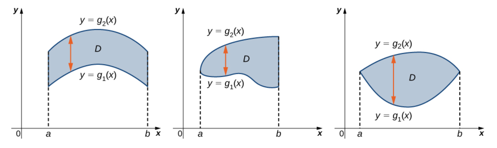
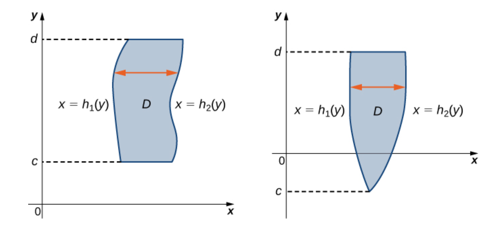

# 2 重积分

## 2.1 二重积分

### 2.1.1 二重积分的定义

设%3C%2Ftitle%3E%0A%3Cdefs%20aria-hidden%3D%22true%22%3E%0A%3Cpath%20stroke-width%3D%221%22%20id%3D%22E1-MJMATHI-66%22%20d%3D%22M118%20-162Q120%20-162%20124%20-164T135%20-167T147%20-168Q160%20-168%20171%20-155T187%20-126Q197%20-99%20221%2027T267%20267T289%20382V385H242Q195%20385%20192%20387Q188%20390%20188%20397L195%20425Q197%20430%20203%20430T250%20431Q298%20431%20298%20432Q298%20434%20307%20482T319%20540Q356%20705%20465%20705Q502%20703%20526%20683T550%20630Q550%20594%20529%20578T487%20561Q443%20561%20443%20603Q443%20622%20454%20636T478%20657L487%20662Q471%20668%20457%20668Q445%20668%20434%20658T419%20630Q412%20601%20403%20552T387%20469T380%20433Q380%20431%20435%20431Q480%20431%20487%20430T498%20424Q499%20420%20496%20407T491%20391Q489%20386%20482%20386T428%20385H372L349%20263Q301%2015%20282%20-47Q255%20-132%20212%20-173Q175%20-205%20139%20-205Q107%20-205%2081%20-186T55%20-132Q55%20-95%2076%20-78T118%20-61Q162%20-61%20162%20-103Q162%20-122%20151%20-136T127%20-157L118%20-162Z%22%3E%3C%2Fpath%3E%0A%3Cpath%20stroke-width%3D%221%22%20id%3D%22E1-MJMAIN-28%22%20d%3D%22M94%20250Q94%20319%20104%20381T127%20488T164%20576T202%20643T244%20695T277%20729T302%20750H315H319Q333%20750%20333%20741Q333%20738%20316%20720T275%20667T226%20581T184%20443T167%20250T184%2058T225%20-81T274%20-167T316%20-220T333%20-241Q333%20-250%20318%20-250H315H302L274%20-226Q180%20-141%20137%20-14T94%20250Z%22%3E%3C%2Fpath%3E%0A%3Cpath%20stroke-width%3D%221%22%20id%3D%22E1-MJMATHI-78%22%20d%3D%22M52%20289Q59%20331%20106%20386T222%20442Q257%20442%20286%20424T329%20379Q371%20442%20430%20442Q467%20442%20494%20420T522%20361Q522%20332%20508%20314T481%20292T458%20288Q439%20288%20427%20299T415%20328Q415%20374%20465%20391Q454%20404%20425%20404Q412%20404%20406%20402Q368%20386%20350%20336Q290%20115%20290%2078Q290%2050%20306%2038T341%2026Q378%2026%20414%2059T463%20140Q466%20150%20469%20151T485%20153H489Q504%20153%20504%20145Q504%20144%20502%20134Q486%2077%20440%2033T333%20-11Q263%20-11%20227%2052Q186%20-10%20133%20-10H127Q78%20-10%2057%2016T35%2071Q35%20103%2054%20123T99%20143Q142%20143%20142%20101Q142%2081%20130%2066T107%2046T94%2041L91%2040Q91%2039%2097%2036T113%2029T132%2026Q168%2026%20194%2071Q203%2087%20217%20139T245%20247T261%20313Q266%20340%20266%20352Q266%20380%20251%20392T217%20404Q177%20404%20142%20372T93%20290Q91%20281%2088%20280T72%20278H58Q52%20284%2052%20289Z%22%3E%3C%2Fpath%3E%0A%3Cpath%20stroke-width%3D%221%22%20id%3D%22E1-MJMAIN-2C%22%20d%3D%22M78%2035T78%2060T94%20103T137%20121Q165%20121%20187%2096T210%208Q210%20-27%20201%20-60T180%20-117T154%20-158T130%20-185T117%20-194Q113%20-194%20104%20-185T95%20-172Q95%20-168%20106%20-156T131%20-126T157%20-76T173%20-3V9L172%208Q170%207%20167%206T161%203T152%201T140%200Q113%200%2096%2017Z%22%3E%3C%2Fpath%3E%0A%3Cpath%20stroke-width%3D%221%22%20id%3D%22E1-MJMATHI-79%22%20d%3D%22M21%20287Q21%20301%2036%20335T84%20406T158%20442Q199%20442%20224%20419T250%20355Q248%20336%20247%20334Q247%20331%20231%20288T198%20191T182%20105Q182%2062%20196%2045T238%2027Q261%2027%20281%2038T312%2061T339%2094Q339%2095%20344%20114T358%20173T377%20247Q415%20397%20419%20404Q432%20431%20462%20431Q475%20431%20483%20424T494%20412T496%20403Q496%20390%20447%20193T391%20-23Q363%20-106%20294%20-155T156%20-205Q111%20-205%2077%20-183T43%20-117Q43%20-95%2050%20-80T69%20-58T89%20-48T106%20-45Q150%20-45%20150%20-87Q150%20-107%20138%20-122T115%20-142T102%20-147L99%20-148Q101%20-153%20118%20-160T152%20-167H160Q177%20-167%20186%20-165Q219%20-156%20247%20-127T290%20-65T313%20-9T321%2021L315%2017Q309%2013%20296%206T270%20-6Q250%20-11%20231%20-11Q185%20-11%20150%2011T104%2082Q103%2089%20103%20113Q103%20170%20138%20262T173%20379Q173%20380%20173%20381Q173%20390%20173%20393T169%20400T158%20404H154Q131%20404%20112%20385T82%20344T65%20302T57%20280Q55%20278%2041%20278H27Q21%20284%2021%20287Z%22%3E%3C%2Fpath%3E%0A%3Cpath%20stroke-width%3D%221%22%20id%3D%22E1-MJMAIN-29%22%20d%3D%22M60%20749L64%20750Q69%20750%2074%20750H86L114%20726Q208%20641%20251%20514T294%20250Q294%20182%20284%20119T261%2012T224%20-76T186%20-143T145%20-194T113%20-227T90%20-246Q87%20-249%2086%20-250H74Q66%20-250%2063%20-250T58%20-247T55%20-238Q56%20-237%2066%20-225Q221%20-64%20221%20250T66%20725Q56%20737%2055%20738Q55%20746%2060%20749Z%22%3E%3C%2Fpath%3E%0A%3C%2Fdefs%3E%0A%3Cg%20stroke%3D%22currentColor%22%20fill%3D%22currentColor%22%20stroke-width%3D%220%22%20transform%3D%22matrix(1%200%200%20-1%200%200)%22%20aria-hidden%3D%22true%22%3E%0A%20%3Cuse%20xlink%3Ahref%3D%22%23E1-MJMATHI-66%22%20x%3D%220%22%20y%3D%220%22%3E%3C%2Fuse%3E%0A%20%3Cuse%20xlink%3Ahref%3D%22%23E1-MJMAIN-28%22%20x%3D%22550%22%20y%3D%220%22%3E%3C%2Fuse%3E%0A%20%3Cuse%20xlink%3Ahref%3D%22%23E1-MJMATHI-78%22%20x%3D%22940%22%20y%3D%220%22%3E%3C%2Fuse%3E%0A%20%3Cuse%20xlink%3Ahref%3D%22%23E1-MJMAIN-2C%22%20x%3D%221512%22%20y%3D%220%22%3E%3C%2Fuse%3E%0A%20%3Cuse%20xlink%3Ahref%3D%22%23E1-MJMATHI-79%22%20x%3D%221957%22%20y%3D%220%22%3E%3C%2Fuse%3E%0A%20%3Cuse%20xlink%3Ahref%3D%22%23E1-MJMAIN-29%22%20x%3D%222455%22%20y%3D%220%22%3E%3C%2Fuse%3E%0A%3C%2Fg%3E%0A%3C%2Fsvg%3E)是有界闭区域![D](data:image/svg+xml;utf8,%3Csvg%20xmlns%3Axlink%3D%22http%3A%2F%2Fwww.w3.org%2F1999%2Fxlink%22%20width%3D%221.924ex%22%20height%3D%222.176ex%22%20style%3D%22font-size%3A14px%3Bvertical-align%3A%20-0.338ex%3B%22%20viewBox%3D%220%20-791.3%20828.5%20936.9%22%20role%3D%22img%22%20focusable%3D%22false%22%20xmlns%3D%22http%3A%2F%2Fwww.w3.org%2F2000%2Fsvg%22%20aria-labelledby%3D%22MathJax-SVG-1-Title%22%3E%0A%3Ctitle%20id%3D%22MathJax-SVG-1-Title%22%3ED%3C%2Ftitle%3E%0A%3Cdefs%20aria-hidden%3D%22true%22%3E%0A%3Cpath%20stroke-width%3D%221%22%20id%3D%22E1-MJMATHI-44%22%20d%3D%22M287%20628Q287%20635%20230%20637Q207%20637%20200%20638T193%20647Q193%20655%20197%20667T204%20682Q206%20683%20403%20683Q570%20682%20590%20682T630%20676Q702%20659%20752%20597T803%20431Q803%20275%20696%20151T444%203L430%201L236%200H125H72Q48%200%2041%202T33%2011Q33%2013%2036%2025Q40%2041%2044%2043T67%2046Q94%2046%20127%2049Q141%2052%20146%2061Q149%2065%20218%20339T287%20628ZM703%20469Q703%20507%20692%20537T666%20584T629%20613T590%20629T555%20636Q553%20636%20541%20636T512%20636T479%20637H436Q392%20637%20386%20627Q384%20623%20313%20339T242%2052Q242%2048%20253%2048T330%2047Q335%2047%20349%2047T373%2046Q499%2046%20581%20128Q617%20164%20640%20212T683%20339T703%20469Z%22%3E%3C%2Fpath%3E%0A%3C%2Fdefs%3E%0A%3Cg%20stroke%3D%22currentColor%22%20fill%3D%22currentColor%22%20stroke-width%3D%220%22%20transform%3D%22matrix(1%200%200%20-1%200%200)%22%20aria-hidden%3D%22true%22%3E%0A%20%3Cuse%20xlink%3Ahref%3D%22%23E1-MJMATHI-44%22%20x%3D%220%22%20y%3D%220%22%3E%3C%2Fuse%3E%0A%3C%2Fg%3E%0A%3C%2Fsvg%3E)上的有界函数，将闭区域![D](data:image/svg+xml;utf8,%3Csvg%20xmlns%3Axlink%3D%22http%3A%2F%2Fwww.w3.org%2F1999%2Fxlink%22%20width%3D%221.924ex%22%20height%3D%222.176ex%22%20style%3D%22font-size%3A14px%3Bvertical-align%3A%20-0.338ex%3B%22%20viewBox%3D%220%20-791.3%20828.5%20936.9%22%20role%3D%22img%22%20focusable%3D%22false%22%20xmlns%3D%22http%3A%2F%2Fwww.w3.org%2F2000%2Fsvg%22%20aria-labelledby%3D%22MathJax-SVG-1-Title%22%3E%0A%3Ctitle%20id%3D%22MathJax-SVG-1-Title%22%3ED%3C%2Ftitle%3E%0A%3Cdefs%20aria-hidden%3D%22true%22%3E%0A%3Cpath%20stroke-width%3D%221%22%20id%3D%22E1-MJMATHI-44%22%20d%3D%22M287%20628Q287%20635%20230%20637Q207%20637%20200%20638T193%20647Q193%20655%20197%20667T204%20682Q206%20683%20403%20683Q570%20682%20590%20682T630%20676Q702%20659%20752%20597T803%20431Q803%20275%20696%20151T444%203L430%201L236%200H125H72Q48%200%2041%202T33%2011Q33%2013%2036%2025Q40%2041%2044%2043T67%2046Q94%2046%20127%2049Q141%2052%20146%2061Q149%2065%20218%20339T287%20628ZM703%20469Q703%20507%20692%20537T666%20584T629%20613T590%20629T555%20636Q553%20636%20541%20636T512%20636T479%20637H436Q392%20637%20386%20627Q384%20623%20313%20339T242%2052Q242%2048%20253%2048T330%2047Q335%2047%20349%2047T373%2046Q499%2046%20581%20128Q617%20164%20640%20212T683%20339T703%20469Z%22%3E%3C%2Fpath%3E%0A%3C%2Fdefs%3E%0A%3Cg%20stroke%3D%22currentColor%22%20fill%3D%22currentColor%22%20stroke-width%3D%220%22%20transform%3D%22matrix(1%200%200%20-1%200%200)%22%20aria-hidden%3D%22true%22%3E%0A%20%3Cuse%20xlink%3Ahref%3D%22%23E1-MJMATHI-44%22%20x%3D%220%22%20y%3D%220%22%3E%3C%2Fuse%3E%0A%3C%2Fg%3E%0A%3C%2Fsvg%3E)任意分成![n](data:image/svg+xml;utf8,%3Csvg%20xmlns%3Axlink%3D%22http%3A%2F%2Fwww.w3.org%2F1999%2Fxlink%22%20width%3D%221.395ex%22%20height%3D%221.676ex%22%20style%3D%22font-size%3A14px%3Bvertical-align%3A%20-0.338ex%3B%22%20viewBox%3D%220%20-576.1%20600.5%20721.6%22%20role%3D%22img%22%20focusable%3D%22false%22%20xmlns%3D%22http%3A%2F%2Fwww.w3.org%2F2000%2Fsvg%22%20aria-labelledby%3D%22MathJax-SVG-1-Title%22%3E%0A%3Ctitle%20id%3D%22MathJax-SVG-1-Title%22%3En%3C%2Ftitle%3E%0A%3Cdefs%20aria-hidden%3D%22true%22%3E%0A%3Cpath%20stroke-width%3D%221%22%20id%3D%22E1-MJMATHI-6E%22%20d%3D%22M21%20287Q22%20293%2024%20303T36%20341T56%20388T89%20425T135%20442Q171%20442%20195%20424T225%20390T231%20369Q231%20367%20232%20367L243%20378Q304%20442%20382%20442Q436%20442%20469%20415T503%20336T465%20179T427%2052Q427%2026%20444%2026Q450%2026%20453%2027Q482%2032%20505%2065T540%20145Q542%20153%20560%20153Q580%20153%20580%20145Q580%20144%20576%20130Q568%20101%20554%2073T508%2017T439%20-10Q392%20-10%20371%2017T350%2073Q350%2092%20386%20193T423%20345Q423%20404%20379%20404H374Q288%20404%20229%20303L222%20291L189%20157Q156%2026%20151%2016Q138%20-11%20108%20-11Q95%20-11%2087%20-5T76%207T74%2017Q74%2030%20112%20180T152%20343Q153%20348%20153%20366Q153%20405%20129%20405Q91%20405%2066%20305Q60%20285%2060%20284Q58%20278%2041%20278H27Q21%20284%2021%20287Z%22%3E%3C%2Fpath%3E%0A%3C%2Fdefs%3E%0A%3Cg%20stroke%3D%22currentColor%22%20fill%3D%22currentColor%22%20stroke-width%3D%220%22%20transform%3D%22matrix(1%200%200%20-1%200%200)%22%20aria-hidden%3D%22true%22%3E%0A%20%3Cuse%20xlink%3Ahref%3D%22%23E1-MJMATHI-6E%22%20x%3D%220%22%20y%3D%220%22%3E%3C%2Fuse%3E%0A%3C%2Fg%3E%0A%3C%2Fsvg%3E)个小闭区域：

![\Delta A_1,\Delta A_2,\cdots,\Delta A_i,\cdots,\Delta A_n](data:image/svg+xml;utf8,%3Csvg%20xmlns%3Axlink%3D%22http%3A%2F%2Fwww.w3.org%2F1999%2Fxlink%22%20width%3D%2230.233ex%22%20height%3D%222.509ex%22%20style%3D%22font-size%3A14px%3Bvertical-align%3A%20-0.671ex%3B%22%20viewBox%3D%220%20-791.3%2013016.9%201080.4%22%20role%3D%22img%22%20focusable%3D%22false%22%20xmlns%3D%22http%3A%2F%2Fwww.w3.org%2F2000%2Fsvg%22%20aria-labelledby%3D%22MathJax-SVG-1-Title%22%3E%0A%3Ctitle%20id%3D%22MathJax-SVG-1-Title%22%3E%5CDelta%20A_1%2C%5CDelta%20A_2%2C%5Ccdots%2C%5CDelta%20A_i%2C%5Ccdots%2C%5CDelta%20A_n%3C%2Ftitle%3E%0A%3Cdefs%20aria-hidden%3D%22true%22%3E%0A%3Cpath%20stroke-width%3D%221%22%20id%3D%22E1-MJMAIN-394%22%20d%3D%22M51%200Q46%204%2046%207Q46%209%20215%20357T388%20709Q391%20716%20416%20716Q439%20716%20444%20709Q447%20705%20616%20357T786%207Q786%204%20781%200H51ZM507%20344L384%20596L137%2092L383%2091H630Q630%2093%20507%20344Z%22%3E%3C%2Fpath%3E%0A%3Cpath%20stroke-width%3D%221%22%20id%3D%22E1-MJMATHI-41%22%20d%3D%22M208%2074Q208%2050%20254%2046Q272%2046%20272%2035Q272%2034%20270%2022Q267%208%20264%204T251%200Q249%200%20239%200T205%201T141%202Q70%202%2050%200H42Q35%207%2035%2011Q37%2038%2048%2046H62Q132%2049%20164%2096Q170%20102%20345%20401T523%20704Q530%20716%20547%20716H555H572Q578%20707%20578%20706L606%20383Q634%2060%20636%2057Q641%2046%20701%2046Q726%2046%20726%2036Q726%2034%20723%2022Q720%207%20718%204T704%200Q701%200%20690%200T651%201T578%202Q484%202%20455%200H443Q437%206%20437%209T439%2027Q443%2040%20445%2043L449%2046H469Q523%2049%20533%2063L521%20213H283L249%20155Q208%2086%20208%2074ZM516%20260Q516%20271%20504%20416T490%20562L463%20519Q447%20492%20400%20412L310%20260L413%20259Q516%20259%20516%20260Z%22%3E%3C%2Fpath%3E%0A%3Cpath%20stroke-width%3D%221%22%20id%3D%22E1-MJMAIN-31%22%20d%3D%22M213%20578L200%20573Q186%20568%20160%20563T102%20556H83V602H102Q149%20604%20189%20617T245%20641T273%20663Q275%20666%20285%20666Q294%20666%20302%20660V361L303%2061Q310%2054%20315%2052T339%2048T401%2046H427V0H416Q395%203%20257%203Q121%203%20100%200H88V46H114Q136%2046%20152%2046T177%2047T193%2050T201%2052T207%2057T213%2061V578Z%22%3E%3C%2Fpath%3E%0A%3Cpath%20stroke-width%3D%221%22%20id%3D%22E1-MJMAIN-2C%22%20d%3D%22M78%2035T78%2060T94%20103T137%20121Q165%20121%20187%2096T210%208Q210%20-27%20201%20-60T180%20-117T154%20-158T130%20-185T117%20-194Q113%20-194%20104%20-185T95%20-172Q95%20-168%20106%20-156T131%20-126T157%20-76T173%20-3V9L172%208Q170%207%20167%206T161%203T152%201T140%200Q113%200%2096%2017Z%22%3E%3C%2Fpath%3E%0A%3Cpath%20stroke-width%3D%221%22%20id%3D%22E1-MJMAIN-32%22%20d%3D%22M109%20429Q82%20429%2066%20447T50%20491Q50%20562%20103%20614T235%20666Q326%20666%20387%20610T449%20465Q449%20422%20429%20383T381%20315T301%20241Q265%20210%20201%20149L142%2093L218%2092Q375%2092%20385%2097Q392%2099%20409%20186V189H449V186Q448%20183%20436%2095T421%203V0H50V19V31Q50%2038%2056%2046T86%2081Q115%20113%20136%20137Q145%20147%20170%20174T204%20211T233%20244T261%20278T284%20308T305%20340T320%20369T333%20401T340%20431T343%20464Q343%20527%20309%20573T212%20619Q179%20619%20154%20602T119%20569T109%20550Q109%20549%20114%20549Q132%20549%20151%20535T170%20489Q170%20464%20154%20447T109%20429Z%22%3E%3C%2Fpath%3E%0A%3Cpath%20stroke-width%3D%221%22%20id%3D%22E1-MJMAIN-22EF%22%20d%3D%22M78%20250Q78%20274%2095%20292T138%20310Q162%20310%20180%20294T199%20251Q199%20226%20182%20208T139%20190T96%20207T78%20250ZM525%20250Q525%20274%20542%20292T585%20310Q609%20310%20627%20294T646%20251Q646%20226%20629%20208T586%20190T543%20207T525%20250ZM972%20250Q972%20274%20989%20292T1032%20310Q1056%20310%201074%20294T1093%20251Q1093%20226%201076%20208T1033%20190T990%20207T972%20250Z%22%3E%3C%2Fpath%3E%0A%3Cpath%20stroke-width%3D%221%22%20id%3D%22E1-MJMATHI-69%22%20d%3D%22M184%20600Q184%20624%20203%20642T247%20661Q265%20661%20277%20649T290%20619Q290%20596%20270%20577T226%20557Q211%20557%20198%20567T184%20600ZM21%20287Q21%20295%2030%20318T54%20369T98%20420T158%20442Q197%20442%20223%20419T250%20357Q250%20340%20236%20301T196%20196T154%2083Q149%2061%20149%2051Q149%2026%20166%2026Q175%2026%20185%2029T208%2043T235%2078T260%20137Q263%20149%20265%20151T282%20153Q302%20153%20302%20143Q302%20135%20293%20112T268%2061T223%2011T161%20-11Q129%20-11%20102%2010T74%2074Q74%2091%2079%20106T122%20220Q160%20321%20166%20341T173%20380Q173%20404%20156%20404H154Q124%20404%2099%20371T61%20287Q60%20286%2059%20284T58%20281T56%20279T53%20278T49%20278T41%20278H27Q21%20284%2021%20287Z%22%3E%3C%2Fpath%3E%0A%3Cpath%20stroke-width%3D%221%22%20id%3D%22E1-MJMATHI-6E%22%20d%3D%22M21%20287Q22%20293%2024%20303T36%20341T56%20388T89%20425T135%20442Q171%20442%20195%20424T225%20390T231%20369Q231%20367%20232%20367L243%20378Q304%20442%20382%20442Q436%20442%20469%20415T503%20336T465%20179T427%2052Q427%2026%20444%2026Q450%2026%20453%2027Q482%2032%20505%2065T540%20145Q542%20153%20560%20153Q580%20153%20580%20145Q580%20144%20576%20130Q568%20101%20554%2073T508%2017T439%20-10Q392%20-10%20371%2017T350%2073Q350%2092%20386%20193T423%20345Q423%20404%20379%20404H374Q288%20404%20229%20303L222%20291L189%20157Q156%2026%20151%2016Q138%20-11%20108%20-11Q95%20-11%2087%20-5T76%207T74%2017Q74%2030%20112%20180T152%20343Q153%20348%20153%20366Q153%20405%20129%20405Q91%20405%2066%20305Q60%20285%2060%20284Q58%20278%2041%20278H27Q21%20284%2021%20287Z%22%3E%3C%2Fpath%3E%0A%3C%2Fdefs%3E%0A%3Cg%20stroke%3D%22currentColor%22%20fill%3D%22currentColor%22%20stroke-width%3D%220%22%20transform%3D%22matrix(1%200%200%20-1%200%200)%22%20aria-hidden%3D%22true%22%3E%0A%20%3Cuse%20xlink%3Ahref%3D%22%23E1-MJMAIN-394%22%20x%3D%220%22%20y%3D%220%22%3E%3C%2Fuse%3E%0A%3Cg%20transform%3D%22translate(833%2C0)%22%3E%0A%20%3Cuse%20xlink%3Ahref%3D%22%23E1-MJMATHI-41%22%20x%3D%220%22%20y%3D%220%22%3E%3C%2Fuse%3E%0A%20%3Cuse%20transform%3D%22scale(0.707)%22%20xlink%3Ahref%3D%22%23E1-MJMAIN-31%22%20x%3D%221061%22%20y%3D%22-213%22%3E%3C%2Fuse%3E%0A%3C%2Fg%3E%0A%20%3Cuse%20xlink%3Ahref%3D%22%23E1-MJMAIN-2C%22%20x%3D%222037%22%20y%3D%220%22%3E%3C%2Fuse%3E%0A%20%3Cuse%20xlink%3Ahref%3D%22%23E1-MJMAIN-394%22%20x%3D%222483%22%20y%3D%220%22%3E%3C%2Fuse%3E%0A%3Cg%20transform%3D%22translate(3316%2C0)%22%3E%0A%20%3Cuse%20xlink%3Ahref%3D%22%23E1-MJMATHI-41%22%20x%3D%220%22%20y%3D%220%22%3E%3C%2Fuse%3E%0A%20%3Cuse%20transform%3D%22scale(0.707)%22%20xlink%3Ahref%3D%22%23E1-MJMAIN-32%22%20x%3D%221061%22%20y%3D%22-213%22%3E%3C%2Fuse%3E%0A%3C%2Fg%3E%0A%20%3Cuse%20xlink%3Ahref%3D%22%23E1-MJMAIN-2C%22%20x%3D%224520%22%20y%3D%220%22%3E%3C%2Fuse%3E%0A%20%3Cuse%20xlink%3Ahref%3D%22%23E1-MJMAIN-22EF%22%20x%3D%224966%22%20y%3D%220%22%3E%3C%2Fuse%3E%0A%20%3Cuse%20xlink%3Ahref%3D%22%23E1-MJMAIN-2C%22%20x%3D%226305%22%20y%3D%220%22%3E%3C%2Fuse%3E%0A%20%3Cuse%20xlink%3Ahref%3D%22%23E1-MJMAIN-394%22%20x%3D%226750%22%20y%3D%220%22%3E%3C%2Fuse%3E%0A%3Cg%20transform%3D%22translate(7583%2C0)%22%3E%0A%20%3Cuse%20xlink%3Ahref%3D%22%23E1-MJMATHI-41%22%20x%3D%220%22%20y%3D%220%22%3E%3C%2Fuse%3E%0A%20%3Cuse%20transform%3D%22scale(0.707)%22%20xlink%3Ahref%3D%22%23E1-MJMATHI-69%22%20x%3D%221061%22%20y%3D%22-213%22%3E%3C%2Fuse%3E%0A%3C%2Fg%3E%0A%20%3Cuse%20xlink%3Ahref%3D%22%23E1-MJMAIN-2C%22%20x%3D%228678%22%20y%3D%220%22%3E%3C%2Fuse%3E%0A%20%3Cuse%20xlink%3Ahref%3D%22%23E1-MJMAIN-22EF%22%20x%3D%229123%22%20y%3D%220%22%3E%3C%2Fuse%3E%0A%20%3Cuse%20xlink%3Ahref%3D%22%23E1-MJMAIN-2C%22%20x%3D%2210463%22%20y%3D%220%22%3E%3C%2Fuse%3E%0A%20%3Cuse%20xlink%3Ahref%3D%22%23E1-MJMAIN-394%22%20x%3D%2210908%22%20y%3D%220%22%3E%3C%2Fuse%3E%0A%3Cg%20transform%3D%22translate(11741%2C0)%22%3E%0A%20%3Cuse%20xlink%3Ahref%3D%22%23E1-MJMATHI-41%22%20x%3D%220%22%20y%3D%220%22%3E%3C%2Fuse%3E%0A%20%3Cuse%20transform%3D%22scale(0.707)%22%20xlink%3Ahref%3D%22%23E1-MJMATHI-6E%22%20x%3D%221061%22%20y%3D%22-213%22%3E%3C%2Fuse%3E%0A%3C%2Fg%3E%0A%3C%2Fg%3E%0A%3C%2Fsvg%3E)

其中![\Delta A_i](data:image/svg+xml;utf8,%3Csvg%20xmlns%3Axlink%3D%22http%3A%2F%2Fwww.w3.org%2F1999%2Fxlink%22%20width%3D%224.479ex%22%20height%3D%222.509ex%22%20style%3D%22font-size%3A14px%3Bvertical-align%3A%20-0.671ex%3B%22%20viewBox%3D%220%20-791.3%201928.3%201080.4%22%20role%3D%22img%22%20focusable%3D%22false%22%20xmlns%3D%22http%3A%2F%2Fwww.w3.org%2F2000%2Fsvg%22%20aria-labelledby%3D%22MathJax-SVG-1-Title%22%3E%0A%3Ctitle%20id%3D%22MathJax-SVG-1-Title%22%3E%5CDelta%20A_i%3C%2Ftitle%3E%0A%3Cdefs%20aria-hidden%3D%22true%22%3E%0A%3Cpath%20stroke-width%3D%221%22%20id%3D%22E1-MJMAIN-394%22%20d%3D%22M51%200Q46%204%2046%207Q46%209%20215%20357T388%20709Q391%20716%20416%20716Q439%20716%20444%20709Q447%20705%20616%20357T786%207Q786%204%20781%200H51ZM507%20344L384%20596L137%2092L383%2091H630Q630%2093%20507%20344Z%22%3E%3C%2Fpath%3E%0A%3Cpath%20stroke-width%3D%221%22%20id%3D%22E1-MJMATHI-41%22%20d%3D%22M208%2074Q208%2050%20254%2046Q272%2046%20272%2035Q272%2034%20270%2022Q267%208%20264%204T251%200Q249%200%20239%200T205%201T141%202Q70%202%2050%200H42Q35%207%2035%2011Q37%2038%2048%2046H62Q132%2049%20164%2096Q170%20102%20345%20401T523%20704Q530%20716%20547%20716H555H572Q578%20707%20578%20706L606%20383Q634%2060%20636%2057Q641%2046%20701%2046Q726%2046%20726%2036Q726%2034%20723%2022Q720%207%20718%204T704%200Q701%200%20690%200T651%201T578%202Q484%202%20455%200H443Q437%206%20437%209T439%2027Q443%2040%20445%2043L449%2046H469Q523%2049%20533%2063L521%20213H283L249%20155Q208%2086%20208%2074ZM516%20260Q516%20271%20504%20416T490%20562L463%20519Q447%20492%20400%20412L310%20260L413%20259Q516%20259%20516%20260Z%22%3E%3C%2Fpath%3E%0A%3Cpath%20stroke-width%3D%221%22%20id%3D%22E1-MJMATHI-69%22%20d%3D%22M184%20600Q184%20624%20203%20642T247%20661Q265%20661%20277%20649T290%20619Q290%20596%20270%20577T226%20557Q211%20557%20198%20567T184%20600ZM21%20287Q21%20295%2030%20318T54%20369T98%20420T158%20442Q197%20442%20223%20419T250%20357Q250%20340%20236%20301T196%20196T154%2083Q149%2061%20149%2051Q149%2026%20166%2026Q175%2026%20185%2029T208%2043T235%2078T260%20137Q263%20149%20265%20151T282%20153Q302%20153%20302%20143Q302%20135%20293%20112T268%2061T223%2011T161%20-11Q129%20-11%20102%2010T74%2074Q74%2091%2079%20106T122%20220Q160%20321%20166%20341T173%20380Q173%20404%20156%20404H154Q124%20404%2099%20371T61%20287Q60%20286%2059%20284T58%20281T56%20279T53%20278T49%20278T41%20278H27Q21%20284%2021%20287Z%22%3E%3C%2Fpath%3E%0A%3C%2Fdefs%3E%0A%3Cg%20stroke%3D%22currentColor%22%20fill%3D%22currentColor%22%20stroke-width%3D%220%22%20transform%3D%22matrix(1%200%200%20-1%200%200)%22%20aria-hidden%3D%22true%22%3E%0A%20%3Cuse%20xlink%3Ahref%3D%22%23E1-MJMAIN-394%22%20x%3D%220%22%20y%3D%220%22%3E%3C%2Fuse%3E%0A%3Cg%20transform%3D%22translate(833%2C0)%22%3E%0A%20%3Cuse%20xlink%3Ahref%3D%22%23E1-MJMATHI-41%22%20x%3D%220%22%20y%3D%220%22%3E%3C%2Fuse%3E%0A%20%3Cuse%20transform%3D%22scale(0.707)%22%20xlink%3Ahref%3D%22%23E1-MJMATHI-69%22%20x%3D%221061%22%20y%3D%22-213%22%3E%3C%2Fuse%3E%0A%3C%2Fg%3E%0A%3C%2Fg%3E%0A%3C%2Fsvg%3E)表示第![i](data:image/svg+xml;utf8,%3Csvg%20xmlns%3Axlink%3D%22http%3A%2F%2Fwww.w3.org%2F1999%2Fxlink%22%20width%3D%220.802ex%22%20height%3D%222.176ex%22%20style%3D%22font-size%3A14px%3Bvertical-align%3A%20-0.338ex%3B%22%20viewBox%3D%220%20-791.3%20345.5%20936.9%22%20role%3D%22img%22%20focusable%3D%22false%22%20xmlns%3D%22http%3A%2F%2Fwww.w3.org%2F2000%2Fsvg%22%20aria-labelledby%3D%22MathJax-SVG-1-Title%22%3E%0A%3Ctitle%20id%3D%22MathJax-SVG-1-Title%22%3Ei%3C%2Ftitle%3E%0A%3Cdefs%20aria-hidden%3D%22true%22%3E%0A%3Cpath%20stroke-width%3D%221%22%20id%3D%22E1-MJMATHI-69%22%20d%3D%22M184%20600Q184%20624%20203%20642T247%20661Q265%20661%20277%20649T290%20619Q290%20596%20270%20577T226%20557Q211%20557%20198%20567T184%20600ZM21%20287Q21%20295%2030%20318T54%20369T98%20420T158%20442Q197%20442%20223%20419T250%20357Q250%20340%20236%20301T196%20196T154%2083Q149%2061%20149%2051Q149%2026%20166%2026Q175%2026%20185%2029T208%2043T235%2078T260%20137Q263%20149%20265%20151T282%20153Q302%20153%20302%20143Q302%20135%20293%20112T268%2061T223%2011T161%20-11Q129%20-11%20102%2010T74%2074Q74%2091%2079%20106T122%20220Q160%20321%20166%20341T173%20380Q173%20404%20156%20404H154Q124%20404%2099%20371T61%20287Q60%20286%2059%20284T58%20281T56%20279T53%20278T49%20278T41%20278H27Q21%20284%2021%20287Z%22%3E%3C%2Fpath%3E%0A%3C%2Fdefs%3E%0A%3Cg%20stroke%3D%22currentColor%22%20fill%3D%22currentColor%22%20stroke-width%3D%220%22%20transform%3D%22matrix(1%200%200%20-1%200%200)%22%20aria-hidden%3D%22true%22%3E%0A%20%3Cuse%20xlink%3Ahref%3D%22%23E1-MJMATHI-69%22%20x%3D%220%22%20y%3D%220%22%3E%3C%2Fuse%3E%0A%3C%2Fg%3E%0A%3C%2Fsvg%3E)个小闭区域，也表示它的面积，规定![\Delta A_i](data:image/svg+xml;utf8,%3Csvg%20xmlns%3Axlink%3D%22http%3A%2F%2Fwww.w3.org%2F1999%2Fxlink%22%20width%3D%224.479ex%22%20height%3D%222.509ex%22%20style%3D%22font-size%3A14px%3Bvertical-align%3A%20-0.671ex%3B%22%20viewBox%3D%220%20-791.3%201928.3%201080.4%22%20role%3D%22img%22%20focusable%3D%22false%22%20xmlns%3D%22http%3A%2F%2Fwww.w3.org%2F2000%2Fsvg%22%20aria-labelledby%3D%22MathJax-SVG-1-Title%22%3E%0A%3Ctitle%20id%3D%22MathJax-SVG-1-Title%22%3E%5CDelta%20A_i%3C%2Ftitle%3E%0A%3Cdefs%20aria-hidden%3D%22true%22%3E%0A%3Cpath%20stroke-width%3D%221%22%20id%3D%22E1-MJMAIN-394%22%20d%3D%22M51%200Q46%204%2046%207Q46%209%20215%20357T388%20709Q391%20716%20416%20716Q439%20716%20444%20709Q447%20705%20616%20357T786%207Q786%204%20781%200H51ZM507%20344L384%20596L137%2092L383%2091H630Q630%2093%20507%20344Z%22%3E%3C%2Fpath%3E%0A%3Cpath%20stroke-width%3D%221%22%20id%3D%22E1-MJMATHI-41%22%20d%3D%22M208%2074Q208%2050%20254%2046Q272%2046%20272%2035Q272%2034%20270%2022Q267%208%20264%204T251%200Q249%200%20239%200T205%201T141%202Q70%202%2050%200H42Q35%207%2035%2011Q37%2038%2048%2046H62Q132%2049%20164%2096Q170%20102%20345%20401T523%20704Q530%20716%20547%20716H555H572Q578%20707%20578%20706L606%20383Q634%2060%20636%2057Q641%2046%20701%2046Q726%2046%20726%2036Q726%2034%20723%2022Q720%207%20718%204T704%200Q701%200%20690%200T651%201T578%202Q484%202%20455%200H443Q437%206%20437%209T439%2027Q443%2040%20445%2043L449%2046H469Q523%2049%20533%2063L521%20213H283L249%20155Q208%2086%20208%2074ZM516%20260Q516%20271%20504%20416T490%20562L463%20519Q447%20492%20400%20412L310%20260L413%20259Q516%20259%20516%20260Z%22%3E%3C%2Fpath%3E%0A%3Cpath%20stroke-width%3D%221%22%20id%3D%22E1-MJMATHI-69%22%20d%3D%22M184%20600Q184%20624%20203%20642T247%20661Q265%20661%20277%20649T290%20619Q290%20596%20270%20577T226%20557Q211%20557%20198%20567T184%20600ZM21%20287Q21%20295%2030%20318T54%20369T98%20420T158%20442Q197%20442%20223%20419T250%20357Q250%20340%20236%20301T196%20196T154%2083Q149%2061%20149%2051Q149%2026%20166%2026Q175%2026%20185%2029T208%2043T235%2078T260%20137Q263%20149%20265%20151T282%20153Q302%20153%20302%20143Q302%20135%20293%20112T268%2061T223%2011T161%20-11Q129%20-11%20102%2010T74%2074Q74%2091%2079%20106T122%20220Q160%20321%20166%20341T173%20380Q173%20404%20156%20404H154Q124%20404%2099%20371T61%20287Q60%20286%2059%20284T58%20281T56%20279T53%20278T49%20278T41%20278H27Q21%20284%2021%20287Z%22%3E%3C%2Fpath%3E%0A%3C%2Fdefs%3E%0A%3Cg%20stroke%3D%22currentColor%22%20fill%3D%22currentColor%22%20stroke-width%3D%220%22%20transform%3D%22matrix(1%200%200%20-1%200%200)%22%20aria-hidden%3D%22true%22%3E%0A%20%3Cuse%20xlink%3Ahref%3D%22%23E1-MJMAIN-394%22%20x%3D%220%22%20y%3D%220%22%3E%3C%2Fuse%3E%0A%3Cg%20transform%3D%22translate(833%2C0)%22%3E%0A%20%3Cuse%20xlink%3Ahref%3D%22%23E1-MJMATHI-41%22%20x%3D%220%22%20y%3D%220%22%3E%3C%2Fuse%3E%0A%20%3Cuse%20transform%3D%22scale(0.707)%22%20xlink%3Ahref%3D%22%23E1-MJMATHI-69%22%20x%3D%221061%22%20y%3D%22-213%22%3E%3C%2Fuse%3E%0A%3C%2Fg%3E%0A%3C%2Fg%3E%0A%3C%2Fsvg%3E)中最大的面积为![\lambda](data:image/svg+xml;utf8,%3Csvg%20xmlns%3Axlink%3D%22http%3A%2F%2Fwww.w3.org%2F1999%2Fxlink%22%20width%3D%221.355ex%22%20height%3D%222.176ex%22%20style%3D%22font-size%3A14px%3Bvertical-align%3A%20-0.338ex%3B%22%20viewBox%3D%220%20-791.3%20583.5%20936.9%22%20role%3D%22img%22%20focusable%3D%22false%22%20xmlns%3D%22http%3A%2F%2Fwww.w3.org%2F2000%2Fsvg%22%20aria-labelledby%3D%22MathJax-SVG-1-Title%22%3E%0A%3Ctitle%20id%3D%22MathJax-SVG-1-Title%22%3E%5Clambda%3C%2Ftitle%3E%0A%3Cdefs%20aria-hidden%3D%22true%22%3E%0A%3Cpath%20stroke-width%3D%221%22%20id%3D%22E1-MJMATHI-3BB%22%20d%3D%22M166%20673Q166%20685%20183%20694H202Q292%20691%20316%20644Q322%20629%20373%20486T474%20207T524%2067Q531%2047%20537%2034T546%2015T551%206T555%202T556%20-2T550%20-11H482Q457%203%20450%2018T399%20152L354%20277L340%20262Q327%20246%20293%20207T236%20141Q211%20112%20174%2069Q123%209%20111%20-1T83%20-12Q47%20-12%2047%2020Q47%2037%2061%2052T199%20187Q229%20216%20266%20252T321%20306L338%20322Q338%20323%20288%20462T234%20612Q214%20657%20183%20657Q166%20657%20166%20673Z%22%3E%3C%2Fpath%3E%0A%3C%2Fdefs%3E%0A%3Cg%20stroke%3D%22currentColor%22%20fill%3D%22currentColor%22%20stroke-width%3D%220%22%20transform%3D%22matrix(1%200%200%20-1%200%200)%22%20aria-hidden%3D%22true%22%3E%0A%20%3Cuse%20xlink%3Ahref%3D%22%23E1-MJMATHI-3BB%22%20x%3D%220%22%20y%3D%220%22%3E%3C%2Fuse%3E%0A%3C%2Fg%3E%0A%3C%2Fsvg%3E)：

%3C%2Ftitle%3E%0A%3Cdefs%20aria-hidden%3D%22true%22%3E%0A%3Cpath%20stroke-width%3D%221%22%20id%3D%22E1-MJMATHI-3BB%22%20d%3D%22M166%20673Q166%20685%20183%20694H202Q292%20691%20316%20644Q322%20629%20373%20486T474%20207T524%2067Q531%2047%20537%2034T546%2015T551%206T555%202T556%20-2T550%20-11H482Q457%203%20450%2018T399%20152L354%20277L340%20262Q327%20246%20293%20207T236%20141Q211%20112%20174%2069Q123%209%20111%20-1T83%20-12Q47%20-12%2047%2020Q47%2037%2061%2052T199%20187Q229%20216%20266%20252T321%20306L338%20322Q338%20323%20288%20462T234%20612Q214%20657%20183%20657Q166%20657%20166%20673Z%22%3E%3C%2Fpath%3E%0A%3Cpath%20stroke-width%3D%221%22%20id%3D%22E1-MJMAIN-3D%22%20d%3D%22M56%20347Q56%20360%2070%20367H707Q722%20359%20722%20347Q722%20336%20708%20328L390%20327H72Q56%20332%2056%20347ZM56%20153Q56%20168%2072%20173H708Q722%20163%20722%20153Q722%20140%20707%20133H70Q56%20140%2056%20153Z%22%3E%3C%2Fpath%3E%0A%3Cpath%20stroke-width%3D%221%22%20id%3D%22E1-MJMAIN-6D%22%20d%3D%22M41%2046H55Q94%2046%20102%2060V68Q102%2077%20102%2091T102%20122T103%20161T103%20203Q103%20234%20103%20269T102%20328V351Q99%20370%2088%20376T43%20385H25V408Q25%20431%2027%20431L37%20432Q47%20433%2065%20434T102%20436Q119%20437%20138%20438T167%20441T178%20442H181V402Q181%20364%20182%20364T187%20369T199%20384T218%20402T247%20421T285%20437Q305%20442%20336%20442Q351%20442%20364%20440T387%20434T406%20426T421%20417T432%20406T441%20395T448%20384T452%20374T455%20366L457%20361L460%20365Q463%20369%20466%20373T475%20384T488%20397T503%20410T523%20422T546%20432T572%20439T603%20442Q729%20442%20740%20329Q741%20322%20741%20190V104Q741%2066%20743%2059T754%2049Q775%2046%20803%2046H819V0H811L788%201Q764%202%20737%202T699%203Q596%203%20587%200H579V46H595Q656%2046%20656%2062Q657%2064%20657%20200Q656%20335%20655%20343Q649%20371%20635%20385T611%20402T585%20404Q540%20404%20506%20370Q479%20343%20472%20315T464%20232V168V108Q464%2078%20465%2068T468%2055T477%2049Q498%2046%20526%2046H542V0H534L510%201Q487%202%20460%202T422%203Q319%203%20310%200H302V46H318Q379%2046%20379%2062Q380%2064%20380%20200Q379%20335%20378%20343Q372%20371%20358%20385T334%20402T308%20404Q263%20404%20229%20370Q202%20343%20195%20315T187%20232V168V108Q187%2078%20188%2068T191%2055T200%2049Q221%2046%20249%2046H265V0H257L234%201Q210%202%20183%202T145%203Q42%203%2033%200H25V46H41Z%22%3E%3C%2Fpath%3E%0A%3Cpath%20stroke-width%3D%221%22%20id%3D%22E1-MJMAIN-61%22%20d%3D%22M137%20305T115%20305T78%20320T63%20359Q63%20394%2097%20421T218%20448Q291%20448%20336%20416T396%20340Q401%20326%20401%20309T402%20194V124Q402%2076%20407%2058T428%2040Q443%2040%20448%2056T453%20109V145H493V106Q492%2066%20490%2059Q481%2029%20455%2012T400%20-6T353%2012T329%2054V58L327%2055Q325%2052%20322%2049T314%2040T302%2029T287%2017T269%206T247%20-2T221%20-8T190%20-11Q130%20-11%2082%2020T34%20107Q34%20128%2041%20147T68%20188T116%20225T194%20253T304%20268H318V290Q318%20324%20312%20340Q290%20411%20215%20411Q197%20411%20181%20410T156%20406T148%20403Q170%20388%20170%20359Q170%20334%20154%20320ZM126%20106Q126%2075%20150%2051T209%2026Q247%2026%20276%2049T315%20109Q317%20116%20318%20175Q318%20233%20317%20233Q309%20233%20296%20232T251%20223T193%20203T147%20166T126%20106Z%22%3E%3C%2Fpath%3E%0A%3Cpath%20stroke-width%3D%221%22%20id%3D%22E1-MJMAIN-78%22%20d%3D%22M201%200Q189%203%20102%203Q26%203%2017%200H11V46H25Q48%2047%2067%2052T96%2061T121%2078T139%2096T160%20122T180%20150L226%20210L168%20288Q159%20301%20149%20315T133%20336T122%20351T113%20363T107%20370T100%20376T94%20379T88%20381T80%20383Q74%20383%2044%20385H16V431H23Q59%20429%20126%20429Q219%20429%20229%20431H237V385Q201%20381%20201%20369Q201%20367%20211%20353T239%20315T268%20274L272%20270L297%20304Q329%20345%20329%20358Q329%20364%20327%20369T322%20376T317%20380T310%20384L307%20385H302V431H309Q324%20428%20408%20428Q487%20428%20493%20431H499V385H492Q443%20385%20411%20368Q394%20360%20377%20341T312%20257L296%20236L358%20151Q424%2061%20429%2057T446%2050Q464%2046%20499%2046H516V0H510H502Q494%201%20482%201T457%202T432%202T414%203Q403%203%20377%203T327%201L304%200H295V46H298Q309%2046%20320%2051T331%2063Q331%2065%20291%20120L250%20175Q249%20174%20219%20133T185%2088Q181%2083%20181%2074Q181%2063%20188%2055T206%2046Q208%2046%20208%2023V0H201Z%22%3E%3C%2Fpath%3E%0A%3Cpath%20stroke-width%3D%221%22%20id%3D%22E1-MJMAIN-28%22%20d%3D%22M94%20250Q94%20319%20104%20381T127%20488T164%20576T202%20643T244%20695T277%20729T302%20750H315H319Q333%20750%20333%20741Q333%20738%20316%20720T275%20667T226%20581T184%20443T167%20250T184%2058T225%20-81T274%20-167T316%20-220T333%20-241Q333%20-250%20318%20-250H315H302L274%20-226Q180%20-141%20137%20-14T94%20250Z%22%3E%3C%2Fpath%3E%0A%3Cpath%20stroke-width%3D%221%22%20id%3D%22E1-MJMAIN-394%22%20d%3D%22M51%200Q46%204%2046%207Q46%209%20215%20357T388%20709Q391%20716%20416%20716Q439%20716%20444%20709Q447%20705%20616%20357T786%207Q786%204%20781%200H51ZM507%20344L384%20596L137%2092L383%2091H630Q630%2093%20507%20344Z%22%3E%3C%2Fpath%3E%0A%3Cpath%20stroke-width%3D%221%22%20id%3D%22E1-MJMATHI-41%22%20d%3D%22M208%2074Q208%2050%20254%2046Q272%2046%20272%2035Q272%2034%20270%2022Q267%208%20264%204T251%200Q249%200%20239%200T205%201T141%202Q70%202%2050%200H42Q35%207%2035%2011Q37%2038%2048%2046H62Q132%2049%20164%2096Q170%20102%20345%20401T523%20704Q530%20716%20547%20716H555H572Q578%20707%20578%20706L606%20383Q634%2060%20636%2057Q641%2046%20701%2046Q726%2046%20726%2036Q726%2034%20723%2022Q720%207%20718%204T704%200Q701%200%20690%200T651%201T578%202Q484%202%20455%200H443Q437%206%20437%209T439%2027Q443%2040%20445%2043L449%2046H469Q523%2049%20533%2063L521%20213H283L249%20155Q208%2086%20208%2074ZM516%20260Q516%20271%20504%20416T490%20562L463%20519Q447%20492%20400%20412L310%20260L413%20259Q516%20259%20516%20260Z%22%3E%3C%2Fpath%3E%0A%3Cpath%20stroke-width%3D%221%22%20id%3D%22E1-MJMATHI-69%22%20d%3D%22M184%20600Q184%20624%20203%20642T247%20661Q265%20661%20277%20649T290%20619Q290%20596%20270%20577T226%20557Q211%20557%20198%20567T184%20600ZM21%20287Q21%20295%2030%20318T54%20369T98%20420T158%20442Q197%20442%20223%20419T250%20357Q250%20340%20236%20301T196%20196T154%2083Q149%2061%20149%2051Q149%2026%20166%2026Q175%2026%20185%2029T208%2043T235%2078T260%20137Q263%20149%20265%20151T282%20153Q302%20153%20302%20143Q302%20135%20293%20112T268%2061T223%2011T161%20-11Q129%20-11%20102%2010T74%2074Q74%2091%2079%20106T122%20220Q160%20321%20166%20341T173%20380Q173%20404%20156%20404H154Q124%20404%2099%20371T61%20287Q60%20286%2059%20284T58%20281T56%20279T53%20278T49%20278T41%20278H27Q21%20284%2021%20287Z%22%3E%3C%2Fpath%3E%0A%3Cpath%20stroke-width%3D%221%22%20id%3D%22E1-MJMAIN-29%22%20d%3D%22M60%20749L64%20750Q69%20750%2074%20750H86L114%20726Q208%20641%20251%20514T294%20250Q294%20182%20284%20119T261%2012T224%20-76T186%20-143T145%20-194T113%20-227T90%20-246Q87%20-249%2086%20-250H74Q66%20-250%2063%20-250T58%20-247T55%20-238Q56%20-237%2066%20-225Q221%20-64%20221%20250T66%20725Q56%20737%2055%20738Q55%20746%2060%20749Z%22%3E%3C%2Fpath%3E%0A%3C%2Fdefs%3E%0A%3Cg%20stroke%3D%22currentColor%22%20fill%3D%22currentColor%22%20stroke-width%3D%220%22%20transform%3D%22matrix(1%200%200%20-1%200%200)%22%20aria-hidden%3D%22true%22%3E%0A%20%3Cuse%20xlink%3Ahref%3D%22%23E1-MJMATHI-3BB%22%20x%3D%220%22%20y%3D%220%22%3E%3C%2Fuse%3E%0A%20%3Cuse%20xlink%3Ahref%3D%22%23E1-MJMAIN-3D%22%20x%3D%22861%22%20y%3D%220%22%3E%3C%2Fuse%3E%0A%3Cg%20transform%3D%22translate(1917%2C0)%22%3E%0A%20%3Cuse%20xlink%3Ahref%3D%22%23E1-MJMAIN-6D%22%3E%3C%2Fuse%3E%0A%20%3Cuse%20xlink%3Ahref%3D%22%23E1-MJMAIN-61%22%20x%3D%22833%22%20y%3D%220%22%3E%3C%2Fuse%3E%0A%20%3Cuse%20xlink%3Ahref%3D%22%23E1-MJMAIN-78%22%20x%3D%221334%22%20y%3D%220%22%3E%3C%2Fuse%3E%0A%3C%2Fg%3E%0A%20%3Cuse%20xlink%3Ahref%3D%22%23E1-MJMAIN-28%22%20x%3D%223780%22%20y%3D%220%22%3E%3C%2Fuse%3E%0A%20%3Cuse%20xlink%3Ahref%3D%22%23E1-MJMAIN-394%22%20x%3D%224169%22%20y%3D%220%22%3E%3C%2Fuse%3E%0A%3Cg%20transform%3D%22translate(5003%2C0)%22%3E%0A%20%3Cuse%20xlink%3Ahref%3D%22%23E1-MJMATHI-41%22%20x%3D%220%22%20y%3D%220%22%3E%3C%2Fuse%3E%0A%20%3Cuse%20transform%3D%22scale(0.707)%22%20xlink%3Ahref%3D%22%23E1-MJMATHI-69%22%20x%3D%221061%22%20y%3D%22-213%22%3E%3C%2Fuse%3E%0A%3C%2Fg%3E%0A%20%3Cuse%20xlink%3Ahref%3D%22%23E1-MJMAIN-29%22%20x%3D%226097%22%20y%3D%220%22%3E%3C%2Fuse%3E%0A%3C%2Fg%3E%0A%3C%2Fsvg%3E)

在每个![\Delta A_i](data:image/svg+xml;utf8,%3Csvg%20xmlns%3Axlink%3D%22http%3A%2F%2Fwww.w3.org%2F1999%2Fxlink%22%20width%3D%224.479ex%22%20height%3D%222.509ex%22%20style%3D%22font-size%3A14px%3Bvertical-align%3A%20-0.671ex%3B%22%20viewBox%3D%220%20-791.3%201928.3%201080.4%22%20role%3D%22img%22%20focusable%3D%22false%22%20xmlns%3D%22http%3A%2F%2Fwww.w3.org%2F2000%2Fsvg%22%20aria-labelledby%3D%22MathJax-SVG-1-Title%22%3E%0A%3Ctitle%20id%3D%22MathJax-SVG-1-Title%22%3E%5CDelta%20A_i%3C%2Ftitle%3E%0A%3Cdefs%20aria-hidden%3D%22true%22%3E%0A%3Cpath%20stroke-width%3D%221%22%20id%3D%22E1-MJMAIN-394%22%20d%3D%22M51%200Q46%204%2046%207Q46%209%20215%20357T388%20709Q391%20716%20416%20716Q439%20716%20444%20709Q447%20705%20616%20357T786%207Q786%204%20781%200H51ZM507%20344L384%20596L137%2092L383%2091H630Q630%2093%20507%20344Z%22%3E%3C%2Fpath%3E%0A%3Cpath%20stroke-width%3D%221%22%20id%3D%22E1-MJMATHI-41%22%20d%3D%22M208%2074Q208%2050%20254%2046Q272%2046%20272%2035Q272%2034%20270%2022Q267%208%20264%204T251%200Q249%200%20239%200T205%201T141%202Q70%202%2050%200H42Q35%207%2035%2011Q37%2038%2048%2046H62Q132%2049%20164%2096Q170%20102%20345%20401T523%20704Q530%20716%20547%20716H555H572Q578%20707%20578%20706L606%20383Q634%2060%20636%2057Q641%2046%20701%2046Q726%2046%20726%2036Q726%2034%20723%2022Q720%207%20718%204T704%200Q701%200%20690%200T651%201T578%202Q484%202%20455%200H443Q437%206%20437%209T439%2027Q443%2040%20445%2043L449%2046H469Q523%2049%20533%2063L521%20213H283L249%20155Q208%2086%20208%2074ZM516%20260Q516%20271%20504%20416T490%20562L463%20519Q447%20492%20400%20412L310%20260L413%20259Q516%20259%20516%20260Z%22%3E%3C%2Fpath%3E%0A%3Cpath%20stroke-width%3D%221%22%20id%3D%22E1-MJMATHI-69%22%20d%3D%22M184%20600Q184%20624%20203%20642T247%20661Q265%20661%20277%20649T290%20619Q290%20596%20270%20577T226%20557Q211%20557%20198%20567T184%20600ZM21%20287Q21%20295%2030%20318T54%20369T98%20420T158%20442Q197%20442%20223%20419T250%20357Q250%20340%20236%20301T196%20196T154%2083Q149%2061%20149%2051Q149%2026%20166%2026Q175%2026%20185%2029T208%2043T235%2078T260%20137Q263%20149%20265%20151T282%20153Q302%20153%20302%20143Q302%20135%20293%20112T268%2061T223%2011T161%20-11Q129%20-11%20102%2010T74%2074Q74%2091%2079%20106T122%20220Q160%20321%20166%20341T173%20380Q173%20404%20156%20404H154Q124%20404%2099%20371T61%20287Q60%20286%2059%20284T58%20281T56%20279T53%20278T49%20278T41%20278H27Q21%20284%2021%20287Z%22%3E%3C%2Fpath%3E%0A%3C%2Fdefs%3E%0A%3Cg%20stroke%3D%22currentColor%22%20fill%3D%22currentColor%22%20stroke-width%3D%220%22%20transform%3D%22matrix(1%200%200%20-1%200%200)%22%20aria-hidden%3D%22true%22%3E%0A%20%3Cuse%20xlink%3Ahref%3D%22%23E1-MJMAIN-394%22%20x%3D%220%22%20y%3D%220%22%3E%3C%2Fuse%3E%0A%3Cg%20transform%3D%22translate(833%2C0)%22%3E%0A%20%3Cuse%20xlink%3Ahref%3D%22%23E1-MJMATHI-41%22%20x%3D%220%22%20y%3D%220%22%3E%3C%2Fuse%3E%0A%20%3Cuse%20transform%3D%22scale(0.707)%22%20xlink%3Ahref%3D%22%23E1-MJMATHI-69%22%20x%3D%221061%22%20y%3D%22-213%22%3E%3C%2Fuse%3E%0A%3C%2Fg%3E%0A%3C%2Fg%3E%0A%3C%2Fsvg%3E)内任取一点%3C%2Ftitle%3E%0A%3Cdefs%20aria-hidden%3D%22true%22%3E%0A%3Cpath%20stroke-width%3D%221%22%20id%3D%22E1-MJMAIN-28%22%20d%3D%22M94%20250Q94%20319%20104%20381T127%20488T164%20576T202%20643T244%20695T277%20729T302%20750H315H319Q333%20750%20333%20741Q333%20738%20316%20720T275%20667T226%20581T184%20443T167%20250T184%2058T225%20-81T274%20-167T316%20-220T333%20-241Q333%20-250%20318%20-250H315H302L274%20-226Q180%20-141%20137%20-14T94%20250Z%22%3E%3C%2Fpath%3E%0A%3Cpath%20stroke-width%3D%221%22%20id%3D%22E1-MJMATHI-78%22%20d%3D%22M52%20289Q59%20331%20106%20386T222%20442Q257%20442%20286%20424T329%20379Q371%20442%20430%20442Q467%20442%20494%20420T522%20361Q522%20332%20508%20314T481%20292T458%20288Q439%20288%20427%20299T415%20328Q415%20374%20465%20391Q454%20404%20425%20404Q412%20404%20406%20402Q368%20386%20350%20336Q290%20115%20290%2078Q290%2050%20306%2038T341%2026Q378%2026%20414%2059T463%20140Q466%20150%20469%20151T485%20153H489Q504%20153%20504%20145Q504%20144%20502%20134Q486%2077%20440%2033T333%20-11Q263%20-11%20227%2052Q186%20-10%20133%20-10H127Q78%20-10%2057%2016T35%2071Q35%20103%2054%20123T99%20143Q142%20143%20142%20101Q142%2081%20130%2066T107%2046T94%2041L91%2040Q91%2039%2097%2036T113%2029T132%2026Q168%2026%20194%2071Q203%2087%20217%20139T245%20247T261%20313Q266%20340%20266%20352Q266%20380%20251%20392T217%20404Q177%20404%20142%20372T93%20290Q91%20281%2088%20280T72%20278H58Q52%20284%2052%20289Z%22%3E%3C%2Fpath%3E%0A%3Cpath%20stroke-width%3D%221%22%20id%3D%22E1-MJMATHI-69%22%20d%3D%22M184%20600Q184%20624%20203%20642T247%20661Q265%20661%20277%20649T290%20619Q290%20596%20270%20577T226%20557Q211%20557%20198%20567T184%20600ZM21%20287Q21%20295%2030%20318T54%20369T98%20420T158%20442Q197%20442%20223%20419T250%20357Q250%20340%20236%20301T196%20196T154%2083Q149%2061%20149%2051Q149%2026%20166%2026Q175%2026%20185%2029T208%2043T235%2078T260%20137Q263%20149%20265%20151T282%20153Q302%20153%20302%20143Q302%20135%20293%20112T268%2061T223%2011T161%20-11Q129%20-11%20102%2010T74%2074Q74%2091%2079%20106T122%20220Q160%20321%20166%20341T173%20380Q173%20404%20156%20404H154Q124%20404%2099%20371T61%20287Q60%20286%2059%20284T58%20281T56%20279T53%20278T49%20278T41%20278H27Q21%20284%2021%20287Z%22%3E%3C%2Fpath%3E%0A%3Cpath%20stroke-width%3D%221%22%20id%3D%22E1-MJMAIN-2C%22%20d%3D%22M78%2035T78%2060T94%20103T137%20121Q165%20121%20187%2096T210%208Q210%20-27%20201%20-60T180%20-117T154%20-158T130%20-185T117%20-194Q113%20-194%20104%20-185T95%20-172Q95%20-168%20106%20-156T131%20-126T157%20-76T173%20-3V9L172%208Q170%207%20167%206T161%203T152%201T140%200Q113%200%2096%2017Z%22%3E%3C%2Fpath%3E%0A%3Cpath%20stroke-width%3D%221%22%20id%3D%22E1-MJMATHI-79%22%20d%3D%22M21%20287Q21%20301%2036%20335T84%20406T158%20442Q199%20442%20224%20419T250%20355Q248%20336%20247%20334Q247%20331%20231%20288T198%20191T182%20105Q182%2062%20196%2045T238%2027Q261%2027%20281%2038T312%2061T339%2094Q339%2095%20344%20114T358%20173T377%20247Q415%20397%20419%20404Q432%20431%20462%20431Q475%20431%20483%20424T494%20412T496%20403Q496%20390%20447%20193T391%20-23Q363%20-106%20294%20-155T156%20-205Q111%20-205%2077%20-183T43%20-117Q43%20-95%2050%20-80T69%20-58T89%20-48T106%20-45Q150%20-45%20150%20-87Q150%20-107%20138%20-122T115%20-142T102%20-147L99%20-148Q101%20-153%20118%20-160T152%20-167H160Q177%20-167%20186%20-165Q219%20-156%20247%20-127T290%20-65T313%20-9T321%2021L315%2017Q309%2013%20296%206T270%20-6Q250%20-11%20231%20-11Q185%20-11%20150%2011T104%2082Q103%2089%20103%20113Q103%20170%20138%20262T173%20379Q173%20380%20173%20381Q173%20390%20173%20393T169%20400T158%20404H154Q131%20404%20112%20385T82%20344T65%20302T57%20280Q55%20278%2041%20278H27Q21%20284%2021%20287Z%22%3E%3C%2Fpath%3E%0A%3Cpath%20stroke-width%3D%221%22%20id%3D%22E1-MJMAIN-29%22%20d%3D%22M60%20749L64%20750Q69%20750%2074%20750H86L114%20726Q208%20641%20251%20514T294%20250Q294%20182%20284%20119T261%2012T224%20-76T186%20-143T145%20-194T113%20-227T90%20-246Q87%20-249%2086%20-250H74Q66%20-250%2063%20-250T58%20-247T55%20-238Q56%20-237%2066%20-225Q221%20-64%20221%20250T66%20725Q56%20737%2055%20738Q55%20746%2060%20749Z%22%3E%3C%2Fpath%3E%0A%3C%2Fdefs%3E%0A%3Cg%20stroke%3D%22currentColor%22%20fill%3D%22currentColor%22%20stroke-width%3D%220%22%20transform%3D%22matrix(1%200%200%20-1%200%200)%22%20aria-hidden%3D%22true%22%3E%0A%20%3Cuse%20xlink%3Ahref%3D%22%23E1-MJMAIN-28%22%20x%3D%220%22%20y%3D%220%22%3E%3C%2Fuse%3E%0A%3Cg%20transform%3D%22translate(389%2C0)%22%3E%0A%20%3Cuse%20xlink%3Ahref%3D%22%23E1-MJMATHI-78%22%20x%3D%220%22%20y%3D%220%22%3E%3C%2Fuse%3E%0A%20%3Cuse%20transform%3D%22scale(0.707)%22%20xlink%3Ahref%3D%22%23E1-MJMATHI-69%22%20x%3D%22809%22%20y%3D%22-213%22%3E%3C%2Fuse%3E%0A%3C%2Fg%3E%0A%20%3Cuse%20xlink%3Ahref%3D%22%23E1-MJMAIN-2C%22%20x%3D%221306%22%20y%3D%220%22%3E%3C%2Fuse%3E%0A%3Cg%20transform%3D%22translate(1751%2C0)%22%3E%0A%20%3Cuse%20xlink%3Ahref%3D%22%23E1-MJMATHI-79%22%20x%3D%220%22%20y%3D%220%22%3E%3C%2Fuse%3E%0A%20%3Cuse%20transform%3D%22scale(0.707)%22%20xlink%3Ahref%3D%22%23E1-MJMATHI-69%22%20x%3D%22693%22%20y%3D%22-213%22%3E%3C%2Fuse%3E%0A%3C%2Fg%3E%0A%20%3Cuse%20xlink%3Ahref%3D%22%23E1-MJMAIN-29%22%20x%3D%222586%22%20y%3D%220%22%3E%3C%2Fuse%3E%0A%3C%2Fg%3E%0A%3C%2Fsvg%3E)，可以得到级数：

%5CDelta%20A_i%3C%2Ftitle%3E%0A%3Cdefs%20aria-hidden%3D%22true%22%3E%0A%3Cpath%20stroke-width%3D%221%22%20id%3D%22E1-MJSZ2-2211%22%20d%3D%22M60%20948Q63%20950%20665%20950H1267L1325%20815Q1384%20677%201388%20669H1348L1341%20683Q1320%20724%201285%20761Q1235%20809%201174%20838T1033%20881T882%20898T699%20902H574H543H251L259%20891Q722%20258%20724%20252Q725%20250%20724%20246Q721%20243%20460%20-56L196%20-356Q196%20-357%20407%20-357Q459%20-357%20548%20-357T676%20-358Q812%20-358%20896%20-353T1063%20-332T1204%20-283T1307%20-196Q1328%20-170%201348%20-124H1388Q1388%20-125%201381%20-145T1356%20-210T1325%20-294L1267%20-449L666%20-450Q64%20-450%2061%20-448Q55%20-446%2055%20-439Q55%20-437%2057%20-433L590%20177Q590%20178%20557%20222T452%20366T322%20544L56%20909L55%20924Q55%20945%2060%20948Z%22%3E%3C%2Fpath%3E%0A%3Cpath%20stroke-width%3D%221%22%20id%3D%22E1-MJMATHI-69%22%20d%3D%22M184%20600Q184%20624%20203%20642T247%20661Q265%20661%20277%20649T290%20619Q290%20596%20270%20577T226%20557Q211%20557%20198%20567T184%20600ZM21%20287Q21%20295%2030%20318T54%20369T98%20420T158%20442Q197%20442%20223%20419T250%20357Q250%20340%20236%20301T196%20196T154%2083Q149%2061%20149%2051Q149%2026%20166%2026Q175%2026%20185%2029T208%2043T235%2078T260%20137Q263%20149%20265%20151T282%20153Q302%20153%20302%20143Q302%20135%20293%20112T268%2061T223%2011T161%20-11Q129%20-11%20102%2010T74%2074Q74%2091%2079%20106T122%20220Q160%20321%20166%20341T173%20380Q173%20404%20156%20404H154Q124%20404%2099%20371T61%20287Q60%20286%2059%20284T58%20281T56%20279T53%20278T49%20278T41%20278H27Q21%20284%2021%20287Z%22%3E%3C%2Fpath%3E%0A%3Cpath%20stroke-width%3D%221%22%20id%3D%22E1-MJMAIN-3D%22%20d%3D%22M56%20347Q56%20360%2070%20367H707Q722%20359%20722%20347Q722%20336%20708%20328L390%20327H72Q56%20332%2056%20347ZM56%20153Q56%20168%2072%20173H708Q722%20163%20722%20153Q722%20140%20707%20133H70Q56%20140%2056%20153Z%22%3E%3C%2Fpath%3E%0A%3Cpath%20stroke-width%3D%221%22%20id%3D%22E1-MJMAIN-30%22%20d%3D%22M96%20585Q152%20666%20249%20666Q297%20666%20345%20640T423%20548Q460%20465%20460%20320Q460%20165%20417%2083Q397%2041%20362%2016T301%20-15T250%20-22Q224%20-22%20198%20-16T137%2016T82%2083Q39%20165%2039%20320Q39%20494%2096%20585ZM321%20597Q291%20629%20250%20629Q208%20629%20178%20597Q153%20571%20145%20525T137%20333Q137%20175%20145%20125T181%2046Q209%2016%20250%2016Q290%2016%20318%2046Q347%2076%20354%20130T362%20333Q362%20478%20354%20524T321%20597Z%22%3E%3C%2Fpath%3E%0A%3Cpath%20stroke-width%3D%221%22%20id%3D%22E1-MJMATHI-6E%22%20d%3D%22M21%20287Q22%20293%2024%20303T36%20341T56%20388T89%20425T135%20442Q171%20442%20195%20424T225%20390T231%20369Q231%20367%20232%20367L243%20378Q304%20442%20382%20442Q436%20442%20469%20415T503%20336T465%20179T427%2052Q427%2026%20444%2026Q450%2026%20453%2027Q482%2032%20505%2065T540%20145Q542%20153%20560%20153Q580%20153%20580%20145Q580%20144%20576%20130Q568%20101%20554%2073T508%2017T439%20-10Q392%20-10%20371%2017T350%2073Q350%2092%20386%20193T423%20345Q423%20404%20379%20404H374Q288%20404%20229%20303L222%20291L189%20157Q156%2026%20151%2016Q138%20-11%20108%20-11Q95%20-11%2087%20-5T76%207T74%2017Q74%2030%20112%20180T152%20343Q153%20348%20153%20366Q153%20405%20129%20405Q91%20405%2066%20305Q60%20285%2060%20284Q58%20278%2041%20278H27Q21%20284%2021%20287Z%22%3E%3C%2Fpath%3E%0A%3Cpath%20stroke-width%3D%221%22%20id%3D%22E1-MJMATHI-66%22%20d%3D%22M118%20-162Q120%20-162%20124%20-164T135%20-167T147%20-168Q160%20-168%20171%20-155T187%20-126Q197%20-99%20221%2027T267%20267T289%20382V385H242Q195%20385%20192%20387Q188%20390%20188%20397L195%20425Q197%20430%20203%20430T250%20431Q298%20431%20298%20432Q298%20434%20307%20482T319%20540Q356%20705%20465%20705Q502%20703%20526%20683T550%20630Q550%20594%20529%20578T487%20561Q443%20561%20443%20603Q443%20622%20454%20636T478%20657L487%20662Q471%20668%20457%20668Q445%20668%20434%20658T419%20630Q412%20601%20403%20552T387%20469T380%20433Q380%20431%20435%20431Q480%20431%20487%20430T498%20424Q499%20420%20496%20407T491%20391Q489%20386%20482%20386T428%20385H372L349%20263Q301%2015%20282%20-47Q255%20-132%20212%20-173Q175%20-205%20139%20-205Q107%20-205%2081%20-186T55%20-132Q55%20-95%2076%20-78T118%20-61Q162%20-61%20162%20-103Q162%20-122%20151%20-136T127%20-157L118%20-162Z%22%3E%3C%2Fpath%3E%0A%3Cpath%20stroke-width%3D%221%22%20id%3D%22E1-MJMAIN-28%22%20d%3D%22M94%20250Q94%20319%20104%20381T127%20488T164%20576T202%20643T244%20695T277%20729T302%20750H315H319Q333%20750%20333%20741Q333%20738%20316%20720T275%20667T226%20581T184%20443T167%20250T184%2058T225%20-81T274%20-167T316%20-220T333%20-241Q333%20-250%20318%20-250H315H302L274%20-226Q180%20-141%20137%20-14T94%20250Z%22%3E%3C%2Fpath%3E%0A%3Cpath%20stroke-width%3D%221%22%20id%3D%22E1-MJMATHI-78%22%20d%3D%22M52%20289Q59%20331%20106%20386T222%20442Q257%20442%20286%20424T329%20379Q371%20442%20430%20442Q467%20442%20494%20420T522%20361Q522%20332%20508%20314T481%20292T458%20288Q439%20288%20427%20299T415%20328Q415%20374%20465%20391Q454%20404%20425%20404Q412%20404%20406%20402Q368%20386%20350%20336Q290%20115%20290%2078Q290%2050%20306%2038T341%2026Q378%2026%20414%2059T463%20140Q466%20150%20469%20151T485%20153H489Q504%20153%20504%20145Q504%20144%20502%20134Q486%2077%20440%2033T333%20-11Q263%20-11%20227%2052Q186%20-10%20133%20-10H127Q78%20-10%2057%2016T35%2071Q35%20103%2054%20123T99%20143Q142%20143%20142%20101Q142%2081%20130%2066T107%2046T94%2041L91%2040Q91%2039%2097%2036T113%2029T132%2026Q168%2026%20194%2071Q203%2087%20217%20139T245%20247T261%20313Q266%20340%20266%20352Q266%20380%20251%20392T217%20404Q177%20404%20142%20372T93%20290Q91%20281%2088%20280T72%20278H58Q52%20284%2052%20289Z%22%3E%3C%2Fpath%3E%0A%3Cpath%20stroke-width%3D%221%22%20id%3D%22E1-MJMAIN-2C%22%20d%3D%22M78%2035T78%2060T94%20103T137%20121Q165%20121%20187%2096T210%208Q210%20-27%20201%20-60T180%20-117T154%20-158T130%20-185T117%20-194Q113%20-194%20104%20-185T95%20-172Q95%20-168%20106%20-156T131%20-126T157%20-76T173%20-3V9L172%208Q170%207%20167%206T161%203T152%201T140%200Q113%200%2096%2017Z%22%3E%3C%2Fpath%3E%0A%3Cpath%20stroke-width%3D%221%22%20id%3D%22E1-MJMATHI-79%22%20d%3D%22M21%20287Q21%20301%2036%20335T84%20406T158%20442Q199%20442%20224%20419T250%20355Q248%20336%20247%20334Q247%20331%20231%20288T198%20191T182%20105Q182%2062%20196%2045T238%2027Q261%2027%20281%2038T312%2061T339%2094Q339%2095%20344%20114T358%20173T377%20247Q415%20397%20419%20404Q432%20431%20462%20431Q475%20431%20483%20424T494%20412T496%20403Q496%20390%20447%20193T391%20-23Q363%20-106%20294%20-155T156%20-205Q111%20-205%2077%20-183T43%20-117Q43%20-95%2050%20-80T69%20-58T89%20-48T106%20-45Q150%20-45%20150%20-87Q150%20-107%20138%20-122T115%20-142T102%20-147L99%20-148Q101%20-153%20118%20-160T152%20-167H160Q177%20-167%20186%20-165Q219%20-156%20247%20-127T290%20-65T313%20-9T321%2021L315%2017Q309%2013%20296%206T270%20-6Q250%20-11%20231%20-11Q185%20-11%20150%2011T104%2082Q103%2089%20103%20113Q103%20170%20138%20262T173%20379Q173%20380%20173%20381Q173%20390%20173%20393T169%20400T158%20404H154Q131%20404%20112%20385T82%20344T65%20302T57%20280Q55%20278%2041%20278H27Q21%20284%2021%20287Z%22%3E%3C%2Fpath%3E%0A%3Cpath%20stroke-width%3D%221%22%20id%3D%22E1-MJMAIN-29%22%20d%3D%22M60%20749L64%20750Q69%20750%2074%20750H86L114%20726Q208%20641%20251%20514T294%20250Q294%20182%20284%20119T261%2012T224%20-76T186%20-143T145%20-194T113%20-227T90%20-246Q87%20-249%2086%20-250H74Q66%20-250%2063%20-250T58%20-247T55%20-238Q56%20-237%2066%20-225Q221%20-64%20221%20250T66%20725Q56%20737%2055%20738Q55%20746%2060%20749Z%22%3E%3C%2Fpath%3E%0A%3Cpath%20stroke-width%3D%221%22%20id%3D%22E1-MJMAIN-394%22%20d%3D%22M51%200Q46%204%2046%207Q46%209%20215%20357T388%20709Q391%20716%20416%20716Q439%20716%20444%20709Q447%20705%20616%20357T786%207Q786%204%20781%200H51ZM507%20344L384%20596L137%2092L383%2091H630Q630%2093%20507%20344Z%22%3E%3C%2Fpath%3E%0A%3Cpath%20stroke-width%3D%221%22%20id%3D%22E1-MJMATHI-41%22%20d%3D%22M208%2074Q208%2050%20254%2046Q272%2046%20272%2035Q272%2034%20270%2022Q267%208%20264%204T251%200Q249%200%20239%200T205%201T141%202Q70%202%2050%200H42Q35%207%2035%2011Q37%2038%2048%2046H62Q132%2049%20164%2096Q170%20102%20345%20401T523%20704Q530%20716%20547%20716H555H572Q578%20707%20578%20706L606%20383Q634%2060%20636%2057Q641%2046%20701%2046Q726%2046%20726%2036Q726%2034%20723%2022Q720%207%20718%204T704%200Q701%200%20690%200T651%201T578%202Q484%202%20455%200H443Q437%206%20437%209T439%2027Q443%2040%20445%2043L449%2046H469Q523%2049%20533%2063L521%20213H283L249%20155Q208%2086%20208%2074ZM516%20260Q516%20271%20504%20416T490%20562L463%20519Q447%20492%20400%20412L310%20260L413%20259Q516%20259%20516%20260Z%22%3E%3C%2Fpath%3E%0A%3C%2Fdefs%3E%0A%3Cg%20stroke%3D%22currentColor%22%20fill%3D%22currentColor%22%20stroke-width%3D%220%22%20transform%3D%22matrix(1%200%200%20-1%200%200)%22%20aria-hidden%3D%22true%22%3E%0A%20%3Cuse%20xlink%3Ahref%3D%22%23E1-MJSZ2-2211%22%20x%3D%220%22%20y%3D%220%22%3E%3C%2Fuse%3E%0A%3Cg%20transform%3D%22translate(147%2C-1090)%22%3E%0A%20%3Cuse%20transform%3D%22scale(0.707)%22%20xlink%3Ahref%3D%22%23E1-MJMATHI-69%22%20x%3D%220%22%20y%3D%220%22%3E%3C%2Fuse%3E%0A%20%3Cuse%20transform%3D%22scale(0.707)%22%20xlink%3Ahref%3D%22%23E1-MJMAIN-3D%22%20x%3D%22345%22%20y%3D%220%22%3E%3C%2Fuse%3E%0A%20%3Cuse%20transform%3D%22scale(0.707)%22%20xlink%3Ahref%3D%22%23E1-MJMAIN-30%22%20x%3D%221124%22%20y%3D%220%22%3E%3C%2Fuse%3E%0A%3C%2Fg%3E%0A%20%3Cuse%20transform%3D%22scale(0.707)%22%20xlink%3Ahref%3D%22%23E1-MJMATHI-6E%22%20x%3D%22721%22%20y%3D%221627%22%3E%3C%2Fuse%3E%0A%20%3Cuse%20xlink%3Ahref%3D%22%23E1-MJMATHI-66%22%20x%3D%221611%22%20y%3D%220%22%3E%3C%2Fuse%3E%0A%20%3Cuse%20xlink%3Ahref%3D%22%23E1-MJMAIN-28%22%20x%3D%222161%22%20y%3D%220%22%3E%3C%2Fuse%3E%0A%3Cg%20transform%3D%22translate(2551%2C0)%22%3E%0A%20%3Cuse%20xlink%3Ahref%3D%22%23E1-MJMATHI-78%22%20x%3D%220%22%20y%3D%220%22%3E%3C%2Fuse%3E%0A%20%3Cuse%20transform%3D%22scale(0.707)%22%20xlink%3Ahref%3D%22%23E1-MJMATHI-69%22%20x%3D%22809%22%20y%3D%22-213%22%3E%3C%2Fuse%3E%0A%3C%2Fg%3E%0A%20%3Cuse%20xlink%3Ahref%3D%22%23E1-MJMAIN-2C%22%20x%3D%223467%22%20y%3D%220%22%3E%3C%2Fuse%3E%0A%3Cg%20transform%3D%22translate(3913%2C0)%22%3E%0A%20%3Cuse%20xlink%3Ahref%3D%22%23E1-MJMATHI-79%22%20x%3D%220%22%20y%3D%220%22%3E%3C%2Fuse%3E%0A%20%3Cuse%20transform%3D%22scale(0.707)%22%20xlink%3Ahref%3D%22%23E1-MJMATHI-69%22%20x%3D%22693%22%20y%3D%22-213%22%3E%3C%2Fuse%3E%0A%3C%2Fg%3E%0A%20%3Cuse%20xlink%3Ahref%3D%22%23E1-MJMAIN-29%22%20x%3D%224747%22%20y%3D%220%22%3E%3C%2Fuse%3E%0A%20%3Cuse%20xlink%3Ahref%3D%22%23E1-MJMAIN-394%22%20x%3D%225137%22%20y%3D%220%22%3E%3C%2Fuse%3E%0A%3Cg%20transform%3D%22translate(5970%2C0)%22%3E%0A%20%3Cuse%20xlink%3Ahref%3D%22%23E1-MJMATHI-41%22%20x%3D%220%22%20y%3D%220%22%3E%3C%2Fuse%3E%0A%20%3Cuse%20transform%3D%22scale(0.707)%22%20xlink%3Ahref%3D%22%23E1-MJMATHI-69%22%20x%3D%221061%22%20y%3D%22-213%22%3E%3C%2Fuse%3E%0A%3C%2Fg%3E%0A%3C%2Fg%3E%0A%3C%2Fsvg%3E)

如果当![\lambda\to 0](data:image/svg+xml;utf8,%3Csvg%20xmlns%3Axlink%3D%22http%3A%2F%2Fwww.w3.org%2F1999%2Fxlink%22%20width%3D%226.132ex%22%20height%3D%222.176ex%22%20style%3D%22font-size%3A14px%3Bvertical-align%3A%20-0.338ex%3B%22%20viewBox%3D%220%20-791.3%202640.1%20936.9%22%20role%3D%22img%22%20focusable%3D%22false%22%20xmlns%3D%22http%3A%2F%2Fwww.w3.org%2F2000%2Fsvg%22%20aria-labelledby%3D%22MathJax-SVG-1-Title%22%3E%0A%3Ctitle%20id%3D%22MathJax-SVG-1-Title%22%3E%5Clambda%5Cto%200%3C%2Ftitle%3E%0A%3Cdefs%20aria-hidden%3D%22true%22%3E%0A%3Cpath%20stroke-width%3D%221%22%20id%3D%22E1-MJMATHI-3BB%22%20d%3D%22M166%20673Q166%20685%20183%20694H202Q292%20691%20316%20644Q322%20629%20373%20486T474%20207T524%2067Q531%2047%20537%2034T546%2015T551%206T555%202T556%20-2T550%20-11H482Q457%203%20450%2018T399%20152L354%20277L340%20262Q327%20246%20293%20207T236%20141Q211%20112%20174%2069Q123%209%20111%20-1T83%20-12Q47%20-12%2047%2020Q47%2037%2061%2052T199%20187Q229%20216%20266%20252T321%20306L338%20322Q338%20323%20288%20462T234%20612Q214%20657%20183%20657Q166%20657%20166%20673Z%22%3E%3C%2Fpath%3E%0A%3Cpath%20stroke-width%3D%221%22%20id%3D%22E1-MJMAIN-2192%22%20d%3D%22M56%20237T56%20250T70%20270H835Q719%20357%20692%20493Q692%20494%20692%20496T691%20499Q691%20511%20708%20511H711Q720%20511%20723%20510T729%20506T732%20497T735%20481T743%20456Q765%20389%20816%20336T935%20261Q944%20258%20944%20250Q944%20244%20939%20241T915%20231T877%20212Q836%20186%20806%20152T761%2085T740%2035T732%204Q730%20-6%20727%20-8T711%20-11Q691%20-11%20691%200Q691%207%20696%2025Q728%20151%20835%20230H70Q56%20237%2056%20250Z%22%3E%3C%2Fpath%3E%0A%3Cpath%20stroke-width%3D%221%22%20id%3D%22E1-MJMAIN-30%22%20d%3D%22M96%20585Q152%20666%20249%20666Q297%20666%20345%20640T423%20548Q460%20465%20460%20320Q460%20165%20417%2083Q397%2041%20362%2016T301%20-15T250%20-22Q224%20-22%20198%20-16T137%2016T82%2083Q39%20165%2039%20320Q39%20494%2096%20585ZM321%20597Q291%20629%20250%20629Q208%20629%20178%20597Q153%20571%20145%20525T137%20333Q137%20175%20145%20125T181%2046Q209%2016%20250%2016Q290%2016%20318%2046Q347%2076%20354%20130T362%20333Q362%20478%20354%20524T321%20597Z%22%3E%3C%2Fpath%3E%0A%3C%2Fdefs%3E%0A%3Cg%20stroke%3D%22currentColor%22%20fill%3D%22currentColor%22%20stroke-width%3D%220%22%20transform%3D%22matrix(1%200%200%20-1%200%200)%22%20aria-hidden%3D%22true%22%3E%0A%20%3Cuse%20xlink%3Ahref%3D%22%23E1-MJMATHI-3BB%22%20x%3D%220%22%20y%3D%220%22%3E%3C%2Fuse%3E%0A%20%3Cuse%20xlink%3Ahref%3D%22%23E1-MJMAIN-2192%22%20x%3D%22861%22%20y%3D%220%22%3E%3C%2Fuse%3E%0A%20%3Cuse%20xlink%3Ahref%3D%22%23E1-MJMAIN-30%22%20x%3D%222139%22%20y%3D%220%22%3E%3C%2Fuse%3E%0A%3C%2Fg%3E%0A%3C%2Fsvg%3E)时，无论如何划分闭区域![D](data:image/svg+xml;utf8,%3Csvg%20xmlns%3Axlink%3D%22http%3A%2F%2Fwww.w3.org%2F1999%2Fxlink%22%20width%3D%221.924ex%22%20height%3D%222.176ex%22%20style%3D%22font-size%3A14px%3Bvertical-align%3A%20-0.338ex%3B%22%20viewBox%3D%220%20-791.3%20828.5%20936.9%22%20role%3D%22img%22%20focusable%3D%22false%22%20xmlns%3D%22http%3A%2F%2Fwww.w3.org%2F2000%2Fsvg%22%20aria-labelledby%3D%22MathJax-SVG-1-Title%22%3E%0A%3Ctitle%20id%3D%22MathJax-SVG-1-Title%22%3ED%3C%2Ftitle%3E%0A%3Cdefs%20aria-hidden%3D%22true%22%3E%0A%3Cpath%20stroke-width%3D%221%22%20id%3D%22E1-MJMATHI-44%22%20d%3D%22M287%20628Q287%20635%20230%20637Q207%20637%20200%20638T193%20647Q193%20655%20197%20667T204%20682Q206%20683%20403%20683Q570%20682%20590%20682T630%20676Q702%20659%20752%20597T803%20431Q803%20275%20696%20151T444%203L430%201L236%200H125H72Q48%200%2041%202T33%2011Q33%2013%2036%2025Q40%2041%2044%2043T67%2046Q94%2046%20127%2049Q141%2052%20146%2061Q149%2065%20218%20339T287%20628ZM703%20469Q703%20507%20692%20537T666%20584T629%20613T590%20629T555%20636Q553%20636%20541%20636T512%20636T479%20637H436Q392%20637%20386%20627Q384%20623%20313%20339T242%2052Q242%2048%20253%2048T330%2047Q335%2047%20349%2047T373%2046Q499%2046%20581%20128Q617%20164%20640%20212T683%20339T703%20469Z%22%3E%3C%2Fpath%3E%0A%3C%2Fdefs%3E%0A%3Cg%20stroke%3D%22currentColor%22%20fill%3D%22currentColor%22%20stroke-width%3D%220%22%20transform%3D%22matrix(1%200%200%20-1%200%200)%22%20aria-hidden%3D%22true%22%3E%0A%20%3Cuse%20xlink%3Ahref%3D%22%23E1-MJMATHI-44%22%20x%3D%220%22%20y%3D%220%22%3E%3C%2Fuse%3E%0A%3C%2Fg%3E%0A%3C%2Fsvg%3E)，无论怎样选取%3C%2Ftitle%3E%0A%3Cdefs%20aria-hidden%3D%22true%22%3E%0A%3Cpath%20stroke-width%3D%221%22%20id%3D%22E1-MJMAIN-28%22%20d%3D%22M94%20250Q94%20319%20104%20381T127%20488T164%20576T202%20643T244%20695T277%20729T302%20750H315H319Q333%20750%20333%20741Q333%20738%20316%20720T275%20667T226%20581T184%20443T167%20250T184%2058T225%20-81T274%20-167T316%20-220T333%20-241Q333%20-250%20318%20-250H315H302L274%20-226Q180%20-141%20137%20-14T94%20250Z%22%3E%3C%2Fpath%3E%0A%3Cpath%20stroke-width%3D%221%22%20id%3D%22E1-MJMATHI-78%22%20d%3D%22M52%20289Q59%20331%20106%20386T222%20442Q257%20442%20286%20424T329%20379Q371%20442%20430%20442Q467%20442%20494%20420T522%20361Q522%20332%20508%20314T481%20292T458%20288Q439%20288%20427%20299T415%20328Q415%20374%20465%20391Q454%20404%20425%20404Q412%20404%20406%20402Q368%20386%20350%20336Q290%20115%20290%2078Q290%2050%20306%2038T341%2026Q378%2026%20414%2059T463%20140Q466%20150%20469%20151T485%20153H489Q504%20153%20504%20145Q504%20144%20502%20134Q486%2077%20440%2033T333%20-11Q263%20-11%20227%2052Q186%20-10%20133%20-10H127Q78%20-10%2057%2016T35%2071Q35%20103%2054%20123T99%20143Q142%20143%20142%20101Q142%2081%20130%2066T107%2046T94%2041L91%2040Q91%2039%2097%2036T113%2029T132%2026Q168%2026%20194%2071Q203%2087%20217%20139T245%20247T261%20313Q266%20340%20266%20352Q266%20380%20251%20392T217%20404Q177%20404%20142%20372T93%20290Q91%20281%2088%20280T72%20278H58Q52%20284%2052%20289Z%22%3E%3C%2Fpath%3E%0A%3Cpath%20stroke-width%3D%221%22%20id%3D%22E1-MJMATHI-69%22%20d%3D%22M184%20600Q184%20624%20203%20642T247%20661Q265%20661%20277%20649T290%20619Q290%20596%20270%20577T226%20557Q211%20557%20198%20567T184%20600ZM21%20287Q21%20295%2030%20318T54%20369T98%20420T158%20442Q197%20442%20223%20419T250%20357Q250%20340%20236%20301T196%20196T154%2083Q149%2061%20149%2051Q149%2026%20166%2026Q175%2026%20185%2029T208%2043T235%2078T260%20137Q263%20149%20265%20151T282%20153Q302%20153%20302%20143Q302%20135%20293%20112T268%2061T223%2011T161%20-11Q129%20-11%20102%2010T74%2074Q74%2091%2079%20106T122%20220Q160%20321%20166%20341T173%20380Q173%20404%20156%20404H154Q124%20404%2099%20371T61%20287Q60%20286%2059%20284T58%20281T56%20279T53%20278T49%20278T41%20278H27Q21%20284%2021%20287Z%22%3E%3C%2Fpath%3E%0A%3Cpath%20stroke-width%3D%221%22%20id%3D%22E1-MJMAIN-2C%22%20d%3D%22M78%2035T78%2060T94%20103T137%20121Q165%20121%20187%2096T210%208Q210%20-27%20201%20-60T180%20-117T154%20-158T130%20-185T117%20-194Q113%20-194%20104%20-185T95%20-172Q95%20-168%20106%20-156T131%20-126T157%20-76T173%20-3V9L172%208Q170%207%20167%206T161%203T152%201T140%200Q113%200%2096%2017Z%22%3E%3C%2Fpath%3E%0A%3Cpath%20stroke-width%3D%221%22%20id%3D%22E1-MJMATHI-79%22%20d%3D%22M21%20287Q21%20301%2036%20335T84%20406T158%20442Q199%20442%20224%20419T250%20355Q248%20336%20247%20334Q247%20331%20231%20288T198%20191T182%20105Q182%2062%20196%2045T238%2027Q261%2027%20281%2038T312%2061T339%2094Q339%2095%20344%20114T358%20173T377%20247Q415%20397%20419%20404Q432%20431%20462%20431Q475%20431%20483%20424T494%20412T496%20403Q496%20390%20447%20193T391%20-23Q363%20-106%20294%20-155T156%20-205Q111%20-205%2077%20-183T43%20-117Q43%20-95%2050%20-80T69%20-58T89%20-48T106%20-45Q150%20-45%20150%20-87Q150%20-107%20138%20-122T115%20-142T102%20-147L99%20-148Q101%20-153%20118%20-160T152%20-167H160Q177%20-167%20186%20-165Q219%20-156%20247%20-127T290%20-65T313%20-9T321%2021L315%2017Q309%2013%20296%206T270%20-6Q250%20-11%20231%20-11Q185%20-11%20150%2011T104%2082Q103%2089%20103%20113Q103%20170%20138%20262T173%20379Q173%20380%20173%20381Q173%20390%20173%20393T169%20400T158%20404H154Q131%20404%20112%20385T82%20344T65%20302T57%20280Q55%20278%2041%20278H27Q21%20284%2021%20287Z%22%3E%3C%2Fpath%3E%0A%3Cpath%20stroke-width%3D%221%22%20id%3D%22E1-MJMAIN-29%22%20d%3D%22M60%20749L64%20750Q69%20750%2074%20750H86L114%20726Q208%20641%20251%20514T294%20250Q294%20182%20284%20119T261%2012T224%20-76T186%20-143T145%20-194T113%20-227T90%20-246Q87%20-249%2086%20-250H74Q66%20-250%2063%20-250T58%20-247T55%20-238Q56%20-237%2066%20-225Q221%20-64%20221%20250T66%20725Q56%20737%2055%20738Q55%20746%2060%20749Z%22%3E%3C%2Fpath%3E%0A%3C%2Fdefs%3E%0A%3Cg%20stroke%3D%22currentColor%22%20fill%3D%22currentColor%22%20stroke-width%3D%220%22%20transform%3D%22matrix(1%200%200%20-1%200%200)%22%20aria-hidden%3D%22true%22%3E%0A%20%3Cuse%20xlink%3Ahref%3D%22%23E1-MJMAIN-28%22%20x%3D%220%22%20y%3D%220%22%3E%3C%2Fuse%3E%0A%3Cg%20transform%3D%22translate(389%2C0)%22%3E%0A%20%3Cuse%20xlink%3Ahref%3D%22%23E1-MJMATHI-78%22%20x%3D%220%22%20y%3D%220%22%3E%3C%2Fuse%3E%0A%20%3Cuse%20transform%3D%22scale(0.707)%22%20xlink%3Ahref%3D%22%23E1-MJMATHI-69%22%20x%3D%22809%22%20y%3D%22-213%22%3E%3C%2Fuse%3E%0A%3C%2Fg%3E%0A%20%3Cuse%20xlink%3Ahref%3D%22%23E1-MJMAIN-2C%22%20x%3D%221306%22%20y%3D%220%22%3E%3C%2Fuse%3E%0A%3Cg%20transform%3D%22translate(1751%2C0)%22%3E%0A%20%3Cuse%20xlink%3Ahref%3D%22%23E1-MJMATHI-79%22%20x%3D%220%22%20y%3D%220%22%3E%3C%2Fuse%3E%0A%20%3Cuse%20transform%3D%22scale(0.707)%22%20xlink%3Ahref%3D%22%23E1-MJMATHI-69%22%20x%3D%22693%22%20y%3D%22-213%22%3E%3C%2Fuse%3E%0A%3C%2Fg%3E%0A%20%3Cuse%20xlink%3Ahref%3D%22%23E1-MJMAIN-29%22%20x%3D%222586%22%20y%3D%220%22%3E%3C%2Fuse%3E%0A%3C%2Fg%3E%0A%3C%2Fsvg%3E)，该级数的极限总是存在，那么称此极限为函数%3C%2Ftitle%3E%0A%3Cdefs%20aria-hidden%3D%22true%22%3E%0A%3Cpath%20stroke-width%3D%221%22%20id%3D%22E1-MJMATHI-66%22%20d%3D%22M118%20-162Q120%20-162%20124%20-164T135%20-167T147%20-168Q160%20-168%20171%20-155T187%20-126Q197%20-99%20221%2027T267%20267T289%20382V385H242Q195%20385%20192%20387Q188%20390%20188%20397L195%20425Q197%20430%20203%20430T250%20431Q298%20431%20298%20432Q298%20434%20307%20482T319%20540Q356%20705%20465%20705Q502%20703%20526%20683T550%20630Q550%20594%20529%20578T487%20561Q443%20561%20443%20603Q443%20622%20454%20636T478%20657L487%20662Q471%20668%20457%20668Q445%20668%20434%20658T419%20630Q412%20601%20403%20552T387%20469T380%20433Q380%20431%20435%20431Q480%20431%20487%20430T498%20424Q499%20420%20496%20407T491%20391Q489%20386%20482%20386T428%20385H372L349%20263Q301%2015%20282%20-47Q255%20-132%20212%20-173Q175%20-205%20139%20-205Q107%20-205%2081%20-186T55%20-132Q55%20-95%2076%20-78T118%20-61Q162%20-61%20162%20-103Q162%20-122%20151%20-136T127%20-157L118%20-162Z%22%3E%3C%2Fpath%3E%0A%3Cpath%20stroke-width%3D%221%22%20id%3D%22E1-MJMAIN-28%22%20d%3D%22M94%20250Q94%20319%20104%20381T127%20488T164%20576T202%20643T244%20695T277%20729T302%20750H315H319Q333%20750%20333%20741Q333%20738%20316%20720T275%20667T226%20581T184%20443T167%20250T184%2058T225%20-81T274%20-167T316%20-220T333%20-241Q333%20-250%20318%20-250H315H302L274%20-226Q180%20-141%20137%20-14T94%20250Z%22%3E%3C%2Fpath%3E%0A%3Cpath%20stroke-width%3D%221%22%20id%3D%22E1-MJMATHI-78%22%20d%3D%22M52%20289Q59%20331%20106%20386T222%20442Q257%20442%20286%20424T329%20379Q371%20442%20430%20442Q467%20442%20494%20420T522%20361Q522%20332%20508%20314T481%20292T458%20288Q439%20288%20427%20299T415%20328Q415%20374%20465%20391Q454%20404%20425%20404Q412%20404%20406%20402Q368%20386%20350%20336Q290%20115%20290%2078Q290%2050%20306%2038T341%2026Q378%2026%20414%2059T463%20140Q466%20150%20469%20151T485%20153H489Q504%20153%20504%20145Q504%20144%20502%20134Q486%2077%20440%2033T333%20-11Q263%20-11%20227%2052Q186%20-10%20133%20-10H127Q78%20-10%2057%2016T35%2071Q35%20103%2054%20123T99%20143Q142%20143%20142%20101Q142%2081%20130%2066T107%2046T94%2041L91%2040Q91%2039%2097%2036T113%2029T132%2026Q168%2026%20194%2071Q203%2087%20217%20139T245%20247T261%20313Q266%20340%20266%20352Q266%20380%20251%20392T217%20404Q177%20404%20142%20372T93%20290Q91%20281%2088%20280T72%20278H58Q52%20284%2052%20289Z%22%3E%3C%2Fpath%3E%0A%3Cpath%20stroke-width%3D%221%22%20id%3D%22E1-MJMAIN-2C%22%20d%3D%22M78%2035T78%2060T94%20103T137%20121Q165%20121%20187%2096T210%208Q210%20-27%20201%20-60T180%20-117T154%20-158T130%20-185T117%20-194Q113%20-194%20104%20-185T95%20-172Q95%20-168%20106%20-156T131%20-126T157%20-76T173%20-3V9L172%208Q170%207%20167%206T161%203T152%201T140%200Q113%200%2096%2017Z%22%3E%3C%2Fpath%3E%0A%3Cpath%20stroke-width%3D%221%22%20id%3D%22E1-MJMATHI-79%22%20d%3D%22M21%20287Q21%20301%2036%20335T84%20406T158%20442Q199%20442%20224%20419T250%20355Q248%20336%20247%20334Q247%20331%20231%20288T198%20191T182%20105Q182%2062%20196%2045T238%2027Q261%2027%20281%2038T312%2061T339%2094Q339%2095%20344%20114T358%20173T377%20247Q415%20397%20419%20404Q432%20431%20462%20431Q475%20431%20483%20424T494%20412T496%20403Q496%20390%20447%20193T391%20-23Q363%20-106%20294%20-155T156%20-205Q111%20-205%2077%20-183T43%20-117Q43%20-95%2050%20-80T69%20-58T89%20-48T106%20-45Q150%20-45%20150%20-87Q150%20-107%20138%20-122T115%20-142T102%20-147L99%20-148Q101%20-153%20118%20-160T152%20-167H160Q177%20-167%20186%20-165Q219%20-156%20247%20-127T290%20-65T313%20-9T321%2021L315%2017Q309%2013%20296%206T270%20-6Q250%20-11%20231%20-11Q185%20-11%20150%2011T104%2082Q103%2089%20103%20113Q103%20170%20138%20262T173%20379Q173%20380%20173%20381Q173%20390%20173%20393T169%20400T158%20404H154Q131%20404%20112%20385T82%20344T65%20302T57%20280Q55%20278%2041%20278H27Q21%20284%2021%20287Z%22%3E%3C%2Fpath%3E%0A%3Cpath%20stroke-width%3D%221%22%20id%3D%22E1-MJMAIN-29%22%20d%3D%22M60%20749L64%20750Q69%20750%2074%20750H86L114%20726Q208%20641%20251%20514T294%20250Q294%20182%20284%20119T261%2012T224%20-76T186%20-143T145%20-194T113%20-227T90%20-246Q87%20-249%2086%20-250H74Q66%20-250%2063%20-250T58%20-247T55%20-238Q56%20-237%2066%20-225Q221%20-64%20221%20250T66%20725Q56%20737%2055%20738Q55%20746%2060%20749Z%22%3E%3C%2Fpath%3E%0A%3C%2Fdefs%3E%0A%3Cg%20stroke%3D%22currentColor%22%20fill%3D%22currentColor%22%20stroke-width%3D%220%22%20transform%3D%22matrix(1%200%200%20-1%200%200)%22%20aria-hidden%3D%22true%22%3E%0A%20%3Cuse%20xlink%3Ahref%3D%22%23E1-MJMATHI-66%22%20x%3D%220%22%20y%3D%220%22%3E%3C%2Fuse%3E%0A%20%3Cuse%20xlink%3Ahref%3D%22%23E1-MJMAIN-28%22%20x%3D%22550%22%20y%3D%220%22%3E%3C%2Fuse%3E%0A%20%3Cuse%20xlink%3Ahref%3D%22%23E1-MJMATHI-78%22%20x%3D%22940%22%20y%3D%220%22%3E%3C%2Fuse%3E%0A%20%3Cuse%20xlink%3Ahref%3D%22%23E1-MJMAIN-2C%22%20x%3D%221512%22%20y%3D%220%22%3E%3C%2Fuse%3E%0A%20%3Cuse%20xlink%3Ahref%3D%22%23E1-MJMATHI-79%22%20x%3D%221957%22%20y%3D%220%22%3E%3C%2Fuse%3E%0A%20%3Cuse%20xlink%3Ahref%3D%22%23E1-MJMAIN-29%22%20x%3D%222455%22%20y%3D%220%22%3E%3C%2Fuse%3E%0A%3C%2Fg%3E%0A%3C%2Fsvg%3E)在闭区域![D](data:image/svg+xml;utf8,%3Csvg%20xmlns%3Axlink%3D%22http%3A%2F%2Fwww.w3.org%2F1999%2Fxlink%22%20width%3D%221.924ex%22%20height%3D%222.176ex%22%20style%3D%22font-size%3A14px%3Bvertical-align%3A%20-0.338ex%3B%22%20viewBox%3D%220%20-791.3%20828.5%20936.9%22%20role%3D%22img%22%20focusable%3D%22false%22%20xmlns%3D%22http%3A%2F%2Fwww.w3.org%2F2000%2Fsvg%22%20aria-labelledby%3D%22MathJax-SVG-1-Title%22%3E%0A%3Ctitle%20id%3D%22MathJax-SVG-1-Title%22%3ED%3C%2Ftitle%3E%0A%3Cdefs%20aria-hidden%3D%22true%22%3E%0A%3Cpath%20stroke-width%3D%221%22%20id%3D%22E1-MJMATHI-44%22%20d%3D%22M287%20628Q287%20635%20230%20637Q207%20637%20200%20638T193%20647Q193%20655%20197%20667T204%20682Q206%20683%20403%20683Q570%20682%20590%20682T630%20676Q702%20659%20752%20597T803%20431Q803%20275%20696%20151T444%203L430%201L236%200H125H72Q48%200%2041%202T33%2011Q33%2013%2036%2025Q40%2041%2044%2043T67%2046Q94%2046%20127%2049Q141%2052%20146%2061Q149%2065%20218%20339T287%20628ZM703%20469Q703%20507%20692%20537T666%20584T629%20613T590%20629T555%20636Q553%20636%20541%20636T512%20636T479%20637H436Q392%20637%20386%20627Q384%20623%20313%20339T242%2052Q242%2048%20253%2048T330%2047Q335%2047%20349%2047T373%2046Q499%2046%20581%20128Q617%20164%20640%20212T683%20339T703%20469Z%22%3E%3C%2Fpath%3E%0A%3C%2Fdefs%3E%0A%3Cg%20stroke%3D%22currentColor%22%20fill%3D%22currentColor%22%20stroke-width%3D%220%22%20transform%3D%22matrix(1%200%200%20-1%200%200)%22%20aria-hidden%3D%22true%22%3E%0A%20%3Cuse%20xlink%3Ahref%3D%22%23E1-MJMATHI-44%22%20x%3D%220%22%20y%3D%220%22%3E%3C%2Fuse%3E%0A%3C%2Fg%3E%0A%3C%2Fsvg%3E)上的%22%20aria-hidden%3D%22true%22%3E%0A%3Cg%20fill%3D%22Salmon%22%20stroke%3D%22Salmon%22%3E%0A%3Cg%20fill%3D%22Salmon%22%20stroke%3D%22Salmon%22%3E%0A%3Cg%20fill%3D%22Salmon%22%20stroke%3D%22Salmon%22%3E%0A%3Cg%20fill%3D%22Salmon%22%20stroke%3D%22Salmon%22%3E%0A%3Cg%20fill%3D%22Salmon%22%20stroke%3D%22Salmon%22%3E%0A%3Ctext%20font-family%3D%22monospace%22%20stroke%3D%22none%22%20transform%3D%22scale(59.79916666666667)%20matrix(1%200%200%20-1%200%200)%22%3E%E4%BA%8C%3C%2Ftext%3E%0A%3C%2Fg%3E%0A%3C%2Fg%3E%0A%3C%2Fg%3E%0A%3Cg%20fill%3D%22Salmon%22%20stroke%3D%22Salmon%22%20transform%3D%22translate(777%2C0)%22%3E%0A%3Cg%20fill%3D%22Salmon%22%20stroke%3D%22Salmon%22%3E%0A%3Cg%20fill%3D%22Salmon%22%20stroke%3D%22Salmon%22%3E%0A%3Ctext%20font-family%3D%22monospace%22%20stroke%3D%22none%22%20transform%3D%22scale(59.79916666666667)%20matrix(1%200%200%20-1%200%200)%22%3E%E9%87%8D%3C%2Ftext%3E%0A%3C%2Fg%3E%0A%3C%2Fg%3E%0A%3C%2Fg%3E%0A%3Cg%20fill%3D%22Salmon%22%20stroke%3D%22Salmon%22%20transform%3D%22translate(1554%2C0)%22%3E%0A%3Cg%20fill%3D%22Salmon%22%20stroke%3D%22Salmon%22%3E%0A%3Cg%20fill%3D%22Salmon%22%20stroke%3D%22Salmon%22%3E%0A%3Ctext%20font-family%3D%22monospace%22%20stroke%3D%22none%22%20transform%3D%22scale(59.79916666666667)%20matrix(1%200%200%20-1%200%200)%22%3E%E7%A7%AF%3C%2Ftext%3E%0A%3C%2Fg%3E%0A%3C%2Fg%3E%0A%3C%2Fg%3E%0A%3Cg%20fill%3D%22Salmon%22%20stroke%3D%22Salmon%22%20transform%3D%22translate(2332%2C0)%22%3E%0A%3Cg%20fill%3D%22Salmon%22%20stroke%3D%22Salmon%22%3E%0A%3Cg%20fill%3D%22Salmon%22%20stroke%3D%22Salmon%22%3E%0A%3Ctext%20font-family%3D%22monospace%22%20stroke%3D%22none%22%20transform%3D%22scale(59.79916666666667)%20matrix(1%200%200%20-1%200%200)%22%3E%E5%88%86%3C%2Ftext%3E%0A%3C%2Fg%3E%0A%3C%2Fg%3E%0A%3C%2Fg%3E%0A%3C%2Fg%3E%0A%3C%2Fg%3E%0A%3C%2Fg%3E%0A%3C%2Fsvg%3E)，记作：

%5Cmathrm%7Bd%7DA%3D%5Clim_%7B%5Clambda%5Cto%200%7D%5Csum_%7Bi%3D0%7D%5E%7Bn%7Df(x_i%2Cy_i)%5CDelta%20A_i%3C%2Ftitle%3E%0A%3Cdefs%20aria-hidden%3D%22true%22%3E%0A%3Cpath%20stroke-width%3D%221%22%20id%3D%22E1-MJSZ2-222C%22%20d%3D%22M114%20-798Q132%20-824%20165%20-824H167Q195%20-824%20223%20-764T275%20-600T320%20-391T362%20-164Q365%20-143%20367%20-133Q439%20292%20523%20655T645%201127Q651%201145%20655%201157T672%201201T699%201257T733%201306T777%201346T828%201360Q884%201360%20912%201325T944%201245Q944%201220%20932%201205T909%201186T887%201183Q866%201183%20849%201198T832%201239Q832%201287%20885%201296L882%201300Q879%201303%20874%201307T866%201313Q851%201323%20833%201323Q819%201323%20807%201311T775%201255T736%201139T689%20936T633%20628Q574%20293%20510%20-5T410%20-437T355%20-629Q278%20-862%20165%20-862Q125%20-862%2092%20-831T55%20-746Q55%20-711%2074%20-698T112%20-685Q133%20-685%20150%20-700T167%20-741Q167%20-789%20114%20-798ZM642%20-798Q660%20-824%20693%20-824H695Q723%20-824%20751%20-764T803%20-600T848%20-391T890%20-164Q893%20-143%20895%20-133Q967%20292%201051%20655T1173%201127Q1179%201145%201183%201157T1200%201201T1227%201257T1261%201306T1305%201346T1356%201360Q1412%201360%201440%201325T1472%201245Q1472%201220%201460%201205T1437%201186T1415%201183Q1394%201183%201377%201198T1360%201239Q1360%201287%201413%201296L1410%201300Q1407%201303%201402%201307T1394%201313Q1379%201323%201361%201323Q1347%201323%201335%201311T1303%201255T1264%201139T1217%20936T1161%20628Q1102%20293%201038%20-5T938%20-437T883%20-629Q806%20-862%20693%20-862Q653%20-862%20620%20-831T583%20-746Q583%20-711%20602%20-698T640%20-685Q661%20-685%20678%20-700T695%20-741Q695%20-789%20642%20-798Z%22%3E%3C%2Fpath%3E%0A%3Cpath%20stroke-width%3D%221%22%20id%3D%22E1-MJMATHI-44%22%20d%3D%22M287%20628Q287%20635%20230%20637Q207%20637%20200%20638T193%20647Q193%20655%20197%20667T204%20682Q206%20683%20403%20683Q570%20682%20590%20682T630%20676Q702%20659%20752%20597T803%20431Q803%20275%20696%20151T444%203L430%201L236%200H125H72Q48%200%2041%202T33%2011Q33%2013%2036%2025Q40%2041%2044%2043T67%2046Q94%2046%20127%2049Q141%2052%20146%2061Q149%2065%20218%20339T287%20628ZM703%20469Q703%20507%20692%20537T666%20584T629%20613T590%20629T555%20636Q553%20636%20541%20636T512%20636T479%20637H436Q392%20637%20386%20627Q384%20623%20313%20339T242%2052Q242%2048%20253%2048T330%2047Q335%2047%20349%2047T373%2046Q499%2046%20581%20128Q617%20164%20640%20212T683%20339T703%20469Z%22%3E%3C%2Fpath%3E%0A%3Cpath%20stroke-width%3D%221%22%20id%3D%22E1-MJMATHI-66%22%20d%3D%22M118%20-162Q120%20-162%20124%20-164T135%20-167T147%20-168Q160%20-168%20171%20-155T187%20-126Q197%20-99%20221%2027T267%20267T289%20382V385H242Q195%20385%20192%20387Q188%20390%20188%20397L195%20425Q197%20430%20203%20430T250%20431Q298%20431%20298%20432Q298%20434%20307%20482T319%20540Q356%20705%20465%20705Q502%20703%20526%20683T550%20630Q550%20594%20529%20578T487%20561Q443%20561%20443%20603Q443%20622%20454%20636T478%20657L487%20662Q471%20668%20457%20668Q445%20668%20434%20658T419%20630Q412%20601%20403%20552T387%20469T380%20433Q380%20431%20435%20431Q480%20431%20487%20430T498%20424Q499%20420%20496%20407T491%20391Q489%20386%20482%20386T428%20385H372L349%20263Q301%2015%20282%20-47Q255%20-132%20212%20-173Q175%20-205%20139%20-205Q107%20-205%2081%20-186T55%20-132Q55%20-95%2076%20-78T118%20-61Q162%20-61%20162%20-103Q162%20-122%20151%20-136T127%20-157L118%20-162Z%22%3E%3C%2Fpath%3E%0A%3Cpath%20stroke-width%3D%221%22%20id%3D%22E1-MJMAIN-28%22%20d%3D%22M94%20250Q94%20319%20104%20381T127%20488T164%20576T202%20643T244%20695T277%20729T302%20750H315H319Q333%20750%20333%20741Q333%20738%20316%20720T275%20667T226%20581T184%20443T167%20250T184%2058T225%20-81T274%20-167T316%20-220T333%20-241Q333%20-250%20318%20-250H315H302L274%20-226Q180%20-141%20137%20-14T94%20250Z%22%3E%3C%2Fpath%3E%0A%3Cpath%20stroke-width%3D%221%22%20id%3D%22E1-MJMATHI-78%22%20d%3D%22M52%20289Q59%20331%20106%20386T222%20442Q257%20442%20286%20424T329%20379Q371%20442%20430%20442Q467%20442%20494%20420T522%20361Q522%20332%20508%20314T481%20292T458%20288Q439%20288%20427%20299T415%20328Q415%20374%20465%20391Q454%20404%20425%20404Q412%20404%20406%20402Q368%20386%20350%20336Q290%20115%20290%2078Q290%2050%20306%2038T341%2026Q378%2026%20414%2059T463%20140Q466%20150%20469%20151T485%20153H489Q504%20153%20504%20145Q504%20144%20502%20134Q486%2077%20440%2033T333%20-11Q263%20-11%20227%2052Q186%20-10%20133%20-10H127Q78%20-10%2057%2016T35%2071Q35%20103%2054%20123T99%20143Q142%20143%20142%20101Q142%2081%20130%2066T107%2046T94%2041L91%2040Q91%2039%2097%2036T113%2029T132%2026Q168%2026%20194%2071Q203%2087%20217%20139T245%20247T261%20313Q266%20340%20266%20352Q266%20380%20251%20392T217%20404Q177%20404%20142%20372T93%20290Q91%20281%2088%20280T72%20278H58Q52%20284%2052%20289Z%22%3E%3C%2Fpath%3E%0A%3Cpath%20stroke-width%3D%221%22%20id%3D%22E1-MJMAIN-2C%22%20d%3D%22M78%2035T78%2060T94%20103T137%20121Q165%20121%20187%2096T210%208Q210%20-27%20201%20-60T180%20-117T154%20-158T130%20-185T117%20-194Q113%20-194%20104%20-185T95%20-172Q95%20-168%20106%20-156T131%20-126T157%20-76T173%20-3V9L172%208Q170%207%20167%206T161%203T152%201T140%200Q113%200%2096%2017Z%22%3E%3C%2Fpath%3E%0A%3Cpath%20stroke-width%3D%221%22%20id%3D%22E1-MJMATHI-79%22%20d%3D%22M21%20287Q21%20301%2036%20335T84%20406T158%20442Q199%20442%20224%20419T250%20355Q248%20336%20247%20334Q247%20331%20231%20288T198%20191T182%20105Q182%2062%20196%2045T238%2027Q261%2027%20281%2038T312%2061T339%2094Q339%2095%20344%20114T358%20173T377%20247Q415%20397%20419%20404Q432%20431%20462%20431Q475%20431%20483%20424T494%20412T496%20403Q496%20390%20447%20193T391%20-23Q363%20-106%20294%20-155T156%20-205Q111%20-205%2077%20-183T43%20-117Q43%20-95%2050%20-80T69%20-58T89%20-48T106%20-45Q150%20-45%20150%20-87Q150%20-107%20138%20-122T115%20-142T102%20-147L99%20-148Q101%20-153%20118%20-160T152%20-167H160Q177%20-167%20186%20-165Q219%20-156%20247%20-127T290%20-65T313%20-9T321%2021L315%2017Q309%2013%20296%206T270%20-6Q250%20-11%20231%20-11Q185%20-11%20150%2011T104%2082Q103%2089%20103%20113Q103%20170%20138%20262T173%20379Q173%20380%20173%20381Q173%20390%20173%20393T169%20400T158%20404H154Q131%20404%20112%20385T82%20344T65%20302T57%20280Q55%20278%2041%20278H27Q21%20284%2021%20287Z%22%3E%3C%2Fpath%3E%0A%3Cpath%20stroke-width%3D%221%22%20id%3D%22E1-MJMAIN-29%22%20d%3D%22M60%20749L64%20750Q69%20750%2074%20750H86L114%20726Q208%20641%20251%20514T294%20250Q294%20182%20284%20119T261%2012T224%20-76T186%20-143T145%20-194T113%20-227T90%20-246Q87%20-249%2086%20-250H74Q66%20-250%2063%20-250T58%20-247T55%20-238Q56%20-237%2066%20-225Q221%20-64%20221%20250T66%20725Q56%20737%2055%20738Q55%20746%2060%20749Z%22%3E%3C%2Fpath%3E%0A%3Cpath%20stroke-width%3D%221%22%20id%3D%22E1-MJMAIN-64%22%20d%3D%22M376%20495Q376%20511%20376%20535T377%20568Q377%20613%20367%20624T316%20637H298V660Q298%20683%20300%20683L310%20684Q320%20685%20339%20686T376%20688Q393%20689%20413%20690T443%20693T454%20694H457V390Q457%2084%20458%2081Q461%2061%20472%2055T517%2046H535V0Q533%200%20459%20-5T380%20-11H373V44L365%2037Q307%20-11%20235%20-11Q158%20-11%2096%2050T34%20215Q34%20315%2097%20378T244%20442Q319%20442%20376%20393V495ZM373%20342Q328%20405%20260%20405Q211%20405%20173%20369Q146%20341%20139%20305T131%20211Q131%20155%20138%20120T173%2059Q203%2026%20251%2026Q322%2026%20373%20103V342Z%22%3E%3C%2Fpath%3E%0A%3Cpath%20stroke-width%3D%221%22%20id%3D%22E1-MJMATHI-41%22%20d%3D%22M208%2074Q208%2050%20254%2046Q272%2046%20272%2035Q272%2034%20270%2022Q267%208%20264%204T251%200Q249%200%20239%200T205%201T141%202Q70%202%2050%200H42Q35%207%2035%2011Q37%2038%2048%2046H62Q132%2049%20164%2096Q170%20102%20345%20401T523%20704Q530%20716%20547%20716H555H572Q578%20707%20578%20706L606%20383Q634%2060%20636%2057Q641%2046%20701%2046Q726%2046%20726%2036Q726%2034%20723%2022Q720%207%20718%204T704%200Q701%200%20690%200T651%201T578%202Q484%202%20455%200H443Q437%206%20437%209T439%2027Q443%2040%20445%2043L449%2046H469Q523%2049%20533%2063L521%20213H283L249%20155Q208%2086%20208%2074ZM516%20260Q516%20271%20504%20416T490%20562L463%20519Q447%20492%20400%20412L310%20260L413%20259Q516%20259%20516%20260Z%22%3E%3C%2Fpath%3E%0A%3Cpath%20stroke-width%3D%221%22%20id%3D%22E1-MJMAIN-3D%22%20d%3D%22M56%20347Q56%20360%2070%20367H707Q722%20359%20722%20347Q722%20336%20708%20328L390%20327H72Q56%20332%2056%20347ZM56%20153Q56%20168%2072%20173H708Q722%20163%20722%20153Q722%20140%20707%20133H70Q56%20140%2056%20153Z%22%3E%3C%2Fpath%3E%0A%3Cpath%20stroke-width%3D%221%22%20id%3D%22E1-MJMAIN-6C%22%20d%3D%22M42%2046H56Q95%2046%20103%2060V68Q103%2077%20103%2091T103%20124T104%20167T104%20217T104%20272T104%20329Q104%20366%20104%20407T104%20482T104%20542T103%20586T103%20603Q100%20622%2089%20628T44%20637H26V660Q26%20683%2028%20683L38%20684Q48%20685%2067%20686T104%20688Q121%20689%20141%20690T171%20693T182%20694H185V379Q185%2062%20186%2060Q190%2052%20198%2049Q219%2046%20247%2046H263V0H255L232%201Q209%202%20183%202T145%203T107%203T57%201L34%200H26V46H42Z%22%3E%3C%2Fpath%3E%0A%3Cpath%20stroke-width%3D%221%22%20id%3D%22E1-MJMAIN-69%22%20d%3D%22M69%20609Q69%20637%2087%20653T131%20669Q154%20667%20171%20652T188%20609Q188%20579%20171%20564T129%20549Q104%20549%2087%20564T69%20609ZM247%200Q232%203%20143%203Q132%203%20106%203T56%201L34%200H26V46H42Q70%2046%2091%2049Q100%2053%20102%2060T104%20102V205V293Q104%20345%20102%20359T88%20378Q74%20385%2041%20385H30V408Q30%20431%2032%20431L42%20432Q52%20433%2070%20434T106%20436Q123%20437%20142%20438T171%20441T182%20442H185V62Q190%2052%20197%2050T232%2046H255V0H247Z%22%3E%3C%2Fpath%3E%0A%3Cpath%20stroke-width%3D%221%22%20id%3D%22E1-MJMAIN-6D%22%20d%3D%22M41%2046H55Q94%2046%20102%2060V68Q102%2077%20102%2091T102%20122T103%20161T103%20203Q103%20234%20103%20269T102%20328V351Q99%20370%2088%20376T43%20385H25V408Q25%20431%2027%20431L37%20432Q47%20433%2065%20434T102%20436Q119%20437%20138%20438T167%20441T178%20442H181V402Q181%20364%20182%20364T187%20369T199%20384T218%20402T247%20421T285%20437Q305%20442%20336%20442Q351%20442%20364%20440T387%20434T406%20426T421%20417T432%20406T441%20395T448%20384T452%20374T455%20366L457%20361L460%20365Q463%20369%20466%20373T475%20384T488%20397T503%20410T523%20422T546%20432T572%20439T603%20442Q729%20442%20740%20329Q741%20322%20741%20190V104Q741%2066%20743%2059T754%2049Q775%2046%20803%2046H819V0H811L788%201Q764%202%20737%202T699%203Q596%203%20587%200H579V46H595Q656%2046%20656%2062Q657%2064%20657%20200Q656%20335%20655%20343Q649%20371%20635%20385T611%20402T585%20404Q540%20404%20506%20370Q479%20343%20472%20315T464%20232V168V108Q464%2078%20465%2068T468%2055T477%2049Q498%2046%20526%2046H542V0H534L510%201Q487%202%20460%202T422%203Q319%203%20310%200H302V46H318Q379%2046%20379%2062Q380%2064%20380%20200Q379%20335%20378%20343Q372%20371%20358%20385T334%20402T308%20404Q263%20404%20229%20370Q202%20343%20195%20315T187%20232V168V108Q187%2078%20188%2068T191%2055T200%2049Q221%2046%20249%2046H265V0H257L234%201Q210%202%20183%202T145%203Q42%203%2033%200H25V46H41Z%22%3E%3C%2Fpath%3E%0A%3Cpath%20stroke-width%3D%221%22%20id%3D%22E1-MJMATHI-3BB%22%20d%3D%22M166%20673Q166%20685%20183%20694H202Q292%20691%20316%20644Q322%20629%20373%20486T474%20207T524%2067Q531%2047%20537%2034T546%2015T551%206T555%202T556%20-2T550%20-11H482Q457%203%20450%2018T399%20152L354%20277L340%20262Q327%20246%20293%20207T236%20141Q211%20112%20174%2069Q123%209%20111%20-1T83%20-12Q47%20-12%2047%2020Q47%2037%2061%2052T199%20187Q229%20216%20266%20252T321%20306L338%20322Q338%20323%20288%20462T234%20612Q214%20657%20183%20657Q166%20657%20166%20673Z%22%3E%3C%2Fpath%3E%0A%3Cpath%20stroke-width%3D%221%22%20id%3D%22E1-MJMAIN-2192%22%20d%3D%22M56%20237T56%20250T70%20270H835Q719%20357%20692%20493Q692%20494%20692%20496T691%20499Q691%20511%20708%20511H711Q720%20511%20723%20510T729%20506T732%20497T735%20481T743%20456Q765%20389%20816%20336T935%20261Q944%20258%20944%20250Q944%20244%20939%20241T915%20231T877%20212Q836%20186%20806%20152T761%2085T740%2035T732%204Q730%20-6%20727%20-8T711%20-11Q691%20-11%20691%200Q691%207%20696%2025Q728%20151%20835%20230H70Q56%20237%2056%20250Z%22%3E%3C%2Fpath%3E%0A%3Cpath%20stroke-width%3D%221%22%20id%3D%22E1-MJMAIN-30%22%20d%3D%22M96%20585Q152%20666%20249%20666Q297%20666%20345%20640T423%20548Q460%20465%20460%20320Q460%20165%20417%2083Q397%2041%20362%2016T301%20-15T250%20-22Q224%20-22%20198%20-16T137%2016T82%2083Q39%20165%2039%20320Q39%20494%2096%20585ZM321%20597Q291%20629%20250%20629Q208%20629%20178%20597Q153%20571%20145%20525T137%20333Q137%20175%20145%20125T181%2046Q209%2016%20250%2016Q290%2016%20318%2046Q347%2076%20354%20130T362%20333Q362%20478%20354%20524T321%20597Z%22%3E%3C%2Fpath%3E%0A%3Cpath%20stroke-width%3D%221%22%20id%3D%22E1-MJSZ2-2211%22%20d%3D%22M60%20948Q63%20950%20665%20950H1267L1325%20815Q1384%20677%201388%20669H1348L1341%20683Q1320%20724%201285%20761Q1235%20809%201174%20838T1033%20881T882%20898T699%20902H574H543H251L259%20891Q722%20258%20724%20252Q725%20250%20724%20246Q721%20243%20460%20-56L196%20-356Q196%20-357%20407%20-357Q459%20-357%20548%20-357T676%20-358Q812%20-358%20896%20-353T1063%20-332T1204%20-283T1307%20-196Q1328%20-170%201348%20-124H1388Q1388%20-125%201381%20-145T1356%20-210T1325%20-294L1267%20-449L666%20-450Q64%20-450%2061%20-448Q55%20-446%2055%20-439Q55%20-437%2057%20-433L590%20177Q590%20178%20557%20222T452%20366T322%20544L56%20909L55%20924Q55%20945%2060%20948Z%22%3E%3C%2Fpath%3E%0A%3Cpath%20stroke-width%3D%221%22%20id%3D%22E1-MJMATHI-69%22%20d%3D%22M184%20600Q184%20624%20203%20642T247%20661Q265%20661%20277%20649T290%20619Q290%20596%20270%20577T226%20557Q211%20557%20198%20567T184%20600ZM21%20287Q21%20295%2030%20318T54%20369T98%20420T158%20442Q197%20442%20223%20419T250%20357Q250%20340%20236%20301T196%20196T154%2083Q149%2061%20149%2051Q149%2026%20166%2026Q175%2026%20185%2029T208%2043T235%2078T260%20137Q263%20149%20265%20151T282%20153Q302%20153%20302%20143Q302%20135%20293%20112T268%2061T223%2011T161%20-11Q129%20-11%20102%2010T74%2074Q74%2091%2079%20106T122%20220Q160%20321%20166%20341T173%20380Q173%20404%20156%20404H154Q124%20404%2099%20371T61%20287Q60%20286%2059%20284T58%20281T56%20279T53%20278T49%20278T41%20278H27Q21%20284%2021%20287Z%22%3E%3C%2Fpath%3E%0A%3Cpath%20stroke-width%3D%221%22%20id%3D%22E1-MJMATHI-6E%22%20d%3D%22M21%20287Q22%20293%2024%20303T36%20341T56%20388T89%20425T135%20442Q171%20442%20195%20424T225%20390T231%20369Q231%20367%20232%20367L243%20378Q304%20442%20382%20442Q436%20442%20469%20415T503%20336T465%20179T427%2052Q427%2026%20444%2026Q450%2026%20453%2027Q482%2032%20505%2065T540%20145Q542%20153%20560%20153Q580%20153%20580%20145Q580%20144%20576%20130Q568%20101%20554%2073T508%2017T439%20-10Q392%20-10%20371%2017T350%2073Q350%2092%20386%20193T423%20345Q423%20404%20379%20404H374Q288%20404%20229%20303L222%20291L189%20157Q156%2026%20151%2016Q138%20-11%20108%20-11Q95%20-11%2087%20-5T76%207T74%2017Q74%2030%20112%20180T152%20343Q153%20348%20153%20366Q153%20405%20129%20405Q91%20405%2066%20305Q60%20285%2060%20284Q58%20278%2041%20278H27Q21%20284%2021%20287Z%22%3E%3C%2Fpath%3E%0A%3Cpath%20stroke-width%3D%221%22%20id%3D%22E1-MJMAIN-394%22%20d%3D%22M51%200Q46%204%2046%207Q46%209%20215%20357T388%20709Q391%20716%20416%20716Q439%20716%20444%20709Q447%20705%20616%20357T786%207Q786%204%20781%200H51ZM507%20344L384%20596L137%2092L383%2091H630Q630%2093%20507%20344Z%22%3E%3C%2Fpath%3E%0A%3C%2Fdefs%3E%0A%3Cg%20stroke%3D%22currentColor%22%20fill%3D%22currentColor%22%20stroke-width%3D%220%22%20transform%3D%22matrix(1%200%200%20-1%200%200)%22%20aria-hidden%3D%22true%22%3E%0A%20%3Cuse%20xlink%3Ahref%3D%22%23E1-MJSZ2-222C%22%20x%3D%220%22%20y%3D%220%22%3E%3C%2Fuse%3E%0A%20%3Cuse%20transform%3D%22scale(0.707)%22%20xlink%3Ahref%3D%22%23E1-MJMATHI-44%22%20x%3D%22270%22%20y%3D%22-2140%22%3E%3C%2Fuse%3E%0A%20%3Cuse%20xlink%3Ahref%3D%22%23E1-MJMATHI-66%22%20x%3D%221639%22%20y%3D%220%22%3E%3C%2Fuse%3E%0A%20%3Cuse%20xlink%3Ahref%3D%22%23E1-MJMAIN-28%22%20x%3D%222189%22%20y%3D%220%22%3E%3C%2Fuse%3E%0A%20%3Cuse%20xlink%3Ahref%3D%22%23E1-MJMATHI-78%22%20x%3D%222579%22%20y%3D%220%22%3E%3C%2Fuse%3E%0A%20%3Cuse%20xlink%3Ahref%3D%22%23E1-MJMAIN-2C%22%20x%3D%223151%22%20y%3D%220%22%3E%3C%2Fuse%3E%0A%20%3Cuse%20xlink%3Ahref%3D%22%23E1-MJMATHI-79%22%20x%3D%223596%22%20y%3D%220%22%3E%3C%2Fuse%3E%0A%20%3Cuse%20xlink%3Ahref%3D%22%23E1-MJMAIN-29%22%20x%3D%224094%22%20y%3D%220%22%3E%3C%2Fuse%3E%0A%20%3Cuse%20xlink%3Ahref%3D%22%23E1-MJMAIN-64%22%20x%3D%224483%22%20y%3D%220%22%3E%3C%2Fuse%3E%0A%20%3Cuse%20xlink%3Ahref%3D%22%23E1-MJMATHI-41%22%20x%3D%225040%22%20y%3D%220%22%3E%3C%2Fuse%3E%0A%20%3Cuse%20xlink%3Ahref%3D%22%23E1-MJMAIN-3D%22%20x%3D%226068%22%20y%3D%220%22%3E%3C%2Fuse%3E%0A%3Cg%20transform%3D%22translate(7124%2C0)%22%3E%0A%3Cg%20transform%3D%22translate(41%2C0)%22%3E%0A%20%3Cuse%20xlink%3Ahref%3D%22%23E1-MJMAIN-6C%22%3E%3C%2Fuse%3E%0A%20%3Cuse%20xlink%3Ahref%3D%22%23E1-MJMAIN-69%22%20x%3D%22278%22%20y%3D%220%22%3E%3C%2Fuse%3E%0A%20%3Cuse%20xlink%3Ahref%3D%22%23E1-MJMAIN-6D%22%20x%3D%22557%22%20y%3D%220%22%3E%3C%2Fuse%3E%0A%3C%2Fg%3E%0A%3Cg%20transform%3D%22translate(0%2C-660)%22%3E%0A%20%3Cuse%20transform%3D%22scale(0.707)%22%20xlink%3Ahref%3D%22%23E1-MJMATHI-3BB%22%20x%3D%220%22%20y%3D%220%22%3E%3C%2Fuse%3E%0A%20%3Cuse%20transform%3D%22scale(0.707)%22%20xlink%3Ahref%3D%22%23E1-MJMAIN-2192%22%20x%3D%22583%22%20y%3D%220%22%3E%3C%2Fuse%3E%0A%20%3Cuse%20transform%3D%22scale(0.707)%22%20xlink%3Ahref%3D%22%23E1-MJMAIN-30%22%20x%3D%221584%22%20y%3D%220%22%3E%3C%2Fuse%3E%0A%3C%2Fg%3E%0A%3C%2Fg%3E%0A%3Cg%20transform%3D%22translate(8765%2C0)%22%3E%0A%20%3Cuse%20xlink%3Ahref%3D%22%23E1-MJSZ2-2211%22%20x%3D%220%22%20y%3D%220%22%3E%3C%2Fuse%3E%0A%3Cg%20transform%3D%22translate(147%2C-1090)%22%3E%0A%20%3Cuse%20transform%3D%22scale(0.707)%22%20xlink%3Ahref%3D%22%23E1-MJMATHI-69%22%20x%3D%220%22%20y%3D%220%22%3E%3C%2Fuse%3E%0A%20%3Cuse%20transform%3D%22scale(0.707)%22%20xlink%3Ahref%3D%22%23E1-MJMAIN-3D%22%20x%3D%22345%22%20y%3D%220%22%3E%3C%2Fuse%3E%0A%20%3Cuse%20transform%3D%22scale(0.707)%22%20xlink%3Ahref%3D%22%23E1-MJMAIN-30%22%20x%3D%221124%22%20y%3D%220%22%3E%3C%2Fuse%3E%0A%3C%2Fg%3E%0A%20%3Cuse%20transform%3D%22scale(0.707)%22%20xlink%3Ahref%3D%22%23E1-MJMATHI-6E%22%20x%3D%22721%22%20y%3D%221627%22%3E%3C%2Fuse%3E%0A%3C%2Fg%3E%0A%20%3Cuse%20xlink%3Ahref%3D%22%23E1-MJMATHI-66%22%20x%3D%2210376%22%20y%3D%220%22%3E%3C%2Fuse%3E%0A%20%3Cuse%20xlink%3Ahref%3D%22%23E1-MJMAIN-28%22%20x%3D%2210927%22%20y%3D%220%22%3E%3C%2Fuse%3E%0A%3Cg%20transform%3D%22translate(11316%2C0)%22%3E%0A%20%3Cuse%20xlink%3Ahref%3D%22%23E1-MJMATHI-78%22%20x%3D%220%22%20y%3D%220%22%3E%3C%2Fuse%3E%0A%20%3Cuse%20transform%3D%22scale(0.707)%22%20xlink%3Ahref%3D%22%23E1-MJMATHI-69%22%20x%3D%22809%22%20y%3D%22-213%22%3E%3C%2Fuse%3E%0A%3C%2Fg%3E%0A%20%3Cuse%20xlink%3Ahref%3D%22%23E1-MJMAIN-2C%22%20x%3D%2212233%22%20y%3D%220%22%3E%3C%2Fuse%3E%0A%3Cg%20transform%3D%22translate(12678%2C0)%22%3E%0A%20%3Cuse%20xlink%3Ahref%3D%22%23E1-MJMATHI-79%22%20x%3D%220%22%20y%3D%220%22%3E%3C%2Fuse%3E%0A%20%3Cuse%20transform%3D%22scale(0.707)%22%20xlink%3Ahref%3D%22%23E1-MJMATHI-69%22%20x%3D%22693%22%20y%3D%22-213%22%3E%3C%2Fuse%3E%0A%3C%2Fg%3E%0A%20%3Cuse%20xlink%3Ahref%3D%22%23E1-MJMAIN-29%22%20x%3D%2213513%22%20y%3D%220%22%3E%3C%2Fuse%3E%0A%20%3Cuse%20xlink%3Ahref%3D%22%23E1-MJMAIN-394%22%20x%3D%2213902%22%20y%3D%220%22%3E%3C%2Fuse%3E%0A%3Cg%20transform%3D%22translate(14736%2C0)%22%3E%0A%20%3Cuse%20xlink%3Ahref%3D%22%23E1-MJMATHI-41%22%20x%3D%220%22%20y%3D%220%22%3E%3C%2Fuse%3E%0A%20%3Cuse%20transform%3D%22scale(0.707)%22%20xlink%3Ahref%3D%22%23E1-MJMATHI-69%22%20x%3D%221061%22%20y%3D%22-213%22%3E%3C%2Fuse%3E%0A%3C%2Fg%3E%0A%3C%2Fg%3E%0A%3C%2Fsvg%3E)

其中%3C%2Ftitle%3E%0A%3Cdefs%20aria-hidden%3D%22true%22%3E%0A%3Cpath%20stroke-width%3D%221%22%20id%3D%22E1-MJMATHI-66%22%20d%3D%22M118%20-162Q120%20-162%20124%20-164T135%20-167T147%20-168Q160%20-168%20171%20-155T187%20-126Q197%20-99%20221%2027T267%20267T289%20382V385H242Q195%20385%20192%20387Q188%20390%20188%20397L195%20425Q197%20430%20203%20430T250%20431Q298%20431%20298%20432Q298%20434%20307%20482T319%20540Q356%20705%20465%20705Q502%20703%20526%20683T550%20630Q550%20594%20529%20578T487%20561Q443%20561%20443%20603Q443%20622%20454%20636T478%20657L487%20662Q471%20668%20457%20668Q445%20668%20434%20658T419%20630Q412%20601%20403%20552T387%20469T380%20433Q380%20431%20435%20431Q480%20431%20487%20430T498%20424Q499%20420%20496%20407T491%20391Q489%20386%20482%20386T428%20385H372L349%20263Q301%2015%20282%20-47Q255%20-132%20212%20-173Q175%20-205%20139%20-205Q107%20-205%2081%20-186T55%20-132Q55%20-95%2076%20-78T118%20-61Q162%20-61%20162%20-103Q162%20-122%20151%20-136T127%20-157L118%20-162Z%22%3E%3C%2Fpath%3E%0A%3Cpath%20stroke-width%3D%221%22%20id%3D%22E1-MJMAIN-28%22%20d%3D%22M94%20250Q94%20319%20104%20381T127%20488T164%20576T202%20643T244%20695T277%20729T302%20750H315H319Q333%20750%20333%20741Q333%20738%20316%20720T275%20667T226%20581T184%20443T167%20250T184%2058T225%20-81T274%20-167T316%20-220T333%20-241Q333%20-250%20318%20-250H315H302L274%20-226Q180%20-141%20137%20-14T94%20250Z%22%3E%3C%2Fpath%3E%0A%3Cpath%20stroke-width%3D%221%22%20id%3D%22E1-MJMATHI-78%22%20d%3D%22M52%20289Q59%20331%20106%20386T222%20442Q257%20442%20286%20424T329%20379Q371%20442%20430%20442Q467%20442%20494%20420T522%20361Q522%20332%20508%20314T481%20292T458%20288Q439%20288%20427%20299T415%20328Q415%20374%20465%20391Q454%20404%20425%20404Q412%20404%20406%20402Q368%20386%20350%20336Q290%20115%20290%2078Q290%2050%20306%2038T341%2026Q378%2026%20414%2059T463%20140Q466%20150%20469%20151T485%20153H489Q504%20153%20504%20145Q504%20144%20502%20134Q486%2077%20440%2033T333%20-11Q263%20-11%20227%2052Q186%20-10%20133%20-10H127Q78%20-10%2057%2016T35%2071Q35%20103%2054%20123T99%20143Q142%20143%20142%20101Q142%2081%20130%2066T107%2046T94%2041L91%2040Q91%2039%2097%2036T113%2029T132%2026Q168%2026%20194%2071Q203%2087%20217%20139T245%20247T261%20313Q266%20340%20266%20352Q266%20380%20251%20392T217%20404Q177%20404%20142%20372T93%20290Q91%20281%2088%20280T72%20278H58Q52%20284%2052%20289Z%22%3E%3C%2Fpath%3E%0A%3Cpath%20stroke-width%3D%221%22%20id%3D%22E1-MJMAIN-2C%22%20d%3D%22M78%2035T78%2060T94%20103T137%20121Q165%20121%20187%2096T210%208Q210%20-27%20201%20-60T180%20-117T154%20-158T130%20-185T117%20-194Q113%20-194%20104%20-185T95%20-172Q95%20-168%20106%20-156T131%20-126T157%20-76T173%20-3V9L172%208Q170%207%20167%206T161%203T152%201T140%200Q113%200%2096%2017Z%22%3E%3C%2Fpath%3E%0A%3Cpath%20stroke-width%3D%221%22%20id%3D%22E1-MJMATHI-79%22%20d%3D%22M21%20287Q21%20301%2036%20335T84%20406T158%20442Q199%20442%20224%20419T250%20355Q248%20336%20247%20334Q247%20331%20231%20288T198%20191T182%20105Q182%2062%20196%2045T238%2027Q261%2027%20281%2038T312%2061T339%2094Q339%2095%20344%20114T358%20173T377%20247Q415%20397%20419%20404Q432%20431%20462%20431Q475%20431%20483%20424T494%20412T496%20403Q496%20390%20447%20193T391%20-23Q363%20-106%20294%20-155T156%20-205Q111%20-205%2077%20-183T43%20-117Q43%20-95%2050%20-80T69%20-58T89%20-48T106%20-45Q150%20-45%20150%20-87Q150%20-107%20138%20-122T115%20-142T102%20-147L99%20-148Q101%20-153%20118%20-160T152%20-167H160Q177%20-167%20186%20-165Q219%20-156%20247%20-127T290%20-65T313%20-9T321%2021L315%2017Q309%2013%20296%206T270%20-6Q250%20-11%20231%20-11Q185%20-11%20150%2011T104%2082Q103%2089%20103%20113Q103%20170%20138%20262T173%20379Q173%20380%20173%20381Q173%20390%20173%20393T169%20400T158%20404H154Q131%20404%20112%20385T82%20344T65%20302T57%20280Q55%20278%2041%20278H27Q21%20284%2021%20287Z%22%3E%3C%2Fpath%3E%0A%3Cpath%20stroke-width%3D%221%22%20id%3D%22E1-MJMAIN-29%22%20d%3D%22M60%20749L64%20750Q69%20750%2074%20750H86L114%20726Q208%20641%20251%20514T294%20250Q294%20182%20284%20119T261%2012T224%20-76T186%20-143T145%20-194T113%20-227T90%20-246Q87%20-249%2086%20-250H74Q66%20-250%2063%20-250T58%20-247T55%20-238Q56%20-237%2066%20-225Q221%20-64%20221%20250T66%20725Q56%20737%2055%20738Q55%20746%2060%20749Z%22%3E%3C%2Fpath%3E%0A%3C%2Fdefs%3E%0A%3Cg%20stroke%3D%22currentColor%22%20fill%3D%22currentColor%22%20stroke-width%3D%220%22%20transform%3D%22matrix(1%200%200%20-1%200%200)%22%20aria-hidden%3D%22true%22%3E%0A%20%3Cuse%20xlink%3Ahref%3D%22%23E1-MJMATHI-66%22%20x%3D%220%22%20y%3D%220%22%3E%3C%2Fuse%3E%0A%20%3Cuse%20xlink%3Ahref%3D%22%23E1-MJMAIN-28%22%20x%3D%22550%22%20y%3D%220%22%3E%3C%2Fuse%3E%0A%20%3Cuse%20xlink%3Ahref%3D%22%23E1-MJMATHI-78%22%20x%3D%22940%22%20y%3D%220%22%3E%3C%2Fuse%3E%0A%20%3Cuse%20xlink%3Ahref%3D%22%23E1-MJMAIN-2C%22%20x%3D%221512%22%20y%3D%220%22%3E%3C%2Fuse%3E%0A%20%3Cuse%20xlink%3Ahref%3D%22%23E1-MJMATHI-79%22%20x%3D%221957%22%20y%3D%220%22%3E%3C%2Fuse%3E%0A%20%3Cuse%20xlink%3Ahref%3D%22%23E1-MJMAIN-29%22%20x%3D%222455%22%20y%3D%220%22%3E%3C%2Fuse%3E%0A%3C%2Fg%3E%0A%3C%2Fsvg%3E)称为%22%20aria-hidden%3D%22true%22%3E%0A%3Cg%20fill%3D%22Salmon%22%20stroke%3D%22Salmon%22%3E%0A%3Cg%20fill%3D%22Salmon%22%20stroke%3D%22Salmon%22%3E%0A%3Cg%20fill%3D%22Salmon%22%20stroke%3D%22Salmon%22%3E%0A%3Cg%20fill%3D%22Salmon%22%20stroke%3D%22Salmon%22%3E%0A%3Cg%20fill%3D%22Salmon%22%20stroke%3D%22Salmon%22%3E%0A%3Ctext%20font-family%3D%22monospace%22%20stroke%3D%22none%22%20transform%3D%22scale(59.79916666666667)%20matrix(1%200%200%20-1%200%200)%22%3E%E8%A2%AB%3C%2Ftext%3E%0A%3C%2Fg%3E%0A%3C%2Fg%3E%0A%3C%2Fg%3E%0A%3Cg%20fill%3D%22Salmon%22%20stroke%3D%22Salmon%22%20transform%3D%22translate(777%2C0)%22%3E%0A%3Cg%20fill%3D%22Salmon%22%20stroke%3D%22Salmon%22%3E%0A%3Cg%20fill%3D%22Salmon%22%20stroke%3D%22Salmon%22%3E%0A%3Ctext%20font-family%3D%22monospace%22%20stroke%3D%22none%22%20transform%3D%22scale(59.79916666666667)%20matrix(1%200%200%20-1%200%200)%22%3E%E7%A7%AF%3C%2Ftext%3E%0A%3C%2Fg%3E%0A%3C%2Fg%3E%0A%3C%2Fg%3E%0A%3Cg%20fill%3D%22Salmon%22%20stroke%3D%22Salmon%22%20transform%3D%22translate(1554%2C0)%22%3E%0A%3Cg%20fill%3D%22Salmon%22%20stroke%3D%22Salmon%22%3E%0A%3Cg%20fill%3D%22Salmon%22%20stroke%3D%22Salmon%22%3E%0A%3Ctext%20font-family%3D%22monospace%22%20stroke%3D%22none%22%20transform%3D%22scale(59.79916666666667)%20matrix(1%200%200%20-1%200%200)%22%3E%E5%87%BD%3C%2Ftext%3E%0A%3C%2Fg%3E%0A%3C%2Fg%3E%0A%3C%2Fg%3E%0A%3Cg%20fill%3D%22Salmon%22%20stroke%3D%22Salmon%22%20transform%3D%22translate(2332%2C0)%22%3E%0A%3Cg%20fill%3D%22Salmon%22%20stroke%3D%22Salmon%22%3E%0A%3Cg%20fill%3D%22Salmon%22%20stroke%3D%22Salmon%22%3E%0A%3Ctext%20font-family%3D%22monospace%22%20stroke%3D%22none%22%20transform%3D%22scale(59.79916666666667)%20matrix(1%200%200%20-1%200%200)%22%3E%E6%95%B0%3C%2Ftext%3E%0A%3C%2Fg%3E%0A%3C%2Fg%3E%0A%3C%2Fg%3E%0A%3C%2Fg%3E%0A%3C%2Fg%3E%0A%3C%2Fg%3E%0A%3C%2Fsvg%3E)，![\mathrm{d}A](data:image/svg+xml;utf8,%3Csvg%20xmlns%3Axlink%3D%22http%3A%2F%2Fwww.w3.org%2F1999%2Fxlink%22%20width%3D%223.036ex%22%20height%3D%222.176ex%22%20style%3D%22font-size%3A14px%3Bvertical-align%3A%20-0.338ex%3B%22%20viewBox%3D%220%20-791.3%201307%20936.9%22%20role%3D%22img%22%20focusable%3D%22false%22%20xmlns%3D%22http%3A%2F%2Fwww.w3.org%2F2000%2Fsvg%22%20aria-labelledby%3D%22MathJax-SVG-1-Title%22%3E%0A%3Ctitle%20id%3D%22MathJax-SVG-1-Title%22%3E%5Cmathrm%7Bd%7DA%3C%2Ftitle%3E%0A%3Cdefs%20aria-hidden%3D%22true%22%3E%0A%3Cpath%20stroke-width%3D%221%22%20id%3D%22E1-MJMAIN-64%22%20d%3D%22M376%20495Q376%20511%20376%20535T377%20568Q377%20613%20367%20624T316%20637H298V660Q298%20683%20300%20683L310%20684Q320%20685%20339%20686T376%20688Q393%20689%20413%20690T443%20693T454%20694H457V390Q457%2084%20458%2081Q461%2061%20472%2055T517%2046H535V0Q533%200%20459%20-5T380%20-11H373V44L365%2037Q307%20-11%20235%20-11Q158%20-11%2096%2050T34%20215Q34%20315%2097%20378T244%20442Q319%20442%20376%20393V495ZM373%20342Q328%20405%20260%20405Q211%20405%20173%20369Q146%20341%20139%20305T131%20211Q131%20155%20138%20120T173%2059Q203%2026%20251%2026Q322%2026%20373%20103V342Z%22%3E%3C%2Fpath%3E%0A%3Cpath%20stroke-width%3D%221%22%20id%3D%22E1-MJMATHI-41%22%20d%3D%22M208%2074Q208%2050%20254%2046Q272%2046%20272%2035Q272%2034%20270%2022Q267%208%20264%204T251%200Q249%200%20239%200T205%201T141%202Q70%202%2050%200H42Q35%207%2035%2011Q37%2038%2048%2046H62Q132%2049%20164%2096Q170%20102%20345%20401T523%20704Q530%20716%20547%20716H555H572Q578%20707%20578%20706L606%20383Q634%2060%20636%2057Q641%2046%20701%2046Q726%2046%20726%2036Q726%2034%20723%2022Q720%207%20718%204T704%200Q701%200%20690%200T651%201T578%202Q484%202%20455%200H443Q437%206%20437%209T439%2027Q443%2040%20445%2043L449%2046H469Q523%2049%20533%2063L521%20213H283L249%20155Q208%2086%20208%2074ZM516%20260Q516%20271%20504%20416T490%20562L463%20519Q447%20492%20400%20412L310%20260L413%20259Q516%20259%20516%20260Z%22%3E%3C%2Fpath%3E%0A%3C%2Fdefs%3E%0A%3Cg%20stroke%3D%22currentColor%22%20fill%3D%22currentColor%22%20stroke-width%3D%220%22%20transform%3D%22matrix(1%200%200%20-1%200%200)%22%20aria-hidden%3D%22true%22%3E%0A%20%3Cuse%20xlink%3Ahref%3D%22%23E1-MJMAIN-64%22%20x%3D%220%22%20y%3D%220%22%3E%3C%2Fuse%3E%0A%20%3Cuse%20xlink%3Ahref%3D%22%23E1-MJMATHI-41%22%20x%3D%22556%22%20y%3D%220%22%3E%3C%2Fuse%3E%0A%3C%2Fg%3E%0A%3C%2Fsvg%3E)称为%22%20aria-hidden%3D%22true%22%3E%0A%3Cg%20fill%3D%22Salmon%22%20stroke%3D%22Salmon%22%3E%0A%3Cg%20fill%3D%22Salmon%22%20stroke%3D%22Salmon%22%3E%0A%3Cg%20fill%3D%22Salmon%22%20stroke%3D%22Salmon%22%3E%0A%3Cg%20fill%3D%22Salmon%22%20stroke%3D%22Salmon%22%3E%0A%3Cg%20fill%3D%22Salmon%22%20stroke%3D%22Salmon%22%3E%0A%3Ctext%20font-family%3D%22monospace%22%20stroke%3D%22none%22%20transform%3D%22scale(59.79916666666667)%20matrix(1%200%200%20-1%200%200)%22%3E%E9%9D%A2%3C%2Ftext%3E%0A%3C%2Fg%3E%0A%3C%2Fg%3E%0A%3C%2Fg%3E%0A%3Cg%20fill%3D%22Salmon%22%20stroke%3D%22Salmon%22%20transform%3D%22translate(777%2C0)%22%3E%0A%3Cg%20fill%3D%22Salmon%22%20stroke%3D%22Salmon%22%3E%0A%3Cg%20fill%3D%22Salmon%22%20stroke%3D%22Salmon%22%3E%0A%3Ctext%20font-family%3D%22monospace%22%20stroke%3D%22none%22%20transform%3D%22scale(59.79916666666667)%20matrix(1%200%200%20-1%200%200)%22%3E%E7%A7%AF%3C%2Ftext%3E%0A%3C%2Fg%3E%0A%3C%2Fg%3E%0A%3C%2Fg%3E%0A%3Cg%20fill%3D%22Salmon%22%20stroke%3D%22Salmon%22%20transform%3D%22translate(1554%2C0)%22%3E%0A%3Cg%20fill%3D%22Salmon%22%20stroke%3D%22Salmon%22%3E%0A%3Cg%20fill%3D%22Salmon%22%20stroke%3D%22Salmon%22%3E%0A%3Ctext%20font-family%3D%22monospace%22%20stroke%3D%22none%22%20transform%3D%22scale(59.79916666666667)%20matrix(1%200%200%20-1%200%200)%22%3E%E5%BE%AE%3C%2Ftext%3E%0A%3C%2Fg%3E%0A%3C%2Fg%3E%0A%3C%2Fg%3E%0A%3Cg%20fill%3D%22Salmon%22%20stroke%3D%22Salmon%22%20transform%3D%22translate(2332%2C0)%22%3E%0A%3Cg%20fill%3D%22Salmon%22%20stroke%3D%22Salmon%22%3E%0A%3Cg%20fill%3D%22Salmon%22%20stroke%3D%22Salmon%22%3E%0A%3Ctext%20font-family%3D%22monospace%22%20stroke%3D%22none%22%20transform%3D%22scale(59.79916666666667)%20matrix(1%200%200%20-1%200%200)%22%3E%E5%88%86%3C%2Ftext%3E%0A%3C%2Fg%3E%0A%3C%2Fg%3E%0A%3C%2Fg%3E%0A%3C%2Fg%3E%0A%3C%2Fg%3E%0A%3C%2Fg%3E%0A%3C%2Fsvg%3E)，![x](data:image/svg+xml;utf8,%3Csvg%20xmlns%3Axlink%3D%22http%3A%2F%2Fwww.w3.org%2F1999%2Fxlink%22%20width%3D%221.33ex%22%20height%3D%221.676ex%22%20style%3D%22font-size%3A14px%3Bvertical-align%3A%20-0.338ex%3B%22%20viewBox%3D%220%20-576.1%20572.5%20721.6%22%20role%3D%22img%22%20focusable%3D%22false%22%20xmlns%3D%22http%3A%2F%2Fwww.w3.org%2F2000%2Fsvg%22%20aria-labelledby%3D%22MathJax-SVG-1-Title%22%3E%0A%3Ctitle%20id%3D%22MathJax-SVG-1-Title%22%3Ex%3C%2Ftitle%3E%0A%3Cdefs%20aria-hidden%3D%22true%22%3E%0A%3Cpath%20stroke-width%3D%221%22%20id%3D%22E1-MJMATHI-78%22%20d%3D%22M52%20289Q59%20331%20106%20386T222%20442Q257%20442%20286%20424T329%20379Q371%20442%20430%20442Q467%20442%20494%20420T522%20361Q522%20332%20508%20314T481%20292T458%20288Q439%20288%20427%20299T415%20328Q415%20374%20465%20391Q454%20404%20425%20404Q412%20404%20406%20402Q368%20386%20350%20336Q290%20115%20290%2078Q290%2050%20306%2038T341%2026Q378%2026%20414%2059T463%20140Q466%20150%20469%20151T485%20153H489Q504%20153%20504%20145Q504%20144%20502%20134Q486%2077%20440%2033T333%20-11Q263%20-11%20227%2052Q186%20-10%20133%20-10H127Q78%20-10%2057%2016T35%2071Q35%20103%2054%20123T99%20143Q142%20143%20142%20101Q142%2081%20130%2066T107%2046T94%2041L91%2040Q91%2039%2097%2036T113%2029T132%2026Q168%2026%20194%2071Q203%2087%20217%20139T245%20247T261%20313Q266%20340%20266%20352Q266%20380%20251%20392T217%20404Q177%20404%20142%20372T93%20290Q91%20281%2088%20280T72%20278H58Q52%20284%2052%20289Z%22%3E%3C%2Fpath%3E%0A%3C%2Fdefs%3E%0A%3Cg%20stroke%3D%22currentColor%22%20fill%3D%22currentColor%22%20stroke-width%3D%220%22%20transform%3D%22matrix(1%200%200%20-1%200%200)%22%20aria-hidden%3D%22true%22%3E%0A%20%3Cuse%20xlink%3Ahref%3D%22%23E1-MJMATHI-78%22%20x%3D%220%22%20y%3D%220%22%3E%3C%2Fuse%3E%0A%3C%2Fg%3E%0A%3C%2Fsvg%3E)与![y](data:image/svg+xml;utf8,%3Csvg%20xmlns%3Axlink%3D%22http%3A%2F%2Fwww.w3.org%2F1999%2Fxlink%22%20width%3D%221.155ex%22%20height%3D%222.009ex%22%20style%3D%22font-size%3A14px%3Bvertical-align%3A%20-0.671ex%3B%22%20viewBox%3D%220%20-576.1%20497.5%20865.1%22%20role%3D%22img%22%20focusable%3D%22false%22%20xmlns%3D%22http%3A%2F%2Fwww.w3.org%2F2000%2Fsvg%22%20aria-labelledby%3D%22MathJax-SVG-1-Title%22%3E%0A%3Ctitle%20id%3D%22MathJax-SVG-1-Title%22%3Ey%3C%2Ftitle%3E%0A%3Cdefs%20aria-hidden%3D%22true%22%3E%0A%3Cpath%20stroke-width%3D%221%22%20id%3D%22E1-MJMATHI-79%22%20d%3D%22M21%20287Q21%20301%2036%20335T84%20406T158%20442Q199%20442%20224%20419T250%20355Q248%20336%20247%20334Q247%20331%20231%20288T198%20191T182%20105Q182%2062%20196%2045T238%2027Q261%2027%20281%2038T312%2061T339%2094Q339%2095%20344%20114T358%20173T377%20247Q415%20397%20419%20404Q432%20431%20462%20431Q475%20431%20483%20424T494%20412T496%20403Q496%20390%20447%20193T391%20-23Q363%20-106%20294%20-155T156%20-205Q111%20-205%2077%20-183T43%20-117Q43%20-95%2050%20-80T69%20-58T89%20-48T106%20-45Q150%20-45%20150%20-87Q150%20-107%20138%20-122T115%20-142T102%20-147L99%20-148Q101%20-153%20118%20-160T152%20-167H160Q177%20-167%20186%20-165Q219%20-156%20247%20-127T290%20-65T313%20-9T321%2021L315%2017Q309%2013%20296%206T270%20-6Q250%20-11%20231%20-11Q185%20-11%20150%2011T104%2082Q103%2089%20103%20113Q103%20170%20138%20262T173%20379Q173%20380%20173%20381Q173%20390%20173%20393T169%20400T158%20404H154Q131%20404%20112%20385T82%20344T65%20302T57%20280Q55%20278%2041%20278H27Q21%20284%2021%20287Z%22%3E%3C%2Fpath%3E%0A%3C%2Fdefs%3E%0A%3Cg%20stroke%3D%22currentColor%22%20fill%3D%22currentColor%22%20stroke-width%3D%220%22%20transform%3D%22matrix(1%200%200%20-1%200%200)%22%20aria-hidden%3D%22true%22%3E%0A%20%3Cuse%20xlink%3Ahref%3D%22%23E1-MJMATHI-79%22%20x%3D%220%22%20y%3D%220%22%3E%3C%2Fuse%3E%0A%3C%2Fg%3E%0A%3C%2Fsvg%3E)称为%22%20aria-hidden%3D%22true%22%3E%0A%3Cg%20fill%3D%22Salmon%22%20stroke%3D%22Salmon%22%3E%0A%3Cg%20fill%3D%22Salmon%22%20stroke%3D%22Salmon%22%3E%0A%3Cg%20fill%3D%22Salmon%22%20stroke%3D%22Salmon%22%3E%0A%3Cg%20fill%3D%22Salmon%22%20stroke%3D%22Salmon%22%3E%0A%3Cg%20fill%3D%22Salmon%22%20stroke%3D%22Salmon%22%3E%0A%3Ctext%20font-family%3D%22monospace%22%20stroke%3D%22none%22%20transform%3D%22scale(59.79916666666667)%20matrix(1%200%200%20-1%200%200)%22%3E%E7%A7%AF%3C%2Ftext%3E%0A%3C%2Fg%3E%0A%3C%2Fg%3E%0A%3C%2Fg%3E%0A%3Cg%20fill%3D%22Salmon%22%20stroke%3D%22Salmon%22%20transform%3D%22translate(777%2C0)%22%3E%0A%3Cg%20fill%3D%22Salmon%22%20stroke%3D%22Salmon%22%3E%0A%3Cg%20fill%3D%22Salmon%22%20stroke%3D%22Salmon%22%3E%0A%3Ctext%20font-family%3D%22monospace%22%20stroke%3D%22none%22%20transform%3D%22scale(59.79916666666667)%20matrix(1%200%200%20-1%200%200)%22%3E%E5%88%86%3C%2Ftext%3E%0A%3C%2Fg%3E%0A%3C%2Fg%3E%0A%3C%2Fg%3E%0A%3Cg%20fill%3D%22Salmon%22%20stroke%3D%22Salmon%22%20transform%3D%22translate(1554%2C0)%22%3E%0A%3Cg%20fill%3D%22Salmon%22%20stroke%3D%22Salmon%22%3E%0A%3Cg%20fill%3D%22Salmon%22%20stroke%3D%22Salmon%22%3E%0A%3Ctext%20font-family%3D%22monospace%22%20stroke%3D%22none%22%20transform%3D%22scale(59.79916666666667)%20matrix(1%200%200%20-1%200%200)%22%3E%E5%8F%98%3C%2Ftext%3E%0A%3C%2Fg%3E%0A%3C%2Fg%3E%0A%3C%2Fg%3E%0A%3Cg%20fill%3D%22Salmon%22%20stroke%3D%22Salmon%22%20transform%3D%22translate(2332%2C0)%22%3E%0A%3Cg%20fill%3D%22Salmon%22%20stroke%3D%22Salmon%22%3E%0A%3Cg%20fill%3D%22Salmon%22%20stroke%3D%22Salmon%22%3E%0A%3Ctext%20font-family%3D%22monospace%22%20stroke%3D%22none%22%20transform%3D%22scale(59.79916666666667)%20matrix(1%200%200%20-1%200%200)%22%3E%E9%87%8F%3C%2Ftext%3E%0A%3C%2Fg%3E%0A%3C%2Fg%3E%0A%3C%2Fg%3E%0A%3C%2Fg%3E%0A%3C%2Fg%3E%0A%3C%2Fg%3E%0A%3C%2Fsvg%3E)，![D](data:image/svg+xml;utf8,%3Csvg%20xmlns%3Axlink%3D%22http%3A%2F%2Fwww.w3.org%2F1999%2Fxlink%22%20width%3D%221.924ex%22%20height%3D%222.176ex%22%20style%3D%22font-size%3A14px%3Bvertical-align%3A%20-0.338ex%3B%22%20viewBox%3D%220%20-791.3%20828.5%20936.9%22%20role%3D%22img%22%20focusable%3D%22false%22%20xmlns%3D%22http%3A%2F%2Fwww.w3.org%2F2000%2Fsvg%22%20aria-labelledby%3D%22MathJax-SVG-1-Title%22%3E%0A%3Ctitle%20id%3D%22MathJax-SVG-1-Title%22%3ED%3C%2Ftitle%3E%0A%3Cdefs%20aria-hidden%3D%22true%22%3E%0A%3Cpath%20stroke-width%3D%221%22%20id%3D%22E1-MJMATHI-44%22%20d%3D%22M287%20628Q287%20635%20230%20637Q207%20637%20200%20638T193%20647Q193%20655%20197%20667T204%20682Q206%20683%20403%20683Q570%20682%20590%20682T630%20676Q702%20659%20752%20597T803%20431Q803%20275%20696%20151T444%203L430%201L236%200H125H72Q48%200%2041%202T33%2011Q33%2013%2036%2025Q40%2041%2044%2043T67%2046Q94%2046%20127%2049Q141%2052%20146%2061Q149%2065%20218%20339T287%20628ZM703%20469Q703%20507%20692%20537T666%20584T629%20613T590%20629T555%20636Q553%20636%20541%20636T512%20636T479%20637H436Q392%20637%20386%20627Q384%20623%20313%20339T242%2052Q242%2048%20253%2048T330%2047Q335%2047%20349%2047T373%2046Q499%2046%20581%20128Q617%20164%20640%20212T683%20339T703%20469Z%22%3E%3C%2Fpath%3E%0A%3C%2Fdefs%3E%0A%3Cg%20stroke%3D%22currentColor%22%20fill%3D%22currentColor%22%20stroke-width%3D%220%22%20transform%3D%22matrix(1%200%200%20-1%200%200)%22%20aria-hidden%3D%22true%22%3E%0A%20%3Cuse%20xlink%3Ahref%3D%22%23E1-MJMATHI-44%22%20x%3D%220%22%20y%3D%220%22%3E%3C%2Fuse%3E%0A%3C%2Fg%3E%0A%3C%2Fsvg%3E)称为%22%20aria-hidden%3D%22true%22%3E%0A%3Cg%20fill%3D%22Salmon%22%20stroke%3D%22Salmon%22%3E%0A%3Cg%20fill%3D%22Salmon%22%20stroke%3D%22Salmon%22%3E%0A%3Cg%20fill%3D%22Salmon%22%20stroke%3D%22Salmon%22%3E%0A%3Cg%20fill%3D%22Salmon%22%20stroke%3D%22Salmon%22%3E%0A%3Cg%20fill%3D%22Salmon%22%20stroke%3D%22Salmon%22%3E%0A%3Ctext%20font-family%3D%22monospace%22%20stroke%3D%22none%22%20transform%3D%22scale(59.79916666666667)%20matrix(1%200%200%20-1%200%200)%22%3E%E7%A7%AF%3C%2Ftext%3E%0A%3C%2Fg%3E%0A%3C%2Fg%3E%0A%3C%2Fg%3E%0A%3Cg%20fill%3D%22Salmon%22%20stroke%3D%22Salmon%22%20transform%3D%22translate(777%2C0)%22%3E%0A%3Cg%20fill%3D%22Salmon%22%20stroke%3D%22Salmon%22%3E%0A%3Cg%20fill%3D%22Salmon%22%20stroke%3D%22Salmon%22%3E%0A%3Ctext%20font-family%3D%22monospace%22%20stroke%3D%22none%22%20transform%3D%22scale(59.79916666666667)%20matrix(1%200%200%20-1%200%200)%22%3E%E5%88%86%3C%2Ftext%3E%0A%3C%2Fg%3E%0A%3C%2Fg%3E%0A%3C%2Fg%3E%0A%3Cg%20fill%3D%22Salmon%22%20stroke%3D%22Salmon%22%20transform%3D%22translate(1554%2C0)%22%3E%0A%3Cg%20fill%3D%22Salmon%22%20stroke%3D%22Salmon%22%3E%0A%3Cg%20fill%3D%22Salmon%22%20stroke%3D%22Salmon%22%3E%0A%3Ctext%20font-family%3D%22monospace%22%20stroke%3D%22none%22%20transform%3D%22scale(59.79916666666667)%20matrix(1%200%200%20-1%200%200)%22%3E%E5%8C%BA%3C%2Ftext%3E%0A%3C%2Fg%3E%0A%3C%2Fg%3E%0A%3C%2Fg%3E%0A%3Cg%20fill%3D%22Salmon%22%20stroke%3D%22Salmon%22%20transform%3D%22translate(2332%2C0)%22%3E%0A%3Cg%20fill%3D%22Salmon%22%20stroke%3D%22Salmon%22%3E%0A%3Cg%20fill%3D%22Salmon%22%20stroke%3D%22Salmon%22%3E%0A%3Ctext%20font-family%3D%22monospace%22%20stroke%3D%22none%22%20transform%3D%22scale(59.79916666666667)%20matrix(1%200%200%20-1%200%200)%22%3E%E5%9F%9F%3C%2Ftext%3E%0A%3C%2Fg%3E%0A%3C%2Fg%3E%0A%3C%2Fg%3E%0A%3C%2Fg%3E%0A%3C%2Fg%3E%0A%3C%2Fg%3E%0A%3C%2Fsvg%3E)。

### 2.1.2 直角坐标系中的面积微分

对区域![D](data:image/svg+xml;utf8,%3Csvg%20xmlns%3Axlink%3D%22http%3A%2F%2Fwww.w3.org%2F1999%2Fxlink%22%20width%3D%221.924ex%22%20height%3D%222.176ex%22%20style%3D%22font-size%3A14px%3Bvertical-align%3A%20-0.338ex%3B%22%20viewBox%3D%220%20-791.3%20828.5%20936.9%22%20role%3D%22img%22%20focusable%3D%22false%22%20xmlns%3D%22http%3A%2F%2Fwww.w3.org%2F2000%2Fsvg%22%20aria-labelledby%3D%22MathJax-SVG-1-Title%22%3E%0A%3Ctitle%20id%3D%22MathJax-SVG-1-Title%22%3ED%3C%2Ftitle%3E%0A%3Cdefs%20aria-hidden%3D%22true%22%3E%0A%3Cpath%20stroke-width%3D%221%22%20id%3D%22E1-MJMATHI-44%22%20d%3D%22M287%20628Q287%20635%20230%20637Q207%20637%20200%20638T193%20647Q193%20655%20197%20667T204%20682Q206%20683%20403%20683Q570%20682%20590%20682T630%20676Q702%20659%20752%20597T803%20431Q803%20275%20696%20151T444%203L430%201L236%200H125H72Q48%200%2041%202T33%2011Q33%2013%2036%2025Q40%2041%2044%2043T67%2046Q94%2046%20127%2049Q141%2052%20146%2061Q149%2065%20218%20339T287%20628ZM703%20469Q703%20507%20692%20537T666%20584T629%20613T590%20629T555%20636Q553%20636%20541%20636T512%20636T479%20637H436Q392%20637%20386%20627Q384%20623%20313%20339T242%2052Q242%2048%20253%2048T330%2047Q335%2047%20349%2047T373%2046Q499%2046%20581%20128Q617%20164%20640%20212T683%20339T703%20469Z%22%3E%3C%2Fpath%3E%0A%3C%2Fdefs%3E%0A%3Cg%20stroke%3D%22currentColor%22%20fill%3D%22currentColor%22%20stroke-width%3D%220%22%20transform%3D%22matrix(1%200%200%20-1%200%200)%22%20aria-hidden%3D%22true%22%3E%0A%20%3Cuse%20xlink%3Ahref%3D%22%23E1-MJMATHI-44%22%20x%3D%220%22%20y%3D%220%22%3E%3C%2Fuse%3E%0A%3C%2Fg%3E%0A%3C%2Fsvg%3E)进行矩形划分时，边长可记作![\Delta x_i](data:image/svg+xml;utf8,%3Csvg%20xmlns%3Axlink%3D%22http%3A%2F%2Fwww.w3.org%2F1999%2Fxlink%22%20width%3D%224.065ex%22%20height%3D%222.509ex%22%20style%3D%22font-size%3A14px%3Bvertical-align%3A%20-0.671ex%3B%22%20viewBox%3D%220%20-791.3%201750.3%201080.4%22%20role%3D%22img%22%20focusable%3D%22false%22%20xmlns%3D%22http%3A%2F%2Fwww.w3.org%2F2000%2Fsvg%22%20aria-labelledby%3D%22MathJax-SVG-1-Title%22%3E%0A%3Ctitle%20id%3D%22MathJax-SVG-1-Title%22%3E%5CDelta%20x_i%3C%2Ftitle%3E%0A%3Cdefs%20aria-hidden%3D%22true%22%3E%0A%3Cpath%20stroke-width%3D%221%22%20id%3D%22E1-MJMAIN-394%22%20d%3D%22M51%200Q46%204%2046%207Q46%209%20215%20357T388%20709Q391%20716%20416%20716Q439%20716%20444%20709Q447%20705%20616%20357T786%207Q786%204%20781%200H51ZM507%20344L384%20596L137%2092L383%2091H630Q630%2093%20507%20344Z%22%3E%3C%2Fpath%3E%0A%3Cpath%20stroke-width%3D%221%22%20id%3D%22E1-MJMATHI-78%22%20d%3D%22M52%20289Q59%20331%20106%20386T222%20442Q257%20442%20286%20424T329%20379Q371%20442%20430%20442Q467%20442%20494%20420T522%20361Q522%20332%20508%20314T481%20292T458%20288Q439%20288%20427%20299T415%20328Q415%20374%20465%20391Q454%20404%20425%20404Q412%20404%20406%20402Q368%20386%20350%20336Q290%20115%20290%2078Q290%2050%20306%2038T341%2026Q378%2026%20414%2059T463%20140Q466%20150%20469%20151T485%20153H489Q504%20153%20504%20145Q504%20144%20502%20134Q486%2077%20440%2033T333%20-11Q263%20-11%20227%2052Q186%20-10%20133%20-10H127Q78%20-10%2057%2016T35%2071Q35%20103%2054%20123T99%20143Q142%20143%20142%20101Q142%2081%20130%2066T107%2046T94%2041L91%2040Q91%2039%2097%2036T113%2029T132%2026Q168%2026%20194%2071Q203%2087%20217%20139T245%20247T261%20313Q266%20340%20266%20352Q266%20380%20251%20392T217%20404Q177%20404%20142%20372T93%20290Q91%20281%2088%20280T72%20278H58Q52%20284%2052%20289Z%22%3E%3C%2Fpath%3E%0A%3Cpath%20stroke-width%3D%221%22%20id%3D%22E1-MJMATHI-69%22%20d%3D%22M184%20600Q184%20624%20203%20642T247%20661Q265%20661%20277%20649T290%20619Q290%20596%20270%20577T226%20557Q211%20557%20198%20567T184%20600ZM21%20287Q21%20295%2030%20318T54%20369T98%20420T158%20442Q197%20442%20223%20419T250%20357Q250%20340%20236%20301T196%20196T154%2083Q149%2061%20149%2051Q149%2026%20166%2026Q175%2026%20185%2029T208%2043T235%2078T260%20137Q263%20149%20265%20151T282%20153Q302%20153%20302%20143Q302%20135%20293%20112T268%2061T223%2011T161%20-11Q129%20-11%20102%2010T74%2074Q74%2091%2079%20106T122%20220Q160%20321%20166%20341T173%20380Q173%20404%20156%20404H154Q124%20404%2099%20371T61%20287Q60%20286%2059%20284T58%20281T56%20279T53%20278T49%20278T41%20278H27Q21%20284%2021%20287Z%22%3E%3C%2Fpath%3E%0A%3C%2Fdefs%3E%0A%3Cg%20stroke%3D%22currentColor%22%20fill%3D%22currentColor%22%20stroke-width%3D%220%22%20transform%3D%22matrix(1%200%200%20-1%200%200)%22%20aria-hidden%3D%22true%22%3E%0A%20%3Cuse%20xlink%3Ahref%3D%22%23E1-MJMAIN-394%22%20x%3D%220%22%20y%3D%220%22%3E%3C%2Fuse%3E%0A%3Cg%20transform%3D%22translate(833%2C0)%22%3E%0A%20%3Cuse%20xlink%3Ahref%3D%22%23E1-MJMATHI-78%22%20x%3D%220%22%20y%3D%220%22%3E%3C%2Fuse%3E%0A%20%3Cuse%20transform%3D%22scale(0.707)%22%20xlink%3Ahref%3D%22%23E1-MJMATHI-69%22%20x%3D%22809%22%20y%3D%22-213%22%3E%3C%2Fuse%3E%0A%3C%2Fg%3E%0A%3C%2Fg%3E%0A%3C%2Fsvg%3E)、![\Delta y_i](data:image/svg+xml;utf8,%3Csvg%20xmlns%3Axlink%3D%22http%3A%2F%2Fwww.w3.org%2F1999%2Fxlink%22%20width%3D%223.875ex%22%20height%3D%222.509ex%22%20style%3D%22font-size%3A14px%3Bvertical-align%3A%20-0.671ex%3B%22%20viewBox%3D%220%20-791.3%201668.3%201080.4%22%20role%3D%22img%22%20focusable%3D%22false%22%20xmlns%3D%22http%3A%2F%2Fwww.w3.org%2F2000%2Fsvg%22%20aria-labelledby%3D%22MathJax-SVG-1-Title%22%3E%0A%3Ctitle%20id%3D%22MathJax-SVG-1-Title%22%3E%5CDelta%20y_i%3C%2Ftitle%3E%0A%3Cdefs%20aria-hidden%3D%22true%22%3E%0A%3Cpath%20stroke-width%3D%221%22%20id%3D%22E1-MJMAIN-394%22%20d%3D%22M51%200Q46%204%2046%207Q46%209%20215%20357T388%20709Q391%20716%20416%20716Q439%20716%20444%20709Q447%20705%20616%20357T786%207Q786%204%20781%200H51ZM507%20344L384%20596L137%2092L383%2091H630Q630%2093%20507%20344Z%22%3E%3C%2Fpath%3E%0A%3Cpath%20stroke-width%3D%221%22%20id%3D%22E1-MJMATHI-79%22%20d%3D%22M21%20287Q21%20301%2036%20335T84%20406T158%20442Q199%20442%20224%20419T250%20355Q248%20336%20247%20334Q247%20331%20231%20288T198%20191T182%20105Q182%2062%20196%2045T238%2027Q261%2027%20281%2038T312%2061T339%2094Q339%2095%20344%20114T358%20173T377%20247Q415%20397%20419%20404Q432%20431%20462%20431Q475%20431%20483%20424T494%20412T496%20403Q496%20390%20447%20193T391%20-23Q363%20-106%20294%20-155T156%20-205Q111%20-205%2077%20-183T43%20-117Q43%20-95%2050%20-80T69%20-58T89%20-48T106%20-45Q150%20-45%20150%20-87Q150%20-107%20138%20-122T115%20-142T102%20-147L99%20-148Q101%20-153%20118%20-160T152%20-167H160Q177%20-167%20186%20-165Q219%20-156%20247%20-127T290%20-65T313%20-9T321%2021L315%2017Q309%2013%20296%206T270%20-6Q250%20-11%20231%20-11Q185%20-11%20150%2011T104%2082Q103%2089%20103%20113Q103%20170%20138%20262T173%20379Q173%20380%20173%20381Q173%20390%20173%20393T169%20400T158%20404H154Q131%20404%20112%20385T82%20344T65%20302T57%20280Q55%20278%2041%20278H27Q21%20284%2021%20287Z%22%3E%3C%2Fpath%3E%0A%3Cpath%20stroke-width%3D%221%22%20id%3D%22E1-MJMATHI-69%22%20d%3D%22M184%20600Q184%20624%20203%20642T247%20661Q265%20661%20277%20649T290%20619Q290%20596%20270%20577T226%20557Q211%20557%20198%20567T184%20600ZM21%20287Q21%20295%2030%20318T54%20369T98%20420T158%20442Q197%20442%20223%20419T250%20357Q250%20340%20236%20301T196%20196T154%2083Q149%2061%20149%2051Q149%2026%20166%2026Q175%2026%20185%2029T208%2043T235%2078T260%20137Q263%20149%20265%20151T282%20153Q302%20153%20302%20143Q302%20135%20293%20112T268%2061T223%2011T161%20-11Q129%20-11%20102%2010T74%2074Q74%2091%2079%20106T122%20220Q160%20321%20166%20341T173%20380Q173%20404%20156%20404H154Q124%20404%2099%20371T61%20287Q60%20286%2059%20284T58%20281T56%20279T53%20278T49%20278T41%20278H27Q21%20284%2021%20287Z%22%3E%3C%2Fpath%3E%0A%3C%2Fdefs%3E%0A%3Cg%20stroke%3D%22currentColor%22%20fill%3D%22currentColor%22%20stroke-width%3D%220%22%20transform%3D%22matrix(1%200%200%20-1%200%200)%22%20aria-hidden%3D%22true%22%3E%0A%20%3Cuse%20xlink%3Ahref%3D%22%23E1-MJMAIN-394%22%20x%3D%220%22%20y%3D%220%22%3E%3C%2Fuse%3E%0A%3Cg%20transform%3D%22translate(833%2C0)%22%3E%0A%20%3Cuse%20xlink%3Ahref%3D%22%23E1-MJMATHI-79%22%20x%3D%220%22%20y%3D%220%22%3E%3C%2Fuse%3E%0A%20%3Cuse%20transform%3D%22scale(0.707)%22%20xlink%3Ahref%3D%22%23E1-MJMATHI-69%22%20x%3D%22693%22%20y%3D%22-213%22%3E%3C%2Fuse%3E%0A%3C%2Fg%3E%0A%3C%2Fg%3E%0A%3C%2Fsvg%3E)：

![马同学高等数学](data:image/png;base64,iVBORw0KGgoAAAANSUhEUgAAAsQAAAI5CAYAAACmWSxEAAAgAElEQVR4Xu2dB7gU1fmHP4r0XlSaIAiIgiUxRpKoiyIKKgh2o4gVxcTYSxR3sWDvImoQsUSFvyIqIkXgCoYoVqICSiyI2NBYsQHyf87oXu+Fu/fu7j1nzsw37zwPT4jMfOd8728PvAxnZ2qsX79+vXBAAAIQgAAEIAABCEAgoQRqIMQJTZ62IQABCEAAAhCAAAQCAggxHwQIQAACEIAABCAAgUQTQIgTHT/NQwACEIAABCAAAQggxHwGIAABCEAAAhCAAAQSTQAhTnT8NA8BCEAAAhCAAAQggBDzGYAABCAAAQhAAAIQSDQBhDjR8dM8BCAAAQhAAAIQgABCzGcAAhCAAAQgAAEIQCDRBBDiRMdP8xCAAAQgAAEIQAACCDGfAQhAAAIQgAAEIACBRBNAiBMdP81DAAIQgAAEIAABCCDEfAYgAAEIQAACEIAABBJNACFOdPw0DwEIQAACEIAABCCAEPMZgAAEIAABCEAAAhBINAGEONHx0zwEIAABCEAAAhCAAELMZwACEIAABCAAAQhAINEEEOJEx0/zEIAABCAAAQhAAAIIMZ8BCEAAAhCAAAQgAIFEE0CIEx0/zUMAAhCAAAQgAAEIIMR8BiAAAQhAAAIQgAAEEk0AIU50/DQPAQhAAAIQgAAEIIAQ8xmAAAQgAAEIQAACEEg0AYQ40fHTPAQgAAEIQAACEIAAQsxnAAIQgAAEIAABCEAg0QQQ4kTHT/MQgAAEIAABCEAAAggxnwEIQAACEIAABCAAgUQTQIgTHT/NQwACEIAABCAAAQggxHwGIAABCEAAAhCAAAQSTQAhTnT8NA8BCEAAAhCAAAQggBDzGYAABCAAAQhAAAIQSDQBhDjR8dM8BCAAAQhAAAIQgABCzGcAAhCAAAQgAAEIQCDRBBDiRMdP8xCAAAQgAAEIQAACCLGyz0DJkhJJ9Ugp64p2IAABCEAAAhCAgDsCCLE7tl4qlywukac/fFrSe6a9jM+gEIAABCAAAQhAIG4EEOK4JVbFfPtc2kdSv09Jei+EWFm0tAMBCEAAAhCAgCMCCLEjsL7K9rmsj8imInNPmOtrCowLAQhAAAIQgAAEYkUAIY5VXJVP1uwfDoS4g8j6y9cr6oxWIAABCEAAAhCAgDsCCLE7tqFXDoT48j4ibUQye2ckvQfbJkIPgQEhAAEIQAACEIgdAYQ4dpHlnrDZP1zy3xKRzRBiRbHSCgQgAAEIQAACjgkgxI4Bh1k+EOK3SoI9xKluKZl7HPuIw+TPWBCAAAQgAAEIxJMAQhzP3DaadbBd4tI+InVFpLWIbCKy/lL2ESuJlzYgAAEIQAACEHBIACF2CDfM0qVfqDNC3EpE6ohkUhmeRxxmCIwFAQhAAAIQgEAsCSDEsYxt40kH2yXeKPn5DnFLEaktktkDIVYSL21AAAIQgAAEIOCQAELsEG6YpQMhXlYS3BmWFiJSUyTVNSVzj2UfcZg5MBYEIAABCEAAAvEjgBDHL7ONZly6f3iTn7dKSPOfhdjcJV5/CfuIFURMCxCAAAQgAAEIOCSAEDuEG1bpUiE2Mmy2TDT9VYgzu2ck3ZfnEYeVBeNAAAIQgAAEIBA/Aghx/DLbaMbBdoklv+wfNkLc5Bch3kQksxtCrCBiWoAABCAAAQhAwCEBhNgh3LBKB0K8tIwQN/5ViFNbpGTu8ewjDisLxoEABCAAAQhAIH4EEOL4ZVZuxqXbJWr9sl3CbJto9IsQm/8mPI845hEzfQhAAAIQgAAEHBNAiB0Ddl2+VIhrlxHihmWEuMYv2yb2Yh+x6yyoDwEIQAACEIBAPAkgxPHMrXTWpfuHzRMmzP5hc4e4QRkhrsk+4phHzPQhAAEIQAACEHBMACF2DNh1+XJfqDMybH7ULyPEtURS7VMy9wT2EbvOgvoQgAAEIAABCMSTAEIcz9yCWZdul6hR5u6wuUtsfpjnEJs9xObHGpH1o3kecYyjZuoQgAAEIAABCDgkgBA7hOu6dDkhrvfL3eHstomyQrxWJHgecT/2EbvOhPoQgAAEIAABCMSPAEIcv8xKZzzq4VE/P3/YyK/ZKlFbpOS/JcH/Sg2RVM/Uz7/2k0g6lZZUl1SMu2XqEIAABCAAAQhAwA0BhNgNVy9VjSBnHskEY2eGZCQ9hDvCXoJgUAhAAAIQgAAEYkUAIY5VXJVPFiFWFCatQAACEIAABCAQGgGEODTU7gdCiN0zZgQIQAACEIAABPQRQIgVZYoQKwqTViAAAQhAAAIQCI0AQhwaavcDIcTuGTMCBCAAAQhAAAL6CCDEijJFiBWFSSsQgAAEIAABCIRGACEODbX7gRBi94wZAQIQgAAEIAABfQQQYkWZIsSKwqQVCEAAAhCAAARCI4AQh4ba/UAIsXvGjAABCEAAAhCAgD4CCLGiTBFiRWHSCgQgAAEIQAACoRFAiEND7X4ghNg9Y0aAAAQgAAEIQEAfAYRYUaYIsaIwaQUCEIAABCAAgdAIIMShoXY/UKkQ1xDJDM5Iekja/aCMAAEIQAACEIAABGJOACGOeYBlp48QKwqTViAAAQhAAAIQCI0AQhwaavcDIcTuGTMCBCAAAQhAAAL6CCDEijJFiBWFSSsQgAAEIAABCIRGACEODbX7gRBi94wZAQIQgAAEIAABfQQQYkWZIsSKwqQVCEAAAhCAAARCI4AQh4ba/UCBEE/JBAPxlAn3vBkBAhCAAAQgAAEdBBBiHTkGXSDEisKkFQhAAAIQgAAEQiOAEIeG2v1ACLF7xowAAQhAAAIQgIA+AgixokwRYkVh0goEIAABCEAAAqERQIhDQ+1+IITYPWNGgAAEIAABCEBAHwGEWFGmCLGiMGkFAhCAAAQgAIHQCCDEoaF2PxBC7J4xI0AAAhCAAAQgoI8AQqwo01IhriGSOSAj6SFpRd3RCgQgAAEIQAACEHBDACF2w9VLVYTYC3YGhQAEIAABCEAg5gQQ4pgHWHb6CLGiMGkFAhCAAAQgAIHQCCDEoaF2PxBC7J4xI0AAAhCAAAQgoI8AQqwoU4RYUZi0AgEIQAACEIBAaAQQ4tBQux8IIXbPmBEgAAEIQAACENBHACFWlClCrChMWoEABCAAAQhAIDQCCHFoqN0PhBC7Z8wIEIAABCAAAQjoI4AQK8oUIVYUJq1AAAIQgAAEIBAaAYQ4NNTuB0KI3TNmBAhAAAIQgAAE9BFAiBVlihArCpNWIAABCEAAAhAIjQBCHBpq9wMFQvxoJhgoMzgj6cG8utk9dUaAAAQgAAEIQCDuBBDiuCdYZv4IsaIwaQUCEIAABCAAgdAIIMShoXY/UKkQ1xDJHMAdYvfEGQECEIAABCAAAQ0EEGINKf7SA0KsKExagQAEIAABCEAgNAIIcWio3Q+EELtnzAgQgAAEIAABCOgjgBAryhQhVhQmrUAAAhCAAAQgEBoBhDg01O4HQojdM2YECEAAAhCAAAT0EUCIFWWKECsKk1YgAAEIQAACEAiNAEIcGurqDzR9+nT55ptv5Ntvvw2KDR06tFxRhLj6jKkAAQhAAAIQgEDyCCDEMcr87rvvlk8//VSMGLdr104mTJiAEMcoP6YKAQhAAAIQgEA0CSDE0cwl56zmz58vF198sRxwwAFyyimnIMQxy4/pQgACEIAABCAQPQIIcfQyqXRGEydOlHHjxsno0aPld7/7HUIcs/yYLgQgAAEIQAAC0SOAEEcvk0pndPbZZ8urr74abJvY8GAPcczCZLoQgAAEIAABCESCAEIciRjyn4TZKtGyZUu58847EeL8sXEmBCAAAQhAAAIQyEkAIY7Rh+Nf//qXZDIZGTx4sIwYMQIhjlF2TBUCEIAABCAAgegSQIgjms0zzzwjq1evlo8//lg233xz6devn9x8883y2GOPVbh/2LRRumWipkhmUEbSg9MR7Y5pQQACEIAABCAAgegQQIijk0XpTO64447gecO9evWSunXryvfffy+ff/65zJgxIxDkJ554osJZI8QRDJMpQQACEIAABCAQeQIIccQiuvLKK+Wtt96S448/XnbeeefS2Zk9w5MmTZLOnTvL2LFjEeKI5cZ0IAABCEAAAhCILwGEOELZTZkyRcaMGSMHH3ywnHjiieVm9vTTT8ull14qBx10kAwfPjy3ED+WEanBlokIxcpUIAABCEAAAhCIOAGEOEIBGQletWqVPPLIIxvNKvv84csvv1x22mknhDhCuTEVCEAAAhCAAATiTQAhjkh+RoJvvfXWYN/wddddt9GszjrrLHnzzTeDL9XlOoI9xBvcIR41alReHabT+X0Bj3oV44wTv2XLlsny5cvz+lxwEgQgAIGKCPTt2xcwEFBFACGOSJxmO4TZFnHggQfKSSedtNGsBg0aJJ06dZIbb7yxICGuUaNGXh2uX78+r/OoVzGmuPD773//G/wrxAsvvFDaiMk03/nn9SFxeJKZZ0WfwXx7yHV9ZVPOt7bDtktL16xZU3766acwhmIMRQRcfIZ333132W677RRRopWkE0CII/IJOOaYY+T999+X8847T/bcc89yszKPYDN3Zo844ggx5+U6uEMsAad8jjjd0a2sn0L7NUI8efJk6datmzRo0EDmzJkjXbp0kY4dO+aDzes55s722rVrpUOHDtKoUaPSucycOVO6d+9eZQ+5rq+sKfMFV3M0bdpUFi1aFPyldOutt5Y1a9aEzsJkZcZu27atk7Hfeecd+eKLLwKW5rPBEX0CJjPzBCKTWcOGDSucsFkf5nOzxRZbWGso+1kcNmyYtZoUgoBvAgix7wR+GT8rxLNmzdpoRtdff71MmzZNrr76atlhhx0KEuKItMc0IkIgK8Q9e/aUVCol48aNk/r164u529O+ffuIzLLiaZg/2M1Wj969e4uZf/YwT2CpV6+e7LbbboEs5zpyXV9Z00899ZSsXLlStt12W3n55ZelTp06Yv6puF27dqGzMi/l2WabbeSQQw5xMraRq6lTpwbbtsxngyP6BExmjz/+eHCnNldm48ePD9bHrrvuWun6KKRb8xfxHj16CEJcCDXOjToBhDgiCWWltyIhPuGEE+Tdd9+V7K+ZL9gdeuihG828ojvEEWmPaUSEAEK8sVAjxD8TQIgjskgLmAZCXAAsToVAFQQQ4oh8RMxrmY0UP/TQQ+VmZOTX3Jl68cUXS4X4qquuknPOOQchjkh2cZoGQowQ5/q8IsRxWsm//iWGO8Txy40ZR5MAQhyhXO65557gn2fNP8mavXzmDXWtW7cOvkRj9rweddRRwd4+s39yn332QYgjlF1cpoIQI8QIcVxWa9Xz5A5x1Yw4AwL5EkCI8yUV0nn333+/dO3aNRDivfbaq3RUI8vmMILcv3//CmdTumWipkhmYEbSg/N7lFpIrTFMBAggxAgxQhyBhWhpCgixJZCUgYCIIMSKPgalQlxLJLM/QqwoWmutIMQIMUJsbTl5L4QQe4+ACSgigBArChMhVhSmo1YQYoQYIXa0uDyURYg9QGdItQQQYkXRIsSKwnTUCkKMECPEjhaXh7IIsQfoDKmWAEKsKFqEWFGYjlpBiBFihNjR4vJQFiH2AJ0h1RJAiBVFixArCtNRKwgxQowQO1pcHsoixB6gM6RaAgixomgRYkVhOmoFIUaIEWJHi8tDWYTYA3SGVEsAIVYULUKsKExHrSDECDFC7GhxeSiLEHuAzpBqCSDEiqJFiBWF6agVhBghRogdLS4PZRFiD9AZUi0BhFhRtIEQP54Ryb6Y4wBezKEoXiutIMQIMUJsZSlFoghCHIkYmIQSAgixkiBNGwixojAdtYIQI8QIsaPF5aEsQuwBOkOqJYAQK4oWIVYUpqNWEGKEGCF2tLg8lEWIPUBnSLUEEGJF0SLEisJ01ApCjBAjxI4Wl4eyCLEH6AyplgBCrCjaUiGuJZLZPyNp9hArStdOKwgxQowQ21lLUaiCEEchBeaghQBCrCXJsnuIEWJFqdptBSFGiBFiu2vKZzWE2Cd9xtZGACFWlCh3iBWF6agVhBghRogdLS4PZRFiD9AZUi0BhFhRtOWEeN+MpIfw2DVF8VppBSFGiBFiK0spEkUQ4kjEwCSUEECIlQRp2kCIFYXpqBWEGCFGiB0tLg9lEWIP0BlSLQGEWFG0CLGiMB21ghAjxAixo8XloSxC7AE6Q6olgBArihYhVhSmo1YQYoQYIXa0uDyURYg9QGdItQQQYkXRIsSKwnTUCkKMECPEjhaXh7IIsQfoDKmWAEKsKFqEWFGYjlpBiBFihNjR4vJQFiH2AJ0h1RJAiBVFixArCtNRKwgxQowQO1pcHsoixB6gM6RaAgixomgRYkVhOmoFIUaIEWJHi8tDWYTYA3SGVEsAIVYULUKsKExHrSDECDFC7GhxeSiLEHuAzpBqCSDEiqJFiBWF6agVhBghRogdLS4PZRFiD9AZUi0BhFhRtKVCXFskM4A31SmK1lorCDFCjBBbW07eCyHE3iNgAooIIMSKwgyEeGpGpBZCrChWq60gxAgxQmx1SXkthhB7xc/gygggxIoCRYgVhemoFYQYIUaIHS0uD2URYg/QGVItAYRYUbQIsaIwHbWCECPECLGjxeWhLELsATpDqiWAECuKFiFWFKajVhBihBghdrS4PJRFiD1AZ0i1BBBiRdEixIrCdNQKQowQI8SOFpeHsgixB+gMqZYAQqwoWoRYUZiOWkGIEWKE2NHi8lAWIfYAnSHVEkCIFUUbCPG0jEgNnjKhKFarrSDECDFCbHVJeS2GEHvFz+DKCCDEigJFiBWF6agVhBghRogdLS4PZRFiD9AZUi0BhFhRtAixojAdtYIQI8QIsaPF5aEsQuwBOkOqJYAQK4oWIVYUpqNWEGKEWIsQT548WYYMGeJopcSjLEIcj5yYZTwIIMTxyCmvWSLEeWFK9EkIMUKsRYh32mknOeaYY+SUU05J7JpGiBMbPY07IIAQO4DqqyRC7It8fMZFiBFiDUJsJHjChAmy/fbby4IFC+KzAC3PFCG2DJRyiSaAECuKv1SIa4pk+mckPSStqDtasUEAIUaINQjxgQceKB988IH85z//kTvvvFMOO+wwG8sjdjUQ4thFxoQjTAAhjnA4hU4NIS6UWPLOR4gR4rgLsdkmsc8++8iaNWtk+PDhsuOOO8ozzzyTvMUsIghxImOnaUcEEGJHYH2URYh9UI/XmAgxQhx3ITZfpDNfqDNH7969g7vEt912mxx11FHxWowWZosQW4BICQj8QgAhVvRRQIgVhemoFYQYIY6zEB966KFy5JFHyv777x+0cd999wV3iX/zm9/I/PnzHa2a6JZFiKObDTOLHwGEOH6Z5ZwxQqwoTEetIMQIcVyFuKSkRG666abSu8PZPrJ3iceOHStDhw7Na+VcddVVUqdOneDHiBEjSq+ZOnWqvPHGG7LZZpsF4h31AyGOekLML04EEOI4pVXFXBFiRWE6agUhRojjKsTmrvBpp50me+65Z7kWsneJzWPYnn766SpXzs033yxvvfWWdOrUST7//HN57rnnZPr06XLddddJt27d5Mknn5S5c+fK4sWLq6zl+wSE2HcCjK+JAEKsKM1AiJ/MiNQQyQzISHowT5lQFK+VVhBihDiOQjxr1iwxd4Cze4c37CHfu8STJk2S2rVrl3uhR8OGDeWCCy6Qli1bBtsvrrnmGkmn0/KPf/xDjjjiCCvrzlURhNgVWeomkQBCrCh1hFhRmI5aQYgR4jgKcd++feWpp57KuSqyd4l33nnn4O5uruPyyy+X888/v9wvGyE2X9S79957g/9upHvGjBly++23b1RmypQp8tNPP0XmDXkIsaPfKCmbSAIIsaLYEWJFYTpqBSFGiOMmxEaEx4wZI4888kilqyJ7l9jc4T355JPzXkFGiM02imOPPbbKa8wd5C5dusg555xT5blhnIAQh0GZMZJCACFWlDRCrChMR60gxAhx3ITYPHPY7PGt6sjeJe7Vq5c8++yzVZ0e/Lq5C3zGGWfI6tWr8zrf7C/u379/XueGcRJCHAZlxkgKAYRYUdIIsaIwHbWCECPEcRLiOXPmBHt5H3jggbxWRPYusdkT/Pe//73Ka8xTKcwWixUrVlR5bhRPQIijmApziisBhDiuyVUwb4RYUZiOWkGIEeI4CfGgQYPk0UcfzXs1ZO8Sd+zYMa+nRJinSpinTcycObPcGGYfsdlXnD1MXVNz1113zXsuYZyIEIdBmTGSQgAhVpQ0QqwoTEetIMQIcVyE2DxCbcKECXLXXXcVtBqyd4lPPfVUMV+iK3vMmzdPdtttt9L/ZPYPn3jiiXL99deXO8988a7stXfccYdsvvnmMn78eDFfrIvKgRBHJQnmoYEAQqwhxV96QIgVhemoFYQYIY6LEB988MHB3dvtt9++oNVgXq7x+OOPS6tWrWT58uWl15511lnBXeNp06YF/818+e7qq68OxLfsF+pGjx4tf/jDHySVSgXn3XDDDcHzj82j384888zgVdFRORDiqCTBPDQQQIg1pIgQK0rRbSsIMUIcFyFu27atNGvWrKgFkRVh8xY6I73m2GuvvaRu3bpihNkc5k6vEef27dvLqFGjgv9m7iAvW7ZMjjvuuNJxzXaKfv36BVJsJPvCCy8sak4uLkKIXVClZlIJIMSKkucOsaIwHbWCECPEcRFi84iz6h4tWrQo3fpg9gWvWrVKatSoEbya2exPNkcmk5Fvv/02EOasOFc07o477igvv/xydadk9XqE2CpOiiWcAEKs6AOAECsK01ErCDFCHBchdrQEgrvC5jXQZQ+zR9jsJc513HnnnWLOMa95Ns9DHjx4sKvpFVQXIS4IFydDoFICCLGiDwhCrChMR60gxAhx0oW4mKVlBNp8Wc88ym3DL9wVU8/WNQixLZLUgYAIQqzoU1AqxDVFMv0zkh6cVtQdrdgggBAjxAhx4Stp7733Dr5QZ7ZWHHDAAYUXcHQFQuwILGUTSQAhVhQ7QqwoTEetIMQIMUJc+OJ64oknpFGjRsEb7QYMGFB4AUdXIMSOwFI2kQQQYkWxI8SKwnTUCkKMECPEjhaXh7IIsQfoDKmWAEKsKFqEWFGYjlpBiBFihNjR4vJQFiH2AJ0h1RJAiBVFixArCtNRKwgxQowQO1pcHsoixB6gM6RaAgixomgRYkVhOmoFIUaIEWJHi8tDWYTYA3SGVEsAIVYUbSDE0zMiNXjKhKJYrbaSFeLmzZtLzZo15a233pItt9wy+HnUj2+++SaYYr169aR27dql03377beDV/xW1UP2evO2sk022SSvdj/77DNp3LhxMN4XX3wRfLHK/LyqsfIqXuBJ7733XpDVunXrCrwy/9M//fRTMS+z8NFf/rMs7MwFCxYEF5jXMWs8zMtGWrdunbM1I81mfZgXktg6VqxYEdQcNmyYrZLUgYB3Agix9wjsTQAhtsdSayXuEHOHONdn24iTea1xr169JJVKqVgCt956q9xyyy1BL+b5wUcddZSKvrJNcIdYVZw045kAQuw5AJvDI8Q2aeqshRAjxEkR4oceekguuugi+e6776RWrVrSoEEDueGGG2SPPfZQs7gRYjVR0kgECCDEEQjB1hQQYlsk9dZBiBHiJAjxzJkz5YILLpDFixfLhRdeKGabzMiRI2WXXXaR2bNnq1ngCLGaKGkkAgQQ4giEYGsKCLEtknrrIMQIsXYhnj59ulxxxRXy/PPPy5577imPPfZY0PLBBx8s06ZNk8MPP1zGjRunYpEjxCpipImIEECIIxKEjWkgxDYo6q6BECPEWoV4/vz5YmR43rx58tJLLwV7oZ999tly7e60006yZMmSQJSHDh0qBx10UKwXPEIc6/iYfMQIIMQRC6Q600GIq0MvGdcixAixRiE2e4ONDJu7wt9//71st912wZfoBg4cWK7dyZMnywknnBCc061bN/njH/8ou+66qxx66KGx/A0AIY5lbEw6ogQQ4ogGU8y0EOJiqCXrGoQYIdYgxA8//LB89NFHsnz58uDRgUaEzSPyzGHuAp999tmy3377VdjqddddJ/fcc48sW7Ys+PWtttpKtt56a+ndu7d06NBBmjZtKn379o3FbwwIcSxiYpIxIYAQxySofKaJEOdDKdnnIMQIcXWF2OzDNSJmnn+7evXq4IfLZyOXne+PP/4oH3/8cSDD5n/Ns6HLHn/605/kzDPPlH79+lW60CdNmhTsI/7Xv/5Vep4R4TZt2kiTJk2kWbNmYp7Vne/zqm38rmLGN+Oa50CbH4ccckiVZRHiKhFxAgTyJoAQ540q+icixNHPyPcMEWKEuFghNo8xe+SRR+Tdd98Nfmwooz4/2z179pTf/va3wdaH3XffPa+pPP3003LvvfcG+4yNWEbhMC9EMVLcsmXL4E73/vvvL4MGDco5NYQ4CqkxBy0EEGItSYoIQqwoTEetIMQIcTFCfM4558isWbPkzTffdPTJLKyseVuguaNq7qTmI46VVX/ggQeCF5JEWfTNkzHMXucND4S4sM8NZ0OgMgIIsaLPB0KsKExHrSDECHEhQmye3GDe9mae62u+iGYO8yrrdu3aedlaYEQ4u6Uhu60hn60F+Swnn1tB1q5dK19++WVw1938WLlypXz11Vel0zYybJ6rvKEUI8T5JMs5EMiPAEKcH6dYnFUqxDVFMvtkJD04HYt5M8nwCCDECHG+Qjxx4kS56667xEixOVq3bh08vcE8mcF8ES1OXz4Lb4VVb6S5c+fK559/HmzhWLBggbz++uuyYsWKoGhFUowQV483V0OgLAGEWNHnASFWFKajVhBihDgfIV6zZk3w5TTzBAdzmOf27rvvvjJ8+HBHn0zKVkTAPA3DbFUxj4urSIoRYj43ELBHACG2x9J7JYTYewSRn0BWiM0/N5u7fGZPaK1atYJX27Zv3z7S8zev4TVPMzBPAmjVqlXpXM3js8yXkarqIZF2tpYAACAASURBVNf1lTW9dOlSqVGjRrBN4Ouvvw5ONT9v27Zt6KzMc3a32WYb2WKLLZyNbR5fZp6uYJ7ra15gYY699tpLzjvvPGdjUrhqApdddpnMmTMnOHHHHXeUa665pvSihQsXBnupzXqu6DCf+3r16kmdOnWsrfEZM2ZIjx49ZNiwYVVPnjMgEBMCCHFMgspnmuWEuH9G0gewZSIfbkk6JyvEXbt2Df6QNH+wbbvtttK5c2cxj7SK8mHEd/369cEf6g0aNCidqtnfakSxKqHPdX1VQmw4mX2rRjzM82rNj+x+2jB5GSEyWW222WZOhjV3G430G55Z+RoyZIgcf/zxTsajaGEEzGPizJ1i85e/Y445Rg488MBga4XZa9y9e/dgPVd0mDzN58bs+7Z1ZD+LCLEtotSJAgGEOAopWJoDQmwJpOIybJlgy0Suj7eRq0svvVQef/zx4NnCRoRvvPFGxashfq2Zp32MGTMmeMveyy+/HAixycvs7U6lUhU2NH78+ECWzR5k8+IRG8eoUaO4Q2wDJDUiRQAhjlQc1ZsMQlw9fkm4GiFGiCsT4v79+wdf4jJfnDN3FjmiR8A8VeOJJ54Inrk8cuRIhDh6ETGjmBJAiGMaXEXTRogVhemoFYQYIa5MiM1dRLM9ZOzYsXm/4MLRR5WylRDYeeedg60T5hnK3CHmowIBOwQQYjscI1EFIY5EDJGeBEKMEFcmxOafws3+cvPMW47oEnj00UeD/d7mTj5CHN2cmFm8CCDE8cqr0tkixIrCdNQKQowQVybE5o1tvXr1yrkf1dHHkrJFEmAPcZHguAwCFRBAiBV9LBBiRWE6agUhRogRYkeLy0NZhNgDdIZUSwAhVhQtQqwoTEetIMQIMULsaHF5KIsQe4DOkGoJIMSKokWIFYXpqJWsEJvn+Hbp0kXeffddqV27djBaVc/xdTSlvMuat6aZF3OY5/Ca1wZnD9NT9hmslfWQvd68xKDsiz0qm4ARDvNiDvNSgx9++KH05z5ezGFe62uet+zqOcTmS1qvvPKKNGzYMPhscMSDwKJFi6RRo0Y5MzOfe7M+ss/wttFVSUkJj12zAZIakSKAEEcqjupNBiGuHr8kXJ0VYvMcU/M0AfP2M/MlqjgIkHmxhnkhhnmWqnnTXvYwLxcxb+mqqodc11eWe/ZNdUbAzXNfzQtMzIs5jFyEfcyePTvIytWb6oz8f/rpp8FLHsxngyP6BExmq1atCjIr+5fEsjM3j88z68N8dm0d5sUcpiYv5rBFlDpRIIAQRyEFS3NAiC2BVFyGLRNsmcj18TZyxZfq4rX42TIRr7yYbbQJIMTRzqeg2SHEBeFK5MkIMUKMEOtZ+gixnizpxD8BhNh/BtZmUCrEtUQy+2QkfUDaWm0K6SCAECPECLGOtWy6QIj1ZEkn/gkgxP4zsDYDhNgaSrWFEGKEGCHWs7wRYj1Z0ol/Agix/wyszQAhtoZSbSGEGCFGiPUsb4RYT5Z04p8AQuw/A2szQIitoVRbCCFGiBFiPcsbIdaTJZ34J4AQ+8/A2gwQYmso1RZCiBFihFjP8kaI9WRJJ/4JIMT+M7A2A4TYGkq1hRBihBgh1rO8EWI9WdKJfwIIsf8MrM0AIbaGUm0hhBghzkeIt23ZTu0a0NSYEeJn310q2223naRSqQpbGz9+fPCmul133TV4qY2NY9SoUbypzgZIakSKAEIcqTiqNxmEuHr8knB1WSHedNNNZcGCBVK/fn1p3bp15F/dbN64ZV4r3Lt3bzGvGc4e//73v4M/8M3rmCv7Az/X9ZXl/tRTTwVvAGvXrp0sXrw4+Ll5bbP5/2EfkyZNCl7d3LNnTydDG7n6atF/ZZ93f2XrZCCKWiWwqnFN+WD/bcWs54qOZ599NlgfLVu2tCbE//d//4cQW02RYlEggBBHIQVLc0CILYFUXCYrxEYejdw9//zzwSuPW7RoEfmuv/76a/nyyy8DKW7evHnpfF944YXgtbRV9ZC9vkGDBlWemy3+ySefBD9dt26drFixQjp16pRTPFwDfOWVV4KsGjdu7GSo1SX/ke7f15Otfqwna9avczIGRe0TWPfTT/LT5s1lYe+K17BZH+ZzU3bNVHcWixYtCtYcr26uLkmujxIBhDhKaVRzLoEQz8iI1OTFHNVEqfZytkywZSLXh/vFkbdJ+w+/l/aNWsqyhj+oXQOaGvvkv8ulQ6MWskXj1rL65JTU6d5+o/bYMqEpcXpxSQAhdkk35NoIccjAYzgcQowQ5yPEX+yztdRu3yqGn/BkTfk/46dI+y8lkkJs9hm3adNGTjzxxGSFQrexJYAQxza6jSeOECsK01ErCDFCjBA7WlweykZZiPfdd195++23pWvXrnLEEUfIYYcd5oEQQ0IgfwIIcf6sIn9mqRDXEsnsnZH0AenIz5kJhksAIUaIEeJw15zL0aIsxKZvc5d42rRpwd7/QYMGyZVXXukSB7UhUC0CCHG18EXrYoQ4WnlEcTYIMUKMEEdxZRY3p6gLsenKCPEFF1wg5kuhZvvE7bffXlyzXAUBxwQQYseAwyxfToj3yUh6EHeIw+Qfh7EQYoQYIY7DSs1vjnEQYtPJww8/LGeeeaYsX75cbrvtNhk+fHh+DXIWBEIkgBCHCNv1UAixa8Lxr48QI8QIcfzXcbaDuAixme+ll14qI0eOlO7du8vSpUv1hEAnagggxGqiFEGIFYXpqBWEGCFGiB0tLg9l4yTEBk+TJk3EPA/cPArumGOO8UCMISGQmwBCrOjTgRArCtNRKwgxQowQO1pcHsrGTYh///vfy8KFC2XEiBEyZswYD8QYEgIIcSI+AwhxImKuVpMIMUKMEFdrCUXq4rgJsRHhsWPHysCBA+XRRx+NFEsmAwHuECv6DCDEisJ01ApCjBAjxI4Wl4eycRPiTCYTPIotlUrJ3LlzPRBjSAhwhzgRnwGEOBExV6tJhBghRoirtYQidTFCHKk4mEzMCXCHOOYBlp0+QqwoTEetIMQIMULsaHF5KIsQe4DOkGoJIMSKokWIFYXpqBWEGCFGiB0tLg9lEWIP0BlSLQGEWFG0pUJc+5dXN/NiDkXp2mkFIUaIEWI7aykKVRDiKKTAHLQQQIi1JGneG//wKMnMyIggxIpStdsKQowQI8R215TPagixT/qMrY0AQqwoUYRYUZiOWkGIEWKE2NHi8lAWIfYAnSHVEkCIFUWLECsK01ErCDFCjBA7WlweyiLEHqAzpFoCCLGiaAMhnpkRqcUeYkWxWm0FIUaIEWKrS8prMYTYK34GV0YAIVYUKEKsKExHrSDECHHchfiZl56Xzz7/nwzac29Hq+TXsleOu1XOPX6E83GKHQAhLpYc10FgYwIIsaJPBUKsKExHrSDECHHchfiIs/4i765cIQsecPvq3/OuvVwmz3pS3pw+z9FqrH5ZhLj6DKkAgSwBhFjRZwEhVhSmo1YQYoQ4zkI8+9l/yemXZ+T9jz6UPXb5ozx04+2OVorI5n/aUX5cs0b+99xrzsaobmGEODfBY445Ru66667qIub6BBFAiBWFjRArCtNRKwgxQhxnIT72grOkQb16cv/UKVK7Vi35ZMEiJytl6LmnydSSp4LaCPHGiEeNGiU9evSQYcOGFcQ/k8mIuTaVSsncuXMLuraQk0eMGCFjx46V4cOHy2233VbIpZybYAIIsaLwEWJFYTpqBSFGiOMqxE8//6z83/SpcsvIS6VLvz/K519+Kful+so9V95gdbXc++jDMv/FhfLQjCeCug9ed6v0++NuVsewVYw7xBWTPOqoo+S+++6Tdu3ayfvvv28LN3WUE0CIFQWMECsK01ErCDFCHFchPmHkOfKPS64Kpn/a5Rm5Z8pDUr9uPVk57wWrq2XwX46XR24ZJ+1220m+++F7uXnkJfLn/QZbHcNWMYR4Y5J/+ctf5JZbbpE6derImjVrxNwtHjNmjC3k1FFMACFWFC5CrChMR60gxAhxXIX4lIsvkDEXXVY6/a577yqfffG5HNJ/P7ktc4WVFWOke5utusrpR58gOxywt7z34Uq56JTT5bShx1mpb7tI3IR49OjRcsEFF8hvf/tbeeEFu3+RybIdOnSo3HPPPTJgwAB58sknpX379rJixQrb6KmnkABCrChUhFhRmI5aQYgR4jgK8UmZ8zaS3rOuulTGP/ygNGnUSN6d/Wy1V8zMf82TG+4ZJ9Nuvyeotc/xR8rCV1+Rkw8fKpeddk6167soEDchvvfee8UIa8uWLeXTTz+1jiR7dzhbuEGDBvLdd9/JX//6V7npppusj0dBXQQQYkV5IsSKwnTUCkKMEMdRiEeMukBuTf96dzjbQ/f+u8uq/30WbGkwWxuqcxx25ily1MAhsu/uewZljj7vdHl87iw5aO995Y6Lr6xOaWfXxk2IDYgaNWoEPNavX2+dS/bucLbwgQceKJMnT5YOHTrIe++9Z308CuoigBAryhMhVhSmo1YQYoQ4bkK84VaJsvM//7rL5faJ/5SWzZrLshnzi1411951hyz/4H256YKLS2uce+1o+cek+yW1c2+ZfPM/iq7t8sI4CnHv3r3l2WefFfPEiXQ6bQ3PhneHs4WbNGkiX3/9tZx22mly/fXX5zXeY489Jj/++KMcdNBBeZ3PSToIIMQ6cgy6KBXi2iKZfhlJD7L3m40iTIluBSFGiOMmxCNG/V1uTY/OuW57DEjJx599KsceeJhcc86FRa3vASceJdPuuLfctdff/Q+55NYbpWfX7jLvvoeLquv6ojgK8YMPPijHH398sLd36dKl1hBteHc4W/jII4+Uf/7zn9KxY0d59913qxzvnHPOkR122EEWL14s//vf/+TWW2/d6JqLL744EOZLL720ynqcEB8CCHF8sqpypghxlYgSfwJCjBDHSYhPveyicndtK5r7hTdeLbfef7ds3qq1LH6i8GfbDjv/dNmhR8+Nvjj3wBOPirk73ab1pvL61DmV/t7h6xXPcRRiA9K8NGPChAnBfuK777672r8vmz3CN998c846LVq0kM8//1zOPPNMueaaa3KeZ+5aN2rUSM466yy54YYbgmcmm+s2PMwe6D59+shDDz1U7blTIDoEEOLoZFHtmSDE1UaovgBCjBDHSYhPHvV3GVvJ3eFsL9vut4d8uOqTgr8A99icmWKeO2z2CR86YKA889LzZnNrUPaNd96Ss6++TOrWqSsfzn8x5+8NTzw9W2578D55fGz4b0WLqxAbmIcccog8/vjjwRferrrq58fpFXvkujucrWfuSN95553SqVMneeedd3IOc+KJJ8odd9wR/Lq5xtzN/uabb8qdn/1ioJnz2WefXeyUuS6CBBDiCIZS7JQQ4mLJJec6hBghjosQn3nlxXLtuRfltThH3XK93HjvndJh87ay6NGZeV1jTvrTEYPllD//+ra1sl/0Wi/r5a+XjAxqVfW2OiPSf/rN7/Ie19aJcRbirHQuWbJEttpqK/nzn/8s/fr1KxjN3/72N7nxxhurvG7TTTeVVatWBRJbkYA//PDDsm7dukDUzdG1a9fgaRhmv3PZw4xnnlhR0ZcCeV10lTFE+gSEONLxFDY5hLgwXkk8GyFGiOMixCdnzpexmcvzXqa99u8rKz/5KO+7xFeNGyuL31omEy6/LucYLX7fMy8hznuSlk+MuxAbHOYu7MSJE4M9uU888fPbAQs5qro7nK1l7kSbF3Z07txZ3nrrrUqHmDJligwePFjOO+88ufzy8p9Bs7/4o48+Cn5seOy3334yderUQqbPuREigBBHKIzqTgUhri5B/dcjxAhxHIT43GtGy5Vn/b2gBXnpbTfJdXfdIe03byP/eXRWldfudezhMmv8A5WelxVi85QJ87SJsofZN7zD1tvIO++vkJMOO6rK8VycoEGIzZfWZs2aJWafr9nWUMhhnhxh9vrme7Rt21Y+/PDDCkW3bI2TTz5ZbrvttgrvAterV0/22GMPmTZtWr7Dcl5MCCDEMQkqn2kixPlQSvY5CDFCHAchPilzvtxWwN3hbE/bDdpL3v/owyrvEp915SXSqGFDyfzljEp/Q9iyb2/58uuvg+cQm33GZY+jzztNjtjvABl50zWycJKfu4JxFuKSkhK59tprgyc/9O/fv6h9xPneHc7mZrZLmC/VdenSRczvhbmOLbfcMvilDfcbmzfgHX300dYfGZfsP5Wi0z1CHJ0sqj2TQIhnZURqiWT2zkh6II9dqzZUZQUQYoQ46kJsnhrRpGEj+cNvdip49d3/+CPy4LTHpN2mm8urjz9V4fVzn1sgl4y9UeZMmFhl/d2POkhefXOpjD793HJ3ge+fOiWQYXOYl4O88eTTVdZycUJchdjIsHmCw3PPPRdIsbkjW+hxxhlnyHXX5d7ukqveFltsEbzK2bxCOtdj08zLQwYOHCiPPvpouTLZL+eZu8NG4s1x++23B/XMl+8KuVtdaL+c754AQuyecWgjIMShoY7tQAgxQhx1ITZ3eTu2bV/0GvuXeVKEiJx61LHl7gA/tWC+/O/LL2T8wxPlvQ9XyrXnXST9d+1T6Tg7HLB3cO6A3feQ+6769dW/Y/45Ifgynnnd85lXXJxTvotuIs8L4yrE5pFlRorNl9DGjx+fZ7flTyv07nD26pEjRwYibL7It2zZsgrHNkI8YsQIGTNmTLlf79mzZ7Dl4rPPPiv976lUSvbZZx8xL/MwL/Iwos4RTwIIcTxzq3DWCLGiMB21ghAjxFEW4v+bPjV4DFpVRz4v/W1Yv748eN3PL1WY8UyJLFq6RNasXSMrPvpAvln9rXTZoqOM+uuZFQ5l3lxXv25deeH1V4P/rVmjpnTbsrPUrVNHTjzkz6XXnHHFxfLDjz/ImIs2fq10VT3Y+PU4CrHZsmC2LhiRnDu38OdGG27m+hdeeCGoUehhtkFkn3180UUXBXeqNzyMEJ9yyinBl/Cyx/Tp0+WAAw6QXXbZJZD57GEe02Ye12a+bGf2NA8b9utTSwqdG+f7JYAQ++VvdXSE2CpOlcUQYoQ4ykKc76ILnhdcxfHZ5/+TQXvuXdVpBf36ho9XM3eQLzv9HNl39z0LqmPr5DgK8bbbbhu8BW7cuHFy3HHHFYXCPE94+fLlRV1b9qJu3brJG2+8sVEd8+i1N998U1555ZXg14wAm5dwmDvGuR7bttlmm8nHH39c7TlRwB8BhNgfe+sjI8TWkaoriBAjxBqEOAoL85FZ0+Wy22+SFx7y97SBOAqxuftqjoqe45tvrmarha3jrrsqfqHK6aefHnz5rkmTJrJ27dpgP7HZFmGeVzxkyJByw5u7zLNnz5Z58+bZmhZ1PBBAiD1AdzUkQuyKrJ66CDFCjBDbWc8X3XSNfPnN13Lj30fJ36+/MvjiXdhH3IT4vvvuk6OOOkratGkjH3zwQdi48hrP3A2uaCuG2RJhXtzx6quvblTH7C0+9thj2T+cF+HonoQQRzebgmdWKsS1RTL9eMpEwQATcAFCjBAjxHYW+tSSp8Q8saLtpptJ2003l8P3HWSncAFV4ibEo0ePDp7u0Lt3b1mwYEEBnYZzqnl6xNVXXy3mbXRmv3DZo3HjxnL++efL3/9e/vnY5s6w2WKR/aLd5MmTN7qDHM7sGaW6BBDi6hKM0PUIcYTCiOhUEGKEGCG2tzgnz3pSNm3Zystrm00XcRPiTCYTfImtOl+os5fexpXMq6PNvuEJEybIgAEDSk8wwrt69eoK36Q3adKkQJTN2+/MyzxOOukkl1OktkMCCLFDuGGXRojDJh6/8RBihBghjt+6zTVjhNhuluZ1za+//nrwhbrsceaZZwYv8djwmcRlR95xxx3FvBravAnPPIKNI54EEOJ45lbhrBFiRWE6agUhRogRYkeLy0NZhNg+9P3220/MnuCGDRtKo0aN5KOPPpIrr7yy0oHMHWUet2Y/i7ArIsRhE3c4HkLsEK6S0ggxQowQK1nMbJlwEuRTTz0lS5cuDZ6C0bVrV+74OqEczaIIcTRzKWpWCHFR2BJ1EUKMECPEepY8d4j1ZEkn/gkgxP4zsDYDhNgaSrWFEGKEGCHWs7wRYj1Z0ol/Agix/wyszQAhtoZSbSGEGCFGiPUsb4RYT5Z04p8AQuw/A2szQIitoVRbCCFGiBFiPcsbIdaTJZ34J4AQ+8/A2gwQYmso1RZCiBFihFjP8kaI9WRJJ/4JIMT+M7A2A4TYGkq1hRBihBgh1rO8EWI9WdKJfwIIsf8MrM0AIbaGUm0hhBghRoj1LG+EWE+WdOKfAELsPwNrMwiE+KmMSG2RzF4ZSQ9MW6tNIR0EEGKEGCHWsZZNFwixnizpxD8BhNh/BtZmgBBbQ6m2EEKMECPEepY3QqwnSzrxTwAh9p+BtRkgxNZQqi2EECPECLGe5Y0Q68mSTvwTQIj9Z2BtBgixNZRqCyHECHE+Qvzfhj/KJu1bqV0HWhr77O0V0up/a2SLxq1l9ckpqdO9/UatjR8/XurVqye77rqrdOjQwUrro0aNkh49esiwYcMKqpfJZMRcm0qlZO7cuQVdy8kQcE0AIXZNOMT6CHGIsGM6VFaImzVrJl27dpU33nhDatWqFfyB2b79xn+YRqnN119/XdatWydt27aVVq1+lbU333xTatasKXXr1q30D/xc11fW45IlS6RGjRrSpEkT+eqrr4JTGzduLO3atQsdzZNPPinbbLONdOzY0cnYPzzzunRf8pU0qF1H1vy0zskYFLVP4Kf166VNwxYy5zf1KxRi87k367tOnTrWhHj69OlFCbER6LvvvlsGDRokU6ZMsQ+DihCoBgGEuBrwonYpQhy1RKI3n6wQGxk2f0DOmDFDevXqJZ07d5bvv/8+ehMuM6Nly5YFcmrE3fwBnz1mzpwpPXv2rLKHXNdX1rT5C0P9+vUDIX722WcDId16663l22+/DZ3VnDlzgqxat27tZOx33nlHGnz0tfR9p4aT+hR1Q2BV4xry3t7dgvVc0TFr1qxgfbRp08baBObNm1eUEJvfd8zvQX/729/khhtusDYfCkHABgGE2AbFiNRAiCMSRISnwZYJtkzk+ngaIZ46darsuFkn2fyniuUqwh/tRE7NZLak4Y+y3XbbBdsQKjqitGXCSPv69etl4sSJMmTIkERmRtPRJYAQRzebgmeGEBeMLHEXIMQIcVVCbO5C55KrxC2YiDdshPjxxx+PhRAfd9xxYuS8T58+Yv61gwMCUSOAEEctkWrMByGuBryEXIoQI8QIsZ7FHhchvuaaaySdTgdbnSZNmiR77rmnnhDoRA0BhFhNlCIIsaIwHbWCECPECLGjxeWhbByE+LrrrpOrr746+NLrGWecIaeeeqoHUgwJgaoJIMRVM4rNGQhxbKLyNlGEGCFGiL0tP+sDR12ITz755GBfuvlS36GHHlrwY9qsA6MgBCohgBAr+nggxIrCdNQKQowQI8SOFpeHslEW4hNPPFGWL18ePP/4wgsv9ECHISFQGAGEuDBekT4bIY50PJGYHEKMECPEkViKViYRZSGeMGECd4StpEyRsAggxGGRDmGcUiHeRCTTNyPpgekQRmWIOBFAiBFihDhOK7byuUZZiPVQppOkEECIFSVdToj3ykh6f4RYUbxWWskKcfPmzWWrrbaK1ZvqFi9eLGvXrs35prqq3raX6/rKwC5dujT45bJvqjM/N2/LC/tw/aY608/ChQulRYsWwWeDIx4EnnvuOWnZsmXOzMwLabJvcrT1Nspi31QXD6LMMqkEEGJFySPEisJ01ErZN9XVrl07eFPd9ttvH7zlzcfb1wpp0/zBbl4zbf5QL/tWLvOmOvNigi233FK+++67nCVzXV/ZHMyb6ho2bBgI8YIFC4IvB3Xv3l1Wr15dyNStnDt//vzgTXlGflwc5m6j4detWzcxnw2O6BMwmZl1az7/5rXmFR3mTXXm1zt16lTp+iik22eeeaaoN9UVMgbnQiBsAghx2MQdjocQO4SrpDRbJtgykeujnH1THS/miM9iZ8tEfLJiptEngBBHP6O8Z4gQ540qsScixAgxQqxn+SPEerKkE/8EEGL/GVibAUJsDaXaQggxQowQ61neCLGeLOnEPwGE2H8G1maAEFtDqbYQQowQI8R6ljdCrCdLOvFPACH2n4G1GSDE1lCqLYQQI8QIsZ7ljRDryZJO/BNAiP1nYG0GCLE1lGoLIcQIMUKsZ3kjxHqypBP/BBBi/xlYmwFCbA2l2kIIMUKMEOtZ3gixnizpxD8BhNh/BtZmgBBbQ6m2EEKMECPEepY3QqwnSzrxTwAh9p+BtRkgxNZQqi2EECPECLGe5Y0Q68mSTvwTQIj9Z2BtBgixNZRqCyHECDFCrGd5I8R6sqQT/wQQYv8ZWJsBQmwNpdpCCDFCjBDrWd4IsZ4s6cQ/AYTYfwbWZoAQW0OpthBCjBAjxHqWN0KsJ0s68U8AIfafgbUZIMTWUKothBAjxAixnuWNEOvJkk78E0CI/WdgbQYIsTWUagshxAgxQqxneSPEerKkE/8EEGL/GVibQakQ1xHJ9M1Iev+0tdoU0kEAIUaIEWIda9l0gRDryZJO/BNAiP1nYG0GCLE1lGoLIcQIMUKsZ3kjxHqypBP/BBBi/xlYmwFCbA2l2kIIMUKMEOtZ3gixnizpxD8BhNh/BtZmgBBbQ6m2EEKMECPEepY3QqwnSzrxTwAh9p+BtRkgxNZQqi2EECPECLGe5Y0Q68mSTvwTQIj9Z2BtBgixNZRqCyHECDFCrGd5I8R6sqQT/wQQYv8ZWJtBIMSzMyKb8JQJa1CVFUKIEWKEWM+iRoj1ZEkn/gkgxP4zsDYDhNgaSrWFEGKEGCHWs7wRYj1Z0ol/Agix/wyszQAhtoZSbSGEGCFGiPUsb4RYT5Z04p8AQuw/A2szQIitoVRbCCFGiBFiPcsbIdaTJZ34J4AQ+8/A2gzKCfFehs9igwAAIABJREFUGUnvx5vqrMFVUgghRogRYiWLmTfV6QmSTiJBACGORAx2JoEQ2+GouQpCjBAjxHpWOHeI9WRJJ/4JIMT+M7A2A4TYGkq1hRBihBgh1rO8EWI9WdKJfwIIsf8MrM0AIbaGUm0hhBghRoj1LG+EWE+WdOKfAELsPwNrM0CIraFUWwghRogRYj3LGyHWkyWd+CeAEPvPwNoMEGJrKNUWQogRYoRYz/JGiPVkSSf+CSDE/jOwNgOE2BpKtYUQYoQYIdazvBFiPVnSiX8CCLH/DKzNACG2hlJtIYQYIUaI9SxvhFhPlnTinwBC7D8DazMoFeI6Ipm+PIfYGlhFhRBihBgh1rOgEWI9WdKJfwIIsf8MrM0AIbaGUm0hhBghRoj1LG+EWE+WdOKfAELsPwNrM0CIraFUWwghRogRYj3LGyHWkyWd+CeAEPvPwNoMEGJrKNUWQogRYoRYz/JGiPVkSSf+CSDE/jOwNgOE2BpKtYUQYoQYIdazvBFiPVnSiX8CCLH/DKzNACG2hlJtIYQYIUaI9SxvhFhPlnTinwBC7D8DazNAiK2hVFsIIUaIEWI9yxsh1pMlnfgngBD7z8DaDBBiayjVFkKIEWKEWM/yRoj1ZEkn/gkgxP4zsDYDhNgaSrWFEGKEGCHWs7wRYj1Z0ol/Agix/wyszQAhtoZSbSGEGCFGiPUsb4RYT5Z04p8AQuw/A2szQIitoVRbCCFGiBFiPcsbIdaTJZ34J4AQ+8/A2gwQYmso1RZCiBFihFjP8kaI9WRJJ/4JIMT+M7A2A4TYGkq1hRBihBgh1rO8EWI9WdKJfwIIsf8MrM0AIbaGUm0hhBghRoj1LG+EWE+WdOKfAELsPwNrM0CIraFUWygrxC1atJAmTZrI0qVLpU2bNtK0adPI9/zaa69Jy5YtpWPHjvLjjz+Wzvfll1+Wzp07V9lDrusra3zJkiWy6aabBuOW/bkPWK+++qp06dJFGjRo4Gx4I1imV/PZ4IgHgbfffltatWqVM7NXXnklWB82MzVrydQcNmxYPCAxSwjkQQAhzgNSXE5BiOOSlL95lr1DbKR44cKFUr9+fWnevLm0b9/e38TyGPmjjz6S5cuXS8OGDaVnz56lVzz//PNSr169KnvIdX1lQ3/yySeycuVKWbduXfCjTp06stlmm0nbtm3zmLHdUyZPnizbbLONbL311nYL/1LNyPB7770nvXr1EvPZ4Ig+AZOZWRPbbbddzsxeeOGFYH00a9bM2hp/5JFHpEePHghx9D8izLAAAghxAbCifmqpENcVyeyZkfR+6ahPmfmFTIAtE2yZyPWRM3I1derUQIhTqVTIn0yGK4YAWyaKocY1EKiYAEKs6JOBECsK01ErCDFCjBA7WlweyiLEHqAzpFoCCLGiaBFiRWE6agUhRogRYkeLy0NZhNgDdIZUSwAhVhQtQqwoTEetIMQIMULsaHF5KIsQe4DOkGoJIMSKokWIFYXpqBWEGCFGiB0tLg9lEWIP0BlSLQGEWFG0CLGiMB21ghAjxAixo8XloSxC7AE6Q6olgBArihYhVhSmo1YQYoQYIXa0uDyURYg9QGdItQQQYkXRIsSKwnTUCkKMECPEjhaXh7IIsQfoDKmWAEKsKNpAiOdkROqIZPpmJL0vzyFWFK+VVhBihBghtrKUIlEEIY5EDExCCQGEWEmQpg2EWFGYjlrJCrF5M91WW20lb7zxhtSqVSt4k1XU31S3ePFiWbt2bfCWOPOq2uzx5ptvSs2aNavsIdf1laE2r7Y2h3nt7VdffVX6cx9vqnvyySeDN9WZV1e7OsybC81b6sxngyMeBJ577rngddu5Mlu2bFmwPurWrWttjU+fPp031cXj48EsCyCAEBcAK+qnIsRRT8j//LJC3LVrV6ldu7bMnDkzeO1r586d5dtvv/U/wUpmYP5gN/JuxN28Qjl7zJo1K3i72pZbbinfffddzgq5rq+safMXBvOqaCPE//73v2XbbbeV7t27y+rVq0NnNX/+/ECIjfy4OMzdRsOvW7duwWeDI/oETGZm3Zo1bF4tXtFh1of59U6dOlW6Pgrp9plnnkGICwHGubEggBDHIqb8JokQ58cpyWexZYItE7k+/7y6OX6/M7BlIn6ZMePoEkCIo5tNwTNDiAtGlrgLEGKEGCHWs+wRYj1Z0ol/Agix/wyszQAhtoZSbSGEGCFGiPUsb4RYT5Z04p8AQuw/A2szQIitoVRbCCFGiBFiPcsbIdaTJZ34J4AQ+8/A2gwQYmso1RbKCrF5qkSXLl3kvffeC75A9dNPP1n7BroreG+//XYwz9atW0vTpk1LhzH/3fRjvlTUoUOHnMNnrzdPqGjWrFle03z33XeDb+gbRmvWrJEaNWoEX+xr165dXtfbPOnpp58OvlRn+ndxmL4WLVok9evXDz4bHNEnYDJ75ZVXpEGDBjkzM9Js1od5Qktl66OQbufNm8eX6goBxrmxIIAQxyKm/CaJEOfHKclnZYXYPEnASKV5fJJ5XFMcHrNlnhJhnoJg/lA3j43LHjNmzAhkoKoecl1f2edhyZIlgQQbVkY8zJMsevToIevXrw/9YzR79uygR1ePXTPitGrVquApGmX/whF6owyYNwGT2SeffCJbb711zszM+jCfG5t/yZkzZ05Qb9iwYXnPlRMhEHUCCHHUEypgfghxAbASeipbJtgykeujz1Mm4vebAlsm4pcZM44uAYQ4utkUPDOEuGBkibsAIUaIEWI9yx4h1pMlnfgngBD7z8DaDBBiayjVFkKIEWKEWM/yRoj1ZEkn/gkgxP4zsDaDUiGuK5LZMyPpfdPWalNIBwGEGCFGiHWsZdMFQqwnSzrxTwAh9p+BtRkgxNZQqi2EECPECLGe5Y0Q68mSTvwTQIj9Z2BtBgixNZRqCyHECDFCrGd5I8R6sqQT/wQQYv8ZWJsBQmwNpdpCCDFCjBDrWd4IsZ4s6cQ/AYTYfwbWZoAQW0OpthBCjBAjxHqWN0KsJ0s68U8AIfafgbUZIMTWUKothBAjxAixnuWNEOvJkk78E0CI/WdgbQYIsTWUagshxAgxQqxneSPEerKkE/8EEGL/GVibAUJsDaXaQggxQowQ61neCLGeLOnEPwGE2H8G1maAEFtDqbYQQowQI8R6ljdCrCdLOvFPACH2n4G1GSDE1lCqLYQQI8QIsZ7ljRDryZJO/BNAiP1nYG0GCLE1lGoLIcQIMUKsZ3kjxHqypBP/BBBi/xlYmwFCbA2l2kIIMUKMEOtZ3gixnizpxD8BhNh/BtZmgBBbQ6m2EEKMECPEepY3QqwnSzrxTwAh9p+BtRkgxNZQqi2EECPECLGe5Y0Q68mSTvwTQIj9Z2BtBgixNZRqC2WFuEWLFtK0aVNZsmSJtGnTRpo1axb5nl977TUx8+7YsaOsWbOmdL4vv/yybLnlllX2kOv6yhpfvHixbLrpptKqVSvJ/rxly5ZSo0aN0Hm9+uqr0rZtWzHjuzrefvvtoNcmTZq4GoK6lgm89dZb0rp165yZmfXRuXPnYL3bOsxaMmtu2LBhtkpSBwLeCSDE3iOwNwGE2B5LrZXK3iE2EvzCCy9I/fr1gz8s27dvH+m2P/nkE1m+fHkw3549e5bO9cUXX5R69eoFQtChQ4ecPWSvN+f26tUrr14//fRTWblyZSDg69evlzp16gTC2K5du7yut3nSlClTZJtttpFu3brZLFtay9xtfP/99wM2cfgLkhMIMStqMluxYoVst912OTN76aWXgvXRuHHjStdHIa0/+uij0qNHD4S4EGicG3kCCHHkI8p/gghx/qySeiZbJtgykeuzb+Rq6tSpgRCnUqmkLpFY9c2WiVjFxWQjTgAhjnhAhUwPIS6EVjLPRYgRYoRYz9pHiPVkSSf+CSDE/jOwNoNSIa4nktkjI+l909ZqU0gHAYQYIUaIdaxl0wVCrCdLOvFPACH2n4G1GZQT4j0zkh6AEFuDq6QQQowQI8RKFjNCrCdIOokEAYQ4EjHYmQRCbIej5ioIMUKMEOtZ4dwh1pMlnfgngBD7z8DaDBBiayjVFkKIEWKEWM/yRoj1ZEkn/gkgxP4zsDYDhNgaSrWFEGKEGCHWs7wRYj1Z0ol/Agix/wyszQAhtoZSbSGEGCFGiPUsb4RYT5Z04p8AQuw/g0pnsGjRouBlBOvWrZMvv/xSfvjhB9l8881l0KBBG12HEEc8zAhMDyFGiBHiCCxES1NAiC2BpAwERAQhjvDHYP78+VJSUhK8mcq8PrZBgwayYMEC+fjjj+WKK65AiCOcXVSnhhAjxAhxVFdn4fNCiAtnxhUQyEUAIY7oZ2Py5Mli3kH/u9/9TgYOHFg6y5tvvlkWL14sgwcPln79+pWbPXeIIxpmhKaFECPECHGEFmQ1p4IQVxMgl0OgDAGEOIIfhxdffFGuuuoq2WOPPWT48OHlZmj++5tvvinjxo3jDnEEs4v6lBBihBghjvoqzX9+CHH+rDgTAlURQIirIuTh188991x5/fXXZerUqRWOPm/ePNltt90QYg/ZxH1IhBghRojjvop/nT9CrCdLOvFPACH2n0G5GZh9w6NHj5ZOnTrJ2LFjC5odWyYKwpXIkxFihBgh1rP0EWI9WdKJfwIIsf8Mys3g+uuvl2nTpsl+++0nf/vb3wqaXUVCXKNGjbxqrF+/Pq/zqFcxprjwywpxkyZNZM2aNfLNN9+I+flPP/2UV/6+TzJPW6lVq1a5aZgemjZtGjyJpaqjousru6YsH/PzRo0aVTWEs1//4osvpHnz5pLvZ62YiZin2JgezWeDIx4EqsqskPWRb8fms9ihQwcZNmxYvpdwHgQiTwAhjlhExx9/fPCYtVNPPVX233//gmZXKsT1RTJ7ZCQ9IC0IbLwFtqoPQDH5vv/++zJp0qSqSvPrEIAABHISOOOMM6ADAVUEEOKIxXnWWWeJefbwrFmzCp5ZRUJccBEugAAEIAABCEAAAgkjgBBHLPCJEycGT5CoSogr+mIdQhyxMJkOBCAAAQhAAAKxIIAQRzCmv/zlL7LzzjvL0KFDN5rdzJkz5auvvpKDDjpoo19DiCMYJlOCAAQgAAEIQCDyBBDiCEa0cOFCmTFjhuy0006yatWq4EtENWvWlNatW0vt2rUllUpVOGuEOIJhMiUIQAACEIAABCJPACGOaERmS8Tq1avLCfHhhx9e6WwR4oiGGaFpmVeB9+nTJ/hL1dy5cyM0M6YCAQjEhUD2y7wun3gSFxbMUw8BhFhPloIQKwrTUSsIsSOwlIVAggggxAkKO0GtIsSKwkaIFYXpqBWE2BFYykIgQQQQ4gSFnaBWEWJFYSPEisJ01ApC7AgsZSGQIAIIcYLCTlCrCLGisBFiRWE6agUhdgSWshBIEAGEOEFhJ6hVhFhR2AixojAdtYIQOwJLWQgkiABCnKCwE9QqQqwobIRYUZiOWkGIHYGlLAQSRAAhTlDYCWoVIVYUNkKsKExHrSDEjsBSFgIJIoAQJyjsBLWKECsKu1SIG4hk+mQkPSCtqDtasUEAIbZBkRoQSDYBhDjZ+WvtHiFWlGw5Id4jI+n+CLGieK20ghBbwUgRCCSaAEKc6PjVNo8QK4oWIVYUJq1AAAIQgAAEIBAaAYQ4NNTuB2LLhHvGjAABCEAAAhCAgD4CCLGiTBFiRWHSCgQgAAEIQAACoRFAiEND7X4ghNg9Y0aAAAQgAAEIQEAfAYRYUaYIsaIwaQUCEIAABCAAgdAIIMShoXY/EELsnjEjQAACEIAABCCgjwBCrChThFhRmLQCAQhAAAIQgEBoBBDi0FC7Hwghds+YESAAAQhAAAIQ0EcAIVaUKUKsKExagQAEIAABCEAgNAIIcWio3Q+EELtnzAgQgAAEIAABCOgjgBAryhQhVhSmo1Z4dbMjsJSFQIII8OrmBIWdoFYRYkVhlwpxQ5FMKiPpAWlF3dGKDQIIsQ2K1IBAsgkgxMnOX2v3CLGiZBFiRWE6agUhdgSWshBIEAGEOEFhJ6hVhFhR2AixojAdtYIQOwJLWQgkiABCnKCwE9QqQqwobIRYUZiOWkGIHYGlLAQSRAAhTlDYCWoVIVYUNkKsKExHrSDEjsBSFgIJIoAQJyjsBLWKECsKGyFWFKajVhBiR2ApC4EEEUCIExR2glpFiBWFjRArCtNRKwixI7CUhUCCCCDECQo7Qa0ixIrCRogVhemoFYTYEVjKQiBBBBDiBIWdoFYRYkVhI8SKwnTUCkLsCCxlIZAgAghxgsJOUKsIsaKwEWJFYdIKBCAAAQhAAAKhEUCIQ0PtfiCE2D1jRoAABCAAAQhAQB8BhFhRpgixojBpBQIQgAAEIACB0AggxKGhdj8QQuyeMSNAAAIQgAAEIKCPAEKsKNNyQtwnI+n+aUXd0QoEIAABCEAAAhBwQwAhdsPVS1WE2At2BoUABCAAAQhAIOYEEOKYB1h2+qVC3Egkk+IOsaJoaQUCEIAABCAAAYcEEGKHcMMujRCHTZzxIAABCEAAAhDQQAAh1pDiLz0gxIrCpBUIQAACEIAABEIjgBCHhtr9QAixe8aMAAEIQAACEICAPgIIsaJMEWJFYTpqhVc3OwJLWQgkiACvbk5Q2AlqFSFWFDZCrChMR60gxI7AUhYCCSKAECco7AS1ihArCjsQ4rkZkYY8ZUJRrFZbQYit4qQYBBJJACFOZOzqm0aIFUWMECsK01ErCLEjsJSFQIIIIMQJCjtBrSLEisJGiBWF6agVhNgRWMpCIEEEEOIEhZ2gVhFiRWEjxIrCdNQKQuwILGUhkCACCHGCwk5QqwixorARYkVhOmoFIXYElrIQSBABhDhBYSeoVYRYUdgIsaIwHbWCEDsCS1kIJIgAQpygsBPUKkKsKGyEWFGYjlpBiB2BpSwEEkQAIU5Q2AlqFSFWFDZCrChMR60gxI7AUhYCCSKAECco7AS1ihArChshVhQmrUAAAhCAAAQgEBoBhDg01O4HQojdM2YECEAAAhCAAAT0EUCIFWWKECsKk1YgAAEIQAACEAiNAEIcGmr3AyHE7hkzAgQgAAEIQAAC+gggxIoyLRXiRiKZ3TOS7p9W1B2tQAACEIAABCAAATcEEGI3XL1URYi9YGdQCEAAAhCAAARiTgAhjnmAZaePECsKk1YgAAEIQAACEAiNAEIcGmr3AyHE7hkzAgQgAAEIQAAC+gggxIoyRYgVhUkrEIAABCAAAQiERgAhDg21+4EQYveMGQECEIAABCAAAX0EEGJFmZYT4lRG0vvwlAlF8VpphVc3W8FIEQgkmgCvbk50/GqbR4gVRYsQKwrTUSsIsSOwlIVAggggxAkKO0GtIsSKwkaIFYXpqBWE2BFYykIgQQQQ4gSFnaBWEWJFYZd7U10ftkwoitZaKwixNZQUgkBiCSDEiY1edeMIsaJ4EWJFYTpqBSF2BJayEEgQAYQ4QWEnqFWEWFHYCLGiMB21ghA7AktZCCSIAEKcoLAT1CpCrChshFhRmI5aQYgdgaUsBBJEACFOUNgJahUhVhQ2QqwoTEetIMSOwFIWAgkigBAnKOwEtYoQKwobIVYUpqNWEGJHYCkLgQQRQIgTFHaCWkWIFYWNECsK01ErCLEjsJSFQIIIIMQJCjtBrSLEisJGiBWFSSsQgAAEIAABCIRGACEODbX7gRBi94wZAQIQgAAEIAABfQQQYkWZ8qY6RWHSCgQgAAEIQAACoRFAiEND7X4ghNg9Y0aAAAQgAAEIQEAfAYRYUaYIsaIwaQUCEIAABCAAgdAIIMShoXY/EELsnjEjQAACEIAABCCgjwBCrChThFhRmLQCAQhAAAIQgEBoBBDi0FC7Hwghds+YESAAAQhAAAIQ0EcAIVaUKUKsKExagQAEIAABCEAgNAIIcWio3Q+EELtnzAgQgAAEIAABCOgjgBAryhQhVhSmo1Z4dbMjsJSFQIII8OrmBIWdoFYRYkVhI8SKwnTUCkLsCCxlIZAgAghxgsJOUKsIsaKwEWJFYTpqBSF2BJayEEgQAYQ4QWEnqFWEWFHYCLGiMB21ghA7AktZCCSIAEKcoLAT1CpCrChshFhRmI5aQYgdgaUsBBJEACFOUNgJahUhVhR2OSHuk5H03mlF3dGKDQIIsQ2K1IBAsgkgxMnOX2v3CLGiZBFiRWE6agUhdgSWshBIEAGEOEFhJ6hVhFhR2AixojAdtYIQOwJLWQgkiABCnKCwE9QqQqwobIRYUZiOWkGIHYGlLAQSRAAhTlDYCWoVIVYUNkKsKExHrSDEjsBSFgIJIoAQJyjsBLWKECsKu1SIG4tkUnypTlG0tAIBCEAAAhCAgEMCCLFDuGGXRojDJs54EIAABCAAAQhoIIAQa0jxlx4QYkVh0goEIAABCEAAAqERQIhDQ+1+IITYPWNGgAAEIAABCEBAHwGEWFGmCLGiMGkFAhCAAAQgAIHQCCDEoaF2P1AgxLMzIk35Up172owAAQhAAAIQgIAWAgixliRFBCFWFCatQAACEIAABCAQGgGEODTU7gdCiN0zZgQIQAACEIAABPQRQIgVZYoQKwqTViAAAQhAAAIQCI0AQhwaavcDIcTuGTMCBCAAAQhAAAL6CCDEijJFiBWF6agVXt3sCCxlIZAgAry6OUFhJ6hVhFhR2AixojAdtYIQOwJLWQgkiABCnKCwE9QqQqwobIRYUZiOWkGIHYGlLAQSRAAhTlDYCWoVIVYUNkKsKExHrSDEjsBSFgIJIoAQJyjsBLWKECsKGyFWFKajVhBiR2ApC4EEEUCIExR2glpFiBWFjRArCtNRKwixI7CUhUCCCCDECQo7Qa0ixIrCRogVhemoFYTYEVjKQiBBBBDiBIWdoFYRYkVhI8SKwnTUCkLsCCxlIZAgAghxgsJOUKsIsaKwEWJFYTpqBSF2BJayEEgQAYQ4QWEnqFWEWFHYpULcTCSze0bSe6cVdUcrNgggxDYoUgMCySaAECc7f63dI8SKkkWIFYVJKxCAAAQgAAEIhEYAIQ4NtfuByglxKiPpftwhdk+dESAAAQhAAAIQiDsBhDjuCZaZP0KsKExagQAEIAABCEAgNAIIcWio3Q+EELtnzAgQgAAEIAABCOgjgBAryhQhVhQmrUAAAhCAAAQgEBoBhDg01O4HQojdM2YECEAAAhCAAAT0EUCIFWWKECsKk1YgAAEIQAACEAiNAEIcGmr3AyHE7hkzAgQgAAEIQAAC+gggxIoyRYgVhUkrEIAABCAAAQiERgAhDg21+4EQYveMGQECEIAABCAAAX0EEGJFmSLEisJ01AqvbnYElrIQSBABXt2coLAT1CpCrChshFhRmI5aQYgdgaUsBBJEACFOUNgJahUhVhQ2QqwoTEetIMSOwFIWAgkigBAnKOwEtYoQKwobIVYUpqNWEGJHYCkLgQQRQIgTFHaCWkWIFYWNECsK01ErCLEjsJSFQIIIIMQJCjtBrSLEisJGiBWF6agVhNgRWMpCIEEEEOIEhZ2gVhFiRWEjxIrCdNQKQuwILGUhkCACCHGCwk5QqwixorBLhbi5SGb3jKT7pRV1Rys2CCDENihSAwLJJoAQJzt/rd0jxIqSRYgVhemoFYTYEVjKQiBBBBDiBIWdoFYRYkVhI8SKwnTUCkLsCCxlIZAgApqF+JuSElkxapSsFZH26bQ0T6USlGyyW0WIFeWPECsKk1YgAAEIQCB0Aj+UlMiHffrIjyLBjzUiUi+VQpBDTyL8ARHi8Jk7GxEhdoaWwhCAAAQgkAACP5aUyOd9+sj6X3r9SSSQYSPG5sd3CLLaTwFCrChahFhRmLQCAQhAAAKhE1hTUiJflRFiI8ZZOc7+3Eiy+fGDiHwvIvVTKVnNFovQs7I9IEJsm6jFet+WlMh7ffpsVDG7ODf8hec3FTn6QBFpLnL3vSK/W1H8ZHKNUXzFiq/UNA69FP7pyMXM/GGT6yiGczHX5NNNdesWc30x1ySplxoVNFsos0LPr4ivjRqmbjF1irmm2LGyvRcz5obX2MjOCGp15tJURHr9UmNDEc4yyvXfzRYL82vrUilZJyKt2IOcz289kTkHIY5MFBtPxPxN1fzTTSG/4SxoKyK1RXq/V3Vj1flNo+rqP5+RzxhhnrPhvPMZu+w1+Z6/4Xn5XldI1sX0ks884nhOvp+1fM6rTMbzuV7zOZp7s/W5t/H5CZtzvuMV8vuTLZ5h12kmIjv80mjZsYv9uZHkRqmU/JBKSYs0j0LN1x18nIcQ+6Ce55jflZTIxxXcIa5M0A4fZFafyAP/zD1IPr/BVPQbZL7XFfKbZjGyWeg1+czb1jmFzi3M84vNJd8/LPNhmG+t6nApZoywrsmH0YZ3yfK5ppi/HG14jdkbWehRzNzCGKOYeRVzTaG9FPM5K2ZexVwTRi9h9V+dXswd4u2KKVBGos3d4dqplNRKpYIv5jVHhKtBNLxLEeLwWBc10sqSkryvG/fZ05KZnQm2TPxVUpLei7+N5g2PEyEAAQhAIPEE1j79tGySyeTFIdge8ct+YiO/NVOp4F9FzVYJjvgRQIjjl1nOGZf7Ul0qgxArypZWIAABCEDAPQHzlIkvcnx3J/vECXPXt04qJXVTqeDLdZsjwO6DCWEEhDgEyGENgRCHRZpxIAABCEBAIwEjxJ/26RPc+TWPWTOPXDM/jPw2+EWA2yHAGqMXhFhRrAixojBpBQIQgAAEQiewuqRElvXpEzxKreEvArwFAhx6Dj4GRIh9UHc0JkLsCCxlIQABCEAAAhBQTQAhVhSvEeKS90pEGouk+6Ql1YV3sCuKl1YgAAEIeCWwaNEief/99+WHH36Q77//Xo444giv82FwCNgkgBDbpEktCEAAAhCAgFICL730krzyyiuycOFCWb58uWQyGfn973+vtFvaShoBhDhpidNv4gmYuzzbb7994jkAAAIQKI7AiBEjZNmyZTJr1qy9Pxc1AAAFkUlEQVTiCnAVBCJIACGOYChMCQIuCDz22GPSoEED+eCDD2SLLbaQVOrnLTUIsgva1ISAXgIHHnhg8HvJvffeq7dJOkscAYQ4cZHTcBIJ3H777bJq1Sr505/+JM2bNw/uEN99993yxRdfyKeffiqXXHJJErHQMwQgUASBvfbaSwYMGCCnn356EVdzCQSiSQAhjmYuzAoC1ghcccUVsmLFChkzZky5mg888ICYH927d5err77a2ngUggAE9BJ46KGHxPwFe+TIkbLbbrvpbZTOEkcAIU5c5DScJAITJ06UcePGyZFHHilHH310udbnzJkjl19+uRx33HFy2GGHJQkLvUIAAkUSuPDCC+W5555j/3CR/LgsugQQ4uhmw8wgUG0Cxx57rHz77bfy4IMPblRrwoQJ8s9//pM/2KpNmQIQSA6Bgw46SOrUqSP333+/TJ48Wb755ptgG1azZs1k1113TQ4IOlVHACFWFykNQeBnAmaP8H333Sd//OMfg8cjbXicdtpp8uGHH4q5i8wBAQhAIB8CZv9w3759pUePHrJ27Vpp1aqVrF69WqZOnRr8a9NvfvObfMpwDgQiRwAhjlwkTAgCdgicd9558uKLL8oxxxxT4QP0Bw4cGHy5ji/U2eFNFQhoJ2C+czB+/Hj561//Kub3j7LHn//8Z+ncuTO/n2j/ECjuDyFWHC6tJZvAIYccIp9//nnwB9Quu+xSDsbcuXNl9OjR7B9O9keE7iFQEIFzzz1XXnvtNXniiSc2uu6EE06Qzz77LNhGwQGBOBJAiOOYGnOGQB4Ehg0bJitXrqxwj/CNN94Y/BOneQLFb3/726Da9OnTZZ999smjMqdAAAJJJDBkyBBp3bp18JSJDY+DDz44eIwjL+tI4idDR88IsY4c6QICGxEwj1mbMmVKhX9ADR8+XN5+++3SX0un08FzRXkNKx8kCEAgFwGzf9i8lOOkk07a6BTza+ZAiPn8xJUAQhzX5Jg3BPIgMHToUDnxxBODF3Jkj+uvvz64c2zeUJf9w+v4448PHs/GAQEIQKAiAo888ojceuutMmrUKPnDH/5Q7pR58+YFW7NatGjBl3T5+MSWAEIc2+iYOASqJmDuEC9cuDDYQ2wej2SO+vXrS9u2bYM/3Mxd4U6dOskPP/zAQ/arxskZEEgsgWuvvTbYVlXRHeDsv0aZp0+YfcYcEIgjAYQ4jqkxZwgUQMA8Vs1I8I8//ijmGaLZY/bs2cFrm40Qs1WiAKCcCoEEEjAv8TEv86lIiE855ZRg/7B5rjkHBOJKACGOa3LMGwIQgAAEIBASAfNMc/Ns8w2F2PzF+pZbbpF9991XzNYrDgjElQBCHNfkmDcEIAABCEAgJALPP/+8XHnllfLQQw+VjrhgwYLgjXXm+cNnnHFGSDNhGAi4IYAQu+FKVQhAAAIQgIAqAvfcc4989NFHssMOO8iaNWtk+fLlwXYs8/IfDgjEnQBCHPcEmT8EIAABCEAgJALmOwnNmzcPhLhdu3aBHHNAQAMBhFhDivQAAQhAAAIQgAAEIFA0AYS4aHRcCAEIQAACEIAABCCggQBCrCFFeoAABCAAAQhAAAIQKJoAQlw0Oi6EAAQgAAEIQAACENBAACHWkCI9QAACEIAABCAAAQgUTQAhLhodF0IAAhCAAAQgAAEIaCCAEGtIkR4gAAEIQAACEIAABIomgBAXjY4LIQABCEAAAhCAAAQ0EECINaRIDxCAAAQgAAEIQAACRRNAiItGx4UQgAAEIAABCEAAAhoIIMQaUqQHCEAAAhCAAAQgAIGiCSDERaPjQghAAAIQgAAEIAABDQQQYg0p0gMEIAABCEAAAhCAQNEEEOKi0XEhBCAAAQhAAAIQgIAGAgixhhTpAQIQgAAEIAABCECgaAL/D754LrrB51dOAAAAAElFTkSuQmCC)

也就是说有：

![\Delta A_i=\Delta x_i\Delta y_i](data:image/svg+xml;utf8,%3Csvg%20xmlns%3Axlink%3D%22http%3A%2F%2Fwww.w3.org%2F1999%2Fxlink%22%20width%3D%2215.517ex%22%20height%3D%222.509ex%22%20style%3D%22font-size%3A14px%3Bvertical-align%3A%20-0.671ex%3B%22%20viewBox%3D%220%20-791.3%206681%201080.4%22%20role%3D%22img%22%20focusable%3D%22false%22%20xmlns%3D%22http%3A%2F%2Fwww.w3.org%2F2000%2Fsvg%22%20aria-labelledby%3D%22MathJax-SVG-1-Title%22%3E%0A%3Ctitle%20id%3D%22MathJax-SVG-1-Title%22%3E%5CDelta%20A_i%3D%5CDelta%20x_i%5CDelta%20y_i%3C%2Ftitle%3E%0A%3Cdefs%20aria-hidden%3D%22true%22%3E%0A%3Cpath%20stroke-width%3D%221%22%20id%3D%22E1-MJMAIN-394%22%20d%3D%22M51%200Q46%204%2046%207Q46%209%20215%20357T388%20709Q391%20716%20416%20716Q439%20716%20444%20709Q447%20705%20616%20357T786%207Q786%204%20781%200H51ZM507%20344L384%20596L137%2092L383%2091H630Q630%2093%20507%20344Z%22%3E%3C%2Fpath%3E%0A%3Cpath%20stroke-width%3D%221%22%20id%3D%22E1-MJMATHI-41%22%20d%3D%22M208%2074Q208%2050%20254%2046Q272%2046%20272%2035Q272%2034%20270%2022Q267%208%20264%204T251%200Q249%200%20239%200T205%201T141%202Q70%202%2050%200H42Q35%207%2035%2011Q37%2038%2048%2046H62Q132%2049%20164%2096Q170%20102%20345%20401T523%20704Q530%20716%20547%20716H555H572Q578%20707%20578%20706L606%20383Q634%2060%20636%2057Q641%2046%20701%2046Q726%2046%20726%2036Q726%2034%20723%2022Q720%207%20718%204T704%200Q701%200%20690%200T651%201T578%202Q484%202%20455%200H443Q437%206%20437%209T439%2027Q443%2040%20445%2043L449%2046H469Q523%2049%20533%2063L521%20213H283L249%20155Q208%2086%20208%2074ZM516%20260Q516%20271%20504%20416T490%20562L463%20519Q447%20492%20400%20412L310%20260L413%20259Q516%20259%20516%20260Z%22%3E%3C%2Fpath%3E%0A%3Cpath%20stroke-width%3D%221%22%20id%3D%22E1-MJMATHI-69%22%20d%3D%22M184%20600Q184%20624%20203%20642T247%20661Q265%20661%20277%20649T290%20619Q290%20596%20270%20577T226%20557Q211%20557%20198%20567T184%20600ZM21%20287Q21%20295%2030%20318T54%20369T98%20420T158%20442Q197%20442%20223%20419T250%20357Q250%20340%20236%20301T196%20196T154%2083Q149%2061%20149%2051Q149%2026%20166%2026Q175%2026%20185%2029T208%2043T235%2078T260%20137Q263%20149%20265%20151T282%20153Q302%20153%20302%20143Q302%20135%20293%20112T268%2061T223%2011T161%20-11Q129%20-11%20102%2010T74%2074Q74%2091%2079%20106T122%20220Q160%20321%20166%20341T173%20380Q173%20404%20156%20404H154Q124%20404%2099%20371T61%20287Q60%20286%2059%20284T58%20281T56%20279T53%20278T49%20278T41%20278H27Q21%20284%2021%20287Z%22%3E%3C%2Fpath%3E%0A%3Cpath%20stroke-width%3D%221%22%20id%3D%22E1-MJMAIN-3D%22%20d%3D%22M56%20347Q56%20360%2070%20367H707Q722%20359%20722%20347Q722%20336%20708%20328L390%20327H72Q56%20332%2056%20347ZM56%20153Q56%20168%2072%20173H708Q722%20163%20722%20153Q722%20140%20707%20133H70Q56%20140%2056%20153Z%22%3E%3C%2Fpath%3E%0A%3Cpath%20stroke-width%3D%221%22%20id%3D%22E1-MJMATHI-78%22%20d%3D%22M52%20289Q59%20331%20106%20386T222%20442Q257%20442%20286%20424T329%20379Q371%20442%20430%20442Q467%20442%20494%20420T522%20361Q522%20332%20508%20314T481%20292T458%20288Q439%20288%20427%20299T415%20328Q415%20374%20465%20391Q454%20404%20425%20404Q412%20404%20406%20402Q368%20386%20350%20336Q290%20115%20290%2078Q290%2050%20306%2038T341%2026Q378%2026%20414%2059T463%20140Q466%20150%20469%20151T485%20153H489Q504%20153%20504%20145Q504%20144%20502%20134Q486%2077%20440%2033T333%20-11Q263%20-11%20227%2052Q186%20-10%20133%20-10H127Q78%20-10%2057%2016T35%2071Q35%20103%2054%20123T99%20143Q142%20143%20142%20101Q142%2081%20130%2066T107%2046T94%2041L91%2040Q91%2039%2097%2036T113%2029T132%2026Q168%2026%20194%2071Q203%2087%20217%20139T245%20247T261%20313Q266%20340%20266%20352Q266%20380%20251%20392T217%20404Q177%20404%20142%20372T93%20290Q91%20281%2088%20280T72%20278H58Q52%20284%2052%20289Z%22%3E%3C%2Fpath%3E%0A%3Cpath%20stroke-width%3D%221%22%20id%3D%22E1-MJMATHI-79%22%20d%3D%22M21%20287Q21%20301%2036%20335T84%20406T158%20442Q199%20442%20224%20419T250%20355Q248%20336%20247%20334Q247%20331%20231%20288T198%20191T182%20105Q182%2062%20196%2045T238%2027Q261%2027%20281%2038T312%2061T339%2094Q339%2095%20344%20114T358%20173T377%20247Q415%20397%20419%20404Q432%20431%20462%20431Q475%20431%20483%20424T494%20412T496%20403Q496%20390%20447%20193T391%20-23Q363%20-106%20294%20-155T156%20-205Q111%20-205%2077%20-183T43%20-117Q43%20-95%2050%20-80T69%20-58T89%20-48T106%20-45Q150%20-45%20150%20-87Q150%20-107%20138%20-122T115%20-142T102%20-147L99%20-148Q101%20-153%20118%20-160T152%20-167H160Q177%20-167%20186%20-165Q219%20-156%20247%20-127T290%20-65T313%20-9T321%2021L315%2017Q309%2013%20296%206T270%20-6Q250%20-11%20231%20-11Q185%20-11%20150%2011T104%2082Q103%2089%20103%20113Q103%20170%20138%20262T173%20379Q173%20380%20173%20381Q173%20390%20173%20393T169%20400T158%20404H154Q131%20404%20112%20385T82%20344T65%20302T57%20280Q55%20278%2041%20278H27Q21%20284%2021%20287Z%22%3E%3C%2Fpath%3E%0A%3C%2Fdefs%3E%0A%3Cg%20stroke%3D%22currentColor%22%20fill%3D%22currentColor%22%20stroke-width%3D%220%22%20transform%3D%22matrix(1%200%200%20-1%200%200)%22%20aria-hidden%3D%22true%22%3E%0A%20%3Cuse%20xlink%3Ahref%3D%22%23E1-MJMAIN-394%22%20x%3D%220%22%20y%3D%220%22%3E%3C%2Fuse%3E%0A%3Cg%20transform%3D%22translate(833%2C0)%22%3E%0A%20%3Cuse%20xlink%3Ahref%3D%22%23E1-MJMATHI-41%22%20x%3D%220%22%20y%3D%220%22%3E%3C%2Fuse%3E%0A%20%3Cuse%20transform%3D%22scale(0.707)%22%20xlink%3Ahref%3D%22%23E1-MJMATHI-69%22%20x%3D%221061%22%20y%3D%22-213%22%3E%3C%2Fuse%3E%0A%3C%2Fg%3E%0A%20%3Cuse%20xlink%3Ahref%3D%22%23E1-MJMAIN-3D%22%20x%3D%222206%22%20y%3D%220%22%3E%3C%2Fuse%3E%0A%20%3Cuse%20xlink%3Ahref%3D%22%23E1-MJMAIN-394%22%20x%3D%223262%22%20y%3D%220%22%3E%3C%2Fuse%3E%0A%3Cg%20transform%3D%22translate(4095%2C0)%22%3E%0A%20%3Cuse%20xlink%3Ahref%3D%22%23E1-MJMATHI-78%22%20x%3D%220%22%20y%3D%220%22%3E%3C%2Fuse%3E%0A%20%3Cuse%20transform%3D%22scale(0.707)%22%20xlink%3Ahref%3D%22%23E1-MJMATHI-69%22%20x%3D%22809%22%20y%3D%22-213%22%3E%3C%2Fuse%3E%0A%3C%2Fg%3E%0A%20%3Cuse%20xlink%3Ahref%3D%22%23E1-MJMAIN-394%22%20x%3D%225012%22%20y%3D%220%22%3E%3C%2Fuse%3E%0A%3Cg%20transform%3D%22translate(5846%2C0)%22%3E%0A%20%3Cuse%20xlink%3Ahref%3D%22%23E1-MJMATHI-79%22%20x%3D%220%22%20y%3D%220%22%3E%3C%2Fuse%3E%0A%20%3Cuse%20transform%3D%22scale(0.707)%22%20xlink%3Ahref%3D%22%23E1-MJMATHI-69%22%20x%3D%22693%22%20y%3D%22-213%22%3E%3C%2Fuse%3E%0A%3C%2Fg%3E%0A%3C%2Fg%3E%0A%3C%2Fsvg%3E)

所以![D](data:image/svg+xml;utf8,%3Csvg%20xmlns%3Axlink%3D%22http%3A%2F%2Fwww.w3.org%2F1999%2Fxlink%22%20width%3D%221.924ex%22%20height%3D%222.176ex%22%20style%3D%22font-size%3A14px%3Bvertical-align%3A%20-0.338ex%3B%22%20viewBox%3D%220%20-791.3%20828.5%20936.9%22%20role%3D%22img%22%20focusable%3D%22false%22%20xmlns%3D%22http%3A%2F%2Fwww.w3.org%2F2000%2Fsvg%22%20aria-labelledby%3D%22MathJax-SVG-1-Title%22%3E%0A%3Ctitle%20id%3D%22MathJax-SVG-1-Title%22%3ED%3C%2Ftitle%3E%0A%3Cdefs%20aria-hidden%3D%22true%22%3E%0A%3Cpath%20stroke-width%3D%221%22%20id%3D%22E1-MJMATHI-44%22%20d%3D%22M287%20628Q287%20635%20230%20637Q207%20637%20200%20638T193%20647Q193%20655%20197%20667T204%20682Q206%20683%20403%20683Q570%20682%20590%20682T630%20676Q702%20659%20752%20597T803%20431Q803%20275%20696%20151T444%203L430%201L236%200H125H72Q48%200%2041%202T33%2011Q33%2013%2036%2025Q40%2041%2044%2043T67%2046Q94%2046%20127%2049Q141%2052%20146%2061Q149%2065%20218%20339T287%20628ZM703%20469Q703%20507%20692%20537T666%20584T629%20613T590%20629T555%20636Q553%20636%20541%20636T512%20636T479%20637H436Q392%20637%20386%20627Q384%20623%20313%20339T242%2052Q242%2048%20253%2048T330%2047Q335%2047%20349%2047T373%2046Q499%2046%20581%20128Q617%20164%20640%20212T683%20339T703%20469Z%22%3E%3C%2Fpath%3E%0A%3C%2Fdefs%3E%0A%3Cg%20stroke%3D%22currentColor%22%20fill%3D%22currentColor%22%20stroke-width%3D%220%22%20transform%3D%22matrix(1%200%200%20-1%200%200)%22%20aria-hidden%3D%22true%22%3E%0A%20%3Cuse%20xlink%3Ahref%3D%22%23E1-MJMATHI-44%22%20x%3D%220%22%20y%3D%220%22%3E%3C%2Fuse%3E%0A%3C%2Fg%3E%0A%3C%2Fsvg%3E)区域上的曲面%3C%2Ftitle%3E%0A%3Cdefs%20aria-hidden%3D%22true%22%3E%0A%3Cpath%20stroke-width%3D%221%22%20id%3D%22E1-MJMATHI-7A%22%20d%3D%22M347%20338Q337%20338%20294%20349T231%20360Q211%20360%20197%20356T174%20346T162%20335T155%20324L153%20320Q150%20317%20138%20317Q117%20317%20117%20325Q117%20330%20120%20339Q133%20378%20163%20406T229%20440Q241%20442%20246%20442Q271%20442%20291%20425T329%20392T367%20375Q389%20375%20411%20408T434%20441Q435%20442%20449%20442H462Q468%20436%20468%20434Q468%20430%20463%20420T449%20399T432%20377T418%20358L411%20349Q368%20298%20275%20214T160%20106L148%2094L163%2093Q185%2093%20227%2082T290%2071Q328%2071%20360%2090T402%20140Q406%20149%20409%20151T424%20153Q443%20153%20443%20143Q443%20138%20442%20134Q425%2072%20376%2031T278%20-11Q252%20-11%20232%206T193%2040T155%2057Q111%2057%2076%20-3Q70%20-11%2059%20-11H54H41Q35%20-5%2035%20-2Q35%2013%2093%2084Q132%20129%20225%20214T340%20322Q352%20338%20347%20338Z%22%3E%3C%2Fpath%3E%0A%3Cpath%20stroke-width%3D%221%22%20id%3D%22E1-MJMAIN-3D%22%20d%3D%22M56%20347Q56%20360%2070%20367H707Q722%20359%20722%20347Q722%20336%20708%20328L390%20327H72Q56%20332%2056%20347ZM56%20153Q56%20168%2072%20173H708Q722%20163%20722%20153Q722%20140%20707%20133H70Q56%20140%2056%20153Z%22%3E%3C%2Fpath%3E%0A%3Cpath%20stroke-width%3D%221%22%20id%3D%22E1-MJMATHI-66%22%20d%3D%22M118%20-162Q120%20-162%20124%20-164T135%20-167T147%20-168Q160%20-168%20171%20-155T187%20-126Q197%20-99%20221%2027T267%20267T289%20382V385H242Q195%20385%20192%20387Q188%20390%20188%20397L195%20425Q197%20430%20203%20430T250%20431Q298%20431%20298%20432Q298%20434%20307%20482T319%20540Q356%20705%20465%20705Q502%20703%20526%20683T550%20630Q550%20594%20529%20578T487%20561Q443%20561%20443%20603Q443%20622%20454%20636T478%20657L487%20662Q471%20668%20457%20668Q445%20668%20434%20658T419%20630Q412%20601%20403%20552T387%20469T380%20433Q380%20431%20435%20431Q480%20431%20487%20430T498%20424Q499%20420%20496%20407T491%20391Q489%20386%20482%20386T428%20385H372L349%20263Q301%2015%20282%20-47Q255%20-132%20212%20-173Q175%20-205%20139%20-205Q107%20-205%2081%20-186T55%20-132Q55%20-95%2076%20-78T118%20-61Q162%20-61%20162%20-103Q162%20-122%20151%20-136T127%20-157L118%20-162Z%22%3E%3C%2Fpath%3E%0A%3Cpath%20stroke-width%3D%221%22%20id%3D%22E1-MJMAIN-28%22%20d%3D%22M94%20250Q94%20319%20104%20381T127%20488T164%20576T202%20643T244%20695T277%20729T302%20750H315H319Q333%20750%20333%20741Q333%20738%20316%20720T275%20667T226%20581T184%20443T167%20250T184%2058T225%20-81T274%20-167T316%20-220T333%20-241Q333%20-250%20318%20-250H315H302L274%20-226Q180%20-141%20137%20-14T94%20250Z%22%3E%3C%2Fpath%3E%0A%3Cpath%20stroke-width%3D%221%22%20id%3D%22E1-MJMATHI-78%22%20d%3D%22M52%20289Q59%20331%20106%20386T222%20442Q257%20442%20286%20424T329%20379Q371%20442%20430%20442Q467%20442%20494%20420T522%20361Q522%20332%20508%20314T481%20292T458%20288Q439%20288%20427%20299T415%20328Q415%20374%20465%20391Q454%20404%20425%20404Q412%20404%20406%20402Q368%20386%20350%20336Q290%20115%20290%2078Q290%2050%20306%2038T341%2026Q378%2026%20414%2059T463%20140Q466%20150%20469%20151T485%20153H489Q504%20153%20504%20145Q504%20144%20502%20134Q486%2077%20440%2033T333%20-11Q263%20-11%20227%2052Q186%20-10%20133%20-10H127Q78%20-10%2057%2016T35%2071Q35%20103%2054%20123T99%20143Q142%20143%20142%20101Q142%2081%20130%2066T107%2046T94%2041L91%2040Q91%2039%2097%2036T113%2029T132%2026Q168%2026%20194%2071Q203%2087%20217%20139T245%20247T261%20313Q266%20340%20266%20352Q266%20380%20251%20392T217%20404Q177%20404%20142%20372T93%20290Q91%20281%2088%20280T72%20278H58Q52%20284%2052%20289Z%22%3E%3C%2Fpath%3E%0A%3Cpath%20stroke-width%3D%221%22%20id%3D%22E1-MJMAIN-2C%22%20d%3D%22M78%2035T78%2060T94%20103T137%20121Q165%20121%20187%2096T210%208Q210%20-27%20201%20-60T180%20-117T154%20-158T130%20-185T117%20-194Q113%20-194%20104%20-185T95%20-172Q95%20-168%20106%20-156T131%20-126T157%20-76T173%20-3V9L172%208Q170%207%20167%206T161%203T152%201T140%200Q113%200%2096%2017Z%22%3E%3C%2Fpath%3E%0A%3Cpath%20stroke-width%3D%221%22%20id%3D%22E1-MJMATHI-79%22%20d%3D%22M21%20287Q21%20301%2036%20335T84%20406T158%20442Q199%20442%20224%20419T250%20355Q248%20336%20247%20334Q247%20331%20231%20288T198%20191T182%20105Q182%2062%20196%2045T238%2027Q261%2027%20281%2038T312%2061T339%2094Q339%2095%20344%20114T358%20173T377%20247Q415%20397%20419%20404Q432%20431%20462%20431Q475%20431%20483%20424T494%20412T496%20403Q496%20390%20447%20193T391%20-23Q363%20-106%20294%20-155T156%20-205Q111%20-205%2077%20-183T43%20-117Q43%20-95%2050%20-80T69%20-58T89%20-48T106%20-45Q150%20-45%20150%20-87Q150%20-107%20138%20-122T115%20-142T102%20-147L99%20-148Q101%20-153%20118%20-160T152%20-167H160Q177%20-167%20186%20-165Q219%20-156%20247%20-127T290%20-65T313%20-9T321%2021L315%2017Q309%2013%20296%206T270%20-6Q250%20-11%20231%20-11Q185%20-11%20150%2011T104%2082Q103%2089%20103%20113Q103%20170%20138%20262T173%20379Q173%20380%20173%20381Q173%20390%20173%20393T169%20400T158%20404H154Q131%20404%20112%20385T82%20344T65%20302T57%20280Q55%20278%2041%20278H27Q21%20284%2021%20287Z%22%3E%3C%2Fpath%3E%0A%3Cpath%20stroke-width%3D%221%22%20id%3D%22E1-MJMAIN-29%22%20d%3D%22M60%20749L64%20750Q69%20750%2074%20750H86L114%20726Q208%20641%20251%20514T294%20250Q294%20182%20284%20119T261%2012T224%20-76T186%20-143T145%20-194T113%20-227T90%20-246Q87%20-249%2086%20-250H74Q66%20-250%2063%20-250T58%20-247T55%20-238Q56%20-237%2066%20-225Q221%20-64%20221%20250T66%20725Q56%20737%2055%20738Q55%20746%2060%20749Z%22%3E%3C%2Fpath%3E%0A%3C%2Fdefs%3E%0A%3Cg%20stroke%3D%22currentColor%22%20fill%3D%22currentColor%22%20stroke-width%3D%220%22%20transform%3D%22matrix(1%200%200%20-1%200%200)%22%20aria-hidden%3D%22true%22%3E%0A%20%3Cuse%20xlink%3Ahref%3D%22%23E1-MJMATHI-7A%22%20x%3D%220%22%20y%3D%220%22%3E%3C%2Fuse%3E%0A%20%3Cuse%20xlink%3Ahref%3D%22%23E1-MJMAIN-3D%22%20x%3D%22746%22%20y%3D%220%22%3E%3C%2Fuse%3E%0A%20%3Cuse%20xlink%3Ahref%3D%22%23E1-MJMATHI-66%22%20x%3D%221802%22%20y%3D%220%22%3E%3C%2Fuse%3E%0A%20%3Cuse%20xlink%3Ahref%3D%22%23E1-MJMAIN-28%22%20x%3D%222353%22%20y%3D%220%22%3E%3C%2Fuse%3E%0A%20%3Cuse%20xlink%3Ahref%3D%22%23E1-MJMATHI-78%22%20x%3D%222742%22%20y%3D%220%22%3E%3C%2Fuse%3E%0A%20%3Cuse%20xlink%3Ahref%3D%22%23E1-MJMAIN-2C%22%20x%3D%223315%22%20y%3D%220%22%3E%3C%2Fuse%3E%0A%20%3Cuse%20xlink%3Ahref%3D%22%23E1-MJMATHI-79%22%20x%3D%223760%22%20y%3D%220%22%3E%3C%2Fuse%3E%0A%20%3Cuse%20xlink%3Ahref%3D%22%23E1-MJMAIN-29%22%20x%3D%224257%22%20y%3D%220%22%3E%3C%2Fuse%3E%0A%3C%2Fg%3E%0A%3C%2Fsvg%3E)下的体积可以表示为：

%5Cmathrm%7Bd%7DA%3D%5Clim_%7B%5Clambda%5Cto%200%7D%5Csum_%7Bi%3D0%7D%5E%7Bn%7Df(x_i%2Cy_i)%5CDelta%20x_i%5CDelta%20y_i%3C%2Ftitle%3E%0A%3Cdefs%20aria-hidden%3D%22true%22%3E%0A%3Cpath%20stroke-width%3D%221%22%20id%3D%22E1-MJSZ2-222C%22%20d%3D%22M114%20-798Q132%20-824%20165%20-824H167Q195%20-824%20223%20-764T275%20-600T320%20-391T362%20-164Q365%20-143%20367%20-133Q439%20292%20523%20655T645%201127Q651%201145%20655%201157T672%201201T699%201257T733%201306T777%201346T828%201360Q884%201360%20912%201325T944%201245Q944%201220%20932%201205T909%201186T887%201183Q866%201183%20849%201198T832%201239Q832%201287%20885%201296L882%201300Q879%201303%20874%201307T866%201313Q851%201323%20833%201323Q819%201323%20807%201311T775%201255T736%201139T689%20936T633%20628Q574%20293%20510%20-5T410%20-437T355%20-629Q278%20-862%20165%20-862Q125%20-862%2092%20-831T55%20-746Q55%20-711%2074%20-698T112%20-685Q133%20-685%20150%20-700T167%20-741Q167%20-789%20114%20-798ZM642%20-798Q660%20-824%20693%20-824H695Q723%20-824%20751%20-764T803%20-600T848%20-391T890%20-164Q893%20-143%20895%20-133Q967%20292%201051%20655T1173%201127Q1179%201145%201183%201157T1200%201201T1227%201257T1261%201306T1305%201346T1356%201360Q1412%201360%201440%201325T1472%201245Q1472%201220%201460%201205T1437%201186T1415%201183Q1394%201183%201377%201198T1360%201239Q1360%201287%201413%201296L1410%201300Q1407%201303%201402%201307T1394%201313Q1379%201323%201361%201323Q1347%201323%201335%201311T1303%201255T1264%201139T1217%20936T1161%20628Q1102%20293%201038%20-5T938%20-437T883%20-629Q806%20-862%20693%20-862Q653%20-862%20620%20-831T583%20-746Q583%20-711%20602%20-698T640%20-685Q661%20-685%20678%20-700T695%20-741Q695%20-789%20642%20-798Z%22%3E%3C%2Fpath%3E%0A%3Cpath%20stroke-width%3D%221%22%20id%3D%22E1-MJMATHI-44%22%20d%3D%22M287%20628Q287%20635%20230%20637Q207%20637%20200%20638T193%20647Q193%20655%20197%20667T204%20682Q206%20683%20403%20683Q570%20682%20590%20682T630%20676Q702%20659%20752%20597T803%20431Q803%20275%20696%20151T444%203L430%201L236%200H125H72Q48%200%2041%202T33%2011Q33%2013%2036%2025Q40%2041%2044%2043T67%2046Q94%2046%20127%2049Q141%2052%20146%2061Q149%2065%20218%20339T287%20628ZM703%20469Q703%20507%20692%20537T666%20584T629%20613T590%20629T555%20636Q553%20636%20541%20636T512%20636T479%20637H436Q392%20637%20386%20627Q384%20623%20313%20339T242%2052Q242%2048%20253%2048T330%2047Q335%2047%20349%2047T373%2046Q499%2046%20581%20128Q617%20164%20640%20212T683%20339T703%20469Z%22%3E%3C%2Fpath%3E%0A%3Cpath%20stroke-width%3D%221%22%20id%3D%22E1-MJMATHI-66%22%20d%3D%22M118%20-162Q120%20-162%20124%20-164T135%20-167T147%20-168Q160%20-168%20171%20-155T187%20-126Q197%20-99%20221%2027T267%20267T289%20382V385H242Q195%20385%20192%20387Q188%20390%20188%20397L195%20425Q197%20430%20203%20430T250%20431Q298%20431%20298%20432Q298%20434%20307%20482T319%20540Q356%20705%20465%20705Q502%20703%20526%20683T550%20630Q550%20594%20529%20578T487%20561Q443%20561%20443%20603Q443%20622%20454%20636T478%20657L487%20662Q471%20668%20457%20668Q445%20668%20434%20658T419%20630Q412%20601%20403%20552T387%20469T380%20433Q380%20431%20435%20431Q480%20431%20487%20430T498%20424Q499%20420%20496%20407T491%20391Q489%20386%20482%20386T428%20385H372L349%20263Q301%2015%20282%20-47Q255%20-132%20212%20-173Q175%20-205%20139%20-205Q107%20-205%2081%20-186T55%20-132Q55%20-95%2076%20-78T118%20-61Q162%20-61%20162%20-103Q162%20-122%20151%20-136T127%20-157L118%20-162Z%22%3E%3C%2Fpath%3E%0A%3Cpath%20stroke-width%3D%221%22%20id%3D%22E1-MJMAIN-28%22%20d%3D%22M94%20250Q94%20319%20104%20381T127%20488T164%20576T202%20643T244%20695T277%20729T302%20750H315H319Q333%20750%20333%20741Q333%20738%20316%20720T275%20667T226%20581T184%20443T167%20250T184%2058T225%20-81T274%20-167T316%20-220T333%20-241Q333%20-250%20318%20-250H315H302L274%20-226Q180%20-141%20137%20-14T94%20250Z%22%3E%3C%2Fpath%3E%0A%3Cpath%20stroke-width%3D%221%22%20id%3D%22E1-MJMATHI-78%22%20d%3D%22M52%20289Q59%20331%20106%20386T222%20442Q257%20442%20286%20424T329%20379Q371%20442%20430%20442Q467%20442%20494%20420T522%20361Q522%20332%20508%20314T481%20292T458%20288Q439%20288%20427%20299T415%20328Q415%20374%20465%20391Q454%20404%20425%20404Q412%20404%20406%20402Q368%20386%20350%20336Q290%20115%20290%2078Q290%2050%20306%2038T341%2026Q378%2026%20414%2059T463%20140Q466%20150%20469%20151T485%20153H489Q504%20153%20504%20145Q504%20144%20502%20134Q486%2077%20440%2033T333%20-11Q263%20-11%20227%2052Q186%20-10%20133%20-10H127Q78%20-10%2057%2016T35%2071Q35%20103%2054%20123T99%20143Q142%20143%20142%20101Q142%2081%20130%2066T107%2046T94%2041L91%2040Q91%2039%2097%2036T113%2029T132%2026Q168%2026%20194%2071Q203%2087%20217%20139T245%20247T261%20313Q266%20340%20266%20352Q266%20380%20251%20392T217%20404Q177%20404%20142%20372T93%20290Q91%20281%2088%20280T72%20278H58Q52%20284%2052%20289Z%22%3E%3C%2Fpath%3E%0A%3Cpath%20stroke-width%3D%221%22%20id%3D%22E1-MJMAIN-2C%22%20d%3D%22M78%2035T78%2060T94%20103T137%20121Q165%20121%20187%2096T210%208Q210%20-27%20201%20-60T180%20-117T154%20-158T130%20-185T117%20-194Q113%20-194%20104%20-185T95%20-172Q95%20-168%20106%20-156T131%20-126T157%20-76T173%20-3V9L172%208Q170%207%20167%206T161%203T152%201T140%200Q113%200%2096%2017Z%22%3E%3C%2Fpath%3E%0A%3Cpath%20stroke-width%3D%221%22%20id%3D%22E1-MJMATHI-79%22%20d%3D%22M21%20287Q21%20301%2036%20335T84%20406T158%20442Q199%20442%20224%20419T250%20355Q248%20336%20247%20334Q247%20331%20231%20288T198%20191T182%20105Q182%2062%20196%2045T238%2027Q261%2027%20281%2038T312%2061T339%2094Q339%2095%20344%20114T358%20173T377%20247Q415%20397%20419%20404Q432%20431%20462%20431Q475%20431%20483%20424T494%20412T496%20403Q496%20390%20447%20193T391%20-23Q363%20-106%20294%20-155T156%20-205Q111%20-205%2077%20-183T43%20-117Q43%20-95%2050%20-80T69%20-58T89%20-48T106%20-45Q150%20-45%20150%20-87Q150%20-107%20138%20-122T115%20-142T102%20-147L99%20-148Q101%20-153%20118%20-160T152%20-167H160Q177%20-167%20186%20-165Q219%20-156%20247%20-127T290%20-65T313%20-9T321%2021L315%2017Q309%2013%20296%206T270%20-6Q250%20-11%20231%20-11Q185%20-11%20150%2011T104%2082Q103%2089%20103%20113Q103%20170%20138%20262T173%20379Q173%20380%20173%20381Q173%20390%20173%20393T169%20400T158%20404H154Q131%20404%20112%20385T82%20344T65%20302T57%20280Q55%20278%2041%20278H27Q21%20284%2021%20287Z%22%3E%3C%2Fpath%3E%0A%3Cpath%20stroke-width%3D%221%22%20id%3D%22E1-MJMAIN-29%22%20d%3D%22M60%20749L64%20750Q69%20750%2074%20750H86L114%20726Q208%20641%20251%20514T294%20250Q294%20182%20284%20119T261%2012T224%20-76T186%20-143T145%20-194T113%20-227T90%20-246Q87%20-249%2086%20-250H74Q66%20-250%2063%20-250T58%20-247T55%20-238Q56%20-237%2066%20-225Q221%20-64%20221%20250T66%20725Q56%20737%2055%20738Q55%20746%2060%20749Z%22%3E%3C%2Fpath%3E%0A%3Cpath%20stroke-width%3D%221%22%20id%3D%22E1-MJMAIN-64%22%20d%3D%22M376%20495Q376%20511%20376%20535T377%20568Q377%20613%20367%20624T316%20637H298V660Q298%20683%20300%20683L310%20684Q320%20685%20339%20686T376%20688Q393%20689%20413%20690T443%20693T454%20694H457V390Q457%2084%20458%2081Q461%2061%20472%2055T517%2046H535V0Q533%200%20459%20-5T380%20-11H373V44L365%2037Q307%20-11%20235%20-11Q158%20-11%2096%2050T34%20215Q34%20315%2097%20378T244%20442Q319%20442%20376%20393V495ZM373%20342Q328%20405%20260%20405Q211%20405%20173%20369Q146%20341%20139%20305T131%20211Q131%20155%20138%20120T173%2059Q203%2026%20251%2026Q322%2026%20373%20103V342Z%22%3E%3C%2Fpath%3E%0A%3Cpath%20stroke-width%3D%221%22%20id%3D%22E1-MJMATHI-41%22%20d%3D%22M208%2074Q208%2050%20254%2046Q272%2046%20272%2035Q272%2034%20270%2022Q267%208%20264%204T251%200Q249%200%20239%200T205%201T141%202Q70%202%2050%200H42Q35%207%2035%2011Q37%2038%2048%2046H62Q132%2049%20164%2096Q170%20102%20345%20401T523%20704Q530%20716%20547%20716H555H572Q578%20707%20578%20706L606%20383Q634%2060%20636%2057Q641%2046%20701%2046Q726%2046%20726%2036Q726%2034%20723%2022Q720%207%20718%204T704%200Q701%200%20690%200T651%201T578%202Q484%202%20455%200H443Q437%206%20437%209T439%2027Q443%2040%20445%2043L449%2046H469Q523%2049%20533%2063L521%20213H283L249%20155Q208%2086%20208%2074ZM516%20260Q516%20271%20504%20416T490%20562L463%20519Q447%20492%20400%20412L310%20260L413%20259Q516%20259%20516%20260Z%22%3E%3C%2Fpath%3E%0A%3Cpath%20stroke-width%3D%221%22%20id%3D%22E1-MJMAIN-3D%22%20d%3D%22M56%20347Q56%20360%2070%20367H707Q722%20359%20722%20347Q722%20336%20708%20328L390%20327H72Q56%20332%2056%20347ZM56%20153Q56%20168%2072%20173H708Q722%20163%20722%20153Q722%20140%20707%20133H70Q56%20140%2056%20153Z%22%3E%3C%2Fpath%3E%0A%3Cpath%20stroke-width%3D%221%22%20id%3D%22E1-MJMAIN-6C%22%20d%3D%22M42%2046H56Q95%2046%20103%2060V68Q103%2077%20103%2091T103%20124T104%20167T104%20217T104%20272T104%20329Q104%20366%20104%20407T104%20482T104%20542T103%20586T103%20603Q100%20622%2089%20628T44%20637H26V660Q26%20683%2028%20683L38%20684Q48%20685%2067%20686T104%20688Q121%20689%20141%20690T171%20693T182%20694H185V379Q185%2062%20186%2060Q190%2052%20198%2049Q219%2046%20247%2046H263V0H255L232%201Q209%202%20183%202T145%203T107%203T57%201L34%200H26V46H42Z%22%3E%3C%2Fpath%3E%0A%3Cpath%20stroke-width%3D%221%22%20id%3D%22E1-MJMAIN-69%22%20d%3D%22M69%20609Q69%20637%2087%20653T131%20669Q154%20667%20171%20652T188%20609Q188%20579%20171%20564T129%20549Q104%20549%2087%20564T69%20609ZM247%200Q232%203%20143%203Q132%203%20106%203T56%201L34%200H26V46H42Q70%2046%2091%2049Q100%2053%20102%2060T104%20102V205V293Q104%20345%20102%20359T88%20378Q74%20385%2041%20385H30V408Q30%20431%2032%20431L42%20432Q52%20433%2070%20434T106%20436Q123%20437%20142%20438T171%20441T182%20442H185V62Q190%2052%20197%2050T232%2046H255V0H247Z%22%3E%3C%2Fpath%3E%0A%3Cpath%20stroke-width%3D%221%22%20id%3D%22E1-MJMAIN-6D%22%20d%3D%22M41%2046H55Q94%2046%20102%2060V68Q102%2077%20102%2091T102%20122T103%20161T103%20203Q103%20234%20103%20269T102%20328V351Q99%20370%2088%20376T43%20385H25V408Q25%20431%2027%20431L37%20432Q47%20433%2065%20434T102%20436Q119%20437%20138%20438T167%20441T178%20442H181V402Q181%20364%20182%20364T187%20369T199%20384T218%20402T247%20421T285%20437Q305%20442%20336%20442Q351%20442%20364%20440T387%20434T406%20426T421%20417T432%20406T441%20395T448%20384T452%20374T455%20366L457%20361L460%20365Q463%20369%20466%20373T475%20384T488%20397T503%20410T523%20422T546%20432T572%20439T603%20442Q729%20442%20740%20329Q741%20322%20741%20190V104Q741%2066%20743%2059T754%2049Q775%2046%20803%2046H819V0H811L788%201Q764%202%20737%202T699%203Q596%203%20587%200H579V46H595Q656%2046%20656%2062Q657%2064%20657%20200Q656%20335%20655%20343Q649%20371%20635%20385T611%20402T585%20404Q540%20404%20506%20370Q479%20343%20472%20315T464%20232V168V108Q464%2078%20465%2068T468%2055T477%2049Q498%2046%20526%2046H542V0H534L510%201Q487%202%20460%202T422%203Q319%203%20310%200H302V46H318Q379%2046%20379%2062Q380%2064%20380%20200Q379%20335%20378%20343Q372%20371%20358%20385T334%20402T308%20404Q263%20404%20229%20370Q202%20343%20195%20315T187%20232V168V108Q187%2078%20188%2068T191%2055T200%2049Q221%2046%20249%2046H265V0H257L234%201Q210%202%20183%202T145%203Q42%203%2033%200H25V46H41Z%22%3E%3C%2Fpath%3E%0A%3Cpath%20stroke-width%3D%221%22%20id%3D%22E1-MJMATHI-3BB%22%20d%3D%22M166%20673Q166%20685%20183%20694H202Q292%20691%20316%20644Q322%20629%20373%20486T474%20207T524%2067Q531%2047%20537%2034T546%2015T551%206T555%202T556%20-2T550%20-11H482Q457%203%20450%2018T399%20152L354%20277L340%20262Q327%20246%20293%20207T236%20141Q211%20112%20174%2069Q123%209%20111%20-1T83%20-12Q47%20-12%2047%2020Q47%2037%2061%2052T199%20187Q229%20216%20266%20252T321%20306L338%20322Q338%20323%20288%20462T234%20612Q214%20657%20183%20657Q166%20657%20166%20673Z%22%3E%3C%2Fpath%3E%0A%3Cpath%20stroke-width%3D%221%22%20id%3D%22E1-MJMAIN-2192%22%20d%3D%22M56%20237T56%20250T70%20270H835Q719%20357%20692%20493Q692%20494%20692%20496T691%20499Q691%20511%20708%20511H711Q720%20511%20723%20510T729%20506T732%20497T735%20481T743%20456Q765%20389%20816%20336T935%20261Q944%20258%20944%20250Q944%20244%20939%20241T915%20231T877%20212Q836%20186%20806%20152T761%2085T740%2035T732%204Q730%20-6%20727%20-8T711%20-11Q691%20-11%20691%200Q691%207%20696%2025Q728%20151%20835%20230H70Q56%20237%2056%20250Z%22%3E%3C%2Fpath%3E%0A%3Cpath%20stroke-width%3D%221%22%20id%3D%22E1-MJMAIN-30%22%20d%3D%22M96%20585Q152%20666%20249%20666Q297%20666%20345%20640T423%20548Q460%20465%20460%20320Q460%20165%20417%2083Q397%2041%20362%2016T301%20-15T250%20-22Q224%20-22%20198%20-16T137%2016T82%2083Q39%20165%2039%20320Q39%20494%2096%20585ZM321%20597Q291%20629%20250%20629Q208%20629%20178%20597Q153%20571%20145%20525T137%20333Q137%20175%20145%20125T181%2046Q209%2016%20250%2016Q290%2016%20318%2046Q347%2076%20354%20130T362%20333Q362%20478%20354%20524T321%20597Z%22%3E%3C%2Fpath%3E%0A%3Cpath%20stroke-width%3D%221%22%20id%3D%22E1-MJSZ2-2211%22%20d%3D%22M60%20948Q63%20950%20665%20950H1267L1325%20815Q1384%20677%201388%20669H1348L1341%20683Q1320%20724%201285%20761Q1235%20809%201174%20838T1033%20881T882%20898T699%20902H574H543H251L259%20891Q722%20258%20724%20252Q725%20250%20724%20246Q721%20243%20460%20-56L196%20-356Q196%20-357%20407%20-357Q459%20-357%20548%20-357T676%20-358Q812%20-358%20896%20-353T1063%20-332T1204%20-283T1307%20-196Q1328%20-170%201348%20-124H1388Q1388%20-125%201381%20-145T1356%20-210T1325%20-294L1267%20-449L666%20-450Q64%20-450%2061%20-448Q55%20-446%2055%20-439Q55%20-437%2057%20-433L590%20177Q590%20178%20557%20222T452%20366T322%20544L56%20909L55%20924Q55%20945%2060%20948Z%22%3E%3C%2Fpath%3E%0A%3Cpath%20stroke-width%3D%221%22%20id%3D%22E1-MJMATHI-69%22%20d%3D%22M184%20600Q184%20624%20203%20642T247%20661Q265%20661%20277%20649T290%20619Q290%20596%20270%20577T226%20557Q211%20557%20198%20567T184%20600ZM21%20287Q21%20295%2030%20318T54%20369T98%20420T158%20442Q197%20442%20223%20419T250%20357Q250%20340%20236%20301T196%20196T154%2083Q149%2061%20149%2051Q149%2026%20166%2026Q175%2026%20185%2029T208%2043T235%2078T260%20137Q263%20149%20265%20151T282%20153Q302%20153%20302%20143Q302%20135%20293%20112T268%2061T223%2011T161%20-11Q129%20-11%20102%2010T74%2074Q74%2091%2079%20106T122%20220Q160%20321%20166%20341T173%20380Q173%20404%20156%20404H154Q124%20404%2099%20371T61%20287Q60%20286%2059%20284T58%20281T56%20279T53%20278T49%20278T41%20278H27Q21%20284%2021%20287Z%22%3E%3C%2Fpath%3E%0A%3Cpath%20stroke-width%3D%221%22%20id%3D%22E1-MJMATHI-6E%22%20d%3D%22M21%20287Q22%20293%2024%20303T36%20341T56%20388T89%20425T135%20442Q171%20442%20195%20424T225%20390T231%20369Q231%20367%20232%20367L243%20378Q304%20442%20382%20442Q436%20442%20469%20415T503%20336T465%20179T427%2052Q427%2026%20444%2026Q450%2026%20453%2027Q482%2032%20505%2065T540%20145Q542%20153%20560%20153Q580%20153%20580%20145Q580%20144%20576%20130Q568%20101%20554%2073T508%2017T439%20-10Q392%20-10%20371%2017T350%2073Q350%2092%20386%20193T423%20345Q423%20404%20379%20404H374Q288%20404%20229%20303L222%20291L189%20157Q156%2026%20151%2016Q138%20-11%20108%20-11Q95%20-11%2087%20-5T76%207T74%2017Q74%2030%20112%20180T152%20343Q153%20348%20153%20366Q153%20405%20129%20405Q91%20405%2066%20305Q60%20285%2060%20284Q58%20278%2041%20278H27Q21%20284%2021%20287Z%22%3E%3C%2Fpath%3E%0A%3Cpath%20stroke-width%3D%221%22%20id%3D%22E1-MJMAIN-394%22%20d%3D%22M51%200Q46%204%2046%207Q46%209%20215%20357T388%20709Q391%20716%20416%20716Q439%20716%20444%20709Q447%20705%20616%20357T786%207Q786%204%20781%200H51ZM507%20344L384%20596L137%2092L383%2091H630Q630%2093%20507%20344Z%22%3E%3C%2Fpath%3E%0A%3C%2Fdefs%3E%0A%3Cg%20stroke%3D%22currentColor%22%20fill%3D%22currentColor%22%20stroke-width%3D%220%22%20transform%3D%22matrix(1%200%200%20-1%200%200)%22%20aria-hidden%3D%22true%22%3E%0A%20%3Cuse%20xlink%3Ahref%3D%22%23E1-MJSZ2-222C%22%20x%3D%220%22%20y%3D%220%22%3E%3C%2Fuse%3E%0A%20%3Cuse%20transform%3D%22scale(0.707)%22%20xlink%3Ahref%3D%22%23E1-MJMATHI-44%22%20x%3D%22270%22%20y%3D%22-2140%22%3E%3C%2Fuse%3E%0A%20%3Cuse%20xlink%3Ahref%3D%22%23E1-MJMATHI-66%22%20x%3D%221639%22%20y%3D%220%22%3E%3C%2Fuse%3E%0A%20%3Cuse%20xlink%3Ahref%3D%22%23E1-MJMAIN-28%22%20x%3D%222189%22%20y%3D%220%22%3E%3C%2Fuse%3E%0A%20%3Cuse%20xlink%3Ahref%3D%22%23E1-MJMATHI-78%22%20x%3D%222579%22%20y%3D%220%22%3E%3C%2Fuse%3E%0A%20%3Cuse%20xlink%3Ahref%3D%22%23E1-MJMAIN-2C%22%20x%3D%223151%22%20y%3D%220%22%3E%3C%2Fuse%3E%0A%20%3Cuse%20xlink%3Ahref%3D%22%23E1-MJMATHI-79%22%20x%3D%223596%22%20y%3D%220%22%3E%3C%2Fuse%3E%0A%20%3Cuse%20xlink%3Ahref%3D%22%23E1-MJMAIN-29%22%20x%3D%224094%22%20y%3D%220%22%3E%3C%2Fuse%3E%0A%20%3Cuse%20xlink%3Ahref%3D%22%23E1-MJMAIN-64%22%20x%3D%224483%22%20y%3D%220%22%3E%3C%2Fuse%3E%0A%20%3Cuse%20xlink%3Ahref%3D%22%23E1-MJMATHI-41%22%20x%3D%225040%22%20y%3D%220%22%3E%3C%2Fuse%3E%0A%20%3Cuse%20xlink%3Ahref%3D%22%23E1-MJMAIN-3D%22%20x%3D%226068%22%20y%3D%220%22%3E%3C%2Fuse%3E%0A%3Cg%20transform%3D%22translate(7124%2C0)%22%3E%0A%3Cg%20transform%3D%22translate(41%2C0)%22%3E%0A%20%3Cuse%20xlink%3Ahref%3D%22%23E1-MJMAIN-6C%22%3E%3C%2Fuse%3E%0A%20%3Cuse%20xlink%3Ahref%3D%22%23E1-MJMAIN-69%22%20x%3D%22278%22%20y%3D%220%22%3E%3C%2Fuse%3E%0A%20%3Cuse%20xlink%3Ahref%3D%22%23E1-MJMAIN-6D%22%20x%3D%22557%22%20y%3D%220%22%3E%3C%2Fuse%3E%0A%3C%2Fg%3E%0A%3Cg%20transform%3D%22translate(0%2C-660)%22%3E%0A%20%3Cuse%20transform%3D%22scale(0.707)%22%20xlink%3Ahref%3D%22%23E1-MJMATHI-3BB%22%20x%3D%220%22%20y%3D%220%22%3E%3C%2Fuse%3E%0A%20%3Cuse%20transform%3D%22scale(0.707)%22%20xlink%3Ahref%3D%22%23E1-MJMAIN-2192%22%20x%3D%22583%22%20y%3D%220%22%3E%3C%2Fuse%3E%0A%20%3Cuse%20transform%3D%22scale(0.707)%22%20xlink%3Ahref%3D%22%23E1-MJMAIN-30%22%20x%3D%221584%22%20y%3D%220%22%3E%3C%2Fuse%3E%0A%3C%2Fg%3E%0A%3C%2Fg%3E%0A%3Cg%20transform%3D%22translate(8765%2C0)%22%3E%0A%20%3Cuse%20xlink%3Ahref%3D%22%23E1-MJSZ2-2211%22%20x%3D%220%22%20y%3D%220%22%3E%3C%2Fuse%3E%0A%3Cg%20transform%3D%22translate(147%2C-1090)%22%3E%0A%20%3Cuse%20transform%3D%22scale(0.707)%22%20xlink%3Ahref%3D%22%23E1-MJMATHI-69%22%20x%3D%220%22%20y%3D%220%22%3E%3C%2Fuse%3E%0A%20%3Cuse%20transform%3D%22scale(0.707)%22%20xlink%3Ahref%3D%22%23E1-MJMAIN-3D%22%20x%3D%22345%22%20y%3D%220%22%3E%3C%2Fuse%3E%0A%20%3Cuse%20transform%3D%22scale(0.707)%22%20xlink%3Ahref%3D%22%23E1-MJMAIN-30%22%20x%3D%221124%22%20y%3D%220%22%3E%3C%2Fuse%3E%0A%3C%2Fg%3E%0A%20%3Cuse%20transform%3D%22scale(0.707)%22%20xlink%3Ahref%3D%22%23E1-MJMATHI-6E%22%20x%3D%22721%22%20y%3D%221627%22%3E%3C%2Fuse%3E%0A%3C%2Fg%3E%0A%20%3Cuse%20xlink%3Ahref%3D%22%23E1-MJMATHI-66%22%20x%3D%2210376%22%20y%3D%220%22%3E%3C%2Fuse%3E%0A%20%3Cuse%20xlink%3Ahref%3D%22%23E1-MJMAIN-28%22%20x%3D%2210927%22%20y%3D%220%22%3E%3C%2Fuse%3E%0A%3Cg%20transform%3D%22translate(11316%2C0)%22%3E%0A%20%3Cuse%20xlink%3Ahref%3D%22%23E1-MJMATHI-78%22%20x%3D%220%22%20y%3D%220%22%3E%3C%2Fuse%3E%0A%20%3Cuse%20transform%3D%22scale(0.707)%22%20xlink%3Ahref%3D%22%23E1-MJMATHI-69%22%20x%3D%22809%22%20y%3D%22-213%22%3E%3C%2Fuse%3E%0A%3C%2Fg%3E%0A%20%3Cuse%20xlink%3Ahref%3D%22%23E1-MJMAIN-2C%22%20x%3D%2212233%22%20y%3D%220%22%3E%3C%2Fuse%3E%0A%3Cg%20transform%3D%22translate(12678%2C0)%22%3E%0A%20%3Cuse%20xlink%3Ahref%3D%22%23E1-MJMATHI-79%22%20x%3D%220%22%20y%3D%220%22%3E%3C%2Fuse%3E%0A%20%3Cuse%20transform%3D%22scale(0.707)%22%20xlink%3Ahref%3D%22%23E1-MJMATHI-69%22%20x%3D%22693%22%20y%3D%22-213%22%3E%3C%2Fuse%3E%0A%3C%2Fg%3E%0A%20%3Cuse%20xlink%3Ahref%3D%22%23E1-MJMAIN-29%22%20x%3D%2213513%22%20y%3D%220%22%3E%3C%2Fuse%3E%0A%20%3Cuse%20xlink%3Ahref%3D%22%23E1-MJMAIN-394%22%20x%3D%2213902%22%20y%3D%220%22%3E%3C%2Fuse%3E%0A%3Cg%20transform%3D%22translate(14736%2C0)%22%3E%0A%20%3Cuse%20xlink%3Ahref%3D%22%23E1-MJMATHI-78%22%20x%3D%220%22%20y%3D%220%22%3E%3C%2Fuse%3E%0A%20%3Cuse%20transform%3D%22scale(0.707)%22%20xlink%3Ahref%3D%22%23E1-MJMATHI-69%22%20x%3D%22809%22%20y%3D%22-213%22%3E%3C%2Fuse%3E%0A%3C%2Fg%3E%0A%20%3Cuse%20xlink%3Ahref%3D%22%23E1-MJMAIN-394%22%20x%3D%2215653%22%20y%3D%220%22%3E%3C%2Fuse%3E%0A%3Cg%20transform%3D%22translate(16486%2C0)%22%3E%0A%20%3Cuse%20xlink%3Ahref%3D%22%23E1-MJMATHI-79%22%20x%3D%220%22%20y%3D%220%22%3E%3C%2Fuse%3E%0A%20%3Cuse%20transform%3D%22scale(0.707)%22%20xlink%3Ahref%3D%22%23E1-MJMATHI-69%22%20x%3D%22693%22%20y%3D%22-213%22%3E%3C%2Fuse%3E%0A%3C%2Fg%3E%0A%3C%2Fg%3E%0A%3C%2Fsvg%3E)

因此二重积分有另外一种等价的表示形式：

%5Cmathrm%7Bd%7DA%3D%5Ciint_%5Climits%7BD%7Df(x%2Cy)%5Cmathrm%7Bd%7Dx%5Cmathrm%7Bd%7Dy%3C%2Ftitle%3E%0A%3Cdefs%20aria-hidden%3D%22true%22%3E%0A%3Cpath%20stroke-width%3D%221%22%20id%3D%22E1-MJSZ2-222C%22%20d%3D%22M114%20-798Q132%20-824%20165%20-824H167Q195%20-824%20223%20-764T275%20-600T320%20-391T362%20-164Q365%20-143%20367%20-133Q439%20292%20523%20655T645%201127Q651%201145%20655%201157T672%201201T699%201257T733%201306T777%201346T828%201360Q884%201360%20912%201325T944%201245Q944%201220%20932%201205T909%201186T887%201183Q866%201183%20849%201198T832%201239Q832%201287%20885%201296L882%201300Q879%201303%20874%201307T866%201313Q851%201323%20833%201323Q819%201323%20807%201311T775%201255T736%201139T689%20936T633%20628Q574%20293%20510%20-5T410%20-437T355%20-629Q278%20-862%20165%20-862Q125%20-862%2092%20-831T55%20-746Q55%20-711%2074%20-698T112%20-685Q133%20-685%20150%20-700T167%20-741Q167%20-789%20114%20-798ZM642%20-798Q660%20-824%20693%20-824H695Q723%20-824%20751%20-764T803%20-600T848%20-391T890%20-164Q893%20-143%20895%20-133Q967%20292%201051%20655T1173%201127Q1179%201145%201183%201157T1200%201201T1227%201257T1261%201306T1305%201346T1356%201360Q1412%201360%201440%201325T1472%201245Q1472%201220%201460%201205T1437%201186T1415%201183Q1394%201183%201377%201198T1360%201239Q1360%201287%201413%201296L1410%201300Q1407%201303%201402%201307T1394%201313Q1379%201323%201361%201323Q1347%201323%201335%201311T1303%201255T1264%201139T1217%20936T1161%20628Q1102%20293%201038%20-5T938%20-437T883%20-629Q806%20-862%20693%20-862Q653%20-862%20620%20-831T583%20-746Q583%20-711%20602%20-698T640%20-685Q661%20-685%20678%20-700T695%20-741Q695%20-789%20642%20-798Z%22%3E%3C%2Fpath%3E%0A%3Cpath%20stroke-width%3D%221%22%20id%3D%22E1-MJMATHI-44%22%20d%3D%22M287%20628Q287%20635%20230%20637Q207%20637%20200%20638T193%20647Q193%20655%20197%20667T204%20682Q206%20683%20403%20683Q570%20682%20590%20682T630%20676Q702%20659%20752%20597T803%20431Q803%20275%20696%20151T444%203L430%201L236%200H125H72Q48%200%2041%202T33%2011Q33%2013%2036%2025Q40%2041%2044%2043T67%2046Q94%2046%20127%2049Q141%2052%20146%2061Q149%2065%20218%20339T287%20628ZM703%20469Q703%20507%20692%20537T666%20584T629%20613T590%20629T555%20636Q553%20636%20541%20636T512%20636T479%20637H436Q392%20637%20386%20627Q384%20623%20313%20339T242%2052Q242%2048%20253%2048T330%2047Q335%2047%20349%2047T373%2046Q499%2046%20581%20128Q617%20164%20640%20212T683%20339T703%20469Z%22%3E%3C%2Fpath%3E%0A%3Cpath%20stroke-width%3D%221%22%20id%3D%22E1-MJMATHI-66%22%20d%3D%22M118%20-162Q120%20-162%20124%20-164T135%20-167T147%20-168Q160%20-168%20171%20-155T187%20-126Q197%20-99%20221%2027T267%20267T289%20382V385H242Q195%20385%20192%20387Q188%20390%20188%20397L195%20425Q197%20430%20203%20430T250%20431Q298%20431%20298%20432Q298%20434%20307%20482T319%20540Q356%20705%20465%20705Q502%20703%20526%20683T550%20630Q550%20594%20529%20578T487%20561Q443%20561%20443%20603Q443%20622%20454%20636T478%20657L487%20662Q471%20668%20457%20668Q445%20668%20434%20658T419%20630Q412%20601%20403%20552T387%20469T380%20433Q380%20431%20435%20431Q480%20431%20487%20430T498%20424Q499%20420%20496%20407T491%20391Q489%20386%20482%20386T428%20385H372L349%20263Q301%2015%20282%20-47Q255%20-132%20212%20-173Q175%20-205%20139%20-205Q107%20-205%2081%20-186T55%20-132Q55%20-95%2076%20-78T118%20-61Q162%20-61%20162%20-103Q162%20-122%20151%20-136T127%20-157L118%20-162Z%22%3E%3C%2Fpath%3E%0A%3Cpath%20stroke-width%3D%221%22%20id%3D%22E1-MJMAIN-28%22%20d%3D%22M94%20250Q94%20319%20104%20381T127%20488T164%20576T202%20643T244%20695T277%20729T302%20750H315H319Q333%20750%20333%20741Q333%20738%20316%20720T275%20667T226%20581T184%20443T167%20250T184%2058T225%20-81T274%20-167T316%20-220T333%20-241Q333%20-250%20318%20-250H315H302L274%20-226Q180%20-141%20137%20-14T94%20250Z%22%3E%3C%2Fpath%3E%0A%3Cpath%20stroke-width%3D%221%22%20id%3D%22E1-MJMATHI-78%22%20d%3D%22M52%20289Q59%20331%20106%20386T222%20442Q257%20442%20286%20424T329%20379Q371%20442%20430%20442Q467%20442%20494%20420T522%20361Q522%20332%20508%20314T481%20292T458%20288Q439%20288%20427%20299T415%20328Q415%20374%20465%20391Q454%20404%20425%20404Q412%20404%20406%20402Q368%20386%20350%20336Q290%20115%20290%2078Q290%2050%20306%2038T341%2026Q378%2026%20414%2059T463%20140Q466%20150%20469%20151T485%20153H489Q504%20153%20504%20145Q504%20144%20502%20134Q486%2077%20440%2033T333%20-11Q263%20-11%20227%2052Q186%20-10%20133%20-10H127Q78%20-10%2057%2016T35%2071Q35%20103%2054%20123T99%20143Q142%20143%20142%20101Q142%2081%20130%2066T107%2046T94%2041L91%2040Q91%2039%2097%2036T113%2029T132%2026Q168%2026%20194%2071Q203%2087%20217%20139T245%20247T261%20313Q266%20340%20266%20352Q266%20380%20251%20392T217%20404Q177%20404%20142%20372T93%20290Q91%20281%2088%20280T72%20278H58Q52%20284%2052%20289Z%22%3E%3C%2Fpath%3E%0A%3Cpath%20stroke-width%3D%221%22%20id%3D%22E1-MJMAIN-2C%22%20d%3D%22M78%2035T78%2060T94%20103T137%20121Q165%20121%20187%2096T210%208Q210%20-27%20201%20-60T180%20-117T154%20-158T130%20-185T117%20-194Q113%20-194%20104%20-185T95%20-172Q95%20-168%20106%20-156T131%20-126T157%20-76T173%20-3V9L172%208Q170%207%20167%206T161%203T152%201T140%200Q113%200%2096%2017Z%22%3E%3C%2Fpath%3E%0A%3Cpath%20stroke-width%3D%221%22%20id%3D%22E1-MJMATHI-79%22%20d%3D%22M21%20287Q21%20301%2036%20335T84%20406T158%20442Q199%20442%20224%20419T250%20355Q248%20336%20247%20334Q247%20331%20231%20288T198%20191T182%20105Q182%2062%20196%2045T238%2027Q261%2027%20281%2038T312%2061T339%2094Q339%2095%20344%20114T358%20173T377%20247Q415%20397%20419%20404Q432%20431%20462%20431Q475%20431%20483%20424T494%20412T496%20403Q496%20390%20447%20193T391%20-23Q363%20-106%20294%20-155T156%20-205Q111%20-205%2077%20-183T43%20-117Q43%20-95%2050%20-80T69%20-58T89%20-48T106%20-45Q150%20-45%20150%20-87Q150%20-107%20138%20-122T115%20-142T102%20-147L99%20-148Q101%20-153%20118%20-160T152%20-167H160Q177%20-167%20186%20-165Q219%20-156%20247%20-127T290%20-65T313%20-9T321%2021L315%2017Q309%2013%20296%206T270%20-6Q250%20-11%20231%20-11Q185%20-11%20150%2011T104%2082Q103%2089%20103%20113Q103%20170%20138%20262T173%20379Q173%20380%20173%20381Q173%20390%20173%20393T169%20400T158%20404H154Q131%20404%20112%20385T82%20344T65%20302T57%20280Q55%20278%2041%20278H27Q21%20284%2021%20287Z%22%3E%3C%2Fpath%3E%0A%3Cpath%20stroke-width%3D%221%22%20id%3D%22E1-MJMAIN-29%22%20d%3D%22M60%20749L64%20750Q69%20750%2074%20750H86L114%20726Q208%20641%20251%20514T294%20250Q294%20182%20284%20119T261%2012T224%20-76T186%20-143T145%20-194T113%20-227T90%20-246Q87%20-249%2086%20-250H74Q66%20-250%2063%20-250T58%20-247T55%20-238Q56%20-237%2066%20-225Q221%20-64%20221%20250T66%20725Q56%20737%2055%20738Q55%20746%2060%20749Z%22%3E%3C%2Fpath%3E%0A%3Cpath%20stroke-width%3D%221%22%20id%3D%22E1-MJMAIN-64%22%20d%3D%22M376%20495Q376%20511%20376%20535T377%20568Q377%20613%20367%20624T316%20637H298V660Q298%20683%20300%20683L310%20684Q320%20685%20339%20686T376%20688Q393%20689%20413%20690T443%20693T454%20694H457V390Q457%2084%20458%2081Q461%2061%20472%2055T517%2046H535V0Q533%200%20459%20-5T380%20-11H373V44L365%2037Q307%20-11%20235%20-11Q158%20-11%2096%2050T34%20215Q34%20315%2097%20378T244%20442Q319%20442%20376%20393V495ZM373%20342Q328%20405%20260%20405Q211%20405%20173%20369Q146%20341%20139%20305T131%20211Q131%20155%20138%20120T173%2059Q203%2026%20251%2026Q322%2026%20373%20103V342Z%22%3E%3C%2Fpath%3E%0A%3Cpath%20stroke-width%3D%221%22%20id%3D%22E1-MJMATHI-41%22%20d%3D%22M208%2074Q208%2050%20254%2046Q272%2046%20272%2035Q272%2034%20270%2022Q267%208%20264%204T251%200Q249%200%20239%200T205%201T141%202Q70%202%2050%200H42Q35%207%2035%2011Q37%2038%2048%2046H62Q132%2049%20164%2096Q170%20102%20345%20401T523%20704Q530%20716%20547%20716H555H572Q578%20707%20578%20706L606%20383Q634%2060%20636%2057Q641%2046%20701%2046Q726%2046%20726%2036Q726%2034%20723%2022Q720%207%20718%204T704%200Q701%200%20690%200T651%201T578%202Q484%202%20455%200H443Q437%206%20437%209T439%2027Q443%2040%20445%2043L449%2046H469Q523%2049%20533%2063L521%20213H283L249%20155Q208%2086%20208%2074ZM516%20260Q516%20271%20504%20416T490%20562L463%20519Q447%20492%20400%20412L310%20260L413%20259Q516%20259%20516%20260Z%22%3E%3C%2Fpath%3E%0A%3Cpath%20stroke-width%3D%221%22%20id%3D%22E1-MJMAIN-3D%22%20d%3D%22M56%20347Q56%20360%2070%20367H707Q722%20359%20722%20347Q722%20336%20708%20328L390%20327H72Q56%20332%2056%20347ZM56%20153Q56%20168%2072%20173H708Q722%20163%20722%20153Q722%20140%20707%20133H70Q56%20140%2056%20153Z%22%3E%3C%2Fpath%3E%0A%3C%2Fdefs%3E%0A%3Cg%20stroke%3D%22currentColor%22%20fill%3D%22currentColor%22%20stroke-width%3D%220%22%20transform%3D%22matrix(1%200%200%20-1%200%200)%22%20aria-hidden%3D%22true%22%3E%0A%20%3Cuse%20xlink%3Ahref%3D%22%23E1-MJSZ2-222C%22%20x%3D%220%22%20y%3D%220%22%3E%3C%2Fuse%3E%0A%20%3Cuse%20transform%3D%22scale(0.707)%22%20xlink%3Ahref%3D%22%23E1-MJMATHI-44%22%20x%3D%22270%22%20y%3D%22-2140%22%3E%3C%2Fuse%3E%0A%20%3Cuse%20xlink%3Ahref%3D%22%23E1-MJMATHI-66%22%20x%3D%221639%22%20y%3D%220%22%3E%3C%2Fuse%3E%0A%20%3Cuse%20xlink%3Ahref%3D%22%23E1-MJMAIN-28%22%20x%3D%222189%22%20y%3D%220%22%3E%3C%2Fuse%3E%0A%20%3Cuse%20xlink%3Ahref%3D%22%23E1-MJMATHI-78%22%20x%3D%222579%22%20y%3D%220%22%3E%3C%2Fuse%3E%0A%20%3Cuse%20xlink%3Ahref%3D%22%23E1-MJMAIN-2C%22%20x%3D%223151%22%20y%3D%220%22%3E%3C%2Fuse%3E%0A%20%3Cuse%20xlink%3Ahref%3D%22%23E1-MJMATHI-79%22%20x%3D%223596%22%20y%3D%220%22%3E%3C%2Fuse%3E%0A%20%3Cuse%20xlink%3Ahref%3D%22%23E1-MJMAIN-29%22%20x%3D%224094%22%20y%3D%220%22%3E%3C%2Fuse%3E%0A%20%3Cuse%20xlink%3Ahref%3D%22%23E1-MJMAIN-64%22%20x%3D%224483%22%20y%3D%220%22%3E%3C%2Fuse%3E%0A%20%3Cuse%20xlink%3Ahref%3D%22%23E1-MJMATHI-41%22%20x%3D%225040%22%20y%3D%220%22%3E%3C%2Fuse%3E%0A%20%3Cuse%20xlink%3Ahref%3D%22%23E1-MJMAIN-3D%22%20x%3D%226068%22%20y%3D%220%22%3E%3C%2Fuse%3E%0A%3Cg%20transform%3D%22translate(7124%2C0)%22%3E%0A%20%3Cuse%20xlink%3Ahref%3D%22%23E1-MJSZ2-222C%22%20x%3D%220%22%20y%3D%220%22%3E%3C%2Fuse%3E%0A%20%3Cuse%20transform%3D%22scale(0.707)%22%20xlink%3Ahref%3D%22%23E1-MJMATHI-44%22%20x%3D%22270%22%20y%3D%22-2140%22%3E%3C%2Fuse%3E%0A%3C%2Fg%3E%0A%20%3Cuse%20xlink%3Ahref%3D%22%23E1-MJMATHI-66%22%20x%3D%228764%22%20y%3D%220%22%3E%3C%2Fuse%3E%0A%20%3Cuse%20xlink%3Ahref%3D%22%23E1-MJMAIN-28%22%20x%3D%229314%22%20y%3D%220%22%3E%3C%2Fuse%3E%0A%20%3Cuse%20xlink%3Ahref%3D%22%23E1-MJMATHI-78%22%20x%3D%229704%22%20y%3D%220%22%3E%3C%2Fuse%3E%0A%20%3Cuse%20xlink%3Ahref%3D%22%23E1-MJMAIN-2C%22%20x%3D%2210276%22%20y%3D%220%22%3E%3C%2Fuse%3E%0A%20%3Cuse%20xlink%3Ahref%3D%22%23E1-MJMATHI-79%22%20x%3D%2210721%22%20y%3D%220%22%3E%3C%2Fuse%3E%0A%20%3Cuse%20xlink%3Ahref%3D%22%23E1-MJMAIN-29%22%20x%3D%2211219%22%20y%3D%220%22%3E%3C%2Fuse%3E%0A%20%3Cuse%20xlink%3Ahref%3D%22%23E1-MJMAIN-64%22%20x%3D%2211608%22%20y%3D%220%22%3E%3C%2Fuse%3E%0A%20%3Cuse%20xlink%3Ahref%3D%22%23E1-MJMATHI-78%22%20x%3D%2212165%22%20y%3D%220%22%3E%3C%2Fuse%3E%0A%20%3Cuse%20xlink%3Ahref%3D%22%23E1-MJMAIN-64%22%20x%3D%2212737%22%20y%3D%220%22%3E%3C%2Fuse%3E%0A%20%3Cuse%20xlink%3Ahref%3D%22%23E1-MJMATHI-79%22%20x%3D%2213294%22%20y%3D%220%22%3E%3C%2Fuse%3E%0A%3C%2Fg%3E%0A%3C%2Fsvg%3E)

因为在直角坐标系中，才进行矩形划分（之后会看到，在极坐标系中、以及别的坐标系中，划分是不一样的），所以![\mathrm{d}x\mathrm{d}y](data:image/svg+xml;utf8,%3Csvg%20xmlns%3Axlink%3D%22http%3A%2F%2Fwww.w3.org%2F1999%2Fxlink%22%20width%3D%225.07ex%22%20height%3D%222.509ex%22%20style%3D%22font-size%3A14px%3Bvertical-align%3A%20-0.671ex%3B%22%20viewBox%3D%220%20-791.3%202183%201080.4%22%20role%3D%22img%22%20focusable%3D%22false%22%20xmlns%3D%22http%3A%2F%2Fwww.w3.org%2F2000%2Fsvg%22%20aria-labelledby%3D%22MathJax-SVG-1-Title%22%3E%0A%3Ctitle%20id%3D%22MathJax-SVG-1-Title%22%3E%5Cmathrm%7Bd%7Dx%5Cmathrm%7Bd%7Dy%3C%2Ftitle%3E%0A%3Cdefs%20aria-hidden%3D%22true%22%3E%0A%3Cpath%20stroke-width%3D%221%22%20id%3D%22E1-MJMAIN-64%22%20d%3D%22M376%20495Q376%20511%20376%20535T377%20568Q377%20613%20367%20624T316%20637H298V660Q298%20683%20300%20683L310%20684Q320%20685%20339%20686T376%20688Q393%20689%20413%20690T443%20693T454%20694H457V390Q457%2084%20458%2081Q461%2061%20472%2055T517%2046H535V0Q533%200%20459%20-5T380%20-11H373V44L365%2037Q307%20-11%20235%20-11Q158%20-11%2096%2050T34%20215Q34%20315%2097%20378T244%20442Q319%20442%20376%20393V495ZM373%20342Q328%20405%20260%20405Q211%20405%20173%20369Q146%20341%20139%20305T131%20211Q131%20155%20138%20120T173%2059Q203%2026%20251%2026Q322%2026%20373%20103V342Z%22%3E%3C%2Fpath%3E%0A%3Cpath%20stroke-width%3D%221%22%20id%3D%22E1-MJMATHI-78%22%20d%3D%22M52%20289Q59%20331%20106%20386T222%20442Q257%20442%20286%20424T329%20379Q371%20442%20430%20442Q467%20442%20494%20420T522%20361Q522%20332%20508%20314T481%20292T458%20288Q439%20288%20427%20299T415%20328Q415%20374%20465%20391Q454%20404%20425%20404Q412%20404%20406%20402Q368%20386%20350%20336Q290%20115%20290%2078Q290%2050%20306%2038T341%2026Q378%2026%20414%2059T463%20140Q466%20150%20469%20151T485%20153H489Q504%20153%20504%20145Q504%20144%20502%20134Q486%2077%20440%2033T333%20-11Q263%20-11%20227%2052Q186%20-10%20133%20-10H127Q78%20-10%2057%2016T35%2071Q35%20103%2054%20123T99%20143Q142%20143%20142%20101Q142%2081%20130%2066T107%2046T94%2041L91%2040Q91%2039%2097%2036T113%2029T132%2026Q168%2026%20194%2071Q203%2087%20217%20139T245%20247T261%20313Q266%20340%20266%20352Q266%20380%20251%20392T217%20404Q177%20404%20142%20372T93%20290Q91%20281%2088%20280T72%20278H58Q52%20284%2052%20289Z%22%3E%3C%2Fpath%3E%0A%3Cpath%20stroke-width%3D%221%22%20id%3D%22E1-MJMATHI-79%22%20d%3D%22M21%20287Q21%20301%2036%20335T84%20406T158%20442Q199%20442%20224%20419T250%20355Q248%20336%20247%20334Q247%20331%20231%20288T198%20191T182%20105Q182%2062%20196%2045T238%2027Q261%2027%20281%2038T312%2061T339%2094Q339%2095%20344%20114T358%20173T377%20247Q415%20397%20419%20404Q432%20431%20462%20431Q475%20431%20483%20424T494%20412T496%20403Q496%20390%20447%20193T391%20-23Q363%20-106%20294%20-155T156%20-205Q111%20-205%2077%20-183T43%20-117Q43%20-95%2050%20-80T69%20-58T89%20-48T106%20-45Q150%20-45%20150%20-87Q150%20-107%20138%20-122T115%20-142T102%20-147L99%20-148Q101%20-153%20118%20-160T152%20-167H160Q177%20-167%20186%20-165Q219%20-156%20247%20-127T290%20-65T313%20-9T321%2021L315%2017Q309%2013%20296%206T270%20-6Q250%20-11%20231%20-11Q185%20-11%20150%2011T104%2082Q103%2089%20103%20113Q103%20170%20138%20262T173%20379Q173%20380%20173%20381Q173%20390%20173%20393T169%20400T158%20404H154Q131%20404%20112%20385T82%20344T65%20302T57%20280Q55%20278%2041%20278H27Q21%20284%2021%20287Z%22%3E%3C%2Fpath%3E%0A%3C%2Fdefs%3E%0A%3Cg%20stroke%3D%22currentColor%22%20fill%3D%22currentColor%22%20stroke-width%3D%220%22%20transform%3D%22matrix(1%200%200%20-1%200%200)%22%20aria-hidden%3D%22true%22%3E%0A%20%3Cuse%20xlink%3Ahref%3D%22%23E1-MJMAIN-64%22%20x%3D%220%22%20y%3D%220%22%3E%3C%2Fuse%3E%0A%20%3Cuse%20xlink%3Ahref%3D%22%23E1-MJMATHI-78%22%20x%3D%22556%22%20y%3D%220%22%3E%3C%2Fuse%3E%0A%20%3Cuse%20xlink%3Ahref%3D%22%23E1-MJMAIN-64%22%20x%3D%221129%22%20y%3D%220%22%3E%3C%2Fuse%3E%0A%20%3Cuse%20xlink%3Ahref%3D%22%23E1-MJMATHI-79%22%20x%3D%221685%22%20y%3D%220%22%3E%3C%2Fuse%3E%0A%3C%2Fg%3E%0A%3C%2Fsvg%3E)也被称为%22%20aria-hidden%3D%22true%22%3E%0A%3Cg%20fill%3D%22Salmon%22%20stroke%3D%22Salmon%22%3E%0A%3Cg%20fill%3D%22Salmon%22%20stroke%3D%22Salmon%22%3E%0A%3Cg%20fill%3D%22Salmon%22%20stroke%3D%22Salmon%22%3E%0A%3Cg%20fill%3D%22Salmon%22%20stroke%3D%22Salmon%22%3E%0A%3Cg%20fill%3D%22Salmon%22%20stroke%3D%22Salmon%22%3E%0A%3Ctext%20font-family%3D%22monospace%22%20stroke%3D%22none%22%20transform%3D%22scale(59.79916666666667)%20matrix(1%200%200%20-1%200%200)%22%3E%E7%9B%B4%3C%2Ftext%3E%0A%3C%2Fg%3E%0A%3C%2Fg%3E%0A%3C%2Fg%3E%0A%3Cg%20fill%3D%22Salmon%22%20stroke%3D%22Salmon%22%20transform%3D%22translate(777%2C0)%22%3E%0A%3Cg%20fill%3D%22Salmon%22%20stroke%3D%22Salmon%22%3E%0A%3Cg%20fill%3D%22Salmon%22%20stroke%3D%22Salmon%22%3E%0A%3Ctext%20font-family%3D%22monospace%22%20stroke%3D%22none%22%20transform%3D%22scale(59.79916666666667)%20matrix(1%200%200%20-1%200%200)%22%3E%E8%A7%92%3C%2Ftext%3E%0A%3C%2Fg%3E%0A%3C%2Fg%3E%0A%3C%2Fg%3E%0A%3Cg%20fill%3D%22Salmon%22%20stroke%3D%22Salmon%22%20transform%3D%22translate(1554%2C0)%22%3E%0A%3Cg%20fill%3D%22Salmon%22%20stroke%3D%22Salmon%22%3E%0A%3Cg%20fill%3D%22Salmon%22%20stroke%3D%22Salmon%22%3E%0A%3Ctext%20font-family%3D%22monospace%22%20stroke%3D%22none%22%20transform%3D%22scale(59.79916666666667)%20matrix(1%200%200%20-1%200%200)%22%3E%E5%9D%90%3C%2Ftext%3E%0A%3C%2Fg%3E%0A%3C%2Fg%3E%0A%3C%2Fg%3E%0A%3Cg%20fill%3D%22Salmon%22%20stroke%3D%22Salmon%22%20transform%3D%22translate(2332%2C0)%22%3E%0A%3Cg%20fill%3D%22Salmon%22%20stroke%3D%22Salmon%22%3E%0A%3Cg%20fill%3D%22Salmon%22%20stroke%3D%22Salmon%22%3E%0A%3Ctext%20font-family%3D%22monospace%22%20stroke%3D%22none%22%20transform%3D%22scale(59.79916666666667)%20matrix(1%200%200%20-1%200%200)%22%3E%E6%A0%87%3C%2Ftext%3E%0A%3C%2Fg%3E%0A%3C%2Fg%3E%0A%3C%2Fg%3E%0A%3Cg%20fill%3D%22Salmon%22%20stroke%3D%22Salmon%22%20transform%3D%22translate(3109%2C0)%22%3E%0A%3Cg%20fill%3D%22Salmon%22%20stroke%3D%22Salmon%22%3E%0A%3Cg%20fill%3D%22Salmon%22%20stroke%3D%22Salmon%22%3E%0A%3Ctext%20font-family%3D%22monospace%22%20stroke%3D%22none%22%20transform%3D%22scale(59.79916666666667)%20matrix(1%200%200%20-1%200%200)%22%3E%E7%B3%BB%3C%2Ftext%3E%0A%3C%2Fg%3E%0A%3C%2Fg%3E%0A%3C%2Fg%3E%0A%3Cg%20fill%3D%22Salmon%22%20stroke%3D%22Salmon%22%20transform%3D%22translate(3886%2C0)%22%3E%0A%3Cg%20fill%3D%22Salmon%22%20stroke%3D%22Salmon%22%3E%0A%3Cg%20fill%3D%22Salmon%22%20stroke%3D%22Salmon%22%3E%0A%3Ctext%20font-family%3D%22monospace%22%20stroke%3D%22none%22%20transform%3D%22scale(59.79916666666667)%20matrix(1%200%200%20-1%200%200)%22%3E%E4%B8%AD%3C%2Ftext%3E%0A%3C%2Fg%3E%0A%3C%2Fg%3E%0A%3C%2Fg%3E%0A%3Cg%20fill%3D%22Salmon%22%20stroke%3D%22Salmon%22%20transform%3D%22translate(4664%2C0)%22%3E%0A%3Cg%20fill%3D%22Salmon%22%20stroke%3D%22Salmon%22%3E%0A%3Cg%20fill%3D%22Salmon%22%20stroke%3D%22Salmon%22%3E%0A%3Ctext%20font-family%3D%22monospace%22%20stroke%3D%22none%22%20transform%3D%22scale(59.79916666666667)%20matrix(1%200%200%20-1%200%200)%22%3E%E7%9A%84%3C%2Ftext%3E%0A%3C%2Fg%3E%0A%3C%2Fg%3E%0A%3C%2Fg%3E%0A%3Cg%20fill%3D%22Salmon%22%20stroke%3D%22Salmon%22%20transform%3D%22translate(5441%2C0)%22%3E%0A%3Cg%20fill%3D%22Salmon%22%20stroke%3D%22Salmon%22%3E%0A%3Cg%20fill%3D%22Salmon%22%20stroke%3D%22Salmon%22%3E%0A%3Ctext%20font-family%3D%22monospace%22%20stroke%3D%22none%22%20transform%3D%22scale(59.79916666666667)%20matrix(1%200%200%20-1%200%200)%22%3E%E9%9D%A2%3C%2Ftext%3E%0A%3C%2Fg%3E%0A%3C%2Fg%3E%0A%3C%2Fg%3E%0A%3Cg%20fill%3D%22Salmon%22%20stroke%3D%22Salmon%22%20transform%3D%22translate(6219%2C0)%22%3E%0A%3Cg%20fill%3D%22Salmon%22%20stroke%3D%22Salmon%22%3E%0A%3Cg%20fill%3D%22Salmon%22%20stroke%3D%22Salmon%22%3E%0A%3Ctext%20font-family%3D%22monospace%22%20stroke%3D%22none%22%20transform%3D%22scale(59.79916666666667)%20matrix(1%200%200%20-1%200%200)%22%3E%E7%A7%AF%3C%2Ftext%3E%0A%3C%2Fg%3E%0A%3C%2Fg%3E%0A%3C%2Fg%3E%0A%3Cg%20fill%3D%22Salmon%22%20stroke%3D%22Salmon%22%20transform%3D%22translate(6996%2C0)%22%3E%0A%3Cg%20fill%3D%22Salmon%22%20stroke%3D%22Salmon%22%3E%0A%3Cg%20fill%3D%22Salmon%22%20stroke%3D%22Salmon%22%3E%0A%3Ctext%20font-family%3D%22monospace%22%20stroke%3D%22none%22%20transform%3D%22scale(59.79916666666667)%20matrix(1%200%200%20-1%200%200)%22%3E%E5%BE%AE%3C%2Ftext%3E%0A%3C%2Fg%3E%0A%3C%2Fg%3E%0A%3C%2Fg%3E%0A%3Cg%20fill%3D%22Salmon%22%20stroke%3D%22Salmon%22%20transform%3D%22translate(7773%2C0)%22%3E%0A%3Cg%20fill%3D%22Salmon%22%20stroke%3D%22Salmon%22%3E%0A%3Cg%20fill%3D%22Salmon%22%20stroke%3D%22Salmon%22%3E%0A%3Ctext%20font-family%3D%22monospace%22%20stroke%3D%22none%22%20transform%3D%22scale(59.79916666666667)%20matrix(1%200%200%20-1%200%200)%22%3E%E5%88%86%3C%2Ftext%3E%0A%3C%2Fg%3E%0A%3C%2Fg%3E%0A%3C%2Fg%3E%0A%3C%2Fg%3E%0A%3C%2Fg%3E%0A%3C%2Fg%3E%0A%3C%2Fsvg%3E)。

### 2.1.3 二重积分的性质

#### 2.1.3.1 线性函数

设%3C%2Ftitle%3E%0A%3Cdefs%20aria-hidden%3D%22true%22%3E%0A%3Cpath%20stroke-width%3D%221%22%20id%3D%22E1-MJMATHI-66%22%20d%3D%22M118%20-162Q120%20-162%20124%20-164T135%20-167T147%20-168Q160%20-168%20171%20-155T187%20-126Q197%20-99%20221%2027T267%20267T289%20382V385H242Q195%20385%20192%20387Q188%20390%20188%20397L195%20425Q197%20430%20203%20430T250%20431Q298%20431%20298%20432Q298%20434%20307%20482T319%20540Q356%20705%20465%20705Q502%20703%20526%20683T550%20630Q550%20594%20529%20578T487%20561Q443%20561%20443%20603Q443%20622%20454%20636T478%20657L487%20662Q471%20668%20457%20668Q445%20668%20434%20658T419%20630Q412%20601%20403%20552T387%20469T380%20433Q380%20431%20435%20431Q480%20431%20487%20430T498%20424Q499%20420%20496%20407T491%20391Q489%20386%20482%20386T428%20385H372L349%20263Q301%2015%20282%20-47Q255%20-132%20212%20-173Q175%20-205%20139%20-205Q107%20-205%2081%20-186T55%20-132Q55%20-95%2076%20-78T118%20-61Q162%20-61%20162%20-103Q162%20-122%20151%20-136T127%20-157L118%20-162Z%22%3E%3C%2Fpath%3E%0A%3Cpath%20stroke-width%3D%221%22%20id%3D%22E1-MJMAIN-28%22%20d%3D%22M94%20250Q94%20319%20104%20381T127%20488T164%20576T202%20643T244%20695T277%20729T302%20750H315H319Q333%20750%20333%20741Q333%20738%20316%20720T275%20667T226%20581T184%20443T167%20250T184%2058T225%20-81T274%20-167T316%20-220T333%20-241Q333%20-250%20318%20-250H315H302L274%20-226Q180%20-141%20137%20-14T94%20250Z%22%3E%3C%2Fpath%3E%0A%3Cpath%20stroke-width%3D%221%22%20id%3D%22E1-MJMATHI-78%22%20d%3D%22M52%20289Q59%20331%20106%20386T222%20442Q257%20442%20286%20424T329%20379Q371%20442%20430%20442Q467%20442%20494%20420T522%20361Q522%20332%20508%20314T481%20292T458%20288Q439%20288%20427%20299T415%20328Q415%20374%20465%20391Q454%20404%20425%20404Q412%20404%20406%20402Q368%20386%20350%20336Q290%20115%20290%2078Q290%2050%20306%2038T341%2026Q378%2026%20414%2059T463%20140Q466%20150%20469%20151T485%20153H489Q504%20153%20504%20145Q504%20144%20502%20134Q486%2077%20440%2033T333%20-11Q263%20-11%20227%2052Q186%20-10%20133%20-10H127Q78%20-10%2057%2016T35%2071Q35%20103%2054%20123T99%20143Q142%20143%20142%20101Q142%2081%20130%2066T107%2046T94%2041L91%2040Q91%2039%2097%2036T113%2029T132%2026Q168%2026%20194%2071Q203%2087%20217%20139T245%20247T261%20313Q266%20340%20266%20352Q266%20380%20251%20392T217%20404Q177%20404%20142%20372T93%20290Q91%20281%2088%20280T72%20278H58Q52%20284%2052%20289Z%22%3E%3C%2Fpath%3E%0A%3Cpath%20stroke-width%3D%221%22%20id%3D%22E1-MJMAIN-2C%22%20d%3D%22M78%2035T78%2060T94%20103T137%20121Q165%20121%20187%2096T210%208Q210%20-27%20201%20-60T180%20-117T154%20-158T130%20-185T117%20-194Q113%20-194%20104%20-185T95%20-172Q95%20-168%20106%20-156T131%20-126T157%20-76T173%20-3V9L172%208Q170%207%20167%206T161%203T152%201T140%200Q113%200%2096%2017Z%22%3E%3C%2Fpath%3E%0A%3Cpath%20stroke-width%3D%221%22%20id%3D%22E1-MJMATHI-79%22%20d%3D%22M21%20287Q21%20301%2036%20335T84%20406T158%20442Q199%20442%20224%20419T250%20355Q248%20336%20247%20334Q247%20331%20231%20288T198%20191T182%20105Q182%2062%20196%2045T238%2027Q261%2027%20281%2038T312%2061T339%2094Q339%2095%20344%20114T358%20173T377%20247Q415%20397%20419%20404Q432%20431%20462%20431Q475%20431%20483%20424T494%20412T496%20403Q496%20390%20447%20193T391%20-23Q363%20-106%20294%20-155T156%20-205Q111%20-205%2077%20-183T43%20-117Q43%20-95%2050%20-80T69%20-58T89%20-48T106%20-45Q150%20-45%20150%20-87Q150%20-107%20138%20-122T115%20-142T102%20-147L99%20-148Q101%20-153%20118%20-160T152%20-167H160Q177%20-167%20186%20-165Q219%20-156%20247%20-127T290%20-65T313%20-9T321%2021L315%2017Q309%2013%20296%206T270%20-6Q250%20-11%20231%20-11Q185%20-11%20150%2011T104%2082Q103%2089%20103%20113Q103%20170%20138%20262T173%20379Q173%20380%20173%20381Q173%20390%20173%20393T169%20400T158%20404H154Q131%20404%20112%20385T82%20344T65%20302T57%20280Q55%20278%2041%20278H27Q21%20284%2021%20287Z%22%3E%3C%2Fpath%3E%0A%3Cpath%20stroke-width%3D%221%22%20id%3D%22E1-MJMAIN-29%22%20d%3D%22M60%20749L64%20750Q69%20750%2074%20750H86L114%20726Q208%20641%20251%20514T294%20250Q294%20182%20284%20119T261%2012T224%20-76T186%20-143T145%20-194T113%20-227T90%20-246Q87%20-249%2086%20-250H74Q66%20-250%2063%20-250T58%20-247T55%20-238Q56%20-237%2066%20-225Q221%20-64%20221%20250T66%20725Q56%20737%2055%20738Q55%20746%2060%20749Z%22%3E%3C%2Fpath%3E%0A%3C%2Fdefs%3E%0A%3Cg%20stroke%3D%22currentColor%22%20fill%3D%22currentColor%22%20stroke-width%3D%220%22%20transform%3D%22matrix(1%200%200%20-1%200%200)%22%20aria-hidden%3D%22true%22%3E%0A%20%3Cuse%20xlink%3Ahref%3D%22%23E1-MJMATHI-66%22%20x%3D%220%22%20y%3D%220%22%3E%3C%2Fuse%3E%0A%20%3Cuse%20xlink%3Ahref%3D%22%23E1-MJMAIN-28%22%20x%3D%22550%22%20y%3D%220%22%3E%3C%2Fuse%3E%0A%20%3Cuse%20xlink%3Ahref%3D%22%23E1-MJMATHI-78%22%20x%3D%22940%22%20y%3D%220%22%3E%3C%2Fuse%3E%0A%20%3Cuse%20xlink%3Ahref%3D%22%23E1-MJMAIN-2C%22%20x%3D%221512%22%20y%3D%220%22%3E%3C%2Fuse%3E%0A%20%3Cuse%20xlink%3Ahref%3D%22%23E1-MJMATHI-79%22%20x%3D%221957%22%20y%3D%220%22%3E%3C%2Fuse%3E%0A%20%3Cuse%20xlink%3Ahref%3D%22%23E1-MJMAIN-29%22%20x%3D%222455%22%20y%3D%220%22%3E%3C%2Fuse%3E%0A%3C%2Fg%3E%0A%3C%2Fsvg%3E)，%3C%2Ftitle%3E%0A%3Cdefs%20aria-hidden%3D%22true%22%3E%0A%3Cpath%20stroke-width%3D%221%22%20id%3D%22E1-MJMATHI-67%22%20d%3D%22M311%2043Q296%2030%20267%2015T206%200Q143%200%20105%2045T66%20160Q66%20265%20143%20353T314%20442Q361%20442%20401%20394L404%20398Q406%20401%20409%20404T418%20412T431%20419T447%20422Q461%20422%20470%20413T480%20394Q480%20379%20423%20152T363%20-80Q345%20-134%20286%20-169T151%20-205Q10%20-205%2010%20-137Q10%20-111%2028%20-91T74%20-71Q89%20-71%20102%20-80T116%20-111Q116%20-121%20114%20-130T107%20-144T99%20-154T92%20-162L90%20-164H91Q101%20-167%20151%20-167Q189%20-167%20211%20-155Q234%20-144%20254%20-122T282%20-75Q288%20-56%20298%20-13Q311%2035%20311%2043ZM384%20328L380%20339Q377%20350%20375%20354T369%20368T359%20382T346%20393T328%20402T306%20405Q262%20405%20221%20352Q191%20313%20171%20233T151%20117Q151%2038%20213%2038Q269%2038%20323%20108L331%20118L384%20328Z%22%3E%3C%2Fpath%3E%0A%3Cpath%20stroke-width%3D%221%22%20id%3D%22E1-MJMAIN-28%22%20d%3D%22M94%20250Q94%20319%20104%20381T127%20488T164%20576T202%20643T244%20695T277%20729T302%20750H315H319Q333%20750%20333%20741Q333%20738%20316%20720T275%20667T226%20581T184%20443T167%20250T184%2058T225%20-81T274%20-167T316%20-220T333%20-241Q333%20-250%20318%20-250H315H302L274%20-226Q180%20-141%20137%20-14T94%20250Z%22%3E%3C%2Fpath%3E%0A%3Cpath%20stroke-width%3D%221%22%20id%3D%22E1-MJMATHI-78%22%20d%3D%22M52%20289Q59%20331%20106%20386T222%20442Q257%20442%20286%20424T329%20379Q371%20442%20430%20442Q467%20442%20494%20420T522%20361Q522%20332%20508%20314T481%20292T458%20288Q439%20288%20427%20299T415%20328Q415%20374%20465%20391Q454%20404%20425%20404Q412%20404%20406%20402Q368%20386%20350%20336Q290%20115%20290%2078Q290%2050%20306%2038T341%2026Q378%2026%20414%2059T463%20140Q466%20150%20469%20151T485%20153H489Q504%20153%20504%20145Q504%20144%20502%20134Q486%2077%20440%2033T333%20-11Q263%20-11%20227%2052Q186%20-10%20133%20-10H127Q78%20-10%2057%2016T35%2071Q35%20103%2054%20123T99%20143Q142%20143%20142%20101Q142%2081%20130%2066T107%2046T94%2041L91%2040Q91%2039%2097%2036T113%2029T132%2026Q168%2026%20194%2071Q203%2087%20217%20139T245%20247T261%20313Q266%20340%20266%20352Q266%20380%20251%20392T217%20404Q177%20404%20142%20372T93%20290Q91%20281%2088%20280T72%20278H58Q52%20284%2052%20289Z%22%3E%3C%2Fpath%3E%0A%3Cpath%20stroke-width%3D%221%22%20id%3D%22E1-MJMAIN-2C%22%20d%3D%22M78%2035T78%2060T94%20103T137%20121Q165%20121%20187%2096T210%208Q210%20-27%20201%20-60T180%20-117T154%20-158T130%20-185T117%20-194Q113%20-194%20104%20-185T95%20-172Q95%20-168%20106%20-156T131%20-126T157%20-76T173%20-3V9L172%208Q170%207%20167%206T161%203T152%201T140%200Q113%200%2096%2017Z%22%3E%3C%2Fpath%3E%0A%3Cpath%20stroke-width%3D%221%22%20id%3D%22E1-MJMATHI-79%22%20d%3D%22M21%20287Q21%20301%2036%20335T84%20406T158%20442Q199%20442%20224%20419T250%20355Q248%20336%20247%20334Q247%20331%20231%20288T198%20191T182%20105Q182%2062%20196%2045T238%2027Q261%2027%20281%2038T312%2061T339%2094Q339%2095%20344%20114T358%20173T377%20247Q415%20397%20419%20404Q432%20431%20462%20431Q475%20431%20483%20424T494%20412T496%20403Q496%20390%20447%20193T391%20-23Q363%20-106%20294%20-155T156%20-205Q111%20-205%2077%20-183T43%20-117Q43%20-95%2050%20-80T69%20-58T89%20-48T106%20-45Q150%20-45%20150%20-87Q150%20-107%20138%20-122T115%20-142T102%20-147L99%20-148Q101%20-153%20118%20-160T152%20-167H160Q177%20-167%20186%20-165Q219%20-156%20247%20-127T290%20-65T313%20-9T321%2021L315%2017Q309%2013%20296%206T270%20-6Q250%20-11%20231%20-11Q185%20-11%20150%2011T104%2082Q103%2089%20103%20113Q103%20170%20138%20262T173%20379Q173%20380%20173%20381Q173%20390%20173%20393T169%20400T158%20404H154Q131%20404%20112%20385T82%20344T65%20302T57%20280Q55%20278%2041%20278H27Q21%20284%2021%20287Z%22%3E%3C%2Fpath%3E%0A%3Cpath%20stroke-width%3D%221%22%20id%3D%22E1-MJMAIN-29%22%20d%3D%22M60%20749L64%20750Q69%20750%2074%20750H86L114%20726Q208%20641%20251%20514T294%20250Q294%20182%20284%20119T261%2012T224%20-76T186%20-143T145%20-194T113%20-227T90%20-246Q87%20-249%2086%20-250H74Q66%20-250%2063%20-250T58%20-247T55%20-238Q56%20-237%2066%20-225Q221%20-64%20221%20250T66%20725Q56%20737%2055%20738Q55%20746%2060%20749Z%22%3E%3C%2Fpath%3E%0A%3C%2Fdefs%3E%0A%3Cg%20stroke%3D%22currentColor%22%20fill%3D%22currentColor%22%20stroke-width%3D%220%22%20transform%3D%22matrix(1%200%200%20-1%200%200)%22%20aria-hidden%3D%22true%22%3E%0A%20%3Cuse%20xlink%3Ahref%3D%22%23E1-MJMATHI-67%22%20x%3D%220%22%20y%3D%220%22%3E%3C%2Fuse%3E%0A%20%3Cuse%20xlink%3Ahref%3D%22%23E1-MJMAIN-28%22%20x%3D%22480%22%20y%3D%220%22%3E%3C%2Fuse%3E%0A%20%3Cuse%20xlink%3Ahref%3D%22%23E1-MJMATHI-78%22%20x%3D%22870%22%20y%3D%220%22%3E%3C%2Fuse%3E%0A%20%3Cuse%20xlink%3Ahref%3D%22%23E1-MJMAIN-2C%22%20x%3D%221442%22%20y%3D%220%22%3E%3C%2Fuse%3E%0A%20%3Cuse%20xlink%3Ahref%3D%22%23E1-MJMATHI-79%22%20x%3D%221887%22%20y%3D%220%22%3E%3C%2Fuse%3E%0A%20%3Cuse%20xlink%3Ahref%3D%22%23E1-MJMAIN-29%22%20x%3D%222385%22%20y%3D%220%22%3E%3C%2Fuse%3E%0A%3C%2Fg%3E%0A%3C%2Fsvg%3E)都是有界闭区域![D](data:image/svg+xml;utf8,%3Csvg%20xmlns%3Axlink%3D%22http%3A%2F%2Fwww.w3.org%2F1999%2Fxlink%22%20width%3D%221.924ex%22%20height%3D%222.176ex%22%20style%3D%22font-size%3A14px%3Bvertical-align%3A%20-0.338ex%3B%22%20viewBox%3D%220%20-791.3%20828.5%20936.9%22%20role%3D%22img%22%20focusable%3D%22false%22%20xmlns%3D%22http%3A%2F%2Fwww.w3.org%2F2000%2Fsvg%22%20aria-labelledby%3D%22MathJax-SVG-1-Title%22%3E%0A%3Ctitle%20id%3D%22MathJax-SVG-1-Title%22%3ED%3C%2Ftitle%3E%0A%3Cdefs%20aria-hidden%3D%22true%22%3E%0A%3Cpath%20stroke-width%3D%221%22%20id%3D%22E1-MJMATHI-44%22%20d%3D%22M287%20628Q287%20635%20230%20637Q207%20637%20200%20638T193%20647Q193%20655%20197%20667T204%20682Q206%20683%20403%20683Q570%20682%20590%20682T630%20676Q702%20659%20752%20597T803%20431Q803%20275%20696%20151T444%203L430%201L236%200H125H72Q48%200%2041%202T33%2011Q33%2013%2036%2025Q40%2041%2044%2043T67%2046Q94%2046%20127%2049Q141%2052%20146%2061Q149%2065%20218%20339T287%20628ZM703%20469Q703%20507%20692%20537T666%20584T629%20613T590%20629T555%20636Q553%20636%20541%20636T512%20636T479%20637H436Q392%20637%20386%20627Q384%20623%20313%20339T242%2052Q242%2048%20253%2048T330%2047Q335%2047%20349%2047T373%2046Q499%2046%20581%20128Q617%20164%20640%20212T683%20339T703%20469Z%22%3E%3C%2Fpath%3E%0A%3C%2Fdefs%3E%0A%3Cg%20stroke%3D%22currentColor%22%20fill%3D%22currentColor%22%20stroke-width%3D%220%22%20transform%3D%22matrix(1%200%200%20-1%200%200)%22%20aria-hidden%3D%22true%22%3E%0A%20%3Cuse%20xlink%3Ahref%3D%22%23E1-MJMATHI-44%22%20x%3D%220%22%20y%3D%220%22%3E%3C%2Fuse%3E%0A%3C%2Fg%3E%0A%3C%2Fsvg%3E)上的有界函数，![\alpha](data:image/svg+xml;utf8,%3Csvg%20xmlns%3Axlink%3D%22http%3A%2F%2Fwww.w3.org%2F1999%2Fxlink%22%20width%3D%221.488ex%22%20height%3D%221.676ex%22%20style%3D%22font-size%3A14px%3Bvertical-align%3A%20-0.338ex%3B%22%20viewBox%3D%220%20-576.1%20640.5%20721.6%22%20role%3D%22img%22%20focusable%3D%22false%22%20xmlns%3D%22http%3A%2F%2Fwww.w3.org%2F2000%2Fsvg%22%20aria-labelledby%3D%22MathJax-SVG-1-Title%22%3E%0A%3Ctitle%20id%3D%22MathJax-SVG-1-Title%22%3E%5Calpha%3C%2Ftitle%3E%0A%3Cdefs%20aria-hidden%3D%22true%22%3E%0A%3Cpath%20stroke-width%3D%221%22%20id%3D%22E1-MJMATHI-3B1%22%20d%3D%22M34%20156Q34%20270%20120%20356T309%20442Q379%20442%20421%20402T478%20304Q484%20275%20485%20237V208Q534%20282%20560%20374Q564%20388%20566%20390T582%20393Q603%20393%20603%20385Q603%20376%20594%20346T558%20261T497%20161L486%20147L487%20123Q489%2067%20495%2047T514%2026Q528%2028%20540%2037T557%2060Q559%2067%20562%2068T577%2070Q597%2070%20597%2062Q597%2056%20591%2043Q579%2019%20556%205T512%20-10H505Q438%20-10%20414%2062L411%2069L400%2061Q390%2053%20370%2041T325%2018T267%20-2T203%20-11Q124%20-11%2079%2039T34%20156ZM208%2026Q257%2026%20306%2047T379%2090L403%20112Q401%20255%20396%20290Q382%20405%20304%20405Q235%20405%20183%20332Q156%20292%20139%20224T121%20120Q121%2071%20146%2049T208%2026Z%22%3E%3C%2Fpath%3E%0A%3C%2Fdefs%3E%0A%3Cg%20stroke%3D%22currentColor%22%20fill%3D%22currentColor%22%20stroke-width%3D%220%22%20transform%3D%22matrix(1%200%200%20-1%200%200)%22%20aria-hidden%3D%22true%22%3E%0A%20%3Cuse%20xlink%3Ahref%3D%22%23E1-MJMATHI-3B1%22%20x%3D%220%22%20y%3D%220%22%3E%3C%2Fuse%3E%0A%3C%2Fg%3E%0A%3C%2Fsvg%3E)、![\beta](data:image/svg+xml;utf8,%3Csvg%20xmlns%3Axlink%3D%22http%3A%2F%2Fwww.w3.org%2F1999%2Fxlink%22%20width%3D%221.332ex%22%20height%3D%222.509ex%22%20style%3D%22font-size%3A14px%3Bvertical-align%3A%20-0.671ex%3B%22%20viewBox%3D%220%20-791.3%20573.5%201080.4%22%20role%3D%22img%22%20focusable%3D%22false%22%20xmlns%3D%22http%3A%2F%2Fwww.w3.org%2F2000%2Fsvg%22%20aria-labelledby%3D%22MathJax-SVG-1-Title%22%3E%0A%3Ctitle%20id%3D%22MathJax-SVG-1-Title%22%3E%5Cbeta%3C%2Ftitle%3E%0A%3Cdefs%20aria-hidden%3D%22true%22%3E%0A%3Cpath%20stroke-width%3D%221%22%20id%3D%22E1-MJMATHI-3B2%22%20d%3D%22M29%20-194Q23%20-188%2023%20-186Q23%20-183%20102%20134T186%20465Q208%20533%20243%20584T309%20658Q365%20705%20429%20705H431Q493%20705%20533%20667T573%20570Q573%20465%20469%20396L482%20383Q533%20332%20533%20252Q533%20139%20448%2065T257%20-10Q227%20-10%20203%20-2T165%2017T143%2040T131%2059T126%2065L62%20-188Q60%20-194%2042%20-194H29ZM353%20431Q392%20431%20427%20419L432%20422Q436%20426%20439%20429T449%20439T461%20453T472%20471T484%20495T493%20524T501%20560Q503%20569%20503%20593Q503%20611%20502%20616Q487%20667%20426%20667Q384%20667%20347%20643T286%20582T247%20514T224%20455Q219%20439%20186%20308T152%20168Q151%20163%20151%20147Q151%2099%20173%2068Q204%2026%20260%2026Q302%2026%20349%2051T425%20137Q441%20171%20449%20214T457%20279Q457%20337%20422%20372Q380%20358%20347%20358H337Q258%20358%20258%20389Q258%20396%20261%20403Q275%20431%20353%20431Z%22%3E%3C%2Fpath%3E%0A%3C%2Fdefs%3E%0A%3Cg%20stroke%3D%22currentColor%22%20fill%3D%22currentColor%22%20stroke-width%3D%220%22%20transform%3D%22matrix(1%200%200%20-1%200%200)%22%20aria-hidden%3D%22true%22%3E%0A%20%3Cuse%20xlink%3Ahref%3D%22%23E1-MJMATHI-3B2%22%20x%3D%220%22%20y%3D%220%22%3E%3C%2Fuse%3E%0A%3C%2Fg%3E%0A%3C%2Fsvg%3E)为常数，则：

- 齐次性：

  %5Cmathrm%7Bd%7DA%3D%5Calpha%5Ciint_%5Climits%7BD%7Df(x%2Cy)%5Cmathrm%7Bd%7DA%3C%2Ftitle%3E%0A%3Cdefs%20aria-hidden%3D%22true%22%3E%0A%3Cpath%20stroke-width%3D%221%22%20id%3D%22E1-MJSZ2-222C%22%20d%3D%22M114%20-798Q132%20-824%20165%20-824H167Q195%20-824%20223%20-764T275%20-600T320%20-391T362%20-164Q365%20-143%20367%20-133Q439%20292%20523%20655T645%201127Q651%201145%20655%201157T672%201201T699%201257T733%201306T777%201346T828%201360Q884%201360%20912%201325T944%201245Q944%201220%20932%201205T909%201186T887%201183Q866%201183%20849%201198T832%201239Q832%201287%20885%201296L882%201300Q879%201303%20874%201307T866%201313Q851%201323%20833%201323Q819%201323%20807%201311T775%201255T736%201139T689%20936T633%20628Q574%20293%20510%20-5T410%20-437T355%20-629Q278%20-862%20165%20-862Q125%20-862%2092%20-831T55%20-746Q55%20-711%2074%20-698T112%20-685Q133%20-685%20150%20-700T167%20-741Q167%20-789%20114%20-798ZM642%20-798Q660%20-824%20693%20-824H695Q723%20-824%20751%20-764T803%20-600T848%20-391T890%20-164Q893%20-143%20895%20-133Q967%20292%201051%20655T1173%201127Q1179%201145%201183%201157T1200%201201T1227%201257T1261%201306T1305%201346T1356%201360Q1412%201360%201440%201325T1472%201245Q1472%201220%201460%201205T1437%201186T1415%201183Q1394%201183%201377%201198T1360%201239Q1360%201287%201413%201296L1410%201300Q1407%201303%201402%201307T1394%201313Q1379%201323%201361%201323Q1347%201323%201335%201311T1303%201255T1264%201139T1217%20936T1161%20628Q1102%20293%201038%20-5T938%20-437T883%20-629Q806%20-862%20693%20-862Q653%20-862%20620%20-831T583%20-746Q583%20-711%20602%20-698T640%20-685Q661%20-685%20678%20-700T695%20-741Q695%20-789%20642%20-798Z%22%3E%3C%2Fpath%3E%0A%3Cpath%20stroke-width%3D%221%22%20id%3D%22E1-MJMATHI-44%22%20d%3D%22M287%20628Q287%20635%20230%20637Q207%20637%20200%20638T193%20647Q193%20655%20197%20667T204%20682Q206%20683%20403%20683Q570%20682%20590%20682T630%20676Q702%20659%20752%20597T803%20431Q803%20275%20696%20151T444%203L430%201L236%200H125H72Q48%200%2041%202T33%2011Q33%2013%2036%2025Q40%2041%2044%2043T67%2046Q94%2046%20127%2049Q141%2052%20146%2061Q149%2065%20218%20339T287%20628ZM703%20469Q703%20507%20692%20537T666%20584T629%20613T590%20629T555%20636Q553%20636%20541%20636T512%20636T479%20637H436Q392%20637%20386%20627Q384%20623%20313%20339T242%2052Q242%2048%20253%2048T330%2047Q335%2047%20349%2047T373%2046Q499%2046%20581%20128Q617%20164%20640%20212T683%20339T703%20469Z%22%3E%3C%2Fpath%3E%0A%3Cpath%20stroke-width%3D%221%22%20id%3D%22E1-MJMATHI-3B1%22%20d%3D%22M34%20156Q34%20270%20120%20356T309%20442Q379%20442%20421%20402T478%20304Q484%20275%20485%20237V208Q534%20282%20560%20374Q564%20388%20566%20390T582%20393Q603%20393%20603%20385Q603%20376%20594%20346T558%20261T497%20161L486%20147L487%20123Q489%2067%20495%2047T514%2026Q528%2028%20540%2037T557%2060Q559%2067%20562%2068T577%2070Q597%2070%20597%2062Q597%2056%20591%2043Q579%2019%20556%205T512%20-10H505Q438%20-10%20414%2062L411%2069L400%2061Q390%2053%20370%2041T325%2018T267%20-2T203%20-11Q124%20-11%2079%2039T34%20156ZM208%2026Q257%2026%20306%2047T379%2090L403%20112Q401%20255%20396%20290Q382%20405%20304%20405Q235%20405%20183%20332Q156%20292%20139%20224T121%20120Q121%2071%20146%2049T208%2026Z%22%3E%3C%2Fpath%3E%0A%3Cpath%20stroke-width%3D%221%22%20id%3D%22E1-MJMATHI-66%22%20d%3D%22M118%20-162Q120%20-162%20124%20-164T135%20-167T147%20-168Q160%20-168%20171%20-155T187%20-126Q197%20-99%20221%2027T267%20267T289%20382V385H242Q195%20385%20192%20387Q188%20390%20188%20397L195%20425Q197%20430%20203%20430T250%20431Q298%20431%20298%20432Q298%20434%20307%20482T319%20540Q356%20705%20465%20705Q502%20703%20526%20683T550%20630Q550%20594%20529%20578T487%20561Q443%20561%20443%20603Q443%20622%20454%20636T478%20657L487%20662Q471%20668%20457%20668Q445%20668%20434%20658T419%20630Q412%20601%20403%20552T387%20469T380%20433Q380%20431%20435%20431Q480%20431%20487%20430T498%20424Q499%20420%20496%20407T491%20391Q489%20386%20482%20386T428%20385H372L349%20263Q301%2015%20282%20-47Q255%20-132%20212%20-173Q175%20-205%20139%20-205Q107%20-205%2081%20-186T55%20-132Q55%20-95%2076%20-78T118%20-61Q162%20-61%20162%20-103Q162%20-122%20151%20-136T127%20-157L118%20-162Z%22%3E%3C%2Fpath%3E%0A%3Cpath%20stroke-width%3D%221%22%20id%3D%22E1-MJMAIN-28%22%20d%3D%22M94%20250Q94%20319%20104%20381T127%20488T164%20576T202%20643T244%20695T277%20729T302%20750H315H319Q333%20750%20333%20741Q333%20738%20316%20720T275%20667T226%20581T184%20443T167%20250T184%2058T225%20-81T274%20-167T316%20-220T333%20-241Q333%20-250%20318%20-250H315H302L274%20-226Q180%20-141%20137%20-14T94%20250Z%22%3E%3C%2Fpath%3E%0A%3Cpath%20stroke-width%3D%221%22%20id%3D%22E1-MJMATHI-78%22%20d%3D%22M52%20289Q59%20331%20106%20386T222%20442Q257%20442%20286%20424T329%20379Q371%20442%20430%20442Q467%20442%20494%20420T522%20361Q522%20332%20508%20314T481%20292T458%20288Q439%20288%20427%20299T415%20328Q415%20374%20465%20391Q454%20404%20425%20404Q412%20404%20406%20402Q368%20386%20350%20336Q290%20115%20290%2078Q290%2050%20306%2038T341%2026Q378%2026%20414%2059T463%20140Q466%20150%20469%20151T485%20153H489Q504%20153%20504%20145Q504%20144%20502%20134Q486%2077%20440%2033T333%20-11Q263%20-11%20227%2052Q186%20-10%20133%20-10H127Q78%20-10%2057%2016T35%2071Q35%20103%2054%20123T99%20143Q142%20143%20142%20101Q142%2081%20130%2066T107%2046T94%2041L91%2040Q91%2039%2097%2036T113%2029T132%2026Q168%2026%20194%2071Q203%2087%20217%20139T245%20247T261%20313Q266%20340%20266%20352Q266%20380%20251%20392T217%20404Q177%20404%20142%20372T93%20290Q91%20281%2088%20280T72%20278H58Q52%20284%2052%20289Z%22%3E%3C%2Fpath%3E%0A%3Cpath%20stroke-width%3D%221%22%20id%3D%22E1-MJMAIN-2C%22%20d%3D%22M78%2035T78%2060T94%20103T137%20121Q165%20121%20187%2096T210%208Q210%20-27%20201%20-60T180%20-117T154%20-158T130%20-185T117%20-194Q113%20-194%20104%20-185T95%20-172Q95%20-168%20106%20-156T131%20-126T157%20-76T173%20-3V9L172%208Q170%207%20167%206T161%203T152%201T140%200Q113%200%2096%2017Z%22%3E%3C%2Fpath%3E%0A%3Cpath%20stroke-width%3D%221%22%20id%3D%22E1-MJMATHI-79%22%20d%3D%22M21%20287Q21%20301%2036%20335T84%20406T158%20442Q199%20442%20224%20419T250%20355Q248%20336%20247%20334Q247%20331%20231%20288T198%20191T182%20105Q182%2062%20196%2045T238%2027Q261%2027%20281%2038T312%2061T339%2094Q339%2095%20344%20114T358%20173T377%20247Q415%20397%20419%20404Q432%20431%20462%20431Q475%20431%20483%20424T494%20412T496%20403Q496%20390%20447%20193T391%20-23Q363%20-106%20294%20-155T156%20-205Q111%20-205%2077%20-183T43%20-117Q43%20-95%2050%20-80T69%20-58T89%20-48T106%20-45Q150%20-45%20150%20-87Q150%20-107%20138%20-122T115%20-142T102%20-147L99%20-148Q101%20-153%20118%20-160T152%20-167H160Q177%20-167%20186%20-165Q219%20-156%20247%20-127T290%20-65T313%20-9T321%2021L315%2017Q309%2013%20296%206T270%20-6Q250%20-11%20231%20-11Q185%20-11%20150%2011T104%2082Q103%2089%20103%20113Q103%20170%20138%20262T173%20379Q173%20380%20173%20381Q173%20390%20173%20393T169%20400T158%20404H154Q131%20404%20112%20385T82%20344T65%20302T57%20280Q55%20278%2041%20278H27Q21%20284%2021%20287Z%22%3E%3C%2Fpath%3E%0A%3Cpath%20stroke-width%3D%221%22%20id%3D%22E1-MJMAIN-29%22%20d%3D%22M60%20749L64%20750Q69%20750%2074%20750H86L114%20726Q208%20641%20251%20514T294%20250Q294%20182%20284%20119T261%2012T224%20-76T186%20-143T145%20-194T113%20-227T90%20-246Q87%20-249%2086%20-250H74Q66%20-250%2063%20-250T58%20-247T55%20-238Q56%20-237%2066%20-225Q221%20-64%20221%20250T66%20725Q56%20737%2055%20738Q55%20746%2060%20749Z%22%3E%3C%2Fpath%3E%0A%3Cpath%20stroke-width%3D%221%22%20id%3D%22E1-MJMAIN-64%22%20d%3D%22M376%20495Q376%20511%20376%20535T377%20568Q377%20613%20367%20624T316%20637H298V660Q298%20683%20300%20683L310%20684Q320%20685%20339%20686T376%20688Q393%20689%20413%20690T443%20693T454%20694H457V390Q457%2084%20458%2081Q461%2061%20472%2055T517%2046H535V0Q533%200%20459%20-5T380%20-11H373V44L365%2037Q307%20-11%20235%20-11Q158%20-11%2096%2050T34%20215Q34%20315%2097%20378T244%20442Q319%20442%20376%20393V495ZM373%20342Q328%20405%20260%20405Q211%20405%20173%20369Q146%20341%20139%20305T131%20211Q131%20155%20138%20120T173%2059Q203%2026%20251%2026Q322%2026%20373%20103V342Z%22%3E%3C%2Fpath%3E%0A%3Cpath%20stroke-width%3D%221%22%20id%3D%22E1-MJMATHI-41%22%20d%3D%22M208%2074Q208%2050%20254%2046Q272%2046%20272%2035Q272%2034%20270%2022Q267%208%20264%204T251%200Q249%200%20239%200T205%201T141%202Q70%202%2050%200H42Q35%207%2035%2011Q37%2038%2048%2046H62Q132%2049%20164%2096Q170%20102%20345%20401T523%20704Q530%20716%20547%20716H555H572Q578%20707%20578%20706L606%20383Q634%2060%20636%2057Q641%2046%20701%2046Q726%2046%20726%2036Q726%2034%20723%2022Q720%207%20718%204T704%200Q701%200%20690%200T651%201T578%202Q484%202%20455%200H443Q437%206%20437%209T439%2027Q443%2040%20445%2043L449%2046H469Q523%2049%20533%2063L521%20213H283L249%20155Q208%2086%20208%2074ZM516%20260Q516%20271%20504%20416T490%20562L463%20519Q447%20492%20400%20412L310%20260L413%20259Q516%20259%20516%20260Z%22%3E%3C%2Fpath%3E%0A%3Cpath%20stroke-width%3D%221%22%20id%3D%22E1-MJMAIN-3D%22%20d%3D%22M56%20347Q56%20360%2070%20367H707Q722%20359%20722%20347Q722%20336%20708%20328L390%20327H72Q56%20332%2056%20347ZM56%20153Q56%20168%2072%20173H708Q722%20163%20722%20153Q722%20140%20707%20133H70Q56%20140%2056%20153Z%22%3E%3C%2Fpath%3E%0A%3C%2Fdefs%3E%0A%3Cg%20stroke%3D%22currentColor%22%20fill%3D%22currentColor%22%20stroke-width%3D%220%22%20transform%3D%22matrix(1%200%200%20-1%200%200)%22%20aria-hidden%3D%22true%22%3E%0A%20%3Cuse%20xlink%3Ahref%3D%22%23E1-MJSZ2-222C%22%20x%3D%220%22%20y%3D%220%22%3E%3C%2Fuse%3E%0A%20%3Cuse%20transform%3D%22scale(0.707)%22%20xlink%3Ahref%3D%22%23E1-MJMATHI-44%22%20x%3D%22270%22%20y%3D%22-2140%22%3E%3C%2Fuse%3E%0A%20%3Cuse%20xlink%3Ahref%3D%22%23E1-MJMATHI-3B1%22%20x%3D%221639%22%20y%3D%220%22%3E%3C%2Fuse%3E%0A%20%3Cuse%20xlink%3Ahref%3D%22%23E1-MJMATHI-66%22%20x%3D%222279%22%20y%3D%220%22%3E%3C%2Fuse%3E%0A%20%3Cuse%20xlink%3Ahref%3D%22%23E1-MJMAIN-28%22%20x%3D%222830%22%20y%3D%220%22%3E%3C%2Fuse%3E%0A%20%3Cuse%20xlink%3Ahref%3D%22%23E1-MJMATHI-78%22%20x%3D%223219%22%20y%3D%220%22%3E%3C%2Fuse%3E%0A%20%3Cuse%20xlink%3Ahref%3D%22%23E1-MJMAIN-2C%22%20x%3D%223792%22%20y%3D%220%22%3E%3C%2Fuse%3E%0A%20%3Cuse%20xlink%3Ahref%3D%22%23E1-MJMATHI-79%22%20x%3D%224237%22%20y%3D%220%22%3E%3C%2Fuse%3E%0A%20%3Cuse%20xlink%3Ahref%3D%22%23E1-MJMAIN-29%22%20x%3D%224734%22%20y%3D%220%22%3E%3C%2Fuse%3E%0A%20%3Cuse%20xlink%3Ahref%3D%22%23E1-MJMAIN-64%22%20x%3D%225124%22%20y%3D%220%22%3E%3C%2Fuse%3E%0A%20%3Cuse%20xlink%3Ahref%3D%22%23E1-MJMATHI-41%22%20x%3D%225680%22%20y%3D%220%22%3E%3C%2Fuse%3E%0A%20%3Cuse%20xlink%3Ahref%3D%22%23E1-MJMAIN-3D%22%20x%3D%226709%22%20y%3D%220%22%3E%3C%2Fuse%3E%0A%20%3Cuse%20xlink%3Ahref%3D%22%23E1-MJMATHI-3B1%22%20x%3D%227765%22%20y%3D%220%22%3E%3C%2Fuse%3E%0A%3Cg%20transform%3D%22translate(8572%2C0)%22%3E%0A%20%3Cuse%20xlink%3Ahref%3D%22%23E1-MJSZ2-222C%22%20x%3D%220%22%20y%3D%220%22%3E%3C%2Fuse%3E%0A%20%3Cuse%20transform%3D%22scale(0.707)%22%20xlink%3Ahref%3D%22%23E1-MJMATHI-44%22%20x%3D%22270%22%20y%3D%22-2140%22%3E%3C%2Fuse%3E%0A%3C%2Fg%3E%0A%20%3Cuse%20xlink%3Ahref%3D%22%23E1-MJMATHI-66%22%20x%3D%2210211%22%20y%3D%220%22%3E%3C%2Fuse%3E%0A%20%3Cuse%20xlink%3Ahref%3D%22%23E1-MJMAIN-28%22%20x%3D%2210762%22%20y%3D%220%22%3E%3C%2Fuse%3E%0A%20%3Cuse%20xlink%3Ahref%3D%22%23E1-MJMATHI-78%22%20x%3D%2211151%22%20y%3D%220%22%3E%3C%2Fuse%3E%0A%20%3Cuse%20xlink%3Ahref%3D%22%23E1-MJMAIN-2C%22%20x%3D%2211724%22%20y%3D%220%22%3E%3C%2Fuse%3E%0A%20%3Cuse%20xlink%3Ahref%3D%22%23E1-MJMATHI-79%22%20x%3D%2212169%22%20y%3D%220%22%3E%3C%2Fuse%3E%0A%20%3Cuse%20xlink%3Ahref%3D%22%23E1-MJMAIN-29%22%20x%3D%2212666%22%20y%3D%220%22%3E%3C%2Fuse%3E%0A%20%3Cuse%20xlink%3Ahref%3D%22%23E1-MJMAIN-64%22%20x%3D%2213056%22%20y%3D%220%22%3E%3C%2Fuse%3E%0A%20%3Cuse%20xlink%3Ahref%3D%22%23E1-MJMATHI-41%22%20x%3D%2213612%22%20y%3D%220%22%3E%3C%2Fuse%3E%0A%3C%2Fg%3E%0A%3C%2Fsvg%3E)

- 可加性：

$$
\iint_{D}(f(x, y)+g(x, y)) \mathrm{d} A=\iint_{D} f(x, y) \mathrm{d} A+\iint_{D} g(x, y) \mathrm{d} A
$$

根据这两个性质还可以得到一个推论：
$$
\iint_{D}(\alpha f(x, y) \pm \beta g(x, y)) \mathrm{d} A=\alpha \iint_{D} f(x, y) \mathrm{d} A \pm \beta \iint_{D} g(x, y) \mathrm{d} A
$$

#### 2.1.3.2 区域可加性

如果闭区域![D](data:image/svg+xml;utf8,%3Csvg%20xmlns%3Axlink%3D%22http%3A%2F%2Fwww.w3.org%2F1999%2Fxlink%22%20width%3D%221.924ex%22%20height%3D%222.176ex%22%20style%3D%22font-size%3A14px%3Bvertical-align%3A%20-0.338ex%3B%22%20viewBox%3D%220%20-791.3%20828.5%20936.9%22%20role%3D%22img%22%20focusable%3D%22false%22%20xmlns%3D%22http%3A%2F%2Fwww.w3.org%2F2000%2Fsvg%22%20aria-labelledby%3D%22MathJax-SVG-1-Title%22%3E%0A%3Ctitle%20id%3D%22MathJax-SVG-1-Title%22%3ED%3C%2Ftitle%3E%0A%3Cdefs%20aria-hidden%3D%22true%22%3E%0A%3Cpath%20stroke-width%3D%221%22%20id%3D%22E1-MJMATHI-44%22%20d%3D%22M287%20628Q287%20635%20230%20637Q207%20637%20200%20638T193%20647Q193%20655%20197%20667T204%20682Q206%20683%20403%20683Q570%20682%20590%20682T630%20676Q702%20659%20752%20597T803%20431Q803%20275%20696%20151T444%203L430%201L236%200H125H72Q48%200%2041%202T33%2011Q33%2013%2036%2025Q40%2041%2044%2043T67%2046Q94%2046%20127%2049Q141%2052%20146%2061Q149%2065%20218%20339T287%20628ZM703%20469Q703%20507%20692%20537T666%20584T629%20613T590%20629T555%20636Q553%20636%20541%20636T512%20636T479%20637H436Q392%20637%20386%20627Q384%20623%20313%20339T242%2052Q242%2048%20253%2048T330%2047Q335%2047%20349%2047T373%2046Q499%2046%20581%20128Q617%20164%20640%20212T683%20339T703%20469Z%22%3E%3C%2Fpath%3E%0A%3C%2Fdefs%3E%0A%3Cg%20stroke%3D%22currentColor%22%20fill%3D%22currentColor%22%20stroke-width%3D%220%22%20transform%3D%22matrix(1%200%200%20-1%200%200)%22%20aria-hidden%3D%22true%22%3E%0A%20%3Cuse%20xlink%3Ahref%3D%22%23E1-MJMATHI-44%22%20x%3D%220%22%20y%3D%220%22%3E%3C%2Fuse%3E%0A%3C%2Fg%3E%0A%3C%2Fsvg%3E)被有限条曲线分为有限个部分闭区域，那么![D](data:image/svg+xml;utf8,%3Csvg%20xmlns%3Axlink%3D%22http%3A%2F%2Fwww.w3.org%2F1999%2Fxlink%22%20width%3D%221.924ex%22%20height%3D%222.176ex%22%20style%3D%22font-size%3A14px%3Bvertical-align%3A%20-0.338ex%3B%22%20viewBox%3D%220%20-791.3%20828.5%20936.9%22%20role%3D%22img%22%20focusable%3D%22false%22%20xmlns%3D%22http%3A%2F%2Fwww.w3.org%2F2000%2Fsvg%22%20aria-labelledby%3D%22MathJax-SVG-1-Title%22%3E%0A%3Ctitle%20id%3D%22MathJax-SVG-1-Title%22%3ED%3C%2Ftitle%3E%0A%3Cdefs%20aria-hidden%3D%22true%22%3E%0A%3Cpath%20stroke-width%3D%221%22%20id%3D%22E1-MJMATHI-44%22%20d%3D%22M287%20628Q287%20635%20230%20637Q207%20637%20200%20638T193%20647Q193%20655%20197%20667T204%20682Q206%20683%20403%20683Q570%20682%20590%20682T630%20676Q702%20659%20752%20597T803%20431Q803%20275%20696%20151T444%203L430%201L236%200H125H72Q48%200%2041%202T33%2011Q33%2013%2036%2025Q40%2041%2044%2043T67%2046Q94%2046%20127%2049Q141%2052%20146%2061Q149%2065%20218%20339T287%20628ZM703%20469Q703%20507%20692%20537T666%20584T629%20613T590%20629T555%20636Q553%20636%20541%20636T512%20636T479%20637H436Q392%20637%20386%20627Q384%20623%20313%20339T242%2052Q242%2048%20253%2048T330%2047Q335%2047%20349%2047T373%2046Q499%2046%20581%20128Q617%20164%20640%20212T683%20339T703%20469Z%22%3E%3C%2Fpath%3E%0A%3C%2Fdefs%3E%0A%3Cg%20stroke%3D%22currentColor%22%20fill%3D%22currentColor%22%20stroke-width%3D%220%22%20transform%3D%22matrix(1%200%200%20-1%200%200)%22%20aria-hidden%3D%22true%22%3E%0A%20%3Cuse%20xlink%3Ahref%3D%22%23E1-MJMATHI-44%22%20x%3D%220%22%20y%3D%220%22%3E%3C%2Fuse%3E%0A%3C%2Fg%3E%0A%3C%2Fsvg%3E)上的二重积分等于各部分闭区域上的二重积分之和，该定理称为%22%20aria-hidden%3D%22true%22%3E%0A%3Cg%20fill%3D%22Salmon%22%20stroke%3D%22Salmon%22%3E%0A%3Cg%20fill%3D%22Salmon%22%20stroke%3D%22Salmon%22%3E%0A%3Cg%20fill%3D%22Salmon%22%20stroke%3D%22Salmon%22%3E%0A%3Cg%20fill%3D%22Salmon%22%20stroke%3D%22Salmon%22%3E%0A%3Cg%20fill%3D%22Salmon%22%20stroke%3D%22Salmon%22%3E%0A%3Ctext%20font-family%3D%22monospace%22%20stroke%3D%22none%22%20transform%3D%22scale(59.79916666666667)%20matrix(1%200%200%20-1%200%200)%22%3E%E5%8C%BA%3C%2Ftext%3E%0A%3C%2Fg%3E%0A%3C%2Fg%3E%0A%3C%2Fg%3E%0A%3Cg%20fill%3D%22Salmon%22%20stroke%3D%22Salmon%22%20transform%3D%22translate(777%2C0)%22%3E%0A%3Cg%20fill%3D%22Salmon%22%20stroke%3D%22Salmon%22%3E%0A%3Cg%20fill%3D%22Salmon%22%20stroke%3D%22Salmon%22%3E%0A%3Ctext%20font-family%3D%22monospace%22%20stroke%3D%22none%22%20transform%3D%22scale(59.79916666666667)%20matrix(1%200%200%20-1%200%200)%22%3E%E5%9F%9F%3C%2Ftext%3E%0A%3C%2Fg%3E%0A%3C%2Fg%3E%0A%3C%2Fg%3E%0A%3Cg%20fill%3D%22Salmon%22%20stroke%3D%22Salmon%22%20transform%3D%22translate(1554%2C0)%22%3E%0A%3Cg%20fill%3D%22Salmon%22%20stroke%3D%22Salmon%22%3E%0A%3Cg%20fill%3D%22Salmon%22%20stroke%3D%22Salmon%22%3E%0A%3Ctext%20font-family%3D%22monospace%22%20stroke%3D%22none%22%20transform%3D%22scale(59.79916666666667)%20matrix(1%200%200%20-1%200%200)%22%3E%E5%8F%AF%3C%2Ftext%3E%0A%3C%2Fg%3E%0A%3C%2Fg%3E%0A%3C%2Fg%3E%0A%3Cg%20fill%3D%22Salmon%22%20stroke%3D%22Salmon%22%20transform%3D%22translate(2332%2C0)%22%3E%0A%3Cg%20fill%3D%22Salmon%22%20stroke%3D%22Salmon%22%3E%0A%3Cg%20fill%3D%22Salmon%22%20stroke%3D%22Salmon%22%3E%0A%3Ctext%20font-family%3D%22monospace%22%20stroke%3D%22none%22%20transform%3D%22scale(59.79916666666667)%20matrix(1%200%200%20-1%200%200)%22%3E%E5%8A%A0%3C%2Ftext%3E%0A%3C%2Fg%3E%0A%3C%2Fg%3E%0A%3C%2Fg%3E%0A%3Cg%20fill%3D%22Salmon%22%20stroke%3D%22Salmon%22%20transform%3D%22translate(3109%2C0)%22%3E%0A%3Cg%20fill%3D%22Salmon%22%20stroke%3D%22Salmon%22%3E%0A%3Cg%20fill%3D%22Salmon%22%20stroke%3D%22Salmon%22%3E%0A%3Ctext%20font-family%3D%22monospace%22%20stroke%3D%22none%22%20transform%3D%22scale(59.79916666666667)%20matrix(1%200%200%20-1%200%200)%22%3E%E6%80%A7%3C%2Ftext%3E%0A%3C%2Fg%3E%0A%3C%2Fg%3E%0A%3C%2Fg%3E%0A%3C%2Fg%3E%0A%3C%2Fg%3E%0A%3C%2Fg%3E%0A%3C%2Fsvg%3E)。

根据区域可加性，有：
$$
\iint_{D}(f(x, y)+g(x, y)) \mathrm{d} A=\iint_{D_{1}} f(x, y) \mathrm{d} A+\iint_{D_{2}} g(x, y) \mathrm{d} A
$$

#### 2.1.3.3 函数值关系

与单变量积分类似，如果：

%20%5Cle%20g(x%2Cy)%2C%5Cquad%20(x%2Cy)%5Cin%20D%3C%2Ftitle%3E%0A%3Cdefs%20aria-hidden%3D%22true%22%3E%0A%3Cpath%20stroke-width%3D%221%22%20id%3D%22E1-MJMATHI-66%22%20d%3D%22M118%20-162Q120%20-162%20124%20-164T135%20-167T147%20-168Q160%20-168%20171%20-155T187%20-126Q197%20-99%20221%2027T267%20267T289%20382V385H242Q195%20385%20192%20387Q188%20390%20188%20397L195%20425Q197%20430%20203%20430T250%20431Q298%20431%20298%20432Q298%20434%20307%20482T319%20540Q356%20705%20465%20705Q502%20703%20526%20683T550%20630Q550%20594%20529%20578T487%20561Q443%20561%20443%20603Q443%20622%20454%20636T478%20657L487%20662Q471%20668%20457%20668Q445%20668%20434%20658T419%20630Q412%20601%20403%20552T387%20469T380%20433Q380%20431%20435%20431Q480%20431%20487%20430T498%20424Q499%20420%20496%20407T491%20391Q489%20386%20482%20386T428%20385H372L349%20263Q301%2015%20282%20-47Q255%20-132%20212%20-173Q175%20-205%20139%20-205Q107%20-205%2081%20-186T55%20-132Q55%20-95%2076%20-78T118%20-61Q162%20-61%20162%20-103Q162%20-122%20151%20-136T127%20-157L118%20-162Z%22%3E%3C%2Fpath%3E%0A%3Cpath%20stroke-width%3D%221%22%20id%3D%22E1-MJMAIN-28%22%20d%3D%22M94%20250Q94%20319%20104%20381T127%20488T164%20576T202%20643T244%20695T277%20729T302%20750H315H319Q333%20750%20333%20741Q333%20738%20316%20720T275%20667T226%20581T184%20443T167%20250T184%2058T225%20-81T274%20-167T316%20-220T333%20-241Q333%20-250%20318%20-250H315H302L274%20-226Q180%20-141%20137%20-14T94%20250Z%22%3E%3C%2Fpath%3E%0A%3Cpath%20stroke-width%3D%221%22%20id%3D%22E1-MJMATHI-78%22%20d%3D%22M52%20289Q59%20331%20106%20386T222%20442Q257%20442%20286%20424T329%20379Q371%20442%20430%20442Q467%20442%20494%20420T522%20361Q522%20332%20508%20314T481%20292T458%20288Q439%20288%20427%20299T415%20328Q415%20374%20465%20391Q454%20404%20425%20404Q412%20404%20406%20402Q368%20386%20350%20336Q290%20115%20290%2078Q290%2050%20306%2038T341%2026Q378%2026%20414%2059T463%20140Q466%20150%20469%20151T485%20153H489Q504%20153%20504%20145Q504%20144%20502%20134Q486%2077%20440%2033T333%20-11Q263%20-11%20227%2052Q186%20-10%20133%20-10H127Q78%20-10%2057%2016T35%2071Q35%20103%2054%20123T99%20143Q142%20143%20142%20101Q142%2081%20130%2066T107%2046T94%2041L91%2040Q91%2039%2097%2036T113%2029T132%2026Q168%2026%20194%2071Q203%2087%20217%20139T245%20247T261%20313Q266%20340%20266%20352Q266%20380%20251%20392T217%20404Q177%20404%20142%20372T93%20290Q91%20281%2088%20280T72%20278H58Q52%20284%2052%20289Z%22%3E%3C%2Fpath%3E%0A%3Cpath%20stroke-width%3D%221%22%20id%3D%22E1-MJMAIN-2C%22%20d%3D%22M78%2035T78%2060T94%20103T137%20121Q165%20121%20187%2096T210%208Q210%20-27%20201%20-60T180%20-117T154%20-158T130%20-185T117%20-194Q113%20-194%20104%20-185T95%20-172Q95%20-168%20106%20-156T131%20-126T157%20-76T173%20-3V9L172%208Q170%207%20167%206T161%203T152%201T140%200Q113%200%2096%2017Z%22%3E%3C%2Fpath%3E%0A%3Cpath%20stroke-width%3D%221%22%20id%3D%22E1-MJMATHI-79%22%20d%3D%22M21%20287Q21%20301%2036%20335T84%20406T158%20442Q199%20442%20224%20419T250%20355Q248%20336%20247%20334Q247%20331%20231%20288T198%20191T182%20105Q182%2062%20196%2045T238%2027Q261%2027%20281%2038T312%2061T339%2094Q339%2095%20344%20114T358%20173T377%20247Q415%20397%20419%20404Q432%20431%20462%20431Q475%20431%20483%20424T494%20412T496%20403Q496%20390%20447%20193T391%20-23Q363%20-106%20294%20-155T156%20-205Q111%20-205%2077%20-183T43%20-117Q43%20-95%2050%20-80T69%20-58T89%20-48T106%20-45Q150%20-45%20150%20-87Q150%20-107%20138%20-122T115%20-142T102%20-147L99%20-148Q101%20-153%20118%20-160T152%20-167H160Q177%20-167%20186%20-165Q219%20-156%20247%20-127T290%20-65T313%20-9T321%2021L315%2017Q309%2013%20296%206T270%20-6Q250%20-11%20231%20-11Q185%20-11%20150%2011T104%2082Q103%2089%20103%20113Q103%20170%20138%20262T173%20379Q173%20380%20173%20381Q173%20390%20173%20393T169%20400T158%20404H154Q131%20404%20112%20385T82%20344T65%20302T57%20280Q55%20278%2041%20278H27Q21%20284%2021%20287Z%22%3E%3C%2Fpath%3E%0A%3Cpath%20stroke-width%3D%221%22%20id%3D%22E1-MJMAIN-29%22%20d%3D%22M60%20749L64%20750Q69%20750%2074%20750H86L114%20726Q208%20641%20251%20514T294%20250Q294%20182%20284%20119T261%2012T224%20-76T186%20-143T145%20-194T113%20-227T90%20-246Q87%20-249%2086%20-250H74Q66%20-250%2063%20-250T58%20-247T55%20-238Q56%20-237%2066%20-225Q221%20-64%20221%20250T66%20725Q56%20737%2055%20738Q55%20746%2060%20749Z%22%3E%3C%2Fpath%3E%0A%3Cpath%20stroke-width%3D%221%22%20id%3D%22E1-MJMAIN-2264%22%20d%3D%22M674%20636Q682%20636%20688%20630T694%20615T687%20601Q686%20600%20417%20472L151%20346L399%20228Q687%2092%20691%2087Q694%2081%20694%2076Q694%2058%20676%2056H670L382%20192Q92%20329%2090%20331Q83%20336%2083%20348Q84%20359%2096%20365Q104%20369%20382%20500T665%20634Q669%20636%20674%20636ZM84%20-118Q84%20-108%2099%20-98H678Q694%20-104%20694%20-118Q694%20-130%20679%20-138H98Q84%20-131%2084%20-118Z%22%3E%3C%2Fpath%3E%0A%3Cpath%20stroke-width%3D%221%22%20id%3D%22E1-MJMATHI-67%22%20d%3D%22M311%2043Q296%2030%20267%2015T206%200Q143%200%20105%2045T66%20160Q66%20265%20143%20353T314%20442Q361%20442%20401%20394L404%20398Q406%20401%20409%20404T418%20412T431%20419T447%20422Q461%20422%20470%20413T480%20394Q480%20379%20423%20152T363%20-80Q345%20-134%20286%20-169T151%20-205Q10%20-205%2010%20-137Q10%20-111%2028%20-91T74%20-71Q89%20-71%20102%20-80T116%20-111Q116%20-121%20114%20-130T107%20-144T99%20-154T92%20-162L90%20-164H91Q101%20-167%20151%20-167Q189%20-167%20211%20-155Q234%20-144%20254%20-122T282%20-75Q288%20-56%20298%20-13Q311%2035%20311%2043ZM384%20328L380%20339Q377%20350%20375%20354T369%20368T359%20382T346%20393T328%20402T306%20405Q262%20405%20221%20352Q191%20313%20171%20233T151%20117Q151%2038%20213%2038Q269%2038%20323%20108L331%20118L384%20328Z%22%3E%3C%2Fpath%3E%0A%3Cpath%20stroke-width%3D%221%22%20id%3D%22E1-MJMAIN-2208%22%20d%3D%22M84%20250Q84%20372%20166%20450T360%20539Q361%20539%20377%20539T419%20540T469%20540H568Q583%20532%20583%20520Q583%20511%20570%20501L466%20500Q355%20499%20329%20494Q280%20482%20242%20458T183%20409T147%20354T129%20306T124%20272V270H568Q583%20262%20583%20250T568%20230H124V228Q124%20207%20134%20177T167%20112T231%2048T328%207Q355%201%20466%200H570Q583%20-10%20583%20-20Q583%20-32%20568%20-40H471Q464%20-40%20446%20-40T417%20-41Q262%20-41%20172%2045Q84%20127%2084%20250Z%22%3E%3C%2Fpath%3E%0A%3Cpath%20stroke-width%3D%221%22%20id%3D%22E1-MJMATHI-44%22%20d%3D%22M287%20628Q287%20635%20230%20637Q207%20637%20200%20638T193%20647Q193%20655%20197%20667T204%20682Q206%20683%20403%20683Q570%20682%20590%20682T630%20676Q702%20659%20752%20597T803%20431Q803%20275%20696%20151T444%203L430%201L236%200H125H72Q48%200%2041%202T33%2011Q33%2013%2036%2025Q40%2041%2044%2043T67%2046Q94%2046%20127%2049Q141%2052%20146%2061Q149%2065%20218%20339T287%20628ZM703%20469Q703%20507%20692%20537T666%20584T629%20613T590%20629T555%20636Q553%20636%20541%20636T512%20636T479%20637H436Q392%20637%20386%20627Q384%20623%20313%20339T242%2052Q242%2048%20253%2048T330%2047Q335%2047%20349%2047T373%2046Q499%2046%20581%20128Q617%20164%20640%20212T683%20339T703%20469Z%22%3E%3C%2Fpath%3E%0A%3C%2Fdefs%3E%0A%3Cg%20stroke%3D%22currentColor%22%20fill%3D%22currentColor%22%20stroke-width%3D%220%22%20transform%3D%22matrix(1%200%200%20-1%200%200)%22%20aria-hidden%3D%22true%22%3E%0A%20%3Cuse%20xlink%3Ahref%3D%22%23E1-MJMATHI-66%22%20x%3D%220%22%20y%3D%220%22%3E%3C%2Fuse%3E%0A%20%3Cuse%20xlink%3Ahref%3D%22%23E1-MJMAIN-28%22%20x%3D%22550%22%20y%3D%220%22%3E%3C%2Fuse%3E%0A%20%3Cuse%20xlink%3Ahref%3D%22%23E1-MJMATHI-78%22%20x%3D%22940%22%20y%3D%220%22%3E%3C%2Fuse%3E%0A%20%3Cuse%20xlink%3Ahref%3D%22%23E1-MJMAIN-2C%22%20x%3D%221512%22%20y%3D%220%22%3E%3C%2Fuse%3E%0A%20%3Cuse%20xlink%3Ahref%3D%22%23E1-MJMATHI-79%22%20x%3D%221957%22%20y%3D%220%22%3E%3C%2Fuse%3E%0A%20%3Cuse%20xlink%3Ahref%3D%22%23E1-MJMAIN-29%22%20x%3D%222455%22%20y%3D%220%22%3E%3C%2Fuse%3E%0A%20%3Cuse%20xlink%3Ahref%3D%22%23E1-MJMAIN-2264%22%20x%3D%223122%22%20y%3D%220%22%3E%3C%2Fuse%3E%0A%20%3Cuse%20xlink%3Ahref%3D%22%23E1-MJMATHI-67%22%20x%3D%224178%22%20y%3D%220%22%3E%3C%2Fuse%3E%0A%20%3Cuse%20xlink%3Ahref%3D%22%23E1-MJMAIN-28%22%20x%3D%224659%22%20y%3D%220%22%3E%3C%2Fuse%3E%0A%20%3Cuse%20xlink%3Ahref%3D%22%23E1-MJMATHI-78%22%20x%3D%225048%22%20y%3D%220%22%3E%3C%2Fuse%3E%0A%20%3Cuse%20xlink%3Ahref%3D%22%23E1-MJMAIN-2C%22%20x%3D%225621%22%20y%3D%220%22%3E%3C%2Fuse%3E%0A%20%3Cuse%20xlink%3Ahref%3D%22%23E1-MJMATHI-79%22%20x%3D%226066%22%20y%3D%220%22%3E%3C%2Fuse%3E%0A%20%3Cuse%20xlink%3Ahref%3D%22%23E1-MJMAIN-29%22%20x%3D%226563%22%20y%3D%220%22%3E%3C%2Fuse%3E%0A%20%3Cuse%20xlink%3Ahref%3D%22%23E1-MJMAIN-2C%22%20x%3D%226953%22%20y%3D%220%22%3E%3C%2Fuse%3E%0A%20%3Cuse%20xlink%3Ahref%3D%22%23E1-MJMAIN-28%22%20x%3D%228398%22%20y%3D%220%22%3E%3C%2Fuse%3E%0A%20%3Cuse%20xlink%3Ahref%3D%22%23E1-MJMATHI-78%22%20x%3D%228788%22%20y%3D%220%22%3E%3C%2Fuse%3E%0A%20%3Cuse%20xlink%3Ahref%3D%22%23E1-MJMAIN-2C%22%20x%3D%229360%22%20y%3D%220%22%3E%3C%2Fuse%3E%0A%20%3Cuse%20xlink%3Ahref%3D%22%23E1-MJMATHI-79%22%20x%3D%229805%22%20y%3D%220%22%3E%3C%2Fuse%3E%0A%20%3Cuse%20xlink%3Ahref%3D%22%23E1-MJMAIN-29%22%20x%3D%2210303%22%20y%3D%220%22%3E%3C%2Fuse%3E%0A%20%3Cuse%20xlink%3Ahref%3D%22%23E1-MJMAIN-2208%22%20x%3D%2210970%22%20y%3D%220%22%3E%3C%2Fuse%3E%0A%20%3Cuse%20xlink%3Ahref%3D%22%23E1-MJMATHI-44%22%20x%3D%2211915%22%20y%3D%220%22%3E%3C%2Fuse%3E%0A%3C%2Fg%3E%0A%3C%2Fsvg%3E)

那么：

%5Cmathrm%7Bd%7DA%20%5Cle%20%5Ciint_%5Climits%7BD%7Dg(x%2Cy)%5Cmathrm%7Bd%7DA%3C%2Ftitle%3E%0A%3Cdefs%20aria-hidden%3D%22true%22%3E%0A%3Cpath%20stroke-width%3D%221%22%20id%3D%22E1-MJSZ2-222C%22%20d%3D%22M114%20-798Q132%20-824%20165%20-824H167Q195%20-824%20223%20-764T275%20-600T320%20-391T362%20-164Q365%20-143%20367%20-133Q439%20292%20523%20655T645%201127Q651%201145%20655%201157T672%201201T699%201257T733%201306T777%201346T828%201360Q884%201360%20912%201325T944%201245Q944%201220%20932%201205T909%201186T887%201183Q866%201183%20849%201198T832%201239Q832%201287%20885%201296L882%201300Q879%201303%20874%201307T866%201313Q851%201323%20833%201323Q819%201323%20807%201311T775%201255T736%201139T689%20936T633%20628Q574%20293%20510%20-5T410%20-437T355%20-629Q278%20-862%20165%20-862Q125%20-862%2092%20-831T55%20-746Q55%20-711%2074%20-698T112%20-685Q133%20-685%20150%20-700T167%20-741Q167%20-789%20114%20-798ZM642%20-798Q660%20-824%20693%20-824H695Q723%20-824%20751%20-764T803%20-600T848%20-391T890%20-164Q893%20-143%20895%20-133Q967%20292%201051%20655T1173%201127Q1179%201145%201183%201157T1200%201201T1227%201257T1261%201306T1305%201346T1356%201360Q1412%201360%201440%201325T1472%201245Q1472%201220%201460%201205T1437%201186T1415%201183Q1394%201183%201377%201198T1360%201239Q1360%201287%201413%201296L1410%201300Q1407%201303%201402%201307T1394%201313Q1379%201323%201361%201323Q1347%201323%201335%201311T1303%201255T1264%201139T1217%20936T1161%20628Q1102%20293%201038%20-5T938%20-437T883%20-629Q806%20-862%20693%20-862Q653%20-862%20620%20-831T583%20-746Q583%20-711%20602%20-698T640%20-685Q661%20-685%20678%20-700T695%20-741Q695%20-789%20642%20-798Z%22%3E%3C%2Fpath%3E%0A%3Cpath%20stroke-width%3D%221%22%20id%3D%22E1-MJMATHI-44%22%20d%3D%22M287%20628Q287%20635%20230%20637Q207%20637%20200%20638T193%20647Q193%20655%20197%20667T204%20682Q206%20683%20403%20683Q570%20682%20590%20682T630%20676Q702%20659%20752%20597T803%20431Q803%20275%20696%20151T444%203L430%201L236%200H125H72Q48%200%2041%202T33%2011Q33%2013%2036%2025Q40%2041%2044%2043T67%2046Q94%2046%20127%2049Q141%2052%20146%2061Q149%2065%20218%20339T287%20628ZM703%20469Q703%20507%20692%20537T666%20584T629%20613T590%20629T555%20636Q553%20636%20541%20636T512%20636T479%20637H436Q392%20637%20386%20627Q384%20623%20313%20339T242%2052Q242%2048%20253%2048T330%2047Q335%2047%20349%2047T373%2046Q499%2046%20581%20128Q617%20164%20640%20212T683%20339T703%20469Z%22%3E%3C%2Fpath%3E%0A%3Cpath%20stroke-width%3D%221%22%20id%3D%22E1-MJMATHI-66%22%20d%3D%22M118%20-162Q120%20-162%20124%20-164T135%20-167T147%20-168Q160%20-168%20171%20-155T187%20-126Q197%20-99%20221%2027T267%20267T289%20382V385H242Q195%20385%20192%20387Q188%20390%20188%20397L195%20425Q197%20430%20203%20430T250%20431Q298%20431%20298%20432Q298%20434%20307%20482T319%20540Q356%20705%20465%20705Q502%20703%20526%20683T550%20630Q550%20594%20529%20578T487%20561Q443%20561%20443%20603Q443%20622%20454%20636T478%20657L487%20662Q471%20668%20457%20668Q445%20668%20434%20658T419%20630Q412%20601%20403%20552T387%20469T380%20433Q380%20431%20435%20431Q480%20431%20487%20430T498%20424Q499%20420%20496%20407T491%20391Q489%20386%20482%20386T428%20385H372L349%20263Q301%2015%20282%20-47Q255%20-132%20212%20-173Q175%20-205%20139%20-205Q107%20-205%2081%20-186T55%20-132Q55%20-95%2076%20-78T118%20-61Q162%20-61%20162%20-103Q162%20-122%20151%20-136T127%20-157L118%20-162Z%22%3E%3C%2Fpath%3E%0A%3Cpath%20stroke-width%3D%221%22%20id%3D%22E1-MJMAIN-28%22%20d%3D%22M94%20250Q94%20319%20104%20381T127%20488T164%20576T202%20643T244%20695T277%20729T302%20750H315H319Q333%20750%20333%20741Q333%20738%20316%20720T275%20667T226%20581T184%20443T167%20250T184%2058T225%20-81T274%20-167T316%20-220T333%20-241Q333%20-250%20318%20-250H315H302L274%20-226Q180%20-141%20137%20-14T94%20250Z%22%3E%3C%2Fpath%3E%0A%3Cpath%20stroke-width%3D%221%22%20id%3D%22E1-MJMATHI-78%22%20d%3D%22M52%20289Q59%20331%20106%20386T222%20442Q257%20442%20286%20424T329%20379Q371%20442%20430%20442Q467%20442%20494%20420T522%20361Q522%20332%20508%20314T481%20292T458%20288Q439%20288%20427%20299T415%20328Q415%20374%20465%20391Q454%20404%20425%20404Q412%20404%20406%20402Q368%20386%20350%20336Q290%20115%20290%2078Q290%2050%20306%2038T341%2026Q378%2026%20414%2059T463%20140Q466%20150%20469%20151T485%20153H489Q504%20153%20504%20145Q504%20144%20502%20134Q486%2077%20440%2033T333%20-11Q263%20-11%20227%2052Q186%20-10%20133%20-10H127Q78%20-10%2057%2016T35%2071Q35%20103%2054%20123T99%20143Q142%20143%20142%20101Q142%2081%20130%2066T107%2046T94%2041L91%2040Q91%2039%2097%2036T113%2029T132%2026Q168%2026%20194%2071Q203%2087%20217%20139T245%20247T261%20313Q266%20340%20266%20352Q266%20380%20251%20392T217%20404Q177%20404%20142%20372T93%20290Q91%20281%2088%20280T72%20278H58Q52%20284%2052%20289Z%22%3E%3C%2Fpath%3E%0A%3Cpath%20stroke-width%3D%221%22%20id%3D%22E1-MJMAIN-2C%22%20d%3D%22M78%2035T78%2060T94%20103T137%20121Q165%20121%20187%2096T210%208Q210%20-27%20201%20-60T180%20-117T154%20-158T130%20-185T117%20-194Q113%20-194%20104%20-185T95%20-172Q95%20-168%20106%20-156T131%20-126T157%20-76T173%20-3V9L172%208Q170%207%20167%206T161%203T152%201T140%200Q113%200%2096%2017Z%22%3E%3C%2Fpath%3E%0A%3Cpath%20stroke-width%3D%221%22%20id%3D%22E1-MJMATHI-79%22%20d%3D%22M21%20287Q21%20301%2036%20335T84%20406T158%20442Q199%20442%20224%20419T250%20355Q248%20336%20247%20334Q247%20331%20231%20288T198%20191T182%20105Q182%2062%20196%2045T238%2027Q261%2027%20281%2038T312%2061T339%2094Q339%2095%20344%20114T358%20173T377%20247Q415%20397%20419%20404Q432%20431%20462%20431Q475%20431%20483%20424T494%20412T496%20403Q496%20390%20447%20193T391%20-23Q363%20-106%20294%20-155T156%20-205Q111%20-205%2077%20-183T43%20-117Q43%20-95%2050%20-80T69%20-58T89%20-48T106%20-45Q150%20-45%20150%20-87Q150%20-107%20138%20-122T115%20-142T102%20-147L99%20-148Q101%20-153%20118%20-160T152%20-167H160Q177%20-167%20186%20-165Q219%20-156%20247%20-127T290%20-65T313%20-9T321%2021L315%2017Q309%2013%20296%206T270%20-6Q250%20-11%20231%20-11Q185%20-11%20150%2011T104%2082Q103%2089%20103%20113Q103%20170%20138%20262T173%20379Q173%20380%20173%20381Q173%20390%20173%20393T169%20400T158%20404H154Q131%20404%20112%20385T82%20344T65%20302T57%20280Q55%20278%2041%20278H27Q21%20284%2021%20287Z%22%3E%3C%2Fpath%3E%0A%3Cpath%20stroke-width%3D%221%22%20id%3D%22E1-MJMAIN-29%22%20d%3D%22M60%20749L64%20750Q69%20750%2074%20750H86L114%20726Q208%20641%20251%20514T294%20250Q294%20182%20284%20119T261%2012T224%20-76T186%20-143T145%20-194T113%20-227T90%20-246Q87%20-249%2086%20-250H74Q66%20-250%2063%20-250T58%20-247T55%20-238Q56%20-237%2066%20-225Q221%20-64%20221%20250T66%20725Q56%20737%2055%20738Q55%20746%2060%20749Z%22%3E%3C%2Fpath%3E%0A%3Cpath%20stroke-width%3D%221%22%20id%3D%22E1-MJMAIN-64%22%20d%3D%22M376%20495Q376%20511%20376%20535T377%20568Q377%20613%20367%20624T316%20637H298V660Q298%20683%20300%20683L310%20684Q320%20685%20339%20686T376%20688Q393%20689%20413%20690T443%20693T454%20694H457V390Q457%2084%20458%2081Q461%2061%20472%2055T517%2046H535V0Q533%200%20459%20-5T380%20-11H373V44L365%2037Q307%20-11%20235%20-11Q158%20-11%2096%2050T34%20215Q34%20315%2097%20378T244%20442Q319%20442%20376%20393V495ZM373%20342Q328%20405%20260%20405Q211%20405%20173%20369Q146%20341%20139%20305T131%20211Q131%20155%20138%20120T173%2059Q203%2026%20251%2026Q322%2026%20373%20103V342Z%22%3E%3C%2Fpath%3E%0A%3Cpath%20stroke-width%3D%221%22%20id%3D%22E1-MJMATHI-41%22%20d%3D%22M208%2074Q208%2050%20254%2046Q272%2046%20272%2035Q272%2034%20270%2022Q267%208%20264%204T251%200Q249%200%20239%200T205%201T141%202Q70%202%2050%200H42Q35%207%2035%2011Q37%2038%2048%2046H62Q132%2049%20164%2096Q170%20102%20345%20401T523%20704Q530%20716%20547%20716H555H572Q578%20707%20578%20706L606%20383Q634%2060%20636%2057Q641%2046%20701%2046Q726%2046%20726%2036Q726%2034%20723%2022Q720%207%20718%204T704%200Q701%200%20690%200T651%201T578%202Q484%202%20455%200H443Q437%206%20437%209T439%2027Q443%2040%20445%2043L449%2046H469Q523%2049%20533%2063L521%20213H283L249%20155Q208%2086%20208%2074ZM516%20260Q516%20271%20504%20416T490%20562L463%20519Q447%20492%20400%20412L310%20260L413%20259Q516%20259%20516%20260Z%22%3E%3C%2Fpath%3E%0A%3Cpath%20stroke-width%3D%221%22%20id%3D%22E1-MJMAIN-2264%22%20d%3D%22M674%20636Q682%20636%20688%20630T694%20615T687%20601Q686%20600%20417%20472L151%20346L399%20228Q687%2092%20691%2087Q694%2081%20694%2076Q694%2058%20676%2056H670L382%20192Q92%20329%2090%20331Q83%20336%2083%20348Q84%20359%2096%20365Q104%20369%20382%20500T665%20634Q669%20636%20674%20636ZM84%20-118Q84%20-108%2099%20-98H678Q694%20-104%20694%20-118Q694%20-130%20679%20-138H98Q84%20-131%2084%20-118Z%22%3E%3C%2Fpath%3E%0A%3Cpath%20stroke-width%3D%221%22%20id%3D%22E1-MJMATHI-67%22%20d%3D%22M311%2043Q296%2030%20267%2015T206%200Q143%200%20105%2045T66%20160Q66%20265%20143%20353T314%20442Q361%20442%20401%20394L404%20398Q406%20401%20409%20404T418%20412T431%20419T447%20422Q461%20422%20470%20413T480%20394Q480%20379%20423%20152T363%20-80Q345%20-134%20286%20-169T151%20-205Q10%20-205%2010%20-137Q10%20-111%2028%20-91T74%20-71Q89%20-71%20102%20-80T116%20-111Q116%20-121%20114%20-130T107%20-144T99%20-154T92%20-162L90%20-164H91Q101%20-167%20151%20-167Q189%20-167%20211%20-155Q234%20-144%20254%20-122T282%20-75Q288%20-56%20298%20-13Q311%2035%20311%2043ZM384%20328L380%20339Q377%20350%20375%20354T369%20368T359%20382T346%20393T328%20402T306%20405Q262%20405%20221%20352Q191%20313%20171%20233T151%20117Q151%2038%20213%2038Q269%2038%20323%20108L331%20118L384%20328Z%22%3E%3C%2Fpath%3E%0A%3C%2Fdefs%3E%0A%3Cg%20stroke%3D%22currentColor%22%20fill%3D%22currentColor%22%20stroke-width%3D%220%22%20transform%3D%22matrix(1%200%200%20-1%200%200)%22%20aria-hidden%3D%22true%22%3E%0A%20%3Cuse%20xlink%3Ahref%3D%22%23E1-MJSZ2-222C%22%20x%3D%220%22%20y%3D%220%22%3E%3C%2Fuse%3E%0A%20%3Cuse%20transform%3D%22scale(0.707)%22%20xlink%3Ahref%3D%22%23E1-MJMATHI-44%22%20x%3D%22270%22%20y%3D%22-2140%22%3E%3C%2Fuse%3E%0A%20%3Cuse%20xlink%3Ahref%3D%22%23E1-MJMATHI-66%22%20x%3D%221639%22%20y%3D%220%22%3E%3C%2Fuse%3E%0A%20%3Cuse%20xlink%3Ahref%3D%22%23E1-MJMAIN-28%22%20x%3D%222189%22%20y%3D%220%22%3E%3C%2Fuse%3E%0A%20%3Cuse%20xlink%3Ahref%3D%22%23E1-MJMATHI-78%22%20x%3D%222579%22%20y%3D%220%22%3E%3C%2Fuse%3E%0A%20%3Cuse%20xlink%3Ahref%3D%22%23E1-MJMAIN-2C%22%20x%3D%223151%22%20y%3D%220%22%3E%3C%2Fuse%3E%0A%20%3Cuse%20xlink%3Ahref%3D%22%23E1-MJMATHI-79%22%20x%3D%223596%22%20y%3D%220%22%3E%3C%2Fuse%3E%0A%20%3Cuse%20xlink%3Ahref%3D%22%23E1-MJMAIN-29%22%20x%3D%224094%22%20y%3D%220%22%3E%3C%2Fuse%3E%0A%20%3Cuse%20xlink%3Ahref%3D%22%23E1-MJMAIN-64%22%20x%3D%224483%22%20y%3D%220%22%3E%3C%2Fuse%3E%0A%20%3Cuse%20xlink%3Ahref%3D%22%23E1-MJMATHI-41%22%20x%3D%225040%22%20y%3D%220%22%3E%3C%2Fuse%3E%0A%20%3Cuse%20xlink%3Ahref%3D%22%23E1-MJMAIN-2264%22%20x%3D%226068%22%20y%3D%220%22%3E%3C%2Fuse%3E%0A%3Cg%20transform%3D%22translate(7124%2C0)%22%3E%0A%20%3Cuse%20xlink%3Ahref%3D%22%23E1-MJSZ2-222C%22%20x%3D%220%22%20y%3D%220%22%3E%3C%2Fuse%3E%0A%20%3Cuse%20transform%3D%22scale(0.707)%22%20xlink%3Ahref%3D%22%23E1-MJMATHI-44%22%20x%3D%22270%22%20y%3D%22-2140%22%3E%3C%2Fuse%3E%0A%3C%2Fg%3E%0A%20%3Cuse%20xlink%3Ahref%3D%22%23E1-MJMATHI-67%22%20x%3D%228764%22%20y%3D%220%22%3E%3C%2Fuse%3E%0A%20%3Cuse%20xlink%3Ahref%3D%22%23E1-MJMAIN-28%22%20x%3D%229244%22%20y%3D%220%22%3E%3C%2Fuse%3E%0A%20%3Cuse%20xlink%3Ahref%3D%22%23E1-MJMATHI-78%22%20x%3D%229634%22%20y%3D%220%22%3E%3C%2Fuse%3E%0A%20%3Cuse%20xlink%3Ahref%3D%22%23E1-MJMAIN-2C%22%20x%3D%2210206%22%20y%3D%220%22%3E%3C%2Fuse%3E%0A%20%3Cuse%20xlink%3Ahref%3D%22%23E1-MJMATHI-79%22%20x%3D%2210651%22%20y%3D%220%22%3E%3C%2Fuse%3E%0A%20%3Cuse%20xlink%3Ahref%3D%22%23E1-MJMAIN-29%22%20x%3D%2211149%22%20y%3D%220%22%3E%3C%2Fuse%3E%0A%20%3Cuse%20xlink%3Ahref%3D%22%23E1-MJMAIN-64%22%20x%3D%2211538%22%20y%3D%220%22%3E%3C%2Fuse%3E%0A%20%3Cuse%20xlink%3Ahref%3D%22%23E1-MJMATHI-41%22%20x%3D%2212095%22%20y%3D%220%22%3E%3C%2Fuse%3E%0A%3C%2Fg%3E%0A%3C%2Fsvg%3E)

由此可推的：

假设%3C%2Ftitle%3E%0A%3Cdefs%20aria-hidden%3D%22true%22%3E%0A%3Cpath%20stroke-width%3D%221%22%20id%3D%22E1-MJMATHI-66%22%20d%3D%22M118%20-162Q120%20-162%20124%20-164T135%20-167T147%20-168Q160%20-168%20171%20-155T187%20-126Q197%20-99%20221%2027T267%20267T289%20382V385H242Q195%20385%20192%20387Q188%20390%20188%20397L195%20425Q197%20430%20203%20430T250%20431Q298%20431%20298%20432Q298%20434%20307%20482T319%20540Q356%20705%20465%20705Q502%20703%20526%20683T550%20630Q550%20594%20529%20578T487%20561Q443%20561%20443%20603Q443%20622%20454%20636T478%20657L487%20662Q471%20668%20457%20668Q445%20668%20434%20658T419%20630Q412%20601%20403%20552T387%20469T380%20433Q380%20431%20435%20431Q480%20431%20487%20430T498%20424Q499%20420%20496%20407T491%20391Q489%20386%20482%20386T428%20385H372L349%20263Q301%2015%20282%20-47Q255%20-132%20212%20-173Q175%20-205%20139%20-205Q107%20-205%2081%20-186T55%20-132Q55%20-95%2076%20-78T118%20-61Q162%20-61%20162%20-103Q162%20-122%20151%20-136T127%20-157L118%20-162Z%22%3E%3C%2Fpath%3E%0A%3Cpath%20stroke-width%3D%221%22%20id%3D%22E1-MJMAIN-28%22%20d%3D%22M94%20250Q94%20319%20104%20381T127%20488T164%20576T202%20643T244%20695T277%20729T302%20750H315H319Q333%20750%20333%20741Q333%20738%20316%20720T275%20667T226%20581T184%20443T167%20250T184%2058T225%20-81T274%20-167T316%20-220T333%20-241Q333%20-250%20318%20-250H315H302L274%20-226Q180%20-141%20137%20-14T94%20250Z%22%3E%3C%2Fpath%3E%0A%3Cpath%20stroke-width%3D%221%22%20id%3D%22E1-MJMATHI-78%22%20d%3D%22M52%20289Q59%20331%20106%20386T222%20442Q257%20442%20286%20424T329%20379Q371%20442%20430%20442Q467%20442%20494%20420T522%20361Q522%20332%20508%20314T481%20292T458%20288Q439%20288%20427%20299T415%20328Q415%20374%20465%20391Q454%20404%20425%20404Q412%20404%20406%20402Q368%20386%20350%20336Q290%20115%20290%2078Q290%2050%20306%2038T341%2026Q378%2026%20414%2059T463%20140Q466%20150%20469%20151T485%20153H489Q504%20153%20504%20145Q504%20144%20502%20134Q486%2077%20440%2033T333%20-11Q263%20-11%20227%2052Q186%20-10%20133%20-10H127Q78%20-10%2057%2016T35%2071Q35%20103%2054%20123T99%20143Q142%20143%20142%20101Q142%2081%20130%2066T107%2046T94%2041L91%2040Q91%2039%2097%2036T113%2029T132%2026Q168%2026%20194%2071Q203%2087%20217%20139T245%20247T261%20313Q266%20340%20266%20352Q266%20380%20251%20392T217%20404Q177%20404%20142%20372T93%20290Q91%20281%2088%20280T72%20278H58Q52%20284%2052%20289Z%22%3E%3C%2Fpath%3E%0A%3Cpath%20stroke-width%3D%221%22%20id%3D%22E1-MJMAIN-2C%22%20d%3D%22M78%2035T78%2060T94%20103T137%20121Q165%20121%20187%2096T210%208Q210%20-27%20201%20-60T180%20-117T154%20-158T130%20-185T117%20-194Q113%20-194%20104%20-185T95%20-172Q95%20-168%20106%20-156T131%20-126T157%20-76T173%20-3V9L172%208Q170%207%20167%206T161%203T152%201T140%200Q113%200%2096%2017Z%22%3E%3C%2Fpath%3E%0A%3Cpath%20stroke-width%3D%221%22%20id%3D%22E1-MJMATHI-79%22%20d%3D%22M21%20287Q21%20301%2036%20335T84%20406T158%20442Q199%20442%20224%20419T250%20355Q248%20336%20247%20334Q247%20331%20231%20288T198%20191T182%20105Q182%2062%20196%2045T238%2027Q261%2027%20281%2038T312%2061T339%2094Q339%2095%20344%20114T358%20173T377%20247Q415%20397%20419%20404Q432%20431%20462%20431Q475%20431%20483%20424T494%20412T496%20403Q496%20390%20447%20193T391%20-23Q363%20-106%20294%20-155T156%20-205Q111%20-205%2077%20-183T43%20-117Q43%20-95%2050%20-80T69%20-58T89%20-48T106%20-45Q150%20-45%20150%20-87Q150%20-107%20138%20-122T115%20-142T102%20-147L99%20-148Q101%20-153%20118%20-160T152%20-167H160Q177%20-167%20186%20-165Q219%20-156%20247%20-127T290%20-65T313%20-9T321%2021L315%2017Q309%2013%20296%206T270%20-6Q250%20-11%20231%20-11Q185%20-11%20150%2011T104%2082Q103%2089%20103%20113Q103%20170%20138%20262T173%20379Q173%20380%20173%20381Q173%20390%20173%20393T169%20400T158%20404H154Q131%20404%20112%20385T82%20344T65%20302T57%20280Q55%20278%2041%20278H27Q21%20284%2021%20287Z%22%3E%3C%2Fpath%3E%0A%3Cpath%20stroke-width%3D%221%22%20id%3D%22E1-MJMAIN-29%22%20d%3D%22M60%20749L64%20750Q69%20750%2074%20750H86L114%20726Q208%20641%20251%20514T294%20250Q294%20182%20284%20119T261%2012T224%20-76T186%20-143T145%20-194T113%20-227T90%20-246Q87%20-249%2086%20-250H74Q66%20-250%2063%20-250T58%20-247T55%20-238Q56%20-237%2066%20-225Q221%20-64%20221%20250T66%20725Q56%20737%2055%20738Q55%20746%2060%20749Z%22%3E%3C%2Fpath%3E%0A%3C%2Fdefs%3E%0A%3Cg%20stroke%3D%22currentColor%22%20fill%3D%22currentColor%22%20stroke-width%3D%220%22%20transform%3D%22matrix(1%200%200%20-1%200%200)%22%20aria-hidden%3D%22true%22%3E%0A%20%3Cuse%20xlink%3Ahref%3D%22%23E1-MJMATHI-66%22%20x%3D%220%22%20y%3D%220%22%3E%3C%2Fuse%3E%0A%20%3Cuse%20xlink%3Ahref%3D%22%23E1-MJMAIN-28%22%20x%3D%22550%22%20y%3D%220%22%3E%3C%2Fuse%3E%0A%20%3Cuse%20xlink%3Ahref%3D%22%23E1-MJMATHI-78%22%20x%3D%22940%22%20y%3D%220%22%3E%3C%2Fuse%3E%0A%20%3Cuse%20xlink%3Ahref%3D%22%23E1-MJMAIN-2C%22%20x%3D%221512%22%20y%3D%220%22%3E%3C%2Fuse%3E%0A%20%3Cuse%20xlink%3Ahref%3D%22%23E1-MJMATHI-79%22%20x%3D%221957%22%20y%3D%220%22%3E%3C%2Fuse%3E%0A%20%3Cuse%20xlink%3Ahref%3D%22%23E1-MJMAIN-29%22%20x%3D%222455%22%20y%3D%220%22%3E%3C%2Fuse%3E%0A%3C%2Fg%3E%0A%3C%2Fsvg%3E)在区域![D](data:image/svg+xml;utf8,%3Csvg%20xmlns%3Axlink%3D%22http%3A%2F%2Fwww.w3.org%2F1999%2Fxlink%22%20width%3D%221.924ex%22%20height%3D%222.176ex%22%20style%3D%22font-size%3A14px%3Bvertical-align%3A%20-0.338ex%3B%22%20viewBox%3D%220%20-791.3%20828.5%20936.9%22%20role%3D%22img%22%20focusable%3D%22false%22%20xmlns%3D%22http%3A%2F%2Fwww.w3.org%2F2000%2Fsvg%22%20aria-labelledby%3D%22MathJax-SVG-1-Title%22%3E%0A%3Ctitle%20id%3D%22MathJax-SVG-1-Title%22%3ED%3C%2Ftitle%3E%0A%3Cdefs%20aria-hidden%3D%22true%22%3E%0A%3Cpath%20stroke-width%3D%221%22%20id%3D%22E1-MJMATHI-44%22%20d%3D%22M287%20628Q287%20635%20230%20637Q207%20637%20200%20638T193%20647Q193%20655%20197%20667T204%20682Q206%20683%20403%20683Q570%20682%20590%20682T630%20676Q702%20659%20752%20597T803%20431Q803%20275%20696%20151T444%203L430%201L236%200H125H72Q48%200%2041%202T33%2011Q33%2013%2036%2025Q40%2041%2044%2043T67%2046Q94%2046%20127%2049Q141%2052%20146%2061Q149%2065%20218%20339T287%20628ZM703%20469Q703%20507%20692%20537T666%20584T629%20613T590%20629T555%20636Q553%20636%20541%20636T512%20636T479%20637H436Q392%20637%20386%20627Q384%20623%20313%20339T242%2052Q242%2048%20253%2048T330%2047Q335%2047%20349%2047T373%2046Q499%2046%20581%20128Q617%20164%20640%20212T683%20339T703%20469Z%22%3E%3C%2Fpath%3E%0A%3C%2Fdefs%3E%0A%3Cg%20stroke%3D%22currentColor%22%20fill%3D%22currentColor%22%20stroke-width%3D%220%22%20transform%3D%22matrix(1%200%200%20-1%200%200)%22%20aria-hidden%3D%22true%22%3E%0A%20%3Cuse%20xlink%3Ahref%3D%22%23E1-MJMATHI-44%22%20x%3D%220%22%20y%3D%220%22%3E%3C%2Fuse%3E%0A%3C%2Fg%3E%0A%3C%2Fsvg%3E)中，下界为![m](data:image/svg+xml;utf8,%3Csvg%20xmlns%3Axlink%3D%22http%3A%2F%2Fwww.w3.org%2F1999%2Fxlink%22%20width%3D%222.04ex%22%20height%3D%221.676ex%22%20style%3D%22font-size%3A14px%3Bvertical-align%3A%20-0.338ex%3B%22%20viewBox%3D%220%20-576.1%20878.5%20721.6%22%20role%3D%22img%22%20focusable%3D%22false%22%20xmlns%3D%22http%3A%2F%2Fwww.w3.org%2F2000%2Fsvg%22%20aria-labelledby%3D%22MathJax-SVG-1-Title%22%3E%0A%3Ctitle%20id%3D%22MathJax-SVG-1-Title%22%3Em%3C%2Ftitle%3E%0A%3Cdefs%20aria-hidden%3D%22true%22%3E%0A%3Cpath%20stroke-width%3D%221%22%20id%3D%22E1-MJMATHI-6D%22%20d%3D%22M21%20287Q22%20293%2024%20303T36%20341T56%20388T88%20425T132%20442T175%20435T205%20417T221%20395T229%20376L231%20369Q231%20367%20232%20367L243%20378Q303%20442%20384%20442Q401%20442%20415%20440T441%20433T460%20423T475%20411T485%20398T493%20385T497%20373T500%20364T502%20357L510%20367Q573%20442%20659%20442Q713%20442%20746%20415T780%20336Q780%20285%20742%20178T704%2050Q705%2036%20709%2031T724%2026Q752%2026%20776%2056T815%20138Q818%20149%20821%20151T837%20153Q857%20153%20857%20145Q857%20144%20853%20130Q845%20101%20831%2073T785%2017T716%20-10Q669%20-10%20648%2017T627%2073Q627%2092%20663%20193T700%20345Q700%20404%20656%20404H651Q565%20404%20506%20303L499%20291L466%20157Q433%2026%20428%2016Q415%20-11%20385%20-11Q372%20-11%20364%20-4T353%208T350%2018Q350%2029%20384%20161L420%20307Q423%20322%20423%20345Q423%20404%20379%20404H374Q288%20404%20229%20303L222%20291L189%20157Q156%2026%20151%2016Q138%20-11%20108%20-11Q95%20-11%2087%20-5T76%207T74%2017Q74%2030%20112%20181Q151%20335%20151%20342Q154%20357%20154%20369Q154%20405%20129%20405Q107%20405%2092%20377T69%20316T57%20280Q55%20278%2041%20278H27Q21%20284%2021%20287Z%22%3E%3C%2Fpath%3E%0A%3C%2Fdefs%3E%0A%3Cg%20stroke%3D%22currentColor%22%20fill%3D%22currentColor%22%20stroke-width%3D%220%22%20transform%3D%22matrix(1%200%200%20-1%200%200)%22%20aria-hidden%3D%22true%22%3E%0A%20%3Cuse%20xlink%3Ahref%3D%22%23E1-MJMATHI-6D%22%20x%3D%220%22%20y%3D%220%22%3E%3C%2Fuse%3E%0A%3C%2Fg%3E%0A%3C%2Fsvg%3E)，上界为![M](data:image/svg+xml;utf8,%3Csvg%20xmlns%3Axlink%3D%22http%3A%2F%2Fwww.w3.org%2F1999%2Fxlink%22%20width%3D%222.442ex%22%20height%3D%222.176ex%22%20style%3D%22font-size%3A14px%3Bvertical-align%3A%20-0.338ex%3B%22%20viewBox%3D%220%20-791.3%201051.5%20936.9%22%20role%3D%22img%22%20focusable%3D%22false%22%20xmlns%3D%22http%3A%2F%2Fwww.w3.org%2F2000%2Fsvg%22%20aria-labelledby%3D%22MathJax-SVG-1-Title%22%3E%0A%3Ctitle%20id%3D%22MathJax-SVG-1-Title%22%3EM%3C%2Ftitle%3E%0A%3Cdefs%20aria-hidden%3D%22true%22%3E%0A%3Cpath%20stroke-width%3D%221%22%20id%3D%22E1-MJMATHI-4D%22%20d%3D%22M289%20629Q289%20635%20232%20637Q208%20637%20201%20638T194%20648Q194%20649%20196%20659Q197%20662%20198%20666T199%20671T201%20676T203%20679T207%20681T212%20683T220%20683T232%20684Q238%20684%20262%20684T307%20683Q386%20683%20398%20683T414%20678Q415%20674%20451%20396L487%20117L510%20154Q534%20190%20574%20254T662%20394Q837%20673%20839%20675Q840%20676%20842%20678T846%20681L852%20683H948Q965%20683%20988%20683T1017%20684Q1051%20684%201051%20673Q1051%20668%201048%20656T1045%20643Q1041%20637%201008%20637Q968%20636%20957%20634T939%20623Q936%20618%20867%20340T797%2059Q797%2055%20798%2054T805%2050T822%2048T855%2046H886Q892%2037%20892%2035Q892%2019%20885%205Q880%200%20869%200Q864%200%20828%201T736%202Q675%202%20644%202T609%201Q592%201%20592%2011Q592%2013%20594%2025Q598%2041%20602%2043T625%2046Q652%2046%20685%2049Q699%2052%20704%2061Q706%2065%20742%20207T813%20490T848%20631L654%20322Q458%2010%20453%205Q451%204%20449%203Q444%200%20433%200Q418%200%20415%207Q413%2011%20374%20317L335%20624L267%20354Q200%2088%20200%2079Q206%2046%20272%2046H282Q288%2041%20289%2037T286%2019Q282%203%20278%201Q274%200%20267%200Q265%200%20255%200T221%201T157%202Q127%202%2095%201T58%200Q43%200%2039%202T35%2011Q35%2013%2038%2025T43%2040Q45%2046%2065%2046Q135%2046%20154%2086Q158%2092%20223%20354T289%20629Z%22%3E%3C%2Fpath%3E%0A%3C%2Fdefs%3E%0A%3Cg%20stroke%3D%22currentColor%22%20fill%3D%22currentColor%22%20stroke-width%3D%220%22%20transform%3D%22matrix(1%200%200%20-1%200%200)%22%20aria-hidden%3D%22true%22%3E%0A%20%3Cuse%20xlink%3Ahref%3D%22%23E1-MJMATHI-4D%22%20x%3D%220%22%20y%3D%220%22%3E%3C%2Fuse%3E%0A%3C%2Fg%3E%0A%3C%2Fsvg%3E)，即：

%5Cle%20M%3C%2Ftitle%3E%0A%3Cdefs%20aria-hidden%3D%22true%22%3E%0A%3Cpath%20stroke-width%3D%221%22%20id%3D%22E1-MJMATHI-6D%22%20d%3D%22M21%20287Q22%20293%2024%20303T36%20341T56%20388T88%20425T132%20442T175%20435T205%20417T221%20395T229%20376L231%20369Q231%20367%20232%20367L243%20378Q303%20442%20384%20442Q401%20442%20415%20440T441%20433T460%20423T475%20411T485%20398T493%20385T497%20373T500%20364T502%20357L510%20367Q573%20442%20659%20442Q713%20442%20746%20415T780%20336Q780%20285%20742%20178T704%2050Q705%2036%20709%2031T724%2026Q752%2026%20776%2056T815%20138Q818%20149%20821%20151T837%20153Q857%20153%20857%20145Q857%20144%20853%20130Q845%20101%20831%2073T785%2017T716%20-10Q669%20-10%20648%2017T627%2073Q627%2092%20663%20193T700%20345Q700%20404%20656%20404H651Q565%20404%20506%20303L499%20291L466%20157Q433%2026%20428%2016Q415%20-11%20385%20-11Q372%20-11%20364%20-4T353%208T350%2018Q350%2029%20384%20161L420%20307Q423%20322%20423%20345Q423%20404%20379%20404H374Q288%20404%20229%20303L222%20291L189%20157Q156%2026%20151%2016Q138%20-11%20108%20-11Q95%20-11%2087%20-5T76%207T74%2017Q74%2030%20112%20181Q151%20335%20151%20342Q154%20357%20154%20369Q154%20405%20129%20405Q107%20405%2092%20377T69%20316T57%20280Q55%20278%2041%20278H27Q21%20284%2021%20287Z%22%3E%3C%2Fpath%3E%0A%3Cpath%20stroke-width%3D%221%22%20id%3D%22E1-MJMAIN-2264%22%20d%3D%22M674%20636Q682%20636%20688%20630T694%20615T687%20601Q686%20600%20417%20472L151%20346L399%20228Q687%2092%20691%2087Q694%2081%20694%2076Q694%2058%20676%2056H670L382%20192Q92%20329%2090%20331Q83%20336%2083%20348Q84%20359%2096%20365Q104%20369%20382%20500T665%20634Q669%20636%20674%20636ZM84%20-118Q84%20-108%2099%20-98H678Q694%20-104%20694%20-118Q694%20-130%20679%20-138H98Q84%20-131%2084%20-118Z%22%3E%3C%2Fpath%3E%0A%3Cpath%20stroke-width%3D%221%22%20id%3D%22E1-MJMATHI-66%22%20d%3D%22M118%20-162Q120%20-162%20124%20-164T135%20-167T147%20-168Q160%20-168%20171%20-155T187%20-126Q197%20-99%20221%2027T267%20267T289%20382V385H242Q195%20385%20192%20387Q188%20390%20188%20397L195%20425Q197%20430%20203%20430T250%20431Q298%20431%20298%20432Q298%20434%20307%20482T319%20540Q356%20705%20465%20705Q502%20703%20526%20683T550%20630Q550%20594%20529%20578T487%20561Q443%20561%20443%20603Q443%20622%20454%20636T478%20657L487%20662Q471%20668%20457%20668Q445%20668%20434%20658T419%20630Q412%20601%20403%20552T387%20469T380%20433Q380%20431%20435%20431Q480%20431%20487%20430T498%20424Q499%20420%20496%20407T491%20391Q489%20386%20482%20386T428%20385H372L349%20263Q301%2015%20282%20-47Q255%20-132%20212%20-173Q175%20-205%20139%20-205Q107%20-205%2081%20-186T55%20-132Q55%20-95%2076%20-78T118%20-61Q162%20-61%20162%20-103Q162%20-122%20151%20-136T127%20-157L118%20-162Z%22%3E%3C%2Fpath%3E%0A%3Cpath%20stroke-width%3D%221%22%20id%3D%22E1-MJMAIN-28%22%20d%3D%22M94%20250Q94%20319%20104%20381T127%20488T164%20576T202%20643T244%20695T277%20729T302%20750H315H319Q333%20750%20333%20741Q333%20738%20316%20720T275%20667T226%20581T184%20443T167%20250T184%2058T225%20-81T274%20-167T316%20-220T333%20-241Q333%20-250%20318%20-250H315H302L274%20-226Q180%20-141%20137%20-14T94%20250Z%22%3E%3C%2Fpath%3E%0A%3Cpath%20stroke-width%3D%221%22%20id%3D%22E1-MJMATHI-78%22%20d%3D%22M52%20289Q59%20331%20106%20386T222%20442Q257%20442%20286%20424T329%20379Q371%20442%20430%20442Q467%20442%20494%20420T522%20361Q522%20332%20508%20314T481%20292T458%20288Q439%20288%20427%20299T415%20328Q415%20374%20465%20391Q454%20404%20425%20404Q412%20404%20406%20402Q368%20386%20350%20336Q290%20115%20290%2078Q290%2050%20306%2038T341%2026Q378%2026%20414%2059T463%20140Q466%20150%20469%20151T485%20153H489Q504%20153%20504%20145Q504%20144%20502%20134Q486%2077%20440%2033T333%20-11Q263%20-11%20227%2052Q186%20-10%20133%20-10H127Q78%20-10%2057%2016T35%2071Q35%20103%2054%20123T99%20143Q142%20143%20142%20101Q142%2081%20130%2066T107%2046T94%2041L91%2040Q91%2039%2097%2036T113%2029T132%2026Q168%2026%20194%2071Q203%2087%20217%20139T245%20247T261%20313Q266%20340%20266%20352Q266%20380%20251%20392T217%20404Q177%20404%20142%20372T93%20290Q91%20281%2088%20280T72%20278H58Q52%20284%2052%20289Z%22%3E%3C%2Fpath%3E%0A%3Cpath%20stroke-width%3D%221%22%20id%3D%22E1-MJMAIN-2C%22%20d%3D%22M78%2035T78%2060T94%20103T137%20121Q165%20121%20187%2096T210%208Q210%20-27%20201%20-60T180%20-117T154%20-158T130%20-185T117%20-194Q113%20-194%20104%20-185T95%20-172Q95%20-168%20106%20-156T131%20-126T157%20-76T173%20-3V9L172%208Q170%207%20167%206T161%203T152%201T140%200Q113%200%2096%2017Z%22%3E%3C%2Fpath%3E%0A%3Cpath%20stroke-width%3D%221%22%20id%3D%22E1-MJMATHI-79%22%20d%3D%22M21%20287Q21%20301%2036%20335T84%20406T158%20442Q199%20442%20224%20419T250%20355Q248%20336%20247%20334Q247%20331%20231%20288T198%20191T182%20105Q182%2062%20196%2045T238%2027Q261%2027%20281%2038T312%2061T339%2094Q339%2095%20344%20114T358%20173T377%20247Q415%20397%20419%20404Q432%20431%20462%20431Q475%20431%20483%20424T494%20412T496%20403Q496%20390%20447%20193T391%20-23Q363%20-106%20294%20-155T156%20-205Q111%20-205%2077%20-183T43%20-117Q43%20-95%2050%20-80T69%20-58T89%20-48T106%20-45Q150%20-45%20150%20-87Q150%20-107%20138%20-122T115%20-142T102%20-147L99%20-148Q101%20-153%20118%20-160T152%20-167H160Q177%20-167%20186%20-165Q219%20-156%20247%20-127T290%20-65T313%20-9T321%2021L315%2017Q309%2013%20296%206T270%20-6Q250%20-11%20231%20-11Q185%20-11%20150%2011T104%2082Q103%2089%20103%20113Q103%20170%20138%20262T173%20379Q173%20380%20173%20381Q173%20390%20173%20393T169%20400T158%20404H154Q131%20404%20112%20385T82%20344T65%20302T57%20280Q55%20278%2041%20278H27Q21%20284%2021%20287Z%22%3E%3C%2Fpath%3E%0A%3Cpath%20stroke-width%3D%221%22%20id%3D%22E1-MJMAIN-29%22%20d%3D%22M60%20749L64%20750Q69%20750%2074%20750H86L114%20726Q208%20641%20251%20514T294%20250Q294%20182%20284%20119T261%2012T224%20-76T186%20-143T145%20-194T113%20-227T90%20-246Q87%20-249%2086%20-250H74Q66%20-250%2063%20-250T58%20-247T55%20-238Q56%20-237%2066%20-225Q221%20-64%20221%20250T66%20725Q56%20737%2055%20738Q55%20746%2060%20749Z%22%3E%3C%2Fpath%3E%0A%3Cpath%20stroke-width%3D%221%22%20id%3D%22E1-MJMATHI-4D%22%20d%3D%22M289%20629Q289%20635%20232%20637Q208%20637%20201%20638T194%20648Q194%20649%20196%20659Q197%20662%20198%20666T199%20671T201%20676T203%20679T207%20681T212%20683T220%20683T232%20684Q238%20684%20262%20684T307%20683Q386%20683%20398%20683T414%20678Q415%20674%20451%20396L487%20117L510%20154Q534%20190%20574%20254T662%20394Q837%20673%20839%20675Q840%20676%20842%20678T846%20681L852%20683H948Q965%20683%20988%20683T1017%20684Q1051%20684%201051%20673Q1051%20668%201048%20656T1045%20643Q1041%20637%201008%20637Q968%20636%20957%20634T939%20623Q936%20618%20867%20340T797%2059Q797%2055%20798%2054T805%2050T822%2048T855%2046H886Q892%2037%20892%2035Q892%2019%20885%205Q880%200%20869%200Q864%200%20828%201T736%202Q675%202%20644%202T609%201Q592%201%20592%2011Q592%2013%20594%2025Q598%2041%20602%2043T625%2046Q652%2046%20685%2049Q699%2052%20704%2061Q706%2065%20742%20207T813%20490T848%20631L654%20322Q458%2010%20453%205Q451%204%20449%203Q444%200%20433%200Q418%200%20415%207Q413%2011%20374%20317L335%20624L267%20354Q200%2088%20200%2079Q206%2046%20272%2046H282Q288%2041%20289%2037T286%2019Q282%203%20278%201Q274%200%20267%200Q265%200%20255%200T221%201T157%202Q127%202%2095%201T58%200Q43%200%2039%202T35%2011Q35%2013%2038%2025T43%2040Q45%2046%2065%2046Q135%2046%20154%2086Q158%2092%20223%20354T289%20629Z%22%3E%3C%2Fpath%3E%0A%3C%2Fdefs%3E%0A%3Cg%20stroke%3D%22currentColor%22%20fill%3D%22currentColor%22%20stroke-width%3D%220%22%20transform%3D%22matrix(1%200%200%20-1%200%200)%22%20aria-hidden%3D%22true%22%3E%0A%20%3Cuse%20xlink%3Ahref%3D%22%23E1-MJMATHI-6D%22%20x%3D%220%22%20y%3D%220%22%3E%3C%2Fuse%3E%0A%20%3Cuse%20xlink%3Ahref%3D%22%23E1-MJMAIN-2264%22%20x%3D%221156%22%20y%3D%220%22%3E%3C%2Fuse%3E%0A%20%3Cuse%20xlink%3Ahref%3D%22%23E1-MJMATHI-66%22%20x%3D%222212%22%20y%3D%220%22%3E%3C%2Fuse%3E%0A%20%3Cuse%20xlink%3Ahref%3D%22%23E1-MJMAIN-28%22%20x%3D%222763%22%20y%3D%220%22%3E%3C%2Fuse%3E%0A%20%3Cuse%20xlink%3Ahref%3D%22%23E1-MJMATHI-78%22%20x%3D%223152%22%20y%3D%220%22%3E%3C%2Fuse%3E%0A%20%3Cuse%20xlink%3Ahref%3D%22%23E1-MJMAIN-2C%22%20x%3D%223725%22%20y%3D%220%22%3E%3C%2Fuse%3E%0A%20%3Cuse%20xlink%3Ahref%3D%22%23E1-MJMATHI-79%22%20x%3D%224170%22%20y%3D%220%22%3E%3C%2Fuse%3E%0A%20%3Cuse%20xlink%3Ahref%3D%22%23E1-MJMAIN-29%22%20x%3D%224667%22%20y%3D%220%22%3E%3C%2Fuse%3E%0A%20%3Cuse%20xlink%3Ahref%3D%22%23E1-MJMAIN-2264%22%20x%3D%225335%22%20y%3D%220%22%3E%3C%2Fuse%3E%0A%20%3Cuse%20xlink%3Ahref%3D%22%23E1-MJMATHI-4D%22%20x%3D%226391%22%20y%3D%220%22%3E%3C%2Fuse%3E%0A%3C%2Fg%3E%0A%3C%2Fsvg%3E)

如果区域![D](data:image/svg+xml;utf8,%3Csvg%20xmlns%3Axlink%3D%22http%3A%2F%2Fwww.w3.org%2F1999%2Fxlink%22%20width%3D%221.924ex%22%20height%3D%222.176ex%22%20style%3D%22font-size%3A14px%3Bvertical-align%3A%20-0.338ex%3B%22%20viewBox%3D%220%20-791.3%20828.5%20936.9%22%20role%3D%22img%22%20focusable%3D%22false%22%20xmlns%3D%22http%3A%2F%2Fwww.w3.org%2F2000%2Fsvg%22%20aria-labelledby%3D%22MathJax-SVG-1-Title%22%3E%0A%3Ctitle%20id%3D%22MathJax-SVG-1-Title%22%3ED%3C%2Ftitle%3E%0A%3Cdefs%20aria-hidden%3D%22true%22%3E%0A%3Cpath%20stroke-width%3D%221%22%20id%3D%22E1-MJMATHI-44%22%20d%3D%22M287%20628Q287%20635%20230%20637Q207%20637%20200%20638T193%20647Q193%20655%20197%20667T204%20682Q206%20683%20403%20683Q570%20682%20590%20682T630%20676Q702%20659%20752%20597T803%20431Q803%20275%20696%20151T444%203L430%201L236%200H125H72Q48%200%2041%202T33%2011Q33%2013%2036%2025Q40%2041%2044%2043T67%2046Q94%2046%20127%2049Q141%2052%20146%2061Q149%2065%20218%20339T287%20628ZM703%20469Q703%20507%20692%20537T666%20584T629%20613T590%20629T555%20636Q553%20636%20541%20636T512%20636T479%20637H436Q392%20637%20386%20627Q384%20623%20313%20339T242%2052Q242%2048%20253%2048T330%2047Q335%2047%20349%2047T373%2046Q499%2046%20581%20128Q617%20164%20640%20212T683%20339T703%20469Z%22%3E%3C%2Fpath%3E%0A%3C%2Fdefs%3E%0A%3Cg%20stroke%3D%22currentColor%22%20fill%3D%22currentColor%22%20stroke-width%3D%220%22%20transform%3D%22matrix(1%200%200%20-1%200%200)%22%20aria-hidden%3D%22true%22%3E%0A%20%3Cuse%20xlink%3Ahref%3D%22%23E1-MJMATHI-44%22%20x%3D%220%22%20y%3D%220%22%3E%3C%2Fuse%3E%0A%3C%2Fg%3E%0A%3C%2Fsvg%3E)的面积为![A](data:image/svg+xml;utf8,%3Csvg%20xmlns%3Axlink%3D%22http%3A%2F%2Fwww.w3.org%2F1999%2Fxlink%22%20width%3D%221.743ex%22%20height%3D%222.176ex%22%20style%3D%22font-size%3A14px%3Bvertical-align%3A%20-0.338ex%3B%22%20viewBox%3D%220%20-791.3%20750.5%20936.9%22%20role%3D%22img%22%20focusable%3D%22false%22%20xmlns%3D%22http%3A%2F%2Fwww.w3.org%2F2000%2Fsvg%22%20aria-labelledby%3D%22MathJax-SVG-1-Title%22%3E%0A%3Ctitle%20id%3D%22MathJax-SVG-1-Title%22%3EA%3C%2Ftitle%3E%0A%3Cdefs%20aria-hidden%3D%22true%22%3E%0A%3Cpath%20stroke-width%3D%221%22%20id%3D%22E1-MJMATHI-41%22%20d%3D%22M208%2074Q208%2050%20254%2046Q272%2046%20272%2035Q272%2034%20270%2022Q267%208%20264%204T251%200Q249%200%20239%200T205%201T141%202Q70%202%2050%200H42Q35%207%2035%2011Q37%2038%2048%2046H62Q132%2049%20164%2096Q170%20102%20345%20401T523%20704Q530%20716%20547%20716H555H572Q578%20707%20578%20706L606%20383Q634%2060%20636%2057Q641%2046%20701%2046Q726%2046%20726%2036Q726%2034%20723%2022Q720%207%20718%204T704%200Q701%200%20690%200T651%201T578%202Q484%202%20455%200H443Q437%206%20437%209T439%2027Q443%2040%20445%2043L449%2046H469Q523%2049%20533%2063L521%20213H283L249%20155Q208%2086%20208%2074ZM516%20260Q516%20271%20504%20416T490%20562L463%20519Q447%20492%20400%20412L310%20260L413%20259Q516%20259%20516%20260Z%22%3E%3C%2Fpath%3E%0A%3C%2Fdefs%3E%0A%3Cg%20stroke%3D%22currentColor%22%20fill%3D%22currentColor%22%20stroke-width%3D%220%22%20transform%3D%22matrix(1%200%200%20-1%200%200)%22%20aria-hidden%3D%22true%22%3E%0A%20%3Cuse%20xlink%3Ahref%3D%22%23E1-MJMATHI-41%22%20x%3D%220%22%20y%3D%220%22%3E%3C%2Fuse%3E%0A%3C%2Fg%3E%0A%3C%2Fsvg%3E)，那么根据上述定理可以得出：

%5Cmathrm%7Bd%7DA%20%5Cle%20MA%3C%2Ftitle%3E%0A%3Cdefs%20aria-hidden%3D%22true%22%3E%0A%3Cpath%20stroke-width%3D%221%22%20id%3D%22E1-MJMATHI-6D%22%20d%3D%22M21%20287Q22%20293%2024%20303T36%20341T56%20388T88%20425T132%20442T175%20435T205%20417T221%20395T229%20376L231%20369Q231%20367%20232%20367L243%20378Q303%20442%20384%20442Q401%20442%20415%20440T441%20433T460%20423T475%20411T485%20398T493%20385T497%20373T500%20364T502%20357L510%20367Q573%20442%20659%20442Q713%20442%20746%20415T780%20336Q780%20285%20742%20178T704%2050Q705%2036%20709%2031T724%2026Q752%2026%20776%2056T815%20138Q818%20149%20821%20151T837%20153Q857%20153%20857%20145Q857%20144%20853%20130Q845%20101%20831%2073T785%2017T716%20-10Q669%20-10%20648%2017T627%2073Q627%2092%20663%20193T700%20345Q700%20404%20656%20404H651Q565%20404%20506%20303L499%20291L466%20157Q433%2026%20428%2016Q415%20-11%20385%20-11Q372%20-11%20364%20-4T353%208T350%2018Q350%2029%20384%20161L420%20307Q423%20322%20423%20345Q423%20404%20379%20404H374Q288%20404%20229%20303L222%20291L189%20157Q156%2026%20151%2016Q138%20-11%20108%20-11Q95%20-11%2087%20-5T76%207T74%2017Q74%2030%20112%20181Q151%20335%20151%20342Q154%20357%20154%20369Q154%20405%20129%20405Q107%20405%2092%20377T69%20316T57%20280Q55%20278%2041%20278H27Q21%20284%2021%20287Z%22%3E%3C%2Fpath%3E%0A%3Cpath%20stroke-width%3D%221%22%20id%3D%22E1-MJMATHI-41%22%20d%3D%22M208%2074Q208%2050%20254%2046Q272%2046%20272%2035Q272%2034%20270%2022Q267%208%20264%204T251%200Q249%200%20239%200T205%201T141%202Q70%202%2050%200H42Q35%207%2035%2011Q37%2038%2048%2046H62Q132%2049%20164%2096Q170%20102%20345%20401T523%20704Q530%20716%20547%20716H555H572Q578%20707%20578%20706L606%20383Q634%2060%20636%2057Q641%2046%20701%2046Q726%2046%20726%2036Q726%2034%20723%2022Q720%207%20718%204T704%200Q701%200%20690%200T651%201T578%202Q484%202%20455%200H443Q437%206%20437%209T439%2027Q443%2040%20445%2043L449%2046H469Q523%2049%20533%2063L521%20213H283L249%20155Q208%2086%20208%2074ZM516%20260Q516%20271%20504%20416T490%20562L463%20519Q447%20492%20400%20412L310%20260L413%20259Q516%20259%20516%20260Z%22%3E%3C%2Fpath%3E%0A%3Cpath%20stroke-width%3D%221%22%20id%3D%22E1-MJMAIN-2264%22%20d%3D%22M674%20636Q682%20636%20688%20630T694%20615T687%20601Q686%20600%20417%20472L151%20346L399%20228Q687%2092%20691%2087Q694%2081%20694%2076Q694%2058%20676%2056H670L382%20192Q92%20329%2090%20331Q83%20336%2083%20348Q84%20359%2096%20365Q104%20369%20382%20500T665%20634Q669%20636%20674%20636ZM84%20-118Q84%20-108%2099%20-98H678Q694%20-104%20694%20-118Q694%20-130%20679%20-138H98Q84%20-131%2084%20-118Z%22%3E%3C%2Fpath%3E%0A%3Cpath%20stroke-width%3D%221%22%20id%3D%22E1-MJSZ2-222C%22%20d%3D%22M114%20-798Q132%20-824%20165%20-824H167Q195%20-824%20223%20-764T275%20-600T320%20-391T362%20-164Q365%20-143%20367%20-133Q439%20292%20523%20655T645%201127Q651%201145%20655%201157T672%201201T699%201257T733%201306T777%201346T828%201360Q884%201360%20912%201325T944%201245Q944%201220%20932%201205T909%201186T887%201183Q866%201183%20849%201198T832%201239Q832%201287%20885%201296L882%201300Q879%201303%20874%201307T866%201313Q851%201323%20833%201323Q819%201323%20807%201311T775%201255T736%201139T689%20936T633%20628Q574%20293%20510%20-5T410%20-437T355%20-629Q278%20-862%20165%20-862Q125%20-862%2092%20-831T55%20-746Q55%20-711%2074%20-698T112%20-685Q133%20-685%20150%20-700T167%20-741Q167%20-789%20114%20-798ZM642%20-798Q660%20-824%20693%20-824H695Q723%20-824%20751%20-764T803%20-600T848%20-391T890%20-164Q893%20-143%20895%20-133Q967%20292%201051%20655T1173%201127Q1179%201145%201183%201157T1200%201201T1227%201257T1261%201306T1305%201346T1356%201360Q1412%201360%201440%201325T1472%201245Q1472%201220%201460%201205T1437%201186T1415%201183Q1394%201183%201377%201198T1360%201239Q1360%201287%201413%201296L1410%201300Q1407%201303%201402%201307T1394%201313Q1379%201323%201361%201323Q1347%201323%201335%201311T1303%201255T1264%201139T1217%20936T1161%20628Q1102%20293%201038%20-5T938%20-437T883%20-629Q806%20-862%20693%20-862Q653%20-862%20620%20-831T583%20-746Q583%20-711%20602%20-698T640%20-685Q661%20-685%20678%20-700T695%20-741Q695%20-789%20642%20-798Z%22%3E%3C%2Fpath%3E%0A%3Cpath%20stroke-width%3D%221%22%20id%3D%22E1-MJMATHI-44%22%20d%3D%22M287%20628Q287%20635%20230%20637Q207%20637%20200%20638T193%20647Q193%20655%20197%20667T204%20682Q206%20683%20403%20683Q570%20682%20590%20682T630%20676Q702%20659%20752%20597T803%20431Q803%20275%20696%20151T444%203L430%201L236%200H125H72Q48%200%2041%202T33%2011Q33%2013%2036%2025Q40%2041%2044%2043T67%2046Q94%2046%20127%2049Q141%2052%20146%2061Q149%2065%20218%20339T287%20628ZM703%20469Q703%20507%20692%20537T666%20584T629%20613T590%20629T555%20636Q553%20636%20541%20636T512%20636T479%20637H436Q392%20637%20386%20627Q384%20623%20313%20339T242%2052Q242%2048%20253%2048T330%2047Q335%2047%20349%2047T373%2046Q499%2046%20581%20128Q617%20164%20640%20212T683%20339T703%20469Z%22%3E%3C%2Fpath%3E%0A%3Cpath%20stroke-width%3D%221%22%20id%3D%22E1-MJMATHI-66%22%20d%3D%22M118%20-162Q120%20-162%20124%20-164T135%20-167T147%20-168Q160%20-168%20171%20-155T187%20-126Q197%20-99%20221%2027T267%20267T289%20382V385H242Q195%20385%20192%20387Q188%20390%20188%20397L195%20425Q197%20430%20203%20430T250%20431Q298%20431%20298%20432Q298%20434%20307%20482T319%20540Q356%20705%20465%20705Q502%20703%20526%20683T550%20630Q550%20594%20529%20578T487%20561Q443%20561%20443%20603Q443%20622%20454%20636T478%20657L487%20662Q471%20668%20457%20668Q445%20668%20434%20658T419%20630Q412%20601%20403%20552T387%20469T380%20433Q380%20431%20435%20431Q480%20431%20487%20430T498%20424Q499%20420%20496%20407T491%20391Q489%20386%20482%20386T428%20385H372L349%20263Q301%2015%20282%20-47Q255%20-132%20212%20-173Q175%20-205%20139%20-205Q107%20-205%2081%20-186T55%20-132Q55%20-95%2076%20-78T118%20-61Q162%20-61%20162%20-103Q162%20-122%20151%20-136T127%20-157L118%20-162Z%22%3E%3C%2Fpath%3E%0A%3Cpath%20stroke-width%3D%221%22%20id%3D%22E1-MJMAIN-28%22%20d%3D%22M94%20250Q94%20319%20104%20381T127%20488T164%20576T202%20643T244%20695T277%20729T302%20750H315H319Q333%20750%20333%20741Q333%20738%20316%20720T275%20667T226%20581T184%20443T167%20250T184%2058T225%20-81T274%20-167T316%20-220T333%20-241Q333%20-250%20318%20-250H315H302L274%20-226Q180%20-141%20137%20-14T94%20250Z%22%3E%3C%2Fpath%3E%0A%3Cpath%20stroke-width%3D%221%22%20id%3D%22E1-MJMATHI-78%22%20d%3D%22M52%20289Q59%20331%20106%20386T222%20442Q257%20442%20286%20424T329%20379Q371%20442%20430%20442Q467%20442%20494%20420T522%20361Q522%20332%20508%20314T481%20292T458%20288Q439%20288%20427%20299T415%20328Q415%20374%20465%20391Q454%20404%20425%20404Q412%20404%20406%20402Q368%20386%20350%20336Q290%20115%20290%2078Q290%2050%20306%2038T341%2026Q378%2026%20414%2059T463%20140Q466%20150%20469%20151T485%20153H489Q504%20153%20504%20145Q504%20144%20502%20134Q486%2077%20440%2033T333%20-11Q263%20-11%20227%2052Q186%20-10%20133%20-10H127Q78%20-10%2057%2016T35%2071Q35%20103%2054%20123T99%20143Q142%20143%20142%20101Q142%2081%20130%2066T107%2046T94%2041L91%2040Q91%2039%2097%2036T113%2029T132%2026Q168%2026%20194%2071Q203%2087%20217%20139T245%20247T261%20313Q266%20340%20266%20352Q266%20380%20251%20392T217%20404Q177%20404%20142%20372T93%20290Q91%20281%2088%20280T72%20278H58Q52%20284%2052%20289Z%22%3E%3C%2Fpath%3E%0A%3Cpath%20stroke-width%3D%221%22%20id%3D%22E1-MJMAIN-2C%22%20d%3D%22M78%2035T78%2060T94%20103T137%20121Q165%20121%20187%2096T210%208Q210%20-27%20201%20-60T180%20-117T154%20-158T130%20-185T117%20-194Q113%20-194%20104%20-185T95%20-172Q95%20-168%20106%20-156T131%20-126T157%20-76T173%20-3V9L172%208Q170%207%20167%206T161%203T152%201T140%200Q113%200%2096%2017Z%22%3E%3C%2Fpath%3E%0A%3Cpath%20stroke-width%3D%221%22%20id%3D%22E1-MJMATHI-79%22%20d%3D%22M21%20287Q21%20301%2036%20335T84%20406T158%20442Q199%20442%20224%20419T250%20355Q248%20336%20247%20334Q247%20331%20231%20288T198%20191T182%20105Q182%2062%20196%2045T238%2027Q261%2027%20281%2038T312%2061T339%2094Q339%2095%20344%20114T358%20173T377%20247Q415%20397%20419%20404Q432%20431%20462%20431Q475%20431%20483%20424T494%20412T496%20403Q496%20390%20447%20193T391%20-23Q363%20-106%20294%20-155T156%20-205Q111%20-205%2077%20-183T43%20-117Q43%20-95%2050%20-80T69%20-58T89%20-48T106%20-45Q150%20-45%20150%20-87Q150%20-107%20138%20-122T115%20-142T102%20-147L99%20-148Q101%20-153%20118%20-160T152%20-167H160Q177%20-167%20186%20-165Q219%20-156%20247%20-127T290%20-65T313%20-9T321%2021L315%2017Q309%2013%20296%206T270%20-6Q250%20-11%20231%20-11Q185%20-11%20150%2011T104%2082Q103%2089%20103%20113Q103%20170%20138%20262T173%20379Q173%20380%20173%20381Q173%20390%20173%20393T169%20400T158%20404H154Q131%20404%20112%20385T82%20344T65%20302T57%20280Q55%20278%2041%20278H27Q21%20284%2021%20287Z%22%3E%3C%2Fpath%3E%0A%3Cpath%20stroke-width%3D%221%22%20id%3D%22E1-MJMAIN-29%22%20d%3D%22M60%20749L64%20750Q69%20750%2074%20750H86L114%20726Q208%20641%20251%20514T294%20250Q294%20182%20284%20119T261%2012T224%20-76T186%20-143T145%20-194T113%20-227T90%20-246Q87%20-249%2086%20-250H74Q66%20-250%2063%20-250T58%20-247T55%20-238Q56%20-237%2066%20-225Q221%20-64%20221%20250T66%20725Q56%20737%2055%20738Q55%20746%2060%20749Z%22%3E%3C%2Fpath%3E%0A%3Cpath%20stroke-width%3D%221%22%20id%3D%22E1-MJMAIN-64%22%20d%3D%22M376%20495Q376%20511%20376%20535T377%20568Q377%20613%20367%20624T316%20637H298V660Q298%20683%20300%20683L310%20684Q320%20685%20339%20686T376%20688Q393%20689%20413%20690T443%20693T454%20694H457V390Q457%2084%20458%2081Q461%2061%20472%2055T517%2046H535V0Q533%200%20459%20-5T380%20-11H373V44L365%2037Q307%20-11%20235%20-11Q158%20-11%2096%2050T34%20215Q34%20315%2097%20378T244%20442Q319%20442%20376%20393V495ZM373%20342Q328%20405%20260%20405Q211%20405%20173%20369Q146%20341%20139%20305T131%20211Q131%20155%20138%20120T173%2059Q203%2026%20251%2026Q322%2026%20373%20103V342Z%22%3E%3C%2Fpath%3E%0A%3Cpath%20stroke-width%3D%221%22%20id%3D%22E1-MJMATHI-4D%22%20d%3D%22M289%20629Q289%20635%20232%20637Q208%20637%20201%20638T194%20648Q194%20649%20196%20659Q197%20662%20198%20666T199%20671T201%20676T203%20679T207%20681T212%20683T220%20683T232%20684Q238%20684%20262%20684T307%20683Q386%20683%20398%20683T414%20678Q415%20674%20451%20396L487%20117L510%20154Q534%20190%20574%20254T662%20394Q837%20673%20839%20675Q840%20676%20842%20678T846%20681L852%20683H948Q965%20683%20988%20683T1017%20684Q1051%20684%201051%20673Q1051%20668%201048%20656T1045%20643Q1041%20637%201008%20637Q968%20636%20957%20634T939%20623Q936%20618%20867%20340T797%2059Q797%2055%20798%2054T805%2050T822%2048T855%2046H886Q892%2037%20892%2035Q892%2019%20885%205Q880%200%20869%200Q864%200%20828%201T736%202Q675%202%20644%202T609%201Q592%201%20592%2011Q592%2013%20594%2025Q598%2041%20602%2043T625%2046Q652%2046%20685%2049Q699%2052%20704%2061Q706%2065%20742%20207T813%20490T848%20631L654%20322Q458%2010%20453%205Q451%204%20449%203Q444%200%20433%200Q418%200%20415%207Q413%2011%20374%20317L335%20624L267%20354Q200%2088%20200%2079Q206%2046%20272%2046H282Q288%2041%20289%2037T286%2019Q282%203%20278%201Q274%200%20267%200Q265%200%20255%200T221%201T157%202Q127%202%2095%201T58%200Q43%200%2039%202T35%2011Q35%2013%2038%2025T43%2040Q45%2046%2065%2046Q135%2046%20154%2086Q158%2092%20223%20354T289%20629Z%22%3E%3C%2Fpath%3E%0A%3C%2Fdefs%3E%0A%3Cg%20stroke%3D%22currentColor%22%20fill%3D%22currentColor%22%20stroke-width%3D%220%22%20transform%3D%22matrix(1%200%200%20-1%200%200)%22%20aria-hidden%3D%22true%22%3E%0A%20%3Cuse%20xlink%3Ahref%3D%22%23E1-MJMATHI-6D%22%20x%3D%220%22%20y%3D%220%22%3E%3C%2Fuse%3E%0A%20%3Cuse%20xlink%3Ahref%3D%22%23E1-MJMATHI-41%22%20x%3D%22878%22%20y%3D%220%22%3E%3C%2Fuse%3E%0A%20%3Cuse%20xlink%3Ahref%3D%22%23E1-MJMAIN-2264%22%20x%3D%221906%22%20y%3D%220%22%3E%3C%2Fuse%3E%0A%3Cg%20transform%3D%22translate(2963%2C0)%22%3E%0A%20%3Cuse%20xlink%3Ahref%3D%22%23E1-MJSZ2-222C%22%20x%3D%220%22%20y%3D%220%22%3E%3C%2Fuse%3E%0A%20%3Cuse%20transform%3D%22scale(0.707)%22%20xlink%3Ahref%3D%22%23E1-MJMATHI-44%22%20x%3D%22270%22%20y%3D%22-2140%22%3E%3C%2Fuse%3E%0A%3C%2Fg%3E%0A%20%3Cuse%20xlink%3Ahref%3D%22%23E1-MJMATHI-66%22%20x%3D%224602%22%20y%3D%220%22%3E%3C%2Fuse%3E%0A%20%3Cuse%20xlink%3Ahref%3D%22%23E1-MJMAIN-28%22%20x%3D%225152%22%20y%3D%220%22%3E%3C%2Fuse%3E%0A%20%3Cuse%20xlink%3Ahref%3D%22%23E1-MJMATHI-78%22%20x%3D%225542%22%20y%3D%220%22%3E%3C%2Fuse%3E%0A%20%3Cuse%20xlink%3Ahref%3D%22%23E1-MJMAIN-2C%22%20x%3D%226114%22%20y%3D%220%22%3E%3C%2Fuse%3E%0A%20%3Cuse%20xlink%3Ahref%3D%22%23E1-MJMATHI-79%22%20x%3D%226559%22%20y%3D%220%22%3E%3C%2Fuse%3E%0A%20%3Cuse%20xlink%3Ahref%3D%22%23E1-MJMAIN-29%22%20x%3D%227057%22%20y%3D%220%22%3E%3C%2Fuse%3E%0A%20%3Cuse%20xlink%3Ahref%3D%22%23E1-MJMAIN-64%22%20x%3D%227446%22%20y%3D%220%22%3E%3C%2Fuse%3E%0A%20%3Cuse%20xlink%3Ahref%3D%22%23E1-MJMATHI-41%22%20x%3D%228003%22%20y%3D%220%22%3E%3C%2Fuse%3E%0A%20%3Cuse%20xlink%3Ahref%3D%22%23E1-MJMAIN-2264%22%20x%3D%229031%22%20y%3D%220%22%3E%3C%2Fuse%3E%0A%20%3Cuse%20xlink%3Ahref%3D%22%23E1-MJMATHI-4D%22%20x%3D%2210087%22%20y%3D%220%22%3E%3C%2Fuse%3E%0A%20%3Cuse%20xlink%3Ahref%3D%22%23E1-MJMATHI-41%22%20x%3D%2211139%22%20y%3D%220%22%3E%3C%2Fuse%3E%0A%3C%2Fg%3E%0A%3C%2Fsvg%3E)

#### 2.1.3.4 中值定理

设函数%3C%2Ftitle%3E%0A%3Cdefs%20aria-hidden%3D%22true%22%3E%0A%3Cpath%20stroke-width%3D%221%22%20id%3D%22E1-MJMATHI-66%22%20d%3D%22M118%20-162Q120%20-162%20124%20-164T135%20-167T147%20-168Q160%20-168%20171%20-155T187%20-126Q197%20-99%20221%2027T267%20267T289%20382V385H242Q195%20385%20192%20387Q188%20390%20188%20397L195%20425Q197%20430%20203%20430T250%20431Q298%20431%20298%20432Q298%20434%20307%20482T319%20540Q356%20705%20465%20705Q502%20703%20526%20683T550%20630Q550%20594%20529%20578T487%20561Q443%20561%20443%20603Q443%20622%20454%20636T478%20657L487%20662Q471%20668%20457%20668Q445%20668%20434%20658T419%20630Q412%20601%20403%20552T387%20469T380%20433Q380%20431%20435%20431Q480%20431%20487%20430T498%20424Q499%20420%20496%20407T491%20391Q489%20386%20482%20386T428%20385H372L349%20263Q301%2015%20282%20-47Q255%20-132%20212%20-173Q175%20-205%20139%20-205Q107%20-205%2081%20-186T55%20-132Q55%20-95%2076%20-78T118%20-61Q162%20-61%20162%20-103Q162%20-122%20151%20-136T127%20-157L118%20-162Z%22%3E%3C%2Fpath%3E%0A%3Cpath%20stroke-width%3D%221%22%20id%3D%22E1-MJMAIN-28%22%20d%3D%22M94%20250Q94%20319%20104%20381T127%20488T164%20576T202%20643T244%20695T277%20729T302%20750H315H319Q333%20750%20333%20741Q333%20738%20316%20720T275%20667T226%20581T184%20443T167%20250T184%2058T225%20-81T274%20-167T316%20-220T333%20-241Q333%20-250%20318%20-250H315H302L274%20-226Q180%20-141%20137%20-14T94%20250Z%22%3E%3C%2Fpath%3E%0A%3Cpath%20stroke-width%3D%221%22%20id%3D%22E1-MJMATHI-78%22%20d%3D%22M52%20289Q59%20331%20106%20386T222%20442Q257%20442%20286%20424T329%20379Q371%20442%20430%20442Q467%20442%20494%20420T522%20361Q522%20332%20508%20314T481%20292T458%20288Q439%20288%20427%20299T415%20328Q415%20374%20465%20391Q454%20404%20425%20404Q412%20404%20406%20402Q368%20386%20350%20336Q290%20115%20290%2078Q290%2050%20306%2038T341%2026Q378%2026%20414%2059T463%20140Q466%20150%20469%20151T485%20153H489Q504%20153%20504%20145Q504%20144%20502%20134Q486%2077%20440%2033T333%20-11Q263%20-11%20227%2052Q186%20-10%20133%20-10H127Q78%20-10%2057%2016T35%2071Q35%20103%2054%20123T99%20143Q142%20143%20142%20101Q142%2081%20130%2066T107%2046T94%2041L91%2040Q91%2039%2097%2036T113%2029T132%2026Q168%2026%20194%2071Q203%2087%20217%20139T245%20247T261%20313Q266%20340%20266%20352Q266%20380%20251%20392T217%20404Q177%20404%20142%20372T93%20290Q91%20281%2088%20280T72%20278H58Q52%20284%2052%20289Z%22%3E%3C%2Fpath%3E%0A%3Cpath%20stroke-width%3D%221%22%20id%3D%22E1-MJMAIN-2C%22%20d%3D%22M78%2035T78%2060T94%20103T137%20121Q165%20121%20187%2096T210%208Q210%20-27%20201%20-60T180%20-117T154%20-158T130%20-185T117%20-194Q113%20-194%20104%20-185T95%20-172Q95%20-168%20106%20-156T131%20-126T157%20-76T173%20-3V9L172%208Q170%207%20167%206T161%203T152%201T140%200Q113%200%2096%2017Z%22%3E%3C%2Fpath%3E%0A%3Cpath%20stroke-width%3D%221%22%20id%3D%22E1-MJMATHI-79%22%20d%3D%22M21%20287Q21%20301%2036%20335T84%20406T158%20442Q199%20442%20224%20419T250%20355Q248%20336%20247%20334Q247%20331%20231%20288T198%20191T182%20105Q182%2062%20196%2045T238%2027Q261%2027%20281%2038T312%2061T339%2094Q339%2095%20344%20114T358%20173T377%20247Q415%20397%20419%20404Q432%20431%20462%20431Q475%20431%20483%20424T494%20412T496%20403Q496%20390%20447%20193T391%20-23Q363%20-106%20294%20-155T156%20-205Q111%20-205%2077%20-183T43%20-117Q43%20-95%2050%20-80T69%20-58T89%20-48T106%20-45Q150%20-45%20150%20-87Q150%20-107%20138%20-122T115%20-142T102%20-147L99%20-148Q101%20-153%20118%20-160T152%20-167H160Q177%20-167%20186%20-165Q219%20-156%20247%20-127T290%20-65T313%20-9T321%2021L315%2017Q309%2013%20296%206T270%20-6Q250%20-11%20231%20-11Q185%20-11%20150%2011T104%2082Q103%2089%20103%20113Q103%20170%20138%20262T173%20379Q173%20380%20173%20381Q173%20390%20173%20393T169%20400T158%20404H154Q131%20404%20112%20385T82%20344T65%20302T57%20280Q55%20278%2041%20278H27Q21%20284%2021%20287Z%22%3E%3C%2Fpath%3E%0A%3Cpath%20stroke-width%3D%221%22%20id%3D%22E1-MJMAIN-29%22%20d%3D%22M60%20749L64%20750Q69%20750%2074%20750H86L114%20726Q208%20641%20251%20514T294%20250Q294%20182%20284%20119T261%2012T224%20-76T186%20-143T145%20-194T113%20-227T90%20-246Q87%20-249%2086%20-250H74Q66%20-250%2063%20-250T58%20-247T55%20-238Q56%20-237%2066%20-225Q221%20-64%20221%20250T66%20725Q56%20737%2055%20738Q55%20746%2060%20749Z%22%3E%3C%2Fpath%3E%0A%3C%2Fdefs%3E%0A%3Cg%20stroke%3D%22currentColor%22%20fill%3D%22currentColor%22%20stroke-width%3D%220%22%20transform%3D%22matrix(1%200%200%20-1%200%200)%22%20aria-hidden%3D%22true%22%3E%0A%20%3Cuse%20xlink%3Ahref%3D%22%23E1-MJMATHI-66%22%20x%3D%220%22%20y%3D%220%22%3E%3C%2Fuse%3E%0A%20%3Cuse%20xlink%3Ahref%3D%22%23E1-MJMAIN-28%22%20x%3D%22550%22%20y%3D%220%22%3E%3C%2Fuse%3E%0A%20%3Cuse%20xlink%3Ahref%3D%22%23E1-MJMATHI-78%22%20x%3D%22940%22%20y%3D%220%22%3E%3C%2Fuse%3E%0A%20%3Cuse%20xlink%3Ahref%3D%22%23E1-MJMAIN-2C%22%20x%3D%221512%22%20y%3D%220%22%3E%3C%2Fuse%3E%0A%20%3Cuse%20xlink%3Ahref%3D%22%23E1-MJMATHI-79%22%20x%3D%221957%22%20y%3D%220%22%3E%3C%2Fuse%3E%0A%20%3Cuse%20xlink%3Ahref%3D%22%23E1-MJMAIN-29%22%20x%3D%222455%22%20y%3D%220%22%3E%3C%2Fuse%3E%0A%3C%2Fg%3E%0A%3C%2Fsvg%3E)在闭区域![D](data:image/svg+xml;utf8,%3Csvg%20xmlns%3Axlink%3D%22http%3A%2F%2Fwww.w3.org%2F1999%2Fxlink%22%20width%3D%221.924ex%22%20height%3D%222.176ex%22%20style%3D%22font-size%3A14px%3Bvertical-align%3A%20-0.338ex%3B%22%20viewBox%3D%220%20-791.3%20828.5%20936.9%22%20role%3D%22img%22%20focusable%3D%22false%22%20xmlns%3D%22http%3A%2F%2Fwww.w3.org%2F2000%2Fsvg%22%20aria-labelledby%3D%22MathJax-SVG-1-Title%22%3E%0A%3Ctitle%20id%3D%22MathJax-SVG-1-Title%22%3ED%3C%2Ftitle%3E%0A%3Cdefs%20aria-hidden%3D%22true%22%3E%0A%3Cpath%20stroke-width%3D%221%22%20id%3D%22E1-MJMATHI-44%22%20d%3D%22M287%20628Q287%20635%20230%20637Q207%20637%20200%20638T193%20647Q193%20655%20197%20667T204%20682Q206%20683%20403%20683Q570%20682%20590%20682T630%20676Q702%20659%20752%20597T803%20431Q803%20275%20696%20151T444%203L430%201L236%200H125H72Q48%200%2041%202T33%2011Q33%2013%2036%2025Q40%2041%2044%2043T67%2046Q94%2046%20127%2049Q141%2052%20146%2061Q149%2065%20218%20339T287%20628ZM703%20469Q703%20507%20692%20537T666%20584T629%20613T590%20629T555%20636Q553%20636%20541%20636T512%20636T479%20637H436Q392%20637%20386%20627Q384%20623%20313%20339T242%2052Q242%2048%20253%2048T330%2047Q335%2047%20349%2047T373%2046Q499%2046%20581%20128Q617%20164%20640%20212T683%20339T703%20469Z%22%3E%3C%2Fpath%3E%0A%3C%2Fdefs%3E%0A%3Cg%20stroke%3D%22currentColor%22%20fill%3D%22currentColor%22%20stroke-width%3D%220%22%20transform%3D%22matrix(1%200%200%20-1%200%200)%22%20aria-hidden%3D%22true%22%3E%0A%20%3Cuse%20xlink%3Ahref%3D%22%23E1-MJMATHI-44%22%20x%3D%220%22%20y%3D%220%22%3E%3C%2Fuse%3E%0A%3C%2Fg%3E%0A%3C%2Fsvg%3E)上连续，![A](data:image/svg+xml;utf8,%3Csvg%20xmlns%3Axlink%3D%22http%3A%2F%2Fwww.w3.org%2F1999%2Fxlink%22%20width%3D%221.743ex%22%20height%3D%222.176ex%22%20style%3D%22font-size%3A14px%3Bvertical-align%3A%20-0.338ex%3B%22%20viewBox%3D%220%20-791.3%20750.5%20936.9%22%20role%3D%22img%22%20focusable%3D%22false%22%20xmlns%3D%22http%3A%2F%2Fwww.w3.org%2F2000%2Fsvg%22%20aria-labelledby%3D%22MathJax-SVG-1-Title%22%3E%0A%3Ctitle%20id%3D%22MathJax-SVG-1-Title%22%3EA%3C%2Ftitle%3E%0A%3Cdefs%20aria-hidden%3D%22true%22%3E%0A%3Cpath%20stroke-width%3D%221%22%20id%3D%22E1-MJMATHI-41%22%20d%3D%22M208%2074Q208%2050%20254%2046Q272%2046%20272%2035Q272%2034%20270%2022Q267%208%20264%204T251%200Q249%200%20239%200T205%201T141%202Q70%202%2050%200H42Q35%207%2035%2011Q37%2038%2048%2046H62Q132%2049%20164%2096Q170%20102%20345%20401T523%20704Q530%20716%20547%20716H555H572Q578%20707%20578%20706L606%20383Q634%2060%20636%2057Q641%2046%20701%2046Q726%2046%20726%2036Q726%2034%20723%2022Q720%207%20718%204T704%200Q701%200%20690%200T651%201T578%202Q484%202%20455%200H443Q437%206%20437%209T439%2027Q443%2040%20445%2043L449%2046H469Q523%2049%20533%2063L521%20213H283L249%20155Q208%2086%20208%2074ZM516%20260Q516%20271%20504%20416T490%20562L463%20519Q447%20492%20400%20412L310%20260L413%20259Q516%20259%20516%20260Z%22%3E%3C%2Fpath%3E%0A%3C%2Fdefs%3E%0A%3Cg%20stroke%3D%22currentColor%22%20fill%3D%22currentColor%22%20stroke-width%3D%220%22%20transform%3D%22matrix(1%200%200%20-1%200%200)%22%20aria-hidden%3D%22true%22%3E%0A%20%3Cuse%20xlink%3Ahref%3D%22%23E1-MJMATHI-41%22%20x%3D%220%22%20y%3D%220%22%3E%3C%2Fuse%3E%0A%3C%2Fg%3E%0A%3C%2Fsvg%3E)是区域![D](data:image/svg+xml;utf8,%3Csvg%20xmlns%3Axlink%3D%22http%3A%2F%2Fwww.w3.org%2F1999%2Fxlink%22%20width%3D%221.924ex%22%20height%3D%222.176ex%22%20style%3D%22font-size%3A14px%3Bvertical-align%3A%20-0.338ex%3B%22%20viewBox%3D%220%20-791.3%20828.5%20936.9%22%20role%3D%22img%22%20focusable%3D%22false%22%20xmlns%3D%22http%3A%2F%2Fwww.w3.org%2F2000%2Fsvg%22%20aria-labelledby%3D%22MathJax-SVG-1-Title%22%3E%0A%3Ctitle%20id%3D%22MathJax-SVG-1-Title%22%3ED%3C%2Ftitle%3E%0A%3Cdefs%20aria-hidden%3D%22true%22%3E%0A%3Cpath%20stroke-width%3D%221%22%20id%3D%22E1-MJMATHI-44%22%20d%3D%22M287%20628Q287%20635%20230%20637Q207%20637%20200%20638T193%20647Q193%20655%20197%20667T204%20682Q206%20683%20403%20683Q570%20682%20590%20682T630%20676Q702%20659%20752%20597T803%20431Q803%20275%20696%20151T444%203L430%201L236%200H125H72Q48%200%2041%202T33%2011Q33%2013%2036%2025Q40%2041%2044%2043T67%2046Q94%2046%20127%2049Q141%2052%20146%2061Q149%2065%20218%20339T287%20628ZM703%20469Q703%20507%20692%20537T666%20584T629%20613T590%20629T555%20636Q553%20636%20541%20636T512%20636T479%20637H436Q392%20637%20386%20627Q384%20623%20313%20339T242%2052Q242%2048%20253%2048T330%2047Q335%2047%20349%2047T373%2046Q499%2046%20581%20128Q617%20164%20640%20212T683%20339T703%20469Z%22%3E%3C%2Fpath%3E%0A%3C%2Fdefs%3E%0A%3Cg%20stroke%3D%22currentColor%22%20fill%3D%22currentColor%22%20stroke-width%3D%220%22%20transform%3D%22matrix(1%200%200%20-1%200%200)%22%20aria-hidden%3D%22true%22%3E%0A%20%3Cuse%20xlink%3Ahref%3D%22%23E1-MJMATHI-44%22%20x%3D%220%22%20y%3D%220%22%3E%3C%2Fuse%3E%0A%3C%2Fg%3E%0A%3C%2Fsvg%3E)的面积，则在![D](data:image/svg+xml;utf8,%3Csvg%20xmlns%3Axlink%3D%22http%3A%2F%2Fwww.w3.org%2F1999%2Fxlink%22%20width%3D%221.924ex%22%20height%3D%222.176ex%22%20style%3D%22font-size%3A14px%3Bvertical-align%3A%20-0.338ex%3B%22%20viewBox%3D%220%20-791.3%20828.5%20936.9%22%20role%3D%22img%22%20focusable%3D%22false%22%20xmlns%3D%22http%3A%2F%2Fwww.w3.org%2F2000%2Fsvg%22%20aria-labelledby%3D%22MathJax-SVG-1-Title%22%3E%0A%3Ctitle%20id%3D%22MathJax-SVG-1-Title%22%3ED%3C%2Ftitle%3E%0A%3Cdefs%20aria-hidden%3D%22true%22%3E%0A%3Cpath%20stroke-width%3D%221%22%20id%3D%22E1-MJMATHI-44%22%20d%3D%22M287%20628Q287%20635%20230%20637Q207%20637%20200%20638T193%20647Q193%20655%20197%20667T204%20682Q206%20683%20403%20683Q570%20682%20590%20682T630%20676Q702%20659%20752%20597T803%20431Q803%20275%20696%20151T444%203L430%201L236%200H125H72Q48%200%2041%202T33%2011Q33%2013%2036%2025Q40%2041%2044%2043T67%2046Q94%2046%20127%2049Q141%2052%20146%2061Q149%2065%20218%20339T287%20628ZM703%20469Q703%20507%20692%20537T666%20584T629%20613T590%20629T555%20636Q553%20636%20541%20636T512%20636T479%20637H436Q392%20637%20386%20627Q384%20623%20313%20339T242%2052Q242%2048%20253%2048T330%2047Q335%2047%20349%2047T373%2046Q499%2046%20581%20128Q617%20164%20640%20212T683%20339T703%20469Z%22%3E%3C%2Fpath%3E%0A%3C%2Fdefs%3E%0A%3Cg%20stroke%3D%22currentColor%22%20fill%3D%22currentColor%22%20stroke-width%3D%220%22%20transform%3D%22matrix(1%200%200%20-1%200%200)%22%20aria-hidden%3D%22true%22%3E%0A%20%3Cuse%20xlink%3Ahref%3D%22%23E1-MJMATHI-44%22%20x%3D%220%22%20y%3D%220%22%3E%3C%2Fuse%3E%0A%3C%2Fg%3E%0A%3C%2Fsvg%3E)上至少存在一点%3C%2Ftitle%3E%0A%3Cdefs%20aria-hidden%3D%22true%22%3E%0A%3Cpath%20stroke-width%3D%221%22%20id%3D%22E1-MJMAIN-28%22%20d%3D%22M94%20250Q94%20319%20104%20381T127%20488T164%20576T202%20643T244%20695T277%20729T302%20750H315H319Q333%20750%20333%20741Q333%20738%20316%20720T275%20667T226%20581T184%20443T167%20250T184%2058T225%20-81T274%20-167T316%20-220T333%20-241Q333%20-250%20318%20-250H315H302L274%20-226Q180%20-141%20137%20-14T94%20250Z%22%3E%3C%2Fpath%3E%0A%3Cpath%20stroke-width%3D%221%22%20id%3D%22E1-MJMATHI-3BE%22%20d%3D%22M268%20632Q268%20704%20296%20704Q314%20704%20314%20687Q314%20682%20311%20664T308%20635T309%20620V616H315Q342%20619%20360%20619Q443%20619%20443%20586Q439%20548%20358%20546H344Q326%20546%20317%20549T290%20566Q257%20550%20226%20505T195%20405Q195%20381%20201%20364T211%20342T218%20337Q266%20347%20298%20347Q375%20347%20375%20314Q374%20297%20359%20288T327%20277T280%20275Q234%20275%20208%20283L195%20286Q149%20260%20119%20214T88%20130Q88%20116%2090%20108Q101%2079%20129%2063T229%2020Q238%2017%20243%2015Q337%20-21%20354%20-33Q383%20-53%20383%20-94Q383%20-137%20351%20-171T273%20-205Q240%20-205%20202%20-190T158%20-167Q156%20-163%20156%20-159Q156%20-151%20161%20-146T176%20-140Q182%20-140%20189%20-143Q232%20-168%20274%20-168Q286%20-168%20292%20-165Q313%20-151%20313%20-129Q313%20-112%20301%20-104T232%20-75Q214%20-68%20204%20-64Q198%20-62%20171%20-52T136%20-38T107%20-24T78%20-8T56%2012T36%2037T26%2066T21%20103Q21%20149%2055%20206T145%20301L154%20307L148%20313Q141%20319%20136%20323T124%20338T111%20358T103%20382T99%20413Q99%20471%20143%20524T259%20602L271%20607Q268%20618%20268%20632Z%22%3E%3C%2Fpath%3E%0A%3Cpath%20stroke-width%3D%221%22%20id%3D%22E1-MJMAIN-2C%22%20d%3D%22M78%2035T78%2060T94%20103T137%20121Q165%20121%20187%2096T210%208Q210%20-27%20201%20-60T180%20-117T154%20-158T130%20-185T117%20-194Q113%20-194%20104%20-185T95%20-172Q95%20-168%20106%20-156T131%20-126T157%20-76T173%20-3V9L172%208Q170%207%20167%206T161%203T152%201T140%200Q113%200%2096%2017Z%22%3E%3C%2Fpath%3E%0A%3Cpath%20stroke-width%3D%221%22%20id%3D%22E1-MJMATHI-3BC%22%20d%3D%22M58%20-216Q44%20-216%2034%20-208T23%20-186Q23%20-176%2096%20116T173%20414Q186%20442%20219%20442Q231%20441%20239%20435T249%20423T251%20413Q251%20401%20220%20279T187%20142Q185%20131%20185%20107V99Q185%2026%20252%2026Q261%2026%20270%2027T287%2031T302%2038T315%2045T327%2055T338%2065T348%2077T356%2088T365%20100L372%20110L408%20253Q444%20395%20448%20404Q461%20431%20491%20431Q504%20431%20512%20424T523%20412T525%20402L449%2084Q448%2079%20448%2068Q448%2043%20455%2035T476%2026Q485%2027%20496%2035Q517%2055%20537%20131Q543%20151%20547%20152Q549%20153%20557%20153H561Q580%20153%20580%20144Q580%20138%20575%20117T555%2063T523%2013Q510%200%20491%20-8Q483%20-10%20467%20-10Q446%20-10%20429%20-4T402%2011T385%2029T376%2044T374%2051L368%2045Q362%2039%20350%2030T324%2012T288%20-4T246%20-11Q199%20-11%20153%2012L129%20-85Q108%20-167%20104%20-180T92%20-202Q76%20-216%2058%20-216Z%22%3E%3C%2Fpath%3E%0A%3Cpath%20stroke-width%3D%221%22%20id%3D%22E1-MJMAIN-29%22%20d%3D%22M60%20749L64%20750Q69%20750%2074%20750H86L114%20726Q208%20641%20251%20514T294%20250Q294%20182%20284%20119T261%2012T224%20-76T186%20-143T145%20-194T113%20-227T90%20-246Q87%20-249%2086%20-250H74Q66%20-250%2063%20-250T58%20-247T55%20-238Q56%20-237%2066%20-225Q221%20-64%20221%20250T66%20725Q56%20737%2055%20738Q55%20746%2060%20749Z%22%3E%3C%2Fpath%3E%0A%3C%2Fdefs%3E%0A%3Cg%20stroke%3D%22currentColor%22%20fill%3D%22currentColor%22%20stroke-width%3D%220%22%20transform%3D%22matrix(1%200%200%20-1%200%200)%22%20aria-hidden%3D%22true%22%3E%0A%20%3Cuse%20xlink%3Ahref%3D%22%23E1-MJMAIN-28%22%20x%3D%220%22%20y%3D%220%22%3E%3C%2Fuse%3E%0A%20%3Cuse%20xlink%3Ahref%3D%22%23E1-MJMATHI-3BE%22%20x%3D%22389%22%20y%3D%220%22%3E%3C%2Fuse%3E%0A%20%3Cuse%20xlink%3Ahref%3D%22%23E1-MJMAIN-2C%22%20x%3D%22833%22%20y%3D%220%22%3E%3C%2Fuse%3E%0A%20%3Cuse%20xlink%3Ahref%3D%22%23E1-MJMATHI-3BC%22%20x%3D%221278%22%20y%3D%220%22%3E%3C%2Fuse%3E%0A%20%3Cuse%20xlink%3Ahref%3D%22%23E1-MJMAIN-29%22%20x%3D%221881%22%20y%3D%220%22%3E%3C%2Fuse%3E%0A%3C%2Fg%3E%0A%3C%2Fsvg%3E)，使得：

%5Cmathrm%7Bd%7DA%3Df(%5Cxi%2C%5Cmu)A%3C%2Ftitle%3E%0A%3Cdefs%20aria-hidden%3D%22true%22%3E%0A%3Cpath%20stroke-width%3D%221%22%20id%3D%22E1-MJSZ2-222C%22%20d%3D%22M114%20-798Q132%20-824%20165%20-824H167Q195%20-824%20223%20-764T275%20-600T320%20-391T362%20-164Q365%20-143%20367%20-133Q439%20292%20523%20655T645%201127Q651%201145%20655%201157T672%201201T699%201257T733%201306T777%201346T828%201360Q884%201360%20912%201325T944%201245Q944%201220%20932%201205T909%201186T887%201183Q866%201183%20849%201198T832%201239Q832%201287%20885%201296L882%201300Q879%201303%20874%201307T866%201313Q851%201323%20833%201323Q819%201323%20807%201311T775%201255T736%201139T689%20936T633%20628Q574%20293%20510%20-5T410%20-437T355%20-629Q278%20-862%20165%20-862Q125%20-862%2092%20-831T55%20-746Q55%20-711%2074%20-698T112%20-685Q133%20-685%20150%20-700T167%20-741Q167%20-789%20114%20-798ZM642%20-798Q660%20-824%20693%20-824H695Q723%20-824%20751%20-764T803%20-600T848%20-391T890%20-164Q893%20-143%20895%20-133Q967%20292%201051%20655T1173%201127Q1179%201145%201183%201157T1200%201201T1227%201257T1261%201306T1305%201346T1356%201360Q1412%201360%201440%201325T1472%201245Q1472%201220%201460%201205T1437%201186T1415%201183Q1394%201183%201377%201198T1360%201239Q1360%201287%201413%201296L1410%201300Q1407%201303%201402%201307T1394%201313Q1379%201323%201361%201323Q1347%201323%201335%201311T1303%201255T1264%201139T1217%20936T1161%20628Q1102%20293%201038%20-5T938%20-437T883%20-629Q806%20-862%20693%20-862Q653%20-862%20620%20-831T583%20-746Q583%20-711%20602%20-698T640%20-685Q661%20-685%20678%20-700T695%20-741Q695%20-789%20642%20-798Z%22%3E%3C%2Fpath%3E%0A%3Cpath%20stroke-width%3D%221%22%20id%3D%22E1-MJMATHI-44%22%20d%3D%22M287%20628Q287%20635%20230%20637Q207%20637%20200%20638T193%20647Q193%20655%20197%20667T204%20682Q206%20683%20403%20683Q570%20682%20590%20682T630%20676Q702%20659%20752%20597T803%20431Q803%20275%20696%20151T444%203L430%201L236%200H125H72Q48%200%2041%202T33%2011Q33%2013%2036%2025Q40%2041%2044%2043T67%2046Q94%2046%20127%2049Q141%2052%20146%2061Q149%2065%20218%20339T287%20628ZM703%20469Q703%20507%20692%20537T666%20584T629%20613T590%20629T555%20636Q553%20636%20541%20636T512%20636T479%20637H436Q392%20637%20386%20627Q384%20623%20313%20339T242%2052Q242%2048%20253%2048T330%2047Q335%2047%20349%2047T373%2046Q499%2046%20581%20128Q617%20164%20640%20212T683%20339T703%20469Z%22%3E%3C%2Fpath%3E%0A%3Cpath%20stroke-width%3D%221%22%20id%3D%22E1-MJMATHI-66%22%20d%3D%22M118%20-162Q120%20-162%20124%20-164T135%20-167T147%20-168Q160%20-168%20171%20-155T187%20-126Q197%20-99%20221%2027T267%20267T289%20382V385H242Q195%20385%20192%20387Q188%20390%20188%20397L195%20425Q197%20430%20203%20430T250%20431Q298%20431%20298%20432Q298%20434%20307%20482T319%20540Q356%20705%20465%20705Q502%20703%20526%20683T550%20630Q550%20594%20529%20578T487%20561Q443%20561%20443%20603Q443%20622%20454%20636T478%20657L487%20662Q471%20668%20457%20668Q445%20668%20434%20658T419%20630Q412%20601%20403%20552T387%20469T380%20433Q380%20431%20435%20431Q480%20431%20487%20430T498%20424Q499%20420%20496%20407T491%20391Q489%20386%20482%20386T428%20385H372L349%20263Q301%2015%20282%20-47Q255%20-132%20212%20-173Q175%20-205%20139%20-205Q107%20-205%2081%20-186T55%20-132Q55%20-95%2076%20-78T118%20-61Q162%20-61%20162%20-103Q162%20-122%20151%20-136T127%20-157L118%20-162Z%22%3E%3C%2Fpath%3E%0A%3Cpath%20stroke-width%3D%221%22%20id%3D%22E1-MJMAIN-28%22%20d%3D%22M94%20250Q94%20319%20104%20381T127%20488T164%20576T202%20643T244%20695T277%20729T302%20750H315H319Q333%20750%20333%20741Q333%20738%20316%20720T275%20667T226%20581T184%20443T167%20250T184%2058T225%20-81T274%20-167T316%20-220T333%20-241Q333%20-250%20318%20-250H315H302L274%20-226Q180%20-141%20137%20-14T94%20250Z%22%3E%3C%2Fpath%3E%0A%3Cpath%20stroke-width%3D%221%22%20id%3D%22E1-MJMATHI-78%22%20d%3D%22M52%20289Q59%20331%20106%20386T222%20442Q257%20442%20286%20424T329%20379Q371%20442%20430%20442Q467%20442%20494%20420T522%20361Q522%20332%20508%20314T481%20292T458%20288Q439%20288%20427%20299T415%20328Q415%20374%20465%20391Q454%20404%20425%20404Q412%20404%20406%20402Q368%20386%20350%20336Q290%20115%20290%2078Q290%2050%20306%2038T341%2026Q378%2026%20414%2059T463%20140Q466%20150%20469%20151T485%20153H489Q504%20153%20504%20145Q504%20144%20502%20134Q486%2077%20440%2033T333%20-11Q263%20-11%20227%2052Q186%20-10%20133%20-10H127Q78%20-10%2057%2016T35%2071Q35%20103%2054%20123T99%20143Q142%20143%20142%20101Q142%2081%20130%2066T107%2046T94%2041L91%2040Q91%2039%2097%2036T113%2029T132%2026Q168%2026%20194%2071Q203%2087%20217%20139T245%20247T261%20313Q266%20340%20266%20352Q266%20380%20251%20392T217%20404Q177%20404%20142%20372T93%20290Q91%20281%2088%20280T72%20278H58Q52%20284%2052%20289Z%22%3E%3C%2Fpath%3E%0A%3Cpath%20stroke-width%3D%221%22%20id%3D%22E1-MJMAIN-2C%22%20d%3D%22M78%2035T78%2060T94%20103T137%20121Q165%20121%20187%2096T210%208Q210%20-27%20201%20-60T180%20-117T154%20-158T130%20-185T117%20-194Q113%20-194%20104%20-185T95%20-172Q95%20-168%20106%20-156T131%20-126T157%20-76T173%20-3V9L172%208Q170%207%20167%206T161%203T152%201T140%200Q113%200%2096%2017Z%22%3E%3C%2Fpath%3E%0A%3Cpath%20stroke-width%3D%221%22%20id%3D%22E1-MJMATHI-79%22%20d%3D%22M21%20287Q21%20301%2036%20335T84%20406T158%20442Q199%20442%20224%20419T250%20355Q248%20336%20247%20334Q247%20331%20231%20288T198%20191T182%20105Q182%2062%20196%2045T238%2027Q261%2027%20281%2038T312%2061T339%2094Q339%2095%20344%20114T358%20173T377%20247Q415%20397%20419%20404Q432%20431%20462%20431Q475%20431%20483%20424T494%20412T496%20403Q496%20390%20447%20193T391%20-23Q363%20-106%20294%20-155T156%20-205Q111%20-205%2077%20-183T43%20-117Q43%20-95%2050%20-80T69%20-58T89%20-48T106%20-45Q150%20-45%20150%20-87Q150%20-107%20138%20-122T115%20-142T102%20-147L99%20-148Q101%20-153%20118%20-160T152%20-167H160Q177%20-167%20186%20-165Q219%20-156%20247%20-127T290%20-65T313%20-9T321%2021L315%2017Q309%2013%20296%206T270%20-6Q250%20-11%20231%20-11Q185%20-11%20150%2011T104%2082Q103%2089%20103%20113Q103%20170%20138%20262T173%20379Q173%20380%20173%20381Q173%20390%20173%20393T169%20400T158%20404H154Q131%20404%20112%20385T82%20344T65%20302T57%20280Q55%20278%2041%20278H27Q21%20284%2021%20287Z%22%3E%3C%2Fpath%3E%0A%3Cpath%20stroke-width%3D%221%22%20id%3D%22E1-MJMAIN-29%22%20d%3D%22M60%20749L64%20750Q69%20750%2074%20750H86L114%20726Q208%20641%20251%20514T294%20250Q294%20182%20284%20119T261%2012T224%20-76T186%20-143T145%20-194T113%20-227T90%20-246Q87%20-249%2086%20-250H74Q66%20-250%2063%20-250T58%20-247T55%20-238Q56%20-237%2066%20-225Q221%20-64%20221%20250T66%20725Q56%20737%2055%20738Q55%20746%2060%20749Z%22%3E%3C%2Fpath%3E%0A%3Cpath%20stroke-width%3D%221%22%20id%3D%22E1-MJMAIN-64%22%20d%3D%22M376%20495Q376%20511%20376%20535T377%20568Q377%20613%20367%20624T316%20637H298V660Q298%20683%20300%20683L310%20684Q320%20685%20339%20686T376%20688Q393%20689%20413%20690T443%20693T454%20694H457V390Q457%2084%20458%2081Q461%2061%20472%2055T517%2046H535V0Q533%200%20459%20-5T380%20-11H373V44L365%2037Q307%20-11%20235%20-11Q158%20-11%2096%2050T34%20215Q34%20315%2097%20378T244%20442Q319%20442%20376%20393V495ZM373%20342Q328%20405%20260%20405Q211%20405%20173%20369Q146%20341%20139%20305T131%20211Q131%20155%20138%20120T173%2059Q203%2026%20251%2026Q322%2026%20373%20103V342Z%22%3E%3C%2Fpath%3E%0A%3Cpath%20stroke-width%3D%221%22%20id%3D%22E1-MJMATHI-41%22%20d%3D%22M208%2074Q208%2050%20254%2046Q272%2046%20272%2035Q272%2034%20270%2022Q267%208%20264%204T251%200Q249%200%20239%200T205%201T141%202Q70%202%2050%200H42Q35%207%2035%2011Q37%2038%2048%2046H62Q132%2049%20164%2096Q170%20102%20345%20401T523%20704Q530%20716%20547%20716H555H572Q578%20707%20578%20706L606%20383Q634%2060%20636%2057Q641%2046%20701%2046Q726%2046%20726%2036Q726%2034%20723%2022Q720%207%20718%204T704%200Q701%200%20690%200T651%201T578%202Q484%202%20455%200H443Q437%206%20437%209T439%2027Q443%2040%20445%2043L449%2046H469Q523%2049%20533%2063L521%20213H283L249%20155Q208%2086%20208%2074ZM516%20260Q516%20271%20504%20416T490%20562L463%20519Q447%20492%20400%20412L310%20260L413%20259Q516%20259%20516%20260Z%22%3E%3C%2Fpath%3E%0A%3Cpath%20stroke-width%3D%221%22%20id%3D%22E1-MJMAIN-3D%22%20d%3D%22M56%20347Q56%20360%2070%20367H707Q722%20359%20722%20347Q722%20336%20708%20328L390%20327H72Q56%20332%2056%20347ZM56%20153Q56%20168%2072%20173H708Q722%20163%20722%20153Q722%20140%20707%20133H70Q56%20140%2056%20153Z%22%3E%3C%2Fpath%3E%0A%3Cpath%20stroke-width%3D%221%22%20id%3D%22E1-MJMATHI-3BE%22%20d%3D%22M268%20632Q268%20704%20296%20704Q314%20704%20314%20687Q314%20682%20311%20664T308%20635T309%20620V616H315Q342%20619%20360%20619Q443%20619%20443%20586Q439%20548%20358%20546H344Q326%20546%20317%20549T290%20566Q257%20550%20226%20505T195%20405Q195%20381%20201%20364T211%20342T218%20337Q266%20347%20298%20347Q375%20347%20375%20314Q374%20297%20359%20288T327%20277T280%20275Q234%20275%20208%20283L195%20286Q149%20260%20119%20214T88%20130Q88%20116%2090%20108Q101%2079%20129%2063T229%2020Q238%2017%20243%2015Q337%20-21%20354%20-33Q383%20-53%20383%20-94Q383%20-137%20351%20-171T273%20-205Q240%20-205%20202%20-190T158%20-167Q156%20-163%20156%20-159Q156%20-151%20161%20-146T176%20-140Q182%20-140%20189%20-143Q232%20-168%20274%20-168Q286%20-168%20292%20-165Q313%20-151%20313%20-129Q313%20-112%20301%20-104T232%20-75Q214%20-68%20204%20-64Q198%20-62%20171%20-52T136%20-38T107%20-24T78%20-8T56%2012T36%2037T26%2066T21%20103Q21%20149%2055%20206T145%20301L154%20307L148%20313Q141%20319%20136%20323T124%20338T111%20358T103%20382T99%20413Q99%20471%20143%20524T259%20602L271%20607Q268%20618%20268%20632Z%22%3E%3C%2Fpath%3E%0A%3Cpath%20stroke-width%3D%221%22%20id%3D%22E1-MJMATHI-3BC%22%20d%3D%22M58%20-216Q44%20-216%2034%20-208T23%20-186Q23%20-176%2096%20116T173%20414Q186%20442%20219%20442Q231%20441%20239%20435T249%20423T251%20413Q251%20401%20220%20279T187%20142Q185%20131%20185%20107V99Q185%2026%20252%2026Q261%2026%20270%2027T287%2031T302%2038T315%2045T327%2055T338%2065T348%2077T356%2088T365%20100L372%20110L408%20253Q444%20395%20448%20404Q461%20431%20491%20431Q504%20431%20512%20424T523%20412T525%20402L449%2084Q448%2079%20448%2068Q448%2043%20455%2035T476%2026Q485%2027%20496%2035Q517%2055%20537%20131Q543%20151%20547%20152Q549%20153%20557%20153H561Q580%20153%20580%20144Q580%20138%20575%20117T555%2063T523%2013Q510%200%20491%20-8Q483%20-10%20467%20-10Q446%20-10%20429%20-4T402%2011T385%2029T376%2044T374%2051L368%2045Q362%2039%20350%2030T324%2012T288%20-4T246%20-11Q199%20-11%20153%2012L129%20-85Q108%20-167%20104%20-180T92%20-202Q76%20-216%2058%20-216Z%22%3E%3C%2Fpath%3E%0A%3C%2Fdefs%3E%0A%3Cg%20stroke%3D%22currentColor%22%20fill%3D%22currentColor%22%20stroke-width%3D%220%22%20transform%3D%22matrix(1%200%200%20-1%200%200)%22%20aria-hidden%3D%22true%22%3E%0A%20%3Cuse%20xlink%3Ahref%3D%22%23E1-MJSZ2-222C%22%20x%3D%220%22%20y%3D%220%22%3E%3C%2Fuse%3E%0A%20%3Cuse%20transform%3D%22scale(0.707)%22%20xlink%3Ahref%3D%22%23E1-MJMATHI-44%22%20x%3D%22270%22%20y%3D%22-2140%22%3E%3C%2Fuse%3E%0A%20%3Cuse%20xlink%3Ahref%3D%22%23E1-MJMATHI-66%22%20x%3D%221639%22%20y%3D%220%22%3E%3C%2Fuse%3E%0A%20%3Cuse%20xlink%3Ahref%3D%22%23E1-MJMAIN-28%22%20x%3D%222189%22%20y%3D%220%22%3E%3C%2Fuse%3E%0A%20%3Cuse%20xlink%3Ahref%3D%22%23E1-MJMATHI-78%22%20x%3D%222579%22%20y%3D%220%22%3E%3C%2Fuse%3E%0A%20%3Cuse%20xlink%3Ahref%3D%22%23E1-MJMAIN-2C%22%20x%3D%223151%22%20y%3D%220%22%3E%3C%2Fuse%3E%0A%20%3Cuse%20xlink%3Ahref%3D%22%23E1-MJMATHI-79%22%20x%3D%223596%22%20y%3D%220%22%3E%3C%2Fuse%3E%0A%20%3Cuse%20xlink%3Ahref%3D%22%23E1-MJMAIN-29%22%20x%3D%224094%22%20y%3D%220%22%3E%3C%2Fuse%3E%0A%20%3Cuse%20xlink%3Ahref%3D%22%23E1-MJMAIN-64%22%20x%3D%224483%22%20y%3D%220%22%3E%3C%2Fuse%3E%0A%20%3Cuse%20xlink%3Ahref%3D%22%23E1-MJMATHI-41%22%20x%3D%225040%22%20y%3D%220%22%3E%3C%2Fuse%3E%0A%20%3Cuse%20xlink%3Ahref%3D%22%23E1-MJMAIN-3D%22%20x%3D%226068%22%20y%3D%220%22%3E%3C%2Fuse%3E%0A%20%3Cuse%20xlink%3Ahref%3D%22%23E1-MJMATHI-66%22%20x%3D%227124%22%20y%3D%220%22%3E%3C%2Fuse%3E%0A%20%3Cuse%20xlink%3Ahref%3D%22%23E1-MJMAIN-28%22%20x%3D%227675%22%20y%3D%220%22%3E%3C%2Fuse%3E%0A%20%3Cuse%20xlink%3Ahref%3D%22%23E1-MJMATHI-3BE%22%20x%3D%228064%22%20y%3D%220%22%3E%3C%2Fuse%3E%0A%20%3Cuse%20xlink%3Ahref%3D%22%23E1-MJMAIN-2C%22%20x%3D%228508%22%20y%3D%220%22%3E%3C%2Fuse%3E%0A%20%3Cuse%20xlink%3Ahref%3D%22%23E1-MJMATHI-3BC%22%20x%3D%228953%22%20y%3D%220%22%3E%3C%2Fuse%3E%0A%20%3Cuse%20xlink%3Ahref%3D%22%23E1-MJMAIN-29%22%20x%3D%229557%22%20y%3D%220%22%3E%3C%2Fuse%3E%0A%20%3Cuse%20xlink%3Ahref%3D%22%23E1-MJMATHI-41%22%20x%3D%229946%22%20y%3D%220%22%3E%3C%2Fuse%3E%0A%3C%2Fg%3E%0A%3C%2Fsvg%3E)

> 证明
>
> 之前证明过，假设%3C%2Ftitle%3E%0A%3Cdefs%20aria-hidden%3D%22true%22%3E%0A%3Cpath%20stroke-width%3D%221%22%20id%3D%22E1-MJMATHI-66%22%20d%3D%22M118%20-162Q120%20-162%20124%20-164T135%20-167T147%20-168Q160%20-168%20171%20-155T187%20-126Q197%20-99%20221%2027T267%20267T289%20382V385H242Q195%20385%20192%20387Q188%20390%20188%20397L195%20425Q197%20430%20203%20430T250%20431Q298%20431%20298%20432Q298%20434%20307%20482T319%20540Q356%20705%20465%20705Q502%20703%20526%20683T550%20630Q550%20594%20529%20578T487%20561Q443%20561%20443%20603Q443%20622%20454%20636T478%20657L487%20662Q471%20668%20457%20668Q445%20668%20434%20658T419%20630Q412%20601%20403%20552T387%20469T380%20433Q380%20431%20435%20431Q480%20431%20487%20430T498%20424Q499%20420%20496%20407T491%20391Q489%20386%20482%20386T428%20385H372L349%20263Q301%2015%20282%20-47Q255%20-132%20212%20-173Q175%20-205%20139%20-205Q107%20-205%2081%20-186T55%20-132Q55%20-95%2076%20-78T118%20-61Q162%20-61%20162%20-103Q162%20-122%20151%20-136T127%20-157L118%20-162Z%22%3E%3C%2Fpath%3E%0A%3Cpath%20stroke-width%3D%221%22%20id%3D%22E1-MJMAIN-28%22%20d%3D%22M94%20250Q94%20319%20104%20381T127%20488T164%20576T202%20643T244%20695T277%20729T302%20750H315H319Q333%20750%20333%20741Q333%20738%20316%20720T275%20667T226%20581T184%20443T167%20250T184%2058T225%20-81T274%20-167T316%20-220T333%20-241Q333%20-250%20318%20-250H315H302L274%20-226Q180%20-141%20137%20-14T94%20250Z%22%3E%3C%2Fpath%3E%0A%3Cpath%20stroke-width%3D%221%22%20id%3D%22E1-MJMATHI-78%22%20d%3D%22M52%20289Q59%20331%20106%20386T222%20442Q257%20442%20286%20424T329%20379Q371%20442%20430%20442Q467%20442%20494%20420T522%20361Q522%20332%20508%20314T481%20292T458%20288Q439%20288%20427%20299T415%20328Q415%20374%20465%20391Q454%20404%20425%20404Q412%20404%20406%20402Q368%20386%20350%20336Q290%20115%20290%2078Q290%2050%20306%2038T341%2026Q378%2026%20414%2059T463%20140Q466%20150%20469%20151T485%20153H489Q504%20153%20504%20145Q504%20144%20502%20134Q486%2077%20440%2033T333%20-11Q263%20-11%20227%2052Q186%20-10%20133%20-10H127Q78%20-10%2057%2016T35%2071Q35%20103%2054%20123T99%20143Q142%20143%20142%20101Q142%2081%20130%2066T107%2046T94%2041L91%2040Q91%2039%2097%2036T113%2029T132%2026Q168%2026%20194%2071Q203%2087%20217%20139T245%20247T261%20313Q266%20340%20266%20352Q266%20380%20251%20392T217%20404Q177%20404%20142%20372T93%20290Q91%20281%2088%20280T72%20278H58Q52%20284%2052%20289Z%22%3E%3C%2Fpath%3E%0A%3Cpath%20stroke-width%3D%221%22%20id%3D%22E1-MJMAIN-2C%22%20d%3D%22M78%2035T78%2060T94%20103T137%20121Q165%20121%20187%2096T210%208Q210%20-27%20201%20-60T180%20-117T154%20-158T130%20-185T117%20-194Q113%20-194%20104%20-185T95%20-172Q95%20-168%20106%20-156T131%20-126T157%20-76T173%20-3V9L172%208Q170%207%20167%206T161%203T152%201T140%200Q113%200%2096%2017Z%22%3E%3C%2Fpath%3E%0A%3Cpath%20stroke-width%3D%221%22%20id%3D%22E1-MJMATHI-79%22%20d%3D%22M21%20287Q21%20301%2036%20335T84%20406T158%20442Q199%20442%20224%20419T250%20355Q248%20336%20247%20334Q247%20331%20231%20288T198%20191T182%20105Q182%2062%20196%2045T238%2027Q261%2027%20281%2038T312%2061T339%2094Q339%2095%20344%20114T358%20173T377%20247Q415%20397%20419%20404Q432%20431%20462%20431Q475%20431%20483%20424T494%20412T496%20403Q496%20390%20447%20193T391%20-23Q363%20-106%20294%20-155T156%20-205Q111%20-205%2077%20-183T43%20-117Q43%20-95%2050%20-80T69%20-58T89%20-48T106%20-45Q150%20-45%20150%20-87Q150%20-107%20138%20-122T115%20-142T102%20-147L99%20-148Q101%20-153%20118%20-160T152%20-167H160Q177%20-167%20186%20-165Q219%20-156%20247%20-127T290%20-65T313%20-9T321%2021L315%2017Q309%2013%20296%206T270%20-6Q250%20-11%20231%20-11Q185%20-11%20150%2011T104%2082Q103%2089%20103%20113Q103%20170%20138%20262T173%20379Q173%20380%20173%20381Q173%20390%20173%20393T169%20400T158%20404H154Q131%20404%20112%20385T82%20344T65%20302T57%20280Q55%20278%2041%20278H27Q21%20284%2021%20287Z%22%3E%3C%2Fpath%3E%0A%3Cpath%20stroke-width%3D%221%22%20id%3D%22E1-MJMAIN-29%22%20d%3D%22M60%20749L64%20750Q69%20750%2074%20750H86L114%20726Q208%20641%20251%20514T294%20250Q294%20182%20284%20119T261%2012T224%20-76T186%20-143T145%20-194T113%20-227T90%20-246Q87%20-249%2086%20-250H74Q66%20-250%2063%20-250T58%20-247T55%20-238Q56%20-237%2066%20-225Q221%20-64%20221%20250T66%20725Q56%20737%2055%20738Q55%20746%2060%20749Z%22%3E%3C%2Fpath%3E%0A%3C%2Fdefs%3E%0A%3Cg%20stroke%3D%22currentColor%22%20fill%3D%22currentColor%22%20stroke-width%3D%220%22%20transform%3D%22matrix(1%200%200%20-1%200%200)%22%20aria-hidden%3D%22true%22%3E%0A%20%3Cuse%20xlink%3Ahref%3D%22%23E1-MJMATHI-66%22%20x%3D%220%22%20y%3D%220%22%3E%3C%2Fuse%3E%0A%20%3Cuse%20xlink%3Ahref%3D%22%23E1-MJMAIN-28%22%20x%3D%22550%22%20y%3D%220%22%3E%3C%2Fuse%3E%0A%20%3Cuse%20xlink%3Ahref%3D%22%23E1-MJMATHI-78%22%20x%3D%22940%22%20y%3D%220%22%3E%3C%2Fuse%3E%0A%20%3Cuse%20xlink%3Ahref%3D%22%23E1-MJMAIN-2C%22%20x%3D%221512%22%20y%3D%220%22%3E%3C%2Fuse%3E%0A%20%3Cuse%20xlink%3Ahref%3D%22%23E1-MJMATHI-79%22%20x%3D%221957%22%20y%3D%220%22%3E%3C%2Fuse%3E%0A%20%3Cuse%20xlink%3Ahref%3D%22%23E1-MJMAIN-29%22%20x%3D%222455%22%20y%3D%220%22%3E%3C%2Fuse%3E%0A%3C%2Fg%3E%0A%3C%2Fsvg%3E)在区域![D](data:image/svg+xml;utf8,%3Csvg%20xmlns%3Axlink%3D%22http%3A%2F%2Fwww.w3.org%2F1999%2Fxlink%22%20width%3D%221.924ex%22%20height%3D%222.176ex%22%20style%3D%22font-size%3A14px%3Bvertical-align%3A%20-0.338ex%3B%22%20viewBox%3D%220%20-791.3%20828.5%20936.9%22%20role%3D%22img%22%20focusable%3D%22false%22%20xmlns%3D%22http%3A%2F%2Fwww.w3.org%2F2000%2Fsvg%22%20aria-labelledby%3D%22MathJax-SVG-1-Title%22%3E%0A%3Ctitle%20id%3D%22MathJax-SVG-1-Title%22%3ED%3C%2Ftitle%3E%0A%3Cdefs%20aria-hidden%3D%22true%22%3E%0A%3Cpath%20stroke-width%3D%221%22%20id%3D%22E1-MJMATHI-44%22%20d%3D%22M287%20628Q287%20635%20230%20637Q207%20637%20200%20638T193%20647Q193%20655%20197%20667T204%20682Q206%20683%20403%20683Q570%20682%20590%20682T630%20676Q702%20659%20752%20597T803%20431Q803%20275%20696%20151T444%203L430%201L236%200H125H72Q48%200%2041%202T33%2011Q33%2013%2036%2025Q40%2041%2044%2043T67%2046Q94%2046%20127%2049Q141%2052%20146%2061Q149%2065%20218%20339T287%20628ZM703%20469Q703%20507%20692%20537T666%20584T629%20613T590%20629T555%20636Q553%20636%20541%20636T512%20636T479%20637H436Q392%20637%20386%20627Q384%20623%20313%20339T242%2052Q242%2048%20253%2048T330%2047Q335%2047%20349%2047T373%2046Q499%2046%20581%20128Q617%20164%20640%20212T683%20339T703%20469Z%22%3E%3C%2Fpath%3E%0A%3C%2Fdefs%3E%0A%3Cg%20stroke%3D%22currentColor%22%20fill%3D%22currentColor%22%20stroke-width%3D%220%22%20transform%3D%22matrix(1%200%200%20-1%200%200)%22%20aria-hidden%3D%22true%22%3E%0A%20%3Cuse%20xlink%3Ahref%3D%22%23E1-MJMATHI-44%22%20x%3D%220%22%20y%3D%220%22%3E%3C%2Fuse%3E%0A%3C%2Fg%3E%0A%3C%2Fsvg%3E)中，下界为![m](data:image/svg+xml;utf8,%3Csvg%20xmlns%3Axlink%3D%22http%3A%2F%2Fwww.w3.org%2F1999%2Fxlink%22%20width%3D%222.04ex%22%20height%3D%221.676ex%22%20style%3D%22font-size%3A14px%3Bvertical-align%3A%20-0.338ex%3B%22%20viewBox%3D%220%20-576.1%20878.5%20721.6%22%20role%3D%22img%22%20focusable%3D%22false%22%20xmlns%3D%22http%3A%2F%2Fwww.w3.org%2F2000%2Fsvg%22%20aria-labelledby%3D%22MathJax-SVG-1-Title%22%3E%0A%3Ctitle%20id%3D%22MathJax-SVG-1-Title%22%3Em%3C%2Ftitle%3E%0A%3Cdefs%20aria-hidden%3D%22true%22%3E%0A%3Cpath%20stroke-width%3D%221%22%20id%3D%22E1-MJMATHI-6D%22%20d%3D%22M21%20287Q22%20293%2024%20303T36%20341T56%20388T88%20425T132%20442T175%20435T205%20417T221%20395T229%20376L231%20369Q231%20367%20232%20367L243%20378Q303%20442%20384%20442Q401%20442%20415%20440T441%20433T460%20423T475%20411T485%20398T493%20385T497%20373T500%20364T502%20357L510%20367Q573%20442%20659%20442Q713%20442%20746%20415T780%20336Q780%20285%20742%20178T704%2050Q705%2036%20709%2031T724%2026Q752%2026%20776%2056T815%20138Q818%20149%20821%20151T837%20153Q857%20153%20857%20145Q857%20144%20853%20130Q845%20101%20831%2073T785%2017T716%20-10Q669%20-10%20648%2017T627%2073Q627%2092%20663%20193T700%20345Q700%20404%20656%20404H651Q565%20404%20506%20303L499%20291L466%20157Q433%2026%20428%2016Q415%20-11%20385%20-11Q372%20-11%20364%20-4T353%208T350%2018Q350%2029%20384%20161L420%20307Q423%20322%20423%20345Q423%20404%20379%20404H374Q288%20404%20229%20303L222%20291L189%20157Q156%2026%20151%2016Q138%20-11%20108%20-11Q95%20-11%2087%20-5T76%207T74%2017Q74%2030%20112%20181Q151%20335%20151%20342Q154%20357%20154%20369Q154%20405%20129%20405Q107%20405%2092%20377T69%20316T57%20280Q55%20278%2041%20278H27Q21%20284%2021%20287Z%22%3E%3C%2Fpath%3E%0A%3C%2Fdefs%3E%0A%3Cg%20stroke%3D%22currentColor%22%20fill%3D%22currentColor%22%20stroke-width%3D%220%22%20transform%3D%22matrix(1%200%200%20-1%200%200)%22%20aria-hidden%3D%22true%22%3E%0A%20%3Cuse%20xlink%3Ahref%3D%22%23E1-MJMATHI-6D%22%20x%3D%220%22%20y%3D%220%22%3E%3C%2Fuse%3E%0A%3C%2Fg%3E%0A%3C%2Fsvg%3E)，上界为![M](data:image/svg+xml;utf8,%3Csvg%20xmlns%3Axlink%3D%22http%3A%2F%2Fwww.w3.org%2F1999%2Fxlink%22%20width%3D%222.442ex%22%20height%3D%222.176ex%22%20style%3D%22font-size%3A14px%3Bvertical-align%3A%20-0.338ex%3B%22%20viewBox%3D%220%20-791.3%201051.5%20936.9%22%20role%3D%22img%22%20focusable%3D%22false%22%20xmlns%3D%22http%3A%2F%2Fwww.w3.org%2F2000%2Fsvg%22%20aria-labelledby%3D%22MathJax-SVG-1-Title%22%3E%0A%3Ctitle%20id%3D%22MathJax-SVG-1-Title%22%3EM%3C%2Ftitle%3E%0A%3Cdefs%20aria-hidden%3D%22true%22%3E%0A%3Cpath%20stroke-width%3D%221%22%20id%3D%22E1-MJMATHI-4D%22%20d%3D%22M289%20629Q289%20635%20232%20637Q208%20637%20201%20638T194%20648Q194%20649%20196%20659Q197%20662%20198%20666T199%20671T201%20676T203%20679T207%20681T212%20683T220%20683T232%20684Q238%20684%20262%20684T307%20683Q386%20683%20398%20683T414%20678Q415%20674%20451%20396L487%20117L510%20154Q534%20190%20574%20254T662%20394Q837%20673%20839%20675Q840%20676%20842%20678T846%20681L852%20683H948Q965%20683%20988%20683T1017%20684Q1051%20684%201051%20673Q1051%20668%201048%20656T1045%20643Q1041%20637%201008%20637Q968%20636%20957%20634T939%20623Q936%20618%20867%20340T797%2059Q797%2055%20798%2054T805%2050T822%2048T855%2046H886Q892%2037%20892%2035Q892%2019%20885%205Q880%200%20869%200Q864%200%20828%201T736%202Q675%202%20644%202T609%201Q592%201%20592%2011Q592%2013%20594%2025Q598%2041%20602%2043T625%2046Q652%2046%20685%2049Q699%2052%20704%2061Q706%2065%20742%20207T813%20490T848%20631L654%20322Q458%2010%20453%205Q451%204%20449%203Q444%200%20433%200Q418%200%20415%207Q413%2011%20374%20317L335%20624L267%20354Q200%2088%20200%2079Q206%2046%20272%2046H282Q288%2041%20289%2037T286%2019Q282%203%20278%201Q274%200%20267%200Q265%200%20255%200T221%201T157%202Q127%202%2095%201T58%200Q43%200%2039%202T35%2011Q35%2013%2038%2025T43%2040Q45%2046%2065%2046Q135%2046%20154%2086Q158%2092%20223%20354T289%20629Z%22%3E%3C%2Fpath%3E%0A%3C%2Fdefs%3E%0A%3Cg%20stroke%3D%22currentColor%22%20fill%3D%22currentColor%22%20stroke-width%3D%220%22%20transform%3D%22matrix(1%200%200%20-1%200%200)%22%20aria-hidden%3D%22true%22%3E%0A%20%3Cuse%20xlink%3Ahref%3D%22%23E1-MJMATHI-4D%22%20x%3D%220%22%20y%3D%220%22%3E%3C%2Fuse%3E%0A%3C%2Fg%3E%0A%3C%2Fsvg%3E)，那么有：
>
> %5Cmathrm%7Bd%7DA%20%5Cle%20MA%3C%2Ftitle%3E%0A%3Cdefs%20aria-hidden%3D%22true%22%3E%0A%3Cpath%20stroke-width%3D%221%22%20id%3D%22E1-MJMATHI-6D%22%20d%3D%22M21%20287Q22%20293%2024%20303T36%20341T56%20388T88%20425T132%20442T175%20435T205%20417T221%20395T229%20376L231%20369Q231%20367%20232%20367L243%20378Q303%20442%20384%20442Q401%20442%20415%20440T441%20433T460%20423T475%20411T485%20398T493%20385T497%20373T500%20364T502%20357L510%20367Q573%20442%20659%20442Q713%20442%20746%20415T780%20336Q780%20285%20742%20178T704%2050Q705%2036%20709%2031T724%2026Q752%2026%20776%2056T815%20138Q818%20149%20821%20151T837%20153Q857%20153%20857%20145Q857%20144%20853%20130Q845%20101%20831%2073T785%2017T716%20-10Q669%20-10%20648%2017T627%2073Q627%2092%20663%20193T700%20345Q700%20404%20656%20404H651Q565%20404%20506%20303L499%20291L466%20157Q433%2026%20428%2016Q415%20-11%20385%20-11Q372%20-11%20364%20-4T353%208T350%2018Q350%2029%20384%20161L420%20307Q423%20322%20423%20345Q423%20404%20379%20404H374Q288%20404%20229%20303L222%20291L189%20157Q156%2026%20151%2016Q138%20-11%20108%20-11Q95%20-11%2087%20-5T76%207T74%2017Q74%2030%20112%20181Q151%20335%20151%20342Q154%20357%20154%20369Q154%20405%20129%20405Q107%20405%2092%20377T69%20316T57%20280Q55%20278%2041%20278H27Q21%20284%2021%20287Z%22%3E%3C%2Fpath%3E%0A%3Cpath%20stroke-width%3D%221%22%20id%3D%22E1-MJMATHI-41%22%20d%3D%22M208%2074Q208%2050%20254%2046Q272%2046%20272%2035Q272%2034%20270%2022Q267%208%20264%204T251%200Q249%200%20239%200T205%201T141%202Q70%202%2050%200H42Q35%207%2035%2011Q37%2038%2048%2046H62Q132%2049%20164%2096Q170%20102%20345%20401T523%20704Q530%20716%20547%20716H555H572Q578%20707%20578%20706L606%20383Q634%2060%20636%2057Q641%2046%20701%2046Q726%2046%20726%2036Q726%2034%20723%2022Q720%207%20718%204T704%200Q701%200%20690%200T651%201T578%202Q484%202%20455%200H443Q437%206%20437%209T439%2027Q443%2040%20445%2043L449%2046H469Q523%2049%20533%2063L521%20213H283L249%20155Q208%2086%20208%2074ZM516%20260Q516%20271%20504%20416T490%20562L463%20519Q447%20492%20400%20412L310%20260L413%20259Q516%20259%20516%20260Z%22%3E%3C%2Fpath%3E%0A%3Cpath%20stroke-width%3D%221%22%20id%3D%22E1-MJMAIN-2264%22%20d%3D%22M674%20636Q682%20636%20688%20630T694%20615T687%20601Q686%20600%20417%20472L151%20346L399%20228Q687%2092%20691%2087Q694%2081%20694%2076Q694%2058%20676%2056H670L382%20192Q92%20329%2090%20331Q83%20336%2083%20348Q84%20359%2096%20365Q104%20369%20382%20500T665%20634Q669%20636%20674%20636ZM84%20-118Q84%20-108%2099%20-98H678Q694%20-104%20694%20-118Q694%20-130%20679%20-138H98Q84%20-131%2084%20-118Z%22%3E%3C%2Fpath%3E%0A%3Cpath%20stroke-width%3D%221%22%20id%3D%22E1-MJSZ2-222C%22%20d%3D%22M114%20-798Q132%20-824%20165%20-824H167Q195%20-824%20223%20-764T275%20-600T320%20-391T362%20-164Q365%20-143%20367%20-133Q439%20292%20523%20655T645%201127Q651%201145%20655%201157T672%201201T699%201257T733%201306T777%201346T828%201360Q884%201360%20912%201325T944%201245Q944%201220%20932%201205T909%201186T887%201183Q866%201183%20849%201198T832%201239Q832%201287%20885%201296L882%201300Q879%201303%20874%201307T866%201313Q851%201323%20833%201323Q819%201323%20807%201311T775%201255T736%201139T689%20936T633%20628Q574%20293%20510%20-5T410%20-437T355%20-629Q278%20-862%20165%20-862Q125%20-862%2092%20-831T55%20-746Q55%20-711%2074%20-698T112%20-685Q133%20-685%20150%20-700T167%20-741Q167%20-789%20114%20-798ZM642%20-798Q660%20-824%20693%20-824H695Q723%20-824%20751%20-764T803%20-600T848%20-391T890%20-164Q893%20-143%20895%20-133Q967%20292%201051%20655T1173%201127Q1179%201145%201183%201157T1200%201201T1227%201257T1261%201306T1305%201346T1356%201360Q1412%201360%201440%201325T1472%201245Q1472%201220%201460%201205T1437%201186T1415%201183Q1394%201183%201377%201198T1360%201239Q1360%201287%201413%201296L1410%201300Q1407%201303%201402%201307T1394%201313Q1379%201323%201361%201323Q1347%201323%201335%201311T1303%201255T1264%201139T1217%20936T1161%20628Q1102%20293%201038%20-5T938%20-437T883%20-629Q806%20-862%20693%20-862Q653%20-862%20620%20-831T583%20-746Q583%20-711%20602%20-698T640%20-685Q661%20-685%20678%20-700T695%20-741Q695%20-789%20642%20-798Z%22%3E%3C%2Fpath%3E%0A%3Cpath%20stroke-width%3D%221%22%20id%3D%22E1-MJMATHI-44%22%20d%3D%22M287%20628Q287%20635%20230%20637Q207%20637%20200%20638T193%20647Q193%20655%20197%20667T204%20682Q206%20683%20403%20683Q570%20682%20590%20682T630%20676Q702%20659%20752%20597T803%20431Q803%20275%20696%20151T444%203L430%201L236%200H125H72Q48%200%2041%202T33%2011Q33%2013%2036%2025Q40%2041%2044%2043T67%2046Q94%2046%20127%2049Q141%2052%20146%2061Q149%2065%20218%20339T287%20628ZM703%20469Q703%20507%20692%20537T666%20584T629%20613T590%20629T555%20636Q553%20636%20541%20636T512%20636T479%20637H436Q392%20637%20386%20627Q384%20623%20313%20339T242%2052Q242%2048%20253%2048T330%2047Q335%2047%20349%2047T373%2046Q499%2046%20581%20128Q617%20164%20640%20212T683%20339T703%20469Z%22%3E%3C%2Fpath%3E%0A%3Cpath%20stroke-width%3D%221%22%20id%3D%22E1-MJMATHI-66%22%20d%3D%22M118%20-162Q120%20-162%20124%20-164T135%20-167T147%20-168Q160%20-168%20171%20-155T187%20-126Q197%20-99%20221%2027T267%20267T289%20382V385H242Q195%20385%20192%20387Q188%20390%20188%20397L195%20425Q197%20430%20203%20430T250%20431Q298%20431%20298%20432Q298%20434%20307%20482T319%20540Q356%20705%20465%20705Q502%20703%20526%20683T550%20630Q550%20594%20529%20578T487%20561Q443%20561%20443%20603Q443%20622%20454%20636T478%20657L487%20662Q471%20668%20457%20668Q445%20668%20434%20658T419%20630Q412%20601%20403%20552T387%20469T380%20433Q380%20431%20435%20431Q480%20431%20487%20430T498%20424Q499%20420%20496%20407T491%20391Q489%20386%20482%20386T428%20385H372L349%20263Q301%2015%20282%20-47Q255%20-132%20212%20-173Q175%20-205%20139%20-205Q107%20-205%2081%20-186T55%20-132Q55%20-95%2076%20-78T118%20-61Q162%20-61%20162%20-103Q162%20-122%20151%20-136T127%20-157L118%20-162Z%22%3E%3C%2Fpath%3E%0A%3Cpath%20stroke-width%3D%221%22%20id%3D%22E1-MJMAIN-28%22%20d%3D%22M94%20250Q94%20319%20104%20381T127%20488T164%20576T202%20643T244%20695T277%20729T302%20750H315H319Q333%20750%20333%20741Q333%20738%20316%20720T275%20667T226%20581T184%20443T167%20250T184%2058T225%20-81T274%20-167T316%20-220T333%20-241Q333%20-250%20318%20-250H315H302L274%20-226Q180%20-141%20137%20-14T94%20250Z%22%3E%3C%2Fpath%3E%0A%3Cpath%20stroke-width%3D%221%22%20id%3D%22E1-MJMATHI-78%22%20d%3D%22M52%20289Q59%20331%20106%20386T222%20442Q257%20442%20286%20424T329%20379Q371%20442%20430%20442Q467%20442%20494%20420T522%20361Q522%20332%20508%20314T481%20292T458%20288Q439%20288%20427%20299T415%20328Q415%20374%20465%20391Q454%20404%20425%20404Q412%20404%20406%20402Q368%20386%20350%20336Q290%20115%20290%2078Q290%2050%20306%2038T341%2026Q378%2026%20414%2059T463%20140Q466%20150%20469%20151T485%20153H489Q504%20153%20504%20145Q504%20144%20502%20134Q486%2077%20440%2033T333%20-11Q263%20-11%20227%2052Q186%20-10%20133%20-10H127Q78%20-10%2057%2016T35%2071Q35%20103%2054%20123T99%20143Q142%20143%20142%20101Q142%2081%20130%2066T107%2046T94%2041L91%2040Q91%2039%2097%2036T113%2029T132%2026Q168%2026%20194%2071Q203%2087%20217%20139T245%20247T261%20313Q266%20340%20266%20352Q266%20380%20251%20392T217%20404Q177%20404%20142%20372T93%20290Q91%20281%2088%20280T72%20278H58Q52%20284%2052%20289Z%22%3E%3C%2Fpath%3E%0A%3Cpath%20stroke-width%3D%221%22%20id%3D%22E1-MJMAIN-2C%22%20d%3D%22M78%2035T78%2060T94%20103T137%20121Q165%20121%20187%2096T210%208Q210%20-27%20201%20-60T180%20-117T154%20-158T130%20-185T117%20-194Q113%20-194%20104%20-185T95%20-172Q95%20-168%20106%20-156T131%20-126T157%20-76T173%20-3V9L172%208Q170%207%20167%206T161%203T152%201T140%200Q113%200%2096%2017Z%22%3E%3C%2Fpath%3E%0A%3Cpath%20stroke-width%3D%221%22%20id%3D%22E1-MJMATHI-79%22%20d%3D%22M21%20287Q21%20301%2036%20335T84%20406T158%20442Q199%20442%20224%20419T250%20355Q248%20336%20247%20334Q247%20331%20231%20288T198%20191T182%20105Q182%2062%20196%2045T238%2027Q261%2027%20281%2038T312%2061T339%2094Q339%2095%20344%20114T358%20173T377%20247Q415%20397%20419%20404Q432%20431%20462%20431Q475%20431%20483%20424T494%20412T496%20403Q496%20390%20447%20193T391%20-23Q363%20-106%20294%20-155T156%20-205Q111%20-205%2077%20-183T43%20-117Q43%20-95%2050%20-80T69%20-58T89%20-48T106%20-45Q150%20-45%20150%20-87Q150%20-107%20138%20-122T115%20-142T102%20-147L99%20-148Q101%20-153%20118%20-160T152%20-167H160Q177%20-167%20186%20-165Q219%20-156%20247%20-127T290%20-65T313%20-9T321%2021L315%2017Q309%2013%20296%206T270%20-6Q250%20-11%20231%20-11Q185%20-11%20150%2011T104%2082Q103%2089%20103%20113Q103%20170%20138%20262T173%20379Q173%20380%20173%20381Q173%20390%20173%20393T169%20400T158%20404H154Q131%20404%20112%20385T82%20344T65%20302T57%20280Q55%20278%2041%20278H27Q21%20284%2021%20287Z%22%3E%3C%2Fpath%3E%0A%3Cpath%20stroke-width%3D%221%22%20id%3D%22E1-MJMAIN-29%22%20d%3D%22M60%20749L64%20750Q69%20750%2074%20750H86L114%20726Q208%20641%20251%20514T294%20250Q294%20182%20284%20119T261%2012T224%20-76T186%20-143T145%20-194T113%20-227T90%20-246Q87%20-249%2086%20-250H74Q66%20-250%2063%20-250T58%20-247T55%20-238Q56%20-237%2066%20-225Q221%20-64%20221%20250T66%20725Q56%20737%2055%20738Q55%20746%2060%20749Z%22%3E%3C%2Fpath%3E%0A%3Cpath%20stroke-width%3D%221%22%20id%3D%22E1-MJMAIN-64%22%20d%3D%22M376%20495Q376%20511%20376%20535T377%20568Q377%20613%20367%20624T316%20637H298V660Q298%20683%20300%20683L310%20684Q320%20685%20339%20686T376%20688Q393%20689%20413%20690T443%20693T454%20694H457V390Q457%2084%20458%2081Q461%2061%20472%2055T517%2046H535V0Q533%200%20459%20-5T380%20-11H373V44L365%2037Q307%20-11%20235%20-11Q158%20-11%2096%2050T34%20215Q34%20315%2097%20378T244%20442Q319%20442%20376%20393V495ZM373%20342Q328%20405%20260%20405Q211%20405%20173%20369Q146%20341%20139%20305T131%20211Q131%20155%20138%20120T173%2059Q203%2026%20251%2026Q322%2026%20373%20103V342Z%22%3E%3C%2Fpath%3E%0A%3Cpath%20stroke-width%3D%221%22%20id%3D%22E1-MJMATHI-4D%22%20d%3D%22M289%20629Q289%20635%20232%20637Q208%20637%20201%20638T194%20648Q194%20649%20196%20659Q197%20662%20198%20666T199%20671T201%20676T203%20679T207%20681T212%20683T220%20683T232%20684Q238%20684%20262%20684T307%20683Q386%20683%20398%20683T414%20678Q415%20674%20451%20396L487%20117L510%20154Q534%20190%20574%20254T662%20394Q837%20673%20839%20675Q840%20676%20842%20678T846%20681L852%20683H948Q965%20683%20988%20683T1017%20684Q1051%20684%201051%20673Q1051%20668%201048%20656T1045%20643Q1041%20637%201008%20637Q968%20636%20957%20634T939%20623Q936%20618%20867%20340T797%2059Q797%2055%20798%2054T805%2050T822%2048T855%2046H886Q892%2037%20892%2035Q892%2019%20885%205Q880%200%20869%200Q864%200%20828%201T736%202Q675%202%20644%202T609%201Q592%201%20592%2011Q592%2013%20594%2025Q598%2041%20602%2043T625%2046Q652%2046%20685%2049Q699%2052%20704%2061Q706%2065%20742%20207T813%20490T848%20631L654%20322Q458%2010%20453%205Q451%204%20449%203Q444%200%20433%200Q418%200%20415%207Q413%2011%20374%20317L335%20624L267%20354Q200%2088%20200%2079Q206%2046%20272%2046H282Q288%2041%20289%2037T286%2019Q282%203%20278%201Q274%200%20267%200Q265%200%20255%200T221%201T157%202Q127%202%2095%201T58%200Q43%200%2039%202T35%2011Q35%2013%2038%2025T43%2040Q45%2046%2065%2046Q135%2046%20154%2086Q158%2092%20223%20354T289%20629Z%22%3E%3C%2Fpath%3E%0A%3C%2Fdefs%3E%0A%3Cg%20stroke%3D%22currentColor%22%20fill%3D%22currentColor%22%20stroke-width%3D%220%22%20transform%3D%22matrix(1%200%200%20-1%200%200)%22%20aria-hidden%3D%22true%22%3E%0A%20%3Cuse%20xlink%3Ahref%3D%22%23E1-MJMATHI-6D%22%20x%3D%220%22%20y%3D%220%22%3E%3C%2Fuse%3E%0A%20%3Cuse%20xlink%3Ahref%3D%22%23E1-MJMATHI-41%22%20x%3D%22878%22%20y%3D%220%22%3E%3C%2Fuse%3E%0A%20%3Cuse%20xlink%3Ahref%3D%22%23E1-MJMAIN-2264%22%20x%3D%221906%22%20y%3D%220%22%3E%3C%2Fuse%3E%0A%3Cg%20transform%3D%22translate(2963%2C0)%22%3E%0A%20%3Cuse%20xlink%3Ahref%3D%22%23E1-MJSZ2-222C%22%20x%3D%220%22%20y%3D%220%22%3E%3C%2Fuse%3E%0A%20%3Cuse%20transform%3D%22scale(0.707)%22%20xlink%3Ahref%3D%22%23E1-MJMATHI-44%22%20x%3D%22270%22%20y%3D%22-2140%22%3E%3C%2Fuse%3E%0A%3C%2Fg%3E%0A%20%3Cuse%20xlink%3Ahref%3D%22%23E1-MJMATHI-66%22%20x%3D%224602%22%20y%3D%220%22%3E%3C%2Fuse%3E%0A%20%3Cuse%20xlink%3Ahref%3D%22%23E1-MJMAIN-28%22%20x%3D%225152%22%20y%3D%220%22%3E%3C%2Fuse%3E%0A%20%3Cuse%20xlink%3Ahref%3D%22%23E1-MJMATHI-78%22%20x%3D%225542%22%20y%3D%220%22%3E%3C%2Fuse%3E%0A%20%3Cuse%20xlink%3Ahref%3D%22%23E1-MJMAIN-2C%22%20x%3D%226114%22%20y%3D%220%22%3E%3C%2Fuse%3E%0A%20%3Cuse%20xlink%3Ahref%3D%22%23E1-MJMATHI-79%22%20x%3D%226559%22%20y%3D%220%22%3E%3C%2Fuse%3E%0A%20%3Cuse%20xlink%3Ahref%3D%22%23E1-MJMAIN-29%22%20x%3D%227057%22%20y%3D%220%22%3E%3C%2Fuse%3E%0A%20%3Cuse%20xlink%3Ahref%3D%22%23E1-MJMAIN-64%22%20x%3D%227446%22%20y%3D%220%22%3E%3C%2Fuse%3E%0A%20%3Cuse%20xlink%3Ahref%3D%22%23E1-MJMATHI-41%22%20x%3D%228003%22%20y%3D%220%22%3E%3C%2Fuse%3E%0A%20%3Cuse%20xlink%3Ahref%3D%22%23E1-MJMAIN-2264%22%20x%3D%229031%22%20y%3D%220%22%3E%3C%2Fuse%3E%0A%20%3Cuse%20xlink%3Ahref%3D%22%23E1-MJMATHI-4D%22%20x%3D%2210087%22%20y%3D%220%22%3E%3C%2Fuse%3E%0A%20%3Cuse%20xlink%3Ahref%3D%22%23E1-MJMATHI-41%22%20x%3D%2211139%22%20y%3D%220%22%3E%3C%2Fuse%3E%0A%3C%2Fg%3E%0A%3C%2Fsvg%3E)
>
> 由于![A > 0](data:image/svg+xml;utf8,%3Csvg%20xmlns%3Axlink%3D%22http%3A%2F%2Fwww.w3.org%2F1999%2Fxlink%22%20width%3D%226.004ex%22%20height%3D%222.176ex%22%20style%3D%22font-size%3A14px%3Bvertical-align%3A%20-0.338ex%3B%22%20viewBox%3D%220%20-791.3%202585.1%20936.9%22%20role%3D%22img%22%20focusable%3D%22false%22%20xmlns%3D%22http%3A%2F%2Fwww.w3.org%2F2000%2Fsvg%22%20aria-labelledby%3D%22MathJax-SVG-1-Title%22%3E%0A%3Ctitle%20id%3D%22MathJax-SVG-1-Title%22%3EA%20%26gt%3B%200%3C%2Ftitle%3E%0A%3Cdefs%20aria-hidden%3D%22true%22%3E%0A%3Cpath%20stroke-width%3D%221%22%20id%3D%22E1-MJMATHI-41%22%20d%3D%22M208%2074Q208%2050%20254%2046Q272%2046%20272%2035Q272%2034%20270%2022Q267%208%20264%204T251%200Q249%200%20239%200T205%201T141%202Q70%202%2050%200H42Q35%207%2035%2011Q37%2038%2048%2046H62Q132%2049%20164%2096Q170%20102%20345%20401T523%20704Q530%20716%20547%20716H555H572Q578%20707%20578%20706L606%20383Q634%2060%20636%2057Q641%2046%20701%2046Q726%2046%20726%2036Q726%2034%20723%2022Q720%207%20718%204T704%200Q701%200%20690%200T651%201T578%202Q484%202%20455%200H443Q437%206%20437%209T439%2027Q443%2040%20445%2043L449%2046H469Q523%2049%20533%2063L521%20213H283L249%20155Q208%2086%20208%2074ZM516%20260Q516%20271%20504%20416T490%20562L463%20519Q447%20492%20400%20412L310%20260L413%20259Q516%20259%20516%20260Z%22%3E%3C%2Fpath%3E%0A%3Cpath%20stroke-width%3D%221%22%20id%3D%22E1-MJMAIN-3E%22%20d%3D%22M84%20520Q84%20528%2088%20533T96%20539L99%20540Q106%20540%20253%20471T544%20334L687%20265Q694%20260%20694%20250T687%20235Q685%20233%20395%2096L107%20-40H101Q83%20-38%2083%20-20Q83%20-19%2083%20-17Q82%20-10%2098%20-1Q117%209%20248%2071Q326%20108%20378%20132L626%20250L378%20368Q90%20504%2086%20509Q84%20513%2084%20520Z%22%3E%3C%2Fpath%3E%0A%3Cpath%20stroke-width%3D%221%22%20id%3D%22E1-MJMAIN-30%22%20d%3D%22M96%20585Q152%20666%20249%20666Q297%20666%20345%20640T423%20548Q460%20465%20460%20320Q460%20165%20417%2083Q397%2041%20362%2016T301%20-15T250%20-22Q224%20-22%20198%20-16T137%2016T82%2083Q39%20165%2039%20320Q39%20494%2096%20585ZM321%20597Q291%20629%20250%20629Q208%20629%20178%20597Q153%20571%20145%20525T137%20333Q137%20175%20145%20125T181%2046Q209%2016%20250%2016Q290%2016%20318%2046Q347%2076%20354%20130T362%20333Q362%20478%20354%20524T321%20597Z%22%3E%3C%2Fpath%3E%0A%3C%2Fdefs%3E%0A%3Cg%20stroke%3D%22currentColor%22%20fill%3D%22currentColor%22%20stroke-width%3D%220%22%20transform%3D%22matrix(1%200%200%20-1%200%200)%22%20aria-hidden%3D%22true%22%3E%0A%20%3Cuse%20xlink%3Ahref%3D%22%23E1-MJMATHI-41%22%20x%3D%220%22%20y%3D%220%22%3E%3C%2Fuse%3E%0A%20%3Cuse%20xlink%3Ahref%3D%22%23E1-MJMAIN-3E%22%20x%3D%221028%22%20y%3D%220%22%3E%3C%2Fuse%3E%0A%20%3Cuse%20xlink%3Ahref%3D%22%23E1-MJMAIN-30%22%20x%3D%222084%22%20y%3D%220%22%3E%3C%2Fuse%3E%0A%3C%2Fg%3E%0A%3C%2Fsvg%3E)，所以同时除以![A](data:image/svg+xml;utf8,%3Csvg%20xmlns%3Axlink%3D%22http%3A%2F%2Fwww.w3.org%2F1999%2Fxlink%22%20width%3D%221.743ex%22%20height%3D%222.176ex%22%20style%3D%22font-size%3A14px%3Bvertical-align%3A%20-0.338ex%3B%22%20viewBox%3D%220%20-791.3%20750.5%20936.9%22%20role%3D%22img%22%20focusable%3D%22false%22%20xmlns%3D%22http%3A%2F%2Fwww.w3.org%2F2000%2Fsvg%22%20aria-labelledby%3D%22MathJax-SVG-1-Title%22%3E%0A%3Ctitle%20id%3D%22MathJax-SVG-1-Title%22%3EA%3C%2Ftitle%3E%0A%3Cdefs%20aria-hidden%3D%22true%22%3E%0A%3Cpath%20stroke-width%3D%221%22%20id%3D%22E1-MJMATHI-41%22%20d%3D%22M208%2074Q208%2050%20254%2046Q272%2046%20272%2035Q272%2034%20270%2022Q267%208%20264%204T251%200Q249%200%20239%200T205%201T141%202Q70%202%2050%200H42Q35%207%2035%2011Q37%2038%2048%2046H62Q132%2049%20164%2096Q170%20102%20345%20401T523%20704Q530%20716%20547%20716H555H572Q578%20707%20578%20706L606%20383Q634%2060%20636%2057Q641%2046%20701%2046Q726%2046%20726%2036Q726%2034%20723%2022Q720%207%20718%204T704%200Q701%200%20690%200T651%201T578%202Q484%202%20455%200H443Q437%206%20437%209T439%2027Q443%2040%20445%2043L449%2046H469Q523%2049%20533%2063L521%20213H283L249%20155Q208%2086%20208%2074ZM516%20260Q516%20271%20504%20416T490%20562L463%20519Q447%20492%20400%20412L310%20260L413%20259Q516%20259%20516%20260Z%22%3E%3C%2Fpath%3E%0A%3C%2Fdefs%3E%0A%3Cg%20stroke%3D%22currentColor%22%20fill%3D%22currentColor%22%20stroke-width%3D%220%22%20transform%3D%22matrix(1%200%200%20-1%200%200)%22%20aria-hidden%3D%22true%22%3E%0A%20%3Cuse%20xlink%3Ahref%3D%22%23E1-MJMATHI-41%22%20x%3D%220%22%20y%3D%220%22%3E%3C%2Fuse%3E%0A%3C%2Fg%3E%0A%3C%2Fsvg%3E)，有：
>
> %5Cmathrm%7Bd%7DA%20%5Cle%20M%3C%2Ftitle%3E%0A%3Cdefs%20aria-hidden%3D%22true%22%3E%0A%3Cpath%20stroke-width%3D%221%22%20id%3D%22E1-MJMATHI-6D%22%20d%3D%22M21%20287Q22%20293%2024%20303T36%20341T56%20388T88%20425T132%20442T175%20435T205%20417T221%20395T229%20376L231%20369Q231%20367%20232%20367L243%20378Q303%20442%20384%20442Q401%20442%20415%20440T441%20433T460%20423T475%20411T485%20398T493%20385T497%20373T500%20364T502%20357L510%20367Q573%20442%20659%20442Q713%20442%20746%20415T780%20336Q780%20285%20742%20178T704%2050Q705%2036%20709%2031T724%2026Q752%2026%20776%2056T815%20138Q818%20149%20821%20151T837%20153Q857%20153%20857%20145Q857%20144%20853%20130Q845%20101%20831%2073T785%2017T716%20-10Q669%20-10%20648%2017T627%2073Q627%2092%20663%20193T700%20345Q700%20404%20656%20404H651Q565%20404%20506%20303L499%20291L466%20157Q433%2026%20428%2016Q415%20-11%20385%20-11Q372%20-11%20364%20-4T353%208T350%2018Q350%2029%20384%20161L420%20307Q423%20322%20423%20345Q423%20404%20379%20404H374Q288%20404%20229%20303L222%20291L189%20157Q156%2026%20151%2016Q138%20-11%20108%20-11Q95%20-11%2087%20-5T76%207T74%2017Q74%2030%20112%20181Q151%20335%20151%20342Q154%20357%20154%20369Q154%20405%20129%20405Q107%20405%2092%20377T69%20316T57%20280Q55%20278%2041%20278H27Q21%20284%2021%20287Z%22%3E%3C%2Fpath%3E%0A%3Cpath%20stroke-width%3D%221%22%20id%3D%22E1-MJMAIN-2264%22%20d%3D%22M674%20636Q682%20636%20688%20630T694%20615T687%20601Q686%20600%20417%20472L151%20346L399%20228Q687%2092%20691%2087Q694%2081%20694%2076Q694%2058%20676%2056H670L382%20192Q92%20329%2090%20331Q83%20336%2083%20348Q84%20359%2096%20365Q104%20369%20382%20500T665%20634Q669%20636%20674%20636ZM84%20-118Q84%20-108%2099%20-98H678Q694%20-104%20694%20-118Q694%20-130%20679%20-138H98Q84%20-131%2084%20-118Z%22%3E%3C%2Fpath%3E%0A%3Cpath%20stroke-width%3D%221%22%20id%3D%22E1-MJMAIN-31%22%20d%3D%22M213%20578L200%20573Q186%20568%20160%20563T102%20556H83V602H102Q149%20604%20189%20617T245%20641T273%20663Q275%20666%20285%20666Q294%20666%20302%20660V361L303%2061Q310%2054%20315%2052T339%2048T401%2046H427V0H416Q395%203%20257%203Q121%203%20100%200H88V46H114Q136%2046%20152%2046T177%2047T193%2050T201%2052T207%2057T213%2061V578Z%22%3E%3C%2Fpath%3E%0A%3Cpath%20stroke-width%3D%221%22%20id%3D%22E1-MJMATHI-41%22%20d%3D%22M208%2074Q208%2050%20254%2046Q272%2046%20272%2035Q272%2034%20270%2022Q267%208%20264%204T251%200Q249%200%20239%200T205%201T141%202Q70%202%2050%200H42Q35%207%2035%2011Q37%2038%2048%2046H62Q132%2049%20164%2096Q170%20102%20345%20401T523%20704Q530%20716%20547%20716H555H572Q578%20707%20578%20706L606%20383Q634%2060%20636%2057Q641%2046%20701%2046Q726%2046%20726%2036Q726%2034%20723%2022Q720%207%20718%204T704%200Q701%200%20690%200T651%201T578%202Q484%202%20455%200H443Q437%206%20437%209T439%2027Q443%2040%20445%2043L449%2046H469Q523%2049%20533%2063L521%20213H283L249%20155Q208%2086%20208%2074ZM516%20260Q516%20271%20504%20416T490%20562L463%20519Q447%20492%20400%20412L310%20260L413%20259Q516%20259%20516%20260Z%22%3E%3C%2Fpath%3E%0A%3Cpath%20stroke-width%3D%221%22%20id%3D%22E1-MJSZ2-222C%22%20d%3D%22M114%20-798Q132%20-824%20165%20-824H167Q195%20-824%20223%20-764T275%20-600T320%20-391T362%20-164Q365%20-143%20367%20-133Q439%20292%20523%20655T645%201127Q651%201145%20655%201157T672%201201T699%201257T733%201306T777%201346T828%201360Q884%201360%20912%201325T944%201245Q944%201220%20932%201205T909%201186T887%201183Q866%201183%20849%201198T832%201239Q832%201287%20885%201296L882%201300Q879%201303%20874%201307T866%201313Q851%201323%20833%201323Q819%201323%20807%201311T775%201255T736%201139T689%20936T633%20628Q574%20293%20510%20-5T410%20-437T355%20-629Q278%20-862%20165%20-862Q125%20-862%2092%20-831T55%20-746Q55%20-711%2074%20-698T112%20-685Q133%20-685%20150%20-700T167%20-741Q167%20-789%20114%20-798ZM642%20-798Q660%20-824%20693%20-824H695Q723%20-824%20751%20-764T803%20-600T848%20-391T890%20-164Q893%20-143%20895%20-133Q967%20292%201051%20655T1173%201127Q1179%201145%201183%201157T1200%201201T1227%201257T1261%201306T1305%201346T1356%201360Q1412%201360%201440%201325T1472%201245Q1472%201220%201460%201205T1437%201186T1415%201183Q1394%201183%201377%201198T1360%201239Q1360%201287%201413%201296L1410%201300Q1407%201303%201402%201307T1394%201313Q1379%201323%201361%201323Q1347%201323%201335%201311T1303%201255T1264%201139T1217%20936T1161%20628Q1102%20293%201038%20-5T938%20-437T883%20-629Q806%20-862%20693%20-862Q653%20-862%20620%20-831T583%20-746Q583%20-711%20602%20-698T640%20-685Q661%20-685%20678%20-700T695%20-741Q695%20-789%20642%20-798Z%22%3E%3C%2Fpath%3E%0A%3Cpath%20stroke-width%3D%221%22%20id%3D%22E1-MJMATHI-44%22%20d%3D%22M287%20628Q287%20635%20230%20637Q207%20637%20200%20638T193%20647Q193%20655%20197%20667T204%20682Q206%20683%20403%20683Q570%20682%20590%20682T630%20676Q702%20659%20752%20597T803%20431Q803%20275%20696%20151T444%203L430%201L236%200H125H72Q48%200%2041%202T33%2011Q33%2013%2036%2025Q40%2041%2044%2043T67%2046Q94%2046%20127%2049Q141%2052%20146%2061Q149%2065%20218%20339T287%20628ZM703%20469Q703%20507%20692%20537T666%20584T629%20613T590%20629T555%20636Q553%20636%20541%20636T512%20636T479%20637H436Q392%20637%20386%20627Q384%20623%20313%20339T242%2052Q242%2048%20253%2048T330%2047Q335%2047%20349%2047T373%2046Q499%2046%20581%20128Q617%20164%20640%20212T683%20339T703%20469Z%22%3E%3C%2Fpath%3E%0A%3Cpath%20stroke-width%3D%221%22%20id%3D%22E1-MJMATHI-66%22%20d%3D%22M118%20-162Q120%20-162%20124%20-164T135%20-167T147%20-168Q160%20-168%20171%20-155T187%20-126Q197%20-99%20221%2027T267%20267T289%20382V385H242Q195%20385%20192%20387Q188%20390%20188%20397L195%20425Q197%20430%20203%20430T250%20431Q298%20431%20298%20432Q298%20434%20307%20482T319%20540Q356%20705%20465%20705Q502%20703%20526%20683T550%20630Q550%20594%20529%20578T487%20561Q443%20561%20443%20603Q443%20622%20454%20636T478%20657L487%20662Q471%20668%20457%20668Q445%20668%20434%20658T419%20630Q412%20601%20403%20552T387%20469T380%20433Q380%20431%20435%20431Q480%20431%20487%20430T498%20424Q499%20420%20496%20407T491%20391Q489%20386%20482%20386T428%20385H372L349%20263Q301%2015%20282%20-47Q255%20-132%20212%20-173Q175%20-205%20139%20-205Q107%20-205%2081%20-186T55%20-132Q55%20-95%2076%20-78T118%20-61Q162%20-61%20162%20-103Q162%20-122%20151%20-136T127%20-157L118%20-162Z%22%3E%3C%2Fpath%3E%0A%3Cpath%20stroke-width%3D%221%22%20id%3D%22E1-MJMAIN-28%22%20d%3D%22M94%20250Q94%20319%20104%20381T127%20488T164%20576T202%20643T244%20695T277%20729T302%20750H315H319Q333%20750%20333%20741Q333%20738%20316%20720T275%20667T226%20581T184%20443T167%20250T184%2058T225%20-81T274%20-167T316%20-220T333%20-241Q333%20-250%20318%20-250H315H302L274%20-226Q180%20-141%20137%20-14T94%20250Z%22%3E%3C%2Fpath%3E%0A%3Cpath%20stroke-width%3D%221%22%20id%3D%22E1-MJMATHI-78%22%20d%3D%22M52%20289Q59%20331%20106%20386T222%20442Q257%20442%20286%20424T329%20379Q371%20442%20430%20442Q467%20442%20494%20420T522%20361Q522%20332%20508%20314T481%20292T458%20288Q439%20288%20427%20299T415%20328Q415%20374%20465%20391Q454%20404%20425%20404Q412%20404%20406%20402Q368%20386%20350%20336Q290%20115%20290%2078Q290%2050%20306%2038T341%2026Q378%2026%20414%2059T463%20140Q466%20150%20469%20151T485%20153H489Q504%20153%20504%20145Q504%20144%20502%20134Q486%2077%20440%2033T333%20-11Q263%20-11%20227%2052Q186%20-10%20133%20-10H127Q78%20-10%2057%2016T35%2071Q35%20103%2054%20123T99%20143Q142%20143%20142%20101Q142%2081%20130%2066T107%2046T94%2041L91%2040Q91%2039%2097%2036T113%2029T132%2026Q168%2026%20194%2071Q203%2087%20217%20139T245%20247T261%20313Q266%20340%20266%20352Q266%20380%20251%20392T217%20404Q177%20404%20142%20372T93%20290Q91%20281%2088%20280T72%20278H58Q52%20284%2052%20289Z%22%3E%3C%2Fpath%3E%0A%3Cpath%20stroke-width%3D%221%22%20id%3D%22E1-MJMAIN-2C%22%20d%3D%22M78%2035T78%2060T94%20103T137%20121Q165%20121%20187%2096T210%208Q210%20-27%20201%20-60T180%20-117T154%20-158T130%20-185T117%20-194Q113%20-194%20104%20-185T95%20-172Q95%20-168%20106%20-156T131%20-126T157%20-76T173%20-3V9L172%208Q170%207%20167%206T161%203T152%201T140%200Q113%200%2096%2017Z%22%3E%3C%2Fpath%3E%0A%3Cpath%20stroke-width%3D%221%22%20id%3D%22E1-MJMATHI-79%22%20d%3D%22M21%20287Q21%20301%2036%20335T84%20406T158%20442Q199%20442%20224%20419T250%20355Q248%20336%20247%20334Q247%20331%20231%20288T198%20191T182%20105Q182%2062%20196%2045T238%2027Q261%2027%20281%2038T312%2061T339%2094Q339%2095%20344%20114T358%20173T377%20247Q415%20397%20419%20404Q432%20431%20462%20431Q475%20431%20483%20424T494%20412T496%20403Q496%20390%20447%20193T391%20-23Q363%20-106%20294%20-155T156%20-205Q111%20-205%2077%20-183T43%20-117Q43%20-95%2050%20-80T69%20-58T89%20-48T106%20-45Q150%20-45%20150%20-87Q150%20-107%20138%20-122T115%20-142T102%20-147L99%20-148Q101%20-153%20118%20-160T152%20-167H160Q177%20-167%20186%20-165Q219%20-156%20247%20-127T290%20-65T313%20-9T321%2021L315%2017Q309%2013%20296%206T270%20-6Q250%20-11%20231%20-11Q185%20-11%20150%2011T104%2082Q103%2089%20103%20113Q103%20170%20138%20262T173%20379Q173%20380%20173%20381Q173%20390%20173%20393T169%20400T158%20404H154Q131%20404%20112%20385T82%20344T65%20302T57%20280Q55%20278%2041%20278H27Q21%20284%2021%20287Z%22%3E%3C%2Fpath%3E%0A%3Cpath%20stroke-width%3D%221%22%20id%3D%22E1-MJMAIN-29%22%20d%3D%22M60%20749L64%20750Q69%20750%2074%20750H86L114%20726Q208%20641%20251%20514T294%20250Q294%20182%20284%20119T261%2012T224%20-76T186%20-143T145%20-194T113%20-227T90%20-246Q87%20-249%2086%20-250H74Q66%20-250%2063%20-250T58%20-247T55%20-238Q56%20-237%2066%20-225Q221%20-64%20221%20250T66%20725Q56%20737%2055%20738Q55%20746%2060%20749Z%22%3E%3C%2Fpath%3E%0A%3Cpath%20stroke-width%3D%221%22%20id%3D%22E1-MJMAIN-64%22%20d%3D%22M376%20495Q376%20511%20376%20535T377%20568Q377%20613%20367%20624T316%20637H298V660Q298%20683%20300%20683L310%20684Q320%20685%20339%20686T376%20688Q393%20689%20413%20690T443%20693T454%20694H457V390Q457%2084%20458%2081Q461%2061%20472%2055T517%2046H535V0Q533%200%20459%20-5T380%20-11H373V44L365%2037Q307%20-11%20235%20-11Q158%20-11%2096%2050T34%20215Q34%20315%2097%20378T244%20442Q319%20442%20376%20393V495ZM373%20342Q328%20405%20260%20405Q211%20405%20173%20369Q146%20341%20139%20305T131%20211Q131%20155%20138%20120T173%2059Q203%2026%20251%2026Q322%2026%20373%20103V342Z%22%3E%3C%2Fpath%3E%0A%3Cpath%20stroke-width%3D%221%22%20id%3D%22E1-MJMATHI-4D%22%20d%3D%22M289%20629Q289%20635%20232%20637Q208%20637%20201%20638T194%20648Q194%20649%20196%20659Q197%20662%20198%20666T199%20671T201%20676T203%20679T207%20681T212%20683T220%20683T232%20684Q238%20684%20262%20684T307%20683Q386%20683%20398%20683T414%20678Q415%20674%20451%20396L487%20117L510%20154Q534%20190%20574%20254T662%20394Q837%20673%20839%20675Q840%20676%20842%20678T846%20681L852%20683H948Q965%20683%20988%20683T1017%20684Q1051%20684%201051%20673Q1051%20668%201048%20656T1045%20643Q1041%20637%201008%20637Q968%20636%20957%20634T939%20623Q936%20618%20867%20340T797%2059Q797%2055%20798%2054T805%2050T822%2048T855%2046H886Q892%2037%20892%2035Q892%2019%20885%205Q880%200%20869%200Q864%200%20828%201T736%202Q675%202%20644%202T609%201Q592%201%20592%2011Q592%2013%20594%2025Q598%2041%20602%2043T625%2046Q652%2046%20685%2049Q699%2052%20704%2061Q706%2065%20742%20207T813%20490T848%20631L654%20322Q458%2010%20453%205Q451%204%20449%203Q444%200%20433%200Q418%200%20415%207Q413%2011%20374%20317L335%20624L267%20354Q200%2088%20200%2079Q206%2046%20272%2046H282Q288%2041%20289%2037T286%2019Q282%203%20278%201Q274%200%20267%200Q265%200%20255%200T221%201T157%202Q127%202%2095%201T58%200Q43%200%2039%202T35%2011Q35%2013%2038%2025T43%2040Q45%2046%2065%2046Q135%2046%20154%2086Q158%2092%20223%20354T289%20629Z%22%3E%3C%2Fpath%3E%0A%3C%2Fdefs%3E%0A%3Cg%20stroke%3D%22currentColor%22%20fill%3D%22currentColor%22%20stroke-width%3D%220%22%20transform%3D%22matrix(1%200%200%20-1%200%200)%22%20aria-hidden%3D%22true%22%3E%0A%20%3Cuse%20xlink%3Ahref%3D%22%23E1-MJMATHI-6D%22%20x%3D%220%22%20y%3D%220%22%3E%3C%2Fuse%3E%0A%20%3Cuse%20xlink%3Ahref%3D%22%23E1-MJMAIN-2264%22%20x%3D%221156%22%20y%3D%220%22%3E%3C%2Fuse%3E%0A%3Cg%20transform%3D%22translate(1934%2C0)%22%3E%0A%3Cg%20transform%3D%22translate(397%2C0)%22%3E%0A%3Crect%20stroke%3D%22none%22%20width%3D%22870%22%20height%3D%2260%22%20x%3D%220%22%20y%3D%22220%22%3E%3C%2Frect%3E%0A%20%3Cuse%20xlink%3Ahref%3D%22%23E1-MJMAIN-31%22%20x%3D%22185%22%20y%3D%22676%22%3E%3C%2Fuse%3E%0A%20%3Cuse%20xlink%3Ahref%3D%22%23E1-MJMATHI-41%22%20x%3D%2260%22%20y%3D%22-737%22%3E%3C%2Fuse%3E%0A%3C%2Fg%3E%0A%3C%2Fg%3E%0A%3Cg%20transform%3D%22translate(3489%2C0)%22%3E%0A%20%3Cuse%20xlink%3Ahref%3D%22%23E1-MJSZ2-222C%22%20x%3D%220%22%20y%3D%220%22%3E%3C%2Fuse%3E%0A%20%3Cuse%20transform%3D%22scale(0.707)%22%20xlink%3Ahref%3D%22%23E1-MJMATHI-44%22%20x%3D%22270%22%20y%3D%22-2140%22%3E%3C%2Fuse%3E%0A%3C%2Fg%3E%0A%20%3Cuse%20xlink%3Ahref%3D%22%23E1-MJMATHI-66%22%20x%3D%225128%22%20y%3D%220%22%3E%3C%2Fuse%3E%0A%20%3Cuse%20xlink%3Ahref%3D%22%23E1-MJMAIN-28%22%20x%3D%225679%22%20y%3D%220%22%3E%3C%2Fuse%3E%0A%20%3Cuse%20xlink%3Ahref%3D%22%23E1-MJMATHI-78%22%20x%3D%226068%22%20y%3D%220%22%3E%3C%2Fuse%3E%0A%20%3Cuse%20xlink%3Ahref%3D%22%23E1-MJMAIN-2C%22%20x%3D%226641%22%20y%3D%220%22%3E%3C%2Fuse%3E%0A%20%3Cuse%20xlink%3Ahref%3D%22%23E1-MJMATHI-79%22%20x%3D%227086%22%20y%3D%220%22%3E%3C%2Fuse%3E%0A%20%3Cuse%20xlink%3Ahref%3D%22%23E1-MJMAIN-29%22%20x%3D%227584%22%20y%3D%220%22%3E%3C%2Fuse%3E%0A%20%3Cuse%20xlink%3Ahref%3D%22%23E1-MJMAIN-64%22%20x%3D%227973%22%20y%3D%220%22%3E%3C%2Fuse%3E%0A%20%3Cuse%20xlink%3Ahref%3D%22%23E1-MJMATHI-41%22%20x%3D%228530%22%20y%3D%220%22%3E%3C%2Fuse%3E%0A%20%3Cuse%20xlink%3Ahref%3D%22%23E1-MJMAIN-2264%22%20x%3D%229558%22%20y%3D%220%22%3E%3C%2Fuse%3E%0A%20%3Cuse%20xlink%3Ahref%3D%22%23E1-MJMATHI-4D%22%20x%3D%2210614%22%20y%3D%220%22%3E%3C%2Fuse%3E%0A%3C%2Fg%3E%0A%3C%2Fsvg%3E)
>
> 由于：
>
> %5Cle%20M%3C%2Ftitle%3E%0A%3Cdefs%20aria-hidden%3D%22true%22%3E%0A%3Cpath%20stroke-width%3D%221%22%20id%3D%22E1-MJMATHI-6D%22%20d%3D%22M21%20287Q22%20293%2024%20303T36%20341T56%20388T88%20425T132%20442T175%20435T205%20417T221%20395T229%20376L231%20369Q231%20367%20232%20367L243%20378Q303%20442%20384%20442Q401%20442%20415%20440T441%20433T460%20423T475%20411T485%20398T493%20385T497%20373T500%20364T502%20357L510%20367Q573%20442%20659%20442Q713%20442%20746%20415T780%20336Q780%20285%20742%20178T704%2050Q705%2036%20709%2031T724%2026Q752%2026%20776%2056T815%20138Q818%20149%20821%20151T837%20153Q857%20153%20857%20145Q857%20144%20853%20130Q845%20101%20831%2073T785%2017T716%20-10Q669%20-10%20648%2017T627%2073Q627%2092%20663%20193T700%20345Q700%20404%20656%20404H651Q565%20404%20506%20303L499%20291L466%20157Q433%2026%20428%2016Q415%20-11%20385%20-11Q372%20-11%20364%20-4T353%208T350%2018Q350%2029%20384%20161L420%20307Q423%20322%20423%20345Q423%20404%20379%20404H374Q288%20404%20229%20303L222%20291L189%20157Q156%2026%20151%2016Q138%20-11%20108%20-11Q95%20-11%2087%20-5T76%207T74%2017Q74%2030%20112%20181Q151%20335%20151%20342Q154%20357%20154%20369Q154%20405%20129%20405Q107%20405%2092%20377T69%20316T57%20280Q55%20278%2041%20278H27Q21%20284%2021%20287Z%22%3E%3C%2Fpath%3E%0A%3Cpath%20stroke-width%3D%221%22%20id%3D%22E1-MJMAIN-2264%22%20d%3D%22M674%20636Q682%20636%20688%20630T694%20615T687%20601Q686%20600%20417%20472L151%20346L399%20228Q687%2092%20691%2087Q694%2081%20694%2076Q694%2058%20676%2056H670L382%20192Q92%20329%2090%20331Q83%20336%2083%20348Q84%20359%2096%20365Q104%20369%20382%20500T665%20634Q669%20636%20674%20636ZM84%20-118Q84%20-108%2099%20-98H678Q694%20-104%20694%20-118Q694%20-130%20679%20-138H98Q84%20-131%2084%20-118Z%22%3E%3C%2Fpath%3E%0A%3Cpath%20stroke-width%3D%221%22%20id%3D%22E1-MJMATHI-66%22%20d%3D%22M118%20-162Q120%20-162%20124%20-164T135%20-167T147%20-168Q160%20-168%20171%20-155T187%20-126Q197%20-99%20221%2027T267%20267T289%20382V385H242Q195%20385%20192%20387Q188%20390%20188%20397L195%20425Q197%20430%20203%20430T250%20431Q298%20431%20298%20432Q298%20434%20307%20482T319%20540Q356%20705%20465%20705Q502%20703%20526%20683T550%20630Q550%20594%20529%20578T487%20561Q443%20561%20443%20603Q443%20622%20454%20636T478%20657L487%20662Q471%20668%20457%20668Q445%20668%20434%20658T419%20630Q412%20601%20403%20552T387%20469T380%20433Q380%20431%20435%20431Q480%20431%20487%20430T498%20424Q499%20420%20496%20407T491%20391Q489%20386%20482%20386T428%20385H372L349%20263Q301%2015%20282%20-47Q255%20-132%20212%20-173Q175%20-205%20139%20-205Q107%20-205%2081%20-186T55%20-132Q55%20-95%2076%20-78T118%20-61Q162%20-61%20162%20-103Q162%20-122%20151%20-136T127%20-157L118%20-162Z%22%3E%3C%2Fpath%3E%0A%3Cpath%20stroke-width%3D%221%22%20id%3D%22E1-MJMAIN-28%22%20d%3D%22M94%20250Q94%20319%20104%20381T127%20488T164%20576T202%20643T244%20695T277%20729T302%20750H315H319Q333%20750%20333%20741Q333%20738%20316%20720T275%20667T226%20581T184%20443T167%20250T184%2058T225%20-81T274%20-167T316%20-220T333%20-241Q333%20-250%20318%20-250H315H302L274%20-226Q180%20-141%20137%20-14T94%20250Z%22%3E%3C%2Fpath%3E%0A%3Cpath%20stroke-width%3D%221%22%20id%3D%22E1-MJMATHI-78%22%20d%3D%22M52%20289Q59%20331%20106%20386T222%20442Q257%20442%20286%20424T329%20379Q371%20442%20430%20442Q467%20442%20494%20420T522%20361Q522%20332%20508%20314T481%20292T458%20288Q439%20288%20427%20299T415%20328Q415%20374%20465%20391Q454%20404%20425%20404Q412%20404%20406%20402Q368%20386%20350%20336Q290%20115%20290%2078Q290%2050%20306%2038T341%2026Q378%2026%20414%2059T463%20140Q466%20150%20469%20151T485%20153H489Q504%20153%20504%20145Q504%20144%20502%20134Q486%2077%20440%2033T333%20-11Q263%20-11%20227%2052Q186%20-10%20133%20-10H127Q78%20-10%2057%2016T35%2071Q35%20103%2054%20123T99%20143Q142%20143%20142%20101Q142%2081%20130%2066T107%2046T94%2041L91%2040Q91%2039%2097%2036T113%2029T132%2026Q168%2026%20194%2071Q203%2087%20217%20139T245%20247T261%20313Q266%20340%20266%20352Q266%20380%20251%20392T217%20404Q177%20404%20142%20372T93%20290Q91%20281%2088%20280T72%20278H58Q52%20284%2052%20289Z%22%3E%3C%2Fpath%3E%0A%3Cpath%20stroke-width%3D%221%22%20id%3D%22E1-MJMAIN-2C%22%20d%3D%22M78%2035T78%2060T94%20103T137%20121Q165%20121%20187%2096T210%208Q210%20-27%20201%20-60T180%20-117T154%20-158T130%20-185T117%20-194Q113%20-194%20104%20-185T95%20-172Q95%20-168%20106%20-156T131%20-126T157%20-76T173%20-3V9L172%208Q170%207%20167%206T161%203T152%201T140%200Q113%200%2096%2017Z%22%3E%3C%2Fpath%3E%0A%3Cpath%20stroke-width%3D%221%22%20id%3D%22E1-MJMATHI-79%22%20d%3D%22M21%20287Q21%20301%2036%20335T84%20406T158%20442Q199%20442%20224%20419T250%20355Q248%20336%20247%20334Q247%20331%20231%20288T198%20191T182%20105Q182%2062%20196%2045T238%2027Q261%2027%20281%2038T312%2061T339%2094Q339%2095%20344%20114T358%20173T377%20247Q415%20397%20419%20404Q432%20431%20462%20431Q475%20431%20483%20424T494%20412T496%20403Q496%20390%20447%20193T391%20-23Q363%20-106%20294%20-155T156%20-205Q111%20-205%2077%20-183T43%20-117Q43%20-95%2050%20-80T69%20-58T89%20-48T106%20-45Q150%20-45%20150%20-87Q150%20-107%20138%20-122T115%20-142T102%20-147L99%20-148Q101%20-153%20118%20-160T152%20-167H160Q177%20-167%20186%20-165Q219%20-156%20247%20-127T290%20-65T313%20-9T321%2021L315%2017Q309%2013%20296%206T270%20-6Q250%20-11%20231%20-11Q185%20-11%20150%2011T104%2082Q103%2089%20103%20113Q103%20170%20138%20262T173%20379Q173%20380%20173%20381Q173%20390%20173%20393T169%20400T158%20404H154Q131%20404%20112%20385T82%20344T65%20302T57%20280Q55%20278%2041%20278H27Q21%20284%2021%20287Z%22%3E%3C%2Fpath%3E%0A%3Cpath%20stroke-width%3D%221%22%20id%3D%22E1-MJMAIN-29%22%20d%3D%22M60%20749L64%20750Q69%20750%2074%20750H86L114%20726Q208%20641%20251%20514T294%20250Q294%20182%20284%20119T261%2012T224%20-76T186%20-143T145%20-194T113%20-227T90%20-246Q87%20-249%2086%20-250H74Q66%20-250%2063%20-250T58%20-247T55%20-238Q56%20-237%2066%20-225Q221%20-64%20221%20250T66%20725Q56%20737%2055%20738Q55%20746%2060%20749Z%22%3E%3C%2Fpath%3E%0A%3Cpath%20stroke-width%3D%221%22%20id%3D%22E1-MJMATHI-4D%22%20d%3D%22M289%20629Q289%20635%20232%20637Q208%20637%20201%20638T194%20648Q194%20649%20196%20659Q197%20662%20198%20666T199%20671T201%20676T203%20679T207%20681T212%20683T220%20683T232%20684Q238%20684%20262%20684T307%20683Q386%20683%20398%20683T414%20678Q415%20674%20451%20396L487%20117L510%20154Q534%20190%20574%20254T662%20394Q837%20673%20839%20675Q840%20676%20842%20678T846%20681L852%20683H948Q965%20683%20988%20683T1017%20684Q1051%20684%201051%20673Q1051%20668%201048%20656T1045%20643Q1041%20637%201008%20637Q968%20636%20957%20634T939%20623Q936%20618%20867%20340T797%2059Q797%2055%20798%2054T805%2050T822%2048T855%2046H886Q892%2037%20892%2035Q892%2019%20885%205Q880%200%20869%200Q864%200%20828%201T736%202Q675%202%20644%202T609%201Q592%201%20592%2011Q592%2013%20594%2025Q598%2041%20602%2043T625%2046Q652%2046%20685%2049Q699%2052%20704%2061Q706%2065%20742%20207T813%20490T848%20631L654%20322Q458%2010%20453%205Q451%204%20449%203Q444%200%20433%200Q418%200%20415%207Q413%2011%20374%20317L335%20624L267%20354Q200%2088%20200%2079Q206%2046%20272%2046H282Q288%2041%20289%2037T286%2019Q282%203%20278%201Q274%200%20267%200Q265%200%20255%200T221%201T157%202Q127%202%2095%201T58%200Q43%200%2039%202T35%2011Q35%2013%2038%2025T43%2040Q45%2046%2065%2046Q135%2046%20154%2086Q158%2092%20223%20354T289%20629Z%22%3E%3C%2Fpath%3E%0A%3C%2Fdefs%3E%0A%3Cg%20stroke%3D%22currentColor%22%20fill%3D%22currentColor%22%20stroke-width%3D%220%22%20transform%3D%22matrix(1%200%200%20-1%200%200)%22%20aria-hidden%3D%22true%22%3E%0A%20%3Cuse%20xlink%3Ahref%3D%22%23E1-MJMATHI-6D%22%20x%3D%220%22%20y%3D%220%22%3E%3C%2Fuse%3E%0A%20%3Cuse%20xlink%3Ahref%3D%22%23E1-MJMAIN-2264%22%20x%3D%221156%22%20y%3D%220%22%3E%3C%2Fuse%3E%0A%20%3Cuse%20xlink%3Ahref%3D%22%23E1-MJMATHI-66%22%20x%3D%222212%22%20y%3D%220%22%3E%3C%2Fuse%3E%0A%20%3Cuse%20xlink%3Ahref%3D%22%23E1-MJMAIN-28%22%20x%3D%222763%22%20y%3D%220%22%3E%3C%2Fuse%3E%0A%20%3Cuse%20xlink%3Ahref%3D%22%23E1-MJMATHI-78%22%20x%3D%223152%22%20y%3D%220%22%3E%3C%2Fuse%3E%0A%20%3Cuse%20xlink%3Ahref%3D%22%23E1-MJMAIN-2C%22%20x%3D%223725%22%20y%3D%220%22%3E%3C%2Fuse%3E%0A%20%3Cuse%20xlink%3Ahref%3D%22%23E1-MJMATHI-79%22%20x%3D%224170%22%20y%3D%220%22%3E%3C%2Fuse%3E%0A%20%3Cuse%20xlink%3Ahref%3D%22%23E1-MJMAIN-29%22%20x%3D%224667%22%20y%3D%220%22%3E%3C%2Fuse%3E%0A%20%3Cuse%20xlink%3Ahref%3D%22%23E1-MJMAIN-2264%22%20x%3D%225335%22%20y%3D%220%22%3E%3C%2Fuse%3E%0A%20%3Cuse%20xlink%3Ahref%3D%22%23E1-MJMATHI-4D%22%20x%3D%226391%22%20y%3D%220%22%3E%3C%2Fuse%3E%0A%3C%2Fg%3E%0A%3C%2Fsvg%3E)
>
> 根据连续函数的介值定理，在![D](data:image/svg+xml;utf8,%3Csvg%20xmlns%3Axlink%3D%22http%3A%2F%2Fwww.w3.org%2F1999%2Fxlink%22%20width%3D%221.924ex%22%20height%3D%222.176ex%22%20style%3D%22font-size%3A14px%3Bvertical-align%3A%20-0.338ex%3B%22%20viewBox%3D%220%20-791.3%20828.5%20936.9%22%20role%3D%22img%22%20focusable%3D%22false%22%20xmlns%3D%22http%3A%2F%2Fwww.w3.org%2F2000%2Fsvg%22%20aria-labelledby%3D%22MathJax-SVG-1-Title%22%3E%0A%3Ctitle%20id%3D%22MathJax-SVG-1-Title%22%3ED%3C%2Ftitle%3E%0A%3Cdefs%20aria-hidden%3D%22true%22%3E%0A%3Cpath%20stroke-width%3D%221%22%20id%3D%22E1-MJMATHI-44%22%20d%3D%22M287%20628Q287%20635%20230%20637Q207%20637%20200%20638T193%20647Q193%20655%20197%20667T204%20682Q206%20683%20403%20683Q570%20682%20590%20682T630%20676Q702%20659%20752%20597T803%20431Q803%20275%20696%20151T444%203L430%201L236%200H125H72Q48%200%2041%202T33%2011Q33%2013%2036%2025Q40%2041%2044%2043T67%2046Q94%2046%20127%2049Q141%2052%20146%2061Q149%2065%20218%20339T287%20628ZM703%20469Q703%20507%20692%20537T666%20584T629%20613T590%20629T555%20636Q553%20636%20541%20636T512%20636T479%20637H436Q392%20637%20386%20627Q384%20623%20313%20339T242%2052Q242%2048%20253%2048T330%2047Q335%2047%20349%2047T373%2046Q499%2046%20581%20128Q617%20164%20640%20212T683%20339T703%20469Z%22%3E%3C%2Fpath%3E%0A%3C%2Fdefs%3E%0A%3Cg%20stroke%3D%22currentColor%22%20fill%3D%22currentColor%22%20stroke-width%3D%220%22%20transform%3D%22matrix(1%200%200%20-1%200%200)%22%20aria-hidden%3D%22true%22%3E%0A%20%3Cuse%20xlink%3Ahref%3D%22%23E1-MJMATHI-44%22%20x%3D%220%22%20y%3D%220%22%3E%3C%2Fuse%3E%0A%3C%2Fg%3E%0A%3C%2Fsvg%3E)上至少存在一点%3C%2Ftitle%3E%0A%3Cdefs%20aria-hidden%3D%22true%22%3E%0A%3Cpath%20stroke-width%3D%221%22%20id%3D%22E1-MJMAIN-28%22%20d%3D%22M94%20250Q94%20319%20104%20381T127%20488T164%20576T202%20643T244%20695T277%20729T302%20750H315H319Q333%20750%20333%20741Q333%20738%20316%20720T275%20667T226%20581T184%20443T167%20250T184%2058T225%20-81T274%20-167T316%20-220T333%20-241Q333%20-250%20318%20-250H315H302L274%20-226Q180%20-141%20137%20-14T94%20250Z%22%3E%3C%2Fpath%3E%0A%3Cpath%20stroke-width%3D%221%22%20id%3D%22E1-MJMATHI-3BE%22%20d%3D%22M268%20632Q268%20704%20296%20704Q314%20704%20314%20687Q314%20682%20311%20664T308%20635T309%20620V616H315Q342%20619%20360%20619Q443%20619%20443%20586Q439%20548%20358%20546H344Q326%20546%20317%20549T290%20566Q257%20550%20226%20505T195%20405Q195%20381%20201%20364T211%20342T218%20337Q266%20347%20298%20347Q375%20347%20375%20314Q374%20297%20359%20288T327%20277T280%20275Q234%20275%20208%20283L195%20286Q149%20260%20119%20214T88%20130Q88%20116%2090%20108Q101%2079%20129%2063T229%2020Q238%2017%20243%2015Q337%20-21%20354%20-33Q383%20-53%20383%20-94Q383%20-137%20351%20-171T273%20-205Q240%20-205%20202%20-190T158%20-167Q156%20-163%20156%20-159Q156%20-151%20161%20-146T176%20-140Q182%20-140%20189%20-143Q232%20-168%20274%20-168Q286%20-168%20292%20-165Q313%20-151%20313%20-129Q313%20-112%20301%20-104T232%20-75Q214%20-68%20204%20-64Q198%20-62%20171%20-52T136%20-38T107%20-24T78%20-8T56%2012T36%2037T26%2066T21%20103Q21%20149%2055%20206T145%20301L154%20307L148%20313Q141%20319%20136%20323T124%20338T111%20358T103%20382T99%20413Q99%20471%20143%20524T259%20602L271%20607Q268%20618%20268%20632Z%22%3E%3C%2Fpath%3E%0A%3Cpath%20stroke-width%3D%221%22%20id%3D%22E1-MJMAIN-2C%22%20d%3D%22M78%2035T78%2060T94%20103T137%20121Q165%20121%20187%2096T210%208Q210%20-27%20201%20-60T180%20-117T154%20-158T130%20-185T117%20-194Q113%20-194%20104%20-185T95%20-172Q95%20-168%20106%20-156T131%20-126T157%20-76T173%20-3V9L172%208Q170%207%20167%206T161%203T152%201T140%200Q113%200%2096%2017Z%22%3E%3C%2Fpath%3E%0A%3Cpath%20stroke-width%3D%221%22%20id%3D%22E1-MJMATHI-3BC%22%20d%3D%22M58%20-216Q44%20-216%2034%20-208T23%20-186Q23%20-176%2096%20116T173%20414Q186%20442%20219%20442Q231%20441%20239%20435T249%20423T251%20413Q251%20401%20220%20279T187%20142Q185%20131%20185%20107V99Q185%2026%20252%2026Q261%2026%20270%2027T287%2031T302%2038T315%2045T327%2055T338%2065T348%2077T356%2088T365%20100L372%20110L408%20253Q444%20395%20448%20404Q461%20431%20491%20431Q504%20431%20512%20424T523%20412T525%20402L449%2084Q448%2079%20448%2068Q448%2043%20455%2035T476%2026Q485%2027%20496%2035Q517%2055%20537%20131Q543%20151%20547%20152Q549%20153%20557%20153H561Q580%20153%20580%20144Q580%20138%20575%20117T555%2063T523%2013Q510%200%20491%20-8Q483%20-10%20467%20-10Q446%20-10%20429%20-4T402%2011T385%2029T376%2044T374%2051L368%2045Q362%2039%20350%2030T324%2012T288%20-4T246%20-11Q199%20-11%20153%2012L129%20-85Q108%20-167%20104%20-180T92%20-202Q76%20-216%2058%20-216Z%22%3E%3C%2Fpath%3E%0A%3Cpath%20stroke-width%3D%221%22%20id%3D%22E1-MJMAIN-29%22%20d%3D%22M60%20749L64%20750Q69%20750%2074%20750H86L114%20726Q208%20641%20251%20514T294%20250Q294%20182%20284%20119T261%2012T224%20-76T186%20-143T145%20-194T113%20-227T90%20-246Q87%20-249%2086%20-250H74Q66%20-250%2063%20-250T58%20-247T55%20-238Q56%20-237%2066%20-225Q221%20-64%20221%20250T66%20725Q56%20737%2055%20738Q55%20746%2060%20749Z%22%3E%3C%2Fpath%3E%0A%3C%2Fdefs%3E%0A%3Cg%20stroke%3D%22currentColor%22%20fill%3D%22currentColor%22%20stroke-width%3D%220%22%20transform%3D%22matrix(1%200%200%20-1%200%200)%22%20aria-hidden%3D%22true%22%3E%0A%20%3Cuse%20xlink%3Ahref%3D%22%23E1-MJMAIN-28%22%20x%3D%220%22%20y%3D%220%22%3E%3C%2Fuse%3E%0A%20%3Cuse%20xlink%3Ahref%3D%22%23E1-MJMATHI-3BE%22%20x%3D%22389%22%20y%3D%220%22%3E%3C%2Fuse%3E%0A%20%3Cuse%20xlink%3Ahref%3D%22%23E1-MJMAIN-2C%22%20x%3D%22833%22%20y%3D%220%22%3E%3C%2Fuse%3E%0A%20%3Cuse%20xlink%3Ahref%3D%22%23E1-MJMATHI-3BC%22%20x%3D%221278%22%20y%3D%220%22%3E%3C%2Fuse%3E%0A%20%3Cuse%20xlink%3Ahref%3D%22%23E1-MJMAIN-29%22%20x%3D%221881%22%20y%3D%220%22%3E%3C%2Fuse%3E%0A%3C%2Fg%3E%0A%3C%2Fsvg%3E)，使得：
>
> %5Cmathrm%7Bd%7DA%3Df(%5Cxi%2C%5Cmu)%5Cimplies%20%5Ciint_%5Climits%7BD%7Df(x%2Cy)%5Cmathrm%7Bd%7DA%3Df(%5Cxi%2C%5Cmu)A%3C%2Ftitle%3E%0A%3Cdefs%20aria-hidden%3D%22true%22%3E%0A%3Cpath%20stroke-width%3D%221%22%20id%3D%22E1-MJMAIN-31%22%20d%3D%22M213%20578L200%20573Q186%20568%20160%20563T102%20556H83V602H102Q149%20604%20189%20617T245%20641T273%20663Q275%20666%20285%20666Q294%20666%20302%20660V361L303%2061Q310%2054%20315%2052T339%2048T401%2046H427V0H416Q395%203%20257%203Q121%203%20100%200H88V46H114Q136%2046%20152%2046T177%2047T193%2050T201%2052T207%2057T213%2061V578Z%22%3E%3C%2Fpath%3E%0A%3Cpath%20stroke-width%3D%221%22%20id%3D%22E1-MJMATHI-41%22%20d%3D%22M208%2074Q208%2050%20254%2046Q272%2046%20272%2035Q272%2034%20270%2022Q267%208%20264%204T251%200Q249%200%20239%200T205%201T141%202Q70%202%2050%200H42Q35%207%2035%2011Q37%2038%2048%2046H62Q132%2049%20164%2096Q170%20102%20345%20401T523%20704Q530%20716%20547%20716H555H572Q578%20707%20578%20706L606%20383Q634%2060%20636%2057Q641%2046%20701%2046Q726%2046%20726%2036Q726%2034%20723%2022Q720%207%20718%204T704%200Q701%200%20690%200T651%201T578%202Q484%202%20455%200H443Q437%206%20437%209T439%2027Q443%2040%20445%2043L449%2046H469Q523%2049%20533%2063L521%20213H283L249%20155Q208%2086%20208%2074ZM516%20260Q516%20271%20504%20416T490%20562L463%20519Q447%20492%20400%20412L310%20260L413%20259Q516%20259%20516%20260Z%22%3E%3C%2Fpath%3E%0A%3Cpath%20stroke-width%3D%221%22%20id%3D%22E1-MJSZ2-222C%22%20d%3D%22M114%20-798Q132%20-824%20165%20-824H167Q195%20-824%20223%20-764T275%20-600T320%20-391T362%20-164Q365%20-143%20367%20-133Q439%20292%20523%20655T645%201127Q651%201145%20655%201157T672%201201T699%201257T733%201306T777%201346T828%201360Q884%201360%20912%201325T944%201245Q944%201220%20932%201205T909%201186T887%201183Q866%201183%20849%201198T832%201239Q832%201287%20885%201296L882%201300Q879%201303%20874%201307T866%201313Q851%201323%20833%201323Q819%201323%20807%201311T775%201255T736%201139T689%20936T633%20628Q574%20293%20510%20-5T410%20-437T355%20-629Q278%20-862%20165%20-862Q125%20-862%2092%20-831T55%20-746Q55%20-711%2074%20-698T112%20-685Q133%20-685%20150%20-700T167%20-741Q167%20-789%20114%20-798ZM642%20-798Q660%20-824%20693%20-824H695Q723%20-824%20751%20-764T803%20-600T848%20-391T890%20-164Q893%20-143%20895%20-133Q967%20292%201051%20655T1173%201127Q1179%201145%201183%201157T1200%201201T1227%201257T1261%201306T1305%201346T1356%201360Q1412%201360%201440%201325T1472%201245Q1472%201220%201460%201205T1437%201186T1415%201183Q1394%201183%201377%201198T1360%201239Q1360%201287%201413%201296L1410%201300Q1407%201303%201402%201307T1394%201313Q1379%201323%201361%201323Q1347%201323%201335%201311T1303%201255T1264%201139T1217%20936T1161%20628Q1102%20293%201038%20-5T938%20-437T883%20-629Q806%20-862%20693%20-862Q653%20-862%20620%20-831T583%20-746Q583%20-711%20602%20-698T640%20-685Q661%20-685%20678%20-700T695%20-741Q695%20-789%20642%20-798Z%22%3E%3C%2Fpath%3E%0A%3Cpath%20stroke-width%3D%221%22%20id%3D%22E1-MJMATHI-44%22%20d%3D%22M287%20628Q287%20635%20230%20637Q207%20637%20200%20638T193%20647Q193%20655%20197%20667T204%20682Q206%20683%20403%20683Q570%20682%20590%20682T630%20676Q702%20659%20752%20597T803%20431Q803%20275%20696%20151T444%203L430%201L236%200H125H72Q48%200%2041%202T33%2011Q33%2013%2036%2025Q40%2041%2044%2043T67%2046Q94%2046%20127%2049Q141%2052%20146%2061Q149%2065%20218%20339T287%20628ZM703%20469Q703%20507%20692%20537T666%20584T629%20613T590%20629T555%20636Q553%20636%20541%20636T512%20636T479%20637H436Q392%20637%20386%20627Q384%20623%20313%20339T242%2052Q242%2048%20253%2048T330%2047Q335%2047%20349%2047T373%2046Q499%2046%20581%20128Q617%20164%20640%20212T683%20339T703%20469Z%22%3E%3C%2Fpath%3E%0A%3Cpath%20stroke-width%3D%221%22%20id%3D%22E1-MJMATHI-66%22%20d%3D%22M118%20-162Q120%20-162%20124%20-164T135%20-167T147%20-168Q160%20-168%20171%20-155T187%20-126Q197%20-99%20221%2027T267%20267T289%20382V385H242Q195%20385%20192%20387Q188%20390%20188%20397L195%20425Q197%20430%20203%20430T250%20431Q298%20431%20298%20432Q298%20434%20307%20482T319%20540Q356%20705%20465%20705Q502%20703%20526%20683T550%20630Q550%20594%20529%20578T487%20561Q443%20561%20443%20603Q443%20622%20454%20636T478%20657L487%20662Q471%20668%20457%20668Q445%20668%20434%20658T419%20630Q412%20601%20403%20552T387%20469T380%20433Q380%20431%20435%20431Q480%20431%20487%20430T498%20424Q499%20420%20496%20407T491%20391Q489%20386%20482%20386T428%20385H372L349%20263Q301%2015%20282%20-47Q255%20-132%20212%20-173Q175%20-205%20139%20-205Q107%20-205%2081%20-186T55%20-132Q55%20-95%2076%20-78T118%20-61Q162%20-61%20162%20-103Q162%20-122%20151%20-136T127%20-157L118%20-162Z%22%3E%3C%2Fpath%3E%0A%3Cpath%20stroke-width%3D%221%22%20id%3D%22E1-MJMAIN-28%22%20d%3D%22M94%20250Q94%20319%20104%20381T127%20488T164%20576T202%20643T244%20695T277%20729T302%20750H315H319Q333%20750%20333%20741Q333%20738%20316%20720T275%20667T226%20581T184%20443T167%20250T184%2058T225%20-81T274%20-167T316%20-220T333%20-241Q333%20-250%20318%20-250H315H302L274%20-226Q180%20-141%20137%20-14T94%20250Z%22%3E%3C%2Fpath%3E%0A%3Cpath%20stroke-width%3D%221%22%20id%3D%22E1-MJMATHI-78%22%20d%3D%22M52%20289Q59%20331%20106%20386T222%20442Q257%20442%20286%20424T329%20379Q371%20442%20430%20442Q467%20442%20494%20420T522%20361Q522%20332%20508%20314T481%20292T458%20288Q439%20288%20427%20299T415%20328Q415%20374%20465%20391Q454%20404%20425%20404Q412%20404%20406%20402Q368%20386%20350%20336Q290%20115%20290%2078Q290%2050%20306%2038T341%2026Q378%2026%20414%2059T463%20140Q466%20150%20469%20151T485%20153H489Q504%20153%20504%20145Q504%20144%20502%20134Q486%2077%20440%2033T333%20-11Q263%20-11%20227%2052Q186%20-10%20133%20-10H127Q78%20-10%2057%2016T35%2071Q35%20103%2054%20123T99%20143Q142%20143%20142%20101Q142%2081%20130%2066T107%2046T94%2041L91%2040Q91%2039%2097%2036T113%2029T132%2026Q168%2026%20194%2071Q203%2087%20217%20139T245%20247T261%20313Q266%20340%20266%20352Q266%20380%20251%20392T217%20404Q177%20404%20142%20372T93%20290Q91%20281%2088%20280T72%20278H58Q52%20284%2052%20289Z%22%3E%3C%2Fpath%3E%0A%3Cpath%20stroke-width%3D%221%22%20id%3D%22E1-MJMAIN-2C%22%20d%3D%22M78%2035T78%2060T94%20103T137%20121Q165%20121%20187%2096T210%208Q210%20-27%20201%20-60T180%20-117T154%20-158T130%20-185T117%20-194Q113%20-194%20104%20-185T95%20-172Q95%20-168%20106%20-156T131%20-126T157%20-76T173%20-3V9L172%208Q170%207%20167%206T161%203T152%201T140%200Q113%200%2096%2017Z%22%3E%3C%2Fpath%3E%0A%3Cpath%20stroke-width%3D%221%22%20id%3D%22E1-MJMATHI-79%22%20d%3D%22M21%20287Q21%20301%2036%20335T84%20406T158%20442Q199%20442%20224%20419T250%20355Q248%20336%20247%20334Q247%20331%20231%20288T198%20191T182%20105Q182%2062%20196%2045T238%2027Q261%2027%20281%2038T312%2061T339%2094Q339%2095%20344%20114T358%20173T377%20247Q415%20397%20419%20404Q432%20431%20462%20431Q475%20431%20483%20424T494%20412T496%20403Q496%20390%20447%20193T391%20-23Q363%20-106%20294%20-155T156%20-205Q111%20-205%2077%20-183T43%20-117Q43%20-95%2050%20-80T69%20-58T89%20-48T106%20-45Q150%20-45%20150%20-87Q150%20-107%20138%20-122T115%20-142T102%20-147L99%20-148Q101%20-153%20118%20-160T152%20-167H160Q177%20-167%20186%20-165Q219%20-156%20247%20-127T290%20-65T313%20-9T321%2021L315%2017Q309%2013%20296%206T270%20-6Q250%20-11%20231%20-11Q185%20-11%20150%2011T104%2082Q103%2089%20103%20113Q103%20170%20138%20262T173%20379Q173%20380%20173%20381Q173%20390%20173%20393T169%20400T158%20404H154Q131%20404%20112%20385T82%20344T65%20302T57%20280Q55%20278%2041%20278H27Q21%20284%2021%20287Z%22%3E%3C%2Fpath%3E%0A%3Cpath%20stroke-width%3D%221%22%20id%3D%22E1-MJMAIN-29%22%20d%3D%22M60%20749L64%20750Q69%20750%2074%20750H86L114%20726Q208%20641%20251%20514T294%20250Q294%20182%20284%20119T261%2012T224%20-76T186%20-143T145%20-194T113%20-227T90%20-246Q87%20-249%2086%20-250H74Q66%20-250%2063%20-250T58%20-247T55%20-238Q56%20-237%2066%20-225Q221%20-64%20221%20250T66%20725Q56%20737%2055%20738Q55%20746%2060%20749Z%22%3E%3C%2Fpath%3E%0A%3Cpath%20stroke-width%3D%221%22%20id%3D%22E1-MJMAIN-64%22%20d%3D%22M376%20495Q376%20511%20376%20535T377%20568Q377%20613%20367%20624T316%20637H298V660Q298%20683%20300%20683L310%20684Q320%20685%20339%20686T376%20688Q393%20689%20413%20690T443%20693T454%20694H457V390Q457%2084%20458%2081Q461%2061%20472%2055T517%2046H535V0Q533%200%20459%20-5T380%20-11H373V44L365%2037Q307%20-11%20235%20-11Q158%20-11%2096%2050T34%20215Q34%20315%2097%20378T244%20442Q319%20442%20376%20393V495ZM373%20342Q328%20405%20260%20405Q211%20405%20173%20369Q146%20341%20139%20305T131%20211Q131%20155%20138%20120T173%2059Q203%2026%20251%2026Q322%2026%20373%20103V342Z%22%3E%3C%2Fpath%3E%0A%3Cpath%20stroke-width%3D%221%22%20id%3D%22E1-MJMAIN-3D%22%20d%3D%22M56%20347Q56%20360%2070%20367H707Q722%20359%20722%20347Q722%20336%20708%20328L390%20327H72Q56%20332%2056%20347ZM56%20153Q56%20168%2072%20173H708Q722%20163%20722%20153Q722%20140%20707%20133H70Q56%20140%2056%20153Z%22%3E%3C%2Fpath%3E%0A%3Cpath%20stroke-width%3D%221%22%20id%3D%22E1-MJMATHI-3BE%22%20d%3D%22M268%20632Q268%20704%20296%20704Q314%20704%20314%20687Q314%20682%20311%20664T308%20635T309%20620V616H315Q342%20619%20360%20619Q443%20619%20443%20586Q439%20548%20358%20546H344Q326%20546%20317%20549T290%20566Q257%20550%20226%20505T195%20405Q195%20381%20201%20364T211%20342T218%20337Q266%20347%20298%20347Q375%20347%20375%20314Q374%20297%20359%20288T327%20277T280%20275Q234%20275%20208%20283L195%20286Q149%20260%20119%20214T88%20130Q88%20116%2090%20108Q101%2079%20129%2063T229%2020Q238%2017%20243%2015Q337%20-21%20354%20-33Q383%20-53%20383%20-94Q383%20-137%20351%20-171T273%20-205Q240%20-205%20202%20-190T158%20-167Q156%20-163%20156%20-159Q156%20-151%20161%20-146T176%20-140Q182%20-140%20189%20-143Q232%20-168%20274%20-168Q286%20-168%20292%20-165Q313%20-151%20313%20-129Q313%20-112%20301%20-104T232%20-75Q214%20-68%20204%20-64Q198%20-62%20171%20-52T136%20-38T107%20-24T78%20-8T56%2012T36%2037T26%2066T21%20103Q21%20149%2055%20206T145%20301L154%20307L148%20313Q141%20319%20136%20323T124%20338T111%20358T103%20382T99%20413Q99%20471%20143%20524T259%20602L271%20607Q268%20618%20268%20632Z%22%3E%3C%2Fpath%3E%0A%3Cpath%20stroke-width%3D%221%22%20id%3D%22E1-MJMATHI-3BC%22%20d%3D%22M58%20-216Q44%20-216%2034%20-208T23%20-186Q23%20-176%2096%20116T173%20414Q186%20442%20219%20442Q231%20441%20239%20435T249%20423T251%20413Q251%20401%20220%20279T187%20142Q185%20131%20185%20107V99Q185%2026%20252%2026Q261%2026%20270%2027T287%2031T302%2038T315%2045T327%2055T338%2065T348%2077T356%2088T365%20100L372%20110L408%20253Q444%20395%20448%20404Q461%20431%20491%20431Q504%20431%20512%20424T523%20412T525%20402L449%2084Q448%2079%20448%2068Q448%2043%20455%2035T476%2026Q485%2027%20496%2035Q517%2055%20537%20131Q543%20151%20547%20152Q549%20153%20557%20153H561Q580%20153%20580%20144Q580%20138%20575%20117T555%2063T523%2013Q510%200%20491%20-8Q483%20-10%20467%20-10Q446%20-10%20429%20-4T402%2011T385%2029T376%2044T374%2051L368%2045Q362%2039%20350%2030T324%2012T288%20-4T246%20-11Q199%20-11%20153%2012L129%20-85Q108%20-167%20104%20-180T92%20-202Q76%20-216%2058%20-216Z%22%3E%3C%2Fpath%3E%0A%3Cpath%20stroke-width%3D%221%22%20id%3D%22E1-MJMAIN-27F9%22%20d%3D%22M1218%20514Q1218%20525%201234%20525Q1239%20525%201242%20525T1247%20525T1251%20524T1253%20523T1255%20520T1257%20517T1260%20512Q1297%20438%201358%20381T1469%20300T1565%20263Q1582%20258%201582%20250T1573%20239T1536%20228T1478%20204Q1334%20134%201260%20-12Q1256%20-21%201253%20-22T1238%20-24Q1218%20-24%201218%20-17Q1218%20-13%201223%200Q1258%2069%201309%20123L1319%20133H70Q56%20140%2056%20153Q56%20168%2072%20173H1363L1373%20181Q1412%20211%201490%20250Q1489%20251%201472%20259T1427%20283T1373%20319L1363%20327H710L707%20328L390%20327H72Q56%20332%2056%20347Q56%20360%2070%20367H1319L1309%20377Q1276%20412%201247%20458T1218%20514Z%22%3E%3C%2Fpath%3E%0A%3C%2Fdefs%3E%0A%3Cg%20stroke%3D%22currentColor%22%20fill%3D%22currentColor%22%20stroke-width%3D%220%22%20transform%3D%22matrix(1%200%200%20-1%200%200)%22%20aria-hidden%3D%22true%22%3E%0A%3Cg%20transform%3D%22translate(120%2C0)%22%3E%0A%3Crect%20stroke%3D%22none%22%20width%3D%22870%22%20height%3D%2260%22%20x%3D%220%22%20y%3D%22220%22%3E%3C%2Frect%3E%0A%20%3Cuse%20xlink%3Ahref%3D%22%23E1-MJMAIN-31%22%20x%3D%22185%22%20y%3D%22676%22%3E%3C%2Fuse%3E%0A%20%3Cuse%20xlink%3Ahref%3D%22%23E1-MJMATHI-41%22%20x%3D%2260%22%20y%3D%22-737%22%3E%3C%2Fuse%3E%0A%3C%2Fg%3E%0A%3Cg%20transform%3D%22translate(1277%2C0)%22%3E%0A%20%3Cuse%20xlink%3Ahref%3D%22%23E1-MJSZ2-222C%22%20x%3D%220%22%20y%3D%220%22%3E%3C%2Fuse%3E%0A%20%3Cuse%20transform%3D%22scale(0.707)%22%20xlink%3Ahref%3D%22%23E1-MJMATHI-44%22%20x%3D%22270%22%20y%3D%22-2140%22%3E%3C%2Fuse%3E%0A%3C%2Fg%3E%0A%20%3Cuse%20xlink%3Ahref%3D%22%23E1-MJMATHI-66%22%20x%3D%222916%22%20y%3D%220%22%3E%3C%2Fuse%3E%0A%20%3Cuse%20xlink%3Ahref%3D%22%23E1-MJMAIN-28%22%20x%3D%223466%22%20y%3D%220%22%3E%3C%2Fuse%3E%0A%20%3Cuse%20xlink%3Ahref%3D%22%23E1-MJMATHI-78%22%20x%3D%223856%22%20y%3D%220%22%3E%3C%2Fuse%3E%0A%20%3Cuse%20xlink%3Ahref%3D%22%23E1-MJMAIN-2C%22%20x%3D%224428%22%20y%3D%220%22%3E%3C%2Fuse%3E%0A%20%3Cuse%20xlink%3Ahref%3D%22%23E1-MJMATHI-79%22%20x%3D%224874%22%20y%3D%220%22%3E%3C%2Fuse%3E%0A%20%3Cuse%20xlink%3Ahref%3D%22%23E1-MJMAIN-29%22%20x%3D%225371%22%20y%3D%220%22%3E%3C%2Fuse%3E%0A%20%3Cuse%20xlink%3Ahref%3D%22%23E1-MJMAIN-64%22%20x%3D%225761%22%20y%3D%220%22%3E%3C%2Fuse%3E%0A%20%3Cuse%20xlink%3Ahref%3D%22%23E1-MJMATHI-41%22%20x%3D%226317%22%20y%3D%220%22%3E%3C%2Fuse%3E%0A%20%3Cuse%20xlink%3Ahref%3D%22%23E1-MJMAIN-3D%22%20x%3D%227345%22%20y%3D%220%22%3E%3C%2Fuse%3E%0A%20%3Cuse%20xlink%3Ahref%3D%22%23E1-MJMATHI-66%22%20x%3D%228402%22%20y%3D%220%22%3E%3C%2Fuse%3E%0A%20%3Cuse%20xlink%3Ahref%3D%22%23E1-MJMAIN-28%22%20x%3D%228952%22%20y%3D%220%22%3E%3C%2Fuse%3E%0A%20%3Cuse%20xlink%3Ahref%3D%22%23E1-MJMATHI-3BE%22%20x%3D%229342%22%20y%3D%220%22%3E%3C%2Fuse%3E%0A%20%3Cuse%20xlink%3Ahref%3D%22%23E1-MJMAIN-2C%22%20x%3D%229785%22%20y%3D%220%22%3E%3C%2Fuse%3E%0A%20%3Cuse%20xlink%3Ahref%3D%22%23E1-MJMATHI-3BC%22%20x%3D%2210230%22%20y%3D%220%22%3E%3C%2Fuse%3E%0A%20%3Cuse%20xlink%3Ahref%3D%22%23E1-MJMAIN-29%22%20x%3D%2210834%22%20y%3D%220%22%3E%3C%2Fuse%3E%0A%20%3Cuse%20xlink%3Ahref%3D%22%23E1-MJMAIN-27F9%22%20x%3D%2211779%22%20y%3D%220%22%3E%3C%2Fuse%3E%0A%3Cg%20transform%3D%22translate(13973%2C0)%22%3E%0A%20%3Cuse%20xlink%3Ahref%3D%22%23E1-MJSZ2-222C%22%20x%3D%220%22%20y%3D%220%22%3E%3C%2Fuse%3E%0A%20%3Cuse%20transform%3D%22scale(0.707)%22%20xlink%3Ahref%3D%22%23E1-MJMATHI-44%22%20x%3D%22270%22%20y%3D%22-2140%22%3E%3C%2Fuse%3E%0A%3C%2Fg%3E%0A%20%3Cuse%20xlink%3Ahref%3D%22%23E1-MJMATHI-66%22%20x%3D%2215612%22%20y%3D%220%22%3E%3C%2Fuse%3E%0A%20%3Cuse%20xlink%3Ahref%3D%22%23E1-MJMAIN-28%22%20x%3D%2216162%22%20y%3D%220%22%3E%3C%2Fuse%3E%0A%20%3Cuse%20xlink%3Ahref%3D%22%23E1-MJMATHI-78%22%20x%3D%2216552%22%20y%3D%220%22%3E%3C%2Fuse%3E%0A%20%3Cuse%20xlink%3Ahref%3D%22%23E1-MJMAIN-2C%22%20x%3D%2217125%22%20y%3D%220%22%3E%3C%2Fuse%3E%0A%20%3Cuse%20xlink%3Ahref%3D%22%23E1-MJMATHI-79%22%20x%3D%2217570%22%20y%3D%220%22%3E%3C%2Fuse%3E%0A%20%3Cuse%20xlink%3Ahref%3D%22%23E1-MJMAIN-29%22%20x%3D%2218067%22%20y%3D%220%22%3E%3C%2Fuse%3E%0A%20%3Cuse%20xlink%3Ahref%3D%22%23E1-MJMAIN-64%22%20x%3D%2218457%22%20y%3D%220%22%3E%3C%2Fuse%3E%0A%20%3Cuse%20xlink%3Ahref%3D%22%23E1-MJMATHI-41%22%20x%3D%2219013%22%20y%3D%220%22%3E%3C%2Fuse%3E%0A%20%3Cuse%20xlink%3Ahref%3D%22%23E1-MJMAIN-3D%22%20x%3D%2220041%22%20y%3D%220%22%3E%3C%2Fuse%3E%0A%20%3Cuse%20xlink%3Ahref%3D%22%23E1-MJMATHI-66%22%20x%3D%2221098%22%20y%3D%220%22%3E%3C%2Fuse%3E%0A%20%3Cuse%20xlink%3Ahref%3D%22%23E1-MJMAIN-28%22%20x%3D%2221648%22%20y%3D%220%22%3E%3C%2Fuse%3E%0A%20%3Cuse%20xlink%3Ahref%3D%22%23E1-MJMATHI-3BE%22%20x%3D%2222038%22%20y%3D%220%22%3E%3C%2Fuse%3E%0A%20%3Cuse%20xlink%3Ahref%3D%22%23E1-MJMAIN-2C%22%20x%3D%2222481%22%20y%3D%220%22%3E%3C%2Fuse%3E%0A%20%3Cuse%20xlink%3Ahref%3D%22%23E1-MJMATHI-3BC%22%20x%3D%2222926%22%20y%3D%220%22%3E%3C%2Fuse%3E%0A%20%3Cuse%20xlink%3Ahref%3D%22%23E1-MJMAIN-29%22%20x%3D%2223530%22%20y%3D%220%22%3E%3C%2Fuse%3E%0A%20%3Cuse%20xlink%3Ahref%3D%22%23E1-MJMATHI-41%22%20x%3D%2223919%22%20y%3D%220%22%3E%3C%2Fuse%3E%0A%3C%2Fg%3E%0A%3C%2Fsvg%3E)

## 2.2 **富比尼定理**

### 2.2.1 富比尼定理较弱形式

设有矩形区域![R](data:image/svg+xml;utf8,%3Csvg%20xmlns%3Axlink%3D%22http%3A%2F%2Fwww.w3.org%2F1999%2Fxlink%22%20width%3D%221.764ex%22%20height%3D%222.176ex%22%20style%3D%22font-size%3A14px%3Bvertical-align%3A%20-0.338ex%3B%22%20viewBox%3D%220%20-791.3%20759.5%20936.9%22%20role%3D%22img%22%20focusable%3D%22false%22%20xmlns%3D%22http%3A%2F%2Fwww.w3.org%2F2000%2Fsvg%22%20aria-labelledby%3D%22MathJax-SVG-1-Title%22%3E%0A%3Ctitle%20id%3D%22MathJax-SVG-1-Title%22%3ER%3C%2Ftitle%3E%0A%3Cdefs%20aria-hidden%3D%22true%22%3E%0A%3Cpath%20stroke-width%3D%221%22%20id%3D%22E1-MJMATHI-52%22%20d%3D%22M230%20637Q203%20637%20198%20638T193%20649Q193%20676%20204%20682Q206%20683%20378%20683Q550%20682%20564%20680Q620%20672%20658%20652T712%20606T733%20563T739%20529Q739%20484%20710%20445T643%20385T576%20351T538%20338L545%20333Q612%20295%20612%20223Q612%20212%20607%20162T602%2080V71Q602%2053%20603%2043T614%2025T640%2016Q668%2016%20686%2038T712%2085Q717%2099%20720%20102T735%20105Q755%20105%20755%2093Q755%2075%20731%2036Q693%20-21%20641%20-21H632Q571%20-21%20531%204T487%2082Q487%20109%20502%20166T517%20239Q517%20290%20474%20313Q459%20320%20449%20321T378%20323H309L277%20193Q244%2061%20244%2059Q244%2055%20245%2054T252%2050T269%2048T302%2046H333Q339%2038%20339%2037T336%2019Q332%206%20326%200H311Q275%202%20180%202Q146%202%20117%202T71%202T50%201Q33%201%2033%2010Q33%2012%2036%2024Q41%2043%2046%2045Q50%2046%2061%2046H67Q94%2046%20127%2049Q141%2052%20146%2061Q149%2065%20218%20339T287%20628Q287%20635%20230%20637ZM630%20554Q630%20586%20609%20608T523%20636Q521%20636%20500%20636T462%20637H440Q393%20637%20386%20627Q385%20624%20352%20494T319%20361Q319%20360%20388%20360Q466%20361%20492%20367Q556%20377%20592%20426Q608%20449%20619%20486T630%20554Z%22%3E%3C%2Fpath%3E%0A%3C%2Fdefs%3E%0A%3Cg%20stroke%3D%22currentColor%22%20fill%3D%22currentColor%22%20stroke-width%3D%220%22%20transform%3D%22matrix(1%200%200%20-1%200%200)%22%20aria-hidden%3D%22true%22%3E%0A%20%3Cuse%20xlink%3Ahref%3D%22%23E1-MJMATHI-52%22%20x%3D%220%22%20y%3D%220%22%3E%3C%2Fuse%3E%0A%3C%2Fg%3E%0A%3C%2Fsvg%3E)：

%7Ca%5Cle%20x%5Cle%20b%2Cc%5Cle%20y%5Cle%20d%5C%7D%3C%2Ftitle%3E%0A%3Cdefs%20aria-hidden%3D%22true%22%3E%0A%3Cpath%20stroke-width%3D%221%22%20id%3D%22E1-MJMATHI-52%22%20d%3D%22M230%20637Q203%20637%20198%20638T193%20649Q193%20676%20204%20682Q206%20683%20378%20683Q550%20682%20564%20680Q620%20672%20658%20652T712%20606T733%20563T739%20529Q739%20484%20710%20445T643%20385T576%20351T538%20338L545%20333Q612%20295%20612%20223Q612%20212%20607%20162T602%2080V71Q602%2053%20603%2043T614%2025T640%2016Q668%2016%20686%2038T712%2085Q717%2099%20720%20102T735%20105Q755%20105%20755%2093Q755%2075%20731%2036Q693%20-21%20641%20-21H632Q571%20-21%20531%204T487%2082Q487%20109%20502%20166T517%20239Q517%20290%20474%20313Q459%20320%20449%20321T378%20323H309L277%20193Q244%2061%20244%2059Q244%2055%20245%2054T252%2050T269%2048T302%2046H333Q339%2038%20339%2037T336%2019Q332%206%20326%200H311Q275%202%20180%202Q146%202%20117%202T71%202T50%201Q33%201%2033%2010Q33%2012%2036%2024Q41%2043%2046%2045Q50%2046%2061%2046H67Q94%2046%20127%2049Q141%2052%20146%2061Q149%2065%20218%20339T287%20628Q287%20635%20230%20637ZM630%20554Q630%20586%20609%20608T523%20636Q521%20636%20500%20636T462%20637H440Q393%20637%20386%20627Q385%20624%20352%20494T319%20361Q319%20360%20388%20360Q466%20361%20492%20367Q556%20377%20592%20426Q608%20449%20619%20486T630%20554Z%22%3E%3C%2Fpath%3E%0A%3Cpath%20stroke-width%3D%221%22%20id%3D%22E1-MJMAIN-3D%22%20d%3D%22M56%20347Q56%20360%2070%20367H707Q722%20359%20722%20347Q722%20336%20708%20328L390%20327H72Q56%20332%2056%20347ZM56%20153Q56%20168%2072%20173H708Q722%20163%20722%20153Q722%20140%20707%20133H70Q56%20140%2056%20153Z%22%3E%3C%2Fpath%3E%0A%3Cpath%20stroke-width%3D%221%22%20id%3D%22E1-MJMAIN-7B%22%20d%3D%22M434%20-231Q434%20-244%20428%20-250H410Q281%20-250%20230%20-184Q225%20-177%20222%20-172T217%20-161T213%20-148T211%20-133T210%20-111T209%20-84T209%20-47T209%200Q209%2021%20209%2053Q208%20142%20204%20153Q203%20154%20203%20155Q189%20191%20153%20211T82%20231Q71%20231%2068%20234T65%20250T68%20266T82%20269Q116%20269%20152%20289T203%20345Q208%20356%20208%20377T209%20529V579Q209%20634%20215%20656T244%20698Q270%20724%20324%20740Q361%20748%20377%20749Q379%20749%20390%20749T408%20750H428Q434%20744%20434%20732Q434%20719%20431%20716Q429%20713%20415%20713Q362%20710%20332%20689T296%20647Q291%20634%20291%20499V417Q291%20370%20288%20353T271%20314Q240%20271%20184%20255L170%20250L184%20245Q202%20239%20220%20230T262%20196T290%20137Q291%20131%20291%201Q291%20-134%20296%20-147Q306%20-174%20339%20-192T415%20-213Q429%20-213%20431%20-216Q434%20-219%20434%20-231Z%22%3E%3C%2Fpath%3E%0A%3Cpath%20stroke-width%3D%221%22%20id%3D%22E1-MJMAIN-28%22%20d%3D%22M94%20250Q94%20319%20104%20381T127%20488T164%20576T202%20643T244%20695T277%20729T302%20750H315H319Q333%20750%20333%20741Q333%20738%20316%20720T275%20667T226%20581T184%20443T167%20250T184%2058T225%20-81T274%20-167T316%20-220T333%20-241Q333%20-250%20318%20-250H315H302L274%20-226Q180%20-141%20137%20-14T94%20250Z%22%3E%3C%2Fpath%3E%0A%3Cpath%20stroke-width%3D%221%22%20id%3D%22E1-MJMATHI-78%22%20d%3D%22M52%20289Q59%20331%20106%20386T222%20442Q257%20442%20286%20424T329%20379Q371%20442%20430%20442Q467%20442%20494%20420T522%20361Q522%20332%20508%20314T481%20292T458%20288Q439%20288%20427%20299T415%20328Q415%20374%20465%20391Q454%20404%20425%20404Q412%20404%20406%20402Q368%20386%20350%20336Q290%20115%20290%2078Q290%2050%20306%2038T341%2026Q378%2026%20414%2059T463%20140Q466%20150%20469%20151T485%20153H489Q504%20153%20504%20145Q504%20144%20502%20134Q486%2077%20440%2033T333%20-11Q263%20-11%20227%2052Q186%20-10%20133%20-10H127Q78%20-10%2057%2016T35%2071Q35%20103%2054%20123T99%20143Q142%20143%20142%20101Q142%2081%20130%2066T107%2046T94%2041L91%2040Q91%2039%2097%2036T113%2029T132%2026Q168%2026%20194%2071Q203%2087%20217%20139T245%20247T261%20313Q266%20340%20266%20352Q266%20380%20251%20392T217%20404Q177%20404%20142%20372T93%20290Q91%20281%2088%20280T72%20278H58Q52%20284%2052%20289Z%22%3E%3C%2Fpath%3E%0A%3Cpath%20stroke-width%3D%221%22%20id%3D%22E1-MJMAIN-2C%22%20d%3D%22M78%2035T78%2060T94%20103T137%20121Q165%20121%20187%2096T210%208Q210%20-27%20201%20-60T180%20-117T154%20-158T130%20-185T117%20-194Q113%20-194%20104%20-185T95%20-172Q95%20-168%20106%20-156T131%20-126T157%20-76T173%20-3V9L172%208Q170%207%20167%206T161%203T152%201T140%200Q113%200%2096%2017Z%22%3E%3C%2Fpath%3E%0A%3Cpath%20stroke-width%3D%221%22%20id%3D%22E1-MJMATHI-79%22%20d%3D%22M21%20287Q21%20301%2036%20335T84%20406T158%20442Q199%20442%20224%20419T250%20355Q248%20336%20247%20334Q247%20331%20231%20288T198%20191T182%20105Q182%2062%20196%2045T238%2027Q261%2027%20281%2038T312%2061T339%2094Q339%2095%20344%20114T358%20173T377%20247Q415%20397%20419%20404Q432%20431%20462%20431Q475%20431%20483%20424T494%20412T496%20403Q496%20390%20447%20193T391%20-23Q363%20-106%20294%20-155T156%20-205Q111%20-205%2077%20-183T43%20-117Q43%20-95%2050%20-80T69%20-58T89%20-48T106%20-45Q150%20-45%20150%20-87Q150%20-107%20138%20-122T115%20-142T102%20-147L99%20-148Q101%20-153%20118%20-160T152%20-167H160Q177%20-167%20186%20-165Q219%20-156%20247%20-127T290%20-65T313%20-9T321%2021L315%2017Q309%2013%20296%206T270%20-6Q250%20-11%20231%20-11Q185%20-11%20150%2011T104%2082Q103%2089%20103%20113Q103%20170%20138%20262T173%20379Q173%20380%20173%20381Q173%20390%20173%20393T169%20400T158%20404H154Q131%20404%20112%20385T82%20344T65%20302T57%20280Q55%20278%2041%20278H27Q21%20284%2021%20287Z%22%3E%3C%2Fpath%3E%0A%3Cpath%20stroke-width%3D%221%22%20id%3D%22E1-MJMAIN-29%22%20d%3D%22M60%20749L64%20750Q69%20750%2074%20750H86L114%20726Q208%20641%20251%20514T294%20250Q294%20182%20284%20119T261%2012T224%20-76T186%20-143T145%20-194T113%20-227T90%20-246Q87%20-249%2086%20-250H74Q66%20-250%2063%20-250T58%20-247T55%20-238Q56%20-237%2066%20-225Q221%20-64%20221%20250T66%20725Q56%20737%2055%20738Q55%20746%2060%20749Z%22%3E%3C%2Fpath%3E%0A%3Cpath%20stroke-width%3D%221%22%20id%3D%22E1-MJMAIN-7C%22%20d%3D%22M139%20-249H137Q125%20-249%20119%20-235V251L120%20737Q130%20750%20139%20750Q152%20750%20159%20735V-235Q151%20-249%20141%20-249H139Z%22%3E%3C%2Fpath%3E%0A%3Cpath%20stroke-width%3D%221%22%20id%3D%22E1-MJMATHI-61%22%20d%3D%22M33%20157Q33%20258%20109%20349T280%20441Q331%20441%20370%20392Q386%20422%20416%20422Q429%20422%20439%20414T449%20394Q449%20381%20412%20234T374%2068Q374%2043%20381%2035T402%2026Q411%2027%20422%2035Q443%2055%20463%20131Q469%20151%20473%20152Q475%20153%20483%20153H487Q506%20153%20506%20144Q506%20138%20501%20117T481%2063T449%2013Q436%200%20417%20-8Q409%20-10%20393%20-10Q359%20-10%20336%205T306%2036L300%2051Q299%2052%20296%2050Q294%2048%20292%2046Q233%20-10%20172%20-10Q117%20-10%2075%2030T33%20157ZM351%20328Q351%20334%20346%20350T323%20385T277%20405Q242%20405%20210%20374T160%20293Q131%20214%20119%20129Q119%20126%20119%20118T118%20106Q118%2061%20136%2044T179%2026Q217%2026%20254%2059T298%20110Q300%20114%20325%20217T351%20328Z%22%3E%3C%2Fpath%3E%0A%3Cpath%20stroke-width%3D%221%22%20id%3D%22E1-MJMAIN-2264%22%20d%3D%22M674%20636Q682%20636%20688%20630T694%20615T687%20601Q686%20600%20417%20472L151%20346L399%20228Q687%2092%20691%2087Q694%2081%20694%2076Q694%2058%20676%2056H670L382%20192Q92%20329%2090%20331Q83%20336%2083%20348Q84%20359%2096%20365Q104%20369%20382%20500T665%20634Q669%20636%20674%20636ZM84%20-118Q84%20-108%2099%20-98H678Q694%20-104%20694%20-118Q694%20-130%20679%20-138H98Q84%20-131%2084%20-118Z%22%3E%3C%2Fpath%3E%0A%3Cpath%20stroke-width%3D%221%22%20id%3D%22E1-MJMATHI-62%22%20d%3D%22M73%20647Q73%20657%2077%20670T89%20683Q90%20683%20161%20688T234%20694Q246%20694%20246%20685T212%20542Q204%20508%20195%20472T180%20418L176%20399Q176%20396%20182%20402Q231%20442%20283%20442Q345%20442%20383%20396T422%20280Q422%20169%20343%2079T173%20-11Q123%20-11%2082%2027T40%20150V159Q40%20180%2048%20217T97%20414Q147%20611%20147%20623T109%20637Q104%20637%20101%20637H96Q86%20637%2083%20637T76%20640T73%20647ZM336%20325V331Q336%20405%20275%20405Q258%20405%20240%20397T207%20376T181%20352T163%20330L157%20322L136%20236Q114%20150%20114%20114Q114%2066%20138%2042Q154%2026%20178%2026Q211%2026%20245%2058Q270%2081%20285%20114T318%20219Q336%20291%20336%20325Z%22%3E%3C%2Fpath%3E%0A%3Cpath%20stroke-width%3D%221%22%20id%3D%22E1-MJMATHI-63%22%20d%3D%22M34%20159Q34%20268%20120%20355T306%20442Q362%20442%20394%20418T427%20355Q427%20326%20408%20306T360%20285Q341%20285%20330%20295T319%20325T330%20359T352%20380T366%20386H367Q367%20388%20361%20392T340%20400T306%20404Q276%20404%20249%20390Q228%20381%20206%20359Q162%20315%20142%20235T121%20119Q121%2073%20147%2050Q169%2026%20205%2026H209Q321%2026%20394%20111Q403%20121%20406%20121Q410%20121%20419%20112T429%2098T420%2083T391%2055T346%2025T282%200T202%20-11Q127%20-11%2081%2037T34%20159Z%22%3E%3C%2Fpath%3E%0A%3Cpath%20stroke-width%3D%221%22%20id%3D%22E1-MJMATHI-64%22%20d%3D%22M366%20683Q367%20683%20438%20688T511%20694Q523%20694%20523%20686Q523%20679%20450%20384T375%2083T374%2068Q374%2026%20402%2026Q411%2027%20422%2035Q443%2055%20463%20131Q469%20151%20473%20152Q475%20153%20483%20153H487H491Q506%20153%20506%20145Q506%20140%20503%20129Q490%2079%20473%2048T445%208T417%20-8Q409%20-10%20393%20-10Q359%20-10%20336%205T306%2036L300%2051Q299%2052%20296%2050Q294%2048%20292%2046Q233%20-10%20172%20-10Q117%20-10%2075%2030T33%20157Q33%20205%2053%20255T101%20341Q148%20398%20195%20420T280%20442Q336%20442%20364%20400Q369%20394%20369%20396Q370%20400%20396%20505T424%20616Q424%20629%20417%20632T378%20637H357Q351%20643%20351%20645T353%20664Q358%20683%20366%20683ZM352%20326Q329%20405%20277%20405Q242%20405%20210%20374T160%20293Q131%20214%20119%20129Q119%20126%20119%20118T118%20106Q118%2061%20136%2044T179%2026Q233%2026%20290%2098L298%20109L352%20326Z%22%3E%3C%2Fpath%3E%0A%3Cpath%20stroke-width%3D%221%22%20id%3D%22E1-MJMAIN-7D%22%20d%3D%22M65%20731Q65%20745%2068%20747T88%20750Q171%20750%20216%20725T279%20670Q288%20649%20289%20635T291%20501Q292%20362%20293%20357Q306%20312%20345%20291T417%20269Q428%20269%20431%20266T434%20250T431%20234T417%20231Q380%20231%20345%20210T298%20157Q293%20143%20292%20121T291%20-28V-79Q291%20-134%20285%20-156T256%20-198Q202%20-250%2089%20-250Q71%20-250%2068%20-247T65%20-230Q65%20-224%2065%20-223T66%20-218T69%20-214T77%20-213Q91%20-213%20108%20-210T146%20-200T183%20-177T207%20-139Q208%20-134%20209%203L210%20139Q223%20196%20280%20230Q315%20247%20330%20250Q305%20257%20280%20270Q225%20304%20212%20352L210%20362L209%20498Q208%20635%20207%20640Q195%20680%20154%20696T77%20713Q68%20713%2067%20716T65%20731Z%22%3E%3C%2Fpath%3E%0A%3C%2Fdefs%3E%0A%3Cg%20stroke%3D%22currentColor%22%20fill%3D%22currentColor%22%20stroke-width%3D%220%22%20transform%3D%22matrix(1%200%200%20-1%200%200)%22%20aria-hidden%3D%22true%22%3E%0A%20%3Cuse%20xlink%3Ahref%3D%22%23E1-MJMATHI-52%22%20x%3D%220%22%20y%3D%220%22%3E%3C%2Fuse%3E%0A%20%3Cuse%20xlink%3Ahref%3D%22%23E1-MJMAIN-3D%22%20x%3D%221037%22%20y%3D%220%22%3E%3C%2Fuse%3E%0A%20%3Cuse%20xlink%3Ahref%3D%22%23E1-MJMAIN-7B%22%20x%3D%222093%22%20y%3D%220%22%3E%3C%2Fuse%3E%0A%20%3Cuse%20xlink%3Ahref%3D%22%23E1-MJMAIN-28%22%20x%3D%222594%22%20y%3D%220%22%3E%3C%2Fuse%3E%0A%20%3Cuse%20xlink%3Ahref%3D%22%23E1-MJMATHI-78%22%20x%3D%222983%22%20y%3D%220%22%3E%3C%2Fuse%3E%0A%20%3Cuse%20xlink%3Ahref%3D%22%23E1-MJMAIN-2C%22%20x%3D%223556%22%20y%3D%220%22%3E%3C%2Fuse%3E%0A%20%3Cuse%20xlink%3Ahref%3D%22%23E1-MJMATHI-79%22%20x%3D%224001%22%20y%3D%220%22%3E%3C%2Fuse%3E%0A%20%3Cuse%20xlink%3Ahref%3D%22%23E1-MJMAIN-29%22%20x%3D%224498%22%20y%3D%220%22%3E%3C%2Fuse%3E%0A%20%3Cuse%20xlink%3Ahref%3D%22%23E1-MJMAIN-7C%22%20x%3D%224888%22%20y%3D%220%22%3E%3C%2Fuse%3E%0A%20%3Cuse%20xlink%3Ahref%3D%22%23E1-MJMATHI-61%22%20x%3D%225166%22%20y%3D%220%22%3E%3C%2Fuse%3E%0A%20%3Cuse%20xlink%3Ahref%3D%22%23E1-MJMAIN-2264%22%20x%3D%225974%22%20y%3D%220%22%3E%3C%2Fuse%3E%0A%20%3Cuse%20xlink%3Ahref%3D%22%23E1-MJMATHI-78%22%20x%3D%227030%22%20y%3D%220%22%3E%3C%2Fuse%3E%0A%20%3Cuse%20xlink%3Ahref%3D%22%23E1-MJMAIN-2264%22%20x%3D%227880%22%20y%3D%220%22%3E%3C%2Fuse%3E%0A%20%3Cuse%20xlink%3Ahref%3D%22%23E1-MJMATHI-62%22%20x%3D%228936%22%20y%3D%220%22%3E%3C%2Fuse%3E%0A%20%3Cuse%20xlink%3Ahref%3D%22%23E1-MJMAIN-2C%22%20x%3D%229366%22%20y%3D%220%22%3E%3C%2Fuse%3E%0A%20%3Cuse%20xlink%3Ahref%3D%22%23E1-MJMATHI-63%22%20x%3D%229811%22%20y%3D%220%22%3E%3C%2Fuse%3E%0A%20%3Cuse%20xlink%3Ahref%3D%22%23E1-MJMAIN-2264%22%20x%3D%2210522%22%20y%3D%220%22%3E%3C%2Fuse%3E%0A%20%3Cuse%20xlink%3Ahref%3D%22%23E1-MJMATHI-79%22%20x%3D%2211579%22%20y%3D%220%22%3E%3C%2Fuse%3E%0A%20%3Cuse%20xlink%3Ahref%3D%22%23E1-MJMAIN-2264%22%20x%3D%2212354%22%20y%3D%220%22%3E%3C%2Fuse%3E%0A%20%3Cuse%20xlink%3Ahref%3D%22%23E1-MJMATHI-64%22%20x%3D%2213410%22%20y%3D%220%22%3E%3C%2Fuse%3E%0A%20%3Cuse%20xlink%3Ahref%3D%22%23E1-MJMAIN-7D%22%20x%3D%2213934%22%20y%3D%220%22%3E%3C%2Fuse%3E%0A%3C%2Fg%3E%0A%3C%2Fsvg%3E)

若%3C%2Ftitle%3E%0A%3Cdefs%20aria-hidden%3D%22true%22%3E%0A%3Cpath%20stroke-width%3D%221%22%20id%3D%22E1-MJMATHI-66%22%20d%3D%22M118%20-162Q120%20-162%20124%20-164T135%20-167T147%20-168Q160%20-168%20171%20-155T187%20-126Q197%20-99%20221%2027T267%20267T289%20382V385H242Q195%20385%20192%20387Q188%20390%20188%20397L195%20425Q197%20430%20203%20430T250%20431Q298%20431%20298%20432Q298%20434%20307%20482T319%20540Q356%20705%20465%20705Q502%20703%20526%20683T550%20630Q550%20594%20529%20578T487%20561Q443%20561%20443%20603Q443%20622%20454%20636T478%20657L487%20662Q471%20668%20457%20668Q445%20668%20434%20658T419%20630Q412%20601%20403%20552T387%20469T380%20433Q380%20431%20435%20431Q480%20431%20487%20430T498%20424Q499%20420%20496%20407T491%20391Q489%20386%20482%20386T428%20385H372L349%20263Q301%2015%20282%20-47Q255%20-132%20212%20-173Q175%20-205%20139%20-205Q107%20-205%2081%20-186T55%20-132Q55%20-95%2076%20-78T118%20-61Q162%20-61%20162%20-103Q162%20-122%20151%20-136T127%20-157L118%20-162Z%22%3E%3C%2Fpath%3E%0A%3Cpath%20stroke-width%3D%221%22%20id%3D%22E1-MJMAIN-28%22%20d%3D%22M94%20250Q94%20319%20104%20381T127%20488T164%20576T202%20643T244%20695T277%20729T302%20750H315H319Q333%20750%20333%20741Q333%20738%20316%20720T275%20667T226%20581T184%20443T167%20250T184%2058T225%20-81T274%20-167T316%20-220T333%20-241Q333%20-250%20318%20-250H315H302L274%20-226Q180%20-141%20137%20-14T94%20250Z%22%3E%3C%2Fpath%3E%0A%3Cpath%20stroke-width%3D%221%22%20id%3D%22E1-MJMATHI-78%22%20d%3D%22M52%20289Q59%20331%20106%20386T222%20442Q257%20442%20286%20424T329%20379Q371%20442%20430%20442Q467%20442%20494%20420T522%20361Q522%20332%20508%20314T481%20292T458%20288Q439%20288%20427%20299T415%20328Q415%20374%20465%20391Q454%20404%20425%20404Q412%20404%20406%20402Q368%20386%20350%20336Q290%20115%20290%2078Q290%2050%20306%2038T341%2026Q378%2026%20414%2059T463%20140Q466%20150%20469%20151T485%20153H489Q504%20153%20504%20145Q504%20144%20502%20134Q486%2077%20440%2033T333%20-11Q263%20-11%20227%2052Q186%20-10%20133%20-10H127Q78%20-10%2057%2016T35%2071Q35%20103%2054%20123T99%20143Q142%20143%20142%20101Q142%2081%20130%2066T107%2046T94%2041L91%2040Q91%2039%2097%2036T113%2029T132%2026Q168%2026%20194%2071Q203%2087%20217%20139T245%20247T261%20313Q266%20340%20266%20352Q266%20380%20251%20392T217%20404Q177%20404%20142%20372T93%20290Q91%20281%2088%20280T72%20278H58Q52%20284%2052%20289Z%22%3E%3C%2Fpath%3E%0A%3Cpath%20stroke-width%3D%221%22%20id%3D%22E1-MJMAIN-2C%22%20d%3D%22M78%2035T78%2060T94%20103T137%20121Q165%20121%20187%2096T210%208Q210%20-27%20201%20-60T180%20-117T154%20-158T130%20-185T117%20-194Q113%20-194%20104%20-185T95%20-172Q95%20-168%20106%20-156T131%20-126T157%20-76T173%20-3V9L172%208Q170%207%20167%206T161%203T152%201T140%200Q113%200%2096%2017Z%22%3E%3C%2Fpath%3E%0A%3Cpath%20stroke-width%3D%221%22%20id%3D%22E1-MJMATHI-79%22%20d%3D%22M21%20287Q21%20301%2036%20335T84%20406T158%20442Q199%20442%20224%20419T250%20355Q248%20336%20247%20334Q247%20331%20231%20288T198%20191T182%20105Q182%2062%20196%2045T238%2027Q261%2027%20281%2038T312%2061T339%2094Q339%2095%20344%20114T358%20173T377%20247Q415%20397%20419%20404Q432%20431%20462%20431Q475%20431%20483%20424T494%20412T496%20403Q496%20390%20447%20193T391%20-23Q363%20-106%20294%20-155T156%20-205Q111%20-205%2077%20-183T43%20-117Q43%20-95%2050%20-80T69%20-58T89%20-48T106%20-45Q150%20-45%20150%20-87Q150%20-107%20138%20-122T115%20-142T102%20-147L99%20-148Q101%20-153%20118%20-160T152%20-167H160Q177%20-167%20186%20-165Q219%20-156%20247%20-127T290%20-65T313%20-9T321%2021L315%2017Q309%2013%20296%206T270%20-6Q250%20-11%20231%20-11Q185%20-11%20150%2011T104%2082Q103%2089%20103%20113Q103%20170%20138%20262T173%20379Q173%20380%20173%20381Q173%20390%20173%20393T169%20400T158%20404H154Q131%20404%20112%20385T82%20344T65%20302T57%20280Q55%20278%2041%20278H27Q21%20284%2021%20287Z%22%3E%3C%2Fpath%3E%0A%3Cpath%20stroke-width%3D%221%22%20id%3D%22E1-MJMAIN-29%22%20d%3D%22M60%20749L64%20750Q69%20750%2074%20750H86L114%20726Q208%20641%20251%20514T294%20250Q294%20182%20284%20119T261%2012T224%20-76T186%20-143T145%20-194T113%20-227T90%20-246Q87%20-249%2086%20-250H74Q66%20-250%2063%20-250T58%20-247T55%20-238Q56%20-237%2066%20-225Q221%20-64%20221%20250T66%20725Q56%20737%2055%20738Q55%20746%2060%20749Z%22%3E%3C%2Fpath%3E%0A%3C%2Fdefs%3E%0A%3Cg%20stroke%3D%22currentColor%22%20fill%3D%22currentColor%22%20stroke-width%3D%220%22%20transform%3D%22matrix(1%200%200%20-1%200%200)%22%20aria-hidden%3D%22true%22%3E%0A%20%3Cuse%20xlink%3Ahref%3D%22%23E1-MJMATHI-66%22%20x%3D%220%22%20y%3D%220%22%3E%3C%2Fuse%3E%0A%20%3Cuse%20xlink%3Ahref%3D%22%23E1-MJMAIN-28%22%20x%3D%22550%22%20y%3D%220%22%3E%3C%2Fuse%3E%0A%20%3Cuse%20xlink%3Ahref%3D%22%23E1-MJMATHI-78%22%20x%3D%22940%22%20y%3D%220%22%3E%3C%2Fuse%3E%0A%20%3Cuse%20xlink%3Ahref%3D%22%23E1-MJMAIN-2C%22%20x%3D%221512%22%20y%3D%220%22%3E%3C%2Fuse%3E%0A%20%3Cuse%20xlink%3Ahref%3D%22%23E1-MJMATHI-79%22%20x%3D%221957%22%20y%3D%220%22%3E%3C%2Fuse%3E%0A%20%3Cuse%20xlink%3Ahref%3D%22%23E1-MJMAIN-29%22%20x%3D%222455%22%20y%3D%220%22%3E%3C%2Fuse%3E%0A%3C%2Fg%3E%0A%3C%2Fsvg%3E)在区域![R](data:image/svg+xml;utf8,%3Csvg%20xmlns%3Axlink%3D%22http%3A%2F%2Fwww.w3.org%2F1999%2Fxlink%22%20width%3D%221.764ex%22%20height%3D%222.176ex%22%20style%3D%22font-size%3A14px%3Bvertical-align%3A%20-0.338ex%3B%22%20viewBox%3D%220%20-791.3%20759.5%20936.9%22%20role%3D%22img%22%20focusable%3D%22false%22%20xmlns%3D%22http%3A%2F%2Fwww.w3.org%2F2000%2Fsvg%22%20aria-labelledby%3D%22MathJax-SVG-1-Title%22%3E%0A%3Ctitle%20id%3D%22MathJax-SVG-1-Title%22%3ER%3C%2Ftitle%3E%0A%3Cdefs%20aria-hidden%3D%22true%22%3E%0A%3Cpath%20stroke-width%3D%221%22%20id%3D%22E1-MJMATHI-52%22%20d%3D%22M230%20637Q203%20637%20198%20638T193%20649Q193%20676%20204%20682Q206%20683%20378%20683Q550%20682%20564%20680Q620%20672%20658%20652T712%20606T733%20563T739%20529Q739%20484%20710%20445T643%20385T576%20351T538%20338L545%20333Q612%20295%20612%20223Q612%20212%20607%20162T602%2080V71Q602%2053%20603%2043T614%2025T640%2016Q668%2016%20686%2038T712%2085Q717%2099%20720%20102T735%20105Q755%20105%20755%2093Q755%2075%20731%2036Q693%20-21%20641%20-21H632Q571%20-21%20531%204T487%2082Q487%20109%20502%20166T517%20239Q517%20290%20474%20313Q459%20320%20449%20321T378%20323H309L277%20193Q244%2061%20244%2059Q244%2055%20245%2054T252%2050T269%2048T302%2046H333Q339%2038%20339%2037T336%2019Q332%206%20326%200H311Q275%202%20180%202Q146%202%20117%202T71%202T50%201Q33%201%2033%2010Q33%2012%2036%2024Q41%2043%2046%2045Q50%2046%2061%2046H67Q94%2046%20127%2049Q141%2052%20146%2061Q149%2065%20218%20339T287%20628Q287%20635%20230%20637ZM630%20554Q630%20586%20609%20608T523%20636Q521%20636%20500%20636T462%20637H440Q393%20637%20386%20627Q385%20624%20352%20494T319%20361Q319%20360%20388%20360Q466%20361%20492%20367Q556%20377%20592%20426Q608%20449%20619%20486T630%20554Z%22%3E%3C%2Fpath%3E%0A%3C%2Fdefs%3E%0A%3Cg%20stroke%3D%22currentColor%22%20fill%3D%22currentColor%22%20stroke-width%3D%220%22%20transform%3D%22matrix(1%200%200%20-1%200%200)%22%20aria-hidden%3D%22true%22%3E%0A%20%3Cuse%20xlink%3Ahref%3D%22%23E1-MJMATHI-52%22%20x%3D%220%22%20y%3D%220%22%3E%3C%2Fuse%3E%0A%3C%2Fg%3E%0A%3C%2Fsvg%3E)上连续，则：

![\iint_\limits{R}f(x,y)\mathrm{d}A=\int_{c}^{d}\Big[\int_{a}^{b}f(x,y)\mathrm{d}x\Big]\mathrm{d}y=\int_{a}^{b}\Big[\int_{c}^{d}f(x,y)\mathrm{d}y\Big]\mathrm{d}x](data:image/svg+xml;utf8,%3Csvg%20xmlns%3Axlink%3D%22http%3A%2F%2Fwww.w3.org%2F1999%2Fxlink%22%20width%3D%2263.629ex%22%20height%3D%228.009ex%22%20style%3D%22font-size%3A14px%3Bvertical-align%3A%20-4.005ex%3B%22%20viewBox%3D%220%20-1724.2%2027395.8%203448.4%22%20role%3D%22img%22%20focusable%3D%22false%22%20xmlns%3D%22http%3A%2F%2Fwww.w3.org%2F2000%2Fsvg%22%20aria-labelledby%3D%22MathJax-SVG-1-Title%22%3E%0A%3Ctitle%20id%3D%22MathJax-SVG-1-Title%22%3E%5Ciint_%5Climits%7BR%7Df(x%2Cy)%5Cmathrm%7Bd%7DA%3D%5Cint_%7Bc%7D%5E%7Bd%7D%5CBig%5B%5Cint_%7Ba%7D%5E%7Bb%7Df(x%2Cy)%5Cmathrm%7Bd%7Dx%5CBig%5D%5Cmathrm%7Bd%7Dy%3D%5Cint_%7Ba%7D%5E%7Bb%7D%5CBig%5B%5Cint_%7Bc%7D%5E%7Bd%7Df(x%2Cy)%5Cmathrm%7Bd%7Dy%5CBig%5D%5Cmathrm%7Bd%7Dx%3C%2Ftitle%3E%0A%3Cdefs%20aria-hidden%3D%22true%22%3E%0A%3Cpath%20stroke-width%3D%221%22%20id%3D%22E1-MJSZ2-222C%22%20d%3D%22M114%20-798Q132%20-824%20165%20-824H167Q195%20-824%20223%20-764T275%20-600T320%20-391T362%20-164Q365%20-143%20367%20-133Q439%20292%20523%20655T645%201127Q651%201145%20655%201157T672%201201T699%201257T733%201306T777%201346T828%201360Q884%201360%20912%201325T944%201245Q944%201220%20932%201205T909%201186T887%201183Q866%201183%20849%201198T832%201239Q832%201287%20885%201296L882%201300Q879%201303%20874%201307T866%201313Q851%201323%20833%201323Q819%201323%20807%201311T775%201255T736%201139T689%20936T633%20628Q574%20293%20510%20-5T410%20-437T355%20-629Q278%20-862%20165%20-862Q125%20-862%2092%20-831T55%20-746Q55%20-711%2074%20-698T112%20-685Q133%20-685%20150%20-700T167%20-741Q167%20-789%20114%20-798ZM642%20-798Q660%20-824%20693%20-824H695Q723%20-824%20751%20-764T803%20-600T848%20-391T890%20-164Q893%20-143%20895%20-133Q967%20292%201051%20655T1173%201127Q1179%201145%201183%201157T1200%201201T1227%201257T1261%201306T1305%201346T1356%201360Q1412%201360%201440%201325T1472%201245Q1472%201220%201460%201205T1437%201186T1415%201183Q1394%201183%201377%201198T1360%201239Q1360%201287%201413%201296L1410%201300Q1407%201303%201402%201307T1394%201313Q1379%201323%201361%201323Q1347%201323%201335%201311T1303%201255T1264%201139T1217%20936T1161%20628Q1102%20293%201038%20-5T938%20-437T883%20-629Q806%20-862%20693%20-862Q653%20-862%20620%20-831T583%20-746Q583%20-711%20602%20-698T640%20-685Q661%20-685%20678%20-700T695%20-741Q695%20-789%20642%20-798Z%22%3E%3C%2Fpath%3E%0A%3Cpath%20stroke-width%3D%221%22%20id%3D%22E1-MJMATHI-52%22%20d%3D%22M230%20637Q203%20637%20198%20638T193%20649Q193%20676%20204%20682Q206%20683%20378%20683Q550%20682%20564%20680Q620%20672%20658%20652T712%20606T733%20563T739%20529Q739%20484%20710%20445T643%20385T576%20351T538%20338L545%20333Q612%20295%20612%20223Q612%20212%20607%20162T602%2080V71Q602%2053%20603%2043T614%2025T640%2016Q668%2016%20686%2038T712%2085Q717%2099%20720%20102T735%20105Q755%20105%20755%2093Q755%2075%20731%2036Q693%20-21%20641%20-21H632Q571%20-21%20531%204T487%2082Q487%20109%20502%20166T517%20239Q517%20290%20474%20313Q459%20320%20449%20321T378%20323H309L277%20193Q244%2061%20244%2059Q244%2055%20245%2054T252%2050T269%2048T302%2046H333Q339%2038%20339%2037T336%2019Q332%206%20326%200H311Q275%202%20180%202Q146%202%20117%202T71%202T50%201Q33%201%2033%2010Q33%2012%2036%2024Q41%2043%2046%2045Q50%2046%2061%2046H67Q94%2046%20127%2049Q141%2052%20146%2061Q149%2065%20218%20339T287%20628Q287%20635%20230%20637ZM630%20554Q630%20586%20609%20608T523%20636Q521%20636%20500%20636T462%20637H440Q393%20637%20386%20627Q385%20624%20352%20494T319%20361Q319%20360%20388%20360Q466%20361%20492%20367Q556%20377%20592%20426Q608%20449%20619%20486T630%20554Z%22%3E%3C%2Fpath%3E%0A%3Cpath%20stroke-width%3D%221%22%20id%3D%22E1-MJMATHI-66%22%20d%3D%22M118%20-162Q120%20-162%20124%20-164T135%20-167T147%20-168Q160%20-168%20171%20-155T187%20-126Q197%20-99%20221%2027T267%20267T289%20382V385H242Q195%20385%20192%20387Q188%20390%20188%20397L195%20425Q197%20430%20203%20430T250%20431Q298%20431%20298%20432Q298%20434%20307%20482T319%20540Q356%20705%20465%20705Q502%20703%20526%20683T550%20630Q550%20594%20529%20578T487%20561Q443%20561%20443%20603Q443%20622%20454%20636T478%20657L487%20662Q471%20668%20457%20668Q445%20668%20434%20658T419%20630Q412%20601%20403%20552T387%20469T380%20433Q380%20431%20435%20431Q480%20431%20487%20430T498%20424Q499%20420%20496%20407T491%20391Q489%20386%20482%20386T428%20385H372L349%20263Q301%2015%20282%20-47Q255%20-132%20212%20-173Q175%20-205%20139%20-205Q107%20-205%2081%20-186T55%20-132Q55%20-95%2076%20-78T118%20-61Q162%20-61%20162%20-103Q162%20-122%20151%20-136T127%20-157L118%20-162Z%22%3E%3C%2Fpath%3E%0A%3Cpath%20stroke-width%3D%221%22%20id%3D%22E1-MJMAIN-28%22%20d%3D%22M94%20250Q94%20319%20104%20381T127%20488T164%20576T202%20643T244%20695T277%20729T302%20750H315H319Q333%20750%20333%20741Q333%20738%20316%20720T275%20667T226%20581T184%20443T167%20250T184%2058T225%20-81T274%20-167T316%20-220T333%20-241Q333%20-250%20318%20-250H315H302L274%20-226Q180%20-141%20137%20-14T94%20250Z%22%3E%3C%2Fpath%3E%0A%3Cpath%20stroke-width%3D%221%22%20id%3D%22E1-MJMATHI-78%22%20d%3D%22M52%20289Q59%20331%20106%20386T222%20442Q257%20442%20286%20424T329%20379Q371%20442%20430%20442Q467%20442%20494%20420T522%20361Q522%20332%20508%20314T481%20292T458%20288Q439%20288%20427%20299T415%20328Q415%20374%20465%20391Q454%20404%20425%20404Q412%20404%20406%20402Q368%20386%20350%20336Q290%20115%20290%2078Q290%2050%20306%2038T341%2026Q378%2026%20414%2059T463%20140Q466%20150%20469%20151T485%20153H489Q504%20153%20504%20145Q504%20144%20502%20134Q486%2077%20440%2033T333%20-11Q263%20-11%20227%2052Q186%20-10%20133%20-10H127Q78%20-10%2057%2016T35%2071Q35%20103%2054%20123T99%20143Q142%20143%20142%20101Q142%2081%20130%2066T107%2046T94%2041L91%2040Q91%2039%2097%2036T113%2029T132%2026Q168%2026%20194%2071Q203%2087%20217%20139T245%20247T261%20313Q266%20340%20266%20352Q266%20380%20251%20392T217%20404Q177%20404%20142%20372T93%20290Q91%20281%2088%20280T72%20278H58Q52%20284%2052%20289Z%22%3E%3C%2Fpath%3E%0A%3Cpath%20stroke-width%3D%221%22%20id%3D%22E1-MJMAIN-2C%22%20d%3D%22M78%2035T78%2060T94%20103T137%20121Q165%20121%20187%2096T210%208Q210%20-27%20201%20-60T180%20-117T154%20-158T130%20-185T117%20-194Q113%20-194%20104%20-185T95%20-172Q95%20-168%20106%20-156T131%20-126T157%20-76T173%20-3V9L172%208Q170%207%20167%206T161%203T152%201T140%200Q113%200%2096%2017Z%22%3E%3C%2Fpath%3E%0A%3Cpath%20stroke-width%3D%221%22%20id%3D%22E1-MJMATHI-79%22%20d%3D%22M21%20287Q21%20301%2036%20335T84%20406T158%20442Q199%20442%20224%20419T250%20355Q248%20336%20247%20334Q247%20331%20231%20288T198%20191T182%20105Q182%2062%20196%2045T238%2027Q261%2027%20281%2038T312%2061T339%2094Q339%2095%20344%20114T358%20173T377%20247Q415%20397%20419%20404Q432%20431%20462%20431Q475%20431%20483%20424T494%20412T496%20403Q496%20390%20447%20193T391%20-23Q363%20-106%20294%20-155T156%20-205Q111%20-205%2077%20-183T43%20-117Q43%20-95%2050%20-80T69%20-58T89%20-48T106%20-45Q150%20-45%20150%20-87Q150%20-107%20138%20-122T115%20-142T102%20-147L99%20-148Q101%20-153%20118%20-160T152%20-167H160Q177%20-167%20186%20-165Q219%20-156%20247%20-127T290%20-65T313%20-9T321%2021L315%2017Q309%2013%20296%206T270%20-6Q250%20-11%20231%20-11Q185%20-11%20150%2011T104%2082Q103%2089%20103%20113Q103%20170%20138%20262T173%20379Q173%20380%20173%20381Q173%20390%20173%20393T169%20400T158%20404H154Q131%20404%20112%20385T82%20344T65%20302T57%20280Q55%20278%2041%20278H27Q21%20284%2021%20287Z%22%3E%3C%2Fpath%3E%0A%3Cpath%20stroke-width%3D%221%22%20id%3D%22E1-MJMAIN-29%22%20d%3D%22M60%20749L64%20750Q69%20750%2074%20750H86L114%20726Q208%20641%20251%20514T294%20250Q294%20182%20284%20119T261%2012T224%20-76T186%20-143T145%20-194T113%20-227T90%20-246Q87%20-249%2086%20-250H74Q66%20-250%2063%20-250T58%20-247T55%20-238Q56%20-237%2066%20-225Q221%20-64%20221%20250T66%20725Q56%20737%2055%20738Q55%20746%2060%20749Z%22%3E%3C%2Fpath%3E%0A%3Cpath%20stroke-width%3D%221%22%20id%3D%22E1-MJMAIN-64%22%20d%3D%22M376%20495Q376%20511%20376%20535T377%20568Q377%20613%20367%20624T316%20637H298V660Q298%20683%20300%20683L310%20684Q320%20685%20339%20686T376%20688Q393%20689%20413%20690T443%20693T454%20694H457V390Q457%2084%20458%2081Q461%2061%20472%2055T517%2046H535V0Q533%200%20459%20-5T380%20-11H373V44L365%2037Q307%20-11%20235%20-11Q158%20-11%2096%2050T34%20215Q34%20315%2097%20378T244%20442Q319%20442%20376%20393V495ZM373%20342Q328%20405%20260%20405Q211%20405%20173%20369Q146%20341%20139%20305T131%20211Q131%20155%20138%20120T173%2059Q203%2026%20251%2026Q322%2026%20373%20103V342Z%22%3E%3C%2Fpath%3E%0A%3Cpath%20stroke-width%3D%221%22%20id%3D%22E1-MJMATHI-41%22%20d%3D%22M208%2074Q208%2050%20254%2046Q272%2046%20272%2035Q272%2034%20270%2022Q267%208%20264%204T251%200Q249%200%20239%200T205%201T141%202Q70%202%2050%200H42Q35%207%2035%2011Q37%2038%2048%2046H62Q132%2049%20164%2096Q170%20102%20345%20401T523%20704Q530%20716%20547%20716H555H572Q578%20707%20578%20706L606%20383Q634%2060%20636%2057Q641%2046%20701%2046Q726%2046%20726%2036Q726%2034%20723%2022Q720%207%20718%204T704%200Q701%200%20690%200T651%201T578%202Q484%202%20455%200H443Q437%206%20437%209T439%2027Q443%2040%20445%2043L449%2046H469Q523%2049%20533%2063L521%20213H283L249%20155Q208%2086%20208%2074ZM516%20260Q516%20271%20504%20416T490%20562L463%20519Q447%20492%20400%20412L310%20260L413%20259Q516%20259%20516%20260Z%22%3E%3C%2Fpath%3E%0A%3Cpath%20stroke-width%3D%221%22%20id%3D%22E1-MJMAIN-3D%22%20d%3D%22M56%20347Q56%20360%2070%20367H707Q722%20359%20722%20347Q722%20336%20708%20328L390%20327H72Q56%20332%2056%20347ZM56%20153Q56%20168%2072%20173H708Q722%20163%20722%20153Q722%20140%20707%20133H70Q56%20140%2056%20153Z%22%3E%3C%2Fpath%3E%0A%3Cpath%20stroke-width%3D%221%22%20id%3D%22E1-MJSZ2-222B%22%20d%3D%22M114%20-798Q132%20-824%20165%20-824H167Q195%20-824%20223%20-764T275%20-600T320%20-391T362%20-164Q365%20-143%20367%20-133Q439%20292%20523%20655T645%201127Q651%201145%20655%201157T672%201201T699%201257T733%201306T777%201346T828%201360Q884%201360%20912%201325T944%201245Q944%201220%20932%201205T909%201186T887%201183Q866%201183%20849%201198T832%201239Q832%201287%20885%201296L882%201300Q879%201303%20874%201307T866%201313Q851%201323%20833%201323Q819%201323%20807%201311T775%201255T736%201139T689%20936T633%20628Q574%20293%20510%20-5T410%20-437T355%20-629Q278%20-862%20165%20-862Q125%20-862%2092%20-831T55%20-746Q55%20-711%2074%20-698T112%20-685Q133%20-685%20150%20-700T167%20-741Q167%20-789%20114%20-798Z%22%3E%3C%2Fpath%3E%0A%3Cpath%20stroke-width%3D%221%22%20id%3D%22E1-MJMATHI-64%22%20d%3D%22M366%20683Q367%20683%20438%20688T511%20694Q523%20694%20523%20686Q523%20679%20450%20384T375%2083T374%2068Q374%2026%20402%2026Q411%2027%20422%2035Q443%2055%20463%20131Q469%20151%20473%20152Q475%20153%20483%20153H487H491Q506%20153%20506%20145Q506%20140%20503%20129Q490%2079%20473%2048T445%208T417%20-8Q409%20-10%20393%20-10Q359%20-10%20336%205T306%2036L300%2051Q299%2052%20296%2050Q294%2048%20292%2046Q233%20-10%20172%20-10Q117%20-10%2075%2030T33%20157Q33%20205%2053%20255T101%20341Q148%20398%20195%20420T280%20442Q336%20442%20364%20400Q369%20394%20369%20396Q370%20400%20396%20505T424%20616Q424%20629%20417%20632T378%20637H357Q351%20643%20351%20645T353%20664Q358%20683%20366%20683ZM352%20326Q329%20405%20277%20405Q242%20405%20210%20374T160%20293Q131%20214%20119%20129Q119%20126%20119%20118T118%20106Q118%2061%20136%2044T179%2026Q233%2026%20290%2098L298%20109L352%20326Z%22%3E%3C%2Fpath%3E%0A%3Cpath%20stroke-width%3D%221%22%20id%3D%22E1-MJMATHI-63%22%20d%3D%22M34%20159Q34%20268%20120%20355T306%20442Q362%20442%20394%20418T427%20355Q427%20326%20408%20306T360%20285Q341%20285%20330%20295T319%20325T330%20359T352%20380T366%20386H367Q367%20388%20361%20392T340%20400T306%20404Q276%20404%20249%20390Q228%20381%20206%20359Q162%20315%20142%20235T121%20119Q121%2073%20147%2050Q169%2026%20205%2026H209Q321%2026%20394%20111Q403%20121%20406%20121Q410%20121%20419%20112T429%2098T420%2083T391%2055T346%2025T282%200T202%20-11Q127%20-11%2081%2037T34%20159Z%22%3E%3C%2Fpath%3E%0A%3Cpath%20stroke-width%3D%221%22%20id%3D%22E1-MJMAIN-5B%22%20d%3D%22M118%20-250V750H255V710H158V-210H255V-250H118Z%22%3E%3C%2Fpath%3E%0A%3Cpath%20stroke-width%3D%221%22%20id%3D%22E1-MJSZ2-5B%22%20d%3D%22M224%20-649V1150H455V1099H275V-598H455V-649H224Z%22%3E%3C%2Fpath%3E%0A%3Cpath%20stroke-width%3D%221%22%20id%3D%22E1-MJMATHI-62%22%20d%3D%22M73%20647Q73%20657%2077%20670T89%20683Q90%20683%20161%20688T234%20694Q246%20694%20246%20685T212%20542Q204%20508%20195%20472T180%20418L176%20399Q176%20396%20182%20402Q231%20442%20283%20442Q345%20442%20383%20396T422%20280Q422%20169%20343%2079T173%20-11Q123%20-11%2082%2027T40%20150V159Q40%20180%2048%20217T97%20414Q147%20611%20147%20623T109%20637Q104%20637%20101%20637H96Q86%20637%2083%20637T76%20640T73%20647ZM336%20325V331Q336%20405%20275%20405Q258%20405%20240%20397T207%20376T181%20352T163%20330L157%20322L136%20236Q114%20150%20114%20114Q114%2066%20138%2042Q154%2026%20178%2026Q211%2026%20245%2058Q270%2081%20285%20114T318%20219Q336%20291%20336%20325Z%22%3E%3C%2Fpath%3E%0A%3Cpath%20stroke-width%3D%221%22%20id%3D%22E1-MJMATHI-61%22%20d%3D%22M33%20157Q33%20258%20109%20349T280%20441Q331%20441%20370%20392Q386%20422%20416%20422Q429%20422%20439%20414T449%20394Q449%20381%20412%20234T374%2068Q374%2043%20381%2035T402%2026Q411%2027%20422%2035Q443%2055%20463%20131Q469%20151%20473%20152Q475%20153%20483%20153H487Q506%20153%20506%20144Q506%20138%20501%20117T481%2063T449%2013Q436%200%20417%20-8Q409%20-10%20393%20-10Q359%20-10%20336%205T306%2036L300%2051Q299%2052%20296%2050Q294%2048%20292%2046Q233%20-10%20172%20-10Q117%20-10%2075%2030T33%20157ZM351%20328Q351%20334%20346%20350T323%20385T277%20405Q242%20405%20210%20374T160%20293Q131%20214%20119%20129Q119%20126%20119%20118T118%20106Q118%2061%20136%2044T179%2026Q217%2026%20254%2059T298%20110Q300%20114%20325%20217T351%20328Z%22%3E%3C%2Fpath%3E%0A%3Cpath%20stroke-width%3D%221%22%20id%3D%22E1-MJMAIN-5D%22%20d%3D%22M22%20710V750H159V-250H22V-210H119V710H22Z%22%3E%3C%2Fpath%3E%0A%3Cpath%20stroke-width%3D%221%22%20id%3D%22E1-MJSZ2-5D%22%20d%3D%22M16%201099V1150H247V-649H16V-598H196V1099H16Z%22%3E%3C%2Fpath%3E%0A%3C%2Fdefs%3E%0A%3Cg%20stroke%3D%22currentColor%22%20fill%3D%22currentColor%22%20stroke-width%3D%220%22%20transform%3D%22matrix(1%200%200%20-1%200%200)%22%20aria-hidden%3D%22true%22%3E%0A%20%3Cuse%20xlink%3Ahref%3D%22%23E1-MJSZ2-222C%22%20x%3D%220%22%20y%3D%220%22%3E%3C%2Fuse%3E%0A%20%3Cuse%20transform%3D%22scale(0.707)%22%20xlink%3Ahref%3D%22%23E1-MJMATHI-52%22%20x%3D%22304%22%20y%3D%22-2140%22%3E%3C%2Fuse%3E%0A%20%3Cuse%20xlink%3Ahref%3D%22%23E1-MJMATHI-66%22%20x%3D%221639%22%20y%3D%220%22%3E%3C%2Fuse%3E%0A%20%3Cuse%20xlink%3Ahref%3D%22%23E1-MJMAIN-28%22%20x%3D%222189%22%20y%3D%220%22%3E%3C%2Fuse%3E%0A%20%3Cuse%20xlink%3Ahref%3D%22%23E1-MJMATHI-78%22%20x%3D%222579%22%20y%3D%220%22%3E%3C%2Fuse%3E%0A%20%3Cuse%20xlink%3Ahref%3D%22%23E1-MJMAIN-2C%22%20x%3D%223151%22%20y%3D%220%22%3E%3C%2Fuse%3E%0A%20%3Cuse%20xlink%3Ahref%3D%22%23E1-MJMATHI-79%22%20x%3D%223596%22%20y%3D%220%22%3E%3C%2Fuse%3E%0A%20%3Cuse%20xlink%3Ahref%3D%22%23E1-MJMAIN-29%22%20x%3D%224094%22%20y%3D%220%22%3E%3C%2Fuse%3E%0A%20%3Cuse%20xlink%3Ahref%3D%22%23E1-MJMAIN-64%22%20x%3D%224483%22%20y%3D%220%22%3E%3C%2Fuse%3E%0A%20%3Cuse%20xlink%3Ahref%3D%22%23E1-MJMATHI-41%22%20x%3D%225040%22%20y%3D%220%22%3E%3C%2Fuse%3E%0A%20%3Cuse%20xlink%3Ahref%3D%22%23E1-MJMAIN-3D%22%20x%3D%226068%22%20y%3D%220%22%3E%3C%2Fuse%3E%0A%3Cg%20transform%3D%22translate(7124%2C0)%22%3E%0A%20%3Cuse%20xlink%3Ahref%3D%22%23E1-MJSZ2-222B%22%20x%3D%220%22%20y%3D%220%22%3E%3C%2Fuse%3E%0A%20%3Cuse%20transform%3D%22scale(0.707)%22%20xlink%3Ahref%3D%22%23E1-MJMATHI-64%22%20x%3D%221500%22%20y%3D%221540%22%3E%3C%2Fuse%3E%0A%20%3Cuse%20transform%3D%22scale(0.707)%22%20xlink%3Ahref%3D%22%23E1-MJMATHI-63%22%20x%3D%22787%22%20y%3D%22-1270%22%3E%3C%2Fuse%3E%0A%3C%2Fg%3E%0A%20%3Cuse%20xlink%3Ahref%3D%22%23E1-MJSZ2-5B%22%20x%3D%228822%22%20y%3D%22-1%22%3E%3C%2Fuse%3E%0A%3Cg%20transform%3D%22translate(9461%2C0)%22%3E%0A%20%3Cuse%20xlink%3Ahref%3D%22%23E1-MJSZ2-222B%22%20x%3D%220%22%20y%3D%220%22%3E%3C%2Fuse%3E%0A%20%3Cuse%20transform%3D%22scale(0.707)%22%20xlink%3Ahref%3D%22%23E1-MJMATHI-62%22%20x%3D%221500%22%20y%3D%221540%22%3E%3C%2Fuse%3E%0A%20%3Cuse%20transform%3D%22scale(0.707)%22%20xlink%3Ahref%3D%22%23E1-MJMATHI-61%22%20x%3D%22787%22%20y%3D%22-1270%22%3E%3C%2Fuse%3E%0A%3C%2Fg%3E%0A%20%3Cuse%20xlink%3Ahref%3D%22%23E1-MJMATHI-66%22%20x%3D%2211093%22%20y%3D%220%22%3E%3C%2Fuse%3E%0A%20%3Cuse%20xlink%3Ahref%3D%22%23E1-MJMAIN-28%22%20x%3D%2211643%22%20y%3D%220%22%3E%3C%2Fuse%3E%0A%20%3Cuse%20xlink%3Ahref%3D%22%23E1-MJMATHI-78%22%20x%3D%2212033%22%20y%3D%220%22%3E%3C%2Fuse%3E%0A%20%3Cuse%20xlink%3Ahref%3D%22%23E1-MJMAIN-2C%22%20x%3D%2212605%22%20y%3D%220%22%3E%3C%2Fuse%3E%0A%20%3Cuse%20xlink%3Ahref%3D%22%23E1-MJMATHI-79%22%20x%3D%2213050%22%20y%3D%220%22%3E%3C%2Fuse%3E%0A%20%3Cuse%20xlink%3Ahref%3D%22%23E1-MJMAIN-29%22%20x%3D%2213548%22%20y%3D%220%22%3E%3C%2Fuse%3E%0A%20%3Cuse%20xlink%3Ahref%3D%22%23E1-MJMAIN-64%22%20x%3D%2213937%22%20y%3D%220%22%3E%3C%2Fuse%3E%0A%20%3Cuse%20xlink%3Ahref%3D%22%23E1-MJMATHI-78%22%20x%3D%2214494%22%20y%3D%220%22%3E%3C%2Fuse%3E%0A%20%3Cuse%20xlink%3Ahref%3D%22%23E1-MJSZ2-5D%22%20x%3D%2215066%22%20y%3D%22-1%22%3E%3C%2Fuse%3E%0A%20%3Cuse%20xlink%3Ahref%3D%22%23E1-MJMAIN-64%22%20x%3D%2215539%22%20y%3D%220%22%3E%3C%2Fuse%3E%0A%20%3Cuse%20xlink%3Ahref%3D%22%23E1-MJMATHI-79%22%20x%3D%2216095%22%20y%3D%220%22%3E%3C%2Fuse%3E%0A%20%3Cuse%20xlink%3Ahref%3D%22%23E1-MJMAIN-3D%22%20x%3D%2216871%22%20y%3D%220%22%3E%3C%2Fuse%3E%0A%3Cg%20transform%3D%22translate(17927%2C0)%22%3E%0A%20%3Cuse%20xlink%3Ahref%3D%22%23E1-MJSZ2-222B%22%20x%3D%220%22%20y%3D%220%22%3E%3C%2Fuse%3E%0A%20%3Cuse%20transform%3D%22scale(0.707)%22%20xlink%3Ahref%3D%22%23E1-MJMATHI-62%22%20x%3D%221500%22%20y%3D%221540%22%3E%3C%2Fuse%3E%0A%20%3Cuse%20transform%3D%22scale(0.707)%22%20xlink%3Ahref%3D%22%23E1-MJMATHI-61%22%20x%3D%22787%22%20y%3D%22-1270%22%3E%3C%2Fuse%3E%0A%3C%2Fg%3E%0A%20%3Cuse%20xlink%3Ahref%3D%22%23E1-MJSZ2-5B%22%20x%3D%2219558%22%20y%3D%22-1%22%3E%3C%2Fuse%3E%0A%3Cg%20transform%3D%22translate(20197%2C0)%22%3E%0A%20%3Cuse%20xlink%3Ahref%3D%22%23E1-MJSZ2-222B%22%20x%3D%220%22%20y%3D%220%22%3E%3C%2Fuse%3E%0A%20%3Cuse%20transform%3D%22scale(0.707)%22%20xlink%3Ahref%3D%22%23E1-MJMATHI-64%22%20x%3D%221500%22%20y%3D%221540%22%3E%3C%2Fuse%3E%0A%20%3Cuse%20transform%3D%22scale(0.707)%22%20xlink%3Ahref%3D%22%23E1-MJMATHI-63%22%20x%3D%22787%22%20y%3D%22-1270%22%3E%3C%2Fuse%3E%0A%3C%2Fg%3E%0A%20%3Cuse%20xlink%3Ahref%3D%22%23E1-MJMATHI-66%22%20x%3D%2221895%22%20y%3D%220%22%3E%3C%2Fuse%3E%0A%20%3Cuse%20xlink%3Ahref%3D%22%23E1-MJMAIN-28%22%20x%3D%2222446%22%20y%3D%220%22%3E%3C%2Fuse%3E%0A%20%3Cuse%20xlink%3Ahref%3D%22%23E1-MJMATHI-78%22%20x%3D%2222835%22%20y%3D%220%22%3E%3C%2Fuse%3E%0A%20%3Cuse%20xlink%3Ahref%3D%22%23E1-MJMAIN-2C%22%20x%3D%2223408%22%20y%3D%220%22%3E%3C%2Fuse%3E%0A%20%3Cuse%20xlink%3Ahref%3D%22%23E1-MJMATHI-79%22%20x%3D%2223853%22%20y%3D%220%22%3E%3C%2Fuse%3E%0A%20%3Cuse%20xlink%3Ahref%3D%22%23E1-MJMAIN-29%22%20x%3D%2224350%22%20y%3D%220%22%3E%3C%2Fuse%3E%0A%20%3Cuse%20xlink%3Ahref%3D%22%23E1-MJMAIN-64%22%20x%3D%2224740%22%20y%3D%220%22%3E%3C%2Fuse%3E%0A%20%3Cuse%20xlink%3Ahref%3D%22%23E1-MJMATHI-79%22%20x%3D%2225296%22%20y%3D%220%22%3E%3C%2Fuse%3E%0A%20%3Cuse%20xlink%3Ahref%3D%22%23E1-MJSZ2-5D%22%20x%3D%2225794%22%20y%3D%22-1%22%3E%3C%2Fuse%3E%0A%20%3Cuse%20xlink%3Ahref%3D%22%23E1-MJMAIN-64%22%20x%3D%2226266%22%20y%3D%220%22%3E%3C%2Fuse%3E%0A%20%3Cuse%20xlink%3Ahref%3D%22%23E1-MJMATHI-78%22%20x%3D%2226823%22%20y%3D%220%22%3E%3C%2Fuse%3E%0A%3C%2Fg%3E%0A%3C%2Fsvg%3E)

将二重积分变为，先积![x](data:image/svg+xml;utf8,%3Csvg%20xmlns%3Axlink%3D%22http%3A%2F%2Fwww.w3.org%2F1999%2Fxlink%22%20width%3D%221.33ex%22%20height%3D%221.676ex%22%20style%3D%22font-size%3A14px%3Bvertical-align%3A%20-0.338ex%3B%22%20viewBox%3D%220%20-576.1%20572.5%20721.6%22%20role%3D%22img%22%20focusable%3D%22false%22%20xmlns%3D%22http%3A%2F%2Fwww.w3.org%2F2000%2Fsvg%22%20aria-labelledby%3D%22MathJax-SVG-1-Title%22%3E%0A%3Ctitle%20id%3D%22MathJax-SVG-1-Title%22%3Ex%3C%2Ftitle%3E%0A%3Cdefs%20aria-hidden%3D%22true%22%3E%0A%3Cpath%20stroke-width%3D%221%22%20id%3D%22E1-MJMATHI-78%22%20d%3D%22M52%20289Q59%20331%20106%20386T222%20442Q257%20442%20286%20424T329%20379Q371%20442%20430%20442Q467%20442%20494%20420T522%20361Q522%20332%20508%20314T481%20292T458%20288Q439%20288%20427%20299T415%20328Q415%20374%20465%20391Q454%20404%20425%20404Q412%20404%20406%20402Q368%20386%20350%20336Q290%20115%20290%2078Q290%2050%20306%2038T341%2026Q378%2026%20414%2059T463%20140Q466%20150%20469%20151T485%20153H489Q504%20153%20504%20145Q504%20144%20502%20134Q486%2077%20440%2033T333%20-11Q263%20-11%20227%2052Q186%20-10%20133%20-10H127Q78%20-10%2057%2016T35%2071Q35%20103%2054%20123T99%20143Q142%20143%20142%20101Q142%2081%20130%2066T107%2046T94%2041L91%2040Q91%2039%2097%2036T113%2029T132%2026Q168%2026%20194%2071Q203%2087%20217%20139T245%20247T261%20313Q266%20340%20266%20352Q266%20380%20251%20392T217%20404Q177%20404%20142%20372T93%20290Q91%20281%2088%20280T72%20278H58Q52%20284%2052%20289Z%22%3E%3C%2Fpath%3E%0A%3C%2Fdefs%3E%0A%3Cg%20stroke%3D%22currentColor%22%20fill%3D%22currentColor%22%20stroke-width%3D%220%22%20transform%3D%22matrix(1%200%200%20-1%200%200)%22%20aria-hidden%3D%22true%22%3E%0A%20%3Cuse%20xlink%3Ahref%3D%22%23E1-MJMATHI-78%22%20x%3D%220%22%20y%3D%220%22%3E%3C%2Fuse%3E%0A%3C%2Fg%3E%0A%3C%2Fsvg%3E)后积![y](data:image/svg+xml;utf8,%3Csvg%20xmlns%3Axlink%3D%22http%3A%2F%2Fwww.w3.org%2F1999%2Fxlink%22%20width%3D%221.155ex%22%20height%3D%222.009ex%22%20style%3D%22font-size%3A14px%3Bvertical-align%3A%20-0.671ex%3B%22%20viewBox%3D%220%20-576.1%20497.5%20865.1%22%20role%3D%22img%22%20focusable%3D%22false%22%20xmlns%3D%22http%3A%2F%2Fwww.w3.org%2F2000%2Fsvg%22%20aria-labelledby%3D%22MathJax-SVG-1-Title%22%3E%0A%3Ctitle%20id%3D%22MathJax-SVG-1-Title%22%3Ey%3C%2Ftitle%3E%0A%3Cdefs%20aria-hidden%3D%22true%22%3E%0A%3Cpath%20stroke-width%3D%221%22%20id%3D%22E1-MJMATHI-79%22%20d%3D%22M21%20287Q21%20301%2036%20335T84%20406T158%20442Q199%20442%20224%20419T250%20355Q248%20336%20247%20334Q247%20331%20231%20288T198%20191T182%20105Q182%2062%20196%2045T238%2027Q261%2027%20281%2038T312%2061T339%2094Q339%2095%20344%20114T358%20173T377%20247Q415%20397%20419%20404Q432%20431%20462%20431Q475%20431%20483%20424T494%20412T496%20403Q496%20390%20447%20193T391%20-23Q363%20-106%20294%20-155T156%20-205Q111%20-205%2077%20-183T43%20-117Q43%20-95%2050%20-80T69%20-58T89%20-48T106%20-45Q150%20-45%20150%20-87Q150%20-107%20138%20-122T115%20-142T102%20-147L99%20-148Q101%20-153%20118%20-160T152%20-167H160Q177%20-167%20186%20-165Q219%20-156%20247%20-127T290%20-65T313%20-9T321%2021L315%2017Q309%2013%20296%206T270%20-6Q250%20-11%20231%20-11Q185%20-11%20150%2011T104%2082Q103%2089%20103%20113Q103%20170%20138%20262T173%20379Q173%20380%20173%20381Q173%20390%20173%20393T169%20400T158%20404H154Q131%20404%20112%20385T82%20344T65%20302T57%20280Q55%20278%2041%20278H27Q21%20284%2021%20287Z%22%3E%3C%2Fpath%3E%0A%3C%2Fdefs%3E%0A%3Cg%20stroke%3D%22currentColor%22%20fill%3D%22currentColor%22%20stroke-width%3D%220%22%20transform%3D%22matrix(1%200%200%20-1%200%200)%22%20aria-hidden%3D%22true%22%3E%0A%20%3Cuse%20xlink%3Ahref%3D%22%23E1-MJMATHI-79%22%20x%3D%220%22%20y%3D%220%22%3E%3C%2Fuse%3E%0A%3C%2Fg%3E%0A%3C%2Fsvg%3E)（或先积![y](data:image/svg+xml;utf8,%3Csvg%20xmlns%3Axlink%3D%22http%3A%2F%2Fwww.w3.org%2F1999%2Fxlink%22%20width%3D%221.155ex%22%20height%3D%222.009ex%22%20style%3D%22font-size%3A14px%3Bvertical-align%3A%20-0.671ex%3B%22%20viewBox%3D%220%20-576.1%20497.5%20865.1%22%20role%3D%22img%22%20focusable%3D%22false%22%20xmlns%3D%22http%3A%2F%2Fwww.w3.org%2F2000%2Fsvg%22%20aria-labelledby%3D%22MathJax-SVG-1-Title%22%3E%0A%3Ctitle%20id%3D%22MathJax-SVG-1-Title%22%3Ey%3C%2Ftitle%3E%0A%3Cdefs%20aria-hidden%3D%22true%22%3E%0A%3Cpath%20stroke-width%3D%221%22%20id%3D%22E1-MJMATHI-79%22%20d%3D%22M21%20287Q21%20301%2036%20335T84%20406T158%20442Q199%20442%20224%20419T250%20355Q248%20336%20247%20334Q247%20331%20231%20288T198%20191T182%20105Q182%2062%20196%2045T238%2027Q261%2027%20281%2038T312%2061T339%2094Q339%2095%20344%20114T358%20173T377%20247Q415%20397%20419%20404Q432%20431%20462%20431Q475%20431%20483%20424T494%20412T496%20403Q496%20390%20447%20193T391%20-23Q363%20-106%20294%20-155T156%20-205Q111%20-205%2077%20-183T43%20-117Q43%20-95%2050%20-80T69%20-58T89%20-48T106%20-45Q150%20-45%20150%20-87Q150%20-107%20138%20-122T115%20-142T102%20-147L99%20-148Q101%20-153%20118%20-160T152%20-167H160Q177%20-167%20186%20-165Q219%20-156%20247%20-127T290%20-65T313%20-9T321%2021L315%2017Q309%2013%20296%206T270%20-6Q250%20-11%20231%20-11Q185%20-11%20150%2011T104%2082Q103%2089%20103%20113Q103%20170%20138%20262T173%20379Q173%20380%20173%20381Q173%20390%20173%20393T169%20400T158%20404H154Q131%20404%20112%20385T82%20344T65%20302T57%20280Q55%20278%2041%20278H27Q21%20284%2021%20287Z%22%3E%3C%2Fpath%3E%0A%3C%2Fdefs%3E%0A%3Cg%20stroke%3D%22currentColor%22%20fill%3D%22currentColor%22%20stroke-width%3D%220%22%20transform%3D%22matrix(1%200%200%20-1%200%200)%22%20aria-hidden%3D%22true%22%3E%0A%20%3Cuse%20xlink%3Ahref%3D%22%23E1-MJMATHI-79%22%20x%3D%220%22%20y%3D%220%22%3E%3C%2Fuse%3E%0A%3C%2Fg%3E%0A%3C%2Fsvg%3E)后积![x](data:image/svg+xml;utf8,%3Csvg%20xmlns%3Axlink%3D%22http%3A%2F%2Fwww.w3.org%2F1999%2Fxlink%22%20width%3D%221.33ex%22%20height%3D%221.676ex%22%20style%3D%22font-size%3A14px%3Bvertical-align%3A%20-0.338ex%3B%22%20viewBox%3D%220%20-576.1%20572.5%20721.6%22%20role%3D%22img%22%20focusable%3D%22false%22%20xmlns%3D%22http%3A%2F%2Fwww.w3.org%2F2000%2Fsvg%22%20aria-labelledby%3D%22MathJax-SVG-1-Title%22%3E%0A%3Ctitle%20id%3D%22MathJax-SVG-1-Title%22%3Ex%3C%2Ftitle%3E%0A%3Cdefs%20aria-hidden%3D%22true%22%3E%0A%3Cpath%20stroke-width%3D%221%22%20id%3D%22E1-MJMATHI-78%22%20d%3D%22M52%20289Q59%20331%20106%20386T222%20442Q257%20442%20286%20424T329%20379Q371%20442%20430%20442Q467%20442%20494%20420T522%20361Q522%20332%20508%20314T481%20292T458%20288Q439%20288%20427%20299T415%20328Q415%20374%20465%20391Q454%20404%20425%20404Q412%20404%20406%20402Q368%20386%20350%20336Q290%20115%20290%2078Q290%2050%20306%2038T341%2026Q378%2026%20414%2059T463%20140Q466%20150%20469%20151T485%20153H489Q504%20153%20504%20145Q504%20144%20502%20134Q486%2077%20440%2033T333%20-11Q263%20-11%20227%2052Q186%20-10%20133%20-10H127Q78%20-10%2057%2016T35%2071Q35%20103%2054%20123T99%20143Q142%20143%20142%20101Q142%2081%20130%2066T107%2046T94%2041L91%2040Q91%2039%2097%2036T113%2029T132%2026Q168%2026%20194%2071Q203%2087%20217%20139T245%20247T261%20313Q266%20340%20266%20352Q266%20380%20251%20392T217%20404Q177%20404%20142%20372T93%20290Q91%20281%2088%20280T72%20278H58Q52%20284%2052%20289Z%22%3E%3C%2Fpath%3E%0A%3C%2Fdefs%3E%0A%3Cg%20stroke%3D%22currentColor%22%20fill%3D%22currentColor%22%20stroke-width%3D%220%22%20transform%3D%22matrix(1%200%200%20-1%200%200)%22%20aria-hidden%3D%22true%22%3E%0A%20%3Cuse%20xlink%3Ahref%3D%22%23E1-MJMATHI-78%22%20x%3D%220%22%20y%3D%220%22%3E%3C%2Fuse%3E%0A%3C%2Fg%3E%0A%3C%2Fsvg%3E)）的%22%20aria-hidden%3D%22true%22%3E%0A%3Cg%20fill%3D%22Salmon%22%20stroke%3D%22Salmon%22%3E%0A%3Cg%20fill%3D%22Salmon%22%20stroke%3D%22Salmon%22%3E%0A%3Cg%20fill%3D%22Salmon%22%20stroke%3D%22Salmon%22%3E%0A%3Cg%20fill%3D%22Salmon%22%20stroke%3D%22Salmon%22%3E%0A%3Cg%20fill%3D%22Salmon%22%20stroke%3D%22Salmon%22%3E%0A%3Ctext%20font-family%3D%22monospace%22%20stroke%3D%22none%22%20transform%3D%22scale(59.79916666666667)%20matrix(1%200%200%20-1%200%200)%22%3E%E4%BA%8C%3C%2Ftext%3E%0A%3C%2Fg%3E%0A%3C%2Fg%3E%0A%3C%2Fg%3E%0A%3Cg%20fill%3D%22Salmon%22%20stroke%3D%22Salmon%22%20transform%3D%22translate(777%2C0)%22%3E%0A%3Cg%20fill%3D%22Salmon%22%20stroke%3D%22Salmon%22%3E%0A%3Cg%20fill%3D%22Salmon%22%20stroke%3D%22Salmon%22%3E%0A%3Ctext%20font-family%3D%22monospace%22%20stroke%3D%22none%22%20transform%3D%22scale(59.79916666666667)%20matrix(1%200%200%20-1%200%200)%22%3E%E6%AC%A1%3C%2Ftext%3E%0A%3C%2Fg%3E%0A%3C%2Fg%3E%0A%3C%2Fg%3E%0A%3Cg%20fill%3D%22Salmon%22%20stroke%3D%22Salmon%22%20transform%3D%22translate(1554%2C0)%22%3E%0A%3Cg%20fill%3D%22Salmon%22%20stroke%3D%22Salmon%22%3E%0A%3Cg%20fill%3D%22Salmon%22%20stroke%3D%22Salmon%22%3E%0A%3Ctext%20font-family%3D%22monospace%22%20stroke%3D%22none%22%20transform%3D%22scale(59.79916666666667)%20matrix(1%200%200%20-1%200%200)%22%3E%E7%A7%AF%3C%2Ftext%3E%0A%3C%2Fg%3E%0A%3C%2Fg%3E%0A%3C%2Fg%3E%0A%3Cg%20fill%3D%22Salmon%22%20stroke%3D%22Salmon%22%20transform%3D%22translate(2332%2C0)%22%3E%0A%3Cg%20fill%3D%22Salmon%22%20stroke%3D%22Salmon%22%3E%0A%3Cg%20fill%3D%22Salmon%22%20stroke%3D%22Salmon%22%3E%0A%3Ctext%20font-family%3D%22monospace%22%20stroke%3D%22none%22%20transform%3D%22scale(59.79916666666667)%20matrix(1%200%200%20-1%200%200)%22%3E%E5%88%86%3C%2Ftext%3E%0A%3C%2Fg%3E%0A%3C%2Fg%3E%0A%3C%2Fg%3E%0A%3C%2Fg%3E%0A%3C%2Fg%3E%0A%3C%2Fg%3E%0A%3C%2Fsvg%3E)。

### 2.2.2 X型区域

比如区域![D](data:image/svg+xml;utf8,%3Csvg%20xmlns%3Axlink%3D%22http%3A%2F%2Fwww.w3.org%2F1999%2Fxlink%22%20width%3D%221.924ex%22%20height%3D%222.176ex%22%20style%3D%22font-size%3A14px%3Bvertical-align%3A%20-0.338ex%3B%22%20viewBox%3D%220%20-791.3%20828.5%20936.9%22%20role%3D%22img%22%20focusable%3D%22false%22%20xmlns%3D%22http%3A%2F%2Fwww.w3.org%2F2000%2Fsvg%22%20aria-labelledby%3D%22MathJax-SVG-1-Title%22%3E%0A%3Ctitle%20id%3D%22MathJax-SVG-1-Title%22%3ED%3C%2Ftitle%3E%0A%3Cdefs%20aria-hidden%3D%22true%22%3E%0A%3Cpath%20stroke-width%3D%221%22%20id%3D%22E1-MJMATHI-44%22%20d%3D%22M287%20628Q287%20635%20230%20637Q207%20637%20200%20638T193%20647Q193%20655%20197%20667T204%20682Q206%20683%20403%20683Q570%20682%20590%20682T630%20676Q702%20659%20752%20597T803%20431Q803%20275%20696%20151T444%203L430%201L236%200H125H72Q48%200%2041%202T33%2011Q33%2013%2036%2025Q40%2041%2044%2043T67%2046Q94%2046%20127%2049Q141%2052%20146%2061Q149%2065%20218%20339T287%20628ZM703%20469Q703%20507%20692%20537T666%20584T629%20613T590%20629T555%20636Q553%20636%20541%20636T512%20636T479%20637H436Q392%20637%20386%20627Q384%20623%20313%20339T242%2052Q242%2048%20253%2048T330%2047Q335%2047%20349%2047T373%2046Q499%2046%20581%20128Q617%20164%20640%20212T683%20339T703%20469Z%22%3E%3C%2Fpath%3E%0A%3C%2Fdefs%3E%0A%3Cg%20stroke%3D%22currentColor%22%20fill%3D%22currentColor%22%20stroke-width%3D%220%22%20transform%3D%22matrix(1%200%200%20-1%200%200)%22%20aria-hidden%3D%22true%22%3E%0A%20%3Cuse%20xlink%3Ahref%3D%22%23E1-MJMATHI-44%22%20x%3D%220%22%20y%3D%220%22%3E%3C%2Fuse%3E%0A%3C%2Fg%3E%0A%3C%2Fsvg%3E)：

%7Ca%20%5Cle%20x%20%5Cle%20b%2C%20g_1(x)%20%5Cle%20y%20%5Cle%20g_2(x)%5C%7D%3C%2Ftitle%3E%0A%3Cdefs%20aria-hidden%3D%22true%22%3E%0A%3Cpath%20stroke-width%3D%221%22%20id%3D%22E1-MJMATHI-44%22%20d%3D%22M287%20628Q287%20635%20230%20637Q207%20637%20200%20638T193%20647Q193%20655%20197%20667T204%20682Q206%20683%20403%20683Q570%20682%20590%20682T630%20676Q702%20659%20752%20597T803%20431Q803%20275%20696%20151T444%203L430%201L236%200H125H72Q48%200%2041%202T33%2011Q33%2013%2036%2025Q40%2041%2044%2043T67%2046Q94%2046%20127%2049Q141%2052%20146%2061Q149%2065%20218%20339T287%20628ZM703%20469Q703%20507%20692%20537T666%20584T629%20613T590%20629T555%20636Q553%20636%20541%20636T512%20636T479%20637H436Q392%20637%20386%20627Q384%20623%20313%20339T242%2052Q242%2048%20253%2048T330%2047Q335%2047%20349%2047T373%2046Q499%2046%20581%20128Q617%20164%20640%20212T683%20339T703%20469Z%22%3E%3C%2Fpath%3E%0A%3Cpath%20stroke-width%3D%221%22%20id%3D%22E1-MJMAIN-3D%22%20d%3D%22M56%20347Q56%20360%2070%20367H707Q722%20359%20722%20347Q722%20336%20708%20328L390%20327H72Q56%20332%2056%20347ZM56%20153Q56%20168%2072%20173H708Q722%20163%20722%20153Q722%20140%20707%20133H70Q56%20140%2056%20153Z%22%3E%3C%2Fpath%3E%0A%3Cpath%20stroke-width%3D%221%22%20id%3D%22E1-MJMAIN-7B%22%20d%3D%22M434%20-231Q434%20-244%20428%20-250H410Q281%20-250%20230%20-184Q225%20-177%20222%20-172T217%20-161T213%20-148T211%20-133T210%20-111T209%20-84T209%20-47T209%200Q209%2021%20209%2053Q208%20142%20204%20153Q203%20154%20203%20155Q189%20191%20153%20211T82%20231Q71%20231%2068%20234T65%20250T68%20266T82%20269Q116%20269%20152%20289T203%20345Q208%20356%20208%20377T209%20529V579Q209%20634%20215%20656T244%20698Q270%20724%20324%20740Q361%20748%20377%20749Q379%20749%20390%20749T408%20750H428Q434%20744%20434%20732Q434%20719%20431%20716Q429%20713%20415%20713Q362%20710%20332%20689T296%20647Q291%20634%20291%20499V417Q291%20370%20288%20353T271%20314Q240%20271%20184%20255L170%20250L184%20245Q202%20239%20220%20230T262%20196T290%20137Q291%20131%20291%201Q291%20-134%20296%20-147Q306%20-174%20339%20-192T415%20-213Q429%20-213%20431%20-216Q434%20-219%20434%20-231Z%22%3E%3C%2Fpath%3E%0A%3Cpath%20stroke-width%3D%221%22%20id%3D%22E1-MJMAIN-28%22%20d%3D%22M94%20250Q94%20319%20104%20381T127%20488T164%20576T202%20643T244%20695T277%20729T302%20750H315H319Q333%20750%20333%20741Q333%20738%20316%20720T275%20667T226%20581T184%20443T167%20250T184%2058T225%20-81T274%20-167T316%20-220T333%20-241Q333%20-250%20318%20-250H315H302L274%20-226Q180%20-141%20137%20-14T94%20250Z%22%3E%3C%2Fpath%3E%0A%3Cpath%20stroke-width%3D%221%22%20id%3D%22E1-MJMATHI-78%22%20d%3D%22M52%20289Q59%20331%20106%20386T222%20442Q257%20442%20286%20424T329%20379Q371%20442%20430%20442Q467%20442%20494%20420T522%20361Q522%20332%20508%20314T481%20292T458%20288Q439%20288%20427%20299T415%20328Q415%20374%20465%20391Q454%20404%20425%20404Q412%20404%20406%20402Q368%20386%20350%20336Q290%20115%20290%2078Q290%2050%20306%2038T341%2026Q378%2026%20414%2059T463%20140Q466%20150%20469%20151T485%20153H489Q504%20153%20504%20145Q504%20144%20502%20134Q486%2077%20440%2033T333%20-11Q263%20-11%20227%2052Q186%20-10%20133%20-10H127Q78%20-10%2057%2016T35%2071Q35%20103%2054%20123T99%20143Q142%20143%20142%20101Q142%2081%20130%2066T107%2046T94%2041L91%2040Q91%2039%2097%2036T113%2029T132%2026Q168%2026%20194%2071Q203%2087%20217%20139T245%20247T261%20313Q266%20340%20266%20352Q266%20380%20251%20392T217%20404Q177%20404%20142%20372T93%20290Q91%20281%2088%20280T72%20278H58Q52%20284%2052%20289Z%22%3E%3C%2Fpath%3E%0A%3Cpath%20stroke-width%3D%221%22%20id%3D%22E1-MJMAIN-2C%22%20d%3D%22M78%2035T78%2060T94%20103T137%20121Q165%20121%20187%2096T210%208Q210%20-27%20201%20-60T180%20-117T154%20-158T130%20-185T117%20-194Q113%20-194%20104%20-185T95%20-172Q95%20-168%20106%20-156T131%20-126T157%20-76T173%20-3V9L172%208Q170%207%20167%206T161%203T152%201T140%200Q113%200%2096%2017Z%22%3E%3C%2Fpath%3E%0A%3Cpath%20stroke-width%3D%221%22%20id%3D%22E1-MJMATHI-79%22%20d%3D%22M21%20287Q21%20301%2036%20335T84%20406T158%20442Q199%20442%20224%20419T250%20355Q248%20336%20247%20334Q247%20331%20231%20288T198%20191T182%20105Q182%2062%20196%2045T238%2027Q261%2027%20281%2038T312%2061T339%2094Q339%2095%20344%20114T358%20173T377%20247Q415%20397%20419%20404Q432%20431%20462%20431Q475%20431%20483%20424T494%20412T496%20403Q496%20390%20447%20193T391%20-23Q363%20-106%20294%20-155T156%20-205Q111%20-205%2077%20-183T43%20-117Q43%20-95%2050%20-80T69%20-58T89%20-48T106%20-45Q150%20-45%20150%20-87Q150%20-107%20138%20-122T115%20-142T102%20-147L99%20-148Q101%20-153%20118%20-160T152%20-167H160Q177%20-167%20186%20-165Q219%20-156%20247%20-127T290%20-65T313%20-9T321%2021L315%2017Q309%2013%20296%206T270%20-6Q250%20-11%20231%20-11Q185%20-11%20150%2011T104%2082Q103%2089%20103%20113Q103%20170%20138%20262T173%20379Q173%20380%20173%20381Q173%20390%20173%20393T169%20400T158%20404H154Q131%20404%20112%20385T82%20344T65%20302T57%20280Q55%20278%2041%20278H27Q21%20284%2021%20287Z%22%3E%3C%2Fpath%3E%0A%3Cpath%20stroke-width%3D%221%22%20id%3D%22E1-MJMAIN-29%22%20d%3D%22M60%20749L64%20750Q69%20750%2074%20750H86L114%20726Q208%20641%20251%20514T294%20250Q294%20182%20284%20119T261%2012T224%20-76T186%20-143T145%20-194T113%20-227T90%20-246Q87%20-249%2086%20-250H74Q66%20-250%2063%20-250T58%20-247T55%20-238Q56%20-237%2066%20-225Q221%20-64%20221%20250T66%20725Q56%20737%2055%20738Q55%20746%2060%20749Z%22%3E%3C%2Fpath%3E%0A%3Cpath%20stroke-width%3D%221%22%20id%3D%22E1-MJMAIN-7C%22%20d%3D%22M139%20-249H137Q125%20-249%20119%20-235V251L120%20737Q130%20750%20139%20750Q152%20750%20159%20735V-235Q151%20-249%20141%20-249H139Z%22%3E%3C%2Fpath%3E%0A%3Cpath%20stroke-width%3D%221%22%20id%3D%22E1-MJMATHI-61%22%20d%3D%22M33%20157Q33%20258%20109%20349T280%20441Q331%20441%20370%20392Q386%20422%20416%20422Q429%20422%20439%20414T449%20394Q449%20381%20412%20234T374%2068Q374%2043%20381%2035T402%2026Q411%2027%20422%2035Q443%2055%20463%20131Q469%20151%20473%20152Q475%20153%20483%20153H487Q506%20153%20506%20144Q506%20138%20501%20117T481%2063T449%2013Q436%200%20417%20-8Q409%20-10%20393%20-10Q359%20-10%20336%205T306%2036L300%2051Q299%2052%20296%2050Q294%2048%20292%2046Q233%20-10%20172%20-10Q117%20-10%2075%2030T33%20157ZM351%20328Q351%20334%20346%20350T323%20385T277%20405Q242%20405%20210%20374T160%20293Q131%20214%20119%20129Q119%20126%20119%20118T118%20106Q118%2061%20136%2044T179%2026Q217%2026%20254%2059T298%20110Q300%20114%20325%20217T351%20328Z%22%3E%3C%2Fpath%3E%0A%3Cpath%20stroke-width%3D%221%22%20id%3D%22E1-MJMAIN-2264%22%20d%3D%22M674%20636Q682%20636%20688%20630T694%20615T687%20601Q686%20600%20417%20472L151%20346L399%20228Q687%2092%20691%2087Q694%2081%20694%2076Q694%2058%20676%2056H670L382%20192Q92%20329%2090%20331Q83%20336%2083%20348Q84%20359%2096%20365Q104%20369%20382%20500T665%20634Q669%20636%20674%20636ZM84%20-118Q84%20-108%2099%20-98H678Q694%20-104%20694%20-118Q694%20-130%20679%20-138H98Q84%20-131%2084%20-118Z%22%3E%3C%2Fpath%3E%0A%3Cpath%20stroke-width%3D%221%22%20id%3D%22E1-MJMATHI-62%22%20d%3D%22M73%20647Q73%20657%2077%20670T89%20683Q90%20683%20161%20688T234%20694Q246%20694%20246%20685T212%20542Q204%20508%20195%20472T180%20418L176%20399Q176%20396%20182%20402Q231%20442%20283%20442Q345%20442%20383%20396T422%20280Q422%20169%20343%2079T173%20-11Q123%20-11%2082%2027T40%20150V159Q40%20180%2048%20217T97%20414Q147%20611%20147%20623T109%20637Q104%20637%20101%20637H96Q86%20637%2083%20637T76%20640T73%20647ZM336%20325V331Q336%20405%20275%20405Q258%20405%20240%20397T207%20376T181%20352T163%20330L157%20322L136%20236Q114%20150%20114%20114Q114%2066%20138%2042Q154%2026%20178%2026Q211%2026%20245%2058Q270%2081%20285%20114T318%20219Q336%20291%20336%20325Z%22%3E%3C%2Fpath%3E%0A%3Cpath%20stroke-width%3D%221%22%20id%3D%22E1-MJMATHI-67%22%20d%3D%22M311%2043Q296%2030%20267%2015T206%200Q143%200%20105%2045T66%20160Q66%20265%20143%20353T314%20442Q361%20442%20401%20394L404%20398Q406%20401%20409%20404T418%20412T431%20419T447%20422Q461%20422%20470%20413T480%20394Q480%20379%20423%20152T363%20-80Q345%20-134%20286%20-169T151%20-205Q10%20-205%2010%20-137Q10%20-111%2028%20-91T74%20-71Q89%20-71%20102%20-80T116%20-111Q116%20-121%20114%20-130T107%20-144T99%20-154T92%20-162L90%20-164H91Q101%20-167%20151%20-167Q189%20-167%20211%20-155Q234%20-144%20254%20-122T282%20-75Q288%20-56%20298%20-13Q311%2035%20311%2043ZM384%20328L380%20339Q377%20350%20375%20354T369%20368T359%20382T346%20393T328%20402T306%20405Q262%20405%20221%20352Q191%20313%20171%20233T151%20117Q151%2038%20213%2038Q269%2038%20323%20108L331%20118L384%20328Z%22%3E%3C%2Fpath%3E%0A%3Cpath%20stroke-width%3D%221%22%20id%3D%22E1-MJMAIN-31%22%20d%3D%22M213%20578L200%20573Q186%20568%20160%20563T102%20556H83V602H102Q149%20604%20189%20617T245%20641T273%20663Q275%20666%20285%20666Q294%20666%20302%20660V361L303%2061Q310%2054%20315%2052T339%2048T401%2046H427V0H416Q395%203%20257%203Q121%203%20100%200H88V46H114Q136%2046%20152%2046T177%2047T193%2050T201%2052T207%2057T213%2061V578Z%22%3E%3C%2Fpath%3E%0A%3Cpath%20stroke-width%3D%221%22%20id%3D%22E1-MJMAIN-32%22%20d%3D%22M109%20429Q82%20429%2066%20447T50%20491Q50%20562%20103%20614T235%20666Q326%20666%20387%20610T449%20465Q449%20422%20429%20383T381%20315T301%20241Q265%20210%20201%20149L142%2093L218%2092Q375%2092%20385%2097Q392%2099%20409%20186V189H449V186Q448%20183%20436%2095T421%203V0H50V19V31Q50%2038%2056%2046T86%2081Q115%20113%20136%20137Q145%20147%20170%20174T204%20211T233%20244T261%20278T284%20308T305%20340T320%20369T333%20401T340%20431T343%20464Q343%20527%20309%20573T212%20619Q179%20619%20154%20602T119%20569T109%20550Q109%20549%20114%20549Q132%20549%20151%20535T170%20489Q170%20464%20154%20447T109%20429Z%22%3E%3C%2Fpath%3E%0A%3Cpath%20stroke-width%3D%221%22%20id%3D%22E1-MJMAIN-7D%22%20d%3D%22M65%20731Q65%20745%2068%20747T88%20750Q171%20750%20216%20725T279%20670Q288%20649%20289%20635T291%20501Q292%20362%20293%20357Q306%20312%20345%20291T417%20269Q428%20269%20431%20266T434%20250T431%20234T417%20231Q380%20231%20345%20210T298%20157Q293%20143%20292%20121T291%20-28V-79Q291%20-134%20285%20-156T256%20-198Q202%20-250%2089%20-250Q71%20-250%2068%20-247T65%20-230Q65%20-224%2065%20-223T66%20-218T69%20-214T77%20-213Q91%20-213%20108%20-210T146%20-200T183%20-177T207%20-139Q208%20-134%20209%203L210%20139Q223%20196%20280%20230Q315%20247%20330%20250Q305%20257%20280%20270Q225%20304%20212%20352L210%20362L209%20498Q208%20635%20207%20640Q195%20680%20154%20696T77%20713Q68%20713%2067%20716T65%20731Z%22%3E%3C%2Fpath%3E%0A%3C%2Fdefs%3E%0A%3Cg%20stroke%3D%22currentColor%22%20fill%3D%22currentColor%22%20stroke-width%3D%220%22%20transform%3D%22matrix(1%200%200%20-1%200%200)%22%20aria-hidden%3D%22true%22%3E%0A%20%3Cuse%20xlink%3Ahref%3D%22%23E1-MJMATHI-44%22%20x%3D%220%22%20y%3D%220%22%3E%3C%2Fuse%3E%0A%20%3Cuse%20xlink%3Ahref%3D%22%23E1-MJMAIN-3D%22%20x%3D%221106%22%20y%3D%220%22%3E%3C%2Fuse%3E%0A%20%3Cuse%20xlink%3Ahref%3D%22%23E1-MJMAIN-7B%22%20x%3D%222162%22%20y%3D%220%22%3E%3C%2Fuse%3E%0A%20%3Cuse%20xlink%3Ahref%3D%22%23E1-MJMAIN-28%22%20x%3D%222663%22%20y%3D%220%22%3E%3C%2Fuse%3E%0A%20%3Cuse%20xlink%3Ahref%3D%22%23E1-MJMATHI-78%22%20x%3D%223052%22%20y%3D%220%22%3E%3C%2Fuse%3E%0A%20%3Cuse%20xlink%3Ahref%3D%22%23E1-MJMAIN-2C%22%20x%3D%223625%22%20y%3D%220%22%3E%3C%2Fuse%3E%0A%20%3Cuse%20xlink%3Ahref%3D%22%23E1-MJMATHI-79%22%20x%3D%224070%22%20y%3D%220%22%3E%3C%2Fuse%3E%0A%20%3Cuse%20xlink%3Ahref%3D%22%23E1-MJMAIN-29%22%20x%3D%224567%22%20y%3D%220%22%3E%3C%2Fuse%3E%0A%20%3Cuse%20xlink%3Ahref%3D%22%23E1-MJMAIN-7C%22%20x%3D%224957%22%20y%3D%220%22%3E%3C%2Fuse%3E%0A%20%3Cuse%20xlink%3Ahref%3D%22%23E1-MJMATHI-61%22%20x%3D%225235%22%20y%3D%220%22%3E%3C%2Fuse%3E%0A%20%3Cuse%20xlink%3Ahref%3D%22%23E1-MJMAIN-2264%22%20x%3D%226043%22%20y%3D%220%22%3E%3C%2Fuse%3E%0A%20%3Cuse%20xlink%3Ahref%3D%22%23E1-MJMATHI-78%22%20x%3D%227099%22%20y%3D%220%22%3E%3C%2Fuse%3E%0A%20%3Cuse%20xlink%3Ahref%3D%22%23E1-MJMAIN-2264%22%20x%3D%227949%22%20y%3D%220%22%3E%3C%2Fuse%3E%0A%20%3Cuse%20xlink%3Ahref%3D%22%23E1-MJMATHI-62%22%20x%3D%229005%22%20y%3D%220%22%3E%3C%2Fuse%3E%0A%20%3Cuse%20xlink%3Ahref%3D%22%23E1-MJMAIN-2C%22%20x%3D%229435%22%20y%3D%220%22%3E%3C%2Fuse%3E%0A%3Cg%20transform%3D%22translate(9880%2C0)%22%3E%0A%20%3Cuse%20xlink%3Ahref%3D%22%23E1-MJMATHI-67%22%20x%3D%220%22%20y%3D%220%22%3E%3C%2Fuse%3E%0A%20%3Cuse%20transform%3D%22scale(0.707)%22%20xlink%3Ahref%3D%22%23E1-MJMAIN-31%22%20x%3D%22675%22%20y%3D%22-213%22%3E%3C%2Fuse%3E%0A%3C%2Fg%3E%0A%20%3Cuse%20xlink%3Ahref%3D%22%23E1-MJMAIN-28%22%20x%3D%2210811%22%20y%3D%220%22%3E%3C%2Fuse%3E%0A%20%3Cuse%20xlink%3Ahref%3D%22%23E1-MJMATHI-78%22%20x%3D%2211201%22%20y%3D%220%22%3E%3C%2Fuse%3E%0A%20%3Cuse%20xlink%3Ahref%3D%22%23E1-MJMAIN-29%22%20x%3D%2211773%22%20y%3D%220%22%3E%3C%2Fuse%3E%0A%20%3Cuse%20xlink%3Ahref%3D%22%23E1-MJMAIN-2264%22%20x%3D%2212441%22%20y%3D%220%22%3E%3C%2Fuse%3E%0A%20%3Cuse%20xlink%3Ahref%3D%22%23E1-MJMATHI-79%22%20x%3D%2213497%22%20y%3D%220%22%3E%3C%2Fuse%3E%0A%20%3Cuse%20xlink%3Ahref%3D%22%23E1-MJMAIN-2264%22%20x%3D%2214272%22%20y%3D%220%22%3E%3C%2Fuse%3E%0A%3Cg%20transform%3D%22translate(15329%2C0)%22%3E%0A%20%3Cuse%20xlink%3Ahref%3D%22%23E1-MJMATHI-67%22%20x%3D%220%22%20y%3D%220%22%3E%3C%2Fuse%3E%0A%20%3Cuse%20transform%3D%22scale(0.707)%22%20xlink%3Ahref%3D%22%23E1-MJMAIN-32%22%20x%3D%22675%22%20y%3D%22-213%22%3E%3C%2Fuse%3E%0A%3C%2Fg%3E%0A%20%3Cuse%20xlink%3Ahref%3D%22%23E1-MJMAIN-28%22%20x%3D%2216260%22%20y%3D%220%22%3E%3C%2Fuse%3E%0A%20%3Cuse%20xlink%3Ahref%3D%22%23E1-MJMATHI-78%22%20x%3D%2216649%22%20y%3D%220%22%3E%3C%2Fuse%3E%0A%20%3Cuse%20xlink%3Ahref%3D%22%23E1-MJMAIN-29%22%20x%3D%2217222%22%20y%3D%220%22%3E%3C%2Fuse%3E%0A%20%3Cuse%20xlink%3Ahref%3D%22%23E1-MJMAIN-7D%22%20x%3D%2217611%22%20y%3D%220%22%3E%3C%2Fuse%3E%0A%3C%2Fg%3E%0A%3C%2Fsvg%3E)

区域![D](data:image/svg+xml;utf8,%3Csvg%20xmlns%3Axlink%3D%22http%3A%2F%2Fwww.w3.org%2F1999%2Fxlink%22%20width%3D%221.924ex%22%20height%3D%222.176ex%22%20style%3D%22font-size%3A14px%3Bvertical-align%3A%20-0.338ex%3B%22%20viewBox%3D%220%20-791.3%20828.5%20936.9%22%20role%3D%22img%22%20focusable%3D%22false%22%20xmlns%3D%22http%3A%2F%2Fwww.w3.org%2F2000%2Fsvg%22%20aria-labelledby%3D%22MathJax-SVG-1-Title%22%3E%0A%3Ctitle%20id%3D%22MathJax-SVG-1-Title%22%3ED%3C%2Ftitle%3E%0A%3Cdefs%20aria-hidden%3D%22true%22%3E%0A%3Cpath%20stroke-width%3D%221%22%20id%3D%22E1-MJMATHI-44%22%20d%3D%22M287%20628Q287%20635%20230%20637Q207%20637%20200%20638T193%20647Q193%20655%20197%20667T204%20682Q206%20683%20403%20683Q570%20682%20590%20682T630%20676Q702%20659%20752%20597T803%20431Q803%20275%20696%20151T444%203L430%201L236%200H125H72Q48%200%2041%202T33%2011Q33%2013%2036%2025Q40%2041%2044%2043T67%2046Q94%2046%20127%2049Q141%2052%20146%2061Q149%2065%20218%20339T287%20628ZM703%20469Q703%20507%20692%20537T666%20584T629%20613T590%20629T555%20636Q553%20636%20541%20636T512%20636T479%20637H436Q392%20637%20386%20627Q384%20623%20313%20339T242%2052Q242%2048%20253%2048T330%2047Q335%2047%20349%2047T373%2046Q499%2046%20581%20128Q617%20164%20640%20212T683%20339T703%20469Z%22%3E%3C%2Fpath%3E%0A%3C%2Fdefs%3E%0A%3Cg%20stroke%3D%22currentColor%22%20fill%3D%22currentColor%22%20stroke-width%3D%220%22%20transform%3D%22matrix(1%200%200%20-1%200%200)%22%20aria-hidden%3D%22true%22%3E%0A%20%3Cuse%20xlink%3Ahref%3D%22%23E1-MJMATHI-44%22%20x%3D%220%22%20y%3D%220%22%3E%3C%2Fuse%3E%0A%3C%2Fg%3E%0A%3C%2Fsvg%3E)的特征是![x](data:image/svg+xml;utf8,%3Csvg%20xmlns%3Axlink%3D%22http%3A%2F%2Fwww.w3.org%2F1999%2Fxlink%22%20width%3D%221.33ex%22%20height%3D%221.676ex%22%20style%3D%22font-size%3A14px%3Bvertical-align%3A%20-0.338ex%3B%22%20viewBox%3D%220%20-576.1%20572.5%20721.6%22%20role%3D%22img%22%20focusable%3D%22false%22%20xmlns%3D%22http%3A%2F%2Fwww.w3.org%2F2000%2Fsvg%22%20aria-labelledby%3D%22MathJax-SVG-1-Title%22%3E%0A%3Ctitle%20id%3D%22MathJax-SVG-1-Title%22%3Ex%3C%2Ftitle%3E%0A%3Cdefs%20aria-hidden%3D%22true%22%3E%0A%3Cpath%20stroke-width%3D%221%22%20id%3D%22E1-MJMATHI-78%22%20d%3D%22M52%20289Q59%20331%20106%20386T222%20442Q257%20442%20286%20424T329%20379Q371%20442%20430%20442Q467%20442%20494%20420T522%20361Q522%20332%20508%20314T481%20292T458%20288Q439%20288%20427%20299T415%20328Q415%20374%20465%20391Q454%20404%20425%20404Q412%20404%20406%20402Q368%20386%20350%20336Q290%20115%20290%2078Q290%2050%20306%2038T341%2026Q378%2026%20414%2059T463%20140Q466%20150%20469%20151T485%20153H489Q504%20153%20504%20145Q504%20144%20502%20134Q486%2077%20440%2033T333%20-11Q263%20-11%20227%2052Q186%20-10%20133%20-10H127Q78%20-10%2057%2016T35%2071Q35%20103%2054%20123T99%20143Q142%20143%20142%20101Q142%2081%20130%2066T107%2046T94%2041L91%2040Q91%2039%2097%2036T113%2029T132%2026Q168%2026%20194%2071Q203%2087%20217%20139T245%20247T261%20313Q266%20340%20266%20352Q266%20380%20251%20392T217%20404Q177%20404%20142%20372T93%20290Q91%20281%2088%20280T72%20278H58Q52%20284%2052%20289Z%22%3E%3C%2Fpath%3E%0A%3C%2Fdefs%3E%0A%3Cg%20stroke%3D%22currentColor%22%20fill%3D%22currentColor%22%20stroke-width%3D%220%22%20transform%3D%22matrix(1%200%200%20-1%200%200)%22%20aria-hidden%3D%22true%22%3E%0A%20%3Cuse%20xlink%3Ahref%3D%22%23E1-MJMATHI-78%22%20x%3D%220%22%20y%3D%220%22%3E%3C%2Fuse%3E%0A%3C%2Fg%3E%0A%3C%2Fsvg%3E)在区间![[a,b]](data:image/svg+xml;utf8,%3Csvg%20xmlns%3Axlink%3D%22http%3A%2F%2Fwww.w3.org%2F1999%2Fxlink%22%20width%3D%224.555ex%22%20height%3D%222.843ex%22%20style%3D%22font-size%3A14px%3Bvertical-align%3A%20-0.838ex%3B%22%20viewBox%3D%220%20-863.1%201961.2%201223.9%22%20role%3D%22img%22%20focusable%3D%22false%22%20xmlns%3D%22http%3A%2F%2Fwww.w3.org%2F2000%2Fsvg%22%20aria-labelledby%3D%22MathJax-SVG-1-Title%22%3E%0A%3Ctitle%20id%3D%22MathJax-SVG-1-Title%22%3E%5Ba%2Cb%5D%3C%2Ftitle%3E%0A%3Cdefs%20aria-hidden%3D%22true%22%3E%0A%3Cpath%20stroke-width%3D%221%22%20id%3D%22E1-MJMAIN-5B%22%20d%3D%22M118%20-250V750H255V710H158V-210H255V-250H118Z%22%3E%3C%2Fpath%3E%0A%3Cpath%20stroke-width%3D%221%22%20id%3D%22E1-MJMATHI-61%22%20d%3D%22M33%20157Q33%20258%20109%20349T280%20441Q331%20441%20370%20392Q386%20422%20416%20422Q429%20422%20439%20414T449%20394Q449%20381%20412%20234T374%2068Q374%2043%20381%2035T402%2026Q411%2027%20422%2035Q443%2055%20463%20131Q469%20151%20473%20152Q475%20153%20483%20153H487Q506%20153%20506%20144Q506%20138%20501%20117T481%2063T449%2013Q436%200%20417%20-8Q409%20-10%20393%20-10Q359%20-10%20336%205T306%2036L300%2051Q299%2052%20296%2050Q294%2048%20292%2046Q233%20-10%20172%20-10Q117%20-10%2075%2030T33%20157ZM351%20328Q351%20334%20346%20350T323%20385T277%20405Q242%20405%20210%20374T160%20293Q131%20214%20119%20129Q119%20126%20119%20118T118%20106Q118%2061%20136%2044T179%2026Q217%2026%20254%2059T298%20110Q300%20114%20325%20217T351%20328Z%22%3E%3C%2Fpath%3E%0A%3Cpath%20stroke-width%3D%221%22%20id%3D%22E1-MJMAIN-2C%22%20d%3D%22M78%2035T78%2060T94%20103T137%20121Q165%20121%20187%2096T210%208Q210%20-27%20201%20-60T180%20-117T154%20-158T130%20-185T117%20-194Q113%20-194%20104%20-185T95%20-172Q95%20-168%20106%20-156T131%20-126T157%20-76T173%20-3V9L172%208Q170%207%20167%206T161%203T152%201T140%200Q113%200%2096%2017Z%22%3E%3C%2Fpath%3E%0A%3Cpath%20stroke-width%3D%221%22%20id%3D%22E1-MJMATHI-62%22%20d%3D%22M73%20647Q73%20657%2077%20670T89%20683Q90%20683%20161%20688T234%20694Q246%20694%20246%20685T212%20542Q204%20508%20195%20472T180%20418L176%20399Q176%20396%20182%20402Q231%20442%20283%20442Q345%20442%20383%20396T422%20280Q422%20169%20343%2079T173%20-11Q123%20-11%2082%2027T40%20150V159Q40%20180%2048%20217T97%20414Q147%20611%20147%20623T109%20637Q104%20637%20101%20637H96Q86%20637%2083%20637T76%20640T73%20647ZM336%20325V331Q336%20405%20275%20405Q258%20405%20240%20397T207%20376T181%20352T163%20330L157%20322L136%20236Q114%20150%20114%20114Q114%2066%20138%2042Q154%2026%20178%2026Q211%2026%20245%2058Q270%2081%20285%20114T318%20219Q336%20291%20336%20325Z%22%3E%3C%2Fpath%3E%0A%3Cpath%20stroke-width%3D%221%22%20id%3D%22E1-MJMAIN-5D%22%20d%3D%22M22%20710V750H159V-250H22V-210H119V710H22Z%22%3E%3C%2Fpath%3E%0A%3C%2Fdefs%3E%0A%3Cg%20stroke%3D%22currentColor%22%20fill%3D%22currentColor%22%20stroke-width%3D%220%22%20transform%3D%22matrix(1%200%200%20-1%200%200)%22%20aria-hidden%3D%22true%22%3E%0A%20%3Cuse%20xlink%3Ahref%3D%22%23E1-MJMAIN-5B%22%20x%3D%220%22%20y%3D%220%22%3E%3C%2Fuse%3E%0A%20%3Cuse%20xlink%3Ahref%3D%22%23E1-MJMATHI-61%22%20x%3D%22278%22%20y%3D%220%22%3E%3C%2Fuse%3E%0A%20%3Cuse%20xlink%3Ahref%3D%22%23E1-MJMAIN-2C%22%20x%3D%22808%22%20y%3D%220%22%3E%3C%2Fuse%3E%0A%20%3Cuse%20xlink%3Ahref%3D%22%23E1-MJMATHI-62%22%20x%3D%221253%22%20y%3D%220%22%3E%3C%2Fuse%3E%0A%20%3Cuse%20xlink%3Ahref%3D%22%23E1-MJMAIN-5D%22%20x%3D%221682%22%20y%3D%220%22%3E%3C%2Fuse%3E%0A%3C%2Fg%3E%0A%3C%2Fsvg%3E)上变化，而![y](data:image/svg+xml;utf8,%3Csvg%20xmlns%3Axlink%3D%22http%3A%2F%2Fwww.w3.org%2F1999%2Fxlink%22%20width%3D%221.155ex%22%20height%3D%222.009ex%22%20style%3D%22font-size%3A14px%3Bvertical-align%3A%20-0.671ex%3B%22%20viewBox%3D%220%20-576.1%20497.5%20865.1%22%20role%3D%22img%22%20focusable%3D%22false%22%20xmlns%3D%22http%3A%2F%2Fwww.w3.org%2F2000%2Fsvg%22%20aria-labelledby%3D%22MathJax-SVG-1-Title%22%3E%0A%3Ctitle%20id%3D%22MathJax-SVG-1-Title%22%3Ey%3C%2Ftitle%3E%0A%3Cdefs%20aria-hidden%3D%22true%22%3E%0A%3Cpath%20stroke-width%3D%221%22%20id%3D%22E1-MJMATHI-79%22%20d%3D%22M21%20287Q21%20301%2036%20335T84%20406T158%20442Q199%20442%20224%20419T250%20355Q248%20336%20247%20334Q247%20331%20231%20288T198%20191T182%20105Q182%2062%20196%2045T238%2027Q261%2027%20281%2038T312%2061T339%2094Q339%2095%20344%20114T358%20173T377%20247Q415%20397%20419%20404Q432%20431%20462%20431Q475%20431%20483%20424T494%20412T496%20403Q496%20390%20447%20193T391%20-23Q363%20-106%20294%20-155T156%20-205Q111%20-205%2077%20-183T43%20-117Q43%20-95%2050%20-80T69%20-58T89%20-48T106%20-45Q150%20-45%20150%20-87Q150%20-107%20138%20-122T115%20-142T102%20-147L99%20-148Q101%20-153%20118%20-160T152%20-167H160Q177%20-167%20186%20-165Q219%20-156%20247%20-127T290%20-65T313%20-9T321%2021L315%2017Q309%2013%20296%206T270%20-6Q250%20-11%20231%20-11Q185%20-11%20150%2011T104%2082Q103%2089%20103%20113Q103%20170%20138%20262T173%20379Q173%20380%20173%20381Q173%20390%20173%20393T169%20400T158%20404H154Q131%20404%20112%20385T82%20344T65%20302T57%20280Q55%20278%2041%20278H27Q21%20284%2021%20287Z%22%3E%3C%2Fpath%3E%0A%3C%2Fdefs%3E%0A%3Cg%20stroke%3D%22currentColor%22%20fill%3D%22currentColor%22%20stroke-width%3D%220%22%20transform%3D%22matrix(1%200%200%20-1%200%200)%22%20aria-hidden%3D%22true%22%3E%0A%20%3Cuse%20xlink%3Ahref%3D%22%23E1-MJMATHI-79%22%20x%3D%220%22%20y%3D%220%22%3E%3C%2Fuse%3E%0A%3C%2Fg%3E%0A%3C%2Fsvg%3E)的范围依赖于![x](data:image/svg+xml;utf8,%3Csvg%20xmlns%3Axlink%3D%22http%3A%2F%2Fwww.w3.org%2F1999%2Fxlink%22%20width%3D%221.33ex%22%20height%3D%221.676ex%22%20style%3D%22font-size%3A14px%3Bvertical-align%3A%20-0.338ex%3B%22%20viewBox%3D%220%20-576.1%20572.5%20721.6%22%20role%3D%22img%22%20focusable%3D%22false%22%20xmlns%3D%22http%3A%2F%2Fwww.w3.org%2F2000%2Fsvg%22%20aria-labelledby%3D%22MathJax-SVG-1-Title%22%3E%0A%3Ctitle%20id%3D%22MathJax-SVG-1-Title%22%3Ex%3C%2Ftitle%3E%0A%3Cdefs%20aria-hidden%3D%22true%22%3E%0A%3Cpath%20stroke-width%3D%221%22%20id%3D%22E1-MJMATHI-78%22%20d%3D%22M52%20289Q59%20331%20106%20386T222%20442Q257%20442%20286%20424T329%20379Q371%20442%20430%20442Q467%20442%20494%20420T522%20361Q522%20332%20508%20314T481%20292T458%20288Q439%20288%20427%20299T415%20328Q415%20374%20465%20391Q454%20404%20425%20404Q412%20404%20406%20402Q368%20386%20350%20336Q290%20115%20290%2078Q290%2050%20306%2038T341%2026Q378%2026%20414%2059T463%20140Q466%20150%20469%20151T485%20153H489Q504%20153%20504%20145Q504%20144%20502%20134Q486%2077%20440%2033T333%20-11Q263%20-11%20227%2052Q186%20-10%20133%20-10H127Q78%20-10%2057%2016T35%2071Q35%20103%2054%20123T99%20143Q142%20143%20142%20101Q142%2081%20130%2066T107%2046T94%2041L91%2040Q91%2039%2097%2036T113%2029T132%2026Q168%2026%20194%2071Q203%2087%20217%20139T245%20247T261%20313Q266%20340%20266%20352Q266%20380%20251%20392T217%20404Q177%20404%20142%20372T93%20290Q91%20281%2088%20280T72%20278H58Q52%20284%2052%20289Z%22%3E%3C%2Fpath%3E%0A%3C%2Fdefs%3E%0A%3Cg%20stroke%3D%22currentColor%22%20fill%3D%22currentColor%22%20stroke-width%3D%220%22%20transform%3D%22matrix(1%200%200%20-1%200%200)%22%20aria-hidden%3D%22true%22%3E%0A%20%3Cuse%20xlink%3Ahref%3D%22%23E1-MJMATHI-78%22%20x%3D%220%22%20y%3D%220%22%3E%3C%2Fuse%3E%0A%3C%2Fg%3E%0A%3C%2Fsvg%3E)的函数，这样的区域称为![\color{Salmon}{X型区域}](data:image/svg+xml;utf8,%3Csvg%20xmlns%3Axlink%3D%22http%3A%2F%2Fwww.w3.org%2F1999%2Fxlink%22%20width%3D%227.397ex%22%20height%3D%222.843ex%22%20style%3D%22font-size%3A14px%3Bvertical-align%3A%20-1.005ex%3B%22%20viewBox%3D%220%20-791.3%203184.7%201223.9%22%20role%3D%22img%22%20focusable%3D%22false%22%20xmlns%3D%22http%3A%2F%2Fwww.w3.org%2F2000%2Fsvg%22%20aria-labelledby%3D%22MathJax-SVG-1-Title%22%3E%0A%3Ctitle%20id%3D%22MathJax-SVG-1-Title%22%3E%5Ccolor%7BSalmon%7D%7BX%E5%9E%8B%E5%8C%BA%E5%9F%9F%7D%3C%2Ftitle%3E%0A%3Cdefs%20aria-hidden%3D%22true%22%3E%0A%3Cpath%20stroke-width%3D%221%22%20id%3D%22E1-MJMATHI-58%22%20d%3D%22M42%200H40Q26%200%2026%2011Q26%2015%2029%2027Q33%2041%2036%2043T55%2046Q141%2049%20190%2098Q200%20108%20306%20224T411%20342Q302%20620%20297%20625Q288%20636%20234%20637H206Q200%20643%20200%20645T202%20664Q206%20677%20212%20683H226Q260%20681%20347%20681Q380%20681%20408%20681T453%20682T473%20682Q490%20682%20490%20671Q490%20670%20488%20658Q484%20643%20481%20640T465%20637Q434%20634%20411%20620L488%20426L541%20485Q646%20598%20646%20610Q646%20628%20622%20635Q617%20635%20609%20637Q594%20637%20594%20648Q594%20650%20596%20664Q600%20677%20606%20683H618Q619%20683%20643%20683T697%20681T738%20680Q828%20680%20837%20683H845Q852%20676%20852%20672Q850%20647%20840%20637H824Q790%20636%20763%20628T722%20611T698%20593L687%20584Q687%20585%20592%20480L505%20384Q505%20383%20536%20304T601%20142T638%2056Q648%2047%20699%2046Q734%2046%20734%2037Q734%2035%20732%2023Q728%207%20725%204T711%201Q708%201%20678%201T589%202Q528%202%20496%202T461%201Q444%201%20444%2010Q444%2011%20446%2025Q448%2035%20450%2039T455%2044T464%2046T480%2047T506%2054Q523%2062%20523%2064Q522%2064%20476%20181L429%20299Q241%2095%20236%2084Q232%2076%20232%2072Q232%2053%20261%2047Q262%2047%20267%2047T273%2046Q276%2046%20277%2046T280%2045T283%2042T284%2035Q284%2026%20282%2019Q279%206%20276%204T261%201Q258%201%20243%201T201%202T142%202Q64%202%2042%200Z%22%3E%3C%2Fpath%3E%0A%3C%2Fdefs%3E%0A%3Cg%20stroke%3D%22currentColor%22%20fill%3D%22currentColor%22%20stroke-width%3D%220%22%20transform%3D%22matrix(1%200%200%20-1%200%200)%22%20aria-hidden%3D%22true%22%3E%0A%3Cg%20fill%3D%22Salmon%22%20stroke%3D%22Salmon%22%3E%0A%3Cg%20fill%3D%22Salmon%22%20stroke%3D%22Salmon%22%3E%0A%3Cg%20fill%3D%22Salmon%22%20stroke%3D%22Salmon%22%3E%0A%20%3Cuse%20xlink%3Ahref%3D%22%23E1-MJMATHI-58%22%3E%3C%2Fuse%3E%0A%3C%2Fg%3E%0A%3Cg%20fill%3D%22Salmon%22%20stroke%3D%22Salmon%22%20transform%3D%22translate(852%2C0)%22%3E%0A%3Cg%20fill%3D%22Salmon%22%20stroke%3D%22Salmon%22%3E%0A%3Cg%20fill%3D%22Salmon%22%20stroke%3D%22Salmon%22%3E%0A%3Ctext%20font-family%3D%22monospace%22%20stroke%3D%22none%22%20transform%3D%22scale(59.79916666666667)%20matrix(1%200%200%20-1%200%200)%22%3E%E5%9E%8B%3C%2Ftext%3E%0A%3C%2Fg%3E%0A%3C%2Fg%3E%0A%3C%2Fg%3E%0A%3Cg%20fill%3D%22Salmon%22%20stroke%3D%22Salmon%22%20transform%3D%22translate(1629%2C0)%22%3E%0A%3Cg%20fill%3D%22Salmon%22%20stroke%3D%22Salmon%22%3E%0A%3Cg%20fill%3D%22Salmon%22%20stroke%3D%22Salmon%22%3E%0A%3Ctext%20font-family%3D%22monospace%22%20stroke%3D%22none%22%20transform%3D%22scale(59.79916666666667)%20matrix(1%200%200%20-1%200%200)%22%3E%E5%8C%BA%3C%2Ftext%3E%0A%3C%2Fg%3E%0A%3C%2Fg%3E%0A%3C%2Fg%3E%0A%3Cg%20fill%3D%22Salmon%22%20stroke%3D%22Salmon%22%20transform%3D%22translate(2407%2C0)%22%3E%0A%3Cg%20fill%3D%22Salmon%22%20stroke%3D%22Salmon%22%3E%0A%3Cg%20fill%3D%22Salmon%22%20stroke%3D%22Salmon%22%3E%0A%3Ctext%20font-family%3D%22monospace%22%20stroke%3D%22none%22%20transform%3D%22scale(59.79916666666667)%20matrix(1%200%200%20-1%200%200)%22%3E%E5%9F%9F%3C%2Ftext%3E%0A%3C%2Fg%3E%0A%3C%2Fg%3E%0A%3C%2Fg%3E%0A%3C%2Fg%3E%0A%3C%2Fg%3E%0A%3C%2Fg%3E%0A%3C%2Fsvg%3E)（Type I Region）。下面就是三种![X](data:image/svg+xml;utf8,%3Csvg%20xmlns%3Axlink%3D%22http%3A%2F%2Fwww.w3.org%2F1999%2Fxlink%22%20width%3D%221.98ex%22%20height%3D%222.176ex%22%20style%3D%22font-size%3A14px%3Bvertical-align%3A%20-0.338ex%3B%22%20viewBox%3D%220%20-791.3%20852.5%20936.9%22%20role%3D%22img%22%20focusable%3D%22false%22%20xmlns%3D%22http%3A%2F%2Fwww.w3.org%2F2000%2Fsvg%22%20aria-labelledby%3D%22MathJax-SVG-1-Title%22%3E%0A%3Ctitle%20id%3D%22MathJax-SVG-1-Title%22%3EX%3C%2Ftitle%3E%0A%3Cdefs%20aria-hidden%3D%22true%22%3E%0A%3Cpath%20stroke-width%3D%221%22%20id%3D%22E1-MJMATHI-58%22%20d%3D%22M42%200H40Q26%200%2026%2011Q26%2015%2029%2027Q33%2041%2036%2043T55%2046Q141%2049%20190%2098Q200%20108%20306%20224T411%20342Q302%20620%20297%20625Q288%20636%20234%20637H206Q200%20643%20200%20645T202%20664Q206%20677%20212%20683H226Q260%20681%20347%20681Q380%20681%20408%20681T453%20682T473%20682Q490%20682%20490%20671Q490%20670%20488%20658Q484%20643%20481%20640T465%20637Q434%20634%20411%20620L488%20426L541%20485Q646%20598%20646%20610Q646%20628%20622%20635Q617%20635%20609%20637Q594%20637%20594%20648Q594%20650%20596%20664Q600%20677%20606%20683H618Q619%20683%20643%20683T697%20681T738%20680Q828%20680%20837%20683H845Q852%20676%20852%20672Q850%20647%20840%20637H824Q790%20636%20763%20628T722%20611T698%20593L687%20584Q687%20585%20592%20480L505%20384Q505%20383%20536%20304T601%20142T638%2056Q648%2047%20699%2046Q734%2046%20734%2037Q734%2035%20732%2023Q728%207%20725%204T711%201Q708%201%20678%201T589%202Q528%202%20496%202T461%201Q444%201%20444%2010Q444%2011%20446%2025Q448%2035%20450%2039T455%2044T464%2046T480%2047T506%2054Q523%2062%20523%2064Q522%2064%20476%20181L429%20299Q241%2095%20236%2084Q232%2076%20232%2072Q232%2053%20261%2047Q262%2047%20267%2047T273%2046Q276%2046%20277%2046T280%2045T283%2042T284%2035Q284%2026%20282%2019Q279%206%20276%204T261%201Q258%201%20243%201T201%202T142%202Q64%202%2042%200Z%22%3E%3C%2Fpath%3E%0A%3C%2Fdefs%3E%0A%3Cg%20stroke%3D%22currentColor%22%20fill%3D%22currentColor%22%20stroke-width%3D%220%22%20transform%3D%22matrix(1%200%200%20-1%200%200)%22%20aria-hidden%3D%22true%22%3E%0A%20%3Cuse%20xlink%3Ahref%3D%22%23E1-MJMATHI-58%22%20x%3D%220%22%20y%3D%220%22%3E%3C%2Fuse%3E%0A%3C%2Fg%3E%0A%3C%2Fsvg%3E)型区域：

在![[a,b]](data:image/svg+xml;utf8,%3Csvg%20xmlns%3Axlink%3D%22http%3A%2F%2Fwww.w3.org%2F1999%2Fxlink%22%20width%3D%224.555ex%22%20height%3D%222.843ex%22%20style%3D%22font-size%3A14px%3Bvertical-align%3A%20-0.838ex%3B%22%20viewBox%3D%220%20-863.1%201961.2%201223.9%22%20role%3D%22img%22%20focusable%3D%22false%22%20xmlns%3D%22http%3A%2F%2Fwww.w3.org%2F2000%2Fsvg%22%20aria-labelledby%3D%22MathJax-SVG-1-Title%22%3E%0A%3Ctitle%20id%3D%22MathJax-SVG-1-Title%22%3E%5Ba%2Cb%5D%3C%2Ftitle%3E%0A%3Cdefs%20aria-hidden%3D%22true%22%3E%0A%3Cpath%20stroke-width%3D%221%22%20id%3D%22E1-MJMAIN-5B%22%20d%3D%22M118%20-250V750H255V710H158V-210H255V-250H118Z%22%3E%3C%2Fpath%3E%0A%3Cpath%20stroke-width%3D%221%22%20id%3D%22E1-MJMATHI-61%22%20d%3D%22M33%20157Q33%20258%20109%20349T280%20441Q331%20441%20370%20392Q386%20422%20416%20422Q429%20422%20439%20414T449%20394Q449%20381%20412%20234T374%2068Q374%2043%20381%2035T402%2026Q411%2027%20422%2035Q443%2055%20463%20131Q469%20151%20473%20152Q475%20153%20483%20153H487Q506%20153%20506%20144Q506%20138%20501%20117T481%2063T449%2013Q436%200%20417%20-8Q409%20-10%20393%20-10Q359%20-10%20336%205T306%2036L300%2051Q299%2052%20296%2050Q294%2048%20292%2046Q233%20-10%20172%20-10Q117%20-10%2075%2030T33%20157ZM351%20328Q351%20334%20346%20350T323%20385T277%20405Q242%20405%20210%20374T160%20293Q131%20214%20119%20129Q119%20126%20119%20118T118%20106Q118%2061%20136%2044T179%2026Q217%2026%20254%2059T298%20110Q300%20114%20325%20217T351%20328Z%22%3E%3C%2Fpath%3E%0A%3Cpath%20stroke-width%3D%221%22%20id%3D%22E1-MJMAIN-2C%22%20d%3D%22M78%2035T78%2060T94%20103T137%20121Q165%20121%20187%2096T210%208Q210%20-27%20201%20-60T180%20-117T154%20-158T130%20-185T117%20-194Q113%20-194%20104%20-185T95%20-172Q95%20-168%20106%20-156T131%20-126T157%20-76T173%20-3V9L172%208Q170%207%20167%206T161%203T152%201T140%200Q113%200%2096%2017Z%22%3E%3C%2Fpath%3E%0A%3Cpath%20stroke-width%3D%221%22%20id%3D%22E1-MJMATHI-62%22%20d%3D%22M73%20647Q73%20657%2077%20670T89%20683Q90%20683%20161%20688T234%20694Q246%20694%20246%20685T212%20542Q204%20508%20195%20472T180%20418L176%20399Q176%20396%20182%20402Q231%20442%20283%20442Q345%20442%20383%20396T422%20280Q422%20169%20343%2079T173%20-11Q123%20-11%2082%2027T40%20150V159Q40%20180%2048%20217T97%20414Q147%20611%20147%20623T109%20637Q104%20637%20101%20637H96Q86%20637%2083%20637T76%20640T73%20647ZM336%20325V331Q336%20405%20275%20405Q258%20405%20240%20397T207%20376T181%20352T163%20330L157%20322L136%20236Q114%20150%20114%20114Q114%2066%20138%2042Q154%2026%20178%2026Q211%2026%20245%2058Q270%2081%20285%20114T318%20219Q336%20291%20336%20325Z%22%3E%3C%2Fpath%3E%0A%3Cpath%20stroke-width%3D%221%22%20id%3D%22E1-MJMAIN-5D%22%20d%3D%22M22%20710V750H159V-250H22V-210H119V710H22Z%22%3E%3C%2Fpath%3E%0A%3C%2Fdefs%3E%0A%3Cg%20stroke%3D%22currentColor%22%20fill%3D%22currentColor%22%20stroke-width%3D%220%22%20transform%3D%22matrix(1%200%200%20-1%200%200)%22%20aria-hidden%3D%22true%22%3E%0A%20%3Cuse%20xlink%3Ahref%3D%22%23E1-MJMAIN-5B%22%20x%3D%220%22%20y%3D%220%22%3E%3C%2Fuse%3E%0A%20%3Cuse%20xlink%3Ahref%3D%22%23E1-MJMATHI-61%22%20x%3D%22278%22%20y%3D%220%22%3E%3C%2Fuse%3E%0A%20%3Cuse%20xlink%3Ahref%3D%22%23E1-MJMAIN-2C%22%20x%3D%22808%22%20y%3D%220%22%3E%3C%2Fuse%3E%0A%20%3Cuse%20xlink%3Ahref%3D%22%23E1-MJMATHI-62%22%20x%3D%221253%22%20y%3D%220%22%3E%3C%2Fuse%3E%0A%20%3Cuse%20xlink%3Ahref%3D%22%23E1-MJMAIN-5D%22%20x%3D%221682%22%20y%3D%220%22%3E%3C%2Fuse%3E%0A%3C%2Fg%3E%0A%3C%2Fsvg%3E)之间取一点![x_0](data:image/svg+xml;utf8,%3Csvg%20xmlns%3Axlink%3D%22http%3A%2F%2Fwww.w3.org%2F1999%2Fxlink%22%20width%3D%222.384ex%22%20height%3D%222.009ex%22%20style%3D%22font-size%3A14px%3Bvertical-align%3A%20-0.671ex%3B%22%20viewBox%3D%220%20-576.1%201026.4%20865.1%22%20role%3D%22img%22%20focusable%3D%22false%22%20xmlns%3D%22http%3A%2F%2Fwww.w3.org%2F2000%2Fsvg%22%20aria-labelledby%3D%22MathJax-SVG-1-Title%22%3E%0A%3Ctitle%20id%3D%22MathJax-SVG-1-Title%22%3Ex_0%3C%2Ftitle%3E%0A%3Cdefs%20aria-hidden%3D%22true%22%3E%0A%3Cpath%20stroke-width%3D%221%22%20id%3D%22E1-MJMATHI-78%22%20d%3D%22M52%20289Q59%20331%20106%20386T222%20442Q257%20442%20286%20424T329%20379Q371%20442%20430%20442Q467%20442%20494%20420T522%20361Q522%20332%20508%20314T481%20292T458%20288Q439%20288%20427%20299T415%20328Q415%20374%20465%20391Q454%20404%20425%20404Q412%20404%20406%20402Q368%20386%20350%20336Q290%20115%20290%2078Q290%2050%20306%2038T341%2026Q378%2026%20414%2059T463%20140Q466%20150%20469%20151T485%20153H489Q504%20153%20504%20145Q504%20144%20502%20134Q486%2077%20440%2033T333%20-11Q263%20-11%20227%2052Q186%20-10%20133%20-10H127Q78%20-10%2057%2016T35%2071Q35%20103%2054%20123T99%20143Q142%20143%20142%20101Q142%2081%20130%2066T107%2046T94%2041L91%2040Q91%2039%2097%2036T113%2029T132%2026Q168%2026%20194%2071Q203%2087%20217%20139T245%20247T261%20313Q266%20340%20266%20352Q266%20380%20251%20392T217%20404Q177%20404%20142%20372T93%20290Q91%20281%2088%20280T72%20278H58Q52%20284%2052%20289Z%22%3E%3C%2Fpath%3E%0A%3Cpath%20stroke-width%3D%221%22%20id%3D%22E1-MJMAIN-30%22%20d%3D%22M96%20585Q152%20666%20249%20666Q297%20666%20345%20640T423%20548Q460%20465%20460%20320Q460%20165%20417%2083Q397%2041%20362%2016T301%20-15T250%20-22Q224%20-22%20198%20-16T137%2016T82%2083Q39%20165%2039%20320Q39%20494%2096%20585ZM321%20597Q291%20629%20250%20629Q208%20629%20178%20597Q153%20571%20145%20525T137%20333Q137%20175%20145%20125T181%2046Q209%2016%20250%2016Q290%2016%20318%2046Q347%2076%20354%20130T362%20333Q362%20478%20354%20524T321%20597Z%22%3E%3C%2Fpath%3E%0A%3C%2Fdefs%3E%0A%3Cg%20stroke%3D%22currentColor%22%20fill%3D%22currentColor%22%20stroke-width%3D%220%22%20transform%3D%22matrix(1%200%200%20-1%200%200)%22%20aria-hidden%3D%22true%22%3E%0A%20%3Cuse%20xlink%3Ahref%3D%22%23E1-MJMATHI-78%22%20x%3D%220%22%20y%3D%220%22%3E%3C%2Fuse%3E%0A%20%3Cuse%20transform%3D%22scale(0.707)%22%20xlink%3Ahref%3D%22%23E1-MJMAIN-30%22%20x%3D%22809%22%20y%3D%22-213%22%3E%3C%2Fuse%3E%0A%3C%2Fg%3E%0A%3C%2Fsvg%3E)，同样可以作![x_0](data:image/svg+xml;utf8,%3Csvg%20xmlns%3Axlink%3D%22http%3A%2F%2Fwww.w3.org%2F1999%2Fxlink%22%20width%3D%222.384ex%22%20height%3D%222.009ex%22%20style%3D%22font-size%3A14px%3Bvertical-align%3A%20-0.671ex%3B%22%20viewBox%3D%220%20-576.1%201026.4%20865.1%22%20role%3D%22img%22%20focusable%3D%22false%22%20xmlns%3D%22http%3A%2F%2Fwww.w3.org%2F2000%2Fsvg%22%20aria-labelledby%3D%22MathJax-SVG-1-Title%22%3E%0A%3Ctitle%20id%3D%22MathJax-SVG-1-Title%22%3Ex_0%3C%2Ftitle%3E%0A%3Cdefs%20aria-hidden%3D%22true%22%3E%0A%3Cpath%20stroke-width%3D%221%22%20id%3D%22E1-MJMATHI-78%22%20d%3D%22M52%20289Q59%20331%20106%20386T222%20442Q257%20442%20286%20424T329%20379Q371%20442%20430%20442Q467%20442%20494%20420T522%20361Q522%20332%20508%20314T481%20292T458%20288Q439%20288%20427%20299T415%20328Q415%20374%20465%20391Q454%20404%20425%20404Q412%20404%20406%20402Q368%20386%20350%20336Q290%20115%20290%2078Q290%2050%20306%2038T341%2026Q378%2026%20414%2059T463%20140Q466%20150%20469%20151T485%20153H489Q504%20153%20504%20145Q504%20144%20502%20134Q486%2077%20440%2033T333%20-11Q263%20-11%20227%2052Q186%20-10%20133%20-10H127Q78%20-10%2057%2016T35%2071Q35%20103%2054%20123T99%20143Q142%20143%20142%20101Q142%2081%20130%2066T107%2046T94%2041L91%2040Q91%2039%2097%2036T113%2029T132%2026Q168%2026%20194%2071Q203%2087%20217%20139T245%20247T261%20313Q266%20340%20266%20352Q266%20380%20251%20392T217%20404Q177%20404%20142%20372T93%20290Q91%20281%2088%20280T72%20278H58Q52%20284%2052%20289Z%22%3E%3C%2Fpath%3E%0A%3Cpath%20stroke-width%3D%221%22%20id%3D%22E1-MJMAIN-30%22%20d%3D%22M96%20585Q152%20666%20249%20666Q297%20666%20345%20640T423%20548Q460%20465%20460%20320Q460%20165%20417%2083Q397%2041%20362%2016T301%20-15T250%20-22Q224%20-22%20198%20-16T137%2016T82%2083Q39%20165%2039%20320Q39%20494%2096%20585ZM321%20597Q291%20629%20250%20629Q208%20629%20178%20597Q153%20571%20145%20525T137%20333Q137%20175%20145%20125T181%2046Q209%2016%20250%2016Q290%2016%20318%2046Q347%2076%20354%20130T362%20333Q362%20478%20354%20524T321%20597Z%22%3E%3C%2Fpath%3E%0A%3C%2Fdefs%3E%0A%3Cg%20stroke%3D%22currentColor%22%20fill%3D%22currentColor%22%20stroke-width%3D%220%22%20transform%3D%22matrix(1%200%200%20-1%200%200)%22%20aria-hidden%3D%22true%22%3E%0A%20%3Cuse%20xlink%3Ahref%3D%22%23E1-MJMATHI-78%22%20x%3D%220%22%20y%3D%220%22%3E%3C%2Fuse%3E%0A%20%3Cuse%20transform%3D%22scale(0.707)%22%20xlink%3Ahref%3D%22%23E1-MJMAIN-30%22%20x%3D%22809%22%20y%3D%22-213%22%3E%3C%2Fuse%3E%0A%3C%2Fg%3E%0A%3C%2Fsvg%3E)截面：

![马同学高等数学](data:image/png;base64,iVBORw0KGgoAAAANSUhEUgAAApIAAAGVCAYAAABNZRFDAAAgAElEQVR4XuydB3xcV5X/fyPNqEvuTS5x7733ljh2CgnpoaQQAiEQ2F1gd9mlxKEs/10IC7tLCxBIAgSSQBIS0hP3Gvduy5YlSy6y+kia0fT/57b37pumkSxZM6MzYCTNvPq9T+brc+451xYKhUKgFxEgAkSACBABIkAEiAARaCcBG4lkO4nR5kSACHQrgY0bPVi5Mrtbr4FOTgSIABEgAoIAiSQ9CUSACKQUgSeeaMLjjxem1DXTxRIBIkAE0pUAiWS6jizdFxFIQwIsGrlqVTVCoWFpeHd0S0SACBCB1CNAIpl6Y0ZXTAR6LIGNG4NYtaoOoVD/HsuAbpwIEAEikEwESCSTaTToWogAEYhLYNWqRmzc6MP69Sy9PYpoEQEiQASIQDcTIJHs5gGg0xMBIpA4AZutHkAA69f78PjjQxLfkbYkAkSACBCBLiFAItklWOmgRIAIdDYBMT/SA4D9qUQoNKuzT0HHIwJEgAgQgXYSIJFsJzDanAgQge4hwKq1169nbW+ZSJ5HKDSzey6EzkoEiAARIAIGARJJehiIABFICQKsyGbjxiwAbgBOrF9vw+OPj06Ja6eLJAJEgAikKwESyXQdWbovIpBmBGy2ywByAbRKkcyggps0G2O6HSJABFKPAIlk6o0ZXTER6HEExPzIFgAOKZJNAC4iFFrS41jQDRMBIkAEkokAiWQyjQZdCxEgAlEJiPmRfgCZco4kE8lahELziBgRIAJEgAh0IwESyW6ET6cmAkQgMQJifqRdbsyKbYRIrl/fF48/Piaxg9BWRIAIEAEi0OkESCQ7HSkdkAgQgc4mIOZH5vEekoCPz5FkMrl+fSEV3HQ2bDoeESACRKAdBEgk2wGLNiUCRODqExDzI5k45kiRZClu9jOr3q5CKLT66l8UnZEIEAEiQAQ4ARJJehCIABFIagJifqQXQDYAJpEsItkMwAWgDhs2TMbKlf2S+h7o4ogAESAC6UqARDJdR5buiwikCQExP5IV2WRIkWQyqUSyEevXD8Tjj49Nk7ul2yACRIAIpBYBEsnUGi+6WiLQ4wiI+ZEsGmnT5kiyVkAsta1EkgpuetyDQTdMBIhAUhAgkUyKYaCLIAJEIBoB6/xItjwii0ayP0okWWTSiVDoOgJIBIgAESAC3UCARLIboNMpiQARSIyAOT+SFdowgWRV2+wrmx/J/rCoZAM2bJhJ8yQTQ0pbEQEiQAQ6lQCJZKfipIMRASLQmQTE/EiW0mYr2iiJZF91kWTFOEPx+OPjOvPUdCwiQASIABFIgACJZAKQaBMiQAS6h4CYH5kFgDUj1yOSLBLJ/jChbMH69cVUcNM9Q0RnJQJEoIcTIJHs4Q8A3T4RSFYCbH7kE0+4sXEjq9ZWhTZqjmSrJpIurF8/hEQyWQeSrosIEIG0JkAimdbDSzdHBFKfwMaNLJUNPPHEJWzcWA0giJUre2PlykKsWMHmTrKfe6X+jdIdEAEiQARSkACJZAoOGl0yEeiJBDZurMWqVTv5rbMG5Bs2LOyJGOieiQARIAJJRYBEMqmGgy6GCBCBWARIJOnZIAJEgAgkHwESyeQbE7oiIkAEohAgkaTHgggQASKQfARIJJNvTOiKiAARIJGkZ4AIEAEikBIESCRTYpjoIokAEdi4sU7OkQzRHEl6HIgAESACSUKARDJJBoIugwgQgfgESCTpCSECRIAIJB8BEsnkGxO6IiJABKKmtikiSQ8GESACRCDZCJBIJtuI0PUQASIQlYAZkWTtf/pS+x96TogAESACSUCARDIJBoEugQgQgbYJkEi2zYi2IAJEgAhcbQIkklebOJ2PCBCBDhEQIrkLACu2oYhkhyDSTkSACBCBTiZAItnJQOlwRIAIdA0BEsmu4UpHJQJEgAhcCQESySuhR/sSASJw1QiQSF411HQiIkAEiEDCBEgkE0ZFGxIBItCdBEgku5M+nZsIEAEiEJ0AiSQ9GUSACKQEARLJlBgmukgiQAR6GAESyR424HS7RCBVCQiR3A0gSMU2qTqIdN1EgAikHQESybQbUrohIpCeBEgk03Nc6a6IABFIbQIkkqk9fnT1RKDHECCR7DFDTTdKBIhAChEgkUyhwaJLJQI9mQCJZE8efbp3IkAEkpUAiWSyjgxdFxEgAhYCJJL0QBABIkAEko8AiWTyjQldEREgAlEIkEjSY0EEiAARSD4CJJLJNyZ0RUSACJBI0jNABIgAEUgJAiSSKTFMdJFEgAiIiOSHsv1PH2zYsJCgEAEiQASIQDcTIJHs5gGg0xMBIpAYARLJxDjRVkSACBCBq0mARPJq0qZzEQEi0GECJJIdRkc7EgEiQAS6jACJZJehpQMTASLQmQQ2bqzXVrah1HZnsqVjEQEiQAQ6SoBEsqPkaD8iQASuKgESyauKm05GBIgAEUiIAIlkQphoIyJABLqbwMaNNVi1ai8V23T3QND5iQARIAIaARJJehyIABFICQIkkikxTHSRRIAI9DACJJI9bMDpdolAqhIQIrkPQAArV9IcyVQdR7puIkAE0osAiWR6jSfdDRFIWwIkkmk7tHRjRIAIpDABEskUHjy6dCLQkwiQSPak0aZ7JQJEIFUIkEimykjRdRKBHk6ARLKHPwB0+0SACCQlARLJpBwWuigiQATCCZBI0jNBBIgAEUg+AiSSyTcmdEVEgAhEISBEcj8APxXb0BNCBIgAEUgSAiSSSTIQdBlEgAjEJ0AiSU8IESACRCD5CJBIJt+Y0BURASIQNyLJ2v/0xoYNC4kTESACRIAIdDMBEsluHgA6PREgAokRMCOSQaxc2YtEMjFstBURIAJEoEsJkEh2KV46OBEgAp1FgESys0jScYgAESACnUeARLLzWNKRiAAR6EICQiQPyJVtKCLZhajp0ESACBCBhAmQSCaMijYkAkSgOwmQSHYnfTo3ESACRCA6ARJJejKIABFICQIkkikxTHSRRIAI9DACJJI9bMDpdolAqhLYuLFW9pFkVduU2k7VcaTrJgJEIL0IkEim13jS3RCBtCVgiiSr2i6iqu20HWm6MSJABFKJAIlkKo0WXSsR6MEEhEiqYhsSyR78KNCtEwEikEQESCSTaDDoUogAEYhNgESSng4iQASIQPIRIJFMvjGhKyICRCAKARJJeiyIABEgAslHgEQy+caErogIEAESSXoGiAARIAIpQYBEMiWGiS6SCBABikjSM0AEiAARSD4CJJLJNyZ0RUSACFBEkp4BIkAEiEBKECCRTIlhooskAkRARCQPyiUSC6n9Dz0SRIAIEIEkIEAimQSDQJdABIhA2wRIJNtmRFsQASJABK42ARLJq02czkcEiECHCJBIdggb7UQEiAAR6FICJJJdipcOTgSIQGcRIJHsLJJ0HCJABIhA5xEgkew8lnQkIkAEupAAiWQXwqVDEwEiQAQ6SIBEsoPgaDciQASuLgESyavLm85GBIgAEUiEAIlkIpRoGyJABLqdAIlktw8BXQARIAJEIIIAiSQ9FESACKQEASGShwD4sXIltf9JiUGjiyQCRCDtCZBIpv0Q0w0SgfQgQCKZHuNId0EEiEB6ESCRTK/xpLshAmlLgEQybYeWbowIEIEUJkAimcKDR5dOBHoSASGShwH4KLXdkwae7pUIEIGkJkAimdTDQxdHBIiAIkAiSc8CESACRCD5CJBIJt+Y0BURASIQhYApkqzYpoDW2qanhAgQASKQBARIJJNgEOgSiAARaJsAiWTbjGgLIkAEiMDVJkAiebWJ0/mIABHoEAEhkkfkHEmKSHYIIu1EBIgAEehkAiSSnQyUDkcEiEDXECCR7BqudFQiQASIwJUQIJG8Enq0LxEgAleNAInkVUNNJyICRIAIJEyARDJhVLQhESAC3UmARLI76dO5iQARIALRCZBI0pNBBIhAShAgkUyJYaKLJAJEoIcRIJHsYQNOt0sEUpWAEMmjALzU/idVB5GumwgQgbQjQCKZdkNKN0QE0pPAxo11smqbRDI9R5juiggQgVQkQCKZiqNG10wEeiABUyTZEon51JC8Bz4DdMtEgAgkHwESyeQbE7oiIkAEohAgkaTHgggQASKQfARIJJNvTOiKiAARIJGkZ4AIEAEikBIESCRTYpjoIokAERARSVVsQ6lteiKIABEgAslAgEQyGUaBroEIEIE2CZBItomINiACRIAIXHUCJJJXHTmdkAgQgY4QIJHsCDXahwgQASLQtQRIJLuWLx2dCBCBTiJAItlJIOkwRIAIEIFOJEAi2Ykw6VBEgAh0HQFTJFn7nzxq/9N1qOnIRIAIEIGECZBIJoyKNiQCRKA7CQiRPCZXtiGR7M6xoHMTASJABBQBEkl6FogAEUgJAiSSKTFMdJFEgAj0MAIkkj1swOl2iUCqEkhEJC9W1+FSTT0Am3GbIYTE96EQgsEgdu7YAX/AD2dttdgsBDTWVWPGjBkIhUKYPXs2fD4f34V9Ty8iQASIABGITYBEkp4OIkAEUoIAE8nPPXYY46f4YYMP658Yj6raBlTVNsKWYYOrxcVl0e5wwJHl4IIY8QoZWgmv18PFUjhmCJ7WVm6VzQ11CAbFzpmZmcj0NePyhQp88pOfJLFMiSeFLpIIEIGrSYBE8mrSpnMRASLQLgL7T5TCZrPhcm0jquoaYbNlADYb+y9/uVwuIX9NzcjMsHGJzM7JRXZ2ttggxP6rIpLiDf4z+2/INE32vf4+/5l/HkQoyLYN4lJlOY7v34VJkybiozffCL/fT2LZrtGkjYkAEUhHAiSS6TiqdE9EIEUJHDxVBhtsXBov1zl56pmJJHux91UuuqWlGS0tLcjNyWFBSBT16iW9MTwMyYRQOqX8hn8R/yPEUsmmtp2SSvbhwV2bZYRSKGmr242qynJ+XaNGDOUHf/DBB5GRkYHp06enKHm6bCJABIhAxwiQSHaMG+1FBIhAJxE4cPIsMjIyceRMBepqa01xVAKZkYk+ffrEPhsXQKtAmm+J94UCRkqlGZkUn7Oo48WKMgQDQezY8BbmLFkNn9+HEaPH8dS3OK6MVsqvWdnZcLmacfLgXhQP7Mev/5FHHsHMmTM7iRAdhggQASKQvARIJJN3bOjKiEDaETh48CAOHDiARQXTsfO/X8OkUVMx8BBLT9vQ71CLViIjbv3CBDsCCMKenY2LM7LROL0IQQThmtGXf87mObJ0t8PhEDvoPqkikMb70aVy//YNCAQCOHX0EEaMmcDT2IuvvUGktmX0Unzh+XCRHOff8pw3f5/9cbtdaKi5jJpL5+H1elFTfRljR42As64Gn/3sZzFr1qy0G0+6ISJABIgAiSQ9A0SACHQ5gWeffRYNX9+GmfWDMK9lOFzwwocAWuGDF3544IcfAbjh5e5mG9cfeSVNcCATOXAgC3Zk8z/sHRtqZhQggAC23WBDy8y+8Hg8yMnJRUFBIewOe0JSuW/7Bmx55zXMXrIK0+cvRUFhkXBRKYxG2ttIiWtRTU0gRRpcyKQo0gnhYmU5Th7YjYLefTFh+lyUnjyGwiwb7r3rdhLKLn/a6AREgAhcTQIkkleTNp2LCPQgAkwe7zg7EVh/gAsik8dmtOLiWDua4UHj7CKEbIBj3CD4s4DA1P7weETltKu5GTl5eSjKzOfEPCVVyPFkIMebiV4lLhR5stGnxI18ZKGopAUVEzOx9Tov6qcWoahPf/Tp2ydKoY1IS+/b9gGOH96PoSPHYsXaW2SRjSzJ0eZLimKbyOIcszBHRSNV4Y4QSiaTal8ulPt3o9/gYoycMBWlp46hX0EObr/lJhLKHvS7QLdKBNKZAIlkOo8u3RsR6AYClU9swAAUomH9di6Pl9GEqnWDUFvkRfaNU+DhgT9WRWN2e2xlAhkCXKyAJi8XuXn5WitI2ewxrI4m0xNCntPGo5X9j7hxzRs1vCDnkrcGxz/RD/6Fxfzus3PyuQ6WlZzA8X07UNC7P5atuVlGH3kM0qjsVpXclq9KKLVKb0MyjdS3Snfrld7svSCXykvnz+HE/l3oP7gYE2bMw/nyUjgCrbjtIzdS5Xc3PKN0SiJABDqPAIlk57GkIxGBHk3g0hOb0Gv9KdSjBfVw4cy63qgt8iD7xqlWeeRF2LJ/j80Gj9sNl6sFObl5yGMCGfOltetR28i0c4YnhHxnBgo9Dp787l3iRuU4oK7QA7fdy1PLZ04exYKVazFi9Hixt17Fbaqk0RZIfCwLdLTopDF3UqbBI+dOyorwsOhkMBRCxZlTqK26gEHDRmDAkGEklD36N4ZungikBwESyfQYR7oLItBtBPxP7IN3/X5s7VOKzPmj0WBzo/We8fD2Eu16ePE1+x8pkEYzHxvQUF+PrKws5OXHE0jrrWntH43qGlVGw6KaLFJZ5HSgwGPHxkPvYWfpVkwcMwsTlyxAMOBHUd8ByM7JiyqTKj4pimq0PpRGyjtGqjuiEMeUSX3upCjKcePEgd1wOOyYOGM+j1qePHoI99xxG5bNp0rvbnuQ6cREgAh0iACJZIew0U5EgAiUP/E+Bqwvw29G70Hltf0wbdEyvsKMt4g3fxRtfGw2XGBpXEcWLlawNj8ZPOJXfaGCzyXMzMxAIMBWlwlh0NBrONTiESPh8/ll0DCEYSPH8M99vhCczgAXPFakXVRkN3pEqnJt1Z6H7Xxk82YEfAHcNOEG2JHJm4tX5bagMd+DQMCPvIIiIZRhkUlDJo3CG9k+6AplUlV3i69ARelJ1FZdxMChw9Gr7wA0NTqRnZuLVYvnYNGsqfSAEQEiQARSggCJZEoME10kEUguAu4nPkTt+q14ZtRBVC0fgIWrroenyIaje7dzebx47iwXxl79B/GIYzAQwJDhI/l7I8bI1LJMb7N1rS+cK+VCac/MRCAYQFXlObGizYUKvj9TuanzlsPZ6MXAoSNhtwuRNF6yUw/bbs/WD/h8xFGTZ2Lx6rXIaA0hvykTvTxsNmUm/EEbLhU1oCXHj6CfCWUhn0dprIFjtA3Sq7Q1mexgEY4IWprzJnlzc5cbhz/cwiOyLDpZXV2FLEc28vPzMX/GJCyeMy25Bp6uhggQASIQRoBEkh4JIkAEEibgeWIPGtfvwLOjD+HEjUUYPHQE3E0NqL5Yibxefbkazly0kqdt7Xa7VEUzrZ3wicI2LD99ErDZcXj3VmRk2Lh0zlmyDMUjRllaRx7ctQXORifmLrsW2TnZRrSRhQBtnhAKuVBm8xZC7qwAags9aIGbp7zz8ouQnZsnA5RqYUVVga0OpS+vaPaUNKOaWrNyo9+ktooObz2pqr2DRoPz08cPw+NqRu/+g5CbXwDYMrhMsrXAF8yYjCVzacWcjj47tB8RIAJdS4BEsmv50tGJQFoQOPnEWxi2/hJemVqKtydX4HTFSfTq1Qvjps/FwOLhGD5qnLH+tZoDqeZERgKQhTYJkTELbFhqu8kpUt7VF0+jqf48Ll+sRHZWFvoMGIzDH27D6CmzsPS6G60yaEyqFCllVpjTy+lAkYeJbgZasnyoL/SixeZGyB9Arkp5x63mNpdZFA3KjZCoIYrW5uXRZZLFOVkRDt82GMLxA7sQDAZQPHI8b2rep18/IBjkDdMXzJqCpXNnJESNNiICRIAIXC0CJJJXizSdhwikKIHWJz7E0e2n8fK4UzjTeJZXG7Mm3mINbFlMo9bCNhxRfMMahbe6XcjLL0CWg6Wo2/fS67S5SDYFeApaT23v3vQeKsvOICcnh0crp85bgqHXjI4uk1oRDSvK6d3EinKyYAuFUFPogbPIB3eTE46sbBT1GaC1BlLV20YCXJNHFZlsayWcxGTy8J5tfC7ppJnzuVRyz2QyGQpi6MB+WDx7GkYMHdw+kLQ1ESACRKCLCJBIdhFYOiwRSHUCJ17Zhcyf1+L3Y/di87EPeP/DhavWikKaqAKpRxptvLm419OKoqLeWk/IdlDR+kayb31+MyKpRHL/9o2oOFuCG+95EPZMO59reWj3Vn4SJpTFI0ZHzH3UK7KZFmY7gQFNObCHMuDK9qOuQEQng/4Anz+ZlcsqvGOkuOWqNsYqOPxnuR631jpINDG3Ni5XyywaqW520byZeRCH92w3ZZL1opRNztlnAb8fC2dNxdJ5FJ1sx9NEmxIBItBFBEgkuwgsHZYIpDIBNhfy188+jSO3FOLAzs08Ajlv+XU8Wy0ikTwWabT0Me+Vv8slkhXNsL6Q7Ulkq+NYeo/LH5hIOpv8XNSYSJYd34HTJ4/i9vs/p/r0GNJ44dxZHPlwG48aCqGUcylloYzyPdXjJ9DsQT93Hoo8WciADY2OVtQO8BvRycK+/filhTcsFx7Z1go4Yl1usZlqfm7OtVTLKqpqbsgm5kwmG2svY9Gaj/CoblZWjlGsw+ZODh3Un6KTqfxLRtdOBNKEAIlkmgwk3QYR6AwCDQ0NYEsbHis9j+zGIE9JO7NbMX/FGkMcRTtIkdYWL2NWJP/W09rKU7K8uXhYqjv+NUpjDItEqn14+x+Z2j51cCsulJ/A7Q8wieSKp31RhTLAuTOncHz/Ln69U+cuxpARo2TVjJmq1lsHZbaGMLgmG45QJvwhG6oGtKAFrbwYJ5dXd+da+0saUyVNmUx4vqRsA6QikirqqbcJunzhHEqPHcD81Tfx9LYexWRzK0OBAEUnO+PBp2MQASLQYQIkkh1GRzsSgfQi8Nxzz2Hb3iPIbwSWzlmDneXb4fS3YOGqdVo/catAhnsiS2Wzimq9wXiiEUnrCohm8YrSRDVH8uTBLQgGvFh87fVhAxBdJtlGZadP4ciHW+FwODBl7mIeoQxPcRs6Ggqh4FIIff15RnSyboAfruYmOLKyUNjHGp0U0U1RMGOkuFWBj4xAGtHImClua1sgVXzDjitk8iDmr7oRra0ueD0+5Bfk8+gki0wywRw2ZAAWz55OcyfT61eS7oYIpAQBEsmUGCa6SCLQdQSYQO7fUwK704dlc9aguSiAPSe3o8XlwuLV62TMUTQXFy+Rvpbfml9sbK1sF29bY3m10yQjFkLU/HDHhg28gGf24mtRWOgwI5HGCdXGZlSSfyS9tPzMSZw8sBsDh47AjAVLjfeNMCPAq6WbnI3ok9MLQ+vzeXTSB+ByfxdvFcQKcVh00hRIs8eksW63ti53S0sLT23n5bHWQvqa3Gr1G5EeZ+dlX1nbJFM8WYugECpKT+PsiUNYuvZWNDY0wOf3o0/vPvwzJZNs30Wzp9Hcya77VaEjEwEiEIUAiSQ9FkSgBxNgEnls40msmnk9XDYf3EUh7Dm5DX0HFWP4qLER8yANhVRLZQuvjCqXidtkZC47WnTywM5NaG31YMHK662ZbEsnSc0ajfWzxZWotbPZ93u2vo+6qouYMmeRTHfL/aSa+rxeOJ2NyMvNw+DmAmPuZE1BK5xFft5gna3Wk5Wbax47xFbf8fI/TO5cLhf8Xi/yCwr4z1nZ2cjOyhZNhbS5lTz6GAJvRp5hy4TX28q3FXNB7TyKyva5WFGGshOHpUzWw+P1oqiwF+yOTL5KEItMsnT38MED8LFb1/bgp5punQgQgatJgETyatKmcxGBJCHw1FNPYeee/bh14ceQ1RKCx+ZDU/8Q3nn7zxg7bQ5Gj5sYMQ9S+iK/A/P7yOhkx0q0TZFTEUT9nQM7NsHZ5MTyNTeb2miZUqmrZ/SopLlGt4hWsvmTPDpZPBzTFyyTcir2VVXWzga2Fng2irw5lsruikIn/D4vT3UXsVR3CGj1tKLZ6TTEr6ioV1hxjpqXKRuSS7tVaXE9WulpdXEp9Ho8fM6pLSMDffr2xbnSEkMmGxrq0dzcgv79+iHTYReV3Vwmgxg+eCAWz5mOa4YNSZInji6DCBCBdCVAIpmuI0v3RQRiEGDFNPsOlmDt6OsRDPrhyvGjeYANH7z6Z4ydOhujx0+yVGPrUch2C2S8tLY17CivNjI6uW/7Bpw5dRx3PvhoeE2N5pzhB1NzLK0pbhWV5FtLs9y79QPUXr6IKbMX8XW+DYGV8xudDQ2wOxyw+zIwyFOAQo+DX8f5omY0ZrTAkeVAUZ/+Rjrakt42ysOVnMrm4zIKKfLjWmsgY9WbMNmU77PtlUwuWXsrWt1u1NbWYsjgwVw8RUEOa3IuWgbde8saXDOUZJL+MiACRKDrCJBIdh1bOjIRSDoCX/va19C7zxhMLxiPQCjA50O2sjWy92xHc0sLlqy+IXIupOryw0OR1gptcYOaLSY6HzKcTIRUijeqzp/D1nf/jls/8Rlksp4/upgZxqfXXasDx4tKyqij1gOo/EwJju/bydcDnz5/qbF0IdvS43bxNHVOTi5PUfcN5GOAMweZIRsasj04n1svIpO9+2tFN1InZcsfYafWJRVVituQyVhV3Gxf1UdSdKPkMnls92aMmjoXYyZMQfXlKtjtmcjNy+frlTOJDELI5KLZU7F8weykexbpgogAEUgPAiSS6TGOdBdEIC4BFoXc8uFBzJm5AoP8hcjwBeEqCsHTy4ZDu7ag1ePBItZsXGvpo6KPEVHIaC19OiqQcYSSNRp/84VncMNd9/MlGC1FOHpRd7wUtwg9WmZRRkYlZU9HAB9ufg8NNVV87uSA4uF8jmMgKAplhAyKo2W0BjG4OgcOZMCdHcDl7CY0h1zoN2S4Wb0tRVX1nhQuKftISsFUkVFrets6h9LsLykru+UcS2djA459uBl9i0dizPjJcLtb4Gpu4Wnw3Nxc3qCdZJL+YiACRKCrCZBIdjVhOj4R6GYCrKCGSeSKpTchtz6ETF9ISGTvDNRcrMSZk8cwf/l1sNtZFbTZaDyWQHpaPbxPZG54dbblPtsyy6h5bUPW2Ddv/Pm3GD9jPsZOnKxJnGFzyuss+6hYo/XNtkRSRQuFKDKB3fb2K5i59DpecMSifCoNrqq7lQD2rs7khTg8Sphdh+asVvQbPFyW7EghDEtvqxZBxlejobkUTZXGZlFIGYG0tA8Ki0Qlf/wAACAASURBVGzu2/w2howaj4HFI3h1uNvthqulGTZbBooKi0gmu/n3j05PBNKdAIlkuo8w3V+PJXDo0CH836+fxazFK1EUyEdOcxAZvhCaBwCB3AycLzuDY3t34NqPfpwXiBhtfYwFa8LT2GLZQ1axbJXItqSxrSGIlMq3XnwWBb36Yemam6wtfoxIpBmSlEFH4yRh2mgU0RhnUX0fVaxSRS1lN57GhnrOY9s7r6LvwCGcn55SV5FFNbcxxxnCAGcuMkI21NoacamwGf2lTIpIo7kijopoqvfNXpZmpFJvSK5HKo2IpjZfUjU/3/LWyxg7ZaaQSTZPEiGw+2BzKHPzC5Cbm8PT3MMG98cnbruxrQGhz4kAESACCRMgkUwYFW1IBFKHAJPI/33qd5i99FoUBnKQ0wyEMoREstRnhs2Gt196Dis/cg9ycnKiSqRepc0kM1Iir1Qgw3kK1WMV2qz34pLrbjSKa8LDjkbkUU9rR01xJ1p0Y6a39Z6S773yPPoMGIxZi1dYr8XSWBzI8IQwuDqL95xsyfLjZLAM/YuHiZVwjIbl8i4syzTKSm5uiUwAZXRUL7rRZVRKqZEiV2uAh0LY8tYrGDtlFgYWDxMV3Ajyvp7NTU707TeARytFRfcAksnU+VWmKyUCSU+ARDLph4gukAi0jwCTyN8+/1fMXbgaoXoPsr02+HNC8BTZuESytbLfe/mPmDBzAUaMHhe29CE7l83sPS7nTF6JRDLdjJPIttzcvm0bUHryKO586Avm+5adwyKRUYpvrOltbmZGalodKlr1dqyVbt5/5Xn0HzIU0+ct1a5Jxj2lUPIPQkDv6gwUtWZxiTt34jAy1k5AVk5u1KhktBS3HsE051PKCm59tRwlmmr+Z1CEU5VMZucX8B6Tao4kuzfea5LJJGsRFAzg47euxcjhQ9v3cNHWRIAIEIEwAiSS9EgQgTQiwOZD7jl6GnPnrEBGSwBZXCIBTy9WcC0k8tDurWhtbcWCFWuNfpBq/ezwKCRD01GJbG/nn6rKcuzY8BY+et8jckSs+unzhuB2B1BUlAlnox9FRXZZJa3FK42opL5vlKiknt62LGeorFfT0VAIB3ZuRkZGBqbNW8JPxhqWs3mIRb36SIc0z5HNUt2N2Rjxdh1O2y+h+qGxyMrOs16rikrKLkTm+txhKW4t4qgX6ujpb3EBqiI8hK1vvYKiAUMwatwk3lCdtwLi4smquNmmJJNp9CtPt0IEup0AiWS3DwFdABHoHAKsMnvvsdNYMGc1Qi1+2L0hBHNsvDKbCST7w4TI7/dj3rI1YRLZeZHIjiS8K0pL8OaLz2DdXQ9g+OhxGhBTCPla284AlyI2pbOokLUDkjXZYSnuWEU3MnDI5w6ytLPe8zHe2tvseGxlnYbqKqy8+W6+X0tzMwIBPwoLexniqxqZZ7Kq7svZGPlOPVrKLmDX14ejqG9fLTSrUtpmalvIZAghm0yzq2IbI/oo51qKXLmUQ7Mgx3gPIWx7+1V4AsCSVWtls3Ipk7zPpFUmF8+ehpWL53XOQ0hHIQJEoMcRIJHscUNON5yOBJhEskjkwrlSIn1AMJtFIk2JvFBein07NuEjH3s4ukQKlzRbAEUYYduK2PYW0em/8cLvMHn2QowcO1HKob6d0EIlksyiWEtJFpFUOXOjeMXsMx7e9Idv29oqKpqZRPJqbLWVqpyWBTeWzpRG+jqEAzs2o7bqAq699V4ufWwuJ3vlqWMZ7YZCyPAE0avBjsmvNaFgawP2fGMgmqcq6dQEOKwhOR8DJYpRI5JmeyBTPs19xJKLIb4MpMfrw6IVa4wUNxfdMJlsqK/DtUsXYM2Kxen4q0H3RASIQBcTIJHsYsB0eCLQ1QRYOnvXoRNYvOB6BJu9cPhsmkSydDZLa9vw1kvPYd2dD3RAItvWw7a3iE2BzYs8ffIo7n7osYiN9AS1zxfkEUkhkjYhkpY5kuEFM2YHSZaeZ1FIh92B3HxrT0hV4KKOZVaBy7imTH0rWd27bSMaai7h2lvu5RpaU30ZBYVFyMnOkUsiqrpxIXz5DTZM+UsjRr3bgA/vLcCFjw0Li6QqMVTxUnUfevsgEUlUkhgtIml8jhCqL1aiovQ06i5fRK9+AzF70QotxW2ugMPE0uVi/Seb0SvPjnWrlmHOnDld/cjS8YkAEUgjAiSSaTSYdCs9jwCTyPNOP0YMGsMlMtcNuPqy9j5sYUNWnc0CjBm8Etrj9WLhiut51NHsKS4XQIwZiYyviB0WSLkjS2m/8eff4ZF/+54YvDhVOV6e2vYLkXTYZGrbzGlbopLyWOw9T6ubp6FzcnPNyKF8VIyim7bmScom4MLmbKgsO439W97BuFmLMXr8RDgbG9Gv3wBzrqJSRWmlWQ0hTPuLE+PebULZ1Awc+B5L38dIb5thVq2BuYgyXr5QweX18vkKWTQTxKXKcj5d4cK5s/y9QUNHoHf/gcjOzuHV+azB+rHDBzB24hTMXLCUtzRSSymK5RSFWLa6XfwYS2ZPwQMPPNDzfpnojokAEegQARLJDmGjnYhA9xNg6ewT5+swdfxsLpE5bqC1D+DPFe19VAFNZdkZXmBz092fMgwyvLjG7w8gEAggMzODrystXh2UyATsUm3y5ovPYvx0tsyfbDpurXWxQDbmSHKR1FPbMWQyBNTV1XChyuPN0yOLbszqbfmZSmObYUmpdXqbHmGpFWdPY8e7f8PSdbehV18hkew8ap6kGeEU+7JU9/Q/NGDCuy2omJqJv30sgGFTJkiB1tbbVkYdAg7u2oyKs2dQfuYk+g0awpvGF48Yxc+RYcvAkBEj+fd9Bw7m96kilkb1N0JoqK/Hvs3vYOLMedi7fRNfT5ztO3TESB6t1GWSCeXpE0ewfN50ksnu/xWnKyACKUGARDIlhokukghYCTCJPFvdgnFDJiHo88MeBFr7mpXZShSZHH7w6p8xdupsjJaypktkXV0t7HwNa3CB9Pt83B9VNXI07nE9McaH0d6+VMnW0X4dd36KtfqJHYpUwUIukk0BLkuZSiSNKKbeFsia4jYblCvh1FqWy+ptI73dDpFkp2ZrXu987zUhk336S5EUF6UKfsyKbFEgM/qPlzDohAcHnpwilFGlzuVXVr1+seIstr3/JmYsXI7Fq9YZFd+88lrtYzQ6l+2BVJsjy/xKcS1H9+7g0xsmTp/Hj3XyyEGcOX4ImZmZmD5vMfoPKhapb9ki6PRxkkn6O4cIEIHECJBIJsaJtiICSUPgtTffwd5jZzB+yEQE/QE4AoC7rw1er5c3tWZpTp+PpYBtOHFwFwL+AJavvcWMMdpY4YofWVliNRv28gdYNXTQWOEm1s3GlEjtg+jbRL77mx8+jjW3f5L3srS+okslE0mnMyjnSAKFao5khEzqldDiyBaZNOY8qiClPhdSVUQbB40RkZSfh0Lw+n3Y+NqLKOzTn08dEGJoaKRcXdGc98j2HPNSDex/OYnSl1bC7/NYPDrg82L/7u2Yv2INMjMdlginUVwjDNRaua3NoRS3KCu05bYsKs1eU+csMopv2LzR8jOncPLQHuTlF2Da3EXo238Ql0o27WDB9AkUmUya33y6ECKQnARIJJNzXOiqiEBUAj/+v58ju/9w9M7vg0C9G/YAYCvOhS3DhiyHA3W1dXBkZ3NBZKnXo3u2Yc3t98Fuz9QKss20t7LLhro65BcWwuFg60ZHvpQGsogla2rOIlnGS34oviSQ15braBf2HYBla25OYKTNqm1dJEUfSVP4jBVptJVklJKqqJ+1OMfsvyhcKyxiaUlvh6e2TZEMMTH3+rCVLVM4aRqGDL0GPq/bvLJQCH5vK/+ZfWWE7vonD86iGkd+M91KLEqlfKbdgYxMO2yZ7GumjEhqhTeqstuIVJoRSjPayT4MYu+2DegzsBjXjBkro49y22AQl85X4NCHW3m/0eLh12DAkKH8HyfL58/G7bcmMk4JDCVtQgSIQNoRIJFMuyGlG0pXAt/+j//E0AmzMHjIEASrW5FV2YqWgSFkDS7gaUuxHI2opPH7/Pjrs7/EmClzMHrCpCgSKaXPBjQ3NyEzIwO5eQVxJdLn88HtdvFm3I6sLOTl5RnzKaWato3eBrDU7bb33sDtDz4ae/soQUlWtR0ukqZGmhKoDM6cJyi2UvMhtVoWa8GLmkMZNb0dWRFuzIGUfR/dzjq0OuvaZqCJ5NGnp8fR9nAttyHDbkdGVg4XS0tEUkmwvE8jchnWWoi1+tn25ku44d5Pm9FMoyWQbGoeDKHqfAUO793O51JOnDEX/Qqy8M1//1pC90YbEQEi0LMIkEj2rPGmu01RAnXOFhw4fV6knm0ZCJQ74S1v5CLpUCIpY1vMJ8+Xl+LowQNYfeOtcLtb4Q+IVLdZnC2E09Payit9RU/FyFes+KLP74Pb5ULA70dWdg4KCqJLKD+i5SA2vP78bzBlzmKMGj8pzmhEMUktQsjVUNtEm/UoPpDbGt9adtBS37pghldRJ1Bww93TFoK7MXGJZJeiIpJCJE1Akbwt4V7JywZbZiYyHTmwZWRaK8VVU3NtpRuzMl1AO7pPzJecMGOeiMLqIinT5ayS28bX5gYO79mO/oOLMaAwB9/4t39N0d8gumwiQAS6igCJZFeRpeMSgU4ksL+kEs2tPiBDVmTbbFzkWISQRyOlsalv//DLn+CO+z+H3NxcHqj0+QNwu92GUCqJ9Hg8KOrVO3GJtMyFtIFFKdmLC274y9jWTHrv3fYBWlpcWH59e1Olam1rboTGmZgHsfY+7D4Ke8lm30oAI1LcWkGOEk0ZhTRKYyzrWZvnMgtn5Kk1yfR6XGi+fD7q/Tc1NaGwoDDiMyWSx56eoX3W1kTTyLgvE8oMexaQaTfnZmqr3phV3NZU+NF9u/iqPFPmLOIpbpb2ZvLI1+SWyymKfcH7bx76cBtvnzR5/Bh8/Wv/0olPNh2KCBCBVCdAIpnqI0jXn/YElESyuYlqqUMWxXK7W9DqchkpbSWROze+i6K+AzBl+myR7VYRL9k/0hcIoKm5GXU1tejTr1+7JTLuXMgwedTOjoqzJdiz5QPcdr9aS7u9Qxcpk2zNcNZsvKhIyLARmTRkUjX1llJoTJoU26pqbXM/6zlMJxUFNFoGmf/sa3Wjqboy6o3U1lbj6KHDWL56daRI/qOYI3ns6Znq3wBh27RnxikLUmfC5sjm81eVAPL744trC/XW093snd2b38OgYddg2DWjrWluY11uGa3k+waxZ9sGZGVlY/zoa7D+m19v7+DR9kSACKQpARLJNB1Yuq30IHD2Yi0qa5q4ICgpVDLpdrXwiCRPWUuBu1B+Fh+8+Sru+9yXo0qksSEAl7sV7lZRBKK/otR7GB9H1Zso8qgLJN/ZBvz9+acxee5ijBoXL6UdbdzMSKL4VEbKWt3w8ohqr+hpbrUmtRF1tMqktd+jLpVmM0trsY44L79dGe2srSiJXl4kmZScOM6veNxEs08m+/muf2wVIvlbKZJqWkKij61iHjYDgAllRnauKY3anEkxZ1QU17AXizR+8PLvsfaeh+T7qv2P6mkpfmY3G+RtgUI4V3oKDbXVmDBmJMlkomNF2xGBNCdAIpnmA0y3l7oEuETWNlmikFwiuZixiKSLp7f1lWpeePpnuOehxzRfFGFItU84DZ/fD2dTc5goaluFpbIjaOoRT/mh2oWt9lLUW0QK9259n1cAL1p9QwcHxCqTbM1sTyuTyCLllnrC2yjglotWm9Mm9SUVY6a3zQmY1kil9Roaqyrg94jq7Hhcdm7dhH79B2DcJCWTNtz1D24uksd/OysxHokVw5vjmOmALTNL9p/Ump0bIinE8OjenWDPwPS5i3nUkcu19kelu833gjh3pgQVZacxfcok/Md3nkjs+mkrIkAE0pYAiWTaDi3dWCoTaGhy43B5VZhEynIZJpN8jmQLXGyOpLzRHRve4auejBorV0uRBhlLIvlucmens5n3n7S8LHUeUUwmTCKtW4jUO5tDWXvpAt566Vk8+vX/p58y4eGxBt1C8LjFnEgzEmmpuhFpXKM029q/0VK5rTcjV9E6dlVGo29r/0mzsbgNzqpz8CUgkYrvGy+/hJtuu8u45zvbEsl2imMsmDZ7Np9Xa9YfqXS3KZfH2HxJP5svuVBGMmFZl1tEMWVPStm0vL6+FmeOHcLwQX3x4x//OOGxpA2JABFIPwIkkuk3pnRHKU6AS2RZFe8NyUKL/D88qih/lnlsUWzTwu+2rOQktm94G5985B/l3cePRIYbHTu2y+3mFd56rjbRVLbpPfpC3qzxuQ9v/vm3mDxnEcZNmnZFI8MEURXWFBXJwhrVSVKvsDYijVppt9EGR5ii7NhjtAQyi23CekvqyypyG7PB1VgDd2Nt5L2Ep/g10S45fpRvP36SWM0mQiTbLY5WzvygYVXtxgXaMngPypCNCaU1vc1+bmiow6lDezmLuUtXCem0RCetKW5ekBNkxTlBHNm7E9cUD8INa9dg5cqVVzS+tDMRIAKpSYBEMjXHja46jQkcKr0Ep9sTVyJZRNLF5ki6WrhgvvDbn2HO4pUYO5GJiikZZkV3GLAYKWsuk3LeZNTekDGjkJFiwzbds/V9lJ48jnV33mf0nmzX0KmejtpOWs22VsBt7RMpopLSrvR2QNItbapwxohKyq1FVYq2Eo5qVC6O72qIJ5GWEK7Zbkle+99ffhGzFy7FkCFDTJH8XYKpbX1MEwBoieIqwbRlgK0tGWLHUulrKcr1dbXY+c7LuP6uBwU1I70t500yInKepPEZk8lgAKwCvL6qEv/2b/+GFStWJHB1tAkRIALpRIBEMp1Gk+4l5QlsO3ASQdYfME4kUskhE0lWtb39g7d45G/lOrYMoiaR+uRJnUwb8x7ZnLlWdyufO2d5xZJIo/2QubWKZP7qv76BtXfej2vGjIfT2QCHPQu5eXntHyd9WUO5tymK6nBmIYlRqazWn1ZOKSWJiaRezawfS1Q7yx2MFW9CaKmPIpFxopDhQcZTWlTSiEjGFEl9HNuPK9Ye/LZYZBIZANhX+Z8QUHm2BM2NdRg/bY5MhZvFN2bzc5XiFuluHpkMBnFs/27UnC/DN7/5TSxfvrzzLpiORASIQNITIJFM+iGiC+wpBCovVuHtzbswYdrMiHS2SHGzIKUZ9XK1uHD84F7s2boBdz/0+cQkkouEIBo94mi+63Q2mTKZoETqKe43XvgtCnv3x/K1HzGGkAmvsQxjvHSu3m08/AEIi1JaIo9GmxvZ8iZirqQySjMCaTTs5h/JaKTqQSnfa2mohqshLJ2tM9GEMpEsdaRIdkAcLSdiP1jnirb1e8Mik8EM1n/S7DF5bP9OBAIBTJkt5kvqf6wr6QjJDDIRDYjI5Lmzp1F+/AC+//3vY86cOW2dnj4nAkQgTQiQSKbJQNJtpD6Bl15/B/n9BqOoVx/LnEhTIqUFSoFhae3nfvYkZi1agbETpujtImVvyShMYgqPNqdS281MdVtmQUoTDS+vkXpqAy5VlGHLu6/jroceswhutFGKJl5hXW244Pl8ITQ1Bfgh7PYQigrVWttqeqDq9Sj3FlMajXmBlqURhT1JiTKLaoxopBEBZb0iW9Bw8Zx56e2IQsZ6Kg2RfGZ29PZBbYJqe1FKyxQAdbwIsEDQloEgMg1O+7Z9AH8whLmLV/J4Ja/clm2AlFiy+ZHsPfYz+15EJgOoPHsG+7dvwC9+8QuSydT/K4nugAgkRIBEMiFMtBER6HoCL7y1GUNHjIoukdzRjD4+8Jc14vSHB7G/6SjW3XKXVSLbndI2+1BGu0s2Z5L1nJQaGyGGpleZcvPqH36FafOWYvQEs39iIpG6eJS9TCSdQiQdTCSLmEhqKeoohTFs+UKz2lpfL1ubRWmp0tZXgAG8XCLLwyQy/lzIePcg/g1gwx1fcvH2PyeemR3/wWpnpDORp9SI4IbJZRAZCMDGp0u89cJvcct9j8qIJGtqLqOTDA8TSBaLtMyZDCIYCHChbKirw4GdG/Dkf/0nZs1KdA5oIldO2xABIpCMBEgkk3FU6Jp6HAGW1i6v91olUms0bqa0hfT5zjrxsz/8J2678yEU9BcVzGpeYtQQV5R5kaWnjvNG56PHTYzJW2XSfT6xxCJbFUd/qXPq0yT3btuAlpZmLF97S5xLEcsrRi6tKDSn1dOKnOwc41TsXRGRDPJIoopIsg3MxuLWwhixs7WHohmVFNXLYn/1rfrZXNHl8tlj4jCdEIUUVfficDFFMixdfaXynegvkpJLlu6uPFcBn8+LyjMnsGD1jUZ625LaNopvzLZAKirJmpc31NXiw83v4ic/+iFFJhMdBNqOCKQoARLJFB04uuz0IrD90CnAkStXqeGzIY2m4vq8SPG9Db/+7+9h8uCZGDNjChwD803XiVL4oj7c+t4bsGdkoqLsDMpOn8TA4uHIzMzExYoyjBw7gc+NGzF6HIZeMxqjxk20NjWXuFnzclWEEymRNr4M4o4P3sI9D3/RGCAjThnHithShzk5QhxZix/WvLzQaPEjbM/nFyLJpMeeKSKSpgxKYbREJcNFMqzRuGoTpDLhWjqbHabuwln4WkXD97CQr67tbT6IKgqpb2iI5LN6RLLtdHXkyYx/PkS9jqjp7TaueO+OLQiEgOzsbPj9Ad5f0kxvm8U2ljW5eZQyZEQlmVSyhvlH9+7C177yJSxZsqRNTrQBESACqUmARDI1x42uOo0INLZ4cPTcZVn+IucqSiHUJVLIpQ1lp0/gtV89jYdufAzNA4JcJMOjkWdLTuBSpUjJbnv/TRT1G8hbA7ElBW+47R5BT62SA+Dk0UPIyMjAudIS/odJXcXZ01woWZNzVnXNGpaPGj8JrAiHNy/X9lfW+doffo2p85Zg9PjJ+mqMmlTq0T3xNotMMulw2B08Qur1elBUqPpEmgPNU9vGHEmgsDBTfqjmOuoyqa2LzedCatFGwydlKFJfi1rGMOsvlPG0tgSlfYkvbuGPZTSJZNuYIjkn8TmSYtC0/9XOFi90GWVeZFuC+dR/fx833/0A7Jk2FA0YYqSxwfpLSp5qviSbK8lFky+lKOdLBgKcOZvHW3p0H154/g9p9BtLt0IEiIBOgESSngci0M0EGl0eHC2vNpcxjFKhbUYobfjVk9/Fndc/iOy6IJoGBFHZWIEL585yETxfXorGxkYMHTkGmRkZGDx8JKbPnivlQ89vx45+mUFNG04dO8yPW15awsWSFdGw6KXH4+WCOWjYSC4WLJK5d8v7cLlcWMHbEJkvtUZ4W5jr62pgt9tRWCSWVTRfQntYatsp50ja7UBRESsQYZ/IuY+q6XiMqKS+zrS5n57eFt831V9GS321dgPq2/ZKZJSm4fJQSiT/8KgLcxcti4OmveIYbpRRLFKdLewjXS737twKp9OJVdffyOtsWPFNQM6J5NMFwntKan0nDZkMsoIcIZajBuTjwQdFj0p6EQEikF4ESCTTazzpblKQwJHyajS5RAPyWBXaSsbef/2v2LtrG2ZPnAsWdSyrOoP5y66Fx+vlgjdu0lQrAaMuJKzCOkYKXJdI40AqOmq+gZLjh+F2e7B9w5vIzcnh6XEmnDfc9QCGjx4no5HRwmTR5YpFOFn0yu/1IicvL7LXZEjOkTREMoTCIhGRjC2TZlRSFOVoUUqjzY8mkgC8rmbUXSwLk8j2CqQsjIr2LMo0+R1fbOHFNl+e+TYe+fK/h20ZRfJjRhw7OosyhmBqb+/duQWDR4xGcXExvz5PQMikmlQqKrZVMZPeKogV3ogqblbRHQoGUV5yHIvnTMdnPvOZFPwNpUsmAkQgHgESSXo+iEA3E9hxvDIhiXz7lRfwzqsv4Lqb70Dr5SasnbxOprYLLMsaar4nvw0TEz0lrd+7xfGUoES2BVLzNJn8OZua+BH+9odfo6jvADjrq3mRzLq77tdkLFJ29Hf8gQCanU7kFxTwfZqcjejbr7+QRO36/L4gnE5RQcyKbQrZHEm1Bo1cvSZ24Y2e3hZHVulufW3tproqNLNoZFhxTaK6phfURDxWmrwrkfzj591ctOYuXhGZ4o560jauJNbHcQKT1us0N9yzfTMuXLiIW+64x1jpxxcIwRcQBU+iSEmtw81aBPHktmgJpFLcQSGSvGn5vp340qOfwbJl8SKw3fzLSKcnAkSg3QRIJNuNjHYgAp1HwMnS2udqYhTXiIKb919/GRUV53B491Z89ivfxKRpM+Era4SnrAHNA0JwDBLFNpaXnsUOU5SoyyZGlUjrPEp2fCWRau6fz+/DkQP7cHDnZtz6SRFt2vru33FkzzbMXrIa81es4e9FxNi063M1N/G5kbl54j7cLS1c5NTPKnWt+kgyUeGp7cJMYxnEuCluGX0UWXC5qrbR8seYIMmPVXv+LLwec25k4gIZJwopwFmGR4nkyWfn4pc/+h4+cu+nMHSoiPzFHMhoj12UC2yXS7YhmKzwhkUlhxYXG6yZTPoDQhgj1+UWcyUjZTKAhvp6FNoD+Pbj3+y8XyA6EhEgAt1OgESy24eALqAnExAiWRu1QnvDG6/gjb88j2XX34zJ02dj09t/w2e+/A2uhYmKZKTARZ8bGSulrUuJElARdTMjlc/+/ElMnbMEI1UbIXmwP/3qJygoKMDMBSswfMw4KZTaaFuMh3UO56YX83Ew5kiGQsh0iIbkaiUaY1cljfrcSRU905ZLNFZzMddJ5Ge+WHpEnj/xCur4UUih0eEvJZKnnp0LlkJmKeJ5i9XSgnH0NWFxTHyuZATxsDf+9pc/8agkf8kVf1iLH49fRh/D09uqGIdFIllqO8AilKLHJCsAmzd1HD796U/35F97uncikFYESCTTajjpZlKNAItGNrm9QrKkgG148xUwiZy3/Drccs/9XEOe+tF3+VKDk6bO5Nv6ypzwlNejuX+UiGQ7o5GJvVvdPwAAIABJREFUzIuMJZGnTx7Fzg3v4N6HvyTS3MZ8SnERZ04dxf5tG5CZacfcZasxYsx4Y4jMyzS/Uw6ja5DplzKaqNLS8gNjNUVttRqR6VbRMXPpQ0vk0pLeDsHjakHtxbOxFo+M+mhFje6qLWO1YmJV23KO5KnnRCEUr5K+5wEUFw+NPE+YE0bXzERjp+GHjy7u+rssxc1QzuWiKz+RfFt9QQRYdJIbJktjC+5sHW4VleSRSy3VXXJkH5bOn41HH3001X5d6XqJABGIQoBEkh4LItCNBHacvGCsof32qy/g4rmzGFA8nFc+FxYW8c9OHT2MTe+Y0UhxuTa4XC28QCXiJZ0ikWhkIhKpV4xbe1oCz/70Sd6P8sbb7uX9JRubmsw0trkQD1jz84M7NiErOxs33/tQ9Dmd7EZ0g2H3wdY4VElVJY58O5WiNpuHi3CZTLeqNbfVMohRGpPLVbWN4hEhkmUJtePpSBTSHCcb7vhiMy+2ESJpA0shn79wHrfcca8aXsuwRmpiguKoNkt4jmT4IIjLePWlP+GWO+/VxsdcJcjnD8DL2v2oSm5jHMwUN1+XOxTgRThs6sLpYwfw0vPPdeNvHp2aCBCBziJAItlZJOk4RKCdBFha+1hFLU4eOYALFWXwsB6Pt39MaKIW2Xvqye9g+bpbMGnqDHkGYQdRRdLwi8jUbLToWaRIxi6uMdr4mJltPP4PD+PbP3laXjOrrPajsblZqq7ex1scd8s7r/P5lCzaunDlWlMoNdFh39oMo9SilUbVtVRAfWlDFZbUo5JKOLW2QGK5RL1S25wj6ayrsrb9iTKeam5ozKGOE4XU7dkUyXnGoViKm12fiPxFc+0E5FEb//iPoxlZTOSx3bNjsygKWrLCKpPSOz1MJv0BbSlFWcXN5VKLTso1udl8yUx3HX74wx8mcnrahggQgSQmQCKZxINDl5beBCprmvD73z8Hr8+HtbfebaygooRNOAFbxea7eFjOjRREYohknJS2pXm40tFo0hFW0R1eXKNW+WPXuOnt1+F2uXmDc8OfbIDb3QpXq1qbW4VH5d3YgJJjR/jyefn5BZi1eKUl3W2OuBAdHo80JFNFG5UImo3IjQhlWFRSVRcbcymlSLKlAM33xElqL5yF1x0lwquIx5NEYZhxHlg1mmKT242IpBRJG/Dhtk3IsNkMkdTHOu5vQoxzx7uauAntGNHLXzz5XXzuK9/QKuXVVYkdvL4APKxRPV/lRlV0C5FkcyoZYx6VZDIZEPMl504Zi4cffji9f9Hp7ohAmhMgkUzzAabbS14C3/7BT/j61R+994EIiRRaYsN7r/8Fw0eNxcSwaCT7PCIiGSulrUU4FY1EUtqx5kUKmbThO195BN968imLRKp9XO5WLpRqecHwSB77+fSJo9iz9X3YMzMxb9l1uGbsBGOwRFTSFBXmf62tbmRns2UkRURSFczorWj4HmEFN2ZhjZw3qVoFGSu0iH0unlGFNtZnJm4Usk2BNAVTFztDJH8vRFJ9xuYjsnuft3hF7Ac3RtQxgXhl3F+G2NlvEbUVUckQ5rGopFHDrU9HCAmZ9PllayW9tyQruBFzJYVYCpk8tn8nli+ah8ceeyx5f1HpyogAEYj/b9mQ0UyNSBEBInA1CRyvqIHT7ROnlEISGY38Hj7z5a9rl2XYIp9rxmTSYiJRW+1ES3Pr+mK2pzEdRexjVGjLzUWxtg2b3n4NnlYP1n30LuP8VvEEmEyyP+qeWN9JB+vbY7zEOc6VnsLuze/C4cjCrZ8QLYRETIvHI/nP7D5bXW706ddPtJwxCmm09j1q3qQlKqlWvTH007o+t5RKj6uZRyTDX/Elsi11Mz8P31IXyfCtfv7D7+DRr4a1yOmoPLY/LBnBQBfMp370PXz2n/QG6mY7JbGjVSZFX099JRzVV1JUctfV1uBi+Wm88PvfXc1fPToXESACnUiAIpKdCJMORQTaQ2DXqYtRJVI4m4hGOvIKsPLatfKwmhWwFLISSYsstD03su15kaJ/pV5ko3X84e+zaOS/fv9/kZOdzX0vXCJVjE1Pczc21CM/vxBZDoclC6wun7U32r9jE+YvX4NFq9cJLTFLtoU0h0K8v6QSFKOZeFivSH0VGz16qdaJFsc251pykTwfRSSjpbPjzoO0Cnosj1MiWSIjkjoQI/K3lEX+Io/Qlr4mVC0U60FtoyiHXxufx8nmSuobW4WSRSU9Xr/RU1LNk+TertoCyUru+rpaBJ1V+J//+Z/2/PrQtkSACCQJARLJJBkIuoyeRYAV2hyvrIsqkkIUbPjv73wNn/mnr6OwsNAqkjIq6GppFnJl8cswzQhfxcZoPK7vZJXPePMi2ck2v/06GpyN+Ojdn9QkUh5DCai8B3ZtLCpZU1ONDFsG8vJF0/HIAJt459SxQ9i9ic2fzMesRSt5ulu4pIxMtrTwCFduLjuOSnFbm4qrghq1X6RI8gOakc1QCM7aKjTXXbY8hNEbt8fTuNgRyPCn2yqS4WMG/PwH38Gj//wtK6t4vyIxLiv+Fcm5pm396oXJJZPJuYuWm8ltfQ6rOlYIPMUt0tyyeble1W1Z+SaE0hOHsGzBbJov2dZY0OdEIAkJkEgm4aDQJaU/AafLi+OVtXHnRjryCrHy2uutEqnNd+QiaSkO6UA0Mmwd7Yh5kSrrLeWVz4386iP4l//4H+TkZIetdCMU0bgKnhsXKnO5qgp2R5bK4LdRmCLmT77x599iwoz5uP7Wu7TIZAi11TUo7NULdoddzMULWx5RrautopWGSFrkUZ9LGUJNZaml0KZ9Epm4QCqJvk0W25T8fr71YZe89u7YzOcRzl+yMvovQxyfVf8QMXZsK4QZEYWML5isKIiNsaou10VfnNOMTorIpM+ylKK+tCK7R9Vj8lzJUcyeOpHmS6b/X390h2lGgEQyzQaUbic1CJgiKf9vPyyS9+PvfA0Px4lGsrt0uWRE0lDN+NHINlPaRvTSTG2bKW1xbDY30ulswq33fCK2RKrLCGtO7m51iwKcKC+1i+40JccP4+CuLRhUPBxL19wMrzeELAfQwudLutCnX39ZdKP6R5rVwrpcmtFHazpbLeXHxOZCySHTu9qVzk5cIvXRiRBJOf5KNNlXViV9y8ceQnGxXDqxPVHHtuQxkV8Ti2Ba5ZIVBRWPHIviIeLazKCk+s7cnqW4PV4vX73HiBbLFLcqvGHvB4IBnC89iV//9CeJXB1tQwSIQJIQIJFMkoGgy+hZBCprm3C+jvVb1OYjcgRsbuRLyMorwoo40Uglks7LdbAXZMs9rfYQHlUz+kAq1Ja0d9h1aEsgmgVAZjQyNzfHLOsxJFhbsJsfW5dkEZxsdDbxXpNRq8Y1JdGn37349P9h6DVjMHfZWjidqlehC337FWoiaTYpV6lUtfqhEsboEUq2ok0zj0hy+glLZOICqcuhSurf9sUm3pCcRySjSCTbR81HFFXS1lfE2dsQx2MH9vADnD55HNWXLqBX3/7o168f8gp7YfS4CWCFUEOGjWj7l1CTy1dffB633CUbqMv3DX0MS3ezqGSrR0UmeXMg2cBcLqPIG5az5RSDGNk/Dw8++GDb10JbEAEikBQESCSTYhjoInoageMVtXC2+sQcQyVc8msi0Ui21ra3vAHOAQE4Buab6WQJMrpEakoTtV+kVqWtrUojlJBVav8NRw/tx2P/ut687giJVA3NwyXSNJ3auvoEhlu295Fy+cdf/hjZOTlYcfPDPJVtt4dQWOiQS/Npka6wIhrRlEJ9rpbvM1dlYZ97XE1cJNsrkYkG/aIppyGSf1gg/xEQ3RR/+eT38JGPfYpHJRNNWTNRrLpQidrLl1BachL9Bw1B/0HFGDF6DIaOGGmcj5E5d/YMLlae43LpsDtgt2fy5Swnz5zDeQwYLKOhUUaMRSVZC5/5S1dELJMeLd3dymXSK9PcQvy5PPKlFVkVt5hLWXbqCBbPmYHPfEZU8NOLCBCB5CZAIpnc40NXl6YE2PxI1vonvN1PotHI9ojklae0RbTyd//3Ayy77kaMmzxVtgUSYmouF6hJpBRRPQqqRMjn9/HIZDQRMwNeWipVVm5vfvs1VJaV4/o7Pge7PYgiKZJqTqSowhbpa6Nq2+gpqeRR7z8ptm2svRRRaCNsK9oVRuhc3Cc0VtxSF8mIs2hvMFm7cOECbr1TrHgUDu3s6VNwNTXyjw7v3YXC3n25NDI5W7j82qjV8fEumPErLz2NjIwMLqPVF8+jd78BcDc7UdS7H/oNHIyCwgLk5BfyIrBXX/wTbmVRSaMlk5nnjhaddGsyKZbnZut0K5GUzctDQZw6uBcL50zHl770pTT9G4BuiwikDwESyfQZS7qTFCKwq4S1/mGCpsREfP33Rz+Bf//BL2JWaqtb9JU3wlsmIpJZAwssd96+lLZK56qqaymDWnU3++Tc2RK8/tIf8djX1ndQIrW0N9jqN25ezS1eYdUesgjb2vQ6BJ83hPdefxV11ZWYtXAVJk6brDW+jkxtm43Io6/BrVLd1RVn4G0NW9HmCiUybJJBxJOpRPK0jEhGk0T1ZLAUN4vWDbtmFOprLqOlpQUXz1eg5tIFzJy/GF6vFyNGjTWijfqxEo2atiWX7PNzTDAzM7F/5zY4HA54PK1orKvB9LkL+XWIoZSFNtqwhkcnWVTSLSOTQvhZetua6q6vrcWpA7vwxut/S6HfarpUItAzCZBI9sxxp7vuZgK7Si5FRCPPnj6B3ds24d4HH5FXp8WzwsQmUZGMiEZ2IKXNo5E//SEWrlyDydNmmZXmar1E+ZXHJuUlm4KsRfbCWg+5uEy6w1zSTDvrHzAp9PmCcDqD2PreX1B2fDdu+cTDuGY0aw8UJbVtLIVoRih5KlVFLOUEykuVZTi8ewsmTZ1uPhHanMWwN6P5nlXi4/ykfxQhkprxWWKeNuDtV15ARVkpBhUP46lmFkVdtOLayPCkYt/msx1LLyPKt+MeiW1dWX4Wf3/xDxg/aQqmzp4vUuExo5NmGyddJvX2QCLVLVbAaayvw7TRQ/CpT32qzTuiDYgAEeg+AiSS3ceeztxDCTjdrPVPnSaS4v/Yn/rRd/DIV9SKJlazCG/so0SyaUCQz5FUr/jRSJV6NraO03jcTFmfKy3BG399Hl/4FzE3MlY6O1IizSikJcWt3ZrLZUYmRYpaXpsuI7KhjN8bRKOTqyDOlx/D+6/8DlPnLsHqm27T5kqGzYNUlcL6ajdaI/LX//Q0Bg4ciOJhw8WJo0qk8UHMXt+RahY/FmiI5B/FHElzROS5bMCRfbuxY9P7mDJrHrKyslDQqw8mTtGE17ws89Jj/k5dSWwyvmCydkA1tbUIelt54c7E6bPFVcSKTspxZlFJ9gdybqRak1ushCPmTp46vA8rF8+n+ZI99O9Kuu3UIEAimRrjRFeZRgSYSJ44z5qRm2U2LBp5/NB+3HSHnAunKUtEEYgN4HMkyxpgFUkzIsgdw3AHI0xoEaGoa2nrKW0ZvXzmZz/EghXXY/L0me2WyFgCqQ9njSq+kXMhjYptXUQgUttCJIO82Kbq/Akc3LkZA4qHY+HK62G3O8LWeNbmS4Ytm8iiXnu3foCSE0exeOkKZNhCnSSRiQlbuEjqUcgj+3dj5+YPMHnmXCxeeR1HxWStqakZq9fd3I55j4ldS8d+taxyya6PVZeXnz2D00cPYuCQoTxCqapw5NAap1Lpbi6TrR6z8EY1Lefp7iBYiruy9CRe+uOzHbtM2osIEIEuJ0Ai2eWI6QREwErAKpLC3J56MvFoJNs+mkjqwhlNIq0BLH0ZRKkx7IvWeJwdg0Uj//7XP+EL//K4YaZq5RtjW20/IbDa8bR0d/hzoDSHtQNqaGqSUSweyjJX32MyyTbUUtssUsWW7C4qyuTb/e+3/xmTZi3EolXXc5EUSyiyiJYUyaipb+BX//VNLL/hNmQ7MmHnIhlNvCyJ5ohHWZt80K7HXBdJdQYlkCwCKVLX6iWekV/+8Lv43Fe/0cZ5ulIeY596z/ZNlgbllyrP4fLFCyjs3Qejxo6PW4zjbmUy2SpT2qqSW8ydZNXcDfV1yM/w4btPPN4uxrQxESACV4cAieTV4UxnIQIGAdY/8nxdi9HOJV40Um8PpHtFpEhGi0bq6fEElkHUJFI1In/mp0/yaN+kaSwaqdoDiXCnMSdSb2HUhkTG0hw2V7JFFd+otLbo3IMQkzwAPq+YI6mLJPu85PgRvPniMxg/Yx5mL1yOnNw85Oblycpt6zKKaj7l688/jaK+A3na2Fl7CfaMaA9o10gkO5MSyTN/XMhT2Lu2buARyAiBlPbProS322Gr3SyNttpN+wTSurX6KbxmPvFf2t1bN/KNWSsg9WJH27t9Cy5UlPF7GzN+Yox0dwhutwdujwdBHpEUAqmqudnPJw4fwLVL5tESiokPCW1JBK4aARLJq4aaTkQEBIHj5+vQxFr/yCKV9kYj2TH8ZY3waKnt9kQjo6a0jVS4KYjnzp7GG3/9Ez7/L2zNZ63NTxSJFFMLVSQyfC5mRNca6xvSXyJkUsuHqvmTtbWsIXmARyQLi+xGm5+SE0fw1ovP4Npb7sXA4mHo3a+f8Rkv3jCKb0I8ysrW877j/kdxvoItjdgsIpKWV9dJpC6S31q6DROmzcLC5aujnt+oZ5KfijW42Tza9omj9FF5lPbum5hg/uKH38Hnvqrm+Jrtm8rPlIA1RGeFOOxeCwtEI3n+Mr4ImXSxyKQlvc17BHHBPLZvJ1YuWYDPf/7z9FcJESACSUSARDKJBoMupWcQOH6+Hk1uL1ezstMncCzG3MhY0UhFqWVjOVqn5Gqr44hP4q9go7X7UYUlzPvCUtpMNp/5GYtGrsHEqTPNlj9qxRqjT6TWNkilta2dfkzlactfQuBV3DwyqQRDTpg0xUNrJq7Ne2R57NMnj+HNF36H1bfcgxGjx8kUt5BIff3tv/3xN5gydxFGjZkYQyTjS+SVSZkYIyMi+fzCKA+9VqQUJrcshSyikqsS+mXpaOq97YNHymXktVm3OVd6BiVHD/DVdNj8ycKCAm1pRVEkxWXS3SoblcuxkxHKutoaNNdX4zc/oyUU2x4f2oIIXD0CJJJXjzWdiQhwArtPV8niYBt+9aPv4rNfVvPewkxLSxkb6LRNXK4WuFtaLCuydLzARkx05ELJ50aexpt//RMe/ZfHLRJpbGOZCxk9EmlcqjXDHvEU6MshMrNodDbD6/fJeXVmyxhdBkXWW/SHNL+E8O5rL+HUwQ8xc+l1WLhstVxFxRTJi+fK+Ao9d3/6Mb7fmRNHkGELahHJrpfITe+9gR+/uowvkXjGIpISVJiIy38eGNx+9l9P4PNszmqMV7vlMVzw29cFSLuKEF55/hnc+rEHwq7M2lz+0vlzYI3UWTuj0WMnqJE05lEykWR/VCRZVXCzoa6rvoRpY4ZRipv+LiUCSUSARDKJBoMupWcQECIpopHHD+/HjbdHVmpzEuEiGfZ/+FwkXS4j4hd1/eoo62mLlLqZftbX0hYiqaKR12Pi1BlSVMU+XDflNvwSY6SzwyUyah2LPtyq84+UmJq6BlnwqyRQFQBLhVRpb562Vj4pvtn49t+4TM5ZsQ4z5i6U8/JEdOuX/+8bWHvHfRgxZhyX8AsVZ5GJIDKN1HbXprTVYN32mFhr2xTJxCSSIWMV0iwquWCZGZWMPucxzu9TW9HhaLsmIJgfbtsoIqbatYlDhUUwQ8C+nVt4Q3Pef5KtxiPbArGvzqYWeL0+yzzJYJANZRDlJcdwz913Y93qZT3jLwy6SyKQ5ARIJJN8gOjy0osAq9g+eb6e2xiLRt778JdQVFQUtbl0eO/IsN49cLU0o9XlMoOVUexN9wVVbW3MZ4yS0mbn4NHIl/+MR//5WxEp7S6RSHUHmkz6/H4emRRrZavoY1gU0tIb0vyM7cGWU7x8sQK33/+ILNwAPtzyHlqaW7B87c38uPXVl1FfexkZhkheHYlk92MVydip7FhP/0//cz0e+9cn2vfLEUcerygoGSaYu7dtxPwlrCBIW+XGuFJrdLK8VMyfZJXdrP+kmMsqtJOtyR7k/zZgBinmSbLP2So4pccP4VMPPIDVy6JNDWgfFtqaCBCBKyNAInll/GhvItAuAkIkG3g08m8vPId/+Pr35P7tS2szEWURNbdLLO3XoWhkWLW1EY1UldpTZ4qaDq24Ro9eisCmtbDG4rJRUrRtCYvZQ5LNl2yV8yWlfGiNxM0WQXJpPW3FGuEiIWx553VUX6jAR+97BOVnTmLHB2/h7oceM1Li58+dRaurRYqkGIZYrtXudHH4UxF2YFMkFxknTSSqqFRXRf4WLAsv0gk7cTvkMZEHOYGgJPZs24TikWNRXDzU/EeA5eCR0UlW2HX62CHL6jhe9o+JxiaxcpFqWh4U7YFYVNLV4sKfn/tNIpdN2xABItCFBEgkuxAuHZoIhBNgRTYnLjTg1z/6LpZcdxMmT5+VmEhaQotCeeKKZNSlEPXekWZRjmrjw6TQqNT+Z9Y30pRIMxtuFtdwqdTOIyKdUsgivdhEoT7TrEQXFLFGtticFd6w1W/Yy1wKUf4k09tiLp01WhmU0cot7/4d9dWXuIiMnzEf4yZOMUTywrmzXMRFRDK2SHa2RLLjfVSltv+0KIrARrc/PV7KJPjDXdvx0bs+YX3EOlkcE/0N1sdv99YNvHn6tes+ou3ednSSjeDeHVuQnZ3N2zKxIWTj3+Jyy6hkyGgPdLnqEjxN9ViweBk+88k7E71M2o4IEIEuIEAi2QVQ6ZBEIBYB1j9y++69eO2F5/ClWNHIqJXX2hGlvLlkRLKtaGTsFWzCekHabHj2Zz/CghVrMIlHI+PMi1RV3rqARZFIPUIZzXH0QhtDRsLmS1pkUqvAFvuq1j5hSyPK99k2rNUPi0je/uCjYLlSsVsQ9TWXUVdTbaS240cj4xha2GA31NWi5NQxzFu4LCLEqY6ii2R7IpH6qfbs2BR92cSw60n8yjvv9/ZnP/g2bv3Ep0VU0vIPhvCYZmR0csem99CrVy8MGz2BV3YLmXSZ/SXZtIS6Wl544/e24v7778falUs77+LpSESACLSLAIlku3DRxkTgygicOF+P//7+eiy59sYORiNtKMxxIGtnFarfPYHG+0Zw3wtlZlnCgXoUTbX2MSOMWjSSSalMUZ85eRzvvf5XPPrVb0VJact4mFZcowQ2ViRSvW8RmVjRSKOfoOCrRyXZR05nE7w+vyUqKeZPylVwpGCKt1QTcrGyzSvP/RItLS24ZuwELFq5Vh7fKpKRfSTFdbQ3Gskkcue2jRg1ZjwmTJlmeVh0qf7oF0SxTamMSIafTe2oRyHDD8aagDc1NeHaG0TkrzuEMdZvAysICgQDMFLvFn+MHZ0U/zQQ83QP7N6OOUtWo7i4GA18/L1ivitLbyOE6qpLqD5fjpyCInzy3ruxZsXiK/vlpL2JABHoEAESyQ5ho52IQMcIvLVpJ55/9ml88d+/qx1AU4CwSu3CXAcKchx8W/Y9k0j2qntiGyrXb8D5H41FzsxBQo64TAIhezYgv7c5crQ+kzK1HaVnJLPJ537+IyxYvgYTp82QpiklU1ZnqwbqLMLZLomM2s5G3L6KSBpfNSq6TDKJbHTK+XJSFpUwiiy2KY+iWEMskXihvBQb3nwFH/vsP+DV3/8K/QYNxeLV60TPwpZmXDhXFla1bV5AeyWyvKwUxw7tw7xFy9F/wMDoa2LLg0aKZKQGRpXIsM1YE/BbPv5pDC0u7tgDqe/VlokmMkFSO96zT/0v7v/sF8U4q/fbEZ1kjcwvVJzDoOKhXMwv19aJNbn5fEmgvq6GF095XQ0YPHwM/t83vnzlDOgIRIAItJsAiWS7kdEORKDjBD73xX/EktU3YFKMuZHFffOENOZkcXGM9YomkjE3ZmLJXvZsMLHU5dKMRh7DB2+8ikdYT0smFJYCGzMaqc+LtKStrS4sWxepFkbxecWSyfCoZGOjC5eqXDwtbbeH+Mo2xoo1XCTl2tpyviT77K/P/ALT5y/B6AmTeTuZp59cj5U334Vxk6dxKTlz4ihsCMIRtrJNeyXy7OmTOH70EOYvXhEhkezudVbsZ6tItl8i1R4fsgblAWsroHY9neEXltDOYUYZQzBVVJL184wlk21XdofwzqsvYuyk6Rh2zWjUOxuNlW9Y9TaLAFeWnoLdYceq69bis5+8K6E7oI2IABHoPAIkkp3Hko5EBOIS2Lt3L/73F7/CY1/7tpBFHmEUUcTivvntoqdE8sTnijDgbmsKNdEDKanMyMrFxrf+hv7DxmDGnHnRq7SN6uzIaKTeI1I6KL8ES+/IcFcKdxGV2tZT3NpcSfZ2c3MA5eUtsDtahUgWSpHU5kOa7WNCOM+ikW+8jI9/9p94hLLmchV2bHwXVeUl+NSXv8VFsq76Mhpqq2KIZFshOkH67JlTqLp4AQvVGthhu0W6mg0f/YJTprYj07ERbZ8sJhqZwv75D7+DR42lCdsY/ajzDBJ9YuJtF71y6uUX/4jb7vq4ZcfEopNCPcV81hAOfrgDbrcbU+csREuLS6x8EwTq62vgbGhEfVUlJs2aj2UL5mDdKpov2RkjSscgAokSIJFMlBRtRwSukMDzzz+Pl19/E7/59a9RmCsEsqOvzhDJ8HNnOHKRWdAXGdl5ql85b+8j5joygUxQIvVUdlsupvuHrNbWirYtcyWbmgM4c8aHnFxnQiL5l9/9DLOXrMI1oydwkWxpZn0pgQM7N6Pu8gXcdM+nUFdThYaay3DYggaO9kQjWSTy4oXzWKzWyk5AItmJYolk3N6hMeZBRo1KxuTe1oB09IkM308MLItKzlu8IuKg0WQyVnRSyeS+nVvh9XgxfOxEZNodRk9JFpV0uVxorr+M4aMn4rP33Y3R1wzrrBuh4xABItAGARLmLHcIAAAgAElEQVRJekSIwFUicN9996G+vh6vv/76FZ+xK0RSXZS9oC8chf3CJFJbxYaLpTVtbUQio0lkNHfRI5Lh0UgViWTnkavWsG+ZSJae8cFm8yGvwBU1IqkmXe7Y8DZOHjuE+x79ipw/ySJYIdRcvozcvDwc/nCbWB1mxfU4e/KIIZLtkciIQUxQImOJZDyJbEv/fvpfT+AL/6ovm9jWHlf8CCZ0ANYKiL3ms2htlBR4YkJpRib3bN+M/Px8DBoxFl6vlzcnF1HoII7s2YFe/Qdh/vz5lOJOaHRoIyLQOQRIJDuHIx2FCLRJIFVEUt0Ik8msov5ivmOUfpF6wY2YOynTrsph5NeYWe1YMilFUn2s5koKkfQjFAogJ9eNPn2Faao1mUWRjdj5f779z7jpYw9h5JgJFpFkLZPY9kwmX/vjb9BvUDEGFw8LE8kOSlj4PFEl3Byo9ZjhEUnxabQDJFCNbRORv0AggIXLr23zOUxsAzP6bFkLPZoNtnHAn//g23yVJGPJmrDto8ukHFtjW7EVG7uKslI0NdShb/FIMbayWXlDfR3qL5/nUcml82dhLaW4Extq2ooIXCEBEskrBEi7E4FECaSaSLL7yszO4zJpzxFFQCLNbc5/jIhEtiGROiuRspTvhKW45Up5Uh7EdrpI5uUFMKQ4g69+I5bQM/tI7tzwDk4cOYD7vvBVcXxW6ctXRxGS2dhQy1OjeXn5+NUPvoUFK69Hn6LCdrf6sYx7tGhknPmIukh2WCK1yZesQfn5c2WYv9RcfzvR51JsJ6+inQ5tSmbskm5TctUqPHrI2bzKWEJpNgtSMglUlJ1BXc1lHplkkWVewc+WTjxxiEcqR46fik9//HaMHTmifRhoayJABNpN4P+3dyZwUlTX/j/DDAzDvooMiOzjsJon4M4MKK4BTIxo8tS4hEiMz3xi0PiMT2aSqAlBk+hTY/i7vPjMU1ziAnGNDIIbYzQIAjMiDMqwDcMwwGwwTP8/51bd7tvV1dXVXb1UVf+Kz3x66K66de/v3O759jn3nAuQjFsyXAAFElPAiyApR8pAmd9bA0o7nkiFccJ8cWHwKDnSAJMCIo1JNwEt2eZL9kjSMererYNGjiygffsPhDK3de/kH8sWipI4XDdS1pUUIMn/6SBqajpErS2t1LdfP6reuJ7ee+NvNOuiufpQ4ySpEIMFJ4WE7dAsiWxTguS2ZzjZJgFPpCqwfqOXn/kLzb3i6jgmZ2LwGOsGslC8et5//2YR3XS7uje4OUyq3y3MC5mHYJILl+fk5NKJReO1LwkUEPvPV6//hMafcjq1Hz1K9/7ip7G6i9ehABRwqABA0qGAuBwK2FXAyyApx8gw2bXPgDDPZBg4KWskw7K2DSKpQBn8PdpaSR0sJUgyDbJHcuTIbmL7vObWluCONR+sfF3UFpx50SV68XLFI6mDpEy8YY8kw2Vr82Gq37E1sZLecayLVCUIgeSZprxpibORpCraYM9fh1oEPOrEDIWt7c5dJ+ex7Lw3uBZ6N+4Nbh8ozTyTH7+/io62HxMeSPZMa17J9QIiRxZPpBmnT6WZZ5/mpPu4FgpAgRgKACQxRaBAmhTwA0hKqbr2HkAFfQdo3kklnB0MfcsTFbCM8EYaM7YVd5T0SqrrJA8f0jySKkgyXDBMcmkYvmbJL26mn5TdR7mdcoNFyWXhck7MYI+kVqxcLsTUwt47q9dbguTWLVU0cnRR5EyJY12kJUiaOyWj3C86Zj702zL68c/LlOtC51qBfTreAh+tXqkl3UQc0WFSmRLB5Qva5aE1k7w/d7de/ahP/4H6etkOqqn6nE4YVUwdgWN09rR/w3rJdBgY98haBQCSWWt6DDzdCvgJJFk7DnMzTHYu6GZagDwauIR5Iw0hbBnOjAqSW9tFhq70SIr9bDqIGg8dpNVvrqCm5iaaeeElAioZEdVdbwRIBnfB6RBQKSGztnpD1OnAJX543V0RFzFXD0uI5BOjA1+YRzJJEMl3lF7JpCXdmA0h+nJIy7cUeyWHjBgrtjzUtrc0Hva8k5GeyQBxaaDBw7UyT2IbxUCAtmxcRyOKxlNb2xFa/F8/S/fbHfeDAlmjAEAya0yNgWZaAb+BpNQzr6AbdWOg7NYtFPKOIbYpTCprJY3rJGXmtrxOZmoLkAwQfb7uE7HF48Jf/1H3SkUHSS35xh5IcrHxXbU7QnUi5bjiTK4xyhEEyWdDoe1EwtlGsmV4f2nZ03TJvH9PfLpHdER9IgpF2oDLj1a/Q4cOHaZzL5oj+ma2llLrdAyg1CeB7pMMFi3/YvNGOnKMqG+//nT48GHaV1tDefkFNKhwKM04cxrNPAsh7sQnBa6EAtEVAEhidkCBNCmQCpBU99pO0zCi3qZbvwHUrb++ftJGZ0y3RtRyJoIsEczeNiTgSK+TBMn/94d7qd9xg2n6+bP1kjCyFJBeHoh9VWHhbAUkcwJU99U2OtLSFNZrDmfzjjWnn22SCZ1gSFvewAiSTiGSyzPJg72SQ0aMEZ4/24clPNppxR5gPry4nC65cn5Y38y9k9GBMvQlRPomQ3Uma3fUUlNrCzU2HKDBhUOopvpzGjbqJLETzowzptE5WC9px5g4BwrEpQBAMi65cDIUSFwBv4OkVIaBsnv/AeK/kk+iOaxUmDRLurEDktUbN9Bjf/wN3fPwX6ilpVkvCST33RaoGaw1GcritgbJhv31VL1pPZ16psmaPocQybqoIOkMIiMTZ9auqRAlcSITW0zmbtjNLXuSwMSPtHrlGk66iexbdO+kOVDGgsnanbXUp29/qt+5nerr62nilNNEyPvXt9+cwDhwCRSAAlYKACQxP6BAmhTIFpBkObsrMKnKa0SLCK+k9Ejqoc+oICkKUWuQuPT399KgIcPo4ku/K9ZP1jccEB5NzQNpDpISLuXrB/ftpUP1e0VXGSI/WP0OTTtjOg0YOCh8djgMacvGJEjWKKHtiGkYJTs7dF707Gv2/N14m7rTjdK6Y++jkzdMgP77XmMpoFB7lt5JnSnl2aYwqT+5bes22ldfT4WFQ2gbeyVHnyTgeiZC3E6Mh2uhgKkCAElMDCiQJgWyCSRZUk7C6TvUvCC0CpTq+sdgDoYeyo4FkkyMd/z4GvrFkj9RfpcuAhyPtB+hQwebFJDkpzlTW0+uUeBSW47XQSpIvv7qCzTltLMiIZIHZfRGJuLRyyG65MaDtI3qKCpIOoBI7mao3I6+002C8GjXR2ljiWTwXaZ5JY/RaSUzzbdNNKb3h70/w9dPWsHkp598Sj169abdX31JR9raaPT4yQIm7779J2l6x+M2UCA7FABIZoedMUoXKJBtIBmEyRMUmFSztHWbRAtvm2VuyzwMbWu8AL294kVa/+k/6eY7fhVWmLyluYWaWlqVHW+sQXL7lmr655p36NTTz4o+U5IQ0pYgagmSDiFSDCCH6C9/eoCuXqCGcu1ioTHfPNZ15hhpBZcvPfs0XXI5JwSZTIjgvLBoQcn6NofJgMi0X7duHfXu04/+tfoNOm3WHDFntMSbU13wiYAuQAF/KACQ9IcdMQoPKJCNIBkPTIaFuWXCjbLvdrjnUlv3+IsfX0NX/+gWGl3MBalDoWwOcTc3t1Jza5uyPlJrVIbEZS1J9khylu9TD9xLczg8bnZYhrRjgZbeoHJaVJBMEkQKr+SaVdSjd18qnjjZ1rsjchQ2xxW19UgQlM+sXbOShnIpoCFDJDbG7500gUm1NBDb96uvvqL6ffW0f+9OwfCjxk0W3umS06fQrOm8qxAOKAAFnCoAkHSqIK6HAjYVyFaQtAOTEeFt6aiSIW5ZLiZYRzxA277YTC8/81TQG6muiWSQ5PqS9QcabYEk37/ilWcp0NERWS9S9/BJMwfxKvIX65kQCySTCJHsU+RyO3ycerZxN5lQN+OCRyuutB3b1k788N13RDH7aWF9s/JO8lUmN7GASYbKtatX0tdff02nlcyidR+tpglTThfz4ciRo/TbO2+x+c7FaVAAClgpAJDE/IACaVIgm0EyAiYNzBAW3o6ScBNeSzJAj95/D50583wqnvgNAQdmINncwl7JVi1zW9+POeSRDBUk5+vfe/MV2r71SyqdOSt8RiQxpK01nEOX3NgYuUbSEiRtbGtoAraPLC6nH5kk3YQzoQUhOnFKxoDLhxeXiYQgU79llGtNk3GiwqTmn/zn++/SsDHjafNn/9S2Thw3SXxhmHnmqQhxp+mzD7fxtwIASX/bF6NzkQLZDpJmMGlMulELkWu70Og/Bo+k8EY++79083+W6+eYgySDB4OkgMkwkIwsD7Tv62307lsrREHr4C42SQ5pRwXJFEAk30sk3bRzYss5JvvsRKHEGPCovmzbESnfh8oF4QlBoaC0dmqMbRMVeNRODzUs10xqLQaIyyHxUTiiiD5bu4bGn8JeSW2bzOu/+20aMWyoiz4l0BUo4D0FAJLesxl67FEFAJKa4Tibm+tMduGtFZWAZVhyjbpGUmcKudc2Q8A/XllC5825mIon8Jo3DQrNPJIiKYcC1Hi4iY4eOaqtkeTnAkRHjxyhvLy8YJ3JQ/v20ifvrxSZvWYgmVBIO0q2dJhH0glEhrVvHqh+8N676D/+85f6uyZx76Nd52Q8cPnf995FN90u+2aEyTiB0gIm/7Tk13TNTbfSli1baG/tdhpZPBFeSY9+jqLb7lMAIOk+m6BHPlUgFSC5eUEvGjjPsAe0R/TrM3SYgEkJHqo3MhjGVjySGkgeo9rt6+mL9S/Tj28v0+pE2gBJPmd/wwGlODlR44EGKuhaQHldOgu4ZJA8tH8vrXhpGU0/90Lq2bNnUMmEIJKvjgJ6QZBcxlskRkO0GOHsGGs05cvskeNyO6eXnBs5M+LwPppfbA8bo53FSTeib9Nl37Qzw8+38E6Kl5SzVZjUXZP88PH7q8R9Tpo0hT6oeJOK/+1UAZL8U3L6VJpVgsQbj3xsoJsuVAAg6UKjoEv+VAAgGWlXhkn2UAp4kF5I9XcTkHzn1SU0edo5NP2cqXGBZHNLC7VwiJvD3U3N1NFxjLp1666BSCBArc1NVL9jG1Vv/pzGFo8P62y409Cmby6KN5IbDoFk9HJD6raHEcrZhEiG1A/f/QdxW2FJNwkDpM2xmyXGmLyt2eScFBTsW5AJ7XsnNXa0B5OnnH42ff3VV/Rl1UYaedIE4X3mS7HjjT8/czGq9CgAkEyPzrgLFCCApPkkCMKk2XpIA0i+u/IzWvfR3+g73/85jRhZEBdIckick28aGvZTS0sr9e7TN7jzjfRs7vxig9ZJpwk2FhBpBySTBZFScZHY8vMyy3dhdEQ0ecXs5JjOSfMTXvq/J2nud68J9U2BSbveyWgwqa6XZK/k8UOH0ZChJ9Iry54iyu1Ck6edKdZLnn3qv9H5pRY1RPH5BQWgQFQFAJKYHFAgTQoAJKMLLWCyqxbmDoa4Dck2HNp+9L57adwpM2l00WQaObIguN4x1hpJrU2uLdlMe/bspZ69+xjqTmoh8qggGcMDGN1jaKBS/UQrj2SyIZJvyYkt7cfaTcPb5gBpEx7tvHcsAVNLhtFC7+eE+zHj9E7agcnK91bRlDPOpn9+sJpaWttoQOGJVFDQVZQDWnD1PCTe2LEnzoECBgUAkpgSUCBNCgAkrYXuM2QY5fGaSR0g9aRb4mRrZoqqDetFyZ+r/+MJ6t79mAVIcriSy/1oSTjavtq897b2PHslGSLCC5grIGn0RsZIaLGGSBOQ5C0Sf6SX/1lm9ILZWRcZC/0Mr+v/ffF/H6dvX3ldsLuxWjF6ZpP6NjHA5ZN/+gNds0DbujDspVjeScMFsWCy8v0KGnziaCosHExvvvwctR0L0OjiyVTQrQDlgJJqYDSWTQoAJLPJ2hhrRhUASMaWvzfDJHsm9fWSTBUSJP/0u7spp8tQOnX65Y5Akttubm2hlpa2iND2vh3b6EhrUzhDxeONjBHSlg2bg2RiEBl+S3OIlF5J3ulm3ASznW6iXxfbas7P4MLhom/KLjzRgDLSwWnYfztszWToNfn0S8uepjnzvits/9Bvy2nYmGKapBcqn3HGNDrn7NOcDwgtQIEsUgAgmUXGxlAzqwBA0p7+vQo1mJQeSeFNJKLbfngVff8nf6KjR3IdgyRvi7i/4WAESB7cv4cO768LgWQ8EBnhfDQPD+dQDs390QGtILnikUwkpG0XIgVIigzpDhFCDh2JAWTkfU3xzp7BxU43/6DDhw7TuRfN1a8xyd629E4aaklawCSHtwtPHEWDCwdT7fYaeuvvL9NJk06hwUNPFF5qJN7YNhtOhALaZ2XAdKsAqAMFoECyFQBI2le0oO8AKugzQKtLHSB6/ZUX6YN3P6JLrvqVKNniJLQtQufEiTdt1Nqi7Xojk20cgWQsb2QO5/BoJxlBMhGIDOdWayCUr4ZqSjoFyMSyt62WSz70m0V09Y8XamWXFBA090zy6E0yu03K/wjBlec/XL2Sdu3aSXMv+64Ax42frRNrSKfNuIAKCgqwD7f9tynOhAIAScwBKJBOBQCS8anNIMk/zAC33nA1zbv2FsorGBcDJDtCYBhljaQESX7k7G0uCSRBsq3lMNXX1oSStgUv2YSmWGspo4KkRUjbwiMaup09iOSRcGJLe3s7nVGqbwMZ99BsXmBp6ogqkeJsUVOy/RidXqrXlLTyQFol4sSASVFX8r1VNHj4aOGVZNtv/OxftKW6ioonT6HOnTvDKxnfWxVnZ7kC8Ehm+QTA8NOnAEAyfq0ZJHfu3Ucv/t9TdMt/3a0l4ugeJm2HGmNBcm3rO+GtEiDZIcLifGFw5xs9g1u2s/9Aox5GD1CrCpI6M32wuoL69htAJ423KPweB0SGeyTPppxobJZkiJQ1JXft2kXfuuLKmMawCpsPGtCPBg3oK9qYXDxaPO7Zt188rtv0Zdj/Y95InKCR4YvP/G9k3+L2TlqsmdQh86M1K+nQocM084JvijnCx+p/vEGHDzfRuJOn0lmiHBAXi8cBBaBALAUAkrEUwutQIEkKpAIka+8fTV1PHpSkHrqzmTVr1tDwCafQ+EnfsA+SQcCMDZKcxd3aqiXesD9z95bPNSF0kqretFEUrk4YJBVPpFRYhra3P3e2uegpgEg5pod/W0ZX3fizsJ171E4YPZ0qNB4/kAGyX1wThQFzd91+2rOvISZgsldyyMixVFhYGH6PuL2TRphUvKA6TD6y5Fc0+7vXiQxu/vLRuUtX+vtLywTTjiqeJJJukHgTl6lxcpYqAJDMUsNj2OlXACCZuObdBw2jvHy9NBA3E/RGRvFImoEkp3/rpYDYC6V6NjnEzTAZBEkDyC1/8VkqmXWROXzF6Y3k7tsDSXNXpWlI2zK6rb+oP0SEkHWzyCYmnaR5GBOBRrsWlt5LI2DyLjcM7bydY8QKSFswqa6cjAaT2vOVYtvEDpp2VmnQi93YeFCE//sfN5i+8605NPOsU+0OCedBgaxVACCZtabHwNOtAEDSmeK9h53kzCNpCpIcCtfqTTYcOCjgZX9tTbAEkHRLVm/63NwrGUeCjTp6S5C0WJfpFCJlHx64+066+Re/puNFiFrzMMoQtTMrObuaAfPPf15Kw4tP1hsyS6gR3yTE69EScUJXWcPk2vcqaOoZpXqtUS3EfaDxIL3+4v/RtNIL6NyzTqWZKAfkzKi42vcKACR9b2IM0C0KACSdWSK/9wDK7zVAAwjDmkde/6gVGNfXSFp6JPW1laKhEEhyXcmWtlY6tH8vNTVwCaBwSnz1hWdo9qVXhA/CyhspQtp8RHoWo4JkvCHtODyRsuMMjseaG+mi8/WEG2dmSdnV6zZtoc8283rLaDBpBZTqNVFgMhAQXskpZ5SE1tXqi3C/+noHVa3/hMZMOJl+/fObUzZGNAwF/KAAQNIPVsQYPKEAQNK5mRgku/TmskDhyTPJAEmRxd3aQnW7dpiCZIRXMkFvJKtgDZKR4Bl/hrbShvLr5JNGu8LzaHcmsIeSk3e0UHi83snYMLlj+1ba+fX2kFdSLwV1oLGRKtesEt284YYf0syzUKTcrs1wXvYpAJDMPptjxBlSACCZHOG7HTeMcrsUhGVhJwcktXqSu3fvpoZd2yM6u69uD/1z7Yd0/sV60eyY3sjopXJMQTJKSDt+iFS8oPrFXgNIo/ghoKwPD2cHnZLRQt3mMKlupcilgKacMV1fNqF7tilABw400lvLX6SRRePpkfvuSc7kRStQwIcKACR9aFQMyZ0KACSTY5fc/G7UbeAJeumf0D7aWtWfxEPbcu/txob9tLPmC9POsldybPF4Q7TaBBhNMrVlg1zuZ84CbWebYNZ2lJA2IDLcDDLcbTsRRy8dFFpLqWyZqGdvczHyDk66OXtGRIh73bp1tOnTD+mO/ypD4k1y3r5oxYcKACR9aFQMyZ0KACSTZ5cuvfpTl579g3UkO8IAMrRTTVgdyWCyjbJGskPL3pY1KWU2eMOOLcG6iKa9TtAbKZ2O5iAZLaRtuRDSsAIzlKHtdS+k1WzRgHJLbO+kaeFyc5icKtZKagF0udsReyV5S0X+/7KnnkjeBEZLUMBHCgAkfWRMDMXdCgAkndmnqqqVioq6BhthkOzcs5/4428Okhowci6uAMUIkBQXmoJk+4FdtKXma/MOW0Ekp9ZYZV3r14aBZDzeSBvJNZx97YYMbGfWjn21Fu7eQrv1QujBK4wFzG3AJMPiVA5vcyM8V/Q5w1gpQ9w/uO46uuzbci/w2P3DGVAgWxQASGaLpTHOjCuQCpDcvKAXDZxnseNKxkedvA4wSC5ZcpiI2qioqIUWLhxN3QvHpAQkD+yqocCxdnOvZKLeSOW6IEg+LwuS2/BGAiJNJ5MpUBrh0Qwmw7ZSDIj6kdPODHkltZqjmnd73brPRIj77TdeS96ERktQwCcKACR9YkgMw/0KACSd2UgDySYiYs+kBpKcdJPff6hIvAl0CN9j8I+/DFeLZ9nzKLdOlMXM2e8UxSPJIDmoXy99RxZt67/gEa1Ej9W6SL44Kkg6h8hs8UJazSD2Tq7bvCX8FB0WFSdlePa3fJ0LlL9XQYXDR9OQwsKIEHfb0XZa8fxfac6F59GCBQucTWRcDQV8pgBA0mcGxXDcqwBA0pltwkGylRYuHCUa7NyjH+X16CfC2+qON7JEkJaDYwKSurfJbI1k7bZqGlmo1axkQImESAMZ6v/NMakZKV4ysGK4RzL8RdMEG/NqPjS5eExWhLHjmTkRQKmHqkUbFp5J3lWHj2lncoHyyBD3tq1f0sfvr6Zvz76Qbrjhhni6hHOhgK8VAEj62rwYnJsUAEg6s0Y0kORW83r0pdzu/YJZ29IbKR5VkBT/15NtLECyeuN6mjhqiOiwto2f7pVMgjeS2wyB5PQIUbRbmJOjipyAyOjzie31r016wpQxc1uHSbPdb155novOX65/IZGVK6WXm6i6uoo+rHiL3l35trPJjKuhgI8UAEj6yJgYirsVAEg6s48VSHLL+YNGpQQkgzBZr4a4Ixcs2vVGWoFkhDfSZF2kFsYe40zMLLmaE3HeXL1W90QqRYOilAXSwttjqHDwYN0rGQ6TvCf7mop3aMbp/4YQd5bMIQwztgIAydga4QwokBQFAJLOZIwFkrnd+1Je9z5KfclQmZ9gaDsOj+RxfXuKdZLyCF9/pxHe5s8/o5MmTKJ4IDI2SJp7I08uHk2DBvSn4wdqe2PjsKdAvDD50rKnae5l3wtmb4vNbuTaWwrQ9poa+lflh3TxrFLApD0T4CyfKwCQ9LmBMTz3KACQdGYLDSSbiaiFiopCayTVVnO796Hcbn20LRRFIo1WsFwLdfMayhAUyIxcdk5xso5+ojj365qt1DO/UxhIMpBoIe4Q6L3y3F9p7rzvme6nzf0yro2UfTULbVuFtBki4YVMfP6YwmSU9ZLCK3niGCocMlibL/qcCSVyEf3j9eV08OBBWvG3ZYl3CldCAZ8oAJD0iSExDPcrAJB0ZiM7IMl3YJDM7dZby+QWPzFAkpO3g8SgXcMg2SlwlEYWDgzrtAaTDcHnqjdtEIk87JU0HtEg0swjaZVgw6HskxHKdjZ5eK2rXndyT52yb7cJTH707j/o8OHDNPOC2RpFank3+k7f2vz4YNU/KL9HX5o0qhBeSceWQQNeVwAg6XULov+eUQAg6cxUdkGS79JlwIlaMXIHINnSfJgmjhoa0el1m78MPseh7aamJppy6hlJAMnIkDYg0tmcMbv6jdVryQwm1eSbl//vLzTn8qu1NG+Z9W3Y9YZD3NWff0bPPvV48juJFqGAhxQASHrIWOiqtxUASDq3X1VVOy1ZsoeWLtUyqqMdnbr1ptwC6ZW09kjyhjdySzxZPog9ktFAMuiV1OtGLn/hGSo572Lq2bNnsDtW3kijRzKaNxIQ6Xy+RGtBg8l6tRpQWH1JDm8PHjKMhgwbrsOklq+j1iLlufLqC8/ShedirWTqLIWWvaAAQNILVkIffaFAKkCy9v7R1PXkQb7QJ9mD6FTQm3IKekWEtmUYW66RtAJJLeGmd0TXBEzWN4gkm+qNG6ijoyMY3rbYITHYjrpG0mxtJCAy2bMhsr033l1Le/ZFh8m1a1ZqNSXl+lmTEPe/1r5PX1RX07e+eQFC3Kk3Ge7gUgUAki41DLrlPwUAkum3aaeexxHl5YtEm+B6SRmu1AEhEZDkkXxWtTU4IE66mcOZvhYJNqHR59CcBQ20jeroq+dlHUndL5lDosA41kSmZ65YwWTlmgqaemaJ6IiamBVM2NJ3Rnr9lRdo7uyL6arvXZGeTuMuUMBlCgAkXWYQdMe/CgAk02/bnLx8yul5XDBrW0ua0LO3HYIkJ92wV5IP6ZUs5qSbyB0PDQM3gmTogsnjAJHpniXRYPLDd9+hnJwcmnaW7pXUiDJi15uP319F6//5EfH7G9snptt6uAb8Lx4AACAASURBVJ8bFABIusEK6ENWKACQzIyZc7r2IuraU/FI2gdJ9kRNGn1C1I6rMGnXG8nnhTySmseLD0BkZuYH3zUMJpWdbx5ZXE4/uu0uPedGrJI0LQn00eqVtGPHDnrt5RcyNwjcGQpkSAGAZIaEx22zTwGAZAZt3rUnUT7DZAyPpF57UibbxAJJHpEMcdtZGyndlUaQFOHscditJoMzxBQm1763kgYPHUZDh40QXTNbL8k+yjX/eIMONDTQBeeUwCuZSSPi3hlRACCZEdlx02xUACCZYat370+B3Pyw0HbEukleMElaHUnO2mbwHDlkIPUoyI/plYyVqa3GvFWQBERmeF4ot1+3aQut2/RFcHtEngvsbZx29ozg/tvhJYH0vdwDHbRu7Qf0XsVb9Mknn7hnQOgJFEiDAgDJNIiMW0ABVgAgmeF5kNeFAt36ayFuzb0UnoDD3khRgDocJAf1M8/cVkfDIe69+0OFys1HGloLKUGy7+fXwxOZ4WlhvD2D5L82bdGeDhBVvreSCoePVXa6kbFvvdi9VhiIAh0d9D8P30///u//Dq+ky2yK7qRWAYBkavVF61AgqABAMvOTIZDfgwJdekSCpJ54kyhI8sjWV4eyuCNHGp6BI0FyRuA3mRcFPYhQQIXJtatXUkfHMTp1+jnKTjf63olKSSCuDMDlgDhJ5wc/+AFgEvMqaxQASGaNqTHQTCsAkMy0BXQnU5ce1JHfg0iUBJLFykMeSqNHkv9vlXAjR8UZ3Hv1LG6ApDts7aQXKky+9OzT+p7qOjmalgTqoPaj7fTUn35Psy6aS4vuuNXJ7XEtFPCMAgBJz5gKHfW6AgBJZxYMbZHYSkVFzbRw4eiEGzzW83h7IMl3iJG5rXbC3CsZ7o08rn8fOu2ybaKOJDySCZswLRdKmOSakoUjxlBhYaGSua2EuHWwbGttpfdXvU3bqj5HOaC0WAg3cYMCAEk3WAF9yAoFUgGSmxf0ooHzJmaFfhpIthBRi2OQ7ODwdpduUT2S++r20P66PcEQuJZw0zWmzpFeyUiIHNS/L42Y+QlAMqaa7jiBYXL562/Rxx+8R9/89jxqaWmhHvp2mHIphF7jntrbj1JzcxNt+uwTWrumgj799FN3DAK9gAIpVAAgmUJx0TQUUBUASDqbD8kESe5JR5fu1NG5ezDhRibfcCjbCJLH9e1Fx/eP3CrRbESfb9pMf1+xgi6Y8y3e5yZ4CnsiGSL5AEg6mwvpvpph8oZrr6LvfH8B5eXlUl5eZ+pa0FU8Gne9OXjwgOjesiceoQceeICmTJmS7u7iflAgrQoAJNMqN26WzQoAJJ1ZPxwkW2jhwlGOGgzkdqZjXfuagiQHLb/Y+FnQIxkPSHKnHl36/2jw0BNpxCgt/K5CJEDSkdkydvHSpUvpvbWf0MnTzgj2gT2Tubmd9XC3Vg2gtbWFjrS10aZ1/6Rvzp5Ns88/J2N9xo2hQDoUAEimQ2XcAwqkqPxP9oa2nYOk8Ep27k7HOmshbtUjyf+t37ub6vftFc9379qFRg0dZHser169mnbV1VPxhMkREAmQtC2jq07cvHkz3f6L/6KLZs+lfgOOE33bsWuPCHPn5uYF1062trZSW1ureH3te6to6uTx9NOf/tRVY0FnoEAyFQBIJlNNtAUFLBSAR9LZ9Ei2R1L2pj2/D3V06qyDZId4mkGyuekw7di+NQiYk8cMi2sAd999N/1gwY3BcLZ6MULbcUnpipNffPFFWrZsGV188cUikUY9dtfV06efV4u5wr83Nmrh7U8+XEMD+/Sg++67zxVjQCegQCoUAEimQlW0CQVMFABIOpsWGkiyp6eZioqS45EU0NipMx3N76NncWuZuJqDMkBfbFofBMlRQ4+zlXAjR8leyRNOOIGGDx8eMXCApLO5kImrrUAyDCr31lP7sfbgU7m5uTT4uAGZ6DLuCQXSogBAMi0y4yZQIDU722RfaDv5IMlz81heNzqWV6DvbBMCyXqZvR0I0KB+vW0n3NTW1tIbb7xBvXv3pksvvRQg6YMPALsg6YOhYghQIC4FAJJxyYWToUDiCsAjmbh2fGWqPJKyV0e6atsnqh7J5ubDVFuzVTwPkHRmP69fDZD0ugXR/1QpAJBMlbJoFwoYFABIOpsSqQZJ9ki25xaEgSTn4W7ZuF6AZI+CfNsJN/BIOrO1G68GSLrRKuiTGxQASLrBCuhDVigAkHS/mRkkRYhbXyPJILl/7x7iEDcfdhNuAJLut3W8PQRIxqsYzs8WBQCS2WJpjDPjCqQCJGvvH01dT7ZflibjInigA235/cJAsoWzt2u2ip6PGnIc9egWe4cbgKQHDB1nFwGScQqG07NGAYBk1pgaA820AgDJTFvA3v3ZK9muJ96IEtOBgADJluYm2+skAZL2tPbSWQBJL1kLfU2nAgDJdKqNe2W1AgBJ75ifYfJobleSIFm/dw/t37cXIOkdEya9pwDJpEuKBn2iAEDSJ4bEMNyvAEDS/TZSe9jSpW8QJNkxyTUlu3fNp9EnxF5KAI+kt2xtp7cASTsq4ZxsVAAgmY1Wx5gzogBAMiOyJ3xT9kjyj9g/MUBil5vmpiY6eWzsHW4AkgnL7toLAZKuNQ06lmEFAJIZNgBunz0KACS9Z2sBk53yBUhy5nZ93V6ApPfMmJQeAySTIiMa8aECAEkfGhVDcqcCAEl32iVWr5o799a2SSSiLzZuoOP796Lj+/eJdZnl69gi0ZF8GbkYIJkR2XFTDygAkPSAkdBFfygAkLS245L3lhAd086ZXTxb26eQiIqOK8roBGCP5BHdK7lj+zbqXZALkMyoRTJzc4BkZnTHXd2vAEDS/TZCD32iAEAyuiGXrF5CVXVVRJ2IKEf/4dMlTPYrooVnL6RjVVXip4OIml59VTwWzJ5NPebMSeksac3tRscoT4S2jzQ12kq4seoQPJIpNVdKGgdIpkRWNOoDBQCSPjAihuANBQCS0e30yr9eoVfXv0qUS9qPBEp+DBAtvXQp7Zs/X4Dj2zSDtlIf+i79jY4QUTsRTVy6lKr2VqXMg3ksJ5daO3UXXLtl03o6eeyJjiYdQNKRfBm5GCCZEdlxUw8oAJD0gJHQRX8okAqQ3LygFw2cN9EfAhFR1a4qAY78WL27WvNO5hItPH8hbZk/X4AjR7+/oiF0AtWKcQ+aPZvu7HhVO1c5ivoVibbG9h9LRQOLHIfIj+RoIW5Oujmxn7Ynd6IHQDJR5TJ3HUAyc9rjzu5WACDpbvugdz5SACAZacy2V14RXr4j1dXUxmFrIjp+6dKIExks2+5aQh/ReUR0lBqLTqWFC0cFz5v/zPwIL6bwavKRS7R0bmSbiUytw516Uf2+PZQfaHO0ThIgmYj6mb0GIJlZ/XF39yoAkHSvbdAznykAkAwZdP/8+XSUSISqGR75dw5Rt+phajPTV1W10ZIlbUTUTEVFTWEgWbWzKsyLKcLcHCLP08LkSy+3Bsn5L80X3sui/kWiU2MHal5MPtRknyM5XagtJ5+a6r4GSPrs/RlrOADJWArh9WxVACCZrZbHuFOiwJ///Gc6cuQIHThwgO6880567rnn6LLLLhP3AkiGS75p/nwBjwyTMirNYepBURJnrEDSFDw5TN5BVLW7iuacEj0ZZ/5z87UOsGtUTfbRO8VwyYk+8mjL6SLOzReB9sQOeCQT0y2TVwEkM6k+7u1mBQCSbrYO+uYpBa699lqaOHEijR07lr766ivavXs38R+fDRs2ZAVIcjb10aoqEaZuraoSXMYZ1b2igOGXS5ZQj7FjhTbR4FGdAPGCpN3Jw2HzVz99VUvWUbyYMnt86WWR3szt9c10Yv9uwVssqVhCYweMDXovY5UsAkjatY57zgNIuscW6Im7FABIusse6I1HFbjmmmuoo6OD/vKXvwRHcMstt9ADDzxA7e3sd/O3R3L3/PkCHNm7yGFq/pGJMZMMax4PV1VRj6L4a0OmCiTDYJW9mJz0s7OKqndpyT4LLw55I+W5bdQl6JGc/7zu0ZRrMnOIerT2oCFDhoi4PQPmnAnhHlGApPfe6ABJ79kMPU6PAgDJ9OiMu/hYAQ5fL1iwgJ5++mm64IILgiNlD+WaNWvoiy++8DxIsqexswX8fTF/vljfyCApI8Tdi4po1MJICEt0KqQDJKP1jb2WRYMj4ZefX/L2kvCSRQySx3rQxJaJtPvIbrpjwR0RzUqQfPe1AioZVSJeLx1Tmqg0uC4NCgAk0yAybuFJBQCSnjQbOu0mBc477zyqqqqi7du3h3VrxIgRNGPGDHr88cc9B5IMjrLw92G98DcnxQwxyajmwcUbpk7EfpkEyVj9ZaBUvZi1O2tpYu5E2t26m+64MTpIzvzP32pN62s0S4eXChrnx5LRJYLKAZix1E/P6wDJ9OiMu3hPAYCk92yGHrtMgd69e9PFF19Mf/3rX8N6lpOTQ0899RRdeeWVngLJXfPni/6yd5GD8mqYmgt/G49EQ9WJmHHJkmaR2z127FGaM2dQIk2k5Zra2lp64403iOfGhDMmRHgzpUdy5n/8Vsss50Mvvi4e5Y9MAmKgZMg8RlQ6UoHMsfBipsWgRGK987Jly8R7nRPncEABKKB/Dw4EAvomZJAECkCBRBRgYHzwwQfppptuCl7+5JNP0g033EBtbVyuhuhnP/sZ7d27lxoaGmj58uWJ3Cbsmv3l79GOspVUe/9o6npy8oHq8/nzRVke/nBgluEwNSfG2EmKcTw4HzSgguSll14aMaJgaHtZAVVsrhAiV1RXaCFyrnUud/hh8RkqmepVwJTrMTkkLr2YI0oRJk/h3AFIplBcNO1pBeCR9LT50Hk3KHDCCSfQ7373O7riiiuC3fne975HH3zwAW3bto3eeustev7556m5uTljINmiF/7m/anZw8hHv4ULqWuUdY97XnlFnCMAMoHEGDfYJZN9sAuSMwK/CetmxaYK8f9VG1dRxec6YFbpgKlCprqFJEOm3FZSPs/fAKQXk0Pl8GI6ng4ASccSogGfKgCQ9KlhMaz0KXDXXXfRunXr6OWXX6bXX3+dduzYIUr+fPzxxyLZZvHixXTbbbelpI6kHY8kh6qZNYwZ1fz/yUuXkhqaTmeYOn0WSv+dEgVJq54GIXPDqpAXkyGTQ+Ndo3gx9S0mhVtZgUwGSxEmZy+mXIuJMLnlRAFIpv99hDt6QwGApDfshF66XIEbb7xR1I8sLCykefPmid4+9NBDNGrUqGAmdyoKkjNI5hYcsMyo3qiHqe0W/na51K7pHtcJZWBsaWmhs846K6xfqQDJaAM39WJyuJwBszMRdVE8lmqonH/Xd/4JJvvogMnfOhadv0i7JXs2AZlYI+madx464jYFAJJuswj641kFKioqqLQ0evJDskByf3k5tVZ0pn0VHbSu8CXKKTggvI0nRMmolmFqFhZrHJM3vT799FOqrKykcePGZRQkE/JicihchUyGSpnYE8uLmaVhcngkk/feQUv+UgAg6S97YjQuViAWSEYD0QPl5SLpZV9ZmajVyEcezaKjNJ0+KnyJWnSQ5DC1eiBMndrJ4AWQjNuLyYDJHkyGTLnu0ujFlIlAeuMiTK5vmr7ogkVahhYnAfnMiwmQTO37Ca17VwGApHdth557TIFoIFleXk5lZWXaH9/SUppGRD8vLQ0DR/47zTvFcPGbFiLqS7OoG02ndwtfogHzzhbXwtuY3glhBZLcE64fyuV/rLK2jck26R2B+d0iQuWdSFuTKSGTQVPdk1ym9vPrEjolZI7Q62JKL6aHARMg6YbZiT64UQGApButgj75UgEzkHytvJxeLyujD4lorT7qqUT0qA6Oh/RHrufIf6f5GFNWRp0qOlNzRUfKyv/40gBJHlQskLS6nRe3SDRdi8lZ5nItJnsx+XdjmFyGytVkn1E6YI7SSxZ5YB0mQDLJbyA05xsFAJK+MSUG4nYFJEg+NXUqHa6ooIMVFaJWI3sbK4noh8oA7uaMaiLqX1pK/fR1lzfoazBLSkqoofx9GgWQzKjJsw0krcS2lfCjliziia+uxZTfkhgoOVSuP4qMcpd4MQGSGX274eYuVgAg6WLjoGveV2BfebmIAu4tK6O7r7xS1JH85YoVAh45TM0/7G38jIh+IcOBpaX0aGkpjV2kZ83y39wc/qsbOm6mWXQ9TadHZmykrwoaRcb4nDlzvC+Yh0YAkIxtrKheTBkm5zcHh8qNXkxu2hAqLzV6MdMMmADJ2PbGGdmpAEAyO+2OUadAgeaKCmpdtUrkGjA48p42ctsoLgL+oA6SN6xYIeCSDw5Tr6qooB9WaIWo+Vi5cmVY9jcn4fCe3WYg+bvCCvqgoIaWRsnYTsEw0aSuAEDS2VSI6cWUCT98G37DSC+m3OEnmhdzjL5HeVFyt48ESDqzN672rwIASf/aFiNLsQIMji2rVlGTHqbmZBh58O+HDesbn9FB8v6pU6l/SYkIW8uDYXHVqlW0SPFCGrsvz+FH9khyaDtRkFyyZInwYhbpu9bIxxRL5qvmAZKpMWcYYPIazACReE56L41eTLl9pAROCZrssZRezNHKWswEARMgmRp7o1XvKwCQ9L4NMYI0KVCnh6l5fWNjRYXYalBug8zexyYdHOXfNXV9I4epY5X/iWcYcq/tzQt60f7JXYJAaLeN+fPnh50Kj6Zd5ULnASTj18zJFRIwuY3yF8q1xcW8R7nMKGcPppUXU67J1DsRthZzbGwvJkDSifVwrZ8VAEj62boYmyMFJDgeqqigAxUVYi0j/y2SpXg4o5qf4/A1A6URHI03TxVIDpw3Me5xqiCZCERWVVXFDa9xd9LlFwAk3WOgCC9mhw6Y/IbN19+gDJlyTYlcc6JuHcmhck7yGa1nlLMXU24fWVSKnW3cY270xGUKACRdZhB0JzMKcHi6adUq8Xdmt76+Uaa3MCxy7UaZGMN/g/hvjgRHY5g62gjcBJLcR4ZB/uEjnkQdozeTw+ILFy7MjOEyeFeAZAbFt3nrqF5MDpWru/tIwDSuxVS8mJNaJlFxYzF1H9Odhp02TINMDp8nGCq3OQScBgVcrwBA0vUmQgdToQCDI69vlGV45PpG/rvB4BitfiP3xS44utkj6URThMU19QCSTmZR5q+19GLKouuKF3NS2yQqbiqmSqqkrQO2hsoXqV7MMfpaTABm5g2MHqRNAYBk2qS2vtErr7xCvXr1orq6OgoEAjRv3jxxwf3330+33HILvfnmm3Teeee5pLfe68be8nIRllbBUW4tzOAoE2OirW9Mxojd5pFMdEzsxXz11VeDl8frjWQQlck9MuHHi8k+Xt4iMVHbZ8N1poC5qYIm5U6i4vZiqjxWSVt7b9XWY/KhejFlGSOZUS4Tfhg2GTJlqPyk5GaUZ4NdMEb3KgCQdIltGBY5vMhb5P3yl7+kDRs20MiRI0Vm7cCBA+mxxx6jl156ySW9dX839uiJMcb1jRyW5iSZeNc3JmPEfgFJoxbxrpf0i0cTIJmMd4V32pDJNt1HdKdhU4ZpmeTqWkzpvZR1MXloekJQsE6mmlEu12JKwIQX0zuTAT0NUwAg6YIJ8eSTT9Lw4cODtQOfffZZuuKKK+h//ud/6Oqrr6Zly5bRpk2bTEvDMFxecsklLhhF5rrAXka5vnFnWZkITfOPzKiWpXhkYkwi6xuTMTq/gmS82qggmcj6Srmuk++bSU8mQDJey3v7fKus7QgvJhFVfF4R2ntcQiY/Sq8l18WUHk016YeBUoVMWRcTXkxvTyAf9x4g6QLj3nPPPXTHHXcEe/Kb3/yGHnzwQaqtrY3aO4ZLDn8zSObn59OFF17ogpGkpwsMjodXrSKu48hlePjzmCGRt/mViTGcHGPcn5p7l+j6xmSMDCAZrqJM9vFqog9AMhnvCu+0kWj5n6hrMXnoslyRBEzpxVQBUyb86OFx9nKKMDkA0zuTx+c9BUi60MD8h7Vbt270zDPPmPZu7ty59PLLLwdfu/3224nh06/HbqV+I5fh4dC0zKhmiEzH+sZkaJsKkKy9fzR1PXlQMrrniTbcFBYHSHpiyiStk4mCZLQOWHox+VuxDINbeTGlJ1Mm/ASIFn1zkRZSZ88mvJhJsz8aiq4AQNKFs2PQoEF077330nXXXWfauxEjRtC2bduCr5WXlwvwvPXWW104mvi7xODIn49yfSODo17iTXgfD8ZZvzH+HqTmCoBkcnTlxLTq6mrRWCKJPnydmuwTj0dUHQFAMjn29EoryQZJq3FHS/gRH4wyTM6gycDJh3EtJj+nJ/yw9zLoxZSF1wGYXpl2nugnQNJlZlq+fDnNnj1bZG6bHRzK5u3t1qxZE3y5rKyMGhsb6fe//73LRhO7OxymPqTXb+T1jQyNcktdvpr/zx7HTK9vjD2S2GcAJGNrlMgZ8ST7JNOjCZBMxFrevSadIBlNJdteTAZMGbbRvZPGhB+xDlOH0EWz4cX07szMfM8Bkpm3AV177bX0xBNPiJ6wF5J/V0Fy8eLFdNttt4nX//CHP4iw9sqVK8NAct26dfS3v/3NBaOx7gJ7GXl9I3+Z/rqsLLi+kb9kM0C26sW/3ba+MRnCAiSToaKzNvhLmEzWSSTRR92jnEHy4MGDNG7cODrrrLPCOsbrm9944w3q3bs3XXrppRGdHjHzE9pGdTQj4N8lKc4s5b6r3QCSVqrEDZnyG7sETqX4etCLObaUSopKNI8mvJjum5Qu6RFAMsOG4PqQN910E9111100dOhQ4WlkrySHq9va2ujo0aPUvXt3uuCCCyxBctWqVWFwmeFhBW+/s7xc/M4FwGViDH9+cdRFBUf5HJ87pqxMXMP7U/vpAEi6x5qJZH4bvZk33ngjVVZWAiTdY9aU9sTtIBlt8JaAyR/E/K2eH/lH7gHLATGZXS4fOxGVjtXC5LyV5KI5mhcTgJnSaeeJxgGSLjATeyDZKymLjr/22mti14yCggIaNmxYmEcjWmjbLSDJ4MifS+x53K/vT80S82eULPwdz/7ULjBP0roAkEyalGlviMGTvZHqYQWSHDHgdczwSKbdVCm7oVdBMmEvpoRLCZoMlGrJIm7YmFHOCT6cUS69mMUovJ6yCemihgGSLjKG3a5wKG3jxo3B03/6059Sp06d6L777rPbRFLOY1jk9Y38WVKr12/kzxm5ba0RHDNVvzEpg01CIwDJJIiY4SZkySLe2eecc84Roe3c3FxqaGgQPVM9nfz/hx9+WDzfubPcBkUbAELbGTZkArf3I0hGk8HUi7lBr4upZpTzhz//n72UURJ+RJics8plmJx/R5g8gRno3ksAku61TdSecQHya665JliInNdVPv744ykfCYPjQX1941dlZeJzQ9Zv5EhIm76+UYVJGabOZP3GlAtj8wYASZtCuew0zhLngzPFVVDkpSiDBw+mnTt3Umsrr+4lUT2Bf44//njx2je+8Y3gaPLytBRbhspxF28SayRn0m/Fc7yjlXwsKSkJe85lcmRtd7IJJK2MbCtUbubFNIbKczTvpYDMIngxvfzG8g1I8i4w7BXg7OVFPltbZzbBOMw2YMAA+vjjj+ncc89Nye42tfr6Rs6sbqioCIIj+1YYIvlPJ/9kw/rGZLzJAZLJUDH5bUgvo4RF3pZUlgTiNcrt7e1izbI8GBR5+1JeelJfX09du3alU045RYCj3eOU79QIkCyb/oG4pK6ujvbt2xf8XbYDwLSraOrPA0haa2wKmPo2ksEyRXIdph0vJn/BUpN9ECZP/SRP8A6+AknOaD506BBt2bIlQTm8dRlvrdjR0WFab1L+4auoqBBgLf8gWY1wh5IYw+sbGRYZEhkc5Y4xvN0gex/5C2f/0lLqp3tS/JYYk4qZAJBMhaqJtalmb3MLDIcMhnwwELKt1IPXLEsvo3x+8+bNtGHDBuK6rgyS8RwSJI/boN2npqZGPPK6Svn7hAkTxHOc0MM/8nd+VN/P6hdnO+/zePqJc0MKACQTnw0SMstfCH0hC24hKRN+5HpLdS2mmlHOt8/VvZgSMk/SM8oBmYkbJwlX+gYkWQv+QOfs5kceeSQJ0ni3CYZIri1pPDgBQP6hOaiEqXco+1MzJEpwZG8jgyMDZbavb0zGbEgFSG5e0IsGzpuYjO75po1odSWld5EHKov4q2Fofl4NRccSJJkgGe1eDJXDhw8Pe1lCJZcFgxczlpWS9zpAMnlaypZsezH5AjMvJj+v7+4jMsplmByAmXxjWbToK5DMycmhF154gb797W+nVUQ33SwaRMo+MjSq6xvlLlwMjLw/NdY3ps6aAMnkamsMSavrFxkQedtQFR7l3Xft2iV+jScUbdbzdICklWJGLyaHx+VzLS38btYOCZ7wYjqbfwBJZ/rFc7UETPGlT/VicsKP/KOlPhrLFknA5EdZtkiFTP4dXsx4TGJ5rm9AksO8XEIn2o4wSVPM5Q0xTFsd13DRc33HGAmO+k5avq3f6BaTASQTt4QVNPbv3z/YsFy/eNFFFyV+M5tXZhoko3VTwqTqyVRD4/w7n8PgKQ+sxYxtdIBkbI3ScYalF1OuwZSlQ1QvpoRL+SeSw+RGLyb2J0/IhL4BSYbId955h7Zv307333+/WPO0YMGChETx4kVf6+sbl5eVEa+s4hzuJ6MMRA2E/kdpKY3Rk5Owviq1lgdIxq+vWr9RXcfIv5955pnBBo3rF+O/U/xXuBUk7YyEl7lImJTguWnTpuClEjIBmCE1AZJ2ZlbmzjHzYorn5A4+Rsjk/+vF1YPbSUrIlF5MBkvOKJeh8nGoi2lmYd+AJK+PnD59Os2dO1d8QDY3N4vx3nnnnZmb2Sm6M+8Q07hqlWhd1m/ktY38fpFfwHhp/q0J3B9/OBIQzeYlAEmbQvEyCz00y6HpZ599ViTCyFB0POsY7d8x/jO9DJLG0RrD5PzF3OjF5Gvkc/x7tn1WACTjf4+4s5Ag0gAAF0RJREFU5YqYXkzuKHsxZcIP/zHlP6p8yLJF+jkMlmIt5kk6YMKLSb4BSQ7pcpKN6oWcMmUK/fKXv6R0hLlS+YaR4MjzvEav3yjXMvKXKl7feFR/lB79vxIR/yTryLY/GsnSTW0HIKkV7JZrGbmotzweeOCBiPWMvJbR6TrGVNhRtuknkIxHJ4ZJ3o0r20oWASTjmSXeODcqYHL3ZZaphEx+jMeLWaxnlGeBF9MXIMnrI3/yk5+IGpLqUVxcTBdffHHE1mZun+ISHDmzmus38hcjLr8j1xYzNEpwNK5vXE9E3zHJ2JYeBA5p8cFlgfjgrRXl7/IxXn0AmfYUy3aQlHtVqyFqLnFjLNxtT83Mn5WtICmVNytZxHA5Y8YM05JF8jNIPnqt8DpAMvPvuXT2wLYXUwKm3D5S7lPOz+uhcpHYI72YDJg+82L6AiQ5DMNejvfffz9snvXq1Ysuv/xyWrp0aTrnX9z32q6vb2Rw5PqNPA/5y5CaUc27xsjnYtVvZCDk7G0VDLkckJ1C7QDMuM1n+4JsAElj6R2ZNS0fuR4jH5lY02jbUDZPzHaQtCmTOE0Nkz/33HPiOa8l+wAk47G4f8+19GKqua7yd15vJkPlxlxY3t2HQ+X6YwlDJgNnkr2YFVsrqPzNclo0axGVjkr+Ok9fgCSvmZo5c2bYXtMMRPzN+I9//CPdfPPNrpnVB5T1jV+XlYn5Jbcp5fnGEMmharPC3/FuMyihMFlJNIBMZ9PIjyBpFqqWpXfUEjRuD1MnYlmAZCKqacXX1cLrEjJlqJyzzd24FhMgmZi9s+mqqJApExgUL2VUXay8mAmULKrYVkEzls7Q4KKDqHREadKB0hcg2bdvXxG+vv7664O2ueeee+ihhx6i2trajM5jBscDemKMrN/I4MgHexx5fvEPexzl+kav7U8NwLQ3xfwGkrwHtVznKEvwzJo1K66i3vaUc+dZAMnk2UWGyblFWbbIbck+AMnk2TvbWrL0YqpiGL2YJkKp9S8XfWuRdgYD4vhIT2NFTQXNeCIEkcFwJ0NlV6KyU8po0Wy9DQdG8QVIjho1in7/+98H98dlPTh7m8Nnjz76qAN54r9UgiOvc5TrG2ViDIMir3XkH/Y4Gtc3xutxjL936b8CkBnSPBUgWXv/aOp68qC0GlZ6Gvnx73//u1jj6IdQdbwiAiTjVSw553Oij9GLyS2nOlQOkEyO/dBKuAK2INO6PHSwQRES14utc5i8/J1yqthTEVyrKUBSrp2TpY8KdKD8ZuJA6QuQZE8kl/75/ve/LwT985//LGpKPvPMMymfszX6+kYGR3V9o6wiwEkxEh6xP3XIHNkImF4CSRmyVjOr77vvPmpv59mMgxUASGZ2HqheTJlEmMpkH4BkZu2dbXe3BZgsihVkso+hq1LCyLh3ubq2rjtR2alltOi8+IHSFyDJWt544400aNAg6t27N3300Uf0wx/+UKyRTObB3sYGPUy9XV/fKAFfTYyR4WoVHP3obUymtmpbfoVML4EkZ1jL7Gr2+I8cOTJrQtZ25zVA0q5S7jiPk3wYOBMtWwSQdIcd0Qsi25B5gqEOpqyJqQIl/y4LUetJQaUnlNKiKYuo9DR7iTm+Acmnn36atmzZIkCyqKiILrzwQsfzjUPTcn2jrN8oa5Ry4wyKsoajV9c3OhYpjQ14HTC9AJIcruYMaxk6dEvx7zROM9u3AkjalspVJ1ol+/To0UP01SzZZ9KkSbRnzx5RUo7fyziggNsUCAPMrRVUUaeEtaNBpPRqytdlvUEOkZ9oLzHHNyAZr0EZSriGIpfF4axmLo0zmUh4HMU6x4qKsN2T1MSYbFnfGK+mmTzfC5DpJpDkRJnq6mpRNsusGHgmbemVewMkvWIpe/1kwFT3J1eBksGSt99dsWKFaMxuOTV7d8ZZUCA1CuT8JCcU+jbs0CPuyM/JHX3ko/q8XhNTeChnRi8dlLUgyWFvYwHut/RSPFJbuXyA1zlifWNqJnqqW3UTYLoBJI2Z1hy2vvTSS1NtBl+2D5D0pVktB/WrX/1KJJgdOnRInCedEMkqsZZ9imLEqVSgfHk5lS0vC9/mUQVK4++qd5J/Z/jJJSodXSpqW5YMLzGtQ5lVILlVT4zZpm8zyDqdZ7Aif9+UWdaxCn+ncgKg7dQqoH6J4OLt8kjl7j6ZBklZFJzHm01lelI1kwCSqVLW3e2y5/L1118XQLl169YgUMqEH3f3Hr3LJgXKXyqnspd1kJSQKNfnyTqE8vljRFxaqHSsti6yZFyJ+L+dw7cgyesb9+uJMV/qWwaqOxfJPapvI6INulLPl5XRRCKySoxhTyZ/+/Ta9l52JgPO0RRIlReT1/A2NDTQ8uXLHUu9v/w92lG2kqKV/2HPIx9z5swhue6RM655Zxmse3Qsv2gAIJkcHb3aigyFP/zww8Q/fCDk7VVr+rff5S+UU9mLZWEDFMCoQ2I8wBhNJd+AJJfe4fWN/MjrG2WpJDUzXu4gI8X4KxHxjzwYEK2+VebkRM+zl6ENfCv17xvSqRfzyiuvFCDJ66zUUJi6daXdEFk0kJQAyWV7ZNb1bbfx1yUcyVYAIJlsRb3b3uLFi+m1114TGeEId3vXjn7uOSfi2PUwxquDZ0Fyix6OZM+jLPxtHDyDI1e9M1vfKJNt+FG+8eX18jm1PbnlopXAgYCa021+plnb8RoN57tPATteTBUkrUYgYdLK820FkrznPBcJnzBhAryPKZwqAMkUiuvBptlDySB57bXXit7DO+lBI6LLCSmQFpBsKy+nvJISyi21F283G4kERw5TqyF+Wb+RgZH9hdHAMSF1olykQiifIiEiFkgaPZp2gCGZ/UZb6VdABUwZ2paZn/H2RvVW3kyzaFRFB21e0IsGzpsowtecAJCXl4fwdbzCJng+QDJB4Xx+2dtvv02PPfYYrV+/HjDpc1tjeJoCKQXJpvJyCuiJLewdzC8ro4JFsaumc3haXd9oXBMqtxrkAUiozPT+1HY8jVahcTEWGx5NTFzvKmBMtrHjxYw22qk0gm6m86hzQRcaM+9U2jsyQB3UQS3ju3tXII/1HCDpMYOlobuNjY3EP3xcfvnl4ssdPJNpEB63yKgCKQHJQzpAqls6ym0d80pLqd/KlWGDZnCs19c38u/GQ/VAylWKmQbHRKym7rRjlh0cCyQZROHFTER5d1xjN2vbLmAWFxfTih63US51ol6VzZRLOdSJcmjf+DwBlbvH51Dj+HwKUICax3dzhwg+6gVA0kfGTNJQuGB5W1ubaI1D3bzjGpwESRIXzbhWgaSDZHN5OXWUlYkdX2RyC4MglyOSdRmPlZZSoLSU6vX9qVV1ZFkjCZ78ml/L8BiBIdFEH9YI33pd+x4LdswuSEYbCZftYTvzcdFFF4ndm4zbgO658Q0qoC7Uo46oxz6iPMql3nUaYPLij33jO9ExCgjIPKhDJryYic0dgGRiumXDVa2trcIz+fjjjxPvuobP52ywevaOMWkgebi8nI6VlYk1ihIg+XcGSIZKuSc1PzYT0R5Fc2OKil/B0ek0swqNx/Jm8r1VL6jd7GCnfcb1IQUSBUkVINnDIb0cVtoerKmjHMqh+pVbBEz2rAtQR81hOm7CCdS58gDlMmBWNgnA1LyYuQIw9+hezA4KUAu8mJbTFyCJd3csBVavXk0/+tGPRCQJFT1iqYXXvapAUkCypbyc2hQvZIsOiyo8yjC3fG637qHkeo5eDFNnyuBmYU/uS6wPKTMINYbJAZeptWoiICkhksPYzz33nOMONtXUU/fh/cPayamsF/7KvMoGynvua+pMudSrrpOodqB5MRkytVA5vJgh6QCSjqej7xvgDG7eXpE/n/H56ntzZ+0AHYHkkYoK4ozs5ooK4g2jGBIPG7yPRoDk/3OIu0dpKQ1btEiErXE4VyBWsg8SfZxr7LSFeEBS9UIyRLIX0hjGdtofs+sP1+yjfboXs1NlvQiT99TD5F2G96Fe8GIGZQNIpmIG+qNNhkcuUs6P8Eb6w6YYRXQFEgZJzsg+VFZGnJ92UA9nqx5IhkX+4UM+r5bz/sbKldQHEJm2uRmtZJHsQKzQuARRJPskbjK7ICkhcurUqWIt5GWXXZb4TZNwJXsxRah72346bsZYzU+peDHzRai8E/WsbNa9mER1SsIPezH5+lafZZQDJJMwuXzWBIOjhEgeGoqT+8zAGI6pAgmB5Nfl5XSwrIzq9bqNala1cb2j2V4w/UpL6RRD5jbsk34F1DC5uruKsSexvJn4xm3PdnZAkr2ObBe7ayHt3Tk9Z9U+USkAs5uS7MNh8t4iTO6/tZgAyfTMK7ffRcKjfJT9RYKN2y2H/iVLgbhBkrcf3KuX6uFOcOa1ERbN4FF9btrKlcQwicM7CkjAMetxLG8mX4M9yomsQFLdOYm9kLzlmpcP1YvZWtMgEn6GTBgRXIuZX9koyhVJL+b+8Z1Fsg+XLdoyr0B4MN3uxQRIenmGJt53FRjlHtuyNf5SbdwpLfE74Uoo4A0F4gZJs2ExTAqoNACm2bmcWDPWRlFyb8iXfb00S/ZJJNGHlVPD5FYeUb+oHA0kVYg888wz6dFHH/XLkCPGYZbsQ5X7RIZ5++LPqPu+gEj2YS8mgyb/qxufq9fF7CSSfdySUQ6Q9O00FQMzehiN0Ah49Lf9MTr7CiQFJK1up0ImANK+YfxyJvYoD1nSDCRVfbwYzk7mPG2sqRMhcF6L2Sa8mHmUqyf8DGrpLtZhdqUuVFDZqJU20tdhMlhmwosJkEym9dPfFoOiBEZ5dyM8mvVK1nItKSlBJnb6zYY7ulCBlIOkC8eMLmVAAatkH6vQuBFEvZzsY7ZFoszEznaItJqS7MXk8kO9hg8MniaTfXIrG6hLZQN1qmmmPvpazHR5MQGSGfggsXFLCYhmkGh8zqo5GabmcwCNNoTHKVmrAEAya03vjoHHKlsUy6NpZ32mO0YauUZSrjv1w5rITGvMsLl/5RbqWZdDR2oOiISffpuOiTB5N8qngrp2ke4jvZh7xneixvFdRJg80e0jAZKpt3o0KIwGifH0SP1SKq8DMMajIM6FApoCAEnMBNcrIL12Xt+fXPVIyhI/gMjUTD/pxWzZ1kAtNftp+LWnBUsWaV7MA5Qn9ihv0ldiaoXXGSx3jyc6OL5rzLWYAElr26kQGM0TaAWKic4MM0CUXkV+RGHwRJXFdVDAXAGAJGaG5xSwW7ZIfFPKMashEBpyOj2aEiQXLlwosti5TuQTTzzhOf191+HKfbT/iXXUoy5APfblUBeR7MObSBJx4SL2YnJoXd0+kr2YfgRJO/BnBoXG65IxR1TgM4M/9h4CDJOhNNqAAs4UAEg60w9Xu1wBpyDJnsNk/cGSILlixQqhGkMkwyQO9yjAe5S36l5MDotzqLyj5hANmHACycLr0ov590lf0UvjttLk5kKa3rVY92J2UIuNwuunfKeGtlEdHbfhqqQNPhYExno9aR0x8fpZgaC8LzyFybQA2oIC6VMAIJk+rXGnDCqQqj3K4ylbpIIkQtoZnAzJuHXlPlrTtlkUjz+rsh998+C4MC/mPmVnn8bx+RQwrMWMBZJmGcVGT2CyvYBGkIsGdvKLFQAwGRMJbUAB7ysAkPS+DTECBwpYJfvESvSJd0cfFSSXL19Ow4cPd9BzXJppBdasWSNAkr3K3+gyQqzFZC9mp8r9YXuUdx7eW6zFfJ+2iA1j/zZ+K834fDANol7086nvBIfhFAzthoIBgJmeObg/FPCXAgBJf9kTo0myAgwKHN6Wh5rwE2t9pRpW5z/yQ4cOpYaGBjrxxBPFFog4vK2ACpLnn3++GIxah5DD5B9Xfkyb67aZDvRkGkb/oq8iXrMCQtUbiFCwt+cPeg8F/KIAQNIvlsQ40qaA3WQf4/rMiRMn0s6dO2nkyJGir+zJkmsksVYybeZLyo0YGBkkm5qaRHvPPPNMzHajlZvhCwGFMeXDCVAACrhUAYCkSw2DbnlfAWPZIt4RQ+6KYTY6FSoBmO6yv9weT/U4Xn/99QIk+bkvv/xSdNhYxBqQ6C47ojdQAAokXwGAZPI1RYtQIEIBdS2mWeKPWY1MtRFAZvonFcOjCo68HIGfY1t0796d2MNcV1dH3bp1o8ceeyz9HcQdoQAUgAIuUAAg6QIjoAtQQCoQL2QCMJM7d4zwyK0PHDiQfvzjH4sbqVn6L774Ij333HPEGficSIUDCkABKJCNCgAks9HqGLPnFIgXMHmAgEz7ZmaAlOFrvkqGqK3KOwEk7euLM6EAFPCvAgBJ/9oWI8sSBeKFTABm+MRQIVKuYbVTHxQgmSVvMAwTCkABSwUAkpggUMCnCsQLmNnoxeQ1kNdee62YAQyRdgBSTheApE/fOBgWFIACcSkAkIxLLpwMBbyvgJrYE61GpnGUfvViMkQyTMYLkawPQNL77wWMAApAAecKACSda4gWoIBvFMgmL2ZjYyMtWLCA1q9fTytXroy7liNA0jfTHgOBAlDAgQIASQfi4VIokC0K+NGL2draKhJsHn/8cXgks2UiY5xQAAokXQGAZNIlRYNQILsU8LoXc8KECcJg8Ya34ZHMrnmO0UIBKGCuAEASMwMKQIGUKOAVwEw04QYgmZJpg0ahABTwmAIASY8ZDN2FAn5QwG2QyTB52223iZ1quIYkr5mMdQAkYymE16EAFMgGBQCS2WBljBEKeESBTAJmTU0N3XrrrbRp0yZboW6ApEcmFboJBaBAShUASKZUXjQOBaBAshSIFzJlySK+P++TLQ/1ebO+LV68mD799FORzc3eSa4tyY/GAyCZLMuiHSgABbysAEDSy9ZD36EAFKB4AZMli1UXc8+ePaK+5NNPPx0VKAGSmHxQAApAASKAJGYBFIACvlUgXshUvZXXXXcdca3JBx98kA4ePEiHDh0K81ACJH07bTAwKAAF4lAAIBmHWDgVCkABfygQL2AaR82h7v3799O4cePooosuoquuusofwmAUUAAKQIE4FQBIxikYTocCUMDfCtiFzEmTJgEk/T0VMDooAAVsKACQtCESToECUAAKmAHmQw89JGASBxSAAlAgWxUASGar5TFuKAAFoAAUgAJQAAo4VAAg6VBAXA4FoAAUgAJQAApAgWxVACCZrZbHuKEAFIACUAAKQAEo4FABgKRDAXE5FIACUAAKQAEoAAWyVQGAZLZaHuOGAlAACkABKAAFoIBDBQCSDgXE5VAACkABKAAFoAAUyFYFAJLZanmMGwpAASgABaAAFIACDhUASDoUEJdDASgABaAAFIACUCBbFQBIZqvlMW4oAAWgABSAAlAACjhUACDpUEBcDgWgABSAAlAACkCBbFUAIJmtlse4oQAUgAJQAApAASjgUAGApEMBcTkUgAJQAApAASgABbJVAYBktloe44YCUAAKQAEoAAWggEMFAJIOBcTlUAAKQAEoAAWgABTIVgUAktlqeYwbCkABKAAFoAAUgAIOFQBIOhQQl0MBKAAFoAAUgAJQIFsVAEhmq+UxbigABaAAFIACUAAKOFQAIOlQQFwOBaAAFIACUAAKQIFsVQAgma2Wx7ihABSAAlAACkABKOBQAYCkQwFxORSAAlAACkABKAAFslUBgGS2Wh7jhgJQAApAASgABaCAQwUAkg4FxOVQAApAASgABaAAFMhWBQCS2Wp5jBsKQAEoAAWgABSAAg4VAEg6FBCXQwEoAAWgABSAAlAgWxUASGar5TFuKAAFoAAUgAJQAAo4VAAg6VBAXA4FoAAUgAJQAApAgWxVACCZrZbHuKEAFIACUAAKQAEo4FABgKRDAXE5FIACUAAKQAEoAAWyVQGAZLZaHuOGAlAACkABKAAFoIBDBQCSDgXE5VAACkABKAAFoAAUyFYFAJLZanmMGwpAASgABaAAFIACDhUASDoUEJdDASgABaAAFIACUCBbFfj/A1zgw9dL6VcAAAAASUVORK5CYII=)

该截面的面积%3C%2Ftitle%3E%0A%3Cdefs%20aria-hidden%3D%22true%22%3E%0A%3Cpath%20stroke-width%3D%221%22%20id%3D%22E1-MJMATHI-41%22%20d%3D%22M208%2074Q208%2050%20254%2046Q272%2046%20272%2035Q272%2034%20270%2022Q267%208%20264%204T251%200Q249%200%20239%200T205%201T141%202Q70%202%2050%200H42Q35%207%2035%2011Q37%2038%2048%2046H62Q132%2049%20164%2096Q170%20102%20345%20401T523%20704Q530%20716%20547%20716H555H572Q578%20707%20578%20706L606%20383Q634%2060%20636%2057Q641%2046%20701%2046Q726%2046%20726%2036Q726%2034%20723%2022Q720%207%20718%204T704%200Q701%200%20690%200T651%201T578%202Q484%202%20455%200H443Q437%206%20437%209T439%2027Q443%2040%20445%2043L449%2046H469Q523%2049%20533%2063L521%20213H283L249%20155Q208%2086%20208%2074ZM516%20260Q516%20271%20504%20416T490%20562L463%20519Q447%20492%20400%20412L310%20260L413%20259Q516%20259%20516%20260Z%22%3E%3C%2Fpath%3E%0A%3Cpath%20stroke-width%3D%221%22%20id%3D%22E1-MJMAIN-28%22%20d%3D%22M94%20250Q94%20319%20104%20381T127%20488T164%20576T202%20643T244%20695T277%20729T302%20750H315H319Q333%20750%20333%20741Q333%20738%20316%20720T275%20667T226%20581T184%20443T167%20250T184%2058T225%20-81T274%20-167T316%20-220T333%20-241Q333%20-250%20318%20-250H315H302L274%20-226Q180%20-141%20137%20-14T94%20250Z%22%3E%3C%2Fpath%3E%0A%3Cpath%20stroke-width%3D%221%22%20id%3D%22E1-MJMATHI-78%22%20d%3D%22M52%20289Q59%20331%20106%20386T222%20442Q257%20442%20286%20424T329%20379Q371%20442%20430%20442Q467%20442%20494%20420T522%20361Q522%20332%20508%20314T481%20292T458%20288Q439%20288%20427%20299T415%20328Q415%20374%20465%20391Q454%20404%20425%20404Q412%20404%20406%20402Q368%20386%20350%20336Q290%20115%20290%2078Q290%2050%20306%2038T341%2026Q378%2026%20414%2059T463%20140Q466%20150%20469%20151T485%20153H489Q504%20153%20504%20145Q504%20144%20502%20134Q486%2077%20440%2033T333%20-11Q263%20-11%20227%2052Q186%20-10%20133%20-10H127Q78%20-10%2057%2016T35%2071Q35%20103%2054%20123T99%20143Q142%20143%20142%20101Q142%2081%20130%2066T107%2046T94%2041L91%2040Q91%2039%2097%2036T113%2029T132%2026Q168%2026%20194%2071Q203%2087%20217%20139T245%20247T261%20313Q266%20340%20266%20352Q266%20380%20251%20392T217%20404Q177%20404%20142%20372T93%20290Q91%20281%2088%20280T72%20278H58Q52%20284%2052%20289Z%22%3E%3C%2Fpath%3E%0A%3Cpath%20stroke-width%3D%221%22%20id%3D%22E1-MJMAIN-30%22%20d%3D%22M96%20585Q152%20666%20249%20666Q297%20666%20345%20640T423%20548Q460%20465%20460%20320Q460%20165%20417%2083Q397%2041%20362%2016T301%20-15T250%20-22Q224%20-22%20198%20-16T137%2016T82%2083Q39%20165%2039%20320Q39%20494%2096%20585ZM321%20597Q291%20629%20250%20629Q208%20629%20178%20597Q153%20571%20145%20525T137%20333Q137%20175%20145%20125T181%2046Q209%2016%20250%2016Q290%2016%20318%2046Q347%2076%20354%20130T362%20333Q362%20478%20354%20524T321%20597Z%22%3E%3C%2Fpath%3E%0A%3Cpath%20stroke-width%3D%221%22%20id%3D%22E1-MJMAIN-29%22%20d%3D%22M60%20749L64%20750Q69%20750%2074%20750H86L114%20726Q208%20641%20251%20514T294%20250Q294%20182%20284%20119T261%2012T224%20-76T186%20-143T145%20-194T113%20-227T90%20-246Q87%20-249%2086%20-250H74Q66%20-250%2063%20-250T58%20-247T55%20-238Q56%20-237%2066%20-225Q221%20-64%20221%20250T66%20725Q56%20737%2055%20738Q55%20746%2060%20749Z%22%3E%3C%2Fpath%3E%0A%3C%2Fdefs%3E%0A%3Cg%20stroke%3D%22currentColor%22%20fill%3D%22currentColor%22%20stroke-width%3D%220%22%20transform%3D%22matrix(1%200%200%20-1%200%200)%22%20aria-hidden%3D%22true%22%3E%0A%20%3Cuse%20xlink%3Ahref%3D%22%23E1-MJMATHI-41%22%20x%3D%220%22%20y%3D%220%22%3E%3C%2Fuse%3E%0A%20%3Cuse%20xlink%3Ahref%3D%22%23E1-MJMAIN-28%22%20x%3D%22750%22%20y%3D%220%22%3E%3C%2Fuse%3E%0A%3Cg%20transform%3D%22translate(1140%2C0)%22%3E%0A%20%3Cuse%20xlink%3Ahref%3D%22%23E1-MJMATHI-78%22%20x%3D%220%22%20y%3D%220%22%3E%3C%2Fuse%3E%0A%20%3Cuse%20transform%3D%22scale(0.707)%22%20xlink%3Ahref%3D%22%23E1-MJMAIN-30%22%20x%3D%22809%22%20y%3D%22-213%22%3E%3C%2Fuse%3E%0A%3C%2Fg%3E%0A%20%3Cuse%20xlink%3Ahref%3D%22%23E1-MJMAIN-29%22%20x%3D%222166%22%20y%3D%220%22%3E%3C%2Fuse%3E%0A%3C%2Fg%3E%0A%3C%2Fsvg%3E)同样只需要沿着![y](data:image/svg+xml;utf8,%3Csvg%20xmlns%3Axlink%3D%22http%3A%2F%2Fwww.w3.org%2F1999%2Fxlink%22%20width%3D%221.155ex%22%20height%3D%222.009ex%22%20style%3D%22font-size%3A14px%3Bvertical-align%3A%20-0.671ex%3B%22%20viewBox%3D%220%20-576.1%20497.5%20865.1%22%20role%3D%22img%22%20focusable%3D%22false%22%20xmlns%3D%22http%3A%2F%2Fwww.w3.org%2F2000%2Fsvg%22%20aria-labelledby%3D%22MathJax-SVG-1-Title%22%3E%0A%3Ctitle%20id%3D%22MathJax-SVG-1-Title%22%3Ey%3C%2Ftitle%3E%0A%3Cdefs%20aria-hidden%3D%22true%22%3E%0A%3Cpath%20stroke-width%3D%221%22%20id%3D%22E1-MJMATHI-79%22%20d%3D%22M21%20287Q21%20301%2036%20335T84%20406T158%20442Q199%20442%20224%20419T250%20355Q248%20336%20247%20334Q247%20331%20231%20288T198%20191T182%20105Q182%2062%20196%2045T238%2027Q261%2027%20281%2038T312%2061T339%2094Q339%2095%20344%20114T358%20173T377%20247Q415%20397%20419%20404Q432%20431%20462%20431Q475%20431%20483%20424T494%20412T496%20403Q496%20390%20447%20193T391%20-23Q363%20-106%20294%20-155T156%20-205Q111%20-205%2077%20-183T43%20-117Q43%20-95%2050%20-80T69%20-58T89%20-48T106%20-45Q150%20-45%20150%20-87Q150%20-107%20138%20-122T115%20-142T102%20-147L99%20-148Q101%20-153%20118%20-160T152%20-167H160Q177%20-167%20186%20-165Q219%20-156%20247%20-127T290%20-65T313%20-9T321%2021L315%2017Q309%2013%20296%206T270%20-6Q250%20-11%20231%20-11Q185%20-11%20150%2011T104%2082Q103%2089%20103%20113Q103%20170%20138%20262T173%20379Q173%20380%20173%20381Q173%20390%20173%20393T169%20400T158%20404H154Q131%20404%20112%20385T82%20344T65%20302T57%20280Q55%20278%2041%20278H27Q21%20284%2021%20287Z%22%3E%3C%2Fpath%3E%0A%3C%2Fdefs%3E%0A%3Cg%20stroke%3D%22currentColor%22%20fill%3D%22currentColor%22%20stroke-width%3D%220%22%20transform%3D%22matrix(1%200%200%20-1%200%200)%22%20aria-hidden%3D%22true%22%3E%0A%20%3Cuse%20xlink%3Ahref%3D%22%23E1-MJMATHI-79%22%20x%3D%220%22%20y%3D%220%22%3E%3C%2Fuse%3E%0A%3C%2Fg%3E%0A%3C%2Fsvg%3E)方向积分可得：

因此，%3C%2Ftitle%3E%0A%3Cdefs%20aria-hidden%3D%22true%22%3E%0A%3Cpath%20stroke-width%3D%221%22%20id%3D%22E1-MJMATHI-41%22%20d%3D%22M208%2074Q208%2050%20254%2046Q272%2046%20272%2035Q272%2034%20270%2022Q267%208%20264%204T251%200Q249%200%20239%200T205%201T141%202Q70%202%2050%200H42Q35%207%2035%2011Q37%2038%2048%2046H62Q132%2049%20164%2096Q170%20102%20345%20401T523%20704Q530%20716%20547%20716H555H572Q578%20707%20578%20706L606%20383Q634%2060%20636%2057Q641%2046%20701%2046Q726%2046%20726%2036Q726%2034%20723%2022Q720%207%20718%204T704%200Q701%200%20690%200T651%201T578%202Q484%202%20455%200H443Q437%206%20437%209T439%2027Q443%2040%20445%2043L449%2046H469Q523%2049%20533%2063L521%20213H283L249%20155Q208%2086%20208%2074ZM516%20260Q516%20271%20504%20416T490%20562L463%20519Q447%20492%20400%20412L310%20260L413%20259Q516%20259%20516%20260Z%22%3E%3C%2Fpath%3E%0A%3Cpath%20stroke-width%3D%221%22%20id%3D%22E1-MJMAIN-28%22%20d%3D%22M94%20250Q94%20319%20104%20381T127%20488T164%20576T202%20643T244%20695T277%20729T302%20750H315H319Q333%20750%20333%20741Q333%20738%20316%20720T275%20667T226%20581T184%20443T167%20250T184%2058T225%20-81T274%20-167T316%20-220T333%20-241Q333%20-250%20318%20-250H315H302L274%20-226Q180%20-141%20137%20-14T94%20250Z%22%3E%3C%2Fpath%3E%0A%3Cpath%20stroke-width%3D%221%22%20id%3D%22E1-MJMATHI-78%22%20d%3D%22M52%20289Q59%20331%20106%20386T222%20442Q257%20442%20286%20424T329%20379Q371%20442%20430%20442Q467%20442%20494%20420T522%20361Q522%20332%20508%20314T481%20292T458%20288Q439%20288%20427%20299T415%20328Q415%20374%20465%20391Q454%20404%20425%20404Q412%20404%20406%20402Q368%20386%20350%20336Q290%20115%20290%2078Q290%2050%20306%2038T341%2026Q378%2026%20414%2059T463%20140Q466%20150%20469%20151T485%20153H489Q504%20153%20504%20145Q504%20144%20502%20134Q486%2077%20440%2033T333%20-11Q263%20-11%20227%2052Q186%20-10%20133%20-10H127Q78%20-10%2057%2016T35%2071Q35%20103%2054%20123T99%20143Q142%20143%20142%20101Q142%2081%20130%2066T107%2046T94%2041L91%2040Q91%2039%2097%2036T113%2029T132%2026Q168%2026%20194%2071Q203%2087%20217%20139T245%20247T261%20313Q266%20340%20266%20352Q266%20380%20251%20392T217%20404Q177%20404%20142%20372T93%20290Q91%20281%2088%20280T72%20278H58Q52%20284%2052%20289Z%22%3E%3C%2Fpath%3E%0A%3Cpath%20stroke-width%3D%221%22%20id%3D%22E1-MJMAIN-30%22%20d%3D%22M96%20585Q152%20666%20249%20666Q297%20666%20345%20640T423%20548Q460%20465%20460%20320Q460%20165%20417%2083Q397%2041%20362%2016T301%20-15T250%20-22Q224%20-22%20198%20-16T137%2016T82%2083Q39%20165%2039%20320Q39%20494%2096%20585ZM321%20597Q291%20629%20250%20629Q208%20629%20178%20597Q153%20571%20145%20525T137%20333Q137%20175%20145%20125T181%2046Q209%2016%20250%2016Q290%2016%20318%2046Q347%2076%20354%20130T362%20333Q362%20478%20354%20524T321%20597Z%22%3E%3C%2Fpath%3E%0A%3Cpath%20stroke-width%3D%221%22%20id%3D%22E1-MJMAIN-29%22%20d%3D%22M60%20749L64%20750Q69%20750%2074%20750H86L114%20726Q208%20641%20251%20514T294%20250Q294%20182%20284%20119T261%2012T224%20-76T186%20-143T145%20-194T113%20-227T90%20-246Q87%20-249%2086%20-250H74Q66%20-250%2063%20-250T58%20-247T55%20-238Q56%20-237%2066%20-225Q221%20-64%20221%20250T66%20725Q56%20737%2055%20738Q55%20746%2060%20749Z%22%3E%3C%2Fpath%3E%0A%3C%2Fdefs%3E%0A%3Cg%20stroke%3D%22currentColor%22%20fill%3D%22currentColor%22%20stroke-width%3D%220%22%20transform%3D%22matrix(1%200%200%20-1%200%200)%22%20aria-hidden%3D%22true%22%3E%0A%20%3Cuse%20xlink%3Ahref%3D%22%23E1-MJMATHI-41%22%20x%3D%220%22%20y%3D%220%22%3E%3C%2Fuse%3E%0A%20%3Cuse%20xlink%3Ahref%3D%22%23E1-MJMAIN-28%22%20x%3D%22750%22%20y%3D%220%22%3E%3C%2Fuse%3E%0A%3Cg%20transform%3D%22translate(1140%2C0)%22%3E%0A%20%3Cuse%20xlink%3Ahref%3D%22%23E1-MJMATHI-78%22%20x%3D%220%22%20y%3D%220%22%3E%3C%2Fuse%3E%0A%20%3Cuse%20transform%3D%22scale(0.707)%22%20xlink%3Ahref%3D%22%23E1-MJMAIN-30%22%20x%3D%22809%22%20y%3D%22-213%22%3E%3C%2Fuse%3E%0A%3C%2Fg%3E%0A%20%3Cuse%20xlink%3Ahref%3D%22%23E1-MJMAIN-29%22%20x%3D%222166%22%20y%3D%220%22%3E%3C%2Fuse%3E%0A%3C%2Fg%3E%0A%3C%2Fsvg%3E)的代数式如下：

%3D%5Cint_%7Bg_1(x_0)%7D%5E%7Bg_2(x_0)%7Df(x_0%2C%20y)%5Cmathrm%7Bd%7Dy%3C%2Ftitle%3E%0A%3Cdefs%20aria-hidden%3D%22true%22%3E%0A%3Cpath%20stroke-width%3D%221%22%20id%3D%22E1-MJMATHI-41%22%20d%3D%22M208%2074Q208%2050%20254%2046Q272%2046%20272%2035Q272%2034%20270%2022Q267%208%20264%204T251%200Q249%200%20239%200T205%201T141%202Q70%202%2050%200H42Q35%207%2035%2011Q37%2038%2048%2046H62Q132%2049%20164%2096Q170%20102%20345%20401T523%20704Q530%20716%20547%20716H555H572Q578%20707%20578%20706L606%20383Q634%2060%20636%2057Q641%2046%20701%2046Q726%2046%20726%2036Q726%2034%20723%2022Q720%207%20718%204T704%200Q701%200%20690%200T651%201T578%202Q484%202%20455%200H443Q437%206%20437%209T439%2027Q443%2040%20445%2043L449%2046H469Q523%2049%20533%2063L521%20213H283L249%20155Q208%2086%20208%2074ZM516%20260Q516%20271%20504%20416T490%20562L463%20519Q447%20492%20400%20412L310%20260L413%20259Q516%20259%20516%20260Z%22%3E%3C%2Fpath%3E%0A%3Cpath%20stroke-width%3D%221%22%20id%3D%22E1-MJMAIN-28%22%20d%3D%22M94%20250Q94%20319%20104%20381T127%20488T164%20576T202%20643T244%20695T277%20729T302%20750H315H319Q333%20750%20333%20741Q333%20738%20316%20720T275%20667T226%20581T184%20443T167%20250T184%2058T225%20-81T274%20-167T316%20-220T333%20-241Q333%20-250%20318%20-250H315H302L274%20-226Q180%20-141%20137%20-14T94%20250Z%22%3E%3C%2Fpath%3E%0A%3Cpath%20stroke-width%3D%221%22%20id%3D%22E1-MJMATHI-78%22%20d%3D%22M52%20289Q59%20331%20106%20386T222%20442Q257%20442%20286%20424T329%20379Q371%20442%20430%20442Q467%20442%20494%20420T522%20361Q522%20332%20508%20314T481%20292T458%20288Q439%20288%20427%20299T415%20328Q415%20374%20465%20391Q454%20404%20425%20404Q412%20404%20406%20402Q368%20386%20350%20336Q290%20115%20290%2078Q290%2050%20306%2038T341%2026Q378%2026%20414%2059T463%20140Q466%20150%20469%20151T485%20153H489Q504%20153%20504%20145Q504%20144%20502%20134Q486%2077%20440%2033T333%20-11Q263%20-11%20227%2052Q186%20-10%20133%20-10H127Q78%20-10%2057%2016T35%2071Q35%20103%2054%20123T99%20143Q142%20143%20142%20101Q142%2081%20130%2066T107%2046T94%2041L91%2040Q91%2039%2097%2036T113%2029T132%2026Q168%2026%20194%2071Q203%2087%20217%20139T245%20247T261%20313Q266%20340%20266%20352Q266%20380%20251%20392T217%20404Q177%20404%20142%20372T93%20290Q91%20281%2088%20280T72%20278H58Q52%20284%2052%20289Z%22%3E%3C%2Fpath%3E%0A%3Cpath%20stroke-width%3D%221%22%20id%3D%22E1-MJMAIN-30%22%20d%3D%22M96%20585Q152%20666%20249%20666Q297%20666%20345%20640T423%20548Q460%20465%20460%20320Q460%20165%20417%2083Q397%2041%20362%2016T301%20-15T250%20-22Q224%20-22%20198%20-16T137%2016T82%2083Q39%20165%2039%20320Q39%20494%2096%20585ZM321%20597Q291%20629%20250%20629Q208%20629%20178%20597Q153%20571%20145%20525T137%20333Q137%20175%20145%20125T181%2046Q209%2016%20250%2016Q290%2016%20318%2046Q347%2076%20354%20130T362%20333Q362%20478%20354%20524T321%20597Z%22%3E%3C%2Fpath%3E%0A%3Cpath%20stroke-width%3D%221%22%20id%3D%22E1-MJMAIN-29%22%20d%3D%22M60%20749L64%20750Q69%20750%2074%20750H86L114%20726Q208%20641%20251%20514T294%20250Q294%20182%20284%20119T261%2012T224%20-76T186%20-143T145%20-194T113%20-227T90%20-246Q87%20-249%2086%20-250H74Q66%20-250%2063%20-250T58%20-247T55%20-238Q56%20-237%2066%20-225Q221%20-64%20221%20250T66%20725Q56%20737%2055%20738Q55%20746%2060%20749Z%22%3E%3C%2Fpath%3E%0A%3Cpath%20stroke-width%3D%221%22%20id%3D%22E1-MJMAIN-3D%22%20d%3D%22M56%20347Q56%20360%2070%20367H707Q722%20359%20722%20347Q722%20336%20708%20328L390%20327H72Q56%20332%2056%20347ZM56%20153Q56%20168%2072%20173H708Q722%20163%20722%20153Q722%20140%20707%20133H70Q56%20140%2056%20153Z%22%3E%3C%2Fpath%3E%0A%3Cpath%20stroke-width%3D%221%22%20id%3D%22E1-MJSZ2-222B%22%20d%3D%22M114%20-798Q132%20-824%20165%20-824H167Q195%20-824%20223%20-764T275%20-600T320%20-391T362%20-164Q365%20-143%20367%20-133Q439%20292%20523%20655T645%201127Q651%201145%20655%201157T672%201201T699%201257T733%201306T777%201346T828%201360Q884%201360%20912%201325T944%201245Q944%201220%20932%201205T909%201186T887%201183Q866%201183%20849%201198T832%201239Q832%201287%20885%201296L882%201300Q879%201303%20874%201307T866%201313Q851%201323%20833%201323Q819%201323%20807%201311T775%201255T736%201139T689%20936T633%20628Q574%20293%20510%20-5T410%20-437T355%20-629Q278%20-862%20165%20-862Q125%20-862%2092%20-831T55%20-746Q55%20-711%2074%20-698T112%20-685Q133%20-685%20150%20-700T167%20-741Q167%20-789%20114%20-798Z%22%3E%3C%2Fpath%3E%0A%3Cpath%20stroke-width%3D%221%22%20id%3D%22E1-MJMATHI-67%22%20d%3D%22M311%2043Q296%2030%20267%2015T206%200Q143%200%20105%2045T66%20160Q66%20265%20143%20353T314%20442Q361%20442%20401%20394L404%20398Q406%20401%20409%20404T418%20412T431%20419T447%20422Q461%20422%20470%20413T480%20394Q480%20379%20423%20152T363%20-80Q345%20-134%20286%20-169T151%20-205Q10%20-205%2010%20-137Q10%20-111%2028%20-91T74%20-71Q89%20-71%20102%20-80T116%20-111Q116%20-121%20114%20-130T107%20-144T99%20-154T92%20-162L90%20-164H91Q101%20-167%20151%20-167Q189%20-167%20211%20-155Q234%20-144%20254%20-122T282%20-75Q288%20-56%20298%20-13Q311%2035%20311%2043ZM384%20328L380%20339Q377%20350%20375%20354T369%20368T359%20382T346%20393T328%20402T306%20405Q262%20405%20221%20352Q191%20313%20171%20233T151%20117Q151%2038%20213%2038Q269%2038%20323%20108L331%20118L384%20328Z%22%3E%3C%2Fpath%3E%0A%3Cpath%20stroke-width%3D%221%22%20id%3D%22E1-MJMAIN-32%22%20d%3D%22M109%20429Q82%20429%2066%20447T50%20491Q50%20562%20103%20614T235%20666Q326%20666%20387%20610T449%20465Q449%20422%20429%20383T381%20315T301%20241Q265%20210%20201%20149L142%2093L218%2092Q375%2092%20385%2097Q392%2099%20409%20186V189H449V186Q448%20183%20436%2095T421%203V0H50V19V31Q50%2038%2056%2046T86%2081Q115%20113%20136%20137Q145%20147%20170%20174T204%20211T233%20244T261%20278T284%20308T305%20340T320%20369T333%20401T340%20431T343%20464Q343%20527%20309%20573T212%20619Q179%20619%20154%20602T119%20569T109%20550Q109%20549%20114%20549Q132%20549%20151%20535T170%20489Q170%20464%20154%20447T109%20429Z%22%3E%3C%2Fpath%3E%0A%3Cpath%20stroke-width%3D%221%22%20id%3D%22E1-MJMAIN-31%22%20d%3D%22M213%20578L200%20573Q186%20568%20160%20563T102%20556H83V602H102Q149%20604%20189%20617T245%20641T273%20663Q275%20666%20285%20666Q294%20666%20302%20660V361L303%2061Q310%2054%20315%2052T339%2048T401%2046H427V0H416Q395%203%20257%203Q121%203%20100%200H88V46H114Q136%2046%20152%2046T177%2047T193%2050T201%2052T207%2057T213%2061V578Z%22%3E%3C%2Fpath%3E%0A%3Cpath%20stroke-width%3D%221%22%20id%3D%22E1-MJMATHI-66%22%20d%3D%22M118%20-162Q120%20-162%20124%20-164T135%20-167T147%20-168Q160%20-168%20171%20-155T187%20-126Q197%20-99%20221%2027T267%20267T289%20382V385H242Q195%20385%20192%20387Q188%20390%20188%20397L195%20425Q197%20430%20203%20430T250%20431Q298%20431%20298%20432Q298%20434%20307%20482T319%20540Q356%20705%20465%20705Q502%20703%20526%20683T550%20630Q550%20594%20529%20578T487%20561Q443%20561%20443%20603Q443%20622%20454%20636T478%20657L487%20662Q471%20668%20457%20668Q445%20668%20434%20658T419%20630Q412%20601%20403%20552T387%20469T380%20433Q380%20431%20435%20431Q480%20431%20487%20430T498%20424Q499%20420%20496%20407T491%20391Q489%20386%20482%20386T428%20385H372L349%20263Q301%2015%20282%20-47Q255%20-132%20212%20-173Q175%20-205%20139%20-205Q107%20-205%2081%20-186T55%20-132Q55%20-95%2076%20-78T118%20-61Q162%20-61%20162%20-103Q162%20-122%20151%20-136T127%20-157L118%20-162Z%22%3E%3C%2Fpath%3E%0A%3Cpath%20stroke-width%3D%221%22%20id%3D%22E1-MJMAIN-2C%22%20d%3D%22M78%2035T78%2060T94%20103T137%20121Q165%20121%20187%2096T210%208Q210%20-27%20201%20-60T180%20-117T154%20-158T130%20-185T117%20-194Q113%20-194%20104%20-185T95%20-172Q95%20-168%20106%20-156T131%20-126T157%20-76T173%20-3V9L172%208Q170%207%20167%206T161%203T152%201T140%200Q113%200%2096%2017Z%22%3E%3C%2Fpath%3E%0A%3Cpath%20stroke-width%3D%221%22%20id%3D%22E1-MJMATHI-79%22%20d%3D%22M21%20287Q21%20301%2036%20335T84%20406T158%20442Q199%20442%20224%20419T250%20355Q248%20336%20247%20334Q247%20331%20231%20288T198%20191T182%20105Q182%2062%20196%2045T238%2027Q261%2027%20281%2038T312%2061T339%2094Q339%2095%20344%20114T358%20173T377%20247Q415%20397%20419%20404Q432%20431%20462%20431Q475%20431%20483%20424T494%20412T496%20403Q496%20390%20447%20193T391%20-23Q363%20-106%20294%20-155T156%20-205Q111%20-205%2077%20-183T43%20-117Q43%20-95%2050%20-80T69%20-58T89%20-48T106%20-45Q150%20-45%20150%20-87Q150%20-107%20138%20-122T115%20-142T102%20-147L99%20-148Q101%20-153%20118%20-160T152%20-167H160Q177%20-167%20186%20-165Q219%20-156%20247%20-127T290%20-65T313%20-9T321%2021L315%2017Q309%2013%20296%206T270%20-6Q250%20-11%20231%20-11Q185%20-11%20150%2011T104%2082Q103%2089%20103%20113Q103%20170%20138%20262T173%20379Q173%20380%20173%20381Q173%20390%20173%20393T169%20400T158%20404H154Q131%20404%20112%20385T82%20344T65%20302T57%20280Q55%20278%2041%20278H27Q21%20284%2021%20287Z%22%3E%3C%2Fpath%3E%0A%3Cpath%20stroke-width%3D%221%22%20id%3D%22E1-MJMAIN-64%22%20d%3D%22M376%20495Q376%20511%20376%20535T377%20568Q377%20613%20367%20624T316%20637H298V660Q298%20683%20300%20683L310%20684Q320%20685%20339%20686T376%20688Q393%20689%20413%20690T443%20693T454%20694H457V390Q457%2084%20458%2081Q461%2061%20472%2055T517%2046H535V0Q533%200%20459%20-5T380%20-11H373V44L365%2037Q307%20-11%20235%20-11Q158%20-11%2096%2050T34%20215Q34%20315%2097%20378T244%20442Q319%20442%20376%20393V495ZM373%20342Q328%20405%20260%20405Q211%20405%20173%20369Q146%20341%20139%20305T131%20211Q131%20155%20138%20120T173%2059Q203%2026%20251%2026Q322%2026%20373%20103V342Z%22%3E%3C%2Fpath%3E%0A%3C%2Fdefs%3E%0A%3Cg%20stroke%3D%22currentColor%22%20fill%3D%22currentColor%22%20stroke-width%3D%220%22%20transform%3D%22matrix(1%200%200%20-1%200%200)%22%20aria-hidden%3D%22true%22%3E%0A%20%3Cuse%20xlink%3Ahref%3D%22%23E1-MJMATHI-41%22%20x%3D%220%22%20y%3D%220%22%3E%3C%2Fuse%3E%0A%20%3Cuse%20xlink%3Ahref%3D%22%23E1-MJMAIN-28%22%20x%3D%22750%22%20y%3D%220%22%3E%3C%2Fuse%3E%0A%3Cg%20transform%3D%22translate(1140%2C0)%22%3E%0A%20%3Cuse%20xlink%3Ahref%3D%22%23E1-MJMATHI-78%22%20x%3D%220%22%20y%3D%220%22%3E%3C%2Fuse%3E%0A%20%3Cuse%20transform%3D%22scale(0.707)%22%20xlink%3Ahref%3D%22%23E1-MJMAIN-30%22%20x%3D%22809%22%20y%3D%22-213%22%3E%3C%2Fuse%3E%0A%3C%2Fg%3E%0A%20%3Cuse%20xlink%3Ahref%3D%22%23E1-MJMAIN-29%22%20x%3D%222166%22%20y%3D%220%22%3E%3C%2Fuse%3E%0A%20%3Cuse%20xlink%3Ahref%3D%22%23E1-MJMAIN-3D%22%20x%3D%222833%22%20y%3D%220%22%3E%3C%2Fuse%3E%0A%3Cg%20transform%3D%22translate(3889%2C0)%22%3E%0A%20%3Cuse%20xlink%3Ahref%3D%22%23E1-MJSZ2-222B%22%20x%3D%220%22%20y%3D%220%22%3E%3C%2Fuse%3E%0A%3Cg%20transform%3D%22translate(1060%2C1089)%22%3E%0A%20%3Cuse%20transform%3D%22scale(0.707)%22%20xlink%3Ahref%3D%22%23E1-MJMATHI-67%22%20x%3D%220%22%20y%3D%220%22%3E%3C%2Fuse%3E%0A%20%3Cuse%20transform%3D%22scale(0.574)%22%20xlink%3Ahref%3D%22%23E1-MJMAIN-32%22%20x%3D%22588%22%20y%3D%22-304%22%3E%3C%2Fuse%3E%0A%20%3Cuse%20transform%3D%22scale(0.707)%22%20xlink%3Ahref%3D%22%23E1-MJMAIN-28%22%20x%3D%22983%22%20y%3D%220%22%3E%3C%2Fuse%3E%0A%3Cg%20transform%3D%22translate(971%2C0)%22%3E%0A%20%3Cuse%20transform%3D%22scale(0.707)%22%20xlink%3Ahref%3D%22%23E1-MJMATHI-78%22%20x%3D%220%22%20y%3D%220%22%3E%3C%2Fuse%3E%0A%20%3Cuse%20transform%3D%22scale(0.574)%22%20xlink%3Ahref%3D%22%23E1-MJMAIN-30%22%20x%3D%22705%22%20y%3D%22-243%22%3E%3C%2Fuse%3E%0A%3C%2Fg%3E%0A%20%3Cuse%20transform%3D%22scale(0.707)%22%20xlink%3Ahref%3D%22%23E1-MJMAIN-29%22%20x%3D%222452%22%20y%3D%220%22%3E%3C%2Fuse%3E%0A%3C%2Fg%3E%0A%3Cg%20transform%3D%22translate(556%2C-898)%22%3E%0A%20%3Cuse%20transform%3D%22scale(0.707)%22%20xlink%3Ahref%3D%22%23E1-MJMATHI-67%22%20x%3D%220%22%20y%3D%220%22%3E%3C%2Fuse%3E%0A%20%3Cuse%20transform%3D%22scale(0.574)%22%20xlink%3Ahref%3D%22%23E1-MJMAIN-31%22%20x%3D%22588%22%20y%3D%22-304%22%3E%3C%2Fuse%3E%0A%20%3Cuse%20transform%3D%22scale(0.707)%22%20xlink%3Ahref%3D%22%23E1-MJMAIN-28%22%20x%3D%22983%22%20y%3D%220%22%3E%3C%2Fuse%3E%0A%3Cg%20transform%3D%22translate(971%2C0)%22%3E%0A%20%3Cuse%20transform%3D%22scale(0.707)%22%20xlink%3Ahref%3D%22%23E1-MJMATHI-78%22%20x%3D%220%22%20y%3D%220%22%3E%3C%2Fuse%3E%0A%20%3Cuse%20transform%3D%22scale(0.574)%22%20xlink%3Ahref%3D%22%23E1-MJMAIN-30%22%20x%3D%22705%22%20y%3D%22-243%22%3E%3C%2Fuse%3E%0A%3C%2Fg%3E%0A%20%3Cuse%20transform%3D%22scale(0.707)%22%20xlink%3Ahref%3D%22%23E1-MJMAIN-29%22%20x%3D%222452%22%20y%3D%220%22%3E%3C%2Fuse%3E%0A%3C%2Fg%3E%0A%3C%2Fg%3E%0A%20%3Cuse%20xlink%3Ahref%3D%22%23E1-MJMATHI-66%22%20x%3D%227226%22%20y%3D%220%22%3E%3C%2Fuse%3E%0A%20%3Cuse%20xlink%3Ahref%3D%22%23E1-MJMAIN-28%22%20x%3D%227777%22%20y%3D%220%22%3E%3C%2Fuse%3E%0A%3Cg%20transform%3D%22translate(8166%2C0)%22%3E%0A%20%3Cuse%20xlink%3Ahref%3D%22%23E1-MJMATHI-78%22%20x%3D%220%22%20y%3D%220%22%3E%3C%2Fuse%3E%0A%20%3Cuse%20transform%3D%22scale(0.707)%22%20xlink%3Ahref%3D%22%23E1-MJMAIN-30%22%20x%3D%22809%22%20y%3D%22-213%22%3E%3C%2Fuse%3E%0A%3C%2Fg%3E%0A%20%3Cuse%20xlink%3Ahref%3D%22%23E1-MJMAIN-2C%22%20x%3D%229193%22%20y%3D%220%22%3E%3C%2Fuse%3E%0A%20%3Cuse%20xlink%3Ahref%3D%22%23E1-MJMATHI-79%22%20x%3D%229638%22%20y%3D%220%22%3E%3C%2Fuse%3E%0A%20%3Cuse%20xlink%3Ahref%3D%22%23E1-MJMAIN-29%22%20x%3D%2210136%22%20y%3D%220%22%3E%3C%2Fuse%3E%0A%20%3Cuse%20xlink%3Ahref%3D%22%23E1-MJMAIN-64%22%20x%3D%2210525%22%20y%3D%220%22%3E%3C%2Fuse%3E%0A%20%3Cuse%20xlink%3Ahref%3D%22%23E1-MJMATHI-79%22%20x%3D%2211082%22%20y%3D%220%22%3E%3C%2Fuse%3E%0A%3C%2Fg%3E%0A%3C%2Fsvg%3E)

![x_0](data:image/svg+xml;utf8,%3Csvg%20xmlns%3Axlink%3D%22http%3A%2F%2Fwww.w3.org%2F1999%2Fxlink%22%20width%3D%222.384ex%22%20height%3D%222.009ex%22%20style%3D%22font-size%3A14px%3Bvertical-align%3A%20-0.671ex%3B%22%20viewBox%3D%220%20-576.1%201026.4%20865.1%22%20role%3D%22img%22%20focusable%3D%22false%22%20xmlns%3D%22http%3A%2F%2Fwww.w3.org%2F2000%2Fsvg%22%20aria-labelledby%3D%22MathJax-SVG-1-Title%22%3E%0A%3Ctitle%20id%3D%22MathJax-SVG-1-Title%22%3Ex_0%3C%2Ftitle%3E%0A%3Cdefs%20aria-hidden%3D%22true%22%3E%0A%3Cpath%20stroke-width%3D%221%22%20id%3D%22E1-MJMATHI-78%22%20d%3D%22M52%20289Q59%20331%20106%20386T222%20442Q257%20442%20286%20424T329%20379Q371%20442%20430%20442Q467%20442%20494%20420T522%20361Q522%20332%20508%20314T481%20292T458%20288Q439%20288%20427%20299T415%20328Q415%20374%20465%20391Q454%20404%20425%20404Q412%20404%20406%20402Q368%20386%20350%20336Q290%20115%20290%2078Q290%2050%20306%2038T341%2026Q378%2026%20414%2059T463%20140Q466%20150%20469%20151T485%20153H489Q504%20153%20504%20145Q504%20144%20502%20134Q486%2077%20440%2033T333%20-11Q263%20-11%20227%2052Q186%20-10%20133%20-10H127Q78%20-10%2057%2016T35%2071Q35%20103%2054%20123T99%20143Q142%20143%20142%20101Q142%2081%20130%2066T107%2046T94%2041L91%2040Q91%2039%2097%2036T113%2029T132%2026Q168%2026%20194%2071Q203%2087%20217%20139T245%20247T261%20313Q266%20340%20266%20352Q266%20380%20251%20392T217%20404Q177%20404%20142%20372T93%20290Q91%20281%2088%20280T72%20278H58Q52%20284%2052%20289Z%22%3E%3C%2Fpath%3E%0A%3Cpath%20stroke-width%3D%221%22%20id%3D%22E1-MJMAIN-30%22%20d%3D%22M96%20585Q152%20666%20249%20666Q297%20666%20345%20640T423%20548Q460%20465%20460%20320Q460%20165%20417%2083Q397%2041%20362%2016T301%20-15T250%20-22Q224%20-22%20198%20-16T137%2016T82%2083Q39%20165%2039%20320Q39%20494%2096%20585ZM321%20597Q291%20629%20250%20629Q208%20629%20178%20597Q153%20571%20145%20525T137%20333Q137%20175%20145%20125T181%2046Q209%2016%20250%2016Q290%2016%20318%2046Q347%2076%20354%20130T362%20333Q362%20478%20354%20524T321%20597Z%22%3E%3C%2Fpath%3E%0A%3C%2Fdefs%3E%0A%3Cg%20stroke%3D%22currentColor%22%20fill%3D%22currentColor%22%20stroke-width%3D%220%22%20transform%3D%22matrix(1%200%200%20-1%200%200)%22%20aria-hidden%3D%22true%22%3E%0A%20%3Cuse%20xlink%3Ahref%3D%22%23E1-MJMATHI-78%22%20x%3D%220%22%20y%3D%220%22%3E%3C%2Fuse%3E%0A%20%3Cuse%20transform%3D%22scale(0.707)%22%20xlink%3Ahref%3D%22%23E1-MJMAIN-30%22%20x%3D%22809%22%20y%3D%22-213%22%3E%3C%2Fuse%3E%0A%3C%2Fg%3E%0A%3C%2Fsvg%3E)可以在![[a,b]](data:image/svg+xml;utf8,%3Csvg%20xmlns%3Axlink%3D%22http%3A%2F%2Fwww.w3.org%2F1999%2Fxlink%22%20width%3D%224.555ex%22%20height%3D%222.843ex%22%20style%3D%22font-size%3A14px%3Bvertical-align%3A%20-0.838ex%3B%22%20viewBox%3D%220%20-863.1%201961.2%201223.9%22%20role%3D%22img%22%20focusable%3D%22false%22%20xmlns%3D%22http%3A%2F%2Fwww.w3.org%2F2000%2Fsvg%22%20aria-labelledby%3D%22MathJax-SVG-1-Title%22%3E%0A%3Ctitle%20id%3D%22MathJax-SVG-1-Title%22%3E%5Ba%2Cb%5D%3C%2Ftitle%3E%0A%3Cdefs%20aria-hidden%3D%22true%22%3E%0A%3Cpath%20stroke-width%3D%221%22%20id%3D%22E1-MJMAIN-5B%22%20d%3D%22M118%20-250V750H255V710H158V-210H255V-250H118Z%22%3E%3C%2Fpath%3E%0A%3Cpath%20stroke-width%3D%221%22%20id%3D%22E1-MJMATHI-61%22%20d%3D%22M33%20157Q33%20258%20109%20349T280%20441Q331%20441%20370%20392Q386%20422%20416%20422Q429%20422%20439%20414T449%20394Q449%20381%20412%20234T374%2068Q374%2043%20381%2035T402%2026Q411%2027%20422%2035Q443%2055%20463%20131Q469%20151%20473%20152Q475%20153%20483%20153H487Q506%20153%20506%20144Q506%20138%20501%20117T481%2063T449%2013Q436%200%20417%20-8Q409%20-10%20393%20-10Q359%20-10%20336%205T306%2036L300%2051Q299%2052%20296%2050Q294%2048%20292%2046Q233%20-10%20172%20-10Q117%20-10%2075%2030T33%20157ZM351%20328Q351%20334%20346%20350T323%20385T277%20405Q242%20405%20210%20374T160%20293Q131%20214%20119%20129Q119%20126%20119%20118T118%20106Q118%2061%20136%2044T179%2026Q217%2026%20254%2059T298%20110Q300%20114%20325%20217T351%20328Z%22%3E%3C%2Fpath%3E%0A%3Cpath%20stroke-width%3D%221%22%20id%3D%22E1-MJMAIN-2C%22%20d%3D%22M78%2035T78%2060T94%20103T137%20121Q165%20121%20187%2096T210%208Q210%20-27%20201%20-60T180%20-117T154%20-158T130%20-185T117%20-194Q113%20-194%20104%20-185T95%20-172Q95%20-168%20106%20-156T131%20-126T157%20-76T173%20-3V9L172%208Q170%207%20167%206T161%203T152%201T140%200Q113%200%2096%2017Z%22%3E%3C%2Fpath%3E%0A%3Cpath%20stroke-width%3D%221%22%20id%3D%22E1-MJMATHI-62%22%20d%3D%22M73%20647Q73%20657%2077%20670T89%20683Q90%20683%20161%20688T234%20694Q246%20694%20246%20685T212%20542Q204%20508%20195%20472T180%20418L176%20399Q176%20396%20182%20402Q231%20442%20283%20442Q345%20442%20383%20396T422%20280Q422%20169%20343%2079T173%20-11Q123%20-11%2082%2027T40%20150V159Q40%20180%2048%20217T97%20414Q147%20611%20147%20623T109%20637Q104%20637%20101%20637H96Q86%20637%2083%20637T76%20640T73%20647ZM336%20325V331Q336%20405%20275%20405Q258%20405%20240%20397T207%20376T181%20352T163%20330L157%20322L136%20236Q114%20150%20114%20114Q114%2066%20138%2042Q154%2026%20178%2026Q211%2026%20245%2058Q270%2081%20285%20114T318%20219Q336%20291%20336%20325Z%22%3E%3C%2Fpath%3E%0A%3Cpath%20stroke-width%3D%221%22%20id%3D%22E1-MJMAIN-5D%22%20d%3D%22M22%20710V750H159V-250H22V-210H119V710H22Z%22%3E%3C%2Fpath%3E%0A%3C%2Fdefs%3E%0A%3Cg%20stroke%3D%22currentColor%22%20fill%3D%22currentColor%22%20stroke-width%3D%220%22%20transform%3D%22matrix(1%200%200%20-1%200%200)%22%20aria-hidden%3D%22true%22%3E%0A%20%3Cuse%20xlink%3Ahref%3D%22%23E1-MJMAIN-5B%22%20x%3D%220%22%20y%3D%220%22%3E%3C%2Fuse%3E%0A%20%3Cuse%20xlink%3Ahref%3D%22%23E1-MJMATHI-61%22%20x%3D%22278%22%20y%3D%220%22%3E%3C%2Fuse%3E%0A%20%3Cuse%20xlink%3Ahref%3D%22%23E1-MJMAIN-2C%22%20x%3D%22808%22%20y%3D%220%22%3E%3C%2Fuse%3E%0A%20%3Cuse%20xlink%3Ahref%3D%22%23E1-MJMATHI-62%22%20x%3D%221253%22%20y%3D%220%22%3E%3C%2Fuse%3E%0A%20%3Cuse%20xlink%3Ahref%3D%22%23E1-MJMAIN-5D%22%20x%3D%221682%22%20y%3D%220%22%3E%3C%2Fuse%3E%0A%3C%2Fg%3E%0A%3C%2Fsvg%3E)之间滑动，截面也会随着滑动。因此截面积会随着![x](data:image/svg+xml;utf8,%3Csvg%20xmlns%3Axlink%3D%22http%3A%2F%2Fwww.w3.org%2F1999%2Fxlink%22%20width%3D%221.33ex%22%20height%3D%221.676ex%22%20style%3D%22font-size%3A14px%3Bvertical-align%3A%20-0.338ex%3B%22%20viewBox%3D%220%20-576.1%20572.5%20721.6%22%20role%3D%22img%22%20focusable%3D%22false%22%20xmlns%3D%22http%3A%2F%2Fwww.w3.org%2F2000%2Fsvg%22%20aria-labelledby%3D%22MathJax-SVG-1-Title%22%3E%0A%3Ctitle%20id%3D%22MathJax-SVG-1-Title%22%3Ex%3C%2Ftitle%3E%0A%3Cdefs%20aria-hidden%3D%22true%22%3E%0A%3Cpath%20stroke-width%3D%221%22%20id%3D%22E1-MJMATHI-78%22%20d%3D%22M52%20289Q59%20331%20106%20386T222%20442Q257%20442%20286%20424T329%20379Q371%20442%20430%20442Q467%20442%20494%20420T522%20361Q522%20332%20508%20314T481%20292T458%20288Q439%20288%20427%20299T415%20328Q415%20374%20465%20391Q454%20404%20425%20404Q412%20404%20406%20402Q368%20386%20350%20336Q290%20115%20290%2078Q290%2050%20306%2038T341%2026Q378%2026%20414%2059T463%20140Q466%20150%20469%20151T485%20153H489Q504%20153%20504%20145Q504%20144%20502%20134Q486%2077%20440%2033T333%20-11Q263%20-11%20227%2052Q186%20-10%20133%20-10H127Q78%20-10%2057%2016T35%2071Q35%20103%2054%20123T99%20143Q142%20143%20142%20101Q142%2081%20130%2066T107%2046T94%2041L91%2040Q91%2039%2097%2036T113%2029T132%2026Q168%2026%20194%2071Q203%2087%20217%20139T245%20247T261%20313Q266%20340%20266%20352Q266%20380%20251%20392T217%20404Q177%20404%20142%20372T93%20290Q91%20281%2088%20280T72%20278H58Q52%20284%2052%20289Z%22%3E%3C%2Fpath%3E%0A%3C%2Fdefs%3E%0A%3Cg%20stroke%3D%22currentColor%22%20fill%3D%22currentColor%22%20stroke-width%3D%220%22%20transform%3D%22matrix(1%200%200%20-1%200%200)%22%20aria-hidden%3D%22true%22%3E%0A%20%3Cuse%20xlink%3Ahref%3D%22%23E1-MJMATHI-78%22%20x%3D%220%22%20y%3D%220%22%3E%3C%2Fuse%3E%0A%3C%2Fg%3E%0A%3C%2Fsvg%3E)变化而变化，这是关于![x](data:image/svg+xml;utf8,%3Csvg%20xmlns%3Axlink%3D%22http%3A%2F%2Fwww.w3.org%2F1999%2Fxlink%22%20width%3D%221.33ex%22%20height%3D%221.676ex%22%20style%3D%22font-size%3A14px%3Bvertical-align%3A%20-0.338ex%3B%22%20viewBox%3D%220%20-576.1%20572.5%20721.6%22%20role%3D%22img%22%20focusable%3D%22false%22%20xmlns%3D%22http%3A%2F%2Fwww.w3.org%2F2000%2Fsvg%22%20aria-labelledby%3D%22MathJax-SVG-1-Title%22%3E%0A%3Ctitle%20id%3D%22MathJax-SVG-1-Title%22%3Ex%3C%2Ftitle%3E%0A%3Cdefs%20aria-hidden%3D%22true%22%3E%0A%3Cpath%20stroke-width%3D%221%22%20id%3D%22E1-MJMATHI-78%22%20d%3D%22M52%20289Q59%20331%20106%20386T222%20442Q257%20442%20286%20424T329%20379Q371%20442%20430%20442Q467%20442%20494%20420T522%20361Q522%20332%20508%20314T481%20292T458%20288Q439%20288%20427%20299T415%20328Q415%20374%20465%20391Q454%20404%20425%20404Q412%20404%20406%20402Q368%20386%20350%20336Q290%20115%20290%2078Q290%2050%20306%2038T341%2026Q378%2026%20414%2059T463%20140Q466%20150%20469%20151T485%20153H489Q504%20153%20504%20145Q504%20144%20502%20134Q486%2077%20440%2033T333%20-11Q263%20-11%20227%2052Q186%20-10%20133%20-10H127Q78%20-10%2057%2016T35%2071Q35%20103%2054%20123T99%20143Q142%20143%20142%20101Q142%2081%20130%2066T107%2046T94%2041L91%2040Q91%2039%2097%2036T113%2029T132%2026Q168%2026%20194%2071Q203%2087%20217%20139T245%20247T261%20313Q266%20340%20266%20352Q266%20380%20251%20392T217%20404Q177%20404%20142%20372T93%20290Q91%20281%2088%20280T72%20278H58Q52%20284%2052%20289Z%22%3E%3C%2Fpath%3E%0A%3C%2Fdefs%3E%0A%3Cg%20stroke%3D%22currentColor%22%20fill%3D%22currentColor%22%20stroke-width%3D%220%22%20transform%3D%22matrix(1%200%200%20-1%200%200)%22%20aria-hidden%3D%22true%22%3E%0A%20%3Cuse%20xlink%3Ahref%3D%22%23E1-MJMATHI-78%22%20x%3D%220%22%20y%3D%220%22%3E%3C%2Fuse%3E%0A%3C%2Fg%3E%0A%3C%2Fsvg%3E)的一个函数：

%3D%5Cint_%7Bg_1(x)%7D%5E%7Bg_2(x)%7Df(x%2C%20y)%5Cmathrm%7Bd%7Dy%3C%2Ftitle%3E%0A%3Cdefs%20aria-hidden%3D%22true%22%3E%0A%3Cpath%20stroke-width%3D%221%22%20id%3D%22E1-MJMATHI-41%22%20d%3D%22M208%2074Q208%2050%20254%2046Q272%2046%20272%2035Q272%2034%20270%2022Q267%208%20264%204T251%200Q249%200%20239%200T205%201T141%202Q70%202%2050%200H42Q35%207%2035%2011Q37%2038%2048%2046H62Q132%2049%20164%2096Q170%20102%20345%20401T523%20704Q530%20716%20547%20716H555H572Q578%20707%20578%20706L606%20383Q634%2060%20636%2057Q641%2046%20701%2046Q726%2046%20726%2036Q726%2034%20723%2022Q720%207%20718%204T704%200Q701%200%20690%200T651%201T578%202Q484%202%20455%200H443Q437%206%20437%209T439%2027Q443%2040%20445%2043L449%2046H469Q523%2049%20533%2063L521%20213H283L249%20155Q208%2086%20208%2074ZM516%20260Q516%20271%20504%20416T490%20562L463%20519Q447%20492%20400%20412L310%20260L413%20259Q516%20259%20516%20260Z%22%3E%3C%2Fpath%3E%0A%3Cpath%20stroke-width%3D%221%22%20id%3D%22E1-MJMAIN-28%22%20d%3D%22M94%20250Q94%20319%20104%20381T127%20488T164%20576T202%20643T244%20695T277%20729T302%20750H315H319Q333%20750%20333%20741Q333%20738%20316%20720T275%20667T226%20581T184%20443T167%20250T184%2058T225%20-81T274%20-167T316%20-220T333%20-241Q333%20-250%20318%20-250H315H302L274%20-226Q180%20-141%20137%20-14T94%20250Z%22%3E%3C%2Fpath%3E%0A%3Cpath%20stroke-width%3D%221%22%20id%3D%22E1-MJMATHI-78%22%20d%3D%22M52%20289Q59%20331%20106%20386T222%20442Q257%20442%20286%20424T329%20379Q371%20442%20430%20442Q467%20442%20494%20420T522%20361Q522%20332%20508%20314T481%20292T458%20288Q439%20288%20427%20299T415%20328Q415%20374%20465%20391Q454%20404%20425%20404Q412%20404%20406%20402Q368%20386%20350%20336Q290%20115%20290%2078Q290%2050%20306%2038T341%2026Q378%2026%20414%2059T463%20140Q466%20150%20469%20151T485%20153H489Q504%20153%20504%20145Q504%20144%20502%20134Q486%2077%20440%2033T333%20-11Q263%20-11%20227%2052Q186%20-10%20133%20-10H127Q78%20-10%2057%2016T35%2071Q35%20103%2054%20123T99%20143Q142%20143%20142%20101Q142%2081%20130%2066T107%2046T94%2041L91%2040Q91%2039%2097%2036T113%2029T132%2026Q168%2026%20194%2071Q203%2087%20217%20139T245%20247T261%20313Q266%20340%20266%20352Q266%20380%20251%20392T217%20404Q177%20404%20142%20372T93%20290Q91%20281%2088%20280T72%20278H58Q52%20284%2052%20289Z%22%3E%3C%2Fpath%3E%0A%3Cpath%20stroke-width%3D%221%22%20id%3D%22E1-MJMAIN-29%22%20d%3D%22M60%20749L64%20750Q69%20750%2074%20750H86L114%20726Q208%20641%20251%20514T294%20250Q294%20182%20284%20119T261%2012T224%20-76T186%20-143T145%20-194T113%20-227T90%20-246Q87%20-249%2086%20-250H74Q66%20-250%2063%20-250T58%20-247T55%20-238Q56%20-237%2066%20-225Q221%20-64%20221%20250T66%20725Q56%20737%2055%20738Q55%20746%2060%20749Z%22%3E%3C%2Fpath%3E%0A%3Cpath%20stroke-width%3D%221%22%20id%3D%22E1-MJMAIN-3D%22%20d%3D%22M56%20347Q56%20360%2070%20367H707Q722%20359%20722%20347Q722%20336%20708%20328L390%20327H72Q56%20332%2056%20347ZM56%20153Q56%20168%2072%20173H708Q722%20163%20722%20153Q722%20140%20707%20133H70Q56%20140%2056%20153Z%22%3E%3C%2Fpath%3E%0A%3Cpath%20stroke-width%3D%221%22%20id%3D%22E1-MJSZ2-222B%22%20d%3D%22M114%20-798Q132%20-824%20165%20-824H167Q195%20-824%20223%20-764T275%20-600T320%20-391T362%20-164Q365%20-143%20367%20-133Q439%20292%20523%20655T645%201127Q651%201145%20655%201157T672%201201T699%201257T733%201306T777%201346T828%201360Q884%201360%20912%201325T944%201245Q944%201220%20932%201205T909%201186T887%201183Q866%201183%20849%201198T832%201239Q832%201287%20885%201296L882%201300Q879%201303%20874%201307T866%201313Q851%201323%20833%201323Q819%201323%20807%201311T775%201255T736%201139T689%20936T633%20628Q574%20293%20510%20-5T410%20-437T355%20-629Q278%20-862%20165%20-862Q125%20-862%2092%20-831T55%20-746Q55%20-711%2074%20-698T112%20-685Q133%20-685%20150%20-700T167%20-741Q167%20-789%20114%20-798Z%22%3E%3C%2Fpath%3E%0A%3Cpath%20stroke-width%3D%221%22%20id%3D%22E1-MJMATHI-67%22%20d%3D%22M311%2043Q296%2030%20267%2015T206%200Q143%200%20105%2045T66%20160Q66%20265%20143%20353T314%20442Q361%20442%20401%20394L404%20398Q406%20401%20409%20404T418%20412T431%20419T447%20422Q461%20422%20470%20413T480%20394Q480%20379%20423%20152T363%20-80Q345%20-134%20286%20-169T151%20-205Q10%20-205%2010%20-137Q10%20-111%2028%20-91T74%20-71Q89%20-71%20102%20-80T116%20-111Q116%20-121%20114%20-130T107%20-144T99%20-154T92%20-162L90%20-164H91Q101%20-167%20151%20-167Q189%20-167%20211%20-155Q234%20-144%20254%20-122T282%20-75Q288%20-56%20298%20-13Q311%2035%20311%2043ZM384%20328L380%20339Q377%20350%20375%20354T369%20368T359%20382T346%20393T328%20402T306%20405Q262%20405%20221%20352Q191%20313%20171%20233T151%20117Q151%2038%20213%2038Q269%2038%20323%20108L331%20118L384%20328Z%22%3E%3C%2Fpath%3E%0A%3Cpath%20stroke-width%3D%221%22%20id%3D%22E1-MJMAIN-32%22%20d%3D%22M109%20429Q82%20429%2066%20447T50%20491Q50%20562%20103%20614T235%20666Q326%20666%20387%20610T449%20465Q449%20422%20429%20383T381%20315T301%20241Q265%20210%20201%20149L142%2093L218%2092Q375%2092%20385%2097Q392%2099%20409%20186V189H449V186Q448%20183%20436%2095T421%203V0H50V19V31Q50%2038%2056%2046T86%2081Q115%20113%20136%20137Q145%20147%20170%20174T204%20211T233%20244T261%20278T284%20308T305%20340T320%20369T333%20401T340%20431T343%20464Q343%20527%20309%20573T212%20619Q179%20619%20154%20602T119%20569T109%20550Q109%20549%20114%20549Q132%20549%20151%20535T170%20489Q170%20464%20154%20447T109%20429Z%22%3E%3C%2Fpath%3E%0A%3Cpath%20stroke-width%3D%221%22%20id%3D%22E1-MJMAIN-31%22%20d%3D%22M213%20578L200%20573Q186%20568%20160%20563T102%20556H83V602H102Q149%20604%20189%20617T245%20641T273%20663Q275%20666%20285%20666Q294%20666%20302%20660V361L303%2061Q310%2054%20315%2052T339%2048T401%2046H427V0H416Q395%203%20257%203Q121%203%20100%200H88V46H114Q136%2046%20152%2046T177%2047T193%2050T201%2052T207%2057T213%2061V578Z%22%3E%3C%2Fpath%3E%0A%3Cpath%20stroke-width%3D%221%22%20id%3D%22E1-MJMATHI-66%22%20d%3D%22M118%20-162Q120%20-162%20124%20-164T135%20-167T147%20-168Q160%20-168%20171%20-155T187%20-126Q197%20-99%20221%2027T267%20267T289%20382V385H242Q195%20385%20192%20387Q188%20390%20188%20397L195%20425Q197%20430%20203%20430T250%20431Q298%20431%20298%20432Q298%20434%20307%20482T319%20540Q356%20705%20465%20705Q502%20703%20526%20683T550%20630Q550%20594%20529%20578T487%20561Q443%20561%20443%20603Q443%20622%20454%20636T478%20657L487%20662Q471%20668%20457%20668Q445%20668%20434%20658T419%20630Q412%20601%20403%20552T387%20469T380%20433Q380%20431%20435%20431Q480%20431%20487%20430T498%20424Q499%20420%20496%20407T491%20391Q489%20386%20482%20386T428%20385H372L349%20263Q301%2015%20282%20-47Q255%20-132%20212%20-173Q175%20-205%20139%20-205Q107%20-205%2081%20-186T55%20-132Q55%20-95%2076%20-78T118%20-61Q162%20-61%20162%20-103Q162%20-122%20151%20-136T127%20-157L118%20-162Z%22%3E%3C%2Fpath%3E%0A%3Cpath%20stroke-width%3D%221%22%20id%3D%22E1-MJMAIN-2C%22%20d%3D%22M78%2035T78%2060T94%20103T137%20121Q165%20121%20187%2096T210%208Q210%20-27%20201%20-60T180%20-117T154%20-158T130%20-185T117%20-194Q113%20-194%20104%20-185T95%20-172Q95%20-168%20106%20-156T131%20-126T157%20-76T173%20-3V9L172%208Q170%207%20167%206T161%203T152%201T140%200Q113%200%2096%2017Z%22%3E%3C%2Fpath%3E%0A%3Cpath%20stroke-width%3D%221%22%20id%3D%22E1-MJMATHI-79%22%20d%3D%22M21%20287Q21%20301%2036%20335T84%20406T158%20442Q199%20442%20224%20419T250%20355Q248%20336%20247%20334Q247%20331%20231%20288T198%20191T182%20105Q182%2062%20196%2045T238%2027Q261%2027%20281%2038T312%2061T339%2094Q339%2095%20344%20114T358%20173T377%20247Q415%20397%20419%20404Q432%20431%20462%20431Q475%20431%20483%20424T494%20412T496%20403Q496%20390%20447%20193T391%20-23Q363%20-106%20294%20-155T156%20-205Q111%20-205%2077%20-183T43%20-117Q43%20-95%2050%20-80T69%20-58T89%20-48T106%20-45Q150%20-45%20150%20-87Q150%20-107%20138%20-122T115%20-142T102%20-147L99%20-148Q101%20-153%20118%20-160T152%20-167H160Q177%20-167%20186%20-165Q219%20-156%20247%20-127T290%20-65T313%20-9T321%2021L315%2017Q309%2013%20296%206T270%20-6Q250%20-11%20231%20-11Q185%20-11%20150%2011T104%2082Q103%2089%20103%20113Q103%20170%20138%20262T173%20379Q173%20380%20173%20381Q173%20390%20173%20393T169%20400T158%20404H154Q131%20404%20112%20385T82%20344T65%20302T57%20280Q55%20278%2041%20278H27Q21%20284%2021%20287Z%22%3E%3C%2Fpath%3E%0A%3Cpath%20stroke-width%3D%221%22%20id%3D%22E1-MJMAIN-64%22%20d%3D%22M376%20495Q376%20511%20376%20535T377%20568Q377%20613%20367%20624T316%20637H298V660Q298%20683%20300%20683L310%20684Q320%20685%20339%20686T376%20688Q393%20689%20413%20690T443%20693T454%20694H457V390Q457%2084%20458%2081Q461%2061%20472%2055T517%2046H535V0Q533%200%20459%20-5T380%20-11H373V44L365%2037Q307%20-11%20235%20-11Q158%20-11%2096%2050T34%20215Q34%20315%2097%20378T244%20442Q319%20442%20376%20393V495ZM373%20342Q328%20405%20260%20405Q211%20405%20173%20369Q146%20341%20139%20305T131%20211Q131%20155%20138%20120T173%2059Q203%2026%20251%2026Q322%2026%20373%20103V342Z%22%3E%3C%2Fpath%3E%0A%3C%2Fdefs%3E%0A%3Cg%20stroke%3D%22currentColor%22%20fill%3D%22currentColor%22%20stroke-width%3D%220%22%20transform%3D%22matrix(1%200%200%20-1%200%200)%22%20aria-hidden%3D%22true%22%3E%0A%20%3Cuse%20xlink%3Ahref%3D%22%23E1-MJMATHI-41%22%20x%3D%220%22%20y%3D%220%22%3E%3C%2Fuse%3E%0A%20%3Cuse%20xlink%3Ahref%3D%22%23E1-MJMAIN-28%22%20x%3D%22750%22%20y%3D%220%22%3E%3C%2Fuse%3E%0A%20%3Cuse%20xlink%3Ahref%3D%22%23E1-MJMATHI-78%22%20x%3D%221140%22%20y%3D%220%22%3E%3C%2Fuse%3E%0A%20%3Cuse%20xlink%3Ahref%3D%22%23E1-MJMAIN-29%22%20x%3D%221712%22%20y%3D%220%22%3E%3C%2Fuse%3E%0A%20%3Cuse%20xlink%3Ahref%3D%22%23E1-MJMAIN-3D%22%20x%3D%222379%22%20y%3D%220%22%3E%3C%2Fuse%3E%0A%3Cg%20transform%3D%22translate(3436%2C0)%22%3E%0A%20%3Cuse%20xlink%3Ahref%3D%22%23E1-MJSZ2-222B%22%20x%3D%220%22%20y%3D%220%22%3E%3C%2Fuse%3E%0A%3Cg%20transform%3D%22translate(1060%2C1089)%22%3E%0A%20%3Cuse%20transform%3D%22scale(0.707)%22%20xlink%3Ahref%3D%22%23E1-MJMATHI-67%22%20x%3D%220%22%20y%3D%220%22%3E%3C%2Fuse%3E%0A%20%3Cuse%20transform%3D%22scale(0.574)%22%20xlink%3Ahref%3D%22%23E1-MJMAIN-32%22%20x%3D%22588%22%20y%3D%22-304%22%3E%3C%2Fuse%3E%0A%20%3Cuse%20transform%3D%22scale(0.707)%22%20xlink%3Ahref%3D%22%23E1-MJMAIN-28%22%20x%3D%22983%22%20y%3D%220%22%3E%3C%2Fuse%3E%0A%20%3Cuse%20transform%3D%22scale(0.707)%22%20xlink%3Ahref%3D%22%23E1-MJMATHI-78%22%20x%3D%221373%22%20y%3D%220%22%3E%3C%2Fuse%3E%0A%20%3Cuse%20transform%3D%22scale(0.707)%22%20xlink%3Ahref%3D%22%23E1-MJMAIN-29%22%20x%3D%221945%22%20y%3D%220%22%3E%3C%2Fuse%3E%0A%3C%2Fg%3E%0A%3Cg%20transform%3D%22translate(556%2C-898)%22%3E%0A%20%3Cuse%20transform%3D%22scale(0.707)%22%20xlink%3Ahref%3D%22%23E1-MJMATHI-67%22%20x%3D%220%22%20y%3D%220%22%3E%3C%2Fuse%3E%0A%20%3Cuse%20transform%3D%22scale(0.574)%22%20xlink%3Ahref%3D%22%23E1-MJMAIN-31%22%20x%3D%22588%22%20y%3D%22-304%22%3E%3C%2Fuse%3E%0A%20%3Cuse%20transform%3D%22scale(0.707)%22%20xlink%3Ahref%3D%22%23E1-MJMAIN-28%22%20x%3D%22983%22%20y%3D%220%22%3E%3C%2Fuse%3E%0A%20%3Cuse%20transform%3D%22scale(0.707)%22%20xlink%3Ahref%3D%22%23E1-MJMATHI-78%22%20x%3D%221373%22%20y%3D%220%22%3E%3C%2Fuse%3E%0A%20%3Cuse%20transform%3D%22scale(0.707)%22%20xlink%3Ahref%3D%22%23E1-MJMAIN-29%22%20x%3D%221945%22%20y%3D%220%22%3E%3C%2Fuse%3E%0A%3C%2Fg%3E%0A%3C%2Fg%3E%0A%20%3Cuse%20xlink%3Ahref%3D%22%23E1-MJMATHI-66%22%20x%3D%226415%22%20y%3D%220%22%3E%3C%2Fuse%3E%0A%20%3Cuse%20xlink%3Ahref%3D%22%23E1-MJMAIN-28%22%20x%3D%226965%22%20y%3D%220%22%3E%3C%2Fuse%3E%0A%20%3Cuse%20xlink%3Ahref%3D%22%23E1-MJMATHI-78%22%20x%3D%227355%22%20y%3D%220%22%3E%3C%2Fuse%3E%0A%20%3Cuse%20xlink%3Ahref%3D%22%23E1-MJMAIN-2C%22%20x%3D%227927%22%20y%3D%220%22%3E%3C%2Fuse%3E%0A%20%3Cuse%20xlink%3Ahref%3D%22%23E1-MJMATHI-79%22%20x%3D%228372%22%20y%3D%220%22%3E%3C%2Fuse%3E%0A%20%3Cuse%20xlink%3Ahref%3D%22%23E1-MJMAIN-29%22%20x%3D%228870%22%20y%3D%220%22%3E%3C%2Fuse%3E%0A%20%3Cuse%20xlink%3Ahref%3D%22%23E1-MJMAIN-64%22%20x%3D%229259%22%20y%3D%220%22%3E%3C%2Fuse%3E%0A%20%3Cuse%20xlink%3Ahref%3D%22%23E1-MJMATHI-79%22%20x%3D%229816%22%20y%3D%220%22%3E%3C%2Fuse%3E%0A%3C%2Fg%3E%0A%3C%2Fsvg%3E)

知道截面积之后，根据之前的思路，可知体积![V](data:image/svg+xml;utf8,%3Csvg%20xmlns%3Axlink%3D%22http%3A%2F%2Fwww.w3.org%2F1999%2Fxlink%22%20width%3D%221.787ex%22%20height%3D%222.176ex%22%20style%3D%22font-size%3A14px%3Bvertical-align%3A%20-0.338ex%3B%22%20viewBox%3D%220%20-791.3%20769.5%20936.9%22%20role%3D%22img%22%20focusable%3D%22false%22%20xmlns%3D%22http%3A%2F%2Fwww.w3.org%2F2000%2Fsvg%22%20aria-labelledby%3D%22MathJax-SVG-1-Title%22%3E%0A%3Ctitle%20id%3D%22MathJax-SVG-1-Title%22%3EV%3C%2Ftitle%3E%0A%3Cdefs%20aria-hidden%3D%22true%22%3E%0A%3Cpath%20stroke-width%3D%221%22%20id%3D%22E1-MJMATHI-56%22%20d%3D%22M52%20648Q52%20670%2065%20683H76Q118%20680%20181%20680Q299%20680%20320%20683H330Q336%20677%20336%20674T334%20656Q329%20641%20325%20637H304Q282%20635%20274%20635Q245%20630%20242%20620Q242%20618%20271%20369T301%20118L374%20235Q447%20352%20520%20471T595%20594Q599%20601%20599%20609Q599%20633%20555%20637Q537%20637%20537%20648Q537%20649%20539%20661Q542%20675%20545%20679T558%20683Q560%20683%20570%20683T604%20682T668%20681Q737%20681%20755%20683H762Q769%20676%20769%20672Q769%20655%20760%20640Q757%20637%20743%20637Q730%20636%20719%20635T698%20630T682%20623T670%20615T660%20608T652%20599T645%20592L452%20282Q272%20-9%20266%20-16Q263%20-18%20259%20-21L241%20-22H234Q216%20-22%20216%20-15Q213%20-9%20177%20305Q139%20623%20138%20626Q133%20637%2076%20637H59Q52%20642%2052%20648Z%22%3E%3C%2Fpath%3E%0A%3C%2Fdefs%3E%0A%3Cg%20stroke%3D%22currentColor%22%20fill%3D%22currentColor%22%20stroke-width%3D%220%22%20transform%3D%22matrix(1%200%200%20-1%200%200)%22%20aria-hidden%3D%22true%22%3E%0A%20%3Cuse%20xlink%3Ahref%3D%22%23E1-MJMATHI-56%22%20x%3D%220%22%20y%3D%220%22%3E%3C%2Fuse%3E%0A%3C%2Fg%3E%0A%3C%2Fsvg%3E)为：

%5Cmathrm%7Bd%7Dx%3C%2Ftitle%3E%0A%3Cdefs%20aria-hidden%3D%22true%22%3E%0A%3Cpath%20stroke-width%3D%221%22%20id%3D%22E1-MJMATHI-56%22%20d%3D%22M52%20648Q52%20670%2065%20683H76Q118%20680%20181%20680Q299%20680%20320%20683H330Q336%20677%20336%20674T334%20656Q329%20641%20325%20637H304Q282%20635%20274%20635Q245%20630%20242%20620Q242%20618%20271%20369T301%20118L374%20235Q447%20352%20520%20471T595%20594Q599%20601%20599%20609Q599%20633%20555%20637Q537%20637%20537%20648Q537%20649%20539%20661Q542%20675%20545%20679T558%20683Q560%20683%20570%20683T604%20682T668%20681Q737%20681%20755%20683H762Q769%20676%20769%20672Q769%20655%20760%20640Q757%20637%20743%20637Q730%20636%20719%20635T698%20630T682%20623T670%20615T660%20608T652%20599T645%20592L452%20282Q272%20-9%20266%20-16Q263%20-18%20259%20-21L241%20-22H234Q216%20-22%20216%20-15Q213%20-9%20177%20305Q139%20623%20138%20626Q133%20637%2076%20637H59Q52%20642%2052%20648Z%22%3E%3C%2Fpath%3E%0A%3Cpath%20stroke-width%3D%221%22%20id%3D%22E1-MJMAIN-3D%22%20d%3D%22M56%20347Q56%20360%2070%20367H707Q722%20359%20722%20347Q722%20336%20708%20328L390%20327H72Q56%20332%2056%20347ZM56%20153Q56%20168%2072%20173H708Q722%20163%20722%20153Q722%20140%20707%20133H70Q56%20140%2056%20153Z%22%3E%3C%2Fpath%3E%0A%3Cpath%20stroke-width%3D%221%22%20id%3D%22E1-MJSZ2-222B%22%20d%3D%22M114%20-798Q132%20-824%20165%20-824H167Q195%20-824%20223%20-764T275%20-600T320%20-391T362%20-164Q365%20-143%20367%20-133Q439%20292%20523%20655T645%201127Q651%201145%20655%201157T672%201201T699%201257T733%201306T777%201346T828%201360Q884%201360%20912%201325T944%201245Q944%201220%20932%201205T909%201186T887%201183Q866%201183%20849%201198T832%201239Q832%201287%20885%201296L882%201300Q879%201303%20874%201307T866%201313Q851%201323%20833%201323Q819%201323%20807%201311T775%201255T736%201139T689%20936T633%20628Q574%20293%20510%20-5T410%20-437T355%20-629Q278%20-862%20165%20-862Q125%20-862%2092%20-831T55%20-746Q55%20-711%2074%20-698T112%20-685Q133%20-685%20150%20-700T167%20-741Q167%20-789%20114%20-798Z%22%3E%3C%2Fpath%3E%0A%3Cpath%20stroke-width%3D%221%22%20id%3D%22E1-MJMATHI-62%22%20d%3D%22M73%20647Q73%20657%2077%20670T89%20683Q90%20683%20161%20688T234%20694Q246%20694%20246%20685T212%20542Q204%20508%20195%20472T180%20418L176%20399Q176%20396%20182%20402Q231%20442%20283%20442Q345%20442%20383%20396T422%20280Q422%20169%20343%2079T173%20-11Q123%20-11%2082%2027T40%20150V159Q40%20180%2048%20217T97%20414Q147%20611%20147%20623T109%20637Q104%20637%20101%20637H96Q86%20637%2083%20637T76%20640T73%20647ZM336%20325V331Q336%20405%20275%20405Q258%20405%20240%20397T207%20376T181%20352T163%20330L157%20322L136%20236Q114%20150%20114%20114Q114%2066%20138%2042Q154%2026%20178%2026Q211%2026%20245%2058Q270%2081%20285%20114T318%20219Q336%20291%20336%20325Z%22%3E%3C%2Fpath%3E%0A%3Cpath%20stroke-width%3D%221%22%20id%3D%22E1-MJMATHI-61%22%20d%3D%22M33%20157Q33%20258%20109%20349T280%20441Q331%20441%20370%20392Q386%20422%20416%20422Q429%20422%20439%20414T449%20394Q449%20381%20412%20234T374%2068Q374%2043%20381%2035T402%2026Q411%2027%20422%2035Q443%2055%20463%20131Q469%20151%20473%20152Q475%20153%20483%20153H487Q506%20153%20506%20144Q506%20138%20501%20117T481%2063T449%2013Q436%200%20417%20-8Q409%20-10%20393%20-10Q359%20-10%20336%205T306%2036L300%2051Q299%2052%20296%2050Q294%2048%20292%2046Q233%20-10%20172%20-10Q117%20-10%2075%2030T33%20157ZM351%20328Q351%20334%20346%20350T323%20385T277%20405Q242%20405%20210%20374T160%20293Q131%20214%20119%20129Q119%20126%20119%20118T118%20106Q118%2061%20136%2044T179%2026Q217%2026%20254%2059T298%20110Q300%20114%20325%20217T351%20328Z%22%3E%3C%2Fpath%3E%0A%3Cpath%20stroke-width%3D%221%22%20id%3D%22E1-MJMATHI-41%22%20d%3D%22M208%2074Q208%2050%20254%2046Q272%2046%20272%2035Q272%2034%20270%2022Q267%208%20264%204T251%200Q249%200%20239%200T205%201T141%202Q70%202%2050%200H42Q35%207%2035%2011Q37%2038%2048%2046H62Q132%2049%20164%2096Q170%20102%20345%20401T523%20704Q530%20716%20547%20716H555H572Q578%20707%20578%20706L606%20383Q634%2060%20636%2057Q641%2046%20701%2046Q726%2046%20726%2036Q726%2034%20723%2022Q720%207%20718%204T704%200Q701%200%20690%200T651%201T578%202Q484%202%20455%200H443Q437%206%20437%209T439%2027Q443%2040%20445%2043L449%2046H469Q523%2049%20533%2063L521%20213H283L249%20155Q208%2086%20208%2074ZM516%20260Q516%20271%20504%20416T490%20562L463%20519Q447%20492%20400%20412L310%20260L413%20259Q516%20259%20516%20260Z%22%3E%3C%2Fpath%3E%0A%3Cpath%20stroke-width%3D%221%22%20id%3D%22E1-MJMAIN-28%22%20d%3D%22M94%20250Q94%20319%20104%20381T127%20488T164%20576T202%20643T244%20695T277%20729T302%20750H315H319Q333%20750%20333%20741Q333%20738%20316%20720T275%20667T226%20581T184%20443T167%20250T184%2058T225%20-81T274%20-167T316%20-220T333%20-241Q333%20-250%20318%20-250H315H302L274%20-226Q180%20-141%20137%20-14T94%20250Z%22%3E%3C%2Fpath%3E%0A%3Cpath%20stroke-width%3D%221%22%20id%3D%22E1-MJMATHI-78%22%20d%3D%22M52%20289Q59%20331%20106%20386T222%20442Q257%20442%20286%20424T329%20379Q371%20442%20430%20442Q467%20442%20494%20420T522%20361Q522%20332%20508%20314T481%20292T458%20288Q439%20288%20427%20299T415%20328Q415%20374%20465%20391Q454%20404%20425%20404Q412%20404%20406%20402Q368%20386%20350%20336Q290%20115%20290%2078Q290%2050%20306%2038T341%2026Q378%2026%20414%2059T463%20140Q466%20150%20469%20151T485%20153H489Q504%20153%20504%20145Q504%20144%20502%20134Q486%2077%20440%2033T333%20-11Q263%20-11%20227%2052Q186%20-10%20133%20-10H127Q78%20-10%2057%2016T35%2071Q35%20103%2054%20123T99%20143Q142%20143%20142%20101Q142%2081%20130%2066T107%2046T94%2041L91%2040Q91%2039%2097%2036T113%2029T132%2026Q168%2026%20194%2071Q203%2087%20217%20139T245%20247T261%20313Q266%20340%20266%20352Q266%20380%20251%20392T217%20404Q177%20404%20142%20372T93%20290Q91%20281%2088%20280T72%20278H58Q52%20284%2052%20289Z%22%3E%3C%2Fpath%3E%0A%3Cpath%20stroke-width%3D%221%22%20id%3D%22E1-MJMAIN-29%22%20d%3D%22M60%20749L64%20750Q69%20750%2074%20750H86L114%20726Q208%20641%20251%20514T294%20250Q294%20182%20284%20119T261%2012T224%20-76T186%20-143T145%20-194T113%20-227T90%20-246Q87%20-249%2086%20-250H74Q66%20-250%2063%20-250T58%20-247T55%20-238Q56%20-237%2066%20-225Q221%20-64%20221%20250T66%20725Q56%20737%2055%20738Q55%20746%2060%20749Z%22%3E%3C%2Fpath%3E%0A%3Cpath%20stroke-width%3D%221%22%20id%3D%22E1-MJMAIN-64%22%20d%3D%22M376%20495Q376%20511%20376%20535T377%20568Q377%20613%20367%20624T316%20637H298V660Q298%20683%20300%20683L310%20684Q320%20685%20339%20686T376%20688Q393%20689%20413%20690T443%20693T454%20694H457V390Q457%2084%20458%2081Q461%2061%20472%2055T517%2046H535V0Q533%200%20459%20-5T380%20-11H373V44L365%2037Q307%20-11%20235%20-11Q158%20-11%2096%2050T34%20215Q34%20315%2097%20378T244%20442Q319%20442%20376%20393V495ZM373%20342Q328%20405%20260%20405Q211%20405%20173%20369Q146%20341%20139%20305T131%20211Q131%20155%20138%20120T173%2059Q203%2026%20251%2026Q322%2026%20373%20103V342Z%22%3E%3C%2Fpath%3E%0A%3C%2Fdefs%3E%0A%3Cg%20stroke%3D%22currentColor%22%20fill%3D%22currentColor%22%20stroke-width%3D%220%22%20transform%3D%22matrix(1%200%200%20-1%200%200)%22%20aria-hidden%3D%22true%22%3E%0A%20%3Cuse%20xlink%3Ahref%3D%22%23E1-MJMATHI-56%22%20x%3D%220%22%20y%3D%220%22%3E%3C%2Fuse%3E%0A%20%3Cuse%20xlink%3Ahref%3D%22%23E1-MJMAIN-3D%22%20x%3D%221047%22%20y%3D%220%22%3E%3C%2Fuse%3E%0A%3Cg%20transform%3D%22translate(2103%2C0)%22%3E%0A%20%3Cuse%20xlink%3Ahref%3D%22%23E1-MJSZ2-222B%22%20x%3D%220%22%20y%3D%220%22%3E%3C%2Fuse%3E%0A%20%3Cuse%20transform%3D%22scale(0.707)%22%20xlink%3Ahref%3D%22%23E1-MJMATHI-62%22%20x%3D%221500%22%20y%3D%221540%22%3E%3C%2Fuse%3E%0A%20%3Cuse%20transform%3D%22scale(0.707)%22%20xlink%3Ahref%3D%22%23E1-MJMATHI-61%22%20x%3D%22787%22%20y%3D%22-1270%22%3E%3C%2Fuse%3E%0A%3C%2Fg%3E%0A%20%3Cuse%20xlink%3Ahref%3D%22%23E1-MJMATHI-41%22%20x%3D%223734%22%20y%3D%220%22%3E%3C%2Fuse%3E%0A%20%3Cuse%20xlink%3Ahref%3D%22%23E1-MJMAIN-28%22%20x%3D%224485%22%20y%3D%220%22%3E%3C%2Fuse%3E%0A%20%3Cuse%20xlink%3Ahref%3D%22%23E1-MJMATHI-78%22%20x%3D%224874%22%20y%3D%220%22%3E%3C%2Fuse%3E%0A%20%3Cuse%20xlink%3Ahref%3D%22%23E1-MJMAIN-29%22%20x%3D%225447%22%20y%3D%220%22%3E%3C%2Fuse%3E%0A%20%3Cuse%20xlink%3Ahref%3D%22%23E1-MJMAIN-64%22%20x%3D%225836%22%20y%3D%220%22%3E%3C%2Fuse%3E%0A%20%3Cuse%20xlink%3Ahref%3D%22%23E1-MJMATHI-78%22%20x%3D%226393%22%20y%3D%220%22%3E%3C%2Fuse%3E%0A%3C%2Fg%3E%0A%3C%2Fsvg%3E)

将%3C%2Ftitle%3E%0A%3Cdefs%20aria-hidden%3D%22true%22%3E%0A%3Cpath%20stroke-width%3D%221%22%20id%3D%22E1-MJMATHI-41%22%20d%3D%22M208%2074Q208%2050%20254%2046Q272%2046%20272%2035Q272%2034%20270%2022Q267%208%20264%204T251%200Q249%200%20239%200T205%201T141%202Q70%202%2050%200H42Q35%207%2035%2011Q37%2038%2048%2046H62Q132%2049%20164%2096Q170%20102%20345%20401T523%20704Q530%20716%20547%20716H555H572Q578%20707%20578%20706L606%20383Q634%2060%20636%2057Q641%2046%20701%2046Q726%2046%20726%2036Q726%2034%20723%2022Q720%207%20718%204T704%200Q701%200%20690%200T651%201T578%202Q484%202%20455%200H443Q437%206%20437%209T439%2027Q443%2040%20445%2043L449%2046H469Q523%2049%20533%2063L521%20213H283L249%20155Q208%2086%20208%2074ZM516%20260Q516%20271%20504%20416T490%20562L463%20519Q447%20492%20400%20412L310%20260L413%20259Q516%20259%20516%20260Z%22%3E%3C%2Fpath%3E%0A%3Cpath%20stroke-width%3D%221%22%20id%3D%22E1-MJMAIN-28%22%20d%3D%22M94%20250Q94%20319%20104%20381T127%20488T164%20576T202%20643T244%20695T277%20729T302%20750H315H319Q333%20750%20333%20741Q333%20738%20316%20720T275%20667T226%20581T184%20443T167%20250T184%2058T225%20-81T274%20-167T316%20-220T333%20-241Q333%20-250%20318%20-250H315H302L274%20-226Q180%20-141%20137%20-14T94%20250Z%22%3E%3C%2Fpath%3E%0A%3Cpath%20stroke-width%3D%221%22%20id%3D%22E1-MJMATHI-78%22%20d%3D%22M52%20289Q59%20331%20106%20386T222%20442Q257%20442%20286%20424T329%20379Q371%20442%20430%20442Q467%20442%20494%20420T522%20361Q522%20332%20508%20314T481%20292T458%20288Q439%20288%20427%20299T415%20328Q415%20374%20465%20391Q454%20404%20425%20404Q412%20404%20406%20402Q368%20386%20350%20336Q290%20115%20290%2078Q290%2050%20306%2038T341%2026Q378%2026%20414%2059T463%20140Q466%20150%20469%20151T485%20153H489Q504%20153%20504%20145Q504%20144%20502%20134Q486%2077%20440%2033T333%20-11Q263%20-11%20227%2052Q186%20-10%20133%20-10H127Q78%20-10%2057%2016T35%2071Q35%20103%2054%20123T99%20143Q142%20143%20142%20101Q142%2081%20130%2066T107%2046T94%2041L91%2040Q91%2039%2097%2036T113%2029T132%2026Q168%2026%20194%2071Q203%2087%20217%20139T245%20247T261%20313Q266%20340%20266%20352Q266%20380%20251%20392T217%20404Q177%20404%20142%20372T93%20290Q91%20281%2088%20280T72%20278H58Q52%20284%2052%20289Z%22%3E%3C%2Fpath%3E%0A%3Cpath%20stroke-width%3D%221%22%20id%3D%22E1-MJMAIN-29%22%20d%3D%22M60%20749L64%20750Q69%20750%2074%20750H86L114%20726Q208%20641%20251%20514T294%20250Q294%20182%20284%20119T261%2012T224%20-76T186%20-143T145%20-194T113%20-227T90%20-246Q87%20-249%2086%20-250H74Q66%20-250%2063%20-250T58%20-247T55%20-238Q56%20-237%2066%20-225Q221%20-64%20221%20250T66%20725Q56%20737%2055%20738Q55%20746%2060%20749Z%22%3E%3C%2Fpath%3E%0A%3C%2Fdefs%3E%0A%3Cg%20stroke%3D%22currentColor%22%20fill%3D%22currentColor%22%20stroke-width%3D%220%22%20transform%3D%22matrix(1%200%200%20-1%200%200)%22%20aria-hidden%3D%22true%22%3E%0A%20%3Cuse%20xlink%3Ahref%3D%22%23E1-MJMATHI-41%22%20x%3D%220%22%20y%3D%220%22%3E%3C%2Fuse%3E%0A%20%3Cuse%20xlink%3Ahref%3D%22%23E1-MJMAIN-28%22%20x%3D%22750%22%20y%3D%220%22%3E%3C%2Fuse%3E%0A%20%3Cuse%20xlink%3Ahref%3D%22%23E1-MJMATHI-78%22%20x%3D%221140%22%20y%3D%220%22%3E%3C%2Fuse%3E%0A%20%3Cuse%20xlink%3Ahref%3D%22%23E1-MJMAIN-29%22%20x%3D%221712%22%20y%3D%220%22%3E%3C%2Fuse%3E%0A%3C%2Fg%3E%0A%3C%2Fsvg%3E)的表达式展开，再结合二重积分的定义，则上式可以改写为：

%5Cmathrm%7Bd%7DA%3D%5Cint_%7Ba%7D%5E%7Bb%7D%5Cint_%7Bg_1(x)%7D%5E%7Bg_2(x)%7Df(x%2C%20y)%5Cmathrm%7Bd%7Dy%5Cmathrm%7Bd%7Dx%3C%2Ftitle%3E%0A%3Cdefs%20aria-hidden%3D%22true%22%3E%0A%3Cpath%20stroke-width%3D%221%22%20id%3D%22E1-MJMATHI-56%22%20d%3D%22M52%20648Q52%20670%2065%20683H76Q118%20680%20181%20680Q299%20680%20320%20683H330Q336%20677%20336%20674T334%20656Q329%20641%20325%20637H304Q282%20635%20274%20635Q245%20630%20242%20620Q242%20618%20271%20369T301%20118L374%20235Q447%20352%20520%20471T595%20594Q599%20601%20599%20609Q599%20633%20555%20637Q537%20637%20537%20648Q537%20649%20539%20661Q542%20675%20545%20679T558%20683Q560%20683%20570%20683T604%20682T668%20681Q737%20681%20755%20683H762Q769%20676%20769%20672Q769%20655%20760%20640Q757%20637%20743%20637Q730%20636%20719%20635T698%20630T682%20623T670%20615T660%20608T652%20599T645%20592L452%20282Q272%20-9%20266%20-16Q263%20-18%20259%20-21L241%20-22H234Q216%20-22%20216%20-15Q213%20-9%20177%20305Q139%20623%20138%20626Q133%20637%2076%20637H59Q52%20642%2052%20648Z%22%3E%3C%2Fpath%3E%0A%3Cpath%20stroke-width%3D%221%22%20id%3D%22E1-MJMAIN-3D%22%20d%3D%22M56%20347Q56%20360%2070%20367H707Q722%20359%20722%20347Q722%20336%20708%20328L390%20327H72Q56%20332%2056%20347ZM56%20153Q56%20168%2072%20173H708Q722%20163%20722%20153Q722%20140%20707%20133H70Q56%20140%2056%20153Z%22%3E%3C%2Fpath%3E%0A%3Cpath%20stroke-width%3D%221%22%20id%3D%22E1-MJSZ2-222C%22%20d%3D%22M114%20-798Q132%20-824%20165%20-824H167Q195%20-824%20223%20-764T275%20-600T320%20-391T362%20-164Q365%20-143%20367%20-133Q439%20292%20523%20655T645%201127Q651%201145%20655%201157T672%201201T699%201257T733%201306T777%201346T828%201360Q884%201360%20912%201325T944%201245Q944%201220%20932%201205T909%201186T887%201183Q866%201183%20849%201198T832%201239Q832%201287%20885%201296L882%201300Q879%201303%20874%201307T866%201313Q851%201323%20833%201323Q819%201323%20807%201311T775%201255T736%201139T689%20936T633%20628Q574%20293%20510%20-5T410%20-437T355%20-629Q278%20-862%20165%20-862Q125%20-862%2092%20-831T55%20-746Q55%20-711%2074%20-698T112%20-685Q133%20-685%20150%20-700T167%20-741Q167%20-789%20114%20-798ZM642%20-798Q660%20-824%20693%20-824H695Q723%20-824%20751%20-764T803%20-600T848%20-391T890%20-164Q893%20-143%20895%20-133Q967%20292%201051%20655T1173%201127Q1179%201145%201183%201157T1200%201201T1227%201257T1261%201306T1305%201346T1356%201360Q1412%201360%201440%201325T1472%201245Q1472%201220%201460%201205T1437%201186T1415%201183Q1394%201183%201377%201198T1360%201239Q1360%201287%201413%201296L1410%201300Q1407%201303%201402%201307T1394%201313Q1379%201323%201361%201323Q1347%201323%201335%201311T1303%201255T1264%201139T1217%20936T1161%20628Q1102%20293%201038%20-5T938%20-437T883%20-629Q806%20-862%20693%20-862Q653%20-862%20620%20-831T583%20-746Q583%20-711%20602%20-698T640%20-685Q661%20-685%20678%20-700T695%20-741Q695%20-789%20642%20-798Z%22%3E%3C%2Fpath%3E%0A%3Cpath%20stroke-width%3D%221%22%20id%3D%22E1-MJMATHI-44%22%20d%3D%22M287%20628Q287%20635%20230%20637Q207%20637%20200%20638T193%20647Q193%20655%20197%20667T204%20682Q206%20683%20403%20683Q570%20682%20590%20682T630%20676Q702%20659%20752%20597T803%20431Q803%20275%20696%20151T444%203L430%201L236%200H125H72Q48%200%2041%202T33%2011Q33%2013%2036%2025Q40%2041%2044%2043T67%2046Q94%2046%20127%2049Q141%2052%20146%2061Q149%2065%20218%20339T287%20628ZM703%20469Q703%20507%20692%20537T666%20584T629%20613T590%20629T555%20636Q553%20636%20541%20636T512%20636T479%20637H436Q392%20637%20386%20627Q384%20623%20313%20339T242%2052Q242%2048%20253%2048T330%2047Q335%2047%20349%2047T373%2046Q499%2046%20581%20128Q617%20164%20640%20212T683%20339T703%20469Z%22%3E%3C%2Fpath%3E%0A%3Cpath%20stroke-width%3D%221%22%20id%3D%22E1-MJMATHI-66%22%20d%3D%22M118%20-162Q120%20-162%20124%20-164T135%20-167T147%20-168Q160%20-168%20171%20-155T187%20-126Q197%20-99%20221%2027T267%20267T289%20382V385H242Q195%20385%20192%20387Q188%20390%20188%20397L195%20425Q197%20430%20203%20430T250%20431Q298%20431%20298%20432Q298%20434%20307%20482T319%20540Q356%20705%20465%20705Q502%20703%20526%20683T550%20630Q550%20594%20529%20578T487%20561Q443%20561%20443%20603Q443%20622%20454%20636T478%20657L487%20662Q471%20668%20457%20668Q445%20668%20434%20658T419%20630Q412%20601%20403%20552T387%20469T380%20433Q380%20431%20435%20431Q480%20431%20487%20430T498%20424Q499%20420%20496%20407T491%20391Q489%20386%20482%20386T428%20385H372L349%20263Q301%2015%20282%20-47Q255%20-132%20212%20-173Q175%20-205%20139%20-205Q107%20-205%2081%20-186T55%20-132Q55%20-95%2076%20-78T118%20-61Q162%20-61%20162%20-103Q162%20-122%20151%20-136T127%20-157L118%20-162Z%22%3E%3C%2Fpath%3E%0A%3Cpath%20stroke-width%3D%221%22%20id%3D%22E1-MJMAIN-28%22%20d%3D%22M94%20250Q94%20319%20104%20381T127%20488T164%20576T202%20643T244%20695T277%20729T302%20750H315H319Q333%20750%20333%20741Q333%20738%20316%20720T275%20667T226%20581T184%20443T167%20250T184%2058T225%20-81T274%20-167T316%20-220T333%20-241Q333%20-250%20318%20-250H315H302L274%20-226Q180%20-141%20137%20-14T94%20250Z%22%3E%3C%2Fpath%3E%0A%3Cpath%20stroke-width%3D%221%22%20id%3D%22E1-MJMATHI-78%22%20d%3D%22M52%20289Q59%20331%20106%20386T222%20442Q257%20442%20286%20424T329%20379Q371%20442%20430%20442Q467%20442%20494%20420T522%20361Q522%20332%20508%20314T481%20292T458%20288Q439%20288%20427%20299T415%20328Q415%20374%20465%20391Q454%20404%20425%20404Q412%20404%20406%20402Q368%20386%20350%20336Q290%20115%20290%2078Q290%2050%20306%2038T341%2026Q378%2026%20414%2059T463%20140Q466%20150%20469%20151T485%20153H489Q504%20153%20504%20145Q504%20144%20502%20134Q486%2077%20440%2033T333%20-11Q263%20-11%20227%2052Q186%20-10%20133%20-10H127Q78%20-10%2057%2016T35%2071Q35%20103%2054%20123T99%20143Q142%20143%20142%20101Q142%2081%20130%2066T107%2046T94%2041L91%2040Q91%2039%2097%2036T113%2029T132%2026Q168%2026%20194%2071Q203%2087%20217%20139T245%20247T261%20313Q266%20340%20266%20352Q266%20380%20251%20392T217%20404Q177%20404%20142%20372T93%20290Q91%20281%2088%20280T72%20278H58Q52%20284%2052%20289Z%22%3E%3C%2Fpath%3E%0A%3Cpath%20stroke-width%3D%221%22%20id%3D%22E1-MJMAIN-2C%22%20d%3D%22M78%2035T78%2060T94%20103T137%20121Q165%20121%20187%2096T210%208Q210%20-27%20201%20-60T180%20-117T154%20-158T130%20-185T117%20-194Q113%20-194%20104%20-185T95%20-172Q95%20-168%20106%20-156T131%20-126T157%20-76T173%20-3V9L172%208Q170%207%20167%206T161%203T152%201T140%200Q113%200%2096%2017Z%22%3E%3C%2Fpath%3E%0A%3Cpath%20stroke-width%3D%221%22%20id%3D%22E1-MJMATHI-79%22%20d%3D%22M21%20287Q21%20301%2036%20335T84%20406T158%20442Q199%20442%20224%20419T250%20355Q248%20336%20247%20334Q247%20331%20231%20288T198%20191T182%20105Q182%2062%20196%2045T238%2027Q261%2027%20281%2038T312%2061T339%2094Q339%2095%20344%20114T358%20173T377%20247Q415%20397%20419%20404Q432%20431%20462%20431Q475%20431%20483%20424T494%20412T496%20403Q496%20390%20447%20193T391%20-23Q363%20-106%20294%20-155T156%20-205Q111%20-205%2077%20-183T43%20-117Q43%20-95%2050%20-80T69%20-58T89%20-48T106%20-45Q150%20-45%20150%20-87Q150%20-107%20138%20-122T115%20-142T102%20-147L99%20-148Q101%20-153%20118%20-160T152%20-167H160Q177%20-167%20186%20-165Q219%20-156%20247%20-127T290%20-65T313%20-9T321%2021L315%2017Q309%2013%20296%206T270%20-6Q250%20-11%20231%20-11Q185%20-11%20150%2011T104%2082Q103%2089%20103%20113Q103%20170%20138%20262T173%20379Q173%20380%20173%20381Q173%20390%20173%20393T169%20400T158%20404H154Q131%20404%20112%20385T82%20344T65%20302T57%20280Q55%20278%2041%20278H27Q21%20284%2021%20287Z%22%3E%3C%2Fpath%3E%0A%3Cpath%20stroke-width%3D%221%22%20id%3D%22E1-MJMAIN-29%22%20d%3D%22M60%20749L64%20750Q69%20750%2074%20750H86L114%20726Q208%20641%20251%20514T294%20250Q294%20182%20284%20119T261%2012T224%20-76T186%20-143T145%20-194T113%20-227T90%20-246Q87%20-249%2086%20-250H74Q66%20-250%2063%20-250T58%20-247T55%20-238Q56%20-237%2066%20-225Q221%20-64%20221%20250T66%20725Q56%20737%2055%20738Q55%20746%2060%20749Z%22%3E%3C%2Fpath%3E%0A%3Cpath%20stroke-width%3D%221%22%20id%3D%22E1-MJMAIN-64%22%20d%3D%22M376%20495Q376%20511%20376%20535T377%20568Q377%20613%20367%20624T316%20637H298V660Q298%20683%20300%20683L310%20684Q320%20685%20339%20686T376%20688Q393%20689%20413%20690T443%20693T454%20694H457V390Q457%2084%20458%2081Q461%2061%20472%2055T517%2046H535V0Q533%200%20459%20-5T380%20-11H373V44L365%2037Q307%20-11%20235%20-11Q158%20-11%2096%2050T34%20215Q34%20315%2097%20378T244%20442Q319%20442%20376%20393V495ZM373%20342Q328%20405%20260%20405Q211%20405%20173%20369Q146%20341%20139%20305T131%20211Q131%20155%20138%20120T173%2059Q203%2026%20251%2026Q322%2026%20373%20103V342Z%22%3E%3C%2Fpath%3E%0A%3Cpath%20stroke-width%3D%221%22%20id%3D%22E1-MJMATHI-41%22%20d%3D%22M208%2074Q208%2050%20254%2046Q272%2046%20272%2035Q272%2034%20270%2022Q267%208%20264%204T251%200Q249%200%20239%200T205%201T141%202Q70%202%2050%200H42Q35%207%2035%2011Q37%2038%2048%2046H62Q132%2049%20164%2096Q170%20102%20345%20401T523%20704Q530%20716%20547%20716H555H572Q578%20707%20578%20706L606%20383Q634%2060%20636%2057Q641%2046%20701%2046Q726%2046%20726%2036Q726%2034%20723%2022Q720%207%20718%204T704%200Q701%200%20690%200T651%201T578%202Q484%202%20455%200H443Q437%206%20437%209T439%2027Q443%2040%20445%2043L449%2046H469Q523%2049%20533%2063L521%20213H283L249%20155Q208%2086%20208%2074ZM516%20260Q516%20271%20504%20416T490%20562L463%20519Q447%20492%20400%20412L310%20260L413%20259Q516%20259%20516%20260Z%22%3E%3C%2Fpath%3E%0A%3Cpath%20stroke-width%3D%221%22%20id%3D%22E1-MJSZ2-222B%22%20d%3D%22M114%20-798Q132%20-824%20165%20-824H167Q195%20-824%20223%20-764T275%20-600T320%20-391T362%20-164Q365%20-143%20367%20-133Q439%20292%20523%20655T645%201127Q651%201145%20655%201157T672%201201T699%201257T733%201306T777%201346T828%201360Q884%201360%20912%201325T944%201245Q944%201220%20932%201205T909%201186T887%201183Q866%201183%20849%201198T832%201239Q832%201287%20885%201296L882%201300Q879%201303%20874%201307T866%201313Q851%201323%20833%201323Q819%201323%20807%201311T775%201255T736%201139T689%20936T633%20628Q574%20293%20510%20-5T410%20-437T355%20-629Q278%20-862%20165%20-862Q125%20-862%2092%20-831T55%20-746Q55%20-711%2074%20-698T112%20-685Q133%20-685%20150%20-700T167%20-741Q167%20-789%20114%20-798Z%22%3E%3C%2Fpath%3E%0A%3Cpath%20stroke-width%3D%221%22%20id%3D%22E1-MJMATHI-62%22%20d%3D%22M73%20647Q73%20657%2077%20670T89%20683Q90%20683%20161%20688T234%20694Q246%20694%20246%20685T212%20542Q204%20508%20195%20472T180%20418L176%20399Q176%20396%20182%20402Q231%20442%20283%20442Q345%20442%20383%20396T422%20280Q422%20169%20343%2079T173%20-11Q123%20-11%2082%2027T40%20150V159Q40%20180%2048%20217T97%20414Q147%20611%20147%20623T109%20637Q104%20637%20101%20637H96Q86%20637%2083%20637T76%20640T73%20647ZM336%20325V331Q336%20405%20275%20405Q258%20405%20240%20397T207%20376T181%20352T163%20330L157%20322L136%20236Q114%20150%20114%20114Q114%2066%20138%2042Q154%2026%20178%2026Q211%2026%20245%2058Q270%2081%20285%20114T318%20219Q336%20291%20336%20325Z%22%3E%3C%2Fpath%3E%0A%3Cpath%20stroke-width%3D%221%22%20id%3D%22E1-MJMATHI-61%22%20d%3D%22M33%20157Q33%20258%20109%20349T280%20441Q331%20441%20370%20392Q386%20422%20416%20422Q429%20422%20439%20414T449%20394Q449%20381%20412%20234T374%2068Q374%2043%20381%2035T402%2026Q411%2027%20422%2035Q443%2055%20463%20131Q469%20151%20473%20152Q475%20153%20483%20153H487Q506%20153%20506%20144Q506%20138%20501%20117T481%2063T449%2013Q436%200%20417%20-8Q409%20-10%20393%20-10Q359%20-10%20336%205T306%2036L300%2051Q299%2052%20296%2050Q294%2048%20292%2046Q233%20-10%20172%20-10Q117%20-10%2075%2030T33%20157ZM351%20328Q351%20334%20346%20350T323%20385T277%20405Q242%20405%20210%20374T160%20293Q131%20214%20119%20129Q119%20126%20119%20118T118%20106Q118%2061%20136%2044T179%2026Q217%2026%20254%2059T298%20110Q300%20114%20325%20217T351%20328Z%22%3E%3C%2Fpath%3E%0A%3Cpath%20stroke-width%3D%221%22%20id%3D%22E1-MJMATHI-67%22%20d%3D%22M311%2043Q296%2030%20267%2015T206%200Q143%200%20105%2045T66%20160Q66%20265%20143%20353T314%20442Q361%20442%20401%20394L404%20398Q406%20401%20409%20404T418%20412T431%20419T447%20422Q461%20422%20470%20413T480%20394Q480%20379%20423%20152T363%20-80Q345%20-134%20286%20-169T151%20-205Q10%20-205%2010%20-137Q10%20-111%2028%20-91T74%20-71Q89%20-71%20102%20-80T116%20-111Q116%20-121%20114%20-130T107%20-144T99%20-154T92%20-162L90%20-164H91Q101%20-167%20151%20-167Q189%20-167%20211%20-155Q234%20-144%20254%20-122T282%20-75Q288%20-56%20298%20-13Q311%2035%20311%2043ZM384%20328L380%20339Q377%20350%20375%20354T369%20368T359%20382T346%20393T328%20402T306%20405Q262%20405%20221%20352Q191%20313%20171%20233T151%20117Q151%2038%20213%2038Q269%2038%20323%20108L331%20118L384%20328Z%22%3E%3C%2Fpath%3E%0A%3Cpath%20stroke-width%3D%221%22%20id%3D%22E1-MJMAIN-32%22%20d%3D%22M109%20429Q82%20429%2066%20447T50%20491Q50%20562%20103%20614T235%20666Q326%20666%20387%20610T449%20465Q449%20422%20429%20383T381%20315T301%20241Q265%20210%20201%20149L142%2093L218%2092Q375%2092%20385%2097Q392%2099%20409%20186V189H449V186Q448%20183%20436%2095T421%203V0H50V19V31Q50%2038%2056%2046T86%2081Q115%20113%20136%20137Q145%20147%20170%20174T204%20211T233%20244T261%20278T284%20308T305%20340T320%20369T333%20401T340%20431T343%20464Q343%20527%20309%20573T212%20619Q179%20619%20154%20602T119%20569T109%20550Q109%20549%20114%20549Q132%20549%20151%20535T170%20489Q170%20464%20154%20447T109%20429Z%22%3E%3C%2Fpath%3E%0A%3Cpath%20stroke-width%3D%221%22%20id%3D%22E1-MJMAIN-31%22%20d%3D%22M213%20578L200%20573Q186%20568%20160%20563T102%20556H83V602H102Q149%20604%20189%20617T245%20641T273%20663Q275%20666%20285%20666Q294%20666%20302%20660V361L303%2061Q310%2054%20315%2052T339%2048T401%2046H427V0H416Q395%203%20257%203Q121%203%20100%200H88V46H114Q136%2046%20152%2046T177%2047T193%2050T201%2052T207%2057T213%2061V578Z%22%3E%3C%2Fpath%3E%0A%3C%2Fdefs%3E%0A%3Cg%20stroke%3D%22currentColor%22%20fill%3D%22currentColor%22%20stroke-width%3D%220%22%20transform%3D%22matrix(1%200%200%20-1%200%200)%22%20aria-hidden%3D%22true%22%3E%0A%20%3Cuse%20xlink%3Ahref%3D%22%23E1-MJMATHI-56%22%20x%3D%220%22%20y%3D%220%22%3E%3C%2Fuse%3E%0A%20%3Cuse%20xlink%3Ahref%3D%22%23E1-MJMAIN-3D%22%20x%3D%221047%22%20y%3D%220%22%3E%3C%2Fuse%3E%0A%3Cg%20transform%3D%22translate(2103%2C0)%22%3E%0A%20%3Cuse%20xlink%3Ahref%3D%22%23E1-MJSZ2-222C%22%20x%3D%220%22%20y%3D%220%22%3E%3C%2Fuse%3E%0A%20%3Cuse%20transform%3D%22scale(0.707)%22%20xlink%3Ahref%3D%22%23E1-MJMATHI-44%22%20x%3D%22270%22%20y%3D%22-2140%22%3E%3C%2Fuse%3E%0A%3C%2Fg%3E%0A%20%3Cuse%20xlink%3Ahref%3D%22%23E1-MJMATHI-66%22%20x%3D%223742%22%20y%3D%220%22%3E%3C%2Fuse%3E%0A%20%3Cuse%20xlink%3Ahref%3D%22%23E1-MJMAIN-28%22%20x%3D%224293%22%20y%3D%220%22%3E%3C%2Fuse%3E%0A%20%3Cuse%20xlink%3Ahref%3D%22%23E1-MJMATHI-78%22%20x%3D%224682%22%20y%3D%220%22%3E%3C%2Fuse%3E%0A%20%3Cuse%20xlink%3Ahref%3D%22%23E1-MJMAIN-2C%22%20x%3D%225255%22%20y%3D%220%22%3E%3C%2Fuse%3E%0A%20%3Cuse%20xlink%3Ahref%3D%22%23E1-MJMATHI-79%22%20x%3D%225700%22%20y%3D%220%22%3E%3C%2Fuse%3E%0A%20%3Cuse%20xlink%3Ahref%3D%22%23E1-MJMAIN-29%22%20x%3D%226197%22%20y%3D%220%22%3E%3C%2Fuse%3E%0A%20%3Cuse%20xlink%3Ahref%3D%22%23E1-MJMAIN-64%22%20x%3D%226587%22%20y%3D%220%22%3E%3C%2Fuse%3E%0A%20%3Cuse%20xlink%3Ahref%3D%22%23E1-MJMATHI-41%22%20x%3D%227143%22%20y%3D%220%22%3E%3C%2Fuse%3E%0A%20%3Cuse%20xlink%3Ahref%3D%22%23E1-MJMAIN-3D%22%20x%3D%228172%22%20y%3D%220%22%3E%3C%2Fuse%3E%0A%3Cg%20transform%3D%22translate(9228%2C0)%22%3E%0A%20%3Cuse%20xlink%3Ahref%3D%22%23E1-MJSZ2-222B%22%20x%3D%220%22%20y%3D%220%22%3E%3C%2Fuse%3E%0A%20%3Cuse%20transform%3D%22scale(0.707)%22%20xlink%3Ahref%3D%22%23E1-MJMATHI-62%22%20x%3D%221500%22%20y%3D%221540%22%3E%3C%2Fuse%3E%0A%20%3Cuse%20transform%3D%22scale(0.707)%22%20xlink%3Ahref%3D%22%23E1-MJMATHI-61%22%20x%3D%22787%22%20y%3D%22-1270%22%3E%3C%2Fuse%3E%0A%3C%2Fg%3E%0A%3Cg%20transform%3D%22translate(10859%2C0)%22%3E%0A%20%3Cuse%20xlink%3Ahref%3D%22%23E1-MJSZ2-222B%22%20x%3D%220%22%20y%3D%220%22%3E%3C%2Fuse%3E%0A%3Cg%20transform%3D%22translate(1060%2C1089)%22%3E%0A%20%3Cuse%20transform%3D%22scale(0.707)%22%20xlink%3Ahref%3D%22%23E1-MJMATHI-67%22%20x%3D%220%22%20y%3D%220%22%3E%3C%2Fuse%3E%0A%20%3Cuse%20transform%3D%22scale(0.574)%22%20xlink%3Ahref%3D%22%23E1-MJMAIN-32%22%20x%3D%22588%22%20y%3D%22-304%22%3E%3C%2Fuse%3E%0A%20%3Cuse%20transform%3D%22scale(0.707)%22%20xlink%3Ahref%3D%22%23E1-MJMAIN-28%22%20x%3D%22983%22%20y%3D%220%22%3E%3C%2Fuse%3E%0A%20%3Cuse%20transform%3D%22scale(0.707)%22%20xlink%3Ahref%3D%22%23E1-MJMATHI-78%22%20x%3D%221373%22%20y%3D%220%22%3E%3C%2Fuse%3E%0A%20%3Cuse%20transform%3D%22scale(0.707)%22%20xlink%3Ahref%3D%22%23E1-MJMAIN-29%22%20x%3D%221945%22%20y%3D%220%22%3E%3C%2Fuse%3E%0A%3C%2Fg%3E%0A%3Cg%20transform%3D%22translate(556%2C-898)%22%3E%0A%20%3Cuse%20transform%3D%22scale(0.707)%22%20xlink%3Ahref%3D%22%23E1-MJMATHI-67%22%20x%3D%220%22%20y%3D%220%22%3E%3C%2Fuse%3E%0A%20%3Cuse%20transform%3D%22scale(0.574)%22%20xlink%3Ahref%3D%22%23E1-MJMAIN-31%22%20x%3D%22588%22%20y%3D%22-304%22%3E%3C%2Fuse%3E%0A%20%3Cuse%20transform%3D%22scale(0.707)%22%20xlink%3Ahref%3D%22%23E1-MJMAIN-28%22%20x%3D%22983%22%20y%3D%220%22%3E%3C%2Fuse%3E%0A%20%3Cuse%20transform%3D%22scale(0.707)%22%20xlink%3Ahref%3D%22%23E1-MJMATHI-78%22%20x%3D%221373%22%20y%3D%220%22%3E%3C%2Fuse%3E%0A%20%3Cuse%20transform%3D%22scale(0.707)%22%20xlink%3Ahref%3D%22%23E1-MJMAIN-29%22%20x%3D%221945%22%20y%3D%220%22%3E%3C%2Fuse%3E%0A%3C%2Fg%3E%0A%3C%2Fg%3E%0A%20%3Cuse%20xlink%3Ahref%3D%22%23E1-MJMATHI-66%22%20x%3D%2213838%22%20y%3D%220%22%3E%3C%2Fuse%3E%0A%20%3Cuse%20xlink%3Ahref%3D%22%23E1-MJMAIN-28%22%20x%3D%2214389%22%20y%3D%220%22%3E%3C%2Fuse%3E%0A%20%3Cuse%20xlink%3Ahref%3D%22%23E1-MJMATHI-78%22%20x%3D%2214778%22%20y%3D%220%22%3E%3C%2Fuse%3E%0A%20%3Cuse%20xlink%3Ahref%3D%22%23E1-MJMAIN-2C%22%20x%3D%2215351%22%20y%3D%220%22%3E%3C%2Fuse%3E%0A%20%3Cuse%20xlink%3Ahref%3D%22%23E1-MJMATHI-79%22%20x%3D%2215796%22%20y%3D%220%22%3E%3C%2Fuse%3E%0A%20%3Cuse%20xlink%3Ahref%3D%22%23E1-MJMAIN-29%22%20x%3D%2216293%22%20y%3D%220%22%3E%3C%2Fuse%3E%0A%20%3Cuse%20xlink%3Ahref%3D%22%23E1-MJMAIN-64%22%20x%3D%2216683%22%20y%3D%220%22%3E%3C%2Fuse%3E%0A%20%3Cuse%20xlink%3Ahref%3D%22%23E1-MJMATHI-79%22%20x%3D%2217239%22%20y%3D%220%22%3E%3C%2Fuse%3E%0A%20%3Cuse%20xlink%3Ahref%3D%22%23E1-MJMAIN-64%22%20x%3D%2217737%22%20y%3D%220%22%3E%3C%2Fuse%3E%0A%20%3Cuse%20xlink%3Ahref%3D%22%23E1-MJMATHI-78%22%20x%3D%2218293%22%20y%3D%220%22%3E%3C%2Fuse%3E%0A%3C%2Fg%3E%0A%3C%2Fsvg%3E)

### 2.2.3 Y型区域

有![X](data:image/svg+xml;utf8,%3Csvg%20xmlns%3Axlink%3D%22http%3A%2F%2Fwww.w3.org%2F1999%2Fxlink%22%20width%3D%221.98ex%22%20height%3D%222.176ex%22%20style%3D%22font-size%3A14px%3Bvertical-align%3A%20-0.338ex%3B%22%20viewBox%3D%220%20-791.3%20852.5%20936.9%22%20role%3D%22img%22%20focusable%3D%22false%22%20xmlns%3D%22http%3A%2F%2Fwww.w3.org%2F2000%2Fsvg%22%20aria-labelledby%3D%22MathJax-SVG-1-Title%22%3E%0A%3Ctitle%20id%3D%22MathJax-SVG-1-Title%22%3EX%3C%2Ftitle%3E%0A%3Cdefs%20aria-hidden%3D%22true%22%3E%0A%3Cpath%20stroke-width%3D%221%22%20id%3D%22E1-MJMATHI-58%22%20d%3D%22M42%200H40Q26%200%2026%2011Q26%2015%2029%2027Q33%2041%2036%2043T55%2046Q141%2049%20190%2098Q200%20108%20306%20224T411%20342Q302%20620%20297%20625Q288%20636%20234%20637H206Q200%20643%20200%20645T202%20664Q206%20677%20212%20683H226Q260%20681%20347%20681Q380%20681%20408%20681T453%20682T473%20682Q490%20682%20490%20671Q490%20670%20488%20658Q484%20643%20481%20640T465%20637Q434%20634%20411%20620L488%20426L541%20485Q646%20598%20646%20610Q646%20628%20622%20635Q617%20635%20609%20637Q594%20637%20594%20648Q594%20650%20596%20664Q600%20677%20606%20683H618Q619%20683%20643%20683T697%20681T738%20680Q828%20680%20837%20683H845Q852%20676%20852%20672Q850%20647%20840%20637H824Q790%20636%20763%20628T722%20611T698%20593L687%20584Q687%20585%20592%20480L505%20384Q505%20383%20536%20304T601%20142T638%2056Q648%2047%20699%2046Q734%2046%20734%2037Q734%2035%20732%2023Q728%207%20725%204T711%201Q708%201%20678%201T589%202Q528%202%20496%202T461%201Q444%201%20444%2010Q444%2011%20446%2025Q448%2035%20450%2039T455%2044T464%2046T480%2047T506%2054Q523%2062%20523%2064Q522%2064%20476%20181L429%20299Q241%2095%20236%2084Q232%2076%20232%2072Q232%2053%20261%2047Q262%2047%20267%2047T273%2046Q276%2046%20277%2046T280%2045T283%2042T284%2035Q284%2026%20282%2019Q279%206%20276%204T261%201Q258%201%20243%201T201%202T142%202Q64%202%2042%200Z%22%3E%3C%2Fpath%3E%0A%3C%2Fdefs%3E%0A%3Cg%20stroke%3D%22currentColor%22%20fill%3D%22currentColor%22%20stroke-width%3D%220%22%20transform%3D%22matrix(1%200%200%20-1%200%200)%22%20aria-hidden%3D%22true%22%3E%0A%20%3Cuse%20xlink%3Ahref%3D%22%23E1-MJMATHI-58%22%20x%3D%220%22%20y%3D%220%22%3E%3C%2Fuse%3E%0A%3C%2Fg%3E%0A%3C%2Fsvg%3E)型区域就有![Y](data:image/svg+xml;utf8,%3Csvg%20xmlns%3Axlink%3D%22http%3A%2F%2Fwww.w3.org%2F1999%2Fxlink%22%20width%3D%221.773ex%22%20height%3D%222.009ex%22%20style%3D%22font-size%3A14px%3Bvertical-align%3A%20-0.171ex%3B%22%20viewBox%3D%220%20-791.3%20763.5%20865.1%22%20role%3D%22img%22%20focusable%3D%22false%22%20xmlns%3D%22http%3A%2F%2Fwww.w3.org%2F2000%2Fsvg%22%20aria-labelledby%3D%22MathJax-SVG-1-Title%22%3E%0A%3Ctitle%20id%3D%22MathJax-SVG-1-Title%22%3EY%3C%2Ftitle%3E%0A%3Cdefs%20aria-hidden%3D%22true%22%3E%0A%3Cpath%20stroke-width%3D%221%22%20id%3D%22E1-MJMATHI-59%22%20d%3D%22M66%20637Q54%20637%2049%20637T39%20638T32%20641T30%20647T33%20664T42%20682Q44%20683%2056%20683Q104%20680%20165%20680Q288%20680%20306%20683H316Q322%20677%20322%20674T320%20656Q316%20643%20310%20637H298Q242%20637%20242%20624Q242%20619%20292%20477T343%20333L346%20336Q350%20340%20358%20349T379%20373T411%20410T454%20461Q546%20568%20561%20587T577%20618Q577%20634%20545%20637Q528%20637%20528%20647Q528%20649%20530%20661Q533%20676%20535%20679T549%20683Q551%20683%20578%20682T657%20680Q684%20680%20713%20681T746%20682Q763%20682%20763%20673Q763%20669%20760%20657T755%20643Q753%20637%20734%20637Q662%20632%20617%20587Q608%20578%20477%20424L348%20273L322%20169Q295%2062%20295%2057Q295%2046%20363%2046Q379%2046%20384%2045T390%2035Q390%2033%20388%2023Q384%206%20382%204T366%201Q361%201%20324%201T232%202Q170%202%20138%202T102%201Q84%201%2084%209Q84%2014%2087%2024Q88%2027%2089%2030T90%2035T91%2039T93%2042T96%2044T101%2045T107%2045T116%2046T129%2046Q168%2047%20180%2050T198%2063Q201%2068%20227%20171L252%20274L129%20623Q128%20624%20127%20625T125%20627T122%20629T118%20631T113%20633T105%20634T96%20635T83%20636T66%20637Z%22%3E%3C%2Fpath%3E%0A%3C%2Fdefs%3E%0A%3Cg%20stroke%3D%22currentColor%22%20fill%3D%22currentColor%22%20stroke-width%3D%220%22%20transform%3D%22matrix(1%200%200%20-1%200%200)%22%20aria-hidden%3D%22true%22%3E%0A%20%3Cuse%20xlink%3Ahref%3D%22%23E1-MJMATHI-59%22%20x%3D%220%22%20y%3D%220%22%3E%3C%2Fuse%3E%0A%3C%2Fg%3E%0A%3C%2Fsvg%3E)型区域，比如区域![D](data:image/svg+xml;utf8,%3Csvg%20xmlns%3Axlink%3D%22http%3A%2F%2Fwww.w3.org%2F1999%2Fxlink%22%20width%3D%221.924ex%22%20height%3D%222.176ex%22%20style%3D%22font-size%3A14px%3Bvertical-align%3A%20-0.338ex%3B%22%20viewBox%3D%220%20-791.3%20828.5%20936.9%22%20role%3D%22img%22%20focusable%3D%22false%22%20xmlns%3D%22http%3A%2F%2Fwww.w3.org%2F2000%2Fsvg%22%20aria-labelledby%3D%22MathJax-SVG-1-Title%22%3E%0A%3Ctitle%20id%3D%22MathJax-SVG-1-Title%22%3ED%3C%2Ftitle%3E%0A%3Cdefs%20aria-hidden%3D%22true%22%3E%0A%3Cpath%20stroke-width%3D%221%22%20id%3D%22E1-MJMATHI-44%22%20d%3D%22M287%20628Q287%20635%20230%20637Q207%20637%20200%20638T193%20647Q193%20655%20197%20667T204%20682Q206%20683%20403%20683Q570%20682%20590%20682T630%20676Q702%20659%20752%20597T803%20431Q803%20275%20696%20151T444%203L430%201L236%200H125H72Q48%200%2041%202T33%2011Q33%2013%2036%2025Q40%2041%2044%2043T67%2046Q94%2046%20127%2049Q141%2052%20146%2061Q149%2065%20218%20339T287%20628ZM703%20469Q703%20507%20692%20537T666%20584T629%20613T590%20629T555%20636Q553%20636%20541%20636T512%20636T479%20637H436Q392%20637%20386%20627Q384%20623%20313%20339T242%2052Q242%2048%20253%2048T330%2047Q335%2047%20349%2047T373%2046Q499%2046%20581%20128Q617%20164%20640%20212T683%20339T703%20469Z%22%3E%3C%2Fpath%3E%0A%3C%2Fdefs%3E%0A%3Cg%20stroke%3D%22currentColor%22%20fill%3D%22currentColor%22%20stroke-width%3D%220%22%20transform%3D%22matrix(1%200%200%20-1%200%200)%22%20aria-hidden%3D%22true%22%3E%0A%20%3Cuse%20xlink%3Ahref%3D%22%23E1-MJMATHI-44%22%20x%3D%220%22%20y%3D%220%22%3E%3C%2Fuse%3E%0A%3C%2Fg%3E%0A%3C%2Fsvg%3E)：

%7Cc%20%5Cle%20y%20%5Cle%20d%2C%20h_1(y)%20%5Cle%20x%20%5Cle%20h_2(y)%5C%7D%3C%2Ftitle%3E%0A%3Cdefs%20aria-hidden%3D%22true%22%3E%0A%3Cpath%20stroke-width%3D%221%22%20id%3D%22E1-MJMATHI-44%22%20d%3D%22M287%20628Q287%20635%20230%20637Q207%20637%20200%20638T193%20647Q193%20655%20197%20667T204%20682Q206%20683%20403%20683Q570%20682%20590%20682T630%20676Q702%20659%20752%20597T803%20431Q803%20275%20696%20151T444%203L430%201L236%200H125H72Q48%200%2041%202T33%2011Q33%2013%2036%2025Q40%2041%2044%2043T67%2046Q94%2046%20127%2049Q141%2052%20146%2061Q149%2065%20218%20339T287%20628ZM703%20469Q703%20507%20692%20537T666%20584T629%20613T590%20629T555%20636Q553%20636%20541%20636T512%20636T479%20637H436Q392%20637%20386%20627Q384%20623%20313%20339T242%2052Q242%2048%20253%2048T330%2047Q335%2047%20349%2047T373%2046Q499%2046%20581%20128Q617%20164%20640%20212T683%20339T703%20469Z%22%3E%3C%2Fpath%3E%0A%3Cpath%20stroke-width%3D%221%22%20id%3D%22E1-MJMAIN-3D%22%20d%3D%22M56%20347Q56%20360%2070%20367H707Q722%20359%20722%20347Q722%20336%20708%20328L390%20327H72Q56%20332%2056%20347ZM56%20153Q56%20168%2072%20173H708Q722%20163%20722%20153Q722%20140%20707%20133H70Q56%20140%2056%20153Z%22%3E%3C%2Fpath%3E%0A%3Cpath%20stroke-width%3D%221%22%20id%3D%22E1-MJMAIN-7B%22%20d%3D%22M434%20-231Q434%20-244%20428%20-250H410Q281%20-250%20230%20-184Q225%20-177%20222%20-172T217%20-161T213%20-148T211%20-133T210%20-111T209%20-84T209%20-47T209%200Q209%2021%20209%2053Q208%20142%20204%20153Q203%20154%20203%20155Q189%20191%20153%20211T82%20231Q71%20231%2068%20234T65%20250T68%20266T82%20269Q116%20269%20152%20289T203%20345Q208%20356%20208%20377T209%20529V579Q209%20634%20215%20656T244%20698Q270%20724%20324%20740Q361%20748%20377%20749Q379%20749%20390%20749T408%20750H428Q434%20744%20434%20732Q434%20719%20431%20716Q429%20713%20415%20713Q362%20710%20332%20689T296%20647Q291%20634%20291%20499V417Q291%20370%20288%20353T271%20314Q240%20271%20184%20255L170%20250L184%20245Q202%20239%20220%20230T262%20196T290%20137Q291%20131%20291%201Q291%20-134%20296%20-147Q306%20-174%20339%20-192T415%20-213Q429%20-213%20431%20-216Q434%20-219%20434%20-231Z%22%3E%3C%2Fpath%3E%0A%3Cpath%20stroke-width%3D%221%22%20id%3D%22E1-MJMAIN-28%22%20d%3D%22M94%20250Q94%20319%20104%20381T127%20488T164%20576T202%20643T244%20695T277%20729T302%20750H315H319Q333%20750%20333%20741Q333%20738%20316%20720T275%20667T226%20581T184%20443T167%20250T184%2058T225%20-81T274%20-167T316%20-220T333%20-241Q333%20-250%20318%20-250H315H302L274%20-226Q180%20-141%20137%20-14T94%20250Z%22%3E%3C%2Fpath%3E%0A%3Cpath%20stroke-width%3D%221%22%20id%3D%22E1-MJMATHI-78%22%20d%3D%22M52%20289Q59%20331%20106%20386T222%20442Q257%20442%20286%20424T329%20379Q371%20442%20430%20442Q467%20442%20494%20420T522%20361Q522%20332%20508%20314T481%20292T458%20288Q439%20288%20427%20299T415%20328Q415%20374%20465%20391Q454%20404%20425%20404Q412%20404%20406%20402Q368%20386%20350%20336Q290%20115%20290%2078Q290%2050%20306%2038T341%2026Q378%2026%20414%2059T463%20140Q466%20150%20469%20151T485%20153H489Q504%20153%20504%20145Q504%20144%20502%20134Q486%2077%20440%2033T333%20-11Q263%20-11%20227%2052Q186%20-10%20133%20-10H127Q78%20-10%2057%2016T35%2071Q35%20103%2054%20123T99%20143Q142%20143%20142%20101Q142%2081%20130%2066T107%2046T94%2041L91%2040Q91%2039%2097%2036T113%2029T132%2026Q168%2026%20194%2071Q203%2087%20217%20139T245%20247T261%20313Q266%20340%20266%20352Q266%20380%20251%20392T217%20404Q177%20404%20142%20372T93%20290Q91%20281%2088%20280T72%20278H58Q52%20284%2052%20289Z%22%3E%3C%2Fpath%3E%0A%3Cpath%20stroke-width%3D%221%22%20id%3D%22E1-MJMAIN-2C%22%20d%3D%22M78%2035T78%2060T94%20103T137%20121Q165%20121%20187%2096T210%208Q210%20-27%20201%20-60T180%20-117T154%20-158T130%20-185T117%20-194Q113%20-194%20104%20-185T95%20-172Q95%20-168%20106%20-156T131%20-126T157%20-76T173%20-3V9L172%208Q170%207%20167%206T161%203T152%201T140%200Q113%200%2096%2017Z%22%3E%3C%2Fpath%3E%0A%3Cpath%20stroke-width%3D%221%22%20id%3D%22E1-MJMATHI-79%22%20d%3D%22M21%20287Q21%20301%2036%20335T84%20406T158%20442Q199%20442%20224%20419T250%20355Q248%20336%20247%20334Q247%20331%20231%20288T198%20191T182%20105Q182%2062%20196%2045T238%2027Q261%2027%20281%2038T312%2061T339%2094Q339%2095%20344%20114T358%20173T377%20247Q415%20397%20419%20404Q432%20431%20462%20431Q475%20431%20483%20424T494%20412T496%20403Q496%20390%20447%20193T391%20-23Q363%20-106%20294%20-155T156%20-205Q111%20-205%2077%20-183T43%20-117Q43%20-95%2050%20-80T69%20-58T89%20-48T106%20-45Q150%20-45%20150%20-87Q150%20-107%20138%20-122T115%20-142T102%20-147L99%20-148Q101%20-153%20118%20-160T152%20-167H160Q177%20-167%20186%20-165Q219%20-156%20247%20-127T290%20-65T313%20-9T321%2021L315%2017Q309%2013%20296%206T270%20-6Q250%20-11%20231%20-11Q185%20-11%20150%2011T104%2082Q103%2089%20103%20113Q103%20170%20138%20262T173%20379Q173%20380%20173%20381Q173%20390%20173%20393T169%20400T158%20404H154Q131%20404%20112%20385T82%20344T65%20302T57%20280Q55%20278%2041%20278H27Q21%20284%2021%20287Z%22%3E%3C%2Fpath%3E%0A%3Cpath%20stroke-width%3D%221%22%20id%3D%22E1-MJMAIN-29%22%20d%3D%22M60%20749L64%20750Q69%20750%2074%20750H86L114%20726Q208%20641%20251%20514T294%20250Q294%20182%20284%20119T261%2012T224%20-76T186%20-143T145%20-194T113%20-227T90%20-246Q87%20-249%2086%20-250H74Q66%20-250%2063%20-250T58%20-247T55%20-238Q56%20-237%2066%20-225Q221%20-64%20221%20250T66%20725Q56%20737%2055%20738Q55%20746%2060%20749Z%22%3E%3C%2Fpath%3E%0A%3Cpath%20stroke-width%3D%221%22%20id%3D%22E1-MJMAIN-7C%22%20d%3D%22M139%20-249H137Q125%20-249%20119%20-235V251L120%20737Q130%20750%20139%20750Q152%20750%20159%20735V-235Q151%20-249%20141%20-249H139Z%22%3E%3C%2Fpath%3E%0A%3Cpath%20stroke-width%3D%221%22%20id%3D%22E1-MJMATHI-63%22%20d%3D%22M34%20159Q34%20268%20120%20355T306%20442Q362%20442%20394%20418T427%20355Q427%20326%20408%20306T360%20285Q341%20285%20330%20295T319%20325T330%20359T352%20380T366%20386H367Q367%20388%20361%20392T340%20400T306%20404Q276%20404%20249%20390Q228%20381%20206%20359Q162%20315%20142%20235T121%20119Q121%2073%20147%2050Q169%2026%20205%2026H209Q321%2026%20394%20111Q403%20121%20406%20121Q410%20121%20419%20112T429%2098T420%2083T391%2055T346%2025T282%200T202%20-11Q127%20-11%2081%2037T34%20159Z%22%3E%3C%2Fpath%3E%0A%3Cpath%20stroke-width%3D%221%22%20id%3D%22E1-MJMAIN-2264%22%20d%3D%22M674%20636Q682%20636%20688%20630T694%20615T687%20601Q686%20600%20417%20472L151%20346L399%20228Q687%2092%20691%2087Q694%2081%20694%2076Q694%2058%20676%2056H670L382%20192Q92%20329%2090%20331Q83%20336%2083%20348Q84%20359%2096%20365Q104%20369%20382%20500T665%20634Q669%20636%20674%20636ZM84%20-118Q84%20-108%2099%20-98H678Q694%20-104%20694%20-118Q694%20-130%20679%20-138H98Q84%20-131%2084%20-118Z%22%3E%3C%2Fpath%3E%0A%3Cpath%20stroke-width%3D%221%22%20id%3D%22E1-MJMATHI-64%22%20d%3D%22M366%20683Q367%20683%20438%20688T511%20694Q523%20694%20523%20686Q523%20679%20450%20384T375%2083T374%2068Q374%2026%20402%2026Q411%2027%20422%2035Q443%2055%20463%20131Q469%20151%20473%20152Q475%20153%20483%20153H487H491Q506%20153%20506%20145Q506%20140%20503%20129Q490%2079%20473%2048T445%208T417%20-8Q409%20-10%20393%20-10Q359%20-10%20336%205T306%2036L300%2051Q299%2052%20296%2050Q294%2048%20292%2046Q233%20-10%20172%20-10Q117%20-10%2075%2030T33%20157Q33%20205%2053%20255T101%20341Q148%20398%20195%20420T280%20442Q336%20442%20364%20400Q369%20394%20369%20396Q370%20400%20396%20505T424%20616Q424%20629%20417%20632T378%20637H357Q351%20643%20351%20645T353%20664Q358%20683%20366%20683ZM352%20326Q329%20405%20277%20405Q242%20405%20210%20374T160%20293Q131%20214%20119%20129Q119%20126%20119%20118T118%20106Q118%2061%20136%2044T179%2026Q233%2026%20290%2098L298%20109L352%20326Z%22%3E%3C%2Fpath%3E%0A%3Cpath%20stroke-width%3D%221%22%20id%3D%22E1-MJMATHI-68%22%20d%3D%22M137%20683Q138%20683%20209%20688T282%20694Q294%20694%20294%20685Q294%20674%20258%20534Q220%20386%20220%20383Q220%20381%20227%20388Q288%20442%20357%20442Q411%20442%20444%20415T478%20336Q478%20285%20440%20178T402%2050Q403%2036%20407%2031T422%2026Q450%2026%20474%2056T513%20138Q516%20149%20519%20151T535%20153Q555%20153%20555%20145Q555%20144%20551%20130Q535%2071%20500%2033Q466%20-10%20419%20-10H414Q367%20-10%20346%2017T325%2074Q325%2090%20361%20192T398%20345Q398%20404%20354%20404H349Q266%20404%20205%20306L198%20293L164%20158Q132%2028%20127%2016Q114%20-11%2083%20-11Q69%20-11%2059%20-2T48%2016Q48%2030%20121%20320L195%20616Q195%20629%20188%20632T149%20637H128Q122%20643%20122%20645T124%20664Q129%20683%20137%20683Z%22%3E%3C%2Fpath%3E%0A%3Cpath%20stroke-width%3D%221%22%20id%3D%22E1-MJMAIN-31%22%20d%3D%22M213%20578L200%20573Q186%20568%20160%20563T102%20556H83V602H102Q149%20604%20189%20617T245%20641T273%20663Q275%20666%20285%20666Q294%20666%20302%20660V361L303%2061Q310%2054%20315%2052T339%2048T401%2046H427V0H416Q395%203%20257%203Q121%203%20100%200H88V46H114Q136%2046%20152%2046T177%2047T193%2050T201%2052T207%2057T213%2061V578Z%22%3E%3C%2Fpath%3E%0A%3Cpath%20stroke-width%3D%221%22%20id%3D%22E1-MJMAIN-32%22%20d%3D%22M109%20429Q82%20429%2066%20447T50%20491Q50%20562%20103%20614T235%20666Q326%20666%20387%20610T449%20465Q449%20422%20429%20383T381%20315T301%20241Q265%20210%20201%20149L142%2093L218%2092Q375%2092%20385%2097Q392%2099%20409%20186V189H449V186Q448%20183%20436%2095T421%203V0H50V19V31Q50%2038%2056%2046T86%2081Q115%20113%20136%20137Q145%20147%20170%20174T204%20211T233%20244T261%20278T284%20308T305%20340T320%20369T333%20401T340%20431T343%20464Q343%20527%20309%20573T212%20619Q179%20619%20154%20602T119%20569T109%20550Q109%20549%20114%20549Q132%20549%20151%20535T170%20489Q170%20464%20154%20447T109%20429Z%22%3E%3C%2Fpath%3E%0A%3Cpath%20stroke-width%3D%221%22%20id%3D%22E1-MJMAIN-7D%22%20d%3D%22M65%20731Q65%20745%2068%20747T88%20750Q171%20750%20216%20725T279%20670Q288%20649%20289%20635T291%20501Q292%20362%20293%20357Q306%20312%20345%20291T417%20269Q428%20269%20431%20266T434%20250T431%20234T417%20231Q380%20231%20345%20210T298%20157Q293%20143%20292%20121T291%20-28V-79Q291%20-134%20285%20-156T256%20-198Q202%20-250%2089%20-250Q71%20-250%2068%20-247T65%20-230Q65%20-224%2065%20-223T66%20-218T69%20-214T77%20-213Q91%20-213%20108%20-210T146%20-200T183%20-177T207%20-139Q208%20-134%20209%203L210%20139Q223%20196%20280%20230Q315%20247%20330%20250Q305%20257%20280%20270Q225%20304%20212%20352L210%20362L209%20498Q208%20635%20207%20640Q195%20680%20154%20696T77%20713Q68%20713%2067%20716T65%20731Z%22%3E%3C%2Fpath%3E%0A%3C%2Fdefs%3E%0A%3Cg%20stroke%3D%22currentColor%22%20fill%3D%22currentColor%22%20stroke-width%3D%220%22%20transform%3D%22matrix(1%200%200%20-1%200%200)%22%20aria-hidden%3D%22true%22%3E%0A%20%3Cuse%20xlink%3Ahref%3D%22%23E1-MJMATHI-44%22%20x%3D%220%22%20y%3D%220%22%3E%3C%2Fuse%3E%0A%20%3Cuse%20xlink%3Ahref%3D%22%23E1-MJMAIN-3D%22%20x%3D%221106%22%20y%3D%220%22%3E%3C%2Fuse%3E%0A%20%3Cuse%20xlink%3Ahref%3D%22%23E1-MJMAIN-7B%22%20x%3D%222162%22%20y%3D%220%22%3E%3C%2Fuse%3E%0A%20%3Cuse%20xlink%3Ahref%3D%22%23E1-MJMAIN-28%22%20x%3D%222663%22%20y%3D%220%22%3E%3C%2Fuse%3E%0A%20%3Cuse%20xlink%3Ahref%3D%22%23E1-MJMATHI-78%22%20x%3D%223052%22%20y%3D%220%22%3E%3C%2Fuse%3E%0A%20%3Cuse%20xlink%3Ahref%3D%22%23E1-MJMAIN-2C%22%20x%3D%223625%22%20y%3D%220%22%3E%3C%2Fuse%3E%0A%20%3Cuse%20xlink%3Ahref%3D%22%23E1-MJMATHI-79%22%20x%3D%224070%22%20y%3D%220%22%3E%3C%2Fuse%3E%0A%20%3Cuse%20xlink%3Ahref%3D%22%23E1-MJMAIN-29%22%20x%3D%224567%22%20y%3D%220%22%3E%3C%2Fuse%3E%0A%20%3Cuse%20xlink%3Ahref%3D%22%23E1-MJMAIN-7C%22%20x%3D%224957%22%20y%3D%220%22%3E%3C%2Fuse%3E%0A%20%3Cuse%20xlink%3Ahref%3D%22%23E1-MJMATHI-63%22%20x%3D%225235%22%20y%3D%220%22%3E%3C%2Fuse%3E%0A%20%3Cuse%20xlink%3Ahref%3D%22%23E1-MJMAIN-2264%22%20x%3D%225947%22%20y%3D%220%22%3E%3C%2Fuse%3E%0A%20%3Cuse%20xlink%3Ahref%3D%22%23E1-MJMATHI-79%22%20x%3D%227003%22%20y%3D%220%22%3E%3C%2Fuse%3E%0A%20%3Cuse%20xlink%3Ahref%3D%22%23E1-MJMAIN-2264%22%20x%3D%227778%22%20y%3D%220%22%3E%3C%2Fuse%3E%0A%20%3Cuse%20xlink%3Ahref%3D%22%23E1-MJMATHI-64%22%20x%3D%228834%22%20y%3D%220%22%3E%3C%2Fuse%3E%0A%20%3Cuse%20xlink%3Ahref%3D%22%23E1-MJMAIN-2C%22%20x%3D%229358%22%20y%3D%220%22%3E%3C%2Fuse%3E%0A%3Cg%20transform%3D%22translate(9803%2C0)%22%3E%0A%20%3Cuse%20xlink%3Ahref%3D%22%23E1-MJMATHI-68%22%20x%3D%220%22%20y%3D%220%22%3E%3C%2Fuse%3E%0A%20%3Cuse%20transform%3D%22scale(0.707)%22%20xlink%3Ahref%3D%22%23E1-MJMAIN-31%22%20x%3D%22815%22%20y%3D%22-213%22%3E%3C%2Fuse%3E%0A%3C%2Fg%3E%0A%20%3Cuse%20xlink%3Ahref%3D%22%23E1-MJMAIN-28%22%20x%3D%2210833%22%20y%3D%220%22%3E%3C%2Fuse%3E%0A%20%3Cuse%20xlink%3Ahref%3D%22%23E1-MJMATHI-79%22%20x%3D%2211223%22%20y%3D%220%22%3E%3C%2Fuse%3E%0A%20%3Cuse%20xlink%3Ahref%3D%22%23E1-MJMAIN-29%22%20x%3D%2211720%22%20y%3D%220%22%3E%3C%2Fuse%3E%0A%20%3Cuse%20xlink%3Ahref%3D%22%23E1-MJMAIN-2264%22%20x%3D%2212388%22%20y%3D%220%22%3E%3C%2Fuse%3E%0A%20%3Cuse%20xlink%3Ahref%3D%22%23E1-MJMATHI-78%22%20x%3D%2213444%22%20y%3D%220%22%3E%3C%2Fuse%3E%0A%20%3Cuse%20xlink%3Ahref%3D%22%23E1-MJMAIN-2264%22%20x%3D%2214294%22%20y%3D%220%22%3E%3C%2Fuse%3E%0A%3Cg%20transform%3D%22translate(15351%2C0)%22%3E%0A%20%3Cuse%20xlink%3Ahref%3D%22%23E1-MJMATHI-68%22%20x%3D%220%22%20y%3D%220%22%3E%3C%2Fuse%3E%0A%20%3Cuse%20transform%3D%22scale(0.707)%22%20xlink%3Ahref%3D%22%23E1-MJMAIN-32%22%20x%3D%22815%22%20y%3D%22-213%22%3E%3C%2Fuse%3E%0A%3C%2Fg%3E%0A%20%3Cuse%20xlink%3Ahref%3D%22%23E1-MJMAIN-28%22%20x%3D%2216381%22%20y%3D%220%22%3E%3C%2Fuse%3E%0A%20%3Cuse%20xlink%3Ahref%3D%22%23E1-MJMATHI-79%22%20x%3D%2216770%22%20y%3D%220%22%3E%3C%2Fuse%3E%0A%20%3Cuse%20xlink%3Ahref%3D%22%23E1-MJMAIN-29%22%20x%3D%2217268%22%20y%3D%220%22%3E%3C%2Fuse%3E%0A%20%3Cuse%20xlink%3Ahref%3D%22%23E1-MJMAIN-7D%22%20x%3D%2217657%22%20y%3D%220%22%3E%3C%2Fuse%3E%0A%3C%2Fg%3E%0A%3C%2Fsvg%3E)

区域![D](data:image/svg+xml;utf8,%3Csvg%20xmlns%3Axlink%3D%22http%3A%2F%2Fwww.w3.org%2F1999%2Fxlink%22%20width%3D%221.924ex%22%20height%3D%222.176ex%22%20style%3D%22font-size%3A14px%3Bvertical-align%3A%20-0.338ex%3B%22%20viewBox%3D%220%20-791.3%20828.5%20936.9%22%20role%3D%22img%22%20focusable%3D%22false%22%20xmlns%3D%22http%3A%2F%2Fwww.w3.org%2F2000%2Fsvg%22%20aria-labelledby%3D%22MathJax-SVG-1-Title%22%3E%0A%3Ctitle%20id%3D%22MathJax-SVG-1-Title%22%3ED%3C%2Ftitle%3E%0A%3Cdefs%20aria-hidden%3D%22true%22%3E%0A%3Cpath%20stroke-width%3D%221%22%20id%3D%22E1-MJMATHI-44%22%20d%3D%22M287%20628Q287%20635%20230%20637Q207%20637%20200%20638T193%20647Q193%20655%20197%20667T204%20682Q206%20683%20403%20683Q570%20682%20590%20682T630%20676Q702%20659%20752%20597T803%20431Q803%20275%20696%20151T444%203L430%201L236%200H125H72Q48%200%2041%202T33%2011Q33%2013%2036%2025Q40%2041%2044%2043T67%2046Q94%2046%20127%2049Q141%2052%20146%2061Q149%2065%20218%20339T287%20628ZM703%20469Q703%20507%20692%20537T666%20584T629%20613T590%20629T555%20636Q553%20636%20541%20636T512%20636T479%20637H436Q392%20637%20386%20627Q384%20623%20313%20339T242%2052Q242%2048%20253%2048T330%2047Q335%2047%20349%2047T373%2046Q499%2046%20581%20128Q617%20164%20640%20212T683%20339T703%20469Z%22%3E%3C%2Fpath%3E%0A%3C%2Fdefs%3E%0A%3Cg%20stroke%3D%22currentColor%22%20fill%3D%22currentColor%22%20stroke-width%3D%220%22%20transform%3D%22matrix(1%200%200%20-1%200%200)%22%20aria-hidden%3D%22true%22%3E%0A%20%3Cuse%20xlink%3Ahref%3D%22%23E1-MJMATHI-44%22%20x%3D%220%22%20y%3D%220%22%3E%3C%2Fuse%3E%0A%3C%2Fg%3E%0A%3C%2Fsvg%3E)的特征是![y](data:image/svg+xml;utf8,%3Csvg%20xmlns%3Axlink%3D%22http%3A%2F%2Fwww.w3.org%2F1999%2Fxlink%22%20width%3D%221.155ex%22%20height%3D%222.009ex%22%20style%3D%22font-size%3A14px%3Bvertical-align%3A%20-0.671ex%3B%22%20viewBox%3D%220%20-576.1%20497.5%20865.1%22%20role%3D%22img%22%20focusable%3D%22false%22%20xmlns%3D%22http%3A%2F%2Fwww.w3.org%2F2000%2Fsvg%22%20aria-labelledby%3D%22MathJax-SVG-1-Title%22%3E%0A%3Ctitle%20id%3D%22MathJax-SVG-1-Title%22%3Ey%3C%2Ftitle%3E%0A%3Cdefs%20aria-hidden%3D%22true%22%3E%0A%3Cpath%20stroke-width%3D%221%22%20id%3D%22E1-MJMATHI-79%22%20d%3D%22M21%20287Q21%20301%2036%20335T84%20406T158%20442Q199%20442%20224%20419T250%20355Q248%20336%20247%20334Q247%20331%20231%20288T198%20191T182%20105Q182%2062%20196%2045T238%2027Q261%2027%20281%2038T312%2061T339%2094Q339%2095%20344%20114T358%20173T377%20247Q415%20397%20419%20404Q432%20431%20462%20431Q475%20431%20483%20424T494%20412T496%20403Q496%20390%20447%20193T391%20-23Q363%20-106%20294%20-155T156%20-205Q111%20-205%2077%20-183T43%20-117Q43%20-95%2050%20-80T69%20-58T89%20-48T106%20-45Q150%20-45%20150%20-87Q150%20-107%20138%20-122T115%20-142T102%20-147L99%20-148Q101%20-153%20118%20-160T152%20-167H160Q177%20-167%20186%20-165Q219%20-156%20247%20-127T290%20-65T313%20-9T321%2021L315%2017Q309%2013%20296%206T270%20-6Q250%20-11%20231%20-11Q185%20-11%20150%2011T104%2082Q103%2089%20103%20113Q103%20170%20138%20262T173%20379Q173%20380%20173%20381Q173%20390%20173%20393T169%20400T158%20404H154Q131%20404%20112%20385T82%20344T65%20302T57%20280Q55%20278%2041%20278H27Q21%20284%2021%20287Z%22%3E%3C%2Fpath%3E%0A%3C%2Fdefs%3E%0A%3Cg%20stroke%3D%22currentColor%22%20fill%3D%22currentColor%22%20stroke-width%3D%220%22%20transform%3D%22matrix(1%200%200%20-1%200%200)%22%20aria-hidden%3D%22true%22%3E%0A%20%3Cuse%20xlink%3Ahref%3D%22%23E1-MJMATHI-79%22%20x%3D%220%22%20y%3D%220%22%3E%3C%2Fuse%3E%0A%3C%2Fg%3E%0A%3C%2Fsvg%3E)在区间![[c,d]](data:image/svg+xml;utf8,%3Csvg%20xmlns%3Axlink%3D%22http%3A%2F%2Fwww.w3.org%2F1999%2Fxlink%22%20width%3D%224.55ex%22%20height%3D%222.843ex%22%20style%3D%22font-size%3A14px%3Bvertical-align%3A%20-0.838ex%3B%22%20viewBox%3D%220%20-863.1%201959.2%201223.9%22%20role%3D%22img%22%20focusable%3D%22false%22%20xmlns%3D%22http%3A%2F%2Fwww.w3.org%2F2000%2Fsvg%22%20aria-labelledby%3D%22MathJax-SVG-1-Title%22%3E%0A%3Ctitle%20id%3D%22MathJax-SVG-1-Title%22%3E%5Bc%2Cd%5D%3C%2Ftitle%3E%0A%3Cdefs%20aria-hidden%3D%22true%22%3E%0A%3Cpath%20stroke-width%3D%221%22%20id%3D%22E1-MJMAIN-5B%22%20d%3D%22M118%20-250V750H255V710H158V-210H255V-250H118Z%22%3E%3C%2Fpath%3E%0A%3Cpath%20stroke-width%3D%221%22%20id%3D%22E1-MJMATHI-63%22%20d%3D%22M34%20159Q34%20268%20120%20355T306%20442Q362%20442%20394%20418T427%20355Q427%20326%20408%20306T360%20285Q341%20285%20330%20295T319%20325T330%20359T352%20380T366%20386H367Q367%20388%20361%20392T340%20400T306%20404Q276%20404%20249%20390Q228%20381%20206%20359Q162%20315%20142%20235T121%20119Q121%2073%20147%2050Q169%2026%20205%2026H209Q321%2026%20394%20111Q403%20121%20406%20121Q410%20121%20419%20112T429%2098T420%2083T391%2055T346%2025T282%200T202%20-11Q127%20-11%2081%2037T34%20159Z%22%3E%3C%2Fpath%3E%0A%3Cpath%20stroke-width%3D%221%22%20id%3D%22E1-MJMAIN-2C%22%20d%3D%22M78%2035T78%2060T94%20103T137%20121Q165%20121%20187%2096T210%208Q210%20-27%20201%20-60T180%20-117T154%20-158T130%20-185T117%20-194Q113%20-194%20104%20-185T95%20-172Q95%20-168%20106%20-156T131%20-126T157%20-76T173%20-3V9L172%208Q170%207%20167%206T161%203T152%201T140%200Q113%200%2096%2017Z%22%3E%3C%2Fpath%3E%0A%3Cpath%20stroke-width%3D%221%22%20id%3D%22E1-MJMATHI-64%22%20d%3D%22M366%20683Q367%20683%20438%20688T511%20694Q523%20694%20523%20686Q523%20679%20450%20384T375%2083T374%2068Q374%2026%20402%2026Q411%2027%20422%2035Q443%2055%20463%20131Q469%20151%20473%20152Q475%20153%20483%20153H487H491Q506%20153%20506%20145Q506%20140%20503%20129Q490%2079%20473%2048T445%208T417%20-8Q409%20-10%20393%20-10Q359%20-10%20336%205T306%2036L300%2051Q299%2052%20296%2050Q294%2048%20292%2046Q233%20-10%20172%20-10Q117%20-10%2075%2030T33%20157Q33%20205%2053%20255T101%20341Q148%20398%20195%20420T280%20442Q336%20442%20364%20400Q369%20394%20369%20396Q370%20400%20396%20505T424%20616Q424%20629%20417%20632T378%20637H357Q351%20643%20351%20645T353%20664Q358%20683%20366%20683ZM352%20326Q329%20405%20277%20405Q242%20405%20210%20374T160%20293Q131%20214%20119%20129Q119%20126%20119%20118T118%20106Q118%2061%20136%2044T179%2026Q233%2026%20290%2098L298%20109L352%20326Z%22%3E%3C%2Fpath%3E%0A%3Cpath%20stroke-width%3D%221%22%20id%3D%22E1-MJMAIN-5D%22%20d%3D%22M22%20710V750H159V-250H22V-210H119V710H22Z%22%3E%3C%2Fpath%3E%0A%3C%2Fdefs%3E%0A%3Cg%20stroke%3D%22currentColor%22%20fill%3D%22currentColor%22%20stroke-width%3D%220%22%20transform%3D%22matrix(1%200%200%20-1%200%200)%22%20aria-hidden%3D%22true%22%3E%0A%20%3Cuse%20xlink%3Ahref%3D%22%23E1-MJMAIN-5B%22%20x%3D%220%22%20y%3D%220%22%3E%3C%2Fuse%3E%0A%20%3Cuse%20xlink%3Ahref%3D%22%23E1-MJMATHI-63%22%20x%3D%22278%22%20y%3D%220%22%3E%3C%2Fuse%3E%0A%20%3Cuse%20xlink%3Ahref%3D%22%23E1-MJMAIN-2C%22%20x%3D%22712%22%20y%3D%220%22%3E%3C%2Fuse%3E%0A%20%3Cuse%20xlink%3Ahref%3D%22%23E1-MJMATHI-64%22%20x%3D%221157%22%20y%3D%220%22%3E%3C%2Fuse%3E%0A%20%3Cuse%20xlink%3Ahref%3D%22%23E1-MJMAIN-5D%22%20x%3D%221680%22%20y%3D%220%22%3E%3C%2Fuse%3E%0A%3C%2Fg%3E%0A%3C%2Fsvg%3E)上变化，而![x](data:image/svg+xml;utf8,%3Csvg%20xmlns%3Axlink%3D%22http%3A%2F%2Fwww.w3.org%2F1999%2Fxlink%22%20width%3D%221.33ex%22%20height%3D%221.676ex%22%20style%3D%22font-size%3A14px%3Bvertical-align%3A%20-0.338ex%3B%22%20viewBox%3D%220%20-576.1%20572.5%20721.6%22%20role%3D%22img%22%20focusable%3D%22false%22%20xmlns%3D%22http%3A%2F%2Fwww.w3.org%2F2000%2Fsvg%22%20aria-labelledby%3D%22MathJax-SVG-1-Title%22%3E%0A%3Ctitle%20id%3D%22MathJax-SVG-1-Title%22%3Ex%3C%2Ftitle%3E%0A%3Cdefs%20aria-hidden%3D%22true%22%3E%0A%3Cpath%20stroke-width%3D%221%22%20id%3D%22E1-MJMATHI-78%22%20d%3D%22M52%20289Q59%20331%20106%20386T222%20442Q257%20442%20286%20424T329%20379Q371%20442%20430%20442Q467%20442%20494%20420T522%20361Q522%20332%20508%20314T481%20292T458%20288Q439%20288%20427%20299T415%20328Q415%20374%20465%20391Q454%20404%20425%20404Q412%20404%20406%20402Q368%20386%20350%20336Q290%20115%20290%2078Q290%2050%20306%2038T341%2026Q378%2026%20414%2059T463%20140Q466%20150%20469%20151T485%20153H489Q504%20153%20504%20145Q504%20144%20502%20134Q486%2077%20440%2033T333%20-11Q263%20-11%20227%2052Q186%20-10%20133%20-10H127Q78%20-10%2057%2016T35%2071Q35%20103%2054%20123T99%20143Q142%20143%20142%20101Q142%2081%20130%2066T107%2046T94%2041L91%2040Q91%2039%2097%2036T113%2029T132%2026Q168%2026%20194%2071Q203%2087%20217%20139T245%20247T261%20313Q266%20340%20266%20352Q266%20380%20251%20392T217%20404Q177%20404%20142%20372T93%20290Q91%20281%2088%20280T72%20278H58Q52%20284%2052%20289Z%22%3E%3C%2Fpath%3E%0A%3C%2Fdefs%3E%0A%3Cg%20stroke%3D%22currentColor%22%20fill%3D%22currentColor%22%20stroke-width%3D%220%22%20transform%3D%22matrix(1%200%200%20-1%200%200)%22%20aria-hidden%3D%22true%22%3E%0A%20%3Cuse%20xlink%3Ahref%3D%22%23E1-MJMATHI-78%22%20x%3D%220%22%20y%3D%220%22%3E%3C%2Fuse%3E%0A%3C%2Fg%3E%0A%3C%2Fsvg%3E)的范围依赖于![y](data:image/svg+xml;utf8,%3Csvg%20xmlns%3Axlink%3D%22http%3A%2F%2Fwww.w3.org%2F1999%2Fxlink%22%20width%3D%221.155ex%22%20height%3D%222.009ex%22%20style%3D%22font-size%3A14px%3Bvertical-align%3A%20-0.671ex%3B%22%20viewBox%3D%220%20-576.1%20497.5%20865.1%22%20role%3D%22img%22%20focusable%3D%22false%22%20xmlns%3D%22http%3A%2F%2Fwww.w3.org%2F2000%2Fsvg%22%20aria-labelledby%3D%22MathJax-SVG-1-Title%22%3E%0A%3Ctitle%20id%3D%22MathJax-SVG-1-Title%22%3Ey%3C%2Ftitle%3E%0A%3Cdefs%20aria-hidden%3D%22true%22%3E%0A%3Cpath%20stroke-width%3D%221%22%20id%3D%22E1-MJMATHI-79%22%20d%3D%22M21%20287Q21%20301%2036%20335T84%20406T158%20442Q199%20442%20224%20419T250%20355Q248%20336%20247%20334Q247%20331%20231%20288T198%20191T182%20105Q182%2062%20196%2045T238%2027Q261%2027%20281%2038T312%2061T339%2094Q339%2095%20344%20114T358%20173T377%20247Q415%20397%20419%20404Q432%20431%20462%20431Q475%20431%20483%20424T494%20412T496%20403Q496%20390%20447%20193T391%20-23Q363%20-106%20294%20-155T156%20-205Q111%20-205%2077%20-183T43%20-117Q43%20-95%2050%20-80T69%20-58T89%20-48T106%20-45Q150%20-45%20150%20-87Q150%20-107%20138%20-122T115%20-142T102%20-147L99%20-148Q101%20-153%20118%20-160T152%20-167H160Q177%20-167%20186%20-165Q219%20-156%20247%20-127T290%20-65T313%20-9T321%2021L315%2017Q309%2013%20296%206T270%20-6Q250%20-11%20231%20-11Q185%20-11%20150%2011T104%2082Q103%2089%20103%20113Q103%20170%20138%20262T173%20379Q173%20380%20173%20381Q173%20390%20173%20393T169%20400T158%20404H154Q131%20404%20112%20385T82%20344T65%20302T57%20280Q55%20278%2041%20278H27Q21%20284%2021%20287Z%22%3E%3C%2Fpath%3E%0A%3C%2Fdefs%3E%0A%3Cg%20stroke%3D%22currentColor%22%20fill%3D%22currentColor%22%20stroke-width%3D%220%22%20transform%3D%22matrix(1%200%200%20-1%200%200)%22%20aria-hidden%3D%22true%22%3E%0A%20%3Cuse%20xlink%3Ahref%3D%22%23E1-MJMATHI-79%22%20x%3D%220%22%20y%3D%220%22%3E%3C%2Fuse%3E%0A%3C%2Fg%3E%0A%3C%2Fsvg%3E)的函数，这样的区域称为![\color{Salmon}{Y型区域}](data:image/svg+xml;utf8,%3Csvg%20xmlns%3Axlink%3D%22http%3A%2F%2Fwww.w3.org%2F1999%2Fxlink%22%20width%3D%227.19ex%22%20height%3D%222.843ex%22%20style%3D%22font-size%3A14px%3Bvertical-align%3A%20-1.005ex%3B%22%20viewBox%3D%220%20-791.3%203095.7%201223.9%22%20role%3D%22img%22%20focusable%3D%22false%22%20xmlns%3D%22http%3A%2F%2Fwww.w3.org%2F2000%2Fsvg%22%20aria-labelledby%3D%22MathJax-SVG-1-Title%22%3E%0A%3Ctitle%20id%3D%22MathJax-SVG-1-Title%22%3E%5Ccolor%7BSalmon%7D%7BY%E5%9E%8B%E5%8C%BA%E5%9F%9F%7D%3C%2Ftitle%3E%0A%3Cdefs%20aria-hidden%3D%22true%22%3E%0A%3Cpath%20stroke-width%3D%221%22%20id%3D%22E1-MJMATHI-59%22%20d%3D%22M66%20637Q54%20637%2049%20637T39%20638T32%20641T30%20647T33%20664T42%20682Q44%20683%2056%20683Q104%20680%20165%20680Q288%20680%20306%20683H316Q322%20677%20322%20674T320%20656Q316%20643%20310%20637H298Q242%20637%20242%20624Q242%20619%20292%20477T343%20333L346%20336Q350%20340%20358%20349T379%20373T411%20410T454%20461Q546%20568%20561%20587T577%20618Q577%20634%20545%20637Q528%20637%20528%20647Q528%20649%20530%20661Q533%20676%20535%20679T549%20683Q551%20683%20578%20682T657%20680Q684%20680%20713%20681T746%20682Q763%20682%20763%20673Q763%20669%20760%20657T755%20643Q753%20637%20734%20637Q662%20632%20617%20587Q608%20578%20477%20424L348%20273L322%20169Q295%2062%20295%2057Q295%2046%20363%2046Q379%2046%20384%2045T390%2035Q390%2033%20388%2023Q384%206%20382%204T366%201Q361%201%20324%201T232%202Q170%202%20138%202T102%201Q84%201%2084%209Q84%2014%2087%2024Q88%2027%2089%2030T90%2035T91%2039T93%2042T96%2044T101%2045T107%2045T116%2046T129%2046Q168%2047%20180%2050T198%2063Q201%2068%20227%20171L252%20274L129%20623Q128%20624%20127%20625T125%20627T122%20629T118%20631T113%20633T105%20634T96%20635T83%20636T66%20637Z%22%3E%3C%2Fpath%3E%0A%3C%2Fdefs%3E%0A%3Cg%20stroke%3D%22currentColor%22%20fill%3D%22currentColor%22%20stroke-width%3D%220%22%20transform%3D%22matrix(1%200%200%20-1%200%200)%22%20aria-hidden%3D%22true%22%3E%0A%3Cg%20fill%3D%22Salmon%22%20stroke%3D%22Salmon%22%3E%0A%3Cg%20fill%3D%22Salmon%22%20stroke%3D%22Salmon%22%3E%0A%3Cg%20fill%3D%22Salmon%22%20stroke%3D%22Salmon%22%3E%0A%20%3Cuse%20xlink%3Ahref%3D%22%23E1-MJMATHI-59%22%3E%3C%2Fuse%3E%0A%3C%2Fg%3E%0A%3Cg%20fill%3D%22Salmon%22%20stroke%3D%22Salmon%22%20transform%3D%22translate(763%2C0)%22%3E%0A%3Cg%20fill%3D%22Salmon%22%20stroke%3D%22Salmon%22%3E%0A%3Cg%20fill%3D%22Salmon%22%20stroke%3D%22Salmon%22%3E%0A%3Ctext%20font-family%3D%22monospace%22%20stroke%3D%22none%22%20transform%3D%22scale(59.79916666666667)%20matrix(1%200%200%20-1%200%200)%22%3E%E5%9E%8B%3C%2Ftext%3E%0A%3C%2Fg%3E%0A%3C%2Fg%3E%0A%3C%2Fg%3E%0A%3Cg%20fill%3D%22Salmon%22%20stroke%3D%22Salmon%22%20transform%3D%22translate(1540%2C0)%22%3E%0A%3Cg%20fill%3D%22Salmon%22%20stroke%3D%22Salmon%22%3E%0A%3Cg%20fill%3D%22Salmon%22%20stroke%3D%22Salmon%22%3E%0A%3Ctext%20font-family%3D%22monospace%22%20stroke%3D%22none%22%20transform%3D%22scale(59.79916666666667)%20matrix(1%200%200%20-1%200%200)%22%3E%E5%8C%BA%3C%2Ftext%3E%0A%3C%2Fg%3E%0A%3C%2Fg%3E%0A%3C%2Fg%3E%0A%3Cg%20fill%3D%22Salmon%22%20stroke%3D%22Salmon%22%20transform%3D%22translate(2318%2C0)%22%3E%0A%3Cg%20fill%3D%22Salmon%22%20stroke%3D%22Salmon%22%3E%0A%3Cg%20fill%3D%22Salmon%22%20stroke%3D%22Salmon%22%3E%0A%3Ctext%20font-family%3D%22monospace%22%20stroke%3D%22none%22%20transform%3D%22scale(59.79916666666667)%20matrix(1%200%200%20-1%200%200)%22%3E%E5%9F%9F%3C%2Ftext%3E%0A%3C%2Fg%3E%0A%3C%2Fg%3E%0A%3C%2Fg%3E%0A%3C%2Fg%3E%0A%3C%2Fg%3E%0A%3C%2Fg%3E%0A%3C%2Fsvg%3E)（Type II Region）。比如下面就是两种![Y](data:image/svg+xml;utf8,%3Csvg%20xmlns%3Axlink%3D%22http%3A%2F%2Fwww.w3.org%2F1999%2Fxlink%22%20width%3D%221.773ex%22%20height%3D%222.009ex%22%20style%3D%22font-size%3A14px%3Bvertical-align%3A%20-0.171ex%3B%22%20viewBox%3D%220%20-791.3%20763.5%20865.1%22%20role%3D%22img%22%20focusable%3D%22false%22%20xmlns%3D%22http%3A%2F%2Fwww.w3.org%2F2000%2Fsvg%22%20aria-labelledby%3D%22MathJax-SVG-1-Title%22%3E%0A%3Ctitle%20id%3D%22MathJax-SVG-1-Title%22%3EY%3C%2Ftitle%3E%0A%3Cdefs%20aria-hidden%3D%22true%22%3E%0A%3Cpath%20stroke-width%3D%221%22%20id%3D%22E1-MJMATHI-59%22%20d%3D%22M66%20637Q54%20637%2049%20637T39%20638T32%20641T30%20647T33%20664T42%20682Q44%20683%2056%20683Q104%20680%20165%20680Q288%20680%20306%20683H316Q322%20677%20322%20674T320%20656Q316%20643%20310%20637H298Q242%20637%20242%20624Q242%20619%20292%20477T343%20333L346%20336Q350%20340%20358%20349T379%20373T411%20410T454%20461Q546%20568%20561%20587T577%20618Q577%20634%20545%20637Q528%20637%20528%20647Q528%20649%20530%20661Q533%20676%20535%20679T549%20683Q551%20683%20578%20682T657%20680Q684%20680%20713%20681T746%20682Q763%20682%20763%20673Q763%20669%20760%20657T755%20643Q753%20637%20734%20637Q662%20632%20617%20587Q608%20578%20477%20424L348%20273L322%20169Q295%2062%20295%2057Q295%2046%20363%2046Q379%2046%20384%2045T390%2035Q390%2033%20388%2023Q384%206%20382%204T366%201Q361%201%20324%201T232%202Q170%202%20138%202T102%201Q84%201%2084%209Q84%2014%2087%2024Q88%2027%2089%2030T90%2035T91%2039T93%2042T96%2044T101%2045T107%2045T116%2046T129%2046Q168%2047%20180%2050T198%2063Q201%2068%20227%20171L252%20274L129%20623Q128%20624%20127%20625T125%20627T122%20629T118%20631T113%20633T105%20634T96%20635T83%20636T66%20637Z%22%3E%3C%2Fpath%3E%0A%3C%2Fdefs%3E%0A%3Cg%20stroke%3D%22currentColor%22%20fill%3D%22currentColor%22%20stroke-width%3D%220%22%20transform%3D%22matrix(1%200%200%20-1%200%200)%22%20aria-hidden%3D%22true%22%3E%0A%20%3Cuse%20xlink%3Ahref%3D%22%23E1-MJMATHI-59%22%20x%3D%220%22%20y%3D%220%22%3E%3C%2Fuse%3E%0A%3C%2Fg%3E%0A%3C%2Fsvg%3E)型区域：

与![X](data:image/svg+xml;utf8,%3Csvg%20xmlns%3Axlink%3D%22http%3A%2F%2Fwww.w3.org%2F1999%2Fxlink%22%20width%3D%221.98ex%22%20height%3D%222.176ex%22%20style%3D%22font-size%3A14px%3Bvertical-align%3A%20-0.338ex%3B%22%20viewBox%3D%220%20-791.3%20852.5%20936.9%22%20role%3D%22img%22%20focusable%3D%22false%22%20xmlns%3D%22http%3A%2F%2Fwww.w3.org%2F2000%2Fsvg%22%20aria-labelledby%3D%22MathJax-SVG-1-Title%22%3E%0A%3Ctitle%20id%3D%22MathJax-SVG-1-Title%22%3EX%3C%2Ftitle%3E%0A%3Cdefs%20aria-hidden%3D%22true%22%3E%0A%3Cpath%20stroke-width%3D%221%22%20id%3D%22E1-MJMATHI-58%22%20d%3D%22M42%200H40Q26%200%2026%2011Q26%2015%2029%2027Q33%2041%2036%2043T55%2046Q141%2049%20190%2098Q200%20108%20306%20224T411%20342Q302%20620%20297%20625Q288%20636%20234%20637H206Q200%20643%20200%20645T202%20664Q206%20677%20212%20683H226Q260%20681%20347%20681Q380%20681%20408%20681T453%20682T473%20682Q490%20682%20490%20671Q490%20670%20488%20658Q484%20643%20481%20640T465%20637Q434%20634%20411%20620L488%20426L541%20485Q646%20598%20646%20610Q646%20628%20622%20635Q617%20635%20609%20637Q594%20637%20594%20648Q594%20650%20596%20664Q600%20677%20606%20683H618Q619%20683%20643%20683T697%20681T738%20680Q828%20680%20837%20683H845Q852%20676%20852%20672Q850%20647%20840%20637H824Q790%20636%20763%20628T722%20611T698%20593L687%20584Q687%20585%20592%20480L505%20384Q505%20383%20536%20304T601%20142T638%2056Q648%2047%20699%2046Q734%2046%20734%2037Q734%2035%20732%2023Q728%207%20725%204T711%201Q708%201%20678%201T589%202Q528%202%20496%202T461%201Q444%201%20444%2010Q444%2011%20446%2025Q448%2035%20450%2039T455%2044T464%2046T480%2047T506%2054Q523%2062%20523%2064Q522%2064%20476%20181L429%20299Q241%2095%20236%2084Q232%2076%20232%2072Q232%2053%20261%2047Q262%2047%20267%2047T273%2046Q276%2046%20277%2046T280%2045T283%2042T284%2035Q284%2026%20282%2019Q279%206%20276%204T261%201Q258%201%20243%201T201%202T142%202Q64%202%2042%200Z%22%3E%3C%2Fpath%3E%0A%3C%2Fdefs%3E%0A%3Cg%20stroke%3D%22currentColor%22%20fill%3D%22currentColor%22%20stroke-width%3D%220%22%20transform%3D%22matrix(1%200%200%20-1%200%200)%22%20aria-hidden%3D%22true%22%3E%0A%20%3Cuse%20xlink%3Ahref%3D%22%23E1-MJMATHI-58%22%20x%3D%220%22%20y%3D%220%22%3E%3C%2Fuse%3E%0A%3C%2Fg%3E%0A%3C%2Fsvg%3E)型区域上的体积计算类似，可以得到![Y](data:image/svg+xml;utf8,%3Csvg%20xmlns%3Axlink%3D%22http%3A%2F%2Fwww.w3.org%2F1999%2Fxlink%22%20width%3D%221.773ex%22%20height%3D%222.009ex%22%20style%3D%22font-size%3A14px%3Bvertical-align%3A%20-0.171ex%3B%22%20viewBox%3D%220%20-791.3%20763.5%20865.1%22%20role%3D%22img%22%20focusable%3D%22false%22%20xmlns%3D%22http%3A%2F%2Fwww.w3.org%2F2000%2Fsvg%22%20aria-labelledby%3D%22MathJax-SVG-1-Title%22%3E%0A%3Ctitle%20id%3D%22MathJax-SVG-1-Title%22%3EY%3C%2Ftitle%3E%0A%3Cdefs%20aria-hidden%3D%22true%22%3E%0A%3Cpath%20stroke-width%3D%221%22%20id%3D%22E1-MJMATHI-59%22%20d%3D%22M66%20637Q54%20637%2049%20637T39%20638T32%20641T30%20647T33%20664T42%20682Q44%20683%2056%20683Q104%20680%20165%20680Q288%20680%20306%20683H316Q322%20677%20322%20674T320%20656Q316%20643%20310%20637H298Q242%20637%20242%20624Q242%20619%20292%20477T343%20333L346%20336Q350%20340%20358%20349T379%20373T411%20410T454%20461Q546%20568%20561%20587T577%20618Q577%20634%20545%20637Q528%20637%20528%20647Q528%20649%20530%20661Q533%20676%20535%20679T549%20683Q551%20683%20578%20682T657%20680Q684%20680%20713%20681T746%20682Q763%20682%20763%20673Q763%20669%20760%20657T755%20643Q753%20637%20734%20637Q662%20632%20617%20587Q608%20578%20477%20424L348%20273L322%20169Q295%2062%20295%2057Q295%2046%20363%2046Q379%2046%20384%2045T390%2035Q390%2033%20388%2023Q384%206%20382%204T366%201Q361%201%20324%201T232%202Q170%202%20138%202T102%201Q84%201%2084%209Q84%2014%2087%2024Q88%2027%2089%2030T90%2035T91%2039T93%2042T96%2044T101%2045T107%2045T116%2046T129%2046Q168%2047%20180%2050T198%2063Q201%2068%20227%20171L252%20274L129%20623Q128%20624%20127%20625T125%20627T122%20629T118%20631T113%20633T105%20634T96%20635T83%20636T66%20637Z%22%3E%3C%2Fpath%3E%0A%3C%2Fdefs%3E%0A%3Cg%20stroke%3D%22currentColor%22%20fill%3D%22currentColor%22%20stroke-width%3D%220%22%20transform%3D%22matrix(1%200%200%20-1%200%200)%22%20aria-hidden%3D%22true%22%3E%0A%20%3Cuse%20xlink%3Ahref%3D%22%23E1-MJMATHI-59%22%20x%3D%220%22%20y%3D%220%22%3E%3C%2Fuse%3E%0A%3C%2Fg%3E%0A%3C%2Fsvg%3E)型区域上的体积为：

%5Cmathrm%7Bd%7DA%3D%5Cint_%7Bc%7D%5E%7Bd%7D%5Cint_%7Bh_1(y)%7D%5E%7Bh_2(y)%7Df(x%2C%20y)%5Cmathrm%7Bd%7Dx%5Cmathrm%7Bd%7Dy%3C%2Ftitle%3E%0A%3Cdefs%20aria-hidden%3D%22true%22%3E%0A%3Cpath%20stroke-width%3D%221%22%20id%3D%22E1-MJMATHI-56%22%20d%3D%22M52%20648Q52%20670%2065%20683H76Q118%20680%20181%20680Q299%20680%20320%20683H330Q336%20677%20336%20674T334%20656Q329%20641%20325%20637H304Q282%20635%20274%20635Q245%20630%20242%20620Q242%20618%20271%20369T301%20118L374%20235Q447%20352%20520%20471T595%20594Q599%20601%20599%20609Q599%20633%20555%20637Q537%20637%20537%20648Q537%20649%20539%20661Q542%20675%20545%20679T558%20683Q560%20683%20570%20683T604%20682T668%20681Q737%20681%20755%20683H762Q769%20676%20769%20672Q769%20655%20760%20640Q757%20637%20743%20637Q730%20636%20719%20635T698%20630T682%20623T670%20615T660%20608T652%20599T645%20592L452%20282Q272%20-9%20266%20-16Q263%20-18%20259%20-21L241%20-22H234Q216%20-22%20216%20-15Q213%20-9%20177%20305Q139%20623%20138%20626Q133%20637%2076%20637H59Q52%20642%2052%20648Z%22%3E%3C%2Fpath%3E%0A%3Cpath%20stroke-width%3D%221%22%20id%3D%22E1-MJMAIN-3D%22%20d%3D%22M56%20347Q56%20360%2070%20367H707Q722%20359%20722%20347Q722%20336%20708%20328L390%20327H72Q56%20332%2056%20347ZM56%20153Q56%20168%2072%20173H708Q722%20163%20722%20153Q722%20140%20707%20133H70Q56%20140%2056%20153Z%22%3E%3C%2Fpath%3E%0A%3Cpath%20stroke-width%3D%221%22%20id%3D%22E1-MJSZ2-222C%22%20d%3D%22M114%20-798Q132%20-824%20165%20-824H167Q195%20-824%20223%20-764T275%20-600T320%20-391T362%20-164Q365%20-143%20367%20-133Q439%20292%20523%20655T645%201127Q651%201145%20655%201157T672%201201T699%201257T733%201306T777%201346T828%201360Q884%201360%20912%201325T944%201245Q944%201220%20932%201205T909%201186T887%201183Q866%201183%20849%201198T832%201239Q832%201287%20885%201296L882%201300Q879%201303%20874%201307T866%201313Q851%201323%20833%201323Q819%201323%20807%201311T775%201255T736%201139T689%20936T633%20628Q574%20293%20510%20-5T410%20-437T355%20-629Q278%20-862%20165%20-862Q125%20-862%2092%20-831T55%20-746Q55%20-711%2074%20-698T112%20-685Q133%20-685%20150%20-700T167%20-741Q167%20-789%20114%20-798ZM642%20-798Q660%20-824%20693%20-824H695Q723%20-824%20751%20-764T803%20-600T848%20-391T890%20-164Q893%20-143%20895%20-133Q967%20292%201051%20655T1173%201127Q1179%201145%201183%201157T1200%201201T1227%201257T1261%201306T1305%201346T1356%201360Q1412%201360%201440%201325T1472%201245Q1472%201220%201460%201205T1437%201186T1415%201183Q1394%201183%201377%201198T1360%201239Q1360%201287%201413%201296L1410%201300Q1407%201303%201402%201307T1394%201313Q1379%201323%201361%201323Q1347%201323%201335%201311T1303%201255T1264%201139T1217%20936T1161%20628Q1102%20293%201038%20-5T938%20-437T883%20-629Q806%20-862%20693%20-862Q653%20-862%20620%20-831T583%20-746Q583%20-711%20602%20-698T640%20-685Q661%20-685%20678%20-700T695%20-741Q695%20-789%20642%20-798Z%22%3E%3C%2Fpath%3E%0A%3Cpath%20stroke-width%3D%221%22%20id%3D%22E1-MJMATHI-44%22%20d%3D%22M287%20628Q287%20635%20230%20637Q207%20637%20200%20638T193%20647Q193%20655%20197%20667T204%20682Q206%20683%20403%20683Q570%20682%20590%20682T630%20676Q702%20659%20752%20597T803%20431Q803%20275%20696%20151T444%203L430%201L236%200H125H72Q48%200%2041%202T33%2011Q33%2013%2036%2025Q40%2041%2044%2043T67%2046Q94%2046%20127%2049Q141%2052%20146%2061Q149%2065%20218%20339T287%20628ZM703%20469Q703%20507%20692%20537T666%20584T629%20613T590%20629T555%20636Q553%20636%20541%20636T512%20636T479%20637H436Q392%20637%20386%20627Q384%20623%20313%20339T242%2052Q242%2048%20253%2048T330%2047Q335%2047%20349%2047T373%2046Q499%2046%20581%20128Q617%20164%20640%20212T683%20339T703%20469Z%22%3E%3C%2Fpath%3E%0A%3Cpath%20stroke-width%3D%221%22%20id%3D%22E1-MJMATHI-66%22%20d%3D%22M118%20-162Q120%20-162%20124%20-164T135%20-167T147%20-168Q160%20-168%20171%20-155T187%20-126Q197%20-99%20221%2027T267%20267T289%20382V385H242Q195%20385%20192%20387Q188%20390%20188%20397L195%20425Q197%20430%20203%20430T250%20431Q298%20431%20298%20432Q298%20434%20307%20482T319%20540Q356%20705%20465%20705Q502%20703%20526%20683T550%20630Q550%20594%20529%20578T487%20561Q443%20561%20443%20603Q443%20622%20454%20636T478%20657L487%20662Q471%20668%20457%20668Q445%20668%20434%20658T419%20630Q412%20601%20403%20552T387%20469T380%20433Q380%20431%20435%20431Q480%20431%20487%20430T498%20424Q499%20420%20496%20407T491%20391Q489%20386%20482%20386T428%20385H372L349%20263Q301%2015%20282%20-47Q255%20-132%20212%20-173Q175%20-205%20139%20-205Q107%20-205%2081%20-186T55%20-132Q55%20-95%2076%20-78T118%20-61Q162%20-61%20162%20-103Q162%20-122%20151%20-136T127%20-157L118%20-162Z%22%3E%3C%2Fpath%3E%0A%3Cpath%20stroke-width%3D%221%22%20id%3D%22E1-MJMAIN-28%22%20d%3D%22M94%20250Q94%20319%20104%20381T127%20488T164%20576T202%20643T244%20695T277%20729T302%20750H315H319Q333%20750%20333%20741Q333%20738%20316%20720T275%20667T226%20581T184%20443T167%20250T184%2058T225%20-81T274%20-167T316%20-220T333%20-241Q333%20-250%20318%20-250H315H302L274%20-226Q180%20-141%20137%20-14T94%20250Z%22%3E%3C%2Fpath%3E%0A%3Cpath%20stroke-width%3D%221%22%20id%3D%22E1-MJMATHI-78%22%20d%3D%22M52%20289Q59%20331%20106%20386T222%20442Q257%20442%20286%20424T329%20379Q371%20442%20430%20442Q467%20442%20494%20420T522%20361Q522%20332%20508%20314T481%20292T458%20288Q439%20288%20427%20299T415%20328Q415%20374%20465%20391Q454%20404%20425%20404Q412%20404%20406%20402Q368%20386%20350%20336Q290%20115%20290%2078Q290%2050%20306%2038T341%2026Q378%2026%20414%2059T463%20140Q466%20150%20469%20151T485%20153H489Q504%20153%20504%20145Q504%20144%20502%20134Q486%2077%20440%2033T333%20-11Q263%20-11%20227%2052Q186%20-10%20133%20-10H127Q78%20-10%2057%2016T35%2071Q35%20103%2054%20123T99%20143Q142%20143%20142%20101Q142%2081%20130%2066T107%2046T94%2041L91%2040Q91%2039%2097%2036T113%2029T132%2026Q168%2026%20194%2071Q203%2087%20217%20139T245%20247T261%20313Q266%20340%20266%20352Q266%20380%20251%20392T217%20404Q177%20404%20142%20372T93%20290Q91%20281%2088%20280T72%20278H58Q52%20284%2052%20289Z%22%3E%3C%2Fpath%3E%0A%3Cpath%20stroke-width%3D%221%22%20id%3D%22E1-MJMAIN-2C%22%20d%3D%22M78%2035T78%2060T94%20103T137%20121Q165%20121%20187%2096T210%208Q210%20-27%20201%20-60T180%20-117T154%20-158T130%20-185T117%20-194Q113%20-194%20104%20-185T95%20-172Q95%20-168%20106%20-156T131%20-126T157%20-76T173%20-3V9L172%208Q170%207%20167%206T161%203T152%201T140%200Q113%200%2096%2017Z%22%3E%3C%2Fpath%3E%0A%3Cpath%20stroke-width%3D%221%22%20id%3D%22E1-MJMATHI-79%22%20d%3D%22M21%20287Q21%20301%2036%20335T84%20406T158%20442Q199%20442%20224%20419T250%20355Q248%20336%20247%20334Q247%20331%20231%20288T198%20191T182%20105Q182%2062%20196%2045T238%2027Q261%2027%20281%2038T312%2061T339%2094Q339%2095%20344%20114T358%20173T377%20247Q415%20397%20419%20404Q432%20431%20462%20431Q475%20431%20483%20424T494%20412T496%20403Q496%20390%20447%20193T391%20-23Q363%20-106%20294%20-155T156%20-205Q111%20-205%2077%20-183T43%20-117Q43%20-95%2050%20-80T69%20-58T89%20-48T106%20-45Q150%20-45%20150%20-87Q150%20-107%20138%20-122T115%20-142T102%20-147L99%20-148Q101%20-153%20118%20-160T152%20-167H160Q177%20-167%20186%20-165Q219%20-156%20247%20-127T290%20-65T313%20-9T321%2021L315%2017Q309%2013%20296%206T270%20-6Q250%20-11%20231%20-11Q185%20-11%20150%2011T104%2082Q103%2089%20103%20113Q103%20170%20138%20262T173%20379Q173%20380%20173%20381Q173%20390%20173%20393T169%20400T158%20404H154Q131%20404%20112%20385T82%20344T65%20302T57%20280Q55%20278%2041%20278H27Q21%20284%2021%20287Z%22%3E%3C%2Fpath%3E%0A%3Cpath%20stroke-width%3D%221%22%20id%3D%22E1-MJMAIN-29%22%20d%3D%22M60%20749L64%20750Q69%20750%2074%20750H86L114%20726Q208%20641%20251%20514T294%20250Q294%20182%20284%20119T261%2012T224%20-76T186%20-143T145%20-194T113%20-227T90%20-246Q87%20-249%2086%20-250H74Q66%20-250%2063%20-250T58%20-247T55%20-238Q56%20-237%2066%20-225Q221%20-64%20221%20250T66%20725Q56%20737%2055%20738Q55%20746%2060%20749Z%22%3E%3C%2Fpath%3E%0A%3Cpath%20stroke-width%3D%221%22%20id%3D%22E1-MJMAIN-64%22%20d%3D%22M376%20495Q376%20511%20376%20535T377%20568Q377%20613%20367%20624T316%20637H298V660Q298%20683%20300%20683L310%20684Q320%20685%20339%20686T376%20688Q393%20689%20413%20690T443%20693T454%20694H457V390Q457%2084%20458%2081Q461%2061%20472%2055T517%2046H535V0Q533%200%20459%20-5T380%20-11H373V44L365%2037Q307%20-11%20235%20-11Q158%20-11%2096%2050T34%20215Q34%20315%2097%20378T244%20442Q319%20442%20376%20393V495ZM373%20342Q328%20405%20260%20405Q211%20405%20173%20369Q146%20341%20139%20305T131%20211Q131%20155%20138%20120T173%2059Q203%2026%20251%2026Q322%2026%20373%20103V342Z%22%3E%3C%2Fpath%3E%0A%3Cpath%20stroke-width%3D%221%22%20id%3D%22E1-MJMATHI-41%22%20d%3D%22M208%2074Q208%2050%20254%2046Q272%2046%20272%2035Q272%2034%20270%2022Q267%208%20264%204T251%200Q249%200%20239%200T205%201T141%202Q70%202%2050%200H42Q35%207%2035%2011Q37%2038%2048%2046H62Q132%2049%20164%2096Q170%20102%20345%20401T523%20704Q530%20716%20547%20716H555H572Q578%20707%20578%20706L606%20383Q634%2060%20636%2057Q641%2046%20701%2046Q726%2046%20726%2036Q726%2034%20723%2022Q720%207%20718%204T704%200Q701%200%20690%200T651%201T578%202Q484%202%20455%200H443Q437%206%20437%209T439%2027Q443%2040%20445%2043L449%2046H469Q523%2049%20533%2063L521%20213H283L249%20155Q208%2086%20208%2074ZM516%20260Q516%20271%20504%20416T490%20562L463%20519Q447%20492%20400%20412L310%20260L413%20259Q516%20259%20516%20260Z%22%3E%3C%2Fpath%3E%0A%3Cpath%20stroke-width%3D%221%22%20id%3D%22E1-MJSZ2-222B%22%20d%3D%22M114%20-798Q132%20-824%20165%20-824H167Q195%20-824%20223%20-764T275%20-600T320%20-391T362%20-164Q365%20-143%20367%20-133Q439%20292%20523%20655T645%201127Q651%201145%20655%201157T672%201201T699%201257T733%201306T777%201346T828%201360Q884%201360%20912%201325T944%201245Q944%201220%20932%201205T909%201186T887%201183Q866%201183%20849%201198T832%201239Q832%201287%20885%201296L882%201300Q879%201303%20874%201307T866%201313Q851%201323%20833%201323Q819%201323%20807%201311T775%201255T736%201139T689%20936T633%20628Q574%20293%20510%20-5T410%20-437T355%20-629Q278%20-862%20165%20-862Q125%20-862%2092%20-831T55%20-746Q55%20-711%2074%20-698T112%20-685Q133%20-685%20150%20-700T167%20-741Q167%20-789%20114%20-798Z%22%3E%3C%2Fpath%3E%0A%3Cpath%20stroke-width%3D%221%22%20id%3D%22E1-MJMATHI-64%22%20d%3D%22M366%20683Q367%20683%20438%20688T511%20694Q523%20694%20523%20686Q523%20679%20450%20384T375%2083T374%2068Q374%2026%20402%2026Q411%2027%20422%2035Q443%2055%20463%20131Q469%20151%20473%20152Q475%20153%20483%20153H487H491Q506%20153%20506%20145Q506%20140%20503%20129Q490%2079%20473%2048T445%208T417%20-8Q409%20-10%20393%20-10Q359%20-10%20336%205T306%2036L300%2051Q299%2052%20296%2050Q294%2048%20292%2046Q233%20-10%20172%20-10Q117%20-10%2075%2030T33%20157Q33%20205%2053%20255T101%20341Q148%20398%20195%20420T280%20442Q336%20442%20364%20400Q369%20394%20369%20396Q370%20400%20396%20505T424%20616Q424%20629%20417%20632T378%20637H357Q351%20643%20351%20645T353%20664Q358%20683%20366%20683ZM352%20326Q329%20405%20277%20405Q242%20405%20210%20374T160%20293Q131%20214%20119%20129Q119%20126%20119%20118T118%20106Q118%2061%20136%2044T179%2026Q233%2026%20290%2098L298%20109L352%20326Z%22%3E%3C%2Fpath%3E%0A%3Cpath%20stroke-width%3D%221%22%20id%3D%22E1-MJMATHI-63%22%20d%3D%22M34%20159Q34%20268%20120%20355T306%20442Q362%20442%20394%20418T427%20355Q427%20326%20408%20306T360%20285Q341%20285%20330%20295T319%20325T330%20359T352%20380T366%20386H367Q367%20388%20361%20392T340%20400T306%20404Q276%20404%20249%20390Q228%20381%20206%20359Q162%20315%20142%20235T121%20119Q121%2073%20147%2050Q169%2026%20205%2026H209Q321%2026%20394%20111Q403%20121%20406%20121Q410%20121%20419%20112T429%2098T420%2083T391%2055T346%2025T282%200T202%20-11Q127%20-11%2081%2037T34%20159Z%22%3E%3C%2Fpath%3E%0A%3Cpath%20stroke-width%3D%221%22%20id%3D%22E1-MJMATHI-68%22%20d%3D%22M137%20683Q138%20683%20209%20688T282%20694Q294%20694%20294%20685Q294%20674%20258%20534Q220%20386%20220%20383Q220%20381%20227%20388Q288%20442%20357%20442Q411%20442%20444%20415T478%20336Q478%20285%20440%20178T402%2050Q403%2036%20407%2031T422%2026Q450%2026%20474%2056T513%20138Q516%20149%20519%20151T535%20153Q555%20153%20555%20145Q555%20144%20551%20130Q535%2071%20500%2033Q466%20-10%20419%20-10H414Q367%20-10%20346%2017T325%2074Q325%2090%20361%20192T398%20345Q398%20404%20354%20404H349Q266%20404%20205%20306L198%20293L164%20158Q132%2028%20127%2016Q114%20-11%2083%20-11Q69%20-11%2059%20-2T48%2016Q48%2030%20121%20320L195%20616Q195%20629%20188%20632T149%20637H128Q122%20643%20122%20645T124%20664Q129%20683%20137%20683Z%22%3E%3C%2Fpath%3E%0A%3Cpath%20stroke-width%3D%221%22%20id%3D%22E1-MJMAIN-32%22%20d%3D%22M109%20429Q82%20429%2066%20447T50%20491Q50%20562%20103%20614T235%20666Q326%20666%20387%20610T449%20465Q449%20422%20429%20383T381%20315T301%20241Q265%20210%20201%20149L142%2093L218%2092Q375%2092%20385%2097Q392%2099%20409%20186V189H449V186Q448%20183%20436%2095T421%203V0H50V19V31Q50%2038%2056%2046T86%2081Q115%20113%20136%20137Q145%20147%20170%20174T204%20211T233%20244T261%20278T284%20308T305%20340T320%20369T333%20401T340%20431T343%20464Q343%20527%20309%20573T212%20619Q179%20619%20154%20602T119%20569T109%20550Q109%20549%20114%20549Q132%20549%20151%20535T170%20489Q170%20464%20154%20447T109%20429Z%22%3E%3C%2Fpath%3E%0A%3Cpath%20stroke-width%3D%221%22%20id%3D%22E1-MJMAIN-31%22%20d%3D%22M213%20578L200%20573Q186%20568%20160%20563T102%20556H83V602H102Q149%20604%20189%20617T245%20641T273%20663Q275%20666%20285%20666Q294%20666%20302%20660V361L303%2061Q310%2054%20315%2052T339%2048T401%2046H427V0H416Q395%203%20257%203Q121%203%20100%200H88V46H114Q136%2046%20152%2046T177%2047T193%2050T201%2052T207%2057T213%2061V578Z%22%3E%3C%2Fpath%3E%0A%3C%2Fdefs%3E%0A%3Cg%20stroke%3D%22currentColor%22%20fill%3D%22currentColor%22%20stroke-width%3D%220%22%20transform%3D%22matrix(1%200%200%20-1%200%200)%22%20aria-hidden%3D%22true%22%3E%0A%20%3Cuse%20xlink%3Ahref%3D%22%23E1-MJMATHI-56%22%20x%3D%220%22%20y%3D%220%22%3E%3C%2Fuse%3E%0A%20%3Cuse%20xlink%3Ahref%3D%22%23E1-MJMAIN-3D%22%20x%3D%221047%22%20y%3D%220%22%3E%3C%2Fuse%3E%0A%3Cg%20transform%3D%22translate(2103%2C0)%22%3E%0A%20%3Cuse%20xlink%3Ahref%3D%22%23E1-MJSZ2-222C%22%20x%3D%220%22%20y%3D%220%22%3E%3C%2Fuse%3E%0A%20%3Cuse%20transform%3D%22scale(0.707)%22%20xlink%3Ahref%3D%22%23E1-MJMATHI-44%22%20x%3D%22270%22%20y%3D%22-2140%22%3E%3C%2Fuse%3E%0A%3C%2Fg%3E%0A%20%3Cuse%20xlink%3Ahref%3D%22%23E1-MJMATHI-66%22%20x%3D%223742%22%20y%3D%220%22%3E%3C%2Fuse%3E%0A%20%3Cuse%20xlink%3Ahref%3D%22%23E1-MJMAIN-28%22%20x%3D%224293%22%20y%3D%220%22%3E%3C%2Fuse%3E%0A%20%3Cuse%20xlink%3Ahref%3D%22%23E1-MJMATHI-78%22%20x%3D%224682%22%20y%3D%220%22%3E%3C%2Fuse%3E%0A%20%3Cuse%20xlink%3Ahref%3D%22%23E1-MJMAIN-2C%22%20x%3D%225255%22%20y%3D%220%22%3E%3C%2Fuse%3E%0A%20%3Cuse%20xlink%3Ahref%3D%22%23E1-MJMATHI-79%22%20x%3D%225700%22%20y%3D%220%22%3E%3C%2Fuse%3E%0A%20%3Cuse%20xlink%3Ahref%3D%22%23E1-MJMAIN-29%22%20x%3D%226197%22%20y%3D%220%22%3E%3C%2Fuse%3E%0A%20%3Cuse%20xlink%3Ahref%3D%22%23E1-MJMAIN-64%22%20x%3D%226587%22%20y%3D%220%22%3E%3C%2Fuse%3E%0A%20%3Cuse%20xlink%3Ahref%3D%22%23E1-MJMATHI-41%22%20x%3D%227143%22%20y%3D%220%22%3E%3C%2Fuse%3E%0A%20%3Cuse%20xlink%3Ahref%3D%22%23E1-MJMAIN-3D%22%20x%3D%228172%22%20y%3D%220%22%3E%3C%2Fuse%3E%0A%3Cg%20transform%3D%22translate(9228%2C0)%22%3E%0A%20%3Cuse%20xlink%3Ahref%3D%22%23E1-MJSZ2-222B%22%20x%3D%220%22%20y%3D%220%22%3E%3C%2Fuse%3E%0A%20%3Cuse%20transform%3D%22scale(0.707)%22%20xlink%3Ahref%3D%22%23E1-MJMATHI-64%22%20x%3D%221500%22%20y%3D%221540%22%3E%3C%2Fuse%3E%0A%20%3Cuse%20transform%3D%22scale(0.707)%22%20xlink%3Ahref%3D%22%23E1-MJMATHI-63%22%20x%3D%22787%22%20y%3D%22-1270%22%3E%3C%2Fuse%3E%0A%3C%2Fg%3E%0A%3Cg%20transform%3D%22translate(10926%2C0)%22%3E%0A%20%3Cuse%20xlink%3Ahref%3D%22%23E1-MJSZ2-222B%22%20x%3D%220%22%20y%3D%220%22%3E%3C%2Fuse%3E%0A%3Cg%20transform%3D%22translate(1060%2C1089)%22%3E%0A%20%3Cuse%20transform%3D%22scale(0.707)%22%20xlink%3Ahref%3D%22%23E1-MJMATHI-68%22%20x%3D%220%22%20y%3D%220%22%3E%3C%2Fuse%3E%0A%20%3Cuse%20transform%3D%22scale(0.574)%22%20xlink%3Ahref%3D%22%23E1-MJMAIN-32%22%20x%3D%22710%22%20y%3D%22-243%22%3E%3C%2Fuse%3E%0A%20%3Cuse%20transform%3D%22scale(0.707)%22%20xlink%3Ahref%3D%22%23E1-MJMAIN-28%22%20x%3D%221082%22%20y%3D%220%22%3E%3C%2Fuse%3E%0A%20%3Cuse%20transform%3D%22scale(0.707)%22%20xlink%3Ahref%3D%22%23E1-MJMATHI-79%22%20x%3D%221472%22%20y%3D%220%22%3E%3C%2Fuse%3E%0A%20%3Cuse%20transform%3D%22scale(0.707)%22%20xlink%3Ahref%3D%22%23E1-MJMAIN-29%22%20x%3D%221969%22%20y%3D%220%22%3E%3C%2Fuse%3E%0A%3C%2Fg%3E%0A%3Cg%20transform%3D%22translate(556%2C-898)%22%3E%0A%20%3Cuse%20transform%3D%22scale(0.707)%22%20xlink%3Ahref%3D%22%23E1-MJMATHI-68%22%20x%3D%220%22%20y%3D%220%22%3E%3C%2Fuse%3E%0A%20%3Cuse%20transform%3D%22scale(0.574)%22%20xlink%3Ahref%3D%22%23E1-MJMAIN-31%22%20x%3D%22710%22%20y%3D%22-243%22%3E%3C%2Fuse%3E%0A%20%3Cuse%20transform%3D%22scale(0.707)%22%20xlink%3Ahref%3D%22%23E1-MJMAIN-28%22%20x%3D%221082%22%20y%3D%220%22%3E%3C%2Fuse%3E%0A%20%3Cuse%20transform%3D%22scale(0.707)%22%20xlink%3Ahref%3D%22%23E1-MJMATHI-79%22%20x%3D%221472%22%20y%3D%220%22%3E%3C%2Fuse%3E%0A%20%3Cuse%20transform%3D%22scale(0.707)%22%20xlink%3Ahref%3D%22%23E1-MJMAIN-29%22%20x%3D%221969%22%20y%3D%220%22%3E%3C%2Fuse%3E%0A%3C%2Fg%3E%0A%3C%2Fg%3E%0A%20%3Cuse%20xlink%3Ahref%3D%22%23E1-MJMATHI-66%22%20x%3D%2213922%22%20y%3D%220%22%3E%3C%2Fuse%3E%0A%20%3Cuse%20xlink%3Ahref%3D%22%23E1-MJMAIN-28%22%20x%3D%2214472%22%20y%3D%220%22%3E%3C%2Fuse%3E%0A%20%3Cuse%20xlink%3Ahref%3D%22%23E1-MJMATHI-78%22%20x%3D%2214862%22%20y%3D%220%22%3E%3C%2Fuse%3E%0A%20%3Cuse%20xlink%3Ahref%3D%22%23E1-MJMAIN-2C%22%20x%3D%2215434%22%20y%3D%220%22%3E%3C%2Fuse%3E%0A%20%3Cuse%20xlink%3Ahref%3D%22%23E1-MJMATHI-79%22%20x%3D%2215879%22%20y%3D%220%22%3E%3C%2Fuse%3E%0A%20%3Cuse%20xlink%3Ahref%3D%22%23E1-MJMAIN-29%22%20x%3D%2216377%22%20y%3D%220%22%3E%3C%2Fuse%3E%0A%20%3Cuse%20xlink%3Ahref%3D%22%23E1-MJMAIN-64%22%20x%3D%2216766%22%20y%3D%220%22%3E%3C%2Fuse%3E%0A%20%3Cuse%20xlink%3Ahref%3D%22%23E1-MJMATHI-78%22%20x%3D%2217323%22%20y%3D%220%22%3E%3C%2Fuse%3E%0A%20%3Cuse%20xlink%3Ahref%3D%22%23E1-MJMAIN-64%22%20x%3D%2217895%22%20y%3D%220%22%3E%3C%2Fuse%3E%0A%20%3Cuse%20xlink%3Ahref%3D%22%23E1-MJMATHI-79%22%20x%3D%2218452%22%20y%3D%220%22%3E%3C%2Fuse%3E%0A%3C%2Fg%3E%0A%3C%2Fsvg%3E)

### 2.2.4 富比尼定理较强形式

若%3C%2Ftitle%3E%0A%3Cdefs%20aria-hidden%3D%22true%22%3E%0A%3Cpath%20stroke-width%3D%221%22%20id%3D%22E1-MJMATHI-66%22%20d%3D%22M118%20-162Q120%20-162%20124%20-164T135%20-167T147%20-168Q160%20-168%20171%20-155T187%20-126Q197%20-99%20221%2027T267%20267T289%20382V385H242Q195%20385%20192%20387Q188%20390%20188%20397L195%20425Q197%20430%20203%20430T250%20431Q298%20431%20298%20432Q298%20434%20307%20482T319%20540Q356%20705%20465%20705Q502%20703%20526%20683T550%20630Q550%20594%20529%20578T487%20561Q443%20561%20443%20603Q443%20622%20454%20636T478%20657L487%20662Q471%20668%20457%20668Q445%20668%20434%20658T419%20630Q412%20601%20403%20552T387%20469T380%20433Q380%20431%20435%20431Q480%20431%20487%20430T498%20424Q499%20420%20496%20407T491%20391Q489%20386%20482%20386T428%20385H372L349%20263Q301%2015%20282%20-47Q255%20-132%20212%20-173Q175%20-205%20139%20-205Q107%20-205%2081%20-186T55%20-132Q55%20-95%2076%20-78T118%20-61Q162%20-61%20162%20-103Q162%20-122%20151%20-136T127%20-157L118%20-162Z%22%3E%3C%2Fpath%3E%0A%3Cpath%20stroke-width%3D%221%22%20id%3D%22E1-MJMAIN-28%22%20d%3D%22M94%20250Q94%20319%20104%20381T127%20488T164%20576T202%20643T244%20695T277%20729T302%20750H315H319Q333%20750%20333%20741Q333%20738%20316%20720T275%20667T226%20581T184%20443T167%20250T184%2058T225%20-81T274%20-167T316%20-220T333%20-241Q333%20-250%20318%20-250H315H302L274%20-226Q180%20-141%20137%20-14T94%20250Z%22%3E%3C%2Fpath%3E%0A%3Cpath%20stroke-width%3D%221%22%20id%3D%22E1-MJMATHI-78%22%20d%3D%22M52%20289Q59%20331%20106%20386T222%20442Q257%20442%20286%20424T329%20379Q371%20442%20430%20442Q467%20442%20494%20420T522%20361Q522%20332%20508%20314T481%20292T458%20288Q439%20288%20427%20299T415%20328Q415%20374%20465%20391Q454%20404%20425%20404Q412%20404%20406%20402Q368%20386%20350%20336Q290%20115%20290%2078Q290%2050%20306%2038T341%2026Q378%2026%20414%2059T463%20140Q466%20150%20469%20151T485%20153H489Q504%20153%20504%20145Q504%20144%20502%20134Q486%2077%20440%2033T333%20-11Q263%20-11%20227%2052Q186%20-10%20133%20-10H127Q78%20-10%2057%2016T35%2071Q35%20103%2054%20123T99%20143Q142%20143%20142%20101Q142%2081%20130%2066T107%2046T94%2041L91%2040Q91%2039%2097%2036T113%2029T132%2026Q168%2026%20194%2071Q203%2087%20217%20139T245%20247T261%20313Q266%20340%20266%20352Q266%20380%20251%20392T217%20404Q177%20404%20142%20372T93%20290Q91%20281%2088%20280T72%20278H58Q52%20284%2052%20289Z%22%3E%3C%2Fpath%3E%0A%3Cpath%20stroke-width%3D%221%22%20id%3D%22E1-MJMAIN-2C%22%20d%3D%22M78%2035T78%2060T94%20103T137%20121Q165%20121%20187%2096T210%208Q210%20-27%20201%20-60T180%20-117T154%20-158T130%20-185T117%20-194Q113%20-194%20104%20-185T95%20-172Q95%20-168%20106%20-156T131%20-126T157%20-76T173%20-3V9L172%208Q170%207%20167%206T161%203T152%201T140%200Q113%200%2096%2017Z%22%3E%3C%2Fpath%3E%0A%3Cpath%20stroke-width%3D%221%22%20id%3D%22E1-MJMATHI-79%22%20d%3D%22M21%20287Q21%20301%2036%20335T84%20406T158%20442Q199%20442%20224%20419T250%20355Q248%20336%20247%20334Q247%20331%20231%20288T198%20191T182%20105Q182%2062%20196%2045T238%2027Q261%2027%20281%2038T312%2061T339%2094Q339%2095%20344%20114T358%20173T377%20247Q415%20397%20419%20404Q432%20431%20462%20431Q475%20431%20483%20424T494%20412T496%20403Q496%20390%20447%20193T391%20-23Q363%20-106%20294%20-155T156%20-205Q111%20-205%2077%20-183T43%20-117Q43%20-95%2050%20-80T69%20-58T89%20-48T106%20-45Q150%20-45%20150%20-87Q150%20-107%20138%20-122T115%20-142T102%20-147L99%20-148Q101%20-153%20118%20-160T152%20-167H160Q177%20-167%20186%20-165Q219%20-156%20247%20-127T290%20-65T313%20-9T321%2021L315%2017Q309%2013%20296%206T270%20-6Q250%20-11%20231%20-11Q185%20-11%20150%2011T104%2082Q103%2089%20103%20113Q103%20170%20138%20262T173%20379Q173%20380%20173%20381Q173%20390%20173%20393T169%20400T158%20404H154Q131%20404%20112%20385T82%20344T65%20302T57%20280Q55%20278%2041%20278H27Q21%20284%2021%20287Z%22%3E%3C%2Fpath%3E%0A%3Cpath%20stroke-width%3D%221%22%20id%3D%22E1-MJMAIN-29%22%20d%3D%22M60%20749L64%20750Q69%20750%2074%20750H86L114%20726Q208%20641%20251%20514T294%20250Q294%20182%20284%20119T261%2012T224%20-76T186%20-143T145%20-194T113%20-227T90%20-246Q87%20-249%2086%20-250H74Q66%20-250%2063%20-250T58%20-247T55%20-238Q56%20-237%2066%20-225Q221%20-64%20221%20250T66%20725Q56%20737%2055%20738Q55%20746%2060%20749Z%22%3E%3C%2Fpath%3E%0A%3C%2Fdefs%3E%0A%3Cg%20stroke%3D%22currentColor%22%20fill%3D%22currentColor%22%20stroke-width%3D%220%22%20transform%3D%22matrix(1%200%200%20-1%200%200)%22%20aria-hidden%3D%22true%22%3E%0A%20%3Cuse%20xlink%3Ahref%3D%22%23E1-MJMATHI-66%22%20x%3D%220%22%20y%3D%220%22%3E%3C%2Fuse%3E%0A%20%3Cuse%20xlink%3Ahref%3D%22%23E1-MJMAIN-28%22%20x%3D%22550%22%20y%3D%220%22%3E%3C%2Fuse%3E%0A%20%3Cuse%20xlink%3Ahref%3D%22%23E1-MJMATHI-78%22%20x%3D%22940%22%20y%3D%220%22%3E%3C%2Fuse%3E%0A%20%3Cuse%20xlink%3Ahref%3D%22%23E1-MJMAIN-2C%22%20x%3D%221512%22%20y%3D%220%22%3E%3C%2Fuse%3E%0A%20%3Cuse%20xlink%3Ahref%3D%22%23E1-MJMATHI-79%22%20x%3D%221957%22%20y%3D%220%22%3E%3C%2Fuse%3E%0A%20%3Cuse%20xlink%3Ahref%3D%22%23E1-MJMAIN-29%22%20x%3D%222455%22%20y%3D%220%22%3E%3C%2Fuse%3E%0A%3C%2Fg%3E%0A%3C%2Fsvg%3E)在区域![D](data:image/svg+xml;utf8,%3Csvg%20xmlns%3Axlink%3D%22http%3A%2F%2Fwww.w3.org%2F1999%2Fxlink%22%20width%3D%221.924ex%22%20height%3D%222.176ex%22%20style%3D%22font-size%3A14px%3Bvertical-align%3A%20-0.338ex%3B%22%20viewBox%3D%220%20-791.3%20828.5%20936.9%22%20role%3D%22img%22%20focusable%3D%22false%22%20xmlns%3D%22http%3A%2F%2Fwww.w3.org%2F2000%2Fsvg%22%20aria-labelledby%3D%22MathJax-SVG-1-Title%22%3E%0A%3Ctitle%20id%3D%22MathJax-SVG-1-Title%22%3ED%3C%2Ftitle%3E%0A%3Cdefs%20aria-hidden%3D%22true%22%3E%0A%3Cpath%20stroke-width%3D%221%22%20id%3D%22E1-MJMATHI-44%22%20d%3D%22M287%20628Q287%20635%20230%20637Q207%20637%20200%20638T193%20647Q193%20655%20197%20667T204%20682Q206%20683%20403%20683Q570%20682%20590%20682T630%20676Q702%20659%20752%20597T803%20431Q803%20275%20696%20151T444%203L430%201L236%200H125H72Q48%200%2041%202T33%2011Q33%2013%2036%2025Q40%2041%2044%2043T67%2046Q94%2046%20127%2049Q141%2052%20146%2061Q149%2065%20218%20339T287%20628ZM703%20469Q703%20507%20692%20537T666%20584T629%20613T590%20629T555%20636Q553%20636%20541%20636T512%20636T479%20637H436Q392%20637%20386%20627Q384%20623%20313%20339T242%2052Q242%2048%20253%2048T330%2047Q335%2047%20349%2047T373%2046Q499%2046%20581%20128Q617%20164%20640%20212T683%20339T703%20469Z%22%3E%3C%2Fpath%3E%0A%3C%2Fdefs%3E%0A%3Cg%20stroke%3D%22currentColor%22%20fill%3D%22currentColor%22%20stroke-width%3D%220%22%20transform%3D%22matrix(1%200%200%20-1%200%200)%22%20aria-hidden%3D%22true%22%3E%0A%20%3Cuse%20xlink%3Ahref%3D%22%23E1-MJMATHI-44%22%20x%3D%220%22%20y%3D%220%22%3E%3C%2Fuse%3E%0A%3C%2Fg%3E%0A%3C%2Fsvg%3E)上连续：

- 若区域![D](data:image/svg+xml;utf8,%3Csvg%20xmlns%3Axlink%3D%22http%3A%2F%2Fwww.w3.org%2F1999%2Fxlink%22%20width%3D%221.924ex%22%20height%3D%222.176ex%22%20style%3D%22font-size%3A14px%3Bvertical-align%3A%20-0.338ex%3B%22%20viewBox%3D%220%20-791.3%20828.5%20936.9%22%20role%3D%22img%22%20focusable%3D%22false%22%20xmlns%3D%22http%3A%2F%2Fwww.w3.org%2F2000%2Fsvg%22%20aria-labelledby%3D%22MathJax-SVG-1-Title%22%3E%0A%3Ctitle%20id%3D%22MathJax-SVG-1-Title%22%3ED%3C%2Ftitle%3E%0A%3Cdefs%20aria-hidden%3D%22true%22%3E%0A%3Cpath%20stroke-width%3D%221%22%20id%3D%22E1-MJMATHI-44%22%20d%3D%22M287%20628Q287%20635%20230%20637Q207%20637%20200%20638T193%20647Q193%20655%20197%20667T204%20682Q206%20683%20403%20683Q570%20682%20590%20682T630%20676Q702%20659%20752%20597T803%20431Q803%20275%20696%20151T444%203L430%201L236%200H125H72Q48%200%2041%202T33%2011Q33%2013%2036%2025Q40%2041%2044%2043T67%2046Q94%2046%20127%2049Q141%2052%20146%2061Q149%2065%20218%20339T287%20628ZM703%20469Q703%20507%20692%20537T666%20584T629%20613T590%20629T555%20636Q553%20636%20541%20636T512%20636T479%20637H436Q392%20637%20386%20627Q384%20623%20313%20339T242%2052Q242%2048%20253%2048T330%2047Q335%2047%20349%2047T373%2046Q499%2046%20581%20128Q617%20164%20640%20212T683%20339T703%20469Z%22%3E%3C%2Fpath%3E%0A%3C%2Fdefs%3E%0A%3Cg%20stroke%3D%22currentColor%22%20fill%3D%22currentColor%22%20stroke-width%3D%220%22%20transform%3D%22matrix(1%200%200%20-1%200%200)%22%20aria-hidden%3D%22true%22%3E%0A%20%3Cuse%20xlink%3Ahref%3D%22%23E1-MJMATHI-44%22%20x%3D%220%22%20y%3D%220%22%3E%3C%2Fuse%3E%0A%3C%2Fg%3E%0A%3C%2Fsvg%3E)为%20%5Cle%20y%20%5Cle%20g_2(x)%3C%2Ftitle%3E%0A%3Cdefs%20aria-hidden%3D%22true%22%3E%0A%3Cpath%20stroke-width%3D%221%22%20id%3D%22E1-MJMATHI-61%22%20d%3D%22M33%20157Q33%20258%20109%20349T280%20441Q331%20441%20370%20392Q386%20422%20416%20422Q429%20422%20439%20414T449%20394Q449%20381%20412%20234T374%2068Q374%2043%20381%2035T402%2026Q411%2027%20422%2035Q443%2055%20463%20131Q469%20151%20473%20152Q475%20153%20483%20153H487Q506%20153%20506%20144Q506%20138%20501%20117T481%2063T449%2013Q436%200%20417%20-8Q409%20-10%20393%20-10Q359%20-10%20336%205T306%2036L300%2051Q299%2052%20296%2050Q294%2048%20292%2046Q233%20-10%20172%20-10Q117%20-10%2075%2030T33%20157ZM351%20328Q351%20334%20346%20350T323%20385T277%20405Q242%20405%20210%20374T160%20293Q131%20214%20119%20129Q119%20126%20119%20118T118%20106Q118%2061%20136%2044T179%2026Q217%2026%20254%2059T298%20110Q300%20114%20325%20217T351%20328Z%22%3E%3C%2Fpath%3E%0A%3Cpath%20stroke-width%3D%221%22%20id%3D%22E1-MJMAIN-2264%22%20d%3D%22M674%20636Q682%20636%20688%20630T694%20615T687%20601Q686%20600%20417%20472L151%20346L399%20228Q687%2092%20691%2087Q694%2081%20694%2076Q694%2058%20676%2056H670L382%20192Q92%20329%2090%20331Q83%20336%2083%20348Q84%20359%2096%20365Q104%20369%20382%20500T665%20634Q669%20636%20674%20636ZM84%20-118Q84%20-108%2099%20-98H678Q694%20-104%20694%20-118Q694%20-130%20679%20-138H98Q84%20-131%2084%20-118Z%22%3E%3C%2Fpath%3E%0A%3Cpath%20stroke-width%3D%221%22%20id%3D%22E1-MJMATHI-78%22%20d%3D%22M52%20289Q59%20331%20106%20386T222%20442Q257%20442%20286%20424T329%20379Q371%20442%20430%20442Q467%20442%20494%20420T522%20361Q522%20332%20508%20314T481%20292T458%20288Q439%20288%20427%20299T415%20328Q415%20374%20465%20391Q454%20404%20425%20404Q412%20404%20406%20402Q368%20386%20350%20336Q290%20115%20290%2078Q290%2050%20306%2038T341%2026Q378%2026%20414%2059T463%20140Q466%20150%20469%20151T485%20153H489Q504%20153%20504%20145Q504%20144%20502%20134Q486%2077%20440%2033T333%20-11Q263%20-11%20227%2052Q186%20-10%20133%20-10H127Q78%20-10%2057%2016T35%2071Q35%20103%2054%20123T99%20143Q142%20143%20142%20101Q142%2081%20130%2066T107%2046T94%2041L91%2040Q91%2039%2097%2036T113%2029T132%2026Q168%2026%20194%2071Q203%2087%20217%20139T245%20247T261%20313Q266%20340%20266%20352Q266%20380%20251%20392T217%20404Q177%20404%20142%20372T93%20290Q91%20281%2088%20280T72%20278H58Q52%20284%2052%20289Z%22%3E%3C%2Fpath%3E%0A%3Cpath%20stroke-width%3D%221%22%20id%3D%22E1-MJMATHI-62%22%20d%3D%22M73%20647Q73%20657%2077%20670T89%20683Q90%20683%20161%20688T234%20694Q246%20694%20246%20685T212%20542Q204%20508%20195%20472T180%20418L176%20399Q176%20396%20182%20402Q231%20442%20283%20442Q345%20442%20383%20396T422%20280Q422%20169%20343%2079T173%20-11Q123%20-11%2082%2027T40%20150V159Q40%20180%2048%20217T97%20414Q147%20611%20147%20623T109%20637Q104%20637%20101%20637H96Q86%20637%2083%20637T76%20640T73%20647ZM336%20325V331Q336%20405%20275%20405Q258%20405%20240%20397T207%20376T181%20352T163%20330L157%20322L136%20236Q114%20150%20114%20114Q114%2066%20138%2042Q154%2026%20178%2026Q211%2026%20245%2058Q270%2081%20285%20114T318%20219Q336%20291%20336%20325Z%22%3E%3C%2Fpath%3E%0A%3Cpath%20stroke-width%3D%221%22%20id%3D%22E1-MJMAIN-2C%22%20d%3D%22M78%2035T78%2060T94%20103T137%20121Q165%20121%20187%2096T210%208Q210%20-27%20201%20-60T180%20-117T154%20-158T130%20-185T117%20-194Q113%20-194%20104%20-185T95%20-172Q95%20-168%20106%20-156T131%20-126T157%20-76T173%20-3V9L172%208Q170%207%20167%206T161%203T152%201T140%200Q113%200%2096%2017Z%22%3E%3C%2Fpath%3E%0A%3Cpath%20stroke-width%3D%221%22%20id%3D%22E1-MJMATHI-67%22%20d%3D%22M311%2043Q296%2030%20267%2015T206%200Q143%200%20105%2045T66%20160Q66%20265%20143%20353T314%20442Q361%20442%20401%20394L404%20398Q406%20401%20409%20404T418%20412T431%20419T447%20422Q461%20422%20470%20413T480%20394Q480%20379%20423%20152T363%20-80Q345%20-134%20286%20-169T151%20-205Q10%20-205%2010%20-137Q10%20-111%2028%20-91T74%20-71Q89%20-71%20102%20-80T116%20-111Q116%20-121%20114%20-130T107%20-144T99%20-154T92%20-162L90%20-164H91Q101%20-167%20151%20-167Q189%20-167%20211%20-155Q234%20-144%20254%20-122T282%20-75Q288%20-56%20298%20-13Q311%2035%20311%2043ZM384%20328L380%20339Q377%20350%20375%20354T369%20368T359%20382T346%20393T328%20402T306%20405Q262%20405%20221%20352Q191%20313%20171%20233T151%20117Q151%2038%20213%2038Q269%2038%20323%20108L331%20118L384%20328Z%22%3E%3C%2Fpath%3E%0A%3Cpath%20stroke-width%3D%221%22%20id%3D%22E1-MJMAIN-31%22%20d%3D%22M213%20578L200%20573Q186%20568%20160%20563T102%20556H83V602H102Q149%20604%20189%20617T245%20641T273%20663Q275%20666%20285%20666Q294%20666%20302%20660V361L303%2061Q310%2054%20315%2052T339%2048T401%2046H427V0H416Q395%203%20257%203Q121%203%20100%200H88V46H114Q136%2046%20152%2046T177%2047T193%2050T201%2052T207%2057T213%2061V578Z%22%3E%3C%2Fpath%3E%0A%3Cpath%20stroke-width%3D%221%22%20id%3D%22E1-MJMAIN-28%22%20d%3D%22M94%20250Q94%20319%20104%20381T127%20488T164%20576T202%20643T244%20695T277%20729T302%20750H315H319Q333%20750%20333%20741Q333%20738%20316%20720T275%20667T226%20581T184%20443T167%20250T184%2058T225%20-81T274%20-167T316%20-220T333%20-241Q333%20-250%20318%20-250H315H302L274%20-226Q180%20-141%20137%20-14T94%20250Z%22%3E%3C%2Fpath%3E%0A%3Cpath%20stroke-width%3D%221%22%20id%3D%22E1-MJMAIN-29%22%20d%3D%22M60%20749L64%20750Q69%20750%2074%20750H86L114%20726Q208%20641%20251%20514T294%20250Q294%20182%20284%20119T261%2012T224%20-76T186%20-143T145%20-194T113%20-227T90%20-246Q87%20-249%2086%20-250H74Q66%20-250%2063%20-250T58%20-247T55%20-238Q56%20-237%2066%20-225Q221%20-64%20221%20250T66%20725Q56%20737%2055%20738Q55%20746%2060%20749Z%22%3E%3C%2Fpath%3E%0A%3Cpath%20stroke-width%3D%221%22%20id%3D%22E1-MJMATHI-79%22%20d%3D%22M21%20287Q21%20301%2036%20335T84%20406T158%20442Q199%20442%20224%20419T250%20355Q248%20336%20247%20334Q247%20331%20231%20288T198%20191T182%20105Q182%2062%20196%2045T238%2027Q261%2027%20281%2038T312%2061T339%2094Q339%2095%20344%20114T358%20173T377%20247Q415%20397%20419%20404Q432%20431%20462%20431Q475%20431%20483%20424T494%20412T496%20403Q496%20390%20447%20193T391%20-23Q363%20-106%20294%20-155T156%20-205Q111%20-205%2077%20-183T43%20-117Q43%20-95%2050%20-80T69%20-58T89%20-48T106%20-45Q150%20-45%20150%20-87Q150%20-107%20138%20-122T115%20-142T102%20-147L99%20-148Q101%20-153%20118%20-160T152%20-167H160Q177%20-167%20186%20-165Q219%20-156%20247%20-127T290%20-65T313%20-9T321%2021L315%2017Q309%2013%20296%206T270%20-6Q250%20-11%20231%20-11Q185%20-11%20150%2011T104%2082Q103%2089%20103%20113Q103%20170%20138%20262T173%20379Q173%20380%20173%20381Q173%20390%20173%20393T169%20400T158%20404H154Q131%20404%20112%20385T82%20344T65%20302T57%20280Q55%20278%2041%20278H27Q21%20284%2021%20287Z%22%3E%3C%2Fpath%3E%0A%3Cpath%20stroke-width%3D%221%22%20id%3D%22E1-MJMAIN-32%22%20d%3D%22M109%20429Q82%20429%2066%20447T50%20491Q50%20562%20103%20614T235%20666Q326%20666%20387%20610T449%20465Q449%20422%20429%20383T381%20315T301%20241Q265%20210%20201%20149L142%2093L218%2092Q375%2092%20385%2097Q392%2099%20409%20186V189H449V186Q448%20183%20436%2095T421%203V0H50V19V31Q50%2038%2056%2046T86%2081Q115%20113%20136%20137Q145%20147%20170%20174T204%20211T233%20244T261%20278T284%20308T305%20340T320%20369T333%20401T340%20431T343%20464Q343%20527%20309%20573T212%20619Q179%20619%20154%20602T119%20569T109%20550Q109%20549%20114%20549Q132%20549%20151%20535T170%20489Q170%20464%20154%20447T109%20429Z%22%3E%3C%2Fpath%3E%0A%3C%2Fdefs%3E%0A%3Cg%20stroke%3D%22currentColor%22%20fill%3D%22currentColor%22%20stroke-width%3D%220%22%20transform%3D%22matrix(1%200%200%20-1%200%200)%22%20aria-hidden%3D%22true%22%3E%0A%20%3Cuse%20xlink%3Ahref%3D%22%23E1-MJMATHI-61%22%20x%3D%220%22%20y%3D%220%22%3E%3C%2Fuse%3E%0A%20%3Cuse%20xlink%3Ahref%3D%22%23E1-MJMAIN-2264%22%20x%3D%22807%22%20y%3D%220%22%3E%3C%2Fuse%3E%0A%20%3Cuse%20xlink%3Ahref%3D%22%23E1-MJMATHI-78%22%20x%3D%221863%22%20y%3D%220%22%3E%3C%2Fuse%3E%0A%20%3Cuse%20xlink%3Ahref%3D%22%23E1-MJMAIN-2264%22%20x%3D%222713%22%20y%3D%220%22%3E%3C%2Fuse%3E%0A%20%3Cuse%20xlink%3Ahref%3D%22%23E1-MJMATHI-62%22%20x%3D%223770%22%20y%3D%220%22%3E%3C%2Fuse%3E%0A%20%3Cuse%20xlink%3Ahref%3D%22%23E1-MJMAIN-2C%22%20x%3D%224199%22%20y%3D%220%22%3E%3C%2Fuse%3E%0A%3Cg%20transform%3D%22translate(4644%2C0)%22%3E%0A%20%3Cuse%20xlink%3Ahref%3D%22%23E1-MJMATHI-67%22%20x%3D%220%22%20y%3D%220%22%3E%3C%2Fuse%3E%0A%20%3Cuse%20transform%3D%22scale(0.707)%22%20xlink%3Ahref%3D%22%23E1-MJMAIN-31%22%20x%3D%22675%22%20y%3D%22-213%22%3E%3C%2Fuse%3E%0A%3C%2Fg%3E%0A%20%3Cuse%20xlink%3Ahref%3D%22%23E1-MJMAIN-28%22%20x%3D%225576%22%20y%3D%220%22%3E%3C%2Fuse%3E%0A%20%3Cuse%20xlink%3Ahref%3D%22%23E1-MJMATHI-78%22%20x%3D%225965%22%20y%3D%220%22%3E%3C%2Fuse%3E%0A%20%3Cuse%20xlink%3Ahref%3D%22%23E1-MJMAIN-29%22%20x%3D%226538%22%20y%3D%220%22%3E%3C%2Fuse%3E%0A%20%3Cuse%20xlink%3Ahref%3D%22%23E1-MJMAIN-2264%22%20x%3D%227205%22%20y%3D%220%22%3E%3C%2Fuse%3E%0A%20%3Cuse%20xlink%3Ahref%3D%22%23E1-MJMATHI-79%22%20x%3D%228261%22%20y%3D%220%22%3E%3C%2Fuse%3E%0A%20%3Cuse%20xlink%3Ahref%3D%22%23E1-MJMAIN-2264%22%20x%3D%229037%22%20y%3D%220%22%3E%3C%2Fuse%3E%0A%3Cg%20transform%3D%22translate(10093%2C0)%22%3E%0A%20%3Cuse%20xlink%3Ahref%3D%22%23E1-MJMATHI-67%22%20x%3D%220%22%20y%3D%220%22%3E%3C%2Fuse%3E%0A%20%3Cuse%20transform%3D%22scale(0.707)%22%20xlink%3Ahref%3D%22%23E1-MJMAIN-32%22%20x%3D%22675%22%20y%3D%22-213%22%3E%3C%2Fuse%3E%0A%3C%2Fg%3E%0A%20%3Cuse%20xlink%3Ahref%3D%22%23E1-MJMAIN-28%22%20x%3D%2211024%22%20y%3D%220%22%3E%3C%2Fuse%3E%0A%20%3Cuse%20xlink%3Ahref%3D%22%23E1-MJMATHI-78%22%20x%3D%2211414%22%20y%3D%220%22%3E%3C%2Fuse%3E%0A%20%3Cuse%20xlink%3Ahref%3D%22%23E1-MJMAIN-29%22%20x%3D%2211986%22%20y%3D%220%22%3E%3C%2Fuse%3E%0A%3C%2Fg%3E%0A%3C%2Fsvg%3E)，其中![g_1](data:image/svg+xml;utf8,%3Csvg%20xmlns%3Axlink%3D%22http%3A%2F%2Fwww.w3.org%2F1999%2Fxlink%22%20width%3D%222.163ex%22%20height%3D%222.009ex%22%20style%3D%22font-size%3A14px%3Bvertical-align%3A%20-0.671ex%3B%22%20viewBox%3D%220%20-576.1%20931.4%20865.1%22%20role%3D%22img%22%20focusable%3D%22false%22%20xmlns%3D%22http%3A%2F%2Fwww.w3.org%2F2000%2Fsvg%22%20aria-labelledby%3D%22MathJax-SVG-1-Title%22%3E%0A%3Ctitle%20id%3D%22MathJax-SVG-1-Title%22%3Eg_1%3C%2Ftitle%3E%0A%3Cdefs%20aria-hidden%3D%22true%22%3E%0A%3Cpath%20stroke-width%3D%221%22%20id%3D%22E1-MJMATHI-67%22%20d%3D%22M311%2043Q296%2030%20267%2015T206%200Q143%200%20105%2045T66%20160Q66%20265%20143%20353T314%20442Q361%20442%20401%20394L404%20398Q406%20401%20409%20404T418%20412T431%20419T447%20422Q461%20422%20470%20413T480%20394Q480%20379%20423%20152T363%20-80Q345%20-134%20286%20-169T151%20-205Q10%20-205%2010%20-137Q10%20-111%2028%20-91T74%20-71Q89%20-71%20102%20-80T116%20-111Q116%20-121%20114%20-130T107%20-144T99%20-154T92%20-162L90%20-164H91Q101%20-167%20151%20-167Q189%20-167%20211%20-155Q234%20-144%20254%20-122T282%20-75Q288%20-56%20298%20-13Q311%2035%20311%2043ZM384%20328L380%20339Q377%20350%20375%20354T369%20368T359%20382T346%20393T328%20402T306%20405Q262%20405%20221%20352Q191%20313%20171%20233T151%20117Q151%2038%20213%2038Q269%2038%20323%20108L331%20118L384%20328Z%22%3E%3C%2Fpath%3E%0A%3Cpath%20stroke-width%3D%221%22%20id%3D%22E1-MJMAIN-31%22%20d%3D%22M213%20578L200%20573Q186%20568%20160%20563T102%20556H83V602H102Q149%20604%20189%20617T245%20641T273%20663Q275%20666%20285%20666Q294%20666%20302%20660V361L303%2061Q310%2054%20315%2052T339%2048T401%2046H427V0H416Q395%203%20257%203Q121%203%20100%200H88V46H114Q136%2046%20152%2046T177%2047T193%2050T201%2052T207%2057T213%2061V578Z%22%3E%3C%2Fpath%3E%0A%3C%2Fdefs%3E%0A%3Cg%20stroke%3D%22currentColor%22%20fill%3D%22currentColor%22%20stroke-width%3D%220%22%20transform%3D%22matrix(1%200%200%20-1%200%200)%22%20aria-hidden%3D%22true%22%3E%0A%20%3Cuse%20xlink%3Ahref%3D%22%23E1-MJMATHI-67%22%20x%3D%220%22%20y%3D%220%22%3E%3C%2Fuse%3E%0A%20%3Cuse%20transform%3D%22scale(0.707)%22%20xlink%3Ahref%3D%22%23E1-MJMAIN-31%22%20x%3D%22675%22%20y%3D%22-213%22%3E%3C%2Fuse%3E%0A%3C%2Fg%3E%0A%3C%2Fsvg%3E)、![g_2](data:image/svg+xml;utf8,%3Csvg%20xmlns%3Axlink%3D%22http%3A%2F%2Fwww.w3.org%2F1999%2Fxlink%22%20width%3D%222.163ex%22%20height%3D%222.009ex%22%20style%3D%22font-size%3A14px%3Bvertical-align%3A%20-0.671ex%3B%22%20viewBox%3D%220%20-576.1%20931.4%20865.1%22%20role%3D%22img%22%20focusable%3D%22false%22%20xmlns%3D%22http%3A%2F%2Fwww.w3.org%2F2000%2Fsvg%22%20aria-labelledby%3D%22MathJax-SVG-1-Title%22%3E%0A%3Ctitle%20id%3D%22MathJax-SVG-1-Title%22%3Eg_2%3C%2Ftitle%3E%0A%3Cdefs%20aria-hidden%3D%22true%22%3E%0A%3Cpath%20stroke-width%3D%221%22%20id%3D%22E1-MJMATHI-67%22%20d%3D%22M311%2043Q296%2030%20267%2015T206%200Q143%200%20105%2045T66%20160Q66%20265%20143%20353T314%20442Q361%20442%20401%20394L404%20398Q406%20401%20409%20404T418%20412T431%20419T447%20422Q461%20422%20470%20413T480%20394Q480%20379%20423%20152T363%20-80Q345%20-134%20286%20-169T151%20-205Q10%20-205%2010%20-137Q10%20-111%2028%20-91T74%20-71Q89%20-71%20102%20-80T116%20-111Q116%20-121%20114%20-130T107%20-144T99%20-154T92%20-162L90%20-164H91Q101%20-167%20151%20-167Q189%20-167%20211%20-155Q234%20-144%20254%20-122T282%20-75Q288%20-56%20298%20-13Q311%2035%20311%2043ZM384%20328L380%20339Q377%20350%20375%20354T369%20368T359%20382T346%20393T328%20402T306%20405Q262%20405%20221%20352Q191%20313%20171%20233T151%20117Q151%2038%20213%2038Q269%2038%20323%20108L331%20118L384%20328Z%22%3E%3C%2Fpath%3E%0A%3Cpath%20stroke-width%3D%221%22%20id%3D%22E1-MJMAIN-32%22%20d%3D%22M109%20429Q82%20429%2066%20447T50%20491Q50%20562%20103%20614T235%20666Q326%20666%20387%20610T449%20465Q449%20422%20429%20383T381%20315T301%20241Q265%20210%20201%20149L142%2093L218%2092Q375%2092%20385%2097Q392%2099%20409%20186V189H449V186Q448%20183%20436%2095T421%203V0H50V19V31Q50%2038%2056%2046T86%2081Q115%20113%20136%20137Q145%20147%20170%20174T204%20211T233%20244T261%20278T284%20308T305%20340T320%20369T333%20401T340%20431T343%20464Q343%20527%20309%20573T212%20619Q179%20619%20154%20602T119%20569T109%20550Q109%20549%20114%20549Q132%20549%20151%20535T170%20489Q170%20464%20154%20447T109%20429Z%22%3E%3C%2Fpath%3E%0A%3C%2Fdefs%3E%0A%3Cg%20stroke%3D%22currentColor%22%20fill%3D%22currentColor%22%20stroke-width%3D%220%22%20transform%3D%22matrix(1%200%200%20-1%200%200)%22%20aria-hidden%3D%22true%22%3E%0A%20%3Cuse%20xlink%3Ahref%3D%22%23E1-MJMATHI-67%22%20x%3D%220%22%20y%3D%220%22%3E%3C%2Fuse%3E%0A%20%3Cuse%20transform%3D%22scale(0.707)%22%20xlink%3Ahref%3D%22%23E1-MJMAIN-32%22%20x%3D%22675%22%20y%3D%22-213%22%3E%3C%2Fuse%3E%0A%3C%2Fg%3E%0A%3C%2Fsvg%3E)在![[a,b]](data:image/svg+xml;utf8,%3Csvg%20xmlns%3Axlink%3D%22http%3A%2F%2Fwww.w3.org%2F1999%2Fxlink%22%20width%3D%224.555ex%22%20height%3D%222.843ex%22%20style%3D%22font-size%3A14px%3Bvertical-align%3A%20-0.838ex%3B%22%20viewBox%3D%220%20-863.1%201961.2%201223.9%22%20role%3D%22img%22%20focusable%3D%22false%22%20xmlns%3D%22http%3A%2F%2Fwww.w3.org%2F2000%2Fsvg%22%20aria-labelledby%3D%22MathJax-SVG-1-Title%22%3E%0A%3Ctitle%20id%3D%22MathJax-SVG-1-Title%22%3E%5Ba%2Cb%5D%3C%2Ftitle%3E%0A%3Cdefs%20aria-hidden%3D%22true%22%3E%0A%3Cpath%20stroke-width%3D%221%22%20id%3D%22E1-MJMAIN-5B%22%20d%3D%22M118%20-250V750H255V710H158V-210H255V-250H118Z%22%3E%3C%2Fpath%3E%0A%3Cpath%20stroke-width%3D%221%22%20id%3D%22E1-MJMATHI-61%22%20d%3D%22M33%20157Q33%20258%20109%20349T280%20441Q331%20441%20370%20392Q386%20422%20416%20422Q429%20422%20439%20414T449%20394Q449%20381%20412%20234T374%2068Q374%2043%20381%2035T402%2026Q411%2027%20422%2035Q443%2055%20463%20131Q469%20151%20473%20152Q475%20153%20483%20153H487Q506%20153%20506%20144Q506%20138%20501%20117T481%2063T449%2013Q436%200%20417%20-8Q409%20-10%20393%20-10Q359%20-10%20336%205T306%2036L300%2051Q299%2052%20296%2050Q294%2048%20292%2046Q233%20-10%20172%20-10Q117%20-10%2075%2030T33%20157ZM351%20328Q351%20334%20346%20350T323%20385T277%20405Q242%20405%20210%20374T160%20293Q131%20214%20119%20129Q119%20126%20119%20118T118%20106Q118%2061%20136%2044T179%2026Q217%2026%20254%2059T298%20110Q300%20114%20325%20217T351%20328Z%22%3E%3C%2Fpath%3E%0A%3Cpath%20stroke-width%3D%221%22%20id%3D%22E1-MJMAIN-2C%22%20d%3D%22M78%2035T78%2060T94%20103T137%20121Q165%20121%20187%2096T210%208Q210%20-27%20201%20-60T180%20-117T154%20-158T130%20-185T117%20-194Q113%20-194%20104%20-185T95%20-172Q95%20-168%20106%20-156T131%20-126T157%20-76T173%20-3V9L172%208Q170%207%20167%206T161%203T152%201T140%200Q113%200%2096%2017Z%22%3E%3C%2Fpath%3E%0A%3Cpath%20stroke-width%3D%221%22%20id%3D%22E1-MJMATHI-62%22%20d%3D%22M73%20647Q73%20657%2077%20670T89%20683Q90%20683%20161%20688T234%20694Q246%20694%20246%20685T212%20542Q204%20508%20195%20472T180%20418L176%20399Q176%20396%20182%20402Q231%20442%20283%20442Q345%20442%20383%20396T422%20280Q422%20169%20343%2079T173%20-11Q123%20-11%2082%2027T40%20150V159Q40%20180%2048%20217T97%20414Q147%20611%20147%20623T109%20637Q104%20637%20101%20637H96Q86%20637%2083%20637T76%20640T73%20647ZM336%20325V331Q336%20405%20275%20405Q258%20405%20240%20397T207%20376T181%20352T163%20330L157%20322L136%20236Q114%20150%20114%20114Q114%2066%20138%2042Q154%2026%20178%2026Q211%2026%20245%2058Q270%2081%20285%20114T318%20219Q336%20291%20336%20325Z%22%3E%3C%2Fpath%3E%0A%3Cpath%20stroke-width%3D%221%22%20id%3D%22E1-MJMAIN-5D%22%20d%3D%22M22%20710V750H159V-250H22V-210H119V710H22Z%22%3E%3C%2Fpath%3E%0A%3C%2Fdefs%3E%0A%3Cg%20stroke%3D%22currentColor%22%20fill%3D%22currentColor%22%20stroke-width%3D%220%22%20transform%3D%22matrix(1%200%200%20-1%200%200)%22%20aria-hidden%3D%22true%22%3E%0A%20%3Cuse%20xlink%3Ahref%3D%22%23E1-MJMAIN-5B%22%20x%3D%220%22%20y%3D%220%22%3E%3C%2Fuse%3E%0A%20%3Cuse%20xlink%3Ahref%3D%22%23E1-MJMATHI-61%22%20x%3D%22278%22%20y%3D%220%22%3E%3C%2Fuse%3E%0A%20%3Cuse%20xlink%3Ahref%3D%22%23E1-MJMAIN-2C%22%20x%3D%22808%22%20y%3D%220%22%3E%3C%2Fuse%3E%0A%20%3Cuse%20xlink%3Ahref%3D%22%23E1-MJMATHI-62%22%20x%3D%221253%22%20y%3D%220%22%3E%3C%2Fuse%3E%0A%20%3Cuse%20xlink%3Ahref%3D%22%23E1-MJMAIN-5D%22%20x%3D%221682%22%20y%3D%220%22%3E%3C%2Fuse%3E%0A%3C%2Fg%3E%0A%3C%2Fsvg%3E)上连续，则：

  ![\iint_\limits{D}f(x,y)\mathrm{d}A=\int_{a}^{b}\Big[\int_{g_1(x)}^{g_2(x)}f(x, y)\mathrm{d}y\Big]\mathrm{d}x](data:image/svg+xml;utf8,%3Csvg%20xmlns%3Axlink%3D%22http%3A%2F%2Fwww.w3.org%2F1999%2Fxlink%22%20width%3D%2241.515ex%22%20height%3D%228.009ex%22%20style%3D%22font-size%3A14px%3Bvertical-align%3A%20-4.005ex%3B%22%20viewBox%3D%220%20-1724.2%2017874.5%203448.4%22%20role%3D%22img%22%20focusable%3D%22false%22%20xmlns%3D%22http%3A%2F%2Fwww.w3.org%2F2000%2Fsvg%22%20aria-labelledby%3D%22MathJax-SVG-1-Title%22%3E%0A%3Ctitle%20id%3D%22MathJax-SVG-1-Title%22%3E%5Ciint_%5Climits%7BD%7Df(x%2Cy)%5Cmathrm%7Bd%7DA%3D%5Cint_%7Ba%7D%5E%7Bb%7D%5CBig%5B%5Cint_%7Bg_1(x)%7D%5E%7Bg_2(x)%7Df(x%2C%20y)%5Cmathrm%7Bd%7Dy%5CBig%5D%5Cmathrm%7Bd%7Dx%3C%2Ftitle%3E%0A%3Cdefs%20aria-hidden%3D%22true%22%3E%0A%3Cpath%20stroke-width%3D%221%22%20id%3D%22E1-MJSZ2-222C%22%20d%3D%22M114%20-798Q132%20-824%20165%20-824H167Q195%20-824%20223%20-764T275%20-600T320%20-391T362%20-164Q365%20-143%20367%20-133Q439%20292%20523%20655T645%201127Q651%201145%20655%201157T672%201201T699%201257T733%201306T777%201346T828%201360Q884%201360%20912%201325T944%201245Q944%201220%20932%201205T909%201186T887%201183Q866%201183%20849%201198T832%201239Q832%201287%20885%201296L882%201300Q879%201303%20874%201307T866%201313Q851%201323%20833%201323Q819%201323%20807%201311T775%201255T736%201139T689%20936T633%20628Q574%20293%20510%20-5T410%20-437T355%20-629Q278%20-862%20165%20-862Q125%20-862%2092%20-831T55%20-746Q55%20-711%2074%20-698T112%20-685Q133%20-685%20150%20-700T167%20-741Q167%20-789%20114%20-798ZM642%20-798Q660%20-824%20693%20-824H695Q723%20-824%20751%20-764T803%20-600T848%20-391T890%20-164Q893%20-143%20895%20-133Q967%20292%201051%20655T1173%201127Q1179%201145%201183%201157T1200%201201T1227%201257T1261%201306T1305%201346T1356%201360Q1412%201360%201440%201325T1472%201245Q1472%201220%201460%201205T1437%201186T1415%201183Q1394%201183%201377%201198T1360%201239Q1360%201287%201413%201296L1410%201300Q1407%201303%201402%201307T1394%201313Q1379%201323%201361%201323Q1347%201323%201335%201311T1303%201255T1264%201139T1217%20936T1161%20628Q1102%20293%201038%20-5T938%20-437T883%20-629Q806%20-862%20693%20-862Q653%20-862%20620%20-831T583%20-746Q583%20-711%20602%20-698T640%20-685Q661%20-685%20678%20-700T695%20-741Q695%20-789%20642%20-798Z%22%3E%3C%2Fpath%3E%0A%3Cpath%20stroke-width%3D%221%22%20id%3D%22E1-MJMATHI-44%22%20d%3D%22M287%20628Q287%20635%20230%20637Q207%20637%20200%20638T193%20647Q193%20655%20197%20667T204%20682Q206%20683%20403%20683Q570%20682%20590%20682T630%20676Q702%20659%20752%20597T803%20431Q803%20275%20696%20151T444%203L430%201L236%200H125H72Q48%200%2041%202T33%2011Q33%2013%2036%2025Q40%2041%2044%2043T67%2046Q94%2046%20127%2049Q141%2052%20146%2061Q149%2065%20218%20339T287%20628ZM703%20469Q703%20507%20692%20537T666%20584T629%20613T590%20629T555%20636Q553%20636%20541%20636T512%20636T479%20637H436Q392%20637%20386%20627Q384%20623%20313%20339T242%2052Q242%2048%20253%2048T330%2047Q335%2047%20349%2047T373%2046Q499%2046%20581%20128Q617%20164%20640%20212T683%20339T703%20469Z%22%3E%3C%2Fpath%3E%0A%3Cpath%20stroke-width%3D%221%22%20id%3D%22E1-MJMATHI-66%22%20d%3D%22M118%20-162Q120%20-162%20124%20-164T135%20-167T147%20-168Q160%20-168%20171%20-155T187%20-126Q197%20-99%20221%2027T267%20267T289%20382V385H242Q195%20385%20192%20387Q188%20390%20188%20397L195%20425Q197%20430%20203%20430T250%20431Q298%20431%20298%20432Q298%20434%20307%20482T319%20540Q356%20705%20465%20705Q502%20703%20526%20683T550%20630Q550%20594%20529%20578T487%20561Q443%20561%20443%20603Q443%20622%20454%20636T478%20657L487%20662Q471%20668%20457%20668Q445%20668%20434%20658T419%20630Q412%20601%20403%20552T387%20469T380%20433Q380%20431%20435%20431Q480%20431%20487%20430T498%20424Q499%20420%20496%20407T491%20391Q489%20386%20482%20386T428%20385H372L349%20263Q301%2015%20282%20-47Q255%20-132%20212%20-173Q175%20-205%20139%20-205Q107%20-205%2081%20-186T55%20-132Q55%20-95%2076%20-78T118%20-61Q162%20-61%20162%20-103Q162%20-122%20151%20-136T127%20-157L118%20-162Z%22%3E%3C%2Fpath%3E%0A%3Cpath%20stroke-width%3D%221%22%20id%3D%22E1-MJMAIN-28%22%20d%3D%22M94%20250Q94%20319%20104%20381T127%20488T164%20576T202%20643T244%20695T277%20729T302%20750H315H319Q333%20750%20333%20741Q333%20738%20316%20720T275%20667T226%20581T184%20443T167%20250T184%2058T225%20-81T274%20-167T316%20-220T333%20-241Q333%20-250%20318%20-250H315H302L274%20-226Q180%20-141%20137%20-14T94%20250Z%22%3E%3C%2Fpath%3E%0A%3Cpath%20stroke-width%3D%221%22%20id%3D%22E1-MJMATHI-78%22%20d%3D%22M52%20289Q59%20331%20106%20386T222%20442Q257%20442%20286%20424T329%20379Q371%20442%20430%20442Q467%20442%20494%20420T522%20361Q522%20332%20508%20314T481%20292T458%20288Q439%20288%20427%20299T415%20328Q415%20374%20465%20391Q454%20404%20425%20404Q412%20404%20406%20402Q368%20386%20350%20336Q290%20115%20290%2078Q290%2050%20306%2038T341%2026Q378%2026%20414%2059T463%20140Q466%20150%20469%20151T485%20153H489Q504%20153%20504%20145Q504%20144%20502%20134Q486%2077%20440%2033T333%20-11Q263%20-11%20227%2052Q186%20-10%20133%20-10H127Q78%20-10%2057%2016T35%2071Q35%20103%2054%20123T99%20143Q142%20143%20142%20101Q142%2081%20130%2066T107%2046T94%2041L91%2040Q91%2039%2097%2036T113%2029T132%2026Q168%2026%20194%2071Q203%2087%20217%20139T245%20247T261%20313Q266%20340%20266%20352Q266%20380%20251%20392T217%20404Q177%20404%20142%20372T93%20290Q91%20281%2088%20280T72%20278H58Q52%20284%2052%20289Z%22%3E%3C%2Fpath%3E%0A%3Cpath%20stroke-width%3D%221%22%20id%3D%22E1-MJMAIN-2C%22%20d%3D%22M78%2035T78%2060T94%20103T137%20121Q165%20121%20187%2096T210%208Q210%20-27%20201%20-60T180%20-117T154%20-158T130%20-185T117%20-194Q113%20-194%20104%20-185T95%20-172Q95%20-168%20106%20-156T131%20-126T157%20-76T173%20-3V9L172%208Q170%207%20167%206T161%203T152%201T140%200Q113%200%2096%2017Z%22%3E%3C%2Fpath%3E%0A%3Cpath%20stroke-width%3D%221%22%20id%3D%22E1-MJMATHI-79%22%20d%3D%22M21%20287Q21%20301%2036%20335T84%20406T158%20442Q199%20442%20224%20419T250%20355Q248%20336%20247%20334Q247%20331%20231%20288T198%20191T182%20105Q182%2062%20196%2045T238%2027Q261%2027%20281%2038T312%2061T339%2094Q339%2095%20344%20114T358%20173T377%20247Q415%20397%20419%20404Q432%20431%20462%20431Q475%20431%20483%20424T494%20412T496%20403Q496%20390%20447%20193T391%20-23Q363%20-106%20294%20-155T156%20-205Q111%20-205%2077%20-183T43%20-117Q43%20-95%2050%20-80T69%20-58T89%20-48T106%20-45Q150%20-45%20150%20-87Q150%20-107%20138%20-122T115%20-142T102%20-147L99%20-148Q101%20-153%20118%20-160T152%20-167H160Q177%20-167%20186%20-165Q219%20-156%20247%20-127T290%20-65T313%20-9T321%2021L315%2017Q309%2013%20296%206T270%20-6Q250%20-11%20231%20-11Q185%20-11%20150%2011T104%2082Q103%2089%20103%20113Q103%20170%20138%20262T173%20379Q173%20380%20173%20381Q173%20390%20173%20393T169%20400T158%20404H154Q131%20404%20112%20385T82%20344T65%20302T57%20280Q55%20278%2041%20278H27Q21%20284%2021%20287Z%22%3E%3C%2Fpath%3E%0A%3Cpath%20stroke-width%3D%221%22%20id%3D%22E1-MJMAIN-29%22%20d%3D%22M60%20749L64%20750Q69%20750%2074%20750H86L114%20726Q208%20641%20251%20514T294%20250Q294%20182%20284%20119T261%2012T224%20-76T186%20-143T145%20-194T113%20-227T90%20-246Q87%20-249%2086%20-250H74Q66%20-250%2063%20-250T58%20-247T55%20-238Q56%20-237%2066%20-225Q221%20-64%20221%20250T66%20725Q56%20737%2055%20738Q55%20746%2060%20749Z%22%3E%3C%2Fpath%3E%0A%3Cpath%20stroke-width%3D%221%22%20id%3D%22E1-MJMAIN-64%22%20d%3D%22M376%20495Q376%20511%20376%20535T377%20568Q377%20613%20367%20624T316%20637H298V660Q298%20683%20300%20683L310%20684Q320%20685%20339%20686T376%20688Q393%20689%20413%20690T443%20693T454%20694H457V390Q457%2084%20458%2081Q461%2061%20472%2055T517%2046H535V0Q533%200%20459%20-5T380%20-11H373V44L365%2037Q307%20-11%20235%20-11Q158%20-11%2096%2050T34%20215Q34%20315%2097%20378T244%20442Q319%20442%20376%20393V495ZM373%20342Q328%20405%20260%20405Q211%20405%20173%20369Q146%20341%20139%20305T131%20211Q131%20155%20138%20120T173%2059Q203%2026%20251%2026Q322%2026%20373%20103V342Z%22%3E%3C%2Fpath%3E%0A%3Cpath%20stroke-width%3D%221%22%20id%3D%22E1-MJMATHI-41%22%20d%3D%22M208%2074Q208%2050%20254%2046Q272%2046%20272%2035Q272%2034%20270%2022Q267%208%20264%204T251%200Q249%200%20239%200T205%201T141%202Q70%202%2050%200H42Q35%207%2035%2011Q37%2038%2048%2046H62Q132%2049%20164%2096Q170%20102%20345%20401T523%20704Q530%20716%20547%20716H555H572Q578%20707%20578%20706L606%20383Q634%2060%20636%2057Q641%2046%20701%2046Q726%2046%20726%2036Q726%2034%20723%2022Q720%207%20718%204T704%200Q701%200%20690%200T651%201T578%202Q484%202%20455%200H443Q437%206%20437%209T439%2027Q443%2040%20445%2043L449%2046H469Q523%2049%20533%2063L521%20213H283L249%20155Q208%2086%20208%2074ZM516%20260Q516%20271%20504%20416T490%20562L463%20519Q447%20492%20400%20412L310%20260L413%20259Q516%20259%20516%20260Z%22%3E%3C%2Fpath%3E%0A%3Cpath%20stroke-width%3D%221%22%20id%3D%22E1-MJMAIN-3D%22%20d%3D%22M56%20347Q56%20360%2070%20367H707Q722%20359%20722%20347Q722%20336%20708%20328L390%20327H72Q56%20332%2056%20347ZM56%20153Q56%20168%2072%20173H708Q722%20163%20722%20153Q722%20140%20707%20133H70Q56%20140%2056%20153Z%22%3E%3C%2Fpath%3E%0A%3Cpath%20stroke-width%3D%221%22%20id%3D%22E1-MJSZ2-222B%22%20d%3D%22M114%20-798Q132%20-824%20165%20-824H167Q195%20-824%20223%20-764T275%20-600T320%20-391T362%20-164Q365%20-143%20367%20-133Q439%20292%20523%20655T645%201127Q651%201145%20655%201157T672%201201T699%201257T733%201306T777%201346T828%201360Q884%201360%20912%201325T944%201245Q944%201220%20932%201205T909%201186T887%201183Q866%201183%20849%201198T832%201239Q832%201287%20885%201296L882%201300Q879%201303%20874%201307T866%201313Q851%201323%20833%201323Q819%201323%20807%201311T775%201255T736%201139T689%20936T633%20628Q574%20293%20510%20-5T410%20-437T355%20-629Q278%20-862%20165%20-862Q125%20-862%2092%20-831T55%20-746Q55%20-711%2074%20-698T112%20-685Q133%20-685%20150%20-700T167%20-741Q167%20-789%20114%20-798Z%22%3E%3C%2Fpath%3E%0A%3Cpath%20stroke-width%3D%221%22%20id%3D%22E1-MJMATHI-62%22%20d%3D%22M73%20647Q73%20657%2077%20670T89%20683Q90%20683%20161%20688T234%20694Q246%20694%20246%20685T212%20542Q204%20508%20195%20472T180%20418L176%20399Q176%20396%20182%20402Q231%20442%20283%20442Q345%20442%20383%20396T422%20280Q422%20169%20343%2079T173%20-11Q123%20-11%2082%2027T40%20150V159Q40%20180%2048%20217T97%20414Q147%20611%20147%20623T109%20637Q104%20637%20101%20637H96Q86%20637%2083%20637T76%20640T73%20647ZM336%20325V331Q336%20405%20275%20405Q258%20405%20240%20397T207%20376T181%20352T163%20330L157%20322L136%20236Q114%20150%20114%20114Q114%2066%20138%2042Q154%2026%20178%2026Q211%2026%20245%2058Q270%2081%20285%20114T318%20219Q336%20291%20336%20325Z%22%3E%3C%2Fpath%3E%0A%3Cpath%20stroke-width%3D%221%22%20id%3D%22E1-MJMATHI-61%22%20d%3D%22M33%20157Q33%20258%20109%20349T280%20441Q331%20441%20370%20392Q386%20422%20416%20422Q429%20422%20439%20414T449%20394Q449%20381%20412%20234T374%2068Q374%2043%20381%2035T402%2026Q411%2027%20422%2035Q443%2055%20463%20131Q469%20151%20473%20152Q475%20153%20483%20153H487Q506%20153%20506%20144Q506%20138%20501%20117T481%2063T449%2013Q436%200%20417%20-8Q409%20-10%20393%20-10Q359%20-10%20336%205T306%2036L300%2051Q299%2052%20296%2050Q294%2048%20292%2046Q233%20-10%20172%20-10Q117%20-10%2075%2030T33%20157ZM351%20328Q351%20334%20346%20350T323%20385T277%20405Q242%20405%20210%20374T160%20293Q131%20214%20119%20129Q119%20126%20119%20118T118%20106Q118%2061%20136%2044T179%2026Q217%2026%20254%2059T298%20110Q300%20114%20325%20217T351%20328Z%22%3E%3C%2Fpath%3E%0A%3Cpath%20stroke-width%3D%221%22%20id%3D%22E1-MJMAIN-5B%22%20d%3D%22M118%20-250V750H255V710H158V-210H255V-250H118Z%22%3E%3C%2Fpath%3E%0A%3Cpath%20stroke-width%3D%221%22%20id%3D%22E1-MJSZ2-5B%22%20d%3D%22M224%20-649V1150H455V1099H275V-598H455V-649H224Z%22%3E%3C%2Fpath%3E%0A%3Cpath%20stroke-width%3D%221%22%20id%3D%22E1-MJMATHI-67%22%20d%3D%22M311%2043Q296%2030%20267%2015T206%200Q143%200%20105%2045T66%20160Q66%20265%20143%20353T314%20442Q361%20442%20401%20394L404%20398Q406%20401%20409%20404T418%20412T431%20419T447%20422Q461%20422%20470%20413T480%20394Q480%20379%20423%20152T363%20-80Q345%20-134%20286%20-169T151%20-205Q10%20-205%2010%20-137Q10%20-111%2028%20-91T74%20-71Q89%20-71%20102%20-80T116%20-111Q116%20-121%20114%20-130T107%20-144T99%20-154T92%20-162L90%20-164H91Q101%20-167%20151%20-167Q189%20-167%20211%20-155Q234%20-144%20254%20-122T282%20-75Q288%20-56%20298%20-13Q311%2035%20311%2043ZM384%20328L380%20339Q377%20350%20375%20354T369%20368T359%20382T346%20393T328%20402T306%20405Q262%20405%20221%20352Q191%20313%20171%20233T151%20117Q151%2038%20213%2038Q269%2038%20323%20108L331%20118L384%20328Z%22%3E%3C%2Fpath%3E%0A%3Cpath%20stroke-width%3D%221%22%20id%3D%22E1-MJMAIN-32%22%20d%3D%22M109%20429Q82%20429%2066%20447T50%20491Q50%20562%20103%20614T235%20666Q326%20666%20387%20610T449%20465Q449%20422%20429%20383T381%20315T301%20241Q265%20210%20201%20149L142%2093L218%2092Q375%2092%20385%2097Q392%2099%20409%20186V189H449V186Q448%20183%20436%2095T421%203V0H50V19V31Q50%2038%2056%2046T86%2081Q115%20113%20136%20137Q145%20147%20170%20174T204%20211T233%20244T261%20278T284%20308T305%20340T320%20369T333%20401T340%20431T343%20464Q343%20527%20309%20573T212%20619Q179%20619%20154%20602T119%20569T109%20550Q109%20549%20114%20549Q132%20549%20151%20535T170%20489Q170%20464%20154%20447T109%20429Z%22%3E%3C%2Fpath%3E%0A%3Cpath%20stroke-width%3D%221%22%20id%3D%22E1-MJMAIN-31%22%20d%3D%22M213%20578L200%20573Q186%20568%20160%20563T102%20556H83V602H102Q149%20604%20189%20617T245%20641T273%20663Q275%20666%20285%20666Q294%20666%20302%20660V361L303%2061Q310%2054%20315%2052T339%2048T401%2046H427V0H416Q395%203%20257%203Q121%203%20100%200H88V46H114Q136%2046%20152%2046T177%2047T193%2050T201%2052T207%2057T213%2061V578Z%22%3E%3C%2Fpath%3E%0A%3Cpath%20stroke-width%3D%221%22%20id%3D%22E1-MJMAIN-5D%22%20d%3D%22M22%20710V750H159V-250H22V-210H119V710H22Z%22%3E%3C%2Fpath%3E%0A%3Cpath%20stroke-width%3D%221%22%20id%3D%22E1-MJSZ2-5D%22%20d%3D%22M16%201099V1150H247V-649H16V-598H196V1099H16Z%22%3E%3C%2Fpath%3E%0A%3C%2Fdefs%3E%0A%3Cg%20stroke%3D%22currentColor%22%20fill%3D%22currentColor%22%20stroke-width%3D%220%22%20transform%3D%22matrix(1%200%200%20-1%200%200)%22%20aria-hidden%3D%22true%22%3E%0A%20%3Cuse%20xlink%3Ahref%3D%22%23E1-MJSZ2-222C%22%20x%3D%220%22%20y%3D%220%22%3E%3C%2Fuse%3E%0A%20%3Cuse%20transform%3D%22scale(0.707)%22%20xlink%3Ahref%3D%22%23E1-MJMATHI-44%22%20x%3D%22270%22%20y%3D%22-2140%22%3E%3C%2Fuse%3E%0A%20%3Cuse%20xlink%3Ahref%3D%22%23E1-MJMATHI-66%22%20x%3D%221639%22%20y%3D%220%22%3E%3C%2Fuse%3E%0A%20%3Cuse%20xlink%3Ahref%3D%22%23E1-MJMAIN-28%22%20x%3D%222189%22%20y%3D%220%22%3E%3C%2Fuse%3E%0A%20%3Cuse%20xlink%3Ahref%3D%22%23E1-MJMATHI-78%22%20x%3D%222579%22%20y%3D%220%22%3E%3C%2Fuse%3E%0A%20%3Cuse%20xlink%3Ahref%3D%22%23E1-MJMAIN-2C%22%20x%3D%223151%22%20y%3D%220%22%3E%3C%2Fuse%3E%0A%20%3Cuse%20xlink%3Ahref%3D%22%23E1-MJMATHI-79%22%20x%3D%223596%22%20y%3D%220%22%3E%3C%2Fuse%3E%0A%20%3Cuse%20xlink%3Ahref%3D%22%23E1-MJMAIN-29%22%20x%3D%224094%22%20y%3D%220%22%3E%3C%2Fuse%3E%0A%20%3Cuse%20xlink%3Ahref%3D%22%23E1-MJMAIN-64%22%20x%3D%224483%22%20y%3D%220%22%3E%3C%2Fuse%3E%0A%20%3Cuse%20xlink%3Ahref%3D%22%23E1-MJMATHI-41%22%20x%3D%225040%22%20y%3D%220%22%3E%3C%2Fuse%3E%0A%20%3Cuse%20xlink%3Ahref%3D%22%23E1-MJMAIN-3D%22%20x%3D%226068%22%20y%3D%220%22%3E%3C%2Fuse%3E%0A%3Cg%20transform%3D%22translate(7124%2C0)%22%3E%0A%20%3Cuse%20xlink%3Ahref%3D%22%23E1-MJSZ2-222B%22%20x%3D%220%22%20y%3D%220%22%3E%3C%2Fuse%3E%0A%20%3Cuse%20transform%3D%22scale(0.707)%22%20xlink%3Ahref%3D%22%23E1-MJMATHI-62%22%20x%3D%221500%22%20y%3D%221540%22%3E%3C%2Fuse%3E%0A%20%3Cuse%20transform%3D%22scale(0.707)%22%20xlink%3Ahref%3D%22%23E1-MJMATHI-61%22%20x%3D%22787%22%20y%3D%22-1270%22%3E%3C%2Fuse%3E%0A%3C%2Fg%3E%0A%20%3Cuse%20xlink%3Ahref%3D%22%23E1-MJSZ2-5B%22%20x%3D%228756%22%20y%3D%22-1%22%3E%3C%2Fuse%3E%0A%3Cg%20transform%3D%22translate(9395%2C0)%22%3E%0A%20%3Cuse%20xlink%3Ahref%3D%22%23E1-MJSZ2-222B%22%20x%3D%220%22%20y%3D%220%22%3E%3C%2Fuse%3E%0A%3Cg%20transform%3D%22translate(1060%2C1089)%22%3E%0A%20%3Cuse%20transform%3D%22scale(0.707)%22%20xlink%3Ahref%3D%22%23E1-MJMATHI-67%22%20x%3D%220%22%20y%3D%220%22%3E%3C%2Fuse%3E%0A%20%3Cuse%20transform%3D%22scale(0.574)%22%20xlink%3Ahref%3D%22%23E1-MJMAIN-32%22%20x%3D%22588%22%20y%3D%22-304%22%3E%3C%2Fuse%3E%0A%20%3Cuse%20transform%3D%22scale(0.707)%22%20xlink%3Ahref%3D%22%23E1-MJMAIN-28%22%20x%3D%22983%22%20y%3D%220%22%3E%3C%2Fuse%3E%0A%20%3Cuse%20transform%3D%22scale(0.707)%22%20xlink%3Ahref%3D%22%23E1-MJMATHI-78%22%20x%3D%221373%22%20y%3D%220%22%3E%3C%2Fuse%3E%0A%20%3Cuse%20transform%3D%22scale(0.707)%22%20xlink%3Ahref%3D%22%23E1-MJMAIN-29%22%20x%3D%221945%22%20y%3D%220%22%3E%3C%2Fuse%3E%0A%3C%2Fg%3E%0A%3Cg%20transform%3D%22translate(556%2C-898)%22%3E%0A%20%3Cuse%20transform%3D%22scale(0.707)%22%20xlink%3Ahref%3D%22%23E1-MJMATHI-67%22%20x%3D%220%22%20y%3D%220%22%3E%3C%2Fuse%3E%0A%20%3Cuse%20transform%3D%22scale(0.574)%22%20xlink%3Ahref%3D%22%23E1-MJMAIN-31%22%20x%3D%22588%22%20y%3D%22-304%22%3E%3C%2Fuse%3E%0A%20%3Cuse%20transform%3D%22scale(0.707)%22%20xlink%3Ahref%3D%22%23E1-MJMAIN-28%22%20x%3D%22983%22%20y%3D%220%22%3E%3C%2Fuse%3E%0A%20%3Cuse%20transform%3D%22scale(0.707)%22%20xlink%3Ahref%3D%22%23E1-MJMATHI-78%22%20x%3D%221373%22%20y%3D%220%22%3E%3C%2Fuse%3E%0A%20%3Cuse%20transform%3D%22scale(0.707)%22%20xlink%3Ahref%3D%22%23E1-MJMAIN-29%22%20x%3D%221945%22%20y%3D%220%22%3E%3C%2Fuse%3E%0A%3C%2Fg%3E%0A%3C%2Fg%3E%0A%20%3Cuse%20xlink%3Ahref%3D%22%23E1-MJMATHI-66%22%20x%3D%2212374%22%20y%3D%220%22%3E%3C%2Fuse%3E%0A%20%3Cuse%20xlink%3Ahref%3D%22%23E1-MJMAIN-28%22%20x%3D%2212924%22%20y%3D%220%22%3E%3C%2Fuse%3E%0A%20%3Cuse%20xlink%3Ahref%3D%22%23E1-MJMATHI-78%22%20x%3D%2213314%22%20y%3D%220%22%3E%3C%2Fuse%3E%0A%20%3Cuse%20xlink%3Ahref%3D%22%23E1-MJMAIN-2C%22%20x%3D%2213886%22%20y%3D%220%22%3E%3C%2Fuse%3E%0A%20%3Cuse%20xlink%3Ahref%3D%22%23E1-MJMATHI-79%22%20x%3D%2214331%22%20y%3D%220%22%3E%3C%2Fuse%3E%0A%20%3Cuse%20xlink%3Ahref%3D%22%23E1-MJMAIN-29%22%20x%3D%2214829%22%20y%3D%220%22%3E%3C%2Fuse%3E%0A%20%3Cuse%20xlink%3Ahref%3D%22%23E1-MJMAIN-64%22%20x%3D%2215218%22%20y%3D%220%22%3E%3C%2Fuse%3E%0A%20%3Cuse%20xlink%3Ahref%3D%22%23E1-MJMATHI-79%22%20x%3D%2215775%22%20y%3D%220%22%3E%3C%2Fuse%3E%0A%20%3Cuse%20xlink%3Ahref%3D%22%23E1-MJSZ2-5D%22%20x%3D%2216272%22%20y%3D%22-1%22%3E%3C%2Fuse%3E%0A%20%3Cuse%20xlink%3Ahref%3D%22%23E1-MJMAIN-64%22%20x%3D%2216745%22%20y%3D%220%22%3E%3C%2Fuse%3E%0A%20%3Cuse%20xlink%3Ahref%3D%22%23E1-MJMATHI-78%22%20x%3D%2217301%22%20y%3D%220%22%3E%3C%2Fuse%3E%0A%3C%2Fg%3E%0A%3C%2Fsvg%3E)

- 若区域![D](data:image/svg+xml;utf8,%3Csvg%20xmlns%3Axlink%3D%22http%3A%2F%2Fwww.w3.org%2F1999%2Fxlink%22%20width%3D%221.924ex%22%20height%3D%222.176ex%22%20style%3D%22font-size%3A14px%3Bvertical-align%3A%20-0.338ex%3B%22%20viewBox%3D%220%20-791.3%20828.5%20936.9%22%20role%3D%22img%22%20focusable%3D%22false%22%20xmlns%3D%22http%3A%2F%2Fwww.w3.org%2F2000%2Fsvg%22%20aria-labelledby%3D%22MathJax-SVG-1-Title%22%3E%0A%3Ctitle%20id%3D%22MathJax-SVG-1-Title%22%3ED%3C%2Ftitle%3E%0A%3Cdefs%20aria-hidden%3D%22true%22%3E%0A%3Cpath%20stroke-width%3D%221%22%20id%3D%22E1-MJMATHI-44%22%20d%3D%22M287%20628Q287%20635%20230%20637Q207%20637%20200%20638T193%20647Q193%20655%20197%20667T204%20682Q206%20683%20403%20683Q570%20682%20590%20682T630%20676Q702%20659%20752%20597T803%20431Q803%20275%20696%20151T444%203L430%201L236%200H125H72Q48%200%2041%202T33%2011Q33%2013%2036%2025Q40%2041%2044%2043T67%2046Q94%2046%20127%2049Q141%2052%20146%2061Q149%2065%20218%20339T287%20628ZM703%20469Q703%20507%20692%20537T666%20584T629%20613T590%20629T555%20636Q553%20636%20541%20636T512%20636T479%20637H436Q392%20637%20386%20627Q384%20623%20313%20339T242%2052Q242%2048%20253%2048T330%2047Q335%2047%20349%2047T373%2046Q499%2046%20581%20128Q617%20164%20640%20212T683%20339T703%20469Z%22%3E%3C%2Fpath%3E%0A%3C%2Fdefs%3E%0A%3Cg%20stroke%3D%22currentColor%22%20fill%3D%22currentColor%22%20stroke-width%3D%220%22%20transform%3D%22matrix(1%200%200%20-1%200%200)%22%20aria-hidden%3D%22true%22%3E%0A%20%3Cuse%20xlink%3Ahref%3D%22%23E1-MJMATHI-44%22%20x%3D%220%22%20y%3D%220%22%3E%3C%2Fuse%3E%0A%3C%2Fg%3E%0A%3C%2Fsvg%3E)为%20%5Cle%20x%20%5Cle%20h_2(y)%3C%2Ftitle%3E%0A%3Cdefs%20aria-hidden%3D%22true%22%3E%0A%3Cpath%20stroke-width%3D%221%22%20id%3D%22E1-MJMATHI-63%22%20d%3D%22M34%20159Q34%20268%20120%20355T306%20442Q362%20442%20394%20418T427%20355Q427%20326%20408%20306T360%20285Q341%20285%20330%20295T319%20325T330%20359T352%20380T366%20386H367Q367%20388%20361%20392T340%20400T306%20404Q276%20404%20249%20390Q228%20381%20206%20359Q162%20315%20142%20235T121%20119Q121%2073%20147%2050Q169%2026%20205%2026H209Q321%2026%20394%20111Q403%20121%20406%20121Q410%20121%20419%20112T429%2098T420%2083T391%2055T346%2025T282%200T202%20-11Q127%20-11%2081%2037T34%20159Z%22%3E%3C%2Fpath%3E%0A%3Cpath%20stroke-width%3D%221%22%20id%3D%22E1-MJMAIN-2264%22%20d%3D%22M674%20636Q682%20636%20688%20630T694%20615T687%20601Q686%20600%20417%20472L151%20346L399%20228Q687%2092%20691%2087Q694%2081%20694%2076Q694%2058%20676%2056H670L382%20192Q92%20329%2090%20331Q83%20336%2083%20348Q84%20359%2096%20365Q104%20369%20382%20500T665%20634Q669%20636%20674%20636ZM84%20-118Q84%20-108%2099%20-98H678Q694%20-104%20694%20-118Q694%20-130%20679%20-138H98Q84%20-131%2084%20-118Z%22%3E%3C%2Fpath%3E%0A%3Cpath%20stroke-width%3D%221%22%20id%3D%22E1-MJMATHI-79%22%20d%3D%22M21%20287Q21%20301%2036%20335T84%20406T158%20442Q199%20442%20224%20419T250%20355Q248%20336%20247%20334Q247%20331%20231%20288T198%20191T182%20105Q182%2062%20196%2045T238%2027Q261%2027%20281%2038T312%2061T339%2094Q339%2095%20344%20114T358%20173T377%20247Q415%20397%20419%20404Q432%20431%20462%20431Q475%20431%20483%20424T494%20412T496%20403Q496%20390%20447%20193T391%20-23Q363%20-106%20294%20-155T156%20-205Q111%20-205%2077%20-183T43%20-117Q43%20-95%2050%20-80T69%20-58T89%20-48T106%20-45Q150%20-45%20150%20-87Q150%20-107%20138%20-122T115%20-142T102%20-147L99%20-148Q101%20-153%20118%20-160T152%20-167H160Q177%20-167%20186%20-165Q219%20-156%20247%20-127T290%20-65T313%20-9T321%2021L315%2017Q309%2013%20296%206T270%20-6Q250%20-11%20231%20-11Q185%20-11%20150%2011T104%2082Q103%2089%20103%20113Q103%20170%20138%20262T173%20379Q173%20380%20173%20381Q173%20390%20173%20393T169%20400T158%20404H154Q131%20404%20112%20385T82%20344T65%20302T57%20280Q55%20278%2041%20278H27Q21%20284%2021%20287Z%22%3E%3C%2Fpath%3E%0A%3Cpath%20stroke-width%3D%221%22%20id%3D%22E1-MJMATHI-64%22%20d%3D%22M366%20683Q367%20683%20438%20688T511%20694Q523%20694%20523%20686Q523%20679%20450%20384T375%2083T374%2068Q374%2026%20402%2026Q411%2027%20422%2035Q443%2055%20463%20131Q469%20151%20473%20152Q475%20153%20483%20153H487H491Q506%20153%20506%20145Q506%20140%20503%20129Q490%2079%20473%2048T445%208T417%20-8Q409%20-10%20393%20-10Q359%20-10%20336%205T306%2036L300%2051Q299%2052%20296%2050Q294%2048%20292%2046Q233%20-10%20172%20-10Q117%20-10%2075%2030T33%20157Q33%20205%2053%20255T101%20341Q148%20398%20195%20420T280%20442Q336%20442%20364%20400Q369%20394%20369%20396Q370%20400%20396%20505T424%20616Q424%20629%20417%20632T378%20637H357Q351%20643%20351%20645T353%20664Q358%20683%20366%20683ZM352%20326Q329%20405%20277%20405Q242%20405%20210%20374T160%20293Q131%20214%20119%20129Q119%20126%20119%20118T118%20106Q118%2061%20136%2044T179%2026Q233%2026%20290%2098L298%20109L352%20326Z%22%3E%3C%2Fpath%3E%0A%3Cpath%20stroke-width%3D%221%22%20id%3D%22E1-MJMAIN-2C%22%20d%3D%22M78%2035T78%2060T94%20103T137%20121Q165%20121%20187%2096T210%208Q210%20-27%20201%20-60T180%20-117T154%20-158T130%20-185T117%20-194Q113%20-194%20104%20-185T95%20-172Q95%20-168%20106%20-156T131%20-126T157%20-76T173%20-3V9L172%208Q170%207%20167%206T161%203T152%201T140%200Q113%200%2096%2017Z%22%3E%3C%2Fpath%3E%0A%3Cpath%20stroke-width%3D%221%22%20id%3D%22E1-MJMATHI-68%22%20d%3D%22M137%20683Q138%20683%20209%20688T282%20694Q294%20694%20294%20685Q294%20674%20258%20534Q220%20386%20220%20383Q220%20381%20227%20388Q288%20442%20357%20442Q411%20442%20444%20415T478%20336Q478%20285%20440%20178T402%2050Q403%2036%20407%2031T422%2026Q450%2026%20474%2056T513%20138Q516%20149%20519%20151T535%20153Q555%20153%20555%20145Q555%20144%20551%20130Q535%2071%20500%2033Q466%20-10%20419%20-10H414Q367%20-10%20346%2017T325%2074Q325%2090%20361%20192T398%20345Q398%20404%20354%20404H349Q266%20404%20205%20306L198%20293L164%20158Q132%2028%20127%2016Q114%20-11%2083%20-11Q69%20-11%2059%20-2T48%2016Q48%2030%20121%20320L195%20616Q195%20629%20188%20632T149%20637H128Q122%20643%20122%20645T124%20664Q129%20683%20137%20683Z%22%3E%3C%2Fpath%3E%0A%3Cpath%20stroke-width%3D%221%22%20id%3D%22E1-MJMAIN-31%22%20d%3D%22M213%20578L200%20573Q186%20568%20160%20563T102%20556H83V602H102Q149%20604%20189%20617T245%20641T273%20663Q275%20666%20285%20666Q294%20666%20302%20660V361L303%2061Q310%2054%20315%2052T339%2048T401%2046H427V0H416Q395%203%20257%203Q121%203%20100%200H88V46H114Q136%2046%20152%2046T177%2047T193%2050T201%2052T207%2057T213%2061V578Z%22%3E%3C%2Fpath%3E%0A%3Cpath%20stroke-width%3D%221%22%20id%3D%22E1-MJMAIN-28%22%20d%3D%22M94%20250Q94%20319%20104%20381T127%20488T164%20576T202%20643T244%20695T277%20729T302%20750H315H319Q333%20750%20333%20741Q333%20738%20316%20720T275%20667T226%20581T184%20443T167%20250T184%2058T225%20-81T274%20-167T316%20-220T333%20-241Q333%20-250%20318%20-250H315H302L274%20-226Q180%20-141%20137%20-14T94%20250Z%22%3E%3C%2Fpath%3E%0A%3Cpath%20stroke-width%3D%221%22%20id%3D%22E1-MJMAIN-29%22%20d%3D%22M60%20749L64%20750Q69%20750%2074%20750H86L114%20726Q208%20641%20251%20514T294%20250Q294%20182%20284%20119T261%2012T224%20-76T186%20-143T145%20-194T113%20-227T90%20-246Q87%20-249%2086%20-250H74Q66%20-250%2063%20-250T58%20-247T55%20-238Q56%20-237%2066%20-225Q221%20-64%20221%20250T66%20725Q56%20737%2055%20738Q55%20746%2060%20749Z%22%3E%3C%2Fpath%3E%0A%3Cpath%20stroke-width%3D%221%22%20id%3D%22E1-MJMATHI-78%22%20d%3D%22M52%20289Q59%20331%20106%20386T222%20442Q257%20442%20286%20424T329%20379Q371%20442%20430%20442Q467%20442%20494%20420T522%20361Q522%20332%20508%20314T481%20292T458%20288Q439%20288%20427%20299T415%20328Q415%20374%20465%20391Q454%20404%20425%20404Q412%20404%20406%20402Q368%20386%20350%20336Q290%20115%20290%2078Q290%2050%20306%2038T341%2026Q378%2026%20414%2059T463%20140Q466%20150%20469%20151T485%20153H489Q504%20153%20504%20145Q504%20144%20502%20134Q486%2077%20440%2033T333%20-11Q263%20-11%20227%2052Q186%20-10%20133%20-10H127Q78%20-10%2057%2016T35%2071Q35%20103%2054%20123T99%20143Q142%20143%20142%20101Q142%2081%20130%2066T107%2046T94%2041L91%2040Q91%2039%2097%2036T113%2029T132%2026Q168%2026%20194%2071Q203%2087%20217%20139T245%20247T261%20313Q266%20340%20266%20352Q266%20380%20251%20392T217%20404Q177%20404%20142%20372T93%20290Q91%20281%2088%20280T72%20278H58Q52%20284%2052%20289Z%22%3E%3C%2Fpath%3E%0A%3Cpath%20stroke-width%3D%221%22%20id%3D%22E1-MJMAIN-32%22%20d%3D%22M109%20429Q82%20429%2066%20447T50%20491Q50%20562%20103%20614T235%20666Q326%20666%20387%20610T449%20465Q449%20422%20429%20383T381%20315T301%20241Q265%20210%20201%20149L142%2093L218%2092Q375%2092%20385%2097Q392%2099%20409%20186V189H449V186Q448%20183%20436%2095T421%203V0H50V19V31Q50%2038%2056%2046T86%2081Q115%20113%20136%20137Q145%20147%20170%20174T204%20211T233%20244T261%20278T284%20308T305%20340T320%20369T333%20401T340%20431T343%20464Q343%20527%20309%20573T212%20619Q179%20619%20154%20602T119%20569T109%20550Q109%20549%20114%20549Q132%20549%20151%20535T170%20489Q170%20464%20154%20447T109%20429Z%22%3E%3C%2Fpath%3E%0A%3C%2Fdefs%3E%0A%3Cg%20stroke%3D%22currentColor%22%20fill%3D%22currentColor%22%20stroke-width%3D%220%22%20transform%3D%22matrix(1%200%200%20-1%200%200)%22%20aria-hidden%3D%22true%22%3E%0A%20%3Cuse%20xlink%3Ahref%3D%22%23E1-MJMATHI-63%22%20x%3D%220%22%20y%3D%220%22%3E%3C%2Fuse%3E%0A%20%3Cuse%20xlink%3Ahref%3D%22%23E1-MJMAIN-2264%22%20x%3D%22711%22%20y%3D%220%22%3E%3C%2Fuse%3E%0A%20%3Cuse%20xlink%3Ahref%3D%22%23E1-MJMATHI-79%22%20x%3D%221767%22%20y%3D%220%22%3E%3C%2Fuse%3E%0A%20%3Cuse%20xlink%3Ahref%3D%22%23E1-MJMAIN-2264%22%20x%3D%222542%22%20y%3D%220%22%3E%3C%2Fuse%3E%0A%20%3Cuse%20xlink%3Ahref%3D%22%23E1-MJMATHI-64%22%20x%3D%223599%22%20y%3D%220%22%3E%3C%2Fuse%3E%0A%20%3Cuse%20xlink%3Ahref%3D%22%23E1-MJMAIN-2C%22%20x%3D%224122%22%20y%3D%220%22%3E%3C%2Fuse%3E%0A%3Cg%20transform%3D%22translate(4567%2C0)%22%3E%0A%20%3Cuse%20xlink%3Ahref%3D%22%23E1-MJMATHI-68%22%20x%3D%220%22%20y%3D%220%22%3E%3C%2Fuse%3E%0A%20%3Cuse%20transform%3D%22scale(0.707)%22%20xlink%3Ahref%3D%22%23E1-MJMAIN-31%22%20x%3D%22815%22%20y%3D%22-213%22%3E%3C%2Fuse%3E%0A%3C%2Fg%3E%0A%20%3Cuse%20xlink%3Ahref%3D%22%23E1-MJMAIN-28%22%20x%3D%225598%22%20y%3D%220%22%3E%3C%2Fuse%3E%0A%20%3Cuse%20xlink%3Ahref%3D%22%23E1-MJMATHI-79%22%20x%3D%225987%22%20y%3D%220%22%3E%3C%2Fuse%3E%0A%20%3Cuse%20xlink%3Ahref%3D%22%23E1-MJMAIN-29%22%20x%3D%226485%22%20y%3D%220%22%3E%3C%2Fuse%3E%0A%20%3Cuse%20xlink%3Ahref%3D%22%23E1-MJMAIN-2264%22%20x%3D%227152%22%20y%3D%220%22%3E%3C%2Fuse%3E%0A%20%3Cuse%20xlink%3Ahref%3D%22%23E1-MJMATHI-78%22%20x%3D%228208%22%20y%3D%220%22%3E%3C%2Fuse%3E%0A%20%3Cuse%20xlink%3Ahref%3D%22%23E1-MJMAIN-2264%22%20x%3D%229059%22%20y%3D%220%22%3E%3C%2Fuse%3E%0A%3Cg%20transform%3D%22translate(10115%2C0)%22%3E%0A%20%3Cuse%20xlink%3Ahref%3D%22%23E1-MJMATHI-68%22%20x%3D%220%22%20y%3D%220%22%3E%3C%2Fuse%3E%0A%20%3Cuse%20transform%3D%22scale(0.707)%22%20xlink%3Ahref%3D%22%23E1-MJMAIN-32%22%20x%3D%22815%22%20y%3D%22-213%22%3E%3C%2Fuse%3E%0A%3C%2Fg%3E%0A%20%3Cuse%20xlink%3Ahref%3D%22%23E1-MJMAIN-28%22%20x%3D%2211145%22%20y%3D%220%22%3E%3C%2Fuse%3E%0A%20%3Cuse%20xlink%3Ahref%3D%22%23E1-MJMATHI-79%22%20x%3D%2211535%22%20y%3D%220%22%3E%3C%2Fuse%3E%0A%20%3Cuse%20xlink%3Ahref%3D%22%23E1-MJMAIN-29%22%20x%3D%2212032%22%20y%3D%220%22%3E%3C%2Fuse%3E%0A%3C%2Fg%3E%0A%3C%2Fsvg%3E)，其中![h_1](data:image/svg+xml;utf8,%3Csvg%20xmlns%3Axlink%3D%22http%3A%2F%2Fwww.w3.org%2F1999%2Fxlink%22%20width%3D%222.393ex%22%20height%3D%222.509ex%22%20style%3D%22font-size%3A14px%3Bvertical-align%3A%20-0.671ex%3B%22%20viewBox%3D%220%20-791.3%201030.4%201080.4%22%20role%3D%22img%22%20focusable%3D%22false%22%20xmlns%3D%22http%3A%2F%2Fwww.w3.org%2F2000%2Fsvg%22%20aria-labelledby%3D%22MathJax-SVG-1-Title%22%3E%0A%3Ctitle%20id%3D%22MathJax-SVG-1-Title%22%3Eh_1%3C%2Ftitle%3E%0A%3Cdefs%20aria-hidden%3D%22true%22%3E%0A%3Cpath%20stroke-width%3D%221%22%20id%3D%22E1-MJMATHI-68%22%20d%3D%22M137%20683Q138%20683%20209%20688T282%20694Q294%20694%20294%20685Q294%20674%20258%20534Q220%20386%20220%20383Q220%20381%20227%20388Q288%20442%20357%20442Q411%20442%20444%20415T478%20336Q478%20285%20440%20178T402%2050Q403%2036%20407%2031T422%2026Q450%2026%20474%2056T513%20138Q516%20149%20519%20151T535%20153Q555%20153%20555%20145Q555%20144%20551%20130Q535%2071%20500%2033Q466%20-10%20419%20-10H414Q367%20-10%20346%2017T325%2074Q325%2090%20361%20192T398%20345Q398%20404%20354%20404H349Q266%20404%20205%20306L198%20293L164%20158Q132%2028%20127%2016Q114%20-11%2083%20-11Q69%20-11%2059%20-2T48%2016Q48%2030%20121%20320L195%20616Q195%20629%20188%20632T149%20637H128Q122%20643%20122%20645T124%20664Q129%20683%20137%20683Z%22%3E%3C%2Fpath%3E%0A%3Cpath%20stroke-width%3D%221%22%20id%3D%22E1-MJMAIN-31%22%20d%3D%22M213%20578L200%20573Q186%20568%20160%20563T102%20556H83V602H102Q149%20604%20189%20617T245%20641T273%20663Q275%20666%20285%20666Q294%20666%20302%20660V361L303%2061Q310%2054%20315%2052T339%2048T401%2046H427V0H416Q395%203%20257%203Q121%203%20100%200H88V46H114Q136%2046%20152%2046T177%2047T193%2050T201%2052T207%2057T213%2061V578Z%22%3E%3C%2Fpath%3E%0A%3C%2Fdefs%3E%0A%3Cg%20stroke%3D%22currentColor%22%20fill%3D%22currentColor%22%20stroke-width%3D%220%22%20transform%3D%22matrix(1%200%200%20-1%200%200)%22%20aria-hidden%3D%22true%22%3E%0A%20%3Cuse%20xlink%3Ahref%3D%22%23E1-MJMATHI-68%22%20x%3D%220%22%20y%3D%220%22%3E%3C%2Fuse%3E%0A%20%3Cuse%20transform%3D%22scale(0.707)%22%20xlink%3Ahref%3D%22%23E1-MJMAIN-31%22%20x%3D%22815%22%20y%3D%22-213%22%3E%3C%2Fuse%3E%0A%3C%2Fg%3E%0A%3C%2Fsvg%3E)、![h_2](data:image/svg+xml;utf8,%3Csvg%20xmlns%3Axlink%3D%22http%3A%2F%2Fwww.w3.org%2F1999%2Fxlink%22%20width%3D%222.393ex%22%20height%3D%222.509ex%22%20style%3D%22font-size%3A14px%3Bvertical-align%3A%20-0.671ex%3B%22%20viewBox%3D%220%20-791.3%201030.4%201080.4%22%20role%3D%22img%22%20focusable%3D%22false%22%20xmlns%3D%22http%3A%2F%2Fwww.w3.org%2F2000%2Fsvg%22%20aria-labelledby%3D%22MathJax-SVG-1-Title%22%3E%0A%3Ctitle%20id%3D%22MathJax-SVG-1-Title%22%3Eh_2%3C%2Ftitle%3E%0A%3Cdefs%20aria-hidden%3D%22true%22%3E%0A%3Cpath%20stroke-width%3D%221%22%20id%3D%22E1-MJMATHI-68%22%20d%3D%22M137%20683Q138%20683%20209%20688T282%20694Q294%20694%20294%20685Q294%20674%20258%20534Q220%20386%20220%20383Q220%20381%20227%20388Q288%20442%20357%20442Q411%20442%20444%20415T478%20336Q478%20285%20440%20178T402%2050Q403%2036%20407%2031T422%2026Q450%2026%20474%2056T513%20138Q516%20149%20519%20151T535%20153Q555%20153%20555%20145Q555%20144%20551%20130Q535%2071%20500%2033Q466%20-10%20419%20-10H414Q367%20-10%20346%2017T325%2074Q325%2090%20361%20192T398%20345Q398%20404%20354%20404H349Q266%20404%20205%20306L198%20293L164%20158Q132%2028%20127%2016Q114%20-11%2083%20-11Q69%20-11%2059%20-2T48%2016Q48%2030%20121%20320L195%20616Q195%20629%20188%20632T149%20637H128Q122%20643%20122%20645T124%20664Q129%20683%20137%20683Z%22%3E%3C%2Fpath%3E%0A%3Cpath%20stroke-width%3D%221%22%20id%3D%22E1-MJMAIN-32%22%20d%3D%22M109%20429Q82%20429%2066%20447T50%20491Q50%20562%20103%20614T235%20666Q326%20666%20387%20610T449%20465Q449%20422%20429%20383T381%20315T301%20241Q265%20210%20201%20149L142%2093L218%2092Q375%2092%20385%2097Q392%2099%20409%20186V189H449V186Q448%20183%20436%2095T421%203V0H50V19V31Q50%2038%2056%2046T86%2081Q115%20113%20136%20137Q145%20147%20170%20174T204%20211T233%20244T261%20278T284%20308T305%20340T320%20369T333%20401T340%20431T343%20464Q343%20527%20309%20573T212%20619Q179%20619%20154%20602T119%20569T109%20550Q109%20549%20114%20549Q132%20549%20151%20535T170%20489Q170%20464%20154%20447T109%20429Z%22%3E%3C%2Fpath%3E%0A%3C%2Fdefs%3E%0A%3Cg%20stroke%3D%22currentColor%22%20fill%3D%22currentColor%22%20stroke-width%3D%220%22%20transform%3D%22matrix(1%200%200%20-1%200%200)%22%20aria-hidden%3D%22true%22%3E%0A%20%3Cuse%20xlink%3Ahref%3D%22%23E1-MJMATHI-68%22%20x%3D%220%22%20y%3D%220%22%3E%3C%2Fuse%3E%0A%20%3Cuse%20transform%3D%22scale(0.707)%22%20xlink%3Ahref%3D%22%23E1-MJMAIN-32%22%20x%3D%22815%22%20y%3D%22-213%22%3E%3C%2Fuse%3E%0A%3C%2Fg%3E%0A%3C%2Fsvg%3E)在![[c,d]](data:image/svg+xml;utf8,%3Csvg%20xmlns%3Axlink%3D%22http%3A%2F%2Fwww.w3.org%2F1999%2Fxlink%22%20width%3D%224.55ex%22%20height%3D%222.843ex%22%20style%3D%22font-size%3A14px%3Bvertical-align%3A%20-0.838ex%3B%22%20viewBox%3D%220%20-863.1%201959.2%201223.9%22%20role%3D%22img%22%20focusable%3D%22false%22%20xmlns%3D%22http%3A%2F%2Fwww.w3.org%2F2000%2Fsvg%22%20aria-labelledby%3D%22MathJax-SVG-1-Title%22%3E%0A%3Ctitle%20id%3D%22MathJax-SVG-1-Title%22%3E%5Bc%2Cd%5D%3C%2Ftitle%3E%0A%3Cdefs%20aria-hidden%3D%22true%22%3E%0A%3Cpath%20stroke-width%3D%221%22%20id%3D%22E1-MJMAIN-5B%22%20d%3D%22M118%20-250V750H255V710H158V-210H255V-250H118Z%22%3E%3C%2Fpath%3E%0A%3Cpath%20stroke-width%3D%221%22%20id%3D%22E1-MJMATHI-63%22%20d%3D%22M34%20159Q34%20268%20120%20355T306%20442Q362%20442%20394%20418T427%20355Q427%20326%20408%20306T360%20285Q341%20285%20330%20295T319%20325T330%20359T352%20380T366%20386H367Q367%20388%20361%20392T340%20400T306%20404Q276%20404%20249%20390Q228%20381%20206%20359Q162%20315%20142%20235T121%20119Q121%2073%20147%2050Q169%2026%20205%2026H209Q321%2026%20394%20111Q403%20121%20406%20121Q410%20121%20419%20112T429%2098T420%2083T391%2055T346%2025T282%200T202%20-11Q127%20-11%2081%2037T34%20159Z%22%3E%3C%2Fpath%3E%0A%3Cpath%20stroke-width%3D%221%22%20id%3D%22E1-MJMAIN-2C%22%20d%3D%22M78%2035T78%2060T94%20103T137%20121Q165%20121%20187%2096T210%208Q210%20-27%20201%20-60T180%20-117T154%20-158T130%20-185T117%20-194Q113%20-194%20104%20-185T95%20-172Q95%20-168%20106%20-156T131%20-126T157%20-76T173%20-3V9L172%208Q170%207%20167%206T161%203T152%201T140%200Q113%200%2096%2017Z%22%3E%3C%2Fpath%3E%0A%3Cpath%20stroke-width%3D%221%22%20id%3D%22E1-MJMATHI-64%22%20d%3D%22M366%20683Q367%20683%20438%20688T511%20694Q523%20694%20523%20686Q523%20679%20450%20384T375%2083T374%2068Q374%2026%20402%2026Q411%2027%20422%2035Q443%2055%20463%20131Q469%20151%20473%20152Q475%20153%20483%20153H487H491Q506%20153%20506%20145Q506%20140%20503%20129Q490%2079%20473%2048T445%208T417%20-8Q409%20-10%20393%20-10Q359%20-10%20336%205T306%2036L300%2051Q299%2052%20296%2050Q294%2048%20292%2046Q233%20-10%20172%20-10Q117%20-10%2075%2030T33%20157Q33%20205%2053%20255T101%20341Q148%20398%20195%20420T280%20442Q336%20442%20364%20400Q369%20394%20369%20396Q370%20400%20396%20505T424%20616Q424%20629%20417%20632T378%20637H357Q351%20643%20351%20645T353%20664Q358%20683%20366%20683ZM352%20326Q329%20405%20277%20405Q242%20405%20210%20374T160%20293Q131%20214%20119%20129Q119%20126%20119%20118T118%20106Q118%2061%20136%2044T179%2026Q233%2026%20290%2098L298%20109L352%20326Z%22%3E%3C%2Fpath%3E%0A%3Cpath%20stroke-width%3D%221%22%20id%3D%22E1-MJMAIN-5D%22%20d%3D%22M22%20710V750H159V-250H22V-210H119V710H22Z%22%3E%3C%2Fpath%3E%0A%3C%2Fdefs%3E%0A%3Cg%20stroke%3D%22currentColor%22%20fill%3D%22currentColor%22%20stroke-width%3D%220%22%20transform%3D%22matrix(1%200%200%20-1%200%200)%22%20aria-hidden%3D%22true%22%3E%0A%20%3Cuse%20xlink%3Ahref%3D%22%23E1-MJMAIN-5B%22%20x%3D%220%22%20y%3D%220%22%3E%3C%2Fuse%3E%0A%20%3Cuse%20xlink%3Ahref%3D%22%23E1-MJMATHI-63%22%20x%3D%22278%22%20y%3D%220%22%3E%3C%2Fuse%3E%0A%20%3Cuse%20xlink%3Ahref%3D%22%23E1-MJMAIN-2C%22%20x%3D%22712%22%20y%3D%220%22%3E%3C%2Fuse%3E%0A%20%3Cuse%20xlink%3Ahref%3D%22%23E1-MJMATHI-64%22%20x%3D%221157%22%20y%3D%220%22%3E%3C%2Fuse%3E%0A%20%3Cuse%20xlink%3Ahref%3D%22%23E1-MJMAIN-5D%22%20x%3D%221680%22%20y%3D%220%22%3E%3C%2Fuse%3E%0A%3C%2Fg%3E%0A%3C%2Fsvg%3E)上连续，则：

  ![\iint_\limits{D}f(x,y)\mathrm{d}A=\int_{c}^{d}\Big[\int_{h_1(y)}^{h_2(y)}f(x, y)\mathrm{d}x\Big]\mathrm{d}y](data:image/svg+xml;utf8,%3Csvg%20xmlns%3Axlink%3D%22http%3A%2F%2Fwww.w3.org%2F1999%2Fxlink%22%20width%3D%2241.709ex%22%20height%3D%228.009ex%22%20style%3D%22font-size%3A14px%3Bvertical-align%3A%20-4.005ex%3B%22%20viewBox%3D%220%20-1724.2%2017957.9%203448.4%22%20role%3D%22img%22%20focusable%3D%22false%22%20xmlns%3D%22http%3A%2F%2Fwww.w3.org%2F2000%2Fsvg%22%20aria-labelledby%3D%22MathJax-SVG-1-Title%22%3E%0A%3Ctitle%20id%3D%22MathJax-SVG-1-Title%22%3E%5Ciint_%5Climits%7BD%7Df(x%2Cy)%5Cmathrm%7Bd%7DA%3D%5Cint_%7Bc%7D%5E%7Bd%7D%5CBig%5B%5Cint_%7Bh_1(y)%7D%5E%7Bh_2(y)%7Df(x%2C%20y)%5Cmathrm%7Bd%7Dx%5CBig%5D%5Cmathrm%7Bd%7Dy%3C%2Ftitle%3E%0A%3Cdefs%20aria-hidden%3D%22true%22%3E%0A%3Cpath%20stroke-width%3D%221%22%20id%3D%22E1-MJSZ2-222C%22%20d%3D%22M114%20-798Q132%20-824%20165%20-824H167Q195%20-824%20223%20-764T275%20-600T320%20-391T362%20-164Q365%20-143%20367%20-133Q439%20292%20523%20655T645%201127Q651%201145%20655%201157T672%201201T699%201257T733%201306T777%201346T828%201360Q884%201360%20912%201325T944%201245Q944%201220%20932%201205T909%201186T887%201183Q866%201183%20849%201198T832%201239Q832%201287%20885%201296L882%201300Q879%201303%20874%201307T866%201313Q851%201323%20833%201323Q819%201323%20807%201311T775%201255T736%201139T689%20936T633%20628Q574%20293%20510%20-5T410%20-437T355%20-629Q278%20-862%20165%20-862Q125%20-862%2092%20-831T55%20-746Q55%20-711%2074%20-698T112%20-685Q133%20-685%20150%20-700T167%20-741Q167%20-789%20114%20-798ZM642%20-798Q660%20-824%20693%20-824H695Q723%20-824%20751%20-764T803%20-600T848%20-391T890%20-164Q893%20-143%20895%20-133Q967%20292%201051%20655T1173%201127Q1179%201145%201183%201157T1200%201201T1227%201257T1261%201306T1305%201346T1356%201360Q1412%201360%201440%201325T1472%201245Q1472%201220%201460%201205T1437%201186T1415%201183Q1394%201183%201377%201198T1360%201239Q1360%201287%201413%201296L1410%201300Q1407%201303%201402%201307T1394%201313Q1379%201323%201361%201323Q1347%201323%201335%201311T1303%201255T1264%201139T1217%20936T1161%20628Q1102%20293%201038%20-5T938%20-437T883%20-629Q806%20-862%20693%20-862Q653%20-862%20620%20-831T583%20-746Q583%20-711%20602%20-698T640%20-685Q661%20-685%20678%20-700T695%20-741Q695%20-789%20642%20-798Z%22%3E%3C%2Fpath%3E%0A%3Cpath%20stroke-width%3D%221%22%20id%3D%22E1-MJMATHI-44%22%20d%3D%22M287%20628Q287%20635%20230%20637Q207%20637%20200%20638T193%20647Q193%20655%20197%20667T204%20682Q206%20683%20403%20683Q570%20682%20590%20682T630%20676Q702%20659%20752%20597T803%20431Q803%20275%20696%20151T444%203L430%201L236%200H125H72Q48%200%2041%202T33%2011Q33%2013%2036%2025Q40%2041%2044%2043T67%2046Q94%2046%20127%2049Q141%2052%20146%2061Q149%2065%20218%20339T287%20628ZM703%20469Q703%20507%20692%20537T666%20584T629%20613T590%20629T555%20636Q553%20636%20541%20636T512%20636T479%20637H436Q392%20637%20386%20627Q384%20623%20313%20339T242%2052Q242%2048%20253%2048T330%2047Q335%2047%20349%2047T373%2046Q499%2046%20581%20128Q617%20164%20640%20212T683%20339T703%20469Z%22%3E%3C%2Fpath%3E%0A%3Cpath%20stroke-width%3D%221%22%20id%3D%22E1-MJMATHI-66%22%20d%3D%22M118%20-162Q120%20-162%20124%20-164T135%20-167T147%20-168Q160%20-168%20171%20-155T187%20-126Q197%20-99%20221%2027T267%20267T289%20382V385H242Q195%20385%20192%20387Q188%20390%20188%20397L195%20425Q197%20430%20203%20430T250%20431Q298%20431%20298%20432Q298%20434%20307%20482T319%20540Q356%20705%20465%20705Q502%20703%20526%20683T550%20630Q550%20594%20529%20578T487%20561Q443%20561%20443%20603Q443%20622%20454%20636T478%20657L487%20662Q471%20668%20457%20668Q445%20668%20434%20658T419%20630Q412%20601%20403%20552T387%20469T380%20433Q380%20431%20435%20431Q480%20431%20487%20430T498%20424Q499%20420%20496%20407T491%20391Q489%20386%20482%20386T428%20385H372L349%20263Q301%2015%20282%20-47Q255%20-132%20212%20-173Q175%20-205%20139%20-205Q107%20-205%2081%20-186T55%20-132Q55%20-95%2076%20-78T118%20-61Q162%20-61%20162%20-103Q162%20-122%20151%20-136T127%20-157L118%20-162Z%22%3E%3C%2Fpath%3E%0A%3Cpath%20stroke-width%3D%221%22%20id%3D%22E1-MJMAIN-28%22%20d%3D%22M94%20250Q94%20319%20104%20381T127%20488T164%20576T202%20643T244%20695T277%20729T302%20750H315H319Q333%20750%20333%20741Q333%20738%20316%20720T275%20667T226%20581T184%20443T167%20250T184%2058T225%20-81T274%20-167T316%20-220T333%20-241Q333%20-250%20318%20-250H315H302L274%20-226Q180%20-141%20137%20-14T94%20250Z%22%3E%3C%2Fpath%3E%0A%3Cpath%20stroke-width%3D%221%22%20id%3D%22E1-MJMATHI-78%22%20d%3D%22M52%20289Q59%20331%20106%20386T222%20442Q257%20442%20286%20424T329%20379Q371%20442%20430%20442Q467%20442%20494%20420T522%20361Q522%20332%20508%20314T481%20292T458%20288Q439%20288%20427%20299T415%20328Q415%20374%20465%20391Q454%20404%20425%20404Q412%20404%20406%20402Q368%20386%20350%20336Q290%20115%20290%2078Q290%2050%20306%2038T341%2026Q378%2026%20414%2059T463%20140Q466%20150%20469%20151T485%20153H489Q504%20153%20504%20145Q504%20144%20502%20134Q486%2077%20440%2033T333%20-11Q263%20-11%20227%2052Q186%20-10%20133%20-10H127Q78%20-10%2057%2016T35%2071Q35%20103%2054%20123T99%20143Q142%20143%20142%20101Q142%2081%20130%2066T107%2046T94%2041L91%2040Q91%2039%2097%2036T113%2029T132%2026Q168%2026%20194%2071Q203%2087%20217%20139T245%20247T261%20313Q266%20340%20266%20352Q266%20380%20251%20392T217%20404Q177%20404%20142%20372T93%20290Q91%20281%2088%20280T72%20278H58Q52%20284%2052%20289Z%22%3E%3C%2Fpath%3E%0A%3Cpath%20stroke-width%3D%221%22%20id%3D%22E1-MJMAIN-2C%22%20d%3D%22M78%2035T78%2060T94%20103T137%20121Q165%20121%20187%2096T210%208Q210%20-27%20201%20-60T180%20-117T154%20-158T130%20-185T117%20-194Q113%20-194%20104%20-185T95%20-172Q95%20-168%20106%20-156T131%20-126T157%20-76T173%20-3V9L172%208Q170%207%20167%206T161%203T152%201T140%200Q113%200%2096%2017Z%22%3E%3C%2Fpath%3E%0A%3Cpath%20stroke-width%3D%221%22%20id%3D%22E1-MJMATHI-79%22%20d%3D%22M21%20287Q21%20301%2036%20335T84%20406T158%20442Q199%20442%20224%20419T250%20355Q248%20336%20247%20334Q247%20331%20231%20288T198%20191T182%20105Q182%2062%20196%2045T238%2027Q261%2027%20281%2038T312%2061T339%2094Q339%2095%20344%20114T358%20173T377%20247Q415%20397%20419%20404Q432%20431%20462%20431Q475%20431%20483%20424T494%20412T496%20403Q496%20390%20447%20193T391%20-23Q363%20-106%20294%20-155T156%20-205Q111%20-205%2077%20-183T43%20-117Q43%20-95%2050%20-80T69%20-58T89%20-48T106%20-45Q150%20-45%20150%20-87Q150%20-107%20138%20-122T115%20-142T102%20-147L99%20-148Q101%20-153%20118%20-160T152%20-167H160Q177%20-167%20186%20-165Q219%20-156%20247%20-127T290%20-65T313%20-9T321%2021L315%2017Q309%2013%20296%206T270%20-6Q250%20-11%20231%20-11Q185%20-11%20150%2011T104%2082Q103%2089%20103%20113Q103%20170%20138%20262T173%20379Q173%20380%20173%20381Q173%20390%20173%20393T169%20400T158%20404H154Q131%20404%20112%20385T82%20344T65%20302T57%20280Q55%20278%2041%20278H27Q21%20284%2021%20287Z%22%3E%3C%2Fpath%3E%0A%3Cpath%20stroke-width%3D%221%22%20id%3D%22E1-MJMAIN-29%22%20d%3D%22M60%20749L64%20750Q69%20750%2074%20750H86L114%20726Q208%20641%20251%20514T294%20250Q294%20182%20284%20119T261%2012T224%20-76T186%20-143T145%20-194T113%20-227T90%20-246Q87%20-249%2086%20-250H74Q66%20-250%2063%20-250T58%20-247T55%20-238Q56%20-237%2066%20-225Q221%20-64%20221%20250T66%20725Q56%20737%2055%20738Q55%20746%2060%20749Z%22%3E%3C%2Fpath%3E%0A%3Cpath%20stroke-width%3D%221%22%20id%3D%22E1-MJMAIN-64%22%20d%3D%22M376%20495Q376%20511%20376%20535T377%20568Q377%20613%20367%20624T316%20637H298V660Q298%20683%20300%20683L310%20684Q320%20685%20339%20686T376%20688Q393%20689%20413%20690T443%20693T454%20694H457V390Q457%2084%20458%2081Q461%2061%20472%2055T517%2046H535V0Q533%200%20459%20-5T380%20-11H373V44L365%2037Q307%20-11%20235%20-11Q158%20-11%2096%2050T34%20215Q34%20315%2097%20378T244%20442Q319%20442%20376%20393V495ZM373%20342Q328%20405%20260%20405Q211%20405%20173%20369Q146%20341%20139%20305T131%20211Q131%20155%20138%20120T173%2059Q203%2026%20251%2026Q322%2026%20373%20103V342Z%22%3E%3C%2Fpath%3E%0A%3Cpath%20stroke-width%3D%221%22%20id%3D%22E1-MJMATHI-41%22%20d%3D%22M208%2074Q208%2050%20254%2046Q272%2046%20272%2035Q272%2034%20270%2022Q267%208%20264%204T251%200Q249%200%20239%200T205%201T141%202Q70%202%2050%200H42Q35%207%2035%2011Q37%2038%2048%2046H62Q132%2049%20164%2096Q170%20102%20345%20401T523%20704Q530%20716%20547%20716H555H572Q578%20707%20578%20706L606%20383Q634%2060%20636%2057Q641%2046%20701%2046Q726%2046%20726%2036Q726%2034%20723%2022Q720%207%20718%204T704%200Q701%200%20690%200T651%201T578%202Q484%202%20455%200H443Q437%206%20437%209T439%2027Q443%2040%20445%2043L449%2046H469Q523%2049%20533%2063L521%20213H283L249%20155Q208%2086%20208%2074ZM516%20260Q516%20271%20504%20416T490%20562L463%20519Q447%20492%20400%20412L310%20260L413%20259Q516%20259%20516%20260Z%22%3E%3C%2Fpath%3E%0A%3Cpath%20stroke-width%3D%221%22%20id%3D%22E1-MJMAIN-3D%22%20d%3D%22M56%20347Q56%20360%2070%20367H707Q722%20359%20722%20347Q722%20336%20708%20328L390%20327H72Q56%20332%2056%20347ZM56%20153Q56%20168%2072%20173H708Q722%20163%20722%20153Q722%20140%20707%20133H70Q56%20140%2056%20153Z%22%3E%3C%2Fpath%3E%0A%3Cpath%20stroke-width%3D%221%22%20id%3D%22E1-MJSZ2-222B%22%20d%3D%22M114%20-798Q132%20-824%20165%20-824H167Q195%20-824%20223%20-764T275%20-600T320%20-391T362%20-164Q365%20-143%20367%20-133Q439%20292%20523%20655T645%201127Q651%201145%20655%201157T672%201201T699%201257T733%201306T777%201346T828%201360Q884%201360%20912%201325T944%201245Q944%201220%20932%201205T909%201186T887%201183Q866%201183%20849%201198T832%201239Q832%201287%20885%201296L882%201300Q879%201303%20874%201307T866%201313Q851%201323%20833%201323Q819%201323%20807%201311T775%201255T736%201139T689%20936T633%20628Q574%20293%20510%20-5T410%20-437T355%20-629Q278%20-862%20165%20-862Q125%20-862%2092%20-831T55%20-746Q55%20-711%2074%20-698T112%20-685Q133%20-685%20150%20-700T167%20-741Q167%20-789%20114%20-798Z%22%3E%3C%2Fpath%3E%0A%3Cpath%20stroke-width%3D%221%22%20id%3D%22E1-MJMATHI-64%22%20d%3D%22M366%20683Q367%20683%20438%20688T511%20694Q523%20694%20523%20686Q523%20679%20450%20384T375%2083T374%2068Q374%2026%20402%2026Q411%2027%20422%2035Q443%2055%20463%20131Q469%20151%20473%20152Q475%20153%20483%20153H487H491Q506%20153%20506%20145Q506%20140%20503%20129Q490%2079%20473%2048T445%208T417%20-8Q409%20-10%20393%20-10Q359%20-10%20336%205T306%2036L300%2051Q299%2052%20296%2050Q294%2048%20292%2046Q233%20-10%20172%20-10Q117%20-10%2075%2030T33%20157Q33%20205%2053%20255T101%20341Q148%20398%20195%20420T280%20442Q336%20442%20364%20400Q369%20394%20369%20396Q370%20400%20396%20505T424%20616Q424%20629%20417%20632T378%20637H357Q351%20643%20351%20645T353%20664Q358%20683%20366%20683ZM352%20326Q329%20405%20277%20405Q242%20405%20210%20374T160%20293Q131%20214%20119%20129Q119%20126%20119%20118T118%20106Q118%2061%20136%2044T179%2026Q233%2026%20290%2098L298%20109L352%20326Z%22%3E%3C%2Fpath%3E%0A%3Cpath%20stroke-width%3D%221%22%20id%3D%22E1-MJMATHI-63%22%20d%3D%22M34%20159Q34%20268%20120%20355T306%20442Q362%20442%20394%20418T427%20355Q427%20326%20408%20306T360%20285Q341%20285%20330%20295T319%20325T330%20359T352%20380T366%20386H367Q367%20388%20361%20392T340%20400T306%20404Q276%20404%20249%20390Q228%20381%20206%20359Q162%20315%20142%20235T121%20119Q121%2073%20147%2050Q169%2026%20205%2026H209Q321%2026%20394%20111Q403%20121%20406%20121Q410%20121%20419%20112T429%2098T420%2083T391%2055T346%2025T282%200T202%20-11Q127%20-11%2081%2037T34%20159Z%22%3E%3C%2Fpath%3E%0A%3Cpath%20stroke-width%3D%221%22%20id%3D%22E1-MJMAIN-5B%22%20d%3D%22M118%20-250V750H255V710H158V-210H255V-250H118Z%22%3E%3C%2Fpath%3E%0A%3Cpath%20stroke-width%3D%221%22%20id%3D%22E1-MJSZ2-5B%22%20d%3D%22M224%20-649V1150H455V1099H275V-598H455V-649H224Z%22%3E%3C%2Fpath%3E%0A%3Cpath%20stroke-width%3D%221%22%20id%3D%22E1-MJMATHI-68%22%20d%3D%22M137%20683Q138%20683%20209%20688T282%20694Q294%20694%20294%20685Q294%20674%20258%20534Q220%20386%20220%20383Q220%20381%20227%20388Q288%20442%20357%20442Q411%20442%20444%20415T478%20336Q478%20285%20440%20178T402%2050Q403%2036%20407%2031T422%2026Q450%2026%20474%2056T513%20138Q516%20149%20519%20151T535%20153Q555%20153%20555%20145Q555%20144%20551%20130Q535%2071%20500%2033Q466%20-10%20419%20-10H414Q367%20-10%20346%2017T325%2074Q325%2090%20361%20192T398%20345Q398%20404%20354%20404H349Q266%20404%20205%20306L198%20293L164%20158Q132%2028%20127%2016Q114%20-11%2083%20-11Q69%20-11%2059%20-2T48%2016Q48%2030%20121%20320L195%20616Q195%20629%20188%20632T149%20637H128Q122%20643%20122%20645T124%20664Q129%20683%20137%20683Z%22%3E%3C%2Fpath%3E%0A%3Cpath%20stroke-width%3D%221%22%20id%3D%22E1-MJMAIN-32%22%20d%3D%22M109%20429Q82%20429%2066%20447T50%20491Q50%20562%20103%20614T235%20666Q326%20666%20387%20610T449%20465Q449%20422%20429%20383T381%20315T301%20241Q265%20210%20201%20149L142%2093L218%2092Q375%2092%20385%2097Q392%2099%20409%20186V189H449V186Q448%20183%20436%2095T421%203V0H50V19V31Q50%2038%2056%2046T86%2081Q115%20113%20136%20137Q145%20147%20170%20174T204%20211T233%20244T261%20278T284%20308T305%20340T320%20369T333%20401T340%20431T343%20464Q343%20527%20309%20573T212%20619Q179%20619%20154%20602T119%20569T109%20550Q109%20549%20114%20549Q132%20549%20151%20535T170%20489Q170%20464%20154%20447T109%20429Z%22%3E%3C%2Fpath%3E%0A%3Cpath%20stroke-width%3D%221%22%20id%3D%22E1-MJMAIN-31%22%20d%3D%22M213%20578L200%20573Q186%20568%20160%20563T102%20556H83V602H102Q149%20604%20189%20617T245%20641T273%20663Q275%20666%20285%20666Q294%20666%20302%20660V361L303%2061Q310%2054%20315%2052T339%2048T401%2046H427V0H416Q395%203%20257%203Q121%203%20100%200H88V46H114Q136%2046%20152%2046T177%2047T193%2050T201%2052T207%2057T213%2061V578Z%22%3E%3C%2Fpath%3E%0A%3Cpath%20stroke-width%3D%221%22%20id%3D%22E1-MJMAIN-5D%22%20d%3D%22M22%20710V750H159V-250H22V-210H119V710H22Z%22%3E%3C%2Fpath%3E%0A%3Cpath%20stroke-width%3D%221%22%20id%3D%22E1-MJSZ2-5D%22%20d%3D%22M16%201099V1150H247V-649H16V-598H196V1099H16Z%22%3E%3C%2Fpath%3E%0A%3C%2Fdefs%3E%0A%3Cg%20stroke%3D%22currentColor%22%20fill%3D%22currentColor%22%20stroke-width%3D%220%22%20transform%3D%22matrix(1%200%200%20-1%200%200)%22%20aria-hidden%3D%22true%22%3E%0A%20%3Cuse%20xlink%3Ahref%3D%22%23E1-MJSZ2-222C%22%20x%3D%220%22%20y%3D%220%22%3E%3C%2Fuse%3E%0A%20%3Cuse%20transform%3D%22scale(0.707)%22%20xlink%3Ahref%3D%22%23E1-MJMATHI-44%22%20x%3D%22270%22%20y%3D%22-2140%22%3E%3C%2Fuse%3E%0A%20%3Cuse%20xlink%3Ahref%3D%22%23E1-MJMATHI-66%22%20x%3D%221639%22%20y%3D%220%22%3E%3C%2Fuse%3E%0A%20%3Cuse%20xlink%3Ahref%3D%22%23E1-MJMAIN-28%22%20x%3D%222189%22%20y%3D%220%22%3E%3C%2Fuse%3E%0A%20%3Cuse%20xlink%3Ahref%3D%22%23E1-MJMATHI-78%22%20x%3D%222579%22%20y%3D%220%22%3E%3C%2Fuse%3E%0A%20%3Cuse%20xlink%3Ahref%3D%22%23E1-MJMAIN-2C%22%20x%3D%223151%22%20y%3D%220%22%3E%3C%2Fuse%3E%0A%20%3Cuse%20xlink%3Ahref%3D%22%23E1-MJMATHI-79%22%20x%3D%223596%22%20y%3D%220%22%3E%3C%2Fuse%3E%0A%20%3Cuse%20xlink%3Ahref%3D%22%23E1-MJMAIN-29%22%20x%3D%224094%22%20y%3D%220%22%3E%3C%2Fuse%3E%0A%20%3Cuse%20xlink%3Ahref%3D%22%23E1-MJMAIN-64%22%20x%3D%224483%22%20y%3D%220%22%3E%3C%2Fuse%3E%0A%20%3Cuse%20xlink%3Ahref%3D%22%23E1-MJMATHI-41%22%20x%3D%225040%22%20y%3D%220%22%3E%3C%2Fuse%3E%0A%20%3Cuse%20xlink%3Ahref%3D%22%23E1-MJMAIN-3D%22%20x%3D%226068%22%20y%3D%220%22%3E%3C%2Fuse%3E%0A%3Cg%20transform%3D%22translate(7124%2C0)%22%3E%0A%20%3Cuse%20xlink%3Ahref%3D%22%23E1-MJSZ2-222B%22%20x%3D%220%22%20y%3D%220%22%3E%3C%2Fuse%3E%0A%20%3Cuse%20transform%3D%22scale(0.707)%22%20xlink%3Ahref%3D%22%23E1-MJMATHI-64%22%20x%3D%221500%22%20y%3D%221540%22%3E%3C%2Fuse%3E%0A%20%3Cuse%20transform%3D%22scale(0.707)%22%20xlink%3Ahref%3D%22%23E1-MJMATHI-63%22%20x%3D%22787%22%20y%3D%22-1270%22%3E%3C%2Fuse%3E%0A%3C%2Fg%3E%0A%20%3Cuse%20xlink%3Ahref%3D%22%23E1-MJSZ2-5B%22%20x%3D%228822%22%20y%3D%22-1%22%3E%3C%2Fuse%3E%0A%3Cg%20transform%3D%22translate(9461%2C0)%22%3E%0A%20%3Cuse%20xlink%3Ahref%3D%22%23E1-MJSZ2-222B%22%20x%3D%220%22%20y%3D%220%22%3E%3C%2Fuse%3E%0A%3Cg%20transform%3D%22translate(1060%2C1089)%22%3E%0A%20%3Cuse%20transform%3D%22scale(0.707)%22%20xlink%3Ahref%3D%22%23E1-MJMATHI-68%22%20x%3D%220%22%20y%3D%220%22%3E%3C%2Fuse%3E%0A%20%3Cuse%20transform%3D%22scale(0.574)%22%20xlink%3Ahref%3D%22%23E1-MJMAIN-32%22%20x%3D%22710%22%20y%3D%22-243%22%3E%3C%2Fuse%3E%0A%20%3Cuse%20transform%3D%22scale(0.707)%22%20xlink%3Ahref%3D%22%23E1-MJMAIN-28%22%20x%3D%221082%22%20y%3D%220%22%3E%3C%2Fuse%3E%0A%20%3Cuse%20transform%3D%22scale(0.707)%22%20xlink%3Ahref%3D%22%23E1-MJMATHI-79%22%20x%3D%221472%22%20y%3D%220%22%3E%3C%2Fuse%3E%0A%20%3Cuse%20transform%3D%22scale(0.707)%22%20xlink%3Ahref%3D%22%23E1-MJMAIN-29%22%20x%3D%221969%22%20y%3D%220%22%3E%3C%2Fuse%3E%0A%3C%2Fg%3E%0A%3Cg%20transform%3D%22translate(556%2C-898)%22%3E%0A%20%3Cuse%20transform%3D%22scale(0.707)%22%20xlink%3Ahref%3D%22%23E1-MJMATHI-68%22%20x%3D%220%22%20y%3D%220%22%3E%3C%2Fuse%3E%0A%20%3Cuse%20transform%3D%22scale(0.574)%22%20xlink%3Ahref%3D%22%23E1-MJMAIN-31%22%20x%3D%22710%22%20y%3D%22-243%22%3E%3C%2Fuse%3E%0A%20%3Cuse%20transform%3D%22scale(0.707)%22%20xlink%3Ahref%3D%22%23E1-MJMAIN-28%22%20x%3D%221082%22%20y%3D%220%22%3E%3C%2Fuse%3E%0A%20%3Cuse%20transform%3D%22scale(0.707)%22%20xlink%3Ahref%3D%22%23E1-MJMATHI-79%22%20x%3D%221472%22%20y%3D%220%22%3E%3C%2Fuse%3E%0A%20%3Cuse%20transform%3D%22scale(0.707)%22%20xlink%3Ahref%3D%22%23E1-MJMAIN-29%22%20x%3D%221969%22%20y%3D%220%22%3E%3C%2Fuse%3E%0A%3C%2Fg%3E%0A%3C%2Fg%3E%0A%20%3Cuse%20xlink%3Ahref%3D%22%23E1-MJMATHI-66%22%20x%3D%2212457%22%20y%3D%220%22%3E%3C%2Fuse%3E%0A%20%3Cuse%20xlink%3Ahref%3D%22%23E1-MJMAIN-28%22%20x%3D%2213008%22%20y%3D%220%22%3E%3C%2Fuse%3E%0A%20%3Cuse%20xlink%3Ahref%3D%22%23E1-MJMATHI-78%22%20x%3D%2213397%22%20y%3D%220%22%3E%3C%2Fuse%3E%0A%20%3Cuse%20xlink%3Ahref%3D%22%23E1-MJMAIN-2C%22%20x%3D%2213970%22%20y%3D%220%22%3E%3C%2Fuse%3E%0A%20%3Cuse%20xlink%3Ahref%3D%22%23E1-MJMATHI-79%22%20x%3D%2214415%22%20y%3D%220%22%3E%3C%2Fuse%3E%0A%20%3Cuse%20xlink%3Ahref%3D%22%23E1-MJMAIN-29%22%20x%3D%2214912%22%20y%3D%220%22%3E%3C%2Fuse%3E%0A%20%3Cuse%20xlink%3Ahref%3D%22%23E1-MJMAIN-64%22%20x%3D%2215302%22%20y%3D%220%22%3E%3C%2Fuse%3E%0A%20%3Cuse%20xlink%3Ahref%3D%22%23E1-MJMATHI-78%22%20x%3D%2215858%22%20y%3D%220%22%3E%3C%2Fuse%3E%0A%20%3Cuse%20xlink%3Ahref%3D%22%23E1-MJSZ2-5D%22%20x%3D%2216431%22%20y%3D%22-1%22%3E%3C%2Fuse%3E%0A%20%3Cuse%20xlink%3Ahref%3D%22%23E1-MJMAIN-64%22%20x%3D%2216903%22%20y%3D%220%22%3E%3C%2Fuse%3E%0A%20%3Cuse%20xlink%3Ahref%3D%22%23E1-MJMATHI-79%22%20x%3D%2217460%22%20y%3D%220%22%3E%3C%2Fuse%3E%0A%3C%2Fg%3E%0A%3C%2Fsvg%3E)

可见，和富比尼定理的较弱形式不一样，这里是不能交换积分顺序的。

### 2.2.5 复杂区域划分

一个复杂区域，可以将之划为![X](data:image/svg+xml;utf8,%3Csvg%20xmlns%3Axlink%3D%22http%3A%2F%2Fwww.w3.org%2F1999%2Fxlink%22%20width%3D%221.98ex%22%20height%3D%222.176ex%22%20style%3D%22font-size%3A14px%3Bvertical-align%3A%20-0.338ex%3B%22%20viewBox%3D%220%20-791.3%20852.5%20936.9%22%20role%3D%22img%22%20focusable%3D%22false%22%20xmlns%3D%22http%3A%2F%2Fwww.w3.org%2F2000%2Fsvg%22%20aria-labelledby%3D%22MathJax-SVG-1-Title%22%3E%0A%3Ctitle%20id%3D%22MathJax-SVG-1-Title%22%3EX%3C%2Ftitle%3E%0A%3Cdefs%20aria-hidden%3D%22true%22%3E%0A%3Cpath%20stroke-width%3D%221%22%20id%3D%22E1-MJMATHI-58%22%20d%3D%22M42%200H40Q26%200%2026%2011Q26%2015%2029%2027Q33%2041%2036%2043T55%2046Q141%2049%20190%2098Q200%20108%20306%20224T411%20342Q302%20620%20297%20625Q288%20636%20234%20637H206Q200%20643%20200%20645T202%20664Q206%20677%20212%20683H226Q260%20681%20347%20681Q380%20681%20408%20681T453%20682T473%20682Q490%20682%20490%20671Q490%20670%20488%20658Q484%20643%20481%20640T465%20637Q434%20634%20411%20620L488%20426L541%20485Q646%20598%20646%20610Q646%20628%20622%20635Q617%20635%20609%20637Q594%20637%20594%20648Q594%20650%20596%20664Q600%20677%20606%20683H618Q619%20683%20643%20683T697%20681T738%20680Q828%20680%20837%20683H845Q852%20676%20852%20672Q850%20647%20840%20637H824Q790%20636%20763%20628T722%20611T698%20593L687%20584Q687%20585%20592%20480L505%20384Q505%20383%20536%20304T601%20142T638%2056Q648%2047%20699%2046Q734%2046%20734%2037Q734%2035%20732%2023Q728%207%20725%204T711%201Q708%201%20678%201T589%202Q528%202%20496%202T461%201Q444%201%20444%2010Q444%2011%20446%2025Q448%2035%20450%2039T455%2044T464%2046T480%2047T506%2054Q523%2062%20523%2064Q522%2064%20476%20181L429%20299Q241%2095%20236%2084Q232%2076%20232%2072Q232%2053%20261%2047Q262%2047%20267%2047T273%2046Q276%2046%20277%2046T280%2045T283%2042T284%2035Q284%2026%20282%2019Q279%206%20276%204T261%201Q258%201%20243%201T201%202T142%202Q64%202%2042%200Z%22%3E%3C%2Fpath%3E%0A%3C%2Fdefs%3E%0A%3Cg%20stroke%3D%22currentColor%22%20fill%3D%22currentColor%22%20stroke-width%3D%220%22%20transform%3D%22matrix(1%200%200%20-1%200%200)%22%20aria-hidden%3D%22true%22%3E%0A%20%3Cuse%20xlink%3Ahref%3D%22%23E1-MJMATHI-58%22%20x%3D%220%22%20y%3D%220%22%3E%3C%2Fuse%3E%0A%3C%2Fg%3E%0A%3C%2Fsvg%3E)型区域、![Y](data:image/svg+xml;utf8,%3Csvg%20xmlns%3Axlink%3D%22http%3A%2F%2Fwww.w3.org%2F1999%2Fxlink%22%20width%3D%221.773ex%22%20height%3D%222.009ex%22%20style%3D%22font-size%3A14px%3Bvertical-align%3A%20-0.171ex%3B%22%20viewBox%3D%220%20-791.3%20763.5%20865.1%22%20role%3D%22img%22%20focusable%3D%22false%22%20xmlns%3D%22http%3A%2F%2Fwww.w3.org%2F2000%2Fsvg%22%20aria-labelledby%3D%22MathJax-SVG-1-Title%22%3E%0A%3Ctitle%20id%3D%22MathJax-SVG-1-Title%22%3EY%3C%2Ftitle%3E%0A%3Cdefs%20aria-hidden%3D%22true%22%3E%0A%3Cpath%20stroke-width%3D%221%22%20id%3D%22E1-MJMATHI-59%22%20d%3D%22M66%20637Q54%20637%2049%20637T39%20638T32%20641T30%20647T33%20664T42%20682Q44%20683%2056%20683Q104%20680%20165%20680Q288%20680%20306%20683H316Q322%20677%20322%20674T320%20656Q316%20643%20310%20637H298Q242%20637%20242%20624Q242%20619%20292%20477T343%20333L346%20336Q350%20340%20358%20349T379%20373T411%20410T454%20461Q546%20568%20561%20587T577%20618Q577%20634%20545%20637Q528%20637%20528%20647Q528%20649%20530%20661Q533%20676%20535%20679T549%20683Q551%20683%20578%20682T657%20680Q684%20680%20713%20681T746%20682Q763%20682%20763%20673Q763%20669%20760%20657T755%20643Q753%20637%20734%20637Q662%20632%20617%20587Q608%20578%20477%20424L348%20273L322%20169Q295%2062%20295%2057Q295%2046%20363%2046Q379%2046%20384%2045T390%2035Q390%2033%20388%2023Q384%206%20382%204T366%201Q361%201%20324%201T232%202Q170%202%20138%202T102%201Q84%201%2084%209Q84%2014%2087%2024Q88%2027%2089%2030T90%2035T91%2039T93%2042T96%2044T101%2045T107%2045T116%2046T129%2046Q168%2047%20180%2050T198%2063Q201%2068%20227%20171L252%20274L129%20623Q128%20624%20127%20625T125%20627T122%20629T118%20631T113%20633T105%20634T96%20635T83%20636T66%20637Z%22%3E%3C%2Fpath%3E%0A%3C%2Fdefs%3E%0A%3Cg%20stroke%3D%22currentColor%22%20fill%3D%22currentColor%22%20stroke-width%3D%220%22%20transform%3D%22matrix(1%200%200%20-1%200%200)%22%20aria-hidden%3D%22true%22%3E%0A%20%3Cuse%20xlink%3Ahref%3D%22%23E1-MJMATHI-59%22%20x%3D%220%22%20y%3D%220%22%3E%3C%2Fuse%3E%0A%3C%2Fg%3E%0A%3C%2Fsvg%3E)型区域的组合。比如下面这两张图：

![马同学高等数学](data:image/png;base64,iVBORw0KGgoAAAANSUhEUgAAAk4AAAFOCAIAAAD/0wU/AAAACXBIWXMAAAsSAAALEgHS3X78AAAdZ0lEQVR4nO3dzatdZ/n/8YKKBY1toQMlaRIcqdHE4iA9DtI4SKKCJtBWRJBofASFCA7V5oDoqCUBETFBGgThl4Gkg1bESQqpCuJTdKAg4te/wD9BP3rp6vrtk5ycnOy911r3er0Hm/389HC/93093PcD/wQAoGm2U92tW7c+/vGPv/TSS94mAECDqovnPv3pT3/4wx9+4IEH2A4A0JrqynM5LM+xHQCgKdV1nvv3xQ/8+wpsBwBoR3V9z3WqYzsAQCOqW/BcX3VsBwBoQXUvvvhi33MLqivbbW5uetcAAI00G2xVHQAAVAcAANUBAEB1AABQHQAAVAcAANUBAKiO6gAAVAcAANUBAEB1AABQHQAAVAd0/OMf/3jlf1y6dCkrle+QXLm74d/+9jfvJEB1wMD87ne/i5PKUsf/w8MPP5yv7hLJHdY9f+UrX8mj5OHyoN55gOqAlZBpVnabim/OnDlz5MiRBSc98cQTR48ePXfuXJz07LPP/r//8Yc//OH/dkyu3N0wd5K7yh3mbnPnCw938ODB+C9PJk+J/ACqA3Yfhyy3LUzX3vWud504cSIeeu655+5VZvdJHu7y5ct56DyBPI2+/B599NF4MU9Y5BOgOuAuU7erV6/GJe9973s7i7zzne+MRUpsa7PaDvnJT36SJ/bMM8888sgj/bBnpp4V8PSZAlQH/Hcf/L7e9uzZk2lTxSHH5rY78fe//73Ml6f91FNP9ed8eV15dVG4CR9AdZhdfDKjf2Y/nRJKb7HFVPS2VXVbM3+RXLJ9b3nLW7okX15ySj1l+ACqQ8shygz03QRu3759CU4mATZFvW2vuq2hzprw5SV3dq/aFnFOgOrQzhyuM1zSb5nuTHQCtzvV9Xn11Vdj9zi+H+ekPYDqMFX6UcqM7JnZZKBvxnC7U91CnLO0129poD2A6jCN/u7M26pJoKKULc3hlqi6rf0Med9oD6A6jH0a1wUqk5pqIA+3TtVt1d5CkFNJC0B1GLLeJJOPmsbt3bs3gcp1Nnc3qbqtQc5Oe9W6p4EBoDqsiRs3bnzqU5/qGgYm1Aw3FdUtaC9N6/1KzjQwZPKX3sTU/vg2AlSH5UsuIbV8W9I3ltG2yXqTsaluawPDyZMnRTgBqsNKEnKZTFTJydxileNR3UJirx/hPHDgQKbapnqgOqrDfUkuCblE0mZuuPGort+0VxHOrK9W2nvyySdN9UB1VId7k1xK4UlutKpbiHBmqpeG/W6qV1k9X2ZQHdVhO8nNs+pkoqpbmOqlaKhW4+wKOIU3QXXAa4UnCVfOpEOuSdX1qb6FroAzTZAJb2paANVhpsudlOQyJgpXtqS6hQLOhfCmlB6oDnNZmrn65BLsylBIY62qbmt4s+tPr+pNvwVQHdqkW/Ekf/C1EMxEdVv706t686GHHuI8UB1aS8tV7Un+3c+5GXzOqltI6fU7FpSxoB3V5R99t+yC92hWy1d2tScKLKnuts3pXRkL58GsDpOMWErLUd3Ou/Q4D1SHqUYspeWojvNAdWitxjJVJ9VIIGJJdctynhoWUB3GwvXr19VYUt0qnNctxcJ5oDoMOZlLrCkfbrqGMzbxE9WtqG6zc56edFAdBpvMGZGpbj3O628ea+0xUB1M5qiuQaonvds8ttbbVMACqsOqyixN5qhu2LXH0s3S7RxbRZt+nqA6LIEqs8z4YjJHdeNxXle0WQUsknmgOux+X4IEi/I5ZlhRZkl141yEpStgSeAhSxlI5oHqcA+88MIL+b+c1Qv1zFHdJJJ52fK3AptZoE5gE1SHnVagHD161GSO6qYV2Ey8XWATVIe7By2rAsVqllTXTGBTxSaoDq+REaEW+lKBQnXNBDa7HdITq7D8CqjOpuH/3jTcqs1U12rFZm2bd+DAAdUroLpZV1oKWlJd2/Rb0U3yQHUqLUF1s6he0aIAqptLe3iSGYKWVDfPNTZN8kB1s+goSKGaIY/qTPJqkleZPOWaoLqmknNJXRjpqA7dJC+9pDXJO3v2bJZ+NVaA6qa9EU+SczoKqA53LdfMwismeVRHdZPsnJOcozrspFyzevIeeuihtOIoXaE6qpsG1TmX5BzPUR12SIIf3fawTz75pNIVqqO6URehZA1cG85RHXa98Ep+O3v37q2oppXGqI7qFKGA6tovXRHVpDqqG5fnUoSSdW8VoVAdlli6kqhmla6IalId1Y2i2NIG4lSHFUU1s5Ze15Anqkl1GGbFL8WWVIf11GrWxrD5Z5mUnqgm1WGtK34ptqQ6DFKrmTSeDnSqw5qaCow+VIdBlhmrXWGTxksHuhGJ6rCqbec0FVAdBt8VtkvjWXKF6rBMz2kqoDqMNo1nIWmqA8+B6polm0H203jqVqgOu/ec5jmqw/i78brt8dStUB00iVMdWl5jrOpWslwf4VEdduo5O/JQHaZbt3Lw4EGFmlQHnqM6tFy30q0iTXhUh9t7Lot+JQFgvKA6TL1upVaRVqhJdbiN5yyGQnVoT3jZNoHwqI7neI7q0P4CY1bUpLq5e84izlSH+XQmaMWjOp4D1YHwQHU8B6rDxIV37ty5asUjPKrjOVAdZtF7TnhUx3OgOhAeqE69JagOhAeq4zlQHQgPVMdzoDoQHtVR3TLWt7TuF9UBhDc61WU9m+oCobr72X/OOs5UBxCeWZ19VkF1AOFRHc+B6jBj4fVXWrF4NNWNy3N533iO6oDlLi1mtwSqGwtnzpzJm5atGv0+qQ4gPKprkEQYeI7qvAlYqfBOnDhRwrt06ZJRl+p4DlSHxjeAPXDgwNWrVw2/VLcmLl68mPcq4QU/QqrzJmDNwnvwwQdv3bplHKa61fLCCy/wHKgOg7CxsZHx5+bNm4ZiqlshN27cyLuU/1Z+cqA6rD91l/Hn/PnzhmKqszUPqA5tcvLkybTwqsakuhWS9QviuX379vEcqA6D5OoyRF+4cMFoTHWWRAHVoU2eeOIJUzqqWy08B6rD4FO61MQZjalOCx1mrbr8FXv++eezanA4d+5cJgEdOVnn5wrXrl0ThJ8c2QVz//79RmOqWxUpdsrb8uyzz/qxYWyqi7GuXLkSjVUBep8srnHs2LEn/0dOLlwhUYooMPKL+XyOIyf/s03pqE4LHealuhguk7NTp051VovMUq2Qr2uKhO9aRZyGmVw5/+GOHDnSmS+ThpwpRD9OUg13+PBhAzLVaaHDLFSXtqqnn3665JQ1oqKru7rtrvVWZb5Oe4899limiZw3HjLzzueSj8mYTHWraqHLX11ZDYxBdalKKMllDnf27Nn7NNyd2mkyLzx9+nQ579ChQ1Gg7//gPeMJNedDMSZT3apaC/bs2ZPvmR8bhlVdvoRJqpXk4p411JrnIeK8bp73zDPPRLQ+6wF7xm1KTnUr4fjx43ZbxeCqy4yqglcZ7LLC+PobqjJ3TIy0Slre//73J0HoE9czTnVaC0B1yxzmkjbLVzHhymG7hmuSl9RgZfJENddZjaLBgOpWuDtP/kr7mWFA1VVaLnYZVTHC9evXU+pZodT8RghPNQrVTbjkUmsBBlRdMnOpBxnz6vX5mRDeGhK0eXtVo1CdXQvQoOoStMwAFzJ/Gv//wk54cnirqEbJG6saheqUXKI11VXAKnWPExrgOuElh0d4yyJrM+UtTTKFsahuyZw5c0bJJQZUXSXnBq9A2bXwqmgl65NpS1hK6DJ/IOiK6layyqWSSwylus5zU19FL+WCeSF5OaIj97NTj9Al1VnlEq2prjzXxkq+mZKmFaHSjSpWdh3EHn+mluqmWoriN4b1qy4mqGVQGluxPjOSzFAl8HaxB1PeNFWXVLf8f6AHDx5MKYr/nhhEdU16rp/Aq6XF8jJlwXdCmkwyG7bJONVZ/QvtqK6luOX2CYJaVyy7JfhPedfvg4ZxqlsyySgoRcFQqsu4P59q8kxTqvIrK3mKZ26z86q1Lqlu+esbKUXBUKqrcW3q9Za7yItnV3TxTCk6qlOKgvZVN0/P9eOZmduJZ/ZLk/KGZIdxKTqqW/6qKPlu+Zlh/arL//ckrlKsMedxTTyzTzZ/zldiFRvtUt2sVVcb9FjQAetXXf5dpfg+q4r4/74Qz5xtv3mVouiiozob9KAd1WUB33z9/H9f+ElWfeYM+82rW1wpCtUt/19kXt2JEyeMzli/6izgu008s/rNsw3p5cuXZ1VyOduULdWttls8vyUpOqxfdUrsdtJvntKMmdRn8hzV6RZHa6qrEjspuh3GM5uvzyzP+d9DdbrF0ZTqaqF6Kbpd1Gfml9uk52Zegkt1qwqM6BbHUKqTorvP+szU4jdTL81zVLfCf4jpFs+vRYoO61edPTbvf1Wj2gCvgYaEqrdM3JLnqG4lKbqEQaToMIjq0l1gj82lJCCqIWG6O762sfUu1UnR4Y5/Yzve8IY35G/HW9/61re//e3veMc7cjyNH1/96ld/+MMfNqm61M0LXS53x9e8n5Pb8bXbklD/HNVJ0TVOqW4h4/LnP//5+9//fmLLuei73/1uY6rLACd0ubodX6civHznsz7OHLZqorohu+ik6MbAyy+/XKq7devW1kv/8pe/1HY207XdbVWX0GWmrUKXcxZeRTXSZKL4lupWxZkzZ3TRjYSvfe1r+SwSsbzTFWr+/Z73vKcZ1QldrqdEM5PmTnijyuHlyVS4IkpWhEJ1q13oMkXeNDMGPvCBD9Rvfpvr7NmzJ9f59re/3YDqak3nLPxhrFnnDG8kRSv59OPd2DdYxHmMqtvc3OzKByx0iSXyxje+MZ/I9773vW2uk06jXOcTn/hEA6qrsFWmqsaaNQuvqjQ3NjaG2hgoj1vPIU9G7NqsbuV70Vnocjz8+Mc/rv9Pv/3tb7dfTyTXScvw1FVXjXTWfBrq55+ITnJjFdVMDnhtKYxI7tChQ3ncxFT9y6E6e9HNjvQS5BN597vfvf3Vapj42Mc+NnXVqUYZSfV1F9VMMHl1zss/mwpXVvmJiCXVrWlhBXvRjY1Ek/KhfPKTn9zmOr///e9rVPrGN74xadXlP5b2qVFN8lLinxl2fbsS7Eky78qVK/cf8onhMo07depU3XMeguSobk2kkP31r399opfsMh4yuamx4Dvf+c42V8voU1f70Y9+NGnVZW6aVaxU3I3WeTX9qnU1o738Kbl27doOzZdr5ouaCWKUWXeSaVzuwQye6gZQ3eOPP04w4yHqqkHhV7/61TZX+/znP19X+/Wvfz1d1dVKvv7dj79sLX5KRq3TXpG/KUkYhygwPqvjRW0q1BFlJiPIcFQngIn/8qUvfanWcd/mOn/961+TycvVPvvZz063r652pLM2yuRme8nqxVuRXwSWjy+FUZmXx4I5EnJOSNovV8g1dYJT3VioXLSylJGQSfZdHVZ73LztbW/75S9/OV3VaTAAqG6tf9MSQE/NlWaDwfnTn/5UAZ9tVvzK3+QqDf/6178+3Vf6xz/+MfMAi9YDVLfuFvLUfJPNsPzgBz8o1f3iF7+46w5eDWzgIHkDUJ2FwWbHZz7zmXwK73vf++50hQQ279qHMH5++tOf5lV85CMfMbIAVLduqsLKcs8DUgugfOELX9h60c2bNz/0oQ+97nWv+/KXvzz1l/nzn/88K59lDU+7tABUN0DSLqpLAbGk3fqjeSEV229605uqILbji1/84gc/+MFscfDII4987nOf+9nPftbGS06u7ujRo3mxWaxHUx1AdQNszZoxl37Wxm9+85tvfvObfb0t8K1vfSt9uNMtttymr64ydumsUJIOUN1aqR3609tLQljPwmCJZCacIJgJUJ2kHdpUXW1XJpgJUN0wSbsseSdph7XtQl7BzLQMaioHqE7SDm2qroKZtS5wtGfQAahO0g4Nqq6CmVk4OF+8bLihVgWgOkk7NKi6rdM72TuA6nTaoUHV9ad3NqoGqG5NSTvLY2LNquumdymPyjfwzJkzFswEqM7ymGhQdV1xZna2S4Bhc3NTPBOgulWRdfTzGiXtMIjqwquvvvrUU09VPPPq1auGJIDqVrWnXf5ZS9phENV18cxqNk/BlPY7gOpWsqddIkhZet8wjaFUV6QBpuozjx8/TngA1S2ZrFKYV5q6OCM1BlQd4QFUt1rOnz+vrxxjUF01JFTFCuEBVLdksuWKvnKMQXWd8FIeXDO8rLGiaAWguqX1lWdkUaKCMahua0jz4MGD2hIAqltCiYq+coxNdcXly5fzzcz3s3YFEtUEqE6JClpTXdeHly9npfFqkmexFYDqdsPZs2eVqGCcquvSePl+pkOmJnkpXUkmT2AToDolKmhHdf1JXmo1K5NXK2pyHkB197aKihIVjFx1HflblsBm57xUbCa2aWM8gOp2tIpKlp83fGP8qus7L/O82jahltZMDUumelJ6oDqq265E5emnnzaCYyqqW8jnZS3pvXv39rV36dIlsz1QHdX9f1y4cMFGP5ii6hamevkOnzhxYs+ePaW9KmbJ/C8TvldeecVQuBDRyXtyr0iRUl0LBZnpajKOY6KqW6hkyZc5ib2ugLNL70V+yfBl2jf1gTvR2s5AL774Yl5URyp38jJDNpEImen234QlknvO/ddj5S9FPXo9JcFkqhtpiYqCTDSjutuaL2Nx5nxdhm9hvE7Ys0bqaGP9M5iFOdZtvRXSZbgTAyWcG8dny6QiAd689gXyhmRbpXsl8+b+neSec/95rIW/FB15wnna9d7WG2uwpTprhoHq1ie/buCu8brL9t2Wbu7SEQP1hXQnFm5VZHK585nToUOHNjY2Sid9aSVJ2RloPP9QM3r0pZgnnKfdFc12/qt3L/Iz+aO6IQsy2Q5tq277nF8N1v3pSzdDKuXEPTHQTkRV1+9u3rEwx+p7KzT5xuZ13XZu/fDDD5f55AKpTkEmqA4Nyq8KaPvmy5Q3OsyEj/aobrVcvHjRCpmgOqw/8lkT6H4Brb4RqrNCJqgOzU748m+7v0pALMh5VLd8Tp8+rf0AVIfBC4jynzvpvdrpgvOoTvsBqA4tk3/eSex1uzvFeQo4qW5p7Qf5YuWPlZ8ZqA4jIfO8bgtfuztR3dLaD1JXrf0AVIexxTbTvVdNe+lYMMmjuvu1XSZ2mu1AdRhtDUsCm912hjdu3KC610jHYlfSymea7UB1mPokr9vC981vfvPNmzepzqyO7UB1aLA5Ly0KGakefPDBW7duUR3V7Ybz58/nvcr/Jr8oqvMmYIT1mVWcmV3J5lmlQnVay0F1aHkyVwWZhw8fnnPLHdWxHagObZI5XCZzIUc0G1DdMklruYVUqA4YfA+K2icvWyzpJac6C6mA6tBaxDJFAxm6MwqlYs6YTHVsB6pDa1101VGQZIpFUqhuHbZLEjghcrajOmCd5Sf79++fbZ841Q22bBjbUR2g/ITqZmE7S0JTHbCiiGWW4VV+QnWWhAbVoc2IZVZoqojl9evXDbZUx3agOrQWscyoMufVT6iO7UB1aDlima1URCypbtS2s90P1QG73p1AxJLq2A5Uh2ZJV3hXYyliSXVsB6pDa5sSVFf4Rz/6URFLqpO3A9WhzXUssx6FrnCqYztQHdpsJLCOJdWxHagObS7WXI0E2fBZWo7qrBwGqkNTPP/884899lhG3dOnT0vLUR3bgerQ7Ppe0nJUx3agOrTWLVe1JwcOHJCWo7rGbZcKK/vbUR3m2RKe374dCahuXru5Pvfcc4YAqsNMNgq3iCXVzdR2ecPZjuowhwLLbBSu9oTq2A5Uhza3I1BgSXX4Z/7r5W1PEN/QQHVorItAgSXVge2oDiQHqpsTFy9ezJufKmTLqVAdJi25dBGQHNXhjqTJJu9/tkFIUbKBg+owRclplaM63J38GdRgTnUgOVBd+w3m+dlEeNm2ylBCdSA5UJ0mBFAdSA5UN1nbKcukOoy2upLkqA5LIy2oVaiiLJPqMOyKJ8mg58d47Ngx1ZVUh5WUZSZvt2/fPoUqVIcBJadPjuqwjn1/FKpQHda/C0GtXZnfoIGI6rC+QpX8xzQMUR1WumnqyZMnO8lZu5LqMMz6YVZUoTqsqOpkY2Oj20/OVjtUh4FXVJG6ozosMSEXsfX7B0iO6jCiHnNdd1SH+0zInTt3rqs6uX79uuGF6jCu1F1+mdV1J5hJdbjPhJyqE6rD2LvuDh06JJhJddh5rDLx//xw9u/fLyFHdZjS8tCCmVSH7cnfwYRAak/wtIFb64TqqG6qwcwEZAQzqQ5b6yqz3lB+IMnJiVVSHdW1sLNrqsiShDC6UR36JSeJVeYHIlZJdVTXTmWmNnOqm3k2rpvGVcmJ1byojuqa3Q8hP3W1KlQ3w2ycaRyobi6kPajS7ykwMwJSXfOByq6oUjYOd1Hd5uZmzfeprpnp3enTp2sVsYwFBkSqa7LepOuNq6JK0ziY1c13elcL+hkZqa6Z7u+ubSCByvPnz1uRGVRnevff6Z3sHdVNPRWXispaqTKeU28CqsMds3eKM6luuqm4kP9tur9Bdbh7cWZGDb13VDcJw3U9A1kkQSoOVId7WEiseu+Sz1euQnXjNFyWdS3DHT58OD0DUnGgOuxynegqVxHPpLqR5OEYDlSH5ZNxpMpVEs+8fPmy0Zbqhq00CUeOHGE4UB1WGM9M+536TKpbz8JdV65c6ZY16SpN5OFAdVj5UtFVn5kBSAKP6laXhDt16lTprboFUhjMcKA6rLU+M624NQYlgWczIKpbCpnALYQo8zWzcBeoDgMn8KohIcElwqO6XWfg8uVJSLybwFWIUhIOVIdxCa/2eiU8qrunEsp0sHQZuFRRZgJnQRNQHcZesUJ4VLe93rLgcvK73VImWZEyUQE1JqA6EB7VNTV76/QmPgmqw+SFV014ybukykCV5nxUlz83165d6+fe6A1Uh1kUrVRbgoU0W1Vd3JapWz7irnKyK55MewC9geowC+FlyKs+vKzGm2wN1TXjtm5prpC1BTKVz/lKS0B1mG8fXuJXtdJK0jZzjmpOTnX5pCommZRb3235+5K8bNxm6gaqAxbTeF1UM+mcTPLmVroyctV1YsvfkXxAXTlJpdxq3sZtoDpgR5O8rC5Wk7xMDhIKyzIZVDdICUne+Zqx9QtJ6nM5duxYgs/5pMQkQXVUh92TNZ8yyatMXiYQc3DeIKqL0irBVlbb2NjoW61mbBWNLLFpdAPVUR2WT2JiM3HeilSXDrbyWWQW8gZmltZPrfVrI2O1TNeqhMQKkwDVYUjn1e7nGZFbqmHZueoqbdZRc7IiGiu6lUcWqJqRmqhVds1cDaA6jNF5mXlUPi+kZyszlZSxTFd70VVqPTJnffzxxztXFWnDuK2x7kSyaCEmy9+CklkKXCMzSTWA6jDVzryM46n966Z6pb2M75HHyKsZ4+borW+yRx999OjRozXl6lPG6tPZqzAnA6gOcyljSd1EX3vVtBCdlPmGbV3IE4jbKsDYL9Mvk5lyAVQH3PNsL0HOKCQi6ZsvjolpMu2LclLbEv0sPeZZZfr9/rP+mljltirTV/QBUB2wzF69TJtivqSvYppUz29NcaXIvnJjJcKdU21nuXl/rtYXW+XMol5uA6gOWHfAM/5L0quyX11i7LYi3IZsHFo3rBr9ikYKSAJUBwAA1QEAQHUAAFAdAABUBwAA1QEAqI7qAABUBwAA1QEAQHUAAFAdAABUBwAA1QEAQHUAAKqjOgDAhNjc3Hz55ZepDgDQLC+99FLMtWA7qgMANG47qgMAtGm7HFIdAGAWtqM6AEDjtnsgxSo5BgBAexz/D3ectNV8bmyzunHOMj0rz8qz8qw8qxE+q9dmdVTnWXlWnpVn5Vm196x2lKtLYHOEb0o9qxF2LHpWnpVn5Vl5VuN5ViowAQAz6jSgOgBA456jOgBAU1y4cGHBc1QHALCzAdUBAKgOAACqAwCA6gAAoDoAAKgOAACqAwBQHdUBAKgOAACqAwCA6gAAoDoAAKgOAACqAwBQHdUBAKgOAACqAwCA6gAAoDoAAKgOAACqAwCA6gAAVEd1AACqAwCA6gAAoDoAAKgOAACqAwCA6gAAVEd1AACqAwCA6gAAGA//AlGzczSPeX/gAAAAAElFTkSuQmCC)

复杂区域![D](data:image/svg+xml;utf8,%3Csvg%20xmlns%3Axlink%3D%22http%3A%2F%2Fwww.w3.org%2F1999%2Fxlink%22%20width%3D%221.924ex%22%20height%3D%222.176ex%22%20style%3D%22font-size%3A14px%3Bvertical-align%3A%20-0.338ex%3B%22%20viewBox%3D%220%20-791.3%20828.5%20936.9%22%20role%3D%22img%22%20focusable%3D%22false%22%20xmlns%3D%22http%3A%2F%2Fwww.w3.org%2F2000%2Fsvg%22%20aria-labelledby%3D%22MathJax-SVG-1-Title%22%3E%0A%3Ctitle%20id%3D%22MathJax-SVG-1-Title%22%3ED%3C%2Ftitle%3E%0A%3Cdefs%20aria-hidden%3D%22true%22%3E%0A%3Cpath%20stroke-width%3D%221%22%20id%3D%22E1-MJMATHI-44%22%20d%3D%22M287%20628Q287%20635%20230%20637Q207%20637%20200%20638T193%20647Q193%20655%20197%20667T204%20682Q206%20683%20403%20683Q570%20682%20590%20682T630%20676Q702%20659%20752%20597T803%20431Q803%20275%20696%20151T444%203L430%201L236%200H125H72Q48%200%2041%202T33%2011Q33%2013%2036%2025Q40%2041%2044%2043T67%2046Q94%2046%20127%2049Q141%2052%20146%2061Q149%2065%20218%20339T287%20628ZM703%20469Q703%20507%20692%20537T666%20584T629%20613T590%20629T555%20636Q553%20636%20541%20636T512%20636T479%20637H436Q392%20637%20386%20627Q384%20623%20313%20339T242%2052Q242%2048%20253%2048T330%2047Q335%2047%20349%2047T373%2046Q499%2046%20581%20128Q617%20164%20640%20212T683%20339T703%20469Z%22%3E%3C%2Fpath%3E%0A%3C%2Fdefs%3E%0A%3Cg%20stroke%3D%22currentColor%22%20fill%3D%22currentColor%22%20stroke-width%3D%220%22%20transform%3D%22matrix(1%200%200%20-1%200%200)%22%20aria-hidden%3D%22true%22%3E%0A%20%3Cuse%20xlink%3Ahref%3D%22%23E1-MJMATHI-44%22%20x%3D%220%22%20y%3D%220%22%3E%3C%2Fuse%3E%0A%3C%2Fg%3E%0A%3C%2Fsvg%3E)

![马同学高等数学](data:image/png;base64,iVBORw0KGgoAAAANSUhEUgAAAk4AAAFECAIAAABeSCZZAAAACXBIWXMAAAsSAAALEgHS3X78AAAlaElEQVR4nO2dfXCU9dnv7QhqbbKbOh09BLKbtkoQkmwMsRUw2XB8qVAwHItKeNVUIxZtAohWPZW0KgVPmOBJyzkgVrDKgT5qkAM8VKVxBMtQLUinpdXa8aWP7ZzaM05n2r+ffncvuFk3yeaF3b3vve/Pd67Z2Zd73+7dvT97Xb/r5az/RAghhHytTKg7fvz4vHnz9uzZw25CCCHkQ9SJc7feeuvMmTPPOussaIcQQshvqDPO6dQ4B+0QQgj5CnUO5xI3n5XYANohhBDyD+pSOeegDtohhBDyCerSOJeKOmiHEELID6jbtWtXKufSUGe06+joYK8hhBDySbFBX9QhhBBCoA4hhBACdQghhBCoQwghhEAdQgghBOoQQgghUIcQQgjUgTqEEEKgDiGEEAJ1CCGEEKhDCCGEQB1CCCEE6hBCCCFQhwKhV09p69atGscxRG3YsMG54yeffMJuRAjUIeSyjh07JiYZpRqTKikp0Zc2u4onH9meRYOu9KTseYRAHUI50XvvvSfSiDdz5syJ1dSkAWl8ZVXt1Prm1mWtqx6Qbdq132z30RNvfvzPIVrvu3927miPowfUw06eWp/2dNHycuMf8EMI1CE0cimEaGwTVMIp7lpFZVV8xixxaHX3JjFJfBo6zM7Q9HSd23boqfUCBNdU+J1//vnNzc16wUIynx1CoA6hTHjT6tott9yS6rfJqZJ3ZWDLG9WGaNt7D+uFNc6YPXr0aOcFl5SE5XoK0oqv8pkiBOoQSkjOUHt7u4O34lDY/DYPsq1f2/HaL6+69urXfrajd9/2Rx5aMe8bsyZdOt4hX01Njd6dEI7DhxCoQ0F04OT9OEjQqtiKR9bJTyoIvPWLuo/ff9Oxd3/du2vHplXtrVOvmBwKFdt7LC+P6i0r1ZMVPoRAHfJzdokO9HJ07NA/piyi4KQWwAoOb4OiLs0ch69s3BiH7o2NceKcCIE65B8fLpVwyukoUAduxKhLtaOHdm/b3Nna0pwa57SUTrCHEKhDBbkO50QpjXDDKgDwJerS4pyGvalfrQV7CIE6VGD13UqktCKB0mSU0n+Eywrq0sxZ3gN7CIE65F0p2URHZztMz5q3oNDX4fKMujTsydurnFiRij1SWhACdcjNfBM5H9aaS8kmClTms7jbl6jrG+R0sKf9rLAwBQwIgTqUJ/X29ipW6bhxhVIMV0CoS8Ned+fqZCZn6akChnLV7WlNlBbVCIE6lBPIWaxSRd/+Xo3zDur6FjDMuPZkuJgIJ0KgDmV5QU7OhKWcqDNWcGKVnkJdhoW98mhUrjauHkKgDp0R5LQgJ8gFmXCeQl1q0Z4inDOuiTstWnD1EKgDdWjYkFP/5SDkVRYo6tIinGmunq3q8WVGoA7UoUyQC2DWSeGirh9Xr7gokcAZ1uyFJn2shDcRqAN1KJF4Yt28CFcWNOpSzeoWnFacNTUxhTcpWkCgDgW03YllVwI5n6EuLYGzcuLJPpyauqDwJkt6CNShoBSDW52cSghUCQ7J/Iq69PDmqaIFjZa17E1+CwjUIX9KHU+scaUmowa8hCA4qOtbn27Zmw7zWNJDoA75RD09PZZ7ognggS0GDzjq0pb0HOZJ1ocM5iH/oE7/653mC+yjgEQsnWU5EixBXb/F6U4fMlI3EV4dKtSIJctyoG6IVXpO6uacJpiHQB0qhEICJ2LJshyoGznziG0iUIc8KB2VlFZOxBLUZYl5J2Ob5G0iUIc8lH5iU+WUYwmlQF3WmUetAgJ1yGVnTrEmfazjK6u29x4GUaAuV3mb1n6sJExNOgJ1CGcO1Pmceal9WOg9hkAdyoszNwlnDtS5UJPu9GFRP1X12ySBBYE6lP00y2gyzRJnDtS523ss2W/z5DghS9rk54lAHcqCLM2SlTlQ5ynmpSWwsJiHQB0a+VwCG77T3LqMmjlQ580mLE7jMS3mqZUBi3kI1KFhSMsh1gCFWeGgriAW86ZeMdkCm2pQRzU6AnVoqBkotVPrceZAXWEFNle1txLYRKAODR60tAwUulmCOt8ENsnYRKAOfSpoqc+rtCxCBgqo801g05mQTvsVBOoIWp4MWtK1GdT5NWPzlJNXTvYKAnUBDVrGkpmWBC1Bnb8tWYo+3SnLw8lDoC5Avb6UaVkUCjOdANQFMHulPEqJAgJ1ASkPn1RF0BLUBbPH5oxr4jh5CNT5eXFO5Uf6dGbNWwBmQB1OXqqTR7omAnW+Wpxb3b0JxoA6zHHynDp0pWuq9SvHCgTqCn5xjooCUIcNmq5J4xUE6gq1ck6Lc7uPnoAuoA7LnK5pUxSs8QqpK6AO1BWG9HO1xTmSUEAdNkTr3bfdGQ+r5W1SV0AdqCuAJBQGzoE6bGSNV06nrtBpDNSBOg9KgRebxUMSCqjDspW6QlQT1IE6byVbliRn8ZCEAuqwLKauOO2kiWqCOlDnsp566iklW1YwQBzUYbmOakaj5GqCOuQO5+iEAuryb/e2t1oSh2n06FHhUPGY/3Lhl78UnTjhEp1Xg5LvrFz606e7/ZSreTKqGQ6rAxFRTVCH8trxi2RLUOeiGeo0Oi71yg9/f2jbpk4brPPkj9b6NVeTCnRQh/JXVAA/QJ1bdmDvM3bQf/d4b99bP/rD4Ttamv1HO6fN2KllvLiimhyRQB3K1dg5igpAnbv2vQcTcQVFLAfa4EjvC9ogVnWpj6fCOsUJLOOBOpRNzlFUAOo8YldPn6av4m1Lbs6wTai4SNusX/NAQIoTaCQN6hCcA3W+Qt25556jb+OP/9e6DNvUxiZpm8Xzb/B9rqYWLFOX8chbAXVohJzTpAIVzzFeFdR5wfY+/6Qd1n9/9OUMm01LujvTG6YEqhrv5Hi8pibyVkAdokgc1BWw3b/yTv3wqysnZN6salKimfL8m64PYDWeBW8b43GAB+rQUDnHRB5Q5ym7ckqdfvgti27MsM07bx0w/+bh764IZvn5Iw+tKBs3xslb4WgG6tCAnEtOngvBOVDnHfvre28YwzZ3r8mw2dNPrLfNnn92Y8BHBZWNTQIv2W+FwxqoQ/1wTk2/mDwH6jxlQpcx7De/3J9hs2Wti2yzE2++ZNf878cfuWb6lfe03a7I5xVfuWzPv20JDvCUt0KiJqhD/XNufCVNv0Cd56x9WYt+9cquzLDNX/54RDzTZktvW2DX/J+nHp83d7azwTeX3KRbj7zaEygPLwG8r9YCPFCH4Byo87rVXValX/2dpxjWr2mZStuUjrno+OG9ds2i5v/W3dnhbPDK//2JNljTsSrIw2DpqAnq4BycA3VetA9/d8jCklsG7vj19rED5dFxiYSU/748rfAgtWGmLurKgM8JohQP1AWYcwwrAHVetWef7LKj81u/OOmuDTT64BtN16Ve+btfvZzaD3PH1v+Z6G936zwG4wE8UIc/h4E6b9nSby7QT/7yydUDbaDApja4ddHcoUwCeu6ZHzEVz4DX2tJsLaQBHqiDcxioc9ksDnnXHYv73vSrg7tnz7hq1NlnL7+rJfODHP758+FwsWgH5PqpPQd4oA7OYaDOrXGsMqVQFn3ufP3k7aLZ3UuXfP266RMnXPz5z4e/dfvCgy/tHPTR5PPBOYAH6uAcBuo8ZFpmW/fwfal4S7POR+9Xwfjxw/uGONB15bdvA2kAD9TBOQzU+dMSw1o3nk5OCXIGJsADdYHrhwLnQF1AOPfgqmWp19yycJDsFQzggTp/9HGmvyWoCwrn+urR1fdAMoDnadSpq43zfWUfDVf6mjKvANQFyvpd5FO3MBgG8PDqfD5nFc6BOgwDeKDOn5yrgXOgDsOyATwVnltoTb00aR4N6rzFOe0xOAfqMCy7rcWYlgDqvKLGxkbtrtXdmzjugzoMA3igzodSSB3OgTpQh+UUeDOuiRvwNmzYwFEX1LnDuRWPrOOID+o4ImP5mXheXh7dunUrh19Qlyc99dRT2kuz5i3gcA/qQB2WZ+Cdd95577//PsdhUAfnMFCH+dOunFKn48/Bgwc5FIO6HKqnp0f7p3ZqPQd6DNRh+V+6S+QHrF7NoRjUMVIcA3WYP005meFQiGxMUJfz1l9jyiJwDgN1GC4dqKP1FwbqMCzLNvPaRlw6UJdb0RIFA3WYu+mXuHSgjlJxDNS92btv+4s7N2u8wB0t8zUiNdXmzZ1tkwe613doG/VaBB6FZfoQI5EyXDpQlyu1tbVRKo55E3Ui1tNPrBfYKidVpM2Ni8cb4imKRqNpG0TGleroKfjpEQCJx627c7U+MpU5cUAGdZTQYUFBnQgn50ygSgFbXKEtVcL09vYOml2lbbTxkiVLYtXVziMY9uQXwhUPjjsoG1fa0FDPARnU5aq0gBI6zFOoE4oUigyHE1PNopGIiDUo2waVHkGhi1gsdtLbKxsrNxHmecc0x06fy5l/0KAO1A1cQldJCR3mCdQpK8Fx4+SQ5eLAp3UghTGamprsWaomTXh09UpW9VwvMAiHihcvXsQxGdTlqrSgKBTeffQEB3TMXdQlhrnMna1fZTgc6urqykNigjHP8fP07AIt1HGrZjwUCjGUHNTlqrSAEjrMddTJo1Is0SCnWGX+s+90hJUHqWfXa1DmixYIYQ8FBqCO0gIM1GXzMBcpK7Vwpbsp5ubkRaMRW8kT8Ihq5sf090IrshQYgLpcpVy2rnqA4zjmIuqUDJlIPIlGtGbsnV+HFgiV6mlepl4hwMtDNoqyaiEWqMv+LzmRtz1jFgdxzC3UKfXRiuSUFenNv/NpwINJuWt3qRQhcAXqSLnE/Ia6bZs7xQ+Z9//LO8CzkCZwynJvlCl1+hoQugR1uermTMol5hbqrCOG8h4L6ACXArxScRpEZcUeeWgFoUtQlxPNmTOHbs6Yi6izTEsFrArxj7yAZ0krqvyjLCELhXThkP5AACpQl5Mul6RcYq6gTskdVjanTMtCT+mKRBLA09vR8RponUHoMkwhHaijyyXmH9SJc5UTx/umk69cUhWBaaaaWpeRojni0KUaBUApUJeDVJRJVRy1MVdQZ/6czzrWW+G5DU8gY2VYybfWuRtEgbos/wMtLy8vCoVIucRcQZ0vOZe6gFednJygBTyaRw/Fv1cuq0KXZF2CuiyrsbGRVBTMLdT5m3OpCwTWV0x5N8QzM9jMaxOHI8YXgLosSysKpKJgbqEuIJxzwieW+aUO/cQzMyzR0esS1GVZKlghFQVzC3V2XCv0fMsRrItrMHoinjmljngmS3SgjlQUzM+oU511ADlHPJMlOlCX71iKBvQwiA5zBXX6/64gXmH1Q8lhPDNcTIMV9TsV5zzV1BvU+WdAz6Zd+zlMY3lGXbKETsc1xmw68cxERzHlZwa23jxQS7agLn9SYSYDejC3UGcpdvx/T/tJWjwzgPXmrS3NcA7U5eRfJAN6MLdQx3EtQzzzZL15kBpGW2vvwC7Zgroc/pyi5eVjyiJUi2P5R506IHNcG7TePBaYenM4B+oYXID5DXWWYqfjOCl25GcW6KgmUFdI1eIrHlnHoRnLP+pYohtxfqb/6s3hHKjLYWCEanHMLdRZFR1dMEacn6mG0b4ZgAfnQF0O/yGWqFq8soolOiz/qGPG5pl3NXImvhZ6QQLrc6Autw2di0NhlugwV1A37QrN2KSKLgsLELaAV7gTX23EPJwDdTR0xvyGOmt0SXVB1htGF1YFnjN6V6+fzxHUsUSH+Qp1OsARuszJxNfFiwsIeNYHTt8E/vGAOqroMB+izrIuCV3mCHhN119vKZpeBt6jq1cmklCqq0m+BXVU0WE+RJ0VjJN1mXMPL9ljRT6TgOepNTw5cxpUpNfW1NREsiWoy22jS6roMLdQp/x45Q1ylMkn8CxpxfU2K3Ixxd0kgMNKH+UD8ijqOjo67EtTuKij0SXmLupWJY90WirmKJNP4Cnpw7I0VZbgVuG5nldtPC3TEmcOry63S3Tl5eWlLNENx1rvfdD5fyONGj26OFxy4ZjS6JcvuWRipZbU9b9h6Xe+2/3TF9lXg6JOYTQLW3GIceXnr4hONJKow9MyXj6dvCTkxup5o9Eo/3JAHbPoPG2GurS9d+jDv3Vu2zG+MtGHd+2TP2EvZUadXIpwKMQ/etezr52oZtWkCYoo5oh5+mej3BODnLJtSbMEdXlqrMAsuhHbMwdet0ND77sf9b318EefNN+xDNplRp1lo8ix4PjiESdP7LHuYskJQWNVx/30E+vPPGPTCKfp4fbIego8OVCXJx0/fnzUqFGVky/n4Dsya//eGn3oilgOtMELR45rg0tjl7GvBkKdjn2KnnFw8SbzFFW2xTzDnsKbijq+uHPzEFM35Rdqe93LIZyqCPS3hnoSUOcC6qrqvsLBd2Q27eqv6UO/+balGbYpCiWOFA+s72Z39UWddTgkhOX92KaKQJLYC6cuUSvOqeCzY4p5qjLSzqsG3NnM2gJAOFBHALNQ7Zxzz9XeW/fjZzNsM6k2USp0w+IWdldf1Cn1Lt7QwJGlsPI2RT5xy+AnhsXjDfoQGxrq9T2vrq7SeV2l3E5toMMLeAN1XpGtRZOWMlx7cu8B+9P68u8/yLDZ5GmJQ8CU6Vezx9JQd+vCuRQYIATq8tgPLBotjUQpNhiW3Xn/Q/rEJ1TXZN6soiqmza6fv5g9loq6+H9tLCr6HO0uEQJ1+S4hb5w5m6Pw0K3uygbttBtbWjNsc+CdP5nnt+Jh2tB8CnVf/PKXaHeJEKijMZin7Y2//sMYtmbztgybrX96p2228fk97DTHHtqwUftk6tSpHFMQAnX5lhaZQ+ES2j0PxTY+v9cYtv83f8yw2aJl7bbZSyfes2v+/dd/2PbSa0vuTkxlC+zeW/PEts985jPkXiIE6txZtFMycUVlNYt2g1pL+yp93MquzLDNkb/8XSt52mzB0rudKxUlXv79tdZXLMgBzOnxxtqJE7UT1KyHPikIgToXRrPOnrcQmGU2FSMmGHbnaYb1NUWDtc1FpWP3Hn+n3xaaQUbdNVdd/csdOx5oTXR5ronFWLRDCNTlVaqGSYwN694EzwayQx9+bGHJtVsG7Ph14O0Px5V/Udssf3jtQN2iQd0/33xzR2dnqKioJBwmmIkQqMurlALOol0G63r2OUPd3rfezjz64Lpv3JThVlAn1MlO7N5dX1urHaLhwAQzEQJ1LNp5wrT2lmgMcfkVA25w57e1wdxbb88MQlBnqDOzYGZ5NKrSF441CIE6Fu1cNmuAsviu5X1v2v2r3141e87Zo0a1LL930HF3oC4VdbLD27dHxozRntG4Y9w7hEAdi3bujGOVCf/nFxUlGocmL5qpeGD615sunlgZ/vwFC7/VtvPgG0OZ7Arq0lAn+3Nv77LmZnPv6BmGEKhj0S6v9vLvPrhvXVcq3tLs/s7HVTC+r0+yJagbFurM9m/aFCkt1S5qb2/HvUMI1LFoV6gOIqjLgLpPuXfl5WqQz9EHIVDHoh2o8xvqHPeuqiIx1bOxsZHaO4RAXc4X7WiPmS376aE3DXWbX/zZa+/9P1A3qK1bsSJcXKzaO9JVEAJ1uW2PqXfHol02sjcT8xBSFcC9OlzUWe3drHjc0lW2bt3KwQghUJermXbF4TCLdpgrqHPimfWTJyd6idXUkJ+JEKjLyUy7UDiskjKO1JhbqDPbtHq15WdqAQ/gIQTqsix1KdR7bG5dxsEacxF1qQt4AA8hUJd9tbW1UVeOeQF1VpCgdmIADyFQl33FYjHqyjEvoM4Bnjw8C2lqHhBJKwiBuqzVlZdGoqSoYF5AXd81PGVpUpaAEKjLQoqK3iwpKpinUHc6SzM5EshGnBPVRAjUkaKC+Q11Th2e+orZMp6cvA0bNtBsBSFQNxItWbKEFBXMm6hLjWpaKZ6lrmglj8AmQqCOFBXMV6hznDwndSUx7rypSczDz0MI1A01RSUSjZKignkcdanTXxXYtAGwlrGp2CZzzxECdUPqojK+spojOOZ91KUyT35e1fjxxjz1klYOC64eQqBukBQVBv1gBYS61LI8rectmDXLcfWUxiLs4e0hUAfqGPSD+QR1fV29VOxZMouGocvhe/XVVzkIpkV0tE+GK9KCQJ0fEjI7t+3gUI4VKOrSMll2dHaq8ZgSOK1owfH5BD+VqBv8CjrgqRfvEGjXrl16U47mzJmjt+lI7zpt+FS2pCnzzrM4zw4UQZ2nU1RIyMR8g7qByKexec4Kn6NYVVVjPC48pB6p83ywTvOx+uFWPC4bIrSUrVpfVyfMJ6y2Vp6u3nuaaYeoYH+4Jr859UH0yHp8e6IMLFRIWW9EPCaqDOroGYaBurzCzzlwi386XqeGPfuqprq6saHBeGNOjB2+M0ux01TvyiGWckeH7jmJzQmcJC0VWnrxDoEUvPXOvk2FYoKFdXWpjrWlzpoXKPiRSQTq3EzIhHaYv1E36JE6zYMxHJ62yZMzo9GkQ3z95ZcnHCzzsU7dXY+W2cfy5Y4Vj/v1rZVAa+RjPRXU5U89PT0kZGJBRh2Wz38VlkmUSj75fPKG5fBxNAZ1uVVXVxcdMjFQh+W5bkTkS2QSner3nUigjcepGwF1dMjEQB3mW4dPnXEcb688EpGrR4QT1GVfTU1NlB9goA7zQpcALe+ldsbBzwN1lB9goA7zJ/OU1aKFPWe6k/w8EjhBXdb6QReHw7uPnuAQj4E6zEN+XmNj6nQnDtegLgvlBxWUH2CgDvMe85zpTgps4uSBujOlnXYOxXYYqMM8m8OiwObJcYZz5vT29oK6dKlu0UlshWpMP8BAHVa4Tp5qFWwlr6Sk5ODBg6AOrw7aYaAO8yHt7po/X0eq88499/jx46AO1I1EbW1tlJZjoA7zpik/01w6TSUL8lwFUEdpOQbqMH86c7OTCZmx6mpK7kAdtMNAHeY3e2zlypLi4nAoJGeO4zOoy3JpObQDdRxkMddHJdicvHhDA2UGoI5GKhiow/wWsXywtTUxJikUUsYcx2RQl0PaVcdixdAO1GFY3qvoosmycS2mBDn9BNRBOwzUYX5OP4lGIgGvEwd1+W6kEg6H1SQT2oE6DMt1+olTS8CxF9S5RjvahoE6DMtRxLI6ObiO9BNQ54GW0FU0yQR1GJbliOXC2bMTEcuysp6eHg62oI4BCBiow3wbsST9BNRBOwzUYUQsEaiDdhioG8ysTsvR6FGj1IOj9MILL4lGKy+5RO7FrHj8u0uXvtjdDYpyZyd27z4ZsYxEiFiCOmiHgbpcmaFOjkXqlX87dEjdhM3V+MnatTApR/82SkIhIpagDtphoC639vozzxjqPurt7XvrJ4cPL2tuhna5GEoQHTtWO7apqYmIJaiDdhioy62taW/XoUARy4E2OP7CC9rgsksvhU/Z6mPZUFeXGEoQi1EVDuqgHQbq8mFfmzZNh4KlN9+cYZtQUZG26X7gAUCVlUICFeZ2dXVxzAR11NthoC5Pdu455+hQ8Oy6dRm2qZs0Sdu03HADuDqTZs0sy4E6v9GOzmGgriDswJNP2kLdBy+/nGEzGxxz9ZQpQGsEtrmjg2U5UEefTAzUuWYP3XmnjgM1EyZk3ixWUaHNFl9/PdwadrVcctepWo5lOVDnY9oxAwHUedosP6L1xhszbPOnAwfM81u3YgX0Gnq1nLnCqpZjvByo8zntItEotAN1nrV/vPGGMWzbmjUZNtu5fr1ttmfjRhg29JJwzVBlIgGoC9bs8tXdmwAGqPOa7d240Rj2x/37M2zWvmiRbfbeSy/ZNW2LFl0/fbr6qixfvLh55kxlz0O41EHh5J6AuoDSLvHVh3agzmO2qqVF30xlV2bY5u9HjmglT5vdvWCBXfPBK6/o4os//KFd/B/33DPmC1/4y6uvAjlLsNSgcHJPQF1AaRePx6EdqPOafaWqKpVh/ZrW57TN2IsuemfvXifVQtfoyN7vxWCOI1DvUBIsQR1KSP/1tMPn33EX5AB1XrCPDx2yUFuGjl8fHjjwxXHjtM3a5cvTOjc65+9NuobBbBvmVBHovywJlqAOfYp2s+ctBB6gznV7rqvLUPf2KXdtoNEHN113XYbHmXPVVVdUV///X/wicJArLQVyoA71L3UD0m4fT/MwUOe2KW6pr6IoNdAG305ucPvcuf3e+tYLLyh0qXx62bHnngsg5GLV1UAO1KEBpSIb7XlaZYI6d82qvpRC2fem3+7eLV9t1NlnKzg50N2VtPn0D36w/bHHLrzggoAs1DmQo1QO1CGah4E6rw9Ik6nwq+j88y2dxLEVS5Y0TZ9eefHFF4TDbQsXvrFz51Ae8OUtW/Q4W77/fSCHQB3qv8BcJXed23bAElCXH1Ojy6777kvFW5o9fv/9Khh/Z9++QUfcOef/sG+fjiQz6+uBHAJ1KFPJ3cpHHwMnoK6AIp86+jsjy//2+uv6DstHBHII1KEBaUdaJqgruBBo9fjx//Hzn9vFIzt26As8pabGh9mVDQ1ADtShrEk9hPRZTJ5WT6IKqPO+HX3uOX1d0woSHCev0DuehJPF4AwiAHUoV2mZSlQpjURJVAF13jdN87mytnZmQ4Mm2M2or39ly5ZCb9CcaOtlkKNODtShPMz9oTc0qMPyP4XAelfqN8iBCNSh/CWqtN77IIABdVhOh6bObmx0IEfvSlCH3Okf1jhzNkt3oA7LRdZJfXIgrc2TY9QOqEMud1Rh6Q7UYVnMOtEIAuvObPUDQA7UIa/UmDP6B9RhWVmQs2Fyyjrp6enh8ALqkBcH3anqjmAmqMPOcEGOrBNQh7xedaf20AQzQR02jFil9TopK2NBDtSBusKQCn2sDoEWYqAOy2CHt29XrPJkGXh9Pb1OQB2oK9RgJpmZoA7rN6+yuqLC8iqXLF5MrBLUgbqCn+yqzMxNu/ZDIFCHKeXkrvnzLeVEeZX6gRCrBHWgzieZmdFkZiZl5qAuyKtxjhtnKSd08wJ1oM6Hwcy2tjZyVUBdYFfjrF8lbhwCdf6XyoPIVQF1wQlUOkmVidU43Dg0KOo6OjrM6wd1PnDvmpqabADQ7qMnYBKo82W+iVMbZwPkcOMQXl1A3TsNAMK9A3U+q/52WpwoUKmIPR2ZEajDvTvt3rF6B+oKeilOGZXWqZJAJQJ1aMDVO0vOpPYO1BXcUpyTUan/bVR/I1CHBk/OpPYO1BUc4WLV1SzFIVCHhtFIzGrv1FqFdBVQ51HCTZhwknCxmGoGWIpDoA6NsE+0patQbA7qPLIO92BrawzCIVCHsisdRyxdhXgmqPNCpgmEQ6AO5TyeSX4mqMtb466d69c71QJOpgnrcAjUoZy3ilY80wa9soAH6nK3CFdfV2d4Uz6wqgWUGAzhEKhDec3PtEGvtoBHQQKoy5YD96kQZXW10oCph0OgDrm8gKf/2vr0iwEeqDuDFTg5cA0pDpyFKFmEQ6AOeQt4NutVwKOjGKgbenxSHSltzLflmODAIVCHCiBj5RTwwnh4oG4g7y0Vb+pIqagAOSYI1KHCBR4hTVDXH97KygxvxCcRqEP+Ad78O+4iSzM4qLPUEtV310+e7Ez4crw38IZAHfJt0oqVJVB47lfU7d+8Wa6bSt9s3mlq8qTKA8AbAnUoEMCzvmL6klRUVnd0bwZ1hY46h21Oe2Vz3ZQ5qc+a1BIE6lBw6/AUv7JOK0GOahYi6pQtKbYpJqklN6exslUFKEwttuG6IVCHUPoynhPVHJ908gKVuuJ91BnY5LSplNupdUvz22AbAnUIDcnJU3cxc/JsJW/90ztBXf5TSES1zR0d5rE1XH55KtjMadN6mz4pYpII1IE6NHIdO3ZMTp5NPFdg0/fMcwt1Qpr5apYb6fSWPO2xRaMWjTSwUeiGQB2oQ9mXYmJinmWv+Jh5uUOdKtiMZ4KZTDkjQlqao+bkRpq7Zikk+rfB1w8hUIdcY55NP1ezMd/ksAwLdbZs5pj5ZGaKN8oz01qaU5qd7qVFIuKZOWq2uoavhhCoQ15MYJHn4aznaSSsXD2lsRQo9pR9s/nF/TNunDdq1KhYRUUiimiWJJbTy3+IUsdII5n+FhjMlOCqPQbPEAJ1qFAr83QcV+6f4+oZ9uTteXw8rKisMKwqK1RQ6FDqs5/9bG1trYHKkWU2psmWzRzBMIRAHQpKGosAIDBETnl7NhLdyCe3yd3SBb0A+Z1q/qmXpBVH5xVaIJE8RoRAHULD9va0BCWECCSWw2nSaAWDn5Aj8Ag/WY95WjRSpqeQ06ank6OZFmBU9FXOKEkfCIE6hLJJPrlNIp8YkwY/R3XTGoQlmfgkSg3RDGYy3V0c7fuwDacikEIvbEMI1CGU74Cn+KeYp61+2cKYyNQvCAeSNtZdTJajb9FIApIIgTqEEEII1CGEEEKgDiGEEAJ1CCGEEKhDCCGEQB1CCCFQB+oQQgiBOoQQQgjUIYQQQqAOIYQQAnUIIYQQqEMIIYRAHUIIIQTqEEIIgTpQhxBCqOCkUVx79uwBdQghhHwrcU7kSqMdqEMIIeRz2oE6hBBCPqcdqEMIIeRz2oE6hBBCPqfdWR0dHTqHEEII+U+NSfXjtKV6ct7x6rzpX/KqeFW8Kl4Vr8qzr+q0VwfqeFW8Kl4Vr4pX5b9XNchanUKaHtw1qa/KO+JV8ap4VbwqXpUHXxUZmAghhKirA3UIIYToloIQQgjRAxMhhBBisgFCCCEE6hBCCCFQhxBCCIE6hBBCoA7UIYQQAnUIIYQQqEMIIYRAHUIIIQTqEEIIIVCHEEIIgTqEEEII1CGEEAJ1oA4hhBCoQwghhEAdQgghBOoQQgghUIcQQgiBOoQQQgjUIYQQAnWgDiGEEKhDCCGECkn/AiG+5y4SXuFwAAAAAElFTkSuQmCC)

划为![D_1](data:image/svg+xml;utf8,%3Csvg%20xmlns%3Axlink%3D%22http%3A%2F%2Fwww.w3.org%2F1999%2Fxlink%22%20width%3D%222.979ex%22%20height%3D%222.509ex%22%20style%3D%22font-size%3A14px%3Bvertical-align%3A%20-0.671ex%3B%22%20viewBox%3D%220%20-791.3%201282.4%201080.4%22%20role%3D%22img%22%20focusable%3D%22false%22%20xmlns%3D%22http%3A%2F%2Fwww.w3.org%2F2000%2Fsvg%22%20aria-labelledby%3D%22MathJax-SVG-1-Title%22%3E%0A%3Ctitle%20id%3D%22MathJax-SVG-1-Title%22%3ED_1%3C%2Ftitle%3E%0A%3Cdefs%20aria-hidden%3D%22true%22%3E%0A%3Cpath%20stroke-width%3D%221%22%20id%3D%22E1-MJMATHI-44%22%20d%3D%22M287%20628Q287%20635%20230%20637Q207%20637%20200%20638T193%20647Q193%20655%20197%20667T204%20682Q206%20683%20403%20683Q570%20682%20590%20682T630%20676Q702%20659%20752%20597T803%20431Q803%20275%20696%20151T444%203L430%201L236%200H125H72Q48%200%2041%202T33%2011Q33%2013%2036%2025Q40%2041%2044%2043T67%2046Q94%2046%20127%2049Q141%2052%20146%2061Q149%2065%20218%20339T287%20628ZM703%20469Q703%20507%20692%20537T666%20584T629%20613T590%20629T555%20636Q553%20636%20541%20636T512%20636T479%20637H436Q392%20637%20386%20627Q384%20623%20313%20339T242%2052Q242%2048%20253%2048T330%2047Q335%2047%20349%2047T373%2046Q499%2046%20581%20128Q617%20164%20640%20212T683%20339T703%20469Z%22%3E%3C%2Fpath%3E%0A%3Cpath%20stroke-width%3D%221%22%20id%3D%22E1-MJMAIN-31%22%20d%3D%22M213%20578L200%20573Q186%20568%20160%20563T102%20556H83V602H102Q149%20604%20189%20617T245%20641T273%20663Q275%20666%20285%20666Q294%20666%20302%20660V361L303%2061Q310%2054%20315%2052T339%2048T401%2046H427V0H416Q395%203%20257%203Q121%203%20100%200H88V46H114Q136%2046%20152%2046T177%2047T193%2050T201%2052T207%2057T213%2061V578Z%22%3E%3C%2Fpath%3E%0A%3C%2Fdefs%3E%0A%3Cg%20stroke%3D%22currentColor%22%20fill%3D%22currentColor%22%20stroke-width%3D%220%22%20transform%3D%22matrix(1%200%200%20-1%200%200)%22%20aria-hidden%3D%22true%22%3E%0A%20%3Cuse%20xlink%3Ahref%3D%22%23E1-MJMATHI-44%22%20x%3D%220%22%20y%3D%220%22%3E%3C%2Fuse%3E%0A%20%3Cuse%20transform%3D%22scale(0.707)%22%20xlink%3Ahref%3D%22%23E1-MJMAIN-31%22%20x%3D%221171%22%20y%3D%22-213%22%3E%3C%2Fuse%3E%0A%3C%2Fg%3E%0A%3C%2Fsvg%3E)、![D_2](data:image/svg+xml;utf8,%3Csvg%20xmlns%3Axlink%3D%22http%3A%2F%2Fwww.w3.org%2F1999%2Fxlink%22%20width%3D%222.979ex%22%20height%3D%222.509ex%22%20style%3D%22font-size%3A14px%3Bvertical-align%3A%20-0.671ex%3B%22%20viewBox%3D%220%20-791.3%201282.4%201080.4%22%20role%3D%22img%22%20focusable%3D%22false%22%20xmlns%3D%22http%3A%2F%2Fwww.w3.org%2F2000%2Fsvg%22%20aria-labelledby%3D%22MathJax-SVG-1-Title%22%3E%0A%3Ctitle%20id%3D%22MathJax-SVG-1-Title%22%3ED_2%3C%2Ftitle%3E%0A%3Cdefs%20aria-hidden%3D%22true%22%3E%0A%3Cpath%20stroke-width%3D%221%22%20id%3D%22E1-MJMATHI-44%22%20d%3D%22M287%20628Q287%20635%20230%20637Q207%20637%20200%20638T193%20647Q193%20655%20197%20667T204%20682Q206%20683%20403%20683Q570%20682%20590%20682T630%20676Q702%20659%20752%20597T803%20431Q803%20275%20696%20151T444%203L430%201L236%200H125H72Q48%200%2041%202T33%2011Q33%2013%2036%2025Q40%2041%2044%2043T67%2046Q94%2046%20127%2049Q141%2052%20146%2061Q149%2065%20218%20339T287%20628ZM703%20469Q703%20507%20692%20537T666%20584T629%20613T590%20629T555%20636Q553%20636%20541%20636T512%20636T479%20637H436Q392%20637%20386%20627Q384%20623%20313%20339T242%2052Q242%2048%20253%2048T330%2047Q335%2047%20349%2047T373%2046Q499%2046%20581%20128Q617%20164%20640%20212T683%20339T703%20469Z%22%3E%3C%2Fpath%3E%0A%3Cpath%20stroke-width%3D%221%22%20id%3D%22E1-MJMAIN-32%22%20d%3D%22M109%20429Q82%20429%2066%20447T50%20491Q50%20562%20103%20614T235%20666Q326%20666%20387%20610T449%20465Q449%20422%20429%20383T381%20315T301%20241Q265%20210%20201%20149L142%2093L218%2092Q375%2092%20385%2097Q392%2099%20409%20186V189H449V186Q448%20183%20436%2095T421%203V0H50V19V31Q50%2038%2056%2046T86%2081Q115%20113%20136%20137Q145%20147%20170%20174T204%20211T233%20244T261%20278T284%20308T305%20340T320%20369T333%20401T340%20431T343%20464Q343%20527%20309%20573T212%20619Q179%20619%20154%20602T119%20569T109%20550Q109%20549%20114%20549Q132%20549%20151%20535T170%20489Q170%20464%20154%20447T109%20429Z%22%3E%3C%2Fpath%3E%0A%3C%2Fdefs%3E%0A%3Cg%20stroke%3D%22currentColor%22%20fill%3D%22currentColor%22%20stroke-width%3D%220%22%20transform%3D%22matrix(1%200%200%20-1%200%200)%22%20aria-hidden%3D%22true%22%3E%0A%20%3Cuse%20xlink%3Ahref%3D%22%23E1-MJMATHI-44%22%20x%3D%220%22%20y%3D%220%22%3E%3C%2Fuse%3E%0A%20%3Cuse%20transform%3D%22scale(0.707)%22%20xlink%3Ahref%3D%22%23E1-MJMAIN-32%22%20x%3D%221171%22%20y%3D%22-213%22%3E%3C%2Fuse%3E%0A%3C%2Fg%3E%0A%3C%2Fsvg%3E)、![D_3](data:image/svg+xml;utf8,%3Csvg%20xmlns%3Axlink%3D%22http%3A%2F%2Fwww.w3.org%2F1999%2Fxlink%22%20width%3D%222.979ex%22%20height%3D%222.509ex%22%20style%3D%22font-size%3A14px%3Bvertical-align%3A%20-0.671ex%3B%22%20viewBox%3D%220%20-791.3%201282.4%201080.4%22%20role%3D%22img%22%20focusable%3D%22false%22%20xmlns%3D%22http%3A%2F%2Fwww.w3.org%2F2000%2Fsvg%22%20aria-labelledby%3D%22MathJax-SVG-1-Title%22%3E%0A%3Ctitle%20id%3D%22MathJax-SVG-1-Title%22%3ED_3%3C%2Ftitle%3E%0A%3Cdefs%20aria-hidden%3D%22true%22%3E%0A%3Cpath%20stroke-width%3D%221%22%20id%3D%22E1-MJMATHI-44%22%20d%3D%22M287%20628Q287%20635%20230%20637Q207%20637%20200%20638T193%20647Q193%20655%20197%20667T204%20682Q206%20683%20403%20683Q570%20682%20590%20682T630%20676Q702%20659%20752%20597T803%20431Q803%20275%20696%20151T444%203L430%201L236%200H125H72Q48%200%2041%202T33%2011Q33%2013%2036%2025Q40%2041%2044%2043T67%2046Q94%2046%20127%2049Q141%2052%20146%2061Q149%2065%20218%20339T287%20628ZM703%20469Q703%20507%20692%20537T666%20584T629%20613T590%20629T555%20636Q553%20636%20541%20636T512%20636T479%20637H436Q392%20637%20386%20627Q384%20623%20313%20339T242%2052Q242%2048%20253%2048T330%2047Q335%2047%20349%2047T373%2046Q499%2046%20581%20128Q617%20164%20640%20212T683%20339T703%20469Z%22%3E%3C%2Fpath%3E%0A%3Cpath%20stroke-width%3D%221%22%20id%3D%22E1-MJMAIN-33%22%20d%3D%22M127%20463Q100%20463%2085%20480T69%20524Q69%20579%20117%20622T233%20665Q268%20665%20277%20664Q351%20652%20390%20611T430%20522Q430%20470%20396%20421T302%20350L299%20348Q299%20347%20308%20345T337%20336T375%20315Q457%20262%20457%20175Q457%2096%20395%2037T238%20-22Q158%20-22%20100%2021T42%20130Q42%20158%2060%20175T105%20193Q133%20193%20151%20175T169%20130Q169%20119%20166%20110T159%2094T148%2082T136%2074T126%2070T118%2067L114%2066Q165%2021%20238%2021Q293%2021%20321%2074Q338%20107%20338%20175V195Q338%20290%20274%20322Q259%20328%20213%20329L171%20330L168%20332Q166%20335%20166%20348Q166%20366%20174%20366Q202%20366%20232%20371Q266%20376%20294%20413T322%20525V533Q322%20590%20287%20612Q265%20626%20240%20626Q208%20626%20181%20615T143%20592T132%20580H135Q138%20579%20143%20578T153%20573T165%20566T175%20555T183%20540T186%20520Q186%20498%20172%20481T127%20463Z%22%3E%3C%2Fpath%3E%0A%3C%2Fdefs%3E%0A%3Cg%20stroke%3D%22currentColor%22%20fill%3D%22currentColor%22%20stroke-width%3D%220%22%20transform%3D%22matrix(1%200%200%20-1%200%200)%22%20aria-hidden%3D%22true%22%3E%0A%20%3Cuse%20xlink%3Ahref%3D%22%23E1-MJMATHI-44%22%20x%3D%220%22%20y%3D%220%22%3E%3C%2Fuse%3E%0A%20%3Cuse%20transform%3D%22scale(0.707)%22%20xlink%3Ahref%3D%22%23E1-MJMAIN-33%22%20x%3D%221171%22%20y%3D%22-213%22%3E%3C%2Fuse%3E%0A%3C%2Fg%3E%0A%3C%2Fsvg%3E)三个![X](data:image/svg+xml;utf8,%3Csvg%20xmlns%3Axlink%3D%22http%3A%2F%2Fwww.w3.org%2F1999%2Fxlink%22%20width%3D%221.98ex%22%20height%3D%222.176ex%22%20style%3D%22font-size%3A14px%3Bvertical-align%3A%20-0.338ex%3B%22%20viewBox%3D%220%20-791.3%20852.5%20936.9%22%20role%3D%22img%22%20focusable%3D%22false%22%20xmlns%3D%22http%3A%2F%2Fwww.w3.org%2F2000%2Fsvg%22%20aria-labelledby%3D%22MathJax-SVG-1-Title%22%3E%0A%3Ctitle%20id%3D%22MathJax-SVG-1-Title%22%3EX%3C%2Ftitle%3E%0A%3Cdefs%20aria-hidden%3D%22true%22%3E%0A%3Cpath%20stroke-width%3D%221%22%20id%3D%22E1-MJMATHI-58%22%20d%3D%22M42%200H40Q26%200%2026%2011Q26%2015%2029%2027Q33%2041%2036%2043T55%2046Q141%2049%20190%2098Q200%20108%20306%20224T411%20342Q302%20620%20297%20625Q288%20636%20234%20637H206Q200%20643%20200%20645T202%20664Q206%20677%20212%20683H226Q260%20681%20347%20681Q380%20681%20408%20681T453%20682T473%20682Q490%20682%20490%20671Q490%20670%20488%20658Q484%20643%20481%20640T465%20637Q434%20634%20411%20620L488%20426L541%20485Q646%20598%20646%20610Q646%20628%20622%20635Q617%20635%20609%20637Q594%20637%20594%20648Q594%20650%20596%20664Q600%20677%20606%20683H618Q619%20683%20643%20683T697%20681T738%20680Q828%20680%20837%20683H845Q852%20676%20852%20672Q850%20647%20840%20637H824Q790%20636%20763%20628T722%20611T698%20593L687%20584Q687%20585%20592%20480L505%20384Q505%20383%20536%20304T601%20142T638%2056Q648%2047%20699%2046Q734%2046%20734%2037Q734%2035%20732%2023Q728%207%20725%204T711%201Q708%201%20678%201T589%202Q528%202%20496%202T461%201Q444%201%20444%2010Q444%2011%20446%2025Q448%2035%20450%2039T455%2044T464%2046T480%2047T506%2054Q523%2062%20523%2064Q522%2064%20476%20181L429%20299Q241%2095%20236%2084Q232%2076%20232%2072Q232%2053%20261%2047Q262%2047%20267%2047T273%2046Q276%2046%20277%2046T280%2045T283%2042T284%2035Q284%2026%20282%2019Q279%206%20276%204T261%201Q258%201%20243%201T201%202T142%202Q64%202%2042%200Z%22%3E%3C%2Fpath%3E%0A%3C%2Fdefs%3E%0A%3Cg%20stroke%3D%22currentColor%22%20fill%3D%22currentColor%22%20stroke-width%3D%220%22%20transform%3D%22matrix(1%200%200%20-1%200%200)%22%20aria-hidden%3D%22true%22%3E%0A%20%3Cuse%20xlink%3Ahref%3D%22%23E1-MJMATHI-58%22%20x%3D%220%22%20y%3D%220%22%3E%3C%2Fuse%3E%0A%3C%2Fg%3E%0A%3C%2Fsvg%3E)型区域

分别对这三个区域运用富比尼定理，再根据区域可加性，就可以算出曲面%3C%2Ftitle%3E%0A%3Cdefs%20aria-hidden%3D%22true%22%3E%0A%3Cpath%20stroke-width%3D%221%22%20id%3D%22E1-MJMATHI-7A%22%20d%3D%22M347%20338Q337%20338%20294%20349T231%20360Q211%20360%20197%20356T174%20346T162%20335T155%20324L153%20320Q150%20317%20138%20317Q117%20317%20117%20325Q117%20330%20120%20339Q133%20378%20163%20406T229%20440Q241%20442%20246%20442Q271%20442%20291%20425T329%20392T367%20375Q389%20375%20411%20408T434%20441Q435%20442%20449%20442H462Q468%20436%20468%20434Q468%20430%20463%20420T449%20399T432%20377T418%20358L411%20349Q368%20298%20275%20214T160%20106L148%2094L163%2093Q185%2093%20227%2082T290%2071Q328%2071%20360%2090T402%20140Q406%20149%20409%20151T424%20153Q443%20153%20443%20143Q443%20138%20442%20134Q425%2072%20376%2031T278%20-11Q252%20-11%20232%206T193%2040T155%2057Q111%2057%2076%20-3Q70%20-11%2059%20-11H54H41Q35%20-5%2035%20-2Q35%2013%2093%2084Q132%20129%20225%20214T340%20322Q352%20338%20347%20338Z%22%3E%3C%2Fpath%3E%0A%3Cpath%20stroke-width%3D%221%22%20id%3D%22E1-MJMAIN-3D%22%20d%3D%22M56%20347Q56%20360%2070%20367H707Q722%20359%20722%20347Q722%20336%20708%20328L390%20327H72Q56%20332%2056%20347ZM56%20153Q56%20168%2072%20173H708Q722%20163%20722%20153Q722%20140%20707%20133H70Q56%20140%2056%20153Z%22%3E%3C%2Fpath%3E%0A%3Cpath%20stroke-width%3D%221%22%20id%3D%22E1-MJMATHI-66%22%20d%3D%22M118%20-162Q120%20-162%20124%20-164T135%20-167T147%20-168Q160%20-168%20171%20-155T187%20-126Q197%20-99%20221%2027T267%20267T289%20382V385H242Q195%20385%20192%20387Q188%20390%20188%20397L195%20425Q197%20430%20203%20430T250%20431Q298%20431%20298%20432Q298%20434%20307%20482T319%20540Q356%20705%20465%20705Q502%20703%20526%20683T550%20630Q550%20594%20529%20578T487%20561Q443%20561%20443%20603Q443%20622%20454%20636T478%20657L487%20662Q471%20668%20457%20668Q445%20668%20434%20658T419%20630Q412%20601%20403%20552T387%20469T380%20433Q380%20431%20435%20431Q480%20431%20487%20430T498%20424Q499%20420%20496%20407T491%20391Q489%20386%20482%20386T428%20385H372L349%20263Q301%2015%20282%20-47Q255%20-132%20212%20-173Q175%20-205%20139%20-205Q107%20-205%2081%20-186T55%20-132Q55%20-95%2076%20-78T118%20-61Q162%20-61%20162%20-103Q162%20-122%20151%20-136T127%20-157L118%20-162Z%22%3E%3C%2Fpath%3E%0A%3Cpath%20stroke-width%3D%221%22%20id%3D%22E1-MJMAIN-28%22%20d%3D%22M94%20250Q94%20319%20104%20381T127%20488T164%20576T202%20643T244%20695T277%20729T302%20750H315H319Q333%20750%20333%20741Q333%20738%20316%20720T275%20667T226%20581T184%20443T167%20250T184%2058T225%20-81T274%20-167T316%20-220T333%20-241Q333%20-250%20318%20-250H315H302L274%20-226Q180%20-141%20137%20-14T94%20250Z%22%3E%3C%2Fpath%3E%0A%3Cpath%20stroke-width%3D%221%22%20id%3D%22E1-MJMATHI-78%22%20d%3D%22M52%20289Q59%20331%20106%20386T222%20442Q257%20442%20286%20424T329%20379Q371%20442%20430%20442Q467%20442%20494%20420T522%20361Q522%20332%20508%20314T481%20292T458%20288Q439%20288%20427%20299T415%20328Q415%20374%20465%20391Q454%20404%20425%20404Q412%20404%20406%20402Q368%20386%20350%20336Q290%20115%20290%2078Q290%2050%20306%2038T341%2026Q378%2026%20414%2059T463%20140Q466%20150%20469%20151T485%20153H489Q504%20153%20504%20145Q504%20144%20502%20134Q486%2077%20440%2033T333%20-11Q263%20-11%20227%2052Q186%20-10%20133%20-10H127Q78%20-10%2057%2016T35%2071Q35%20103%2054%20123T99%20143Q142%20143%20142%20101Q142%2081%20130%2066T107%2046T94%2041L91%2040Q91%2039%2097%2036T113%2029T132%2026Q168%2026%20194%2071Q203%2087%20217%20139T245%20247T261%20313Q266%20340%20266%20352Q266%20380%20251%20392T217%20404Q177%20404%20142%20372T93%20290Q91%20281%2088%20280T72%20278H58Q52%20284%2052%20289Z%22%3E%3C%2Fpath%3E%0A%3Cpath%20stroke-width%3D%221%22%20id%3D%22E1-MJMAIN-2C%22%20d%3D%22M78%2035T78%2060T94%20103T137%20121Q165%20121%20187%2096T210%208Q210%20-27%20201%20-60T180%20-117T154%20-158T130%20-185T117%20-194Q113%20-194%20104%20-185T95%20-172Q95%20-168%20106%20-156T131%20-126T157%20-76T173%20-3V9L172%208Q170%207%20167%206T161%203T152%201T140%200Q113%200%2096%2017Z%22%3E%3C%2Fpath%3E%0A%3Cpath%20stroke-width%3D%221%22%20id%3D%22E1-MJMATHI-79%22%20d%3D%22M21%20287Q21%20301%2036%20335T84%20406T158%20442Q199%20442%20224%20419T250%20355Q248%20336%20247%20334Q247%20331%20231%20288T198%20191T182%20105Q182%2062%20196%2045T238%2027Q261%2027%20281%2038T312%2061T339%2094Q339%2095%20344%20114T358%20173T377%20247Q415%20397%20419%20404Q432%20431%20462%20431Q475%20431%20483%20424T494%20412T496%20403Q496%20390%20447%20193T391%20-23Q363%20-106%20294%20-155T156%20-205Q111%20-205%2077%20-183T43%20-117Q43%20-95%2050%20-80T69%20-58T89%20-48T106%20-45Q150%20-45%20150%20-87Q150%20-107%20138%20-122T115%20-142T102%20-147L99%20-148Q101%20-153%20118%20-160T152%20-167H160Q177%20-167%20186%20-165Q219%20-156%20247%20-127T290%20-65T313%20-9T321%2021L315%2017Q309%2013%20296%206T270%20-6Q250%20-11%20231%20-11Q185%20-11%20150%2011T104%2082Q103%2089%20103%20113Q103%20170%20138%20262T173%20379Q173%20380%20173%20381Q173%20390%20173%20393T169%20400T158%20404H154Q131%20404%20112%20385T82%20344T65%20302T57%20280Q55%20278%2041%20278H27Q21%20284%2021%20287Z%22%3E%3C%2Fpath%3E%0A%3Cpath%20stroke-width%3D%221%22%20id%3D%22E1-MJMAIN-29%22%20d%3D%22M60%20749L64%20750Q69%20750%2074%20750H86L114%20726Q208%20641%20251%20514T294%20250Q294%20182%20284%20119T261%2012T224%20-76T186%20-143T145%20-194T113%20-227T90%20-246Q87%20-249%2086%20-250H74Q66%20-250%2063%20-250T58%20-247T55%20-238Q56%20-237%2066%20-225Q221%20-64%20221%20250T66%20725Q56%20737%2055%20738Q55%20746%2060%20749Z%22%3E%3C%2Fpath%3E%0A%3C%2Fdefs%3E%0A%3Cg%20stroke%3D%22currentColor%22%20fill%3D%22currentColor%22%20stroke-width%3D%220%22%20transform%3D%22matrix(1%200%200%20-1%200%200)%22%20aria-hidden%3D%22true%22%3E%0A%20%3Cuse%20xlink%3Ahref%3D%22%23E1-MJMATHI-7A%22%20x%3D%220%22%20y%3D%220%22%3E%3C%2Fuse%3E%0A%20%3Cuse%20xlink%3Ahref%3D%22%23E1-MJMAIN-3D%22%20x%3D%22746%22%20y%3D%220%22%3E%3C%2Fuse%3E%0A%20%3Cuse%20xlink%3Ahref%3D%22%23E1-MJMATHI-66%22%20x%3D%221802%22%20y%3D%220%22%3E%3C%2Fuse%3E%0A%20%3Cuse%20xlink%3Ahref%3D%22%23E1-MJMAIN-28%22%20x%3D%222353%22%20y%3D%220%22%3E%3C%2Fuse%3E%0A%20%3Cuse%20xlink%3Ahref%3D%22%23E1-MJMATHI-78%22%20x%3D%222742%22%20y%3D%220%22%3E%3C%2Fuse%3E%0A%20%3Cuse%20xlink%3Ahref%3D%22%23E1-MJMAIN-2C%22%20x%3D%223315%22%20y%3D%220%22%3E%3C%2Fuse%3E%0A%20%3Cuse%20xlink%3Ahref%3D%22%23E1-MJMATHI-79%22%20x%3D%223760%22%20y%3D%220%22%3E%3C%2Fuse%3E%0A%20%3Cuse%20xlink%3Ahref%3D%22%23E1-MJMAIN-29%22%20x%3D%224257%22%20y%3D%220%22%3E%3C%2Fuse%3E%0A%3C%2Fg%3E%0A%3C%2Fsvg%3E)在区域![D](data:image/svg+xml;utf8,%3Csvg%20xmlns%3Axlink%3D%22http%3A%2F%2Fwww.w3.org%2F1999%2Fxlink%22%20width%3D%221.924ex%22%20height%3D%222.176ex%22%20style%3D%22font-size%3A14px%3Bvertical-align%3A%20-0.338ex%3B%22%20viewBox%3D%220%20-791.3%20828.5%20936.9%22%20role%3D%22img%22%20focusable%3D%22false%22%20xmlns%3D%22http%3A%2F%2Fwww.w3.org%2F2000%2Fsvg%22%20aria-labelledby%3D%22MathJax-SVG-1-Title%22%3E%0A%3Ctitle%20id%3D%22MathJax-SVG-1-Title%22%3ED%3C%2Ftitle%3E%0A%3Cdefs%20aria-hidden%3D%22true%22%3E%0A%3Cpath%20stroke-width%3D%221%22%20id%3D%22E1-MJMATHI-44%22%20d%3D%22M287%20628Q287%20635%20230%20637Q207%20637%20200%20638T193%20647Q193%20655%20197%20667T204%20682Q206%20683%20403%20683Q570%20682%20590%20682T630%20676Q702%20659%20752%20597T803%20431Q803%20275%20696%20151T444%203L430%201L236%200H125H72Q48%200%2041%202T33%2011Q33%2013%2036%2025Q40%2041%2044%2043T67%2046Q94%2046%20127%2049Q141%2052%20146%2061Q149%2065%20218%20339T287%20628ZM703%20469Q703%20507%20692%20537T666%20584T629%20613T590%20629T555%20636Q553%20636%20541%20636T512%20636T479%20637H436Q392%20637%20386%20627Q384%20623%20313%20339T242%2052Q242%2048%20253%2048T330%2047Q335%2047%20349%2047T373%2046Q499%2046%20581%20128Q617%20164%20640%20212T683%20339T703%20469Z%22%3E%3C%2Fpath%3E%0A%3C%2Fdefs%3E%0A%3Cg%20stroke%3D%22currentColor%22%20fill%3D%22currentColor%22%20stroke-width%3D%220%22%20transform%3D%22matrix(1%200%200%20-1%200%200)%22%20aria-hidden%3D%22true%22%3E%0A%20%3Cuse%20xlink%3Ahref%3D%22%23E1-MJMATHI-44%22%20x%3D%220%22%20y%3D%220%22%3E%3C%2Fuse%3E%0A%3C%2Fg%3E%0A%3C%2Fsvg%3E)上的体积：

%5Cmathrm%7Bd%7DA%3D%5Ciint_%5Climits%7BD_1%7Df(x%2Cy)%5Cmathrm%7Bd%7DA%2B%5Ciint_%5Climits%7BD_2%7Df(x%2Cy)%5Cmathrm%7Bd%7DA%2B%5Ciint_%5Climits%7BD_3%7Df(x%2Cy)%5Cmathrm%7Bd%7DA%3C%2Ftitle%3E%0A%3Cdefs%20aria-hidden%3D%22true%22%3E%0A%3Cpath%20stroke-width%3D%221%22%20id%3D%22E1-MJSZ2-222C%22%20d%3D%22M114%20-798Q132%20-824%20165%20-824H167Q195%20-824%20223%20-764T275%20-600T320%20-391T362%20-164Q365%20-143%20367%20-133Q439%20292%20523%20655T645%201127Q651%201145%20655%201157T672%201201T699%201257T733%201306T777%201346T828%201360Q884%201360%20912%201325T944%201245Q944%201220%20932%201205T909%201186T887%201183Q866%201183%20849%201198T832%201239Q832%201287%20885%201296L882%201300Q879%201303%20874%201307T866%201313Q851%201323%20833%201323Q819%201323%20807%201311T775%201255T736%201139T689%20936T633%20628Q574%20293%20510%20-5T410%20-437T355%20-629Q278%20-862%20165%20-862Q125%20-862%2092%20-831T55%20-746Q55%20-711%2074%20-698T112%20-685Q133%20-685%20150%20-700T167%20-741Q167%20-789%20114%20-798ZM642%20-798Q660%20-824%20693%20-824H695Q723%20-824%20751%20-764T803%20-600T848%20-391T890%20-164Q893%20-143%20895%20-133Q967%20292%201051%20655T1173%201127Q1179%201145%201183%201157T1200%201201T1227%201257T1261%201306T1305%201346T1356%201360Q1412%201360%201440%201325T1472%201245Q1472%201220%201460%201205T1437%201186T1415%201183Q1394%201183%201377%201198T1360%201239Q1360%201287%201413%201296L1410%201300Q1407%201303%201402%201307T1394%201313Q1379%201323%201361%201323Q1347%201323%201335%201311T1303%201255T1264%201139T1217%20936T1161%20628Q1102%20293%201038%20-5T938%20-437T883%20-629Q806%20-862%20693%20-862Q653%20-862%20620%20-831T583%20-746Q583%20-711%20602%20-698T640%20-685Q661%20-685%20678%20-700T695%20-741Q695%20-789%20642%20-798Z%22%3E%3C%2Fpath%3E%0A%3Cpath%20stroke-width%3D%221%22%20id%3D%22E1-MJMATHI-44%22%20d%3D%22M287%20628Q287%20635%20230%20637Q207%20637%20200%20638T193%20647Q193%20655%20197%20667T204%20682Q206%20683%20403%20683Q570%20682%20590%20682T630%20676Q702%20659%20752%20597T803%20431Q803%20275%20696%20151T444%203L430%201L236%200H125H72Q48%200%2041%202T33%2011Q33%2013%2036%2025Q40%2041%2044%2043T67%2046Q94%2046%20127%2049Q141%2052%20146%2061Q149%2065%20218%20339T287%20628ZM703%20469Q703%20507%20692%20537T666%20584T629%20613T590%20629T555%20636Q553%20636%20541%20636T512%20636T479%20637H436Q392%20637%20386%20627Q384%20623%20313%20339T242%2052Q242%2048%20253%2048T330%2047Q335%2047%20349%2047T373%2046Q499%2046%20581%20128Q617%20164%20640%20212T683%20339T703%20469Z%22%3E%3C%2Fpath%3E%0A%3Cpath%20stroke-width%3D%221%22%20id%3D%22E1-MJMATHI-66%22%20d%3D%22M118%20-162Q120%20-162%20124%20-164T135%20-167T147%20-168Q160%20-168%20171%20-155T187%20-126Q197%20-99%20221%2027T267%20267T289%20382V385H242Q195%20385%20192%20387Q188%20390%20188%20397L195%20425Q197%20430%20203%20430T250%20431Q298%20431%20298%20432Q298%20434%20307%20482T319%20540Q356%20705%20465%20705Q502%20703%20526%20683T550%20630Q550%20594%20529%20578T487%20561Q443%20561%20443%20603Q443%20622%20454%20636T478%20657L487%20662Q471%20668%20457%20668Q445%20668%20434%20658T419%20630Q412%20601%20403%20552T387%20469T380%20433Q380%20431%20435%20431Q480%20431%20487%20430T498%20424Q499%20420%20496%20407T491%20391Q489%20386%20482%20386T428%20385H372L349%20263Q301%2015%20282%20-47Q255%20-132%20212%20-173Q175%20-205%20139%20-205Q107%20-205%2081%20-186T55%20-132Q55%20-95%2076%20-78T118%20-61Q162%20-61%20162%20-103Q162%20-122%20151%20-136T127%20-157L118%20-162Z%22%3E%3C%2Fpath%3E%0A%3Cpath%20stroke-width%3D%221%22%20id%3D%22E1-MJMAIN-28%22%20d%3D%22M94%20250Q94%20319%20104%20381T127%20488T164%20576T202%20643T244%20695T277%20729T302%20750H315H319Q333%20750%20333%20741Q333%20738%20316%20720T275%20667T226%20581T184%20443T167%20250T184%2058T225%20-81T274%20-167T316%20-220T333%20-241Q333%20-250%20318%20-250H315H302L274%20-226Q180%20-141%20137%20-14T94%20250Z%22%3E%3C%2Fpath%3E%0A%3Cpath%20stroke-width%3D%221%22%20id%3D%22E1-MJMATHI-78%22%20d%3D%22M52%20289Q59%20331%20106%20386T222%20442Q257%20442%20286%20424T329%20379Q371%20442%20430%20442Q467%20442%20494%20420T522%20361Q522%20332%20508%20314T481%20292T458%20288Q439%20288%20427%20299T415%20328Q415%20374%20465%20391Q454%20404%20425%20404Q412%20404%20406%20402Q368%20386%20350%20336Q290%20115%20290%2078Q290%2050%20306%2038T341%2026Q378%2026%20414%2059T463%20140Q466%20150%20469%20151T485%20153H489Q504%20153%20504%20145Q504%20144%20502%20134Q486%2077%20440%2033T333%20-11Q263%20-11%20227%2052Q186%20-10%20133%20-10H127Q78%20-10%2057%2016T35%2071Q35%20103%2054%20123T99%20143Q142%20143%20142%20101Q142%2081%20130%2066T107%2046T94%2041L91%2040Q91%2039%2097%2036T113%2029T132%2026Q168%2026%20194%2071Q203%2087%20217%20139T245%20247T261%20313Q266%20340%20266%20352Q266%20380%20251%20392T217%20404Q177%20404%20142%20372T93%20290Q91%20281%2088%20280T72%20278H58Q52%20284%2052%20289Z%22%3E%3C%2Fpath%3E%0A%3Cpath%20stroke-width%3D%221%22%20id%3D%22E1-MJMAIN-2C%22%20d%3D%22M78%2035T78%2060T94%20103T137%20121Q165%20121%20187%2096T210%208Q210%20-27%20201%20-60T180%20-117T154%20-158T130%20-185T117%20-194Q113%20-194%20104%20-185T95%20-172Q95%20-168%20106%20-156T131%20-126T157%20-76T173%20-3V9L172%208Q170%207%20167%206T161%203T152%201T140%200Q113%200%2096%2017Z%22%3E%3C%2Fpath%3E%0A%3Cpath%20stroke-width%3D%221%22%20id%3D%22E1-MJMATHI-79%22%20d%3D%22M21%20287Q21%20301%2036%20335T84%20406T158%20442Q199%20442%20224%20419T250%20355Q248%20336%20247%20334Q247%20331%20231%20288T198%20191T182%20105Q182%2062%20196%2045T238%2027Q261%2027%20281%2038T312%2061T339%2094Q339%2095%20344%20114T358%20173T377%20247Q415%20397%20419%20404Q432%20431%20462%20431Q475%20431%20483%20424T494%20412T496%20403Q496%20390%20447%20193T391%20-23Q363%20-106%20294%20-155T156%20-205Q111%20-205%2077%20-183T43%20-117Q43%20-95%2050%20-80T69%20-58T89%20-48T106%20-45Q150%20-45%20150%20-87Q150%20-107%20138%20-122T115%20-142T102%20-147L99%20-148Q101%20-153%20118%20-160T152%20-167H160Q177%20-167%20186%20-165Q219%20-156%20247%20-127T290%20-65T313%20-9T321%2021L315%2017Q309%2013%20296%206T270%20-6Q250%20-11%20231%20-11Q185%20-11%20150%2011T104%2082Q103%2089%20103%20113Q103%20170%20138%20262T173%20379Q173%20380%20173%20381Q173%20390%20173%20393T169%20400T158%20404H154Q131%20404%20112%20385T82%20344T65%20302T57%20280Q55%20278%2041%20278H27Q21%20284%2021%20287Z%22%3E%3C%2Fpath%3E%0A%3Cpath%20stroke-width%3D%221%22%20id%3D%22E1-MJMAIN-29%22%20d%3D%22M60%20749L64%20750Q69%20750%2074%20750H86L114%20726Q208%20641%20251%20514T294%20250Q294%20182%20284%20119T261%2012T224%20-76T186%20-143T145%20-194T113%20-227T90%20-246Q87%20-249%2086%20-250H74Q66%20-250%2063%20-250T58%20-247T55%20-238Q56%20-237%2066%20-225Q221%20-64%20221%20250T66%20725Q56%20737%2055%20738Q55%20746%2060%20749Z%22%3E%3C%2Fpath%3E%0A%3Cpath%20stroke-width%3D%221%22%20id%3D%22E1-MJMAIN-64%22%20d%3D%22M376%20495Q376%20511%20376%20535T377%20568Q377%20613%20367%20624T316%20637H298V660Q298%20683%20300%20683L310%20684Q320%20685%20339%20686T376%20688Q393%20689%20413%20690T443%20693T454%20694H457V390Q457%2084%20458%2081Q461%2061%20472%2055T517%2046H535V0Q533%200%20459%20-5T380%20-11H373V44L365%2037Q307%20-11%20235%20-11Q158%20-11%2096%2050T34%20215Q34%20315%2097%20378T244%20442Q319%20442%20376%20393V495ZM373%20342Q328%20405%20260%20405Q211%20405%20173%20369Q146%20341%20139%20305T131%20211Q131%20155%20138%20120T173%2059Q203%2026%20251%2026Q322%2026%20373%20103V342Z%22%3E%3C%2Fpath%3E%0A%3Cpath%20stroke-width%3D%221%22%20id%3D%22E1-MJMATHI-41%22%20d%3D%22M208%2074Q208%2050%20254%2046Q272%2046%20272%2035Q272%2034%20270%2022Q267%208%20264%204T251%200Q249%200%20239%200T205%201T141%202Q70%202%2050%200H42Q35%207%2035%2011Q37%2038%2048%2046H62Q132%2049%20164%2096Q170%20102%20345%20401T523%20704Q530%20716%20547%20716H555H572Q578%20707%20578%20706L606%20383Q634%2060%20636%2057Q641%2046%20701%2046Q726%2046%20726%2036Q726%2034%20723%2022Q720%207%20718%204T704%200Q701%200%20690%200T651%201T578%202Q484%202%20455%200H443Q437%206%20437%209T439%2027Q443%2040%20445%2043L449%2046H469Q523%2049%20533%2063L521%20213H283L249%20155Q208%2086%20208%2074ZM516%20260Q516%20271%20504%20416T490%20562L463%20519Q447%20492%20400%20412L310%20260L413%20259Q516%20259%20516%20260Z%22%3E%3C%2Fpath%3E%0A%3Cpath%20stroke-width%3D%221%22%20id%3D%22E1-MJMAIN-3D%22%20d%3D%22M56%20347Q56%20360%2070%20367H707Q722%20359%20722%20347Q722%20336%20708%20328L390%20327H72Q56%20332%2056%20347ZM56%20153Q56%20168%2072%20173H708Q722%20163%20722%20153Q722%20140%20707%20133H70Q56%20140%2056%20153Z%22%3E%3C%2Fpath%3E%0A%3Cpath%20stroke-width%3D%221%22%20id%3D%22E1-MJMAIN-31%22%20d%3D%22M213%20578L200%20573Q186%20568%20160%20563T102%20556H83V602H102Q149%20604%20189%20617T245%20641T273%20663Q275%20666%20285%20666Q294%20666%20302%20660V361L303%2061Q310%2054%20315%2052T339%2048T401%2046H427V0H416Q395%203%20257%203Q121%203%20100%200H88V46H114Q136%2046%20152%2046T177%2047T193%2050T201%2052T207%2057T213%2061V578Z%22%3E%3C%2Fpath%3E%0A%3Cpath%20stroke-width%3D%221%22%20id%3D%22E1-MJMAIN-2B%22%20d%3D%22M56%20237T56%20250T70%20270H369V420L370%20570Q380%20583%20389%20583Q402%20583%20409%20568V270H707Q722%20262%20722%20250T707%20230H409V-68Q401%20-82%20391%20-82H389H387Q375%20-82%20369%20-68V230H70Q56%20237%2056%20250Z%22%3E%3C%2Fpath%3E%0A%3Cpath%20stroke-width%3D%221%22%20id%3D%22E1-MJMAIN-32%22%20d%3D%22M109%20429Q82%20429%2066%20447T50%20491Q50%20562%20103%20614T235%20666Q326%20666%20387%20610T449%20465Q449%20422%20429%20383T381%20315T301%20241Q265%20210%20201%20149L142%2093L218%2092Q375%2092%20385%2097Q392%2099%20409%20186V189H449V186Q448%20183%20436%2095T421%203V0H50V19V31Q50%2038%2056%2046T86%2081Q115%20113%20136%20137Q145%20147%20170%20174T204%20211T233%20244T261%20278T284%20308T305%20340T320%20369T333%20401T340%20431T343%20464Q343%20527%20309%20573T212%20619Q179%20619%20154%20602T119%20569T109%20550Q109%20549%20114%20549Q132%20549%20151%20535T170%20489Q170%20464%20154%20447T109%20429Z%22%3E%3C%2Fpath%3E%0A%3Cpath%20stroke-width%3D%221%22%20id%3D%22E1-MJMAIN-33%22%20d%3D%22M127%20463Q100%20463%2085%20480T69%20524Q69%20579%20117%20622T233%20665Q268%20665%20277%20664Q351%20652%20390%20611T430%20522Q430%20470%20396%20421T302%20350L299%20348Q299%20347%20308%20345T337%20336T375%20315Q457%20262%20457%20175Q457%2096%20395%2037T238%20-22Q158%20-22%20100%2021T42%20130Q42%20158%2060%20175T105%20193Q133%20193%20151%20175T169%20130Q169%20119%20166%20110T159%2094T148%2082T136%2074T126%2070T118%2067L114%2066Q165%2021%20238%2021Q293%2021%20321%2074Q338%20107%20338%20175V195Q338%20290%20274%20322Q259%20328%20213%20329L171%20330L168%20332Q166%20335%20166%20348Q166%20366%20174%20366Q202%20366%20232%20371Q266%20376%20294%20413T322%20525V533Q322%20590%20287%20612Q265%20626%20240%20626Q208%20626%20181%20615T143%20592T132%20580H135Q138%20579%20143%20578T153%20573T165%20566T175%20555T183%20540T186%20520Q186%20498%20172%20481T127%20463Z%22%3E%3C%2Fpath%3E%0A%3C%2Fdefs%3E%0A%3Cg%20stroke%3D%22currentColor%22%20fill%3D%22currentColor%22%20stroke-width%3D%220%22%20transform%3D%22matrix(1%200%200%20-1%200%200)%22%20aria-hidden%3D%22true%22%3E%0A%20%3Cuse%20xlink%3Ahref%3D%22%23E1-MJSZ2-222C%22%20x%3D%220%22%20y%3D%220%22%3E%3C%2Fuse%3E%0A%20%3Cuse%20transform%3D%22scale(0.707)%22%20xlink%3Ahref%3D%22%23E1-MJMATHI-44%22%20x%3D%22270%22%20y%3D%22-2140%22%3E%3C%2Fuse%3E%0A%20%3Cuse%20xlink%3Ahref%3D%22%23E1-MJMATHI-66%22%20x%3D%221639%22%20y%3D%220%22%3E%3C%2Fuse%3E%0A%20%3Cuse%20xlink%3Ahref%3D%22%23E1-MJMAIN-28%22%20x%3D%222189%22%20y%3D%220%22%3E%3C%2Fuse%3E%0A%20%3Cuse%20xlink%3Ahref%3D%22%23E1-MJMATHI-78%22%20x%3D%222579%22%20y%3D%220%22%3E%3C%2Fuse%3E%0A%20%3Cuse%20xlink%3Ahref%3D%22%23E1-MJMAIN-2C%22%20x%3D%223151%22%20y%3D%220%22%3E%3C%2Fuse%3E%0A%20%3Cuse%20xlink%3Ahref%3D%22%23E1-MJMATHI-79%22%20x%3D%223596%22%20y%3D%220%22%3E%3C%2Fuse%3E%0A%20%3Cuse%20xlink%3Ahref%3D%22%23E1-MJMAIN-29%22%20x%3D%224094%22%20y%3D%220%22%3E%3C%2Fuse%3E%0A%20%3Cuse%20xlink%3Ahref%3D%22%23E1-MJMAIN-64%22%20x%3D%224483%22%20y%3D%220%22%3E%3C%2Fuse%3E%0A%20%3Cuse%20xlink%3Ahref%3D%22%23E1-MJMATHI-41%22%20x%3D%225040%22%20y%3D%220%22%3E%3C%2Fuse%3E%0A%20%3Cuse%20xlink%3Ahref%3D%22%23E1-MJMAIN-3D%22%20x%3D%226068%22%20y%3D%220%22%3E%3C%2Fuse%3E%0A%3Cg%20transform%3D%22translate(7124%2C0)%22%3E%0A%20%3Cuse%20xlink%3Ahref%3D%22%23E1-MJSZ2-222C%22%20x%3D%220%22%20y%3D%220%22%3E%3C%2Fuse%3E%0A%3Cg%20transform%3D%22translate(12%2C-1513)%22%3E%0A%20%3Cuse%20transform%3D%22scale(0.707)%22%20xlink%3Ahref%3D%22%23E1-MJMATHI-44%22%20x%3D%220%22%20y%3D%220%22%3E%3C%2Fuse%3E%0A%20%3Cuse%20transform%3D%22scale(0.574)%22%20xlink%3Ahref%3D%22%23E1-MJMAIN-31%22%20x%3D%221020%22%20y%3D%22-243%22%3E%3C%2Fuse%3E%0A%3C%2Fg%3E%0A%3C%2Fg%3E%0A%20%3Cuse%20xlink%3Ahref%3D%22%23E1-MJMATHI-66%22%20x%3D%228764%22%20y%3D%220%22%3E%3C%2Fuse%3E%0A%20%3Cuse%20xlink%3Ahref%3D%22%23E1-MJMAIN-28%22%20x%3D%229314%22%20y%3D%220%22%3E%3C%2Fuse%3E%0A%20%3Cuse%20xlink%3Ahref%3D%22%23E1-MJMATHI-78%22%20x%3D%229704%22%20y%3D%220%22%3E%3C%2Fuse%3E%0A%20%3Cuse%20xlink%3Ahref%3D%22%23E1-MJMAIN-2C%22%20x%3D%2210276%22%20y%3D%220%22%3E%3C%2Fuse%3E%0A%20%3Cuse%20xlink%3Ahref%3D%22%23E1-MJMATHI-79%22%20x%3D%2210721%22%20y%3D%220%22%3E%3C%2Fuse%3E%0A%20%3Cuse%20xlink%3Ahref%3D%22%23E1-MJMAIN-29%22%20x%3D%2211219%22%20y%3D%220%22%3E%3C%2Fuse%3E%0A%20%3Cuse%20xlink%3Ahref%3D%22%23E1-MJMAIN-64%22%20x%3D%2211608%22%20y%3D%220%22%3E%3C%2Fuse%3E%0A%20%3Cuse%20xlink%3Ahref%3D%22%23E1-MJMATHI-41%22%20x%3D%2212165%22%20y%3D%220%22%3E%3C%2Fuse%3E%0A%20%3Cuse%20xlink%3Ahref%3D%22%23E1-MJMAIN-2B%22%20x%3D%2213137%22%20y%3D%220%22%3E%3C%2Fuse%3E%0A%3Cg%20transform%3D%22translate(14138%2C0)%22%3E%0A%20%3Cuse%20xlink%3Ahref%3D%22%23E1-MJSZ2-222C%22%20x%3D%220%22%20y%3D%220%22%3E%3C%2Fuse%3E%0A%3Cg%20transform%3D%22translate(12%2C-1513)%22%3E%0A%20%3Cuse%20transform%3D%22scale(0.707)%22%20xlink%3Ahref%3D%22%23E1-MJMATHI-44%22%20x%3D%220%22%20y%3D%220%22%3E%3C%2Fuse%3E%0A%20%3Cuse%20transform%3D%22scale(0.574)%22%20xlink%3Ahref%3D%22%23E1-MJMAIN-32%22%20x%3D%221020%22%20y%3D%22-243%22%3E%3C%2Fuse%3E%0A%3C%2Fg%3E%0A%3C%2Fg%3E%0A%20%3Cuse%20xlink%3Ahref%3D%22%23E1-MJMATHI-66%22%20x%3D%2215777%22%20y%3D%220%22%3E%3C%2Fuse%3E%0A%20%3Cuse%20xlink%3Ahref%3D%22%23E1-MJMAIN-28%22%20x%3D%2216328%22%20y%3D%220%22%3E%3C%2Fuse%3E%0A%20%3Cuse%20xlink%3Ahref%3D%22%23E1-MJMATHI-78%22%20x%3D%2216717%22%20y%3D%220%22%3E%3C%2Fuse%3E%0A%20%3Cuse%20xlink%3Ahref%3D%22%23E1-MJMAIN-2C%22%20x%3D%2217290%22%20y%3D%220%22%3E%3C%2Fuse%3E%0A%20%3Cuse%20xlink%3Ahref%3D%22%23E1-MJMATHI-79%22%20x%3D%2217735%22%20y%3D%220%22%3E%3C%2Fuse%3E%0A%20%3Cuse%20xlink%3Ahref%3D%22%23E1-MJMAIN-29%22%20x%3D%2218233%22%20y%3D%220%22%3E%3C%2Fuse%3E%0A%20%3Cuse%20xlink%3Ahref%3D%22%23E1-MJMAIN-64%22%20x%3D%2218622%22%20y%3D%220%22%3E%3C%2Fuse%3E%0A%20%3Cuse%20xlink%3Ahref%3D%22%23E1-MJMATHI-41%22%20x%3D%2219179%22%20y%3D%220%22%3E%3C%2Fuse%3E%0A%20%3Cuse%20xlink%3Ahref%3D%22%23E1-MJMAIN-2B%22%20x%3D%2220151%22%20y%3D%220%22%3E%3C%2Fuse%3E%0A%3Cg%20transform%3D%22translate(21152%2C0)%22%3E%0A%20%3Cuse%20xlink%3Ahref%3D%22%23E1-MJSZ2-222C%22%20x%3D%220%22%20y%3D%220%22%3E%3C%2Fuse%3E%0A%3Cg%20transform%3D%22translate(12%2C-1513)%22%3E%0A%20%3Cuse%20transform%3D%22scale(0.707)%22%20xlink%3Ahref%3D%22%23E1-MJMATHI-44%22%20x%3D%220%22%20y%3D%220%22%3E%3C%2Fuse%3E%0A%20%3Cuse%20transform%3D%22scale(0.574)%22%20xlink%3Ahref%3D%22%23E1-MJMAIN-33%22%20x%3D%221020%22%20y%3D%22-242%22%3E%3C%2Fuse%3E%0A%3C%2Fg%3E%0A%3C%2Fg%3E%0A%20%3Cuse%20xlink%3Ahref%3D%22%23E1-MJMATHI-66%22%20x%3D%2222791%22%20y%3D%220%22%3E%3C%2Fuse%3E%0A%20%3Cuse%20xlink%3Ahref%3D%22%23E1-MJMAIN-28%22%20x%3D%2223342%22%20y%3D%220%22%3E%3C%2Fuse%3E%0A%20%3Cuse%20xlink%3Ahref%3D%22%23E1-MJMATHI-78%22%20x%3D%2223731%22%20y%3D%220%22%3E%3C%2Fuse%3E%0A%20%3Cuse%20xlink%3Ahref%3D%22%23E1-MJMAIN-2C%22%20x%3D%2224304%22%20y%3D%220%22%3E%3C%2Fuse%3E%0A%20%3Cuse%20xlink%3Ahref%3D%22%23E1-MJMATHI-79%22%20x%3D%2224749%22%20y%3D%220%22%3E%3C%2Fuse%3E%0A%20%3Cuse%20xlink%3Ahref%3D%22%23E1-MJMAIN-29%22%20x%3D%2225246%22%20y%3D%220%22%3E%3C%2Fuse%3E%0A%20%3Cuse%20xlink%3Ahref%3D%22%23E1-MJMAIN-64%22%20x%3D%2225636%22%20y%3D%220%22%3E%3C%2Fuse%3E%0A%20%3Cuse%20xlink%3Ahref%3D%22%23E1-MJMATHI-41%22%20x%3D%2226192%22%20y%3D%220%22%3E%3C%2Fuse%3E%0A%3C%2Fg%3E%0A%3C%2Fsvg%3E)

> 例题
>
> 比如下面区域![D](data:image/svg+xml;utf8,%3Csvg%20xmlns%3Axlink%3D%22http%3A%2F%2Fwww.w3.org%2F1999%2Fxlink%22%20width%3D%221.924ex%22%20height%3D%222.176ex%22%20style%3D%22font-size%3A14px%3Bvertical-align%3A%20-0.338ex%3B%22%20viewBox%3D%220%20-791.3%20828.5%20936.9%22%20role%3D%22img%22%20focusable%3D%22false%22%20xmlns%3D%22http%3A%2F%2Fwww.w3.org%2F2000%2Fsvg%22%20aria-labelledby%3D%22MathJax-SVG-1-Title%22%3E%0A%3Ctitle%20id%3D%22MathJax-SVG-1-Title%22%3ED%3C%2Ftitle%3E%0A%3Cdefs%20aria-hidden%3D%22true%22%3E%0A%3Cpath%20stroke-width%3D%221%22%20id%3D%22E1-MJMATHI-44%22%20d%3D%22M287%20628Q287%20635%20230%20637Q207%20637%20200%20638T193%20647Q193%20655%20197%20667T204%20682Q206%20683%20403%20683Q570%20682%20590%20682T630%20676Q702%20659%20752%20597T803%20431Q803%20275%20696%20151T444%203L430%201L236%200H125H72Q48%200%2041%202T33%2011Q33%2013%2036%2025Q40%2041%2044%2043T67%2046Q94%2046%20127%2049Q141%2052%20146%2061Q149%2065%20218%20339T287%20628ZM703%20469Q703%20507%20692%20537T666%20584T629%20613T590%20629T555%20636Q553%20636%20541%20636T512%20636T479%20637H436Q392%20637%20386%20627Q384%20623%20313%20339T242%2052Q242%2048%20253%2048T330%2047Q335%2047%20349%2047T373%2046Q499%2046%20581%20128Q617%20164%20640%20212T683%20339T703%20469Z%22%3E%3C%2Fpath%3E%0A%3C%2Fdefs%3E%0A%3Cg%20stroke%3D%22currentColor%22%20fill%3D%22currentColor%22%20stroke-width%3D%220%22%20transform%3D%22matrix(1%200%200%20-1%200%200)%22%20aria-hidden%3D%22true%22%3E%0A%20%3Cuse%20xlink%3Ahref%3D%22%23E1-MJMATHI-44%22%20x%3D%220%22%20y%3D%220%22%3E%3C%2Fuse%3E%0A%3C%2Fg%3E%0A%3C%2Fsvg%3E)，由![y=\sqrt{x}](data:image/svg+xml;utf8,%3Csvg%20xmlns%3Axlink%3D%22http%3A%2F%2Fwww.w3.org%2F1999%2Fxlink%22%20width%3D%227.52ex%22%20height%3D%223.009ex%22%20style%3D%22font-size%3A14px%3Bvertical-align%3A%20-1.005ex%3B%22%20viewBox%3D%220%20-863.1%203237.6%201295.7%22%20role%3D%22img%22%20focusable%3D%22false%22%20xmlns%3D%22http%3A%2F%2Fwww.w3.org%2F2000%2Fsvg%22%20aria-labelledby%3D%22MathJax-SVG-1-Title%22%3E%0A%3Ctitle%20id%3D%22MathJax-SVG-1-Title%22%3Ey%3D%5Csqrt%7Bx%7D%3C%2Ftitle%3E%0A%3Cdefs%20aria-hidden%3D%22true%22%3E%0A%3Cpath%20stroke-width%3D%221%22%20id%3D%22E1-MJMATHI-79%22%20d%3D%22M21%20287Q21%20301%2036%20335T84%20406T158%20442Q199%20442%20224%20419T250%20355Q248%20336%20247%20334Q247%20331%20231%20288T198%20191T182%20105Q182%2062%20196%2045T238%2027Q261%2027%20281%2038T312%2061T339%2094Q339%2095%20344%20114T358%20173T377%20247Q415%20397%20419%20404Q432%20431%20462%20431Q475%20431%20483%20424T494%20412T496%20403Q496%20390%20447%20193T391%20-23Q363%20-106%20294%20-155T156%20-205Q111%20-205%2077%20-183T43%20-117Q43%20-95%2050%20-80T69%20-58T89%20-48T106%20-45Q150%20-45%20150%20-87Q150%20-107%20138%20-122T115%20-142T102%20-147L99%20-148Q101%20-153%20118%20-160T152%20-167H160Q177%20-167%20186%20-165Q219%20-156%20247%20-127T290%20-65T313%20-9T321%2021L315%2017Q309%2013%20296%206T270%20-6Q250%20-11%20231%20-11Q185%20-11%20150%2011T104%2082Q103%2089%20103%20113Q103%20170%20138%20262T173%20379Q173%20380%20173%20381Q173%20390%20173%20393T169%20400T158%20404H154Q131%20404%20112%20385T82%20344T65%20302T57%20280Q55%20278%2041%20278H27Q21%20284%2021%20287Z%22%3E%3C%2Fpath%3E%0A%3Cpath%20stroke-width%3D%221%22%20id%3D%22E1-MJMAIN-3D%22%20d%3D%22M56%20347Q56%20360%2070%20367H707Q722%20359%20722%20347Q722%20336%20708%20328L390%20327H72Q56%20332%2056%20347ZM56%20153Q56%20168%2072%20173H708Q722%20163%20722%20153Q722%20140%20707%20133H70Q56%20140%2056%20153Z%22%3E%3C%2Fpath%3E%0A%3Cpath%20stroke-width%3D%221%22%20id%3D%22E1-MJMATHI-78%22%20d%3D%22M52%20289Q59%20331%20106%20386T222%20442Q257%20442%20286%20424T329%20379Q371%20442%20430%20442Q467%20442%20494%20420T522%20361Q522%20332%20508%20314T481%20292T458%20288Q439%20288%20427%20299T415%20328Q415%20374%20465%20391Q454%20404%20425%20404Q412%20404%20406%20402Q368%20386%20350%20336Q290%20115%20290%2078Q290%2050%20306%2038T341%2026Q378%2026%20414%2059T463%20140Q466%20150%20469%20151T485%20153H489Q504%20153%20504%20145Q504%20144%20502%20134Q486%2077%20440%2033T333%20-11Q263%20-11%20227%2052Q186%20-10%20133%20-10H127Q78%20-10%2057%2016T35%2071Q35%20103%2054%20123T99%20143Q142%20143%20142%20101Q142%2081%20130%2066T107%2046T94%2041L91%2040Q91%2039%2097%2036T113%2029T132%2026Q168%2026%20194%2071Q203%2087%20217%20139T245%20247T261%20313Q266%20340%20266%20352Q266%20380%20251%20392T217%20404Q177%20404%20142%20372T93%20290Q91%20281%2088%20280T72%20278H58Q52%20284%2052%20289Z%22%3E%3C%2Fpath%3E%0A%3Cpath%20stroke-width%3D%221%22%20id%3D%22E1-MJMAIN-221A%22%20d%3D%22M95%20178Q89%20178%2081%20186T72%20200T103%20230T169%20280T207%20309Q209%20311%20212%20311H213Q219%20311%20227%20294T281%20177Q300%20134%20312%20108L397%20-77Q398%20-77%20501%20136T707%20565T814%20786Q820%20800%20834%20800Q841%20800%20846%20794T853%20782V776L620%20293L385%20-193Q381%20-200%20366%20-200Q357%20-200%20354%20-197Q352%20-195%20256%2015L160%20225L144%20214Q129%20202%20113%20190T95%20178Z%22%3E%3C%2Fpath%3E%0A%3C%2Fdefs%3E%0A%3Cg%20stroke%3D%22currentColor%22%20fill%3D%22currentColor%22%20stroke-width%3D%220%22%20transform%3D%22matrix(1%200%200%20-1%200%200)%22%20aria-hidden%3D%22true%22%3E%0A%20%3Cuse%20xlink%3Ahref%3D%22%23E1-MJMATHI-79%22%20x%3D%220%22%20y%3D%220%22%3E%3C%2Fuse%3E%0A%20%3Cuse%20xlink%3Ahref%3D%22%23E1-MJMAIN-3D%22%20x%3D%22775%22%20y%3D%220%22%3E%3C%2Fuse%3E%0A%3Cg%20transform%3D%22translate(1831%2C0)%22%3E%0A%20%3Cuse%20xlink%3Ahref%3D%22%23E1-MJMAIN-221A%22%20x%3D%220%22%20y%3D%22-109%22%3E%3C%2Fuse%3E%0A%3Crect%20stroke%3D%22none%22%20width%3D%22572%22%20height%3D%2260%22%20x%3D%22833%22%20y%3D%22632%22%3E%3C%2Frect%3E%0A%20%3Cuse%20xlink%3Ahref%3D%22%23E1-MJMATHI-78%22%20x%3D%22833%22%20y%3D%220%22%3E%3C%2Fuse%3E%0A%3C%2Fg%3E%0A%3C%2Fg%3E%0A%3C%2Fsvg%3E)、![y=-\sqrt{x}](data:image/svg+xml;utf8,%3Csvg%20xmlns%3Axlink%3D%22http%3A%2F%2Fwww.w3.org%2F1999%2Fxlink%22%20width%3D%229.328ex%22%20height%3D%223.009ex%22%20style%3D%22font-size%3A14px%3Bvertical-align%3A%20-1.005ex%3B%22%20viewBox%3D%220%20-863.1%204016.1%201295.7%22%20role%3D%22img%22%20focusable%3D%22false%22%20xmlns%3D%22http%3A%2F%2Fwww.w3.org%2F2000%2Fsvg%22%20aria-labelledby%3D%22MathJax-SVG-1-Title%22%3E%0A%3Ctitle%20id%3D%22MathJax-SVG-1-Title%22%3Ey%3D-%5Csqrt%7Bx%7D%3C%2Ftitle%3E%0A%3Cdefs%20aria-hidden%3D%22true%22%3E%0A%3Cpath%20stroke-width%3D%221%22%20id%3D%22E1-MJMATHI-79%22%20d%3D%22M21%20287Q21%20301%2036%20335T84%20406T158%20442Q199%20442%20224%20419T250%20355Q248%20336%20247%20334Q247%20331%20231%20288T198%20191T182%20105Q182%2062%20196%2045T238%2027Q261%2027%20281%2038T312%2061T339%2094Q339%2095%20344%20114T358%20173T377%20247Q415%20397%20419%20404Q432%20431%20462%20431Q475%20431%20483%20424T494%20412T496%20403Q496%20390%20447%20193T391%20-23Q363%20-106%20294%20-155T156%20-205Q111%20-205%2077%20-183T43%20-117Q43%20-95%2050%20-80T69%20-58T89%20-48T106%20-45Q150%20-45%20150%20-87Q150%20-107%20138%20-122T115%20-142T102%20-147L99%20-148Q101%20-153%20118%20-160T152%20-167H160Q177%20-167%20186%20-165Q219%20-156%20247%20-127T290%20-65T313%20-9T321%2021L315%2017Q309%2013%20296%206T270%20-6Q250%20-11%20231%20-11Q185%20-11%20150%2011T104%2082Q103%2089%20103%20113Q103%20170%20138%20262T173%20379Q173%20380%20173%20381Q173%20390%20173%20393T169%20400T158%20404H154Q131%20404%20112%20385T82%20344T65%20302T57%20280Q55%20278%2041%20278H27Q21%20284%2021%20287Z%22%3E%3C%2Fpath%3E%0A%3Cpath%20stroke-width%3D%221%22%20id%3D%22E1-MJMAIN-3D%22%20d%3D%22M56%20347Q56%20360%2070%20367H707Q722%20359%20722%20347Q722%20336%20708%20328L390%20327H72Q56%20332%2056%20347ZM56%20153Q56%20168%2072%20173H708Q722%20163%20722%20153Q722%20140%20707%20133H70Q56%20140%2056%20153Z%22%3E%3C%2Fpath%3E%0A%3Cpath%20stroke-width%3D%221%22%20id%3D%22E1-MJMAIN-2212%22%20d%3D%22M84%20237T84%20250T98%20270H679Q694%20262%20694%20250T679%20230H98Q84%20237%2084%20250Z%22%3E%3C%2Fpath%3E%0A%3Cpath%20stroke-width%3D%221%22%20id%3D%22E1-MJMATHI-78%22%20d%3D%22M52%20289Q59%20331%20106%20386T222%20442Q257%20442%20286%20424T329%20379Q371%20442%20430%20442Q467%20442%20494%20420T522%20361Q522%20332%20508%20314T481%20292T458%20288Q439%20288%20427%20299T415%20328Q415%20374%20465%20391Q454%20404%20425%20404Q412%20404%20406%20402Q368%20386%20350%20336Q290%20115%20290%2078Q290%2050%20306%2038T341%2026Q378%2026%20414%2059T463%20140Q466%20150%20469%20151T485%20153H489Q504%20153%20504%20145Q504%20144%20502%20134Q486%2077%20440%2033T333%20-11Q263%20-11%20227%2052Q186%20-10%20133%20-10H127Q78%20-10%2057%2016T35%2071Q35%20103%2054%20123T99%20143Q142%20143%20142%20101Q142%2081%20130%2066T107%2046T94%2041L91%2040Q91%2039%2097%2036T113%2029T132%2026Q168%2026%20194%2071Q203%2087%20217%20139T245%20247T261%20313Q266%20340%20266%20352Q266%20380%20251%20392T217%20404Q177%20404%20142%20372T93%20290Q91%20281%2088%20280T72%20278H58Q52%20284%2052%20289Z%22%3E%3C%2Fpath%3E%0A%3Cpath%20stroke-width%3D%221%22%20id%3D%22E1-MJMAIN-221A%22%20d%3D%22M95%20178Q89%20178%2081%20186T72%20200T103%20230T169%20280T207%20309Q209%20311%20212%20311H213Q219%20311%20227%20294T281%20177Q300%20134%20312%20108L397%20-77Q398%20-77%20501%20136T707%20565T814%20786Q820%20800%20834%20800Q841%20800%20846%20794T853%20782V776L620%20293L385%20-193Q381%20-200%20366%20-200Q357%20-200%20354%20-197Q352%20-195%20256%2015L160%20225L144%20214Q129%20202%20113%20190T95%20178Z%22%3E%3C%2Fpath%3E%0A%3C%2Fdefs%3E%0A%3Cg%20stroke%3D%22currentColor%22%20fill%3D%22currentColor%22%20stroke-width%3D%220%22%20transform%3D%22matrix(1%200%200%20-1%200%200)%22%20aria-hidden%3D%22true%22%3E%0A%20%3Cuse%20xlink%3Ahref%3D%22%23E1-MJMATHI-79%22%20x%3D%220%22%20y%3D%220%22%3E%3C%2Fuse%3E%0A%20%3Cuse%20xlink%3Ahref%3D%22%23E1-MJMAIN-3D%22%20x%3D%22775%22%20y%3D%220%22%3E%3C%2Fuse%3E%0A%20%3Cuse%20xlink%3Ahref%3D%22%23E1-MJMAIN-2212%22%20x%3D%221831%22%20y%3D%220%22%3E%3C%2Fuse%3E%0A%3Cg%20transform%3D%22translate(2610%2C0)%22%3E%0A%20%3Cuse%20xlink%3Ahref%3D%22%23E1-MJMAIN-221A%22%20x%3D%220%22%20y%3D%22-109%22%3E%3C%2Fuse%3E%0A%3Crect%20stroke%3D%22none%22%20width%3D%22572%22%20height%3D%2260%22%20x%3D%22833%22%20y%3D%22632%22%3E%3C%2Frect%3E%0A%20%3Cuse%20xlink%3Ahref%3D%22%23E1-MJMATHI-78%22%20x%3D%22833%22%20y%3D%220%22%3E%3C%2Fuse%3E%0A%3C%2Fg%3E%0A%3C%2Fg%3E%0A%3C%2Fsvg%3E)以及![y=x-2](data:image/svg+xml;utf8,%3Csvg%20xmlns%3Axlink%3D%22http%3A%2F%2Fwww.w3.org%2F1999%2Fxlink%22%20width%3D%229.586ex%22%20height%3D%222.509ex%22%20style%3D%22font-size%3A14px%3Bvertical-align%3A%20-0.671ex%3B%22%20viewBox%3D%220%20-791.3%204127.5%201080.4%22%20role%3D%22img%22%20focusable%3D%22false%22%20xmlns%3D%22http%3A%2F%2Fwww.w3.org%2F2000%2Fsvg%22%20aria-labelledby%3D%22MathJax-SVG-1-Title%22%3E%0A%3Ctitle%20id%3D%22MathJax-SVG-1-Title%22%3Ey%3Dx-2%3C%2Ftitle%3E%0A%3Cdefs%20aria-hidden%3D%22true%22%3E%0A%3Cpath%20stroke-width%3D%221%22%20id%3D%22E1-MJMATHI-79%22%20d%3D%22M21%20287Q21%20301%2036%20335T84%20406T158%20442Q199%20442%20224%20419T250%20355Q248%20336%20247%20334Q247%20331%20231%20288T198%20191T182%20105Q182%2062%20196%2045T238%2027Q261%2027%20281%2038T312%2061T339%2094Q339%2095%20344%20114T358%20173T377%20247Q415%20397%20419%20404Q432%20431%20462%20431Q475%20431%20483%20424T494%20412T496%20403Q496%20390%20447%20193T391%20-23Q363%20-106%20294%20-155T156%20-205Q111%20-205%2077%20-183T43%20-117Q43%20-95%2050%20-80T69%20-58T89%20-48T106%20-45Q150%20-45%20150%20-87Q150%20-107%20138%20-122T115%20-142T102%20-147L99%20-148Q101%20-153%20118%20-160T152%20-167H160Q177%20-167%20186%20-165Q219%20-156%20247%20-127T290%20-65T313%20-9T321%2021L315%2017Q309%2013%20296%206T270%20-6Q250%20-11%20231%20-11Q185%20-11%20150%2011T104%2082Q103%2089%20103%20113Q103%20170%20138%20262T173%20379Q173%20380%20173%20381Q173%20390%20173%20393T169%20400T158%20404H154Q131%20404%20112%20385T82%20344T65%20302T57%20280Q55%20278%2041%20278H27Q21%20284%2021%20287Z%22%3E%3C%2Fpath%3E%0A%3Cpath%20stroke-width%3D%221%22%20id%3D%22E1-MJMAIN-3D%22%20d%3D%22M56%20347Q56%20360%2070%20367H707Q722%20359%20722%20347Q722%20336%20708%20328L390%20327H72Q56%20332%2056%20347ZM56%20153Q56%20168%2072%20173H708Q722%20163%20722%20153Q722%20140%20707%20133H70Q56%20140%2056%20153Z%22%3E%3C%2Fpath%3E%0A%3Cpath%20stroke-width%3D%221%22%20id%3D%22E1-MJMATHI-78%22%20d%3D%22M52%20289Q59%20331%20106%20386T222%20442Q257%20442%20286%20424T329%20379Q371%20442%20430%20442Q467%20442%20494%20420T522%20361Q522%20332%20508%20314T481%20292T458%20288Q439%20288%20427%20299T415%20328Q415%20374%20465%20391Q454%20404%20425%20404Q412%20404%20406%20402Q368%20386%20350%20336Q290%20115%20290%2078Q290%2050%20306%2038T341%2026Q378%2026%20414%2059T463%20140Q466%20150%20469%20151T485%20153H489Q504%20153%20504%20145Q504%20144%20502%20134Q486%2077%20440%2033T333%20-11Q263%20-11%20227%2052Q186%20-10%20133%20-10H127Q78%20-10%2057%2016T35%2071Q35%20103%2054%20123T99%20143Q142%20143%20142%20101Q142%2081%20130%2066T107%2046T94%2041L91%2040Q91%2039%2097%2036T113%2029T132%2026Q168%2026%20194%2071Q203%2087%20217%20139T245%20247T261%20313Q266%20340%20266%20352Q266%20380%20251%20392T217%20404Q177%20404%20142%20372T93%20290Q91%20281%2088%20280T72%20278H58Q52%20284%2052%20289Z%22%3E%3C%2Fpath%3E%0A%3Cpath%20stroke-width%3D%221%22%20id%3D%22E1-MJMAIN-2212%22%20d%3D%22M84%20237T84%20250T98%20270H679Q694%20262%20694%20250T679%20230H98Q84%20237%2084%20250Z%22%3E%3C%2Fpath%3E%0A%3Cpath%20stroke-width%3D%221%22%20id%3D%22E1-MJMAIN-32%22%20d%3D%22M109%20429Q82%20429%2066%20447T50%20491Q50%20562%20103%20614T235%20666Q326%20666%20387%20610T449%20465Q449%20422%20429%20383T381%20315T301%20241Q265%20210%20201%20149L142%2093L218%2092Q375%2092%20385%2097Q392%2099%20409%20186V189H449V186Q448%20183%20436%2095T421%203V0H50V19V31Q50%2038%2056%2046T86%2081Q115%20113%20136%20137Q145%20147%20170%20174T204%20211T233%20244T261%20278T284%20308T305%20340T320%20369T333%20401T340%20431T343%20464Q343%20527%20309%20573T212%20619Q179%20619%20154%20602T119%20569T109%20550Q109%20549%20114%20549Q132%20549%20151%20535T170%20489Q170%20464%20154%20447T109%20429Z%22%3E%3C%2Fpath%3E%0A%3C%2Fdefs%3E%0A%3Cg%20stroke%3D%22currentColor%22%20fill%3D%22currentColor%22%20stroke-width%3D%220%22%20transform%3D%22matrix(1%200%200%20-1%200%200)%22%20aria-hidden%3D%22true%22%3E%0A%20%3Cuse%20xlink%3Ahref%3D%22%23E1-MJMATHI-79%22%20x%3D%220%22%20y%3D%220%22%3E%3C%2Fuse%3E%0A%20%3Cuse%20xlink%3Ahref%3D%22%23E1-MJMAIN-3D%22%20x%3D%22775%22%20y%3D%220%22%3E%3C%2Fuse%3E%0A%20%3Cuse%20xlink%3Ahref%3D%22%23E1-MJMATHI-78%22%20x%3D%221831%22%20y%3D%220%22%3E%3C%2Fuse%3E%0A%20%3Cuse%20xlink%3Ahref%3D%22%23E1-MJMAIN-2212%22%20x%3D%222626%22%20y%3D%220%22%3E%3C%2Fuse%3E%0A%20%3Cuse%20xlink%3Ahref%3D%22%23E1-MJMAIN-32%22%20x%3D%223627%22%20y%3D%220%22%3E%3C%2Fuse%3E%0A%3C%2Fg%3E%0A%3C%2Fsvg%3E)围成，根据我们对图像的了解大致画出草图：
>
> ![马同学高等数学](data:image/png;base64,iVBORw0KGgoAAAANSUhEUgAAAf4AAAExCAIAAAASs1cTAAAACXBIWXMAAAsSAAALEgHS3X78AAAZsklEQVR4nO3deWxUVcPHcYx/YBAECUQ2BWURQRAfoJiIFoOG4CMptCz6BBEQEZTNQDAUYgmJCyBUkUWEWAQDCaKgICEqbcEFUAISRfNGQw1CUCFIAMEoyfv8fM/ryXVmOrTTuXfuPff7/WMy+7Z8ZubcM3fq/S8REcUs6M9O27Zt69evnza5K4gI+uPifr169US/NtGfiKA/Lu4nbHK3EBH0u+/+X3dlvb/uTPQnIuh3vLlz51rlDf1Gf+3PnUNE0B+Du/Jv+omIoB/6iYigH/qJiKAf+omIoB/6iYigH/qJiKAf+omIoB/6iYigH/qJiKAf+omIoB/6iQj6CfqJYlNVVdWvv/4K/QT9RHGprKxML9iCggLoJ+gnipH7qqSkBPoJ+oli5P4jjzzCWD9BPxHuQz9BPxHuQz9BPxHuQz9BPxHuQz93JfQT4T70Qz8R4T70Qz8R4T70Qz8R4T70Qz8R+eq+1tuzZcuWadOm9ejRg1/zEvQTOeu+1tS2Zs2a0aNHi3tzkIl1+BD0EznlflFRkeG+Xbt2Xu5Vfn6+Pu9XVFQw4EPQTxT5Fi5caHBv2LCh1/rGjRvrA35paWnMuYf+bDZ37lz7DOPeIAp+tfvm032zZs1Scn/w4EHuJejnUz+RO9wnD+Zcf/31cA/90E/kSGZmTjL3jRo16tKlC/M4oR/6iZzi3kzETOC+f//+xcXFOvT555/HfeiHfiI3uVd5eXmG+//5O9yHfugninCVlZWaMdGvX79k7idNmrRu3TrLPe5DP/QTRTgtjH3ppZeSue/cuXN13OM+9EM/USQn54j7wYMHN2nSJIH7UaNGLVu27IsvvkgjPu5DP/QTRXsuZqtWrYYMGVJD7nEf+qGfKMKTc8S9+C4vL68597gP/dBPFOrh+5RLa+1czAy4x33oh36ikI7npBy+v+zSWtyHfugnit54TvLwfc2X1uI+9EM/UVTHc8xvazMevsd96Id+osiM55gfW9Vx+B73oR/6iUJUyvk5Po3n4D70Qz9R7n9vFeR4Du5DP/QThWVlyNmdn4P70A/9RCFdf479vVUw4zm4D/3QT5TjD/h+L7DFfeiHfqLcj+CH4QM+7kM/9BNlf4pOmD/g4z70Qz+RX3Pww/kBH/ehH/qJsvAj24Q5+GYN+OH8gI/70A/99I/Wrl37+eU6c+YMd5QZ0kleZpuTOfi4D/3QT5k3ffr0u++++8XLFWf67ZBOyh/ZRoV73Id+6Kf/79SpUy1btvzzzz+5K2o+pFP3leDjPvQT9OeyZ555ZsqUKdwP6Yd07GoVwrzMFvehH/qpRl28ePHf//732bNnuSv0w6vkWTr2b2wjzT3uQz/00z+aP3/+5MmT+eFVwiB+mKfh4z70E/TXNS2l/OWXX2K7Lp2EQXzzT7YRmqWD+9AP/VHq6NGjGjLO+dVYunTpk08+mbDn3r17NY/zt99+MzsrKiocEz/hp7bODOLjPvRDf6jT8sP169f36tVLU0fMPseOHdOtCB5ZXRO9CSXcmbpWY8aM6d27tw7SzJ+SkpKePXuKD/cW27o0iI/70A/9Yc+IP3bsWM2UN/ts375dt0KDzgnHPHHihMB68O9GjBgxfPjwoUOHFhUVFRYWSi6NUBcUFGgzg7eNsrKyiRMnVndnaq3CZhmArm2HDh0iLX7CYtuo/NQW96GfXBvwOXLkiK721q1bzc4lS5boA6lPlzVr1qzVq1cn76+P9mk+yzdv3tx+KUF83Cfoh/4stGrVqqZNm164cMHsHDZsmKjy44L0XUFfLzp16pSw/8aNGydMmFDdqX744Qfdq/v374/i1Mzk3145udgW96Ef+qN3Z2o4Zdy4cXanPp/qzaA60T6qJvFt2rNnT5rL+vTTT3UXbdq0ybun3g8OHTpU3Un074D6mIz4uE/QD/3ZTMMp1vrNmzfrJqSEWKP/GpFfsGDBwoULtWBg0aJFixcvLi0t1axEb9pHE1fSXJxkHDhwoN2pCTzjx49Pc3wdqmUJZrs+++tCER/3Cfqhv65pZN8umJWzbdu29fXiNKFI95K+KJidjz766L59+1Lek2Z8v2vXrjNnzrR7hmd6T0rxHZ6Mj/vQT07RL2HnzZunLRs2bBBkGuv3+xLvuusuzQ7SFs1e1wLP5CNIjUGDBpkZn4cPHzb3qja7d+8eWvHdnoyP+9BPDv6aV7Pmdc0PHDjQoEGDlStX+n1xmkSki9OHfS1jqKysTHNn7tq1y4w1afvJkyfDNlfHjOogPu5DP/RH7yddWnOO2T5jxgz9YCqAC9U6mTWMo6W75rN/5GZnMo6P+9BP0aZ/wIAB+g2XWWVCixYtzKfsAJo9e7buqx07doR5LQuIj/vQT27Sr5mdHTt2bNOmjYZ6NDUzsMs9fvy4fg8cifXqaGop4uM+9BNr7nR2bcnedWfG8ze3uA/9BP1x+UcUffVJWJMa4uM+9BP0u/mvhwkTNGOy7kzcJ+iH/jj+KUrCwlum5OM+9BP0uzyU7114y3Qd3Ce0gn7H/9ychbe4T9AP/XEc2GEoH/cJ+qE/RgM7DOXjPkE/9Mdixo4Z2GEoH/cJ+qHfzY/5+vEtAzu4T9AP/XH8KRYr0cR9gn7oj8vyW358i/sE/dDv+Md87zp2WH6L+wT90O/yaH7Cx3yW3+I+QT/0O1vCaH5eXp4MAmLcJ+iHfjc/5uvvghnNx32CfuiPRRUVFd65+Yzm4z5BP/S7vAg34Se4+pi/bt068MV9gn7od38Rrn6CO2nSJD7m4z5BP/Q7O7aTsAiXn+DiPkE/9Ls8Pd+O7ZhFuMzUxH2CfuiPxbwdxnZwn6Af+t1f9QLT83GfoB/64zigz7wd3Cfoh37Hf4hr17fDqhdwn6Af+mO0FJcBfdwn6Id+x9FPWIrLgD7uE/RDf1zQZ4Y+7hP0Q7/7v8X1Tt1hKS7uE/RDf1zQZ+oO7hP0Q3+80GfqDu4T9Mc0DXZbDUGfcJ+gn0/9oE+4T9AP/ZGavZOAfmVlJYbiPkE/uUl/wpRN+0n/u+++g1HcJ+gn1+ivDn0T9OM+QT+5Rr9Ww+D9cVbylE3ox32CfnKH/s2bN9t176T5cRb04z5BP7lAv3fVylr3TvrVMEA/7hP0U7Tp987a1KqVi4uLLwsK9OM+QT9Flf6EZbk1X7Uy9OM+QT9Fkn7vKvVr+/ss6Md9gn6KGP36m1w7rJ/ZijahH/cJ+iky9GuEZ9q0aXZYP+P/UYF+3Cfop2jQ752tr7/Jrcs/JkI/7hP0U9jpTxjh2bJlSx2JgX7cJ+inUNNvVyVdlxEe6Md9gn6KBv36lZadw1PHER7ox32Cfgo7/d7Fufppbtb/NxH6cZ+gn8JFv/fDvn6l5Qc30I/7BP0UFvq9H/Y7d+5c98W50I/7BP0UavoD+LAP/bhP0E8hot9O4/H1wz704z5BP4WCfs3Z79GjRzAf9qEf9wn6Kff0l5WVmR/o+jGNB/pxn6CfwkW/lujalexrvZtZnLMP/bhP0E9hpF+DPGaJbhZ/oAv9uE/QT+Gl3w7yBLNEF/pxn6Cfcky/d5AnhxJBP+4T9FMQ9Gtw38zkydUgD/TjPkE/BUq/BvftTJ5cDfJAP+4T9FNw9NvBfa1qP+CZPNCP+wT9lAP67c90czu4D/24T9BPAdFvF+oWFxeHCibox32Cfso+/fYXW1qou2zZsrDZBP24T9BPWabfO5knDAt1oR/3CfrJX/rD7z704z5BP2WTfuu+fqkbksk80I/7BP3kI/1RcR/6cZ+gn7JDf4Tch37cJ+inLNAfLfehH/cJ+qmu9EfOfejHfYJ+qiv9/fr1i5b70I/7BP1UJ/rt77bKy8sjxBb04z5BP2VIf0lJScjn70M/7hP0Uzbp1/o4zes/hOtpgH7cJ+in7NNv17+f8z9dgX7cJ+inIOi3U3pCtR5m6Md9gn7ykX6zaDdaU3qgH/cJ+ilz+s0QfxQX7UI/7hP0Uyb0R32IH/pxn6Cfak2/+fVWdIf4oR/3M2j79u1LlixZs2ZNVVUVOEB/7Oi3Qz3RHeKHftzP4M+lldyfP39+ly5dnnvuOXyA/hjRr1k97dq1c2CoB/pxv+YdOnTojTfesDsrKip0h+gbAERAf1zoNz/czcvLc8M16Mf9mvT000/n5+frDrH73HTTTX369IEI6I8F/RriNBCsW7cuVvR//PHHkydP7t69u277wIEDtX3KlCl65Q8YMKBDhw7vv/8+7id3/PjxrVu3eve5cOGCf8/Vjz76yDs4k/XRnoTXgp4MGvOECOiPBf3OLN3N7FP/xIkTdfPfffdd7556G3BS/zq6f/vtt2sOWO/evVetWmX2OXfu3KBBgzRU4scovK7tzp07zcdwPUu1j0bk/bgs07Fjx3TP9O3bFyKg3336zfimG0t3M6Nfw1zXXntt8v6if/DgwbhvO3Xq1AMPPKAt48ePtx/AzfMn5dwY85k6fQ8++ODFixdTXlbLli3t+QwdOlT7mDP070tGaWmpzn/Dhg0QAf3u028+8k+aNMkl42pO/yeffHLllVfef//9yQeJmxYtWuC+bfXq1RrtOX36dNeuXfUlyeyptftpgkDWn6Ja+rpy5UqzfdiwYXqW2nealMc/f/58+jO8dOlSTdZbNX36dHyAfvfp19PdvY/8taJfcukemDdvXvJBGvPRQZH+VbMfy3U3bdp09dVXa0qY2amP7Vrzh69PVy16ffHFF9Ozrref9D3++OPpL6WgoEBLfcEB+mNBvyDQ9lGjRjk2ol1z+rVcV/fAhx9+mHxQUVGRDorWf9QEMJ9H1msczO687rrr9G3Av+eqHkpdc+8knJSlHDXy9scff6Q5dMyYMe+88w4yQH8s6LcTexzQLWP677zzztatW6c86MYbb2zWrBnuJ6RP0PqqZLbrLVPnrNnxaebPZDbWb3v99debNm1qd2rwJ+svhwkTJnzzzTd2pxb7QwT0u0y/Wajl0sSe2tK/d+/eq666SmP6yQfpx/26c/r374/7CTVv3twOuAt3Pwb6zepjX3jhBW0ZOXKknWivSaULFizI7gU99dRTmuNr2r17d2Vl5R133AER0O8y/foxS0T/hCtb9GtBou6BRYsWJR8kEcxkD9xPttKgrDtHQOtju09P0c8///zNN9/UZTVu3Pjw4cM9e/Zs3769H/P6Exo7dixEQL+z9GsxnXmiO7aAt1b0P/HEE7oHPvvss4T9v/76ay1aHDduHO6nbO3atWZCpzaXL1/u07NUn/d37NihLR988IG+oe7bty/rF6GvLymDCOh3ln6zsjZn1tyQGf0a6O/YsWPKuT2FhYW4n/Jj8ooVK8z2OXPm3HDDDWfOnOEFRdAfGfrN3J7i4uI409+wYcOE2U0aZHj22We1oA/3U6b5PGae5f79+7V948aNvJoI+qNEv/lLFvfm9tSE/l27dum233zzzdrUB3yTpnn85z//eeihh9avX4/71TVz5kyt1lgDZd26deNXrwT90aNftWrVytU1U8ZzzZ3BrI9T02z0E2heRAT9UaXfvV9yxZl+1sNM0E81ot+x9fbEmX7cJ+inmtLv5Iz+GNKP+wT9VAv6nfljljjTj/vkXps3b/7yyy+hH/qhH/cpRsl9PaWt/tCfZfodNjEO9OM+ua2/VhNi9Id+6Id+3KcY6a+VaWuzXk3WAUs17IorrtAf4Lma/l3L4Vtnfo5H5HzDhw+fNWtWcJ/6E/613LHMitvq16/v8Idil/5YMZ6f991+DXIDazXmA/0M+MSdfus+cHAD3b6BuRnr18hSHOh3cnXNJidXS+f9vO/8U5QbGOcb6HWfxbxM7oz1Yl6W6xLz+gn640U/7hO/5qWs0e/qyvodox/3CfqJ1bfFi37cJ4L+LNPfv39/6Md9IuiPF/3XXHMN9OM+EfTHiP7bbrvN4SW9Uacf94mg3xf6p06d6vAfdUWaftwngn6/6K+oqNDmLbfcAv24TwT9caFfm40bN9aW8vJy6Md9IuiPC/0FBQWuzu6PIv24TwT9QdBfVlbm6phP5OjHfSLoD26lembMx715PtGiH/eJoD9Q+ktKSpz8bVeE6Md9IugPmn7zty3uLeyNCv24TwT9ufkXBaGjnUOGDIF+3CeC/rjQX1VV5d46nMNPP+4TQX+O/zvNjPi7NNUn5PTjPhH0555+jfi3bdtWe4ok6Md9IuiPyz8m6x/RzLo83fjD3tDSj/tE0B+uP8vPz893ZoVu4aQf94mgP3T02+W9W7ZsgX7cJ4L+WNCvzJqctbw36sM+YaMf94mgP7z0a3mv+QuXwsJC6Md9IuiPBf3q4MGDZsU+kZ7tEx76cZ8I+iNAv12jp2b7RHfQPyT04z4R9EeGfrt2h+gO+oeBftwngv6I0R/1Qf+c04/7RNAfPfq9g/5R1D+39OM+EfRHlX6jvyEscn/imEP6cZ8I+qNNv13kG7kJP7miH/eJoN8F+r36R2jCT07ox30i6HeHfjvhJ0LTPYOnH/eJoN81+iOnf8D04z4R9LtJf7T0D5J+3CeCfpfp9+of8n9zDIx+3CeCfvfpt/qHfM5PMPTjPhH0x4X+SOgfAP24TwT98aJflZaWGvgmT54cQ/pxnwj640i/d75/CNf04Cv9uE8E/fGl3/yZu1nPT9jW8ekf/bhPBP1xp9+7lrfWrVuHZ9KnT/TjPhH0Q3/iGp416XPZsmWu0o/7RNAP/Yn622k/YVjwm3X6cZ8I+qH/MtN+7r333twO/WeXftwngn7oT1dFRUUYhv6zSD/uE0E/9F++qqoqM/SvZs+eHWn6cZ8I+qG/Fk2dOjWHgz9ZoR/3iaAf+jOf9a/Bn4BX91Z3+nGfCPqhP/PBn/z8fGtoVOjHfSLoh/66VlJSYiTVj36DWfZbF/pxnwj6oT9rP/pt27ZtYBP/M6Yf94mgH/qz/LMvu+zX74//mdGP+0TQD/1+TfwP4ON/BvTjPhH0Q39wH//9mPxTW/pxnwj6oT/oj/8CN7tz/2tFP+4TQT/0B/rx307+0dz/LK71s+b04z4R9EN/DtLkH7vih7y8vPLy8sDox30i6If+XKa1fpqf/mql/3Vf/FsT+nGfCPqhPxTjP3al/3Uc/7ks/bhPBP3QH6K0+Lfu4z/p6cd9IuiH/jBmx38ym/+Thn7cJ4J+6A9v3vEfLQCo1ar/q6Mf94mgH/ojkOb/2HV/1nzlzynpx30i6If+KKVV/9vff2kBwGXfAJLpx30i6If+SN6Z3gUAhYWFaZYAJ9CP+0TQTwHR/9NPP31egzL4AfBl3wC89OM+EfRTcPT36dPnsccee/FyZfbnX94lwPoJWMIUIEs/7hNBPwVH/3vvvae1cvr974/VvQEY+nGfCPopUPrvu+++7du3B/MTMDsFyL4BiH7cJ4J+CpT+nTt3dunSJeDfAHvfAPTGg/tE0E9/NXfuXAOi3/QPHjx427ZtOVkJhH0DUD169NBiYR53Iugn3z/17927t2vXrrm6aWVlZZZ+1aRJE73h8QZABP1R6ujRoxq5jhb9U6ZM2bp1a/Ln8Y0bN54+fdq8N2gZrK/ua5zH+w2ANwAi6I9Mo0ePXr9+fa9evcSW2efYsWOCTKiFlv6vvvrq1ltvTdizY8eOr7zyyvjx4/v27Xvo0KH27dv3+7/8cz/lEBBvAETQH42heW2OHTvWTn7XnBkRpkmNCcc8ceKE3ice/LsRI0YMHz586NChRUVF+tHTkCFDNPheUFCgTfO24R/9S5cufeuttxI+79vt4l7XU1vGjRs3bNgwv92vbhmArkPyfUhE0B+Wjhw5Iqrs+MmSJUvatWvnx4DPjz/+mP4kZ8+e9e4U4lqxWvK17datWzK7dhp+Vr6y1NZ97zWxvwMwbwDJN4GIoD/3rVq1qmnTphcuXDA79UnZfGrOLv2aBX/X5bKDTocPH9ZvdDWqM23atISz1f9qrV27troLXblypS434S0kMPdT/hBM6T3Mj3cjIoL+zBNMGhuxOzVarTeD6lZu81E1afmqac+ePdka69ea1Bo1auQdNvn555+7d++e5iQjR47s1KmT3ZmVxde1dd/7BjB16lS7LiBt5wVGBP1hqXnz5tZ6rbhYSGkxaUrIhOCCBQsWLlyoBQOLFi1avHixdH7pn2kfM8RRd/o1V6dVq1b6+xS7z/Lly1977bU0J9Fal+3bmBZO/P7777lyP3llcPzyiwj6Q5RG9u1whGbISM/wTO6cM2dOy5YtzYSZ8+fP6w91L126lDy8rncIbX7//fe60Lffftuu2S3n7hMR9Id3ks+8efO0ZcOGDZqfk61ZMVmh/9tvv61fv76ZfbRixYqXX3455fh+cXGxJiZp0pFGnHS5+/fv1+bu3btxn4igP92vumTcgQMHGjRoIElD9ZOuhx9+WHP2tUWrTDh37lx1U4PsFxdt0WCU+WEX7hMR9Kf+Sdf8+fPN9hkzZvTs2TNsv+bdtWuXzurVV1+11zOw9TTgPhH0u9mAAQPMeo+15oMWLVrI2RCuyOGee+7517/+dfLkSdwnIujPzsxODae0adNGQz0aKA/nOnx0xeyUf9wnIujnb9mz+YdcuE8E/RQv+pVWwsMPr4ign+JFPxFBP0E/EUE/QT8RQT9BPxFBP0E/EUE/9BMRQT/0ExFBP/QTEUE/9BMRQT/0ExFBP/QTEUE/9BMRQT/0ExFBP/QTEUE/9BMRQT/0ExH0E/QTEfQT9BMR9BP0ExH0E/QTEfRDPxER9EM/ERH0Qz8REfRDPxER9EM/ERH0Qz8REfRDPxER9EM/ERH0Qz8REfRDPxGRp/8CUwIQowGDlckAAAAASUVORK5CYII=)
>
> 根据草图，发现需要算出![y=\sqrt{x}](data:image/svg+xml;utf8,%3Csvg%20xmlns%3Axlink%3D%22http%3A%2F%2Fwww.w3.org%2F1999%2Fxlink%22%20width%3D%227.52ex%22%20height%3D%223.009ex%22%20style%3D%22font-size%3A14px%3Bvertical-align%3A%20-1.005ex%3B%22%20viewBox%3D%220%20-863.1%203237.6%201295.7%22%20role%3D%22img%22%20focusable%3D%22false%22%20xmlns%3D%22http%3A%2F%2Fwww.w3.org%2F2000%2Fsvg%22%20aria-labelledby%3D%22MathJax-SVG-1-Title%22%3E%0A%3Ctitle%20id%3D%22MathJax-SVG-1-Title%22%3Ey%3D%5Csqrt%7Bx%7D%3C%2Ftitle%3E%0A%3Cdefs%20aria-hidden%3D%22true%22%3E%0A%3Cpath%20stroke-width%3D%221%22%20id%3D%22E1-MJMATHI-79%22%20d%3D%22M21%20287Q21%20301%2036%20335T84%20406T158%20442Q199%20442%20224%20419T250%20355Q248%20336%20247%20334Q247%20331%20231%20288T198%20191T182%20105Q182%2062%20196%2045T238%2027Q261%2027%20281%2038T312%2061T339%2094Q339%2095%20344%20114T358%20173T377%20247Q415%20397%20419%20404Q432%20431%20462%20431Q475%20431%20483%20424T494%20412T496%20403Q496%20390%20447%20193T391%20-23Q363%20-106%20294%20-155T156%20-205Q111%20-205%2077%20-183T43%20-117Q43%20-95%2050%20-80T69%20-58T89%20-48T106%20-45Q150%20-45%20150%20-87Q150%20-107%20138%20-122T115%20-142T102%20-147L99%20-148Q101%20-153%20118%20-160T152%20-167H160Q177%20-167%20186%20-165Q219%20-156%20247%20-127T290%20-65T313%20-9T321%2021L315%2017Q309%2013%20296%206T270%20-6Q250%20-11%20231%20-11Q185%20-11%20150%2011T104%2082Q103%2089%20103%20113Q103%20170%20138%20262T173%20379Q173%20380%20173%20381Q173%20390%20173%20393T169%20400T158%20404H154Q131%20404%20112%20385T82%20344T65%20302T57%20280Q55%20278%2041%20278H27Q21%20284%2021%20287Z%22%3E%3C%2Fpath%3E%0A%3Cpath%20stroke-width%3D%221%22%20id%3D%22E1-MJMAIN-3D%22%20d%3D%22M56%20347Q56%20360%2070%20367H707Q722%20359%20722%20347Q722%20336%20708%20328L390%20327H72Q56%20332%2056%20347ZM56%20153Q56%20168%2072%20173H708Q722%20163%20722%20153Q722%20140%20707%20133H70Q56%20140%2056%20153Z%22%3E%3C%2Fpath%3E%0A%3Cpath%20stroke-width%3D%221%22%20id%3D%22E1-MJMATHI-78%22%20d%3D%22M52%20289Q59%20331%20106%20386T222%20442Q257%20442%20286%20424T329%20379Q371%20442%20430%20442Q467%20442%20494%20420T522%20361Q522%20332%20508%20314T481%20292T458%20288Q439%20288%20427%20299T415%20328Q415%20374%20465%20391Q454%20404%20425%20404Q412%20404%20406%20402Q368%20386%20350%20336Q290%20115%20290%2078Q290%2050%20306%2038T341%2026Q378%2026%20414%2059T463%20140Q466%20150%20469%20151T485%20153H489Q504%20153%20504%20145Q504%20144%20502%20134Q486%2077%20440%2033T333%20-11Q263%20-11%20227%2052Q186%20-10%20133%20-10H127Q78%20-10%2057%2016T35%2071Q35%20103%2054%20123T99%20143Q142%20143%20142%20101Q142%2081%20130%2066T107%2046T94%2041L91%2040Q91%2039%2097%2036T113%2029T132%2026Q168%2026%20194%2071Q203%2087%20217%20139T245%20247T261%20313Q266%20340%20266%20352Q266%20380%20251%20392T217%20404Q177%20404%20142%20372T93%20290Q91%20281%2088%20280T72%20278H58Q52%20284%2052%20289Z%22%3E%3C%2Fpath%3E%0A%3Cpath%20stroke-width%3D%221%22%20id%3D%22E1-MJMAIN-221A%22%20d%3D%22M95%20178Q89%20178%2081%20186T72%20200T103%20230T169%20280T207%20309Q209%20311%20212%20311H213Q219%20311%20227%20294T281%20177Q300%20134%20312%20108L397%20-77Q398%20-77%20501%20136T707%20565T814%20786Q820%20800%20834%20800Q841%20800%20846%20794T853%20782V776L620%20293L385%20-193Q381%20-200%20366%20-200Q357%20-200%20354%20-197Q352%20-195%20256%2015L160%20225L144%20214Q129%20202%20113%20190T95%20178Z%22%3E%3C%2Fpath%3E%0A%3C%2Fdefs%3E%0A%3Cg%20stroke%3D%22currentColor%22%20fill%3D%22currentColor%22%20stroke-width%3D%220%22%20transform%3D%22matrix(1%200%200%20-1%200%200)%22%20aria-hidden%3D%22true%22%3E%0A%20%3Cuse%20xlink%3Ahref%3D%22%23E1-MJMATHI-79%22%20x%3D%220%22%20y%3D%220%22%3E%3C%2Fuse%3E%0A%20%3Cuse%20xlink%3Ahref%3D%22%23E1-MJMAIN-3D%22%20x%3D%22775%22%20y%3D%220%22%3E%3C%2Fuse%3E%0A%3Cg%20transform%3D%22translate(1831%2C0)%22%3E%0A%20%3Cuse%20xlink%3Ahref%3D%22%23E1-MJMAIN-221A%22%20x%3D%220%22%20y%3D%22-109%22%3E%3C%2Fuse%3E%0A%3Crect%20stroke%3D%22none%22%20width%3D%22572%22%20height%3D%2260%22%20x%3D%22833%22%20y%3D%22632%22%3E%3C%2Frect%3E%0A%20%3Cuse%20xlink%3Ahref%3D%22%23E1-MJMATHI-78%22%20x%3D%22833%22%20y%3D%220%22%3E%3C%2Fuse%3E%0A%3C%2Fg%3E%0A%3C%2Fg%3E%0A%3C%2Fsvg%3E)与![y=x-2](data:image/svg+xml;utf8,%3Csvg%20xmlns%3Axlink%3D%22http%3A%2F%2Fwww.w3.org%2F1999%2Fxlink%22%20width%3D%229.586ex%22%20height%3D%222.509ex%22%20style%3D%22font-size%3A14px%3Bvertical-align%3A%20-0.671ex%3B%22%20viewBox%3D%220%20-791.3%204127.5%201080.4%22%20role%3D%22img%22%20focusable%3D%22false%22%20xmlns%3D%22http%3A%2F%2Fwww.w3.org%2F2000%2Fsvg%22%20aria-labelledby%3D%22MathJax-SVG-1-Title%22%3E%0A%3Ctitle%20id%3D%22MathJax-SVG-1-Title%22%3Ey%3Dx-2%3C%2Ftitle%3E%0A%3Cdefs%20aria-hidden%3D%22true%22%3E%0A%3Cpath%20stroke-width%3D%221%22%20id%3D%22E1-MJMATHI-79%22%20d%3D%22M21%20287Q21%20301%2036%20335T84%20406T158%20442Q199%20442%20224%20419T250%20355Q248%20336%20247%20334Q247%20331%20231%20288T198%20191T182%20105Q182%2062%20196%2045T238%2027Q261%2027%20281%2038T312%2061T339%2094Q339%2095%20344%20114T358%20173T377%20247Q415%20397%20419%20404Q432%20431%20462%20431Q475%20431%20483%20424T494%20412T496%20403Q496%20390%20447%20193T391%20-23Q363%20-106%20294%20-155T156%20-205Q111%20-205%2077%20-183T43%20-117Q43%20-95%2050%20-80T69%20-58T89%20-48T106%20-45Q150%20-45%20150%20-87Q150%20-107%20138%20-122T115%20-142T102%20-147L99%20-148Q101%20-153%20118%20-160T152%20-167H160Q177%20-167%20186%20-165Q219%20-156%20247%20-127T290%20-65T313%20-9T321%2021L315%2017Q309%2013%20296%206T270%20-6Q250%20-11%20231%20-11Q185%20-11%20150%2011T104%2082Q103%2089%20103%20113Q103%20170%20138%20262T173%20379Q173%20380%20173%20381Q173%20390%20173%20393T169%20400T158%20404H154Q131%20404%20112%20385T82%20344T65%20302T57%20280Q55%20278%2041%20278H27Q21%20284%2021%20287Z%22%3E%3C%2Fpath%3E%0A%3Cpath%20stroke-width%3D%221%22%20id%3D%22E1-MJMAIN-3D%22%20d%3D%22M56%20347Q56%20360%2070%20367H707Q722%20359%20722%20347Q722%20336%20708%20328L390%20327H72Q56%20332%2056%20347ZM56%20153Q56%20168%2072%20173H708Q722%20163%20722%20153Q722%20140%20707%20133H70Q56%20140%2056%20153Z%22%3E%3C%2Fpath%3E%0A%3Cpath%20stroke-width%3D%221%22%20id%3D%22E1-MJMATHI-78%22%20d%3D%22M52%20289Q59%20331%20106%20386T222%20442Q257%20442%20286%20424T329%20379Q371%20442%20430%20442Q467%20442%20494%20420T522%20361Q522%20332%20508%20314T481%20292T458%20288Q439%20288%20427%20299T415%20328Q415%20374%20465%20391Q454%20404%20425%20404Q412%20404%20406%20402Q368%20386%20350%20336Q290%20115%20290%2078Q290%2050%20306%2038T341%2026Q378%2026%20414%2059T463%20140Q466%20150%20469%20151T485%20153H489Q504%20153%20504%20145Q504%20144%20502%20134Q486%2077%20440%2033T333%20-11Q263%20-11%20227%2052Q186%20-10%20133%20-10H127Q78%20-10%2057%2016T35%2071Q35%20103%2054%20123T99%20143Q142%20143%20142%20101Q142%2081%20130%2066T107%2046T94%2041L91%2040Q91%2039%2097%2036T113%2029T132%2026Q168%2026%20194%2071Q203%2087%20217%20139T245%20247T261%20313Q266%20340%20266%20352Q266%20380%20251%20392T217%20404Q177%20404%20142%20372T93%20290Q91%20281%2088%20280T72%20278H58Q52%20284%2052%20289Z%22%3E%3C%2Fpath%3E%0A%3Cpath%20stroke-width%3D%221%22%20id%3D%22E1-MJMAIN-2212%22%20d%3D%22M84%20237T84%20250T98%20270H679Q694%20262%20694%20250T679%20230H98Q84%20237%2084%20250Z%22%3E%3C%2Fpath%3E%0A%3Cpath%20stroke-width%3D%221%22%20id%3D%22E1-MJMAIN-32%22%20d%3D%22M109%20429Q82%20429%2066%20447T50%20491Q50%20562%20103%20614T235%20666Q326%20666%20387%20610T449%20465Q449%20422%20429%20383T381%20315T301%20241Q265%20210%20201%20149L142%2093L218%2092Q375%2092%20385%2097Q392%2099%20409%20186V189H449V186Q448%20183%20436%2095T421%203V0H50V19V31Q50%2038%2056%2046T86%2081Q115%20113%20136%20137Q145%20147%20170%20174T204%20211T233%20244T261%20278T284%20308T305%20340T320%20369T333%20401T340%20431T343%20464Q343%20527%20309%20573T212%20619Q179%20619%20154%20602T119%20569T109%20550Q109%20549%20114%20549Q132%20549%20151%20535T170%20489Q170%20464%20154%20447T109%20429Z%22%3E%3C%2Fpath%3E%0A%3C%2Fdefs%3E%0A%3Cg%20stroke%3D%22currentColor%22%20fill%3D%22currentColor%22%20stroke-width%3D%220%22%20transform%3D%22matrix(1%200%200%20-1%200%200)%22%20aria-hidden%3D%22true%22%3E%0A%20%3Cuse%20xlink%3Ahref%3D%22%23E1-MJMATHI-79%22%20x%3D%220%22%20y%3D%220%22%3E%3C%2Fuse%3E%0A%20%3Cuse%20xlink%3Ahref%3D%22%23E1-MJMAIN-3D%22%20x%3D%22775%22%20y%3D%220%22%3E%3C%2Fuse%3E%0A%20%3Cuse%20xlink%3Ahref%3D%22%23E1-MJMATHI-78%22%20x%3D%221831%22%20y%3D%220%22%3E%3C%2Fuse%3E%0A%20%3Cuse%20xlink%3Ahref%3D%22%23E1-MJMAIN-2212%22%20x%3D%222626%22%20y%3D%220%22%3E%3C%2Fuse%3E%0A%20%3Cuse%20xlink%3Ahref%3D%22%23E1-MJMAIN-32%22%20x%3D%223627%22%20y%3D%220%22%3E%3C%2Fuse%3E%0A%3C%2Fg%3E%0A%3C%2Fsvg%3E)的交点，以及![y=-\sqrt{x}](data:image/svg+xml;utf8,%3Csvg%20xmlns%3Axlink%3D%22http%3A%2F%2Fwww.w3.org%2F1999%2Fxlink%22%20width%3D%229.328ex%22%20height%3D%223.009ex%22%20style%3D%22font-size%3A14px%3Bvertical-align%3A%20-1.005ex%3B%22%20viewBox%3D%220%20-863.1%204016.1%201295.7%22%20role%3D%22img%22%20focusable%3D%22false%22%20xmlns%3D%22http%3A%2F%2Fwww.w3.org%2F2000%2Fsvg%22%20aria-labelledby%3D%22MathJax-SVG-1-Title%22%3E%0A%3Ctitle%20id%3D%22MathJax-SVG-1-Title%22%3Ey%3D-%5Csqrt%7Bx%7D%3C%2Ftitle%3E%0A%3Cdefs%20aria-hidden%3D%22true%22%3E%0A%3Cpath%20stroke-width%3D%221%22%20id%3D%22E1-MJMATHI-79%22%20d%3D%22M21%20287Q21%20301%2036%20335T84%20406T158%20442Q199%20442%20224%20419T250%20355Q248%20336%20247%20334Q247%20331%20231%20288T198%20191T182%20105Q182%2062%20196%2045T238%2027Q261%2027%20281%2038T312%2061T339%2094Q339%2095%20344%20114T358%20173T377%20247Q415%20397%20419%20404Q432%20431%20462%20431Q475%20431%20483%20424T494%20412T496%20403Q496%20390%20447%20193T391%20-23Q363%20-106%20294%20-155T156%20-205Q111%20-205%2077%20-183T43%20-117Q43%20-95%2050%20-80T69%20-58T89%20-48T106%20-45Q150%20-45%20150%20-87Q150%20-107%20138%20-122T115%20-142T102%20-147L99%20-148Q101%20-153%20118%20-160T152%20-167H160Q177%20-167%20186%20-165Q219%20-156%20247%20-127T290%20-65T313%20-9T321%2021L315%2017Q309%2013%20296%206T270%20-6Q250%20-11%20231%20-11Q185%20-11%20150%2011T104%2082Q103%2089%20103%20113Q103%20170%20138%20262T173%20379Q173%20380%20173%20381Q173%20390%20173%20393T169%20400T158%20404H154Q131%20404%20112%20385T82%20344T65%20302T57%20280Q55%20278%2041%20278H27Q21%20284%2021%20287Z%22%3E%3C%2Fpath%3E%0A%3Cpath%20stroke-width%3D%221%22%20id%3D%22E1-MJMAIN-3D%22%20d%3D%22M56%20347Q56%20360%2070%20367H707Q722%20359%20722%20347Q722%20336%20708%20328L390%20327H72Q56%20332%2056%20347ZM56%20153Q56%20168%2072%20173H708Q722%20163%20722%20153Q722%20140%20707%20133H70Q56%20140%2056%20153Z%22%3E%3C%2Fpath%3E%0A%3Cpath%20stroke-width%3D%221%22%20id%3D%22E1-MJMAIN-2212%22%20d%3D%22M84%20237T84%20250T98%20270H679Q694%20262%20694%20250T679%20230H98Q84%20237%2084%20250Z%22%3E%3C%2Fpath%3E%0A%3Cpath%20stroke-width%3D%221%22%20id%3D%22E1-MJMATHI-78%22%20d%3D%22M52%20289Q59%20331%20106%20386T222%20442Q257%20442%20286%20424T329%20379Q371%20442%20430%20442Q467%20442%20494%20420T522%20361Q522%20332%20508%20314T481%20292T458%20288Q439%20288%20427%20299T415%20328Q415%20374%20465%20391Q454%20404%20425%20404Q412%20404%20406%20402Q368%20386%20350%20336Q290%20115%20290%2078Q290%2050%20306%2038T341%2026Q378%2026%20414%2059T463%20140Q466%20150%20469%20151T485%20153H489Q504%20153%20504%20145Q504%20144%20502%20134Q486%2077%20440%2033T333%20-11Q263%20-11%20227%2052Q186%20-10%20133%20-10H127Q78%20-10%2057%2016T35%2071Q35%20103%2054%20123T99%20143Q142%20143%20142%20101Q142%2081%20130%2066T107%2046T94%2041L91%2040Q91%2039%2097%2036T113%2029T132%2026Q168%2026%20194%2071Q203%2087%20217%20139T245%20247T261%20313Q266%20340%20266%20352Q266%20380%20251%20392T217%20404Q177%20404%20142%20372T93%20290Q91%20281%2088%20280T72%20278H58Q52%20284%2052%20289Z%22%3E%3C%2Fpath%3E%0A%3Cpath%20stroke-width%3D%221%22%20id%3D%22E1-MJMAIN-221A%22%20d%3D%22M95%20178Q89%20178%2081%20186T72%20200T103%20230T169%20280T207%20309Q209%20311%20212%20311H213Q219%20311%20227%20294T281%20177Q300%20134%20312%20108L397%20-77Q398%20-77%20501%20136T707%20565T814%20786Q820%20800%20834%20800Q841%20800%20846%20794T853%20782V776L620%20293L385%20-193Q381%20-200%20366%20-200Q357%20-200%20354%20-197Q352%20-195%20256%2015L160%20225L144%20214Q129%20202%20113%20190T95%20178Z%22%3E%3C%2Fpath%3E%0A%3C%2Fdefs%3E%0A%3Cg%20stroke%3D%22currentColor%22%20fill%3D%22currentColor%22%20stroke-width%3D%220%22%20transform%3D%22matrix(1%200%200%20-1%200%200)%22%20aria-hidden%3D%22true%22%3E%0A%20%3Cuse%20xlink%3Ahref%3D%22%23E1-MJMATHI-79%22%20x%3D%220%22%20y%3D%220%22%3E%3C%2Fuse%3E%0A%20%3Cuse%20xlink%3Ahref%3D%22%23E1-MJMAIN-3D%22%20x%3D%22775%22%20y%3D%220%22%3E%3C%2Fuse%3E%0A%20%3Cuse%20xlink%3Ahref%3D%22%23E1-MJMAIN-2212%22%20x%3D%221831%22%20y%3D%220%22%3E%3C%2Fuse%3E%0A%3Cg%20transform%3D%22translate(2610%2C0)%22%3E%0A%20%3Cuse%20xlink%3Ahref%3D%22%23E1-MJMAIN-221A%22%20x%3D%220%22%20y%3D%22-109%22%3E%3C%2Fuse%3E%0A%3Crect%20stroke%3D%22none%22%20width%3D%22572%22%20height%3D%2260%22%20x%3D%22833%22%20y%3D%22632%22%3E%3C%2Frect%3E%0A%20%3Cuse%20xlink%3Ahref%3D%22%23E1-MJMATHI-78%22%20x%3D%22833%22%20y%3D%220%22%3E%3C%2Fuse%3E%0A%3C%2Fg%3E%0A%3C%2Fg%3E%0A%3C%2Fsvg%3E)与![y=x-2](data:image/svg+xml;utf8,%3Csvg%20xmlns%3Axlink%3D%22http%3A%2F%2Fwww.w3.org%2F1999%2Fxlink%22%20width%3D%229.586ex%22%20height%3D%222.509ex%22%20style%3D%22font-size%3A14px%3Bvertical-align%3A%20-0.671ex%3B%22%20viewBox%3D%220%20-791.3%204127.5%201080.4%22%20role%3D%22img%22%20focusable%3D%22false%22%20xmlns%3D%22http%3A%2F%2Fwww.w3.org%2F2000%2Fsvg%22%20aria-labelledby%3D%22MathJax-SVG-1-Title%22%3E%0A%3Ctitle%20id%3D%22MathJax-SVG-1-Title%22%3Ey%3Dx-2%3C%2Ftitle%3E%0A%3Cdefs%20aria-hidden%3D%22true%22%3E%0A%3Cpath%20stroke-width%3D%221%22%20id%3D%22E1-MJMATHI-79%22%20d%3D%22M21%20287Q21%20301%2036%20335T84%20406T158%20442Q199%20442%20224%20419T250%20355Q248%20336%20247%20334Q247%20331%20231%20288T198%20191T182%20105Q182%2062%20196%2045T238%2027Q261%2027%20281%2038T312%2061T339%2094Q339%2095%20344%20114T358%20173T377%20247Q415%20397%20419%20404Q432%20431%20462%20431Q475%20431%20483%20424T494%20412T496%20403Q496%20390%20447%20193T391%20-23Q363%20-106%20294%20-155T156%20-205Q111%20-205%2077%20-183T43%20-117Q43%20-95%2050%20-80T69%20-58T89%20-48T106%20-45Q150%20-45%20150%20-87Q150%20-107%20138%20-122T115%20-142T102%20-147L99%20-148Q101%20-153%20118%20-160T152%20-167H160Q177%20-167%20186%20-165Q219%20-156%20247%20-127T290%20-65T313%20-9T321%2021L315%2017Q309%2013%20296%206T270%20-6Q250%20-11%20231%20-11Q185%20-11%20150%2011T104%2082Q103%2089%20103%20113Q103%20170%20138%20262T173%20379Q173%20380%20173%20381Q173%20390%20173%20393T169%20400T158%20404H154Q131%20404%20112%20385T82%20344T65%20302T57%20280Q55%20278%2041%20278H27Q21%20284%2021%20287Z%22%3E%3C%2Fpath%3E%0A%3Cpath%20stroke-width%3D%221%22%20id%3D%22E1-MJMAIN-3D%22%20d%3D%22M56%20347Q56%20360%2070%20367H707Q722%20359%20722%20347Q722%20336%20708%20328L390%20327H72Q56%20332%2056%20347ZM56%20153Q56%20168%2072%20173H708Q722%20163%20722%20153Q722%20140%20707%20133H70Q56%20140%2056%20153Z%22%3E%3C%2Fpath%3E%0A%3Cpath%20stroke-width%3D%221%22%20id%3D%22E1-MJMATHI-78%22%20d%3D%22M52%20289Q59%20331%20106%20386T222%20442Q257%20442%20286%20424T329%20379Q371%20442%20430%20442Q467%20442%20494%20420T522%20361Q522%20332%20508%20314T481%20292T458%20288Q439%20288%20427%20299T415%20328Q415%20374%20465%20391Q454%20404%20425%20404Q412%20404%20406%20402Q368%20386%20350%20336Q290%20115%20290%2078Q290%2050%20306%2038T341%2026Q378%2026%20414%2059T463%20140Q466%20150%20469%20151T485%20153H489Q504%20153%20504%20145Q504%20144%20502%20134Q486%2077%20440%2033T333%20-11Q263%20-11%20227%2052Q186%20-10%20133%20-10H127Q78%20-10%2057%2016T35%2071Q35%20103%2054%20123T99%20143Q142%20143%20142%20101Q142%2081%20130%2066T107%2046T94%2041L91%2040Q91%2039%2097%2036T113%2029T132%2026Q168%2026%20194%2071Q203%2087%20217%20139T245%20247T261%20313Q266%20340%20266%20352Q266%20380%20251%20392T217%20404Q177%20404%20142%20372T93%20290Q91%20281%2088%20280T72%20278H58Q52%20284%2052%20289Z%22%3E%3C%2Fpath%3E%0A%3Cpath%20stroke-width%3D%221%22%20id%3D%22E1-MJMAIN-2212%22%20d%3D%22M84%20237T84%20250T98%20270H679Q694%20262%20694%20250T679%20230H98Q84%20237%2084%20250Z%22%3E%3C%2Fpath%3E%0A%3Cpath%20stroke-width%3D%221%22%20id%3D%22E1-MJMAIN-32%22%20d%3D%22M109%20429Q82%20429%2066%20447T50%20491Q50%20562%20103%20614T235%20666Q326%20666%20387%20610T449%20465Q449%20422%20429%20383T381%20315T301%20241Q265%20210%20201%20149L142%2093L218%2092Q375%2092%20385%2097Q392%2099%20409%20186V189H449V186Q448%20183%20436%2095T421%203V0H50V19V31Q50%2038%2056%2046T86%2081Q115%20113%20136%20137Q145%20147%20170%20174T204%20211T233%20244T261%20278T284%20308T305%20340T320%20369T333%20401T340%20431T343%20464Q343%20527%20309%20573T212%20619Q179%20619%20154%20602T119%20569T109%20550Q109%20549%20114%20549Q132%20549%20151%20535T170%20489Q170%20464%20154%20447T109%20429Z%22%3E%3C%2Fpath%3E%0A%3C%2Fdefs%3E%0A%3Cg%20stroke%3D%22currentColor%22%20fill%3D%22currentColor%22%20stroke-width%3D%220%22%20transform%3D%22matrix(1%200%200%20-1%200%200)%22%20aria-hidden%3D%22true%22%3E%0A%20%3Cuse%20xlink%3Ahref%3D%22%23E1-MJMATHI-79%22%20x%3D%220%22%20y%3D%220%22%3E%3C%2Fuse%3E%0A%20%3Cuse%20xlink%3Ahref%3D%22%23E1-MJMAIN-3D%22%20x%3D%22775%22%20y%3D%220%22%3E%3C%2Fuse%3E%0A%20%3Cuse%20xlink%3Ahref%3D%22%23E1-MJMATHI-78%22%20x%3D%221831%22%20y%3D%220%22%3E%3C%2Fuse%3E%0A%20%3Cuse%20xlink%3Ahref%3D%22%23E1-MJMAIN-2212%22%20x%3D%222626%22%20y%3D%220%22%3E%3C%2Fuse%3E%0A%20%3Cuse%20xlink%3Ahref%3D%22%23E1-MJMAIN-32%22%20x%3D%223627%22%20y%3D%220%22%3E%3C%2Fuse%3E%0A%3C%2Fg%3E%0A%3C%2Fsvg%3E)的交点。通过交点可以将![D](data:image/svg+xml;utf8,%3Csvg%20xmlns%3Axlink%3D%22http%3A%2F%2Fwww.w3.org%2F1999%2Fxlink%22%20width%3D%221.924ex%22%20height%3D%222.176ex%22%20style%3D%22font-size%3A14px%3Bvertical-align%3A%20-0.338ex%3B%22%20viewBox%3D%220%20-791.3%20828.5%20936.9%22%20role%3D%22img%22%20focusable%3D%22false%22%20xmlns%3D%22http%3A%2F%2Fwww.w3.org%2F2000%2Fsvg%22%20aria-labelledby%3D%22MathJax-SVG-1-Title%22%3E%0A%3Ctitle%20id%3D%22MathJax-SVG-1-Title%22%3ED%3C%2Ftitle%3E%0A%3Cdefs%20aria-hidden%3D%22true%22%3E%0A%3Cpath%20stroke-width%3D%221%22%20id%3D%22E1-MJMATHI-44%22%20d%3D%22M287%20628Q287%20635%20230%20637Q207%20637%20200%20638T193%20647Q193%20655%20197%20667T204%20682Q206%20683%20403%20683Q570%20682%20590%20682T630%20676Q702%20659%20752%20597T803%20431Q803%20275%20696%20151T444%203L430%201L236%200H125H72Q48%200%2041%202T33%2011Q33%2013%2036%2025Q40%2041%2044%2043T67%2046Q94%2046%20127%2049Q141%2052%20146%2061Q149%2065%20218%20339T287%20628ZM703%20469Q703%20507%20692%20537T666%20584T629%20613T590%20629T555%20636Q553%20636%20541%20636T512%20636T479%20637H436Q392%20637%20386%20627Q384%20623%20313%20339T242%2052Q242%2048%20253%2048T330%2047Q335%2047%20349%2047T373%2046Q499%2046%20581%20128Q617%20164%20640%20212T683%20339T703%20469Z%22%3E%3C%2Fpath%3E%0A%3C%2Fdefs%3E%0A%3Cg%20stroke%3D%22currentColor%22%20fill%3D%22currentColor%22%20stroke-width%3D%220%22%20transform%3D%22matrix(1%200%200%20-1%200%200)%22%20aria-hidden%3D%22true%22%3E%0A%20%3Cuse%20xlink%3Ahref%3D%22%23E1-MJMATHI-44%22%20x%3D%220%22%20y%3D%220%22%3E%3C%2Fuse%3E%0A%3C%2Fg%3E%0A%3C%2Fsvg%3E)划分为两部分：
>
> ![马同学高等数学](data:image/png;base64,iVBORw0KGgoAAAANSUhEUgAAAdYAAAFICAIAAABiFEg+AAAACXBIWXMAAAsSAAALEgHS3X78AAAhOUlEQVR4nO2dC3gU5dmw+bWVGsQgf1MOiuEULCAQDaJyMPBZr3AofzgEgi1gghFFEbBBKmAFqb9CQBMR0RQkEPiABkKCwVROJqCUg2iIgMiHJYIgKohcgODp6/RZXx2X3c1mk+zMzsze97XXXrMzuzt7vPfd532eZ+poAAAQIsJIwevWrRs2bNiePXt41wEABZvt3zp16vTt2zc1NRULAwAKNtu/6lz8i4UBAAWb7V/Xs63jer5YGABQsElMnz5d+VdXsLJwYWEhbz8AoGATn+1PCgYAQMEoGABQMAoGAEDBKBgAUDAKBgBAwSgYAFAwCgYAQMEoGABQMAoGAEDBKBgAUDAKBgBAwSgYAFAwCgYAQMEoGABQMAoGAJty4RsUjIIBwC+zCrVPTht1539djYJRMABUwvz12rp3fG/ad1Qr2h3o/ZRVaOv3aLv/pZ0+f8n6945os19FwSgYALzY9oGWvbHSrU/8PVAFy9XkdPATbdV2bXS2Vrr/kq1v7NOWbUXBKBgALmVibqUhiPwdLpkGouCN72kbyn++KANhueHhzy65zuy12vmvUTAKBggXKioqvvzyS3/X2Hu00kDtoRPamwcCVfCiN7Q5r2qfnvl5zZQVLoO7I2PtHYdQMAoGCAtycnLkC5uYmOjvSiu3aZve873pmQLXeYAKzinR/pqvffPdz2ueXKXNe/2S6/zrU9ekHwpGwQBh4l9h2rRp/q73bJHLjN4Ul2nHv6iGgj348rzrhvk7PdePWaB9/78oGAUDhIV/77nnniquOj3vkuiB4ugp7ZU3flyumYJlZP2nJdoJrxjIo0u1M1+hYBQMgH9/ID1XO3/RR46aTg0ULAafkKO9c9iX8Vf9OLhGwSgYINz9qwzrwdb3L8knq4GCxeDv+vKvMKdIO3gcBaNgAPz7AxIu8EgUE+dKuEDm4l7eoOX980cFq4TfQJA84sr8q+bojge5Bg8FA4A9/auM+ZlXLNjDyIGPgh9ZXEWV86Sl2tkLKBgFA+Bf1RpirWcBhX8FnzrrCiaUf+Tbv5JHrE67PtT2HvGR/OAd90DBKBggTP3rqip+R/tHme9NEnkQ+Yo0X/iHK7agAhFqjVjYuzpZ1nucTp+75DpHTmpZr6FgFAyAf39CohCSFOGTnYdc7XXEvPpJV7O3gmWSzefJHekRUZnuUTAKBgg7/+pZCjI+rRZLq99w54tzrqm/j0+hYBQMYEu++OKLrKys4UOSx6SNzsvL8+Nf6QtRWFg4YcKE2NjYKqrjVC8I6fBQjcYTn2sl+6r96KV92tsf0ikNBQPYkuLi4l9HNkjpeEdur9S5XZNvb9amwRUR7v6VjjyLFy9OSUkR7So1K6roEaHI265t3hvQ45DathoUy+3/uNJ+xCgYBQNYf/wr/i3q/ZD7ZNf4Dne2iW6htNu8eXN37Qrx8fEy/i0pKQl0H+VHDDxqhp9+xCgYBQNYHIk/yPjXO+XgV5f/UnduZGSkDHgzMzPLyoI/5cXhO0PM9OnT9Xea7wOAyQzq11/iD94K7tEkpkuXLmGoXUbBAGB4t3U9yHDlL34p8V9vBXdv0W79ereWOigYBQNAjVGZDN6x3Svr1r05KtrDvweGPhlZr/6FC0Gu90XBKBgg7LSrEsjctXt1vXr9unWbOXbsWwsXvvTYY5L/IPNv7v7t2qJtRkYGLyAKBoDgaFfo3qnT5JQU0e7Z0lJ1Ev+qTe1axkRGXNXvhjiJP8j4F/+iYACoBqWlpTKz3bNnT5/afS0rS9eut39V/u/hw4fz8/Ml/kv8AQUDQNVIroKklFVLu5X5F1AwCgYIKJlBtDtgwIAGDRq4a7dDq1ZjkpKWP/XUx+vW+TEv/kXBKBig5jlk7tpt1qjRH3r3DlC7+BcFo2CAICQziHZFo/tWrgxcu/gXBaNggIDCuz5n1fQcshpoF/+iYBQMUEWcwWd4t8pZNfyLglEwQNBq1SS8G/isGv5FwSgYoLZxBlWrVuPwLv5FwSgYoNpxBu9aNfyLglEwQHDwmc9gUJwB/6JgFAzwc92EmXEG/IuCUTCQwDvBY2JNlasFK58B/6JgFAxQRX8GvW7CnDgD/kXBKBjCLsLrnUmmEniNnljDvygYBQMRXmsNePEvCkbB4OSUBisPePEvCkbB4PwcXmsOePEvCkbB4KiiNY8cXpXSYM0BL/5FwSjYouTm5r7tl127dp05c4YXqrIuDSHJ4cW/KBgFO4H09PQ77rjjWTfm+CKcFayHGnwWrdlFu/gXBaNgy3Hq1KkmTZp89913vBSBhxpq34QX/6JgFAwunnjiiXHjxvE6+E/j1cuFrTy3hn9RMAq2GRcvXuzXr9/Zs2d5KSTI653VoB9mzdbaxb8oGAVblFmzZj388MMUUHgEea2cxot/UTAKdg4jR478/PPPw7ZXg0eQVx1pzUZZDfgXBaPgmnD06FFJ8wr5w5g3b95DDz3ksXLHjh2Sf/bVV1+piyUlJQ4zr0fpmmOCvPgXBaPggJB5nuXLl3fu3Fmm2tWaY8eOybMwX3bySOTHwOPFlEeVmpp6yy23yCbJlJg2bVpcXNzBgwcdVjSsStccE+TFvygYBQeKMu+oUaMk01atKS4ulmchQUmPa544cUIsOewnkpOThw4dmpSUNHjw4EGDBg0cOFAimImJiXJeA33n5OSMGTOmshdTuimqGLE82tatW9s6scFjes0upWv4FwWjYKM4fPiwPOyioiJ1ce7cuTJAM2hfkydPXrhwofd6Ger6GdtGRUXpg3SbVq+5m9dGRcP4FwWjYMNZsGBBw4YNL1y4oC4OGTJElGHEjmTsLMPtNm3aeKzPy8t74IEHKrvVRx99JK/q7t277ZhS5l1D4cjpNfyLglFwzZG/+WlpafpFGa+JlCszy6ZKEI0qtm/f7mdf27Ztk5do9erV7ivFy+Xl5ZXdZOnSpU2bNsW8+BdQsDMVLH/zdecWFBTIU/ApRIkOS8Q2IyNj9uzZEjiW1g3PPfdcZmamZFO5I2tkot/P7sRQffr00S9KwsPo0aP9XF+2SqxZLctYWHaKefEvoGDnKFgiv/oEmvguOjra0N1JAoa8SjJwVhfvvffenTt3+nwlVfy3ffv2kyZN0ldaJx3Cp3m7d+qEefEvCkbB1UuKmDFjhiysWLFChCKxYKP32KNHD8mmkAXJR5ZyDO8riGf79++vMtX279+vXlU579ixozXN6/hkXvyLglGwsdUZ8sjffffdiIiI7Oxso3cnSReyOxn8Sgy6tLTUz4u5ZcsWFQOR5ZMnT1otq0xFGzAv/kXBKLjmBRHSmUEtT5w4UQofTNip9KKU8ILMwqmxsO3yeYnz4l8UjIKDQ0JCgtRiqFLgxo0bq1GnCUydOlVeq9dff93i1cOYF/+iYBRsbEZaTEzMddddJyEISSkzbb/Hjx+X+jpb9G2QGjbMi39RMAoGw7tEuvcqC7fqYfyLglEwhCa9Qf4KeHTMwbz4FwWjYDB2ks0jsSxMepXhXxSMgiGUoV6P9AZSevEvCkbBYEao132SjfQG/IuCUTCYXcnGJBv+RcEoGEIQcCDUi39RMAqGEAQcCPXiXxSMgsHUDAcVcCDUi38BBYOxw16PMmICDvgXUDCYXVJB0zL8CygYBZs9z0YxG/4FFIyCTRr2uvdwYJ4N/wIKRsFmRHs9hr3Ms+FfQMEo2HA8or1yWDZxAULEv4CCUbCxw145nJ1HtJdhL/4FFIyCjUUO5Oye20u0F/8CCkbBZky1eZS0ybD3tawsJIh/AQWjYPOm2qSkbXJKCsNe/AsoGAUbHnPwmGqjpA3/AgpGwWak9+oxB6ba8C+gYBQcgjwHYg74F1AwCjYv4Et6L/4FFIyCQxnwJc8B/wIKRsEmFbbp/RwoKca/gIJRcAhm2wj44l9AwSjYJPl6zLYR8MW/gIJRsNnyJcMX/wIKRsGhSXVgtg3/AgpGwWbLl1QH/AsoGAWbwbJlyxITE93lS6oD/gUUHGIkGKpbycEj34SEBOSLfwEFMwoOZdjh2t/8ZseiRegM/wIKRsGGZzu4yzfu9h633N6tT9eux157DaPhX0DBKNikVLPeA4eufGPnzL8t7dHrdygY/wIKRsGmyrf04CdyQsH4F1AwCja2t4NeXtypy+1ZS1cr+aJg/AsoGAUbSEFBgR/5omD8CygYBRveUrJR0+seeybTW74oGP8CCkbBBmab1at/9dgpT1YmXxSMfwEFo2BD5txEvilj09e9/YF//6Jg/AsoGAUHec7NPeEBBeNfQMEo2EDKysr0sG9lc24oGP8CCkbBwY88TJgwQQ/7+plzQ8H4F1AwCg5y5EEvtUgamRZI2BcF419AwSg4CDkP7pGHhYUbayZfFIx/AQWj4Bq20Kxx5AEF419AwSi4JtUWes5DbSIPKBj/AgpGwTWcdmv123bVzXlAwfgXUDAKDsLgV6otgihfFIx/AQWj4EAHv7WcdkPB+BdQMAq2yuAXBeNfQMEouIq0B+MGvygY/wIKRsE+qo1jY2NNGPyiYPwLKBgFX0JOTo4qeJMOv0YPflEw/gUUjIJ/nnkbMGCA3ucsWDm/KBj/AgpGwYEGH4JV8IaC8S+gYBRcveCDzLwF3uQXBeNfQMEouLboRxgyOfiAgvEvoOCwVrAEf0MYfEDB+BdQcPgqWIK/5mc+oGD8CygYBbuCv3qr31AFH1Aw/gUUHI4KzsrK0oO/IZcvCsa/gILDSMH65Ftog78oGP8CCg4vBcvkmzrUUMgn31Aw/gUUHF4Kdk9+CPnkGwrGv4CCw0jBun+tkPyAgvEvoOAwUrDuX6l8s0LyAwrGv4CCw0XBtvAvCsa/gIIdqGC7+BcF419AwU5TsI38i4LxL6BgRynYXv5FwfgXULCjFGwv/6Jg/Aso2DkKVvVvkv9rF/+iYPwLKNghCp42bZpl6y9QMP4FFOxkBev9z556cZGN/IuC8S+gYNsrWPr/WrD/DgrGv4CCna9gSYFo3ry5pfpPomD8Cyg4XBSspuAkBcKO/kXB+BdQsI0VrELAtpuCQ8H4F1Cw7RVcUVGhDgFnxxAwCsa/gILtrWBVhWHTEDAKxr81o7i4eO7cuYsXL5YhCCpEwSFTsApBSBdgG1VhhFzB/5OfPzklJa5tW3npBvbsOSU1VU533HRTYnz8b5s337V4Mf61ONN/QPw7a9asdu3aPf3009gQBYdAwZIFEdwQRP6bZSkPp7fteJPcZ88+/VMfnpg6buJNt3aNT+jXvHWbxa+VOmkU/OiIEfI0t73yivtKUbOVLYx/hfLy8iVLlugXS0pK5AWRETFCRMFmK1gVwslR6INrwxFjJsjdvrJ2k/tKUbOhFjZfwd1jY/9vZKT3elHw3QkJ+Ney/PnPf46Pjz948KC+pmXLlrfeeitCRMGmKlhCYOoLGfQsiNgut0de09B7vSg4YcAQZyhYYhGXX3bZoF69vDeN7NevaVSUw/x7/PjxoqIi9zUXLlww7rO6adMm96BB0KMQHt+Fjh071q9fHyGiYFMVrI6FHPRZuPy3yi67/PJeff+f96Z+SXdHNW7iDAWveOopefWeT0/33iSxCFeAYuFCx/j3pptukoDVLbfcsmDBArXm3Llz/fv3l7/wRkRpn3nmmc2bN6thqXxKZY1EbI3Yl+LYsWPyynTv3h0homDzFKziX0b0QpPmEnLP6TMyvDdJLMKIQXdIFDx11Ch5LuXLl3tvGtG3r2zat3KlM/x76tSp3//+97IwevRofUCqPj8+cwnUGNM/w4YNu3jxos99NWnSRL+fpKQkWaPu0LhBd2Zmptz/ihUrECIKNk/Bagg8dsqTQVfhqHGPyj0v37jde1PfwcNk08o3djpAwf/VufP1jRv73BRz/fW/ueYax8R/Fy5cKFGI06dPt2/ffu3atWrliy++KOXsQf+IyixZdna2Wh4yZIh8SnXj+7z++fPn/d/h999/X2VfFBngp6enY0MUbJ6C1RDmKmPaAXfuFt/42mY+N13fotU1v45yQCDio7Vrr6xbd2Tfvt6b3l6yRF7bvt26qYvpf/zjmKSkZo0aTbj7blvPv61evbpevXqSQqMuyjBWKtoN/bjKFNmcOXP861V+Bvxz//33+99LYmKizM6hQhRsqoLlCynLKWPTg+7BtTv21f3Vr/om3e29aUnxFtlptzsT1MVJTz8nYejYLl3tqOBVM2e6Uj7+8hfvTU+kpcmmDfPmybJ7mOLqevUyxo2zb/6DOHfAgAH6xUaNGsno2LjP6qFDh+SRuyct+MRnNMOdb7/91s/W1NTUNWvW4EEUbKqC9UQIIwICM7Nz5Z7/8uyL3pvSHnEZYd6Kteqi7D1rab5NFTxp5Eh5Lh8WFHis/2LTpjbR0fqAV+blpHBDX+4RG2vf/DMZUUrwQS1v3LjRFQcvL/eTb1CzWLDOokWLGjZsqF+UoETQvw4PPPDA+++/r18cM2YMQkTBZihYTT4YVI488kFXRnDBP8s91m/adyS6ZczdaQ+6r7SvgiUQ3K5FC5+5EMP79PF5E3Hxi5Mm2Tf/NyoqSg/IimSNCASrdn0zZ86UheHDh+uJupIMl5GREdwdPfLII2/+xNatW0tLS2+77TaEiILNULDqCGHQQTE6d7ujRcxvfeZC9BmU7LHSvgquHxExZvBg9zVHiormPfqo1Mv5vP6yGTM6xsRUrF1r3/oLcZaSo2QOiChlGGvQR3TXrl3Lli2TfUVGRu7fvz8uLq5Vq1ZG5AV7MGrUKISIgg1XsEynqA+cQR0hIq6qP3hkmvuaol3vP/r/54wYM977yrZT8IFVq+Slu7FVKzmXAa86PTp8eFpi4r2JiRteeMHnrXbn5v7BrGI5Q+vfcnNdUSYVyJo/f75Bn1IZ/77++uuysGHDBvnHtnPnzqDvQobzPkGIKNhwBaumPPqcWLBOq7bsdrV7v8HVtkYGvOo0/IHxiX+4J/HukS8sL/R5K/uOggM/HVqzZvTAgXqYwqb+lWHjSy+9pJYff/zx66+//syZM+gDUHC1FSwpONbpC+x4BX++YUPyXXcVZ2Wp0/2DBtl0/Cv5Dyo/bPfu3bKcl5eHOwAF10TBxuVCoGCfs3OSBaGfFk+bZtP+O5MmTZJ2jg8++GCHDh2oIgMUXCsFW+TocBKp6NKjpyi4f/IIcTEt2y3e/0zSEt566y2UASi4tgoOeiCYo2bQfxIABQeqYCOK4lAw/gVAwSg4jBSMfwEF21LBWUtXo2D8CxASCgsL3UvbUTAKxr8A5rFnzx7pjqRbOBwVbPcjJYe5gvEvOMnC4ahgR/o3TBSMf8FhFq4TSGM9R/F/LqvTpI0zTw2vveyKiEg5IHSdOjc78RQdXp9UcDjSgPQxGVL4P8a7k1ANeq6oW9fBo2BRsFNHwWEy/nX2d5An6D4Klk+ynIeRgsMhEOFUBev+5QvME3TAExTzSr9TOfeMBetHh3W2gi3SIMIIBUe3vsF5CnYf/zr+I8oTdPwTVFFg5V+S0piOI/4AYHZesO7fMFWwQcfLQMH4F4DqOAqUHaJg/Aso2JkKTrr0wEIoGP8CoGDzFNypy+0oGP8CoODQKLjxtc1QMP4FQMEhUHB0tKvGamHhRhSMfwFQsNkKHj9+vFNn5OyuYPwLKNj5Ci4oKJDz1m3bo2D8C4CCQ1A7GBkprWwcWCNnXwXjX0DBYaTgxMREWRg75UkUjH8BULDZCs7JyXFkLMKOCsa/gILDTsF6LMJhzSJsp2D8CxCmCp42bZosd7szAQXjXwAUbLaCVft2h03K2UjB+BcgrBUsyJdfLvYeOBQF418AFGy2gisqKhzWPtgWCsa/ACj4R1REOLZLVxSMfwFQsNkKloiwahnx2DOZKBj/AqBgs4+sp3KEr7r66nVvf4CC8S8ACjb74Kbx8fHOaNxjWQXjXwAUXKmCy8rKlCDs3sHSmgrGvwAouIpD/KsOllKybOtwhAUVjH8BUHDVCpZ5uU6dOrnShAclo2D8C4CCTVWwCkeoxhH2zY6wlILxLwAKroaC3bMjbFq1bB0F418AFFxtBeuthG0aFLaIgvEvAAquoYL1oHD33/VGwfgXAAWbqmD3oLDtpuZCrmD8C4CCa6tg90xhe03NhVbB+BcABQdHwfrUnL0sHEIF418AFBxMBet91ISnXlyEgvEvAAo2VcF6W3dJU7NF7XJIFIx/AVCwUQq2l4XNVzD+BUDBxirYRhY2WcH4FwAFm6FgdwtbOS5spoLxLwAKNk/BuoWtnCNhmoLxLwAKNlvB1rewOQrGvwAoODQKFjIzM5WAUh623FE2TFAw/gVAwaFUsHvVhtUqmI1WMP4FQMGhV7BQUFCg+khYqqeaoQrGvwAo2CoKdu/mIxa2SLKacQrGvwAo2FoKdu9saZFkNYMUjH8BULAVFawsrKdJhHyCzggF418AFGxdBXukSUij9xCGhoOuYPwLgIJtoGD3CbrG1zYLVWg4uArGvwAo2DYKFioqKlRoWBg7dYatFYx/AVCwzRSsGD9+fKiCEsFSMP4FQMF2VbB7UEIyJbKWrraXgvEvAAq2t4JVUCI+Pl65LOme++yiYPwLgILNU/Cnn366yy9v/0CNd6cf+sic8o1aKhj/AqBgUxV866233nfffXPmzHnWL7UsoouOjjYncbg2Csa/ACjYVAW/+uqrbdu2NWGnUr6hz9EZOhyusYLxLwAKNlvBd911V3FxsWm7LikpMXo4XDMF418AFGy2gjdv3tyuXTuT9270cLgGCsa/ACg4BAoeMGDAunXrQvIY3IfDkiwRxNzh6ioY/wKg4BAoeMeOHe3btw/hw5DhsJ4sIQXNweqyVi0F418AJyj46NGjtUnbComCx40bV1RU5D04zcvLO336tHL0wYMHjX4wkiyhFzTHdum68o2dpikY/wI4QcEpKSnLly/v3Lnz9OnT1Zpjx47JF1t0ZlkF792798Ybb/RYHxMT88ILL4wePbp79+7l5eWtWrXq+QMmPCTpsqaX0tVymi5ABeNfAIcoWJl31KhRklqr1kiOgXy3pTbM45onTpwQXw/7ieTk5KFDhyYlJQ0ePHjQoEEDBw6U4GxiYqKcG6pveWzz5s1btWqVx/hXXxbtyuOUhbS0tCFDhpgWl9CbDtcmLhGIgvEvgKMCEYcPH5bvs/6/fu7cuc2bNzfigX788cf+r3D27Fn3iyJT+afvreAOHTp4hyD0quIQDuFlv7WMS1SpYPwL4DQFL1iwoGHDhhcuXFAXZeSoRpHB5dChQz2qQg+G7N+/X2reJNowYcIEbwXn5uZWtpfs7Gy5gofKTUaPS9QgX8K/gvEvgAMVLINN+c+uX2zQoIFIubK/25sqQebBFNu3bw+iy+rXr+8eEvnss8/8t+kZPnx4mzZt9IuhmmZ0j0tIgDjw1sN+FIx/AZyp4KioKN250qRRvuQyneWzc1hOTk5GRsbs2bNVT4bnnntOLJl1KbLGO3pQMyS3oWnTplOnTtXXzJ8/37+CJV1X/zmR4PXXX38dwjdGXge911qAAeLKFIx/ARyrYIn86sFTySgQi1nnuT3++ONNmjSRQaUsnz9/XkVavSOwYmo5//DDD2Vrfn6+3sHHCk9BftX0Og4JEPvvPuxTwfgXwMkKlgjsjBkzZGHFihWSz2BaFkEgHDhwoG7duipb46WXXnr++ee9FSzx3ylTpkgih+RpSCRErrB7924537p1q3WeiHuAuPeg5Mpm6rwVjH8BnF8dJ9UZ8iV/9913IyIixGiWenojRoyQnF9ZiI2NPXfunM9AhMy/6QN5WZAgiSrQsBSqoM5dxN4zdR4Kxr8Azi/NmDVrllqeOHFiXFyc1Z7eli1bxEEvv/yyepymHTXDuINxuM/USSmHLuJXd73fP3l48ybNYppe+/LkyfgXwPkKTkhIUP0epaK3cePG4jsLPsNevXrdfPPNJ0+edICCKxPx9Of/dk39yD+27ZrbK3Vu1+TbmrZqcEUE/gVwuIIlI03+5l933XUSgpBAqjWfoTwwPWXYGQrWYyZ6ysSVv7iiqPdD2uhs/TS+w53tWroiMABAp7SwO3ynmSJu3br1kJZx7v5Vp8iIq6R2kY84AAoOMTIKVqNF5ynYVVEyJFniD94K7ndDnJ5jBwAomFGwIYxJGy3xX28Fd27acs2aNXzEAVAwCjY22H17szYe/j0w9Mm6l/9CktjkH4AqTgEAFIyCg49Ufkv+g8y/ufu3S7OYli1bqtiLNO5AxAAoGAUb4l/lWcl/kPk3if92b9Eusl59acfhkTXhOnJzSop3K2cAQMEouFb+Vfm/kv8g82/r16+/ePGiR9aEnkesRBysXkgAgILDVMEe/q1WQYcgOd2WPb4UAApGwY7yr7uIx48fr/eakGW+AwAoGAWb4V/vpj9UMAOgYBRsqn8BAAWjYPwLACgY/wIACkbB+BcABaNg/AsAKBgF418AFIyCQ36ADPwLgIJRcMiQJg8UUACgYBQMAICCUTAAoGAUDACAglEwAKBgFBwUZhVqn5wO/cM4eFx7eBFfDwAUHE4Knr9eW/eOj/VFu43d7/mvtX8e9LLwJ9qCTXxDAFBweCh42wda9sZL1uz6UFu/R3umwHVEOEOGup+4dvraO9oji7U5RT6usHqHtu8oXxIAFBwGCp6Y6xmCkJHpqbOuIbBxCi6r0L76xuVfnwo+ctL3egBAwY5S8N6j2l9X+95knIJ1KlOwkJ6rfXaG7wkACna0gldu0za9Z0UF/6NMK/IVngYAFOwcBT9bpP3rUysq+PBn2qy1fE8AULCjFTw9T/u0kv/7oVWwRCGe+DvfEwAU7GgFS8j1/MXgKPib74KpYMlX+9MSvicAKNjRCvYj2WopWHIqHvvvKk6Fu6qhYP+PDQBQsBMULCNNGW8GZRT87fdVXOHf/67OKPiia4QOACjYyQqWeGtluV+hjQVLhFri1ACAgp2sYMk6kNyDwBUsJRsizfKPDFew5GlItgYAoGAnK1hybyUD17t67a0DLjmKgje+56oVPnrqEi/XvnRNdiH3PHm5K9rw5gHXRQ8kW1lylgEABTtZwRKF8A65imc9TrqClT1rr2DvXXggNXtSuQcAKNjhPSLEp9KToVos3WrsQ5L8CulcAQAo2PkKPnRCW/RGdY6u/LlWss/YhySd26SVGgCg4LDoF5y3Xdu8N6BrnvnK8CbC0rnYo3kmAKBghx81o/yIJY6aIY8B/wKgYI4dBwAoGAUDAKBgFAwAKBgFAwCgYBQMACgYBQMAoGAUDAAoGAUDAKBgFAwAKBgFAwCgYBQMACgYBQMAoGAAABSMggEABaNgAAAUjIIBAAWjYAAAFIyCAQAFo2AAABSMggEABaNgAAAUjIIBwI78B2rGEUTb1GhKAAAAAElFTkSuQmCC)
>
> 根据上图，可以得出这两个区域的表达式为：
>
> %7C0%20%5Cle%20x%20%5Cle%201%2C%20-%5Csqrt%7Bx%7D%20%5Cle%20y%20%5Cle%20%5Csqrt%7Bx%7D%5C%7D%3C%2Ftitle%3E%0A%3Cdefs%20aria-hidden%3D%22true%22%3E%0A%3Cpath%20stroke-width%3D%221%22%20id%3D%22E1-MJMATHI-44%22%20d%3D%22M287%20628Q287%20635%20230%20637Q207%20637%20200%20638T193%20647Q193%20655%20197%20667T204%20682Q206%20683%20403%20683Q570%20682%20590%20682T630%20676Q702%20659%20752%20597T803%20431Q803%20275%20696%20151T444%203L430%201L236%200H125H72Q48%200%2041%202T33%2011Q33%2013%2036%2025Q40%2041%2044%2043T67%2046Q94%2046%20127%2049Q141%2052%20146%2061Q149%2065%20218%20339T287%20628ZM703%20469Q703%20507%20692%20537T666%20584T629%20613T590%20629T555%20636Q553%20636%20541%20636T512%20636T479%20637H436Q392%20637%20386%20627Q384%20623%20313%20339T242%2052Q242%2048%20253%2048T330%2047Q335%2047%20349%2047T373%2046Q499%2046%20581%20128Q617%20164%20640%20212T683%20339T703%20469Z%22%3E%3C%2Fpath%3E%0A%3Cpath%20stroke-width%3D%221%22%20id%3D%22E1-MJMAIN-31%22%20d%3D%22M213%20578L200%20573Q186%20568%20160%20563T102%20556H83V602H102Q149%20604%20189%20617T245%20641T273%20663Q275%20666%20285%20666Q294%20666%20302%20660V361L303%2061Q310%2054%20315%2052T339%2048T401%2046H427V0H416Q395%203%20257%203Q121%203%20100%200H88V46H114Q136%2046%20152%2046T177%2047T193%2050T201%2052T207%2057T213%2061V578Z%22%3E%3C%2Fpath%3E%0A%3Cpath%20stroke-width%3D%221%22%20id%3D%22E1-MJMAIN-3D%22%20d%3D%22M56%20347Q56%20360%2070%20367H707Q722%20359%20722%20347Q722%20336%20708%20328L390%20327H72Q56%20332%2056%20347ZM56%20153Q56%20168%2072%20173H708Q722%20163%20722%20153Q722%20140%20707%20133H70Q56%20140%2056%20153Z%22%3E%3C%2Fpath%3E%0A%3Cpath%20stroke-width%3D%221%22%20id%3D%22E1-MJMAIN-7B%22%20d%3D%22M434%20-231Q434%20-244%20428%20-250H410Q281%20-250%20230%20-184Q225%20-177%20222%20-172T217%20-161T213%20-148T211%20-133T210%20-111T209%20-84T209%20-47T209%200Q209%2021%20209%2053Q208%20142%20204%20153Q203%20154%20203%20155Q189%20191%20153%20211T82%20231Q71%20231%2068%20234T65%20250T68%20266T82%20269Q116%20269%20152%20289T203%20345Q208%20356%20208%20377T209%20529V579Q209%20634%20215%20656T244%20698Q270%20724%20324%20740Q361%20748%20377%20749Q379%20749%20390%20749T408%20750H428Q434%20744%20434%20732Q434%20719%20431%20716Q429%20713%20415%20713Q362%20710%20332%20689T296%20647Q291%20634%20291%20499V417Q291%20370%20288%20353T271%20314Q240%20271%20184%20255L170%20250L184%20245Q202%20239%20220%20230T262%20196T290%20137Q291%20131%20291%201Q291%20-134%20296%20-147Q306%20-174%20339%20-192T415%20-213Q429%20-213%20431%20-216Q434%20-219%20434%20-231Z%22%3E%3C%2Fpath%3E%0A%3Cpath%20stroke-width%3D%221%22%20id%3D%22E1-MJMAIN-28%22%20d%3D%22M94%20250Q94%20319%20104%20381T127%20488T164%20576T202%20643T244%20695T277%20729T302%20750H315H319Q333%20750%20333%20741Q333%20738%20316%20720T275%20667T226%20581T184%20443T167%20250T184%2058T225%20-81T274%20-167T316%20-220T333%20-241Q333%20-250%20318%20-250H315H302L274%20-226Q180%20-141%20137%20-14T94%20250Z%22%3E%3C%2Fpath%3E%0A%3Cpath%20stroke-width%3D%221%22%20id%3D%22E1-MJMATHI-78%22%20d%3D%22M52%20289Q59%20331%20106%20386T222%20442Q257%20442%20286%20424T329%20379Q371%20442%20430%20442Q467%20442%20494%20420T522%20361Q522%20332%20508%20314T481%20292T458%20288Q439%20288%20427%20299T415%20328Q415%20374%20465%20391Q454%20404%20425%20404Q412%20404%20406%20402Q368%20386%20350%20336Q290%20115%20290%2078Q290%2050%20306%2038T341%2026Q378%2026%20414%2059T463%20140Q466%20150%20469%20151T485%20153H489Q504%20153%20504%20145Q504%20144%20502%20134Q486%2077%20440%2033T333%20-11Q263%20-11%20227%2052Q186%20-10%20133%20-10H127Q78%20-10%2057%2016T35%2071Q35%20103%2054%20123T99%20143Q142%20143%20142%20101Q142%2081%20130%2066T107%2046T94%2041L91%2040Q91%2039%2097%2036T113%2029T132%2026Q168%2026%20194%2071Q203%2087%20217%20139T245%20247T261%20313Q266%20340%20266%20352Q266%20380%20251%20392T217%20404Q177%20404%20142%20372T93%20290Q91%20281%2088%20280T72%20278H58Q52%20284%2052%20289Z%22%3E%3C%2Fpath%3E%0A%3Cpath%20stroke-width%3D%221%22%20id%3D%22E1-MJMAIN-2C%22%20d%3D%22M78%2035T78%2060T94%20103T137%20121Q165%20121%20187%2096T210%208Q210%20-27%20201%20-60T180%20-117T154%20-158T130%20-185T117%20-194Q113%20-194%20104%20-185T95%20-172Q95%20-168%20106%20-156T131%20-126T157%20-76T173%20-3V9L172%208Q170%207%20167%206T161%203T152%201T140%200Q113%200%2096%2017Z%22%3E%3C%2Fpath%3E%0A%3Cpath%20stroke-width%3D%221%22%20id%3D%22E1-MJMATHI-79%22%20d%3D%22M21%20287Q21%20301%2036%20335T84%20406T158%20442Q199%20442%20224%20419T250%20355Q248%20336%20247%20334Q247%20331%20231%20288T198%20191T182%20105Q182%2062%20196%2045T238%2027Q261%2027%20281%2038T312%2061T339%2094Q339%2095%20344%20114T358%20173T377%20247Q415%20397%20419%20404Q432%20431%20462%20431Q475%20431%20483%20424T494%20412T496%20403Q496%20390%20447%20193T391%20-23Q363%20-106%20294%20-155T156%20-205Q111%20-205%2077%20-183T43%20-117Q43%20-95%2050%20-80T69%20-58T89%20-48T106%20-45Q150%20-45%20150%20-87Q150%20-107%20138%20-122T115%20-142T102%20-147L99%20-148Q101%20-153%20118%20-160T152%20-167H160Q177%20-167%20186%20-165Q219%20-156%20247%20-127T290%20-65T313%20-9T321%2021L315%2017Q309%2013%20296%206T270%20-6Q250%20-11%20231%20-11Q185%20-11%20150%2011T104%2082Q103%2089%20103%20113Q103%20170%20138%20262T173%20379Q173%20380%20173%20381Q173%20390%20173%20393T169%20400T158%20404H154Q131%20404%20112%20385T82%20344T65%20302T57%20280Q55%20278%2041%20278H27Q21%20284%2021%20287Z%22%3E%3C%2Fpath%3E%0A%3Cpath%20stroke-width%3D%221%22%20id%3D%22E1-MJMAIN-29%22%20d%3D%22M60%20749L64%20750Q69%20750%2074%20750H86L114%20726Q208%20641%20251%20514T294%20250Q294%20182%20284%20119T261%2012T224%20-76T186%20-143T145%20-194T113%20-227T90%20-246Q87%20-249%2086%20-250H74Q66%20-250%2063%20-250T58%20-247T55%20-238Q56%20-237%2066%20-225Q221%20-64%20221%20250T66%20725Q56%20737%2055%20738Q55%20746%2060%20749Z%22%3E%3C%2Fpath%3E%0A%3Cpath%20stroke-width%3D%221%22%20id%3D%22E1-MJMAIN-7C%22%20d%3D%22M139%20-249H137Q125%20-249%20119%20-235V251L120%20737Q130%20750%20139%20750Q152%20750%20159%20735V-235Q151%20-249%20141%20-249H139Z%22%3E%3C%2Fpath%3E%0A%3Cpath%20stroke-width%3D%221%22%20id%3D%22E1-MJMAIN-30%22%20d%3D%22M96%20585Q152%20666%20249%20666Q297%20666%20345%20640T423%20548Q460%20465%20460%20320Q460%20165%20417%2083Q397%2041%20362%2016T301%20-15T250%20-22Q224%20-22%20198%20-16T137%2016T82%2083Q39%20165%2039%20320Q39%20494%2096%20585ZM321%20597Q291%20629%20250%20629Q208%20629%20178%20597Q153%20571%20145%20525T137%20333Q137%20175%20145%20125T181%2046Q209%2016%20250%2016Q290%2016%20318%2046Q347%2076%20354%20130T362%20333Q362%20478%20354%20524T321%20597Z%22%3E%3C%2Fpath%3E%0A%3Cpath%20stroke-width%3D%221%22%20id%3D%22E1-MJMAIN-2264%22%20d%3D%22M674%20636Q682%20636%20688%20630T694%20615T687%20601Q686%20600%20417%20472L151%20346L399%20228Q687%2092%20691%2087Q694%2081%20694%2076Q694%2058%20676%2056H670L382%20192Q92%20329%2090%20331Q83%20336%2083%20348Q84%20359%2096%20365Q104%20369%20382%20500T665%20634Q669%20636%20674%20636ZM84%20-118Q84%20-108%2099%20-98H678Q694%20-104%20694%20-118Q694%20-130%20679%20-138H98Q84%20-131%2084%20-118Z%22%3E%3C%2Fpath%3E%0A%3Cpath%20stroke-width%3D%221%22%20id%3D%22E1-MJMAIN-2212%22%20d%3D%22M84%20237T84%20250T98%20270H679Q694%20262%20694%20250T679%20230H98Q84%20237%2084%20250Z%22%3E%3C%2Fpath%3E%0A%3Cpath%20stroke-width%3D%221%22%20id%3D%22E1-MJMAIN-221A%22%20d%3D%22M95%20178Q89%20178%2081%20186T72%20200T103%20230T169%20280T207%20309Q209%20311%20212%20311H213Q219%20311%20227%20294T281%20177Q300%20134%20312%20108L397%20-77Q398%20-77%20501%20136T707%20565T814%20786Q820%20800%20834%20800Q841%20800%20846%20794T853%20782V776L620%20293L385%20-193Q381%20-200%20366%20-200Q357%20-200%20354%20-197Q352%20-195%20256%2015L160%20225L144%20214Q129%20202%20113%20190T95%20178Z%22%3E%3C%2Fpath%3E%0A%3Cpath%20stroke-width%3D%221%22%20id%3D%22E1-MJMAIN-7D%22%20d%3D%22M65%20731Q65%20745%2068%20747T88%20750Q171%20750%20216%20725T279%20670Q288%20649%20289%20635T291%20501Q292%20362%20293%20357Q306%20312%20345%20291T417%20269Q428%20269%20431%20266T434%20250T431%20234T417%20231Q380%20231%20345%20210T298%20157Q293%20143%20292%20121T291%20-28V-79Q291%20-134%20285%20-156T256%20-198Q202%20-250%2089%20-250Q71%20-250%2068%20-247T65%20-230Q65%20-224%2065%20-223T66%20-218T69%20-214T77%20-213Q91%20-213%20108%20-210T146%20-200T183%20-177T207%20-139Q208%20-134%20209%203L210%20139Q223%20196%20280%20230Q315%20247%20330%20250Q305%20257%20280%20270Q225%20304%20212%20352L210%20362L209%20498Q208%20635%20207%20640Q195%20680%20154%20696T77%20713Q68%20713%2067%20716T65%20731Z%22%3E%3C%2Fpath%3E%0A%3C%2Fdefs%3E%0A%3Cg%20stroke%3D%22currentColor%22%20fill%3D%22currentColor%22%20stroke-width%3D%220%22%20transform%3D%22matrix(1%200%200%20-1%200%200)%22%20aria-hidden%3D%22true%22%3E%0A%20%3Cuse%20xlink%3Ahref%3D%22%23E1-MJMATHI-44%22%20x%3D%220%22%20y%3D%220%22%3E%3C%2Fuse%3E%0A%20%3Cuse%20transform%3D%22scale(0.707)%22%20xlink%3Ahref%3D%22%23E1-MJMAIN-31%22%20x%3D%221171%22%20y%3D%22-213%22%3E%3C%2Fuse%3E%0A%20%3Cuse%20xlink%3Ahref%3D%22%23E1-MJMAIN-3D%22%20x%3D%221560%22%20y%3D%220%22%3E%3C%2Fuse%3E%0A%20%3Cuse%20xlink%3Ahref%3D%22%23E1-MJMAIN-7B%22%20x%3D%222616%22%20y%3D%220%22%3E%3C%2Fuse%3E%0A%20%3Cuse%20xlink%3Ahref%3D%22%23E1-MJMAIN-28%22%20x%3D%223116%22%20y%3D%220%22%3E%3C%2Fuse%3E%0A%20%3Cuse%20xlink%3Ahref%3D%22%23E1-MJMATHI-78%22%20x%3D%223506%22%20y%3D%220%22%3E%3C%2Fuse%3E%0A%20%3Cuse%20xlink%3Ahref%3D%22%23E1-MJMAIN-2C%22%20x%3D%224078%22%20y%3D%220%22%3E%3C%2Fuse%3E%0A%20%3Cuse%20xlink%3Ahref%3D%22%23E1-MJMATHI-79%22%20x%3D%224524%22%20y%3D%220%22%3E%3C%2Fuse%3E%0A%20%3Cuse%20xlink%3Ahref%3D%22%23E1-MJMAIN-29%22%20x%3D%225021%22%20y%3D%220%22%3E%3C%2Fuse%3E%0A%20%3Cuse%20xlink%3Ahref%3D%22%23E1-MJMAIN-7C%22%20x%3D%225411%22%20y%3D%220%22%3E%3C%2Fuse%3E%0A%20%3Cuse%20xlink%3Ahref%3D%22%23E1-MJMAIN-30%22%20x%3D%225689%22%20y%3D%220%22%3E%3C%2Fuse%3E%0A%20%3Cuse%20xlink%3Ahref%3D%22%23E1-MJMAIN-2264%22%20x%3D%226467%22%20y%3D%220%22%3E%3C%2Fuse%3E%0A%20%3Cuse%20xlink%3Ahref%3D%22%23E1-MJMATHI-78%22%20x%3D%227524%22%20y%3D%220%22%3E%3C%2Fuse%3E%0A%20%3Cuse%20xlink%3Ahref%3D%22%23E1-MJMAIN-2264%22%20x%3D%228374%22%20y%3D%220%22%3E%3C%2Fuse%3E%0A%20%3Cuse%20xlink%3Ahref%3D%22%23E1-MJMAIN-31%22%20x%3D%229430%22%20y%3D%220%22%3E%3C%2Fuse%3E%0A%20%3Cuse%20xlink%3Ahref%3D%22%23E1-MJMAIN-2C%22%20x%3D%229931%22%20y%3D%220%22%3E%3C%2Fuse%3E%0A%20%3Cuse%20xlink%3Ahref%3D%22%23E1-MJMAIN-2212%22%20x%3D%2210376%22%20y%3D%220%22%3E%3C%2Fuse%3E%0A%3Cg%20transform%3D%22translate(11154%2C0)%22%3E%0A%20%3Cuse%20xlink%3Ahref%3D%22%23E1-MJMAIN-221A%22%20x%3D%220%22%20y%3D%22-109%22%3E%3C%2Fuse%3E%0A%3Crect%20stroke%3D%22none%22%20width%3D%22572%22%20height%3D%2260%22%20x%3D%22833%22%20y%3D%22632%22%3E%3C%2Frect%3E%0A%20%3Cuse%20xlink%3Ahref%3D%22%23E1-MJMATHI-78%22%20x%3D%22833%22%20y%3D%220%22%3E%3C%2Fuse%3E%0A%3C%2Fg%3E%0A%20%3Cuse%20xlink%3Ahref%3D%22%23E1-MJMAIN-2264%22%20x%3D%2212838%22%20y%3D%220%22%3E%3C%2Fuse%3E%0A%20%3Cuse%20xlink%3Ahref%3D%22%23E1-MJMATHI-79%22%20x%3D%2213894%22%20y%3D%220%22%3E%3C%2Fuse%3E%0A%20%3Cuse%20xlink%3Ahref%3D%22%23E1-MJMAIN-2264%22%20x%3D%2214670%22%20y%3D%220%22%3E%3C%2Fuse%3E%0A%3Cg%20transform%3D%22translate(15726%2C0)%22%3E%0A%20%3Cuse%20xlink%3Ahref%3D%22%23E1-MJMAIN-221A%22%20x%3D%220%22%20y%3D%22-109%22%3E%3C%2Fuse%3E%0A%3Crect%20stroke%3D%22none%22%20width%3D%22572%22%20height%3D%2260%22%20x%3D%22833%22%20y%3D%22632%22%3E%3C%2Frect%3E%0A%20%3Cuse%20xlink%3Ahref%3D%22%23E1-MJMATHI-78%22%20x%3D%22833%22%20y%3D%220%22%3E%3C%2Fuse%3E%0A%3C%2Fg%3E%0A%20%3Cuse%20xlink%3Ahref%3D%22%23E1-MJMAIN-7D%22%20x%3D%2217132%22%20y%3D%220%22%3E%3C%2Fuse%3E%0A%3C%2Fg%3E%0A%3C%2Fsvg%3E)
>
> %7C1%20%5Cle%20x%20%5Cle%204%2C%20x-2%20%5Cle%20y%20%5Cle%20%5Csqrt%7Bx%7D%5C%7D%3C%2Ftitle%3E%0A%3Cdefs%20aria-hidden%3D%22true%22%3E%0A%3Cpath%20stroke-width%3D%221%22%20id%3D%22E1-MJMATHI-44%22%20d%3D%22M287%20628Q287%20635%20230%20637Q207%20637%20200%20638T193%20647Q193%20655%20197%20667T204%20682Q206%20683%20403%20683Q570%20682%20590%20682T630%20676Q702%20659%20752%20597T803%20431Q803%20275%20696%20151T444%203L430%201L236%200H125H72Q48%200%2041%202T33%2011Q33%2013%2036%2025Q40%2041%2044%2043T67%2046Q94%2046%20127%2049Q141%2052%20146%2061Q149%2065%20218%20339T287%20628ZM703%20469Q703%20507%20692%20537T666%20584T629%20613T590%20629T555%20636Q553%20636%20541%20636T512%20636T479%20637H436Q392%20637%20386%20627Q384%20623%20313%20339T242%2052Q242%2048%20253%2048T330%2047Q335%2047%20349%2047T373%2046Q499%2046%20581%20128Q617%20164%20640%20212T683%20339T703%20469Z%22%3E%3C%2Fpath%3E%0A%3Cpath%20stroke-width%3D%221%22%20id%3D%22E1-MJMAIN-32%22%20d%3D%22M109%20429Q82%20429%2066%20447T50%20491Q50%20562%20103%20614T235%20666Q326%20666%20387%20610T449%20465Q449%20422%20429%20383T381%20315T301%20241Q265%20210%20201%20149L142%2093L218%2092Q375%2092%20385%2097Q392%2099%20409%20186V189H449V186Q448%20183%20436%2095T421%203V0H50V19V31Q50%2038%2056%2046T86%2081Q115%20113%20136%20137Q145%20147%20170%20174T204%20211T233%20244T261%20278T284%20308T305%20340T320%20369T333%20401T340%20431T343%20464Q343%20527%20309%20573T212%20619Q179%20619%20154%20602T119%20569T109%20550Q109%20549%20114%20549Q132%20549%20151%20535T170%20489Q170%20464%20154%20447T109%20429Z%22%3E%3C%2Fpath%3E%0A%3Cpath%20stroke-width%3D%221%22%20id%3D%22E1-MJMAIN-3D%22%20d%3D%22M56%20347Q56%20360%2070%20367H707Q722%20359%20722%20347Q722%20336%20708%20328L390%20327H72Q56%20332%2056%20347ZM56%20153Q56%20168%2072%20173H708Q722%20163%20722%20153Q722%20140%20707%20133H70Q56%20140%2056%20153Z%22%3E%3C%2Fpath%3E%0A%3Cpath%20stroke-width%3D%221%22%20id%3D%22E1-MJMAIN-7B%22%20d%3D%22M434%20-231Q434%20-244%20428%20-250H410Q281%20-250%20230%20-184Q225%20-177%20222%20-172T217%20-161T213%20-148T211%20-133T210%20-111T209%20-84T209%20-47T209%200Q209%2021%20209%2053Q208%20142%20204%20153Q203%20154%20203%20155Q189%20191%20153%20211T82%20231Q71%20231%2068%20234T65%20250T68%20266T82%20269Q116%20269%20152%20289T203%20345Q208%20356%20208%20377T209%20529V579Q209%20634%20215%20656T244%20698Q270%20724%20324%20740Q361%20748%20377%20749Q379%20749%20390%20749T408%20750H428Q434%20744%20434%20732Q434%20719%20431%20716Q429%20713%20415%20713Q362%20710%20332%20689T296%20647Q291%20634%20291%20499V417Q291%20370%20288%20353T271%20314Q240%20271%20184%20255L170%20250L184%20245Q202%20239%20220%20230T262%20196T290%20137Q291%20131%20291%201Q291%20-134%20296%20-147Q306%20-174%20339%20-192T415%20-213Q429%20-213%20431%20-216Q434%20-219%20434%20-231Z%22%3E%3C%2Fpath%3E%0A%3Cpath%20stroke-width%3D%221%22%20id%3D%22E1-MJMAIN-28%22%20d%3D%22M94%20250Q94%20319%20104%20381T127%20488T164%20576T202%20643T244%20695T277%20729T302%20750H315H319Q333%20750%20333%20741Q333%20738%20316%20720T275%20667T226%20581T184%20443T167%20250T184%2058T225%20-81T274%20-167T316%20-220T333%20-241Q333%20-250%20318%20-250H315H302L274%20-226Q180%20-141%20137%20-14T94%20250Z%22%3E%3C%2Fpath%3E%0A%3Cpath%20stroke-width%3D%221%22%20id%3D%22E1-MJMATHI-78%22%20d%3D%22M52%20289Q59%20331%20106%20386T222%20442Q257%20442%20286%20424T329%20379Q371%20442%20430%20442Q467%20442%20494%20420T522%20361Q522%20332%20508%20314T481%20292T458%20288Q439%20288%20427%20299T415%20328Q415%20374%20465%20391Q454%20404%20425%20404Q412%20404%20406%20402Q368%20386%20350%20336Q290%20115%20290%2078Q290%2050%20306%2038T341%2026Q378%2026%20414%2059T463%20140Q466%20150%20469%20151T485%20153H489Q504%20153%20504%20145Q504%20144%20502%20134Q486%2077%20440%2033T333%20-11Q263%20-11%20227%2052Q186%20-10%20133%20-10H127Q78%20-10%2057%2016T35%2071Q35%20103%2054%20123T99%20143Q142%20143%20142%20101Q142%2081%20130%2066T107%2046T94%2041L91%2040Q91%2039%2097%2036T113%2029T132%2026Q168%2026%20194%2071Q203%2087%20217%20139T245%20247T261%20313Q266%20340%20266%20352Q266%20380%20251%20392T217%20404Q177%20404%20142%20372T93%20290Q91%20281%2088%20280T72%20278H58Q52%20284%2052%20289Z%22%3E%3C%2Fpath%3E%0A%3Cpath%20stroke-width%3D%221%22%20id%3D%22E1-MJMAIN-2C%22%20d%3D%22M78%2035T78%2060T94%20103T137%20121Q165%20121%20187%2096T210%208Q210%20-27%20201%20-60T180%20-117T154%20-158T130%20-185T117%20-194Q113%20-194%20104%20-185T95%20-172Q95%20-168%20106%20-156T131%20-126T157%20-76T173%20-3V9L172%208Q170%207%20167%206T161%203T152%201T140%200Q113%200%2096%2017Z%22%3E%3C%2Fpath%3E%0A%3Cpath%20stroke-width%3D%221%22%20id%3D%22E1-MJMATHI-79%22%20d%3D%22M21%20287Q21%20301%2036%20335T84%20406T158%20442Q199%20442%20224%20419T250%20355Q248%20336%20247%20334Q247%20331%20231%20288T198%20191T182%20105Q182%2062%20196%2045T238%2027Q261%2027%20281%2038T312%2061T339%2094Q339%2095%20344%20114T358%20173T377%20247Q415%20397%20419%20404Q432%20431%20462%20431Q475%20431%20483%20424T494%20412T496%20403Q496%20390%20447%20193T391%20-23Q363%20-106%20294%20-155T156%20-205Q111%20-205%2077%20-183T43%20-117Q43%20-95%2050%20-80T69%20-58T89%20-48T106%20-45Q150%20-45%20150%20-87Q150%20-107%20138%20-122T115%20-142T102%20-147L99%20-148Q101%20-153%20118%20-160T152%20-167H160Q177%20-167%20186%20-165Q219%20-156%20247%20-127T290%20-65T313%20-9T321%2021L315%2017Q309%2013%20296%206T270%20-6Q250%20-11%20231%20-11Q185%20-11%20150%2011T104%2082Q103%2089%20103%20113Q103%20170%20138%20262T173%20379Q173%20380%20173%20381Q173%20390%20173%20393T169%20400T158%20404H154Q131%20404%20112%20385T82%20344T65%20302T57%20280Q55%20278%2041%20278H27Q21%20284%2021%20287Z%22%3E%3C%2Fpath%3E%0A%3Cpath%20stroke-width%3D%221%22%20id%3D%22E1-MJMAIN-29%22%20d%3D%22M60%20749L64%20750Q69%20750%2074%20750H86L114%20726Q208%20641%20251%20514T294%20250Q294%20182%20284%20119T261%2012T224%20-76T186%20-143T145%20-194T113%20-227T90%20-246Q87%20-249%2086%20-250H74Q66%20-250%2063%20-250T58%20-247T55%20-238Q56%20-237%2066%20-225Q221%20-64%20221%20250T66%20725Q56%20737%2055%20738Q55%20746%2060%20749Z%22%3E%3C%2Fpath%3E%0A%3Cpath%20stroke-width%3D%221%22%20id%3D%22E1-MJMAIN-7C%22%20d%3D%22M139%20-249H137Q125%20-249%20119%20-235V251L120%20737Q130%20750%20139%20750Q152%20750%20159%20735V-235Q151%20-249%20141%20-249H139Z%22%3E%3C%2Fpath%3E%0A%3Cpath%20stroke-width%3D%221%22%20id%3D%22E1-MJMAIN-31%22%20d%3D%22M213%20578L200%20573Q186%20568%20160%20563T102%20556H83V602H102Q149%20604%20189%20617T245%20641T273%20663Q275%20666%20285%20666Q294%20666%20302%20660V361L303%2061Q310%2054%20315%2052T339%2048T401%2046H427V0H416Q395%203%20257%203Q121%203%20100%200H88V46H114Q136%2046%20152%2046T177%2047T193%2050T201%2052T207%2057T213%2061V578Z%22%3E%3C%2Fpath%3E%0A%3Cpath%20stroke-width%3D%221%22%20id%3D%22E1-MJMAIN-2264%22%20d%3D%22M674%20636Q682%20636%20688%20630T694%20615T687%20601Q686%20600%20417%20472L151%20346L399%20228Q687%2092%20691%2087Q694%2081%20694%2076Q694%2058%20676%2056H670L382%20192Q92%20329%2090%20331Q83%20336%2083%20348Q84%20359%2096%20365Q104%20369%20382%20500T665%20634Q669%20636%20674%20636ZM84%20-118Q84%20-108%2099%20-98H678Q694%20-104%20694%20-118Q694%20-130%20679%20-138H98Q84%20-131%2084%20-118Z%22%3E%3C%2Fpath%3E%0A%3Cpath%20stroke-width%3D%221%22%20id%3D%22E1-MJMAIN-34%22%20d%3D%22M462%200Q444%203%20333%203Q217%203%20199%200H190V46H221Q241%2046%20248%2046T265%2048T279%2053T286%2061Q287%2063%20287%20115V165H28V211L179%20442Q332%20674%20334%20675Q336%20677%20355%20677H373L379%20671V211H471V165H379V114Q379%2073%20379%2066T385%2054Q393%2047%20442%2046H471V0H462ZM293%20211V545L74%20212L183%20211H293Z%22%3E%3C%2Fpath%3E%0A%3Cpath%20stroke-width%3D%221%22%20id%3D%22E1-MJMAIN-2212%22%20d%3D%22M84%20237T84%20250T98%20270H679Q694%20262%20694%20250T679%20230H98Q84%20237%2084%20250Z%22%3E%3C%2Fpath%3E%0A%3Cpath%20stroke-width%3D%221%22%20id%3D%22E1-MJMAIN-221A%22%20d%3D%22M95%20178Q89%20178%2081%20186T72%20200T103%20230T169%20280T207%20309Q209%20311%20212%20311H213Q219%20311%20227%20294T281%20177Q300%20134%20312%20108L397%20-77Q398%20-77%20501%20136T707%20565T814%20786Q820%20800%20834%20800Q841%20800%20846%20794T853%20782V776L620%20293L385%20-193Q381%20-200%20366%20-200Q357%20-200%20354%20-197Q352%20-195%20256%2015L160%20225L144%20214Q129%20202%20113%20190T95%20178Z%22%3E%3C%2Fpath%3E%0A%3Cpath%20stroke-width%3D%221%22%20id%3D%22E1-MJMAIN-7D%22%20d%3D%22M65%20731Q65%20745%2068%20747T88%20750Q171%20750%20216%20725T279%20670Q288%20649%20289%20635T291%20501Q292%20362%20293%20357Q306%20312%20345%20291T417%20269Q428%20269%20431%20266T434%20250T431%20234T417%20231Q380%20231%20345%20210T298%20157Q293%20143%20292%20121T291%20-28V-79Q291%20-134%20285%20-156T256%20-198Q202%20-250%2089%20-250Q71%20-250%2068%20-247T65%20-230Q65%20-224%2065%20-223T66%20-218T69%20-214T77%20-213Q91%20-213%20108%20-210T146%20-200T183%20-177T207%20-139Q208%20-134%20209%203L210%20139Q223%20196%20280%20230Q315%20247%20330%20250Q305%20257%20280%20270Q225%20304%20212%20352L210%20362L209%20498Q208%20635%20207%20640Q195%20680%20154%20696T77%20713Q68%20713%2067%20716T65%20731Z%22%3E%3C%2Fpath%3E%0A%3C%2Fdefs%3E%0A%3Cg%20stroke%3D%22currentColor%22%20fill%3D%22currentColor%22%20stroke-width%3D%220%22%20transform%3D%22matrix(1%200%200%20-1%200%200)%22%20aria-hidden%3D%22true%22%3E%0A%20%3Cuse%20xlink%3Ahref%3D%22%23E1-MJMATHI-44%22%20x%3D%220%22%20y%3D%220%22%3E%3C%2Fuse%3E%0A%20%3Cuse%20transform%3D%22scale(0.707)%22%20xlink%3Ahref%3D%22%23E1-MJMAIN-32%22%20x%3D%221171%22%20y%3D%22-213%22%3E%3C%2Fuse%3E%0A%20%3Cuse%20xlink%3Ahref%3D%22%23E1-MJMAIN-3D%22%20x%3D%221560%22%20y%3D%220%22%3E%3C%2Fuse%3E%0A%20%3Cuse%20xlink%3Ahref%3D%22%23E1-MJMAIN-7B%22%20x%3D%222616%22%20y%3D%220%22%3E%3C%2Fuse%3E%0A%20%3Cuse%20xlink%3Ahref%3D%22%23E1-MJMAIN-28%22%20x%3D%223116%22%20y%3D%220%22%3E%3C%2Fuse%3E%0A%20%3Cuse%20xlink%3Ahref%3D%22%23E1-MJMATHI-78%22%20x%3D%223506%22%20y%3D%220%22%3E%3C%2Fuse%3E%0A%20%3Cuse%20xlink%3Ahref%3D%22%23E1-MJMAIN-2C%22%20x%3D%224078%22%20y%3D%220%22%3E%3C%2Fuse%3E%0A%20%3Cuse%20xlink%3Ahref%3D%22%23E1-MJMATHI-79%22%20x%3D%224524%22%20y%3D%220%22%3E%3C%2Fuse%3E%0A%20%3Cuse%20xlink%3Ahref%3D%22%23E1-MJMAIN-29%22%20x%3D%225021%22%20y%3D%220%22%3E%3C%2Fuse%3E%0A%20%3Cuse%20xlink%3Ahref%3D%22%23E1-MJMAIN-7C%22%20x%3D%225411%22%20y%3D%220%22%3E%3C%2Fuse%3E%0A%20%3Cuse%20xlink%3Ahref%3D%22%23E1-MJMAIN-31%22%20x%3D%225689%22%20y%3D%220%22%3E%3C%2Fuse%3E%0A%20%3Cuse%20xlink%3Ahref%3D%22%23E1-MJMAIN-2264%22%20x%3D%226467%22%20y%3D%220%22%3E%3C%2Fuse%3E%0A%20%3Cuse%20xlink%3Ahref%3D%22%23E1-MJMATHI-78%22%20x%3D%227524%22%20y%3D%220%22%3E%3C%2Fuse%3E%0A%20%3Cuse%20xlink%3Ahref%3D%22%23E1-MJMAIN-2264%22%20x%3D%228374%22%20y%3D%220%22%3E%3C%2Fuse%3E%0A%20%3Cuse%20xlink%3Ahref%3D%22%23E1-MJMAIN-34%22%20x%3D%229430%22%20y%3D%220%22%3E%3C%2Fuse%3E%0A%20%3Cuse%20xlink%3Ahref%3D%22%23E1-MJMAIN-2C%22%20x%3D%229931%22%20y%3D%220%22%3E%3C%2Fuse%3E%0A%20%3Cuse%20xlink%3Ahref%3D%22%23E1-MJMATHI-78%22%20x%3D%2210376%22%20y%3D%220%22%3E%3C%2Fuse%3E%0A%20%3Cuse%20xlink%3Ahref%3D%22%23E1-MJMAIN-2212%22%20x%3D%2211171%22%20y%3D%220%22%3E%3C%2Fuse%3E%0A%20%3Cuse%20xlink%3Ahref%3D%22%23E1-MJMAIN-32%22%20x%3D%2212171%22%20y%3D%220%22%3E%3C%2Fuse%3E%0A%20%3Cuse%20xlink%3Ahref%3D%22%23E1-MJMAIN-2264%22%20x%3D%2212950%22%20y%3D%220%22%3E%3C%2Fuse%3E%0A%20%3Cuse%20xlink%3Ahref%3D%22%23E1-MJMATHI-79%22%20x%3D%2214006%22%20y%3D%220%22%3E%3C%2Fuse%3E%0A%20%3Cuse%20xlink%3Ahref%3D%22%23E1-MJMAIN-2264%22%20x%3D%2214781%22%20y%3D%220%22%3E%3C%2Fuse%3E%0A%3Cg%20transform%3D%22translate(15837%2C0)%22%3E%0A%20%3Cuse%20xlink%3Ahref%3D%22%23E1-MJMAIN-221A%22%20x%3D%220%22%20y%3D%22-109%22%3E%3C%2Fuse%3E%0A%3Crect%20stroke%3D%22none%22%20width%3D%22572%22%20height%3D%2260%22%20x%3D%22833%22%20y%3D%22632%22%3E%3C%2Frect%3E%0A%20%3Cuse%20xlink%3Ahref%3D%22%23E1-MJMATHI-78%22%20x%3D%22833%22%20y%3D%220%22%3E%3C%2Fuse%3E%0A%3C%2Fg%3E%0A%20%3Cuse%20xlink%3Ahref%3D%22%23E1-MJMAIN-7D%22%20x%3D%2217243%22%20y%3D%220%22%3E%3C%2Fuse%3E%0A%3C%2Fg%3E%0A%3C%2Fsvg%3E)
>
> 所以%3C%2Ftitle%3E%0A%3Cdefs%20aria-hidden%3D%22true%22%3E%0A%3Cpath%20stroke-width%3D%221%22%20id%3D%22E1-MJMATHI-7A%22%20d%3D%22M347%20338Q337%20338%20294%20349T231%20360Q211%20360%20197%20356T174%20346T162%20335T155%20324L153%20320Q150%20317%20138%20317Q117%20317%20117%20325Q117%20330%20120%20339Q133%20378%20163%20406T229%20440Q241%20442%20246%20442Q271%20442%20291%20425T329%20392T367%20375Q389%20375%20411%20408T434%20441Q435%20442%20449%20442H462Q468%20436%20468%20434Q468%20430%20463%20420T449%20399T432%20377T418%20358L411%20349Q368%20298%20275%20214T160%20106L148%2094L163%2093Q185%2093%20227%2082T290%2071Q328%2071%20360%2090T402%20140Q406%20149%20409%20151T424%20153Q443%20153%20443%20143Q443%20138%20442%20134Q425%2072%20376%2031T278%20-11Q252%20-11%20232%206T193%2040T155%2057Q111%2057%2076%20-3Q70%20-11%2059%20-11H54H41Q35%20-5%2035%20-2Q35%2013%2093%2084Q132%20129%20225%20214T340%20322Q352%20338%20347%20338Z%22%3E%3C%2Fpath%3E%0A%3Cpath%20stroke-width%3D%221%22%20id%3D%22E1-MJMAIN-3D%22%20d%3D%22M56%20347Q56%20360%2070%20367H707Q722%20359%20722%20347Q722%20336%20708%20328L390%20327H72Q56%20332%2056%20347ZM56%20153Q56%20168%2072%20173H708Q722%20163%20722%20153Q722%20140%20707%20133H70Q56%20140%2056%20153Z%22%3E%3C%2Fpath%3E%0A%3Cpath%20stroke-width%3D%221%22%20id%3D%22E1-MJMATHI-66%22%20d%3D%22M118%20-162Q120%20-162%20124%20-164T135%20-167T147%20-168Q160%20-168%20171%20-155T187%20-126Q197%20-99%20221%2027T267%20267T289%20382V385H242Q195%20385%20192%20387Q188%20390%20188%20397L195%20425Q197%20430%20203%20430T250%20431Q298%20431%20298%20432Q298%20434%20307%20482T319%20540Q356%20705%20465%20705Q502%20703%20526%20683T550%20630Q550%20594%20529%20578T487%20561Q443%20561%20443%20603Q443%20622%20454%20636T478%20657L487%20662Q471%20668%20457%20668Q445%20668%20434%20658T419%20630Q412%20601%20403%20552T387%20469T380%20433Q380%20431%20435%20431Q480%20431%20487%20430T498%20424Q499%20420%20496%20407T491%20391Q489%20386%20482%20386T428%20385H372L349%20263Q301%2015%20282%20-47Q255%20-132%20212%20-173Q175%20-205%20139%20-205Q107%20-205%2081%20-186T55%20-132Q55%20-95%2076%20-78T118%20-61Q162%20-61%20162%20-103Q162%20-122%20151%20-136T127%20-157L118%20-162Z%22%3E%3C%2Fpath%3E%0A%3Cpath%20stroke-width%3D%221%22%20id%3D%22E1-MJMAIN-28%22%20d%3D%22M94%20250Q94%20319%20104%20381T127%20488T164%20576T202%20643T244%20695T277%20729T302%20750H315H319Q333%20750%20333%20741Q333%20738%20316%20720T275%20667T226%20581T184%20443T167%20250T184%2058T225%20-81T274%20-167T316%20-220T333%20-241Q333%20-250%20318%20-250H315H302L274%20-226Q180%20-141%20137%20-14T94%20250Z%22%3E%3C%2Fpath%3E%0A%3Cpath%20stroke-width%3D%221%22%20id%3D%22E1-MJMATHI-78%22%20d%3D%22M52%20289Q59%20331%20106%20386T222%20442Q257%20442%20286%20424T329%20379Q371%20442%20430%20442Q467%20442%20494%20420T522%20361Q522%20332%20508%20314T481%20292T458%20288Q439%20288%20427%20299T415%20328Q415%20374%20465%20391Q454%20404%20425%20404Q412%20404%20406%20402Q368%20386%20350%20336Q290%20115%20290%2078Q290%2050%20306%2038T341%2026Q378%2026%20414%2059T463%20140Q466%20150%20469%20151T485%20153H489Q504%20153%20504%20145Q504%20144%20502%20134Q486%2077%20440%2033T333%20-11Q263%20-11%20227%2052Q186%20-10%20133%20-10H127Q78%20-10%2057%2016T35%2071Q35%20103%2054%20123T99%20143Q142%20143%20142%20101Q142%2081%20130%2066T107%2046T94%2041L91%2040Q91%2039%2097%2036T113%2029T132%2026Q168%2026%20194%2071Q203%2087%20217%20139T245%20247T261%20313Q266%20340%20266%20352Q266%20380%20251%20392T217%20404Q177%20404%20142%20372T93%20290Q91%20281%2088%20280T72%20278H58Q52%20284%2052%20289Z%22%3E%3C%2Fpath%3E%0A%3Cpath%20stroke-width%3D%221%22%20id%3D%22E1-MJMAIN-2C%22%20d%3D%22M78%2035T78%2060T94%20103T137%20121Q165%20121%20187%2096T210%208Q210%20-27%20201%20-60T180%20-117T154%20-158T130%20-185T117%20-194Q113%20-194%20104%20-185T95%20-172Q95%20-168%20106%20-156T131%20-126T157%20-76T173%20-3V9L172%208Q170%207%20167%206T161%203T152%201T140%200Q113%200%2096%2017Z%22%3E%3C%2Fpath%3E%0A%3Cpath%20stroke-width%3D%221%22%20id%3D%22E1-MJMATHI-79%22%20d%3D%22M21%20287Q21%20301%2036%20335T84%20406T158%20442Q199%20442%20224%20419T250%20355Q248%20336%20247%20334Q247%20331%20231%20288T198%20191T182%20105Q182%2062%20196%2045T238%2027Q261%2027%20281%2038T312%2061T339%2094Q339%2095%20344%20114T358%20173T377%20247Q415%20397%20419%20404Q432%20431%20462%20431Q475%20431%20483%20424T494%20412T496%20403Q496%20390%20447%20193T391%20-23Q363%20-106%20294%20-155T156%20-205Q111%20-205%2077%20-183T43%20-117Q43%20-95%2050%20-80T69%20-58T89%20-48T106%20-45Q150%20-45%20150%20-87Q150%20-107%20138%20-122T115%20-142T102%20-147L99%20-148Q101%20-153%20118%20-160T152%20-167H160Q177%20-167%20186%20-165Q219%20-156%20247%20-127T290%20-65T313%20-9T321%2021L315%2017Q309%2013%20296%206T270%20-6Q250%20-11%20231%20-11Q185%20-11%20150%2011T104%2082Q103%2089%20103%20113Q103%20170%20138%20262T173%20379Q173%20380%20173%20381Q173%20390%20173%20393T169%20400T158%20404H154Q131%20404%20112%20385T82%20344T65%20302T57%20280Q55%20278%2041%20278H27Q21%20284%2021%20287Z%22%3E%3C%2Fpath%3E%0A%3Cpath%20stroke-width%3D%221%22%20id%3D%22E1-MJMAIN-29%22%20d%3D%22M60%20749L64%20750Q69%20750%2074%20750H86L114%20726Q208%20641%20251%20514T294%20250Q294%20182%20284%20119T261%2012T224%20-76T186%20-143T145%20-194T113%20-227T90%20-246Q87%20-249%2086%20-250H74Q66%20-250%2063%20-250T58%20-247T55%20-238Q56%20-237%2066%20-225Q221%20-64%20221%20250T66%20725Q56%20737%2055%20738Q55%20746%2060%20749Z%22%3E%3C%2Fpath%3E%0A%3C%2Fdefs%3E%0A%3Cg%20stroke%3D%22currentColor%22%20fill%3D%22currentColor%22%20stroke-width%3D%220%22%20transform%3D%22matrix(1%200%200%20-1%200%200)%22%20aria-hidden%3D%22true%22%3E%0A%20%3Cuse%20xlink%3Ahref%3D%22%23E1-MJMATHI-7A%22%20x%3D%220%22%20y%3D%220%22%3E%3C%2Fuse%3E%0A%20%3Cuse%20xlink%3Ahref%3D%22%23E1-MJMAIN-3D%22%20x%3D%22746%22%20y%3D%220%22%3E%3C%2Fuse%3E%0A%20%3Cuse%20xlink%3Ahref%3D%22%23E1-MJMATHI-66%22%20x%3D%221802%22%20y%3D%220%22%3E%3C%2Fuse%3E%0A%20%3Cuse%20xlink%3Ahref%3D%22%23E1-MJMAIN-28%22%20x%3D%222353%22%20y%3D%220%22%3E%3C%2Fuse%3E%0A%20%3Cuse%20xlink%3Ahref%3D%22%23E1-MJMATHI-78%22%20x%3D%222742%22%20y%3D%220%22%3E%3C%2Fuse%3E%0A%20%3Cuse%20xlink%3Ahref%3D%22%23E1-MJMAIN-2C%22%20x%3D%223315%22%20y%3D%220%22%3E%3C%2Fuse%3E%0A%20%3Cuse%20xlink%3Ahref%3D%22%23E1-MJMATHI-79%22%20x%3D%223760%22%20y%3D%220%22%3E%3C%2Fuse%3E%0A%20%3Cuse%20xlink%3Ahref%3D%22%23E1-MJMAIN-29%22%20x%3D%224257%22%20y%3D%220%22%3E%3C%2Fuse%3E%0A%3C%2Fg%3E%0A%3C%2Fsvg%3E)在![D](data:image/svg+xml;utf8,%3Csvg%20xmlns%3Axlink%3D%22http%3A%2F%2Fwww.w3.org%2F1999%2Fxlink%22%20width%3D%221.924ex%22%20height%3D%222.176ex%22%20style%3D%22font-size%3A14px%3Bvertical-align%3A%20-0.338ex%3B%22%20viewBox%3D%220%20-791.3%20828.5%20936.9%22%20role%3D%22img%22%20focusable%3D%22false%22%20xmlns%3D%22http%3A%2F%2Fwww.w3.org%2F2000%2Fsvg%22%20aria-labelledby%3D%22MathJax-SVG-1-Title%22%3E%0A%3Ctitle%20id%3D%22MathJax-SVG-1-Title%22%3ED%3C%2Ftitle%3E%0A%3Cdefs%20aria-hidden%3D%22true%22%3E%0A%3Cpath%20stroke-width%3D%221%22%20id%3D%22E1-MJMATHI-44%22%20d%3D%22M287%20628Q287%20635%20230%20637Q207%20637%20200%20638T193%20647Q193%20655%20197%20667T204%20682Q206%20683%20403%20683Q570%20682%20590%20682T630%20676Q702%20659%20752%20597T803%20431Q803%20275%20696%20151T444%203L430%201L236%200H125H72Q48%200%2041%202T33%2011Q33%2013%2036%2025Q40%2041%2044%2043T67%2046Q94%2046%20127%2049Q141%2052%20146%2061Q149%2065%20218%20339T287%20628ZM703%20469Q703%20507%20692%20537T666%20584T629%20613T590%20629T555%20636Q553%20636%20541%20636T512%20636T479%20637H436Q392%20637%20386%20627Q384%20623%20313%20339T242%2052Q242%2048%20253%2048T330%2047Q335%2047%20349%2047T373%2046Q499%2046%20581%20128Q617%20164%20640%20212T683%20339T703%20469Z%22%3E%3C%2Fpath%3E%0A%3C%2Fdefs%3E%0A%3Cg%20stroke%3D%22currentColor%22%20fill%3D%22currentColor%22%20stroke-width%3D%220%22%20transform%3D%22matrix(1%200%200%20-1%200%200)%22%20aria-hidden%3D%22true%22%3E%0A%20%3Cuse%20xlink%3Ahref%3D%22%23E1-MJMATHI-44%22%20x%3D%220%22%20y%3D%220%22%3E%3C%2Fuse%3E%0A%3C%2Fg%3E%0A%3C%2Fsvg%3E)上的体积为：
>
> %5Cmathrm%7Bd%7DA%0A%20%20%20%20%20%20%20%20%26amp%3B%3D%20%5Ciint_%5Climits%7BD_1%7Df(x%2Cy)%5Cmathrm%7Bd%7DA%2B%5Ciint_%5Climits%7BD_2%7Df(x%2Cy)%5Cmathrm%7Bd%7DA%5C%5C%0A%20%20%20%20%20%20%20%20%5C%5C%0A%20%20%20%20%20%20%20%20%26amp%3B%3D%5Cint_%7B0%7D%5E%7B1%7D%5Cint_%7B-%5Csqrt%7Bx%7D%7D%5E%7B%5Csqrt%7Bx%7D%7Df(x%2C%20y)%5Cmathrm%7Bd%7Dy%5Cmathrm%7Bd%7Dx%2B%5Cint_%7B1%7D%5E%7B4%7D%5Cint_%7Bx-2%7D%5E%7B%5Csqrt%7Bx%7D%7Df(x%2C%20y)%5Cmathrm%7Bd%7Dy%5Cmathrm%7Bd%7Dx%5C%5C%0A%20%20%20%20%20%20%20%20%0A%5Cend%7Baligned%7D%0A%3C%2Ftitle%3E%0A%3Cdefs%20aria-hidden%3D%22true%22%3E%0A%3Cpath%20stroke-width%3D%221%22%20id%3D%22E1-MJSZ2-222C%22%20d%3D%22M114%20-798Q132%20-824%20165%20-824H167Q195%20-824%20223%20-764T275%20-600T320%20-391T362%20-164Q365%20-143%20367%20-133Q439%20292%20523%20655T645%201127Q651%201145%20655%201157T672%201201T699%201257T733%201306T777%201346T828%201360Q884%201360%20912%201325T944%201245Q944%201220%20932%201205T909%201186T887%201183Q866%201183%20849%201198T832%201239Q832%201287%20885%201296L882%201300Q879%201303%20874%201307T866%201313Q851%201323%20833%201323Q819%201323%20807%201311T775%201255T736%201139T689%20936T633%20628Q574%20293%20510%20-5T410%20-437T355%20-629Q278%20-862%20165%20-862Q125%20-862%2092%20-831T55%20-746Q55%20-711%2074%20-698T112%20-685Q133%20-685%20150%20-700T167%20-741Q167%20-789%20114%20-798ZM642%20-798Q660%20-824%20693%20-824H695Q723%20-824%20751%20-764T803%20-600T848%20-391T890%20-164Q893%20-143%20895%20-133Q967%20292%201051%20655T1173%201127Q1179%201145%201183%201157T1200%201201T1227%201257T1261%201306T1305%201346T1356%201360Q1412%201360%201440%201325T1472%201245Q1472%201220%201460%201205T1437%201186T1415%201183Q1394%201183%201377%201198T1360%201239Q1360%201287%201413%201296L1410%201300Q1407%201303%201402%201307T1394%201313Q1379%201323%201361%201323Q1347%201323%201335%201311T1303%201255T1264%201139T1217%20936T1161%20628Q1102%20293%201038%20-5T938%20-437T883%20-629Q806%20-862%20693%20-862Q653%20-862%20620%20-831T583%20-746Q583%20-711%20602%20-698T640%20-685Q661%20-685%20678%20-700T695%20-741Q695%20-789%20642%20-798Z%22%3E%3C%2Fpath%3E%0A%3Cpath%20stroke-width%3D%221%22%20id%3D%22E1-MJMATHI-44%22%20d%3D%22M287%20628Q287%20635%20230%20637Q207%20637%20200%20638T193%20647Q193%20655%20197%20667T204%20682Q206%20683%20403%20683Q570%20682%20590%20682T630%20676Q702%20659%20752%20597T803%20431Q803%20275%20696%20151T444%203L430%201L236%200H125H72Q48%200%2041%202T33%2011Q33%2013%2036%2025Q40%2041%2044%2043T67%2046Q94%2046%20127%2049Q141%2052%20146%2061Q149%2065%20218%20339T287%20628ZM703%20469Q703%20507%20692%20537T666%20584T629%20613T590%20629T555%20636Q553%20636%20541%20636T512%20636T479%20637H436Q392%20637%20386%20627Q384%20623%20313%20339T242%2052Q242%2048%20253%2048T330%2047Q335%2047%20349%2047T373%2046Q499%2046%20581%20128Q617%20164%20640%20212T683%20339T703%20469Z%22%3E%3C%2Fpath%3E%0A%3Cpath%20stroke-width%3D%221%22%20id%3D%22E1-MJMATHI-66%22%20d%3D%22M118%20-162Q120%20-162%20124%20-164T135%20-167T147%20-168Q160%20-168%20171%20-155T187%20-126Q197%20-99%20221%2027T267%20267T289%20382V385H242Q195%20385%20192%20387Q188%20390%20188%20397L195%20425Q197%20430%20203%20430T250%20431Q298%20431%20298%20432Q298%20434%20307%20482T319%20540Q356%20705%20465%20705Q502%20703%20526%20683T550%20630Q550%20594%20529%20578T487%20561Q443%20561%20443%20603Q443%20622%20454%20636T478%20657L487%20662Q471%20668%20457%20668Q445%20668%20434%20658T419%20630Q412%20601%20403%20552T387%20469T380%20433Q380%20431%20435%20431Q480%20431%20487%20430T498%20424Q499%20420%20496%20407T491%20391Q489%20386%20482%20386T428%20385H372L349%20263Q301%2015%20282%20-47Q255%20-132%20212%20-173Q175%20-205%20139%20-205Q107%20-205%2081%20-186T55%20-132Q55%20-95%2076%20-78T118%20-61Q162%20-61%20162%20-103Q162%20-122%20151%20-136T127%20-157L118%20-162Z%22%3E%3C%2Fpath%3E%0A%3Cpath%20stroke-width%3D%221%22%20id%3D%22E1-MJMAIN-28%22%20d%3D%22M94%20250Q94%20319%20104%20381T127%20488T164%20576T202%20643T244%20695T277%20729T302%20750H315H319Q333%20750%20333%20741Q333%20738%20316%20720T275%20667T226%20581T184%20443T167%20250T184%2058T225%20-81T274%20-167T316%20-220T333%20-241Q333%20-250%20318%20-250H315H302L274%20-226Q180%20-141%20137%20-14T94%20250Z%22%3E%3C%2Fpath%3E%0A%3Cpath%20stroke-width%3D%221%22%20id%3D%22E1-MJMATHI-78%22%20d%3D%22M52%20289Q59%20331%20106%20386T222%20442Q257%20442%20286%20424T329%20379Q371%20442%20430%20442Q467%20442%20494%20420T522%20361Q522%20332%20508%20314T481%20292T458%20288Q439%20288%20427%20299T415%20328Q415%20374%20465%20391Q454%20404%20425%20404Q412%20404%20406%20402Q368%20386%20350%20336Q290%20115%20290%2078Q290%2050%20306%2038T341%2026Q378%2026%20414%2059T463%20140Q466%20150%20469%20151T485%20153H489Q504%20153%20504%20145Q504%20144%20502%20134Q486%2077%20440%2033T333%20-11Q263%20-11%20227%2052Q186%20-10%20133%20-10H127Q78%20-10%2057%2016T35%2071Q35%20103%2054%20123T99%20143Q142%20143%20142%20101Q142%2081%20130%2066T107%2046T94%2041L91%2040Q91%2039%2097%2036T113%2029T132%2026Q168%2026%20194%2071Q203%2087%20217%20139T245%20247T261%20313Q266%20340%20266%20352Q266%20380%20251%20392T217%20404Q177%20404%20142%20372T93%20290Q91%20281%2088%20280T72%20278H58Q52%20284%2052%20289Z%22%3E%3C%2Fpath%3E%0A%3Cpath%20stroke-width%3D%221%22%20id%3D%22E1-MJMAIN-2C%22%20d%3D%22M78%2035T78%2060T94%20103T137%20121Q165%20121%20187%2096T210%208Q210%20-27%20201%20-60T180%20-117T154%20-158T130%20-185T117%20-194Q113%20-194%20104%20-185T95%20-172Q95%20-168%20106%20-156T131%20-126T157%20-76T173%20-3V9L172%208Q170%207%20167%206T161%203T152%201T140%200Q113%200%2096%2017Z%22%3E%3C%2Fpath%3E%0A%3Cpath%20stroke-width%3D%221%22%20id%3D%22E1-MJMATHI-79%22%20d%3D%22M21%20287Q21%20301%2036%20335T84%20406T158%20442Q199%20442%20224%20419T250%20355Q248%20336%20247%20334Q247%20331%20231%20288T198%20191T182%20105Q182%2062%20196%2045T238%2027Q261%2027%20281%2038T312%2061T339%2094Q339%2095%20344%20114T358%20173T377%20247Q415%20397%20419%20404Q432%20431%20462%20431Q475%20431%20483%20424T494%20412T496%20403Q496%20390%20447%20193T391%20-23Q363%20-106%20294%20-155T156%20-205Q111%20-205%2077%20-183T43%20-117Q43%20-95%2050%20-80T69%20-58T89%20-48T106%20-45Q150%20-45%20150%20-87Q150%20-107%20138%20-122T115%20-142T102%20-147L99%20-148Q101%20-153%20118%20-160T152%20-167H160Q177%20-167%20186%20-165Q219%20-156%20247%20-127T290%20-65T313%20-9T321%2021L315%2017Q309%2013%20296%206T270%20-6Q250%20-11%20231%20-11Q185%20-11%20150%2011T104%2082Q103%2089%20103%20113Q103%20170%20138%20262T173%20379Q173%20380%20173%20381Q173%20390%20173%20393T169%20400T158%20404H154Q131%20404%20112%20385T82%20344T65%20302T57%20280Q55%20278%2041%20278H27Q21%20284%2021%20287Z%22%3E%3C%2Fpath%3E%0A%3Cpath%20stroke-width%3D%221%22%20id%3D%22E1-MJMAIN-29%22%20d%3D%22M60%20749L64%20750Q69%20750%2074%20750H86L114%20726Q208%20641%20251%20514T294%20250Q294%20182%20284%20119T261%2012T224%20-76T186%20-143T145%20-194T113%20-227T90%20-246Q87%20-249%2086%20-250H74Q66%20-250%2063%20-250T58%20-247T55%20-238Q56%20-237%2066%20-225Q221%20-64%20221%20250T66%20725Q56%20737%2055%20738Q55%20746%2060%20749Z%22%3E%3C%2Fpath%3E%0A%3Cpath%20stroke-width%3D%221%22%20id%3D%22E1-MJMAIN-64%22%20d%3D%22M376%20495Q376%20511%20376%20535T377%20568Q377%20613%20367%20624T316%20637H298V660Q298%20683%20300%20683L310%20684Q320%20685%20339%20686T376%20688Q393%20689%20413%20690T443%20693T454%20694H457V390Q457%2084%20458%2081Q461%2061%20472%2055T517%2046H535V0Q533%200%20459%20-5T380%20-11H373V44L365%2037Q307%20-11%20235%20-11Q158%20-11%2096%2050T34%20215Q34%20315%2097%20378T244%20442Q319%20442%20376%20393V495ZM373%20342Q328%20405%20260%20405Q211%20405%20173%20369Q146%20341%20139%20305T131%20211Q131%20155%20138%20120T173%2059Q203%2026%20251%2026Q322%2026%20373%20103V342Z%22%3E%3C%2Fpath%3E%0A%3Cpath%20stroke-width%3D%221%22%20id%3D%22E1-MJMATHI-41%22%20d%3D%22M208%2074Q208%2050%20254%2046Q272%2046%20272%2035Q272%2034%20270%2022Q267%208%20264%204T251%200Q249%200%20239%200T205%201T141%202Q70%202%2050%200H42Q35%207%2035%2011Q37%2038%2048%2046H62Q132%2049%20164%2096Q170%20102%20345%20401T523%20704Q530%20716%20547%20716H555H572Q578%20707%20578%20706L606%20383Q634%2060%20636%2057Q641%2046%20701%2046Q726%2046%20726%2036Q726%2034%20723%2022Q720%207%20718%204T704%200Q701%200%20690%200T651%201T578%202Q484%202%20455%200H443Q437%206%20437%209T439%2027Q443%2040%20445%2043L449%2046H469Q523%2049%20533%2063L521%20213H283L249%20155Q208%2086%20208%2074ZM516%20260Q516%20271%20504%20416T490%20562L463%20519Q447%20492%20400%20412L310%20260L413%20259Q516%20259%20516%20260Z%22%3E%3C%2Fpath%3E%0A%3Cpath%20stroke-width%3D%221%22%20id%3D%22E1-MJMAIN-3D%22%20d%3D%22M56%20347Q56%20360%2070%20367H707Q722%20359%20722%20347Q722%20336%20708%20328L390%20327H72Q56%20332%2056%20347ZM56%20153Q56%20168%2072%20173H708Q722%20163%20722%20153Q722%20140%20707%20133H70Q56%20140%2056%20153Z%22%3E%3C%2Fpath%3E%0A%3Cpath%20stroke-width%3D%221%22%20id%3D%22E1-MJMAIN-31%22%20d%3D%22M213%20578L200%20573Q186%20568%20160%20563T102%20556H83V602H102Q149%20604%20189%20617T245%20641T273%20663Q275%20666%20285%20666Q294%20666%20302%20660V361L303%2061Q310%2054%20315%2052T339%2048T401%2046H427V0H416Q395%203%20257%203Q121%203%20100%200H88V46H114Q136%2046%20152%2046T177%2047T193%2050T201%2052T207%2057T213%2061V578Z%22%3E%3C%2Fpath%3E%0A%3Cpath%20stroke-width%3D%221%22%20id%3D%22E1-MJMAIN-2B%22%20d%3D%22M56%20237T56%20250T70%20270H369V420L370%20570Q380%20583%20389%20583Q402%20583%20409%20568V270H707Q722%20262%20722%20250T707%20230H409V-68Q401%20-82%20391%20-82H389H387Q375%20-82%20369%20-68V230H70Q56%20237%2056%20250Z%22%3E%3C%2Fpath%3E%0A%3Cpath%20stroke-width%3D%221%22%20id%3D%22E1-MJMAIN-32%22%20d%3D%22M109%20429Q82%20429%2066%20447T50%20491Q50%20562%20103%20614T235%20666Q326%20666%20387%20610T449%20465Q449%20422%20429%20383T381%20315T301%20241Q265%20210%20201%20149L142%2093L218%2092Q375%2092%20385%2097Q392%2099%20409%20186V189H449V186Q448%20183%20436%2095T421%203V0H50V19V31Q50%2038%2056%2046T86%2081Q115%20113%20136%20137Q145%20147%20170%20174T204%20211T233%20244T261%20278T284%20308T305%20340T320%20369T333%20401T340%20431T343%20464Q343%20527%20309%20573T212%20619Q179%20619%20154%20602T119%20569T109%20550Q109%20549%20114%20549Q132%20549%20151%20535T170%20489Q170%20464%20154%20447T109%20429Z%22%3E%3C%2Fpath%3E%0A%3Cpath%20stroke-width%3D%221%22%20id%3D%22E1-MJSZ2-222B%22%20d%3D%22M114%20-798Q132%20-824%20165%20-824H167Q195%20-824%20223%20-764T275%20-600T320%20-391T362%20-164Q365%20-143%20367%20-133Q439%20292%20523%20655T645%201127Q651%201145%20655%201157T672%201201T699%201257T733%201306T777%201346T828%201360Q884%201360%20912%201325T944%201245Q944%201220%20932%201205T909%201186T887%201183Q866%201183%20849%201198T832%201239Q832%201287%20885%201296L882%201300Q879%201303%20874%201307T866%201313Q851%201323%20833%201323Q819%201323%20807%201311T775%201255T736%201139T689%20936T633%20628Q574%20293%20510%20-5T410%20-437T355%20-629Q278%20-862%20165%20-862Q125%20-862%2092%20-831T55%20-746Q55%20-711%2074%20-698T112%20-685Q133%20-685%20150%20-700T167%20-741Q167%20-789%20114%20-798Z%22%3E%3C%2Fpath%3E%0A%3Cpath%20stroke-width%3D%221%22%20id%3D%22E1-MJMAIN-30%22%20d%3D%22M96%20585Q152%20666%20249%20666Q297%20666%20345%20640T423%20548Q460%20465%20460%20320Q460%20165%20417%2083Q397%2041%20362%2016T301%20-15T250%20-22Q224%20-22%20198%20-16T137%2016T82%2083Q39%20165%2039%20320Q39%20494%2096%20585ZM321%20597Q291%20629%20250%20629Q208%20629%20178%20597Q153%20571%20145%20525T137%20333Q137%20175%20145%20125T181%2046Q209%2016%20250%2016Q290%2016%20318%2046Q347%2076%20354%20130T362%20333Q362%20478%20354%20524T321%20597Z%22%3E%3C%2Fpath%3E%0A%3Cpath%20stroke-width%3D%221%22%20id%3D%22E1-MJMAIN-221A%22%20d%3D%22M95%20178Q89%20178%2081%20186T72%20200T103%20230T169%20280T207%20309Q209%20311%20212%20311H213Q219%20311%20227%20294T281%20177Q300%20134%20312%20108L397%20-77Q398%20-77%20501%20136T707%20565T814%20786Q820%20800%20834%20800Q841%20800%20846%20794T853%20782V776L620%20293L385%20-193Q381%20-200%20366%20-200Q357%20-200%20354%20-197Q352%20-195%20256%2015L160%20225L144%20214Q129%20202%20113%20190T95%20178Z%22%3E%3C%2Fpath%3E%0A%3Cpath%20stroke-width%3D%221%22%20id%3D%22E1-MJMAIN-2212%22%20d%3D%22M84%20237T84%20250T98%20270H679Q694%20262%20694%20250T679%20230H98Q84%20237%2084%20250Z%22%3E%3C%2Fpath%3E%0A%3Cpath%20stroke-width%3D%221%22%20id%3D%22E1-MJMAIN-34%22%20d%3D%22M462%200Q444%203%20333%203Q217%203%20199%200H190V46H221Q241%2046%20248%2046T265%2048T279%2053T286%2061Q287%2063%20287%20115V165H28V211L179%20442Q332%20674%20334%20675Q336%20677%20355%20677H373L379%20671V211H471V165H379V114Q379%2073%20379%2066T385%2054Q393%2047%20442%2046H471V0H462ZM293%20211V545L74%20212L183%20211H293Z%22%3E%3C%2Fpath%3E%0A%3C%2Fdefs%3E%0A%3Cg%20stroke%3D%22currentColor%22%20fill%3D%22currentColor%22%20stroke-width%3D%220%22%20transform%3D%22matrix(1%200%200%20-1%200%200)%22%20aria-hidden%3D%22true%22%3E%0A%3Cg%20transform%3D%22translate(167%2C0)%22%3E%0A%3Cg%20transform%3D%22translate(-11%2C0)%22%3E%0A%3Cg%20transform%3D%22translate(0%2C2614)%22%3E%0A%20%3Cuse%20xlink%3Ahref%3D%22%23E1-MJSZ2-222C%22%20x%3D%220%22%20y%3D%220%22%3E%3C%2Fuse%3E%0A%20%3Cuse%20transform%3D%22scale(0.707)%22%20xlink%3Ahref%3D%22%23E1-MJMATHI-44%22%20x%3D%22270%22%20y%3D%22-2140%22%3E%3C%2Fuse%3E%0A%20%3Cuse%20xlink%3Ahref%3D%22%23E1-MJMATHI-66%22%20x%3D%221639%22%20y%3D%220%22%3E%3C%2Fuse%3E%0A%20%3Cuse%20xlink%3Ahref%3D%22%23E1-MJMAIN-28%22%20x%3D%222189%22%20y%3D%220%22%3E%3C%2Fuse%3E%0A%20%3Cuse%20xlink%3Ahref%3D%22%23E1-MJMATHI-78%22%20x%3D%222579%22%20y%3D%220%22%3E%3C%2Fuse%3E%0A%20%3Cuse%20xlink%3Ahref%3D%22%23E1-MJMAIN-2C%22%20x%3D%223151%22%20y%3D%220%22%3E%3C%2Fuse%3E%0A%20%3Cuse%20xlink%3Ahref%3D%22%23E1-MJMATHI-79%22%20x%3D%223596%22%20y%3D%220%22%3E%3C%2Fuse%3E%0A%20%3Cuse%20xlink%3Ahref%3D%22%23E1-MJMAIN-29%22%20x%3D%224094%22%20y%3D%220%22%3E%3C%2Fuse%3E%0A%20%3Cuse%20xlink%3Ahref%3D%22%23E1-MJMAIN-64%22%20x%3D%224483%22%20y%3D%220%22%3E%3C%2Fuse%3E%0A%20%3Cuse%20xlink%3Ahref%3D%22%23E1-MJMATHI-41%22%20x%3D%225040%22%20y%3D%220%22%3E%3C%2Fuse%3E%0A%3C%2Fg%3E%0A%3C%2Fg%3E%0A%3Cg%20transform%3D%22translate(5780%2C0)%22%3E%0A%3Cg%20transform%3D%22translate(0%2C2614)%22%3E%0A%20%3Cuse%20xlink%3Ahref%3D%22%23E1-MJMAIN-3D%22%20x%3D%22277%22%20y%3D%220%22%3E%3C%2Fuse%3E%0A%3Cg%20transform%3D%22translate(1334%2C0)%22%3E%0A%20%3Cuse%20xlink%3Ahref%3D%22%23E1-MJSZ2-222C%22%20x%3D%220%22%20y%3D%220%22%3E%3C%2Fuse%3E%0A%3Cg%20transform%3D%22translate(12%2C-1513)%22%3E%0A%20%3Cuse%20transform%3D%22scale(0.707)%22%20xlink%3Ahref%3D%22%23E1-MJMATHI-44%22%20x%3D%220%22%20y%3D%220%22%3E%3C%2Fuse%3E%0A%20%3Cuse%20transform%3D%22scale(0.574)%22%20xlink%3Ahref%3D%22%23E1-MJMAIN-31%22%20x%3D%221020%22%20y%3D%22-243%22%3E%3C%2Fuse%3E%0A%3C%2Fg%3E%0A%3C%2Fg%3E%0A%20%3Cuse%20xlink%3Ahref%3D%22%23E1-MJMATHI-66%22%20x%3D%222973%22%20y%3D%220%22%3E%3C%2Fuse%3E%0A%20%3Cuse%20xlink%3Ahref%3D%22%23E1-MJMAIN-28%22%20x%3D%223523%22%20y%3D%220%22%3E%3C%2Fuse%3E%0A%20%3Cuse%20xlink%3Ahref%3D%22%23E1-MJMATHI-78%22%20x%3D%223913%22%20y%3D%220%22%3E%3C%2Fuse%3E%0A%20%3Cuse%20xlink%3Ahref%3D%22%23E1-MJMAIN-2C%22%20x%3D%224485%22%20y%3D%220%22%3E%3C%2Fuse%3E%0A%20%3Cuse%20xlink%3Ahref%3D%22%23E1-MJMATHI-79%22%20x%3D%224930%22%20y%3D%220%22%3E%3C%2Fuse%3E%0A%20%3Cuse%20xlink%3Ahref%3D%22%23E1-MJMAIN-29%22%20x%3D%225428%22%20y%3D%220%22%3E%3C%2Fuse%3E%0A%20%3Cuse%20xlink%3Ahref%3D%22%23E1-MJMAIN-64%22%20x%3D%225817%22%20y%3D%220%22%3E%3C%2Fuse%3E%0A%20%3Cuse%20xlink%3Ahref%3D%22%23E1-MJMATHI-41%22%20x%3D%226374%22%20y%3D%220%22%3E%3C%2Fuse%3E%0A%20%3Cuse%20xlink%3Ahref%3D%22%23E1-MJMAIN-2B%22%20x%3D%227347%22%20y%3D%220%22%3E%3C%2Fuse%3E%0A%3Cg%20transform%3D%22translate(8347%2C0)%22%3E%0A%20%3Cuse%20xlink%3Ahref%3D%22%23E1-MJSZ2-222C%22%20x%3D%220%22%20y%3D%220%22%3E%3C%2Fuse%3E%0A%3Cg%20transform%3D%22translate(12%2C-1513)%22%3E%0A%20%3Cuse%20transform%3D%22scale(0.707)%22%20xlink%3Ahref%3D%22%23E1-MJMATHI-44%22%20x%3D%220%22%20y%3D%220%22%3E%3C%2Fuse%3E%0A%20%3Cuse%20transform%3D%22scale(0.574)%22%20xlink%3Ahref%3D%22%23E1-MJMAIN-32%22%20x%3D%221020%22%20y%3D%22-243%22%3E%3C%2Fuse%3E%0A%3C%2Fg%3E%0A%3C%2Fg%3E%0A%20%3Cuse%20xlink%3Ahref%3D%22%23E1-MJMATHI-66%22%20x%3D%229987%22%20y%3D%220%22%3E%3C%2Fuse%3E%0A%20%3Cuse%20xlink%3Ahref%3D%22%23E1-MJMAIN-28%22%20x%3D%2210537%22%20y%3D%220%22%3E%3C%2Fuse%3E%0A%20%3Cuse%20xlink%3Ahref%3D%22%23E1-MJMATHI-78%22%20x%3D%2210927%22%20y%3D%220%22%3E%3C%2Fuse%3E%0A%20%3Cuse%20xlink%3Ahref%3D%22%23E1-MJMAIN-2C%22%20x%3D%2211499%22%20y%3D%220%22%3E%3C%2Fuse%3E%0A%20%3Cuse%20xlink%3Ahref%3D%22%23E1-MJMATHI-79%22%20x%3D%2211944%22%20y%3D%220%22%3E%3C%2Fuse%3E%0A%20%3Cuse%20xlink%3Ahref%3D%22%23E1-MJMAIN-29%22%20x%3D%2212442%22%20y%3D%220%22%3E%3C%2Fuse%3E%0A%20%3Cuse%20xlink%3Ahref%3D%22%23E1-MJMAIN-64%22%20x%3D%2212831%22%20y%3D%220%22%3E%3C%2Fuse%3E%0A%20%3Cuse%20xlink%3Ahref%3D%22%23E1-MJMATHI-41%22%20x%3D%2213388%22%20y%3D%220%22%3E%3C%2Fuse%3E%0A%3C%2Fg%3E%0A%3Cg%20transform%3D%22translate(0%2C-2366)%22%3E%0A%20%3Cuse%20xlink%3Ahref%3D%22%23E1-MJMAIN-3D%22%20x%3D%22277%22%20y%3D%220%22%3E%3C%2Fuse%3E%0A%3Cg%20transform%3D%22translate(1334%2C0)%22%3E%0A%20%3Cuse%20xlink%3Ahref%3D%22%23E1-MJSZ2-222B%22%20x%3D%220%22%20y%3D%220%22%3E%3C%2Fuse%3E%0A%20%3Cuse%20transform%3D%22scale(0.707)%22%20xlink%3Ahref%3D%22%23E1-MJMAIN-31%22%20x%3D%221500%22%20y%3D%221540%22%3E%3C%2Fuse%3E%0A%20%3Cuse%20transform%3D%22scale(0.707)%22%20xlink%3Ahref%3D%22%23E1-MJMAIN-30%22%20x%3D%22787%22%20y%3D%22-1270%22%3E%3C%2Fuse%3E%0A%3C%2Fg%3E%0A%3Cg%20transform%3D%22translate(3015%2C0)%22%3E%0A%20%3Cuse%20xlink%3Ahref%3D%22%23E1-MJSZ2-222B%22%20x%3D%220%22%20y%3D%220%22%3E%3C%2Fuse%3E%0A%3Cg%20transform%3D%22translate(1060%2C1089)%22%3E%0A%20%3Cuse%20transform%3D%22scale(0.707)%22%20xlink%3Ahref%3D%22%23E1-MJMAIN-221A%22%20x%3D%220%22%20y%3D%22-101%22%3E%3C%2Fuse%3E%0A%3Crect%20stroke%3D%22none%22%20width%3D%22404%22%20height%3D%2242%22%20x%3D%22589%22%20y%3D%22452%22%3E%3C%2Frect%3E%0A%20%3Cuse%20transform%3D%22scale(0.707)%22%20xlink%3Ahref%3D%22%23E1-MJMATHI-78%22%20x%3D%22833%22%20y%3D%220%22%3E%3C%2Fuse%3E%0A%3C%2Fg%3E%0A%3Cg%20transform%3D%22translate(556%2C-898)%22%3E%0A%20%3Cuse%20transform%3D%22scale(0.707)%22%20xlink%3Ahref%3D%22%23E1-MJMAIN-2212%22%20x%3D%220%22%20y%3D%220%22%3E%3C%2Fuse%3E%0A%3Cg%20transform%3D%22translate(550%2C0)%22%3E%0A%20%3Cuse%20transform%3D%22scale(0.707)%22%20xlink%3Ahref%3D%22%23E1-MJMAIN-221A%22%20x%3D%220%22%20y%3D%22-101%22%3E%3C%2Fuse%3E%0A%3Crect%20stroke%3D%22none%22%20width%3D%22404%22%20height%3D%2242%22%20x%3D%22589%22%20y%3D%22452%22%3E%3C%2Frect%3E%0A%20%3Cuse%20transform%3D%22scale(0.707)%22%20xlink%3Ahref%3D%22%23E1-MJMATHI-78%22%20x%3D%22833%22%20y%3D%220%22%3E%3C%2Fuse%3E%0A%3C%2Fg%3E%0A%3C%2Fg%3E%0A%3C%2Fg%3E%0A%20%3Cuse%20xlink%3Ahref%3D%22%23E1-MJMATHI-66%22%20x%3D%225383%22%20y%3D%220%22%3E%3C%2Fuse%3E%0A%20%3Cuse%20xlink%3Ahref%3D%22%23E1-MJMAIN-28%22%20x%3D%225933%22%20y%3D%220%22%3E%3C%2Fuse%3E%0A%20%3Cuse%20xlink%3Ahref%3D%22%23E1-MJMATHI-78%22%20x%3D%226323%22%20y%3D%220%22%3E%3C%2Fuse%3E%0A%20%3Cuse%20xlink%3Ahref%3D%22%23E1-MJMAIN-2C%22%20x%3D%226895%22%20y%3D%220%22%3E%3C%2Fuse%3E%0A%20%3Cuse%20xlink%3Ahref%3D%22%23E1-MJMATHI-79%22%20x%3D%227341%22%20y%3D%220%22%3E%3C%2Fuse%3E%0A%20%3Cuse%20xlink%3Ahref%3D%22%23E1-MJMAIN-29%22%20x%3D%227838%22%20y%3D%220%22%3E%3C%2Fuse%3E%0A%20%3Cuse%20xlink%3Ahref%3D%22%23E1-MJMAIN-64%22%20x%3D%228228%22%20y%3D%220%22%3E%3C%2Fuse%3E%0A%20%3Cuse%20xlink%3Ahref%3D%22%23E1-MJMATHI-79%22%20x%3D%228784%22%20y%3D%220%22%3E%3C%2Fuse%3E%0A%20%3Cuse%20xlink%3Ahref%3D%22%23E1-MJMAIN-64%22%20x%3D%229282%22%20y%3D%220%22%3E%3C%2Fuse%3E%0A%20%3Cuse%20xlink%3Ahref%3D%22%23E1-MJMATHI-78%22%20x%3D%229838%22%20y%3D%220%22%3E%3C%2Fuse%3E%0A%20%3Cuse%20xlink%3Ahref%3D%22%23E1-MJMAIN-2B%22%20x%3D%2210633%22%20y%3D%220%22%3E%3C%2Fuse%3E%0A%3Cg%20transform%3D%22translate(11634%2C0)%22%3E%0A%20%3Cuse%20xlink%3Ahref%3D%22%23E1-MJSZ2-222B%22%20x%3D%220%22%20y%3D%220%22%3E%3C%2Fuse%3E%0A%20%3Cuse%20transform%3D%22scale(0.707)%22%20xlink%3Ahref%3D%22%23E1-MJMAIN-34%22%20x%3D%221500%22%20y%3D%221540%22%3E%3C%2Fuse%3E%0A%20%3Cuse%20transform%3D%22scale(0.707)%22%20xlink%3Ahref%3D%22%23E1-MJMAIN-31%22%20x%3D%22787%22%20y%3D%22-1270%22%3E%3C%2Fuse%3E%0A%3C%2Fg%3E%0A%3Cg%20transform%3D%22translate(13315%2C0)%22%3E%0A%20%3Cuse%20xlink%3Ahref%3D%22%23E1-MJSZ2-222B%22%20x%3D%220%22%20y%3D%220%22%3E%3C%2Fuse%3E%0A%3Cg%20transform%3D%22translate(1060%2C1089)%22%3E%0A%20%3Cuse%20transform%3D%22scale(0.707)%22%20xlink%3Ahref%3D%22%23E1-MJMAIN-221A%22%20x%3D%220%22%20y%3D%22-101%22%3E%3C%2Fuse%3E%0A%3Crect%20stroke%3D%22none%22%20width%3D%22404%22%20height%3D%2242%22%20x%3D%22589%22%20y%3D%22452%22%3E%3C%2Frect%3E%0A%20%3Cuse%20transform%3D%22scale(0.707)%22%20xlink%3Ahref%3D%22%23E1-MJMATHI-78%22%20x%3D%22833%22%20y%3D%220%22%3E%3C%2Fuse%3E%0A%3C%2Fg%3E%0A%3Cg%20transform%3D%22translate(556%2C-898)%22%3E%0A%20%3Cuse%20transform%3D%22scale(0.707)%22%20xlink%3Ahref%3D%22%23E1-MJMATHI-78%22%20x%3D%220%22%20y%3D%220%22%3E%3C%2Fuse%3E%0A%20%3Cuse%20transform%3D%22scale(0.707)%22%20xlink%3Ahref%3D%22%23E1-MJMAIN-2212%22%20x%3D%22572%22%20y%3D%220%22%3E%3C%2Fuse%3E%0A%20%3Cuse%20transform%3D%22scale(0.707)%22%20xlink%3Ahref%3D%22%23E1-MJMAIN-32%22%20x%3D%221351%22%20y%3D%220%22%3E%3C%2Fuse%3E%0A%3C%2Fg%3E%0A%3C%2Fg%3E%0A%20%3Cuse%20xlink%3Ahref%3D%22%23E1-MJMATHI-66%22%20x%3D%2215637%22%20y%3D%220%22%3E%3C%2Fuse%3E%0A%20%3Cuse%20xlink%3Ahref%3D%22%23E1-MJMAIN-28%22%20x%3D%2216187%22%20y%3D%220%22%3E%3C%2Fuse%3E%0A%20%3Cuse%20xlink%3Ahref%3D%22%23E1-MJMATHI-78%22%20x%3D%2216577%22%20y%3D%220%22%3E%3C%2Fuse%3E%0A%20%3Cuse%20xlink%3Ahref%3D%22%23E1-MJMAIN-2C%22%20x%3D%2217149%22%20y%3D%220%22%3E%3C%2Fuse%3E%0A%20%3Cuse%20xlink%3Ahref%3D%22%23E1-MJMATHI-79%22%20x%3D%2217595%22%20y%3D%220%22%3E%3C%2Fuse%3E%0A%20%3Cuse%20xlink%3Ahref%3D%22%23E1-MJMAIN-29%22%20x%3D%2218092%22%20y%3D%220%22%3E%3C%2Fuse%3E%0A%20%3Cuse%20xlink%3Ahref%3D%22%23E1-MJMAIN-64%22%20x%3D%2218482%22%20y%3D%220%22%3E%3C%2Fuse%3E%0A%20%3Cuse%20xlink%3Ahref%3D%22%23E1-MJMATHI-79%22%20x%3D%2219038%22%20y%3D%220%22%3E%3C%2Fuse%3E%0A%20%3Cuse%20xlink%3Ahref%3D%22%23E1-MJMAIN-64%22%20x%3D%2219536%22%20y%3D%220%22%3E%3C%2Fuse%3E%0A%20%3Cuse%20xlink%3Ahref%3D%22%23E1-MJMATHI-78%22%20x%3D%2220092%22%20y%3D%220%22%3E%3C%2Fuse%3E%0A%3C%2Fg%3E%0A%3C%2Fg%3E%0A%3C%2Fg%3E%0A%3C%2Fg%3E%0A%3C%2Fsvg%3E)

