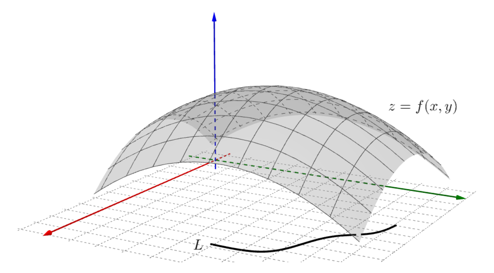
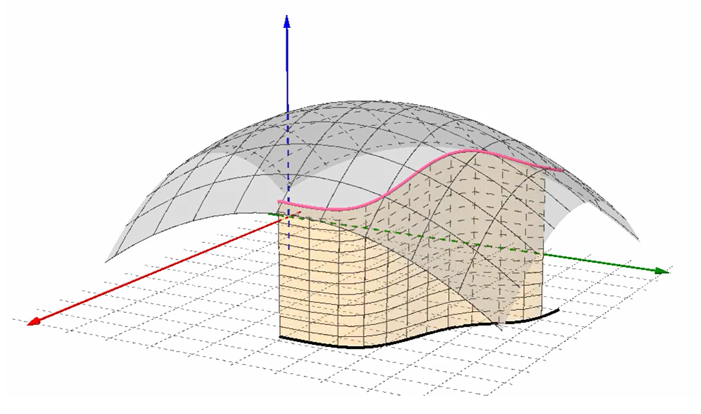
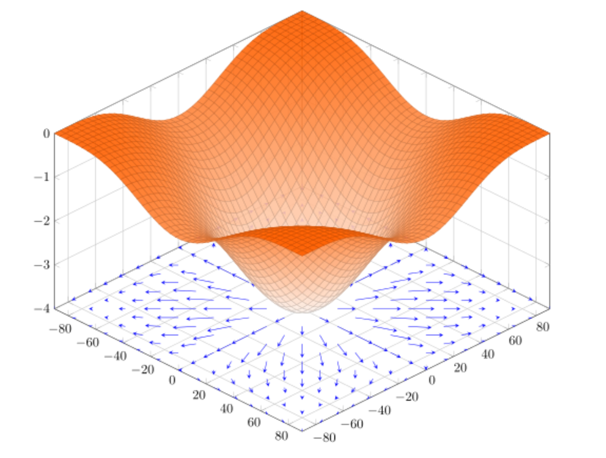

# 3 曲线积分与曲面积分

## 3.1 第一类曲线积分

### 3.1.1 严格定义

设![L](data:image/svg+xml;utf8,%3Csvg%20xmlns%3Axlink%3D%22http%3A%2F%2Fwww.w3.org%2F1999%2Fxlink%22%20width%3D%221.583ex%22%20height%3D%222.176ex%22%20style%3D%22font-size%3A14px%3Bvertical-align%3A%20-0.338ex%3B%22%20viewBox%3D%220%20-791.3%20681.5%20936.9%22%20role%3D%22img%22%20focusable%3D%22false%22%20xmlns%3D%22http%3A%2F%2Fwww.w3.org%2F2000%2Fsvg%22%20aria-labelledby%3D%22MathJax-SVG-1-Title%22%3E%0A%3Ctitle%20id%3D%22MathJax-SVG-1-Title%22%3EL%3C%2Ftitle%3E%0A%3Cdefs%20aria-hidden%3D%22true%22%3E%0A%3Cpath%20stroke-width%3D%221%22%20id%3D%22E1-MJMATHI-4C%22%20d%3D%22M228%20637Q194%20637%20192%20641Q191%20643%20191%20649Q191%20673%20202%20682Q204%20683%20217%20683Q271%20680%20344%20680Q485%20680%20506%20683H518Q524%20677%20524%20674T522%20656Q517%20641%20513%20637H475Q406%20636%20394%20628Q387%20624%20380%20600T313%20336Q297%20271%20279%20198T252%2088L243%2052Q243%2048%20252%2048T311%2046H328Q360%2046%20379%2047T428%2054T478%2072T522%20106T564%20161Q580%20191%20594%20228T611%20270Q616%20273%20628%20273H641Q647%20264%20647%20262T627%20203T583%2083T557%209Q555%204%20553%203T537%200T494%20-1Q483%20-1%20418%20-1T294%200H116Q32%200%2032%2010Q32%2017%2034%2024Q39%2043%2044%2045Q48%2046%2059%2046H65Q92%2046%20125%2049Q139%2052%20144%2061Q147%2065%20216%20339T285%20628Q285%20635%20228%20637Z%22%3E%3C%2Fpath%3E%0A%3C%2Fdefs%3E%0A%3Cg%20stroke%3D%22currentColor%22%20fill%3D%22currentColor%22%20stroke-width%3D%220%22%20transform%3D%22matrix(1%200%200%20-1%200%200)%22%20aria-hidden%3D%22true%22%3E%0A%20%3Cuse%20xlink%3Ahref%3D%22%23E1-MJMATHI-4C%22%20x%3D%220%22%20y%3D%220%22%3E%3C%2Fuse%3E%0A%3C%2Fg%3E%0A%3C%2Fsvg%3E)为![xOy](data:image/svg+xml;utf8,%3Csvg%20xmlns%3Axlink%3D%22http%3A%2F%2Fwww.w3.org%2F1999%2Fxlink%22%20width%3D%224.258ex%22%20height%3D%222.509ex%22%20style%3D%22font-size%3A14px%3Bvertical-align%3A%20-0.671ex%3B%22%20viewBox%3D%220%20-791.3%201833.5%201080.4%22%20role%3D%22img%22%20focusable%3D%22false%22%20xmlns%3D%22http%3A%2F%2Fwww.w3.org%2F2000%2Fsvg%22%20aria-labelledby%3D%22MathJax-SVG-1-Title%22%3E%0A%3Ctitle%20id%3D%22MathJax-SVG-1-Title%22%3ExOy%3C%2Ftitle%3E%0A%3Cdefs%20aria-hidden%3D%22true%22%3E%0A%3Cpath%20stroke-width%3D%221%22%20id%3D%22E1-MJMATHI-78%22%20d%3D%22M52%20289Q59%20331%20106%20386T222%20442Q257%20442%20286%20424T329%20379Q371%20442%20430%20442Q467%20442%20494%20420T522%20361Q522%20332%20508%20314T481%20292T458%20288Q439%20288%20427%20299T415%20328Q415%20374%20465%20391Q454%20404%20425%20404Q412%20404%20406%20402Q368%20386%20350%20336Q290%20115%20290%2078Q290%2050%20306%2038T341%2026Q378%2026%20414%2059T463%20140Q466%20150%20469%20151T485%20153H489Q504%20153%20504%20145Q504%20144%20502%20134Q486%2077%20440%2033T333%20-11Q263%20-11%20227%2052Q186%20-10%20133%20-10H127Q78%20-10%2057%2016T35%2071Q35%20103%2054%20123T99%20143Q142%20143%20142%20101Q142%2081%20130%2066T107%2046T94%2041L91%2040Q91%2039%2097%2036T113%2029T132%2026Q168%2026%20194%2071Q203%2087%20217%20139T245%20247T261%20313Q266%20340%20266%20352Q266%20380%20251%20392T217%20404Q177%20404%20142%20372T93%20290Q91%20281%2088%20280T72%20278H58Q52%20284%2052%20289Z%22%3E%3C%2Fpath%3E%0A%3Cpath%20stroke-width%3D%221%22%20id%3D%22E1-MJMATHI-4F%22%20d%3D%22M740%20435Q740%20320%20676%20213T511%2042T304%20-22Q207%20-22%20138%2035T51%20201Q50%20209%2050%20244Q50%20346%2098%20438T227%20601Q351%20704%20476%20704Q514%20704%20524%20703Q621%20689%20680%20617T740%20435ZM637%20476Q637%20565%20591%20615T476%20665Q396%20665%20322%20605Q242%20542%20200%20428T157%20216Q157%20126%20200%2073T314%2019Q404%2019%20485%2098T608%20313Q637%20408%20637%20476Z%22%3E%3C%2Fpath%3E%0A%3Cpath%20stroke-width%3D%221%22%20id%3D%22E1-MJMATHI-79%22%20d%3D%22M21%20287Q21%20301%2036%20335T84%20406T158%20442Q199%20442%20224%20419T250%20355Q248%20336%20247%20334Q247%20331%20231%20288T198%20191T182%20105Q182%2062%20196%2045T238%2027Q261%2027%20281%2038T312%2061T339%2094Q339%2095%20344%20114T358%20173T377%20247Q415%20397%20419%20404Q432%20431%20462%20431Q475%20431%20483%20424T494%20412T496%20403Q496%20390%20447%20193T391%20-23Q363%20-106%20294%20-155T156%20-205Q111%20-205%2077%20-183T43%20-117Q43%20-95%2050%20-80T69%20-58T89%20-48T106%20-45Q150%20-45%20150%20-87Q150%20-107%20138%20-122T115%20-142T102%20-147L99%20-148Q101%20-153%20118%20-160T152%20-167H160Q177%20-167%20186%20-165Q219%20-156%20247%20-127T290%20-65T313%20-9T321%2021L315%2017Q309%2013%20296%206T270%20-6Q250%20-11%20231%20-11Q185%20-11%20150%2011T104%2082Q103%2089%20103%20113Q103%20170%20138%20262T173%20379Q173%20380%20173%20381Q173%20390%20173%20393T169%20400T158%20404H154Q131%20404%20112%20385T82%20344T65%20302T57%20280Q55%20278%2041%20278H27Q21%20284%2021%20287Z%22%3E%3C%2Fpath%3E%0A%3C%2Fdefs%3E%0A%3Cg%20stroke%3D%22currentColor%22%20fill%3D%22currentColor%22%20stroke-width%3D%220%22%20transform%3D%22matrix(1%200%200%20-1%200%200)%22%20aria-hidden%3D%22true%22%3E%0A%20%3Cuse%20xlink%3Ahref%3D%22%23E1-MJMATHI-78%22%20x%3D%220%22%20y%3D%220%22%3E%3C%2Fuse%3E%0A%20%3Cuse%20xlink%3Ahref%3D%22%23E1-MJMATHI-4F%22%20x%3D%22572%22%20y%3D%220%22%3E%3C%2Fuse%3E%0A%20%3Cuse%20xlink%3Ahref%3D%22%23E1-MJMATHI-79%22%20x%3D%221336%22%20y%3D%220%22%3E%3C%2Fuse%3E%0A%3C%2Fg%3E%0A%3C%2Fsvg%3E)面内的一条光滑曲线弧，函数%3C%2Ftitle%3E%0A%3Cdefs%20aria-hidden%3D%22true%22%3E%0A%3Cpath%20stroke-width%3D%221%22%20id%3D%22E1-MJMATHI-66%22%20d%3D%22M118%20-162Q120%20-162%20124%20-164T135%20-167T147%20-168Q160%20-168%20171%20-155T187%20-126Q197%20-99%20221%2027T267%20267T289%20382V385H242Q195%20385%20192%20387Q188%20390%20188%20397L195%20425Q197%20430%20203%20430T250%20431Q298%20431%20298%20432Q298%20434%20307%20482T319%20540Q356%20705%20465%20705Q502%20703%20526%20683T550%20630Q550%20594%20529%20578T487%20561Q443%20561%20443%20603Q443%20622%20454%20636T478%20657L487%20662Q471%20668%20457%20668Q445%20668%20434%20658T419%20630Q412%20601%20403%20552T387%20469T380%20433Q380%20431%20435%20431Q480%20431%20487%20430T498%20424Q499%20420%20496%20407T491%20391Q489%20386%20482%20386T428%20385H372L349%20263Q301%2015%20282%20-47Q255%20-132%20212%20-173Q175%20-205%20139%20-205Q107%20-205%2081%20-186T55%20-132Q55%20-95%2076%20-78T118%20-61Q162%20-61%20162%20-103Q162%20-122%20151%20-136T127%20-157L118%20-162Z%22%3E%3C%2Fpath%3E%0A%3Cpath%20stroke-width%3D%221%22%20id%3D%22E1-MJMAIN-28%22%20d%3D%22M94%20250Q94%20319%20104%20381T127%20488T164%20576T202%20643T244%20695T277%20729T302%20750H315H319Q333%20750%20333%20741Q333%20738%20316%20720T275%20667T226%20581T184%20443T167%20250T184%2058T225%20-81T274%20-167T316%20-220T333%20-241Q333%20-250%20318%20-250H315H302L274%20-226Q180%20-141%20137%20-14T94%20250Z%22%3E%3C%2Fpath%3E%0A%3Cpath%20stroke-width%3D%221%22%20id%3D%22E1-MJMATHI-78%22%20d%3D%22M52%20289Q59%20331%20106%20386T222%20442Q257%20442%20286%20424T329%20379Q371%20442%20430%20442Q467%20442%20494%20420T522%20361Q522%20332%20508%20314T481%20292T458%20288Q439%20288%20427%20299T415%20328Q415%20374%20465%20391Q454%20404%20425%20404Q412%20404%20406%20402Q368%20386%20350%20336Q290%20115%20290%2078Q290%2050%20306%2038T341%2026Q378%2026%20414%2059T463%20140Q466%20150%20469%20151T485%20153H489Q504%20153%20504%20145Q504%20144%20502%20134Q486%2077%20440%2033T333%20-11Q263%20-11%20227%2052Q186%20-10%20133%20-10H127Q78%20-10%2057%2016T35%2071Q35%20103%2054%20123T99%20143Q142%20143%20142%20101Q142%2081%20130%2066T107%2046T94%2041L91%2040Q91%2039%2097%2036T113%2029T132%2026Q168%2026%20194%2071Q203%2087%20217%20139T245%20247T261%20313Q266%20340%20266%20352Q266%20380%20251%20392T217%20404Q177%20404%20142%20372T93%20290Q91%20281%2088%20280T72%20278H58Q52%20284%2052%20289Z%22%3E%3C%2Fpath%3E%0A%3Cpath%20stroke-width%3D%221%22%20id%3D%22E1-MJMAIN-2C%22%20d%3D%22M78%2035T78%2060T94%20103T137%20121Q165%20121%20187%2096T210%208Q210%20-27%20201%20-60T180%20-117T154%20-158T130%20-185T117%20-194Q113%20-194%20104%20-185T95%20-172Q95%20-168%20106%20-156T131%20-126T157%20-76T173%20-3V9L172%208Q170%207%20167%206T161%203T152%201T140%200Q113%200%2096%2017Z%22%3E%3C%2Fpath%3E%0A%3Cpath%20stroke-width%3D%221%22%20id%3D%22E1-MJMATHI-79%22%20d%3D%22M21%20287Q21%20301%2036%20335T84%20406T158%20442Q199%20442%20224%20419T250%20355Q248%20336%20247%20334Q247%20331%20231%20288T198%20191T182%20105Q182%2062%20196%2045T238%2027Q261%2027%20281%2038T312%2061T339%2094Q339%2095%20344%20114T358%20173T377%20247Q415%20397%20419%20404Q432%20431%20462%20431Q475%20431%20483%20424T494%20412T496%20403Q496%20390%20447%20193T391%20-23Q363%20-106%20294%20-155T156%20-205Q111%20-205%2077%20-183T43%20-117Q43%20-95%2050%20-80T69%20-58T89%20-48T106%20-45Q150%20-45%20150%20-87Q150%20-107%20138%20-122T115%20-142T102%20-147L99%20-148Q101%20-153%20118%20-160T152%20-167H160Q177%20-167%20186%20-165Q219%20-156%20247%20-127T290%20-65T313%20-9T321%2021L315%2017Q309%2013%20296%206T270%20-6Q250%20-11%20231%20-11Q185%20-11%20150%2011T104%2082Q103%2089%20103%20113Q103%20170%20138%20262T173%20379Q173%20380%20173%20381Q173%20390%20173%20393T169%20400T158%20404H154Q131%20404%20112%20385T82%20344T65%20302T57%20280Q55%20278%2041%20278H27Q21%20284%2021%20287Z%22%3E%3C%2Fpath%3E%0A%3Cpath%20stroke-width%3D%221%22%20id%3D%22E1-MJMAIN-29%22%20d%3D%22M60%20749L64%20750Q69%20750%2074%20750H86L114%20726Q208%20641%20251%20514T294%20250Q294%20182%20284%20119T261%2012T224%20-76T186%20-143T145%20-194T113%20-227T90%20-246Q87%20-249%2086%20-250H74Q66%20-250%2063%20-250T58%20-247T55%20-238Q56%20-237%2066%20-225Q221%20-64%20221%20250T66%20725Q56%20737%2055%20738Q55%20746%2060%20749Z%22%3E%3C%2Fpath%3E%0A%3C%2Fdefs%3E%0A%3Cg%20stroke%3D%22currentColor%22%20fill%3D%22currentColor%22%20stroke-width%3D%220%22%20transform%3D%22matrix(1%200%200%20-1%200%200)%22%20aria-hidden%3D%22true%22%3E%0A%20%3Cuse%20xlink%3Ahref%3D%22%23E1-MJMATHI-66%22%20x%3D%220%22%20y%3D%220%22%3E%3C%2Fuse%3E%0A%20%3Cuse%20xlink%3Ahref%3D%22%23E1-MJMAIN-28%22%20x%3D%22550%22%20y%3D%220%22%3E%3C%2Fuse%3E%0A%20%3Cuse%20xlink%3Ahref%3D%22%23E1-MJMATHI-78%22%20x%3D%22940%22%20y%3D%220%22%3E%3C%2Fuse%3E%0A%20%3Cuse%20xlink%3Ahref%3D%22%23E1-MJMAIN-2C%22%20x%3D%221512%22%20y%3D%220%22%3E%3C%2Fuse%3E%0A%20%3Cuse%20xlink%3Ahref%3D%22%23E1-MJMATHI-79%22%20x%3D%221957%22%20y%3D%220%22%3E%3C%2Fuse%3E%0A%20%3Cuse%20xlink%3Ahref%3D%22%23E1-MJMAIN-29%22%20x%3D%222455%22%20y%3D%220%22%3E%3C%2Fuse%3E%0A%3C%2Fg%3E%0A%3C%2Fsvg%3E)在![L](data:image/svg+xml;utf8,%3Csvg%20xmlns%3Axlink%3D%22http%3A%2F%2Fwww.w3.org%2F1999%2Fxlink%22%20width%3D%221.583ex%22%20height%3D%222.176ex%22%20style%3D%22font-size%3A14px%3Bvertical-align%3A%20-0.338ex%3B%22%20viewBox%3D%220%20-791.3%20681.5%20936.9%22%20role%3D%22img%22%20focusable%3D%22false%22%20xmlns%3D%22http%3A%2F%2Fwww.w3.org%2F2000%2Fsvg%22%20aria-labelledby%3D%22MathJax-SVG-1-Title%22%3E%0A%3Ctitle%20id%3D%22MathJax-SVG-1-Title%22%3EL%3C%2Ftitle%3E%0A%3Cdefs%20aria-hidden%3D%22true%22%3E%0A%3Cpath%20stroke-width%3D%221%22%20id%3D%22E1-MJMATHI-4C%22%20d%3D%22M228%20637Q194%20637%20192%20641Q191%20643%20191%20649Q191%20673%20202%20682Q204%20683%20217%20683Q271%20680%20344%20680Q485%20680%20506%20683H518Q524%20677%20524%20674T522%20656Q517%20641%20513%20637H475Q406%20636%20394%20628Q387%20624%20380%20600T313%20336Q297%20271%20279%20198T252%2088L243%2052Q243%2048%20252%2048T311%2046H328Q360%2046%20379%2047T428%2054T478%2072T522%20106T564%20161Q580%20191%20594%20228T611%20270Q616%20273%20628%20273H641Q647%20264%20647%20262T627%20203T583%2083T557%209Q555%204%20553%203T537%200T494%20-1Q483%20-1%20418%20-1T294%200H116Q32%200%2032%2010Q32%2017%2034%2024Q39%2043%2044%2045Q48%2046%2059%2046H65Q92%2046%20125%2049Q139%2052%20144%2061Q147%2065%20216%20339T285%20628Q285%20635%20228%20637Z%22%3E%3C%2Fpath%3E%0A%3C%2Fdefs%3E%0A%3Cg%20stroke%3D%22currentColor%22%20fill%3D%22currentColor%22%20stroke-width%3D%220%22%20transform%3D%22matrix(1%200%200%20-1%200%200)%22%20aria-hidden%3D%22true%22%3E%0A%20%3Cuse%20xlink%3Ahref%3D%22%23E1-MJMATHI-4C%22%20x%3D%220%22%20y%3D%220%22%3E%3C%2Fuse%3E%0A%3C%2Fg%3E%0A%3C%2Fsvg%3E)上有界。在![L](data:image/svg+xml;utf8,%3Csvg%20xmlns%3Axlink%3D%22http%3A%2F%2Fwww.w3.org%2F1999%2Fxlink%22%20width%3D%221.583ex%22%20height%3D%222.176ex%22%20style%3D%22font-size%3A14px%3Bvertical-align%3A%20-0.338ex%3B%22%20viewBox%3D%220%20-791.3%20681.5%20936.9%22%20role%3D%22img%22%20focusable%3D%22false%22%20xmlns%3D%22http%3A%2F%2Fwww.w3.org%2F2000%2Fsvg%22%20aria-labelledby%3D%22MathJax-SVG-1-Title%22%3E%0A%3Ctitle%20id%3D%22MathJax-SVG-1-Title%22%3EL%3C%2Ftitle%3E%0A%3Cdefs%20aria-hidden%3D%22true%22%3E%0A%3Cpath%20stroke-width%3D%221%22%20id%3D%22E1-MJMATHI-4C%22%20d%3D%22M228%20637Q194%20637%20192%20641Q191%20643%20191%20649Q191%20673%20202%20682Q204%20683%20217%20683Q271%20680%20344%20680Q485%20680%20506%20683H518Q524%20677%20524%20674T522%20656Q517%20641%20513%20637H475Q406%20636%20394%20628Q387%20624%20380%20600T313%20336Q297%20271%20279%20198T252%2088L243%2052Q243%2048%20252%2048T311%2046H328Q360%2046%20379%2047T428%2054T478%2072T522%20106T564%20161Q580%20191%20594%20228T611%20270Q616%20273%20628%20273H641Q647%20264%20647%20262T627%20203T583%2083T557%209Q555%204%20553%203T537%200T494%20-1Q483%20-1%20418%20-1T294%200H116Q32%200%2032%2010Q32%2017%2034%2024Q39%2043%2044%2045Q48%2046%2059%2046H65Q92%2046%20125%2049Q139%2052%20144%2061Q147%2065%20216%20339T285%20628Q285%20635%20228%20637Z%22%3E%3C%2Fpath%3E%0A%3C%2Fdefs%3E%0A%3Cg%20stroke%3D%22currentColor%22%20fill%3D%22currentColor%22%20stroke-width%3D%220%22%20transform%3D%22matrix(1%200%200%20-1%200%200)%22%20aria-hidden%3D%22true%22%3E%0A%20%3Cuse%20xlink%3Ahref%3D%22%23E1-MJMATHI-4C%22%20x%3D%220%22%20y%3D%220%22%3E%3C%2Fuse%3E%0A%3C%2Fg%3E%0A%3C%2Fsvg%3E)上任意插入一点列![P_0](data:image/svg+xml;utf8,%3Csvg%20xmlns%3Axlink%3D%22http%3A%2F%2Fwww.w3.org%2F1999%2Fxlink%22%20width%3D%222.547ex%22%20height%3D%222.509ex%22%20style%3D%22font-size%3A14px%3Bvertical-align%3A%20-0.671ex%3B%22%20viewBox%3D%220%20-791.3%201096.4%201080.4%22%20role%3D%22img%22%20focusable%3D%22false%22%20xmlns%3D%22http%3A%2F%2Fwww.w3.org%2F2000%2Fsvg%22%20aria-labelledby%3D%22MathJax-SVG-1-Title%22%3E%0A%3Ctitle%20id%3D%22MathJax-SVG-1-Title%22%3EP_0%3C%2Ftitle%3E%0A%3Cdefs%20aria-hidden%3D%22true%22%3E%0A%3Cpath%20stroke-width%3D%221%22%20id%3D%22E1-MJMATHI-50%22%20d%3D%22M287%20628Q287%20635%20230%20637Q206%20637%20199%20638T192%20648Q192%20649%20194%20659Q200%20679%20203%20681T397%20683Q587%20682%20600%20680Q664%20669%20707%20631T751%20530Q751%20453%20685%20389Q616%20321%20507%20303Q500%20302%20402%20301H307L277%20182Q247%2066%20247%2059Q247%2055%20248%2054T255%2050T272%2048T305%2046H336Q342%2037%20342%2035Q342%2019%20335%205Q330%200%20319%200Q316%200%20282%201T182%202Q120%202%2087%202T51%201Q33%201%2033%2011Q33%2013%2036%2025Q40%2041%2044%2043T67%2046Q94%2046%20127%2049Q141%2052%20146%2061Q149%2065%20218%20339T287%20628ZM645%20554Q645%20567%20643%20575T634%20597T609%20619T560%20635Q553%20636%20480%20637Q463%20637%20445%20637T416%20636T404%20636Q391%20635%20386%20627Q384%20621%20367%20550T332%20412T314%20344Q314%20342%20395%20342H407H430Q542%20342%20590%20392Q617%20419%20631%20471T645%20554Z%22%3E%3C%2Fpath%3E%0A%3Cpath%20stroke-width%3D%221%22%20id%3D%22E1-MJMAIN-30%22%20d%3D%22M96%20585Q152%20666%20249%20666Q297%20666%20345%20640T423%20548Q460%20465%20460%20320Q460%20165%20417%2083Q397%2041%20362%2016T301%20-15T250%20-22Q224%20-22%20198%20-16T137%2016T82%2083Q39%20165%2039%20320Q39%20494%2096%20585ZM321%20597Q291%20629%20250%20629Q208%20629%20178%20597Q153%20571%20145%20525T137%20333Q137%20175%20145%20125T181%2046Q209%2016%20250%2016Q290%2016%20318%2046Q347%2076%20354%20130T362%20333Q362%20478%20354%20524T321%20597Z%22%3E%3C%2Fpath%3E%0A%3C%2Fdefs%3E%0A%3Cg%20stroke%3D%22currentColor%22%20fill%3D%22currentColor%22%20stroke-width%3D%220%22%20transform%3D%22matrix(1%200%200%20-1%200%200)%22%20aria-hidden%3D%22true%22%3E%0A%20%3Cuse%20xlink%3Ahref%3D%22%23E1-MJMATHI-50%22%20x%3D%220%22%20y%3D%220%22%3E%3C%2Fuse%3E%0A%20%3Cuse%20transform%3D%22scale(0.707)%22%20xlink%3Ahref%3D%22%23E1-MJMAIN-30%22%20x%3D%22908%22%20y%3D%22-213%22%3E%3C%2Fuse%3E%0A%3C%2Fg%3E%0A%3C%2Fsvg%3E)、![P_1](data:image/svg+xml;utf8,%3Csvg%20xmlns%3Axlink%3D%22http%3A%2F%2Fwww.w3.org%2F1999%2Fxlink%22%20width%3D%222.547ex%22%20height%3D%222.509ex%22%20style%3D%22font-size%3A14px%3Bvertical-align%3A%20-0.671ex%3B%22%20viewBox%3D%220%20-791.3%201096.4%201080.4%22%20role%3D%22img%22%20focusable%3D%22false%22%20xmlns%3D%22http%3A%2F%2Fwww.w3.org%2F2000%2Fsvg%22%20aria-labelledby%3D%22MathJax-SVG-1-Title%22%3E%0A%3Ctitle%20id%3D%22MathJax-SVG-1-Title%22%3EP_1%3C%2Ftitle%3E%0A%3Cdefs%20aria-hidden%3D%22true%22%3E%0A%3Cpath%20stroke-width%3D%221%22%20id%3D%22E1-MJMATHI-50%22%20d%3D%22M287%20628Q287%20635%20230%20637Q206%20637%20199%20638T192%20648Q192%20649%20194%20659Q200%20679%20203%20681T397%20683Q587%20682%20600%20680Q664%20669%20707%20631T751%20530Q751%20453%20685%20389Q616%20321%20507%20303Q500%20302%20402%20301H307L277%20182Q247%2066%20247%2059Q247%2055%20248%2054T255%2050T272%2048T305%2046H336Q342%2037%20342%2035Q342%2019%20335%205Q330%200%20319%200Q316%200%20282%201T182%202Q120%202%2087%202T51%201Q33%201%2033%2011Q33%2013%2036%2025Q40%2041%2044%2043T67%2046Q94%2046%20127%2049Q141%2052%20146%2061Q149%2065%20218%20339T287%20628ZM645%20554Q645%20567%20643%20575T634%20597T609%20619T560%20635Q553%20636%20480%20637Q463%20637%20445%20637T416%20636T404%20636Q391%20635%20386%20627Q384%20621%20367%20550T332%20412T314%20344Q314%20342%20395%20342H407H430Q542%20342%20590%20392Q617%20419%20631%20471T645%20554Z%22%3E%3C%2Fpath%3E%0A%3Cpath%20stroke-width%3D%221%22%20id%3D%22E1-MJMAIN-31%22%20d%3D%22M213%20578L200%20573Q186%20568%20160%20563T102%20556H83V602H102Q149%20604%20189%20617T245%20641T273%20663Q275%20666%20285%20666Q294%20666%20302%20660V361L303%2061Q310%2054%20315%2052T339%2048T401%2046H427V0H416Q395%203%20257%203Q121%203%20100%200H88V46H114Q136%2046%20152%2046T177%2047T193%2050T201%2052T207%2057T213%2061V578Z%22%3E%3C%2Fpath%3E%0A%3C%2Fdefs%3E%0A%3Cg%20stroke%3D%22currentColor%22%20fill%3D%22currentColor%22%20stroke-width%3D%220%22%20transform%3D%22matrix(1%200%200%20-1%200%200)%22%20aria-hidden%3D%22true%22%3E%0A%20%3Cuse%20xlink%3Ahref%3D%22%23E1-MJMATHI-50%22%20x%3D%220%22%20y%3D%220%22%3E%3C%2Fuse%3E%0A%20%3Cuse%20transform%3D%22scale(0.707)%22%20xlink%3Ahref%3D%22%23E1-MJMAIN-31%22%20x%3D%22908%22%20y%3D%22-213%22%3E%3C%2Fuse%3E%0A%3C%2Fg%3E%0A%3C%2Fsvg%3E)，![\cdots](data:image/svg+xml;utf8,%3Csvg%20xmlns%3Axlink%3D%22http%3A%2F%2Fwww.w3.org%2F1999%2Fxlink%22%20width%3D%222.723ex%22%20height%3D%221.176ex%22%20style%3D%22font-size%3A14px%3Bvertical-align%3A%200.439ex%3B%20margin-bottom%3A%20-0.61ex%3B%22%20viewBox%3D%220%20-432.6%201172.5%20506.3%22%20role%3D%22img%22%20focusable%3D%22false%22%20xmlns%3D%22http%3A%2F%2Fwww.w3.org%2F2000%2Fsvg%22%20aria-labelledby%3D%22MathJax-SVG-1-Title%22%3E%0A%3Ctitle%20id%3D%22MathJax-SVG-1-Title%22%3E%5Ccdots%3C%2Ftitle%3E%0A%3Cdefs%20aria-hidden%3D%22true%22%3E%0A%3Cpath%20stroke-width%3D%221%22%20id%3D%22E1-MJMAIN-22EF%22%20d%3D%22M78%20250Q78%20274%2095%20292T138%20310Q162%20310%20180%20294T199%20251Q199%20226%20182%20208T139%20190T96%20207T78%20250ZM525%20250Q525%20274%20542%20292T585%20310Q609%20310%20627%20294T646%20251Q646%20226%20629%20208T586%20190T543%20207T525%20250ZM972%20250Q972%20274%20989%20292T1032%20310Q1056%20310%201074%20294T1093%20251Q1093%20226%201076%20208T1033%20190T990%20207T972%20250Z%22%3E%3C%2Fpath%3E%0A%3C%2Fdefs%3E%0A%3Cg%20stroke%3D%22currentColor%22%20fill%3D%22currentColor%22%20stroke-width%3D%220%22%20transform%3D%22matrix(1%200%200%20-1%200%200)%22%20aria-hidden%3D%22true%22%3E%0A%20%3Cuse%20xlink%3Ahref%3D%22%23E1-MJMAIN-22EF%22%20x%3D%220%22%20y%3D%220%22%3E%3C%2Fuse%3E%0A%3C%2Fg%3E%0A%3C%2Fsvg%3E)、![P_{n}](data:image/svg+xml;utf8,%3Csvg%20xmlns%3Axlink%3D%22http%3A%2F%2Fwww.w3.org%2F1999%2Fxlink%22%20width%3D%222.711ex%22%20height%3D%222.509ex%22%20style%3D%22font-size%3A14px%3Bvertical-align%3A%20-0.671ex%3B%22%20viewBox%3D%220%20-791.3%201167.1%201080.4%22%20role%3D%22img%22%20focusable%3D%22false%22%20xmlns%3D%22http%3A%2F%2Fwww.w3.org%2F2000%2Fsvg%22%20aria-labelledby%3D%22MathJax-SVG-1-Title%22%3E%0A%3Ctitle%20id%3D%22MathJax-SVG-1-Title%22%3EP_%7Bn%7D%3C%2Ftitle%3E%0A%3Cdefs%20aria-hidden%3D%22true%22%3E%0A%3Cpath%20stroke-width%3D%221%22%20id%3D%22E1-MJMATHI-50%22%20d%3D%22M287%20628Q287%20635%20230%20637Q206%20637%20199%20638T192%20648Q192%20649%20194%20659Q200%20679%20203%20681T397%20683Q587%20682%20600%20680Q664%20669%20707%20631T751%20530Q751%20453%20685%20389Q616%20321%20507%20303Q500%20302%20402%20301H307L277%20182Q247%2066%20247%2059Q247%2055%20248%2054T255%2050T272%2048T305%2046H336Q342%2037%20342%2035Q342%2019%20335%205Q330%200%20319%200Q316%200%20282%201T182%202Q120%202%2087%202T51%201Q33%201%2033%2011Q33%2013%2036%2025Q40%2041%2044%2043T67%2046Q94%2046%20127%2049Q141%2052%20146%2061Q149%2065%20218%20339T287%20628ZM645%20554Q645%20567%20643%20575T634%20597T609%20619T560%20635Q553%20636%20480%20637Q463%20637%20445%20637T416%20636T404%20636Q391%20635%20386%20627Q384%20621%20367%20550T332%20412T314%20344Q314%20342%20395%20342H407H430Q542%20342%20590%20392Q617%20419%20631%20471T645%20554Z%22%3E%3C%2Fpath%3E%0A%3Cpath%20stroke-width%3D%221%22%20id%3D%22E1-MJMATHI-6E%22%20d%3D%22M21%20287Q22%20293%2024%20303T36%20341T56%20388T89%20425T135%20442Q171%20442%20195%20424T225%20390T231%20369Q231%20367%20232%20367L243%20378Q304%20442%20382%20442Q436%20442%20469%20415T503%20336T465%20179T427%2052Q427%2026%20444%2026Q450%2026%20453%2027Q482%2032%20505%2065T540%20145Q542%20153%20560%20153Q580%20153%20580%20145Q580%20144%20576%20130Q568%20101%20554%2073T508%2017T439%20-10Q392%20-10%20371%2017T350%2073Q350%2092%20386%20193T423%20345Q423%20404%20379%20404H374Q288%20404%20229%20303L222%20291L189%20157Q156%2026%20151%2016Q138%20-11%20108%20-11Q95%20-11%2087%20-5T76%207T74%2017Q74%2030%20112%20180T152%20343Q153%20348%20153%20366Q153%20405%20129%20405Q91%20405%2066%20305Q60%20285%2060%20284Q58%20278%2041%20278H27Q21%20284%2021%20287Z%22%3E%3C%2Fpath%3E%0A%3C%2Fdefs%3E%0A%3Cg%20stroke%3D%22currentColor%22%20fill%3D%22currentColor%22%20stroke-width%3D%220%22%20transform%3D%22matrix(1%200%200%20-1%200%200)%22%20aria-hidden%3D%22true%22%3E%0A%20%3Cuse%20xlink%3Ahref%3D%22%23E1-MJMATHI-50%22%20x%3D%220%22%20y%3D%220%22%3E%3C%2Fuse%3E%0A%20%3Cuse%20transform%3D%22scale(0.707)%22%20xlink%3Ahref%3D%22%23E1-MJMATHI-6E%22%20x%3D%22908%22%20y%3D%22-213%22%3E%3C%2Fuse%3E%0A%3C%2Fg%3E%0A%3C%2Fsvg%3E)，把![L](data:image/svg+xml;utf8,%3Csvg%20xmlns%3Axlink%3D%22http%3A%2F%2Fwww.w3.org%2F1999%2Fxlink%22%20width%3D%221.583ex%22%20height%3D%222.176ex%22%20style%3D%22font-size%3A14px%3Bvertical-align%3A%20-0.338ex%3B%22%20viewBox%3D%220%20-791.3%20681.5%20936.9%22%20role%3D%22img%22%20focusable%3D%22false%22%20xmlns%3D%22http%3A%2F%2Fwww.w3.org%2F2000%2Fsvg%22%20aria-labelledby%3D%22MathJax-SVG-1-Title%22%3E%0A%3Ctitle%20id%3D%22MathJax-SVG-1-Title%22%3EL%3C%2Ftitle%3E%0A%3Cdefs%20aria-hidden%3D%22true%22%3E%0A%3Cpath%20stroke-width%3D%221%22%20id%3D%22E1-MJMATHI-4C%22%20d%3D%22M228%20637Q194%20637%20192%20641Q191%20643%20191%20649Q191%20673%20202%20682Q204%20683%20217%20683Q271%20680%20344%20680Q485%20680%20506%20683H518Q524%20677%20524%20674T522%20656Q517%20641%20513%20637H475Q406%20636%20394%20628Q387%20624%20380%20600T313%20336Q297%20271%20279%20198T252%2088L243%2052Q243%2048%20252%2048T311%2046H328Q360%2046%20379%2047T428%2054T478%2072T522%20106T564%20161Q580%20191%20594%20228T611%20270Q616%20273%20628%20273H641Q647%20264%20647%20262T627%20203T583%2083T557%209Q555%204%20553%203T537%200T494%20-1Q483%20-1%20418%20-1T294%200H116Q32%200%2032%2010Q32%2017%2034%2024Q39%2043%2044%2045Q48%2046%2059%2046H65Q92%2046%20125%2049Q139%2052%20144%2061Q147%2065%20216%20339T285%20628Q285%20635%20228%20637Z%22%3E%3C%2Fpath%3E%0A%3C%2Fdefs%3E%0A%3Cg%20stroke%3D%22currentColor%22%20fill%3D%22currentColor%22%20stroke-width%3D%220%22%20transform%3D%22matrix(1%200%200%20-1%200%200)%22%20aria-hidden%3D%22true%22%3E%0A%20%3Cuse%20xlink%3Ahref%3D%22%23E1-MJMATHI-4C%22%20x%3D%220%22%20y%3D%220%22%3E%3C%2Fuse%3E%0A%3C%2Fg%3E%0A%3C%2Fsvg%3E)分成![n](data:image/svg+xml;utf8,%3Csvg%20xmlns%3Axlink%3D%22http%3A%2F%2Fwww.w3.org%2F1999%2Fxlink%22%20width%3D%221.395ex%22%20height%3D%221.676ex%22%20style%3D%22font-size%3A14px%3Bvertical-align%3A%20-0.338ex%3B%22%20viewBox%3D%220%20-576.1%20600.5%20721.6%22%20role%3D%22img%22%20focusable%3D%22false%22%20xmlns%3D%22http%3A%2F%2Fwww.w3.org%2F2000%2Fsvg%22%20aria-labelledby%3D%22MathJax-SVG-1-Title%22%3E%0A%3Ctitle%20id%3D%22MathJax-SVG-1-Title%22%3En%3C%2Ftitle%3E%0A%3Cdefs%20aria-hidden%3D%22true%22%3E%0A%3Cpath%20stroke-width%3D%221%22%20id%3D%22E1-MJMATHI-6E%22%20d%3D%22M21%20287Q22%20293%2024%20303T36%20341T56%20388T89%20425T135%20442Q171%20442%20195%20424T225%20390T231%20369Q231%20367%20232%20367L243%20378Q304%20442%20382%20442Q436%20442%20469%20415T503%20336T465%20179T427%2052Q427%2026%20444%2026Q450%2026%20453%2027Q482%2032%20505%2065T540%20145Q542%20153%20560%20153Q580%20153%20580%20145Q580%20144%20576%20130Q568%20101%20554%2073T508%2017T439%20-10Q392%20-10%20371%2017T350%2073Q350%2092%20386%20193T423%20345Q423%20404%20379%20404H374Q288%20404%20229%20303L222%20291L189%20157Q156%2026%20151%2016Q138%20-11%20108%20-11Q95%20-11%2087%20-5T76%207T74%2017Q74%2030%20112%20180T152%20343Q153%20348%20153%20366Q153%20405%20129%20405Q91%20405%2066%20305Q60%20285%2060%20284Q58%20278%2041%20278H27Q21%20284%2021%20287Z%22%3E%3C%2Fpath%3E%0A%3C%2Fdefs%3E%0A%3Cg%20stroke%3D%22currentColor%22%20fill%3D%22currentColor%22%20stroke-width%3D%220%22%20transform%3D%22matrix(1%200%200%20-1%200%200)%22%20aria-hidden%3D%22true%22%3E%0A%20%3Cuse%20xlink%3Ahref%3D%22%23E1-MJMATHI-6E%22%20x%3D%220%22%20y%3D%220%22%3E%3C%2Fuse%3E%0A%3C%2Fg%3E%0A%3C%2Fsvg%3E)个小段。设第![k](data:image/svg+xml;utf8,%3Csvg%20xmlns%3Axlink%3D%22http%3A%2F%2Fwww.w3.org%2F1999%2Fxlink%22%20width%3D%221.211ex%22%20height%3D%222.176ex%22%20style%3D%22font-size%3A14px%3Bvertical-align%3A%20-0.338ex%3B%22%20viewBox%3D%220%20-791.3%20521.5%20936.9%22%20role%3D%22img%22%20focusable%3D%22false%22%20xmlns%3D%22http%3A%2F%2Fwww.w3.org%2F2000%2Fsvg%22%20aria-labelledby%3D%22MathJax-SVG-1-Title%22%3E%0A%3Ctitle%20id%3D%22MathJax-SVG-1-Title%22%3Ek%3C%2Ftitle%3E%0A%3Cdefs%20aria-hidden%3D%22true%22%3E%0A%3Cpath%20stroke-width%3D%221%22%20id%3D%22E1-MJMATHI-6B%22%20d%3D%22M121%20647Q121%20657%20125%20670T137%20683Q138%20683%20209%20688T282%20694Q294%20694%20294%20686Q294%20679%20244%20477Q194%20279%20194%20272Q213%20282%20223%20291Q247%20309%20292%20354T362%20415Q402%20442%20438%20442Q468%20442%20485%20423T503%20369Q503%20344%20496%20327T477%20302T456%20291T438%20288Q418%20288%20406%20299T394%20328Q394%20353%20410%20369T442%20390L458%20393Q446%20405%20434%20405H430Q398%20402%20367%20380T294%20316T228%20255Q230%20254%20243%20252T267%20246T293%20238T320%20224T342%20206T359%20180T365%20147Q365%20130%20360%20106T354%2066Q354%2026%20381%2026Q429%2026%20459%20145Q461%20153%20479%20153H483Q499%20153%20499%20144Q499%20139%20496%20130Q455%20-11%20378%20-11Q333%20-11%20305%2015T277%2090Q277%20108%20280%20121T283%20145Q283%20167%20269%20183T234%20206T200%20217T182%20220H180Q168%20178%20159%20139T145%2081T136%2044T129%2020T122%207T111%20-2Q98%20-11%2083%20-11Q66%20-11%2057%20-1T48%2016Q48%2026%2085%20176T158%20471L195%20616Q196%20629%20188%20632T149%20637H144Q134%20637%20131%20637T124%20640T121%20647Z%22%3E%3C%2Fpath%3E%0A%3C%2Fdefs%3E%0A%3Cg%20stroke%3D%22currentColor%22%20fill%3D%22currentColor%22%20stroke-width%3D%220%22%20transform%3D%22matrix(1%200%200%20-1%200%200)%22%20aria-hidden%3D%22true%22%3E%0A%20%3Cuse%20xlink%3Ahref%3D%22%23E1-MJMATHI-6B%22%20x%3D%220%22%20y%3D%220%22%3E%3C%2Fuse%3E%0A%3C%2Fg%3E%0A%3C%2Fsvg%3E)个小段的长度为![\Delta s_k](data:image/svg+xml;utf8,%3Csvg%20xmlns%3Axlink%3D%22http%3A%2F%2Fwww.w3.org%2F1999%2Fxlink%22%20width%3D%224.115ex%22%20height%3D%222.509ex%22%20style%3D%22font-size%3A14px%3Bvertical-align%3A%20-0.671ex%3B%22%20viewBox%3D%220%20-791.3%201771.8%201080.4%22%20role%3D%22img%22%20focusable%3D%22false%22%20xmlns%3D%22http%3A%2F%2Fwww.w3.org%2F2000%2Fsvg%22%20aria-labelledby%3D%22MathJax-SVG-1-Title%22%3E%0A%3Ctitle%20id%3D%22MathJax-SVG-1-Title%22%3E%5CDelta%20s_k%3C%2Ftitle%3E%0A%3Cdefs%20aria-hidden%3D%22true%22%3E%0A%3Cpath%20stroke-width%3D%221%22%20id%3D%22E1-MJMAIN-394%22%20d%3D%22M51%200Q46%204%2046%207Q46%209%20215%20357T388%20709Q391%20716%20416%20716Q439%20716%20444%20709Q447%20705%20616%20357T786%207Q786%204%20781%200H51ZM507%20344L384%20596L137%2092L383%2091H630Q630%2093%20507%20344Z%22%3E%3C%2Fpath%3E%0A%3Cpath%20stroke-width%3D%221%22%20id%3D%22E1-MJMATHI-73%22%20d%3D%22M131%20289Q131%20321%20147%20354T203%20415T300%20442Q362%20442%20390%20415T419%20355Q419%20323%20402%20308T364%20292Q351%20292%20340%20300T328%20326Q328%20342%20337%20354T354%20372T367%20378Q368%20378%20368%20379Q368%20382%20361%20388T336%20399T297%20405Q249%20405%20227%20379T204%20326Q204%20301%20223%20291T278%20274T330%20259Q396%20230%20396%20163Q396%20135%20385%20107T352%2051T289%207T195%20-10Q118%20-10%2086%2019T53%2087Q53%20126%2074%20143T118%20160Q133%20160%20146%20151T160%20120Q160%2094%20142%2076T111%2058Q109%2057%20108%2057T107%2055Q108%2052%20115%2047T146%2034T201%2027Q237%2027%20263%2038T301%2066T318%2097T323%20122Q323%20150%20302%20164T254%20181T195%20196T148%20231Q131%20256%20131%20289Z%22%3E%3C%2Fpath%3E%0A%3Cpath%20stroke-width%3D%221%22%20id%3D%22E1-MJMATHI-6B%22%20d%3D%22M121%20647Q121%20657%20125%20670T137%20683Q138%20683%20209%20688T282%20694Q294%20694%20294%20686Q294%20679%20244%20477Q194%20279%20194%20272Q213%20282%20223%20291Q247%20309%20292%20354T362%20415Q402%20442%20438%20442Q468%20442%20485%20423T503%20369Q503%20344%20496%20327T477%20302T456%20291T438%20288Q418%20288%20406%20299T394%20328Q394%20353%20410%20369T442%20390L458%20393Q446%20405%20434%20405H430Q398%20402%20367%20380T294%20316T228%20255Q230%20254%20243%20252T267%20246T293%20238T320%20224T342%20206T359%20180T365%20147Q365%20130%20360%20106T354%2066Q354%2026%20381%2026Q429%2026%20459%20145Q461%20153%20479%20153H483Q499%20153%20499%20144Q499%20139%20496%20130Q455%20-11%20378%20-11Q333%20-11%20305%2015T277%2090Q277%20108%20280%20121T283%20145Q283%20167%20269%20183T234%20206T200%20217T182%20220H180Q168%20178%20159%20139T145%2081T136%2044T129%2020T122%207T111%20-2Q98%20-11%2083%20-11Q66%20-11%2057%20-1T48%2016Q48%2026%2085%20176T158%20471L195%20616Q196%20629%20188%20632T149%20637H144Q134%20637%20131%20637T124%20640T121%20647Z%22%3E%3C%2Fpath%3E%0A%3C%2Fdefs%3E%0A%3Cg%20stroke%3D%22currentColor%22%20fill%3D%22currentColor%22%20stroke-width%3D%220%22%20transform%3D%22matrix(1%200%200%20-1%200%200)%22%20aria-hidden%3D%22true%22%3E%0A%20%3Cuse%20xlink%3Ahref%3D%22%23E1-MJMAIN-394%22%20x%3D%220%22%20y%3D%220%22%3E%3C%2Fuse%3E%0A%3Cg%20transform%3D%22translate(833%2C0)%22%3E%0A%20%3Cuse%20xlink%3Ahref%3D%22%23E1-MJMATHI-73%22%20x%3D%220%22%20y%3D%220%22%3E%3C%2Fuse%3E%0A%20%3Cuse%20transform%3D%22scale(0.707)%22%20xlink%3Ahref%3D%22%23E1-MJMATHI-6B%22%20x%3D%22663%22%20y%3D%22-213%22%3E%3C%2Fuse%3E%0A%3C%2Fg%3E%0A%3C%2Fg%3E%0A%3C%2Fsvg%3E)。又%3C%2Ftitle%3E%0A%3Cdefs%20aria-hidden%3D%22true%22%3E%0A%3Cpath%20stroke-width%3D%221%22%20id%3D%22E1-MJMAIN-28%22%20d%3D%22M94%20250Q94%20319%20104%20381T127%20488T164%20576T202%20643T244%20695T277%20729T302%20750H315H319Q333%20750%20333%20741Q333%20738%20316%20720T275%20667T226%20581T184%20443T167%20250T184%2058T225%20-81T274%20-167T316%20-220T333%20-241Q333%20-250%20318%20-250H315H302L274%20-226Q180%20-141%20137%20-14T94%20250Z%22%3E%3C%2Fpath%3E%0A%3Cpath%20stroke-width%3D%221%22%20id%3D%22E1-MJMATHI-3BE%22%20d%3D%22M268%20632Q268%20704%20296%20704Q314%20704%20314%20687Q314%20682%20311%20664T308%20635T309%20620V616H315Q342%20619%20360%20619Q443%20619%20443%20586Q439%20548%20358%20546H344Q326%20546%20317%20549T290%20566Q257%20550%20226%20505T195%20405Q195%20381%20201%20364T211%20342T218%20337Q266%20347%20298%20347Q375%20347%20375%20314Q374%20297%20359%20288T327%20277T280%20275Q234%20275%20208%20283L195%20286Q149%20260%20119%20214T88%20130Q88%20116%2090%20108Q101%2079%20129%2063T229%2020Q238%2017%20243%2015Q337%20-21%20354%20-33Q383%20-53%20383%20-94Q383%20-137%20351%20-171T273%20-205Q240%20-205%20202%20-190T158%20-167Q156%20-163%20156%20-159Q156%20-151%20161%20-146T176%20-140Q182%20-140%20189%20-143Q232%20-168%20274%20-168Q286%20-168%20292%20-165Q313%20-151%20313%20-129Q313%20-112%20301%20-104T232%20-75Q214%20-68%20204%20-64Q198%20-62%20171%20-52T136%20-38T107%20-24T78%20-8T56%2012T36%2037T26%2066T21%20103Q21%20149%2055%20206T145%20301L154%20307L148%20313Q141%20319%20136%20323T124%20338T111%20358T103%20382T99%20413Q99%20471%20143%20524T259%20602L271%20607Q268%20618%20268%20632Z%22%3E%3C%2Fpath%3E%0A%3Cpath%20stroke-width%3D%221%22%20id%3D%22E1-MJMATHI-6B%22%20d%3D%22M121%20647Q121%20657%20125%20670T137%20683Q138%20683%20209%20688T282%20694Q294%20694%20294%20686Q294%20679%20244%20477Q194%20279%20194%20272Q213%20282%20223%20291Q247%20309%20292%20354T362%20415Q402%20442%20438%20442Q468%20442%20485%20423T503%20369Q503%20344%20496%20327T477%20302T456%20291T438%20288Q418%20288%20406%20299T394%20328Q394%20353%20410%20369T442%20390L458%20393Q446%20405%20434%20405H430Q398%20402%20367%20380T294%20316T228%20255Q230%20254%20243%20252T267%20246T293%20238T320%20224T342%20206T359%20180T365%20147Q365%20130%20360%20106T354%2066Q354%2026%20381%2026Q429%2026%20459%20145Q461%20153%20479%20153H483Q499%20153%20499%20144Q499%20139%20496%20130Q455%20-11%20378%20-11Q333%20-11%20305%2015T277%2090Q277%20108%20280%20121T283%20145Q283%20167%20269%20183T234%20206T200%20217T182%20220H180Q168%20178%20159%20139T145%2081T136%2044T129%2020T122%207T111%20-2Q98%20-11%2083%20-11Q66%20-11%2057%20-1T48%2016Q48%2026%2085%20176T158%20471L195%20616Q196%20629%20188%20632T149%20637H144Q134%20637%20131%20637T124%20640T121%20647Z%22%3E%3C%2Fpath%3E%0A%3Cpath%20stroke-width%3D%221%22%20id%3D%22E1-MJMAIN-2C%22%20d%3D%22M78%2035T78%2060T94%20103T137%20121Q165%20121%20187%2096T210%208Q210%20-27%20201%20-60T180%20-117T154%20-158T130%20-185T117%20-194Q113%20-194%20104%20-185T95%20-172Q95%20-168%20106%20-156T131%20-126T157%20-76T173%20-3V9L172%208Q170%207%20167%206T161%203T152%201T140%200Q113%200%2096%2017Z%22%3E%3C%2Fpath%3E%0A%3Cpath%20stroke-width%3D%221%22%20id%3D%22E1-MJMATHI-3B7%22%20d%3D%22M21%20287Q22%20290%2023%20295T28%20317T38%20348T53%20381T73%20411T99%20433T132%20442Q156%20442%20175%20435T205%20417T221%20395T229%20376L231%20369Q231%20367%20232%20367L243%20378Q304%20442%20382%20442Q436%20442%20469%20415T503%20336V326Q503%20302%20439%2053Q381%20-182%20377%20-189Q364%20-216%20332%20-216Q319%20-216%20310%20-208T299%20-186Q299%20-177%20358%2057L420%20307Q423%20322%20423%20345Q423%20404%20379%20404H374Q288%20404%20229%20303L222%20291L189%20157Q156%2026%20151%2016Q138%20-11%20108%20-11Q95%20-11%2087%20-5T76%207T74%2017Q74%2030%20114%20189T154%20366Q154%20405%20128%20405Q107%20405%2092%20377T68%20316T57%20280Q55%20278%2041%20278H27Q21%20284%2021%20287Z%22%3E%3C%2Fpath%3E%0A%3Cpath%20stroke-width%3D%221%22%20id%3D%22E1-MJMAIN-29%22%20d%3D%22M60%20749L64%20750Q69%20750%2074%20750H86L114%20726Q208%20641%20251%20514T294%20250Q294%20182%20284%20119T261%2012T224%20-76T186%20-143T145%20-194T113%20-227T90%20-246Q87%20-249%2086%20-250H74Q66%20-250%2063%20-250T58%20-247T55%20-238Q56%20-237%2066%20-225Q221%20-64%20221%20250T66%20725Q56%20737%2055%20738Q55%20746%2060%20749Z%22%3E%3C%2Fpath%3E%0A%3C%2Fdefs%3E%0A%3Cg%20stroke%3D%22currentColor%22%20fill%3D%22currentColor%22%20stroke-width%3D%220%22%20transform%3D%22matrix(1%200%200%20-1%200%200)%22%20aria-hidden%3D%22true%22%3E%0A%20%3Cuse%20xlink%3Ahref%3D%22%23E1-MJMAIN-28%22%20x%3D%220%22%20y%3D%220%22%3E%3C%2Fuse%3E%0A%3Cg%20transform%3D%22translate(389%2C0)%22%3E%0A%20%3Cuse%20xlink%3Ahref%3D%22%23E1-MJMATHI-3BE%22%20x%3D%220%22%20y%3D%220%22%3E%3C%2Fuse%3E%0A%20%3Cuse%20transform%3D%22scale(0.707)%22%20xlink%3Ahref%3D%22%23E1-MJMATHI-6B%22%20x%3D%22620%22%20y%3D%22-213%22%3E%3C%2Fuse%3E%0A%3C%2Fg%3E%0A%20%3Cuse%20xlink%3Ahref%3D%22%23E1-MJMAIN-2C%22%20x%3D%221296%22%20y%3D%220%22%3E%3C%2Fuse%3E%0A%3Cg%20transform%3D%22translate(1741%2C0)%22%3E%0A%20%3Cuse%20xlink%3Ahref%3D%22%23E1-MJMATHI-3B7%22%20x%3D%220%22%20y%3D%220%22%3E%3C%2Fuse%3E%0A%20%3Cuse%20transform%3D%22scale(0.707)%22%20xlink%3Ahref%3D%22%23E1-MJMATHI-6B%22%20x%3D%22703%22%20y%3D%22-213%22%3E%3C%2Fuse%3E%0A%3C%2Fg%3E%0A%20%3Cuse%20xlink%3Ahref%3D%22%23E1-MJMAIN-29%22%20x%3D%222708%22%20y%3D%220%22%3E%3C%2Fuse%3E%0A%3C%2Fg%3E%0A%3C%2Fsvg%3E)为第![k](data:image/svg+xml;utf8,%3Csvg%20xmlns%3Axlink%3D%22http%3A%2F%2Fwww.w3.org%2F1999%2Fxlink%22%20width%3D%221.211ex%22%20height%3D%222.176ex%22%20style%3D%22font-size%3A14px%3Bvertical-align%3A%20-0.338ex%3B%22%20viewBox%3D%220%20-791.3%20521.5%20936.9%22%20role%3D%22img%22%20focusable%3D%22false%22%20xmlns%3D%22http%3A%2F%2Fwww.w3.org%2F2000%2Fsvg%22%20aria-labelledby%3D%22MathJax-SVG-1-Title%22%3E%0A%3Ctitle%20id%3D%22MathJax-SVG-1-Title%22%3Ek%3C%2Ftitle%3E%0A%3Cdefs%20aria-hidden%3D%22true%22%3E%0A%3Cpath%20stroke-width%3D%221%22%20id%3D%22E1-MJMATHI-6B%22%20d%3D%22M121%20647Q121%20657%20125%20670T137%20683Q138%20683%20209%20688T282%20694Q294%20694%20294%20686Q294%20679%20244%20477Q194%20279%20194%20272Q213%20282%20223%20291Q247%20309%20292%20354T362%20415Q402%20442%20438%20442Q468%20442%20485%20423T503%20369Q503%20344%20496%20327T477%20302T456%20291T438%20288Q418%20288%20406%20299T394%20328Q394%20353%20410%20369T442%20390L458%20393Q446%20405%20434%20405H430Q398%20402%20367%20380T294%20316T228%20255Q230%20254%20243%20252T267%20246T293%20238T320%20224T342%20206T359%20180T365%20147Q365%20130%20360%20106T354%2066Q354%2026%20381%2026Q429%2026%20459%20145Q461%20153%20479%20153H483Q499%20153%20499%20144Q499%20139%20496%20130Q455%20-11%20378%20-11Q333%20-11%20305%2015T277%2090Q277%20108%20280%20121T283%20145Q283%20167%20269%20183T234%20206T200%20217T182%20220H180Q168%20178%20159%20139T145%2081T136%2044T129%2020T122%207T111%20-2Q98%20-11%2083%20-11Q66%20-11%2057%20-1T48%2016Q48%2026%2085%20176T158%20471L195%20616Q196%20629%20188%20632T149%20637H144Q134%20637%20131%20637T124%20640T121%20647Z%22%3E%3C%2Fpath%3E%0A%3C%2Fdefs%3E%0A%3Cg%20stroke%3D%22currentColor%22%20fill%3D%22currentColor%22%20stroke-width%3D%220%22%20transform%3D%22matrix(1%200%200%20-1%200%200)%22%20aria-hidden%3D%22true%22%3E%0A%20%3Cuse%20xlink%3Ahref%3D%22%23E1-MJMATHI-6B%22%20x%3D%220%22%20y%3D%220%22%3E%3C%2Fuse%3E%0A%3C%2Fg%3E%0A%3C%2Fsvg%3E)个小段上任意取定的一点，做乘积%5CDelta%20s_k%3C%2Ftitle%3E%0A%3Cdefs%20aria-hidden%3D%22true%22%3E%0A%3Cpath%20stroke-width%3D%221%22%20id%3D%22E1-MJMATHI-66%22%20d%3D%22M118%20-162Q120%20-162%20124%20-164T135%20-167T147%20-168Q160%20-168%20171%20-155T187%20-126Q197%20-99%20221%2027T267%20267T289%20382V385H242Q195%20385%20192%20387Q188%20390%20188%20397L195%20425Q197%20430%20203%20430T250%20431Q298%20431%20298%20432Q298%20434%20307%20482T319%20540Q356%20705%20465%20705Q502%20703%20526%20683T550%20630Q550%20594%20529%20578T487%20561Q443%20561%20443%20603Q443%20622%20454%20636T478%20657L487%20662Q471%20668%20457%20668Q445%20668%20434%20658T419%20630Q412%20601%20403%20552T387%20469T380%20433Q380%20431%20435%20431Q480%20431%20487%20430T498%20424Q499%20420%20496%20407T491%20391Q489%20386%20482%20386T428%20385H372L349%20263Q301%2015%20282%20-47Q255%20-132%20212%20-173Q175%20-205%20139%20-205Q107%20-205%2081%20-186T55%20-132Q55%20-95%2076%20-78T118%20-61Q162%20-61%20162%20-103Q162%20-122%20151%20-136T127%20-157L118%20-162Z%22%3E%3C%2Fpath%3E%0A%3Cpath%20stroke-width%3D%221%22%20id%3D%22E1-MJMAIN-28%22%20d%3D%22M94%20250Q94%20319%20104%20381T127%20488T164%20576T202%20643T244%20695T277%20729T302%20750H315H319Q333%20750%20333%20741Q333%20738%20316%20720T275%20667T226%20581T184%20443T167%20250T184%2058T225%20-81T274%20-167T316%20-220T333%20-241Q333%20-250%20318%20-250H315H302L274%20-226Q180%20-141%20137%20-14T94%20250Z%22%3E%3C%2Fpath%3E%0A%3Cpath%20stroke-width%3D%221%22%20id%3D%22E1-MJMATHI-3BE%22%20d%3D%22M268%20632Q268%20704%20296%20704Q314%20704%20314%20687Q314%20682%20311%20664T308%20635T309%20620V616H315Q342%20619%20360%20619Q443%20619%20443%20586Q439%20548%20358%20546H344Q326%20546%20317%20549T290%20566Q257%20550%20226%20505T195%20405Q195%20381%20201%20364T211%20342T218%20337Q266%20347%20298%20347Q375%20347%20375%20314Q374%20297%20359%20288T327%20277T280%20275Q234%20275%20208%20283L195%20286Q149%20260%20119%20214T88%20130Q88%20116%2090%20108Q101%2079%20129%2063T229%2020Q238%2017%20243%2015Q337%20-21%20354%20-33Q383%20-53%20383%20-94Q383%20-137%20351%20-171T273%20-205Q240%20-205%20202%20-190T158%20-167Q156%20-163%20156%20-159Q156%20-151%20161%20-146T176%20-140Q182%20-140%20189%20-143Q232%20-168%20274%20-168Q286%20-168%20292%20-165Q313%20-151%20313%20-129Q313%20-112%20301%20-104T232%20-75Q214%20-68%20204%20-64Q198%20-62%20171%20-52T136%20-38T107%20-24T78%20-8T56%2012T36%2037T26%2066T21%20103Q21%20149%2055%20206T145%20301L154%20307L148%20313Q141%20319%20136%20323T124%20338T111%20358T103%20382T99%20413Q99%20471%20143%20524T259%20602L271%20607Q268%20618%20268%20632Z%22%3E%3C%2Fpath%3E%0A%3Cpath%20stroke-width%3D%221%22%20id%3D%22E1-MJMATHI-6B%22%20d%3D%22M121%20647Q121%20657%20125%20670T137%20683Q138%20683%20209%20688T282%20694Q294%20694%20294%20686Q294%20679%20244%20477Q194%20279%20194%20272Q213%20282%20223%20291Q247%20309%20292%20354T362%20415Q402%20442%20438%20442Q468%20442%20485%20423T503%20369Q503%20344%20496%20327T477%20302T456%20291T438%20288Q418%20288%20406%20299T394%20328Q394%20353%20410%20369T442%20390L458%20393Q446%20405%20434%20405H430Q398%20402%20367%20380T294%20316T228%20255Q230%20254%20243%20252T267%20246T293%20238T320%20224T342%20206T359%20180T365%20147Q365%20130%20360%20106T354%2066Q354%2026%20381%2026Q429%2026%20459%20145Q461%20153%20479%20153H483Q499%20153%20499%20144Q499%20139%20496%20130Q455%20-11%20378%20-11Q333%20-11%20305%2015T277%2090Q277%20108%20280%20121T283%20145Q283%20167%20269%20183T234%20206T200%20217T182%20220H180Q168%20178%20159%20139T145%2081T136%2044T129%2020T122%207T111%20-2Q98%20-11%2083%20-11Q66%20-11%2057%20-1T48%2016Q48%2026%2085%20176T158%20471L195%20616Q196%20629%20188%20632T149%20637H144Q134%20637%20131%20637T124%20640T121%20647Z%22%3E%3C%2Fpath%3E%0A%3Cpath%20stroke-width%3D%221%22%20id%3D%22E1-MJMAIN-2C%22%20d%3D%22M78%2035T78%2060T94%20103T137%20121Q165%20121%20187%2096T210%208Q210%20-27%20201%20-60T180%20-117T154%20-158T130%20-185T117%20-194Q113%20-194%20104%20-185T95%20-172Q95%20-168%20106%20-156T131%20-126T157%20-76T173%20-3V9L172%208Q170%207%20167%206T161%203T152%201T140%200Q113%200%2096%2017Z%22%3E%3C%2Fpath%3E%0A%3Cpath%20stroke-width%3D%221%22%20id%3D%22E1-MJMATHI-3B7%22%20d%3D%22M21%20287Q22%20290%2023%20295T28%20317T38%20348T53%20381T73%20411T99%20433T132%20442Q156%20442%20175%20435T205%20417T221%20395T229%20376L231%20369Q231%20367%20232%20367L243%20378Q304%20442%20382%20442Q436%20442%20469%20415T503%20336V326Q503%20302%20439%2053Q381%20-182%20377%20-189Q364%20-216%20332%20-216Q319%20-216%20310%20-208T299%20-186Q299%20-177%20358%2057L420%20307Q423%20322%20423%20345Q423%20404%20379%20404H374Q288%20404%20229%20303L222%20291L189%20157Q156%2026%20151%2016Q138%20-11%20108%20-11Q95%20-11%2087%20-5T76%207T74%2017Q74%2030%20114%20189T154%20366Q154%20405%20128%20405Q107%20405%2092%20377T68%20316T57%20280Q55%20278%2041%20278H27Q21%20284%2021%20287Z%22%3E%3C%2Fpath%3E%0A%3Cpath%20stroke-width%3D%221%22%20id%3D%22E1-MJMAIN-29%22%20d%3D%22M60%20749L64%20750Q69%20750%2074%20750H86L114%20726Q208%20641%20251%20514T294%20250Q294%20182%20284%20119T261%2012T224%20-76T186%20-143T145%20-194T113%20-227T90%20-246Q87%20-249%2086%20-250H74Q66%20-250%2063%20-250T58%20-247T55%20-238Q56%20-237%2066%20-225Q221%20-64%20221%20250T66%20725Q56%20737%2055%20738Q55%20746%2060%20749Z%22%3E%3C%2Fpath%3E%0A%3Cpath%20stroke-width%3D%221%22%20id%3D%22E1-MJMAIN-394%22%20d%3D%22M51%200Q46%204%2046%207Q46%209%20215%20357T388%20709Q391%20716%20416%20716Q439%20716%20444%20709Q447%20705%20616%20357T786%207Q786%204%20781%200H51ZM507%20344L384%20596L137%2092L383%2091H630Q630%2093%20507%20344Z%22%3E%3C%2Fpath%3E%0A%3Cpath%20stroke-width%3D%221%22%20id%3D%22E1-MJMATHI-73%22%20d%3D%22M131%20289Q131%20321%20147%20354T203%20415T300%20442Q362%20442%20390%20415T419%20355Q419%20323%20402%20308T364%20292Q351%20292%20340%20300T328%20326Q328%20342%20337%20354T354%20372T367%20378Q368%20378%20368%20379Q368%20382%20361%20388T336%20399T297%20405Q249%20405%20227%20379T204%20326Q204%20301%20223%20291T278%20274T330%20259Q396%20230%20396%20163Q396%20135%20385%20107T352%2051T289%207T195%20-10Q118%20-10%2086%2019T53%2087Q53%20126%2074%20143T118%20160Q133%20160%20146%20151T160%20120Q160%2094%20142%2076T111%2058Q109%2057%20108%2057T107%2055Q108%2052%20115%2047T146%2034T201%2027Q237%2027%20263%2038T301%2066T318%2097T323%20122Q323%20150%20302%20164T254%20181T195%20196T148%20231Q131%20256%20131%20289Z%22%3E%3C%2Fpath%3E%0A%3C%2Fdefs%3E%0A%3Cg%20stroke%3D%22currentColor%22%20fill%3D%22currentColor%22%20stroke-width%3D%220%22%20transform%3D%22matrix(1%200%200%20-1%200%200)%22%20aria-hidden%3D%22true%22%3E%0A%20%3Cuse%20xlink%3Ahref%3D%22%23E1-MJMATHI-66%22%20x%3D%220%22%20y%3D%220%22%3E%3C%2Fuse%3E%0A%20%3Cuse%20xlink%3Ahref%3D%22%23E1-MJMAIN-28%22%20x%3D%22550%22%20y%3D%220%22%3E%3C%2Fuse%3E%0A%3Cg%20transform%3D%22translate(940%2C0)%22%3E%0A%20%3Cuse%20xlink%3Ahref%3D%22%23E1-MJMATHI-3BE%22%20x%3D%220%22%20y%3D%220%22%3E%3C%2Fuse%3E%0A%20%3Cuse%20transform%3D%22scale(0.707)%22%20xlink%3Ahref%3D%22%23E1-MJMATHI-6B%22%20x%3D%22620%22%20y%3D%22-213%22%3E%3C%2Fuse%3E%0A%3C%2Fg%3E%0A%20%3Cuse%20xlink%3Ahref%3D%22%23E1-MJMAIN-2C%22%20x%3D%221847%22%20y%3D%220%22%3E%3C%2Fuse%3E%0A%3Cg%20transform%3D%22translate(2292%2C0)%22%3E%0A%20%3Cuse%20xlink%3Ahref%3D%22%23E1-MJMATHI-3B7%22%20x%3D%220%22%20y%3D%220%22%3E%3C%2Fuse%3E%0A%20%3Cuse%20transform%3D%22scale(0.707)%22%20xlink%3Ahref%3D%22%23E1-MJMATHI-6B%22%20x%3D%22703%22%20y%3D%22-213%22%3E%3C%2Fuse%3E%0A%3C%2Fg%3E%0A%20%3Cuse%20xlink%3Ahref%3D%22%23E1-MJMAIN-29%22%20x%3D%223258%22%20y%3D%220%22%3E%3C%2Fuse%3E%0A%20%3Cuse%20xlink%3Ahref%3D%22%23E1-MJMAIN-394%22%20x%3D%223648%22%20y%3D%220%22%3E%3C%2Fuse%3E%0A%3Cg%20transform%3D%22translate(4481%2C0)%22%3E%0A%20%3Cuse%20xlink%3Ahref%3D%22%23E1-MJMATHI-73%22%20x%3D%220%22%20y%3D%220%22%3E%3C%2Fuse%3E%0A%20%3Cuse%20transform%3D%22scale(0.707)%22%20xlink%3Ahref%3D%22%23E1-MJMATHI-6B%22%20x%3D%22663%22%20y%3D%22-213%22%3E%3C%2Fuse%3E%0A%3C%2Fg%3E%0A%3C%2Fg%3E%0A%3C%2Fsvg%3E)，并作和：

%5CDelta%20s_k%3C%2Ftitle%3E%0A%3Cdefs%20aria-hidden%3D%22true%22%3E%0A%3Cpath%20stroke-width%3D%221%22%20id%3D%22E1-MJSZ2-2211%22%20d%3D%22M60%20948Q63%20950%20665%20950H1267L1325%20815Q1384%20677%201388%20669H1348L1341%20683Q1320%20724%201285%20761Q1235%20809%201174%20838T1033%20881T882%20898T699%20902H574H543H251L259%20891Q722%20258%20724%20252Q725%20250%20724%20246Q721%20243%20460%20-56L196%20-356Q196%20-357%20407%20-357Q459%20-357%20548%20-357T676%20-358Q812%20-358%20896%20-353T1063%20-332T1204%20-283T1307%20-196Q1328%20-170%201348%20-124H1388Q1388%20-125%201381%20-145T1356%20-210T1325%20-294L1267%20-449L666%20-450Q64%20-450%2061%20-448Q55%20-446%2055%20-439Q55%20-437%2057%20-433L590%20177Q590%20178%20557%20222T452%20366T322%20544L56%20909L55%20924Q55%20945%2060%20948Z%22%3E%3C%2Fpath%3E%0A%3Cpath%20stroke-width%3D%221%22%20id%3D%22E1-MJMATHI-6B%22%20d%3D%22M121%20647Q121%20657%20125%20670T137%20683Q138%20683%20209%20688T282%20694Q294%20694%20294%20686Q294%20679%20244%20477Q194%20279%20194%20272Q213%20282%20223%20291Q247%20309%20292%20354T362%20415Q402%20442%20438%20442Q468%20442%20485%20423T503%20369Q503%20344%20496%20327T477%20302T456%20291T438%20288Q418%20288%20406%20299T394%20328Q394%20353%20410%20369T442%20390L458%20393Q446%20405%20434%20405H430Q398%20402%20367%20380T294%20316T228%20255Q230%20254%20243%20252T267%20246T293%20238T320%20224T342%20206T359%20180T365%20147Q365%20130%20360%20106T354%2066Q354%2026%20381%2026Q429%2026%20459%20145Q461%20153%20479%20153H483Q499%20153%20499%20144Q499%20139%20496%20130Q455%20-11%20378%20-11Q333%20-11%20305%2015T277%2090Q277%20108%20280%20121T283%20145Q283%20167%20269%20183T234%20206T200%20217T182%20220H180Q168%20178%20159%20139T145%2081T136%2044T129%2020T122%207T111%20-2Q98%20-11%2083%20-11Q66%20-11%2057%20-1T48%2016Q48%2026%2085%20176T158%20471L195%20616Q196%20629%20188%20632T149%20637H144Q134%20637%20131%20637T124%20640T121%20647Z%22%3E%3C%2Fpath%3E%0A%3Cpath%20stroke-width%3D%221%22%20id%3D%22E1-MJMAIN-3D%22%20d%3D%22M56%20347Q56%20360%2070%20367H707Q722%20359%20722%20347Q722%20336%20708%20328L390%20327H72Q56%20332%2056%20347ZM56%20153Q56%20168%2072%20173H708Q722%20163%20722%20153Q722%20140%20707%20133H70Q56%20140%2056%20153Z%22%3E%3C%2Fpath%3E%0A%3Cpath%20stroke-width%3D%221%22%20id%3D%22E1-MJMAIN-31%22%20d%3D%22M213%20578L200%20573Q186%20568%20160%20563T102%20556H83V602H102Q149%20604%20189%20617T245%20641T273%20663Q275%20666%20285%20666Q294%20666%20302%20660V361L303%2061Q310%2054%20315%2052T339%2048T401%2046H427V0H416Q395%203%20257%203Q121%203%20100%200H88V46H114Q136%2046%20152%2046T177%2047T193%2050T201%2052T207%2057T213%2061V578Z%22%3E%3C%2Fpath%3E%0A%3Cpath%20stroke-width%3D%221%22%20id%3D%22E1-MJMATHI-6E%22%20d%3D%22M21%20287Q22%20293%2024%20303T36%20341T56%20388T89%20425T135%20442Q171%20442%20195%20424T225%20390T231%20369Q231%20367%20232%20367L243%20378Q304%20442%20382%20442Q436%20442%20469%20415T503%20336T465%20179T427%2052Q427%2026%20444%2026Q450%2026%20453%2027Q482%2032%20505%2065T540%20145Q542%20153%20560%20153Q580%20153%20580%20145Q580%20144%20576%20130Q568%20101%20554%2073T508%2017T439%20-10Q392%20-10%20371%2017T350%2073Q350%2092%20386%20193T423%20345Q423%20404%20379%20404H374Q288%20404%20229%20303L222%20291L189%20157Q156%2026%20151%2016Q138%20-11%20108%20-11Q95%20-11%2087%20-5T76%207T74%2017Q74%2030%20112%20180T152%20343Q153%20348%20153%20366Q153%20405%20129%20405Q91%20405%2066%20305Q60%20285%2060%20284Q58%20278%2041%20278H27Q21%20284%2021%20287Z%22%3E%3C%2Fpath%3E%0A%3Cpath%20stroke-width%3D%221%22%20id%3D%22E1-MJMATHI-66%22%20d%3D%22M118%20-162Q120%20-162%20124%20-164T135%20-167T147%20-168Q160%20-168%20171%20-155T187%20-126Q197%20-99%20221%2027T267%20267T289%20382V385H242Q195%20385%20192%20387Q188%20390%20188%20397L195%20425Q197%20430%20203%20430T250%20431Q298%20431%20298%20432Q298%20434%20307%20482T319%20540Q356%20705%20465%20705Q502%20703%20526%20683T550%20630Q550%20594%20529%20578T487%20561Q443%20561%20443%20603Q443%20622%20454%20636T478%20657L487%20662Q471%20668%20457%20668Q445%20668%20434%20658T419%20630Q412%20601%20403%20552T387%20469T380%20433Q380%20431%20435%20431Q480%20431%20487%20430T498%20424Q499%20420%20496%20407T491%20391Q489%20386%20482%20386T428%20385H372L349%20263Q301%2015%20282%20-47Q255%20-132%20212%20-173Q175%20-205%20139%20-205Q107%20-205%2081%20-186T55%20-132Q55%20-95%2076%20-78T118%20-61Q162%20-61%20162%20-103Q162%20-122%20151%20-136T127%20-157L118%20-162Z%22%3E%3C%2Fpath%3E%0A%3Cpath%20stroke-width%3D%221%22%20id%3D%22E1-MJMAIN-28%22%20d%3D%22M94%20250Q94%20319%20104%20381T127%20488T164%20576T202%20643T244%20695T277%20729T302%20750H315H319Q333%20750%20333%20741Q333%20738%20316%20720T275%20667T226%20581T184%20443T167%20250T184%2058T225%20-81T274%20-167T316%20-220T333%20-241Q333%20-250%20318%20-250H315H302L274%20-226Q180%20-141%20137%20-14T94%20250Z%22%3E%3C%2Fpath%3E%0A%3Cpath%20stroke-width%3D%221%22%20id%3D%22E1-MJMATHI-3BE%22%20d%3D%22M268%20632Q268%20704%20296%20704Q314%20704%20314%20687Q314%20682%20311%20664T308%20635T309%20620V616H315Q342%20619%20360%20619Q443%20619%20443%20586Q439%20548%20358%20546H344Q326%20546%20317%20549T290%20566Q257%20550%20226%20505T195%20405Q195%20381%20201%20364T211%20342T218%20337Q266%20347%20298%20347Q375%20347%20375%20314Q374%20297%20359%20288T327%20277T280%20275Q234%20275%20208%20283L195%20286Q149%20260%20119%20214T88%20130Q88%20116%2090%20108Q101%2079%20129%2063T229%2020Q238%2017%20243%2015Q337%20-21%20354%20-33Q383%20-53%20383%20-94Q383%20-137%20351%20-171T273%20-205Q240%20-205%20202%20-190T158%20-167Q156%20-163%20156%20-159Q156%20-151%20161%20-146T176%20-140Q182%20-140%20189%20-143Q232%20-168%20274%20-168Q286%20-168%20292%20-165Q313%20-151%20313%20-129Q313%20-112%20301%20-104T232%20-75Q214%20-68%20204%20-64Q198%20-62%20171%20-52T136%20-38T107%20-24T78%20-8T56%2012T36%2037T26%2066T21%20103Q21%20149%2055%20206T145%20301L154%20307L148%20313Q141%20319%20136%20323T124%20338T111%20358T103%20382T99%20413Q99%20471%20143%20524T259%20602L271%20607Q268%20618%20268%20632Z%22%3E%3C%2Fpath%3E%0A%3Cpath%20stroke-width%3D%221%22%20id%3D%22E1-MJMAIN-2C%22%20d%3D%22M78%2035T78%2060T94%20103T137%20121Q165%20121%20187%2096T210%208Q210%20-27%20201%20-60T180%20-117T154%20-158T130%20-185T117%20-194Q113%20-194%20104%20-185T95%20-172Q95%20-168%20106%20-156T131%20-126T157%20-76T173%20-3V9L172%208Q170%207%20167%206T161%203T152%201T140%200Q113%200%2096%2017Z%22%3E%3C%2Fpath%3E%0A%3Cpath%20stroke-width%3D%221%22%20id%3D%22E1-MJMATHI-3B7%22%20d%3D%22M21%20287Q22%20290%2023%20295T28%20317T38%20348T53%20381T73%20411T99%20433T132%20442Q156%20442%20175%20435T205%20417T221%20395T229%20376L231%20369Q231%20367%20232%20367L243%20378Q304%20442%20382%20442Q436%20442%20469%20415T503%20336V326Q503%20302%20439%2053Q381%20-182%20377%20-189Q364%20-216%20332%20-216Q319%20-216%20310%20-208T299%20-186Q299%20-177%20358%2057L420%20307Q423%20322%20423%20345Q423%20404%20379%20404H374Q288%20404%20229%20303L222%20291L189%20157Q156%2026%20151%2016Q138%20-11%20108%20-11Q95%20-11%2087%20-5T76%207T74%2017Q74%2030%20114%20189T154%20366Q154%20405%20128%20405Q107%20405%2092%20377T68%20316T57%20280Q55%20278%2041%20278H27Q21%20284%2021%20287Z%22%3E%3C%2Fpath%3E%0A%3Cpath%20stroke-width%3D%221%22%20id%3D%22E1-MJMAIN-29%22%20d%3D%22M60%20749L64%20750Q69%20750%2074%20750H86L114%20726Q208%20641%20251%20514T294%20250Q294%20182%20284%20119T261%2012T224%20-76T186%20-143T145%20-194T113%20-227T90%20-246Q87%20-249%2086%20-250H74Q66%20-250%2063%20-250T58%20-247T55%20-238Q56%20-237%2066%20-225Q221%20-64%20221%20250T66%20725Q56%20737%2055%20738Q55%20746%2060%20749Z%22%3E%3C%2Fpath%3E%0A%3Cpath%20stroke-width%3D%221%22%20id%3D%22E1-MJMAIN-394%22%20d%3D%22M51%200Q46%204%2046%207Q46%209%20215%20357T388%20709Q391%20716%20416%20716Q439%20716%20444%20709Q447%20705%20616%20357T786%207Q786%204%20781%200H51ZM507%20344L384%20596L137%2092L383%2091H630Q630%2093%20507%20344Z%22%3E%3C%2Fpath%3E%0A%3Cpath%20stroke-width%3D%221%22%20id%3D%22E1-MJMATHI-73%22%20d%3D%22M131%20289Q131%20321%20147%20354T203%20415T300%20442Q362%20442%20390%20415T419%20355Q419%20323%20402%20308T364%20292Q351%20292%20340%20300T328%20326Q328%20342%20337%20354T354%20372T367%20378Q368%20378%20368%20379Q368%20382%20361%20388T336%20399T297%20405Q249%20405%20227%20379T204%20326Q204%20301%20223%20291T278%20274T330%20259Q396%20230%20396%20163Q396%20135%20385%20107T352%2051T289%207T195%20-10Q118%20-10%2086%2019T53%2087Q53%20126%2074%20143T118%20160Q133%20160%20146%20151T160%20120Q160%2094%20142%2076T111%2058Q109%2057%20108%2057T107%2055Q108%2052%20115%2047T146%2034T201%2027Q237%2027%20263%2038T301%2066T318%2097T323%20122Q323%20150%20302%20164T254%20181T195%20196T148%20231Q131%20256%20131%20289Z%22%3E%3C%2Fpath%3E%0A%3C%2Fdefs%3E%0A%3Cg%20stroke%3D%22currentColor%22%20fill%3D%22currentColor%22%20stroke-width%3D%220%22%20transform%3D%22matrix(1%200%200%20-1%200%200)%22%20aria-hidden%3D%22true%22%3E%0A%20%3Cuse%20xlink%3Ahref%3D%22%23E1-MJSZ2-2211%22%20x%3D%220%22%20y%3D%220%22%3E%3C%2Fuse%3E%0A%3Cg%20transform%3D%22translate(85%2C-1110)%22%3E%0A%20%3Cuse%20transform%3D%22scale(0.707)%22%20xlink%3Ahref%3D%22%23E1-MJMATHI-6B%22%20x%3D%220%22%20y%3D%220%22%3E%3C%2Fuse%3E%0A%20%3Cuse%20transform%3D%22scale(0.707)%22%20xlink%3Ahref%3D%22%23E1-MJMAIN-3D%22%20x%3D%22521%22%20y%3D%220%22%3E%3C%2Fuse%3E%0A%20%3Cuse%20transform%3D%22scale(0.707)%22%20xlink%3Ahref%3D%22%23E1-MJMAIN-31%22%20x%3D%221300%22%20y%3D%220%22%3E%3C%2Fuse%3E%0A%3C%2Fg%3E%0A%20%3Cuse%20transform%3D%22scale(0.707)%22%20xlink%3Ahref%3D%22%23E1-MJMATHI-6E%22%20x%3D%22721%22%20y%3D%221627%22%3E%3C%2Fuse%3E%0A%20%3Cuse%20xlink%3Ahref%3D%22%23E1-MJMATHI-66%22%20x%3D%221611%22%20y%3D%220%22%3E%3C%2Fuse%3E%0A%20%3Cuse%20xlink%3Ahref%3D%22%23E1-MJMAIN-28%22%20x%3D%222161%22%20y%3D%220%22%3E%3C%2Fuse%3E%0A%3Cg%20transform%3D%22translate(2551%2C0)%22%3E%0A%20%3Cuse%20xlink%3Ahref%3D%22%23E1-MJMATHI-3BE%22%20x%3D%220%22%20y%3D%220%22%3E%3C%2Fuse%3E%0A%20%3Cuse%20transform%3D%22scale(0.707)%22%20xlink%3Ahref%3D%22%23E1-MJMATHI-6B%22%20x%3D%22620%22%20y%3D%22-213%22%3E%3C%2Fuse%3E%0A%3C%2Fg%3E%0A%20%3Cuse%20xlink%3Ahref%3D%22%23E1-MJMAIN-2C%22%20x%3D%223458%22%20y%3D%220%22%3E%3C%2Fuse%3E%0A%3Cg%20transform%3D%22translate(3903%2C0)%22%3E%0A%20%3Cuse%20xlink%3Ahref%3D%22%23E1-MJMATHI-3B7%22%20x%3D%220%22%20y%3D%220%22%3E%3C%2Fuse%3E%0A%20%3Cuse%20transform%3D%22scale(0.707)%22%20xlink%3Ahref%3D%22%23E1-MJMATHI-6B%22%20x%3D%22703%22%20y%3D%22-213%22%3E%3C%2Fuse%3E%0A%3C%2Fg%3E%0A%20%3Cuse%20xlink%3Ahref%3D%22%23E1-MJMAIN-29%22%20x%3D%224869%22%20y%3D%220%22%3E%3C%2Fuse%3E%0A%20%3Cuse%20xlink%3Ahref%3D%22%23E1-MJMAIN-394%22%20x%3D%225259%22%20y%3D%220%22%3E%3C%2Fuse%3E%0A%3Cg%20transform%3D%22translate(6092%2C0)%22%3E%0A%20%3Cuse%20xlink%3Ahref%3D%22%23E1-MJMATHI-73%22%20x%3D%220%22%20y%3D%220%22%3E%3C%2Fuse%3E%0A%20%3Cuse%20transform%3D%22scale(0.707)%22%20xlink%3Ahref%3D%22%23E1-MJMATHI-6B%22%20x%3D%22663%22%20y%3D%22-213%22%3E%3C%2Fuse%3E%0A%3C%2Fg%3E%0A%3C%2Fg%3E%0A%3C%2Fsvg%3E)

如果当各小弧段的长度的最大值![\lambda\to 0](data:image/svg+xml;utf8,%3Csvg%20xmlns%3Axlink%3D%22http%3A%2F%2Fwww.w3.org%2F1999%2Fxlink%22%20width%3D%226.132ex%22%20height%3D%222.176ex%22%20style%3D%22font-size%3A14px%3Bvertical-align%3A%20-0.338ex%3B%22%20viewBox%3D%220%20-791.3%202640.1%20936.9%22%20role%3D%22img%22%20focusable%3D%22false%22%20xmlns%3D%22http%3A%2F%2Fwww.w3.org%2F2000%2Fsvg%22%20aria-labelledby%3D%22MathJax-SVG-1-Title%22%3E%0A%3Ctitle%20id%3D%22MathJax-SVG-1-Title%22%3E%5Clambda%5Cto%200%3C%2Ftitle%3E%0A%3Cdefs%20aria-hidden%3D%22true%22%3E%0A%3Cpath%20stroke-width%3D%221%22%20id%3D%22E1-MJMATHI-3BB%22%20d%3D%22M166%20673Q166%20685%20183%20694H202Q292%20691%20316%20644Q322%20629%20373%20486T474%20207T524%2067Q531%2047%20537%2034T546%2015T551%206T555%202T556%20-2T550%20-11H482Q457%203%20450%2018T399%20152L354%20277L340%20262Q327%20246%20293%20207T236%20141Q211%20112%20174%2069Q123%209%20111%20-1T83%20-12Q47%20-12%2047%2020Q47%2037%2061%2052T199%20187Q229%20216%20266%20252T321%20306L338%20322Q338%20323%20288%20462T234%20612Q214%20657%20183%20657Q166%20657%20166%20673Z%22%3E%3C%2Fpath%3E%0A%3Cpath%20stroke-width%3D%221%22%20id%3D%22E1-MJMAIN-2192%22%20d%3D%22M56%20237T56%20250T70%20270H835Q719%20357%20692%20493Q692%20494%20692%20496T691%20499Q691%20511%20708%20511H711Q720%20511%20723%20510T729%20506T732%20497T735%20481T743%20456Q765%20389%20816%20336T935%20261Q944%20258%20944%20250Q944%20244%20939%20241T915%20231T877%20212Q836%20186%20806%20152T761%2085T740%2035T732%204Q730%20-6%20727%20-8T711%20-11Q691%20-11%20691%200Q691%207%20696%2025Q728%20151%20835%20230H70Q56%20237%2056%20250Z%22%3E%3C%2Fpath%3E%0A%3Cpath%20stroke-width%3D%221%22%20id%3D%22E1-MJMAIN-30%22%20d%3D%22M96%20585Q152%20666%20249%20666Q297%20666%20345%20640T423%20548Q460%20465%20460%20320Q460%20165%20417%2083Q397%2041%20362%2016T301%20-15T250%20-22Q224%20-22%20198%20-16T137%2016T82%2083Q39%20165%2039%20320Q39%20494%2096%20585ZM321%20597Q291%20629%20250%20629Q208%20629%20178%20597Q153%20571%20145%20525T137%20333Q137%20175%20145%20125T181%2046Q209%2016%20250%2016Q290%2016%20318%2046Q347%2076%20354%20130T362%20333Q362%20478%20354%20524T321%20597Z%22%3E%3C%2Fpath%3E%0A%3C%2Fdefs%3E%0A%3Cg%20stroke%3D%22currentColor%22%20fill%3D%22currentColor%22%20stroke-width%3D%220%22%20transform%3D%22matrix(1%200%200%20-1%200%200)%22%20aria-hidden%3D%22true%22%3E%0A%20%3Cuse%20xlink%3Ahref%3D%22%23E1-MJMATHI-3BB%22%20x%3D%220%22%20y%3D%220%22%3E%3C%2Fuse%3E%0A%20%3Cuse%20xlink%3Ahref%3D%22%23E1-MJMAIN-2192%22%20x%3D%22861%22%20y%3D%220%22%3E%3C%2Fuse%3E%0A%20%3Cuse%20xlink%3Ahref%3D%22%23E1-MJMAIN-30%22%20x%3D%222139%22%20y%3D%220%22%3E%3C%2Fuse%3E%0A%3C%2Fg%3E%0A%3C%2Fsvg%3E)时，这和的极限总是存在，且与曲线![L](data:image/svg+xml;utf8,%3Csvg%20xmlns%3Axlink%3D%22http%3A%2F%2Fwww.w3.org%2F1999%2Fxlink%22%20width%3D%221.583ex%22%20height%3D%222.176ex%22%20style%3D%22font-size%3A14px%3Bvertical-align%3A%20-0.338ex%3B%22%20viewBox%3D%220%20-791.3%20681.5%20936.9%22%20role%3D%22img%22%20focusable%3D%22false%22%20xmlns%3D%22http%3A%2F%2Fwww.w3.org%2F2000%2Fsvg%22%20aria-labelledby%3D%22MathJax-SVG-1-Title%22%3E%0A%3Ctitle%20id%3D%22MathJax-SVG-1-Title%22%3EL%3C%2Ftitle%3E%0A%3Cdefs%20aria-hidden%3D%22true%22%3E%0A%3Cpath%20stroke-width%3D%221%22%20id%3D%22E1-MJMATHI-4C%22%20d%3D%22M228%20637Q194%20637%20192%20641Q191%20643%20191%20649Q191%20673%20202%20682Q204%20683%20217%20683Q271%20680%20344%20680Q485%20680%20506%20683H518Q524%20677%20524%20674T522%20656Q517%20641%20513%20637H475Q406%20636%20394%20628Q387%20624%20380%20600T313%20336Q297%20271%20279%20198T252%2088L243%2052Q243%2048%20252%2048T311%2046H328Q360%2046%20379%2047T428%2054T478%2072T522%20106T564%20161Q580%20191%20594%20228T611%20270Q616%20273%20628%20273H641Q647%20264%20647%20262T627%20203T583%2083T557%209Q555%204%20553%203T537%200T494%20-1Q483%20-1%20418%20-1T294%200H116Q32%200%2032%2010Q32%2017%2034%2024Q39%2043%2044%2045Q48%2046%2059%2046H65Q92%2046%20125%2049Q139%2052%20144%2061Q147%2065%20216%20339T285%20628Q285%20635%20228%20637Z%22%3E%3C%2Fpath%3E%0A%3C%2Fdefs%3E%0A%3Cg%20stroke%3D%22currentColor%22%20fill%3D%22currentColor%22%20stroke-width%3D%220%22%20transform%3D%22matrix(1%200%200%20-1%200%200)%22%20aria-hidden%3D%22true%22%3E%0A%20%3Cuse%20xlink%3Ahref%3D%22%23E1-MJMATHI-4C%22%20x%3D%220%22%20y%3D%220%22%3E%3C%2Fuse%3E%0A%3C%2Fg%3E%0A%3C%2Fsvg%3E)的分法及点%3C%2Ftitle%3E%0A%3Cdefs%20aria-hidden%3D%22true%22%3E%0A%3Cpath%20stroke-width%3D%221%22%20id%3D%22E1-MJMAIN-28%22%20d%3D%22M94%20250Q94%20319%20104%20381T127%20488T164%20576T202%20643T244%20695T277%20729T302%20750H315H319Q333%20750%20333%20741Q333%20738%20316%20720T275%20667T226%20581T184%20443T167%20250T184%2058T225%20-81T274%20-167T316%20-220T333%20-241Q333%20-250%20318%20-250H315H302L274%20-226Q180%20-141%20137%20-14T94%20250Z%22%3E%3C%2Fpath%3E%0A%3Cpath%20stroke-width%3D%221%22%20id%3D%22E1-MJMATHI-3BE%22%20d%3D%22M268%20632Q268%20704%20296%20704Q314%20704%20314%20687Q314%20682%20311%20664T308%20635T309%20620V616H315Q342%20619%20360%20619Q443%20619%20443%20586Q439%20548%20358%20546H344Q326%20546%20317%20549T290%20566Q257%20550%20226%20505T195%20405Q195%20381%20201%20364T211%20342T218%20337Q266%20347%20298%20347Q375%20347%20375%20314Q374%20297%20359%20288T327%20277T280%20275Q234%20275%20208%20283L195%20286Q149%20260%20119%20214T88%20130Q88%20116%2090%20108Q101%2079%20129%2063T229%2020Q238%2017%20243%2015Q337%20-21%20354%20-33Q383%20-53%20383%20-94Q383%20-137%20351%20-171T273%20-205Q240%20-205%20202%20-190T158%20-167Q156%20-163%20156%20-159Q156%20-151%20161%20-146T176%20-140Q182%20-140%20189%20-143Q232%20-168%20274%20-168Q286%20-168%20292%20-165Q313%20-151%20313%20-129Q313%20-112%20301%20-104T232%20-75Q214%20-68%20204%20-64Q198%20-62%20171%20-52T136%20-38T107%20-24T78%20-8T56%2012T36%2037T26%2066T21%20103Q21%20149%2055%20206T145%20301L154%20307L148%20313Q141%20319%20136%20323T124%20338T111%20358T103%20382T99%20413Q99%20471%20143%20524T259%20602L271%20607Q268%20618%20268%20632Z%22%3E%3C%2Fpath%3E%0A%3Cpath%20stroke-width%3D%221%22%20id%3D%22E1-MJMATHI-6B%22%20d%3D%22M121%20647Q121%20657%20125%20670T137%20683Q138%20683%20209%20688T282%20694Q294%20694%20294%20686Q294%20679%20244%20477Q194%20279%20194%20272Q213%20282%20223%20291Q247%20309%20292%20354T362%20415Q402%20442%20438%20442Q468%20442%20485%20423T503%20369Q503%20344%20496%20327T477%20302T456%20291T438%20288Q418%20288%20406%20299T394%20328Q394%20353%20410%20369T442%20390L458%20393Q446%20405%20434%20405H430Q398%20402%20367%20380T294%20316T228%20255Q230%20254%20243%20252T267%20246T293%20238T320%20224T342%20206T359%20180T365%20147Q365%20130%20360%20106T354%2066Q354%2026%20381%2026Q429%2026%20459%20145Q461%20153%20479%20153H483Q499%20153%20499%20144Q499%20139%20496%20130Q455%20-11%20378%20-11Q333%20-11%20305%2015T277%2090Q277%20108%20280%20121T283%20145Q283%20167%20269%20183T234%20206T200%20217T182%20220H180Q168%20178%20159%20139T145%2081T136%2044T129%2020T122%207T111%20-2Q98%20-11%2083%20-11Q66%20-11%2057%20-1T48%2016Q48%2026%2085%20176T158%20471L195%20616Q196%20629%20188%20632T149%20637H144Q134%20637%20131%20637T124%20640T121%20647Z%22%3E%3C%2Fpath%3E%0A%3Cpath%20stroke-width%3D%221%22%20id%3D%22E1-MJMAIN-2C%22%20d%3D%22M78%2035T78%2060T94%20103T137%20121Q165%20121%20187%2096T210%208Q210%20-27%20201%20-60T180%20-117T154%20-158T130%20-185T117%20-194Q113%20-194%20104%20-185T95%20-172Q95%20-168%20106%20-156T131%20-126T157%20-76T173%20-3V9L172%208Q170%207%20167%206T161%203T152%201T140%200Q113%200%2096%2017Z%22%3E%3C%2Fpath%3E%0A%3Cpath%20stroke-width%3D%221%22%20id%3D%22E1-MJMATHI-3B7%22%20d%3D%22M21%20287Q22%20290%2023%20295T28%20317T38%20348T53%20381T73%20411T99%20433T132%20442Q156%20442%20175%20435T205%20417T221%20395T229%20376L231%20369Q231%20367%20232%20367L243%20378Q304%20442%20382%20442Q436%20442%20469%20415T503%20336V326Q503%20302%20439%2053Q381%20-182%20377%20-189Q364%20-216%20332%20-216Q319%20-216%20310%20-208T299%20-186Q299%20-177%20358%2057L420%20307Q423%20322%20423%20345Q423%20404%20379%20404H374Q288%20404%20229%20303L222%20291L189%20157Q156%2026%20151%2016Q138%20-11%20108%20-11Q95%20-11%2087%20-5T76%207T74%2017Q74%2030%20114%20189T154%20366Q154%20405%20128%20405Q107%20405%2092%20377T68%20316T57%20280Q55%20278%2041%20278H27Q21%20284%2021%20287Z%22%3E%3C%2Fpath%3E%0A%3Cpath%20stroke-width%3D%221%22%20id%3D%22E1-MJMAIN-29%22%20d%3D%22M60%20749L64%20750Q69%20750%2074%20750H86L114%20726Q208%20641%20251%20514T294%20250Q294%20182%20284%20119T261%2012T224%20-76T186%20-143T145%20-194T113%20-227T90%20-246Q87%20-249%2086%20-250H74Q66%20-250%2063%20-250T58%20-247T55%20-238Q56%20-237%2066%20-225Q221%20-64%20221%20250T66%20725Q56%20737%2055%20738Q55%20746%2060%20749Z%22%3E%3C%2Fpath%3E%0A%3C%2Fdefs%3E%0A%3Cg%20stroke%3D%22currentColor%22%20fill%3D%22currentColor%22%20stroke-width%3D%220%22%20transform%3D%22matrix(1%200%200%20-1%200%200)%22%20aria-hidden%3D%22true%22%3E%0A%20%3Cuse%20xlink%3Ahref%3D%22%23E1-MJMAIN-28%22%20x%3D%220%22%20y%3D%220%22%3E%3C%2Fuse%3E%0A%3Cg%20transform%3D%22translate(389%2C0)%22%3E%0A%20%3Cuse%20xlink%3Ahref%3D%22%23E1-MJMATHI-3BE%22%20x%3D%220%22%20y%3D%220%22%3E%3C%2Fuse%3E%0A%20%3Cuse%20transform%3D%22scale(0.707)%22%20xlink%3Ahref%3D%22%23E1-MJMATHI-6B%22%20x%3D%22620%22%20y%3D%22-213%22%3E%3C%2Fuse%3E%0A%3C%2Fg%3E%0A%20%3Cuse%20xlink%3Ahref%3D%22%23E1-MJMAIN-2C%22%20x%3D%221296%22%20y%3D%220%22%3E%3C%2Fuse%3E%0A%3Cg%20transform%3D%22translate(1741%2C0)%22%3E%0A%20%3Cuse%20xlink%3Ahref%3D%22%23E1-MJMATHI-3B7%22%20x%3D%220%22%20y%3D%220%22%3E%3C%2Fuse%3E%0A%20%3Cuse%20transform%3D%22scale(0.707)%22%20xlink%3Ahref%3D%22%23E1-MJMATHI-6B%22%20x%3D%22703%22%20y%3D%22-213%22%3E%3C%2Fuse%3E%0A%3C%2Fg%3E%0A%20%3Cuse%20xlink%3Ahref%3D%22%23E1-MJMAIN-29%22%20x%3D%222708%22%20y%3D%220%22%3E%3C%2Fuse%3E%0A%3C%2Fg%3E%0A%3C%2Fsvg%3E)的取法无关，那么称此极限为函数%3C%2Ftitle%3E%0A%3Cdefs%20aria-hidden%3D%22true%22%3E%0A%3Cpath%20stroke-width%3D%221%22%20id%3D%22E1-MJMATHI-66%22%20d%3D%22M118%20-162Q120%20-162%20124%20-164T135%20-167T147%20-168Q160%20-168%20171%20-155T187%20-126Q197%20-99%20221%2027T267%20267T289%20382V385H242Q195%20385%20192%20387Q188%20390%20188%20397L195%20425Q197%20430%20203%20430T250%20431Q298%20431%20298%20432Q298%20434%20307%20482T319%20540Q356%20705%20465%20705Q502%20703%20526%20683T550%20630Q550%20594%20529%20578T487%20561Q443%20561%20443%20603Q443%20622%20454%20636T478%20657L487%20662Q471%20668%20457%20668Q445%20668%20434%20658T419%20630Q412%20601%20403%20552T387%20469T380%20433Q380%20431%20435%20431Q480%20431%20487%20430T498%20424Q499%20420%20496%20407T491%20391Q489%20386%20482%20386T428%20385H372L349%20263Q301%2015%20282%20-47Q255%20-132%20212%20-173Q175%20-205%20139%20-205Q107%20-205%2081%20-186T55%20-132Q55%20-95%2076%20-78T118%20-61Q162%20-61%20162%20-103Q162%20-122%20151%20-136T127%20-157L118%20-162Z%22%3E%3C%2Fpath%3E%0A%3Cpath%20stroke-width%3D%221%22%20id%3D%22E1-MJMAIN-28%22%20d%3D%22M94%20250Q94%20319%20104%20381T127%20488T164%20576T202%20643T244%20695T277%20729T302%20750H315H319Q333%20750%20333%20741Q333%20738%20316%20720T275%20667T226%20581T184%20443T167%20250T184%2058T225%20-81T274%20-167T316%20-220T333%20-241Q333%20-250%20318%20-250H315H302L274%20-226Q180%20-141%20137%20-14T94%20250Z%22%3E%3C%2Fpath%3E%0A%3Cpath%20stroke-width%3D%221%22%20id%3D%22E1-MJMATHI-78%22%20d%3D%22M52%20289Q59%20331%20106%20386T222%20442Q257%20442%20286%20424T329%20379Q371%20442%20430%20442Q467%20442%20494%20420T522%20361Q522%20332%20508%20314T481%20292T458%20288Q439%20288%20427%20299T415%20328Q415%20374%20465%20391Q454%20404%20425%20404Q412%20404%20406%20402Q368%20386%20350%20336Q290%20115%20290%2078Q290%2050%20306%2038T341%2026Q378%2026%20414%2059T463%20140Q466%20150%20469%20151T485%20153H489Q504%20153%20504%20145Q504%20144%20502%20134Q486%2077%20440%2033T333%20-11Q263%20-11%20227%2052Q186%20-10%20133%20-10H127Q78%20-10%2057%2016T35%2071Q35%20103%2054%20123T99%20143Q142%20143%20142%20101Q142%2081%20130%2066T107%2046T94%2041L91%2040Q91%2039%2097%2036T113%2029T132%2026Q168%2026%20194%2071Q203%2087%20217%20139T245%20247T261%20313Q266%20340%20266%20352Q266%20380%20251%20392T217%20404Q177%20404%20142%20372T93%20290Q91%20281%2088%20280T72%20278H58Q52%20284%2052%20289Z%22%3E%3C%2Fpath%3E%0A%3Cpath%20stroke-width%3D%221%22%20id%3D%22E1-MJMAIN-2C%22%20d%3D%22M78%2035T78%2060T94%20103T137%20121Q165%20121%20187%2096T210%208Q210%20-27%20201%20-60T180%20-117T154%20-158T130%20-185T117%20-194Q113%20-194%20104%20-185T95%20-172Q95%20-168%20106%20-156T131%20-126T157%20-76T173%20-3V9L172%208Q170%207%20167%206T161%203T152%201T140%200Q113%200%2096%2017Z%22%3E%3C%2Fpath%3E%0A%3Cpath%20stroke-width%3D%221%22%20id%3D%22E1-MJMATHI-79%22%20d%3D%22M21%20287Q21%20301%2036%20335T84%20406T158%20442Q199%20442%20224%20419T250%20355Q248%20336%20247%20334Q247%20331%20231%20288T198%20191T182%20105Q182%2062%20196%2045T238%2027Q261%2027%20281%2038T312%2061T339%2094Q339%2095%20344%20114T358%20173T377%20247Q415%20397%20419%20404Q432%20431%20462%20431Q475%20431%20483%20424T494%20412T496%20403Q496%20390%20447%20193T391%20-23Q363%20-106%20294%20-155T156%20-205Q111%20-205%2077%20-183T43%20-117Q43%20-95%2050%20-80T69%20-58T89%20-48T106%20-45Q150%20-45%20150%20-87Q150%20-107%20138%20-122T115%20-142T102%20-147L99%20-148Q101%20-153%20118%20-160T152%20-167H160Q177%20-167%20186%20-165Q219%20-156%20247%20-127T290%20-65T313%20-9T321%2021L315%2017Q309%2013%20296%206T270%20-6Q250%20-11%20231%20-11Q185%20-11%20150%2011T104%2082Q103%2089%20103%20113Q103%20170%20138%20262T173%20379Q173%20380%20173%20381Q173%20390%20173%20393T169%20400T158%20404H154Q131%20404%20112%20385T82%20344T65%20302T57%20280Q55%20278%2041%20278H27Q21%20284%2021%20287Z%22%3E%3C%2Fpath%3E%0A%3Cpath%20stroke-width%3D%221%22%20id%3D%22E1-MJMAIN-29%22%20d%3D%22M60%20749L64%20750Q69%20750%2074%20750H86L114%20726Q208%20641%20251%20514T294%20250Q294%20182%20284%20119T261%2012T224%20-76T186%20-143T145%20-194T113%20-227T90%20-246Q87%20-249%2086%20-250H74Q66%20-250%2063%20-250T58%20-247T55%20-238Q56%20-237%2066%20-225Q221%20-64%20221%20250T66%20725Q56%20737%2055%20738Q55%20746%2060%20749Z%22%3E%3C%2Fpath%3E%0A%3C%2Fdefs%3E%0A%3Cg%20stroke%3D%22currentColor%22%20fill%3D%22currentColor%22%20stroke-width%3D%220%22%20transform%3D%22matrix(1%200%200%20-1%200%200)%22%20aria-hidden%3D%22true%22%3E%0A%20%3Cuse%20xlink%3Ahref%3D%22%23E1-MJMATHI-66%22%20x%3D%220%22%20y%3D%220%22%3E%3C%2Fuse%3E%0A%20%3Cuse%20xlink%3Ahref%3D%22%23E1-MJMAIN-28%22%20x%3D%22550%22%20y%3D%220%22%3E%3C%2Fuse%3E%0A%20%3Cuse%20xlink%3Ahref%3D%22%23E1-MJMATHI-78%22%20x%3D%22940%22%20y%3D%220%22%3E%3C%2Fuse%3E%0A%20%3Cuse%20xlink%3Ahref%3D%22%23E1-MJMAIN-2C%22%20x%3D%221512%22%20y%3D%220%22%3E%3C%2Fuse%3E%0A%20%3Cuse%20xlink%3Ahref%3D%22%23E1-MJMATHI-79%22%20x%3D%221957%22%20y%3D%220%22%3E%3C%2Fuse%3E%0A%20%3Cuse%20xlink%3Ahref%3D%22%23E1-MJMAIN-29%22%20x%3D%222455%22%20y%3D%220%22%3E%3C%2Fuse%3E%0A%3C%2Fg%3E%0A%3C%2Fsvg%3E)在曲线![L](data:image/svg+xml;utf8,%3Csvg%20xmlns%3Axlink%3D%22http%3A%2F%2Fwww.w3.org%2F1999%2Fxlink%22%20width%3D%221.583ex%22%20height%3D%222.176ex%22%20style%3D%22font-size%3A14px%3Bvertical-align%3A%20-0.338ex%3B%22%20viewBox%3D%220%20-791.3%20681.5%20936.9%22%20role%3D%22img%22%20focusable%3D%22false%22%20xmlns%3D%22http%3A%2F%2Fwww.w3.org%2F2000%2Fsvg%22%20aria-labelledby%3D%22MathJax-SVG-1-Title%22%3E%0A%3Ctitle%20id%3D%22MathJax-SVG-1-Title%22%3EL%3C%2Ftitle%3E%0A%3Cdefs%20aria-hidden%3D%22true%22%3E%0A%3Cpath%20stroke-width%3D%221%22%20id%3D%22E1-MJMATHI-4C%22%20d%3D%22M228%20637Q194%20637%20192%20641Q191%20643%20191%20649Q191%20673%20202%20682Q204%20683%20217%20683Q271%20680%20344%20680Q485%20680%20506%20683H518Q524%20677%20524%20674T522%20656Q517%20641%20513%20637H475Q406%20636%20394%20628Q387%20624%20380%20600T313%20336Q297%20271%20279%20198T252%2088L243%2052Q243%2048%20252%2048T311%2046H328Q360%2046%20379%2047T428%2054T478%2072T522%20106T564%20161Q580%20191%20594%20228T611%20270Q616%20273%20628%20273H641Q647%20264%20647%20262T627%20203T583%2083T557%209Q555%204%20553%203T537%200T494%20-1Q483%20-1%20418%20-1T294%200H116Q32%200%2032%2010Q32%2017%2034%2024Q39%2043%2044%2045Q48%2046%2059%2046H65Q92%2046%20125%2049Q139%2052%20144%2061Q147%2065%20216%20339T285%20628Q285%20635%20228%20637Z%22%3E%3C%2Fpath%3E%0A%3C%2Fdefs%3E%0A%3Cg%20stroke%3D%22currentColor%22%20fill%3D%22currentColor%22%20stroke-width%3D%220%22%20transform%3D%22matrix(1%200%200%20-1%200%200)%22%20aria-hidden%3D%22true%22%3E%0A%20%3Cuse%20xlink%3Ahref%3D%22%23E1-MJMATHI-4C%22%20x%3D%220%22%20y%3D%220%22%3E%3C%2Fuse%3E%0A%3C%2Fg%3E%0A%3C%2Fsvg%3E)上的%22%20aria-hidden%3D%22true%22%3E%0A%3Cg%20fill%3D%22Salmon%22%20stroke%3D%22Salmon%22%3E%0A%3Cg%20fill%3D%22Salmon%22%20stroke%3D%22Salmon%22%3E%0A%3Cg%20fill%3D%22Salmon%22%20stroke%3D%22Salmon%22%3E%0A%3Cg%20fill%3D%22Salmon%22%20stroke%3D%22Salmon%22%3E%0A%3Cg%20fill%3D%22Salmon%22%20stroke%3D%22Salmon%22%3E%0A%3Ctext%20font-family%3D%22monospace%22%20stroke%3D%22none%22%20transform%3D%22scale(59.79916666666667)%20matrix(1%200%200%20-1%200%200)%22%3E%E7%AC%AC%3C%2Ftext%3E%0A%3C%2Fg%3E%0A%3C%2Fg%3E%0A%3C%2Fg%3E%0A%3Cg%20fill%3D%22Salmon%22%20stroke%3D%22Salmon%22%20transform%3D%22translate(777%2C0)%22%3E%0A%3Cg%20fill%3D%22Salmon%22%20stroke%3D%22Salmon%22%3E%0A%3Cg%20fill%3D%22Salmon%22%20stroke%3D%22Salmon%22%3E%0A%3Ctext%20font-family%3D%22monospace%22%20stroke%3D%22none%22%20transform%3D%22scale(59.79916666666667)%20matrix(1%200%200%20-1%200%200)%22%3E%E4%B8%80%3C%2Ftext%3E%0A%3C%2Fg%3E%0A%3C%2Fg%3E%0A%3C%2Fg%3E%0A%3Cg%20fill%3D%22Salmon%22%20stroke%3D%22Salmon%22%20transform%3D%22translate(1554%2C0)%22%3E%0A%3Cg%20fill%3D%22Salmon%22%20stroke%3D%22Salmon%22%3E%0A%3Cg%20fill%3D%22Salmon%22%20stroke%3D%22Salmon%22%3E%0A%3Ctext%20font-family%3D%22monospace%22%20stroke%3D%22none%22%20transform%3D%22scale(59.79916666666667)%20matrix(1%200%200%20-1%200%200)%22%3E%E7%B1%BB%3C%2Ftext%3E%0A%3C%2Fg%3E%0A%3C%2Fg%3E%0A%3C%2Fg%3E%0A%3Cg%20fill%3D%22Salmon%22%20stroke%3D%22Salmon%22%20transform%3D%22translate(2332%2C0)%22%3E%0A%3Cg%20fill%3D%22Salmon%22%20stroke%3D%22Salmon%22%3E%0A%3Cg%20fill%3D%22Salmon%22%20stroke%3D%22Salmon%22%3E%0A%3Ctext%20font-family%3D%22monospace%22%20stroke%3D%22none%22%20transform%3D%22scale(59.79916666666667)%20matrix(1%200%200%20-1%200%200)%22%3E%E6%9B%B2%3C%2Ftext%3E%0A%3C%2Fg%3E%0A%3C%2Fg%3E%0A%3C%2Fg%3E%0A%3Cg%20fill%3D%22Salmon%22%20stroke%3D%22Salmon%22%20transform%3D%22translate(3109%2C0)%22%3E%0A%3Cg%20fill%3D%22Salmon%22%20stroke%3D%22Salmon%22%3E%0A%3Cg%20fill%3D%22Salmon%22%20stroke%3D%22Salmon%22%3E%0A%3Ctext%20font-family%3D%22monospace%22%20stroke%3D%22none%22%20transform%3D%22scale(59.79916666666667)%20matrix(1%200%200%20-1%200%200)%22%3E%E7%BA%BF%3C%2Ftext%3E%0A%3C%2Fg%3E%0A%3C%2Fg%3E%0A%3C%2Fg%3E%0A%3Cg%20fill%3D%22Salmon%22%20stroke%3D%22Salmon%22%20transform%3D%22translate(3886%2C0)%22%3E%0A%3Cg%20fill%3D%22Salmon%22%20stroke%3D%22Salmon%22%3E%0A%3Cg%20fill%3D%22Salmon%22%20stroke%3D%22Salmon%22%3E%0A%3Ctext%20font-family%3D%22monospace%22%20stroke%3D%22none%22%20transform%3D%22scale(59.79916666666667)%20matrix(1%200%200%20-1%200%200)%22%3E%E7%A7%AF%3C%2Ftext%3E%0A%3C%2Fg%3E%0A%3C%2Fg%3E%0A%3C%2Fg%3E%0A%3Cg%20fill%3D%22Salmon%22%20stroke%3D%22Salmon%22%20transform%3D%22translate(4664%2C0)%22%3E%0A%3Cg%20fill%3D%22Salmon%22%20stroke%3D%22Salmon%22%3E%0A%3Cg%20fill%3D%22Salmon%22%20stroke%3D%22Salmon%22%3E%0A%3Ctext%20font-family%3D%22monospace%22%20stroke%3D%22none%22%20transform%3D%22scale(59.79916666666667)%20matrix(1%200%200%20-1%200%200)%22%3E%E5%88%86%3C%2Ftext%3E%0A%3C%2Fg%3E%0A%3C%2Fg%3E%0A%3C%2Fg%3E%0A%3C%2Fg%3E%0A%3C%2Fg%3E%0A%3C%2Fg%3E%0A%3C%2Fsvg%3E)，记作：

%5Cmathrm%7Bd%7Ds%3D%5Clim_%7B%5Clambda%5Cto%200%7D%5Csum_%7Bk%3D1%7D%5E%7Bn%7Df(%5Cxi_k%2C%5Ceta_k)%5CDelta%20s_k%3C%2Ftitle%3E%0A%3Cdefs%20aria-hidden%3D%22true%22%3E%0A%3Cpath%20stroke-width%3D%221%22%20id%3D%22E1-MJSZ2-222B%22%20d%3D%22M114%20-798Q132%20-824%20165%20-824H167Q195%20-824%20223%20-764T275%20-600T320%20-391T362%20-164Q365%20-143%20367%20-133Q439%20292%20523%20655T645%201127Q651%201145%20655%201157T672%201201T699%201257T733%201306T777%201346T828%201360Q884%201360%20912%201325T944%201245Q944%201220%20932%201205T909%201186T887%201183Q866%201183%20849%201198T832%201239Q832%201287%20885%201296L882%201300Q879%201303%20874%201307T866%201313Q851%201323%20833%201323Q819%201323%20807%201311T775%201255T736%201139T689%20936T633%20628Q574%20293%20510%20-5T410%20-437T355%20-629Q278%20-862%20165%20-862Q125%20-862%2092%20-831T55%20-746Q55%20-711%2074%20-698T112%20-685Q133%20-685%20150%20-700T167%20-741Q167%20-789%20114%20-798Z%22%3E%3C%2Fpath%3E%0A%3Cpath%20stroke-width%3D%221%22%20id%3D%22E1-MJMATHI-4C%22%20d%3D%22M228%20637Q194%20637%20192%20641Q191%20643%20191%20649Q191%20673%20202%20682Q204%20683%20217%20683Q271%20680%20344%20680Q485%20680%20506%20683H518Q524%20677%20524%20674T522%20656Q517%20641%20513%20637H475Q406%20636%20394%20628Q387%20624%20380%20600T313%20336Q297%20271%20279%20198T252%2088L243%2052Q243%2048%20252%2048T311%2046H328Q360%2046%20379%2047T428%2054T478%2072T522%20106T564%20161Q580%20191%20594%20228T611%20270Q616%20273%20628%20273H641Q647%20264%20647%20262T627%20203T583%2083T557%209Q555%204%20553%203T537%200T494%20-1Q483%20-1%20418%20-1T294%200H116Q32%200%2032%2010Q32%2017%2034%2024Q39%2043%2044%2045Q48%2046%2059%2046H65Q92%2046%20125%2049Q139%2052%20144%2061Q147%2065%20216%20339T285%20628Q285%20635%20228%20637Z%22%3E%3C%2Fpath%3E%0A%3Cpath%20stroke-width%3D%221%22%20id%3D%22E1-MJMATHI-66%22%20d%3D%22M118%20-162Q120%20-162%20124%20-164T135%20-167T147%20-168Q160%20-168%20171%20-155T187%20-126Q197%20-99%20221%2027T267%20267T289%20382V385H242Q195%20385%20192%20387Q188%20390%20188%20397L195%20425Q197%20430%20203%20430T250%20431Q298%20431%20298%20432Q298%20434%20307%20482T319%20540Q356%20705%20465%20705Q502%20703%20526%20683T550%20630Q550%20594%20529%20578T487%20561Q443%20561%20443%20603Q443%20622%20454%20636T478%20657L487%20662Q471%20668%20457%20668Q445%20668%20434%20658T419%20630Q412%20601%20403%20552T387%20469T380%20433Q380%20431%20435%20431Q480%20431%20487%20430T498%20424Q499%20420%20496%20407T491%20391Q489%20386%20482%20386T428%20385H372L349%20263Q301%2015%20282%20-47Q255%20-132%20212%20-173Q175%20-205%20139%20-205Q107%20-205%2081%20-186T55%20-132Q55%20-95%2076%20-78T118%20-61Q162%20-61%20162%20-103Q162%20-122%20151%20-136T127%20-157L118%20-162Z%22%3E%3C%2Fpath%3E%0A%3Cpath%20stroke-width%3D%221%22%20id%3D%22E1-MJMAIN-28%22%20d%3D%22M94%20250Q94%20319%20104%20381T127%20488T164%20576T202%20643T244%20695T277%20729T302%20750H315H319Q333%20750%20333%20741Q333%20738%20316%20720T275%20667T226%20581T184%20443T167%20250T184%2058T225%20-81T274%20-167T316%20-220T333%20-241Q333%20-250%20318%20-250H315H302L274%20-226Q180%20-141%20137%20-14T94%20250Z%22%3E%3C%2Fpath%3E%0A%3Cpath%20stroke-width%3D%221%22%20id%3D%22E1-MJMATHI-78%22%20d%3D%22M52%20289Q59%20331%20106%20386T222%20442Q257%20442%20286%20424T329%20379Q371%20442%20430%20442Q467%20442%20494%20420T522%20361Q522%20332%20508%20314T481%20292T458%20288Q439%20288%20427%20299T415%20328Q415%20374%20465%20391Q454%20404%20425%20404Q412%20404%20406%20402Q368%20386%20350%20336Q290%20115%20290%2078Q290%2050%20306%2038T341%2026Q378%2026%20414%2059T463%20140Q466%20150%20469%20151T485%20153H489Q504%20153%20504%20145Q504%20144%20502%20134Q486%2077%20440%2033T333%20-11Q263%20-11%20227%2052Q186%20-10%20133%20-10H127Q78%20-10%2057%2016T35%2071Q35%20103%2054%20123T99%20143Q142%20143%20142%20101Q142%2081%20130%2066T107%2046T94%2041L91%2040Q91%2039%2097%2036T113%2029T132%2026Q168%2026%20194%2071Q203%2087%20217%20139T245%20247T261%20313Q266%20340%20266%20352Q266%20380%20251%20392T217%20404Q177%20404%20142%20372T93%20290Q91%20281%2088%20280T72%20278H58Q52%20284%2052%20289Z%22%3E%3C%2Fpath%3E%0A%3Cpath%20stroke-width%3D%221%22%20id%3D%22E1-MJMAIN-2C%22%20d%3D%22M78%2035T78%2060T94%20103T137%20121Q165%20121%20187%2096T210%208Q210%20-27%20201%20-60T180%20-117T154%20-158T130%20-185T117%20-194Q113%20-194%20104%20-185T95%20-172Q95%20-168%20106%20-156T131%20-126T157%20-76T173%20-3V9L172%208Q170%207%20167%206T161%203T152%201T140%200Q113%200%2096%2017Z%22%3E%3C%2Fpath%3E%0A%3Cpath%20stroke-width%3D%221%22%20id%3D%22E1-MJMATHI-79%22%20d%3D%22M21%20287Q21%20301%2036%20335T84%20406T158%20442Q199%20442%20224%20419T250%20355Q248%20336%20247%20334Q247%20331%20231%20288T198%20191T182%20105Q182%2062%20196%2045T238%2027Q261%2027%20281%2038T312%2061T339%2094Q339%2095%20344%20114T358%20173T377%20247Q415%20397%20419%20404Q432%20431%20462%20431Q475%20431%20483%20424T494%20412T496%20403Q496%20390%20447%20193T391%20-23Q363%20-106%20294%20-155T156%20-205Q111%20-205%2077%20-183T43%20-117Q43%20-95%2050%20-80T69%20-58T89%20-48T106%20-45Q150%20-45%20150%20-87Q150%20-107%20138%20-122T115%20-142T102%20-147L99%20-148Q101%20-153%20118%20-160T152%20-167H160Q177%20-167%20186%20-165Q219%20-156%20247%20-127T290%20-65T313%20-9T321%2021L315%2017Q309%2013%20296%206T270%20-6Q250%20-11%20231%20-11Q185%20-11%20150%2011T104%2082Q103%2089%20103%20113Q103%20170%20138%20262T173%20379Q173%20380%20173%20381Q173%20390%20173%20393T169%20400T158%20404H154Q131%20404%20112%20385T82%20344T65%20302T57%20280Q55%20278%2041%20278H27Q21%20284%2021%20287Z%22%3E%3C%2Fpath%3E%0A%3Cpath%20stroke-width%3D%221%22%20id%3D%22E1-MJMAIN-29%22%20d%3D%22M60%20749L64%20750Q69%20750%2074%20750H86L114%20726Q208%20641%20251%20514T294%20250Q294%20182%20284%20119T261%2012T224%20-76T186%20-143T145%20-194T113%20-227T90%20-246Q87%20-249%2086%20-250H74Q66%20-250%2063%20-250T58%20-247T55%20-238Q56%20-237%2066%20-225Q221%20-64%20221%20250T66%20725Q56%20737%2055%20738Q55%20746%2060%20749Z%22%3E%3C%2Fpath%3E%0A%3Cpath%20stroke-width%3D%221%22%20id%3D%22E1-MJMAIN-64%22%20d%3D%22M376%20495Q376%20511%20376%20535T377%20568Q377%20613%20367%20624T316%20637H298V660Q298%20683%20300%20683L310%20684Q320%20685%20339%20686T376%20688Q393%20689%20413%20690T443%20693T454%20694H457V390Q457%2084%20458%2081Q461%2061%20472%2055T517%2046H535V0Q533%200%20459%20-5T380%20-11H373V44L365%2037Q307%20-11%20235%20-11Q158%20-11%2096%2050T34%20215Q34%20315%2097%20378T244%20442Q319%20442%20376%20393V495ZM373%20342Q328%20405%20260%20405Q211%20405%20173%20369Q146%20341%20139%20305T131%20211Q131%20155%20138%20120T173%2059Q203%2026%20251%2026Q322%2026%20373%20103V342Z%22%3E%3C%2Fpath%3E%0A%3Cpath%20stroke-width%3D%221%22%20id%3D%22E1-MJMATHI-73%22%20d%3D%22M131%20289Q131%20321%20147%20354T203%20415T300%20442Q362%20442%20390%20415T419%20355Q419%20323%20402%20308T364%20292Q351%20292%20340%20300T328%20326Q328%20342%20337%20354T354%20372T367%20378Q368%20378%20368%20379Q368%20382%20361%20388T336%20399T297%20405Q249%20405%20227%20379T204%20326Q204%20301%20223%20291T278%20274T330%20259Q396%20230%20396%20163Q396%20135%20385%20107T352%2051T289%207T195%20-10Q118%20-10%2086%2019T53%2087Q53%20126%2074%20143T118%20160Q133%20160%20146%20151T160%20120Q160%2094%20142%2076T111%2058Q109%2057%20108%2057T107%2055Q108%2052%20115%2047T146%2034T201%2027Q237%2027%20263%2038T301%2066T318%2097T323%20122Q323%20150%20302%20164T254%20181T195%20196T148%20231Q131%20256%20131%20289Z%22%3E%3C%2Fpath%3E%0A%3Cpath%20stroke-width%3D%221%22%20id%3D%22E1-MJMAIN-3D%22%20d%3D%22M56%20347Q56%20360%2070%20367H707Q722%20359%20722%20347Q722%20336%20708%20328L390%20327H72Q56%20332%2056%20347ZM56%20153Q56%20168%2072%20173H708Q722%20163%20722%20153Q722%20140%20707%20133H70Q56%20140%2056%20153Z%22%3E%3C%2Fpath%3E%0A%3Cpath%20stroke-width%3D%221%22%20id%3D%22E1-MJMAIN-6C%22%20d%3D%22M42%2046H56Q95%2046%20103%2060V68Q103%2077%20103%2091T103%20124T104%20167T104%20217T104%20272T104%20329Q104%20366%20104%20407T104%20482T104%20542T103%20586T103%20603Q100%20622%2089%20628T44%20637H26V660Q26%20683%2028%20683L38%20684Q48%20685%2067%20686T104%20688Q121%20689%20141%20690T171%20693T182%20694H185V379Q185%2062%20186%2060Q190%2052%20198%2049Q219%2046%20247%2046H263V0H255L232%201Q209%202%20183%202T145%203T107%203T57%201L34%200H26V46H42Z%22%3E%3C%2Fpath%3E%0A%3Cpath%20stroke-width%3D%221%22%20id%3D%22E1-MJMAIN-69%22%20d%3D%22M69%20609Q69%20637%2087%20653T131%20669Q154%20667%20171%20652T188%20609Q188%20579%20171%20564T129%20549Q104%20549%2087%20564T69%20609ZM247%200Q232%203%20143%203Q132%203%20106%203T56%201L34%200H26V46H42Q70%2046%2091%2049Q100%2053%20102%2060T104%20102V205V293Q104%20345%20102%20359T88%20378Q74%20385%2041%20385H30V408Q30%20431%2032%20431L42%20432Q52%20433%2070%20434T106%20436Q123%20437%20142%20438T171%20441T182%20442H185V62Q190%2052%20197%2050T232%2046H255V0H247Z%22%3E%3C%2Fpath%3E%0A%3Cpath%20stroke-width%3D%221%22%20id%3D%22E1-MJMAIN-6D%22%20d%3D%22M41%2046H55Q94%2046%20102%2060V68Q102%2077%20102%2091T102%20122T103%20161T103%20203Q103%20234%20103%20269T102%20328V351Q99%20370%2088%20376T43%20385H25V408Q25%20431%2027%20431L37%20432Q47%20433%2065%20434T102%20436Q119%20437%20138%20438T167%20441T178%20442H181V402Q181%20364%20182%20364T187%20369T199%20384T218%20402T247%20421T285%20437Q305%20442%20336%20442Q351%20442%20364%20440T387%20434T406%20426T421%20417T432%20406T441%20395T448%20384T452%20374T455%20366L457%20361L460%20365Q463%20369%20466%20373T475%20384T488%20397T503%20410T523%20422T546%20432T572%20439T603%20442Q729%20442%20740%20329Q741%20322%20741%20190V104Q741%2066%20743%2059T754%2049Q775%2046%20803%2046H819V0H811L788%201Q764%202%20737%202T699%203Q596%203%20587%200H579V46H595Q656%2046%20656%2062Q657%2064%20657%20200Q656%20335%20655%20343Q649%20371%20635%20385T611%20402T585%20404Q540%20404%20506%20370Q479%20343%20472%20315T464%20232V168V108Q464%2078%20465%2068T468%2055T477%2049Q498%2046%20526%2046H542V0H534L510%201Q487%202%20460%202T422%203Q319%203%20310%200H302V46H318Q379%2046%20379%2062Q380%2064%20380%20200Q379%20335%20378%20343Q372%20371%20358%20385T334%20402T308%20404Q263%20404%20229%20370Q202%20343%20195%20315T187%20232V168V108Q187%2078%20188%2068T191%2055T200%2049Q221%2046%20249%2046H265V0H257L234%201Q210%202%20183%202T145%203Q42%203%2033%200H25V46H41Z%22%3E%3C%2Fpath%3E%0A%3Cpath%20stroke-width%3D%221%22%20id%3D%22E1-MJMATHI-3BB%22%20d%3D%22M166%20673Q166%20685%20183%20694H202Q292%20691%20316%20644Q322%20629%20373%20486T474%20207T524%2067Q531%2047%20537%2034T546%2015T551%206T555%202T556%20-2T550%20-11H482Q457%203%20450%2018T399%20152L354%20277L340%20262Q327%20246%20293%20207T236%20141Q211%20112%20174%2069Q123%209%20111%20-1T83%20-12Q47%20-12%2047%2020Q47%2037%2061%2052T199%20187Q229%20216%20266%20252T321%20306L338%20322Q338%20323%20288%20462T234%20612Q214%20657%20183%20657Q166%20657%20166%20673Z%22%3E%3C%2Fpath%3E%0A%3Cpath%20stroke-width%3D%221%22%20id%3D%22E1-MJMAIN-2192%22%20d%3D%22M56%20237T56%20250T70%20270H835Q719%20357%20692%20493Q692%20494%20692%20496T691%20499Q691%20511%20708%20511H711Q720%20511%20723%20510T729%20506T732%20497T735%20481T743%20456Q765%20389%20816%20336T935%20261Q944%20258%20944%20250Q944%20244%20939%20241T915%20231T877%20212Q836%20186%20806%20152T761%2085T740%2035T732%204Q730%20-6%20727%20-8T711%20-11Q691%20-11%20691%200Q691%207%20696%2025Q728%20151%20835%20230H70Q56%20237%2056%20250Z%22%3E%3C%2Fpath%3E%0A%3Cpath%20stroke-width%3D%221%22%20id%3D%22E1-MJMAIN-30%22%20d%3D%22M96%20585Q152%20666%20249%20666Q297%20666%20345%20640T423%20548Q460%20465%20460%20320Q460%20165%20417%2083Q397%2041%20362%2016T301%20-15T250%20-22Q224%20-22%20198%20-16T137%2016T82%2083Q39%20165%2039%20320Q39%20494%2096%20585ZM321%20597Q291%20629%20250%20629Q208%20629%20178%20597Q153%20571%20145%20525T137%20333Q137%20175%20145%20125T181%2046Q209%2016%20250%2016Q290%2016%20318%2046Q347%2076%20354%20130T362%20333Q362%20478%20354%20524T321%20597Z%22%3E%3C%2Fpath%3E%0A%3Cpath%20stroke-width%3D%221%22%20id%3D%22E1-MJSZ2-2211%22%20d%3D%22M60%20948Q63%20950%20665%20950H1267L1325%20815Q1384%20677%201388%20669H1348L1341%20683Q1320%20724%201285%20761Q1235%20809%201174%20838T1033%20881T882%20898T699%20902H574H543H251L259%20891Q722%20258%20724%20252Q725%20250%20724%20246Q721%20243%20460%20-56L196%20-356Q196%20-357%20407%20-357Q459%20-357%20548%20-357T676%20-358Q812%20-358%20896%20-353T1063%20-332T1204%20-283T1307%20-196Q1328%20-170%201348%20-124H1388Q1388%20-125%201381%20-145T1356%20-210T1325%20-294L1267%20-449L666%20-450Q64%20-450%2061%20-448Q55%20-446%2055%20-439Q55%20-437%2057%20-433L590%20177Q590%20178%20557%20222T452%20366T322%20544L56%20909L55%20924Q55%20945%2060%20948Z%22%3E%3C%2Fpath%3E%0A%3Cpath%20stroke-width%3D%221%22%20id%3D%22E1-MJMATHI-6B%22%20d%3D%22M121%20647Q121%20657%20125%20670T137%20683Q138%20683%20209%20688T282%20694Q294%20694%20294%20686Q294%20679%20244%20477Q194%20279%20194%20272Q213%20282%20223%20291Q247%20309%20292%20354T362%20415Q402%20442%20438%20442Q468%20442%20485%20423T503%20369Q503%20344%20496%20327T477%20302T456%20291T438%20288Q418%20288%20406%20299T394%20328Q394%20353%20410%20369T442%20390L458%20393Q446%20405%20434%20405H430Q398%20402%20367%20380T294%20316T228%20255Q230%20254%20243%20252T267%20246T293%20238T320%20224T342%20206T359%20180T365%20147Q365%20130%20360%20106T354%2066Q354%2026%20381%2026Q429%2026%20459%20145Q461%20153%20479%20153H483Q499%20153%20499%20144Q499%20139%20496%20130Q455%20-11%20378%20-11Q333%20-11%20305%2015T277%2090Q277%20108%20280%20121T283%20145Q283%20167%20269%20183T234%20206T200%20217T182%20220H180Q168%20178%20159%20139T145%2081T136%2044T129%2020T122%207T111%20-2Q98%20-11%2083%20-11Q66%20-11%2057%20-1T48%2016Q48%2026%2085%20176T158%20471L195%20616Q196%20629%20188%20632T149%20637H144Q134%20637%20131%20637T124%20640T121%20647Z%22%3E%3C%2Fpath%3E%0A%3Cpath%20stroke-width%3D%221%22%20id%3D%22E1-MJMAIN-31%22%20d%3D%22M213%20578L200%20573Q186%20568%20160%20563T102%20556H83V602H102Q149%20604%20189%20617T245%20641T273%20663Q275%20666%20285%20666Q294%20666%20302%20660V361L303%2061Q310%2054%20315%2052T339%2048T401%2046H427V0H416Q395%203%20257%203Q121%203%20100%200H88V46H114Q136%2046%20152%2046T177%2047T193%2050T201%2052T207%2057T213%2061V578Z%22%3E%3C%2Fpath%3E%0A%3Cpath%20stroke-width%3D%221%22%20id%3D%22E1-MJMATHI-6E%22%20d%3D%22M21%20287Q22%20293%2024%20303T36%20341T56%20388T89%20425T135%20442Q171%20442%20195%20424T225%20390T231%20369Q231%20367%20232%20367L243%20378Q304%20442%20382%20442Q436%20442%20469%20415T503%20336T465%20179T427%2052Q427%2026%20444%2026Q450%2026%20453%2027Q482%2032%20505%2065T540%20145Q542%20153%20560%20153Q580%20153%20580%20145Q580%20144%20576%20130Q568%20101%20554%2073T508%2017T439%20-10Q392%20-10%20371%2017T350%2073Q350%2092%20386%20193T423%20345Q423%20404%20379%20404H374Q288%20404%20229%20303L222%20291L189%20157Q156%2026%20151%2016Q138%20-11%20108%20-11Q95%20-11%2087%20-5T76%207T74%2017Q74%2030%20112%20180T152%20343Q153%20348%20153%20366Q153%20405%20129%20405Q91%20405%2066%20305Q60%20285%2060%20284Q58%20278%2041%20278H27Q21%20284%2021%20287Z%22%3E%3C%2Fpath%3E%0A%3Cpath%20stroke-width%3D%221%22%20id%3D%22E1-MJMATHI-3BE%22%20d%3D%22M268%20632Q268%20704%20296%20704Q314%20704%20314%20687Q314%20682%20311%20664T308%20635T309%20620V616H315Q342%20619%20360%20619Q443%20619%20443%20586Q439%20548%20358%20546H344Q326%20546%20317%20549T290%20566Q257%20550%20226%20505T195%20405Q195%20381%20201%20364T211%20342T218%20337Q266%20347%20298%20347Q375%20347%20375%20314Q374%20297%20359%20288T327%20277T280%20275Q234%20275%20208%20283L195%20286Q149%20260%20119%20214T88%20130Q88%20116%2090%20108Q101%2079%20129%2063T229%2020Q238%2017%20243%2015Q337%20-21%20354%20-33Q383%20-53%20383%20-94Q383%20-137%20351%20-171T273%20-205Q240%20-205%20202%20-190T158%20-167Q156%20-163%20156%20-159Q156%20-151%20161%20-146T176%20-140Q182%20-140%20189%20-143Q232%20-168%20274%20-168Q286%20-168%20292%20-165Q313%20-151%20313%20-129Q313%20-112%20301%20-104T232%20-75Q214%20-68%20204%20-64Q198%20-62%20171%20-52T136%20-38T107%20-24T78%20-8T56%2012T36%2037T26%2066T21%20103Q21%20149%2055%20206T145%20301L154%20307L148%20313Q141%20319%20136%20323T124%20338T111%20358T103%20382T99%20413Q99%20471%20143%20524T259%20602L271%20607Q268%20618%20268%20632Z%22%3E%3C%2Fpath%3E%0A%3Cpath%20stroke-width%3D%221%22%20id%3D%22E1-MJMATHI-3B7%22%20d%3D%22M21%20287Q22%20290%2023%20295T28%20317T38%20348T53%20381T73%20411T99%20433T132%20442Q156%20442%20175%20435T205%20417T221%20395T229%20376L231%20369Q231%20367%20232%20367L243%20378Q304%20442%20382%20442Q436%20442%20469%20415T503%20336V326Q503%20302%20439%2053Q381%20-182%20377%20-189Q364%20-216%20332%20-216Q319%20-216%20310%20-208T299%20-186Q299%20-177%20358%2057L420%20307Q423%20322%20423%20345Q423%20404%20379%20404H374Q288%20404%20229%20303L222%20291L189%20157Q156%2026%20151%2016Q138%20-11%20108%20-11Q95%20-11%2087%20-5T76%207T74%2017Q74%2030%20114%20189T154%20366Q154%20405%20128%20405Q107%20405%2092%20377T68%20316T57%20280Q55%20278%2041%20278H27Q21%20284%2021%20287Z%22%3E%3C%2Fpath%3E%0A%3Cpath%20stroke-width%3D%221%22%20id%3D%22E1-MJMAIN-394%22%20d%3D%22M51%200Q46%204%2046%207Q46%209%20215%20357T388%20709Q391%20716%20416%20716Q439%20716%20444%20709Q447%20705%20616%20357T786%207Q786%204%20781%200H51ZM507%20344L384%20596L137%2092L383%2091H630Q630%2093%20507%20344Z%22%3E%3C%2Fpath%3E%0A%3C%2Fdefs%3E%0A%3Cg%20stroke%3D%22currentColor%22%20fill%3D%22currentColor%22%20stroke-width%3D%220%22%20transform%3D%22matrix(1%200%200%20-1%200%200)%22%20aria-hidden%3D%22true%22%3E%0A%20%3Cuse%20xlink%3Ahref%3D%22%23E1-MJSZ2-222B%22%20x%3D%220%22%20y%3D%220%22%3E%3C%2Fuse%3E%0A%20%3Cuse%20transform%3D%22scale(0.707)%22%20xlink%3Ahref%3D%22%23E1-MJMATHI-4C%22%20x%3D%22787%22%20y%3D%22-1270%22%3E%3C%2Fuse%3E%0A%20%3Cuse%20xlink%3Ahref%3D%22%23E1-MJMATHI-66%22%20x%3D%221305%22%20y%3D%220%22%3E%3C%2Fuse%3E%0A%20%3Cuse%20xlink%3Ahref%3D%22%23E1-MJMAIN-28%22%20x%3D%221855%22%20y%3D%220%22%3E%3C%2Fuse%3E%0A%20%3Cuse%20xlink%3Ahref%3D%22%23E1-MJMATHI-78%22%20x%3D%222245%22%20y%3D%220%22%3E%3C%2Fuse%3E%0A%20%3Cuse%20xlink%3Ahref%3D%22%23E1-MJMAIN-2C%22%20x%3D%222817%22%20y%3D%220%22%3E%3C%2Fuse%3E%0A%20%3Cuse%20xlink%3Ahref%3D%22%23E1-MJMATHI-79%22%20x%3D%223262%22%20y%3D%220%22%3E%3C%2Fuse%3E%0A%20%3Cuse%20xlink%3Ahref%3D%22%23E1-MJMAIN-29%22%20x%3D%223760%22%20y%3D%220%22%3E%3C%2Fuse%3E%0A%20%3Cuse%20xlink%3Ahref%3D%22%23E1-MJMAIN-64%22%20x%3D%224149%22%20y%3D%220%22%3E%3C%2Fuse%3E%0A%20%3Cuse%20xlink%3Ahref%3D%22%23E1-MJMATHI-73%22%20x%3D%224706%22%20y%3D%220%22%3E%3C%2Fuse%3E%0A%20%3Cuse%20xlink%3Ahref%3D%22%23E1-MJMAIN-3D%22%20x%3D%225453%22%20y%3D%220%22%3E%3C%2Fuse%3E%0A%3Cg%20transform%3D%22translate(6509%2C0)%22%3E%0A%3Cg%20transform%3D%22translate(41%2C0)%22%3E%0A%20%3Cuse%20xlink%3Ahref%3D%22%23E1-MJMAIN-6C%22%3E%3C%2Fuse%3E%0A%20%3Cuse%20xlink%3Ahref%3D%22%23E1-MJMAIN-69%22%20x%3D%22278%22%20y%3D%220%22%3E%3C%2Fuse%3E%0A%20%3Cuse%20xlink%3Ahref%3D%22%23E1-MJMAIN-6D%22%20x%3D%22557%22%20y%3D%220%22%3E%3C%2Fuse%3E%0A%3C%2Fg%3E%0A%3Cg%20transform%3D%22translate(0%2C-660)%22%3E%0A%20%3Cuse%20transform%3D%22scale(0.707)%22%20xlink%3Ahref%3D%22%23E1-MJMATHI-3BB%22%20x%3D%220%22%20y%3D%220%22%3E%3C%2Fuse%3E%0A%20%3Cuse%20transform%3D%22scale(0.707)%22%20xlink%3Ahref%3D%22%23E1-MJMAIN-2192%22%20x%3D%22583%22%20y%3D%220%22%3E%3C%2Fuse%3E%0A%20%3Cuse%20transform%3D%22scale(0.707)%22%20xlink%3Ahref%3D%22%23E1-MJMAIN-30%22%20x%3D%221584%22%20y%3D%220%22%3E%3C%2Fuse%3E%0A%3C%2Fg%3E%0A%3C%2Fg%3E%0A%3Cg%20transform%3D%22translate(8150%2C0)%22%3E%0A%20%3Cuse%20xlink%3Ahref%3D%22%23E1-MJSZ2-2211%22%20x%3D%220%22%20y%3D%220%22%3E%3C%2Fuse%3E%0A%3Cg%20transform%3D%22translate(85%2C-1110)%22%3E%0A%20%3Cuse%20transform%3D%22scale(0.707)%22%20xlink%3Ahref%3D%22%23E1-MJMATHI-6B%22%20x%3D%220%22%20y%3D%220%22%3E%3C%2Fuse%3E%0A%20%3Cuse%20transform%3D%22scale(0.707)%22%20xlink%3Ahref%3D%22%23E1-MJMAIN-3D%22%20x%3D%22521%22%20y%3D%220%22%3E%3C%2Fuse%3E%0A%20%3Cuse%20transform%3D%22scale(0.707)%22%20xlink%3Ahref%3D%22%23E1-MJMAIN-31%22%20x%3D%221300%22%20y%3D%220%22%3E%3C%2Fuse%3E%0A%3C%2Fg%3E%0A%20%3Cuse%20transform%3D%22scale(0.707)%22%20xlink%3Ahref%3D%22%23E1-MJMATHI-6E%22%20x%3D%22721%22%20y%3D%221627%22%3E%3C%2Fuse%3E%0A%3C%2Fg%3E%0A%20%3Cuse%20xlink%3Ahref%3D%22%23E1-MJMATHI-66%22%20x%3D%229761%22%20y%3D%220%22%3E%3C%2Fuse%3E%0A%20%3Cuse%20xlink%3Ahref%3D%22%23E1-MJMAIN-28%22%20x%3D%2210312%22%20y%3D%220%22%3E%3C%2Fuse%3E%0A%3Cg%20transform%3D%22translate(10701%2C0)%22%3E%0A%20%3Cuse%20xlink%3Ahref%3D%22%23E1-MJMATHI-3BE%22%20x%3D%220%22%20y%3D%220%22%3E%3C%2Fuse%3E%0A%20%3Cuse%20transform%3D%22scale(0.707)%22%20xlink%3Ahref%3D%22%23E1-MJMATHI-6B%22%20x%3D%22620%22%20y%3D%22-213%22%3E%3C%2Fuse%3E%0A%3C%2Fg%3E%0A%20%3Cuse%20xlink%3Ahref%3D%22%23E1-MJMAIN-2C%22%20x%3D%2211608%22%20y%3D%220%22%3E%3C%2Fuse%3E%0A%3Cg%20transform%3D%22translate(12054%2C0)%22%3E%0A%20%3Cuse%20xlink%3Ahref%3D%22%23E1-MJMATHI-3B7%22%20x%3D%220%22%20y%3D%220%22%3E%3C%2Fuse%3E%0A%20%3Cuse%20transform%3D%22scale(0.707)%22%20xlink%3Ahref%3D%22%23E1-MJMATHI-6B%22%20x%3D%22703%22%20y%3D%22-213%22%3E%3C%2Fuse%3E%0A%3C%2Fg%3E%0A%20%3Cuse%20xlink%3Ahref%3D%22%23E1-MJMAIN-29%22%20x%3D%2213020%22%20y%3D%220%22%3E%3C%2Fuse%3E%0A%20%3Cuse%20xlink%3Ahref%3D%22%23E1-MJMAIN-394%22%20x%3D%2213409%22%20y%3D%220%22%3E%3C%2Fuse%3E%0A%3Cg%20transform%3D%22translate(14243%2C0)%22%3E%0A%20%3Cuse%20xlink%3Ahref%3D%22%23E1-MJMATHI-73%22%20x%3D%220%22%20y%3D%220%22%3E%3C%2Fuse%3E%0A%20%3Cuse%20transform%3D%22scale(0.707)%22%20xlink%3Ahref%3D%22%23E1-MJMATHI-6B%22%20x%3D%22663%22%20y%3D%22-213%22%3E%3C%2Fuse%3E%0A%3C%2Fg%3E%0A%3C%2Fg%3E%0A%3C%2Fsvg%3E)

其中![\mathrm{d}s](data:image/svg+xml;utf8,%3Csvg%20xmlns%3Axlink%3D%22http%3A%2F%2Fwww.w3.org%2F1999%2Fxlink%22%20width%3D%222.383ex%22%20height%3D%222.176ex%22%20style%3D%22font-size%3A14px%3Bvertical-align%3A%20-0.338ex%3B%22%20viewBox%3D%220%20-791.3%201026%20936.9%22%20role%3D%22img%22%20focusable%3D%22false%22%20xmlns%3D%22http%3A%2F%2Fwww.w3.org%2F2000%2Fsvg%22%20aria-labelledby%3D%22MathJax-SVG-1-Title%22%3E%0A%3Ctitle%20id%3D%22MathJax-SVG-1-Title%22%3E%5Cmathrm%7Bd%7Ds%3C%2Ftitle%3E%0A%3Cdefs%20aria-hidden%3D%22true%22%3E%0A%3Cpath%20stroke-width%3D%221%22%20id%3D%22E1-MJMAIN-64%22%20d%3D%22M376%20495Q376%20511%20376%20535T377%20568Q377%20613%20367%20624T316%20637H298V660Q298%20683%20300%20683L310%20684Q320%20685%20339%20686T376%20688Q393%20689%20413%20690T443%20693T454%20694H457V390Q457%2084%20458%2081Q461%2061%20472%2055T517%2046H535V0Q533%200%20459%20-5T380%20-11H373V44L365%2037Q307%20-11%20235%20-11Q158%20-11%2096%2050T34%20215Q34%20315%2097%20378T244%20442Q319%20442%20376%20393V495ZM373%20342Q328%20405%20260%20405Q211%20405%20173%20369Q146%20341%20139%20305T131%20211Q131%20155%20138%20120T173%2059Q203%2026%20251%2026Q322%2026%20373%20103V342Z%22%3E%3C%2Fpath%3E%0A%3Cpath%20stroke-width%3D%221%22%20id%3D%22E1-MJMATHI-73%22%20d%3D%22M131%20289Q131%20321%20147%20354T203%20415T300%20442Q362%20442%20390%20415T419%20355Q419%20323%20402%20308T364%20292Q351%20292%20340%20300T328%20326Q328%20342%20337%20354T354%20372T367%20378Q368%20378%20368%20379Q368%20382%20361%20388T336%20399T297%20405Q249%20405%20227%20379T204%20326Q204%20301%20223%20291T278%20274T330%20259Q396%20230%20396%20163Q396%20135%20385%20107T352%2051T289%207T195%20-10Q118%20-10%2086%2019T53%2087Q53%20126%2074%20143T118%20160Q133%20160%20146%20151T160%20120Q160%2094%20142%2076T111%2058Q109%2057%20108%2057T107%2055Q108%2052%20115%2047T146%2034T201%2027Q237%2027%20263%2038T301%2066T318%2097T323%20122Q323%20150%20302%20164T254%20181T195%20196T148%20231Q131%20256%20131%20289Z%22%3E%3C%2Fpath%3E%0A%3C%2Fdefs%3E%0A%3Cg%20stroke%3D%22currentColor%22%20fill%3D%22currentColor%22%20stroke-width%3D%220%22%20transform%3D%22matrix(1%200%200%20-1%200%200)%22%20aria-hidden%3D%22true%22%3E%0A%20%3Cuse%20xlink%3Ahref%3D%22%23E1-MJMAIN-64%22%20x%3D%220%22%20y%3D%220%22%3E%3C%2Fuse%3E%0A%20%3Cuse%20xlink%3Ahref%3D%22%23E1-MJMATHI-73%22%20x%3D%22556%22%20y%3D%220%22%3E%3C%2Fuse%3E%0A%3C%2Fg%3E%0A%3C%2Fsvg%3E)称为%22%20aria-hidden%3D%22true%22%3E%0A%3Cg%20fill%3D%22Salmon%22%20stroke%3D%22Salmon%22%3E%0A%3Cg%20fill%3D%22Salmon%22%20stroke%3D%22Salmon%22%3E%0A%3Cg%20fill%3D%22Salmon%22%20stroke%3D%22Salmon%22%3E%0A%3Cg%20fill%3D%22Salmon%22%20stroke%3D%22Salmon%22%3E%0A%3Cg%20fill%3D%22Salmon%22%20stroke%3D%22Salmon%22%3E%0A%3Ctext%20font-family%3D%22monospace%22%20stroke%3D%22none%22%20transform%3D%22scale(59.79916666666667)%20matrix(1%200%200%20-1%200%200)%22%3E%E5%BC%A7%3C%2Ftext%3E%0A%3C%2Fg%3E%0A%3C%2Fg%3E%0A%3C%2Fg%3E%0A%3Cg%20fill%3D%22Salmon%22%20stroke%3D%22Salmon%22%20transform%3D%22translate(777%2C0)%22%3E%0A%3Cg%20fill%3D%22Salmon%22%20stroke%3D%22Salmon%22%3E%0A%3Cg%20fill%3D%22Salmon%22%20stroke%3D%22Salmon%22%3E%0A%3Ctext%20font-family%3D%22monospace%22%20stroke%3D%22none%22%20transform%3D%22scale(59.79916666666667)%20matrix(1%200%200%20-1%200%200)%22%3E%E5%BE%AE%3C%2Ftext%3E%0A%3C%2Fg%3E%0A%3C%2Fg%3E%0A%3C%2Fg%3E%0A%3Cg%20fill%3D%22Salmon%22%20stroke%3D%22Salmon%22%20transform%3D%22translate(1554%2C0)%22%3E%0A%3Cg%20fill%3D%22Salmon%22%20stroke%3D%22Salmon%22%3E%0A%3Cg%20fill%3D%22Salmon%22%20stroke%3D%22Salmon%22%3E%0A%3Ctext%20font-family%3D%22monospace%22%20stroke%3D%22none%22%20transform%3D%22scale(59.79916666666667)%20matrix(1%200%200%20-1%200%200)%22%3E%E5%88%86%3C%2Ftext%3E%0A%3C%2Fg%3E%0A%3C%2Fg%3E%0A%3C%2Fg%3E%0A%3C%2Fg%3E%0A%3C%2Fg%3E%0A%3C%2Fg%3E%0A%3C%2Fsvg%3E)，为：
$$
\mathrm{d} s=\sqrt{1+\left(f^{\prime}(x)\right)^{2}} \mathrm{d} x
$$

### 3.1.2 物理意义

第一类曲线积分的物理意义还是很明显的，之前介绍过，如果%3C%2Ftitle%3E%0A%3Cdefs%20aria-hidden%3D%22true%22%3E%0A%3Cpath%20stroke-width%3D%221%22%20id%3D%22E1-MJMATHI-3BC%22%20d%3D%22M58%20-216Q44%20-216%2034%20-208T23%20-186Q23%20-176%2096%20116T173%20414Q186%20442%20219%20442Q231%20441%20239%20435T249%20423T251%20413Q251%20401%20220%20279T187%20142Q185%20131%20185%20107V99Q185%2026%20252%2026Q261%2026%20270%2027T287%2031T302%2038T315%2045T327%2055T338%2065T348%2077T356%2088T365%20100L372%20110L408%20253Q444%20395%20448%20404Q461%20431%20491%20431Q504%20431%20512%20424T523%20412T525%20402L449%2084Q448%2079%20448%2068Q448%2043%20455%2035T476%2026Q485%2027%20496%2035Q517%2055%20537%20131Q543%20151%20547%20152Q549%20153%20557%20153H561Q580%20153%20580%20144Q580%20138%20575%20117T555%2063T523%2013Q510%200%20491%20-8Q483%20-10%20467%20-10Q446%20-10%20429%20-4T402%2011T385%2029T376%2044T374%2051L368%2045Q362%2039%20350%2030T324%2012T288%20-4T246%20-11Q199%20-11%20153%2012L129%20-85Q108%20-167%20104%20-180T92%20-202Q76%20-216%2058%20-216Z%22%3E%3C%2Fpath%3E%0A%3Cpath%20stroke-width%3D%221%22%20id%3D%22E1-MJMAIN-28%22%20d%3D%22M94%20250Q94%20319%20104%20381T127%20488T164%20576T202%20643T244%20695T277%20729T302%20750H315H319Q333%20750%20333%20741Q333%20738%20316%20720T275%20667T226%20581T184%20443T167%20250T184%2058T225%20-81T274%20-167T316%20-220T333%20-241Q333%20-250%20318%20-250H315H302L274%20-226Q180%20-141%20137%20-14T94%20250Z%22%3E%3C%2Fpath%3E%0A%3Cpath%20stroke-width%3D%221%22%20id%3D%22E1-MJMATHI-78%22%20d%3D%22M52%20289Q59%20331%20106%20386T222%20442Q257%20442%20286%20424T329%20379Q371%20442%20430%20442Q467%20442%20494%20420T522%20361Q522%20332%20508%20314T481%20292T458%20288Q439%20288%20427%20299T415%20328Q415%20374%20465%20391Q454%20404%20425%20404Q412%20404%20406%20402Q368%20386%20350%20336Q290%20115%20290%2078Q290%2050%20306%2038T341%2026Q378%2026%20414%2059T463%20140Q466%20150%20469%20151T485%20153H489Q504%20153%20504%20145Q504%20144%20502%20134Q486%2077%20440%2033T333%20-11Q263%20-11%20227%2052Q186%20-10%20133%20-10H127Q78%20-10%2057%2016T35%2071Q35%20103%2054%20123T99%20143Q142%20143%20142%20101Q142%2081%20130%2066T107%2046T94%2041L91%2040Q91%2039%2097%2036T113%2029T132%2026Q168%2026%20194%2071Q203%2087%20217%20139T245%20247T261%20313Q266%20340%20266%20352Q266%20380%20251%20392T217%20404Q177%20404%20142%20372T93%20290Q91%20281%2088%20280T72%20278H58Q52%20284%2052%20289Z%22%3E%3C%2Fpath%3E%0A%3Cpath%20stroke-width%3D%221%22%20id%3D%22E1-MJMAIN-2C%22%20d%3D%22M78%2035T78%2060T94%20103T137%20121Q165%20121%20187%2096T210%208Q210%20-27%20201%20-60T180%20-117T154%20-158T130%20-185T117%20-194Q113%20-194%20104%20-185T95%20-172Q95%20-168%20106%20-156T131%20-126T157%20-76T173%20-3V9L172%208Q170%207%20167%206T161%203T152%201T140%200Q113%200%2096%2017Z%22%3E%3C%2Fpath%3E%0A%3Cpath%20stroke-width%3D%221%22%20id%3D%22E1-MJMATHI-79%22%20d%3D%22M21%20287Q21%20301%2036%20335T84%20406T158%20442Q199%20442%20224%20419T250%20355Q248%20336%20247%20334Q247%20331%20231%20288T198%20191T182%20105Q182%2062%20196%2045T238%2027Q261%2027%20281%2038T312%2061T339%2094Q339%2095%20344%20114T358%20173T377%20247Q415%20397%20419%20404Q432%20431%20462%20431Q475%20431%20483%20424T494%20412T496%20403Q496%20390%20447%20193T391%20-23Q363%20-106%20294%20-155T156%20-205Q111%20-205%2077%20-183T43%20-117Q43%20-95%2050%20-80T69%20-58T89%20-48T106%20-45Q150%20-45%20150%20-87Q150%20-107%20138%20-122T115%20-142T102%20-147L99%20-148Q101%20-153%20118%20-160T152%20-167H160Q177%20-167%20186%20-165Q219%20-156%20247%20-127T290%20-65T313%20-9T321%2021L315%2017Q309%2013%20296%206T270%20-6Q250%20-11%20231%20-11Q185%20-11%20150%2011T104%2082Q103%2089%20103%20113Q103%20170%20138%20262T173%20379Q173%20380%20173%20381Q173%20390%20173%20393T169%20400T158%20404H154Q131%20404%20112%20385T82%20344T65%20302T57%20280Q55%20278%2041%20278H27Q21%20284%2021%20287Z%22%3E%3C%2Fpath%3E%0A%3Cpath%20stroke-width%3D%221%22%20id%3D%22E1-MJMAIN-29%22%20d%3D%22M60%20749L64%20750Q69%20750%2074%20750H86L114%20726Q208%20641%20251%20514T294%20250Q294%20182%20284%20119T261%2012T224%20-76T186%20-143T145%20-194T113%20-227T90%20-246Q87%20-249%2086%20-250H74Q66%20-250%2063%20-250T58%20-247T55%20-238Q56%20-237%2066%20-225Q221%20-64%20221%20250T66%20725Q56%20737%2055%20738Q55%20746%2060%20749Z%22%3E%3C%2Fpath%3E%0A%3C%2Fdefs%3E%0A%3Cg%20stroke%3D%22currentColor%22%20fill%3D%22currentColor%22%20stroke-width%3D%220%22%20transform%3D%22matrix(1%200%200%20-1%200%200)%22%20aria-hidden%3D%22true%22%3E%0A%20%3Cuse%20xlink%3Ahref%3D%22%23E1-MJMATHI-3BC%22%20x%3D%220%22%20y%3D%220%22%3E%3C%2Fuse%3E%0A%20%3Cuse%20xlink%3Ahref%3D%22%23E1-MJMAIN-28%22%20x%3D%22603%22%20y%3D%220%22%3E%3C%2Fuse%3E%0A%20%3Cuse%20xlink%3Ahref%3D%22%23E1-MJMATHI-78%22%20x%3D%22993%22%20y%3D%220%22%3E%3C%2Fuse%3E%0A%20%3Cuse%20xlink%3Ahref%3D%22%23E1-MJMAIN-2C%22%20x%3D%221565%22%20y%3D%220%22%3E%3C%2Fuse%3E%0A%20%3Cuse%20xlink%3Ahref%3D%22%23E1-MJMATHI-79%22%20x%3D%222010%22%20y%3D%220%22%3E%3C%2Fuse%3E%0A%20%3Cuse%20xlink%3Ahref%3D%22%23E1-MJMAIN-29%22%20x%3D%222508%22%20y%3D%220%22%3E%3C%2Fuse%3E%0A%3C%2Fg%3E%0A%3C%2Fsvg%3E)是曲线![L](data:image/svg+xml;utf8,%3Csvg%20xmlns%3Axlink%3D%22http%3A%2F%2Fwww.w3.org%2F1999%2Fxlink%22%20width%3D%221.583ex%22%20height%3D%222.176ex%22%20style%3D%22font-size%3A14px%3Bvertical-align%3A%20-0.338ex%3B%22%20viewBox%3D%220%20-791.3%20681.5%20936.9%22%20role%3D%22img%22%20focusable%3D%22false%22%20xmlns%3D%22http%3A%2F%2Fwww.w3.org%2F2000%2Fsvg%22%20aria-labelledby%3D%22MathJax-SVG-1-Title%22%3E%0A%3Ctitle%20id%3D%22MathJax-SVG-1-Title%22%3EL%3C%2Ftitle%3E%0A%3Cdefs%20aria-hidden%3D%22true%22%3E%0A%3Cpath%20stroke-width%3D%221%22%20id%3D%22E1-MJMATHI-4C%22%20d%3D%22M228%20637Q194%20637%20192%20641Q191%20643%20191%20649Q191%20673%20202%20682Q204%20683%20217%20683Q271%20680%20344%20680Q485%20680%20506%20683H518Q524%20677%20524%20674T522%20656Q517%20641%20513%20637H475Q406%20636%20394%20628Q387%20624%20380%20600T313%20336Q297%20271%20279%20198T252%2088L243%2052Q243%2048%20252%2048T311%2046H328Q360%2046%20379%2047T428%2054T478%2072T522%20106T564%20161Q580%20191%20594%20228T611%20270Q616%20273%20628%20273H641Q647%20264%20647%20262T627%20203T583%2083T557%209Q555%204%20553%203T537%200T494%20-1Q483%20-1%20418%20-1T294%200H116Q32%200%2032%2010Q32%2017%2034%2024Q39%2043%2044%2045Q48%2046%2059%2046H65Q92%2046%20125%2049Q139%2052%20144%2061Q147%2065%20216%20339T285%20628Q285%20635%20228%20637Z%22%3E%3C%2Fpath%3E%0A%3C%2Fdefs%3E%0A%3Cg%20stroke%3D%22currentColor%22%20fill%3D%22currentColor%22%20stroke-width%3D%220%22%20transform%3D%22matrix(1%200%200%20-1%200%200)%22%20aria-hidden%3D%22true%22%3E%0A%20%3Cuse%20xlink%3Ahref%3D%22%23E1-MJMATHI-4C%22%20x%3D%220%22%20y%3D%220%22%3E%3C%2Fuse%3E%0A%3C%2Fg%3E%0A%3C%2Fsvg%3E)的密度函数时，如下计算的是曲线质量：

%5Cmathrm%7Bd%7Ds%3C%2Ftitle%3E%0A%3Cdefs%20aria-hidden%3D%22true%22%3E%0A%3Cpath%20stroke-width%3D%221%22%20id%3D%22E1-MJMATHI-6D%22%20d%3D%22M21%20287Q22%20293%2024%20303T36%20341T56%20388T88%20425T132%20442T175%20435T205%20417T221%20395T229%20376L231%20369Q231%20367%20232%20367L243%20378Q303%20442%20384%20442Q401%20442%20415%20440T441%20433T460%20423T475%20411T485%20398T493%20385T497%20373T500%20364T502%20357L510%20367Q573%20442%20659%20442Q713%20442%20746%20415T780%20336Q780%20285%20742%20178T704%2050Q705%2036%20709%2031T724%2026Q752%2026%20776%2056T815%20138Q818%20149%20821%20151T837%20153Q857%20153%20857%20145Q857%20144%20853%20130Q845%20101%20831%2073T785%2017T716%20-10Q669%20-10%20648%2017T627%2073Q627%2092%20663%20193T700%20345Q700%20404%20656%20404H651Q565%20404%20506%20303L499%20291L466%20157Q433%2026%20428%2016Q415%20-11%20385%20-11Q372%20-11%20364%20-4T353%208T350%2018Q350%2029%20384%20161L420%20307Q423%20322%20423%20345Q423%20404%20379%20404H374Q288%20404%20229%20303L222%20291L189%20157Q156%2026%20151%2016Q138%20-11%20108%20-11Q95%20-11%2087%20-5T76%207T74%2017Q74%2030%20112%20181Q151%20335%20151%20342Q154%20357%20154%20369Q154%20405%20129%20405Q107%20405%2092%20377T69%20316T57%20280Q55%20278%2041%20278H27Q21%20284%2021%20287Z%22%3E%3C%2Fpath%3E%0A%3Cpath%20stroke-width%3D%221%22%20id%3D%22E1-MJMAIN-3D%22%20d%3D%22M56%20347Q56%20360%2070%20367H707Q722%20359%20722%20347Q722%20336%20708%20328L390%20327H72Q56%20332%2056%20347ZM56%20153Q56%20168%2072%20173H708Q722%20163%20722%20153Q722%20140%20707%20133H70Q56%20140%2056%20153Z%22%3E%3C%2Fpath%3E%0A%3Cpath%20stroke-width%3D%221%22%20id%3D%22E1-MJSZ2-222B%22%20d%3D%22M114%20-798Q132%20-824%20165%20-824H167Q195%20-824%20223%20-764T275%20-600T320%20-391T362%20-164Q365%20-143%20367%20-133Q439%20292%20523%20655T645%201127Q651%201145%20655%201157T672%201201T699%201257T733%201306T777%201346T828%201360Q884%201360%20912%201325T944%201245Q944%201220%20932%201205T909%201186T887%201183Q866%201183%20849%201198T832%201239Q832%201287%20885%201296L882%201300Q879%201303%20874%201307T866%201313Q851%201323%20833%201323Q819%201323%20807%201311T775%201255T736%201139T689%20936T633%20628Q574%20293%20510%20-5T410%20-437T355%20-629Q278%20-862%20165%20-862Q125%20-862%2092%20-831T55%20-746Q55%20-711%2074%20-698T112%20-685Q133%20-685%20150%20-700T167%20-741Q167%20-789%20114%20-798Z%22%3E%3C%2Fpath%3E%0A%3Cpath%20stroke-width%3D%221%22%20id%3D%22E1-MJMATHI-4C%22%20d%3D%22M228%20637Q194%20637%20192%20641Q191%20643%20191%20649Q191%20673%20202%20682Q204%20683%20217%20683Q271%20680%20344%20680Q485%20680%20506%20683H518Q524%20677%20524%20674T522%20656Q517%20641%20513%20637H475Q406%20636%20394%20628Q387%20624%20380%20600T313%20336Q297%20271%20279%20198T252%2088L243%2052Q243%2048%20252%2048T311%2046H328Q360%2046%20379%2047T428%2054T478%2072T522%20106T564%20161Q580%20191%20594%20228T611%20270Q616%20273%20628%20273H641Q647%20264%20647%20262T627%20203T583%2083T557%209Q555%204%20553%203T537%200T494%20-1Q483%20-1%20418%20-1T294%200H116Q32%200%2032%2010Q32%2017%2034%2024Q39%2043%2044%2045Q48%2046%2059%2046H65Q92%2046%20125%2049Q139%2052%20144%2061Q147%2065%20216%20339T285%20628Q285%20635%20228%20637Z%22%3E%3C%2Fpath%3E%0A%3Cpath%20stroke-width%3D%221%22%20id%3D%22E1-MJMATHI-3BC%22%20d%3D%22M58%20-216Q44%20-216%2034%20-208T23%20-186Q23%20-176%2096%20116T173%20414Q186%20442%20219%20442Q231%20441%20239%20435T249%20423T251%20413Q251%20401%20220%20279T187%20142Q185%20131%20185%20107V99Q185%2026%20252%2026Q261%2026%20270%2027T287%2031T302%2038T315%2045T327%2055T338%2065T348%2077T356%2088T365%20100L372%20110L408%20253Q444%20395%20448%20404Q461%20431%20491%20431Q504%20431%20512%20424T523%20412T525%20402L449%2084Q448%2079%20448%2068Q448%2043%20455%2035T476%2026Q485%2027%20496%2035Q517%2055%20537%20131Q543%20151%20547%20152Q549%20153%20557%20153H561Q580%20153%20580%20144Q580%20138%20575%20117T555%2063T523%2013Q510%200%20491%20-8Q483%20-10%20467%20-10Q446%20-10%20429%20-4T402%2011T385%2029T376%2044T374%2051L368%2045Q362%2039%20350%2030T324%2012T288%20-4T246%20-11Q199%20-11%20153%2012L129%20-85Q108%20-167%20104%20-180T92%20-202Q76%20-216%2058%20-216Z%22%3E%3C%2Fpath%3E%0A%3Cpath%20stroke-width%3D%221%22%20id%3D%22E1-MJMAIN-28%22%20d%3D%22M94%20250Q94%20319%20104%20381T127%20488T164%20576T202%20643T244%20695T277%20729T302%20750H315H319Q333%20750%20333%20741Q333%20738%20316%20720T275%20667T226%20581T184%20443T167%20250T184%2058T225%20-81T274%20-167T316%20-220T333%20-241Q333%20-250%20318%20-250H315H302L274%20-226Q180%20-141%20137%20-14T94%20250Z%22%3E%3C%2Fpath%3E%0A%3Cpath%20stroke-width%3D%221%22%20id%3D%22E1-MJMATHI-78%22%20d%3D%22M52%20289Q59%20331%20106%20386T222%20442Q257%20442%20286%20424T329%20379Q371%20442%20430%20442Q467%20442%20494%20420T522%20361Q522%20332%20508%20314T481%20292T458%20288Q439%20288%20427%20299T415%20328Q415%20374%20465%20391Q454%20404%20425%20404Q412%20404%20406%20402Q368%20386%20350%20336Q290%20115%20290%2078Q290%2050%20306%2038T341%2026Q378%2026%20414%2059T463%20140Q466%20150%20469%20151T485%20153H489Q504%20153%20504%20145Q504%20144%20502%20134Q486%2077%20440%2033T333%20-11Q263%20-11%20227%2052Q186%20-10%20133%20-10H127Q78%20-10%2057%2016T35%2071Q35%20103%2054%20123T99%20143Q142%20143%20142%20101Q142%2081%20130%2066T107%2046T94%2041L91%2040Q91%2039%2097%2036T113%2029T132%2026Q168%2026%20194%2071Q203%2087%20217%20139T245%20247T261%20313Q266%20340%20266%20352Q266%20380%20251%20392T217%20404Q177%20404%20142%20372T93%20290Q91%20281%2088%20280T72%20278H58Q52%20284%2052%20289Z%22%3E%3C%2Fpath%3E%0A%3Cpath%20stroke-width%3D%221%22%20id%3D%22E1-MJMAIN-2C%22%20d%3D%22M78%2035T78%2060T94%20103T137%20121Q165%20121%20187%2096T210%208Q210%20-27%20201%20-60T180%20-117T154%20-158T130%20-185T117%20-194Q113%20-194%20104%20-185T95%20-172Q95%20-168%20106%20-156T131%20-126T157%20-76T173%20-3V9L172%208Q170%207%20167%206T161%203T152%201T140%200Q113%200%2096%2017Z%22%3E%3C%2Fpath%3E%0A%3Cpath%20stroke-width%3D%221%22%20id%3D%22E1-MJMATHI-79%22%20d%3D%22M21%20287Q21%20301%2036%20335T84%20406T158%20442Q199%20442%20224%20419T250%20355Q248%20336%20247%20334Q247%20331%20231%20288T198%20191T182%20105Q182%2062%20196%2045T238%2027Q261%2027%20281%2038T312%2061T339%2094Q339%2095%20344%20114T358%20173T377%20247Q415%20397%20419%20404Q432%20431%20462%20431Q475%20431%20483%20424T494%20412T496%20403Q496%20390%20447%20193T391%20-23Q363%20-106%20294%20-155T156%20-205Q111%20-205%2077%20-183T43%20-117Q43%20-95%2050%20-80T69%20-58T89%20-48T106%20-45Q150%20-45%20150%20-87Q150%20-107%20138%20-122T115%20-142T102%20-147L99%20-148Q101%20-153%20118%20-160T152%20-167H160Q177%20-167%20186%20-165Q219%20-156%20247%20-127T290%20-65T313%20-9T321%2021L315%2017Q309%2013%20296%206T270%20-6Q250%20-11%20231%20-11Q185%20-11%20150%2011T104%2082Q103%2089%20103%20113Q103%20170%20138%20262T173%20379Q173%20380%20173%20381Q173%20390%20173%20393T169%20400T158%20404H154Q131%20404%20112%20385T82%20344T65%20302T57%20280Q55%20278%2041%20278H27Q21%20284%2021%20287Z%22%3E%3C%2Fpath%3E%0A%3Cpath%20stroke-width%3D%221%22%20id%3D%22E1-MJMAIN-29%22%20d%3D%22M60%20749L64%20750Q69%20750%2074%20750H86L114%20726Q208%20641%20251%20514T294%20250Q294%20182%20284%20119T261%2012T224%20-76T186%20-143T145%20-194T113%20-227T90%20-246Q87%20-249%2086%20-250H74Q66%20-250%2063%20-250T58%20-247T55%20-238Q56%20-237%2066%20-225Q221%20-64%20221%20250T66%20725Q56%20737%2055%20738Q55%20746%2060%20749Z%22%3E%3C%2Fpath%3E%0A%3Cpath%20stroke-width%3D%221%22%20id%3D%22E1-MJMAIN-64%22%20d%3D%22M376%20495Q376%20511%20376%20535T377%20568Q377%20613%20367%20624T316%20637H298V660Q298%20683%20300%20683L310%20684Q320%20685%20339%20686T376%20688Q393%20689%20413%20690T443%20693T454%20694H457V390Q457%2084%20458%2081Q461%2061%20472%2055T517%2046H535V0Q533%200%20459%20-5T380%20-11H373V44L365%2037Q307%20-11%20235%20-11Q158%20-11%2096%2050T34%20215Q34%20315%2097%20378T244%20442Q319%20442%20376%20393V495ZM373%20342Q328%20405%20260%20405Q211%20405%20173%20369Q146%20341%20139%20305T131%20211Q131%20155%20138%20120T173%2059Q203%2026%20251%2026Q322%2026%20373%20103V342Z%22%3E%3C%2Fpath%3E%0A%3Cpath%20stroke-width%3D%221%22%20id%3D%22E1-MJMATHI-73%22%20d%3D%22M131%20289Q131%20321%20147%20354T203%20415T300%20442Q362%20442%20390%20415T419%20355Q419%20323%20402%20308T364%20292Q351%20292%20340%20300T328%20326Q328%20342%20337%20354T354%20372T367%20378Q368%20378%20368%20379Q368%20382%20361%20388T336%20399T297%20405Q249%20405%20227%20379T204%20326Q204%20301%20223%20291T278%20274T330%20259Q396%20230%20396%20163Q396%20135%20385%20107T352%2051T289%207T195%20-10Q118%20-10%2086%2019T53%2087Q53%20126%2074%20143T118%20160Q133%20160%20146%20151T160%20120Q160%2094%20142%2076T111%2058Q109%2057%20108%2057T107%2055Q108%2052%20115%2047T146%2034T201%2027Q237%2027%20263%2038T301%2066T318%2097T323%20122Q323%20150%20302%20164T254%20181T195%20196T148%20231Q131%20256%20131%20289Z%22%3E%3C%2Fpath%3E%0A%3C%2Fdefs%3E%0A%3Cg%20stroke%3D%22currentColor%22%20fill%3D%22currentColor%22%20stroke-width%3D%220%22%20transform%3D%22matrix(1%200%200%20-1%200%200)%22%20aria-hidden%3D%22true%22%3E%0A%20%3Cuse%20xlink%3Ahref%3D%22%23E1-MJMATHI-6D%22%20x%3D%220%22%20y%3D%220%22%3E%3C%2Fuse%3E%0A%20%3Cuse%20xlink%3Ahref%3D%22%23E1-MJMAIN-3D%22%20x%3D%221156%22%20y%3D%220%22%3E%3C%2Fuse%3E%0A%3Cg%20transform%3D%22translate(2212%2C0)%22%3E%0A%20%3Cuse%20xlink%3Ahref%3D%22%23E1-MJSZ2-222B%22%20x%3D%220%22%20y%3D%220%22%3E%3C%2Fuse%3E%0A%20%3Cuse%20transform%3D%22scale(0.707)%22%20xlink%3Ahref%3D%22%23E1-MJMATHI-4C%22%20x%3D%22787%22%20y%3D%22-1270%22%3E%3C%2Fuse%3E%0A%3C%2Fg%3E%0A%20%3Cuse%20xlink%3Ahref%3D%22%23E1-MJMATHI-3BC%22%20x%3D%223517%22%20y%3D%220%22%3E%3C%2Fuse%3E%0A%20%3Cuse%20xlink%3Ahref%3D%22%23E1-MJMAIN-28%22%20x%3D%224121%22%20y%3D%220%22%3E%3C%2Fuse%3E%0A%20%3Cuse%20xlink%3Ahref%3D%22%23E1-MJMATHI-78%22%20x%3D%224510%22%20y%3D%220%22%3E%3C%2Fuse%3E%0A%20%3Cuse%20xlink%3Ahref%3D%22%23E1-MJMAIN-2C%22%20x%3D%225083%22%20y%3D%220%22%3E%3C%2Fuse%3E%0A%20%3Cuse%20xlink%3Ahref%3D%22%23E1-MJMATHI-79%22%20x%3D%225528%22%20y%3D%220%22%3E%3C%2Fuse%3E%0A%20%3Cuse%20xlink%3Ahref%3D%22%23E1-MJMAIN-29%22%20x%3D%226025%22%20y%3D%220%22%3E%3C%2Fuse%3E%0A%20%3Cuse%20xlink%3Ahref%3D%22%23E1-MJMAIN-64%22%20x%3D%226415%22%20y%3D%220%22%3E%3C%2Fuse%3E%0A%20%3Cuse%20xlink%3Ahref%3D%22%23E1-MJMATHI-73%22%20x%3D%226971%22%20y%3D%220%22%3E%3C%2Fuse%3E%0A%3C%2Fg%3E%0A%3C%2Fsvg%3E)

而如果%3C%2Ftitle%3E%0A%3Cdefs%20aria-hidden%3D%22true%22%3E%0A%3Cpath%20stroke-width%3D%221%22%20id%3D%22E1-MJMATHI-3B4%22%20d%3D%22M195%20609Q195%20656%20227%20686T302%20717Q319%20716%20351%20709T407%20697T433%20690Q451%20682%20451%20662Q451%20644%20438%20628T403%20612Q382%20612%20348%20641T288%20671T249%20657T235%20628Q235%20584%20334%20463Q401%20379%20401%20292Q401%20169%20340%2080T205%20-10H198Q127%20-10%2083%2036T36%20153Q36%20286%20151%20382Q191%20413%20252%20434Q252%20435%20245%20449T230%20481T214%20521T201%20566T195%20609ZM112%20130Q112%2083%20136%2055T204%2027Q233%2027%20256%2051T291%20111T309%20178T316%20232Q316%20267%20309%20298T295%20344T269%20400L259%20396Q215%20381%20183%20342T137%20256T118%20179T112%20130Z%22%3E%3C%2Fpath%3E%0A%3Cpath%20stroke-width%3D%221%22%20id%3D%22E1-MJMAIN-28%22%20d%3D%22M94%20250Q94%20319%20104%20381T127%20488T164%20576T202%20643T244%20695T277%20729T302%20750H315H319Q333%20750%20333%20741Q333%20738%20316%20720T275%20667T226%20581T184%20443T167%20250T184%2058T225%20-81T274%20-167T316%20-220T333%20-241Q333%20-250%20318%20-250H315H302L274%20-226Q180%20-141%20137%20-14T94%20250Z%22%3E%3C%2Fpath%3E%0A%3Cpath%20stroke-width%3D%221%22%20id%3D%22E1-MJMAIN-2C%22%20d%3D%22M78%2035T78%2060T94%20103T137%20121Q165%20121%20187%2096T210%208Q210%20-27%20201%20-60T180%20-117T154%20-158T130%20-185T117%20-194Q113%20-194%20104%20-185T95%20-172Q95%20-168%20106%20-156T131%20-126T157%20-76T173%20-3V9L172%208Q170%207%20167%206T161%203T152%201T140%200Q113%200%2096%2017Z%22%3E%3C%2Fpath%3E%0A%3Cpath%20stroke-width%3D%221%22%20id%3D%22E1-MJMATHI-79%22%20d%3D%22M21%20287Q21%20301%2036%20335T84%20406T158%20442Q199%20442%20224%20419T250%20355Q248%20336%20247%20334Q247%20331%20231%20288T198%20191T182%20105Q182%2062%20196%2045T238%2027Q261%2027%20281%2038T312%2061T339%2094Q339%2095%20344%20114T358%20173T377%20247Q415%20397%20419%20404Q432%20431%20462%20431Q475%20431%20483%20424T494%20412T496%20403Q496%20390%20447%20193T391%20-23Q363%20-106%20294%20-155T156%20-205Q111%20-205%2077%20-183T43%20-117Q43%20-95%2050%20-80T69%20-58T89%20-48T106%20-45Q150%20-45%20150%20-87Q150%20-107%20138%20-122T115%20-142T102%20-147L99%20-148Q101%20-153%20118%20-160T152%20-167H160Q177%20-167%20186%20-165Q219%20-156%20247%20-127T290%20-65T313%20-9T321%2021L315%2017Q309%2013%20296%206T270%20-6Q250%20-11%20231%20-11Q185%20-11%20150%2011T104%2082Q103%2089%20103%20113Q103%20170%20138%20262T173%20379Q173%20380%20173%20381Q173%20390%20173%20393T169%20400T158%20404H154Q131%20404%20112%20385T82%20344T65%20302T57%20280Q55%20278%2041%20278H27Q21%20284%2021%20287Z%22%3E%3C%2Fpath%3E%0A%3Cpath%20stroke-width%3D%221%22%20id%3D%22E1-MJMAIN-29%22%20d%3D%22M60%20749L64%20750Q69%20750%2074%20750H86L114%20726Q208%20641%20251%20514T294%20250Q294%20182%20284%20119T261%2012T224%20-76T186%20-143T145%20-194T113%20-227T90%20-246Q87%20-249%2086%20-250H74Q66%20-250%2063%20-250T58%20-247T55%20-238Q56%20-237%2066%20-225Q221%20-64%20221%20250T66%20725Q56%20737%2055%20738Q55%20746%2060%20749Z%22%3E%3C%2Fpath%3E%0A%3C%2Fdefs%3E%0A%3Cg%20stroke%3D%22currentColor%22%20fill%3D%22currentColor%22%20stroke-width%3D%220%22%20transform%3D%22matrix(1%200%200%20-1%200%200)%22%20aria-hidden%3D%22true%22%3E%0A%20%3Cuse%20xlink%3Ahref%3D%22%23E1-MJMATHI-3B4%22%20x%3D%220%22%20y%3D%220%22%3E%3C%2Fuse%3E%0A%20%3Cuse%20xlink%3Ahref%3D%22%23E1-MJMAIN-28%22%20x%3D%22451%22%20y%3D%220%22%3E%3C%2Fuse%3E%0A%20%3Cuse%20xlink%3Ahref%3D%22%23E1-MJMAIN-2C%22%20x%3D%22841%22%20y%3D%220%22%3E%3C%2Fuse%3E%0A%20%3Cuse%20xlink%3Ahref%3D%22%23E1-MJMATHI-79%22%20x%3D%221286%22%20y%3D%220%22%3E%3C%2Fuse%3E%0A%20%3Cuse%20xlink%3Ahref%3D%22%23E1-MJMAIN-29%22%20x%3D%221783%22%20y%3D%220%22%3E%3C%2Fuse%3E%0A%3C%2Fg%3E%0A%3C%2Fsvg%3E)是曲线![L](data:image/svg+xml;utf8,%3Csvg%20xmlns%3Axlink%3D%22http%3A%2F%2Fwww.w3.org%2F1999%2Fxlink%22%20width%3D%221.583ex%22%20height%3D%222.176ex%22%20style%3D%22font-size%3A14px%3Bvertical-align%3A%20-0.338ex%3B%22%20viewBox%3D%220%20-791.3%20681.5%20936.9%22%20role%3D%22img%22%20focusable%3D%22false%22%20xmlns%3D%22http%3A%2F%2Fwww.w3.org%2F2000%2Fsvg%22%20aria-labelledby%3D%22MathJax-SVG-1-Title%22%3E%0A%3Ctitle%20id%3D%22MathJax-SVG-1-Title%22%3EL%3C%2Ftitle%3E%0A%3Cdefs%20aria-hidden%3D%22true%22%3E%0A%3Cpath%20stroke-width%3D%221%22%20id%3D%22E1-MJMATHI-4C%22%20d%3D%22M228%20637Q194%20637%20192%20641Q191%20643%20191%20649Q191%20673%20202%20682Q204%20683%20217%20683Q271%20680%20344%20680Q485%20680%20506%20683H518Q524%20677%20524%20674T522%20656Q517%20641%20513%20637H475Q406%20636%20394%20628Q387%20624%20380%20600T313%20336Q297%20271%20279%20198T252%2088L243%2052Q243%2048%20252%2048T311%2046H328Q360%2046%20379%2047T428%2054T478%2072T522%20106T564%20161Q580%20191%20594%20228T611%20270Q616%20273%20628%20273H641Q647%20264%20647%20262T627%20203T583%2083T557%209Q555%204%20553%203T537%200T494%20-1Q483%20-1%20418%20-1T294%200H116Q32%200%2032%2010Q32%2017%2034%2024Q39%2043%2044%2045Q48%2046%2059%2046H65Q92%2046%20125%2049Q139%2052%20144%2061Q147%2065%20216%20339T285%20628Q285%20635%20228%20637Z%22%3E%3C%2Fpath%3E%0A%3C%2Fdefs%3E%0A%3Cg%20stroke%3D%22currentColor%22%20fill%3D%22currentColor%22%20stroke-width%3D%220%22%20transform%3D%22matrix(1%200%200%20-1%200%200)%22%20aria-hidden%3D%22true%22%3E%0A%20%3Cuse%20xlink%3Ahref%3D%22%23E1-MJMATHI-4C%22%20x%3D%220%22%20y%3D%220%22%3E%3C%2Fuse%3E%0A%3C%2Fg%3E%0A%3C%2Fsvg%3E)的电荷密度函数，那么如下计算的就是曲线的电荷量：

%5Cmathrm%7Bd%7Ds%3C%2Ftitle%3E%0A%3Cdefs%20aria-hidden%3D%22true%22%3E%0A%3Cpath%20stroke-width%3D%221%22%20id%3D%22E1-MJMATHI-63%22%20d%3D%22M34%20159Q34%20268%20120%20355T306%20442Q362%20442%20394%20418T427%20355Q427%20326%20408%20306T360%20285Q341%20285%20330%20295T319%20325T330%20359T352%20380T366%20386H367Q367%20388%20361%20392T340%20400T306%20404Q276%20404%20249%20390Q228%20381%20206%20359Q162%20315%20142%20235T121%20119Q121%2073%20147%2050Q169%2026%20205%2026H209Q321%2026%20394%20111Q403%20121%20406%20121Q410%20121%20419%20112T429%2098T420%2083T391%2055T346%2025T282%200T202%20-11Q127%20-11%2081%2037T34%20159Z%22%3E%3C%2Fpath%3E%0A%3Cpath%20stroke-width%3D%221%22%20id%3D%22E1-MJMAIN-3D%22%20d%3D%22M56%20347Q56%20360%2070%20367H707Q722%20359%20722%20347Q722%20336%20708%20328L390%20327H72Q56%20332%2056%20347ZM56%20153Q56%20168%2072%20173H708Q722%20163%20722%20153Q722%20140%20707%20133H70Q56%20140%2056%20153Z%22%3E%3C%2Fpath%3E%0A%3Cpath%20stroke-width%3D%221%22%20id%3D%22E1-MJSZ2-222B%22%20d%3D%22M114%20-798Q132%20-824%20165%20-824H167Q195%20-824%20223%20-764T275%20-600T320%20-391T362%20-164Q365%20-143%20367%20-133Q439%20292%20523%20655T645%201127Q651%201145%20655%201157T672%201201T699%201257T733%201306T777%201346T828%201360Q884%201360%20912%201325T944%201245Q944%201220%20932%201205T909%201186T887%201183Q866%201183%20849%201198T832%201239Q832%201287%20885%201296L882%201300Q879%201303%20874%201307T866%201313Q851%201323%20833%201323Q819%201323%20807%201311T775%201255T736%201139T689%20936T633%20628Q574%20293%20510%20-5T410%20-437T355%20-629Q278%20-862%20165%20-862Q125%20-862%2092%20-831T55%20-746Q55%20-711%2074%20-698T112%20-685Q133%20-685%20150%20-700T167%20-741Q167%20-789%20114%20-798Z%22%3E%3C%2Fpath%3E%0A%3Cpath%20stroke-width%3D%221%22%20id%3D%22E1-MJMATHI-4C%22%20d%3D%22M228%20637Q194%20637%20192%20641Q191%20643%20191%20649Q191%20673%20202%20682Q204%20683%20217%20683Q271%20680%20344%20680Q485%20680%20506%20683H518Q524%20677%20524%20674T522%20656Q517%20641%20513%20637H475Q406%20636%20394%20628Q387%20624%20380%20600T313%20336Q297%20271%20279%20198T252%2088L243%2052Q243%2048%20252%2048T311%2046H328Q360%2046%20379%2047T428%2054T478%2072T522%20106T564%20161Q580%20191%20594%20228T611%20270Q616%20273%20628%20273H641Q647%20264%20647%20262T627%20203T583%2083T557%209Q555%204%20553%203T537%200T494%20-1Q483%20-1%20418%20-1T294%200H116Q32%200%2032%2010Q32%2017%2034%2024Q39%2043%2044%2045Q48%2046%2059%2046H65Q92%2046%20125%2049Q139%2052%20144%2061Q147%2065%20216%20339T285%20628Q285%20635%20228%20637Z%22%3E%3C%2Fpath%3E%0A%3Cpath%20stroke-width%3D%221%22%20id%3D%22E1-MJMATHI-3B4%22%20d%3D%22M195%20609Q195%20656%20227%20686T302%20717Q319%20716%20351%20709T407%20697T433%20690Q451%20682%20451%20662Q451%20644%20438%20628T403%20612Q382%20612%20348%20641T288%20671T249%20657T235%20628Q235%20584%20334%20463Q401%20379%20401%20292Q401%20169%20340%2080T205%20-10H198Q127%20-10%2083%2036T36%20153Q36%20286%20151%20382Q191%20413%20252%20434Q252%20435%20245%20449T230%20481T214%20521T201%20566T195%20609ZM112%20130Q112%2083%20136%2055T204%2027Q233%2027%20256%2051T291%20111T309%20178T316%20232Q316%20267%20309%20298T295%20344T269%20400L259%20396Q215%20381%20183%20342T137%20256T118%20179T112%20130Z%22%3E%3C%2Fpath%3E%0A%3Cpath%20stroke-width%3D%221%22%20id%3D%22E1-MJMAIN-28%22%20d%3D%22M94%20250Q94%20319%20104%20381T127%20488T164%20576T202%20643T244%20695T277%20729T302%20750H315H319Q333%20750%20333%20741Q333%20738%20316%20720T275%20667T226%20581T184%20443T167%20250T184%2058T225%20-81T274%20-167T316%20-220T333%20-241Q333%20-250%20318%20-250H315H302L274%20-226Q180%20-141%20137%20-14T94%20250Z%22%3E%3C%2Fpath%3E%0A%3Cpath%20stroke-width%3D%221%22%20id%3D%22E1-MJMATHI-78%22%20d%3D%22M52%20289Q59%20331%20106%20386T222%20442Q257%20442%20286%20424T329%20379Q371%20442%20430%20442Q467%20442%20494%20420T522%20361Q522%20332%20508%20314T481%20292T458%20288Q439%20288%20427%20299T415%20328Q415%20374%20465%20391Q454%20404%20425%20404Q412%20404%20406%20402Q368%20386%20350%20336Q290%20115%20290%2078Q290%2050%20306%2038T341%2026Q378%2026%20414%2059T463%20140Q466%20150%20469%20151T485%20153H489Q504%20153%20504%20145Q504%20144%20502%20134Q486%2077%20440%2033T333%20-11Q263%20-11%20227%2052Q186%20-10%20133%20-10H127Q78%20-10%2057%2016T35%2071Q35%20103%2054%20123T99%20143Q142%20143%20142%20101Q142%2081%20130%2066T107%2046T94%2041L91%2040Q91%2039%2097%2036T113%2029T132%2026Q168%2026%20194%2071Q203%2087%20217%20139T245%20247T261%20313Q266%20340%20266%20352Q266%20380%20251%20392T217%20404Q177%20404%20142%20372T93%20290Q91%20281%2088%20280T72%20278H58Q52%20284%2052%20289Z%22%3E%3C%2Fpath%3E%0A%3Cpath%20stroke-width%3D%221%22%20id%3D%22E1-MJMAIN-2C%22%20d%3D%22M78%2035T78%2060T94%20103T137%20121Q165%20121%20187%2096T210%208Q210%20-27%20201%20-60T180%20-117T154%20-158T130%20-185T117%20-194Q113%20-194%20104%20-185T95%20-172Q95%20-168%20106%20-156T131%20-126T157%20-76T173%20-3V9L172%208Q170%207%20167%206T161%203T152%201T140%200Q113%200%2096%2017Z%22%3E%3C%2Fpath%3E%0A%3Cpath%20stroke-width%3D%221%22%20id%3D%22E1-MJMATHI-79%22%20d%3D%22M21%20287Q21%20301%2036%20335T84%20406T158%20442Q199%20442%20224%20419T250%20355Q248%20336%20247%20334Q247%20331%20231%20288T198%20191T182%20105Q182%2062%20196%2045T238%2027Q261%2027%20281%2038T312%2061T339%2094Q339%2095%20344%20114T358%20173T377%20247Q415%20397%20419%20404Q432%20431%20462%20431Q475%20431%20483%20424T494%20412T496%20403Q496%20390%20447%20193T391%20-23Q363%20-106%20294%20-155T156%20-205Q111%20-205%2077%20-183T43%20-117Q43%20-95%2050%20-80T69%20-58T89%20-48T106%20-45Q150%20-45%20150%20-87Q150%20-107%20138%20-122T115%20-142T102%20-147L99%20-148Q101%20-153%20118%20-160T152%20-167H160Q177%20-167%20186%20-165Q219%20-156%20247%20-127T290%20-65T313%20-9T321%2021L315%2017Q309%2013%20296%206T270%20-6Q250%20-11%20231%20-11Q185%20-11%20150%2011T104%2082Q103%2089%20103%20113Q103%20170%20138%20262T173%20379Q173%20380%20173%20381Q173%20390%20173%20393T169%20400T158%20404H154Q131%20404%20112%20385T82%20344T65%20302T57%20280Q55%20278%2041%20278H27Q21%20284%2021%20287Z%22%3E%3C%2Fpath%3E%0A%3Cpath%20stroke-width%3D%221%22%20id%3D%22E1-MJMAIN-29%22%20d%3D%22M60%20749L64%20750Q69%20750%2074%20750H86L114%20726Q208%20641%20251%20514T294%20250Q294%20182%20284%20119T261%2012T224%20-76T186%20-143T145%20-194T113%20-227T90%20-246Q87%20-249%2086%20-250H74Q66%20-250%2063%20-250T58%20-247T55%20-238Q56%20-237%2066%20-225Q221%20-64%20221%20250T66%20725Q56%20737%2055%20738Q55%20746%2060%20749Z%22%3E%3C%2Fpath%3E%0A%3Cpath%20stroke-width%3D%221%22%20id%3D%22E1-MJMAIN-64%22%20d%3D%22M376%20495Q376%20511%20376%20535T377%20568Q377%20613%20367%20624T316%20637H298V660Q298%20683%20300%20683L310%20684Q320%20685%20339%20686T376%20688Q393%20689%20413%20690T443%20693T454%20694H457V390Q457%2084%20458%2081Q461%2061%20472%2055T517%2046H535V0Q533%200%20459%20-5T380%20-11H373V44L365%2037Q307%20-11%20235%20-11Q158%20-11%2096%2050T34%20215Q34%20315%2097%20378T244%20442Q319%20442%20376%20393V495ZM373%20342Q328%20405%20260%20405Q211%20405%20173%20369Q146%20341%20139%20305T131%20211Q131%20155%20138%20120T173%2059Q203%2026%20251%2026Q322%2026%20373%20103V342Z%22%3E%3C%2Fpath%3E%0A%3Cpath%20stroke-width%3D%221%22%20id%3D%22E1-MJMATHI-73%22%20d%3D%22M131%20289Q131%20321%20147%20354T203%20415T300%20442Q362%20442%20390%20415T419%20355Q419%20323%20402%20308T364%20292Q351%20292%20340%20300T328%20326Q328%20342%20337%20354T354%20372T367%20378Q368%20378%20368%20379Q368%20382%20361%20388T336%20399T297%20405Q249%20405%20227%20379T204%20326Q204%20301%20223%20291T278%20274T330%20259Q396%20230%20396%20163Q396%20135%20385%20107T352%2051T289%207T195%20-10Q118%20-10%2086%2019T53%2087Q53%20126%2074%20143T118%20160Q133%20160%20146%20151T160%20120Q160%2094%20142%2076T111%2058Q109%2057%20108%2057T107%2055Q108%2052%20115%2047T146%2034T201%2027Q237%2027%20263%2038T301%2066T318%2097T323%20122Q323%20150%20302%20164T254%20181T195%20196T148%20231Q131%20256%20131%20289Z%22%3E%3C%2Fpath%3E%0A%3C%2Fdefs%3E%0A%3Cg%20stroke%3D%22currentColor%22%20fill%3D%22currentColor%22%20stroke-width%3D%220%22%20transform%3D%22matrix(1%200%200%20-1%200%200)%22%20aria-hidden%3D%22true%22%3E%0A%20%3Cuse%20xlink%3Ahref%3D%22%23E1-MJMATHI-63%22%20x%3D%220%22%20y%3D%220%22%3E%3C%2Fuse%3E%0A%20%3Cuse%20xlink%3Ahref%3D%22%23E1-MJMAIN-3D%22%20x%3D%22711%22%20y%3D%220%22%3E%3C%2Fuse%3E%0A%3Cg%20transform%3D%22translate(1767%2C0)%22%3E%0A%20%3Cuse%20xlink%3Ahref%3D%22%23E1-MJSZ2-222B%22%20x%3D%220%22%20y%3D%220%22%3E%3C%2Fuse%3E%0A%20%3Cuse%20transform%3D%22scale(0.707)%22%20xlink%3Ahref%3D%22%23E1-MJMATHI-4C%22%20x%3D%22787%22%20y%3D%22-1270%22%3E%3C%2Fuse%3E%0A%3C%2Fg%3E%0A%20%3Cuse%20xlink%3Ahref%3D%22%23E1-MJMATHI-3B4%22%20x%3D%223072%22%20y%3D%220%22%3E%3C%2Fuse%3E%0A%20%3Cuse%20xlink%3Ahref%3D%22%23E1-MJMAIN-28%22%20x%3D%223524%22%20y%3D%220%22%3E%3C%2Fuse%3E%0A%20%3Cuse%20xlink%3Ahref%3D%22%23E1-MJMATHI-78%22%20x%3D%223913%22%20y%3D%220%22%3E%3C%2Fuse%3E%0A%20%3Cuse%20xlink%3Ahref%3D%22%23E1-MJMAIN-2C%22%20x%3D%224486%22%20y%3D%220%22%3E%3C%2Fuse%3E%0A%20%3Cuse%20xlink%3Ahref%3D%22%23E1-MJMATHI-79%22%20x%3D%224931%22%20y%3D%220%22%3E%3C%2Fuse%3E%0A%20%3Cuse%20xlink%3Ahref%3D%22%23E1-MJMAIN-29%22%20x%3D%225428%22%20y%3D%220%22%3E%3C%2Fuse%3E%0A%20%3Cuse%20xlink%3Ahref%3D%22%23E1-MJMAIN-64%22%20x%3D%225818%22%20y%3D%220%22%3E%3C%2Fuse%3E%0A%20%3Cuse%20xlink%3Ahref%3D%22%23E1-MJMATHI-73%22%20x%3D%226374%22%20y%3D%220%22%3E%3C%2Fuse%3E%0A%3C%2Fg%3E%0A%3C%2Fsvg%3E)

### 3.1.3 几何意义

曲线![L](data:image/svg+xml;utf8,%3Csvg%20xmlns%3Axlink%3D%22http%3A%2F%2Fwww.w3.org%2F1999%2Fxlink%22%20width%3D%221.583ex%22%20height%3D%222.176ex%22%20style%3D%22font-size%3A14px%3Bvertical-align%3A%20-0.338ex%3B%22%20viewBox%3D%220%20-791.3%20681.5%20936.9%22%20role%3D%22img%22%20focusable%3D%22false%22%20xmlns%3D%22http%3A%2F%2Fwww.w3.org%2F2000%2Fsvg%22%20aria-labelledby%3D%22MathJax-SVG-1-Title%22%3E%0A%3Ctitle%20id%3D%22MathJax-SVG-1-Title%22%3EL%3C%2Ftitle%3E%0A%3Cdefs%20aria-hidden%3D%22true%22%3E%0A%3Cpath%20stroke-width%3D%221%22%20id%3D%22E1-MJMATHI-4C%22%20d%3D%22M228%20637Q194%20637%20192%20641Q191%20643%20191%20649Q191%20673%20202%20682Q204%20683%20217%20683Q271%20680%20344%20680Q485%20680%20506%20683H518Q524%20677%20524%20674T522%20656Q517%20641%20513%20637H475Q406%20636%20394%20628Q387%20624%20380%20600T313%20336Q297%20271%20279%20198T252%2088L243%2052Q243%2048%20252%2048T311%2046H328Q360%2046%20379%2047T428%2054T478%2072T522%20106T564%20161Q580%20191%20594%20228T611%20270Q616%20273%20628%20273H641Q647%20264%20647%20262T627%20203T583%2083T557%209Q555%204%20553%203T537%200T494%20-1Q483%20-1%20418%20-1T294%200H116Q32%200%2032%2010Q32%2017%2034%2024Q39%2043%2044%2045Q48%2046%2059%2046H65Q92%2046%20125%2049Q139%2052%20144%2061Q147%2065%20216%20339T285%20628Q285%20635%20228%20637Z%22%3E%3C%2Fpath%3E%0A%3C%2Fdefs%3E%0A%3Cg%20stroke%3D%22currentColor%22%20fill%3D%22currentColor%22%20stroke-width%3D%220%22%20transform%3D%22matrix(1%200%200%20-1%200%200)%22%20aria-hidden%3D%22true%22%3E%0A%20%3Cuse%20xlink%3Ahref%3D%22%23E1-MJMATHI-4C%22%20x%3D%220%22%20y%3D%220%22%3E%3C%2Fuse%3E%0A%3C%2Fg%3E%0A%3C%2Fsvg%3E)也可以看作是三维空间中![xOy](data:image/svg+xml;utf8,%3Csvg%20xmlns%3Axlink%3D%22http%3A%2F%2Fwww.w3.org%2F1999%2Fxlink%22%20width%3D%224.258ex%22%20height%3D%222.509ex%22%20style%3D%22font-size%3A14px%3Bvertical-align%3A%20-0.671ex%3B%22%20viewBox%3D%220%20-791.3%201833.5%201080.4%22%20role%3D%22img%22%20focusable%3D%22false%22%20xmlns%3D%22http%3A%2F%2Fwww.w3.org%2F2000%2Fsvg%22%20aria-labelledby%3D%22MathJax-SVG-1-Title%22%3E%0A%3Ctitle%20id%3D%22MathJax-SVG-1-Title%22%3ExOy%3C%2Ftitle%3E%0A%3Cdefs%20aria-hidden%3D%22true%22%3E%0A%3Cpath%20stroke-width%3D%221%22%20id%3D%22E1-MJMATHI-78%22%20d%3D%22M52%20289Q59%20331%20106%20386T222%20442Q257%20442%20286%20424T329%20379Q371%20442%20430%20442Q467%20442%20494%20420T522%20361Q522%20332%20508%20314T481%20292T458%20288Q439%20288%20427%20299T415%20328Q415%20374%20465%20391Q454%20404%20425%20404Q412%20404%20406%20402Q368%20386%20350%20336Q290%20115%20290%2078Q290%2050%20306%2038T341%2026Q378%2026%20414%2059T463%20140Q466%20150%20469%20151T485%20153H489Q504%20153%20504%20145Q504%20144%20502%20134Q486%2077%20440%2033T333%20-11Q263%20-11%20227%2052Q186%20-10%20133%20-10H127Q78%20-10%2057%2016T35%2071Q35%20103%2054%20123T99%20143Q142%20143%20142%20101Q142%2081%20130%2066T107%2046T94%2041L91%2040Q91%2039%2097%2036T113%2029T132%2026Q168%2026%20194%2071Q203%2087%20217%20139T245%20247T261%20313Q266%20340%20266%20352Q266%20380%20251%20392T217%20404Q177%20404%20142%20372T93%20290Q91%20281%2088%20280T72%20278H58Q52%20284%2052%20289Z%22%3E%3C%2Fpath%3E%0A%3Cpath%20stroke-width%3D%221%22%20id%3D%22E1-MJMATHI-4F%22%20d%3D%22M740%20435Q740%20320%20676%20213T511%2042T304%20-22Q207%20-22%20138%2035T51%20201Q50%20209%2050%20244Q50%20346%2098%20438T227%20601Q351%20704%20476%20704Q514%20704%20524%20703Q621%20689%20680%20617T740%20435ZM637%20476Q637%20565%20591%20615T476%20665Q396%20665%20322%20605Q242%20542%20200%20428T157%20216Q157%20126%20200%2073T314%2019Q404%2019%20485%2098T608%20313Q637%20408%20637%20476Z%22%3E%3C%2Fpath%3E%0A%3Cpath%20stroke-width%3D%221%22%20id%3D%22E1-MJMATHI-79%22%20d%3D%22M21%20287Q21%20301%2036%20335T84%20406T158%20442Q199%20442%20224%20419T250%20355Q248%20336%20247%20334Q247%20331%20231%20288T198%20191T182%20105Q182%2062%20196%2045T238%2027Q261%2027%20281%2038T312%2061T339%2094Q339%2095%20344%20114T358%20173T377%20247Q415%20397%20419%20404Q432%20431%20462%20431Q475%20431%20483%20424T494%20412T496%20403Q496%20390%20447%20193T391%20-23Q363%20-106%20294%20-155T156%20-205Q111%20-205%2077%20-183T43%20-117Q43%20-95%2050%20-80T69%20-58T89%20-48T106%20-45Q150%20-45%20150%20-87Q150%20-107%20138%20-122T115%20-142T102%20-147L99%20-148Q101%20-153%20118%20-160T152%20-167H160Q177%20-167%20186%20-165Q219%20-156%20247%20-127T290%20-65T313%20-9T321%2021L315%2017Q309%2013%20296%206T270%20-6Q250%20-11%20231%20-11Q185%20-11%20150%2011T104%2082Q103%2089%20103%20113Q103%20170%20138%20262T173%20379Q173%20380%20173%20381Q173%20390%20173%20393T169%20400T158%20404H154Q131%20404%20112%20385T82%20344T65%20302T57%20280Q55%20278%2041%20278H27Q21%20284%2021%20287Z%22%3E%3C%2Fpath%3E%0A%3C%2Fdefs%3E%0A%3Cg%20stroke%3D%22currentColor%22%20fill%3D%22currentColor%22%20stroke-width%3D%220%22%20transform%3D%22matrix(1%200%200%20-1%200%200)%22%20aria-hidden%3D%22true%22%3E%0A%20%3Cuse%20xlink%3Ahref%3D%22%23E1-MJMATHI-78%22%20x%3D%220%22%20y%3D%220%22%3E%3C%2Fuse%3E%0A%20%3Cuse%20xlink%3Ahref%3D%22%23E1-MJMATHI-4F%22%20x%3D%22572%22%20y%3D%220%22%3E%3C%2Fuse%3E%0A%20%3Cuse%20xlink%3Ahref%3D%22%23E1-MJMATHI-79%22%20x%3D%221336%22%20y%3D%220%22%3E%3C%2Fuse%3E%0A%3C%2Fg%3E%0A%3C%2Fsvg%3E)面上的曲线，它的密度函数%3C%2Ftitle%3E%0A%3Cdefs%20aria-hidden%3D%22true%22%3E%0A%3Cpath%20stroke-width%3D%221%22%20id%3D%22E1-MJMATHI-7A%22%20d%3D%22M347%20338Q337%20338%20294%20349T231%20360Q211%20360%20197%20356T174%20346T162%20335T155%20324L153%20320Q150%20317%20138%20317Q117%20317%20117%20325Q117%20330%20120%20339Q133%20378%20163%20406T229%20440Q241%20442%20246%20442Q271%20442%20291%20425T329%20392T367%20375Q389%20375%20411%20408T434%20441Q435%20442%20449%20442H462Q468%20436%20468%20434Q468%20430%20463%20420T449%20399T432%20377T418%20358L411%20349Q368%20298%20275%20214T160%20106L148%2094L163%2093Q185%2093%20227%2082T290%2071Q328%2071%20360%2090T402%20140Q406%20149%20409%20151T424%20153Q443%20153%20443%20143Q443%20138%20442%20134Q425%2072%20376%2031T278%20-11Q252%20-11%20232%206T193%2040T155%2057Q111%2057%2076%20-3Q70%20-11%2059%20-11H54H41Q35%20-5%2035%20-2Q35%2013%2093%2084Q132%20129%20225%20214T340%20322Q352%20338%20347%20338Z%22%3E%3C%2Fpath%3E%0A%3Cpath%20stroke-width%3D%221%22%20id%3D%22E1-MJMAIN-3D%22%20d%3D%22M56%20347Q56%20360%2070%20367H707Q722%20359%20722%20347Q722%20336%20708%20328L390%20327H72Q56%20332%2056%20347ZM56%20153Q56%20168%2072%20173H708Q722%20163%20722%20153Q722%20140%20707%20133H70Q56%20140%2056%20153Z%22%3E%3C%2Fpath%3E%0A%3Cpath%20stroke-width%3D%221%22%20id%3D%22E1-MJMATHI-66%22%20d%3D%22M118%20-162Q120%20-162%20124%20-164T135%20-167T147%20-168Q160%20-168%20171%20-155T187%20-126Q197%20-99%20221%2027T267%20267T289%20382V385H242Q195%20385%20192%20387Q188%20390%20188%20397L195%20425Q197%20430%20203%20430T250%20431Q298%20431%20298%20432Q298%20434%20307%20482T319%20540Q356%20705%20465%20705Q502%20703%20526%20683T550%20630Q550%20594%20529%20578T487%20561Q443%20561%20443%20603Q443%20622%20454%20636T478%20657L487%20662Q471%20668%20457%20668Q445%20668%20434%20658T419%20630Q412%20601%20403%20552T387%20469T380%20433Q380%20431%20435%20431Q480%20431%20487%20430T498%20424Q499%20420%20496%20407T491%20391Q489%20386%20482%20386T428%20385H372L349%20263Q301%2015%20282%20-47Q255%20-132%20212%20-173Q175%20-205%20139%20-205Q107%20-205%2081%20-186T55%20-132Q55%20-95%2076%20-78T118%20-61Q162%20-61%20162%20-103Q162%20-122%20151%20-136T127%20-157L118%20-162Z%22%3E%3C%2Fpath%3E%0A%3Cpath%20stroke-width%3D%221%22%20id%3D%22E1-MJMAIN-28%22%20d%3D%22M94%20250Q94%20319%20104%20381T127%20488T164%20576T202%20643T244%20695T277%20729T302%20750H315H319Q333%20750%20333%20741Q333%20738%20316%20720T275%20667T226%20581T184%20443T167%20250T184%2058T225%20-81T274%20-167T316%20-220T333%20-241Q333%20-250%20318%20-250H315H302L274%20-226Q180%20-141%20137%20-14T94%20250Z%22%3E%3C%2Fpath%3E%0A%3Cpath%20stroke-width%3D%221%22%20id%3D%22E1-MJMATHI-78%22%20d%3D%22M52%20289Q59%20331%20106%20386T222%20442Q257%20442%20286%20424T329%20379Q371%20442%20430%20442Q467%20442%20494%20420T522%20361Q522%20332%20508%20314T481%20292T458%20288Q439%20288%20427%20299T415%20328Q415%20374%20465%20391Q454%20404%20425%20404Q412%20404%20406%20402Q368%20386%20350%20336Q290%20115%20290%2078Q290%2050%20306%2038T341%2026Q378%2026%20414%2059T463%20140Q466%20150%20469%20151T485%20153H489Q504%20153%20504%20145Q504%20144%20502%20134Q486%2077%20440%2033T333%20-11Q263%20-11%20227%2052Q186%20-10%20133%20-10H127Q78%20-10%2057%2016T35%2071Q35%20103%2054%20123T99%20143Q142%20143%20142%20101Q142%2081%20130%2066T107%2046T94%2041L91%2040Q91%2039%2097%2036T113%2029T132%2026Q168%2026%20194%2071Q203%2087%20217%20139T245%20247T261%20313Q266%20340%20266%20352Q266%20380%20251%20392T217%20404Q177%20404%20142%20372T93%20290Q91%20281%2088%20280T72%20278H58Q52%20284%2052%20289Z%22%3E%3C%2Fpath%3E%0A%3Cpath%20stroke-width%3D%221%22%20id%3D%22E1-MJMAIN-2C%22%20d%3D%22M78%2035T78%2060T94%20103T137%20121Q165%20121%20187%2096T210%208Q210%20-27%20201%20-60T180%20-117T154%20-158T130%20-185T117%20-194Q113%20-194%20104%20-185T95%20-172Q95%20-168%20106%20-156T131%20-126T157%20-76T173%20-3V9L172%208Q170%207%20167%206T161%203T152%201T140%200Q113%200%2096%2017Z%22%3E%3C%2Fpath%3E%0A%3Cpath%20stroke-width%3D%221%22%20id%3D%22E1-MJMATHI-79%22%20d%3D%22M21%20287Q21%20301%2036%20335T84%20406T158%20442Q199%20442%20224%20419T250%20355Q248%20336%20247%20334Q247%20331%20231%20288T198%20191T182%20105Q182%2062%20196%2045T238%2027Q261%2027%20281%2038T312%2061T339%2094Q339%2095%20344%20114T358%20173T377%20247Q415%20397%20419%20404Q432%20431%20462%20431Q475%20431%20483%20424T494%20412T496%20403Q496%20390%20447%20193T391%20-23Q363%20-106%20294%20-155T156%20-205Q111%20-205%2077%20-183T43%20-117Q43%20-95%2050%20-80T69%20-58T89%20-48T106%20-45Q150%20-45%20150%20-87Q150%20-107%20138%20-122T115%20-142T102%20-147L99%20-148Q101%20-153%20118%20-160T152%20-167H160Q177%20-167%20186%20-165Q219%20-156%20247%20-127T290%20-65T313%20-9T321%2021L315%2017Q309%2013%20296%206T270%20-6Q250%20-11%20231%20-11Q185%20-11%20150%2011T104%2082Q103%2089%20103%20113Q103%20170%20138%20262T173%20379Q173%20380%20173%20381Q173%20390%20173%20393T169%20400T158%20404H154Q131%20404%20112%20385T82%20344T65%20302T57%20280Q55%20278%2041%20278H27Q21%20284%2021%20287Z%22%3E%3C%2Fpath%3E%0A%3Cpath%20stroke-width%3D%221%22%20id%3D%22E1-MJMAIN-29%22%20d%3D%22M60%20749L64%20750Q69%20750%2074%20750H86L114%20726Q208%20641%20251%20514T294%20250Q294%20182%20284%20119T261%2012T224%20-76T186%20-143T145%20-194T113%20-227T90%20-246Q87%20-249%2086%20-250H74Q66%20-250%2063%20-250T58%20-247T55%20-238Q56%20-237%2066%20-225Q221%20-64%20221%20250T66%20725Q56%20737%2055%20738Q55%20746%2060%20749Z%22%3E%3C%2Fpath%3E%0A%3C%2Fdefs%3E%0A%3Cg%20stroke%3D%22currentColor%22%20fill%3D%22currentColor%22%20stroke-width%3D%220%22%20transform%3D%22matrix(1%200%200%20-1%200%200)%22%20aria-hidden%3D%22true%22%3E%0A%20%3Cuse%20xlink%3Ahref%3D%22%23E1-MJMATHI-7A%22%20x%3D%220%22%20y%3D%220%22%3E%3C%2Fuse%3E%0A%20%3Cuse%20xlink%3Ahref%3D%22%23E1-MJMAIN-3D%22%20x%3D%22746%22%20y%3D%220%22%3E%3C%2Fuse%3E%0A%20%3Cuse%20xlink%3Ahref%3D%22%23E1-MJMATHI-66%22%20x%3D%221802%22%20y%3D%220%22%3E%3C%2Fuse%3E%0A%20%3Cuse%20xlink%3Ahref%3D%22%23E1-MJMAIN-28%22%20x%3D%222353%22%20y%3D%220%22%3E%3C%2Fuse%3E%0A%20%3Cuse%20xlink%3Ahref%3D%22%23E1-MJMATHI-78%22%20x%3D%222742%22%20y%3D%220%22%3E%3C%2Fuse%3E%0A%20%3Cuse%20xlink%3Ahref%3D%22%23E1-MJMAIN-2C%22%20x%3D%223315%22%20y%3D%220%22%3E%3C%2Fuse%3E%0A%20%3Cuse%20xlink%3Ahref%3D%22%23E1-MJMATHI-79%22%20x%3D%223760%22%20y%3D%220%22%3E%3C%2Fuse%3E%0A%20%3Cuse%20xlink%3Ahref%3D%22%23E1-MJMAIN-29%22%20x%3D%224257%22%20y%3D%220%22%3E%3C%2Fuse%3E%0A%3C%2Fg%3E%0A%3C%2Fsvg%3E)则是空间中的曲面：

第一类曲线积分%5Cmathrm%7Bd%7Ds%3C%2Ftitle%3E%0A%3Cdefs%20aria-hidden%3D%22true%22%3E%0A%3Cpath%20stroke-width%3D%221%22%20id%3D%22E1-MJSZ2-222B%22%20d%3D%22M114%20-798Q132%20-824%20165%20-824H167Q195%20-824%20223%20-764T275%20-600T320%20-391T362%20-164Q365%20-143%20367%20-133Q439%20292%20523%20655T645%201127Q651%201145%20655%201157T672%201201T699%201257T733%201306T777%201346T828%201360Q884%201360%20912%201325T944%201245Q944%201220%20932%201205T909%201186T887%201183Q866%201183%20849%201198T832%201239Q832%201287%20885%201296L882%201300Q879%201303%20874%201307T866%201313Q851%201323%20833%201323Q819%201323%20807%201311T775%201255T736%201139T689%20936T633%20628Q574%20293%20510%20-5T410%20-437T355%20-629Q278%20-862%20165%20-862Q125%20-862%2092%20-831T55%20-746Q55%20-711%2074%20-698T112%20-685Q133%20-685%20150%20-700T167%20-741Q167%20-789%20114%20-798Z%22%3E%3C%2Fpath%3E%0A%3Cpath%20stroke-width%3D%221%22%20id%3D%22E1-MJMATHI-4C%22%20d%3D%22M228%20637Q194%20637%20192%20641Q191%20643%20191%20649Q191%20673%20202%20682Q204%20683%20217%20683Q271%20680%20344%20680Q485%20680%20506%20683H518Q524%20677%20524%20674T522%20656Q517%20641%20513%20637H475Q406%20636%20394%20628Q387%20624%20380%20600T313%20336Q297%20271%20279%20198T252%2088L243%2052Q243%2048%20252%2048T311%2046H328Q360%2046%20379%2047T428%2054T478%2072T522%20106T564%20161Q580%20191%20594%20228T611%20270Q616%20273%20628%20273H641Q647%20264%20647%20262T627%20203T583%2083T557%209Q555%204%20553%203T537%200T494%20-1Q483%20-1%20418%20-1T294%200H116Q32%200%2032%2010Q32%2017%2034%2024Q39%2043%2044%2045Q48%2046%2059%2046H65Q92%2046%20125%2049Q139%2052%20144%2061Q147%2065%20216%20339T285%20628Q285%20635%20228%20637Z%22%3E%3C%2Fpath%3E%0A%3Cpath%20stroke-width%3D%221%22%20id%3D%22E1-MJMATHI-66%22%20d%3D%22M118%20-162Q120%20-162%20124%20-164T135%20-167T147%20-168Q160%20-168%20171%20-155T187%20-126Q197%20-99%20221%2027T267%20267T289%20382V385H242Q195%20385%20192%20387Q188%20390%20188%20397L195%20425Q197%20430%20203%20430T250%20431Q298%20431%20298%20432Q298%20434%20307%20482T319%20540Q356%20705%20465%20705Q502%20703%20526%20683T550%20630Q550%20594%20529%20578T487%20561Q443%20561%20443%20603Q443%20622%20454%20636T478%20657L487%20662Q471%20668%20457%20668Q445%20668%20434%20658T419%20630Q412%20601%20403%20552T387%20469T380%20433Q380%20431%20435%20431Q480%20431%20487%20430T498%20424Q499%20420%20496%20407T491%20391Q489%20386%20482%20386T428%20385H372L349%20263Q301%2015%20282%20-47Q255%20-132%20212%20-173Q175%20-205%20139%20-205Q107%20-205%2081%20-186T55%20-132Q55%20-95%2076%20-78T118%20-61Q162%20-61%20162%20-103Q162%20-122%20151%20-136T127%20-157L118%20-162Z%22%3E%3C%2Fpath%3E%0A%3Cpath%20stroke-width%3D%221%22%20id%3D%22E1-MJMAIN-28%22%20d%3D%22M94%20250Q94%20319%20104%20381T127%20488T164%20576T202%20643T244%20695T277%20729T302%20750H315H319Q333%20750%20333%20741Q333%20738%20316%20720T275%20667T226%20581T184%20443T167%20250T184%2058T225%20-81T274%20-167T316%20-220T333%20-241Q333%20-250%20318%20-250H315H302L274%20-226Q180%20-141%20137%20-14T94%20250Z%22%3E%3C%2Fpath%3E%0A%3Cpath%20stroke-width%3D%221%22%20id%3D%22E1-MJMATHI-78%22%20d%3D%22M52%20289Q59%20331%20106%20386T222%20442Q257%20442%20286%20424T329%20379Q371%20442%20430%20442Q467%20442%20494%20420T522%20361Q522%20332%20508%20314T481%20292T458%20288Q439%20288%20427%20299T415%20328Q415%20374%20465%20391Q454%20404%20425%20404Q412%20404%20406%20402Q368%20386%20350%20336Q290%20115%20290%2078Q290%2050%20306%2038T341%2026Q378%2026%20414%2059T463%20140Q466%20150%20469%20151T485%20153H489Q504%20153%20504%20145Q504%20144%20502%20134Q486%2077%20440%2033T333%20-11Q263%20-11%20227%2052Q186%20-10%20133%20-10H127Q78%20-10%2057%2016T35%2071Q35%20103%2054%20123T99%20143Q142%20143%20142%20101Q142%2081%20130%2066T107%2046T94%2041L91%2040Q91%2039%2097%2036T113%2029T132%2026Q168%2026%20194%2071Q203%2087%20217%20139T245%20247T261%20313Q266%20340%20266%20352Q266%20380%20251%20392T217%20404Q177%20404%20142%20372T93%20290Q91%20281%2088%20280T72%20278H58Q52%20284%2052%20289Z%22%3E%3C%2Fpath%3E%0A%3Cpath%20stroke-width%3D%221%22%20id%3D%22E1-MJMAIN-2C%22%20d%3D%22M78%2035T78%2060T94%20103T137%20121Q165%20121%20187%2096T210%208Q210%20-27%20201%20-60T180%20-117T154%20-158T130%20-185T117%20-194Q113%20-194%20104%20-185T95%20-172Q95%20-168%20106%20-156T131%20-126T157%20-76T173%20-3V9L172%208Q170%207%20167%206T161%203T152%201T140%200Q113%200%2096%2017Z%22%3E%3C%2Fpath%3E%0A%3Cpath%20stroke-width%3D%221%22%20id%3D%22E1-MJMATHI-79%22%20d%3D%22M21%20287Q21%20301%2036%20335T84%20406T158%20442Q199%20442%20224%20419T250%20355Q248%20336%20247%20334Q247%20331%20231%20288T198%20191T182%20105Q182%2062%20196%2045T238%2027Q261%2027%20281%2038T312%2061T339%2094Q339%2095%20344%20114T358%20173T377%20247Q415%20397%20419%20404Q432%20431%20462%20431Q475%20431%20483%20424T494%20412T496%20403Q496%20390%20447%20193T391%20-23Q363%20-106%20294%20-155T156%20-205Q111%20-205%2077%20-183T43%20-117Q43%20-95%2050%20-80T69%20-58T89%20-48T106%20-45Q150%20-45%20150%20-87Q150%20-107%20138%20-122T115%20-142T102%20-147L99%20-148Q101%20-153%20118%20-160T152%20-167H160Q177%20-167%20186%20-165Q219%20-156%20247%20-127T290%20-65T313%20-9T321%2021L315%2017Q309%2013%20296%206T270%20-6Q250%20-11%20231%20-11Q185%20-11%20150%2011T104%2082Q103%2089%20103%20113Q103%20170%20138%20262T173%20379Q173%20380%20173%20381Q173%20390%20173%20393T169%20400T158%20404H154Q131%20404%20112%20385T82%20344T65%20302T57%20280Q55%20278%2041%20278H27Q21%20284%2021%20287Z%22%3E%3C%2Fpath%3E%0A%3Cpath%20stroke-width%3D%221%22%20id%3D%22E1-MJMAIN-29%22%20d%3D%22M60%20749L64%20750Q69%20750%2074%20750H86L114%20726Q208%20641%20251%20514T294%20250Q294%20182%20284%20119T261%2012T224%20-76T186%20-143T145%20-194T113%20-227T90%20-246Q87%20-249%2086%20-250H74Q66%20-250%2063%20-250T58%20-247T55%20-238Q56%20-237%2066%20-225Q221%20-64%20221%20250T66%20725Q56%20737%2055%20738Q55%20746%2060%20749Z%22%3E%3C%2Fpath%3E%0A%3Cpath%20stroke-width%3D%221%22%20id%3D%22E1-MJMAIN-64%22%20d%3D%22M376%20495Q376%20511%20376%20535T377%20568Q377%20613%20367%20624T316%20637H298V660Q298%20683%20300%20683L310%20684Q320%20685%20339%20686T376%20688Q393%20689%20413%20690T443%20693T454%20694H457V390Q457%2084%20458%2081Q461%2061%20472%2055T517%2046H535V0Q533%200%20459%20-5T380%20-11H373V44L365%2037Q307%20-11%20235%20-11Q158%20-11%2096%2050T34%20215Q34%20315%2097%20378T244%20442Q319%20442%20376%20393V495ZM373%20342Q328%20405%20260%20405Q211%20405%20173%20369Q146%20341%20139%20305T131%20211Q131%20155%20138%20120T173%2059Q203%2026%20251%2026Q322%2026%20373%20103V342Z%22%3E%3C%2Fpath%3E%0A%3Cpath%20stroke-width%3D%221%22%20id%3D%22E1-MJMATHI-73%22%20d%3D%22M131%20289Q131%20321%20147%20354T203%20415T300%20442Q362%20442%20390%20415T419%20355Q419%20323%20402%20308T364%20292Q351%20292%20340%20300T328%20326Q328%20342%20337%20354T354%20372T367%20378Q368%20378%20368%20379Q368%20382%20361%20388T336%20399T297%20405Q249%20405%20227%20379T204%20326Q204%20301%20223%20291T278%20274T330%20259Q396%20230%20396%20163Q396%20135%20385%20107T352%2051T289%207T195%20-10Q118%20-10%2086%2019T53%2087Q53%20126%2074%20143T118%20160Q133%20160%20146%20151T160%20120Q160%2094%20142%2076T111%2058Q109%2057%20108%2057T107%2055Q108%2052%20115%2047T146%2034T201%2027Q237%2027%20263%2038T301%2066T318%2097T323%20122Q323%20150%20302%20164T254%20181T195%20196T148%20231Q131%20256%20131%20289Z%22%3E%3C%2Fpath%3E%0A%3C%2Fdefs%3E%0A%3Cg%20stroke%3D%22currentColor%22%20fill%3D%22currentColor%22%20stroke-width%3D%220%22%20transform%3D%22matrix(1%200%200%20-1%200%200)%22%20aria-hidden%3D%22true%22%3E%0A%20%3Cuse%20xlink%3Ahref%3D%22%23E1-MJSZ2-222B%22%20x%3D%220%22%20y%3D%220%22%3E%3C%2Fuse%3E%0A%20%3Cuse%20transform%3D%22scale(0.707)%22%20xlink%3Ahref%3D%22%23E1-MJMATHI-4C%22%20x%3D%22787%22%20y%3D%22-1270%22%3E%3C%2Fuse%3E%0A%20%3Cuse%20xlink%3Ahref%3D%22%23E1-MJMATHI-66%22%20x%3D%221305%22%20y%3D%220%22%3E%3C%2Fuse%3E%0A%20%3Cuse%20xlink%3Ahref%3D%22%23E1-MJMAIN-28%22%20x%3D%221855%22%20y%3D%220%22%3E%3C%2Fuse%3E%0A%20%3Cuse%20xlink%3Ahref%3D%22%23E1-MJMATHI-78%22%20x%3D%222245%22%20y%3D%220%22%3E%3C%2Fuse%3E%0A%20%3Cuse%20xlink%3Ahref%3D%22%23E1-MJMAIN-2C%22%20x%3D%222817%22%20y%3D%220%22%3E%3C%2Fuse%3E%0A%20%3Cuse%20xlink%3Ahref%3D%22%23E1-MJMATHI-79%22%20x%3D%223262%22%20y%3D%220%22%3E%3C%2Fuse%3E%0A%20%3Cuse%20xlink%3Ahref%3D%22%23E1-MJMAIN-29%22%20x%3D%223760%22%20y%3D%220%22%3E%3C%2Fuse%3E%0A%20%3Cuse%20xlink%3Ahref%3D%22%23E1-MJMAIN-64%22%20x%3D%224149%22%20y%3D%220%22%3E%3C%2Fuse%3E%0A%20%3Cuse%20xlink%3Ahref%3D%22%23E1-MJMATHI-73%22%20x%3D%224706%22%20y%3D%220%22%3E%3C%2Fuse%3E%0A%3C%2Fg%3E%0A%3C%2Fsvg%3E)的几何意义就是求曲线![L](data:image/svg+xml;utf8,%3Csvg%20xmlns%3Axlink%3D%22http%3A%2F%2Fwww.w3.org%2F1999%2Fxlink%22%20width%3D%221.583ex%22%20height%3D%222.176ex%22%20style%3D%22font-size%3A14px%3Bvertical-align%3A%20-0.338ex%3B%22%20viewBox%3D%220%20-791.3%20681.5%20936.9%22%20role%3D%22img%22%20focusable%3D%22false%22%20xmlns%3D%22http%3A%2F%2Fwww.w3.org%2F2000%2Fsvg%22%20aria-labelledby%3D%22MathJax-SVG-1-Title%22%3E%0A%3Ctitle%20id%3D%22MathJax-SVG-1-Title%22%3EL%3C%2Ftitle%3E%0A%3Cdefs%20aria-hidden%3D%22true%22%3E%0A%3Cpath%20stroke-width%3D%221%22%20id%3D%22E1-MJMATHI-4C%22%20d%3D%22M228%20637Q194%20637%20192%20641Q191%20643%20191%20649Q191%20673%20202%20682Q204%20683%20217%20683Q271%20680%20344%20680Q485%20680%20506%20683H518Q524%20677%20524%20674T522%20656Q517%20641%20513%20637H475Q406%20636%20394%20628Q387%20624%20380%20600T313%20336Q297%20271%20279%20198T252%2088L243%2052Q243%2048%20252%2048T311%2046H328Q360%2046%20379%2047T428%2054T478%2072T522%20106T564%20161Q580%20191%20594%20228T611%20270Q616%20273%20628%20273H641Q647%20264%20647%20262T627%20203T583%2083T557%209Q555%204%20553%203T537%200T494%20-1Q483%20-1%20418%20-1T294%200H116Q32%200%2032%2010Q32%2017%2034%2024Q39%2043%2044%2045Q48%2046%2059%2046H65Q92%2046%20125%2049Q139%2052%20144%2061Q147%2065%20216%20339T285%20628Q285%20635%20228%20637Z%22%3E%3C%2Fpath%3E%0A%3C%2Fdefs%3E%0A%3Cg%20stroke%3D%22currentColor%22%20fill%3D%22currentColor%22%20stroke-width%3D%220%22%20transform%3D%22matrix(1%200%200%20-1%200%200)%22%20aria-hidden%3D%22true%22%3E%0A%20%3Cuse%20xlink%3Ahref%3D%22%23E1-MJMATHI-4C%22%20x%3D%220%22%20y%3D%220%22%3E%3C%2Fuse%3E%0A%3C%2Fg%3E%0A%3C%2Fsvg%3E)与曲面%3C%2Ftitle%3E%0A%3Cdefs%20aria-hidden%3D%22true%22%3E%0A%3Cpath%20stroke-width%3D%221%22%20id%3D%22E1-MJMATHI-7A%22%20d%3D%22M347%20338Q337%20338%20294%20349T231%20360Q211%20360%20197%20356T174%20346T162%20335T155%20324L153%20320Q150%20317%20138%20317Q117%20317%20117%20325Q117%20330%20120%20339Q133%20378%20163%20406T229%20440Q241%20442%20246%20442Q271%20442%20291%20425T329%20392T367%20375Q389%20375%20411%20408T434%20441Q435%20442%20449%20442H462Q468%20436%20468%20434Q468%20430%20463%20420T449%20399T432%20377T418%20358L411%20349Q368%20298%20275%20214T160%20106L148%2094L163%2093Q185%2093%20227%2082T290%2071Q328%2071%20360%2090T402%20140Q406%20149%20409%20151T424%20153Q443%20153%20443%20143Q443%20138%20442%20134Q425%2072%20376%2031T278%20-11Q252%20-11%20232%206T193%2040T155%2057Q111%2057%2076%20-3Q70%20-11%2059%20-11H54H41Q35%20-5%2035%20-2Q35%2013%2093%2084Q132%20129%20225%20214T340%20322Q352%20338%20347%20338Z%22%3E%3C%2Fpath%3E%0A%3Cpath%20stroke-width%3D%221%22%20id%3D%22E1-MJMAIN-3D%22%20d%3D%22M56%20347Q56%20360%2070%20367H707Q722%20359%20722%20347Q722%20336%20708%20328L390%20327H72Q56%20332%2056%20347ZM56%20153Q56%20168%2072%20173H708Q722%20163%20722%20153Q722%20140%20707%20133H70Q56%20140%2056%20153Z%22%3E%3C%2Fpath%3E%0A%3Cpath%20stroke-width%3D%221%22%20id%3D%22E1-MJMATHI-66%22%20d%3D%22M118%20-162Q120%20-162%20124%20-164T135%20-167T147%20-168Q160%20-168%20171%20-155T187%20-126Q197%20-99%20221%2027T267%20267T289%20382V385H242Q195%20385%20192%20387Q188%20390%20188%20397L195%20425Q197%20430%20203%20430T250%20431Q298%20431%20298%20432Q298%20434%20307%20482T319%20540Q356%20705%20465%20705Q502%20703%20526%20683T550%20630Q550%20594%20529%20578T487%20561Q443%20561%20443%20603Q443%20622%20454%20636T478%20657L487%20662Q471%20668%20457%20668Q445%20668%20434%20658T419%20630Q412%20601%20403%20552T387%20469T380%20433Q380%20431%20435%20431Q480%20431%20487%20430T498%20424Q499%20420%20496%20407T491%20391Q489%20386%20482%20386T428%20385H372L349%20263Q301%2015%20282%20-47Q255%20-132%20212%20-173Q175%20-205%20139%20-205Q107%20-205%2081%20-186T55%20-132Q55%20-95%2076%20-78T118%20-61Q162%20-61%20162%20-103Q162%20-122%20151%20-136T127%20-157L118%20-162Z%22%3E%3C%2Fpath%3E%0A%3Cpath%20stroke-width%3D%221%22%20id%3D%22E1-MJMAIN-28%22%20d%3D%22M94%20250Q94%20319%20104%20381T127%20488T164%20576T202%20643T244%20695T277%20729T302%20750H315H319Q333%20750%20333%20741Q333%20738%20316%20720T275%20667T226%20581T184%20443T167%20250T184%2058T225%20-81T274%20-167T316%20-220T333%20-241Q333%20-250%20318%20-250H315H302L274%20-226Q180%20-141%20137%20-14T94%20250Z%22%3E%3C%2Fpath%3E%0A%3Cpath%20stroke-width%3D%221%22%20id%3D%22E1-MJMATHI-78%22%20d%3D%22M52%20289Q59%20331%20106%20386T222%20442Q257%20442%20286%20424T329%20379Q371%20442%20430%20442Q467%20442%20494%20420T522%20361Q522%20332%20508%20314T481%20292T458%20288Q439%20288%20427%20299T415%20328Q415%20374%20465%20391Q454%20404%20425%20404Q412%20404%20406%20402Q368%20386%20350%20336Q290%20115%20290%2078Q290%2050%20306%2038T341%2026Q378%2026%20414%2059T463%20140Q466%20150%20469%20151T485%20153H489Q504%20153%20504%20145Q504%20144%20502%20134Q486%2077%20440%2033T333%20-11Q263%20-11%20227%2052Q186%20-10%20133%20-10H127Q78%20-10%2057%2016T35%2071Q35%20103%2054%20123T99%20143Q142%20143%20142%20101Q142%2081%20130%2066T107%2046T94%2041L91%2040Q91%2039%2097%2036T113%2029T132%2026Q168%2026%20194%2071Q203%2087%20217%20139T245%20247T261%20313Q266%20340%20266%20352Q266%20380%20251%20392T217%20404Q177%20404%20142%20372T93%20290Q91%20281%2088%20280T72%20278H58Q52%20284%2052%20289Z%22%3E%3C%2Fpath%3E%0A%3Cpath%20stroke-width%3D%221%22%20id%3D%22E1-MJMAIN-2C%22%20d%3D%22M78%2035T78%2060T94%20103T137%20121Q165%20121%20187%2096T210%208Q210%20-27%20201%20-60T180%20-117T154%20-158T130%20-185T117%20-194Q113%20-194%20104%20-185T95%20-172Q95%20-168%20106%20-156T131%20-126T157%20-76T173%20-3V9L172%208Q170%207%20167%206T161%203T152%201T140%200Q113%200%2096%2017Z%22%3E%3C%2Fpath%3E%0A%3Cpath%20stroke-width%3D%221%22%20id%3D%22E1-MJMATHI-79%22%20d%3D%22M21%20287Q21%20301%2036%20335T84%20406T158%20442Q199%20442%20224%20419T250%20355Q248%20336%20247%20334Q247%20331%20231%20288T198%20191T182%20105Q182%2062%20196%2045T238%2027Q261%2027%20281%2038T312%2061T339%2094Q339%2095%20344%20114T358%20173T377%20247Q415%20397%20419%20404Q432%20431%20462%20431Q475%20431%20483%20424T494%20412T496%20403Q496%20390%20447%20193T391%20-23Q363%20-106%20294%20-155T156%20-205Q111%20-205%2077%20-183T43%20-117Q43%20-95%2050%20-80T69%20-58T89%20-48T106%20-45Q150%20-45%20150%20-87Q150%20-107%20138%20-122T115%20-142T102%20-147L99%20-148Q101%20-153%20118%20-160T152%20-167H160Q177%20-167%20186%20-165Q219%20-156%20247%20-127T290%20-65T313%20-9T321%2021L315%2017Q309%2013%20296%206T270%20-6Q250%20-11%20231%20-11Q185%20-11%20150%2011T104%2082Q103%2089%20103%20113Q103%20170%20138%20262T173%20379Q173%20380%20173%20381Q173%20390%20173%20393T169%20400T158%20404H154Q131%20404%20112%20385T82%20344T65%20302T57%20280Q55%20278%2041%20278H27Q21%20284%2021%20287Z%22%3E%3C%2Fpath%3E%0A%3Cpath%20stroke-width%3D%221%22%20id%3D%22E1-MJMAIN-29%22%20d%3D%22M60%20749L64%20750Q69%20750%2074%20750H86L114%20726Q208%20641%20251%20514T294%20250Q294%20182%20284%20119T261%2012T224%20-76T186%20-143T145%20-194T113%20-227T90%20-246Q87%20-249%2086%20-250H74Q66%20-250%2063%20-250T58%20-247T55%20-238Q56%20-237%2066%20-225Q221%20-64%20221%20250T66%20725Q56%20737%2055%20738Q55%20746%2060%20749Z%22%3E%3C%2Fpath%3E%0A%3C%2Fdefs%3E%0A%3Cg%20stroke%3D%22currentColor%22%20fill%3D%22currentColor%22%20stroke-width%3D%220%22%20transform%3D%22matrix(1%200%200%20-1%200%200)%22%20aria-hidden%3D%22true%22%3E%0A%20%3Cuse%20xlink%3Ahref%3D%22%23E1-MJMATHI-7A%22%20x%3D%220%22%20y%3D%220%22%3E%3C%2Fuse%3E%0A%20%3Cuse%20xlink%3Ahref%3D%22%23E1-MJMAIN-3D%22%20x%3D%22746%22%20y%3D%220%22%3E%3C%2Fuse%3E%0A%20%3Cuse%20xlink%3Ahref%3D%22%23E1-MJMATHI-66%22%20x%3D%221802%22%20y%3D%220%22%3E%3C%2Fuse%3E%0A%20%3Cuse%20xlink%3Ahref%3D%22%23E1-MJMAIN-28%22%20x%3D%222353%22%20y%3D%220%22%3E%3C%2Fuse%3E%0A%20%3Cuse%20xlink%3Ahref%3D%22%23E1-MJMATHI-78%22%20x%3D%222742%22%20y%3D%220%22%3E%3C%2Fuse%3E%0A%20%3Cuse%20xlink%3Ahref%3D%22%23E1-MJMAIN-2C%22%20x%3D%223315%22%20y%3D%220%22%3E%3C%2Fuse%3E%0A%20%3Cuse%20xlink%3Ahref%3D%22%23E1-MJMATHI-79%22%20x%3D%223760%22%20y%3D%220%22%3E%3C%2Fuse%3E%0A%20%3Cuse%20xlink%3Ahref%3D%22%23E1-MJMAIN-29%22%20x%3D%224257%22%20y%3D%220%22%3E%3C%2Fuse%3E%0A%3C%2Fg%3E%0A%3C%2Fsvg%3E)之间的面积：

### 3.1.4 性质

- 性质1：设![\alpha](data:image/svg+xml;utf8,%3Csvg%20xmlns%3Axlink%3D%22http%3A%2F%2Fwww.w3.org%2F1999%2Fxlink%22%20width%3D%221.488ex%22%20height%3D%221.676ex%22%20style%3D%22font-size%3A14px%3Bvertical-align%3A%20-0.338ex%3B%22%20viewBox%3D%220%20-576.1%20640.5%20721.6%22%20role%3D%22img%22%20focusable%3D%22false%22%20xmlns%3D%22http%3A%2F%2Fwww.w3.org%2F2000%2Fsvg%22%20aria-labelledby%3D%22MathJax-SVG-1-Title%22%3E%0A%3Ctitle%20id%3D%22MathJax-SVG-1-Title%22%3E%5Calpha%3C%2Ftitle%3E%0A%3Cdefs%20aria-hidden%3D%22true%22%3E%0A%3Cpath%20stroke-width%3D%221%22%20id%3D%22E1-MJMATHI-3B1%22%20d%3D%22M34%20156Q34%20270%20120%20356T309%20442Q379%20442%20421%20402T478%20304Q484%20275%20485%20237V208Q534%20282%20560%20374Q564%20388%20566%20390T582%20393Q603%20393%20603%20385Q603%20376%20594%20346T558%20261T497%20161L486%20147L487%20123Q489%2067%20495%2047T514%2026Q528%2028%20540%2037T557%2060Q559%2067%20562%2068T577%2070Q597%2070%20597%2062Q597%2056%20591%2043Q579%2019%20556%205T512%20-10H505Q438%20-10%20414%2062L411%2069L400%2061Q390%2053%20370%2041T325%2018T267%20-2T203%20-11Q124%20-11%2079%2039T34%20156ZM208%2026Q257%2026%20306%2047T379%2090L403%20112Q401%20255%20396%20290Q382%20405%20304%20405Q235%20405%20183%20332Q156%20292%20139%20224T121%20120Q121%2071%20146%2049T208%2026Z%22%3E%3C%2Fpath%3E%0A%3C%2Fdefs%3E%0A%3Cg%20stroke%3D%22currentColor%22%20fill%3D%22currentColor%22%20stroke-width%3D%220%22%20transform%3D%22matrix(1%200%200%20-1%200%200)%22%20aria-hidden%3D%22true%22%3E%0A%20%3Cuse%20xlink%3Ahref%3D%22%23E1-MJMATHI-3B1%22%20x%3D%220%22%20y%3D%220%22%3E%3C%2Fuse%3E%0A%3C%2Fg%3E%0A%3C%2Fsvg%3E)、![\beta](data:image/svg+xml;utf8,%3Csvg%20xmlns%3Axlink%3D%22http%3A%2F%2Fwww.w3.org%2F1999%2Fxlink%22%20width%3D%221.332ex%22%20height%3D%222.509ex%22%20style%3D%22font-size%3A14px%3Bvertical-align%3A%20-0.671ex%3B%22%20viewBox%3D%220%20-791.3%20573.5%201080.4%22%20role%3D%22img%22%20focusable%3D%22false%22%20xmlns%3D%22http%3A%2F%2Fwww.w3.org%2F2000%2Fsvg%22%20aria-labelledby%3D%22MathJax-SVG-1-Title%22%3E%0A%3Ctitle%20id%3D%22MathJax-SVG-1-Title%22%3E%5Cbeta%3C%2Ftitle%3E%0A%3Cdefs%20aria-hidden%3D%22true%22%3E%0A%3Cpath%20stroke-width%3D%221%22%20id%3D%22E1-MJMATHI-3B2%22%20d%3D%22M29%20-194Q23%20-188%2023%20-186Q23%20-183%20102%20134T186%20465Q208%20533%20243%20584T309%20658Q365%20705%20429%20705H431Q493%20705%20533%20667T573%20570Q573%20465%20469%20396L482%20383Q533%20332%20533%20252Q533%20139%20448%2065T257%20-10Q227%20-10%20203%20-2T165%2017T143%2040T131%2059T126%2065L62%20-188Q60%20-194%2042%20-194H29ZM353%20431Q392%20431%20427%20419L432%20422Q436%20426%20439%20429T449%20439T461%20453T472%20471T484%20495T493%20524T501%20560Q503%20569%20503%20593Q503%20611%20502%20616Q487%20667%20426%20667Q384%20667%20347%20643T286%20582T247%20514T224%20455Q219%20439%20186%20308T152%20168Q151%20163%20151%20147Q151%2099%20173%2068Q204%2026%20260%2026Q302%2026%20349%2051T425%20137Q441%20171%20449%20214T457%20279Q457%20337%20422%20372Q380%20358%20347%20358H337Q258%20358%20258%20389Q258%20396%20261%20403Q275%20431%20353%20431Z%22%3E%3C%2Fpath%3E%0A%3C%2Fdefs%3E%0A%3Cg%20stroke%3D%22currentColor%22%20fill%3D%22currentColor%22%20stroke-width%3D%220%22%20transform%3D%22matrix(1%200%200%20-1%200%200)%22%20aria-hidden%3D%22true%22%3E%0A%20%3Cuse%20xlink%3Ahref%3D%22%23E1-MJMATHI-3B2%22%20x%3D%220%22%20y%3D%220%22%3E%3C%2Fuse%3E%0A%3C%2Fg%3E%0A%3C%2Fsvg%3E)为常数，则：

  ![\int_L[\alpha f(x,y)+\beta g(x,y)]\mathrm{d}s=\alpha\int_L f(x,y)\mathrm{d}s+\beta\int_L g(x,y)\mathrm{d}s](data:image/svg+xml;utf8,%3Csvg%20xmlns%3Axlink%3D%22http%3A%2F%2Fwww.w3.org%2F1999%2Fxlink%22%20width%3D%2258.444ex%22%20height%3D%225.676ex%22%20style%3D%22font-size%3A14px%3Bvertical-align%3A%20-2.338ex%3B%22%20viewBox%3D%220%20-1437.2%2025163.5%202443.8%22%20role%3D%22img%22%20focusable%3D%22false%22%20xmlns%3D%22http%3A%2F%2Fwww.w3.org%2F2000%2Fsvg%22%20aria-labelledby%3D%22MathJax-SVG-1-Title%22%3E%0A%3Ctitle%20id%3D%22MathJax-SVG-1-Title%22%3E%5Cint_L%5B%5Calpha%20f(x%2Cy)%2B%5Cbeta%20g(x%2Cy)%5D%5Cmathrm%7Bd%7Ds%3D%5Calpha%5Cint_L%20f(x%2Cy)%5Cmathrm%7Bd%7Ds%2B%5Cbeta%5Cint_L%20g(x%2Cy)%5Cmathrm%7Bd%7Ds%3C%2Ftitle%3E%0A%3Cdefs%20aria-hidden%3D%22true%22%3E%0A%3Cpath%20stroke-width%3D%221%22%20id%3D%22E1-MJSZ2-222B%22%20d%3D%22M114%20-798Q132%20-824%20165%20-824H167Q195%20-824%20223%20-764T275%20-600T320%20-391T362%20-164Q365%20-143%20367%20-133Q439%20292%20523%20655T645%201127Q651%201145%20655%201157T672%201201T699%201257T733%201306T777%201346T828%201360Q884%201360%20912%201325T944%201245Q944%201220%20932%201205T909%201186T887%201183Q866%201183%20849%201198T832%201239Q832%201287%20885%201296L882%201300Q879%201303%20874%201307T866%201313Q851%201323%20833%201323Q819%201323%20807%201311T775%201255T736%201139T689%20936T633%20628Q574%20293%20510%20-5T410%20-437T355%20-629Q278%20-862%20165%20-862Q125%20-862%2092%20-831T55%20-746Q55%20-711%2074%20-698T112%20-685Q133%20-685%20150%20-700T167%20-741Q167%20-789%20114%20-798Z%22%3E%3C%2Fpath%3E%0A%3Cpath%20stroke-width%3D%221%22%20id%3D%22E1-MJMATHI-4C%22%20d%3D%22M228%20637Q194%20637%20192%20641Q191%20643%20191%20649Q191%20673%20202%20682Q204%20683%20217%20683Q271%20680%20344%20680Q485%20680%20506%20683H518Q524%20677%20524%20674T522%20656Q517%20641%20513%20637H475Q406%20636%20394%20628Q387%20624%20380%20600T313%20336Q297%20271%20279%20198T252%2088L243%2052Q243%2048%20252%2048T311%2046H328Q360%2046%20379%2047T428%2054T478%2072T522%20106T564%20161Q580%20191%20594%20228T611%20270Q616%20273%20628%20273H641Q647%20264%20647%20262T627%20203T583%2083T557%209Q555%204%20553%203T537%200T494%20-1Q483%20-1%20418%20-1T294%200H116Q32%200%2032%2010Q32%2017%2034%2024Q39%2043%2044%2045Q48%2046%2059%2046H65Q92%2046%20125%2049Q139%2052%20144%2061Q147%2065%20216%20339T285%20628Q285%20635%20228%20637Z%22%3E%3C%2Fpath%3E%0A%3Cpath%20stroke-width%3D%221%22%20id%3D%22E1-MJMAIN-5B%22%20d%3D%22M118%20-250V750H255V710H158V-210H255V-250H118Z%22%3E%3C%2Fpath%3E%0A%3Cpath%20stroke-width%3D%221%22%20id%3D%22E1-MJMATHI-3B1%22%20d%3D%22M34%20156Q34%20270%20120%20356T309%20442Q379%20442%20421%20402T478%20304Q484%20275%20485%20237V208Q534%20282%20560%20374Q564%20388%20566%20390T582%20393Q603%20393%20603%20385Q603%20376%20594%20346T558%20261T497%20161L486%20147L487%20123Q489%2067%20495%2047T514%2026Q528%2028%20540%2037T557%2060Q559%2067%20562%2068T577%2070Q597%2070%20597%2062Q597%2056%20591%2043Q579%2019%20556%205T512%20-10H505Q438%20-10%20414%2062L411%2069L400%2061Q390%2053%20370%2041T325%2018T267%20-2T203%20-11Q124%20-11%2079%2039T34%20156ZM208%2026Q257%2026%20306%2047T379%2090L403%20112Q401%20255%20396%20290Q382%20405%20304%20405Q235%20405%20183%20332Q156%20292%20139%20224T121%20120Q121%2071%20146%2049T208%2026Z%22%3E%3C%2Fpath%3E%0A%3Cpath%20stroke-width%3D%221%22%20id%3D%22E1-MJMATHI-66%22%20d%3D%22M118%20-162Q120%20-162%20124%20-164T135%20-167T147%20-168Q160%20-168%20171%20-155T187%20-126Q197%20-99%20221%2027T267%20267T289%20382V385H242Q195%20385%20192%20387Q188%20390%20188%20397L195%20425Q197%20430%20203%20430T250%20431Q298%20431%20298%20432Q298%20434%20307%20482T319%20540Q356%20705%20465%20705Q502%20703%20526%20683T550%20630Q550%20594%20529%20578T487%20561Q443%20561%20443%20603Q443%20622%20454%20636T478%20657L487%20662Q471%20668%20457%20668Q445%20668%20434%20658T419%20630Q412%20601%20403%20552T387%20469T380%20433Q380%20431%20435%20431Q480%20431%20487%20430T498%20424Q499%20420%20496%20407T491%20391Q489%20386%20482%20386T428%20385H372L349%20263Q301%2015%20282%20-47Q255%20-132%20212%20-173Q175%20-205%20139%20-205Q107%20-205%2081%20-186T55%20-132Q55%20-95%2076%20-78T118%20-61Q162%20-61%20162%20-103Q162%20-122%20151%20-136T127%20-157L118%20-162Z%22%3E%3C%2Fpath%3E%0A%3Cpath%20stroke-width%3D%221%22%20id%3D%22E1-MJMAIN-28%22%20d%3D%22M94%20250Q94%20319%20104%20381T127%20488T164%20576T202%20643T244%20695T277%20729T302%20750H315H319Q333%20750%20333%20741Q333%20738%20316%20720T275%20667T226%20581T184%20443T167%20250T184%2058T225%20-81T274%20-167T316%20-220T333%20-241Q333%20-250%20318%20-250H315H302L274%20-226Q180%20-141%20137%20-14T94%20250Z%22%3E%3C%2Fpath%3E%0A%3Cpath%20stroke-width%3D%221%22%20id%3D%22E1-MJMATHI-78%22%20d%3D%22M52%20289Q59%20331%20106%20386T222%20442Q257%20442%20286%20424T329%20379Q371%20442%20430%20442Q467%20442%20494%20420T522%20361Q522%20332%20508%20314T481%20292T458%20288Q439%20288%20427%20299T415%20328Q415%20374%20465%20391Q454%20404%20425%20404Q412%20404%20406%20402Q368%20386%20350%20336Q290%20115%20290%2078Q290%2050%20306%2038T341%2026Q378%2026%20414%2059T463%20140Q466%20150%20469%20151T485%20153H489Q504%20153%20504%20145Q504%20144%20502%20134Q486%2077%20440%2033T333%20-11Q263%20-11%20227%2052Q186%20-10%20133%20-10H127Q78%20-10%2057%2016T35%2071Q35%20103%2054%20123T99%20143Q142%20143%20142%20101Q142%2081%20130%2066T107%2046T94%2041L91%2040Q91%2039%2097%2036T113%2029T132%2026Q168%2026%20194%2071Q203%2087%20217%20139T245%20247T261%20313Q266%20340%20266%20352Q266%20380%20251%20392T217%20404Q177%20404%20142%20372T93%20290Q91%20281%2088%20280T72%20278H58Q52%20284%2052%20289Z%22%3E%3C%2Fpath%3E%0A%3Cpath%20stroke-width%3D%221%22%20id%3D%22E1-MJMAIN-2C%22%20d%3D%22M78%2035T78%2060T94%20103T137%20121Q165%20121%20187%2096T210%208Q210%20-27%20201%20-60T180%20-117T154%20-158T130%20-185T117%20-194Q113%20-194%20104%20-185T95%20-172Q95%20-168%20106%20-156T131%20-126T157%20-76T173%20-3V9L172%208Q170%207%20167%206T161%203T152%201T140%200Q113%200%2096%2017Z%22%3E%3C%2Fpath%3E%0A%3Cpath%20stroke-width%3D%221%22%20id%3D%22E1-MJMATHI-79%22%20d%3D%22M21%20287Q21%20301%2036%20335T84%20406T158%20442Q199%20442%20224%20419T250%20355Q248%20336%20247%20334Q247%20331%20231%20288T198%20191T182%20105Q182%2062%20196%2045T238%2027Q261%2027%20281%2038T312%2061T339%2094Q339%2095%20344%20114T358%20173T377%20247Q415%20397%20419%20404Q432%20431%20462%20431Q475%20431%20483%20424T494%20412T496%20403Q496%20390%20447%20193T391%20-23Q363%20-106%20294%20-155T156%20-205Q111%20-205%2077%20-183T43%20-117Q43%20-95%2050%20-80T69%20-58T89%20-48T106%20-45Q150%20-45%20150%20-87Q150%20-107%20138%20-122T115%20-142T102%20-147L99%20-148Q101%20-153%20118%20-160T152%20-167H160Q177%20-167%20186%20-165Q219%20-156%20247%20-127T290%20-65T313%20-9T321%2021L315%2017Q309%2013%20296%206T270%20-6Q250%20-11%20231%20-11Q185%20-11%20150%2011T104%2082Q103%2089%20103%20113Q103%20170%20138%20262T173%20379Q173%20380%20173%20381Q173%20390%20173%20393T169%20400T158%20404H154Q131%20404%20112%20385T82%20344T65%20302T57%20280Q55%20278%2041%20278H27Q21%20284%2021%20287Z%22%3E%3C%2Fpath%3E%0A%3Cpath%20stroke-width%3D%221%22%20id%3D%22E1-MJMAIN-29%22%20d%3D%22M60%20749L64%20750Q69%20750%2074%20750H86L114%20726Q208%20641%20251%20514T294%20250Q294%20182%20284%20119T261%2012T224%20-76T186%20-143T145%20-194T113%20-227T90%20-246Q87%20-249%2086%20-250H74Q66%20-250%2063%20-250T58%20-247T55%20-238Q56%20-237%2066%20-225Q221%20-64%20221%20250T66%20725Q56%20737%2055%20738Q55%20746%2060%20749Z%22%3E%3C%2Fpath%3E%0A%3Cpath%20stroke-width%3D%221%22%20id%3D%22E1-MJMAIN-2B%22%20d%3D%22M56%20237T56%20250T70%20270H369V420L370%20570Q380%20583%20389%20583Q402%20583%20409%20568V270H707Q722%20262%20722%20250T707%20230H409V-68Q401%20-82%20391%20-82H389H387Q375%20-82%20369%20-68V230H70Q56%20237%2056%20250Z%22%3E%3C%2Fpath%3E%0A%3Cpath%20stroke-width%3D%221%22%20id%3D%22E1-MJMATHI-3B2%22%20d%3D%22M29%20-194Q23%20-188%2023%20-186Q23%20-183%20102%20134T186%20465Q208%20533%20243%20584T309%20658Q365%20705%20429%20705H431Q493%20705%20533%20667T573%20570Q573%20465%20469%20396L482%20383Q533%20332%20533%20252Q533%20139%20448%2065T257%20-10Q227%20-10%20203%20-2T165%2017T143%2040T131%2059T126%2065L62%20-188Q60%20-194%2042%20-194H29ZM353%20431Q392%20431%20427%20419L432%20422Q436%20426%20439%20429T449%20439T461%20453T472%20471T484%20495T493%20524T501%20560Q503%20569%20503%20593Q503%20611%20502%20616Q487%20667%20426%20667Q384%20667%20347%20643T286%20582T247%20514T224%20455Q219%20439%20186%20308T152%20168Q151%20163%20151%20147Q151%2099%20173%2068Q204%2026%20260%2026Q302%2026%20349%2051T425%20137Q441%20171%20449%20214T457%20279Q457%20337%20422%20372Q380%20358%20347%20358H337Q258%20358%20258%20389Q258%20396%20261%20403Q275%20431%20353%20431Z%22%3E%3C%2Fpath%3E%0A%3Cpath%20stroke-width%3D%221%22%20id%3D%22E1-MJMATHI-67%22%20d%3D%22M311%2043Q296%2030%20267%2015T206%200Q143%200%20105%2045T66%20160Q66%20265%20143%20353T314%20442Q361%20442%20401%20394L404%20398Q406%20401%20409%20404T418%20412T431%20419T447%20422Q461%20422%20470%20413T480%20394Q480%20379%20423%20152T363%20-80Q345%20-134%20286%20-169T151%20-205Q10%20-205%2010%20-137Q10%20-111%2028%20-91T74%20-71Q89%20-71%20102%20-80T116%20-111Q116%20-121%20114%20-130T107%20-144T99%20-154T92%20-162L90%20-164H91Q101%20-167%20151%20-167Q189%20-167%20211%20-155Q234%20-144%20254%20-122T282%20-75Q288%20-56%20298%20-13Q311%2035%20311%2043ZM384%20328L380%20339Q377%20350%20375%20354T369%20368T359%20382T346%20393T328%20402T306%20405Q262%20405%20221%20352Q191%20313%20171%20233T151%20117Q151%2038%20213%2038Q269%2038%20323%20108L331%20118L384%20328Z%22%3E%3C%2Fpath%3E%0A%3Cpath%20stroke-width%3D%221%22%20id%3D%22E1-MJMAIN-5D%22%20d%3D%22M22%20710V750H159V-250H22V-210H119V710H22Z%22%3E%3C%2Fpath%3E%0A%3Cpath%20stroke-width%3D%221%22%20id%3D%22E1-MJMAIN-64%22%20d%3D%22M376%20495Q376%20511%20376%20535T377%20568Q377%20613%20367%20624T316%20637H298V660Q298%20683%20300%20683L310%20684Q320%20685%20339%20686T376%20688Q393%20689%20413%20690T443%20693T454%20694H457V390Q457%2084%20458%2081Q461%2061%20472%2055T517%2046H535V0Q533%200%20459%20-5T380%20-11H373V44L365%2037Q307%20-11%20235%20-11Q158%20-11%2096%2050T34%20215Q34%20315%2097%20378T244%20442Q319%20442%20376%20393V495ZM373%20342Q328%20405%20260%20405Q211%20405%20173%20369Q146%20341%20139%20305T131%20211Q131%20155%20138%20120T173%2059Q203%2026%20251%2026Q322%2026%20373%20103V342Z%22%3E%3C%2Fpath%3E%0A%3Cpath%20stroke-width%3D%221%22%20id%3D%22E1-MJMATHI-73%22%20d%3D%22M131%20289Q131%20321%20147%20354T203%20415T300%20442Q362%20442%20390%20415T419%20355Q419%20323%20402%20308T364%20292Q351%20292%20340%20300T328%20326Q328%20342%20337%20354T354%20372T367%20378Q368%20378%20368%20379Q368%20382%20361%20388T336%20399T297%20405Q249%20405%20227%20379T204%20326Q204%20301%20223%20291T278%20274T330%20259Q396%20230%20396%20163Q396%20135%20385%20107T352%2051T289%207T195%20-10Q118%20-10%2086%2019T53%2087Q53%20126%2074%20143T118%20160Q133%20160%20146%20151T160%20120Q160%2094%20142%2076T111%2058Q109%2057%20108%2057T107%2055Q108%2052%20115%2047T146%2034T201%2027Q237%2027%20263%2038T301%2066T318%2097T323%20122Q323%20150%20302%20164T254%20181T195%20196T148%20231Q131%20256%20131%20289Z%22%3E%3C%2Fpath%3E%0A%3Cpath%20stroke-width%3D%221%22%20id%3D%22E1-MJMAIN-3D%22%20d%3D%22M56%20347Q56%20360%2070%20367H707Q722%20359%20722%20347Q722%20336%20708%20328L390%20327H72Q56%20332%2056%20347ZM56%20153Q56%20168%2072%20173H708Q722%20163%20722%20153Q722%20140%20707%20133H70Q56%20140%2056%20153Z%22%3E%3C%2Fpath%3E%0A%3C%2Fdefs%3E%0A%3Cg%20stroke%3D%22currentColor%22%20fill%3D%22currentColor%22%20stroke-width%3D%220%22%20transform%3D%22matrix(1%200%200%20-1%200%200)%22%20aria-hidden%3D%22true%22%3E%0A%20%3Cuse%20xlink%3Ahref%3D%22%23E1-MJSZ2-222B%22%20x%3D%220%22%20y%3D%220%22%3E%3C%2Fuse%3E%0A%20%3Cuse%20transform%3D%22scale(0.707)%22%20xlink%3Ahref%3D%22%23E1-MJMATHI-4C%22%20x%3D%22787%22%20y%3D%22-1270%22%3E%3C%2Fuse%3E%0A%20%3Cuse%20xlink%3Ahref%3D%22%23E1-MJMAIN-5B%22%20x%3D%221138%22%20y%3D%220%22%3E%3C%2Fuse%3E%0A%20%3Cuse%20xlink%3Ahref%3D%22%23E1-MJMATHI-3B1%22%20x%3D%221416%22%20y%3D%220%22%3E%3C%2Fuse%3E%0A%20%3Cuse%20xlink%3Ahref%3D%22%23E1-MJMATHI-66%22%20x%3D%222057%22%20y%3D%220%22%3E%3C%2Fuse%3E%0A%20%3Cuse%20xlink%3Ahref%3D%22%23E1-MJMAIN-28%22%20x%3D%222607%22%20y%3D%220%22%3E%3C%2Fuse%3E%0A%20%3Cuse%20xlink%3Ahref%3D%22%23E1-MJMATHI-78%22%20x%3D%222997%22%20y%3D%220%22%3E%3C%2Fuse%3E%0A%20%3Cuse%20xlink%3Ahref%3D%22%23E1-MJMAIN-2C%22%20x%3D%223569%22%20y%3D%220%22%3E%3C%2Fuse%3E%0A%20%3Cuse%20xlink%3Ahref%3D%22%23E1-MJMATHI-79%22%20x%3D%224015%22%20y%3D%220%22%3E%3C%2Fuse%3E%0A%20%3Cuse%20xlink%3Ahref%3D%22%23E1-MJMAIN-29%22%20x%3D%224512%22%20y%3D%220%22%3E%3C%2Fuse%3E%0A%20%3Cuse%20xlink%3Ahref%3D%22%23E1-MJMAIN-2B%22%20x%3D%225124%22%20y%3D%220%22%3E%3C%2Fuse%3E%0A%20%3Cuse%20xlink%3Ahref%3D%22%23E1-MJMATHI-3B2%22%20x%3D%226125%22%20y%3D%220%22%3E%3C%2Fuse%3E%0A%20%3Cuse%20xlink%3Ahref%3D%22%23E1-MJMATHI-67%22%20x%3D%226698%22%20y%3D%220%22%3E%3C%2Fuse%3E%0A%20%3Cuse%20xlink%3Ahref%3D%22%23E1-MJMAIN-28%22%20x%3D%227179%22%20y%3D%220%22%3E%3C%2Fuse%3E%0A%20%3Cuse%20xlink%3Ahref%3D%22%23E1-MJMATHI-78%22%20x%3D%227568%22%20y%3D%220%22%3E%3C%2Fuse%3E%0A%20%3Cuse%20xlink%3Ahref%3D%22%23E1-MJMAIN-2C%22%20x%3D%228141%22%20y%3D%220%22%3E%3C%2Fuse%3E%0A%20%3Cuse%20xlink%3Ahref%3D%22%23E1-MJMATHI-79%22%20x%3D%228586%22%20y%3D%220%22%3E%3C%2Fuse%3E%0A%20%3Cuse%20xlink%3Ahref%3D%22%23E1-MJMAIN-29%22%20x%3D%229083%22%20y%3D%220%22%3E%3C%2Fuse%3E%0A%20%3Cuse%20xlink%3Ahref%3D%22%23E1-MJMAIN-5D%22%20x%3D%229473%22%20y%3D%220%22%3E%3C%2Fuse%3E%0A%20%3Cuse%20xlink%3Ahref%3D%22%23E1-MJMAIN-64%22%20x%3D%229751%22%20y%3D%220%22%3E%3C%2Fuse%3E%0A%20%3Cuse%20xlink%3Ahref%3D%22%23E1-MJMATHI-73%22%20x%3D%2210308%22%20y%3D%220%22%3E%3C%2Fuse%3E%0A%20%3Cuse%20xlink%3Ahref%3D%22%23E1-MJMAIN-3D%22%20x%3D%2211055%22%20y%3D%220%22%3E%3C%2Fuse%3E%0A%20%3Cuse%20xlink%3Ahref%3D%22%23E1-MJMATHI-3B1%22%20x%3D%2212111%22%20y%3D%220%22%3E%3C%2Fuse%3E%0A%3Cg%20transform%3D%22translate(12918%2C0)%22%3E%0A%20%3Cuse%20xlink%3Ahref%3D%22%23E1-MJSZ2-222B%22%20x%3D%220%22%20y%3D%220%22%3E%3C%2Fuse%3E%0A%20%3Cuse%20transform%3D%22scale(0.707)%22%20xlink%3Ahref%3D%22%23E1-MJMATHI-4C%22%20x%3D%22787%22%20y%3D%22-1270%22%3E%3C%2Fuse%3E%0A%3C%2Fg%3E%0A%20%3Cuse%20xlink%3Ahref%3D%22%23E1-MJMATHI-66%22%20x%3D%2214223%22%20y%3D%220%22%3E%3C%2Fuse%3E%0A%20%3Cuse%20xlink%3Ahref%3D%22%23E1-MJMAIN-28%22%20x%3D%2214774%22%20y%3D%220%22%3E%3C%2Fuse%3E%0A%20%3Cuse%20xlink%3Ahref%3D%22%23E1-MJMATHI-78%22%20x%3D%2215163%22%20y%3D%220%22%3E%3C%2Fuse%3E%0A%20%3Cuse%20xlink%3Ahref%3D%22%23E1-MJMAIN-2C%22%20x%3D%2215736%22%20y%3D%220%22%3E%3C%2Fuse%3E%0A%20%3Cuse%20xlink%3Ahref%3D%22%23E1-MJMATHI-79%22%20x%3D%2216181%22%20y%3D%220%22%3E%3C%2Fuse%3E%0A%20%3Cuse%20xlink%3Ahref%3D%22%23E1-MJMAIN-29%22%20x%3D%2216679%22%20y%3D%220%22%3E%3C%2Fuse%3E%0A%20%3Cuse%20xlink%3Ahref%3D%22%23E1-MJMAIN-64%22%20x%3D%2217068%22%20y%3D%220%22%3E%3C%2Fuse%3E%0A%20%3Cuse%20xlink%3Ahref%3D%22%23E1-MJMATHI-73%22%20x%3D%2217625%22%20y%3D%220%22%3E%3C%2Fuse%3E%0A%20%3Cuse%20xlink%3Ahref%3D%22%23E1-MJMAIN-2B%22%20x%3D%2218316%22%20y%3D%220%22%3E%3C%2Fuse%3E%0A%20%3Cuse%20xlink%3Ahref%3D%22%23E1-MJMATHI-3B2%22%20x%3D%2219317%22%20y%3D%220%22%3E%3C%2Fuse%3E%0A%3Cg%20transform%3D%22translate(20057%2C0)%22%3E%0A%20%3Cuse%20xlink%3Ahref%3D%22%23E1-MJSZ2-222B%22%20x%3D%220%22%20y%3D%220%22%3E%3C%2Fuse%3E%0A%20%3Cuse%20transform%3D%22scale(0.707)%22%20xlink%3Ahref%3D%22%23E1-MJMATHI-4C%22%20x%3D%22787%22%20y%3D%22-1270%22%3E%3C%2Fuse%3E%0A%3C%2Fg%3E%0A%20%3Cuse%20xlink%3Ahref%3D%22%23E1-MJMATHI-67%22%20x%3D%2221362%22%20y%3D%220%22%3E%3C%2Fuse%3E%0A%20%3Cuse%20xlink%3Ahref%3D%22%23E1-MJMAIN-28%22%20x%3D%2221843%22%20y%3D%220%22%3E%3C%2Fuse%3E%0A%20%3Cuse%20xlink%3Ahref%3D%22%23E1-MJMATHI-78%22%20x%3D%2222232%22%20y%3D%220%22%3E%3C%2Fuse%3E%0A%20%3Cuse%20xlink%3Ahref%3D%22%23E1-MJMAIN-2C%22%20x%3D%2222805%22%20y%3D%220%22%3E%3C%2Fuse%3E%0A%20%3Cuse%20xlink%3Ahref%3D%22%23E1-MJMATHI-79%22%20x%3D%2223250%22%20y%3D%220%22%3E%3C%2Fuse%3E%0A%20%3Cuse%20xlink%3Ahref%3D%22%23E1-MJMAIN-29%22%20x%3D%2223747%22%20y%3D%220%22%3E%3C%2Fuse%3E%0A%20%3Cuse%20xlink%3Ahref%3D%22%23E1-MJMAIN-64%22%20x%3D%2224137%22%20y%3D%220%22%3E%3C%2Fuse%3E%0A%20%3Cuse%20xlink%3Ahref%3D%22%23E1-MJMATHI-73%22%20x%3D%2224693%22%20y%3D%220%22%3E%3C%2Fuse%3E%0A%3C%2Fg%3E%0A%3C%2Fsvg%3E)

- 性质2：设光滑曲线![L](data:image/svg+xml;utf8,%3Csvg%20xmlns%3Axlink%3D%22http%3A%2F%2Fwww.w3.org%2F1999%2Fxlink%22%20width%3D%221.583ex%22%20height%3D%222.176ex%22%20style%3D%22font-size%3A14px%3Bvertical-align%3A%20-0.338ex%3B%22%20viewBox%3D%220%20-791.3%20681.5%20936.9%22%20role%3D%22img%22%20focusable%3D%22false%22%20xmlns%3D%22http%3A%2F%2Fwww.w3.org%2F2000%2Fsvg%22%20aria-labelledby%3D%22MathJax-SVG-1-Title%22%3E%0A%3Ctitle%20id%3D%22MathJax-SVG-1-Title%22%3EL%3C%2Ftitle%3E%0A%3Cdefs%20aria-hidden%3D%22true%22%3E%0A%3Cpath%20stroke-width%3D%221%22%20id%3D%22E1-MJMATHI-4C%22%20d%3D%22M228%20637Q194%20637%20192%20641Q191%20643%20191%20649Q191%20673%20202%20682Q204%20683%20217%20683Q271%20680%20344%20680Q485%20680%20506%20683H518Q524%20677%20524%20674T522%20656Q517%20641%20513%20637H475Q406%20636%20394%20628Q387%20624%20380%20600T313%20336Q297%20271%20279%20198T252%2088L243%2052Q243%2048%20252%2048T311%2046H328Q360%2046%20379%2047T428%2054T478%2072T522%20106T564%20161Q580%20191%20594%20228T611%20270Q616%20273%20628%20273H641Q647%20264%20647%20262T627%20203T583%2083T557%209Q555%204%20553%203T537%200T494%20-1Q483%20-1%20418%20-1T294%200H116Q32%200%2032%2010Q32%2017%2034%2024Q39%2043%2044%2045Q48%2046%2059%2046H65Q92%2046%20125%2049Q139%2052%20144%2061Q147%2065%20216%20339T285%20628Q285%20635%20228%20637Z%22%3E%3C%2Fpath%3E%0A%3C%2Fdefs%3E%0A%3Cg%20stroke%3D%22currentColor%22%20fill%3D%22currentColor%22%20stroke-width%3D%220%22%20transform%3D%22matrix(1%200%200%20-1%200%200)%22%20aria-hidden%3D%22true%22%3E%0A%20%3Cuse%20xlink%3Ahref%3D%22%23E1-MJMATHI-4C%22%20x%3D%220%22%20y%3D%220%22%3E%3C%2Fuse%3E%0A%3C%2Fg%3E%0A%3C%2Fsvg%3E)可分为两个光滑曲线![L_1](data:image/svg+xml;utf8,%3Csvg%20xmlns%3Axlink%3D%22http%3A%2F%2Fwww.w3.org%2F1999%2Fxlink%22%20width%3D%222.637ex%22%20height%3D%222.509ex%22%20style%3D%22font-size%3A14px%3Bvertical-align%3A%20-0.671ex%3B%22%20viewBox%3D%220%20-791.3%201135.4%201080.4%22%20role%3D%22img%22%20focusable%3D%22false%22%20xmlns%3D%22http%3A%2F%2Fwww.w3.org%2F2000%2Fsvg%22%20aria-labelledby%3D%22MathJax-SVG-1-Title%22%3E%0A%3Ctitle%20id%3D%22MathJax-SVG-1-Title%22%3EL_1%3C%2Ftitle%3E%0A%3Cdefs%20aria-hidden%3D%22true%22%3E%0A%3Cpath%20stroke-width%3D%221%22%20id%3D%22E1-MJMATHI-4C%22%20d%3D%22M228%20637Q194%20637%20192%20641Q191%20643%20191%20649Q191%20673%20202%20682Q204%20683%20217%20683Q271%20680%20344%20680Q485%20680%20506%20683H518Q524%20677%20524%20674T522%20656Q517%20641%20513%20637H475Q406%20636%20394%20628Q387%20624%20380%20600T313%20336Q297%20271%20279%20198T252%2088L243%2052Q243%2048%20252%2048T311%2046H328Q360%2046%20379%2047T428%2054T478%2072T522%20106T564%20161Q580%20191%20594%20228T611%20270Q616%20273%20628%20273H641Q647%20264%20647%20262T627%20203T583%2083T557%209Q555%204%20553%203T537%200T494%20-1Q483%20-1%20418%20-1T294%200H116Q32%200%2032%2010Q32%2017%2034%2024Q39%2043%2044%2045Q48%2046%2059%2046H65Q92%2046%20125%2049Q139%2052%20144%2061Q147%2065%20216%20339T285%20628Q285%20635%20228%20637Z%22%3E%3C%2Fpath%3E%0A%3Cpath%20stroke-width%3D%221%22%20id%3D%22E1-MJMAIN-31%22%20d%3D%22M213%20578L200%20573Q186%20568%20160%20563T102%20556H83V602H102Q149%20604%20189%20617T245%20641T273%20663Q275%20666%20285%20666Q294%20666%20302%20660V361L303%2061Q310%2054%20315%2052T339%2048T401%2046H427V0H416Q395%203%20257%203Q121%203%20100%200H88V46H114Q136%2046%20152%2046T177%2047T193%2050T201%2052T207%2057T213%2061V578Z%22%3E%3C%2Fpath%3E%0A%3C%2Fdefs%3E%0A%3Cg%20stroke%3D%22currentColor%22%20fill%3D%22currentColor%22%20stroke-width%3D%220%22%20transform%3D%22matrix(1%200%200%20-1%200%200)%22%20aria-hidden%3D%22true%22%3E%0A%20%3Cuse%20xlink%3Ahref%3D%22%23E1-MJMATHI-4C%22%20x%3D%220%22%20y%3D%220%22%3E%3C%2Fuse%3E%0A%20%3Cuse%20transform%3D%22scale(0.707)%22%20xlink%3Ahref%3D%22%23E1-MJMAIN-31%22%20x%3D%22963%22%20y%3D%22-213%22%3E%3C%2Fuse%3E%0A%3C%2Fg%3E%0A%3C%2Fsvg%3E)和![L_2](data:image/svg+xml;utf8,%3Csvg%20xmlns%3Axlink%3D%22http%3A%2F%2Fwww.w3.org%2F1999%2Fxlink%22%20width%3D%222.637ex%22%20height%3D%222.509ex%22%20style%3D%22font-size%3A14px%3Bvertical-align%3A%20-0.671ex%3B%22%20viewBox%3D%220%20-791.3%201135.4%201080.4%22%20role%3D%22img%22%20focusable%3D%22false%22%20xmlns%3D%22http%3A%2F%2Fwww.w3.org%2F2000%2Fsvg%22%20aria-labelledby%3D%22MathJax-SVG-1-Title%22%3E%0A%3Ctitle%20id%3D%22MathJax-SVG-1-Title%22%3EL_2%3C%2Ftitle%3E%0A%3Cdefs%20aria-hidden%3D%22true%22%3E%0A%3Cpath%20stroke-width%3D%221%22%20id%3D%22E1-MJMATHI-4C%22%20d%3D%22M228%20637Q194%20637%20192%20641Q191%20643%20191%20649Q191%20673%20202%20682Q204%20683%20217%20683Q271%20680%20344%20680Q485%20680%20506%20683H518Q524%20677%20524%20674T522%20656Q517%20641%20513%20637H475Q406%20636%20394%20628Q387%20624%20380%20600T313%20336Q297%20271%20279%20198T252%2088L243%2052Q243%2048%20252%2048T311%2046H328Q360%2046%20379%2047T428%2054T478%2072T522%20106T564%20161Q580%20191%20594%20228T611%20270Q616%20273%20628%20273H641Q647%20264%20647%20262T627%20203T583%2083T557%209Q555%204%20553%203T537%200T494%20-1Q483%20-1%20418%20-1T294%200H116Q32%200%2032%2010Q32%2017%2034%2024Q39%2043%2044%2045Q48%2046%2059%2046H65Q92%2046%20125%2049Q139%2052%20144%2061Q147%2065%20216%20339T285%20628Q285%20635%20228%20637Z%22%3E%3C%2Fpath%3E%0A%3Cpath%20stroke-width%3D%221%22%20id%3D%22E1-MJMAIN-32%22%20d%3D%22M109%20429Q82%20429%2066%20447T50%20491Q50%20562%20103%20614T235%20666Q326%20666%20387%20610T449%20465Q449%20422%20429%20383T381%20315T301%20241Q265%20210%20201%20149L142%2093L218%2092Q375%2092%20385%2097Q392%2099%20409%20186V189H449V186Q448%20183%20436%2095T421%203V0H50V19V31Q50%2038%2056%2046T86%2081Q115%20113%20136%20137Q145%20147%20170%20174T204%20211T233%20244T261%20278T284%20308T305%20340T320%20369T333%20401T340%20431T343%20464Q343%20527%20309%20573T212%20619Q179%20619%20154%20602T119%20569T109%20550Q109%20549%20114%20549Q132%20549%20151%20535T170%20489Q170%20464%20154%20447T109%20429Z%22%3E%3C%2Fpath%3E%0A%3C%2Fdefs%3E%0A%3Cg%20stroke%3D%22currentColor%22%20fill%3D%22currentColor%22%20stroke-width%3D%220%22%20transform%3D%22matrix(1%200%200%20-1%200%200)%22%20aria-hidden%3D%22true%22%3E%0A%20%3Cuse%20xlink%3Ahref%3D%22%23E1-MJMATHI-4C%22%20x%3D%220%22%20y%3D%220%22%3E%3C%2Fuse%3E%0A%20%3Cuse%20transform%3D%22scale(0.707)%22%20xlink%3Ahref%3D%22%23E1-MJMAIN-32%22%20x%3D%22963%22%20y%3D%22-213%22%3E%3C%2Fuse%3E%0A%3C%2Fg%3E%0A%3C%2Fsvg%3E)，则：

  %5Cmathrm%7Bd%7Ds%3D%5Cint_%7BL_1%7D%20f(x%2Cy)%5Cmathrm%7Bd%7Ds%2B%5Cint_%7BL_2%7D%20f(x%2Cy)%5Cmathrm%7Bd%7Ds%3C%2Ftitle%3E%0A%3Cdefs%20aria-hidden%3D%22true%22%3E%0A%3Cpath%20stroke-width%3D%221%22%20id%3D%22E1-MJSZ2-222B%22%20d%3D%22M114%20-798Q132%20-824%20165%20-824H167Q195%20-824%20223%20-764T275%20-600T320%20-391T362%20-164Q365%20-143%20367%20-133Q439%20292%20523%20655T645%201127Q651%201145%20655%201157T672%201201T699%201257T733%201306T777%201346T828%201360Q884%201360%20912%201325T944%201245Q944%201220%20932%201205T909%201186T887%201183Q866%201183%20849%201198T832%201239Q832%201287%20885%201296L882%201300Q879%201303%20874%201307T866%201313Q851%201323%20833%201323Q819%201323%20807%201311T775%201255T736%201139T689%20936T633%20628Q574%20293%20510%20-5T410%20-437T355%20-629Q278%20-862%20165%20-862Q125%20-862%2092%20-831T55%20-746Q55%20-711%2074%20-698T112%20-685Q133%20-685%20150%20-700T167%20-741Q167%20-789%20114%20-798Z%22%3E%3C%2Fpath%3E%0A%3Cpath%20stroke-width%3D%221%22%20id%3D%22E1-MJMATHI-4C%22%20d%3D%22M228%20637Q194%20637%20192%20641Q191%20643%20191%20649Q191%20673%20202%20682Q204%20683%20217%20683Q271%20680%20344%20680Q485%20680%20506%20683H518Q524%20677%20524%20674T522%20656Q517%20641%20513%20637H475Q406%20636%20394%20628Q387%20624%20380%20600T313%20336Q297%20271%20279%20198T252%2088L243%2052Q243%2048%20252%2048T311%2046H328Q360%2046%20379%2047T428%2054T478%2072T522%20106T564%20161Q580%20191%20594%20228T611%20270Q616%20273%20628%20273H641Q647%20264%20647%20262T627%20203T583%2083T557%209Q555%204%20553%203T537%200T494%20-1Q483%20-1%20418%20-1T294%200H116Q32%200%2032%2010Q32%2017%2034%2024Q39%2043%2044%2045Q48%2046%2059%2046H65Q92%2046%20125%2049Q139%2052%20144%2061Q147%2065%20216%20339T285%20628Q285%20635%20228%20637Z%22%3E%3C%2Fpath%3E%0A%3Cpath%20stroke-width%3D%221%22%20id%3D%22E1-MJMATHI-66%22%20d%3D%22M118%20-162Q120%20-162%20124%20-164T135%20-167T147%20-168Q160%20-168%20171%20-155T187%20-126Q197%20-99%20221%2027T267%20267T289%20382V385H242Q195%20385%20192%20387Q188%20390%20188%20397L195%20425Q197%20430%20203%20430T250%20431Q298%20431%20298%20432Q298%20434%20307%20482T319%20540Q356%20705%20465%20705Q502%20703%20526%20683T550%20630Q550%20594%20529%20578T487%20561Q443%20561%20443%20603Q443%20622%20454%20636T478%20657L487%20662Q471%20668%20457%20668Q445%20668%20434%20658T419%20630Q412%20601%20403%20552T387%20469T380%20433Q380%20431%20435%20431Q480%20431%20487%20430T498%20424Q499%20420%20496%20407T491%20391Q489%20386%20482%20386T428%20385H372L349%20263Q301%2015%20282%20-47Q255%20-132%20212%20-173Q175%20-205%20139%20-205Q107%20-205%2081%20-186T55%20-132Q55%20-95%2076%20-78T118%20-61Q162%20-61%20162%20-103Q162%20-122%20151%20-136T127%20-157L118%20-162Z%22%3E%3C%2Fpath%3E%0A%3Cpath%20stroke-width%3D%221%22%20id%3D%22E1-MJMAIN-28%22%20d%3D%22M94%20250Q94%20319%20104%20381T127%20488T164%20576T202%20643T244%20695T277%20729T302%20750H315H319Q333%20750%20333%20741Q333%20738%20316%20720T275%20667T226%20581T184%20443T167%20250T184%2058T225%20-81T274%20-167T316%20-220T333%20-241Q333%20-250%20318%20-250H315H302L274%20-226Q180%20-141%20137%20-14T94%20250Z%22%3E%3C%2Fpath%3E%0A%3Cpath%20stroke-width%3D%221%22%20id%3D%22E1-MJMATHI-78%22%20d%3D%22M52%20289Q59%20331%20106%20386T222%20442Q257%20442%20286%20424T329%20379Q371%20442%20430%20442Q467%20442%20494%20420T522%20361Q522%20332%20508%20314T481%20292T458%20288Q439%20288%20427%20299T415%20328Q415%20374%20465%20391Q454%20404%20425%20404Q412%20404%20406%20402Q368%20386%20350%20336Q290%20115%20290%2078Q290%2050%20306%2038T341%2026Q378%2026%20414%2059T463%20140Q466%20150%20469%20151T485%20153H489Q504%20153%20504%20145Q504%20144%20502%20134Q486%2077%20440%2033T333%20-11Q263%20-11%20227%2052Q186%20-10%20133%20-10H127Q78%20-10%2057%2016T35%2071Q35%20103%2054%20123T99%20143Q142%20143%20142%20101Q142%2081%20130%2066T107%2046T94%2041L91%2040Q91%2039%2097%2036T113%2029T132%2026Q168%2026%20194%2071Q203%2087%20217%20139T245%20247T261%20313Q266%20340%20266%20352Q266%20380%20251%20392T217%20404Q177%20404%20142%20372T93%20290Q91%20281%2088%20280T72%20278H58Q52%20284%2052%20289Z%22%3E%3C%2Fpath%3E%0A%3Cpath%20stroke-width%3D%221%22%20id%3D%22E1-MJMAIN-2C%22%20d%3D%22M78%2035T78%2060T94%20103T137%20121Q165%20121%20187%2096T210%208Q210%20-27%20201%20-60T180%20-117T154%20-158T130%20-185T117%20-194Q113%20-194%20104%20-185T95%20-172Q95%20-168%20106%20-156T131%20-126T157%20-76T173%20-3V9L172%208Q170%207%20167%206T161%203T152%201T140%200Q113%200%2096%2017Z%22%3E%3C%2Fpath%3E%0A%3Cpath%20stroke-width%3D%221%22%20id%3D%22E1-MJMATHI-79%22%20d%3D%22M21%20287Q21%20301%2036%20335T84%20406T158%20442Q199%20442%20224%20419T250%20355Q248%20336%20247%20334Q247%20331%20231%20288T198%20191T182%20105Q182%2062%20196%2045T238%2027Q261%2027%20281%2038T312%2061T339%2094Q339%2095%20344%20114T358%20173T377%20247Q415%20397%20419%20404Q432%20431%20462%20431Q475%20431%20483%20424T494%20412T496%20403Q496%20390%20447%20193T391%20-23Q363%20-106%20294%20-155T156%20-205Q111%20-205%2077%20-183T43%20-117Q43%20-95%2050%20-80T69%20-58T89%20-48T106%20-45Q150%20-45%20150%20-87Q150%20-107%20138%20-122T115%20-142T102%20-147L99%20-148Q101%20-153%20118%20-160T152%20-167H160Q177%20-167%20186%20-165Q219%20-156%20247%20-127T290%20-65T313%20-9T321%2021L315%2017Q309%2013%20296%206T270%20-6Q250%20-11%20231%20-11Q185%20-11%20150%2011T104%2082Q103%2089%20103%20113Q103%20170%20138%20262T173%20379Q173%20380%20173%20381Q173%20390%20173%20393T169%20400T158%20404H154Q131%20404%20112%20385T82%20344T65%20302T57%20280Q55%20278%2041%20278H27Q21%20284%2021%20287Z%22%3E%3C%2Fpath%3E%0A%3Cpath%20stroke-width%3D%221%22%20id%3D%22E1-MJMAIN-29%22%20d%3D%22M60%20749L64%20750Q69%20750%2074%20750H86L114%20726Q208%20641%20251%20514T294%20250Q294%20182%20284%20119T261%2012T224%20-76T186%20-143T145%20-194T113%20-227T90%20-246Q87%20-249%2086%20-250H74Q66%20-250%2063%20-250T58%20-247T55%20-238Q56%20-237%2066%20-225Q221%20-64%20221%20250T66%20725Q56%20737%2055%20738Q55%20746%2060%20749Z%22%3E%3C%2Fpath%3E%0A%3Cpath%20stroke-width%3D%221%22%20id%3D%22E1-MJMAIN-64%22%20d%3D%22M376%20495Q376%20511%20376%20535T377%20568Q377%20613%20367%20624T316%20637H298V660Q298%20683%20300%20683L310%20684Q320%20685%20339%20686T376%20688Q393%20689%20413%20690T443%20693T454%20694H457V390Q457%2084%20458%2081Q461%2061%20472%2055T517%2046H535V0Q533%200%20459%20-5T380%20-11H373V44L365%2037Q307%20-11%20235%20-11Q158%20-11%2096%2050T34%20215Q34%20315%2097%20378T244%20442Q319%20442%20376%20393V495ZM373%20342Q328%20405%20260%20405Q211%20405%20173%20369Q146%20341%20139%20305T131%20211Q131%20155%20138%20120T173%2059Q203%2026%20251%2026Q322%2026%20373%20103V342Z%22%3E%3C%2Fpath%3E%0A%3Cpath%20stroke-width%3D%221%22%20id%3D%22E1-MJMATHI-73%22%20d%3D%22M131%20289Q131%20321%20147%20354T203%20415T300%20442Q362%20442%20390%20415T419%20355Q419%20323%20402%20308T364%20292Q351%20292%20340%20300T328%20326Q328%20342%20337%20354T354%20372T367%20378Q368%20378%20368%20379Q368%20382%20361%20388T336%20399T297%20405Q249%20405%20227%20379T204%20326Q204%20301%20223%20291T278%20274T330%20259Q396%20230%20396%20163Q396%20135%20385%20107T352%2051T289%207T195%20-10Q118%20-10%2086%2019T53%2087Q53%20126%2074%20143T118%20160Q133%20160%20146%20151T160%20120Q160%2094%20142%2076T111%2058Q109%2057%20108%2057T107%2055Q108%2052%20115%2047T146%2034T201%2027Q237%2027%20263%2038T301%2066T318%2097T323%20122Q323%20150%20302%20164T254%20181T195%20196T148%20231Q131%20256%20131%20289Z%22%3E%3C%2Fpath%3E%0A%3Cpath%20stroke-width%3D%221%22%20id%3D%22E1-MJMAIN-3D%22%20d%3D%22M56%20347Q56%20360%2070%20367H707Q722%20359%20722%20347Q722%20336%20708%20328L390%20327H72Q56%20332%2056%20347ZM56%20153Q56%20168%2072%20173H708Q722%20163%20722%20153Q722%20140%20707%20133H70Q56%20140%2056%20153Z%22%3E%3C%2Fpath%3E%0A%3Cpath%20stroke-width%3D%221%22%20id%3D%22E1-MJMAIN-31%22%20d%3D%22M213%20578L200%20573Q186%20568%20160%20563T102%20556H83V602H102Q149%20604%20189%20617T245%20641T273%20663Q275%20666%20285%20666Q294%20666%20302%20660V361L303%2061Q310%2054%20315%2052T339%2048T401%2046H427V0H416Q395%203%20257%203Q121%203%20100%200H88V46H114Q136%2046%20152%2046T177%2047T193%2050T201%2052T207%2057T213%2061V578Z%22%3E%3C%2Fpath%3E%0A%3Cpath%20stroke-width%3D%221%22%20id%3D%22E1-MJMAIN-2B%22%20d%3D%22M56%20237T56%20250T70%20270H369V420L370%20570Q380%20583%20389%20583Q402%20583%20409%20568V270H707Q722%20262%20722%20250T707%20230H409V-68Q401%20-82%20391%20-82H389H387Q375%20-82%20369%20-68V230H70Q56%20237%2056%20250Z%22%3E%3C%2Fpath%3E%0A%3Cpath%20stroke-width%3D%221%22%20id%3D%22E1-MJMAIN-32%22%20d%3D%22M109%20429Q82%20429%2066%20447T50%20491Q50%20562%20103%20614T235%20666Q326%20666%20387%20610T449%20465Q449%20422%20429%20383T381%20315T301%20241Q265%20210%20201%20149L142%2093L218%2092Q375%2092%20385%2097Q392%2099%20409%20186V189H449V186Q448%20183%20436%2095T421%203V0H50V19V31Q50%2038%2056%2046T86%2081Q115%20113%20136%20137Q145%20147%20170%20174T204%20211T233%20244T261%20278T284%20308T305%20340T320%20369T333%20401T340%20431T343%20464Q343%20527%20309%20573T212%20619Q179%20619%20154%20602T119%20569T109%20550Q109%20549%20114%20549Q132%20549%20151%20535T170%20489Q170%20464%20154%20447T109%20429Z%22%3E%3C%2Fpath%3E%0A%3C%2Fdefs%3E%0A%3Cg%20stroke%3D%22currentColor%22%20fill%3D%22currentColor%22%20stroke-width%3D%220%22%20transform%3D%22matrix(1%200%200%20-1%200%200)%22%20aria-hidden%3D%22true%22%3E%0A%20%3Cuse%20xlink%3Ahref%3D%22%23E1-MJSZ2-222B%22%20x%3D%220%22%20y%3D%220%22%3E%3C%2Fuse%3E%0A%20%3Cuse%20transform%3D%22scale(0.707)%22%20xlink%3Ahref%3D%22%23E1-MJMATHI-4C%22%20x%3D%22787%22%20y%3D%22-1270%22%3E%3C%2Fuse%3E%0A%20%3Cuse%20xlink%3Ahref%3D%22%23E1-MJMATHI-66%22%20x%3D%221305%22%20y%3D%220%22%3E%3C%2Fuse%3E%0A%20%3Cuse%20xlink%3Ahref%3D%22%23E1-MJMAIN-28%22%20x%3D%221855%22%20y%3D%220%22%3E%3C%2Fuse%3E%0A%20%3Cuse%20xlink%3Ahref%3D%22%23E1-MJMATHI-78%22%20x%3D%222245%22%20y%3D%220%22%3E%3C%2Fuse%3E%0A%20%3Cuse%20xlink%3Ahref%3D%22%23E1-MJMAIN-2C%22%20x%3D%222817%22%20y%3D%220%22%3E%3C%2Fuse%3E%0A%20%3Cuse%20xlink%3Ahref%3D%22%23E1-MJMATHI-79%22%20x%3D%223262%22%20y%3D%220%22%3E%3C%2Fuse%3E%0A%20%3Cuse%20xlink%3Ahref%3D%22%23E1-MJMAIN-29%22%20x%3D%223760%22%20y%3D%220%22%3E%3C%2Fuse%3E%0A%20%3Cuse%20xlink%3Ahref%3D%22%23E1-MJMAIN-64%22%20x%3D%224149%22%20y%3D%220%22%3E%3C%2Fuse%3E%0A%20%3Cuse%20xlink%3Ahref%3D%22%23E1-MJMATHI-73%22%20x%3D%224706%22%20y%3D%220%22%3E%3C%2Fuse%3E%0A%20%3Cuse%20xlink%3Ahref%3D%22%23E1-MJMAIN-3D%22%20x%3D%225453%22%20y%3D%220%22%3E%3C%2Fuse%3E%0A%3Cg%20transform%3D%22translate(6509%2C0)%22%3E%0A%20%3Cuse%20xlink%3Ahref%3D%22%23E1-MJSZ2-222B%22%20x%3D%220%22%20y%3D%220%22%3E%3C%2Fuse%3E%0A%3Cg%20transform%3D%22translate(556%2C-898)%22%3E%0A%20%3Cuse%20transform%3D%22scale(0.707)%22%20xlink%3Ahref%3D%22%23E1-MJMATHI-4C%22%20x%3D%220%22%20y%3D%220%22%3E%3C%2Fuse%3E%0A%20%3Cuse%20transform%3D%22scale(0.574)%22%20xlink%3Ahref%3D%22%23E1-MJMAIN-31%22%20x%3D%22839%22%20y%3D%22-243%22%3E%3C%2Fuse%3E%0A%3C%2Fg%3E%0A%3C%2Fg%3E%0A%20%3Cuse%20xlink%3Ahref%3D%22%23E1-MJMATHI-66%22%20x%3D%228172%22%20y%3D%220%22%3E%3C%2Fuse%3E%0A%20%3Cuse%20xlink%3Ahref%3D%22%23E1-MJMAIN-28%22%20x%3D%228723%22%20y%3D%220%22%3E%3C%2Fuse%3E%0A%20%3Cuse%20xlink%3Ahref%3D%22%23E1-MJMATHI-78%22%20x%3D%229112%22%20y%3D%220%22%3E%3C%2Fuse%3E%0A%20%3Cuse%20xlink%3Ahref%3D%22%23E1-MJMAIN-2C%22%20x%3D%229685%22%20y%3D%220%22%3E%3C%2Fuse%3E%0A%20%3Cuse%20xlink%3Ahref%3D%22%23E1-MJMATHI-79%22%20x%3D%2210130%22%20y%3D%220%22%3E%3C%2Fuse%3E%0A%20%3Cuse%20xlink%3Ahref%3D%22%23E1-MJMAIN-29%22%20x%3D%2210628%22%20y%3D%220%22%3E%3C%2Fuse%3E%0A%20%3Cuse%20xlink%3Ahref%3D%22%23E1-MJMAIN-64%22%20x%3D%2211017%22%20y%3D%220%22%3E%3C%2Fuse%3E%0A%20%3Cuse%20xlink%3Ahref%3D%22%23E1-MJMATHI-73%22%20x%3D%2211574%22%20y%3D%220%22%3E%3C%2Fuse%3E%0A%20%3Cuse%20xlink%3Ahref%3D%22%23E1-MJMAIN-2B%22%20x%3D%2212265%22%20y%3D%220%22%3E%3C%2Fuse%3E%0A%3Cg%20transform%3D%22translate(13266%2C0)%22%3E%0A%20%3Cuse%20xlink%3Ahref%3D%22%23E1-MJSZ2-222B%22%20x%3D%220%22%20y%3D%220%22%3E%3C%2Fuse%3E%0A%3Cg%20transform%3D%22translate(556%2C-898)%22%3E%0A%20%3Cuse%20transform%3D%22scale(0.707)%22%20xlink%3Ahref%3D%22%23E1-MJMATHI-4C%22%20x%3D%220%22%20y%3D%220%22%3E%3C%2Fuse%3E%0A%20%3Cuse%20transform%3D%22scale(0.574)%22%20xlink%3Ahref%3D%22%23E1-MJMAIN-32%22%20x%3D%22839%22%20y%3D%22-243%22%3E%3C%2Fuse%3E%0A%3C%2Fg%3E%0A%3C%2Fg%3E%0A%20%3Cuse%20xlink%3Ahref%3D%22%23E1-MJMATHI-66%22%20x%3D%2214929%22%20y%3D%220%22%3E%3C%2Fuse%3E%0A%20%3Cuse%20xlink%3Ahref%3D%22%23E1-MJMAIN-28%22%20x%3D%2215480%22%20y%3D%220%22%3E%3C%2Fuse%3E%0A%20%3Cuse%20xlink%3Ahref%3D%22%23E1-MJMATHI-78%22%20x%3D%2215869%22%20y%3D%220%22%3E%3C%2Fuse%3E%0A%20%3Cuse%20xlink%3Ahref%3D%22%23E1-MJMAIN-2C%22%20x%3D%2216442%22%20y%3D%220%22%3E%3C%2Fuse%3E%0A%20%3Cuse%20xlink%3Ahref%3D%22%23E1-MJMATHI-79%22%20x%3D%2216887%22%20y%3D%220%22%3E%3C%2Fuse%3E%0A%20%3Cuse%20xlink%3Ahref%3D%22%23E1-MJMAIN-29%22%20x%3D%2217384%22%20y%3D%220%22%3E%3C%2Fuse%3E%0A%20%3Cuse%20xlink%3Ahref%3D%22%23E1-MJMAIN-64%22%20x%3D%2217774%22%20y%3D%220%22%3E%3C%2Fuse%3E%0A%20%3Cuse%20xlink%3Ahref%3D%22%23E1-MJMATHI-73%22%20x%3D%2218330%22%20y%3D%220%22%3E%3C%2Fuse%3E%0A%3C%2Fg%3E%0A%3C%2Fsvg%3E)

- 性质3：设在光滑曲线![L](data:image/svg+xml;utf8,%3Csvg%20xmlns%3Axlink%3D%22http%3A%2F%2Fwww.w3.org%2F1999%2Fxlink%22%20width%3D%221.583ex%22%20height%3D%222.176ex%22%20style%3D%22font-size%3A14px%3Bvertical-align%3A%20-0.338ex%3B%22%20viewBox%3D%220%20-791.3%20681.5%20936.9%22%20role%3D%22img%22%20focusable%3D%22false%22%20xmlns%3D%22http%3A%2F%2Fwww.w3.org%2F2000%2Fsvg%22%20aria-labelledby%3D%22MathJax-SVG-1-Title%22%3E%0A%3Ctitle%20id%3D%22MathJax-SVG-1-Title%22%3EL%3C%2Ftitle%3E%0A%3Cdefs%20aria-hidden%3D%22true%22%3E%0A%3Cpath%20stroke-width%3D%221%22%20id%3D%22E1-MJMATHI-4C%22%20d%3D%22M228%20637Q194%20637%20192%20641Q191%20643%20191%20649Q191%20673%20202%20682Q204%20683%20217%20683Q271%20680%20344%20680Q485%20680%20506%20683H518Q524%20677%20524%20674T522%20656Q517%20641%20513%20637H475Q406%20636%20394%20628Q387%20624%20380%20600T313%20336Q297%20271%20279%20198T252%2088L243%2052Q243%2048%20252%2048T311%2046H328Q360%2046%20379%2047T428%2054T478%2072T522%20106T564%20161Q580%20191%20594%20228T611%20270Q616%20273%20628%20273H641Q647%20264%20647%20262T627%20203T583%2083T557%209Q555%204%20553%203T537%200T494%20-1Q483%20-1%20418%20-1T294%200H116Q32%200%2032%2010Q32%2017%2034%2024Q39%2043%2044%2045Q48%2046%2059%2046H65Q92%2046%20125%2049Q139%2052%20144%2061Q147%2065%20216%20339T285%20628Q285%20635%20228%20637Z%22%3E%3C%2Fpath%3E%0A%3C%2Fdefs%3E%0A%3Cg%20stroke%3D%22currentColor%22%20fill%3D%22currentColor%22%20stroke-width%3D%220%22%20transform%3D%22matrix(1%200%200%20-1%200%200)%22%20aria-hidden%3D%22true%22%3E%0A%20%3Cuse%20xlink%3Ahref%3D%22%23E1-MJMATHI-4C%22%20x%3D%220%22%20y%3D%220%22%3E%3C%2Fuse%3E%0A%3C%2Fg%3E%0A%3C%2Fsvg%3E)上有%5Cle%20g(x%2Cy)%3C%2Ftitle%3E%0A%3Cdefs%20aria-hidden%3D%22true%22%3E%0A%3Cpath%20stroke-width%3D%221%22%20id%3D%22E1-MJMATHI-66%22%20d%3D%22M118%20-162Q120%20-162%20124%20-164T135%20-167T147%20-168Q160%20-168%20171%20-155T187%20-126Q197%20-99%20221%2027T267%20267T289%20382V385H242Q195%20385%20192%20387Q188%20390%20188%20397L195%20425Q197%20430%20203%20430T250%20431Q298%20431%20298%20432Q298%20434%20307%20482T319%20540Q356%20705%20465%20705Q502%20703%20526%20683T550%20630Q550%20594%20529%20578T487%20561Q443%20561%20443%20603Q443%20622%20454%20636T478%20657L487%20662Q471%20668%20457%20668Q445%20668%20434%20658T419%20630Q412%20601%20403%20552T387%20469T380%20433Q380%20431%20435%20431Q480%20431%20487%20430T498%20424Q499%20420%20496%20407T491%20391Q489%20386%20482%20386T428%20385H372L349%20263Q301%2015%20282%20-47Q255%20-132%20212%20-173Q175%20-205%20139%20-205Q107%20-205%2081%20-186T55%20-132Q55%20-95%2076%20-78T118%20-61Q162%20-61%20162%20-103Q162%20-122%20151%20-136T127%20-157L118%20-162Z%22%3E%3C%2Fpath%3E%0A%3Cpath%20stroke-width%3D%221%22%20id%3D%22E1-MJMAIN-28%22%20d%3D%22M94%20250Q94%20319%20104%20381T127%20488T164%20576T202%20643T244%20695T277%20729T302%20750H315H319Q333%20750%20333%20741Q333%20738%20316%20720T275%20667T226%20581T184%20443T167%20250T184%2058T225%20-81T274%20-167T316%20-220T333%20-241Q333%20-250%20318%20-250H315H302L274%20-226Q180%20-141%20137%20-14T94%20250Z%22%3E%3C%2Fpath%3E%0A%3Cpath%20stroke-width%3D%221%22%20id%3D%22E1-MJMATHI-78%22%20d%3D%22M52%20289Q59%20331%20106%20386T222%20442Q257%20442%20286%20424T329%20379Q371%20442%20430%20442Q467%20442%20494%20420T522%20361Q522%20332%20508%20314T481%20292T458%20288Q439%20288%20427%20299T415%20328Q415%20374%20465%20391Q454%20404%20425%20404Q412%20404%20406%20402Q368%20386%20350%20336Q290%20115%20290%2078Q290%2050%20306%2038T341%2026Q378%2026%20414%2059T463%20140Q466%20150%20469%20151T485%20153H489Q504%20153%20504%20145Q504%20144%20502%20134Q486%2077%20440%2033T333%20-11Q263%20-11%20227%2052Q186%20-10%20133%20-10H127Q78%20-10%2057%2016T35%2071Q35%20103%2054%20123T99%20143Q142%20143%20142%20101Q142%2081%20130%2066T107%2046T94%2041L91%2040Q91%2039%2097%2036T113%2029T132%2026Q168%2026%20194%2071Q203%2087%20217%20139T245%20247T261%20313Q266%20340%20266%20352Q266%20380%20251%20392T217%20404Q177%20404%20142%20372T93%20290Q91%20281%2088%20280T72%20278H58Q52%20284%2052%20289Z%22%3E%3C%2Fpath%3E%0A%3Cpath%20stroke-width%3D%221%22%20id%3D%22E1-MJMAIN-2C%22%20d%3D%22M78%2035T78%2060T94%20103T137%20121Q165%20121%20187%2096T210%208Q210%20-27%20201%20-60T180%20-117T154%20-158T130%20-185T117%20-194Q113%20-194%20104%20-185T95%20-172Q95%20-168%20106%20-156T131%20-126T157%20-76T173%20-3V9L172%208Q170%207%20167%206T161%203T152%201T140%200Q113%200%2096%2017Z%22%3E%3C%2Fpath%3E%0A%3Cpath%20stroke-width%3D%221%22%20id%3D%22E1-MJMATHI-79%22%20d%3D%22M21%20287Q21%20301%2036%20335T84%20406T158%20442Q199%20442%20224%20419T250%20355Q248%20336%20247%20334Q247%20331%20231%20288T198%20191T182%20105Q182%2062%20196%2045T238%2027Q261%2027%20281%2038T312%2061T339%2094Q339%2095%20344%20114T358%20173T377%20247Q415%20397%20419%20404Q432%20431%20462%20431Q475%20431%20483%20424T494%20412T496%20403Q496%20390%20447%20193T391%20-23Q363%20-106%20294%20-155T156%20-205Q111%20-205%2077%20-183T43%20-117Q43%20-95%2050%20-80T69%20-58T89%20-48T106%20-45Q150%20-45%20150%20-87Q150%20-107%20138%20-122T115%20-142T102%20-147L99%20-148Q101%20-153%20118%20-160T152%20-167H160Q177%20-167%20186%20-165Q219%20-156%20247%20-127T290%20-65T313%20-9T321%2021L315%2017Q309%2013%20296%206T270%20-6Q250%20-11%20231%20-11Q185%20-11%20150%2011T104%2082Q103%2089%20103%20113Q103%20170%20138%20262T173%20379Q173%20380%20173%20381Q173%20390%20173%20393T169%20400T158%20404H154Q131%20404%20112%20385T82%20344T65%20302T57%20280Q55%20278%2041%20278H27Q21%20284%2021%20287Z%22%3E%3C%2Fpath%3E%0A%3Cpath%20stroke-width%3D%221%22%20id%3D%22E1-MJMAIN-29%22%20d%3D%22M60%20749L64%20750Q69%20750%2074%20750H86L114%20726Q208%20641%20251%20514T294%20250Q294%20182%20284%20119T261%2012T224%20-76T186%20-143T145%20-194T113%20-227T90%20-246Q87%20-249%2086%20-250H74Q66%20-250%2063%20-250T58%20-247T55%20-238Q56%20-237%2066%20-225Q221%20-64%20221%20250T66%20725Q56%20737%2055%20738Q55%20746%2060%20749Z%22%3E%3C%2Fpath%3E%0A%3Cpath%20stroke-width%3D%221%22%20id%3D%22E1-MJMAIN-2264%22%20d%3D%22M674%20636Q682%20636%20688%20630T694%20615T687%20601Q686%20600%20417%20472L151%20346L399%20228Q687%2092%20691%2087Q694%2081%20694%2076Q694%2058%20676%2056H670L382%20192Q92%20329%2090%20331Q83%20336%2083%20348Q84%20359%2096%20365Q104%20369%20382%20500T665%20634Q669%20636%20674%20636ZM84%20-118Q84%20-108%2099%20-98H678Q694%20-104%20694%20-118Q694%20-130%20679%20-138H98Q84%20-131%2084%20-118Z%22%3E%3C%2Fpath%3E%0A%3Cpath%20stroke-width%3D%221%22%20id%3D%22E1-MJMATHI-67%22%20d%3D%22M311%2043Q296%2030%20267%2015T206%200Q143%200%20105%2045T66%20160Q66%20265%20143%20353T314%20442Q361%20442%20401%20394L404%20398Q406%20401%20409%20404T418%20412T431%20419T447%20422Q461%20422%20470%20413T480%20394Q480%20379%20423%20152T363%20-80Q345%20-134%20286%20-169T151%20-205Q10%20-205%2010%20-137Q10%20-111%2028%20-91T74%20-71Q89%20-71%20102%20-80T116%20-111Q116%20-121%20114%20-130T107%20-144T99%20-154T92%20-162L90%20-164H91Q101%20-167%20151%20-167Q189%20-167%20211%20-155Q234%20-144%20254%20-122T282%20-75Q288%20-56%20298%20-13Q311%2035%20311%2043ZM384%20328L380%20339Q377%20350%20375%20354T369%20368T359%20382T346%20393T328%20402T306%20405Q262%20405%20221%20352Q191%20313%20171%20233T151%20117Q151%2038%20213%2038Q269%2038%20323%20108L331%20118L384%20328Z%22%3E%3C%2Fpath%3E%0A%3C%2Fdefs%3E%0A%3Cg%20stroke%3D%22currentColor%22%20fill%3D%22currentColor%22%20stroke-width%3D%220%22%20transform%3D%22matrix(1%200%200%20-1%200%200)%22%20aria-hidden%3D%22true%22%3E%0A%20%3Cuse%20xlink%3Ahref%3D%22%23E1-MJMATHI-66%22%20x%3D%220%22%20y%3D%220%22%3E%3C%2Fuse%3E%0A%20%3Cuse%20xlink%3Ahref%3D%22%23E1-MJMAIN-28%22%20x%3D%22550%22%20y%3D%220%22%3E%3C%2Fuse%3E%0A%20%3Cuse%20xlink%3Ahref%3D%22%23E1-MJMATHI-78%22%20x%3D%22940%22%20y%3D%220%22%3E%3C%2Fuse%3E%0A%20%3Cuse%20xlink%3Ahref%3D%22%23E1-MJMAIN-2C%22%20x%3D%221512%22%20y%3D%220%22%3E%3C%2Fuse%3E%0A%20%3Cuse%20xlink%3Ahref%3D%22%23E1-MJMATHI-79%22%20x%3D%221957%22%20y%3D%220%22%3E%3C%2Fuse%3E%0A%20%3Cuse%20xlink%3Ahref%3D%22%23E1-MJMAIN-29%22%20x%3D%222455%22%20y%3D%220%22%3E%3C%2Fuse%3E%0A%20%3Cuse%20xlink%3Ahref%3D%22%23E1-MJMAIN-2264%22%20x%3D%223122%22%20y%3D%220%22%3E%3C%2Fuse%3E%0A%20%3Cuse%20xlink%3Ahref%3D%22%23E1-MJMATHI-67%22%20x%3D%224178%22%20y%3D%220%22%3E%3C%2Fuse%3E%0A%20%3Cuse%20xlink%3Ahref%3D%22%23E1-MJMAIN-28%22%20x%3D%224659%22%20y%3D%220%22%3E%3C%2Fuse%3E%0A%20%3Cuse%20xlink%3Ahref%3D%22%23E1-MJMATHI-78%22%20x%3D%225048%22%20y%3D%220%22%3E%3C%2Fuse%3E%0A%20%3Cuse%20xlink%3Ahref%3D%22%23E1-MJMAIN-2C%22%20x%3D%225621%22%20y%3D%220%22%3E%3C%2Fuse%3E%0A%20%3Cuse%20xlink%3Ahref%3D%22%23E1-MJMATHI-79%22%20x%3D%226066%22%20y%3D%220%22%3E%3C%2Fuse%3E%0A%20%3Cuse%20xlink%3Ahref%3D%22%23E1-MJMAIN-29%22%20x%3D%226563%22%20y%3D%220%22%3E%3C%2Fuse%3E%0A%3C%2Fg%3E%0A%3C%2Fsvg%3E)，则：

  %5Cmathrm%7Bd%7Ds%5Cle%5Cint_%7BL%7D%20g(x%2Cy)%5Cmathrm%7Bd%7Ds%3C%2Ftitle%3E%0A%3Cdefs%20aria-hidden%3D%22true%22%3E%0A%3Cpath%20stroke-width%3D%221%22%20id%3D%22E1-MJSZ2-222B%22%20d%3D%22M114%20-798Q132%20-824%20165%20-824H167Q195%20-824%20223%20-764T275%20-600T320%20-391T362%20-164Q365%20-143%20367%20-133Q439%20292%20523%20655T645%201127Q651%201145%20655%201157T672%201201T699%201257T733%201306T777%201346T828%201360Q884%201360%20912%201325T944%201245Q944%201220%20932%201205T909%201186T887%201183Q866%201183%20849%201198T832%201239Q832%201287%20885%201296L882%201300Q879%201303%20874%201307T866%201313Q851%201323%20833%201323Q819%201323%20807%201311T775%201255T736%201139T689%20936T633%20628Q574%20293%20510%20-5T410%20-437T355%20-629Q278%20-862%20165%20-862Q125%20-862%2092%20-831T55%20-746Q55%20-711%2074%20-698T112%20-685Q133%20-685%20150%20-700T167%20-741Q167%20-789%20114%20-798Z%22%3E%3C%2Fpath%3E%0A%3Cpath%20stroke-width%3D%221%22%20id%3D%22E1-MJMATHI-4C%22%20d%3D%22M228%20637Q194%20637%20192%20641Q191%20643%20191%20649Q191%20673%20202%20682Q204%20683%20217%20683Q271%20680%20344%20680Q485%20680%20506%20683H518Q524%20677%20524%20674T522%20656Q517%20641%20513%20637H475Q406%20636%20394%20628Q387%20624%20380%20600T313%20336Q297%20271%20279%20198T252%2088L243%2052Q243%2048%20252%2048T311%2046H328Q360%2046%20379%2047T428%2054T478%2072T522%20106T564%20161Q580%20191%20594%20228T611%20270Q616%20273%20628%20273H641Q647%20264%20647%20262T627%20203T583%2083T557%209Q555%204%20553%203T537%200T494%20-1Q483%20-1%20418%20-1T294%200H116Q32%200%2032%2010Q32%2017%2034%2024Q39%2043%2044%2045Q48%2046%2059%2046H65Q92%2046%20125%2049Q139%2052%20144%2061Q147%2065%20216%20339T285%20628Q285%20635%20228%20637Z%22%3E%3C%2Fpath%3E%0A%3Cpath%20stroke-width%3D%221%22%20id%3D%22E1-MJMATHI-66%22%20d%3D%22M118%20-162Q120%20-162%20124%20-164T135%20-167T147%20-168Q160%20-168%20171%20-155T187%20-126Q197%20-99%20221%2027T267%20267T289%20382V385H242Q195%20385%20192%20387Q188%20390%20188%20397L195%20425Q197%20430%20203%20430T250%20431Q298%20431%20298%20432Q298%20434%20307%20482T319%20540Q356%20705%20465%20705Q502%20703%20526%20683T550%20630Q550%20594%20529%20578T487%20561Q443%20561%20443%20603Q443%20622%20454%20636T478%20657L487%20662Q471%20668%20457%20668Q445%20668%20434%20658T419%20630Q412%20601%20403%20552T387%20469T380%20433Q380%20431%20435%20431Q480%20431%20487%20430T498%20424Q499%20420%20496%20407T491%20391Q489%20386%20482%20386T428%20385H372L349%20263Q301%2015%20282%20-47Q255%20-132%20212%20-173Q175%20-205%20139%20-205Q107%20-205%2081%20-186T55%20-132Q55%20-95%2076%20-78T118%20-61Q162%20-61%20162%20-103Q162%20-122%20151%20-136T127%20-157L118%20-162Z%22%3E%3C%2Fpath%3E%0A%3Cpath%20stroke-width%3D%221%22%20id%3D%22E1-MJMAIN-28%22%20d%3D%22M94%20250Q94%20319%20104%20381T127%20488T164%20576T202%20643T244%20695T277%20729T302%20750H315H319Q333%20750%20333%20741Q333%20738%20316%20720T275%20667T226%20581T184%20443T167%20250T184%2058T225%20-81T274%20-167T316%20-220T333%20-241Q333%20-250%20318%20-250H315H302L274%20-226Q180%20-141%20137%20-14T94%20250Z%22%3E%3C%2Fpath%3E%0A%3Cpath%20stroke-width%3D%221%22%20id%3D%22E1-MJMATHI-78%22%20d%3D%22M52%20289Q59%20331%20106%20386T222%20442Q257%20442%20286%20424T329%20379Q371%20442%20430%20442Q467%20442%20494%20420T522%20361Q522%20332%20508%20314T481%20292T458%20288Q439%20288%20427%20299T415%20328Q415%20374%20465%20391Q454%20404%20425%20404Q412%20404%20406%20402Q368%20386%20350%20336Q290%20115%20290%2078Q290%2050%20306%2038T341%2026Q378%2026%20414%2059T463%20140Q466%20150%20469%20151T485%20153H489Q504%20153%20504%20145Q504%20144%20502%20134Q486%2077%20440%2033T333%20-11Q263%20-11%20227%2052Q186%20-10%20133%20-10H127Q78%20-10%2057%2016T35%2071Q35%20103%2054%20123T99%20143Q142%20143%20142%20101Q142%2081%20130%2066T107%2046T94%2041L91%2040Q91%2039%2097%2036T113%2029T132%2026Q168%2026%20194%2071Q203%2087%20217%20139T245%20247T261%20313Q266%20340%20266%20352Q266%20380%20251%20392T217%20404Q177%20404%20142%20372T93%20290Q91%20281%2088%20280T72%20278H58Q52%20284%2052%20289Z%22%3E%3C%2Fpath%3E%0A%3Cpath%20stroke-width%3D%221%22%20id%3D%22E1-MJMAIN-2C%22%20d%3D%22M78%2035T78%2060T94%20103T137%20121Q165%20121%20187%2096T210%208Q210%20-27%20201%20-60T180%20-117T154%20-158T130%20-185T117%20-194Q113%20-194%20104%20-185T95%20-172Q95%20-168%20106%20-156T131%20-126T157%20-76T173%20-3V9L172%208Q170%207%20167%206T161%203T152%201T140%200Q113%200%2096%2017Z%22%3E%3C%2Fpath%3E%0A%3Cpath%20stroke-width%3D%221%22%20id%3D%22E1-MJMATHI-79%22%20d%3D%22M21%20287Q21%20301%2036%20335T84%20406T158%20442Q199%20442%20224%20419T250%20355Q248%20336%20247%20334Q247%20331%20231%20288T198%20191T182%20105Q182%2062%20196%2045T238%2027Q261%2027%20281%2038T312%2061T339%2094Q339%2095%20344%20114T358%20173T377%20247Q415%20397%20419%20404Q432%20431%20462%20431Q475%20431%20483%20424T494%20412T496%20403Q496%20390%20447%20193T391%20-23Q363%20-106%20294%20-155T156%20-205Q111%20-205%2077%20-183T43%20-117Q43%20-95%2050%20-80T69%20-58T89%20-48T106%20-45Q150%20-45%20150%20-87Q150%20-107%20138%20-122T115%20-142T102%20-147L99%20-148Q101%20-153%20118%20-160T152%20-167H160Q177%20-167%20186%20-165Q219%20-156%20247%20-127T290%20-65T313%20-9T321%2021L315%2017Q309%2013%20296%206T270%20-6Q250%20-11%20231%20-11Q185%20-11%20150%2011T104%2082Q103%2089%20103%20113Q103%20170%20138%20262T173%20379Q173%20380%20173%20381Q173%20390%20173%20393T169%20400T158%20404H154Q131%20404%20112%20385T82%20344T65%20302T57%20280Q55%20278%2041%20278H27Q21%20284%2021%20287Z%22%3E%3C%2Fpath%3E%0A%3Cpath%20stroke-width%3D%221%22%20id%3D%22E1-MJMAIN-29%22%20d%3D%22M60%20749L64%20750Q69%20750%2074%20750H86L114%20726Q208%20641%20251%20514T294%20250Q294%20182%20284%20119T261%2012T224%20-76T186%20-143T145%20-194T113%20-227T90%20-246Q87%20-249%2086%20-250H74Q66%20-250%2063%20-250T58%20-247T55%20-238Q56%20-237%2066%20-225Q221%20-64%20221%20250T66%20725Q56%20737%2055%20738Q55%20746%2060%20749Z%22%3E%3C%2Fpath%3E%0A%3Cpath%20stroke-width%3D%221%22%20id%3D%22E1-MJMAIN-64%22%20d%3D%22M376%20495Q376%20511%20376%20535T377%20568Q377%20613%20367%20624T316%20637H298V660Q298%20683%20300%20683L310%20684Q320%20685%20339%20686T376%20688Q393%20689%20413%20690T443%20693T454%20694H457V390Q457%2084%20458%2081Q461%2061%20472%2055T517%2046H535V0Q533%200%20459%20-5T380%20-11H373V44L365%2037Q307%20-11%20235%20-11Q158%20-11%2096%2050T34%20215Q34%20315%2097%20378T244%20442Q319%20442%20376%20393V495ZM373%20342Q328%20405%20260%20405Q211%20405%20173%20369Q146%20341%20139%20305T131%20211Q131%20155%20138%20120T173%2059Q203%2026%20251%2026Q322%2026%20373%20103V342Z%22%3E%3C%2Fpath%3E%0A%3Cpath%20stroke-width%3D%221%22%20id%3D%22E1-MJMATHI-73%22%20d%3D%22M131%20289Q131%20321%20147%20354T203%20415T300%20442Q362%20442%20390%20415T419%20355Q419%20323%20402%20308T364%20292Q351%20292%20340%20300T328%20326Q328%20342%20337%20354T354%20372T367%20378Q368%20378%20368%20379Q368%20382%20361%20388T336%20399T297%20405Q249%20405%20227%20379T204%20326Q204%20301%20223%20291T278%20274T330%20259Q396%20230%20396%20163Q396%20135%20385%20107T352%2051T289%207T195%20-10Q118%20-10%2086%2019T53%2087Q53%20126%2074%20143T118%20160Q133%20160%20146%20151T160%20120Q160%2094%20142%2076T111%2058Q109%2057%20108%2057T107%2055Q108%2052%20115%2047T146%2034T201%2027Q237%2027%20263%2038T301%2066T318%2097T323%20122Q323%20150%20302%20164T254%20181T195%20196T148%20231Q131%20256%20131%20289Z%22%3E%3C%2Fpath%3E%0A%3Cpath%20stroke-width%3D%221%22%20id%3D%22E1-MJMAIN-2264%22%20d%3D%22M674%20636Q682%20636%20688%20630T694%20615T687%20601Q686%20600%20417%20472L151%20346L399%20228Q687%2092%20691%2087Q694%2081%20694%2076Q694%2058%20676%2056H670L382%20192Q92%20329%2090%20331Q83%20336%2083%20348Q84%20359%2096%20365Q104%20369%20382%20500T665%20634Q669%20636%20674%20636ZM84%20-118Q84%20-108%2099%20-98H678Q694%20-104%20694%20-118Q694%20-130%20679%20-138H98Q84%20-131%2084%20-118Z%22%3E%3C%2Fpath%3E%0A%3Cpath%20stroke-width%3D%221%22%20id%3D%22E1-MJMATHI-67%22%20d%3D%22M311%2043Q296%2030%20267%2015T206%200Q143%200%20105%2045T66%20160Q66%20265%20143%20353T314%20442Q361%20442%20401%20394L404%20398Q406%20401%20409%20404T418%20412T431%20419T447%20422Q461%20422%20470%20413T480%20394Q480%20379%20423%20152T363%20-80Q345%20-134%20286%20-169T151%20-205Q10%20-205%2010%20-137Q10%20-111%2028%20-91T74%20-71Q89%20-71%20102%20-80T116%20-111Q116%20-121%20114%20-130T107%20-144T99%20-154T92%20-162L90%20-164H91Q101%20-167%20151%20-167Q189%20-167%20211%20-155Q234%20-144%20254%20-122T282%20-75Q288%20-56%20298%20-13Q311%2035%20311%2043ZM384%20328L380%20339Q377%20350%20375%20354T369%20368T359%20382T346%20393T328%20402T306%20405Q262%20405%20221%20352Q191%20313%20171%20233T151%20117Q151%2038%20213%2038Q269%2038%20323%20108L331%20118L384%20328Z%22%3E%3C%2Fpath%3E%0A%3C%2Fdefs%3E%0A%3Cg%20stroke%3D%22currentColor%22%20fill%3D%22currentColor%22%20stroke-width%3D%220%22%20transform%3D%22matrix(1%200%200%20-1%200%200)%22%20aria-hidden%3D%22true%22%3E%0A%20%3Cuse%20xlink%3Ahref%3D%22%23E1-MJSZ2-222B%22%20x%3D%220%22%20y%3D%220%22%3E%3C%2Fuse%3E%0A%20%3Cuse%20transform%3D%22scale(0.707)%22%20xlink%3Ahref%3D%22%23E1-MJMATHI-4C%22%20x%3D%22787%22%20y%3D%22-1270%22%3E%3C%2Fuse%3E%0A%20%3Cuse%20xlink%3Ahref%3D%22%23E1-MJMATHI-66%22%20x%3D%221305%22%20y%3D%220%22%3E%3C%2Fuse%3E%0A%20%3Cuse%20xlink%3Ahref%3D%22%23E1-MJMAIN-28%22%20x%3D%221855%22%20y%3D%220%22%3E%3C%2Fuse%3E%0A%20%3Cuse%20xlink%3Ahref%3D%22%23E1-MJMATHI-78%22%20x%3D%222245%22%20y%3D%220%22%3E%3C%2Fuse%3E%0A%20%3Cuse%20xlink%3Ahref%3D%22%23E1-MJMAIN-2C%22%20x%3D%222817%22%20y%3D%220%22%3E%3C%2Fuse%3E%0A%20%3Cuse%20xlink%3Ahref%3D%22%23E1-MJMATHI-79%22%20x%3D%223262%22%20y%3D%220%22%3E%3C%2Fuse%3E%0A%20%3Cuse%20xlink%3Ahref%3D%22%23E1-MJMAIN-29%22%20x%3D%223760%22%20y%3D%220%22%3E%3C%2Fuse%3E%0A%20%3Cuse%20xlink%3Ahref%3D%22%23E1-MJMAIN-64%22%20x%3D%224149%22%20y%3D%220%22%3E%3C%2Fuse%3E%0A%20%3Cuse%20xlink%3Ahref%3D%22%23E1-MJMATHI-73%22%20x%3D%224706%22%20y%3D%220%22%3E%3C%2Fuse%3E%0A%20%3Cuse%20xlink%3Ahref%3D%22%23E1-MJMAIN-2264%22%20x%3D%225453%22%20y%3D%220%22%3E%3C%2Fuse%3E%0A%3Cg%20transform%3D%22translate(6509%2C0)%22%3E%0A%20%3Cuse%20xlink%3Ahref%3D%22%23E1-MJSZ2-222B%22%20x%3D%220%22%20y%3D%220%22%3E%3C%2Fuse%3E%0A%20%3Cuse%20transform%3D%22scale(0.707)%22%20xlink%3Ahref%3D%22%23E1-MJMATHI-4C%22%20x%3D%22787%22%20y%3D%22-1270%22%3E%3C%2Fuse%3E%0A%3C%2Fg%3E%0A%20%3Cuse%20xlink%3Ahref%3D%22%23E1-MJMATHI-67%22%20x%3D%227814%22%20y%3D%220%22%3E%3C%2Fuse%3E%0A%20%3Cuse%20xlink%3Ahref%3D%22%23E1-MJMAIN-28%22%20x%3D%228295%22%20y%3D%220%22%3E%3C%2Fuse%3E%0A%20%3Cuse%20xlink%3Ahref%3D%22%23E1-MJMATHI-78%22%20x%3D%228684%22%20y%3D%220%22%3E%3C%2Fuse%3E%0A%20%3Cuse%20xlink%3Ahref%3D%22%23E1-MJMAIN-2C%22%20x%3D%229257%22%20y%3D%220%22%3E%3C%2Fuse%3E%0A%20%3Cuse%20xlink%3Ahref%3D%22%23E1-MJMATHI-79%22%20x%3D%229702%22%20y%3D%220%22%3E%3C%2Fuse%3E%0A%20%3Cuse%20xlink%3Ahref%3D%22%23E1-MJMAIN-29%22%20x%3D%2210200%22%20y%3D%220%22%3E%3C%2Fuse%3E%0A%20%3Cuse%20xlink%3Ahref%3D%22%23E1-MJMAIN-64%22%20x%3D%2210589%22%20y%3D%220%22%3E%3C%2Fuse%3E%0A%20%3Cuse%20xlink%3Ahref%3D%22%23E1-MJMATHI-73%22%20x%3D%2211146%22%20y%3D%220%22%3E%3C%2Fuse%3E%0A%3C%2Fg%3E%0A%3C%2Fsvg%3E)

## 3.2 第二类曲线积分

### 3.2.1 向量场和梯度场

**1 向量场**

第一类曲线积分中讨论的密度函数%3C%2Ftitle%3E%0A%3Cdefs%20aria-hidden%3D%22true%22%3E%0A%3Cpath%20stroke-width%3D%221%22%20id%3D%22E1-MJMATHI-3BC%22%20d%3D%22M58%20-216Q44%20-216%2034%20-208T23%20-186Q23%20-176%2096%20116T173%20414Q186%20442%20219%20442Q231%20441%20239%20435T249%20423T251%20413Q251%20401%20220%20279T187%20142Q185%20131%20185%20107V99Q185%2026%20252%2026Q261%2026%20270%2027T287%2031T302%2038T315%2045T327%2055T338%2065T348%2077T356%2088T365%20100L372%20110L408%20253Q444%20395%20448%20404Q461%20431%20491%20431Q504%20431%20512%20424T523%20412T525%20402L449%2084Q448%2079%20448%2068Q448%2043%20455%2035T476%2026Q485%2027%20496%2035Q517%2055%20537%20131Q543%20151%20547%20152Q549%20153%20557%20153H561Q580%20153%20580%20144Q580%20138%20575%20117T555%2063T523%2013Q510%200%20491%20-8Q483%20-10%20467%20-10Q446%20-10%20429%20-4T402%2011T385%2029T376%2044T374%2051L368%2045Q362%2039%20350%2030T324%2012T288%20-4T246%20-11Q199%20-11%20153%2012L129%20-85Q108%20-167%20104%20-180T92%20-202Q76%20-216%2058%20-216Z%22%3E%3C%2Fpath%3E%0A%3Cpath%20stroke-width%3D%221%22%20id%3D%22E1-MJMAIN-28%22%20d%3D%22M94%20250Q94%20319%20104%20381T127%20488T164%20576T202%20643T244%20695T277%20729T302%20750H315H319Q333%20750%20333%20741Q333%20738%20316%20720T275%20667T226%20581T184%20443T167%20250T184%2058T225%20-81T274%20-167T316%20-220T333%20-241Q333%20-250%20318%20-250H315H302L274%20-226Q180%20-141%20137%20-14T94%20250Z%22%3E%3C%2Fpath%3E%0A%3Cpath%20stroke-width%3D%221%22%20id%3D%22E1-MJMATHI-78%22%20d%3D%22M52%20289Q59%20331%20106%20386T222%20442Q257%20442%20286%20424T329%20379Q371%20442%20430%20442Q467%20442%20494%20420T522%20361Q522%20332%20508%20314T481%20292T458%20288Q439%20288%20427%20299T415%20328Q415%20374%20465%20391Q454%20404%20425%20404Q412%20404%20406%20402Q368%20386%20350%20336Q290%20115%20290%2078Q290%2050%20306%2038T341%2026Q378%2026%20414%2059T463%20140Q466%20150%20469%20151T485%20153H489Q504%20153%20504%20145Q504%20144%20502%20134Q486%2077%20440%2033T333%20-11Q263%20-11%20227%2052Q186%20-10%20133%20-10H127Q78%20-10%2057%2016T35%2071Q35%20103%2054%20123T99%20143Q142%20143%20142%20101Q142%2081%20130%2066T107%2046T94%2041L91%2040Q91%2039%2097%2036T113%2029T132%2026Q168%2026%20194%2071Q203%2087%20217%20139T245%20247T261%20313Q266%20340%20266%20352Q266%20380%20251%20392T217%20404Q177%20404%20142%20372T93%20290Q91%20281%2088%20280T72%20278H58Q52%20284%2052%20289Z%22%3E%3C%2Fpath%3E%0A%3Cpath%20stroke-width%3D%221%22%20id%3D%22E1-MJMAIN-29%22%20d%3D%22M60%20749L64%20750Q69%20750%2074%20750H86L114%20726Q208%20641%20251%20514T294%20250Q294%20182%20284%20119T261%2012T224%20-76T186%20-143T145%20-194T113%20-227T90%20-246Q87%20-249%2086%20-250H74Q66%20-250%2063%20-250T58%20-247T55%20-238Q56%20-237%2066%20-225Q221%20-64%20221%20250T66%20725Q56%20737%2055%20738Q55%20746%2060%20749Z%22%3E%3C%2Fpath%3E%0A%3C%2Fdefs%3E%0A%3Cg%20stroke%3D%22currentColor%22%20fill%3D%22currentColor%22%20stroke-width%3D%220%22%20transform%3D%22matrix(1%200%200%20-1%200%200)%22%20aria-hidden%3D%22true%22%3E%0A%20%3Cuse%20xlink%3Ahref%3D%22%23E1-MJMATHI-3BC%22%20x%3D%220%22%20y%3D%220%22%3E%3C%2Fuse%3E%0A%20%3Cuse%20xlink%3Ahref%3D%22%23E1-MJMAIN-28%22%20x%3D%22603%22%20y%3D%220%22%3E%3C%2Fuse%3E%0A%20%3Cuse%20xlink%3Ahref%3D%22%23E1-MJMATHI-78%22%20x%3D%22993%22%20y%3D%220%22%3E%3C%2Fuse%3E%0A%20%3Cuse%20xlink%3Ahref%3D%22%23E1-MJMAIN-29%22%20x%3D%221565%22%20y%3D%220%22%3E%3C%2Fuse%3E%0A%3C%2Fg%3E%0A%3C%2Fsvg%3E)等，这些都是标量函数。不过在物理学中，更多的是向量函数，并且，向量函数习惯称作%22%20aria-hidden%3D%22true%22%3E%0A%3Cg%20fill%3D%22Salmon%22%20stroke%3D%22Salmon%22%3E%0A%3Cg%20fill%3D%22Salmon%22%20stroke%3D%22Salmon%22%3E%0A%3Cg%20fill%3D%22Salmon%22%20stroke%3D%22Salmon%22%3E%0A%3Cg%20fill%3D%22Salmon%22%20stroke%3D%22Salmon%22%3E%0A%3Cg%20fill%3D%22Salmon%22%20stroke%3D%22Salmon%22%3E%0A%3Ctext%20font-family%3D%22monospace%22%20stroke%3D%22none%22%20transform%3D%22scale(59.79916666666667)%20matrix(1%200%200%20-1%200%200)%22%3E%E5%90%91%3C%2Ftext%3E%0A%3C%2Fg%3E%0A%3C%2Fg%3E%0A%3C%2Fg%3E%0A%3Cg%20fill%3D%22Salmon%22%20stroke%3D%22Salmon%22%20transform%3D%22translate(777%2C0)%22%3E%0A%3Cg%20fill%3D%22Salmon%22%20stroke%3D%22Salmon%22%3E%0A%3Cg%20fill%3D%22Salmon%22%20stroke%3D%22Salmon%22%3E%0A%3Ctext%20font-family%3D%22monospace%22%20stroke%3D%22none%22%20transform%3D%22scale(59.79916666666667)%20matrix(1%200%200%20-1%200%200)%22%3E%E9%87%8F%3C%2Ftext%3E%0A%3C%2Fg%3E%0A%3C%2Fg%3E%0A%3C%2Fg%3E%0A%3Cg%20fill%3D%22Salmon%22%20stroke%3D%22Salmon%22%20transform%3D%22translate(1554%2C0)%22%3E%0A%3Cg%20fill%3D%22Salmon%22%20stroke%3D%22Salmon%22%3E%0A%3Cg%20fill%3D%22Salmon%22%20stroke%3D%22Salmon%22%3E%0A%3Ctext%20font-family%3D%22monospace%22%20stroke%3D%22none%22%20transform%3D%22scale(59.79916666666667)%20matrix(1%200%200%20-1%200%200)%22%3E%E5%9C%BA%3C%2Ftext%3E%0A%3C%2Fg%3E%0A%3C%2Fg%3E%0A%3C%2Fg%3E%0A%3C%2Fg%3E%0A%3C%2Fg%3E%0A%3C%2Fg%3E%0A%3C%2Fsvg%3E)（矢量场），而标量函数习惯称作%22%20aria-hidden%3D%22true%22%3E%0A%3Cg%20fill%3D%22Salmon%22%20stroke%3D%22Salmon%22%3E%0A%3Cg%20fill%3D%22Salmon%22%20stroke%3D%22Salmon%22%3E%0A%3Cg%20fill%3D%22Salmon%22%20stroke%3D%22Salmon%22%3E%0A%3Cg%20fill%3D%22Salmon%22%20stroke%3D%22Salmon%22%3E%0A%3Cg%20fill%3D%22Salmon%22%20stroke%3D%22Salmon%22%3E%0A%3Ctext%20font-family%3D%22monospace%22%20stroke%3D%22none%22%20transform%3D%22scale(59.79916666666667)%20matrix(1%200%200%20-1%200%200)%22%3E%E6%A0%87%3C%2Ftext%3E%0A%3C%2Fg%3E%0A%3C%2Fg%3E%0A%3C%2Fg%3E%0A%3Cg%20fill%3D%22Salmon%22%20stroke%3D%22Salmon%22%20transform%3D%22translate(777%2C0)%22%3E%0A%3Cg%20fill%3D%22Salmon%22%20stroke%3D%22Salmon%22%3E%0A%3Cg%20fill%3D%22Salmon%22%20stroke%3D%22Salmon%22%3E%0A%3Ctext%20font-family%3D%22monospace%22%20stroke%3D%22none%22%20transform%3D%22scale(59.79916666666667)%20matrix(1%200%200%20-1%200%200)%22%3E%E9%87%8F%3C%2Ftext%3E%0A%3C%2Fg%3E%0A%3C%2Fg%3E%0A%3C%2Fg%3E%0A%3Cg%20fill%3D%22Salmon%22%20stroke%3D%22Salmon%22%20transform%3D%22translate(1554%2C0)%22%3E%0A%3Cg%20fill%3D%22Salmon%22%20stroke%3D%22Salmon%22%3E%0A%3Cg%20fill%3D%22Salmon%22%20stroke%3D%22Salmon%22%3E%0A%3Ctext%20font-family%3D%22monospace%22%20stroke%3D%22none%22%20transform%3D%22scale(59.79916666666667)%20matrix(1%200%200%20-1%200%200)%22%3E%E5%9C%BA%3C%2Ftext%3E%0A%3C%2Fg%3E%0A%3C%2Fg%3E%0A%3C%2Fg%3E%0A%3C%2Fg%3E%0A%3C%2Fg%3E%0A%3C%2Fg%3E%0A%3C%2Fsvg%3E)。如果向量场![\boldsymbol{F}](data:image/svg+xml;utf8,%3Csvg%20xmlns%3Axlink%3D%22http%3A%2F%2Fwww.w3.org%2F1999%2Fxlink%22%20width%3D%221.88ex%22%20height%3D%222.176ex%22%20style%3D%22font-size%3A14px%3Bvertical-align%3A%20-0.338ex%3B%22%20viewBox%3D%220%20-791.3%20809.5%20936.9%22%20role%3D%22img%22%20focusable%3D%22false%22%20xmlns%3D%22http%3A%2F%2Fwww.w3.org%2F2000%2Fsvg%22%20aria-labelledby%3D%22MathJax-SVG-1-Title%22%3E%0A%3Ctitle%20id%3D%22MathJax-SVG-1-Title%22%3E%5Cboldsymbol%7BF%7D%3C%2Ftitle%3E%0A%3Cdefs%20aria-hidden%3D%22true%22%3E%0A%3Cpath%20stroke-width%3D%221%22%20id%3D%22E1-MJMATHBI-46%22%20d%3D%22M257%20618H231Q198%20618%20198%20636Q202%20672%20214%20678L219%20680H795Q801%20677%20804%20673T808%20666L809%20664Q809%20659%20798%20549T783%20433Q777%20424%20755%20424Q736%20424%20730%20427T724%20444Q724%20448%20725%20468T727%20507V524Q727%20541%20724%20554T713%20577T698%20594T676%20605T653%20612T625%20616T597%20617T566%20618T538%20618H456L455%20614Q455%20611%20424%20491L394%20371H429Q454%20372%20463%20372T491%20378T517%20392T536%20419T552%20464Q556%20481%20561%20484T586%20488Q603%20488%20607%20486Q616%20482%20616%20473Q616%20467%20584%20337T549%20201Q542%20192%20521%20192Q503%20192%20497%20195T490%20209Q490%20212%20492%20224Q499%20251%20499%20269Q499%20288%20489%20296T465%20306T417%20308L379%20309L348%20188Q341%20161%20334%20129T322%2080L318%2065L317%2062H375H409Q430%2062%20438%2059T447%2045Q444%208%20431%202L426%200L377%201Q347%202%20231%202Q152%202%20111%201T65%200Q48%200%2043%2015Q47%2054%2060%2060Q64%2062%20113%2062H162L163%2066Q163%2067%20231%20341T301%20616Q301%20618%20257%20618Z%22%3E%3C%2Fpath%3E%0A%3C%2Fdefs%3E%0A%3Cg%20stroke%3D%22currentColor%22%20fill%3D%22currentColor%22%20stroke-width%3D%220%22%20transform%3D%22matrix(1%200%200%20-1%200%200)%22%20aria-hidden%3D%22true%22%3E%0A%20%3Cuse%20xlink%3Ahref%3D%22%23E1-MJMATHBI-46%22%20x%3D%220%22%20y%3D%220%22%3E%3C%2Fuse%3E%0A%3C%2Fg%3E%0A%3C%2Fsvg%3E)的各个分量函数都是连续的，则简称为向量场![\boldsymbol{F}](data:image/svg+xml;utf8,%3Csvg%20xmlns%3Axlink%3D%22http%3A%2F%2Fwww.w3.org%2F1999%2Fxlink%22%20width%3D%221.88ex%22%20height%3D%222.176ex%22%20style%3D%22font-size%3A14px%3Bvertical-align%3A%20-0.338ex%3B%22%20viewBox%3D%220%20-791.3%20809.5%20936.9%22%20role%3D%22img%22%20focusable%3D%22false%22%20xmlns%3D%22http%3A%2F%2Fwww.w3.org%2F2000%2Fsvg%22%20aria-labelledby%3D%22MathJax-SVG-1-Title%22%3E%0A%3Ctitle%20id%3D%22MathJax-SVG-1-Title%22%3E%5Cboldsymbol%7BF%7D%3C%2Ftitle%3E%0A%3Cdefs%20aria-hidden%3D%22true%22%3E%0A%3Cpath%20stroke-width%3D%221%22%20id%3D%22E1-MJMATHBI-46%22%20d%3D%22M257%20618H231Q198%20618%20198%20636Q202%20672%20214%20678L219%20680H795Q801%20677%20804%20673T808%20666L809%20664Q809%20659%20798%20549T783%20433Q777%20424%20755%20424Q736%20424%20730%20427T724%20444Q724%20448%20725%20468T727%20507V524Q727%20541%20724%20554T713%20577T698%20594T676%20605T653%20612T625%20616T597%20617T566%20618T538%20618H456L455%20614Q455%20611%20424%20491L394%20371H429Q454%20372%20463%20372T491%20378T517%20392T536%20419T552%20464Q556%20481%20561%20484T586%20488Q603%20488%20607%20486Q616%20482%20616%20473Q616%20467%20584%20337T549%20201Q542%20192%20521%20192Q503%20192%20497%20195T490%20209Q490%20212%20492%20224Q499%20251%20499%20269Q499%20288%20489%20296T465%20306T417%20308L379%20309L348%20188Q341%20161%20334%20129T322%2080L318%2065L317%2062H375H409Q430%2062%20438%2059T447%2045Q444%208%20431%202L426%200L377%201Q347%202%20231%202Q152%202%20111%201T65%200Q48%200%2043%2015Q47%2054%2060%2060Q64%2062%20113%2062H162L163%2066Q163%2067%20231%20341T301%20616Q301%20618%20257%20618Z%22%3E%3C%2Fpath%3E%0A%3C%2Fdefs%3E%0A%3Cg%20stroke%3D%22currentColor%22%20fill%3D%22currentColor%22%20stroke-width%3D%220%22%20transform%3D%22matrix(1%200%200%20-1%200%200)%22%20aria-hidden%3D%22true%22%3E%0A%20%3Cuse%20xlink%3Ahref%3D%22%23E1-MJMATHBI-46%22%20x%3D%220%22%20y%3D%220%22%3E%3C%2Fuse%3E%0A%3C%2Fg%3E%0A%3C%2Fsvg%3E)是连续的。

比如，地球表面上，每一点都有空气流动，可以用一个向量来表示空气流动的大小和方向：

![马同学高等数学](data:image/svg+xml;base64,PD94bWwgdmVyc2lvbj0iMS4wIiBlbmNvZGluZz0iVVRGLTgiIHN0YW5kYWxvbmU9Im5vIj8+CjwhLS0gQ3JlYXRlZCB3aXRoIElua3NjYXBlIChodHRwOi8vd3d3Lmlua3NjYXBlLm9yZy8pIC0tPgo8c3ZnCiAgIHhtbG5zOmRjPSJodHRwOi8vcHVybC5vcmcvZGMvZWxlbWVudHMvMS4xLyIKICAgeG1sbnM6Y2M9Imh0dHA6Ly93ZWIucmVzb3VyY2Uub3JnL2NjLyIKICAgeG1sbnM6cmRmPSJodHRwOi8vd3d3LnczLm9yZy8xOTk5LzAyLzIyLXJkZi1zeW50YXgtbnMjIgogICB4bWxuczpzdmc9Imh0dHA6Ly93d3cudzMub3JnLzIwMDAvc3ZnIgogICB4bWxucz0iaHR0cDovL3d3dy53My5vcmcvMjAwMC9zdmciCiAgIHhtbG5zOnhsaW5rPSJodHRwOi8vd3d3LnczLm9yZy8xOTk5L3hsaW5rIgogICB4bWxuczpzb2RpcG9kaT0iaHR0cDovL2lua3NjYXBlLnNvdXJjZWZvcmdlLm5ldC9EVEQvc29kaXBvZGktMC5kdGQiCiAgIHhtbG5zOmlua3NjYXBlPSJodHRwOi8vd3d3Lmlua3NjYXBlLm9yZy9uYW1lc3BhY2VzL2lua3NjYXBlIgogICB3aWR0aD0iMzExcHQiCiAgIGhlaWdodD0iMjc5cHQiCiAgIGlkPSJzdmcyMTYwIgogICBzb2RpcG9kaTp2ZXJzaW9uPSIwLjMyIgogICBpbmtzY2FwZTp2ZXJzaW9uPSIwLjQzIgogICBzb2RpcG9kaTpkb2NuYW1lPSJWZWN0b3Jfc3BoZXJlLnN2ZyIKICAgc29kaXBvZGk6ZG9jYmFzZT0iL2hvbWUvYW9sZWcvZGl2ZXJzZS93aWtpIgogICB2ZXJzaW9uPSIxLjAiPgogIDxkZWZzCiAgICAgaWQ9ImRlZnMyMTYyIj4KICAgIDxsaW5lYXJHcmFkaWVudAogICAgICAgaW5rc2NhcGU6Y29sbGVjdD0iYWx3YXlzIgogICAgICAgaWQ9ImxpbmVhckdyYWRpZW50MzIwMyI+CiAgICAgIDxzdG9wCiAgICAgICAgIHN0eWxlPSJzdG9wLWNvbG9yOiMwMDgwMDA7c3RvcC1vcGFjaXR5OjE7IgogICAgICAgICBvZmZzZXQ9IjAiCiAgICAgICAgIGlkPSJzdG9wMzIwNSIgLz4KICAgICAgPHN0b3AKICAgICAgICAgc3R5bGU9InN0b3AtY29sb3I6IzAwODAwMDtzdG9wLW9wYWNpdHk6MDsiCiAgICAgICAgIG9mZnNldD0iMSIKICAgICAgICAgaWQ9InN0b3AzMjA3IiAvPgogICAgPC9saW5lYXJHcmFkaWVudD4KICAgIDxyYWRpYWxHcmFkaWVudAogICAgICAgaW5rc2NhcGU6Y29sbGVjdD0iYWx3YXlzIgogICAgICAgeGxpbms6aHJlZj0iI2xpbmVhckdyYWRpZW50MzIwMyIKICAgICAgIGlkPSJyYWRpYWxHcmFkaWVudDMyMDkiCiAgICAgICBjeD0iMjguNjA1NzciCiAgICAgICBjeT0iMjI1Ljk4NTU4IgogICAgICAgZng9IjI4LjYwNTc3IgogICAgICAgZnk9IjIyNS45ODU1OCIKICAgICAgIHI9IjE0My45MDM4NCIKICAgICAgIGdyYWRpZW50VHJhbnNmb3JtPSJtYXRyaXgoMS42Mjg1MTEsLTEuNDk3MDksMS4zMDgwMTgsMS40MTQ3MjMsLTMyOC4zMDMsNi4yMDk1NzMpIgogICAgICAgZ3JhZGllbnRVbml0cz0idXNlclNwYWNlT25Vc2UiIC8+CiAgPC9kZWZzPgogIDxzb2RpcG9kaTpuYW1lZHZpZXcKICAgICBwYWdlY29sb3I9IiNmZmZmZmYiCiAgICAgYm9yZGVyY29sb3I9IiM2NjY2NjYiCiAgICAgYm9yZGVyb3BhY2l0eT0iMS4wIgogICAgIGlua3NjYXBlOnBhZ2VvcGFjaXR5PSIwLjAiCiAgICAgaW5rc2NhcGU6cGFnZXNoYWRvdz0iMiIKICAgICBpbmtzY2FwZTp6b29tPSIwLjYxMTc2NDciCiAgICAgaW5rc2NhcGU6Y3g9IjE5Mi40OTM0NSIKICAgICBpbmtzY2FwZTpjeT0iMzM5Ljg3MTM4IgogICAgIGlua3NjYXBlOmRvY3VtZW50LXVuaXRzPSJwdCIKICAgICBpbmtzY2FwZTpjdXJyZW50LWxheWVyPSJsYXllcjEiCiAgICAgaWQ9Im5hbWVkdmlldzIxNjQiCiAgICAgc2hvd2d1aWRlcz0idHJ1ZSIKICAgICBpbmtzY2FwZTpndWlkZS1iYm94PSJ0cnVlIgogICAgIGlua3NjYXBlOndpbmRvdy13aWR0aD0iMTAyNCIKICAgICBpbmtzY2FwZTp3aW5kb3ctaGVpZ2h0PSI3MTgiCiAgICAgaW5rc2NhcGU6d2luZG93LXg9Ii0xMSIKICAgICBpbmtzY2FwZTp3aW5kb3cteT0iLTMyIgogICAgIHNob3dncmlkPSJ0cnVlIiAvPgogIDxtZXRhZGF0YQogICAgIGlkPSJtZXRhZGF0YTIxNjYiPgogICAgPHJkZjpSREY+CiAgICAgIDxjYzpXb3JrCiAgICAgICAgIHJkZjphYm91dD0iIj4KICAgICAgICA8ZGM6Zm9ybWF0PmltYWdlL3N2Zyt4bWw8L2RjOmZvcm1hdD4KICAgICAgICA8ZGM6dHlwZQogICAgICAgICAgIHJkZjpyZXNvdXJjZT0iaHR0cDovL3B1cmwub3JnL2RjL2RjbWl0eXBlL1N0aWxsSW1hZ2UiIC8+CiAgICAgIDwvY2M6V29yaz4KICAgIDwvcmRmOlJERj4KICA8L21ldGFkYXRhPgogIDxnCiAgICAgaW5rc2NhcGU6bGFiZWw9IkxheWVyIDEiCiAgICAgaW5rc2NhcGU6Z3JvdXBtb2RlPSJsYXllciIKICAgICBpZD0ibGF5ZXIxIj4KICAgIDxwYXRoCiAgICAgICBzb2RpcG9kaTp0eXBlPSJzdGFyIgogICAgICAgc3R5bGU9Im9wYWNpdHk6MTtmaWxsOiMwNzA0MDQ7ZmlsbC1vcGFjaXR5OjE7c3Ryb2tlOm5vbmU7c3Ryb2tlLXdpZHRoOjEuMjU7c3Ryb2tlLWxpbmVjYXA6cm91bmQ7c3Ryb2tlLW1pdGVybGltaXQ6NDtzdHJva2UtZGFzaGFycmF5Om5vbmU7c3Ryb2tlLWRhc2hvZmZzZXQ6MDtzdHJva2Utb3BhY2l0eToxIgogICAgICAgaWQ9InBhdGgzMTU4IgogICAgICAgc29kaXBvZGk6c2lkZXM9IjMiCiAgICAgICBzb2RpcG9kaTpjeD0iNDQuMTM0NjE3IgogICAgICAgc29kaXBvZGk6Y3k9IjEwMi45ODA3NyIKICAgICAgIHNvZGlwb2RpOnIxPSIyNS4xOTU1MjIiCiAgICAgICBzb2RpcG9kaTpyMj0iNTUuOTkwMDUxIgogICAgICAgc29kaXBvZGk6YXJnMT0iMC41ODgwMDI2IgogICAgICAgc29kaXBvZGk6YXJnMj0iMS42MzUyMDAyIgogICAgICAgaW5rc2NhcGU6ZmxhdHNpZGVkPSJmYWxzZSIKICAgICAgIGlua3NjYXBlOnJvdW5kZWQ9IjAiCiAgICAgICBpbmtzY2FwZTpyYW5kb21pemVkPSIwIgogICAgICAgZD0iTSA2NS4wOTg1NTksMTE2Ljk1NjczIEwgNDAuNTMxMTMzLDE1OC44NTQ3NCBMIDIxLjU0OTEwOSwxMTQuMTQ4MDkgTCAtMi40NTE5MjA0LDcxLjkyMzA3MiBMIDQ1Ljc1NjE4Myw3Ny44Mzc0OCBMIDk0LjMyNDYzOCw3OC4xNjQ0ODkgTCA2NS4wOTg1NTksMTE2Ljk1NjczIHogIgogICAgICAgdHJhbnNmb3JtPSJtYXRyaXgoOC4xMjY0ODJlLTIsMS4xNTY3OWUtMiw0LjA4MjM2MmUtMywtMC4xNzUxOTEsMTcyLjk4MDQsMzMuOTAzNTQpIiAvPgogICAgPHBhdGgKICAgICAgIHN0eWxlPSJmaWxsOm5vbmU7ZmlsbC1ydWxlOmV2ZW5vZGQ7c3Ryb2tlOiMwMDAwMDA7c3Ryb2tlLXdpZHRoOjEuMjU7c3Ryb2tlLWxpbmVjYXA6YnV0dDtzdHJva2UtbGluZWpvaW46bWl0ZXI7c3Ryb2tlLW1pdGVybGltaXQ6NDtzdHJva2UtZGFzaGFycmF5Om5vbmU7c3Ryb2tlLW9wYWNpdHk6MSIKICAgICAgIGQ9Ik0gMTc2LjU4OTg1LDIwLjIzNzAxNyBMIDE3Ni41ODk4NSw1My40MzA2OTYiCiAgICAgICBpZD0icGF0aDMyMTEiCiAgICAgICBzb2RpcG9kaTpub2RldHlwZXM9ImNjIiAvPgogICAgPHBhdGgKICAgICAgIHN0eWxlPSJmaWxsOm5vbmU7ZmlsbC1ydWxlOmV2ZW5vZGQ7c3Ryb2tlOiMwMDAwMDA7c3Ryb2tlLXdpZHRoOjFweDtzdHJva2UtbGluZWNhcDpidXR0O3N0cm9rZS1saW5lam9pbjptaXRlcjtzdHJva2Utb3BhY2l0eToxIgogICAgICAgZD0iTSA2Ny42NTgyMDYsMjg4LjYwOTUgTCAzMS4zNDA4NTYsMzE1LjQxMjk1IgogICAgICAgaWQ9InBhdGgyMTcxIgogICAgICAgc29kaXBvZGk6bm9kZXR5cGVzPSJjYyIgLz4KICAgIDxwYXRoCiAgICAgICBzb2RpcG9kaTp0eXBlPSJzdGFyIgogICAgICAgc3R5bGU9Im9wYWNpdHk6MTtmaWxsOiMwNzA0MDQ7ZmlsbC1vcGFjaXR5OjE7c3Ryb2tlOm5vbmU7c3Ryb2tlLXdpZHRoOjEuMjU7c3Ryb2tlLWxpbmVjYXA6cm91bmQ7c3Ryb2tlLW1pdGVybGltaXQ6NDtzdHJva2UtZGFzaGFycmF5Om5vbmU7c3Ryb2tlLWRhc2hvZmZzZXQ6MDtzdHJva2Utb3BhY2l0eToxIgogICAgICAgaWQ9InBhdGgzMTU0IgogICAgICAgc29kaXBvZGk6c2lkZXM9IjMiCiAgICAgICBzb2RpcG9kaTpjeD0iNDQuMTM0NjE3IgogICAgICAgc29kaXBvZGk6Y3k9IjEwMi45ODA3NyIKICAgICAgIHNvZGlwb2RpOnIxPSIyNS4xOTU1MjIiCiAgICAgICBzb2RpcG9kaTpyMj0iNTUuOTkwMDUxIgogICAgICAgc29kaXBvZGk6YXJnMT0iMC41ODgwMDI2IgogICAgICAgc29kaXBvZGk6YXJnMj0iMS42MzUyMDAyIgogICAgICAgaW5rc2NhcGU6ZmxhdHNpZGVkPSJmYWxzZSIKICAgICAgIGlua3NjYXBlOnJvdW5kZWQ9IjAiCiAgICAgICBpbmtzY2FwZTpyYW5kb21pemVkPSIwIgogICAgICAgZD0iTSA2NS4wOTg1NTksMTE2Ljk1NjczIEwgNDAuNTMxMTMzLDE1OC44NTQ3NCBMIDIxLjU0OTEwOSwxMTQuMTQ4MDkgTCAtMi40NTE5MjA0LDcxLjkyMzA3MiBMIDQ1Ljc1NjE4Myw3Ny44Mzc0OCBMIDk0LjMyNDYzOCw3OC4xNjQ0ODkgTCA2NS4wOTg1NTksMTE2Ljk1NjczIHogIgogICAgICAgdHJhbnNmb3JtPSJtYXRyaXgoLTEuMjMyMjI4ZS0yLDguMTE1Mzg2ZS0yLDAuMTc1MTQ2LDUuNzA5NTMzZS0zLDM1NC44OTE1LDE5NS4wODA4KSIgLz4KICAgIDxwYXRoCiAgICAgICB0cmFuc2Zvcm09Im1hdHJpeCgtNC4wNzY5NjJlLTIsLTcuMTI0MzQyZS0yLC0wLjE0MDc4MSwwLjEwNDM1Miw0Ny4xMzIxNCwzMDguMzg3NSkiCiAgICAgICBkPSJNIDY1LjA5ODU1OSwxMTYuOTU2NzMgTCA0MC41MzExMzMsMTU4Ljg1NDc0IEwgMjEuNTQ5MTA5LDExNC4xNDgwOSBMIC0yLjQ1MTkyMDQsNzEuOTIzMDcyIEwgNDUuNzU2MTgzLDc3LjgzNzQ4IEwgOTQuMzI0NjM4LDc4LjE2NDQ4OSBMIDY1LjA5ODU1OSwxMTYuOTU2NzMgeiAiCiAgICAgICBpbmtzY2FwZTpyYW5kb21pemVkPSIwIgogICAgICAgaW5rc2NhcGU6cm91bmRlZD0iMCIKICAgICAgIGlua3NjYXBlOmZsYXRzaWRlZD0iZmFsc2UiCiAgICAgICBzb2RpcG9kaTphcmcyPSIxLjYzNTIwMDIiCiAgICAgICBzb2RpcG9kaTphcmcxPSIwLjU4ODAwMjYiCiAgICAgICBzb2RpcG9kaTpyMj0iNTUuOTkwMDUxIgogICAgICAgc29kaXBvZGk6cjE9IjI1LjE5NTUyMiIKICAgICAgIHNvZGlwb2RpOmN5PSIxMDIuOTgwNzciCiAgICAgICBzb2RpcG9kaTpjeD0iNDQuMTM0NjE3IgogICAgICAgc29kaXBvZGk6c2lkZXM9IjMiCiAgICAgICBpZD0icGF0aDMxNTYiCiAgICAgICBzdHlsZT0ib3BhY2l0eToxO2ZpbGw6IzA3MDQwNDtmaWxsLW9wYWNpdHk6MTtzdHJva2U6bm9uZTtzdHJva2Utd2lkdGg6MS4yNTtzdHJva2UtbGluZWNhcDpyb3VuZDtzdHJva2UtbWl0ZXJsaW1pdDo0O3N0cm9rZS1kYXNoYXJyYXk6bm9uZTtzdHJva2UtZGFzaG9mZnNldDowO3N0cm9rZS1vcGFjaXR5OjEiCiAgICAgICBzb2RpcG9kaTp0eXBlPSJzdGFyIiAvPgogICAgPHBhdGgKICAgICAgIHNvZGlwb2RpOnR5cGU9ImFyYyIKICAgICAgIHN0eWxlPSJvcGFjaXR5OjAuNzIwMDAwMDI7ZmlsbDp1cmwoI3JhZGlhbEdyYWRpZW50MzIwOSk7ZmlsbC1vcGFjaXR5OjE7c3Ryb2tlOiMwMDAwMDA7c3Ryb2tlLXdpZHRoOjEuNzU7c3Ryb2tlLWxpbmVjYXA6cm91bmQ7c3Ryb2tlLW1pdGVybGltaXQ6NDtzdHJva2UtZGFzaGFycmF5Om5vbmU7c3Ryb2tlLWRhc2hvZmZzZXQ6MDtzdHJva2Utb3BhY2l0eToxIgogICAgICAgaWQ9InBhdGgzMTYwIgogICAgICAgc29kaXBvZGk6Y3g9IjI4LjYwNTc3IgogICAgICAgc29kaXBvZGk6Y3k9IjIyNS45ODU1OCIKICAgICAgIHNvZGlwb2RpOnJ4PSIxNDMuMDI4ODQiCiAgICAgICBzb2RpcG9kaTpyeT0iMTQyLjYyMDE5IgogICAgICAgZD0iTSAxNzEuNjM0NjEgMjI1Ljk4NTU4IEEgMTQzLjAyODg0IDE0Mi42MjAxOSAwIDEgMSAgLTExNC40MjMwNywyMjUuOTg1NTggQSAxNDMuMDI4ODQgMTQyLjYyMDE5IDAgMSAxICAxNzEuNjM0NjEgMjI1Ljk4NTU4IHoiCiAgICAgICB0cmFuc2Zvcm09Im1hdHJpeCgwLjk5ODkyMiwwLDAsMS4wMDE3ODUsMTQ4LjA5MTgsLTI5LjcxMTc0KSIgLz4KICAgIDxwYXRoCiAgICAgICBzb2RpcG9kaTpub2RldHlwZXM9ImNjYyIKICAgICAgIGlkPSJwYXRoNjA4MSIKICAgICAgIGQ9Ik0gMTc2LjMxNzM2LDM0MC4wNTUzNSBMIDE3Ni4zMTczNiwzNDAuMDU1MzUgQyAyNjUuMjMxMDksMjY0LjczNTc3IDI1Ny42ODM1NiwxMjQuMTkyMTIgMTc2LjMxNzM2LDUzLjk5NzY0NiIKICAgICAgIHN0eWxlPSJvcGFjaXR5OjAuNDU5MTk5OTc7ZmlsbDpub25lO2ZpbGwtcnVsZTpldmVub2RkO3N0cm9rZTojMDAwMDAwO3N0cm9rZS13aWR0aDoxO3N0cm9rZS1saW5lY2FwOmJ1dHQ7c3Ryb2tlLWxpbmVqb2luOm1pdGVyO3N0cm9rZS1taXRlcmxpbWl0OjQ7c3Ryb2tlLWRhc2hhcnJheTo2LCA2O3N0cm9rZS1kYXNob2Zmc2V0OjA7c3Ryb2tlLW9wYWNpdHk6MSIgLz4KICAgIDx0ZXh0CiAgICAgICB4bWw6c3BhY2U9InByZXNlcnZlIgogICAgICAgc3R5bGU9ImZvbnQtc2l6ZTo0Mi4xMjMyNDUyNHB4O2ZvbnQtc3R5bGU6aXRhbGljO2ZvbnQtdmFyaWFudDpub3JtYWw7Zm9udC13ZWlnaHQ6bm9ybWFsO2ZvbnQtc3RyZXRjaDpub3JtYWw7dGV4dC1hbGlnbjpzdGFydDtsaW5lLWhlaWdodDoxMjUlO3dyaXRpbmctbW9kZTpsci10Yjt0ZXh0LWFuY2hvcjpzdGFydDtmaWxsOiMwMDAwMDA7ZmlsbC1vcGFjaXR5OjE7c3Ryb2tlOm5vbmU7c3Ryb2tlLXdpZHRoOjFweDtzdHJva2UtbGluZWNhcDpidXR0O3N0cm9rZS1saW5lam9pbjptaXRlcjtzdHJva2Utb3BhY2l0eToxO2ZvbnQtZmFtaWx5OlRpbWVzIE5ldyBSb21hbiIKICAgICAgIHg9IjM3LjcxMTkwMyIKICAgICAgIHk9IjM0NC43MzA1NiIKICAgICAgIGlkPSJ0ZXh0NzA2MCIKICAgICAgIHNvZGlwb2RpOmxpbmVzcGFjaW5nPSIxMjUlIgogICAgICAgdHJhbnNmb3JtPSJzY2FsZSgxLjAzMjY1LDAuOTY4MzgyKSI+PHRzcGFuCiAgICAgICAgIHNvZGlwb2RpOnJvbGU9ImxpbmUiCiAgICAgICAgIGlkPSJ0c3BhbjcwNjIiCiAgICAgICAgIHg9IjM3LjcxMTkwMyIKICAgICAgICAgeT0iMzQ0LjczMDU2Ij54PC90c3Bhbj48L3RleHQ+CiAgICA8dGV4dAogICAgICAgeG1sOnNwYWNlPSJwcmVzZXJ2ZSIKICAgICAgIHN0eWxlPSJmb250LXNpemU6MzYuNDk4Mzg2MzhweDtmb250LXN0eWxlOml0YWxpYztmb250LXZhcmlhbnQ6bm9ybWFsO2ZvbnQtd2VpZ2h0Om5vcm1hbDtmb250LXN0cmV0Y2g6bm9ybWFsO3RleHQtYWxpZ246c3RhcnQ7bGluZS1oZWlnaHQ6MTI1JTt3cml0aW5nLW1vZGU6bHItdGI7dGV4dC1hbmNob3I6c3RhcnQ7ZmlsbDojMDAwMDAwO2ZpbGwtb3BhY2l0eToxO3N0cm9rZTpub25lO3N0cm9rZS13aWR0aDoxcHg7c3Ryb2tlLWxpbmVjYXA6YnV0dDtzdHJva2UtbGluZWpvaW46bWl0ZXI7c3Ryb2tlLW9wYWNpdHk6MTtmb250LWZhbWlseTpUaW1lcyBOZXcgUm9tYW4iCiAgICAgICB4PSIzNjEuNzQxMTgiCiAgICAgICB5PSIyMzAuMDg3NDgiCiAgICAgICBpZD0idGV4dDcwNjQiCiAgICAgICBzb2RpcG9kaTpsaW5lc3BhY2luZz0iMTI1JSIKICAgICAgIHRyYW5zZm9ybT0ic2NhbGUoMC45OTY0NiwxLjAwMzU1MikiPjx0c3BhbgogICAgICAgICBzb2RpcG9kaTpyb2xlPSJsaW5lIgogICAgICAgICBpZD0idHNwYW43MDY2IgogICAgICAgICB4PSIzNjEuNzQxMTgiCiAgICAgICAgIHk9IjIzMC4wODc0OCI+eTwvdHNwYW4+PC90ZXh0PgogICAgPHRleHQKICAgICAgIHhtbDpzcGFjZT0icHJlc2VydmUiCiAgICAgICBzdHlsZT0iZm9udC1zaXplOjM3LjU3NzI1OTA2cHg7Zm9udC1zdHlsZTppdGFsaWM7Zm9udC12YXJpYW50Om5vcm1hbDtmb250LXdlaWdodDpub3JtYWw7Zm9udC1zdHJldGNoOm5vcm1hbDt0ZXh0LWFsaWduOnN0YXJ0O2xpbmUtaGVpZ2h0OjEyNSU7d3JpdGluZy1tb2RlOmxyLXRiO3RleHQtYW5jaG9yOnN0YXJ0O2ZpbGw6IzAwMDAwMDtmaWxsLW9wYWNpdHk6MTtzdHJva2U6bm9uZTtzdHJva2Utd2lkdGg6MXB4O3N0cm9rZS1saW5lY2FwOmJ1dHQ7c3Ryb2tlLWxpbmVqb2luOm1pdGVyO3N0cm9rZS1vcGFjaXR5OjE7Zm9udC1mYW1pbHk6VGltZXMgTmV3IFJvbWFuIgogICAgICAgeD0iMTgyLjkxNjIxIgogICAgICAgeT0iMjYuMTI0MyIKICAgICAgIGlkPSJ0ZXh0NzA2OCIKICAgICAgIHNvZGlwb2RpOmxpbmVzcGFjaW5nPSIxMjUlIgogICAgICAgdHJhbnNmb3JtPSJzY2FsZSgxLjAxMTg2MywwLjk4ODI3NikiPjx0c3BhbgogICAgICAgICBzb2RpcG9kaTpyb2xlPSJsaW5lIgogICAgICAgICBpZD0idHNwYW43MDcwIgogICAgICAgICB4PSIxODIuOTE2MjEiCiAgICAgICAgIHk9IjI2LjEyNDMiPno8L3RzcGFuPjwvdGV4dD4KICAgIDxwYXRoCiAgICAgICBzb2RpcG9kaTpub2RldHlwZXM9ImNjYyIKICAgICAgIHN0eWxlPSJmaWxsOm5vbmU7ZmlsbC1ydWxlOmV2ZW5vZGQ7c3Ryb2tlOiNiNTFiMWI7c3Ryb2tlLXdpZHRoOjEuNjI1O3N0cm9rZS1saW5lY2FwOnJvdW5kO3N0cm9rZS1saW5lam9pbjptaXRlcjtzdHJva2UtbWl0ZXJsaW1pdDo0O3N0cm9rZS1kYXNoYXJyYXk6bm9uZTtzdHJva2Utb3BhY2l0eToxIgogICAgICAgZD0iTSAzMTIuNTgyNDMsMTc0LjUwOTA5IEwgMzI1LjUzNjM3LDE3NC40ODgxMiBMIDMxOC43Mzc4LDE2Mi44MTE2NCIKICAgICAgIGlkPSJwYXRoMzE4NyIgLz4KICAgIDxwYXRoCiAgICAgICB0cmFuc2Zvcm09Im1hdHJpeCgxLjAwMjI5NywwLDAsMC4zODkxMjMsMTQ4LjE0OTEsMTEzLjgxMykiCiAgICAgICBkPSJNIDE3MS42MzQ2MSwyMjUuOTg1NTggQSAxNDMuMDI4ODQsMTQyLjYyMDE5IDAgMSAxIC0xMTQuNDIzMDcsMjI1Ljk4NTU3IgogICAgICAgc29kaXBvZGk6cnk9IjE0Mi42MjAxOSIKICAgICAgIHNvZGlwb2RpOnJ4PSIxNDMuMDI4ODQiCiAgICAgICBzb2RpcG9kaTpjeT0iMjI1Ljk4NTU4IgogICAgICAgc29kaXBvZGk6Y3g9IjI4LjYwNTc3IgogICAgICAgaWQ9InBhdGgyMTkxIgogICAgICAgc3R5bGU9Im9wYWNpdHk6MC43MjAwMDAwMjtmaWxsOm5vbmU7ZmlsbC1vcGFjaXR5OjE7c3Ryb2tlOiMwMDAwMDA7c3Ryb2tlLXdpZHRoOjEuNzU7c3Ryb2tlLWxpbmVjYXA6cm91bmQ7c3Ryb2tlLW1pdGVybGltaXQ6NDtzdHJva2UtZGFzaGFycmF5Om5vbmU7c3Ryb2tlLWRhc2hvZmZzZXQ6MDtzdHJva2Utb3BhY2l0eToxIgogICAgICAgc29kaXBvZGk6dHlwZT0iYXJjIgogICAgICAgc29kaXBvZGk6c3RhcnQ9IjAiCiAgICAgICBzb2RpcG9kaTplbmQ9IjMuMTQxNTkyNyIKICAgICAgIHNvZGlwb2RpOm9wZW49InRydWUiIC8+CiAgICA8cGF0aAogICAgICAgc3R5bGU9Im9wYWNpdHk6MC40NTkxOTk5NztmaWxsOm5vbmU7ZmlsbC1ydWxlOmV2ZW5vZGQ7c3Ryb2tlOiMwMDAwMDA7c3Ryb2tlLXdpZHRoOjE7c3Ryb2tlLWxpbmVjYXA6YnV0dDtzdHJva2UtbGluZWpvaW46bWl0ZXI7c3Ryb2tlLW1pdGVybGltaXQ6NDtzdHJva2UtZGFzaGFycmF5OjYsIDY7c3Ryb2tlLWRhc2hvZmZzZXQ6MDtzdHJva2Utb3BhY2l0eToxIgogICAgICAgZD0iTSAxNzYuMzE3MzYsMzQwLjA1NTM1IEwgMTc2LjMxNzM2LDM0MC4wNTUzNSBDIDI5OC44Mjg1NiwzMTYuOTI3MjkgMzE1LjgwMzAzLDg5LjY0OTgxNiAxNzYuMzE3MzYsNTMuOTk3NjQ2IgogICAgICAgaWQ9InBhdGgyMjExIgogICAgICAgc29kaXBvZGk6bm9kZXR5cGVzPSJjY2MiIC8+CiAgICA8cGF0aAogICAgICAgc29kaXBvZGk6bm9kZXR5cGVzPSJjY2MiCiAgICAgICBpZD0icGF0aDIyMTMiCiAgICAgICBkPSJNIDE3Ni4zMTczNiwzNDAuMDU1MzUgTCAxNzYuMzE3MzYsMzQwLjA1NTM1IEMgMzQ5Ljg2NDU5LDMxOS4yNjU2MiAzNDguNDQyMTQsNzguNjAyODY2IDE3Ni4zMTczNiw1My45OTc2NDYiCiAgICAgICBzdHlsZT0ib3BhY2l0eTowLjQ1OTE5OTk3O2ZpbGw6bm9uZTtmaWxsLXJ1bGU6ZXZlbm9kZDtzdHJva2U6IzAwMDAwMDtzdHJva2Utd2lkdGg6MTtzdHJva2UtbGluZWNhcDpidXR0O3N0cm9rZS1saW5lam9pbjptaXRlcjtzdHJva2UtbWl0ZXJsaW1pdDo0O3N0cm9rZS1kYXNoYXJyYXk6NiwgNjtzdHJva2UtZGFzaG9mZnNldDowO3N0cm9rZS1vcGFjaXR5OjEiIC8+CiAgICA8cGF0aAogICAgICAgc3R5bGU9Im9wYWNpdHk6MC40NTkxOTk5NztmaWxsOm5vbmU7ZmlsbC1ydWxlOmV2ZW5vZGQ7c3Ryb2tlOiMwMDAwMDA7c3Ryb2tlLXdpZHRoOjE7c3Ryb2tlLWxpbmVjYXA6YnV0dDtzdHJva2UtbGluZWpvaW46bWl0ZXI7c3Ryb2tlLW1pdGVybGltaXQ6NDtzdHJva2UtZGFzaGFycmF5OjYsIDY7c3Ryb2tlLWRhc2hvZmZzZXQ6MDtzdHJva2Utb3BhY2l0eToxIgogICAgICAgZD0iTSAxNzYuMzE3MzYsMzQwLjA1NTM1IEwgMTc2LjMxNzM2LDM0MC4wNTUzNSBDIDIxMS4xMDg0OSwyNTQuNjY1OTcgMjAyLjc5NzM3LDEyNC4zMTA1OSAxNzYuMzE3MzYsNTMuOTk3NjQ2IgogICAgICAgaWQ9InBhdGgyMjE5IgogICAgICAgc29kaXBvZGk6bm9kZXR5cGVzPSJjY2MiIC8+CiAgICA8cGF0aAogICAgICAgc3R5bGU9Im9wYWNpdHk6MC40NTkxOTk5NztmaWxsOm5vbmU7ZmlsbC1ydWxlOmV2ZW5vZGQ7c3Ryb2tlOiMwMDAwMDA7c3Ryb2tlLXdpZHRoOjE7c3Ryb2tlLWxpbmVjYXA6YnV0dDtzdHJva2UtbGluZWpvaW46bWl0ZXI7c3Ryb2tlLW1pdGVybGltaXQ6NDtzdHJva2UtZGFzaGFycmF5OjYsIDY7c3Ryb2tlLWRhc2hvZmZzZXQ6MDtzdHJva2Utb3BhY2l0eToxIgogICAgICAgZD0iTSAxNzUuOTQ0OTEsMzQwLjA1NTM1IEwgMTc1Ljk0NDkxLDM0MC4wNTUzNSBDIDkxLjAyMzYzOSwyNjYuMDQ4NSA5Ny4wNTExNjEsMTI1LjAzNzUzIDE3NS45NDQ5MSw1My45OTc2NDYiCiAgICAgICBpZD0icGF0aDIyMjMiCiAgICAgICBzb2RpcG9kaTpub2RldHlwZXM9ImNjYyIgLz4KICAgIDxwYXRoCiAgICAgICBzb2RpcG9kaTpub2RldHlwZXM9ImNjYyIKICAgICAgIGlkPSJwYXRoMjIyNyIKICAgICAgIGQ9Ik0gMTc1Ljk0NDkxLDM0MC4wNTUzNSBMIDE3NS45NDQ5MSwzNDAuMDU1MzUgQyA0OS43MTM4MzUsMzE2LjkyNjgyIDMxLjQ5ODkxMSw4OS42NTAyMjYgMTc1Ljk0NDkxLDUzLjk5NzY0NiIKICAgICAgIHN0eWxlPSJvcGFjaXR5OjAuNDU5MTk5OTc7ZmlsbDpub25lO2ZpbGwtcnVsZTpldmVub2RkO3N0cm9rZTojMDAwMDAwO3N0cm9rZS13aWR0aDoxO3N0cm9rZS1saW5lY2FwOmJ1dHQ7c3Ryb2tlLWxpbmVqb2luOm1pdGVyO3N0cm9rZS1taXRlcmxpbWl0OjQ7c3Ryb2tlLWRhc2hhcnJheTo2LCA2O3N0cm9rZS1kYXNob2Zmc2V0OjA7c3Ryb2tlLW9wYWNpdHk6MSIgLz4KICAgIDxwYXRoCiAgICAgICBzdHlsZT0ib3BhY2l0eTowLjQ1OTE5OTk3O2ZpbGw6bm9uZTtmaWxsLXJ1bGU6ZXZlbm9kZDtzdHJva2U6IzAwMDAwMDtzdHJva2Utd2lkdGg6MTtzdHJva2UtbGluZWNhcDpidXR0O3N0cm9rZS1saW5lam9pbjptaXRlcjtzdHJva2UtbWl0ZXJsaW1pdDo0O3N0cm9rZS1kYXNoYXJyYXk6NiwgNjtzdHJva2UtZGFzaG9mZnNldDowO3N0cm9rZS1vcGFjaXR5OjEiCiAgICAgICBkPSJNIDE3NS45NDQ5MSwzNDAuMDU1MzUgTCAxNzUuOTQ0OTEsMzQwLjA1NTM1IEMgMi4zOTc2NzgsMzE5LjI2NTYyIDMuODIwMTI4LDc4LjYwMjg2NiAxNzUuOTQ0OTEsNTMuOTk3NjQ2IgogICAgICAgaWQ9InBhdGgyMjI5IgogICAgICAgc29kaXBvZGk6bm9kZXR5cGVzPSJjY2MiIC8+CiAgICA8cGF0aAogICAgICAgc29kaXBvZGk6bm9kZXR5cGVzPSJjY2MiCiAgICAgICBpZD0icGF0aDIyMzEiCiAgICAgICBkPSJNIDE3NS45NDQ5MSwzNDAuMDU1MzUgTCAxNzUuOTQ0OTEsMzQwLjA1NTM1IEMgMTQ1LjYwMjgsMjU0LjI4MzQyIDE0OS42NDU4NSwxMjAuNTQzODMgMTc1Ljk0NDkxLDUzLjk5NzY0NiIKICAgICAgIHN0eWxlPSJvcGFjaXR5OjAuNDU5MTk5OTc7ZmlsbDpub25lO2ZpbGwtcnVsZTpldmVub2RkO3N0cm9rZTojMDAwMDAwO3N0cm9rZS13aWR0aDoxO3N0cm9rZS1saW5lY2FwOmJ1dHQ7c3Ryb2tlLWxpbmVqb2luOm1pdGVyO3N0cm9rZS1taXRlcmxpbWl0OjQ7c3Ryb2tlLWRhc2hhcnJheTo2LCA2O3N0cm9rZS1kYXNob2Zmc2V0OjA7c3Ryb2tlLW9wYWNpdHk6MSIgLz4KICAgIDxwYXRoCiAgICAgICBpZD0icGF0aDMyMTMiCiAgICAgICBkPSJNIDM2OC4zMDM0MywxOTkuNDg5NiBMIDMyMC40ODIwMywxOTkuMDgwOTUiCiAgICAgICBzdHlsZT0iZmlsbDpub25lO2ZpbGwtcnVsZTpldmVub2RkO3N0cm9rZTojMDAwMDAwO3N0cm9rZS13aWR0aDoxLjE4NzMwMzc4cHg7c3Ryb2tlLWxpbmVjYXA6YnV0dDtzdHJva2UtbGluZWpvaW46bWl0ZXI7c3Ryb2tlLW9wYWNpdHk6MSIKICAgICAgIHNvZGlwb2RpOm5vZGV0eXBlcz0iY2MiIC8+CiAgICA8cGF0aAogICAgICAgc29kaXBvZGk6b3Blbj0idHJ1ZSIKICAgICAgIHNvZGlwb2RpOmVuZD0iMy4xNDE1OTI3IgogICAgICAgc29kaXBvZGk6c3RhcnQ9IjAiCiAgICAgICBzb2RpcG9kaTp0eXBlPSJhcmMiCiAgICAgICBzdHlsZT0ib3BhY2l0eTowLjcyMDAwMDAyO2ZpbGw6bm9uZTtmaWxsLW9wYWNpdHk6MTtzdHJva2U6IzAwMDAwMDtzdHJva2Utd2lkdGg6MS43NTtzdHJva2UtbGluZWNhcDpyb3VuZDtzdHJva2UtbWl0ZXJsaW1pdDo0O3N0cm9rZS1kYXNoYXJyYXk6bm9uZTtzdHJva2UtZGFzaG9mZnNldDowO3N0cm9rZS1vcGFjaXR5OjEiCiAgICAgICBpZD0icGF0aDMyMTUiCiAgICAgICBzb2RpcG9kaTpjeD0iMjguNjA1NzciCiAgICAgICBzb2RpcG9kaTpjeT0iMjI1Ljk4NTU4IgogICAgICAgc29kaXBvZGk6cng9IjE0My4wMjg4NCIKICAgICAgIHNvZGlwb2RpOnJ5PSIxNDIuNjIwMTkiCiAgICAgICBkPSJNIDE3MS42MzQ2MSwyMjUuOTg1NTggQSAxNDMuMDI4ODQsMTQyLjYyMDE5IDAgMSAxIC0xMTQuNDIzMDcsMjI1Ljk4NTU3IgogICAgICAgdHJhbnNmb3JtPSJtYXRyaXgoMC45ODIzMzUsMCwwLDAuMzg5MTk5LDE0Ny44NTk2LDgxLjc5MDQxKSIgLz4KICAgIDxwYXRoCiAgICAgICB0cmFuc2Zvcm09Im1hdHJpeCgwLjgwNTc4NCwwLDAsMC4zNDQ1NDIsMTUzLjU3MzQsMzMuNzk3NTUpIgogICAgICAgZD0iTSAxNzEuNjM0NjEsMjI1Ljk4NTU4IEEgMTQzLjAyODg0LDE0Mi42MjAxOSAwIDEgMSAtMTE0LjQyMzA3LDIyNS45ODU1NyIKICAgICAgIHNvZGlwb2RpOnJ5PSIxNDIuNjIwMTkiCiAgICAgICBzb2RpcG9kaTpyeD0iMTQzLjAyODg0IgogICAgICAgc29kaXBvZGk6Y3k9IjIyNS45ODU1OCIKICAgICAgIHNvZGlwb2RpOmN4PSIyOC42MDU3NyIKICAgICAgIGlkPSJwYXRoMzIxNyIKICAgICAgIHN0eWxlPSJvcGFjaXR5OjAuNzIwMDAwMDI7ZmlsbDpub25lO2ZpbGwtb3BhY2l0eToxO3N0cm9rZTojMDAwMDAwO3N0cm9rZS13aWR0aDoxLjk2ODY3MDAxO3N0cm9rZS1saW5lY2FwOnJvdW5kO3N0cm9rZS1taXRlcmxpbWl0OjQ7c3Ryb2tlLWRhc2hhcnJheTpub25lO3N0cm9rZS1kYXNob2Zmc2V0OjA7c3Ryb2tlLW9wYWNpdHk6MSIKICAgICAgIHNvZGlwb2RpOnR5cGU9ImFyYyIKICAgICAgIHNvZGlwb2RpOnN0YXJ0PSIwIgogICAgICAgc29kaXBvZGk6ZW5kPSIzLjE0MTU5MjciCiAgICAgICBzb2RpcG9kaTpvcGVuPSJ0cnVlIiAvPgogICAgPHBhdGgKICAgICAgIHNvZGlwb2RpOm9wZW49InRydWUiCiAgICAgICBzb2RpcG9kaTplbmQ9IjMuMTQxNTkyNyIKICAgICAgIHNvZGlwb2RpOnN0YXJ0PSIwIgogICAgICAgc29kaXBvZGk6dHlwZT0iYXJjIgogICAgICAgc3R5bGU9Im9wYWNpdHk6MC43MjAwMDAwMjtmaWxsOm5vbmU7ZmlsbC1vcGFjaXR5OjE7c3Ryb2tlOiMwMDAwMDA7c3Ryb2tlLXdpZHRoOjIuNjMxNzE4NDtzdHJva2UtbGluZWNhcDpyb3VuZDtzdHJva2UtbWl0ZXJsaW1pdDo0O3N0cm9rZS1kYXNoYXJyYXk6bm9uZTtzdHJva2UtZGFzaG9mZnNldDowO3N0cm9rZS1vcGFjaXR5OjEiCiAgICAgICBpZD0icGF0aDMyMTkiCiAgICAgICBzb2RpcG9kaTpjeD0iMjguNjA1NzciCiAgICAgICBzb2RpcG9kaTpjeT0iMjI1Ljk4NTU4IgogICAgICAgc29kaXBvZGk6cng9IjE0My4wMjg4NCIKICAgICAgIHNvZGlwb2RpOnJ5PSIxNDIuNjIwMTkiCiAgICAgICBkPSJNIDE3MS42MzQ2MSwyMjUuOTg1NTggQSAxNDMuMDI4ODQsMTQyLjYyMDE5IDAgMSAxIC0xMTQuNDIzMDcsMjI1Ljk4NTU3IgogICAgICAgdHJhbnNmb3JtPSJtYXRyaXgoMC42NDkzMjEsMCwwLDAuMjY1Njc2LDE1Ny41NzMyLDI3LjUyMzAyKSIgLz4KICAgIDxwYXRoCiAgICAgICB0cmFuc2Zvcm09Im1hdHJpeCgwLjQ3ODg3MywwLDAsMC4xNTMwMywxNjEuOTI5OCwzNi44MzkwNSkiCiAgICAgICBkPSJNIDE3MS42MzQ2MSwyMjUuOTg1NTggQSAxNDMuMDI4ODQsMTQyLjYyMDE5IDAgMSAxIC0xMTQuNDIzMDcsMjI1Ljk4NTU3IgogICAgICAgc29kaXBvZGk6cnk9IjE0Mi42MjAxOSIKICAgICAgIHNvZGlwb2RpOnJ4PSIxNDMuMDI4ODQiCiAgICAgICBzb2RpcG9kaTpjeT0iMjI1Ljk4NTU4IgogICAgICAgc29kaXBvZGk6Y3g9IjI4LjYwNTc3IgogICAgICAgaWQ9InBhdGgzMjIxIgogICAgICAgc3R5bGU9Im9wYWNpdHk6MC43MjAwMDAwMjtmaWxsOm5vbmU7ZmlsbC1vcGFjaXR5OjE7c3Ryb2tlOiMwMDAwMDA7c3Ryb2tlLXdpZHRoOjQuMzg2NTYzNzg7c3Ryb2tlLWxpbmVjYXA6cm91bmQ7c3Ryb2tlLW1pdGVybGltaXQ6NDtzdHJva2UtZGFzaGFycmF5Om5vbmU7c3Ryb2tlLWRhc2hvZmZzZXQ6MDtzdHJva2Utb3BhY2l0eToxIgogICAgICAgc29kaXBvZGk6dHlwZT0iYXJjIgogICAgICAgc29kaXBvZGk6c3RhcnQ9IjAiCiAgICAgICBzb2RpcG9kaTplbmQ9IjMuMTQxNTkyNyIKICAgICAgIHNvZGlwb2RpOm9wZW49InRydWUiIC8+CiAgICA8cGF0aAogICAgICAgc29kaXBvZGk6b3Blbj0idHJ1ZSIKICAgICAgIHNvZGlwb2RpOmVuZD0iMy4xNDE1OTI3IgogICAgICAgc29kaXBvZGk6c3RhcnQ9IjAiCiAgICAgICBzb2RpcG9kaTp0eXBlPSJhcmMiCiAgICAgICBzdHlsZT0ib3BhY2l0eTowLjcyMDAwMDAyO2ZpbGw6bm9uZTtmaWxsLW9wYWNpdHk6MTtzdHJva2U6IzAwMDAwMDtzdHJva2Utd2lkdGg6Ni42MzYxNjUxNDtzdHJva2UtbGluZWNhcDpyb3VuZDtzdHJva2UtbWl0ZXJsaW1pdDo0O3N0cm9rZS1kYXNoYXJyYXk6bm9uZTtzdHJva2UtZGFzaG9mZnNldDowO3N0cm9rZS1vcGFjaXR5OjEiCiAgICAgICBpZD0icGF0aDMyMjMiCiAgICAgICBzb2RpcG9kaTpjeD0iMjguNjA1NzciCiAgICAgICBzb2RpcG9kaTpjeT0iMjI1Ljk4NTU4IgogICAgICAgc29kaXBvZGk6cng9IjE0My4wMjg4NCIKICAgICAgIHNvZGlwb2RpOnJ5PSIxNDIuNjIwMTkiCiAgICAgICBkPSJNIDE3MS42MzQ2MSwyMjUuOTg1NTggQSAxNDMuMDI4ODQsMTQyLjYyMDE5IDAgMSAxIC0xMTQuNDIzMDcsMjI1Ljk4NTU3IgogICAgICAgdHJhbnNmb3JtPSJtYXRyaXgoMC4yNjI3MTQsMCwwLDkuMTk2NTg1ZS0yLDE2OS42NzA5LDM3LjUzNjQpIiAvPgogICAgPHBhdGgKICAgICAgIHRyYW5zZm9ybT0ibWF0cml4KDAuOTU5Njg5LDAsMCwwLjM1NTIzOCwxNDkuMjM4MiwxNTMuNDM1KSIKICAgICAgIGQ9Ik0gMTcxLjYzNDYxLDIyNS45ODU1OCBBIDE0My4wMjg4NCwxNDIuNjIwMTkgMCAxIDEgLTExNC40MjMwNywyMjUuOTg1NTciCiAgICAgICBzb2RpcG9kaTpyeT0iMTQyLjYyMDE5IgogICAgICAgc29kaXBvZGk6cng9IjE0My4wMjg4NCIKICAgICAgIHNvZGlwb2RpOmN5PSIyMjUuOTg1NTgiCiAgICAgICBzb2RpcG9kaTpjeD0iMjguNjA1NzciCiAgICAgICBpZD0icGF0aDMyMjUiCiAgICAgICBzdHlsZT0ib3BhY2l0eTowLjcyMDAwMDAyO2ZpbGw6bm9uZTtmaWxsLW9wYWNpdHk6MTtzdHJva2U6IzAwMDAwMDtzdHJva2Utd2lkdGg6MS43NTtzdHJva2UtbGluZWNhcDpyb3VuZDtzdHJva2UtbWl0ZXJsaW1pdDo0O3N0cm9rZS1kYXNoYXJyYXk6bm9uZTtzdHJva2UtZGFzaG9mZnNldDowO3N0cm9rZS1vcGFjaXR5OjEiCiAgICAgICBzb2RpcG9kaTp0eXBlPSJhcmMiCiAgICAgICBzb2RpcG9kaTpzdGFydD0iMCIKICAgICAgIHNvZGlwb2RpOmVuZD0iMy4xNDE1OTI3IgogICAgICAgc29kaXBvZGk6b3Blbj0idHJ1ZSIgLz4KICAgIDxwYXRoCiAgICAgICBzb2RpcG9kaTpvcGVuPSJ0cnVlIgogICAgICAgc29kaXBvZGk6ZW5kPSIyLjg0ODUyOTgiCiAgICAgICBzb2RpcG9kaTpzdGFydD0iMCIKICAgICAgIHNvZGlwb2RpOnR5cGU9ImFyYyIKICAgICAgIHN0eWxlPSJvcGFjaXR5OjAuNzIwMDAwMDI7ZmlsbDpub25lO2ZpbGwtb3BhY2l0eToxO3N0cm9rZTojMDAwMDAwO3N0cm9rZS13aWR0aDoxLjc1O3N0cm9rZS1saW5lY2FwOnJvdW5kO3N0cm9rZS1taXRlcmxpbWl0OjQ7c3Ryb2tlLWRhc2hhcnJheTpub25lO3N0cm9rZS1kYXNob2Zmc2V0OjA7c3Ryb2tlLW9wYWNpdHk6MSIKICAgICAgIGlkPSJwYXRoMzIyNyIKICAgICAgIHNvZGlwb2RpOmN4PSIyOC42MDU3NyIKICAgICAgIHNvZGlwb2RpOmN5PSIyMjUuOTg1NTgiCiAgICAgICBzb2RpcG9kaTpyeD0iMTQzLjAyODg0IgogICAgICAgc29kaXBvZGk6cnk9IjE0Mi42MjAxOSIKICAgICAgIGQ9Ik0gMTcxLjYzNDYxLDIyNS45ODU1OCBBIDE0My4wMjg4NCwxNDIuNjIwMTkgMCAwIDEgLTEwOC4zMjQ4MywyNjcuMTg2NTMiCiAgICAgICB0cmFuc2Zvcm09Im1hdHJpeCgwLjg2ODQ2LDAsMCwwLjM0OTkwNywxNTIuNzcwOSwxODIuNjExMSkiIC8+CiAgICA8cGF0aAogICAgICAgdHJhbnNmb3JtPSJtYXRyaXgoMC43NDI5ODIsMCwwLDAuMzkwMjU2LDE1NC45MTk1LDE4OS40NzA3KSIKICAgICAgIGQ9Ik0gMTUxLjQ5Nzk1LDI5OC45NTI3NCBBIDE0My4wMjg4NCwxNDIuNjIwMTkgMCAwIDEgLTg5LjAwOTExNCwzMDcuMTQwOTMiCiAgICAgICBzb2RpcG9kaTpyeT0iMTQyLjYyMDE5IgogICAgICAgc29kaXBvZGk6cng9IjE0My4wMjg4NCIKICAgICAgIHNvZGlwb2RpOmN5PSIyMjUuOTg1NTgiCiAgICAgICBzb2RpcG9kaTpjeD0iMjguNjA1NzciCiAgICAgICBpZD0icGF0aDMyMjkiCiAgICAgICBzdHlsZT0ib3BhY2l0eTowLjcyMDAwMDAyO2ZpbGw6bm9uZTtmaWxsLW9wYWNpdHk6MTtzdHJva2U6IzAwMDAwMDtzdHJva2Utd2lkdGg6Mi4yMTQ1OTU1NjtzdHJva2UtbGluZWNhcDpyb3VuZDtzdHJva2UtbWl0ZXJsaW1pdDo0O3N0cm9rZS1kYXNoYXJyYXk6bm9uZTtzdHJva2UtZGFzaG9mZnNldDowO3N0cm9rZS1vcGFjaXR5OjEiCiAgICAgICBzb2RpcG9kaTp0eXBlPSJhcmMiCiAgICAgICBzb2RpcG9kaTpzdGFydD0iMC41MzcwNjc2NyIKICAgICAgIHNvZGlwb2RpOmVuZD0iMi41MzYyNjUzIgogICAgICAgc29kaXBvZGk6b3Blbj0idHJ1ZSIgLz4KICAgIDxwYXRoCiAgICAgICB0cmFuc2Zvcm09Im1hdHJpeCgwLjkxNjgwMiwwLDAsMC4zNzgxMDEsMTUwLjMzNTIsNTQuMjcyNjcpIgogICAgICAgZD0iTSAxNzEuNjM0NjEsMjI1Ljk4NTU4IEEgMTQzLjAyODg0LDE0Mi42MjAxOSAwIDEgMSAtMTE0LjQyMzA3LDIyNS45ODU1NyIKICAgICAgIHNvZGlwb2RpOnJ5PSIxNDIuNjIwMTkiCiAgICAgICBzb2RpcG9kaTpyeD0iMTQzLjAyODg0IgogICAgICAgc29kaXBvZGk6Y3k9IjIyNS45ODU1OCIKICAgICAgIHNvZGlwb2RpOmN4PSIyOC42MDU3NyIKICAgICAgIGlkPSJwYXRoMzIzMSIKICAgICAgIHN0eWxlPSJvcGFjaXR5OjAuNzIwMDAwMDI7ZmlsbDpub25lO2ZpbGwtb3BhY2l0eToxO3N0cm9rZTojMDAwMDAwO3N0cm9rZS13aWR0aDoxLjc1O3N0cm9rZS1saW5lY2FwOnJvdW5kO3N0cm9rZS1taXRlcmxpbWl0OjQ7c3Ryb2tlLWRhc2hhcnJheTpub25lO3N0cm9rZS1kYXNob2Zmc2V0OjA7c3Ryb2tlLW9wYWNpdHk6MSIKICAgICAgIHNvZGlwb2RpOnR5cGU9ImFyYyIKICAgICAgIHNvZGlwb2RpOnN0YXJ0PSIwIgogICAgICAgc29kaXBvZGk6ZW5kPSIzLjE0MTU5MjciCiAgICAgICBzb2RpcG9kaTpvcGVuPSJ0cnVlIiAvPgogICAgPHBhdGgKICAgICAgIHN0eWxlPSJmaWxsOm5vbmU7ZmlsbC1ydWxlOmV2ZW5vZGQ7c3Ryb2tlOiNiNTFiMWI7c3Ryb2tlLXdpZHRoOjEuNjI1O3N0cm9rZS1saW5lY2FwOnJvdW5kO3N0cm9rZS1saW5lam9pbjptaXRlcjtzdHJva2UtbWl0ZXJsaW1pdDo0O3N0cm9rZS1kYXNoYXJyYXk6bm9uZTtzdHJva2Utb3BhY2l0eToxIgogICAgICAgZD0iTSAzMjUuMjE2NSwxNzQuMjk1NzEgTCAyODguMjIzNDgsMTUzLjM3MjgzIgogICAgICAgaWQ9InBhdGgzMjMzIiAvPgogICAgPHBhdGgKICAgICAgIGlkPSJwYXRoMzI0NyIKICAgICAgIGQ9Ik0gMjM5LjkxOTM2LDIwMC45NjE5OSBMIDI1Mi43ODY4NiwyMDIuNDU2MTUgTCAyNDcuNDAwNTIsMTkwLjA2NDY5IgogICAgICAgc3R5bGU9ImZpbGw6bm9uZTtmaWxsLXJ1bGU6ZXZlbm9kZDtzdHJva2U6I2I1MWIxYjtzdHJva2Utd2lkdGg6MS42MjU7c3Ryb2tlLWxpbmVjYXA6cm91bmQ7c3Ryb2tlLWxpbmVqb2luOm1pdGVyO3N0cm9rZS1taXRlcmxpbWl0OjQ7c3Ryb2tlLWRhc2hhcnJheTpub25lO3N0cm9rZS1vcGFjaXR5OjEiCiAgICAgICBzb2RpcG9kaTpub2RldHlwZXM9ImNjYyIgLz4KICAgIDxwYXRoCiAgICAgICBpZD0icGF0aDMyNDkiCiAgICAgICBkPSJNIDI1Mi40OTE2OSwyMDIuMjI3NjQgTCAyMTguMTk5NDgsMTc3LjEyMTk3IgogICAgICAgc3R5bGU9ImZpbGw6bm9uZTtmaWxsLXJ1bGU6ZXZlbm9kZDtzdHJva2U6I2I1MWIxYjtzdHJva2Utd2lkdGg6MS42MjU7c3Ryb2tlLWxpbmVjYXA6cm91bmQ7c3Ryb2tlLWxpbmVqb2luOm1pdGVyO3N0cm9rZS1taXRlcmxpbWl0OjQ7c3Ryb2tlLWRhc2hhcnJheTpub25lO3N0cm9rZS1vcGFjaXR5OjEiIC8+CiAgICA8cGF0aAogICAgICAgc29kaXBvZGk6bm9kZXR5cGVzPSJjY2MiCiAgICAgICBzdHlsZT0iZmlsbDpub25lO2ZpbGwtcnVsZTpldmVub2RkO3N0cm9rZTojYjUxYjFiO3N0cm9rZS13aWR0aDoxLjEyMjIyNzc5O3N0cm9rZS1saW5lY2FwOnJvdW5kO3N0cm9rZS1saW5lam9pbjptaXRlcjtzdHJva2UtbWl0ZXJsaW1pdDo0O3N0cm9rZS1kYXNoYXJyYXk6bm9uZTtzdHJva2Utb3BhY2l0eToxIgogICAgICAgZD0iTSAyNzkuNDE5MTUsMjk3LjI0ODg2IEwgMjc5LjcxNjIsMjkyLjI4Mzg0IEwgMjY0LjkwNzM5LDI5Ni43MjQ0NSIKICAgICAgIGlkPSJwYXRoMzI1MSIKICAgICAgIGlua3NjYXBlOnRyYW5zZm9ybS1jZW50ZXIteD0iLTMxLjk4MTQzNSIKICAgICAgIGlua3NjYXBlOnRyYW5zZm9ybS1jZW50ZXIteT0iNy41NDMwNSIgLz4KICAgIDxwYXRoCiAgICAgICBzdHlsZT0iZmlsbDpub25lO2ZpbGwtcnVsZTpldmVub2RkO3N0cm9rZTojYjUxYjFiO3N0cm9rZS13aWR0aDoxLjEyMjIyNzc5O3N0cm9rZS1saW5lY2FwOnJvdW5kO3N0cm9rZS1saW5lam9pbjptaXRlcjtzdHJva2UtbWl0ZXJsaW1pdDo0O3N0cm9rZS1kYXNoYXJyYXk6bm9uZTtzdHJva2Utb3BhY2l0eToxIgogICAgICAgZD0iTSAyNzkuNDY2OTcsMjkyLjQzNjczIEwgMjUyLjMxMjAzLDMwOS45MDk2NCIKICAgICAgIGlkPSJwYXRoMzI1MyIKICAgICAgIGlua3NjYXBlOnRyYW5zZm9ybS1jZW50ZXIteD0iLTI1LjU1OTE0IgogICAgICAgaW5rc2NhcGU6dHJhbnNmb3JtLWNlbnRlci15PSIxMy45NDk4ODUiIC8+CiAgICA8cGF0aAogICAgICAgc29kaXBvZGk6bm9kZXR5cGVzPSJjY2MiCiAgICAgICBzdHlsZT0iZmlsbDpub25lO2ZpbGwtcnVsZTpldmVub2RkO3N0cm9rZTojYjUxYjFiO3N0cm9rZS13aWR0aDoxLjE1NDI0Mjk5O3N0cm9rZS1saW5lY2FwOnJvdW5kO3N0cm9rZS1saW5lam9pbjptaXRlcjtzdHJva2UtbWl0ZXJsaW1pdDo0O3N0cm9rZS1kYXNoYXJyYXk6bm9uZTtzdHJva2Utb3BhY2l0eToxIgogICAgICAgZD0iTSAxOTYuNzc3MzYsNzYuOTU5OTc2IEwgMjA2LjU5MDkyLDgzLjg3MjUwNiBMIDIwNy4yNjYzMiw3Ni41NjQ1NzYiCiAgICAgICBpZD0icGF0aDMyNTkiIC8+CiAgICA8cGF0aAogICAgICAgc3R5bGU9ImZpbGw6bm9uZTtmaWxsLXJ1bGU6ZXZlbm9kZDtzdHJva2U6I2I1MWIxYjtzdHJva2Utd2lkdGg6MS4xNTQyNDI5OTtzdHJva2UtbGluZWNhcDpyb3VuZDtzdHJva2UtbGluZWpvaW46bWl0ZXI7c3Ryb2tlLW1pdGVybGltaXQ6NDtzdHJva2UtZGFzaGFycmF5Om5vbmU7c3Ryb2tlLW9wYWNpdHk6MSIKICAgICAgIGQ9Ik0gMjA2LjQ0NDc3LDgzLjY0MTA2NiBMIDE4OC44NzkwMSw1Ny4yOTM4NDYiCiAgICAgICBpZD0icGF0aDMyNjEiIC8+CiAgICA8cGF0aAogICAgICAgaWQ9InBhdGgzMzMxIgogICAgICAgZD0iTSAyMzguNTIyMTUsOTguNTU0MjY2IEwgMjUxLjI4NzgxLDEwMC43NTQ5NCBMIDI0Ni41OTIyMiw4OC4wODU1OTYiCiAgICAgICBzdHlsZT0iZmlsbDpub25lO2ZpbGwtcnVsZTpldmVub2RkO3N0cm9rZTojYjUxYjFiO3N0cm9rZS13aWR0aDoxLjYyNTtzdHJva2UtbGluZWNhcDpyb3VuZDtzdHJva2UtbGluZWpvaW46bWl0ZXI7c3Ryb2tlLW1pdGVybGltaXQ6NDtzdHJva2UtZGFzaGFycmF5Om5vbmU7c3Ryb2tlLW9wYWNpdHk6MSIKICAgICAgIHNvZGlwb2RpOm5vZGV0eXBlcz0iY2NjIiAvPgogICAgPHBhdGgKICAgICAgIGlkPSJwYXRoMzMzMyIKICAgICAgIGQ9Ik0gMjUxLjAwNTY4LDEwMC41MTA1MiBMIDIxOC4xNDg0Myw3My41NTQwNDYiCiAgICAgICBzdHlsZT0iZmlsbDpub25lO2ZpbGwtcnVsZTpldmVub2RkO3N0cm9rZTojYjUxYjFiO3N0cm9rZS13aWR0aDoxLjYyNTtzdHJva2UtbGluZWNhcDpyb3VuZDtzdHJva2UtbGluZWpvaW46bWl0ZXI7c3Ryb2tlLW1pdGVybGltaXQ6NDtzdHJva2UtZGFzaGFycmF5Om5vbmU7c3Ryb2tlLW9wYWNpdHk6MSIgLz4KICAgIDxwYXRoCiAgICAgICBzb2RpcG9kaTpub2RldHlwZXM9ImNjYyIKICAgICAgIHN0eWxlPSJmaWxsOm5vbmU7ZmlsbC1ydWxlOmV2ZW5vZGQ7c3Ryb2tlOiNiNTFiMWI7c3Ryb2tlLXdpZHRoOjEuMjgxNjYzNDI7c3Ryb2tlLWxpbmVjYXA6cm91bmQ7c3Ryb2tlLWxpbmVqb2luOm1pdGVyO3N0cm9rZS1taXRlcmxpbWl0OjQ7c3Ryb2tlLWRhc2hhcnJheTpub25lO3N0cm9rZS1vcGFjaXR5OjEiCiAgICAgICBkPSJNIDEwNC4zNDM4LDEzMC40OTk5MyBMIDk1LjIxMzMzMSwxMzIuMzIxNyBMIDk3LjMxMzUwNSwxMjEuNTg3NjEiCiAgICAgICBpZD0icGF0aDMzMzUiIC8+CiAgICA8cGF0aAogICAgICAgc3R5bGU9ImZpbGw6bm9uZTtmaWxsLXJ1bGU6ZXZlbm9kZDtzdHJva2U6I2I1MWIxYjtzdHJva2Utd2lkdGg6MS4yODE2NjM0MjtzdHJva2UtbGluZWNhcDpyb3VuZDtzdHJva2UtbGluZWpvaW46bWl0ZXI7c3Ryb2tlLW1pdGVybGltaXQ6NDtzdHJva2UtZGFzaGFycmF5Om5vbmU7c3Ryb2tlLW9wYWNpdHk6MSIKICAgICAgIGQ9Ik0gOTUuMzk0MzQ2LDEzMi4xMTUzIEwgMTE2LjYzNjAyLDEwOS4zNTgyNCIKICAgICAgIGlkPSJwYXRoMzMzNyIgLz4KICAgIDxwYXRoCiAgICAgICBpZD0icGF0aDMzMzkiCiAgICAgICBkPSJNIDMxMy40NTM4OCwyNjMuNTAzNTggTCAzMjMuMTY2MTEsMjU0LjkzMTY3IEwgMzEwLjM0OTIxLDI1MC42NTUyMiIKICAgICAgIHN0eWxlPSJmaWxsOm5vbmU7ZmlsbC1ydWxlOmV2ZW5vZGQ7c3Ryb2tlOiNiNTFiMWI7c3Ryb2tlLXdpZHRoOjEuNjI1O3N0cm9rZS1saW5lY2FwOnJvdW5kO3N0cm9rZS1saW5lam9pbjptaXRlcjtzdHJva2UtbWl0ZXJsaW1pdDo0O3N0cm9rZS1kYXNoYXJyYXk6bm9uZTtzdHJva2Utb3BhY2l0eToxIgogICAgICAgc29kaXBvZGk6bm9kZXR5cGVzPSJjY2MiIC8+CiAgICA8cGF0aAogICAgICAgaWQ9InBhdGgzMzQxIgogICAgICAgZD0iTSAzMjIuNzk4ODUsMjU0Ljk5ODQ2IEwgMjgxLjIwNDA0LDI2My43MjMzIgogICAgICAgc3R5bGU9ImZpbGw6bm9uZTtmaWxsLXJ1bGU6ZXZlbm9kZDtzdHJva2U6I2I1MWIxYjtzdHJva2Utd2lkdGg6MS42MjU7c3Ryb2tlLWxpbmVjYXA6cm91bmQ7c3Ryb2tlLWxpbmVqb2luOm1pdGVyO3N0cm9rZS1taXRlcmxpbWl0OjQ7c3Ryb2tlLWRhc2hhcnJheTpub25lO3N0cm9rZS1vcGFjaXR5OjEiIC8+CiAgICA8cGF0aAogICAgICAgc29kaXBvZGk6bm9kZXR5cGVzPSJjY2MiCiAgICAgICBzdHlsZT0iZmlsbDpub25lO2ZpbGwtcnVsZTpldmVub2RkO3N0cm9rZTojYjUxYjFiO3N0cm9rZS13aWR0aDoxLjIxODE0NTM3O3N0cm9rZS1saW5lY2FwOnJvdW5kO3N0cm9rZS1saW5lam9pbjptaXRlcjtzdHJva2UtbWl0ZXJsaW1pdDo0O3N0cm9rZS1kYXNoYXJyYXk6bm9uZTtzdHJva2Utb3BhY2l0eToxIgogICAgICAgZD0iTSAzMzAuODUwMjgsMjAxLjM3OTY5IEwgMzQ0Ljc3MjU3LDE5OS43MTM5OCBMIDM0MC4wMjQyNywxOTQuMTcxMiIKICAgICAgIGlkPSJwYXRoMzM0MyIgLz4KICAgIDxwYXRoCiAgICAgICBzdHlsZT0iZmlsbDpub25lO2ZpbGwtcnVsZTpldmVub2RkO3N0cm9rZTojYjUxYjFiO3N0cm9rZS13aWR0aDoxLjIxODE0NTM3O3N0cm9rZS1saW5lY2FwOnJvdW5kO3N0cm9rZS1saW5lam9pbjptaXRlcjtzdHJva2UtbWl0ZXJsaW1pdDo0O3N0cm9rZS1kYXNoYXJyYXk6bm9uZTtzdHJva2Utb3BhY2l0eToxIgogICAgICAgZD0iTSAzNDQuNDcxMDMsMTk5LjY0OTE3IEwgMzA5LjMwNTkxLDE5Mi44ODU0OSIKICAgICAgIGlkPSJwYXRoMzM0NSIgLz4KICAgIDxwYXRoCiAgICAgICBpZD0icGF0aDMzNjMiCiAgICAgICBkPSJNIDI2OS42NjMxOCwxNTcuMjAzODUgTCAyNzYuNTA0OCwxNTkuMzE3OTQgTCAyNzQuNTA2NiwxNDkuNjA3NCIKICAgICAgIHN0eWxlPSJmaWxsOm5vbmU7ZmlsbC1ydWxlOmV2ZW5vZGQ7c3Ryb2tlOiNiNTFiMWI7c3Ryb2tlLXdpZHRoOjEuMDQxNjYyNjk7c3Ryb2tlLWxpbmVjYXA6cm91bmQ7c3Ryb2tlLWxpbmVqb2luOm1pdGVyO3N0cm9rZS1taXRlcmxpbWl0OjQ7c3Ryb2tlLWRhc2hhcnJheTpub25lO3N0cm9rZS1vcGFjaXR5OjEiCiAgICAgICBzb2RpcG9kaTpub2RldHlwZXM9ImNjYyIgLz4KICAgIDxwYXRoCiAgICAgICBpZD0icGF0aDMzNjUiCiAgICAgICBkPSJNIDI3Ni4zNjIxNSwxNTkuMTIzNzUgTCAyNTkuNjgzMjcsMTM3LjY0NDg5IgogICAgICAgc3R5bGU9ImZpbGw6bm9uZTtmaWxsLXJ1bGU6ZXZlbm9kZDtzdHJva2U6I2I1MWIxYjtzdHJva2Utd2lkdGg6MS4wNDE2NjI2OTtzdHJva2UtbGluZWNhcDpyb3VuZDtzdHJva2UtbGluZWpvaW46bWl0ZXI7c3Ryb2tlLW1pdGVybGltaXQ6NDtzdHJva2UtZGFzaGFycmF5Om5vbmU7c3Ryb2tlLW9wYWNpdHk6MSIgLz4KICAgIDxwYXRoCiAgICAgICBzb2RpcG9kaTpub2RldHlwZXM9ImNjYyIKICAgICAgIHN0eWxlPSJmaWxsOm5vbmU7ZmlsbC1ydWxlOmV2ZW5vZGQ7c3Ryb2tlOiNiNTFiMWI7c3Ryb2tlLXdpZHRoOjEuNTIxMjUwMDE7c3Ryb2tlLWxpbmVjYXA6cm91bmQ7c3Ryb2tlLWxpbmVqb2luOm1pdGVyO3N0cm9rZS1taXRlcmxpbWl0OjQ7c3Ryb2tlLWRhc2hhcnJheTpub25lO3N0cm9rZS1vcGFjaXR5OjEiCiAgICAgICBkPSJNIDMwMi42Mjk2NCwyNzcuNzQ2MTcgTCAzMDkuMTg2MDksMjc0LjIwNjg0IEwgMzAxLjYwNDAxLDI3Mi42NDE0OSIKICAgICAgIGlkPSJwYXRoMzM3NSIgLz4KICAgIDxwYXRoCiAgICAgICBzdHlsZT0iZmlsbDpub25lO2ZpbGwtcnVsZTpldmVub2RkO3N0cm9rZTojYjUxYjFiO3N0cm9rZS13aWR0aDoxLjUyMTI1MDAxO3N0cm9rZS1saW5lY2FwOnJvdW5kO3N0cm9rZS1saW5lam9pbjptaXRlcjtzdHJva2UtbWl0ZXJsaW1pdDo0O3N0cm9rZS1kYXNoYXJyYXk6bm9uZTtzdHJva2Utb3BhY2l0eToxIgogICAgICAgZD0iTSAzMDguOTU1ODUsMjc0LjIzNzczIEwgMjgyLjc5Nzc4LDI3OC4xOTk5NiIKICAgICAgIGlkPSJwYXRoMzM3NyIgLz4KICAgIDxwYXRoCiAgICAgICBpZD0icGF0aDMzODMiCiAgICAgICBkPSJNIDIyNi43NTM1NiwyNjYuNzA0NDkgTCAyMjkuOTUyNDUsMjU5Ljk3NTM3IEwgMjIyLjkxMDI1LDI2My4xOTE4NSIKICAgICAgIHN0eWxlPSJmaWxsOm5vbmU7ZmlsbC1ydWxlOmV2ZW5vZGQ7c3Ryb2tlOiNiNTFiMWI7c3Ryb2tlLXdpZHRoOjEuNTIxMjUwMDE7c3Ryb2tlLWxpbmVjYXA6cm91bmQ7c3Ryb2tlLWxpbmVqb2luOm1pdGVyO3N0cm9rZS1taXRlcmxpbWl0OjQ7c3Ryb2tlLWRhc2hhcnJheTpub25lO3N0cm9rZS1vcGFjaXR5OjEiCiAgICAgICBzb2RpcG9kaTpub2RldHlwZXM9ImNjYyIgLz4KICAgIDxwYXRoCiAgICAgICBpZD0icGF0aDMzODUiCiAgICAgICBkPSJNIDIyOS43ODQ5MiwyNjAuMTM2MzIgTCAyMTEuMDIwODQsMjc4Ljc4NzE0IgogICAgICAgc3R5bGU9ImZpbGw6bm9uZTtmaWxsLXJ1bGU6ZXZlbm9kZDtzdHJva2U6I2I1MWIxYjtzdHJva2Utd2lkdGg6MS41MjEyNTAwMTtzdHJva2UtbGluZWNhcDpyb3VuZDtzdHJva2UtbGluZWpvaW46bWl0ZXI7c3Ryb2tlLW1pdGVybGltaXQ6NDtzdHJva2UtZGFzaGFycmF5Om5vbmU7c3Ryb2tlLW9wYWNpdHk6MSIgLz4KICAgIDxwYXRoCiAgICAgICBpZD0icGF0aDMzODciCiAgICAgICBkPSJNIDI0NS43MjIsMjg5LjU0NCBMIDI0NS4wNTczOSwyNzYuNjA3MTEgTCAyMzMuNzMzMTQsMjgzLjk3NzQ3IgogICAgICAgc3R5bGU9ImZpbGw6bm9uZTtmaWxsLXJ1bGU6ZXZlbm9kZDtzdHJva2U6I2I1MWIxYjtzdHJva2Utd2lkdGg6MS42MjU7c3Ryb2tlLWxpbmVjYXA6cm91bmQ7c3Ryb2tlLWxpbmVqb2luOm1pdGVyO3N0cm9rZS1taXRlcmxpbWl0OjQ7c3Ryb2tlLWRhc2hhcnJheTpub25lO3N0cm9rZS1vcGFjaXR5OjEiCiAgICAgICBzb2RpcG9kaTpub2RldHlwZXM9ImNjYyIgLz4KICAgIDxwYXRoCiAgICAgICBpZD0icGF0aDMzODkiCiAgICAgICBkPSJNIDI0NC44ODEwOSwyNzYuOTM2MTQgTCAyMjUuODIyMjMsMzE0LjkyMzEyIgogICAgICAgc3R5bGU9ImZpbGw6bm9uZTtmaWxsLXJ1bGU6ZXZlbm9kZDtzdHJva2U6I2I1MWIxYjtzdHJva2Utd2lkdGg6MS42MjU7c3Ryb2tlLWxpbmVjYXA6cm91bmQ7c3Ryb2tlLWxpbmVqb2luOm1pdGVyO3N0cm9rZS1taXRlcmxpbWl0OjQ7c3Ryb2tlLWRhc2hhcnJheTpub25lO3N0cm9rZS1vcGFjaXR5OjEiIC8+CiAgICA8cGF0aAogICAgICAgc29kaXBvZGk6bm9kZXR5cGVzPSJjY2MiCiAgICAgICBzdHlsZT0iZmlsbDpub25lO2ZpbGwtcnVsZTpldmVub2RkO3N0cm9rZTojYjUxYjFiO3N0cm9rZS13aWR0aDoxLjA5MjU3OTEzO3N0cm9rZS1saW5lY2FwOnJvdW5kO3N0cm9rZS1saW5lam9pbjptaXRlcjtzdHJva2UtbWl0ZXJsaW1pdDo0O3N0cm9rZS1kYXNoYXJyYXk6bm9uZTtzdHJva2Utb3BhY2l0eToxIgogICAgICAgZD0iTSAxOTUuNzk3MzMsMjYzLjM0OTM5IEwgMTk1LjQxMzA3LDI1Ni4zMDA3NCBMIDE4Ni4xOTI4NywyNjUuMjg0MjkiCiAgICAgICBpZD0icGF0aDMzOTkiCiAgICAgICBpbmtzY2FwZTp0cmFuc2Zvcm0tY2VudGVyLXg9Ii0zLjM3MTg2IgogICAgICAgaW5rc2NhcGU6dHJhbnNmb3JtLWNlbnRlci15PSItMzUuNzgzMzgzIiAvPgogICAgPHBhdGgKICAgICAgIHN0eWxlPSJmaWxsOm5vbmU7ZmlsbC1ydWxlOmV2ZW5vZGQ7c3Ryb2tlOiNiNTFiMWI7c3Ryb2tlLXdpZHRoOjEuMDkyNTc5MTM7c3Ryb2tlLWxpbmVjYXA6cm91bmQ7c3Ryb2tlLWxpbmVqb2luOm1pdGVyO3N0cm9rZS1taXRlcmxpbWl0OjQ7c3Ryb2tlLWRhc2hhcnJheTpub25lO3N0cm9rZS1vcGFjaXR5OjEiCiAgICAgICBkPSJNIDE5NS4yNjcwMiwyNTYuNTYyMDIgTCAxNzkuNDQ5MTUsMjg2LjE3Nzk4IgogICAgICAgaWQ9InBhdGgzNDAxIgogICAgICAgaW5rc2NhcGU6dHJhbnNmb3JtLWNlbnRlci14PSIwLjI2NTE1NSIKICAgICAgIGlua3NjYXBlOnRyYW5zZm9ybS1jZW50ZXIteT0iLTI1LjIwNTg5OCIgLz4KICAgIDxwYXRoCiAgICAgICBzb2RpcG9kaTpub2RldHlwZXM9ImNjYyIKICAgICAgIHN0eWxlPSJmaWxsOm5vbmU7ZmlsbC1ydWxlOmV2ZW5vZGQ7c3Ryb2tlOiNiNTFiMWI7c3Ryb2tlLXdpZHRoOjEuNjI1O3N0cm9rZS1saW5lY2FwOnJvdW5kO3N0cm9rZS1saW5lam9pbjptaXRlcjtzdHJva2UtbWl0ZXJsaW1pdDo0O3N0cm9rZS1kYXNoYXJyYXk6bm9uZTtzdHJva2Utb3BhY2l0eToxIgogICAgICAgZD0iTSAxOTkuNDA0MDUsMTg1LjI5OTQ4IEwgMjExLjI1MDY3LDE5MC41Mzk5NyBMIDIwOS43Nzg2OCwxNzcuMTA4ODgiCiAgICAgICBpZD0icGF0aDM0MDciCiAgICAgICBpbmtzY2FwZTp0cmFuc2Zvcm0tY2VudGVyLXg9IjUuODQ1OTA1IgogICAgICAgaW5rc2NhcGU6dHJhbnNmb3JtLWNlbnRlci15PSIzMS40ODM2NjIiIC8+CiAgICA8cGF0aAogICAgICAgc3R5bGU9ImZpbGw6bm9uZTtmaWxsLXJ1bGU6ZXZlbm9kZDtzdHJva2U6I2I1MWIxYjtzdHJva2Utd2lkdGg6MS42MjU7c3Ryb2tlLWxpbmVjYXA6cm91bmQ7c3Ryb2tlLWxpbmVqb2luOm1pdGVyO3N0cm9rZS1taXRlcmxpbWl0OjQ7c3Ryb2tlLWRhc2hhcnJheTpub25lO3N0cm9rZS1vcGFjaXR5OjEiCiAgICAgICBkPSJNIDIxMS4wMzY0OCwxOTAuMjM0MjUgTCAxODUuNzI1MjIsMTU2LjA5MzQ5IgogICAgICAgaWQ9InBhdGgzNDA5IgogICAgICAgaW5rc2NhcGU6dHJhbnNmb3JtLWNlbnRlci14PSIxMi43OTI0MTUiCiAgICAgICBpbmtzY2FwZTp0cmFuc2Zvcm0tY2VudGVyLXk9IjIwLjgyMzEwNyIgLz4KICAgIDxwYXRoCiAgICAgICBpZD0icGF0aDM0MTEiCiAgICAgICBkPSJNIDI5OC42NDg3OCwxNDUuOTQwMTQgTCAzMTEuNjAyMjYsMTQ2LjA1MDgyIEwgMzA0LjkyMjcyLDEzNC4zMDU4NSIKICAgICAgIHN0eWxlPSJmaWxsOm5vbmU7ZmlsbC1ydWxlOmV2ZW5vZGQ7c3Ryb2tlOiNiNTFiMWI7c3Ryb2tlLXdpZHRoOjEuNjI1O3N0cm9rZS1saW5lY2FwOnJvdW5kO3N0cm9rZS1saW5lam9pbjptaXRlcjtzdHJva2UtbWl0ZXJsaW1pdDo0O3N0cm9rZS1kYXNoYXJyYXk6bm9uZTtzdHJva2Utb3BhY2l0eToxIgogICAgICAgc29kaXBvZGk6bm9kZXR5cGVzPSJjY2MiIC8+CiAgICA8cGF0aAogICAgICAgaWQ9InBhdGgzNDEzIgogICAgICAgZD0iTSAzMTEuMjg0MzcsMTQ1Ljg1NTE3IEwgMjc0LjUwNTg5LDEyNC41NTc0MSIKICAgICAgIHN0eWxlPSJmaWxsOm5vbmU7ZmlsbC1ydWxlOmV2ZW5vZGQ7c3Ryb2tlOiNiNTFiMWI7c3Ryb2tlLXdpZHRoOjEuNjI1O3N0cm9rZS1saW5lY2FwOnJvdW5kO3N0cm9rZS1saW5lam9pbjptaXRlcjtzdHJva2UtbWl0ZXJsaW1pdDo0O3N0cm9rZS1kYXNoYXJyYXk6bm9uZTtzdHJva2Utb3BhY2l0eToxIiAvPgogICAgPHBhdGgKICAgICAgIGlkPSJwYXRoMzQxOSIKICAgICAgIGQ9Ik0gMjYyLjk5MzU2LDIyMy4zNDE0NCBMIDI3My43NTIzMywyMTYuMTI2NjEgTCAyNjEuNjEyMSwyMTAuMTk1NyIKICAgICAgIHN0eWxlPSJmaWxsOm5vbmU7ZmlsbC1ydWxlOmV2ZW5vZGQ7c3Ryb2tlOiNiNTFiMWI7c3Ryb2tlLXdpZHRoOjEuNjI1O3N0cm9rZS1saW5lY2FwOnJvdW5kO3N0cm9rZS1saW5lam9pbjptaXRlcjtzdHJva2UtbWl0ZXJsaW1pdDo0O3N0cm9rZS1kYXNoYXJyYXk6bm9uZTtzdHJva2Utb3BhY2l0eToxIgogICAgICAgc29kaXBvZGk6bm9kZXR5cGVzPSJjY2MiIC8+CiAgICA8cGF0aAogICAgICAgaWQ9InBhdGgzNDIxIgogICAgICAgZD0iTSAyNzMuMzc5NDgsMjE2LjE0NDM1IEwgMjMwLjk5NjkyLDIxOS4zMDIxMSIKICAgICAgIHN0eWxlPSJmaWxsOm5vbmU7ZmlsbC1ydWxlOmV2ZW5vZGQ7c3Ryb2tlOiNiNTFiMWI7c3Ryb2tlLXdpZHRoOjEuNjI1O3N0cm9rZS1saW5lY2FwOnJvdW5kO3N0cm9rZS1saW5lam9pbjptaXRlcjtzdHJva2UtbWl0ZXJsaW1pdDo0O3N0cm9rZS1kYXNoYXJyYXk6bm9uZTtzdHJva2Utb3BhY2l0eToxIiAvPgogICAgPHBhdGgKICAgICAgIHNvZGlwb2RpOm5vZGV0eXBlcz0iY2NjIgogICAgICAgc3R5bGU9ImZpbGw6bm9uZTtmaWxsLXJ1bGU6ZXZlbm9kZDtzdHJva2U6I2I1MWIxYjtzdHJva2Utd2lkdGg6MS42MjU7c3Ryb2tlLWxpbmVjYXA6cm91bmQ7c3Ryb2tlLWxpbmVqb2luOm1pdGVyO3N0cm9rZS1taXRlcmxpbWl0OjQ7c3Ryb2tlLWRhc2hhcnJheTpub25lO3N0cm9rZS1vcGFjaXR5OjEiCiAgICAgICBkPSJNIDMxOS4yNDY0NCwyMjYuMTEwNSBMIDMzMS45MTY4MywyMjMuNDE0ODkgTCAzMjIuODUzNTMsMjEzLjM5NDA1IgogICAgICAgaWQ9InBhdGgzNDMxIiAvPgogICAgPHBhdGgKICAgICAgIHN0eWxlPSJmaWxsOm5vbmU7ZmlsbC1ydWxlOmV2ZW5vZGQ7c3Ryb2tlOiNiNTFiMWI7c3Ryb2tlLXdpZHRoOjEuNjI1O3N0cm9rZS1saW5lY2FwOnJvdW5kO3N0cm9rZS1saW5lam9pbjptaXRlcjtzdHJva2UtbWl0ZXJsaW1pdDo0O3N0cm9rZS1kYXNoYXJyYXk6bm9uZTtzdHJva2Utb3BhY2l0eToxIgogICAgICAgZD0iTSAzMzEuNTY0MTMsMjIzLjI5MjY4IEwgMjkxLjA0Nzc1LDIxMC40NjAxNSIKICAgICAgIGlkPSJwYXRoMzQzMyIgLz4KICAgIDxwYXRoCiAgICAgICBzb2RpcG9kaTpub2RldHlwZXM9ImNjYyIKICAgICAgIHN0eWxlPSJmaWxsOm5vbmU7ZmlsbC1ydWxlOmV2ZW5vZGQ7c3Ryb2tlOiNiNTFiMWI7c3Ryb2tlLXdpZHRoOjAuOTkyNDk1NTQ7c3Ryb2tlLWxpbmVjYXA6cm91bmQ7c3Ryb2tlLWxpbmVqb2luOm1pdGVyO3N0cm9rZS1taXRlcmxpbWl0OjQ7c3Ryb2tlLWRhc2hhcnJheTpub25lO3N0cm9rZS1vcGFjaXR5OjEiCiAgICAgICBkPSJNIDI0My4xODEyNywxNTMuMTkzOTIgTCAyNDkuNDU0MTgsMTU2LjQ3NTE2IEwgMjQ4LjI5MzkzLDE0Ni44NjQ5IgogICAgICAgaWQ9InBhdGgzNDQ3IiAvPgogICAgPHBhdGgKICAgICAgIHN0eWxlPSJmaWxsOm5vbmU7ZmlsbC1ydWxlOmV2ZW5vZGQ7c3Ryb2tlOiNiNTFiMWI7c3Ryb2tlLXdpZHRoOjAuOTkyNDk1NTQ7c3Ryb2tlLWxpbmVjYXA6cm91bmQ7c3Ryb2tlLWxpbmVqb2luOm1pdGVyO3N0cm9rZS1taXRlcmxpbWl0OjQ7c3Ryb2tlLWRhc2hhcnJheTpub25lO3N0cm9rZS1vcGFjaXR5OjEiCiAgICAgICBkPSJNIDI0OS4zMzQ0OCwxNTYuMjYzOTMgTCAyMzUuMjQ4MjEsMTMyLjczMTc3IgogICAgICAgaWQ9InBhdGgzNDQ5IiAvPgogICAgPHBhdGgKICAgICAgIGlkPSJwYXRoMzQ1OSIKICAgICAgIGQ9Ik0gMjEyLjY4MzUxLDEyNC40NDUzOCBMIDIyNS4yNzkyMywxMjcuNDcwNzQgTCAyMjEuNDE2NjQsMTE0LjUyMzExIgogICAgICAgc3R5bGU9ImZpbGw6bm9uZTtmaWxsLXJ1bGU6ZXZlbm9kZDtzdHJva2U6I2I1MWIxYjtzdHJva2Utd2lkdGg6MS42MjU7c3Ryb2tlLWxpbmVjYXA6cm91bmQ7c3Ryb2tlLWxpbmVqb2luOm1pdGVyO3N0cm9rZS1taXRlcmxpbWl0OjQ7c3Ryb2tlLWRhc2hhcnJheTpub25lO3N0cm9rZS1vcGFjaXR5OjEiCiAgICAgICBzb2RpcG9kaTpub2RldHlwZXM9ImNjYyIgLz4KICAgIDxwYXRoCiAgICAgICBpZD0icGF0aDM0NjEiCiAgICAgICBkPSJNIDIyNS4wMTM1NywxMjcuMjA4NTEgTCAxOTMuOTc3LDk4LjE3NDMyNiIKICAgICAgIHN0eWxlPSJmaWxsOm5vbmU7ZmlsbC1ydWxlOmV2ZW5vZGQ7c3Ryb2tlOiNiNTFiMWI7c3Ryb2tlLXdpZHRoOjEuNjI1O3N0cm9rZS1saW5lY2FwOnJvdW5kO3N0cm9rZS1saW5lam9pbjptaXRlcjtzdHJva2UtbWl0ZXJsaW1pdDo0O3N0cm9rZS1kYXNoYXJyYXk6bm9uZTtzdHJva2Utb3BhY2l0eToxIiAvPgogICAgPHBhdGgKICAgICAgIGlua3NjYXBlOnRyYW5zZm9ybS1jZW50ZXIteT0iMTUuNzYwMDUiCiAgICAgICBpbmtzY2FwZTp0cmFuc2Zvcm0tY2VudGVyLXg9Ii0zMS44NzU4MSIKICAgICAgIGlkPSJwYXRoMzQ3NSIKICAgICAgIGQ9Ik0gMjMzLjQ1OTY1LDE3MC4xNzg2MiBMIDI0Ni40MTE3MywxNjkuOTU4MDYgTCAyMzkuNDM0MDcsMTU4LjM4NzcyIgogICAgICAgc3R5bGU9ImZpbGw6bm9uZTtmaWxsLXJ1bGU6ZXZlbm9kZDtzdHJva2U6I2I1MWIxYjtzdHJva2Utd2lkdGg6MS42MjU7c3Ryb2tlLWxpbmVjYXA6cm91bmQ7c3Ryb2tlLWxpbmVqb2luOm1pdGVyO3N0cm9rZS1taXRlcmxpbWl0OjQ7c3Ryb2tlLWRhc2hhcnJheTpub25lO3N0cm9rZS1vcGFjaXR5OjEiCiAgICAgICBzb2RpcG9kaTpub2RldHlwZXM9ImNjYyIgLz4KICAgIDxwYXRoCiAgICAgICBpbmtzY2FwZTp0cmFuc2Zvcm0tY2VudGVyLXk9IjExLjA3MjI3NSIKICAgICAgIGlua3NjYXBlOnRyYW5zZm9ybS1jZW50ZXIteD0iLTE5LjM3MzU1IgogICAgICAgaWQ9InBhdGgzNDc3IgogICAgICAgZD0iTSAyNDYuMDg4OTQsMTY5Ljc3MDYgTCAyMDguNzc3OTIsMTQ5LjQyMDE5IgogICAgICAgc3R5bGU9ImZpbGw6bm9uZTtmaWxsLXJ1bGU6ZXZlbm9kZDtzdHJva2U6I2I1MWIxYjtzdHJva2Utd2lkdGg6MS42MjU7c3Ryb2tlLWxpbmVjYXA6cm91bmQ7c3Ryb2tlLWxpbmVqb2luOm1pdGVyO3N0cm9rZS1taXRlcmxpbWl0OjQ7c3Ryb2tlLWRhc2hhcnJheTpub25lO3N0cm9rZS1vcGFjaXR5OjEiIC8+CiAgICA8cGF0aAogICAgICAgc29kaXBvZGk6bm9kZXR5cGVzPSJjY2MiCiAgICAgICBzdHlsZT0iZmlsbDpub25lO2ZpbGwtcnVsZTpldmVub2RkO3N0cm9rZTojYjUxYjFiO3N0cm9rZS13aWR0aDoxLjYyNTtzdHJva2UtbGluZWNhcDpyb3VuZDtzdHJva2UtbGluZWpvaW46bWl0ZXI7c3Ryb2tlLW1pdGVybGltaXQ6NDtzdHJva2UtZGFzaGFycmF5Om5vbmU7c3Ryb2tlLW9wYWNpdHk6MSIKICAgICAgIGQ9Ik0gMjEwLjQ5NzM1LDIyNy43MzM3MSBMIDIxMy4yODcyNCwyMTUuMDgzNzYgTCAyMDAuNDEzOTEsMjE5LjE4NzE3IgogICAgICAgaWQ9InBhdGgzNDc5IgogICAgICAgaW5rc2NhcGU6dHJhbnNmb3JtLWNlbnRlci14PSItMjMuMzA5OTI1IgogICAgICAgaW5rc2NhcGU6dHJhbnNmb3JtLWNlbnRlci15PSItMjYuMDA4NjE1IiAvPgogICAgPHBhdGgKICAgICAgIHN0eWxlPSJmaWxsOm5vbmU7ZmlsbC1ydWxlOmV2ZW5vZGQ7c3Ryb2tlOiNiNTFiMWI7c3Ryb2tlLXdpZHRoOjEuNjI1O3N0cm9rZS1saW5lY2FwOnJvdW5kO3N0cm9rZS1saW5lam9pbjptaXRlcjtzdHJva2UtbWl0ZXJsaW1pdDo0O3N0cm9rZS1kYXNoYXJyYXk6bm9uZTtzdHJva2Utb3BhY2l0eToxIgogICAgICAgZD0iTSAyMTMuMDMwMDEsMjE1LjM1NDI1IEwgMTg0LjU3OTgyLDI0Ni45MjY5OSIKICAgICAgIGlkPSJwYXRoMzQ4MSIKICAgICAgIGlua3NjYXBlOnRyYW5zZm9ybS1jZW50ZXIteD0iLTE1LjI2NDI2NSIKICAgICAgIGlua3NjYXBlOnRyYW5zZm9ybS1jZW50ZXIteT0iLTE2LjI3NjczIiAvPgogICAgPHBhdGgKICAgICAgIGlua3NjYXBlOnRyYW5zZm9ybS1jZW50ZXIteT0iLTIuMzQ1NTE1OCIKICAgICAgIGlua3NjYXBlOnRyYW5zZm9ybS1jZW50ZXIteD0iLTI3LjEzMDU0MyIKICAgICAgIGlkPSJwYXRoMzQ5MSIKICAgICAgIGQ9Ik0gMjk5LjA1OTk0LDIzNy41NDA5OCBMIDMwNi43NzAzOCwyMzAuMTUxNjIgTCAyOTguMDI3OTIsMjI0LjE2NTk0IgogICAgICAgc3R5bGU9ImZpbGw6bm9uZTtmaWxsLXJ1bGU6ZXZlbm9kZDtzdHJva2U6I2I1MWIxYjtzdHJva2Utd2lkdGg6MS4zODk4NTc2NTtzdHJva2UtbGluZWNhcDpyb3VuZDtzdHJva2UtbGluZWpvaW46bWl0ZXI7c3Ryb2tlLW1pdGVybGltaXQ6NDtzdHJva2UtZGFzaGFycmF5Om5vbmU7c3Ryb2tlLW9wYWNpdHk6MSIKICAgICAgIHNvZGlwb2RpOm5vZGV0eXBlcz0iY2NjIiAvPgogICAgPHBhdGgKICAgICAgIGlua3NjYXBlOnRyYW5zZm9ybS1jZW50ZXIteT0iLTEuMzMxMDM1OCIKICAgICAgIGlua3NjYXBlOnRyYW5zZm9ybS1jZW50ZXIteD0iLTE2LjAwOTEzMyIKICAgICAgIGlkPSJwYXRoMzQ5MyIKICAgICAgIGQ9Ik0gMzA2LjUwMjQ3LDIzMC4xNzEyNiBMIDI3Ni4wNTMwMSwyMzMuNTY0NjIiCiAgICAgICBzdHlsZT0iZmlsbDpub25lO2ZpbGwtcnVsZTpldmVub2RkO3N0cm9rZTojYjUxYjFiO3N0cm9rZS13aWR0aDoxLjM4OTg1NzY1O3N0cm9rZS1saW5lY2FwOnJvdW5kO3N0cm9rZS1saW5lam9pbjptaXRlcjtzdHJva2UtbWl0ZXJsaW1pdDo0O3N0cm9rZS1kYXNoYXJyYXk6bm9uZTtzdHJva2Utb3BhY2l0eToxIiAvPgogICAgPHBhdGgKICAgICAgIHNvZGlwb2RpOm5vZGV0eXBlcz0iY2NjIgogICAgICAgc3R5bGU9ImZpbGw6bm9uZTtmaWxsLXJ1bGU6ZXZlbm9kZDtzdHJva2U6I2I1MWIxYjtzdHJva2Utd2lkdGg6MS41MjYzNjgwMjtzdHJva2UtbGluZWNhcDpyb3VuZDtzdHJva2UtbGluZWpvaW46bWl0ZXI7c3Ryb2tlLW1pdGVybGltaXQ6NDtzdHJva2UtZGFzaGFycmF5Om5vbmU7c3Ryb2tlLW9wYWNpdHk6MSIKICAgICAgIGQ9Ik0gMjcwLjMzNDYyLDI2MS4yMTggTCAyNzYuNjQzMjksMjUxLjQwNzk2IEwgMjYyLjc5Nzc2LDI1MS43NjQxNyIKICAgICAgIGlkPSJwYXRoMzQ5NSIKICAgICAgIGlua3NjYXBlOnRyYW5zZm9ybS1jZW50ZXIteD0iLTMxLjQ5ODEzNyIKICAgICAgIGlua3NjYXBlOnRyYW5zZm9ybS1jZW50ZXIteT0iLTE0LjgyOTYyOCIgLz4KICAgIDxwYXRoCiAgICAgICBzdHlsZT0iZmlsbDpub25lO2ZpbGwtcnVsZTpldmVub2RkO3N0cm9rZTojYjUxYjFiO3N0cm9rZS13aWR0aDoxLjUyNjM2ODAyO3N0cm9rZS1saW5lY2FwOnJvdW5kO3N0cm9rZS1saW5lam9pbjptaXRlcjtzdHJva2UtbWl0ZXJsaW1pdDo0O3N0cm9rZS1kYXNoYXJyYXk6bm9uZTtzdHJva2Utb3BhY2l0eToxIgogICAgICAgZD0iTSAyNzYuMzEzNjEsMjUxLjU3MTA4IEwgMjM5LjM4NDc4LDI3MC45ODIxNyIKICAgICAgIGlkPSJwYXRoMzQ5NyIKICAgICAgIGlua3NjYXBlOnRyYW5zZm9ybS1jZW50ZXIteD0iLTE5LjYyNjgwNyIKICAgICAgIGlua3NjYXBlOnRyYW5zZm9ybS1jZW50ZXIteT0iLTkuODY1OTgyOSIgLz4KICAgIDxwYXRoCiAgICAgICBzb2RpcG9kaTpub2RldHlwZXM9ImNjYyIKICAgICAgIHN0eWxlPSJmaWxsOm5vbmU7ZmlsbC1ydWxlOmV2ZW5vZGQ7c3Ryb2tlOiNiNTFiMWI7c3Ryb2tlLXdpZHRoOjEuMzAwNDMxMjU7c3Ryb2tlLWxpbmVjYXA6cm91bmQ7c3Ryb2tlLWxpbmVqb2luOm1pdGVyO3N0cm9rZS1taXRlcmxpbWl0OjQ7c3Ryb2tlLWRhc2hhcnJheTpub25lO3N0cm9rZS1vcGFjaXR5OjEiCiAgICAgICBkPSJNIDE5OC43NTM2LDMwNS4xNDc5MyBMIDE5Ny40MTg1MywyOTYuOTU1NTYgTCAxODYuNDExMzYsMzAyLjAzNzU5IgogICAgICAgaWQ9InBhdGgzNTAzIgogICAgICAgaW5rc2NhcGU6dHJhbnNmb3JtLWNlbnRlci14PSItMTMuMzY5MTgiCiAgICAgICBpbmtzY2FwZTp0cmFuc2Zvcm0tY2VudGVyLXk9Ii0yMS40MjUyMTEiIC8+CiAgICA8cGF0aAogICAgICAgc3R5bGU9ImZpbGw6bm9uZTtmaWxsLXJ1bGU6ZXZlbm9kZDtzdHJva2U6I2I1MWIxYjtzdHJva2Utd2lkdGg6MS4zMDA0MzEyNTtzdHJva2UtbGluZWNhcDpyb3VuZDtzdHJva2UtbGluZWpvaW46bWl0ZXI7c3Ryb2tlLW1pdGVybGltaXQ6NDtzdHJva2UtZGFzaGFycmF5Om5vbmU7c3Ryb2tlLW9wYWNpdHk6MSIKICAgICAgIGQ9Ik0gMTk3LjI1ODIyLDI5Ny4xNzA3NyBMIDE4MC4wNTE0OSwzMjEuOTcwNzgiCiAgICAgICBpZD0icGF0aDM1MDUiCiAgICAgICBpbmtzY2FwZTp0cmFuc2Zvcm0tY2VudGVyLXg9Ii05LjQ0MTU1NDgiCiAgICAgICBpbmtzY2FwZTp0cmFuc2Zvcm0tY2VudGVyLXk9Ii0xMi45MDYxODEiIC8+CiAgICA8cGF0aAogICAgICAgaW5rc2NhcGU6dHJhbnNmb3JtLWNlbnRlci15PSI2LjY3ODQ4NzEiCiAgICAgICBpbmtzY2FwZTp0cmFuc2Zvcm0tY2VudGVyLXg9Ii0yMS45MzU3OCIKICAgICAgIGlkPSJwYXRoMzUwNyIKICAgICAgIGQ9Ik0gMjg4LjU1NjI2LDE5NS4yNzA3MiBMIDI5NS45OTAwOCwxOTEuODQ1NjUgTCAyOTAuMDU4NTgsMTgzLjQ4Mjg2IgogICAgICAgc3R5bGU9ImZpbGw6bm9uZTtmaWxsLXJ1bGU6ZXZlbm9kZDtzdHJva2U6I2I1MWIxYjtzdHJva2Utd2lkdGg6MS4xOTk0MzA5NDtzdHJva2UtbGluZWNhcDpyb3VuZDtzdHJva2UtbGluZWpvaW46bWl0ZXI7c3Ryb2tlLW1pdGVybGltaXQ6NDtzdHJva2UtZGFzaGFycmF5Om5vbmU7c3Ryb2tlLW9wYWNpdHk6MSIKICAgICAgIHNvZGlwb2RpOm5vZGV0eXBlcz0iY2NjIiAvPgogICAgPHBhdGgKICAgICAgIGlua3NjYXBlOnRyYW5zZm9ybS1jZW50ZXIteT0iNC44MzQyMDIxIgogICAgICAgaW5rc2NhcGU6dHJhbnNmb3JtLWNlbnRlci14PSItMTIuOTk4ODEiCiAgICAgICBpZD0icGF0aDM1MDkiCiAgICAgICBkPSJNIDI5NS43NzMwMSwxOTEuNzYyNSBMIDI3MC44OTkzOSwxODMuMzAyNTEiCiAgICAgICBzdHlsZT0iZmlsbDpub25lO2ZpbGwtcnVsZTpldmVub2RkO3N0cm9rZTojYjUxYjFiO3N0cm9rZS13aWR0aDoxLjE5OTQzMDk0O3N0cm9rZS1saW5lY2FwOnJvdW5kO3N0cm9rZS1saW5lam9pbjptaXRlcjtzdHJva2UtbWl0ZXJsaW1pdDo0O3N0cm9rZS1kYXNoYXJyYXk6bm9uZTtzdHJva2Utb3BhY2l0eToxIiAvPgogICAgPHBhdGgKICAgICAgIHNvZGlwb2RpOm5vZGV0eXBlcz0iY2NjIgogICAgICAgc3R5bGU9ImZpbGw6bm9uZTtmaWxsLXJ1bGU6ZXZlbm9kZDtzdHJva2U6I2I1MWIxYjtzdHJva2Utd2lkdGg6MS42MjU7c3Ryb2tlLWxpbmVjYXA6cm91bmQ7c3Ryb2tlLWxpbmVqb2luOm1pdGVyO3N0cm9rZS1taXRlcmxpbWl0OjQ7c3Ryb2tlLWRhc2hhcnJheTpub25lO3N0cm9rZS1vcGFjaXR5OjEiCiAgICAgICBkPSJNIDI1MS42NDg4MiwyMzkuODY2MzcgTCAyNTguNjg2MjgsMjI4Ljk5MDc2IEwgMjQ1LjE5MDc4LDIyOC4zMzMyNiIKICAgICAgIGlkPSJwYXRoMzUyNyIgLz4KICAgIDxwYXRoCiAgICAgICBzdHlsZT0iZmlsbDpub25lO2ZpbGwtcnVsZTpldmVub2RkO3N0cm9rZTojYjUxYjFiO3N0cm9rZS13aWR0aDoxLjYyNTtzdHJva2UtbGluZWNhcDpyb3VuZDtzdHJva2UtbGluZWpvaW46bWl0ZXI7c3Ryb2tlLW1pdGVybGltaXQ6NDtzdHJva2UtZGFzaGFycmF5Om5vbmU7c3Ryb2tlLW9wYWNpdHk6MSIKICAgICAgIGQ9Ik0gMjU4LjM1MDcxLDIyOS4xNTQyMiBMIDIyMC42NTU3NSwyNDguNzg0MzgiCiAgICAgICBpZD0icGF0aDM1MjkiIC8+CiAgICA8cGF0aAogICAgICAgaWQ9InBhdGgzNTMxIgogICAgICAgZD0iTSAyNjMuNzkyNzIsMTc3LjQzNTU1IEwgMjcwLjg1OTM5LDE3Ny44NTc0OSBMIDI2NS44NjIxOCwxNjkuNTY3MDYiCiAgICAgICBzdHlsZT0iZmlsbDpub25lO2ZpbGwtcnVsZTpldmVub2RkO3N0cm9rZTojYjUxYjFiO3N0cm9rZS13aWR0aDowLjk5MjQ5NTU0O3N0cm9rZS1saW5lY2FwOnJvdW5kO3N0cm9rZS1saW5lam9pbjptaXRlcjtzdHJva2UtbWl0ZXJsaW1pdDo0O3N0cm9rZS1kYXNoYXJyYXk6bm9uZTtzdHJva2Utb3BhY2l0eToxIgogICAgICAgc29kaXBvZGk6bm9kZXR5cGVzPSJjY2MiIC8+CiAgICA8cGF0aAogICAgICAgaWQ9InBhdGgzNTMzIgogICAgICAgZD0iTSAyNzAuNjYzNjMsMTc3LjcxMzg3IEwgMjQ4LjE2OTkyLDE2Mi4wMjI1MiIKICAgICAgIHN0eWxlPSJmaWxsOm5vbmU7ZmlsbC1ydWxlOmV2ZW5vZGQ7c3Ryb2tlOiNiNTFiMWI7c3Ryb2tlLXdpZHRoOjAuOTkyNDk1NTQ7c3Ryb2tlLWxpbmVjYXA6cm91bmQ7c3Ryb2tlLWxpbmVqb2luOm1pdGVyO3N0cm9rZS1taXRlcmxpbWl0OjQ7c3Ryb2tlLWRhc2hhcnJheTpub25lO3N0cm9rZS1vcGFjaXR5OjEiIC8+CiAgICA8cGF0aAogICAgICAgaWQ9InBhdGgzNTM1IgogICAgICAgZD0iTSAzNy43MDIwNywxNzQuNTA5MDkgTCAyNC43NDgxMywxNzQuNDg4MTIgTCAzMS41NDY3LDE2Mi44MTE2NCIKICAgICAgIHN0eWxlPSJmaWxsOm5vbmU7ZmlsbC1ydWxlOmV2ZW5vZGQ7c3Ryb2tlOiNiNTFiMWI7c3Ryb2tlLXdpZHRoOjEuNjI1O3N0cm9rZS1saW5lY2FwOnJvdW5kO3N0cm9rZS1saW5lam9pbjptaXRlcjtzdHJva2UtbWl0ZXJsaW1pdDo0O3N0cm9rZS1kYXNoYXJyYXk6bm9uZTtzdHJva2Utb3BhY2l0eToxIgogICAgICAgc29kaXBvZGk6bm9kZXR5cGVzPSJjY2MiIC8+CiAgICA8cGF0aAogICAgICAgaWQ9InBhdGgzNTM3IgogICAgICAgZD0iTSAyNS4wNjgsMTc0LjI5NTcxIEwgNjIuMDYxMDIsMTUzLjM3MjgzIgogICAgICAgc3R5bGU9ImZpbGw6bm9uZTtmaWxsLXJ1bGU6ZXZlbm9kZDtzdHJva2U6I2I1MWIxYjtzdHJva2Utd2lkdGg6MS42MjU7c3Ryb2tlLWxpbmVjYXA6cm91bmQ7c3Ryb2tlLWxpbmVqb2luOm1pdGVyO3N0cm9rZS1taXRlcmxpbWl0OjQ7c3Ryb2tlLWRhc2hhcnJheTpub25lO3N0cm9rZS1vcGFjaXR5OjEiIC8+CiAgICA8cGF0aAogICAgICAgc29kaXBvZGk6bm9kZXR5cGVzPSJjY2MiCiAgICAgICBzdHlsZT0iZmlsbDpub25lO2ZpbGwtcnVsZTpldmVub2RkO3N0cm9rZTojYjUxYjFiO3N0cm9rZS13aWR0aDoxLjYyNTtzdHJva2UtbGluZWNhcDpyb3VuZDtzdHJva2UtbGluZWpvaW46bWl0ZXI7c3Ryb2tlLW1pdGVybGltaXQ6NDtzdHJva2UtZGFzaGFycmF5Om5vbmU7c3Ryb2tlLW9wYWNpdHk6MSIKICAgICAgIGQ9Ik0gMTEwLjM2NTE0LDIwMC45NjE5OSBMIDk3LjQ5NzY0LDIwMi40NTYxNSBMIDEwMi44ODM5OCwxOTAuMDY0NjkiCiAgICAgICBpZD0icGF0aDM1MzkiIC8+CiAgICA8cGF0aAogICAgICAgc3R5bGU9ImZpbGw6bm9uZTtmaWxsLXJ1bGU6ZXZlbm9kZDtzdHJva2U6I2I1MWIxYjtzdHJva2Utd2lkdGg6MS42MjU7c3Ryb2tlLWxpbmVjYXA6cm91bmQ7c3Ryb2tlLWxpbmVqb2luOm1pdGVyO3N0cm9rZS1taXRlcmxpbWl0OjQ7c3Ryb2tlLWRhc2hhcnJheTpub25lO3N0cm9rZS1vcGFjaXR5OjEiCiAgICAgICBkPSJNIDk3Ljc5MjgxLDIwMi4yMjc2NCBMIDEzMi4wODUwMiwxNzcuMTIxOTciCiAgICAgICBpZD0icGF0aDM1NDEiIC8+CiAgICA8cGF0aAogICAgICAgaW5rc2NhcGU6dHJhbnNmb3JtLWNlbnRlci15PSI3LjU0MzA1IgogICAgICAgaW5rc2NhcGU6dHJhbnNmb3JtLWNlbnRlci14PSIzMS45ODE0MzgiCiAgICAgICBpZD0icGF0aDM1NDMiCiAgICAgICBkPSJNIDcwLjg2NTM1LDI5Ny4yNDg4NiBMIDcwLjU2ODMsMjkyLjI4Mzg0IEwgODUuMzc3MTEsMjk2LjcyNDQ1IgogICAgICAgc3R5bGU9ImZpbGw6bm9uZTtmaWxsLXJ1bGU6ZXZlbm9kZDtzdHJva2U6I2I1MWIxYjtzdHJva2Utd2lkdGg6MS4xMjIyMjc3OTtzdHJva2UtbGluZWNhcDpyb3VuZDtzdHJva2UtbGluZWpvaW46bWl0ZXI7c3Ryb2tlLW1pdGVybGltaXQ6NDtzdHJva2UtZGFzaGFycmF5Om5vbmU7c3Ryb2tlLW9wYWNpdHk6MSIKICAgICAgIHNvZGlwb2RpOm5vZGV0eXBlcz0iY2NjIiAvPgogICAgPHBhdGgKICAgICAgIGlua3NjYXBlOnRyYW5zZm9ybS1jZW50ZXIteT0iMTMuOTQ5ODg1IgogICAgICAgaW5rc2NhcGU6dHJhbnNmb3JtLWNlbnRlci14PSIyNS41NTkxNDMiCiAgICAgICBpZD0icGF0aDM1NDUiCiAgICAgICBkPSJNIDcwLjgxNzUzLDI5Mi40MzY3MyBMIDk3Ljk3MjQ3LDMwOS45MDk2NCIKICAgICAgIHN0eWxlPSJmaWxsOm5vbmU7ZmlsbC1ydWxlOmV2ZW5vZGQ7c3Ryb2tlOiNiNTFiMWI7c3Ryb2tlLXdpZHRoOjEuMTIyMjI3Nzk7c3Ryb2tlLWxpbmVjYXA6cm91bmQ7c3Ryb2tlLWxpbmVqb2luOm1pdGVyO3N0cm9rZS1taXRlcmxpbWl0OjQ7c3Ryb2tlLWRhc2hhcnJheTpub25lO3N0cm9rZS1vcGFjaXR5OjEiIC8+CiAgICA8cGF0aAogICAgICAgaWQ9InBhdGgzNTQ3IgogICAgICAgZD0iTSAxNTEuODcyNTMsNzcuNzc3Mjg2IEwgMTQyLjA1ODk3LDg0LjY4OTgxNiBMIDE0MS4zODM1Nyw3Ny4zODE4ODYiCiAgICAgICBzdHlsZT0iZmlsbDpub25lO2ZpbGwtcnVsZTpldmVub2RkO3N0cm9rZTojYjUxYjFiO3N0cm9rZS13aWR0aDoxLjE1NDI0Mjk5O3N0cm9rZS1saW5lY2FwOnJvdW5kO3N0cm9rZS1saW5lam9pbjptaXRlcjtzdHJva2UtbWl0ZXJsaW1pdDo0O3N0cm9rZS1kYXNoYXJyYXk6bm9uZTtzdHJva2Utb3BhY2l0eToxIgogICAgICAgc29kaXBvZGk6bm9kZXR5cGVzPSJjY2MiIC8+CiAgICA8cGF0aAogICAgICAgaWQ9InBhdGgzNTQ5IgogICAgICAgZD0iTSAxNDIuMjA1MTIsODQuNDU4Mzc2IEwgMTU5Ljc3MDg4LDU4LjExMTE1NiIKICAgICAgIHN0eWxlPSJmaWxsOm5vbmU7ZmlsbC1ydWxlOmV2ZW5vZGQ7c3Ryb2tlOiNiNTFiMWI7c3Ryb2tlLXdpZHRoOjEuMTU0MjQyOTk7c3Ryb2tlLWxpbmVjYXA6cm91bmQ7c3Ryb2tlLWxpbmVqb2luOm1pdGVyO3N0cm9rZS1taXRlcmxpbWl0OjQ7c3Ryb2tlLWRhc2hhcnJheTpub25lO3N0cm9rZS1vcGFjaXR5OjEiIC8+CiAgICA8cGF0aAogICAgICAgc29kaXBvZGk6bm9kZXR5cGVzPSJjY2MiCiAgICAgICBzdHlsZT0iZmlsbDpub25lO2ZpbGwtcnVsZTpldmVub2RkO3N0cm9rZTojYjUxYjFiO3N0cm9rZS13aWR0aDoxLjYyNTtzdHJva2UtbGluZWNhcDpyb3VuZDtzdHJva2UtbGluZWpvaW46bWl0ZXI7c3Ryb2tlLW1pdGVybGltaXQ6NDtzdHJva2UtZGFzaGFycmF5Om5vbmU7c3Ryb2tlLW9wYWNpdHk6MSIKICAgICAgIGQ9Ik0gMTExLjc2MjM1LDk4LjU1NDI2NiBMIDk4Ljk5NjY5LDEwMC43NTQ5NCBMIDEwMy42OTIyOCw4OC4wODU1OTYiCiAgICAgICBpZD0icGF0aDM1NTEiIC8+CiAgICA8cGF0aAogICAgICAgc3R5bGU9ImZpbGw6bm9uZTtmaWxsLXJ1bGU6ZXZlbm9kZDtzdHJva2U6I2I1MWIxYjtzdHJva2Utd2lkdGg6MS42MjU7c3Ryb2tlLWxpbmVjYXA6cm91bmQ7c3Ryb2tlLWxpbmVqb2luOm1pdGVyO3N0cm9rZS1taXRlcmxpbWl0OjQ7c3Ryb2tlLWRhc2hhcnJheTpub25lO3N0cm9rZS1vcGFjaXR5OjEiCiAgICAgICBkPSJNIDk5LjI3ODgyLDEwMC41MTA1MiBMIDEzMi4xMzYwNyw3My41NTQwNDYiCiAgICAgICBpZD0icGF0aDM1NTMiIC8+CiAgICA8cGF0aAogICAgICAgaWQ9InBhdGgzNTU1IgogICAgICAgZD0iTSAxODQuMjcxNDQsMTI3Ljg5ODU3IEwgMTc2LjIzMDQsMTM1Ljk4NzE2IEwgMTY3LjM4ODksMTI5Ljc1OSIKICAgICAgIHN0eWxlPSJmaWxsOm5vbmU7ZmlsbC1ydWxlOmV2ZW5vZGQ7c3Ryb2tlOiNiNTFiMWI7c3Ryb2tlLXdpZHRoOjEuNDU2MzAyNTI7c3Ryb2tlLWxpbmVjYXA6cm91bmQ7c3Ryb2tlLWxpbmVqb2luOm1pdGVyO3N0cm9rZS1taXRlcmxpbWl0OjQ7c3Ryb2tlLWRhc2hhcnJheTpub25lO3N0cm9rZS1vcGFjaXR5OjEiCiAgICAgICBzb2RpcG9kaTpub2RldHlwZXM9ImNjYyIgLz4KICAgIDxwYXRoCiAgICAgICBpZD0icGF0aDM1NTciCiAgICAgICBkPSJNIDE3Ni4yMTMzMywxMzUuNzU0NyBMIDE3NS43MjY1OSwxMDkuMDk1NjIiCiAgICAgICBzdHlsZT0iZmlsbDpub25lO2ZpbGwtcnVsZTpldmVub2RkO3N0cm9rZTojYjUxYjFiO3N0cm9rZS13aWR0aDoxLjQ1NjMwMjUyO3N0cm9rZS1saW5lY2FwOnJvdW5kO3N0cm9rZS1saW5lam9pbjptaXRlcjtzdHJva2UtbWl0ZXJsaW1pdDo0O3N0cm9rZS1kYXNoYXJyYXk6bm9uZTtzdHJva2Utb3BhY2l0eToxIiAvPgogICAgPHBhdGgKICAgICAgIHNvZGlwb2RpOm5vZGV0eXBlcz0iY2NjIgogICAgICAgc3R5bGU9ImZpbGw6bm9uZTtmaWxsLXJ1bGU6ZXZlbm9kZDtzdHJva2U6I2I1MWIxYjtzdHJva2Utd2lkdGg6MS42MjU7c3Ryb2tlLWxpbmVjYXA6cm91bmQ7c3Ryb2tlLWxpbmVqb2luOm1pdGVyO3N0cm9rZS1taXRlcmxpbWl0OjQ7c3Ryb2tlLWRhc2hhcnJheTpub25lO3N0cm9rZS1vcGFjaXR5OjEiCiAgICAgICBkPSJNIDM2LjgzMDYyLDI2My41MDM1OCBMIDI3LjExODM5LDI1NC45MzE2NyBMIDM5LjkzNTI5LDI1MC42NTUyMiIKICAgICAgIGlkPSJwYXRoMzU1OSIgLz4KICAgIDxwYXRoCiAgICAgICBzdHlsZT0iZmlsbDpub25lO2ZpbGwtcnVsZTpldmVub2RkO3N0cm9rZTojYjUxYjFiO3N0cm9rZS13aWR0aDoxLjYyNTtzdHJva2UtbGluZWNhcDpyb3VuZDtzdHJva2UtbGluZWpvaW46bWl0ZXI7c3Ryb2tlLW1pdGVybGltaXQ6NDtzdHJva2UtZGFzaGFycmF5Om5vbmU7c3Ryb2tlLW9wYWNpdHk6MSIKICAgICAgIGQ9Ik0gMjcuNDg1NjUsMjU0Ljk5ODQ2IEwgNjkuMDgwNDYsMjYzLjcyMzMiCiAgICAgICBpZD0icGF0aDM1NjEiIC8+CiAgICA8cGF0aAogICAgICAgaWQ9InBhdGgzNTYzIgogICAgICAgZD0iTSAxOS40MzQyMiwyMDEuMzc5NjkgTCA1LjUxMTkzLDE5OS43MTM5OCBMIDEwLjI2MDIzLDE5NC4xNzEyIgogICAgICAgc3R5bGU9ImZpbGw6bm9uZTtmaWxsLXJ1bGU6ZXZlbm9kZDtzdHJva2U6I2I1MWIxYjtzdHJva2Utd2lkdGg6MS4yMTgxNDUzNztzdHJva2UtbGluZWNhcDpyb3VuZDtzdHJva2UtbGluZWpvaW46bWl0ZXI7c3Ryb2tlLW1pdGVybGltaXQ6NDtzdHJva2UtZGFzaGFycmF5Om5vbmU7c3Ryb2tlLW9wYWNpdHk6MSIKICAgICAgIHNvZGlwb2RpOm5vZGV0eXBlcz0iY2NjIiAvPgogICAgPHBhdGgKICAgICAgIGlkPSJwYXRoMzU2NSIKICAgICAgIGQ9Ik0gNS44MTM0NywxOTkuNjQ5MTcgTCA0MC45Nzg1OSwxOTIuODg1NDkiCiAgICAgICBzdHlsZT0iZmlsbDpub25lO2ZpbGwtcnVsZTpldmVub2RkO3N0cm9rZTojYjUxYjFiO3N0cm9rZS13aWR0aDoxLjIxODE0NTM3O3N0cm9rZS1saW5lY2FwOnJvdW5kO3N0cm9rZS1saW5lam9pbjptaXRlcjtzdHJva2UtbWl0ZXJsaW1pdDo0O3N0cm9rZS1kYXNoYXJyYXk6bm9uZTtzdHJva2Utb3BhY2l0eToxIiAvPgogICAgPHBhdGgKICAgICAgIHNvZGlwb2RpOm5vZGV0eXBlcz0iY2NjIgogICAgICAgc3R5bGU9ImZpbGw6bm9uZTtmaWxsLXJ1bGU6ZXZlbm9kZDtzdHJva2U6I2I1MWIxYjtzdHJva2Utd2lkdGg6MS4wNDE2NjI2OTtzdHJva2UtbGluZWNhcDpyb3VuZDtzdHJva2UtbGluZWpvaW46bWl0ZXI7c3Ryb2tlLW1pdGVybGltaXQ6NDtzdHJva2UtZGFzaGFycmF5Om5vbmU7c3Ryb2tlLW9wYWNpdHk6MSIKICAgICAgIGQ9Ik0gODAuNjIxMzIsMTU3LjIwMzg1IEwgNzMuNzc5NywxNTkuMzE3OTQgTCA3NS43Nzc5LDE0OS42MDc0IgogICAgICAgaWQ9InBhdGgzNTY3IiAvPgogICAgPHBhdGgKICAgICAgIHN0eWxlPSJmaWxsOm5vbmU7ZmlsbC1ydWxlOmV2ZW5vZGQ7c3Ryb2tlOiNiNTFiMWI7c3Ryb2tlLXdpZHRoOjEuMDQxNjYyNjk7c3Ryb2tlLWxpbmVjYXA6cm91bmQ7c3Ryb2tlLWxpbmVqb2luOm1pdGVyO3N0cm9rZS1taXRlcmxpbWl0OjQ7c3Ryb2tlLWRhc2hhcnJheTpub25lO3N0cm9rZS1vcGFjaXR5OjEiCiAgICAgICBkPSJNIDczLjkyMjM1LDE1OS4xMjM3NSBMIDkwLjYwMTIzLDEzNy42NDQ4OSIKICAgICAgIGlkPSJwYXRoMzU2OSIgLz4KICAgIDxwYXRoCiAgICAgICBpZD0icGF0aDM1NzEiCiAgICAgICBkPSJNIDQ3LjY1NDg2LDI3Ny43NDYxNyBMIDQxLjA5ODQxLDI3NC4yMDY4NCBMIDQ4LjY4MDQ5LDI3Mi42NDE0OSIKICAgICAgIHN0eWxlPSJmaWxsOm5vbmU7ZmlsbC1ydWxlOmV2ZW5vZGQ7c3Ryb2tlOiNiNTFiMWI7c3Ryb2tlLXdpZHRoOjEuNTIxMjUwMDE7c3Ryb2tlLWxpbmVjYXA6cm91bmQ7c3Ryb2tlLWxpbmVqb2luOm1pdGVyO3N0cm9rZS1taXRlcmxpbWl0OjQ7c3Ryb2tlLWRhc2hhcnJheTpub25lO3N0cm9rZS1vcGFjaXR5OjEiCiAgICAgICBzb2RpcG9kaTpub2RldHlwZXM9ImNjYyIgLz4KICAgIDxwYXRoCiAgICAgICBpZD0icGF0aDM1NzMiCiAgICAgICBkPSJNIDQxLjMyODY1LDI3NC4yMzc3MyBMIDY3LjQ4NjcyLDI3OC4xOTk5NiIKICAgICAgIHN0eWxlPSJmaWxsOm5vbmU7ZmlsbC1ydWxlOmV2ZW5vZGQ7c3Ryb2tlOiNiNTFiMWI7c3Ryb2tlLXdpZHRoOjEuNTIxMjUwMDE7c3Ryb2tlLWxpbmVjYXA6cm91bmQ7c3Ryb2tlLWxpbmVqb2luOm1pdGVyO3N0cm9rZS1taXRlcmxpbWl0OjQ7c3Ryb2tlLWRhc2hhcnJheTpub25lO3N0cm9rZS1vcGFjaXR5OjEiIC8+CiAgICA8cGF0aAogICAgICAgc29kaXBvZGk6bm9kZXR5cGVzPSJjY2MiCiAgICAgICBzdHlsZT0iZmlsbDpub25lO2ZpbGwtcnVsZTpldmVub2RkO3N0cm9rZTojYjUxYjFiO3N0cm9rZS13aWR0aDoxLjUyMTI1MDAxO3N0cm9rZS1saW5lY2FwOnJvdW5kO3N0cm9rZS1saW5lam9pbjptaXRlcjtzdHJva2UtbWl0ZXJsaW1pdDo0O3N0cm9rZS1kYXNoYXJyYXk6bm9uZTtzdHJva2Utb3BhY2l0eToxIgogICAgICAgZD0iTSAxMjMuNTMwOTQsMjY2LjcwNDQ5IEwgMTIwLjMzMjA1LDI1OS45NzUzNyBMIDEyNy4zNzQyNSwyNjMuMTkxODUiCiAgICAgICBpZD0icGF0aDM1NzUiIC8+CiAgICA8cGF0aAogICAgICAgc3R5bGU9ImZpbGw6bm9uZTtmaWxsLXJ1bGU6ZXZlbm9kZDtzdHJva2U6I2I1MWIxYjtzdHJva2Utd2lkdGg6MS41MjEyNTAwMTtzdHJva2UtbGluZWNhcDpyb3VuZDtzdHJva2UtbGluZWpvaW46bWl0ZXI7c3Ryb2tlLW1pdGVybGltaXQ6NDtzdHJva2UtZGFzaGFycmF5Om5vbmU7c3Ryb2tlLW9wYWNpdHk6MSIKICAgICAgIGQ9Ik0gMTIwLjQ5OTU4LDI2MC4xMzYzMiBMIDEzOS4yNjM2NiwyNzguNzg3MTQiCiAgICAgICBpZD0icGF0aDM1NzciIC8+CiAgICA8cGF0aAogICAgICAgc29kaXBvZGk6bm9kZXR5cGVzPSJjY2MiCiAgICAgICBzdHlsZT0iZmlsbDpub25lO2ZpbGwtcnVsZTpldmVub2RkO3N0cm9rZTojYjUxYjFiO3N0cm9rZS13aWR0aDoxLjYyNTtzdHJva2UtbGluZWNhcDpyb3VuZDtzdHJva2UtbGluZWpvaW46bWl0ZXI7c3Ryb2tlLW1pdGVybGltaXQ6NDtzdHJva2UtZGFzaGFycmF5Om5vbmU7c3Ryb2tlLW9wYWNpdHk6MSIKICAgICAgIGQ9Ik0gMTA0LjU2MjUsMjg5LjU0NCBMIDEwNS4yMjcxMSwyNzYuNjA3MTEgTCAxMTYuNTUxMzYsMjgzLjk3NzQ3IgogICAgICAgaWQ9InBhdGgzNTc5IiAvPgogICAgPHBhdGgKICAgICAgIHN0eWxlPSJmaWxsOm5vbmU7ZmlsbC1ydWxlOmV2ZW5vZGQ7c3Ryb2tlOiNiNTFiMWI7c3Ryb2tlLXdpZHRoOjEuNjI1O3N0cm9rZS1saW5lY2FwOnJvdW5kO3N0cm9rZS1saW5lam9pbjptaXRlcjtzdHJva2UtbWl0ZXJsaW1pdDo0O3N0cm9rZS1kYXNoYXJyYXk6bm9uZTtzdHJva2Utb3BhY2l0eToxIgogICAgICAgZD0iTSAxMDUuNDAzNDEsMjc2LjkzNjE0IEwgMTI0LjQ2MjI3LDMxNC45MjMxMiIKICAgICAgIGlkPSJwYXRoMzU4MSIgLz4KICAgIDxwYXRoCiAgICAgICBpbmtzY2FwZTp0cmFuc2Zvcm0tY2VudGVyLXk9Ii0zNS43ODMzODMiCiAgICAgICBpbmtzY2FwZTp0cmFuc2Zvcm0tY2VudGVyLXg9IjMuMzcxODYzMSIKICAgICAgIGlkPSJwYXRoMzU4MyIKICAgICAgIGQ9Ik0gMTU0LjQ4NzE3LDI2My4zNDkzOSBMIDE1NC44NzE0MywyNTYuMzAwNzQgTCAxNjQuMDkxNjMsMjY1LjI4NDI5IgogICAgICAgc3R5bGU9ImZpbGw6bm9uZTtmaWxsLXJ1bGU6ZXZlbm9kZDtzdHJva2U6I2I1MWIxYjtzdHJva2Utd2lkdGg6MS4wOTI1NzkxMztzdHJva2UtbGluZWNhcDpyb3VuZDtzdHJva2UtbGluZWpvaW46bWl0ZXI7c3Ryb2tlLW1pdGVybGltaXQ6NDtzdHJva2UtZGFzaGFycmF5Om5vbmU7c3Ryb2tlLW9wYWNpdHk6MSIKICAgICAgIHNvZGlwb2RpOm5vZGV0eXBlcz0iY2NjIiAvPgogICAgPHBhdGgKICAgICAgIGlua3NjYXBlOnRyYW5zZm9ybS1jZW50ZXIteT0iLTI1LjIwNTg5OCIKICAgICAgIGlua3NjYXBlOnRyYW5zZm9ybS1jZW50ZXIteD0iLTAuMjY1MTUxODgiCiAgICAgICBpZD0icGF0aDM1ODUiCiAgICAgICBkPSJNIDE1NS4wMTc0OCwyNTYuNTYyMDIgTCAxNzAuODM1MzUsMjg2LjE3Nzk4IgogICAgICAgc3R5bGU9ImZpbGw6bm9uZTtmaWxsLXJ1bGU6ZXZlbm9kZDtzdHJva2U6I2I1MWIxYjtzdHJva2Utd2lkdGg6MS4wOTI1NzkxMztzdHJva2UtbGluZWNhcDpyb3VuZDtzdHJva2UtbGluZWpvaW46bWl0ZXI7c3Ryb2tlLW1pdGVybGltaXQ6NDtzdHJva2UtZGFzaGFycmF5Om5vbmU7c3Ryb2tlLW9wYWNpdHk6MSIgLz4KICAgIDxwYXRoCiAgICAgICBpbmtzY2FwZTp0cmFuc2Zvcm0tY2VudGVyLXk9IjMxLjQ4MzY2MiIKICAgICAgIGlua3NjYXBlOnRyYW5zZm9ybS1jZW50ZXIteD0iLTUuODQ1OTAxOSIKICAgICAgIGlkPSJwYXRoMzU4NyIKICAgICAgIGQ9Ik0gMTUwLjg4MDQ1LDE4NS4yOTk0OCBMIDEzOS4wMzM4MywxOTAuNTM5OTcgTCAxNDAuNTA1ODIsMTc3LjEwODg4IgogICAgICAgc3R5bGU9ImZpbGw6bm9uZTtmaWxsLXJ1bGU6ZXZlbm9kZDtzdHJva2U6I2I1MWIxYjtzdHJva2Utd2lkdGg6MS42MjU7c3Ryb2tlLWxpbmVjYXA6cm91bmQ7c3Ryb2tlLWxpbmVqb2luOm1pdGVyO3N0cm9rZS1taXRlcmxpbWl0OjQ7c3Ryb2tlLWRhc2hhcnJheTpub25lO3N0cm9rZS1vcGFjaXR5OjEiCiAgICAgICBzb2RpcG9kaTpub2RldHlwZXM9ImNjYyIgLz4KICAgIDxwYXRoCiAgICAgICBpbmtzY2FwZTp0cmFuc2Zvcm0tY2VudGVyLXk9IjIwLjgyMzEwNyIKICAgICAgIGlua3NjYXBlOnRyYW5zZm9ybS1jZW50ZXIteD0iLTEyLjc5MjQxMiIKICAgICAgIGlkPSJwYXRoMzU4OSIKICAgICAgIGQ9Ik0gMTM5LjI0ODAyLDE5MC4yMzQyNSBMIDE2NC41NTkyOCwxNTYuMDkzNDkiCiAgICAgICBzdHlsZT0iZmlsbDpub25lO2ZpbGwtcnVsZTpldmVub2RkO3N0cm9rZTojYjUxYjFiO3N0cm9rZS13aWR0aDoxLjYyNTtzdHJva2UtbGluZWNhcDpyb3VuZDtzdHJva2UtbGluZWpvaW46bWl0ZXI7c3Ryb2tlLW1pdGVybGltaXQ6NDtzdHJva2UtZGFzaGFycmF5Om5vbmU7c3Ryb2tlLW9wYWNpdHk6MSIgLz4KICAgIDxwYXRoCiAgICAgICBzb2RpcG9kaTpub2RldHlwZXM9ImNjYyIKICAgICAgIHN0eWxlPSJmaWxsOm5vbmU7ZmlsbC1ydWxlOmV2ZW5vZGQ7c3Ryb2tlOiNiNTFiMWI7c3Ryb2tlLXdpZHRoOjEuNjI1O3N0cm9rZS1saW5lY2FwOnJvdW5kO3N0cm9rZS1saW5lam9pbjptaXRlcjtzdHJva2UtbWl0ZXJsaW1pdDo0O3N0cm9rZS1kYXNoYXJyYXk6bm9uZTtzdHJva2Utb3BhY2l0eToxIgogICAgICAgZD0iTSA1MS42MzU3MiwxNDUuOTQwMTQgTCAzOC42ODIyNCwxNDYuMDUwODIgTCA0NS4zNjE3OCwxMzQuMzA1ODUiCiAgICAgICBpZD0icGF0aDM1OTEiIC8+CiAgICA8cGF0aAogICAgICAgc3R5bGU9ImZpbGw6bm9uZTtmaWxsLXJ1bGU6ZXZlbm9kZDtzdHJva2U6I2I1MWIxYjtzdHJva2Utd2lkdGg6MS42MjU7c3Ryb2tlLWxpbmVjYXA6cm91bmQ7c3Ryb2tlLWxpbmVqb2luOm1pdGVyO3N0cm9rZS1taXRlcmxpbWl0OjQ7c3Ryb2tlLWRhc2hhcnJheTpub25lO3N0cm9rZS1vcGFjaXR5OjEiCiAgICAgICBkPSJNIDM5LjAwMDEzLDE0NS44NTUxNyBMIDc1Ljc3ODYxLDEyNC41NTc0MSIKICAgICAgIGlkPSJwYXRoMzU5MyIgLz4KICAgIDxwYXRoCiAgICAgICBzb2RpcG9kaTpub2RldHlwZXM9ImNjYyIKICAgICAgIHN0eWxlPSJmaWxsOm5vbmU7ZmlsbC1ydWxlOmV2ZW5vZGQ7c3Ryb2tlOiNiNTFiMWI7c3Ryb2tlLXdpZHRoOjEuNjI1O3N0cm9rZS1saW5lY2FwOnJvdW5kO3N0cm9rZS1saW5lam9pbjptaXRlcjtzdHJva2UtbWl0ZXJsaW1pdDo0O3N0cm9rZS1kYXNoYXJyYXk6bm9uZTtzdHJva2Utb3BhY2l0eToxIgogICAgICAgZD0iTSA4Ny4yOTA5NCwyMjMuMzQxNDQgTCA3Ni41MzIxNywyMTYuMTI2NjEgTCA4OC42NzI0LDIxMC4xOTU3IgogICAgICAgaWQ9InBhdGgzNTk1IiAvPgogICAgPHBhdGgKICAgICAgIHN0eWxlPSJmaWxsOm5vbmU7ZmlsbC1ydWxlOmV2ZW5vZGQ7c3Ryb2tlOiNiNTFiMWI7c3Ryb2tlLXdpZHRoOjEuNjI1O3N0cm9rZS1saW5lY2FwOnJvdW5kO3N0cm9rZS1saW5lam9pbjptaXRlcjtzdHJva2UtbWl0ZXJsaW1pdDo0O3N0cm9rZS1kYXNoYXJyYXk6bm9uZTtzdHJva2Utb3BhY2l0eToxIgogICAgICAgZD0iTSA3Ni45MDUwMiwyMTYuMTQ0MzUgTCAxMTkuMjg3NTgsMjE5LjMwMjExIgogICAgICAgaWQ9InBhdGgzNTk3IiAvPgogICAgPHBhdGgKICAgICAgIGlkPSJwYXRoMzU5OSIKICAgICAgIGQ9Ik0gMzEuMDM4MDYsMjI2LjExMDUgTCAxOC4zNjc2NywyMjMuNDE0ODkgTCAyNy40MzA5NywyMTMuMzk0MDUiCiAgICAgICBzdHlsZT0iZmlsbDpub25lO2ZpbGwtcnVsZTpldmVub2RkO3N0cm9rZTojYjUxYjFiO3N0cm9rZS13aWR0aDoxLjYyNTtzdHJva2UtbGluZWNhcDpyb3VuZDtzdHJva2UtbGluZWpvaW46bWl0ZXI7c3Ryb2tlLW1pdGVybGltaXQ6NDtzdHJva2UtZGFzaGFycmF5Om5vbmU7c3Ryb2tlLW9wYWNpdHk6MSIKICAgICAgIHNvZGlwb2RpOm5vZGV0eXBlcz0iY2NjIiAvPgogICAgPHBhdGgKICAgICAgIGlkPSJwYXRoMzYwMSIKICAgICAgIGQ9Ik0gMTguNzIwMzcsMjIzLjI5MjY4IEwgNTkuMjM2NzUsMjEwLjQ2MDE1IgogICAgICAgc3R5bGU9ImZpbGw6bm9uZTtmaWxsLXJ1bGU6ZXZlbm9kZDtzdHJva2U6I2I1MWIxYjtzdHJva2Utd2lkdGg6MS42MjU7c3Ryb2tlLWxpbmVjYXA6cm91bmQ7c3Ryb2tlLWxpbmVqb2luOm1pdGVyO3N0cm9rZS1taXRlcmxpbWl0OjQ7c3Ryb2tlLWRhc2hhcnJheTpub25lO3N0cm9rZS1vcGFjaXR5OjEiIC8+CiAgICA8cGF0aAogICAgICAgaWQ9InBhdGgzNjAzIgogICAgICAgZD0iTSAxMDcuMTAzMjMsMTUzLjE5MzkyIEwgMTAwLjgzMDMyLDE1Ni40NzUxNiBMIDEwMS45OTA1NywxNDYuODY0OSIKICAgICAgIHN0eWxlPSJmaWxsOm5vbmU7ZmlsbC1ydWxlOmV2ZW5vZGQ7c3Ryb2tlOiNiNTFiMWI7c3Ryb2tlLXdpZHRoOjAuOTkyNDk1NTQ7c3Ryb2tlLWxpbmVjYXA6cm91bmQ7c3Ryb2tlLWxpbmVqb2luOm1pdGVyO3N0cm9rZS1taXRlcmxpbWl0OjQ7c3Ryb2tlLWRhc2hhcnJheTpub25lO3N0cm9rZS1vcGFjaXR5OjEiCiAgICAgICBzb2RpcG9kaTpub2RldHlwZXM9ImNjYyIgLz4KICAgIDxwYXRoCiAgICAgICBpZD0icGF0aDM2MDUiCiAgICAgICBkPSJNIDEwMC45NTAwMiwxNTYuMjYzOTMgTCAxMTUuMDM2MjksMTMyLjczMTc3IgogICAgICAgc3R5bGU9ImZpbGw6bm9uZTtmaWxsLXJ1bGU6ZXZlbm9kZDtzdHJva2U6I2I1MWIxYjtzdHJva2Utd2lkdGg6MC45OTI0OTU1NDtzdHJva2UtbGluZWNhcDpyb3VuZDtzdHJva2UtbGluZWpvaW46bWl0ZXI7c3Ryb2tlLW1pdGVybGltaXQ6NDtzdHJva2UtZGFzaGFycmF5Om5vbmU7c3Ryb2tlLW9wYWNpdHk6MSIgLz4KICAgIDxwYXRoCiAgICAgICBzb2RpcG9kaTpub2RldHlwZXM9ImNjYyIKICAgICAgIHN0eWxlPSJmaWxsOm5vbmU7ZmlsbC1ydWxlOmV2ZW5vZGQ7c3Ryb2tlOiNiNTFiMWI7c3Ryb2tlLXdpZHRoOjEuNjI1O3N0cm9rZS1saW5lY2FwOnJvdW5kO3N0cm9rZS1saW5lam9pbjptaXRlcjtzdHJva2UtbWl0ZXJsaW1pdDo0O3N0cm9rZS1kYXNoYXJyYXk6bm9uZTtzdHJva2Utb3BhY2l0eToxIgogICAgICAgZD0iTSAxMzcuNjAwOTksMTI0LjQ0NTM4IEwgMTI1LjAwNTI3LDEyNy40NzA3NCBMIDEyOC44Njc4NiwxMTQuNTIzMTEiCiAgICAgICBpZD0icGF0aDM2MDciIC8+CiAgICA8cGF0aAogICAgICAgc3R5bGU9ImZpbGw6bm9uZTtmaWxsLXJ1bGU6ZXZlbm9kZDtzdHJva2U6I2I1MWIxYjtzdHJva2Utd2lkdGg6MS42MjU7c3Ryb2tlLWxpbmVjYXA6cm91bmQ7c3Ryb2tlLWxpbmVqb2luOm1pdGVyO3N0cm9rZS1taXRlcmxpbWl0OjQ7c3Ryb2tlLWRhc2hhcnJheTpub25lO3N0cm9rZS1vcGFjaXR5OjEiCiAgICAgICBkPSJNIDEyNS4yNzA5MywxMjcuMjA4NTEgTCAxNTYuMzA3NSw5OC4xNzQzMjYiCiAgICAgICBpZD0icGF0aDM2MDkiIC8+CiAgICA8cGF0aAogICAgICAgc29kaXBvZGk6bm9kZXR5cGVzPSJjY2MiCiAgICAgICBzdHlsZT0iZmlsbDpub25lO2ZpbGwtcnVsZTpldmVub2RkO3N0cm9rZTojYjUxYjFiO3N0cm9rZS13aWR0aDoxLjYyNTtzdHJva2UtbGluZWNhcDpyb3VuZDtzdHJva2UtbGluZWpvaW46bWl0ZXI7c3Ryb2tlLW1pdGVybGltaXQ6NDtzdHJva2UtZGFzaGFycmF5Om5vbmU7c3Ryb2tlLW9wYWNpdHk6MSIKICAgICAgIGQ9Ik0gMTE2LjgyNDg1LDE3MC4xNzg2MiBMIDEwMy44NzI3NywxNjkuOTU4MDYgTCAxMTAuODUwNDMsMTU4LjM4NzcyIgogICAgICAgaWQ9InBhdGgzNjExIgogICAgICAgaW5rc2NhcGU6dHJhbnNmb3JtLWNlbnRlci14PSIzMS44NzU4MTMiCiAgICAgICBpbmtzY2FwZTp0cmFuc2Zvcm0tY2VudGVyLXk9IjE1Ljc2MDA1IiAvPgogICAgPHBhdGgKICAgICAgIHN0eWxlPSJmaWxsOm5vbmU7ZmlsbC1ydWxlOmV2ZW5vZGQ7c3Ryb2tlOiNiNTFiMWI7c3Ryb2tlLXdpZHRoOjEuNjI1O3N0cm9rZS1saW5lY2FwOnJvdW5kO3N0cm9rZS1saW5lam9pbjptaXRlcjtzdHJva2UtbWl0ZXJsaW1pdDo0O3N0cm9rZS1kYXNoYXJyYXk6bm9uZTtzdHJva2Utb3BhY2l0eToxIgogICAgICAgZD0iTSAxMDQuMTk1NTYsMTY5Ljc3MDYgTCAxNDEuNTA2NTgsMTQ5LjQyMDE5IgogICAgICAgaWQ9InBhdGgzNjEzIgogICAgICAgaW5rc2NhcGU6dHJhbnNmb3JtLWNlbnRlci14PSIxOS4zNzM1NTMiCiAgICAgICBpbmtzY2FwZTp0cmFuc2Zvcm0tY2VudGVyLXk9IjExLjA3MjI3NSIgLz4KICAgIDxwYXRoCiAgICAgICBpbmtzY2FwZTp0cmFuc2Zvcm0tY2VudGVyLXk9Ii0yNi4wMDg2MTUiCiAgICAgICBpbmtzY2FwZTp0cmFuc2Zvcm0tY2VudGVyLXg9IjIzLjMwOTkyOCIKICAgICAgIGlkPSJwYXRoMzYxNSIKICAgICAgIGQ9Ik0gMTM5Ljc4NzE1LDIyNy43MzM3MSBMIDEzNi45OTcyNiwyMTUuMDgzNzYgTCAxNDkuODcwNTksMjE5LjE4NzE3IgogICAgICAgc3R5bGU9ImZpbGw6bm9uZTtmaWxsLXJ1bGU6ZXZlbm9kZDtzdHJva2U6I2I1MWIxYjtzdHJva2Utd2lkdGg6MS42MjU7c3Ryb2tlLWxpbmVjYXA6cm91bmQ7c3Ryb2tlLWxpbmVqb2luOm1pdGVyO3N0cm9rZS1taXRlcmxpbWl0OjQ7c3Ryb2tlLWRhc2hhcnJheTpub25lO3N0cm9rZS1vcGFjaXR5OjEiCiAgICAgICBzb2RpcG9kaTpub2RldHlwZXM9ImNjYyIgLz4KICAgIDxwYXRoCiAgICAgICBpbmtzY2FwZTp0cmFuc2Zvcm0tY2VudGVyLXk9Ii0xNi4yNzY3MyIKICAgICAgIGlua3NjYXBlOnRyYW5zZm9ybS1jZW50ZXIteD0iMTUuMjY0MjY4IgogICAgICAgaWQ9InBhdGgzNjE3IgogICAgICAgZD0iTSAxMzcuMjU0NDksMjE1LjM1NDI1IEwgMTY1LjcwNDY4LDI0Ni45MjY5OSIKICAgICAgIHN0eWxlPSJmaWxsOm5vbmU7ZmlsbC1ydWxlOmV2ZW5vZGQ7c3Ryb2tlOiNiNTFiMWI7c3Ryb2tlLXdpZHRoOjEuNjI1O3N0cm9rZS1saW5lY2FwOnJvdW5kO3N0cm9rZS1saW5lam9pbjptaXRlcjtzdHJva2UtbWl0ZXJsaW1pdDo0O3N0cm9rZS1kYXNoYXJyYXk6bm9uZTtzdHJva2Utb3BhY2l0eToxIiAvPgogICAgPHBhdGgKICAgICAgIHNvZGlwb2RpOm5vZGV0eXBlcz0iY2NjIgogICAgICAgc3R5bGU9ImZpbGw6bm9uZTtmaWxsLXJ1bGU6ZXZlbm9kZDtzdHJva2U6I2I1MWIxYjtzdHJva2Utd2lkdGg6MS4zODk4NTc2NTtzdHJva2UtbGluZWNhcDpyb3VuZDtzdHJva2UtbGluZWpvaW46bWl0ZXI7c3Ryb2tlLW1pdGVybGltaXQ6NDtzdHJva2UtZGFzaGFycmF5Om5vbmU7c3Ryb2tlLW9wYWNpdHk6MSIKICAgICAgIGQ9Ik0gNTEuMjI0NTYsMjM3LjU0MDk4IEwgNDMuNTE0MTIsMjMwLjE1MTYyIEwgNTIuMjU2NTgsMjI0LjE2NTk0IgogICAgICAgaWQ9InBhdGgzNjE5IgogICAgICAgaW5rc2NhcGU6dHJhbnNmb3JtLWNlbnRlci14PSIyNy4xMzA1NDYiCiAgICAgICBpbmtzY2FwZTp0cmFuc2Zvcm0tY2VudGVyLXk9Ii0yLjM0NTUxNTgiIC8+CiAgICA8cGF0aAogICAgICAgc3R5bGU9ImZpbGw6bm9uZTtmaWxsLXJ1bGU6ZXZlbm9kZDtzdHJva2U6I2I1MWIxYjtzdHJva2Utd2lkdGg6MS4zODk4NTc2NTtzdHJva2UtbGluZWNhcDpyb3VuZDtzdHJva2UtbGluZWpvaW46bWl0ZXI7c3Ryb2tlLW1pdGVybGltaXQ6NDtzdHJva2UtZGFzaGFycmF5Om5vbmU7c3Ryb2tlLW9wYWNpdHk6MSIKICAgICAgIGQ9Ik0gNDMuNzgyMDMsMjMwLjE3MTI2IEwgNzQuMjMxNDksMjMzLjU2NDYyIgogICAgICAgaWQ9InBhdGgzNjIxIgogICAgICAgaW5rc2NhcGU6dHJhbnNmb3JtLWNlbnRlci14PSIxNi4wMDkxMzYiCiAgICAgICBpbmtzY2FwZTp0cmFuc2Zvcm0tY2VudGVyLXk9Ii0xLjMzMTAzNTgiIC8+CiAgICA8cGF0aAogICAgICAgaW5rc2NhcGU6dHJhbnNmb3JtLWNlbnRlci15PSItMTQuODI5NjI4IgogICAgICAgaW5rc2NhcGU6dHJhbnNmb3JtLWNlbnRlci14PSIzMS40OTgxNCIKICAgICAgIGlkPSJwYXRoMzYyMyIKICAgICAgIGQ9Ik0gNzkuOTQ5ODgsMjYxLjIxOCBMIDczLjY0MTIxLDI1MS40MDc5NiBMIDg3LjQ4Njc0LDI1MS43NjQxNyIKICAgICAgIHN0eWxlPSJmaWxsOm5vbmU7ZmlsbC1ydWxlOmV2ZW5vZGQ7c3Ryb2tlOiNiNTFiMWI7c3Ryb2tlLXdpZHRoOjEuNTI2MzY4MDI7c3Ryb2tlLWxpbmVjYXA6cm91bmQ7c3Ryb2tlLWxpbmVqb2luOm1pdGVyO3N0cm9rZS1taXRlcmxpbWl0OjQ7c3Ryb2tlLWRhc2hhcnJheTpub25lO3N0cm9rZS1vcGFjaXR5OjEiCiAgICAgICBzb2RpcG9kaTpub2RldHlwZXM9ImNjYyIgLz4KICAgIDxwYXRoCiAgICAgICBpbmtzY2FwZTp0cmFuc2Zvcm0tY2VudGVyLXk9Ii05Ljg2NTk4MjkiCiAgICAgICBpbmtzY2FwZTp0cmFuc2Zvcm0tY2VudGVyLXg9IjE5LjYyNjgxIgogICAgICAgaWQ9InBhdGgzNjI1IgogICAgICAgZD0iTSA3My45NzA4OSwyNTEuNTcxMDggTCAxMTAuODk5NzIsMjcwLjk4MjE3IgogICAgICAgc3R5bGU9ImZpbGw6bm9uZTtmaWxsLXJ1bGU6ZXZlbm9kZDtzdHJva2U6I2I1MWIxYjtzdHJva2Utd2lkdGg6MS41MjYzNjgwMjtzdHJva2UtbGluZWNhcDpyb3VuZDtzdHJva2UtbGluZWpvaW46bWl0ZXI7c3Ryb2tlLW1pdGVybGltaXQ6NDtzdHJva2UtZGFzaGFycmF5Om5vbmU7c3Ryb2tlLW9wYWNpdHk6MSIgLz4KICAgIDxwYXRoCiAgICAgICBpbmtzY2FwZTp0cmFuc2Zvcm0tY2VudGVyLXk9Ii0yMS40MjUyMTEiCiAgICAgICBpbmtzY2FwZTp0cmFuc2Zvcm0tY2VudGVyLXg9IjEzLjM2OTE4MyIKICAgICAgIGlkPSJwYXRoMzYyNyIKICAgICAgIGQ9Ik0gMTUxLjUzMDksMzA1LjE0NzkzIEwgMTUyLjg2NTk3LDI5Ni45NTU1NiBMIDE2My44NzMxNCwzMDIuMDM3NTkiCiAgICAgICBzdHlsZT0iZmlsbDpub25lO2ZpbGwtcnVsZTpldmVub2RkO3N0cm9rZTojYjUxYjFiO3N0cm9rZS13aWR0aDoxLjMwMDQzMTI1O3N0cm9rZS1saW5lY2FwOnJvdW5kO3N0cm9rZS1saW5lam9pbjptaXRlcjtzdHJva2UtbWl0ZXJsaW1pdDo0O3N0cm9rZS1kYXNoYXJyYXk6bm9uZTtzdHJva2Utb3BhY2l0eToxIgogICAgICAgc29kaXBvZGk6bm9kZXR5cGVzPSJjY2MiIC8+CiAgICA8cGF0aAogICAgICAgaW5rc2NhcGU6dHJhbnNmb3JtLWNlbnRlci15PSItMTIuOTA2MTgxIgogICAgICAgaW5rc2NhcGU6dHJhbnNmb3JtLWNlbnRlci14PSI5LjQ0MTU1NzkiCiAgICAgICBpZD0icGF0aDM2MjkiCiAgICAgICBkPSJNIDE1My4wMjYyOCwyOTcuMTcwNzcgTCAxNzAuMjMzMDEsMzIxLjk3MDc4IgogICAgICAgc3R5bGU9ImZpbGw6bm9uZTtmaWxsLXJ1bGU6ZXZlbm9kZDtzdHJva2U6I2I1MWIxYjtzdHJva2Utd2lkdGg6MS4zMDA0MzEyNTtzdHJva2UtbGluZWNhcDpyb3VuZDtzdHJva2UtbGluZWpvaW46bWl0ZXI7c3Ryb2tlLW1pdGVybGltaXQ6NDtzdHJva2UtZGFzaGFycmF5Om5vbmU7c3Ryb2tlLW9wYWNpdHk6MSIgLz4KICAgIDxwYXRoCiAgICAgICBzb2RpcG9kaTpub2RldHlwZXM9ImNjYyIKICAgICAgIHN0eWxlPSJmaWxsOm5vbmU7ZmlsbC1ydWxlOmV2ZW5vZGQ7c3Ryb2tlOiNiNTFiMWI7c3Ryb2tlLXdpZHRoOjEuMTk5NDMwOTQ7c3Ryb2tlLWxpbmVjYXA6cm91bmQ7c3Ryb2tlLWxpbmVqb2luOm1pdGVyO3N0cm9rZS1taXRlcmxpbWl0OjQ7c3Ryb2tlLWRhc2hhcnJheTpub25lO3N0cm9rZS1vcGFjaXR5OjEiCiAgICAgICBkPSJNIDYxLjcyODI0LDE5NS4yNzA3MiBMIDU0LjI5NDQyLDE5MS44NDU2NSBMIDYwLjIyNTkyLDE4My40ODI4NiIKICAgICAgIGlkPSJwYXRoMzYzMSIKICAgICAgIGlua3NjYXBlOnRyYW5zZm9ybS1jZW50ZXIteD0iMjEuOTM1NzgzIgogICAgICAgaW5rc2NhcGU6dHJhbnNmb3JtLWNlbnRlci15PSI2LjY3ODQ4NzEiIC8+CiAgICA8cGF0aAogICAgICAgc3R5bGU9ImZpbGw6bm9uZTtmaWxsLXJ1bGU6ZXZlbm9kZDtzdHJva2U6I2I1MWIxYjtzdHJva2Utd2lkdGg6MS4xOTk0MzA5NDtzdHJva2UtbGluZWNhcDpyb3VuZDtzdHJva2UtbGluZWpvaW46bWl0ZXI7c3Ryb2tlLW1pdGVybGltaXQ6NDtzdHJva2UtZGFzaGFycmF5Om5vbmU7c3Ryb2tlLW9wYWNpdHk6MSIKICAgICAgIGQ9Ik0gNTQuNTExNDksMTkxLjc2MjUgTCA3OS4zODUxMSwxODMuMzAyNTEiCiAgICAgICBpZD0icGF0aDM2MzMiCiAgICAgICBpbmtzY2FwZTp0cmFuc2Zvcm0tY2VudGVyLXg9IjEyLjk5ODgxMyIKICAgICAgIGlua3NjYXBlOnRyYW5zZm9ybS1jZW50ZXIteT0iNC44MzQyMDIxIiAvPgogICAgPHBhdGgKICAgICAgIGlkPSJwYXRoMzYzNSIKICAgICAgIGQ9Ik0gOTguNjM1NjgsMjM5Ljg2NjM3IEwgOTEuNTk4MjIsMjI4Ljk5MDc2IEwgMTA1LjA5MzcyLDIyOC4zMzMyNiIKICAgICAgIHN0eWxlPSJmaWxsOm5vbmU7ZmlsbC1ydWxlOmV2ZW5vZGQ7c3Ryb2tlOiNiNTFiMWI7c3Ryb2tlLXdpZHRoOjEuNjI1O3N0cm9rZS1saW5lY2FwOnJvdW5kO3N0cm9rZS1saW5lam9pbjptaXRlcjtzdHJva2UtbWl0ZXJsaW1pdDo0O3N0cm9rZS1kYXNoYXJyYXk6bm9uZTtzdHJva2Utb3BhY2l0eToxIgogICAgICAgc29kaXBvZGk6bm9kZXR5cGVzPSJjY2MiIC8+CiAgICA8cGF0aAogICAgICAgaWQ9InBhdGgzNjM3IgogICAgICAgZD0iTSA5MS45MzM3OSwyMjkuMTU0MjIgTCAxMjkuNjI4NzUsMjQ4Ljc4NDM4IgogICAgICAgc3R5bGU9ImZpbGw6bm9uZTtmaWxsLXJ1bGU6ZXZlbm9kZDtzdHJva2U6I2I1MWIxYjtzdHJva2Utd2lkdGg6MS42MjU7c3Ryb2tlLWxpbmVjYXA6cm91bmQ7c3Ryb2tlLWxpbmVqb2luOm1pdGVyO3N0cm9rZS1taXRlcmxpbWl0OjQ7c3Ryb2tlLWRhc2hhcnJheTpub25lO3N0cm9rZS1vcGFjaXR5OjEiIC8+CiAgICA8cGF0aAogICAgICAgc29kaXBvZGk6bm9kZXR5cGVzPSJjY2MiCiAgICAgICBzdHlsZT0iZmlsbDpub25lO2ZpbGwtcnVsZTpldmVub2RkO3N0cm9rZTojYjUxYjFiO3N0cm9rZS13aWR0aDowLjk5MjQ5NTU0O3N0cm9rZS1saW5lY2FwOnJvdW5kO3N0cm9rZS1saW5lam9pbjptaXRlcjtzdHJva2UtbWl0ZXJsaW1pdDo0O3N0cm9rZS1kYXNoYXJyYXk6bm9uZTtzdHJva2Utb3BhY2l0eToxIgogICAgICAgZD0iTSA4Ni40OTE3OCwxNzcuNDM1NTUgTCA3OS40MjUxMSwxNzcuODU3NDkgTCA4NC40MjIzMiwxNjkuNTY3MDYiCiAgICAgICBpZD0icGF0aDM2MzkiIC8+CiAgICA8cGF0aAogICAgICAgc3R5bGU9ImZpbGw6bm9uZTtmaWxsLXJ1bGU6ZXZlbm9kZDtzdHJva2U6I2I1MWIxYjtzdHJva2Utd2lkdGg6MC45OTI0OTU1NDtzdHJva2UtbGluZWNhcDpyb3VuZDtzdHJva2UtbGluZWpvaW46bWl0ZXI7c3Ryb2tlLW1pdGVybGltaXQ6NDtzdHJva2UtZGFzaGFycmF5Om5vbmU7c3Ryb2tlLW9wYWNpdHk6MSIKICAgICAgIGQ9Ik0gNzkuNjIwODcsMTc3LjcxMzg3IEwgMTAyLjExNDU4LDE2Mi4wMjI1MiIKICAgICAgIGlkPSJwYXRoMzY0MSIgLz4KICAgIDxwYXRoCiAgICAgICBpZD0icGF0aDM2NDciCiAgICAgICBkPSJNIDE4MS4wOTkxLDE4MS45MjMzOSBMIDE3NC45MTIxNSwxODkuODI0NDMgTCAxNjguMTA5MzIsMTgzLjc0MDY4IgogICAgICAgc3R5bGU9ImZpbGw6bm9uZTtmaWxsLXJ1bGU6ZXZlbm9kZDtzdHJva2U6I2I1MWIxYjtzdHJva2Utd2lkdGg6MS4yNjI1MjM1MztzdHJva2UtbGluZWNhcDpyb3VuZDtzdHJva2UtbGluZWpvaW46bWl0ZXI7c3Ryb2tlLW1pdGVybGltaXQ6NDtzdHJva2UtZGFzaGFycmF5Om5vbmU7c3Ryb2tlLW9wYWNpdHk6MSIKICAgICAgIHNvZGlwb2RpOm5vZGV0eXBlcz0iY2NjIiAvPgogICAgPHBhdGgKICAgICAgIGlkPSJwYXRoMzY0OSIKICAgICAgIGQ9Ik0gMTc0Ljk0NTEsMTg5LjY0MzQzIEwgMTc0LjQ3ODQ1LDE3MS42ODM0MyIKICAgICAgIHN0eWxlPSJmaWxsOm5vbmU7ZmlsbC1ydWxlOmV2ZW5vZGQ7c3Ryb2tlOiNiNTFiMWI7c3Ryb2tlLXdpZHRoOjEuNjY5OTk5OTY7c3Ryb2tlLWxpbmVjYXA6cm91bmQ7c3Ryb2tlLWxpbmVqb2luOm1pdGVyO3N0cm9rZS1taXRlcmxpbWl0OjQ7c3Ryb2tlLWRhc2hhcnJheTpub25lO3N0cm9rZS1vcGFjaXR5OjEiIC8+CiAgICA8cGF0aAogICAgICAgc29kaXBvZGk6bm9kZXR5cGVzPSJjY2MiCiAgICAgICBzdHlsZT0iZmlsbDpub25lO2ZpbGwtcnVsZTpldmVub2RkO3N0cm9rZTojYjUxYjFiO3N0cm9rZS13aWR0aDoxLjYyNTtzdHJva2UtbGluZWNhcDpyb3VuZDtzdHJva2UtbGluZWpvaW46bWl0ZXI7c3Ryb2tlLW1pdGVybGltaXQ6NDtzdHJva2UtZGFzaGFycmF5Om5vbmU7c3Ryb2tlLW9wYWNpdHk6MSIKICAgICAgIGQ9Ik0gMjQ0LjI0MzMsMTI2LjM0MjczIEwgMjU3LjAwODk2LDEyOC41NDM0IEwgMjUyLjMxMzM3LDExNS44NzQwNiIKICAgICAgIGlkPSJwYXRoMzY1MSIgLz4KICAgIDxwYXRoCiAgICAgICBzdHlsZT0iZmlsbDpub25lO2ZpbGwtcnVsZTpldmVub2RkO3N0cm9rZTojYjUxYjFiO3N0cm9rZS13aWR0aDoxLjYyNTtzdHJva2UtbGluZWNhcDpyb3VuZDtzdHJva2UtbGluZWpvaW46bWl0ZXI7c3Ryb2tlLW1pdGVybGltaXQ6NDtzdHJva2UtZGFzaGFycmF5Om5vbmU7c3Ryb2tlLW9wYWNpdHk6MSIKICAgICAgIGQ9Ik0gMjU2LjcyNjgzLDEyOC4yOTg5OCBMIDIyMy44Njk1OCwxMDEuMzQyNTEiCiAgICAgICBpZD0icGF0aDM2NTMiIC8+CiAgICA8cGF0aAogICAgICAgaWQ9InBhdGgzNjU1IgogICAgICAgZD0iTSAyOTEuNDU2NzksMTI0Ljk4Njk4IEwgMzA0LjE0NTYsMTIyLjM3OTUxIEwgMjk1LjE1MjE3LDExMi4yOTU5MiIKICAgICAgIHN0eWxlPSJmaWxsOm5vbmU7ZmlsbC1ydWxlOmV2ZW5vZGQ7c3Ryb2tlOiNiNTFiMWI7c3Ryb2tlLXdpZHRoOjEuNjI1O3N0cm9rZS1saW5lY2FwOnJvdW5kO3N0cm9rZS1saW5lam9pbjptaXRlcjtzdHJva2UtbWl0ZXJsaW1pdDo0O3N0cm9rZS1kYXNoYXJyYXk6bm9uZTtzdHJva2Utb3BhY2l0eToxIgogICAgICAgc29kaXBvZGk6bm9kZXR5cGVzPSJjY2MiIC8+CiAgICA8cGF0aAogICAgICAgaWQ9InBhdGgzNjU3IgogICAgICAgZD0iTSAzMDMuNzkzNzYsMTIyLjI1NDg0IEwgMjYzLjM2NzU2LDEwOS4xNDEwMiIKICAgICAgIHN0eWxlPSJmaWxsOm5vbmU7ZmlsbC1ydWxlOmV2ZW5vZGQ7c3Ryb2tlOiNiNTFiMWI7c3Ryb2tlLXdpZHRoOjEuNjI1O3N0cm9rZS1saW5lY2FwOnJvdW5kO3N0cm9rZS1saW5lam9pbjptaXRlcjtzdHJva2UtbWl0ZXJsaW1pdDo0O3N0cm9rZS1kYXNoYXJyYXk6bm9uZTtzdHJva2Utb3BhY2l0eToxIiAvPgogICAgPHBhdGgKICAgICAgIHNvZGlwb2RpOm5vZGV0eXBlcz0iY2NjIgogICAgICAgc3R5bGU9ImZpbGw6bm9uZTtmaWxsLXJ1bGU6ZXZlbm9kZDtzdHJva2U6I2I1MWIxYjtzdHJva2Utd2lkdGg6MS42MjU7c3Ryb2tlLWxpbmVjYXA6cm91bmQ7c3Ryb2tlLWxpbmVqb2luOm1pdGVyO3N0cm9rZS1taXRlcmxpbWl0OjQ7c3Ryb2tlLWRhc2hhcnJheTpub25lO3N0cm9rZS1vcGFjaXR5OjEiCiAgICAgICBkPSJNIDcyLjgxMDI0NywxMTguODc3MDMgTCA2MC4wNDkwMjUsMTIxLjEwMzIxIEwgNjQuNzE5MjcyLDEwOC40MjQ1MiIKICAgICAgIGlkPSJwYXRoMzY1OSIKICAgICAgIGlua3NjYXBlOnRyYW5zZm9ybS1jZW50ZXIteD0iLTEyLjI4ODAzOSIKICAgICAgIGlua3NjYXBlOnRyYW5zZm9ybS1jZW50ZXIteT0iNi40MzUzNDUiIC8+CiAgICA8cGF0aAogICAgICAgc3R5bGU9ImZpbGw6bm9uZTtmaWxsLXJ1bGU6ZXZlbm9kZDtzdHJva2U6I2I1MWIxYjtzdHJva2Utd2lkdGg6MS42MjU7c3Ryb2tlLWxpbmVjYXA6cm91bmQ7c3Ryb2tlLWxpbmVqb2luOm1pdGVyO3N0cm9rZS1taXRlcmxpbWl0OjQ7c3Ryb2tlLWRhc2hhcnJheTpub25lO3N0cm9rZS1vcGFjaXR5OjEiCiAgICAgICBkPSJNIDYwLjMzMDY1OCwxMjAuODU4MjMgTCA5My4xMzM5NDksOTMuODM2MTI2IgogICAgICAgaWQ9InBhdGgzNjYxIgogICAgICAgaW5rc2NhcGU6dHJhbnNmb3JtLWNlbnRlci14PSItMjIuNTkwNzA2IgogICAgICAgaW5rc2NhcGU6dHJhbnNmb3JtLWNlbnRlci15PSItMC45ODEzNCIgLz4KICAgIDxwYXRoCiAgICAgICBpbmtzY2FwZTp0cmFuc2Zvcm0tY2VudGVyLXk9Ii0xMy45NTc2NDEiCiAgICAgICBpbmtzY2FwZTp0cmFuc2Zvcm0tY2VudGVyLXg9Ii0xOS42MDEyNjUiCiAgICAgICBpZD0icGF0aDM2NjMiCiAgICAgICBkPSJNIDIxNi40NzAxLDMxOC4zMjYzMyBMIDIxNy45MjYyMSwzMTAuMTU0NiBMIDIwNS44NTY3NiwzMTEuMzAwNTEiCiAgICAgICBzdHlsZT0iZmlsbDpub25lO2ZpbGwtcnVsZTpldmVub2RkO3N0cm9rZTojYjUxYjFiO3N0cm9rZS13aWR0aDoxLjMwMDQzMTI1O3N0cm9rZS1saW5lY2FwOnJvdW5kO3N0cm9rZS1saW5lam9pbjptaXRlcjtzdHJva2UtbWl0ZXJsaW1pdDo0O3N0cm9rZS1kYXNoYXJyYXk6bm9uZTtzdHJva2Utb3BhY2l0eToxIgogICAgICAgc29kaXBvZGk6bm9kZXR5cGVzPSJjY2MiIC8+CiAgICA8cGF0aAogICAgICAgaW5rc2NhcGU6dHJhbnNmb3JtLWNlbnRlci15PSItOS4wNDY2NTYiCiAgICAgICBpbmtzY2FwZTp0cmFuc2Zvcm0tY2VudGVyLXg9Ii0xMy4xODU5OTUiCiAgICAgICBpZD0icGF0aDM2NjUiCiAgICAgICBkPSJNIDIxNy43MDM2MiwzMTAuMzA0NSBMIDE5My4yNDg4MSwzMjcuOTk4NCIKICAgICAgIHN0eWxlPSJmaWxsOm5vbmU7ZmlsbC1ydWxlOmV2ZW5vZGQ7c3Ryb2tlOiNiNTFiMWI7c3Ryb2tlLXdpZHRoOjEuMzAwNDMxMjU7c3Ryb2tlLWxpbmVjYXA6cm91bmQ7c3Ryb2tlLWxpbmVqb2luOm1pdGVyO3N0cm9rZS1taXRlcmxpbWl0OjQ7c3Ryb2tlLWRhc2hhcnJheTpub25lO3N0cm9rZS1vcGFjaXR5OjEiIC8+CiAgICA8cGF0aAogICAgICAgc29kaXBvZGk6bm9kZXR5cGVzPSJjY2MiCiAgICAgICBzdHlsZT0iZmlsbDpub25lO2ZpbGwtcnVsZTpldmVub2RkO3N0cm9rZTojYjUxYjFiO3N0cm9rZS13aWR0aDoxLjMwMDQzMTI1O3N0cm9rZS1saW5lY2FwOnJvdW5kO3N0cm9rZS1saW5lam9pbjptaXRlcjtzdHJva2UtbWl0ZXJsaW1pdDo0O3N0cm9rZS1kYXNoYXJyYXk6bm9uZTtzdHJva2Utb3BhY2l0eToxIgogICAgICAgZD0iTSAxMzMuOTk0ODEsMzExLjkwMDIyIEwgMTI1Ljc3OTk0LDMxMy4wODkxMSBMIDEzMC42NjUwNCwzMjQuMTg1MDgiCiAgICAgICBpZD0icGF0aDM2NjciCiAgICAgICBpbmtzY2FwZTp0cmFuc2Zvcm0tY2VudGVyLXg9IjIxLjA4NTUzNSIKICAgICAgIGlua3NjYXBlOnRyYW5zZm9ybS1jZW50ZXIteT0iLTEzLjcwMzUzNiIgLz4KICAgIDxwYXRoCiAgICAgICBzdHlsZT0iZmlsbDpub25lO2ZpbGwtcnVsZTpldmVub2RkO3N0cm9rZTojYjUxYjFiO3N0cm9rZS13aWR0aDoxLjMwMDQzMTI1O3N0cm9rZS1saW5lY2FwOnJvdW5kO3N0cm9rZS1saW5lam9pbjptaXRlcjtzdHJva2UtbWl0ZXJsaW1pdDo0O3N0cm9rZS1kYXNoYXJyYXk6bm9uZTtzdHJva2Utb3BhY2l0eToxIgogICAgICAgZD0iTSAxMjUuOTkyMjYsMzEzLjI1MzIzIEwgMTUwLjQ4MTc1LDMzMC44OTkxMSIKICAgICAgIGlkPSJwYXRoMzY2OSIKICAgICAgIGlua3NjYXBlOnRyYW5zZm9ybS1jZW50ZXIteD0iMTIuNzM1OTA1IgogICAgICAgaW5rc2NhcGU6dHJhbnNmb3JtLWNlbnRlci15PSItOS42NzAwMTYiIC8+CiAgICA8cGF0aAogICAgICAgc29kaXBvZGk6bm9kZXR5cGVzPSJjY2MiCiAgICAgICBzdHlsZT0iZmlsbDpub25lO2ZpbGwtcnVsZTpldmVub2RkO3N0cm9rZTojYjUxYjFiO3N0cm9rZS13aWR0aDoxLjI4MDY4NzY5O3N0cm9rZS1saW5lY2FwOnJvdW5kO3N0cm9rZS1saW5lam9pbjptaXRlcjtzdHJva2UtbWl0ZXJsaW1pdDo0O3N0cm9rZS1kYXNoYXJyYXk6bm9uZTtzdHJva2Utb3BhY2l0eToxIgogICAgICAgZD0iTSAxODEuOTA3MzIsODQuNDM3MDQ2IEwgMTc1LjcyOTAzLDkyLjU3ODQ2NiBMIDE2OC45MzU3LDg2LjMwOTYyNiIKICAgICAgIGlkPSJwYXRoMzY3MSIgLz4KICAgIDxwYXRoCiAgICAgICBzdHlsZT0iZmlsbDpub25lO2ZpbGwtcnVsZTpldmVub2RkO3N0cm9rZTojYjUxYjFiO3N0cm9rZS13aWR0aDoxLjI4MDY4NzY5O3N0cm9rZS1saW5lY2FwOnJvdW5kO3N0cm9rZS1saW5lam9pbjptaXRlcjtzdHJva2UtbWl0ZXJsaW1pdDo0O3N0cm9rZS1kYXNoYXJyYXk6bm9uZTtzdHJva2Utb3BhY2l0eToxIgogICAgICAgZD0iTSAxNzUuNzE1OTEsOTIuMzQ0NDg2IEwgMTc1LjM0MTkzLDY1LjUxMTMwNiIKICAgICAgIGlkPSJwYXRoMzY3MyIgLz4KICAgIDxwYXRoCiAgICAgICBzb2RpcG9kaTpub2RldHlwZXM9ImNjYyIKICAgICAgIHN0eWxlPSJmaWxsOm5vbmU7ZmlsbC1ydWxlOmV2ZW5vZGQ7c3Ryb2tlOiNiNTFiMWI7c3Ryb2tlLXdpZHRoOjEuMjYyNTIzNTM7c3Ryb2tlLWxpbmVjYXA6cm91bmQ7c3Ryb2tlLWxpbmVqb2luOm1pdGVyO3N0cm9rZS1taXRlcmxpbWl0OjQ7c3Ryb2tlLWRhc2hhcnJheTpub25lO3N0cm9rZS1vcGFjaXR5OjEiCiAgICAgICBkPSJNIDE4MS4wOTkwOSwyMjMuOTg5ODIgTCAxNzQuOTEyMTQsMjE2LjA4ODc4IEwgMTY4LjEwOTMxLDIyMi4xNzI1MyIKICAgICAgIGlkPSJwYXRoMzY3NSIgLz4KICAgIDxwYXRoCiAgICAgICBzdHlsZT0iZmlsbDpub25lO2ZpbGwtcnVsZTpldmVub2RkO3N0cm9rZTojYjUxYjFiO3N0cm9rZS13aWR0aDoxLjY2OTk5OTk2O3N0cm9rZS1saW5lY2FwOnJvdW5kO3N0cm9rZS1saW5lam9pbjptaXRlcjtzdHJva2UtbWl0ZXJsaW1pdDo0O3N0cm9rZS1kYXNoYXJyYXk6bm9uZTtzdHJva2Utb3BhY2l0eToxIgogICAgICAgZD0iTSAxNzQuOTQ1MDksMjE2LjI2OTc4IEwgMTc0LjQ3ODQ0LDIzNC4yMjk3OCIKICAgICAgIGlkPSJwYXRoMzY3NyIgLz4KICA8L2c+Cjwvc3ZnPgo=)

知道地球表面上某一点的坐标%3C%2Ftitle%3E%0A%3Cdefs%20aria-hidden%3D%22true%22%3E%0A%3Cpath%20stroke-width%3D%221%22%20id%3D%22E1-MJMAIN-28%22%20d%3D%22M94%20250Q94%20319%20104%20381T127%20488T164%20576T202%20643T244%20695T277%20729T302%20750H315H319Q333%20750%20333%20741Q333%20738%20316%20720T275%20667T226%20581T184%20443T167%20250T184%2058T225%20-81T274%20-167T316%20-220T333%20-241Q333%20-250%20318%20-250H315H302L274%20-226Q180%20-141%20137%20-14T94%20250Z%22%3E%3C%2Fpath%3E%0A%3Cpath%20stroke-width%3D%221%22%20id%3D%22E1-MJMATHI-78%22%20d%3D%22M52%20289Q59%20331%20106%20386T222%20442Q257%20442%20286%20424T329%20379Q371%20442%20430%20442Q467%20442%20494%20420T522%20361Q522%20332%20508%20314T481%20292T458%20288Q439%20288%20427%20299T415%20328Q415%20374%20465%20391Q454%20404%20425%20404Q412%20404%20406%20402Q368%20386%20350%20336Q290%20115%20290%2078Q290%2050%20306%2038T341%2026Q378%2026%20414%2059T463%20140Q466%20150%20469%20151T485%20153H489Q504%20153%20504%20145Q504%20144%20502%20134Q486%2077%20440%2033T333%20-11Q263%20-11%20227%2052Q186%20-10%20133%20-10H127Q78%20-10%2057%2016T35%2071Q35%20103%2054%20123T99%20143Q142%20143%20142%20101Q142%2081%20130%2066T107%2046T94%2041L91%2040Q91%2039%2097%2036T113%2029T132%2026Q168%2026%20194%2071Q203%2087%20217%20139T245%20247T261%20313Q266%20340%20266%20352Q266%20380%20251%20392T217%20404Q177%20404%20142%20372T93%20290Q91%20281%2088%20280T72%20278H58Q52%20284%2052%20289Z%22%3E%3C%2Fpath%3E%0A%3Cpath%20stroke-width%3D%221%22%20id%3D%22E1-MJMAIN-2C%22%20d%3D%22M78%2035T78%2060T94%20103T137%20121Q165%20121%20187%2096T210%208Q210%20-27%20201%20-60T180%20-117T154%20-158T130%20-185T117%20-194Q113%20-194%20104%20-185T95%20-172Q95%20-168%20106%20-156T131%20-126T157%20-76T173%20-3V9L172%208Q170%207%20167%206T161%203T152%201T140%200Q113%200%2096%2017Z%22%3E%3C%2Fpath%3E%0A%3Cpath%20stroke-width%3D%221%22%20id%3D%22E1-MJMATHI-79%22%20d%3D%22M21%20287Q21%20301%2036%20335T84%20406T158%20442Q199%20442%20224%20419T250%20355Q248%20336%20247%20334Q247%20331%20231%20288T198%20191T182%20105Q182%2062%20196%2045T238%2027Q261%2027%20281%2038T312%2061T339%2094Q339%2095%20344%20114T358%20173T377%20247Q415%20397%20419%20404Q432%20431%20462%20431Q475%20431%20483%20424T494%20412T496%20403Q496%20390%20447%20193T391%20-23Q363%20-106%20294%20-155T156%20-205Q111%20-205%2077%20-183T43%20-117Q43%20-95%2050%20-80T69%20-58T89%20-48T106%20-45Q150%20-45%20150%20-87Q150%20-107%20138%20-122T115%20-142T102%20-147L99%20-148Q101%20-153%20118%20-160T152%20-167H160Q177%20-167%20186%20-165Q219%20-156%20247%20-127T290%20-65T313%20-9T321%2021L315%2017Q309%2013%20296%206T270%20-6Q250%20-11%20231%20-11Q185%20-11%20150%2011T104%2082Q103%2089%20103%20113Q103%20170%20138%20262T173%20379Q173%20380%20173%20381Q173%20390%20173%20393T169%20400T158%20404H154Q131%20404%20112%20385T82%20344T65%20302T57%20280Q55%20278%2041%20278H27Q21%20284%2021%20287Z%22%3E%3C%2Fpath%3E%0A%3Cpath%20stroke-width%3D%221%22%20id%3D%22E1-MJMATHI-7A%22%20d%3D%22M347%20338Q337%20338%20294%20349T231%20360Q211%20360%20197%20356T174%20346T162%20335T155%20324L153%20320Q150%20317%20138%20317Q117%20317%20117%20325Q117%20330%20120%20339Q133%20378%20163%20406T229%20440Q241%20442%20246%20442Q271%20442%20291%20425T329%20392T367%20375Q389%20375%20411%20408T434%20441Q435%20442%20449%20442H462Q468%20436%20468%20434Q468%20430%20463%20420T449%20399T432%20377T418%20358L411%20349Q368%20298%20275%20214T160%20106L148%2094L163%2093Q185%2093%20227%2082T290%2071Q328%2071%20360%2090T402%20140Q406%20149%20409%20151T424%20153Q443%20153%20443%20143Q443%20138%20442%20134Q425%2072%20376%2031T278%20-11Q252%20-11%20232%206T193%2040T155%2057Q111%2057%2076%20-3Q70%20-11%2059%20-11H54H41Q35%20-5%2035%20-2Q35%2013%2093%2084Q132%20129%20225%20214T340%20322Q352%20338%20347%20338Z%22%3E%3C%2Fpath%3E%0A%3Cpath%20stroke-width%3D%221%22%20id%3D%22E1-MJMAIN-29%22%20d%3D%22M60%20749L64%20750Q69%20750%2074%20750H86L114%20726Q208%20641%20251%20514T294%20250Q294%20182%20284%20119T261%2012T224%20-76T186%20-143T145%20-194T113%20-227T90%20-246Q87%20-249%2086%20-250H74Q66%20-250%2063%20-250T58%20-247T55%20-238Q56%20-237%2066%20-225Q221%20-64%20221%20250T66%20725Q56%20737%2055%20738Q55%20746%2060%20749Z%22%3E%3C%2Fpath%3E%0A%3C%2Fdefs%3E%0A%3Cg%20stroke%3D%22currentColor%22%20fill%3D%22currentColor%22%20stroke-width%3D%220%22%20transform%3D%22matrix(1%200%200%20-1%200%200)%22%20aria-hidden%3D%22true%22%3E%0A%20%3Cuse%20xlink%3Ahref%3D%22%23E1-MJMAIN-28%22%20x%3D%220%22%20y%3D%220%22%3E%3C%2Fuse%3E%0A%20%3Cuse%20xlink%3Ahref%3D%22%23E1-MJMATHI-78%22%20x%3D%22389%22%20y%3D%220%22%3E%3C%2Fuse%3E%0A%20%3Cuse%20xlink%3Ahref%3D%22%23E1-MJMAIN-2C%22%20x%3D%22962%22%20y%3D%220%22%3E%3C%2Fuse%3E%0A%20%3Cuse%20xlink%3Ahref%3D%22%23E1-MJMATHI-79%22%20x%3D%221407%22%20y%3D%220%22%3E%3C%2Fuse%3E%0A%20%3Cuse%20xlink%3Ahref%3D%22%23E1-MJMAIN-2C%22%20x%3D%221904%22%20y%3D%220%22%3E%3C%2Fuse%3E%0A%20%3Cuse%20xlink%3Ahref%3D%22%23E1-MJMATHI-7A%22%20x%3D%222349%22%20y%3D%220%22%3E%3C%2Fuse%3E%0A%20%3Cuse%20xlink%3Ahref%3D%22%23E1-MJMAIN-29%22%20x%3D%222818%22%20y%3D%220%22%3E%3C%2Fuse%3E%0A%3C%2Fg%3E%0A%3C%2Fsvg%3E)，通过下面这个向量函数，就可以得到该点空气流动的向量：

%3DP(x%2Cy%2Cz)%5Cboldsymbol%7Bi%7D%2BQ(x%2Cy%2Cz)%5Cboldsymbol%7Bj%7D%2BR(x%2Cy%2Cz)%5Cboldsymbol%7Bk%7D%3C%2Ftitle%3E%0A%3Cdefs%20aria-hidden%3D%22true%22%3E%0A%3Cpath%20stroke-width%3D%221%22%20id%3D%22E1-MJMATHBI-46%22%20d%3D%22M257%20618H231Q198%20618%20198%20636Q202%20672%20214%20678L219%20680H795Q801%20677%20804%20673T808%20666L809%20664Q809%20659%20798%20549T783%20433Q777%20424%20755%20424Q736%20424%20730%20427T724%20444Q724%20448%20725%20468T727%20507V524Q727%20541%20724%20554T713%20577T698%20594T676%20605T653%20612T625%20616T597%20617T566%20618T538%20618H456L455%20614Q455%20611%20424%20491L394%20371H429Q454%20372%20463%20372T491%20378T517%20392T536%20419T552%20464Q556%20481%20561%20484T586%20488Q603%20488%20607%20486Q616%20482%20616%20473Q616%20467%20584%20337T549%20201Q542%20192%20521%20192Q503%20192%20497%20195T490%20209Q490%20212%20492%20224Q499%20251%20499%20269Q499%20288%20489%20296T465%20306T417%20308L379%20309L348%20188Q341%20161%20334%20129T322%2080L318%2065L317%2062H375H409Q430%2062%20438%2059T447%2045Q444%208%20431%202L426%200L377%201Q347%202%20231%202Q152%202%20111%201T65%200Q48%200%2043%2015Q47%2054%2060%2060Q64%2062%20113%2062H162L163%2066Q163%2067%20231%20341T301%20616Q301%20618%20257%20618Z%22%3E%3C%2Fpath%3E%0A%3Cpath%20stroke-width%3D%221%22%20id%3D%22E1-MJMAIN-28%22%20d%3D%22M94%20250Q94%20319%20104%20381T127%20488T164%20576T202%20643T244%20695T277%20729T302%20750H315H319Q333%20750%20333%20741Q333%20738%20316%20720T275%20667T226%20581T184%20443T167%20250T184%2058T225%20-81T274%20-167T316%20-220T333%20-241Q333%20-250%20318%20-250H315H302L274%20-226Q180%20-141%20137%20-14T94%20250Z%22%3E%3C%2Fpath%3E%0A%3Cpath%20stroke-width%3D%221%22%20id%3D%22E1-MJMATHI-78%22%20d%3D%22M52%20289Q59%20331%20106%20386T222%20442Q257%20442%20286%20424T329%20379Q371%20442%20430%20442Q467%20442%20494%20420T522%20361Q522%20332%20508%20314T481%20292T458%20288Q439%20288%20427%20299T415%20328Q415%20374%20465%20391Q454%20404%20425%20404Q412%20404%20406%20402Q368%20386%20350%20336Q290%20115%20290%2078Q290%2050%20306%2038T341%2026Q378%2026%20414%2059T463%20140Q466%20150%20469%20151T485%20153H489Q504%20153%20504%20145Q504%20144%20502%20134Q486%2077%20440%2033T333%20-11Q263%20-11%20227%2052Q186%20-10%20133%20-10H127Q78%20-10%2057%2016T35%2071Q35%20103%2054%20123T99%20143Q142%20143%20142%20101Q142%2081%20130%2066T107%2046T94%2041L91%2040Q91%2039%2097%2036T113%2029T132%2026Q168%2026%20194%2071Q203%2087%20217%20139T245%20247T261%20313Q266%20340%20266%20352Q266%20380%20251%20392T217%20404Q177%20404%20142%20372T93%20290Q91%20281%2088%20280T72%20278H58Q52%20284%2052%20289Z%22%3E%3C%2Fpath%3E%0A%3Cpath%20stroke-width%3D%221%22%20id%3D%22E1-MJMAIN-2C%22%20d%3D%22M78%2035T78%2060T94%20103T137%20121Q165%20121%20187%2096T210%208Q210%20-27%20201%20-60T180%20-117T154%20-158T130%20-185T117%20-194Q113%20-194%20104%20-185T95%20-172Q95%20-168%20106%20-156T131%20-126T157%20-76T173%20-3V9L172%208Q170%207%20167%206T161%203T152%201T140%200Q113%200%2096%2017Z%22%3E%3C%2Fpath%3E%0A%3Cpath%20stroke-width%3D%221%22%20id%3D%22E1-MJMATHI-79%22%20d%3D%22M21%20287Q21%20301%2036%20335T84%20406T158%20442Q199%20442%20224%20419T250%20355Q248%20336%20247%20334Q247%20331%20231%20288T198%20191T182%20105Q182%2062%20196%2045T238%2027Q261%2027%20281%2038T312%2061T339%2094Q339%2095%20344%20114T358%20173T377%20247Q415%20397%20419%20404Q432%20431%20462%20431Q475%20431%20483%20424T494%20412T496%20403Q496%20390%20447%20193T391%20-23Q363%20-106%20294%20-155T156%20-205Q111%20-205%2077%20-183T43%20-117Q43%20-95%2050%20-80T69%20-58T89%20-48T106%20-45Q150%20-45%20150%20-87Q150%20-107%20138%20-122T115%20-142T102%20-147L99%20-148Q101%20-153%20118%20-160T152%20-167H160Q177%20-167%20186%20-165Q219%20-156%20247%20-127T290%20-65T313%20-9T321%2021L315%2017Q309%2013%20296%206T270%20-6Q250%20-11%20231%20-11Q185%20-11%20150%2011T104%2082Q103%2089%20103%20113Q103%20170%20138%20262T173%20379Q173%20380%20173%20381Q173%20390%20173%20393T169%20400T158%20404H154Q131%20404%20112%20385T82%20344T65%20302T57%20280Q55%20278%2041%20278H27Q21%20284%2021%20287Z%22%3E%3C%2Fpath%3E%0A%3Cpath%20stroke-width%3D%221%22%20id%3D%22E1-MJMATHI-7A%22%20d%3D%22M347%20338Q337%20338%20294%20349T231%20360Q211%20360%20197%20356T174%20346T162%20335T155%20324L153%20320Q150%20317%20138%20317Q117%20317%20117%20325Q117%20330%20120%20339Q133%20378%20163%20406T229%20440Q241%20442%20246%20442Q271%20442%20291%20425T329%20392T367%20375Q389%20375%20411%20408T434%20441Q435%20442%20449%20442H462Q468%20436%20468%20434Q468%20430%20463%20420T449%20399T432%20377T418%20358L411%20349Q368%20298%20275%20214T160%20106L148%2094L163%2093Q185%2093%20227%2082T290%2071Q328%2071%20360%2090T402%20140Q406%20149%20409%20151T424%20153Q443%20153%20443%20143Q443%20138%20442%20134Q425%2072%20376%2031T278%20-11Q252%20-11%20232%206T193%2040T155%2057Q111%2057%2076%20-3Q70%20-11%2059%20-11H54H41Q35%20-5%2035%20-2Q35%2013%2093%2084Q132%20129%20225%20214T340%20322Q352%20338%20347%20338Z%22%3E%3C%2Fpath%3E%0A%3Cpath%20stroke-width%3D%221%22%20id%3D%22E1-MJMAIN-29%22%20d%3D%22M60%20749L64%20750Q69%20750%2074%20750H86L114%20726Q208%20641%20251%20514T294%20250Q294%20182%20284%20119T261%2012T224%20-76T186%20-143T145%20-194T113%20-227T90%20-246Q87%20-249%2086%20-250H74Q66%20-250%2063%20-250T58%20-247T55%20-238Q56%20-237%2066%20-225Q221%20-64%20221%20250T66%20725Q56%20737%2055%20738Q55%20746%2060%20749Z%22%3E%3C%2Fpath%3E%0A%3Cpath%20stroke-width%3D%221%22%20id%3D%22E1-MJMAIN-3D%22%20d%3D%22M56%20347Q56%20360%2070%20367H707Q722%20359%20722%20347Q722%20336%20708%20328L390%20327H72Q56%20332%2056%20347ZM56%20153Q56%20168%2072%20173H708Q722%20163%20722%20153Q722%20140%20707%20133H70Q56%20140%2056%20153Z%22%3E%3C%2Fpath%3E%0A%3Cpath%20stroke-width%3D%221%22%20id%3D%22E1-MJMATHI-50%22%20d%3D%22M287%20628Q287%20635%20230%20637Q206%20637%20199%20638T192%20648Q192%20649%20194%20659Q200%20679%20203%20681T397%20683Q587%20682%20600%20680Q664%20669%20707%20631T751%20530Q751%20453%20685%20389Q616%20321%20507%20303Q500%20302%20402%20301H307L277%20182Q247%2066%20247%2059Q247%2055%20248%2054T255%2050T272%2048T305%2046H336Q342%2037%20342%2035Q342%2019%20335%205Q330%200%20319%200Q316%200%20282%201T182%202Q120%202%2087%202T51%201Q33%201%2033%2011Q33%2013%2036%2025Q40%2041%2044%2043T67%2046Q94%2046%20127%2049Q141%2052%20146%2061Q149%2065%20218%20339T287%20628ZM645%20554Q645%20567%20643%20575T634%20597T609%20619T560%20635Q553%20636%20480%20637Q463%20637%20445%20637T416%20636T404%20636Q391%20635%20386%20627Q384%20621%20367%20550T332%20412T314%20344Q314%20342%20395%20342H407H430Q542%20342%20590%20392Q617%20419%20631%20471T645%20554Z%22%3E%3C%2Fpath%3E%0A%3Cpath%20stroke-width%3D%221%22%20id%3D%22E1-MJMATHBI-69%22%20d%3D%22M205%20615Q205%20646%20229%20670T283%20694Q310%20694%20324%20679T339%20641Q339%20610%20315%20586T258%20562Q235%20562%20220%20577T205%20615ZM24%20296Q24%20305%2034%20328T63%20380T115%20430T187%20452Q205%20452%20223%20448T262%20435T295%20406T308%20360Q308%20345%20287%20290T240%20170T207%2087Q202%2067%20202%2057Q202%2042%20215%2042Q235%2042%20257%2064Q288%2092%20302%20140Q307%20156%20310%20159T330%20162H336H347Q367%20162%20367%20148Q367%20140%20357%20117T329%2065T276%2014T201%20-8Q158%20-8%20121%2015T83%2084Q83%20104%20133%20229T184%20358Q189%20376%20189%20388Q189%20402%20177%20402Q156%20402%20134%20380Q103%20352%2089%20304Q84%20288%2081%20285T61%20282H55H44Q24%20282%2024%20296Z%22%3E%3C%2Fpath%3E%0A%3Cpath%20stroke-width%3D%221%22%20id%3D%22E1-MJMAIN-2B%22%20d%3D%22M56%20237T56%20250T70%20270H369V420L370%20570Q380%20583%20389%20583Q402%20583%20409%20568V270H707Q722%20262%20722%20250T707%20230H409V-68Q401%20-82%20391%20-82H389H387Q375%20-82%20369%20-68V230H70Q56%20237%2056%20250Z%22%3E%3C%2Fpath%3E%0A%3Cpath%20stroke-width%3D%221%22%20id%3D%22E1-MJMATHI-51%22%20d%3D%22M399%20-80Q399%20-47%20400%20-30T402%20-11V-7L387%20-11Q341%20-22%20303%20-22Q208%20-22%20138%2035T51%20201Q50%20209%2050%20244Q50%20346%2098%20438T227%20601Q351%20704%20476%20704Q514%20704%20524%20703Q621%20689%20680%20617T740%20435Q740%20255%20592%20107Q529%2047%20461%2016L444%208V3Q444%202%20449%20-24T470%20-66T516%20-82Q551%20-82%20583%20-60T625%20-3Q631%2011%20638%2011Q647%2011%20649%202Q649%20-6%20639%20-34T611%20-100T557%20-165T481%20-194Q399%20-194%20399%20-87V-80ZM636%20468Q636%20523%20621%20564T580%20625T530%20655T477%20665Q429%20665%20379%20640Q277%20591%20215%20464T153%20216Q153%20110%20207%2059Q231%2038%20236%2038V46Q236%2086%20269%20120T347%20155Q372%20155%20390%20144T417%20114T429%2082T435%2055L448%2064Q512%20108%20557%20185T619%20334T636%20468ZM314%2018Q362%2018%20404%2039L403%2049Q399%20104%20366%20115Q354%20117%20347%20117Q344%20117%20341%20117T337%20118Q317%20118%20296%2098T274%2052Q274%2018%20314%2018Z%22%3E%3C%2Fpath%3E%0A%3Cpath%20stroke-width%3D%221%22%20id%3D%22E1-MJMATHBI-6A%22%20d%3D%22M321%20616Q321%20648%20346%20671T400%20694Q425%20694%20440%20680T456%20640Q456%20609%20431%20586T376%20562Q353%20562%20337%20577T321%20616ZM297%20360T297%20373T294%20392T288%20400T278%20401H276Q241%20399%20210%20372T158%20303Q151%20287%20148%20285T129%20282H123H116Q102%20282%2097%20284T92%20298Q96%20331%20153%20391T279%20451Q357%20451%20388%20422T420%20354V339L371%20142Q363%20111%20353%2071T339%2013T329%20-30T318%20-64T308%20-88T296%20-109T283%20-125T264%20-142Q190%20-202%2088%20-202Q44%20-202%2016%20-181T-12%20-125Q-12%20-93%2011%20-68T68%20-43Q92%20-43%20108%20-58T124%20-93Q124%20-121%20106%20-144Q101%20-150%20103%20-150Q120%20-150%20147%20-128T191%20-64Q194%20-57%20242%20136T294%20345Q297%20360%20297%20373Z%22%3E%3C%2Fpath%3E%0A%3Cpath%20stroke-width%3D%221%22%20id%3D%22E1-MJMATHI-52%22%20d%3D%22M230%20637Q203%20637%20198%20638T193%20649Q193%20676%20204%20682Q206%20683%20378%20683Q550%20682%20564%20680Q620%20672%20658%20652T712%20606T733%20563T739%20529Q739%20484%20710%20445T643%20385T576%20351T538%20338L545%20333Q612%20295%20612%20223Q612%20212%20607%20162T602%2080V71Q602%2053%20603%2043T614%2025T640%2016Q668%2016%20686%2038T712%2085Q717%2099%20720%20102T735%20105Q755%20105%20755%2093Q755%2075%20731%2036Q693%20-21%20641%20-21H632Q571%20-21%20531%204T487%2082Q487%20109%20502%20166T517%20239Q517%20290%20474%20313Q459%20320%20449%20321T378%20323H309L277%20193Q244%2061%20244%2059Q244%2055%20245%2054T252%2050T269%2048T302%2046H333Q339%2038%20339%2037T336%2019Q332%206%20326%200H311Q275%202%20180%202Q146%202%20117%202T71%202T50%201Q33%201%2033%2010Q33%2012%2036%2024Q41%2043%2046%2045Q50%2046%2061%2046H67Q94%2046%20127%2049Q141%2052%20146%2061Q149%2065%20218%20339T287%20628Q287%20635%20230%20637ZM630%20554Q630%20586%20609%20608T523%20636Q521%20636%20500%20636T462%20637H440Q393%20637%20386%20627Q385%20624%20352%20494T319%20361Q319%20360%20388%20360Q466%20361%20492%20367Q556%20377%20592%20426Q608%20449%20619%20486T630%20554Z%22%3E%3C%2Fpath%3E%0A%3Cpath%20stroke-width%3D%221%22%20id%3D%22E1-MJMATHBI-6B%22%20d%3D%22M99%20-8Q71%20-8%2058%209T45%2039Q45%2051%20116%20336L188%20622H184Q183%20622%20179%20622T169%20623T157%20624T146%20624T136%20624T131%20625Q119%20628%20119%20642Q119%20647%20123%20661T129%20679Q133%20684%20144%20685T220%20690Q293%20694%20307%20694Q324%20694%20328%20679Q328%20674%20280%20482Q231%20290%20231%20287Q231%20285%20234%20286Q259%20302%20294%20334T356%20390T420%20433T493%20452Q528%20452%20546%20427T564%20364Q564%20308%20538%20282T480%20256Q456%20256%20441%20269T425%20308Q425%20339%20444%20359T483%20384L502%20389Q502%20395%20496%20398Q493%20400%20483%20400Q465%20400%20449%20395T409%20374T373%20347T323%20305T268%20257Q274%20256%20282%20256Q312%20251%20329%20247T371%20232T411%20202Q431%20181%20431%20146Q431%20132%20427%20110T422%2073Q422%2044%20440%2044H442Q462%2044%20478%2064T502%20102T514%20141Q518%20157%20522%20159T547%20162H558Q578%20162%20578%20148Q578%20118%20537%2056T440%20-7H432Q374%20-7%20337%2021T299%2094Q299%20103%20301%20116T304%20139Q304%20164%20281%20181T235%20202L212%20206H211Q176%2047%20160%2024Q137%20-8%2099%20-8Z%22%3E%3C%2Fpath%3E%0A%3C%2Fdefs%3E%0A%3Cg%20stroke%3D%22currentColor%22%20fill%3D%22currentColor%22%20stroke-width%3D%220%22%20transform%3D%22matrix(1%200%200%20-1%200%200)%22%20aria-hidden%3D%22true%22%3E%0A%20%3Cuse%20xlink%3Ahref%3D%22%23E1-MJMATHBI-46%22%20x%3D%220%22%20y%3D%220%22%3E%3C%2Fuse%3E%0A%20%3Cuse%20xlink%3Ahref%3D%22%23E1-MJMAIN-28%22%20x%3D%22809%22%20y%3D%220%22%3E%3C%2Fuse%3E%0A%20%3Cuse%20xlink%3Ahref%3D%22%23E1-MJMATHI-78%22%20x%3D%221199%22%20y%3D%220%22%3E%3C%2Fuse%3E%0A%20%3Cuse%20xlink%3Ahref%3D%22%23E1-MJMAIN-2C%22%20x%3D%221771%22%20y%3D%220%22%3E%3C%2Fuse%3E%0A%20%3Cuse%20xlink%3Ahref%3D%22%23E1-MJMATHI-79%22%20x%3D%222216%22%20y%3D%220%22%3E%3C%2Fuse%3E%0A%20%3Cuse%20xlink%3Ahref%3D%22%23E1-MJMAIN-2C%22%20x%3D%222714%22%20y%3D%220%22%3E%3C%2Fuse%3E%0A%20%3Cuse%20xlink%3Ahref%3D%22%23E1-MJMATHI-7A%22%20x%3D%223159%22%20y%3D%220%22%3E%3C%2Fuse%3E%0A%20%3Cuse%20xlink%3Ahref%3D%22%23E1-MJMAIN-29%22%20x%3D%223627%22%20y%3D%220%22%3E%3C%2Fuse%3E%0A%20%3Cuse%20xlink%3Ahref%3D%22%23E1-MJMAIN-3D%22%20x%3D%224295%22%20y%3D%220%22%3E%3C%2Fuse%3E%0A%20%3Cuse%20xlink%3Ahref%3D%22%23E1-MJMATHI-50%22%20x%3D%225351%22%20y%3D%220%22%3E%3C%2Fuse%3E%0A%20%3Cuse%20xlink%3Ahref%3D%22%23E1-MJMAIN-28%22%20x%3D%226102%22%20y%3D%220%22%3E%3C%2Fuse%3E%0A%20%3Cuse%20xlink%3Ahref%3D%22%23E1-MJMATHI-78%22%20x%3D%226492%22%20y%3D%220%22%3E%3C%2Fuse%3E%0A%20%3Cuse%20xlink%3Ahref%3D%22%23E1-MJMAIN-2C%22%20x%3D%227064%22%20y%3D%220%22%3E%3C%2Fuse%3E%0A%20%3Cuse%20xlink%3Ahref%3D%22%23E1-MJMATHI-79%22%20x%3D%227510%22%20y%3D%220%22%3E%3C%2Fuse%3E%0A%20%3Cuse%20xlink%3Ahref%3D%22%23E1-MJMAIN-2C%22%20x%3D%228007%22%20y%3D%220%22%3E%3C%2Fuse%3E%0A%20%3Cuse%20xlink%3Ahref%3D%22%23E1-MJMATHI-7A%22%20x%3D%228452%22%20y%3D%220%22%3E%3C%2Fuse%3E%0A%20%3Cuse%20xlink%3Ahref%3D%22%23E1-MJMAIN-29%22%20x%3D%228921%22%20y%3D%220%22%3E%3C%2Fuse%3E%0A%20%3Cuse%20xlink%3Ahref%3D%22%23E1-MJMATHBI-69%22%20x%3D%229310%22%20y%3D%220%22%3E%3C%2Fuse%3E%0A%20%3Cuse%20xlink%3Ahref%3D%22%23E1-MJMAIN-2B%22%20x%3D%229938%22%20y%3D%220%22%3E%3C%2Fuse%3E%0A%20%3Cuse%20xlink%3Ahref%3D%22%23E1-MJMATHI-51%22%20x%3D%2210939%22%20y%3D%220%22%3E%3C%2Fuse%3E%0A%20%3Cuse%20xlink%3Ahref%3D%22%23E1-MJMAIN-28%22%20x%3D%2211730%22%20y%3D%220%22%3E%3C%2Fuse%3E%0A%20%3Cuse%20xlink%3Ahref%3D%22%23E1-MJMATHI-78%22%20x%3D%2212120%22%20y%3D%220%22%3E%3C%2Fuse%3E%0A%20%3Cuse%20xlink%3Ahref%3D%22%23E1-MJMAIN-2C%22%20x%3D%2212692%22%20y%3D%220%22%3E%3C%2Fuse%3E%0A%20%3Cuse%20xlink%3Ahref%3D%22%23E1-MJMATHI-79%22%20x%3D%2213137%22%20y%3D%220%22%3E%3C%2Fuse%3E%0A%20%3Cuse%20xlink%3Ahref%3D%22%23E1-MJMAIN-2C%22%20x%3D%2213635%22%20y%3D%220%22%3E%3C%2Fuse%3E%0A%20%3Cuse%20xlink%3Ahref%3D%22%23E1-MJMATHI-7A%22%20x%3D%2214080%22%20y%3D%220%22%3E%3C%2Fuse%3E%0A%20%3Cuse%20xlink%3Ahref%3D%22%23E1-MJMAIN-29%22%20x%3D%2214548%22%20y%3D%220%22%3E%3C%2Fuse%3E%0A%20%3Cuse%20xlink%3Ahref%3D%22%23E1-MJMATHBI-6A%22%20x%3D%2214938%22%20y%3D%220%22%3E%3C%2Fuse%3E%0A%20%3Cuse%20xlink%3Ahref%3D%22%23E1-MJMAIN-2B%22%20x%3D%2215632%22%20y%3D%220%22%3E%3C%2Fuse%3E%0A%20%3Cuse%20xlink%3Ahref%3D%22%23E1-MJMATHI-52%22%20x%3D%2216632%22%20y%3D%220%22%3E%3C%2Fuse%3E%0A%20%3Cuse%20xlink%3Ahref%3D%22%23E1-MJMAIN-28%22%20x%3D%2217392%22%20y%3D%220%22%3E%3C%2Fuse%3E%0A%20%3Cuse%20xlink%3Ahref%3D%22%23E1-MJMATHI-78%22%20x%3D%2217781%22%20y%3D%220%22%3E%3C%2Fuse%3E%0A%20%3Cuse%20xlink%3Ahref%3D%22%23E1-MJMAIN-2C%22%20x%3D%2218354%22%20y%3D%220%22%3E%3C%2Fuse%3E%0A%20%3Cuse%20xlink%3Ahref%3D%22%23E1-MJMATHI-79%22%20x%3D%2218799%22%20y%3D%220%22%3E%3C%2Fuse%3E%0A%20%3Cuse%20xlink%3Ahref%3D%22%23E1-MJMAIN-2C%22%20x%3D%2219297%22%20y%3D%220%22%3E%3C%2Fuse%3E%0A%20%3Cuse%20xlink%3Ahref%3D%22%23E1-MJMATHI-7A%22%20x%3D%2219742%22%20y%3D%220%22%3E%3C%2Fuse%3E%0A%20%3Cuse%20xlink%3Ahref%3D%22%23E1-MJMAIN-29%22%20x%3D%2220210%22%20y%3D%220%22%3E%3C%2Fuse%3E%0A%20%3Cuse%20xlink%3Ahref%3D%22%23E1-MJMATHBI-6B%22%20x%3D%2220600%22%20y%3D%220%22%3E%3C%2Fuse%3E%0A%3C%2Fg%3E%0A%3C%2Fsvg%3E)

**2 梯度场**

空间曲面%3C%2Ftitle%3E%0A%3Cdefs%20aria-hidden%3D%22true%22%3E%0A%3Cpath%20stroke-width%3D%221%22%20id%3D%22E1-MJMATHI-7A%22%20d%3D%22M347%20338Q337%20338%20294%20349T231%20360Q211%20360%20197%20356T174%20346T162%20335T155%20324L153%20320Q150%20317%20138%20317Q117%20317%20117%20325Q117%20330%20120%20339Q133%20378%20163%20406T229%20440Q241%20442%20246%20442Q271%20442%20291%20425T329%20392T367%20375Q389%20375%20411%20408T434%20441Q435%20442%20449%20442H462Q468%20436%20468%20434Q468%20430%20463%20420T449%20399T432%20377T418%20358L411%20349Q368%20298%20275%20214T160%20106L148%2094L163%2093Q185%2093%20227%2082T290%2071Q328%2071%20360%2090T402%20140Q406%20149%20409%20151T424%20153Q443%20153%20443%20143Q443%20138%20442%20134Q425%2072%20376%2031T278%20-11Q252%20-11%20232%206T193%2040T155%2057Q111%2057%2076%20-3Q70%20-11%2059%20-11H54H41Q35%20-5%2035%20-2Q35%2013%2093%2084Q132%20129%20225%20214T340%20322Q352%20338%20347%20338Z%22%3E%3C%2Fpath%3E%0A%3Cpath%20stroke-width%3D%221%22%20id%3D%22E1-MJMAIN-3D%22%20d%3D%22M56%20347Q56%20360%2070%20367H707Q722%20359%20722%20347Q722%20336%20708%20328L390%20327H72Q56%20332%2056%20347ZM56%20153Q56%20168%2072%20173H708Q722%20163%20722%20153Q722%20140%20707%20133H70Q56%20140%2056%20153Z%22%3E%3C%2Fpath%3E%0A%3Cpath%20stroke-width%3D%221%22%20id%3D%22E1-MJMATHI-66%22%20d%3D%22M118%20-162Q120%20-162%20124%20-164T135%20-167T147%20-168Q160%20-168%20171%20-155T187%20-126Q197%20-99%20221%2027T267%20267T289%20382V385H242Q195%20385%20192%20387Q188%20390%20188%20397L195%20425Q197%20430%20203%20430T250%20431Q298%20431%20298%20432Q298%20434%20307%20482T319%20540Q356%20705%20465%20705Q502%20703%20526%20683T550%20630Q550%20594%20529%20578T487%20561Q443%20561%20443%20603Q443%20622%20454%20636T478%20657L487%20662Q471%20668%20457%20668Q445%20668%20434%20658T419%20630Q412%20601%20403%20552T387%20469T380%20433Q380%20431%20435%20431Q480%20431%20487%20430T498%20424Q499%20420%20496%20407T491%20391Q489%20386%20482%20386T428%20385H372L349%20263Q301%2015%20282%20-47Q255%20-132%20212%20-173Q175%20-205%20139%20-205Q107%20-205%2081%20-186T55%20-132Q55%20-95%2076%20-78T118%20-61Q162%20-61%20162%20-103Q162%20-122%20151%20-136T127%20-157L118%20-162Z%22%3E%3C%2Fpath%3E%0A%3Cpath%20stroke-width%3D%221%22%20id%3D%22E1-MJMAIN-28%22%20d%3D%22M94%20250Q94%20319%20104%20381T127%20488T164%20576T202%20643T244%20695T277%20729T302%20750H315H319Q333%20750%20333%20741Q333%20738%20316%20720T275%20667T226%20581T184%20443T167%20250T184%2058T225%20-81T274%20-167T316%20-220T333%20-241Q333%20-250%20318%20-250H315H302L274%20-226Q180%20-141%20137%20-14T94%20250Z%22%3E%3C%2Fpath%3E%0A%3Cpath%20stroke-width%3D%221%22%20id%3D%22E1-MJMATHI-78%22%20d%3D%22M52%20289Q59%20331%20106%20386T222%20442Q257%20442%20286%20424T329%20379Q371%20442%20430%20442Q467%20442%20494%20420T522%20361Q522%20332%20508%20314T481%20292T458%20288Q439%20288%20427%20299T415%20328Q415%20374%20465%20391Q454%20404%20425%20404Q412%20404%20406%20402Q368%20386%20350%20336Q290%20115%20290%2078Q290%2050%20306%2038T341%2026Q378%2026%20414%2059T463%20140Q466%20150%20469%20151T485%20153H489Q504%20153%20504%20145Q504%20144%20502%20134Q486%2077%20440%2033T333%20-11Q263%20-11%20227%2052Q186%20-10%20133%20-10H127Q78%20-10%2057%2016T35%2071Q35%20103%2054%20123T99%20143Q142%20143%20142%20101Q142%2081%20130%2066T107%2046T94%2041L91%2040Q91%2039%2097%2036T113%2029T132%2026Q168%2026%20194%2071Q203%2087%20217%20139T245%20247T261%20313Q266%20340%20266%20352Q266%20380%20251%20392T217%20404Q177%20404%20142%20372T93%20290Q91%20281%2088%20280T72%20278H58Q52%20284%2052%20289Z%22%3E%3C%2Fpath%3E%0A%3Cpath%20stroke-width%3D%221%22%20id%3D%22E1-MJMAIN-2C%22%20d%3D%22M78%2035T78%2060T94%20103T137%20121Q165%20121%20187%2096T210%208Q210%20-27%20201%20-60T180%20-117T154%20-158T130%20-185T117%20-194Q113%20-194%20104%20-185T95%20-172Q95%20-168%20106%20-156T131%20-126T157%20-76T173%20-3V9L172%208Q170%207%20167%206T161%203T152%201T140%200Q113%200%2096%2017Z%22%3E%3C%2Fpath%3E%0A%3Cpath%20stroke-width%3D%221%22%20id%3D%22E1-MJMATHI-79%22%20d%3D%22M21%20287Q21%20301%2036%20335T84%20406T158%20442Q199%20442%20224%20419T250%20355Q248%20336%20247%20334Q247%20331%20231%20288T198%20191T182%20105Q182%2062%20196%2045T238%2027Q261%2027%20281%2038T312%2061T339%2094Q339%2095%20344%20114T358%20173T377%20247Q415%20397%20419%20404Q432%20431%20462%20431Q475%20431%20483%20424T494%20412T496%20403Q496%20390%20447%20193T391%20-23Q363%20-106%20294%20-155T156%20-205Q111%20-205%2077%20-183T43%20-117Q43%20-95%2050%20-80T69%20-58T89%20-48T106%20-45Q150%20-45%20150%20-87Q150%20-107%20138%20-122T115%20-142T102%20-147L99%20-148Q101%20-153%20118%20-160T152%20-167H160Q177%20-167%20186%20-165Q219%20-156%20247%20-127T290%20-65T313%20-9T321%2021L315%2017Q309%2013%20296%206T270%20-6Q250%20-11%20231%20-11Q185%20-11%20150%2011T104%2082Q103%2089%20103%20113Q103%20170%20138%20262T173%20379Q173%20380%20173%20381Q173%20390%20173%20393T169%20400T158%20404H154Q131%20404%20112%20385T82%20344T65%20302T57%20280Q55%20278%2041%20278H27Q21%20284%2021%20287Z%22%3E%3C%2Fpath%3E%0A%3Cpath%20stroke-width%3D%221%22%20id%3D%22E1-MJMAIN-29%22%20d%3D%22M60%20749L64%20750Q69%20750%2074%20750H86L114%20726Q208%20641%20251%20514T294%20250Q294%20182%20284%20119T261%2012T224%20-76T186%20-143T145%20-194T113%20-227T90%20-246Q87%20-249%2086%20-250H74Q66%20-250%2063%20-250T58%20-247T55%20-238Q56%20-237%2066%20-225Q221%20-64%20221%20250T66%20725Q56%20737%2055%20738Q55%20746%2060%20749Z%22%3E%3C%2Fpath%3E%0A%3C%2Fdefs%3E%0A%3Cg%20stroke%3D%22currentColor%22%20fill%3D%22currentColor%22%20stroke-width%3D%220%22%20transform%3D%22matrix(1%200%200%20-1%200%200)%22%20aria-hidden%3D%22true%22%3E%0A%20%3Cuse%20xlink%3Ahref%3D%22%23E1-MJMATHI-7A%22%20x%3D%220%22%20y%3D%220%22%3E%3C%2Fuse%3E%0A%20%3Cuse%20xlink%3Ahref%3D%22%23E1-MJMAIN-3D%22%20x%3D%22746%22%20y%3D%220%22%3E%3C%2Fuse%3E%0A%20%3Cuse%20xlink%3Ahref%3D%22%23E1-MJMATHI-66%22%20x%3D%221802%22%20y%3D%220%22%3E%3C%2Fuse%3E%0A%20%3Cuse%20xlink%3Ahref%3D%22%23E1-MJMAIN-28%22%20x%3D%222353%22%20y%3D%220%22%3E%3C%2Fuse%3E%0A%20%3Cuse%20xlink%3Ahref%3D%22%23E1-MJMATHI-78%22%20x%3D%222742%22%20y%3D%220%22%3E%3C%2Fuse%3E%0A%20%3Cuse%20xlink%3Ahref%3D%22%23E1-MJMAIN-2C%22%20x%3D%223315%22%20y%3D%220%22%3E%3C%2Fuse%3E%0A%20%3Cuse%20xlink%3Ahref%3D%22%23E1-MJMATHI-79%22%20x%3D%223760%22%20y%3D%220%22%3E%3C%2Fuse%3E%0A%20%3Cuse%20xlink%3Ahref%3D%22%23E1-MJMAIN-29%22%20x%3D%224257%22%20y%3D%220%22%3E%3C%2Fuse%3E%0A%3C%2Fg%3E%0A%3C%2Fsvg%3E)的梯度，其实就是一个向量函数，也就是一个向量场，通常称为%22%20aria-hidden%3D%22true%22%3E%0A%3Cg%20fill%3D%22Salmon%22%20stroke%3D%22Salmon%22%3E%0A%3Cg%20fill%3D%22Salmon%22%20stroke%3D%22Salmon%22%3E%0A%3Cg%20fill%3D%22Salmon%22%20stroke%3D%22Salmon%22%3E%0A%3Cg%20fill%3D%22Salmon%22%20stroke%3D%22Salmon%22%3E%0A%3Cg%20fill%3D%22Salmon%22%20stroke%3D%22Salmon%22%3E%0A%3Ctext%20font-family%3D%22monospace%22%20stroke%3D%22none%22%20transform%3D%22scale(59.79916666666667)%20matrix(1%200%200%20-1%200%200)%22%3E%E6%A2%AF%3C%2Ftext%3E%0A%3C%2Fg%3E%0A%3C%2Fg%3E%0A%3C%2Fg%3E%0A%3Cg%20fill%3D%22Salmon%22%20stroke%3D%22Salmon%22%20transform%3D%22translate(777%2C0)%22%3E%0A%3Cg%20fill%3D%22Salmon%22%20stroke%3D%22Salmon%22%3E%0A%3Cg%20fill%3D%22Salmon%22%20stroke%3D%22Salmon%22%3E%0A%3Ctext%20font-family%3D%22monospace%22%20stroke%3D%22none%22%20transform%3D%22scale(59.79916666666667)%20matrix(1%200%200%20-1%200%200)%22%3E%E5%BA%A6%3C%2Ftext%3E%0A%3C%2Fg%3E%0A%3C%2Fg%3E%0A%3C%2Fg%3E%0A%3Cg%20fill%3D%22Salmon%22%20stroke%3D%22Salmon%22%20transform%3D%22translate(1554%2C0)%22%3E%0A%3Cg%20fill%3D%22Salmon%22%20stroke%3D%22Salmon%22%3E%0A%3Cg%20fill%3D%22Salmon%22%20stroke%3D%22Salmon%22%3E%0A%3Ctext%20font-family%3D%22monospace%22%20stroke%3D%22none%22%20transform%3D%22scale(59.79916666666667)%20matrix(1%200%200%20-1%200%200)%22%3E%E5%9C%BA%3C%2Ftext%3E%0A%3C%2Fg%3E%0A%3C%2Fg%3E%0A%3C%2Fg%3E%0A%3C%2Fg%3E%0A%3C%2Fg%3E%0A%3C%2Fg%3E%0A%3C%2Fsvg%3E)：

%3Df_x(x%2Cy)%5Cboldsymbol%7Bi%7D%2Bf_y(x%2Cy)%5Cboldsymbol%7Bj%7D%3C%2Ftitle%3E%0A%3Cdefs%20aria-hidden%3D%22true%22%3E%0A%3Cpath%20stroke-width%3D%221%22%20id%3D%22E1-MJMAIN-2207%22%20d%3D%22M46%20676Q46%20679%2051%20683H781Q786%20679%20786%20676Q786%20674%20617%20326T444%20-26Q439%20-33%20416%20-33T388%20-26Q385%20-22%20216%20326T46%20676ZM697%20596Q697%20597%20445%20597T193%20596Q195%20591%20319%20336T445%2080L697%20596Z%22%3E%3C%2Fpath%3E%0A%3Cpath%20stroke-width%3D%221%22%20id%3D%22E1-MJMATHI-66%22%20d%3D%22M118%20-162Q120%20-162%20124%20-164T135%20-167T147%20-168Q160%20-168%20171%20-155T187%20-126Q197%20-99%20221%2027T267%20267T289%20382V385H242Q195%20385%20192%20387Q188%20390%20188%20397L195%20425Q197%20430%20203%20430T250%20431Q298%20431%20298%20432Q298%20434%20307%20482T319%20540Q356%20705%20465%20705Q502%20703%20526%20683T550%20630Q550%20594%20529%20578T487%20561Q443%20561%20443%20603Q443%20622%20454%20636T478%20657L487%20662Q471%20668%20457%20668Q445%20668%20434%20658T419%20630Q412%20601%20403%20552T387%20469T380%20433Q380%20431%20435%20431Q480%20431%20487%20430T498%20424Q499%20420%20496%20407T491%20391Q489%20386%20482%20386T428%20385H372L349%20263Q301%2015%20282%20-47Q255%20-132%20212%20-173Q175%20-205%20139%20-205Q107%20-205%2081%20-186T55%20-132Q55%20-95%2076%20-78T118%20-61Q162%20-61%20162%20-103Q162%20-122%20151%20-136T127%20-157L118%20-162Z%22%3E%3C%2Fpath%3E%0A%3Cpath%20stroke-width%3D%221%22%20id%3D%22E1-MJMAIN-28%22%20d%3D%22M94%20250Q94%20319%20104%20381T127%20488T164%20576T202%20643T244%20695T277%20729T302%20750H315H319Q333%20750%20333%20741Q333%20738%20316%20720T275%20667T226%20581T184%20443T167%20250T184%2058T225%20-81T274%20-167T316%20-220T333%20-241Q333%20-250%20318%20-250H315H302L274%20-226Q180%20-141%20137%20-14T94%20250Z%22%3E%3C%2Fpath%3E%0A%3Cpath%20stroke-width%3D%221%22%20id%3D%22E1-MJMATHI-78%22%20d%3D%22M52%20289Q59%20331%20106%20386T222%20442Q257%20442%20286%20424T329%20379Q371%20442%20430%20442Q467%20442%20494%20420T522%20361Q522%20332%20508%20314T481%20292T458%20288Q439%20288%20427%20299T415%20328Q415%20374%20465%20391Q454%20404%20425%20404Q412%20404%20406%20402Q368%20386%20350%20336Q290%20115%20290%2078Q290%2050%20306%2038T341%2026Q378%2026%20414%2059T463%20140Q466%20150%20469%20151T485%20153H489Q504%20153%20504%20145Q504%20144%20502%20134Q486%2077%20440%2033T333%20-11Q263%20-11%20227%2052Q186%20-10%20133%20-10H127Q78%20-10%2057%2016T35%2071Q35%20103%2054%20123T99%20143Q142%20143%20142%20101Q142%2081%20130%2066T107%2046T94%2041L91%2040Q91%2039%2097%2036T113%2029T132%2026Q168%2026%20194%2071Q203%2087%20217%20139T245%20247T261%20313Q266%20340%20266%20352Q266%20380%20251%20392T217%20404Q177%20404%20142%20372T93%20290Q91%20281%2088%20280T72%20278H58Q52%20284%2052%20289Z%22%3E%3C%2Fpath%3E%0A%3Cpath%20stroke-width%3D%221%22%20id%3D%22E1-MJMAIN-2C%22%20d%3D%22M78%2035T78%2060T94%20103T137%20121Q165%20121%20187%2096T210%208Q210%20-27%20201%20-60T180%20-117T154%20-158T130%20-185T117%20-194Q113%20-194%20104%20-185T95%20-172Q95%20-168%20106%20-156T131%20-126T157%20-76T173%20-3V9L172%208Q170%207%20167%206T161%203T152%201T140%200Q113%200%2096%2017Z%22%3E%3C%2Fpath%3E%0A%3Cpath%20stroke-width%3D%221%22%20id%3D%22E1-MJMATHI-79%22%20d%3D%22M21%20287Q21%20301%2036%20335T84%20406T158%20442Q199%20442%20224%20419T250%20355Q248%20336%20247%20334Q247%20331%20231%20288T198%20191T182%20105Q182%2062%20196%2045T238%2027Q261%2027%20281%2038T312%2061T339%2094Q339%2095%20344%20114T358%20173T377%20247Q415%20397%20419%20404Q432%20431%20462%20431Q475%20431%20483%20424T494%20412T496%20403Q496%20390%20447%20193T391%20-23Q363%20-106%20294%20-155T156%20-205Q111%20-205%2077%20-183T43%20-117Q43%20-95%2050%20-80T69%20-58T89%20-48T106%20-45Q150%20-45%20150%20-87Q150%20-107%20138%20-122T115%20-142T102%20-147L99%20-148Q101%20-153%20118%20-160T152%20-167H160Q177%20-167%20186%20-165Q219%20-156%20247%20-127T290%20-65T313%20-9T321%2021L315%2017Q309%2013%20296%206T270%20-6Q250%20-11%20231%20-11Q185%20-11%20150%2011T104%2082Q103%2089%20103%20113Q103%20170%20138%20262T173%20379Q173%20380%20173%20381Q173%20390%20173%20393T169%20400T158%20404H154Q131%20404%20112%20385T82%20344T65%20302T57%20280Q55%20278%2041%20278H27Q21%20284%2021%20287Z%22%3E%3C%2Fpath%3E%0A%3Cpath%20stroke-width%3D%221%22%20id%3D%22E1-MJMAIN-29%22%20d%3D%22M60%20749L64%20750Q69%20750%2074%20750H86L114%20726Q208%20641%20251%20514T294%20250Q294%20182%20284%20119T261%2012T224%20-76T186%20-143T145%20-194T113%20-227T90%20-246Q87%20-249%2086%20-250H74Q66%20-250%2063%20-250T58%20-247T55%20-238Q56%20-237%2066%20-225Q221%20-64%20221%20250T66%20725Q56%20737%2055%20738Q55%20746%2060%20749Z%22%3E%3C%2Fpath%3E%0A%3Cpath%20stroke-width%3D%221%22%20id%3D%22E1-MJMAIN-3D%22%20d%3D%22M56%20347Q56%20360%2070%20367H707Q722%20359%20722%20347Q722%20336%20708%20328L390%20327H72Q56%20332%2056%20347ZM56%20153Q56%20168%2072%20173H708Q722%20163%20722%20153Q722%20140%20707%20133H70Q56%20140%2056%20153Z%22%3E%3C%2Fpath%3E%0A%3Cpath%20stroke-width%3D%221%22%20id%3D%22E1-MJMATHBI-69%22%20d%3D%22M205%20615Q205%20646%20229%20670T283%20694Q310%20694%20324%20679T339%20641Q339%20610%20315%20586T258%20562Q235%20562%20220%20577T205%20615ZM24%20296Q24%20305%2034%20328T63%20380T115%20430T187%20452Q205%20452%20223%20448T262%20435T295%20406T308%20360Q308%20345%20287%20290T240%20170T207%2087Q202%2067%20202%2057Q202%2042%20215%2042Q235%2042%20257%2064Q288%2092%20302%20140Q307%20156%20310%20159T330%20162H336H347Q367%20162%20367%20148Q367%20140%20357%20117T329%2065T276%2014T201%20-8Q158%20-8%20121%2015T83%2084Q83%20104%20133%20229T184%20358Q189%20376%20189%20388Q189%20402%20177%20402Q156%20402%20134%20380Q103%20352%2089%20304Q84%20288%2081%20285T61%20282H55H44Q24%20282%2024%20296Z%22%3E%3C%2Fpath%3E%0A%3Cpath%20stroke-width%3D%221%22%20id%3D%22E1-MJMAIN-2B%22%20d%3D%22M56%20237T56%20250T70%20270H369V420L370%20570Q380%20583%20389%20583Q402%20583%20409%20568V270H707Q722%20262%20722%20250T707%20230H409V-68Q401%20-82%20391%20-82H389H387Q375%20-82%20369%20-68V230H70Q56%20237%2056%20250Z%22%3E%3C%2Fpath%3E%0A%3Cpath%20stroke-width%3D%221%22%20id%3D%22E1-MJMATHBI-6A%22%20d%3D%22M321%20616Q321%20648%20346%20671T400%20694Q425%20694%20440%20680T456%20640Q456%20609%20431%20586T376%20562Q353%20562%20337%20577T321%20616ZM297%20360T297%20373T294%20392T288%20400T278%20401H276Q241%20399%20210%20372T158%20303Q151%20287%20148%20285T129%20282H123H116Q102%20282%2097%20284T92%20298Q96%20331%20153%20391T279%20451Q357%20451%20388%20422T420%20354V339L371%20142Q363%20111%20353%2071T339%2013T329%20-30T318%20-64T308%20-88T296%20-109T283%20-125T264%20-142Q190%20-202%2088%20-202Q44%20-202%2016%20-181T-12%20-125Q-12%20-93%2011%20-68T68%20-43Q92%20-43%20108%20-58T124%20-93Q124%20-121%20106%20-144Q101%20-150%20103%20-150Q120%20-150%20147%20-128T191%20-64Q194%20-57%20242%20136T294%20345Q297%20360%20297%20373Z%22%3E%3C%2Fpath%3E%0A%3C%2Fdefs%3E%0A%3Cg%20stroke%3D%22currentColor%22%20fill%3D%22currentColor%22%20stroke-width%3D%220%22%20transform%3D%22matrix(1%200%200%20-1%200%200)%22%20aria-hidden%3D%22true%22%3E%0A%20%3Cuse%20xlink%3Ahref%3D%22%23E1-MJMAIN-2207%22%20x%3D%220%22%20y%3D%220%22%3E%3C%2Fuse%3E%0A%20%3Cuse%20xlink%3Ahref%3D%22%23E1-MJMATHI-66%22%20x%3D%22833%22%20y%3D%220%22%3E%3C%2Fuse%3E%0A%20%3Cuse%20xlink%3Ahref%3D%22%23E1-MJMAIN-28%22%20x%3D%221384%22%20y%3D%220%22%3E%3C%2Fuse%3E%0A%20%3Cuse%20xlink%3Ahref%3D%22%23E1-MJMATHI-78%22%20x%3D%221773%22%20y%3D%220%22%3E%3C%2Fuse%3E%0A%20%3Cuse%20xlink%3Ahref%3D%22%23E1-MJMAIN-2C%22%20x%3D%222346%22%20y%3D%220%22%3E%3C%2Fuse%3E%0A%20%3Cuse%20xlink%3Ahref%3D%22%23E1-MJMATHI-79%22%20x%3D%222791%22%20y%3D%220%22%3E%3C%2Fuse%3E%0A%20%3Cuse%20xlink%3Ahref%3D%22%23E1-MJMAIN-29%22%20x%3D%223288%22%20y%3D%220%22%3E%3C%2Fuse%3E%0A%20%3Cuse%20xlink%3Ahref%3D%22%23E1-MJMAIN-3D%22%20x%3D%223955%22%20y%3D%220%22%3E%3C%2Fuse%3E%0A%3Cg%20transform%3D%22translate(5012%2C0)%22%3E%0A%20%3Cuse%20xlink%3Ahref%3D%22%23E1-MJMATHI-66%22%20x%3D%220%22%20y%3D%220%22%3E%3C%2Fuse%3E%0A%20%3Cuse%20transform%3D%22scale(0.707)%22%20xlink%3Ahref%3D%22%23E1-MJMATHI-78%22%20x%3D%22693%22%20y%3D%22-213%22%3E%3C%2Fuse%3E%0A%3C%2Fg%3E%0A%20%3Cuse%20xlink%3Ahref%3D%22%23E1-MJMAIN-28%22%20x%3D%226007%22%20y%3D%220%22%3E%3C%2Fuse%3E%0A%20%3Cuse%20xlink%3Ahref%3D%22%23E1-MJMATHI-78%22%20x%3D%226397%22%20y%3D%220%22%3E%3C%2Fuse%3E%0A%20%3Cuse%20xlink%3Ahref%3D%22%23E1-MJMAIN-2C%22%20x%3D%226969%22%20y%3D%220%22%3E%3C%2Fuse%3E%0A%20%3Cuse%20xlink%3Ahref%3D%22%23E1-MJMATHI-79%22%20x%3D%227414%22%20y%3D%220%22%3E%3C%2Fuse%3E%0A%20%3Cuse%20xlink%3Ahref%3D%22%23E1-MJMAIN-29%22%20x%3D%227912%22%20y%3D%220%22%3E%3C%2Fuse%3E%0A%20%3Cuse%20xlink%3Ahref%3D%22%23E1-MJMATHBI-69%22%20x%3D%228301%22%20y%3D%220%22%3E%3C%2Fuse%3E%0A%20%3Cuse%20xlink%3Ahref%3D%22%23E1-MJMAIN-2B%22%20x%3D%228929%22%20y%3D%220%22%3E%3C%2Fuse%3E%0A%3Cg%20transform%3D%22translate(9930%2C0)%22%3E%0A%20%3Cuse%20xlink%3Ahref%3D%22%23E1-MJMATHI-66%22%20x%3D%220%22%20y%3D%220%22%3E%3C%2Fuse%3E%0A%20%3Cuse%20transform%3D%22scale(0.707)%22%20xlink%3Ahref%3D%22%23E1-MJMATHI-79%22%20x%3D%22693%22%20y%3D%22-213%22%3E%3C%2Fuse%3E%0A%3C%2Fg%3E%0A%20%3Cuse%20xlink%3Ahref%3D%22%23E1-MJMAIN-28%22%20x%3D%2210872%22%20y%3D%220%22%3E%3C%2Fuse%3E%0A%20%3Cuse%20xlink%3Ahref%3D%22%23E1-MJMATHI-78%22%20x%3D%2211261%22%20y%3D%220%22%3E%3C%2Fuse%3E%0A%20%3Cuse%20xlink%3Ahref%3D%22%23E1-MJMAIN-2C%22%20x%3D%2211834%22%20y%3D%220%22%3E%3C%2Fuse%3E%0A%20%3Cuse%20xlink%3Ahref%3D%22%23E1-MJMATHI-79%22%20x%3D%2212279%22%20y%3D%220%22%3E%3C%2Fuse%3E%0A%20%3Cuse%20xlink%3Ahref%3D%22%23E1-MJMAIN-29%22%20x%3D%2212777%22%20y%3D%220%22%3E%3C%2Fuse%3E%0A%20%3Cuse%20xlink%3Ahref%3D%22%23E1-MJMATHBI-6A%22%20x%3D%2213166%22%20y%3D%220%22%3E%3C%2Fuse%3E%0A%3C%2Fg%3E%0A%3C%2Fsvg%3E)

因为这是关于%3C%2Ftitle%3E%0A%3Cdefs%20aria-hidden%3D%22true%22%3E%0A%3Cpath%20stroke-width%3D%221%22%20id%3D%22E1-MJMAIN-28%22%20d%3D%22M94%20250Q94%20319%20104%20381T127%20488T164%20576T202%20643T244%20695T277%20729T302%20750H315H319Q333%20750%20333%20741Q333%20738%20316%20720T275%20667T226%20581T184%20443T167%20250T184%2058T225%20-81T274%20-167T316%20-220T333%20-241Q333%20-250%20318%20-250H315H302L274%20-226Q180%20-141%20137%20-14T94%20250Z%22%3E%3C%2Fpath%3E%0A%3Cpath%20stroke-width%3D%221%22%20id%3D%22E1-MJMATHI-78%22%20d%3D%22M52%20289Q59%20331%20106%20386T222%20442Q257%20442%20286%20424T329%20379Q371%20442%20430%20442Q467%20442%20494%20420T522%20361Q522%20332%20508%20314T481%20292T458%20288Q439%20288%20427%20299T415%20328Q415%20374%20465%20391Q454%20404%20425%20404Q412%20404%20406%20402Q368%20386%20350%20336Q290%20115%20290%2078Q290%2050%20306%2038T341%2026Q378%2026%20414%2059T463%20140Q466%20150%20469%20151T485%20153H489Q504%20153%20504%20145Q504%20144%20502%20134Q486%2077%20440%2033T333%20-11Q263%20-11%20227%2052Q186%20-10%20133%20-10H127Q78%20-10%2057%2016T35%2071Q35%20103%2054%20123T99%20143Q142%20143%20142%20101Q142%2081%20130%2066T107%2046T94%2041L91%2040Q91%2039%2097%2036T113%2029T132%2026Q168%2026%20194%2071Q203%2087%20217%20139T245%20247T261%20313Q266%20340%20266%20352Q266%20380%20251%20392T217%20404Q177%20404%20142%20372T93%20290Q91%20281%2088%20280T72%20278H58Q52%20284%2052%20289Z%22%3E%3C%2Fpath%3E%0A%3Cpath%20stroke-width%3D%221%22%20id%3D%22E1-MJMAIN-2C%22%20d%3D%22M78%2035T78%2060T94%20103T137%20121Q165%20121%20187%2096T210%208Q210%20-27%20201%20-60T180%20-117T154%20-158T130%20-185T117%20-194Q113%20-194%20104%20-185T95%20-172Q95%20-168%20106%20-156T131%20-126T157%20-76T173%20-3V9L172%208Q170%207%20167%206T161%203T152%201T140%200Q113%200%2096%2017Z%22%3E%3C%2Fpath%3E%0A%3Cpath%20stroke-width%3D%221%22%20id%3D%22E1-MJMATHI-79%22%20d%3D%22M21%20287Q21%20301%2036%20335T84%20406T158%20442Q199%20442%20224%20419T250%20355Q248%20336%20247%20334Q247%20331%20231%20288T198%20191T182%20105Q182%2062%20196%2045T238%2027Q261%2027%20281%2038T312%2061T339%2094Q339%2095%20344%20114T358%20173T377%20247Q415%20397%20419%20404Q432%20431%20462%20431Q475%20431%20483%20424T494%20412T496%20403Q496%20390%20447%20193T391%20-23Q363%20-106%20294%20-155T156%20-205Q111%20-205%2077%20-183T43%20-117Q43%20-95%2050%20-80T69%20-58T89%20-48T106%20-45Q150%20-45%20150%20-87Q150%20-107%20138%20-122T115%20-142T102%20-147L99%20-148Q101%20-153%20118%20-160T152%20-167H160Q177%20-167%20186%20-165Q219%20-156%20247%20-127T290%20-65T313%20-9T321%2021L315%2017Q309%2013%20296%206T270%20-6Q250%20-11%20231%20-11Q185%20-11%20150%2011T104%2082Q103%2089%20103%20113Q103%20170%20138%20262T173%20379Q173%20380%20173%20381Q173%20390%20173%20393T169%20400T158%20404H154Q131%20404%20112%20385T82%20344T65%20302T57%20280Q55%20278%2041%20278H27Q21%20284%2021%20287Z%22%3E%3C%2Fpath%3E%0A%3Cpath%20stroke-width%3D%221%22%20id%3D%22E1-MJMAIN-29%22%20d%3D%22M60%20749L64%20750Q69%20750%2074%20750H86L114%20726Q208%20641%20251%20514T294%20250Q294%20182%20284%20119T261%2012T224%20-76T186%20-143T145%20-194T113%20-227T90%20-246Q87%20-249%2086%20-250H74Q66%20-250%2063%20-250T58%20-247T55%20-238Q56%20-237%2066%20-225Q221%20-64%20221%20250T66%20725Q56%20737%2055%20738Q55%20746%2060%20749Z%22%3E%3C%2Fpath%3E%0A%3C%2Fdefs%3E%0A%3Cg%20stroke%3D%22currentColor%22%20fill%3D%22currentColor%22%20stroke-width%3D%220%22%20transform%3D%22matrix(1%200%200%20-1%200%200)%22%20aria-hidden%3D%22true%22%3E%0A%20%3Cuse%20xlink%3Ahref%3D%22%23E1-MJMAIN-28%22%20x%3D%220%22%20y%3D%220%22%3E%3C%2Fuse%3E%0A%20%3Cuse%20xlink%3Ahref%3D%22%23E1-MJMATHI-78%22%20x%3D%22389%22%20y%3D%220%22%3E%3C%2Fuse%3E%0A%20%3Cuse%20xlink%3Ahref%3D%22%23E1-MJMAIN-2C%22%20x%3D%22962%22%20y%3D%220%22%3E%3C%2Fuse%3E%0A%20%3Cuse%20xlink%3Ahref%3D%22%23E1-MJMATHI-79%22%20x%3D%221407%22%20y%3D%220%22%3E%3C%2Fuse%3E%0A%20%3Cuse%20xlink%3Ahref%3D%22%23E1-MJMAIN-29%22%20x%3D%221904%22%20y%3D%220%22%3E%3C%2Fuse%3E%0A%3C%2Fg%3E%0A%3C%2Fsvg%3E)的向量函数，所以可画在![xy](data:image/svg+xml;utf8,%3Csvg%20xmlns%3Axlink%3D%22http%3A%2F%2Fwww.w3.org%2F1999%2Fxlink%22%20width%3D%222.485ex%22%20height%3D%222.009ex%22%20style%3D%22font-size%3A14px%3Bvertical-align%3A%20-0.671ex%3B%22%20viewBox%3D%220%20-576.1%201070%20865.1%22%20role%3D%22img%22%20focusable%3D%22false%22%20xmlns%3D%22http%3A%2F%2Fwww.w3.org%2F2000%2Fsvg%22%20aria-labelledby%3D%22MathJax-SVG-1-Title%22%3E%0A%3Ctitle%20id%3D%22MathJax-SVG-1-Title%22%3Exy%3C%2Ftitle%3E%0A%3Cdefs%20aria-hidden%3D%22true%22%3E%0A%3Cpath%20stroke-width%3D%221%22%20id%3D%22E1-MJMATHI-78%22%20d%3D%22M52%20289Q59%20331%20106%20386T222%20442Q257%20442%20286%20424T329%20379Q371%20442%20430%20442Q467%20442%20494%20420T522%20361Q522%20332%20508%20314T481%20292T458%20288Q439%20288%20427%20299T415%20328Q415%20374%20465%20391Q454%20404%20425%20404Q412%20404%20406%20402Q368%20386%20350%20336Q290%20115%20290%2078Q290%2050%20306%2038T341%2026Q378%2026%20414%2059T463%20140Q466%20150%20469%20151T485%20153H489Q504%20153%20504%20145Q504%20144%20502%20134Q486%2077%20440%2033T333%20-11Q263%20-11%20227%2052Q186%20-10%20133%20-10H127Q78%20-10%2057%2016T35%2071Q35%20103%2054%20123T99%20143Q142%20143%20142%20101Q142%2081%20130%2066T107%2046T94%2041L91%2040Q91%2039%2097%2036T113%2029T132%2026Q168%2026%20194%2071Q203%2087%20217%20139T245%20247T261%20313Q266%20340%20266%20352Q266%20380%20251%20392T217%20404Q177%20404%20142%20372T93%20290Q91%20281%2088%20280T72%20278H58Q52%20284%2052%20289Z%22%3E%3C%2Fpath%3E%0A%3Cpath%20stroke-width%3D%221%22%20id%3D%22E1-MJMATHI-79%22%20d%3D%22M21%20287Q21%20301%2036%20335T84%20406T158%20442Q199%20442%20224%20419T250%20355Q248%20336%20247%20334Q247%20331%20231%20288T198%20191T182%20105Q182%2062%20196%2045T238%2027Q261%2027%20281%2038T312%2061T339%2094Q339%2095%20344%20114T358%20173T377%20247Q415%20397%20419%20404Q432%20431%20462%20431Q475%20431%20483%20424T494%20412T496%20403Q496%20390%20447%20193T391%20-23Q363%20-106%20294%20-155T156%20-205Q111%20-205%2077%20-183T43%20-117Q43%20-95%2050%20-80T69%20-58T89%20-48T106%20-45Q150%20-45%20150%20-87Q150%20-107%20138%20-122T115%20-142T102%20-147L99%20-148Q101%20-153%20118%20-160T152%20-167H160Q177%20-167%20186%20-165Q219%20-156%20247%20-127T290%20-65T313%20-9T321%2021L315%2017Q309%2013%20296%206T270%20-6Q250%20-11%20231%20-11Q185%20-11%20150%2011T104%2082Q103%2089%20103%20113Q103%20170%20138%20262T173%20379Q173%20380%20173%20381Q173%20390%20173%20393T169%20400T158%20404H154Q131%20404%20112%20385T82%20344T65%20302T57%20280Q55%20278%2041%20278H27Q21%20284%2021%20287Z%22%3E%3C%2Fpath%3E%0A%3C%2Fdefs%3E%0A%3Cg%20stroke%3D%22currentColor%22%20fill%3D%22currentColor%22%20stroke-width%3D%220%22%20transform%3D%22matrix(1%200%200%20-1%200%200)%22%20aria-hidden%3D%22true%22%3E%0A%20%3Cuse%20xlink%3Ahref%3D%22%23E1-MJMATHI-78%22%20x%3D%220%22%20y%3D%220%22%3E%3C%2Fuse%3E%0A%20%3Cuse%20xlink%3Ahref%3D%22%23E1-MJMATHI-79%22%20x%3D%22572%22%20y%3D%220%22%3E%3C%2Fuse%3E%0A%3C%2Fg%3E%0A%3C%2Fsvg%3E)平面上（下图中![xy](data:image/svg+xml;utf8,%3Csvg%20xmlns%3Axlink%3D%22http%3A%2F%2Fwww.w3.org%2F1999%2Fxlink%22%20width%3D%222.485ex%22%20height%3D%222.009ex%22%20style%3D%22font-size%3A14px%3Bvertical-align%3A%20-0.671ex%3B%22%20viewBox%3D%220%20-576.1%201070%20865.1%22%20role%3D%22img%22%20focusable%3D%22false%22%20xmlns%3D%22http%3A%2F%2Fwww.w3.org%2F2000%2Fsvg%22%20aria-labelledby%3D%22MathJax-SVG-1-Title%22%3E%0A%3Ctitle%20id%3D%22MathJax-SVG-1-Title%22%3Exy%3C%2Ftitle%3E%0A%3Cdefs%20aria-hidden%3D%22true%22%3E%0A%3Cpath%20stroke-width%3D%221%22%20id%3D%22E1-MJMATHI-78%22%20d%3D%22M52%20289Q59%20331%20106%20386T222%20442Q257%20442%20286%20424T329%20379Q371%20442%20430%20442Q467%20442%20494%20420T522%20361Q522%20332%20508%20314T481%20292T458%20288Q439%20288%20427%20299T415%20328Q415%20374%20465%20391Q454%20404%20425%20404Q412%20404%20406%20402Q368%20386%20350%20336Q290%20115%20290%2078Q290%2050%20306%2038T341%2026Q378%2026%20414%2059T463%20140Q466%20150%20469%20151T485%20153H489Q504%20153%20504%20145Q504%20144%20502%20134Q486%2077%20440%2033T333%20-11Q263%20-11%20227%2052Q186%20-10%20133%20-10H127Q78%20-10%2057%2016T35%2071Q35%20103%2054%20123T99%20143Q142%20143%20142%20101Q142%2081%20130%2066T107%2046T94%2041L91%2040Q91%2039%2097%2036T113%2029T132%2026Q168%2026%20194%2071Q203%2087%20217%20139T245%20247T261%20313Q266%20340%20266%20352Q266%20380%20251%20392T217%20404Q177%20404%20142%20372T93%20290Q91%20281%2088%20280T72%20278H58Q52%20284%2052%20289Z%22%3E%3C%2Fpath%3E%0A%3Cpath%20stroke-width%3D%221%22%20id%3D%22E1-MJMATHI-79%22%20d%3D%22M21%20287Q21%20301%2036%20335T84%20406T158%20442Q199%20442%20224%20419T250%20355Q248%20336%20247%20334Q247%20331%20231%20288T198%20191T182%20105Q182%2062%20196%2045T238%2027Q261%2027%20281%2038T312%2061T339%2094Q339%2095%20344%20114T358%20173T377%20247Q415%20397%20419%20404Q432%20431%20462%20431Q475%20431%20483%20424T494%20412T496%20403Q496%20390%20447%20193T391%20-23Q363%20-106%20294%20-155T156%20-205Q111%20-205%2077%20-183T43%20-117Q43%20-95%2050%20-80T69%20-58T89%20-48T106%20-45Q150%20-45%20150%20-87Q150%20-107%20138%20-122T115%20-142T102%20-147L99%20-148Q101%20-153%20118%20-160T152%20-167H160Q177%20-167%20186%20-165Q219%20-156%20247%20-127T290%20-65T313%20-9T321%2021L315%2017Q309%2013%20296%206T270%20-6Q250%20-11%20231%20-11Q185%20-11%20150%2011T104%2082Q103%2089%20103%20113Q103%20170%20138%20262T173%20379Q173%20380%20173%20381Q173%20390%20173%20393T169%20400T158%20404H154Q131%20404%20112%20385T82%20344T65%20302T57%20280Q55%20278%2041%20278H27Q21%20284%2021%20287Z%22%3E%3C%2Fpath%3E%0A%3C%2Fdefs%3E%0A%3Cg%20stroke%3D%22currentColor%22%20fill%3D%22currentColor%22%20stroke-width%3D%220%22%20transform%3D%22matrix(1%200%200%20-1%200%200)%22%20aria-hidden%3D%22true%22%3E%0A%20%3Cuse%20xlink%3Ahref%3D%22%23E1-MJMATHI-78%22%20x%3D%220%22%20y%3D%220%22%3E%3C%2Fuse%3E%0A%20%3Cuse%20xlink%3Ahref%3D%22%23E1-MJMATHI-79%22%20x%3D%22572%22%20y%3D%220%22%3E%3C%2Fuse%3E%0A%3C%2Fg%3E%0A%3C%2Fsvg%3E)平面上的箭头就是梯度场）：

### 3.2.2 严格定义

设![L](data:image/svg+xml;utf8,%3Csvg%20xmlns%3Axlink%3D%22http%3A%2F%2Fwww.w3.org%2F1999%2Fxlink%22%20width%3D%221.583ex%22%20height%3D%222.176ex%22%20style%3D%22font-size%3A14px%3Bvertical-align%3A%20-0.338ex%3B%22%20viewBox%3D%220%20-791.3%20681.5%20936.9%22%20role%3D%22img%22%20focusable%3D%22false%22%20xmlns%3D%22http%3A%2F%2Fwww.w3.org%2F2000%2Fsvg%22%20aria-labelledby%3D%22MathJax-SVG-1-Title%22%3E%0A%3Ctitle%20id%3D%22MathJax-SVG-1-Title%22%3EL%3C%2Ftitle%3E%0A%3Cdefs%20aria-hidden%3D%22true%22%3E%0A%3Cpath%20stroke-width%3D%221%22%20id%3D%22E1-MJMATHI-4C%22%20d%3D%22M228%20637Q194%20637%20192%20641Q191%20643%20191%20649Q191%20673%20202%20682Q204%20683%20217%20683Q271%20680%20344%20680Q485%20680%20506%20683H518Q524%20677%20524%20674T522%20656Q517%20641%20513%20637H475Q406%20636%20394%20628Q387%20624%20380%20600T313%20336Q297%20271%20279%20198T252%2088L243%2052Q243%2048%20252%2048T311%2046H328Q360%2046%20379%2047T428%2054T478%2072T522%20106T564%20161Q580%20191%20594%20228T611%20270Q616%20273%20628%20273H641Q647%20264%20647%20262T627%20203T583%2083T557%209Q555%204%20553%203T537%200T494%20-1Q483%20-1%20418%20-1T294%200H116Q32%200%2032%2010Q32%2017%2034%2024Q39%2043%2044%2045Q48%2046%2059%2046H65Q92%2046%20125%2049Q139%2052%20144%2061Q147%2065%20216%20339T285%20628Q285%20635%20228%20637Z%22%3E%3C%2Fpath%3E%0A%3C%2Fdefs%3E%0A%3Cg%20stroke%3D%22currentColor%22%20fill%3D%22currentColor%22%20stroke-width%3D%220%22%20transform%3D%22matrix(1%200%200%20-1%200%200)%22%20aria-hidden%3D%22true%22%3E%0A%20%3Cuse%20xlink%3Ahref%3D%22%23E1-MJMATHI-4C%22%20x%3D%220%22%20y%3D%220%22%3E%3C%2Fuse%3E%0A%3C%2Fg%3E%0A%3C%2Fsvg%3E)为![xOy](data:image/svg+xml;utf8,%3Csvg%20xmlns%3Axlink%3D%22http%3A%2F%2Fwww.w3.org%2F1999%2Fxlink%22%20width%3D%224.258ex%22%20height%3D%222.509ex%22%20style%3D%22font-size%3A14px%3Bvertical-align%3A%20-0.671ex%3B%22%20viewBox%3D%220%20-791.3%201833.5%201080.4%22%20role%3D%22img%22%20focusable%3D%22false%22%20xmlns%3D%22http%3A%2F%2Fwww.w3.org%2F2000%2Fsvg%22%20aria-labelledby%3D%22MathJax-SVG-1-Title%22%3E%0A%3Ctitle%20id%3D%22MathJax-SVG-1-Title%22%3ExOy%3C%2Ftitle%3E%0A%3Cdefs%20aria-hidden%3D%22true%22%3E%0A%3Cpath%20stroke-width%3D%221%22%20id%3D%22E1-MJMATHI-78%22%20d%3D%22M52%20289Q59%20331%20106%20386T222%20442Q257%20442%20286%20424T329%20379Q371%20442%20430%20442Q467%20442%20494%20420T522%20361Q522%20332%20508%20314T481%20292T458%20288Q439%20288%20427%20299T415%20328Q415%20374%20465%20391Q454%20404%20425%20404Q412%20404%20406%20402Q368%20386%20350%20336Q290%20115%20290%2078Q290%2050%20306%2038T341%2026Q378%2026%20414%2059T463%20140Q466%20150%20469%20151T485%20153H489Q504%20153%20504%20145Q504%20144%20502%20134Q486%2077%20440%2033T333%20-11Q263%20-11%20227%2052Q186%20-10%20133%20-10H127Q78%20-10%2057%2016T35%2071Q35%20103%2054%20123T99%20143Q142%20143%20142%20101Q142%2081%20130%2066T107%2046T94%2041L91%2040Q91%2039%2097%2036T113%2029T132%2026Q168%2026%20194%2071Q203%2087%20217%20139T245%20247T261%20313Q266%20340%20266%20352Q266%20380%20251%20392T217%20404Q177%20404%20142%20372T93%20290Q91%20281%2088%20280T72%20278H58Q52%20284%2052%20289Z%22%3E%3C%2Fpath%3E%0A%3Cpath%20stroke-width%3D%221%22%20id%3D%22E1-MJMATHI-4F%22%20d%3D%22M740%20435Q740%20320%20676%20213T511%2042T304%20-22Q207%20-22%20138%2035T51%20201Q50%20209%2050%20244Q50%20346%2098%20438T227%20601Q351%20704%20476%20704Q514%20704%20524%20703Q621%20689%20680%20617T740%20435ZM637%20476Q637%20565%20591%20615T476%20665Q396%20665%20322%20605Q242%20542%20200%20428T157%20216Q157%20126%20200%2073T314%2019Q404%2019%20485%2098T608%20313Q637%20408%20637%20476Z%22%3E%3C%2Fpath%3E%0A%3Cpath%20stroke-width%3D%221%22%20id%3D%22E1-MJMATHI-79%22%20d%3D%22M21%20287Q21%20301%2036%20335T84%20406T158%20442Q199%20442%20224%20419T250%20355Q248%20336%20247%20334Q247%20331%20231%20288T198%20191T182%20105Q182%2062%20196%2045T238%2027Q261%2027%20281%2038T312%2061T339%2094Q339%2095%20344%20114T358%20173T377%20247Q415%20397%20419%20404Q432%20431%20462%20431Q475%20431%20483%20424T494%20412T496%20403Q496%20390%20447%20193T391%20-23Q363%20-106%20294%20-155T156%20-205Q111%20-205%2077%20-183T43%20-117Q43%20-95%2050%20-80T69%20-58T89%20-48T106%20-45Q150%20-45%20150%20-87Q150%20-107%20138%20-122T115%20-142T102%20-147L99%20-148Q101%20-153%20118%20-160T152%20-167H160Q177%20-167%20186%20-165Q219%20-156%20247%20-127T290%20-65T313%20-9T321%2021L315%2017Q309%2013%20296%206T270%20-6Q250%20-11%20231%20-11Q185%20-11%20150%2011T104%2082Q103%2089%20103%20113Q103%20170%20138%20262T173%20379Q173%20380%20173%20381Q173%20390%20173%20393T169%20400T158%20404H154Q131%20404%20112%20385T82%20344T65%20302T57%20280Q55%20278%2041%20278H27Q21%20284%2021%20287Z%22%3E%3C%2Fpath%3E%0A%3C%2Fdefs%3E%0A%3Cg%20stroke%3D%22currentColor%22%20fill%3D%22currentColor%22%20stroke-width%3D%220%22%20transform%3D%22matrix(1%200%200%20-1%200%200)%22%20aria-hidden%3D%22true%22%3E%0A%20%3Cuse%20xlink%3Ahref%3D%22%23E1-MJMATHI-78%22%20x%3D%220%22%20y%3D%220%22%3E%3C%2Fuse%3E%0A%20%3Cuse%20xlink%3Ahref%3D%22%23E1-MJMATHI-4F%22%20x%3D%22572%22%20y%3D%220%22%3E%3C%2Fuse%3E%0A%20%3Cuse%20xlink%3Ahref%3D%22%23E1-MJMATHI-79%22%20x%3D%221336%22%20y%3D%220%22%3E%3C%2Fuse%3E%0A%3C%2Fg%3E%0A%3C%2Fsvg%3E)面内从![A](data:image/svg+xml;utf8,%3Csvg%20xmlns%3Axlink%3D%22http%3A%2F%2Fwww.w3.org%2F1999%2Fxlink%22%20width%3D%221.743ex%22%20height%3D%222.176ex%22%20style%3D%22font-size%3A14px%3Bvertical-align%3A%20-0.338ex%3B%22%20viewBox%3D%220%20-791.3%20750.5%20936.9%22%20role%3D%22img%22%20focusable%3D%22false%22%20xmlns%3D%22http%3A%2F%2Fwww.w3.org%2F2000%2Fsvg%22%20aria-labelledby%3D%22MathJax-SVG-1-Title%22%3E%0A%3Ctitle%20id%3D%22MathJax-SVG-1-Title%22%3EA%3C%2Ftitle%3E%0A%3Cdefs%20aria-hidden%3D%22true%22%3E%0A%3Cpath%20stroke-width%3D%221%22%20id%3D%22E1-MJMATHI-41%22%20d%3D%22M208%2074Q208%2050%20254%2046Q272%2046%20272%2035Q272%2034%20270%2022Q267%208%20264%204T251%200Q249%200%20239%200T205%201T141%202Q70%202%2050%200H42Q35%207%2035%2011Q37%2038%2048%2046H62Q132%2049%20164%2096Q170%20102%20345%20401T523%20704Q530%20716%20547%20716H555H572Q578%20707%20578%20706L606%20383Q634%2060%20636%2057Q641%2046%20701%2046Q726%2046%20726%2036Q726%2034%20723%2022Q720%207%20718%204T704%200Q701%200%20690%200T651%201T578%202Q484%202%20455%200H443Q437%206%20437%209T439%2027Q443%2040%20445%2043L449%2046H469Q523%2049%20533%2063L521%20213H283L249%20155Q208%2086%20208%2074ZM516%20260Q516%20271%20504%20416T490%20562L463%20519Q447%20492%20400%20412L310%20260L413%20259Q516%20259%20516%20260Z%22%3E%3C%2Fpath%3E%0A%3C%2Fdefs%3E%0A%3Cg%20stroke%3D%22currentColor%22%20fill%3D%22currentColor%22%20stroke-width%3D%220%22%20transform%3D%22matrix(1%200%200%20-1%200%200)%22%20aria-hidden%3D%22true%22%3E%0A%20%3Cuse%20xlink%3Ahref%3D%22%23E1-MJMATHI-41%22%20x%3D%220%22%20y%3D%220%22%3E%3C%2Fuse%3E%0A%3C%2Fg%3E%0A%3C%2Fsvg%3E)点到![B](data:image/svg+xml;utf8,%3Csvg%20xmlns%3Axlink%3D%22http%3A%2F%2Fwww.w3.org%2F1999%2Fxlink%22%20width%3D%221.764ex%22%20height%3D%222.176ex%22%20style%3D%22font-size%3A14px%3Bvertical-align%3A%20-0.338ex%3B%22%20viewBox%3D%220%20-791.3%20759.5%20936.9%22%20role%3D%22img%22%20focusable%3D%22false%22%20xmlns%3D%22http%3A%2F%2Fwww.w3.org%2F2000%2Fsvg%22%20aria-labelledby%3D%22MathJax-SVG-1-Title%22%3E%0A%3Ctitle%20id%3D%22MathJax-SVG-1-Title%22%3EB%3C%2Ftitle%3E%0A%3Cdefs%20aria-hidden%3D%22true%22%3E%0A%3Cpath%20stroke-width%3D%221%22%20id%3D%22E1-MJMATHI-42%22%20d%3D%22M231%20637Q204%20637%20199%20638T194%20649Q194%20676%20205%20682Q206%20683%20335%20683Q594%20683%20608%20681Q671%20671%20713%20636T756%20544Q756%20480%20698%20429T565%20360L555%20357Q619%20348%20660%20311T702%20219Q702%20146%20630%2078T453%201Q446%200%20242%200Q42%200%2039%202Q35%205%2035%2010Q35%2017%2037%2024Q42%2043%2047%2045Q51%2046%2062%2046H68Q95%2046%20128%2049Q142%2052%20147%2061Q150%2065%20219%20339T288%20628Q288%20635%20231%20637ZM649%20544Q649%20574%20634%20600T585%20634Q578%20636%20493%20637Q473%20637%20451%20637T416%20636H403Q388%20635%20384%20626Q382%20622%20352%20506Q352%20503%20351%20500L320%20374H401Q482%20374%20494%20376Q554%20386%20601%20434T649%20544ZM595%20229Q595%20273%20572%20302T512%20336Q506%20337%20429%20337Q311%20337%20310%20336Q310%20334%20293%20263T258%20122L240%2052Q240%2048%20252%2048T333%2046Q422%2046%20429%2047Q491%2054%20543%20105T595%20229Z%22%3E%3C%2Fpath%3E%0A%3C%2Fdefs%3E%0A%3Cg%20stroke%3D%22currentColor%22%20fill%3D%22currentColor%22%20stroke-width%3D%220%22%20transform%3D%22matrix(1%200%200%20-1%200%200)%22%20aria-hidden%3D%22true%22%3E%0A%20%3Cuse%20xlink%3Ahref%3D%22%23E1-MJMATHI-42%22%20x%3D%220%22%20y%3D%220%22%3E%3C%2Fuse%3E%0A%3C%2Fg%3E%0A%3C%2Fsvg%3E)点的一条光滑曲线弧，函数%3C%2Ftitle%3E%0A%3Cdefs%20aria-hidden%3D%22true%22%3E%0A%3Cpath%20stroke-width%3D%221%22%20id%3D%22E1-MJMATHI-50%22%20d%3D%22M287%20628Q287%20635%20230%20637Q206%20637%20199%20638T192%20648Q192%20649%20194%20659Q200%20679%20203%20681T397%20683Q587%20682%20600%20680Q664%20669%20707%20631T751%20530Q751%20453%20685%20389Q616%20321%20507%20303Q500%20302%20402%20301H307L277%20182Q247%2066%20247%2059Q247%2055%20248%2054T255%2050T272%2048T305%2046H336Q342%2037%20342%2035Q342%2019%20335%205Q330%200%20319%200Q316%200%20282%201T182%202Q120%202%2087%202T51%201Q33%201%2033%2011Q33%2013%2036%2025Q40%2041%2044%2043T67%2046Q94%2046%20127%2049Q141%2052%20146%2061Q149%2065%20218%20339T287%20628ZM645%20554Q645%20567%20643%20575T634%20597T609%20619T560%20635Q553%20636%20480%20637Q463%20637%20445%20637T416%20636T404%20636Q391%20635%20386%20627Q384%20621%20367%20550T332%20412T314%20344Q314%20342%20395%20342H407H430Q542%20342%20590%20392Q617%20419%20631%20471T645%20554Z%22%3E%3C%2Fpath%3E%0A%3Cpath%20stroke-width%3D%221%22%20id%3D%22E1-MJMAIN-28%22%20d%3D%22M94%20250Q94%20319%20104%20381T127%20488T164%20576T202%20643T244%20695T277%20729T302%20750H315H319Q333%20750%20333%20741Q333%20738%20316%20720T275%20667T226%20581T184%20443T167%20250T184%2058T225%20-81T274%20-167T316%20-220T333%20-241Q333%20-250%20318%20-250H315H302L274%20-226Q180%20-141%20137%20-14T94%20250Z%22%3E%3C%2Fpath%3E%0A%3Cpath%20stroke-width%3D%221%22%20id%3D%22E1-MJMATHI-78%22%20d%3D%22M52%20289Q59%20331%20106%20386T222%20442Q257%20442%20286%20424T329%20379Q371%20442%20430%20442Q467%20442%20494%20420T522%20361Q522%20332%20508%20314T481%20292T458%20288Q439%20288%20427%20299T415%20328Q415%20374%20465%20391Q454%20404%20425%20404Q412%20404%20406%20402Q368%20386%20350%20336Q290%20115%20290%2078Q290%2050%20306%2038T341%2026Q378%2026%20414%2059T463%20140Q466%20150%20469%20151T485%20153H489Q504%20153%20504%20145Q504%20144%20502%20134Q486%2077%20440%2033T333%20-11Q263%20-11%20227%2052Q186%20-10%20133%20-10H127Q78%20-10%2057%2016T35%2071Q35%20103%2054%20123T99%20143Q142%20143%20142%20101Q142%2081%20130%2066T107%2046T94%2041L91%2040Q91%2039%2097%2036T113%2029T132%2026Q168%2026%20194%2071Q203%2087%20217%20139T245%20247T261%20313Q266%20340%20266%20352Q266%20380%20251%20392T217%20404Q177%20404%20142%20372T93%20290Q91%20281%2088%20280T72%20278H58Q52%20284%2052%20289Z%22%3E%3C%2Fpath%3E%0A%3Cpath%20stroke-width%3D%221%22%20id%3D%22E1-MJMAIN-2C%22%20d%3D%22M78%2035T78%2060T94%20103T137%20121Q165%20121%20187%2096T210%208Q210%20-27%20201%20-60T180%20-117T154%20-158T130%20-185T117%20-194Q113%20-194%20104%20-185T95%20-172Q95%20-168%20106%20-156T131%20-126T157%20-76T173%20-3V9L172%208Q170%207%20167%206T161%203T152%201T140%200Q113%200%2096%2017Z%22%3E%3C%2Fpath%3E%0A%3Cpath%20stroke-width%3D%221%22%20id%3D%22E1-MJMATHI-79%22%20d%3D%22M21%20287Q21%20301%2036%20335T84%20406T158%20442Q199%20442%20224%20419T250%20355Q248%20336%20247%20334Q247%20331%20231%20288T198%20191T182%20105Q182%2062%20196%2045T238%2027Q261%2027%20281%2038T312%2061T339%2094Q339%2095%20344%20114T358%20173T377%20247Q415%20397%20419%20404Q432%20431%20462%20431Q475%20431%20483%20424T494%20412T496%20403Q496%20390%20447%20193T391%20-23Q363%20-106%20294%20-155T156%20-205Q111%20-205%2077%20-183T43%20-117Q43%20-95%2050%20-80T69%20-58T89%20-48T106%20-45Q150%20-45%20150%20-87Q150%20-107%20138%20-122T115%20-142T102%20-147L99%20-148Q101%20-153%20118%20-160T152%20-167H160Q177%20-167%20186%20-165Q219%20-156%20247%20-127T290%20-65T313%20-9T321%2021L315%2017Q309%2013%20296%206T270%20-6Q250%20-11%20231%20-11Q185%20-11%20150%2011T104%2082Q103%2089%20103%20113Q103%20170%20138%20262T173%20379Q173%20380%20173%20381Q173%20390%20173%20393T169%20400T158%20404H154Q131%20404%20112%20385T82%20344T65%20302T57%20280Q55%20278%2041%20278H27Q21%20284%2021%20287Z%22%3E%3C%2Fpath%3E%0A%3Cpath%20stroke-width%3D%221%22%20id%3D%22E1-MJMAIN-29%22%20d%3D%22M60%20749L64%20750Q69%20750%2074%20750H86L114%20726Q208%20641%20251%20514T294%20250Q294%20182%20284%20119T261%2012T224%20-76T186%20-143T145%20-194T113%20-227T90%20-246Q87%20-249%2086%20-250H74Q66%20-250%2063%20-250T58%20-247T55%20-238Q56%20-237%2066%20-225Q221%20-64%20221%20250T66%20725Q56%20737%2055%20738Q55%20746%2060%20749Z%22%3E%3C%2Fpath%3E%0A%3C%2Fdefs%3E%0A%3Cg%20stroke%3D%22currentColor%22%20fill%3D%22currentColor%22%20stroke-width%3D%220%22%20transform%3D%22matrix(1%200%200%20-1%200%200)%22%20aria-hidden%3D%22true%22%3E%0A%20%3Cuse%20xlink%3Ahref%3D%22%23E1-MJMATHI-50%22%20x%3D%220%22%20y%3D%220%22%3E%3C%2Fuse%3E%0A%20%3Cuse%20xlink%3Ahref%3D%22%23E1-MJMAIN-28%22%20x%3D%22751%22%20y%3D%220%22%3E%3C%2Fuse%3E%0A%20%3Cuse%20xlink%3Ahref%3D%22%23E1-MJMATHI-78%22%20x%3D%221141%22%20y%3D%220%22%3E%3C%2Fuse%3E%0A%20%3Cuse%20xlink%3Ahref%3D%22%23E1-MJMAIN-2C%22%20x%3D%221713%22%20y%3D%220%22%3E%3C%2Fuse%3E%0A%20%3Cuse%20xlink%3Ahref%3D%22%23E1-MJMATHI-79%22%20x%3D%222158%22%20y%3D%220%22%3E%3C%2Fuse%3E%0A%20%3Cuse%20xlink%3Ahref%3D%22%23E1-MJMAIN-29%22%20x%3D%222656%22%20y%3D%220%22%3E%3C%2Fuse%3E%0A%3C%2Fg%3E%0A%3C%2Fsvg%3E)、%3C%2Ftitle%3E%0A%3Cdefs%20aria-hidden%3D%22true%22%3E%0A%3Cpath%20stroke-width%3D%221%22%20id%3D%22E1-MJMATHI-51%22%20d%3D%22M399%20-80Q399%20-47%20400%20-30T402%20-11V-7L387%20-11Q341%20-22%20303%20-22Q208%20-22%20138%2035T51%20201Q50%20209%2050%20244Q50%20346%2098%20438T227%20601Q351%20704%20476%20704Q514%20704%20524%20703Q621%20689%20680%20617T740%20435Q740%20255%20592%20107Q529%2047%20461%2016L444%208V3Q444%202%20449%20-24T470%20-66T516%20-82Q551%20-82%20583%20-60T625%20-3Q631%2011%20638%2011Q647%2011%20649%202Q649%20-6%20639%20-34T611%20-100T557%20-165T481%20-194Q399%20-194%20399%20-87V-80ZM636%20468Q636%20523%20621%20564T580%20625T530%20655T477%20665Q429%20665%20379%20640Q277%20591%20215%20464T153%20216Q153%20110%20207%2059Q231%2038%20236%2038V46Q236%2086%20269%20120T347%20155Q372%20155%20390%20144T417%20114T429%2082T435%2055L448%2064Q512%20108%20557%20185T619%20334T636%20468ZM314%2018Q362%2018%20404%2039L403%2049Q399%20104%20366%20115Q354%20117%20347%20117Q344%20117%20341%20117T337%20118Q317%20118%20296%2098T274%2052Q274%2018%20314%2018Z%22%3E%3C%2Fpath%3E%0A%3Cpath%20stroke-width%3D%221%22%20id%3D%22E1-MJMAIN-28%22%20d%3D%22M94%20250Q94%20319%20104%20381T127%20488T164%20576T202%20643T244%20695T277%20729T302%20750H315H319Q333%20750%20333%20741Q333%20738%20316%20720T275%20667T226%20581T184%20443T167%20250T184%2058T225%20-81T274%20-167T316%20-220T333%20-241Q333%20-250%20318%20-250H315H302L274%20-226Q180%20-141%20137%20-14T94%20250Z%22%3E%3C%2Fpath%3E%0A%3Cpath%20stroke-width%3D%221%22%20id%3D%22E1-MJMATHI-78%22%20d%3D%22M52%20289Q59%20331%20106%20386T222%20442Q257%20442%20286%20424T329%20379Q371%20442%20430%20442Q467%20442%20494%20420T522%20361Q522%20332%20508%20314T481%20292T458%20288Q439%20288%20427%20299T415%20328Q415%20374%20465%20391Q454%20404%20425%20404Q412%20404%20406%20402Q368%20386%20350%20336Q290%20115%20290%2078Q290%2050%20306%2038T341%2026Q378%2026%20414%2059T463%20140Q466%20150%20469%20151T485%20153H489Q504%20153%20504%20145Q504%20144%20502%20134Q486%2077%20440%2033T333%20-11Q263%20-11%20227%2052Q186%20-10%20133%20-10H127Q78%20-10%2057%2016T35%2071Q35%20103%2054%20123T99%20143Q142%20143%20142%20101Q142%2081%20130%2066T107%2046T94%2041L91%2040Q91%2039%2097%2036T113%2029T132%2026Q168%2026%20194%2071Q203%2087%20217%20139T245%20247T261%20313Q266%20340%20266%20352Q266%20380%20251%20392T217%20404Q177%20404%20142%20372T93%20290Q91%20281%2088%20280T72%20278H58Q52%20284%2052%20289Z%22%3E%3C%2Fpath%3E%0A%3Cpath%20stroke-width%3D%221%22%20id%3D%22E1-MJMAIN-2C%22%20d%3D%22M78%2035T78%2060T94%20103T137%20121Q165%20121%20187%2096T210%208Q210%20-27%20201%20-60T180%20-117T154%20-158T130%20-185T117%20-194Q113%20-194%20104%20-185T95%20-172Q95%20-168%20106%20-156T131%20-126T157%20-76T173%20-3V9L172%208Q170%207%20167%206T161%203T152%201T140%200Q113%200%2096%2017Z%22%3E%3C%2Fpath%3E%0A%3Cpath%20stroke-width%3D%221%22%20id%3D%22E1-MJMATHI-79%22%20d%3D%22M21%20287Q21%20301%2036%20335T84%20406T158%20442Q199%20442%20224%20419T250%20355Q248%20336%20247%20334Q247%20331%20231%20288T198%20191T182%20105Q182%2062%20196%2045T238%2027Q261%2027%20281%2038T312%2061T339%2094Q339%2095%20344%20114T358%20173T377%20247Q415%20397%20419%20404Q432%20431%20462%20431Q475%20431%20483%20424T494%20412T496%20403Q496%20390%20447%20193T391%20-23Q363%20-106%20294%20-155T156%20-205Q111%20-205%2077%20-183T43%20-117Q43%20-95%2050%20-80T69%20-58T89%20-48T106%20-45Q150%20-45%20150%20-87Q150%20-107%20138%20-122T115%20-142T102%20-147L99%20-148Q101%20-153%20118%20-160T152%20-167H160Q177%20-167%20186%20-165Q219%20-156%20247%20-127T290%20-65T313%20-9T321%2021L315%2017Q309%2013%20296%206T270%20-6Q250%20-11%20231%20-11Q185%20-11%20150%2011T104%2082Q103%2089%20103%20113Q103%20170%20138%20262T173%20379Q173%20380%20173%20381Q173%20390%20173%20393T169%20400T158%20404H154Q131%20404%20112%20385T82%20344T65%20302T57%20280Q55%20278%2041%20278H27Q21%20284%2021%20287Z%22%3E%3C%2Fpath%3E%0A%3Cpath%20stroke-width%3D%221%22%20id%3D%22E1-MJMAIN-29%22%20d%3D%22M60%20749L64%20750Q69%20750%2074%20750H86L114%20726Q208%20641%20251%20514T294%20250Q294%20182%20284%20119T261%2012T224%20-76T186%20-143T145%20-194T113%20-227T90%20-246Q87%20-249%2086%20-250H74Q66%20-250%2063%20-250T58%20-247T55%20-238Q56%20-237%2066%20-225Q221%20-64%20221%20250T66%20725Q56%20737%2055%20738Q55%20746%2060%20749Z%22%3E%3C%2Fpath%3E%0A%3C%2Fdefs%3E%0A%3Cg%20stroke%3D%22currentColor%22%20fill%3D%22currentColor%22%20stroke-width%3D%220%22%20transform%3D%22matrix(1%200%200%20-1%200%200)%22%20aria-hidden%3D%22true%22%3E%0A%20%3Cuse%20xlink%3Ahref%3D%22%23E1-MJMATHI-51%22%20x%3D%220%22%20y%3D%220%22%3E%3C%2Fuse%3E%0A%20%3Cuse%20xlink%3Ahref%3D%22%23E1-MJMAIN-28%22%20x%3D%22791%22%20y%3D%220%22%3E%3C%2Fuse%3E%0A%20%3Cuse%20xlink%3Ahref%3D%22%23E1-MJMATHI-78%22%20x%3D%221181%22%20y%3D%220%22%3E%3C%2Fuse%3E%0A%20%3Cuse%20xlink%3Ahref%3D%22%23E1-MJMAIN-2C%22%20x%3D%221753%22%20y%3D%220%22%3E%3C%2Fuse%3E%0A%20%3Cuse%20xlink%3Ahref%3D%22%23E1-MJMATHI-79%22%20x%3D%222198%22%20y%3D%220%22%3E%3C%2Fuse%3E%0A%20%3Cuse%20xlink%3Ahref%3D%22%23E1-MJMAIN-29%22%20x%3D%222696%22%20y%3D%220%22%3E%3C%2Fuse%3E%0A%3C%2Fg%3E%0A%3C%2Fsvg%3E)在![L](data:image/svg+xml;utf8,%3Csvg%20xmlns%3Axlink%3D%22http%3A%2F%2Fwww.w3.org%2F1999%2Fxlink%22%20width%3D%221.583ex%22%20height%3D%222.176ex%22%20style%3D%22font-size%3A14px%3Bvertical-align%3A%20-0.338ex%3B%22%20viewBox%3D%220%20-791.3%20681.5%20936.9%22%20role%3D%22img%22%20focusable%3D%22false%22%20xmlns%3D%22http%3A%2F%2Fwww.w3.org%2F2000%2Fsvg%22%20aria-labelledby%3D%22MathJax-SVG-1-Title%22%3E%0A%3Ctitle%20id%3D%22MathJax-SVG-1-Title%22%3EL%3C%2Ftitle%3E%0A%3Cdefs%20aria-hidden%3D%22true%22%3E%0A%3Cpath%20stroke-width%3D%221%22%20id%3D%22E1-MJMATHI-4C%22%20d%3D%22M228%20637Q194%20637%20192%20641Q191%20643%20191%20649Q191%20673%20202%20682Q204%20683%20217%20683Q271%20680%20344%20680Q485%20680%20506%20683H518Q524%20677%20524%20674T522%20656Q517%20641%20513%20637H475Q406%20636%20394%20628Q387%20624%20380%20600T313%20336Q297%20271%20279%20198T252%2088L243%2052Q243%2048%20252%2048T311%2046H328Q360%2046%20379%2047T428%2054T478%2072T522%20106T564%20161Q580%20191%20594%20228T611%20270Q616%20273%20628%20273H641Q647%20264%20647%20262T627%20203T583%2083T557%209Q555%204%20553%203T537%200T494%20-1Q483%20-1%20418%20-1T294%200H116Q32%200%2032%2010Q32%2017%2034%2024Q39%2043%2044%2045Q48%2046%2059%2046H65Q92%2046%20125%2049Q139%2052%20144%2061Q147%2065%20216%20339T285%20628Q285%20635%20228%20637Z%22%3E%3C%2Fpath%3E%0A%3C%2Fdefs%3E%0A%3Cg%20stroke%3D%22currentColor%22%20fill%3D%22currentColor%22%20stroke-width%3D%220%22%20transform%3D%22matrix(1%200%200%20-1%200%200)%22%20aria-hidden%3D%22true%22%3E%0A%20%3Cuse%20xlink%3Ahref%3D%22%23E1-MJMATHI-4C%22%20x%3D%220%22%20y%3D%220%22%3E%3C%2Fuse%3E%0A%3C%2Fg%3E%0A%3C%2Fsvg%3E)上有界。在![L](data:image/svg+xml;utf8,%3Csvg%20xmlns%3Axlink%3D%22http%3A%2F%2Fwww.w3.org%2F1999%2Fxlink%22%20width%3D%221.583ex%22%20height%3D%222.176ex%22%20style%3D%22font-size%3A14px%3Bvertical-align%3A%20-0.338ex%3B%22%20viewBox%3D%220%20-791.3%20681.5%20936.9%22%20role%3D%22img%22%20focusable%3D%22false%22%20xmlns%3D%22http%3A%2F%2Fwww.w3.org%2F2000%2Fsvg%22%20aria-labelledby%3D%22MathJax-SVG-1-Title%22%3E%0A%3Ctitle%20id%3D%22MathJax-SVG-1-Title%22%3EL%3C%2Ftitle%3E%0A%3Cdefs%20aria-hidden%3D%22true%22%3E%0A%3Cpath%20stroke-width%3D%221%22%20id%3D%22E1-MJMATHI-4C%22%20d%3D%22M228%20637Q194%20637%20192%20641Q191%20643%20191%20649Q191%20673%20202%20682Q204%20683%20217%20683Q271%20680%20344%20680Q485%20680%20506%20683H518Q524%20677%20524%20674T522%20656Q517%20641%20513%20637H475Q406%20636%20394%20628Q387%20624%20380%20600T313%20336Q297%20271%20279%20198T252%2088L243%2052Q243%2048%20252%2048T311%2046H328Q360%2046%20379%2047T428%2054T478%2072T522%20106T564%20161Q580%20191%20594%20228T611%20270Q616%20273%20628%20273H641Q647%20264%20647%20262T627%20203T583%2083T557%209Q555%204%20553%203T537%200T494%20-1Q483%20-1%20418%20-1T294%200H116Q32%200%2032%2010Q32%2017%2034%2024Q39%2043%2044%2045Q48%2046%2059%2046H65Q92%2046%20125%2049Q139%2052%20144%2061Q147%2065%20216%20339T285%20628Q285%20635%20228%20637Z%22%3E%3C%2Fpath%3E%0A%3C%2Fdefs%3E%0A%3Cg%20stroke%3D%22currentColor%22%20fill%3D%22currentColor%22%20stroke-width%3D%220%22%20transform%3D%22matrix(1%200%200%20-1%200%200)%22%20aria-hidden%3D%22true%22%3E%0A%20%3Cuse%20xlink%3Ahref%3D%22%23E1-MJMATHI-4C%22%20x%3D%220%22%20y%3D%220%22%3E%3C%2Fuse%3E%0A%3C%2Fg%3E%0A%3C%2Fsvg%3E)上任意插入一点列![P_0](data:image/svg+xml;utf8,%3Csvg%20xmlns%3Axlink%3D%22http%3A%2F%2Fwww.w3.org%2F1999%2Fxlink%22%20width%3D%222.547ex%22%20height%3D%222.509ex%22%20style%3D%22font-size%3A14px%3Bvertical-align%3A%20-0.671ex%3B%22%20viewBox%3D%220%20-791.3%201096.4%201080.4%22%20role%3D%22img%22%20focusable%3D%22false%22%20xmlns%3D%22http%3A%2F%2Fwww.w3.org%2F2000%2Fsvg%22%20aria-labelledby%3D%22MathJax-SVG-1-Title%22%3E%0A%3Ctitle%20id%3D%22MathJax-SVG-1-Title%22%3EP_0%3C%2Ftitle%3E%0A%3Cdefs%20aria-hidden%3D%22true%22%3E%0A%3Cpath%20stroke-width%3D%221%22%20id%3D%22E1-MJMATHI-50%22%20d%3D%22M287%20628Q287%20635%20230%20637Q206%20637%20199%20638T192%20648Q192%20649%20194%20659Q200%20679%20203%20681T397%20683Q587%20682%20600%20680Q664%20669%20707%20631T751%20530Q751%20453%20685%20389Q616%20321%20507%20303Q500%20302%20402%20301H307L277%20182Q247%2066%20247%2059Q247%2055%20248%2054T255%2050T272%2048T305%2046H336Q342%2037%20342%2035Q342%2019%20335%205Q330%200%20319%200Q316%200%20282%201T182%202Q120%202%2087%202T51%201Q33%201%2033%2011Q33%2013%2036%2025Q40%2041%2044%2043T67%2046Q94%2046%20127%2049Q141%2052%20146%2061Q149%2065%20218%20339T287%20628ZM645%20554Q645%20567%20643%20575T634%20597T609%20619T560%20635Q553%20636%20480%20637Q463%20637%20445%20637T416%20636T404%20636Q391%20635%20386%20627Q384%20621%20367%20550T332%20412T314%20344Q314%20342%20395%20342H407H430Q542%20342%20590%20392Q617%20419%20631%20471T645%20554Z%22%3E%3C%2Fpath%3E%0A%3Cpath%20stroke-width%3D%221%22%20id%3D%22E1-MJMAIN-30%22%20d%3D%22M96%20585Q152%20666%20249%20666Q297%20666%20345%20640T423%20548Q460%20465%20460%20320Q460%20165%20417%2083Q397%2041%20362%2016T301%20-15T250%20-22Q224%20-22%20198%20-16T137%2016T82%2083Q39%20165%2039%20320Q39%20494%2096%20585ZM321%20597Q291%20629%20250%20629Q208%20629%20178%20597Q153%20571%20145%20525T137%20333Q137%20175%20145%20125T181%2046Q209%2016%20250%2016Q290%2016%20318%2046Q347%2076%20354%20130T362%20333Q362%20478%20354%20524T321%20597Z%22%3E%3C%2Fpath%3E%0A%3C%2Fdefs%3E%0A%3Cg%20stroke%3D%22currentColor%22%20fill%3D%22currentColor%22%20stroke-width%3D%220%22%20transform%3D%22matrix(1%200%200%20-1%200%200)%22%20aria-hidden%3D%22true%22%3E%0A%20%3Cuse%20xlink%3Ahref%3D%22%23E1-MJMATHI-50%22%20x%3D%220%22%20y%3D%220%22%3E%3C%2Fuse%3E%0A%20%3Cuse%20transform%3D%22scale(0.707)%22%20xlink%3Ahref%3D%22%23E1-MJMAIN-30%22%20x%3D%22908%22%20y%3D%22-213%22%3E%3C%2Fuse%3E%0A%3C%2Fg%3E%0A%3C%2Fsvg%3E)、![P_1](data:image/svg+xml;utf8,%3Csvg%20xmlns%3Axlink%3D%22http%3A%2F%2Fwww.w3.org%2F1999%2Fxlink%22%20width%3D%222.547ex%22%20height%3D%222.509ex%22%20style%3D%22font-size%3A14px%3Bvertical-align%3A%20-0.671ex%3B%22%20viewBox%3D%220%20-791.3%201096.4%201080.4%22%20role%3D%22img%22%20focusable%3D%22false%22%20xmlns%3D%22http%3A%2F%2Fwww.w3.org%2F2000%2Fsvg%22%20aria-labelledby%3D%22MathJax-SVG-1-Title%22%3E%0A%3Ctitle%20id%3D%22MathJax-SVG-1-Title%22%3EP_1%3C%2Ftitle%3E%0A%3Cdefs%20aria-hidden%3D%22true%22%3E%0A%3Cpath%20stroke-width%3D%221%22%20id%3D%22E1-MJMATHI-50%22%20d%3D%22M287%20628Q287%20635%20230%20637Q206%20637%20199%20638T192%20648Q192%20649%20194%20659Q200%20679%20203%20681T397%20683Q587%20682%20600%20680Q664%20669%20707%20631T751%20530Q751%20453%20685%20389Q616%20321%20507%20303Q500%20302%20402%20301H307L277%20182Q247%2066%20247%2059Q247%2055%20248%2054T255%2050T272%2048T305%2046H336Q342%2037%20342%2035Q342%2019%20335%205Q330%200%20319%200Q316%200%20282%201T182%202Q120%202%2087%202T51%201Q33%201%2033%2011Q33%2013%2036%2025Q40%2041%2044%2043T67%2046Q94%2046%20127%2049Q141%2052%20146%2061Q149%2065%20218%20339T287%20628ZM645%20554Q645%20567%20643%20575T634%20597T609%20619T560%20635Q553%20636%20480%20637Q463%20637%20445%20637T416%20636T404%20636Q391%20635%20386%20627Q384%20621%20367%20550T332%20412T314%20344Q314%20342%20395%20342H407H430Q542%20342%20590%20392Q617%20419%20631%20471T645%20554Z%22%3E%3C%2Fpath%3E%0A%3Cpath%20stroke-width%3D%221%22%20id%3D%22E1-MJMAIN-31%22%20d%3D%22M213%20578L200%20573Q186%20568%20160%20563T102%20556H83V602H102Q149%20604%20189%20617T245%20641T273%20663Q275%20666%20285%20666Q294%20666%20302%20660V361L303%2061Q310%2054%20315%2052T339%2048T401%2046H427V0H416Q395%203%20257%203Q121%203%20100%200H88V46H114Q136%2046%20152%2046T177%2047T193%2050T201%2052T207%2057T213%2061V578Z%22%3E%3C%2Fpath%3E%0A%3C%2Fdefs%3E%0A%3Cg%20stroke%3D%22currentColor%22%20fill%3D%22currentColor%22%20stroke-width%3D%220%22%20transform%3D%22matrix(1%200%200%20-1%200%200)%22%20aria-hidden%3D%22true%22%3E%0A%20%3Cuse%20xlink%3Ahref%3D%22%23E1-MJMATHI-50%22%20x%3D%220%22%20y%3D%220%22%3E%3C%2Fuse%3E%0A%20%3Cuse%20transform%3D%22scale(0.707)%22%20xlink%3Ahref%3D%22%23E1-MJMAIN-31%22%20x%3D%22908%22%20y%3D%22-213%22%3E%3C%2Fuse%3E%0A%3C%2Fg%3E%0A%3C%2Fsvg%3E)，![\cdots](data:image/svg+xml;utf8,%3Csvg%20xmlns%3Axlink%3D%22http%3A%2F%2Fwww.w3.org%2F1999%2Fxlink%22%20width%3D%222.723ex%22%20height%3D%221.176ex%22%20style%3D%22font-size%3A14px%3Bvertical-align%3A%200.439ex%3B%20margin-bottom%3A%20-0.61ex%3B%22%20viewBox%3D%220%20-432.6%201172.5%20506.3%22%20role%3D%22img%22%20focusable%3D%22false%22%20xmlns%3D%22http%3A%2F%2Fwww.w3.org%2F2000%2Fsvg%22%20aria-labelledby%3D%22MathJax-SVG-1-Title%22%3E%0A%3Ctitle%20id%3D%22MathJax-SVG-1-Title%22%3E%5Ccdots%3C%2Ftitle%3E%0A%3Cdefs%20aria-hidden%3D%22true%22%3E%0A%3Cpath%20stroke-width%3D%221%22%20id%3D%22E1-MJMAIN-22EF%22%20d%3D%22M78%20250Q78%20274%2095%20292T138%20310Q162%20310%20180%20294T199%20251Q199%20226%20182%20208T139%20190T96%20207T78%20250ZM525%20250Q525%20274%20542%20292T585%20310Q609%20310%20627%20294T646%20251Q646%20226%20629%20208T586%20190T543%20207T525%20250ZM972%20250Q972%20274%20989%20292T1032%20310Q1056%20310%201074%20294T1093%20251Q1093%20226%201076%20208T1033%20190T990%20207T972%20250Z%22%3E%3C%2Fpath%3E%0A%3C%2Fdefs%3E%0A%3Cg%20stroke%3D%22currentColor%22%20fill%3D%22currentColor%22%20stroke-width%3D%220%22%20transform%3D%22matrix(1%200%200%20-1%200%200)%22%20aria-hidden%3D%22true%22%3E%0A%20%3Cuse%20xlink%3Ahref%3D%22%23E1-MJMAIN-22EF%22%20x%3D%220%22%20y%3D%220%22%3E%3C%2Fuse%3E%0A%3C%2Fg%3E%0A%3C%2Fsvg%3E)、![P_{n}](data:image/svg+xml;utf8,%3Csvg%20xmlns%3Axlink%3D%22http%3A%2F%2Fwww.w3.org%2F1999%2Fxlink%22%20width%3D%222.711ex%22%20height%3D%222.509ex%22%20style%3D%22font-size%3A14px%3Bvertical-align%3A%20-0.671ex%3B%22%20viewBox%3D%220%20-791.3%201167.1%201080.4%22%20role%3D%22img%22%20focusable%3D%22false%22%20xmlns%3D%22http%3A%2F%2Fwww.w3.org%2F2000%2Fsvg%22%20aria-labelledby%3D%22MathJax-SVG-1-Title%22%3E%0A%3Ctitle%20id%3D%22MathJax-SVG-1-Title%22%3EP_%7Bn%7D%3C%2Ftitle%3E%0A%3Cdefs%20aria-hidden%3D%22true%22%3E%0A%3Cpath%20stroke-width%3D%221%22%20id%3D%22E1-MJMATHI-50%22%20d%3D%22M287%20628Q287%20635%20230%20637Q206%20637%20199%20638T192%20648Q192%20649%20194%20659Q200%20679%20203%20681T397%20683Q587%20682%20600%20680Q664%20669%20707%20631T751%20530Q751%20453%20685%20389Q616%20321%20507%20303Q500%20302%20402%20301H307L277%20182Q247%2066%20247%2059Q247%2055%20248%2054T255%2050T272%2048T305%2046H336Q342%2037%20342%2035Q342%2019%20335%205Q330%200%20319%200Q316%200%20282%201T182%202Q120%202%2087%202T51%201Q33%201%2033%2011Q33%2013%2036%2025Q40%2041%2044%2043T67%2046Q94%2046%20127%2049Q141%2052%20146%2061Q149%2065%20218%20339T287%20628ZM645%20554Q645%20567%20643%20575T634%20597T609%20619T560%20635Q553%20636%20480%20637Q463%20637%20445%20637T416%20636T404%20636Q391%20635%20386%20627Q384%20621%20367%20550T332%20412T314%20344Q314%20342%20395%20342H407H430Q542%20342%20590%20392Q617%20419%20631%20471T645%20554Z%22%3E%3C%2Fpath%3E%0A%3Cpath%20stroke-width%3D%221%22%20id%3D%22E1-MJMATHI-6E%22%20d%3D%22M21%20287Q22%20293%2024%20303T36%20341T56%20388T89%20425T135%20442Q171%20442%20195%20424T225%20390T231%20369Q231%20367%20232%20367L243%20378Q304%20442%20382%20442Q436%20442%20469%20415T503%20336T465%20179T427%2052Q427%2026%20444%2026Q450%2026%20453%2027Q482%2032%20505%2065T540%20145Q542%20153%20560%20153Q580%20153%20580%20145Q580%20144%20576%20130Q568%20101%20554%2073T508%2017T439%20-10Q392%20-10%20371%2017T350%2073Q350%2092%20386%20193T423%20345Q423%20404%20379%20404H374Q288%20404%20229%20303L222%20291L189%20157Q156%2026%20151%2016Q138%20-11%20108%20-11Q95%20-11%2087%20-5T76%207T74%2017Q74%2030%20112%20180T152%20343Q153%20348%20153%20366Q153%20405%20129%20405Q91%20405%2066%20305Q60%20285%2060%20284Q58%20278%2041%20278H27Q21%20284%2021%20287Z%22%3E%3C%2Fpath%3E%0A%3C%2Fdefs%3E%0A%3Cg%20stroke%3D%22currentColor%22%20fill%3D%22currentColor%22%20stroke-width%3D%220%22%20transform%3D%22matrix(1%200%200%20-1%200%200)%22%20aria-hidden%3D%22true%22%3E%0A%20%3Cuse%20xlink%3Ahref%3D%22%23E1-MJMATHI-50%22%20x%3D%220%22%20y%3D%220%22%3E%3C%2Fuse%3E%0A%20%3Cuse%20transform%3D%22scale(0.707)%22%20xlink%3Ahref%3D%22%23E1-MJMATHI-6E%22%20x%3D%22908%22%20y%3D%22-213%22%3E%3C%2Fuse%3E%0A%3C%2Fg%3E%0A%3C%2Fsvg%3E)，把![L](data:image/svg+xml;utf8,%3Csvg%20xmlns%3Axlink%3D%22http%3A%2F%2Fwww.w3.org%2F1999%2Fxlink%22%20width%3D%221.583ex%22%20height%3D%222.176ex%22%20style%3D%22font-size%3A14px%3Bvertical-align%3A%20-0.338ex%3B%22%20viewBox%3D%220%20-791.3%20681.5%20936.9%22%20role%3D%22img%22%20focusable%3D%22false%22%20xmlns%3D%22http%3A%2F%2Fwww.w3.org%2F2000%2Fsvg%22%20aria-labelledby%3D%22MathJax-SVG-1-Title%22%3E%0A%3Ctitle%20id%3D%22MathJax-SVG-1-Title%22%3EL%3C%2Ftitle%3E%0A%3Cdefs%20aria-hidden%3D%22true%22%3E%0A%3Cpath%20stroke-width%3D%221%22%20id%3D%22E1-MJMATHI-4C%22%20d%3D%22M228%20637Q194%20637%20192%20641Q191%20643%20191%20649Q191%20673%20202%20682Q204%20683%20217%20683Q271%20680%20344%20680Q485%20680%20506%20683H518Q524%20677%20524%20674T522%20656Q517%20641%20513%20637H475Q406%20636%20394%20628Q387%20624%20380%20600T313%20336Q297%20271%20279%20198T252%2088L243%2052Q243%2048%20252%2048T311%2046H328Q360%2046%20379%2047T428%2054T478%2072T522%20106T564%20161Q580%20191%20594%20228T611%20270Q616%20273%20628%20273H641Q647%20264%20647%20262T627%20203T583%2083T557%209Q555%204%20553%203T537%200T494%20-1Q483%20-1%20418%20-1T294%200H116Q32%200%2032%2010Q32%2017%2034%2024Q39%2043%2044%2045Q48%2046%2059%2046H65Q92%2046%20125%2049Q139%2052%20144%2061Q147%2065%20216%20339T285%20628Q285%20635%20228%20637Z%22%3E%3C%2Fpath%3E%0A%3C%2Fdefs%3E%0A%3Cg%20stroke%3D%22currentColor%22%20fill%3D%22currentColor%22%20stroke-width%3D%220%22%20transform%3D%22matrix(1%200%200%20-1%200%200)%22%20aria-hidden%3D%22true%22%3E%0A%20%3Cuse%20xlink%3Ahref%3D%22%23E1-MJMATHI-4C%22%20x%3D%220%22%20y%3D%220%22%3E%3C%2Fuse%3E%0A%3C%2Fg%3E%0A%3C%2Fsvg%3E)分成![n](data:image/svg+xml;utf8,%3Csvg%20xmlns%3Axlink%3D%22http%3A%2F%2Fwww.w3.org%2F1999%2Fxlink%22%20width%3D%221.395ex%22%20height%3D%221.676ex%22%20style%3D%22font-size%3A14px%3Bvertical-align%3A%20-0.338ex%3B%22%20viewBox%3D%220%20-576.1%20600.5%20721.6%22%20role%3D%22img%22%20focusable%3D%22false%22%20xmlns%3D%22http%3A%2F%2Fwww.w3.org%2F2000%2Fsvg%22%20aria-labelledby%3D%22MathJax-SVG-1-Title%22%3E%0A%3Ctitle%20id%3D%22MathJax-SVG-1-Title%22%3En%3C%2Ftitle%3E%0A%3Cdefs%20aria-hidden%3D%22true%22%3E%0A%3Cpath%20stroke-width%3D%221%22%20id%3D%22E1-MJMATHI-6E%22%20d%3D%22M21%20287Q22%20293%2024%20303T36%20341T56%20388T89%20425T135%20442Q171%20442%20195%20424T225%20390T231%20369Q231%20367%20232%20367L243%20378Q304%20442%20382%20442Q436%20442%20469%20415T503%20336T465%20179T427%2052Q427%2026%20444%2026Q450%2026%20453%2027Q482%2032%20505%2065T540%20145Q542%20153%20560%20153Q580%20153%20580%20145Q580%20144%20576%20130Q568%20101%20554%2073T508%2017T439%20-10Q392%20-10%20371%2017T350%2073Q350%2092%20386%20193T423%20345Q423%20404%20379%20404H374Q288%20404%20229%20303L222%20291L189%20157Q156%2026%20151%2016Q138%20-11%20108%20-11Q95%20-11%2087%20-5T76%207T74%2017Q74%2030%20112%20180T152%20343Q153%20348%20153%20366Q153%20405%20129%20405Q91%20405%2066%20305Q60%20285%2060%20284Q58%20278%2041%20278H27Q21%20284%2021%20287Z%22%3E%3C%2Fpath%3E%0A%3C%2Fdefs%3E%0A%3Cg%20stroke%3D%22currentColor%22%20fill%3D%22currentColor%22%20stroke-width%3D%220%22%20transform%3D%22matrix(1%200%200%20-1%200%200)%22%20aria-hidden%3D%22true%22%3E%0A%20%3Cuse%20xlink%3Ahref%3D%22%23E1-MJMATHI-6E%22%20x%3D%220%22%20y%3D%220%22%3E%3C%2Fuse%3E%0A%3C%2Fg%3E%0A%3C%2Fsvg%3E)个有向小弧段：

%3C%2Ftitle%3E%0A%3Cdefs%20aria-hidden%3D%22true%22%3E%0A%3Cpath%20stroke-width%3D%221%22%20id%3D%22E1-MJMATHI-50%22%20d%3D%22M287%20628Q287%20635%20230%20637Q206%20637%20199%20638T192%20648Q192%20649%20194%20659Q200%20679%20203%20681T397%20683Q587%20682%20600%20680Q664%20669%20707%20631T751%20530Q751%20453%20685%20389Q616%20321%20507%20303Q500%20302%20402%20301H307L277%20182Q247%2066%20247%2059Q247%2055%20248%2054T255%2050T272%2048T305%2046H336Q342%2037%20342%2035Q342%2019%20335%205Q330%200%20319%200Q316%200%20282%201T182%202Q120%202%2087%202T51%201Q33%201%2033%2011Q33%2013%2036%2025Q40%2041%2044%2043T67%2046Q94%2046%20127%2049Q141%2052%20146%2061Q149%2065%20218%20339T287%20628ZM645%20554Q645%20567%20643%20575T634%20597T609%20619T560%20635Q553%20636%20480%20637Q463%20637%20445%20637T416%20636T404%20636Q391%20635%20386%20627Q384%20621%20367%20550T332%20412T314%20344Q314%20342%20395%20342H407H430Q542%20342%20590%20392Q617%20419%20631%20471T645%20554Z%22%3E%3C%2Fpath%3E%0A%3Cpath%20stroke-width%3D%221%22%20id%3D%22E1-MJMATHI-6B%22%20d%3D%22M121%20647Q121%20657%20125%20670T137%20683Q138%20683%20209%20688T282%20694Q294%20694%20294%20686Q294%20679%20244%20477Q194%20279%20194%20272Q213%20282%20223%20291Q247%20309%20292%20354T362%20415Q402%20442%20438%20442Q468%20442%20485%20423T503%20369Q503%20344%20496%20327T477%20302T456%20291T438%20288Q418%20288%20406%20299T394%20328Q394%20353%20410%20369T442%20390L458%20393Q446%20405%20434%20405H430Q398%20402%20367%20380T294%20316T228%20255Q230%20254%20243%20252T267%20246T293%20238T320%20224T342%20206T359%20180T365%20147Q365%20130%20360%20106T354%2066Q354%2026%20381%2026Q429%2026%20459%20145Q461%20153%20479%20153H483Q499%20153%20499%20144Q499%20139%20496%20130Q455%20-11%20378%20-11Q333%20-11%20305%2015T277%2090Q277%20108%20280%20121T283%20145Q283%20167%20269%20183T234%20206T200%20217T182%20220H180Q168%20178%20159%20139T145%2081T136%2044T129%2020T122%207T111%20-2Q98%20-11%2083%20-11Q66%20-11%2057%20-1T48%2016Q48%2026%2085%20176T158%20471L195%20616Q196%20629%20188%20632T149%20637H144Q134%20637%20131%20637T124%20640T121%20647Z%22%3E%3C%2Fpath%3E%0A%3Cpath%20stroke-width%3D%221%22%20id%3D%22E1-MJMAIN-2212%22%20d%3D%22M84%20237T84%20250T98%20270H679Q694%20262%20694%20250T679%20230H98Q84%20237%2084%20250Z%22%3E%3C%2Fpath%3E%0A%3Cpath%20stroke-width%3D%221%22%20id%3D%22E1-MJMAIN-31%22%20d%3D%22M213%20578L200%20573Q186%20568%20160%20563T102%20556H83V602H102Q149%20604%20189%20617T245%20641T273%20663Q275%20666%20285%20666Q294%20666%20302%20660V361L303%2061Q310%2054%20315%2052T339%2048T401%2046H427V0H416Q395%203%20257%203Q121%203%20100%200H88V46H114Q136%2046%20152%2046T177%2047T193%2050T201%2052T207%2057T213%2061V578Z%22%3E%3C%2Fpath%3E%0A%3Cpath%20stroke-width%3D%221%22%20id%3D%22E1-MJAMS-2322%22%20d%3D%22M77%20122Q68%20122%2063%20126T57%20135T55%20142Q55%20151%2068%20176T111%20235T177%20302T271%20356T388%20378Q451%20378%20508%20355T602%20300T668%20233T709%20174T722%20142Q722%20124%20704%20122Q692%20122%20685%20134T658%20179T606%20243Q511%20338%20390%20338Q354%20338%20320%20329Q251%20312%20193%20263T97%20141Q87%20123%2077%20122Z%22%3E%3C%2Fpath%3E%0A%3Cpath%20stroke-width%3D%221%22%20id%3D%22E1-MJSZ4-E150%22%20d%3D%22M-18%20-213L-24%20-207V-172L-16%20-158Q75%202%20260%2084Q334%20113%20415%20119Q418%20119%20427%20119T440%20120Q454%20120%20457%20117T460%2098V60V25Q460%207%20457%204T441%200Q308%200%20193%20-55T25%20-205Q21%20-211%2018%20-212T-1%20-213H-18Z%22%3E%3C%2Fpath%3E%0A%3Cpath%20stroke-width%3D%221%22%20id%3D%22E1-MJSZ4-E151%22%20d%3D%22M-10%2060Q-10%20104%20-10%20111T-5%20118Q-1%20120%2010%20120Q96%20120%20190%2084Q375%202%20466%20-158L474%20-172V-207L468%20-213H451H447Q437%20-213%20434%20-213T428%20-209T423%20-202T414%20-187T396%20-163Q331%20-82%20224%20-41T9%200Q-4%200%20-7%203T-10%2025V60Z%22%3E%3C%2Fpath%3E%0A%3Cpath%20stroke-width%3D%221%22%20id%3D%22E1-MJSZ4-E154%22%20d%3D%22M-10%200V120H410V0H-10Z%22%3E%3C%2Fpath%3E%0A%3Cpath%20stroke-width%3D%221%22%20id%3D%22E1-MJMAIN-2C%22%20d%3D%22M78%2035T78%2060T94%20103T137%20121Q165%20121%20187%2096T210%208Q210%20-27%20201%20-60T180%20-117T154%20-158T130%20-185T117%20-194Q113%20-194%20104%20-185T95%20-172Q95%20-168%20106%20-156T131%20-126T157%20-76T173%20-3V9L172%208Q170%207%20167%206T161%203T152%201T140%200Q113%200%2096%2017Z%22%3E%3C%2Fpath%3E%0A%3Cpath%20stroke-width%3D%221%22%20id%3D%22E1-MJMAIN-28%22%20d%3D%22M94%20250Q94%20319%20104%20381T127%20488T164%20576T202%20643T244%20695T277%20729T302%20750H315H319Q333%20750%20333%20741Q333%20738%20316%20720T275%20667T226%20581T184%20443T167%20250T184%2058T225%20-81T274%20-167T316%20-220T333%20-241Q333%20-250%20318%20-250H315H302L274%20-226Q180%20-141%20137%20-14T94%20250Z%22%3E%3C%2Fpath%3E%0A%3Cpath%20stroke-width%3D%221%22%20id%3D%22E1-MJMAIN-3D%22%20d%3D%22M56%20347Q56%20360%2070%20367H707Q722%20359%20722%20347Q722%20336%20708%20328L390%20327H72Q56%20332%2056%20347ZM56%20153Q56%20168%2072%20173H708Q722%20163%20722%20153Q722%20140%20707%20133H70Q56%20140%2056%20153Z%22%3E%3C%2Fpath%3E%0A%3Cpath%20stroke-width%3D%221%22%20id%3D%22E1-MJMAIN-32%22%20d%3D%22M109%20429Q82%20429%2066%20447T50%20491Q50%20562%20103%20614T235%20666Q326%20666%20387%20610T449%20465Q449%20422%20429%20383T381%20315T301%20241Q265%20210%20201%20149L142%2093L218%2092Q375%2092%20385%2097Q392%2099%20409%20186V189H449V186Q448%20183%20436%2095T421%203V0H50V19V31Q50%2038%2056%2046T86%2081Q115%20113%20136%20137Q145%20147%20170%20174T204%20211T233%20244T261%20278T284%20308T305%20340T320%20369T333%20401T340%20431T343%20464Q343%20527%20309%20573T212%20619Q179%20619%20154%20602T119%20569T109%20550Q109%20549%20114%20549Q132%20549%20151%20535T170%20489Q170%20464%20154%20447T109%20429Z%22%3E%3C%2Fpath%3E%0A%3Cpath%20stroke-width%3D%221%22%20id%3D%22E1-MJMAIN-22EF%22%20d%3D%22M78%20250Q78%20274%2095%20292T138%20310Q162%20310%20180%20294T199%20251Q199%20226%20182%20208T139%20190T96%20207T78%20250ZM525%20250Q525%20274%20542%20292T585%20310Q609%20310%20627%20294T646%20251Q646%20226%20629%20208T586%20190T543%20207T525%20250ZM972%20250Q972%20274%20989%20292T1032%20310Q1056%20310%201074%20294T1093%20251Q1093%20226%201076%20208T1033%20190T990%20207T972%20250Z%22%3E%3C%2Fpath%3E%0A%3Cpath%20stroke-width%3D%221%22%20id%3D%22E1-MJMATHI-6E%22%20d%3D%22M21%20287Q22%20293%2024%20303T36%20341T56%20388T89%20425T135%20442Q171%20442%20195%20424T225%20390T231%20369Q231%20367%20232%20367L243%20378Q304%20442%20382%20442Q436%20442%20469%20415T503%20336T465%20179T427%2052Q427%2026%20444%2026Q450%2026%20453%2027Q482%2032%20505%2065T540%20145Q542%20153%20560%20153Q580%20153%20580%20145Q580%20144%20576%20130Q568%20101%20554%2073T508%2017T439%20-10Q392%20-10%20371%2017T350%2073Q350%2092%20386%20193T423%20345Q423%20404%20379%20404H374Q288%20404%20229%20303L222%20291L189%20157Q156%2026%20151%2016Q138%20-11%20108%20-11Q95%20-11%2087%20-5T76%207T74%2017Q74%2030%20112%20180T152%20343Q153%20348%20153%20366Q153%20405%20129%20405Q91%20405%2066%20305Q60%20285%2060%20284Q58%20278%2041%20278H27Q21%20284%2021%20287Z%22%3E%3C%2Fpath%3E%0A%3Cpath%20stroke-width%3D%221%22%20id%3D%22E1-MJMAIN-30%22%20d%3D%22M96%20585Q152%20666%20249%20666Q297%20666%20345%20640T423%20548Q460%20465%20460%20320Q460%20165%20417%2083Q397%2041%20362%2016T301%20-15T250%20-22Q224%20-22%20198%20-16T137%2016T82%2083Q39%20165%2039%20320Q39%20494%2096%20585ZM321%20597Q291%20629%20250%20629Q208%20629%20178%20597Q153%20571%20145%20525T137%20333Q137%20175%20145%20125T181%2046Q209%2016%20250%2016Q290%2016%20318%2046Q347%2076%20354%20130T362%20333Q362%20478%20354%20524T321%20597Z%22%3E%3C%2Fpath%3E%0A%3Cpath%20stroke-width%3D%221%22%20id%3D%22E1-MJMATHI-41%22%20d%3D%22M208%2074Q208%2050%20254%2046Q272%2046%20272%2035Q272%2034%20270%2022Q267%208%20264%204T251%200Q249%200%20239%200T205%201T141%202Q70%202%2050%200H42Q35%207%2035%2011Q37%2038%2048%2046H62Q132%2049%20164%2096Q170%20102%20345%20401T523%20704Q530%20716%20547%20716H555H572Q578%20707%20578%20706L606%20383Q634%2060%20636%2057Q641%2046%20701%2046Q726%2046%20726%2036Q726%2034%20723%2022Q720%207%20718%204T704%200Q701%200%20690%200T651%201T578%202Q484%202%20455%200H443Q437%206%20437%209T439%2027Q443%2040%20445%2043L449%2046H469Q523%2049%20533%2063L521%20213H283L249%20155Q208%2086%20208%2074ZM516%20260Q516%20271%20504%20416T490%20562L463%20519Q447%20492%20400%20412L310%20260L413%20259Q516%20259%20516%20260Z%22%3E%3C%2Fpath%3E%0A%3Cpath%20stroke-width%3D%221%22%20id%3D%22E1-MJMATHI-42%22%20d%3D%22M231%20637Q204%20637%20199%20638T194%20649Q194%20676%20205%20682Q206%20683%20335%20683Q594%20683%20608%20681Q671%20671%20713%20636T756%20544Q756%20480%20698%20429T565%20360L555%20357Q619%20348%20660%20311T702%20219Q702%20146%20630%2078T453%201Q446%200%20242%200Q42%200%2039%202Q35%205%2035%2010Q35%2017%2037%2024Q42%2043%2047%2045Q51%2046%2062%2046H68Q95%2046%20128%2049Q142%2052%20147%2061Q150%2065%20219%20339T288%20628Q288%20635%20231%20637ZM649%20544Q649%20574%20634%20600T585%20634Q578%20636%20493%20637Q473%20637%20451%20637T416%20636H403Q388%20635%20384%20626Q382%20622%20352%20506Q352%20503%20351%20500L320%20374H401Q482%20374%20494%20376Q554%20386%20601%20434T649%20544ZM595%20229Q595%20273%20572%20302T512%20336Q506%20337%20429%20337Q311%20337%20310%20336Q310%20334%20293%20263T258%20122L240%2052Q240%2048%20252%2048T333%2046Q422%2046%20429%2047Q491%2054%20543%20105T595%20229Z%22%3E%3C%2Fpath%3E%0A%3Cpath%20stroke-width%3D%221%22%20id%3D%22E1-MJMAIN-29%22%20d%3D%22M60%20749L64%20750Q69%20750%2074%20750H86L114%20726Q208%20641%20251%20514T294%20250Q294%20182%20284%20119T261%2012T224%20-76T186%20-143T145%20-194T113%20-227T90%20-246Q87%20-249%2086%20-250H74Q66%20-250%2063%20-250T58%20-247T55%20-238Q56%20-237%2066%20-225Q221%20-64%20221%20250T66%20725Q56%20737%2055%20738Q55%20746%2060%20749Z%22%3E%3C%2Fpath%3E%0A%3C%2Fdefs%3E%0A%3Cg%20stroke%3D%22currentColor%22%20fill%3D%22currentColor%22%20stroke-width%3D%220%22%20transform%3D%22matrix(1%200%200%20-1%200%200)%22%20aria-hidden%3D%22true%22%3E%0A%20%3Cuse%20xlink%3Ahref%3D%22%23E1-MJMATHI-50%22%20x%3D%220%22%20y%3D%220%22%3E%3C%2Fuse%3E%0A%3Cg%20transform%3D%22translate(642%2C-150)%22%3E%0A%20%3Cuse%20transform%3D%22scale(0.707)%22%20xlink%3Ahref%3D%22%23E1-MJMATHI-6B%22%20x%3D%220%22%20y%3D%220%22%3E%3C%2Fuse%3E%0A%20%3Cuse%20transform%3D%22scale(0.707)%22%20xlink%3Ahref%3D%22%23E1-MJMAIN-2212%22%20x%3D%22521%22%20y%3D%220%22%3E%3C%2Fuse%3E%0A%20%3Cuse%20transform%3D%22scale(0.707)%22%20xlink%3Ahref%3D%22%23E1-MJMAIN-31%22%20x%3D%221300%22%20y%3D%220%22%3E%3C%2Fuse%3E%0A%3C%2Fg%3E%0A%3Cg%20transform%3D%22translate(2015%2C0)%22%3E%0A%20%3Cuse%20xlink%3Ahref%3D%22%23E1-MJMATHI-50%22%20x%3D%220%22%20y%3D%220%22%3E%3C%2Fuse%3E%0A%20%3Cuse%20transform%3D%22scale(0.707)%22%20xlink%3Ahref%3D%22%23E1-MJMATHI-6B%22%20x%3D%22908%22%20y%3D%22-213%22%3E%3C%2Fuse%3E%0A%3C%2Fg%3E%0A%3Cg%20transform%3D%22translate(12%2C1005)%22%3E%0A%20%3Cuse%20xlink%3Ahref%3D%22%23E1-MJSZ4-E150%22%20x%3D%2223%22%20y%3D%220%22%3E%3C%2Fuse%3E%0A%3Cg%20transform%3D%22translate(532.8323059195096%2C0)%20scale(5.1402427283694365%2C1)%22%3E%0A%20%3Cuse%20xlink%3Ahref%3D%22%23E1-MJSZ4-E154%22%3E%3C%2Fuse%3E%0A%3C%2Fg%3E%0A%20%3Cuse%20xlink%3Ahref%3D%22%23E1-MJSZ4-E151%22%20x%3D%222652%22%20y%3D%220%22%3E%3C%2Fuse%3E%0A%3C%2Fg%3E%0A%20%3Cuse%20xlink%3Ahref%3D%22%23E1-MJMAIN-2C%22%20x%3D%223126%22%20y%3D%220%22%3E%3C%2Fuse%3E%0A%20%3Cuse%20xlink%3Ahref%3D%22%23E1-MJMAIN-28%22%20x%3D%224572%22%20y%3D%220%22%3E%3C%2Fuse%3E%0A%20%3Cuse%20xlink%3Ahref%3D%22%23E1-MJMATHI-6B%22%20x%3D%224961%22%20y%3D%220%22%3E%3C%2Fuse%3E%0A%20%3Cuse%20xlink%3Ahref%3D%22%23E1-MJMAIN-3D%22%20x%3D%225760%22%20y%3D%220%22%3E%3C%2Fuse%3E%0A%20%3Cuse%20xlink%3Ahref%3D%22%23E1-MJMAIN-31%22%20x%3D%226817%22%20y%3D%220%22%3E%3C%2Fuse%3E%0A%20%3Cuse%20xlink%3Ahref%3D%22%23E1-MJMAIN-2C%22%20x%3D%227317%22%20y%3D%220%22%3E%3C%2Fuse%3E%0A%20%3Cuse%20xlink%3Ahref%3D%22%23E1-MJMAIN-32%22%20x%3D%227762%22%20y%3D%220%22%3E%3C%2Fuse%3E%0A%20%3Cuse%20xlink%3Ahref%3D%22%23E1-MJMAIN-2C%22%20x%3D%228263%22%20y%3D%220%22%3E%3C%2Fuse%3E%0A%20%3Cuse%20xlink%3Ahref%3D%22%23E1-MJMAIN-22EF%22%20x%3D%228708%22%20y%3D%220%22%3E%3C%2Fuse%3E%0A%20%3Cuse%20xlink%3Ahref%3D%22%23E1-MJMAIN-2C%22%20x%3D%2210047%22%20y%3D%220%22%3E%3C%2Fuse%3E%0A%20%3Cuse%20xlink%3Ahref%3D%22%23E1-MJMATHI-6E%22%20x%3D%2210492%22%20y%3D%220%22%3E%3C%2Fuse%3E%0A%20%3Cuse%20xlink%3Ahref%3D%22%23E1-MJMAIN-2C%22%20x%3D%2211093%22%20y%3D%220%22%3E%3C%2Fuse%3E%0A%3Cg%20transform%3D%22translate(11538%2C0)%22%3E%0A%20%3Cuse%20xlink%3Ahref%3D%22%23E1-MJMATHI-50%22%20x%3D%220%22%20y%3D%220%22%3E%3C%2Fuse%3E%0A%20%3Cuse%20transform%3D%22scale(0.707)%22%20xlink%3Ahref%3D%22%23E1-MJMAIN-30%22%20x%3D%22908%22%20y%3D%22-213%22%3E%3C%2Fuse%3E%0A%3C%2Fg%3E%0A%20%3Cuse%20xlink%3Ahref%3D%22%23E1-MJMAIN-3D%22%20x%3D%2212912%22%20y%3D%220%22%3E%3C%2Fuse%3E%0A%20%3Cuse%20xlink%3Ahref%3D%22%23E1-MJMATHI-41%22%20x%3D%2213968%22%20y%3D%220%22%3E%3C%2Fuse%3E%0A%20%3Cuse%20xlink%3Ahref%3D%22%23E1-MJMAIN-2C%22%20x%3D%2214719%22%20y%3D%220%22%3E%3C%2Fuse%3E%0A%3Cg%20transform%3D%22translate(15164%2C0)%22%3E%0A%20%3Cuse%20xlink%3Ahref%3D%22%23E1-MJMATHI-50%22%20x%3D%220%22%20y%3D%220%22%3E%3C%2Fuse%3E%0A%20%3Cuse%20transform%3D%22scale(0.707)%22%20xlink%3Ahref%3D%22%23E1-MJMATHI-6E%22%20x%3D%22908%22%20y%3D%22-213%22%3E%3C%2Fuse%3E%0A%3C%2Fg%3E%0A%20%3Cuse%20xlink%3Ahref%3D%22%23E1-MJMAIN-3D%22%20x%3D%2216609%22%20y%3D%220%22%3E%3C%2Fuse%3E%0A%20%3Cuse%20xlink%3Ahref%3D%22%23E1-MJMATHI-42%22%20x%3D%2217665%22%20y%3D%220%22%3E%3C%2Fuse%3E%0A%20%3Cuse%20xlink%3Ahref%3D%22%23E1-MJMAIN-29%22%20x%3D%2218425%22%20y%3D%220%22%3E%3C%2Fuse%3E%0A%3C%2Fg%3E%0A%3C%2Fsvg%3E)

设![\Delta x_k=x_k-x_{k-1}](data:image/svg+xml;utf8,%3Csvg%20xmlns%3Axlink%3D%22http%3A%2F%2Fwww.w3.org%2F1999%2Fxlink%22%20width%3D%2217.23ex%22%20height%3D%222.509ex%22%20style%3D%22font-size%3A14px%3Bvertical-align%3A%20-0.671ex%3B%22%20viewBox%3D%220%20-791.3%207418.7%201080.4%22%20role%3D%22img%22%20focusable%3D%22false%22%20xmlns%3D%22http%3A%2F%2Fwww.w3.org%2F2000%2Fsvg%22%20aria-labelledby%3D%22MathJax-SVG-1-Title%22%3E%0A%3Ctitle%20id%3D%22MathJax-SVG-1-Title%22%3E%5CDelta%20x_k%3Dx_k-x_%7Bk-1%7D%3C%2Ftitle%3E%0A%3Cdefs%20aria-hidden%3D%22true%22%3E%0A%3Cpath%20stroke-width%3D%221%22%20id%3D%22E1-MJMAIN-394%22%20d%3D%22M51%200Q46%204%2046%207Q46%209%20215%20357T388%20709Q391%20716%20416%20716Q439%20716%20444%20709Q447%20705%20616%20357T786%207Q786%204%20781%200H51ZM507%20344L384%20596L137%2092L383%2091H630Q630%2093%20507%20344Z%22%3E%3C%2Fpath%3E%0A%3Cpath%20stroke-width%3D%221%22%20id%3D%22E1-MJMATHI-78%22%20d%3D%22M52%20289Q59%20331%20106%20386T222%20442Q257%20442%20286%20424T329%20379Q371%20442%20430%20442Q467%20442%20494%20420T522%20361Q522%20332%20508%20314T481%20292T458%20288Q439%20288%20427%20299T415%20328Q415%20374%20465%20391Q454%20404%20425%20404Q412%20404%20406%20402Q368%20386%20350%20336Q290%20115%20290%2078Q290%2050%20306%2038T341%2026Q378%2026%20414%2059T463%20140Q466%20150%20469%20151T485%20153H489Q504%20153%20504%20145Q504%20144%20502%20134Q486%2077%20440%2033T333%20-11Q263%20-11%20227%2052Q186%20-10%20133%20-10H127Q78%20-10%2057%2016T35%2071Q35%20103%2054%20123T99%20143Q142%20143%20142%20101Q142%2081%20130%2066T107%2046T94%2041L91%2040Q91%2039%2097%2036T113%2029T132%2026Q168%2026%20194%2071Q203%2087%20217%20139T245%20247T261%20313Q266%20340%20266%20352Q266%20380%20251%20392T217%20404Q177%20404%20142%20372T93%20290Q91%20281%2088%20280T72%20278H58Q52%20284%2052%20289Z%22%3E%3C%2Fpath%3E%0A%3Cpath%20stroke-width%3D%221%22%20id%3D%22E1-MJMATHI-6B%22%20d%3D%22M121%20647Q121%20657%20125%20670T137%20683Q138%20683%20209%20688T282%20694Q294%20694%20294%20686Q294%20679%20244%20477Q194%20279%20194%20272Q213%20282%20223%20291Q247%20309%20292%20354T362%20415Q402%20442%20438%20442Q468%20442%20485%20423T503%20369Q503%20344%20496%20327T477%20302T456%20291T438%20288Q418%20288%20406%20299T394%20328Q394%20353%20410%20369T442%20390L458%20393Q446%20405%20434%20405H430Q398%20402%20367%20380T294%20316T228%20255Q230%20254%20243%20252T267%20246T293%20238T320%20224T342%20206T359%20180T365%20147Q365%20130%20360%20106T354%2066Q354%2026%20381%2026Q429%2026%20459%20145Q461%20153%20479%20153H483Q499%20153%20499%20144Q499%20139%20496%20130Q455%20-11%20378%20-11Q333%20-11%20305%2015T277%2090Q277%20108%20280%20121T283%20145Q283%20167%20269%20183T234%20206T200%20217T182%20220H180Q168%20178%20159%20139T145%2081T136%2044T129%2020T122%207T111%20-2Q98%20-11%2083%20-11Q66%20-11%2057%20-1T48%2016Q48%2026%2085%20176T158%20471L195%20616Q196%20629%20188%20632T149%20637H144Q134%20637%20131%20637T124%20640T121%20647Z%22%3E%3C%2Fpath%3E%0A%3Cpath%20stroke-width%3D%221%22%20id%3D%22E1-MJMAIN-3D%22%20d%3D%22M56%20347Q56%20360%2070%20367H707Q722%20359%20722%20347Q722%20336%20708%20328L390%20327H72Q56%20332%2056%20347ZM56%20153Q56%20168%2072%20173H708Q722%20163%20722%20153Q722%20140%20707%20133H70Q56%20140%2056%20153Z%22%3E%3C%2Fpath%3E%0A%3Cpath%20stroke-width%3D%221%22%20id%3D%22E1-MJMAIN-2212%22%20d%3D%22M84%20237T84%20250T98%20270H679Q694%20262%20694%20250T679%20230H98Q84%20237%2084%20250Z%22%3E%3C%2Fpath%3E%0A%3Cpath%20stroke-width%3D%221%22%20id%3D%22E1-MJMAIN-31%22%20d%3D%22M213%20578L200%20573Q186%20568%20160%20563T102%20556H83V602H102Q149%20604%20189%20617T245%20641T273%20663Q275%20666%20285%20666Q294%20666%20302%20660V361L303%2061Q310%2054%20315%2052T339%2048T401%2046H427V0H416Q395%203%20257%203Q121%203%20100%200H88V46H114Q136%2046%20152%2046T177%2047T193%2050T201%2052T207%2057T213%2061V578Z%22%3E%3C%2Fpath%3E%0A%3C%2Fdefs%3E%0A%3Cg%20stroke%3D%22currentColor%22%20fill%3D%22currentColor%22%20stroke-width%3D%220%22%20transform%3D%22matrix(1%200%200%20-1%200%200)%22%20aria-hidden%3D%22true%22%3E%0A%20%3Cuse%20xlink%3Ahref%3D%22%23E1-MJMAIN-394%22%20x%3D%220%22%20y%3D%220%22%3E%3C%2Fuse%3E%0A%3Cg%20transform%3D%22translate(833%2C0)%22%3E%0A%20%3Cuse%20xlink%3Ahref%3D%22%23E1-MJMATHI-78%22%20x%3D%220%22%20y%3D%220%22%3E%3C%2Fuse%3E%0A%20%3Cuse%20transform%3D%22scale(0.707)%22%20xlink%3Ahref%3D%22%23E1-MJMATHI-6B%22%20x%3D%22809%22%20y%3D%22-213%22%3E%3C%2Fuse%3E%0A%3C%2Fg%3E%0A%20%3Cuse%20xlink%3Ahref%3D%22%23E1-MJMAIN-3D%22%20x%3D%222152%22%20y%3D%220%22%3E%3C%2Fuse%3E%0A%3Cg%20transform%3D%22translate(3208%2C0)%22%3E%0A%20%3Cuse%20xlink%3Ahref%3D%22%23E1-MJMATHI-78%22%20x%3D%220%22%20y%3D%220%22%3E%3C%2Fuse%3E%0A%20%3Cuse%20transform%3D%22scale(0.707)%22%20xlink%3Ahref%3D%22%23E1-MJMATHI-6B%22%20x%3D%22809%22%20y%3D%22-213%22%3E%3C%2Fuse%3E%0A%3C%2Fg%3E%0A%20%3Cuse%20xlink%3Ahref%3D%22%23E1-MJMAIN-2212%22%20x%3D%224472%22%20y%3D%220%22%3E%3C%2Fuse%3E%0A%3Cg%20transform%3D%22translate(5473%2C0)%22%3E%0A%20%3Cuse%20xlink%3Ahref%3D%22%23E1-MJMATHI-78%22%20x%3D%220%22%20y%3D%220%22%3E%3C%2Fuse%3E%0A%3Cg%20transform%3D%22translate(572%2C-150)%22%3E%0A%20%3Cuse%20transform%3D%22scale(0.707)%22%20xlink%3Ahref%3D%22%23E1-MJMATHI-6B%22%20x%3D%220%22%20y%3D%220%22%3E%3C%2Fuse%3E%0A%20%3Cuse%20transform%3D%22scale(0.707)%22%20xlink%3Ahref%3D%22%23E1-MJMAIN-2212%22%20x%3D%22521%22%20y%3D%220%22%3E%3C%2Fuse%3E%0A%20%3Cuse%20transform%3D%22scale(0.707)%22%20xlink%3Ahref%3D%22%23E1-MJMAIN-31%22%20x%3D%221300%22%20y%3D%220%22%3E%3C%2Fuse%3E%0A%3C%2Fg%3E%0A%3C%2Fg%3E%0A%3C%2Fg%3E%0A%3C%2Fsvg%3E)，![\Delta y_k=y_k-y_{k-1}](data:image/svg+xml;utf8,%3Csvg%20xmlns%3Axlink%3D%22http%3A%2F%2Fwww.w3.org%2F1999%2Fxlink%22%20width%3D%2216.659ex%22%20height%3D%222.509ex%22%20style%3D%22font-size%3A14px%3Bvertical-align%3A%20-0.671ex%3B%22%20viewBox%3D%220%20-791.3%207172.7%201080.4%22%20role%3D%22img%22%20focusable%3D%22false%22%20xmlns%3D%22http%3A%2F%2Fwww.w3.org%2F2000%2Fsvg%22%20aria-labelledby%3D%22MathJax-SVG-1-Title%22%3E%0A%3Ctitle%20id%3D%22MathJax-SVG-1-Title%22%3E%5CDelta%20y_k%3Dy_k-y_%7Bk-1%7D%3C%2Ftitle%3E%0A%3Cdefs%20aria-hidden%3D%22true%22%3E%0A%3Cpath%20stroke-width%3D%221%22%20id%3D%22E1-MJMAIN-394%22%20d%3D%22M51%200Q46%204%2046%207Q46%209%20215%20357T388%20709Q391%20716%20416%20716Q439%20716%20444%20709Q447%20705%20616%20357T786%207Q786%204%20781%200H51ZM507%20344L384%20596L137%2092L383%2091H630Q630%2093%20507%20344Z%22%3E%3C%2Fpath%3E%0A%3Cpath%20stroke-width%3D%221%22%20id%3D%22E1-MJMATHI-79%22%20d%3D%22M21%20287Q21%20301%2036%20335T84%20406T158%20442Q199%20442%20224%20419T250%20355Q248%20336%20247%20334Q247%20331%20231%20288T198%20191T182%20105Q182%2062%20196%2045T238%2027Q261%2027%20281%2038T312%2061T339%2094Q339%2095%20344%20114T358%20173T377%20247Q415%20397%20419%20404Q432%20431%20462%20431Q475%20431%20483%20424T494%20412T496%20403Q496%20390%20447%20193T391%20-23Q363%20-106%20294%20-155T156%20-205Q111%20-205%2077%20-183T43%20-117Q43%20-95%2050%20-80T69%20-58T89%20-48T106%20-45Q150%20-45%20150%20-87Q150%20-107%20138%20-122T115%20-142T102%20-147L99%20-148Q101%20-153%20118%20-160T152%20-167H160Q177%20-167%20186%20-165Q219%20-156%20247%20-127T290%20-65T313%20-9T321%2021L315%2017Q309%2013%20296%206T270%20-6Q250%20-11%20231%20-11Q185%20-11%20150%2011T104%2082Q103%2089%20103%20113Q103%20170%20138%20262T173%20379Q173%20380%20173%20381Q173%20390%20173%20393T169%20400T158%20404H154Q131%20404%20112%20385T82%20344T65%20302T57%20280Q55%20278%2041%20278H27Q21%20284%2021%20287Z%22%3E%3C%2Fpath%3E%0A%3Cpath%20stroke-width%3D%221%22%20id%3D%22E1-MJMATHI-6B%22%20d%3D%22M121%20647Q121%20657%20125%20670T137%20683Q138%20683%20209%20688T282%20694Q294%20694%20294%20686Q294%20679%20244%20477Q194%20279%20194%20272Q213%20282%20223%20291Q247%20309%20292%20354T362%20415Q402%20442%20438%20442Q468%20442%20485%20423T503%20369Q503%20344%20496%20327T477%20302T456%20291T438%20288Q418%20288%20406%20299T394%20328Q394%20353%20410%20369T442%20390L458%20393Q446%20405%20434%20405H430Q398%20402%20367%20380T294%20316T228%20255Q230%20254%20243%20252T267%20246T293%20238T320%20224T342%20206T359%20180T365%20147Q365%20130%20360%20106T354%2066Q354%2026%20381%2026Q429%2026%20459%20145Q461%20153%20479%20153H483Q499%20153%20499%20144Q499%20139%20496%20130Q455%20-11%20378%20-11Q333%20-11%20305%2015T277%2090Q277%20108%20280%20121T283%20145Q283%20167%20269%20183T234%20206T200%20217T182%20220H180Q168%20178%20159%20139T145%2081T136%2044T129%2020T122%207T111%20-2Q98%20-11%2083%20-11Q66%20-11%2057%20-1T48%2016Q48%2026%2085%20176T158%20471L195%20616Q196%20629%20188%20632T149%20637H144Q134%20637%20131%20637T124%20640T121%20647Z%22%3E%3C%2Fpath%3E%0A%3Cpath%20stroke-width%3D%221%22%20id%3D%22E1-MJMAIN-3D%22%20d%3D%22M56%20347Q56%20360%2070%20367H707Q722%20359%20722%20347Q722%20336%20708%20328L390%20327H72Q56%20332%2056%20347ZM56%20153Q56%20168%2072%20173H708Q722%20163%20722%20153Q722%20140%20707%20133H70Q56%20140%2056%20153Z%22%3E%3C%2Fpath%3E%0A%3Cpath%20stroke-width%3D%221%22%20id%3D%22E1-MJMAIN-2212%22%20d%3D%22M84%20237T84%20250T98%20270H679Q694%20262%20694%20250T679%20230H98Q84%20237%2084%20250Z%22%3E%3C%2Fpath%3E%0A%3Cpath%20stroke-width%3D%221%22%20id%3D%22E1-MJMAIN-31%22%20d%3D%22M213%20578L200%20573Q186%20568%20160%20563T102%20556H83V602H102Q149%20604%20189%20617T245%20641T273%20663Q275%20666%20285%20666Q294%20666%20302%20660V361L303%2061Q310%2054%20315%2052T339%2048T401%2046H427V0H416Q395%203%20257%203Q121%203%20100%200H88V46H114Q136%2046%20152%2046T177%2047T193%2050T201%2052T207%2057T213%2061V578Z%22%3E%3C%2Fpath%3E%0A%3C%2Fdefs%3E%0A%3Cg%20stroke%3D%22currentColor%22%20fill%3D%22currentColor%22%20stroke-width%3D%220%22%20transform%3D%22matrix(1%200%200%20-1%200%200)%22%20aria-hidden%3D%22true%22%3E%0A%20%3Cuse%20xlink%3Ahref%3D%22%23E1-MJMAIN-394%22%20x%3D%220%22%20y%3D%220%22%3E%3C%2Fuse%3E%0A%3Cg%20transform%3D%22translate(833%2C0)%22%3E%0A%20%3Cuse%20xlink%3Ahref%3D%22%23E1-MJMATHI-79%22%20x%3D%220%22%20y%3D%220%22%3E%3C%2Fuse%3E%0A%20%3Cuse%20transform%3D%22scale(0.707)%22%20xlink%3Ahref%3D%22%23E1-MJMATHI-6B%22%20x%3D%22693%22%20y%3D%22-213%22%3E%3C%2Fuse%3E%0A%3C%2Fg%3E%0A%20%3Cuse%20xlink%3Ahref%3D%22%23E1-MJMAIN-3D%22%20x%3D%222070%22%20y%3D%220%22%3E%3C%2Fuse%3E%0A%3Cg%20transform%3D%22translate(3126%2C0)%22%3E%0A%20%3Cuse%20xlink%3Ahref%3D%22%23E1-MJMATHI-79%22%20x%3D%220%22%20y%3D%220%22%3E%3C%2Fuse%3E%0A%20%3Cuse%20transform%3D%22scale(0.707)%22%20xlink%3Ahref%3D%22%23E1-MJMATHI-6B%22%20x%3D%22693%22%20y%3D%22-213%22%3E%3C%2Fuse%3E%0A%3C%2Fg%3E%0A%20%3Cuse%20xlink%3Ahref%3D%22%23E1-MJMAIN-2212%22%20x%3D%224308%22%20y%3D%220%22%3E%3C%2Fuse%3E%0A%3Cg%20transform%3D%22translate(5309%2C0)%22%3E%0A%20%3Cuse%20xlink%3Ahref%3D%22%23E1-MJMATHI-79%22%20x%3D%220%22%20y%3D%220%22%3E%3C%2Fuse%3E%0A%3Cg%20transform%3D%22translate(490%2C-150)%22%3E%0A%20%3Cuse%20transform%3D%22scale(0.707)%22%20xlink%3Ahref%3D%22%23E1-MJMATHI-6B%22%20x%3D%220%22%20y%3D%220%22%3E%3C%2Fuse%3E%0A%20%3Cuse%20transform%3D%22scale(0.707)%22%20xlink%3Ahref%3D%22%23E1-MJMAIN-2212%22%20x%3D%22521%22%20y%3D%220%22%3E%3C%2Fuse%3E%0A%20%3Cuse%20transform%3D%22scale(0.707)%22%20xlink%3Ahref%3D%22%23E1-MJMAIN-31%22%20x%3D%221300%22%20y%3D%220%22%3E%3C%2Fuse%3E%0A%3C%2Fg%3E%0A%3C%2Fg%3E%0A%3C%2Fg%3E%0A%3C%2Fsvg%3E)，点%3C%2Ftitle%3E%0A%3Cdefs%20aria-hidden%3D%22true%22%3E%0A%3Cpath%20stroke-width%3D%221%22%20id%3D%22E1-MJMAIN-28%22%20d%3D%22M94%20250Q94%20319%20104%20381T127%20488T164%20576T202%20643T244%20695T277%20729T302%20750H315H319Q333%20750%20333%20741Q333%20738%20316%20720T275%20667T226%20581T184%20443T167%20250T184%2058T225%20-81T274%20-167T316%20-220T333%20-241Q333%20-250%20318%20-250H315H302L274%20-226Q180%20-141%20137%20-14T94%20250Z%22%3E%3C%2Fpath%3E%0A%3Cpath%20stroke-width%3D%221%22%20id%3D%22E1-MJMATHI-3BE%22%20d%3D%22M268%20632Q268%20704%20296%20704Q314%20704%20314%20687Q314%20682%20311%20664T308%20635T309%20620V616H315Q342%20619%20360%20619Q443%20619%20443%20586Q439%20548%20358%20546H344Q326%20546%20317%20549T290%20566Q257%20550%20226%20505T195%20405Q195%20381%20201%20364T211%20342T218%20337Q266%20347%20298%20347Q375%20347%20375%20314Q374%20297%20359%20288T327%20277T280%20275Q234%20275%20208%20283L195%20286Q149%20260%20119%20214T88%20130Q88%20116%2090%20108Q101%2079%20129%2063T229%2020Q238%2017%20243%2015Q337%20-21%20354%20-33Q383%20-53%20383%20-94Q383%20-137%20351%20-171T273%20-205Q240%20-205%20202%20-190T158%20-167Q156%20-163%20156%20-159Q156%20-151%20161%20-146T176%20-140Q182%20-140%20189%20-143Q232%20-168%20274%20-168Q286%20-168%20292%20-165Q313%20-151%20313%20-129Q313%20-112%20301%20-104T232%20-75Q214%20-68%20204%20-64Q198%20-62%20171%20-52T136%20-38T107%20-24T78%20-8T56%2012T36%2037T26%2066T21%20103Q21%20149%2055%20206T145%20301L154%20307L148%20313Q141%20319%20136%20323T124%20338T111%20358T103%20382T99%20413Q99%20471%20143%20524T259%20602L271%20607Q268%20618%20268%20632Z%22%3E%3C%2Fpath%3E%0A%3Cpath%20stroke-width%3D%221%22%20id%3D%22E1-MJMATHI-6B%22%20d%3D%22M121%20647Q121%20657%20125%20670T137%20683Q138%20683%20209%20688T282%20694Q294%20694%20294%20686Q294%20679%20244%20477Q194%20279%20194%20272Q213%20282%20223%20291Q247%20309%20292%20354T362%20415Q402%20442%20438%20442Q468%20442%20485%20423T503%20369Q503%20344%20496%20327T477%20302T456%20291T438%20288Q418%20288%20406%20299T394%20328Q394%20353%20410%20369T442%20390L458%20393Q446%20405%20434%20405H430Q398%20402%20367%20380T294%20316T228%20255Q230%20254%20243%20252T267%20246T293%20238T320%20224T342%20206T359%20180T365%20147Q365%20130%20360%20106T354%2066Q354%2026%20381%2026Q429%2026%20459%20145Q461%20153%20479%20153H483Q499%20153%20499%20144Q499%20139%20496%20130Q455%20-11%20378%20-11Q333%20-11%20305%2015T277%2090Q277%20108%20280%20121T283%20145Q283%20167%20269%20183T234%20206T200%20217T182%20220H180Q168%20178%20159%20139T145%2081T136%2044T129%2020T122%207T111%20-2Q98%20-11%2083%20-11Q66%20-11%2057%20-1T48%2016Q48%2026%2085%20176T158%20471L195%20616Q196%20629%20188%20632T149%20637H144Q134%20637%20131%20637T124%20640T121%20647Z%22%3E%3C%2Fpath%3E%0A%3Cpath%20stroke-width%3D%221%22%20id%3D%22E1-MJMAIN-2C%22%20d%3D%22M78%2035T78%2060T94%20103T137%20121Q165%20121%20187%2096T210%208Q210%20-27%20201%20-60T180%20-117T154%20-158T130%20-185T117%20-194Q113%20-194%20104%20-185T95%20-172Q95%20-168%20106%20-156T131%20-126T157%20-76T173%20-3V9L172%208Q170%207%20167%206T161%203T152%201T140%200Q113%200%2096%2017Z%22%3E%3C%2Fpath%3E%0A%3Cpath%20stroke-width%3D%221%22%20id%3D%22E1-MJMATHI-3B7%22%20d%3D%22M21%20287Q22%20290%2023%20295T28%20317T38%20348T53%20381T73%20411T99%20433T132%20442Q156%20442%20175%20435T205%20417T221%20395T229%20376L231%20369Q231%20367%20232%20367L243%20378Q304%20442%20382%20442Q436%20442%20469%20415T503%20336V326Q503%20302%20439%2053Q381%20-182%20377%20-189Q364%20-216%20332%20-216Q319%20-216%20310%20-208T299%20-186Q299%20-177%20358%2057L420%20307Q423%20322%20423%20345Q423%20404%20379%20404H374Q288%20404%20229%20303L222%20291L189%20157Q156%2026%20151%2016Q138%20-11%20108%20-11Q95%20-11%2087%20-5T76%207T74%2017Q74%2030%20114%20189T154%20366Q154%20405%20128%20405Q107%20405%2092%20377T68%20316T57%20280Q55%20278%2041%20278H27Q21%20284%2021%20287Z%22%3E%3C%2Fpath%3E%0A%3Cpath%20stroke-width%3D%221%22%20id%3D%22E1-MJMAIN-29%22%20d%3D%22M60%20749L64%20750Q69%20750%2074%20750H86L114%20726Q208%20641%20251%20514T294%20250Q294%20182%20284%20119T261%2012T224%20-76T186%20-143T145%20-194T113%20-227T90%20-246Q87%20-249%2086%20-250H74Q66%20-250%2063%20-250T58%20-247T55%20-238Q56%20-237%2066%20-225Q221%20-64%20221%20250T66%20725Q56%20737%2055%20738Q55%20746%2060%20749Z%22%3E%3C%2Fpath%3E%0A%3C%2Fdefs%3E%0A%3Cg%20stroke%3D%22currentColor%22%20fill%3D%22currentColor%22%20stroke-width%3D%220%22%20transform%3D%22matrix(1%200%200%20-1%200%200)%22%20aria-hidden%3D%22true%22%3E%0A%20%3Cuse%20xlink%3Ahref%3D%22%23E1-MJMAIN-28%22%20x%3D%220%22%20y%3D%220%22%3E%3C%2Fuse%3E%0A%3Cg%20transform%3D%22translate(389%2C0)%22%3E%0A%20%3Cuse%20xlink%3Ahref%3D%22%23E1-MJMATHI-3BE%22%20x%3D%220%22%20y%3D%220%22%3E%3C%2Fuse%3E%0A%20%3Cuse%20transform%3D%22scale(0.707)%22%20xlink%3Ahref%3D%22%23E1-MJMATHI-6B%22%20x%3D%22620%22%20y%3D%22-213%22%3E%3C%2Fuse%3E%0A%3C%2Fg%3E%0A%20%3Cuse%20xlink%3Ahref%3D%22%23E1-MJMAIN-2C%22%20x%3D%221296%22%20y%3D%220%22%3E%3C%2Fuse%3E%0A%3Cg%20transform%3D%22translate(1741%2C0)%22%3E%0A%20%3Cuse%20xlink%3Ahref%3D%22%23E1-MJMATHI-3B7%22%20x%3D%220%22%20y%3D%220%22%3E%3C%2Fuse%3E%0A%20%3Cuse%20transform%3D%22scale(0.707)%22%20xlink%3Ahref%3D%22%23E1-MJMATHI-6B%22%20x%3D%22703%22%20y%3D%22-213%22%3E%3C%2Fuse%3E%0A%3C%2Fg%3E%0A%20%3Cuse%20xlink%3Ahref%3D%22%23E1-MJMAIN-29%22%20x%3D%222708%22%20y%3D%220%22%3E%3C%2Fuse%3E%0A%3C%2Fg%3E%0A%3C%2Fsvg%3E)为![\overparen{P_{k-1}P_k}](data:image/svg+xml;utf8,%3Csvg%20xmlns%3Axlink%3D%22http%3A%2F%2Fwww.w3.org%2F1999%2Fxlink%22%20width%3D%227.29ex%22%20height%3D%223.509ex%22%20style%3D%22font-size%3A14px%3Bvertical-align%3A%20-0.671ex%3B%20margin-right%3A%20-0.028ex%3B%22%20viewBox%3D%220%20-1221.9%203138.9%201510.9%22%20role%3D%22img%22%20focusable%3D%22false%22%20xmlns%3D%22http%3A%2F%2Fwww.w3.org%2F2000%2Fsvg%22%20aria-labelledby%3D%22MathJax-SVG-1-Title%22%3E%0A%3Ctitle%20id%3D%22MathJax-SVG-1-Title%22%3E%5Coverparen%7BP_%7Bk-1%7DP_k%7D%3C%2Ftitle%3E%0A%3Cdefs%20aria-hidden%3D%22true%22%3E%0A%3Cpath%20stroke-width%3D%221%22%20id%3D%22E1-MJMATHI-50%22%20d%3D%22M287%20628Q287%20635%20230%20637Q206%20637%20199%20638T192%20648Q192%20649%20194%20659Q200%20679%20203%20681T397%20683Q587%20682%20600%20680Q664%20669%20707%20631T751%20530Q751%20453%20685%20389Q616%20321%20507%20303Q500%20302%20402%20301H307L277%20182Q247%2066%20247%2059Q247%2055%20248%2054T255%2050T272%2048T305%2046H336Q342%2037%20342%2035Q342%2019%20335%205Q330%200%20319%200Q316%200%20282%201T182%202Q120%202%2087%202T51%201Q33%201%2033%2011Q33%2013%2036%2025Q40%2041%2044%2043T67%2046Q94%2046%20127%2049Q141%2052%20146%2061Q149%2065%20218%20339T287%20628ZM645%20554Q645%20567%20643%20575T634%20597T609%20619T560%20635Q553%20636%20480%20637Q463%20637%20445%20637T416%20636T404%20636Q391%20635%20386%20627Q384%20621%20367%20550T332%20412T314%20344Q314%20342%20395%20342H407H430Q542%20342%20590%20392Q617%20419%20631%20471T645%20554Z%22%3E%3C%2Fpath%3E%0A%3Cpath%20stroke-width%3D%221%22%20id%3D%22E1-MJMATHI-6B%22%20d%3D%22M121%20647Q121%20657%20125%20670T137%20683Q138%20683%20209%20688T282%20694Q294%20694%20294%20686Q294%20679%20244%20477Q194%20279%20194%20272Q213%20282%20223%20291Q247%20309%20292%20354T362%20415Q402%20442%20438%20442Q468%20442%20485%20423T503%20369Q503%20344%20496%20327T477%20302T456%20291T438%20288Q418%20288%20406%20299T394%20328Q394%20353%20410%20369T442%20390L458%20393Q446%20405%20434%20405H430Q398%20402%20367%20380T294%20316T228%20255Q230%20254%20243%20252T267%20246T293%20238T320%20224T342%20206T359%20180T365%20147Q365%20130%20360%20106T354%2066Q354%2026%20381%2026Q429%2026%20459%20145Q461%20153%20479%20153H483Q499%20153%20499%20144Q499%20139%20496%20130Q455%20-11%20378%20-11Q333%20-11%20305%2015T277%2090Q277%20108%20280%20121T283%20145Q283%20167%20269%20183T234%20206T200%20217T182%20220H180Q168%20178%20159%20139T145%2081T136%2044T129%2020T122%207T111%20-2Q98%20-11%2083%20-11Q66%20-11%2057%20-1T48%2016Q48%2026%2085%20176T158%20471L195%20616Q196%20629%20188%20632T149%20637H144Q134%20637%20131%20637T124%20640T121%20647Z%22%3E%3C%2Fpath%3E%0A%3Cpath%20stroke-width%3D%221%22%20id%3D%22E1-MJMAIN-2212%22%20d%3D%22M84%20237T84%20250T98%20270H679Q694%20262%20694%20250T679%20230H98Q84%20237%2084%20250Z%22%3E%3C%2Fpath%3E%0A%3Cpath%20stroke-width%3D%221%22%20id%3D%22E1-MJMAIN-31%22%20d%3D%22M213%20578L200%20573Q186%20568%20160%20563T102%20556H83V602H102Q149%20604%20189%20617T245%20641T273%20663Q275%20666%20285%20666Q294%20666%20302%20660V361L303%2061Q310%2054%20315%2052T339%2048T401%2046H427V0H416Q395%203%20257%203Q121%203%20100%200H88V46H114Q136%2046%20152%2046T177%2047T193%2050T201%2052T207%2057T213%2061V578Z%22%3E%3C%2Fpath%3E%0A%3Cpath%20stroke-width%3D%221%22%20id%3D%22E1-MJAMS-2322%22%20d%3D%22M77%20122Q68%20122%2063%20126T57%20135T55%20142Q55%20151%2068%20176T111%20235T177%20302T271%20356T388%20378Q451%20378%20508%20355T602%20300T668%20233T709%20174T722%20142Q722%20124%20704%20122Q692%20122%20685%20134T658%20179T606%20243Q511%20338%20390%20338Q354%20338%20320%20329Q251%20312%20193%20263T97%20141Q87%20123%2077%20122Z%22%3E%3C%2Fpath%3E%0A%3Cpath%20stroke-width%3D%221%22%20id%3D%22E1-MJSZ4-E150%22%20d%3D%22M-18%20-213L-24%20-207V-172L-16%20-158Q75%202%20260%2084Q334%20113%20415%20119Q418%20119%20427%20119T440%20120Q454%20120%20457%20117T460%2098V60V25Q460%207%20457%204T441%200Q308%200%20193%20-55T25%20-205Q21%20-211%2018%20-212T-1%20-213H-18Z%22%3E%3C%2Fpath%3E%0A%3Cpath%20stroke-width%3D%221%22%20id%3D%22E1-MJSZ4-E151%22%20d%3D%22M-10%2060Q-10%20104%20-10%20111T-5%20118Q-1%20120%2010%20120Q96%20120%20190%2084Q375%202%20466%20-158L474%20-172V-207L468%20-213H451H447Q437%20-213%20434%20-213T428%20-209T423%20-202T414%20-187T396%20-163Q331%20-82%20224%20-41T9%200Q-4%200%20-7%203T-10%2025V60Z%22%3E%3C%2Fpath%3E%0A%3Cpath%20stroke-width%3D%221%22%20id%3D%22E1-MJSZ4-E154%22%20d%3D%22M-10%200V120H410V0H-10Z%22%3E%3C%2Fpath%3E%0A%3C%2Fdefs%3E%0A%3Cg%20stroke%3D%22currentColor%22%20fill%3D%22currentColor%22%20stroke-width%3D%220%22%20transform%3D%22matrix(1%200%200%20-1%200%200)%22%20aria-hidden%3D%22true%22%3E%0A%20%3Cuse%20xlink%3Ahref%3D%22%23E1-MJMATHI-50%22%20x%3D%220%22%20y%3D%220%22%3E%3C%2Fuse%3E%0A%3Cg%20transform%3D%22translate(642%2C-150)%22%3E%0A%20%3Cuse%20transform%3D%22scale(0.707)%22%20xlink%3Ahref%3D%22%23E1-MJMATHI-6B%22%20x%3D%220%22%20y%3D%220%22%3E%3C%2Fuse%3E%0A%20%3Cuse%20transform%3D%22scale(0.707)%22%20xlink%3Ahref%3D%22%23E1-MJMAIN-2212%22%20x%3D%22521%22%20y%3D%220%22%3E%3C%2Fuse%3E%0A%20%3Cuse%20transform%3D%22scale(0.707)%22%20xlink%3Ahref%3D%22%23E1-MJMAIN-31%22%20x%3D%221300%22%20y%3D%220%22%3E%3C%2Fuse%3E%0A%3C%2Fg%3E%0A%3Cg%20transform%3D%22translate(2015%2C0)%22%3E%0A%20%3Cuse%20xlink%3Ahref%3D%22%23E1-MJMATHI-50%22%20x%3D%220%22%20y%3D%220%22%3E%3C%2Fuse%3E%0A%20%3Cuse%20transform%3D%22scale(0.707)%22%20xlink%3Ahref%3D%22%23E1-MJMATHI-6B%22%20x%3D%22908%22%20y%3D%22-213%22%3E%3C%2Fuse%3E%0A%3C%2Fg%3E%0A%3Cg%20transform%3D%22translate(12%2C1005)%22%3E%0A%20%3Cuse%20xlink%3Ahref%3D%22%23E1-MJSZ4-E150%22%20x%3D%2223%22%20y%3D%220%22%3E%3C%2Fuse%3E%0A%3Cg%20transform%3D%22translate(532.8323059195096%2C0)%20scale(5.1402427283694365%2C1)%22%3E%0A%20%3Cuse%20xlink%3Ahref%3D%22%23E1-MJSZ4-E154%22%3E%3C%2Fuse%3E%0A%3C%2Fg%3E%0A%20%3Cuse%20xlink%3Ahref%3D%22%23E1-MJSZ4-E151%22%20x%3D%222652%22%20y%3D%220%22%3E%3C%2Fuse%3E%0A%3C%2Fg%3E%0A%3C%2Fg%3E%0A%3C%2Fsvg%3E)上任意取定的点，做乘积%5CDelta%20x_i%3C%2Ftitle%3E%0A%3Cdefs%20aria-hidden%3D%22true%22%3E%0A%3Cpath%20stroke-width%3D%221%22%20id%3D%22E1-MJMATHI-50%22%20d%3D%22M287%20628Q287%20635%20230%20637Q206%20637%20199%20638T192%20648Q192%20649%20194%20659Q200%20679%20203%20681T397%20683Q587%20682%20600%20680Q664%20669%20707%20631T751%20530Q751%20453%20685%20389Q616%20321%20507%20303Q500%20302%20402%20301H307L277%20182Q247%2066%20247%2059Q247%2055%20248%2054T255%2050T272%2048T305%2046H336Q342%2037%20342%2035Q342%2019%20335%205Q330%200%20319%200Q316%200%20282%201T182%202Q120%202%2087%202T51%201Q33%201%2033%2011Q33%2013%2036%2025Q40%2041%2044%2043T67%2046Q94%2046%20127%2049Q141%2052%20146%2061Q149%2065%20218%20339T287%20628ZM645%20554Q645%20567%20643%20575T634%20597T609%20619T560%20635Q553%20636%20480%20637Q463%20637%20445%20637T416%20636T404%20636Q391%20635%20386%20627Q384%20621%20367%20550T332%20412T314%20344Q314%20342%20395%20342H407H430Q542%20342%20590%20392Q617%20419%20631%20471T645%20554Z%22%3E%3C%2Fpath%3E%0A%3Cpath%20stroke-width%3D%221%22%20id%3D%22E1-MJMAIN-28%22%20d%3D%22M94%20250Q94%20319%20104%20381T127%20488T164%20576T202%20643T244%20695T277%20729T302%20750H315H319Q333%20750%20333%20741Q333%20738%20316%20720T275%20667T226%20581T184%20443T167%20250T184%2058T225%20-81T274%20-167T316%20-220T333%20-241Q333%20-250%20318%20-250H315H302L274%20-226Q180%20-141%20137%20-14T94%20250Z%22%3E%3C%2Fpath%3E%0A%3Cpath%20stroke-width%3D%221%22%20id%3D%22E1-MJMATHI-3BE%22%20d%3D%22M268%20632Q268%20704%20296%20704Q314%20704%20314%20687Q314%20682%20311%20664T308%20635T309%20620V616H315Q342%20619%20360%20619Q443%20619%20443%20586Q439%20548%20358%20546H344Q326%20546%20317%20549T290%20566Q257%20550%20226%20505T195%20405Q195%20381%20201%20364T211%20342T218%20337Q266%20347%20298%20347Q375%20347%20375%20314Q374%20297%20359%20288T327%20277T280%20275Q234%20275%20208%20283L195%20286Q149%20260%20119%20214T88%20130Q88%20116%2090%20108Q101%2079%20129%2063T229%2020Q238%2017%20243%2015Q337%20-21%20354%20-33Q383%20-53%20383%20-94Q383%20-137%20351%20-171T273%20-205Q240%20-205%20202%20-190T158%20-167Q156%20-163%20156%20-159Q156%20-151%20161%20-146T176%20-140Q182%20-140%20189%20-143Q232%20-168%20274%20-168Q286%20-168%20292%20-165Q313%20-151%20313%20-129Q313%20-112%20301%20-104T232%20-75Q214%20-68%20204%20-64Q198%20-62%20171%20-52T136%20-38T107%20-24T78%20-8T56%2012T36%2037T26%2066T21%20103Q21%20149%2055%20206T145%20301L154%20307L148%20313Q141%20319%20136%20323T124%20338T111%20358T103%20382T99%20413Q99%20471%20143%20524T259%20602L271%20607Q268%20618%20268%20632Z%22%3E%3C%2Fpath%3E%0A%3Cpath%20stroke-width%3D%221%22%20id%3D%22E1-MJMATHI-6B%22%20d%3D%22M121%20647Q121%20657%20125%20670T137%20683Q138%20683%20209%20688T282%20694Q294%20694%20294%20686Q294%20679%20244%20477Q194%20279%20194%20272Q213%20282%20223%20291Q247%20309%20292%20354T362%20415Q402%20442%20438%20442Q468%20442%20485%20423T503%20369Q503%20344%20496%20327T477%20302T456%20291T438%20288Q418%20288%20406%20299T394%20328Q394%20353%20410%20369T442%20390L458%20393Q446%20405%20434%20405H430Q398%20402%20367%20380T294%20316T228%20255Q230%20254%20243%20252T267%20246T293%20238T320%20224T342%20206T359%20180T365%20147Q365%20130%20360%20106T354%2066Q354%2026%20381%2026Q429%2026%20459%20145Q461%20153%20479%20153H483Q499%20153%20499%20144Q499%20139%20496%20130Q455%20-11%20378%20-11Q333%20-11%20305%2015T277%2090Q277%20108%20280%20121T283%20145Q283%20167%20269%20183T234%20206T200%20217T182%20220H180Q168%20178%20159%20139T145%2081T136%2044T129%2020T122%207T111%20-2Q98%20-11%2083%20-11Q66%20-11%2057%20-1T48%2016Q48%2026%2085%20176T158%20471L195%20616Q196%20629%20188%20632T149%20637H144Q134%20637%20131%20637T124%20640T121%20647Z%22%3E%3C%2Fpath%3E%0A%3Cpath%20stroke-width%3D%221%22%20id%3D%22E1-MJMAIN-2C%22%20d%3D%22M78%2035T78%2060T94%20103T137%20121Q165%20121%20187%2096T210%208Q210%20-27%20201%20-60T180%20-117T154%20-158T130%20-185T117%20-194Q113%20-194%20104%20-185T95%20-172Q95%20-168%20106%20-156T131%20-126T157%20-76T173%20-3V9L172%208Q170%207%20167%206T161%203T152%201T140%200Q113%200%2096%2017Z%22%3E%3C%2Fpath%3E%0A%3Cpath%20stroke-width%3D%221%22%20id%3D%22E1-MJMATHI-3B7%22%20d%3D%22M21%20287Q22%20290%2023%20295T28%20317T38%20348T53%20381T73%20411T99%20433T132%20442Q156%20442%20175%20435T205%20417T221%20395T229%20376L231%20369Q231%20367%20232%20367L243%20378Q304%20442%20382%20442Q436%20442%20469%20415T503%20336V326Q503%20302%20439%2053Q381%20-182%20377%20-189Q364%20-216%20332%20-216Q319%20-216%20310%20-208T299%20-186Q299%20-177%20358%2057L420%20307Q423%20322%20423%20345Q423%20404%20379%20404H374Q288%20404%20229%20303L222%20291L189%20157Q156%2026%20151%2016Q138%20-11%20108%20-11Q95%20-11%2087%20-5T76%207T74%2017Q74%2030%20114%20189T154%20366Q154%20405%20128%20405Q107%20405%2092%20377T68%20316T57%20280Q55%20278%2041%20278H27Q21%20284%2021%20287Z%22%3E%3C%2Fpath%3E%0A%3Cpath%20stroke-width%3D%221%22%20id%3D%22E1-MJMAIN-29%22%20d%3D%22M60%20749L64%20750Q69%20750%2074%20750H86L114%20726Q208%20641%20251%20514T294%20250Q294%20182%20284%20119T261%2012T224%20-76T186%20-143T145%20-194T113%20-227T90%20-246Q87%20-249%2086%20-250H74Q66%20-250%2063%20-250T58%20-247T55%20-238Q56%20-237%2066%20-225Q221%20-64%20221%20250T66%20725Q56%20737%2055%20738Q55%20746%2060%20749Z%22%3E%3C%2Fpath%3E%0A%3Cpath%20stroke-width%3D%221%22%20id%3D%22E1-MJMAIN-394%22%20d%3D%22M51%200Q46%204%2046%207Q46%209%20215%20357T388%20709Q391%20716%20416%20716Q439%20716%20444%20709Q447%20705%20616%20357T786%207Q786%204%20781%200H51ZM507%20344L384%20596L137%2092L383%2091H630Q630%2093%20507%20344Z%22%3E%3C%2Fpath%3E%0A%3Cpath%20stroke-width%3D%221%22%20id%3D%22E1-MJMATHI-78%22%20d%3D%22M52%20289Q59%20331%20106%20386T222%20442Q257%20442%20286%20424T329%20379Q371%20442%20430%20442Q467%20442%20494%20420T522%20361Q522%20332%20508%20314T481%20292T458%20288Q439%20288%20427%20299T415%20328Q415%20374%20465%20391Q454%20404%20425%20404Q412%20404%20406%20402Q368%20386%20350%20336Q290%20115%20290%2078Q290%2050%20306%2038T341%2026Q378%2026%20414%2059T463%20140Q466%20150%20469%20151T485%20153H489Q504%20153%20504%20145Q504%20144%20502%20134Q486%2077%20440%2033T333%20-11Q263%20-11%20227%2052Q186%20-10%20133%20-10H127Q78%20-10%2057%2016T35%2071Q35%20103%2054%20123T99%20143Q142%20143%20142%20101Q142%2081%20130%2066T107%2046T94%2041L91%2040Q91%2039%2097%2036T113%2029T132%2026Q168%2026%20194%2071Q203%2087%20217%20139T245%20247T261%20313Q266%20340%20266%20352Q266%20380%20251%20392T217%20404Q177%20404%20142%20372T93%20290Q91%20281%2088%20280T72%20278H58Q52%20284%2052%20289Z%22%3E%3C%2Fpath%3E%0A%3Cpath%20stroke-width%3D%221%22%20id%3D%22E1-MJMATHI-69%22%20d%3D%22M184%20600Q184%20624%20203%20642T247%20661Q265%20661%20277%20649T290%20619Q290%20596%20270%20577T226%20557Q211%20557%20198%20567T184%20600ZM21%20287Q21%20295%2030%20318T54%20369T98%20420T158%20442Q197%20442%20223%20419T250%20357Q250%20340%20236%20301T196%20196T154%2083Q149%2061%20149%2051Q149%2026%20166%2026Q175%2026%20185%2029T208%2043T235%2078T260%20137Q263%20149%20265%20151T282%20153Q302%20153%20302%20143Q302%20135%20293%20112T268%2061T223%2011T161%20-11Q129%20-11%20102%2010T74%2074Q74%2091%2079%20106T122%20220Q160%20321%20166%20341T173%20380Q173%20404%20156%20404H154Q124%20404%2099%20371T61%20287Q60%20286%2059%20284T58%20281T56%20279T53%20278T49%20278T41%20278H27Q21%20284%2021%20287Z%22%3E%3C%2Fpath%3E%0A%3C%2Fdefs%3E%0A%3Cg%20stroke%3D%22currentColor%22%20fill%3D%22currentColor%22%20stroke-width%3D%220%22%20transform%3D%22matrix(1%200%200%20-1%200%200)%22%20aria-hidden%3D%22true%22%3E%0A%20%3Cuse%20xlink%3Ahref%3D%22%23E1-MJMATHI-50%22%20x%3D%220%22%20y%3D%220%22%3E%3C%2Fuse%3E%0A%20%3Cuse%20xlink%3Ahref%3D%22%23E1-MJMAIN-28%22%20x%3D%22751%22%20y%3D%220%22%3E%3C%2Fuse%3E%0A%3Cg%20transform%3D%22translate(1141%2C0)%22%3E%0A%20%3Cuse%20xlink%3Ahref%3D%22%23E1-MJMATHI-3BE%22%20x%3D%220%22%20y%3D%220%22%3E%3C%2Fuse%3E%0A%20%3Cuse%20transform%3D%22scale(0.707)%22%20xlink%3Ahref%3D%22%23E1-MJMATHI-6B%22%20x%3D%22620%22%20y%3D%22-213%22%3E%3C%2Fuse%3E%0A%3C%2Fg%3E%0A%20%3Cuse%20xlink%3Ahref%3D%22%23E1-MJMAIN-2C%22%20x%3D%222048%22%20y%3D%220%22%3E%3C%2Fuse%3E%0A%3Cg%20transform%3D%22translate(2493%2C0)%22%3E%0A%20%3Cuse%20xlink%3Ahref%3D%22%23E1-MJMATHI-3B7%22%20x%3D%220%22%20y%3D%220%22%3E%3C%2Fuse%3E%0A%20%3Cuse%20transform%3D%22scale(0.707)%22%20xlink%3Ahref%3D%22%23E1-MJMATHI-6B%22%20x%3D%22703%22%20y%3D%22-213%22%3E%3C%2Fuse%3E%0A%3C%2Fg%3E%0A%20%3Cuse%20xlink%3Ahref%3D%22%23E1-MJMAIN-29%22%20x%3D%223459%22%20y%3D%220%22%3E%3C%2Fuse%3E%0A%20%3Cuse%20xlink%3Ahref%3D%22%23E1-MJMAIN-394%22%20x%3D%223849%22%20y%3D%220%22%3E%3C%2Fuse%3E%0A%3Cg%20transform%3D%22translate(4682%2C0)%22%3E%0A%20%3Cuse%20xlink%3Ahref%3D%22%23E1-MJMATHI-78%22%20x%3D%220%22%20y%3D%220%22%3E%3C%2Fuse%3E%0A%20%3Cuse%20transform%3D%22scale(0.707)%22%20xlink%3Ahref%3D%22%23E1-MJMATHI-69%22%20x%3D%22809%22%20y%3D%22-213%22%3E%3C%2Fuse%3E%0A%3C%2Fg%3E%0A%3C%2Fg%3E%0A%3C%2Fsvg%3E)，并作和：

%5CDelta%20x_k%2C%5Cquad%20%5Csum_%7Bk%3D1%7D%5E%7Bn%7DQ(%5Cxi_k%2C%5Ceta_k)%5CDelta%20y_k%3C%2Ftitle%3E%0A%3Cdefs%20aria-hidden%3D%22true%22%3E%0A%3Cpath%20stroke-width%3D%221%22%20id%3D%22E1-MJSZ2-2211%22%20d%3D%22M60%20948Q63%20950%20665%20950H1267L1325%20815Q1384%20677%201388%20669H1348L1341%20683Q1320%20724%201285%20761Q1235%20809%201174%20838T1033%20881T882%20898T699%20902H574H543H251L259%20891Q722%20258%20724%20252Q725%20250%20724%20246Q721%20243%20460%20-56L196%20-356Q196%20-357%20407%20-357Q459%20-357%20548%20-357T676%20-358Q812%20-358%20896%20-353T1063%20-332T1204%20-283T1307%20-196Q1328%20-170%201348%20-124H1388Q1388%20-125%201381%20-145T1356%20-210T1325%20-294L1267%20-449L666%20-450Q64%20-450%2061%20-448Q55%20-446%2055%20-439Q55%20-437%2057%20-433L590%20177Q590%20178%20557%20222T452%20366T322%20544L56%20909L55%20924Q55%20945%2060%20948Z%22%3E%3C%2Fpath%3E%0A%3Cpath%20stroke-width%3D%221%22%20id%3D%22E1-MJMATHI-6B%22%20d%3D%22M121%20647Q121%20657%20125%20670T137%20683Q138%20683%20209%20688T282%20694Q294%20694%20294%20686Q294%20679%20244%20477Q194%20279%20194%20272Q213%20282%20223%20291Q247%20309%20292%20354T362%20415Q402%20442%20438%20442Q468%20442%20485%20423T503%20369Q503%20344%20496%20327T477%20302T456%20291T438%20288Q418%20288%20406%20299T394%20328Q394%20353%20410%20369T442%20390L458%20393Q446%20405%20434%20405H430Q398%20402%20367%20380T294%20316T228%20255Q230%20254%20243%20252T267%20246T293%20238T320%20224T342%20206T359%20180T365%20147Q365%20130%20360%20106T354%2066Q354%2026%20381%2026Q429%2026%20459%20145Q461%20153%20479%20153H483Q499%20153%20499%20144Q499%20139%20496%20130Q455%20-11%20378%20-11Q333%20-11%20305%2015T277%2090Q277%20108%20280%20121T283%20145Q283%20167%20269%20183T234%20206T200%20217T182%20220H180Q168%20178%20159%20139T145%2081T136%2044T129%2020T122%207T111%20-2Q98%20-11%2083%20-11Q66%20-11%2057%20-1T48%2016Q48%2026%2085%20176T158%20471L195%20616Q196%20629%20188%20632T149%20637H144Q134%20637%20131%20637T124%20640T121%20647Z%22%3E%3C%2Fpath%3E%0A%3Cpath%20stroke-width%3D%221%22%20id%3D%22E1-MJMAIN-3D%22%20d%3D%22M56%20347Q56%20360%2070%20367H707Q722%20359%20722%20347Q722%20336%20708%20328L390%20327H72Q56%20332%2056%20347ZM56%20153Q56%20168%2072%20173H708Q722%20163%20722%20153Q722%20140%20707%20133H70Q56%20140%2056%20153Z%22%3E%3C%2Fpath%3E%0A%3Cpath%20stroke-width%3D%221%22%20id%3D%22E1-MJMAIN-31%22%20d%3D%22M213%20578L200%20573Q186%20568%20160%20563T102%20556H83V602H102Q149%20604%20189%20617T245%20641T273%20663Q275%20666%20285%20666Q294%20666%20302%20660V361L303%2061Q310%2054%20315%2052T339%2048T401%2046H427V0H416Q395%203%20257%203Q121%203%20100%200H88V46H114Q136%2046%20152%2046T177%2047T193%2050T201%2052T207%2057T213%2061V578Z%22%3E%3C%2Fpath%3E%0A%3Cpath%20stroke-width%3D%221%22%20id%3D%22E1-MJMATHI-6E%22%20d%3D%22M21%20287Q22%20293%2024%20303T36%20341T56%20388T89%20425T135%20442Q171%20442%20195%20424T225%20390T231%20369Q231%20367%20232%20367L243%20378Q304%20442%20382%20442Q436%20442%20469%20415T503%20336T465%20179T427%2052Q427%2026%20444%2026Q450%2026%20453%2027Q482%2032%20505%2065T540%20145Q542%20153%20560%20153Q580%20153%20580%20145Q580%20144%20576%20130Q568%20101%20554%2073T508%2017T439%20-10Q392%20-10%20371%2017T350%2073Q350%2092%20386%20193T423%20345Q423%20404%20379%20404H374Q288%20404%20229%20303L222%20291L189%20157Q156%2026%20151%2016Q138%20-11%20108%20-11Q95%20-11%2087%20-5T76%207T74%2017Q74%2030%20112%20180T152%20343Q153%20348%20153%20366Q153%20405%20129%20405Q91%20405%2066%20305Q60%20285%2060%20284Q58%20278%2041%20278H27Q21%20284%2021%20287Z%22%3E%3C%2Fpath%3E%0A%3Cpath%20stroke-width%3D%221%22%20id%3D%22E1-MJMATHI-50%22%20d%3D%22M287%20628Q287%20635%20230%20637Q206%20637%20199%20638T192%20648Q192%20649%20194%20659Q200%20679%20203%20681T397%20683Q587%20682%20600%20680Q664%20669%20707%20631T751%20530Q751%20453%20685%20389Q616%20321%20507%20303Q500%20302%20402%20301H307L277%20182Q247%2066%20247%2059Q247%2055%20248%2054T255%2050T272%2048T305%2046H336Q342%2037%20342%2035Q342%2019%20335%205Q330%200%20319%200Q316%200%20282%201T182%202Q120%202%2087%202T51%201Q33%201%2033%2011Q33%2013%2036%2025Q40%2041%2044%2043T67%2046Q94%2046%20127%2049Q141%2052%20146%2061Q149%2065%20218%20339T287%20628ZM645%20554Q645%20567%20643%20575T634%20597T609%20619T560%20635Q553%20636%20480%20637Q463%20637%20445%20637T416%20636T404%20636Q391%20635%20386%20627Q384%20621%20367%20550T332%20412T314%20344Q314%20342%20395%20342H407H430Q542%20342%20590%20392Q617%20419%20631%20471T645%20554Z%22%3E%3C%2Fpath%3E%0A%3Cpath%20stroke-width%3D%221%22%20id%3D%22E1-MJMAIN-28%22%20d%3D%22M94%20250Q94%20319%20104%20381T127%20488T164%20576T202%20643T244%20695T277%20729T302%20750H315H319Q333%20750%20333%20741Q333%20738%20316%20720T275%20667T226%20581T184%20443T167%20250T184%2058T225%20-81T274%20-167T316%20-220T333%20-241Q333%20-250%20318%20-250H315H302L274%20-226Q180%20-141%20137%20-14T94%20250Z%22%3E%3C%2Fpath%3E%0A%3Cpath%20stroke-width%3D%221%22%20id%3D%22E1-MJMATHI-3BE%22%20d%3D%22M268%20632Q268%20704%20296%20704Q314%20704%20314%20687Q314%20682%20311%20664T308%20635T309%20620V616H315Q342%20619%20360%20619Q443%20619%20443%20586Q439%20548%20358%20546H344Q326%20546%20317%20549T290%20566Q257%20550%20226%20505T195%20405Q195%20381%20201%20364T211%20342T218%20337Q266%20347%20298%20347Q375%20347%20375%20314Q374%20297%20359%20288T327%20277T280%20275Q234%20275%20208%20283L195%20286Q149%20260%20119%20214T88%20130Q88%20116%2090%20108Q101%2079%20129%2063T229%2020Q238%2017%20243%2015Q337%20-21%20354%20-33Q383%20-53%20383%20-94Q383%20-137%20351%20-171T273%20-205Q240%20-205%20202%20-190T158%20-167Q156%20-163%20156%20-159Q156%20-151%20161%20-146T176%20-140Q182%20-140%20189%20-143Q232%20-168%20274%20-168Q286%20-168%20292%20-165Q313%20-151%20313%20-129Q313%20-112%20301%20-104T232%20-75Q214%20-68%20204%20-64Q198%20-62%20171%20-52T136%20-38T107%20-24T78%20-8T56%2012T36%2037T26%2066T21%20103Q21%20149%2055%20206T145%20301L154%20307L148%20313Q141%20319%20136%20323T124%20338T111%20358T103%20382T99%20413Q99%20471%20143%20524T259%20602L271%20607Q268%20618%20268%20632Z%22%3E%3C%2Fpath%3E%0A%3Cpath%20stroke-width%3D%221%22%20id%3D%22E1-MJMAIN-2C%22%20d%3D%22M78%2035T78%2060T94%20103T137%20121Q165%20121%20187%2096T210%208Q210%20-27%20201%20-60T180%20-117T154%20-158T130%20-185T117%20-194Q113%20-194%20104%20-185T95%20-172Q95%20-168%20106%20-156T131%20-126T157%20-76T173%20-3V9L172%208Q170%207%20167%206T161%203T152%201T140%200Q113%200%2096%2017Z%22%3E%3C%2Fpath%3E%0A%3Cpath%20stroke-width%3D%221%22%20id%3D%22E1-MJMATHI-3B7%22%20d%3D%22M21%20287Q22%20290%2023%20295T28%20317T38%20348T53%20381T73%20411T99%20433T132%20442Q156%20442%20175%20435T205%20417T221%20395T229%20376L231%20369Q231%20367%20232%20367L243%20378Q304%20442%20382%20442Q436%20442%20469%20415T503%20336V326Q503%20302%20439%2053Q381%20-182%20377%20-189Q364%20-216%20332%20-216Q319%20-216%20310%20-208T299%20-186Q299%20-177%20358%2057L420%20307Q423%20322%20423%20345Q423%20404%20379%20404H374Q288%20404%20229%20303L222%20291L189%20157Q156%2026%20151%2016Q138%20-11%20108%20-11Q95%20-11%2087%20-5T76%207T74%2017Q74%2030%20114%20189T154%20366Q154%20405%20128%20405Q107%20405%2092%20377T68%20316T57%20280Q55%20278%2041%20278H27Q21%20284%2021%20287Z%22%3E%3C%2Fpath%3E%0A%3Cpath%20stroke-width%3D%221%22%20id%3D%22E1-MJMAIN-29%22%20d%3D%22M60%20749L64%20750Q69%20750%2074%20750H86L114%20726Q208%20641%20251%20514T294%20250Q294%20182%20284%20119T261%2012T224%20-76T186%20-143T145%20-194T113%20-227T90%20-246Q87%20-249%2086%20-250H74Q66%20-250%2063%20-250T58%20-247T55%20-238Q56%20-237%2066%20-225Q221%20-64%20221%20250T66%20725Q56%20737%2055%20738Q55%20746%2060%20749Z%22%3E%3C%2Fpath%3E%0A%3Cpath%20stroke-width%3D%221%22%20id%3D%22E1-MJMAIN-394%22%20d%3D%22M51%200Q46%204%2046%207Q46%209%20215%20357T388%20709Q391%20716%20416%20716Q439%20716%20444%20709Q447%20705%20616%20357T786%207Q786%204%20781%200H51ZM507%20344L384%20596L137%2092L383%2091H630Q630%2093%20507%20344Z%22%3E%3C%2Fpath%3E%0A%3Cpath%20stroke-width%3D%221%22%20id%3D%22E1-MJMATHI-78%22%20d%3D%22M52%20289Q59%20331%20106%20386T222%20442Q257%20442%20286%20424T329%20379Q371%20442%20430%20442Q467%20442%20494%20420T522%20361Q522%20332%20508%20314T481%20292T458%20288Q439%20288%20427%20299T415%20328Q415%20374%20465%20391Q454%20404%20425%20404Q412%20404%20406%20402Q368%20386%20350%20336Q290%20115%20290%2078Q290%2050%20306%2038T341%2026Q378%2026%20414%2059T463%20140Q466%20150%20469%20151T485%20153H489Q504%20153%20504%20145Q504%20144%20502%20134Q486%2077%20440%2033T333%20-11Q263%20-11%20227%2052Q186%20-10%20133%20-10H127Q78%20-10%2057%2016T35%2071Q35%20103%2054%20123T99%20143Q142%20143%20142%20101Q142%2081%20130%2066T107%2046T94%2041L91%2040Q91%2039%2097%2036T113%2029T132%2026Q168%2026%20194%2071Q203%2087%20217%20139T245%20247T261%20313Q266%20340%20266%20352Q266%20380%20251%20392T217%20404Q177%20404%20142%20372T93%20290Q91%20281%2088%20280T72%20278H58Q52%20284%2052%20289Z%22%3E%3C%2Fpath%3E%0A%3Cpath%20stroke-width%3D%221%22%20id%3D%22E1-MJMATHI-51%22%20d%3D%22M399%20-80Q399%20-47%20400%20-30T402%20-11V-7L387%20-11Q341%20-22%20303%20-22Q208%20-22%20138%2035T51%20201Q50%20209%2050%20244Q50%20346%2098%20438T227%20601Q351%20704%20476%20704Q514%20704%20524%20703Q621%20689%20680%20617T740%20435Q740%20255%20592%20107Q529%2047%20461%2016L444%208V3Q444%202%20449%20-24T470%20-66T516%20-82Q551%20-82%20583%20-60T625%20-3Q631%2011%20638%2011Q647%2011%20649%202Q649%20-6%20639%20-34T611%20-100T557%20-165T481%20-194Q399%20-194%20399%20-87V-80ZM636%20468Q636%20523%20621%20564T580%20625T530%20655T477%20665Q429%20665%20379%20640Q277%20591%20215%20464T153%20216Q153%20110%20207%2059Q231%2038%20236%2038V46Q236%2086%20269%20120T347%20155Q372%20155%20390%20144T417%20114T429%2082T435%2055L448%2064Q512%20108%20557%20185T619%20334T636%20468ZM314%2018Q362%2018%20404%2039L403%2049Q399%20104%20366%20115Q354%20117%20347%20117Q344%20117%20341%20117T337%20118Q317%20118%20296%2098T274%2052Q274%2018%20314%2018Z%22%3E%3C%2Fpath%3E%0A%3Cpath%20stroke-width%3D%221%22%20id%3D%22E1-MJMATHI-79%22%20d%3D%22M21%20287Q21%20301%2036%20335T84%20406T158%20442Q199%20442%20224%20419T250%20355Q248%20336%20247%20334Q247%20331%20231%20288T198%20191T182%20105Q182%2062%20196%2045T238%2027Q261%2027%20281%2038T312%2061T339%2094Q339%2095%20344%20114T358%20173T377%20247Q415%20397%20419%20404Q432%20431%20462%20431Q475%20431%20483%20424T494%20412T496%20403Q496%20390%20447%20193T391%20-23Q363%20-106%20294%20-155T156%20-205Q111%20-205%2077%20-183T43%20-117Q43%20-95%2050%20-80T69%20-58T89%20-48T106%20-45Q150%20-45%20150%20-87Q150%20-107%20138%20-122T115%20-142T102%20-147L99%20-148Q101%20-153%20118%20-160T152%20-167H160Q177%20-167%20186%20-165Q219%20-156%20247%20-127T290%20-65T313%20-9T321%2021L315%2017Q309%2013%20296%206T270%20-6Q250%20-11%20231%20-11Q185%20-11%20150%2011T104%2082Q103%2089%20103%20113Q103%20170%20138%20262T173%20379Q173%20380%20173%20381Q173%20390%20173%20393T169%20400T158%20404H154Q131%20404%20112%20385T82%20344T65%20302T57%20280Q55%20278%2041%20278H27Q21%20284%2021%20287Z%22%3E%3C%2Fpath%3E%0A%3C%2Fdefs%3E%0A%3Cg%20stroke%3D%22currentColor%22%20fill%3D%22currentColor%22%20stroke-width%3D%220%22%20transform%3D%22matrix(1%200%200%20-1%200%200)%22%20aria-hidden%3D%22true%22%3E%0A%20%3Cuse%20xlink%3Ahref%3D%22%23E1-MJSZ2-2211%22%20x%3D%220%22%20y%3D%220%22%3E%3C%2Fuse%3E%0A%3Cg%20transform%3D%22translate(85%2C-1110)%22%3E%0A%20%3Cuse%20transform%3D%22scale(0.707)%22%20xlink%3Ahref%3D%22%23E1-MJMATHI-6B%22%20x%3D%220%22%20y%3D%220%22%3E%3C%2Fuse%3E%0A%20%3Cuse%20transform%3D%22scale(0.707)%22%20xlink%3Ahref%3D%22%23E1-MJMAIN-3D%22%20x%3D%22521%22%20y%3D%220%22%3E%3C%2Fuse%3E%0A%20%3Cuse%20transform%3D%22scale(0.707)%22%20xlink%3Ahref%3D%22%23E1-MJMAIN-31%22%20x%3D%221300%22%20y%3D%220%22%3E%3C%2Fuse%3E%0A%3C%2Fg%3E%0A%20%3Cuse%20transform%3D%22scale(0.707)%22%20xlink%3Ahref%3D%22%23E1-MJMATHI-6E%22%20x%3D%22721%22%20y%3D%221627%22%3E%3C%2Fuse%3E%0A%20%3Cuse%20xlink%3Ahref%3D%22%23E1-MJMATHI-50%22%20x%3D%221611%22%20y%3D%220%22%3E%3C%2Fuse%3E%0A%20%3Cuse%20xlink%3Ahref%3D%22%23E1-MJMAIN-28%22%20x%3D%222362%22%20y%3D%220%22%3E%3C%2Fuse%3E%0A%3Cg%20transform%3D%22translate(2752%2C0)%22%3E%0A%20%3Cuse%20xlink%3Ahref%3D%22%23E1-MJMATHI-3BE%22%20x%3D%220%22%20y%3D%220%22%3E%3C%2Fuse%3E%0A%20%3Cuse%20transform%3D%22scale(0.707)%22%20xlink%3Ahref%3D%22%23E1-MJMATHI-6B%22%20x%3D%22620%22%20y%3D%22-213%22%3E%3C%2Fuse%3E%0A%3C%2Fg%3E%0A%20%3Cuse%20xlink%3Ahref%3D%22%23E1-MJMAIN-2C%22%20x%3D%223659%22%20y%3D%220%22%3E%3C%2Fuse%3E%0A%3Cg%20transform%3D%22translate(4104%2C0)%22%3E%0A%20%3Cuse%20xlink%3Ahref%3D%22%23E1-MJMATHI-3B7%22%20x%3D%220%22%20y%3D%220%22%3E%3C%2Fuse%3E%0A%20%3Cuse%20transform%3D%22scale(0.707)%22%20xlink%3Ahref%3D%22%23E1-MJMATHI-6B%22%20x%3D%22703%22%20y%3D%22-213%22%3E%3C%2Fuse%3E%0A%3C%2Fg%3E%0A%20%3Cuse%20xlink%3Ahref%3D%22%23E1-MJMAIN-29%22%20x%3D%225070%22%20y%3D%220%22%3E%3C%2Fuse%3E%0A%20%3Cuse%20xlink%3Ahref%3D%22%23E1-MJMAIN-394%22%20x%3D%225460%22%20y%3D%220%22%3E%3C%2Fuse%3E%0A%3Cg%20transform%3D%22translate(6293%2C0)%22%3E%0A%20%3Cuse%20xlink%3Ahref%3D%22%23E1-MJMATHI-78%22%20x%3D%220%22%20y%3D%220%22%3E%3C%2Fuse%3E%0A%20%3Cuse%20transform%3D%22scale(0.707)%22%20xlink%3Ahref%3D%22%23E1-MJMATHI-6B%22%20x%3D%22809%22%20y%3D%22-213%22%3E%3C%2Fuse%3E%0A%3C%2Fg%3E%0A%20%3Cuse%20xlink%3Ahref%3D%22%23E1-MJMAIN-2C%22%20x%3D%227335%22%20y%3D%220%22%3E%3C%2Fuse%3E%0A%3Cg%20transform%3D%22translate(8780%2C0)%22%3E%0A%20%3Cuse%20xlink%3Ahref%3D%22%23E1-MJSZ2-2211%22%20x%3D%220%22%20y%3D%220%22%3E%3C%2Fuse%3E%0A%3Cg%20transform%3D%22translate(85%2C-1110)%22%3E%0A%20%3Cuse%20transform%3D%22scale(0.707)%22%20xlink%3Ahref%3D%22%23E1-MJMATHI-6B%22%20x%3D%220%22%20y%3D%220%22%3E%3C%2Fuse%3E%0A%20%3Cuse%20transform%3D%22scale(0.707)%22%20xlink%3Ahref%3D%22%23E1-MJMAIN-3D%22%20x%3D%22521%22%20y%3D%220%22%3E%3C%2Fuse%3E%0A%20%3Cuse%20transform%3D%22scale(0.707)%22%20xlink%3Ahref%3D%22%23E1-MJMAIN-31%22%20x%3D%221300%22%20y%3D%220%22%3E%3C%2Fuse%3E%0A%3C%2Fg%3E%0A%20%3Cuse%20transform%3D%22scale(0.707)%22%20xlink%3Ahref%3D%22%23E1-MJMATHI-6E%22%20x%3D%22721%22%20y%3D%221627%22%3E%3C%2Fuse%3E%0A%3C%2Fg%3E%0A%20%3Cuse%20xlink%3Ahref%3D%22%23E1-MJMATHI-51%22%20x%3D%2210391%22%20y%3D%220%22%3E%3C%2Fuse%3E%0A%20%3Cuse%20xlink%3Ahref%3D%22%23E1-MJMAIN-28%22%20x%3D%2211182%22%20y%3D%220%22%3E%3C%2Fuse%3E%0A%3Cg%20transform%3D%22translate(11572%2C0)%22%3E%0A%20%3Cuse%20xlink%3Ahref%3D%22%23E1-MJMATHI-3BE%22%20x%3D%220%22%20y%3D%220%22%3E%3C%2Fuse%3E%0A%20%3Cuse%20transform%3D%22scale(0.707)%22%20xlink%3Ahref%3D%22%23E1-MJMATHI-6B%22%20x%3D%22620%22%20y%3D%22-213%22%3E%3C%2Fuse%3E%0A%3C%2Fg%3E%0A%20%3Cuse%20xlink%3Ahref%3D%22%23E1-MJMAIN-2C%22%20x%3D%2212479%22%20y%3D%220%22%3E%3C%2Fuse%3E%0A%3Cg%20transform%3D%22translate(12924%2C0)%22%3E%0A%20%3Cuse%20xlink%3Ahref%3D%22%23E1-MJMATHI-3B7%22%20x%3D%220%22%20y%3D%220%22%3E%3C%2Fuse%3E%0A%20%3Cuse%20transform%3D%22scale(0.707)%22%20xlink%3Ahref%3D%22%23E1-MJMATHI-6B%22%20x%3D%22703%22%20y%3D%22-213%22%3E%3C%2Fuse%3E%0A%3C%2Fg%3E%0A%20%3Cuse%20xlink%3Ahref%3D%22%23E1-MJMAIN-29%22%20x%3D%2213891%22%20y%3D%220%22%3E%3C%2Fuse%3E%0A%20%3Cuse%20xlink%3Ahref%3D%22%23E1-MJMAIN-394%22%20x%3D%2214280%22%20y%3D%220%22%3E%3C%2Fuse%3E%0A%3Cg%20transform%3D%22translate(15114%2C0)%22%3E%0A%20%3Cuse%20xlink%3Ahref%3D%22%23E1-MJMATHI-79%22%20x%3D%220%22%20y%3D%220%22%3E%3C%2Fuse%3E%0A%20%3Cuse%20transform%3D%22scale(0.707)%22%20xlink%3Ahref%3D%22%23E1-MJMATHI-6B%22%20x%3D%22693%22%20y%3D%22-213%22%3E%3C%2Fuse%3E%0A%3C%2Fg%3E%0A%3C%2Fg%3E%0A%3C%2Fsvg%3E)

如果当各小弧段的长度的最大值![\lambda\to 0](data:image/svg+xml;utf8,%3Csvg%20xmlns%3Axlink%3D%22http%3A%2F%2Fwww.w3.org%2F1999%2Fxlink%22%20width%3D%226.132ex%22%20height%3D%222.176ex%22%20style%3D%22font-size%3A14px%3Bvertical-align%3A%20-0.338ex%3B%22%20viewBox%3D%220%20-791.3%202640.1%20936.9%22%20role%3D%22img%22%20focusable%3D%22false%22%20xmlns%3D%22http%3A%2F%2Fwww.w3.org%2F2000%2Fsvg%22%20aria-labelledby%3D%22MathJax-SVG-1-Title%22%3E%0A%3Ctitle%20id%3D%22MathJax-SVG-1-Title%22%3E%5Clambda%5Cto%200%3C%2Ftitle%3E%0A%3Cdefs%20aria-hidden%3D%22true%22%3E%0A%3Cpath%20stroke-width%3D%221%22%20id%3D%22E1-MJMATHI-3BB%22%20d%3D%22M166%20673Q166%20685%20183%20694H202Q292%20691%20316%20644Q322%20629%20373%20486T474%20207T524%2067Q531%2047%20537%2034T546%2015T551%206T555%202T556%20-2T550%20-11H482Q457%203%20450%2018T399%20152L354%20277L340%20262Q327%20246%20293%20207T236%20141Q211%20112%20174%2069Q123%209%20111%20-1T83%20-12Q47%20-12%2047%2020Q47%2037%2061%2052T199%20187Q229%20216%20266%20252T321%20306L338%20322Q338%20323%20288%20462T234%20612Q214%20657%20183%20657Q166%20657%20166%20673Z%22%3E%3C%2Fpath%3E%0A%3Cpath%20stroke-width%3D%221%22%20id%3D%22E1-MJMAIN-2192%22%20d%3D%22M56%20237T56%20250T70%20270H835Q719%20357%20692%20493Q692%20494%20692%20496T691%20499Q691%20511%20708%20511H711Q720%20511%20723%20510T729%20506T732%20497T735%20481T743%20456Q765%20389%20816%20336T935%20261Q944%20258%20944%20250Q944%20244%20939%20241T915%20231T877%20212Q836%20186%20806%20152T761%2085T740%2035T732%204Q730%20-6%20727%20-8T711%20-11Q691%20-11%20691%200Q691%207%20696%2025Q728%20151%20835%20230H70Q56%20237%2056%20250Z%22%3E%3C%2Fpath%3E%0A%3Cpath%20stroke-width%3D%221%22%20id%3D%22E1-MJMAIN-30%22%20d%3D%22M96%20585Q152%20666%20249%20666Q297%20666%20345%20640T423%20548Q460%20465%20460%20320Q460%20165%20417%2083Q397%2041%20362%2016T301%20-15T250%20-22Q224%20-22%20198%20-16T137%2016T82%2083Q39%20165%2039%20320Q39%20494%2096%20585ZM321%20597Q291%20629%20250%20629Q208%20629%20178%20597Q153%20571%20145%20525T137%20333Q137%20175%20145%20125T181%2046Q209%2016%20250%2016Q290%2016%20318%2046Q347%2076%20354%20130T362%20333Q362%20478%20354%20524T321%20597Z%22%3E%3C%2Fpath%3E%0A%3C%2Fdefs%3E%0A%3Cg%20stroke%3D%22currentColor%22%20fill%3D%22currentColor%22%20stroke-width%3D%220%22%20transform%3D%22matrix(1%200%200%20-1%200%200)%22%20aria-hidden%3D%22true%22%3E%0A%20%3Cuse%20xlink%3Ahref%3D%22%23E1-MJMATHI-3BB%22%20x%3D%220%22%20y%3D%220%22%3E%3C%2Fuse%3E%0A%20%3Cuse%20xlink%3Ahref%3D%22%23E1-MJMAIN-2192%22%20x%3D%22861%22%20y%3D%220%22%3E%3C%2Fuse%3E%0A%20%3Cuse%20xlink%3Ahref%3D%22%23E1-MJMAIN-30%22%20x%3D%222139%22%20y%3D%220%22%3E%3C%2Fuse%3E%0A%3C%2Fg%3E%0A%3C%2Fsvg%3E)时，和的极限总是存在，且与曲线![L](data:image/svg+xml;utf8,%3Csvg%20xmlns%3Axlink%3D%22http%3A%2F%2Fwww.w3.org%2F1999%2Fxlink%22%20width%3D%221.583ex%22%20height%3D%222.176ex%22%20style%3D%22font-size%3A14px%3Bvertical-align%3A%20-0.338ex%3B%22%20viewBox%3D%220%20-791.3%20681.5%20936.9%22%20role%3D%22img%22%20focusable%3D%22false%22%20xmlns%3D%22http%3A%2F%2Fwww.w3.org%2F2000%2Fsvg%22%20aria-labelledby%3D%22MathJax-SVG-1-Title%22%3E%0A%3Ctitle%20id%3D%22MathJax-SVG-1-Title%22%3EL%3C%2Ftitle%3E%0A%3Cdefs%20aria-hidden%3D%22true%22%3E%0A%3Cpath%20stroke-width%3D%221%22%20id%3D%22E1-MJMATHI-4C%22%20d%3D%22M228%20637Q194%20637%20192%20641Q191%20643%20191%20649Q191%20673%20202%20682Q204%20683%20217%20683Q271%20680%20344%20680Q485%20680%20506%20683H518Q524%20677%20524%20674T522%20656Q517%20641%20513%20637H475Q406%20636%20394%20628Q387%20624%20380%20600T313%20336Q297%20271%20279%20198T252%2088L243%2052Q243%2048%20252%2048T311%2046H328Q360%2046%20379%2047T428%2054T478%2072T522%20106T564%20161Q580%20191%20594%20228T611%20270Q616%20273%20628%20273H641Q647%20264%20647%20262T627%20203T583%2083T557%209Q555%204%20553%203T537%200T494%20-1Q483%20-1%20418%20-1T294%200H116Q32%200%2032%2010Q32%2017%2034%2024Q39%2043%2044%2045Q48%2046%2059%2046H65Q92%2046%20125%2049Q139%2052%20144%2061Q147%2065%20216%20339T285%20628Q285%20635%20228%20637Z%22%3E%3C%2Fpath%3E%0A%3C%2Fdefs%3E%0A%3Cg%20stroke%3D%22currentColor%22%20fill%3D%22currentColor%22%20stroke-width%3D%220%22%20transform%3D%22matrix(1%200%200%20-1%200%200)%22%20aria-hidden%3D%22true%22%3E%0A%20%3Cuse%20xlink%3Ahref%3D%22%23E1-MJMATHI-4C%22%20x%3D%220%22%20y%3D%220%22%3E%3C%2Fuse%3E%0A%3C%2Fg%3E%0A%3C%2Fsvg%3E)的分法及点%3C%2Ftitle%3E%0A%3Cdefs%20aria-hidden%3D%22true%22%3E%0A%3Cpath%20stroke-width%3D%221%22%20id%3D%22E1-MJMAIN-28%22%20d%3D%22M94%20250Q94%20319%20104%20381T127%20488T164%20576T202%20643T244%20695T277%20729T302%20750H315H319Q333%20750%20333%20741Q333%20738%20316%20720T275%20667T226%20581T184%20443T167%20250T184%2058T225%20-81T274%20-167T316%20-220T333%20-241Q333%20-250%20318%20-250H315H302L274%20-226Q180%20-141%20137%20-14T94%20250Z%22%3E%3C%2Fpath%3E%0A%3Cpath%20stroke-width%3D%221%22%20id%3D%22E1-MJMATHI-3BE%22%20d%3D%22M268%20632Q268%20704%20296%20704Q314%20704%20314%20687Q314%20682%20311%20664T308%20635T309%20620V616H315Q342%20619%20360%20619Q443%20619%20443%20586Q439%20548%20358%20546H344Q326%20546%20317%20549T290%20566Q257%20550%20226%20505T195%20405Q195%20381%20201%20364T211%20342T218%20337Q266%20347%20298%20347Q375%20347%20375%20314Q374%20297%20359%20288T327%20277T280%20275Q234%20275%20208%20283L195%20286Q149%20260%20119%20214T88%20130Q88%20116%2090%20108Q101%2079%20129%2063T229%2020Q238%2017%20243%2015Q337%20-21%20354%20-33Q383%20-53%20383%20-94Q383%20-137%20351%20-171T273%20-205Q240%20-205%20202%20-190T158%20-167Q156%20-163%20156%20-159Q156%20-151%20161%20-146T176%20-140Q182%20-140%20189%20-143Q232%20-168%20274%20-168Q286%20-168%20292%20-165Q313%20-151%20313%20-129Q313%20-112%20301%20-104T232%20-75Q214%20-68%20204%20-64Q198%20-62%20171%20-52T136%20-38T107%20-24T78%20-8T56%2012T36%2037T26%2066T21%20103Q21%20149%2055%20206T145%20301L154%20307L148%20313Q141%20319%20136%20323T124%20338T111%20358T103%20382T99%20413Q99%20471%20143%20524T259%20602L271%20607Q268%20618%20268%20632Z%22%3E%3C%2Fpath%3E%0A%3Cpath%20stroke-width%3D%221%22%20id%3D%22E1-MJMATHI-6B%22%20d%3D%22M121%20647Q121%20657%20125%20670T137%20683Q138%20683%20209%20688T282%20694Q294%20694%20294%20686Q294%20679%20244%20477Q194%20279%20194%20272Q213%20282%20223%20291Q247%20309%20292%20354T362%20415Q402%20442%20438%20442Q468%20442%20485%20423T503%20369Q503%20344%20496%20327T477%20302T456%20291T438%20288Q418%20288%20406%20299T394%20328Q394%20353%20410%20369T442%20390L458%20393Q446%20405%20434%20405H430Q398%20402%20367%20380T294%20316T228%20255Q230%20254%20243%20252T267%20246T293%20238T320%20224T342%20206T359%20180T365%20147Q365%20130%20360%20106T354%2066Q354%2026%20381%2026Q429%2026%20459%20145Q461%20153%20479%20153H483Q499%20153%20499%20144Q499%20139%20496%20130Q455%20-11%20378%20-11Q333%20-11%20305%2015T277%2090Q277%20108%20280%20121T283%20145Q283%20167%20269%20183T234%20206T200%20217T182%20220H180Q168%20178%20159%20139T145%2081T136%2044T129%2020T122%207T111%20-2Q98%20-11%2083%20-11Q66%20-11%2057%20-1T48%2016Q48%2026%2085%20176T158%20471L195%20616Q196%20629%20188%20632T149%20637H144Q134%20637%20131%20637T124%20640T121%20647Z%22%3E%3C%2Fpath%3E%0A%3Cpath%20stroke-width%3D%221%22%20id%3D%22E1-MJMAIN-2C%22%20d%3D%22M78%2035T78%2060T94%20103T137%20121Q165%20121%20187%2096T210%208Q210%20-27%20201%20-60T180%20-117T154%20-158T130%20-185T117%20-194Q113%20-194%20104%20-185T95%20-172Q95%20-168%20106%20-156T131%20-126T157%20-76T173%20-3V9L172%208Q170%207%20167%206T161%203T152%201T140%200Q113%200%2096%2017Z%22%3E%3C%2Fpath%3E%0A%3Cpath%20stroke-width%3D%221%22%20id%3D%22E1-MJMATHI-3B7%22%20d%3D%22M21%20287Q22%20290%2023%20295T28%20317T38%20348T53%20381T73%20411T99%20433T132%20442Q156%20442%20175%20435T205%20417T221%20395T229%20376L231%20369Q231%20367%20232%20367L243%20378Q304%20442%20382%20442Q436%20442%20469%20415T503%20336V326Q503%20302%20439%2053Q381%20-182%20377%20-189Q364%20-216%20332%20-216Q319%20-216%20310%20-208T299%20-186Q299%20-177%20358%2057L420%20307Q423%20322%20423%20345Q423%20404%20379%20404H374Q288%20404%20229%20303L222%20291L189%20157Q156%2026%20151%2016Q138%20-11%20108%20-11Q95%20-11%2087%20-5T76%207T74%2017Q74%2030%20114%20189T154%20366Q154%20405%20128%20405Q107%20405%2092%20377T68%20316T57%20280Q55%20278%2041%20278H27Q21%20284%2021%20287Z%22%3E%3C%2Fpath%3E%0A%3Cpath%20stroke-width%3D%221%22%20id%3D%22E1-MJMAIN-29%22%20d%3D%22M60%20749L64%20750Q69%20750%2074%20750H86L114%20726Q208%20641%20251%20514T294%20250Q294%20182%20284%20119T261%2012T224%20-76T186%20-143T145%20-194T113%20-227T90%20-246Q87%20-249%2086%20-250H74Q66%20-250%2063%20-250T58%20-247T55%20-238Q56%20-237%2066%20-225Q221%20-64%20221%20250T66%20725Q56%20737%2055%20738Q55%20746%2060%20749Z%22%3E%3C%2Fpath%3E%0A%3C%2Fdefs%3E%0A%3Cg%20stroke%3D%22currentColor%22%20fill%3D%22currentColor%22%20stroke-width%3D%220%22%20transform%3D%22matrix(1%200%200%20-1%200%200)%22%20aria-hidden%3D%22true%22%3E%0A%20%3Cuse%20xlink%3Ahref%3D%22%23E1-MJMAIN-28%22%20x%3D%220%22%20y%3D%220%22%3E%3C%2Fuse%3E%0A%3Cg%20transform%3D%22translate(389%2C0)%22%3E%0A%20%3Cuse%20xlink%3Ahref%3D%22%23E1-MJMATHI-3BE%22%20x%3D%220%22%20y%3D%220%22%3E%3C%2Fuse%3E%0A%20%3Cuse%20transform%3D%22scale(0.707)%22%20xlink%3Ahref%3D%22%23E1-MJMATHI-6B%22%20x%3D%22620%22%20y%3D%22-213%22%3E%3C%2Fuse%3E%0A%3C%2Fg%3E%0A%20%3Cuse%20xlink%3Ahref%3D%22%23E1-MJMAIN-2C%22%20x%3D%221296%22%20y%3D%220%22%3E%3C%2Fuse%3E%0A%3Cg%20transform%3D%22translate(1741%2C0)%22%3E%0A%20%3Cuse%20xlink%3Ahref%3D%22%23E1-MJMATHI-3B7%22%20x%3D%220%22%20y%3D%220%22%3E%3C%2Fuse%3E%0A%20%3Cuse%20transform%3D%22scale(0.707)%22%20xlink%3Ahref%3D%22%23E1-MJMATHI-6B%22%20x%3D%22703%22%20y%3D%22-213%22%3E%3C%2Fuse%3E%0A%3C%2Fg%3E%0A%20%3Cuse%20xlink%3Ahref%3D%22%23E1-MJMAIN-29%22%20x%3D%222708%22%20y%3D%220%22%3E%3C%2Fuse%3E%0A%3C%2Fg%3E%0A%3C%2Fsvg%3E)的取法无关，就称这两个极限为%3C%2Ftitle%3E%0A%3Cdefs%20aria-hidden%3D%22true%22%3E%0A%3Cpath%20stroke-width%3D%221%22%20id%3D%22E1-MJMATHI-50%22%20d%3D%22M287%20628Q287%20635%20230%20637Q206%20637%20199%20638T192%20648Q192%20649%20194%20659Q200%20679%20203%20681T397%20683Q587%20682%20600%20680Q664%20669%20707%20631T751%20530Q751%20453%20685%20389Q616%20321%20507%20303Q500%20302%20402%20301H307L277%20182Q247%2066%20247%2059Q247%2055%20248%2054T255%2050T272%2048T305%2046H336Q342%2037%20342%2035Q342%2019%20335%205Q330%200%20319%200Q316%200%20282%201T182%202Q120%202%2087%202T51%201Q33%201%2033%2011Q33%2013%2036%2025Q40%2041%2044%2043T67%2046Q94%2046%20127%2049Q141%2052%20146%2061Q149%2065%20218%20339T287%20628ZM645%20554Q645%20567%20643%20575T634%20597T609%20619T560%20635Q553%20636%20480%20637Q463%20637%20445%20637T416%20636T404%20636Q391%20635%20386%20627Q384%20621%20367%20550T332%20412T314%20344Q314%20342%20395%20342H407H430Q542%20342%20590%20392Q617%20419%20631%20471T645%20554Z%22%3E%3C%2Fpath%3E%0A%3Cpath%20stroke-width%3D%221%22%20id%3D%22E1-MJMAIN-28%22%20d%3D%22M94%20250Q94%20319%20104%20381T127%20488T164%20576T202%20643T244%20695T277%20729T302%20750H315H319Q333%20750%20333%20741Q333%20738%20316%20720T275%20667T226%20581T184%20443T167%20250T184%2058T225%20-81T274%20-167T316%20-220T333%20-241Q333%20-250%20318%20-250H315H302L274%20-226Q180%20-141%20137%20-14T94%20250Z%22%3E%3C%2Fpath%3E%0A%3Cpath%20stroke-width%3D%221%22%20id%3D%22E1-MJMATHI-78%22%20d%3D%22M52%20289Q59%20331%20106%20386T222%20442Q257%20442%20286%20424T329%20379Q371%20442%20430%20442Q467%20442%20494%20420T522%20361Q522%20332%20508%20314T481%20292T458%20288Q439%20288%20427%20299T415%20328Q415%20374%20465%20391Q454%20404%20425%20404Q412%20404%20406%20402Q368%20386%20350%20336Q290%20115%20290%2078Q290%2050%20306%2038T341%2026Q378%2026%20414%2059T463%20140Q466%20150%20469%20151T485%20153H489Q504%20153%20504%20145Q504%20144%20502%20134Q486%2077%20440%2033T333%20-11Q263%20-11%20227%2052Q186%20-10%20133%20-10H127Q78%20-10%2057%2016T35%2071Q35%20103%2054%20123T99%20143Q142%20143%20142%20101Q142%2081%20130%2066T107%2046T94%2041L91%2040Q91%2039%2097%2036T113%2029T132%2026Q168%2026%20194%2071Q203%2087%20217%20139T245%20247T261%20313Q266%20340%20266%20352Q266%20380%20251%20392T217%20404Q177%20404%20142%20372T93%20290Q91%20281%2088%20280T72%20278H58Q52%20284%2052%20289Z%22%3E%3C%2Fpath%3E%0A%3Cpath%20stroke-width%3D%221%22%20id%3D%22E1-MJMAIN-2C%22%20d%3D%22M78%2035T78%2060T94%20103T137%20121Q165%20121%20187%2096T210%208Q210%20-27%20201%20-60T180%20-117T154%20-158T130%20-185T117%20-194Q113%20-194%20104%20-185T95%20-172Q95%20-168%20106%20-156T131%20-126T157%20-76T173%20-3V9L172%208Q170%207%20167%206T161%203T152%201T140%200Q113%200%2096%2017Z%22%3E%3C%2Fpath%3E%0A%3Cpath%20stroke-width%3D%221%22%20id%3D%22E1-MJMATHI-79%22%20d%3D%22M21%20287Q21%20301%2036%20335T84%20406T158%20442Q199%20442%20224%20419T250%20355Q248%20336%20247%20334Q247%20331%20231%20288T198%20191T182%20105Q182%2062%20196%2045T238%2027Q261%2027%20281%2038T312%2061T339%2094Q339%2095%20344%20114T358%20173T377%20247Q415%20397%20419%20404Q432%20431%20462%20431Q475%20431%20483%20424T494%20412T496%20403Q496%20390%20447%20193T391%20-23Q363%20-106%20294%20-155T156%20-205Q111%20-205%2077%20-183T43%20-117Q43%20-95%2050%20-80T69%20-58T89%20-48T106%20-45Q150%20-45%20150%20-87Q150%20-107%20138%20-122T115%20-142T102%20-147L99%20-148Q101%20-153%20118%20-160T152%20-167H160Q177%20-167%20186%20-165Q219%20-156%20247%20-127T290%20-65T313%20-9T321%2021L315%2017Q309%2013%20296%206T270%20-6Q250%20-11%20231%20-11Q185%20-11%20150%2011T104%2082Q103%2089%20103%20113Q103%20170%20138%20262T173%20379Q173%20380%20173%20381Q173%20390%20173%20393T169%20400T158%20404H154Q131%20404%20112%20385T82%20344T65%20302T57%20280Q55%20278%2041%20278H27Q21%20284%2021%20287Z%22%3E%3C%2Fpath%3E%0A%3Cpath%20stroke-width%3D%221%22%20id%3D%22E1-MJMAIN-29%22%20d%3D%22M60%20749L64%20750Q69%20750%2074%20750H86L114%20726Q208%20641%20251%20514T294%20250Q294%20182%20284%20119T261%2012T224%20-76T186%20-143T145%20-194T113%20-227T90%20-246Q87%20-249%2086%20-250H74Q66%20-250%2063%20-250T58%20-247T55%20-238Q56%20-237%2066%20-225Q221%20-64%20221%20250T66%20725Q56%20737%2055%20738Q55%20746%2060%20749Z%22%3E%3C%2Fpath%3E%0A%3C%2Fdefs%3E%0A%3Cg%20stroke%3D%22currentColor%22%20fill%3D%22currentColor%22%20stroke-width%3D%220%22%20transform%3D%22matrix(1%200%200%20-1%200%200)%22%20aria-hidden%3D%22true%22%3E%0A%20%3Cuse%20xlink%3Ahref%3D%22%23E1-MJMATHI-50%22%20x%3D%220%22%20y%3D%220%22%3E%3C%2Fuse%3E%0A%20%3Cuse%20xlink%3Ahref%3D%22%23E1-MJMAIN-28%22%20x%3D%22751%22%20y%3D%220%22%3E%3C%2Fuse%3E%0A%20%3Cuse%20xlink%3Ahref%3D%22%23E1-MJMATHI-78%22%20x%3D%221141%22%20y%3D%220%22%3E%3C%2Fuse%3E%0A%20%3Cuse%20xlink%3Ahref%3D%22%23E1-MJMAIN-2C%22%20x%3D%221713%22%20y%3D%220%22%3E%3C%2Fuse%3E%0A%20%3Cuse%20xlink%3Ahref%3D%22%23E1-MJMATHI-79%22%20x%3D%222158%22%20y%3D%220%22%3E%3C%2Fuse%3E%0A%20%3Cuse%20xlink%3Ahref%3D%22%23E1-MJMAIN-29%22%20x%3D%222656%22%20y%3D%220%22%3E%3C%2Fuse%3E%0A%3C%2Fg%3E%0A%3C%2Fsvg%3E)在![\color{Salmon}{有向曲线\ L\ 上对坐标\ x\ 的曲线积分}](data:image/svg+xml;utf8,%3Csvg%20xmlns%3Axlink%3D%22http%3A%2F%2Fwww.w3.org%2F1999%2Fxlink%22%20width%3D%2228.707ex%22%20height%3D%222.843ex%22%20style%3D%22font-size%3A14px%3Bvertical-align%3A%20-1.005ex%3B%22%20viewBox%3D%220%20-791.3%2012360.1%201223.9%22%20role%3D%22img%22%20focusable%3D%22false%22%20xmlns%3D%22http%3A%2F%2Fwww.w3.org%2F2000%2Fsvg%22%20aria-labelledby%3D%22MathJax-SVG-1-Title%22%3E%0A%3Ctitle%20id%3D%22MathJax-SVG-1-Title%22%3E%5Ccolor%7BSalmon%7D%7B%E6%9C%89%E5%90%91%E6%9B%B2%E7%BA%BF%5C%20L%5C%20%E4%B8%8A%E5%AF%B9%E5%9D%90%E6%A0%87%5C%20x%5C%20%E7%9A%84%E6%9B%B2%E7%BA%BF%E7%A7%AF%E5%88%86%7D%3C%2Ftitle%3E%0A%3Cdefs%20aria-hidden%3D%22true%22%3E%0A%3Cpath%20stroke-width%3D%221%22%20id%3D%22E1-MJMATHI-4C%22%20d%3D%22M228%20637Q194%20637%20192%20641Q191%20643%20191%20649Q191%20673%20202%20682Q204%20683%20217%20683Q271%20680%20344%20680Q485%20680%20506%20683H518Q524%20677%20524%20674T522%20656Q517%20641%20513%20637H475Q406%20636%20394%20628Q387%20624%20380%20600T313%20336Q297%20271%20279%20198T252%2088L243%2052Q243%2048%20252%2048T311%2046H328Q360%2046%20379%2047T428%2054T478%2072T522%20106T564%20161Q580%20191%20594%20228T611%20270Q616%20273%20628%20273H641Q647%20264%20647%20262T627%20203T583%2083T557%209Q555%204%20553%203T537%200T494%20-1Q483%20-1%20418%20-1T294%200H116Q32%200%2032%2010Q32%2017%2034%2024Q39%2043%2044%2045Q48%2046%2059%2046H65Q92%2046%20125%2049Q139%2052%20144%2061Q147%2065%20216%20339T285%20628Q285%20635%20228%20637Z%22%3E%3C%2Fpath%3E%0A%3Cpath%20stroke-width%3D%221%22%20id%3D%22E1-MJMATHI-78%22%20d%3D%22M52%20289Q59%20331%20106%20386T222%20442Q257%20442%20286%20424T329%20379Q371%20442%20430%20442Q467%20442%20494%20420T522%20361Q522%20332%20508%20314T481%20292T458%20288Q439%20288%20427%20299T415%20328Q415%20374%20465%20391Q454%20404%20425%20404Q412%20404%20406%20402Q368%20386%20350%20336Q290%20115%20290%2078Q290%2050%20306%2038T341%2026Q378%2026%20414%2059T463%20140Q466%20150%20469%20151T485%20153H489Q504%20153%20504%20145Q504%20144%20502%20134Q486%2077%20440%2033T333%20-11Q263%20-11%20227%2052Q186%20-10%20133%20-10H127Q78%20-10%2057%2016T35%2071Q35%20103%2054%20123T99%20143Q142%20143%20142%20101Q142%2081%20130%2066T107%2046T94%2041L91%2040Q91%2039%2097%2036T113%2029T132%2026Q168%2026%20194%2071Q203%2087%20217%20139T245%20247T261%20313Q266%20340%20266%20352Q266%20380%20251%20392T217%20404Q177%20404%20142%20372T93%20290Q91%20281%2088%20280T72%20278H58Q52%20284%2052%20289Z%22%3E%3C%2Fpath%3E%0A%3C%2Fdefs%3E%0A%3Cg%20stroke%3D%22currentColor%22%20fill%3D%22currentColor%22%20stroke-width%3D%220%22%20transform%3D%22matrix(1%200%200%20-1%200%200)%22%20aria-hidden%3D%22true%22%3E%0A%3Cg%20fill%3D%22Salmon%22%20stroke%3D%22Salmon%22%3E%0A%3Cg%20fill%3D%22Salmon%22%20stroke%3D%22Salmon%22%3E%0A%3Cg%20fill%3D%22Salmon%22%20stroke%3D%22Salmon%22%3E%0A%3Cg%20fill%3D%22Salmon%22%20stroke%3D%22Salmon%22%3E%0A%3Cg%20fill%3D%22Salmon%22%20stroke%3D%22Salmon%22%3E%0A%3Ctext%20font-family%3D%22monospace%22%20stroke%3D%22none%22%20transform%3D%22scale(59.79916666666667)%20matrix(1%200%200%20-1%200%200)%22%3E%E6%9C%89%3C%2Ftext%3E%0A%3C%2Fg%3E%0A%3C%2Fg%3E%0A%3C%2Fg%3E%0A%3Cg%20fill%3D%22Salmon%22%20stroke%3D%22Salmon%22%20transform%3D%22translate(777%2C0)%22%3E%0A%3Cg%20fill%3D%22Salmon%22%20stroke%3D%22Salmon%22%3E%0A%3Cg%20fill%3D%22Salmon%22%20stroke%3D%22Salmon%22%3E%0A%3Ctext%20font-family%3D%22monospace%22%20stroke%3D%22none%22%20transform%3D%22scale(59.79916666666667)%20matrix(1%200%200%20-1%200%200)%22%3E%E5%90%91%3C%2Ftext%3E%0A%3C%2Fg%3E%0A%3C%2Fg%3E%0A%3C%2Fg%3E%0A%3Cg%20fill%3D%22Salmon%22%20stroke%3D%22Salmon%22%20transform%3D%22translate(1554%2C0)%22%3E%0A%3Cg%20fill%3D%22Salmon%22%20stroke%3D%22Salmon%22%3E%0A%3Cg%20fill%3D%22Salmon%22%20stroke%3D%22Salmon%22%3E%0A%3Ctext%20font-family%3D%22monospace%22%20stroke%3D%22none%22%20transform%3D%22scale(59.79916666666667)%20matrix(1%200%200%20-1%200%200)%22%3E%E6%9B%B2%3C%2Ftext%3E%0A%3C%2Fg%3E%0A%3C%2Fg%3E%0A%3C%2Fg%3E%0A%3Cg%20fill%3D%22Salmon%22%20stroke%3D%22Salmon%22%20transform%3D%22translate(2332%2C0)%22%3E%0A%3Cg%20fill%3D%22Salmon%22%20stroke%3D%22Salmon%22%3E%0A%3Cg%20fill%3D%22Salmon%22%20stroke%3D%22Salmon%22%3E%0A%3Ctext%20font-family%3D%22monospace%22%20stroke%3D%22none%22%20transform%3D%22scale(59.79916666666667)%20matrix(1%200%200%20-1%200%200)%22%3E%E7%BA%BF%3C%2Ftext%3E%0A%3C%2Fg%3E%0A%3C%2Fg%3E%0A%3C%2Fg%3E%0A%3Cg%20fill%3D%22Salmon%22%20stroke%3D%22Salmon%22%3E%3C%2Fg%3E%0A%3Cg%20fill%3D%22Salmon%22%20stroke%3D%22Salmon%22%20transform%3D%22translate(3359%2C0)%22%3E%0A%20%3Cuse%20xlink%3Ahref%3D%22%23E1-MJMATHI-4C%22%3E%3C%2Fuse%3E%0A%3C%2Fg%3E%0A%3Cg%20fill%3D%22Salmon%22%20stroke%3D%22Salmon%22%3E%3C%2Fg%3E%0A%3Cg%20fill%3D%22Salmon%22%20stroke%3D%22Salmon%22%20transform%3D%22translate(4291%2C0)%22%3E%0A%3Cg%20fill%3D%22Salmon%22%20stroke%3D%22Salmon%22%3E%0A%3Cg%20fill%3D%22Salmon%22%20stroke%3D%22Salmon%22%3E%0A%3Ctext%20font-family%3D%22monospace%22%20stroke%3D%22none%22%20transform%3D%22scale(59.79916666666667)%20matrix(1%200%200%20-1%200%200)%22%3E%E4%B8%8A%3C%2Ftext%3E%0A%3C%2Fg%3E%0A%3C%2Fg%3E%0A%3C%2Fg%3E%0A%3Cg%20fill%3D%22Salmon%22%20stroke%3D%22Salmon%22%20transform%3D%22translate(5068%2C0)%22%3E%0A%3Cg%20fill%3D%22Salmon%22%20stroke%3D%22Salmon%22%3E%0A%3Cg%20fill%3D%22Salmon%22%20stroke%3D%22Salmon%22%3E%0A%3Ctext%20font-family%3D%22monospace%22%20stroke%3D%22none%22%20transform%3D%22scale(59.79916666666667)%20matrix(1%200%200%20-1%200%200)%22%3E%E5%AF%B9%3C%2Ftext%3E%0A%3C%2Fg%3E%0A%3C%2Fg%3E%0A%3C%2Fg%3E%0A%3Cg%20fill%3D%22Salmon%22%20stroke%3D%22Salmon%22%20transform%3D%22translate(5845%2C0)%22%3E%0A%3Cg%20fill%3D%22Salmon%22%20stroke%3D%22Salmon%22%3E%0A%3Cg%20fill%3D%22Salmon%22%20stroke%3D%22Salmon%22%3E%0A%3Ctext%20font-family%3D%22monospace%22%20stroke%3D%22none%22%20transform%3D%22scale(59.79916666666667)%20matrix(1%200%200%20-1%200%200)%22%3E%E5%9D%90%3C%2Ftext%3E%0A%3C%2Fg%3E%0A%3C%2Fg%3E%0A%3C%2Fg%3E%0A%3Cg%20fill%3D%22Salmon%22%20stroke%3D%22Salmon%22%20transform%3D%22translate(6623%2C0)%22%3E%0A%3Cg%20fill%3D%22Salmon%22%20stroke%3D%22Salmon%22%3E%0A%3Cg%20fill%3D%22Salmon%22%20stroke%3D%22Salmon%22%3E%0A%3Ctext%20font-family%3D%22monospace%22%20stroke%3D%22none%22%20transform%3D%22scale(59.79916666666667)%20matrix(1%200%200%20-1%200%200)%22%3E%E6%A0%87%3C%2Ftext%3E%0A%3C%2Fg%3E%0A%3C%2Fg%3E%0A%3C%2Fg%3E%0A%3Cg%20fill%3D%22Salmon%22%20stroke%3D%22Salmon%22%3E%3C%2Fg%3E%0A%3Cg%20fill%3D%22Salmon%22%20stroke%3D%22Salmon%22%20transform%3D%22translate(7650%2C0)%22%3E%0A%20%3Cuse%20xlink%3Ahref%3D%22%23E1-MJMATHI-78%22%3E%3C%2Fuse%3E%0A%3C%2Fg%3E%0A%3Cg%20fill%3D%22Salmon%22%20stroke%3D%22Salmon%22%3E%3C%2Fg%3E%0A%3Cg%20fill%3D%22Salmon%22%20stroke%3D%22Salmon%22%20transform%3D%22translate(8473%2C0)%22%3E%0A%3Cg%20fill%3D%22Salmon%22%20stroke%3D%22Salmon%22%3E%0A%3Cg%20fill%3D%22Salmon%22%20stroke%3D%22Salmon%22%3E%0A%3Ctext%20font-family%3D%22monospace%22%20stroke%3D%22none%22%20transform%3D%22scale(59.79916666666667)%20matrix(1%200%200%20-1%200%200)%22%3E%E7%9A%84%3C%2Ftext%3E%0A%3C%2Fg%3E%0A%3C%2Fg%3E%0A%3C%2Fg%3E%0A%3Cg%20fill%3D%22Salmon%22%20stroke%3D%22Salmon%22%20transform%3D%22translate(9250%2C0)%22%3E%0A%3Cg%20fill%3D%22Salmon%22%20stroke%3D%22Salmon%22%3E%0A%3Cg%20fill%3D%22Salmon%22%20stroke%3D%22Salmon%22%3E%0A%3Ctext%20font-family%3D%22monospace%22%20stroke%3D%22none%22%20transform%3D%22scale(59.79916666666667)%20matrix(1%200%200%20-1%200%200)%22%3E%E6%9B%B2%3C%2Ftext%3E%0A%3C%2Fg%3E%0A%3C%2Fg%3E%0A%3C%2Fg%3E%0A%3Cg%20fill%3D%22Salmon%22%20stroke%3D%22Salmon%22%20transform%3D%22translate(10027%2C0)%22%3E%0A%3Cg%20fill%3D%22Salmon%22%20stroke%3D%22Salmon%22%3E%0A%3Cg%20fill%3D%22Salmon%22%20stroke%3D%22Salmon%22%3E%0A%3Ctext%20font-family%3D%22monospace%22%20stroke%3D%22none%22%20transform%3D%22scale(59.79916666666667)%20matrix(1%200%200%20-1%200%200)%22%3E%E7%BA%BF%3C%2Ftext%3E%0A%3C%2Fg%3E%0A%3C%2Fg%3E%0A%3C%2Fg%3E%0A%3Cg%20fill%3D%22Salmon%22%20stroke%3D%22Salmon%22%20transform%3D%22translate(10805%2C0)%22%3E%0A%3Cg%20fill%3D%22Salmon%22%20stroke%3D%22Salmon%22%3E%0A%3Cg%20fill%3D%22Salmon%22%20stroke%3D%22Salmon%22%3E%0A%3Ctext%20font-family%3D%22monospace%22%20stroke%3D%22none%22%20transform%3D%22scale(59.79916666666667)%20matrix(1%200%200%20-1%200%200)%22%3E%E7%A7%AF%3C%2Ftext%3E%0A%3C%2Fg%3E%0A%3C%2Fg%3E%0A%3C%2Fg%3E%0A%3Cg%20fill%3D%22Salmon%22%20stroke%3D%22Salmon%22%20transform%3D%22translate(11582%2C0)%22%3E%0A%3Cg%20fill%3D%22Salmon%22%20stroke%3D%22Salmon%22%3E%0A%3Cg%20fill%3D%22Salmon%22%20stroke%3D%22Salmon%22%3E%0A%3Ctext%20font-family%3D%22monospace%22%20stroke%3D%22none%22%20transform%3D%22scale(59.79916666666667)%20matrix(1%200%200%20-1%200%200)%22%3E%E5%88%86%3C%2Ftext%3E%0A%3C%2Fg%3E%0A%3C%2Fg%3E%0A%3C%2Fg%3E%0A%3C%2Fg%3E%0A%3C%2Fg%3E%0A%3C%2Fg%3E%0A%3C%2Fsvg%3E)：

%5Cmathrm%7Bd%7Dx%3D%5Csum_%7Bk%3D1%7D%5E%7Bn%7DP(%5Cxi_k%2C%5Ceta_k)%5CDelta%20x_k%3C%2Ftitle%3E%0A%3Cdefs%20aria-hidden%3D%22true%22%3E%0A%3Cpath%20stroke-width%3D%221%22%20id%3D%22E1-MJSZ2-222B%22%20d%3D%22M114%20-798Q132%20-824%20165%20-824H167Q195%20-824%20223%20-764T275%20-600T320%20-391T362%20-164Q365%20-143%20367%20-133Q439%20292%20523%20655T645%201127Q651%201145%20655%201157T672%201201T699%201257T733%201306T777%201346T828%201360Q884%201360%20912%201325T944%201245Q944%201220%20932%201205T909%201186T887%201183Q866%201183%20849%201198T832%201239Q832%201287%20885%201296L882%201300Q879%201303%20874%201307T866%201313Q851%201323%20833%201323Q819%201323%20807%201311T775%201255T736%201139T689%20936T633%20628Q574%20293%20510%20-5T410%20-437T355%20-629Q278%20-862%20165%20-862Q125%20-862%2092%20-831T55%20-746Q55%20-711%2074%20-698T112%20-685Q133%20-685%20150%20-700T167%20-741Q167%20-789%20114%20-798Z%22%3E%3C%2Fpath%3E%0A%3Cpath%20stroke-width%3D%221%22%20id%3D%22E1-MJMATHI-4C%22%20d%3D%22M228%20637Q194%20637%20192%20641Q191%20643%20191%20649Q191%20673%20202%20682Q204%20683%20217%20683Q271%20680%20344%20680Q485%20680%20506%20683H518Q524%20677%20524%20674T522%20656Q517%20641%20513%20637H475Q406%20636%20394%20628Q387%20624%20380%20600T313%20336Q297%20271%20279%20198T252%2088L243%2052Q243%2048%20252%2048T311%2046H328Q360%2046%20379%2047T428%2054T478%2072T522%20106T564%20161Q580%20191%20594%20228T611%20270Q616%20273%20628%20273H641Q647%20264%20647%20262T627%20203T583%2083T557%209Q555%204%20553%203T537%200T494%20-1Q483%20-1%20418%20-1T294%200H116Q32%200%2032%2010Q32%2017%2034%2024Q39%2043%2044%2045Q48%2046%2059%2046H65Q92%2046%20125%2049Q139%2052%20144%2061Q147%2065%20216%20339T285%20628Q285%20635%20228%20637Z%22%3E%3C%2Fpath%3E%0A%3Cpath%20stroke-width%3D%221%22%20id%3D%22E1-MJMATHI-50%22%20d%3D%22M287%20628Q287%20635%20230%20637Q206%20637%20199%20638T192%20648Q192%20649%20194%20659Q200%20679%20203%20681T397%20683Q587%20682%20600%20680Q664%20669%20707%20631T751%20530Q751%20453%20685%20389Q616%20321%20507%20303Q500%20302%20402%20301H307L277%20182Q247%2066%20247%2059Q247%2055%20248%2054T255%2050T272%2048T305%2046H336Q342%2037%20342%2035Q342%2019%20335%205Q330%200%20319%200Q316%200%20282%201T182%202Q120%202%2087%202T51%201Q33%201%2033%2011Q33%2013%2036%2025Q40%2041%2044%2043T67%2046Q94%2046%20127%2049Q141%2052%20146%2061Q149%2065%20218%20339T287%20628ZM645%20554Q645%20567%20643%20575T634%20597T609%20619T560%20635Q553%20636%20480%20637Q463%20637%20445%20637T416%20636T404%20636Q391%20635%20386%20627Q384%20621%20367%20550T332%20412T314%20344Q314%20342%20395%20342H407H430Q542%20342%20590%20392Q617%20419%20631%20471T645%20554Z%22%3E%3C%2Fpath%3E%0A%3Cpath%20stroke-width%3D%221%22%20id%3D%22E1-MJMAIN-28%22%20d%3D%22M94%20250Q94%20319%20104%20381T127%20488T164%20576T202%20643T244%20695T277%20729T302%20750H315H319Q333%20750%20333%20741Q333%20738%20316%20720T275%20667T226%20581T184%20443T167%20250T184%2058T225%20-81T274%20-167T316%20-220T333%20-241Q333%20-250%20318%20-250H315H302L274%20-226Q180%20-141%20137%20-14T94%20250Z%22%3E%3C%2Fpath%3E%0A%3Cpath%20stroke-width%3D%221%22%20id%3D%22E1-MJMATHI-78%22%20d%3D%22M52%20289Q59%20331%20106%20386T222%20442Q257%20442%20286%20424T329%20379Q371%20442%20430%20442Q467%20442%20494%20420T522%20361Q522%20332%20508%20314T481%20292T458%20288Q439%20288%20427%20299T415%20328Q415%20374%20465%20391Q454%20404%20425%20404Q412%20404%20406%20402Q368%20386%20350%20336Q290%20115%20290%2078Q290%2050%20306%2038T341%2026Q378%2026%20414%2059T463%20140Q466%20150%20469%20151T485%20153H489Q504%20153%20504%20145Q504%20144%20502%20134Q486%2077%20440%2033T333%20-11Q263%20-11%20227%2052Q186%20-10%20133%20-10H127Q78%20-10%2057%2016T35%2071Q35%20103%2054%20123T99%20143Q142%20143%20142%20101Q142%2081%20130%2066T107%2046T94%2041L91%2040Q91%2039%2097%2036T113%2029T132%2026Q168%2026%20194%2071Q203%2087%20217%20139T245%20247T261%20313Q266%20340%20266%20352Q266%20380%20251%20392T217%20404Q177%20404%20142%20372T93%20290Q91%20281%2088%20280T72%20278H58Q52%20284%2052%20289Z%22%3E%3C%2Fpath%3E%0A%3Cpath%20stroke-width%3D%221%22%20id%3D%22E1-MJMAIN-2C%22%20d%3D%22M78%2035T78%2060T94%20103T137%20121Q165%20121%20187%2096T210%208Q210%20-27%20201%20-60T180%20-117T154%20-158T130%20-185T117%20-194Q113%20-194%20104%20-185T95%20-172Q95%20-168%20106%20-156T131%20-126T157%20-76T173%20-3V9L172%208Q170%207%20167%206T161%203T152%201T140%200Q113%200%2096%2017Z%22%3E%3C%2Fpath%3E%0A%3Cpath%20stroke-width%3D%221%22%20id%3D%22E1-MJMATHI-79%22%20d%3D%22M21%20287Q21%20301%2036%20335T84%20406T158%20442Q199%20442%20224%20419T250%20355Q248%20336%20247%20334Q247%20331%20231%20288T198%20191T182%20105Q182%2062%20196%2045T238%2027Q261%2027%20281%2038T312%2061T339%2094Q339%2095%20344%20114T358%20173T377%20247Q415%20397%20419%20404Q432%20431%20462%20431Q475%20431%20483%20424T494%20412T496%20403Q496%20390%20447%20193T391%20-23Q363%20-106%20294%20-155T156%20-205Q111%20-205%2077%20-183T43%20-117Q43%20-95%2050%20-80T69%20-58T89%20-48T106%20-45Q150%20-45%20150%20-87Q150%20-107%20138%20-122T115%20-142T102%20-147L99%20-148Q101%20-153%20118%20-160T152%20-167H160Q177%20-167%20186%20-165Q219%20-156%20247%20-127T290%20-65T313%20-9T321%2021L315%2017Q309%2013%20296%206T270%20-6Q250%20-11%20231%20-11Q185%20-11%20150%2011T104%2082Q103%2089%20103%20113Q103%20170%20138%20262T173%20379Q173%20380%20173%20381Q173%20390%20173%20393T169%20400T158%20404H154Q131%20404%20112%20385T82%20344T65%20302T57%20280Q55%20278%2041%20278H27Q21%20284%2021%20287Z%22%3E%3C%2Fpath%3E%0A%3Cpath%20stroke-width%3D%221%22%20id%3D%22E1-MJMAIN-29%22%20d%3D%22M60%20749L64%20750Q69%20750%2074%20750H86L114%20726Q208%20641%20251%20514T294%20250Q294%20182%20284%20119T261%2012T224%20-76T186%20-143T145%20-194T113%20-227T90%20-246Q87%20-249%2086%20-250H74Q66%20-250%2063%20-250T58%20-247T55%20-238Q56%20-237%2066%20-225Q221%20-64%20221%20250T66%20725Q56%20737%2055%20738Q55%20746%2060%20749Z%22%3E%3C%2Fpath%3E%0A%3Cpath%20stroke-width%3D%221%22%20id%3D%22E1-MJMAIN-64%22%20d%3D%22M376%20495Q376%20511%20376%20535T377%20568Q377%20613%20367%20624T316%20637H298V660Q298%20683%20300%20683L310%20684Q320%20685%20339%20686T376%20688Q393%20689%20413%20690T443%20693T454%20694H457V390Q457%2084%20458%2081Q461%2061%20472%2055T517%2046H535V0Q533%200%20459%20-5T380%20-11H373V44L365%2037Q307%20-11%20235%20-11Q158%20-11%2096%2050T34%20215Q34%20315%2097%20378T244%20442Q319%20442%20376%20393V495ZM373%20342Q328%20405%20260%20405Q211%20405%20173%20369Q146%20341%20139%20305T131%20211Q131%20155%20138%20120T173%2059Q203%2026%20251%2026Q322%2026%20373%20103V342Z%22%3E%3C%2Fpath%3E%0A%3Cpath%20stroke-width%3D%221%22%20id%3D%22E1-MJMAIN-3D%22%20d%3D%22M56%20347Q56%20360%2070%20367H707Q722%20359%20722%20347Q722%20336%20708%20328L390%20327H72Q56%20332%2056%20347ZM56%20153Q56%20168%2072%20173H708Q722%20163%20722%20153Q722%20140%20707%20133H70Q56%20140%2056%20153Z%22%3E%3C%2Fpath%3E%0A%3Cpath%20stroke-width%3D%221%22%20id%3D%22E1-MJSZ2-2211%22%20d%3D%22M60%20948Q63%20950%20665%20950H1267L1325%20815Q1384%20677%201388%20669H1348L1341%20683Q1320%20724%201285%20761Q1235%20809%201174%20838T1033%20881T882%20898T699%20902H574H543H251L259%20891Q722%20258%20724%20252Q725%20250%20724%20246Q721%20243%20460%20-56L196%20-356Q196%20-357%20407%20-357Q459%20-357%20548%20-357T676%20-358Q812%20-358%20896%20-353T1063%20-332T1204%20-283T1307%20-196Q1328%20-170%201348%20-124H1388Q1388%20-125%201381%20-145T1356%20-210T1325%20-294L1267%20-449L666%20-450Q64%20-450%2061%20-448Q55%20-446%2055%20-439Q55%20-437%2057%20-433L590%20177Q590%20178%20557%20222T452%20366T322%20544L56%20909L55%20924Q55%20945%2060%20948Z%22%3E%3C%2Fpath%3E%0A%3Cpath%20stroke-width%3D%221%22%20id%3D%22E1-MJMATHI-6B%22%20d%3D%22M121%20647Q121%20657%20125%20670T137%20683Q138%20683%20209%20688T282%20694Q294%20694%20294%20686Q294%20679%20244%20477Q194%20279%20194%20272Q213%20282%20223%20291Q247%20309%20292%20354T362%20415Q402%20442%20438%20442Q468%20442%20485%20423T503%20369Q503%20344%20496%20327T477%20302T456%20291T438%20288Q418%20288%20406%20299T394%20328Q394%20353%20410%20369T442%20390L458%20393Q446%20405%20434%20405H430Q398%20402%20367%20380T294%20316T228%20255Q230%20254%20243%20252T267%20246T293%20238T320%20224T342%20206T359%20180T365%20147Q365%20130%20360%20106T354%2066Q354%2026%20381%2026Q429%2026%20459%20145Q461%20153%20479%20153H483Q499%20153%20499%20144Q499%20139%20496%20130Q455%20-11%20378%20-11Q333%20-11%20305%2015T277%2090Q277%20108%20280%20121T283%20145Q283%20167%20269%20183T234%20206T200%20217T182%20220H180Q168%20178%20159%20139T145%2081T136%2044T129%2020T122%207T111%20-2Q98%20-11%2083%20-11Q66%20-11%2057%20-1T48%2016Q48%2026%2085%20176T158%20471L195%20616Q196%20629%20188%20632T149%20637H144Q134%20637%20131%20637T124%20640T121%20647Z%22%3E%3C%2Fpath%3E%0A%3Cpath%20stroke-width%3D%221%22%20id%3D%22E1-MJMAIN-31%22%20d%3D%22M213%20578L200%20573Q186%20568%20160%20563T102%20556H83V602H102Q149%20604%20189%20617T245%20641T273%20663Q275%20666%20285%20666Q294%20666%20302%20660V361L303%2061Q310%2054%20315%2052T339%2048T401%2046H427V0H416Q395%203%20257%203Q121%203%20100%200H88V46H114Q136%2046%20152%2046T177%2047T193%2050T201%2052T207%2057T213%2061V578Z%22%3E%3C%2Fpath%3E%0A%3Cpath%20stroke-width%3D%221%22%20id%3D%22E1-MJMATHI-6E%22%20d%3D%22M21%20287Q22%20293%2024%20303T36%20341T56%20388T89%20425T135%20442Q171%20442%20195%20424T225%20390T231%20369Q231%20367%20232%20367L243%20378Q304%20442%20382%20442Q436%20442%20469%20415T503%20336T465%20179T427%2052Q427%2026%20444%2026Q450%2026%20453%2027Q482%2032%20505%2065T540%20145Q542%20153%20560%20153Q580%20153%20580%20145Q580%20144%20576%20130Q568%20101%20554%2073T508%2017T439%20-10Q392%20-10%20371%2017T350%2073Q350%2092%20386%20193T423%20345Q423%20404%20379%20404H374Q288%20404%20229%20303L222%20291L189%20157Q156%2026%20151%2016Q138%20-11%20108%20-11Q95%20-11%2087%20-5T76%207T74%2017Q74%2030%20112%20180T152%20343Q153%20348%20153%20366Q153%20405%20129%20405Q91%20405%2066%20305Q60%20285%2060%20284Q58%20278%2041%20278H27Q21%20284%2021%20287Z%22%3E%3C%2Fpath%3E%0A%3Cpath%20stroke-width%3D%221%22%20id%3D%22E1-MJMATHI-3BE%22%20d%3D%22M268%20632Q268%20704%20296%20704Q314%20704%20314%20687Q314%20682%20311%20664T308%20635T309%20620V616H315Q342%20619%20360%20619Q443%20619%20443%20586Q439%20548%20358%20546H344Q326%20546%20317%20549T290%20566Q257%20550%20226%20505T195%20405Q195%20381%20201%20364T211%20342T218%20337Q266%20347%20298%20347Q375%20347%20375%20314Q374%20297%20359%20288T327%20277T280%20275Q234%20275%20208%20283L195%20286Q149%20260%20119%20214T88%20130Q88%20116%2090%20108Q101%2079%20129%2063T229%2020Q238%2017%20243%2015Q337%20-21%20354%20-33Q383%20-53%20383%20-94Q383%20-137%20351%20-171T273%20-205Q240%20-205%20202%20-190T158%20-167Q156%20-163%20156%20-159Q156%20-151%20161%20-146T176%20-140Q182%20-140%20189%20-143Q232%20-168%20274%20-168Q286%20-168%20292%20-165Q313%20-151%20313%20-129Q313%20-112%20301%20-104T232%20-75Q214%20-68%20204%20-64Q198%20-62%20171%20-52T136%20-38T107%20-24T78%20-8T56%2012T36%2037T26%2066T21%20103Q21%20149%2055%20206T145%20301L154%20307L148%20313Q141%20319%20136%20323T124%20338T111%20358T103%20382T99%20413Q99%20471%20143%20524T259%20602L271%20607Q268%20618%20268%20632Z%22%3E%3C%2Fpath%3E%0A%3Cpath%20stroke-width%3D%221%22%20id%3D%22E1-MJMATHI-3B7%22%20d%3D%22M21%20287Q22%20290%2023%20295T28%20317T38%20348T53%20381T73%20411T99%20433T132%20442Q156%20442%20175%20435T205%20417T221%20395T229%20376L231%20369Q231%20367%20232%20367L243%20378Q304%20442%20382%20442Q436%20442%20469%20415T503%20336V326Q503%20302%20439%2053Q381%20-182%20377%20-189Q364%20-216%20332%20-216Q319%20-216%20310%20-208T299%20-186Q299%20-177%20358%2057L420%20307Q423%20322%20423%20345Q423%20404%20379%20404H374Q288%20404%20229%20303L222%20291L189%20157Q156%2026%20151%2016Q138%20-11%20108%20-11Q95%20-11%2087%20-5T76%207T74%2017Q74%2030%20114%20189T154%20366Q154%20405%20128%20405Q107%20405%2092%20377T68%20316T57%20280Q55%20278%2041%20278H27Q21%20284%2021%20287Z%22%3E%3C%2Fpath%3E%0A%3Cpath%20stroke-width%3D%221%22%20id%3D%22E1-MJMAIN-394%22%20d%3D%22M51%200Q46%204%2046%207Q46%209%20215%20357T388%20709Q391%20716%20416%20716Q439%20716%20444%20709Q447%20705%20616%20357T786%207Q786%204%20781%200H51ZM507%20344L384%20596L137%2092L383%2091H630Q630%2093%20507%20344Z%22%3E%3C%2Fpath%3E%0A%3C%2Fdefs%3E%0A%3Cg%20stroke%3D%22currentColor%22%20fill%3D%22currentColor%22%20stroke-width%3D%220%22%20transform%3D%22matrix(1%200%200%20-1%200%200)%22%20aria-hidden%3D%22true%22%3E%0A%20%3Cuse%20xlink%3Ahref%3D%22%23E1-MJSZ2-222B%22%20x%3D%220%22%20y%3D%220%22%3E%3C%2Fuse%3E%0A%20%3Cuse%20transform%3D%22scale(0.707)%22%20xlink%3Ahref%3D%22%23E1-MJMATHI-4C%22%20x%3D%22787%22%20y%3D%22-1270%22%3E%3C%2Fuse%3E%0A%20%3Cuse%20xlink%3Ahref%3D%22%23E1-MJMATHI-50%22%20x%3D%221305%22%20y%3D%220%22%3E%3C%2Fuse%3E%0A%20%3Cuse%20xlink%3Ahref%3D%22%23E1-MJMAIN-28%22%20x%3D%222056%22%20y%3D%220%22%3E%3C%2Fuse%3E%0A%20%3Cuse%20xlink%3Ahref%3D%22%23E1-MJMATHI-78%22%20x%3D%222446%22%20y%3D%220%22%3E%3C%2Fuse%3E%0A%20%3Cuse%20xlink%3Ahref%3D%22%23E1-MJMAIN-2C%22%20x%3D%223018%22%20y%3D%220%22%3E%3C%2Fuse%3E%0A%20%3Cuse%20xlink%3Ahref%3D%22%23E1-MJMATHI-79%22%20x%3D%223463%22%20y%3D%220%22%3E%3C%2Fuse%3E%0A%20%3Cuse%20xlink%3Ahref%3D%22%23E1-MJMAIN-29%22%20x%3D%223961%22%20y%3D%220%22%3E%3C%2Fuse%3E%0A%20%3Cuse%20xlink%3Ahref%3D%22%23E1-MJMAIN-64%22%20x%3D%224350%22%20y%3D%220%22%3E%3C%2Fuse%3E%0A%20%3Cuse%20xlink%3Ahref%3D%22%23E1-MJMATHI-78%22%20x%3D%224907%22%20y%3D%220%22%3E%3C%2Fuse%3E%0A%20%3Cuse%20xlink%3Ahref%3D%22%23E1-MJMAIN-3D%22%20x%3D%225757%22%20y%3D%220%22%3E%3C%2Fuse%3E%0A%3Cg%20transform%3D%22translate(6813%2C0)%22%3E%0A%20%3Cuse%20xlink%3Ahref%3D%22%23E1-MJSZ2-2211%22%20x%3D%220%22%20y%3D%220%22%3E%3C%2Fuse%3E%0A%3Cg%20transform%3D%22translate(85%2C-1110)%22%3E%0A%20%3Cuse%20transform%3D%22scale(0.707)%22%20xlink%3Ahref%3D%22%23E1-MJMATHI-6B%22%20x%3D%220%22%20y%3D%220%22%3E%3C%2Fuse%3E%0A%20%3Cuse%20transform%3D%22scale(0.707)%22%20xlink%3Ahref%3D%22%23E1-MJMAIN-3D%22%20x%3D%22521%22%20y%3D%220%22%3E%3C%2Fuse%3E%0A%20%3Cuse%20transform%3D%22scale(0.707)%22%20xlink%3Ahref%3D%22%23E1-MJMAIN-31%22%20x%3D%221300%22%20y%3D%220%22%3E%3C%2Fuse%3E%0A%3C%2Fg%3E%0A%20%3Cuse%20transform%3D%22scale(0.707)%22%20xlink%3Ahref%3D%22%23E1-MJMATHI-6E%22%20x%3D%22721%22%20y%3D%221627%22%3E%3C%2Fuse%3E%0A%3C%2Fg%3E%0A%20%3Cuse%20xlink%3Ahref%3D%22%23E1-MJMATHI-50%22%20x%3D%228424%22%20y%3D%220%22%3E%3C%2Fuse%3E%0A%20%3Cuse%20xlink%3Ahref%3D%22%23E1-MJMAIN-28%22%20x%3D%229176%22%20y%3D%220%22%3E%3C%2Fuse%3E%0A%3Cg%20transform%3D%22translate(9565%2C0)%22%3E%0A%20%3Cuse%20xlink%3Ahref%3D%22%23E1-MJMATHI-3BE%22%20x%3D%220%22%20y%3D%220%22%3E%3C%2Fuse%3E%0A%20%3Cuse%20transform%3D%22scale(0.707)%22%20xlink%3Ahref%3D%22%23E1-MJMATHI-6B%22%20x%3D%22620%22%20y%3D%22-213%22%3E%3C%2Fuse%3E%0A%3C%2Fg%3E%0A%20%3Cuse%20xlink%3Ahref%3D%22%23E1-MJMAIN-2C%22%20x%3D%2210473%22%20y%3D%220%22%3E%3C%2Fuse%3E%0A%3Cg%20transform%3D%22translate(10918%2C0)%22%3E%0A%20%3Cuse%20xlink%3Ahref%3D%22%23E1-MJMATHI-3B7%22%20x%3D%220%22%20y%3D%220%22%3E%3C%2Fuse%3E%0A%20%3Cuse%20transform%3D%22scale(0.707)%22%20xlink%3Ahref%3D%22%23E1-MJMATHI-6B%22%20x%3D%22703%22%20y%3D%22-213%22%3E%3C%2Fuse%3E%0A%3C%2Fg%3E%0A%20%3Cuse%20xlink%3Ahref%3D%22%23E1-MJMAIN-29%22%20x%3D%2211884%22%20y%3D%220%22%3E%3C%2Fuse%3E%0A%20%3Cuse%20xlink%3Ahref%3D%22%23E1-MJMAIN-394%22%20x%3D%2212274%22%20y%3D%220%22%3E%3C%2Fuse%3E%0A%3Cg%20transform%3D%22translate(13107%2C0)%22%3E%0A%20%3Cuse%20xlink%3Ahref%3D%22%23E1-MJMATHI-78%22%20x%3D%220%22%20y%3D%220%22%3E%3C%2Fuse%3E%0A%20%3Cuse%20transform%3D%22scale(0.707)%22%20xlink%3Ahref%3D%22%23E1-MJMATHI-6B%22%20x%3D%22809%22%20y%3D%22-213%22%3E%3C%2Fuse%3E%0A%3C%2Fg%3E%0A%3C%2Fg%3E%0A%3C%2Fsvg%3E)

以及%3C%2Ftitle%3E%0A%3Cdefs%20aria-hidden%3D%22true%22%3E%0A%3Cpath%20stroke-width%3D%221%22%20id%3D%22E1-MJMATHI-51%22%20d%3D%22M399%20-80Q399%20-47%20400%20-30T402%20-11V-7L387%20-11Q341%20-22%20303%20-22Q208%20-22%20138%2035T51%20201Q50%20209%2050%20244Q50%20346%2098%20438T227%20601Q351%20704%20476%20704Q514%20704%20524%20703Q621%20689%20680%20617T740%20435Q740%20255%20592%20107Q529%2047%20461%2016L444%208V3Q444%202%20449%20-24T470%20-66T516%20-82Q551%20-82%20583%20-60T625%20-3Q631%2011%20638%2011Q647%2011%20649%202Q649%20-6%20639%20-34T611%20-100T557%20-165T481%20-194Q399%20-194%20399%20-87V-80ZM636%20468Q636%20523%20621%20564T580%20625T530%20655T477%20665Q429%20665%20379%20640Q277%20591%20215%20464T153%20216Q153%20110%20207%2059Q231%2038%20236%2038V46Q236%2086%20269%20120T347%20155Q372%20155%20390%20144T417%20114T429%2082T435%2055L448%2064Q512%20108%20557%20185T619%20334T636%20468ZM314%2018Q362%2018%20404%2039L403%2049Q399%20104%20366%20115Q354%20117%20347%20117Q344%20117%20341%20117T337%20118Q317%20118%20296%2098T274%2052Q274%2018%20314%2018Z%22%3E%3C%2Fpath%3E%0A%3Cpath%20stroke-width%3D%221%22%20id%3D%22E1-MJMAIN-28%22%20d%3D%22M94%20250Q94%20319%20104%20381T127%20488T164%20576T202%20643T244%20695T277%20729T302%20750H315H319Q333%20750%20333%20741Q333%20738%20316%20720T275%20667T226%20581T184%20443T167%20250T184%2058T225%20-81T274%20-167T316%20-220T333%20-241Q333%20-250%20318%20-250H315H302L274%20-226Q180%20-141%20137%20-14T94%20250Z%22%3E%3C%2Fpath%3E%0A%3Cpath%20stroke-width%3D%221%22%20id%3D%22E1-MJMATHI-78%22%20d%3D%22M52%20289Q59%20331%20106%20386T222%20442Q257%20442%20286%20424T329%20379Q371%20442%20430%20442Q467%20442%20494%20420T522%20361Q522%20332%20508%20314T481%20292T458%20288Q439%20288%20427%20299T415%20328Q415%20374%20465%20391Q454%20404%20425%20404Q412%20404%20406%20402Q368%20386%20350%20336Q290%20115%20290%2078Q290%2050%20306%2038T341%2026Q378%2026%20414%2059T463%20140Q466%20150%20469%20151T485%20153H489Q504%20153%20504%20145Q504%20144%20502%20134Q486%2077%20440%2033T333%20-11Q263%20-11%20227%2052Q186%20-10%20133%20-10H127Q78%20-10%2057%2016T35%2071Q35%20103%2054%20123T99%20143Q142%20143%20142%20101Q142%2081%20130%2066T107%2046T94%2041L91%2040Q91%2039%2097%2036T113%2029T132%2026Q168%2026%20194%2071Q203%2087%20217%20139T245%20247T261%20313Q266%20340%20266%20352Q266%20380%20251%20392T217%20404Q177%20404%20142%20372T93%20290Q91%20281%2088%20280T72%20278H58Q52%20284%2052%20289Z%22%3E%3C%2Fpath%3E%0A%3Cpath%20stroke-width%3D%221%22%20id%3D%22E1-MJMAIN-2C%22%20d%3D%22M78%2035T78%2060T94%20103T137%20121Q165%20121%20187%2096T210%208Q210%20-27%20201%20-60T180%20-117T154%20-158T130%20-185T117%20-194Q113%20-194%20104%20-185T95%20-172Q95%20-168%20106%20-156T131%20-126T157%20-76T173%20-3V9L172%208Q170%207%20167%206T161%203T152%201T140%200Q113%200%2096%2017Z%22%3E%3C%2Fpath%3E%0A%3Cpath%20stroke-width%3D%221%22%20id%3D%22E1-MJMATHI-79%22%20d%3D%22M21%20287Q21%20301%2036%20335T84%20406T158%20442Q199%20442%20224%20419T250%20355Q248%20336%20247%20334Q247%20331%20231%20288T198%20191T182%20105Q182%2062%20196%2045T238%2027Q261%2027%20281%2038T312%2061T339%2094Q339%2095%20344%20114T358%20173T377%20247Q415%20397%20419%20404Q432%20431%20462%20431Q475%20431%20483%20424T494%20412T496%20403Q496%20390%20447%20193T391%20-23Q363%20-106%20294%20-155T156%20-205Q111%20-205%2077%20-183T43%20-117Q43%20-95%2050%20-80T69%20-58T89%20-48T106%20-45Q150%20-45%20150%20-87Q150%20-107%20138%20-122T115%20-142T102%20-147L99%20-148Q101%20-153%20118%20-160T152%20-167H160Q177%20-167%20186%20-165Q219%20-156%20247%20-127T290%20-65T313%20-9T321%2021L315%2017Q309%2013%20296%206T270%20-6Q250%20-11%20231%20-11Q185%20-11%20150%2011T104%2082Q103%2089%20103%20113Q103%20170%20138%20262T173%20379Q173%20380%20173%20381Q173%20390%20173%20393T169%20400T158%20404H154Q131%20404%20112%20385T82%20344T65%20302T57%20280Q55%20278%2041%20278H27Q21%20284%2021%20287Z%22%3E%3C%2Fpath%3E%0A%3Cpath%20stroke-width%3D%221%22%20id%3D%22E1-MJMAIN-29%22%20d%3D%22M60%20749L64%20750Q69%20750%2074%20750H86L114%20726Q208%20641%20251%20514T294%20250Q294%20182%20284%20119T261%2012T224%20-76T186%20-143T145%20-194T113%20-227T90%20-246Q87%20-249%2086%20-250H74Q66%20-250%2063%20-250T58%20-247T55%20-238Q56%20-237%2066%20-225Q221%20-64%20221%20250T66%20725Q56%20737%2055%20738Q55%20746%2060%20749Z%22%3E%3C%2Fpath%3E%0A%3C%2Fdefs%3E%0A%3Cg%20stroke%3D%22currentColor%22%20fill%3D%22currentColor%22%20stroke-width%3D%220%22%20transform%3D%22matrix(1%200%200%20-1%200%200)%22%20aria-hidden%3D%22true%22%3E%0A%20%3Cuse%20xlink%3Ahref%3D%22%23E1-MJMATHI-51%22%20x%3D%220%22%20y%3D%220%22%3E%3C%2Fuse%3E%0A%20%3Cuse%20xlink%3Ahref%3D%22%23E1-MJMAIN-28%22%20x%3D%22791%22%20y%3D%220%22%3E%3C%2Fuse%3E%0A%20%3Cuse%20xlink%3Ahref%3D%22%23E1-MJMATHI-78%22%20x%3D%221181%22%20y%3D%220%22%3E%3C%2Fuse%3E%0A%20%3Cuse%20xlink%3Ahref%3D%22%23E1-MJMAIN-2C%22%20x%3D%221753%22%20y%3D%220%22%3E%3C%2Fuse%3E%0A%20%3Cuse%20xlink%3Ahref%3D%22%23E1-MJMATHI-79%22%20x%3D%222198%22%20y%3D%220%22%3E%3C%2Fuse%3E%0A%20%3Cuse%20xlink%3Ahref%3D%22%23E1-MJMAIN-29%22%20x%3D%222696%22%20y%3D%220%22%3E%3C%2Fuse%3E%0A%3C%2Fg%3E%0A%3C%2Fsvg%3E)在![\color{Salmon}{有向曲线\ L\ 上对坐标\ y\ 的曲线积分}](data:image/svg+xml;utf8,%3Csvg%20xmlns%3Axlink%3D%22http%3A%2F%2Fwww.w3.org%2F1999%2Fxlink%22%20width%3D%2228.533ex%22%20height%3D%222.843ex%22%20style%3D%22font-size%3A14px%3Bvertical-align%3A%20-1.005ex%3B%22%20viewBox%3D%220%20-791.3%2012285.1%201223.9%22%20role%3D%22img%22%20focusable%3D%22false%22%20xmlns%3D%22http%3A%2F%2Fwww.w3.org%2F2000%2Fsvg%22%20aria-labelledby%3D%22MathJax-SVG-1-Title%22%3E%0A%3Ctitle%20id%3D%22MathJax-SVG-1-Title%22%3E%5Ccolor%7BSalmon%7D%7B%E6%9C%89%E5%90%91%E6%9B%B2%E7%BA%BF%5C%20L%5C%20%E4%B8%8A%E5%AF%B9%E5%9D%90%E6%A0%87%5C%20y%5C%20%E7%9A%84%E6%9B%B2%E7%BA%BF%E7%A7%AF%E5%88%86%7D%3C%2Ftitle%3E%0A%3Cdefs%20aria-hidden%3D%22true%22%3E%0A%3Cpath%20stroke-width%3D%221%22%20id%3D%22E1-MJMATHI-4C%22%20d%3D%22M228%20637Q194%20637%20192%20641Q191%20643%20191%20649Q191%20673%20202%20682Q204%20683%20217%20683Q271%20680%20344%20680Q485%20680%20506%20683H518Q524%20677%20524%20674T522%20656Q517%20641%20513%20637H475Q406%20636%20394%20628Q387%20624%20380%20600T313%20336Q297%20271%20279%20198T252%2088L243%2052Q243%2048%20252%2048T311%2046H328Q360%2046%20379%2047T428%2054T478%2072T522%20106T564%20161Q580%20191%20594%20228T611%20270Q616%20273%20628%20273H641Q647%20264%20647%20262T627%20203T583%2083T557%209Q555%204%20553%203T537%200T494%20-1Q483%20-1%20418%20-1T294%200H116Q32%200%2032%2010Q32%2017%2034%2024Q39%2043%2044%2045Q48%2046%2059%2046H65Q92%2046%20125%2049Q139%2052%20144%2061Q147%2065%20216%20339T285%20628Q285%20635%20228%20637Z%22%3E%3C%2Fpath%3E%0A%3Cpath%20stroke-width%3D%221%22%20id%3D%22E1-MJMATHI-79%22%20d%3D%22M21%20287Q21%20301%2036%20335T84%20406T158%20442Q199%20442%20224%20419T250%20355Q248%20336%20247%20334Q247%20331%20231%20288T198%20191T182%20105Q182%2062%20196%2045T238%2027Q261%2027%20281%2038T312%2061T339%2094Q339%2095%20344%20114T358%20173T377%20247Q415%20397%20419%20404Q432%20431%20462%20431Q475%20431%20483%20424T494%20412T496%20403Q496%20390%20447%20193T391%20-23Q363%20-106%20294%20-155T156%20-205Q111%20-205%2077%20-183T43%20-117Q43%20-95%2050%20-80T69%20-58T89%20-48T106%20-45Q150%20-45%20150%20-87Q150%20-107%20138%20-122T115%20-142T102%20-147L99%20-148Q101%20-153%20118%20-160T152%20-167H160Q177%20-167%20186%20-165Q219%20-156%20247%20-127T290%20-65T313%20-9T321%2021L315%2017Q309%2013%20296%206T270%20-6Q250%20-11%20231%20-11Q185%20-11%20150%2011T104%2082Q103%2089%20103%20113Q103%20170%20138%20262T173%20379Q173%20380%20173%20381Q173%20390%20173%20393T169%20400T158%20404H154Q131%20404%20112%20385T82%20344T65%20302T57%20280Q55%20278%2041%20278H27Q21%20284%2021%20287Z%22%3E%3C%2Fpath%3E%0A%3C%2Fdefs%3E%0A%3Cg%20stroke%3D%22currentColor%22%20fill%3D%22currentColor%22%20stroke-width%3D%220%22%20transform%3D%22matrix(1%200%200%20-1%200%200)%22%20aria-hidden%3D%22true%22%3E%0A%3Cg%20fill%3D%22Salmon%22%20stroke%3D%22Salmon%22%3E%0A%3Cg%20fill%3D%22Salmon%22%20stroke%3D%22Salmon%22%3E%0A%3Cg%20fill%3D%22Salmon%22%20stroke%3D%22Salmon%22%3E%0A%3Cg%20fill%3D%22Salmon%22%20stroke%3D%22Salmon%22%3E%0A%3Cg%20fill%3D%22Salmon%22%20stroke%3D%22Salmon%22%3E%0A%3Ctext%20font-family%3D%22monospace%22%20stroke%3D%22none%22%20transform%3D%22scale(59.79916666666667)%20matrix(1%200%200%20-1%200%200)%22%3E%E6%9C%89%3C%2Ftext%3E%0A%3C%2Fg%3E%0A%3C%2Fg%3E%0A%3C%2Fg%3E%0A%3Cg%20fill%3D%22Salmon%22%20stroke%3D%22Salmon%22%20transform%3D%22translate(777%2C0)%22%3E%0A%3Cg%20fill%3D%22Salmon%22%20stroke%3D%22Salmon%22%3E%0A%3Cg%20fill%3D%22Salmon%22%20stroke%3D%22Salmon%22%3E%0A%3Ctext%20font-family%3D%22monospace%22%20stroke%3D%22none%22%20transform%3D%22scale(59.79916666666667)%20matrix(1%200%200%20-1%200%200)%22%3E%E5%90%91%3C%2Ftext%3E%0A%3C%2Fg%3E%0A%3C%2Fg%3E%0A%3C%2Fg%3E%0A%3Cg%20fill%3D%22Salmon%22%20stroke%3D%22Salmon%22%20transform%3D%22translate(1554%2C0)%22%3E%0A%3Cg%20fill%3D%22Salmon%22%20stroke%3D%22Salmon%22%3E%0A%3Cg%20fill%3D%22Salmon%22%20stroke%3D%22Salmon%22%3E%0A%3Ctext%20font-family%3D%22monospace%22%20stroke%3D%22none%22%20transform%3D%22scale(59.79916666666667)%20matrix(1%200%200%20-1%200%200)%22%3E%E6%9B%B2%3C%2Ftext%3E%0A%3C%2Fg%3E%0A%3C%2Fg%3E%0A%3C%2Fg%3E%0A%3Cg%20fill%3D%22Salmon%22%20stroke%3D%22Salmon%22%20transform%3D%22translate(2332%2C0)%22%3E%0A%3Cg%20fill%3D%22Salmon%22%20stroke%3D%22Salmon%22%3E%0A%3Cg%20fill%3D%22Salmon%22%20stroke%3D%22Salmon%22%3E%0A%3Ctext%20font-family%3D%22monospace%22%20stroke%3D%22none%22%20transform%3D%22scale(59.79916666666667)%20matrix(1%200%200%20-1%200%200)%22%3E%E7%BA%BF%3C%2Ftext%3E%0A%3C%2Fg%3E%0A%3C%2Fg%3E%0A%3C%2Fg%3E%0A%3Cg%20fill%3D%22Salmon%22%20stroke%3D%22Salmon%22%3E%3C%2Fg%3E%0A%3Cg%20fill%3D%22Salmon%22%20stroke%3D%22Salmon%22%20transform%3D%22translate(3359%2C0)%22%3E%0A%20%3Cuse%20xlink%3Ahref%3D%22%23E1-MJMATHI-4C%22%3E%3C%2Fuse%3E%0A%3C%2Fg%3E%0A%3Cg%20fill%3D%22Salmon%22%20stroke%3D%22Salmon%22%3E%3C%2Fg%3E%0A%3Cg%20fill%3D%22Salmon%22%20stroke%3D%22Salmon%22%20transform%3D%22translate(4291%2C0)%22%3E%0A%3Cg%20fill%3D%22Salmon%22%20stroke%3D%22Salmon%22%3E%0A%3Cg%20fill%3D%22Salmon%22%20stroke%3D%22Salmon%22%3E%0A%3Ctext%20font-family%3D%22monospace%22%20stroke%3D%22none%22%20transform%3D%22scale(59.79916666666667)%20matrix(1%200%200%20-1%200%200)%22%3E%E4%B8%8A%3C%2Ftext%3E%0A%3C%2Fg%3E%0A%3C%2Fg%3E%0A%3C%2Fg%3E%0A%3Cg%20fill%3D%22Salmon%22%20stroke%3D%22Salmon%22%20transform%3D%22translate(5068%2C0)%22%3E%0A%3Cg%20fill%3D%22Salmon%22%20stroke%3D%22Salmon%22%3E%0A%3Cg%20fill%3D%22Salmon%22%20stroke%3D%22Salmon%22%3E%0A%3Ctext%20font-family%3D%22monospace%22%20stroke%3D%22none%22%20transform%3D%22scale(59.79916666666667)%20matrix(1%200%200%20-1%200%200)%22%3E%E5%AF%B9%3C%2Ftext%3E%0A%3C%2Fg%3E%0A%3C%2Fg%3E%0A%3C%2Fg%3E%0A%3Cg%20fill%3D%22Salmon%22%20stroke%3D%22Salmon%22%20transform%3D%22translate(5845%2C0)%22%3E%0A%3Cg%20fill%3D%22Salmon%22%20stroke%3D%22Salmon%22%3E%0A%3Cg%20fill%3D%22Salmon%22%20stroke%3D%22Salmon%22%3E%0A%3Ctext%20font-family%3D%22monospace%22%20stroke%3D%22none%22%20transform%3D%22scale(59.79916666666667)%20matrix(1%200%200%20-1%200%200)%22%3E%E5%9D%90%3C%2Ftext%3E%0A%3C%2Fg%3E%0A%3C%2Fg%3E%0A%3C%2Fg%3E%0A%3Cg%20fill%3D%22Salmon%22%20stroke%3D%22Salmon%22%20transform%3D%22translate(6623%2C0)%22%3E%0A%3Cg%20fill%3D%22Salmon%22%20stroke%3D%22Salmon%22%3E%0A%3Cg%20fill%3D%22Salmon%22%20stroke%3D%22Salmon%22%3E%0A%3Ctext%20font-family%3D%22monospace%22%20stroke%3D%22none%22%20transform%3D%22scale(59.79916666666667)%20matrix(1%200%200%20-1%200%200)%22%3E%E6%A0%87%3C%2Ftext%3E%0A%3C%2Fg%3E%0A%3C%2Fg%3E%0A%3C%2Fg%3E%0A%3Cg%20fill%3D%22Salmon%22%20stroke%3D%22Salmon%22%3E%3C%2Fg%3E%0A%3Cg%20fill%3D%22Salmon%22%20stroke%3D%22Salmon%22%20transform%3D%22translate(7650%2C0)%22%3E%0A%20%3Cuse%20xlink%3Ahref%3D%22%23E1-MJMATHI-79%22%3E%3C%2Fuse%3E%0A%3C%2Fg%3E%0A%3Cg%20fill%3D%22Salmon%22%20stroke%3D%22Salmon%22%3E%3C%2Fg%3E%0A%3Cg%20fill%3D%22Salmon%22%20stroke%3D%22Salmon%22%20transform%3D%22translate(8398%2C0)%22%3E%0A%3Cg%20fill%3D%22Salmon%22%20stroke%3D%22Salmon%22%3E%0A%3Cg%20fill%3D%22Salmon%22%20stroke%3D%22Salmon%22%3E%0A%3Ctext%20font-family%3D%22monospace%22%20stroke%3D%22none%22%20transform%3D%22scale(59.79916666666667)%20matrix(1%200%200%20-1%200%200)%22%3E%E7%9A%84%3C%2Ftext%3E%0A%3C%2Fg%3E%0A%3C%2Fg%3E%0A%3C%2Fg%3E%0A%3Cg%20fill%3D%22Salmon%22%20stroke%3D%22Salmon%22%20transform%3D%22translate(9175%2C0)%22%3E%0A%3Cg%20fill%3D%22Salmon%22%20stroke%3D%22Salmon%22%3E%0A%3Cg%20fill%3D%22Salmon%22%20stroke%3D%22Salmon%22%3E%0A%3Ctext%20font-family%3D%22monospace%22%20stroke%3D%22none%22%20transform%3D%22scale(59.79916666666667)%20matrix(1%200%200%20-1%200%200)%22%3E%E6%9B%B2%3C%2Ftext%3E%0A%3C%2Fg%3E%0A%3C%2Fg%3E%0A%3C%2Fg%3E%0A%3Cg%20fill%3D%22Salmon%22%20stroke%3D%22Salmon%22%20transform%3D%22translate(9952%2C0)%22%3E%0A%3Cg%20fill%3D%22Salmon%22%20stroke%3D%22Salmon%22%3E%0A%3Cg%20fill%3D%22Salmon%22%20stroke%3D%22Salmon%22%3E%0A%3Ctext%20font-family%3D%22monospace%22%20stroke%3D%22none%22%20transform%3D%22scale(59.79916666666667)%20matrix(1%200%200%20-1%200%200)%22%3E%E7%BA%BF%3C%2Ftext%3E%0A%3C%2Fg%3E%0A%3C%2Fg%3E%0A%3C%2Fg%3E%0A%3Cg%20fill%3D%22Salmon%22%20stroke%3D%22Salmon%22%20transform%3D%22translate(10730%2C0)%22%3E%0A%3Cg%20fill%3D%22Salmon%22%20stroke%3D%22Salmon%22%3E%0A%3Cg%20fill%3D%22Salmon%22%20stroke%3D%22Salmon%22%3E%0A%3Ctext%20font-family%3D%22monospace%22%20stroke%3D%22none%22%20transform%3D%22scale(59.79916666666667)%20matrix(1%200%200%20-1%200%200)%22%3E%E7%A7%AF%3C%2Ftext%3E%0A%3C%2Fg%3E%0A%3C%2Fg%3E%0A%3C%2Fg%3E%0A%3Cg%20fill%3D%22Salmon%22%20stroke%3D%22Salmon%22%20transform%3D%22translate(11507%2C0)%22%3E%0A%3Cg%20fill%3D%22Salmon%22%20stroke%3D%22Salmon%22%3E%0A%3Cg%20fill%3D%22Salmon%22%20stroke%3D%22Salmon%22%3E%0A%3Ctext%20font-family%3D%22monospace%22%20stroke%3D%22none%22%20transform%3D%22scale(59.79916666666667)%20matrix(1%200%200%20-1%200%200)%22%3E%E5%88%86%3C%2Ftext%3E%0A%3C%2Fg%3E%0A%3C%2Fg%3E%0A%3C%2Fg%3E%0A%3C%2Fg%3E%0A%3C%2Fg%3E%0A%3C%2Fg%3E%0A%3C%2Fsvg%3E)：

%5Cmathrm%7Bd%7Dy%3D%5Csum_%7Bk%3D1%7D%5E%7Bn%7DQ(%5Cxi_k%2C%5Ceta_k)%5CDelta%20y_k%3C%2Ftitle%3E%0A%3Cdefs%20aria-hidden%3D%22true%22%3E%0A%3Cpath%20stroke-width%3D%221%22%20id%3D%22E1-MJSZ2-222B%22%20d%3D%22M114%20-798Q132%20-824%20165%20-824H167Q195%20-824%20223%20-764T275%20-600T320%20-391T362%20-164Q365%20-143%20367%20-133Q439%20292%20523%20655T645%201127Q651%201145%20655%201157T672%201201T699%201257T733%201306T777%201346T828%201360Q884%201360%20912%201325T944%201245Q944%201220%20932%201205T909%201186T887%201183Q866%201183%20849%201198T832%201239Q832%201287%20885%201296L882%201300Q879%201303%20874%201307T866%201313Q851%201323%20833%201323Q819%201323%20807%201311T775%201255T736%201139T689%20936T633%20628Q574%20293%20510%20-5T410%20-437T355%20-629Q278%20-862%20165%20-862Q125%20-862%2092%20-831T55%20-746Q55%20-711%2074%20-698T112%20-685Q133%20-685%20150%20-700T167%20-741Q167%20-789%20114%20-798Z%22%3E%3C%2Fpath%3E%0A%3Cpath%20stroke-width%3D%221%22%20id%3D%22E1-MJMATHI-4C%22%20d%3D%22M228%20637Q194%20637%20192%20641Q191%20643%20191%20649Q191%20673%20202%20682Q204%20683%20217%20683Q271%20680%20344%20680Q485%20680%20506%20683H518Q524%20677%20524%20674T522%20656Q517%20641%20513%20637H475Q406%20636%20394%20628Q387%20624%20380%20600T313%20336Q297%20271%20279%20198T252%2088L243%2052Q243%2048%20252%2048T311%2046H328Q360%2046%20379%2047T428%2054T478%2072T522%20106T564%20161Q580%20191%20594%20228T611%20270Q616%20273%20628%20273H641Q647%20264%20647%20262T627%20203T583%2083T557%209Q555%204%20553%203T537%200T494%20-1Q483%20-1%20418%20-1T294%200H116Q32%200%2032%2010Q32%2017%2034%2024Q39%2043%2044%2045Q48%2046%2059%2046H65Q92%2046%20125%2049Q139%2052%20144%2061Q147%2065%20216%20339T285%20628Q285%20635%20228%20637Z%22%3E%3C%2Fpath%3E%0A%3Cpath%20stroke-width%3D%221%22%20id%3D%22E1-MJMATHI-51%22%20d%3D%22M399%20-80Q399%20-47%20400%20-30T402%20-11V-7L387%20-11Q341%20-22%20303%20-22Q208%20-22%20138%2035T51%20201Q50%20209%2050%20244Q50%20346%2098%20438T227%20601Q351%20704%20476%20704Q514%20704%20524%20703Q621%20689%20680%20617T740%20435Q740%20255%20592%20107Q529%2047%20461%2016L444%208V3Q444%202%20449%20-24T470%20-66T516%20-82Q551%20-82%20583%20-60T625%20-3Q631%2011%20638%2011Q647%2011%20649%202Q649%20-6%20639%20-34T611%20-100T557%20-165T481%20-194Q399%20-194%20399%20-87V-80ZM636%20468Q636%20523%20621%20564T580%20625T530%20655T477%20665Q429%20665%20379%20640Q277%20591%20215%20464T153%20216Q153%20110%20207%2059Q231%2038%20236%2038V46Q236%2086%20269%20120T347%20155Q372%20155%20390%20144T417%20114T429%2082T435%2055L448%2064Q512%20108%20557%20185T619%20334T636%20468ZM314%2018Q362%2018%20404%2039L403%2049Q399%20104%20366%20115Q354%20117%20347%20117Q344%20117%20341%20117T337%20118Q317%20118%20296%2098T274%2052Q274%2018%20314%2018Z%22%3E%3C%2Fpath%3E%0A%3Cpath%20stroke-width%3D%221%22%20id%3D%22E1-MJMAIN-28%22%20d%3D%22M94%20250Q94%20319%20104%20381T127%20488T164%20576T202%20643T244%20695T277%20729T302%20750H315H319Q333%20750%20333%20741Q333%20738%20316%20720T275%20667T226%20581T184%20443T167%20250T184%2058T225%20-81T274%20-167T316%20-220T333%20-241Q333%20-250%20318%20-250H315H302L274%20-226Q180%20-141%20137%20-14T94%20250Z%22%3E%3C%2Fpath%3E%0A%3Cpath%20stroke-width%3D%221%22%20id%3D%22E1-MJMATHI-78%22%20d%3D%22M52%20289Q59%20331%20106%20386T222%20442Q257%20442%20286%20424T329%20379Q371%20442%20430%20442Q467%20442%20494%20420T522%20361Q522%20332%20508%20314T481%20292T458%20288Q439%20288%20427%20299T415%20328Q415%20374%20465%20391Q454%20404%20425%20404Q412%20404%20406%20402Q368%20386%20350%20336Q290%20115%20290%2078Q290%2050%20306%2038T341%2026Q378%2026%20414%2059T463%20140Q466%20150%20469%20151T485%20153H489Q504%20153%20504%20145Q504%20144%20502%20134Q486%2077%20440%2033T333%20-11Q263%20-11%20227%2052Q186%20-10%20133%20-10H127Q78%20-10%2057%2016T35%2071Q35%20103%2054%20123T99%20143Q142%20143%20142%20101Q142%2081%20130%2066T107%2046T94%2041L91%2040Q91%2039%2097%2036T113%2029T132%2026Q168%2026%20194%2071Q203%2087%20217%20139T245%20247T261%20313Q266%20340%20266%20352Q266%20380%20251%20392T217%20404Q177%20404%20142%20372T93%20290Q91%20281%2088%20280T72%20278H58Q52%20284%2052%20289Z%22%3E%3C%2Fpath%3E%0A%3Cpath%20stroke-width%3D%221%22%20id%3D%22E1-MJMAIN-2C%22%20d%3D%22M78%2035T78%2060T94%20103T137%20121Q165%20121%20187%2096T210%208Q210%20-27%20201%20-60T180%20-117T154%20-158T130%20-185T117%20-194Q113%20-194%20104%20-185T95%20-172Q95%20-168%20106%20-156T131%20-126T157%20-76T173%20-3V9L172%208Q170%207%20167%206T161%203T152%201T140%200Q113%200%2096%2017Z%22%3E%3C%2Fpath%3E%0A%3Cpath%20stroke-width%3D%221%22%20id%3D%22E1-MJMATHI-79%22%20d%3D%22M21%20287Q21%20301%2036%20335T84%20406T158%20442Q199%20442%20224%20419T250%20355Q248%20336%20247%20334Q247%20331%20231%20288T198%20191T182%20105Q182%2062%20196%2045T238%2027Q261%2027%20281%2038T312%2061T339%2094Q339%2095%20344%20114T358%20173T377%20247Q415%20397%20419%20404Q432%20431%20462%20431Q475%20431%20483%20424T494%20412T496%20403Q496%20390%20447%20193T391%20-23Q363%20-106%20294%20-155T156%20-205Q111%20-205%2077%20-183T43%20-117Q43%20-95%2050%20-80T69%20-58T89%20-48T106%20-45Q150%20-45%20150%20-87Q150%20-107%20138%20-122T115%20-142T102%20-147L99%20-148Q101%20-153%20118%20-160T152%20-167H160Q177%20-167%20186%20-165Q219%20-156%20247%20-127T290%20-65T313%20-9T321%2021L315%2017Q309%2013%20296%206T270%20-6Q250%20-11%20231%20-11Q185%20-11%20150%2011T104%2082Q103%2089%20103%20113Q103%20170%20138%20262T173%20379Q173%20380%20173%20381Q173%20390%20173%20393T169%20400T158%20404H154Q131%20404%20112%20385T82%20344T65%20302T57%20280Q55%20278%2041%20278H27Q21%20284%2021%20287Z%22%3E%3C%2Fpath%3E%0A%3Cpath%20stroke-width%3D%221%22%20id%3D%22E1-MJMAIN-29%22%20d%3D%22M60%20749L64%20750Q69%20750%2074%20750H86L114%20726Q208%20641%20251%20514T294%20250Q294%20182%20284%20119T261%2012T224%20-76T186%20-143T145%20-194T113%20-227T90%20-246Q87%20-249%2086%20-250H74Q66%20-250%2063%20-250T58%20-247T55%20-238Q56%20-237%2066%20-225Q221%20-64%20221%20250T66%20725Q56%20737%2055%20738Q55%20746%2060%20749Z%22%3E%3C%2Fpath%3E%0A%3Cpath%20stroke-width%3D%221%22%20id%3D%22E1-MJMAIN-64%22%20d%3D%22M376%20495Q376%20511%20376%20535T377%20568Q377%20613%20367%20624T316%20637H298V660Q298%20683%20300%20683L310%20684Q320%20685%20339%20686T376%20688Q393%20689%20413%20690T443%20693T454%20694H457V390Q457%2084%20458%2081Q461%2061%20472%2055T517%2046H535V0Q533%200%20459%20-5T380%20-11H373V44L365%2037Q307%20-11%20235%20-11Q158%20-11%2096%2050T34%20215Q34%20315%2097%20378T244%20442Q319%20442%20376%20393V495ZM373%20342Q328%20405%20260%20405Q211%20405%20173%20369Q146%20341%20139%20305T131%20211Q131%20155%20138%20120T173%2059Q203%2026%20251%2026Q322%2026%20373%20103V342Z%22%3E%3C%2Fpath%3E%0A%3Cpath%20stroke-width%3D%221%22%20id%3D%22E1-MJMAIN-3D%22%20d%3D%22M56%20347Q56%20360%2070%20367H707Q722%20359%20722%20347Q722%20336%20708%20328L390%20327H72Q56%20332%2056%20347ZM56%20153Q56%20168%2072%20173H708Q722%20163%20722%20153Q722%20140%20707%20133H70Q56%20140%2056%20153Z%22%3E%3C%2Fpath%3E%0A%3Cpath%20stroke-width%3D%221%22%20id%3D%22E1-MJSZ2-2211%22%20d%3D%22M60%20948Q63%20950%20665%20950H1267L1325%20815Q1384%20677%201388%20669H1348L1341%20683Q1320%20724%201285%20761Q1235%20809%201174%20838T1033%20881T882%20898T699%20902H574H543H251L259%20891Q722%20258%20724%20252Q725%20250%20724%20246Q721%20243%20460%20-56L196%20-356Q196%20-357%20407%20-357Q459%20-357%20548%20-357T676%20-358Q812%20-358%20896%20-353T1063%20-332T1204%20-283T1307%20-196Q1328%20-170%201348%20-124H1388Q1388%20-125%201381%20-145T1356%20-210T1325%20-294L1267%20-449L666%20-450Q64%20-450%2061%20-448Q55%20-446%2055%20-439Q55%20-437%2057%20-433L590%20177Q590%20178%20557%20222T452%20366T322%20544L56%20909L55%20924Q55%20945%2060%20948Z%22%3E%3C%2Fpath%3E%0A%3Cpath%20stroke-width%3D%221%22%20id%3D%22E1-MJMATHI-6B%22%20d%3D%22M121%20647Q121%20657%20125%20670T137%20683Q138%20683%20209%20688T282%20694Q294%20694%20294%20686Q294%20679%20244%20477Q194%20279%20194%20272Q213%20282%20223%20291Q247%20309%20292%20354T362%20415Q402%20442%20438%20442Q468%20442%20485%20423T503%20369Q503%20344%20496%20327T477%20302T456%20291T438%20288Q418%20288%20406%20299T394%20328Q394%20353%20410%20369T442%20390L458%20393Q446%20405%20434%20405H430Q398%20402%20367%20380T294%20316T228%20255Q230%20254%20243%20252T267%20246T293%20238T320%20224T342%20206T359%20180T365%20147Q365%20130%20360%20106T354%2066Q354%2026%20381%2026Q429%2026%20459%20145Q461%20153%20479%20153H483Q499%20153%20499%20144Q499%20139%20496%20130Q455%20-11%20378%20-11Q333%20-11%20305%2015T277%2090Q277%20108%20280%20121T283%20145Q283%20167%20269%20183T234%20206T200%20217T182%20220H180Q168%20178%20159%20139T145%2081T136%2044T129%2020T122%207T111%20-2Q98%20-11%2083%20-11Q66%20-11%2057%20-1T48%2016Q48%2026%2085%20176T158%20471L195%20616Q196%20629%20188%20632T149%20637H144Q134%20637%20131%20637T124%20640T121%20647Z%22%3E%3C%2Fpath%3E%0A%3Cpath%20stroke-width%3D%221%22%20id%3D%22E1-MJMAIN-31%22%20d%3D%22M213%20578L200%20573Q186%20568%20160%20563T102%20556H83V602H102Q149%20604%20189%20617T245%20641T273%20663Q275%20666%20285%20666Q294%20666%20302%20660V361L303%2061Q310%2054%20315%2052T339%2048T401%2046H427V0H416Q395%203%20257%203Q121%203%20100%200H88V46H114Q136%2046%20152%2046T177%2047T193%2050T201%2052T207%2057T213%2061V578Z%22%3E%3C%2Fpath%3E%0A%3Cpath%20stroke-width%3D%221%22%20id%3D%22E1-MJMATHI-6E%22%20d%3D%22M21%20287Q22%20293%2024%20303T36%20341T56%20388T89%20425T135%20442Q171%20442%20195%20424T225%20390T231%20369Q231%20367%20232%20367L243%20378Q304%20442%20382%20442Q436%20442%20469%20415T503%20336T465%20179T427%2052Q427%2026%20444%2026Q450%2026%20453%2027Q482%2032%20505%2065T540%20145Q542%20153%20560%20153Q580%20153%20580%20145Q580%20144%20576%20130Q568%20101%20554%2073T508%2017T439%20-10Q392%20-10%20371%2017T350%2073Q350%2092%20386%20193T423%20345Q423%20404%20379%20404H374Q288%20404%20229%20303L222%20291L189%20157Q156%2026%20151%2016Q138%20-11%20108%20-11Q95%20-11%2087%20-5T76%207T74%2017Q74%2030%20112%20180T152%20343Q153%20348%20153%20366Q153%20405%20129%20405Q91%20405%2066%20305Q60%20285%2060%20284Q58%20278%2041%20278H27Q21%20284%2021%20287Z%22%3E%3C%2Fpath%3E%0A%3Cpath%20stroke-width%3D%221%22%20id%3D%22E1-MJMATHI-3BE%22%20d%3D%22M268%20632Q268%20704%20296%20704Q314%20704%20314%20687Q314%20682%20311%20664T308%20635T309%20620V616H315Q342%20619%20360%20619Q443%20619%20443%20586Q439%20548%20358%20546H344Q326%20546%20317%20549T290%20566Q257%20550%20226%20505T195%20405Q195%20381%20201%20364T211%20342T218%20337Q266%20347%20298%20347Q375%20347%20375%20314Q374%20297%20359%20288T327%20277T280%20275Q234%20275%20208%20283L195%20286Q149%20260%20119%20214T88%20130Q88%20116%2090%20108Q101%2079%20129%2063T229%2020Q238%2017%20243%2015Q337%20-21%20354%20-33Q383%20-53%20383%20-94Q383%20-137%20351%20-171T273%20-205Q240%20-205%20202%20-190T158%20-167Q156%20-163%20156%20-159Q156%20-151%20161%20-146T176%20-140Q182%20-140%20189%20-143Q232%20-168%20274%20-168Q286%20-168%20292%20-165Q313%20-151%20313%20-129Q313%20-112%20301%20-104T232%20-75Q214%20-68%20204%20-64Q198%20-62%20171%20-52T136%20-38T107%20-24T78%20-8T56%2012T36%2037T26%2066T21%20103Q21%20149%2055%20206T145%20301L154%20307L148%20313Q141%20319%20136%20323T124%20338T111%20358T103%20382T99%20413Q99%20471%20143%20524T259%20602L271%20607Q268%20618%20268%20632Z%22%3E%3C%2Fpath%3E%0A%3Cpath%20stroke-width%3D%221%22%20id%3D%22E1-MJMATHI-3B7%22%20d%3D%22M21%20287Q22%20290%2023%20295T28%20317T38%20348T53%20381T73%20411T99%20433T132%20442Q156%20442%20175%20435T205%20417T221%20395T229%20376L231%20369Q231%20367%20232%20367L243%20378Q304%20442%20382%20442Q436%20442%20469%20415T503%20336V326Q503%20302%20439%2053Q381%20-182%20377%20-189Q364%20-216%20332%20-216Q319%20-216%20310%20-208T299%20-186Q299%20-177%20358%2057L420%20307Q423%20322%20423%20345Q423%20404%20379%20404H374Q288%20404%20229%20303L222%20291L189%20157Q156%2026%20151%2016Q138%20-11%20108%20-11Q95%20-11%2087%20-5T76%207T74%2017Q74%2030%20114%20189T154%20366Q154%20405%20128%20405Q107%20405%2092%20377T68%20316T57%20280Q55%20278%2041%20278H27Q21%20284%2021%20287Z%22%3E%3C%2Fpath%3E%0A%3Cpath%20stroke-width%3D%221%22%20id%3D%22E1-MJMAIN-394%22%20d%3D%22M51%200Q46%204%2046%207Q46%209%20215%20357T388%20709Q391%20716%20416%20716Q439%20716%20444%20709Q447%20705%20616%20357T786%207Q786%204%20781%200H51ZM507%20344L384%20596L137%2092L383%2091H630Q630%2093%20507%20344Z%22%3E%3C%2Fpath%3E%0A%3C%2Fdefs%3E%0A%3Cg%20stroke%3D%22currentColor%22%20fill%3D%22currentColor%22%20stroke-width%3D%220%22%20transform%3D%22matrix(1%200%200%20-1%200%200)%22%20aria-hidden%3D%22true%22%3E%0A%20%3Cuse%20xlink%3Ahref%3D%22%23E1-MJSZ2-222B%22%20x%3D%220%22%20y%3D%220%22%3E%3C%2Fuse%3E%0A%20%3Cuse%20transform%3D%22scale(0.707)%22%20xlink%3Ahref%3D%22%23E1-MJMATHI-4C%22%20x%3D%22787%22%20y%3D%22-1270%22%3E%3C%2Fuse%3E%0A%20%3Cuse%20xlink%3Ahref%3D%22%23E1-MJMATHI-51%22%20x%3D%221305%22%20y%3D%220%22%3E%3C%2Fuse%3E%0A%20%3Cuse%20xlink%3Ahref%3D%22%23E1-MJMAIN-28%22%20x%3D%222096%22%20y%3D%220%22%3E%3C%2Fuse%3E%0A%20%3Cuse%20xlink%3Ahref%3D%22%23E1-MJMATHI-78%22%20x%3D%222486%22%20y%3D%220%22%3E%3C%2Fuse%3E%0A%20%3Cuse%20xlink%3Ahref%3D%22%23E1-MJMAIN-2C%22%20x%3D%223058%22%20y%3D%220%22%3E%3C%2Fuse%3E%0A%20%3Cuse%20xlink%3Ahref%3D%22%23E1-MJMATHI-79%22%20x%3D%223503%22%20y%3D%220%22%3E%3C%2Fuse%3E%0A%20%3Cuse%20xlink%3Ahref%3D%22%23E1-MJMAIN-29%22%20x%3D%224001%22%20y%3D%220%22%3E%3C%2Fuse%3E%0A%20%3Cuse%20xlink%3Ahref%3D%22%23E1-MJMAIN-64%22%20x%3D%224390%22%20y%3D%220%22%3E%3C%2Fuse%3E%0A%20%3Cuse%20xlink%3Ahref%3D%22%23E1-MJMATHI-79%22%20x%3D%224947%22%20y%3D%220%22%3E%3C%2Fuse%3E%0A%20%3Cuse%20xlink%3Ahref%3D%22%23E1-MJMAIN-3D%22%20x%3D%225722%22%20y%3D%220%22%3E%3C%2Fuse%3E%0A%3Cg%20transform%3D%22translate(6778%2C0)%22%3E%0A%20%3Cuse%20xlink%3Ahref%3D%22%23E1-MJSZ2-2211%22%20x%3D%220%22%20y%3D%220%22%3E%3C%2Fuse%3E%0A%3Cg%20transform%3D%22translate(85%2C-1110)%22%3E%0A%20%3Cuse%20transform%3D%22scale(0.707)%22%20xlink%3Ahref%3D%22%23E1-MJMATHI-6B%22%20x%3D%220%22%20y%3D%220%22%3E%3C%2Fuse%3E%0A%20%3Cuse%20transform%3D%22scale(0.707)%22%20xlink%3Ahref%3D%22%23E1-MJMAIN-3D%22%20x%3D%22521%22%20y%3D%220%22%3E%3C%2Fuse%3E%0A%20%3Cuse%20transform%3D%22scale(0.707)%22%20xlink%3Ahref%3D%22%23E1-MJMAIN-31%22%20x%3D%221300%22%20y%3D%220%22%3E%3C%2Fuse%3E%0A%3C%2Fg%3E%0A%20%3Cuse%20transform%3D%22scale(0.707)%22%20xlink%3Ahref%3D%22%23E1-MJMATHI-6E%22%20x%3D%22721%22%20y%3D%221627%22%3E%3C%2Fuse%3E%0A%3C%2Fg%3E%0A%20%3Cuse%20xlink%3Ahref%3D%22%23E1-MJMATHI-51%22%20x%3D%228389%22%20y%3D%220%22%3E%3C%2Fuse%3E%0A%20%3Cuse%20xlink%3Ahref%3D%22%23E1-MJMAIN-28%22%20x%3D%229181%22%20y%3D%220%22%3E%3C%2Fuse%3E%0A%3Cg%20transform%3D%22translate(9570%2C0)%22%3E%0A%20%3Cuse%20xlink%3Ahref%3D%22%23E1-MJMATHI-3BE%22%20x%3D%220%22%20y%3D%220%22%3E%3C%2Fuse%3E%0A%20%3Cuse%20transform%3D%22scale(0.707)%22%20xlink%3Ahref%3D%22%23E1-MJMATHI-6B%22%20x%3D%22620%22%20y%3D%22-213%22%3E%3C%2Fuse%3E%0A%3C%2Fg%3E%0A%20%3Cuse%20xlink%3Ahref%3D%22%23E1-MJMAIN-2C%22%20x%3D%2210478%22%20y%3D%220%22%3E%3C%2Fuse%3E%0A%3Cg%20transform%3D%22translate(10923%2C0)%22%3E%0A%20%3Cuse%20xlink%3Ahref%3D%22%23E1-MJMATHI-3B7%22%20x%3D%220%22%20y%3D%220%22%3E%3C%2Fuse%3E%0A%20%3Cuse%20transform%3D%22scale(0.707)%22%20xlink%3Ahref%3D%22%23E1-MJMATHI-6B%22%20x%3D%22703%22%20y%3D%22-213%22%3E%3C%2Fuse%3E%0A%3C%2Fg%3E%0A%20%3Cuse%20xlink%3Ahref%3D%22%23E1-MJMAIN-29%22%20x%3D%2211889%22%20y%3D%220%22%3E%3C%2Fuse%3E%0A%20%3Cuse%20xlink%3Ahref%3D%22%23E1-MJMAIN-394%22%20x%3D%2212279%22%20y%3D%220%22%3E%3C%2Fuse%3E%0A%3Cg%20transform%3D%22translate(13112%2C0)%22%3E%0A%20%3Cuse%20xlink%3Ahref%3D%22%23E1-MJMATHI-79%22%20x%3D%220%22%20y%3D%220%22%3E%3C%2Fuse%3E%0A%20%3Cuse%20transform%3D%22scale(0.707)%22%20xlink%3Ahref%3D%22%23E1-MJMATHI-6B%22%20x%3D%22693%22%20y%3D%22-213%22%3E%3C%2Fuse%3E%0A%3C%2Fg%3E%0A%3C%2Fg%3E%0A%3C%2Fsvg%3E)

以上两个积分也称为%22%20aria-hidden%3D%22true%22%3E%0A%3Cg%20fill%3D%22Salmon%22%20stroke%3D%22Salmon%22%3E%0A%3Cg%20fill%3D%22Salmon%22%20stroke%3D%22Salmon%22%3E%0A%3Cg%20fill%3D%22Salmon%22%20stroke%3D%22Salmon%22%3E%0A%3Cg%20fill%3D%22Salmon%22%20stroke%3D%22Salmon%22%3E%0A%3Cg%20fill%3D%22Salmon%22%20stroke%3D%22Salmon%22%3E%0A%3Ctext%20font-family%3D%22monospace%22%20stroke%3D%22none%22%20transform%3D%22scale(59.79916666666667)%20matrix(1%200%200%20-1%200%200)%22%3E%E7%AC%AC%3C%2Ftext%3E%0A%3C%2Fg%3E%0A%3C%2Fg%3E%0A%3C%2Fg%3E%0A%3Cg%20fill%3D%22Salmon%22%20stroke%3D%22Salmon%22%20transform%3D%22translate(777%2C0)%22%3E%0A%3Cg%20fill%3D%22Salmon%22%20stroke%3D%22Salmon%22%3E%0A%3Cg%20fill%3D%22Salmon%22%20stroke%3D%22Salmon%22%3E%0A%3Ctext%20font-family%3D%22monospace%22%20stroke%3D%22none%22%20transform%3D%22scale(59.79916666666667)%20matrix(1%200%200%20-1%200%200)%22%3E%E4%BA%8C%3C%2Ftext%3E%0A%3C%2Fg%3E%0A%3C%2Fg%3E%0A%3C%2Fg%3E%0A%3Cg%20fill%3D%22Salmon%22%20stroke%3D%22Salmon%22%20transform%3D%22translate(1554%2C0)%22%3E%0A%3Cg%20fill%3D%22Salmon%22%20stroke%3D%22Salmon%22%3E%0A%3Cg%20fill%3D%22Salmon%22%20stroke%3D%22Salmon%22%3E%0A%3Ctext%20font-family%3D%22monospace%22%20stroke%3D%22none%22%20transform%3D%22scale(59.79916666666667)%20matrix(1%200%200%20-1%200%200)%22%3E%E7%B1%BB%3C%2Ftext%3E%0A%3C%2Fg%3E%0A%3C%2Fg%3E%0A%3C%2Fg%3E%0A%3Cg%20fill%3D%22Salmon%22%20stroke%3D%22Salmon%22%20transform%3D%22translate(2332%2C0)%22%3E%0A%3Cg%20fill%3D%22Salmon%22%20stroke%3D%22Salmon%22%3E%0A%3Cg%20fill%3D%22Salmon%22%20stroke%3D%22Salmon%22%3E%0A%3Ctext%20font-family%3D%22monospace%22%20stroke%3D%22none%22%20transform%3D%22scale(59.79916666666667)%20matrix(1%200%200%20-1%200%200)%22%3E%E6%9B%B2%3C%2Ftext%3E%0A%3C%2Fg%3E%0A%3C%2Fg%3E%0A%3C%2Fg%3E%0A%3Cg%20fill%3D%22Salmon%22%20stroke%3D%22Salmon%22%20transform%3D%22translate(3109%2C0)%22%3E%0A%3Cg%20fill%3D%22Salmon%22%20stroke%3D%22Salmon%22%3E%0A%3Cg%20fill%3D%22Salmon%22%20stroke%3D%22Salmon%22%3E%0A%3Ctext%20font-family%3D%22monospace%22%20stroke%3D%22none%22%20transform%3D%22scale(59.79916666666667)%20matrix(1%200%200%20-1%200%200)%22%3E%E7%BA%BF%3C%2Ftext%3E%0A%3C%2Fg%3E%0A%3C%2Fg%3E%0A%3C%2Fg%3E%0A%3Cg%20fill%3D%22Salmon%22%20stroke%3D%22Salmon%22%20transform%3D%22translate(3886%2C0)%22%3E%0A%3Cg%20fill%3D%22Salmon%22%20stroke%3D%22Salmon%22%3E%0A%3Cg%20fill%3D%22Salmon%22%20stroke%3D%22Salmon%22%3E%0A%3Ctext%20font-family%3D%22monospace%22%20stroke%3D%22none%22%20transform%3D%22scale(59.79916666666667)%20matrix(1%200%200%20-1%200%200)%22%3E%E7%A7%AF%3C%2Ftext%3E%0A%3C%2Fg%3E%0A%3C%2Fg%3E%0A%3C%2Fg%3E%0A%3Cg%20fill%3D%22Salmon%22%20stroke%3D%22Salmon%22%20transform%3D%22translate(4664%2C0)%22%3E%0A%3Cg%20fill%3D%22Salmon%22%20stroke%3D%22Salmon%22%3E%0A%3Cg%20fill%3D%22Salmon%22%20stroke%3D%22Salmon%22%3E%0A%3Ctext%20font-family%3D%22monospace%22%20stroke%3D%22none%22%20transform%3D%22scale(59.79916666666667)%20matrix(1%200%200%20-1%200%200)%22%3E%E5%88%86%3C%2Ftext%3E%0A%3C%2Fg%3E%0A%3C%2Fg%3E%0A%3C%2Fg%3E%0A%3C%2Fg%3E%0A%3C%2Fg%3E%0A%3C%2Fg%3E%0A%3C%2Fsvg%3E)。

将两个积分加起来即为以下形式：
$$
\begin{aligned}
w &=\int_{L} \boldsymbol{F}(x, f(x)) \cdot \mathrm{d} s \\
&=\int_{a}^{b}\left[P(x, f(x))+Q(x, f(x)) f^{\prime}(x)\right] \mathrm{d} x
\end{aligned}
$$
其中有向弧微分为：

%5Cmathrm%7Bd%7Dx%5Cend%7Bpmatrix%7D%3C%2Ftitle%3E%0A%3Cdefs%20aria-hidden%3D%22true%22%3E%0A%3Cpath%20stroke-width%3D%221%22%20id%3D%22E1-MJMAIN-64%22%20d%3D%22M376%20495Q376%20511%20376%20535T377%20568Q377%20613%20367%20624T316%20637H298V660Q298%20683%20300%20683L310%20684Q320%20685%20339%20686T376%20688Q393%20689%20413%20690T443%20693T454%20694H457V390Q457%2084%20458%2081Q461%2061%20472%2055T517%2046H535V0Q533%200%20459%20-5T380%20-11H373V44L365%2037Q307%20-11%20235%20-11Q158%20-11%2096%2050T34%20215Q34%20315%2097%20378T244%20442Q319%20442%20376%20393V495ZM373%20342Q328%20405%20260%20405Q211%20405%20173%20369Q146%20341%20139%20305T131%20211Q131%20155%20138%20120T173%2059Q203%2026%20251%2026Q322%2026%20373%20103V342Z%22%3E%3C%2Fpath%3E%0A%3Cpath%20stroke-width%3D%221%22%20id%3D%22E1-MJMATHBI-73%22%20d%3D%22M140%20290Q140%20311%20148%20336T176%20388T235%20433T326%20451H336Q355%20451%20373%20449T418%20439T460%20412T476%20363Q476%20333%20456%20311T406%20289Q384%20289%20371%20302T357%20335Q357%20351%20364%20364T379%20384L386%20391Q386%20392%20381%20394T362%20398T330%20400Q299%20400%20278%20393T247%20373T235%20352T232%20335Q232%20322%20242%20312Q258%20299%20315%20290T403%20260Q457%20224%20457%20167Q457%20152%20453%20134T435%2090T397%2043T330%207T229%20-8Q133%20-8%2095%2022T57%2091Q57%20127%2081%20152T139%20177Q161%20177%20177%20164T194%20121Q189%2080%20153%2056Q179%2043%20236%2043Q275%2043%20303%2052T343%2075T361%20101T366%20124Q366%20148%20338%20161T272%20180T232%20186Q187%20198%20164%20227T140%20290Z%22%3E%3C%2Fpath%3E%0A%3Cpath%20stroke-width%3D%221%22%20id%3D%22E1-MJMAIN-3D%22%20d%3D%22M56%20347Q56%20360%2070%20367H707Q722%20359%20722%20347Q722%20336%20708%20328L390%20327H72Q56%20332%2056%20347ZM56%20153Q56%20168%2072%20173H708Q722%20163%20722%20153Q722%20140%20707%20133H70Q56%20140%2056%20153Z%22%3E%3C%2Fpath%3E%0A%3Cpath%20stroke-width%3D%221%22%20id%3D%22E1-MJMAIN-28%22%20d%3D%22M94%20250Q94%20319%20104%20381T127%20488T164%20576T202%20643T244%20695T277%20729T302%20750H315H319Q333%20750%20333%20741Q333%20738%20316%20720T275%20667T226%20581T184%20443T167%20250T184%2058T225%20-81T274%20-167T316%20-220T333%20-241Q333%20-250%20318%20-250H315H302L274%20-226Q180%20-141%20137%20-14T94%20250Z%22%3E%3C%2Fpath%3E%0A%3Cpath%20stroke-width%3D%221%22%20id%3D%22E1-MJMATHI-78%22%20d%3D%22M52%20289Q59%20331%20106%20386T222%20442Q257%20442%20286%20424T329%20379Q371%20442%20430%20442Q467%20442%20494%20420T522%20361Q522%20332%20508%20314T481%20292T458%20288Q439%20288%20427%20299T415%20328Q415%20374%20465%20391Q454%20404%20425%20404Q412%20404%20406%20402Q368%20386%20350%20336Q290%20115%20290%2078Q290%2050%20306%2038T341%2026Q378%2026%20414%2059T463%20140Q466%20150%20469%20151T485%20153H489Q504%20153%20504%20145Q504%20144%20502%20134Q486%2077%20440%2033T333%20-11Q263%20-11%20227%2052Q186%20-10%20133%20-10H127Q78%20-10%2057%2016T35%2071Q35%20103%2054%20123T99%20143Q142%20143%20142%20101Q142%2081%20130%2066T107%2046T94%2041L91%2040Q91%2039%2097%2036T113%2029T132%2026Q168%2026%20194%2071Q203%2087%20217%20139T245%20247T261%20313Q266%20340%20266%20352Q266%20380%20251%20392T217%20404Q177%20404%20142%20372T93%20290Q91%20281%2088%20280T72%20278H58Q52%20284%2052%20289Z%22%3E%3C%2Fpath%3E%0A%3Cpath%20stroke-width%3D%221%22%20id%3D%22E1-MJMATHI-79%22%20d%3D%22M21%20287Q21%20301%2036%20335T84%20406T158%20442Q199%20442%20224%20419T250%20355Q248%20336%20247%20334Q247%20331%20231%20288T198%20191T182%20105Q182%2062%20196%2045T238%2027Q261%2027%20281%2038T312%2061T339%2094Q339%2095%20344%20114T358%20173T377%20247Q415%20397%20419%20404Q432%20431%20462%20431Q475%20431%20483%20424T494%20412T496%20403Q496%20390%20447%20193T391%20-23Q363%20-106%20294%20-155T156%20-205Q111%20-205%2077%20-183T43%20-117Q43%20-95%2050%20-80T69%20-58T89%20-48T106%20-45Q150%20-45%20150%20-87Q150%20-107%20138%20-122T115%20-142T102%20-147L99%20-148Q101%20-153%20118%20-160T152%20-167H160Q177%20-167%20186%20-165Q219%20-156%20247%20-127T290%20-65T313%20-9T321%2021L315%2017Q309%2013%20296%206T270%20-6Q250%20-11%20231%20-11Q185%20-11%20150%2011T104%2082Q103%2089%20103%20113Q103%20170%20138%20262T173%20379Q173%20380%20173%20381Q173%20390%20173%20393T169%20400T158%20404H154Q131%20404%20112%20385T82%20344T65%20302T57%20280Q55%20278%2041%20278H27Q21%20284%2021%20287Z%22%3E%3C%2Fpath%3E%0A%3Cpath%20stroke-width%3D%221%22%20id%3D%22E1-MJMAIN-29%22%20d%3D%22M60%20749L64%20750Q69%20750%2074%20750H86L114%20726Q208%20641%20251%20514T294%20250Q294%20182%20284%20119T261%2012T224%20-76T186%20-143T145%20-194T113%20-227T90%20-246Q87%20-249%2086%20-250H74Q66%20-250%2063%20-250T58%20-247T55%20-238Q56%20-237%2066%20-225Q221%20-64%20221%20250T66%20725Q56%20737%2055%20738Q55%20746%2060%20749Z%22%3E%3C%2Fpath%3E%0A%3Cpath%20stroke-width%3D%221%22%20id%3D%22E1-MJSZ3-28%22%20d%3D%22M701%20-940Q701%20-943%20695%20-949H664Q662%20-947%20636%20-922T591%20-879T537%20-818T475%20-737T412%20-636T350%20-511T295%20-362T250%20-186T221%2017T209%20251Q209%20962%20573%201361Q596%201386%20616%201405T649%201437T664%201450H695Q701%201444%20701%201441Q701%201436%20681%201415T629%201356T557%201261T476%201118T400%20927T340%20675T308%20359Q306%20321%20306%20250Q306%20-139%20400%20-430T690%20-924Q701%20-936%20701%20-940Z%22%3E%3C%2Fpath%3E%0A%3Cpath%20stroke-width%3D%221%22%20id%3D%22E1-MJSZ3-29%22%20d%3D%22M34%201438Q34%201446%2037%201448T50%201450H56H71Q73%201448%2099%201423T144%201380T198%201319T260%201238T323%201137T385%201013T440%20864T485%20688T514%20485T526%20251Q526%20134%20519%2053Q472%20-519%20162%20-860Q139%20-885%20119%20-904T86%20-936T71%20-949H56Q43%20-949%2039%20-947T34%20-937Q88%20-883%20140%20-813Q428%20-430%20428%20251Q428%20453%20402%20628T338%20922T245%201146T145%201309T46%201425Q44%201427%2042%201429T39%201433T36%201436L34%201438Z%22%3E%3C%2Fpath%3E%0A%3Cpath%20stroke-width%3D%221%22%20id%3D%22E1-MJMATHI-66%22%20d%3D%22M118%20-162Q120%20-162%20124%20-164T135%20-167T147%20-168Q160%20-168%20171%20-155T187%20-126Q197%20-99%20221%2027T267%20267T289%20382V385H242Q195%20385%20192%20387Q188%20390%20188%20397L195%20425Q197%20430%20203%20430T250%20431Q298%20431%20298%20432Q298%20434%20307%20482T319%20540Q356%20705%20465%20705Q502%20703%20526%20683T550%20630Q550%20594%20529%20578T487%20561Q443%20561%20443%20603Q443%20622%20454%20636T478%20657L487%20662Q471%20668%20457%20668Q445%20668%20434%20658T419%20630Q412%20601%20403%20552T387%20469T380%20433Q380%20431%20435%20431Q480%20431%20487%20430T498%20424Q499%20420%20496%20407T491%20391Q489%20386%20482%20386T428%20385H372L349%20263Q301%2015%20282%20-47Q255%20-132%20212%20-173Q175%20-205%20139%20-205Q107%20-205%2081%20-186T55%20-132Q55%20-95%2076%20-78T118%20-61Q162%20-61%20162%20-103Q162%20-122%20151%20-136T127%20-157L118%20-162Z%22%3E%3C%2Fpath%3E%0A%3Cpath%20stroke-width%3D%221%22%20id%3D%22E1-MJMAIN-2032%22%20d%3D%22M79%2043Q73%2043%2052%2049T30%2061Q30%2068%2085%20293T146%20528Q161%20560%20198%20560Q218%20560%20240%20545T262%20501Q262%20496%20260%20486Q259%20479%20173%20263T84%2045T79%2043Z%22%3E%3C%2Fpath%3E%0A%3C%2Fdefs%3E%0A%3Cg%20stroke%3D%22currentColor%22%20fill%3D%22currentColor%22%20stroke-width%3D%220%22%20transform%3D%22matrix(1%200%200%20-1%200%200)%22%20aria-hidden%3D%22true%22%3E%0A%20%3Cuse%20xlink%3Ahref%3D%22%23E1-MJMAIN-64%22%20x%3D%220%22%20y%3D%220%22%3E%3C%2Fuse%3E%0A%20%3Cuse%20xlink%3Ahref%3D%22%23E1-MJMATHBI-73%22%20x%3D%22556%22%20y%3D%220%22%3E%3C%2Fuse%3E%0A%20%3Cuse%20xlink%3Ahref%3D%22%23E1-MJMAIN-3D%22%20x%3D%221365%22%20y%3D%220%22%3E%3C%2Fuse%3E%0A%3Cg%20transform%3D%22translate(2422%2C0)%22%3E%0A%20%3Cuse%20xlink%3Ahref%3D%22%23E1-MJSZ3-28%22%3E%3C%2Fuse%3E%0A%3Cg%20transform%3D%22translate(903%2C0)%22%3E%0A%3Cg%20transform%3D%22translate(-11%2C0)%22%3E%0A%3Cg%20transform%3D%22translate(0%2C653)%22%3E%0A%20%3Cuse%20xlink%3Ahref%3D%22%23E1-MJMAIN-64%22%20x%3D%220%22%20y%3D%220%22%3E%3C%2Fuse%3E%0A%20%3Cuse%20xlink%3Ahref%3D%22%23E1-MJMATHI-78%22%20x%3D%22556%22%20y%3D%220%22%3E%3C%2Fuse%3E%0A%3C%2Fg%3E%0A%3Cg%20transform%3D%22translate(37%2C-747)%22%3E%0A%20%3Cuse%20xlink%3Ahref%3D%22%23E1-MJMAIN-64%22%20x%3D%220%22%20y%3D%220%22%3E%3C%2Fuse%3E%0A%20%3Cuse%20xlink%3Ahref%3D%22%23E1-MJMATHI-79%22%20x%3D%22556%22%20y%3D%220%22%3E%3C%2Fuse%3E%0A%3C%2Fg%3E%0A%3C%2Fg%3E%0A%3C%2Fg%3E%0A%20%3Cuse%20xlink%3Ahref%3D%22%23E1-MJSZ3-29%22%20x%3D%222189%22%20y%3D%22-1%22%3E%3C%2Fuse%3E%0A%3C%2Fg%3E%0A%20%3Cuse%20xlink%3Ahref%3D%22%23E1-MJMAIN-3D%22%20x%3D%225625%22%20y%3D%220%22%3E%3C%2Fuse%3E%0A%3Cg%20transform%3D%22translate(6681%2C0)%22%3E%0A%20%3Cuse%20xlink%3Ahref%3D%22%23E1-MJSZ3-28%22%3E%3C%2Fuse%3E%0A%3Cg%20transform%3D%22translate(903%2C0)%22%3E%0A%3Cg%20transform%3D%22translate(-11%2C0)%22%3E%0A%3Cg%20transform%3D%22translate(1107%2C675)%22%3E%0A%20%3Cuse%20xlink%3Ahref%3D%22%23E1-MJMAIN-64%22%20x%3D%220%22%20y%3D%220%22%3E%3C%2Fuse%3E%0A%20%3Cuse%20xlink%3Ahref%3D%22%23E1-MJMATHI-78%22%20x%3D%22556%22%20y%3D%220%22%3E%3C%2Fuse%3E%0A%3C%2Fg%3E%0A%3Cg%20transform%3D%22translate(0%2C-725)%22%3E%0A%20%3Cuse%20xlink%3Ahref%3D%22%23E1-MJMATHI-66%22%20x%3D%220%22%20y%3D%220%22%3E%3C%2Fuse%3E%0A%20%3Cuse%20transform%3D%22scale(0.707)%22%20xlink%3Ahref%3D%22%23E1-MJMAIN-2032%22%20x%3D%22804%22%20y%3D%22513%22%3E%3C%2Fuse%3E%0A%20%3Cuse%20xlink%3Ahref%3D%22%23E1-MJMAIN-28%22%20x%3D%22863%22%20y%3D%220%22%3E%3C%2Fuse%3E%0A%20%3Cuse%20xlink%3Ahref%3D%22%23E1-MJMATHI-78%22%20x%3D%221252%22%20y%3D%220%22%3E%3C%2Fuse%3E%0A%20%3Cuse%20xlink%3Ahref%3D%22%23E1-MJMAIN-29%22%20x%3D%221825%22%20y%3D%220%22%3E%3C%2Fuse%3E%0A%20%3Cuse%20xlink%3Ahref%3D%22%23E1-MJMAIN-64%22%20x%3D%222214%22%20y%3D%220%22%3E%3C%2Fuse%3E%0A%20%3Cuse%20xlink%3Ahref%3D%22%23E1-MJMATHI-78%22%20x%3D%222771%22%20y%3D%220%22%3E%3C%2Fuse%3E%0A%3C%2Fg%3E%0A%3C%2Fg%3E%0A%3C%2Fg%3E%0A%20%3Cuse%20xlink%3Ahref%3D%22%23E1-MJSZ3-29%22%20x%3D%224403%22%20y%3D%22-1%22%3E%3C%2Fuse%3E%0A%3C%2Fg%3E%0A%3C%2Fg%3E%0A%3C%2Fsvg%3E)

对于参数曲线则有以下形式：
$$
\begin{aligned}
w &=\int_{L} \boldsymbol{F}(x(t), y(t)) \cdot \mathrm{d} \boldsymbol{s} \\
&=\int_{\alpha}^{\beta}\left[P(x(t), y(t)) x^{\prime}(t)+Q(x(t), y(t)) y^{\prime}(t)\right] \mathrm{d} t
\end{aligned}
$$
其中有向弧微分为：

%5Cmathrm%7Bd%7Dt%5C%5Cy'(t)%5Cmathrm%7Bd%7Dt%5Cend%7Bpmatrix%7D%3C%2Ftitle%3E%0A%3Cdefs%20aria-hidden%3D%22true%22%3E%0A%3Cpath%20stroke-width%3D%221%22%20id%3D%22E1-MJMAIN-64%22%20d%3D%22M376%20495Q376%20511%20376%20535T377%20568Q377%20613%20367%20624T316%20637H298V660Q298%20683%20300%20683L310%20684Q320%20685%20339%20686T376%20688Q393%20689%20413%20690T443%20693T454%20694H457V390Q457%2084%20458%2081Q461%2061%20472%2055T517%2046H535V0Q533%200%20459%20-5T380%20-11H373V44L365%2037Q307%20-11%20235%20-11Q158%20-11%2096%2050T34%20215Q34%20315%2097%20378T244%20442Q319%20442%20376%20393V495ZM373%20342Q328%20405%20260%20405Q211%20405%20173%20369Q146%20341%20139%20305T131%20211Q131%20155%20138%20120T173%2059Q203%2026%20251%2026Q322%2026%20373%20103V342Z%22%3E%3C%2Fpath%3E%0A%3Cpath%20stroke-width%3D%221%22%20id%3D%22E1-MJMATHBI-73%22%20d%3D%22M140%20290Q140%20311%20148%20336T176%20388T235%20433T326%20451H336Q355%20451%20373%20449T418%20439T460%20412T476%20363Q476%20333%20456%20311T406%20289Q384%20289%20371%20302T357%20335Q357%20351%20364%20364T379%20384L386%20391Q386%20392%20381%20394T362%20398T330%20400Q299%20400%20278%20393T247%20373T235%20352T232%20335Q232%20322%20242%20312Q258%20299%20315%20290T403%20260Q457%20224%20457%20167Q457%20152%20453%20134T435%2090T397%2043T330%207T229%20-8Q133%20-8%2095%2022T57%2091Q57%20127%2081%20152T139%20177Q161%20177%20177%20164T194%20121Q189%2080%20153%2056Q179%2043%20236%2043Q275%2043%20303%2052T343%2075T361%20101T366%20124Q366%20148%20338%20161T272%20180T232%20186Q187%20198%20164%20227T140%20290Z%22%3E%3C%2Fpath%3E%0A%3Cpath%20stroke-width%3D%221%22%20id%3D%22E1-MJMAIN-3D%22%20d%3D%22M56%20347Q56%20360%2070%20367H707Q722%20359%20722%20347Q722%20336%20708%20328L390%20327H72Q56%20332%2056%20347ZM56%20153Q56%20168%2072%20173H708Q722%20163%20722%20153Q722%20140%20707%20133H70Q56%20140%2056%20153Z%22%3E%3C%2Fpath%3E%0A%3Cpath%20stroke-width%3D%221%22%20id%3D%22E1-MJMAIN-28%22%20d%3D%22M94%20250Q94%20319%20104%20381T127%20488T164%20576T202%20643T244%20695T277%20729T302%20750H315H319Q333%20750%20333%20741Q333%20738%20316%20720T275%20667T226%20581T184%20443T167%20250T184%2058T225%20-81T274%20-167T316%20-220T333%20-241Q333%20-250%20318%20-250H315H302L274%20-226Q180%20-141%20137%20-14T94%20250Z%22%3E%3C%2Fpath%3E%0A%3Cpath%20stroke-width%3D%221%22%20id%3D%22E1-MJMATHI-78%22%20d%3D%22M52%20289Q59%20331%20106%20386T222%20442Q257%20442%20286%20424T329%20379Q371%20442%20430%20442Q467%20442%20494%20420T522%20361Q522%20332%20508%20314T481%20292T458%20288Q439%20288%20427%20299T415%20328Q415%20374%20465%20391Q454%20404%20425%20404Q412%20404%20406%20402Q368%20386%20350%20336Q290%20115%20290%2078Q290%2050%20306%2038T341%2026Q378%2026%20414%2059T463%20140Q466%20150%20469%20151T485%20153H489Q504%20153%20504%20145Q504%20144%20502%20134Q486%2077%20440%2033T333%20-11Q263%20-11%20227%2052Q186%20-10%20133%20-10H127Q78%20-10%2057%2016T35%2071Q35%20103%2054%20123T99%20143Q142%20143%20142%20101Q142%2081%20130%2066T107%2046T94%2041L91%2040Q91%2039%2097%2036T113%2029T132%2026Q168%2026%20194%2071Q203%2087%20217%20139T245%20247T261%20313Q266%20340%20266%20352Q266%20380%20251%20392T217%20404Q177%20404%20142%20372T93%20290Q91%20281%2088%20280T72%20278H58Q52%20284%2052%20289Z%22%3E%3C%2Fpath%3E%0A%3Cpath%20stroke-width%3D%221%22%20id%3D%22E1-MJMATHI-79%22%20d%3D%22M21%20287Q21%20301%2036%20335T84%20406T158%20442Q199%20442%20224%20419T250%20355Q248%20336%20247%20334Q247%20331%20231%20288T198%20191T182%20105Q182%2062%20196%2045T238%2027Q261%2027%20281%2038T312%2061T339%2094Q339%2095%20344%20114T358%20173T377%20247Q415%20397%20419%20404Q432%20431%20462%20431Q475%20431%20483%20424T494%20412T496%20403Q496%20390%20447%20193T391%20-23Q363%20-106%20294%20-155T156%20-205Q111%20-205%2077%20-183T43%20-117Q43%20-95%2050%20-80T69%20-58T89%20-48T106%20-45Q150%20-45%20150%20-87Q150%20-107%20138%20-122T115%20-142T102%20-147L99%20-148Q101%20-153%20118%20-160T152%20-167H160Q177%20-167%20186%20-165Q219%20-156%20247%20-127T290%20-65T313%20-9T321%2021L315%2017Q309%2013%20296%206T270%20-6Q250%20-11%20231%20-11Q185%20-11%20150%2011T104%2082Q103%2089%20103%20113Q103%20170%20138%20262T173%20379Q173%20380%20173%20381Q173%20390%20173%20393T169%20400T158%20404H154Q131%20404%20112%20385T82%20344T65%20302T57%20280Q55%20278%2041%20278H27Q21%20284%2021%20287Z%22%3E%3C%2Fpath%3E%0A%3Cpath%20stroke-width%3D%221%22%20id%3D%22E1-MJMAIN-29%22%20d%3D%22M60%20749L64%20750Q69%20750%2074%20750H86L114%20726Q208%20641%20251%20514T294%20250Q294%20182%20284%20119T261%2012T224%20-76T186%20-143T145%20-194T113%20-227T90%20-246Q87%20-249%2086%20-250H74Q66%20-250%2063%20-250T58%20-247T55%20-238Q56%20-237%2066%20-225Q221%20-64%20221%20250T66%20725Q56%20737%2055%20738Q55%20746%2060%20749Z%22%3E%3C%2Fpath%3E%0A%3Cpath%20stroke-width%3D%221%22%20id%3D%22E1-MJSZ3-28%22%20d%3D%22M701%20-940Q701%20-943%20695%20-949H664Q662%20-947%20636%20-922T591%20-879T537%20-818T475%20-737T412%20-636T350%20-511T295%20-362T250%20-186T221%2017T209%20251Q209%20962%20573%201361Q596%201386%20616%201405T649%201437T664%201450H695Q701%201444%20701%201441Q701%201436%20681%201415T629%201356T557%201261T476%201118T400%20927T340%20675T308%20359Q306%20321%20306%20250Q306%20-139%20400%20-430T690%20-924Q701%20-936%20701%20-940Z%22%3E%3C%2Fpath%3E%0A%3Cpath%20stroke-width%3D%221%22%20id%3D%22E1-MJSZ3-29%22%20d%3D%22M34%201438Q34%201446%2037%201448T50%201450H56H71Q73%201448%2099%201423T144%201380T198%201319T260%201238T323%201137T385%201013T440%20864T485%20688T514%20485T526%20251Q526%20134%20519%2053Q472%20-519%20162%20-860Q139%20-885%20119%20-904T86%20-936T71%20-949H56Q43%20-949%2039%20-947T34%20-937Q88%20-883%20140%20-813Q428%20-430%20428%20251Q428%20453%20402%20628T338%20922T245%201146T145%201309T46%201425Q44%201427%2042%201429T39%201433T36%201436L34%201438Z%22%3E%3C%2Fpath%3E%0A%3Cpath%20stroke-width%3D%221%22%20id%3D%22E1-MJMAIN-2032%22%20d%3D%22M79%2043Q73%2043%2052%2049T30%2061Q30%2068%2085%20293T146%20528Q161%20560%20198%20560Q218%20560%20240%20545T262%20501Q262%20496%20260%20486Q259%20479%20173%20263T84%2045T79%2043Z%22%3E%3C%2Fpath%3E%0A%3Cpath%20stroke-width%3D%221%22%20id%3D%22E1-MJMATHI-74%22%20d%3D%22M26%20385Q19%20392%2019%20395Q19%20399%2022%20411T27%20425Q29%20430%2036%20430T87%20431H140L159%20511Q162%20522%20166%20540T173%20566T179%20586T187%20603T197%20615T211%20624T229%20626Q247%20625%20254%20615T261%20596Q261%20589%20252%20549T232%20470L222%20433Q222%20431%20272%20431H323Q330%20424%20330%20420Q330%20398%20317%20385H210L174%20240Q135%2080%20135%2068Q135%2026%20162%2026Q197%2026%20230%2060T283%20144Q285%20150%20288%20151T303%20153H307Q322%20153%20322%20145Q322%20142%20319%20133Q314%20117%20301%2095T267%2048T216%206T155%20-11Q125%20-11%2098%204T59%2056Q57%2064%2057%2083V101L92%20241Q127%20382%20128%20383Q128%20385%2077%20385H26Z%22%3E%3C%2Fpath%3E%0A%3C%2Fdefs%3E%0A%3Cg%20stroke%3D%22currentColor%22%20fill%3D%22currentColor%22%20stroke-width%3D%220%22%20transform%3D%22matrix(1%200%200%20-1%200%200)%22%20aria-hidden%3D%22true%22%3E%0A%20%3Cuse%20xlink%3Ahref%3D%22%23E1-MJMAIN-64%22%20x%3D%220%22%20y%3D%220%22%3E%3C%2Fuse%3E%0A%20%3Cuse%20xlink%3Ahref%3D%22%23E1-MJMATHBI-73%22%20x%3D%22556%22%20y%3D%220%22%3E%3C%2Fuse%3E%0A%20%3Cuse%20xlink%3Ahref%3D%22%23E1-MJMAIN-3D%22%20x%3D%221365%22%20y%3D%220%22%3E%3C%2Fuse%3E%0A%3Cg%20transform%3D%22translate(2422%2C0)%22%3E%0A%20%3Cuse%20xlink%3Ahref%3D%22%23E1-MJSZ3-28%22%3E%3C%2Fuse%3E%0A%3Cg%20transform%3D%22translate(903%2C0)%22%3E%0A%3Cg%20transform%3D%22translate(-11%2C0)%22%3E%0A%3Cg%20transform%3D%22translate(0%2C653)%22%3E%0A%20%3Cuse%20xlink%3Ahref%3D%22%23E1-MJMAIN-64%22%20x%3D%220%22%20y%3D%220%22%3E%3C%2Fuse%3E%0A%20%3Cuse%20xlink%3Ahref%3D%22%23E1-MJMATHI-78%22%20x%3D%22556%22%20y%3D%220%22%3E%3C%2Fuse%3E%0A%3C%2Fg%3E%0A%3Cg%20transform%3D%22translate(37%2C-747)%22%3E%0A%20%3Cuse%20xlink%3Ahref%3D%22%23E1-MJMAIN-64%22%20x%3D%220%22%20y%3D%220%22%3E%3C%2Fuse%3E%0A%20%3Cuse%20xlink%3Ahref%3D%22%23E1-MJMATHI-79%22%20x%3D%22556%22%20y%3D%220%22%3E%3C%2Fuse%3E%0A%3C%2Fg%3E%0A%3C%2Fg%3E%0A%3C%2Fg%3E%0A%20%3Cuse%20xlink%3Ahref%3D%22%23E1-MJSZ3-29%22%20x%3D%222189%22%20y%3D%22-1%22%3E%3C%2Fuse%3E%0A%3C%2Fg%3E%0A%20%3Cuse%20xlink%3Ahref%3D%22%23E1-MJMAIN-3D%22%20x%3D%225625%22%20y%3D%220%22%3E%3C%2Fuse%3E%0A%3Cg%20transform%3D%22translate(6681%2C0)%22%3E%0A%20%3Cuse%20xlink%3Ahref%3D%22%23E1-MJSZ3-28%22%3E%3C%2Fuse%3E%0A%3Cg%20transform%3D%22translate(903%2C0)%22%3E%0A%3Cg%20transform%3D%22translate(-11%2C0)%22%3E%0A%3Cg%20transform%3D%22translate(0%2C701)%22%3E%0A%20%3Cuse%20xlink%3Ahref%3D%22%23E1-MJMATHI-78%22%20x%3D%220%22%20y%3D%220%22%3E%3C%2Fuse%3E%0A%20%3Cuse%20transform%3D%22scale(0.707)%22%20xlink%3Ahref%3D%22%23E1-MJMAIN-2032%22%20x%3D%22809%22%20y%3D%22513%22%3E%3C%2Fuse%3E%0A%20%3Cuse%20xlink%3Ahref%3D%22%23E1-MJMAIN-28%22%20x%3D%22867%22%20y%3D%220%22%3E%3C%2Fuse%3E%0A%20%3Cuse%20xlink%3Ahref%3D%22%23E1-MJMATHI-74%22%20x%3D%221256%22%20y%3D%220%22%3E%3C%2Fuse%3E%0A%20%3Cuse%20xlink%3Ahref%3D%22%23E1-MJMAIN-29%22%20x%3D%221618%22%20y%3D%220%22%3E%3C%2Fuse%3E%0A%20%3Cuse%20xlink%3Ahref%3D%22%23E1-MJMAIN-64%22%20x%3D%222007%22%20y%3D%220%22%3E%3C%2Fuse%3E%0A%20%3Cuse%20xlink%3Ahref%3D%22%23E1-MJMATHI-74%22%20x%3D%222564%22%20y%3D%220%22%3E%3C%2Fuse%3E%0A%3C%2Fg%3E%0A%3Cg%20transform%3D%22translate(36%2C-750)%22%3E%0A%20%3Cuse%20xlink%3Ahref%3D%22%23E1-MJMATHI-79%22%20x%3D%220%22%20y%3D%220%22%3E%3C%2Fuse%3E%0A%20%3Cuse%20transform%3D%22scale(0.707)%22%20xlink%3Ahref%3D%22%23E1-MJMAIN-2032%22%20x%3D%22706%22%20y%3D%22513%22%3E%3C%2Fuse%3E%0A%20%3Cuse%20xlink%3Ahref%3D%22%23E1-MJMAIN-28%22%20x%3D%22794%22%20y%3D%220%22%3E%3C%2Fuse%3E%0A%20%3Cuse%20xlink%3Ahref%3D%22%23E1-MJMATHI-74%22%20x%3D%221183%22%20y%3D%220%22%3E%3C%2Fuse%3E%0A%20%3Cuse%20xlink%3Ahref%3D%22%23E1-MJMAIN-29%22%20x%3D%221545%22%20y%3D%220%22%3E%3C%2Fuse%3E%0A%20%3Cuse%20xlink%3Ahref%3D%22%23E1-MJMAIN-64%22%20x%3D%221934%22%20y%3D%220%22%3E%3C%2Fuse%3E%0A%20%3Cuse%20xlink%3Ahref%3D%22%23E1-MJMATHI-74%22%20x%3D%222491%22%20y%3D%220%22%3E%3C%2Fuse%3E%0A%3C%2Fg%3E%0A%3C%2Fg%3E%0A%3C%2Fg%3E%0A%20%3Cuse%20xlink%3Ahref%3D%22%23E1-MJSZ3-29%22%20x%3D%223985%22%20y%3D%22-1%22%3E%3C%2Fuse%3E%0A%3C%2Fg%3E%0A%3C%2Fg%3E%0A%3C%2Fsvg%3E)

### 3.2.3 性质

- 性质1：设![\alpha](data:image/svg+xml;utf8,%3Csvg%20xmlns%3Axlink%3D%22http%3A%2F%2Fwww.w3.org%2F1999%2Fxlink%22%20width%3D%221.488ex%22%20height%3D%221.676ex%22%20style%3D%22font-size%3A14px%3Bvertical-align%3A%20-0.338ex%3B%22%20viewBox%3D%220%20-576.1%20640.5%20721.6%22%20role%3D%22img%22%20focusable%3D%22false%22%20xmlns%3D%22http%3A%2F%2Fwww.w3.org%2F2000%2Fsvg%22%20aria-labelledby%3D%22MathJax-SVG-1-Title%22%3E%0A%3Ctitle%20id%3D%22MathJax-SVG-1-Title%22%3E%5Calpha%3C%2Ftitle%3E%0A%3Cdefs%20aria-hidden%3D%22true%22%3E%0A%3Cpath%20stroke-width%3D%221%22%20id%3D%22E1-MJMATHI-3B1%22%20d%3D%22M34%20156Q34%20270%20120%20356T309%20442Q379%20442%20421%20402T478%20304Q484%20275%20485%20237V208Q534%20282%20560%20374Q564%20388%20566%20390T582%20393Q603%20393%20603%20385Q603%20376%20594%20346T558%20261T497%20161L486%20147L487%20123Q489%2067%20495%2047T514%2026Q528%2028%20540%2037T557%2060Q559%2067%20562%2068T577%2070Q597%2070%20597%2062Q597%2056%20591%2043Q579%2019%20556%205T512%20-10H505Q438%20-10%20414%2062L411%2069L400%2061Q390%2053%20370%2041T325%2018T267%20-2T203%20-11Q124%20-11%2079%2039T34%20156ZM208%2026Q257%2026%20306%2047T379%2090L403%20112Q401%20255%20396%20290Q382%20405%20304%20405Q235%20405%20183%20332Q156%20292%20139%20224T121%20120Q121%2071%20146%2049T208%2026Z%22%3E%3C%2Fpath%3E%0A%3C%2Fdefs%3E%0A%3Cg%20stroke%3D%22currentColor%22%20fill%3D%22currentColor%22%20stroke-width%3D%220%22%20transform%3D%22matrix(1%200%200%20-1%200%200)%22%20aria-hidden%3D%22true%22%3E%0A%20%3Cuse%20xlink%3Ahref%3D%22%23E1-MJMATHI-3B1%22%20x%3D%220%22%20y%3D%220%22%3E%3C%2Fuse%3E%0A%3C%2Fg%3E%0A%3C%2Fsvg%3E)、![\beta](data:image/svg+xml;utf8,%3Csvg%20xmlns%3Axlink%3D%22http%3A%2F%2Fwww.w3.org%2F1999%2Fxlink%22%20width%3D%221.332ex%22%20height%3D%222.509ex%22%20style%3D%22font-size%3A14px%3Bvertical-align%3A%20-0.671ex%3B%22%20viewBox%3D%220%20-791.3%20573.5%201080.4%22%20role%3D%22img%22%20focusable%3D%22false%22%20xmlns%3D%22http%3A%2F%2Fwww.w3.org%2F2000%2Fsvg%22%20aria-labelledby%3D%22MathJax-SVG-1-Title%22%3E%0A%3Ctitle%20id%3D%22MathJax-SVG-1-Title%22%3E%5Cbeta%3C%2Ftitle%3E%0A%3Cdefs%20aria-hidden%3D%22true%22%3E%0A%3Cpath%20stroke-width%3D%221%22%20id%3D%22E1-MJMATHI-3B2%22%20d%3D%22M29%20-194Q23%20-188%2023%20-186Q23%20-183%20102%20134T186%20465Q208%20533%20243%20584T309%20658Q365%20705%20429%20705H431Q493%20705%20533%20667T573%20570Q573%20465%20469%20396L482%20383Q533%20332%20533%20252Q533%20139%20448%2065T257%20-10Q227%20-10%20203%20-2T165%2017T143%2040T131%2059T126%2065L62%20-188Q60%20-194%2042%20-194H29ZM353%20431Q392%20431%20427%20419L432%20422Q436%20426%20439%20429T449%20439T461%20453T472%20471T484%20495T493%20524T501%20560Q503%20569%20503%20593Q503%20611%20502%20616Q487%20667%20426%20667Q384%20667%20347%20643T286%20582T247%20514T224%20455Q219%20439%20186%20308T152%20168Q151%20163%20151%20147Q151%2099%20173%2068Q204%2026%20260%2026Q302%2026%20349%2051T425%20137Q441%20171%20449%20214T457%20279Q457%20337%20422%20372Q380%20358%20347%20358H337Q258%20358%20258%20389Q258%20396%20261%20403Q275%20431%20353%20431Z%22%3E%3C%2Fpath%3E%0A%3C%2Fdefs%3E%0A%3Cg%20stroke%3D%22currentColor%22%20fill%3D%22currentColor%22%20stroke-width%3D%220%22%20transform%3D%22matrix(1%200%200%20-1%200%200)%22%20aria-hidden%3D%22true%22%3E%0A%20%3Cuse%20xlink%3Ahref%3D%22%23E1-MJMATHI-3B2%22%20x%3D%220%22%20y%3D%220%22%3E%3C%2Fuse%3E%0A%3C%2Fg%3E%0A%3C%2Fsvg%3E)为常数，则：

  ![\int_L[\alpha\boldsymbol{F_1}(x,y)+\beta\boldsymbol{F_2}(x,y)]\cdot\mathrm{d}\boldsymbol{s}=\alpha\int_L\boldsymbol{F_1}(x,y)\cdot\mathrm{d}\boldsymbol{s}+\beta\int_L\boldsymbol{F_2}(x,y)\mathrm{d}\cdot\boldsymbol{s}](data:image/svg+xml;utf8,%3Csvg%20xmlns%3Axlink%3D%22http%3A%2F%2Fwww.w3.org%2F1999%2Fxlink%22%20width%3D%2270.24ex%22%20height%3D%225.676ex%22%20style%3D%22font-size%3A14px%3Bvertical-align%3A%20-2.338ex%3B%22%20viewBox%3D%220%20-1437.2%2030242.1%202443.8%22%20role%3D%22img%22%20focusable%3D%22false%22%20xmlns%3D%22http%3A%2F%2Fwww.w3.org%2F2000%2Fsvg%22%20aria-labelledby%3D%22MathJax-SVG-1-Title%22%3E%0A%3Ctitle%20id%3D%22MathJax-SVG-1-Title%22%3E%5Cint_L%5B%5Calpha%5Cboldsymbol%7BF_1%7D(x%2Cy)%2B%5Cbeta%5Cboldsymbol%7BF_2%7D(x%2Cy)%5D%5Ccdot%5Cmathrm%7Bd%7D%5Cboldsymbol%7Bs%7D%3D%5Calpha%5Cint_L%5Cboldsymbol%7BF_1%7D(x%2Cy)%5Ccdot%5Cmathrm%7Bd%7D%5Cboldsymbol%7Bs%7D%2B%5Cbeta%5Cint_L%5Cboldsymbol%7BF_2%7D(x%2Cy)%5Cmathrm%7Bd%7D%5Ccdot%5Cboldsymbol%7Bs%7D%3C%2Ftitle%3E%0A%3Cdefs%20aria-hidden%3D%22true%22%3E%0A%3Cpath%20stroke-width%3D%221%22%20id%3D%22E1-MJSZ2-222B%22%20d%3D%22M114%20-798Q132%20-824%20165%20-824H167Q195%20-824%20223%20-764T275%20-600T320%20-391T362%20-164Q365%20-143%20367%20-133Q439%20292%20523%20655T645%201127Q651%201145%20655%201157T672%201201T699%201257T733%201306T777%201346T828%201360Q884%201360%20912%201325T944%201245Q944%201220%20932%201205T909%201186T887%201183Q866%201183%20849%201198T832%201239Q832%201287%20885%201296L882%201300Q879%201303%20874%201307T866%201313Q851%201323%20833%201323Q819%201323%20807%201311T775%201255T736%201139T689%20936T633%20628Q574%20293%20510%20-5T410%20-437T355%20-629Q278%20-862%20165%20-862Q125%20-862%2092%20-831T55%20-746Q55%20-711%2074%20-698T112%20-685Q133%20-685%20150%20-700T167%20-741Q167%20-789%20114%20-798Z%22%3E%3C%2Fpath%3E%0A%3Cpath%20stroke-width%3D%221%22%20id%3D%22E1-MJMATHI-4C%22%20d%3D%22M228%20637Q194%20637%20192%20641Q191%20643%20191%20649Q191%20673%20202%20682Q204%20683%20217%20683Q271%20680%20344%20680Q485%20680%20506%20683H518Q524%20677%20524%20674T522%20656Q517%20641%20513%20637H475Q406%20636%20394%20628Q387%20624%20380%20600T313%20336Q297%20271%20279%20198T252%2088L243%2052Q243%2048%20252%2048T311%2046H328Q360%2046%20379%2047T428%2054T478%2072T522%20106T564%20161Q580%20191%20594%20228T611%20270Q616%20273%20628%20273H641Q647%20264%20647%20262T627%20203T583%2083T557%209Q555%204%20553%203T537%200T494%20-1Q483%20-1%20418%20-1T294%200H116Q32%200%2032%2010Q32%2017%2034%2024Q39%2043%2044%2045Q48%2046%2059%2046H65Q92%2046%20125%2049Q139%2052%20144%2061Q147%2065%20216%20339T285%20628Q285%20635%20228%20637Z%22%3E%3C%2Fpath%3E%0A%3Cpath%20stroke-width%3D%221%22%20id%3D%22E1-MJMAIN-5B%22%20d%3D%22M118%20-250V750H255V710H158V-210H255V-250H118Z%22%3E%3C%2Fpath%3E%0A%3Cpath%20stroke-width%3D%221%22%20id%3D%22E1-MJMATHI-3B1%22%20d%3D%22M34%20156Q34%20270%20120%20356T309%20442Q379%20442%20421%20402T478%20304Q484%20275%20485%20237V208Q534%20282%20560%20374Q564%20388%20566%20390T582%20393Q603%20393%20603%20385Q603%20376%20594%20346T558%20261T497%20161L486%20147L487%20123Q489%2067%20495%2047T514%2026Q528%2028%20540%2037T557%2060Q559%2067%20562%2068T577%2070Q597%2070%20597%2062Q597%2056%20591%2043Q579%2019%20556%205T512%20-10H505Q438%20-10%20414%2062L411%2069L400%2061Q390%2053%20370%2041T325%2018T267%20-2T203%20-11Q124%20-11%2079%2039T34%20156ZM208%2026Q257%2026%20306%2047T379%2090L403%20112Q401%20255%20396%20290Q382%20405%20304%20405Q235%20405%20183%20332Q156%20292%20139%20224T121%20120Q121%2071%20146%2049T208%2026Z%22%3E%3C%2Fpath%3E%0A%3Cpath%20stroke-width%3D%221%22%20id%3D%22E1-MJMATHBI-46%22%20d%3D%22M257%20618H231Q198%20618%20198%20636Q202%20672%20214%20678L219%20680H795Q801%20677%20804%20673T808%20666L809%20664Q809%20659%20798%20549T783%20433Q777%20424%20755%20424Q736%20424%20730%20427T724%20444Q724%20448%20725%20468T727%20507V524Q727%20541%20724%20554T713%20577T698%20594T676%20605T653%20612T625%20616T597%20617T566%20618T538%20618H456L455%20614Q455%20611%20424%20491L394%20371H429Q454%20372%20463%20372T491%20378T517%20392T536%20419T552%20464Q556%20481%20561%20484T586%20488Q603%20488%20607%20486Q616%20482%20616%20473Q616%20467%20584%20337T549%20201Q542%20192%20521%20192Q503%20192%20497%20195T490%20209Q490%20212%20492%20224Q499%20251%20499%20269Q499%20288%20489%20296T465%20306T417%20308L379%20309L348%20188Q341%20161%20334%20129T322%2080L318%2065L317%2062H375H409Q430%2062%20438%2059T447%2045Q444%208%20431%202L426%200L377%201Q347%202%20231%202Q152%202%20111%201T65%200Q48%200%2043%2015Q47%2054%2060%2060Q64%2062%20113%2062H162L163%2066Q163%2067%20231%20341T301%20616Q301%20618%20257%20618Z%22%3E%3C%2Fpath%3E%0A%3Cpath%20stroke-width%3D%221%22%20id%3D%22E1-MJMAINB-31%22%20d%3D%22M481%200L294%203Q136%203%20109%200H96V62H227V304Q227%20546%20225%20546Q169%20529%2097%20529H80V591H97Q231%20591%20308%20647L319%20655H333Q355%20655%20359%20644Q361%20640%20361%20351V62H494V0H481Z%22%3E%3C%2Fpath%3E%0A%3Cpath%20stroke-width%3D%221%22%20id%3D%22E1-MJMAIN-28%22%20d%3D%22M94%20250Q94%20319%20104%20381T127%20488T164%20576T202%20643T244%20695T277%20729T302%20750H315H319Q333%20750%20333%20741Q333%20738%20316%20720T275%20667T226%20581T184%20443T167%20250T184%2058T225%20-81T274%20-167T316%20-220T333%20-241Q333%20-250%20318%20-250H315H302L274%20-226Q180%20-141%20137%20-14T94%20250Z%22%3E%3C%2Fpath%3E%0A%3Cpath%20stroke-width%3D%221%22%20id%3D%22E1-MJMATHI-78%22%20d%3D%22M52%20289Q59%20331%20106%20386T222%20442Q257%20442%20286%20424T329%20379Q371%20442%20430%20442Q467%20442%20494%20420T522%20361Q522%20332%20508%20314T481%20292T458%20288Q439%20288%20427%20299T415%20328Q415%20374%20465%20391Q454%20404%20425%20404Q412%20404%20406%20402Q368%20386%20350%20336Q290%20115%20290%2078Q290%2050%20306%2038T341%2026Q378%2026%20414%2059T463%20140Q466%20150%20469%20151T485%20153H489Q504%20153%20504%20145Q504%20144%20502%20134Q486%2077%20440%2033T333%20-11Q263%20-11%20227%2052Q186%20-10%20133%20-10H127Q78%20-10%2057%2016T35%2071Q35%20103%2054%20123T99%20143Q142%20143%20142%20101Q142%2081%20130%2066T107%2046T94%2041L91%2040Q91%2039%2097%2036T113%2029T132%2026Q168%2026%20194%2071Q203%2087%20217%20139T245%20247T261%20313Q266%20340%20266%20352Q266%20380%20251%20392T217%20404Q177%20404%20142%20372T93%20290Q91%20281%2088%20280T72%20278H58Q52%20284%2052%20289Z%22%3E%3C%2Fpath%3E%0A%3Cpath%20stroke-width%3D%221%22%20id%3D%22E1-MJMAIN-2C%22%20d%3D%22M78%2035T78%2060T94%20103T137%20121Q165%20121%20187%2096T210%208Q210%20-27%20201%20-60T180%20-117T154%20-158T130%20-185T117%20-194Q113%20-194%20104%20-185T95%20-172Q95%20-168%20106%20-156T131%20-126T157%20-76T173%20-3V9L172%208Q170%207%20167%206T161%203T152%201T140%200Q113%200%2096%2017Z%22%3E%3C%2Fpath%3E%0A%3Cpath%20stroke-width%3D%221%22%20id%3D%22E1-MJMATHI-79%22%20d%3D%22M21%20287Q21%20301%2036%20335T84%20406T158%20442Q199%20442%20224%20419T250%20355Q248%20336%20247%20334Q247%20331%20231%20288T198%20191T182%20105Q182%2062%20196%2045T238%2027Q261%2027%20281%2038T312%2061T339%2094Q339%2095%20344%20114T358%20173T377%20247Q415%20397%20419%20404Q432%20431%20462%20431Q475%20431%20483%20424T494%20412T496%20403Q496%20390%20447%20193T391%20-23Q363%20-106%20294%20-155T156%20-205Q111%20-205%2077%20-183T43%20-117Q43%20-95%2050%20-80T69%20-58T89%20-48T106%20-45Q150%20-45%20150%20-87Q150%20-107%20138%20-122T115%20-142T102%20-147L99%20-148Q101%20-153%20118%20-160T152%20-167H160Q177%20-167%20186%20-165Q219%20-156%20247%20-127T290%20-65T313%20-9T321%2021L315%2017Q309%2013%20296%206T270%20-6Q250%20-11%20231%20-11Q185%20-11%20150%2011T104%2082Q103%2089%20103%20113Q103%20170%20138%20262T173%20379Q173%20380%20173%20381Q173%20390%20173%20393T169%20400T158%20404H154Q131%20404%20112%20385T82%20344T65%20302T57%20280Q55%20278%2041%20278H27Q21%20284%2021%20287Z%22%3E%3C%2Fpath%3E%0A%3Cpath%20stroke-width%3D%221%22%20id%3D%22E1-MJMAIN-29%22%20d%3D%22M60%20749L64%20750Q69%20750%2074%20750H86L114%20726Q208%20641%20251%20514T294%20250Q294%20182%20284%20119T261%2012T224%20-76T186%20-143T145%20-194T113%20-227T90%20-246Q87%20-249%2086%20-250H74Q66%20-250%2063%20-250T58%20-247T55%20-238Q56%20-237%2066%20-225Q221%20-64%20221%20250T66%20725Q56%20737%2055%20738Q55%20746%2060%20749Z%22%3E%3C%2Fpath%3E%0A%3Cpath%20stroke-width%3D%221%22%20id%3D%22E1-MJMAIN-2B%22%20d%3D%22M56%20237T56%20250T70%20270H369V420L370%20570Q380%20583%20389%20583Q402%20583%20409%20568V270H707Q722%20262%20722%20250T707%20230H409V-68Q401%20-82%20391%20-82H389H387Q375%20-82%20369%20-68V230H70Q56%20237%2056%20250Z%22%3E%3C%2Fpath%3E%0A%3Cpath%20stroke-width%3D%221%22%20id%3D%22E1-MJMATHI-3B2%22%20d%3D%22M29%20-194Q23%20-188%2023%20-186Q23%20-183%20102%20134T186%20465Q208%20533%20243%20584T309%20658Q365%20705%20429%20705H431Q493%20705%20533%20667T573%20570Q573%20465%20469%20396L482%20383Q533%20332%20533%20252Q533%20139%20448%2065T257%20-10Q227%20-10%20203%20-2T165%2017T143%2040T131%2059T126%2065L62%20-188Q60%20-194%2042%20-194H29ZM353%20431Q392%20431%20427%20419L432%20422Q436%20426%20439%20429T449%20439T461%20453T472%20471T484%20495T493%20524T501%20560Q503%20569%20503%20593Q503%20611%20502%20616Q487%20667%20426%20667Q384%20667%20347%20643T286%20582T247%20514T224%20455Q219%20439%20186%20308T152%20168Q151%20163%20151%20147Q151%2099%20173%2068Q204%2026%20260%2026Q302%2026%20349%2051T425%20137Q441%20171%20449%20214T457%20279Q457%20337%20422%20372Q380%20358%20347%20358H337Q258%20358%20258%20389Q258%20396%20261%20403Q275%20431%20353%20431Z%22%3E%3C%2Fpath%3E%0A%3Cpath%20stroke-width%3D%221%22%20id%3D%22E1-MJMAINB-32%22%20d%3D%22M175%20580Q175%20578%20185%20572T205%20551T215%20510Q215%20467%20191%20449T137%20430Q107%20430%2083%20448T58%20511Q58%20558%2091%20592T168%20640T259%20654Q328%20654%20383%20637Q451%20610%20484%20563T517%20459Q517%20401%20482%20360T368%20262Q340%20243%20265%20184L210%20140H274Q416%20140%20429%20145Q439%20148%20447%20186T455%20237H517V233Q516%20230%20501%20119Q489%209%20486%204V0H57V25Q57%2051%2058%2054Q60%2057%20109%20106T215%20214T288%20291Q364%20377%20364%20458Q364%20515%20328%20553T231%20592Q214%20592%20201%20589T181%20584T175%20580Z%22%3E%3C%2Fpath%3E%0A%3Cpath%20stroke-width%3D%221%22%20id%3D%22E1-MJMAIN-5D%22%20d%3D%22M22%20710V750H159V-250H22V-210H119V710H22Z%22%3E%3C%2Fpath%3E%0A%3Cpath%20stroke-width%3D%221%22%20id%3D%22E1-MJMAIN-22C5%22%20d%3D%22M78%20250Q78%20274%2095%20292T138%20310Q162%20310%20180%20294T199%20251Q199%20226%20182%20208T139%20190T96%20207T78%20250Z%22%3E%3C%2Fpath%3E%0A%3Cpath%20stroke-width%3D%221%22%20id%3D%22E1-MJMAIN-64%22%20d%3D%22M376%20495Q376%20511%20376%20535T377%20568Q377%20613%20367%20624T316%20637H298V660Q298%20683%20300%20683L310%20684Q320%20685%20339%20686T376%20688Q393%20689%20413%20690T443%20693T454%20694H457V390Q457%2084%20458%2081Q461%2061%20472%2055T517%2046H535V0Q533%200%20459%20-5T380%20-11H373V44L365%2037Q307%20-11%20235%20-11Q158%20-11%2096%2050T34%20215Q34%20315%2097%20378T244%20442Q319%20442%20376%20393V495ZM373%20342Q328%20405%20260%20405Q211%20405%20173%20369Q146%20341%20139%20305T131%20211Q131%20155%20138%20120T173%2059Q203%2026%20251%2026Q322%2026%20373%20103V342Z%22%3E%3C%2Fpath%3E%0A%3Cpath%20stroke-width%3D%221%22%20id%3D%22E1-MJMATHBI-73%22%20d%3D%22M140%20290Q140%20311%20148%20336T176%20388T235%20433T326%20451H336Q355%20451%20373%20449T418%20439T460%20412T476%20363Q476%20333%20456%20311T406%20289Q384%20289%20371%20302T357%20335Q357%20351%20364%20364T379%20384L386%20391Q386%20392%20381%20394T362%20398T330%20400Q299%20400%20278%20393T247%20373T235%20352T232%20335Q232%20322%20242%20312Q258%20299%20315%20290T403%20260Q457%20224%20457%20167Q457%20152%20453%20134T435%2090T397%2043T330%207T229%20-8Q133%20-8%2095%2022T57%2091Q57%20127%2081%20152T139%20177Q161%20177%20177%20164T194%20121Q189%2080%20153%2056Q179%2043%20236%2043Q275%2043%20303%2052T343%2075T361%20101T366%20124Q366%20148%20338%20161T272%20180T232%20186Q187%20198%20164%20227T140%20290Z%22%3E%3C%2Fpath%3E%0A%3Cpath%20stroke-width%3D%221%22%20id%3D%22E1-MJMAIN-3D%22%20d%3D%22M56%20347Q56%20360%2070%20367H707Q722%20359%20722%20347Q722%20336%20708%20328L390%20327H72Q56%20332%2056%20347ZM56%20153Q56%20168%2072%20173H708Q722%20163%20722%20153Q722%20140%20707%20133H70Q56%20140%2056%20153Z%22%3E%3C%2Fpath%3E%0A%3C%2Fdefs%3E%0A%3Cg%20stroke%3D%22currentColor%22%20fill%3D%22currentColor%22%20stroke-width%3D%220%22%20transform%3D%22matrix(1%200%200%20-1%200%200)%22%20aria-hidden%3D%22true%22%3E%0A%20%3Cuse%20xlink%3Ahref%3D%22%23E1-MJSZ2-222B%22%20x%3D%220%22%20y%3D%220%22%3E%3C%2Fuse%3E%0A%20%3Cuse%20transform%3D%22scale(0.707)%22%20xlink%3Ahref%3D%22%23E1-MJMATHI-4C%22%20x%3D%22787%22%20y%3D%22-1270%22%3E%3C%2Fuse%3E%0A%20%3Cuse%20xlink%3Ahref%3D%22%23E1-MJMAIN-5B%22%20x%3D%221138%22%20y%3D%220%22%3E%3C%2Fuse%3E%0A%20%3Cuse%20xlink%3Ahref%3D%22%23E1-MJMATHI-3B1%22%20x%3D%221416%22%20y%3D%220%22%3E%3C%2Fuse%3E%0A%3Cg%20transform%3D%22translate(2057%2C0)%22%3E%0A%20%3Cuse%20xlink%3Ahref%3D%22%23E1-MJMATHBI-46%22%20x%3D%220%22%20y%3D%220%22%3E%3C%2Fuse%3E%0A%20%3Cuse%20transform%3D%22scale(0.707)%22%20xlink%3Ahref%3D%22%23E1-MJMAINB-31%22%20x%3D%22975%22%20y%3D%22-213%22%3E%3C%2Fuse%3E%0A%3C%2Fg%3E%0A%20%3Cuse%20xlink%3Ahref%3D%22%23E1-MJMAIN-28%22%20x%3D%223253%22%20y%3D%220%22%3E%3C%2Fuse%3E%0A%20%3Cuse%20xlink%3Ahref%3D%22%23E1-MJMATHI-78%22%20x%3D%223643%22%20y%3D%220%22%3E%3C%2Fuse%3E%0A%20%3Cuse%20xlink%3Ahref%3D%22%23E1-MJMAIN-2C%22%20x%3D%224215%22%20y%3D%220%22%3E%3C%2Fuse%3E%0A%20%3Cuse%20xlink%3Ahref%3D%22%23E1-MJMATHI-79%22%20x%3D%224660%22%20y%3D%220%22%3E%3C%2Fuse%3E%0A%20%3Cuse%20xlink%3Ahref%3D%22%23E1-MJMAIN-29%22%20x%3D%225158%22%20y%3D%220%22%3E%3C%2Fuse%3E%0A%20%3Cuse%20xlink%3Ahref%3D%22%23E1-MJMAIN-2B%22%20x%3D%225770%22%20y%3D%220%22%3E%3C%2Fuse%3E%0A%20%3Cuse%20xlink%3Ahref%3D%22%23E1-MJMATHI-3B2%22%20x%3D%226770%22%20y%3D%220%22%3E%3C%2Fuse%3E%0A%3Cg%20transform%3D%22translate(7344%2C0)%22%3E%0A%20%3Cuse%20xlink%3Ahref%3D%22%23E1-MJMATHBI-46%22%20x%3D%220%22%20y%3D%220%22%3E%3C%2Fuse%3E%0A%20%3Cuse%20transform%3D%22scale(0.707)%22%20xlink%3Ahref%3D%22%23E1-MJMAINB-32%22%20x%3D%22975%22%20y%3D%22-213%22%3E%3C%2Fuse%3E%0A%3C%2Fg%3E%0A%20%3Cuse%20xlink%3Ahref%3D%22%23E1-MJMAIN-28%22%20x%3D%228540%22%20y%3D%220%22%3E%3C%2Fuse%3E%0A%20%3Cuse%20xlink%3Ahref%3D%22%23E1-MJMATHI-78%22%20x%3D%228930%22%20y%3D%220%22%3E%3C%2Fuse%3E%0A%20%3Cuse%20xlink%3Ahref%3D%22%23E1-MJMAIN-2C%22%20x%3D%229502%22%20y%3D%220%22%3E%3C%2Fuse%3E%0A%20%3Cuse%20xlink%3Ahref%3D%22%23E1-MJMATHI-79%22%20x%3D%229948%22%20y%3D%220%22%3E%3C%2Fuse%3E%0A%20%3Cuse%20xlink%3Ahref%3D%22%23E1-MJMAIN-29%22%20x%3D%2210445%22%20y%3D%220%22%3E%3C%2Fuse%3E%0A%20%3Cuse%20xlink%3Ahref%3D%22%23E1-MJMAIN-5D%22%20x%3D%2210835%22%20y%3D%220%22%3E%3C%2Fuse%3E%0A%20%3Cuse%20xlink%3Ahref%3D%22%23E1-MJMAIN-22C5%22%20x%3D%2211335%22%20y%3D%220%22%3E%3C%2Fuse%3E%0A%20%3Cuse%20xlink%3Ahref%3D%22%23E1-MJMAIN-64%22%20x%3D%2211836%22%20y%3D%220%22%3E%3C%2Fuse%3E%0A%20%3Cuse%20xlink%3Ahref%3D%22%23E1-MJMATHBI-73%22%20x%3D%2212392%22%20y%3D%220%22%3E%3C%2Fuse%3E%0A%20%3Cuse%20xlink%3Ahref%3D%22%23E1-MJMAIN-3D%22%20x%3D%2213202%22%20y%3D%220%22%3E%3C%2Fuse%3E%0A%20%3Cuse%20xlink%3Ahref%3D%22%23E1-MJMATHI-3B1%22%20x%3D%2214258%22%20y%3D%220%22%3E%3C%2Fuse%3E%0A%3Cg%20transform%3D%22translate(15065%2C0)%22%3E%0A%20%3Cuse%20xlink%3Ahref%3D%22%23E1-MJSZ2-222B%22%20x%3D%220%22%20y%3D%220%22%3E%3C%2Fuse%3E%0A%20%3Cuse%20transform%3D%22scale(0.707)%22%20xlink%3Ahref%3D%22%23E1-MJMATHI-4C%22%20x%3D%22787%22%20y%3D%22-1270%22%3E%3C%2Fuse%3E%0A%3C%2Fg%3E%0A%3Cg%20transform%3D%22translate(16370%2C0)%22%3E%0A%20%3Cuse%20xlink%3Ahref%3D%22%23E1-MJMATHBI-46%22%20x%3D%220%22%20y%3D%220%22%3E%3C%2Fuse%3E%0A%20%3Cuse%20transform%3D%22scale(0.707)%22%20xlink%3Ahref%3D%22%23E1-MJMAINB-31%22%20x%3D%22975%22%20y%3D%22-213%22%3E%3C%2Fuse%3E%0A%3C%2Fg%3E%0A%20%3Cuse%20xlink%3Ahref%3D%22%23E1-MJMAIN-28%22%20x%3D%2217567%22%20y%3D%220%22%3E%3C%2Fuse%3E%0A%20%3Cuse%20xlink%3Ahref%3D%22%23E1-MJMATHI-78%22%20x%3D%2217956%22%20y%3D%220%22%3E%3C%2Fuse%3E%0A%20%3Cuse%20xlink%3Ahref%3D%22%23E1-MJMAIN-2C%22%20x%3D%2218529%22%20y%3D%220%22%3E%3C%2Fuse%3E%0A%20%3Cuse%20xlink%3Ahref%3D%22%23E1-MJMATHI-79%22%20x%3D%2218974%22%20y%3D%220%22%3E%3C%2Fuse%3E%0A%20%3Cuse%20xlink%3Ahref%3D%22%23E1-MJMAIN-29%22%20x%3D%2219471%22%20y%3D%220%22%3E%3C%2Fuse%3E%0A%20%3Cuse%20xlink%3Ahref%3D%22%23E1-MJMAIN-22C5%22%20x%3D%2220083%22%20y%3D%220%22%3E%3C%2Fuse%3E%0A%20%3Cuse%20xlink%3Ahref%3D%22%23E1-MJMAIN-64%22%20x%3D%2220584%22%20y%3D%220%22%3E%3C%2Fuse%3E%0A%20%3Cuse%20xlink%3Ahref%3D%22%23E1-MJMATHBI-73%22%20x%3D%2221140%22%20y%3D%220%22%3E%3C%2Fuse%3E%0A%20%3Cuse%20xlink%3Ahref%3D%22%23E1-MJMAIN-2B%22%20x%3D%2221894%22%20y%3D%220%22%3E%3C%2Fuse%3E%0A%20%3Cuse%20xlink%3Ahref%3D%22%23E1-MJMATHI-3B2%22%20x%3D%2222895%22%20y%3D%220%22%3E%3C%2Fuse%3E%0A%3Cg%20transform%3D%22translate(23635%2C0)%22%3E%0A%20%3Cuse%20xlink%3Ahref%3D%22%23E1-MJSZ2-222B%22%20x%3D%220%22%20y%3D%220%22%3E%3C%2Fuse%3E%0A%20%3Cuse%20transform%3D%22scale(0.707)%22%20xlink%3Ahref%3D%22%23E1-MJMATHI-4C%22%20x%3D%22787%22%20y%3D%22-1270%22%3E%3C%2Fuse%3E%0A%3C%2Fg%3E%0A%3Cg%20transform%3D%22translate(24940%2C0)%22%3E%0A%20%3Cuse%20xlink%3Ahref%3D%22%23E1-MJMATHBI-46%22%20x%3D%220%22%20y%3D%220%22%3E%3C%2Fuse%3E%0A%20%3Cuse%20transform%3D%22scale(0.707)%22%20xlink%3Ahref%3D%22%23E1-MJMAINB-32%22%20x%3D%22975%22%20y%3D%22-213%22%3E%3C%2Fuse%3E%0A%3C%2Fg%3E%0A%20%3Cuse%20xlink%3Ahref%3D%22%23E1-MJMAIN-28%22%20x%3D%2226136%22%20y%3D%220%22%3E%3C%2Fuse%3E%0A%20%3Cuse%20xlink%3Ahref%3D%22%23E1-MJMATHI-78%22%20x%3D%2226526%22%20y%3D%220%22%3E%3C%2Fuse%3E%0A%20%3Cuse%20xlink%3Ahref%3D%22%23E1-MJMAIN-2C%22%20x%3D%2227098%22%20y%3D%220%22%3E%3C%2Fuse%3E%0A%20%3Cuse%20xlink%3Ahref%3D%22%23E1-MJMATHI-79%22%20x%3D%2227544%22%20y%3D%220%22%3E%3C%2Fuse%3E%0A%20%3Cuse%20xlink%3Ahref%3D%22%23E1-MJMAIN-29%22%20x%3D%2228041%22%20y%3D%220%22%3E%3C%2Fuse%3E%0A%20%3Cuse%20xlink%3Ahref%3D%22%23E1-MJMAIN-64%22%20x%3D%2228431%22%20y%3D%220%22%3E%3C%2Fuse%3E%0A%20%3Cuse%20xlink%3Ahref%3D%22%23E1-MJMAIN-22C5%22%20x%3D%2229209%22%20y%3D%220%22%3E%3C%2Fuse%3E%0A%20%3Cuse%20xlink%3Ahref%3D%22%23E1-MJMATHBI-73%22%20x%3D%2229710%22%20y%3D%220%22%3E%3C%2Fuse%3E%0A%3C%2Fg%3E%0A%3C%2Fsvg%3E)

- 性质2：设有向光滑曲线![L](data:image/svg+xml;utf8,%3Csvg%20xmlns%3Axlink%3D%22http%3A%2F%2Fwww.w3.org%2F1999%2Fxlink%22%20width%3D%221.583ex%22%20height%3D%222.176ex%22%20style%3D%22font-size%3A14px%3Bvertical-align%3A%20-0.338ex%3B%22%20viewBox%3D%220%20-791.3%20681.5%20936.9%22%20role%3D%22img%22%20focusable%3D%22false%22%20xmlns%3D%22http%3A%2F%2Fwww.w3.org%2F2000%2Fsvg%22%20aria-labelledby%3D%22MathJax-SVG-1-Title%22%3E%0A%3Ctitle%20id%3D%22MathJax-SVG-1-Title%22%3EL%3C%2Ftitle%3E%0A%3Cdefs%20aria-hidden%3D%22true%22%3E%0A%3Cpath%20stroke-width%3D%221%22%20id%3D%22E1-MJMATHI-4C%22%20d%3D%22M228%20637Q194%20637%20192%20641Q191%20643%20191%20649Q191%20673%20202%20682Q204%20683%20217%20683Q271%20680%20344%20680Q485%20680%20506%20683H518Q524%20677%20524%20674T522%20656Q517%20641%20513%20637H475Q406%20636%20394%20628Q387%20624%20380%20600T313%20336Q297%20271%20279%20198T252%2088L243%2052Q243%2048%20252%2048T311%2046H328Q360%2046%20379%2047T428%2054T478%2072T522%20106T564%20161Q580%20191%20594%20228T611%20270Q616%20273%20628%20273H641Q647%20264%20647%20262T627%20203T583%2083T557%209Q555%204%20553%203T537%200T494%20-1Q483%20-1%20418%20-1T294%200H116Q32%200%2032%2010Q32%2017%2034%2024Q39%2043%2044%2045Q48%2046%2059%2046H65Q92%2046%20125%2049Q139%2052%20144%2061Q147%2065%20216%20339T285%20628Q285%20635%20228%20637Z%22%3E%3C%2Fpath%3E%0A%3C%2Fdefs%3E%0A%3Cg%20stroke%3D%22currentColor%22%20fill%3D%22currentColor%22%20stroke-width%3D%220%22%20transform%3D%22matrix(1%200%200%20-1%200%200)%22%20aria-hidden%3D%22true%22%3E%0A%20%3Cuse%20xlink%3Ahref%3D%22%23E1-MJMATHI-4C%22%20x%3D%220%22%20y%3D%220%22%3E%3C%2Fuse%3E%0A%3C%2Fg%3E%0A%3C%2Fsvg%3E)可分为两个光滑有向曲线![L_1](data:image/svg+xml;utf8,%3Csvg%20xmlns%3Axlink%3D%22http%3A%2F%2Fwww.w3.org%2F1999%2Fxlink%22%20width%3D%222.637ex%22%20height%3D%222.509ex%22%20style%3D%22font-size%3A14px%3Bvertical-align%3A%20-0.671ex%3B%22%20viewBox%3D%220%20-791.3%201135.4%201080.4%22%20role%3D%22img%22%20focusable%3D%22false%22%20xmlns%3D%22http%3A%2F%2Fwww.w3.org%2F2000%2Fsvg%22%20aria-labelledby%3D%22MathJax-SVG-1-Title%22%3E%0A%3Ctitle%20id%3D%22MathJax-SVG-1-Title%22%3EL_1%3C%2Ftitle%3E%0A%3Cdefs%20aria-hidden%3D%22true%22%3E%0A%3Cpath%20stroke-width%3D%221%22%20id%3D%22E1-MJMATHI-4C%22%20d%3D%22M228%20637Q194%20637%20192%20641Q191%20643%20191%20649Q191%20673%20202%20682Q204%20683%20217%20683Q271%20680%20344%20680Q485%20680%20506%20683H518Q524%20677%20524%20674T522%20656Q517%20641%20513%20637H475Q406%20636%20394%20628Q387%20624%20380%20600T313%20336Q297%20271%20279%20198T252%2088L243%2052Q243%2048%20252%2048T311%2046H328Q360%2046%20379%2047T428%2054T478%2072T522%20106T564%20161Q580%20191%20594%20228T611%20270Q616%20273%20628%20273H641Q647%20264%20647%20262T627%20203T583%2083T557%209Q555%204%20553%203T537%200T494%20-1Q483%20-1%20418%20-1T294%200H116Q32%200%2032%2010Q32%2017%2034%2024Q39%2043%2044%2045Q48%2046%2059%2046H65Q92%2046%20125%2049Q139%2052%20144%2061Q147%2065%20216%20339T285%20628Q285%20635%20228%20637Z%22%3E%3C%2Fpath%3E%0A%3Cpath%20stroke-width%3D%221%22%20id%3D%22E1-MJMAIN-31%22%20d%3D%22M213%20578L200%20573Q186%20568%20160%20563T102%20556H83V602H102Q149%20604%20189%20617T245%20641T273%20663Q275%20666%20285%20666Q294%20666%20302%20660V361L303%2061Q310%2054%20315%2052T339%2048T401%2046H427V0H416Q395%203%20257%203Q121%203%20100%200H88V46H114Q136%2046%20152%2046T177%2047T193%2050T201%2052T207%2057T213%2061V578Z%22%3E%3C%2Fpath%3E%0A%3C%2Fdefs%3E%0A%3Cg%20stroke%3D%22currentColor%22%20fill%3D%22currentColor%22%20stroke-width%3D%220%22%20transform%3D%22matrix(1%200%200%20-1%200%200)%22%20aria-hidden%3D%22true%22%3E%0A%20%3Cuse%20xlink%3Ahref%3D%22%23E1-MJMATHI-4C%22%20x%3D%220%22%20y%3D%220%22%3E%3C%2Fuse%3E%0A%20%3Cuse%20transform%3D%22scale(0.707)%22%20xlink%3Ahref%3D%22%23E1-MJMAIN-31%22%20x%3D%22963%22%20y%3D%22-213%22%3E%3C%2Fuse%3E%0A%3C%2Fg%3E%0A%3C%2Fsvg%3E)和![L_2](data:image/svg+xml;utf8,%3Csvg%20xmlns%3Axlink%3D%22http%3A%2F%2Fwww.w3.org%2F1999%2Fxlink%22%20width%3D%222.637ex%22%20height%3D%222.509ex%22%20style%3D%22font-size%3A14px%3Bvertical-align%3A%20-0.671ex%3B%22%20viewBox%3D%220%20-791.3%201135.4%201080.4%22%20role%3D%22img%22%20focusable%3D%22false%22%20xmlns%3D%22http%3A%2F%2Fwww.w3.org%2F2000%2Fsvg%22%20aria-labelledby%3D%22MathJax-SVG-1-Title%22%3E%0A%3Ctitle%20id%3D%22MathJax-SVG-1-Title%22%3EL_2%3C%2Ftitle%3E%0A%3Cdefs%20aria-hidden%3D%22true%22%3E%0A%3Cpath%20stroke-width%3D%221%22%20id%3D%22E1-MJMATHI-4C%22%20d%3D%22M228%20637Q194%20637%20192%20641Q191%20643%20191%20649Q191%20673%20202%20682Q204%20683%20217%20683Q271%20680%20344%20680Q485%20680%20506%20683H518Q524%20677%20524%20674T522%20656Q517%20641%20513%20637H475Q406%20636%20394%20628Q387%20624%20380%20600T313%20336Q297%20271%20279%20198T252%2088L243%2052Q243%2048%20252%2048T311%2046H328Q360%2046%20379%2047T428%2054T478%2072T522%20106T564%20161Q580%20191%20594%20228T611%20270Q616%20273%20628%20273H641Q647%20264%20647%20262T627%20203T583%2083T557%209Q555%204%20553%203T537%200T494%20-1Q483%20-1%20418%20-1T294%200H116Q32%200%2032%2010Q32%2017%2034%2024Q39%2043%2044%2045Q48%2046%2059%2046H65Q92%2046%20125%2049Q139%2052%20144%2061Q147%2065%20216%20339T285%20628Q285%20635%20228%20637Z%22%3E%3C%2Fpath%3E%0A%3Cpath%20stroke-width%3D%221%22%20id%3D%22E1-MJMAIN-32%22%20d%3D%22M109%20429Q82%20429%2066%20447T50%20491Q50%20562%20103%20614T235%20666Q326%20666%20387%20610T449%20465Q449%20422%20429%20383T381%20315T301%20241Q265%20210%20201%20149L142%2093L218%2092Q375%2092%20385%2097Q392%2099%20409%20186V189H449V186Q448%20183%20436%2095T421%203V0H50V19V31Q50%2038%2056%2046T86%2081Q115%20113%20136%20137Q145%20147%20170%20174T204%20211T233%20244T261%20278T284%20308T305%20340T320%20369T333%20401T340%20431T343%20464Q343%20527%20309%20573T212%20619Q179%20619%20154%20602T119%20569T109%20550Q109%20549%20114%20549Q132%20549%20151%20535T170%20489Q170%20464%20154%20447T109%20429Z%22%3E%3C%2Fpath%3E%0A%3C%2Fdefs%3E%0A%3Cg%20stroke%3D%22currentColor%22%20fill%3D%22currentColor%22%20stroke-width%3D%220%22%20transform%3D%22matrix(1%200%200%20-1%200%200)%22%20aria-hidden%3D%22true%22%3E%0A%20%3Cuse%20xlink%3Ahref%3D%22%23E1-MJMATHI-4C%22%20x%3D%220%22%20y%3D%220%22%3E%3C%2Fuse%3E%0A%20%3Cuse%20transform%3D%22scale(0.707)%22%20xlink%3Ahref%3D%22%23E1-MJMAIN-32%22%20x%3D%22963%22%20y%3D%22-213%22%3E%3C%2Fuse%3E%0A%3C%2Fg%3E%0A%3C%2Fsvg%3E)，则：

  %5Ccdot%5Cmathrm%7Bd%7D%5Cboldsymbol%7Bs%7D%3D%5Cint_%7BL_1%7D%20%5Cboldsymbol%7BF%7D(x%2Cy)%5Ccdot%5Cmathrm%7Bd%7D%5Cboldsymbol%7Bs%7D%2B%5Cint_%7BL_2%7D%5Cboldsymbol%7BF%7D(x%2Cy)%5Ccdot%5Cmathrm%7Bd%7D%5Cboldsymbol%7Bs%7D%3C%2Ftitle%3E%0A%3Cdefs%20aria-hidden%3D%22true%22%3E%0A%3Cpath%20stroke-width%3D%221%22%20id%3D%22E1-MJSZ2-222B%22%20d%3D%22M114%20-798Q132%20-824%20165%20-824H167Q195%20-824%20223%20-764T275%20-600T320%20-391T362%20-164Q365%20-143%20367%20-133Q439%20292%20523%20655T645%201127Q651%201145%20655%201157T672%201201T699%201257T733%201306T777%201346T828%201360Q884%201360%20912%201325T944%201245Q944%201220%20932%201205T909%201186T887%201183Q866%201183%20849%201198T832%201239Q832%201287%20885%201296L882%201300Q879%201303%20874%201307T866%201313Q851%201323%20833%201323Q819%201323%20807%201311T775%201255T736%201139T689%20936T633%20628Q574%20293%20510%20-5T410%20-437T355%20-629Q278%20-862%20165%20-862Q125%20-862%2092%20-831T55%20-746Q55%20-711%2074%20-698T112%20-685Q133%20-685%20150%20-700T167%20-741Q167%20-789%20114%20-798Z%22%3E%3C%2Fpath%3E%0A%3Cpath%20stroke-width%3D%221%22%20id%3D%22E1-MJMATHI-4C%22%20d%3D%22M228%20637Q194%20637%20192%20641Q191%20643%20191%20649Q191%20673%20202%20682Q204%20683%20217%20683Q271%20680%20344%20680Q485%20680%20506%20683H518Q524%20677%20524%20674T522%20656Q517%20641%20513%20637H475Q406%20636%20394%20628Q387%20624%20380%20600T313%20336Q297%20271%20279%20198T252%2088L243%2052Q243%2048%20252%2048T311%2046H328Q360%2046%20379%2047T428%2054T478%2072T522%20106T564%20161Q580%20191%20594%20228T611%20270Q616%20273%20628%20273H641Q647%20264%20647%20262T627%20203T583%2083T557%209Q555%204%20553%203T537%200T494%20-1Q483%20-1%20418%20-1T294%200H116Q32%200%2032%2010Q32%2017%2034%2024Q39%2043%2044%2045Q48%2046%2059%2046H65Q92%2046%20125%2049Q139%2052%20144%2061Q147%2065%20216%20339T285%20628Q285%20635%20228%20637Z%22%3E%3C%2Fpath%3E%0A%3Cpath%20stroke-width%3D%221%22%20id%3D%22E1-MJMATHBI-46%22%20d%3D%22M257%20618H231Q198%20618%20198%20636Q202%20672%20214%20678L219%20680H795Q801%20677%20804%20673T808%20666L809%20664Q809%20659%20798%20549T783%20433Q777%20424%20755%20424Q736%20424%20730%20427T724%20444Q724%20448%20725%20468T727%20507V524Q727%20541%20724%20554T713%20577T698%20594T676%20605T653%20612T625%20616T597%20617T566%20618T538%20618H456L455%20614Q455%20611%20424%20491L394%20371H429Q454%20372%20463%20372T491%20378T517%20392T536%20419T552%20464Q556%20481%20561%20484T586%20488Q603%20488%20607%20486Q616%20482%20616%20473Q616%20467%20584%20337T549%20201Q542%20192%20521%20192Q503%20192%20497%20195T490%20209Q490%20212%20492%20224Q499%20251%20499%20269Q499%20288%20489%20296T465%20306T417%20308L379%20309L348%20188Q341%20161%20334%20129T322%2080L318%2065L317%2062H375H409Q430%2062%20438%2059T447%2045Q444%208%20431%202L426%200L377%201Q347%202%20231%202Q152%202%20111%201T65%200Q48%200%2043%2015Q47%2054%2060%2060Q64%2062%20113%2062H162L163%2066Q163%2067%20231%20341T301%20616Q301%20618%20257%20618Z%22%3E%3C%2Fpath%3E%0A%3Cpath%20stroke-width%3D%221%22%20id%3D%22E1-MJMAIN-28%22%20d%3D%22M94%20250Q94%20319%20104%20381T127%20488T164%20576T202%20643T244%20695T277%20729T302%20750H315H319Q333%20750%20333%20741Q333%20738%20316%20720T275%20667T226%20581T184%20443T167%20250T184%2058T225%20-81T274%20-167T316%20-220T333%20-241Q333%20-250%20318%20-250H315H302L274%20-226Q180%20-141%20137%20-14T94%20250Z%22%3E%3C%2Fpath%3E%0A%3Cpath%20stroke-width%3D%221%22%20id%3D%22E1-MJMATHI-78%22%20d%3D%22M52%20289Q59%20331%20106%20386T222%20442Q257%20442%20286%20424T329%20379Q371%20442%20430%20442Q467%20442%20494%20420T522%20361Q522%20332%20508%20314T481%20292T458%20288Q439%20288%20427%20299T415%20328Q415%20374%20465%20391Q454%20404%20425%20404Q412%20404%20406%20402Q368%20386%20350%20336Q290%20115%20290%2078Q290%2050%20306%2038T341%2026Q378%2026%20414%2059T463%20140Q466%20150%20469%20151T485%20153H489Q504%20153%20504%20145Q504%20144%20502%20134Q486%2077%20440%2033T333%20-11Q263%20-11%20227%2052Q186%20-10%20133%20-10H127Q78%20-10%2057%2016T35%2071Q35%20103%2054%20123T99%20143Q142%20143%20142%20101Q142%2081%20130%2066T107%2046T94%2041L91%2040Q91%2039%2097%2036T113%2029T132%2026Q168%2026%20194%2071Q203%2087%20217%20139T245%20247T261%20313Q266%20340%20266%20352Q266%20380%20251%20392T217%20404Q177%20404%20142%20372T93%20290Q91%20281%2088%20280T72%20278H58Q52%20284%2052%20289Z%22%3E%3C%2Fpath%3E%0A%3Cpath%20stroke-width%3D%221%22%20id%3D%22E1-MJMAIN-2C%22%20d%3D%22M78%2035T78%2060T94%20103T137%20121Q165%20121%20187%2096T210%208Q210%20-27%20201%20-60T180%20-117T154%20-158T130%20-185T117%20-194Q113%20-194%20104%20-185T95%20-172Q95%20-168%20106%20-156T131%20-126T157%20-76T173%20-3V9L172%208Q170%207%20167%206T161%203T152%201T140%200Q113%200%2096%2017Z%22%3E%3C%2Fpath%3E%0A%3Cpath%20stroke-width%3D%221%22%20id%3D%22E1-MJMATHI-79%22%20d%3D%22M21%20287Q21%20301%2036%20335T84%20406T158%20442Q199%20442%20224%20419T250%20355Q248%20336%20247%20334Q247%20331%20231%20288T198%20191T182%20105Q182%2062%20196%2045T238%2027Q261%2027%20281%2038T312%2061T339%2094Q339%2095%20344%20114T358%20173T377%20247Q415%20397%20419%20404Q432%20431%20462%20431Q475%20431%20483%20424T494%20412T496%20403Q496%20390%20447%20193T391%20-23Q363%20-106%20294%20-155T156%20-205Q111%20-205%2077%20-183T43%20-117Q43%20-95%2050%20-80T69%20-58T89%20-48T106%20-45Q150%20-45%20150%20-87Q150%20-107%20138%20-122T115%20-142T102%20-147L99%20-148Q101%20-153%20118%20-160T152%20-167H160Q177%20-167%20186%20-165Q219%20-156%20247%20-127T290%20-65T313%20-9T321%2021L315%2017Q309%2013%20296%206T270%20-6Q250%20-11%20231%20-11Q185%20-11%20150%2011T104%2082Q103%2089%20103%20113Q103%20170%20138%20262T173%20379Q173%20380%20173%20381Q173%20390%20173%20393T169%20400T158%20404H154Q131%20404%20112%20385T82%20344T65%20302T57%20280Q55%20278%2041%20278H27Q21%20284%2021%20287Z%22%3E%3C%2Fpath%3E%0A%3Cpath%20stroke-width%3D%221%22%20id%3D%22E1-MJMAIN-29%22%20d%3D%22M60%20749L64%20750Q69%20750%2074%20750H86L114%20726Q208%20641%20251%20514T294%20250Q294%20182%20284%20119T261%2012T224%20-76T186%20-143T145%20-194T113%20-227T90%20-246Q87%20-249%2086%20-250H74Q66%20-250%2063%20-250T58%20-247T55%20-238Q56%20-237%2066%20-225Q221%20-64%20221%20250T66%20725Q56%20737%2055%20738Q55%20746%2060%20749Z%22%3E%3C%2Fpath%3E%0A%3Cpath%20stroke-width%3D%221%22%20id%3D%22E1-MJMAIN-22C5%22%20d%3D%22M78%20250Q78%20274%2095%20292T138%20310Q162%20310%20180%20294T199%20251Q199%20226%20182%20208T139%20190T96%20207T78%20250Z%22%3E%3C%2Fpath%3E%0A%3Cpath%20stroke-width%3D%221%22%20id%3D%22E1-MJMAIN-64%22%20d%3D%22M376%20495Q376%20511%20376%20535T377%20568Q377%20613%20367%20624T316%20637H298V660Q298%20683%20300%20683L310%20684Q320%20685%20339%20686T376%20688Q393%20689%20413%20690T443%20693T454%20694H457V390Q457%2084%20458%2081Q461%2061%20472%2055T517%2046H535V0Q533%200%20459%20-5T380%20-11H373V44L365%2037Q307%20-11%20235%20-11Q158%20-11%2096%2050T34%20215Q34%20315%2097%20378T244%20442Q319%20442%20376%20393V495ZM373%20342Q328%20405%20260%20405Q211%20405%20173%20369Q146%20341%20139%20305T131%20211Q131%20155%20138%20120T173%2059Q203%2026%20251%2026Q322%2026%20373%20103V342Z%22%3E%3C%2Fpath%3E%0A%3Cpath%20stroke-width%3D%221%22%20id%3D%22E1-MJMATHBI-73%22%20d%3D%22M140%20290Q140%20311%20148%20336T176%20388T235%20433T326%20451H336Q355%20451%20373%20449T418%20439T460%20412T476%20363Q476%20333%20456%20311T406%20289Q384%20289%20371%20302T357%20335Q357%20351%20364%20364T379%20384L386%20391Q386%20392%20381%20394T362%20398T330%20400Q299%20400%20278%20393T247%20373T235%20352T232%20335Q232%20322%20242%20312Q258%20299%20315%20290T403%20260Q457%20224%20457%20167Q457%20152%20453%20134T435%2090T397%2043T330%207T229%20-8Q133%20-8%2095%2022T57%2091Q57%20127%2081%20152T139%20177Q161%20177%20177%20164T194%20121Q189%2080%20153%2056Q179%2043%20236%2043Q275%2043%20303%2052T343%2075T361%20101T366%20124Q366%20148%20338%20161T272%20180T232%20186Q187%20198%20164%20227T140%20290Z%22%3E%3C%2Fpath%3E%0A%3Cpath%20stroke-width%3D%221%22%20id%3D%22E1-MJMAIN-3D%22%20d%3D%22M56%20347Q56%20360%2070%20367H707Q722%20359%20722%20347Q722%20336%20708%20328L390%20327H72Q56%20332%2056%20347ZM56%20153Q56%20168%2072%20173H708Q722%20163%20722%20153Q722%20140%20707%20133H70Q56%20140%2056%20153Z%22%3E%3C%2Fpath%3E%0A%3Cpath%20stroke-width%3D%221%22%20id%3D%22E1-MJMAIN-31%22%20d%3D%22M213%20578L200%20573Q186%20568%20160%20563T102%20556H83V602H102Q149%20604%20189%20617T245%20641T273%20663Q275%20666%20285%20666Q294%20666%20302%20660V361L303%2061Q310%2054%20315%2052T339%2048T401%2046H427V0H416Q395%203%20257%203Q121%203%20100%200H88V46H114Q136%2046%20152%2046T177%2047T193%2050T201%2052T207%2057T213%2061V578Z%22%3E%3C%2Fpath%3E%0A%3Cpath%20stroke-width%3D%221%22%20id%3D%22E1-MJMAIN-2B%22%20d%3D%22M56%20237T56%20250T70%20270H369V420L370%20570Q380%20583%20389%20583Q402%20583%20409%20568V270H707Q722%20262%20722%20250T707%20230H409V-68Q401%20-82%20391%20-82H389H387Q375%20-82%20369%20-68V230H70Q56%20237%2056%20250Z%22%3E%3C%2Fpath%3E%0A%3Cpath%20stroke-width%3D%221%22%20id%3D%22E1-MJMAIN-32%22%20d%3D%22M109%20429Q82%20429%2066%20447T50%20491Q50%20562%20103%20614T235%20666Q326%20666%20387%20610T449%20465Q449%20422%20429%20383T381%20315T301%20241Q265%20210%20201%20149L142%2093L218%2092Q375%2092%20385%2097Q392%2099%20409%20186V189H449V186Q448%20183%20436%2095T421%203V0H50V19V31Q50%2038%2056%2046T86%2081Q115%20113%20136%20137Q145%20147%20170%20174T204%20211T233%20244T261%20278T284%20308T305%20340T320%20369T333%20401T340%20431T343%20464Q343%20527%20309%20573T212%20619Q179%20619%20154%20602T119%20569T109%20550Q109%20549%20114%20549Q132%20549%20151%20535T170%20489Q170%20464%20154%20447T109%20429Z%22%3E%3C%2Fpath%3E%0A%3C%2Fdefs%3E%0A%3Cg%20stroke%3D%22currentColor%22%20fill%3D%22currentColor%22%20stroke-width%3D%220%22%20transform%3D%22matrix(1%200%200%20-1%200%200)%22%20aria-hidden%3D%22true%22%3E%0A%20%3Cuse%20xlink%3Ahref%3D%22%23E1-MJSZ2-222B%22%20x%3D%220%22%20y%3D%220%22%3E%3C%2Fuse%3E%0A%20%3Cuse%20transform%3D%22scale(0.707)%22%20xlink%3Ahref%3D%22%23E1-MJMATHI-4C%22%20x%3D%22787%22%20y%3D%22-1270%22%3E%3C%2Fuse%3E%0A%20%3Cuse%20xlink%3Ahref%3D%22%23E1-MJMATHBI-46%22%20x%3D%221305%22%20y%3D%220%22%3E%3C%2Fuse%3E%0A%20%3Cuse%20xlink%3Ahref%3D%22%23E1-MJMAIN-28%22%20x%3D%222114%22%20y%3D%220%22%3E%3C%2Fuse%3E%0A%20%3Cuse%20xlink%3Ahref%3D%22%23E1-MJMATHI-78%22%20x%3D%222504%22%20y%3D%220%22%3E%3C%2Fuse%3E%0A%20%3Cuse%20xlink%3Ahref%3D%22%23E1-MJMAIN-2C%22%20x%3D%223076%22%20y%3D%220%22%3E%3C%2Fuse%3E%0A%20%3Cuse%20xlink%3Ahref%3D%22%23E1-MJMATHI-79%22%20x%3D%223521%22%20y%3D%220%22%3E%3C%2Fuse%3E%0A%20%3Cuse%20xlink%3Ahref%3D%22%23E1-MJMAIN-29%22%20x%3D%224019%22%20y%3D%220%22%3E%3C%2Fuse%3E%0A%20%3Cuse%20xlink%3Ahref%3D%22%23E1-MJMAIN-22C5%22%20x%3D%224630%22%20y%3D%220%22%3E%3C%2Fuse%3E%0A%20%3Cuse%20xlink%3Ahref%3D%22%23E1-MJMAIN-64%22%20x%3D%225131%22%20y%3D%220%22%3E%3C%2Fuse%3E%0A%20%3Cuse%20xlink%3Ahref%3D%22%23E1-MJMATHBI-73%22%20x%3D%225688%22%20y%3D%220%22%3E%3C%2Fuse%3E%0A%20%3Cuse%20xlink%3Ahref%3D%22%23E1-MJMAIN-3D%22%20x%3D%226497%22%20y%3D%220%22%3E%3C%2Fuse%3E%0A%3Cg%20transform%3D%22translate(7553%2C0)%22%3E%0A%20%3Cuse%20xlink%3Ahref%3D%22%23E1-MJSZ2-222B%22%20x%3D%220%22%20y%3D%220%22%3E%3C%2Fuse%3E%0A%3Cg%20transform%3D%22translate(556%2C-898)%22%3E%0A%20%3Cuse%20transform%3D%22scale(0.707)%22%20xlink%3Ahref%3D%22%23E1-MJMATHI-4C%22%20x%3D%220%22%20y%3D%220%22%3E%3C%2Fuse%3E%0A%20%3Cuse%20transform%3D%22scale(0.574)%22%20xlink%3Ahref%3D%22%23E1-MJMAIN-31%22%20x%3D%22839%22%20y%3D%22-243%22%3E%3C%2Fuse%3E%0A%3C%2Fg%3E%0A%3C%2Fg%3E%0A%20%3Cuse%20xlink%3Ahref%3D%22%23E1-MJMATHBI-46%22%20x%3D%229216%22%20y%3D%220%22%3E%3C%2Fuse%3E%0A%20%3Cuse%20xlink%3Ahref%3D%22%23E1-MJMAIN-28%22%20x%3D%2210026%22%20y%3D%220%22%3E%3C%2Fuse%3E%0A%20%3Cuse%20xlink%3Ahref%3D%22%23E1-MJMATHI-78%22%20x%3D%2210415%22%20y%3D%220%22%3E%3C%2Fuse%3E%0A%20%3Cuse%20xlink%3Ahref%3D%22%23E1-MJMAIN-2C%22%20x%3D%2210988%22%20y%3D%220%22%3E%3C%2Fuse%3E%0A%20%3Cuse%20xlink%3Ahref%3D%22%23E1-MJMATHI-79%22%20x%3D%2211433%22%20y%3D%220%22%3E%3C%2Fuse%3E%0A%20%3Cuse%20xlink%3Ahref%3D%22%23E1-MJMAIN-29%22%20x%3D%2211930%22%20y%3D%220%22%3E%3C%2Fuse%3E%0A%20%3Cuse%20xlink%3Ahref%3D%22%23E1-MJMAIN-22C5%22%20x%3D%2212542%22%20y%3D%220%22%3E%3C%2Fuse%3E%0A%20%3Cuse%20xlink%3Ahref%3D%22%23E1-MJMAIN-64%22%20x%3D%2213043%22%20y%3D%220%22%3E%3C%2Fuse%3E%0A%20%3Cuse%20xlink%3Ahref%3D%22%23E1-MJMATHBI-73%22%20x%3D%2213599%22%20y%3D%220%22%3E%3C%2Fuse%3E%0A%20%3Cuse%20xlink%3Ahref%3D%22%23E1-MJMAIN-2B%22%20x%3D%2214353%22%20y%3D%220%22%3E%3C%2Fuse%3E%0A%3Cg%20transform%3D%22translate(15354%2C0)%22%3E%0A%20%3Cuse%20xlink%3Ahref%3D%22%23E1-MJSZ2-222B%22%20x%3D%220%22%20y%3D%220%22%3E%3C%2Fuse%3E%0A%3Cg%20transform%3D%22translate(556%2C-898)%22%3E%0A%20%3Cuse%20transform%3D%22scale(0.707)%22%20xlink%3Ahref%3D%22%23E1-MJMATHI-4C%22%20x%3D%220%22%20y%3D%220%22%3E%3C%2Fuse%3E%0A%20%3Cuse%20transform%3D%22scale(0.574)%22%20xlink%3Ahref%3D%22%23E1-MJMAIN-32%22%20x%3D%22839%22%20y%3D%22-243%22%3E%3C%2Fuse%3E%0A%3C%2Fg%3E%0A%3C%2Fg%3E%0A%20%3Cuse%20xlink%3Ahref%3D%22%23E1-MJMATHBI-46%22%20x%3D%2217017%22%20y%3D%220%22%3E%3C%2Fuse%3E%0A%20%3Cuse%20xlink%3Ahref%3D%22%23E1-MJMAIN-28%22%20x%3D%2217826%22%20y%3D%220%22%3E%3C%2Fuse%3E%0A%20%3Cuse%20xlink%3Ahref%3D%22%23E1-MJMATHI-78%22%20x%3D%2218216%22%20y%3D%220%22%3E%3C%2Fuse%3E%0A%20%3Cuse%20xlink%3Ahref%3D%22%23E1-MJMAIN-2C%22%20x%3D%2218788%22%20y%3D%220%22%3E%3C%2Fuse%3E%0A%20%3Cuse%20xlink%3Ahref%3D%22%23E1-MJMATHI-79%22%20x%3D%2219234%22%20y%3D%220%22%3E%3C%2Fuse%3E%0A%20%3Cuse%20xlink%3Ahref%3D%22%23E1-MJMAIN-29%22%20x%3D%2219731%22%20y%3D%220%22%3E%3C%2Fuse%3E%0A%20%3Cuse%20xlink%3Ahref%3D%22%23E1-MJMAIN-22C5%22%20x%3D%2220343%22%20y%3D%220%22%3E%3C%2Fuse%3E%0A%20%3Cuse%20xlink%3Ahref%3D%22%23E1-MJMAIN-64%22%20x%3D%2220844%22%20y%3D%220%22%3E%3C%2Fuse%3E%0A%20%3Cuse%20xlink%3Ahref%3D%22%23E1-MJMATHBI-73%22%20x%3D%2221400%22%20y%3D%220%22%3E%3C%2Fuse%3E%0A%3C%2Fg%3E%0A%3C%2Fsvg%3E)

- 性质3：设![L](data:image/svg+xml;utf8,%3Csvg%20xmlns%3Axlink%3D%22http%3A%2F%2Fwww.w3.org%2F1999%2Fxlink%22%20width%3D%221.583ex%22%20height%3D%222.176ex%22%20style%3D%22font-size%3A14px%3Bvertical-align%3A%20-0.338ex%3B%22%20viewBox%3D%220%20-791.3%20681.5%20936.9%22%20role%3D%22img%22%20focusable%3D%22false%22%20xmlns%3D%22http%3A%2F%2Fwww.w3.org%2F2000%2Fsvg%22%20aria-labelledby%3D%22MathJax-SVG-1-Title%22%3E%0A%3Ctitle%20id%3D%22MathJax-SVG-1-Title%22%3EL%3C%2Ftitle%3E%0A%3Cdefs%20aria-hidden%3D%22true%22%3E%0A%3Cpath%20stroke-width%3D%221%22%20id%3D%22E1-MJMATHI-4C%22%20d%3D%22M228%20637Q194%20637%20192%20641Q191%20643%20191%20649Q191%20673%20202%20682Q204%20683%20217%20683Q271%20680%20344%20680Q485%20680%20506%20683H518Q524%20677%20524%20674T522%20656Q517%20641%20513%20637H475Q406%20636%20394%20628Q387%20624%20380%20600T313%20336Q297%20271%20279%20198T252%2088L243%2052Q243%2048%20252%2048T311%2046H328Q360%2046%20379%2047T428%2054T478%2072T522%20106T564%20161Q580%20191%20594%20228T611%20270Q616%20273%20628%20273H641Q647%20264%20647%20262T627%20203T583%2083T557%209Q555%204%20553%203T537%200T494%20-1Q483%20-1%20418%20-1T294%200H116Q32%200%2032%2010Q32%2017%2034%2024Q39%2043%2044%2045Q48%2046%2059%2046H65Q92%2046%20125%2049Q139%2052%20144%2061Q147%2065%20216%20339T285%20628Q285%20635%20228%20637Z%22%3E%3C%2Fpath%3E%0A%3C%2Fdefs%3E%0A%3Cg%20stroke%3D%22currentColor%22%20fill%3D%22currentColor%22%20stroke-width%3D%220%22%20transform%3D%22matrix(1%200%200%20-1%200%200)%22%20aria-hidden%3D%22true%22%3E%0A%20%3Cuse%20xlink%3Ahref%3D%22%23E1-MJMATHI-4C%22%20x%3D%220%22%20y%3D%220%22%3E%3C%2Fuse%3E%0A%3C%2Fg%3E%0A%3C%2Fsvg%3E)是有向光滑曲线，![L^-](data:image/svg+xml;utf8,%3Csvg%20xmlns%3Axlink%3D%22http%3A%2F%2Fwww.w3.org%2F1999%2Fxlink%22%20width%3D%223.094ex%22%20height%3D%222.509ex%22%20style%3D%22font-size%3A14px%3Bvertical-align%3A%20-0.338ex%3B%22%20viewBox%3D%220%20-934.9%201332%201080.4%22%20role%3D%22img%22%20focusable%3D%22false%22%20xmlns%3D%22http%3A%2F%2Fwww.w3.org%2F2000%2Fsvg%22%20aria-labelledby%3D%22MathJax-SVG-1-Title%22%3E%0A%3Ctitle%20id%3D%22MathJax-SVG-1-Title%22%3EL%5E-%3C%2Ftitle%3E%0A%3Cdefs%20aria-hidden%3D%22true%22%3E%0A%3Cpath%20stroke-width%3D%221%22%20id%3D%22E1-MJMATHI-4C%22%20d%3D%22M228%20637Q194%20637%20192%20641Q191%20643%20191%20649Q191%20673%20202%20682Q204%20683%20217%20683Q271%20680%20344%20680Q485%20680%20506%20683H518Q524%20677%20524%20674T522%20656Q517%20641%20513%20637H475Q406%20636%20394%20628Q387%20624%20380%20600T313%20336Q297%20271%20279%20198T252%2088L243%2052Q243%2048%20252%2048T311%2046H328Q360%2046%20379%2047T428%2054T478%2072T522%20106T564%20161Q580%20191%20594%20228T611%20270Q616%20273%20628%20273H641Q647%20264%20647%20262T627%20203T583%2083T557%209Q555%204%20553%203T537%200T494%20-1Q483%20-1%20418%20-1T294%200H116Q32%200%2032%2010Q32%2017%2034%2024Q39%2043%2044%2045Q48%2046%2059%2046H65Q92%2046%20125%2049Q139%2052%20144%2061Q147%2065%20216%20339T285%20628Q285%20635%20228%20637Z%22%3E%3C%2Fpath%3E%0A%3Cpath%20stroke-width%3D%221%22%20id%3D%22E1-MJMAIN-2212%22%20d%3D%22M84%20237T84%20250T98%20270H679Q694%20262%20694%20250T679%20230H98Q84%20237%2084%20250Z%22%3E%3C%2Fpath%3E%0A%3C%2Fdefs%3E%0A%3Cg%20stroke%3D%22currentColor%22%20fill%3D%22currentColor%22%20stroke-width%3D%220%22%20transform%3D%22matrix(1%200%200%20-1%200%200)%22%20aria-hidden%3D%22true%22%3E%0A%20%3Cuse%20xlink%3Ahref%3D%22%23E1-MJMATHI-4C%22%20x%3D%220%22%20y%3D%220%22%3E%3C%2Fuse%3E%0A%20%3Cuse%20transform%3D%22scale(0.707)%22%20xlink%3Ahref%3D%22%23E1-MJMAIN-2212%22%20x%3D%22963%22%20y%3D%22583%22%3E%3C%2Fuse%3E%0A%3C%2Fg%3E%0A%3C%2Fsvg%3E)是![L](data:image/svg+xml;utf8,%3Csvg%20xmlns%3Axlink%3D%22http%3A%2F%2Fwww.w3.org%2F1999%2Fxlink%22%20width%3D%221.583ex%22%20height%3D%222.176ex%22%20style%3D%22font-size%3A14px%3Bvertical-align%3A%20-0.338ex%3B%22%20viewBox%3D%220%20-791.3%20681.5%20936.9%22%20role%3D%22img%22%20focusable%3D%22false%22%20xmlns%3D%22http%3A%2F%2Fwww.w3.org%2F2000%2Fsvg%22%20aria-labelledby%3D%22MathJax-SVG-1-Title%22%3E%0A%3Ctitle%20id%3D%22MathJax-SVG-1-Title%22%3EL%3C%2Ftitle%3E%0A%3Cdefs%20aria-hidden%3D%22true%22%3E%0A%3Cpath%20stroke-width%3D%221%22%20id%3D%22E1-MJMATHI-4C%22%20d%3D%22M228%20637Q194%20637%20192%20641Q191%20643%20191%20649Q191%20673%20202%20682Q204%20683%20217%20683Q271%20680%20344%20680Q485%20680%20506%20683H518Q524%20677%20524%20674T522%20656Q517%20641%20513%20637H475Q406%20636%20394%20628Q387%20624%20380%20600T313%20336Q297%20271%20279%20198T252%2088L243%2052Q243%2048%20252%2048T311%2046H328Q360%2046%20379%2047T428%2054T478%2072T522%20106T564%20161Q580%20191%20594%20228T611%20270Q616%20273%20628%20273H641Q647%20264%20647%20262T627%20203T583%2083T557%209Q555%204%20553%203T537%200T494%20-1Q483%20-1%20418%20-1T294%200H116Q32%200%2032%2010Q32%2017%2034%2024Q39%2043%2044%2045Q48%2046%2059%2046H65Q92%2046%20125%2049Q139%2052%20144%2061Q147%2065%20216%20339T285%20628Q285%20635%20228%20637Z%22%3E%3C%2Fpath%3E%0A%3C%2Fdefs%3E%0A%3Cg%20stroke%3D%22currentColor%22%20fill%3D%22currentColor%22%20stroke-width%3D%220%22%20transform%3D%22matrix(1%200%200%20-1%200%200)%22%20aria-hidden%3D%22true%22%3E%0A%20%3Cuse%20xlink%3Ahref%3D%22%23E1-MJMATHI-4C%22%20x%3D%220%22%20y%3D%220%22%3E%3C%2Fuse%3E%0A%3C%2Fg%3E%0A%3C%2Fsvg%3E)的反向曲线，则：

  %5Ccdot%5Cmathrm%7Bd%7D%5Cboldsymbol%7Bs%7D%3D-%5Cint_%7BL%5E-%7D%20%5Cboldsymbol%7BF%7D(x%2Cy)%5Ccdot%5Cmathrm%7Bd%7D%5Cboldsymbol%7Bs%7D%3C%2Ftitle%3E%0A%3Cdefs%20aria-hidden%3D%22true%22%3E%0A%3Cpath%20stroke-width%3D%221%22%20id%3D%22E1-MJSZ2-222B%22%20d%3D%22M114%20-798Q132%20-824%20165%20-824H167Q195%20-824%20223%20-764T275%20-600T320%20-391T362%20-164Q365%20-143%20367%20-133Q439%20292%20523%20655T645%201127Q651%201145%20655%201157T672%201201T699%201257T733%201306T777%201346T828%201360Q884%201360%20912%201325T944%201245Q944%201220%20932%201205T909%201186T887%201183Q866%201183%20849%201198T832%201239Q832%201287%20885%201296L882%201300Q879%201303%20874%201307T866%201313Q851%201323%20833%201323Q819%201323%20807%201311T775%201255T736%201139T689%20936T633%20628Q574%20293%20510%20-5T410%20-437T355%20-629Q278%20-862%20165%20-862Q125%20-862%2092%20-831T55%20-746Q55%20-711%2074%20-698T112%20-685Q133%20-685%20150%20-700T167%20-741Q167%20-789%20114%20-798Z%22%3E%3C%2Fpath%3E%0A%3Cpath%20stroke-width%3D%221%22%20id%3D%22E1-MJMATHI-4C%22%20d%3D%22M228%20637Q194%20637%20192%20641Q191%20643%20191%20649Q191%20673%20202%20682Q204%20683%20217%20683Q271%20680%20344%20680Q485%20680%20506%20683H518Q524%20677%20524%20674T522%20656Q517%20641%20513%20637H475Q406%20636%20394%20628Q387%20624%20380%20600T313%20336Q297%20271%20279%20198T252%2088L243%2052Q243%2048%20252%2048T311%2046H328Q360%2046%20379%2047T428%2054T478%2072T522%20106T564%20161Q580%20191%20594%20228T611%20270Q616%20273%20628%20273H641Q647%20264%20647%20262T627%20203T583%2083T557%209Q555%204%20553%203T537%200T494%20-1Q483%20-1%20418%20-1T294%200H116Q32%200%2032%2010Q32%2017%2034%2024Q39%2043%2044%2045Q48%2046%2059%2046H65Q92%2046%20125%2049Q139%2052%20144%2061Q147%2065%20216%20339T285%20628Q285%20635%20228%20637Z%22%3E%3C%2Fpath%3E%0A%3Cpath%20stroke-width%3D%221%22%20id%3D%22E1-MJMATHBI-46%22%20d%3D%22M257%20618H231Q198%20618%20198%20636Q202%20672%20214%20678L219%20680H795Q801%20677%20804%20673T808%20666L809%20664Q809%20659%20798%20549T783%20433Q777%20424%20755%20424Q736%20424%20730%20427T724%20444Q724%20448%20725%20468T727%20507V524Q727%20541%20724%20554T713%20577T698%20594T676%20605T653%20612T625%20616T597%20617T566%20618T538%20618H456L455%20614Q455%20611%20424%20491L394%20371H429Q454%20372%20463%20372T491%20378T517%20392T536%20419T552%20464Q556%20481%20561%20484T586%20488Q603%20488%20607%20486Q616%20482%20616%20473Q616%20467%20584%20337T549%20201Q542%20192%20521%20192Q503%20192%20497%20195T490%20209Q490%20212%20492%20224Q499%20251%20499%20269Q499%20288%20489%20296T465%20306T417%20308L379%20309L348%20188Q341%20161%20334%20129T322%2080L318%2065L317%2062H375H409Q430%2062%20438%2059T447%2045Q444%208%20431%202L426%200L377%201Q347%202%20231%202Q152%202%20111%201T65%200Q48%200%2043%2015Q47%2054%2060%2060Q64%2062%20113%2062H162L163%2066Q163%2067%20231%20341T301%20616Q301%20618%20257%20618Z%22%3E%3C%2Fpath%3E%0A%3Cpath%20stroke-width%3D%221%22%20id%3D%22E1-MJMAIN-28%22%20d%3D%22M94%20250Q94%20319%20104%20381T127%20488T164%20576T202%20643T244%20695T277%20729T302%20750H315H319Q333%20750%20333%20741Q333%20738%20316%20720T275%20667T226%20581T184%20443T167%20250T184%2058T225%20-81T274%20-167T316%20-220T333%20-241Q333%20-250%20318%20-250H315H302L274%20-226Q180%20-141%20137%20-14T94%20250Z%22%3E%3C%2Fpath%3E%0A%3Cpath%20stroke-width%3D%221%22%20id%3D%22E1-MJMATHI-78%22%20d%3D%22M52%20289Q59%20331%20106%20386T222%20442Q257%20442%20286%20424T329%20379Q371%20442%20430%20442Q467%20442%20494%20420T522%20361Q522%20332%20508%20314T481%20292T458%20288Q439%20288%20427%20299T415%20328Q415%20374%20465%20391Q454%20404%20425%20404Q412%20404%20406%20402Q368%20386%20350%20336Q290%20115%20290%2078Q290%2050%20306%2038T341%2026Q378%2026%20414%2059T463%20140Q466%20150%20469%20151T485%20153H489Q504%20153%20504%20145Q504%20144%20502%20134Q486%2077%20440%2033T333%20-11Q263%20-11%20227%2052Q186%20-10%20133%20-10H127Q78%20-10%2057%2016T35%2071Q35%20103%2054%20123T99%20143Q142%20143%20142%20101Q142%2081%20130%2066T107%2046T94%2041L91%2040Q91%2039%2097%2036T113%2029T132%2026Q168%2026%20194%2071Q203%2087%20217%20139T245%20247T261%20313Q266%20340%20266%20352Q266%20380%20251%20392T217%20404Q177%20404%20142%20372T93%20290Q91%20281%2088%20280T72%20278H58Q52%20284%2052%20289Z%22%3E%3C%2Fpath%3E%0A%3Cpath%20stroke-width%3D%221%22%20id%3D%22E1-MJMAIN-2C%22%20d%3D%22M78%2035T78%2060T94%20103T137%20121Q165%20121%20187%2096T210%208Q210%20-27%20201%20-60T180%20-117T154%20-158T130%20-185T117%20-194Q113%20-194%20104%20-185T95%20-172Q95%20-168%20106%20-156T131%20-126T157%20-76T173%20-3V9L172%208Q170%207%20167%206T161%203T152%201T140%200Q113%200%2096%2017Z%22%3E%3C%2Fpath%3E%0A%3Cpath%20stroke-width%3D%221%22%20id%3D%22E1-MJMATHI-79%22%20d%3D%22M21%20287Q21%20301%2036%20335T84%20406T158%20442Q199%20442%20224%20419T250%20355Q248%20336%20247%20334Q247%20331%20231%20288T198%20191T182%20105Q182%2062%20196%2045T238%2027Q261%2027%20281%2038T312%2061T339%2094Q339%2095%20344%20114T358%20173T377%20247Q415%20397%20419%20404Q432%20431%20462%20431Q475%20431%20483%20424T494%20412T496%20403Q496%20390%20447%20193T391%20-23Q363%20-106%20294%20-155T156%20-205Q111%20-205%2077%20-183T43%20-117Q43%20-95%2050%20-80T69%20-58T89%20-48T106%20-45Q150%20-45%20150%20-87Q150%20-107%20138%20-122T115%20-142T102%20-147L99%20-148Q101%20-153%20118%20-160T152%20-167H160Q177%20-167%20186%20-165Q219%20-156%20247%20-127T290%20-65T313%20-9T321%2021L315%2017Q309%2013%20296%206T270%20-6Q250%20-11%20231%20-11Q185%20-11%20150%2011T104%2082Q103%2089%20103%20113Q103%20170%20138%20262T173%20379Q173%20380%20173%20381Q173%20390%20173%20393T169%20400T158%20404H154Q131%20404%20112%20385T82%20344T65%20302T57%20280Q55%20278%2041%20278H27Q21%20284%2021%20287Z%22%3E%3C%2Fpath%3E%0A%3Cpath%20stroke-width%3D%221%22%20id%3D%22E1-MJMAIN-29%22%20d%3D%22M60%20749L64%20750Q69%20750%2074%20750H86L114%20726Q208%20641%20251%20514T294%20250Q294%20182%20284%20119T261%2012T224%20-76T186%20-143T145%20-194T113%20-227T90%20-246Q87%20-249%2086%20-250H74Q66%20-250%2063%20-250T58%20-247T55%20-238Q56%20-237%2066%20-225Q221%20-64%20221%20250T66%20725Q56%20737%2055%20738Q55%20746%2060%20749Z%22%3E%3C%2Fpath%3E%0A%3Cpath%20stroke-width%3D%221%22%20id%3D%22E1-MJMAIN-22C5%22%20d%3D%22M78%20250Q78%20274%2095%20292T138%20310Q162%20310%20180%20294T199%20251Q199%20226%20182%20208T139%20190T96%20207T78%20250Z%22%3E%3C%2Fpath%3E%0A%3Cpath%20stroke-width%3D%221%22%20id%3D%22E1-MJMAIN-64%22%20d%3D%22M376%20495Q376%20511%20376%20535T377%20568Q377%20613%20367%20624T316%20637H298V660Q298%20683%20300%20683L310%20684Q320%20685%20339%20686T376%20688Q393%20689%20413%20690T443%20693T454%20694H457V390Q457%2084%20458%2081Q461%2061%20472%2055T517%2046H535V0Q533%200%20459%20-5T380%20-11H373V44L365%2037Q307%20-11%20235%20-11Q158%20-11%2096%2050T34%20215Q34%20315%2097%20378T244%20442Q319%20442%20376%20393V495ZM373%20342Q328%20405%20260%20405Q211%20405%20173%20369Q146%20341%20139%20305T131%20211Q131%20155%20138%20120T173%2059Q203%2026%20251%2026Q322%2026%20373%20103V342Z%22%3E%3C%2Fpath%3E%0A%3Cpath%20stroke-width%3D%221%22%20id%3D%22E1-MJMATHBI-73%22%20d%3D%22M140%20290Q140%20311%20148%20336T176%20388T235%20433T326%20451H336Q355%20451%20373%20449T418%20439T460%20412T476%20363Q476%20333%20456%20311T406%20289Q384%20289%20371%20302T357%20335Q357%20351%20364%20364T379%20384L386%20391Q386%20392%20381%20394T362%20398T330%20400Q299%20400%20278%20393T247%20373T235%20352T232%20335Q232%20322%20242%20312Q258%20299%20315%20290T403%20260Q457%20224%20457%20167Q457%20152%20453%20134T435%2090T397%2043T330%207T229%20-8Q133%20-8%2095%2022T57%2091Q57%20127%2081%20152T139%20177Q161%20177%20177%20164T194%20121Q189%2080%20153%2056Q179%2043%20236%2043Q275%2043%20303%2052T343%2075T361%20101T366%20124Q366%20148%20338%20161T272%20180T232%20186Q187%20198%20164%20227T140%20290Z%22%3E%3C%2Fpath%3E%0A%3Cpath%20stroke-width%3D%221%22%20id%3D%22E1-MJMAIN-3D%22%20d%3D%22M56%20347Q56%20360%2070%20367H707Q722%20359%20722%20347Q722%20336%20708%20328L390%20327H72Q56%20332%2056%20347ZM56%20153Q56%20168%2072%20173H708Q722%20163%20722%20153Q722%20140%20707%20133H70Q56%20140%2056%20153Z%22%3E%3C%2Fpath%3E%0A%3Cpath%20stroke-width%3D%221%22%20id%3D%22E1-MJMAIN-2212%22%20d%3D%22M84%20237T84%20250T98%20270H679Q694%20262%20694%20250T679%20230H98Q84%20237%2084%20250Z%22%3E%3C%2Fpath%3E%0A%3C%2Fdefs%3E%0A%3Cg%20stroke%3D%22currentColor%22%20fill%3D%22currentColor%22%20stroke-width%3D%220%22%20transform%3D%22matrix(1%200%200%20-1%200%200)%22%20aria-hidden%3D%22true%22%3E%0A%20%3Cuse%20xlink%3Ahref%3D%22%23E1-MJSZ2-222B%22%20x%3D%220%22%20y%3D%220%22%3E%3C%2Fuse%3E%0A%20%3Cuse%20transform%3D%22scale(0.707)%22%20xlink%3Ahref%3D%22%23E1-MJMATHI-4C%22%20x%3D%22787%22%20y%3D%22-1270%22%3E%3C%2Fuse%3E%0A%20%3Cuse%20xlink%3Ahref%3D%22%23E1-MJMATHBI-46%22%20x%3D%221305%22%20y%3D%220%22%3E%3C%2Fuse%3E%0A%20%3Cuse%20xlink%3Ahref%3D%22%23E1-MJMAIN-28%22%20x%3D%222114%22%20y%3D%220%22%3E%3C%2Fuse%3E%0A%20%3Cuse%20xlink%3Ahref%3D%22%23E1-MJMATHI-78%22%20x%3D%222504%22%20y%3D%220%22%3E%3C%2Fuse%3E%0A%20%3Cuse%20xlink%3Ahref%3D%22%23E1-MJMAIN-2C%22%20x%3D%223076%22%20y%3D%220%22%3E%3C%2Fuse%3E%0A%20%3Cuse%20xlink%3Ahref%3D%22%23E1-MJMATHI-79%22%20x%3D%223521%22%20y%3D%220%22%3E%3C%2Fuse%3E%0A%20%3Cuse%20xlink%3Ahref%3D%22%23E1-MJMAIN-29%22%20x%3D%224019%22%20y%3D%220%22%3E%3C%2Fuse%3E%0A%20%3Cuse%20xlink%3Ahref%3D%22%23E1-MJMAIN-22C5%22%20x%3D%224630%22%20y%3D%220%22%3E%3C%2Fuse%3E%0A%20%3Cuse%20xlink%3Ahref%3D%22%23E1-MJMAIN-64%22%20x%3D%225131%22%20y%3D%220%22%3E%3C%2Fuse%3E%0A%20%3Cuse%20xlink%3Ahref%3D%22%23E1-MJMATHBI-73%22%20x%3D%225688%22%20y%3D%220%22%3E%3C%2Fuse%3E%0A%20%3Cuse%20xlink%3Ahref%3D%22%23E1-MJMAIN-3D%22%20x%3D%226497%22%20y%3D%220%22%3E%3C%2Fuse%3E%0A%20%3Cuse%20xlink%3Ahref%3D%22%23E1-MJMAIN-2212%22%20x%3D%227553%22%20y%3D%220%22%3E%3C%2Fuse%3E%0A%3Cg%20transform%3D%22translate(8498%2C0)%22%3E%0A%20%3Cuse%20xlink%3Ahref%3D%22%23E1-MJSZ2-222B%22%20x%3D%220%22%20y%3D%220%22%3E%3C%2Fuse%3E%0A%3Cg%20transform%3D%22translate(556%2C-898)%22%3E%0A%20%3Cuse%20transform%3D%22scale(0.707)%22%20xlink%3Ahref%3D%22%23E1-MJMATHI-4C%22%20x%3D%220%22%20y%3D%220%22%3E%3C%2Fuse%3E%0A%20%3Cuse%20transform%3D%22scale(0.574)%22%20xlink%3Ahref%3D%22%23E1-MJMAIN-2212%22%20x%3D%22839%22%20y%3D%22456%22%3E%3C%2Fuse%3E%0A%3C%2Fg%3E%0A%3C%2Fg%3E%0A%20%3Cuse%20xlink%3Ahref%3D%22%23E1-MJMATHBI-46%22%20x%3D%2210321%22%20y%3D%220%22%3E%3C%2Fuse%3E%0A%20%3Cuse%20xlink%3Ahref%3D%22%23E1-MJMAIN-28%22%20x%3D%2211131%22%20y%3D%220%22%3E%3C%2Fuse%3E%0A%20%3Cuse%20xlink%3Ahref%3D%22%23E1-MJMATHI-78%22%20x%3D%2211520%22%20y%3D%220%22%3E%3C%2Fuse%3E%0A%20%3Cuse%20xlink%3Ahref%3D%22%23E1-MJMAIN-2C%22%20x%3D%2212093%22%20y%3D%220%22%3E%3C%2Fuse%3E%0A%20%3Cuse%20xlink%3Ahref%3D%22%23E1-MJMATHI-79%22%20x%3D%2212538%22%20y%3D%220%22%3E%3C%2Fuse%3E%0A%20%3Cuse%20xlink%3Ahref%3D%22%23E1-MJMAIN-29%22%20x%3D%2213035%22%20y%3D%220%22%3E%3C%2Fuse%3E%0A%20%3Cuse%20xlink%3Ahref%3D%22%23E1-MJMAIN-22C5%22%20x%3D%2213647%22%20y%3D%220%22%3E%3C%2Fuse%3E%0A%20%3Cuse%20xlink%3Ahref%3D%22%23E1-MJMAIN-64%22%20x%3D%2214148%22%20y%3D%220%22%3E%3C%2Fuse%3E%0A%20%3Cuse%20xlink%3Ahref%3D%22%23E1-MJMATHBI-73%22%20x%3D%2214704%22%20y%3D%220%22%3E%3C%2Fuse%3E%0A%3C%2Fg%3E%0A%3C%2Fsvg%3E)

## 3.3 两类曲线积分的关系

**1 区别**

第一类曲线积分、第二类曲线积分在之前的推断过程中，主要有两点不同：

- 第一类曲线积分针对的是曲线，而第二类曲线积分针对的是有向曲线
- 第一类曲线积分，作用在曲线上的是标量；而第二类曲线积分，作用在曲线上的是向量

**2 联系**

因为弧微分和有向弧微分的关系为![\boldsymbol{\tau}\mathrm{d}s=\mathrm{d}\boldsymbol{s}](data:image/svg+xml;utf8,%3Csvg%20xmlns%3Axlink%3D%22http%3A%2F%2Fwww.w3.org%2F1999%2Fxlink%22%20width%3D%229.426ex%22%20height%3D%222.176ex%22%20style%3D%22font-size%3A14px%3Bvertical-align%3A%20-0.338ex%3B%22%20viewBox%3D%220%20-791.3%204058.6%20936.9%22%20role%3D%22img%22%20focusable%3D%22false%22%20xmlns%3D%22http%3A%2F%2Fwww.w3.org%2F2000%2Fsvg%22%20aria-labelledby%3D%22MathJax-SVG-1-Title%22%3E%0A%3Ctitle%20id%3D%22MathJax-SVG-1-Title%22%3E%5Cboldsymbol%7B%5Ctau%7D%5Cmathrm%7Bd%7Ds%3D%5Cmathrm%7Bd%7D%5Cboldsymbol%7Bs%7D%3C%2Ftitle%3E%0A%3Cdefs%20aria-hidden%3D%22true%22%3E%0A%3Cpath%20stroke-width%3D%221%22%20id%3D%22E1-MJMATHBI-3C4%22%20d%3D%22M55%20289H43Q23%20289%2023%20303Q23%20308%2033%20322Q116%20434%20199%20443Q200%20444%20386%20444Q571%20444%20577%20442Q588%20441%20599%20432T610%20402Q610%20359%20572%20340Q561%20335%20547%20334T452%20333H353V331Q352%20330%20342%20261T320%20119T306%2040Q300%2018%20281%203Q257%20-13%20233%20-13Q210%20-13%20196%200T181%2035Q181%2044%20182%2048Q183%2053%20229%20187T279%20331Q279%20333%20228%20333H209Q163%20333%20136%20328T88%20301L77%20290L55%20289Z%22%3E%3C%2Fpath%3E%0A%3Cpath%20stroke-width%3D%221%22%20id%3D%22E1-MJMAIN-64%22%20d%3D%22M376%20495Q376%20511%20376%20535T377%20568Q377%20613%20367%20624T316%20637H298V660Q298%20683%20300%20683L310%20684Q320%20685%20339%20686T376%20688Q393%20689%20413%20690T443%20693T454%20694H457V390Q457%2084%20458%2081Q461%2061%20472%2055T517%2046H535V0Q533%200%20459%20-5T380%20-11H373V44L365%2037Q307%20-11%20235%20-11Q158%20-11%2096%2050T34%20215Q34%20315%2097%20378T244%20442Q319%20442%20376%20393V495ZM373%20342Q328%20405%20260%20405Q211%20405%20173%20369Q146%20341%20139%20305T131%20211Q131%20155%20138%20120T173%2059Q203%2026%20251%2026Q322%2026%20373%20103V342Z%22%3E%3C%2Fpath%3E%0A%3Cpath%20stroke-width%3D%221%22%20id%3D%22E1-MJMATHI-73%22%20d%3D%22M131%20289Q131%20321%20147%20354T203%20415T300%20442Q362%20442%20390%20415T419%20355Q419%20323%20402%20308T364%20292Q351%20292%20340%20300T328%20326Q328%20342%20337%20354T354%20372T367%20378Q368%20378%20368%20379Q368%20382%20361%20388T336%20399T297%20405Q249%20405%20227%20379T204%20326Q204%20301%20223%20291T278%20274T330%20259Q396%20230%20396%20163Q396%20135%20385%20107T352%2051T289%207T195%20-10Q118%20-10%2086%2019T53%2087Q53%20126%2074%20143T118%20160Q133%20160%20146%20151T160%20120Q160%2094%20142%2076T111%2058Q109%2057%20108%2057T107%2055Q108%2052%20115%2047T146%2034T201%2027Q237%2027%20263%2038T301%2066T318%2097T323%20122Q323%20150%20302%20164T254%20181T195%20196T148%20231Q131%20256%20131%20289Z%22%3E%3C%2Fpath%3E%0A%3Cpath%20stroke-width%3D%221%22%20id%3D%22E1-MJMAIN-3D%22%20d%3D%22M56%20347Q56%20360%2070%20367H707Q722%20359%20722%20347Q722%20336%20708%20328L390%20327H72Q56%20332%2056%20347ZM56%20153Q56%20168%2072%20173H708Q722%20163%20722%20153Q722%20140%20707%20133H70Q56%20140%2056%20153Z%22%3E%3C%2Fpath%3E%0A%3Cpath%20stroke-width%3D%221%22%20id%3D%22E1-MJMATHBI-73%22%20d%3D%22M140%20290Q140%20311%20148%20336T176%20388T235%20433T326%20451H336Q355%20451%20373%20449T418%20439T460%20412T476%20363Q476%20333%20456%20311T406%20289Q384%20289%20371%20302T357%20335Q357%20351%20364%20364T379%20384L386%20391Q386%20392%20381%20394T362%20398T330%20400Q299%20400%20278%20393T247%20373T235%20352T232%20335Q232%20322%20242%20312Q258%20299%20315%20290T403%20260Q457%20224%20457%20167Q457%20152%20453%20134T435%2090T397%2043T330%207T229%20-8Q133%20-8%2095%2022T57%2091Q57%20127%2081%20152T139%20177Q161%20177%20177%20164T194%20121Q189%2080%20153%2056Q179%2043%20236%2043Q275%2043%20303%2052T343%2075T361%20101T366%20124Q366%20148%20338%20161T272%20180T232%20186Q187%20198%20164%20227T140%20290Z%22%3E%3C%2Fpath%3E%0A%3C%2Fdefs%3E%0A%3Cg%20stroke%3D%22currentColor%22%20fill%3D%22currentColor%22%20stroke-width%3D%220%22%20transform%3D%22matrix(1%200%200%20-1%200%200)%22%20aria-hidden%3D%22true%22%3E%0A%20%3Cuse%20xlink%3Ahref%3D%22%23E1-MJMATHBI-3C4%22%20x%3D%220%22%20y%3D%220%22%3E%3C%2Fuse%3E%0A%20%3Cuse%20xlink%3Ahref%3D%22%23E1-MJMAIN-64%22%20x%3D%22610%22%20y%3D%220%22%3E%3C%2Fuse%3E%0A%20%3Cuse%20xlink%3Ahref%3D%22%23E1-MJMATHI-73%22%20x%3D%221167%22%20y%3D%220%22%3E%3C%2Fuse%3E%0A%20%3Cuse%20xlink%3Ahref%3D%22%23E1-MJMAIN-3D%22%20x%3D%221914%22%20y%3D%220%22%3E%3C%2Fuse%3E%0A%20%3Cuse%20xlink%3Ahref%3D%22%23E1-MJMAIN-64%22%20x%3D%222970%22%20y%3D%220%22%3E%3C%2Fuse%3E%0A%20%3Cuse%20xlink%3Ahref%3D%22%23E1-MJMATHBI-73%22%20x%3D%223527%22%20y%3D%220%22%3E%3C%2Fuse%3E%0A%3C%2Fg%3E%0A%3C%2Fsvg%3E)，所以：

![\int_L \boldsymbol{F}\cdot\boldsymbol{\tau}\mathrm{d}s=\int_L \boldsymbol{F}\cdot\mathrm{d}\boldsymbol{s}](data:image/svg+xml;utf8,%3Csvg%20xmlns%3Axlink%3D%22http%3A%2F%2Fwww.w3.org%2F1999%2Fxlink%22%20width%3D%2222.607ex%22%20height%3D%225.676ex%22%20style%3D%22font-size%3A14px%3Bvertical-align%3A%20-2.338ex%3B%22%20viewBox%3D%220%20-1437.2%209733.6%202443.8%22%20role%3D%22img%22%20focusable%3D%22false%22%20xmlns%3D%22http%3A%2F%2Fwww.w3.org%2F2000%2Fsvg%22%20aria-labelledby%3D%22MathJax-SVG-1-Title%22%3E%0A%3Ctitle%20id%3D%22MathJax-SVG-1-Title%22%3E%5Cint_L%20%5Cboldsymbol%7BF%7D%5Ccdot%5Cboldsymbol%7B%5Ctau%7D%5Cmathrm%7Bd%7Ds%3D%5Cint_L%20%5Cboldsymbol%7BF%7D%5Ccdot%5Cmathrm%7Bd%7D%5Cboldsymbol%7Bs%7D%3C%2Ftitle%3E%0A%3Cdefs%20aria-hidden%3D%22true%22%3E%0A%3Cpath%20stroke-width%3D%221%22%20id%3D%22E1-MJSZ2-222B%22%20d%3D%22M114%20-798Q132%20-824%20165%20-824H167Q195%20-824%20223%20-764T275%20-600T320%20-391T362%20-164Q365%20-143%20367%20-133Q439%20292%20523%20655T645%201127Q651%201145%20655%201157T672%201201T699%201257T733%201306T777%201346T828%201360Q884%201360%20912%201325T944%201245Q944%201220%20932%201205T909%201186T887%201183Q866%201183%20849%201198T832%201239Q832%201287%20885%201296L882%201300Q879%201303%20874%201307T866%201313Q851%201323%20833%201323Q819%201323%20807%201311T775%201255T736%201139T689%20936T633%20628Q574%20293%20510%20-5T410%20-437T355%20-629Q278%20-862%20165%20-862Q125%20-862%2092%20-831T55%20-746Q55%20-711%2074%20-698T112%20-685Q133%20-685%20150%20-700T167%20-741Q167%20-789%20114%20-798Z%22%3E%3C%2Fpath%3E%0A%3Cpath%20stroke-width%3D%221%22%20id%3D%22E1-MJMATHI-4C%22%20d%3D%22M228%20637Q194%20637%20192%20641Q191%20643%20191%20649Q191%20673%20202%20682Q204%20683%20217%20683Q271%20680%20344%20680Q485%20680%20506%20683H518Q524%20677%20524%20674T522%20656Q517%20641%20513%20637H475Q406%20636%20394%20628Q387%20624%20380%20600T313%20336Q297%20271%20279%20198T252%2088L243%2052Q243%2048%20252%2048T311%2046H328Q360%2046%20379%2047T428%2054T478%2072T522%20106T564%20161Q580%20191%20594%20228T611%20270Q616%20273%20628%20273H641Q647%20264%20647%20262T627%20203T583%2083T557%209Q555%204%20553%203T537%200T494%20-1Q483%20-1%20418%20-1T294%200H116Q32%200%2032%2010Q32%2017%2034%2024Q39%2043%2044%2045Q48%2046%2059%2046H65Q92%2046%20125%2049Q139%2052%20144%2061Q147%2065%20216%20339T285%20628Q285%20635%20228%20637Z%22%3E%3C%2Fpath%3E%0A%3Cpath%20stroke-width%3D%221%22%20id%3D%22E1-MJMATHBI-46%22%20d%3D%22M257%20618H231Q198%20618%20198%20636Q202%20672%20214%20678L219%20680H795Q801%20677%20804%20673T808%20666L809%20664Q809%20659%20798%20549T783%20433Q777%20424%20755%20424Q736%20424%20730%20427T724%20444Q724%20448%20725%20468T727%20507V524Q727%20541%20724%20554T713%20577T698%20594T676%20605T653%20612T625%20616T597%20617T566%20618T538%20618H456L455%20614Q455%20611%20424%20491L394%20371H429Q454%20372%20463%20372T491%20378T517%20392T536%20419T552%20464Q556%20481%20561%20484T586%20488Q603%20488%20607%20486Q616%20482%20616%20473Q616%20467%20584%20337T549%20201Q542%20192%20521%20192Q503%20192%20497%20195T490%20209Q490%20212%20492%20224Q499%20251%20499%20269Q499%20288%20489%20296T465%20306T417%20308L379%20309L348%20188Q341%20161%20334%20129T322%2080L318%2065L317%2062H375H409Q430%2062%20438%2059T447%2045Q444%208%20431%202L426%200L377%201Q347%202%20231%202Q152%202%20111%201T65%200Q48%200%2043%2015Q47%2054%2060%2060Q64%2062%20113%2062H162L163%2066Q163%2067%20231%20341T301%20616Q301%20618%20257%20618Z%22%3E%3C%2Fpath%3E%0A%3Cpath%20stroke-width%3D%221%22%20id%3D%22E1-MJMAIN-22C5%22%20d%3D%22M78%20250Q78%20274%2095%20292T138%20310Q162%20310%20180%20294T199%20251Q199%20226%20182%20208T139%20190T96%20207T78%20250Z%22%3E%3C%2Fpath%3E%0A%3Cpath%20stroke-width%3D%221%22%20id%3D%22E1-MJMATHBI-3C4%22%20d%3D%22M55%20289H43Q23%20289%2023%20303Q23%20308%2033%20322Q116%20434%20199%20443Q200%20444%20386%20444Q571%20444%20577%20442Q588%20441%20599%20432T610%20402Q610%20359%20572%20340Q561%20335%20547%20334T452%20333H353V331Q352%20330%20342%20261T320%20119T306%2040Q300%2018%20281%203Q257%20-13%20233%20-13Q210%20-13%20196%200T181%2035Q181%2044%20182%2048Q183%2053%20229%20187T279%20331Q279%20333%20228%20333H209Q163%20333%20136%20328T88%20301L77%20290L55%20289Z%22%3E%3C%2Fpath%3E%0A%3Cpath%20stroke-width%3D%221%22%20id%3D%22E1-MJMAIN-64%22%20d%3D%22M376%20495Q376%20511%20376%20535T377%20568Q377%20613%20367%20624T316%20637H298V660Q298%20683%20300%20683L310%20684Q320%20685%20339%20686T376%20688Q393%20689%20413%20690T443%20693T454%20694H457V390Q457%2084%20458%2081Q461%2061%20472%2055T517%2046H535V0Q533%200%20459%20-5T380%20-11H373V44L365%2037Q307%20-11%20235%20-11Q158%20-11%2096%2050T34%20215Q34%20315%2097%20378T244%20442Q319%20442%20376%20393V495ZM373%20342Q328%20405%20260%20405Q211%20405%20173%20369Q146%20341%20139%20305T131%20211Q131%20155%20138%20120T173%2059Q203%2026%20251%2026Q322%2026%20373%20103V342Z%22%3E%3C%2Fpath%3E%0A%3Cpath%20stroke-width%3D%221%22%20id%3D%22E1-MJMATHI-73%22%20d%3D%22M131%20289Q131%20321%20147%20354T203%20415T300%20442Q362%20442%20390%20415T419%20355Q419%20323%20402%20308T364%20292Q351%20292%20340%20300T328%20326Q328%20342%20337%20354T354%20372T367%20378Q368%20378%20368%20379Q368%20382%20361%20388T336%20399T297%20405Q249%20405%20227%20379T204%20326Q204%20301%20223%20291T278%20274T330%20259Q396%20230%20396%20163Q396%20135%20385%20107T352%2051T289%207T195%20-10Q118%20-10%2086%2019T53%2087Q53%20126%2074%20143T118%20160Q133%20160%20146%20151T160%20120Q160%2094%20142%2076T111%2058Q109%2057%20108%2057T107%2055Q108%2052%20115%2047T146%2034T201%2027Q237%2027%20263%2038T301%2066T318%2097T323%20122Q323%20150%20302%20164T254%20181T195%20196T148%20231Q131%20256%20131%20289Z%22%3E%3C%2Fpath%3E%0A%3Cpath%20stroke-width%3D%221%22%20id%3D%22E1-MJMAIN-3D%22%20d%3D%22M56%20347Q56%20360%2070%20367H707Q722%20359%20722%20347Q722%20336%20708%20328L390%20327H72Q56%20332%2056%20347ZM56%20153Q56%20168%2072%20173H708Q722%20163%20722%20153Q722%20140%20707%20133H70Q56%20140%2056%20153Z%22%3E%3C%2Fpath%3E%0A%3Cpath%20stroke-width%3D%221%22%20id%3D%22E1-MJMATHBI-73%22%20d%3D%22M140%20290Q140%20311%20148%20336T176%20388T235%20433T326%20451H336Q355%20451%20373%20449T418%20439T460%20412T476%20363Q476%20333%20456%20311T406%20289Q384%20289%20371%20302T357%20335Q357%20351%20364%20364T379%20384L386%20391Q386%20392%20381%20394T362%20398T330%20400Q299%20400%20278%20393T247%20373T235%20352T232%20335Q232%20322%20242%20312Q258%20299%20315%20290T403%20260Q457%20224%20457%20167Q457%20152%20453%20134T435%2090T397%2043T330%207T229%20-8Q133%20-8%2095%2022T57%2091Q57%20127%2081%20152T139%20177Q161%20177%20177%20164T194%20121Q189%2080%20153%2056Q179%2043%20236%2043Q275%2043%20303%2052T343%2075T361%20101T366%20124Q366%20148%20338%20161T272%20180T232%20186Q187%20198%20164%20227T140%20290Z%22%3E%3C%2Fpath%3E%0A%3C%2Fdefs%3E%0A%3Cg%20stroke%3D%22currentColor%22%20fill%3D%22currentColor%22%20stroke-width%3D%220%22%20transform%3D%22matrix(1%200%200%20-1%200%200)%22%20aria-hidden%3D%22true%22%3E%0A%20%3Cuse%20xlink%3Ahref%3D%22%23E1-MJSZ2-222B%22%20x%3D%220%22%20y%3D%220%22%3E%3C%2Fuse%3E%0A%20%3Cuse%20transform%3D%22scale(0.707)%22%20xlink%3Ahref%3D%22%23E1-MJMATHI-4C%22%20x%3D%22787%22%20y%3D%22-1270%22%3E%3C%2Fuse%3E%0A%20%3Cuse%20xlink%3Ahref%3D%22%23E1-MJMATHBI-46%22%20x%3D%221305%22%20y%3D%220%22%3E%3C%2Fuse%3E%0A%20%3Cuse%20xlink%3Ahref%3D%22%23E1-MJMAIN-22C5%22%20x%3D%222336%22%20y%3D%220%22%3E%3C%2Fuse%3E%0A%20%3Cuse%20xlink%3Ahref%3D%22%23E1-MJMATHBI-3C4%22%20x%3D%222837%22%20y%3D%220%22%3E%3C%2Fuse%3E%0A%20%3Cuse%20xlink%3Ahref%3D%22%23E1-MJMAIN-64%22%20x%3D%223448%22%20y%3D%220%22%3E%3C%2Fuse%3E%0A%20%3Cuse%20xlink%3Ahref%3D%22%23E1-MJMATHI-73%22%20x%3D%224004%22%20y%3D%220%22%3E%3C%2Fuse%3E%0A%20%3Cuse%20xlink%3Ahref%3D%22%23E1-MJMAIN-3D%22%20x%3D%224751%22%20y%3D%220%22%3E%3C%2Fuse%3E%0A%3Cg%20transform%3D%22translate(5808%2C0)%22%3E%0A%20%3Cuse%20xlink%3Ahref%3D%22%23E1-MJSZ2-222B%22%20x%3D%220%22%20y%3D%220%22%3E%3C%2Fuse%3E%0A%20%3Cuse%20transform%3D%22scale(0.707)%22%20xlink%3Ahref%3D%22%23E1-MJMATHI-4C%22%20x%3D%22787%22%20y%3D%22-1270%22%3E%3C%2Fuse%3E%0A%3C%2Fg%3E%0A%20%3Cuse%20xlink%3Ahref%3D%22%23E1-MJMATHBI-46%22%20x%3D%227113%22%20y%3D%220%22%3E%3C%2Fuse%3E%0A%20%3Cuse%20xlink%3Ahref%3D%22%23E1-MJMAIN-22C5%22%20x%3D%228144%22%20y%3D%220%22%3E%3C%2Fuse%3E%0A%20%3Cuse%20xlink%3Ahref%3D%22%23E1-MJMAIN-64%22%20x%3D%228645%22%20y%3D%220%22%3E%3C%2Fuse%3E%0A%20%3Cuse%20xlink%3Ahref%3D%22%23E1-MJMATHBI-73%22%20x%3D%229202%22%20y%3D%220%22%3E%3C%2Fuse%3E%0A%3C%2Fg%3E%0A%3C%2Fsvg%3E)

左边为第一类曲线积分，右边为第二类曲线积分，可见这两类积分是可以互相转化的。

## 3.4 保守场

### 3.4.1 定义

对于定义在区域![D](data:image/svg+xml;utf8,%3Csvg%20xmlns%3Axlink%3D%22http%3A%2F%2Fwww.w3.org%2F1999%2Fxlink%22%20width%3D%221.924ex%22%20height%3D%222.176ex%22%20style%3D%22font-size%3A14px%3Bvertical-align%3A%20-0.338ex%3B%22%20viewBox%3D%220%20-791.3%20828.5%20936.9%22%20role%3D%22img%22%20focusable%3D%22false%22%20xmlns%3D%22http%3A%2F%2Fwww.w3.org%2F2000%2Fsvg%22%20aria-labelledby%3D%22MathJax-SVG-1-Title%22%3E%0A%3Ctitle%20id%3D%22MathJax-SVG-1-Title%22%3ED%3C%2Ftitle%3E%0A%3Cdefs%20aria-hidden%3D%22true%22%3E%0A%3Cpath%20stroke-width%3D%221%22%20id%3D%22E1-MJMATHI-44%22%20d%3D%22M287%20628Q287%20635%20230%20637Q207%20637%20200%20638T193%20647Q193%20655%20197%20667T204%20682Q206%20683%20403%20683Q570%20682%20590%20682T630%20676Q702%20659%20752%20597T803%20431Q803%20275%20696%20151T444%203L430%201L236%200H125H72Q48%200%2041%202T33%2011Q33%2013%2036%2025Q40%2041%2044%2043T67%2046Q94%2046%20127%2049Q141%2052%20146%2061Q149%2065%20218%20339T287%20628ZM703%20469Q703%20507%20692%20537T666%20584T629%20613T590%20629T555%20636Q553%20636%20541%20636T512%20636T479%20637H436Q392%20637%20386%20627Q384%20623%20313%20339T242%2052Q242%2048%20253%2048T330%2047Q335%2047%20349%2047T373%2046Q499%2046%20581%20128Q617%20164%20640%20212T683%20339T703%20469Z%22%3E%3C%2Fpath%3E%0A%3C%2Fdefs%3E%0A%3Cg%20stroke%3D%22currentColor%22%20fill%3D%22currentColor%22%20stroke-width%3D%220%22%20transform%3D%22matrix(1%200%200%20-1%200%200)%22%20aria-hidden%3D%22true%22%3E%0A%20%3Cuse%20xlink%3Ahref%3D%22%23E1-MJMATHI-44%22%20x%3D%220%22%20y%3D%220%22%3E%3C%2Fuse%3E%0A%3C%2Fg%3E%0A%3C%2Fsvg%3E)上的向量场![\boldsymbol{F}](data:image/svg+xml;utf8,%3Csvg%20xmlns%3Axlink%3D%22http%3A%2F%2Fwww.w3.org%2F1999%2Fxlink%22%20width%3D%221.88ex%22%20height%3D%222.176ex%22%20style%3D%22font-size%3A14px%3Bvertical-align%3A%20-0.338ex%3B%22%20viewBox%3D%220%20-791.3%20809.5%20936.9%22%20role%3D%22img%22%20focusable%3D%22false%22%20xmlns%3D%22http%3A%2F%2Fwww.w3.org%2F2000%2Fsvg%22%20aria-labelledby%3D%22MathJax-SVG-1-Title%22%3E%0A%3Ctitle%20id%3D%22MathJax-SVG-1-Title%22%3E%5Cboldsymbol%7BF%7D%3C%2Ftitle%3E%0A%3Cdefs%20aria-hidden%3D%22true%22%3E%0A%3Cpath%20stroke-width%3D%221%22%20id%3D%22E1-MJMATHBI-46%22%20d%3D%22M257%20618H231Q198%20618%20198%20636Q202%20672%20214%20678L219%20680H795Q801%20677%20804%20673T808%20666L809%20664Q809%20659%20798%20549T783%20433Q777%20424%20755%20424Q736%20424%20730%20427T724%20444Q724%20448%20725%20468T727%20507V524Q727%20541%20724%20554T713%20577T698%20594T676%20605T653%20612T625%20616T597%20617T566%20618T538%20618H456L455%20614Q455%20611%20424%20491L394%20371H429Q454%20372%20463%20372T491%20378T517%20392T536%20419T552%20464Q556%20481%20561%20484T586%20488Q603%20488%20607%20486Q616%20482%20616%20473Q616%20467%20584%20337T549%20201Q542%20192%20521%20192Q503%20192%20497%20195T490%20209Q490%20212%20492%20224Q499%20251%20499%20269Q499%20288%20489%20296T465%20306T417%20308L379%20309L348%20188Q341%20161%20334%20129T322%2080L318%2065L317%2062H375H409Q430%2062%20438%2059T447%2045Q444%208%20431%202L426%200L377%201Q347%202%20231%202Q152%202%20111%201T65%200Q48%200%2043%2015Q47%2054%2060%2060Q64%2062%20113%2062H162L163%2066Q163%2067%20231%20341T301%20616Q301%20618%20257%20618Z%22%3E%3C%2Fpath%3E%0A%3C%2Fdefs%3E%0A%3Cg%20stroke%3D%22currentColor%22%20fill%3D%22currentColor%22%20stroke-width%3D%220%22%20transform%3D%22matrix(1%200%200%20-1%200%200)%22%20aria-hidden%3D%22true%22%3E%0A%20%3Cuse%20xlink%3Ahref%3D%22%23E1-MJMATHBI-46%22%20x%3D%220%22%20y%3D%220%22%3E%3C%2Fuse%3E%0A%3C%2Fg%3E%0A%3C%2Fsvg%3E)，![A](data:image/svg+xml;utf8,%3Csvg%20xmlns%3Axlink%3D%22http%3A%2F%2Fwww.w3.org%2F1999%2Fxlink%22%20width%3D%221.743ex%22%20height%3D%222.176ex%22%20style%3D%22font-size%3A14px%3Bvertical-align%3A%20-0.338ex%3B%22%20viewBox%3D%220%20-791.3%20750.5%20936.9%22%20role%3D%22img%22%20focusable%3D%22false%22%20xmlns%3D%22http%3A%2F%2Fwww.w3.org%2F2000%2Fsvg%22%20aria-labelledby%3D%22MathJax-SVG-1-Title%22%3E%0A%3Ctitle%20id%3D%22MathJax-SVG-1-Title%22%3EA%3C%2Ftitle%3E%0A%3Cdefs%20aria-hidden%3D%22true%22%3E%0A%3Cpath%20stroke-width%3D%221%22%20id%3D%22E1-MJMATHI-41%22%20d%3D%22M208%2074Q208%2050%20254%2046Q272%2046%20272%2035Q272%2034%20270%2022Q267%208%20264%204T251%200Q249%200%20239%200T205%201T141%202Q70%202%2050%200H42Q35%207%2035%2011Q37%2038%2048%2046H62Q132%2049%20164%2096Q170%20102%20345%20401T523%20704Q530%20716%20547%20716H555H572Q578%20707%20578%20706L606%20383Q634%2060%20636%2057Q641%2046%20701%2046Q726%2046%20726%2036Q726%2034%20723%2022Q720%207%20718%204T704%200Q701%200%20690%200T651%201T578%202Q484%202%20455%200H443Q437%206%20437%209T439%2027Q443%2040%20445%2043L449%2046H469Q523%2049%20533%2063L521%20213H283L249%20155Q208%2086%20208%2074ZM516%20260Q516%20271%20504%20416T490%20562L463%20519Q447%20492%20400%20412L310%20260L413%20259Q516%20259%20516%20260Z%22%3E%3C%2Fpath%3E%0A%3C%2Fdefs%3E%0A%3Cg%20stroke%3D%22currentColor%22%20fill%3D%22currentColor%22%20stroke-width%3D%220%22%20transform%3D%22matrix(1%200%200%20-1%200%200)%22%20aria-hidden%3D%22true%22%3E%0A%20%3Cuse%20xlink%3Ahref%3D%22%23E1-MJMATHI-41%22%20x%3D%220%22%20y%3D%220%22%3E%3C%2Fuse%3E%0A%3C%2Fg%3E%0A%3C%2Fsvg%3E)、![B](data:image/svg+xml;utf8,%3Csvg%20xmlns%3Axlink%3D%22http%3A%2F%2Fwww.w3.org%2F1999%2Fxlink%22%20width%3D%221.764ex%22%20height%3D%222.176ex%22%20style%3D%22font-size%3A14px%3Bvertical-align%3A%20-0.338ex%3B%22%20viewBox%3D%220%20-791.3%20759.5%20936.9%22%20role%3D%22img%22%20focusable%3D%22false%22%20xmlns%3D%22http%3A%2F%2Fwww.w3.org%2F2000%2Fsvg%22%20aria-labelledby%3D%22MathJax-SVG-1-Title%22%3E%0A%3Ctitle%20id%3D%22MathJax-SVG-1-Title%22%3EB%3C%2Ftitle%3E%0A%3Cdefs%20aria-hidden%3D%22true%22%3E%0A%3Cpath%20stroke-width%3D%221%22%20id%3D%22E1-MJMATHI-42%22%20d%3D%22M231%20637Q204%20637%20199%20638T194%20649Q194%20676%20205%20682Q206%20683%20335%20683Q594%20683%20608%20681Q671%20671%20713%20636T756%20544Q756%20480%20698%20429T565%20360L555%20357Q619%20348%20660%20311T702%20219Q702%20146%20630%2078T453%201Q446%200%20242%200Q42%200%2039%202Q35%205%2035%2010Q35%2017%2037%2024Q42%2043%2047%2045Q51%2046%2062%2046H68Q95%2046%20128%2049Q142%2052%20147%2061Q150%2065%20219%20339T288%20628Q288%20635%20231%20637ZM649%20544Q649%20574%20634%20600T585%20634Q578%20636%20493%20637Q473%20637%20451%20637T416%20636H403Q388%20635%20384%20626Q382%20622%20352%20506Q352%20503%20351%20500L320%20374H401Q482%20374%20494%20376Q554%20386%20601%20434T649%20544ZM595%20229Q595%20273%20572%20302T512%20336Q506%20337%20429%20337Q311%20337%20310%20336Q310%20334%20293%20263T258%20122L240%2052Q240%2048%20252%2048T333%2046Q422%2046%20429%2047Q491%2054%20543%20105T595%20229Z%22%3E%3C%2Fpath%3E%0A%3C%2Fdefs%3E%0A%3Cg%20stroke%3D%22currentColor%22%20fill%3D%22currentColor%22%20stroke-width%3D%220%22%20transform%3D%22matrix(1%200%200%20-1%200%200)%22%20aria-hidden%3D%22true%22%3E%0A%20%3Cuse%20xlink%3Ahref%3D%22%23E1-MJMATHI-42%22%20x%3D%220%22%20y%3D%220%22%3E%3C%2Fuse%3E%0A%3C%2Fg%3E%0A%3C%2Fsvg%3E)是区域![D](data:image/svg+xml;utf8,%3Csvg%20xmlns%3Axlink%3D%22http%3A%2F%2Fwww.w3.org%2F1999%2Fxlink%22%20width%3D%221.924ex%22%20height%3D%222.176ex%22%20style%3D%22font-size%3A14px%3Bvertical-align%3A%20-0.338ex%3B%22%20viewBox%3D%220%20-791.3%20828.5%20936.9%22%20role%3D%22img%22%20focusable%3D%22false%22%20xmlns%3D%22http%3A%2F%2Fwww.w3.org%2F2000%2Fsvg%22%20aria-labelledby%3D%22MathJax-SVG-1-Title%22%3E%0A%3Ctitle%20id%3D%22MathJax-SVG-1-Title%22%3ED%3C%2Ftitle%3E%0A%3Cdefs%20aria-hidden%3D%22true%22%3E%0A%3Cpath%20stroke-width%3D%221%22%20id%3D%22E1-MJMATHI-44%22%20d%3D%22M287%20628Q287%20635%20230%20637Q207%20637%20200%20638T193%20647Q193%20655%20197%20667T204%20682Q206%20683%20403%20683Q570%20682%20590%20682T630%20676Q702%20659%20752%20597T803%20431Q803%20275%20696%20151T444%203L430%201L236%200H125H72Q48%200%2041%202T33%2011Q33%2013%2036%2025Q40%2041%2044%2043T67%2046Q94%2046%20127%2049Q141%2052%20146%2061Q149%2065%20218%20339T287%20628ZM703%20469Q703%20507%20692%20537T666%20584T629%20613T590%20629T555%20636Q553%20636%20541%20636T512%20636T479%20637H436Q392%20637%20386%20627Q384%20623%20313%20339T242%2052Q242%2048%20253%2048T330%2047Q335%2047%20349%2047T373%2046Q499%2046%20581%20128Q617%20164%20640%20212T683%20339T703%20469Z%22%3E%3C%2Fpath%3E%0A%3C%2Fdefs%3E%0A%3Cg%20stroke%3D%22currentColor%22%20fill%3D%22currentColor%22%20stroke-width%3D%220%22%20transform%3D%22matrix(1%200%200%20-1%200%200)%22%20aria-hidden%3D%22true%22%3E%0A%20%3Cuse%20xlink%3Ahref%3D%22%23E1-MJMATHI-44%22%20x%3D%220%22%20y%3D%220%22%3E%3C%2Fuse%3E%0A%3C%2Fg%3E%0A%3C%2Fsvg%3E)内任意两点，![L_1](data:image/svg+xml;utf8,%3Csvg%20xmlns%3Axlink%3D%22http%3A%2F%2Fwww.w3.org%2F1999%2Fxlink%22%20width%3D%222.637ex%22%20height%3D%222.509ex%22%20style%3D%22font-size%3A14px%3Bvertical-align%3A%20-0.671ex%3B%22%20viewBox%3D%220%20-791.3%201135.4%201080.4%22%20role%3D%22img%22%20focusable%3D%22false%22%20xmlns%3D%22http%3A%2F%2Fwww.w3.org%2F2000%2Fsvg%22%20aria-labelledby%3D%22MathJax-SVG-1-Title%22%3E%0A%3Ctitle%20id%3D%22MathJax-SVG-1-Title%22%3EL_1%3C%2Ftitle%3E%0A%3Cdefs%20aria-hidden%3D%22true%22%3E%0A%3Cpath%20stroke-width%3D%221%22%20id%3D%22E1-MJMATHI-4C%22%20d%3D%22M228%20637Q194%20637%20192%20641Q191%20643%20191%20649Q191%20673%20202%20682Q204%20683%20217%20683Q271%20680%20344%20680Q485%20680%20506%20683H518Q524%20677%20524%20674T522%20656Q517%20641%20513%20637H475Q406%20636%20394%20628Q387%20624%20380%20600T313%20336Q297%20271%20279%20198T252%2088L243%2052Q243%2048%20252%2048T311%2046H328Q360%2046%20379%2047T428%2054T478%2072T522%20106T564%20161Q580%20191%20594%20228T611%20270Q616%20273%20628%20273H641Q647%20264%20647%20262T627%20203T583%2083T557%209Q555%204%20553%203T537%200T494%20-1Q483%20-1%20418%20-1T294%200H116Q32%200%2032%2010Q32%2017%2034%2024Q39%2043%2044%2045Q48%2046%2059%2046H65Q92%2046%20125%2049Q139%2052%20144%2061Q147%2065%20216%20339T285%20628Q285%20635%20228%20637Z%22%3E%3C%2Fpath%3E%0A%3Cpath%20stroke-width%3D%221%22%20id%3D%22E1-MJMAIN-31%22%20d%3D%22M213%20578L200%20573Q186%20568%20160%20563T102%20556H83V602H102Q149%20604%20189%20617T245%20641T273%20663Q275%20666%20285%20666Q294%20666%20302%20660V361L303%2061Q310%2054%20315%2052T339%2048T401%2046H427V0H416Q395%203%20257%203Q121%203%20100%200H88V46H114Q136%2046%20152%2046T177%2047T193%2050T201%2052T207%2057T213%2061V578Z%22%3E%3C%2Fpath%3E%0A%3C%2Fdefs%3E%0A%3Cg%20stroke%3D%22currentColor%22%20fill%3D%22currentColor%22%20stroke-width%3D%220%22%20transform%3D%22matrix(1%200%200%20-1%200%200)%22%20aria-hidden%3D%22true%22%3E%0A%20%3Cuse%20xlink%3Ahref%3D%22%23E1-MJMATHI-4C%22%20x%3D%220%22%20y%3D%220%22%3E%3C%2Fuse%3E%0A%20%3Cuse%20transform%3D%22scale(0.707)%22%20xlink%3Ahref%3D%22%23E1-MJMAIN-31%22%20x%3D%22963%22%20y%3D%22-213%22%3E%3C%2Fuse%3E%0A%3C%2Fg%3E%0A%3C%2Fsvg%3E)、![L_2](data:image/svg+xml;utf8,%3Csvg%20xmlns%3Axlink%3D%22http%3A%2F%2Fwww.w3.org%2F1999%2Fxlink%22%20width%3D%222.637ex%22%20height%3D%222.509ex%22%20style%3D%22font-size%3A14px%3Bvertical-align%3A%20-0.671ex%3B%22%20viewBox%3D%220%20-791.3%201135.4%201080.4%22%20role%3D%22img%22%20focusable%3D%22false%22%20xmlns%3D%22http%3A%2F%2Fwww.w3.org%2F2000%2Fsvg%22%20aria-labelledby%3D%22MathJax-SVG-1-Title%22%3E%0A%3Ctitle%20id%3D%22MathJax-SVG-1-Title%22%3EL_2%3C%2Ftitle%3E%0A%3Cdefs%20aria-hidden%3D%22true%22%3E%0A%3Cpath%20stroke-width%3D%221%22%20id%3D%22E1-MJMATHI-4C%22%20d%3D%22M228%20637Q194%20637%20192%20641Q191%20643%20191%20649Q191%20673%20202%20682Q204%20683%20217%20683Q271%20680%20344%20680Q485%20680%20506%20683H518Q524%20677%20524%20674T522%20656Q517%20641%20513%20637H475Q406%20636%20394%20628Q387%20624%20380%20600T313%20336Q297%20271%20279%20198T252%2088L243%2052Q243%2048%20252%2048T311%2046H328Q360%2046%20379%2047T428%2054T478%2072T522%20106T564%20161Q580%20191%20594%20228T611%20270Q616%20273%20628%20273H641Q647%20264%20647%20262T627%20203T583%2083T557%209Q555%204%20553%203T537%200T494%20-1Q483%20-1%20418%20-1T294%200H116Q32%200%2032%2010Q32%2017%2034%2024Q39%2043%2044%2045Q48%2046%2059%2046H65Q92%2046%20125%2049Q139%2052%20144%2061Q147%2065%20216%20339T285%20628Q285%20635%20228%20637Z%22%3E%3C%2Fpath%3E%0A%3Cpath%20stroke-width%3D%221%22%20id%3D%22E1-MJMAIN-32%22%20d%3D%22M109%20429Q82%20429%2066%20447T50%20491Q50%20562%20103%20614T235%20666Q326%20666%20387%20610T449%20465Q449%20422%20429%20383T381%20315T301%20241Q265%20210%20201%20149L142%2093L218%2092Q375%2092%20385%2097Q392%2099%20409%20186V189H449V186Q448%20183%20436%2095T421%203V0H50V19V31Q50%2038%2056%2046T86%2081Q115%20113%20136%20137Q145%20147%20170%20174T204%20211T233%20244T261%20278T284%20308T305%20340T320%20369T333%20401T340%20431T343%20464Q343%20527%20309%20573T212%20619Q179%20619%20154%20602T119%20569T109%20550Q109%20549%20114%20549Q132%20549%20151%20535T170%20489Q170%20464%20154%20447T109%20429Z%22%3E%3C%2Fpath%3E%0A%3C%2Fdefs%3E%0A%3Cg%20stroke%3D%22currentColor%22%20fill%3D%22currentColor%22%20stroke-width%3D%220%22%20transform%3D%22matrix(1%200%200%20-1%200%200)%22%20aria-hidden%3D%22true%22%3E%0A%20%3Cuse%20xlink%3Ahref%3D%22%23E1-MJMATHI-4C%22%20x%3D%220%22%20y%3D%220%22%3E%3C%2Fuse%3E%0A%20%3Cuse%20transform%3D%22scale(0.707)%22%20xlink%3Ahref%3D%22%23E1-MJMAIN-32%22%20x%3D%22963%22%20y%3D%22-213%22%3E%3C%2Fuse%3E%0A%3C%2Fg%3E%0A%3C%2Fsvg%3E)是从![A](data:image/svg+xml;utf8,%3Csvg%20xmlns%3Axlink%3D%22http%3A%2F%2Fwww.w3.org%2F1999%2Fxlink%22%20width%3D%221.743ex%22%20height%3D%222.176ex%22%20style%3D%22font-size%3A14px%3Bvertical-align%3A%20-0.338ex%3B%22%20viewBox%3D%220%20-791.3%20750.5%20936.9%22%20role%3D%22img%22%20focusable%3D%22false%22%20xmlns%3D%22http%3A%2F%2Fwww.w3.org%2F2000%2Fsvg%22%20aria-labelledby%3D%22MathJax-SVG-1-Title%22%3E%0A%3Ctitle%20id%3D%22MathJax-SVG-1-Title%22%3EA%3C%2Ftitle%3E%0A%3Cdefs%20aria-hidden%3D%22true%22%3E%0A%3Cpath%20stroke-width%3D%221%22%20id%3D%22E1-MJMATHI-41%22%20d%3D%22M208%2074Q208%2050%20254%2046Q272%2046%20272%2035Q272%2034%20270%2022Q267%208%20264%204T251%200Q249%200%20239%200T205%201T141%202Q70%202%2050%200H42Q35%207%2035%2011Q37%2038%2048%2046H62Q132%2049%20164%2096Q170%20102%20345%20401T523%20704Q530%20716%20547%20716H555H572Q578%20707%20578%20706L606%20383Q634%2060%20636%2057Q641%2046%20701%2046Q726%2046%20726%2036Q726%2034%20723%2022Q720%207%20718%204T704%200Q701%200%20690%200T651%201T578%202Q484%202%20455%200H443Q437%206%20437%209T439%2027Q443%2040%20445%2043L449%2046H469Q523%2049%20533%2063L521%20213H283L249%20155Q208%2086%20208%2074ZM516%20260Q516%20271%20504%20416T490%20562L463%20519Q447%20492%20400%20412L310%20260L413%20259Q516%20259%20516%20260Z%22%3E%3C%2Fpath%3E%0A%3C%2Fdefs%3E%0A%3Cg%20stroke%3D%22currentColor%22%20fill%3D%22currentColor%22%20stroke-width%3D%220%22%20transform%3D%22matrix(1%200%200%20-1%200%200)%22%20aria-hidden%3D%22true%22%3E%0A%20%3Cuse%20xlink%3Ahref%3D%22%23E1-MJMATHI-41%22%20x%3D%220%22%20y%3D%220%22%3E%3C%2Fuse%3E%0A%3C%2Fg%3E%0A%3C%2Fsvg%3E)点出发到达![B](data:image/svg+xml;utf8,%3Csvg%20xmlns%3Axlink%3D%22http%3A%2F%2Fwww.w3.org%2F1999%2Fxlink%22%20width%3D%221.764ex%22%20height%3D%222.176ex%22%20style%3D%22font-size%3A14px%3Bvertical-align%3A%20-0.338ex%3B%22%20viewBox%3D%220%20-791.3%20759.5%20936.9%22%20role%3D%22img%22%20focusable%3D%22false%22%20xmlns%3D%22http%3A%2F%2Fwww.w3.org%2F2000%2Fsvg%22%20aria-labelledby%3D%22MathJax-SVG-1-Title%22%3E%0A%3Ctitle%20id%3D%22MathJax-SVG-1-Title%22%3EB%3C%2Ftitle%3E%0A%3Cdefs%20aria-hidden%3D%22true%22%3E%0A%3Cpath%20stroke-width%3D%221%22%20id%3D%22E1-MJMATHI-42%22%20d%3D%22M231%20637Q204%20637%20199%20638T194%20649Q194%20676%20205%20682Q206%20683%20335%20683Q594%20683%20608%20681Q671%20671%20713%20636T756%20544Q756%20480%20698%20429T565%20360L555%20357Q619%20348%20660%20311T702%20219Q702%20146%20630%2078T453%201Q446%200%20242%200Q42%200%2039%202Q35%205%2035%2010Q35%2017%2037%2024Q42%2043%2047%2045Q51%2046%2062%2046H68Q95%2046%20128%2049Q142%2052%20147%2061Q150%2065%20219%20339T288%20628Q288%20635%20231%20637ZM649%20544Q649%20574%20634%20600T585%20634Q578%20636%20493%20637Q473%20637%20451%20637T416%20636H403Q388%20635%20384%20626Q382%20622%20352%20506Q352%20503%20351%20500L320%20374H401Q482%20374%20494%20376Q554%20386%20601%20434T649%20544ZM595%20229Q595%20273%20572%20302T512%20336Q506%20337%20429%20337Q311%20337%20310%20336Q310%20334%20293%20263T258%20122L240%2052Q240%2048%20252%2048T333%2046Q422%2046%20429%2047Q491%2054%20543%20105T595%20229Z%22%3E%3C%2Fpath%3E%0A%3C%2Fdefs%3E%0A%3Cg%20stroke%3D%22currentColor%22%20fill%3D%22currentColor%22%20stroke-width%3D%220%22%20transform%3D%22matrix(1%200%200%20-1%200%200)%22%20aria-hidden%3D%22true%22%3E%0A%20%3Cuse%20xlink%3Ahref%3D%22%23E1-MJMATHI-42%22%20x%3D%220%22%20y%3D%220%22%3E%3C%2Fuse%3E%0A%3C%2Fg%3E%0A%3C%2Fsvg%3E)点的任意两条有向光滑曲线，如果有：

![\int_{L_1}\boldsymbol{F}\cdot\mathrm{d}\boldsymbol{s}=\int_{L_2}\boldsymbol{F}\cdot\mathrm{d}\boldsymbol{s}](data:image/svg+xml;utf8,%3Csvg%20xmlns%3Axlink%3D%22http%3A%2F%2Fwww.w3.org%2F1999%2Fxlink%22%20width%3D%2222.996ex%22%20height%3D%226.009ex%22%20style%3D%22font-size%3A14px%3Bvertical-align%3A%20-2.671ex%3B%22%20viewBox%3D%220%20-1437.2%209901.1%202587.3%22%20role%3D%22img%22%20focusable%3D%22false%22%20xmlns%3D%22http%3A%2F%2Fwww.w3.org%2F2000%2Fsvg%22%20aria-labelledby%3D%22MathJax-SVG-1-Title%22%3E%0A%3Ctitle%20id%3D%22MathJax-SVG-1-Title%22%3E%5Cint_%7BL_1%7D%5Cboldsymbol%7BF%7D%5Ccdot%5Cmathrm%7Bd%7D%5Cboldsymbol%7Bs%7D%3D%5Cint_%7BL_2%7D%5Cboldsymbol%7BF%7D%5Ccdot%5Cmathrm%7Bd%7D%5Cboldsymbol%7Bs%7D%3C%2Ftitle%3E%0A%3Cdefs%20aria-hidden%3D%22true%22%3E%0A%3Cpath%20stroke-width%3D%221%22%20id%3D%22E1-MJSZ2-222B%22%20d%3D%22M114%20-798Q132%20-824%20165%20-824H167Q195%20-824%20223%20-764T275%20-600T320%20-391T362%20-164Q365%20-143%20367%20-133Q439%20292%20523%20655T645%201127Q651%201145%20655%201157T672%201201T699%201257T733%201306T777%201346T828%201360Q884%201360%20912%201325T944%201245Q944%201220%20932%201205T909%201186T887%201183Q866%201183%20849%201198T832%201239Q832%201287%20885%201296L882%201300Q879%201303%20874%201307T866%201313Q851%201323%20833%201323Q819%201323%20807%201311T775%201255T736%201139T689%20936T633%20628Q574%20293%20510%20-5T410%20-437T355%20-629Q278%20-862%20165%20-862Q125%20-862%2092%20-831T55%20-746Q55%20-711%2074%20-698T112%20-685Q133%20-685%20150%20-700T167%20-741Q167%20-789%20114%20-798Z%22%3E%3C%2Fpath%3E%0A%3Cpath%20stroke-width%3D%221%22%20id%3D%22E1-MJMATHI-4C%22%20d%3D%22M228%20637Q194%20637%20192%20641Q191%20643%20191%20649Q191%20673%20202%20682Q204%20683%20217%20683Q271%20680%20344%20680Q485%20680%20506%20683H518Q524%20677%20524%20674T522%20656Q517%20641%20513%20637H475Q406%20636%20394%20628Q387%20624%20380%20600T313%20336Q297%20271%20279%20198T252%2088L243%2052Q243%2048%20252%2048T311%2046H328Q360%2046%20379%2047T428%2054T478%2072T522%20106T564%20161Q580%20191%20594%20228T611%20270Q616%20273%20628%20273H641Q647%20264%20647%20262T627%20203T583%2083T557%209Q555%204%20553%203T537%200T494%20-1Q483%20-1%20418%20-1T294%200H116Q32%200%2032%2010Q32%2017%2034%2024Q39%2043%2044%2045Q48%2046%2059%2046H65Q92%2046%20125%2049Q139%2052%20144%2061Q147%2065%20216%20339T285%20628Q285%20635%20228%20637Z%22%3E%3C%2Fpath%3E%0A%3Cpath%20stroke-width%3D%221%22%20id%3D%22E1-MJMAIN-31%22%20d%3D%22M213%20578L200%20573Q186%20568%20160%20563T102%20556H83V602H102Q149%20604%20189%20617T245%20641T273%20663Q275%20666%20285%20666Q294%20666%20302%20660V361L303%2061Q310%2054%20315%2052T339%2048T401%2046H427V0H416Q395%203%20257%203Q121%203%20100%200H88V46H114Q136%2046%20152%2046T177%2047T193%2050T201%2052T207%2057T213%2061V578Z%22%3E%3C%2Fpath%3E%0A%3Cpath%20stroke-width%3D%221%22%20id%3D%22E1-MJMATHBI-46%22%20d%3D%22M257%20618H231Q198%20618%20198%20636Q202%20672%20214%20678L219%20680H795Q801%20677%20804%20673T808%20666L809%20664Q809%20659%20798%20549T783%20433Q777%20424%20755%20424Q736%20424%20730%20427T724%20444Q724%20448%20725%20468T727%20507V524Q727%20541%20724%20554T713%20577T698%20594T676%20605T653%20612T625%20616T597%20617T566%20618T538%20618H456L455%20614Q455%20611%20424%20491L394%20371H429Q454%20372%20463%20372T491%20378T517%20392T536%20419T552%20464Q556%20481%20561%20484T586%20488Q603%20488%20607%20486Q616%20482%20616%20473Q616%20467%20584%20337T549%20201Q542%20192%20521%20192Q503%20192%20497%20195T490%20209Q490%20212%20492%20224Q499%20251%20499%20269Q499%20288%20489%20296T465%20306T417%20308L379%20309L348%20188Q341%20161%20334%20129T322%2080L318%2065L317%2062H375H409Q430%2062%20438%2059T447%2045Q444%208%20431%202L426%200L377%201Q347%202%20231%202Q152%202%20111%201T65%200Q48%200%2043%2015Q47%2054%2060%2060Q64%2062%20113%2062H162L163%2066Q163%2067%20231%20341T301%20616Q301%20618%20257%20618Z%22%3E%3C%2Fpath%3E%0A%3Cpath%20stroke-width%3D%221%22%20id%3D%22E1-MJMAIN-22C5%22%20d%3D%22M78%20250Q78%20274%2095%20292T138%20310Q162%20310%20180%20294T199%20251Q199%20226%20182%20208T139%20190T96%20207T78%20250Z%22%3E%3C%2Fpath%3E%0A%3Cpath%20stroke-width%3D%221%22%20id%3D%22E1-MJMAIN-64%22%20d%3D%22M376%20495Q376%20511%20376%20535T377%20568Q377%20613%20367%20624T316%20637H298V660Q298%20683%20300%20683L310%20684Q320%20685%20339%20686T376%20688Q393%20689%20413%20690T443%20693T454%20694H457V390Q457%2084%20458%2081Q461%2061%20472%2055T517%2046H535V0Q533%200%20459%20-5T380%20-11H373V44L365%2037Q307%20-11%20235%20-11Q158%20-11%2096%2050T34%20215Q34%20315%2097%20378T244%20442Q319%20442%20376%20393V495ZM373%20342Q328%20405%20260%20405Q211%20405%20173%20369Q146%20341%20139%20305T131%20211Q131%20155%20138%20120T173%2059Q203%2026%20251%2026Q322%2026%20373%20103V342Z%22%3E%3C%2Fpath%3E%0A%3Cpath%20stroke-width%3D%221%22%20id%3D%22E1-MJMATHBI-73%22%20d%3D%22M140%20290Q140%20311%20148%20336T176%20388T235%20433T326%20451H336Q355%20451%20373%20449T418%20439T460%20412T476%20363Q476%20333%20456%20311T406%20289Q384%20289%20371%20302T357%20335Q357%20351%20364%20364T379%20384L386%20391Q386%20392%20381%20394T362%20398T330%20400Q299%20400%20278%20393T247%20373T235%20352T232%20335Q232%20322%20242%20312Q258%20299%20315%20290T403%20260Q457%20224%20457%20167Q457%20152%20453%20134T435%2090T397%2043T330%207T229%20-8Q133%20-8%2095%2022T57%2091Q57%20127%2081%20152T139%20177Q161%20177%20177%20164T194%20121Q189%2080%20153%2056Q179%2043%20236%2043Q275%2043%20303%2052T343%2075T361%20101T366%20124Q366%20148%20338%20161T272%20180T232%20186Q187%20198%20164%20227T140%20290Z%22%3E%3C%2Fpath%3E%0A%3Cpath%20stroke-width%3D%221%22%20id%3D%22E1-MJMAIN-3D%22%20d%3D%22M56%20347Q56%20360%2070%20367H707Q722%20359%20722%20347Q722%20336%20708%20328L390%20327H72Q56%20332%2056%20347ZM56%20153Q56%20168%2072%20173H708Q722%20163%20722%20153Q722%20140%20707%20133H70Q56%20140%2056%20153Z%22%3E%3C%2Fpath%3E%0A%3Cpath%20stroke-width%3D%221%22%20id%3D%22E1-MJMAIN-32%22%20d%3D%22M109%20429Q82%20429%2066%20447T50%20491Q50%20562%20103%20614T235%20666Q326%20666%20387%20610T449%20465Q449%20422%20429%20383T381%20315T301%20241Q265%20210%20201%20149L142%2093L218%2092Q375%2092%20385%2097Q392%2099%20409%20186V189H449V186Q448%20183%20436%2095T421%203V0H50V19V31Q50%2038%2056%2046T86%2081Q115%20113%20136%20137Q145%20147%20170%20174T204%20211T233%20244T261%20278T284%20308T305%20340T320%20369T333%20401T340%20431T343%20464Q343%20527%20309%20573T212%20619Q179%20619%20154%20602T119%20569T109%20550Q109%20549%20114%20549Q132%20549%20151%20535T170%20489Q170%20464%20154%20447T109%20429Z%22%3E%3C%2Fpath%3E%0A%3C%2Fdefs%3E%0A%3Cg%20stroke%3D%22currentColor%22%20fill%3D%22currentColor%22%20stroke-width%3D%220%22%20transform%3D%22matrix(1%200%200%20-1%200%200)%22%20aria-hidden%3D%22true%22%3E%0A%20%3Cuse%20xlink%3Ahref%3D%22%23E1-MJSZ2-222B%22%20x%3D%220%22%20y%3D%220%22%3E%3C%2Fuse%3E%0A%3Cg%20transform%3D%22translate(556%2C-898)%22%3E%0A%20%3Cuse%20transform%3D%22scale(0.707)%22%20xlink%3Ahref%3D%22%23E1-MJMATHI-4C%22%20x%3D%220%22%20y%3D%220%22%3E%3C%2Fuse%3E%0A%20%3Cuse%20transform%3D%22scale(0.574)%22%20xlink%3Ahref%3D%22%23E1-MJMAIN-31%22%20x%3D%22839%22%20y%3D%22-243%22%3E%3C%2Fuse%3E%0A%3C%2Fg%3E%0A%20%3Cuse%20xlink%3Ahref%3D%22%23E1-MJMATHBI-46%22%20x%3D%221663%22%20y%3D%220%22%3E%3C%2Fuse%3E%0A%20%3Cuse%20xlink%3Ahref%3D%22%23E1-MJMAIN-22C5%22%20x%3D%222694%22%20y%3D%220%22%3E%3C%2Fuse%3E%0A%20%3Cuse%20xlink%3Ahref%3D%22%23E1-MJMAIN-64%22%20x%3D%223195%22%20y%3D%220%22%3E%3C%2Fuse%3E%0A%20%3Cuse%20xlink%3Ahref%3D%22%23E1-MJMATHBI-73%22%20x%3D%223752%22%20y%3D%220%22%3E%3C%2Fuse%3E%0A%20%3Cuse%20xlink%3Ahref%3D%22%23E1-MJMAIN-3D%22%20x%3D%224561%22%20y%3D%220%22%3E%3C%2Fuse%3E%0A%3Cg%20transform%3D%22translate(5617%2C0)%22%3E%0A%20%3Cuse%20xlink%3Ahref%3D%22%23E1-MJSZ2-222B%22%20x%3D%220%22%20y%3D%220%22%3E%3C%2Fuse%3E%0A%3Cg%20transform%3D%22translate(556%2C-898)%22%3E%0A%20%3Cuse%20transform%3D%22scale(0.707)%22%20xlink%3Ahref%3D%22%23E1-MJMATHI-4C%22%20x%3D%220%22%20y%3D%220%22%3E%3C%2Fuse%3E%0A%20%3Cuse%20transform%3D%22scale(0.574)%22%20xlink%3Ahref%3D%22%23E1-MJMAIN-32%22%20x%3D%22839%22%20y%3D%22-243%22%3E%3C%2Fuse%3E%0A%3C%2Fg%3E%0A%3C%2Fg%3E%0A%20%3Cuse%20xlink%3Ahref%3D%22%23E1-MJMATHBI-46%22%20x%3D%227280%22%20y%3D%220%22%3E%3C%2Fuse%3E%0A%20%3Cuse%20xlink%3Ahref%3D%22%23E1-MJMAIN-22C5%22%20x%3D%228312%22%20y%3D%220%22%3E%3C%2Fuse%3E%0A%20%3Cuse%20xlink%3Ahref%3D%22%23E1-MJMAIN-64%22%20x%3D%228813%22%20y%3D%220%22%3E%3C%2Fuse%3E%0A%20%3Cuse%20xlink%3Ahref%3D%22%23E1-MJMATHBI-73%22%20x%3D%229369%22%20y%3D%220%22%3E%3C%2Fuse%3E%0A%3C%2Fg%3E%0A%3C%2Fsvg%3E)

那么积分![\int\boldsymbol{F}\cdot\mathrm{d}\boldsymbol{s}](data:image/svg+xml;utf8,%3Csvg%20xmlns%3Axlink%3D%22http%3A%2F%2Fwww.w3.org%2F1999%2Fxlink%22%20width%3D%228.667ex%22%20height%3D%225.676ex%22%20style%3D%22font-size%3A14px%3Bvertical-align%3A%20-2.338ex%3B%22%20viewBox%3D%220%20-1437.2%203731.6%202443.8%22%20role%3D%22img%22%20focusable%3D%22false%22%20xmlns%3D%22http%3A%2F%2Fwww.w3.org%2F2000%2Fsvg%22%20aria-labelledby%3D%22MathJax-SVG-1-Title%22%3E%0A%3Ctitle%20id%3D%22MathJax-SVG-1-Title%22%3E%5Cint%5Cboldsymbol%7BF%7D%5Ccdot%5Cmathrm%7Bd%7D%5Cboldsymbol%7Bs%7D%3C%2Ftitle%3E%0A%3Cdefs%20aria-hidden%3D%22true%22%3E%0A%3Cpath%20stroke-width%3D%221%22%20id%3D%22E1-MJSZ2-222B%22%20d%3D%22M114%20-798Q132%20-824%20165%20-824H167Q195%20-824%20223%20-764T275%20-600T320%20-391T362%20-164Q365%20-143%20367%20-133Q439%20292%20523%20655T645%201127Q651%201145%20655%201157T672%201201T699%201257T733%201306T777%201346T828%201360Q884%201360%20912%201325T944%201245Q944%201220%20932%201205T909%201186T887%201183Q866%201183%20849%201198T832%201239Q832%201287%20885%201296L882%201300Q879%201303%20874%201307T866%201313Q851%201323%20833%201323Q819%201323%20807%201311T775%201255T736%201139T689%20936T633%20628Q574%20293%20510%20-5T410%20-437T355%20-629Q278%20-862%20165%20-862Q125%20-862%2092%20-831T55%20-746Q55%20-711%2074%20-698T112%20-685Q133%20-685%20150%20-700T167%20-741Q167%20-789%20114%20-798Z%22%3E%3C%2Fpath%3E%0A%3Cpath%20stroke-width%3D%221%22%20id%3D%22E1-MJMATHBI-46%22%20d%3D%22M257%20618H231Q198%20618%20198%20636Q202%20672%20214%20678L219%20680H795Q801%20677%20804%20673T808%20666L809%20664Q809%20659%20798%20549T783%20433Q777%20424%20755%20424Q736%20424%20730%20427T724%20444Q724%20448%20725%20468T727%20507V524Q727%20541%20724%20554T713%20577T698%20594T676%20605T653%20612T625%20616T597%20617T566%20618T538%20618H456L455%20614Q455%20611%20424%20491L394%20371H429Q454%20372%20463%20372T491%20378T517%20392T536%20419T552%20464Q556%20481%20561%20484T586%20488Q603%20488%20607%20486Q616%20482%20616%20473Q616%20467%20584%20337T549%20201Q542%20192%20521%20192Q503%20192%20497%20195T490%20209Q490%20212%20492%20224Q499%20251%20499%20269Q499%20288%20489%20296T465%20306T417%20308L379%20309L348%20188Q341%20161%20334%20129T322%2080L318%2065L317%2062H375H409Q430%2062%20438%2059T447%2045Q444%208%20431%202L426%200L377%201Q347%202%20231%202Q152%202%20111%201T65%200Q48%200%2043%2015Q47%2054%2060%2060Q64%2062%20113%2062H162L163%2066Q163%2067%20231%20341T301%20616Q301%20618%20257%20618Z%22%3E%3C%2Fpath%3E%0A%3Cpath%20stroke-width%3D%221%22%20id%3D%22E1-MJMAIN-22C5%22%20d%3D%22M78%20250Q78%20274%2095%20292T138%20310Q162%20310%20180%20294T199%20251Q199%20226%20182%20208T139%20190T96%20207T78%20250Z%22%3E%3C%2Fpath%3E%0A%3Cpath%20stroke-width%3D%221%22%20id%3D%22E1-MJMAIN-64%22%20d%3D%22M376%20495Q376%20511%20376%20535T377%20568Q377%20613%20367%20624T316%20637H298V660Q298%20683%20300%20683L310%20684Q320%20685%20339%20686T376%20688Q393%20689%20413%20690T443%20693T454%20694H457V390Q457%2084%20458%2081Q461%2061%20472%2055T517%2046H535V0Q533%200%20459%20-5T380%20-11H373V44L365%2037Q307%20-11%20235%20-11Q158%20-11%2096%2050T34%20215Q34%20315%2097%20378T244%20442Q319%20442%20376%20393V495ZM373%20342Q328%20405%20260%20405Q211%20405%20173%20369Q146%20341%20139%20305T131%20211Q131%20155%20138%20120T173%2059Q203%2026%20251%2026Q322%2026%20373%20103V342Z%22%3E%3C%2Fpath%3E%0A%3Cpath%20stroke-width%3D%221%22%20id%3D%22E1-MJMATHBI-73%22%20d%3D%22M140%20290Q140%20311%20148%20336T176%20388T235%20433T326%20451H336Q355%20451%20373%20449T418%20439T460%20412T476%20363Q476%20333%20456%20311T406%20289Q384%20289%20371%20302T357%20335Q357%20351%20364%20364T379%20384L386%20391Q386%20392%20381%20394T362%20398T330%20400Q299%20400%20278%20393T247%20373T235%20352T232%20335Q232%20322%20242%20312Q258%20299%20315%20290T403%20260Q457%20224%20457%20167Q457%20152%20453%20134T435%2090T397%2043T330%207T229%20-8Q133%20-8%2095%2022T57%2091Q57%20127%2081%20152T139%20177Q161%20177%20177%20164T194%20121Q189%2080%20153%2056Q179%2043%20236%2043Q275%2043%20303%2052T343%2075T361%20101T366%20124Q366%20148%20338%20161T272%20180T232%20186Q187%20198%20164%20227T140%20290Z%22%3E%3C%2Fpath%3E%0A%3C%2Fdefs%3E%0A%3Cg%20stroke%3D%22currentColor%22%20fill%3D%22currentColor%22%20stroke-width%3D%220%22%20transform%3D%22matrix(1%200%200%20-1%200%200)%22%20aria-hidden%3D%22true%22%3E%0A%20%3Cuse%20xlink%3Ahref%3D%22%23E1-MJSZ2-222B%22%20x%3D%220%22%20y%3D%220%22%3E%3C%2Fuse%3E%0A%20%3Cuse%20xlink%3Ahref%3D%22%23E1-MJMATHBI-46%22%20x%3D%221111%22%20y%3D%220%22%3E%3C%2Fuse%3E%0A%20%3Cuse%20xlink%3Ahref%3D%22%23E1-MJMAIN-22C5%22%20x%3D%222142%22%20y%3D%220%22%3E%3C%2Fuse%3E%0A%20%3Cuse%20xlink%3Ahref%3D%22%23E1-MJMAIN-64%22%20x%3D%222643%22%20y%3D%220%22%3E%3C%2Fuse%3E%0A%20%3Cuse%20xlink%3Ahref%3D%22%23E1-MJMATHBI-73%22%20x%3D%223200%22%20y%3D%220%22%3E%3C%2Fuse%3E%0A%3C%2Fg%3E%0A%3C%2Fsvg%3E)就在区域![D](data:image/svg+xml;utf8,%3Csvg%20xmlns%3Axlink%3D%22http%3A%2F%2Fwww.w3.org%2F1999%2Fxlink%22%20width%3D%221.924ex%22%20height%3D%222.176ex%22%20style%3D%22font-size%3A14px%3Bvertical-align%3A%20-0.338ex%3B%22%20viewBox%3D%220%20-791.3%20828.5%20936.9%22%20role%3D%22img%22%20focusable%3D%22false%22%20xmlns%3D%22http%3A%2F%2Fwww.w3.org%2F2000%2Fsvg%22%20aria-labelledby%3D%22MathJax-SVG-1-Title%22%3E%0A%3Ctitle%20id%3D%22MathJax-SVG-1-Title%22%3ED%3C%2Ftitle%3E%0A%3Cdefs%20aria-hidden%3D%22true%22%3E%0A%3Cpath%20stroke-width%3D%221%22%20id%3D%22E1-MJMATHI-44%22%20d%3D%22M287%20628Q287%20635%20230%20637Q207%20637%20200%20638T193%20647Q193%20655%20197%20667T204%20682Q206%20683%20403%20683Q570%20682%20590%20682T630%20676Q702%20659%20752%20597T803%20431Q803%20275%20696%20151T444%203L430%201L236%200H125H72Q48%200%2041%202T33%2011Q33%2013%2036%2025Q40%2041%2044%2043T67%2046Q94%2046%20127%2049Q141%2052%20146%2061Q149%2065%20218%20339T287%20628ZM703%20469Q703%20507%20692%20537T666%20584T629%20613T590%20629T555%20636Q553%20636%20541%20636T512%20636T479%20637H436Q392%20637%20386%20627Q384%20623%20313%20339T242%2052Q242%2048%20253%2048T330%2047Q335%2047%20349%2047T373%2046Q499%2046%20581%20128Q617%20164%20640%20212T683%20339T703%20469Z%22%3E%3C%2Fpath%3E%0A%3C%2Fdefs%3E%0A%3Cg%20stroke%3D%22currentColor%22%20fill%3D%22currentColor%22%20stroke-width%3D%220%22%20transform%3D%22matrix(1%200%200%20-1%200%200)%22%20aria-hidden%3D%22true%22%3E%0A%20%3Cuse%20xlink%3Ahref%3D%22%23E1-MJMATHI-44%22%20x%3D%220%22%20y%3D%220%22%3E%3C%2Fuse%3E%0A%3C%2Fg%3E%0A%3C%2Fsvg%3E)内与%22%20aria-hidden%3D%22true%22%3E%0A%3Cg%20fill%3D%22Salmon%22%20stroke%3D%22Salmon%22%3E%0A%3Cg%20fill%3D%22Salmon%22%20stroke%3D%22Salmon%22%3E%0A%3Cg%20fill%3D%22Salmon%22%20stroke%3D%22Salmon%22%3E%0A%3Cg%20fill%3D%22Salmon%22%20stroke%3D%22Salmon%22%3E%0A%3Cg%20fill%3D%22Salmon%22%20stroke%3D%22Salmon%22%3E%0A%3Ctext%20font-family%3D%22monospace%22%20stroke%3D%22none%22%20transform%3D%22scale(59.79916666666667)%20matrix(1%200%200%20-1%200%200)%22%3E%E4%B8%8E%3C%2Ftext%3E%0A%3C%2Fg%3E%0A%3C%2Fg%3E%0A%3C%2Fg%3E%0A%3Cg%20fill%3D%22Salmon%22%20stroke%3D%22Salmon%22%20transform%3D%22translate(777%2C0)%22%3E%0A%3Cg%20fill%3D%22Salmon%22%20stroke%3D%22Salmon%22%3E%0A%3Cg%20fill%3D%22Salmon%22%20stroke%3D%22Salmon%22%3E%0A%3Ctext%20font-family%3D%22monospace%22%20stroke%3D%22none%22%20transform%3D%22scale(59.79916666666667)%20matrix(1%200%200%20-1%200%200)%22%3E%E8%B7%AF%3C%2Ftext%3E%0A%3C%2Fg%3E%0A%3C%2Fg%3E%0A%3C%2Fg%3E%0A%3Cg%20fill%3D%22Salmon%22%20stroke%3D%22Salmon%22%20transform%3D%22translate(1554%2C0)%22%3E%0A%3Cg%20fill%3D%22Salmon%22%20stroke%3D%22Salmon%22%3E%0A%3Cg%20fill%3D%22Salmon%22%20stroke%3D%22Salmon%22%3E%0A%3Ctext%20font-family%3D%22monospace%22%20stroke%3D%22none%22%20transform%3D%22scale(59.79916666666667)%20matrix(1%200%200%20-1%200%200)%22%3E%E5%BE%84%3C%2Ftext%3E%0A%3C%2Fg%3E%0A%3C%2Fg%3E%0A%3C%2Fg%3E%0A%3Cg%20fill%3D%22Salmon%22%20stroke%3D%22Salmon%22%20transform%3D%22translate(2332%2C0)%22%3E%0A%3Cg%20fill%3D%22Salmon%22%20stroke%3D%22Salmon%22%3E%0A%3Cg%20fill%3D%22Salmon%22%20stroke%3D%22Salmon%22%3E%0A%3Ctext%20font-family%3D%22monospace%22%20stroke%3D%22none%22%20transform%3D%22scale(59.79916666666667)%20matrix(1%200%200%20-1%200%200)%22%3E%E6%97%A0%3C%2Ftext%3E%0A%3C%2Fg%3E%0A%3C%2Fg%3E%0A%3C%2Fg%3E%0A%3Cg%20fill%3D%22Salmon%22%20stroke%3D%22Salmon%22%20transform%3D%22translate(3109%2C0)%22%3E%0A%3Cg%20fill%3D%22Salmon%22%20stroke%3D%22Salmon%22%3E%0A%3Cg%20fill%3D%22Salmon%22%20stroke%3D%22Salmon%22%3E%0A%3Ctext%20font-family%3D%22monospace%22%20stroke%3D%22none%22%20transform%3D%22scale(59.79916666666667)%20matrix(1%200%200%20-1%200%200)%22%3E%E5%85%B3%3C%2Ftext%3E%0A%3C%2Fg%3E%0A%3C%2Fg%3E%0A%3C%2Fg%3E%0A%3C%2Fg%3E%0A%3C%2Fg%3E%0A%3C%2Fg%3E%0A%3C%2Fsvg%3E)，而向量场![\boldsymbol{F}](data:image/svg+xml;utf8,%3Csvg%20xmlns%3Axlink%3D%22http%3A%2F%2Fwww.w3.org%2F1999%2Fxlink%22%20width%3D%221.88ex%22%20height%3D%222.176ex%22%20style%3D%22font-size%3A14px%3Bvertical-align%3A%20-0.338ex%3B%22%20viewBox%3D%220%20-791.3%20809.5%20936.9%22%20role%3D%22img%22%20focusable%3D%22false%22%20xmlns%3D%22http%3A%2F%2Fwww.w3.org%2F2000%2Fsvg%22%20aria-labelledby%3D%22MathJax-SVG-1-Title%22%3E%0A%3Ctitle%20id%3D%22MathJax-SVG-1-Title%22%3E%5Cboldsymbol%7BF%7D%3C%2Ftitle%3E%0A%3Cdefs%20aria-hidden%3D%22true%22%3E%0A%3Cpath%20stroke-width%3D%221%22%20id%3D%22E1-MJMATHBI-46%22%20d%3D%22M257%20618H231Q198%20618%20198%20636Q202%20672%20214%20678L219%20680H795Q801%20677%20804%20673T808%20666L809%20664Q809%20659%20798%20549T783%20433Q777%20424%20755%20424Q736%20424%20730%20427T724%20444Q724%20448%20725%20468T727%20507V524Q727%20541%20724%20554T713%20577T698%20594T676%20605T653%20612T625%20616T597%20617T566%20618T538%20618H456L455%20614Q455%20611%20424%20491L394%20371H429Q454%20372%20463%20372T491%20378T517%20392T536%20419T552%20464Q556%20481%20561%20484T586%20488Q603%20488%20607%20486Q616%20482%20616%20473Q616%20467%20584%20337T549%20201Q542%20192%20521%20192Q503%20192%20497%20195T490%20209Q490%20212%20492%20224Q499%20251%20499%20269Q499%20288%20489%20296T465%20306T417%20308L379%20309L348%20188Q341%20161%20334%20129T322%2080L318%2065L317%2062H375H409Q430%2062%20438%2059T447%2045Q444%208%20431%202L426%200L377%201Q347%202%20231%202Q152%202%20111%201T65%200Q48%200%2043%2015Q47%2054%2060%2060Q64%2062%20113%2062H162L163%2066Q163%2067%20231%20341T301%20616Q301%20618%20257%20618Z%22%3E%3C%2Fpath%3E%0A%3C%2Fdefs%3E%0A%3Cg%20stroke%3D%22currentColor%22%20fill%3D%22currentColor%22%20stroke-width%3D%220%22%20transform%3D%22matrix(1%200%200%20-1%200%200)%22%20aria-hidden%3D%22true%22%3E%0A%20%3Cuse%20xlink%3Ahref%3D%22%23E1-MJMATHBI-46%22%20x%3D%220%22%20y%3D%220%22%3E%3C%2Fuse%3E%0A%3C%2Fg%3E%0A%3C%2Fsvg%3E)称为%22%20aria-hidden%3D%22true%22%3E%0A%3Cg%20fill%3D%22Salmon%22%20stroke%3D%22Salmon%22%3E%0A%3Cg%20fill%3D%22Salmon%22%20stroke%3D%22Salmon%22%3E%0A%3Cg%20fill%3D%22Salmon%22%20stroke%3D%22Salmon%22%3E%0A%3Cg%20fill%3D%22Salmon%22%20stroke%3D%22Salmon%22%3E%0A%3Cg%20fill%3D%22Salmon%22%20stroke%3D%22Salmon%22%3E%0A%3Ctext%20font-family%3D%22monospace%22%20stroke%3D%22none%22%20transform%3D%22scale(59.79916666666667)%20matrix(1%200%200%20-1%200%200)%22%3E%E4%BF%9D%3C%2Ftext%3E%0A%3C%2Fg%3E%0A%3C%2Fg%3E%0A%3C%2Fg%3E%0A%3Cg%20fill%3D%22Salmon%22%20stroke%3D%22Salmon%22%20transform%3D%22translate(777%2C0)%22%3E%0A%3Cg%20fill%3D%22Salmon%22%20stroke%3D%22Salmon%22%3E%0A%3Cg%20fill%3D%22Salmon%22%20stroke%3D%22Salmon%22%3E%0A%3Ctext%20font-family%3D%22monospace%22%20stroke%3D%22none%22%20transform%3D%22scale(59.79916666666667)%20matrix(1%200%200%20-1%200%200)%22%3E%E5%AE%88%3C%2Ftext%3E%0A%3C%2Fg%3E%0A%3C%2Fg%3E%0A%3C%2Fg%3E%0A%3Cg%20fill%3D%22Salmon%22%20stroke%3D%22Salmon%22%20transform%3D%22translate(1554%2C0)%22%3E%0A%3Cg%20fill%3D%22Salmon%22%20stroke%3D%22Salmon%22%3E%0A%3Cg%20fill%3D%22Salmon%22%20stroke%3D%22Salmon%22%3E%0A%3Ctext%20font-family%3D%22monospace%22%20stroke%3D%22none%22%20transform%3D%22scale(59.79916666666667)%20matrix(1%200%200%20-1%200%200)%22%3E%E5%9C%BA%3C%2Ftext%3E%0A%3C%2Fg%3E%0A%3C%2Fg%3E%0A%3C%2Fg%3E%0A%3C%2Fg%3E%0A%3C%2Fg%3E%0A%3C%2Fg%3E%0A%3C%2Fsvg%3E)。

保守场还有一个等价定义：

经常在积分上加一个圈，表示是![L](data:image/svg+xml;utf8,%3Csvg%20xmlns%3Axlink%3D%22http%3A%2F%2Fwww.w3.org%2F1999%2Fxlink%22%20width%3D%221.583ex%22%20height%3D%222.176ex%22%20style%3D%22font-size%3A14px%3Bvertical-align%3A%20-0.338ex%3B%22%20viewBox%3D%220%20-791.3%20681.5%20936.9%22%20role%3D%22img%22%20focusable%3D%22false%22%20xmlns%3D%22http%3A%2F%2Fwww.w3.org%2F2000%2Fsvg%22%20aria-labelledby%3D%22MathJax-SVG-1-Title%22%3E%0A%3Ctitle%20id%3D%22MathJax-SVG-1-Title%22%3EL%3C%2Ftitle%3E%0A%3Cdefs%20aria-hidden%3D%22true%22%3E%0A%3Cpath%20stroke-width%3D%221%22%20id%3D%22E1-MJMATHI-4C%22%20d%3D%22M228%20637Q194%20637%20192%20641Q191%20643%20191%20649Q191%20673%20202%20682Q204%20683%20217%20683Q271%20680%20344%20680Q485%20680%20506%20683H518Q524%20677%20524%20674T522%20656Q517%20641%20513%20637H475Q406%20636%20394%20628Q387%20624%20380%20600T313%20336Q297%20271%20279%20198T252%2088L243%2052Q243%2048%20252%2048T311%2046H328Q360%2046%20379%2047T428%2054T478%2072T522%20106T564%20161Q580%20191%20594%20228T611%20270Q616%20273%20628%20273H641Q647%20264%20647%20262T627%20203T583%2083T557%209Q555%204%20553%203T537%200T494%20-1Q483%20-1%20418%20-1T294%200H116Q32%200%2032%2010Q32%2017%2034%2024Q39%2043%2044%2045Q48%2046%2059%2046H65Q92%2046%20125%2049Q139%2052%20144%2061Q147%2065%20216%20339T285%20628Q285%20635%20228%20637Z%22%3E%3C%2Fpath%3E%0A%3C%2Fdefs%3E%0A%3Cg%20stroke%3D%22currentColor%22%20fill%3D%22currentColor%22%20stroke-width%3D%220%22%20transform%3D%22matrix(1%200%200%20-1%200%200)%22%20aria-hidden%3D%22true%22%3E%0A%20%3Cuse%20xlink%3Ahref%3D%22%23E1-MJMATHI-4C%22%20x%3D%220%22%20y%3D%220%22%3E%3C%2Fuse%3E%0A%3C%2Fg%3E%0A%3C%2Fsvg%3E)为闭曲线：

![\boldsymbol{F}\ 是保守场\iff\oint_{L}\boldsymbol{F}\cdot\mathrm{d}\boldsymbol{s}=0](data:image/svg+xml;utf8,%3Csvg%20xmlns%3Axlink%3D%22http%3A%2F%2Fwww.w3.org%2F1999%2Fxlink%22%20width%3D%2229.958ex%22%20height%3D%225.676ex%22%20style%3D%22font-size%3A14px%3Bvertical-align%3A%20-2.338ex%3B%22%20viewBox%3D%220%20-1437.2%2012898.7%202443.8%22%20role%3D%22img%22%20focusable%3D%22false%22%20xmlns%3D%22http%3A%2F%2Fwww.w3.org%2F2000%2Fsvg%22%20aria-labelledby%3D%22MathJax-SVG-1-Title%22%3E%0A%3Ctitle%20id%3D%22MathJax-SVG-1-Title%22%3E%5Cboldsymbol%7BF%7D%5C%20%E6%98%AF%E4%BF%9D%E5%AE%88%E5%9C%BA%5Ciff%5Coint_%7BL%7D%5Cboldsymbol%7BF%7D%5Ccdot%5Cmathrm%7Bd%7D%5Cboldsymbol%7Bs%7D%3D0%3C%2Ftitle%3E%0A%3Cdefs%20aria-hidden%3D%22true%22%3E%0A%3Cpath%20stroke-width%3D%221%22%20id%3D%22E1-MJMATHBI-46%22%20d%3D%22M257%20618H231Q198%20618%20198%20636Q202%20672%20214%20678L219%20680H795Q801%20677%20804%20673T808%20666L809%20664Q809%20659%20798%20549T783%20433Q777%20424%20755%20424Q736%20424%20730%20427T724%20444Q724%20448%20725%20468T727%20507V524Q727%20541%20724%20554T713%20577T698%20594T676%20605T653%20612T625%20616T597%20617T566%20618T538%20618H456L455%20614Q455%20611%20424%20491L394%20371H429Q454%20372%20463%20372T491%20378T517%20392T536%20419T552%20464Q556%20481%20561%20484T586%20488Q603%20488%20607%20486Q616%20482%20616%20473Q616%20467%20584%20337T549%20201Q542%20192%20521%20192Q503%20192%20497%20195T490%20209Q490%20212%20492%20224Q499%20251%20499%20269Q499%20288%20489%20296T465%20306T417%20308L379%20309L348%20188Q341%20161%20334%20129T322%2080L318%2065L317%2062H375H409Q430%2062%20438%2059T447%2045Q444%208%20431%202L426%200L377%201Q347%202%20231%202Q152%202%20111%201T65%200Q48%200%2043%2015Q47%2054%2060%2060Q64%2062%20113%2062H162L163%2066Q163%2067%20231%20341T301%20616Q301%20618%20257%20618Z%22%3E%3C%2Fpath%3E%0A%3Cpath%20stroke-width%3D%221%22%20id%3D%22E1-MJMAIN-27FA%22%20d%3D%22M1438%20514Q1438%20525%201454%20525Q1459%20525%201462%20525T1467%20525T1471%20524T1473%20523T1475%20520T1477%20517T1480%20512Q1517%20438%201578%20381T1689%20300T1785%20263Q1802%20258%201802%20250T1793%20239T1756%20228T1698%20204Q1554%20134%201480%20-12Q1476%20-21%201473%20-22T1458%20-24Q1438%20-24%201438%20-17Q1438%20-13%201443%200Q1478%2069%201529%20123L1539%20133H318L328%20123Q379%2069%20414%200Q419%20-13%20419%20-17Q419%20-24%20399%20-24Q388%20-24%20385%20-23T377%20-12Q332%2077%20253%20144T72%20237Q62%20240%2059%20242T56%20250T59%20257T70%20262T89%20268T119%20278T160%20296Q303%20366%20377%20512Q382%20522%20385%20523T401%20525Q419%20524%20419%20515Q419%20510%20414%20500Q379%20431%20328%20377L318%20367H1539L1529%20377Q1496%20412%201467%20458T1438%20514ZM274%20173H1583L1593%20181Q1632%20211%201710%20250Q1709%20251%201692%20259T1647%20283T1593%20319L1583%20327H930L927%20328L602%20327H274L264%20319Q225%20289%20147%20250Q148%20249%20165%20241T210%20217T264%20181L274%20173Z%22%3E%3C%2Fpath%3E%0A%3Cpath%20stroke-width%3D%221%22%20id%3D%22E1-MJSZ2-222E%22%20d%3D%22M114%20-798Q132%20-824%20165%20-824H167Q195%20-824%20223%20-764T275%20-600T320%20-391T362%20-164Q365%20-143%20367%20-133Q382%20-52%20390%202Q314%2040%20276%2099Q230%20167%20230%20249Q230%20363%20305%20436T484%20519H494L503%20563Q587%20939%20632%201087T727%201298Q774%201360%20828%201360Q884%201360%20912%201325T944%201245Q944%201220%20932%201205T909%201186T887%201183Q866%201183%20849%201198T832%201239Q832%201287%20885%201296L882%201300Q879%201303%20874%201307T866%201313Q851%201323%20833%201323Q766%201323%20688%20929Q662%20811%20610%20496Q770%20416%20770%20249Q770%20147%20701%2068T516%20-21H506L497%20-65Q407%20-464%20357%20-623T237%20-837Q203%20-862%20165%20-862Q125%20-862%2092%20-831T55%20-746Q55%20-711%2074%20-698T112%20-685Q133%20-685%20150%20-700T167%20-741Q167%20-789%20114%20-798ZM480%20478Q460%20478%20435%20470T380%20444T327%20401T287%20335T271%20249Q271%20124%20375%2056L397%2043L431%20223L485%20478H480ZM519%2020Q545%2020%20578%2033T647%2072T706%20144T730%20249Q730%20383%20603%20455Q603%20454%20597%20421T582%20343T569%20276Q516%2022%20515%2020H519Z%22%3E%3C%2Fpath%3E%0A%3Cpath%20stroke-width%3D%221%22%20id%3D%22E1-MJMATHI-4C%22%20d%3D%22M228%20637Q194%20637%20192%20641Q191%20643%20191%20649Q191%20673%20202%20682Q204%20683%20217%20683Q271%20680%20344%20680Q485%20680%20506%20683H518Q524%20677%20524%20674T522%20656Q517%20641%20513%20637H475Q406%20636%20394%20628Q387%20624%20380%20600T313%20336Q297%20271%20279%20198T252%2088L243%2052Q243%2048%20252%2048T311%2046H328Q360%2046%20379%2047T428%2054T478%2072T522%20106T564%20161Q580%20191%20594%20228T611%20270Q616%20273%20628%20273H641Q647%20264%20647%20262T627%20203T583%2083T557%209Q555%204%20553%203T537%200T494%20-1Q483%20-1%20418%20-1T294%200H116Q32%200%2032%2010Q32%2017%2034%2024Q39%2043%2044%2045Q48%2046%2059%2046H65Q92%2046%20125%2049Q139%2052%20144%2061Q147%2065%20216%20339T285%20628Q285%20635%20228%20637Z%22%3E%3C%2Fpath%3E%0A%3Cpath%20stroke-width%3D%221%22%20id%3D%22E1-MJMAIN-22C5%22%20d%3D%22M78%20250Q78%20274%2095%20292T138%20310Q162%20310%20180%20294T199%20251Q199%20226%20182%20208T139%20190T96%20207T78%20250Z%22%3E%3C%2Fpath%3E%0A%3Cpath%20stroke-width%3D%221%22%20id%3D%22E1-MJMAIN-64%22%20d%3D%22M376%20495Q376%20511%20376%20535T377%20568Q377%20613%20367%20624T316%20637H298V660Q298%20683%20300%20683L310%20684Q320%20685%20339%20686T376%20688Q393%20689%20413%20690T443%20693T454%20694H457V390Q457%2084%20458%2081Q461%2061%20472%2055T517%2046H535V0Q533%200%20459%20-5T380%20-11H373V44L365%2037Q307%20-11%20235%20-11Q158%20-11%2096%2050T34%20215Q34%20315%2097%20378T244%20442Q319%20442%20376%20393V495ZM373%20342Q328%20405%20260%20405Q211%20405%20173%20369Q146%20341%20139%20305T131%20211Q131%20155%20138%20120T173%2059Q203%2026%20251%2026Q322%2026%20373%20103V342Z%22%3E%3C%2Fpath%3E%0A%3Cpath%20stroke-width%3D%221%22%20id%3D%22E1-MJMATHBI-73%22%20d%3D%22M140%20290Q140%20311%20148%20336T176%20388T235%20433T326%20451H336Q355%20451%20373%20449T418%20439T460%20412T476%20363Q476%20333%20456%20311T406%20289Q384%20289%20371%20302T357%20335Q357%20351%20364%20364T379%20384L386%20391Q386%20392%20381%20394T362%20398T330%20400Q299%20400%20278%20393T247%20373T235%20352T232%20335Q232%20322%20242%20312Q258%20299%20315%20290T403%20260Q457%20224%20457%20167Q457%20152%20453%20134T435%2090T397%2043T330%207T229%20-8Q133%20-8%2095%2022T57%2091Q57%20127%2081%20152T139%20177Q161%20177%20177%20164T194%20121Q189%2080%20153%2056Q179%2043%20236%2043Q275%2043%20303%2052T343%2075T361%20101T366%20124Q366%20148%20338%20161T272%20180T232%20186Q187%20198%20164%20227T140%20290Z%22%3E%3C%2Fpath%3E%0A%3Cpath%20stroke-width%3D%221%22%20id%3D%22E1-MJMAIN-3D%22%20d%3D%22M56%20347Q56%20360%2070%20367H707Q722%20359%20722%20347Q722%20336%20708%20328L390%20327H72Q56%20332%2056%20347ZM56%20153Q56%20168%2072%20173H708Q722%20163%20722%20153Q722%20140%20707%20133H70Q56%20140%2056%20153Z%22%3E%3C%2Fpath%3E%0A%3Cpath%20stroke-width%3D%221%22%20id%3D%22E1-MJMAIN-30%22%20d%3D%22M96%20585Q152%20666%20249%20666Q297%20666%20345%20640T423%20548Q460%20465%20460%20320Q460%20165%20417%2083Q397%2041%20362%2016T301%20-15T250%20-22Q224%20-22%20198%20-16T137%2016T82%2083Q39%20165%2039%20320Q39%20494%2096%20585ZM321%20597Q291%20629%20250%20629Q208%20629%20178%20597Q153%20571%20145%20525T137%20333Q137%20175%20145%20125T181%2046Q209%2016%20250%2016Q290%2016%20318%2046Q347%2076%20354%20130T362%20333Q362%20478%20354%20524T321%20597Z%22%3E%3C%2Fpath%3E%0A%3C%2Fdefs%3E%0A%3Cg%20stroke%3D%22currentColor%22%20fill%3D%22currentColor%22%20stroke-width%3D%220%22%20transform%3D%22matrix(1%200%200%20-1%200%200)%22%20aria-hidden%3D%22true%22%3E%0A%20%3Cuse%20xlink%3Ahref%3D%22%23E1-MJMATHBI-46%22%20x%3D%220%22%20y%3D%220%22%3E%3C%2Fuse%3E%0A%3Cg%20transform%3D%22translate(1059%2C0)%22%3E%0A%3Ctext%20font-family%3D%22monospace%22%20stroke%3D%22none%22%20transform%3D%22scale(59.79916666666667)%20matrix(1%200%200%20-1%200%200)%22%3E%E6%98%AF%3C%2Ftext%3E%0A%3C%2Fg%3E%0A%3Cg%20transform%3D%22translate(1836%2C0)%22%3E%0A%3Ctext%20font-family%3D%22monospace%22%20stroke%3D%22none%22%20transform%3D%22scale(59.79916666666667)%20matrix(1%200%200%20-1%200%200)%22%3E%E4%BF%9D%3C%2Ftext%3E%0A%3C%2Fg%3E%0A%3Cg%20transform%3D%22translate(2614%2C0)%22%3E%0A%3Ctext%20font-family%3D%22monospace%22%20stroke%3D%22none%22%20transform%3D%22scale(59.79916666666667)%20matrix(1%200%200%20-1%200%200)%22%3E%E5%AE%88%3C%2Ftext%3E%0A%3C%2Fg%3E%0A%3Cg%20transform%3D%22translate(3391%2C0)%22%3E%0A%3Ctext%20font-family%3D%22monospace%22%20stroke%3D%22none%22%20transform%3D%22scale(59.79916666666667)%20matrix(1%200%200%20-1%200%200)%22%3E%E5%9C%BA%3C%2Ftext%3E%0A%3C%2Fg%3E%0A%20%3Cuse%20xlink%3Ahref%3D%22%23E1-MJMAIN-27FA%22%20x%3D%224724%22%20y%3D%220%22%3E%3C%2Fuse%3E%0A%3Cg%20transform%3D%22translate(7138%2C0)%22%3E%0A%20%3Cuse%20xlink%3Ahref%3D%22%23E1-MJSZ2-222E%22%20x%3D%220%22%20y%3D%221%22%3E%3C%2Fuse%3E%0A%20%3Cuse%20transform%3D%22scale(0.707)%22%20xlink%3Ahref%3D%22%23E1-MJMATHI-4C%22%20x%3D%22787%22%20y%3D%22-1270%22%3E%3C%2Fuse%3E%0A%3C%2Fg%3E%0A%20%3Cuse%20xlink%3Ahref%3D%22%23E1-MJMATHBI-46%22%20x%3D%228443%22%20y%3D%220%22%3E%3C%2Fuse%3E%0A%20%3Cuse%20xlink%3Ahref%3D%22%23E1-MJMAIN-22C5%22%20x%3D%229475%22%20y%3D%220%22%3E%3C%2Fuse%3E%0A%20%3Cuse%20xlink%3Ahref%3D%22%23E1-MJMAIN-64%22%20x%3D%229976%22%20y%3D%220%22%3E%3C%2Fuse%3E%0A%20%3Cuse%20xlink%3Ahref%3D%22%23E1-MJMATHBI-73%22%20x%3D%2210532%22%20y%3D%220%22%3E%3C%2Fuse%3E%0A%20%3Cuse%20xlink%3Ahref%3D%22%23E1-MJMAIN-3D%22%20x%3D%2211341%22%20y%3D%220%22%3E%3C%2Fuse%3E%0A%20%3Cuse%20xlink%3Ahref%3D%22%23E1-MJMAIN-30%22%20x%3D%2212398%22%20y%3D%220%22%3E%3C%2Fuse%3E%0A%3C%2Fg%3E%0A%3C%2Fsvg%3E)

### 3.4.2 充要条件

假设区域![D](data:image/svg+xml;utf8,%3Csvg%20xmlns%3Axlink%3D%22http%3A%2F%2Fwww.w3.org%2F1999%2Fxlink%22%20width%3D%221.924ex%22%20height%3D%222.176ex%22%20style%3D%22font-size%3A14px%3Bvertical-align%3A%20-0.338ex%3B%22%20viewBox%3D%220%20-791.3%20828.5%20936.9%22%20role%3D%22img%22%20focusable%3D%22false%22%20xmlns%3D%22http%3A%2F%2Fwww.w3.org%2F2000%2Fsvg%22%20aria-labelledby%3D%22MathJax-SVG-1-Title%22%3E%0A%3Ctitle%20id%3D%22MathJax-SVG-1-Title%22%3ED%3C%2Ftitle%3E%0A%3Cdefs%20aria-hidden%3D%22true%22%3E%0A%3Cpath%20stroke-width%3D%221%22%20id%3D%22E1-MJMATHI-44%22%20d%3D%22M287%20628Q287%20635%20230%20637Q207%20637%20200%20638T193%20647Q193%20655%20197%20667T204%20682Q206%20683%20403%20683Q570%20682%20590%20682T630%20676Q702%20659%20752%20597T803%20431Q803%20275%20696%20151T444%203L430%201L236%200H125H72Q48%200%2041%202T33%2011Q33%2013%2036%2025Q40%2041%2044%2043T67%2046Q94%2046%20127%2049Q141%2052%20146%2061Q149%2065%20218%20339T287%20628ZM703%20469Q703%20507%20692%20537T666%20584T629%20613T590%20629T555%20636Q553%20636%20541%20636T512%20636T479%20637H436Q392%20637%20386%20627Q384%20623%20313%20339T242%2052Q242%2048%20253%2048T330%2047Q335%2047%20349%2047T373%2046Q499%2046%20581%20128Q617%20164%20640%20212T683%20339T703%20469Z%22%3E%3C%2Fpath%3E%0A%3C%2Fdefs%3E%0A%3Cg%20stroke%3D%22currentColor%22%20fill%3D%22currentColor%22%20stroke-width%3D%220%22%20transform%3D%22matrix(1%200%200%20-1%200%200)%22%20aria-hidden%3D%22true%22%3E%0A%20%3Cuse%20xlink%3Ahref%3D%22%23E1-MJMATHI-44%22%20x%3D%220%22%20y%3D%220%22%3E%3C%2Fuse%3E%0A%3C%2Fg%3E%0A%3C%2Fsvg%3E)为一个单连通域，向量场%3DP(x%2Cy)%5Cboldsymbol%7Bi%7D%2BQ(x%2Cy)%5Cboldsymbol%7Bj%7D%3C%2Ftitle%3E%0A%3Cdefs%20aria-hidden%3D%22true%22%3E%0A%3Cpath%20stroke-width%3D%221%22%20id%3D%22E1-MJMATHBI-46%22%20d%3D%22M257%20618H231Q198%20618%20198%20636Q202%20672%20214%20678L219%20680H795Q801%20677%20804%20673T808%20666L809%20664Q809%20659%20798%20549T783%20433Q777%20424%20755%20424Q736%20424%20730%20427T724%20444Q724%20448%20725%20468T727%20507V524Q727%20541%20724%20554T713%20577T698%20594T676%20605T653%20612T625%20616T597%20617T566%20618T538%20618H456L455%20614Q455%20611%20424%20491L394%20371H429Q454%20372%20463%20372T491%20378T517%20392T536%20419T552%20464Q556%20481%20561%20484T586%20488Q603%20488%20607%20486Q616%20482%20616%20473Q616%20467%20584%20337T549%20201Q542%20192%20521%20192Q503%20192%20497%20195T490%20209Q490%20212%20492%20224Q499%20251%20499%20269Q499%20288%20489%20296T465%20306T417%20308L379%20309L348%20188Q341%20161%20334%20129T322%2080L318%2065L317%2062H375H409Q430%2062%20438%2059T447%2045Q444%208%20431%202L426%200L377%201Q347%202%20231%202Q152%202%20111%201T65%200Q48%200%2043%2015Q47%2054%2060%2060Q64%2062%20113%2062H162L163%2066Q163%2067%20231%20341T301%20616Q301%20618%20257%20618Z%22%3E%3C%2Fpath%3E%0A%3Cpath%20stroke-width%3D%221%22%20id%3D%22E1-MJMAIN-28%22%20d%3D%22M94%20250Q94%20319%20104%20381T127%20488T164%20576T202%20643T244%20695T277%20729T302%20750H315H319Q333%20750%20333%20741Q333%20738%20316%20720T275%20667T226%20581T184%20443T167%20250T184%2058T225%20-81T274%20-167T316%20-220T333%20-241Q333%20-250%20318%20-250H315H302L274%20-226Q180%20-141%20137%20-14T94%20250Z%22%3E%3C%2Fpath%3E%0A%3Cpath%20stroke-width%3D%221%22%20id%3D%22E1-MJMATHI-78%22%20d%3D%22M52%20289Q59%20331%20106%20386T222%20442Q257%20442%20286%20424T329%20379Q371%20442%20430%20442Q467%20442%20494%20420T522%20361Q522%20332%20508%20314T481%20292T458%20288Q439%20288%20427%20299T415%20328Q415%20374%20465%20391Q454%20404%20425%20404Q412%20404%20406%20402Q368%20386%20350%20336Q290%20115%20290%2078Q290%2050%20306%2038T341%2026Q378%2026%20414%2059T463%20140Q466%20150%20469%20151T485%20153H489Q504%20153%20504%20145Q504%20144%20502%20134Q486%2077%20440%2033T333%20-11Q263%20-11%20227%2052Q186%20-10%20133%20-10H127Q78%20-10%2057%2016T35%2071Q35%20103%2054%20123T99%20143Q142%20143%20142%20101Q142%2081%20130%2066T107%2046T94%2041L91%2040Q91%2039%2097%2036T113%2029T132%2026Q168%2026%20194%2071Q203%2087%20217%20139T245%20247T261%20313Q266%20340%20266%20352Q266%20380%20251%20392T217%20404Q177%20404%20142%20372T93%20290Q91%20281%2088%20280T72%20278H58Q52%20284%2052%20289Z%22%3E%3C%2Fpath%3E%0A%3Cpath%20stroke-width%3D%221%22%20id%3D%22E1-MJMAIN-2C%22%20d%3D%22M78%2035T78%2060T94%20103T137%20121Q165%20121%20187%2096T210%208Q210%20-27%20201%20-60T180%20-117T154%20-158T130%20-185T117%20-194Q113%20-194%20104%20-185T95%20-172Q95%20-168%20106%20-156T131%20-126T157%20-76T173%20-3V9L172%208Q170%207%20167%206T161%203T152%201T140%200Q113%200%2096%2017Z%22%3E%3C%2Fpath%3E%0A%3Cpath%20stroke-width%3D%221%22%20id%3D%22E1-MJMATHI-79%22%20d%3D%22M21%20287Q21%20301%2036%20335T84%20406T158%20442Q199%20442%20224%20419T250%20355Q248%20336%20247%20334Q247%20331%20231%20288T198%20191T182%20105Q182%2062%20196%2045T238%2027Q261%2027%20281%2038T312%2061T339%2094Q339%2095%20344%20114T358%20173T377%20247Q415%20397%20419%20404Q432%20431%20462%20431Q475%20431%20483%20424T494%20412T496%20403Q496%20390%20447%20193T391%20-23Q363%20-106%20294%20-155T156%20-205Q111%20-205%2077%20-183T43%20-117Q43%20-95%2050%20-80T69%20-58T89%20-48T106%20-45Q150%20-45%20150%20-87Q150%20-107%20138%20-122T115%20-142T102%20-147L99%20-148Q101%20-153%20118%20-160T152%20-167H160Q177%20-167%20186%20-165Q219%20-156%20247%20-127T290%20-65T313%20-9T321%2021L315%2017Q309%2013%20296%206T270%20-6Q250%20-11%20231%20-11Q185%20-11%20150%2011T104%2082Q103%2089%20103%20113Q103%20170%20138%20262T173%20379Q173%20380%20173%20381Q173%20390%20173%20393T169%20400T158%20404H154Q131%20404%20112%20385T82%20344T65%20302T57%20280Q55%20278%2041%20278H27Q21%20284%2021%20287Z%22%3E%3C%2Fpath%3E%0A%3Cpath%20stroke-width%3D%221%22%20id%3D%22E1-MJMAIN-29%22%20d%3D%22M60%20749L64%20750Q69%20750%2074%20750H86L114%20726Q208%20641%20251%20514T294%20250Q294%20182%20284%20119T261%2012T224%20-76T186%20-143T145%20-194T113%20-227T90%20-246Q87%20-249%2086%20-250H74Q66%20-250%2063%20-250T58%20-247T55%20-238Q56%20-237%2066%20-225Q221%20-64%20221%20250T66%20725Q56%20737%2055%20738Q55%20746%2060%20749Z%22%3E%3C%2Fpath%3E%0A%3Cpath%20stroke-width%3D%221%22%20id%3D%22E1-MJMAIN-3D%22%20d%3D%22M56%20347Q56%20360%2070%20367H707Q722%20359%20722%20347Q722%20336%20708%20328L390%20327H72Q56%20332%2056%20347ZM56%20153Q56%20168%2072%20173H708Q722%20163%20722%20153Q722%20140%20707%20133H70Q56%20140%2056%20153Z%22%3E%3C%2Fpath%3E%0A%3Cpath%20stroke-width%3D%221%22%20id%3D%22E1-MJMATHI-50%22%20d%3D%22M287%20628Q287%20635%20230%20637Q206%20637%20199%20638T192%20648Q192%20649%20194%20659Q200%20679%20203%20681T397%20683Q587%20682%20600%20680Q664%20669%20707%20631T751%20530Q751%20453%20685%20389Q616%20321%20507%20303Q500%20302%20402%20301H307L277%20182Q247%2066%20247%2059Q247%2055%20248%2054T255%2050T272%2048T305%2046H336Q342%2037%20342%2035Q342%2019%20335%205Q330%200%20319%200Q316%200%20282%201T182%202Q120%202%2087%202T51%201Q33%201%2033%2011Q33%2013%2036%2025Q40%2041%2044%2043T67%2046Q94%2046%20127%2049Q141%2052%20146%2061Q149%2065%20218%20339T287%20628ZM645%20554Q645%20567%20643%20575T634%20597T609%20619T560%20635Q553%20636%20480%20637Q463%20637%20445%20637T416%20636T404%20636Q391%20635%20386%20627Q384%20621%20367%20550T332%20412T314%20344Q314%20342%20395%20342H407H430Q542%20342%20590%20392Q617%20419%20631%20471T645%20554Z%22%3E%3C%2Fpath%3E%0A%3Cpath%20stroke-width%3D%221%22%20id%3D%22E1-MJMATHBI-69%22%20d%3D%22M205%20615Q205%20646%20229%20670T283%20694Q310%20694%20324%20679T339%20641Q339%20610%20315%20586T258%20562Q235%20562%20220%20577T205%20615ZM24%20296Q24%20305%2034%20328T63%20380T115%20430T187%20452Q205%20452%20223%20448T262%20435T295%20406T308%20360Q308%20345%20287%20290T240%20170T207%2087Q202%2067%20202%2057Q202%2042%20215%2042Q235%2042%20257%2064Q288%2092%20302%20140Q307%20156%20310%20159T330%20162H336H347Q367%20162%20367%20148Q367%20140%20357%20117T329%2065T276%2014T201%20-8Q158%20-8%20121%2015T83%2084Q83%20104%20133%20229T184%20358Q189%20376%20189%20388Q189%20402%20177%20402Q156%20402%20134%20380Q103%20352%2089%20304Q84%20288%2081%20285T61%20282H55H44Q24%20282%2024%20296Z%22%3E%3C%2Fpath%3E%0A%3Cpath%20stroke-width%3D%221%22%20id%3D%22E1-MJMAIN-2B%22%20d%3D%22M56%20237T56%20250T70%20270H369V420L370%20570Q380%20583%20389%20583Q402%20583%20409%20568V270H707Q722%20262%20722%20250T707%20230H409V-68Q401%20-82%20391%20-82H389H387Q375%20-82%20369%20-68V230H70Q56%20237%2056%20250Z%22%3E%3C%2Fpath%3E%0A%3Cpath%20stroke-width%3D%221%22%20id%3D%22E1-MJMATHI-51%22%20d%3D%22M399%20-80Q399%20-47%20400%20-30T402%20-11V-7L387%20-11Q341%20-22%20303%20-22Q208%20-22%20138%2035T51%20201Q50%20209%2050%20244Q50%20346%2098%20438T227%20601Q351%20704%20476%20704Q514%20704%20524%20703Q621%20689%20680%20617T740%20435Q740%20255%20592%20107Q529%2047%20461%2016L444%208V3Q444%202%20449%20-24T470%20-66T516%20-82Q551%20-82%20583%20-60T625%20-3Q631%2011%20638%2011Q647%2011%20649%202Q649%20-6%20639%20-34T611%20-100T557%20-165T481%20-194Q399%20-194%20399%20-87V-80ZM636%20468Q636%20523%20621%20564T580%20625T530%20655T477%20665Q429%20665%20379%20640Q277%20591%20215%20464T153%20216Q153%20110%20207%2059Q231%2038%20236%2038V46Q236%2086%20269%20120T347%20155Q372%20155%20390%20144T417%20114T429%2082T435%2055L448%2064Q512%20108%20557%20185T619%20334T636%20468ZM314%2018Q362%2018%20404%2039L403%2049Q399%20104%20366%20115Q354%20117%20347%20117Q344%20117%20341%20117T337%20118Q317%20118%20296%2098T274%2052Q274%2018%20314%2018Z%22%3E%3C%2Fpath%3E%0A%3Cpath%20stroke-width%3D%221%22%20id%3D%22E1-MJMATHBI-6A%22%20d%3D%22M321%20616Q321%20648%20346%20671T400%20694Q425%20694%20440%20680T456%20640Q456%20609%20431%20586T376%20562Q353%20562%20337%20577T321%20616ZM297%20360T297%20373T294%20392T288%20400T278%20401H276Q241%20399%20210%20372T158%20303Q151%20287%20148%20285T129%20282H123H116Q102%20282%2097%20284T92%20298Q96%20331%20153%20391T279%20451Q357%20451%20388%20422T420%20354V339L371%20142Q363%20111%20353%2071T339%2013T329%20-30T318%20-64T308%20-88T296%20-109T283%20-125T264%20-142Q190%20-202%2088%20-202Q44%20-202%2016%20-181T-12%20-125Q-12%20-93%2011%20-68T68%20-43Q92%20-43%20108%20-58T124%20-93Q124%20-121%20106%20-144Q101%20-150%20103%20-150Q120%20-150%20147%20-128T191%20-64Q194%20-57%20242%20136T294%20345Q297%20360%20297%20373Z%22%3E%3C%2Fpath%3E%0A%3C%2Fdefs%3E%0A%3Cg%20stroke%3D%22currentColor%22%20fill%3D%22currentColor%22%20stroke-width%3D%220%22%20transform%3D%22matrix(1%200%200%20-1%200%200)%22%20aria-hidden%3D%22true%22%3E%0A%20%3Cuse%20xlink%3Ahref%3D%22%23E1-MJMATHBI-46%22%20x%3D%220%22%20y%3D%220%22%3E%3C%2Fuse%3E%0A%20%3Cuse%20xlink%3Ahref%3D%22%23E1-MJMAIN-28%22%20x%3D%22809%22%20y%3D%220%22%3E%3C%2Fuse%3E%0A%20%3Cuse%20xlink%3Ahref%3D%22%23E1-MJMATHI-78%22%20x%3D%221199%22%20y%3D%220%22%3E%3C%2Fuse%3E%0A%20%3Cuse%20xlink%3Ahref%3D%22%23E1-MJMAIN-2C%22%20x%3D%221771%22%20y%3D%220%22%3E%3C%2Fuse%3E%0A%20%3Cuse%20xlink%3Ahref%3D%22%23E1-MJMATHI-79%22%20x%3D%222216%22%20y%3D%220%22%3E%3C%2Fuse%3E%0A%20%3Cuse%20xlink%3Ahref%3D%22%23E1-MJMAIN-29%22%20x%3D%222714%22%20y%3D%220%22%3E%3C%2Fuse%3E%0A%20%3Cuse%20xlink%3Ahref%3D%22%23E1-MJMAIN-3D%22%20x%3D%223381%22%20y%3D%220%22%3E%3C%2Fuse%3E%0A%20%3Cuse%20xlink%3Ahref%3D%22%23E1-MJMATHI-50%22%20x%3D%224437%22%20y%3D%220%22%3E%3C%2Fuse%3E%0A%20%3Cuse%20xlink%3Ahref%3D%22%23E1-MJMAIN-28%22%20x%3D%225189%22%20y%3D%220%22%3E%3C%2Fuse%3E%0A%20%3Cuse%20xlink%3Ahref%3D%22%23E1-MJMATHI-78%22%20x%3D%225578%22%20y%3D%220%22%3E%3C%2Fuse%3E%0A%20%3Cuse%20xlink%3Ahref%3D%22%23E1-MJMAIN-2C%22%20x%3D%226151%22%20y%3D%220%22%3E%3C%2Fuse%3E%0A%20%3Cuse%20xlink%3Ahref%3D%22%23E1-MJMATHI-79%22%20x%3D%226596%22%20y%3D%220%22%3E%3C%2Fuse%3E%0A%20%3Cuse%20xlink%3Ahref%3D%22%23E1-MJMAIN-29%22%20x%3D%227093%22%20y%3D%220%22%3E%3C%2Fuse%3E%0A%20%3Cuse%20xlink%3Ahref%3D%22%23E1-MJMATHBI-69%22%20x%3D%227483%22%20y%3D%220%22%3E%3C%2Fuse%3E%0A%20%3Cuse%20xlink%3Ahref%3D%22%23E1-MJMAIN-2B%22%20x%3D%228111%22%20y%3D%220%22%3E%3C%2Fuse%3E%0A%20%3Cuse%20xlink%3Ahref%3D%22%23E1-MJMATHI-51%22%20x%3D%229111%22%20y%3D%220%22%3E%3C%2Fuse%3E%0A%20%3Cuse%20xlink%3Ahref%3D%22%23E1-MJMAIN-28%22%20x%3D%229903%22%20y%3D%220%22%3E%3C%2Fuse%3E%0A%20%3Cuse%20xlink%3Ahref%3D%22%23E1-MJMATHI-78%22%20x%3D%2210292%22%20y%3D%220%22%3E%3C%2Fuse%3E%0A%20%3Cuse%20xlink%3Ahref%3D%22%23E1-MJMAIN-2C%22%20x%3D%2210865%22%20y%3D%220%22%3E%3C%2Fuse%3E%0A%20%3Cuse%20xlink%3Ahref%3D%22%23E1-MJMATHI-79%22%20x%3D%2211310%22%20y%3D%220%22%3E%3C%2Fuse%3E%0A%20%3Cuse%20xlink%3Ahref%3D%22%23E1-MJMAIN-29%22%20x%3D%2211808%22%20y%3D%220%22%3E%3C%2Fuse%3E%0A%20%3Cuse%20xlink%3Ahref%3D%22%23E1-MJMATHBI-6A%22%20x%3D%2212197%22%20y%3D%220%22%3E%3C%2Fuse%3E%0A%3C%2Fg%3E%0A%3C%2Fsvg%3E)定义在![D](data:image/svg+xml;utf8,%3Csvg%20xmlns%3Axlink%3D%22http%3A%2F%2Fwww.w3.org%2F1999%2Fxlink%22%20width%3D%221.924ex%22%20height%3D%222.176ex%22%20style%3D%22font-size%3A14px%3Bvertical-align%3A%20-0.338ex%3B%22%20viewBox%3D%220%20-791.3%20828.5%20936.9%22%20role%3D%22img%22%20focusable%3D%22false%22%20xmlns%3D%22http%3A%2F%2Fwww.w3.org%2F2000%2Fsvg%22%20aria-labelledby%3D%22MathJax-SVG-1-Title%22%3E%0A%3Ctitle%20id%3D%22MathJax-SVG-1-Title%22%3ED%3C%2Ftitle%3E%0A%3Cdefs%20aria-hidden%3D%22true%22%3E%0A%3Cpath%20stroke-width%3D%221%22%20id%3D%22E1-MJMATHI-44%22%20d%3D%22M287%20628Q287%20635%20230%20637Q207%20637%20200%20638T193%20647Q193%20655%20197%20667T204%20682Q206%20683%20403%20683Q570%20682%20590%20682T630%20676Q702%20659%20752%20597T803%20431Q803%20275%20696%20151T444%203L430%201L236%200H125H72Q48%200%2041%202T33%2011Q33%2013%2036%2025Q40%2041%2044%2043T67%2046Q94%2046%20127%2049Q141%2052%20146%2061Q149%2065%20218%20339T287%20628ZM703%20469Q703%20507%20692%20537T666%20584T629%20613T590%20629T555%20636Q553%20636%20541%20636T512%20636T479%20637H436Q392%20637%20386%20627Q384%20623%20313%20339T242%2052Q242%2048%20253%2048T330%2047Q335%2047%20349%2047T373%2046Q499%2046%20581%20128Q617%20164%20640%20212T683%20339T703%20469Z%22%3E%3C%2Fpath%3E%0A%3C%2Fdefs%3E%0A%3Cg%20stroke%3D%22currentColor%22%20fill%3D%22currentColor%22%20stroke-width%3D%220%22%20transform%3D%22matrix(1%200%200%20-1%200%200)%22%20aria-hidden%3D%22true%22%3E%0A%20%3Cuse%20xlink%3Ahref%3D%22%23E1-MJMATHI-44%22%20x%3D%220%22%20y%3D%220%22%3E%3C%2Fuse%3E%0A%3C%2Fg%3E%0A%3C%2Fsvg%3E)上，各个分量具有一阶连续偏导数，则：

![\boldsymbol{F}\ 是保守场\iff\frac{\partial P}{\partial y}=\frac{\partial Q}{\partial x}](data:image/svg+xml;utf8,%3Csvg%20xmlns%3Axlink%3D%22http%3A%2F%2Fwww.w3.org%2F1999%2Fxlink%22%20width%3D%2227.571ex%22%20height%3D%226.009ex%22%20style%3D%22font-size%3A14px%3Bvertical-align%3A%20-2.505ex%3B%22%20viewBox%3D%220%20-1508.9%2011870.7%202587.3%22%20role%3D%22img%22%20focusable%3D%22false%22%20xmlns%3D%22http%3A%2F%2Fwww.w3.org%2F2000%2Fsvg%22%20aria-labelledby%3D%22MathJax-SVG-1-Title%22%3E%0A%3Ctitle%20id%3D%22MathJax-SVG-1-Title%22%3E%5Cboldsymbol%7BF%7D%5C%20%E6%98%AF%E4%BF%9D%E5%AE%88%E5%9C%BA%5Ciff%5Cfrac%7B%5Cpartial%20P%7D%7B%5Cpartial%20y%7D%3D%5Cfrac%7B%5Cpartial%20Q%7D%7B%5Cpartial%20x%7D%3C%2Ftitle%3E%0A%3Cdefs%20aria-hidden%3D%22true%22%3E%0A%3Cpath%20stroke-width%3D%221%22%20id%3D%22E1-MJMATHBI-46%22%20d%3D%22M257%20618H231Q198%20618%20198%20636Q202%20672%20214%20678L219%20680H795Q801%20677%20804%20673T808%20666L809%20664Q809%20659%20798%20549T783%20433Q777%20424%20755%20424Q736%20424%20730%20427T724%20444Q724%20448%20725%20468T727%20507V524Q727%20541%20724%20554T713%20577T698%20594T676%20605T653%20612T625%20616T597%20617T566%20618T538%20618H456L455%20614Q455%20611%20424%20491L394%20371H429Q454%20372%20463%20372T491%20378T517%20392T536%20419T552%20464Q556%20481%20561%20484T586%20488Q603%20488%20607%20486Q616%20482%20616%20473Q616%20467%20584%20337T549%20201Q542%20192%20521%20192Q503%20192%20497%20195T490%20209Q490%20212%20492%20224Q499%20251%20499%20269Q499%20288%20489%20296T465%20306T417%20308L379%20309L348%20188Q341%20161%20334%20129T322%2080L318%2065L317%2062H375H409Q430%2062%20438%2059T447%2045Q444%208%20431%202L426%200L377%201Q347%202%20231%202Q152%202%20111%201T65%200Q48%200%2043%2015Q47%2054%2060%2060Q64%2062%20113%2062H162L163%2066Q163%2067%20231%20341T301%20616Q301%20618%20257%20618Z%22%3E%3C%2Fpath%3E%0A%3Cpath%20stroke-width%3D%221%22%20id%3D%22E1-MJMAIN-27FA%22%20d%3D%22M1438%20514Q1438%20525%201454%20525Q1459%20525%201462%20525T1467%20525T1471%20524T1473%20523T1475%20520T1477%20517T1480%20512Q1517%20438%201578%20381T1689%20300T1785%20263Q1802%20258%201802%20250T1793%20239T1756%20228T1698%20204Q1554%20134%201480%20-12Q1476%20-21%201473%20-22T1458%20-24Q1438%20-24%201438%20-17Q1438%20-13%201443%200Q1478%2069%201529%20123L1539%20133H318L328%20123Q379%2069%20414%200Q419%20-13%20419%20-17Q419%20-24%20399%20-24Q388%20-24%20385%20-23T377%20-12Q332%2077%20253%20144T72%20237Q62%20240%2059%20242T56%20250T59%20257T70%20262T89%20268T119%20278T160%20296Q303%20366%20377%20512Q382%20522%20385%20523T401%20525Q419%20524%20419%20515Q419%20510%20414%20500Q379%20431%20328%20377L318%20367H1539L1529%20377Q1496%20412%201467%20458T1438%20514ZM274%20173H1583L1593%20181Q1632%20211%201710%20250Q1709%20251%201692%20259T1647%20283T1593%20319L1583%20327H930L927%20328L602%20327H274L264%20319Q225%20289%20147%20250Q148%20249%20165%20241T210%20217T264%20181L274%20173Z%22%3E%3C%2Fpath%3E%0A%3Cpath%20stroke-width%3D%221%22%20id%3D%22E1-MJMAIN-2202%22%20d%3D%22M202%20508Q179%20508%20169%20520T158%20547Q158%20557%20164%20577T185%20624T230%20675T301%20710L333%20715H345Q378%20715%20384%20714Q447%20703%20489%20661T549%20568T566%20457Q566%20362%20519%20240T402%2053Q321%20-22%20223%20-22Q123%20-22%2073%2056Q42%20102%2042%20148V159Q42%20276%20129%20370T322%20465Q383%20465%20414%20434T455%20367L458%20378Q478%20461%20478%20515Q478%20603%20437%20639T344%20676Q266%20676%20223%20612Q264%20606%20264%20572Q264%20547%20246%20528T202%20508ZM430%20306Q430%20372%20401%20400T333%20428Q270%20428%20222%20382Q197%20354%20183%20323T150%20221Q132%20149%20132%20116Q132%2021%20232%2021Q244%2021%20250%2022Q327%2035%20374%20112Q389%20137%20409%20196T430%20306Z%22%3E%3C%2Fpath%3E%0A%3Cpath%20stroke-width%3D%221%22%20id%3D%22E1-MJMATHI-50%22%20d%3D%22M287%20628Q287%20635%20230%20637Q206%20637%20199%20638T192%20648Q192%20649%20194%20659Q200%20679%20203%20681T397%20683Q587%20682%20600%20680Q664%20669%20707%20631T751%20530Q751%20453%20685%20389Q616%20321%20507%20303Q500%20302%20402%20301H307L277%20182Q247%2066%20247%2059Q247%2055%20248%2054T255%2050T272%2048T305%2046H336Q342%2037%20342%2035Q342%2019%20335%205Q330%200%20319%200Q316%200%20282%201T182%202Q120%202%2087%202T51%201Q33%201%2033%2011Q33%2013%2036%2025Q40%2041%2044%2043T67%2046Q94%2046%20127%2049Q141%2052%20146%2061Q149%2065%20218%20339T287%20628ZM645%20554Q645%20567%20643%20575T634%20597T609%20619T560%20635Q553%20636%20480%20637Q463%20637%20445%20637T416%20636T404%20636Q391%20635%20386%20627Q384%20621%20367%20550T332%20412T314%20344Q314%20342%20395%20342H407H430Q542%20342%20590%20392Q617%20419%20631%20471T645%20554Z%22%3E%3C%2Fpath%3E%0A%3Cpath%20stroke-width%3D%221%22%20id%3D%22E1-MJMATHI-79%22%20d%3D%22M21%20287Q21%20301%2036%20335T84%20406T158%20442Q199%20442%20224%20419T250%20355Q248%20336%20247%20334Q247%20331%20231%20288T198%20191T182%20105Q182%2062%20196%2045T238%2027Q261%2027%20281%2038T312%2061T339%2094Q339%2095%20344%20114T358%20173T377%20247Q415%20397%20419%20404Q432%20431%20462%20431Q475%20431%20483%20424T494%20412T496%20403Q496%20390%20447%20193T391%20-23Q363%20-106%20294%20-155T156%20-205Q111%20-205%2077%20-183T43%20-117Q43%20-95%2050%20-80T69%20-58T89%20-48T106%20-45Q150%20-45%20150%20-87Q150%20-107%20138%20-122T115%20-142T102%20-147L99%20-148Q101%20-153%20118%20-160T152%20-167H160Q177%20-167%20186%20-165Q219%20-156%20247%20-127T290%20-65T313%20-9T321%2021L315%2017Q309%2013%20296%206T270%20-6Q250%20-11%20231%20-11Q185%20-11%20150%2011T104%2082Q103%2089%20103%20113Q103%20170%20138%20262T173%20379Q173%20380%20173%20381Q173%20390%20173%20393T169%20400T158%20404H154Q131%20404%20112%20385T82%20344T65%20302T57%20280Q55%20278%2041%20278H27Q21%20284%2021%20287Z%22%3E%3C%2Fpath%3E%0A%3Cpath%20stroke-width%3D%221%22%20id%3D%22E1-MJMAIN-3D%22%20d%3D%22M56%20347Q56%20360%2070%20367H707Q722%20359%20722%20347Q722%20336%20708%20328L390%20327H72Q56%20332%2056%20347ZM56%20153Q56%20168%2072%20173H708Q722%20163%20722%20153Q722%20140%20707%20133H70Q56%20140%2056%20153Z%22%3E%3C%2Fpath%3E%0A%3Cpath%20stroke-width%3D%221%22%20id%3D%22E1-MJMATHI-51%22%20d%3D%22M399%20-80Q399%20-47%20400%20-30T402%20-11V-7L387%20-11Q341%20-22%20303%20-22Q208%20-22%20138%2035T51%20201Q50%20209%2050%20244Q50%20346%2098%20438T227%20601Q351%20704%20476%20704Q514%20704%20524%20703Q621%20689%20680%20617T740%20435Q740%20255%20592%20107Q529%2047%20461%2016L444%208V3Q444%202%20449%20-24T470%20-66T516%20-82Q551%20-82%20583%20-60T625%20-3Q631%2011%20638%2011Q647%2011%20649%202Q649%20-6%20639%20-34T611%20-100T557%20-165T481%20-194Q399%20-194%20399%20-87V-80ZM636%20468Q636%20523%20621%20564T580%20625T530%20655T477%20665Q429%20665%20379%20640Q277%20591%20215%20464T153%20216Q153%20110%20207%2059Q231%2038%20236%2038V46Q236%2086%20269%20120T347%20155Q372%20155%20390%20144T417%20114T429%2082T435%2055L448%2064Q512%20108%20557%20185T619%20334T636%20468ZM314%2018Q362%2018%20404%2039L403%2049Q399%20104%20366%20115Q354%20117%20347%20117Q344%20117%20341%20117T337%20118Q317%20118%20296%2098T274%2052Q274%2018%20314%2018Z%22%3E%3C%2Fpath%3E%0A%3Cpath%20stroke-width%3D%221%22%20id%3D%22E1-MJMATHI-78%22%20d%3D%22M52%20289Q59%20331%20106%20386T222%20442Q257%20442%20286%20424T329%20379Q371%20442%20430%20442Q467%20442%20494%20420T522%20361Q522%20332%20508%20314T481%20292T458%20288Q439%20288%20427%20299T415%20328Q415%20374%20465%20391Q454%20404%20425%20404Q412%20404%20406%20402Q368%20386%20350%20336Q290%20115%20290%2078Q290%2050%20306%2038T341%2026Q378%2026%20414%2059T463%20140Q466%20150%20469%20151T485%20153H489Q504%20153%20504%20145Q504%20144%20502%20134Q486%2077%20440%2033T333%20-11Q263%20-11%20227%2052Q186%20-10%20133%20-10H127Q78%20-10%2057%2016T35%2071Q35%20103%2054%20123T99%20143Q142%20143%20142%20101Q142%2081%20130%2066T107%2046T94%2041L91%2040Q91%2039%2097%2036T113%2029T132%2026Q168%2026%20194%2071Q203%2087%20217%20139T245%20247T261%20313Q266%20340%20266%20352Q266%20380%20251%20392T217%20404Q177%20404%20142%20372T93%20290Q91%20281%2088%20280T72%20278H58Q52%20284%2052%20289Z%22%3E%3C%2Fpath%3E%0A%3C%2Fdefs%3E%0A%3Cg%20stroke%3D%22currentColor%22%20fill%3D%22currentColor%22%20stroke-width%3D%220%22%20transform%3D%22matrix(1%200%200%20-1%200%200)%22%20aria-hidden%3D%22true%22%3E%0A%20%3Cuse%20xlink%3Ahref%3D%22%23E1-MJMATHBI-46%22%20x%3D%220%22%20y%3D%220%22%3E%3C%2Fuse%3E%0A%3Cg%20transform%3D%22translate(1059%2C0)%22%3E%0A%3Ctext%20font-family%3D%22monospace%22%20stroke%3D%22none%22%20transform%3D%22scale(59.79916666666667)%20matrix(1%200%200%20-1%200%200)%22%3E%E6%98%AF%3C%2Ftext%3E%0A%3C%2Fg%3E%0A%3Cg%20transform%3D%22translate(1836%2C0)%22%3E%0A%3Ctext%20font-family%3D%22monospace%22%20stroke%3D%22none%22%20transform%3D%22scale(59.79916666666667)%20matrix(1%200%200%20-1%200%200)%22%3E%E4%BF%9D%3C%2Ftext%3E%0A%3C%2Fg%3E%0A%3Cg%20transform%3D%22translate(2614%2C0)%22%3E%0A%3Ctext%20font-family%3D%22monospace%22%20stroke%3D%22none%22%20transform%3D%22scale(59.79916666666667)%20matrix(1%200%200%20-1%200%200)%22%3E%E5%AE%88%3C%2Ftext%3E%0A%3C%2Fg%3E%0A%3Cg%20transform%3D%22translate(3391%2C0)%22%3E%0A%3Ctext%20font-family%3D%22monospace%22%20stroke%3D%22none%22%20transform%3D%22scale(59.79916666666667)%20matrix(1%200%200%20-1%200%200)%22%3E%E5%9C%BA%3C%2Ftext%3E%0A%3C%2Fg%3E%0A%20%3Cuse%20xlink%3Ahref%3D%22%23E1-MJMAIN-27FA%22%20x%3D%224724%22%20y%3D%220%22%3E%3C%2Fuse%3E%0A%3Cg%20transform%3D%22translate(6860%2C0)%22%3E%0A%3Cg%20transform%3D%22translate(397%2C0)%22%3E%0A%3Crect%20stroke%3D%22none%22%20width%3D%221439%22%20height%3D%2260%22%20x%3D%220%22%20y%3D%22220%22%3E%3C%2Frect%3E%0A%3Cg%20transform%3D%22translate(60%2C676)%22%3E%0A%20%3Cuse%20xlink%3Ahref%3D%22%23E1-MJMAIN-2202%22%20x%3D%220%22%20y%3D%220%22%3E%3C%2Fuse%3E%0A%20%3Cuse%20xlink%3Ahref%3D%22%23E1-MJMATHI-50%22%20x%3D%22567%22%20y%3D%220%22%3E%3C%2Fuse%3E%0A%3C%2Fg%3E%0A%3Cg%20transform%3D%22translate(187%2C-736)%22%3E%0A%20%3Cuse%20xlink%3Ahref%3D%22%23E1-MJMAIN-2202%22%20x%3D%220%22%20y%3D%220%22%3E%3C%2Fuse%3E%0A%20%3Cuse%20xlink%3Ahref%3D%22%23E1-MJMATHI-79%22%20x%3D%22567%22%20y%3D%220%22%3E%3C%2Fuse%3E%0A%3C%2Fg%3E%0A%3C%2Fg%3E%0A%3C%2Fg%3E%0A%20%3Cuse%20xlink%3Ahref%3D%22%23E1-MJMAIN-3D%22%20x%3D%229095%22%20y%3D%220%22%3E%3C%2Fuse%3E%0A%3Cg%20transform%3D%22translate(9873%2C0)%22%3E%0A%3Cg%20transform%3D%22translate(397%2C0)%22%3E%0A%3Crect%20stroke%3D%22none%22%20width%3D%221479%22%20height%3D%2260%22%20x%3D%220%22%20y%3D%22220%22%3E%3C%2Frect%3E%0A%3Cg%20transform%3D%22translate(60%2C714)%22%3E%0A%20%3Cuse%20xlink%3Ahref%3D%22%23E1-MJMAIN-2202%22%20x%3D%220%22%20y%3D%220%22%3E%3C%2Fuse%3E%0A%20%3Cuse%20xlink%3Ahref%3D%22%23E1-MJMATHI-51%22%20x%3D%22567%22%20y%3D%220%22%3E%3C%2Fuse%3E%0A%3C%2Fg%3E%0A%3Cg%20transform%3D%22translate(169%2C-736)%22%3E%0A%20%3Cuse%20xlink%3Ahref%3D%22%23E1-MJMAIN-2202%22%20x%3D%220%22%20y%3D%220%22%3E%3C%2Fuse%3E%0A%20%3Cuse%20xlink%3Ahref%3D%22%23E1-MJMATHI-78%22%20x%3D%22567%22%20y%3D%220%22%3E%3C%2Fuse%3E%0A%3C%2Fg%3E%0A%3C%2Fg%3E%0A%3C%2Fg%3E%0A%3C%2Fg%3E%0A%3C%2Fsvg%3E)

### 3.4.3 势函数

假设向量场![\boldsymbol{F}](data:image/svg+xml;utf8,%3Csvg%20xmlns%3Axlink%3D%22http%3A%2F%2Fwww.w3.org%2F1999%2Fxlink%22%20width%3D%221.88ex%22%20height%3D%222.176ex%22%20style%3D%22font-size%3A14px%3Bvertical-align%3A%20-0.338ex%3B%22%20viewBox%3D%220%20-791.3%20809.5%20936.9%22%20role%3D%22img%22%20focusable%3D%22false%22%20xmlns%3D%22http%3A%2F%2Fwww.w3.org%2F2000%2Fsvg%22%20aria-labelledby%3D%22MathJax-SVG-1-Title%22%3E%0A%3Ctitle%20id%3D%22MathJax-SVG-1-Title%22%3E%5Cboldsymbol%7BF%7D%3C%2Ftitle%3E%0A%3Cdefs%20aria-hidden%3D%22true%22%3E%0A%3Cpath%20stroke-width%3D%221%22%20id%3D%22E1-MJMATHBI-46%22%20d%3D%22M257%20618H231Q198%20618%20198%20636Q202%20672%20214%20678L219%20680H795Q801%20677%20804%20673T808%20666L809%20664Q809%20659%20798%20549T783%20433Q777%20424%20755%20424Q736%20424%20730%20427T724%20444Q724%20448%20725%20468T727%20507V524Q727%20541%20724%20554T713%20577T698%20594T676%20605T653%20612T625%20616T597%20617T566%20618T538%20618H456L455%20614Q455%20611%20424%20491L394%20371H429Q454%20372%20463%20372T491%20378T517%20392T536%20419T552%20464Q556%20481%20561%20484T586%20488Q603%20488%20607%20486Q616%20482%20616%20473Q616%20467%20584%20337T549%20201Q542%20192%20521%20192Q503%20192%20497%20195T490%20209Q490%20212%20492%20224Q499%20251%20499%20269Q499%20288%20489%20296T465%20306T417%20308L379%20309L348%20188Q341%20161%20334%20129T322%2080L318%2065L317%2062H375H409Q430%2062%20438%2059T447%2045Q444%208%20431%202L426%200L377%201Q347%202%20231%202Q152%202%20111%201T65%200Q48%200%2043%2015Q47%2054%2060%2060Q64%2062%20113%2062H162L163%2066Q163%2067%20231%20341T301%20616Q301%20618%20257%20618Z%22%3E%3C%2Fpath%3E%0A%3C%2Fdefs%3E%0A%3Cg%20stroke%3D%22currentColor%22%20fill%3D%22currentColor%22%20stroke-width%3D%220%22%20transform%3D%22matrix(1%200%200%20-1%200%200)%22%20aria-hidden%3D%22true%22%3E%0A%20%3Cuse%20xlink%3Ahref%3D%22%23E1-MJMATHBI-46%22%20x%3D%220%22%20y%3D%220%22%3E%3C%2Fuse%3E%0A%3C%2Fg%3E%0A%3C%2Fsvg%3E)定义在开区域![D](data:image/svg+xml;utf8,%3Csvg%20xmlns%3Axlink%3D%22http%3A%2F%2Fwww.w3.org%2F1999%2Fxlink%22%20width%3D%221.924ex%22%20height%3D%222.176ex%22%20style%3D%22font-size%3A14px%3Bvertical-align%3A%20-0.338ex%3B%22%20viewBox%3D%220%20-791.3%20828.5%20936.9%22%20role%3D%22img%22%20focusable%3D%22false%22%20xmlns%3D%22http%3A%2F%2Fwww.w3.org%2F2000%2Fsvg%22%20aria-labelledby%3D%22MathJax-SVG-1-Title%22%3E%0A%3Ctitle%20id%3D%22MathJax-SVG-1-Title%22%3ED%3C%2Ftitle%3E%0A%3Cdefs%20aria-hidden%3D%22true%22%3E%0A%3Cpath%20stroke-width%3D%221%22%20id%3D%22E1-MJMATHI-44%22%20d%3D%22M287%20628Q287%20635%20230%20637Q207%20637%20200%20638T193%20647Q193%20655%20197%20667T204%20682Q206%20683%20403%20683Q570%20682%20590%20682T630%20676Q702%20659%20752%20597T803%20431Q803%20275%20696%20151T444%203L430%201L236%200H125H72Q48%200%2041%202T33%2011Q33%2013%2036%2025Q40%2041%2044%2043T67%2046Q94%2046%20127%2049Q141%2052%20146%2061Q149%2065%20218%20339T287%20628ZM703%20469Q703%20507%20692%20537T666%20584T629%20613T590%20629T555%20636Q553%20636%20541%20636T512%20636T479%20637H436Q392%20637%20386%20627Q384%20623%20313%20339T242%2052Q242%2048%20253%2048T330%2047Q335%2047%20349%2047T373%2046Q499%2046%20581%20128Q617%20164%20640%20212T683%20339T703%20469Z%22%3E%3C%2Fpath%3E%0A%3C%2Fdefs%3E%0A%3Cg%20stroke%3D%22currentColor%22%20fill%3D%22currentColor%22%20stroke-width%3D%220%22%20transform%3D%22matrix(1%200%200%20-1%200%200)%22%20aria-hidden%3D%22true%22%3E%0A%20%3Cuse%20xlink%3Ahref%3D%22%23E1-MJMATHI-44%22%20x%3D%220%22%20y%3D%220%22%3E%3C%2Fuse%3E%0A%3C%2Fg%3E%0A%3C%2Fsvg%3E)上，它的各个分量都在开区域![D](data:image/svg+xml;utf8,%3Csvg%20xmlns%3Axlink%3D%22http%3A%2F%2Fwww.w3.org%2F1999%2Fxlink%22%20width%3D%221.924ex%22%20height%3D%222.176ex%22%20style%3D%22font-size%3A14px%3Bvertical-align%3A%20-0.338ex%3B%22%20viewBox%3D%220%20-791.3%20828.5%20936.9%22%20role%3D%22img%22%20focusable%3D%22false%22%20xmlns%3D%22http%3A%2F%2Fwww.w3.org%2F2000%2Fsvg%22%20aria-labelledby%3D%22MathJax-SVG-1-Title%22%3E%0A%3Ctitle%20id%3D%22MathJax-SVG-1-Title%22%3ED%3C%2Ftitle%3E%0A%3Cdefs%20aria-hidden%3D%22true%22%3E%0A%3Cpath%20stroke-width%3D%221%22%20id%3D%22E1-MJMATHI-44%22%20d%3D%22M287%20628Q287%20635%20230%20637Q207%20637%20200%20638T193%20647Q193%20655%20197%20667T204%20682Q206%20683%20403%20683Q570%20682%20590%20682T630%20676Q702%20659%20752%20597T803%20431Q803%20275%20696%20151T444%203L430%201L236%200H125H72Q48%200%2041%202T33%2011Q33%2013%2036%2025Q40%2041%2044%2043T67%2046Q94%2046%20127%2049Q141%2052%20146%2061Q149%2065%20218%20339T287%20628ZM703%20469Q703%20507%20692%20537T666%20584T629%20613T590%20629T555%20636Q553%20636%20541%20636T512%20636T479%20637H436Q392%20637%20386%20627Q384%20623%20313%20339T242%2052Q242%2048%20253%2048T330%2047Q335%2047%20349%2047T373%2046Q499%2046%20581%20128Q617%20164%20640%20212T683%20339T703%20469Z%22%3E%3C%2Fpath%3E%0A%3C%2Fdefs%3E%0A%3Cg%20stroke%3D%22currentColor%22%20fill%3D%22currentColor%22%20stroke-width%3D%220%22%20transform%3D%22matrix(1%200%200%20-1%200%200)%22%20aria-hidden%3D%22true%22%3E%0A%20%3Cuse%20xlink%3Ahref%3D%22%23E1-MJMATHI-44%22%20x%3D%220%22%20y%3D%220%22%3E%3C%2Fuse%3E%0A%3C%2Fg%3E%0A%3C%2Fsvg%3E)上连续，那么：

![\boldsymbol{F}\ 是保守场\implies \boldsymbol{F}=\nabla f](data:image/svg+xml;utf8,%3Csvg%20xmlns%3Axlink%3D%22http%3A%2F%2Fwww.w3.org%2F1999%2Fxlink%22%20width%3D%2224.262ex%22%20height%3D%222.843ex%22%20style%3D%22font-size%3A14px%3Bvertical-align%3A%20-1.005ex%3B%22%20viewBox%3D%220%20-791.3%2010446.2%201223.9%22%20role%3D%22img%22%20focusable%3D%22false%22%20xmlns%3D%22http%3A%2F%2Fwww.w3.org%2F2000%2Fsvg%22%20aria-labelledby%3D%22MathJax-SVG-1-Title%22%3E%0A%3Ctitle%20id%3D%22MathJax-SVG-1-Title%22%3E%5Cboldsymbol%7BF%7D%5C%20%E6%98%AF%E4%BF%9D%E5%AE%88%E5%9C%BA%5Cimplies%20%5Cboldsymbol%7BF%7D%3D%5Cnabla%20f%3C%2Ftitle%3E%0A%3Cdefs%20aria-hidden%3D%22true%22%3E%0A%3Cpath%20stroke-width%3D%221%22%20id%3D%22E1-MJMATHBI-46%22%20d%3D%22M257%20618H231Q198%20618%20198%20636Q202%20672%20214%20678L219%20680H795Q801%20677%20804%20673T808%20666L809%20664Q809%20659%20798%20549T783%20433Q777%20424%20755%20424Q736%20424%20730%20427T724%20444Q724%20448%20725%20468T727%20507V524Q727%20541%20724%20554T713%20577T698%20594T676%20605T653%20612T625%20616T597%20617T566%20618T538%20618H456L455%20614Q455%20611%20424%20491L394%20371H429Q454%20372%20463%20372T491%20378T517%20392T536%20419T552%20464Q556%20481%20561%20484T586%20488Q603%20488%20607%20486Q616%20482%20616%20473Q616%20467%20584%20337T549%20201Q542%20192%20521%20192Q503%20192%20497%20195T490%20209Q490%20212%20492%20224Q499%20251%20499%20269Q499%20288%20489%20296T465%20306T417%20308L379%20309L348%20188Q341%20161%20334%20129T322%2080L318%2065L317%2062H375H409Q430%2062%20438%2059T447%2045Q444%208%20431%202L426%200L377%201Q347%202%20231%202Q152%202%20111%201T65%200Q48%200%2043%2015Q47%2054%2060%2060Q64%2062%20113%2062H162L163%2066Q163%2067%20231%20341T301%20616Q301%20618%20257%20618Z%22%3E%3C%2Fpath%3E%0A%3Cpath%20stroke-width%3D%221%22%20id%3D%22E1-MJMAIN-27F9%22%20d%3D%22M1218%20514Q1218%20525%201234%20525Q1239%20525%201242%20525T1247%20525T1251%20524T1253%20523T1255%20520T1257%20517T1260%20512Q1297%20438%201358%20381T1469%20300T1565%20263Q1582%20258%201582%20250T1573%20239T1536%20228T1478%20204Q1334%20134%201260%20-12Q1256%20-21%201253%20-22T1238%20-24Q1218%20-24%201218%20-17Q1218%20-13%201223%200Q1258%2069%201309%20123L1319%20133H70Q56%20140%2056%20153Q56%20168%2072%20173H1363L1373%20181Q1412%20211%201490%20250Q1489%20251%201472%20259T1427%20283T1373%20319L1363%20327H710L707%20328L390%20327H72Q56%20332%2056%20347Q56%20360%2070%20367H1319L1309%20377Q1276%20412%201247%20458T1218%20514Z%22%3E%3C%2Fpath%3E%0A%3Cpath%20stroke-width%3D%221%22%20id%3D%22E1-MJMAIN-3D%22%20d%3D%22M56%20347Q56%20360%2070%20367H707Q722%20359%20722%20347Q722%20336%20708%20328L390%20327H72Q56%20332%2056%20347ZM56%20153Q56%20168%2072%20173H708Q722%20163%20722%20153Q722%20140%20707%20133H70Q56%20140%2056%20153Z%22%3E%3C%2Fpath%3E%0A%3Cpath%20stroke-width%3D%221%22%20id%3D%22E1-MJMAIN-2207%22%20d%3D%22M46%20676Q46%20679%2051%20683H781Q786%20679%20786%20676Q786%20674%20617%20326T444%20-26Q439%20-33%20416%20-33T388%20-26Q385%20-22%20216%20326T46%20676ZM697%20596Q697%20597%20445%20597T193%20596Q195%20591%20319%20336T445%2080L697%20596Z%22%3E%3C%2Fpath%3E%0A%3Cpath%20stroke-width%3D%221%22%20id%3D%22E1-MJMATHI-66%22%20d%3D%22M118%20-162Q120%20-162%20124%20-164T135%20-167T147%20-168Q160%20-168%20171%20-155T187%20-126Q197%20-99%20221%2027T267%20267T289%20382V385H242Q195%20385%20192%20387Q188%20390%20188%20397L195%20425Q197%20430%20203%20430T250%20431Q298%20431%20298%20432Q298%20434%20307%20482T319%20540Q356%20705%20465%20705Q502%20703%20526%20683T550%20630Q550%20594%20529%20578T487%20561Q443%20561%20443%20603Q443%20622%20454%20636T478%20657L487%20662Q471%20668%20457%20668Q445%20668%20434%20658T419%20630Q412%20601%20403%20552T387%20469T380%20433Q380%20431%20435%20431Q480%20431%20487%20430T498%20424Q499%20420%20496%20407T491%20391Q489%20386%20482%20386T428%20385H372L349%20263Q301%2015%20282%20-47Q255%20-132%20212%20-173Q175%20-205%20139%20-205Q107%20-205%2081%20-186T55%20-132Q55%20-95%2076%20-78T118%20-61Q162%20-61%20162%20-103Q162%20-122%20151%20-136T127%20-157L118%20-162Z%22%3E%3C%2Fpath%3E%0A%3C%2Fdefs%3E%0A%3Cg%20stroke%3D%22currentColor%22%20fill%3D%22currentColor%22%20stroke-width%3D%220%22%20transform%3D%22matrix(1%200%200%20-1%200%200)%22%20aria-hidden%3D%22true%22%3E%0A%20%3Cuse%20xlink%3Ahref%3D%22%23E1-MJMATHBI-46%22%20x%3D%220%22%20y%3D%220%22%3E%3C%2Fuse%3E%0A%3Cg%20transform%3D%22translate(1059%2C0)%22%3E%0A%3Ctext%20font-family%3D%22monospace%22%20stroke%3D%22none%22%20transform%3D%22scale(59.79916666666667)%20matrix(1%200%200%20-1%200%200)%22%3E%E6%98%AF%3C%2Ftext%3E%0A%3C%2Fg%3E%0A%3Cg%20transform%3D%22translate(1836%2C0)%22%3E%0A%3Ctext%20font-family%3D%22monospace%22%20stroke%3D%22none%22%20transform%3D%22scale(59.79916666666667)%20matrix(1%200%200%20-1%200%200)%22%3E%E4%BF%9D%3C%2Ftext%3E%0A%3C%2Fg%3E%0A%3Cg%20transform%3D%22translate(2614%2C0)%22%3E%0A%3Ctext%20font-family%3D%22monospace%22%20stroke%3D%22none%22%20transform%3D%22scale(59.79916666666667)%20matrix(1%200%200%20-1%200%200)%22%3E%E5%AE%88%3C%2Ftext%3E%0A%3C%2Fg%3E%0A%3Cg%20transform%3D%22translate(3391%2C0)%22%3E%0A%3Ctext%20font-family%3D%22monospace%22%20stroke%3D%22none%22%20transform%3D%22scale(59.79916666666667)%20matrix(1%200%200%20-1%200%200)%22%3E%E5%9C%BA%3C%2Ftext%3E%0A%3C%2Fg%3E%0A%20%3Cuse%20xlink%3Ahref%3D%22%23E1-MJMAIN-27F9%22%20x%3D%224724%22%20y%3D%220%22%3E%3C%2Fuse%3E%0A%20%3Cuse%20xlink%3Ahref%3D%22%23E1-MJMATHBI-46%22%20x%3D%226918%22%20y%3D%220%22%3E%3C%2Fuse%3E%0A%20%3Cuse%20xlink%3Ahref%3D%22%23E1-MJMAIN-3D%22%20x%3D%228005%22%20y%3D%220%22%3E%3C%2Fuse%3E%0A%20%3Cuse%20xlink%3Ahref%3D%22%23E1-MJMAIN-2207%22%20x%3D%229062%22%20y%3D%220%22%3E%3C%2Fuse%3E%0A%20%3Cuse%20xlink%3Ahref%3D%22%23E1-MJMATHI-66%22%20x%3D%229895%22%20y%3D%220%22%3E%3C%2Fuse%3E%0A%3C%2Fg%3E%0A%3C%2Fsvg%3E)

其中![f](data:image/svg+xml;utf8,%3Csvg%20xmlns%3Axlink%3D%22http%3A%2F%2Fwww.w3.org%2F1999%2Fxlink%22%20width%3D%221.279ex%22%20height%3D%222.509ex%22%20style%3D%22font-size%3A14px%3Bvertical-align%3A%20-0.671ex%3B%22%20viewBox%3D%220%20-791.3%20550.5%201080.4%22%20role%3D%22img%22%20focusable%3D%22false%22%20xmlns%3D%22http%3A%2F%2Fwww.w3.org%2F2000%2Fsvg%22%20aria-labelledby%3D%22MathJax-SVG-1-Title%22%3E%0A%3Ctitle%20id%3D%22MathJax-SVG-1-Title%22%3Ef%3C%2Ftitle%3E%0A%3Cdefs%20aria-hidden%3D%22true%22%3E%0A%3Cpath%20stroke-width%3D%221%22%20id%3D%22E1-MJMATHI-66%22%20d%3D%22M118%20-162Q120%20-162%20124%20-164T135%20-167T147%20-168Q160%20-168%20171%20-155T187%20-126Q197%20-99%20221%2027T267%20267T289%20382V385H242Q195%20385%20192%20387Q188%20390%20188%20397L195%20425Q197%20430%20203%20430T250%20431Q298%20431%20298%20432Q298%20434%20307%20482T319%20540Q356%20705%20465%20705Q502%20703%20526%20683T550%20630Q550%20594%20529%20578T487%20561Q443%20561%20443%20603Q443%20622%20454%20636T478%20657L487%20662Q471%20668%20457%20668Q445%20668%20434%20658T419%20630Q412%20601%20403%20552T387%20469T380%20433Q380%20431%20435%20431Q480%20431%20487%20430T498%20424Q499%20420%20496%20407T491%20391Q489%20386%20482%20386T428%20385H372L349%20263Q301%2015%20282%20-47Q255%20-132%20212%20-173Q175%20-205%20139%20-205Q107%20-205%2081%20-186T55%20-132Q55%20-95%2076%20-78T118%20-61Q162%20-61%20162%20-103Q162%20-122%20151%20-136T127%20-157L118%20-162Z%22%3E%3C%2Fpath%3E%0A%3C%2Fdefs%3E%0A%3Cg%20stroke%3D%22currentColor%22%20fill%3D%22currentColor%22%20stroke-width%3D%220%22%20transform%3D%22matrix(1%200%200%20-1%200%200)%22%20aria-hidden%3D%22true%22%3E%0A%20%3Cuse%20xlink%3Ahref%3D%22%23E1-MJMATHI-66%22%20x%3D%220%22%20y%3D%220%22%3E%3C%2Fuse%3E%0A%3C%2Fg%3E%0A%3C%2Fsvg%3E)为数量函数，称为向量场![\boldsymbol{F}](data:image/svg+xml;utf8,%3Csvg%20xmlns%3Axlink%3D%22http%3A%2F%2Fwww.w3.org%2F1999%2Fxlink%22%20width%3D%221.88ex%22%20height%3D%222.176ex%22%20style%3D%22font-size%3A14px%3Bvertical-align%3A%20-0.338ex%3B%22%20viewBox%3D%220%20-791.3%20809.5%20936.9%22%20role%3D%22img%22%20focusable%3D%22false%22%20xmlns%3D%22http%3A%2F%2Fwww.w3.org%2F2000%2Fsvg%22%20aria-labelledby%3D%22MathJax-SVG-1-Title%22%3E%0A%3Ctitle%20id%3D%22MathJax-SVG-1-Title%22%3E%5Cboldsymbol%7BF%7D%3C%2Ftitle%3E%0A%3Cdefs%20aria-hidden%3D%22true%22%3E%0A%3Cpath%20stroke-width%3D%221%22%20id%3D%22E1-MJMATHBI-46%22%20d%3D%22M257%20618H231Q198%20618%20198%20636Q202%20672%20214%20678L219%20680H795Q801%20677%20804%20673T808%20666L809%20664Q809%20659%20798%20549T783%20433Q777%20424%20755%20424Q736%20424%20730%20427T724%20444Q724%20448%20725%20468T727%20507V524Q727%20541%20724%20554T713%20577T698%20594T676%20605T653%20612T625%20616T597%20617T566%20618T538%20618H456L455%20614Q455%20611%20424%20491L394%20371H429Q454%20372%20463%20372T491%20378T517%20392T536%20419T552%20464Q556%20481%20561%20484T586%20488Q603%20488%20607%20486Q616%20482%20616%20473Q616%20467%20584%20337T549%20201Q542%20192%20521%20192Q503%20192%20497%20195T490%20209Q490%20212%20492%20224Q499%20251%20499%20269Q499%20288%20489%20296T465%20306T417%20308L379%20309L348%20188Q341%20161%20334%20129T322%2080L318%2065L317%2062H375H409Q430%2062%20438%2059T447%2045Q444%208%20431%202L426%200L377%201Q347%202%20231%202Q152%202%20111%201T65%200Q48%200%2043%2015Q47%2054%2060%2060Q64%2062%20113%2062H162L163%2066Q163%2067%20231%20341T301%20616Q301%20618%20257%20618Z%22%3E%3C%2Fpath%3E%0A%3C%2Fdefs%3E%0A%3Cg%20stroke%3D%22currentColor%22%20fill%3D%22currentColor%22%20stroke-width%3D%220%22%20transform%3D%22matrix(1%200%200%20-1%200%200)%22%20aria-hidden%3D%22true%22%3E%0A%20%3Cuse%20xlink%3Ahref%3D%22%23E1-MJMATHBI-46%22%20x%3D%220%22%20y%3D%220%22%3E%3C%2Fuse%3E%0A%3C%2Fg%3E%0A%3C%2Fsvg%3E)的%22%20aria-hidden%3D%22true%22%3E%0A%3Cg%20fill%3D%22Salmon%22%20stroke%3D%22Salmon%22%3E%0A%3Cg%20fill%3D%22Salmon%22%20stroke%3D%22Salmon%22%3E%0A%3Cg%20fill%3D%22Salmon%22%20stroke%3D%22Salmon%22%3E%0A%3Cg%20fill%3D%22Salmon%22%20stroke%3D%22Salmon%22%3E%0A%3Cg%20fill%3D%22Salmon%22%20stroke%3D%22Salmon%22%3E%0A%3Ctext%20font-family%3D%22monospace%22%20stroke%3D%22none%22%20transform%3D%22scale(59.79916666666667)%20matrix(1%200%200%20-1%200%200)%22%3E%E5%8A%BF%3C%2Ftext%3E%0A%3C%2Fg%3E%0A%3C%2Fg%3E%0A%3C%2Fg%3E%0A%3Cg%20fill%3D%22Salmon%22%20stroke%3D%22Salmon%22%20transform%3D%22translate(777%2C0)%22%3E%0A%3Cg%20fill%3D%22Salmon%22%20stroke%3D%22Salmon%22%3E%0A%3Cg%20fill%3D%22Salmon%22%20stroke%3D%22Salmon%22%3E%0A%3Ctext%20font-family%3D%22monospace%22%20stroke%3D%22none%22%20transform%3D%22scale(59.79916666666667)%20matrix(1%200%200%20-1%200%200)%22%3E%E5%87%BD%3C%2Ftext%3E%0A%3C%2Fg%3E%0A%3C%2Fg%3E%0A%3C%2Fg%3E%0A%3Cg%20fill%3D%22Salmon%22%20stroke%3D%22Salmon%22%20transform%3D%22translate(1554%2C0)%22%3E%0A%3Cg%20fill%3D%22Salmon%22%20stroke%3D%22Salmon%22%3E%0A%3Cg%20fill%3D%22Salmon%22%20stroke%3D%22Salmon%22%3E%0A%3Ctext%20font-family%3D%22monospace%22%20stroke%3D%22none%22%20transform%3D%22scale(59.79916666666667)%20matrix(1%200%200%20-1%200%200)%22%3E%E6%95%B0%3C%2Ftext%3E%0A%3C%2Fg%3E%0A%3C%2Fg%3E%0A%3C%2Fg%3E%0A%3C%2Fg%3E%0A%3C%2Fg%3E%0A%3C%2Fg%3E%0A%3C%2Fsvg%3E)。

### 3.4.4 曲线积分的基本定义

设向量场![\boldsymbol{F}](data:image/svg+xml;utf8,%3Csvg%20xmlns%3Axlink%3D%22http%3A%2F%2Fwww.w3.org%2F1999%2Fxlink%22%20width%3D%221.88ex%22%20height%3D%222.176ex%22%20style%3D%22font-size%3A14px%3Bvertical-align%3A%20-0.338ex%3B%22%20viewBox%3D%220%20-791.3%20809.5%20936.9%22%20role%3D%22img%22%20focusable%3D%22false%22%20xmlns%3D%22http%3A%2F%2Fwww.w3.org%2F2000%2Fsvg%22%20aria-labelledby%3D%22MathJax-SVG-1-Title%22%3E%0A%3Ctitle%20id%3D%22MathJax-SVG-1-Title%22%3E%5Cboldsymbol%7BF%7D%3C%2Ftitle%3E%0A%3Cdefs%20aria-hidden%3D%22true%22%3E%0A%3Cpath%20stroke-width%3D%221%22%20id%3D%22E1-MJMATHBI-46%22%20d%3D%22M257%20618H231Q198%20618%20198%20636Q202%20672%20214%20678L219%20680H795Q801%20677%20804%20673T808%20666L809%20664Q809%20659%20798%20549T783%20433Q777%20424%20755%20424Q736%20424%20730%20427T724%20444Q724%20448%20725%20468T727%20507V524Q727%20541%20724%20554T713%20577T698%20594T676%20605T653%20612T625%20616T597%20617T566%20618T538%20618H456L455%20614Q455%20611%20424%20491L394%20371H429Q454%20372%20463%20372T491%20378T517%20392T536%20419T552%20464Q556%20481%20561%20484T586%20488Q603%20488%20607%20486Q616%20482%20616%20473Q616%20467%20584%20337T549%20201Q542%20192%20521%20192Q503%20192%20497%20195T490%20209Q490%20212%20492%20224Q499%20251%20499%20269Q499%20288%20489%20296T465%20306T417%20308L379%20309L348%20188Q341%20161%20334%20129T322%2080L318%2065L317%2062H375H409Q430%2062%20438%2059T447%2045Q444%208%20431%202L426%200L377%201Q347%202%20231%202Q152%202%20111%201T65%200Q48%200%2043%2015Q47%2054%2060%2060Q64%2062%20113%2062H162L163%2066Q163%2067%20231%20341T301%20616Q301%20618%20257%20618Z%22%3E%3C%2Fpath%3E%0A%3C%2Fdefs%3E%0A%3Cg%20stroke%3D%22currentColor%22%20fill%3D%22currentColor%22%20stroke-width%3D%220%22%20transform%3D%22matrix(1%200%200%20-1%200%200)%22%20aria-hidden%3D%22true%22%3E%0A%20%3Cuse%20xlink%3Ahref%3D%22%23E1-MJMATHBI-46%22%20x%3D%220%22%20y%3D%220%22%3E%3C%2Fuse%3E%0A%3C%2Fg%3E%0A%3C%2Fsvg%3E)定义在开区域![D](data:image/svg+xml;utf8,%3Csvg%20xmlns%3Axlink%3D%22http%3A%2F%2Fwww.w3.org%2F1999%2Fxlink%22%20width%3D%221.924ex%22%20height%3D%222.176ex%22%20style%3D%22font-size%3A14px%3Bvertical-align%3A%20-0.338ex%3B%22%20viewBox%3D%220%20-791.3%20828.5%20936.9%22%20role%3D%22img%22%20focusable%3D%22false%22%20xmlns%3D%22http%3A%2F%2Fwww.w3.org%2F2000%2Fsvg%22%20aria-labelledby%3D%22MathJax-SVG-1-Title%22%3E%0A%3Ctitle%20id%3D%22MathJax-SVG-1-Title%22%3ED%3C%2Ftitle%3E%0A%3Cdefs%20aria-hidden%3D%22true%22%3E%0A%3Cpath%20stroke-width%3D%221%22%20id%3D%22E1-MJMATHI-44%22%20d%3D%22M287%20628Q287%20635%20230%20637Q207%20637%20200%20638T193%20647Q193%20655%20197%20667T204%20682Q206%20683%20403%20683Q570%20682%20590%20682T630%20676Q702%20659%20752%20597T803%20431Q803%20275%20696%20151T444%203L430%201L236%200H125H72Q48%200%2041%202T33%2011Q33%2013%2036%2025Q40%2041%2044%2043T67%2046Q94%2046%20127%2049Q141%2052%20146%2061Q149%2065%20218%20339T287%20628ZM703%20469Q703%20507%20692%20537T666%20584T629%20613T590%20629T555%20636Q553%20636%20541%20636T512%20636T479%20637H436Q392%20637%20386%20627Q384%20623%20313%20339T242%2052Q242%2048%20253%2048T330%2047Q335%2047%20349%2047T373%2046Q499%2046%20581%20128Q617%20164%20640%20212T683%20339T703%20469Z%22%3E%3C%2Fpath%3E%0A%3C%2Fdefs%3E%0A%3Cg%20stroke%3D%22currentColor%22%20fill%3D%22currentColor%22%20stroke-width%3D%220%22%20transform%3D%22matrix(1%200%200%20-1%200%200)%22%20aria-hidden%3D%22true%22%3E%0A%20%3Cuse%20xlink%3Ahref%3D%22%23E1-MJMATHI-44%22%20x%3D%220%22%20y%3D%220%22%3E%3C%2Fuse%3E%0A%3C%2Fg%3E%0A%3C%2Fsvg%3E)上，可微的数值函数%3C%2Ftitle%3E%0A%3Cdefs%20aria-hidden%3D%22true%22%3E%0A%3Cpath%20stroke-width%3D%221%22%20id%3D%22E1-MJMATHI-66%22%20d%3D%22M118%20-162Q120%20-162%20124%20-164T135%20-167T147%20-168Q160%20-168%20171%20-155T187%20-126Q197%20-99%20221%2027T267%20267T289%20382V385H242Q195%20385%20192%20387Q188%20390%20188%20397L195%20425Q197%20430%20203%20430T250%20431Q298%20431%20298%20432Q298%20434%20307%20482T319%20540Q356%20705%20465%20705Q502%20703%20526%20683T550%20630Q550%20594%20529%20578T487%20561Q443%20561%20443%20603Q443%20622%20454%20636T478%20657L487%20662Q471%20668%20457%20668Q445%20668%20434%20658T419%20630Q412%20601%20403%20552T387%20469T380%20433Q380%20431%20435%20431Q480%20431%20487%20430T498%20424Q499%20420%20496%20407T491%20391Q489%20386%20482%20386T428%20385H372L349%20263Q301%2015%20282%20-47Q255%20-132%20212%20-173Q175%20-205%20139%20-205Q107%20-205%2081%20-186T55%20-132Q55%20-95%2076%20-78T118%20-61Q162%20-61%20162%20-103Q162%20-122%20151%20-136T127%20-157L118%20-162Z%22%3E%3C%2Fpath%3E%0A%3Cpath%20stroke-width%3D%221%22%20id%3D%22E1-MJMAIN-28%22%20d%3D%22M94%20250Q94%20319%20104%20381T127%20488T164%20576T202%20643T244%20695T277%20729T302%20750H315H319Q333%20750%20333%20741Q333%20738%20316%20720T275%20667T226%20581T184%20443T167%20250T184%2058T225%20-81T274%20-167T316%20-220T333%20-241Q333%20-250%20318%20-250H315H302L274%20-226Q180%20-141%20137%20-14T94%20250Z%22%3E%3C%2Fpath%3E%0A%3Cpath%20stroke-width%3D%221%22%20id%3D%22E1-MJMATHI-78%22%20d%3D%22M52%20289Q59%20331%20106%20386T222%20442Q257%20442%20286%20424T329%20379Q371%20442%20430%20442Q467%20442%20494%20420T522%20361Q522%20332%20508%20314T481%20292T458%20288Q439%20288%20427%20299T415%20328Q415%20374%20465%20391Q454%20404%20425%20404Q412%20404%20406%20402Q368%20386%20350%20336Q290%20115%20290%2078Q290%2050%20306%2038T341%2026Q378%2026%20414%2059T463%20140Q466%20150%20469%20151T485%20153H489Q504%20153%20504%20145Q504%20144%20502%20134Q486%2077%20440%2033T333%20-11Q263%20-11%20227%2052Q186%20-10%20133%20-10H127Q78%20-10%2057%2016T35%2071Q35%20103%2054%20123T99%20143Q142%20143%20142%20101Q142%2081%20130%2066T107%2046T94%2041L91%2040Q91%2039%2097%2036T113%2029T132%2026Q168%2026%20194%2071Q203%2087%20217%20139T245%20247T261%20313Q266%20340%20266%20352Q266%20380%20251%20392T217%20404Q177%20404%20142%20372T93%20290Q91%20281%2088%20280T72%20278H58Q52%20284%2052%20289Z%22%3E%3C%2Fpath%3E%0A%3Cpath%20stroke-width%3D%221%22%20id%3D%22E1-MJMAIN-2C%22%20d%3D%22M78%2035T78%2060T94%20103T137%20121Q165%20121%20187%2096T210%208Q210%20-27%20201%20-60T180%20-117T154%20-158T130%20-185T117%20-194Q113%20-194%20104%20-185T95%20-172Q95%20-168%20106%20-156T131%20-126T157%20-76T173%20-3V9L172%208Q170%207%20167%206T161%203T152%201T140%200Q113%200%2096%2017Z%22%3E%3C%2Fpath%3E%0A%3Cpath%20stroke-width%3D%221%22%20id%3D%22E1-MJMATHI-79%22%20d%3D%22M21%20287Q21%20301%2036%20335T84%20406T158%20442Q199%20442%20224%20419T250%20355Q248%20336%20247%20334Q247%20331%20231%20288T198%20191T182%20105Q182%2062%20196%2045T238%2027Q261%2027%20281%2038T312%2061T339%2094Q339%2095%20344%20114T358%20173T377%20247Q415%20397%20419%20404Q432%20431%20462%20431Q475%20431%20483%20424T494%20412T496%20403Q496%20390%20447%20193T391%20-23Q363%20-106%20294%20-155T156%20-205Q111%20-205%2077%20-183T43%20-117Q43%20-95%2050%20-80T69%20-58T89%20-48T106%20-45Q150%20-45%20150%20-87Q150%20-107%20138%20-122T115%20-142T102%20-147L99%20-148Q101%20-153%20118%20-160T152%20-167H160Q177%20-167%20186%20-165Q219%20-156%20247%20-127T290%20-65T313%20-9T321%2021L315%2017Q309%2013%20296%206T270%20-6Q250%20-11%20231%20-11Q185%20-11%20150%2011T104%2082Q103%2089%20103%20113Q103%20170%20138%20262T173%20379Q173%20380%20173%20381Q173%20390%20173%20393T169%20400T158%20404H154Q131%20404%20112%20385T82%20344T65%20302T57%20280Q55%20278%2041%20278H27Q21%20284%2021%20287Z%22%3E%3C%2Fpath%3E%0A%3Cpath%20stroke-width%3D%221%22%20id%3D%22E1-MJMAIN-29%22%20d%3D%22M60%20749L64%20750Q69%20750%2074%20750H86L114%20726Q208%20641%20251%20514T294%20250Q294%20182%20284%20119T261%2012T224%20-76T186%20-143T145%20-194T113%20-227T90%20-246Q87%20-249%2086%20-250H74Q66%20-250%2063%20-250T58%20-247T55%20-238Q56%20-237%2066%20-225Q221%20-64%20221%20250T66%20725Q56%20737%2055%20738Q55%20746%2060%20749Z%22%3E%3C%2Fpath%3E%0A%3C%2Fdefs%3E%0A%3Cg%20stroke%3D%22currentColor%22%20fill%3D%22currentColor%22%20stroke-width%3D%220%22%20transform%3D%22matrix(1%200%200%20-1%200%200)%22%20aria-hidden%3D%22true%22%3E%0A%20%3Cuse%20xlink%3Ahref%3D%22%23E1-MJMATHI-66%22%20x%3D%220%22%20y%3D%220%22%3E%3C%2Fuse%3E%0A%20%3Cuse%20xlink%3Ahref%3D%22%23E1-MJMAIN-28%22%20x%3D%22550%22%20y%3D%220%22%3E%3C%2Fuse%3E%0A%20%3Cuse%20xlink%3Ahref%3D%22%23E1-MJMATHI-78%22%20x%3D%22940%22%20y%3D%220%22%3E%3C%2Fuse%3E%0A%20%3Cuse%20xlink%3Ahref%3D%22%23E1-MJMAIN-2C%22%20x%3D%221512%22%20y%3D%220%22%3E%3C%2Fuse%3E%0A%20%3Cuse%20xlink%3Ahref%3D%22%23E1-MJMATHI-79%22%20x%3D%221957%22%20y%3D%220%22%3E%3C%2Fuse%3E%0A%20%3Cuse%20xlink%3Ahref%3D%22%23E1-MJMAIN-29%22%20x%3D%222455%22%20y%3D%220%22%3E%3C%2Fuse%3E%0A%3C%2Fg%3E%0A%3C%2Fsvg%3E)也定义开区域![D](data:image/svg+xml;utf8,%3Csvg%20xmlns%3Axlink%3D%22http%3A%2F%2Fwww.w3.org%2F1999%2Fxlink%22%20width%3D%221.924ex%22%20height%3D%222.176ex%22%20style%3D%22font-size%3A14px%3Bvertical-align%3A%20-0.338ex%3B%22%20viewBox%3D%220%20-791.3%20828.5%20936.9%22%20role%3D%22img%22%20focusable%3D%22false%22%20xmlns%3D%22http%3A%2F%2Fwww.w3.org%2F2000%2Fsvg%22%20aria-labelledby%3D%22MathJax-SVG-1-Title%22%3E%0A%3Ctitle%20id%3D%22MathJax-SVG-1-Title%22%3ED%3C%2Ftitle%3E%0A%3Cdefs%20aria-hidden%3D%22true%22%3E%0A%3Cpath%20stroke-width%3D%221%22%20id%3D%22E1-MJMATHI-44%22%20d%3D%22M287%20628Q287%20635%20230%20637Q207%20637%20200%20638T193%20647Q193%20655%20197%20667T204%20682Q206%20683%20403%20683Q570%20682%20590%20682T630%20676Q702%20659%20752%20597T803%20431Q803%20275%20696%20151T444%203L430%201L236%200H125H72Q48%200%2041%202T33%2011Q33%2013%2036%2025Q40%2041%2044%2043T67%2046Q94%2046%20127%2049Q141%2052%20146%2061Q149%2065%20218%20339T287%20628ZM703%20469Q703%20507%20692%20537T666%20584T629%20613T590%20629T555%20636Q553%20636%20541%20636T512%20636T479%20637H436Q392%20637%20386%20627Q384%20623%20313%20339T242%2052Q242%2048%20253%2048T330%2047Q335%2047%20349%2047T373%2046Q499%2046%20581%20128Q617%20164%20640%20212T683%20339T703%20469Z%22%3E%3C%2Fpath%3E%0A%3C%2Fdefs%3E%0A%3Cg%20stroke%3D%22currentColor%22%20fill%3D%22currentColor%22%20stroke-width%3D%220%22%20transform%3D%22matrix(1%200%200%20-1%200%200)%22%20aria-hidden%3D%22true%22%3E%0A%20%3Cuse%20xlink%3Ahref%3D%22%23E1-MJMATHI-44%22%20x%3D%220%22%20y%3D%220%22%3E%3C%2Fuse%3E%0A%3C%2Fg%3E%0A%3C%2Fsvg%3E)上。向量场![\boldsymbol{F}](data:image/svg+xml;utf8,%3Csvg%20xmlns%3Axlink%3D%22http%3A%2F%2Fwww.w3.org%2F1999%2Fxlink%22%20width%3D%221.88ex%22%20height%3D%222.176ex%22%20style%3D%22font-size%3A14px%3Bvertical-align%3A%20-0.338ex%3B%22%20viewBox%3D%220%20-791.3%20809.5%20936.9%22%20role%3D%22img%22%20focusable%3D%22false%22%20xmlns%3D%22http%3A%2F%2Fwww.w3.org%2F2000%2Fsvg%22%20aria-labelledby%3D%22MathJax-SVG-1-Title%22%3E%0A%3Ctitle%20id%3D%22MathJax-SVG-1-Title%22%3E%5Cboldsymbol%7BF%7D%3C%2Ftitle%3E%0A%3Cdefs%20aria-hidden%3D%22true%22%3E%0A%3Cpath%20stroke-width%3D%221%22%20id%3D%22E1-MJMATHBI-46%22%20d%3D%22M257%20618H231Q198%20618%20198%20636Q202%20672%20214%20678L219%20680H795Q801%20677%20804%20673T808%20666L809%20664Q809%20659%20798%20549T783%20433Q777%20424%20755%20424Q736%20424%20730%20427T724%20444Q724%20448%20725%20468T727%20507V524Q727%20541%20724%20554T713%20577T698%20594T676%20605T653%20612T625%20616T597%20617T566%20618T538%20618H456L455%20614Q455%20611%20424%20491L394%20371H429Q454%20372%20463%20372T491%20378T517%20392T536%20419T552%20464Q556%20481%20561%20484T586%20488Q603%20488%20607%20486Q616%20482%20616%20473Q616%20467%20584%20337T549%20201Q542%20192%20521%20192Q503%20192%20497%20195T490%20209Q490%20212%20492%20224Q499%20251%20499%20269Q499%20288%20489%20296T465%20306T417%20308L379%20309L348%20188Q341%20161%20334%20129T322%2080L318%2065L317%2062H375H409Q430%2062%20438%2059T447%2045Q444%208%20431%202L426%200L377%201Q347%202%20231%202Q152%202%20111%201T65%200Q48%200%2043%2015Q47%2054%2060%2060Q64%2062%20113%2062H162L163%2066Q163%2067%20231%20341T301%20616Q301%20618%20257%20618Z%22%3E%3C%2Fpath%3E%0A%3C%2Fdefs%3E%0A%3Cg%20stroke%3D%22currentColor%22%20fill%3D%22currentColor%22%20stroke-width%3D%220%22%20transform%3D%22matrix(1%200%200%20-1%200%200)%22%20aria-hidden%3D%22true%22%3E%0A%20%3Cuse%20xlink%3Ahref%3D%22%23E1-MJMATHBI-46%22%20x%3D%220%22%20y%3D%220%22%3E%3C%2Fuse%3E%0A%3C%2Fg%3E%0A%3C%2Fsvg%3E)各个分量都连续：

%5Cboldsymbol%7Bi%7D%2BQ(x%2Cy)%5Cboldsymbol%7Bj%7D%2C%5Cquad%20P%E3%80%81Q%5C%20%E5%9C%A8%5C%20D%5C%20%E4%B8%8A%E8%BF%9E%E7%BB%AD%3C%2Ftitle%3E%0A%3Cdefs%20aria-hidden%3D%22true%22%3E%0A%3Cpath%20stroke-width%3D%221%22%20id%3D%22E1-MJMATHBI-46%22%20d%3D%22M257%20618H231Q198%20618%20198%20636Q202%20672%20214%20678L219%20680H795Q801%20677%20804%20673T808%20666L809%20664Q809%20659%20798%20549T783%20433Q777%20424%20755%20424Q736%20424%20730%20427T724%20444Q724%20448%20725%20468T727%20507V524Q727%20541%20724%20554T713%20577T698%20594T676%20605T653%20612T625%20616T597%20617T566%20618T538%20618H456L455%20614Q455%20611%20424%20491L394%20371H429Q454%20372%20463%20372T491%20378T517%20392T536%20419T552%20464Q556%20481%20561%20484T586%20488Q603%20488%20607%20486Q616%20482%20616%20473Q616%20467%20584%20337T549%20201Q542%20192%20521%20192Q503%20192%20497%20195T490%20209Q490%20212%20492%20224Q499%20251%20499%20269Q499%20288%20489%20296T465%20306T417%20308L379%20309L348%20188Q341%20161%20334%20129T322%2080L318%2065L317%2062H375H409Q430%2062%20438%2059T447%2045Q444%208%20431%202L426%200L377%201Q347%202%20231%202Q152%202%20111%201T65%200Q48%200%2043%2015Q47%2054%2060%2060Q64%2062%20113%2062H162L163%2066Q163%2067%20231%20341T301%20616Q301%20618%20257%20618Z%22%3E%3C%2Fpath%3E%0A%3Cpath%20stroke-width%3D%221%22%20id%3D%22E1-MJMAIN-3D%22%20d%3D%22M56%20347Q56%20360%2070%20367H707Q722%20359%20722%20347Q722%20336%20708%20328L390%20327H72Q56%20332%2056%20347ZM56%20153Q56%20168%2072%20173H708Q722%20163%20722%20153Q722%20140%20707%20133H70Q56%20140%2056%20153Z%22%3E%3C%2Fpath%3E%0A%3Cpath%20stroke-width%3D%221%22%20id%3D%22E1-MJMATHI-50%22%20d%3D%22M287%20628Q287%20635%20230%20637Q206%20637%20199%20638T192%20648Q192%20649%20194%20659Q200%20679%20203%20681T397%20683Q587%20682%20600%20680Q664%20669%20707%20631T751%20530Q751%20453%20685%20389Q616%20321%20507%20303Q500%20302%20402%20301H307L277%20182Q247%2066%20247%2059Q247%2055%20248%2054T255%2050T272%2048T305%2046H336Q342%2037%20342%2035Q342%2019%20335%205Q330%200%20319%200Q316%200%20282%201T182%202Q120%202%2087%202T51%201Q33%201%2033%2011Q33%2013%2036%2025Q40%2041%2044%2043T67%2046Q94%2046%20127%2049Q141%2052%20146%2061Q149%2065%20218%20339T287%20628ZM645%20554Q645%20567%20643%20575T634%20597T609%20619T560%20635Q553%20636%20480%20637Q463%20637%20445%20637T416%20636T404%20636Q391%20635%20386%20627Q384%20621%20367%20550T332%20412T314%20344Q314%20342%20395%20342H407H430Q542%20342%20590%20392Q617%20419%20631%20471T645%20554Z%22%3E%3C%2Fpath%3E%0A%3Cpath%20stroke-width%3D%221%22%20id%3D%22E1-MJMAIN-28%22%20d%3D%22M94%20250Q94%20319%20104%20381T127%20488T164%20576T202%20643T244%20695T277%20729T302%20750H315H319Q333%20750%20333%20741Q333%20738%20316%20720T275%20667T226%20581T184%20443T167%20250T184%2058T225%20-81T274%20-167T316%20-220T333%20-241Q333%20-250%20318%20-250H315H302L274%20-226Q180%20-141%20137%20-14T94%20250Z%22%3E%3C%2Fpath%3E%0A%3Cpath%20stroke-width%3D%221%22%20id%3D%22E1-MJMATHI-78%22%20d%3D%22M52%20289Q59%20331%20106%20386T222%20442Q257%20442%20286%20424T329%20379Q371%20442%20430%20442Q467%20442%20494%20420T522%20361Q522%20332%20508%20314T481%20292T458%20288Q439%20288%20427%20299T415%20328Q415%20374%20465%20391Q454%20404%20425%20404Q412%20404%20406%20402Q368%20386%20350%20336Q290%20115%20290%2078Q290%2050%20306%2038T341%2026Q378%2026%20414%2059T463%20140Q466%20150%20469%20151T485%20153H489Q504%20153%20504%20145Q504%20144%20502%20134Q486%2077%20440%2033T333%20-11Q263%20-11%20227%2052Q186%20-10%20133%20-10H127Q78%20-10%2057%2016T35%2071Q35%20103%2054%20123T99%20143Q142%20143%20142%20101Q142%2081%20130%2066T107%2046T94%2041L91%2040Q91%2039%2097%2036T113%2029T132%2026Q168%2026%20194%2071Q203%2087%20217%20139T245%20247T261%20313Q266%20340%20266%20352Q266%20380%20251%20392T217%20404Q177%20404%20142%20372T93%20290Q91%20281%2088%20280T72%20278H58Q52%20284%2052%20289Z%22%3E%3C%2Fpath%3E%0A%3Cpath%20stroke-width%3D%221%22%20id%3D%22E1-MJMAIN-2C%22%20d%3D%22M78%2035T78%2060T94%20103T137%20121Q165%20121%20187%2096T210%208Q210%20-27%20201%20-60T180%20-117T154%20-158T130%20-185T117%20-194Q113%20-194%20104%20-185T95%20-172Q95%20-168%20106%20-156T131%20-126T157%20-76T173%20-3V9L172%208Q170%207%20167%206T161%203T152%201T140%200Q113%200%2096%2017Z%22%3E%3C%2Fpath%3E%0A%3Cpath%20stroke-width%3D%221%22%20id%3D%22E1-MJMATHI-79%22%20d%3D%22M21%20287Q21%20301%2036%20335T84%20406T158%20442Q199%20442%20224%20419T250%20355Q248%20336%20247%20334Q247%20331%20231%20288T198%20191T182%20105Q182%2062%20196%2045T238%2027Q261%2027%20281%2038T312%2061T339%2094Q339%2095%20344%20114T358%20173T377%20247Q415%20397%20419%20404Q432%20431%20462%20431Q475%20431%20483%20424T494%20412T496%20403Q496%20390%20447%20193T391%20-23Q363%20-106%20294%20-155T156%20-205Q111%20-205%2077%20-183T43%20-117Q43%20-95%2050%20-80T69%20-58T89%20-48T106%20-45Q150%20-45%20150%20-87Q150%20-107%20138%20-122T115%20-142T102%20-147L99%20-148Q101%20-153%20118%20-160T152%20-167H160Q177%20-167%20186%20-165Q219%20-156%20247%20-127T290%20-65T313%20-9T321%2021L315%2017Q309%2013%20296%206T270%20-6Q250%20-11%20231%20-11Q185%20-11%20150%2011T104%2082Q103%2089%20103%20113Q103%20170%20138%20262T173%20379Q173%20380%20173%20381Q173%20390%20173%20393T169%20400T158%20404H154Q131%20404%20112%20385T82%20344T65%20302T57%20280Q55%20278%2041%20278H27Q21%20284%2021%20287Z%22%3E%3C%2Fpath%3E%0A%3Cpath%20stroke-width%3D%221%22%20id%3D%22E1-MJMAIN-29%22%20d%3D%22M60%20749L64%20750Q69%20750%2074%20750H86L114%20726Q208%20641%20251%20514T294%20250Q294%20182%20284%20119T261%2012T224%20-76T186%20-143T145%20-194T113%20-227T90%20-246Q87%20-249%2086%20-250H74Q66%20-250%2063%20-250T58%20-247T55%20-238Q56%20-237%2066%20-225Q221%20-64%20221%20250T66%20725Q56%20737%2055%20738Q55%20746%2060%20749Z%22%3E%3C%2Fpath%3E%0A%3Cpath%20stroke-width%3D%221%22%20id%3D%22E1-MJMATHBI-69%22%20d%3D%22M205%20615Q205%20646%20229%20670T283%20694Q310%20694%20324%20679T339%20641Q339%20610%20315%20586T258%20562Q235%20562%20220%20577T205%20615ZM24%20296Q24%20305%2034%20328T63%20380T115%20430T187%20452Q205%20452%20223%20448T262%20435T295%20406T308%20360Q308%20345%20287%20290T240%20170T207%2087Q202%2067%20202%2057Q202%2042%20215%2042Q235%2042%20257%2064Q288%2092%20302%20140Q307%20156%20310%20159T330%20162H336H347Q367%20162%20367%20148Q367%20140%20357%20117T329%2065T276%2014T201%20-8Q158%20-8%20121%2015T83%2084Q83%20104%20133%20229T184%20358Q189%20376%20189%20388Q189%20402%20177%20402Q156%20402%20134%20380Q103%20352%2089%20304Q84%20288%2081%20285T61%20282H55H44Q24%20282%2024%20296Z%22%3E%3C%2Fpath%3E%0A%3Cpath%20stroke-width%3D%221%22%20id%3D%22E1-MJMAIN-2B%22%20d%3D%22M56%20237T56%20250T70%20270H369V420L370%20570Q380%20583%20389%20583Q402%20583%20409%20568V270H707Q722%20262%20722%20250T707%20230H409V-68Q401%20-82%20391%20-82H389H387Q375%20-82%20369%20-68V230H70Q56%20237%2056%20250Z%22%3E%3C%2Fpath%3E%0A%3Cpath%20stroke-width%3D%221%22%20id%3D%22E1-MJMATHI-51%22%20d%3D%22M399%20-80Q399%20-47%20400%20-30T402%20-11V-7L387%20-11Q341%20-22%20303%20-22Q208%20-22%20138%2035T51%20201Q50%20209%2050%20244Q50%20346%2098%20438T227%20601Q351%20704%20476%20704Q514%20704%20524%20703Q621%20689%20680%20617T740%20435Q740%20255%20592%20107Q529%2047%20461%2016L444%208V3Q444%202%20449%20-24T470%20-66T516%20-82Q551%20-82%20583%20-60T625%20-3Q631%2011%20638%2011Q647%2011%20649%202Q649%20-6%20639%20-34T611%20-100T557%20-165T481%20-194Q399%20-194%20399%20-87V-80ZM636%20468Q636%20523%20621%20564T580%20625T530%20655T477%20665Q429%20665%20379%20640Q277%20591%20215%20464T153%20216Q153%20110%20207%2059Q231%2038%20236%2038V46Q236%2086%20269%20120T347%20155Q372%20155%20390%20144T417%20114T429%2082T435%2055L448%2064Q512%20108%20557%20185T619%20334T636%20468ZM314%2018Q362%2018%20404%2039L403%2049Q399%20104%20366%20115Q354%20117%20347%20117Q344%20117%20341%20117T337%20118Q317%20118%20296%2098T274%2052Q274%2018%20314%2018Z%22%3E%3C%2Fpath%3E%0A%3Cpath%20stroke-width%3D%221%22%20id%3D%22E1-MJMATHBI-6A%22%20d%3D%22M321%20616Q321%20648%20346%20671T400%20694Q425%20694%20440%20680T456%20640Q456%20609%20431%20586T376%20562Q353%20562%20337%20577T321%20616ZM297%20360T297%20373T294%20392T288%20400T278%20401H276Q241%20399%20210%20372T158%20303Q151%20287%20148%20285T129%20282H123H116Q102%20282%2097%20284T92%20298Q96%20331%20153%20391T279%20451Q357%20451%20388%20422T420%20354V339L371%20142Q363%20111%20353%2071T339%2013T329%20-30T318%20-64T308%20-88T296%20-109T283%20-125T264%20-142Q190%20-202%2088%20-202Q44%20-202%2016%20-181T-12%20-125Q-12%20-93%2011%20-68T68%20-43Q92%20-43%20108%20-58T124%20-93Q124%20-121%20106%20-144Q101%20-150%20103%20-150Q120%20-150%20147%20-128T191%20-64Q194%20-57%20242%20136T294%20345Q297%20360%20297%20373Z%22%3E%3C%2Fpath%3E%0A%3Cpath%20stroke-width%3D%221%22%20id%3D%22E1-MJMATHI-44%22%20d%3D%22M287%20628Q287%20635%20230%20637Q207%20637%20200%20638T193%20647Q193%20655%20197%20667T204%20682Q206%20683%20403%20683Q570%20682%20590%20682T630%20676Q702%20659%20752%20597T803%20431Q803%20275%20696%20151T444%203L430%201L236%200H125H72Q48%200%2041%202T33%2011Q33%2013%2036%2025Q40%2041%2044%2043T67%2046Q94%2046%20127%2049Q141%2052%20146%2061Q149%2065%20218%20339T287%20628ZM703%20469Q703%20507%20692%20537T666%20584T629%20613T590%20629T555%20636Q553%20636%20541%20636T512%20636T479%20637H436Q392%20637%20386%20627Q384%20623%20313%20339T242%2052Q242%2048%20253%2048T330%2047Q335%2047%20349%2047T373%2046Q499%2046%20581%20128Q617%20164%20640%20212T683%20339T703%20469Z%22%3E%3C%2Fpath%3E%0A%3C%2Fdefs%3E%0A%3Cg%20stroke%3D%22currentColor%22%20fill%3D%22currentColor%22%20stroke-width%3D%220%22%20transform%3D%22matrix(1%200%200%20-1%200%200)%22%20aria-hidden%3D%22true%22%3E%0A%20%3Cuse%20xlink%3Ahref%3D%22%23E1-MJMATHBI-46%22%20x%3D%220%22%20y%3D%220%22%3E%3C%2Fuse%3E%0A%20%3Cuse%20xlink%3Ahref%3D%22%23E1-MJMAIN-3D%22%20x%3D%221087%22%20y%3D%220%22%3E%3C%2Fuse%3E%0A%20%3Cuse%20xlink%3Ahref%3D%22%23E1-MJMATHI-50%22%20x%3D%222143%22%20y%3D%220%22%3E%3C%2Fuse%3E%0A%20%3Cuse%20xlink%3Ahref%3D%22%23E1-MJMAIN-28%22%20x%3D%222895%22%20y%3D%220%22%3E%3C%2Fuse%3E%0A%20%3Cuse%20xlink%3Ahref%3D%22%23E1-MJMATHI-78%22%20x%3D%223284%22%20y%3D%220%22%3E%3C%2Fuse%3E%0A%20%3Cuse%20xlink%3Ahref%3D%22%23E1-MJMAIN-2C%22%20x%3D%223857%22%20y%3D%220%22%3E%3C%2Fuse%3E%0A%20%3Cuse%20xlink%3Ahref%3D%22%23E1-MJMATHI-79%22%20x%3D%224302%22%20y%3D%220%22%3E%3C%2Fuse%3E%0A%20%3Cuse%20xlink%3Ahref%3D%22%23E1-MJMAIN-29%22%20x%3D%224799%22%20y%3D%220%22%3E%3C%2Fuse%3E%0A%20%3Cuse%20xlink%3Ahref%3D%22%23E1-MJMATHBI-69%22%20x%3D%225189%22%20y%3D%220%22%3E%3C%2Fuse%3E%0A%20%3Cuse%20xlink%3Ahref%3D%22%23E1-MJMAIN-2B%22%20x%3D%225816%22%20y%3D%220%22%3E%3C%2Fuse%3E%0A%20%3Cuse%20xlink%3Ahref%3D%22%23E1-MJMATHI-51%22%20x%3D%226817%22%20y%3D%220%22%3E%3C%2Fuse%3E%0A%20%3Cuse%20xlink%3Ahref%3D%22%23E1-MJMAIN-28%22%20x%3D%227609%22%20y%3D%220%22%3E%3C%2Fuse%3E%0A%20%3Cuse%20xlink%3Ahref%3D%22%23E1-MJMATHI-78%22%20x%3D%227998%22%20y%3D%220%22%3E%3C%2Fuse%3E%0A%20%3Cuse%20xlink%3Ahref%3D%22%23E1-MJMAIN-2C%22%20x%3D%228571%22%20y%3D%220%22%3E%3C%2Fuse%3E%0A%20%3Cuse%20xlink%3Ahref%3D%22%23E1-MJMATHI-79%22%20x%3D%229016%22%20y%3D%220%22%3E%3C%2Fuse%3E%0A%20%3Cuse%20xlink%3Ahref%3D%22%23E1-MJMAIN-29%22%20x%3D%229513%22%20y%3D%220%22%3E%3C%2Fuse%3E%0A%20%3Cuse%20xlink%3Ahref%3D%22%23E1-MJMATHBI-6A%22%20x%3D%229903%22%20y%3D%220%22%3E%3C%2Fuse%3E%0A%20%3Cuse%20xlink%3Ahref%3D%22%23E1-MJMAIN-2C%22%20x%3D%2210374%22%20y%3D%220%22%3E%3C%2Fuse%3E%0A%20%3Cuse%20xlink%3Ahref%3D%22%23E1-MJMATHI-50%22%20x%3D%2211820%22%20y%3D%220%22%3E%3C%2Fuse%3E%0A%3Cg%20transform%3D%22translate(12571%2C0)%22%3E%0A%3Ctext%20font-family%3D%22monospace%22%20stroke%3D%22none%22%20transform%3D%22scale(59.79916666666667)%20matrix(1%200%200%20-1%200%200)%22%3E%E3%80%81%3C%2Ftext%3E%0A%3C%2Fg%3E%0A%20%3Cuse%20xlink%3Ahref%3D%22%23E1-MJMATHI-51%22%20x%3D%2213348%22%20y%3D%220%22%3E%3C%2Fuse%3E%0A%3Cg%20transform%3D%22translate(14390%2C0)%22%3E%0A%3Ctext%20font-family%3D%22monospace%22%20stroke%3D%22none%22%20transform%3D%22scale(59.79916666666667)%20matrix(1%200%200%20-1%200%200)%22%3E%E5%9C%A8%3C%2Ftext%3E%0A%3C%2Fg%3E%0A%20%3Cuse%20xlink%3Ahref%3D%22%23E1-MJMATHI-44%22%20x%3D%2215417%22%20y%3D%220%22%3E%3C%2Fuse%3E%0A%3Cg%20transform%3D%22translate(16496%2C0)%22%3E%0A%3Ctext%20font-family%3D%22monospace%22%20stroke%3D%22none%22%20transform%3D%22scale(59.79916666666667)%20matrix(1%200%200%20-1%200%200)%22%3E%E4%B8%8A%3C%2Ftext%3E%0A%3C%2Fg%3E%0A%3Cg%20transform%3D%22translate(17273%2C0)%22%3E%0A%3Ctext%20font-family%3D%22monospace%22%20stroke%3D%22none%22%20transform%3D%22scale(59.79916666666667)%20matrix(1%200%200%20-1%200%200)%22%3E%E8%BF%9E%3C%2Ftext%3E%0A%3C%2Fg%3E%0A%3Cg%20transform%3D%22translate(18051%2C0)%22%3E%0A%3Ctext%20font-family%3D%22monospace%22%20stroke%3D%22none%22%20transform%3D%22scale(59.79916666666667)%20matrix(1%200%200%20-1%200%200)%22%3E%E7%BB%AD%3C%2Ftext%3E%0A%3C%2Fg%3E%0A%3C%2Fg%3E%0A%3C%2Fsvg%3E)

%22%20aria-hidden%3D%22true%22%3E%3C%2Fg%3E%0A%3C%2Fsvg%3E)（1）势函数与保守场的关系如下：

![\boldsymbol{F}=\nabla f\iff \boldsymbol{F}\ 是保守场](data:image/svg+xml;utf8,%3Csvg%20xmlns%3Axlink%3D%22http%3A%2F%2Fwww.w3.org%2F1999%2Fxlink%22%20width%3D%2224.773ex%22%20height%3D%222.843ex%22%20style%3D%22font-size%3A14px%3Bvertical-align%3A%20-1.005ex%3B%22%20viewBox%3D%220%20-791.3%2010666.2%201223.9%22%20role%3D%22img%22%20focusable%3D%22false%22%20xmlns%3D%22http%3A%2F%2Fwww.w3.org%2F2000%2Fsvg%22%20aria-labelledby%3D%22MathJax-SVG-1-Title%22%3E%0A%3Ctitle%20id%3D%22MathJax-SVG-1-Title%22%3E%5Cboldsymbol%7BF%7D%3D%5Cnabla%20f%5Ciff%20%5Cboldsymbol%7BF%7D%5C%20%E6%98%AF%E4%BF%9D%E5%AE%88%E5%9C%BA%3C%2Ftitle%3E%0A%3Cdefs%20aria-hidden%3D%22true%22%3E%0A%3Cpath%20stroke-width%3D%221%22%20id%3D%22E1-MJMATHBI-46%22%20d%3D%22M257%20618H231Q198%20618%20198%20636Q202%20672%20214%20678L219%20680H795Q801%20677%20804%20673T808%20666L809%20664Q809%20659%20798%20549T783%20433Q777%20424%20755%20424Q736%20424%20730%20427T724%20444Q724%20448%20725%20468T727%20507V524Q727%20541%20724%20554T713%20577T698%20594T676%20605T653%20612T625%20616T597%20617T566%20618T538%20618H456L455%20614Q455%20611%20424%20491L394%20371H429Q454%20372%20463%20372T491%20378T517%20392T536%20419T552%20464Q556%20481%20561%20484T586%20488Q603%20488%20607%20486Q616%20482%20616%20473Q616%20467%20584%20337T549%20201Q542%20192%20521%20192Q503%20192%20497%20195T490%20209Q490%20212%20492%20224Q499%20251%20499%20269Q499%20288%20489%20296T465%20306T417%20308L379%20309L348%20188Q341%20161%20334%20129T322%2080L318%2065L317%2062H375H409Q430%2062%20438%2059T447%2045Q444%208%20431%202L426%200L377%201Q347%202%20231%202Q152%202%20111%201T65%200Q48%200%2043%2015Q47%2054%2060%2060Q64%2062%20113%2062H162L163%2066Q163%2067%20231%20341T301%20616Q301%20618%20257%20618Z%22%3E%3C%2Fpath%3E%0A%3Cpath%20stroke-width%3D%221%22%20id%3D%22E1-MJMAIN-3D%22%20d%3D%22M56%20347Q56%20360%2070%20367H707Q722%20359%20722%20347Q722%20336%20708%20328L390%20327H72Q56%20332%2056%20347ZM56%20153Q56%20168%2072%20173H708Q722%20163%20722%20153Q722%20140%20707%20133H70Q56%20140%2056%20153Z%22%3E%3C%2Fpath%3E%0A%3Cpath%20stroke-width%3D%221%22%20id%3D%22E1-MJMAIN-2207%22%20d%3D%22M46%20676Q46%20679%2051%20683H781Q786%20679%20786%20676Q786%20674%20617%20326T444%20-26Q439%20-33%20416%20-33T388%20-26Q385%20-22%20216%20326T46%20676ZM697%20596Q697%20597%20445%20597T193%20596Q195%20591%20319%20336T445%2080L697%20596Z%22%3E%3C%2Fpath%3E%0A%3Cpath%20stroke-width%3D%221%22%20id%3D%22E1-MJMATHI-66%22%20d%3D%22M118%20-162Q120%20-162%20124%20-164T135%20-167T147%20-168Q160%20-168%20171%20-155T187%20-126Q197%20-99%20221%2027T267%20267T289%20382V385H242Q195%20385%20192%20387Q188%20390%20188%20397L195%20425Q197%20430%20203%20430T250%20431Q298%20431%20298%20432Q298%20434%20307%20482T319%20540Q356%20705%20465%20705Q502%20703%20526%20683T550%20630Q550%20594%20529%20578T487%20561Q443%20561%20443%20603Q443%20622%20454%20636T478%20657L487%20662Q471%20668%20457%20668Q445%20668%20434%20658T419%20630Q412%20601%20403%20552T387%20469T380%20433Q380%20431%20435%20431Q480%20431%20487%20430T498%20424Q499%20420%20496%20407T491%20391Q489%20386%20482%20386T428%20385H372L349%20263Q301%2015%20282%20-47Q255%20-132%20212%20-173Q175%20-205%20139%20-205Q107%20-205%2081%20-186T55%20-132Q55%20-95%2076%20-78T118%20-61Q162%20-61%20162%20-103Q162%20-122%20151%20-136T127%20-157L118%20-162Z%22%3E%3C%2Fpath%3E%0A%3Cpath%20stroke-width%3D%221%22%20id%3D%22E1-MJMAIN-27FA%22%20d%3D%22M1438%20514Q1438%20525%201454%20525Q1459%20525%201462%20525T1467%20525T1471%20524T1473%20523T1475%20520T1477%20517T1480%20512Q1517%20438%201578%20381T1689%20300T1785%20263Q1802%20258%201802%20250T1793%20239T1756%20228T1698%20204Q1554%20134%201480%20-12Q1476%20-21%201473%20-22T1458%20-24Q1438%20-24%201438%20-17Q1438%20-13%201443%200Q1478%2069%201529%20123L1539%20133H318L328%20123Q379%2069%20414%200Q419%20-13%20419%20-17Q419%20-24%20399%20-24Q388%20-24%20385%20-23T377%20-12Q332%2077%20253%20144T72%20237Q62%20240%2059%20242T56%20250T59%20257T70%20262T89%20268T119%20278T160%20296Q303%20366%20377%20512Q382%20522%20385%20523T401%20525Q419%20524%20419%20515Q419%20510%20414%20500Q379%20431%20328%20377L318%20367H1539L1529%20377Q1496%20412%201467%20458T1438%20514ZM274%20173H1583L1593%20181Q1632%20211%201710%20250Q1709%20251%201692%20259T1647%20283T1593%20319L1583%20327H930L927%20328L602%20327H274L264%20319Q225%20289%20147%20250Q148%20249%20165%20241T210%20217T264%20181L274%20173Z%22%3E%3C%2Fpath%3E%0A%3C%2Fdefs%3E%0A%3Cg%20stroke%3D%22currentColor%22%20fill%3D%22currentColor%22%20stroke-width%3D%220%22%20transform%3D%22matrix(1%200%200%20-1%200%200)%22%20aria-hidden%3D%22true%22%3E%0A%20%3Cuse%20xlink%3Ahref%3D%22%23E1-MJMATHBI-46%22%20x%3D%220%22%20y%3D%220%22%3E%3C%2Fuse%3E%0A%20%3Cuse%20xlink%3Ahref%3D%22%23E1-MJMAIN-3D%22%20x%3D%221087%22%20y%3D%220%22%3E%3C%2Fuse%3E%0A%20%3Cuse%20xlink%3Ahref%3D%22%23E1-MJMAIN-2207%22%20x%3D%222143%22%20y%3D%220%22%3E%3C%2Fuse%3E%0A%20%3Cuse%20xlink%3Ahref%3D%22%23E1-MJMATHI-66%22%20x%3D%222977%22%20y%3D%220%22%3E%3C%2Fuse%3E%0A%20%3Cuse%20xlink%3Ahref%3D%22%23E1-MJMAIN-27FA%22%20x%3D%224083%22%20y%3D%220%22%3E%3C%2Fuse%3E%0A%20%3Cuse%20xlink%3Ahref%3D%22%23E1-MJMATHBI-46%22%20x%3D%226497%22%20y%3D%220%22%3E%3C%2Fuse%3E%0A%3Cg%20transform%3D%22translate(7556%2C0)%22%3E%0A%3Ctext%20font-family%3D%22monospace%22%20stroke%3D%22none%22%20transform%3D%22scale(59.79916666666667)%20matrix(1%200%200%20-1%200%200)%22%3E%E6%98%AF%3C%2Ftext%3E%0A%3C%2Fg%3E%0A%3Cg%20transform%3D%22translate(8334%2C0)%22%3E%0A%3Ctext%20font-family%3D%22monospace%22%20stroke%3D%22none%22%20transform%3D%22scale(59.79916666666667)%20matrix(1%200%200%20-1%200%200)%22%3E%E4%BF%9D%3C%2Ftext%3E%0A%3C%2Fg%3E%0A%3Cg%20transform%3D%22translate(9111%2C0)%22%3E%0A%3Ctext%20font-family%3D%22monospace%22%20stroke%3D%22none%22%20transform%3D%22scale(59.79916666666667)%20matrix(1%200%200%20-1%200%200)%22%3E%E5%AE%88%3C%2Ftext%3E%0A%3C%2Fg%3E%0A%3Cg%20transform%3D%22translate(9888%2C0)%22%3E%0A%3Ctext%20font-family%3D%22monospace%22%20stroke%3D%22none%22%20transform%3D%22scale(59.79916666666667)%20matrix(1%200%200%20-1%200%200)%22%3E%E5%9C%BA%3C%2Ftext%3E%0A%3C%2Fg%3E%0A%3C%2Fg%3E%0A%3C%2Fsvg%3E)

%22%20aria-hidden%3D%22true%22%3E%3C%2Fg%3E%0A%3C%2Fsvg%3E)（2）保守场曲线积分的计算：![A](data:image/svg+xml;utf8,%3Csvg%20xmlns%3Axlink%3D%22http%3A%2F%2Fwww.w3.org%2F1999%2Fxlink%22%20width%3D%221.743ex%22%20height%3D%222.176ex%22%20style%3D%22font-size%3A14px%3Bvertical-align%3A%20-0.338ex%3B%22%20viewBox%3D%220%20-791.3%20750.5%20936.9%22%20role%3D%22img%22%20focusable%3D%22false%22%20xmlns%3D%22http%3A%2F%2Fwww.w3.org%2F2000%2Fsvg%22%20aria-labelledby%3D%22MathJax-SVG-1-Title%22%3E%0A%3Ctitle%20id%3D%22MathJax-SVG-1-Title%22%3EA%3C%2Ftitle%3E%0A%3Cdefs%20aria-hidden%3D%22true%22%3E%0A%3Cpath%20stroke-width%3D%221%22%20id%3D%22E1-MJMATHI-41%22%20d%3D%22M208%2074Q208%2050%20254%2046Q272%2046%20272%2035Q272%2034%20270%2022Q267%208%20264%204T251%200Q249%200%20239%200T205%201T141%202Q70%202%2050%200H42Q35%207%2035%2011Q37%2038%2048%2046H62Q132%2049%20164%2096Q170%20102%20345%20401T523%20704Q530%20716%20547%20716H555H572Q578%20707%20578%20706L606%20383Q634%2060%20636%2057Q641%2046%20701%2046Q726%2046%20726%2036Q726%2034%20723%2022Q720%207%20718%204T704%200Q701%200%20690%200T651%201T578%202Q484%202%20455%200H443Q437%206%20437%209T439%2027Q443%2040%20445%2043L449%2046H469Q523%2049%20533%2063L521%20213H283L249%20155Q208%2086%20208%2074ZM516%20260Q516%20271%20504%20416T490%20562L463%20519Q447%20492%20400%20412L310%20260L413%20259Q516%20259%20516%20260Z%22%3E%3C%2Fpath%3E%0A%3C%2Fdefs%3E%0A%3Cg%20stroke%3D%22currentColor%22%20fill%3D%22currentColor%22%20stroke-width%3D%220%22%20transform%3D%22matrix(1%200%200%20-1%200%200)%22%20aria-hidden%3D%22true%22%3E%0A%20%3Cuse%20xlink%3Ahref%3D%22%23E1-MJMATHI-41%22%20x%3D%220%22%20y%3D%220%22%3E%3C%2Fuse%3E%0A%3C%2Fg%3E%0A%3C%2Fsvg%3E)、![B](data:image/svg+xml;utf8,%3Csvg%20xmlns%3Axlink%3D%22http%3A%2F%2Fwww.w3.org%2F1999%2Fxlink%22%20width%3D%221.764ex%22%20height%3D%222.176ex%22%20style%3D%22font-size%3A14px%3Bvertical-align%3A%20-0.338ex%3B%22%20viewBox%3D%220%20-791.3%20759.5%20936.9%22%20role%3D%22img%22%20focusable%3D%22false%22%20xmlns%3D%22http%3A%2F%2Fwww.w3.org%2F2000%2Fsvg%22%20aria-labelledby%3D%22MathJax-SVG-1-Title%22%3E%0A%3Ctitle%20id%3D%22MathJax-SVG-1-Title%22%3EB%3C%2Ftitle%3E%0A%3Cdefs%20aria-hidden%3D%22true%22%3E%0A%3Cpath%20stroke-width%3D%221%22%20id%3D%22E1-MJMATHI-42%22%20d%3D%22M231%20637Q204%20637%20199%20638T194%20649Q194%20676%20205%20682Q206%20683%20335%20683Q594%20683%20608%20681Q671%20671%20713%20636T756%20544Q756%20480%20698%20429T565%20360L555%20357Q619%20348%20660%20311T702%20219Q702%20146%20630%2078T453%201Q446%200%20242%200Q42%200%2039%202Q35%205%2035%2010Q35%2017%2037%2024Q42%2043%2047%2045Q51%2046%2062%2046H68Q95%2046%20128%2049Q142%2052%20147%2061Q150%2065%20219%20339T288%20628Q288%20635%20231%20637ZM649%20544Q649%20574%20634%20600T585%20634Q578%20636%20493%20637Q473%20637%20451%20637T416%20636H403Q388%20635%20384%20626Q382%20622%20352%20506Q352%20503%20351%20500L320%20374H401Q482%20374%20494%20376Q554%20386%20601%20434T649%20544ZM595%20229Q595%20273%20572%20302T512%20336Q506%20337%20429%20337Q311%20337%20310%20336Q310%20334%20293%20263T258%20122L240%2052Q240%2048%20252%2048T333%2046Q422%2046%20429%2047Q491%2054%20543%20105T595%20229Z%22%3E%3C%2Fpath%3E%0A%3C%2Fdefs%3E%0A%3Cg%20stroke%3D%22currentColor%22%20fill%3D%22currentColor%22%20stroke-width%3D%220%22%20transform%3D%22matrix(1%200%200%20-1%200%200)%22%20aria-hidden%3D%22true%22%3E%0A%20%3Cuse%20xlink%3Ahref%3D%22%23E1-MJMATHI-42%22%20x%3D%220%22%20y%3D%220%22%3E%3C%2Fuse%3E%0A%3C%2Fg%3E%0A%3C%2Fsvg%3E)为开区域![D](data:image/svg+xml;utf8,%3Csvg%20xmlns%3Axlink%3D%22http%3A%2F%2Fwww.w3.org%2F1999%2Fxlink%22%20width%3D%221.924ex%22%20height%3D%222.176ex%22%20style%3D%22font-size%3A14px%3Bvertical-align%3A%20-0.338ex%3B%22%20viewBox%3D%220%20-791.3%20828.5%20936.9%22%20role%3D%22img%22%20focusable%3D%22false%22%20xmlns%3D%22http%3A%2F%2Fwww.w3.org%2F2000%2Fsvg%22%20aria-labelledby%3D%22MathJax-SVG-1-Title%22%3E%0A%3Ctitle%20id%3D%22MathJax-SVG-1-Title%22%3ED%3C%2Ftitle%3E%0A%3Cdefs%20aria-hidden%3D%22true%22%3E%0A%3Cpath%20stroke-width%3D%221%22%20id%3D%22E1-MJMATHI-44%22%20d%3D%22M287%20628Q287%20635%20230%20637Q207%20637%20200%20638T193%20647Q193%20655%20197%20667T204%20682Q206%20683%20403%20683Q570%20682%20590%20682T630%20676Q702%20659%20752%20597T803%20431Q803%20275%20696%20151T444%203L430%201L236%200H125H72Q48%200%2041%202T33%2011Q33%2013%2036%2025Q40%2041%2044%2043T67%2046Q94%2046%20127%2049Q141%2052%20146%2061Q149%2065%20218%20339T287%20628ZM703%20469Q703%20507%20692%20537T666%20584T629%20613T590%20629T555%20636Q553%20636%20541%20636T512%20636T479%20637H436Q392%20637%20386%20627Q384%20623%20313%20339T242%2052Q242%2048%20253%2048T330%2047Q335%2047%20349%2047T373%2046Q499%2046%20581%20128Q617%20164%20640%20212T683%20339T703%20469Z%22%3E%3C%2Fpath%3E%0A%3C%2Fdefs%3E%0A%3Cg%20stroke%3D%22currentColor%22%20fill%3D%22currentColor%22%20stroke-width%3D%220%22%20transform%3D%22matrix(1%200%200%20-1%200%200)%22%20aria-hidden%3D%22true%22%3E%0A%20%3Cuse%20xlink%3Ahref%3D%22%23E1-MJMATHI-44%22%20x%3D%220%22%20y%3D%220%22%3E%3C%2Fuse%3E%0A%3C%2Fg%3E%0A%3C%2Fsvg%3E)内的两点，![L](data:image/svg+xml;utf8,%3Csvg%20xmlns%3Axlink%3D%22http%3A%2F%2Fwww.w3.org%2F1999%2Fxlink%22%20width%3D%221.583ex%22%20height%3D%222.176ex%22%20style%3D%22font-size%3A14px%3Bvertical-align%3A%20-0.338ex%3B%22%20viewBox%3D%220%20-791.3%20681.5%20936.9%22%20role%3D%22img%22%20focusable%3D%22false%22%20xmlns%3D%22http%3A%2F%2Fwww.w3.org%2F2000%2Fsvg%22%20aria-labelledby%3D%22MathJax-SVG-1-Title%22%3E%0A%3Ctitle%20id%3D%22MathJax-SVG-1-Title%22%3EL%3C%2Ftitle%3E%0A%3Cdefs%20aria-hidden%3D%22true%22%3E%0A%3Cpath%20stroke-width%3D%221%22%20id%3D%22E1-MJMATHI-4C%22%20d%3D%22M228%20637Q194%20637%20192%20641Q191%20643%20191%20649Q191%20673%20202%20682Q204%20683%20217%20683Q271%20680%20344%20680Q485%20680%20506%20683H518Q524%20677%20524%20674T522%20656Q517%20641%20513%20637H475Q406%20636%20394%20628Q387%20624%20380%20600T313%20336Q297%20271%20279%20198T252%2088L243%2052Q243%2048%20252%2048T311%2046H328Q360%2046%20379%2047T428%2054T478%2072T522%20106T564%20161Q580%20191%20594%20228T611%20270Q616%20273%20628%20273H641Q647%20264%20647%20262T627%20203T583%2083T557%209Q555%204%20553%203T537%200T494%20-1Q483%20-1%20418%20-1T294%200H116Q32%200%2032%2010Q32%2017%2034%2024Q39%2043%2044%2045Q48%2046%2059%2046H65Q92%2046%20125%2049Q139%2052%20144%2061Q147%2065%20216%20339T285%20628Q285%20635%20228%20637Z%22%3E%3C%2Fpath%3E%0A%3C%2Fdefs%3E%0A%3Cg%20stroke%3D%22currentColor%22%20fill%3D%22currentColor%22%20stroke-width%3D%220%22%20transform%3D%22matrix(1%200%200%20-1%200%200)%22%20aria-hidden%3D%22true%22%3E%0A%20%3Cuse%20xlink%3Ahref%3D%22%23E1-MJMATHI-4C%22%20x%3D%220%22%20y%3D%220%22%3E%3C%2Fuse%3E%0A%3C%2Fg%3E%0A%3C%2Fsvg%3E)为从![A](data:image/svg+xml;utf8,%3Csvg%20xmlns%3Axlink%3D%22http%3A%2F%2Fwww.w3.org%2F1999%2Fxlink%22%20width%3D%221.743ex%22%20height%3D%222.176ex%22%20style%3D%22font-size%3A14px%3Bvertical-align%3A%20-0.338ex%3B%22%20viewBox%3D%220%20-791.3%20750.5%20936.9%22%20role%3D%22img%22%20focusable%3D%22false%22%20xmlns%3D%22http%3A%2F%2Fwww.w3.org%2F2000%2Fsvg%22%20aria-labelledby%3D%22MathJax-SVG-1-Title%22%3E%0A%3Ctitle%20id%3D%22MathJax-SVG-1-Title%22%3EA%3C%2Ftitle%3E%0A%3Cdefs%20aria-hidden%3D%22true%22%3E%0A%3Cpath%20stroke-width%3D%221%22%20id%3D%22E1-MJMATHI-41%22%20d%3D%22M208%2074Q208%2050%20254%2046Q272%2046%20272%2035Q272%2034%20270%2022Q267%208%20264%204T251%200Q249%200%20239%200T205%201T141%202Q70%202%2050%200H42Q35%207%2035%2011Q37%2038%2048%2046H62Q132%2049%20164%2096Q170%20102%20345%20401T523%20704Q530%20716%20547%20716H555H572Q578%20707%20578%20706L606%20383Q634%2060%20636%2057Q641%2046%20701%2046Q726%2046%20726%2036Q726%2034%20723%2022Q720%207%20718%204T704%200Q701%200%20690%200T651%201T578%202Q484%202%20455%200H443Q437%206%20437%209T439%2027Q443%2040%20445%2043L449%2046H469Q523%2049%20533%2063L521%20213H283L249%20155Q208%2086%20208%2074ZM516%20260Q516%20271%20504%20416T490%20562L463%20519Q447%20492%20400%20412L310%20260L413%20259Q516%20259%20516%20260Z%22%3E%3C%2Fpath%3E%0A%3C%2Fdefs%3E%0A%3Cg%20stroke%3D%22currentColor%22%20fill%3D%22currentColor%22%20stroke-width%3D%220%22%20transform%3D%22matrix(1%200%200%20-1%200%200)%22%20aria-hidden%3D%22true%22%3E%0A%20%3Cuse%20xlink%3Ahref%3D%22%23E1-MJMATHI-41%22%20x%3D%220%22%20y%3D%220%22%3E%3C%2Fuse%3E%0A%3C%2Fg%3E%0A%3C%2Fsvg%3E)到![B](data:image/svg+xml;utf8,%3Csvg%20xmlns%3Axlink%3D%22http%3A%2F%2Fwww.w3.org%2F1999%2Fxlink%22%20width%3D%221.764ex%22%20height%3D%222.176ex%22%20style%3D%22font-size%3A14px%3Bvertical-align%3A%20-0.338ex%3B%22%20viewBox%3D%220%20-791.3%20759.5%20936.9%22%20role%3D%22img%22%20focusable%3D%22false%22%20xmlns%3D%22http%3A%2F%2Fwww.w3.org%2F2000%2Fsvg%22%20aria-labelledby%3D%22MathJax-SVG-1-Title%22%3E%0A%3Ctitle%20id%3D%22MathJax-SVG-1-Title%22%3EB%3C%2Ftitle%3E%0A%3Cdefs%20aria-hidden%3D%22true%22%3E%0A%3Cpath%20stroke-width%3D%221%22%20id%3D%22E1-MJMATHI-42%22%20d%3D%22M231%20637Q204%20637%20199%20638T194%20649Q194%20676%20205%20682Q206%20683%20335%20683Q594%20683%20608%20681Q671%20671%20713%20636T756%20544Q756%20480%20698%20429T565%20360L555%20357Q619%20348%20660%20311T702%20219Q702%20146%20630%2078T453%201Q446%200%20242%200Q42%200%2039%202Q35%205%2035%2010Q35%2017%2037%2024Q42%2043%2047%2045Q51%2046%2062%2046H68Q95%2046%20128%2049Q142%2052%20147%2061Q150%2065%20219%20339T288%20628Q288%20635%20231%20637ZM649%20544Q649%20574%20634%20600T585%20634Q578%20636%20493%20637Q473%20637%20451%20637T416%20636H403Q388%20635%20384%20626Q382%20622%20352%20506Q352%20503%20351%20500L320%20374H401Q482%20374%20494%20376Q554%20386%20601%20434T649%20544ZM595%20229Q595%20273%20572%20302T512%20336Q506%20337%20429%20337Q311%20337%20310%20336Q310%20334%20293%20263T258%20122L240%2052Q240%2048%20252%2048T333%2046Q422%2046%20429%2047Q491%2054%20543%20105T595%20229Z%22%3E%3C%2Fpath%3E%0A%3C%2Fdefs%3E%0A%3Cg%20stroke%3D%22currentColor%22%20fill%3D%22currentColor%22%20stroke-width%3D%220%22%20transform%3D%22matrix(1%200%200%20-1%200%200)%22%20aria-hidden%3D%22true%22%3E%0A%20%3Cuse%20xlink%3Ahref%3D%22%23E1-MJMATHI-42%22%20x%3D%220%22%20y%3D%220%22%3E%3C%2Fuse%3E%0A%3C%2Fg%3E%0A%3C%2Fsvg%3E)的任意的有向光滑曲线，那么有：

-f(A)%3C%2Ftitle%3E%0A%3Cdefs%20aria-hidden%3D%22true%22%3E%0A%3Cpath%20stroke-width%3D%221%22%20id%3D%22E1-MJSZ2-222B%22%20d%3D%22M114%20-798Q132%20-824%20165%20-824H167Q195%20-824%20223%20-764T275%20-600T320%20-391T362%20-164Q365%20-143%20367%20-133Q439%20292%20523%20655T645%201127Q651%201145%20655%201157T672%201201T699%201257T733%201306T777%201346T828%201360Q884%201360%20912%201325T944%201245Q944%201220%20932%201205T909%201186T887%201183Q866%201183%20849%201198T832%201239Q832%201287%20885%201296L882%201300Q879%201303%20874%201307T866%201313Q851%201323%20833%201323Q819%201323%20807%201311T775%201255T736%201139T689%20936T633%20628Q574%20293%20510%20-5T410%20-437T355%20-629Q278%20-862%20165%20-862Q125%20-862%2092%20-831T55%20-746Q55%20-711%2074%20-698T112%20-685Q133%20-685%20150%20-700T167%20-741Q167%20-789%20114%20-798Z%22%3E%3C%2Fpath%3E%0A%3Cpath%20stroke-width%3D%221%22%20id%3D%22E1-MJMATHI-4C%22%20d%3D%22M228%20637Q194%20637%20192%20641Q191%20643%20191%20649Q191%20673%20202%20682Q204%20683%20217%20683Q271%20680%20344%20680Q485%20680%20506%20683H518Q524%20677%20524%20674T522%20656Q517%20641%20513%20637H475Q406%20636%20394%20628Q387%20624%20380%20600T313%20336Q297%20271%20279%20198T252%2088L243%2052Q243%2048%20252%2048T311%2046H328Q360%2046%20379%2047T428%2054T478%2072T522%20106T564%20161Q580%20191%20594%20228T611%20270Q616%20273%20628%20273H641Q647%20264%20647%20262T627%20203T583%2083T557%209Q555%204%20553%203T537%200T494%20-1Q483%20-1%20418%20-1T294%200H116Q32%200%2032%2010Q32%2017%2034%2024Q39%2043%2044%2045Q48%2046%2059%2046H65Q92%2046%20125%2049Q139%2052%20144%2061Q147%2065%20216%20339T285%20628Q285%20635%20228%20637Z%22%3E%3C%2Fpath%3E%0A%3Cpath%20stroke-width%3D%221%22%20id%3D%22E1-MJMATHBI-46%22%20d%3D%22M257%20618H231Q198%20618%20198%20636Q202%20672%20214%20678L219%20680H795Q801%20677%20804%20673T808%20666L809%20664Q809%20659%20798%20549T783%20433Q777%20424%20755%20424Q736%20424%20730%20427T724%20444Q724%20448%20725%20468T727%20507V524Q727%20541%20724%20554T713%20577T698%20594T676%20605T653%20612T625%20616T597%20617T566%20618T538%20618H456L455%20614Q455%20611%20424%20491L394%20371H429Q454%20372%20463%20372T491%20378T517%20392T536%20419T552%20464Q556%20481%20561%20484T586%20488Q603%20488%20607%20486Q616%20482%20616%20473Q616%20467%20584%20337T549%20201Q542%20192%20521%20192Q503%20192%20497%20195T490%20209Q490%20212%20492%20224Q499%20251%20499%20269Q499%20288%20489%20296T465%20306T417%20308L379%20309L348%20188Q341%20161%20334%20129T322%2080L318%2065L317%2062H375H409Q430%2062%20438%2059T447%2045Q444%208%20431%202L426%200L377%201Q347%202%20231%202Q152%202%20111%201T65%200Q48%200%2043%2015Q47%2054%2060%2060Q64%2062%20113%2062H162L163%2066Q163%2067%20231%20341T301%20616Q301%20618%20257%20618Z%22%3E%3C%2Fpath%3E%0A%3Cpath%20stroke-width%3D%221%22%20id%3D%22E1-MJMAIN-22C5%22%20d%3D%22M78%20250Q78%20274%2095%20292T138%20310Q162%20310%20180%20294T199%20251Q199%20226%20182%20208T139%20190T96%20207T78%20250Z%22%3E%3C%2Fpath%3E%0A%3Cpath%20stroke-width%3D%221%22%20id%3D%22E1-MJMAIN-64%22%20d%3D%22M376%20495Q376%20511%20376%20535T377%20568Q377%20613%20367%20624T316%20637H298V660Q298%20683%20300%20683L310%20684Q320%20685%20339%20686T376%20688Q393%20689%20413%20690T443%20693T454%20694H457V390Q457%2084%20458%2081Q461%2061%20472%2055T517%2046H535V0Q533%200%20459%20-5T380%20-11H373V44L365%2037Q307%20-11%20235%20-11Q158%20-11%2096%2050T34%20215Q34%20315%2097%20378T244%20442Q319%20442%20376%20393V495ZM373%20342Q328%20405%20260%20405Q211%20405%20173%20369Q146%20341%20139%20305T131%20211Q131%20155%20138%20120T173%2059Q203%2026%20251%2026Q322%2026%20373%20103V342Z%22%3E%3C%2Fpath%3E%0A%3Cpath%20stroke-width%3D%221%22%20id%3D%22E1-MJMATHBI-73%22%20d%3D%22M140%20290Q140%20311%20148%20336T176%20388T235%20433T326%20451H336Q355%20451%20373%20449T418%20439T460%20412T476%20363Q476%20333%20456%20311T406%20289Q384%20289%20371%20302T357%20335Q357%20351%20364%20364T379%20384L386%20391Q386%20392%20381%20394T362%20398T330%20400Q299%20400%20278%20393T247%20373T235%20352T232%20335Q232%20322%20242%20312Q258%20299%20315%20290T403%20260Q457%20224%20457%20167Q457%20152%20453%20134T435%2090T397%2043T330%207T229%20-8Q133%20-8%2095%2022T57%2091Q57%20127%2081%20152T139%20177Q161%20177%20177%20164T194%20121Q189%2080%20153%2056Q179%2043%20236%2043Q275%2043%20303%2052T343%2075T361%20101T366%20124Q366%20148%20338%20161T272%20180T232%20186Q187%20198%20164%20227T140%20290Z%22%3E%3C%2Fpath%3E%0A%3Cpath%20stroke-width%3D%221%22%20id%3D%22E1-MJMAIN-3D%22%20d%3D%22M56%20347Q56%20360%2070%20367H707Q722%20359%20722%20347Q722%20336%20708%20328L390%20327H72Q56%20332%2056%20347ZM56%20153Q56%20168%2072%20173H708Q722%20163%20722%20153Q722%20140%20707%20133H70Q56%20140%2056%20153Z%22%3E%3C%2Fpath%3E%0A%3Cpath%20stroke-width%3D%221%22%20id%3D%22E1-MJMATHI-66%22%20d%3D%22M118%20-162Q120%20-162%20124%20-164T135%20-167T147%20-168Q160%20-168%20171%20-155T187%20-126Q197%20-99%20221%2027T267%20267T289%20382V385H242Q195%20385%20192%20387Q188%20390%20188%20397L195%20425Q197%20430%20203%20430T250%20431Q298%20431%20298%20432Q298%20434%20307%20482T319%20540Q356%20705%20465%20705Q502%20703%20526%20683T550%20630Q550%20594%20529%20578T487%20561Q443%20561%20443%20603Q443%20622%20454%20636T478%20657L487%20662Q471%20668%20457%20668Q445%20668%20434%20658T419%20630Q412%20601%20403%20552T387%20469T380%20433Q380%20431%20435%20431Q480%20431%20487%20430T498%20424Q499%20420%20496%20407T491%20391Q489%20386%20482%20386T428%20385H372L349%20263Q301%2015%20282%20-47Q255%20-132%20212%20-173Q175%20-205%20139%20-205Q107%20-205%2081%20-186T55%20-132Q55%20-95%2076%20-78T118%20-61Q162%20-61%20162%20-103Q162%20-122%20151%20-136T127%20-157L118%20-162Z%22%3E%3C%2Fpath%3E%0A%3Cpath%20stroke-width%3D%221%22%20id%3D%22E1-MJMAIN-28%22%20d%3D%22M94%20250Q94%20319%20104%20381T127%20488T164%20576T202%20643T244%20695T277%20729T302%20750H315H319Q333%20750%20333%20741Q333%20738%20316%20720T275%20667T226%20581T184%20443T167%20250T184%2058T225%20-81T274%20-167T316%20-220T333%20-241Q333%20-250%20318%20-250H315H302L274%20-226Q180%20-141%20137%20-14T94%20250Z%22%3E%3C%2Fpath%3E%0A%3Cpath%20stroke-width%3D%221%22%20id%3D%22E1-MJMATHI-42%22%20d%3D%22M231%20637Q204%20637%20199%20638T194%20649Q194%20676%20205%20682Q206%20683%20335%20683Q594%20683%20608%20681Q671%20671%20713%20636T756%20544Q756%20480%20698%20429T565%20360L555%20357Q619%20348%20660%20311T702%20219Q702%20146%20630%2078T453%201Q446%200%20242%200Q42%200%2039%202Q35%205%2035%2010Q35%2017%2037%2024Q42%2043%2047%2045Q51%2046%2062%2046H68Q95%2046%20128%2049Q142%2052%20147%2061Q150%2065%20219%20339T288%20628Q288%20635%20231%20637ZM649%20544Q649%20574%20634%20600T585%20634Q578%20636%20493%20637Q473%20637%20451%20637T416%20636H403Q388%20635%20384%20626Q382%20622%20352%20506Q352%20503%20351%20500L320%20374H401Q482%20374%20494%20376Q554%20386%20601%20434T649%20544ZM595%20229Q595%20273%20572%20302T512%20336Q506%20337%20429%20337Q311%20337%20310%20336Q310%20334%20293%20263T258%20122L240%2052Q240%2048%20252%2048T333%2046Q422%2046%20429%2047Q491%2054%20543%20105T595%20229Z%22%3E%3C%2Fpath%3E%0A%3Cpath%20stroke-width%3D%221%22%20id%3D%22E1-MJMAIN-29%22%20d%3D%22M60%20749L64%20750Q69%20750%2074%20750H86L114%20726Q208%20641%20251%20514T294%20250Q294%20182%20284%20119T261%2012T224%20-76T186%20-143T145%20-194T113%20-227T90%20-246Q87%20-249%2086%20-250H74Q66%20-250%2063%20-250T58%20-247T55%20-238Q56%20-237%2066%20-225Q221%20-64%20221%20250T66%20725Q56%20737%2055%20738Q55%20746%2060%20749Z%22%3E%3C%2Fpath%3E%0A%3Cpath%20stroke-width%3D%221%22%20id%3D%22E1-MJMAIN-2212%22%20d%3D%22M84%20237T84%20250T98%20270H679Q694%20262%20694%20250T679%20230H98Q84%20237%2084%20250Z%22%3E%3C%2Fpath%3E%0A%3Cpath%20stroke-width%3D%221%22%20id%3D%22E1-MJMATHI-41%22%20d%3D%22M208%2074Q208%2050%20254%2046Q272%2046%20272%2035Q272%2034%20270%2022Q267%208%20264%204T251%200Q249%200%20239%200T205%201T141%202Q70%202%2050%200H42Q35%207%2035%2011Q37%2038%2048%2046H62Q132%2049%20164%2096Q170%20102%20345%20401T523%20704Q530%20716%20547%20716H555H572Q578%20707%20578%20706L606%20383Q634%2060%20636%2057Q641%2046%20701%2046Q726%2046%20726%2036Q726%2034%20723%2022Q720%207%20718%204T704%200Q701%200%20690%200T651%201T578%202Q484%202%20455%200H443Q437%206%20437%209T439%2027Q443%2040%20445%2043L449%2046H469Q523%2049%20533%2063L521%20213H283L249%20155Q208%2086%20208%2074ZM516%20260Q516%20271%20504%20416T490%20562L463%20519Q447%20492%20400%20412L310%20260L413%20259Q516%20259%20516%20260Z%22%3E%3C%2Fpath%3E%0A%3C%2Fdefs%3E%0A%3Cg%20stroke%3D%22currentColor%22%20fill%3D%22currentColor%22%20stroke-width%3D%220%22%20transform%3D%22matrix(1%200%200%20-1%200%200)%22%20aria-hidden%3D%22true%22%3E%0A%20%3Cuse%20xlink%3Ahref%3D%22%23E1-MJSZ2-222B%22%20x%3D%220%22%20y%3D%220%22%3E%3C%2Fuse%3E%0A%20%3Cuse%20transform%3D%22scale(0.707)%22%20xlink%3Ahref%3D%22%23E1-MJMATHI-4C%22%20x%3D%22787%22%20y%3D%22-1270%22%3E%3C%2Fuse%3E%0A%20%3Cuse%20xlink%3Ahref%3D%22%23E1-MJMATHBI-46%22%20x%3D%221305%22%20y%3D%220%22%3E%3C%2Fuse%3E%0A%20%3Cuse%20xlink%3Ahref%3D%22%23E1-MJMAIN-22C5%22%20x%3D%222336%22%20y%3D%220%22%3E%3C%2Fuse%3E%0A%20%3Cuse%20xlink%3Ahref%3D%22%23E1-MJMAIN-64%22%20x%3D%222837%22%20y%3D%220%22%3E%3C%2Fuse%3E%0A%20%3Cuse%20xlink%3Ahref%3D%22%23E1-MJMATHBI-73%22%20x%3D%223394%22%20y%3D%220%22%3E%3C%2Fuse%3E%0A%20%3Cuse%20xlink%3Ahref%3D%22%23E1-MJMAIN-3D%22%20x%3D%224203%22%20y%3D%220%22%3E%3C%2Fuse%3E%0A%20%3Cuse%20xlink%3Ahref%3D%22%23E1-MJMATHI-66%22%20x%3D%225259%22%20y%3D%220%22%3E%3C%2Fuse%3E%0A%20%3Cuse%20xlink%3Ahref%3D%22%23E1-MJMAIN-28%22%20x%3D%225810%22%20y%3D%220%22%3E%3C%2Fuse%3E%0A%20%3Cuse%20xlink%3Ahref%3D%22%23E1-MJMATHI-42%22%20x%3D%226199%22%20y%3D%220%22%3E%3C%2Fuse%3E%0A%20%3Cuse%20xlink%3Ahref%3D%22%23E1-MJMAIN-29%22%20x%3D%226959%22%20y%3D%220%22%3E%3C%2Fuse%3E%0A%20%3Cuse%20xlink%3Ahref%3D%22%23E1-MJMAIN-2212%22%20x%3D%227570%22%20y%3D%220%22%3E%3C%2Fuse%3E%0A%20%3Cuse%20xlink%3Ahref%3D%22%23E1-MJMATHI-66%22%20x%3D%228571%22%20y%3D%220%22%3E%3C%2Fuse%3E%0A%20%3Cuse%20xlink%3Ahref%3D%22%23E1-MJMAIN-28%22%20x%3D%229122%22%20y%3D%220%22%3E%3C%2Fuse%3E%0A%20%3Cuse%20xlink%3Ahref%3D%22%23E1-MJMATHI-41%22%20x%3D%229511%22%20y%3D%220%22%3E%3C%2Fuse%3E%0A%20%3Cuse%20xlink%3Ahref%3D%22%23E1-MJMAIN-29%22%20x%3D%2210262%22%20y%3D%220%22%3E%3C%2Fuse%3E%0A%3C%2Fg%3E%0A%3C%2Fsvg%3E)

### 3.4.5 小结

结合之前的定理，可得四个几乎等价的描述：

![马同学高等数学](data:image/png;base64,iVBORw0KGgoAAAANSUhEUgAAAhMAAADSCAIAAAB/6tVLAAAACXBIWXMAAAsSAAALEgHS3X78AAAjWElEQVR4nO2de9hVY/7/XZcrTEKiaUgN1WVGJSKDMjlVDqnEFJ1QyKmMksg4N6Ko5FAqh8kpU2QoNCRGTqWhZEqlREVOh5yPM9/X1/2b9VvftQ/Prud59t5P+/X6Y19rr73X3muvve77fX8O9+fe7D8iIiIbgsohIiIqh4iIqBwiIqJyiIiIyiEiIiqHiIiIyiEiIiqHiIioHCIionKISAnx1FNPHXjggUceeeTf/vY3r4bKISJSNi1btrzmmmv69ev3m9/8xquhcoiIlMG0adO22267jz/++IorrujSpYsXROUQESmDE0444eijj/Y6qBwiIjmxYsWKLbfc8uqrr/ZSqBwiIjkxduzYzTbb7JVXXvFSqBwiIjlx/PHH161b1+ugckgV4KuvvvIiZII47dq1a/P2dffcc8/8+fNL81J/8cUX22+//Yknnuhdp3LIfz755JMpU6asXLmysr/o259J3f/iiy9+8803mY7697//vfvuu0+YMIHtH374IW17LvOrH3zwwf322+/uu+/O5Tx523vvvVcl/rvhw4fjPLntttvy9o3HHntsjx49SrOlPP3001xtrrmdhspRuqAWNANgGEVy4RlnnLHFFlscd9xxa9asqaRvfP7553/5y19ee+21OIsjRo8ezTnQrX/55Zdpj5o7d244z+nTpzdr1uzvf//7P2M8+eST22yzzdSpU8v89iOOOIIPee6558p85z777MM7g5QiIR9++OFnMd5555327dvfdNNNBf8H3333Xc7ztNNOy+eXPvvss3wphk5pmnf8du5Aew+Vo0S5+OKLEYxoBiyDVsZTYWxO7xy2UyGHPXTiWch0LNDR8wbyUmh7cdjZqVOnn376Ke1R559/Pm/A5sA2YqNt27ZXxjj11FPZecABBySOeuONNxJW1DPPPMM7Fy1aFN/52GOPrV69OnFsq1at0IawPWrUKD68e/fuvX6mc+fO0S8teA+Cwh100EH5d+Vx8/DzS9BnxdXmh3/wwQd2ICpHKXLIIYdgW6xatYoxVO/evdu0aRPv8ZGHJk2ajBw5MtPht956a+g6x48fnzoiQx4yHUhGSlppYecFF1yQ9hDcU5gpQRjoInnn9ddfn/B0sXPWrFmJAxEVJBABiBMkIQIR4thddtmFVMuEcqBkqSfz6aef/v73v+cQxIyrVNg/8eabbyY9tFDdN1Jaq1atKnG3Y6pWlDMW69bwuMpRosyYMWO33XYL26+++mrUdyc69MaNG99///1pP+GUU04JypHotojTsvOtt97Krhx06DiO4mRRjmAoBGHIohzUEUr9ImwChCcBPcjixYvDNh6nYMQsXLgwrXIsWLAAtQg7cVtx5nkOKmRi8uTJwQ4r4DnsueeezZs3Txu4Kh5nbIMGDZo2bYoz9swzzzzssMP4W3NxV6aFxsIHduzYsbC/iyHL8uXLX3rpJbsylSN/0F1SOAFPTuqoP6EcePNpdevXr0/9kD322IP377vvvqkvYaykPaRMm2PgwIFpD+natSv9eNgm3pBJOR5//PFoz3fffceZZ/IqPPLII7x09tln4/vCmqGSRNyDj0TxyOF8KcLDGBPT5Mcff0QOw2cWg4872Hblp0aNGuX/kOrVq8+ZM6fY7nOcivXr12eQ9MQTT6AZlCY899xzOU/ufFRk40qG3HnnnfxeylXlbtnjTtx11105iu2InXfeOVw6tjfiNIhHHnrooRt3bPlZtmxZOHl+2qYd61I5kp1O2v87bYfOkDy1o2TIFm6dvn37hj1EGqLPTCsnES+//DIHDh48mEYYh50070xxkcjmYKgVRpE0G/p0YCPYAQwwo6Po6Dt06MDHpj2HEFYhe4oIB6qTiHmcd955ROzxX/EtN/6XENgHTJD4+xOWSh7gAlL3ok6dOkRcwl9ZHgYMGFD+D2nXrh3XE98ml71Y2vx/A/j8lfyhUTJxtL9nz54MHTb0Y7nhs4fxMuViQXQaASwGbPqNTm3gVxRKOTDQIx/10KFDu3XrpnKUBIcffjgDsRyVY968eRdeeGFi54gRI6Igx+eff844ju2ZM2fm8u3BPrjqqquIzMcJchLyg+NaFRxZEJJxcY5Fo37cDmhGyLxCQnLvxMnF4kOii0CEgxFoIic4HucYMmRIOAdC5Q/FCNfhrrvuypuPkXJJfOOgQYMIUBWbX6hFixb8HfTU5J4V9mQuvfTS0J3h1WFsHn+JeF64Z4A/fdiwYRv0yXvttdeGhse5Z8LNM2nSpMRLjLc29AQKrhx871FHHRU9ff311/lpjOdUjk2fatWq4czJUTmC9yl1Dm2qyyKLhwoxwBUe4gp00wzcaNKJ2AOD/TDVI0hFMAVmz55ND46iRMrBI1oVPjZSDoa69Pvkp+LF5rtC6JioCT1IWgjt8oF0HOEpM0Xi9lOqcqBJOKxQO97GWPWyyy5j4/TTT+/Tpw8bxOEr+y+7/fbb6Sb4Ljww+bdycmfMmDFk6xFCYyi6ZMmSgpwDfRnes1AahHEPFy0+KE4YDWznEi3g5mT8RI4G7q+EdVsmmIYcstVWW0V/XPTtBAvvuOOOqqUcfGnCYxFMc5WjJLKqMhn4aZWDGR6JPXhyoiAH4y/uJJa4yTKJj0AFhjlDlUSaUwgbIBWJ/cBwjAM5hJkldO68DRWh2aMHQF4Tj5wGpkbYA8FnFQZExCRo7WTf4mX6VwoTJ07kncwjie9MRPVTc6vwxnAUKQDIEhtvv/12mIaSh/gwfpUddtiB70Lzli5dWrS3FuF68o44z4MPPhjDriDnEPxv0VN6/PiZMIGR04uCfA8//HCZUxqRbfyoXHY0JgySsPkyxeRSITjPIeTyRrIR3Vdsb5AI8bsYxuEb5HZNqxzr1q277rrraAhkLuQejMkdRpyp83hC5Ebl2PRhiJ27chCR3nbbbVMDFfFBenCX5+5yoXJD6Ka5y/mcyIaA+LwKbtMQVAjKQQeNk4o28+abbzKkZQ9RB8SDn0NHwM5AYmYGeoMOsT+xM+6tSktcOTB0vv76a76LQSJPsWyYtBi8WEhX3mb8IVQMe2vWrMlGsd1UjO6ZWM5VpSNGswt4JgxoCIlnufmjbAvAMMre611++eXRG8aNGxfFtPmxucwD5QYOjaV///5hVQ8O57bfuGJZ+++/P34hGilu0lTlIO2Q385+mgD2DfKGCVix15Zmq3KUtM2Rtq5GWuVgwIVrOL6HvKbUmRxRam+Z0I9zbOiCE8pBq6AjJvEp1W0deasAxxSdOIO+4K3CZZTdXxQsg3j2ao7KwbyN++67D/cUX8HXcW5032T0Rsld/ArMpvyvKVSvXj3+FDoy/q9yQo9f/g+hK8EFetJJJxVDnijZYpleCl0/dkZCabJ8GncaUbSwjX8yisZhepIxlaVeTjS7NjQWwi3EF3/1q19Fnthy+qZS+2vi/1HCWAjLZ0p8YszHNKDatWs3bNhw7733bt269THHHIM5i2n1x/9yww03pB74wgsvqBwlrRxpvVJplYPU9YQrlj1pZ3LkPmahNYYmF5SD8wlTOuipGcuTuZFI0bnkkkviykHIEWuDMGxQDvxRvJo9K5SPjcfxsigHLjLGaxRHQSeCXYVBE2ZOhLA83jDOPwR1UBdOO///IB68MIGxeMCDVzxZVZnK3my99dapYepM7w/EDW5SAHjzAw88EEkOFnD2kznrrLNC6nPwj3H/b7755pnejAmLr484TdpYI/dk9v46JChyVjgAaA5kllf4taVpqBylC8VF0o6zMilHYg/ekkwzOcoE2z/Upwp2Rqq3Ki0XXXRRpBxY4vTpYX5iUA76em5ctISW8/3332eKcPIJkSMri3KQ8h+6QjYYV/KleAb48OArxwSJyl7xvZxJ2kzi/MAK2OEvK6DNwSCXc4hG5cVA2jsTpyuOvtTzZH8WGyWuK/hO6fR5it0Z9jRq1CjLjNcA/iUOYUgUmQJZOlmMNt78j3/8IzXmHyq2Ze+vicSwInqk5ZWRLEscReUoafB1RL5y7gMCzgxqQuUoDNXozohPmGJ4lTrSxGDPNGci7cRXumBGYTiXmENEklWOyoGniLehCtRD5MCoTGmUW/XRRx+FYDuPzNJIO6sgnurDbPNMysFXEFMN4z4esSpIw6d/SZ0FRuyk4GNt5qwwpyy16FY+ZyMWoUmdmtbF9BcqEYRtZoxGXjV8mAlnbILf/e534cBQ5DFyTnIz4+rJfib4hMkuiYIcuZA235eWklrmJ9FfM8oJ58ltyY3KjB8OueWWW9J+Cx9FM4xAY04++WR8ceeccw72Cvc//uFMc1bCFNqEPbSprsSucqQBL2f2CU3EGwgDVuCqBgz6uNdDQnAwI0KOFm5fggd0f3iTMIfxKmAiIABR9cMwuOYTuEGplxXvN0nZiua1hk+jo8/kfcaACItYELxJzDlPCx4GBlkhsoK4YmFwCDFPTpLEKr6ID+FsC/s/4t/AY5Y2zbqyE4VTu7NigBB9IpJBbxhPYcKDH3XQ9LDZ82LxEYWBVBjlRF1kpum0iWJZYYC10am3cUMq0V8nlCN8UdxMoUPP1MCxThg8cTMzj4ork5ZM5hQutYSFUSTFeFSO/EGwmg4xdT95ROTRVqAFSloUfnnAOIhPCURLMvnN45mUoRQukUmcRfGPJeQQzxPjwxMWfao9gbssCAzkMjGCaArBcEaaBDyCinDaIUMf+PaCz5oO3RNKnM8vDUUEinOJjpA7Gz0lAzs+3Z3RRjQ38P3334/nWWWZMs1M7zCHKahFjsZWeBs+rvKvO4tCM9SLwioIA80zmmgVCkjHJ1Xw1ZVkB4TLG6WGcydgtOV/4KJyFJgQaKWkD0FgBhr4kZilXOHlaMhBwquTtoI6XfNrr70WjAxcB7yNAHhiKgCmNJ7i1JnJ7EThNvRkQqJkyJDJDgYKzQ+5Sl01BEcZcpIor1vAlZ1IlUkbWa0kiH7hwS/au5o0oSClIa6QSngbEpKpoGeqgRUGHIQicJDizCnT7uHNVIfju6gIudNOO5XfPnv00UfROSYVMTUkpFqhJTTVYFjQeOnBUSlmYmKgVKr7KCzDTuozxhyjT6rbWX2kFCHMQMSY3oe7DRNkg2ry5Ejc1NgIMs1Oj0rYbijlr7bNV6ddmrBQ4EnPbm9VLFhgBXfTlTl3kkk/Wd5AIQAGSbmH6EKQI1G1rGTBsYyJk8/BisohIvkg5HdQTj+xnwJrVHomeLahLpoKDPuJyiEiRQpeePyKpM9iguDPIY+IWiCplZfKJBTZxUzxkqocIlIq/liiaCFktXEezhDrpjqyF1PlEBHJCfxUFLvd6LiaqBwiUnIw45UpgV4HlUNEJNc8utQV/UTlEBEpYzlYgxwqh4hIroRlBSpjnpOoHCKyaUJBQGaDex1UDhGRXKEaMZXKvA4qh4jIBgQ54gtKisohIlLGHEBsjlCcX1QOEZGMahFqzbIkDMs3VWzdaFE5RGQThEUB8FBRCHbcuHEaHCqHiEjZTJ06laUv0A9W7po1a5YXROUQESkb1lJlEe+0q4KLyiEiIqJyiIiIyiEiIiqHiIioHCIionKIiIjKISIionKIiIjKISIiKoeIiKgcIiKicoiIiKgcIiKicoiIiMohIiIqh4iIqBxSfEycOLFjx45eBxFROSRXWrZsWaNGjcWLF3spRETlkLKZPHnyZj8zZMgQr4aIqBxSNu3atevcuXP37t0bNmy4fv16L4iIqBySjWnTpmFtLFy4cOnSpTVr1hw3bpzXRERUDsnImjVr6tWrN2jQoPB09OjRO+6445IlS7wyYt6HqBySnrZt29apU2fVqlXRnjZt2rRq1corI+Z9iMohaejXrx9+ql69esV34q1iZ58+fbw+Yt6HqBzyf+jQoUNoV1dccUV8/9NPPx329+3b16sk5n2IyiH/y/Tp0+vWrYs2jB07NpNy8Ni0adNGjRrNnz/fKybmfYjKUdIMHz6cFlW/fv1Zs2b97x+ZWTk+++yz3r17s33jjTd63cS8D1E5ShREAiXo2bPnokWL/t8fmVk54krTrVs3r56Y9yEqRymyfPnymTNn/p8/sizlgClTpuDg8uqJeR+ickiuyiFi3oeoHKJyiHkfonKIyiHmfZj3oXKIyiFi3ofKISqHiHkfKoeoHCLe1aJy2MZsY+JdLSqH2MbEu9q7WuUQ25iId7XKIbYxEe9qlUNsYyLe1aJy2MZEvKtF5RDbmHhXi8ohtjHxrvauVjnENibiXa1yiG1MxLta5RDbmIh3tagcpUGNGjUGDBgQ3zNv3jzaGI9eHFE5ROUQ25h4V4vKIbYxEe9qlUNsYyLe1SqH2MZEvKtF5bCNiZj3ISqHyqFyiHe1qBxiGxPvau9qlUNsYyLe1SqH2MZEvKtVDrGNiXhXi8phGxPxrhaVQ2xj4l0tKofYxkS8q1UOsY2JeFerHGIbE/GuVjnENibiXS0qh20sXRtbu3at10pUDlE5SpHx48c3adJk8uTJubexlStX9u/fP/EeEZVDVI5SYd26dT169KAJDR48OJc2NmnSpNq1a//617+eMWOGV09UDlE5ShcaFa2oS5cu2dvY0KFD2ejVq5dXTFQOUTnkP/Pnz69Vqxaeq0xtrGvXrltsscVTTz3ltRKVQ1QO+f80b948UxvjJa+PmPchKock+fbbb6tXr37IIYckfFns5CWvj5j3ISqHpGHOnDm0qClTpoSnc+fOrVat2uzZs70yYt6HqBySkZEjR7Zo0SJsd+zYcdiwYV4TMe9DVA7Jxo8//tisWbMxY8ZMmDChQYMGX3/9tddEzPsQlUPKYPTo0dtvv33dunWHDBni1RDzPkTlkLJZv3491gZNa8GCBV4NMe9DVA7JiREjRrRu3drrIOZ9iMohubJs2TLnSYl5H6JyiIh5H+Z9qBwiIuZ9qBwiIuZ9qBwiIuZ9iMohIuZ9iMohIiIqh4iIqBwiIqJyiIiIyiEiIqJyiIiIyiEiIiqHiIioHCIionKIiIioHCIionKIiIjKISIiKoeIiKgcIiKicoiIiKgcIiKicoiIiMohIpsYLAF7yCGHHHjggVOmTCnyk4TsC9auWLHiySefXL9+vX+ryiEilUXfvn0322wzNOPtt9++4mfir/K0W7duocs+/PDD27Rpw+Nxxx03cOBAOui8neS+++4bTnLp0qUnnHDC1KlTU99z4okn7rPPPq1bt+bEOL1WrVq98MILKoeISAWzZMkSeuT4nssvv3z8+PHxPYzfmzRpgnJEe956660BAwZwYEJmKok777yzS5cu8T3t2rV78MEHo6evv/76rrvues0113z77bfRzieeeKJ69eoPPfSQyiEiUpHQ9SMA69ati3fTDPDj76EL5j1Dhw6N71y9ejU7MT7ycJKIVsuWLeN7Tj311GOPPTaSDYRt3LhxqQcef/zxe++996effqpyiIhUJPS8iXACkoDnKtpz1VVXsSfh+fniiy/yphzwwQcfJASvUaNGbHz11VfNmzfv0KFD2qOGDx/OSU6bNk3lEBGpYEaNGrXLLrv079+fbWIJ9LbxKHT79u0bNmyYOOT555/Pm7cqbh7deOONbF977bXByRZ2Tp8+Pe0hjz76aHSIyiEiUjG8+OKL+KaQAWyIuXPnnnHGGZ988gm97Ztvvhne8M033+ywww6nnXZa/KgPP/zw0EMP7dOnT35O8v77799zzz0XLlwYTviOO+5AMJC6V155hUjGEUcckenAESNG8FsSYRuVQ0Rk48GNs/POO//rX/+K9vzzn/8M3qoo1Bye3nvvvWw888wzDz/8MN1x165d2ZM3UyPhjMLgILBBDvHtt9+e3e4JaWPPPfecyiEiUgGsWbPmt7/9bWq3e/bZZx955JHxbjo4r5AN3szGd999l88YzLbbbptwRs2ePZtTIpPq/PPPTw3AxCGHmDdgIakcIiIVwJAhQ+hVgwso4r777qtdu/bYsWOjPaQwMcDPp1rEQRtSQyyXXXYZZ455RM5VIqU4DnrDq3/+85/NyhUplVTRtWvX5u3r7rnnnvnz55faRe7Ro0edOnUSO5k2wcSIaJD+448/7rTTTmeddVahTnL//ffv3LlzYudhhx0WcrqIvqANX3/9ddpj8XEdc8wxzgQUKQlCJuVtt92Wt29kWE03WmrXmY41PrkPiIpvv/32EyZMSCRQYYgU6iQJwyT8aZzkNtts8/7770eJVcFswo12y88wSzEKqsdDOCqHyCbLu+++S1+QyOSpbJ599tk8J5hWxnQHus7vv/8+90MuvPDChCOoY8eORx99dHzPyJEjE3M78sx5553HpL+EzGMjxicJXnfddWyQYYVmEAIJBVTwsCkbKkc+YKIpYyus9bvvvvvzzz/3ghQE6g4ddNBBTO/K8/defPHFdJFVzmfF0JvJCsyv5uTpQ8mv3Wuvveg3c7mA3OQHHHDAX/7yF4qLvPTSSxzFgD3uMAwjeujdu3fcEMknnCS/jmntbIcQ/cyZM+NvQC3atm3bq1evEPCYN29e48aNcXCFrOJXX31V5ZBK9KrTYZGG8cc//pFpUOSWMD21U6dO2ZP5GOJlp6JOjxJvZX5X9m+ktgTjslq1ahX5H3HzzTdvueWWheq+u3fvXvyXKHG5gjMnmnvx8ccfk6s6adIkRty5mFAUrWKohIcKz1Uif4mGwB4eIwpYWQtjCGEgxXbBggWpbyB6TyAdFxbv4YfssccecY+cyiGVVRIHCx0nCYb54MGDufkoZoCTffHixTSqRJ21CMZooXpoGJSF7Yiws6LE49Zbbw0fWCbBw5sKEUV6AeZtnXLKKUX7R0yePJmfUKixbQDPOP9+vGpeMd+3+G0SY2qK2jZt2jRICBtjxowpxb7yZ9uRSYLnnHNOprnlKoeUt/mFoRlO0pdffjmaVcvNxyQjtnv27IkJkn2GamoIkTmrqfmOG81PP/1E1bb69etnNzhwKaQ9nHJ1jExJ3qe2RNEWnY4cI+WkRo0a5f8QpiXPmTOnmO/bGTNm7LbbbomdeFm5jPHKgGRJ8c5Sa9S77757+B9JO7aLUzkqHpLWKfQftmvWrLnffvtFLzFDivsvylMcNmxY2k+gEic3KGYyDqXES3wgnXUF+iWypxsRRcxkcIwePTqRQlNUINjYfKSH4qoOvvXyQOnv8n8IFby52tig5KQW4RX74YcftttuuzfeeCO+EyODtAJOPv5fv/POOw0aNKjA+7BKQOCHvw//gV2cylHx4Brecccdv/zyy/B04sSJcU8OOexxD2naearE7qicE1xVqTVHmU6VKc18I8CTi/OBs0r7KlMfMhkcYSWDCy64oDgHzig3F3DQoEGrVq0qqnPDrd+iRYtmzZqhu5999lmx2WepMQxykNCJhHKEMYd9qMohFUYYnKZ9ibpvdGd33XVXtIdaPakBDzq+YBQTnQt7cHlRczQqmFOxJ3zDDTfwXWkXIWCiVlqDgx/IaTCcZ84tNSRmzZpVJBcfT2CIBpEDU1E+vcqAOAHRY/xCLE1BnLZIzool+RI+KLJU//rXv4Z/PKEcuF6L2eIUlaOKEeqDJnaSt04xHBKrWBYtkd2U2vwuueSSKMhBIC6U98kSSKC1pyXH9BXyLPGhUbU0sf+jjz466aST0h5CnDAUYCAKwodncmflH0JH/BBOjHSmVEdf8UC4vm7dupznwQcfnM+VU7NTrVq1eC0Q/FTRHO9U5QjBvIKcJ9MpuDPRObJmKYSFTxI7nqg+078Zh2FusvgrYOu/99579kgqR9WAUGpaHwUhcTJ0U2vdkOaY2EN7CEEOWiZuDbYpzZalhA7BEmZHX3/99VgPN910E1EWDIg4NHtSvLKcM8fyLYmEGTKJs0jCokWLyDQtwopv/FIcQcwnICDERrGdHtMC6OO42swtf+yxx4otrSNhGDF6yKIc3KKpH4LeVCCV9EurxEmqHCWXupelPCeN7cwzz8zyfhYzQCfiQQ5UJ8s6ARUCM7awh+L6RJwmCvJnyuhlYl2RF/quV68ek2nQzhynrWSBHr/8H0L/y7ie8TK518WZOxSvDhJfjjutcqQWpwLGLlh+AUyW8vD4449Xnks5OslyUnknqXKUnLcqy4KawQsfJcszZk/YKPguEkEODPA8lK8IPjGygcNTQt/ZfVAkLJ1++unFX+47GHDFA4HlYk4lj9w7pGtjtOHGpLQfqRDxSUWRMDNJpVCnSuIDSeFpYbU+wocPPPBAKS8SrnJUyZkcUcyTegY4o+JVDcL0gkgJ8HczKI4ffumll6adyZHFW5U2AfTKK69kkWcCsPjHyvRWBfudJP1f/OIXITszWsQ/EyRlFnZuXe7069cvhGQKaHMg/5wDKRJFfutmmmQa14wAlhOhu0KdKsKA+5c0DVK/qO9y9dVX45nEWxuHyiLFE4FTOaTsEtMMecI2926i4F3C5iC4xwKW8cNbt26daSZHlkTPiEzR8lw+B43hqxEbQvTZmxz173hnwpwq8uqtTFpcvXp1AWcjFv9Vwj2VsJizKAe3LrVnbO8qh1QMuLCjboJqEwzk49Mj4nEOisq1atUqejXMwIqKjlRsiaoci9wxj2TzzTc/6qijsr+Tultpo6PFDLlMhIvyv45QWJe0qixYjQWcSCsIJiy38dZbb8200JAcyD3MfMYNmsUSFtEr5rLB/EcIZxbDS1SOSq9wd9FFF0UNj9uRsEEoHBKfPMVK/dT6D9s4ZxMlqtKWD8rD6HirrbaK6txlgl6jyuXyhzTi6H/JD0hsSKOqQhcKkaB2bJY3MH2HLMHc665z5Ymlh2lMBN4JnJTpOy3IQk/8WcQdly1bRgWHqqL0KscmuIjQH/7wh3jcm9bIUgfxPpoqcsVZ6KnM9yCEBA+q4p9Cxdx8OtkoxUqXVLWuEsHnTAVxKV7AaIb7doNSUTkkvqDFQw89FK/HUwwwbksE7ZgmknAji8qRJwYOHEjsLlEFKMwbp4IIvViV+0VMG6aeR5hxUkUteooz5rPKKSHc1GmhVQKSa7GW6ECpNIyviYQLsrQp97sR7iY+h0+Lyw/6XcDVANNGcRIBHmoaxnOUReXId31vbkpKkeMXJruGClGkJNGQCrgmQXkgm4WOg/zdc8891z93k4f6aSyExxCHW5cc8Y0eK6RKdVRJuqiWPkyskVMlkhpUjk2clStXhgVtqvoPIUBaVZJxpXiYOnUqE1mYLcRYKq4crLabyEovFFQ5YxFDyjFQojSE9CPloPAPfgLKPkZr5Va5FR5VDhGpSpC5i6nKzI9QPZp+mQA7nTIJ61Q3wZSJJ1wxc7MCFy7LHaL3ZDkyZSc8xaT+5JNPQlZkKP/DBkWxmEQSMizYNoSucohIpcAEGnreYGfEMw+DPFDwJtRciPKAiVTzUrRCQd5SQkhDj6+vjqThHsAwoipP+/bto6yQsJosqS6sSlCFJjOpHCJSxVYcCPIQhzA7w3n66+XLlxNdQCooGRIthZnnbG8EgHJtLNkU3/nII48wdRSvbLz4AjMfIxURlUNEKgXWrUIVmDyYqK3JTjLcwtNbbrmFyafxKtF5zjlE21KrIfzpT3+iDM+KFSviO1mujVRJ/1aVQ0Qqkddeey11oWIqy9IpR4tuYWFEJRXwFzELlczvfJ4kM1dSlzlg5Y9I26L6DvyWaN6uqBwiUonKkSiAhv8nXkaBiU2EyqOqWVSIyfNJIhsJq2jx4sUsDoYnLbWETJS5W8w1VFQOEany3ipWAIv24Jtq3LgxCVTxSifR3CZmTZ588sn5j8SQ+hU9/eabb1glPhIGTKKw2HN8eRKsovjKJSqHiEgFT+Po2rUrxgerKeOVwhmVWDOD6UEk7JKtxAZFSsJcijzDurOcJzp37733Ig+UbY9XluPEgmaggpwnmWD5N4xUDhEpLfBWMcOOxRnjBUgSbyC1ibl1dM3RwjZ5JizXiISkTiWhACJR/bA9atSoRNhc5RARySu4p6J6/myzdLzXROUQEclGp06dmDkRrd4Rj3+IyiEikj6viXmClKSlhqZXQ+UQERGVQ0REROUQERGVQ0REVA4REVE5RERE5RAREZVDRERE5RAREZVDRERUDhERUTlERETlEBER+c//AHvr1z0PNZeXAAAAAElFTkSuQmCC)

为啥说几乎等价呢？因为成立的条件不同（下面表格根据上图的序号，分别列出所需条件）：

![ \begin{array}{c|c}     \hline     \qquad序号\qquad&\qquad条件\qquad\\     \hline     \\     \quad① \ \ ②\quad&\quad定义在区域D上\\     \quad③\quad&定义在开区域D上，各分量连续\\     \quad④\quad&\quad定义在单连通域D上，各分量一阶偏导连续\quad\\     \\     \hline \end{array} ](data:image/svg+xml;utf8,%3Csvg%20xmlns%3Axlink%3D%22http%3A%2F%2Fwww.w3.org%2F1999%2Fxlink%22%20width%3D%2256.476ex%22%20height%3D%2221.843ex%22%20style%3D%22font-size%3A14px%3Bvertical-align%3A%20-10.338ex%3B%22%20viewBox%3D%220%20-4953.4%2024315.8%209404.4%22%20role%3D%22img%22%20focusable%3D%22false%22%20xmlns%3D%22http%3A%2F%2Fwww.w3.org%2F2000%2Fsvg%22%20aria-labelledby%3D%22MathJax-SVG-1-Title%22%3E%0A%3Ctitle%20id%3D%22MathJax-SVG-1-Title%22%3E%0A%5Cbegin%7Barray%7D%7Bc%7Cc%7D%0A%20%20%20%20%5Chline%0A%20%20%20%20%5Cqquad%E5%BA%8F%E5%8F%B7%5Cqquad%26amp%3B%5Cqquad%E6%9D%A1%E4%BB%B6%5Cqquad%5C%5C%0A%20%20%20%20%5Chline%0A%20%20%20%20%5C%5C%0A%20%20%20%20%5Cquad%E2%91%A0%20%5C%20%5C%20%E2%91%A1%5Cquad%26amp%3B%5Cquad%E5%AE%9A%E4%B9%89%E5%9C%A8%E5%8C%BA%E5%9F%9FD%E4%B8%8A%5C%5C%0A%20%20%20%20%5Cquad%E2%91%A2%5Cquad%26amp%3B%E5%AE%9A%E4%B9%89%E5%9C%A8%E5%BC%80%E5%8C%BA%E5%9F%9FD%E4%B8%8A%EF%BC%8C%E5%90%84%E5%88%86%E9%87%8F%E8%BF%9E%E7%BB%AD%5C%5C%0A%20%20%20%20%5Cquad%E2%91%A3%5Cquad%26amp%3B%5Cquad%E5%AE%9A%E4%B9%89%E5%9C%A8%E5%8D%95%E8%BF%9E%E9%80%9A%E5%9F%9FD%E4%B8%8A%EF%BC%8C%E5%90%84%E5%88%86%E9%87%8F%E4%B8%80%E9%98%B6%E5%81%8F%E5%AF%BC%E8%BF%9E%E7%BB%AD%5Cquad%5C%5C%0A%20%20%20%20%5C%5C%0A%20%20%20%20%5Chline%0A%5Cend%7Barray%7D%0A%3C%2Ftitle%3E%0A%3Cdefs%20aria-hidden%3D%22true%22%3E%0A%3Cpath%20stroke-width%3D%221%22%20id%3D%22E1-MJMATHI-44%22%20d%3D%22M287%20628Q287%20635%20230%20637Q207%20637%20200%20638T193%20647Q193%20655%20197%20667T204%20682Q206%20683%20403%20683Q570%20682%20590%20682T630%20676Q702%20659%20752%20597T803%20431Q803%20275%20696%20151T444%203L430%201L236%200H125H72Q48%200%2041%202T33%2011Q33%2013%2036%2025Q40%2041%2044%2043T67%2046Q94%2046%20127%2049Q141%2052%20146%2061Q149%2065%20218%20339T287%20628ZM703%20469Q703%20507%20692%20537T666%20584T629%20613T590%20629T555%20636Q553%20636%20541%20636T512%20636T479%20637H436Q392%20637%20386%20627Q384%20623%20313%20339T242%2052Q242%2048%20253%2048T330%2047Q335%2047%20349%2047T373%2046Q499%2046%20581%20128Q617%20164%20640%20212T683%20339T703%20469Z%22%3E%3C%2Fpath%3E%0A%3C%2Fdefs%3E%0A%3Cg%20stroke%3D%22currentColor%22%20fill%3D%22currentColor%22%20stroke-width%3D%220%22%20transform%3D%22matrix(1%200%200%20-1%200%200)%22%20aria-hidden%3D%22true%22%3E%0A%3Cg%20transform%3D%22translate(75%2C0)%22%3E%0A%3Cg%20transform%3D%22translate(389%2C0)%22%3E%0A%3Cg%20transform%3D%22translate(0%2C3767)%22%3E%0A%3Cg%20transform%3D%22translate(2000%2C0)%22%3E%0A%3Ctext%20font-family%3D%22monospace%22%20stroke%3D%22none%22%20transform%3D%22scale(59.79916666666667)%20matrix(1%200%200%20-1%200%200)%22%3E%E5%BA%8F%3C%2Ftext%3E%0A%3C%2Fg%3E%0A%3Cg%20transform%3D%22translate(2777%2C0)%22%3E%0A%3Ctext%20font-family%3D%22monospace%22%20stroke%3D%22none%22%20transform%3D%22scale(59.79916666666667)%20matrix(1%200%200%20-1%200%200)%22%3E%E5%8F%B7%3C%2Ftext%3E%0A%3C%2Fg%3E%0A%3C%2Fg%3E%0A%3Cg%20transform%3D%22translate(1019%2C808)%22%3E%0A%3Cg%20transform%3D%22translate(1000%2C0)%22%3E%0A%3Ctext%20font-family%3D%22monospace%22%20stroke%3D%22none%22%20transform%3D%22scale(59.79916666666667)%20matrix(1%200%200%20-1%200%200)%22%3E%E2%91%A0%3C%2Ftext%3E%0A%3C%2Fg%3E%0A%3Cg%20transform%3D%22translate(2008%2C0)%22%3E%0A%3Ctext%20font-family%3D%22monospace%22%20stroke%3D%22none%22%20transform%3D%22scale(59.79916666666667)%20matrix(1%200%200%20-1%200%200)%22%3E%E2%91%A1%3C%2Ftext%3E%0A%3C%2Fg%3E%0A%3C%2Fg%3E%0A%3Cg%20transform%3D%22translate(1523%2C-750)%22%3E%0A%3Cg%20transform%3D%22translate(1000%2C0)%22%3E%0A%3Ctext%20font-family%3D%22monospace%22%20stroke%3D%22none%22%20transform%3D%22scale(59.79916666666667)%20matrix(1%200%200%20-1%200%200)%22%3E%E2%91%A2%3C%2Ftext%3E%0A%3C%2Fg%3E%0A%3C%2Fg%3E%0A%3Cg%20transform%3D%22translate(1523%2C-2309)%22%3E%0A%3Cg%20transform%3D%22translate(1000%2C0)%22%3E%0A%3Ctext%20font-family%3D%22monospace%22%20stroke%3D%22none%22%20transform%3D%22scale(59.79916666666667)%20matrix(1%200%200%20-1%200%200)%22%3E%E2%91%A3%3C%2Ftext%3E%0A%3C%2Fg%3E%0A%3C%2Fg%3E%0A%3C%2Fg%3E%0A%3Cline%20stroke-linecap%3D%22square%22%20stroke-width%3D%2220.9%22%20y1%3D%2210%22%20x2%3D%2210%22%20x1%3D%2210%22%20y2%3D%229055%22%20transform%3D%22translate(6444%2C-4283)%22%3E%3C%2Fline%3E%0A%3Cg%20transform%3D%22translate(6944%2C0)%22%3E%0A%3Cg%20transform%3D%22translate(5633%2C3767)%22%3E%0A%3Cg%20transform%3D%22translate(2000%2C0)%22%3E%0A%3Ctext%20font-family%3D%22monospace%22%20stroke%3D%22none%22%20transform%3D%22scale(59.79916666666667)%20matrix(1%200%200%20-1%200%200)%22%3E%E6%9D%A1%3C%2Ftext%3E%0A%3C%2Fg%3E%0A%3Cg%20transform%3D%22translate(2777%2C0)%22%3E%0A%3Ctext%20font-family%3D%22monospace%22%20stroke%3D%22none%22%20transform%3D%22scale(59.79916666666667)%20matrix(1%200%200%20-1%200%200)%22%3E%E4%BB%B6%3C%2Ftext%3E%0A%3C%2Fg%3E%0A%3C%2Fg%3E%0A%3Cg%20transform%3D%22translate(5164%2C808)%22%3E%0A%3Cg%20transform%3D%22translate(1000%2C0)%22%3E%0A%3Ctext%20font-family%3D%22monospace%22%20stroke%3D%22none%22%20transform%3D%22scale(59.79916666666667)%20matrix(1%200%200%20-1%200%200)%22%3E%E5%AE%9A%3C%2Ftext%3E%0A%3C%2Fg%3E%0A%3Cg%20transform%3D%22translate(1777%2C0)%22%3E%0A%3Ctext%20font-family%3D%22monospace%22%20stroke%3D%22none%22%20transform%3D%22scale(59.79916666666667)%20matrix(1%200%200%20-1%200%200)%22%3E%E4%B9%89%3C%2Ftext%3E%0A%3C%2Fg%3E%0A%3Cg%20transform%3D%22translate(2554%2C0)%22%3E%0A%3Ctext%20font-family%3D%22monospace%22%20stroke%3D%22none%22%20transform%3D%22scale(59.79916666666667)%20matrix(1%200%200%20-1%200%200)%22%3E%E5%9C%A8%3C%2Ftext%3E%0A%3C%2Fg%3E%0A%3Cg%20transform%3D%22translate(3332%2C0)%22%3E%0A%3Ctext%20font-family%3D%22monospace%22%20stroke%3D%22none%22%20transform%3D%22scale(59.79916666666667)%20matrix(1%200%200%20-1%200%200)%22%3E%E5%8C%BA%3C%2Ftext%3E%0A%3C%2Fg%3E%0A%3Cg%20transform%3D%22translate(4109%2C0)%22%3E%0A%3Ctext%20font-family%3D%22monospace%22%20stroke%3D%22none%22%20transform%3D%22scale(59.79916666666667)%20matrix(1%200%200%20-1%200%200)%22%3E%E5%9F%9F%3C%2Ftext%3E%0A%3C%2Fg%3E%0A%20%3Cuse%20xlink%3Ahref%3D%22%23E1-MJMATHI-44%22%20x%3D%224886%22%20y%3D%220%22%3E%3C%2Fuse%3E%0A%3Cg%20transform%3D%22translate(5715%2C0)%22%3E%0A%3Ctext%20font-family%3D%22monospace%22%20stroke%3D%22none%22%20transform%3D%22scale(59.79916666666667)%20matrix(1%200%200%20-1%200%200)%22%3E%E4%B8%8A%3C%2Ftext%3E%0A%3C%2Fg%3E%0A%3C%2Fg%3E%0A%3Cg%20transform%3D%22translate(2943%2C-750)%22%3E%0A%3Ctext%20font-family%3D%22monospace%22%20stroke%3D%22none%22%20transform%3D%22scale(59.79916666666667)%20matrix(1%200%200%20-1%200%200)%22%3E%E5%AE%9A%3C%2Ftext%3E%0A%3Cg%20transform%3D%22translate(777%2C0)%22%3E%0A%3Ctext%20font-family%3D%22monospace%22%20stroke%3D%22none%22%20transform%3D%22scale(59.79916666666667)%20matrix(1%200%200%20-1%200%200)%22%3E%E4%B9%89%3C%2Ftext%3E%0A%3C%2Fg%3E%0A%3Cg%20transform%3D%22translate(1554%2C0)%22%3E%0A%3Ctext%20font-family%3D%22monospace%22%20stroke%3D%22none%22%20transform%3D%22scale(59.79916666666667)%20matrix(1%200%200%20-1%200%200)%22%3E%E5%9C%A8%3C%2Ftext%3E%0A%3C%2Fg%3E%0A%3Cg%20transform%3D%22translate(2332%2C0)%22%3E%0A%3Ctext%20font-family%3D%22monospace%22%20stroke%3D%22none%22%20transform%3D%22scale(59.79916666666667)%20matrix(1%200%200%20-1%200%200)%22%3E%E5%BC%80%3C%2Ftext%3E%0A%3C%2Fg%3E%0A%3Cg%20transform%3D%22translate(3109%2C0)%22%3E%0A%3Ctext%20font-family%3D%22monospace%22%20stroke%3D%22none%22%20transform%3D%22scale(59.79916666666667)%20matrix(1%200%200%20-1%200%200)%22%3E%E5%8C%BA%3C%2Ftext%3E%0A%3C%2Fg%3E%0A%3Cg%20transform%3D%22translate(3886%2C0)%22%3E%0A%3Ctext%20font-family%3D%22monospace%22%20stroke%3D%22none%22%20transform%3D%22scale(59.79916666666667)%20matrix(1%200%200%20-1%200%200)%22%3E%E5%9F%9F%3C%2Ftext%3E%0A%3C%2Fg%3E%0A%20%3Cuse%20xlink%3Ahref%3D%22%23E1-MJMATHI-44%22%20x%3D%224664%22%20y%3D%220%22%3E%3C%2Fuse%3E%0A%3Cg%20transform%3D%22translate(5492%2C0)%22%3E%0A%3Ctext%20font-family%3D%22monospace%22%20stroke%3D%22none%22%20transform%3D%22scale(59.79916666666667)%20matrix(1%200%200%20-1%200%200)%22%3E%E4%B8%8A%3C%2Ftext%3E%0A%3C%2Fg%3E%0A%3Cg%20transform%3D%22translate(6270%2C0)%22%3E%0A%3Ctext%20font-family%3D%22monospace%22%20stroke%3D%22none%22%20transform%3D%22scale(59.79916666666667)%20matrix(1%200%200%20-1%200%200)%22%3E%EF%BC%8C%3C%2Ftext%3E%0A%3C%2Fg%3E%0A%3Cg%20transform%3D%22translate(7047%2C0)%22%3E%0A%3Ctext%20font-family%3D%22monospace%22%20stroke%3D%22none%22%20transform%3D%22scale(59.79916666666667)%20matrix(1%200%200%20-1%200%200)%22%3E%E5%90%84%3C%2Ftext%3E%0A%3C%2Fg%3E%0A%3Cg%20transform%3D%22translate(7825%2C0)%22%3E%0A%3Ctext%20font-family%3D%22monospace%22%20stroke%3D%22none%22%20transform%3D%22scale(59.79916666666667)%20matrix(1%200%200%20-1%200%200)%22%3E%E5%88%86%3C%2Ftext%3E%0A%3C%2Fg%3E%0A%3Cg%20transform%3D%22translate(8602%2C0)%22%3E%0A%3Ctext%20font-family%3D%22monospace%22%20stroke%3D%22none%22%20transform%3D%22scale(59.79916666666667)%20matrix(1%200%200%20-1%200%200)%22%3E%E9%87%8F%3C%2Ftext%3E%0A%3C%2Fg%3E%0A%3Cg%20transform%3D%22translate(9379%2C0)%22%3E%0A%3Ctext%20font-family%3D%22monospace%22%20stroke%3D%22none%22%20transform%3D%22scale(59.79916666666667)%20matrix(1%200%200%20-1%200%200)%22%3E%E8%BF%9E%3C%2Ftext%3E%0A%3C%2Fg%3E%0A%3Cg%20transform%3D%22translate(10157%2C0)%22%3E%0A%3Ctext%20font-family%3D%22monospace%22%20stroke%3D%22none%22%20transform%3D%22scale(59.79916666666667)%20matrix(1%200%200%20-1%200%200)%22%3E%E7%BB%AD%3C%2Ftext%3E%0A%3C%2Fg%3E%0A%3C%2Fg%3E%0A%3Cg%20transform%3D%22translate(0%2C-2309)%22%3E%0A%3Cg%20transform%3D%22translate(1000%2C0)%22%3E%0A%3Ctext%20font-family%3D%22monospace%22%20stroke%3D%22none%22%20transform%3D%22scale(59.79916666666667)%20matrix(1%200%200%20-1%200%200)%22%3E%E5%AE%9A%3C%2Ftext%3E%0A%3C%2Fg%3E%0A%3Cg%20transform%3D%22translate(1777%2C0)%22%3E%0A%3Ctext%20font-family%3D%22monospace%22%20stroke%3D%22none%22%20transform%3D%22scale(59.79916666666667)%20matrix(1%200%200%20-1%200%200)%22%3E%E4%B9%89%3C%2Ftext%3E%0A%3C%2Fg%3E%0A%3Cg%20transform%3D%22translate(2554%2C0)%22%3E%0A%3Ctext%20font-family%3D%22monospace%22%20stroke%3D%22none%22%20transform%3D%22scale(59.79916666666667)%20matrix(1%200%200%20-1%200%200)%22%3E%E5%9C%A8%3C%2Ftext%3E%0A%3C%2Fg%3E%0A%3Cg%20transform%3D%22translate(3332%2C0)%22%3E%0A%3Ctext%20font-family%3D%22monospace%22%20stroke%3D%22none%22%20transform%3D%22scale(59.79916666666667)%20matrix(1%200%200%20-1%200%200)%22%3E%E5%8D%95%3C%2Ftext%3E%0A%3C%2Fg%3E%0A%3Cg%20transform%3D%22translate(4109%2C0)%22%3E%0A%3Ctext%20font-family%3D%22monospace%22%20stroke%3D%22none%22%20transform%3D%22scale(59.79916666666667)%20matrix(1%200%200%20-1%200%200)%22%3E%E8%BF%9E%3C%2Ftext%3E%0A%3C%2Fg%3E%0A%3Cg%20transform%3D%22translate(4886%2C0)%22%3E%0A%3Ctext%20font-family%3D%22monospace%22%20stroke%3D%22none%22%20transform%3D%22scale(59.79916666666667)%20matrix(1%200%200%20-1%200%200)%22%3E%E9%80%9A%3C%2Ftext%3E%0A%3C%2Fg%3E%0A%3Cg%20transform%3D%22translate(5664%2C0)%22%3E%0A%3Ctext%20font-family%3D%22monospace%22%20stroke%3D%22none%22%20transform%3D%22scale(59.79916666666667)%20matrix(1%200%200%20-1%200%200)%22%3E%E5%9F%9F%3C%2Ftext%3E%0A%3C%2Fg%3E%0A%20%3Cuse%20xlink%3Ahref%3D%22%23E1-MJMATHI-44%22%20x%3D%226441%22%20y%3D%220%22%3E%3C%2Fuse%3E%0A%3Cg%20transform%3D%22translate(7270%2C0)%22%3E%0A%3Ctext%20font-family%3D%22monospace%22%20stroke%3D%22none%22%20transform%3D%22scale(59.79916666666667)%20matrix(1%200%200%20-1%200%200)%22%3E%E4%B8%8A%3C%2Ftext%3E%0A%3C%2Fg%3E%0A%3Cg%20transform%3D%22translate(8047%2C0)%22%3E%0A%3Ctext%20font-family%3D%22monospace%22%20stroke%3D%22none%22%20transform%3D%22scale(59.79916666666667)%20matrix(1%200%200%20-1%200%200)%22%3E%EF%BC%8C%3C%2Ftext%3E%0A%3C%2Fg%3E%0A%3Cg%20transform%3D%22translate(8825%2C0)%22%3E%0A%3Ctext%20font-family%3D%22monospace%22%20stroke%3D%22none%22%20transform%3D%22scale(59.79916666666667)%20matrix(1%200%200%20-1%200%200)%22%3E%E5%90%84%3C%2Ftext%3E%0A%3C%2Fg%3E%0A%3Cg%20transform%3D%22translate(9602%2C0)%22%3E%0A%3Ctext%20font-family%3D%22monospace%22%20stroke%3D%22none%22%20transform%3D%22scale(59.79916666666667)%20matrix(1%200%200%20-1%200%200)%22%3E%E5%88%86%3C%2Ftext%3E%0A%3C%2Fg%3E%0A%3Cg%20transform%3D%22translate(10379%2C0)%22%3E%0A%3Ctext%20font-family%3D%22monospace%22%20stroke%3D%22none%22%20transform%3D%22scale(59.79916666666667)%20matrix(1%200%200%20-1%200%200)%22%3E%E9%87%8F%3C%2Ftext%3E%0A%3C%2Fg%3E%0A%3Cg%20transform%3D%22translate(11157%2C0)%22%3E%0A%3Ctext%20font-family%3D%22monospace%22%20stroke%3D%22none%22%20transform%3D%22scale(59.79916666666667)%20matrix(1%200%200%20-1%200%200)%22%3E%E4%B8%80%3C%2Ftext%3E%0A%3C%2Fg%3E%0A%3Cg%20transform%3D%22translate(11934%2C0)%22%3E%0A%3Ctext%20font-family%3D%22monospace%22%20stroke%3D%22none%22%20transform%3D%22scale(59.79916666666667)%20matrix(1%200%200%20-1%200%200)%22%3E%E9%98%B6%3C%2Ftext%3E%0A%3C%2Fg%3E%0A%3Cg%20transform%3D%22translate(12711%2C0)%22%3E%0A%3Ctext%20font-family%3D%22monospace%22%20stroke%3D%22none%22%20transform%3D%22scale(59.79916666666667)%20matrix(1%200%200%20-1%200%200)%22%3E%E5%81%8F%3C%2Ftext%3E%0A%3C%2Fg%3E%0A%3Cg%20transform%3D%22translate(13489%2C0)%22%3E%0A%3Ctext%20font-family%3D%22monospace%22%20stroke%3D%22none%22%20transform%3D%22scale(59.79916666666667)%20matrix(1%200%200%20-1%200%200)%22%3E%E5%AF%BC%3C%2Ftext%3E%0A%3C%2Fg%3E%0A%3Cg%20transform%3D%22translate(14266%2C0)%22%3E%0A%3Ctext%20font-family%3D%22monospace%22%20stroke%3D%22none%22%20transform%3D%22scale(59.79916666666667)%20matrix(1%200%200%20-1%200%200)%22%3E%E8%BF%9E%3C%2Ftext%3E%0A%3C%2Fg%3E%0A%3Cg%20transform%3D%22translate(15044%2C0)%22%3E%0A%3Ctext%20font-family%3D%22monospace%22%20stroke%3D%22none%22%20transform%3D%22scale(59.79916666666667)%20matrix(1%200%200%20-1%200%200)%22%3E%E7%BB%AD%3C%2Ftext%3E%0A%3C%2Fg%3E%0A%3C%2Fg%3E%0A%3C%2Fg%3E%0A%3Cline%20stroke-linecap%3D%22square%22%20stroke-width%3D%2220.9%22%20y2%3D%2210%22%20y1%3D%2210%22%20x1%3D%2210%22%20x2%3D%2224155%22%20transform%3D%22translate(0%2C3198)%22%3E%3C%2Fline%3E%0A%3C%2Fg%3E%0A%3Cline%20stroke-linecap%3D%22square%22%20stroke-width%3D%2275%22%20y2%3D%2237%22%20y1%3D%2237%22%20x1%3D%2237%22%20x2%3D%2224278%22%20transform%3D%22translate(0%2C4782)%22%3E%3C%2Fline%3E%0A%3Cline%20stroke-linecap%3D%22square%22%20stroke-width%3D%2275%22%20y2%3D%2237%22%20y1%3D%2237%22%20x1%3D%2237%22%20x2%3D%2224278%22%20transform%3D%22translate(0%2C-4358)%22%3E%3C%2Fline%3E%0A%3C%2Fg%3E%0A%3C%2Fsvg%3E)

并且可知，保守场![\boldsymbol{F}](data:image/svg+xml;utf8,%3Csvg%20xmlns%3Axlink%3D%22http%3A%2F%2Fwww.w3.org%2F1999%2Fxlink%22%20width%3D%221.88ex%22%20height%3D%222.176ex%22%20style%3D%22font-size%3A14px%3Bvertical-align%3A%20-0.338ex%3B%22%20viewBox%3D%220%20-791.3%20809.5%20936.9%22%20role%3D%22img%22%20focusable%3D%22false%22%20xmlns%3D%22http%3A%2F%2Fwww.w3.org%2F2000%2Fsvg%22%20aria-labelledby%3D%22MathJax-SVG-1-Title%22%3E%0A%3Ctitle%20id%3D%22MathJax-SVG-1-Title%22%3E%5Cboldsymbol%7BF%7D%3C%2Ftitle%3E%0A%3Cdefs%20aria-hidden%3D%22true%22%3E%0A%3Cpath%20stroke-width%3D%221%22%20id%3D%22E1-MJMATHBI-46%22%20d%3D%22M257%20618H231Q198%20618%20198%20636Q202%20672%20214%20678L219%20680H795Q801%20677%20804%20673T808%20666L809%20664Q809%20659%20798%20549T783%20433Q777%20424%20755%20424Q736%20424%20730%20427T724%20444Q724%20448%20725%20468T727%20507V524Q727%20541%20724%20554T713%20577T698%20594T676%20605T653%20612T625%20616T597%20617T566%20618T538%20618H456L455%20614Q455%20611%20424%20491L394%20371H429Q454%20372%20463%20372T491%20378T517%20392T536%20419T552%20464Q556%20481%20561%20484T586%20488Q603%20488%20607%20486Q616%20482%20616%20473Q616%20467%20584%20337T549%20201Q542%20192%20521%20192Q503%20192%20497%20195T490%20209Q490%20212%20492%20224Q499%20251%20499%20269Q499%20288%20489%20296T465%20306T417%20308L379%20309L348%20188Q341%20161%20334%20129T322%2080L318%2065L317%2062H375H409Q430%2062%20438%2059T447%2045Q444%208%20431%202L426%200L377%201Q347%202%20231%202Q152%202%20111%201T65%200Q48%200%2043%2015Q47%2054%2060%2060Q64%2062%20113%2062H162L163%2066Q163%2067%20231%20341T301%20616Q301%20618%20257%20618Z%22%3E%3C%2Fpath%3E%0A%3C%2Fdefs%3E%0A%3Cg%20stroke%3D%22currentColor%22%20fill%3D%22currentColor%22%20stroke-width%3D%220%22%20transform%3D%22matrix(1%200%200%20-1%200%200)%22%20aria-hidden%3D%22true%22%3E%0A%20%3Cuse%20xlink%3Ahref%3D%22%23E1-MJMATHBI-46%22%20x%3D%220%22%20y%3D%220%22%3E%3C%2Fuse%3E%0A%3C%2Fg%3E%0A%3C%2Fsvg%3E)的第二类曲线积分非常好计算，只需要知道光滑有向曲线![L](data:image/svg+xml;utf8,%3Csvg%20xmlns%3Axlink%3D%22http%3A%2F%2Fwww.w3.org%2F1999%2Fxlink%22%20width%3D%221.583ex%22%20height%3D%222.176ex%22%20style%3D%22font-size%3A14px%3Bvertical-align%3A%20-0.338ex%3B%22%20viewBox%3D%220%20-791.3%20681.5%20936.9%22%20role%3D%22img%22%20focusable%3D%22false%22%20xmlns%3D%22http%3A%2F%2Fwww.w3.org%2F2000%2Fsvg%22%20aria-labelledby%3D%22MathJax-SVG-1-Title%22%3E%0A%3Ctitle%20id%3D%22MathJax-SVG-1-Title%22%3EL%3C%2Ftitle%3E%0A%3Cdefs%20aria-hidden%3D%22true%22%3E%0A%3Cpath%20stroke-width%3D%221%22%20id%3D%22E1-MJMATHI-4C%22%20d%3D%22M228%20637Q194%20637%20192%20641Q191%20643%20191%20649Q191%20673%20202%20682Q204%20683%20217%20683Q271%20680%20344%20680Q485%20680%20506%20683H518Q524%20677%20524%20674T522%20656Q517%20641%20513%20637H475Q406%20636%20394%20628Q387%20624%20380%20600T313%20336Q297%20271%20279%20198T252%2088L243%2052Q243%2048%20252%2048T311%2046H328Q360%2046%20379%2047T428%2054T478%2072T522%20106T564%20161Q580%20191%20594%20228T611%20270Q616%20273%20628%20273H641Q647%20264%20647%20262T627%20203T583%2083T557%209Q555%204%20553%203T537%200T494%20-1Q483%20-1%20418%20-1T294%200H116Q32%200%2032%2010Q32%2017%2034%2024Q39%2043%2044%2045Q48%2046%2059%2046H65Q92%2046%20125%2049Q139%2052%20144%2061Q147%2065%20216%20339T285%20628Q285%20635%20228%20637Z%22%3E%3C%2Fpath%3E%0A%3C%2Fdefs%3E%0A%3Cg%20stroke%3D%22currentColor%22%20fill%3D%22currentColor%22%20stroke-width%3D%220%22%20transform%3D%22matrix(1%200%200%20-1%200%200)%22%20aria-hidden%3D%22true%22%3E%0A%20%3Cuse%20xlink%3Ahref%3D%22%23E1-MJMATHI-4C%22%20x%3D%220%22%20y%3D%220%22%3E%3C%2Fuse%3E%0A%3C%2Fg%3E%0A%3C%2Fsvg%3E)的两端![A](data:image/svg+xml;utf8,%3Csvg%20xmlns%3Axlink%3D%22http%3A%2F%2Fwww.w3.org%2F1999%2Fxlink%22%20width%3D%221.743ex%22%20height%3D%222.176ex%22%20style%3D%22font-size%3A14px%3Bvertical-align%3A%20-0.338ex%3B%22%20viewBox%3D%220%20-791.3%20750.5%20936.9%22%20role%3D%22img%22%20focusable%3D%22false%22%20xmlns%3D%22http%3A%2F%2Fwww.w3.org%2F2000%2Fsvg%22%20aria-labelledby%3D%22MathJax-SVG-1-Title%22%3E%0A%3Ctitle%20id%3D%22MathJax-SVG-1-Title%22%3EA%3C%2Ftitle%3E%0A%3Cdefs%20aria-hidden%3D%22true%22%3E%0A%3Cpath%20stroke-width%3D%221%22%20id%3D%22E1-MJMATHI-41%22%20d%3D%22M208%2074Q208%2050%20254%2046Q272%2046%20272%2035Q272%2034%20270%2022Q267%208%20264%204T251%200Q249%200%20239%200T205%201T141%202Q70%202%2050%200H42Q35%207%2035%2011Q37%2038%2048%2046H62Q132%2049%20164%2096Q170%20102%20345%20401T523%20704Q530%20716%20547%20716H555H572Q578%20707%20578%20706L606%20383Q634%2060%20636%2057Q641%2046%20701%2046Q726%2046%20726%2036Q726%2034%20723%2022Q720%207%20718%204T704%200Q701%200%20690%200T651%201T578%202Q484%202%20455%200H443Q437%206%20437%209T439%2027Q443%2040%20445%2043L449%2046H469Q523%2049%20533%2063L521%20213H283L249%20155Q208%2086%20208%2074ZM516%20260Q516%20271%20504%20416T490%20562L463%20519Q447%20492%20400%20412L310%20260L413%20259Q516%20259%20516%20260Z%22%3E%3C%2Fpath%3E%0A%3C%2Fdefs%3E%0A%3Cg%20stroke%3D%22currentColor%22%20fill%3D%22currentColor%22%20stroke-width%3D%220%22%20transform%3D%22matrix(1%200%200%20-1%200%200)%22%20aria-hidden%3D%22true%22%3E%0A%20%3Cuse%20xlink%3Ahref%3D%22%23E1-MJMATHI-41%22%20x%3D%220%22%20y%3D%220%22%3E%3C%2Fuse%3E%0A%3C%2Fg%3E%0A%3C%2Fsvg%3E)、![B](data:image/svg+xml;utf8,%3Csvg%20xmlns%3Axlink%3D%22http%3A%2F%2Fwww.w3.org%2F1999%2Fxlink%22%20width%3D%221.764ex%22%20height%3D%222.176ex%22%20style%3D%22font-size%3A14px%3Bvertical-align%3A%20-0.338ex%3B%22%20viewBox%3D%220%20-791.3%20759.5%20936.9%22%20role%3D%22img%22%20focusable%3D%22false%22%20xmlns%3D%22http%3A%2F%2Fwww.w3.org%2F2000%2Fsvg%22%20aria-labelledby%3D%22MathJax-SVG-1-Title%22%3E%0A%3Ctitle%20id%3D%22MathJax-SVG-1-Title%22%3EB%3C%2Ftitle%3E%0A%3Cdefs%20aria-hidden%3D%22true%22%3E%0A%3Cpath%20stroke-width%3D%221%22%20id%3D%22E1-MJMATHI-42%22%20d%3D%22M231%20637Q204%20637%20199%20638T194%20649Q194%20676%20205%20682Q206%20683%20335%20683Q594%20683%20608%20681Q671%20671%20713%20636T756%20544Q756%20480%20698%20429T565%20360L555%20357Q619%20348%20660%20311T702%20219Q702%20146%20630%2078T453%201Q446%200%20242%200Q42%200%2039%202Q35%205%2035%2010Q35%2017%2037%2024Q42%2043%2047%2045Q51%2046%2062%2046H68Q95%2046%20128%2049Q142%2052%20147%2061Q150%2065%20219%20339T288%20628Q288%20635%20231%20637ZM649%20544Q649%20574%20634%20600T585%20634Q578%20636%20493%20637Q473%20637%20451%20637T416%20636H403Q388%20635%20384%20626Q382%20622%20352%20506Q352%20503%20351%20500L320%20374H401Q482%20374%20494%20376Q554%20386%20601%20434T649%20544ZM595%20229Q595%20273%20572%20302T512%20336Q506%20337%20429%20337Q311%20337%20310%20336Q310%20334%20293%20263T258%20122L240%2052Q240%2048%20252%2048T333%2046Q422%2046%20429%2047Q491%2054%20543%20105T595%20229Z%22%3E%3C%2Fpath%3E%0A%3C%2Fdefs%3E%0A%3Cg%20stroke%3D%22currentColor%22%20fill%3D%22currentColor%22%20stroke-width%3D%220%22%20transform%3D%22matrix(1%200%200%20-1%200%200)%22%20aria-hidden%3D%22true%22%3E%0A%20%3Cuse%20xlink%3Ahref%3D%22%23E1-MJMATHI-42%22%20x%3D%220%22%20y%3D%220%22%3E%3C%2Fuse%3E%0A%3C%2Fg%3E%0A%3C%2Fsvg%3E)即可（![\boldsymbol{F}](data:image/svg+xml;utf8,%3Csvg%20xmlns%3Axlink%3D%22http%3A%2F%2Fwww.w3.org%2F1999%2Fxlink%22%20width%3D%221.88ex%22%20height%3D%222.176ex%22%20style%3D%22font-size%3A14px%3Bvertical-align%3A%20-0.338ex%3B%22%20viewBox%3D%220%20-791.3%20809.5%20936.9%22%20role%3D%22img%22%20focusable%3D%22false%22%20xmlns%3D%22http%3A%2F%2Fwww.w3.org%2F2000%2Fsvg%22%20aria-labelledby%3D%22MathJax-SVG-1-Title%22%3E%0A%3Ctitle%20id%3D%22MathJax-SVG-1-Title%22%3E%5Cboldsymbol%7BF%7D%3C%2Ftitle%3E%0A%3Cdefs%20aria-hidden%3D%22true%22%3E%0A%3Cpath%20stroke-width%3D%221%22%20id%3D%22E1-MJMATHBI-46%22%20d%3D%22M257%20618H231Q198%20618%20198%20636Q202%20672%20214%20678L219%20680H795Q801%20677%20804%20673T808%20666L809%20664Q809%20659%20798%20549T783%20433Q777%20424%20755%20424Q736%20424%20730%20427T724%20444Q724%20448%20725%20468T727%20507V524Q727%20541%20724%20554T713%20577T698%20594T676%20605T653%20612T625%20616T597%20617T566%20618T538%20618H456L455%20614Q455%20611%20424%20491L394%20371H429Q454%20372%20463%20372T491%20378T517%20392T536%20419T552%20464Q556%20481%20561%20484T586%20488Q603%20488%20607%20486Q616%20482%20616%20473Q616%20467%20584%20337T549%20201Q542%20192%20521%20192Q503%20192%20497%20195T490%20209Q490%20212%20492%20224Q499%20251%20499%20269Q499%20288%20489%20296T465%20306T417%20308L379%20309L348%20188Q341%20161%20334%20129T322%2080L318%2065L317%2062H375H409Q430%2062%20438%2059T447%2045Q444%208%20431%202L426%200L377%201Q347%202%20231%202Q152%202%20111%201T65%200Q48%200%2043%2015Q47%2054%2060%2060Q64%2062%20113%2062H162L163%2066Q163%2067%20231%20341T301%20616Q301%20618%20257%20618Z%22%3E%3C%2Fpath%3E%0A%3C%2Fdefs%3E%0A%3Cg%20stroke%3D%22currentColor%22%20fill%3D%22currentColor%22%20stroke-width%3D%220%22%20transform%3D%22matrix(1%200%200%20-1%200%200)%22%20aria-hidden%3D%22true%22%3E%0A%20%3Cuse%20xlink%3Ahref%3D%22%23E1-MJMATHBI-46%22%20x%3D%220%22%20y%3D%220%22%3E%3C%2Fuse%3E%0A%3C%2Fg%3E%0A%3C%2Fsvg%3E)满足“定义在开区域D上，各分量连续”即可）：

-f(A)%3C%2Ftitle%3E%0A%3Cdefs%20aria-hidden%3D%22true%22%3E%0A%3Cpath%20stroke-width%3D%221%22%20id%3D%22E1-MJSZ2-222B%22%20d%3D%22M114%20-798Q132%20-824%20165%20-824H167Q195%20-824%20223%20-764T275%20-600T320%20-391T362%20-164Q365%20-143%20367%20-133Q439%20292%20523%20655T645%201127Q651%201145%20655%201157T672%201201T699%201257T733%201306T777%201346T828%201360Q884%201360%20912%201325T944%201245Q944%201220%20932%201205T909%201186T887%201183Q866%201183%20849%201198T832%201239Q832%201287%20885%201296L882%201300Q879%201303%20874%201307T866%201313Q851%201323%20833%201323Q819%201323%20807%201311T775%201255T736%201139T689%20936T633%20628Q574%20293%20510%20-5T410%20-437T355%20-629Q278%20-862%20165%20-862Q125%20-862%2092%20-831T55%20-746Q55%20-711%2074%20-698T112%20-685Q133%20-685%20150%20-700T167%20-741Q167%20-789%20114%20-798Z%22%3E%3C%2Fpath%3E%0A%3Cpath%20stroke-width%3D%221%22%20id%3D%22E1-MJMATHI-4C%22%20d%3D%22M228%20637Q194%20637%20192%20641Q191%20643%20191%20649Q191%20673%20202%20682Q204%20683%20217%20683Q271%20680%20344%20680Q485%20680%20506%20683H518Q524%20677%20524%20674T522%20656Q517%20641%20513%20637H475Q406%20636%20394%20628Q387%20624%20380%20600T313%20336Q297%20271%20279%20198T252%2088L243%2052Q243%2048%20252%2048T311%2046H328Q360%2046%20379%2047T428%2054T478%2072T522%20106T564%20161Q580%20191%20594%20228T611%20270Q616%20273%20628%20273H641Q647%20264%20647%20262T627%20203T583%2083T557%209Q555%204%20553%203T537%200T494%20-1Q483%20-1%20418%20-1T294%200H116Q32%200%2032%2010Q32%2017%2034%2024Q39%2043%2044%2045Q48%2046%2059%2046H65Q92%2046%20125%2049Q139%2052%20144%2061Q147%2065%20216%20339T285%20628Q285%20635%20228%20637Z%22%3E%3C%2Fpath%3E%0A%3Cpath%20stroke-width%3D%221%22%20id%3D%22E1-MJMATHBI-46%22%20d%3D%22M257%20618H231Q198%20618%20198%20636Q202%20672%20214%20678L219%20680H795Q801%20677%20804%20673T808%20666L809%20664Q809%20659%20798%20549T783%20433Q777%20424%20755%20424Q736%20424%20730%20427T724%20444Q724%20448%20725%20468T727%20507V524Q727%20541%20724%20554T713%20577T698%20594T676%20605T653%20612T625%20616T597%20617T566%20618T538%20618H456L455%20614Q455%20611%20424%20491L394%20371H429Q454%20372%20463%20372T491%20378T517%20392T536%20419T552%20464Q556%20481%20561%20484T586%20488Q603%20488%20607%20486Q616%20482%20616%20473Q616%20467%20584%20337T549%20201Q542%20192%20521%20192Q503%20192%20497%20195T490%20209Q490%20212%20492%20224Q499%20251%20499%20269Q499%20288%20489%20296T465%20306T417%20308L379%20309L348%20188Q341%20161%20334%20129T322%2080L318%2065L317%2062H375H409Q430%2062%20438%2059T447%2045Q444%208%20431%202L426%200L377%201Q347%202%20231%202Q152%202%20111%201T65%200Q48%200%2043%2015Q47%2054%2060%2060Q64%2062%20113%2062H162L163%2066Q163%2067%20231%20341T301%20616Q301%20618%20257%20618Z%22%3E%3C%2Fpath%3E%0A%3Cpath%20stroke-width%3D%221%22%20id%3D%22E1-MJMAIN-22C5%22%20d%3D%22M78%20250Q78%20274%2095%20292T138%20310Q162%20310%20180%20294T199%20251Q199%20226%20182%20208T139%20190T96%20207T78%20250Z%22%3E%3C%2Fpath%3E%0A%3Cpath%20stroke-width%3D%221%22%20id%3D%22E1-MJMAIN-64%22%20d%3D%22M376%20495Q376%20511%20376%20535T377%20568Q377%20613%20367%20624T316%20637H298V660Q298%20683%20300%20683L310%20684Q320%20685%20339%20686T376%20688Q393%20689%20413%20690T443%20693T454%20694H457V390Q457%2084%20458%2081Q461%2061%20472%2055T517%2046H535V0Q533%200%20459%20-5T380%20-11H373V44L365%2037Q307%20-11%20235%20-11Q158%20-11%2096%2050T34%20215Q34%20315%2097%20378T244%20442Q319%20442%20376%20393V495ZM373%20342Q328%20405%20260%20405Q211%20405%20173%20369Q146%20341%20139%20305T131%20211Q131%20155%20138%20120T173%2059Q203%2026%20251%2026Q322%2026%20373%20103V342Z%22%3E%3C%2Fpath%3E%0A%3Cpath%20stroke-width%3D%221%22%20id%3D%22E1-MJMATHBI-73%22%20d%3D%22M140%20290Q140%20311%20148%20336T176%20388T235%20433T326%20451H336Q355%20451%20373%20449T418%20439T460%20412T476%20363Q476%20333%20456%20311T406%20289Q384%20289%20371%20302T357%20335Q357%20351%20364%20364T379%20384L386%20391Q386%20392%20381%20394T362%20398T330%20400Q299%20400%20278%20393T247%20373T235%20352T232%20335Q232%20322%20242%20312Q258%20299%20315%20290T403%20260Q457%20224%20457%20167Q457%20152%20453%20134T435%2090T397%2043T330%207T229%20-8Q133%20-8%2095%2022T57%2091Q57%20127%2081%20152T139%20177Q161%20177%20177%20164T194%20121Q189%2080%20153%2056Q179%2043%20236%2043Q275%2043%20303%2052T343%2075T361%20101T366%20124Q366%20148%20338%20161T272%20180T232%20186Q187%20198%20164%20227T140%20290Z%22%3E%3C%2Fpath%3E%0A%3Cpath%20stroke-width%3D%221%22%20id%3D%22E1-MJMAIN-3D%22%20d%3D%22M56%20347Q56%20360%2070%20367H707Q722%20359%20722%20347Q722%20336%20708%20328L390%20327H72Q56%20332%2056%20347ZM56%20153Q56%20168%2072%20173H708Q722%20163%20722%20153Q722%20140%20707%20133H70Q56%20140%2056%20153Z%22%3E%3C%2Fpath%3E%0A%3Cpath%20stroke-width%3D%221%22%20id%3D%22E1-MJMATHI-66%22%20d%3D%22M118%20-162Q120%20-162%20124%20-164T135%20-167T147%20-168Q160%20-168%20171%20-155T187%20-126Q197%20-99%20221%2027T267%20267T289%20382V385H242Q195%20385%20192%20387Q188%20390%20188%20397L195%20425Q197%20430%20203%20430T250%20431Q298%20431%20298%20432Q298%20434%20307%20482T319%20540Q356%20705%20465%20705Q502%20703%20526%20683T550%20630Q550%20594%20529%20578T487%20561Q443%20561%20443%20603Q443%20622%20454%20636T478%20657L487%20662Q471%20668%20457%20668Q445%20668%20434%20658T419%20630Q412%20601%20403%20552T387%20469T380%20433Q380%20431%20435%20431Q480%20431%20487%20430T498%20424Q499%20420%20496%20407T491%20391Q489%20386%20482%20386T428%20385H372L349%20263Q301%2015%20282%20-47Q255%20-132%20212%20-173Q175%20-205%20139%20-205Q107%20-205%2081%20-186T55%20-132Q55%20-95%2076%20-78T118%20-61Q162%20-61%20162%20-103Q162%20-122%20151%20-136T127%20-157L118%20-162Z%22%3E%3C%2Fpath%3E%0A%3Cpath%20stroke-width%3D%221%22%20id%3D%22E1-MJMAIN-28%22%20d%3D%22M94%20250Q94%20319%20104%20381T127%20488T164%20576T202%20643T244%20695T277%20729T302%20750H315H319Q333%20750%20333%20741Q333%20738%20316%20720T275%20667T226%20581T184%20443T167%20250T184%2058T225%20-81T274%20-167T316%20-220T333%20-241Q333%20-250%20318%20-250H315H302L274%20-226Q180%20-141%20137%20-14T94%20250Z%22%3E%3C%2Fpath%3E%0A%3Cpath%20stroke-width%3D%221%22%20id%3D%22E1-MJMATHI-42%22%20d%3D%22M231%20637Q204%20637%20199%20638T194%20649Q194%20676%20205%20682Q206%20683%20335%20683Q594%20683%20608%20681Q671%20671%20713%20636T756%20544Q756%20480%20698%20429T565%20360L555%20357Q619%20348%20660%20311T702%20219Q702%20146%20630%2078T453%201Q446%200%20242%200Q42%200%2039%202Q35%205%2035%2010Q35%2017%2037%2024Q42%2043%2047%2045Q51%2046%2062%2046H68Q95%2046%20128%2049Q142%2052%20147%2061Q150%2065%20219%20339T288%20628Q288%20635%20231%20637ZM649%20544Q649%20574%20634%20600T585%20634Q578%20636%20493%20637Q473%20637%20451%20637T416%20636H403Q388%20635%20384%20626Q382%20622%20352%20506Q352%20503%20351%20500L320%20374H401Q482%20374%20494%20376Q554%20386%20601%20434T649%20544ZM595%20229Q595%20273%20572%20302T512%20336Q506%20337%20429%20337Q311%20337%20310%20336Q310%20334%20293%20263T258%20122L240%2052Q240%2048%20252%2048T333%2046Q422%2046%20429%2047Q491%2054%20543%20105T595%20229Z%22%3E%3C%2Fpath%3E%0A%3Cpath%20stroke-width%3D%221%22%20id%3D%22E1-MJMAIN-29%22%20d%3D%22M60%20749L64%20750Q69%20750%2074%20750H86L114%20726Q208%20641%20251%20514T294%20250Q294%20182%20284%20119T261%2012T224%20-76T186%20-143T145%20-194T113%20-227T90%20-246Q87%20-249%2086%20-250H74Q66%20-250%2063%20-250T58%20-247T55%20-238Q56%20-237%2066%20-225Q221%20-64%20221%20250T66%20725Q56%20737%2055%20738Q55%20746%2060%20749Z%22%3E%3C%2Fpath%3E%0A%3Cpath%20stroke-width%3D%221%22%20id%3D%22E1-MJMAIN-2212%22%20d%3D%22M84%20237T84%20250T98%20270H679Q694%20262%20694%20250T679%20230H98Q84%20237%2084%20250Z%22%3E%3C%2Fpath%3E%0A%3Cpath%20stroke-width%3D%221%22%20id%3D%22E1-MJMATHI-41%22%20d%3D%22M208%2074Q208%2050%20254%2046Q272%2046%20272%2035Q272%2034%20270%2022Q267%208%20264%204T251%200Q249%200%20239%200T205%201T141%202Q70%202%2050%200H42Q35%207%2035%2011Q37%2038%2048%2046H62Q132%2049%20164%2096Q170%20102%20345%20401T523%20704Q530%20716%20547%20716H555H572Q578%20707%20578%20706L606%20383Q634%2060%20636%2057Q641%2046%20701%2046Q726%2046%20726%2036Q726%2034%20723%2022Q720%207%20718%204T704%200Q701%200%20690%200T651%201T578%202Q484%202%20455%200H443Q437%206%20437%209T439%2027Q443%2040%20445%2043L449%2046H469Q523%2049%20533%2063L521%20213H283L249%20155Q208%2086%20208%2074ZM516%20260Q516%20271%20504%20416T490%20562L463%20519Q447%20492%20400%20412L310%20260L413%20259Q516%20259%20516%20260Z%22%3E%3C%2Fpath%3E%0A%3C%2Fdefs%3E%0A%3Cg%20stroke%3D%22currentColor%22%20fill%3D%22currentColor%22%20stroke-width%3D%220%22%20transform%3D%22matrix(1%200%200%20-1%200%200)%22%20aria-hidden%3D%22true%22%3E%0A%20%3Cuse%20xlink%3Ahref%3D%22%23E1-MJSZ2-222B%22%20x%3D%220%22%20y%3D%220%22%3E%3C%2Fuse%3E%0A%20%3Cuse%20transform%3D%22scale(0.707)%22%20xlink%3Ahref%3D%22%23E1-MJMATHI-4C%22%20x%3D%22787%22%20y%3D%22-1270%22%3E%3C%2Fuse%3E%0A%20%3Cuse%20xlink%3Ahref%3D%22%23E1-MJMATHBI-46%22%20x%3D%221305%22%20y%3D%220%22%3E%3C%2Fuse%3E%0A%20%3Cuse%20xlink%3Ahref%3D%22%23E1-MJMAIN-22C5%22%20x%3D%222336%22%20y%3D%220%22%3E%3C%2Fuse%3E%0A%20%3Cuse%20xlink%3Ahref%3D%22%23E1-MJMAIN-64%22%20x%3D%222837%22%20y%3D%220%22%3E%3C%2Fuse%3E%0A%20%3Cuse%20xlink%3Ahref%3D%22%23E1-MJMATHBI-73%22%20x%3D%223394%22%20y%3D%220%22%3E%3C%2Fuse%3E%0A%20%3Cuse%20xlink%3Ahref%3D%22%23E1-MJMAIN-3D%22%20x%3D%224203%22%20y%3D%220%22%3E%3C%2Fuse%3E%0A%20%3Cuse%20xlink%3Ahref%3D%22%23E1-MJMATHI-66%22%20x%3D%225259%22%20y%3D%220%22%3E%3C%2Fuse%3E%0A%20%3Cuse%20xlink%3Ahref%3D%22%23E1-MJMAIN-28%22%20x%3D%225810%22%20y%3D%220%22%3E%3C%2Fuse%3E%0A%20%3Cuse%20xlink%3Ahref%3D%22%23E1-MJMATHI-42%22%20x%3D%226199%22%20y%3D%220%22%3E%3C%2Fuse%3E%0A%20%3Cuse%20xlink%3Ahref%3D%22%23E1-MJMAIN-29%22%20x%3D%226959%22%20y%3D%220%22%3E%3C%2Fuse%3E%0A%20%3Cuse%20xlink%3Ahref%3D%22%23E1-MJMAIN-2212%22%20x%3D%227570%22%20y%3D%220%22%3E%3C%2Fuse%3E%0A%20%3Cuse%20xlink%3Ahref%3D%22%23E1-MJMATHI-66%22%20x%3D%228571%22%20y%3D%220%22%3E%3C%2Fuse%3E%0A%20%3Cuse%20xlink%3Ahref%3D%22%23E1-MJMAIN-28%22%20x%3D%229122%22%20y%3D%220%22%3E%3C%2Fuse%3E%0A%20%3Cuse%20xlink%3Ahref%3D%22%23E1-MJMATHI-41%22%20x%3D%229511%22%20y%3D%220%22%3E%3C%2Fuse%3E%0A%20%3Cuse%20xlink%3Ahref%3D%22%23E1-MJMAIN-29%22%20x%3D%2210262%22%20y%3D%220%22%3E%3C%2Fuse%3E%0A%3C%2Fg%3E%0A%3C%2Fsvg%3E)

## 3.5 二维的散度与旋度

### 3.5.1 通量

在连续向量场![\boldsymbol{F}=P\boldsymbol{i}+Q\boldsymbol{j}](data:image/svg+xml;utf8,%3Csvg%20xmlns%3Axlink%3D%22http%3A%2F%2Fwww.w3.org%2F1999%2Fxlink%22%20width%3D%2213.44ex%22%20height%3D%222.509ex%22%20style%3D%22font-size%3A14px%3Bvertical-align%3A%20-0.671ex%3B%22%20viewBox%3D%220%20-791.3%205786.5%201080.4%22%20role%3D%22img%22%20focusable%3D%22false%22%20xmlns%3D%22http%3A%2F%2Fwww.w3.org%2F2000%2Fsvg%22%20aria-labelledby%3D%22MathJax-SVG-1-Title%22%3E%0A%3Ctitle%20id%3D%22MathJax-SVG-1-Title%22%3E%5Cboldsymbol%7BF%7D%3DP%5Cboldsymbol%7Bi%7D%2BQ%5Cboldsymbol%7Bj%7D%3C%2Ftitle%3E%0A%3Cdefs%20aria-hidden%3D%22true%22%3E%0A%3Cpath%20stroke-width%3D%221%22%20id%3D%22E1-MJMATHBI-46%22%20d%3D%22M257%20618H231Q198%20618%20198%20636Q202%20672%20214%20678L219%20680H795Q801%20677%20804%20673T808%20666L809%20664Q809%20659%20798%20549T783%20433Q777%20424%20755%20424Q736%20424%20730%20427T724%20444Q724%20448%20725%20468T727%20507V524Q727%20541%20724%20554T713%20577T698%20594T676%20605T653%20612T625%20616T597%20617T566%20618T538%20618H456L455%20614Q455%20611%20424%20491L394%20371H429Q454%20372%20463%20372T491%20378T517%20392T536%20419T552%20464Q556%20481%20561%20484T586%20488Q603%20488%20607%20486Q616%20482%20616%20473Q616%20467%20584%20337T549%20201Q542%20192%20521%20192Q503%20192%20497%20195T490%20209Q490%20212%20492%20224Q499%20251%20499%20269Q499%20288%20489%20296T465%20306T417%20308L379%20309L348%20188Q341%20161%20334%20129T322%2080L318%2065L317%2062H375H409Q430%2062%20438%2059T447%2045Q444%208%20431%202L426%200L377%201Q347%202%20231%202Q152%202%20111%201T65%200Q48%200%2043%2015Q47%2054%2060%2060Q64%2062%20113%2062H162L163%2066Q163%2067%20231%20341T301%20616Q301%20618%20257%20618Z%22%3E%3C%2Fpath%3E%0A%3Cpath%20stroke-width%3D%221%22%20id%3D%22E1-MJMAIN-3D%22%20d%3D%22M56%20347Q56%20360%2070%20367H707Q722%20359%20722%20347Q722%20336%20708%20328L390%20327H72Q56%20332%2056%20347ZM56%20153Q56%20168%2072%20173H708Q722%20163%20722%20153Q722%20140%20707%20133H70Q56%20140%2056%20153Z%22%3E%3C%2Fpath%3E%0A%3Cpath%20stroke-width%3D%221%22%20id%3D%22E1-MJMATHI-50%22%20d%3D%22M287%20628Q287%20635%20230%20637Q206%20637%20199%20638T192%20648Q192%20649%20194%20659Q200%20679%20203%20681T397%20683Q587%20682%20600%20680Q664%20669%20707%20631T751%20530Q751%20453%20685%20389Q616%20321%20507%20303Q500%20302%20402%20301H307L277%20182Q247%2066%20247%2059Q247%2055%20248%2054T255%2050T272%2048T305%2046H336Q342%2037%20342%2035Q342%2019%20335%205Q330%200%20319%200Q316%200%20282%201T182%202Q120%202%2087%202T51%201Q33%201%2033%2011Q33%2013%2036%2025Q40%2041%2044%2043T67%2046Q94%2046%20127%2049Q141%2052%20146%2061Q149%2065%20218%20339T287%20628ZM645%20554Q645%20567%20643%20575T634%20597T609%20619T560%20635Q553%20636%20480%20637Q463%20637%20445%20637T416%20636T404%20636Q391%20635%20386%20627Q384%20621%20367%20550T332%20412T314%20344Q314%20342%20395%20342H407H430Q542%20342%20590%20392Q617%20419%20631%20471T645%20554Z%22%3E%3C%2Fpath%3E%0A%3Cpath%20stroke-width%3D%221%22%20id%3D%22E1-MJMATHBI-69%22%20d%3D%22M205%20615Q205%20646%20229%20670T283%20694Q310%20694%20324%20679T339%20641Q339%20610%20315%20586T258%20562Q235%20562%20220%20577T205%20615ZM24%20296Q24%20305%2034%20328T63%20380T115%20430T187%20452Q205%20452%20223%20448T262%20435T295%20406T308%20360Q308%20345%20287%20290T240%20170T207%2087Q202%2067%20202%2057Q202%2042%20215%2042Q235%2042%20257%2064Q288%2092%20302%20140Q307%20156%20310%20159T330%20162H336H347Q367%20162%20367%20148Q367%20140%20357%20117T329%2065T276%2014T201%20-8Q158%20-8%20121%2015T83%2084Q83%20104%20133%20229T184%20358Q189%20376%20189%20388Q189%20402%20177%20402Q156%20402%20134%20380Q103%20352%2089%20304Q84%20288%2081%20285T61%20282H55H44Q24%20282%2024%20296Z%22%3E%3C%2Fpath%3E%0A%3Cpath%20stroke-width%3D%221%22%20id%3D%22E1-MJMAIN-2B%22%20d%3D%22M56%20237T56%20250T70%20270H369V420L370%20570Q380%20583%20389%20583Q402%20583%20409%20568V270H707Q722%20262%20722%20250T707%20230H409V-68Q401%20-82%20391%20-82H389H387Q375%20-82%20369%20-68V230H70Q56%20237%2056%20250Z%22%3E%3C%2Fpath%3E%0A%3Cpath%20stroke-width%3D%221%22%20id%3D%22E1-MJMATHI-51%22%20d%3D%22M399%20-80Q399%20-47%20400%20-30T402%20-11V-7L387%20-11Q341%20-22%20303%20-22Q208%20-22%20138%2035T51%20201Q50%20209%2050%20244Q50%20346%2098%20438T227%20601Q351%20704%20476%20704Q514%20704%20524%20703Q621%20689%20680%20617T740%20435Q740%20255%20592%20107Q529%2047%20461%2016L444%208V3Q444%202%20449%20-24T470%20-66T516%20-82Q551%20-82%20583%20-60T625%20-3Q631%2011%20638%2011Q647%2011%20649%202Q649%20-6%20639%20-34T611%20-100T557%20-165T481%20-194Q399%20-194%20399%20-87V-80ZM636%20468Q636%20523%20621%20564T580%20625T530%20655T477%20665Q429%20665%20379%20640Q277%20591%20215%20464T153%20216Q153%20110%20207%2059Q231%2038%20236%2038V46Q236%2086%20269%20120T347%20155Q372%20155%20390%20144T417%20114T429%2082T435%2055L448%2064Q512%20108%20557%20185T619%20334T636%20468ZM314%2018Q362%2018%20404%2039L403%2049Q399%20104%20366%20115Q354%20117%20347%20117Q344%20117%20341%20117T337%20118Q317%20118%20296%2098T274%2052Q274%2018%20314%2018Z%22%3E%3C%2Fpath%3E%0A%3Cpath%20stroke-width%3D%221%22%20id%3D%22E1-MJMATHBI-6A%22%20d%3D%22M321%20616Q321%20648%20346%20671T400%20694Q425%20694%20440%20680T456%20640Q456%20609%20431%20586T376%20562Q353%20562%20337%20577T321%20616ZM297%20360T297%20373T294%20392T288%20400T278%20401H276Q241%20399%20210%20372T158%20303Q151%20287%20148%20285T129%20282H123H116Q102%20282%2097%20284T92%20298Q96%20331%20153%20391T279%20451Q357%20451%20388%20422T420%20354V339L371%20142Q363%20111%20353%2071T339%2013T329%20-30T318%20-64T308%20-88T296%20-109T283%20-125T264%20-142Q190%20-202%2088%20-202Q44%20-202%2016%20-181T-12%20-125Q-12%20-93%2011%20-68T68%20-43Q92%20-43%20108%20-58T124%20-93Q124%20-121%20106%20-144Q101%20-150%20103%20-150Q120%20-150%20147%20-128T191%20-64Q194%20-57%20242%20136T294%20345Q297%20360%20297%20373Z%22%3E%3C%2Fpath%3E%0A%3C%2Fdefs%3E%0A%3Cg%20stroke%3D%22currentColor%22%20fill%3D%22currentColor%22%20stroke-width%3D%220%22%20transform%3D%22matrix(1%200%200%20-1%200%200)%22%20aria-hidden%3D%22true%22%3E%0A%20%3Cuse%20xlink%3Ahref%3D%22%23E1-MJMATHBI-46%22%20x%3D%220%22%20y%3D%220%22%3E%3C%2Fuse%3E%0A%20%3Cuse%20xlink%3Ahref%3D%22%23E1-MJMAIN-3D%22%20x%3D%221087%22%20y%3D%220%22%3E%3C%2Fuse%3E%0A%20%3Cuse%20xlink%3Ahref%3D%22%23E1-MJMATHI-50%22%20x%3D%222143%22%20y%3D%220%22%3E%3C%2Fuse%3E%0A%20%3Cuse%20xlink%3Ahref%3D%22%23E1-MJMATHBI-69%22%20x%3D%222895%22%20y%3D%220%22%3E%3C%2Fuse%3E%0A%20%3Cuse%20xlink%3Ahref%3D%22%23E1-MJMAIN-2B%22%20x%3D%223522%22%20y%3D%220%22%3E%3C%2Fuse%3E%0A%20%3Cuse%20xlink%3Ahref%3D%22%23E1-MJMATHI-51%22%20x%3D%224523%22%20y%3D%220%22%3E%3C%2Fuse%3E%0A%20%3Cuse%20xlink%3Ahref%3D%22%23E1-MJMATHBI-6A%22%20x%3D%225315%22%20y%3D%220%22%3E%3C%2Fuse%3E%0A%3C%2Fg%3E%0A%3C%2Fsvg%3E)中的光滑闭曲线![L](data:image/svg+xml;utf8,%3Csvg%20xmlns%3Axlink%3D%22http%3A%2F%2Fwww.w3.org%2F1999%2Fxlink%22%20width%3D%221.583ex%22%20height%3D%222.176ex%22%20style%3D%22font-size%3A14px%3Bvertical-align%3A%20-0.338ex%3B%22%20viewBox%3D%220%20-791.3%20681.5%20936.9%22%20role%3D%22img%22%20focusable%3D%22false%22%20xmlns%3D%22http%3A%2F%2Fwww.w3.org%2F2000%2Fsvg%22%20aria-labelledby%3D%22MathJax-SVG-1-Title%22%3E%0A%3Ctitle%20id%3D%22MathJax-SVG-1-Title%22%3EL%3C%2Ftitle%3E%0A%3Cdefs%20aria-hidden%3D%22true%22%3E%0A%3Cpath%20stroke-width%3D%221%22%20id%3D%22E1-MJMATHI-4C%22%20d%3D%22M228%20637Q194%20637%20192%20641Q191%20643%20191%20649Q191%20673%20202%20682Q204%20683%20217%20683Q271%20680%20344%20680Q485%20680%20506%20683H518Q524%20677%20524%20674T522%20656Q517%20641%20513%20637H475Q406%20636%20394%20628Q387%20624%20380%20600T313%20336Q297%20271%20279%20198T252%2088L243%2052Q243%2048%20252%2048T311%2046H328Q360%2046%20379%2047T428%2054T478%2072T522%20106T564%20161Q580%20191%20594%20228T611%20270Q616%20273%20628%20273H641Q647%20264%20647%20262T627%20203T583%2083T557%209Q555%204%20553%203T537%200T494%20-1Q483%20-1%20418%20-1T294%200H116Q32%200%2032%2010Q32%2017%2034%2024Q39%2043%2044%2045Q48%2046%2059%2046H65Q92%2046%20125%2049Q139%2052%20144%2061Q147%2065%20216%20339T285%20628Q285%20635%20228%20637Z%22%3E%3C%2Fpath%3E%0A%3C%2Fdefs%3E%0A%3Cg%20stroke%3D%22currentColor%22%20fill%3D%22currentColor%22%20stroke-width%3D%220%22%20transform%3D%22matrix(1%200%200%20-1%200%200)%22%20aria-hidden%3D%22true%22%3E%0A%20%3Cuse%20xlink%3Ahref%3D%22%23E1-MJMATHI-4C%22%20x%3D%220%22%20y%3D%220%22%3E%3C%2Fuse%3E%0A%3C%2Fg%3E%0A%3C%2Fsvg%3E)，![\boldsymbol{n}](data:image/svg+xml;utf8,%3Csvg%20xmlns%3Axlink%3D%22http%3A%2F%2Fwww.w3.org%2F1999%2Fxlink%22%20width%3D%221.657ex%22%20height%3D%221.676ex%22%20style%3D%22font-size%3A14px%3Bvertical-align%3A%20-0.338ex%3B%22%20viewBox%3D%220%20-576.1%20713.5%20721.6%22%20role%3D%22img%22%20focusable%3D%22false%22%20xmlns%3D%22http%3A%2F%2Fwww.w3.org%2F2000%2Fsvg%22%20aria-labelledby%3D%22MathJax-SVG-1-Title%22%3E%0A%3Ctitle%20id%3D%22MathJax-SVG-1-Title%22%3E%5Cboldsymbol%7Bn%7D%3C%2Ftitle%3E%0A%3Cdefs%20aria-hidden%3D%22true%22%3E%0A%3Cpath%20stroke-width%3D%221%22%20id%3D%22E1-MJMATHBI-6E%22%20d%3D%22M24%20296Q25%20302%2027%20312T41%20350T65%20397T104%20435T159%20452Q203%20452%20234%20435Q268%20419%20285%20384L293%20391Q363%20452%20454%20452Q575%20446%20597%20367Q599%20356%20599%20334Q599%20285%20562%20183T522%2066Q519%2043%20530%2043Q557%2043%20582%2069T621%20138Q626%20156%20630%20159T650%20162H656H667Q687%20162%20687%20148Q687%20138%20677%20115T647%2063T595%2013T522%20-8Q475%20-8%20439%2016T402%2082Q402%2096%20439%20199T477%20351Q477%20401%20434%20401Q421%20401%20409%20398Q341%20388%20285%20305L278%20295L247%20170Q216%2046%20214%2040Q206%2022%20187%207T143%20-8T104%207T90%2039Q90%2047%20108%20124T146%20274L164%20347Q166%20355%20166%20372Q166%20401%20149%20401Q129%20401%20115%20379T89%20306Q84%20288%2080%20285T55%20282H44Q24%20282%2024%20296Z%22%3E%3C%2Fpath%3E%0A%3C%2Fdefs%3E%0A%3Cg%20stroke%3D%22currentColor%22%20fill%3D%22currentColor%22%20stroke-width%3D%220%22%20transform%3D%22matrix(1%200%200%20-1%200%200)%22%20aria-hidden%3D%22true%22%3E%0A%20%3Cuse%20xlink%3Ahref%3D%22%23E1-MJMATHBI-6E%22%20x%3D%220%22%20y%3D%220%22%3E%3C%2Fuse%3E%0A%3C%2Fg%3E%0A%3C%2Fsvg%3E)为光滑闭曲线![L](data:image/svg+xml;utf8,%3Csvg%20xmlns%3Axlink%3D%22http%3A%2F%2Fwww.w3.org%2F1999%2Fxlink%22%20width%3D%221.583ex%22%20height%3D%222.176ex%22%20style%3D%22font-size%3A14px%3Bvertical-align%3A%20-0.338ex%3B%22%20viewBox%3D%220%20-791.3%20681.5%20936.9%22%20role%3D%22img%22%20focusable%3D%22false%22%20xmlns%3D%22http%3A%2F%2Fwww.w3.org%2F2000%2Fsvg%22%20aria-labelledby%3D%22MathJax-SVG-1-Title%22%3E%0A%3Ctitle%20id%3D%22MathJax-SVG-1-Title%22%3EL%3C%2Ftitle%3E%0A%3Cdefs%20aria-hidden%3D%22true%22%3E%0A%3Cpath%20stroke-width%3D%221%22%20id%3D%22E1-MJMATHI-4C%22%20d%3D%22M228%20637Q194%20637%20192%20641Q191%20643%20191%20649Q191%20673%20202%20682Q204%20683%20217%20683Q271%20680%20344%20680Q485%20680%20506%20683H518Q524%20677%20524%20674T522%20656Q517%20641%20513%20637H475Q406%20636%20394%20628Q387%20624%20380%20600T313%20336Q297%20271%20279%20198T252%2088L243%2052Q243%2048%20252%2048T311%2046H328Q360%2046%20379%2047T428%2054T478%2072T522%20106T564%20161Q580%20191%20594%20228T611%20270Q616%20273%20628%20273H641Q647%20264%20647%20262T627%20203T583%2083T557%209Q555%204%20553%203T537%200T494%20-1Q483%20-1%20418%20-1T294%200H116Q32%200%2032%2010Q32%2017%2034%2024Q39%2043%2044%2045Q48%2046%2059%2046H65Q92%2046%20125%2049Q139%2052%20144%2061Q147%2065%20216%20339T285%20628Q285%20635%20228%20637Z%22%3E%3C%2Fpath%3E%0A%3C%2Fdefs%3E%0A%3Cg%20stroke%3D%22currentColor%22%20fill%3D%22currentColor%22%20stroke-width%3D%220%22%20transform%3D%22matrix(1%200%200%20-1%200%200)%22%20aria-hidden%3D%22true%22%3E%0A%20%3Cuse%20xlink%3Ahref%3D%22%23E1-MJMATHI-4C%22%20x%3D%220%22%20y%3D%220%22%3E%3C%2Fuse%3E%0A%3C%2Fg%3E%0A%3C%2Fsvg%3E)的单位法向量（指向闭曲线外部），则![\boldsymbol{F}](data:image/svg+xml;utf8,%3Csvg%20xmlns%3Axlink%3D%22http%3A%2F%2Fwww.w3.org%2F1999%2Fxlink%22%20width%3D%221.88ex%22%20height%3D%222.176ex%22%20style%3D%22font-size%3A14px%3Bvertical-align%3A%20-0.338ex%3B%22%20viewBox%3D%220%20-791.3%20809.5%20936.9%22%20role%3D%22img%22%20focusable%3D%22false%22%20xmlns%3D%22http%3A%2F%2Fwww.w3.org%2F2000%2Fsvg%22%20aria-labelledby%3D%22MathJax-SVG-1-Title%22%3E%0A%3Ctitle%20id%3D%22MathJax-SVG-1-Title%22%3E%5Cboldsymbol%7BF%7D%3C%2Ftitle%3E%0A%3Cdefs%20aria-hidden%3D%22true%22%3E%0A%3Cpath%20stroke-width%3D%221%22%20id%3D%22E1-MJMATHBI-46%22%20d%3D%22M257%20618H231Q198%20618%20198%20636Q202%20672%20214%20678L219%20680H795Q801%20677%20804%20673T808%20666L809%20664Q809%20659%20798%20549T783%20433Q777%20424%20755%20424Q736%20424%20730%20427T724%20444Q724%20448%20725%20468T727%20507V524Q727%20541%20724%20554T713%20577T698%20594T676%20605T653%20612T625%20616T597%20617T566%20618T538%20618H456L455%20614Q455%20611%20424%20491L394%20371H429Q454%20372%20463%20372T491%20378T517%20392T536%20419T552%20464Q556%20481%20561%20484T586%20488Q603%20488%20607%20486Q616%20482%20616%20473Q616%20467%20584%20337T549%20201Q542%20192%20521%20192Q503%20192%20497%20195T490%20209Q490%20212%20492%20224Q499%20251%20499%20269Q499%20288%20489%20296T465%20306T417%20308L379%20309L348%20188Q341%20161%20334%20129T322%2080L318%2065L317%2062H375H409Q430%2062%20438%2059T447%2045Q444%208%20431%202L426%200L377%201Q347%202%20231%202Q152%202%20111%201T65%200Q48%200%2043%2015Q47%2054%2060%2060Q64%2062%20113%2062H162L163%2066Q163%2067%20231%20341T301%20616Q301%20618%20257%20618Z%22%3E%3C%2Fpath%3E%0A%3C%2Fdefs%3E%0A%3Cg%20stroke%3D%22currentColor%22%20fill%3D%22currentColor%22%20stroke-width%3D%220%22%20transform%3D%22matrix(1%200%200%20-1%200%200)%22%20aria-hidden%3D%22true%22%3E%0A%20%3Cuse%20xlink%3Ahref%3D%22%23E1-MJMATHBI-46%22%20x%3D%220%22%20y%3D%220%22%3E%3C%2Fuse%3E%0A%3C%2Fg%3E%0A%3C%2Fsvg%3E)穿过![L](data:image/svg+xml;utf8,%3Csvg%20xmlns%3Axlink%3D%22http%3A%2F%2Fwww.w3.org%2F1999%2Fxlink%22%20width%3D%221.583ex%22%20height%3D%222.176ex%22%20style%3D%22font-size%3A14px%3Bvertical-align%3A%20-0.338ex%3B%22%20viewBox%3D%220%20-791.3%20681.5%20936.9%22%20role%3D%22img%22%20focusable%3D%22false%22%20xmlns%3D%22http%3A%2F%2Fwww.w3.org%2F2000%2Fsvg%22%20aria-labelledby%3D%22MathJax-SVG-1-Title%22%3E%0A%3Ctitle%20id%3D%22MathJax-SVG-1-Title%22%3EL%3C%2Ftitle%3E%0A%3Cdefs%20aria-hidden%3D%22true%22%3E%0A%3Cpath%20stroke-width%3D%221%22%20id%3D%22E1-MJMATHI-4C%22%20d%3D%22M228%20637Q194%20637%20192%20641Q191%20643%20191%20649Q191%20673%20202%20682Q204%20683%20217%20683Q271%20680%20344%20680Q485%20680%20506%20683H518Q524%20677%20524%20674T522%20656Q517%20641%20513%20637H475Q406%20636%20394%20628Q387%20624%20380%20600T313%20336Q297%20271%20279%20198T252%2088L243%2052Q243%2048%20252%2048T311%2046H328Q360%2046%20379%2047T428%2054T478%2072T522%20106T564%20161Q580%20191%20594%20228T611%20270Q616%20273%20628%20273H641Q647%20264%20647%20262T627%20203T583%2083T557%209Q555%204%20553%203T537%200T494%20-1Q483%20-1%20418%20-1T294%200H116Q32%200%2032%2010Q32%2017%2034%2024Q39%2043%2044%2045Q48%2046%2059%2046H65Q92%2046%20125%2049Q139%2052%20144%2061Q147%2065%20216%20339T285%20628Q285%20635%20228%20637Z%22%3E%3C%2Fpath%3E%0A%3C%2Fdefs%3E%0A%3Cg%20stroke%3D%22currentColor%22%20fill%3D%22currentColor%22%20stroke-width%3D%220%22%20transform%3D%22matrix(1%200%200%20-1%200%200)%22%20aria-hidden%3D%22true%22%3E%0A%20%3Cuse%20xlink%3Ahref%3D%22%23E1-MJMATHI-4C%22%20x%3D%220%22%20y%3D%220%22%3E%3C%2Fuse%3E%0A%3C%2Fg%3E%0A%3C%2Fsvg%3E)的流量，即%22%20aria-hidden%3D%22true%22%3E%0A%3Cg%20fill%3D%22Salmon%22%20stroke%3D%22Salmon%22%3E%0A%3Cg%20fill%3D%22Salmon%22%20stroke%3D%22Salmon%22%3E%0A%3Cg%20fill%3D%22Salmon%22%20stroke%3D%22Salmon%22%3E%0A%3Cg%20fill%3D%22Salmon%22%20stroke%3D%22Salmon%22%3E%0A%3Cg%20fill%3D%22Salmon%22%20stroke%3D%22Salmon%22%3E%0A%3Ctext%20font-family%3D%22monospace%22%20stroke%3D%22none%22%20transform%3D%22scale(59.79916666666667)%20matrix(1%200%200%20-1%200%200)%22%3E%E9%80%9A%3C%2Ftext%3E%0A%3C%2Fg%3E%0A%3C%2Fg%3E%0A%3C%2Fg%3E%0A%3Cg%20fill%3D%22Salmon%22%20stroke%3D%22Salmon%22%20transform%3D%22translate(777%2C0)%22%3E%0A%3Cg%20fill%3D%22Salmon%22%20stroke%3D%22Salmon%22%3E%0A%3Cg%20fill%3D%22Salmon%22%20stroke%3D%22Salmon%22%3E%0A%3Ctext%20font-family%3D%22monospace%22%20stroke%3D%22none%22%20transform%3D%22scale(59.79916666666667)%20matrix(1%200%200%20-1%200%200)%22%3E%E9%87%8F%3C%2Ftext%3E%0A%3C%2Fg%3E%0A%3C%2Fg%3E%0A%3C%2Fg%3E%0A%3C%2Fg%3E%0A%3C%2Fg%3E%0A%3C%2Fg%3E%0A%3C%2Fsvg%3E)为：

![\oint_{L} \boldsymbol{F}\cdot\boldsymbol{n}\mathrm{d}s=\oint_{L}P\mathrm{d}y-Q\mathrm{d}x](data:image/svg+xml;utf8,%3Csvg%20xmlns%3Axlink%3D%22http%3A%2F%2Fwww.w3.org%2F1999%2Fxlink%22%20width%3D%2228.254ex%22%20height%3D%225.676ex%22%20style%3D%22font-size%3A14px%3Bvertical-align%3A%20-2.338ex%3B%22%20viewBox%3D%220%20-1437.2%2012165.1%202443.8%22%20role%3D%22img%22%20focusable%3D%22false%22%20xmlns%3D%22http%3A%2F%2Fwww.w3.org%2F2000%2Fsvg%22%20aria-labelledby%3D%22MathJax-SVG-1-Title%22%3E%0A%3Ctitle%20id%3D%22MathJax-SVG-1-Title%22%3E%5Coint_%7BL%7D%20%5Cboldsymbol%7BF%7D%5Ccdot%5Cboldsymbol%7Bn%7D%5Cmathrm%7Bd%7Ds%3D%5Coint_%7BL%7DP%5Cmathrm%7Bd%7Dy-Q%5Cmathrm%7Bd%7Dx%3C%2Ftitle%3E%0A%3Cdefs%20aria-hidden%3D%22true%22%3E%0A%3Cpath%20stroke-width%3D%221%22%20id%3D%22E1-MJSZ2-222E%22%20d%3D%22M114%20-798Q132%20-824%20165%20-824H167Q195%20-824%20223%20-764T275%20-600T320%20-391T362%20-164Q365%20-143%20367%20-133Q382%20-52%20390%202Q314%2040%20276%2099Q230%20167%20230%20249Q230%20363%20305%20436T484%20519H494L503%20563Q587%20939%20632%201087T727%201298Q774%201360%20828%201360Q884%201360%20912%201325T944%201245Q944%201220%20932%201205T909%201186T887%201183Q866%201183%20849%201198T832%201239Q832%201287%20885%201296L882%201300Q879%201303%20874%201307T866%201313Q851%201323%20833%201323Q766%201323%20688%20929Q662%20811%20610%20496Q770%20416%20770%20249Q770%20147%20701%2068T516%20-21H506L497%20-65Q407%20-464%20357%20-623T237%20-837Q203%20-862%20165%20-862Q125%20-862%2092%20-831T55%20-746Q55%20-711%2074%20-698T112%20-685Q133%20-685%20150%20-700T167%20-741Q167%20-789%20114%20-798ZM480%20478Q460%20478%20435%20470T380%20444T327%20401T287%20335T271%20249Q271%20124%20375%2056L397%2043L431%20223L485%20478H480ZM519%2020Q545%2020%20578%2033T647%2072T706%20144T730%20249Q730%20383%20603%20455Q603%20454%20597%20421T582%20343T569%20276Q516%2022%20515%2020H519Z%22%3E%3C%2Fpath%3E%0A%3Cpath%20stroke-width%3D%221%22%20id%3D%22E1-MJMATHI-4C%22%20d%3D%22M228%20637Q194%20637%20192%20641Q191%20643%20191%20649Q191%20673%20202%20682Q204%20683%20217%20683Q271%20680%20344%20680Q485%20680%20506%20683H518Q524%20677%20524%20674T522%20656Q517%20641%20513%20637H475Q406%20636%20394%20628Q387%20624%20380%20600T313%20336Q297%20271%20279%20198T252%2088L243%2052Q243%2048%20252%2048T311%2046H328Q360%2046%20379%2047T428%2054T478%2072T522%20106T564%20161Q580%20191%20594%20228T611%20270Q616%20273%20628%20273H641Q647%20264%20647%20262T627%20203T583%2083T557%209Q555%204%20553%203T537%200T494%20-1Q483%20-1%20418%20-1T294%200H116Q32%200%2032%2010Q32%2017%2034%2024Q39%2043%2044%2045Q48%2046%2059%2046H65Q92%2046%20125%2049Q139%2052%20144%2061Q147%2065%20216%20339T285%20628Q285%20635%20228%20637Z%22%3E%3C%2Fpath%3E%0A%3Cpath%20stroke-width%3D%221%22%20id%3D%22E1-MJMATHBI-46%22%20d%3D%22M257%20618H231Q198%20618%20198%20636Q202%20672%20214%20678L219%20680H795Q801%20677%20804%20673T808%20666L809%20664Q809%20659%20798%20549T783%20433Q777%20424%20755%20424Q736%20424%20730%20427T724%20444Q724%20448%20725%20468T727%20507V524Q727%20541%20724%20554T713%20577T698%20594T676%20605T653%20612T625%20616T597%20617T566%20618T538%20618H456L455%20614Q455%20611%20424%20491L394%20371H429Q454%20372%20463%20372T491%20378T517%20392T536%20419T552%20464Q556%20481%20561%20484T586%20488Q603%20488%20607%20486Q616%20482%20616%20473Q616%20467%20584%20337T549%20201Q542%20192%20521%20192Q503%20192%20497%20195T490%20209Q490%20212%20492%20224Q499%20251%20499%20269Q499%20288%20489%20296T465%20306T417%20308L379%20309L348%20188Q341%20161%20334%20129T322%2080L318%2065L317%2062H375H409Q430%2062%20438%2059T447%2045Q444%208%20431%202L426%200L377%201Q347%202%20231%202Q152%202%20111%201T65%200Q48%200%2043%2015Q47%2054%2060%2060Q64%2062%20113%2062H162L163%2066Q163%2067%20231%20341T301%20616Q301%20618%20257%20618Z%22%3E%3C%2Fpath%3E%0A%3Cpath%20stroke-width%3D%221%22%20id%3D%22E1-MJMAIN-22C5%22%20d%3D%22M78%20250Q78%20274%2095%20292T138%20310Q162%20310%20180%20294T199%20251Q199%20226%20182%20208T139%20190T96%20207T78%20250Z%22%3E%3C%2Fpath%3E%0A%3Cpath%20stroke-width%3D%221%22%20id%3D%22E1-MJMATHBI-6E%22%20d%3D%22M24%20296Q25%20302%2027%20312T41%20350T65%20397T104%20435T159%20452Q203%20452%20234%20435Q268%20419%20285%20384L293%20391Q363%20452%20454%20452Q575%20446%20597%20367Q599%20356%20599%20334Q599%20285%20562%20183T522%2066Q519%2043%20530%2043Q557%2043%20582%2069T621%20138Q626%20156%20630%20159T650%20162H656H667Q687%20162%20687%20148Q687%20138%20677%20115T647%2063T595%2013T522%20-8Q475%20-8%20439%2016T402%2082Q402%2096%20439%20199T477%20351Q477%20401%20434%20401Q421%20401%20409%20398Q341%20388%20285%20305L278%20295L247%20170Q216%2046%20214%2040Q206%2022%20187%207T143%20-8T104%207T90%2039Q90%2047%20108%20124T146%20274L164%20347Q166%20355%20166%20372Q166%20401%20149%20401Q129%20401%20115%20379T89%20306Q84%20288%2080%20285T55%20282H44Q24%20282%2024%20296Z%22%3E%3C%2Fpath%3E%0A%3Cpath%20stroke-width%3D%221%22%20id%3D%22E1-MJMAIN-64%22%20d%3D%22M376%20495Q376%20511%20376%20535T377%20568Q377%20613%20367%20624T316%20637H298V660Q298%20683%20300%20683L310%20684Q320%20685%20339%20686T376%20688Q393%20689%20413%20690T443%20693T454%20694H457V390Q457%2084%20458%2081Q461%2061%20472%2055T517%2046H535V0Q533%200%20459%20-5T380%20-11H373V44L365%2037Q307%20-11%20235%20-11Q158%20-11%2096%2050T34%20215Q34%20315%2097%20378T244%20442Q319%20442%20376%20393V495ZM373%20342Q328%20405%20260%20405Q211%20405%20173%20369Q146%20341%20139%20305T131%20211Q131%20155%20138%20120T173%2059Q203%2026%20251%2026Q322%2026%20373%20103V342Z%22%3E%3C%2Fpath%3E%0A%3Cpath%20stroke-width%3D%221%22%20id%3D%22E1-MJMATHI-73%22%20d%3D%22M131%20289Q131%20321%20147%20354T203%20415T300%20442Q362%20442%20390%20415T419%20355Q419%20323%20402%20308T364%20292Q351%20292%20340%20300T328%20326Q328%20342%20337%20354T354%20372T367%20378Q368%20378%20368%20379Q368%20382%20361%20388T336%20399T297%20405Q249%20405%20227%20379T204%20326Q204%20301%20223%20291T278%20274T330%20259Q396%20230%20396%20163Q396%20135%20385%20107T352%2051T289%207T195%20-10Q118%20-10%2086%2019T53%2087Q53%20126%2074%20143T118%20160Q133%20160%20146%20151T160%20120Q160%2094%20142%2076T111%2058Q109%2057%20108%2057T107%2055Q108%2052%20115%2047T146%2034T201%2027Q237%2027%20263%2038T301%2066T318%2097T323%20122Q323%20150%20302%20164T254%20181T195%20196T148%20231Q131%20256%20131%20289Z%22%3E%3C%2Fpath%3E%0A%3Cpath%20stroke-width%3D%221%22%20id%3D%22E1-MJMAIN-3D%22%20d%3D%22M56%20347Q56%20360%2070%20367H707Q722%20359%20722%20347Q722%20336%20708%20328L390%20327H72Q56%20332%2056%20347ZM56%20153Q56%20168%2072%20173H708Q722%20163%20722%20153Q722%20140%20707%20133H70Q56%20140%2056%20153Z%22%3E%3C%2Fpath%3E%0A%3Cpath%20stroke-width%3D%221%22%20id%3D%22E1-MJMATHI-50%22%20d%3D%22M287%20628Q287%20635%20230%20637Q206%20637%20199%20638T192%20648Q192%20649%20194%20659Q200%20679%20203%20681T397%20683Q587%20682%20600%20680Q664%20669%20707%20631T751%20530Q751%20453%20685%20389Q616%20321%20507%20303Q500%20302%20402%20301H307L277%20182Q247%2066%20247%2059Q247%2055%20248%2054T255%2050T272%2048T305%2046H336Q342%2037%20342%2035Q342%2019%20335%205Q330%200%20319%200Q316%200%20282%201T182%202Q120%202%2087%202T51%201Q33%201%2033%2011Q33%2013%2036%2025Q40%2041%2044%2043T67%2046Q94%2046%20127%2049Q141%2052%20146%2061Q149%2065%20218%20339T287%20628ZM645%20554Q645%20567%20643%20575T634%20597T609%20619T560%20635Q553%20636%20480%20637Q463%20637%20445%20637T416%20636T404%20636Q391%20635%20386%20627Q384%20621%20367%20550T332%20412T314%20344Q314%20342%20395%20342H407H430Q542%20342%20590%20392Q617%20419%20631%20471T645%20554Z%22%3E%3C%2Fpath%3E%0A%3Cpath%20stroke-width%3D%221%22%20id%3D%22E1-MJMATHI-79%22%20d%3D%22M21%20287Q21%20301%2036%20335T84%20406T158%20442Q199%20442%20224%20419T250%20355Q248%20336%20247%20334Q247%20331%20231%20288T198%20191T182%20105Q182%2062%20196%2045T238%2027Q261%2027%20281%2038T312%2061T339%2094Q339%2095%20344%20114T358%20173T377%20247Q415%20397%20419%20404Q432%20431%20462%20431Q475%20431%20483%20424T494%20412T496%20403Q496%20390%20447%20193T391%20-23Q363%20-106%20294%20-155T156%20-205Q111%20-205%2077%20-183T43%20-117Q43%20-95%2050%20-80T69%20-58T89%20-48T106%20-45Q150%20-45%20150%20-87Q150%20-107%20138%20-122T115%20-142T102%20-147L99%20-148Q101%20-153%20118%20-160T152%20-167H160Q177%20-167%20186%20-165Q219%20-156%20247%20-127T290%20-65T313%20-9T321%2021L315%2017Q309%2013%20296%206T270%20-6Q250%20-11%20231%20-11Q185%20-11%20150%2011T104%2082Q103%2089%20103%20113Q103%20170%20138%20262T173%20379Q173%20380%20173%20381Q173%20390%20173%20393T169%20400T158%20404H154Q131%20404%20112%20385T82%20344T65%20302T57%20280Q55%20278%2041%20278H27Q21%20284%2021%20287Z%22%3E%3C%2Fpath%3E%0A%3Cpath%20stroke-width%3D%221%22%20id%3D%22E1-MJMAIN-2212%22%20d%3D%22M84%20237T84%20250T98%20270H679Q694%20262%20694%20250T679%20230H98Q84%20237%2084%20250Z%22%3E%3C%2Fpath%3E%0A%3Cpath%20stroke-width%3D%221%22%20id%3D%22E1-MJMATHI-51%22%20d%3D%22M399%20-80Q399%20-47%20400%20-30T402%20-11V-7L387%20-11Q341%20-22%20303%20-22Q208%20-22%20138%2035T51%20201Q50%20209%2050%20244Q50%20346%2098%20438T227%20601Q351%20704%20476%20704Q514%20704%20524%20703Q621%20689%20680%20617T740%20435Q740%20255%20592%20107Q529%2047%20461%2016L444%208V3Q444%202%20449%20-24T470%20-66T516%20-82Q551%20-82%20583%20-60T625%20-3Q631%2011%20638%2011Q647%2011%20649%202Q649%20-6%20639%20-34T611%20-100T557%20-165T481%20-194Q399%20-194%20399%20-87V-80ZM636%20468Q636%20523%20621%20564T580%20625T530%20655T477%20665Q429%20665%20379%20640Q277%20591%20215%20464T153%20216Q153%20110%20207%2059Q231%2038%20236%2038V46Q236%2086%20269%20120T347%20155Q372%20155%20390%20144T417%20114T429%2082T435%2055L448%2064Q512%20108%20557%20185T619%20334T636%20468ZM314%2018Q362%2018%20404%2039L403%2049Q399%20104%20366%20115Q354%20117%20347%20117Q344%20117%20341%20117T337%20118Q317%20118%20296%2098T274%2052Q274%2018%20314%2018Z%22%3E%3C%2Fpath%3E%0A%3Cpath%20stroke-width%3D%221%22%20id%3D%22E1-MJMATHI-78%22%20d%3D%22M52%20289Q59%20331%20106%20386T222%20442Q257%20442%20286%20424T329%20379Q371%20442%20430%20442Q467%20442%20494%20420T522%20361Q522%20332%20508%20314T481%20292T458%20288Q439%20288%20427%20299T415%20328Q415%20374%20465%20391Q454%20404%20425%20404Q412%20404%20406%20402Q368%20386%20350%20336Q290%20115%20290%2078Q290%2050%20306%2038T341%2026Q378%2026%20414%2059T463%20140Q466%20150%20469%20151T485%20153H489Q504%20153%20504%20145Q504%20144%20502%20134Q486%2077%20440%2033T333%20-11Q263%20-11%20227%2052Q186%20-10%20133%20-10H127Q78%20-10%2057%2016T35%2071Q35%20103%2054%20123T99%20143Q142%20143%20142%20101Q142%2081%20130%2066T107%2046T94%2041L91%2040Q91%2039%2097%2036T113%2029T132%2026Q168%2026%20194%2071Q203%2087%20217%20139T245%20247T261%20313Q266%20340%20266%20352Q266%20380%20251%20392T217%20404Q177%20404%20142%20372T93%20290Q91%20281%2088%20280T72%20278H58Q52%20284%2052%20289Z%22%3E%3C%2Fpath%3E%0A%3C%2Fdefs%3E%0A%3Cg%20stroke%3D%22currentColor%22%20fill%3D%22currentColor%22%20stroke-width%3D%220%22%20transform%3D%22matrix(1%200%200%20-1%200%200)%22%20aria-hidden%3D%22true%22%3E%0A%20%3Cuse%20xlink%3Ahref%3D%22%23E1-MJSZ2-222E%22%20x%3D%220%22%20y%3D%221%22%3E%3C%2Fuse%3E%0A%20%3Cuse%20transform%3D%22scale(0.707)%22%20xlink%3Ahref%3D%22%23E1-MJMATHI-4C%22%20x%3D%22787%22%20y%3D%22-1270%22%3E%3C%2Fuse%3E%0A%20%3Cuse%20xlink%3Ahref%3D%22%23E1-MJMATHBI-46%22%20x%3D%221305%22%20y%3D%220%22%3E%3C%2Fuse%3E%0A%20%3Cuse%20xlink%3Ahref%3D%22%23E1-MJMAIN-22C5%22%20x%3D%222336%22%20y%3D%220%22%3E%3C%2Fuse%3E%0A%20%3Cuse%20xlink%3Ahref%3D%22%23E1-MJMATHBI-6E%22%20x%3D%222837%22%20y%3D%220%22%3E%3C%2Fuse%3E%0A%20%3Cuse%20xlink%3Ahref%3D%22%23E1-MJMAIN-64%22%20x%3D%223551%22%20y%3D%220%22%3E%3C%2Fuse%3E%0A%20%3Cuse%20xlink%3Ahref%3D%22%23E1-MJMATHI-73%22%20x%3D%224107%22%20y%3D%220%22%3E%3C%2Fuse%3E%0A%20%3Cuse%20xlink%3Ahref%3D%22%23E1-MJMAIN-3D%22%20x%3D%224854%22%20y%3D%220%22%3E%3C%2Fuse%3E%0A%3Cg%20transform%3D%22translate(5911%2C0)%22%3E%0A%20%3Cuse%20xlink%3Ahref%3D%22%23E1-MJSZ2-222E%22%20x%3D%220%22%20y%3D%221%22%3E%3C%2Fuse%3E%0A%20%3Cuse%20transform%3D%22scale(0.707)%22%20xlink%3Ahref%3D%22%23E1-MJMATHI-4C%22%20x%3D%22787%22%20y%3D%22-1270%22%3E%3C%2Fuse%3E%0A%3C%2Fg%3E%0A%20%3Cuse%20xlink%3Ahref%3D%22%23E1-MJMATHI-50%22%20x%3D%227216%22%20y%3D%220%22%3E%3C%2Fuse%3E%0A%20%3Cuse%20xlink%3Ahref%3D%22%23E1-MJMAIN-64%22%20x%3D%227967%22%20y%3D%220%22%3E%3C%2Fuse%3E%0A%20%3Cuse%20xlink%3Ahref%3D%22%23E1-MJMATHI-79%22%20x%3D%228524%22%20y%3D%220%22%3E%3C%2Fuse%3E%0A%20%3Cuse%20xlink%3Ahref%3D%22%23E1-MJMAIN-2212%22%20x%3D%229243%22%20y%3D%220%22%3E%3C%2Fuse%3E%0A%20%3Cuse%20xlink%3Ahref%3D%22%23E1-MJMATHI-51%22%20x%3D%2210244%22%20y%3D%220%22%3E%3C%2Fuse%3E%0A%20%3Cuse%20xlink%3Ahref%3D%22%23E1-MJMAIN-64%22%20x%3D%2211036%22%20y%3D%220%22%3E%3C%2Fuse%3E%0A%20%3Cuse%20xlink%3Ahref%3D%22%23E1-MJMATHI-78%22%20x%3D%2211592%22%20y%3D%220%22%3E%3C%2Fuse%3E%0A%3C%2Fg%3E%0A%3C%2Fsvg%3E)

需要注意的是，上式从第一类曲线积分变为了第二类曲线积分，曲线的方向为逆时针。

### 3.5.2 散度

已知向量场![\boldsymbol{F}](data:image/svg+xml;utf8,%3Csvg%20xmlns%3Axlink%3D%22http%3A%2F%2Fwww.w3.org%2F1999%2Fxlink%22%20width%3D%221.88ex%22%20height%3D%222.176ex%22%20style%3D%22font-size%3A14px%3Bvertical-align%3A%20-0.338ex%3B%22%20viewBox%3D%220%20-791.3%20809.5%20936.9%22%20role%3D%22img%22%20focusable%3D%22false%22%20xmlns%3D%22http%3A%2F%2Fwww.w3.org%2F2000%2Fsvg%22%20aria-labelledby%3D%22MathJax-SVG-1-Title%22%3E%0A%3Ctitle%20id%3D%22MathJax-SVG-1-Title%22%3E%5Cboldsymbol%7BF%7D%3C%2Ftitle%3E%0A%3Cdefs%20aria-hidden%3D%22true%22%3E%0A%3Cpath%20stroke-width%3D%221%22%20id%3D%22E1-MJMATHBI-46%22%20d%3D%22M257%20618H231Q198%20618%20198%20636Q202%20672%20214%20678L219%20680H795Q801%20677%20804%20673T808%20666L809%20664Q809%20659%20798%20549T783%20433Q777%20424%20755%20424Q736%20424%20730%20427T724%20444Q724%20448%20725%20468T727%20507V524Q727%20541%20724%20554T713%20577T698%20594T676%20605T653%20612T625%20616T597%20617T566%20618T538%20618H456L455%20614Q455%20611%20424%20491L394%20371H429Q454%20372%20463%20372T491%20378T517%20392T536%20419T552%20464Q556%20481%20561%20484T586%20488Q603%20488%20607%20486Q616%20482%20616%20473Q616%20467%20584%20337T549%20201Q542%20192%20521%20192Q503%20192%20497%20195T490%20209Q490%20212%20492%20224Q499%20251%20499%20269Q499%20288%20489%20296T465%20306T417%20308L379%20309L348%20188Q341%20161%20334%20129T322%2080L318%2065L317%2062H375H409Q430%2062%20438%2059T447%2045Q444%208%20431%202L426%200L377%201Q347%202%20231%202Q152%202%20111%201T65%200Q48%200%2043%2015Q47%2054%2060%2060Q64%2062%20113%2062H162L163%2066Q163%2067%20231%20341T301%20616Q301%20618%20257%20618Z%22%3E%3C%2Fpath%3E%0A%3C%2Fdefs%3E%0A%3Cg%20stroke%3D%22currentColor%22%20fill%3D%22currentColor%22%20stroke-width%3D%220%22%20transform%3D%22matrix(1%200%200%20-1%200%200)%22%20aria-hidden%3D%22true%22%3E%0A%20%3Cuse%20xlink%3Ahref%3D%22%23E1-MJMATHBI-46%22%20x%3D%220%22%20y%3D%220%22%3E%3C%2Fuse%3E%0A%3C%2Fg%3E%0A%3C%2Fsvg%3E)。用曲线![L_A](data:image/svg+xml;utf8,%3Csvg%20xmlns%3Axlink%3D%22http%3A%2F%2Fwww.w3.org%2F1999%2Fxlink%22%20width%3D%223.048ex%22%20height%3D%222.509ex%22%20style%3D%22font-size%3A14px%3Bvertical-align%3A%20-0.671ex%3B%22%20viewBox%3D%220%20-791.3%201312.2%201080.4%22%20role%3D%22img%22%20focusable%3D%22false%22%20xmlns%3D%22http%3A%2F%2Fwww.w3.org%2F2000%2Fsvg%22%20aria-labelledby%3D%22MathJax-SVG-1-Title%22%3E%0A%3Ctitle%20id%3D%22MathJax-SVG-1-Title%22%3EL_A%3C%2Ftitle%3E%0A%3Cdefs%20aria-hidden%3D%22true%22%3E%0A%3Cpath%20stroke-width%3D%221%22%20id%3D%22E1-MJMATHI-4C%22%20d%3D%22M228%20637Q194%20637%20192%20641Q191%20643%20191%20649Q191%20673%20202%20682Q204%20683%20217%20683Q271%20680%20344%20680Q485%20680%20506%20683H518Q524%20677%20524%20674T522%20656Q517%20641%20513%20637H475Q406%20636%20394%20628Q387%20624%20380%20600T313%20336Q297%20271%20279%20198T252%2088L243%2052Q243%2048%20252%2048T311%2046H328Q360%2046%20379%2047T428%2054T478%2072T522%20106T564%20161Q580%20191%20594%20228T611%20270Q616%20273%20628%20273H641Q647%20264%20647%20262T627%20203T583%2083T557%209Q555%204%20553%203T537%200T494%20-1Q483%20-1%20418%20-1T294%200H116Q32%200%2032%2010Q32%2017%2034%2024Q39%2043%2044%2045Q48%2046%2059%2046H65Q92%2046%20125%2049Q139%2052%20144%2061Q147%2065%20216%20339T285%20628Q285%20635%20228%20637Z%22%3E%3C%2Fpath%3E%0A%3Cpath%20stroke-width%3D%221%22%20id%3D%22E1-MJMATHI-41%22%20d%3D%22M208%2074Q208%2050%20254%2046Q272%2046%20272%2035Q272%2034%20270%2022Q267%208%20264%204T251%200Q249%200%20239%200T205%201T141%202Q70%202%2050%200H42Q35%207%2035%2011Q37%2038%2048%2046H62Q132%2049%20164%2096Q170%20102%20345%20401T523%20704Q530%20716%20547%20716H555H572Q578%20707%20578%20706L606%20383Q634%2060%20636%2057Q641%2046%20701%2046Q726%2046%20726%2036Q726%2034%20723%2022Q720%207%20718%204T704%200Q701%200%20690%200T651%201T578%202Q484%202%20455%200H443Q437%206%20437%209T439%2027Q443%2040%20445%2043L449%2046H469Q523%2049%20533%2063L521%20213H283L249%20155Q208%2086%20208%2074ZM516%20260Q516%20271%20504%20416T490%20562L463%20519Q447%20492%20400%20412L310%20260L413%20259Q516%20259%20516%20260Z%22%3E%3C%2Fpath%3E%0A%3C%2Fdefs%3E%0A%3Cg%20stroke%3D%22currentColor%22%20fill%3D%22currentColor%22%20stroke-width%3D%220%22%20transform%3D%22matrix(1%200%200%20-1%200%200)%22%20aria-hidden%3D%22true%22%3E%0A%20%3Cuse%20xlink%3Ahref%3D%22%23E1-MJMATHI-4C%22%20x%3D%220%22%20y%3D%220%22%3E%3C%2Fuse%3E%0A%20%3Cuse%20transform%3D%22scale(0.707)%22%20xlink%3Ahref%3D%22%23E1-MJMATHI-41%22%20x%3D%22963%22%20y%3D%22-230%22%3E%3C%2Fuse%3E%0A%3C%2Fg%3E%0A%3C%2Fsvg%3E)来表示![A](data:image/svg+xml;utf8,%3Csvg%20xmlns%3Axlink%3D%22http%3A%2F%2Fwww.w3.org%2F1999%2Fxlink%22%20width%3D%221.743ex%22%20height%3D%222.176ex%22%20style%3D%22font-size%3A14px%3Bvertical-align%3A%20-0.338ex%3B%22%20viewBox%3D%220%20-791.3%20750.5%20936.9%22%20role%3D%22img%22%20focusable%3D%22false%22%20xmlns%3D%22http%3A%2F%2Fwww.w3.org%2F2000%2Fsvg%22%20aria-labelledby%3D%22MathJax-SVG-1-Title%22%3E%0A%3Ctitle%20id%3D%22MathJax-SVG-1-Title%22%3EA%3C%2Ftitle%3E%0A%3Cdefs%20aria-hidden%3D%22true%22%3E%0A%3Cpath%20stroke-width%3D%221%22%20id%3D%22E1-MJMATHI-41%22%20d%3D%22M208%2074Q208%2050%20254%2046Q272%2046%20272%2035Q272%2034%20270%2022Q267%208%20264%204T251%200Q249%200%20239%200T205%201T141%202Q70%202%2050%200H42Q35%207%2035%2011Q37%2038%2048%2046H62Q132%2049%20164%2096Q170%20102%20345%20401T523%20704Q530%20716%20547%20716H555H572Q578%20707%20578%20706L606%20383Q634%2060%20636%2057Q641%2046%20701%2046Q726%2046%20726%2036Q726%2034%20723%2022Q720%207%20718%204T704%200Q701%200%20690%200T651%201T578%202Q484%202%20455%200H443Q437%206%20437%209T439%2027Q443%2040%20445%2043L449%2046H469Q523%2049%20533%2063L521%20213H283L249%20155Q208%2086%20208%2074ZM516%20260Q516%20271%20504%20416T490%20562L463%20519Q447%20492%20400%20412L310%20260L413%20259Q516%20259%20516%20260Z%22%3E%3C%2Fpath%3E%0A%3C%2Fdefs%3E%0A%3Cg%20stroke%3D%22currentColor%22%20fill%3D%22currentColor%22%20stroke-width%3D%220%22%20transform%3D%22matrix(1%200%200%20-1%200%200)%22%20aria-hidden%3D%22true%22%3E%0A%20%3Cuse%20xlink%3Ahref%3D%22%23E1-MJMATHI-41%22%20x%3D%220%22%20y%3D%220%22%3E%3C%2Fuse%3E%0A%3C%2Fg%3E%0A%3C%2Fsvg%3E)圆，那么![A](data:image/svg+xml;utf8,%3Csvg%20xmlns%3Axlink%3D%22http%3A%2F%2Fwww.w3.org%2F1999%2Fxlink%22%20width%3D%221.743ex%22%20height%3D%222.176ex%22%20style%3D%22font-size%3A14px%3Bvertical-align%3A%20-0.338ex%3B%22%20viewBox%3D%220%20-791.3%20750.5%20936.9%22%20role%3D%22img%22%20focusable%3D%22false%22%20xmlns%3D%22http%3A%2F%2Fwww.w3.org%2F2000%2Fsvg%22%20aria-labelledby%3D%22MathJax-SVG-1-Title%22%3E%0A%3Ctitle%20id%3D%22MathJax-SVG-1-Title%22%3EA%3C%2Ftitle%3E%0A%3Cdefs%20aria-hidden%3D%22true%22%3E%0A%3Cpath%20stroke-width%3D%221%22%20id%3D%22E1-MJMATHI-41%22%20d%3D%22M208%2074Q208%2050%20254%2046Q272%2046%20272%2035Q272%2034%20270%2022Q267%208%20264%204T251%200Q249%200%20239%200T205%201T141%202Q70%202%2050%200H42Q35%207%2035%2011Q37%2038%2048%2046H62Q132%2049%20164%2096Q170%20102%20345%20401T523%20704Q530%20716%20547%20716H555H572Q578%20707%20578%20706L606%20383Q634%2060%20636%2057Q641%2046%20701%2046Q726%2046%20726%2036Q726%2034%20723%2022Q720%207%20718%204T704%200Q701%200%20690%200T651%201T578%202Q484%202%20455%200H443Q437%206%20437%209T439%2027Q443%2040%20445%2043L449%2046H469Q523%2049%20533%2063L521%20213H283L249%20155Q208%2086%20208%2074ZM516%20260Q516%20271%20504%20416T490%20562L463%20519Q447%20492%20400%20412L310%20260L413%20259Q516%20259%20516%20260Z%22%3E%3C%2Fpath%3E%0A%3C%2Fdefs%3E%0A%3Cg%20stroke%3D%22currentColor%22%20fill%3D%22currentColor%22%20stroke-width%3D%220%22%20transform%3D%22matrix(1%200%200%20-1%200%200)%22%20aria-hidden%3D%22true%22%3E%0A%20%3Cuse%20xlink%3Ahref%3D%22%23E1-MJMATHI-41%22%20x%3D%220%22%20y%3D%220%22%3E%3C%2Fuse%3E%0A%3C%2Fg%3E%0A%3C%2Fsvg%3E)圆的通量为：

![T_A=\oint_{L_A} \boldsymbol{F}\cdot\boldsymbol{n}\mathrm{d}s](data:image/svg+xml;utf8,%3Csvg%20xmlns%3Axlink%3D%22http%3A%2F%2Fwww.w3.org%2F1999%2Fxlink%22%20width%3D%2217.716ex%22%20height%3D%226.009ex%22%20style%3D%22font-size%3A14px%3Bvertical-align%3A%20-2.671ex%3B%22%20viewBox%3D%220%20-1437.2%207627.8%202587.3%22%20role%3D%22img%22%20focusable%3D%22false%22%20xmlns%3D%22http%3A%2F%2Fwww.w3.org%2F2000%2Fsvg%22%20aria-labelledby%3D%22MathJax-SVG-1-Title%22%3E%0A%3Ctitle%20id%3D%22MathJax-SVG-1-Title%22%3ET_A%3D%5Coint_%7BL_A%7D%20%5Cboldsymbol%7BF%7D%5Ccdot%5Cboldsymbol%7Bn%7D%5Cmathrm%7Bd%7Ds%3C%2Ftitle%3E%0A%3Cdefs%20aria-hidden%3D%22true%22%3E%0A%3Cpath%20stroke-width%3D%221%22%20id%3D%22E1-MJMATHI-54%22%20d%3D%22M40%20437Q21%20437%2021%20445Q21%20450%2037%20501T71%20602L88%20651Q93%20669%20101%20677H569H659Q691%20677%20697%20676T704%20667Q704%20661%20687%20553T668%20444Q668%20437%20649%20437Q640%20437%20637%20437T631%20442L629%20445Q629%20451%20635%20490T641%20551Q641%20586%20628%20604T573%20629Q568%20630%20515%20631Q469%20631%20457%20630T439%20622Q438%20621%20368%20343T298%2060Q298%2048%20386%2046Q418%2046%20427%2045T436%2036Q436%2031%20433%2022Q429%204%20424%201L422%200Q419%200%20415%200Q410%200%20363%201T228%202Q99%202%2064%200H49Q43%206%2043%209T45%2027Q49%2040%2055%2046H83H94Q174%2046%20189%2055Q190%2056%20191%2056Q196%2059%20201%2076T241%20233Q258%20301%20269%20344Q339%20619%20339%20625Q339%20630%20310%20630H279Q212%20630%20191%20624Q146%20614%20121%20583T67%20467Q60%20445%2057%20441T43%20437H40Z%22%3E%3C%2Fpath%3E%0A%3Cpath%20stroke-width%3D%221%22%20id%3D%22E1-MJMATHI-41%22%20d%3D%22M208%2074Q208%2050%20254%2046Q272%2046%20272%2035Q272%2034%20270%2022Q267%208%20264%204T251%200Q249%200%20239%200T205%201T141%202Q70%202%2050%200H42Q35%207%2035%2011Q37%2038%2048%2046H62Q132%2049%20164%2096Q170%20102%20345%20401T523%20704Q530%20716%20547%20716H555H572Q578%20707%20578%20706L606%20383Q634%2060%20636%2057Q641%2046%20701%2046Q726%2046%20726%2036Q726%2034%20723%2022Q720%207%20718%204T704%200Q701%200%20690%200T651%201T578%202Q484%202%20455%200H443Q437%206%20437%209T439%2027Q443%2040%20445%2043L449%2046H469Q523%2049%20533%2063L521%20213H283L249%20155Q208%2086%20208%2074ZM516%20260Q516%20271%20504%20416T490%20562L463%20519Q447%20492%20400%20412L310%20260L413%20259Q516%20259%20516%20260Z%22%3E%3C%2Fpath%3E%0A%3Cpath%20stroke-width%3D%221%22%20id%3D%22E1-MJMAIN-3D%22%20d%3D%22M56%20347Q56%20360%2070%20367H707Q722%20359%20722%20347Q722%20336%20708%20328L390%20327H72Q56%20332%2056%20347ZM56%20153Q56%20168%2072%20173H708Q722%20163%20722%20153Q722%20140%20707%20133H70Q56%20140%2056%20153Z%22%3E%3C%2Fpath%3E%0A%3Cpath%20stroke-width%3D%221%22%20id%3D%22E1-MJSZ2-222E%22%20d%3D%22M114%20-798Q132%20-824%20165%20-824H167Q195%20-824%20223%20-764T275%20-600T320%20-391T362%20-164Q365%20-143%20367%20-133Q382%20-52%20390%202Q314%2040%20276%2099Q230%20167%20230%20249Q230%20363%20305%20436T484%20519H494L503%20563Q587%20939%20632%201087T727%201298Q774%201360%20828%201360Q884%201360%20912%201325T944%201245Q944%201220%20932%201205T909%201186T887%201183Q866%201183%20849%201198T832%201239Q832%201287%20885%201296L882%201300Q879%201303%20874%201307T866%201313Q851%201323%20833%201323Q766%201323%20688%20929Q662%20811%20610%20496Q770%20416%20770%20249Q770%20147%20701%2068T516%20-21H506L497%20-65Q407%20-464%20357%20-623T237%20-837Q203%20-862%20165%20-862Q125%20-862%2092%20-831T55%20-746Q55%20-711%2074%20-698T112%20-685Q133%20-685%20150%20-700T167%20-741Q167%20-789%20114%20-798ZM480%20478Q460%20478%20435%20470T380%20444T327%20401T287%20335T271%20249Q271%20124%20375%2056L397%2043L431%20223L485%20478H480ZM519%2020Q545%2020%20578%2033T647%2072T706%20144T730%20249Q730%20383%20603%20455Q603%20454%20597%20421T582%20343T569%20276Q516%2022%20515%2020H519Z%22%3E%3C%2Fpath%3E%0A%3Cpath%20stroke-width%3D%221%22%20id%3D%22E1-MJMATHI-4C%22%20d%3D%22M228%20637Q194%20637%20192%20641Q191%20643%20191%20649Q191%20673%20202%20682Q204%20683%20217%20683Q271%20680%20344%20680Q485%20680%20506%20683H518Q524%20677%20524%20674T522%20656Q517%20641%20513%20637H475Q406%20636%20394%20628Q387%20624%20380%20600T313%20336Q297%20271%20279%20198T252%2088L243%2052Q243%2048%20252%2048T311%2046H328Q360%2046%20379%2047T428%2054T478%2072T522%20106T564%20161Q580%20191%20594%20228T611%20270Q616%20273%20628%20273H641Q647%20264%20647%20262T627%20203T583%2083T557%209Q555%204%20553%203T537%200T494%20-1Q483%20-1%20418%20-1T294%200H116Q32%200%2032%2010Q32%2017%2034%2024Q39%2043%2044%2045Q48%2046%2059%2046H65Q92%2046%20125%2049Q139%2052%20144%2061Q147%2065%20216%20339T285%20628Q285%20635%20228%20637Z%22%3E%3C%2Fpath%3E%0A%3Cpath%20stroke-width%3D%221%22%20id%3D%22E1-MJMATHBI-46%22%20d%3D%22M257%20618H231Q198%20618%20198%20636Q202%20672%20214%20678L219%20680H795Q801%20677%20804%20673T808%20666L809%20664Q809%20659%20798%20549T783%20433Q777%20424%20755%20424Q736%20424%20730%20427T724%20444Q724%20448%20725%20468T727%20507V524Q727%20541%20724%20554T713%20577T698%20594T676%20605T653%20612T625%20616T597%20617T566%20618T538%20618H456L455%20614Q455%20611%20424%20491L394%20371H429Q454%20372%20463%20372T491%20378T517%20392T536%20419T552%20464Q556%20481%20561%20484T586%20488Q603%20488%20607%20486Q616%20482%20616%20473Q616%20467%20584%20337T549%20201Q542%20192%20521%20192Q503%20192%20497%20195T490%20209Q490%20212%20492%20224Q499%20251%20499%20269Q499%20288%20489%20296T465%20306T417%20308L379%20309L348%20188Q341%20161%20334%20129T322%2080L318%2065L317%2062H375H409Q430%2062%20438%2059T447%2045Q444%208%20431%202L426%200L377%201Q347%202%20231%202Q152%202%20111%201T65%200Q48%200%2043%2015Q47%2054%2060%2060Q64%2062%20113%2062H162L163%2066Q163%2067%20231%20341T301%20616Q301%20618%20257%20618Z%22%3E%3C%2Fpath%3E%0A%3Cpath%20stroke-width%3D%221%22%20id%3D%22E1-MJMAIN-22C5%22%20d%3D%22M78%20250Q78%20274%2095%20292T138%20310Q162%20310%20180%20294T199%20251Q199%20226%20182%20208T139%20190T96%20207T78%20250Z%22%3E%3C%2Fpath%3E%0A%3Cpath%20stroke-width%3D%221%22%20id%3D%22E1-MJMATHBI-6E%22%20d%3D%22M24%20296Q25%20302%2027%20312T41%20350T65%20397T104%20435T159%20452Q203%20452%20234%20435Q268%20419%20285%20384L293%20391Q363%20452%20454%20452Q575%20446%20597%20367Q599%20356%20599%20334Q599%20285%20562%20183T522%2066Q519%2043%20530%2043Q557%2043%20582%2069T621%20138Q626%20156%20630%20159T650%20162H656H667Q687%20162%20687%20148Q687%20138%20677%20115T647%2063T595%2013T522%20-8Q475%20-8%20439%2016T402%2082Q402%2096%20439%20199T477%20351Q477%20401%20434%20401Q421%20401%20409%20398Q341%20388%20285%20305L278%20295L247%20170Q216%2046%20214%2040Q206%2022%20187%207T143%20-8T104%207T90%2039Q90%2047%20108%20124T146%20274L164%20347Q166%20355%20166%20372Q166%20401%20149%20401Q129%20401%20115%20379T89%20306Q84%20288%2080%20285T55%20282H44Q24%20282%2024%20296Z%22%3E%3C%2Fpath%3E%0A%3Cpath%20stroke-width%3D%221%22%20id%3D%22E1-MJMAIN-64%22%20d%3D%22M376%20495Q376%20511%20376%20535T377%20568Q377%20613%20367%20624T316%20637H298V660Q298%20683%20300%20683L310%20684Q320%20685%20339%20686T376%20688Q393%20689%20413%20690T443%20693T454%20694H457V390Q457%2084%20458%2081Q461%2061%20472%2055T517%2046H535V0Q533%200%20459%20-5T380%20-11H373V44L365%2037Q307%20-11%20235%20-11Q158%20-11%2096%2050T34%20215Q34%20315%2097%20378T244%20442Q319%20442%20376%20393V495ZM373%20342Q328%20405%20260%20405Q211%20405%20173%20369Q146%20341%20139%20305T131%20211Q131%20155%20138%20120T173%2059Q203%2026%20251%2026Q322%2026%20373%20103V342Z%22%3E%3C%2Fpath%3E%0A%3Cpath%20stroke-width%3D%221%22%20id%3D%22E1-MJMATHI-73%22%20d%3D%22M131%20289Q131%20321%20147%20354T203%20415T300%20442Q362%20442%20390%20415T419%20355Q419%20323%20402%20308T364%20292Q351%20292%20340%20300T328%20326Q328%20342%20337%20354T354%20372T367%20378Q368%20378%20368%20379Q368%20382%20361%20388T336%20399T297%20405Q249%20405%20227%20379T204%20326Q204%20301%20223%20291T278%20274T330%20259Q396%20230%20396%20163Q396%20135%20385%20107T352%2051T289%207T195%20-10Q118%20-10%2086%2019T53%2087Q53%20126%2074%20143T118%20160Q133%20160%20146%20151T160%20120Q160%2094%20142%2076T111%2058Q109%2057%20108%2057T107%2055Q108%2052%20115%2047T146%2034T201%2027Q237%2027%20263%2038T301%2066T318%2097T323%20122Q323%20150%20302%20164T254%20181T195%20196T148%20231Q131%20256%20131%20289Z%22%3E%3C%2Fpath%3E%0A%3C%2Fdefs%3E%0A%3Cg%20stroke%3D%22currentColor%22%20fill%3D%22currentColor%22%20stroke-width%3D%220%22%20transform%3D%22matrix(1%200%200%20-1%200%200)%22%20aria-hidden%3D%22true%22%3E%0A%20%3Cuse%20xlink%3Ahref%3D%22%23E1-MJMATHI-54%22%20x%3D%220%22%20y%3D%220%22%3E%3C%2Fuse%3E%0A%20%3Cuse%20transform%3D%22scale(0.707)%22%20xlink%3Ahref%3D%22%23E1-MJMATHI-41%22%20x%3D%22826%22%20y%3D%22-230%22%3E%3C%2Fuse%3E%0A%20%3Cuse%20xlink%3Ahref%3D%22%23E1-MJMAIN-3D%22%20x%3D%221492%22%20y%3D%220%22%3E%3C%2Fuse%3E%0A%3Cg%20transform%3D%22translate(2549%2C0)%22%3E%0A%20%3Cuse%20xlink%3Ahref%3D%22%23E1-MJSZ2-222E%22%20x%3D%220%22%20y%3D%221%22%3E%3C%2Fuse%3E%0A%3Cg%20transform%3D%22translate(556%2C-898)%22%3E%0A%20%3Cuse%20transform%3D%22scale(0.707)%22%20xlink%3Ahref%3D%22%23E1-MJMATHI-4C%22%20x%3D%220%22%20y%3D%220%22%3E%3C%2Fuse%3E%0A%20%3Cuse%20transform%3D%22scale(0.574)%22%20xlink%3Ahref%3D%22%23E1-MJMATHI-41%22%20x%3D%22839%22%20y%3D%22-293%22%3E%3C%2Fuse%3E%0A%3C%2Fg%3E%0A%3C%2Fg%3E%0A%20%3Cuse%20xlink%3Ahref%3D%22%23E1-MJMATHBI-46%22%20x%3D%224355%22%20y%3D%220%22%3E%3C%2Fuse%3E%0A%20%3Cuse%20xlink%3Ahref%3D%22%23E1-MJMAIN-22C5%22%20x%3D%225387%22%20y%3D%220%22%3E%3C%2Fuse%3E%0A%20%3Cuse%20xlink%3Ahref%3D%22%23E1-MJMATHBI-6E%22%20x%3D%225888%22%20y%3D%220%22%3E%3C%2Fuse%3E%0A%20%3Cuse%20xlink%3Ahref%3D%22%23E1-MJMAIN-64%22%20x%3D%226601%22%20y%3D%220%22%3E%3C%2Fuse%3E%0A%20%3Cuse%20xlink%3Ahref%3D%22%23E1-MJMATHI-73%22%20x%3D%227158%22%20y%3D%220%22%3E%3C%2Fuse%3E%0A%3C%2Fg%3E%0A%3C%2Fsvg%3E)

假设![A](data:image/svg+xml;utf8,%3Csvg%20xmlns%3Axlink%3D%22http%3A%2F%2Fwww.w3.org%2F1999%2Fxlink%22%20width%3D%221.743ex%22%20height%3D%222.176ex%22%20style%3D%22font-size%3A14px%3Bvertical-align%3A%20-0.338ex%3B%22%20viewBox%3D%220%20-791.3%20750.5%20936.9%22%20role%3D%22img%22%20focusable%3D%22false%22%20xmlns%3D%22http%3A%2F%2Fwww.w3.org%2F2000%2Fsvg%22%20aria-labelledby%3D%22MathJax-SVG-1-Title%22%3E%0A%3Ctitle%20id%3D%22MathJax-SVG-1-Title%22%3EA%3C%2Ftitle%3E%0A%3Cdefs%20aria-hidden%3D%22true%22%3E%0A%3Cpath%20stroke-width%3D%221%22%20id%3D%22E1-MJMATHI-41%22%20d%3D%22M208%2074Q208%2050%20254%2046Q272%2046%20272%2035Q272%2034%20270%2022Q267%208%20264%204T251%200Q249%200%20239%200T205%201T141%202Q70%202%2050%200H42Q35%207%2035%2011Q37%2038%2048%2046H62Q132%2049%20164%2096Q170%20102%20345%20401T523%20704Q530%20716%20547%20716H555H572Q578%20707%20578%20706L606%20383Q634%2060%20636%2057Q641%2046%20701%2046Q726%2046%20726%2036Q726%2034%20723%2022Q720%207%20718%204T704%200Q701%200%20690%200T651%201T578%202Q484%202%20455%200H443Q437%206%20437%209T439%2027Q443%2040%20445%2043L449%2046H469Q523%2049%20533%2063L521%20213H283L249%20155Q208%2086%20208%2074ZM516%20260Q516%20271%20504%20416T490%20562L463%20519Q447%20492%20400%20412L310%20260L413%20259Q516%20259%20516%20260Z%22%3E%3C%2Fpath%3E%0A%3C%2Fdefs%3E%0A%3Cg%20stroke%3D%22currentColor%22%20fill%3D%22currentColor%22%20stroke-width%3D%220%22%20transform%3D%22matrix(1%200%200%20-1%200%200)%22%20aria-hidden%3D%22true%22%3E%0A%20%3Cuse%20xlink%3Ahref%3D%22%23E1-MJMATHI-41%22%20x%3D%220%22%20y%3D%220%22%3E%3C%2Fuse%3E%0A%3C%2Fg%3E%0A%3C%2Fsvg%3E)圆对应的面积为![\Omega_A](data:image/svg+xml;utf8,%3Csvg%20xmlns%3Axlink%3D%22http%3A%2F%2Fwww.w3.org%2F1999%2Fxlink%22%20width%3D%223.143ex%22%20height%3D%222.509ex%22%20style%3D%22font-size%3A14px%3Bvertical-align%3A%20-0.671ex%3B%22%20viewBox%3D%220%20-791.3%201353.2%201080.4%22%20role%3D%22img%22%20focusable%3D%22false%22%20xmlns%3D%22http%3A%2F%2Fwww.w3.org%2F2000%2Fsvg%22%20aria-labelledby%3D%22MathJax-SVG-1-Title%22%3E%0A%3Ctitle%20id%3D%22MathJax-SVG-1-Title%22%3E%5COmega_A%3C%2Ftitle%3E%0A%3Cdefs%20aria-hidden%3D%22true%22%3E%0A%3Cpath%20stroke-width%3D%221%22%20id%3D%22E1-MJMAIN-3A9%22%20d%3D%22M55%20454Q55%20503%2075%20546T127%20617T197%20665T272%20695T337%20704H352Q396%20704%20404%20703Q527%20687%20596%20615T666%20454Q666%20392%20635%20330T559%20200T499%2083V80H543Q589%2081%20600%2083T617%2093Q622%20102%20629%20135T636%20172L637%20177H677V175L660%2089Q645%203%20644%202V0H552H488Q461%200%20456%203T451%2020Q451%2089%20499%20235T548%20455Q548%20512%20530%20555T483%20622T424%20656T361%20668Q332%20668%20303%20658T243%20626T193%20560T174%20456Q174%20380%20222%20233T270%2020Q270%207%20263%200H77V2Q76%203%2061%2089L44%20175V177H84L85%20172Q85%20171%2088%20155T96%20119T104%2093Q109%2086%20120%2084T178%2080H222V83Q206%20132%20162%20199T87%20329T55%20454Z%22%3E%3C%2Fpath%3E%0A%3Cpath%20stroke-width%3D%221%22%20id%3D%22E1-MJMATHI-41%22%20d%3D%22M208%2074Q208%2050%20254%2046Q272%2046%20272%2035Q272%2034%20270%2022Q267%208%20264%204T251%200Q249%200%20239%200T205%201T141%202Q70%202%2050%200H42Q35%207%2035%2011Q37%2038%2048%2046H62Q132%2049%20164%2096Q170%20102%20345%20401T523%20704Q530%20716%20547%20716H555H572Q578%20707%20578%20706L606%20383Q634%2060%20636%2057Q641%2046%20701%2046Q726%2046%20726%2036Q726%2034%20723%2022Q720%207%20718%204T704%200Q701%200%20690%200T651%201T578%202Q484%202%20455%200H443Q437%206%20437%209T439%2027Q443%2040%20445%2043L449%2046H469Q523%2049%20533%2063L521%20213H283L249%20155Q208%2086%20208%2074ZM516%20260Q516%20271%20504%20416T490%20562L463%20519Q447%20492%20400%20412L310%20260L413%20259Q516%20259%20516%20260Z%22%3E%3C%2Fpath%3E%0A%3C%2Fdefs%3E%0A%3Cg%20stroke%3D%22currentColor%22%20fill%3D%22currentColor%22%20stroke-width%3D%220%22%20transform%3D%22matrix(1%200%200%20-1%200%200)%22%20aria-hidden%3D%22true%22%3E%0A%20%3Cuse%20xlink%3Ahref%3D%22%23E1-MJMAIN-3A9%22%20x%3D%220%22%20y%3D%220%22%3E%3C%2Fuse%3E%0A%20%3Cuse%20transform%3D%22scale(0.707)%22%20xlink%3Ahref%3D%22%23E1-MJMATHI-41%22%20x%3D%221021%22%20y%3D%22-230%22%3E%3C%2Fuse%3E%0A%3C%2Fg%3E%0A%3C%2Fsvg%3E)，圆缩到最小即![\Omega_A\to 0](data:image/svg+xml;utf8,%3Csvg%20xmlns%3Axlink%3D%22http%3A%2F%2Fwww.w3.org%2F1999%2Fxlink%22%20width%3D%227.919ex%22%20height%3D%222.509ex%22%20style%3D%22font-size%3A14px%3Bvertical-align%3A%20-0.671ex%3B%22%20viewBox%3D%220%20-791.3%203409.7%201080.4%22%20role%3D%22img%22%20focusable%3D%22false%22%20xmlns%3D%22http%3A%2F%2Fwww.w3.org%2F2000%2Fsvg%22%20aria-labelledby%3D%22MathJax-SVG-1-Title%22%3E%0A%3Ctitle%20id%3D%22MathJax-SVG-1-Title%22%3E%5COmega_A%5Cto%200%3C%2Ftitle%3E%0A%3Cdefs%20aria-hidden%3D%22true%22%3E%0A%3Cpath%20stroke-width%3D%221%22%20id%3D%22E1-MJMAIN-3A9%22%20d%3D%22M55%20454Q55%20503%2075%20546T127%20617T197%20665T272%20695T337%20704H352Q396%20704%20404%20703Q527%20687%20596%20615T666%20454Q666%20392%20635%20330T559%20200T499%2083V80H543Q589%2081%20600%2083T617%2093Q622%20102%20629%20135T636%20172L637%20177H677V175L660%2089Q645%203%20644%202V0H552H488Q461%200%20456%203T451%2020Q451%2089%20499%20235T548%20455Q548%20512%20530%20555T483%20622T424%20656T361%20668Q332%20668%20303%20658T243%20626T193%20560T174%20456Q174%20380%20222%20233T270%2020Q270%207%20263%200H77V2Q76%203%2061%2089L44%20175V177H84L85%20172Q85%20171%2088%20155T96%20119T104%2093Q109%2086%20120%2084T178%2080H222V83Q206%20132%20162%20199T87%20329T55%20454Z%22%3E%3C%2Fpath%3E%0A%3Cpath%20stroke-width%3D%221%22%20id%3D%22E1-MJMATHI-41%22%20d%3D%22M208%2074Q208%2050%20254%2046Q272%2046%20272%2035Q272%2034%20270%2022Q267%208%20264%204T251%200Q249%200%20239%200T205%201T141%202Q70%202%2050%200H42Q35%207%2035%2011Q37%2038%2048%2046H62Q132%2049%20164%2096Q170%20102%20345%20401T523%20704Q530%20716%20547%20716H555H572Q578%20707%20578%20706L606%20383Q634%2060%20636%2057Q641%2046%20701%2046Q726%2046%20726%2036Q726%2034%20723%2022Q720%207%20718%204T704%200Q701%200%20690%200T651%201T578%202Q484%202%20455%200H443Q437%206%20437%209T439%2027Q443%2040%20445%2043L449%2046H469Q523%2049%20533%2063L521%20213H283L249%20155Q208%2086%20208%2074ZM516%20260Q516%20271%20504%20416T490%20562L463%20519Q447%20492%20400%20412L310%20260L413%20259Q516%20259%20516%20260Z%22%3E%3C%2Fpath%3E%0A%3Cpath%20stroke-width%3D%221%22%20id%3D%22E1-MJMAIN-2192%22%20d%3D%22M56%20237T56%20250T70%20270H835Q719%20357%20692%20493Q692%20494%20692%20496T691%20499Q691%20511%20708%20511H711Q720%20511%20723%20510T729%20506T732%20497T735%20481T743%20456Q765%20389%20816%20336T935%20261Q944%20258%20944%20250Q944%20244%20939%20241T915%20231T877%20212Q836%20186%20806%20152T761%2085T740%2035T732%204Q730%20-6%20727%20-8T711%20-11Q691%20-11%20691%200Q691%207%20696%2025Q728%20151%20835%20230H70Q56%20237%2056%20250Z%22%3E%3C%2Fpath%3E%0A%3Cpath%20stroke-width%3D%221%22%20id%3D%22E1-MJMAIN-30%22%20d%3D%22M96%20585Q152%20666%20249%20666Q297%20666%20345%20640T423%20548Q460%20465%20460%20320Q460%20165%20417%2083Q397%2041%20362%2016T301%20-15T250%20-22Q224%20-22%20198%20-16T137%2016T82%2083Q39%20165%2039%20320Q39%20494%2096%20585ZM321%20597Q291%20629%20250%20629Q208%20629%20178%20597Q153%20571%20145%20525T137%20333Q137%20175%20145%20125T181%2046Q209%2016%20250%2016Q290%2016%20318%2046Q347%2076%20354%20130T362%20333Q362%20478%20354%20524T321%20597Z%22%3E%3C%2Fpath%3E%0A%3C%2Fdefs%3E%0A%3Cg%20stroke%3D%22currentColor%22%20fill%3D%22currentColor%22%20stroke-width%3D%220%22%20transform%3D%22matrix(1%200%200%20-1%200%200)%22%20aria-hidden%3D%22true%22%3E%0A%20%3Cuse%20xlink%3Ahref%3D%22%23E1-MJMAIN-3A9%22%20x%3D%220%22%20y%3D%220%22%3E%3C%2Fuse%3E%0A%20%3Cuse%20transform%3D%22scale(0.707)%22%20xlink%3Ahref%3D%22%23E1-MJMATHI-41%22%20x%3D%221021%22%20y%3D%22-230%22%3E%3C%2Fuse%3E%0A%20%3Cuse%20xlink%3Ahref%3D%22%23E1-MJMAIN-2192%22%20x%3D%221630%22%20y%3D%220%22%3E%3C%2Fuse%3E%0A%20%3Cuse%20xlink%3Ahref%3D%22%23E1-MJMAIN-30%22%20x%3D%222909%22%20y%3D%220%22%3E%3C%2Fuse%3E%0A%3C%2Fg%3E%0A%3C%2Fsvg%3E)，同时再除上面积![\Omega_A](data:image/svg+xml;utf8,%3Csvg%20xmlns%3Axlink%3D%22http%3A%2F%2Fwww.w3.org%2F1999%2Fxlink%22%20width%3D%223.143ex%22%20height%3D%222.509ex%22%20style%3D%22font-size%3A14px%3Bvertical-align%3A%20-0.671ex%3B%22%20viewBox%3D%220%20-791.3%201353.2%201080.4%22%20role%3D%22img%22%20focusable%3D%22false%22%20xmlns%3D%22http%3A%2F%2Fwww.w3.org%2F2000%2Fsvg%22%20aria-labelledby%3D%22MathJax-SVG-1-Title%22%3E%0A%3Ctitle%20id%3D%22MathJax-SVG-1-Title%22%3E%5COmega_A%3C%2Ftitle%3E%0A%3Cdefs%20aria-hidden%3D%22true%22%3E%0A%3Cpath%20stroke-width%3D%221%22%20id%3D%22E1-MJMAIN-3A9%22%20d%3D%22M55%20454Q55%20503%2075%20546T127%20617T197%20665T272%20695T337%20704H352Q396%20704%20404%20703Q527%20687%20596%20615T666%20454Q666%20392%20635%20330T559%20200T499%2083V80H543Q589%2081%20600%2083T617%2093Q622%20102%20629%20135T636%20172L637%20177H677V175L660%2089Q645%203%20644%202V0H552H488Q461%200%20456%203T451%2020Q451%2089%20499%20235T548%20455Q548%20512%20530%20555T483%20622T424%20656T361%20668Q332%20668%20303%20658T243%20626T193%20560T174%20456Q174%20380%20222%20233T270%2020Q270%207%20263%200H77V2Q76%203%2061%2089L44%20175V177H84L85%20172Q85%20171%2088%20155T96%20119T104%2093Q109%2086%20120%2084T178%2080H222V83Q206%20132%20162%20199T87%20329T55%20454Z%22%3E%3C%2Fpath%3E%0A%3Cpath%20stroke-width%3D%221%22%20id%3D%22E1-MJMATHI-41%22%20d%3D%22M208%2074Q208%2050%20254%2046Q272%2046%20272%2035Q272%2034%20270%2022Q267%208%20264%204T251%200Q249%200%20239%200T205%201T141%202Q70%202%2050%200H42Q35%207%2035%2011Q37%2038%2048%2046H62Q132%2049%20164%2096Q170%20102%20345%20401T523%20704Q530%20716%20547%20716H555H572Q578%20707%20578%20706L606%20383Q634%2060%20636%2057Q641%2046%20701%2046Q726%2046%20726%2036Q726%2034%20723%2022Q720%207%20718%204T704%200Q701%200%20690%200T651%201T578%202Q484%202%20455%200H443Q437%206%20437%209T439%2027Q443%2040%20445%2043L449%2046H469Q523%2049%20533%2063L521%20213H283L249%20155Q208%2086%20208%2074ZM516%20260Q516%20271%20504%20416T490%20562L463%20519Q447%20492%20400%20412L310%20260L413%20259Q516%20259%20516%20260Z%22%3E%3C%2Fpath%3E%0A%3C%2Fdefs%3E%0A%3Cg%20stroke%3D%22currentColor%22%20fill%3D%22currentColor%22%20stroke-width%3D%220%22%20transform%3D%22matrix(1%200%200%20-1%200%200)%22%20aria-hidden%3D%22true%22%3E%0A%20%3Cuse%20xlink%3Ahref%3D%22%23E1-MJMAIN-3A9%22%20x%3D%220%22%20y%3D%220%22%3E%3C%2Fuse%3E%0A%20%3Cuse%20transform%3D%22scale(0.707)%22%20xlink%3Ahref%3D%22%23E1-MJMATHI-41%22%20x%3D%221021%22%20y%3D%22-230%22%3E%3C%2Fuse%3E%0A%3C%2Fg%3E%0A%3C%2Fsvg%3E)，就得到了![A](data:image/svg+xml;utf8,%3Csvg%20xmlns%3Axlink%3D%22http%3A%2F%2Fwww.w3.org%2F1999%2Fxlink%22%20width%3D%221.743ex%22%20height%3D%222.176ex%22%20style%3D%22font-size%3A14px%3Bvertical-align%3A%20-0.338ex%3B%22%20viewBox%3D%220%20-791.3%20750.5%20936.9%22%20role%3D%22img%22%20focusable%3D%22false%22%20xmlns%3D%22http%3A%2F%2Fwww.w3.org%2F2000%2Fsvg%22%20aria-labelledby%3D%22MathJax-SVG-1-Title%22%3E%0A%3Ctitle%20id%3D%22MathJax-SVG-1-Title%22%3EA%3C%2Ftitle%3E%0A%3Cdefs%20aria-hidden%3D%22true%22%3E%0A%3Cpath%20stroke-width%3D%221%22%20id%3D%22E1-MJMATHI-41%22%20d%3D%22M208%2074Q208%2050%20254%2046Q272%2046%20272%2035Q272%2034%20270%2022Q267%208%20264%204T251%200Q249%200%20239%200T205%201T141%202Q70%202%2050%200H42Q35%207%2035%2011Q37%2038%2048%2046H62Q132%2049%20164%2096Q170%20102%20345%20401T523%20704Q530%20716%20547%20716H555H572Q578%20707%20578%20706L606%20383Q634%2060%20636%2057Q641%2046%20701%2046Q726%2046%20726%2036Q726%2034%20723%2022Q720%207%20718%204T704%200Q701%200%20690%200T651%201T578%202Q484%202%20455%200H443Q437%206%20437%209T439%2027Q443%2040%20445%2043L449%2046H469Q523%2049%20533%2063L521%20213H283L249%20155Q208%2086%20208%2074ZM516%20260Q516%20271%20504%20416T490%20562L463%20519Q447%20492%20400%20412L310%20260L413%20259Q516%20259%20516%20260Z%22%3E%3C%2Fpath%3E%0A%3C%2Fdefs%3E%0A%3Cg%20stroke%3D%22currentColor%22%20fill%3D%22currentColor%22%20stroke-width%3D%220%22%20transform%3D%22matrix(1%200%200%20-1%200%200)%22%20aria-hidden%3D%22true%22%3E%0A%20%3Cuse%20xlink%3Ahref%3D%22%23E1-MJMATHI-41%22%20x%3D%220%22%20y%3D%220%22%3E%3C%2Fuse%3E%0A%3C%2Fg%3E%0A%3C%2Fsvg%3E)点在向量场![\boldsymbol{F}](data:image/svg+xml;utf8,%3Csvg%20xmlns%3Axlink%3D%22http%3A%2F%2Fwww.w3.org%2F1999%2Fxlink%22%20width%3D%221.88ex%22%20height%3D%222.176ex%22%20style%3D%22font-size%3A14px%3Bvertical-align%3A%20-0.338ex%3B%22%20viewBox%3D%220%20-791.3%20809.5%20936.9%22%20role%3D%22img%22%20focusable%3D%22false%22%20xmlns%3D%22http%3A%2F%2Fwww.w3.org%2F2000%2Fsvg%22%20aria-labelledby%3D%22MathJax-SVG-1-Title%22%3E%0A%3Ctitle%20id%3D%22MathJax-SVG-1-Title%22%3E%5Cboldsymbol%7BF%7D%3C%2Ftitle%3E%0A%3Cdefs%20aria-hidden%3D%22true%22%3E%0A%3Cpath%20stroke-width%3D%221%22%20id%3D%22E1-MJMATHBI-46%22%20d%3D%22M257%20618H231Q198%20618%20198%20636Q202%20672%20214%20678L219%20680H795Q801%20677%20804%20673T808%20666L809%20664Q809%20659%20798%20549T783%20433Q777%20424%20755%20424Q736%20424%20730%20427T724%20444Q724%20448%20725%20468T727%20507V524Q727%20541%20724%20554T713%20577T698%20594T676%20605T653%20612T625%20616T597%20617T566%20618T538%20618H456L455%20614Q455%20611%20424%20491L394%20371H429Q454%20372%20463%20372T491%20378T517%20392T536%20419T552%20464Q556%20481%20561%20484T586%20488Q603%20488%20607%20486Q616%20482%20616%20473Q616%20467%20584%20337T549%20201Q542%20192%20521%20192Q503%20192%20497%20195T490%20209Q490%20212%20492%20224Q499%20251%20499%20269Q499%20288%20489%20296T465%20306T417%20308L379%20309L348%20188Q341%20161%20334%20129T322%2080L318%2065L317%2062H375H409Q430%2062%20438%2059T447%2045Q444%208%20431%202L426%200L377%201Q347%202%20231%202Q152%202%20111%201T65%200Q48%200%2043%2015Q47%2054%2060%2060Q64%2062%20113%2062H162L163%2066Q163%2067%20231%20341T301%20616Q301%20618%20257%20618Z%22%3E%3C%2Fpath%3E%0A%3C%2Fdefs%3E%0A%3Cg%20stroke%3D%22currentColor%22%20fill%3D%22currentColor%22%20stroke-width%3D%220%22%20transform%3D%22matrix(1%200%200%20-1%200%200)%22%20aria-hidden%3D%22true%22%3E%0A%20%3Cuse%20xlink%3Ahref%3D%22%23E1-MJMATHBI-46%22%20x%3D%220%22%20y%3D%220%22%3E%3C%2Fuse%3E%0A%3C%2Fg%3E%0A%3C%2Fsvg%3E)中的%22%20aria-hidden%3D%22true%22%3E%0A%3Cg%20fill%3D%22Salmon%22%20stroke%3D%22Salmon%22%3E%0A%3Cg%20fill%3D%22Salmon%22%20stroke%3D%22Salmon%22%3E%0A%3Cg%20fill%3D%22Salmon%22%20stroke%3D%22Salmon%22%3E%0A%3Cg%20fill%3D%22Salmon%22%20stroke%3D%22Salmon%22%3E%0A%3Cg%20fill%3D%22Salmon%22%20stroke%3D%22Salmon%22%3E%0A%3Ctext%20font-family%3D%22monospace%22%20stroke%3D%22none%22%20transform%3D%22scale(59.79916666666667)%20matrix(1%200%200%20-1%200%200)%22%3E%E9%80%9A%3C%2Ftext%3E%0A%3C%2Fg%3E%0A%3C%2Fg%3E%0A%3C%2Fg%3E%0A%3Cg%20fill%3D%22Salmon%22%20stroke%3D%22Salmon%22%20transform%3D%22translate(777%2C0)%22%3E%0A%3Cg%20fill%3D%22Salmon%22%20stroke%3D%22Salmon%22%3E%0A%3Cg%20fill%3D%22Salmon%22%20stroke%3D%22Salmon%22%3E%0A%3Ctext%20font-family%3D%22monospace%22%20stroke%3D%22none%22%20transform%3D%22scale(59.79916666666667)%20matrix(1%200%200%20-1%200%200)%22%3E%E9%87%8F%3C%2Ftext%3E%0A%3C%2Fg%3E%0A%3C%2Fg%3E%0A%3C%2Fg%3E%0A%3Cg%20fill%3D%22Salmon%22%20stroke%3D%22Salmon%22%20transform%3D%22translate(1554%2C0)%22%3E%0A%3Cg%20fill%3D%22Salmon%22%20stroke%3D%22Salmon%22%3E%0A%3Cg%20fill%3D%22Salmon%22%20stroke%3D%22Salmon%22%3E%0A%3Ctext%20font-family%3D%22monospace%22%20stroke%3D%22none%22%20transform%3D%22scale(59.79916666666667)%20matrix(1%200%200%20-1%200%200)%22%3E%E5%AF%86%3C%2Ftext%3E%0A%3C%2Fg%3E%0A%3C%2Fg%3E%0A%3C%2Fg%3E%0A%3Cg%20fill%3D%22Salmon%22%20stroke%3D%22Salmon%22%20transform%3D%22translate(2332%2C0)%22%3E%0A%3Cg%20fill%3D%22Salmon%22%20stroke%3D%22Salmon%22%3E%0A%3Cg%20fill%3D%22Salmon%22%20stroke%3D%22Salmon%22%3E%0A%3Ctext%20font-family%3D%22monospace%22%20stroke%3D%22none%22%20transform%3D%22scale(59.79916666666667)%20matrix(1%200%200%20-1%200%200)%22%3E%E5%BA%A6%3C%2Ftext%3E%0A%3C%2Fg%3E%0A%3C%2Fg%3E%0A%3C%2Fg%3E%0A%3C%2Fg%3E%0A%3C%2Fg%3E%0A%3C%2Fg%3E%0A%3C%2Fsvg%3E)，也称为![A](data:image/svg+xml;utf8,%3Csvg%20xmlns%3Axlink%3D%22http%3A%2F%2Fwww.w3.org%2F1999%2Fxlink%22%20width%3D%221.743ex%22%20height%3D%222.176ex%22%20style%3D%22font-size%3A14px%3Bvertical-align%3A%20-0.338ex%3B%22%20viewBox%3D%220%20-791.3%20750.5%20936.9%22%20role%3D%22img%22%20focusable%3D%22false%22%20xmlns%3D%22http%3A%2F%2Fwww.w3.org%2F2000%2Fsvg%22%20aria-labelledby%3D%22MathJax-SVG-1-Title%22%3E%0A%3Ctitle%20id%3D%22MathJax-SVG-1-Title%22%3EA%3C%2Ftitle%3E%0A%3Cdefs%20aria-hidden%3D%22true%22%3E%0A%3Cpath%20stroke-width%3D%221%22%20id%3D%22E1-MJMATHI-41%22%20d%3D%22M208%2074Q208%2050%20254%2046Q272%2046%20272%2035Q272%2034%20270%2022Q267%208%20264%204T251%200Q249%200%20239%200T205%201T141%202Q70%202%2050%200H42Q35%207%2035%2011Q37%2038%2048%2046H62Q132%2049%20164%2096Q170%20102%20345%20401T523%20704Q530%20716%20547%20716H555H572Q578%20707%20578%20706L606%20383Q634%2060%20636%2057Q641%2046%20701%2046Q726%2046%20726%2036Q726%2034%20723%2022Q720%207%20718%204T704%200Q701%200%20690%200T651%201T578%202Q484%202%20455%200H443Q437%206%20437%209T439%2027Q443%2040%20445%2043L449%2046H469Q523%2049%20533%2063L521%20213H283L249%20155Q208%2086%20208%2074ZM516%20260Q516%20271%20504%20416T490%20562L463%20519Q447%20492%20400%20412L310%20260L413%20259Q516%20259%20516%20260Z%22%3E%3C%2Fpath%3E%0A%3C%2Fdefs%3E%0A%3Cg%20stroke%3D%22currentColor%22%20fill%3D%22currentColor%22%20stroke-width%3D%220%22%20transform%3D%22matrix(1%200%200%20-1%200%200)%22%20aria-hidden%3D%22true%22%3E%0A%20%3Cuse%20xlink%3Ahref%3D%22%23E1-MJMATHI-41%22%20x%3D%220%22%20y%3D%220%22%3E%3C%2Fuse%3E%0A%3C%2Fg%3E%0A%3C%2Fsvg%3E)点在向量场![\boldsymbol{F}](data:image/svg+xml;utf8,%3Csvg%20xmlns%3Axlink%3D%22http%3A%2F%2Fwww.w3.org%2F1999%2Fxlink%22%20width%3D%221.88ex%22%20height%3D%222.176ex%22%20style%3D%22font-size%3A14px%3Bvertical-align%3A%20-0.338ex%3B%22%20viewBox%3D%220%20-791.3%20809.5%20936.9%22%20role%3D%22img%22%20focusable%3D%22false%22%20xmlns%3D%22http%3A%2F%2Fwww.w3.org%2F2000%2Fsvg%22%20aria-labelledby%3D%22MathJax-SVG-1-Title%22%3E%0A%3Ctitle%20id%3D%22MathJax-SVG-1-Title%22%3E%5Cboldsymbol%7BF%7D%3C%2Ftitle%3E%0A%3Cdefs%20aria-hidden%3D%22true%22%3E%0A%3Cpath%20stroke-width%3D%221%22%20id%3D%22E1-MJMATHBI-46%22%20d%3D%22M257%20618H231Q198%20618%20198%20636Q202%20672%20214%20678L219%20680H795Q801%20677%20804%20673T808%20666L809%20664Q809%20659%20798%20549T783%20433Q777%20424%20755%20424Q736%20424%20730%20427T724%20444Q724%20448%20725%20468T727%20507V524Q727%20541%20724%20554T713%20577T698%20594T676%20605T653%20612T625%20616T597%20617T566%20618T538%20618H456L455%20614Q455%20611%20424%20491L394%20371H429Q454%20372%20463%20372T491%20378T517%20392T536%20419T552%20464Q556%20481%20561%20484T586%20488Q603%20488%20607%20486Q616%20482%20616%20473Q616%20467%20584%20337T549%20201Q542%20192%20521%20192Q503%20192%20497%20195T490%20209Q490%20212%20492%20224Q499%20251%20499%20269Q499%20288%20489%20296T465%20306T417%20308L379%20309L348%20188Q341%20161%20334%20129T322%2080L318%2065L317%2062H375H409Q430%2062%20438%2059T447%2045Q444%208%20431%202L426%200L377%201Q347%202%20231%202Q152%202%20111%201T65%200Q48%200%2043%2015Q47%2054%2060%2060Q64%2062%20113%2062H162L163%2066Q163%2067%20231%20341T301%20616Q301%20618%20257%20618Z%22%3E%3C%2Fpath%3E%0A%3C%2Fdefs%3E%0A%3Cg%20stroke%3D%22currentColor%22%20fill%3D%22currentColor%22%20stroke-width%3D%220%22%20transform%3D%22matrix(1%200%200%20-1%200%200)%22%20aria-hidden%3D%22true%22%3E%0A%20%3Cuse%20xlink%3Ahref%3D%22%23E1-MJMATHBI-46%22%20x%3D%220%22%20y%3D%220%22%3E%3C%2Fuse%3E%0A%3C%2Fg%3E%0A%3C%2Fsvg%3E)中的%22%20aria-hidden%3D%22true%22%3E%0A%3Cg%20fill%3D%22Salmon%22%20stroke%3D%22Salmon%22%3E%0A%3Cg%20fill%3D%22Salmon%22%20stroke%3D%22Salmon%22%3E%0A%3Cg%20fill%3D%22Salmon%22%20stroke%3D%22Salmon%22%3E%0A%3Cg%20fill%3D%22Salmon%22%20stroke%3D%22Salmon%22%3E%0A%3Cg%20fill%3D%22Salmon%22%20stroke%3D%22Salmon%22%3E%0A%3Ctext%20font-family%3D%22monospace%22%20stroke%3D%22none%22%20transform%3D%22scale(59.79916666666667)%20matrix(1%200%200%20-1%200%200)%22%3E%E6%95%A3%3C%2Ftext%3E%0A%3C%2Fg%3E%0A%3C%2Fg%3E%0A%3C%2Fg%3E%0A%3Cg%20fill%3D%22Salmon%22%20stroke%3D%22Salmon%22%20transform%3D%22translate(777%2C0)%22%3E%0A%3Cg%20fill%3D%22Salmon%22%20stroke%3D%22Salmon%22%3E%0A%3Cg%20fill%3D%22Salmon%22%20stroke%3D%22Salmon%22%3E%0A%3Ctext%20font-family%3D%22monospace%22%20stroke%3D%22none%22%20transform%3D%22scale(59.79916666666667)%20matrix(1%200%200%20-1%200%200)%22%3E%E5%BA%A6%3C%2Ftext%3E%0A%3C%2Fg%3E%0A%3C%2Fg%3E%0A%3C%2Fg%3E%0A%3C%2Fg%3E%0A%3C%2Fg%3E%0A%3C%2Fg%3E%0A%3C%2Fsvg%3E)，即：

%3D%5Clim_%7B%5COmega_A%5Cto%200%7D%5Cfrac%7B1%7D%7B%5COmega_A%7D%5Coint_%7BL_A%7D%20%5Cboldsymbol%7BF%7D%5Ccdot%5Cboldsymbol%7Bn%7D%5Cmathrm%7Bd%7Ds%3C%2Ftitle%3E%0A%3Cdefs%20aria-hidden%3D%22true%22%3E%0A%3Cpath%20stroke-width%3D%221%22%20id%3D%22E1-MJMAIN-64%22%20d%3D%22M376%20495Q376%20511%20376%20535T377%20568Q377%20613%20367%20624T316%20637H298V660Q298%20683%20300%20683L310%20684Q320%20685%20339%20686T376%20688Q393%20689%20413%20690T443%20693T454%20694H457V390Q457%2084%20458%2081Q461%2061%20472%2055T517%2046H535V0Q533%200%20459%20-5T380%20-11H373V44L365%2037Q307%20-11%20235%20-11Q158%20-11%2096%2050T34%20215Q34%20315%2097%20378T244%20442Q319%20442%20376%20393V495ZM373%20342Q328%20405%20260%20405Q211%20405%20173%20369Q146%20341%20139%20305T131%20211Q131%20155%20138%20120T173%2059Q203%2026%20251%2026Q322%2026%20373%20103V342Z%22%3E%3C%2Fpath%3E%0A%3Cpath%20stroke-width%3D%221%22%20id%3D%22E1-MJMAIN-69%22%20d%3D%22M69%20609Q69%20637%2087%20653T131%20669Q154%20667%20171%20652T188%20609Q188%20579%20171%20564T129%20549Q104%20549%2087%20564T69%20609ZM247%200Q232%203%20143%203Q132%203%20106%203T56%201L34%200H26V46H42Q70%2046%2091%2049Q100%2053%20102%2060T104%20102V205V293Q104%20345%20102%20359T88%20378Q74%20385%2041%20385H30V408Q30%20431%2032%20431L42%20432Q52%20433%2070%20434T106%20436Q123%20437%20142%20438T171%20441T182%20442H185V62Q190%2052%20197%2050T232%2046H255V0H247Z%22%3E%3C%2Fpath%3E%0A%3Cpath%20stroke-width%3D%221%22%20id%3D%22E1-MJMAIN-76%22%20d%3D%22M338%20431Q344%20429%20422%20429Q479%20429%20503%20431H508V385H497Q439%20381%20423%20345Q421%20341%20356%20172T288%20-2Q283%20-11%20263%20-11Q244%20-11%20239%20-2Q99%20359%2098%20364Q93%20378%2082%20381T43%20385H19V431H25L33%20430Q41%20430%2053%20430T79%20430T104%20429T122%20428Q217%20428%20232%20431H240V385H226Q187%20384%20184%20370Q184%20366%20235%20234L286%20102L377%20341V349Q377%20363%20367%20372T349%20383T335%20385H331V431H338Z%22%3E%3C%2Fpath%3E%0A%3Cpath%20stroke-width%3D%221%22%20id%3D%22E1-MJMATHBI-46%22%20d%3D%22M257%20618H231Q198%20618%20198%20636Q202%20672%20214%20678L219%20680H795Q801%20677%20804%20673T808%20666L809%20664Q809%20659%20798%20549T783%20433Q777%20424%20755%20424Q736%20424%20730%20427T724%20444Q724%20448%20725%20468T727%20507V524Q727%20541%20724%20554T713%20577T698%20594T676%20605T653%20612T625%20616T597%20617T566%20618T538%20618H456L455%20614Q455%20611%20424%20491L394%20371H429Q454%20372%20463%20372T491%20378T517%20392T536%20419T552%20464Q556%20481%20561%20484T586%20488Q603%20488%20607%20486Q616%20482%20616%20473Q616%20467%20584%20337T549%20201Q542%20192%20521%20192Q503%20192%20497%20195T490%20209Q490%20212%20492%20224Q499%20251%20499%20269Q499%20288%20489%20296T465%20306T417%20308L379%20309L348%20188Q341%20161%20334%20129T322%2080L318%2065L317%2062H375H409Q430%2062%20438%2059T447%2045Q444%208%20431%202L426%200L377%201Q347%202%20231%202Q152%202%20111%201T65%200Q48%200%2043%2015Q47%2054%2060%2060Q64%2062%20113%2062H162L163%2066Q163%2067%20231%20341T301%20616Q301%20618%20257%20618Z%22%3E%3C%2Fpath%3E%0A%3Cpath%20stroke-width%3D%221%22%20id%3D%22E1-MJMAIN-28%22%20d%3D%22M94%20250Q94%20319%20104%20381T127%20488T164%20576T202%20643T244%20695T277%20729T302%20750H315H319Q333%20750%20333%20741Q333%20738%20316%20720T275%20667T226%20581T184%20443T167%20250T184%2058T225%20-81T274%20-167T316%20-220T333%20-241Q333%20-250%20318%20-250H315H302L274%20-226Q180%20-141%20137%20-14T94%20250Z%22%3E%3C%2Fpath%3E%0A%3Cpath%20stroke-width%3D%221%22%20id%3D%22E1-MJMATHI-41%22%20d%3D%22M208%2074Q208%2050%20254%2046Q272%2046%20272%2035Q272%2034%20270%2022Q267%208%20264%204T251%200Q249%200%20239%200T205%201T141%202Q70%202%2050%200H42Q35%207%2035%2011Q37%2038%2048%2046H62Q132%2049%20164%2096Q170%20102%20345%20401T523%20704Q530%20716%20547%20716H555H572Q578%20707%20578%20706L606%20383Q634%2060%20636%2057Q641%2046%20701%2046Q726%2046%20726%2036Q726%2034%20723%2022Q720%207%20718%204T704%200Q701%200%20690%200T651%201T578%202Q484%202%20455%200H443Q437%206%20437%209T439%2027Q443%2040%20445%2043L449%2046H469Q523%2049%20533%2063L521%20213H283L249%20155Q208%2086%20208%2074ZM516%20260Q516%20271%20504%20416T490%20562L463%20519Q447%20492%20400%20412L310%20260L413%20259Q516%20259%20516%20260Z%22%3E%3C%2Fpath%3E%0A%3Cpath%20stroke-width%3D%221%22%20id%3D%22E1-MJMAIN-29%22%20d%3D%22M60%20749L64%20750Q69%20750%2074%20750H86L114%20726Q208%20641%20251%20514T294%20250Q294%20182%20284%20119T261%2012T224%20-76T186%20-143T145%20-194T113%20-227T90%20-246Q87%20-249%2086%20-250H74Q66%20-250%2063%20-250T58%20-247T55%20-238Q56%20-237%2066%20-225Q221%20-64%20221%20250T66%20725Q56%20737%2055%20738Q55%20746%2060%20749Z%22%3E%3C%2Fpath%3E%0A%3Cpath%20stroke-width%3D%221%22%20id%3D%22E1-MJMAIN-3D%22%20d%3D%22M56%20347Q56%20360%2070%20367H707Q722%20359%20722%20347Q722%20336%20708%20328L390%20327H72Q56%20332%2056%20347ZM56%20153Q56%20168%2072%20173H708Q722%20163%20722%20153Q722%20140%20707%20133H70Q56%20140%2056%20153Z%22%3E%3C%2Fpath%3E%0A%3Cpath%20stroke-width%3D%221%22%20id%3D%22E1-MJMAIN-6C%22%20d%3D%22M42%2046H56Q95%2046%20103%2060V68Q103%2077%20103%2091T103%20124T104%20167T104%20217T104%20272T104%20329Q104%20366%20104%20407T104%20482T104%20542T103%20586T103%20603Q100%20622%2089%20628T44%20637H26V660Q26%20683%2028%20683L38%20684Q48%20685%2067%20686T104%20688Q121%20689%20141%20690T171%20693T182%20694H185V379Q185%2062%20186%2060Q190%2052%20198%2049Q219%2046%20247%2046H263V0H255L232%201Q209%202%20183%202T145%203T107%203T57%201L34%200H26V46H42Z%22%3E%3C%2Fpath%3E%0A%3Cpath%20stroke-width%3D%221%22%20id%3D%22E1-MJMAIN-6D%22%20d%3D%22M41%2046H55Q94%2046%20102%2060V68Q102%2077%20102%2091T102%20122T103%20161T103%20203Q103%20234%20103%20269T102%20328V351Q99%20370%2088%20376T43%20385H25V408Q25%20431%2027%20431L37%20432Q47%20433%2065%20434T102%20436Q119%20437%20138%20438T167%20441T178%20442H181V402Q181%20364%20182%20364T187%20369T199%20384T218%20402T247%20421T285%20437Q305%20442%20336%20442Q351%20442%20364%20440T387%20434T406%20426T421%20417T432%20406T441%20395T448%20384T452%20374T455%20366L457%20361L460%20365Q463%20369%20466%20373T475%20384T488%20397T503%20410T523%20422T546%20432T572%20439T603%20442Q729%20442%20740%20329Q741%20322%20741%20190V104Q741%2066%20743%2059T754%2049Q775%2046%20803%2046H819V0H811L788%201Q764%202%20737%202T699%203Q596%203%20587%200H579V46H595Q656%2046%20656%2062Q657%2064%20657%20200Q656%20335%20655%20343Q649%20371%20635%20385T611%20402T585%20404Q540%20404%20506%20370Q479%20343%20472%20315T464%20232V168V108Q464%2078%20465%2068T468%2055T477%2049Q498%2046%20526%2046H542V0H534L510%201Q487%202%20460%202T422%203Q319%203%20310%200H302V46H318Q379%2046%20379%2062Q380%2064%20380%20200Q379%20335%20378%20343Q372%20371%20358%20385T334%20402T308%20404Q263%20404%20229%20370Q202%20343%20195%20315T187%20232V168V108Q187%2078%20188%2068T191%2055T200%2049Q221%2046%20249%2046H265V0H257L234%201Q210%202%20183%202T145%203Q42%203%2033%200H25V46H41Z%22%3E%3C%2Fpath%3E%0A%3Cpath%20stroke-width%3D%221%22%20id%3D%22E1-MJMAIN-3A9%22%20d%3D%22M55%20454Q55%20503%2075%20546T127%20617T197%20665T272%20695T337%20704H352Q396%20704%20404%20703Q527%20687%20596%20615T666%20454Q666%20392%20635%20330T559%20200T499%2083V80H543Q589%2081%20600%2083T617%2093Q622%20102%20629%20135T636%20172L637%20177H677V175L660%2089Q645%203%20644%202V0H552H488Q461%200%20456%203T451%2020Q451%2089%20499%20235T548%20455Q548%20512%20530%20555T483%20622T424%20656T361%20668Q332%20668%20303%20658T243%20626T193%20560T174%20456Q174%20380%20222%20233T270%2020Q270%207%20263%200H77V2Q76%203%2061%2089L44%20175V177H84L85%20172Q85%20171%2088%20155T96%20119T104%2093Q109%2086%20120%2084T178%2080H222V83Q206%20132%20162%20199T87%20329T55%20454Z%22%3E%3C%2Fpath%3E%0A%3Cpath%20stroke-width%3D%221%22%20id%3D%22E1-MJMAIN-2192%22%20d%3D%22M56%20237T56%20250T70%20270H835Q719%20357%20692%20493Q692%20494%20692%20496T691%20499Q691%20511%20708%20511H711Q720%20511%20723%20510T729%20506T732%20497T735%20481T743%20456Q765%20389%20816%20336T935%20261Q944%20258%20944%20250Q944%20244%20939%20241T915%20231T877%20212Q836%20186%20806%20152T761%2085T740%2035T732%204Q730%20-6%20727%20-8T711%20-11Q691%20-11%20691%200Q691%207%20696%2025Q728%20151%20835%20230H70Q56%20237%2056%20250Z%22%3E%3C%2Fpath%3E%0A%3Cpath%20stroke-width%3D%221%22%20id%3D%22E1-MJMAIN-30%22%20d%3D%22M96%20585Q152%20666%20249%20666Q297%20666%20345%20640T423%20548Q460%20465%20460%20320Q460%20165%20417%2083Q397%2041%20362%2016T301%20-15T250%20-22Q224%20-22%20198%20-16T137%2016T82%2083Q39%20165%2039%20320Q39%20494%2096%20585ZM321%20597Q291%20629%20250%20629Q208%20629%20178%20597Q153%20571%20145%20525T137%20333Q137%20175%20145%20125T181%2046Q209%2016%20250%2016Q290%2016%20318%2046Q347%2076%20354%20130T362%20333Q362%20478%20354%20524T321%20597Z%22%3E%3C%2Fpath%3E%0A%3Cpath%20stroke-width%3D%221%22%20id%3D%22E1-MJMAIN-31%22%20d%3D%22M213%20578L200%20573Q186%20568%20160%20563T102%20556H83V602H102Q149%20604%20189%20617T245%20641T273%20663Q275%20666%20285%20666Q294%20666%20302%20660V361L303%2061Q310%2054%20315%2052T339%2048T401%2046H427V0H416Q395%203%20257%203Q121%203%20100%200H88V46H114Q136%2046%20152%2046T177%2047T193%2050T201%2052T207%2057T213%2061V578Z%22%3E%3C%2Fpath%3E%0A%3Cpath%20stroke-width%3D%221%22%20id%3D%22E1-MJSZ2-222E%22%20d%3D%22M114%20-798Q132%20-824%20165%20-824H167Q195%20-824%20223%20-764T275%20-600T320%20-391T362%20-164Q365%20-143%20367%20-133Q382%20-52%20390%202Q314%2040%20276%2099Q230%20167%20230%20249Q230%20363%20305%20436T484%20519H494L503%20563Q587%20939%20632%201087T727%201298Q774%201360%20828%201360Q884%201360%20912%201325T944%201245Q944%201220%20932%201205T909%201186T887%201183Q866%201183%20849%201198T832%201239Q832%201287%20885%201296L882%201300Q879%201303%20874%201307T866%201313Q851%201323%20833%201323Q766%201323%20688%20929Q662%20811%20610%20496Q770%20416%20770%20249Q770%20147%20701%2068T516%20-21H506L497%20-65Q407%20-464%20357%20-623T237%20-837Q203%20-862%20165%20-862Q125%20-862%2092%20-831T55%20-746Q55%20-711%2074%20-698T112%20-685Q133%20-685%20150%20-700T167%20-741Q167%20-789%20114%20-798ZM480%20478Q460%20478%20435%20470T380%20444T327%20401T287%20335T271%20249Q271%20124%20375%2056L397%2043L431%20223L485%20478H480ZM519%2020Q545%2020%20578%2033T647%2072T706%20144T730%20249Q730%20383%20603%20455Q603%20454%20597%20421T582%20343T569%20276Q516%2022%20515%2020H519Z%22%3E%3C%2Fpath%3E%0A%3Cpath%20stroke-width%3D%221%22%20id%3D%22E1-MJMATHI-4C%22%20d%3D%22M228%20637Q194%20637%20192%20641Q191%20643%20191%20649Q191%20673%20202%20682Q204%20683%20217%20683Q271%20680%20344%20680Q485%20680%20506%20683H518Q524%20677%20524%20674T522%20656Q517%20641%20513%20637H475Q406%20636%20394%20628Q387%20624%20380%20600T313%20336Q297%20271%20279%20198T252%2088L243%2052Q243%2048%20252%2048T311%2046H328Q360%2046%20379%2047T428%2054T478%2072T522%20106T564%20161Q580%20191%20594%20228T611%20270Q616%20273%20628%20273H641Q647%20264%20647%20262T627%20203T583%2083T557%209Q555%204%20553%203T537%200T494%20-1Q483%20-1%20418%20-1T294%200H116Q32%200%2032%2010Q32%2017%2034%2024Q39%2043%2044%2045Q48%2046%2059%2046H65Q92%2046%20125%2049Q139%2052%20144%2061Q147%2065%20216%20339T285%20628Q285%20635%20228%20637Z%22%3E%3C%2Fpath%3E%0A%3Cpath%20stroke-width%3D%221%22%20id%3D%22E1-MJMAIN-22C5%22%20d%3D%22M78%20250Q78%20274%2095%20292T138%20310Q162%20310%20180%20294T199%20251Q199%20226%20182%20208T139%20190T96%20207T78%20250Z%22%3E%3C%2Fpath%3E%0A%3Cpath%20stroke-width%3D%221%22%20id%3D%22E1-MJMATHBI-6E%22%20d%3D%22M24%20296Q25%20302%2027%20312T41%20350T65%20397T104%20435T159%20452Q203%20452%20234%20435Q268%20419%20285%20384L293%20391Q363%20452%20454%20452Q575%20446%20597%20367Q599%20356%20599%20334Q599%20285%20562%20183T522%2066Q519%2043%20530%2043Q557%2043%20582%2069T621%20138Q626%20156%20630%20159T650%20162H656H667Q687%20162%20687%20148Q687%20138%20677%20115T647%2063T595%2013T522%20-8Q475%20-8%20439%2016T402%2082Q402%2096%20439%20199T477%20351Q477%20401%20434%20401Q421%20401%20409%20398Q341%20388%20285%20305L278%20295L247%20170Q216%2046%20214%2040Q206%2022%20187%207T143%20-8T104%207T90%2039Q90%2047%20108%20124T146%20274L164%20347Q166%20355%20166%20372Q166%20401%20149%20401Q129%20401%20115%20379T89%20306Q84%20288%2080%20285T55%20282H44Q24%20282%2024%20296Z%22%3E%3C%2Fpath%3E%0A%3Cpath%20stroke-width%3D%221%22%20id%3D%22E1-MJMATHI-73%22%20d%3D%22M131%20289Q131%20321%20147%20354T203%20415T300%20442Q362%20442%20390%20415T419%20355Q419%20323%20402%20308T364%20292Q351%20292%20340%20300T328%20326Q328%20342%20337%20354T354%20372T367%20378Q368%20378%20368%20379Q368%20382%20361%20388T336%20399T297%20405Q249%20405%20227%20379T204%20326Q204%20301%20223%20291T278%20274T330%20259Q396%20230%20396%20163Q396%20135%20385%20107T352%2051T289%207T195%20-10Q118%20-10%2086%2019T53%2087Q53%20126%2074%20143T118%20160Q133%20160%20146%20151T160%20120Q160%2094%20142%2076T111%2058Q109%2057%20108%2057T107%2055Q108%2052%20115%2047T146%2034T201%2027Q237%2027%20263%2038T301%2066T318%2097T323%20122Q323%20150%20302%20164T254%20181T195%20196T148%20231Q131%20256%20131%20289Z%22%3E%3C%2Fpath%3E%0A%3C%2Fdefs%3E%0A%3Cg%20stroke%3D%22currentColor%22%20fill%3D%22currentColor%22%20stroke-width%3D%220%22%20transform%3D%22matrix(1%200%200%20-1%200%200)%22%20aria-hidden%3D%22true%22%3E%0A%20%3Cuse%20xlink%3Ahref%3D%22%23E1-MJMAIN-64%22%3E%3C%2Fuse%3E%0A%20%3Cuse%20xlink%3Ahref%3D%22%23E1-MJMAIN-69%22%20x%3D%22556%22%20y%3D%220%22%3E%3C%2Fuse%3E%0A%20%3Cuse%20xlink%3Ahref%3D%22%23E1-MJMAIN-76%22%20x%3D%22835%22%20y%3D%220%22%3E%3C%2Fuse%3E%0A%20%3Cuse%20xlink%3Ahref%3D%22%23E1-MJMATHBI-46%22%20x%3D%221530%22%20y%3D%220%22%3E%3C%2Fuse%3E%0A%20%3Cuse%20xlink%3Ahref%3D%22%23E1-MJMAIN-28%22%20x%3D%222339%22%20y%3D%220%22%3E%3C%2Fuse%3E%0A%20%3Cuse%20xlink%3Ahref%3D%22%23E1-MJMATHI-41%22%20x%3D%222729%22%20y%3D%220%22%3E%3C%2Fuse%3E%0A%20%3Cuse%20xlink%3Ahref%3D%22%23E1-MJMAIN-29%22%20x%3D%223479%22%20y%3D%220%22%3E%3C%2Fuse%3E%0A%20%3Cuse%20xlink%3Ahref%3D%22%23E1-MJMAIN-3D%22%20x%3D%224146%22%20y%3D%220%22%3E%3C%2Fuse%3E%0A%3Cg%20transform%3D%22translate(5203%2C0)%22%3E%0A%3Cg%20transform%3D%22translate(341%2C0)%22%3E%0A%20%3Cuse%20xlink%3Ahref%3D%22%23E1-MJMAIN-6C%22%3E%3C%2Fuse%3E%0A%20%3Cuse%20xlink%3Ahref%3D%22%23E1-MJMAIN-69%22%20x%3D%22278%22%20y%3D%220%22%3E%3C%2Fuse%3E%0A%20%3Cuse%20xlink%3Ahref%3D%22%23E1-MJMAIN-6D%22%20x%3D%22557%22%20y%3D%220%22%3E%3C%2Fuse%3E%0A%3C%2Fg%3E%0A%3Cg%20transform%3D%22translate(0%2C-667)%22%3E%0A%20%3Cuse%20transform%3D%22scale(0.707)%22%20xlink%3Ahref%3D%22%23E1-MJMAIN-3A9%22%20x%3D%220%22%20y%3D%220%22%3E%3C%2Fuse%3E%0A%20%3Cuse%20transform%3D%22scale(0.574)%22%20xlink%3Ahref%3D%22%23E1-MJMATHI-41%22%20x%3D%22889%22%20y%3D%22-293%22%3E%3C%2Fuse%3E%0A%20%3Cuse%20transform%3D%22scale(0.707)%22%20xlink%3Ahref%3D%22%23E1-MJMAIN-2192%22%20x%3D%221431%22%20y%3D%220%22%3E%3C%2Fuse%3E%0A%20%3Cuse%20transform%3D%22scale(0.707)%22%20xlink%3Ahref%3D%22%23E1-MJMAIN-30%22%20x%3D%222432%22%20y%3D%220%22%3E%3C%2Fuse%3E%0A%3C%2Fg%3E%0A%3C%2Fg%3E%0A%3Cg%20transform%3D%22translate(7277%2C0)%22%3E%0A%3Cg%20transform%3D%22translate(286%2C0)%22%3E%0A%3Crect%20stroke%3D%22none%22%20width%3D%221473%22%20height%3D%2260%22%20x%3D%220%22%20y%3D%22220%22%3E%3C%2Frect%3E%0A%20%3Cuse%20xlink%3Ahref%3D%22%23E1-MJMAIN-31%22%20x%3D%22486%22%20y%3D%22676%22%3E%3C%2Fuse%3E%0A%3Cg%20transform%3D%22translate(60%2C-726)%22%3E%0A%20%3Cuse%20xlink%3Ahref%3D%22%23E1-MJMAIN-3A9%22%20x%3D%220%22%20y%3D%220%22%3E%3C%2Fuse%3E%0A%20%3Cuse%20transform%3D%22scale(0.707)%22%20xlink%3Ahref%3D%22%23E1-MJMATHI-41%22%20x%3D%221021%22%20y%3D%22-230%22%3E%3C%2Fuse%3E%0A%3C%2Fg%3E%0A%3C%2Fg%3E%0A%3C%2Fg%3E%0A%3Cg%20transform%3D%22translate(9323%2C0)%22%3E%0A%20%3Cuse%20xlink%3Ahref%3D%22%23E1-MJSZ2-222E%22%20x%3D%220%22%20y%3D%221%22%3E%3C%2Fuse%3E%0A%3Cg%20transform%3D%22translate(556%2C-898)%22%3E%0A%20%3Cuse%20transform%3D%22scale(0.707)%22%20xlink%3Ahref%3D%22%23E1-MJMATHI-4C%22%20x%3D%220%22%20y%3D%220%22%3E%3C%2Fuse%3E%0A%20%3Cuse%20transform%3D%22scale(0.574)%22%20xlink%3Ahref%3D%22%23E1-MJMATHI-41%22%20x%3D%22839%22%20y%3D%22-293%22%3E%3C%2Fuse%3E%0A%3C%2Fg%3E%0A%3C%2Fg%3E%0A%20%3Cuse%20xlink%3Ahref%3D%22%23E1-MJMATHBI-46%22%20x%3D%2211130%22%20y%3D%220%22%3E%3C%2Fuse%3E%0A%20%3Cuse%20xlink%3Ahref%3D%22%23E1-MJMAIN-22C5%22%20x%3D%2212161%22%20y%3D%220%22%3E%3C%2Fuse%3E%0A%20%3Cuse%20xlink%3Ahref%3D%22%23E1-MJMATHBI-6E%22%20x%3D%2212662%22%20y%3D%220%22%3E%3C%2Fuse%3E%0A%20%3Cuse%20xlink%3Ahref%3D%22%23E1-MJMAIN-64%22%20x%3D%2213376%22%20y%3D%220%22%3E%3C%2Fuse%3E%0A%20%3Cuse%20xlink%3Ahref%3D%22%23E1-MJMATHI-73%22%20x%3D%2213932%22%20y%3D%220%22%3E%3C%2Fuse%3E%0A%3C%2Fg%3E%0A%3C%2Fsvg%3E)

![马同学高等数学](data:image/svg+xml;base64,PD94bWwgdmVyc2lvbj0iMS4wIiBlbmNvZGluZz0idXRmLTgiPz4NCjwhLS0gR2VuZXJhdG9yOiBBZG9iZSBJbGx1c3RyYXRvciAxOS4xLjAsIFNWRyBFeHBvcnQgUGx1Zy1JbiAuIFNWRyBWZXJzaW9uOiA2LjAwIEJ1aWxkIDApICAtLT4NCjxzdmcgdmVyc2lvbj0iMS4xIiBpZD0iTGF5ZXJfMSIgeG1sbnM9Imh0dHA6Ly93d3cudzMub3JnLzIwMDAvc3ZnIiB4bWxuczp4bGluaz0iaHR0cDovL3d3dy53My5vcmcvMTk5OS94bGluayIgeD0iMHB4IiB5PSIwcHgiDQoJIHZpZXdCb3g9IjAgMCA2ODAgMzIwIiBzdHlsZT0iZW5hYmxlLWJhY2tncm91bmQ6bmV3IDAgMCA2ODAgMzIwOyIgeG1sOnNwYWNlPSJwcmVzZXJ2ZSI+DQo8c3R5bGUgdHlwZT0idGV4dC9jc3MiPg0KCS5zdDB7b3BhY2l0eTowLjU7ZmlsbDojQzQyNDIwO3N0cm9rZTojQzQyNDIwO3N0cm9rZS13aWR0aDozO3N0cm9rZS1taXRlcmxpbWl0OjEwO30NCgkuc3Qxe2ZpbGw6bm9uZTtzdHJva2U6I0M0MjQyMDtzdHJva2Utd2lkdGg6MztzdHJva2UtbWl0ZXJsaW1pdDoxMDt9DQoJLnN0MntmaWxsOiMxQzc1OEE7fQ0KCS5zdDN7b3BhY2l0eTowLjI7ZmlsbDojQzQyNDIwO3N0cm9rZTojQzQyNDIwO3N0cm9rZS13aWR0aDozO3N0cm9rZS1taXRlcmxpbWl0OjEwO30NCgkuc3Q0e2ZpbGw6IzBEOTIzRjt9DQoJLnN0NXtmaWxsOiNDRUFCMTk7fQ0KCS5zdDZ7ZmlsbDojQzQyNDIwO30NCgkuc3Q3e2ZpbGw6I0ZGRkZGRjt9DQoJLnN0OHtmaWxsOiMwODU1NjY7fQ0KCS5zdDl7ZmlsbDpub25lO3N0cm9rZTojMDAwMDAwO3N0cm9rZS13aWR0aDoyO3N0cm9rZS1taXRlcmxpbWl0OjEwO30NCgkuc3QxMHtmaWxsOm5vbmU7c3Ryb2tlOiNDRUFCMTk7c3Ryb2tlLXdpZHRoOjI7c3Ryb2tlLW1pdGVybGltaXQ6MTA7fQ0KCS5zdDExe2ZpbGw6I0Y5Njg1RDt9DQoJLnN0MTJ7b3BhY2l0eTowLjU7ZmlsbDojMUM3NThBO30NCgkuc3QxM3tjbGlwLXBhdGg6dXJsKCNTVkdJRF8yXyk7ZmlsbDojRkZGRkZGO30NCgkuc3QxNHtjbGlwLXBhdGg6dXJsKCNTVkdJRF8yXyk7fQ0KCS5zdDE1e2NsaXAtcGF0aDp1cmwoI1NWR0lEXzRfKTtmaWxsOiM4MDgwODA7fQ0KCS5zdDE2e2NsaXAtcGF0aDp1cmwoI1NWR0lEXzRfKTt9DQoJLnN0MTd7Y2xpcC1wYXRoOnVybCgjU1ZHSURfNl8pO30NCgkuc3QxOHtjbGlwLXBhdGg6dXJsKCNTVkdJRF84Xyk7fQ0KCS5zdDE5e2NsaXAtcGF0aDp1cmwoI1NWR0lEXzEwXyk7fQ0KCS5zdDIwe2NsaXAtcGF0aDp1cmwoI1NWR0lEXzEyXyk7ZmlsbDojMUM3NThBO30NCgkuc3QyMXtjbGlwLXBhdGg6dXJsKCNTVkdJRF8xNF8pO2ZpbGw6I0ZGRkZGRjt9DQoJLnN0MjJ7Y2xpcC1wYXRoOnVybCgjU1ZHSURfMTRfKTt9DQoJLnN0MjN7Y2xpcC1wYXRoOnVybCgjU1ZHSURfMTZfKTtmaWxsOiM4MDgwODA7fQ0KCS5zdDI0e2NsaXAtcGF0aDp1cmwoI1NWR0lEXzE2Xyk7fQ0KCS5zdDI1e2NsaXAtcGF0aDp1cmwoI1NWR0lEXzE4Xyk7fQ0KCS5zdDI2e2NsaXAtcGF0aDp1cmwoI1NWR0lEXzIwXyk7fQ0KCS5zdDI3e2NsaXAtcGF0aDp1cmwoI1NWR0lEXzIyXyk7fQ0KCS5zdDI4e2NsaXAtcGF0aDp1cmwoI1NWR0lEXzI0Xyk7ZmlsbDojMUM3NThBO30NCgkuc3QyOXtmaWxsOm5vbmU7c3Ryb2tlOiMwMDAwMDA7c3Ryb2tlLXdpZHRoOjM7c3Ryb2tlLW1pdGVybGltaXQ6MTA7fQ0KCS5zdDMwe2ZpbGw6bm9uZTtzdHJva2U6IzBEOTIzRjtzdHJva2Utd2lkdGg6MjtzdHJva2UtbWl0ZXJsaW1pdDoxMDt9DQoJLnN0MzF7ZmlsbDpub25lO3N0cm9rZTojQzQyNDIwO3N0cm9rZS1taXRlcmxpbWl0OjEwO30NCgkuc3QzMntmaWxsOiMwQzdGOTk7fQ0KCS5zdDMze2ZpbGw6bm9uZTtzdHJva2U6IzBDN0Y5OTtzdHJva2UtbWl0ZXJsaW1pdDoxMDt9DQoJLnN0MzR7ZmlsbDojNjM5QjI0O30NCjwvc3R5bGU+DQo8Zz4NCgk8bGluZSBjbGFzcz0ic3QzMCIgeDE9IjM0MS43IiB5MT0iMTE4LjMiIHgyPSIzNDEiIHkyPSIxNjQuNSIvPg0KCTxwb2x5Z29uIGNsYXNzPSJzdDQiIHBvaW50cz0iMzQ3LjMsMTE5LjIgMzM1LjMsMTE5LjIgMzQxLjMsMTA4LjggCSIvPg0KCTxsaW5lIGNsYXNzPSJzdDMwIiB4MT0iMjkwLjQiIHkxPSIxMzYuNSIgeDI9IjMyMi42IiB5Mj0iMTY5LjgiLz4NCgk8cG9seWdvbiBjbGFzcz0ic3Q0IiBwb2ludHM9IjI5NSwxMzMuMSAyODYuNiwxNDEuNiAyODMuNCwxMzAuMSAJIi8+DQoJPGNpcmNsZSBjbGFzcz0ic3Q0IiBjeD0iMzQwLjEiIGN5PSIxODciIHI9IjMuNSIvPg0KCTxsaW5lIGNsYXNzPSJzdDMwIiB4MT0iMjcxLjYiIHkxPSIxODYiIHgyPSIzMTcuOCIgeTI9IjE4Ni44Ii8+DQoJPHBvbHlnb24gY2xhc3M9InN0NCIgcG9pbnRzPSIyNzIuMywxODAuMyAyNzIuNCwxOTIuMyAyNjIuMSwxODYuNSAJIi8+DQoJPGxpbmUgY2xhc3M9InN0MzAiIHgxPSIyODguNyIgeTE9IjIzNS4xIiB4Mj0iMzIxLjgiIHkyPSIyMDIuOSIvPg0KCTxwb2x5Z29uIGNsYXNzPSJzdDQiIHBvaW50cz0iMjg1LjMsMjMwLjUgMjkzLjgsMjM4LjkgMjgyLjIsMjQyLjEgCSIvPg0KCTxsaW5lIGNsYXNzPSJzdDMwIiB4MT0iMzM4LjYiIHkxPSIyNTYuNiIgeDI9IjMzOS4zIiB5Mj0iMjEwLjMiLz4NCgk8cG9seWdvbiBjbGFzcz0ic3Q0IiBwb2ludHM9IjMzMi45LDI1NS43IDM0NC44LDI1NS43IDMzOC45LDI2Ni4xIAkiLz4NCgk8bGluZSBjbGFzcz0ic3QzMCIgeDE9IjM4OS45IiB5MT0iMjM4LjQiIHgyPSIzNTcuNyIgeTI9IjIwNS4yIi8+DQoJPHBvbHlnb24gY2xhc3M9InN0NCIgcG9pbnRzPSIzODUuMywyNDEuNyAzOTMuNywyMzMuMiAzOTYuNywyNDQuOCAJIi8+DQoJPGxpbmUgY2xhc3M9InN0MzAiIHgxPSI0MDguNyIgeTE9IjE4Ny44IiB4Mj0iMzYyLjUiIHkyPSIxODciLz4NCgk8cG9seWdvbiBjbGFzcz0ic3Q0IiBwb2ludHM9IjQwNy45LDE5My40IDQwNy45LDE4MS40IDQxOC4yLDE4Ny4zIAkiLz4NCgk8bGluZSBjbGFzcz0ic3QzMCIgeDE9IjM5MC41IiB5MT0iMTM4LjciIHgyPSIzNTcuMyIgeTI9IjE3MC45Ii8+DQoJPHBvbHlnb24gY2xhc3M9InN0NCIgcG9pbnRzPSIzOTMuOSwxNDMuMyAzODUuNCwxMzQuOSAzOTcsMTMxLjcgCSIvPg0KCTxsaW5lIGNsYXNzPSJzdDMxIiB4MT0iMTE2LjQiIHkxPSIxNTIuOSIgeDI9IjExNy4xIiB5Mj0iMTA2LjYiLz4NCgk8cG9seWdvbiBjbGFzcz0ic3Q2IiBwb2ludHM9IjExMC43LDE1MiAxMjIuNywxNTIgMTE2LjgsMTYyLjQgCSIvPg0KCTxsaW5lIGNsYXNzPSJzdDMxIiB4MT0iOTEiIHkxPSIxNjEiIHgyPSI1OC44IiB5Mj0iMTI3LjkiLz4NCgk8cG9seWdvbiBjbGFzcz0ic3Q2IiBwb2ludHM9Ijg2LjQsMTY0LjUgOTQuOCwxNTYgOTgsMTY3LjYgCSIvPg0KCTxjaXJjbGUgY2xhc3M9InN0NiIgY3g9IjExNS41IiBjeT0iMTg0LjgiIHI9IjMuNSIvPg0KCTxsaW5lIGNsYXNzPSJzdDMxIiB4MT0iODMuNyIgeTE9IjE4NC41IiB4Mj0iMzcuNCIgeTI9IjE4My44Ii8+DQoJPHBvbHlnb24gY2xhc3M9InN0NiIgcG9pbnRzPSI4Mi44LDE5MC4yIDgyLjcsMTc4LjIgOTMuMiwxODQuMiAJIi8+DQoJPGxpbmUgY2xhc3M9InN0MzEiIHgxPSI5MC44IiB5MT0iMjA3LjciIHgyPSI1Ny42IiB5Mj0iMjM5LjkiLz4NCgk8cG9seWdvbiBjbGFzcz0ic3Q2IiBwb2ludHM9Ijk0LjEsMjEyLjMgODUuNywyMDMuOSA5Ny4yLDIwMC43IAkiLz4NCgk8bGluZSBjbGFzcz0ic3QzMSIgeDE9IjExNC42IiB5MT0iMjE3LjYiIHgyPSIxMTMuOSIgeTI9IjI2My45Ii8+DQoJPHBvbHlnb24gY2xhc3M9InN0NiIgcG9pbnRzPSIxMjAuMiwyMTguNSAxMDguMywyMTguNSAxMTQuMiwyMDguMiAJIi8+DQoJPGxpbmUgY2xhc3M9InN0MzEiIHgxPSIxMzkuOSIgeTE9IjIwOS41IiB4Mj0iMTcyLjEiIHkyPSIyNDIuNiIvPg0KCTxwb2x5Z29uIGNsYXNzPSJzdDYiIHBvaW50cz0iMTQ0LjYsMjA2IDEzNi4xLDIxNC41IDEzMy4xLDIwMyAJIi8+DQoJPGxpbmUgY2xhc3M9InN0MzEiIHgxPSIxNDcuNCIgeTE9IjE4NC45IiB4Mj0iMTkzLjYiIHkyPSIxODUuNyIvPg0KCTxwb2x5Z29uIGNsYXNzPSJzdDYiIHBvaW50cz0iMTQ4LjIsMTc5LjMgMTQ4LjIsMTkxLjIgMTM3LjksMTg1LjMgCSIvPg0KCTxsaW5lIGNsYXNzPSJzdDMxIiB4MT0iMTM5LjEiIHkxPSIxNjEuNyIgeDI9IjE3Mi4zIiB5Mj0iMTI5LjUiLz4NCgk8cG9seWdvbiBjbGFzcz0ic3Q2IiBwb2ludHM9IjEzNS43LDE1Ny4xIDE0NC4yLDE2NS41IDEzMi42LDE2OC43IAkiLz4NCgk8Y2lyY2xlIGNsYXNzPSJzdDMyIiBjeD0iNTcwLjIiIGN5PSIxODQuOCIgcj0iMy41Ii8+DQoJPGxpbmUgY2xhc3M9InN0MzMiIHgxPSI1MzguOSIgeTE9IjIwOC44IiB4Mj0iNTA1LjgiIHkyPSIyNDEiLz4NCgk8cG9seWdvbiBjbGFzcz0ic3QzMiIgcG9pbnRzPSI1NDIuMywyMTMuNCA1MzMuOSwyMDUgNTQ1LjQsMjAxLjggCSIvPg0KCTxsaW5lIGNsYXNzPSJzdDMzIiB4MT0iNjI2LjIiIHkxPSIyMDkuOSIgeDI9IjU5MyIgeTI9IjI0Mi4xIi8+DQoJPHBvbHlnb24gY2xhc3M9InN0MzIiIHBvaW50cz0iNjI5LjYsMjE0LjUgNjIxLjIsMjA2LjEgNjMyLjYsMjAyLjkgCSIvPg0KCTxsaW5lIGNsYXNzPSJzdDMzIiB4MT0iNTM4LjkiIHkxPSIxNzAuNiIgeDI9IjUwNS44IiB5Mj0iMjAyLjgiLz4NCgk8cG9seWdvbiBjbGFzcz0ic3QzMiIgcG9pbnRzPSI1NDIuMywxNzUuMiA1MzMuOSwxNjYuOCA1NDUuNCwxNjMuNyAJIi8+DQoJPGxpbmUgY2xhc3M9InN0MzMiIHgxPSI2MjYuMiIgeTE9IjE3MS43IiB4Mj0iNTkzIiB5Mj0iMjAzLjkiLz4NCgk8cG9seWdvbiBjbGFzcz0ic3QzMiIgcG9pbnRzPSI2MjkuNiwxNzYuMyA2MjEuMiwxNjcuOSA2MzIuNiwxNjQuOCAJIi8+DQoJPGxpbmUgY2xhc3M9InN0MzMiIHgxPSI1NDAiIHkxPSIxMzIuNSIgeDI9IjUwNi45IiB5Mj0iMTY0LjYiLz4NCgk8cG9seWdvbiBjbGFzcz0ic3QzMiIgcG9pbnRzPSI1NDMuNCwxMzcuMSA1MzUsMTI4LjcgNTQ2LjUsMTI1LjUgCSIvPg0KCTxsaW5lIGNsYXNzPSJzdDMzIiB4MT0iNjI3LjMiIHkxPSIxMzMuNiIgeDI9IjU5NC4xIiB5Mj0iMTY1LjciLz4NCgk8cG9seWdvbiBjbGFzcz0ic3QzMiIgcG9pbnRzPSI2MzAuNiwxMzguMSA2MjIuMiwxMjkuNyA2MzMuNywxMjYuNiAJIi8+DQoJPGxpbmUgY2xhc3M9InN0MzMiIHgxPSI1ODIuNiIgeTE9IjIwOS45IiB4Mj0iNTQ5LjQiIHkyPSIyNDIuMSIvPg0KCTxwb2x5Z29uIGNsYXNzPSJzdDMyIiBwb2ludHM9IjU4NS45LDIxNC41IDU3Ny41LDIwNi4xIDU4OSwyMDIuOSAJIi8+DQoJPGxpbmUgY2xhc3M9InN0MzMiIHgxPSI1ODMuNiIgeTE9IjEzMy42IiB4Mj0iNTUwLjUiIHkyPSIxNjUuNyIvPg0KCTxwb2x5Z29uIGNsYXNzPSJzdDMyIiBwb2ludHM9IjU4NywxMzguMSA1NzguNiwxMjkuNyA1OTAuMSwxMjYuNiAJIi8+DQoJPHBhdGggY2xhc3M9InN0NCIgZD0iTTM4NC45LDU1LjZjMC43LTAuMywwLjgtMC41LDAuOC0wLjhjMC0wLjItMC4xLTAuNC0wLjgtMC44bC0xOS40LTguOWMtMC40LTAuMi0wLjUtMC4yLTAuNy0wLjINCgkJYy0wLjQsMC0wLjcsMC4zLTAuNywwLjdjMCwwLjQsMC4zLDAuNSwwLjgsMC44bDE4LjQsOC41bC0xOC41LDguNWMtMC44LDAuMy0wLjgsMC41LTAuOCwwLjhjMCwwLjMsMC4yLDAuNywwLjcsMC43DQoJCWMwLjEsMCwwLjEsMCwwLjctMC4yTDM4NC45LDU1LjZ6Ii8+DQoJPHBhdGggY2xhc3M9InN0NCIgZD0iTTQwNy4zLDYzLjljLTEuMiwwLTMuNS0wLjctNC4xLTQuNmMtMC40LTIuMi0wLjQtNC45LTAuNC03LjRjMC0yLjksMC01LjYsMC41LTcuN2MwLjctMi40LDIuNC0zLjUsNC0zLjUNCgkJYzEuNCwwLDMuNSwwLjksNC4xLDMuOWMwLjQsMi4xLDAuNCw0LjksMC40LDcuM2MwLDIuNCwwLDUuMS0wLjQsNy4zQzQxMC45LDYzLjEsNDA4LjYsNjMuOSw0MDcuMyw2My45eiBNNDE0LjYsNTIuMw0KCQljMC0yLjktMC4yLTUuOS0xLjUtOC42Yy0xLjUtMi45LTQtMy44LTUuOC0zLjhjLTIuMSwwLTQuNiwxLjEtNiw0Yy0xLDIuMy0xLjQsNC41LTEuNCw4LjRjMCwzLjUsMC4yLDYuMSwxLjUsOC42DQoJCWMxLjQsMi43LDMuOSwzLjYsNS44LDMuNmMzLjIsMCw0LjktMS45LDYtMy45QzQxNC42LDU3LjksNDE0LjYsNTQuNCw0MTQuNiw1Mi4zeiIvPg0KCTxwYXRoIGNsYXNzPSJzdDYiIGQ9Ik0xNTYuOSw0Ni4zYzAuNy0wLjMsMC44LTAuNSwwLjgtMC44YzAtMC40LTAuMy0wLjctMC43LTAuN2MtMC4xLDAtMC4xLDAtMC43LDAuMkwxMzcsNTQuMQ0KCQljLTAuNywwLjMtMC44LDAuNS0wLjgsMC44YzAsMC4yLDAsMC40LDAuOCwwLjhsMTkuNCw4LjljMC40LDAuMiwwLjUsMC4yLDAuNywwLjJjMC40LDAsMC43LTAuMywwLjctMC43YzAtMC4yLTAuMS0wLjQtMC44LTAuOA0KCQlsLTE4LjUtOC41TDE1Ni45LDQ2LjN6Ii8+DQoJPHBhdGggY2xhc3M9InN0NiIgZD0iTTE3OS40LDYzLjljLTEuMiwwLTMuNS0wLjctNC4xLTQuNmMtMC40LTIuMi0wLjQtNC45LTAuNC03LjRjMC0yLjksMC01LjYsMC41LTcuN2MwLjctMi40LDIuNC0zLjUsNC0zLjUNCgkJYzEuNCwwLDMuNSwwLjksNC4xLDMuOWMwLjQsMi4xLDAuNCw0LjksMC40LDcuM2MwLDIuNCwwLDUuMS0wLjQsNy4zQzE4Myw2My4xLDE4MC43LDYzLjksMTc5LjQsNjMuOXogTTE4Ni43LDUyLjMNCgkJYzAtMi45LTAuMi01LjktMS41LTguNmMtMS41LTIuOS00LTMuOC01LjgtMy44Yy0yLjEsMC00LjYsMS4xLTYsNGMtMSwyLjMtMS40LDQuNS0xLjQsOC40YzAsMy41LDAuMiw2LjEsMS41LDguNg0KCQljMS40LDIuNywzLjksMy42LDUuOCwzLjZjMy4yLDAsNC45LTEuOSw2LTMuOUMxODYuNyw1Ny45LDE4Ni43LDU0LjQsMTg2LjcsNTIuM3oiLz4NCgk8cGF0aCBjbGFzcz0ic3QzMiIgZD0iTTYyNy42LDYzLjFjLTEuMiwwLTMuNS0wLjctNC4xLTQuNmMtMC40LTIuMi0wLjQtNC45LTAuNC03LjRjMC0yLjksMC01LjYsMC41LTcuN2MwLjctMi40LDIuNC0zLjUsNC0zLjUNCgkJYzEuNCwwLDMuNSwwLjksNC4xLDMuOWMwLjQsMi4xLDAuNCw0LjksMC40LDcuM2MwLDIuNCwwLDUuMS0wLjQsNy4zQzYzMS4yLDYyLjQsNjI4LjksNjMuMSw2MjcuNiw2My4xeiBNNjM0LjksNTEuNg0KCQljMC0yLjktMC4yLTUuOS0xLjUtOC42Yy0xLjUtMi45LTQtMy44LTUuOC0zLjhjLTIuMSwwLTQuNiwxLjEtNiw0Yy0xLDIuMy0xLjQsNC41LTEuNCw4LjRjMCwzLjUsMC4yLDYuMSwxLjUsOC42DQoJCWMxLjQsMi43LDMuOSwzLjYsNS44LDMuNmMzLjIsMCw0LjktMS45LDYtMy45QzYzNC45LDU3LjEsNjM0LjksNTMuNiw2MzQuOSw1MS42eiBNNjA1LjgsNTguMWMwLjUsMCwxLjIsMCwxLjItMC43DQoJCWMwLTAuNy0wLjctMC43LTEuMi0wLjdoLTIxLjJjLTAuNSwwLTEuMiwwLTEuMiwwLjdjMCwwLjcsMC43LDAuNywxLjIsMC43SDYwNS44eiBNNjA1LjgsNTEuNWMwLjUsMCwxLjIsMCwxLjItMC43DQoJCWMwLTAuNy0wLjctMC43LTEuMi0wLjdoLTIxLjJjLTAuNSwwLTEuMiwwLTEuMiwwLjdjMCwwLjcsMC43LDAuNywxLjIsMC43SDYwNS44eiIvPg0KPC9nPg0KPGc+DQoJPHBhdGggY2xhc3M9InN0NiIgZD0iTTg0LjksNTAuOWMwLjQtMC45LDEtMi42LDMuNi0yLjZ2LTEuMmMtMS4yLDAuMS0xLjcsMC4xLTMsMC4xYy0wLjgsMC0xLjQsMC0zLjMtMC4xdjEuMg0KCQljMS43LDAuMSwxLjksMS4zLDEuOSwxLjdjMCwwLjQtMC4xLDAuNi0wLjMsMWwtNC4xLDEwLjNsLTQuNS0xMS4zYy0wLjItMC42LTAuMi0wLjYtMC4yLTAuOGMwLTEsMS41LTEsMi4yLTF2LTEuMg0KCQljLTEsMC4xLTMuMSwwLjEtNC4yLDAuMWMtMS4zLDAtMS40LDAtMy44LTAuMXYxLjJjMi4yLDAsMi42LDAuMiwzLjEsMS40TDc4LjEsNjRjMC4yLDAuNiwwLjMsMC44LDAuOCwwLjhjMC4zLDAsMC41LTAuMSwwLjgtMC44DQoJCUw4NC45LDUwLjl6IE01OS4xLDQ3LjJ2MS4yYzIuNiwwLDIuOSwwLjIsMi45LDIuMnYxMC45YzAsMS44LTAuNCwxLjgtMywxLjh2MS4yYzEuMS0wLjEsMy0wLjEsNC4yLTAuMWMwLjQsMCwyLjgsMCw0LjEsMC4xdi0xLjINCgkJYy0yLjYsMC0yLjgtMC4yLTIuOC0xLjhWNDYuN0w1OS4xLDQ3LjJ6IE02NC42LDM5LjdjMC0xLTAuOC0yLTItMmMtMSwwLTEuOSwwLjgtMS45LDEuOWMwLDEuMiwxLDIsMS45LDINCgkJQzYzLjksNDEuNiw2NC42LDQwLjYsNjQuNiwzOS43eiBNNTAuOCw1OS43YzAsMC43LDAsMC44LTAuNiwxLjdjLTEsMS40LTIuNiwyLjYtNC42LDIuNmMtMSwwLTUuNC0wLjQtNS40LTguMg0KCQljMC0yLjksMC41LTQuNSwxLjQtNS44YzAuOC0xLjIsMi40LTIuNSw0LjQtMi41YzIuNSwwLDMuOSwxLjgsNC4zLDIuNGMwLjUsMC43LDAuNSwwLjgsMC41LDEuNVY1OS43eiBNNDcuOSwzN3YxLjINCgkJYzIuNywwLDMsMC4zLDMsMi4ydjguOWMtMC44LTEuMi0yLjYtMi42LTUtMi42Yy00LjYsMC04LjcsMy45LTguNyw5LjFjMCw1LjEsMy44LDksOC4yLDljMywwLDQuOC0yLDUuNC0yLjh2Mi44bDUuNi0wLjR2LTEuMg0KCQljLTIuNywwLTMtMC4zLTMtMi4yVjM2LjZMNDcuOSwzN3oiLz4NCgk8cGF0aCBjbGFzcz0ic3Q2IiBkPSJNMTIxLjIsMzcuMUg5Ny41djEuN2g0LjJ2MjMuOGgtNC4ydjEuN2MxLjItMC4xLDUuNy0wLjEsNy4yLTAuMWMyLjEsMCw1LjcsMCw3LjcsMC4xdi0xLjdIMTA3VjUxLjZoMi4yDQoJCWMzLjgsMCw0LjIsMS44LDQuMiw0LjdoMS43VjQ1LjJoLTEuN2MwLDIuOS0wLjMsNC43LTQuMiw0LjdIMTA3VjM4LjhoNS43YzYuNCwwLDcuNCwyLjksNy45LDcuOGgxLjdMMTIxLjIsMzcuMXoiLz4NCjwvZz4NCjxnPg0KCTxwYXRoIGNsYXNzPSJzdDM0IiBkPSJNMzA4LDUwLjdjMC40LTAuOSwxLTIuNiwzLjYtMi42di0xLjJjLTEuMiwwLjEtMS43LDAuMS0zLDAuMWMtMC44LDAtMS40LDAtMy4zLTAuMXYxLjINCgkJYzEuNywwLjEsMS45LDEuMywxLjksMS43YzAsMC40LTAuMSwwLjYtMC4zLDFsLTQuMSwxMC4zbC00LjUtMTEuM2MtMC4yLTAuNi0wLjItMC42LTAuMi0wLjhjMC0xLDEuNS0xLDIuMi0xdi0xLjINCgkJYy0xLDAuMS0zLjEsMC4xLTQuMiwwLjFjLTEuMywwLTEuNCwwLTMuOC0wLjF2MS4yYzIuMiwwLDIuNiwwLjIsMy4xLDEuNGw1LjcsMTQuM2MwLjIsMC42LDAuMywwLjgsMC44LDAuOGMwLjMsMCwwLjUtMC4xLDAuOC0wLjgNCgkJTDMwOCw1MC43eiBNMjgyLjIsNDYuOXYxLjJjMi42LDAsMi45LDAuMiwyLjksMi4ydjEwLjljMCwxLjgtMC40LDEuOC0zLDEuOHYxLjJjMS4xLTAuMSwzLTAuMSw0LjItMC4xYzAuNCwwLDIuOCwwLDQuMSwwLjFWNjMNCgkJYy0yLjYsMC0yLjgtMC4yLTIuOC0xLjhWNDYuNUwyODIuMiw0Ni45eiBNMjg3LjgsMzkuNWMwLTEtMC44LTItMi0yYy0xLDAtMS45LDAuOC0xLjksMS45YzAsMS4yLDEsMiwxLjksMg0KCQlDMjg3LDQxLjQsMjg3LjgsNDAuNCwyODcuOCwzOS41eiBNMjc0LDU5LjVjMCwwLjcsMCwwLjgtMC42LDEuN2MtMSwxLjQtMi42LDIuNi00LjYsMi42Yy0xLDAtNS40LTAuNC01LjQtOC4yDQoJCWMwLTIuOSwwLjUtNC41LDEuNC01LjhjMC44LTEuMiwyLjQtMi41LDQuNC0yLjVjMi41LDAsMy45LDEuOCw0LjMsMi40YzAuNSwwLjcsMC41LDAuOCwwLjUsMS41VjU5LjV6IE0yNzEsMzYuOFYzOA0KCQljMi43LDAsMywwLjMsMywyLjJ2OC45Yy0wLjgtMS4yLTIuNi0yLjYtNS0yLjZjLTQuNiwwLTguNywzLjktOC43LDkuMWMwLDUuMSwzLjgsOSw4LjIsOWMzLDAsNC44LTIsNS40LTIuOHYyLjhsNS42LTAuNFY2Mw0KCQljLTIuNywwLTMtMC4zLTMtMi4yVjM2LjRMMjcxLDM2Ljh6Ii8+DQoJPHBhdGggY2xhc3M9InN0MzQiIGQ9Ik0zNDQuMywzNi45aC0yMy43djEuN2g0LjJ2MjMuOGgtNC4ydjEuN2MxLjItMC4xLDUuNy0wLjEsNy4yLTAuMWMyLjEsMCw1LjcsMCw3LjcsMC4xdi0xLjdoLTUuM1Y1MS40aDIuMg0KCQljMy44LDAsNC4yLDEuOCw0LjIsNC43aDEuN1Y0NWgtMS43YzAsMi45LTAuMyw0LjctNC4yLDQuN2gtMi4yVjM4LjZoNS43YzYuNCwwLDcuNCwyLjksNy45LDcuOGgxLjdMMzQ0LjMsMzYuOXoiLz4NCjwvZz4NCjxnPg0KCTxwYXRoIGNsYXNzPSJzdDMyIiBkPSJNNTM1LjIsNDguNWMwLjQtMC45LDEtMi42LDMuNi0yLjZ2LTEuMmMtMS4yLDAuMS0xLjcsMC4xLTMsMC4xYy0wLjgsMC0xLjQsMC0zLjMtMC4xdjEuMg0KCQljMS43LDAuMSwxLjksMS4zLDEuOSwxLjdjMCwwLjQtMC4xLDAuNi0wLjMsMUw1MzAuMSw1OWwtNC41LTExLjNjLTAuMi0wLjYtMC4yLTAuNi0wLjItMC44YzAtMSwxLjUtMSwyLjItMXYtMS4yDQoJCWMtMSwwLjEtMy4xLDAuMS00LjIsMC4xYy0xLjMsMC0xLjQsMC0zLjgtMC4xdjEuMmMyLjIsMCwyLjYsMC4yLDMuMSwxLjRsNS43LDE0LjNjMC4yLDAuNiwwLjMsMC44LDAuOCwwLjhjMC4zLDAsMC41LTAuMSwwLjgtMC44DQoJCUw1MzUuMiw0OC41eiBNNTA5LjQsNDQuOHYxLjJjMi42LDAsMi45LDAuMiwyLjksMi4yVjU5YzAsMS44LTAuNCwxLjgtMywxLjhWNjJjMS4xLTAuMSwzLTAuMSw0LjItMC4xYzAuNCwwLDIuOCwwLDQuMSwwLjF2LTEuMg0KCQljLTIuNiwwLTIuOC0wLjItMi44LTEuOFY0NC4zTDUwOS40LDQ0Ljh6IE01MTQuOSwzNy4zYzAtMS0wLjgtMi0yLTJjLTEsMC0xLjksMC44LTEuOSwxLjljMCwxLjIsMSwyLDEuOSwyDQoJCUM1MTQuMiwzOS4yLDUxNC45LDM4LjIsNTE0LjksMzcuM3ogTTUwMS4xLDU3LjNjMCwwLjcsMCwwLjgtMC42LDEuN2MtMSwxLjQtMi42LDIuNi00LjYsMi42Yy0xLDAtNS40LTAuNC01LjQtOC4yDQoJCWMwLTIuOSwwLjUtNC41LDEuNC01LjhjMC44LTEuMiwyLjQtMi41LDQuNC0yLjVjMi41LDAsMy45LDEuOCw0LjMsMi40YzAuNSwwLjcsMC41LDAuOCwwLjUsMS41VjU3LjN6IE00OTguMiwzNC42djEuMg0KCQljMi43LDAsMywwLjMsMywyLjJ2OC45Yy0wLjgtMS4yLTIuNi0yLjYtNS0yLjZjLTQuNiwwLTguNywzLjktOC43LDkuMWMwLDUuMSwzLjgsOSw4LjIsOWMzLDAsNC44LTIsNS40LTIuOHYyLjhsNS42LTAuNHYtMS4yDQoJCWMtMi43LDAtMy0wLjMtMy0yLjJWMzQuMkw0OTguMiwzNC42eiIvPg0KCTxwYXRoIGNsYXNzPSJzdDMyIiBkPSJNNTcxLjUsMzQuN2gtMjMuN3YxLjdoNC4ydjIzLjhoLTQuMlY2MmMxLjItMC4xLDUuNy0wLjEsNy4yLTAuMWMyLjEsMCw1LjcsMCw3LjcsMC4xdi0xLjdoLTUuM1Y0OS4yaDIuMg0KCQljMy44LDAsNC4yLDEuOCw0LjIsNC43aDEuN1Y0Mi44aC0xLjdjMCwyLjktMC4zLDQuNy00LjIsNC43aC0yLjJWMzYuNGg1LjdjNi40LDAsNy40LDIuOSw3LjksNy44aDEuN0w1NzEuNSwzNC43eiIvPg0KPC9nPg0KPC9zdmc+DQo=)

散度的定义式不便于计算，假设向量场![\boldsymbol{F}](data:image/svg+xml;utf8,%3Csvg%20xmlns%3Axlink%3D%22http%3A%2F%2Fwww.w3.org%2F1999%2Fxlink%22%20width%3D%221.88ex%22%20height%3D%222.176ex%22%20style%3D%22font-size%3A14px%3Bvertical-align%3A%20-0.338ex%3B%22%20viewBox%3D%220%20-791.3%20809.5%20936.9%22%20role%3D%22img%22%20focusable%3D%22false%22%20xmlns%3D%22http%3A%2F%2Fwww.w3.org%2F2000%2Fsvg%22%20aria-labelledby%3D%22MathJax-SVG-1-Title%22%3E%0A%3Ctitle%20id%3D%22MathJax-SVG-1-Title%22%3E%5Cboldsymbol%7BF%7D%3C%2Ftitle%3E%0A%3Cdefs%20aria-hidden%3D%22true%22%3E%0A%3Cpath%20stroke-width%3D%221%22%20id%3D%22E1-MJMATHBI-46%22%20d%3D%22M257%20618H231Q198%20618%20198%20636Q202%20672%20214%20678L219%20680H795Q801%20677%20804%20673T808%20666L809%20664Q809%20659%20798%20549T783%20433Q777%20424%20755%20424Q736%20424%20730%20427T724%20444Q724%20448%20725%20468T727%20507V524Q727%20541%20724%20554T713%20577T698%20594T676%20605T653%20612T625%20616T597%20617T566%20618T538%20618H456L455%20614Q455%20611%20424%20491L394%20371H429Q454%20372%20463%20372T491%20378T517%20392T536%20419T552%20464Q556%20481%20561%20484T586%20488Q603%20488%20607%20486Q616%20482%20616%20473Q616%20467%20584%20337T549%20201Q542%20192%20521%20192Q503%20192%20497%20195T490%20209Q490%20212%20492%20224Q499%20251%20499%20269Q499%20288%20489%20296T465%20306T417%20308L379%20309L348%20188Q341%20161%20334%20129T322%2080L318%2065L317%2062H375H409Q430%2062%20438%2059T447%2045Q444%208%20431%202L426%200L377%201Q347%202%20231%202Q152%202%20111%201T65%200Q48%200%2043%2015Q47%2054%2060%2060Q64%2062%20113%2062H162L163%2066Q163%2067%20231%20341T301%20616Q301%20618%20257%20618Z%22%3E%3C%2Fpath%3E%0A%3C%2Fdefs%3E%0A%3Cg%20stroke%3D%22currentColor%22%20fill%3D%22currentColor%22%20stroke-width%3D%220%22%20transform%3D%22matrix(1%200%200%20-1%200%200)%22%20aria-hidden%3D%22true%22%3E%0A%20%3Cuse%20xlink%3Ahref%3D%22%23E1-MJMATHBI-46%22%20x%3D%220%22%20y%3D%220%22%3E%3C%2Fuse%3E%0A%3C%2Fg%3E%0A%3C%2Fsvg%3E)为![\boldsymbol{F}=P\mathrm{d}\boldsymbol{i}+Q\mathrm{d}\boldsymbol{j}](data:image/svg+xml;utf8,%3Csvg%20xmlns%3Axlink%3D%22http%3A%2F%2Fwww.w3.org%2F1999%2Fxlink%22%20width%3D%2216.025ex%22%20height%3D%222.509ex%22%20style%3D%22font-size%3A14px%3Bvertical-align%3A%20-0.671ex%3B%22%20viewBox%3D%220%20-791.3%206899.5%201080.4%22%20role%3D%22img%22%20focusable%3D%22false%22%20xmlns%3D%22http%3A%2F%2Fwww.w3.org%2F2000%2Fsvg%22%20aria-labelledby%3D%22MathJax-SVG-1-Title%22%3E%0A%3Ctitle%20id%3D%22MathJax-SVG-1-Title%22%3E%5Cboldsymbol%7BF%7D%3DP%5Cmathrm%7Bd%7D%5Cboldsymbol%7Bi%7D%2BQ%5Cmathrm%7Bd%7D%5Cboldsymbol%7Bj%7D%3C%2Ftitle%3E%0A%3Cdefs%20aria-hidden%3D%22true%22%3E%0A%3Cpath%20stroke-width%3D%221%22%20id%3D%22E1-MJMATHBI-46%22%20d%3D%22M257%20618H231Q198%20618%20198%20636Q202%20672%20214%20678L219%20680H795Q801%20677%20804%20673T808%20666L809%20664Q809%20659%20798%20549T783%20433Q777%20424%20755%20424Q736%20424%20730%20427T724%20444Q724%20448%20725%20468T727%20507V524Q727%20541%20724%20554T713%20577T698%20594T676%20605T653%20612T625%20616T597%20617T566%20618T538%20618H456L455%20614Q455%20611%20424%20491L394%20371H429Q454%20372%20463%20372T491%20378T517%20392T536%20419T552%20464Q556%20481%20561%20484T586%20488Q603%20488%20607%20486Q616%20482%20616%20473Q616%20467%20584%20337T549%20201Q542%20192%20521%20192Q503%20192%20497%20195T490%20209Q490%20212%20492%20224Q499%20251%20499%20269Q499%20288%20489%20296T465%20306T417%20308L379%20309L348%20188Q341%20161%20334%20129T322%2080L318%2065L317%2062H375H409Q430%2062%20438%2059T447%2045Q444%208%20431%202L426%200L377%201Q347%202%20231%202Q152%202%20111%201T65%200Q48%200%2043%2015Q47%2054%2060%2060Q64%2062%20113%2062H162L163%2066Q163%2067%20231%20341T301%20616Q301%20618%20257%20618Z%22%3E%3C%2Fpath%3E%0A%3Cpath%20stroke-width%3D%221%22%20id%3D%22E1-MJMAIN-3D%22%20d%3D%22M56%20347Q56%20360%2070%20367H707Q722%20359%20722%20347Q722%20336%20708%20328L390%20327H72Q56%20332%2056%20347ZM56%20153Q56%20168%2072%20173H708Q722%20163%20722%20153Q722%20140%20707%20133H70Q56%20140%2056%20153Z%22%3E%3C%2Fpath%3E%0A%3Cpath%20stroke-width%3D%221%22%20id%3D%22E1-MJMATHI-50%22%20d%3D%22M287%20628Q287%20635%20230%20637Q206%20637%20199%20638T192%20648Q192%20649%20194%20659Q200%20679%20203%20681T397%20683Q587%20682%20600%20680Q664%20669%20707%20631T751%20530Q751%20453%20685%20389Q616%20321%20507%20303Q500%20302%20402%20301H307L277%20182Q247%2066%20247%2059Q247%2055%20248%2054T255%2050T272%2048T305%2046H336Q342%2037%20342%2035Q342%2019%20335%205Q330%200%20319%200Q316%200%20282%201T182%202Q120%202%2087%202T51%201Q33%201%2033%2011Q33%2013%2036%2025Q40%2041%2044%2043T67%2046Q94%2046%20127%2049Q141%2052%20146%2061Q149%2065%20218%20339T287%20628ZM645%20554Q645%20567%20643%20575T634%20597T609%20619T560%20635Q553%20636%20480%20637Q463%20637%20445%20637T416%20636T404%20636Q391%20635%20386%20627Q384%20621%20367%20550T332%20412T314%20344Q314%20342%20395%20342H407H430Q542%20342%20590%20392Q617%20419%20631%20471T645%20554Z%22%3E%3C%2Fpath%3E%0A%3Cpath%20stroke-width%3D%221%22%20id%3D%22E1-MJMAIN-64%22%20d%3D%22M376%20495Q376%20511%20376%20535T377%20568Q377%20613%20367%20624T316%20637H298V660Q298%20683%20300%20683L310%20684Q320%20685%20339%20686T376%20688Q393%20689%20413%20690T443%20693T454%20694H457V390Q457%2084%20458%2081Q461%2061%20472%2055T517%2046H535V0Q533%200%20459%20-5T380%20-11H373V44L365%2037Q307%20-11%20235%20-11Q158%20-11%2096%2050T34%20215Q34%20315%2097%20378T244%20442Q319%20442%20376%20393V495ZM373%20342Q328%20405%20260%20405Q211%20405%20173%20369Q146%20341%20139%20305T131%20211Q131%20155%20138%20120T173%2059Q203%2026%20251%2026Q322%2026%20373%20103V342Z%22%3E%3C%2Fpath%3E%0A%3Cpath%20stroke-width%3D%221%22%20id%3D%22E1-MJMATHBI-69%22%20d%3D%22M205%20615Q205%20646%20229%20670T283%20694Q310%20694%20324%20679T339%20641Q339%20610%20315%20586T258%20562Q235%20562%20220%20577T205%20615ZM24%20296Q24%20305%2034%20328T63%20380T115%20430T187%20452Q205%20452%20223%20448T262%20435T295%20406T308%20360Q308%20345%20287%20290T240%20170T207%2087Q202%2067%20202%2057Q202%2042%20215%2042Q235%2042%20257%2064Q288%2092%20302%20140Q307%20156%20310%20159T330%20162H336H347Q367%20162%20367%20148Q367%20140%20357%20117T329%2065T276%2014T201%20-8Q158%20-8%20121%2015T83%2084Q83%20104%20133%20229T184%20358Q189%20376%20189%20388Q189%20402%20177%20402Q156%20402%20134%20380Q103%20352%2089%20304Q84%20288%2081%20285T61%20282H55H44Q24%20282%2024%20296Z%22%3E%3C%2Fpath%3E%0A%3Cpath%20stroke-width%3D%221%22%20id%3D%22E1-MJMAIN-2B%22%20d%3D%22M56%20237T56%20250T70%20270H369V420L370%20570Q380%20583%20389%20583Q402%20583%20409%20568V270H707Q722%20262%20722%20250T707%20230H409V-68Q401%20-82%20391%20-82H389H387Q375%20-82%20369%20-68V230H70Q56%20237%2056%20250Z%22%3E%3C%2Fpath%3E%0A%3Cpath%20stroke-width%3D%221%22%20id%3D%22E1-MJMATHI-51%22%20d%3D%22M399%20-80Q399%20-47%20400%20-30T402%20-11V-7L387%20-11Q341%20-22%20303%20-22Q208%20-22%20138%2035T51%20201Q50%20209%2050%20244Q50%20346%2098%20438T227%20601Q351%20704%20476%20704Q514%20704%20524%20703Q621%20689%20680%20617T740%20435Q740%20255%20592%20107Q529%2047%20461%2016L444%208V3Q444%202%20449%20-24T470%20-66T516%20-82Q551%20-82%20583%20-60T625%20-3Q631%2011%20638%2011Q647%2011%20649%202Q649%20-6%20639%20-34T611%20-100T557%20-165T481%20-194Q399%20-194%20399%20-87V-80ZM636%20468Q636%20523%20621%20564T580%20625T530%20655T477%20665Q429%20665%20379%20640Q277%20591%20215%20464T153%20216Q153%20110%20207%2059Q231%2038%20236%2038V46Q236%2086%20269%20120T347%20155Q372%20155%20390%20144T417%20114T429%2082T435%2055L448%2064Q512%20108%20557%20185T619%20334T636%20468ZM314%2018Q362%2018%20404%2039L403%2049Q399%20104%20366%20115Q354%20117%20347%20117Q344%20117%20341%20117T337%20118Q317%20118%20296%2098T274%2052Q274%2018%20314%2018Z%22%3E%3C%2Fpath%3E%0A%3Cpath%20stroke-width%3D%221%22%20id%3D%22E1-MJMATHBI-6A%22%20d%3D%22M321%20616Q321%20648%20346%20671T400%20694Q425%20694%20440%20680T456%20640Q456%20609%20431%20586T376%20562Q353%20562%20337%20577T321%20616ZM297%20360T297%20373T294%20392T288%20400T278%20401H276Q241%20399%20210%20372T158%20303Q151%20287%20148%20285T129%20282H123H116Q102%20282%2097%20284T92%20298Q96%20331%20153%20391T279%20451Q357%20451%20388%20422T420%20354V339L371%20142Q363%20111%20353%2071T339%2013T329%20-30T318%20-64T308%20-88T296%20-109T283%20-125T264%20-142Q190%20-202%2088%20-202Q44%20-202%2016%20-181T-12%20-125Q-12%20-93%2011%20-68T68%20-43Q92%20-43%20108%20-58T124%20-93Q124%20-121%20106%20-144Q101%20-150%20103%20-150Q120%20-150%20147%20-128T191%20-64Q194%20-57%20242%20136T294%20345Q297%20360%20297%20373Z%22%3E%3C%2Fpath%3E%0A%3C%2Fdefs%3E%0A%3Cg%20stroke%3D%22currentColor%22%20fill%3D%22currentColor%22%20stroke-width%3D%220%22%20transform%3D%22matrix(1%200%200%20-1%200%200)%22%20aria-hidden%3D%22true%22%3E%0A%20%3Cuse%20xlink%3Ahref%3D%22%23E1-MJMATHBI-46%22%20x%3D%220%22%20y%3D%220%22%3E%3C%2Fuse%3E%0A%20%3Cuse%20xlink%3Ahref%3D%22%23E1-MJMAIN-3D%22%20x%3D%221087%22%20y%3D%220%22%3E%3C%2Fuse%3E%0A%20%3Cuse%20xlink%3Ahref%3D%22%23E1-MJMATHI-50%22%20x%3D%222143%22%20y%3D%220%22%3E%3C%2Fuse%3E%0A%20%3Cuse%20xlink%3Ahref%3D%22%23E1-MJMAIN-64%22%20x%3D%222895%22%20y%3D%220%22%3E%3C%2Fuse%3E%0A%20%3Cuse%20xlink%3Ahref%3D%22%23E1-MJMATHBI-69%22%20x%3D%223451%22%20y%3D%220%22%3E%3C%2Fuse%3E%0A%20%3Cuse%20xlink%3Ahref%3D%22%23E1-MJMAIN-2B%22%20x%3D%224079%22%20y%3D%220%22%3E%3C%2Fuse%3E%0A%20%3Cuse%20xlink%3Ahref%3D%22%23E1-MJMATHI-51%22%20x%3D%225080%22%20y%3D%220%22%3E%3C%2Fuse%3E%0A%20%3Cuse%20xlink%3Ahref%3D%22%23E1-MJMAIN-64%22%20x%3D%225871%22%20y%3D%220%22%3E%3C%2Fuse%3E%0A%20%3Cuse%20xlink%3Ahref%3D%22%23E1-MJMATHBI-6A%22%20x%3D%226428%22%20y%3D%220%22%3E%3C%2Fuse%3E%0A%3C%2Fg%3E%0A%3C%2Fsvg%3E)，可以证明散度还有一个偏导形式（较复杂，证明略），这样就比较方便计算%3C%2Ftitle%3E%0A%3Cdefs%20aria-hidden%3D%22true%22%3E%0A%3Cpath%20stroke-width%3D%221%22%20id%3D%22E1-MJMAIN-28%22%20d%3D%22M94%20250Q94%20319%20104%20381T127%20488T164%20576T202%20643T244%20695T277%20729T302%20750H315H319Q333%20750%20333%20741Q333%20738%20316%20720T275%20667T226%20581T184%20443T167%20250T184%2058T225%20-81T274%20-167T316%20-220T333%20-241Q333%20-250%20318%20-250H315H302L274%20-226Q180%20-141%20137%20-14T94%20250Z%22%3E%3C%2Fpath%3E%0A%3Cpath%20stroke-width%3D%221%22%20id%3D%22E1-MJMATHI-78%22%20d%3D%22M52%20289Q59%20331%20106%20386T222%20442Q257%20442%20286%20424T329%20379Q371%20442%20430%20442Q467%20442%20494%20420T522%20361Q522%20332%20508%20314T481%20292T458%20288Q439%20288%20427%20299T415%20328Q415%20374%20465%20391Q454%20404%20425%20404Q412%20404%20406%20402Q368%20386%20350%20336Q290%20115%20290%2078Q290%2050%20306%2038T341%2026Q378%2026%20414%2059T463%20140Q466%20150%20469%20151T485%20153H489Q504%20153%20504%20145Q504%20144%20502%20134Q486%2077%20440%2033T333%20-11Q263%20-11%20227%2052Q186%20-10%20133%20-10H127Q78%20-10%2057%2016T35%2071Q35%20103%2054%20123T99%20143Q142%20143%20142%20101Q142%2081%20130%2066T107%2046T94%2041L91%2040Q91%2039%2097%2036T113%2029T132%2026Q168%2026%20194%2071Q203%2087%20217%20139T245%20247T261%20313Q266%20340%20266%20352Q266%20380%20251%20392T217%20404Q177%20404%20142%20372T93%20290Q91%20281%2088%20280T72%20278H58Q52%20284%2052%20289Z%22%3E%3C%2Fpath%3E%0A%3Cpath%20stroke-width%3D%221%22%20id%3D%22E1-MJMAIN-2C%22%20d%3D%22M78%2035T78%2060T94%20103T137%20121Q165%20121%20187%2096T210%208Q210%20-27%20201%20-60T180%20-117T154%20-158T130%20-185T117%20-194Q113%20-194%20104%20-185T95%20-172Q95%20-168%20106%20-156T131%20-126T157%20-76T173%20-3V9L172%208Q170%207%20167%206T161%203T152%201T140%200Q113%200%2096%2017Z%22%3E%3C%2Fpath%3E%0A%3Cpath%20stroke-width%3D%221%22%20id%3D%22E1-MJMATHI-79%22%20d%3D%22M21%20287Q21%20301%2036%20335T84%20406T158%20442Q199%20442%20224%20419T250%20355Q248%20336%20247%20334Q247%20331%20231%20288T198%20191T182%20105Q182%2062%20196%2045T238%2027Q261%2027%20281%2038T312%2061T339%2094Q339%2095%20344%20114T358%20173T377%20247Q415%20397%20419%20404Q432%20431%20462%20431Q475%20431%20483%20424T494%20412T496%20403Q496%20390%20447%20193T391%20-23Q363%20-106%20294%20-155T156%20-205Q111%20-205%2077%20-183T43%20-117Q43%20-95%2050%20-80T69%20-58T89%20-48T106%20-45Q150%20-45%20150%20-87Q150%20-107%20138%20-122T115%20-142T102%20-147L99%20-148Q101%20-153%20118%20-160T152%20-167H160Q177%20-167%20186%20-165Q219%20-156%20247%20-127T290%20-65T313%20-9T321%2021L315%2017Q309%2013%20296%206T270%20-6Q250%20-11%20231%20-11Q185%20-11%20150%2011T104%2082Q103%2089%20103%20113Q103%20170%20138%20262T173%20379Q173%20380%20173%20381Q173%20390%20173%20393T169%20400T158%20404H154Q131%20404%20112%20385T82%20344T65%20302T57%20280Q55%20278%2041%20278H27Q21%20284%2021%20287Z%22%3E%3C%2Fpath%3E%0A%3Cpath%20stroke-width%3D%221%22%20id%3D%22E1-MJMAIN-29%22%20d%3D%22M60%20749L64%20750Q69%20750%2074%20750H86L114%20726Q208%20641%20251%20514T294%20250Q294%20182%20284%20119T261%2012T224%20-76T186%20-143T145%20-194T113%20-227T90%20-246Q87%20-249%2086%20-250H74Q66%20-250%2063%20-250T58%20-247T55%20-238Q56%20-237%2066%20-225Q221%20-64%20221%20250T66%20725Q56%20737%2055%20738Q55%20746%2060%20749Z%22%3E%3C%2Fpath%3E%0A%3C%2Fdefs%3E%0A%3Cg%20stroke%3D%22currentColor%22%20fill%3D%22currentColor%22%20stroke-width%3D%220%22%20transform%3D%22matrix(1%200%200%20-1%200%200)%22%20aria-hidden%3D%22true%22%3E%0A%20%3Cuse%20xlink%3Ahref%3D%22%23E1-MJMAIN-28%22%20x%3D%220%22%20y%3D%220%22%3E%3C%2Fuse%3E%0A%20%3Cuse%20xlink%3Ahref%3D%22%23E1-MJMATHI-78%22%20x%3D%22389%22%20y%3D%220%22%3E%3C%2Fuse%3E%0A%20%3Cuse%20xlink%3Ahref%3D%22%23E1-MJMAIN-2C%22%20x%3D%22962%22%20y%3D%220%22%3E%3C%2Fuse%3E%0A%20%3Cuse%20xlink%3Ahref%3D%22%23E1-MJMATHI-79%22%20x%3D%221407%22%20y%3D%220%22%3E%3C%2Fuse%3E%0A%20%3Cuse%20xlink%3Ahref%3D%22%23E1-MJMAIN-29%22%20x%3D%221904%22%20y%3D%220%22%3E%3C%2Fuse%3E%0A%3C%2Fg%3E%0A%3C%2Fsvg%3E)点处的散度了：

![\operatorname{div}\boldsymbol{F}=\frac{\partial P}{\partial x}+\frac{\partial Q}{\partial y}](data:image/svg+xml;utf8,%3Csvg%20xmlns%3Axlink%3D%22http%3A%2F%2Fwww.w3.org%2F1999%2Fxlink%22%20width%3D%2219.265ex%22%20height%3D%226.009ex%22%20style%3D%22font-size%3A14px%3Bvertical-align%3A%20-2.505ex%3B%22%20viewBox%3D%220%20-1508.9%208294.7%202587.3%22%20role%3D%22img%22%20focusable%3D%22false%22%20xmlns%3D%22http%3A%2F%2Fwww.w3.org%2F2000%2Fsvg%22%20aria-labelledby%3D%22MathJax-SVG-1-Title%22%3E%0A%3Ctitle%20id%3D%22MathJax-SVG-1-Title%22%3E%5Coperatorname%7Bdiv%7D%5Cboldsymbol%7BF%7D%3D%5Cfrac%7B%5Cpartial%20P%7D%7B%5Cpartial%20x%7D%2B%5Cfrac%7B%5Cpartial%20Q%7D%7B%5Cpartial%20y%7D%3C%2Ftitle%3E%0A%3Cdefs%20aria-hidden%3D%22true%22%3E%0A%3Cpath%20stroke-width%3D%221%22%20id%3D%22E1-MJMAIN-64%22%20d%3D%22M376%20495Q376%20511%20376%20535T377%20568Q377%20613%20367%20624T316%20637H298V660Q298%20683%20300%20683L310%20684Q320%20685%20339%20686T376%20688Q393%20689%20413%20690T443%20693T454%20694H457V390Q457%2084%20458%2081Q461%2061%20472%2055T517%2046H535V0Q533%200%20459%20-5T380%20-11H373V44L365%2037Q307%20-11%20235%20-11Q158%20-11%2096%2050T34%20215Q34%20315%2097%20378T244%20442Q319%20442%20376%20393V495ZM373%20342Q328%20405%20260%20405Q211%20405%20173%20369Q146%20341%20139%20305T131%20211Q131%20155%20138%20120T173%2059Q203%2026%20251%2026Q322%2026%20373%20103V342Z%22%3E%3C%2Fpath%3E%0A%3Cpath%20stroke-width%3D%221%22%20id%3D%22E1-MJMAIN-69%22%20d%3D%22M69%20609Q69%20637%2087%20653T131%20669Q154%20667%20171%20652T188%20609Q188%20579%20171%20564T129%20549Q104%20549%2087%20564T69%20609ZM247%200Q232%203%20143%203Q132%203%20106%203T56%201L34%200H26V46H42Q70%2046%2091%2049Q100%2053%20102%2060T104%20102V205V293Q104%20345%20102%20359T88%20378Q74%20385%2041%20385H30V408Q30%20431%2032%20431L42%20432Q52%20433%2070%20434T106%20436Q123%20437%20142%20438T171%20441T182%20442H185V62Q190%2052%20197%2050T232%2046H255V0H247Z%22%3E%3C%2Fpath%3E%0A%3Cpath%20stroke-width%3D%221%22%20id%3D%22E1-MJMAIN-76%22%20d%3D%22M338%20431Q344%20429%20422%20429Q479%20429%20503%20431H508V385H497Q439%20381%20423%20345Q421%20341%20356%20172T288%20-2Q283%20-11%20263%20-11Q244%20-11%20239%20-2Q99%20359%2098%20364Q93%20378%2082%20381T43%20385H19V431H25L33%20430Q41%20430%2053%20430T79%20430T104%20429T122%20428Q217%20428%20232%20431H240V385H226Q187%20384%20184%20370Q184%20366%20235%20234L286%20102L377%20341V349Q377%20363%20367%20372T349%20383T335%20385H331V431H338Z%22%3E%3C%2Fpath%3E%0A%3Cpath%20stroke-width%3D%221%22%20id%3D%22E1-MJMATHBI-46%22%20d%3D%22M257%20618H231Q198%20618%20198%20636Q202%20672%20214%20678L219%20680H795Q801%20677%20804%20673T808%20666L809%20664Q809%20659%20798%20549T783%20433Q777%20424%20755%20424Q736%20424%20730%20427T724%20444Q724%20448%20725%20468T727%20507V524Q727%20541%20724%20554T713%20577T698%20594T676%20605T653%20612T625%20616T597%20617T566%20618T538%20618H456L455%20614Q455%20611%20424%20491L394%20371H429Q454%20372%20463%20372T491%20378T517%20392T536%20419T552%20464Q556%20481%20561%20484T586%20488Q603%20488%20607%20486Q616%20482%20616%20473Q616%20467%20584%20337T549%20201Q542%20192%20521%20192Q503%20192%20497%20195T490%20209Q490%20212%20492%20224Q499%20251%20499%20269Q499%20288%20489%20296T465%20306T417%20308L379%20309L348%20188Q341%20161%20334%20129T322%2080L318%2065L317%2062H375H409Q430%2062%20438%2059T447%2045Q444%208%20431%202L426%200L377%201Q347%202%20231%202Q152%202%20111%201T65%200Q48%200%2043%2015Q47%2054%2060%2060Q64%2062%20113%2062H162L163%2066Q163%2067%20231%20341T301%20616Q301%20618%20257%20618Z%22%3E%3C%2Fpath%3E%0A%3Cpath%20stroke-width%3D%221%22%20id%3D%22E1-MJMAIN-3D%22%20d%3D%22M56%20347Q56%20360%2070%20367H707Q722%20359%20722%20347Q722%20336%20708%20328L390%20327H72Q56%20332%2056%20347ZM56%20153Q56%20168%2072%20173H708Q722%20163%20722%20153Q722%20140%20707%20133H70Q56%20140%2056%20153Z%22%3E%3C%2Fpath%3E%0A%3Cpath%20stroke-width%3D%221%22%20id%3D%22E1-MJMAIN-2202%22%20d%3D%22M202%20508Q179%20508%20169%20520T158%20547Q158%20557%20164%20577T185%20624T230%20675T301%20710L333%20715H345Q378%20715%20384%20714Q447%20703%20489%20661T549%20568T566%20457Q566%20362%20519%20240T402%2053Q321%20-22%20223%20-22Q123%20-22%2073%2056Q42%20102%2042%20148V159Q42%20276%20129%20370T322%20465Q383%20465%20414%20434T455%20367L458%20378Q478%20461%20478%20515Q478%20603%20437%20639T344%20676Q266%20676%20223%20612Q264%20606%20264%20572Q264%20547%20246%20528T202%20508ZM430%20306Q430%20372%20401%20400T333%20428Q270%20428%20222%20382Q197%20354%20183%20323T150%20221Q132%20149%20132%20116Q132%2021%20232%2021Q244%2021%20250%2022Q327%2035%20374%20112Q389%20137%20409%20196T430%20306Z%22%3E%3C%2Fpath%3E%0A%3Cpath%20stroke-width%3D%221%22%20id%3D%22E1-MJMATHI-50%22%20d%3D%22M287%20628Q287%20635%20230%20637Q206%20637%20199%20638T192%20648Q192%20649%20194%20659Q200%20679%20203%20681T397%20683Q587%20682%20600%20680Q664%20669%20707%20631T751%20530Q751%20453%20685%20389Q616%20321%20507%20303Q500%20302%20402%20301H307L277%20182Q247%2066%20247%2059Q247%2055%20248%2054T255%2050T272%2048T305%2046H336Q342%2037%20342%2035Q342%2019%20335%205Q330%200%20319%200Q316%200%20282%201T182%202Q120%202%2087%202T51%201Q33%201%2033%2011Q33%2013%2036%2025Q40%2041%2044%2043T67%2046Q94%2046%20127%2049Q141%2052%20146%2061Q149%2065%20218%20339T287%20628ZM645%20554Q645%20567%20643%20575T634%20597T609%20619T560%20635Q553%20636%20480%20637Q463%20637%20445%20637T416%20636T404%20636Q391%20635%20386%20627Q384%20621%20367%20550T332%20412T314%20344Q314%20342%20395%20342H407H430Q542%20342%20590%20392Q617%20419%20631%20471T645%20554Z%22%3E%3C%2Fpath%3E%0A%3Cpath%20stroke-width%3D%221%22%20id%3D%22E1-MJMATHI-78%22%20d%3D%22M52%20289Q59%20331%20106%20386T222%20442Q257%20442%20286%20424T329%20379Q371%20442%20430%20442Q467%20442%20494%20420T522%20361Q522%20332%20508%20314T481%20292T458%20288Q439%20288%20427%20299T415%20328Q415%20374%20465%20391Q454%20404%20425%20404Q412%20404%20406%20402Q368%20386%20350%20336Q290%20115%20290%2078Q290%2050%20306%2038T341%2026Q378%2026%20414%2059T463%20140Q466%20150%20469%20151T485%20153H489Q504%20153%20504%20145Q504%20144%20502%20134Q486%2077%20440%2033T333%20-11Q263%20-11%20227%2052Q186%20-10%20133%20-10H127Q78%20-10%2057%2016T35%2071Q35%20103%2054%20123T99%20143Q142%20143%20142%20101Q142%2081%20130%2066T107%2046T94%2041L91%2040Q91%2039%2097%2036T113%2029T132%2026Q168%2026%20194%2071Q203%2087%20217%20139T245%20247T261%20313Q266%20340%20266%20352Q266%20380%20251%20392T217%20404Q177%20404%20142%20372T93%20290Q91%20281%2088%20280T72%20278H58Q52%20284%2052%20289Z%22%3E%3C%2Fpath%3E%0A%3Cpath%20stroke-width%3D%221%22%20id%3D%22E1-MJMAIN-2B%22%20d%3D%22M56%20237T56%20250T70%20270H369V420L370%20570Q380%20583%20389%20583Q402%20583%20409%20568V270H707Q722%20262%20722%20250T707%20230H409V-68Q401%20-82%20391%20-82H389H387Q375%20-82%20369%20-68V230H70Q56%20237%2056%20250Z%22%3E%3C%2Fpath%3E%0A%3Cpath%20stroke-width%3D%221%22%20id%3D%22E1-MJMATHI-51%22%20d%3D%22M399%20-80Q399%20-47%20400%20-30T402%20-11V-7L387%20-11Q341%20-22%20303%20-22Q208%20-22%20138%2035T51%20201Q50%20209%2050%20244Q50%20346%2098%20438T227%20601Q351%20704%20476%20704Q514%20704%20524%20703Q621%20689%20680%20617T740%20435Q740%20255%20592%20107Q529%2047%20461%2016L444%208V3Q444%202%20449%20-24T470%20-66T516%20-82Q551%20-82%20583%20-60T625%20-3Q631%2011%20638%2011Q647%2011%20649%202Q649%20-6%20639%20-34T611%20-100T557%20-165T481%20-194Q399%20-194%20399%20-87V-80ZM636%20468Q636%20523%20621%20564T580%20625T530%20655T477%20665Q429%20665%20379%20640Q277%20591%20215%20464T153%20216Q153%20110%20207%2059Q231%2038%20236%2038V46Q236%2086%20269%20120T347%20155Q372%20155%20390%20144T417%20114T429%2082T435%2055L448%2064Q512%20108%20557%20185T619%20334T636%20468ZM314%2018Q362%2018%20404%2039L403%2049Q399%20104%20366%20115Q354%20117%20347%20117Q344%20117%20341%20117T337%20118Q317%20118%20296%2098T274%2052Q274%2018%20314%2018Z%22%3E%3C%2Fpath%3E%0A%3Cpath%20stroke-width%3D%221%22%20id%3D%22E1-MJMATHI-79%22%20d%3D%22M21%20287Q21%20301%2036%20335T84%20406T158%20442Q199%20442%20224%20419T250%20355Q248%20336%20247%20334Q247%20331%20231%20288T198%20191T182%20105Q182%2062%20196%2045T238%2027Q261%2027%20281%2038T312%2061T339%2094Q339%2095%20344%20114T358%20173T377%20247Q415%20397%20419%20404Q432%20431%20462%20431Q475%20431%20483%20424T494%20412T496%20403Q496%20390%20447%20193T391%20-23Q363%20-106%20294%20-155T156%20-205Q111%20-205%2077%20-183T43%20-117Q43%20-95%2050%20-80T69%20-58T89%20-48T106%20-45Q150%20-45%20150%20-87Q150%20-107%20138%20-122T115%20-142T102%20-147L99%20-148Q101%20-153%20118%20-160T152%20-167H160Q177%20-167%20186%20-165Q219%20-156%20247%20-127T290%20-65T313%20-9T321%2021L315%2017Q309%2013%20296%206T270%20-6Q250%20-11%20231%20-11Q185%20-11%20150%2011T104%2082Q103%2089%20103%20113Q103%20170%20138%20262T173%20379Q173%20380%20173%20381Q173%20390%20173%20393T169%20400T158%20404H154Q131%20404%20112%20385T82%20344T65%20302T57%20280Q55%20278%2041%20278H27Q21%20284%2021%20287Z%22%3E%3C%2Fpath%3E%0A%3C%2Fdefs%3E%0A%3Cg%20stroke%3D%22currentColor%22%20fill%3D%22currentColor%22%20stroke-width%3D%220%22%20transform%3D%22matrix(1%200%200%20-1%200%200)%22%20aria-hidden%3D%22true%22%3E%0A%20%3Cuse%20xlink%3Ahref%3D%22%23E1-MJMAIN-64%22%3E%3C%2Fuse%3E%0A%20%3Cuse%20xlink%3Ahref%3D%22%23E1-MJMAIN-69%22%20x%3D%22556%22%20y%3D%220%22%3E%3C%2Fuse%3E%0A%20%3Cuse%20xlink%3Ahref%3D%22%23E1-MJMAIN-76%22%20x%3D%22835%22%20y%3D%220%22%3E%3C%2Fuse%3E%0A%20%3Cuse%20xlink%3Ahref%3D%22%23E1-MJMATHBI-46%22%20x%3D%221530%22%20y%3D%220%22%3E%3C%2Fuse%3E%0A%20%3Cuse%20xlink%3Ahref%3D%22%23E1-MJMAIN-3D%22%20x%3D%222617%22%20y%3D%220%22%3E%3C%2Fuse%3E%0A%3Cg%20transform%3D%22translate(3395%2C0)%22%3E%0A%3Cg%20transform%3D%22translate(397%2C0)%22%3E%0A%3Crect%20stroke%3D%22none%22%20width%3D%221439%22%20height%3D%2260%22%20x%3D%220%22%20y%3D%22220%22%3E%3C%2Frect%3E%0A%3Cg%20transform%3D%22translate(60%2C676)%22%3E%0A%20%3Cuse%20xlink%3Ahref%3D%22%23E1-MJMAIN-2202%22%20x%3D%220%22%20y%3D%220%22%3E%3C%2Fuse%3E%0A%20%3Cuse%20xlink%3Ahref%3D%22%23E1-MJMATHI-50%22%20x%3D%22567%22%20y%3D%220%22%3E%3C%2Fuse%3E%0A%3C%2Fg%3E%0A%3Cg%20transform%3D%22translate(149%2C-736)%22%3E%0A%20%3Cuse%20xlink%3Ahref%3D%22%23E1-MJMAIN-2202%22%20x%3D%220%22%20y%3D%220%22%3E%3C%2Fuse%3E%0A%20%3Cuse%20xlink%3Ahref%3D%22%23E1-MJMATHI-78%22%20x%3D%22567%22%20y%3D%220%22%3E%3C%2Fuse%3E%0A%3C%2Fg%3E%0A%3C%2Fg%3E%0A%3C%2Fg%3E%0A%20%3Cuse%20xlink%3Ahref%3D%22%23E1-MJMAIN-2B%22%20x%3D%225574%22%20y%3D%220%22%3E%3C%2Fuse%3E%0A%3Cg%20transform%3D%22translate(6353%2C0)%22%3E%0A%3Cg%20transform%3D%22translate(342%2C0)%22%3E%0A%3Crect%20stroke%3D%22none%22%20width%3D%221479%22%20height%3D%2260%22%20x%3D%220%22%20y%3D%22220%22%3E%3C%2Frect%3E%0A%3Cg%20transform%3D%22translate(60%2C714)%22%3E%0A%20%3Cuse%20xlink%3Ahref%3D%22%23E1-MJMAIN-2202%22%20x%3D%220%22%20y%3D%220%22%3E%3C%2Fuse%3E%0A%20%3Cuse%20xlink%3Ahref%3D%22%23E1-MJMATHI-51%22%20x%3D%22567%22%20y%3D%220%22%3E%3C%2Fuse%3E%0A%3C%2Fg%3E%0A%3Cg%20transform%3D%22translate(207%2C-736)%22%3E%0A%20%3Cuse%20xlink%3Ahref%3D%22%23E1-MJMAIN-2202%22%20x%3D%220%22%20y%3D%220%22%3E%3C%2Fuse%3E%0A%20%3Cuse%20xlink%3Ahref%3D%22%23E1-MJMATHI-79%22%20x%3D%22567%22%20y%3D%220%22%3E%3C%2Fuse%3E%0A%3C%2Fg%3E%0A%3C%2Fg%3E%0A%3C%2Fg%3E%0A%3C%2Fg%3E%0A%3C%2Fsvg%3E)

### 3.5.3 环量

在连续向量场![\boldsymbol{F}=P\boldsymbol{i}+Q\boldsymbol{j}](data:image/svg+xml;utf8,%3Csvg%20xmlns%3Axlink%3D%22http%3A%2F%2Fwww.w3.org%2F1999%2Fxlink%22%20width%3D%2213.44ex%22%20height%3D%222.509ex%22%20style%3D%22font-size%3A14px%3Bvertical-align%3A%20-0.671ex%3B%22%20viewBox%3D%220%20-791.3%205786.5%201080.4%22%20role%3D%22img%22%20focusable%3D%22false%22%20xmlns%3D%22http%3A%2F%2Fwww.w3.org%2F2000%2Fsvg%22%20aria-labelledby%3D%22MathJax-SVG-1-Title%22%3E%0A%3Ctitle%20id%3D%22MathJax-SVG-1-Title%22%3E%5Cboldsymbol%7BF%7D%3DP%5Cboldsymbol%7Bi%7D%2BQ%5Cboldsymbol%7Bj%7D%3C%2Ftitle%3E%0A%3Cdefs%20aria-hidden%3D%22true%22%3E%0A%3Cpath%20stroke-width%3D%221%22%20id%3D%22E1-MJMATHBI-46%22%20d%3D%22M257%20618H231Q198%20618%20198%20636Q202%20672%20214%20678L219%20680H795Q801%20677%20804%20673T808%20666L809%20664Q809%20659%20798%20549T783%20433Q777%20424%20755%20424Q736%20424%20730%20427T724%20444Q724%20448%20725%20468T727%20507V524Q727%20541%20724%20554T713%20577T698%20594T676%20605T653%20612T625%20616T597%20617T566%20618T538%20618H456L455%20614Q455%20611%20424%20491L394%20371H429Q454%20372%20463%20372T491%20378T517%20392T536%20419T552%20464Q556%20481%20561%20484T586%20488Q603%20488%20607%20486Q616%20482%20616%20473Q616%20467%20584%20337T549%20201Q542%20192%20521%20192Q503%20192%20497%20195T490%20209Q490%20212%20492%20224Q499%20251%20499%20269Q499%20288%20489%20296T465%20306T417%20308L379%20309L348%20188Q341%20161%20334%20129T322%2080L318%2065L317%2062H375H409Q430%2062%20438%2059T447%2045Q444%208%20431%202L426%200L377%201Q347%202%20231%202Q152%202%20111%201T65%200Q48%200%2043%2015Q47%2054%2060%2060Q64%2062%20113%2062H162L163%2066Q163%2067%20231%20341T301%20616Q301%20618%20257%20618Z%22%3E%3C%2Fpath%3E%0A%3Cpath%20stroke-width%3D%221%22%20id%3D%22E1-MJMAIN-3D%22%20d%3D%22M56%20347Q56%20360%2070%20367H707Q722%20359%20722%20347Q722%20336%20708%20328L390%20327H72Q56%20332%2056%20347ZM56%20153Q56%20168%2072%20173H708Q722%20163%20722%20153Q722%20140%20707%20133H70Q56%20140%2056%20153Z%22%3E%3C%2Fpath%3E%0A%3Cpath%20stroke-width%3D%221%22%20id%3D%22E1-MJMATHI-50%22%20d%3D%22M287%20628Q287%20635%20230%20637Q206%20637%20199%20638T192%20648Q192%20649%20194%20659Q200%20679%20203%20681T397%20683Q587%20682%20600%20680Q664%20669%20707%20631T751%20530Q751%20453%20685%20389Q616%20321%20507%20303Q500%20302%20402%20301H307L277%20182Q247%2066%20247%2059Q247%2055%20248%2054T255%2050T272%2048T305%2046H336Q342%2037%20342%2035Q342%2019%20335%205Q330%200%20319%200Q316%200%20282%201T182%202Q120%202%2087%202T51%201Q33%201%2033%2011Q33%2013%2036%2025Q40%2041%2044%2043T67%2046Q94%2046%20127%2049Q141%2052%20146%2061Q149%2065%20218%20339T287%20628ZM645%20554Q645%20567%20643%20575T634%20597T609%20619T560%20635Q553%20636%20480%20637Q463%20637%20445%20637T416%20636T404%20636Q391%20635%20386%20627Q384%20621%20367%20550T332%20412T314%20344Q314%20342%20395%20342H407H430Q542%20342%20590%20392Q617%20419%20631%20471T645%20554Z%22%3E%3C%2Fpath%3E%0A%3Cpath%20stroke-width%3D%221%22%20id%3D%22E1-MJMATHBI-69%22%20d%3D%22M205%20615Q205%20646%20229%20670T283%20694Q310%20694%20324%20679T339%20641Q339%20610%20315%20586T258%20562Q235%20562%20220%20577T205%20615ZM24%20296Q24%20305%2034%20328T63%20380T115%20430T187%20452Q205%20452%20223%20448T262%20435T295%20406T308%20360Q308%20345%20287%20290T240%20170T207%2087Q202%2067%20202%2057Q202%2042%20215%2042Q235%2042%20257%2064Q288%2092%20302%20140Q307%20156%20310%20159T330%20162H336H347Q367%20162%20367%20148Q367%20140%20357%20117T329%2065T276%2014T201%20-8Q158%20-8%20121%2015T83%2084Q83%20104%20133%20229T184%20358Q189%20376%20189%20388Q189%20402%20177%20402Q156%20402%20134%20380Q103%20352%2089%20304Q84%20288%2081%20285T61%20282H55H44Q24%20282%2024%20296Z%22%3E%3C%2Fpath%3E%0A%3Cpath%20stroke-width%3D%221%22%20id%3D%22E1-MJMAIN-2B%22%20d%3D%22M56%20237T56%20250T70%20270H369V420L370%20570Q380%20583%20389%20583Q402%20583%20409%20568V270H707Q722%20262%20722%20250T707%20230H409V-68Q401%20-82%20391%20-82H389H387Q375%20-82%20369%20-68V230H70Q56%20237%2056%20250Z%22%3E%3C%2Fpath%3E%0A%3Cpath%20stroke-width%3D%221%22%20id%3D%22E1-MJMATHI-51%22%20d%3D%22M399%20-80Q399%20-47%20400%20-30T402%20-11V-7L387%20-11Q341%20-22%20303%20-22Q208%20-22%20138%2035T51%20201Q50%20209%2050%20244Q50%20346%2098%20438T227%20601Q351%20704%20476%20704Q514%20704%20524%20703Q621%20689%20680%20617T740%20435Q740%20255%20592%20107Q529%2047%20461%2016L444%208V3Q444%202%20449%20-24T470%20-66T516%20-82Q551%20-82%20583%20-60T625%20-3Q631%2011%20638%2011Q647%2011%20649%202Q649%20-6%20639%20-34T611%20-100T557%20-165T481%20-194Q399%20-194%20399%20-87V-80ZM636%20468Q636%20523%20621%20564T580%20625T530%20655T477%20665Q429%20665%20379%20640Q277%20591%20215%20464T153%20216Q153%20110%20207%2059Q231%2038%20236%2038V46Q236%2086%20269%20120T347%20155Q372%20155%20390%20144T417%20114T429%2082T435%2055L448%2064Q512%20108%20557%20185T619%20334T636%20468ZM314%2018Q362%2018%20404%2039L403%2049Q399%20104%20366%20115Q354%20117%20347%20117Q344%20117%20341%20117T337%20118Q317%20118%20296%2098T274%2052Q274%2018%20314%2018Z%22%3E%3C%2Fpath%3E%0A%3Cpath%20stroke-width%3D%221%22%20id%3D%22E1-MJMATHBI-6A%22%20d%3D%22M321%20616Q321%20648%20346%20671T400%20694Q425%20694%20440%20680T456%20640Q456%20609%20431%20586T376%20562Q353%20562%20337%20577T321%20616ZM297%20360T297%20373T294%20392T288%20400T278%20401H276Q241%20399%20210%20372T158%20303Q151%20287%20148%20285T129%20282H123H116Q102%20282%2097%20284T92%20298Q96%20331%20153%20391T279%20451Q357%20451%20388%20422T420%20354V339L371%20142Q363%20111%20353%2071T339%2013T329%20-30T318%20-64T308%20-88T296%20-109T283%20-125T264%20-142Q190%20-202%2088%20-202Q44%20-202%2016%20-181T-12%20-125Q-12%20-93%2011%20-68T68%20-43Q92%20-43%20108%20-58T124%20-93Q124%20-121%20106%20-144Q101%20-150%20103%20-150Q120%20-150%20147%20-128T191%20-64Q194%20-57%20242%20136T294%20345Q297%20360%20297%20373Z%22%3E%3C%2Fpath%3E%0A%3C%2Fdefs%3E%0A%3Cg%20stroke%3D%22currentColor%22%20fill%3D%22currentColor%22%20stroke-width%3D%220%22%20transform%3D%22matrix(1%200%200%20-1%200%200)%22%20aria-hidden%3D%22true%22%3E%0A%20%3Cuse%20xlink%3Ahref%3D%22%23E1-MJMATHBI-46%22%20x%3D%220%22%20y%3D%220%22%3E%3C%2Fuse%3E%0A%20%3Cuse%20xlink%3Ahref%3D%22%23E1-MJMAIN-3D%22%20x%3D%221087%22%20y%3D%220%22%3E%3C%2Fuse%3E%0A%20%3Cuse%20xlink%3Ahref%3D%22%23E1-MJMATHI-50%22%20x%3D%222143%22%20y%3D%220%22%3E%3C%2Fuse%3E%0A%20%3Cuse%20xlink%3Ahref%3D%22%23E1-MJMATHBI-69%22%20x%3D%222895%22%20y%3D%220%22%3E%3C%2Fuse%3E%0A%20%3Cuse%20xlink%3Ahref%3D%22%23E1-MJMAIN-2B%22%20x%3D%223522%22%20y%3D%220%22%3E%3C%2Fuse%3E%0A%20%3Cuse%20xlink%3Ahref%3D%22%23E1-MJMATHI-51%22%20x%3D%224523%22%20y%3D%220%22%3E%3C%2Fuse%3E%0A%20%3Cuse%20xlink%3Ahref%3D%22%23E1-MJMATHBI-6A%22%20x%3D%225315%22%20y%3D%220%22%3E%3C%2Fuse%3E%0A%3C%2Fg%3E%0A%3C%2Fsvg%3E)中的光滑闭曲线![L](data:image/svg+xml;utf8,%3Csvg%20xmlns%3Axlink%3D%22http%3A%2F%2Fwww.w3.org%2F1999%2Fxlink%22%20width%3D%221.583ex%22%20height%3D%222.176ex%22%20style%3D%22font-size%3A14px%3Bvertical-align%3A%20-0.338ex%3B%22%20viewBox%3D%220%20-791.3%20681.5%20936.9%22%20role%3D%22img%22%20focusable%3D%22false%22%20xmlns%3D%22http%3A%2F%2Fwww.w3.org%2F2000%2Fsvg%22%20aria-labelledby%3D%22MathJax-SVG-1-Title%22%3E%0A%3Ctitle%20id%3D%22MathJax-SVG-1-Title%22%3EL%3C%2Ftitle%3E%0A%3Cdefs%20aria-hidden%3D%22true%22%3E%0A%3Cpath%20stroke-width%3D%221%22%20id%3D%22E1-MJMATHI-4C%22%20d%3D%22M228%20637Q194%20637%20192%20641Q191%20643%20191%20649Q191%20673%20202%20682Q204%20683%20217%20683Q271%20680%20344%20680Q485%20680%20506%20683H518Q524%20677%20524%20674T522%20656Q517%20641%20513%20637H475Q406%20636%20394%20628Q387%20624%20380%20600T313%20336Q297%20271%20279%20198T252%2088L243%2052Q243%2048%20252%2048T311%2046H328Q360%2046%20379%2047T428%2054T478%2072T522%20106T564%20161Q580%20191%20594%20228T611%20270Q616%20273%20628%20273H641Q647%20264%20647%20262T627%20203T583%2083T557%209Q555%204%20553%203T537%200T494%20-1Q483%20-1%20418%20-1T294%200H116Q32%200%2032%2010Q32%2017%2034%2024Q39%2043%2044%2045Q48%2046%2059%2046H65Q92%2046%20125%2049Q139%2052%20144%2061Q147%2065%20216%20339T285%20628Q285%20635%20228%20637Z%22%3E%3C%2Fpath%3E%0A%3C%2Fdefs%3E%0A%3Cg%20stroke%3D%22currentColor%22%20fill%3D%22currentColor%22%20stroke-width%3D%220%22%20transform%3D%22matrix(1%200%200%20-1%200%200)%22%20aria-hidden%3D%22true%22%3E%0A%20%3Cuse%20xlink%3Ahref%3D%22%23E1-MJMATHI-4C%22%20x%3D%220%22%20y%3D%220%22%3E%3C%2Fuse%3E%0A%3C%2Fg%3E%0A%3C%2Fsvg%3E)，![\boldsymbol{\tau}](data:image/svg+xml;utf8,%3Csvg%20xmlns%3Axlink%3D%22http%3A%2F%2Fwww.w3.org%2F1999%2Fxlink%22%20width%3D%221.418ex%22%20height%3D%221.676ex%22%20style%3D%22font-size%3A14px%3Bvertical-align%3A%20-0.338ex%3B%22%20viewBox%3D%220%20-576.1%20610.5%20721.6%22%20role%3D%22img%22%20focusable%3D%22false%22%20xmlns%3D%22http%3A%2F%2Fwww.w3.org%2F2000%2Fsvg%22%20aria-labelledby%3D%22MathJax-SVG-1-Title%22%3E%0A%3Ctitle%20id%3D%22MathJax-SVG-1-Title%22%3E%5Cboldsymbol%7B%5Ctau%7D%3C%2Ftitle%3E%0A%3Cdefs%20aria-hidden%3D%22true%22%3E%0A%3Cpath%20stroke-width%3D%221%22%20id%3D%22E1-MJMATHBI-3C4%22%20d%3D%22M55%20289H43Q23%20289%2023%20303Q23%20308%2033%20322Q116%20434%20199%20443Q200%20444%20386%20444Q571%20444%20577%20442Q588%20441%20599%20432T610%20402Q610%20359%20572%20340Q561%20335%20547%20334T452%20333H353V331Q352%20330%20342%20261T320%20119T306%2040Q300%2018%20281%203Q257%20-13%20233%20-13Q210%20-13%20196%200T181%2035Q181%2044%20182%2048Q183%2053%20229%20187T279%20331Q279%20333%20228%20333H209Q163%20333%20136%20328T88%20301L77%20290L55%20289Z%22%3E%3C%2Fpath%3E%0A%3C%2Fdefs%3E%0A%3Cg%20stroke%3D%22currentColor%22%20fill%3D%22currentColor%22%20stroke-width%3D%220%22%20transform%3D%22matrix(1%200%200%20-1%200%200)%22%20aria-hidden%3D%22true%22%3E%0A%20%3Cuse%20xlink%3Ahref%3D%22%23E1-MJMATHBI-3C4%22%20x%3D%220%22%20y%3D%220%22%3E%3C%2Fuse%3E%0A%3C%2Fg%3E%0A%3C%2Fsvg%3E)为光滑闭曲线![L](data:image/svg+xml;utf8,%3Csvg%20xmlns%3Axlink%3D%22http%3A%2F%2Fwww.w3.org%2F1999%2Fxlink%22%20width%3D%221.583ex%22%20height%3D%222.176ex%22%20style%3D%22font-size%3A14px%3Bvertical-align%3A%20-0.338ex%3B%22%20viewBox%3D%220%20-791.3%20681.5%20936.9%22%20role%3D%22img%22%20focusable%3D%22false%22%20xmlns%3D%22http%3A%2F%2Fwww.w3.org%2F2000%2Fsvg%22%20aria-labelledby%3D%22MathJax-SVG-1-Title%22%3E%0A%3Ctitle%20id%3D%22MathJax-SVG-1-Title%22%3EL%3C%2Ftitle%3E%0A%3Cdefs%20aria-hidden%3D%22true%22%3E%0A%3Cpath%20stroke-width%3D%221%22%20id%3D%22E1-MJMATHI-4C%22%20d%3D%22M228%20637Q194%20637%20192%20641Q191%20643%20191%20649Q191%20673%20202%20682Q204%20683%20217%20683Q271%20680%20344%20680Q485%20680%20506%20683H518Q524%20677%20524%20674T522%20656Q517%20641%20513%20637H475Q406%20636%20394%20628Q387%20624%20380%20600T313%20336Q297%20271%20279%20198T252%2088L243%2052Q243%2048%20252%2048T311%2046H328Q360%2046%20379%2047T428%2054T478%2072T522%20106T564%20161Q580%20191%20594%20228T611%20270Q616%20273%20628%20273H641Q647%20264%20647%20262T627%20203T583%2083T557%209Q555%204%20553%203T537%200T494%20-1Q483%20-1%20418%20-1T294%200H116Q32%200%2032%2010Q32%2017%2034%2024Q39%2043%2044%2045Q48%2046%2059%2046H65Q92%2046%20125%2049Q139%2052%20144%2061Q147%2065%20216%20339T285%20628Q285%20635%20228%20637Z%22%3E%3C%2Fpath%3E%0A%3C%2Fdefs%3E%0A%3Cg%20stroke%3D%22currentColor%22%20fill%3D%22currentColor%22%20stroke-width%3D%220%22%20transform%3D%22matrix(1%200%200%20-1%200%200)%22%20aria-hidden%3D%22true%22%3E%0A%20%3Cuse%20xlink%3Ahref%3D%22%23E1-MJMATHI-4C%22%20x%3D%220%22%20y%3D%220%22%3E%3C%2Fuse%3E%0A%3C%2Fg%3E%0A%3C%2Fsvg%3E)的单位切向量![\boldsymbol{\tau}](data:image/svg+xml;utf8,%3Csvg%20xmlns%3Axlink%3D%22http%3A%2F%2Fwww.w3.org%2F1999%2Fxlink%22%20width%3D%221.418ex%22%20height%3D%221.676ex%22%20style%3D%22font-size%3A14px%3Bvertical-align%3A%20-0.338ex%3B%22%20viewBox%3D%220%20-576.1%20610.5%20721.6%22%20role%3D%22img%22%20focusable%3D%22false%22%20xmlns%3D%22http%3A%2F%2Fwww.w3.org%2F2000%2Fsvg%22%20aria-labelledby%3D%22MathJax-SVG-1-Title%22%3E%0A%3Ctitle%20id%3D%22MathJax-SVG-1-Title%22%3E%5Cboldsymbol%7B%5Ctau%7D%3C%2Ftitle%3E%0A%3Cdefs%20aria-hidden%3D%22true%22%3E%0A%3Cpath%20stroke-width%3D%221%22%20id%3D%22E1-MJMATHBI-3C4%22%20d%3D%22M55%20289H43Q23%20289%2023%20303Q23%20308%2033%20322Q116%20434%20199%20443Q200%20444%20386%20444Q571%20444%20577%20442Q588%20441%20599%20432T610%20402Q610%20359%20572%20340Q561%20335%20547%20334T452%20333H353V331Q352%20330%20342%20261T320%20119T306%2040Q300%2018%20281%203Q257%20-13%20233%20-13Q210%20-13%20196%200T181%2035Q181%2044%20182%2048Q183%2053%20229%20187T279%20331Q279%20333%20228%20333H209Q163%20333%20136%20328T88%20301L77%20290L55%20289Z%22%3E%3C%2Fpath%3E%0A%3C%2Fdefs%3E%0A%3Cg%20stroke%3D%22currentColor%22%20fill%3D%22currentColor%22%20stroke-width%3D%220%22%20transform%3D%22matrix(1%200%200%20-1%200%200)%22%20aria-hidden%3D%22true%22%3E%0A%20%3Cuse%20xlink%3Ahref%3D%22%23E1-MJMATHBI-3C4%22%20x%3D%220%22%20y%3D%220%22%3E%3C%2Fuse%3E%0A%3C%2Fg%3E%0A%3C%2Fsvg%3E)（指向逆时针方向），则![\boldsymbol{F}](data:image/svg+xml;utf8,%3Csvg%20xmlns%3Axlink%3D%22http%3A%2F%2Fwww.w3.org%2F1999%2Fxlink%22%20width%3D%221.88ex%22%20height%3D%222.176ex%22%20style%3D%22font-size%3A14px%3Bvertical-align%3A%20-0.338ex%3B%22%20viewBox%3D%220%20-791.3%20809.5%20936.9%22%20role%3D%22img%22%20focusable%3D%22false%22%20xmlns%3D%22http%3A%2F%2Fwww.w3.org%2F2000%2Fsvg%22%20aria-labelledby%3D%22MathJax-SVG-1-Title%22%3E%0A%3Ctitle%20id%3D%22MathJax-SVG-1-Title%22%3E%5Cboldsymbol%7BF%7D%3C%2Ftitle%3E%0A%3Cdefs%20aria-hidden%3D%22true%22%3E%0A%3Cpath%20stroke-width%3D%221%22%20id%3D%22E1-MJMATHBI-46%22%20d%3D%22M257%20618H231Q198%20618%20198%20636Q202%20672%20214%20678L219%20680H795Q801%20677%20804%20673T808%20666L809%20664Q809%20659%20798%20549T783%20433Q777%20424%20755%20424Q736%20424%20730%20427T724%20444Q724%20448%20725%20468T727%20507V524Q727%20541%20724%20554T713%20577T698%20594T676%20605T653%20612T625%20616T597%20617T566%20618T538%20618H456L455%20614Q455%20611%20424%20491L394%20371H429Q454%20372%20463%20372T491%20378T517%20392T536%20419T552%20464Q556%20481%20561%20484T586%20488Q603%20488%20607%20486Q616%20482%20616%20473Q616%20467%20584%20337T549%20201Q542%20192%20521%20192Q503%20192%20497%20195T490%20209Q490%20212%20492%20224Q499%20251%20499%20269Q499%20288%20489%20296T465%20306T417%20308L379%20309L348%20188Q341%20161%20334%20129T322%2080L318%2065L317%2062H375H409Q430%2062%20438%2059T447%2045Q444%208%20431%202L426%200L377%201Q347%202%20231%202Q152%202%20111%201T65%200Q48%200%2043%2015Q47%2054%2060%2060Q64%2062%20113%2062H162L163%2066Q163%2067%20231%20341T301%20616Q301%20618%20257%20618Z%22%3E%3C%2Fpath%3E%0A%3C%2Fdefs%3E%0A%3Cg%20stroke%3D%22currentColor%22%20fill%3D%22currentColor%22%20stroke-width%3D%220%22%20transform%3D%22matrix(1%200%200%20-1%200%200)%22%20aria-hidden%3D%22true%22%3E%0A%20%3Cuse%20xlink%3Ahref%3D%22%23E1-MJMATHBI-46%22%20x%3D%220%22%20y%3D%220%22%3E%3C%2Fuse%3E%0A%3C%2Fg%3E%0A%3C%2Fsvg%3E)对于![L](data:image/svg+xml;utf8,%3Csvg%20xmlns%3Axlink%3D%22http%3A%2F%2Fwww.w3.org%2F1999%2Fxlink%22%20width%3D%221.583ex%22%20height%3D%222.176ex%22%20style%3D%22font-size%3A14px%3Bvertical-align%3A%20-0.338ex%3B%22%20viewBox%3D%220%20-791.3%20681.5%20936.9%22%20role%3D%22img%22%20focusable%3D%22false%22%20xmlns%3D%22http%3A%2F%2Fwww.w3.org%2F2000%2Fsvg%22%20aria-labelledby%3D%22MathJax-SVG-1-Title%22%3E%0A%3Ctitle%20id%3D%22MathJax-SVG-1-Title%22%3EL%3C%2Ftitle%3E%0A%3Cdefs%20aria-hidden%3D%22true%22%3E%0A%3Cpath%20stroke-width%3D%221%22%20id%3D%22E1-MJMATHI-4C%22%20d%3D%22M228%20637Q194%20637%20192%20641Q191%20643%20191%20649Q191%20673%20202%20682Q204%20683%20217%20683Q271%20680%20344%20680Q485%20680%20506%20683H518Q524%20677%20524%20674T522%20656Q517%20641%20513%20637H475Q406%20636%20394%20628Q387%20624%20380%20600T313%20336Q297%20271%20279%20198T252%2088L243%2052Q243%2048%20252%2048T311%2046H328Q360%2046%20379%2047T428%2054T478%2072T522%20106T564%20161Q580%20191%20594%20228T611%20270Q616%20273%20628%20273H641Q647%20264%20647%20262T627%20203T583%2083T557%209Q555%204%20553%203T537%200T494%20-1Q483%20-1%20418%20-1T294%200H116Q32%200%2032%2010Q32%2017%2034%2024Q39%2043%2044%2045Q48%2046%2059%2046H65Q92%2046%20125%2049Q139%2052%20144%2061Q147%2065%20216%20339T285%20628Q285%20635%20228%20637Z%22%3E%3C%2Fpath%3E%0A%3C%2Fdefs%3E%0A%3Cg%20stroke%3D%22currentColor%22%20fill%3D%22currentColor%22%20stroke-width%3D%220%22%20transform%3D%22matrix(1%200%200%20-1%200%200)%22%20aria-hidden%3D%22true%22%3E%0A%20%3Cuse%20xlink%3Ahref%3D%22%23E1-MJMATHI-4C%22%20x%3D%220%22%20y%3D%220%22%3E%3C%2Fuse%3E%0A%3C%2Fg%3E%0A%3C%2Fsvg%3E)的%22%20aria-hidden%3D%22true%22%3E%0A%3Cg%20fill%3D%22Salmon%22%20stroke%3D%22Salmon%22%3E%0A%3Cg%20fill%3D%22Salmon%22%20stroke%3D%22Salmon%22%3E%0A%3Cg%20fill%3D%22Salmon%22%20stroke%3D%22Salmon%22%3E%0A%3Cg%20fill%3D%22Salmon%22%20stroke%3D%22Salmon%22%3E%0A%3Cg%20fill%3D%22Salmon%22%20stroke%3D%22Salmon%22%3E%0A%3Ctext%20font-family%3D%22monospace%22%20stroke%3D%22none%22%20transform%3D%22scale(59.79916666666667)%20matrix(1%200%200%20-1%200%200)%22%3E%E7%8E%AF%3C%2Ftext%3E%0A%3C%2Fg%3E%0A%3C%2Fg%3E%0A%3C%2Fg%3E%0A%3Cg%20fill%3D%22Salmon%22%20stroke%3D%22Salmon%22%20transform%3D%22translate(777%2C0)%22%3E%0A%3Cg%20fill%3D%22Salmon%22%20stroke%3D%22Salmon%22%3E%0A%3Cg%20fill%3D%22Salmon%22%20stroke%3D%22Salmon%22%3E%0A%3Ctext%20font-family%3D%22monospace%22%20stroke%3D%22none%22%20transform%3D%22scale(59.79916666666667)%20matrix(1%200%200%20-1%200%200)%22%3E%E9%87%8F%3C%2Ftext%3E%0A%3C%2Fg%3E%0A%3C%2Fg%3E%0A%3C%2Fg%3E%0A%3C%2Fg%3E%0A%3C%2Fg%3E%0A%3C%2Fg%3E%0A%3C%2Fsvg%3E)为：

![\oint_{L} \boldsymbol{F}\cdot\boldsymbol{\tau}\mathrm{d}s=\oint_{L}P\mathrm{d}x+Q\mathrm{d}y](data:image/svg+xml;utf8,%3Csvg%20xmlns%3Axlink%3D%22http%3A%2F%2Fwww.w3.org%2F1999%2Fxlink%22%20width%3D%2228.015ex%22%20height%3D%225.676ex%22%20style%3D%22font-size%3A14px%3Bvertical-align%3A%20-2.338ex%3B%22%20viewBox%3D%220%20-1437.2%2012062.1%202443.8%22%20role%3D%22img%22%20focusable%3D%22false%22%20xmlns%3D%22http%3A%2F%2Fwww.w3.org%2F2000%2Fsvg%22%20aria-labelledby%3D%22MathJax-SVG-1-Title%22%3E%0A%3Ctitle%20id%3D%22MathJax-SVG-1-Title%22%3E%5Coint_%7BL%7D%20%5Cboldsymbol%7BF%7D%5Ccdot%5Cboldsymbol%7B%5Ctau%7D%5Cmathrm%7Bd%7Ds%3D%5Coint_%7BL%7DP%5Cmathrm%7Bd%7Dx%2BQ%5Cmathrm%7Bd%7Dy%3C%2Ftitle%3E%0A%3Cdefs%20aria-hidden%3D%22true%22%3E%0A%3Cpath%20stroke-width%3D%221%22%20id%3D%22E1-MJSZ2-222E%22%20d%3D%22M114%20-798Q132%20-824%20165%20-824H167Q195%20-824%20223%20-764T275%20-600T320%20-391T362%20-164Q365%20-143%20367%20-133Q382%20-52%20390%202Q314%2040%20276%2099Q230%20167%20230%20249Q230%20363%20305%20436T484%20519H494L503%20563Q587%20939%20632%201087T727%201298Q774%201360%20828%201360Q884%201360%20912%201325T944%201245Q944%201220%20932%201205T909%201186T887%201183Q866%201183%20849%201198T832%201239Q832%201287%20885%201296L882%201300Q879%201303%20874%201307T866%201313Q851%201323%20833%201323Q766%201323%20688%20929Q662%20811%20610%20496Q770%20416%20770%20249Q770%20147%20701%2068T516%20-21H506L497%20-65Q407%20-464%20357%20-623T237%20-837Q203%20-862%20165%20-862Q125%20-862%2092%20-831T55%20-746Q55%20-711%2074%20-698T112%20-685Q133%20-685%20150%20-700T167%20-741Q167%20-789%20114%20-798ZM480%20478Q460%20478%20435%20470T380%20444T327%20401T287%20335T271%20249Q271%20124%20375%2056L397%2043L431%20223L485%20478H480ZM519%2020Q545%2020%20578%2033T647%2072T706%20144T730%20249Q730%20383%20603%20455Q603%20454%20597%20421T582%20343T569%20276Q516%2022%20515%2020H519Z%22%3E%3C%2Fpath%3E%0A%3Cpath%20stroke-width%3D%221%22%20id%3D%22E1-MJMATHI-4C%22%20d%3D%22M228%20637Q194%20637%20192%20641Q191%20643%20191%20649Q191%20673%20202%20682Q204%20683%20217%20683Q271%20680%20344%20680Q485%20680%20506%20683H518Q524%20677%20524%20674T522%20656Q517%20641%20513%20637H475Q406%20636%20394%20628Q387%20624%20380%20600T313%20336Q297%20271%20279%20198T252%2088L243%2052Q243%2048%20252%2048T311%2046H328Q360%2046%20379%2047T428%2054T478%2072T522%20106T564%20161Q580%20191%20594%20228T611%20270Q616%20273%20628%20273H641Q647%20264%20647%20262T627%20203T583%2083T557%209Q555%204%20553%203T537%200T494%20-1Q483%20-1%20418%20-1T294%200H116Q32%200%2032%2010Q32%2017%2034%2024Q39%2043%2044%2045Q48%2046%2059%2046H65Q92%2046%20125%2049Q139%2052%20144%2061Q147%2065%20216%20339T285%20628Q285%20635%20228%20637Z%22%3E%3C%2Fpath%3E%0A%3Cpath%20stroke-width%3D%221%22%20id%3D%22E1-MJMATHBI-46%22%20d%3D%22M257%20618H231Q198%20618%20198%20636Q202%20672%20214%20678L219%20680H795Q801%20677%20804%20673T808%20666L809%20664Q809%20659%20798%20549T783%20433Q777%20424%20755%20424Q736%20424%20730%20427T724%20444Q724%20448%20725%20468T727%20507V524Q727%20541%20724%20554T713%20577T698%20594T676%20605T653%20612T625%20616T597%20617T566%20618T538%20618H456L455%20614Q455%20611%20424%20491L394%20371H429Q454%20372%20463%20372T491%20378T517%20392T536%20419T552%20464Q556%20481%20561%20484T586%20488Q603%20488%20607%20486Q616%20482%20616%20473Q616%20467%20584%20337T549%20201Q542%20192%20521%20192Q503%20192%20497%20195T490%20209Q490%20212%20492%20224Q499%20251%20499%20269Q499%20288%20489%20296T465%20306T417%20308L379%20309L348%20188Q341%20161%20334%20129T322%2080L318%2065L317%2062H375H409Q430%2062%20438%2059T447%2045Q444%208%20431%202L426%200L377%201Q347%202%20231%202Q152%202%20111%201T65%200Q48%200%2043%2015Q47%2054%2060%2060Q64%2062%20113%2062H162L163%2066Q163%2067%20231%20341T301%20616Q301%20618%20257%20618Z%22%3E%3C%2Fpath%3E%0A%3Cpath%20stroke-width%3D%221%22%20id%3D%22E1-MJMAIN-22C5%22%20d%3D%22M78%20250Q78%20274%2095%20292T138%20310Q162%20310%20180%20294T199%20251Q199%20226%20182%20208T139%20190T96%20207T78%20250Z%22%3E%3C%2Fpath%3E%0A%3Cpath%20stroke-width%3D%221%22%20id%3D%22E1-MJMATHBI-3C4%22%20d%3D%22M55%20289H43Q23%20289%2023%20303Q23%20308%2033%20322Q116%20434%20199%20443Q200%20444%20386%20444Q571%20444%20577%20442Q588%20441%20599%20432T610%20402Q610%20359%20572%20340Q561%20335%20547%20334T452%20333H353V331Q352%20330%20342%20261T320%20119T306%2040Q300%2018%20281%203Q257%20-13%20233%20-13Q210%20-13%20196%200T181%2035Q181%2044%20182%2048Q183%2053%20229%20187T279%20331Q279%20333%20228%20333H209Q163%20333%20136%20328T88%20301L77%20290L55%20289Z%22%3E%3C%2Fpath%3E%0A%3Cpath%20stroke-width%3D%221%22%20id%3D%22E1-MJMAIN-64%22%20d%3D%22M376%20495Q376%20511%20376%20535T377%20568Q377%20613%20367%20624T316%20637H298V660Q298%20683%20300%20683L310%20684Q320%20685%20339%20686T376%20688Q393%20689%20413%20690T443%20693T454%20694H457V390Q457%2084%20458%2081Q461%2061%20472%2055T517%2046H535V0Q533%200%20459%20-5T380%20-11H373V44L365%2037Q307%20-11%20235%20-11Q158%20-11%2096%2050T34%20215Q34%20315%2097%20378T244%20442Q319%20442%20376%20393V495ZM373%20342Q328%20405%20260%20405Q211%20405%20173%20369Q146%20341%20139%20305T131%20211Q131%20155%20138%20120T173%2059Q203%2026%20251%2026Q322%2026%20373%20103V342Z%22%3E%3C%2Fpath%3E%0A%3Cpath%20stroke-width%3D%221%22%20id%3D%22E1-MJMATHI-73%22%20d%3D%22M131%20289Q131%20321%20147%20354T203%20415T300%20442Q362%20442%20390%20415T419%20355Q419%20323%20402%20308T364%20292Q351%20292%20340%20300T328%20326Q328%20342%20337%20354T354%20372T367%20378Q368%20378%20368%20379Q368%20382%20361%20388T336%20399T297%20405Q249%20405%20227%20379T204%20326Q204%20301%20223%20291T278%20274T330%20259Q396%20230%20396%20163Q396%20135%20385%20107T352%2051T289%207T195%20-10Q118%20-10%2086%2019T53%2087Q53%20126%2074%20143T118%20160Q133%20160%20146%20151T160%20120Q160%2094%20142%2076T111%2058Q109%2057%20108%2057T107%2055Q108%2052%20115%2047T146%2034T201%2027Q237%2027%20263%2038T301%2066T318%2097T323%20122Q323%20150%20302%20164T254%20181T195%20196T148%20231Q131%20256%20131%20289Z%22%3E%3C%2Fpath%3E%0A%3Cpath%20stroke-width%3D%221%22%20id%3D%22E1-MJMAIN-3D%22%20d%3D%22M56%20347Q56%20360%2070%20367H707Q722%20359%20722%20347Q722%20336%20708%20328L390%20327H72Q56%20332%2056%20347ZM56%20153Q56%20168%2072%20173H708Q722%20163%20722%20153Q722%20140%20707%20133H70Q56%20140%2056%20153Z%22%3E%3C%2Fpath%3E%0A%3Cpath%20stroke-width%3D%221%22%20id%3D%22E1-MJMATHI-50%22%20d%3D%22M287%20628Q287%20635%20230%20637Q206%20637%20199%20638T192%20648Q192%20649%20194%20659Q200%20679%20203%20681T397%20683Q587%20682%20600%20680Q664%20669%20707%20631T751%20530Q751%20453%20685%20389Q616%20321%20507%20303Q500%20302%20402%20301H307L277%20182Q247%2066%20247%2059Q247%2055%20248%2054T255%2050T272%2048T305%2046H336Q342%2037%20342%2035Q342%2019%20335%205Q330%200%20319%200Q316%200%20282%201T182%202Q120%202%2087%202T51%201Q33%201%2033%2011Q33%2013%2036%2025Q40%2041%2044%2043T67%2046Q94%2046%20127%2049Q141%2052%20146%2061Q149%2065%20218%20339T287%20628ZM645%20554Q645%20567%20643%20575T634%20597T609%20619T560%20635Q553%20636%20480%20637Q463%20637%20445%20637T416%20636T404%20636Q391%20635%20386%20627Q384%20621%20367%20550T332%20412T314%20344Q314%20342%20395%20342H407H430Q542%20342%20590%20392Q617%20419%20631%20471T645%20554Z%22%3E%3C%2Fpath%3E%0A%3Cpath%20stroke-width%3D%221%22%20id%3D%22E1-MJMATHI-78%22%20d%3D%22M52%20289Q59%20331%20106%20386T222%20442Q257%20442%20286%20424T329%20379Q371%20442%20430%20442Q467%20442%20494%20420T522%20361Q522%20332%20508%20314T481%20292T458%20288Q439%20288%20427%20299T415%20328Q415%20374%20465%20391Q454%20404%20425%20404Q412%20404%20406%20402Q368%20386%20350%20336Q290%20115%20290%2078Q290%2050%20306%2038T341%2026Q378%2026%20414%2059T463%20140Q466%20150%20469%20151T485%20153H489Q504%20153%20504%20145Q504%20144%20502%20134Q486%2077%20440%2033T333%20-11Q263%20-11%20227%2052Q186%20-10%20133%20-10H127Q78%20-10%2057%2016T35%2071Q35%20103%2054%20123T99%20143Q142%20143%20142%20101Q142%2081%20130%2066T107%2046T94%2041L91%2040Q91%2039%2097%2036T113%2029T132%2026Q168%2026%20194%2071Q203%2087%20217%20139T245%20247T261%20313Q266%20340%20266%20352Q266%20380%20251%20392T217%20404Q177%20404%20142%20372T93%20290Q91%20281%2088%20280T72%20278H58Q52%20284%2052%20289Z%22%3E%3C%2Fpath%3E%0A%3Cpath%20stroke-width%3D%221%22%20id%3D%22E1-MJMAIN-2B%22%20d%3D%22M56%20237T56%20250T70%20270H369V420L370%20570Q380%20583%20389%20583Q402%20583%20409%20568V270H707Q722%20262%20722%20250T707%20230H409V-68Q401%20-82%20391%20-82H389H387Q375%20-82%20369%20-68V230H70Q56%20237%2056%20250Z%22%3E%3C%2Fpath%3E%0A%3Cpath%20stroke-width%3D%221%22%20id%3D%22E1-MJMATHI-51%22%20d%3D%22M399%20-80Q399%20-47%20400%20-30T402%20-11V-7L387%20-11Q341%20-22%20303%20-22Q208%20-22%20138%2035T51%20201Q50%20209%2050%20244Q50%20346%2098%20438T227%20601Q351%20704%20476%20704Q514%20704%20524%20703Q621%20689%20680%20617T740%20435Q740%20255%20592%20107Q529%2047%20461%2016L444%208V3Q444%202%20449%20-24T470%20-66T516%20-82Q551%20-82%20583%20-60T625%20-3Q631%2011%20638%2011Q647%2011%20649%202Q649%20-6%20639%20-34T611%20-100T557%20-165T481%20-194Q399%20-194%20399%20-87V-80ZM636%20468Q636%20523%20621%20564T580%20625T530%20655T477%20665Q429%20665%20379%20640Q277%20591%20215%20464T153%20216Q153%20110%20207%2059Q231%2038%20236%2038V46Q236%2086%20269%20120T347%20155Q372%20155%20390%20144T417%20114T429%2082T435%2055L448%2064Q512%20108%20557%20185T619%20334T636%20468ZM314%2018Q362%2018%20404%2039L403%2049Q399%20104%20366%20115Q354%20117%20347%20117Q344%20117%20341%20117T337%20118Q317%20118%20296%2098T274%2052Q274%2018%20314%2018Z%22%3E%3C%2Fpath%3E%0A%3Cpath%20stroke-width%3D%221%22%20id%3D%22E1-MJMATHI-79%22%20d%3D%22M21%20287Q21%20301%2036%20335T84%20406T158%20442Q199%20442%20224%20419T250%20355Q248%20336%20247%20334Q247%20331%20231%20288T198%20191T182%20105Q182%2062%20196%2045T238%2027Q261%2027%20281%2038T312%2061T339%2094Q339%2095%20344%20114T358%20173T377%20247Q415%20397%20419%20404Q432%20431%20462%20431Q475%20431%20483%20424T494%20412T496%20403Q496%20390%20447%20193T391%20-23Q363%20-106%20294%20-155T156%20-205Q111%20-205%2077%20-183T43%20-117Q43%20-95%2050%20-80T69%20-58T89%20-48T106%20-45Q150%20-45%20150%20-87Q150%20-107%20138%20-122T115%20-142T102%20-147L99%20-148Q101%20-153%20118%20-160T152%20-167H160Q177%20-167%20186%20-165Q219%20-156%20247%20-127T290%20-65T313%20-9T321%2021L315%2017Q309%2013%20296%206T270%20-6Q250%20-11%20231%20-11Q185%20-11%20150%2011T104%2082Q103%2089%20103%20113Q103%20170%20138%20262T173%20379Q173%20380%20173%20381Q173%20390%20173%20393T169%20400T158%20404H154Q131%20404%20112%20385T82%20344T65%20302T57%20280Q55%20278%2041%20278H27Q21%20284%2021%20287Z%22%3E%3C%2Fpath%3E%0A%3C%2Fdefs%3E%0A%3Cg%20stroke%3D%22currentColor%22%20fill%3D%22currentColor%22%20stroke-width%3D%220%22%20transform%3D%22matrix(1%200%200%20-1%200%200)%22%20aria-hidden%3D%22true%22%3E%0A%20%3Cuse%20xlink%3Ahref%3D%22%23E1-MJSZ2-222E%22%20x%3D%220%22%20y%3D%221%22%3E%3C%2Fuse%3E%0A%20%3Cuse%20transform%3D%22scale(0.707)%22%20xlink%3Ahref%3D%22%23E1-MJMATHI-4C%22%20x%3D%22787%22%20y%3D%22-1270%22%3E%3C%2Fuse%3E%0A%20%3Cuse%20xlink%3Ahref%3D%22%23E1-MJMATHBI-46%22%20x%3D%221305%22%20y%3D%220%22%3E%3C%2Fuse%3E%0A%20%3Cuse%20xlink%3Ahref%3D%22%23E1-MJMAIN-22C5%22%20x%3D%222336%22%20y%3D%220%22%3E%3C%2Fuse%3E%0A%20%3Cuse%20xlink%3Ahref%3D%22%23E1-MJMATHBI-3C4%22%20x%3D%222837%22%20y%3D%220%22%3E%3C%2Fuse%3E%0A%20%3Cuse%20xlink%3Ahref%3D%22%23E1-MJMAIN-64%22%20x%3D%223448%22%20y%3D%220%22%3E%3C%2Fuse%3E%0A%20%3Cuse%20xlink%3Ahref%3D%22%23E1-MJMATHI-73%22%20x%3D%224004%22%20y%3D%220%22%3E%3C%2Fuse%3E%0A%20%3Cuse%20xlink%3Ahref%3D%22%23E1-MJMAIN-3D%22%20x%3D%224751%22%20y%3D%220%22%3E%3C%2Fuse%3E%0A%3Cg%20transform%3D%22translate(5808%2C0)%22%3E%0A%20%3Cuse%20xlink%3Ahref%3D%22%23E1-MJSZ2-222E%22%20x%3D%220%22%20y%3D%221%22%3E%3C%2Fuse%3E%0A%20%3Cuse%20transform%3D%22scale(0.707)%22%20xlink%3Ahref%3D%22%23E1-MJMATHI-4C%22%20x%3D%22787%22%20y%3D%22-1270%22%3E%3C%2Fuse%3E%0A%3C%2Fg%3E%0A%20%3Cuse%20xlink%3Ahref%3D%22%23E1-MJMATHI-50%22%20x%3D%227113%22%20y%3D%220%22%3E%3C%2Fuse%3E%0A%20%3Cuse%20xlink%3Ahref%3D%22%23E1-MJMAIN-64%22%20x%3D%227864%22%20y%3D%220%22%3E%3C%2Fuse%3E%0A%20%3Cuse%20xlink%3Ahref%3D%22%23E1-MJMATHI-78%22%20x%3D%228421%22%20y%3D%220%22%3E%3C%2Fuse%3E%0A%20%3Cuse%20xlink%3Ahref%3D%22%23E1-MJMAIN-2B%22%20x%3D%229215%22%20y%3D%220%22%3E%3C%2Fuse%3E%0A%20%3Cuse%20xlink%3Ahref%3D%22%23E1-MJMATHI-51%22%20x%3D%2210216%22%20y%3D%220%22%3E%3C%2Fuse%3E%0A%20%3Cuse%20xlink%3Ahref%3D%22%23E1-MJMAIN-64%22%20x%3D%2211008%22%20y%3D%220%22%3E%3C%2Fuse%3E%0A%20%3Cuse%20xlink%3Ahref%3D%22%23E1-MJMATHI-79%22%20x%3D%2211564%22%20y%3D%220%22%3E%3C%2Fuse%3E%0A%3C%2Fg%3E%0A%3C%2Fsvg%3E)

需要注意的是，上式从第一类曲线积分变为了第二类曲线积分，曲线的方向为逆时针。

### 3.5.4 旋度

已知水流量为向量场![\boldsymbol{F}](data:image/svg+xml;utf8,%3Csvg%20xmlns%3Axlink%3D%22http%3A%2F%2Fwww.w3.org%2F1999%2Fxlink%22%20width%3D%221.88ex%22%20height%3D%222.176ex%22%20style%3D%22font-size%3A14px%3Bvertical-align%3A%20-0.338ex%3B%22%20viewBox%3D%220%20-791.3%20809.5%20936.9%22%20role%3D%22img%22%20focusable%3D%22false%22%20xmlns%3D%22http%3A%2F%2Fwww.w3.org%2F2000%2Fsvg%22%20aria-labelledby%3D%22MathJax-SVG-1-Title%22%3E%0A%3Ctitle%20id%3D%22MathJax-SVG-1-Title%22%3E%5Cboldsymbol%7BF%7D%3C%2Ftitle%3E%0A%3Cdefs%20aria-hidden%3D%22true%22%3E%0A%3Cpath%20stroke-width%3D%221%22%20id%3D%22E1-MJMATHBI-46%22%20d%3D%22M257%20618H231Q198%20618%20198%20636Q202%20672%20214%20678L219%20680H795Q801%20677%20804%20673T808%20666L809%20664Q809%20659%20798%20549T783%20433Q777%20424%20755%20424Q736%20424%20730%20427T724%20444Q724%20448%20725%20468T727%20507V524Q727%20541%20724%20554T713%20577T698%20594T676%20605T653%20612T625%20616T597%20617T566%20618T538%20618H456L455%20614Q455%20611%20424%20491L394%20371H429Q454%20372%20463%20372T491%20378T517%20392T536%20419T552%20464Q556%20481%20561%20484T586%20488Q603%20488%20607%20486Q616%20482%20616%20473Q616%20467%20584%20337T549%20201Q542%20192%20521%20192Q503%20192%20497%20195T490%20209Q490%20212%20492%20224Q499%20251%20499%20269Q499%20288%20489%20296T465%20306T417%20308L379%20309L348%20188Q341%20161%20334%20129T322%2080L318%2065L317%2062H375H409Q430%2062%20438%2059T447%2045Q444%208%20431%202L426%200L377%201Q347%202%20231%202Q152%202%20111%201T65%200Q48%200%2043%2015Q47%2054%2060%2060Q64%2062%20113%2062H162L163%2066Q163%2067%20231%20341T301%20616Q301%20618%20257%20618Z%22%3E%3C%2Fpath%3E%0A%3C%2Fdefs%3E%0A%3Cg%20stroke%3D%22currentColor%22%20fill%3D%22currentColor%22%20stroke-width%3D%220%22%20transform%3D%22matrix(1%200%200%20-1%200%200)%22%20aria-hidden%3D%22true%22%3E%0A%20%3Cuse%20xlink%3Ahref%3D%22%23E1-MJMATHBI-46%22%20x%3D%220%22%20y%3D%220%22%3E%3C%2Fuse%3E%0A%3C%2Fg%3E%0A%3C%2Fsvg%3E)。用曲线![L_A](data:image/svg+xml;utf8,%3Csvg%20xmlns%3Axlink%3D%22http%3A%2F%2Fwww.w3.org%2F1999%2Fxlink%22%20width%3D%223.048ex%22%20height%3D%222.509ex%22%20style%3D%22font-size%3A14px%3Bvertical-align%3A%20-0.671ex%3B%22%20viewBox%3D%220%20-791.3%201312.2%201080.4%22%20role%3D%22img%22%20focusable%3D%22false%22%20xmlns%3D%22http%3A%2F%2Fwww.w3.org%2F2000%2Fsvg%22%20aria-labelledby%3D%22MathJax-SVG-1-Title%22%3E%0A%3Ctitle%20id%3D%22MathJax-SVG-1-Title%22%3EL_A%3C%2Ftitle%3E%0A%3Cdefs%20aria-hidden%3D%22true%22%3E%0A%3Cpath%20stroke-width%3D%221%22%20id%3D%22E1-MJMATHI-4C%22%20d%3D%22M228%20637Q194%20637%20192%20641Q191%20643%20191%20649Q191%20673%20202%20682Q204%20683%20217%20683Q271%20680%20344%20680Q485%20680%20506%20683H518Q524%20677%20524%20674T522%20656Q517%20641%20513%20637H475Q406%20636%20394%20628Q387%20624%20380%20600T313%20336Q297%20271%20279%20198T252%2088L243%2052Q243%2048%20252%2048T311%2046H328Q360%2046%20379%2047T428%2054T478%2072T522%20106T564%20161Q580%20191%20594%20228T611%20270Q616%20273%20628%20273H641Q647%20264%20647%20262T627%20203T583%2083T557%209Q555%204%20553%203T537%200T494%20-1Q483%20-1%20418%20-1T294%200H116Q32%200%2032%2010Q32%2017%2034%2024Q39%2043%2044%2045Q48%2046%2059%2046H65Q92%2046%20125%2049Q139%2052%20144%2061Q147%2065%20216%20339T285%20628Q285%20635%20228%20637Z%22%3E%3C%2Fpath%3E%0A%3Cpath%20stroke-width%3D%221%22%20id%3D%22E1-MJMATHI-41%22%20d%3D%22M208%2074Q208%2050%20254%2046Q272%2046%20272%2035Q272%2034%20270%2022Q267%208%20264%204T251%200Q249%200%20239%200T205%201T141%202Q70%202%2050%200H42Q35%207%2035%2011Q37%2038%2048%2046H62Q132%2049%20164%2096Q170%20102%20345%20401T523%20704Q530%20716%20547%20716H555H572Q578%20707%20578%20706L606%20383Q634%2060%20636%2057Q641%2046%20701%2046Q726%2046%20726%2036Q726%2034%20723%2022Q720%207%20718%204T704%200Q701%200%20690%200T651%201T578%202Q484%202%20455%200H443Q437%206%20437%209T439%2027Q443%2040%20445%2043L449%2046H469Q523%2049%20533%2063L521%20213H283L249%20155Q208%2086%20208%2074ZM516%20260Q516%20271%20504%20416T490%20562L463%20519Q447%20492%20400%20412L310%20260L413%20259Q516%20259%20516%20260Z%22%3E%3C%2Fpath%3E%0A%3C%2Fdefs%3E%0A%3Cg%20stroke%3D%22currentColor%22%20fill%3D%22currentColor%22%20stroke-width%3D%220%22%20transform%3D%22matrix(1%200%200%20-1%200%200)%22%20aria-hidden%3D%22true%22%3E%0A%20%3Cuse%20xlink%3Ahref%3D%22%23E1-MJMATHI-4C%22%20x%3D%220%22%20y%3D%220%22%3E%3C%2Fuse%3E%0A%20%3Cuse%20transform%3D%22scale(0.707)%22%20xlink%3Ahref%3D%22%23E1-MJMATHI-41%22%20x%3D%22963%22%20y%3D%22-230%22%3E%3C%2Fuse%3E%0A%3C%2Fg%3E%0A%3C%2Fsvg%3E)来表示![A](data:image/svg+xml;utf8,%3Csvg%20xmlns%3Axlink%3D%22http%3A%2F%2Fwww.w3.org%2F1999%2Fxlink%22%20width%3D%221.743ex%22%20height%3D%222.176ex%22%20style%3D%22font-size%3A14px%3Bvertical-align%3A%20-0.338ex%3B%22%20viewBox%3D%220%20-791.3%20750.5%20936.9%22%20role%3D%22img%22%20focusable%3D%22false%22%20xmlns%3D%22http%3A%2F%2Fwww.w3.org%2F2000%2Fsvg%22%20aria-labelledby%3D%22MathJax-SVG-1-Title%22%3E%0A%3Ctitle%20id%3D%22MathJax-SVG-1-Title%22%3EA%3C%2Ftitle%3E%0A%3Cdefs%20aria-hidden%3D%22true%22%3E%0A%3Cpath%20stroke-width%3D%221%22%20id%3D%22E1-MJMATHI-41%22%20d%3D%22M208%2074Q208%2050%20254%2046Q272%2046%20272%2035Q272%2034%20270%2022Q267%208%20264%204T251%200Q249%200%20239%200T205%201T141%202Q70%202%2050%200H42Q35%207%2035%2011Q37%2038%2048%2046H62Q132%2049%20164%2096Q170%20102%20345%20401T523%20704Q530%20716%20547%20716H555H572Q578%20707%20578%20706L606%20383Q634%2060%20636%2057Q641%2046%20701%2046Q726%2046%20726%2036Q726%2034%20723%2022Q720%207%20718%204T704%200Q701%200%20690%200T651%201T578%202Q484%202%20455%200H443Q437%206%20437%209T439%2027Q443%2040%20445%2043L449%2046H469Q523%2049%20533%2063L521%20213H283L249%20155Q208%2086%20208%2074ZM516%20260Q516%20271%20504%20416T490%20562L463%20519Q447%20492%20400%20412L310%20260L413%20259Q516%20259%20516%20260Z%22%3E%3C%2Fpath%3E%0A%3C%2Fdefs%3E%0A%3Cg%20stroke%3D%22currentColor%22%20fill%3D%22currentColor%22%20stroke-width%3D%220%22%20transform%3D%22matrix(1%200%200%20-1%200%200)%22%20aria-hidden%3D%22true%22%3E%0A%20%3Cuse%20xlink%3Ahref%3D%22%23E1-MJMATHI-41%22%20x%3D%220%22%20y%3D%220%22%3E%3C%2Fuse%3E%0A%3C%2Fg%3E%0A%3C%2Fsvg%3E)圆，那么![A](data:image/svg+xml;utf8,%3Csvg%20xmlns%3Axlink%3D%22http%3A%2F%2Fwww.w3.org%2F1999%2Fxlink%22%20width%3D%221.743ex%22%20height%3D%222.176ex%22%20style%3D%22font-size%3A14px%3Bvertical-align%3A%20-0.338ex%3B%22%20viewBox%3D%220%20-791.3%20750.5%20936.9%22%20role%3D%22img%22%20focusable%3D%22false%22%20xmlns%3D%22http%3A%2F%2Fwww.w3.org%2F2000%2Fsvg%22%20aria-labelledby%3D%22MathJax-SVG-1-Title%22%3E%0A%3Ctitle%20id%3D%22MathJax-SVG-1-Title%22%3EA%3C%2Ftitle%3E%0A%3Cdefs%20aria-hidden%3D%22true%22%3E%0A%3Cpath%20stroke-width%3D%221%22%20id%3D%22E1-MJMATHI-41%22%20d%3D%22M208%2074Q208%2050%20254%2046Q272%2046%20272%2035Q272%2034%20270%2022Q267%208%20264%204T251%200Q249%200%20239%200T205%201T141%202Q70%202%2050%200H42Q35%207%2035%2011Q37%2038%2048%2046H62Q132%2049%20164%2096Q170%20102%20345%20401T523%20704Q530%20716%20547%20716H555H572Q578%20707%20578%20706L606%20383Q634%2060%20636%2057Q641%2046%20701%2046Q726%2046%20726%2036Q726%2034%20723%2022Q720%207%20718%204T704%200Q701%200%20690%200T651%201T578%202Q484%202%20455%200H443Q437%206%20437%209T439%2027Q443%2040%20445%2043L449%2046H469Q523%2049%20533%2063L521%20213H283L249%20155Q208%2086%20208%2074ZM516%20260Q516%20271%20504%20416T490%20562L463%20519Q447%20492%20400%20412L310%20260L413%20259Q516%20259%20516%20260Z%22%3E%3C%2Fpath%3E%0A%3C%2Fdefs%3E%0A%3Cg%20stroke%3D%22currentColor%22%20fill%3D%22currentColor%22%20stroke-width%3D%220%22%20transform%3D%22matrix(1%200%200%20-1%200%200)%22%20aria-hidden%3D%22true%22%3E%0A%20%3Cuse%20xlink%3Ahref%3D%22%23E1-MJMATHI-41%22%20x%3D%220%22%20y%3D%220%22%3E%3C%2Fuse%3E%0A%3C%2Fg%3E%0A%3C%2Fsvg%3E)圆的环量为：

![H_A=\oint_{L_A} \boldsymbol{F}\cdot\boldsymbol{\tau}\mathrm{d}s](data:image/svg+xml;utf8,%3Csvg%20xmlns%3Axlink%3D%22http%3A%2F%2Fwww.w3.org%2F1999%2Fxlink%22%20width%3D%2218.051ex%22%20height%3D%226.009ex%22%20style%3D%22font-size%3A14px%3Bvertical-align%3A%20-2.671ex%3B%22%20viewBox%3D%220%20-1437.2%207771.8%202587.3%22%20role%3D%22img%22%20focusable%3D%22false%22%20xmlns%3D%22http%3A%2F%2Fwww.w3.org%2F2000%2Fsvg%22%20aria-labelledby%3D%22MathJax-SVG-1-Title%22%3E%0A%3Ctitle%20id%3D%22MathJax-SVG-1-Title%22%3EH_A%3D%5Coint_%7BL_A%7D%20%5Cboldsymbol%7BF%7D%5Ccdot%5Cboldsymbol%7B%5Ctau%7D%5Cmathrm%7Bd%7Ds%3C%2Ftitle%3E%0A%3Cdefs%20aria-hidden%3D%22true%22%3E%0A%3Cpath%20stroke-width%3D%221%22%20id%3D%22E1-MJMATHI-48%22%20d%3D%22M228%20637Q194%20637%20192%20641Q191%20643%20191%20649Q191%20673%20202%20682Q204%20683%20219%20683Q260%20681%20355%20681Q389%20681%20418%20681T463%20682T483%20682Q499%20682%20499%20672Q499%20670%20497%20658Q492%20641%20487%20638H485Q483%20638%20480%20638T473%20638T464%20637T455%20637Q416%20636%20405%20634T387%20623Q384%20619%20355%20500Q348%20474%20340%20442T328%20395L324%20380Q324%20378%20469%20378H614L615%20381Q615%20384%20646%20504Q674%20619%20674%20627T617%20637Q594%20637%20587%20639T580%20648Q580%20650%20582%20660Q586%20677%20588%20679T604%20682Q609%20682%20646%20681T740%20680Q802%20680%20835%20681T871%20682Q888%20682%20888%20672Q888%20645%20876%20638H874Q872%20638%20869%20638T862%20638T853%20637T844%20637Q805%20636%20794%20634T776%20623Q773%20618%20704%20340T634%2058Q634%2051%20638%2051Q646%2048%20692%2046H723Q729%2038%20729%2037T726%2019Q722%206%20716%200H701Q664%202%20567%202Q533%202%20504%202T458%202T437%201Q420%201%20420%2010Q420%2015%20423%2024Q428%2043%20433%2045Q437%2046%20448%2046H454Q481%2046%20514%2049Q520%2050%20522%2050T528%2055T534%2064T540%2082T547%20110T558%20153Q565%20181%20569%20198Q602%20330%20602%20331T457%20332H312L279%20197Q245%2063%20245%2058Q245%2051%20253%2049T303%2046H334Q340%2038%20340%2037T337%2019Q333%206%20327%200H312Q275%202%20178%202Q144%202%20115%202T69%202T48%201Q31%201%2031%2010Q31%2012%2034%2024Q39%2043%2044%2045Q48%2046%2059%2046H65Q92%2046%20125%2049Q139%2052%20144%2061Q147%2065%20216%20339T285%20628Q285%20635%20228%20637Z%22%3E%3C%2Fpath%3E%0A%3Cpath%20stroke-width%3D%221%22%20id%3D%22E1-MJMATHI-41%22%20d%3D%22M208%2074Q208%2050%20254%2046Q272%2046%20272%2035Q272%2034%20270%2022Q267%208%20264%204T251%200Q249%200%20239%200T205%201T141%202Q70%202%2050%200H42Q35%207%2035%2011Q37%2038%2048%2046H62Q132%2049%20164%2096Q170%20102%20345%20401T523%20704Q530%20716%20547%20716H555H572Q578%20707%20578%20706L606%20383Q634%2060%20636%2057Q641%2046%20701%2046Q726%2046%20726%2036Q726%2034%20723%2022Q720%207%20718%204T704%200Q701%200%20690%200T651%201T578%202Q484%202%20455%200H443Q437%206%20437%209T439%2027Q443%2040%20445%2043L449%2046H469Q523%2049%20533%2063L521%20213H283L249%20155Q208%2086%20208%2074ZM516%20260Q516%20271%20504%20416T490%20562L463%20519Q447%20492%20400%20412L310%20260L413%20259Q516%20259%20516%20260Z%22%3E%3C%2Fpath%3E%0A%3Cpath%20stroke-width%3D%221%22%20id%3D%22E1-MJMAIN-3D%22%20d%3D%22M56%20347Q56%20360%2070%20367H707Q722%20359%20722%20347Q722%20336%20708%20328L390%20327H72Q56%20332%2056%20347ZM56%20153Q56%20168%2072%20173H708Q722%20163%20722%20153Q722%20140%20707%20133H70Q56%20140%2056%20153Z%22%3E%3C%2Fpath%3E%0A%3Cpath%20stroke-width%3D%221%22%20id%3D%22E1-MJSZ2-222E%22%20d%3D%22M114%20-798Q132%20-824%20165%20-824H167Q195%20-824%20223%20-764T275%20-600T320%20-391T362%20-164Q365%20-143%20367%20-133Q382%20-52%20390%202Q314%2040%20276%2099Q230%20167%20230%20249Q230%20363%20305%20436T484%20519H494L503%20563Q587%20939%20632%201087T727%201298Q774%201360%20828%201360Q884%201360%20912%201325T944%201245Q944%201220%20932%201205T909%201186T887%201183Q866%201183%20849%201198T832%201239Q832%201287%20885%201296L882%201300Q879%201303%20874%201307T866%201313Q851%201323%20833%201323Q766%201323%20688%20929Q662%20811%20610%20496Q770%20416%20770%20249Q770%20147%20701%2068T516%20-21H506L497%20-65Q407%20-464%20357%20-623T237%20-837Q203%20-862%20165%20-862Q125%20-862%2092%20-831T55%20-746Q55%20-711%2074%20-698T112%20-685Q133%20-685%20150%20-700T167%20-741Q167%20-789%20114%20-798ZM480%20478Q460%20478%20435%20470T380%20444T327%20401T287%20335T271%20249Q271%20124%20375%2056L397%2043L431%20223L485%20478H480ZM519%2020Q545%2020%20578%2033T647%2072T706%20144T730%20249Q730%20383%20603%20455Q603%20454%20597%20421T582%20343T569%20276Q516%2022%20515%2020H519Z%22%3E%3C%2Fpath%3E%0A%3Cpath%20stroke-width%3D%221%22%20id%3D%22E1-MJMATHI-4C%22%20d%3D%22M228%20637Q194%20637%20192%20641Q191%20643%20191%20649Q191%20673%20202%20682Q204%20683%20217%20683Q271%20680%20344%20680Q485%20680%20506%20683H518Q524%20677%20524%20674T522%20656Q517%20641%20513%20637H475Q406%20636%20394%20628Q387%20624%20380%20600T313%20336Q297%20271%20279%20198T252%2088L243%2052Q243%2048%20252%2048T311%2046H328Q360%2046%20379%2047T428%2054T478%2072T522%20106T564%20161Q580%20191%20594%20228T611%20270Q616%20273%20628%20273H641Q647%20264%20647%20262T627%20203T583%2083T557%209Q555%204%20553%203T537%200T494%20-1Q483%20-1%20418%20-1T294%200H116Q32%200%2032%2010Q32%2017%2034%2024Q39%2043%2044%2045Q48%2046%2059%2046H65Q92%2046%20125%2049Q139%2052%20144%2061Q147%2065%20216%20339T285%20628Q285%20635%20228%20637Z%22%3E%3C%2Fpath%3E%0A%3Cpath%20stroke-width%3D%221%22%20id%3D%22E1-MJMATHBI-46%22%20d%3D%22M257%20618H231Q198%20618%20198%20636Q202%20672%20214%20678L219%20680H795Q801%20677%20804%20673T808%20666L809%20664Q809%20659%20798%20549T783%20433Q777%20424%20755%20424Q736%20424%20730%20427T724%20444Q724%20448%20725%20468T727%20507V524Q727%20541%20724%20554T713%20577T698%20594T676%20605T653%20612T625%20616T597%20617T566%20618T538%20618H456L455%20614Q455%20611%20424%20491L394%20371H429Q454%20372%20463%20372T491%20378T517%20392T536%20419T552%20464Q556%20481%20561%20484T586%20488Q603%20488%20607%20486Q616%20482%20616%20473Q616%20467%20584%20337T549%20201Q542%20192%20521%20192Q503%20192%20497%20195T490%20209Q490%20212%20492%20224Q499%20251%20499%20269Q499%20288%20489%20296T465%20306T417%20308L379%20309L348%20188Q341%20161%20334%20129T322%2080L318%2065L317%2062H375H409Q430%2062%20438%2059T447%2045Q444%208%20431%202L426%200L377%201Q347%202%20231%202Q152%202%20111%201T65%200Q48%200%2043%2015Q47%2054%2060%2060Q64%2062%20113%2062H162L163%2066Q163%2067%20231%20341T301%20616Q301%20618%20257%20618Z%22%3E%3C%2Fpath%3E%0A%3Cpath%20stroke-width%3D%221%22%20id%3D%22E1-MJMAIN-22C5%22%20d%3D%22M78%20250Q78%20274%2095%20292T138%20310Q162%20310%20180%20294T199%20251Q199%20226%20182%20208T139%20190T96%20207T78%20250Z%22%3E%3C%2Fpath%3E%0A%3Cpath%20stroke-width%3D%221%22%20id%3D%22E1-MJMATHBI-3C4%22%20d%3D%22M55%20289H43Q23%20289%2023%20303Q23%20308%2033%20322Q116%20434%20199%20443Q200%20444%20386%20444Q571%20444%20577%20442Q588%20441%20599%20432T610%20402Q610%20359%20572%20340Q561%20335%20547%20334T452%20333H353V331Q352%20330%20342%20261T320%20119T306%2040Q300%2018%20281%203Q257%20-13%20233%20-13Q210%20-13%20196%200T181%2035Q181%2044%20182%2048Q183%2053%20229%20187T279%20331Q279%20333%20228%20333H209Q163%20333%20136%20328T88%20301L77%20290L55%20289Z%22%3E%3C%2Fpath%3E%0A%3Cpath%20stroke-width%3D%221%22%20id%3D%22E1-MJMAIN-64%22%20d%3D%22M376%20495Q376%20511%20376%20535T377%20568Q377%20613%20367%20624T316%20637H298V660Q298%20683%20300%20683L310%20684Q320%20685%20339%20686T376%20688Q393%20689%20413%20690T443%20693T454%20694H457V390Q457%2084%20458%2081Q461%2061%20472%2055T517%2046H535V0Q533%200%20459%20-5T380%20-11H373V44L365%2037Q307%20-11%20235%20-11Q158%20-11%2096%2050T34%20215Q34%20315%2097%20378T244%20442Q319%20442%20376%20393V495ZM373%20342Q328%20405%20260%20405Q211%20405%20173%20369Q146%20341%20139%20305T131%20211Q131%20155%20138%20120T173%2059Q203%2026%20251%2026Q322%2026%20373%20103V342Z%22%3E%3C%2Fpath%3E%0A%3Cpath%20stroke-width%3D%221%22%20id%3D%22E1-MJMATHI-73%22%20d%3D%22M131%20289Q131%20321%20147%20354T203%20415T300%20442Q362%20442%20390%20415T419%20355Q419%20323%20402%20308T364%20292Q351%20292%20340%20300T328%20326Q328%20342%20337%20354T354%20372T367%20378Q368%20378%20368%20379Q368%20382%20361%20388T336%20399T297%20405Q249%20405%20227%20379T204%20326Q204%20301%20223%20291T278%20274T330%20259Q396%20230%20396%20163Q396%20135%20385%20107T352%2051T289%207T195%20-10Q118%20-10%2086%2019T53%2087Q53%20126%2074%20143T118%20160Q133%20160%20146%20151T160%20120Q160%2094%20142%2076T111%2058Q109%2057%20108%2057T107%2055Q108%2052%20115%2047T146%2034T201%2027Q237%2027%20263%2038T301%2066T318%2097T323%20122Q323%20150%20302%20164T254%20181T195%20196T148%20231Q131%20256%20131%20289Z%22%3E%3C%2Fpath%3E%0A%3C%2Fdefs%3E%0A%3Cg%20stroke%3D%22currentColor%22%20fill%3D%22currentColor%22%20stroke-width%3D%220%22%20transform%3D%22matrix(1%200%200%20-1%200%200)%22%20aria-hidden%3D%22true%22%3E%0A%20%3Cuse%20xlink%3Ahref%3D%22%23E1-MJMATHI-48%22%20x%3D%220%22%20y%3D%220%22%3E%3C%2Fuse%3E%0A%20%3Cuse%20transform%3D%22scale(0.707)%22%20xlink%3Ahref%3D%22%23E1-MJMATHI-41%22%20x%3D%221175%22%20y%3D%22-230%22%3E%3C%2Fuse%3E%0A%20%3Cuse%20xlink%3Ahref%3D%22%23E1-MJMAIN-3D%22%20x%3D%221739%22%20y%3D%220%22%3E%3C%2Fuse%3E%0A%3Cg%20transform%3D%22translate(2796%2C0)%22%3E%0A%20%3Cuse%20xlink%3Ahref%3D%22%23E1-MJSZ2-222E%22%20x%3D%220%22%20y%3D%221%22%3E%3C%2Fuse%3E%0A%3Cg%20transform%3D%22translate(556%2C-898)%22%3E%0A%20%3Cuse%20transform%3D%22scale(0.707)%22%20xlink%3Ahref%3D%22%23E1-MJMATHI-4C%22%20x%3D%220%22%20y%3D%220%22%3E%3C%2Fuse%3E%0A%20%3Cuse%20transform%3D%22scale(0.574)%22%20xlink%3Ahref%3D%22%23E1-MJMATHI-41%22%20x%3D%22839%22%20y%3D%22-293%22%3E%3C%2Fuse%3E%0A%3C%2Fg%3E%0A%3C%2Fg%3E%0A%20%3Cuse%20xlink%3Ahref%3D%22%23E1-MJMATHBI-46%22%20x%3D%224602%22%20y%3D%220%22%3E%3C%2Fuse%3E%0A%20%3Cuse%20xlink%3Ahref%3D%22%23E1-MJMAIN-22C5%22%20x%3D%225634%22%20y%3D%220%22%3E%3C%2Fuse%3E%0A%20%3Cuse%20xlink%3Ahref%3D%22%23E1-MJMATHBI-3C4%22%20x%3D%226135%22%20y%3D%220%22%3E%3C%2Fuse%3E%0A%20%3Cuse%20xlink%3Ahref%3D%22%23E1-MJMAIN-64%22%20x%3D%226745%22%20y%3D%220%22%3E%3C%2Fuse%3E%0A%20%3Cuse%20xlink%3Ahref%3D%22%23E1-MJMATHI-73%22%20x%3D%227302%22%20y%3D%220%22%3E%3C%2Fuse%3E%0A%3C%2Fg%3E%0A%3C%2Fsvg%3E)

可见，环量会受到圆的大小的影响，所以来排除掉这个影响。假设![A](data:image/svg+xml;utf8,%3Csvg%20xmlns%3Axlink%3D%22http%3A%2F%2Fwww.w3.org%2F1999%2Fxlink%22%20width%3D%221.743ex%22%20height%3D%222.176ex%22%20style%3D%22font-size%3A14px%3Bvertical-align%3A%20-0.338ex%3B%22%20viewBox%3D%220%20-791.3%20750.5%20936.9%22%20role%3D%22img%22%20focusable%3D%22false%22%20xmlns%3D%22http%3A%2F%2Fwww.w3.org%2F2000%2Fsvg%22%20aria-labelledby%3D%22MathJax-SVG-1-Title%22%3E%0A%3Ctitle%20id%3D%22MathJax-SVG-1-Title%22%3EA%3C%2Ftitle%3E%0A%3Cdefs%20aria-hidden%3D%22true%22%3E%0A%3Cpath%20stroke-width%3D%221%22%20id%3D%22E1-MJMATHI-41%22%20d%3D%22M208%2074Q208%2050%20254%2046Q272%2046%20272%2035Q272%2034%20270%2022Q267%208%20264%204T251%200Q249%200%20239%200T205%201T141%202Q70%202%2050%200H42Q35%207%2035%2011Q37%2038%2048%2046H62Q132%2049%20164%2096Q170%20102%20345%20401T523%20704Q530%20716%20547%20716H555H572Q578%20707%20578%20706L606%20383Q634%2060%20636%2057Q641%2046%20701%2046Q726%2046%20726%2036Q726%2034%20723%2022Q720%207%20718%204T704%200Q701%200%20690%200T651%201T578%202Q484%202%20455%200H443Q437%206%20437%209T439%2027Q443%2040%20445%2043L449%2046H469Q523%2049%20533%2063L521%20213H283L249%20155Q208%2086%20208%2074ZM516%20260Q516%20271%20504%20416T490%20562L463%20519Q447%20492%20400%20412L310%20260L413%20259Q516%20259%20516%20260Z%22%3E%3C%2Fpath%3E%0A%3C%2Fdefs%3E%0A%3Cg%20stroke%3D%22currentColor%22%20fill%3D%22currentColor%22%20stroke-width%3D%220%22%20transform%3D%22matrix(1%200%200%20-1%200%200)%22%20aria-hidden%3D%22true%22%3E%0A%20%3Cuse%20xlink%3Ahref%3D%22%23E1-MJMATHI-41%22%20x%3D%220%22%20y%3D%220%22%3E%3C%2Fuse%3E%0A%3C%2Fg%3E%0A%3C%2Fsvg%3E)圆对应的面积为![\Omega_A](data:image/svg+xml;utf8,%3Csvg%20xmlns%3Axlink%3D%22http%3A%2F%2Fwww.w3.org%2F1999%2Fxlink%22%20width%3D%223.143ex%22%20height%3D%222.509ex%22%20style%3D%22font-size%3A14px%3Bvertical-align%3A%20-0.671ex%3B%22%20viewBox%3D%220%20-791.3%201353.2%201080.4%22%20role%3D%22img%22%20focusable%3D%22false%22%20xmlns%3D%22http%3A%2F%2Fwww.w3.org%2F2000%2Fsvg%22%20aria-labelledby%3D%22MathJax-SVG-1-Title%22%3E%0A%3Ctitle%20id%3D%22MathJax-SVG-1-Title%22%3E%5COmega_A%3C%2Ftitle%3E%0A%3Cdefs%20aria-hidden%3D%22true%22%3E%0A%3Cpath%20stroke-width%3D%221%22%20id%3D%22E1-MJMAIN-3A9%22%20d%3D%22M55%20454Q55%20503%2075%20546T127%20617T197%20665T272%20695T337%20704H352Q396%20704%20404%20703Q527%20687%20596%20615T666%20454Q666%20392%20635%20330T559%20200T499%2083V80H543Q589%2081%20600%2083T617%2093Q622%20102%20629%20135T636%20172L637%20177H677V175L660%2089Q645%203%20644%202V0H552H488Q461%200%20456%203T451%2020Q451%2089%20499%20235T548%20455Q548%20512%20530%20555T483%20622T424%20656T361%20668Q332%20668%20303%20658T243%20626T193%20560T174%20456Q174%20380%20222%20233T270%2020Q270%207%20263%200H77V2Q76%203%2061%2089L44%20175V177H84L85%20172Q85%20171%2088%20155T96%20119T104%2093Q109%2086%20120%2084T178%2080H222V83Q206%20132%20162%20199T87%20329T55%20454Z%22%3E%3C%2Fpath%3E%0A%3Cpath%20stroke-width%3D%221%22%20id%3D%22E1-MJMATHI-41%22%20d%3D%22M208%2074Q208%2050%20254%2046Q272%2046%20272%2035Q272%2034%20270%2022Q267%208%20264%204T251%200Q249%200%20239%200T205%201T141%202Q70%202%2050%200H42Q35%207%2035%2011Q37%2038%2048%2046H62Q132%2049%20164%2096Q170%20102%20345%20401T523%20704Q530%20716%20547%20716H555H572Q578%20707%20578%20706L606%20383Q634%2060%20636%2057Q641%2046%20701%2046Q726%2046%20726%2036Q726%2034%20723%2022Q720%207%20718%204T704%200Q701%200%20690%200T651%201T578%202Q484%202%20455%200H443Q437%206%20437%209T439%2027Q443%2040%20445%2043L449%2046H469Q523%2049%20533%2063L521%20213H283L249%20155Q208%2086%20208%2074ZM516%20260Q516%20271%20504%20416T490%20562L463%20519Q447%20492%20400%20412L310%20260L413%20259Q516%20259%20516%20260Z%22%3E%3C%2Fpath%3E%0A%3C%2Fdefs%3E%0A%3Cg%20stroke%3D%22currentColor%22%20fill%3D%22currentColor%22%20stroke-width%3D%220%22%20transform%3D%22matrix(1%200%200%20-1%200%200)%22%20aria-hidden%3D%22true%22%3E%0A%20%3Cuse%20xlink%3Ahref%3D%22%23E1-MJMAIN-3A9%22%20x%3D%220%22%20y%3D%220%22%3E%3C%2Fuse%3E%0A%20%3Cuse%20transform%3D%22scale(0.707)%22%20xlink%3Ahref%3D%22%23E1-MJMATHI-41%22%20x%3D%221021%22%20y%3D%22-230%22%3E%3C%2Fuse%3E%0A%3C%2Fg%3E%0A%3C%2Fsvg%3E)，圆缩到最小即![\Omega_A\to 0](data:image/svg+xml;utf8,%3Csvg%20xmlns%3Axlink%3D%22http%3A%2F%2Fwww.w3.org%2F1999%2Fxlink%22%20width%3D%227.919ex%22%20height%3D%222.509ex%22%20style%3D%22font-size%3A14px%3Bvertical-align%3A%20-0.671ex%3B%22%20viewBox%3D%220%20-791.3%203409.7%201080.4%22%20role%3D%22img%22%20focusable%3D%22false%22%20xmlns%3D%22http%3A%2F%2Fwww.w3.org%2F2000%2Fsvg%22%20aria-labelledby%3D%22MathJax-SVG-1-Title%22%3E%0A%3Ctitle%20id%3D%22MathJax-SVG-1-Title%22%3E%5COmega_A%5Cto%200%3C%2Ftitle%3E%0A%3Cdefs%20aria-hidden%3D%22true%22%3E%0A%3Cpath%20stroke-width%3D%221%22%20id%3D%22E1-MJMAIN-3A9%22%20d%3D%22M55%20454Q55%20503%2075%20546T127%20617T197%20665T272%20695T337%20704H352Q396%20704%20404%20703Q527%20687%20596%20615T666%20454Q666%20392%20635%20330T559%20200T499%2083V80H543Q589%2081%20600%2083T617%2093Q622%20102%20629%20135T636%20172L637%20177H677V175L660%2089Q645%203%20644%202V0H552H488Q461%200%20456%203T451%2020Q451%2089%20499%20235T548%20455Q548%20512%20530%20555T483%20622T424%20656T361%20668Q332%20668%20303%20658T243%20626T193%20560T174%20456Q174%20380%20222%20233T270%2020Q270%207%20263%200H77V2Q76%203%2061%2089L44%20175V177H84L85%20172Q85%20171%2088%20155T96%20119T104%2093Q109%2086%20120%2084T178%2080H222V83Q206%20132%20162%20199T87%20329T55%20454Z%22%3E%3C%2Fpath%3E%0A%3Cpath%20stroke-width%3D%221%22%20id%3D%22E1-MJMATHI-41%22%20d%3D%22M208%2074Q208%2050%20254%2046Q272%2046%20272%2035Q272%2034%20270%2022Q267%208%20264%204T251%200Q249%200%20239%200T205%201T141%202Q70%202%2050%200H42Q35%207%2035%2011Q37%2038%2048%2046H62Q132%2049%20164%2096Q170%20102%20345%20401T523%20704Q530%20716%20547%20716H555H572Q578%20707%20578%20706L606%20383Q634%2060%20636%2057Q641%2046%20701%2046Q726%2046%20726%2036Q726%2034%20723%2022Q720%207%20718%204T704%200Q701%200%20690%200T651%201T578%202Q484%202%20455%200H443Q437%206%20437%209T439%2027Q443%2040%20445%2043L449%2046H469Q523%2049%20533%2063L521%20213H283L249%20155Q208%2086%20208%2074ZM516%20260Q516%20271%20504%20416T490%20562L463%20519Q447%20492%20400%20412L310%20260L413%20259Q516%20259%20516%20260Z%22%3E%3C%2Fpath%3E%0A%3Cpath%20stroke-width%3D%221%22%20id%3D%22E1-MJMAIN-2192%22%20d%3D%22M56%20237T56%20250T70%20270H835Q719%20357%20692%20493Q692%20494%20692%20496T691%20499Q691%20511%20708%20511H711Q720%20511%20723%20510T729%20506T732%20497T735%20481T743%20456Q765%20389%20816%20336T935%20261Q944%20258%20944%20250Q944%20244%20939%20241T915%20231T877%20212Q836%20186%20806%20152T761%2085T740%2035T732%204Q730%20-6%20727%20-8T711%20-11Q691%20-11%20691%200Q691%207%20696%2025Q728%20151%20835%20230H70Q56%20237%2056%20250Z%22%3E%3C%2Fpath%3E%0A%3Cpath%20stroke-width%3D%221%22%20id%3D%22E1-MJMAIN-30%22%20d%3D%22M96%20585Q152%20666%20249%20666Q297%20666%20345%20640T423%20548Q460%20465%20460%20320Q460%20165%20417%2083Q397%2041%20362%2016T301%20-15T250%20-22Q224%20-22%20198%20-16T137%2016T82%2083Q39%20165%2039%20320Q39%20494%2096%20585ZM321%20597Q291%20629%20250%20629Q208%20629%20178%20597Q153%20571%20145%20525T137%20333Q137%20175%20145%20125T181%2046Q209%2016%20250%2016Q290%2016%20318%2046Q347%2076%20354%20130T362%20333Q362%20478%20354%20524T321%20597Z%22%3E%3C%2Fpath%3E%0A%3C%2Fdefs%3E%0A%3Cg%20stroke%3D%22currentColor%22%20fill%3D%22currentColor%22%20stroke-width%3D%220%22%20transform%3D%22matrix(1%200%200%20-1%200%200)%22%20aria-hidden%3D%22true%22%3E%0A%20%3Cuse%20xlink%3Ahref%3D%22%23E1-MJMAIN-3A9%22%20x%3D%220%22%20y%3D%220%22%3E%3C%2Fuse%3E%0A%20%3Cuse%20transform%3D%22scale(0.707)%22%20xlink%3Ahref%3D%22%23E1-MJMATHI-41%22%20x%3D%221021%22%20y%3D%22-230%22%3E%3C%2Fuse%3E%0A%20%3Cuse%20xlink%3Ahref%3D%22%23E1-MJMAIN-2192%22%20x%3D%221630%22%20y%3D%220%22%3E%3C%2Fuse%3E%0A%20%3Cuse%20xlink%3Ahref%3D%22%23E1-MJMAIN-30%22%20x%3D%222909%22%20y%3D%220%22%3E%3C%2Fuse%3E%0A%3C%2Fg%3E%0A%3C%2Fsvg%3E)，同时再除上面积![\Omega_A](data:image/svg+xml;utf8,%3Csvg%20xmlns%3Axlink%3D%22http%3A%2F%2Fwww.w3.org%2F1999%2Fxlink%22%20width%3D%223.143ex%22%20height%3D%222.509ex%22%20style%3D%22font-size%3A14px%3Bvertical-align%3A%20-0.671ex%3B%22%20viewBox%3D%220%20-791.3%201353.2%201080.4%22%20role%3D%22img%22%20focusable%3D%22false%22%20xmlns%3D%22http%3A%2F%2Fwww.w3.org%2F2000%2Fsvg%22%20aria-labelledby%3D%22MathJax-SVG-1-Title%22%3E%0A%3Ctitle%20id%3D%22MathJax-SVG-1-Title%22%3E%5COmega_A%3C%2Ftitle%3E%0A%3Cdefs%20aria-hidden%3D%22true%22%3E%0A%3Cpath%20stroke-width%3D%221%22%20id%3D%22E1-MJMAIN-3A9%22%20d%3D%22M55%20454Q55%20503%2075%20546T127%20617T197%20665T272%20695T337%20704H352Q396%20704%20404%20703Q527%20687%20596%20615T666%20454Q666%20392%20635%20330T559%20200T499%2083V80H543Q589%2081%20600%2083T617%2093Q622%20102%20629%20135T636%20172L637%20177H677V175L660%2089Q645%203%20644%202V0H552H488Q461%200%20456%203T451%2020Q451%2089%20499%20235T548%20455Q548%20512%20530%20555T483%20622T424%20656T361%20668Q332%20668%20303%20658T243%20626T193%20560T174%20456Q174%20380%20222%20233T270%2020Q270%207%20263%200H77V2Q76%203%2061%2089L44%20175V177H84L85%20172Q85%20171%2088%20155T96%20119T104%2093Q109%2086%20120%2084T178%2080H222V83Q206%20132%20162%20199T87%20329T55%20454Z%22%3E%3C%2Fpath%3E%0A%3Cpath%20stroke-width%3D%221%22%20id%3D%22E1-MJMATHI-41%22%20d%3D%22M208%2074Q208%2050%20254%2046Q272%2046%20272%2035Q272%2034%20270%2022Q267%208%20264%204T251%200Q249%200%20239%200T205%201T141%202Q70%202%2050%200H42Q35%207%2035%2011Q37%2038%2048%2046H62Q132%2049%20164%2096Q170%20102%20345%20401T523%20704Q530%20716%20547%20716H555H572Q578%20707%20578%20706L606%20383Q634%2060%20636%2057Q641%2046%20701%2046Q726%2046%20726%2036Q726%2034%20723%2022Q720%207%20718%204T704%200Q701%200%20690%200T651%201T578%202Q484%202%20455%200H443Q437%206%20437%209T439%2027Q443%2040%20445%2043L449%2046H469Q523%2049%20533%2063L521%20213H283L249%20155Q208%2086%20208%2074ZM516%20260Q516%20271%20504%20416T490%20562L463%20519Q447%20492%20400%20412L310%20260L413%20259Q516%20259%20516%20260Z%22%3E%3C%2Fpath%3E%0A%3C%2Fdefs%3E%0A%3Cg%20stroke%3D%22currentColor%22%20fill%3D%22currentColor%22%20stroke-width%3D%220%22%20transform%3D%22matrix(1%200%200%20-1%200%200)%22%20aria-hidden%3D%22true%22%3E%0A%20%3Cuse%20xlink%3Ahref%3D%22%23E1-MJMAIN-3A9%22%20x%3D%220%22%20y%3D%220%22%3E%3C%2Fuse%3E%0A%20%3Cuse%20transform%3D%22scale(0.707)%22%20xlink%3Ahref%3D%22%23E1-MJMATHI-41%22%20x%3D%221021%22%20y%3D%22-230%22%3E%3C%2Fuse%3E%0A%3C%2Fg%3E%0A%3C%2Fsvg%3E)，就得到了![A](data:image/svg+xml;utf8,%3Csvg%20xmlns%3Axlink%3D%22http%3A%2F%2Fwww.w3.org%2F1999%2Fxlink%22%20width%3D%221.743ex%22%20height%3D%222.176ex%22%20style%3D%22font-size%3A14px%3Bvertical-align%3A%20-0.338ex%3B%22%20viewBox%3D%220%20-791.3%20750.5%20936.9%22%20role%3D%22img%22%20focusable%3D%22false%22%20xmlns%3D%22http%3A%2F%2Fwww.w3.org%2F2000%2Fsvg%22%20aria-labelledby%3D%22MathJax-SVG-1-Title%22%3E%0A%3Ctitle%20id%3D%22MathJax-SVG-1-Title%22%3EA%3C%2Ftitle%3E%0A%3Cdefs%20aria-hidden%3D%22true%22%3E%0A%3Cpath%20stroke-width%3D%221%22%20id%3D%22E1-MJMATHI-41%22%20d%3D%22M208%2074Q208%2050%20254%2046Q272%2046%20272%2035Q272%2034%20270%2022Q267%208%20264%204T251%200Q249%200%20239%200T205%201T141%202Q70%202%2050%200H42Q35%207%2035%2011Q37%2038%2048%2046H62Q132%2049%20164%2096Q170%20102%20345%20401T523%20704Q530%20716%20547%20716H555H572Q578%20707%20578%20706L606%20383Q634%2060%20636%2057Q641%2046%20701%2046Q726%2046%20726%2036Q726%2034%20723%2022Q720%207%20718%204T704%200Q701%200%20690%200T651%201T578%202Q484%202%20455%200H443Q437%206%20437%209T439%2027Q443%2040%20445%2043L449%2046H469Q523%2049%20533%2063L521%20213H283L249%20155Q208%2086%20208%2074ZM516%20260Q516%20271%20504%20416T490%20562L463%20519Q447%20492%20400%20412L310%20260L413%20259Q516%20259%20516%20260Z%22%3E%3C%2Fpath%3E%0A%3C%2Fdefs%3E%0A%3Cg%20stroke%3D%22currentColor%22%20fill%3D%22currentColor%22%20stroke-width%3D%220%22%20transform%3D%22matrix(1%200%200%20-1%200%200)%22%20aria-hidden%3D%22true%22%3E%0A%20%3Cuse%20xlink%3Ahref%3D%22%23E1-MJMATHI-41%22%20x%3D%220%22%20y%3D%220%22%3E%3C%2Fuse%3E%0A%3C%2Fg%3E%0A%3C%2Fsvg%3E)点在向量场![\boldsymbol{F}](data:image/svg+xml;utf8,%3Csvg%20xmlns%3Axlink%3D%22http%3A%2F%2Fwww.w3.org%2F1999%2Fxlink%22%20width%3D%221.88ex%22%20height%3D%222.176ex%22%20style%3D%22font-size%3A14px%3Bvertical-align%3A%20-0.338ex%3B%22%20viewBox%3D%220%20-791.3%20809.5%20936.9%22%20role%3D%22img%22%20focusable%3D%22false%22%20xmlns%3D%22http%3A%2F%2Fwww.w3.org%2F2000%2Fsvg%22%20aria-labelledby%3D%22MathJax-SVG-1-Title%22%3E%0A%3Ctitle%20id%3D%22MathJax-SVG-1-Title%22%3E%5Cboldsymbol%7BF%7D%3C%2Ftitle%3E%0A%3Cdefs%20aria-hidden%3D%22true%22%3E%0A%3Cpath%20stroke-width%3D%221%22%20id%3D%22E1-MJMATHBI-46%22%20d%3D%22M257%20618H231Q198%20618%20198%20636Q202%20672%20214%20678L219%20680H795Q801%20677%20804%20673T808%20666L809%20664Q809%20659%20798%20549T783%20433Q777%20424%20755%20424Q736%20424%20730%20427T724%20444Q724%20448%20725%20468T727%20507V524Q727%20541%20724%20554T713%20577T698%20594T676%20605T653%20612T625%20616T597%20617T566%20618T538%20618H456L455%20614Q455%20611%20424%20491L394%20371H429Q454%20372%20463%20372T491%20378T517%20392T536%20419T552%20464Q556%20481%20561%20484T586%20488Q603%20488%20607%20486Q616%20482%20616%20473Q616%20467%20584%20337T549%20201Q542%20192%20521%20192Q503%20192%20497%20195T490%20209Q490%20212%20492%20224Q499%20251%20499%20269Q499%20288%20489%20296T465%20306T417%20308L379%20309L348%20188Q341%20161%20334%20129T322%2080L318%2065L317%2062H375H409Q430%2062%20438%2059T447%2045Q444%208%20431%202L426%200L377%201Q347%202%20231%202Q152%202%20111%201T65%200Q48%200%2043%2015Q47%2054%2060%2060Q64%2062%20113%2062H162L163%2066Q163%2067%20231%20341T301%20616Q301%20618%20257%20618Z%22%3E%3C%2Fpath%3E%0A%3C%2Fdefs%3E%0A%3Cg%20stroke%3D%22currentColor%22%20fill%3D%22currentColor%22%20stroke-width%3D%220%22%20transform%3D%22matrix(1%200%200%20-1%200%200)%22%20aria-hidden%3D%22true%22%3E%0A%20%3Cuse%20xlink%3Ahref%3D%22%23E1-MJMATHBI-46%22%20x%3D%220%22%20y%3D%220%22%3E%3C%2Fuse%3E%0A%3C%2Fg%3E%0A%3C%2Fsvg%3E)中的%22%20aria-hidden%3D%22true%22%3E%0A%3Cg%20fill%3D%22Salmon%22%20stroke%3D%22Salmon%22%3E%0A%3Cg%20fill%3D%22Salmon%22%20stroke%3D%22Salmon%22%3E%0A%3Cg%20fill%3D%22Salmon%22%20stroke%3D%22Salmon%22%3E%0A%3Cg%20fill%3D%22Salmon%22%20stroke%3D%22Salmon%22%3E%0A%3Cg%20fill%3D%22Salmon%22%20stroke%3D%22Salmon%22%3E%0A%3Ctext%20font-family%3D%22monospace%22%20stroke%3D%22none%22%20transform%3D%22scale(59.79916666666667)%20matrix(1%200%200%20-1%200%200)%22%3E%E7%8E%AF%3C%2Ftext%3E%0A%3C%2Fg%3E%0A%3C%2Fg%3E%0A%3C%2Fg%3E%0A%3Cg%20fill%3D%22Salmon%22%20stroke%3D%22Salmon%22%20transform%3D%22translate(777%2C0)%22%3E%0A%3Cg%20fill%3D%22Salmon%22%20stroke%3D%22Salmon%22%3E%0A%3Cg%20fill%3D%22Salmon%22%20stroke%3D%22Salmon%22%3E%0A%3Ctext%20font-family%3D%22monospace%22%20stroke%3D%22none%22%20transform%3D%22scale(59.79916666666667)%20matrix(1%200%200%20-1%200%200)%22%3E%E9%87%8F%3C%2Ftext%3E%0A%3C%2Fg%3E%0A%3C%2Fg%3E%0A%3C%2Fg%3E%0A%3Cg%20fill%3D%22Salmon%22%20stroke%3D%22Salmon%22%20transform%3D%22translate(1554%2C0)%22%3E%0A%3Cg%20fill%3D%22Salmon%22%20stroke%3D%22Salmon%22%3E%0A%3Cg%20fill%3D%22Salmon%22%20stroke%3D%22Salmon%22%3E%0A%3Ctext%20font-family%3D%22monospace%22%20stroke%3D%22none%22%20transform%3D%22scale(59.79916666666667)%20matrix(1%200%200%20-1%200%200)%22%3E%E5%AF%86%3C%2Ftext%3E%0A%3C%2Fg%3E%0A%3C%2Fg%3E%0A%3C%2Fg%3E%0A%3Cg%20fill%3D%22Salmon%22%20stroke%3D%22Salmon%22%20transform%3D%22translate(2332%2C0)%22%3E%0A%3Cg%20fill%3D%22Salmon%22%20stroke%3D%22Salmon%22%3E%0A%3Cg%20fill%3D%22Salmon%22%20stroke%3D%22Salmon%22%3E%0A%3Ctext%20font-family%3D%22monospace%22%20stroke%3D%22none%22%20transform%3D%22scale(59.79916666666667)%20matrix(1%200%200%20-1%200%200)%22%3E%E5%BA%A6%3C%2Ftext%3E%0A%3C%2Fg%3E%0A%3C%2Fg%3E%0A%3C%2Fg%3E%0A%3C%2Fg%3E%0A%3C%2Fg%3E%0A%3C%2Fg%3E%0A%3C%2Fsvg%3E)，也称为![A](data:image/svg+xml;utf8,%3Csvg%20xmlns%3Axlink%3D%22http%3A%2F%2Fwww.w3.org%2F1999%2Fxlink%22%20width%3D%221.743ex%22%20height%3D%222.176ex%22%20style%3D%22font-size%3A14px%3Bvertical-align%3A%20-0.338ex%3B%22%20viewBox%3D%220%20-791.3%20750.5%20936.9%22%20role%3D%22img%22%20focusable%3D%22false%22%20xmlns%3D%22http%3A%2F%2Fwww.w3.org%2F2000%2Fsvg%22%20aria-labelledby%3D%22MathJax-SVG-1-Title%22%3E%0A%3Ctitle%20id%3D%22MathJax-SVG-1-Title%22%3EA%3C%2Ftitle%3E%0A%3Cdefs%20aria-hidden%3D%22true%22%3E%0A%3Cpath%20stroke-width%3D%221%22%20id%3D%22E1-MJMATHI-41%22%20d%3D%22M208%2074Q208%2050%20254%2046Q272%2046%20272%2035Q272%2034%20270%2022Q267%208%20264%204T251%200Q249%200%20239%200T205%201T141%202Q70%202%2050%200H42Q35%207%2035%2011Q37%2038%2048%2046H62Q132%2049%20164%2096Q170%20102%20345%20401T523%20704Q530%20716%20547%20716H555H572Q578%20707%20578%20706L606%20383Q634%2060%20636%2057Q641%2046%20701%2046Q726%2046%20726%2036Q726%2034%20723%2022Q720%207%20718%204T704%200Q701%200%20690%200T651%201T578%202Q484%202%20455%200H443Q437%206%20437%209T439%2027Q443%2040%20445%2043L449%2046H469Q523%2049%20533%2063L521%20213H283L249%20155Q208%2086%20208%2074ZM516%20260Q516%20271%20504%20416T490%20562L463%20519Q447%20492%20400%20412L310%20260L413%20259Q516%20259%20516%20260Z%22%3E%3C%2Fpath%3E%0A%3C%2Fdefs%3E%0A%3Cg%20stroke%3D%22currentColor%22%20fill%3D%22currentColor%22%20stroke-width%3D%220%22%20transform%3D%22matrix(1%200%200%20-1%200%200)%22%20aria-hidden%3D%22true%22%3E%0A%20%3Cuse%20xlink%3Ahref%3D%22%23E1-MJMATHI-41%22%20x%3D%220%22%20y%3D%220%22%3E%3C%2Fuse%3E%0A%3C%2Fg%3E%0A%3C%2Fsvg%3E)点在向量场![\boldsymbol{F}](data:image/svg+xml;utf8,%3Csvg%20xmlns%3Axlink%3D%22http%3A%2F%2Fwww.w3.org%2F1999%2Fxlink%22%20width%3D%221.88ex%22%20height%3D%222.176ex%22%20style%3D%22font-size%3A14px%3Bvertical-align%3A%20-0.338ex%3B%22%20viewBox%3D%220%20-791.3%20809.5%20936.9%22%20role%3D%22img%22%20focusable%3D%22false%22%20xmlns%3D%22http%3A%2F%2Fwww.w3.org%2F2000%2Fsvg%22%20aria-labelledby%3D%22MathJax-SVG-1-Title%22%3E%0A%3Ctitle%20id%3D%22MathJax-SVG-1-Title%22%3E%5Cboldsymbol%7BF%7D%3C%2Ftitle%3E%0A%3Cdefs%20aria-hidden%3D%22true%22%3E%0A%3Cpath%20stroke-width%3D%221%22%20id%3D%22E1-MJMATHBI-46%22%20d%3D%22M257%20618H231Q198%20618%20198%20636Q202%20672%20214%20678L219%20680H795Q801%20677%20804%20673T808%20666L809%20664Q809%20659%20798%20549T783%20433Q777%20424%20755%20424Q736%20424%20730%20427T724%20444Q724%20448%20725%20468T727%20507V524Q727%20541%20724%20554T713%20577T698%20594T676%20605T653%20612T625%20616T597%20617T566%20618T538%20618H456L455%20614Q455%20611%20424%20491L394%20371H429Q454%20372%20463%20372T491%20378T517%20392T536%20419T552%20464Q556%20481%20561%20484T586%20488Q603%20488%20607%20486Q616%20482%20616%20473Q616%20467%20584%20337T549%20201Q542%20192%20521%20192Q503%20192%20497%20195T490%20209Q490%20212%20492%20224Q499%20251%20499%20269Q499%20288%20489%20296T465%20306T417%20308L379%20309L348%20188Q341%20161%20334%20129T322%2080L318%2065L317%2062H375H409Q430%2062%20438%2059T447%2045Q444%208%20431%202L426%200L377%201Q347%202%20231%202Q152%202%20111%201T65%200Q48%200%2043%2015Q47%2054%2060%2060Q64%2062%20113%2062H162L163%2066Q163%2067%20231%20341T301%20616Q301%20618%20257%20618Z%22%3E%3C%2Fpath%3E%0A%3C%2Fdefs%3E%0A%3Cg%20stroke%3D%22currentColor%22%20fill%3D%22currentColor%22%20stroke-width%3D%220%22%20transform%3D%22matrix(1%200%200%20-1%200%200)%22%20aria-hidden%3D%22true%22%3E%0A%20%3Cuse%20xlink%3Ahref%3D%22%23E1-MJMATHBI-46%22%20x%3D%220%22%20y%3D%220%22%3E%3C%2Fuse%3E%0A%3C%2Fg%3E%0A%3C%2Fsvg%3E)中的%22%20aria-hidden%3D%22true%22%3E%0A%3Cg%20fill%3D%22Salmon%22%20stroke%3D%22Salmon%22%3E%0A%3Cg%20fill%3D%22Salmon%22%20stroke%3D%22Salmon%22%3E%0A%3Cg%20fill%3D%22Salmon%22%20stroke%3D%22Salmon%22%3E%0A%3Cg%20fill%3D%22Salmon%22%20stroke%3D%22Salmon%22%3E%0A%3Cg%20fill%3D%22Salmon%22%20stroke%3D%22Salmon%22%3E%0A%3Ctext%20font-family%3D%22monospace%22%20stroke%3D%22none%22%20transform%3D%22scale(59.79916666666667)%20matrix(1%200%200%20-1%200%200)%22%3E%E6%97%8B%3C%2Ftext%3E%0A%3C%2Fg%3E%0A%3C%2Fg%3E%0A%3C%2Fg%3E%0A%3Cg%20fill%3D%22Salmon%22%20stroke%3D%22Salmon%22%20transform%3D%22translate(777%2C0)%22%3E%0A%3Cg%20fill%3D%22Salmon%22%20stroke%3D%22Salmon%22%3E%0A%3Cg%20fill%3D%22Salmon%22%20stroke%3D%22Salmon%22%3E%0A%3Ctext%20font-family%3D%22monospace%22%20stroke%3D%22none%22%20transform%3D%22scale(59.79916666666667)%20matrix(1%200%200%20-1%200%200)%22%3E%E5%BA%A6%3C%2Ftext%3E%0A%3C%2Fg%3E%0A%3C%2Fg%3E%0A%3C%2Fg%3E%0A%3C%2Fg%3E%0A%3C%2Fg%3E%0A%3C%2Fg%3E%0A%3C%2Fsvg%3E)，即：

%3D%5Clim_%7B%5COmega_A%5Cto%200%7D%5Cfrac%7B1%7D%7B%5COmega_A%7D%5Coint_%7BL_A%7D%20%5Cboldsymbol%7BF%7D%5Ccdot%5Cboldsymbol%7B%5Ctau%7D%5Cmathrm%7Bd%7Ds%3C%2Ftitle%3E%0A%3Cdefs%20aria-hidden%3D%22true%22%3E%0A%3Cpath%20stroke-width%3D%221%22%20id%3D%22E1-MJMAIN-63%22%20d%3D%22M370%20305T349%20305T313%20320T297%20358Q297%20381%20312%20396Q317%20401%20317%20402T307%20404Q281%20408%20258%20408Q209%20408%20178%20376Q131%20329%20131%20219Q131%20137%20162%2090Q203%2029%20272%2029Q313%2029%20338%2055T374%20117Q376%20125%20379%20127T395%20129H409Q415%20123%20415%20120Q415%20116%20411%20104T395%2071T366%2033T318%202T249%20-11Q163%20-11%2099%2053T34%20214Q34%20318%2099%20383T250%20448T370%20421T404%20357Q404%20334%20387%20320Z%22%3E%3C%2Fpath%3E%0A%3Cpath%20stroke-width%3D%221%22%20id%3D%22E1-MJMAIN-75%22%20d%3D%22M383%2058Q327%20-10%20256%20-10H249Q124%20-10%20105%2089Q104%2096%20103%20226Q102%20335%20102%20348T96%20369Q86%20385%2036%20385H25V408Q25%20431%2027%20431L38%20432Q48%20433%2067%20434T105%20436Q122%20437%20142%20438T172%20441T184%20442H187V261Q188%2077%20190%2064Q193%2049%20204%2040Q224%2026%20264%2026Q290%2026%20311%2035T343%2058T363%2090T375%20120T379%20144Q379%20145%20379%20161T380%20201T380%20248V315Q380%20361%20370%20372T320%20385H302V431Q304%20431%20378%20436T457%20442H464V264Q464%2084%20465%2081Q468%2061%20479%2055T524%2046H542V0Q540%200%20467%20-5T390%20-11H383V58Z%22%3E%3C%2Fpath%3E%0A%3Cpath%20stroke-width%3D%221%22%20id%3D%22E1-MJMAIN-72%22%20d%3D%22M36%2046H50Q89%2046%2097%2060V68Q97%2077%2097%2091T98%20122T98%20161T98%20203Q98%20234%2098%20269T98%20328L97%20351Q94%20370%2083%20376T38%20385H20V408Q20%20431%2022%20431L32%20432Q42%20433%2060%20434T96%20436Q112%20437%20131%20438T160%20441T171%20442H174V373Q213%20441%20271%20441H277Q322%20441%20343%20419T364%20373Q364%20352%20351%20337T313%20322Q288%20322%20276%20338T263%20372Q263%20381%20265%20388T270%20400T273%20405Q271%20407%20250%20401Q234%20393%20226%20386Q179%20341%20179%20207V154Q179%20141%20179%20127T179%20101T180%2081T180%2066V61Q181%2059%20183%2057T188%2054T193%2051T200%2049T207%2048T216%2047T225%2047T235%2046T245%2046H276V0H267Q249%203%20140%203Q37%203%2028%200H20V46H36Z%22%3E%3C%2Fpath%3E%0A%3Cpath%20stroke-width%3D%221%22%20id%3D%22E1-MJMAIN-6C%22%20d%3D%22M42%2046H56Q95%2046%20103%2060V68Q103%2077%20103%2091T103%20124T104%20167T104%20217T104%20272T104%20329Q104%20366%20104%20407T104%20482T104%20542T103%20586T103%20603Q100%20622%2089%20628T44%20637H26V660Q26%20683%2028%20683L38%20684Q48%20685%2067%20686T104%20688Q121%20689%20141%20690T171%20693T182%20694H185V379Q185%2062%20186%2060Q190%2052%20198%2049Q219%2046%20247%2046H263V0H255L232%201Q209%202%20183%202T145%203T107%203T57%201L34%200H26V46H42Z%22%3E%3C%2Fpath%3E%0A%3Cpath%20stroke-width%3D%221%22%20id%3D%22E1-MJMATHBI-46%22%20d%3D%22M257%20618H231Q198%20618%20198%20636Q202%20672%20214%20678L219%20680H795Q801%20677%20804%20673T808%20666L809%20664Q809%20659%20798%20549T783%20433Q777%20424%20755%20424Q736%20424%20730%20427T724%20444Q724%20448%20725%20468T727%20507V524Q727%20541%20724%20554T713%20577T698%20594T676%20605T653%20612T625%20616T597%20617T566%20618T538%20618H456L455%20614Q455%20611%20424%20491L394%20371H429Q454%20372%20463%20372T491%20378T517%20392T536%20419T552%20464Q556%20481%20561%20484T586%20488Q603%20488%20607%20486Q616%20482%20616%20473Q616%20467%20584%20337T549%20201Q542%20192%20521%20192Q503%20192%20497%20195T490%20209Q490%20212%20492%20224Q499%20251%20499%20269Q499%20288%20489%20296T465%20306T417%20308L379%20309L348%20188Q341%20161%20334%20129T322%2080L318%2065L317%2062H375H409Q430%2062%20438%2059T447%2045Q444%208%20431%202L426%200L377%201Q347%202%20231%202Q152%202%20111%201T65%200Q48%200%2043%2015Q47%2054%2060%2060Q64%2062%20113%2062H162L163%2066Q163%2067%20231%20341T301%20616Q301%20618%20257%20618Z%22%3E%3C%2Fpath%3E%0A%3Cpath%20stroke-width%3D%221%22%20id%3D%22E1-MJMAIN-28%22%20d%3D%22M94%20250Q94%20319%20104%20381T127%20488T164%20576T202%20643T244%20695T277%20729T302%20750H315H319Q333%20750%20333%20741Q333%20738%20316%20720T275%20667T226%20581T184%20443T167%20250T184%2058T225%20-81T274%20-167T316%20-220T333%20-241Q333%20-250%20318%20-250H315H302L274%20-226Q180%20-141%20137%20-14T94%20250Z%22%3E%3C%2Fpath%3E%0A%3Cpath%20stroke-width%3D%221%22%20id%3D%22E1-MJMATHI-41%22%20d%3D%22M208%2074Q208%2050%20254%2046Q272%2046%20272%2035Q272%2034%20270%2022Q267%208%20264%204T251%200Q249%200%20239%200T205%201T141%202Q70%202%2050%200H42Q35%207%2035%2011Q37%2038%2048%2046H62Q132%2049%20164%2096Q170%20102%20345%20401T523%20704Q530%20716%20547%20716H555H572Q578%20707%20578%20706L606%20383Q634%2060%20636%2057Q641%2046%20701%2046Q726%2046%20726%2036Q726%2034%20723%2022Q720%207%20718%204T704%200Q701%200%20690%200T651%201T578%202Q484%202%20455%200H443Q437%206%20437%209T439%2027Q443%2040%20445%2043L449%2046H469Q523%2049%20533%2063L521%20213H283L249%20155Q208%2086%20208%2074ZM516%20260Q516%20271%20504%20416T490%20562L463%20519Q447%20492%20400%20412L310%20260L413%20259Q516%20259%20516%20260Z%22%3E%3C%2Fpath%3E%0A%3Cpath%20stroke-width%3D%221%22%20id%3D%22E1-MJMAIN-29%22%20d%3D%22M60%20749L64%20750Q69%20750%2074%20750H86L114%20726Q208%20641%20251%20514T294%20250Q294%20182%20284%20119T261%2012T224%20-76T186%20-143T145%20-194T113%20-227T90%20-246Q87%20-249%2086%20-250H74Q66%20-250%2063%20-250T58%20-247T55%20-238Q56%20-237%2066%20-225Q221%20-64%20221%20250T66%20725Q56%20737%2055%20738Q55%20746%2060%20749Z%22%3E%3C%2Fpath%3E%0A%3Cpath%20stroke-width%3D%221%22%20id%3D%22E1-MJMAIN-3D%22%20d%3D%22M56%20347Q56%20360%2070%20367H707Q722%20359%20722%20347Q722%20336%20708%20328L390%20327H72Q56%20332%2056%20347ZM56%20153Q56%20168%2072%20173H708Q722%20163%20722%20153Q722%20140%20707%20133H70Q56%20140%2056%20153Z%22%3E%3C%2Fpath%3E%0A%3Cpath%20stroke-width%3D%221%22%20id%3D%22E1-MJMAIN-69%22%20d%3D%22M69%20609Q69%20637%2087%20653T131%20669Q154%20667%20171%20652T188%20609Q188%20579%20171%20564T129%20549Q104%20549%2087%20564T69%20609ZM247%200Q232%203%20143%203Q132%203%20106%203T56%201L34%200H26V46H42Q70%2046%2091%2049Q100%2053%20102%2060T104%20102V205V293Q104%20345%20102%20359T88%20378Q74%20385%2041%20385H30V408Q30%20431%2032%20431L42%20432Q52%20433%2070%20434T106%20436Q123%20437%20142%20438T171%20441T182%20442H185V62Q190%2052%20197%2050T232%2046H255V0H247Z%22%3E%3C%2Fpath%3E%0A%3Cpath%20stroke-width%3D%221%22%20id%3D%22E1-MJMAIN-6D%22%20d%3D%22M41%2046H55Q94%2046%20102%2060V68Q102%2077%20102%2091T102%20122T103%20161T103%20203Q103%20234%20103%20269T102%20328V351Q99%20370%2088%20376T43%20385H25V408Q25%20431%2027%20431L37%20432Q47%20433%2065%20434T102%20436Q119%20437%20138%20438T167%20441T178%20442H181V402Q181%20364%20182%20364T187%20369T199%20384T218%20402T247%20421T285%20437Q305%20442%20336%20442Q351%20442%20364%20440T387%20434T406%20426T421%20417T432%20406T441%20395T448%20384T452%20374T455%20366L457%20361L460%20365Q463%20369%20466%20373T475%20384T488%20397T503%20410T523%20422T546%20432T572%20439T603%20442Q729%20442%20740%20329Q741%20322%20741%20190V104Q741%2066%20743%2059T754%2049Q775%2046%20803%2046H819V0H811L788%201Q764%202%20737%202T699%203Q596%203%20587%200H579V46H595Q656%2046%20656%2062Q657%2064%20657%20200Q656%20335%20655%20343Q649%20371%20635%20385T611%20402T585%20404Q540%20404%20506%20370Q479%20343%20472%20315T464%20232V168V108Q464%2078%20465%2068T468%2055T477%2049Q498%2046%20526%2046H542V0H534L510%201Q487%202%20460%202T422%203Q319%203%20310%200H302V46H318Q379%2046%20379%2062Q380%2064%20380%20200Q379%20335%20378%20343Q372%20371%20358%20385T334%20402T308%20404Q263%20404%20229%20370Q202%20343%20195%20315T187%20232V168V108Q187%2078%20188%2068T191%2055T200%2049Q221%2046%20249%2046H265V0H257L234%201Q210%202%20183%202T145%203Q42%203%2033%200H25V46H41Z%22%3E%3C%2Fpath%3E%0A%3Cpath%20stroke-width%3D%221%22%20id%3D%22E1-MJMAIN-3A9%22%20d%3D%22M55%20454Q55%20503%2075%20546T127%20617T197%20665T272%20695T337%20704H352Q396%20704%20404%20703Q527%20687%20596%20615T666%20454Q666%20392%20635%20330T559%20200T499%2083V80H543Q589%2081%20600%2083T617%2093Q622%20102%20629%20135T636%20172L637%20177H677V175L660%2089Q645%203%20644%202V0H552H488Q461%200%20456%203T451%2020Q451%2089%20499%20235T548%20455Q548%20512%20530%20555T483%20622T424%20656T361%20668Q332%20668%20303%20658T243%20626T193%20560T174%20456Q174%20380%20222%20233T270%2020Q270%207%20263%200H77V2Q76%203%2061%2089L44%20175V177H84L85%20172Q85%20171%2088%20155T96%20119T104%2093Q109%2086%20120%2084T178%2080H222V83Q206%20132%20162%20199T87%20329T55%20454Z%22%3E%3C%2Fpath%3E%0A%3Cpath%20stroke-width%3D%221%22%20id%3D%22E1-MJMAIN-2192%22%20d%3D%22M56%20237T56%20250T70%20270H835Q719%20357%20692%20493Q692%20494%20692%20496T691%20499Q691%20511%20708%20511H711Q720%20511%20723%20510T729%20506T732%20497T735%20481T743%20456Q765%20389%20816%20336T935%20261Q944%20258%20944%20250Q944%20244%20939%20241T915%20231T877%20212Q836%20186%20806%20152T761%2085T740%2035T732%204Q730%20-6%20727%20-8T711%20-11Q691%20-11%20691%200Q691%207%20696%2025Q728%20151%20835%20230H70Q56%20237%2056%20250Z%22%3E%3C%2Fpath%3E%0A%3Cpath%20stroke-width%3D%221%22%20id%3D%22E1-MJMAIN-30%22%20d%3D%22M96%20585Q152%20666%20249%20666Q297%20666%20345%20640T423%20548Q460%20465%20460%20320Q460%20165%20417%2083Q397%2041%20362%2016T301%20-15T250%20-22Q224%20-22%20198%20-16T137%2016T82%2083Q39%20165%2039%20320Q39%20494%2096%20585ZM321%20597Q291%20629%20250%20629Q208%20629%20178%20597Q153%20571%20145%20525T137%20333Q137%20175%20145%20125T181%2046Q209%2016%20250%2016Q290%2016%20318%2046Q347%2076%20354%20130T362%20333Q362%20478%20354%20524T321%20597Z%22%3E%3C%2Fpath%3E%0A%3Cpath%20stroke-width%3D%221%22%20id%3D%22E1-MJMAIN-31%22%20d%3D%22M213%20578L200%20573Q186%20568%20160%20563T102%20556H83V602H102Q149%20604%20189%20617T245%20641T273%20663Q275%20666%20285%20666Q294%20666%20302%20660V361L303%2061Q310%2054%20315%2052T339%2048T401%2046H427V0H416Q395%203%20257%203Q121%203%20100%200H88V46H114Q136%2046%20152%2046T177%2047T193%2050T201%2052T207%2057T213%2061V578Z%22%3E%3C%2Fpath%3E%0A%3Cpath%20stroke-width%3D%221%22%20id%3D%22E1-MJSZ2-222E%22%20d%3D%22M114%20-798Q132%20-824%20165%20-824H167Q195%20-824%20223%20-764T275%20-600T320%20-391T362%20-164Q365%20-143%20367%20-133Q382%20-52%20390%202Q314%2040%20276%2099Q230%20167%20230%20249Q230%20363%20305%20436T484%20519H494L503%20563Q587%20939%20632%201087T727%201298Q774%201360%20828%201360Q884%201360%20912%201325T944%201245Q944%201220%20932%201205T909%201186T887%201183Q866%201183%20849%201198T832%201239Q832%201287%20885%201296L882%201300Q879%201303%20874%201307T866%201313Q851%201323%20833%201323Q766%201323%20688%20929Q662%20811%20610%20496Q770%20416%20770%20249Q770%20147%20701%2068T516%20-21H506L497%20-65Q407%20-464%20357%20-623T237%20-837Q203%20-862%20165%20-862Q125%20-862%2092%20-831T55%20-746Q55%20-711%2074%20-698T112%20-685Q133%20-685%20150%20-700T167%20-741Q167%20-789%20114%20-798ZM480%20478Q460%20478%20435%20470T380%20444T327%20401T287%20335T271%20249Q271%20124%20375%2056L397%2043L431%20223L485%20478H480ZM519%2020Q545%2020%20578%2033T647%2072T706%20144T730%20249Q730%20383%20603%20455Q603%20454%20597%20421T582%20343T569%20276Q516%2022%20515%2020H519Z%22%3E%3C%2Fpath%3E%0A%3Cpath%20stroke-width%3D%221%22%20id%3D%22E1-MJMATHI-4C%22%20d%3D%22M228%20637Q194%20637%20192%20641Q191%20643%20191%20649Q191%20673%20202%20682Q204%20683%20217%20683Q271%20680%20344%20680Q485%20680%20506%20683H518Q524%20677%20524%20674T522%20656Q517%20641%20513%20637H475Q406%20636%20394%20628Q387%20624%20380%20600T313%20336Q297%20271%20279%20198T252%2088L243%2052Q243%2048%20252%2048T311%2046H328Q360%2046%20379%2047T428%2054T478%2072T522%20106T564%20161Q580%20191%20594%20228T611%20270Q616%20273%20628%20273H641Q647%20264%20647%20262T627%20203T583%2083T557%209Q555%204%20553%203T537%200T494%20-1Q483%20-1%20418%20-1T294%200H116Q32%200%2032%2010Q32%2017%2034%2024Q39%2043%2044%2045Q48%2046%2059%2046H65Q92%2046%20125%2049Q139%2052%20144%2061Q147%2065%20216%20339T285%20628Q285%20635%20228%20637Z%22%3E%3C%2Fpath%3E%0A%3Cpath%20stroke-width%3D%221%22%20id%3D%22E1-MJMAIN-22C5%22%20d%3D%22M78%20250Q78%20274%2095%20292T138%20310Q162%20310%20180%20294T199%20251Q199%20226%20182%20208T139%20190T96%20207T78%20250Z%22%3E%3C%2Fpath%3E%0A%3Cpath%20stroke-width%3D%221%22%20id%3D%22E1-MJMATHBI-3C4%22%20d%3D%22M55%20289H43Q23%20289%2023%20303Q23%20308%2033%20322Q116%20434%20199%20443Q200%20444%20386%20444Q571%20444%20577%20442Q588%20441%20599%20432T610%20402Q610%20359%20572%20340Q561%20335%20547%20334T452%20333H353V331Q352%20330%20342%20261T320%20119T306%2040Q300%2018%20281%203Q257%20-13%20233%20-13Q210%20-13%20196%200T181%2035Q181%2044%20182%2048Q183%2053%20229%20187T279%20331Q279%20333%20228%20333H209Q163%20333%20136%20328T88%20301L77%20290L55%20289Z%22%3E%3C%2Fpath%3E%0A%3Cpath%20stroke-width%3D%221%22%20id%3D%22E1-MJMAIN-64%22%20d%3D%22M376%20495Q376%20511%20376%20535T377%20568Q377%20613%20367%20624T316%20637H298V660Q298%20683%20300%20683L310%20684Q320%20685%20339%20686T376%20688Q393%20689%20413%20690T443%20693T454%20694H457V390Q457%2084%20458%2081Q461%2061%20472%2055T517%2046H535V0Q533%200%20459%20-5T380%20-11H373V44L365%2037Q307%20-11%20235%20-11Q158%20-11%2096%2050T34%20215Q34%20315%2097%20378T244%20442Q319%20442%20376%20393V495ZM373%20342Q328%20405%20260%20405Q211%20405%20173%20369Q146%20341%20139%20305T131%20211Q131%20155%20138%20120T173%2059Q203%2026%20251%2026Q322%2026%20373%20103V342Z%22%3E%3C%2Fpath%3E%0A%3Cpath%20stroke-width%3D%221%22%20id%3D%22E1-MJMATHI-73%22%20d%3D%22M131%20289Q131%20321%20147%20354T203%20415T300%20442Q362%20442%20390%20415T419%20355Q419%20323%20402%20308T364%20292Q351%20292%20340%20300T328%20326Q328%20342%20337%20354T354%20372T367%20378Q368%20378%20368%20379Q368%20382%20361%20388T336%20399T297%20405Q249%20405%20227%20379T204%20326Q204%20301%20223%20291T278%20274T330%20259Q396%20230%20396%20163Q396%20135%20385%20107T352%2051T289%207T195%20-10Q118%20-10%2086%2019T53%2087Q53%20126%2074%20143T118%20160Q133%20160%20146%20151T160%20120Q160%2094%20142%2076T111%2058Q109%2057%20108%2057T107%2055Q108%2052%20115%2047T146%2034T201%2027Q237%2027%20263%2038T301%2066T318%2097T323%20122Q323%20150%20302%20164T254%20181T195%20196T148%20231Q131%20256%20131%20289Z%22%3E%3C%2Fpath%3E%0A%3C%2Fdefs%3E%0A%3Cg%20stroke%3D%22currentColor%22%20fill%3D%22currentColor%22%20stroke-width%3D%220%22%20transform%3D%22matrix(1%200%200%20-1%200%200)%22%20aria-hidden%3D%22true%22%3E%0A%20%3Cuse%20xlink%3Ahref%3D%22%23E1-MJMAIN-63%22%3E%3C%2Fuse%3E%0A%20%3Cuse%20xlink%3Ahref%3D%22%23E1-MJMAIN-75%22%20x%3D%22444%22%20y%3D%220%22%3E%3C%2Fuse%3E%0A%20%3Cuse%20xlink%3Ahref%3D%22%23E1-MJMAIN-72%22%20x%3D%221001%22%20y%3D%220%22%3E%3C%2Fuse%3E%0A%20%3Cuse%20xlink%3Ahref%3D%22%23E1-MJMAIN-6C%22%20x%3D%221393%22%20y%3D%220%22%3E%3C%2Fuse%3E%0A%20%3Cuse%20xlink%3Ahref%3D%22%23E1-MJMATHBI-46%22%20x%3D%221838%22%20y%3D%220%22%3E%3C%2Fuse%3E%0A%20%3Cuse%20xlink%3Ahref%3D%22%23E1-MJMAIN-28%22%20x%3D%222648%22%20y%3D%220%22%3E%3C%2Fuse%3E%0A%20%3Cuse%20xlink%3Ahref%3D%22%23E1-MJMATHI-41%22%20x%3D%223037%22%20y%3D%220%22%3E%3C%2Fuse%3E%0A%20%3Cuse%20xlink%3Ahref%3D%22%23E1-MJMAIN-29%22%20x%3D%223788%22%20y%3D%220%22%3E%3C%2Fuse%3E%0A%20%3Cuse%20xlink%3Ahref%3D%22%23E1-MJMAIN-3D%22%20x%3D%224455%22%20y%3D%220%22%3E%3C%2Fuse%3E%0A%3Cg%20transform%3D%22translate(5511%2C0)%22%3E%0A%3Cg%20transform%3D%22translate(341%2C0)%22%3E%0A%20%3Cuse%20xlink%3Ahref%3D%22%23E1-MJMAIN-6C%22%3E%3C%2Fuse%3E%0A%20%3Cuse%20xlink%3Ahref%3D%22%23E1-MJMAIN-69%22%20x%3D%22278%22%20y%3D%220%22%3E%3C%2Fuse%3E%0A%20%3Cuse%20xlink%3Ahref%3D%22%23E1-MJMAIN-6D%22%20x%3D%22557%22%20y%3D%220%22%3E%3C%2Fuse%3E%0A%3C%2Fg%3E%0A%3Cg%20transform%3D%22translate(0%2C-667)%22%3E%0A%20%3Cuse%20transform%3D%22scale(0.707)%22%20xlink%3Ahref%3D%22%23E1-MJMAIN-3A9%22%20x%3D%220%22%20y%3D%220%22%3E%3C%2Fuse%3E%0A%20%3Cuse%20transform%3D%22scale(0.574)%22%20xlink%3Ahref%3D%22%23E1-MJMATHI-41%22%20x%3D%22889%22%20y%3D%22-293%22%3E%3C%2Fuse%3E%0A%20%3Cuse%20transform%3D%22scale(0.707)%22%20xlink%3Ahref%3D%22%23E1-MJMAIN-2192%22%20x%3D%221431%22%20y%3D%220%22%3E%3C%2Fuse%3E%0A%20%3Cuse%20transform%3D%22scale(0.707)%22%20xlink%3Ahref%3D%22%23E1-MJMAIN-30%22%20x%3D%222432%22%20y%3D%220%22%3E%3C%2Fuse%3E%0A%3C%2Fg%3E%0A%3C%2Fg%3E%0A%3Cg%20transform%3D%22translate(7585%2C0)%22%3E%0A%3Cg%20transform%3D%22translate(286%2C0)%22%3E%0A%3Crect%20stroke%3D%22none%22%20width%3D%221473%22%20height%3D%2260%22%20x%3D%220%22%20y%3D%22220%22%3E%3C%2Frect%3E%0A%20%3Cuse%20xlink%3Ahref%3D%22%23E1-MJMAIN-31%22%20x%3D%22486%22%20y%3D%22676%22%3E%3C%2Fuse%3E%0A%3Cg%20transform%3D%22translate(60%2C-726)%22%3E%0A%20%3Cuse%20xlink%3Ahref%3D%22%23E1-MJMAIN-3A9%22%20x%3D%220%22%20y%3D%220%22%3E%3C%2Fuse%3E%0A%20%3Cuse%20transform%3D%22scale(0.707)%22%20xlink%3Ahref%3D%22%23E1-MJMATHI-41%22%20x%3D%221021%22%20y%3D%22-230%22%3E%3C%2Fuse%3E%0A%3C%2Fg%3E%0A%3C%2Fg%3E%0A%3C%2Fg%3E%0A%3Cg%20transform%3D%22translate(9632%2C0)%22%3E%0A%20%3Cuse%20xlink%3Ahref%3D%22%23E1-MJSZ2-222E%22%20x%3D%220%22%20y%3D%221%22%3E%3C%2Fuse%3E%0A%3Cg%20transform%3D%22translate(556%2C-898)%22%3E%0A%20%3Cuse%20transform%3D%22scale(0.707)%22%20xlink%3Ahref%3D%22%23E1-MJMATHI-4C%22%20x%3D%220%22%20y%3D%220%22%3E%3C%2Fuse%3E%0A%20%3Cuse%20transform%3D%22scale(0.574)%22%20xlink%3Ahref%3D%22%23E1-MJMATHI-41%22%20x%3D%22839%22%20y%3D%22-293%22%3E%3C%2Fuse%3E%0A%3C%2Fg%3E%0A%3C%2Fg%3E%0A%20%3Cuse%20xlink%3Ahref%3D%22%23E1-MJMATHBI-46%22%20x%3D%2211438%22%20y%3D%220%22%3E%3C%2Fuse%3E%0A%20%3Cuse%20xlink%3Ahref%3D%22%23E1-MJMAIN-22C5%22%20x%3D%2212470%22%20y%3D%220%22%3E%3C%2Fuse%3E%0A%20%3Cuse%20xlink%3Ahref%3D%22%23E1-MJMATHBI-3C4%22%20x%3D%2212971%22%20y%3D%220%22%3E%3C%2Fuse%3E%0A%20%3Cuse%20xlink%3Ahref%3D%22%23E1-MJMAIN-64%22%20x%3D%2213581%22%20y%3D%220%22%3E%3C%2Fuse%3E%0A%20%3Cuse%20xlink%3Ahref%3D%22%23E1-MJMATHI-73%22%20x%3D%2214138%22%20y%3D%220%22%3E%3C%2Fuse%3E%0A%3C%2Fg%3E%0A%3C%2Fsvg%3E)

![马同学高等数学](data:image/png;base64,iVBORw0KGgoAAAANSUhEUgAAA1IAAACsCAIAAAD+NAqkAAAACXBIWXMAAAsSAAALEgHS3X78AAAbJUlEQVR4nO3de3CU9aHGcU5bW3t06B/9wxYVnVaPjr1Z6WWOZ+aUTj2OjodWx6OkclrReKgVDDJFJFQLlcQRK4W2lEuCULmsEQWMXMolQEhMAjGEZEMSQgjZXAhZkpAQQq7Q0yd5lzfLbi6bZDfsvu/3Mzs7u+++u/vub9/dffZ3e8f8PwAAAGyA2AcAAEDsAwAAALEPAAAAxD4AAAAQ+wAAAEDsAwAAALEPAAAAxD4AAAAQ+wAAAIh9AAAAIPYBAACA2AcAAABiHwAAAIh9ABBiiz66f+7G8dNWDfQtV1WfrxVeXj8ufsuEt7dN1GXv09yNt2phyekDod7UnLJNsY7bM0vW8q4BIPYBwHC8s2/KwLHPoGCn1ZS9+lx+prE4dFvorNgRt/m+/Ipturwx/flNmbN41wAQ+wBgyLblLAgk9u11LtZq9c0u/5vWHni681JbiDbPdTZn9rqbas4VmkuWbH9A28wbB4DYh9Fz/P77nePH54wZaPdozc/XCvnjxhVNmFAycaIue5+ct96qhc0HQt46dm7TJuftt9evpXUMw499f/n7Iy+s/kKfNy3f/egAD36wcEV7V8uwN0/Vews3f9enfvHVpDt44xCg+xd9NH7uRvVIGGCd/Kp6rTDu5fUT4rdMfHvbVf0Ypq26de5GLTxQcjrUm7opp+z2WMfazBLeNWIfwtGpKVMGjn0GBTutpuzV5/K24hC2jjXt2FF0331N27pbxyqef75qFq1jGGbsm776+j/tfKjPm9S3b4A77syNf/W9O7Yd+X1d86lhbN7CD+9de2Cqf7NyQeVO3jsEaMo7+waOfQYFO62m7NXn8uIzjaHbwh3OivviNm/Lr9Dl5zemz9qUybtG7EPYOb1gQSCxr3bxYq3W4eqjdaz86acvt4WqdexiTk7+TTe1Ffa2jp144AFtM29c5Np+ZOFrSXcZdRBJGS8aC7ccnrsh7fk/73zYk4pqUjcfmrPu4HNmSlOw09VluyYZbaM635odO6TYd+JMmtbZlbfIXLJq7xOV9UeNy22dzQPfXU3AaUUJv//gm45Ppp9yHwr89XZd6tDz+jTpltVmauGHWbPZHxCgBdtyAol9i/c6tZqrvo/9+em1B9o6L4VquJLr7E2z1xXWnDOXPLBku7aZN47Yh4iMfaWPPHLkC323jp18tN/WsUG1nzpVs2BBg8PR3wqq3iv67lWtY6pfLLiD1rFIpbbU9z6Z4enxVpej6KPznpx3wDu6KfYdP71f/e3MJbp6/PSBORtuNlYzasvMKrpAYt/2I69rnfKz2eaza/zvMF7C0fItGju8au//5LmSA1m/vrncP/ada6nSwjX7f8EugeDGvkf+8vcvvLC6z5seXb47dJun6r3vLtzsU794x6tJvHHEPkRk7Mu9/voTD/XdOqa+fcOrxqt88cWjX/pSdWxvnY2/onvvLZ96VeuY0azctJPWscijhs4Z79ygGOSd1cw8pGlNfKKbf5hTztPCpos1upx1Yl1Le33gsU/3nbl27OJt6uA0cf6me7pT14FfDvu1lJ5JV03kHz7+z/TixK5L7QOsaVTs+Q/g0MKlOx5kr0BwY9/101c/9Ke+vx6164du8+5d+OHUtVd18jaalXcWVPLeEfswTDULFx676y5jLIUyk7Gweu5cVYmVPuxpHWtOTa2eM8f13HNmSlN1mq6WTppktI3qqnfSCiT2XUhL0zpnFvW2jpU98cTFo57WsUvNg7SO+Ti/Z486FDpvu829dOnl1tYB1vxHR4ee16dJtyUzUwurZtM6FmEutNUp6GhQhU+w8+nuNmjsU03bMPr2Gc+uNmJzSVrRqozja0b6kTxXqJbi371/tzr/9beO2pH9Y9/51lotXLH7MXYMS1q4/chdryUZYyleTMowFs7dcvj5DWkP/9mTyVJLauZsPvTcuoNmSlOw09VJy3YZbaM6j93qqZwOMPalnTijdRbtyjOXPLFq79FKz7+j5rbOEL3ejq5Lel6fJt3MslotnP1hFvsDsQ/DobbUyhme1jFVlSn66Nyo/fKObop9zfv3q79d75L9+7VO/s03G6sZtWVmFV0gsa/m9de1Tku25wtIz6vxv8MZjZuUpHiqCryG994L6KukvNw/9nVUVWlh+S9oHYswVfV5+hF0pL8w8KR6g8a+D7J+M4zYl3tqs1bYnfeWd2WbWe84EhrkocZotT77TwdoaGyp9o99xvTRGuHLjmE9akud8d4nV3q81Sn66Lyn9qvGO7op9qnjgvrbmUu6+zEcP33znA3GakZtmVlFF0jse337Ea2TXX7WfHaN/x2Fl1xe3+wf+6rOtWjhL9bsZ5cg9mHoH6qpU3NvuEExyKzA885DmtbEJ7r5hznlPC3srOluHatft66r3vP/L5DYp/seHTtW5zodu+ee7tT1yyG0jl2+ePHs8uXFP/xhyY9/rAwa+B2Nij3/ARxaeOJBWsciTHWDU0Fn3cHoEca+Pqe7GzT2vZ/5klYoc/dWPBgtxSPhbjrxzv4pmodFw0Sa2zw/tP4uXe7sHr1x6GX/F8vUfdajhs4bZryjGOSd1cw8pGlNfKKbf5hTztPCmqaLurwu60R9i6cLQSCxT/cdO3PtxJ6uDPfM36T1f7lm8Nm1NM4jKjHFZ8KXPk9arc9BIUbFnv8ADi18cOkO9gpiH4amq65OQUeDKq6qgfMKQ0YF3qCxT7P0DaNvn+fZJ/W2jtWtWlW/JtDWsZq4uII77yx7/PFWp3PI/f+OHvWPfZ21tVp48jFaxyJMa0eTfjje2PJ93x+MK0cq8499f0t9JlixL37zhFc23BKs16J228SUKAW+1MIVgUzyrF6AK/Y87h/73E2l7BhWUnehTUFHgyp8gp1Pd7dBY59m6RtG3z7j2dVG3DtWPa1oTcbxUXjhakf2j32151u18LEVIRxHAmKfRX8v8/IUdCpe6Ld1LMDYV/WbPlrHBo19jZs3a4Xat3pbx7pncrlS7zjoHMtqXFaDbPvJk8N44Z3V1f6xz5g+Wt0Z2TEicXY9DenwzjoaTrs+bZp3ErrY3jsBhKa7C0rsO9NYpFvXjmAAR29fi9oMdeZT4DtUuiHwe6UWLteoYQVfc4kqCJfTsc9y8nomTH7BkT7wpHqDxr7ffNBHf7hBY9/m3FNa4a3dvR37dNWsdwxtXX5jd3uuT+wzpo/WCF92DGIfhhj7nE4FHVd0v61jAca+Pqe7GzT2Vb70UnfHvqzeryGjpTjQqkq3+8wbb2jKFdXPKb8O6YX/o7Oze/TGy1e1jhkvlqn7ItS7qc/+cftPPI347Q1q+lSQujK/XdvbH0/89KRnxocDx5aZc7WYTaiqsVPqynf5Dkj0rFmT6t/YqqbYHUcWjrxFtah6r0ZgKPAFOG+LD232waKVnmrsjkbNXBiUnoUIK87qBgWd6HUHRxj7+pzubtDY99L7mVohq8zd29jS01I8CjovXdZTv/zhVfNZGi+WqfuIfRiyS01NCjrF3/dtHTOPVOYf+8qfeSZYsU/HZHPeMtLWMY32dS9ZUvitb6lP3oX0Ifz503hkNRD7x772UlrHIrjOb/W+pzQgV/Me+0Sx2qYSDbBduedxjY0trNqtW9WWuilzli4Ywc48eR9UQ/WFCXuf1GwsSRkzfR5QLch78hcbdzdPwxiu+9ddP1XgG+FBNZT8Ps6Z/+KaG/XanRUhnEoD10pTa4f2zu+/scV36qIrRyrzj33P/C01WLFvQvzmW14ZQiV0EPv2icYjP75ij3/sK3X3VnKD2IchzK6nIR3eWUfDaV3TPK1jRhK6dK63dUyjZYMS+9qKioY6gGOg2ruurrMrVxb/4AfqZRjgxHsaC6JRwwq+vQ12ixbRsQ+jOnHSuUKOoobAZ9fTkA7vrKPhtNPWp3knoXMXeyd61HR3QYl9RWcauwdwXD1z3qjOxJ5aqFHDCr7mEs0j81goJ4gGsc/iXM8+W/ITT+tYV0ODmj4vZHhax3RsNKU6TY/iiUrLlplztXSd9bR5qcZOk+0ZR7b1j32a9sVcs/cQGidOaKbAULSo1r/7bsmPflT47W+fe//9QVfWZissemoNGxs1c2GAPQsBYPQ9+27qT/643bjc0NKups+Mk7WeP9Jdlya+/XHSp56+zssOHDPnajnb7BkbpBo7Tba3Ld/3SJjGmpr2xVyzt1XE3bRwR/fULde2RVWbvfJgkadT+MUOzVw4Oj0LQeyzbq3DggWnnnpKVWUV06f7RLG2khINsFV76LG77z6/e7duPRUVVTVrlu5izPZinrwPqqH6wrInn1RlXuXMmd5Dg40WZB2HV49jPIJxCu7L0YAPteEWfO1rxgSEAye/0/Pn5954Y3c1oV9yBYBwq/N7avU+Dcid7vjEJ4qV1DZpgO3jK/fc/bv3dxdW6Va1nM7alGl0QfBuUfU+qIbqC59M2KvZWGYmZfg8oFqQF+/Jv6ofw7ULf0p+8z/OufHFNXrt25wV7AnEPsCv5m/dus7TpykHAACIfQAAACD2AQAAgNgHAABA7AMAAACxDwAAAMQ+AAAAEPsAAABA7AMAAACxDwAAAMQ+AAAAEPsAAABA7AMAACD2AQAAgNgHAAAAYh8AAACIfQAAACD2AQAAgNgHAAAAYh8AAACIfQAAACD2AQAAEPsAAABA7AMAAACxDwAAAMQ+AAAAEPsAAABA7AMAAACxDwAAAMQ+AAAAEPsAAACIfQAAACD2AQCu1tZ5/uz5k2W1WYVVuygNAMQ+hLW6VatO/uxnp6ZMqfjVr6pmz65ZsKD27bfPrlx55s03a996q/q3v615/fXquXMrpk+vnDWr6pVXGpOTKTTYweFSx4eHXnZ88sLfUqeuT/u/Dem/Wr3v56v3Tfnrrp/+eefD8VsmzN04fvrqL05bNcY4Hask9gEg9iG8Xfz005wxYwI5Fdx556mf//x8SgqFBjvIcyW/s/9/F3zwTTPYDXxquOCi0AAQ+xDWWjIzcz7zmYEDn+oCWw4doqxgT+daqj7OmT9n/bgBMt+vE69LLVzR1nGe4gJA7EPYuZCWVvHrXxd+5zv548blfPaz/QU+tfy2FRZSXIBklqxdlPwf/SS/f9H5a0n/llKwtLrBSVkBIPbh2rvc0nJ+z56jY8eawc55yy0FX/+6T9o78vnPq59fR0UFJQb4KKlJVeOvT+xbvvtRBb6Psl9NSJm8bNekdw9GF5/e197VQnEBIPbh2gS+BoejLCqqdNKkogkTXM89p/zXVV9vjOowA1/el7+sUR1dDQ2UGDCAhgsVyZ++Nnv9V4zY9/ejb5o3FVenbMmOVfhLTInKPukg/AEg9mF0f6KuBL6auLhWp28LlDGqw3nbbRrD+4+ODooLCFzG8TVvfvTvea6PfJarqXdHbpwZ/igoAMQ+hJxCnis6WoGvOja2vaysn5rAy5qxhbIChq3zUlufyxX+jJo/NfvS5w8AsQ8hbNWtiY9X4CuPjvav4QMwahT4FPsU/nbmxtPmC4DYh2BPy5KVZbTqqnmX0gDCZP5no823zJ1FaQAg9iFIB95ITFTgq4yJ6bdVF8A1+Ww2lyVlxCj8pRcnUhoAiH0YacNu5cyZynx1CQmUBhCe0osTlPySMmbS4AuA2IdhUt2eGnbLJk/m+GlAmNMkL5rhTx3+VP9HaQAg9mGYmY+GXSBSGnyV/NTVj+QHgNiHIVD1njKfOvOpkZfSACLm31pXi7r6Kfmp8o/SAEDsQ0CZzxjAQeYDIjT5qasfyQ8AsQ8Bte2S+QAL1PnR2guA2AcyH0DyAwBin73najHGcJD5AGskP2NsL7O6ACD2wZfm52PcLmC9sb2az4+iAEDsg9fPQ0KChnHoCGwUBWCx+fx6juHBdOsAiH24crxdjsMBWPsYHhy3FwCxD54ufRrGQVEAVmUM76CTHwBin93VxMerqo8ufYC1O/mpwm9nbjxFAYDYZ1+tTqcyX4PDQVEA1na41KHkV93gpCgAEPtsyhUdXR4dTTkAdqDJXHSiHAAQ++xIlXyq6lOFH0UB2IGq+lThl+dKpigAEPvsOJKjOjaWogDsY0t2LGM7ABD7bFrVx0gOwIYVfurnR1EAIPbZq6qvJi6OogCo8AMAYp+VnU9JoVcfYOcKPx29g6IAQOyzywBeevUBdq7wY0gvAGKfjebqU4UfRQHY+UC9zOEHgNhnfbVLlpRNnkw5AHaWkDI5xbmEcgBA7LM4DeZQ8qMcADtT5tPADsoBALHPylqystTCq3OKArD13z93ltp5dU5RACD20cILgHZeACD20cILgHZeAMQ+hDMdk4MxvAC8x/PWNXOoHgDEPitqTE5W7Ot0uykKAM2tbsW+PFcyRQGA2GdBOhpbeTRztALw0KTNdO8DQOyz7ME5OA4vANOO3DgO1wGA2GdNauFtcDgoBwCGw6UOtfNSDgCIfdY8Jhsz9gHwmb2Po7QBIPZZc6JmhT+KAoBBgY9JmwEQ+yxIzbuKfZQDAG+KfWrqpRwQRFu3bo3roQuUBrEPxD6P9PT0P/TQBd4gWFvY7u3EPgRRcnLyuPG3ffUb3/viDybppAu6qoWUDLEP1+CwbOEze0tzc/N/T5z49bFjn7ruOp10QVe1kLcJFpwer7n5wYcnfmX82O/813U66YKuhs/ezhwuCGLm+/wX/3XMQzPGTFvVe3pohhaS/Ih9GPVOPLGxOoXJxijkTf3c53LGjDFPuqqFvE2wHoW8+x7+nPfvoK5qYZhs3pbsWJ14mzByqtjzzXxXkp9uonyIfbBp7FMjl6r3vDOfcdJCWnthvbZdVe/5/w5qYZjs7cQ+BKs/31e/MaGPzNdzUmsv/fyIfbBp7FP3JjXs+sc+LdRNYdIPUgeyY5+J6OnowuSYY9ql1bDr/zuohWGytxP7EBQawKHOfP3FPt2kFSglYh+IfeEY+8KqQRwRHWWIfSD2EfuIfaCRN6wbeYl9xD4aeYGhN/J+j0ZeYh+IfZE3pIPYR+xjSAfAkA4Q+yJ7AhcXE7gERgWl4mKfiVyakUTzkjCBCxO4gAlcQOxjumYmsB2ECkrFxT4T0UM6NAsxezvTNeMaTdc8oXe65luZrpnYB2JfeCP2Efs4OBvAwdlA7ItgLVlZSjOtTidFMTAVEQUV6crcWUoz1Q28iYN1Y21wqqBUXBQFAGKfBdOMwh9FQT4mzYB8DIDYR9slaA2n7ZLWcAAg9kW+8ujoGibMHIyKqDImhnKIdBqguiOXvX0QKqKkDPZ2AMQ+iwaa8JnDJWwxe4tlAk34zOESzuGY2VsAEPusSceZVfNlp9tNUfRHhaMi4oC8FqBj8qr5srmVvb3/CQVb3SqiMDl4MQBiH4KsvaxMmeZ8SgpF0R8VjopIBUVRRLq65jJlmuJq9vZ+qXBURCooigIAsc+iA/cmT6YFc+BjmaiIKAdrSEiZTAvmwMcyURFRDgCIfZaONVFRlEO/sTgqilhspViTmMLe3i8VDrEYALHP+pPSMXsfhcOkdBQOUxsCIPbRzksLL2jnpYUXAIh9tPPSwgvaeWnhBUDsowgi6yhtjOftcwwvx2Sz5FHaGM/b5xhemr8BEPvscriO6nnzKIer8sG8eSoWysGSMxJvzWZvv4oKhLmsARD7qNmiBhTUbFEDCgDEPgu53NKisQtU+HlX9alAVCwUhQVnKe9q0dgFjs/rXdWnAlGxUBQAiH120eBwUOHnXdWnAqEorOpwqYPDUXhX9alAKAoAxD4q/Kjqg2Ur/OjhR1UfAGIfFX62rvAzqvoakzkavS0q/Gzew8+o6stzsbcDIPbZdUivy97DV/XyGcBrnyG9Nh++SgkAIPbRrc2+3dqo76RbG/WdAEDss5GauDhFn/Yy2/V210vWC9fLZx+wD43ntefYDr1kvXCGMwMg9jG2o3tsR+XMmXZ74XrJjOSw59iOpAzb7e16yYzkAEDsQ7eWrCzVe9UlJNio8iMhQS9ZL5x333ZHXnZnqd4rvdhGe7terF6yXjjvPgBiH3pjkE0OU2EcpMRWMRf+Mcgmh6kwDlJiq5gLgNiHABo9Y2LKoqIs38lPL1AvUy+Wd9zOkjJiElOiLN/JTy9QL1MvlnccALEPvp38NJWJIpGFu7t1d2SMitLLpEsfnfzU102RyMLd3fTS9AI1Ywtd+gAQ+9BPTVjP8A5LpiK9KGMYhw2HLaPPmjBjeIclU5FelDGMg0PSASD2wXbJj8wH+yQ/Mh8AYh+GNuLBSsnPyHwM3UV/Ix6slPyMzGefMSsAiH0IQvKzTJ2fWc9H5kN/yc8ydX5mPR/TtQAg9mHIrb2RPrbXGLdL2y4Cae2N9LG9xrhd2nYBEPswzMxkjO2N0Pn8uusse8btkvkQSGbSoFfFpghtG9VmG+N2yXwAiH0YQQtpTEz35MaJiRH2K56Y2N1DMSaGuVowlBbSmJ7JjSNsb9cG9/RQjGGuFgDEPgTnGB7qIRcR1WbaSGMAB8fhwLCP4aEechFRbaaNNAZwcBwOAMQ+BPO4veohpyzV4HCE83Zq87SRDODACI/bqx5yylLZJ8N6b9fmaSMZwAGA2IeQNPjWxMUpVLmio1udznDbPG2SNkybp42kYRcjb/DdkRunUKXectUNYbe3a5O0Ydo8bSQNuwCIfQhhutIgCaWr6nnzwiT8aTO0MdokbVgY5lFELjNdbc2eFybhT5uhjQnbPAqA2AcLakxONtp8r234MwOfNkabxPuCUDhc6jDafK9t+DMDnzYmz8XeDoDYh9Ft81VHOjP8Ne/bN5rPrqczA582g1ZdhLrN1zv8FZ8e1b1dT2cGPm0GrboAiH24ZuFP0+MZzb6aJM+9dGnLoUMhHFly6JCeQk9kNOnqqQl8GM3wp+nxjGZfTZKXUrD0lDuEe7seXE+hJzKadPXUBD4AxD6ES5+/2iVLjMo/I/+pQq7T7R75I+tB9FBm2tNT6Inow4dr28EuxbnEqPwz8p8q5Jpbg7C360H0UGba01PoiejDB4DYh/Cd6sXMf8aw35r4eLXDqqKutaAgoARZUKCVdRfd0Rica6Y9pmVBuE31YuY/o05uZ2685lVRRd3phoD2dq2mlXUX3dGoRzTTHtOyACD2IZKO7aZhFspqxnE+vE8Kc+qZ53MyE5550h11dz0IR1dD+E+brGEWymrGcT68Twpz6pnnczITnnnSHXV3PQhHVwNA7IMVWoFVV6c6PJ0U5qpjY31OWmjcqtVow0WktwKrrk7DL3RSmNuSHetz0kLjVq1GGy4AYh8AAACIfQAAACD2AQAAgNgHAAAAYh8AAAAG80/2oKjjJ1T7FQAAAABJRU5ErkJggg==)

旋度的定义式不便于计算，

假设向量场![\boldsymbol{F}](data:image/svg+xml;utf8,%3Csvg%20xmlns%3Axlink%3D%22http%3A%2F%2Fwww.w3.org%2F1999%2Fxlink%22%20width%3D%221.88ex%22%20height%3D%222.176ex%22%20style%3D%22font-size%3A14px%3Bvertical-align%3A%20-0.338ex%3B%22%20viewBox%3D%220%20-791.3%20809.5%20936.9%22%20role%3D%22img%22%20focusable%3D%22false%22%20xmlns%3D%22http%3A%2F%2Fwww.w3.org%2F2000%2Fsvg%22%20aria-labelledby%3D%22MathJax-SVG-1-Title%22%3E%0A%3Ctitle%20id%3D%22MathJax-SVG-1-Title%22%3E%5Cboldsymbol%7BF%7D%3C%2Ftitle%3E%0A%3Cdefs%20aria-hidden%3D%22true%22%3E%0A%3Cpath%20stroke-width%3D%221%22%20id%3D%22E1-MJMATHBI-46%22%20d%3D%22M257%20618H231Q198%20618%20198%20636Q202%20672%20214%20678L219%20680H795Q801%20677%20804%20673T808%20666L809%20664Q809%20659%20798%20549T783%20433Q777%20424%20755%20424Q736%20424%20730%20427T724%20444Q724%20448%20725%20468T727%20507V524Q727%20541%20724%20554T713%20577T698%20594T676%20605T653%20612T625%20616T597%20617T566%20618T538%20618H456L455%20614Q455%20611%20424%20491L394%20371H429Q454%20372%20463%20372T491%20378T517%20392T536%20419T552%20464Q556%20481%20561%20484T586%20488Q603%20488%20607%20486Q616%20482%20616%20473Q616%20467%20584%20337T549%20201Q542%20192%20521%20192Q503%20192%20497%20195T490%20209Q490%20212%20492%20224Q499%20251%20499%20269Q499%20288%20489%20296T465%20306T417%20308L379%20309L348%20188Q341%20161%20334%20129T322%2080L318%2065L317%2062H375H409Q430%2062%20438%2059T447%2045Q444%208%20431%202L426%200L377%201Q347%202%20231%202Q152%202%20111%201T65%200Q48%200%2043%2015Q47%2054%2060%2060Q64%2062%20113%2062H162L163%2066Q163%2067%20231%20341T301%20616Q301%20618%20257%20618Z%22%3E%3C%2Fpath%3E%0A%3C%2Fdefs%3E%0A%3Cg%20stroke%3D%22currentColor%22%20fill%3D%22currentColor%22%20stroke-width%3D%220%22%20transform%3D%22matrix(1%200%200%20-1%200%200)%22%20aria-hidden%3D%22true%22%3E%0A%20%3Cuse%20xlink%3Ahref%3D%22%23E1-MJMATHBI-46%22%20x%3D%220%22%20y%3D%220%22%3E%3C%2Fuse%3E%0A%3C%2Fg%3E%0A%3C%2Fsvg%3E)为![\boldsymbol{F}=P\mathrm{d}\boldsymbol{i}+Q\mathrm{d}\boldsymbol{j}](data:image/svg+xml;utf8,%3Csvg%20xmlns%3Axlink%3D%22http%3A%2F%2Fwww.w3.org%2F1999%2Fxlink%22%20width%3D%2216.025ex%22%20height%3D%222.509ex%22%20style%3D%22font-size%3A14px%3Bvertical-align%3A%20-0.671ex%3B%22%20viewBox%3D%220%20-791.3%206899.5%201080.4%22%20role%3D%22img%22%20focusable%3D%22false%22%20xmlns%3D%22http%3A%2F%2Fwww.w3.org%2F2000%2Fsvg%22%20aria-labelledby%3D%22MathJax-SVG-1-Title%22%3E%0A%3Ctitle%20id%3D%22MathJax-SVG-1-Title%22%3E%5Cboldsymbol%7BF%7D%3DP%5Cmathrm%7Bd%7D%5Cboldsymbol%7Bi%7D%2BQ%5Cmathrm%7Bd%7D%5Cboldsymbol%7Bj%7D%3C%2Ftitle%3E%0A%3Cdefs%20aria-hidden%3D%22true%22%3E%0A%3Cpath%20stroke-width%3D%221%22%20id%3D%22E1-MJMATHBI-46%22%20d%3D%22M257%20618H231Q198%20618%20198%20636Q202%20672%20214%20678L219%20680H795Q801%20677%20804%20673T808%20666L809%20664Q809%20659%20798%20549T783%20433Q777%20424%20755%20424Q736%20424%20730%20427T724%20444Q724%20448%20725%20468T727%20507V524Q727%20541%20724%20554T713%20577T698%20594T676%20605T653%20612T625%20616T597%20617T566%20618T538%20618H456L455%20614Q455%20611%20424%20491L394%20371H429Q454%20372%20463%20372T491%20378T517%20392T536%20419T552%20464Q556%20481%20561%20484T586%20488Q603%20488%20607%20486Q616%20482%20616%20473Q616%20467%20584%20337T549%20201Q542%20192%20521%20192Q503%20192%20497%20195T490%20209Q490%20212%20492%20224Q499%20251%20499%20269Q499%20288%20489%20296T465%20306T417%20308L379%20309L348%20188Q341%20161%20334%20129T322%2080L318%2065L317%2062H375H409Q430%2062%20438%2059T447%2045Q444%208%20431%202L426%200L377%201Q347%202%20231%202Q152%202%20111%201T65%200Q48%200%2043%2015Q47%2054%2060%2060Q64%2062%20113%2062H162L163%2066Q163%2067%20231%20341T301%20616Q301%20618%20257%20618Z%22%3E%3C%2Fpath%3E%0A%3Cpath%20stroke-width%3D%221%22%20id%3D%22E1-MJMAIN-3D%22%20d%3D%22M56%20347Q56%20360%2070%20367H707Q722%20359%20722%20347Q722%20336%20708%20328L390%20327H72Q56%20332%2056%20347ZM56%20153Q56%20168%2072%20173H708Q722%20163%20722%20153Q722%20140%20707%20133H70Q56%20140%2056%20153Z%22%3E%3C%2Fpath%3E%0A%3Cpath%20stroke-width%3D%221%22%20id%3D%22E1-MJMATHI-50%22%20d%3D%22M287%20628Q287%20635%20230%20637Q206%20637%20199%20638T192%20648Q192%20649%20194%20659Q200%20679%20203%20681T397%20683Q587%20682%20600%20680Q664%20669%20707%20631T751%20530Q751%20453%20685%20389Q616%20321%20507%20303Q500%20302%20402%20301H307L277%20182Q247%2066%20247%2059Q247%2055%20248%2054T255%2050T272%2048T305%2046H336Q342%2037%20342%2035Q342%2019%20335%205Q330%200%20319%200Q316%200%20282%201T182%202Q120%202%2087%202T51%201Q33%201%2033%2011Q33%2013%2036%2025Q40%2041%2044%2043T67%2046Q94%2046%20127%2049Q141%2052%20146%2061Q149%2065%20218%20339T287%20628ZM645%20554Q645%20567%20643%20575T634%20597T609%20619T560%20635Q553%20636%20480%20637Q463%20637%20445%20637T416%20636T404%20636Q391%20635%20386%20627Q384%20621%20367%20550T332%20412T314%20344Q314%20342%20395%20342H407H430Q542%20342%20590%20392Q617%20419%20631%20471T645%20554Z%22%3E%3C%2Fpath%3E%0A%3Cpath%20stroke-width%3D%221%22%20id%3D%22E1-MJMAIN-64%22%20d%3D%22M376%20495Q376%20511%20376%20535T377%20568Q377%20613%20367%20624T316%20637H298V660Q298%20683%20300%20683L310%20684Q320%20685%20339%20686T376%20688Q393%20689%20413%20690T443%20693T454%20694H457V390Q457%2084%20458%2081Q461%2061%20472%2055T517%2046H535V0Q533%200%20459%20-5T380%20-11H373V44L365%2037Q307%20-11%20235%20-11Q158%20-11%2096%2050T34%20215Q34%20315%2097%20378T244%20442Q319%20442%20376%20393V495ZM373%20342Q328%20405%20260%20405Q211%20405%20173%20369Q146%20341%20139%20305T131%20211Q131%20155%20138%20120T173%2059Q203%2026%20251%2026Q322%2026%20373%20103V342Z%22%3E%3C%2Fpath%3E%0A%3Cpath%20stroke-width%3D%221%22%20id%3D%22E1-MJMATHBI-69%22%20d%3D%22M205%20615Q205%20646%20229%20670T283%20694Q310%20694%20324%20679T339%20641Q339%20610%20315%20586T258%20562Q235%20562%20220%20577T205%20615ZM24%20296Q24%20305%2034%20328T63%20380T115%20430T187%20452Q205%20452%20223%20448T262%20435T295%20406T308%20360Q308%20345%20287%20290T240%20170T207%2087Q202%2067%20202%2057Q202%2042%20215%2042Q235%2042%20257%2064Q288%2092%20302%20140Q307%20156%20310%20159T330%20162H336H347Q367%20162%20367%20148Q367%20140%20357%20117T329%2065T276%2014T201%20-8Q158%20-8%20121%2015T83%2084Q83%20104%20133%20229T184%20358Q189%20376%20189%20388Q189%20402%20177%20402Q156%20402%20134%20380Q103%20352%2089%20304Q84%20288%2081%20285T61%20282H55H44Q24%20282%2024%20296Z%22%3E%3C%2Fpath%3E%0A%3Cpath%20stroke-width%3D%221%22%20id%3D%22E1-MJMAIN-2B%22%20d%3D%22M56%20237T56%20250T70%20270H369V420L370%20570Q380%20583%20389%20583Q402%20583%20409%20568V270H707Q722%20262%20722%20250T707%20230H409V-68Q401%20-82%20391%20-82H389H387Q375%20-82%20369%20-68V230H70Q56%20237%2056%20250Z%22%3E%3C%2Fpath%3E%0A%3Cpath%20stroke-width%3D%221%22%20id%3D%22E1-MJMATHI-51%22%20d%3D%22M399%20-80Q399%20-47%20400%20-30T402%20-11V-7L387%20-11Q341%20-22%20303%20-22Q208%20-22%20138%2035T51%20201Q50%20209%2050%20244Q50%20346%2098%20438T227%20601Q351%20704%20476%20704Q514%20704%20524%20703Q621%20689%20680%20617T740%20435Q740%20255%20592%20107Q529%2047%20461%2016L444%208V3Q444%202%20449%20-24T470%20-66T516%20-82Q551%20-82%20583%20-60T625%20-3Q631%2011%20638%2011Q647%2011%20649%202Q649%20-6%20639%20-34T611%20-100T557%20-165T481%20-194Q399%20-194%20399%20-87V-80ZM636%20468Q636%20523%20621%20564T580%20625T530%20655T477%20665Q429%20665%20379%20640Q277%20591%20215%20464T153%20216Q153%20110%20207%2059Q231%2038%20236%2038V46Q236%2086%20269%20120T347%20155Q372%20155%20390%20144T417%20114T429%2082T435%2055L448%2064Q512%20108%20557%20185T619%20334T636%20468ZM314%2018Q362%2018%20404%2039L403%2049Q399%20104%20366%20115Q354%20117%20347%20117Q344%20117%20341%20117T337%20118Q317%20118%20296%2098T274%2052Q274%2018%20314%2018Z%22%3E%3C%2Fpath%3E%0A%3Cpath%20stroke-width%3D%221%22%20id%3D%22E1-MJMATHBI-6A%22%20d%3D%22M321%20616Q321%20648%20346%20671T400%20694Q425%20694%20440%20680T456%20640Q456%20609%20431%20586T376%20562Q353%20562%20337%20577T321%20616ZM297%20360T297%20373T294%20392T288%20400T278%20401H276Q241%20399%20210%20372T158%20303Q151%20287%20148%20285T129%20282H123H116Q102%20282%2097%20284T92%20298Q96%20331%20153%20391T279%20451Q357%20451%20388%20422T420%20354V339L371%20142Q363%20111%20353%2071T339%2013T329%20-30T318%20-64T308%20-88T296%20-109T283%20-125T264%20-142Q190%20-202%2088%20-202Q44%20-202%2016%20-181T-12%20-125Q-12%20-93%2011%20-68T68%20-43Q92%20-43%20108%20-58T124%20-93Q124%20-121%20106%20-144Q101%20-150%20103%20-150Q120%20-150%20147%20-128T191%20-64Q194%20-57%20242%20136T294%20345Q297%20360%20297%20373Z%22%3E%3C%2Fpath%3E%0A%3C%2Fdefs%3E%0A%3Cg%20stroke%3D%22currentColor%22%20fill%3D%22currentColor%22%20stroke-width%3D%220%22%20transform%3D%22matrix(1%200%200%20-1%200%200)%22%20aria-hidden%3D%22true%22%3E%0A%20%3Cuse%20xlink%3Ahref%3D%22%23E1-MJMATHBI-46%22%20x%3D%220%22%20y%3D%220%22%3E%3C%2Fuse%3E%0A%20%3Cuse%20xlink%3Ahref%3D%22%23E1-MJMAIN-3D%22%20x%3D%221087%22%20y%3D%220%22%3E%3C%2Fuse%3E%0A%20%3Cuse%20xlink%3Ahref%3D%22%23E1-MJMATHI-50%22%20x%3D%222143%22%20y%3D%220%22%3E%3C%2Fuse%3E%0A%20%3Cuse%20xlink%3Ahref%3D%22%23E1-MJMAIN-64%22%20x%3D%222895%22%20y%3D%220%22%3E%3C%2Fuse%3E%0A%20%3Cuse%20xlink%3Ahref%3D%22%23E1-MJMATHBI-69%22%20x%3D%223451%22%20y%3D%220%22%3E%3C%2Fuse%3E%0A%20%3Cuse%20xlink%3Ahref%3D%22%23E1-MJMAIN-2B%22%20x%3D%224079%22%20y%3D%220%22%3E%3C%2Fuse%3E%0A%20%3Cuse%20xlink%3Ahref%3D%22%23E1-MJMATHI-51%22%20x%3D%225080%22%20y%3D%220%22%3E%3C%2Fuse%3E%0A%20%3Cuse%20xlink%3Ahref%3D%22%23E1-MJMAIN-64%22%20x%3D%225871%22%20y%3D%220%22%3E%3C%2Fuse%3E%0A%20%3Cuse%20xlink%3Ahref%3D%22%23E1-MJMATHBI-6A%22%20x%3D%226428%22%20y%3D%220%22%3E%3C%2Fuse%3E%0A%3C%2Fg%3E%0A%3C%2Fsvg%3E)，可以证明旋度还有一个偏导形式（较复杂，证明略），这样就比较方便计算%3C%2Ftitle%3E%0A%3Cdefs%20aria-hidden%3D%22true%22%3E%0A%3Cpath%20stroke-width%3D%221%22%20id%3D%22E1-MJMAIN-28%22%20d%3D%22M94%20250Q94%20319%20104%20381T127%20488T164%20576T202%20643T244%20695T277%20729T302%20750H315H319Q333%20750%20333%20741Q333%20738%20316%20720T275%20667T226%20581T184%20443T167%20250T184%2058T225%20-81T274%20-167T316%20-220T333%20-241Q333%20-250%20318%20-250H315H302L274%20-226Q180%20-141%20137%20-14T94%20250Z%22%3E%3C%2Fpath%3E%0A%3Cpath%20stroke-width%3D%221%22%20id%3D%22E1-MJMATHI-78%22%20d%3D%22M52%20289Q59%20331%20106%20386T222%20442Q257%20442%20286%20424T329%20379Q371%20442%20430%20442Q467%20442%20494%20420T522%20361Q522%20332%20508%20314T481%20292T458%20288Q439%20288%20427%20299T415%20328Q415%20374%20465%20391Q454%20404%20425%20404Q412%20404%20406%20402Q368%20386%20350%20336Q290%20115%20290%2078Q290%2050%20306%2038T341%2026Q378%2026%20414%2059T463%20140Q466%20150%20469%20151T485%20153H489Q504%20153%20504%20145Q504%20144%20502%20134Q486%2077%20440%2033T333%20-11Q263%20-11%20227%2052Q186%20-10%20133%20-10H127Q78%20-10%2057%2016T35%2071Q35%20103%2054%20123T99%20143Q142%20143%20142%20101Q142%2081%20130%2066T107%2046T94%2041L91%2040Q91%2039%2097%2036T113%2029T132%2026Q168%2026%20194%2071Q203%2087%20217%20139T245%20247T261%20313Q266%20340%20266%20352Q266%20380%20251%20392T217%20404Q177%20404%20142%20372T93%20290Q91%20281%2088%20280T72%20278H58Q52%20284%2052%20289Z%22%3E%3C%2Fpath%3E%0A%3Cpath%20stroke-width%3D%221%22%20id%3D%22E1-MJMAIN-2C%22%20d%3D%22M78%2035T78%2060T94%20103T137%20121Q165%20121%20187%2096T210%208Q210%20-27%20201%20-60T180%20-117T154%20-158T130%20-185T117%20-194Q113%20-194%20104%20-185T95%20-172Q95%20-168%20106%20-156T131%20-126T157%20-76T173%20-3V9L172%208Q170%207%20167%206T161%203T152%201T140%200Q113%200%2096%2017Z%22%3E%3C%2Fpath%3E%0A%3Cpath%20stroke-width%3D%221%22%20id%3D%22E1-MJMATHI-79%22%20d%3D%22M21%20287Q21%20301%2036%20335T84%20406T158%20442Q199%20442%20224%20419T250%20355Q248%20336%20247%20334Q247%20331%20231%20288T198%20191T182%20105Q182%2062%20196%2045T238%2027Q261%2027%20281%2038T312%2061T339%2094Q339%2095%20344%20114T358%20173T377%20247Q415%20397%20419%20404Q432%20431%20462%20431Q475%20431%20483%20424T494%20412T496%20403Q496%20390%20447%20193T391%20-23Q363%20-106%20294%20-155T156%20-205Q111%20-205%2077%20-183T43%20-117Q43%20-95%2050%20-80T69%20-58T89%20-48T106%20-45Q150%20-45%20150%20-87Q150%20-107%20138%20-122T115%20-142T102%20-147L99%20-148Q101%20-153%20118%20-160T152%20-167H160Q177%20-167%20186%20-165Q219%20-156%20247%20-127T290%20-65T313%20-9T321%2021L315%2017Q309%2013%20296%206T270%20-6Q250%20-11%20231%20-11Q185%20-11%20150%2011T104%2082Q103%2089%20103%20113Q103%20170%20138%20262T173%20379Q173%20380%20173%20381Q173%20390%20173%20393T169%20400T158%20404H154Q131%20404%20112%20385T82%20344T65%20302T57%20280Q55%20278%2041%20278H27Q21%20284%2021%20287Z%22%3E%3C%2Fpath%3E%0A%3Cpath%20stroke-width%3D%221%22%20id%3D%22E1-MJMAIN-29%22%20d%3D%22M60%20749L64%20750Q69%20750%2074%20750H86L114%20726Q208%20641%20251%20514T294%20250Q294%20182%20284%20119T261%2012T224%20-76T186%20-143T145%20-194T113%20-227T90%20-246Q87%20-249%2086%20-250H74Q66%20-250%2063%20-250T58%20-247T55%20-238Q56%20-237%2066%20-225Q221%20-64%20221%20250T66%20725Q56%20737%2055%20738Q55%20746%2060%20749Z%22%3E%3C%2Fpath%3E%0A%3C%2Fdefs%3E%0A%3Cg%20stroke%3D%22currentColor%22%20fill%3D%22currentColor%22%20stroke-width%3D%220%22%20transform%3D%22matrix(1%200%200%20-1%200%200)%22%20aria-hidden%3D%22true%22%3E%0A%20%3Cuse%20xlink%3Ahref%3D%22%23E1-MJMAIN-28%22%20x%3D%220%22%20y%3D%220%22%3E%3C%2Fuse%3E%0A%20%3Cuse%20xlink%3Ahref%3D%22%23E1-MJMATHI-78%22%20x%3D%22389%22%20y%3D%220%22%3E%3C%2Fuse%3E%0A%20%3Cuse%20xlink%3Ahref%3D%22%23E1-MJMAIN-2C%22%20x%3D%22962%22%20y%3D%220%22%3E%3C%2Fuse%3E%0A%20%3Cuse%20xlink%3Ahref%3D%22%23E1-MJMATHI-79%22%20x%3D%221407%22%20y%3D%220%22%3E%3C%2Fuse%3E%0A%20%3Cuse%20xlink%3Ahref%3D%22%23E1-MJMAIN-29%22%20x%3D%221904%22%20y%3D%220%22%3E%3C%2Fuse%3E%0A%3C%2Fg%3E%0A%3C%2Fsvg%3E)点处的旋度了：

![\operatorname{curl}\boldsymbol{F}=\frac{\partial Q}{\partial x}-\frac{\partial P}{\partial y}](data:image/svg+xml;utf8,%3Csvg%20xmlns%3Axlink%3D%22http%3A%2F%2Fwww.w3.org%2F1999%2Fxlink%22%20width%3D%2219.982ex%22%20height%3D%226.009ex%22%20style%3D%22font-size%3A14px%3Bvertical-align%3A%20-2.505ex%3B%22%20viewBox%3D%220%20-1508.9%208603.2%202587.3%22%20role%3D%22img%22%20focusable%3D%22false%22%20xmlns%3D%22http%3A%2F%2Fwww.w3.org%2F2000%2Fsvg%22%20aria-labelledby%3D%22MathJax-SVG-1-Title%22%3E%0A%3Ctitle%20id%3D%22MathJax-SVG-1-Title%22%3E%5Coperatorname%7Bcurl%7D%5Cboldsymbol%7BF%7D%3D%5Cfrac%7B%5Cpartial%20Q%7D%7B%5Cpartial%20x%7D-%5Cfrac%7B%5Cpartial%20P%7D%7B%5Cpartial%20y%7D%3C%2Ftitle%3E%0A%3Cdefs%20aria-hidden%3D%22true%22%3E%0A%3Cpath%20stroke-width%3D%221%22%20id%3D%22E1-MJMAIN-63%22%20d%3D%22M370%20305T349%20305T313%20320T297%20358Q297%20381%20312%20396Q317%20401%20317%20402T307%20404Q281%20408%20258%20408Q209%20408%20178%20376Q131%20329%20131%20219Q131%20137%20162%2090Q203%2029%20272%2029Q313%2029%20338%2055T374%20117Q376%20125%20379%20127T395%20129H409Q415%20123%20415%20120Q415%20116%20411%20104T395%2071T366%2033T318%202T249%20-11Q163%20-11%2099%2053T34%20214Q34%20318%2099%20383T250%20448T370%20421T404%20357Q404%20334%20387%20320Z%22%3E%3C%2Fpath%3E%0A%3Cpath%20stroke-width%3D%221%22%20id%3D%22E1-MJMAIN-75%22%20d%3D%22M383%2058Q327%20-10%20256%20-10H249Q124%20-10%20105%2089Q104%2096%20103%20226Q102%20335%20102%20348T96%20369Q86%20385%2036%20385H25V408Q25%20431%2027%20431L38%20432Q48%20433%2067%20434T105%20436Q122%20437%20142%20438T172%20441T184%20442H187V261Q188%2077%20190%2064Q193%2049%20204%2040Q224%2026%20264%2026Q290%2026%20311%2035T343%2058T363%2090T375%20120T379%20144Q379%20145%20379%20161T380%20201T380%20248V315Q380%20361%20370%20372T320%20385H302V431Q304%20431%20378%20436T457%20442H464V264Q464%2084%20465%2081Q468%2061%20479%2055T524%2046H542V0Q540%200%20467%20-5T390%20-11H383V58Z%22%3E%3C%2Fpath%3E%0A%3Cpath%20stroke-width%3D%221%22%20id%3D%22E1-MJMAIN-72%22%20d%3D%22M36%2046H50Q89%2046%2097%2060V68Q97%2077%2097%2091T98%20122T98%20161T98%20203Q98%20234%2098%20269T98%20328L97%20351Q94%20370%2083%20376T38%20385H20V408Q20%20431%2022%20431L32%20432Q42%20433%2060%20434T96%20436Q112%20437%20131%20438T160%20441T171%20442H174V373Q213%20441%20271%20441H277Q322%20441%20343%20419T364%20373Q364%20352%20351%20337T313%20322Q288%20322%20276%20338T263%20372Q263%20381%20265%20388T270%20400T273%20405Q271%20407%20250%20401Q234%20393%20226%20386Q179%20341%20179%20207V154Q179%20141%20179%20127T179%20101T180%2081T180%2066V61Q181%2059%20183%2057T188%2054T193%2051T200%2049T207%2048T216%2047T225%2047T235%2046T245%2046H276V0H267Q249%203%20140%203Q37%203%2028%200H20V46H36Z%22%3E%3C%2Fpath%3E%0A%3Cpath%20stroke-width%3D%221%22%20id%3D%22E1-MJMAIN-6C%22%20d%3D%22M42%2046H56Q95%2046%20103%2060V68Q103%2077%20103%2091T103%20124T104%20167T104%20217T104%20272T104%20329Q104%20366%20104%20407T104%20482T104%20542T103%20586T103%20603Q100%20622%2089%20628T44%20637H26V660Q26%20683%2028%20683L38%20684Q48%20685%2067%20686T104%20688Q121%20689%20141%20690T171%20693T182%20694H185V379Q185%2062%20186%2060Q190%2052%20198%2049Q219%2046%20247%2046H263V0H255L232%201Q209%202%20183%202T145%203T107%203T57%201L34%200H26V46H42Z%22%3E%3C%2Fpath%3E%0A%3Cpath%20stroke-width%3D%221%22%20id%3D%22E1-MJMATHBI-46%22%20d%3D%22M257%20618H231Q198%20618%20198%20636Q202%20672%20214%20678L219%20680H795Q801%20677%20804%20673T808%20666L809%20664Q809%20659%20798%20549T783%20433Q777%20424%20755%20424Q736%20424%20730%20427T724%20444Q724%20448%20725%20468T727%20507V524Q727%20541%20724%20554T713%20577T698%20594T676%20605T653%20612T625%20616T597%20617T566%20618T538%20618H456L455%20614Q455%20611%20424%20491L394%20371H429Q454%20372%20463%20372T491%20378T517%20392T536%20419T552%20464Q556%20481%20561%20484T586%20488Q603%20488%20607%20486Q616%20482%20616%20473Q616%20467%20584%20337T549%20201Q542%20192%20521%20192Q503%20192%20497%20195T490%20209Q490%20212%20492%20224Q499%20251%20499%20269Q499%20288%20489%20296T465%20306T417%20308L379%20309L348%20188Q341%20161%20334%20129T322%2080L318%2065L317%2062H375H409Q430%2062%20438%2059T447%2045Q444%208%20431%202L426%200L377%201Q347%202%20231%202Q152%202%20111%201T65%200Q48%200%2043%2015Q47%2054%2060%2060Q64%2062%20113%2062H162L163%2066Q163%2067%20231%20341T301%20616Q301%20618%20257%20618Z%22%3E%3C%2Fpath%3E%0A%3Cpath%20stroke-width%3D%221%22%20id%3D%22E1-MJMAIN-3D%22%20d%3D%22M56%20347Q56%20360%2070%20367H707Q722%20359%20722%20347Q722%20336%20708%20328L390%20327H72Q56%20332%2056%20347ZM56%20153Q56%20168%2072%20173H708Q722%20163%20722%20153Q722%20140%20707%20133H70Q56%20140%2056%20153Z%22%3E%3C%2Fpath%3E%0A%3Cpath%20stroke-width%3D%221%22%20id%3D%22E1-MJMAIN-2202%22%20d%3D%22M202%20508Q179%20508%20169%20520T158%20547Q158%20557%20164%20577T185%20624T230%20675T301%20710L333%20715H345Q378%20715%20384%20714Q447%20703%20489%20661T549%20568T566%20457Q566%20362%20519%20240T402%2053Q321%20-22%20223%20-22Q123%20-22%2073%2056Q42%20102%2042%20148V159Q42%20276%20129%20370T322%20465Q383%20465%20414%20434T455%20367L458%20378Q478%20461%20478%20515Q478%20603%20437%20639T344%20676Q266%20676%20223%20612Q264%20606%20264%20572Q264%20547%20246%20528T202%20508ZM430%20306Q430%20372%20401%20400T333%20428Q270%20428%20222%20382Q197%20354%20183%20323T150%20221Q132%20149%20132%20116Q132%2021%20232%2021Q244%2021%20250%2022Q327%2035%20374%20112Q389%20137%20409%20196T430%20306Z%22%3E%3C%2Fpath%3E%0A%3Cpath%20stroke-width%3D%221%22%20id%3D%22E1-MJMATHI-51%22%20d%3D%22M399%20-80Q399%20-47%20400%20-30T402%20-11V-7L387%20-11Q341%20-22%20303%20-22Q208%20-22%20138%2035T51%20201Q50%20209%2050%20244Q50%20346%2098%20438T227%20601Q351%20704%20476%20704Q514%20704%20524%20703Q621%20689%20680%20617T740%20435Q740%20255%20592%20107Q529%2047%20461%2016L444%208V3Q444%202%20449%20-24T470%20-66T516%20-82Q551%20-82%20583%20-60T625%20-3Q631%2011%20638%2011Q647%2011%20649%202Q649%20-6%20639%20-34T611%20-100T557%20-165T481%20-194Q399%20-194%20399%20-87V-80ZM636%20468Q636%20523%20621%20564T580%20625T530%20655T477%20665Q429%20665%20379%20640Q277%20591%20215%20464T153%20216Q153%20110%20207%2059Q231%2038%20236%2038V46Q236%2086%20269%20120T347%20155Q372%20155%20390%20144T417%20114T429%2082T435%2055L448%2064Q512%20108%20557%20185T619%20334T636%20468ZM314%2018Q362%2018%20404%2039L403%2049Q399%20104%20366%20115Q354%20117%20347%20117Q344%20117%20341%20117T337%20118Q317%20118%20296%2098T274%2052Q274%2018%20314%2018Z%22%3E%3C%2Fpath%3E%0A%3Cpath%20stroke-width%3D%221%22%20id%3D%22E1-MJMATHI-78%22%20d%3D%22M52%20289Q59%20331%20106%20386T222%20442Q257%20442%20286%20424T329%20379Q371%20442%20430%20442Q467%20442%20494%20420T522%20361Q522%20332%20508%20314T481%20292T458%20288Q439%20288%20427%20299T415%20328Q415%20374%20465%20391Q454%20404%20425%20404Q412%20404%20406%20402Q368%20386%20350%20336Q290%20115%20290%2078Q290%2050%20306%2038T341%2026Q378%2026%20414%2059T463%20140Q466%20150%20469%20151T485%20153H489Q504%20153%20504%20145Q504%20144%20502%20134Q486%2077%20440%2033T333%20-11Q263%20-11%20227%2052Q186%20-10%20133%20-10H127Q78%20-10%2057%2016T35%2071Q35%20103%2054%20123T99%20143Q142%20143%20142%20101Q142%2081%20130%2066T107%2046T94%2041L91%2040Q91%2039%2097%2036T113%2029T132%2026Q168%2026%20194%2071Q203%2087%20217%20139T245%20247T261%20313Q266%20340%20266%20352Q266%20380%20251%20392T217%20404Q177%20404%20142%20372T93%20290Q91%20281%2088%20280T72%20278H58Q52%20284%2052%20289Z%22%3E%3C%2Fpath%3E%0A%3Cpath%20stroke-width%3D%221%22%20id%3D%22E1-MJMAIN-2212%22%20d%3D%22M84%20237T84%20250T98%20270H679Q694%20262%20694%20250T679%20230H98Q84%20237%2084%20250Z%22%3E%3C%2Fpath%3E%0A%3Cpath%20stroke-width%3D%221%22%20id%3D%22E1-MJMATHI-50%22%20d%3D%22M287%20628Q287%20635%20230%20637Q206%20637%20199%20638T192%20648Q192%20649%20194%20659Q200%20679%20203%20681T397%20683Q587%20682%20600%20680Q664%20669%20707%20631T751%20530Q751%20453%20685%20389Q616%20321%20507%20303Q500%20302%20402%20301H307L277%20182Q247%2066%20247%2059Q247%2055%20248%2054T255%2050T272%2048T305%2046H336Q342%2037%20342%2035Q342%2019%20335%205Q330%200%20319%200Q316%200%20282%201T182%202Q120%202%2087%202T51%201Q33%201%2033%2011Q33%2013%2036%2025Q40%2041%2044%2043T67%2046Q94%2046%20127%2049Q141%2052%20146%2061Q149%2065%20218%20339T287%20628ZM645%20554Q645%20567%20643%20575T634%20597T609%20619T560%20635Q553%20636%20480%20637Q463%20637%20445%20637T416%20636T404%20636Q391%20635%20386%20627Q384%20621%20367%20550T332%20412T314%20344Q314%20342%20395%20342H407H430Q542%20342%20590%20392Q617%20419%20631%20471T645%20554Z%22%3E%3C%2Fpath%3E%0A%3Cpath%20stroke-width%3D%221%22%20id%3D%22E1-MJMATHI-79%22%20d%3D%22M21%20287Q21%20301%2036%20335T84%20406T158%20442Q199%20442%20224%20419T250%20355Q248%20336%20247%20334Q247%20331%20231%20288T198%20191T182%20105Q182%2062%20196%2045T238%2027Q261%2027%20281%2038T312%2061T339%2094Q339%2095%20344%20114T358%20173T377%20247Q415%20397%20419%20404Q432%20431%20462%20431Q475%20431%20483%20424T494%20412T496%20403Q496%20390%20447%20193T391%20-23Q363%20-106%20294%20-155T156%20-205Q111%20-205%2077%20-183T43%20-117Q43%20-95%2050%20-80T69%20-58T89%20-48T106%20-45Q150%20-45%20150%20-87Q150%20-107%20138%20-122T115%20-142T102%20-147L99%20-148Q101%20-153%20118%20-160T152%20-167H160Q177%20-167%20186%20-165Q219%20-156%20247%20-127T290%20-65T313%20-9T321%2021L315%2017Q309%2013%20296%206T270%20-6Q250%20-11%20231%20-11Q185%20-11%20150%2011T104%2082Q103%2089%20103%20113Q103%20170%20138%20262T173%20379Q173%20380%20173%20381Q173%20390%20173%20393T169%20400T158%20404H154Q131%20404%20112%20385T82%20344T65%20302T57%20280Q55%20278%2041%20278H27Q21%20284%2021%20287Z%22%3E%3C%2Fpath%3E%0A%3C%2Fdefs%3E%0A%3Cg%20stroke%3D%22currentColor%22%20fill%3D%22currentColor%22%20stroke-width%3D%220%22%20transform%3D%22matrix(1%200%200%20-1%200%200)%22%20aria-hidden%3D%22true%22%3E%0A%20%3Cuse%20xlink%3Ahref%3D%22%23E1-MJMAIN-63%22%3E%3C%2Fuse%3E%0A%20%3Cuse%20xlink%3Ahref%3D%22%23E1-MJMAIN-75%22%20x%3D%22444%22%20y%3D%220%22%3E%3C%2Fuse%3E%0A%20%3Cuse%20xlink%3Ahref%3D%22%23E1-MJMAIN-72%22%20x%3D%221001%22%20y%3D%220%22%3E%3C%2Fuse%3E%0A%20%3Cuse%20xlink%3Ahref%3D%22%23E1-MJMAIN-6C%22%20x%3D%221393%22%20y%3D%220%22%3E%3C%2Fuse%3E%0A%20%3Cuse%20xlink%3Ahref%3D%22%23E1-MJMATHBI-46%22%20x%3D%221838%22%20y%3D%220%22%3E%3C%2Fuse%3E%0A%20%3Cuse%20xlink%3Ahref%3D%22%23E1-MJMAIN-3D%22%20x%3D%222925%22%20y%3D%220%22%3E%3C%2Fuse%3E%0A%3Cg%20transform%3D%22translate(3704%2C0)%22%3E%0A%3Cg%20transform%3D%22translate(397%2C0)%22%3E%0A%3Crect%20stroke%3D%22none%22%20width%3D%221479%22%20height%3D%2260%22%20x%3D%220%22%20y%3D%22220%22%3E%3C%2Frect%3E%0A%3Cg%20transform%3D%22translate(60%2C714)%22%3E%0A%20%3Cuse%20xlink%3Ahref%3D%22%23E1-MJMAIN-2202%22%20x%3D%220%22%20y%3D%220%22%3E%3C%2Fuse%3E%0A%20%3Cuse%20xlink%3Ahref%3D%22%23E1-MJMATHI-51%22%20x%3D%22567%22%20y%3D%220%22%3E%3C%2Fuse%3E%0A%3C%2Fg%3E%0A%3Cg%20transform%3D%22translate(169%2C-736)%22%3E%0A%20%3Cuse%20xlink%3Ahref%3D%22%23E1-MJMAIN-2202%22%20x%3D%220%22%20y%3D%220%22%3E%3C%2Fuse%3E%0A%20%3Cuse%20xlink%3Ahref%3D%22%23E1-MJMATHI-78%22%20x%3D%22567%22%20y%3D%220%22%3E%3C%2Fuse%3E%0A%3C%2Fg%3E%0A%3C%2Fg%3E%0A%3C%2Fg%3E%0A%20%3Cuse%20xlink%3Ahref%3D%22%23E1-MJMAIN-2212%22%20x%3D%225923%22%20y%3D%220%22%3E%3C%2Fuse%3E%0A%3Cg%20transform%3D%22translate(6701%2C0)%22%3E%0A%3Cg%20transform%3D%22translate(342%2C0)%22%3E%0A%3Crect%20stroke%3D%22none%22%20width%3D%221439%22%20height%3D%2260%22%20x%3D%220%22%20y%3D%22220%22%3E%3C%2Frect%3E%0A%3Cg%20transform%3D%22translate(60%2C676)%22%3E%0A%20%3Cuse%20xlink%3Ahref%3D%22%23E1-MJMAIN-2202%22%20x%3D%220%22%20y%3D%220%22%3E%3C%2Fuse%3E%0A%20%3Cuse%20xlink%3Ahref%3D%22%23E1-MJMATHI-50%22%20x%3D%22567%22%20y%3D%220%22%3E%3C%2Fuse%3E%0A%3C%2Fg%3E%0A%3Cg%20transform%3D%22translate(187%2C-736)%22%3E%0A%20%3Cuse%20xlink%3Ahref%3D%22%23E1-MJMAIN-2202%22%20x%3D%220%22%20y%3D%220%22%3E%3C%2Fuse%3E%0A%20%3Cuse%20xlink%3Ahref%3D%22%23E1-MJMATHI-79%22%20x%3D%22567%22%20y%3D%220%22%3E%3C%2Fuse%3E%0A%3C%2Fg%3E%0A%3C%2Fg%3E%0A%3C%2Fg%3E%0A%3C%2Fg%3E%0A%3C%2Fsvg%3E)

### 3.5.5 小结

本课介绍了通量、环量的定义，并且都可以改写为第二类曲线积分的形式，有向曲线的方向都是逆时针：

![通量：\oint_{L} \boldsymbol{F}\cdot\boldsymbol{n}\mathrm{d}s=\oint_{L}P\mathrm{d}y-Q\mathrm{d}x](data:image/svg+xml;utf8,%3Csvg%20xmlns%3Axlink%3D%22http%3A%2F%2Fwww.w3.org%2F1999%2Fxlink%22%20width%3D%2234.058ex%22%20height%3D%225.676ex%22%20style%3D%22font-size%3A14px%3Bvertical-align%3A%20-2.338ex%3B%22%20viewBox%3D%220%20-1437.2%2014663.9%202443.8%22%20role%3D%22img%22%20focusable%3D%22false%22%20xmlns%3D%22http%3A%2F%2Fwww.w3.org%2F2000%2Fsvg%22%20aria-labelledby%3D%22MathJax-SVG-1-Title%22%3E%0A%3Ctitle%20id%3D%22MathJax-SVG-1-Title%22%3E%E9%80%9A%E9%87%8F%EF%BC%9A%5Coint_%7BL%7D%20%5Cboldsymbol%7BF%7D%5Ccdot%5Cboldsymbol%7Bn%7D%5Cmathrm%7Bd%7Ds%3D%5Coint_%7BL%7DP%5Cmathrm%7Bd%7Dy-Q%5Cmathrm%7Bd%7Dx%3C%2Ftitle%3E%0A%3Cdefs%20aria-hidden%3D%22true%22%3E%0A%3Cpath%20stroke-width%3D%221%22%20id%3D%22E1-MJSZ2-222E%22%20d%3D%22M114%20-798Q132%20-824%20165%20-824H167Q195%20-824%20223%20-764T275%20-600T320%20-391T362%20-164Q365%20-143%20367%20-133Q382%20-52%20390%202Q314%2040%20276%2099Q230%20167%20230%20249Q230%20363%20305%20436T484%20519H494L503%20563Q587%20939%20632%201087T727%201298Q774%201360%20828%201360Q884%201360%20912%201325T944%201245Q944%201220%20932%201205T909%201186T887%201183Q866%201183%20849%201198T832%201239Q832%201287%20885%201296L882%201300Q879%201303%20874%201307T866%201313Q851%201323%20833%201323Q766%201323%20688%20929Q662%20811%20610%20496Q770%20416%20770%20249Q770%20147%20701%2068T516%20-21H506L497%20-65Q407%20-464%20357%20-623T237%20-837Q203%20-862%20165%20-862Q125%20-862%2092%20-831T55%20-746Q55%20-711%2074%20-698T112%20-685Q133%20-685%20150%20-700T167%20-741Q167%20-789%20114%20-798ZM480%20478Q460%20478%20435%20470T380%20444T327%20401T287%20335T271%20249Q271%20124%20375%2056L397%2043L431%20223L485%20478H480ZM519%2020Q545%2020%20578%2033T647%2072T706%20144T730%20249Q730%20383%20603%20455Q603%20454%20597%20421T582%20343T569%20276Q516%2022%20515%2020H519Z%22%3E%3C%2Fpath%3E%0A%3Cpath%20stroke-width%3D%221%22%20id%3D%22E1-MJMATHI-4C%22%20d%3D%22M228%20637Q194%20637%20192%20641Q191%20643%20191%20649Q191%20673%20202%20682Q204%20683%20217%20683Q271%20680%20344%20680Q485%20680%20506%20683H518Q524%20677%20524%20674T522%20656Q517%20641%20513%20637H475Q406%20636%20394%20628Q387%20624%20380%20600T313%20336Q297%20271%20279%20198T252%2088L243%2052Q243%2048%20252%2048T311%2046H328Q360%2046%20379%2047T428%2054T478%2072T522%20106T564%20161Q580%20191%20594%20228T611%20270Q616%20273%20628%20273H641Q647%20264%20647%20262T627%20203T583%2083T557%209Q555%204%20553%203T537%200T494%20-1Q483%20-1%20418%20-1T294%200H116Q32%200%2032%2010Q32%2017%2034%2024Q39%2043%2044%2045Q48%2046%2059%2046H65Q92%2046%20125%2049Q139%2052%20144%2061Q147%2065%20216%20339T285%20628Q285%20635%20228%20637Z%22%3E%3C%2Fpath%3E%0A%3Cpath%20stroke-width%3D%221%22%20id%3D%22E1-MJMATHBI-46%22%20d%3D%22M257%20618H231Q198%20618%20198%20636Q202%20672%20214%20678L219%20680H795Q801%20677%20804%20673T808%20666L809%20664Q809%20659%20798%20549T783%20433Q777%20424%20755%20424Q736%20424%20730%20427T724%20444Q724%20448%20725%20468T727%20507V524Q727%20541%20724%20554T713%20577T698%20594T676%20605T653%20612T625%20616T597%20617T566%20618T538%20618H456L455%20614Q455%20611%20424%20491L394%20371H429Q454%20372%20463%20372T491%20378T517%20392T536%20419T552%20464Q556%20481%20561%20484T586%20488Q603%20488%20607%20486Q616%20482%20616%20473Q616%20467%20584%20337T549%20201Q542%20192%20521%20192Q503%20192%20497%20195T490%20209Q490%20212%20492%20224Q499%20251%20499%20269Q499%20288%20489%20296T465%20306T417%20308L379%20309L348%20188Q341%20161%20334%20129T322%2080L318%2065L317%2062H375H409Q430%2062%20438%2059T447%2045Q444%208%20431%202L426%200L377%201Q347%202%20231%202Q152%202%20111%201T65%200Q48%200%2043%2015Q47%2054%2060%2060Q64%2062%20113%2062H162L163%2066Q163%2067%20231%20341T301%20616Q301%20618%20257%20618Z%22%3E%3C%2Fpath%3E%0A%3Cpath%20stroke-width%3D%221%22%20id%3D%22E1-MJMAIN-22C5%22%20d%3D%22M78%20250Q78%20274%2095%20292T138%20310Q162%20310%20180%20294T199%20251Q199%20226%20182%20208T139%20190T96%20207T78%20250Z%22%3E%3C%2Fpath%3E%0A%3Cpath%20stroke-width%3D%221%22%20id%3D%22E1-MJMATHBI-6E%22%20d%3D%22M24%20296Q25%20302%2027%20312T41%20350T65%20397T104%20435T159%20452Q203%20452%20234%20435Q268%20419%20285%20384L293%20391Q363%20452%20454%20452Q575%20446%20597%20367Q599%20356%20599%20334Q599%20285%20562%20183T522%2066Q519%2043%20530%2043Q557%2043%20582%2069T621%20138Q626%20156%20630%20159T650%20162H656H667Q687%20162%20687%20148Q687%20138%20677%20115T647%2063T595%2013T522%20-8Q475%20-8%20439%2016T402%2082Q402%2096%20439%20199T477%20351Q477%20401%20434%20401Q421%20401%20409%20398Q341%20388%20285%20305L278%20295L247%20170Q216%2046%20214%2040Q206%2022%20187%207T143%20-8T104%207T90%2039Q90%2047%20108%20124T146%20274L164%20347Q166%20355%20166%20372Q166%20401%20149%20401Q129%20401%20115%20379T89%20306Q84%20288%2080%20285T55%20282H44Q24%20282%2024%20296Z%22%3E%3C%2Fpath%3E%0A%3Cpath%20stroke-width%3D%221%22%20id%3D%22E1-MJMAIN-64%22%20d%3D%22M376%20495Q376%20511%20376%20535T377%20568Q377%20613%20367%20624T316%20637H298V660Q298%20683%20300%20683L310%20684Q320%20685%20339%20686T376%20688Q393%20689%20413%20690T443%20693T454%20694H457V390Q457%2084%20458%2081Q461%2061%20472%2055T517%2046H535V0Q533%200%20459%20-5T380%20-11H373V44L365%2037Q307%20-11%20235%20-11Q158%20-11%2096%2050T34%20215Q34%20315%2097%20378T244%20442Q319%20442%20376%20393V495ZM373%20342Q328%20405%20260%20405Q211%20405%20173%20369Q146%20341%20139%20305T131%20211Q131%20155%20138%20120T173%2059Q203%2026%20251%2026Q322%2026%20373%20103V342Z%22%3E%3C%2Fpath%3E%0A%3Cpath%20stroke-width%3D%221%22%20id%3D%22E1-MJMATHI-73%22%20d%3D%22M131%20289Q131%20321%20147%20354T203%20415T300%20442Q362%20442%20390%20415T419%20355Q419%20323%20402%20308T364%20292Q351%20292%20340%20300T328%20326Q328%20342%20337%20354T354%20372T367%20378Q368%20378%20368%20379Q368%20382%20361%20388T336%20399T297%20405Q249%20405%20227%20379T204%20326Q204%20301%20223%20291T278%20274T330%20259Q396%20230%20396%20163Q396%20135%20385%20107T352%2051T289%207T195%20-10Q118%20-10%2086%2019T53%2087Q53%20126%2074%20143T118%20160Q133%20160%20146%20151T160%20120Q160%2094%20142%2076T111%2058Q109%2057%20108%2057T107%2055Q108%2052%20115%2047T146%2034T201%2027Q237%2027%20263%2038T301%2066T318%2097T323%20122Q323%20150%20302%20164T254%20181T195%20196T148%20231Q131%20256%20131%20289Z%22%3E%3C%2Fpath%3E%0A%3Cpath%20stroke-width%3D%221%22%20id%3D%22E1-MJMAIN-3D%22%20d%3D%22M56%20347Q56%20360%2070%20367H707Q722%20359%20722%20347Q722%20336%20708%20328L390%20327H72Q56%20332%2056%20347ZM56%20153Q56%20168%2072%20173H708Q722%20163%20722%20153Q722%20140%20707%20133H70Q56%20140%2056%20153Z%22%3E%3C%2Fpath%3E%0A%3Cpath%20stroke-width%3D%221%22%20id%3D%22E1-MJMATHI-50%22%20d%3D%22M287%20628Q287%20635%20230%20637Q206%20637%20199%20638T192%20648Q192%20649%20194%20659Q200%20679%20203%20681T397%20683Q587%20682%20600%20680Q664%20669%20707%20631T751%20530Q751%20453%20685%20389Q616%20321%20507%20303Q500%20302%20402%20301H307L277%20182Q247%2066%20247%2059Q247%2055%20248%2054T255%2050T272%2048T305%2046H336Q342%2037%20342%2035Q342%2019%20335%205Q330%200%20319%200Q316%200%20282%201T182%202Q120%202%2087%202T51%201Q33%201%2033%2011Q33%2013%2036%2025Q40%2041%2044%2043T67%2046Q94%2046%20127%2049Q141%2052%20146%2061Q149%2065%20218%20339T287%20628ZM645%20554Q645%20567%20643%20575T634%20597T609%20619T560%20635Q553%20636%20480%20637Q463%20637%20445%20637T416%20636T404%20636Q391%20635%20386%20627Q384%20621%20367%20550T332%20412T314%20344Q314%20342%20395%20342H407H430Q542%20342%20590%20392Q617%20419%20631%20471T645%20554Z%22%3E%3C%2Fpath%3E%0A%3Cpath%20stroke-width%3D%221%22%20id%3D%22E1-MJMATHI-79%22%20d%3D%22M21%20287Q21%20301%2036%20335T84%20406T158%20442Q199%20442%20224%20419T250%20355Q248%20336%20247%20334Q247%20331%20231%20288T198%20191T182%20105Q182%2062%20196%2045T238%2027Q261%2027%20281%2038T312%2061T339%2094Q339%2095%20344%20114T358%20173T377%20247Q415%20397%20419%20404Q432%20431%20462%20431Q475%20431%20483%20424T494%20412T496%20403Q496%20390%20447%20193T391%20-23Q363%20-106%20294%20-155T156%20-205Q111%20-205%2077%20-183T43%20-117Q43%20-95%2050%20-80T69%20-58T89%20-48T106%20-45Q150%20-45%20150%20-87Q150%20-107%20138%20-122T115%20-142T102%20-147L99%20-148Q101%20-153%20118%20-160T152%20-167H160Q177%20-167%20186%20-165Q219%20-156%20247%20-127T290%20-65T313%20-9T321%2021L315%2017Q309%2013%20296%206T270%20-6Q250%20-11%20231%20-11Q185%20-11%20150%2011T104%2082Q103%2089%20103%20113Q103%20170%20138%20262T173%20379Q173%20380%20173%20381Q173%20390%20173%20393T169%20400T158%20404H154Q131%20404%20112%20385T82%20344T65%20302T57%20280Q55%20278%2041%20278H27Q21%20284%2021%20287Z%22%3E%3C%2Fpath%3E%0A%3Cpath%20stroke-width%3D%221%22%20id%3D%22E1-MJMAIN-2212%22%20d%3D%22M84%20237T84%20250T98%20270H679Q694%20262%20694%20250T679%20230H98Q84%20237%2084%20250Z%22%3E%3C%2Fpath%3E%0A%3Cpath%20stroke-width%3D%221%22%20id%3D%22E1-MJMATHI-51%22%20d%3D%22M399%20-80Q399%20-47%20400%20-30T402%20-11V-7L387%20-11Q341%20-22%20303%20-22Q208%20-22%20138%2035T51%20201Q50%20209%2050%20244Q50%20346%2098%20438T227%20601Q351%20704%20476%20704Q514%20704%20524%20703Q621%20689%20680%20617T740%20435Q740%20255%20592%20107Q529%2047%20461%2016L444%208V3Q444%202%20449%20-24T470%20-66T516%20-82Q551%20-82%20583%20-60T625%20-3Q631%2011%20638%2011Q647%2011%20649%202Q649%20-6%20639%20-34T611%20-100T557%20-165T481%20-194Q399%20-194%20399%20-87V-80ZM636%20468Q636%20523%20621%20564T580%20625T530%20655T477%20665Q429%20665%20379%20640Q277%20591%20215%20464T153%20216Q153%20110%20207%2059Q231%2038%20236%2038V46Q236%2086%20269%20120T347%20155Q372%20155%20390%20144T417%20114T429%2082T435%2055L448%2064Q512%20108%20557%20185T619%20334T636%20468ZM314%2018Q362%2018%20404%2039L403%2049Q399%20104%20366%20115Q354%20117%20347%20117Q344%20117%20341%20117T337%20118Q317%20118%20296%2098T274%2052Q274%2018%20314%2018Z%22%3E%3C%2Fpath%3E%0A%3Cpath%20stroke-width%3D%221%22%20id%3D%22E1-MJMATHI-78%22%20d%3D%22M52%20289Q59%20331%20106%20386T222%20442Q257%20442%20286%20424T329%20379Q371%20442%20430%20442Q467%20442%20494%20420T522%20361Q522%20332%20508%20314T481%20292T458%20288Q439%20288%20427%20299T415%20328Q415%20374%20465%20391Q454%20404%20425%20404Q412%20404%20406%20402Q368%20386%20350%20336Q290%20115%20290%2078Q290%2050%20306%2038T341%2026Q378%2026%20414%2059T463%20140Q466%20150%20469%20151T485%20153H489Q504%20153%20504%20145Q504%20144%20502%20134Q486%2077%20440%2033T333%20-11Q263%20-11%20227%2052Q186%20-10%20133%20-10H127Q78%20-10%2057%2016T35%2071Q35%20103%2054%20123T99%20143Q142%20143%20142%20101Q142%2081%20130%2066T107%2046T94%2041L91%2040Q91%2039%2097%2036T113%2029T132%2026Q168%2026%20194%2071Q203%2087%20217%20139T245%20247T261%20313Q266%20340%20266%20352Q266%20380%20251%20392T217%20404Q177%20404%20142%20372T93%20290Q91%20281%2088%20280T72%20278H58Q52%20284%2052%20289Z%22%3E%3C%2Fpath%3E%0A%3C%2Fdefs%3E%0A%3Cg%20stroke%3D%22currentColor%22%20fill%3D%22currentColor%22%20stroke-width%3D%220%22%20transform%3D%22matrix(1%200%200%20-1%200%200)%22%20aria-hidden%3D%22true%22%3E%0A%3Ctext%20font-family%3D%22monospace%22%20stroke%3D%22none%22%20transform%3D%22scale(59.79916666666667)%20matrix(1%200%200%20-1%200%200)%22%3E%E9%80%9A%3C%2Ftext%3E%0A%3Cg%20transform%3D%22translate(777%2C0)%22%3E%0A%3Ctext%20font-family%3D%22monospace%22%20stroke%3D%22none%22%20transform%3D%22scale(59.79916666666667)%20matrix(1%200%200%20-1%200%200)%22%3E%E9%87%8F%3C%2Ftext%3E%0A%3C%2Fg%3E%0A%3Cg%20transform%3D%22translate(1554%2C0)%22%3E%0A%3Ctext%20font-family%3D%22monospace%22%20stroke%3D%22none%22%20transform%3D%22scale(59.79916666666667)%20matrix(1%200%200%20-1%200%200)%22%3E%EF%BC%9A%3C%2Ftext%3E%0A%3C%2Fg%3E%0A%3Cg%20transform%3D%22translate(2498%2C0)%22%3E%0A%20%3Cuse%20xlink%3Ahref%3D%22%23E1-MJSZ2-222E%22%20x%3D%220%22%20y%3D%221%22%3E%3C%2Fuse%3E%0A%20%3Cuse%20transform%3D%22scale(0.707)%22%20xlink%3Ahref%3D%22%23E1-MJMATHI-4C%22%20x%3D%22787%22%20y%3D%22-1270%22%3E%3C%2Fuse%3E%0A%3C%2Fg%3E%0A%20%3Cuse%20xlink%3Ahref%3D%22%23E1-MJMATHBI-46%22%20x%3D%223803%22%20y%3D%220%22%3E%3C%2Fuse%3E%0A%20%3Cuse%20xlink%3Ahref%3D%22%23E1-MJMAIN-22C5%22%20x%3D%224835%22%20y%3D%220%22%3E%3C%2Fuse%3E%0A%20%3Cuse%20xlink%3Ahref%3D%22%23E1-MJMATHBI-6E%22%20x%3D%225336%22%20y%3D%220%22%3E%3C%2Fuse%3E%0A%20%3Cuse%20xlink%3Ahref%3D%22%23E1-MJMAIN-64%22%20x%3D%226049%22%20y%3D%220%22%3E%3C%2Fuse%3E%0A%20%3Cuse%20xlink%3Ahref%3D%22%23E1-MJMATHI-73%22%20x%3D%226606%22%20y%3D%220%22%3E%3C%2Fuse%3E%0A%20%3Cuse%20xlink%3Ahref%3D%22%23E1-MJMAIN-3D%22%20x%3D%227353%22%20y%3D%220%22%3E%3C%2Fuse%3E%0A%3Cg%20transform%3D%22translate(8409%2C0)%22%3E%0A%20%3Cuse%20xlink%3Ahref%3D%22%23E1-MJSZ2-222E%22%20x%3D%220%22%20y%3D%221%22%3E%3C%2Fuse%3E%0A%20%3Cuse%20transform%3D%22scale(0.707)%22%20xlink%3Ahref%3D%22%23E1-MJMATHI-4C%22%20x%3D%22787%22%20y%3D%22-1270%22%3E%3C%2Fuse%3E%0A%3C%2Fg%3E%0A%20%3Cuse%20xlink%3Ahref%3D%22%23E1-MJMATHI-50%22%20x%3D%229714%22%20y%3D%220%22%3E%3C%2Fuse%3E%0A%20%3Cuse%20xlink%3Ahref%3D%22%23E1-MJMAIN-64%22%20x%3D%2210466%22%20y%3D%220%22%3E%3C%2Fuse%3E%0A%20%3Cuse%20xlink%3Ahref%3D%22%23E1-MJMATHI-79%22%20x%3D%2211022%22%20y%3D%220%22%3E%3C%2Fuse%3E%0A%20%3Cuse%20xlink%3Ahref%3D%22%23E1-MJMAIN-2212%22%20x%3D%2211742%22%20y%3D%220%22%3E%3C%2Fuse%3E%0A%20%3Cuse%20xlink%3Ahref%3D%22%23E1-MJMATHI-51%22%20x%3D%2212743%22%20y%3D%220%22%3E%3C%2Fuse%3E%0A%20%3Cuse%20xlink%3Ahref%3D%22%23E1-MJMAIN-64%22%20x%3D%2213534%22%20y%3D%220%22%3E%3C%2Fuse%3E%0A%20%3Cuse%20xlink%3Ahref%3D%22%23E1-MJMATHI-78%22%20x%3D%2214091%22%20y%3D%220%22%3E%3C%2Fuse%3E%0A%3C%2Fg%3E%0A%3C%2Fsvg%3E)

![环量：\oint_{L} \boldsymbol{F}\cdot\boldsymbol{\tau}\mathrm{d}s=\oint_{L}P\mathrm{d}x+Q\mathrm{d}y](data:image/svg+xml;utf8,%3Csvg%20xmlns%3Axlink%3D%22http%3A%2F%2Fwww.w3.org%2F1999%2Fxlink%22%20width%3D%2233.819ex%22%20height%3D%225.676ex%22%20style%3D%22font-size%3A14px%3Bvertical-align%3A%20-2.338ex%3B%22%20viewBox%3D%220%20-1437.2%2014560.9%202443.8%22%20role%3D%22img%22%20focusable%3D%22false%22%20xmlns%3D%22http%3A%2F%2Fwww.w3.org%2F2000%2Fsvg%22%20aria-labelledby%3D%22MathJax-SVG-1-Title%22%3E%0A%3Ctitle%20id%3D%22MathJax-SVG-1-Title%22%3E%E7%8E%AF%E9%87%8F%EF%BC%9A%5Coint_%7BL%7D%20%5Cboldsymbol%7BF%7D%5Ccdot%5Cboldsymbol%7B%5Ctau%7D%5Cmathrm%7Bd%7Ds%3D%5Coint_%7BL%7DP%5Cmathrm%7Bd%7Dx%2BQ%5Cmathrm%7Bd%7Dy%3C%2Ftitle%3E%0A%3Cdefs%20aria-hidden%3D%22true%22%3E%0A%3Cpath%20stroke-width%3D%221%22%20id%3D%22E1-MJSZ2-222E%22%20d%3D%22M114%20-798Q132%20-824%20165%20-824H167Q195%20-824%20223%20-764T275%20-600T320%20-391T362%20-164Q365%20-143%20367%20-133Q382%20-52%20390%202Q314%2040%20276%2099Q230%20167%20230%20249Q230%20363%20305%20436T484%20519H494L503%20563Q587%20939%20632%201087T727%201298Q774%201360%20828%201360Q884%201360%20912%201325T944%201245Q944%201220%20932%201205T909%201186T887%201183Q866%201183%20849%201198T832%201239Q832%201287%20885%201296L882%201300Q879%201303%20874%201307T866%201313Q851%201323%20833%201323Q766%201323%20688%20929Q662%20811%20610%20496Q770%20416%20770%20249Q770%20147%20701%2068T516%20-21H506L497%20-65Q407%20-464%20357%20-623T237%20-837Q203%20-862%20165%20-862Q125%20-862%2092%20-831T55%20-746Q55%20-711%2074%20-698T112%20-685Q133%20-685%20150%20-700T167%20-741Q167%20-789%20114%20-798ZM480%20478Q460%20478%20435%20470T380%20444T327%20401T287%20335T271%20249Q271%20124%20375%2056L397%2043L431%20223L485%20478H480ZM519%2020Q545%2020%20578%2033T647%2072T706%20144T730%20249Q730%20383%20603%20455Q603%20454%20597%20421T582%20343T569%20276Q516%2022%20515%2020H519Z%22%3E%3C%2Fpath%3E%0A%3Cpath%20stroke-width%3D%221%22%20id%3D%22E1-MJMATHI-4C%22%20d%3D%22M228%20637Q194%20637%20192%20641Q191%20643%20191%20649Q191%20673%20202%20682Q204%20683%20217%20683Q271%20680%20344%20680Q485%20680%20506%20683H518Q524%20677%20524%20674T522%20656Q517%20641%20513%20637H475Q406%20636%20394%20628Q387%20624%20380%20600T313%20336Q297%20271%20279%20198T252%2088L243%2052Q243%2048%20252%2048T311%2046H328Q360%2046%20379%2047T428%2054T478%2072T522%20106T564%20161Q580%20191%20594%20228T611%20270Q616%20273%20628%20273H641Q647%20264%20647%20262T627%20203T583%2083T557%209Q555%204%20553%203T537%200T494%20-1Q483%20-1%20418%20-1T294%200H116Q32%200%2032%2010Q32%2017%2034%2024Q39%2043%2044%2045Q48%2046%2059%2046H65Q92%2046%20125%2049Q139%2052%20144%2061Q147%2065%20216%20339T285%20628Q285%20635%20228%20637Z%22%3E%3C%2Fpath%3E%0A%3Cpath%20stroke-width%3D%221%22%20id%3D%22E1-MJMATHBI-46%22%20d%3D%22M257%20618H231Q198%20618%20198%20636Q202%20672%20214%20678L219%20680H795Q801%20677%20804%20673T808%20666L809%20664Q809%20659%20798%20549T783%20433Q777%20424%20755%20424Q736%20424%20730%20427T724%20444Q724%20448%20725%20468T727%20507V524Q727%20541%20724%20554T713%20577T698%20594T676%20605T653%20612T625%20616T597%20617T566%20618T538%20618H456L455%20614Q455%20611%20424%20491L394%20371H429Q454%20372%20463%20372T491%20378T517%20392T536%20419T552%20464Q556%20481%20561%20484T586%20488Q603%20488%20607%20486Q616%20482%20616%20473Q616%20467%20584%20337T549%20201Q542%20192%20521%20192Q503%20192%20497%20195T490%20209Q490%20212%20492%20224Q499%20251%20499%20269Q499%20288%20489%20296T465%20306T417%20308L379%20309L348%20188Q341%20161%20334%20129T322%2080L318%2065L317%2062H375H409Q430%2062%20438%2059T447%2045Q444%208%20431%202L426%200L377%201Q347%202%20231%202Q152%202%20111%201T65%200Q48%200%2043%2015Q47%2054%2060%2060Q64%2062%20113%2062H162L163%2066Q163%2067%20231%20341T301%20616Q301%20618%20257%20618Z%22%3E%3C%2Fpath%3E%0A%3Cpath%20stroke-width%3D%221%22%20id%3D%22E1-MJMAIN-22C5%22%20d%3D%22M78%20250Q78%20274%2095%20292T138%20310Q162%20310%20180%20294T199%20251Q199%20226%20182%20208T139%20190T96%20207T78%20250Z%22%3E%3C%2Fpath%3E%0A%3Cpath%20stroke-width%3D%221%22%20id%3D%22E1-MJMATHBI-3C4%22%20d%3D%22M55%20289H43Q23%20289%2023%20303Q23%20308%2033%20322Q116%20434%20199%20443Q200%20444%20386%20444Q571%20444%20577%20442Q588%20441%20599%20432T610%20402Q610%20359%20572%20340Q561%20335%20547%20334T452%20333H353V331Q352%20330%20342%20261T320%20119T306%2040Q300%2018%20281%203Q257%20-13%20233%20-13Q210%20-13%20196%200T181%2035Q181%2044%20182%2048Q183%2053%20229%20187T279%20331Q279%20333%20228%20333H209Q163%20333%20136%20328T88%20301L77%20290L55%20289Z%22%3E%3C%2Fpath%3E%0A%3Cpath%20stroke-width%3D%221%22%20id%3D%22E1-MJMAIN-64%22%20d%3D%22M376%20495Q376%20511%20376%20535T377%20568Q377%20613%20367%20624T316%20637H298V660Q298%20683%20300%20683L310%20684Q320%20685%20339%20686T376%20688Q393%20689%20413%20690T443%20693T454%20694H457V390Q457%2084%20458%2081Q461%2061%20472%2055T517%2046H535V0Q533%200%20459%20-5T380%20-11H373V44L365%2037Q307%20-11%20235%20-11Q158%20-11%2096%2050T34%20215Q34%20315%2097%20378T244%20442Q319%20442%20376%20393V495ZM373%20342Q328%20405%20260%20405Q211%20405%20173%20369Q146%20341%20139%20305T131%20211Q131%20155%20138%20120T173%2059Q203%2026%20251%2026Q322%2026%20373%20103V342Z%22%3E%3C%2Fpath%3E%0A%3Cpath%20stroke-width%3D%221%22%20id%3D%22E1-MJMATHI-73%22%20d%3D%22M131%20289Q131%20321%20147%20354T203%20415T300%20442Q362%20442%20390%20415T419%20355Q419%20323%20402%20308T364%20292Q351%20292%20340%20300T328%20326Q328%20342%20337%20354T354%20372T367%20378Q368%20378%20368%20379Q368%20382%20361%20388T336%20399T297%20405Q249%20405%20227%20379T204%20326Q204%20301%20223%20291T278%20274T330%20259Q396%20230%20396%20163Q396%20135%20385%20107T352%2051T289%207T195%20-10Q118%20-10%2086%2019T53%2087Q53%20126%2074%20143T118%20160Q133%20160%20146%20151T160%20120Q160%2094%20142%2076T111%2058Q109%2057%20108%2057T107%2055Q108%2052%20115%2047T146%2034T201%2027Q237%2027%20263%2038T301%2066T318%2097T323%20122Q323%20150%20302%20164T254%20181T195%20196T148%20231Q131%20256%20131%20289Z%22%3E%3C%2Fpath%3E%0A%3Cpath%20stroke-width%3D%221%22%20id%3D%22E1-MJMAIN-3D%22%20d%3D%22M56%20347Q56%20360%2070%20367H707Q722%20359%20722%20347Q722%20336%20708%20328L390%20327H72Q56%20332%2056%20347ZM56%20153Q56%20168%2072%20173H708Q722%20163%20722%20153Q722%20140%20707%20133H70Q56%20140%2056%20153Z%22%3E%3C%2Fpath%3E%0A%3Cpath%20stroke-width%3D%221%22%20id%3D%22E1-MJMATHI-50%22%20d%3D%22M287%20628Q287%20635%20230%20637Q206%20637%20199%20638T192%20648Q192%20649%20194%20659Q200%20679%20203%20681T397%20683Q587%20682%20600%20680Q664%20669%20707%20631T751%20530Q751%20453%20685%20389Q616%20321%20507%20303Q500%20302%20402%20301H307L277%20182Q247%2066%20247%2059Q247%2055%20248%2054T255%2050T272%2048T305%2046H336Q342%2037%20342%2035Q342%2019%20335%205Q330%200%20319%200Q316%200%20282%201T182%202Q120%202%2087%202T51%201Q33%201%2033%2011Q33%2013%2036%2025Q40%2041%2044%2043T67%2046Q94%2046%20127%2049Q141%2052%20146%2061Q149%2065%20218%20339T287%20628ZM645%20554Q645%20567%20643%20575T634%20597T609%20619T560%20635Q553%20636%20480%20637Q463%20637%20445%20637T416%20636T404%20636Q391%20635%20386%20627Q384%20621%20367%20550T332%20412T314%20344Q314%20342%20395%20342H407H430Q542%20342%20590%20392Q617%20419%20631%20471T645%20554Z%22%3E%3C%2Fpath%3E%0A%3Cpath%20stroke-width%3D%221%22%20id%3D%22E1-MJMATHI-78%22%20d%3D%22M52%20289Q59%20331%20106%20386T222%20442Q257%20442%20286%20424T329%20379Q371%20442%20430%20442Q467%20442%20494%20420T522%20361Q522%20332%20508%20314T481%20292T458%20288Q439%20288%20427%20299T415%20328Q415%20374%20465%20391Q454%20404%20425%20404Q412%20404%20406%20402Q368%20386%20350%20336Q290%20115%20290%2078Q290%2050%20306%2038T341%2026Q378%2026%20414%2059T463%20140Q466%20150%20469%20151T485%20153H489Q504%20153%20504%20145Q504%20144%20502%20134Q486%2077%20440%2033T333%20-11Q263%20-11%20227%2052Q186%20-10%20133%20-10H127Q78%20-10%2057%2016T35%2071Q35%20103%2054%20123T99%20143Q142%20143%20142%20101Q142%2081%20130%2066T107%2046T94%2041L91%2040Q91%2039%2097%2036T113%2029T132%2026Q168%2026%20194%2071Q203%2087%20217%20139T245%20247T261%20313Q266%20340%20266%20352Q266%20380%20251%20392T217%20404Q177%20404%20142%20372T93%20290Q91%20281%2088%20280T72%20278H58Q52%20284%2052%20289Z%22%3E%3C%2Fpath%3E%0A%3Cpath%20stroke-width%3D%221%22%20id%3D%22E1-MJMAIN-2B%22%20d%3D%22M56%20237T56%20250T70%20270H369V420L370%20570Q380%20583%20389%20583Q402%20583%20409%20568V270H707Q722%20262%20722%20250T707%20230H409V-68Q401%20-82%20391%20-82H389H387Q375%20-82%20369%20-68V230H70Q56%20237%2056%20250Z%22%3E%3C%2Fpath%3E%0A%3Cpath%20stroke-width%3D%221%22%20id%3D%22E1-MJMATHI-51%22%20d%3D%22M399%20-80Q399%20-47%20400%20-30T402%20-11V-7L387%20-11Q341%20-22%20303%20-22Q208%20-22%20138%2035T51%20201Q50%20209%2050%20244Q50%20346%2098%20438T227%20601Q351%20704%20476%20704Q514%20704%20524%20703Q621%20689%20680%20617T740%20435Q740%20255%20592%20107Q529%2047%20461%2016L444%208V3Q444%202%20449%20-24T470%20-66T516%20-82Q551%20-82%20583%20-60T625%20-3Q631%2011%20638%2011Q647%2011%20649%202Q649%20-6%20639%20-34T611%20-100T557%20-165T481%20-194Q399%20-194%20399%20-87V-80ZM636%20468Q636%20523%20621%20564T580%20625T530%20655T477%20665Q429%20665%20379%20640Q277%20591%20215%20464T153%20216Q153%20110%20207%2059Q231%2038%20236%2038V46Q236%2086%20269%20120T347%20155Q372%20155%20390%20144T417%20114T429%2082T435%2055L448%2064Q512%20108%20557%20185T619%20334T636%20468ZM314%2018Q362%2018%20404%2039L403%2049Q399%20104%20366%20115Q354%20117%20347%20117Q344%20117%20341%20117T337%20118Q317%20118%20296%2098T274%2052Q274%2018%20314%2018Z%22%3E%3C%2Fpath%3E%0A%3Cpath%20stroke-width%3D%221%22%20id%3D%22E1-MJMATHI-79%22%20d%3D%22M21%20287Q21%20301%2036%20335T84%20406T158%20442Q199%20442%20224%20419T250%20355Q248%20336%20247%20334Q247%20331%20231%20288T198%20191T182%20105Q182%2062%20196%2045T238%2027Q261%2027%20281%2038T312%2061T339%2094Q339%2095%20344%20114T358%20173T377%20247Q415%20397%20419%20404Q432%20431%20462%20431Q475%20431%20483%20424T494%20412T496%20403Q496%20390%20447%20193T391%20-23Q363%20-106%20294%20-155T156%20-205Q111%20-205%2077%20-183T43%20-117Q43%20-95%2050%20-80T69%20-58T89%20-48T106%20-45Q150%20-45%20150%20-87Q150%20-107%20138%20-122T115%20-142T102%20-147L99%20-148Q101%20-153%20118%20-160T152%20-167H160Q177%20-167%20186%20-165Q219%20-156%20247%20-127T290%20-65T313%20-9T321%2021L315%2017Q309%2013%20296%206T270%20-6Q250%20-11%20231%20-11Q185%20-11%20150%2011T104%2082Q103%2089%20103%20113Q103%20170%20138%20262T173%20379Q173%20380%20173%20381Q173%20390%20173%20393T169%20400T158%20404H154Q131%20404%20112%20385T82%20344T65%20302T57%20280Q55%20278%2041%20278H27Q21%20284%2021%20287Z%22%3E%3C%2Fpath%3E%0A%3C%2Fdefs%3E%0A%3Cg%20stroke%3D%22currentColor%22%20fill%3D%22currentColor%22%20stroke-width%3D%220%22%20transform%3D%22matrix(1%200%200%20-1%200%200)%22%20aria-hidden%3D%22true%22%3E%0A%3Ctext%20font-family%3D%22monospace%22%20stroke%3D%22none%22%20transform%3D%22scale(59.79916666666667)%20matrix(1%200%200%20-1%200%200)%22%3E%E7%8E%AF%3C%2Ftext%3E%0A%3Cg%20transform%3D%22translate(777%2C0)%22%3E%0A%3Ctext%20font-family%3D%22monospace%22%20stroke%3D%22none%22%20transform%3D%22scale(59.79916666666667)%20matrix(1%200%200%20-1%200%200)%22%3E%E9%87%8F%3C%2Ftext%3E%0A%3C%2Fg%3E%0A%3Cg%20transform%3D%22translate(1554%2C0)%22%3E%0A%3Ctext%20font-family%3D%22monospace%22%20stroke%3D%22none%22%20transform%3D%22scale(59.79916666666667)%20matrix(1%200%200%20-1%200%200)%22%3E%EF%BC%9A%3C%2Ftext%3E%0A%3C%2Fg%3E%0A%3Cg%20transform%3D%22translate(2498%2C0)%22%3E%0A%20%3Cuse%20xlink%3Ahref%3D%22%23E1-MJSZ2-222E%22%20x%3D%220%22%20y%3D%221%22%3E%3C%2Fuse%3E%0A%20%3Cuse%20transform%3D%22scale(0.707)%22%20xlink%3Ahref%3D%22%23E1-MJMATHI-4C%22%20x%3D%22787%22%20y%3D%22-1270%22%3E%3C%2Fuse%3E%0A%3C%2Fg%3E%0A%20%3Cuse%20xlink%3Ahref%3D%22%23E1-MJMATHBI-46%22%20x%3D%223803%22%20y%3D%220%22%3E%3C%2Fuse%3E%0A%20%3Cuse%20xlink%3Ahref%3D%22%23E1-MJMAIN-22C5%22%20x%3D%224835%22%20y%3D%220%22%3E%3C%2Fuse%3E%0A%20%3Cuse%20xlink%3Ahref%3D%22%23E1-MJMATHBI-3C4%22%20x%3D%225336%22%20y%3D%220%22%3E%3C%2Fuse%3E%0A%20%3Cuse%20xlink%3Ahref%3D%22%23E1-MJMAIN-64%22%20x%3D%225946%22%20y%3D%220%22%3E%3C%2Fuse%3E%0A%20%3Cuse%20xlink%3Ahref%3D%22%23E1-MJMATHI-73%22%20x%3D%226503%22%20y%3D%220%22%3E%3C%2Fuse%3E%0A%20%3Cuse%20xlink%3Ahref%3D%22%23E1-MJMAIN-3D%22%20x%3D%227250%22%20y%3D%220%22%3E%3C%2Fuse%3E%0A%3Cg%20transform%3D%22translate(8306%2C0)%22%3E%0A%20%3Cuse%20xlink%3Ahref%3D%22%23E1-MJSZ2-222E%22%20x%3D%220%22%20y%3D%221%22%3E%3C%2Fuse%3E%0A%20%3Cuse%20transform%3D%22scale(0.707)%22%20xlink%3Ahref%3D%22%23E1-MJMATHI-4C%22%20x%3D%22787%22%20y%3D%22-1270%22%3E%3C%2Fuse%3E%0A%3C%2Fg%3E%0A%20%3Cuse%20xlink%3Ahref%3D%22%23E1-MJMATHI-50%22%20x%3D%229611%22%20y%3D%220%22%3E%3C%2Fuse%3E%0A%20%3Cuse%20xlink%3Ahref%3D%22%23E1-MJMAIN-64%22%20x%3D%2210363%22%20y%3D%220%22%3E%3C%2Fuse%3E%0A%20%3Cuse%20xlink%3Ahref%3D%22%23E1-MJMATHI-78%22%20x%3D%2210919%22%20y%3D%220%22%3E%3C%2Fuse%3E%0A%20%3Cuse%20xlink%3Ahref%3D%22%23E1-MJMAIN-2B%22%20x%3D%2211714%22%20y%3D%220%22%3E%3C%2Fuse%3E%0A%20%3Cuse%20xlink%3Ahref%3D%22%23E1-MJMATHI-51%22%20x%3D%2212715%22%20y%3D%220%22%3E%3C%2Fuse%3E%0A%20%3Cuse%20xlink%3Ahref%3D%22%23E1-MJMAIN-64%22%20x%3D%2213506%22%20y%3D%220%22%3E%3C%2Fuse%3E%0A%20%3Cuse%20xlink%3Ahref%3D%22%23E1-MJMATHI-79%22%20x%3D%2214063%22%20y%3D%220%22%3E%3C%2Fuse%3E%0A%3C%2Fg%3E%0A%3C%2Fsvg%3E)

它们的密度分别为散度和旋度：

![ \begin{array}{c|c}     \hline     \quad\quad&\quad密度\quad&\quad密度的偏导形式\quad\\     \hline     \\     \quad T=\oint_{L} \boldsymbol{F}\cdot\boldsymbol{n}\mathrm{d}s\quad &\quad\displaystyle\lim_{\Omega\to 0}\frac{1}{\Omega}\oint_{L} \boldsymbol{F}\cdot\boldsymbol{n}\mathrm{d}s\quad&\frac{\partial P}{\partial x}+\frac{\partial Q}{\partial y}\\     \quad H=\oint_{L} \boldsymbol{F}\cdot\boldsymbol{\tau}\mathrm{d}s\quad &\quad\displaystyle\lim_{\Omega\to 0}\frac{1}{\Omega}\oint_{L} \boldsymbol{F}\cdot\boldsymbol{\tau}\mathrm{d}s\quad&\frac{\partial Q}{\partial x}-\frac{\partial P}{\partial y}\\     \\     \hline \end{array} ](data:image/svg+xml;utf8,%3Csvg%20xmlns%3Axlink%3D%22http%3A%2F%2Fwww.w3.org%2F1999%2Fxlink%22%20width%3D%2266.331ex%22%20height%3D%2223.509ex%22%20style%3D%22font-size%3A14px%3Bvertical-align%3A%20-11.171ex%3B%22%20viewBox%3D%220%20-5312.2%2028558.9%2010122%22%20role%3D%22img%22%20focusable%3D%22false%22%20xmlns%3D%22http%3A%2F%2Fwww.w3.org%2F2000%2Fsvg%22%20aria-labelledby%3D%22MathJax-SVG-1-Title%22%3E%0A%3Ctitle%20id%3D%22MathJax-SVG-1-Title%22%3E%0A%5Cbegin%7Barray%7D%7Bc%7Cc%7D%0A%20%20%20%20%5Chline%0A%20%20%20%20%5Cquad%5Cquad%26amp%3B%5Cquad%E5%AF%86%E5%BA%A6%5Cquad%26amp%3B%5Cquad%E5%AF%86%E5%BA%A6%E7%9A%84%E5%81%8F%E5%AF%BC%E5%BD%A2%E5%BC%8F%5Cquad%5C%5C%0A%20%20%20%20%5Chline%0A%20%20%20%20%5C%5C%0A%20%20%20%20%5Cquad%20T%3D%5Coint_%7BL%7D%20%5Cboldsymbol%7BF%7D%5Ccdot%5Cboldsymbol%7Bn%7D%5Cmathrm%7Bd%7Ds%5Cquad%20%26amp%3B%5Cquad%5Cdisplaystyle%5Clim_%7B%5COmega%5Cto%200%7D%5Cfrac%7B1%7D%7B%5COmega%7D%5Coint_%7BL%7D%20%5Cboldsymbol%7BF%7D%5Ccdot%5Cboldsymbol%7Bn%7D%5Cmathrm%7Bd%7Ds%5Cquad%26amp%3B%5Cfrac%7B%5Cpartial%20P%7D%7B%5Cpartial%20x%7D%2B%5Cfrac%7B%5Cpartial%20Q%7D%7B%5Cpartial%20y%7D%5C%5C%0A%20%20%20%20%5Cquad%20H%3D%5Coint_%7BL%7D%20%5Cboldsymbol%7BF%7D%5Ccdot%5Cboldsymbol%7B%5Ctau%7D%5Cmathrm%7Bd%7Ds%5Cquad%20%26amp%3B%5Cquad%5Cdisplaystyle%5Clim_%7B%5COmega%5Cto%200%7D%5Cfrac%7B1%7D%7B%5COmega%7D%5Coint_%7BL%7D%20%5Cboldsymbol%7BF%7D%5Ccdot%5Cboldsymbol%7B%5Ctau%7D%5Cmathrm%7Bd%7Ds%5Cquad%26amp%3B%5Cfrac%7B%5Cpartial%20Q%7D%7B%5Cpartial%20x%7D-%5Cfrac%7B%5Cpartial%20P%7D%7B%5Cpartial%20y%7D%5C%5C%0A%20%20%20%20%5C%5C%0A%20%20%20%20%5Chline%0A%5Cend%7Barray%7D%0A%3C%2Ftitle%3E%0A%3Cdefs%20aria-hidden%3D%22true%22%3E%0A%3Cpath%20stroke-width%3D%221%22%20id%3D%22E1-MJMATHI-54%22%20d%3D%22M40%20437Q21%20437%2021%20445Q21%20450%2037%20501T71%20602L88%20651Q93%20669%20101%20677H569H659Q691%20677%20697%20676T704%20667Q704%20661%20687%20553T668%20444Q668%20437%20649%20437Q640%20437%20637%20437T631%20442L629%20445Q629%20451%20635%20490T641%20551Q641%20586%20628%20604T573%20629Q568%20630%20515%20631Q469%20631%20457%20630T439%20622Q438%20621%20368%20343T298%2060Q298%2048%20386%2046Q418%2046%20427%2045T436%2036Q436%2031%20433%2022Q429%204%20424%201L422%200Q419%200%20415%200Q410%200%20363%201T228%202Q99%202%2064%200H49Q43%206%2043%209T45%2027Q49%2040%2055%2046H83H94Q174%2046%20189%2055Q190%2056%20191%2056Q196%2059%20201%2076T241%20233Q258%20301%20269%20344Q339%20619%20339%20625Q339%20630%20310%20630H279Q212%20630%20191%20624Q146%20614%20121%20583T67%20467Q60%20445%2057%20441T43%20437H40Z%22%3E%3C%2Fpath%3E%0A%3Cpath%20stroke-width%3D%221%22%20id%3D%22E1-MJMAIN-3D%22%20d%3D%22M56%20347Q56%20360%2070%20367H707Q722%20359%20722%20347Q722%20336%20708%20328L390%20327H72Q56%20332%2056%20347ZM56%20153Q56%20168%2072%20173H708Q722%20163%20722%20153Q722%20140%20707%20133H70Q56%20140%2056%20153Z%22%3E%3C%2Fpath%3E%0A%3Cpath%20stroke-width%3D%221%22%20id%3D%22E1-MJSZ1-222E%22%20d%3D%22M269%2074L256%2080Q244%2085%20227%2097T191%20128T161%20179T148%20250Q148%20332%20199%20379T302%20433L306%20434L307%20444Q309%20456%20313%20495T321%20553T331%20607T345%20664T365%20712T393%20756T431%20785T479%20804Q481%20804%20488%20804T501%20805Q552%20802%20581%20769T610%20695Q610%20669%20594%20657T561%20645Q542%20645%20527%20658T512%20694Q512%20705%20516%20714T526%20729T538%20737T548%20742L552%20743Q552%20745%20545%20751T525%20762T498%20768Q471%20768%20454%20752T427%20693T414%20626T406%20536Q405%20530%20405%20527L397%20425L404%20422Q410%20419%20421%20413T445%20399T470%20376T494%20345T511%20303T518%20250Q518%20205%20502%20169T460%20112T410%2080T364%2066L360%2065L359%2055Q357%2038%20353%204T346%20-43T340%20-81T333%20-118T326%20-148T316%20-179T303%20-207Q256%20-306%20169%20-306Q119%20-306%2087%20-272T55%20-196Q55%20-170%2071%20-158T104%20-146Q123%20-146%20138%20-159T153%20-195Q153%20-206%20149%20-215T139%20-230T127%20-238T117%20-242L113%20-244Q113%20-246%20119%20-251T139%20-263T167%20-269Q186%20-269%20199%20-260Q231%20-241%20242%20-183T266%2033L269%2074ZM272%20122Q272%20156%20300%20391Q300%20392%20299%20392Q287%20392%20263%20379T213%20331T187%20249Q187%20211%20205%20180T239%20137T272%20116V122ZM366%20107Q378%20107%20402%20119T453%20167T479%20249Q479%20340%20394%20383V377Q394%20375%20394%20374T393%20371T393%20366T392%20357T391%20342T389%20321T386%20291T382%20251T377%20199T369%20133Q366%20112%20366%20107Z%22%3E%3C%2Fpath%3E%0A%3Cpath%20stroke-width%3D%221%22%20id%3D%22E1-MJMATHI-4C%22%20d%3D%22M228%20637Q194%20637%20192%20641Q191%20643%20191%20649Q191%20673%20202%20682Q204%20683%20217%20683Q271%20680%20344%20680Q485%20680%20506%20683H518Q524%20677%20524%20674T522%20656Q517%20641%20513%20637H475Q406%20636%20394%20628Q387%20624%20380%20600T313%20336Q297%20271%20279%20198T252%2088L243%2052Q243%2048%20252%2048T311%2046H328Q360%2046%20379%2047T428%2054T478%2072T522%20106T564%20161Q580%20191%20594%20228T611%20270Q616%20273%20628%20273H641Q647%20264%20647%20262T627%20203T583%2083T557%209Q555%204%20553%203T537%200T494%20-1Q483%20-1%20418%20-1T294%200H116Q32%200%2032%2010Q32%2017%2034%2024Q39%2043%2044%2045Q48%2046%2059%2046H65Q92%2046%20125%2049Q139%2052%20144%2061Q147%2065%20216%20339T285%20628Q285%20635%20228%20637Z%22%3E%3C%2Fpath%3E%0A%3Cpath%20stroke-width%3D%221%22%20id%3D%22E1-MJMATHBI-46%22%20d%3D%22M257%20618H231Q198%20618%20198%20636Q202%20672%20214%20678L219%20680H795Q801%20677%20804%20673T808%20666L809%20664Q809%20659%20798%20549T783%20433Q777%20424%20755%20424Q736%20424%20730%20427T724%20444Q724%20448%20725%20468T727%20507V524Q727%20541%20724%20554T713%20577T698%20594T676%20605T653%20612T625%20616T597%20617T566%20618T538%20618H456L455%20614Q455%20611%20424%20491L394%20371H429Q454%20372%20463%20372T491%20378T517%20392T536%20419T552%20464Q556%20481%20561%20484T586%20488Q603%20488%20607%20486Q616%20482%20616%20473Q616%20467%20584%20337T549%20201Q542%20192%20521%20192Q503%20192%20497%20195T490%20209Q490%20212%20492%20224Q499%20251%20499%20269Q499%20288%20489%20296T465%20306T417%20308L379%20309L348%20188Q341%20161%20334%20129T322%2080L318%2065L317%2062H375H409Q430%2062%20438%2059T447%2045Q444%208%20431%202L426%200L377%201Q347%202%20231%202Q152%202%20111%201T65%200Q48%200%2043%2015Q47%2054%2060%2060Q64%2062%20113%2062H162L163%2066Q163%2067%20231%20341T301%20616Q301%20618%20257%20618Z%22%3E%3C%2Fpath%3E%0A%3Cpath%20stroke-width%3D%221%22%20id%3D%22E1-MJMAIN-22C5%22%20d%3D%22M78%20250Q78%20274%2095%20292T138%20310Q162%20310%20180%20294T199%20251Q199%20226%20182%20208T139%20190T96%20207T78%20250Z%22%3E%3C%2Fpath%3E%0A%3Cpath%20stroke-width%3D%221%22%20id%3D%22E1-MJMATHBI-6E%22%20d%3D%22M24%20296Q25%20302%2027%20312T41%20350T65%20397T104%20435T159%20452Q203%20452%20234%20435Q268%20419%20285%20384L293%20391Q363%20452%20454%20452Q575%20446%20597%20367Q599%20356%20599%20334Q599%20285%20562%20183T522%2066Q519%2043%20530%2043Q557%2043%20582%2069T621%20138Q626%20156%20630%20159T650%20162H656H667Q687%20162%20687%20148Q687%20138%20677%20115T647%2063T595%2013T522%20-8Q475%20-8%20439%2016T402%2082Q402%2096%20439%20199T477%20351Q477%20401%20434%20401Q421%20401%20409%20398Q341%20388%20285%20305L278%20295L247%20170Q216%2046%20214%2040Q206%2022%20187%207T143%20-8T104%207T90%2039Q90%2047%20108%20124T146%20274L164%20347Q166%20355%20166%20372Q166%20401%20149%20401Q129%20401%20115%20379T89%20306Q84%20288%2080%20285T55%20282H44Q24%20282%2024%20296Z%22%3E%3C%2Fpath%3E%0A%3Cpath%20stroke-width%3D%221%22%20id%3D%22E1-MJMAIN-64%22%20d%3D%22M376%20495Q376%20511%20376%20535T377%20568Q377%20613%20367%20624T316%20637H298V660Q298%20683%20300%20683L310%20684Q320%20685%20339%20686T376%20688Q393%20689%20413%20690T443%20693T454%20694H457V390Q457%2084%20458%2081Q461%2061%20472%2055T517%2046H535V0Q533%200%20459%20-5T380%20-11H373V44L365%2037Q307%20-11%20235%20-11Q158%20-11%2096%2050T34%20215Q34%20315%2097%20378T244%20442Q319%20442%20376%20393V495ZM373%20342Q328%20405%20260%20405Q211%20405%20173%20369Q146%20341%20139%20305T131%20211Q131%20155%20138%20120T173%2059Q203%2026%20251%2026Q322%2026%20373%20103V342Z%22%3E%3C%2Fpath%3E%0A%3Cpath%20stroke-width%3D%221%22%20id%3D%22E1-MJMATHI-73%22%20d%3D%22M131%20289Q131%20321%20147%20354T203%20415T300%20442Q362%20442%20390%20415T419%20355Q419%20323%20402%20308T364%20292Q351%20292%20340%20300T328%20326Q328%20342%20337%20354T354%20372T367%20378Q368%20378%20368%20379Q368%20382%20361%20388T336%20399T297%20405Q249%20405%20227%20379T204%20326Q204%20301%20223%20291T278%20274T330%20259Q396%20230%20396%20163Q396%20135%20385%20107T352%2051T289%207T195%20-10Q118%20-10%2086%2019T53%2087Q53%20126%2074%20143T118%20160Q133%20160%20146%20151T160%20120Q160%2094%20142%2076T111%2058Q109%2057%20108%2057T107%2055Q108%2052%20115%2047T146%2034T201%2027Q237%2027%20263%2038T301%2066T318%2097T323%20122Q323%20150%20302%20164T254%20181T195%20196T148%20231Q131%20256%20131%20289Z%22%3E%3C%2Fpath%3E%0A%3Cpath%20stroke-width%3D%221%22%20id%3D%22E1-MJMAIN-6C%22%20d%3D%22M42%2046H56Q95%2046%20103%2060V68Q103%2077%20103%2091T103%20124T104%20167T104%20217T104%20272T104%20329Q104%20366%20104%20407T104%20482T104%20542T103%20586T103%20603Q100%20622%2089%20628T44%20637H26V660Q26%20683%2028%20683L38%20684Q48%20685%2067%20686T104%20688Q121%20689%20141%20690T171%20693T182%20694H185V379Q185%2062%20186%2060Q190%2052%20198%2049Q219%2046%20247%2046H263V0H255L232%201Q209%202%20183%202T145%203T107%203T57%201L34%200H26V46H42Z%22%3E%3C%2Fpath%3E%0A%3Cpath%20stroke-width%3D%221%22%20id%3D%22E1-MJMAIN-69%22%20d%3D%22M69%20609Q69%20637%2087%20653T131%20669Q154%20667%20171%20652T188%20609Q188%20579%20171%20564T129%20549Q104%20549%2087%20564T69%20609ZM247%200Q232%203%20143%203Q132%203%20106%203T56%201L34%200H26V46H42Q70%2046%2091%2049Q100%2053%20102%2060T104%20102V205V293Q104%20345%20102%20359T88%20378Q74%20385%2041%20385H30V408Q30%20431%2032%20431L42%20432Q52%20433%2070%20434T106%20436Q123%20437%20142%20438T171%20441T182%20442H185V62Q190%2052%20197%2050T232%2046H255V0H247Z%22%3E%3C%2Fpath%3E%0A%3Cpath%20stroke-width%3D%221%22%20id%3D%22E1-MJMAIN-6D%22%20d%3D%22M41%2046H55Q94%2046%20102%2060V68Q102%2077%20102%2091T102%20122T103%20161T103%20203Q103%20234%20103%20269T102%20328V351Q99%20370%2088%20376T43%20385H25V408Q25%20431%2027%20431L37%20432Q47%20433%2065%20434T102%20436Q119%20437%20138%20438T167%20441T178%20442H181V402Q181%20364%20182%20364T187%20369T199%20384T218%20402T247%20421T285%20437Q305%20442%20336%20442Q351%20442%20364%20440T387%20434T406%20426T421%20417T432%20406T441%20395T448%20384T452%20374T455%20366L457%20361L460%20365Q463%20369%20466%20373T475%20384T488%20397T503%20410T523%20422T546%20432T572%20439T603%20442Q729%20442%20740%20329Q741%20322%20741%20190V104Q741%2066%20743%2059T754%2049Q775%2046%20803%2046H819V0H811L788%201Q764%202%20737%202T699%203Q596%203%20587%200H579V46H595Q656%2046%20656%2062Q657%2064%20657%20200Q656%20335%20655%20343Q649%20371%20635%20385T611%20402T585%20404Q540%20404%20506%20370Q479%20343%20472%20315T464%20232V168V108Q464%2078%20465%2068T468%2055T477%2049Q498%2046%20526%2046H542V0H534L510%201Q487%202%20460%202T422%203Q319%203%20310%200H302V46H318Q379%2046%20379%2062Q380%2064%20380%20200Q379%20335%20378%20343Q372%20371%20358%20385T334%20402T308%20404Q263%20404%20229%20370Q202%20343%20195%20315T187%20232V168V108Q187%2078%20188%2068T191%2055T200%2049Q221%2046%20249%2046H265V0H257L234%201Q210%202%20183%202T145%203Q42%203%2033%200H25V46H41Z%22%3E%3C%2Fpath%3E%0A%3Cpath%20stroke-width%3D%221%22%20id%3D%22E1-MJMAIN-3A9%22%20d%3D%22M55%20454Q55%20503%2075%20546T127%20617T197%20665T272%20695T337%20704H352Q396%20704%20404%20703Q527%20687%20596%20615T666%20454Q666%20392%20635%20330T559%20200T499%2083V80H543Q589%2081%20600%2083T617%2093Q622%20102%20629%20135T636%20172L637%20177H677V175L660%2089Q645%203%20644%202V0H552H488Q461%200%20456%203T451%2020Q451%2089%20499%20235T548%20455Q548%20512%20530%20555T483%20622T424%20656T361%20668Q332%20668%20303%20658T243%20626T193%20560T174%20456Q174%20380%20222%20233T270%2020Q270%207%20263%200H77V2Q76%203%2061%2089L44%20175V177H84L85%20172Q85%20171%2088%20155T96%20119T104%2093Q109%2086%20120%2084T178%2080H222V83Q206%20132%20162%20199T87%20329T55%20454Z%22%3E%3C%2Fpath%3E%0A%3Cpath%20stroke-width%3D%221%22%20id%3D%22E1-MJMAIN-2192%22%20d%3D%22M56%20237T56%20250T70%20270H835Q719%20357%20692%20493Q692%20494%20692%20496T691%20499Q691%20511%20708%20511H711Q720%20511%20723%20510T729%20506T732%20497T735%20481T743%20456Q765%20389%20816%20336T935%20261Q944%20258%20944%20250Q944%20244%20939%20241T915%20231T877%20212Q836%20186%20806%20152T761%2085T740%2035T732%204Q730%20-6%20727%20-8T711%20-11Q691%20-11%20691%200Q691%207%20696%2025Q728%20151%20835%20230H70Q56%20237%2056%20250Z%22%3E%3C%2Fpath%3E%0A%3Cpath%20stroke-width%3D%221%22%20id%3D%22E1-MJMAIN-30%22%20d%3D%22M96%20585Q152%20666%20249%20666Q297%20666%20345%20640T423%20548Q460%20465%20460%20320Q460%20165%20417%2083Q397%2041%20362%2016T301%20-15T250%20-22Q224%20-22%20198%20-16T137%2016T82%2083Q39%20165%2039%20320Q39%20494%2096%20585ZM321%20597Q291%20629%20250%20629Q208%20629%20178%20597Q153%20571%20145%20525T137%20333Q137%20175%20145%20125T181%2046Q209%2016%20250%2016Q290%2016%20318%2046Q347%2076%20354%20130T362%20333Q362%20478%20354%20524T321%20597Z%22%3E%3C%2Fpath%3E%0A%3Cpath%20stroke-width%3D%221%22%20id%3D%22E1-MJMAIN-31%22%20d%3D%22M213%20578L200%20573Q186%20568%20160%20563T102%20556H83V602H102Q149%20604%20189%20617T245%20641T273%20663Q275%20666%20285%20666Q294%20666%20302%20660V361L303%2061Q310%2054%20315%2052T339%2048T401%2046H427V0H416Q395%203%20257%203Q121%203%20100%200H88V46H114Q136%2046%20152%2046T177%2047T193%2050T201%2052T207%2057T213%2061V578Z%22%3E%3C%2Fpath%3E%0A%3Cpath%20stroke-width%3D%221%22%20id%3D%22E1-MJSZ2-222E%22%20d%3D%22M114%20-798Q132%20-824%20165%20-824H167Q195%20-824%20223%20-764T275%20-600T320%20-391T362%20-164Q365%20-143%20367%20-133Q382%20-52%20390%202Q314%2040%20276%2099Q230%20167%20230%20249Q230%20363%20305%20436T484%20519H494L503%20563Q587%20939%20632%201087T727%201298Q774%201360%20828%201360Q884%201360%20912%201325T944%201245Q944%201220%20932%201205T909%201186T887%201183Q866%201183%20849%201198T832%201239Q832%201287%20885%201296L882%201300Q879%201303%20874%201307T866%201313Q851%201323%20833%201323Q766%201323%20688%20929Q662%20811%20610%20496Q770%20416%20770%20249Q770%20147%20701%2068T516%20-21H506L497%20-65Q407%20-464%20357%20-623T237%20-837Q203%20-862%20165%20-862Q125%20-862%2092%20-831T55%20-746Q55%20-711%2074%20-698T112%20-685Q133%20-685%20150%20-700T167%20-741Q167%20-789%20114%20-798ZM480%20478Q460%20478%20435%20470T380%20444T327%20401T287%20335T271%20249Q271%20124%20375%2056L397%2043L431%20223L485%20478H480ZM519%2020Q545%2020%20578%2033T647%2072T706%20144T730%20249Q730%20383%20603%20455Q603%20454%20597%20421T582%20343T569%20276Q516%2022%20515%2020H519Z%22%3E%3C%2Fpath%3E%0A%3Cpath%20stroke-width%3D%221%22%20id%3D%22E1-MJMAIN-2202%22%20d%3D%22M202%20508Q179%20508%20169%20520T158%20547Q158%20557%20164%20577T185%20624T230%20675T301%20710L333%20715H345Q378%20715%20384%20714Q447%20703%20489%20661T549%20568T566%20457Q566%20362%20519%20240T402%2053Q321%20-22%20223%20-22Q123%20-22%2073%2056Q42%20102%2042%20148V159Q42%20276%20129%20370T322%20465Q383%20465%20414%20434T455%20367L458%20378Q478%20461%20478%20515Q478%20603%20437%20639T344%20676Q266%20676%20223%20612Q264%20606%20264%20572Q264%20547%20246%20528T202%20508ZM430%20306Q430%20372%20401%20400T333%20428Q270%20428%20222%20382Q197%20354%20183%20323T150%20221Q132%20149%20132%20116Q132%2021%20232%2021Q244%2021%20250%2022Q327%2035%20374%20112Q389%20137%20409%20196T430%20306Z%22%3E%3C%2Fpath%3E%0A%3Cpath%20stroke-width%3D%221%22%20id%3D%22E1-MJMATHI-50%22%20d%3D%22M287%20628Q287%20635%20230%20637Q206%20637%20199%20638T192%20648Q192%20649%20194%20659Q200%20679%20203%20681T397%20683Q587%20682%20600%20680Q664%20669%20707%20631T751%20530Q751%20453%20685%20389Q616%20321%20507%20303Q500%20302%20402%20301H307L277%20182Q247%2066%20247%2059Q247%2055%20248%2054T255%2050T272%2048T305%2046H336Q342%2037%20342%2035Q342%2019%20335%205Q330%200%20319%200Q316%200%20282%201T182%202Q120%202%2087%202T51%201Q33%201%2033%2011Q33%2013%2036%2025Q40%2041%2044%2043T67%2046Q94%2046%20127%2049Q141%2052%20146%2061Q149%2065%20218%20339T287%20628ZM645%20554Q645%20567%20643%20575T634%20597T609%20619T560%20635Q553%20636%20480%20637Q463%20637%20445%20637T416%20636T404%20636Q391%20635%20386%20627Q384%20621%20367%20550T332%20412T314%20344Q314%20342%20395%20342H407H430Q542%20342%20590%20392Q617%20419%20631%20471T645%20554Z%22%3E%3C%2Fpath%3E%0A%3Cpath%20stroke-width%3D%221%22%20id%3D%22E1-MJMATHI-78%22%20d%3D%22M52%20289Q59%20331%20106%20386T222%20442Q257%20442%20286%20424T329%20379Q371%20442%20430%20442Q467%20442%20494%20420T522%20361Q522%20332%20508%20314T481%20292T458%20288Q439%20288%20427%20299T415%20328Q415%20374%20465%20391Q454%20404%20425%20404Q412%20404%20406%20402Q368%20386%20350%20336Q290%20115%20290%2078Q290%2050%20306%2038T341%2026Q378%2026%20414%2059T463%20140Q466%20150%20469%20151T485%20153H489Q504%20153%20504%20145Q504%20144%20502%20134Q486%2077%20440%2033T333%20-11Q263%20-11%20227%2052Q186%20-10%20133%20-10H127Q78%20-10%2057%2016T35%2071Q35%20103%2054%20123T99%20143Q142%20143%20142%20101Q142%2081%20130%2066T107%2046T94%2041L91%2040Q91%2039%2097%2036T113%2029T132%2026Q168%2026%20194%2071Q203%2087%20217%20139T245%20247T261%20313Q266%20340%20266%20352Q266%20380%20251%20392T217%20404Q177%20404%20142%20372T93%20290Q91%20281%2088%20280T72%20278H58Q52%20284%2052%20289Z%22%3E%3C%2Fpath%3E%0A%3Cpath%20stroke-width%3D%221%22%20id%3D%22E1-MJMAIN-2B%22%20d%3D%22M56%20237T56%20250T70%20270H369V420L370%20570Q380%20583%20389%20583Q402%20583%20409%20568V270H707Q722%20262%20722%20250T707%20230H409V-68Q401%20-82%20391%20-82H389H387Q375%20-82%20369%20-68V230H70Q56%20237%2056%20250Z%22%3E%3C%2Fpath%3E%0A%3Cpath%20stroke-width%3D%221%22%20id%3D%22E1-MJMATHI-51%22%20d%3D%22M399%20-80Q399%20-47%20400%20-30T402%20-11V-7L387%20-11Q341%20-22%20303%20-22Q208%20-22%20138%2035T51%20201Q50%20209%2050%20244Q50%20346%2098%20438T227%20601Q351%20704%20476%20704Q514%20704%20524%20703Q621%20689%20680%20617T740%20435Q740%20255%20592%20107Q529%2047%20461%2016L444%208V3Q444%202%20449%20-24T470%20-66T516%20-82Q551%20-82%20583%20-60T625%20-3Q631%2011%20638%2011Q647%2011%20649%202Q649%20-6%20639%20-34T611%20-100T557%20-165T481%20-194Q399%20-194%20399%20-87V-80ZM636%20468Q636%20523%20621%20564T580%20625T530%20655T477%20665Q429%20665%20379%20640Q277%20591%20215%20464T153%20216Q153%20110%20207%2059Q231%2038%20236%2038V46Q236%2086%20269%20120T347%20155Q372%20155%20390%20144T417%20114T429%2082T435%2055L448%2064Q512%20108%20557%20185T619%20334T636%20468ZM314%2018Q362%2018%20404%2039L403%2049Q399%20104%20366%20115Q354%20117%20347%20117Q344%20117%20341%20117T337%20118Q317%20118%20296%2098T274%2052Q274%2018%20314%2018Z%22%3E%3C%2Fpath%3E%0A%3Cpath%20stroke-width%3D%221%22%20id%3D%22E1-MJMATHI-79%22%20d%3D%22M21%20287Q21%20301%2036%20335T84%20406T158%20442Q199%20442%20224%20419T250%20355Q248%20336%20247%20334Q247%20331%20231%20288T198%20191T182%20105Q182%2062%20196%2045T238%2027Q261%2027%20281%2038T312%2061T339%2094Q339%2095%20344%20114T358%20173T377%20247Q415%20397%20419%20404Q432%20431%20462%20431Q475%20431%20483%20424T494%20412T496%20403Q496%20390%20447%20193T391%20-23Q363%20-106%20294%20-155T156%20-205Q111%20-205%2077%20-183T43%20-117Q43%20-95%2050%20-80T69%20-58T89%20-48T106%20-45Q150%20-45%20150%20-87Q150%20-107%20138%20-122T115%20-142T102%20-147L99%20-148Q101%20-153%20118%20-160T152%20-167H160Q177%20-167%20186%20-165Q219%20-156%20247%20-127T290%20-65T313%20-9T321%2021L315%2017Q309%2013%20296%206T270%20-6Q250%20-11%20231%20-11Q185%20-11%20150%2011T104%2082Q103%2089%20103%20113Q103%20170%20138%20262T173%20379Q173%20380%20173%20381Q173%20390%20173%20393T169%20400T158%20404H154Q131%20404%20112%20385T82%20344T65%20302T57%20280Q55%20278%2041%20278H27Q21%20284%2021%20287Z%22%3E%3C%2Fpath%3E%0A%3Cpath%20stroke-width%3D%221%22%20id%3D%22E1-MJMATHI-48%22%20d%3D%22M228%20637Q194%20637%20192%20641Q191%20643%20191%20649Q191%20673%20202%20682Q204%20683%20219%20683Q260%20681%20355%20681Q389%20681%20418%20681T463%20682T483%20682Q499%20682%20499%20672Q499%20670%20497%20658Q492%20641%20487%20638H485Q483%20638%20480%20638T473%20638T464%20637T455%20637Q416%20636%20405%20634T387%20623Q384%20619%20355%20500Q348%20474%20340%20442T328%20395L324%20380Q324%20378%20469%20378H614L615%20381Q615%20384%20646%20504Q674%20619%20674%20627T617%20637Q594%20637%20587%20639T580%20648Q580%20650%20582%20660Q586%20677%20588%20679T604%20682Q609%20682%20646%20681T740%20680Q802%20680%20835%20681T871%20682Q888%20682%20888%20672Q888%20645%20876%20638H874Q872%20638%20869%20638T862%20638T853%20637T844%20637Q805%20636%20794%20634T776%20623Q773%20618%20704%20340T634%2058Q634%2051%20638%2051Q646%2048%20692%2046H723Q729%2038%20729%2037T726%2019Q722%206%20716%200H701Q664%202%20567%202Q533%202%20504%202T458%202T437%201Q420%201%20420%2010Q420%2015%20423%2024Q428%2043%20433%2045Q437%2046%20448%2046H454Q481%2046%20514%2049Q520%2050%20522%2050T528%2055T534%2064T540%2082T547%20110T558%20153Q565%20181%20569%20198Q602%20330%20602%20331T457%20332H312L279%20197Q245%2063%20245%2058Q245%2051%20253%2049T303%2046H334Q340%2038%20340%2037T337%2019Q333%206%20327%200H312Q275%202%20178%202Q144%202%20115%202T69%202T48%201Q31%201%2031%2010Q31%2012%2034%2024Q39%2043%2044%2045Q48%2046%2059%2046H65Q92%2046%20125%2049Q139%2052%20144%2061Q147%2065%20216%20339T285%20628Q285%20635%20228%20637Z%22%3E%3C%2Fpath%3E%0A%3Cpath%20stroke-width%3D%221%22%20id%3D%22E1-MJMATHBI-3C4%22%20d%3D%22M55%20289H43Q23%20289%2023%20303Q23%20308%2033%20322Q116%20434%20199%20443Q200%20444%20386%20444Q571%20444%20577%20442Q588%20441%20599%20432T610%20402Q610%20359%20572%20340Q561%20335%20547%20334T452%20333H353V331Q352%20330%20342%20261T320%20119T306%2040Q300%2018%20281%203Q257%20-13%20233%20-13Q210%20-13%20196%200T181%2035Q181%2044%20182%2048Q183%2053%20229%20187T279%20331Q279%20333%20228%20333H209Q163%20333%20136%20328T88%20301L77%20290L55%20289Z%22%3E%3C%2Fpath%3E%0A%3Cpath%20stroke-width%3D%221%22%20id%3D%22E1-MJMAIN-2212%22%20d%3D%22M84%20237T84%20250T98%20270H679Q694%20262%20694%20250T679%20230H98Q84%20237%2084%20250Z%22%3E%3C%2Fpath%3E%0A%3C%2Fdefs%3E%0A%3Cg%20stroke%3D%22currentColor%22%20fill%3D%22currentColor%22%20stroke-width%3D%220%22%20transform%3D%22matrix(1%200%200%20-1%200%200)%22%20aria-hidden%3D%22true%22%3E%0A%3Cg%20transform%3D%22translate(75%2C0)%22%3E%0A%3Cg%20transform%3D%22translate(389%2C0)%22%3E%0A%3Cg%20transform%3D%22translate(40%2C570)%22%3E%0A%20%3Cuse%20xlink%3Ahref%3D%22%23E1-MJMATHI-54%22%20x%3D%221000%22%20y%3D%220%22%3E%3C%2Fuse%3E%0A%20%3Cuse%20xlink%3Ahref%3D%22%23E1-MJMAIN-3D%22%20x%3D%221982%22%20y%3D%220%22%3E%3C%2Fuse%3E%0A%3Cg%20transform%3D%22translate(3038%2C0)%22%3E%0A%20%3Cuse%20xlink%3Ahref%3D%22%23E1-MJSZ1-222E%22%20x%3D%220%22%20y%3D%220%22%3E%3C%2Fuse%3E%0A%20%3Cuse%20transform%3D%22scale(0.707)%22%20xlink%3Ahref%3D%22%23E1-MJMATHI-4C%22%20x%3D%22668%22%20y%3D%22-484%22%3E%3C%2Fuse%3E%0A%3C%2Fg%3E%0A%20%3Cuse%20xlink%3Ahref%3D%22%23E1-MJMATHBI-46%22%20x%3D%224259%22%20y%3D%220%22%3E%3C%2Fuse%3E%0A%20%3Cuse%20xlink%3Ahref%3D%22%23E1-MJMAIN-22C5%22%20x%3D%225291%22%20y%3D%220%22%3E%3C%2Fuse%3E%0A%20%3Cuse%20xlink%3Ahref%3D%22%23E1-MJMATHBI-6E%22%20x%3D%225792%22%20y%3D%220%22%3E%3C%2Fuse%3E%0A%20%3Cuse%20xlink%3Ahref%3D%22%23E1-MJMAIN-64%22%20x%3D%226505%22%20y%3D%220%22%3E%3C%2Fuse%3E%0A%20%3Cuse%20xlink%3Ahref%3D%22%23E1-MJMATHI-73%22%20x%3D%227062%22%20y%3D%220%22%3E%3C%2Fuse%3E%0A%3C%2Fg%3E%0A%3Cg%20transform%3D%22translate(0%2C-2092)%22%3E%0A%20%3Cuse%20xlink%3Ahref%3D%22%23E1-MJMATHI-48%22%20x%3D%221000%22%20y%3D%220%22%3E%3C%2Fuse%3E%0A%20%3Cuse%20xlink%3Ahref%3D%22%23E1-MJMAIN-3D%22%20x%3D%222166%22%20y%3D%220%22%3E%3C%2Fuse%3E%0A%3Cg%20transform%3D%22translate(3222%2C0)%22%3E%0A%20%3Cuse%20xlink%3Ahref%3D%22%23E1-MJSZ1-222E%22%20x%3D%220%22%20y%3D%220%22%3E%3C%2Fuse%3E%0A%20%3Cuse%20transform%3D%22scale(0.707)%22%20xlink%3Ahref%3D%22%23E1-MJMATHI-4C%22%20x%3D%22668%22%20y%3D%22-484%22%3E%3C%2Fuse%3E%0A%3C%2Fg%3E%0A%20%3Cuse%20xlink%3Ahref%3D%22%23E1-MJMATHBI-46%22%20x%3D%224443%22%20y%3D%220%22%3E%3C%2Fuse%3E%0A%20%3Cuse%20xlink%3Ahref%3D%22%23E1-MJMAIN-22C5%22%20x%3D%225475%22%20y%3D%220%22%3E%3C%2Fuse%3E%0A%20%3Cuse%20xlink%3Ahref%3D%22%23E1-MJMATHBI-3C4%22%20x%3D%225976%22%20y%3D%220%22%3E%3C%2Fuse%3E%0A%20%3Cuse%20xlink%3Ahref%3D%22%23E1-MJMAIN-64%22%20x%3D%226586%22%20y%3D%220%22%3E%3C%2Fuse%3E%0A%20%3Cuse%20xlink%3Ahref%3D%22%23E1-MJMATHI-73%22%20x%3D%227143%22%20y%3D%220%22%3E%3C%2Fuse%3E%0A%3C%2Fg%3E%0A%3C%2Fg%3E%0A%3Cline%20stroke-linecap%3D%22square%22%20stroke-width%3D%2220.9%22%20y1%3D%2210%22%20x2%3D%2210%22%20x1%3D%2210%22%20y2%3D%229701%22%20transform%3D%22translate(9502%2C-4607)%22%3E%3C%2Fline%3E%0A%3Cg%20transform%3D%22translate(10002%2C0)%22%3E%0A%3Cg%20transform%3D%22translate(3005%2C4090)%22%3E%0A%3Cg%20transform%3D%22translate(1000%2C0)%22%3E%0A%3Ctext%20font-family%3D%22monospace%22%20stroke%3D%22none%22%20transform%3D%22scale(59.79916666666667)%20matrix(1%200%200%20-1%200%200)%22%3E%E5%AF%86%3C%2Ftext%3E%0A%3C%2Fg%3E%0A%3Cg%20transform%3D%22translate(1777%2C0)%22%3E%0A%3Ctext%20font-family%3D%22monospace%22%20stroke%3D%22none%22%20transform%3D%22scale(59.79916666666667)%20matrix(1%200%200%20-1%200%200)%22%3E%E5%BA%A6%3C%2Ftext%3E%0A%3C%2Fg%3E%0A%3C%2Fg%3E%0A%3Cg%20transform%3D%22translate(0%2C570)%22%3E%0A%3Cg%20transform%3D%22translate(1000%2C0)%22%3E%0A%3Cg%20transform%3D%22translate(90%2C0)%22%3E%0A%20%3Cuse%20xlink%3Ahref%3D%22%23E1-MJMAIN-6C%22%3E%3C%2Fuse%3E%0A%20%3Cuse%20xlink%3Ahref%3D%22%23E1-MJMAIN-69%22%20x%3D%22278%22%20y%3D%220%22%3E%3C%2Fuse%3E%0A%20%3Cuse%20xlink%3Ahref%3D%22%23E1-MJMAIN-6D%22%20x%3D%22557%22%20y%3D%220%22%3E%3C%2Fuse%3E%0A%3C%2Fg%3E%0A%3Cg%20transform%3D%22translate(0%2C-667)%22%3E%0A%20%3Cuse%20transform%3D%22scale(0.707)%22%20xlink%3Ahref%3D%22%23E1-MJMAIN-3A9%22%20x%3D%220%22%20y%3D%220%22%3E%3C%2Fuse%3E%0A%20%3Cuse%20transform%3D%22scale(0.707)%22%20xlink%3Ahref%3D%22%23E1-MJMAIN-2192%22%20x%3D%22722%22%20y%3D%220%22%3E%3C%2Fuse%3E%0A%20%3Cuse%20transform%3D%22scale(0.707)%22%20xlink%3Ahref%3D%22%23E1-MJMAIN-30%22%20x%3D%221723%22%20y%3D%220%22%3E%3C%2Fuse%3E%0A%3C%2Fg%3E%0A%3Cg%20transform%3D%22translate(1572%2C0)%22%3E%0A%3Cg%20transform%3D%22translate(286%2C0)%22%3E%0A%3Crect%20stroke%3D%22none%22%20width%3D%22842%22%20height%3D%2260%22%20x%3D%220%22%20y%3D%22220%22%3E%3C%2Frect%3E%0A%20%3Cuse%20xlink%3Ahref%3D%22%23E1-MJMAIN-31%22%20x%3D%22171%22%20y%3D%22676%22%3E%3C%2Fuse%3E%0A%20%3Cuse%20xlink%3Ahref%3D%22%23E1-MJMAIN-3A9%22%20x%3D%2260%22%20y%3D%22-726%22%3E%3C%2Fuse%3E%0A%3C%2Fg%3E%0A%3C%2Fg%3E%0A%3Cg%20transform%3D%22translate(2988%2C0)%22%3E%0A%20%3Cuse%20xlink%3Ahref%3D%22%23E1-MJSZ2-222E%22%20x%3D%220%22%20y%3D%221%22%3E%3C%2Fuse%3E%0A%20%3Cuse%20transform%3D%22scale(0.707)%22%20xlink%3Ahref%3D%22%23E1-MJMATHI-4C%22%20x%3D%22787%22%20y%3D%22-1270%22%3E%3C%2Fuse%3E%0A%3C%2Fg%3E%0A%20%3Cuse%20xlink%3Ahref%3D%22%23E1-MJMATHBI-46%22%20x%3D%224293%22%20y%3D%220%22%3E%3C%2Fuse%3E%0A%20%3Cuse%20xlink%3Ahref%3D%22%23E1-MJMAIN-22C5%22%20x%3D%225324%22%20y%3D%220%22%3E%3C%2Fuse%3E%0A%20%3Cuse%20xlink%3Ahref%3D%22%23E1-MJMATHBI-6E%22%20x%3D%225825%22%20y%3D%220%22%3E%3C%2Fuse%3E%0A%20%3Cuse%20xlink%3Ahref%3D%22%23E1-MJMAIN-64%22%20x%3D%226539%22%20y%3D%220%22%3E%3C%2Fuse%3E%0A%20%3Cuse%20xlink%3Ahref%3D%22%23E1-MJMATHI-73%22%20x%3D%227095%22%20y%3D%220%22%3E%3C%2Fuse%3E%0A%3C%2Fg%3E%0A%3C%2Fg%3E%0A%3Cg%20transform%3D%22translate(51%2C-2092)%22%3E%0A%3Cg%20transform%3D%22translate(1000%2C0)%22%3E%0A%3Cg%20transform%3D%22translate(90%2C0)%22%3E%0A%20%3Cuse%20xlink%3Ahref%3D%22%23E1-MJMAIN-6C%22%3E%3C%2Fuse%3E%0A%20%3Cuse%20xlink%3Ahref%3D%22%23E1-MJMAIN-69%22%20x%3D%22278%22%20y%3D%220%22%3E%3C%2Fuse%3E%0A%20%3Cuse%20xlink%3Ahref%3D%22%23E1-MJMAIN-6D%22%20x%3D%22557%22%20y%3D%220%22%3E%3C%2Fuse%3E%0A%3C%2Fg%3E%0A%3Cg%20transform%3D%22translate(0%2C-667)%22%3E%0A%20%3Cuse%20transform%3D%22scale(0.707)%22%20xlink%3Ahref%3D%22%23E1-MJMAIN-3A9%22%20x%3D%220%22%20y%3D%220%22%3E%3C%2Fuse%3E%0A%20%3Cuse%20transform%3D%22scale(0.707)%22%20xlink%3Ahref%3D%22%23E1-MJMAIN-2192%22%20x%3D%22722%22%20y%3D%220%22%3E%3C%2Fuse%3E%0A%20%3Cuse%20transform%3D%22scale(0.707)%22%20xlink%3Ahref%3D%22%23E1-MJMAIN-30%22%20x%3D%221723%22%20y%3D%220%22%3E%3C%2Fuse%3E%0A%3C%2Fg%3E%0A%3Cg%20transform%3D%22translate(1572%2C0)%22%3E%0A%3Cg%20transform%3D%22translate(286%2C0)%22%3E%0A%3Crect%20stroke%3D%22none%22%20width%3D%22842%22%20height%3D%2260%22%20x%3D%220%22%20y%3D%22220%22%3E%3C%2Frect%3E%0A%20%3Cuse%20xlink%3Ahref%3D%22%23E1-MJMAIN-31%22%20x%3D%22171%22%20y%3D%22676%22%3E%3C%2Fuse%3E%0A%20%3Cuse%20xlink%3Ahref%3D%22%23E1-MJMAIN-3A9%22%20x%3D%2260%22%20y%3D%22-726%22%3E%3C%2Fuse%3E%0A%3C%2Fg%3E%0A%3C%2Fg%3E%0A%3Cg%20transform%3D%22translate(2988%2C0)%22%3E%0A%20%3Cuse%20xlink%3Ahref%3D%22%23E1-MJSZ2-222E%22%20x%3D%220%22%20y%3D%221%22%3E%3C%2Fuse%3E%0A%20%3Cuse%20transform%3D%22scale(0.707)%22%20xlink%3Ahref%3D%22%23E1-MJMATHI-4C%22%20x%3D%22787%22%20y%3D%22-1270%22%3E%3C%2Fuse%3E%0A%3C%2Fg%3E%0A%20%3Cuse%20xlink%3Ahref%3D%22%23E1-MJMATHBI-46%22%20x%3D%224293%22%20y%3D%220%22%3E%3C%2Fuse%3E%0A%20%3Cuse%20xlink%3Ahref%3D%22%23E1-MJMAIN-22C5%22%20x%3D%225324%22%20y%3D%220%22%3E%3C%2Fuse%3E%0A%20%3Cuse%20xlink%3Ahref%3D%22%23E1-MJMATHBI-3C4%22%20x%3D%225825%22%20y%3D%220%22%3E%3C%2Fuse%3E%0A%20%3Cuse%20xlink%3Ahref%3D%22%23E1-MJMAIN-64%22%20x%3D%226436%22%20y%3D%220%22%3E%3C%2Fuse%3E%0A%20%3Cuse%20xlink%3Ahref%3D%22%23E1-MJMATHI-73%22%20x%3D%226992%22%20y%3D%220%22%3E%3C%2Fuse%3E%0A%3C%2Fg%3E%0A%3C%2Fg%3E%0A%3C%2Fg%3E%0A%3Cline%20stroke-linecap%3D%22square%22%20stroke-width%3D%2220.9%22%20y1%3D%2210%22%20x2%3D%2210%22%20x1%3D%2210%22%20y2%3D%229701%22%20transform%3D%22translate(20067%2C-4607)%22%3E%3C%2Fline%3E%0A%3Cg%20transform%3D%22translate(20567%2C0)%22%3E%0A%3Cg%20transform%3D%22translate(0%2C4090)%22%3E%0A%3Cg%20transform%3D%22translate(1000%2C0)%22%3E%0A%3Ctext%20font-family%3D%22monospace%22%20stroke%3D%22none%22%20transform%3D%22scale(59.79916666666667)%20matrix(1%200%200%20-1%200%200)%22%3E%E5%AF%86%3C%2Ftext%3E%0A%3C%2Fg%3E%0A%3Cg%20transform%3D%22translate(1777%2C0)%22%3E%0A%3Ctext%20font-family%3D%22monospace%22%20stroke%3D%22none%22%20transform%3D%22scale(59.79916666666667)%20matrix(1%200%200%20-1%200%200)%22%3E%E5%BA%A6%3C%2Ftext%3E%0A%3C%2Fg%3E%0A%3Cg%20transform%3D%22translate(2554%2C0)%22%3E%0A%3Ctext%20font-family%3D%22monospace%22%20stroke%3D%22none%22%20transform%3D%22scale(59.79916666666667)%20matrix(1%200%200%20-1%200%200)%22%3E%E7%9A%84%3C%2Ftext%3E%0A%3C%2Fg%3E%0A%3Cg%20transform%3D%22translate(3332%2C0)%22%3E%0A%3Ctext%20font-family%3D%22monospace%22%20stroke%3D%22none%22%20transform%3D%22scale(59.79916666666667)%20matrix(1%200%200%20-1%200%200)%22%3E%E5%81%8F%3C%2Ftext%3E%0A%3C%2Fg%3E%0A%3Cg%20transform%3D%22translate(4109%2C0)%22%3E%0A%3Ctext%20font-family%3D%22monospace%22%20stroke%3D%22none%22%20transform%3D%22scale(59.79916666666667)%20matrix(1%200%200%20-1%200%200)%22%3E%E5%AF%BC%3C%2Ftext%3E%0A%3C%2Fg%3E%0A%3Cg%20transform%3D%22translate(4886%2C0)%22%3E%0A%3Ctext%20font-family%3D%22monospace%22%20stroke%3D%22none%22%20transform%3D%22scale(59.79916666666667)%20matrix(1%200%200%20-1%200%200)%22%3E%E5%BD%A2%3C%2Ftext%3E%0A%3C%2Fg%3E%0A%3Cg%20transform%3D%22translate(5664%2C0)%22%3E%0A%3Ctext%20font-family%3D%22monospace%22%20stroke%3D%22none%22%20transform%3D%22scale(59.79916666666667)%20matrix(1%200%200%20-1%200%200)%22%3E%E5%BC%8F%3C%2Ftext%3E%0A%3C%2Fg%3E%0A%3C%2Fg%3E%0A%3Cg%20transform%3D%22translate(1802%2C570)%22%3E%0A%3Cg%20transform%3D%22translate(120%2C0)%22%3E%0A%3Crect%20stroke%3D%22none%22%20width%3D%221052%22%20height%3D%2260%22%20x%3D%220%22%20y%3D%22220%22%3E%3C%2Frect%3E%0A%3Cg%20transform%3D%22translate(60%2C460)%22%3E%0A%20%3Cuse%20transform%3D%22scale(0.707)%22%20xlink%3Ahref%3D%22%23E1-MJMAIN-2202%22%20x%3D%220%22%20y%3D%220%22%3E%3C%2Fuse%3E%0A%20%3Cuse%20transform%3D%22scale(0.707)%22%20xlink%3Ahref%3D%22%23E1-MJMATHI-50%22%20x%3D%22567%22%20y%3D%220%22%3E%3C%2Fuse%3E%0A%3C%2Fg%3E%0A%3Cg%20transform%3D%22translate(123%2C-451)%22%3E%0A%20%3Cuse%20transform%3D%22scale(0.707)%22%20xlink%3Ahref%3D%22%23E1-MJMAIN-2202%22%20x%3D%220%22%20y%3D%220%22%3E%3C%2Fuse%3E%0A%20%3Cuse%20transform%3D%22scale(0.707)%22%20xlink%3Ahref%3D%22%23E1-MJMATHI-78%22%20x%3D%22567%22%20y%3D%220%22%3E%3C%2Fuse%3E%0A%3C%2Fg%3E%0A%3C%2Fg%3E%0A%20%3Cuse%20xlink%3Ahref%3D%22%23E1-MJMAIN-2B%22%20x%3D%221514%22%20y%3D%220%22%3E%3C%2Fuse%3E%0A%3Cg%20transform%3D%22translate(2293%2C0)%22%3E%0A%3Cg%20transform%3D%22translate(342%2C0)%22%3E%0A%3Crect%20stroke%3D%22none%22%20width%3D%221080%22%20height%3D%2260%22%20x%3D%220%22%20y%3D%22220%22%3E%3C%2Frect%3E%0A%3Cg%20transform%3D%22translate(59%2C582)%22%3E%0A%20%3Cuse%20transform%3D%22scale(0.707)%22%20xlink%3Ahref%3D%22%23E1-MJMAIN-2202%22%20x%3D%220%22%20y%3D%220%22%3E%3C%2Fuse%3E%0A%20%3Cuse%20transform%3D%22scale(0.707)%22%20xlink%3Ahref%3D%22%23E1-MJMATHI-51%22%20x%3D%22567%22%20y%3D%220%22%3E%3C%2Fuse%3E%0A%3C%2Fg%3E%0A%3Cg%20transform%3D%22translate(163%2C-451)%22%3E%0A%20%3Cuse%20transform%3D%22scale(0.707)%22%20xlink%3Ahref%3D%22%23E1-MJMAIN-2202%22%20x%3D%220%22%20y%3D%220%22%3E%3C%2Fuse%3E%0A%20%3Cuse%20transform%3D%22scale(0.707)%22%20xlink%3Ahref%3D%22%23E1-MJMATHI-79%22%20x%3D%22567%22%20y%3D%220%22%3E%3C%2Fuse%3E%0A%3C%2Fg%3E%0A%3C%2Fg%3E%0A%3C%2Fg%3E%0A%3C%2Fg%3E%0A%3Cg%20transform%3D%22translate(1802%2C-2092)%22%3E%0A%3Cg%20transform%3D%22translate(120%2C0)%22%3E%0A%3Crect%20stroke%3D%22none%22%20width%3D%221080%22%20height%3D%2260%22%20x%3D%220%22%20y%3D%22220%22%3E%3C%2Frect%3E%0A%3Cg%20transform%3D%22translate(59%2C582)%22%3E%0A%20%3Cuse%20transform%3D%22scale(0.707)%22%20xlink%3Ahref%3D%22%23E1-MJMAIN-2202%22%20x%3D%220%22%20y%3D%220%22%3E%3C%2Fuse%3E%0A%20%3Cuse%20transform%3D%22scale(0.707)%22%20xlink%3Ahref%3D%22%23E1-MJMATHI-51%22%20x%3D%22567%22%20y%3D%220%22%3E%3C%2Fuse%3E%0A%3C%2Fg%3E%0A%3Cg%20transform%3D%22translate(137%2C-451)%22%3E%0A%20%3Cuse%20transform%3D%22scale(0.707)%22%20xlink%3Ahref%3D%22%23E1-MJMAIN-2202%22%20x%3D%220%22%20y%3D%220%22%3E%3C%2Fuse%3E%0A%20%3Cuse%20transform%3D%22scale(0.707)%22%20xlink%3Ahref%3D%22%23E1-MJMATHI-78%22%20x%3D%22567%22%20y%3D%220%22%3E%3C%2Fuse%3E%0A%3C%2Fg%3E%0A%3C%2Fg%3E%0A%20%3Cuse%20xlink%3Ahref%3D%22%23E1-MJMAIN-2212%22%20x%3D%221543%22%20y%3D%220%22%3E%3C%2Fuse%3E%0A%3Cg%20transform%3D%22translate(2321%2C0)%22%3E%0A%3Cg%20transform%3D%22translate(342%2C0)%22%3E%0A%3Crect%20stroke%3D%22none%22%20width%3D%221052%22%20height%3D%2260%22%20x%3D%220%22%20y%3D%22220%22%3E%3C%2Frect%3E%0A%3Cg%20transform%3D%22translate(60%2C460)%22%3E%0A%20%3Cuse%20transform%3D%22scale(0.707)%22%20xlink%3Ahref%3D%22%23E1-MJMAIN-2202%22%20x%3D%220%22%20y%3D%220%22%3E%3C%2Fuse%3E%0A%20%3Cuse%20transform%3D%22scale(0.707)%22%20xlink%3Ahref%3D%22%23E1-MJMATHI-50%22%20x%3D%22567%22%20y%3D%220%22%3E%3C%2Fuse%3E%0A%3C%2Fg%3E%0A%3Cg%20transform%3D%22translate(149%2C-451)%22%3E%0A%20%3Cuse%20transform%3D%22scale(0.707)%22%20xlink%3Ahref%3D%22%23E1-MJMAIN-2202%22%20x%3D%220%22%20y%3D%220%22%3E%3C%2Fuse%3E%0A%20%3Cuse%20transform%3D%22scale(0.707)%22%20xlink%3Ahref%3D%22%23E1-MJMATHI-79%22%20x%3D%22567%22%20y%3D%220%22%3E%3C%2Fuse%3E%0A%3C%2Fg%3E%0A%3C%2Fg%3E%0A%3C%2Fg%3E%0A%3C%2Fg%3E%0A%3C%2Fg%3E%0A%3Cline%20stroke-linecap%3D%22square%22%20stroke-width%3D%2220.9%22%20y2%3D%2210%22%20y1%3D%2210%22%20x1%3D%2210%22%20x2%3D%2228398%22%20transform%3D%22translate(0%2C3521)%22%3E%3C%2Fline%3E%0A%3C%2Fg%3E%0A%3Cline%20stroke-linecap%3D%22square%22%20stroke-width%3D%2275%22%20y2%3D%2237%22%20y1%3D%2237%22%20x1%3D%2237%22%20x2%3D%2228521%22%20transform%3D%22translate(0%2C5106)%22%3E%3C%2Fline%3E%0A%3Cline%20stroke-linecap%3D%22square%22%20stroke-width%3D%2275%22%20y2%3D%2237%22%20y1%3D%2237%22%20x1%3D%2237%22%20x2%3D%2228521%22%20transform%3D%22translate(0%2C-4682)%22%3E%3C%2Fline%3E%0A%3C%2Fg%3E%0A%3C%2Fsvg%3E)