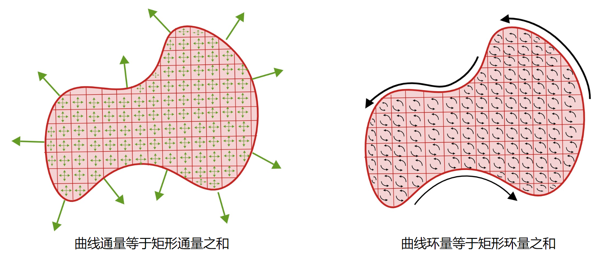

## 3.6 格林公式

### 3.6.1 格林公式的通量形式

某光滑闭曲线![L](data:image/svg+xml;utf8,%3Csvg%20xmlns%3Axlink%3D%22http%3A%2F%2Fwww.w3.org%2F1999%2Fxlink%22%20width%3D%221.583ex%22%20height%3D%222.176ex%22%20style%3D%22font-size%3A14px%3Bvertical-align%3A%20-0.338ex%3B%22%20viewBox%3D%220%20-791.3%20681.5%20936.9%22%20role%3D%22img%22%20focusable%3D%22false%22%20xmlns%3D%22http%3A%2F%2Fwww.w3.org%2F2000%2Fsvg%22%20aria-labelledby%3D%22MathJax-SVG-1-Title%22%3E%0A%3Ctitle%20id%3D%22MathJax-SVG-1-Title%22%3EL%3C%2Ftitle%3E%0A%3Cdefs%20aria-hidden%3D%22true%22%3E%0A%3Cpath%20stroke-width%3D%221%22%20id%3D%22E1-MJMATHI-4C%22%20d%3D%22M228%20637Q194%20637%20192%20641Q191%20643%20191%20649Q191%20673%20202%20682Q204%20683%20217%20683Q271%20680%20344%20680Q485%20680%20506%20683H518Q524%20677%20524%20674T522%20656Q517%20641%20513%20637H475Q406%20636%20394%20628Q387%20624%20380%20600T313%20336Q297%20271%20279%20198T252%2088L243%2052Q243%2048%20252%2048T311%2046H328Q360%2046%20379%2047T428%2054T478%2072T522%20106T564%20161Q580%20191%20594%20228T611%20270Q616%20273%20628%20273H641Q647%20264%20647%20262T627%20203T583%2083T557%209Q555%204%20553%203T537%200T494%20-1Q483%20-1%20418%20-1T294%200H116Q32%200%2032%2010Q32%2017%2034%2024Q39%2043%2044%2045Q48%2046%2059%2046H65Q92%2046%20125%2049Q139%2052%20144%2061Q147%2065%20216%20339T285%20628Q285%20635%20228%20637Z%22%3E%3C%2Fpath%3E%0A%3C%2Fdefs%3E%0A%3Cg%20stroke%3D%22currentColor%22%20fill%3D%22currentColor%22%20stroke-width%3D%220%22%20transform%3D%22matrix(1%200%200%20-1%200%200)%22%20aria-hidden%3D%22true%22%3E%0A%20%3Cuse%20xlink%3Ahref%3D%22%23E1-MJMATHI-4C%22%20x%3D%220%22%20y%3D%220%22%3E%3C%2Fuse%3E%0A%3C%2Fg%3E%0A%3C%2Fsvg%3E)围成闭区域![D](data:image/svg+xml;utf8,%3Csvg%20xmlns%3Axlink%3D%22http%3A%2F%2Fwww.w3.org%2F1999%2Fxlink%22%20width%3D%221.924ex%22%20height%3D%222.176ex%22%20style%3D%22font-size%3A14px%3Bvertical-align%3A%20-0.338ex%3B%22%20viewBox%3D%220%20-791.3%20828.5%20936.9%22%20role%3D%22img%22%20focusable%3D%22false%22%20xmlns%3D%22http%3A%2F%2Fwww.w3.org%2F2000%2Fsvg%22%20aria-labelledby%3D%22MathJax-SVG-1-Title%22%3E%0A%3Ctitle%20id%3D%22MathJax-SVG-1-Title%22%3ED%3C%2Ftitle%3E%0A%3Cdefs%20aria-hidden%3D%22true%22%3E%0A%3Cpath%20stroke-width%3D%221%22%20id%3D%22E1-MJMATHI-44%22%20d%3D%22M287%20628Q287%20635%20230%20637Q207%20637%20200%20638T193%20647Q193%20655%20197%20667T204%20682Q206%20683%20403%20683Q570%20682%20590%20682T630%20676Q702%20659%20752%20597T803%20431Q803%20275%20696%20151T444%203L430%201L236%200H125H72Q48%200%2041%202T33%2011Q33%2013%2036%2025Q40%2041%2044%2043T67%2046Q94%2046%20127%2049Q141%2052%20146%2061Q149%2065%20218%20339T287%20628ZM703%20469Q703%20507%20692%20537T666%20584T629%20613T590%20629T555%20636Q553%20636%20541%20636T512%20636T479%20637H436Q392%20637%20386%20627Q384%20623%20313%20339T242%2052Q242%2048%20253%2048T330%2047Q335%2047%20349%2047T373%2046Q499%2046%20581%20128Q617%20164%20640%20212T683%20339T703%20469Z%22%3E%3C%2Fpath%3E%0A%3C%2Fdefs%3E%0A%3Cg%20stroke%3D%22currentColor%22%20fill%3D%22currentColor%22%20stroke-width%3D%220%22%20transform%3D%22matrix(1%200%200%20-1%200%200)%22%20aria-hidden%3D%22true%22%3E%0A%20%3Cuse%20xlink%3Ahref%3D%22%23E1-MJMATHI-44%22%20x%3D%220%22%20y%3D%220%22%3E%3C%2Fuse%3E%0A%3C%2Fg%3E%0A%3C%2Fsvg%3E)，定义在闭区域![D](data:image/svg+xml;utf8,%3Csvg%20xmlns%3Axlink%3D%22http%3A%2F%2Fwww.w3.org%2F1999%2Fxlink%22%20width%3D%221.924ex%22%20height%3D%222.176ex%22%20style%3D%22font-size%3A14px%3Bvertical-align%3A%20-0.338ex%3B%22%20viewBox%3D%220%20-791.3%20828.5%20936.9%22%20role%3D%22img%22%20focusable%3D%22false%22%20xmlns%3D%22http%3A%2F%2Fwww.w3.org%2F2000%2Fsvg%22%20aria-labelledby%3D%22MathJax-SVG-1-Title%22%3E%0A%3Ctitle%20id%3D%22MathJax-SVG-1-Title%22%3ED%3C%2Ftitle%3E%0A%3Cdefs%20aria-hidden%3D%22true%22%3E%0A%3Cpath%20stroke-width%3D%221%22%20id%3D%22E1-MJMATHI-44%22%20d%3D%22M287%20628Q287%20635%20230%20637Q207%20637%20200%20638T193%20647Q193%20655%20197%20667T204%20682Q206%20683%20403%20683Q570%20682%20590%20682T630%20676Q702%20659%20752%20597T803%20431Q803%20275%20696%20151T444%203L430%201L236%200H125H72Q48%200%2041%202T33%2011Q33%2013%2036%2025Q40%2041%2044%2043T67%2046Q94%2046%20127%2049Q141%2052%20146%2061Q149%2065%20218%20339T287%20628ZM703%20469Q703%20507%20692%20537T666%20584T629%20613T590%20629T555%20636Q553%20636%20541%20636T512%20636T479%20637H436Q392%20637%20386%20627Q384%20623%20313%20339T242%2052Q242%2048%20253%2048T330%2047Q335%2047%20349%2047T373%2046Q499%2046%20581%20128Q617%20164%20640%20212T683%20339T703%20469Z%22%3E%3C%2Fpath%3E%0A%3C%2Fdefs%3E%0A%3Cg%20stroke%3D%22currentColor%22%20fill%3D%22currentColor%22%20stroke-width%3D%220%22%20transform%3D%22matrix(1%200%200%20-1%200%200)%22%20aria-hidden%3D%22true%22%3E%0A%20%3Cuse%20xlink%3Ahref%3D%22%23E1-MJMATHI-44%22%20x%3D%220%22%20y%3D%220%22%3E%3C%2Fuse%3E%0A%3C%2Fg%3E%0A%3C%2Fsvg%3E)上的向量场![\boldsymbol{F}=P\boldsymbol{i}+Q\boldsymbol{j}](data:image/svg+xml;utf8,%3Csvg%20xmlns%3Axlink%3D%22http%3A%2F%2Fwww.w3.org%2F1999%2Fxlink%22%20width%3D%2213.44ex%22%20height%3D%222.509ex%22%20style%3D%22font-size%3A14px%3Bvertical-align%3A%20-0.671ex%3B%22%20viewBox%3D%220%20-791.3%205786.5%201080.4%22%20role%3D%22img%22%20focusable%3D%22false%22%20xmlns%3D%22http%3A%2F%2Fwww.w3.org%2F2000%2Fsvg%22%20aria-labelledby%3D%22MathJax-SVG-1-Title%22%3E%0A%3Ctitle%20id%3D%22MathJax-SVG-1-Title%22%3E%5Cboldsymbol%7BF%7D%3DP%5Cboldsymbol%7Bi%7D%2BQ%5Cboldsymbol%7Bj%7D%3C%2Ftitle%3E%0A%3Cdefs%20aria-hidden%3D%22true%22%3E%0A%3Cpath%20stroke-width%3D%221%22%20id%3D%22E1-MJMATHBI-46%22%20d%3D%22M257%20618H231Q198%20618%20198%20636Q202%20672%20214%20678L219%20680H795Q801%20677%20804%20673T808%20666L809%20664Q809%20659%20798%20549T783%20433Q777%20424%20755%20424Q736%20424%20730%20427T724%20444Q724%20448%20725%20468T727%20507V524Q727%20541%20724%20554T713%20577T698%20594T676%20605T653%20612T625%20616T597%20617T566%20618T538%20618H456L455%20614Q455%20611%20424%20491L394%20371H429Q454%20372%20463%20372T491%20378T517%20392T536%20419T552%20464Q556%20481%20561%20484T586%20488Q603%20488%20607%20486Q616%20482%20616%20473Q616%20467%20584%20337T549%20201Q542%20192%20521%20192Q503%20192%20497%20195T490%20209Q490%20212%20492%20224Q499%20251%20499%20269Q499%20288%20489%20296T465%20306T417%20308L379%20309L348%20188Q341%20161%20334%20129T322%2080L318%2065L317%2062H375H409Q430%2062%20438%2059T447%2045Q444%208%20431%202L426%200L377%201Q347%202%20231%202Q152%202%20111%201T65%200Q48%200%2043%2015Q47%2054%2060%2060Q64%2062%20113%2062H162L163%2066Q163%2067%20231%20341T301%20616Q301%20618%20257%20618Z%22%3E%3C%2Fpath%3E%0A%3Cpath%20stroke-width%3D%221%22%20id%3D%22E1-MJMAIN-3D%22%20d%3D%22M56%20347Q56%20360%2070%20367H707Q722%20359%20722%20347Q722%20336%20708%20328L390%20327H72Q56%20332%2056%20347ZM56%20153Q56%20168%2072%20173H708Q722%20163%20722%20153Q722%20140%20707%20133H70Q56%20140%2056%20153Z%22%3E%3C%2Fpath%3E%0A%3Cpath%20stroke-width%3D%221%22%20id%3D%22E1-MJMATHI-50%22%20d%3D%22M287%20628Q287%20635%20230%20637Q206%20637%20199%20638T192%20648Q192%20649%20194%20659Q200%20679%20203%20681T397%20683Q587%20682%20600%20680Q664%20669%20707%20631T751%20530Q751%20453%20685%20389Q616%20321%20507%20303Q500%20302%20402%20301H307L277%20182Q247%2066%20247%2059Q247%2055%20248%2054T255%2050T272%2048T305%2046H336Q342%2037%20342%2035Q342%2019%20335%205Q330%200%20319%200Q316%200%20282%201T182%202Q120%202%2087%202T51%201Q33%201%2033%2011Q33%2013%2036%2025Q40%2041%2044%2043T67%2046Q94%2046%20127%2049Q141%2052%20146%2061Q149%2065%20218%20339T287%20628ZM645%20554Q645%20567%20643%20575T634%20597T609%20619T560%20635Q553%20636%20480%20637Q463%20637%20445%20637T416%20636T404%20636Q391%20635%20386%20627Q384%20621%20367%20550T332%20412T314%20344Q314%20342%20395%20342H407H430Q542%20342%20590%20392Q617%20419%20631%20471T645%20554Z%22%3E%3C%2Fpath%3E%0A%3Cpath%20stroke-width%3D%221%22%20id%3D%22E1-MJMATHBI-69%22%20d%3D%22M205%20615Q205%20646%20229%20670T283%20694Q310%20694%20324%20679T339%20641Q339%20610%20315%20586T258%20562Q235%20562%20220%20577T205%20615ZM24%20296Q24%20305%2034%20328T63%20380T115%20430T187%20452Q205%20452%20223%20448T262%20435T295%20406T308%20360Q308%20345%20287%20290T240%20170T207%2087Q202%2067%20202%2057Q202%2042%20215%2042Q235%2042%20257%2064Q288%2092%20302%20140Q307%20156%20310%20159T330%20162H336H347Q367%20162%20367%20148Q367%20140%20357%20117T329%2065T276%2014T201%20-8Q158%20-8%20121%2015T83%2084Q83%20104%20133%20229T184%20358Q189%20376%20189%20388Q189%20402%20177%20402Q156%20402%20134%20380Q103%20352%2089%20304Q84%20288%2081%20285T61%20282H55H44Q24%20282%2024%20296Z%22%3E%3C%2Fpath%3E%0A%3Cpath%20stroke-width%3D%221%22%20id%3D%22E1-MJMAIN-2B%22%20d%3D%22M56%20237T56%20250T70%20270H369V420L370%20570Q380%20583%20389%20583Q402%20583%20409%20568V270H707Q722%20262%20722%20250T707%20230H409V-68Q401%20-82%20391%20-82H389H387Q375%20-82%20369%20-68V230H70Q56%20237%2056%20250Z%22%3E%3C%2Fpath%3E%0A%3Cpath%20stroke-width%3D%221%22%20id%3D%22E1-MJMATHI-51%22%20d%3D%22M399%20-80Q399%20-47%20400%20-30T402%20-11V-7L387%20-11Q341%20-22%20303%20-22Q208%20-22%20138%2035T51%20201Q50%20209%2050%20244Q50%20346%2098%20438T227%20601Q351%20704%20476%20704Q514%20704%20524%20703Q621%20689%20680%20617T740%20435Q740%20255%20592%20107Q529%2047%20461%2016L444%208V3Q444%202%20449%20-24T470%20-66T516%20-82Q551%20-82%20583%20-60T625%20-3Q631%2011%20638%2011Q647%2011%20649%202Q649%20-6%20639%20-34T611%20-100T557%20-165T481%20-194Q399%20-194%20399%20-87V-80ZM636%20468Q636%20523%20621%20564T580%20625T530%20655T477%20665Q429%20665%20379%20640Q277%20591%20215%20464T153%20216Q153%20110%20207%2059Q231%2038%20236%2038V46Q236%2086%20269%20120T347%20155Q372%20155%20390%20144T417%20114T429%2082T435%2055L448%2064Q512%20108%20557%20185T619%20334T636%20468ZM314%2018Q362%2018%20404%2039L403%2049Q399%20104%20366%20115Q354%20117%20347%20117Q344%20117%20341%20117T337%20118Q317%20118%20296%2098T274%2052Q274%2018%20314%2018Z%22%3E%3C%2Fpath%3E%0A%3Cpath%20stroke-width%3D%221%22%20id%3D%22E1-MJMATHBI-6A%22%20d%3D%22M321%20616Q321%20648%20346%20671T400%20694Q425%20694%20440%20680T456%20640Q456%20609%20431%20586T376%20562Q353%20562%20337%20577T321%20616ZM297%20360T297%20373T294%20392T288%20400T278%20401H276Q241%20399%20210%20372T158%20303Q151%20287%20148%20285T129%20282H123H116Q102%20282%2097%20284T92%20298Q96%20331%20153%20391T279%20451Q357%20451%20388%20422T420%20354V339L371%20142Q363%20111%20353%2071T339%2013T329%20-30T318%20-64T308%20-88T296%20-109T283%20-125T264%20-142Q190%20-202%2088%20-202Q44%20-202%2016%20-181T-12%20-125Q-12%20-93%2011%20-68T68%20-43Q92%20-43%20108%20-58T124%20-93Q124%20-121%20106%20-144Q101%20-150%20103%20-150Q120%20-150%20147%20-128T191%20-64Q194%20-57%20242%20136T294%20345Q297%20360%20297%20373Z%22%3E%3C%2Fpath%3E%0A%3C%2Fdefs%3E%0A%3Cg%20stroke%3D%22currentColor%22%20fill%3D%22currentColor%22%20stroke-width%3D%220%22%20transform%3D%22matrix(1%200%200%20-1%200%200)%22%20aria-hidden%3D%22true%22%3E%0A%20%3Cuse%20xlink%3Ahref%3D%22%23E1-MJMATHBI-46%22%20x%3D%220%22%20y%3D%220%22%3E%3C%2Fuse%3E%0A%20%3Cuse%20xlink%3Ahref%3D%22%23E1-MJMAIN-3D%22%20x%3D%221087%22%20y%3D%220%22%3E%3C%2Fuse%3E%0A%20%3Cuse%20xlink%3Ahref%3D%22%23E1-MJMATHI-50%22%20x%3D%222143%22%20y%3D%220%22%3E%3C%2Fuse%3E%0A%20%3Cuse%20xlink%3Ahref%3D%22%23E1-MJMATHBI-69%22%20x%3D%222895%22%20y%3D%220%22%3E%3C%2Fuse%3E%0A%20%3Cuse%20xlink%3Ahref%3D%22%23E1-MJMAIN-2B%22%20x%3D%223522%22%20y%3D%220%22%3E%3C%2Fuse%3E%0A%20%3Cuse%20xlink%3Ahref%3D%22%23E1-MJMATHI-51%22%20x%3D%224523%22%20y%3D%220%22%3E%3C%2Fuse%3E%0A%20%3Cuse%20xlink%3Ahref%3D%22%23E1-MJMATHBI-6A%22%20x%3D%225315%22%20y%3D%220%22%3E%3C%2Fuse%3E%0A%3C%2Fg%3E%0A%3C%2Fsvg%3E)，它的分量具有一阶连续偏导数，则![\boldsymbol{F}](data:image/svg+xml;utf8,%3Csvg%20xmlns%3Axlink%3D%22http%3A%2F%2Fwww.w3.org%2F1999%2Fxlink%22%20width%3D%221.88ex%22%20height%3D%222.176ex%22%20style%3D%22font-size%3A14px%3Bvertical-align%3A%20-0.338ex%3B%22%20viewBox%3D%220%20-791.3%20809.5%20936.9%22%20role%3D%22img%22%20focusable%3D%22false%22%20xmlns%3D%22http%3A%2F%2Fwww.w3.org%2F2000%2Fsvg%22%20aria-labelledby%3D%22MathJax-SVG-1-Title%22%3E%0A%3Ctitle%20id%3D%22MathJax-SVG-1-Title%22%3E%5Cboldsymbol%7BF%7D%3C%2Ftitle%3E%0A%3Cdefs%20aria-hidden%3D%22true%22%3E%0A%3Cpath%20stroke-width%3D%221%22%20id%3D%22E1-MJMATHBI-46%22%20d%3D%22M257%20618H231Q198%20618%20198%20636Q202%20672%20214%20678L219%20680H795Q801%20677%20804%20673T808%20666L809%20664Q809%20659%20798%20549T783%20433Q777%20424%20755%20424Q736%20424%20730%20427T724%20444Q724%20448%20725%20468T727%20507V524Q727%20541%20724%20554T713%20577T698%20594T676%20605T653%20612T625%20616T597%20617T566%20618T538%20618H456L455%20614Q455%20611%20424%20491L394%20371H429Q454%20372%20463%20372T491%20378T517%20392T536%20419T552%20464Q556%20481%20561%20484T586%20488Q603%20488%20607%20486Q616%20482%20616%20473Q616%20467%20584%20337T549%20201Q542%20192%20521%20192Q503%20192%20497%20195T490%20209Q490%20212%20492%20224Q499%20251%20499%20269Q499%20288%20489%20296T465%20306T417%20308L379%20309L348%20188Q341%20161%20334%20129T322%2080L318%2065L317%2062H375H409Q430%2062%20438%2059T447%2045Q444%208%20431%202L426%200L377%201Q347%202%20231%202Q152%202%20111%201T65%200Q48%200%2043%2015Q47%2054%2060%2060Q64%2062%20113%2062H162L163%2066Q163%2067%20231%20341T301%20616Q301%20618%20257%20618Z%22%3E%3C%2Fpath%3E%0A%3C%2Fdefs%3E%0A%3Cg%20stroke%3D%22currentColor%22%20fill%3D%22currentColor%22%20stroke-width%3D%220%22%20transform%3D%22matrix(1%200%200%20-1%200%200)%22%20aria-hidden%3D%22true%22%3E%0A%20%3Cuse%20xlink%3Ahref%3D%22%23E1-MJMATHBI-46%22%20x%3D%220%22%20y%3D%220%22%3E%3C%2Fuse%3E%0A%3C%2Fg%3E%0A%3C%2Fsvg%3E)关于![L](data:image/svg+xml;utf8,%3Csvg%20xmlns%3Axlink%3D%22http%3A%2F%2Fwww.w3.org%2F1999%2Fxlink%22%20width%3D%221.583ex%22%20height%3D%222.176ex%22%20style%3D%22font-size%3A14px%3Bvertical-align%3A%20-0.338ex%3B%22%20viewBox%3D%220%20-791.3%20681.5%20936.9%22%20role%3D%22img%22%20focusable%3D%22false%22%20xmlns%3D%22http%3A%2F%2Fwww.w3.org%2F2000%2Fsvg%22%20aria-labelledby%3D%22MathJax-SVG-1-Title%22%3E%0A%3Ctitle%20id%3D%22MathJax-SVG-1-Title%22%3EL%3C%2Ftitle%3E%0A%3Cdefs%20aria-hidden%3D%22true%22%3E%0A%3Cpath%20stroke-width%3D%221%22%20id%3D%22E1-MJMATHI-4C%22%20d%3D%22M228%20637Q194%20637%20192%20641Q191%20643%20191%20649Q191%20673%20202%20682Q204%20683%20217%20683Q271%20680%20344%20680Q485%20680%20506%20683H518Q524%20677%20524%20674T522%20656Q517%20641%20513%20637H475Q406%20636%20394%20628Q387%20624%20380%20600T313%20336Q297%20271%20279%20198T252%2088L243%2052Q243%2048%20252%2048T311%2046H328Q360%2046%20379%2047T428%2054T478%2072T522%20106T564%20161Q580%20191%20594%20228T611%20270Q616%20273%20628%20273H641Q647%20264%20647%20262T627%20203T583%2083T557%209Q555%204%20553%203T537%200T494%20-1Q483%20-1%20418%20-1T294%200H116Q32%200%2032%2010Q32%2017%2034%2024Q39%2043%2044%2045Q48%2046%2059%2046H65Q92%2046%20125%2049Q139%2052%20144%2061Q147%2065%20216%20339T285%20628Q285%20635%20228%20637Z%22%3E%3C%2Fpath%3E%0A%3C%2Fdefs%3E%0A%3Cg%20stroke%3D%22currentColor%22%20fill%3D%22currentColor%22%20stroke-width%3D%220%22%20transform%3D%22matrix(1%200%200%20-1%200%200)%22%20aria-hidden%3D%22true%22%3E%0A%20%3Cuse%20xlink%3Ahref%3D%22%23E1-MJMATHI-4C%22%20x%3D%220%22%20y%3D%220%22%3E%3C%2Fuse%3E%0A%3C%2Fg%3E%0A%3C%2Fsvg%3E)的通量，可通过闭区域![D](data:image/svg+xml;utf8,%3Csvg%20xmlns%3Axlink%3D%22http%3A%2F%2Fwww.w3.org%2F1999%2Fxlink%22%20width%3D%221.924ex%22%20height%3D%222.176ex%22%20style%3D%22font-size%3A14px%3Bvertical-align%3A%20-0.338ex%3B%22%20viewBox%3D%220%20-791.3%20828.5%20936.9%22%20role%3D%22img%22%20focusable%3D%22false%22%20xmlns%3D%22http%3A%2F%2Fwww.w3.org%2F2000%2Fsvg%22%20aria-labelledby%3D%22MathJax-SVG-1-Title%22%3E%0A%3Ctitle%20id%3D%22MathJax-SVG-1-Title%22%3ED%3C%2Ftitle%3E%0A%3Cdefs%20aria-hidden%3D%22true%22%3E%0A%3Cpath%20stroke-width%3D%221%22%20id%3D%22E1-MJMATHI-44%22%20d%3D%22M287%20628Q287%20635%20230%20637Q207%20637%20200%20638T193%20647Q193%20655%20197%20667T204%20682Q206%20683%20403%20683Q570%20682%20590%20682T630%20676Q702%20659%20752%20597T803%20431Q803%20275%20696%20151T444%203L430%201L236%200H125H72Q48%200%2041%202T33%2011Q33%2013%2036%2025Q40%2041%2044%2043T67%2046Q94%2046%20127%2049Q141%2052%20146%2061Q149%2065%20218%20339T287%20628ZM703%20469Q703%20507%20692%20537T666%20584T629%20613T590%20629T555%20636Q553%20636%20541%20636T512%20636T479%20637H436Q392%20637%20386%20627Q384%20623%20313%20339T242%2052Q242%2048%20253%2048T330%2047Q335%2047%20349%2047T373%2046Q499%2046%20581%20128Q617%20164%20640%20212T683%20339T703%20469Z%22%3E%3C%2Fpath%3E%0A%3C%2Fdefs%3E%0A%3Cg%20stroke%3D%22currentColor%22%20fill%3D%22currentColor%22%20stroke-width%3D%220%22%20transform%3D%22matrix(1%200%200%20-1%200%200)%22%20aria-hidden%3D%22true%22%3E%0A%20%3Cuse%20xlink%3Ahref%3D%22%23E1-MJMATHI-44%22%20x%3D%220%22%20y%3D%220%22%3E%3C%2Fuse%3E%0A%3C%2Fg%3E%0A%3C%2Fsvg%3E)上的散度求出：

![\underbrace{\oint_{L} \boldsymbol{F}\cdot\boldsymbol{n}\mathrm{d}s=\oint_{L}P\mathrm{d}y-Q\mathrm{d}x}_{\large闭曲线的通量}\quad=\quad \underbrace{\iint_\limits{D}\frac{\partial P}{\partial x}+\frac{\partial Q}{\partial y}\mathrm{d}x\mathrm{d}y}_{\large闭曲线围成区域的通量之和}](data:image/svg+xml;utf8,%3Csvg%20xmlns%3Axlink%3D%22http%3A%2F%2Fwww.w3.org%2F1999%2Fxlink%22%20width%3D%2260.459ex%22%20height%3D%2212.009ex%22%20style%3D%22font-size%3A14px%3Bvertical-align%3A%20-8.505ex%3B%20margin-right%3A%20-0.017ex%3B%22%20viewBox%3D%220%20-1508.9%2026030.8%205170.6%22%20role%3D%22img%22%20focusable%3D%22false%22%20xmlns%3D%22http%3A%2F%2Fwww.w3.org%2F2000%2Fsvg%22%20aria-labelledby%3D%22MathJax-SVG-1-Title%22%3E%0A%3Ctitle%20id%3D%22MathJax-SVG-1-Title%22%3E%5Cunderbrace%7B%5Coint_%7BL%7D%20%5Cboldsymbol%7BF%7D%5Ccdot%5Cboldsymbol%7Bn%7D%5Cmathrm%7Bd%7Ds%3D%5Coint_%7BL%7DP%5Cmathrm%7Bd%7Dy-Q%5Cmathrm%7Bd%7Dx%7D_%7B%5Clarge%E9%97%AD%E6%9B%B2%E7%BA%BF%E7%9A%84%E9%80%9A%E9%87%8F%7D%5Cquad%3D%5Cquad%20%5Cunderbrace%7B%5Ciint_%5Climits%7BD%7D%5Cfrac%7B%5Cpartial%20P%7D%7B%5Cpartial%20x%7D%2B%5Cfrac%7B%5Cpartial%20Q%7D%7B%5Cpartial%20y%7D%5Cmathrm%7Bd%7Dx%5Cmathrm%7Bd%7Dy%7D_%7B%5Clarge%E9%97%AD%E6%9B%B2%E7%BA%BF%E5%9B%B4%E6%88%90%E5%8C%BA%E5%9F%9F%E7%9A%84%E9%80%9A%E9%87%8F%E4%B9%8B%E5%92%8C%7D%3C%2Ftitle%3E%0A%3Cdefs%20aria-hidden%3D%22true%22%3E%0A%3Cpath%20stroke-width%3D%221%22%20id%3D%22E1-MJSZ1-222E%22%20d%3D%22M269%2074L256%2080Q244%2085%20227%2097T191%20128T161%20179T148%20250Q148%20332%20199%20379T302%20433L306%20434L307%20444Q309%20456%20313%20495T321%20553T331%20607T345%20664T365%20712T393%20756T431%20785T479%20804Q481%20804%20488%20804T501%20805Q552%20802%20581%20769T610%20695Q610%20669%20594%20657T561%20645Q542%20645%20527%20658T512%20694Q512%20705%20516%20714T526%20729T538%20737T548%20742L552%20743Q552%20745%20545%20751T525%20762T498%20768Q471%20768%20454%20752T427%20693T414%20626T406%20536Q405%20530%20405%20527L397%20425L404%20422Q410%20419%20421%20413T445%20399T470%20376T494%20345T511%20303T518%20250Q518%20205%20502%20169T460%20112T410%2080T364%2066L360%2065L359%2055Q357%2038%20353%204T346%20-43T340%20-81T333%20-118T326%20-148T316%20-179T303%20-207Q256%20-306%20169%20-306Q119%20-306%2087%20-272T55%20-196Q55%20-170%2071%20-158T104%20-146Q123%20-146%20138%20-159T153%20-195Q153%20-206%20149%20-215T139%20-230T127%20-238T117%20-242L113%20-244Q113%20-246%20119%20-251T139%20-263T167%20-269Q186%20-269%20199%20-260Q231%20-241%20242%20-183T266%2033L269%2074ZM272%20122Q272%20156%20300%20391Q300%20392%20299%20392Q287%20392%20263%20379T213%20331T187%20249Q187%20211%20205%20180T239%20137T272%20116V122ZM366%20107Q378%20107%20402%20119T453%20167T479%20249Q479%20340%20394%20383V377Q394%20375%20394%20374T393%20371T393%20366T392%20357T391%20342T389%20321T386%20291T382%20251T377%20199T369%20133Q366%20112%20366%20107Z%22%3E%3C%2Fpath%3E%0A%3Cpath%20stroke-width%3D%221%22%20id%3D%22E1-MJMATHI-4C%22%20d%3D%22M228%20637Q194%20637%20192%20641Q191%20643%20191%20649Q191%20673%20202%20682Q204%20683%20217%20683Q271%20680%20344%20680Q485%20680%20506%20683H518Q524%20677%20524%20674T522%20656Q517%20641%20513%20637H475Q406%20636%20394%20628Q387%20624%20380%20600T313%20336Q297%20271%20279%20198T252%2088L243%2052Q243%2048%20252%2048T311%2046H328Q360%2046%20379%2047T428%2054T478%2072T522%20106T564%20161Q580%20191%20594%20228T611%20270Q616%20273%20628%20273H641Q647%20264%20647%20262T627%20203T583%2083T557%209Q555%204%20553%203T537%200T494%20-1Q483%20-1%20418%20-1T294%200H116Q32%200%2032%2010Q32%2017%2034%2024Q39%2043%2044%2045Q48%2046%2059%2046H65Q92%2046%20125%2049Q139%2052%20144%2061Q147%2065%20216%20339T285%20628Q285%20635%20228%20637Z%22%3E%3C%2Fpath%3E%0A%3Cpath%20stroke-width%3D%221%22%20id%3D%22E1-MJMATHBI-46%22%20d%3D%22M257%20618H231Q198%20618%20198%20636Q202%20672%20214%20678L219%20680H795Q801%20677%20804%20673T808%20666L809%20664Q809%20659%20798%20549T783%20433Q777%20424%20755%20424Q736%20424%20730%20427T724%20444Q724%20448%20725%20468T727%20507V524Q727%20541%20724%20554T713%20577T698%20594T676%20605T653%20612T625%20616T597%20617T566%20618T538%20618H456L455%20614Q455%20611%20424%20491L394%20371H429Q454%20372%20463%20372T491%20378T517%20392T536%20419T552%20464Q556%20481%20561%20484T586%20488Q603%20488%20607%20486Q616%20482%20616%20473Q616%20467%20584%20337T549%20201Q542%20192%20521%20192Q503%20192%20497%20195T490%20209Q490%20212%20492%20224Q499%20251%20499%20269Q499%20288%20489%20296T465%20306T417%20308L379%20309L348%20188Q341%20161%20334%20129T322%2080L318%2065L317%2062H375H409Q430%2062%20438%2059T447%2045Q444%208%20431%202L426%200L377%201Q347%202%20231%202Q152%202%20111%201T65%200Q48%200%2043%2015Q47%2054%2060%2060Q64%2062%20113%2062H162L163%2066Q163%2067%20231%20341T301%20616Q301%20618%20257%20618Z%22%3E%3C%2Fpath%3E%0A%3Cpath%20stroke-width%3D%221%22%20id%3D%22E1-MJMAIN-22C5%22%20d%3D%22M78%20250Q78%20274%2095%20292T138%20310Q162%20310%20180%20294T199%20251Q199%20226%20182%20208T139%20190T96%20207T78%20250Z%22%3E%3C%2Fpath%3E%0A%3Cpath%20stroke-width%3D%221%22%20id%3D%22E1-MJMATHBI-6E%22%20d%3D%22M24%20296Q25%20302%2027%20312T41%20350T65%20397T104%20435T159%20452Q203%20452%20234%20435Q268%20419%20285%20384L293%20391Q363%20452%20454%20452Q575%20446%20597%20367Q599%20356%20599%20334Q599%20285%20562%20183T522%2066Q519%2043%20530%2043Q557%2043%20582%2069T621%20138Q626%20156%20630%20159T650%20162H656H667Q687%20162%20687%20148Q687%20138%20677%20115T647%2063T595%2013T522%20-8Q475%20-8%20439%2016T402%2082Q402%2096%20439%20199T477%20351Q477%20401%20434%20401Q421%20401%20409%20398Q341%20388%20285%20305L278%20295L247%20170Q216%2046%20214%2040Q206%2022%20187%207T143%20-8T104%207T90%2039Q90%2047%20108%20124T146%20274L164%20347Q166%20355%20166%20372Q166%20401%20149%20401Q129%20401%20115%20379T89%20306Q84%20288%2080%20285T55%20282H44Q24%20282%2024%20296Z%22%3E%3C%2Fpath%3E%0A%3Cpath%20stroke-width%3D%221%22%20id%3D%22E1-MJMAIN-64%22%20d%3D%22M376%20495Q376%20511%20376%20535T377%20568Q377%20613%20367%20624T316%20637H298V660Q298%20683%20300%20683L310%20684Q320%20685%20339%20686T376%20688Q393%20689%20413%20690T443%20693T454%20694H457V390Q457%2084%20458%2081Q461%2061%20472%2055T517%2046H535V0Q533%200%20459%20-5T380%20-11H373V44L365%2037Q307%20-11%20235%20-11Q158%20-11%2096%2050T34%20215Q34%20315%2097%20378T244%20442Q319%20442%20376%20393V495ZM373%20342Q328%20405%20260%20405Q211%20405%20173%20369Q146%20341%20139%20305T131%20211Q131%20155%20138%20120T173%2059Q203%2026%20251%2026Q322%2026%20373%20103V342Z%22%3E%3C%2Fpath%3E%0A%3Cpath%20stroke-width%3D%221%22%20id%3D%22E1-MJMATHI-73%22%20d%3D%22M131%20289Q131%20321%20147%20354T203%20415T300%20442Q362%20442%20390%20415T419%20355Q419%20323%20402%20308T364%20292Q351%20292%20340%20300T328%20326Q328%20342%20337%20354T354%20372T367%20378Q368%20378%20368%20379Q368%20382%20361%20388T336%20399T297%20405Q249%20405%20227%20379T204%20326Q204%20301%20223%20291T278%20274T330%20259Q396%20230%20396%20163Q396%20135%20385%20107T352%2051T289%207T195%20-10Q118%20-10%2086%2019T53%2087Q53%20126%2074%20143T118%20160Q133%20160%20146%20151T160%20120Q160%2094%20142%2076T111%2058Q109%2057%20108%2057T107%2055Q108%2052%20115%2047T146%2034T201%2027Q237%2027%20263%2038T301%2066T318%2097T323%20122Q323%20150%20302%20164T254%20181T195%20196T148%20231Q131%20256%20131%20289Z%22%3E%3C%2Fpath%3E%0A%3Cpath%20stroke-width%3D%221%22%20id%3D%22E1-MJMAIN-3D%22%20d%3D%22M56%20347Q56%20360%2070%20367H707Q722%20359%20722%20347Q722%20336%20708%20328L390%20327H72Q56%20332%2056%20347ZM56%20153Q56%20168%2072%20173H708Q722%20163%20722%20153Q722%20140%20707%20133H70Q56%20140%2056%20153Z%22%3E%3C%2Fpath%3E%0A%3Cpath%20stroke-width%3D%221%22%20id%3D%22E1-MJMATHI-50%22%20d%3D%22M287%20628Q287%20635%20230%20637Q206%20637%20199%20638T192%20648Q192%20649%20194%20659Q200%20679%20203%20681T397%20683Q587%20682%20600%20680Q664%20669%20707%20631T751%20530Q751%20453%20685%20389Q616%20321%20507%20303Q500%20302%20402%20301H307L277%20182Q247%2066%20247%2059Q247%2055%20248%2054T255%2050T272%2048T305%2046H336Q342%2037%20342%2035Q342%2019%20335%205Q330%200%20319%200Q316%200%20282%201T182%202Q120%202%2087%202T51%201Q33%201%2033%2011Q33%2013%2036%2025Q40%2041%2044%2043T67%2046Q94%2046%20127%2049Q141%2052%20146%2061Q149%2065%20218%20339T287%20628ZM645%20554Q645%20567%20643%20575T634%20597T609%20619T560%20635Q553%20636%20480%20637Q463%20637%20445%20637T416%20636T404%20636Q391%20635%20386%20627Q384%20621%20367%20550T332%20412T314%20344Q314%20342%20395%20342H407H430Q542%20342%20590%20392Q617%20419%20631%20471T645%20554Z%22%3E%3C%2Fpath%3E%0A%3Cpath%20stroke-width%3D%221%22%20id%3D%22E1-MJMATHI-79%22%20d%3D%22M21%20287Q21%20301%2036%20335T84%20406T158%20442Q199%20442%20224%20419T250%20355Q248%20336%20247%20334Q247%20331%20231%20288T198%20191T182%20105Q182%2062%20196%2045T238%2027Q261%2027%20281%2038T312%2061T339%2094Q339%2095%20344%20114T358%20173T377%20247Q415%20397%20419%20404Q432%20431%20462%20431Q475%20431%20483%20424T494%20412T496%20403Q496%20390%20447%20193T391%20-23Q363%20-106%20294%20-155T156%20-205Q111%20-205%2077%20-183T43%20-117Q43%20-95%2050%20-80T69%20-58T89%20-48T106%20-45Q150%20-45%20150%20-87Q150%20-107%20138%20-122T115%20-142T102%20-147L99%20-148Q101%20-153%20118%20-160T152%20-167H160Q177%20-167%20186%20-165Q219%20-156%20247%20-127T290%20-65T313%20-9T321%2021L315%2017Q309%2013%20296%206T270%20-6Q250%20-11%20231%20-11Q185%20-11%20150%2011T104%2082Q103%2089%20103%20113Q103%20170%20138%20262T173%20379Q173%20380%20173%20381Q173%20390%20173%20393T169%20400T158%20404H154Q131%20404%20112%20385T82%20344T65%20302T57%20280Q55%20278%2041%20278H27Q21%20284%2021%20287Z%22%3E%3C%2Fpath%3E%0A%3Cpath%20stroke-width%3D%221%22%20id%3D%22E1-MJMAIN-2212%22%20d%3D%22M84%20237T84%20250T98%20270H679Q694%20262%20694%20250T679%20230H98Q84%20237%2084%20250Z%22%3E%3C%2Fpath%3E%0A%3Cpath%20stroke-width%3D%221%22%20id%3D%22E1-MJMATHI-51%22%20d%3D%22M399%20-80Q399%20-47%20400%20-30T402%20-11V-7L387%20-11Q341%20-22%20303%20-22Q208%20-22%20138%2035T51%20201Q50%20209%2050%20244Q50%20346%2098%20438T227%20601Q351%20704%20476%20704Q514%20704%20524%20703Q621%20689%20680%20617T740%20435Q740%20255%20592%20107Q529%2047%20461%2016L444%208V3Q444%202%20449%20-24T470%20-66T516%20-82Q551%20-82%20583%20-60T625%20-3Q631%2011%20638%2011Q647%2011%20649%202Q649%20-6%20639%20-34T611%20-100T557%20-165T481%20-194Q399%20-194%20399%20-87V-80ZM636%20468Q636%20523%20621%20564T580%20625T530%20655T477%20665Q429%20665%20379%20640Q277%20591%20215%20464T153%20216Q153%20110%20207%2059Q231%2038%20236%2038V46Q236%2086%20269%20120T347%20155Q372%20155%20390%20144T417%20114T429%2082T435%2055L448%2064Q512%20108%20557%20185T619%20334T636%20468ZM314%2018Q362%2018%20404%2039L403%2049Q399%20104%20366%20115Q354%20117%20347%20117Q344%20117%20341%20117T337%20118Q317%20118%20296%2098T274%2052Q274%2018%20314%2018Z%22%3E%3C%2Fpath%3E%0A%3Cpath%20stroke-width%3D%221%22%20id%3D%22E1-MJMATHI-78%22%20d%3D%22M52%20289Q59%20331%20106%20386T222%20442Q257%20442%20286%20424T329%20379Q371%20442%20430%20442Q467%20442%20494%20420T522%20361Q522%20332%20508%20314T481%20292T458%20288Q439%20288%20427%20299T415%20328Q415%20374%20465%20391Q454%20404%20425%20404Q412%20404%20406%20402Q368%20386%20350%20336Q290%20115%20290%2078Q290%2050%20306%2038T341%2026Q378%2026%20414%2059T463%20140Q466%20150%20469%20151T485%20153H489Q504%20153%20504%20145Q504%20144%20502%20134Q486%2077%20440%2033T333%20-11Q263%20-11%20227%2052Q186%20-10%20133%20-10H127Q78%20-10%2057%2016T35%2071Q35%20103%2054%20123T99%20143Q142%20143%20142%20101Q142%2081%20130%2066T107%2046T94%2041L91%2040Q91%2039%2097%2036T113%2029T132%2026Q168%2026%20194%2071Q203%2087%20217%20139T245%20247T261%20313Q266%20340%20266%20352Q266%20380%20251%20392T217%20404Q177%20404%20142%20372T93%20290Q91%20281%2088%20280T72%20278H58Q52%20284%2052%20289Z%22%3E%3C%2Fpath%3E%0A%3Cpath%20stroke-width%3D%221%22%20id%3D%22E1-MJSZ4-E152%22%20d%3D%22M-24%20327L-18%20333H-1Q11%20333%2015%20333T22%20329T27%20322T35%20308T54%20284Q115%20203%20225%20162T441%20120Q454%20120%20457%20117T460%2095V60V28Q460%208%20457%204T442%200Q355%200%20260%2036Q75%20118%20-16%20278L-24%20292V327Z%22%3E%3C%2Fpath%3E%0A%3Cpath%20stroke-width%3D%221%22%20id%3D%22E1-MJSZ4-E153%22%20d%3D%22M-10%2060V95Q-10%20113%20-7%20116T9%20120Q151%20120%20250%20171T396%20284Q404%20293%20412%20305T424%20324T431%20331Q433%20333%20451%20333H468L474%20327V292L466%20278Q375%20118%20190%2036Q95%200%208%200Q-5%200%20-7%203T-10%2024V60Z%22%3E%3C%2Fpath%3E%0A%3Cpath%20stroke-width%3D%221%22%20id%3D%22E1-MJSZ4-E151%22%20d%3D%22M-10%2060Q-10%20104%20-10%20111T-5%20118Q-1%20120%2010%20120Q96%20120%20190%2084Q375%202%20466%20-158L474%20-172V-207L468%20-213H451H447Q437%20-213%20434%20-213T428%20-209T423%20-202T414%20-187T396%20-163Q331%20-82%20224%20-41T9%200Q-4%200%20-7%203T-10%2025V60Z%22%3E%3C%2Fpath%3E%0A%3Cpath%20stroke-width%3D%221%22%20id%3D%22E1-MJSZ4-E150%22%20d%3D%22M-18%20-213L-24%20-207V-172L-16%20-158Q75%202%20260%2084Q334%20113%20415%20119Q418%20119%20427%20119T440%20120Q454%20120%20457%20117T460%2098V60V25Q460%207%20457%204T441%200Q308%200%20193%20-55T25%20-205Q21%20-211%2018%20-212T-1%20-213H-18Z%22%3E%3C%2Fpath%3E%0A%3Cpath%20stroke-width%3D%221%22%20id%3D%22E1-MJSZ4-E154%22%20d%3D%22M-10%200V120H410V0H-10Z%22%3E%3C%2Fpath%3E%0A%3Cpath%20stroke-width%3D%221%22%20id%3D%22E1-MJSZ2-222C%22%20d%3D%22M114%20-798Q132%20-824%20165%20-824H167Q195%20-824%20223%20-764T275%20-600T320%20-391T362%20-164Q365%20-143%20367%20-133Q439%20292%20523%20655T645%201127Q651%201145%20655%201157T672%201201T699%201257T733%201306T777%201346T828%201360Q884%201360%20912%201325T944%201245Q944%201220%20932%201205T909%201186T887%201183Q866%201183%20849%201198T832%201239Q832%201287%20885%201296L882%201300Q879%201303%20874%201307T866%201313Q851%201323%20833%201323Q819%201323%20807%201311T775%201255T736%201139T689%20936T633%20628Q574%20293%20510%20-5T410%20-437T355%20-629Q278%20-862%20165%20-862Q125%20-862%2092%20-831T55%20-746Q55%20-711%2074%20-698T112%20-685Q133%20-685%20150%20-700T167%20-741Q167%20-789%20114%20-798ZM642%20-798Q660%20-824%20693%20-824H695Q723%20-824%20751%20-764T803%20-600T848%20-391T890%20-164Q893%20-143%20895%20-133Q967%20292%201051%20655T1173%201127Q1179%201145%201183%201157T1200%201201T1227%201257T1261%201306T1305%201346T1356%201360Q1412%201360%201440%201325T1472%201245Q1472%201220%201460%201205T1437%201186T1415%201183Q1394%201183%201377%201198T1360%201239Q1360%201287%201413%201296L1410%201300Q1407%201303%201402%201307T1394%201313Q1379%201323%201361%201323Q1347%201323%201335%201311T1303%201255T1264%201139T1217%20936T1161%20628Q1102%20293%201038%20-5T938%20-437T883%20-629Q806%20-862%20693%20-862Q653%20-862%20620%20-831T583%20-746Q583%20-711%20602%20-698T640%20-685Q661%20-685%20678%20-700T695%20-741Q695%20-789%20642%20-798Z%22%3E%3C%2Fpath%3E%0A%3Cpath%20stroke-width%3D%221%22%20id%3D%22E1-MJMATHI-44%22%20d%3D%22M287%20628Q287%20635%20230%20637Q207%20637%20200%20638T193%20647Q193%20655%20197%20667T204%20682Q206%20683%20403%20683Q570%20682%20590%20682T630%20676Q702%20659%20752%20597T803%20431Q803%20275%20696%20151T444%203L430%201L236%200H125H72Q48%200%2041%202T33%2011Q33%2013%2036%2025Q40%2041%2044%2043T67%2046Q94%2046%20127%2049Q141%2052%20146%2061Q149%2065%20218%20339T287%20628ZM703%20469Q703%20507%20692%20537T666%20584T629%20613T590%20629T555%20636Q553%20636%20541%20636T512%20636T479%20637H436Q392%20637%20386%20627Q384%20623%20313%20339T242%2052Q242%2048%20253%2048T330%2047Q335%2047%20349%2047T373%2046Q499%2046%20581%20128Q617%20164%20640%20212T683%20339T703%20469Z%22%3E%3C%2Fpath%3E%0A%3Cpath%20stroke-width%3D%221%22%20id%3D%22E1-MJMAIN-2202%22%20d%3D%22M202%20508Q179%20508%20169%20520T158%20547Q158%20557%20164%20577T185%20624T230%20675T301%20710L333%20715H345Q378%20715%20384%20714Q447%20703%20489%20661T549%20568T566%20457Q566%20362%20519%20240T402%2053Q321%20-22%20223%20-22Q123%20-22%2073%2056Q42%20102%2042%20148V159Q42%20276%20129%20370T322%20465Q383%20465%20414%20434T455%20367L458%20378Q478%20461%20478%20515Q478%20603%20437%20639T344%20676Q266%20676%20223%20612Q264%20606%20264%20572Q264%20547%20246%20528T202%20508ZM430%20306Q430%20372%20401%20400T333%20428Q270%20428%20222%20382Q197%20354%20183%20323T150%20221Q132%20149%20132%20116Q132%2021%20232%2021Q244%2021%20250%2022Q327%2035%20374%20112Q389%20137%20409%20196T430%20306Z%22%3E%3C%2Fpath%3E%0A%3Cpath%20stroke-width%3D%221%22%20id%3D%22E1-MJMAIN-2B%22%20d%3D%22M56%20237T56%20250T70%20270H369V420L370%20570Q380%20583%20389%20583Q402%20583%20409%20568V270H707Q722%20262%20722%20250T707%20230H409V-68Q401%20-82%20391%20-82H389H387Q375%20-82%20369%20-68V230H70Q56%20237%2056%20250Z%22%3E%3C%2Fpath%3E%0A%3C%2Fdefs%3E%0A%3Cg%20stroke%3D%22currentColor%22%20fill%3D%22currentColor%22%20stroke-width%3D%220%22%20transform%3D%22matrix(1%200%200%20-1%200%200)%22%20aria-hidden%3D%22true%22%3E%0A%3Cg%20transform%3D%22translate(0%2C-267)%22%3E%0A%20%3Cuse%20transform%3D%22scale(2.07)%22%20xlink%3Ahref%3D%22%23E1-MJSZ1-222E%22%20x%3D%220%22%20y%3D%220%22%3E%3C%2Fuse%3E%0A%3C%2Fg%3E%0A%20%3Cuse%20transform%3D%22scale(0.707)%22%20xlink%3Ahref%3D%22%23E1-MJMATHI-4C%22%20x%3D%222258%22%20y%3D%22-1326%22%3E%3C%2Fuse%3E%0A%20%3Cuse%20xlink%3Ahref%3D%22%23E1-MJMATHBI-46%22%20x%3D%222345%22%20y%3D%220%22%3E%3C%2Fuse%3E%0A%20%3Cuse%20xlink%3Ahref%3D%22%23E1-MJMAIN-22C5%22%20x%3D%223377%22%20y%3D%220%22%3E%3C%2Fuse%3E%0A%20%3Cuse%20xlink%3Ahref%3D%22%23E1-MJMATHBI-6E%22%20x%3D%223878%22%20y%3D%220%22%3E%3C%2Fuse%3E%0A%20%3Cuse%20xlink%3Ahref%3D%22%23E1-MJMAIN-64%22%20x%3D%224591%22%20y%3D%220%22%3E%3C%2Fuse%3E%0A%20%3Cuse%20xlink%3Ahref%3D%22%23E1-MJMATHI-73%22%20x%3D%225148%22%20y%3D%220%22%3E%3C%2Fuse%3E%0A%20%3Cuse%20xlink%3Ahref%3D%22%23E1-MJMAIN-3D%22%20x%3D%225895%22%20y%3D%220%22%3E%3C%2Fuse%3E%0A%3Cg%20transform%3D%22translate(6951%2C0)%22%3E%0A%3Cg%20transform%3D%22translate(0%2C-267)%22%3E%0A%20%3Cuse%20transform%3D%22scale(2.07)%22%20xlink%3Ahref%3D%22%23E1-MJSZ1-222E%22%20x%3D%220%22%20y%3D%220%22%3E%3C%2Fuse%3E%0A%3C%2Fg%3E%0A%20%3Cuse%20transform%3D%22scale(0.707)%22%20xlink%3Ahref%3D%22%23E1-MJMATHI-4C%22%20x%3D%222258%22%20y%3D%22-1326%22%3E%3C%2Fuse%3E%0A%3C%2Fg%3E%0A%20%3Cuse%20xlink%3Ahref%3D%22%23E1-MJMATHI-50%22%20x%3D%229297%22%20y%3D%220%22%3E%3C%2Fuse%3E%0A%20%3Cuse%20xlink%3Ahref%3D%22%23E1-MJMAIN-64%22%20x%3D%2210048%22%20y%3D%220%22%3E%3C%2Fuse%3E%0A%20%3Cuse%20xlink%3Ahref%3D%22%23E1-MJMATHI-79%22%20x%3D%2210605%22%20y%3D%220%22%3E%3C%2Fuse%3E%0A%20%3Cuse%20xlink%3Ahref%3D%22%23E1-MJMAIN-2212%22%20x%3D%2211324%22%20y%3D%220%22%3E%3C%2Fuse%3E%0A%20%3Cuse%20xlink%3Ahref%3D%22%23E1-MJMATHI-51%22%20x%3D%2212325%22%20y%3D%220%22%3E%3C%2Fuse%3E%0A%20%3Cuse%20xlink%3Ahref%3D%22%23E1-MJMAIN-64%22%20x%3D%2213117%22%20y%3D%220%22%3E%3C%2Fuse%3E%0A%20%3Cuse%20xlink%3Ahref%3D%22%23E1-MJMATHI-78%22%20x%3D%2213673%22%20y%3D%220%22%3E%3C%2Fuse%3E%0A%3Cg%20transform%3D%22translate(12%2C-1454)%22%3E%0A%20%3Cuse%20xlink%3Ahref%3D%22%23E1-MJSZ4-E152%22%20x%3D%2223%22%20y%3D%220%22%3E%3C%2Fuse%3E%0A%3Cg%20transform%3D%22translate(623.9802492600193%2C0)%20scale(14.734763080002033%2C1)%22%3E%0A%20%3Cuse%20xlink%3Ahref%3D%22%23E1-MJSZ4-E154%22%3E%3C%2Fuse%3E%0A%3C%2Fg%3E%0A%3Cg%20transform%3D%22translate(6672%2C0)%22%3E%0A%20%3Cuse%20xlink%3Ahref%3D%22%23E1-MJSZ4-E151%22%3E%3C%2Fuse%3E%0A%20%3Cuse%20xlink%3Ahref%3D%22%23E1-MJSZ4-E150%22%20x%3D%22450%22%20y%3D%220%22%3E%3C%2Fuse%3E%0A%3C%2Fg%3E%0A%3Cg%20transform%3D%22translate(7713.580742860873%2C0)%20scale(14.734763080002033%2C1)%22%3E%0A%20%3Cuse%20xlink%3Ahref%3D%22%23E1-MJSZ4-E154%22%3E%3C%2Fuse%3E%0A%3C%2Fg%3E%0A%20%3Cuse%20xlink%3Ahref%3D%22%23E1-MJSZ4-E153%22%20x%3D%2213771%22%20y%3D%220%22%3E%3C%2Fuse%3E%0A%3C%2Fg%3E%0A%3Cg%20transform%3D%22translate(5144%2C-2443)%22%3E%0A%3Ctext%20font-family%3D%22monospace%22%20stroke%3D%22none%22%20transform%3D%22scale(50.74127551116547)%20matrix(1%200%200%20-1%200%200)%22%3E%E9%97%AD%3C%2Ftext%3E%0A%3Cg%20transform%3D%22translate(659%2C0)%22%3E%0A%3Ctext%20font-family%3D%22monospace%22%20stroke%3D%22none%22%20transform%3D%22scale(50.74127551116547)%20matrix(1%200%200%20-1%200%200)%22%3E%E6%9B%B2%3C%2Ftext%3E%0A%3C%2Fg%3E%0A%3Cg%20transform%3D%22translate(1319%2C0)%22%3E%0A%3Ctext%20font-family%3D%22monospace%22%20stroke%3D%22none%22%20transform%3D%22scale(50.74127551116547)%20matrix(1%200%200%20-1%200%200)%22%3E%E7%BA%BF%3C%2Ftext%3E%0A%3C%2Fg%3E%0A%3Cg%20transform%3D%22translate(1978%2C0)%22%3E%0A%3Ctext%20font-family%3D%22monospace%22%20stroke%3D%22none%22%20transform%3D%22scale(50.74127551116547)%20matrix(1%200%200%20-1%200%200)%22%3E%E7%9A%84%3C%2Ftext%3E%0A%3C%2Fg%3E%0A%3Cg%20transform%3D%22translate(2638%2C0)%22%3E%0A%3Ctext%20font-family%3D%22monospace%22%20stroke%3D%22none%22%20transform%3D%22scale(50.74127551116547)%20matrix(1%200%200%20-1%200%200)%22%3E%E9%80%9A%3C%2Ftext%3E%0A%3C%2Fg%3E%0A%3Cg%20transform%3D%22translate(3298%2C0)%22%3E%0A%3Ctext%20font-family%3D%22monospace%22%20stroke%3D%22none%22%20transform%3D%22scale(50.74127551116547)%20matrix(1%200%200%20-1%200%200)%22%3E%E9%87%8F%3C%2Ftext%3E%0A%3C%2Fg%3E%0A%3C%2Fg%3E%0A%20%3Cuse%20xlink%3Ahref%3D%22%23E1-MJMAIN-3D%22%20x%3D%2215523%22%20y%3D%220%22%3E%3C%2Fuse%3E%0A%3Cg%20transform%3D%22translate(17580%2C0)%22%3E%0A%20%3Cuse%20xlink%3Ahref%3D%22%23E1-MJSZ2-222C%22%20x%3D%220%22%20y%3D%220%22%3E%3C%2Fuse%3E%0A%20%3Cuse%20transform%3D%22scale(0.707)%22%20xlink%3Ahref%3D%22%23E1-MJMATHI-44%22%20x%3D%22270%22%20y%3D%22-2140%22%3E%3C%2Fuse%3E%0A%3Cg%20transform%3D%22translate(1472%2C0)%22%3E%0A%3Cg%20transform%3D%22translate(286%2C0)%22%3E%0A%3Crect%20stroke%3D%22none%22%20width%3D%221439%22%20height%3D%2260%22%20x%3D%220%22%20y%3D%22220%22%3E%3C%2Frect%3E%0A%3Cg%20transform%3D%22translate(60%2C676)%22%3E%0A%20%3Cuse%20xlink%3Ahref%3D%22%23E1-MJMAIN-2202%22%20x%3D%220%22%20y%3D%220%22%3E%3C%2Fuse%3E%0A%20%3Cuse%20xlink%3Ahref%3D%22%23E1-MJMATHI-50%22%20x%3D%22567%22%20y%3D%220%22%3E%3C%2Fuse%3E%0A%3C%2Fg%3E%0A%3Cg%20transform%3D%22translate(149%2C-736)%22%3E%0A%20%3Cuse%20xlink%3Ahref%3D%22%23E1-MJMAIN-2202%22%20x%3D%220%22%20y%3D%220%22%3E%3C%2Fuse%3E%0A%20%3Cuse%20xlink%3Ahref%3D%22%23E1-MJMATHI-78%22%20x%3D%22567%22%20y%3D%220%22%3E%3C%2Fuse%3E%0A%3C%2Fg%3E%0A%3C%2Fg%3E%0A%3C%2Fg%3E%0A%20%3Cuse%20xlink%3Ahref%3D%22%23E1-MJMAIN-2B%22%20x%3D%223540%22%20y%3D%220%22%3E%3C%2Fuse%3E%0A%3Cg%20transform%3D%22translate(4318%2C0)%22%3E%0A%3Cg%20transform%3D%22translate(342%2C0)%22%3E%0A%3Crect%20stroke%3D%22none%22%20width%3D%221479%22%20height%3D%2260%22%20x%3D%220%22%20y%3D%22220%22%3E%3C%2Frect%3E%0A%3Cg%20transform%3D%22translate(60%2C714)%22%3E%0A%20%3Cuse%20xlink%3Ahref%3D%22%23E1-MJMAIN-2202%22%20x%3D%220%22%20y%3D%220%22%3E%3C%2Fuse%3E%0A%20%3Cuse%20xlink%3Ahref%3D%22%23E1-MJMATHI-51%22%20x%3D%22567%22%20y%3D%220%22%3E%3C%2Fuse%3E%0A%3C%2Fg%3E%0A%3Cg%20transform%3D%22translate(207%2C-736)%22%3E%0A%20%3Cuse%20xlink%3Ahref%3D%22%23E1-MJMAIN-2202%22%20x%3D%220%22%20y%3D%220%22%3E%3C%2Fuse%3E%0A%20%3Cuse%20xlink%3Ahref%3D%22%23E1-MJMATHI-79%22%20x%3D%22567%22%20y%3D%220%22%3E%3C%2Fuse%3E%0A%3C%2Fg%3E%0A%3C%2Fg%3E%0A%3C%2Fg%3E%0A%20%3Cuse%20xlink%3Ahref%3D%22%23E1-MJMAIN-64%22%20x%3D%226260%22%20y%3D%220%22%3E%3C%2Fuse%3E%0A%20%3Cuse%20xlink%3Ahref%3D%22%23E1-MJMATHI-78%22%20x%3D%226816%22%20y%3D%220%22%3E%3C%2Fuse%3E%0A%20%3Cuse%20xlink%3Ahref%3D%22%23E1-MJMAIN-64%22%20x%3D%227389%22%20y%3D%220%22%3E%3C%2Fuse%3E%0A%20%3Cuse%20xlink%3Ahref%3D%22%23E1-MJMATHI-79%22%20x%3D%227945%22%20y%3D%220%22%3E%3C%2Fuse%3E%0A%3Cg%20transform%3D%22translate(7%2C-2128)%22%3E%0A%20%3Cuse%20xlink%3Ahref%3D%22%23E1-MJSZ4-E152%22%20x%3D%2223%22%20y%3D%220%22%3E%3C%2Fuse%3E%0A%3Cg%20transform%3D%22translate(558.3500661375662%2C0)%20scale(7.826322751322752%2C1)%22%3E%0A%20%3Cuse%20xlink%3Ahref%3D%22%23E1-MJSZ4-E154%22%3E%3C%2Fuse%3E%0A%3C%2Fg%3E%0A%3Cg%20transform%3D%22translate(3771%2C0)%22%3E%0A%20%3Cuse%20xlink%3Ahref%3D%22%23E1-MJSZ4-E151%22%3E%3C%2Fuse%3E%0A%20%3Cuse%20xlink%3Ahref%3D%22%23E1-MJSZ4-E150%22%20x%3D%22450%22%20y%3D%220%22%3E%3C%2Fuse%3E%0A%3C%2Fg%3E%0A%3Cg%20transform%3D%22translate(4746.405621693122%2C0)%20scale(7.826322751322752%2C1)%22%3E%0A%20%3Cuse%20xlink%3Ahref%3D%22%23E1-MJSZ4-E154%22%3E%3C%2Fuse%3E%0A%3C%2Fg%3E%0A%20%3Cuse%20xlink%3Ahref%3D%22%23E1-MJSZ4-E153%22%20x%3D%227968%22%20y%3D%220%22%3E%3C%2Fuse%3E%0A%3C%2Fg%3E%0A%3Cg%20transform%3D%22translate(263%2C-3118)%22%3E%0A%3Ctext%20font-family%3D%22monospace%22%20stroke%3D%22none%22%20transform%3D%22scale(50.74127551116547)%20matrix(1%200%200%20-1%200%200)%22%3E%E9%97%AD%3C%2Ftext%3E%0A%3Cg%20transform%3D%22translate(659%2C0)%22%3E%0A%3Ctext%20font-family%3D%22monospace%22%20stroke%3D%22none%22%20transform%3D%22scale(50.74127551116547)%20matrix(1%200%200%20-1%200%200)%22%3E%E6%9B%B2%3C%2Ftext%3E%0A%3C%2Fg%3E%0A%3Cg%20transform%3D%22translate(1319%2C0)%22%3E%0A%3Ctext%20font-family%3D%22monospace%22%20stroke%3D%22none%22%20transform%3D%22scale(50.74127551116547)%20matrix(1%200%200%20-1%200%200)%22%3E%E7%BA%BF%3C%2Ftext%3E%0A%3C%2Fg%3E%0A%3Cg%20transform%3D%22translate(1978%2C0)%22%3E%0A%3Ctext%20font-family%3D%22monospace%22%20stroke%3D%22none%22%20transform%3D%22scale(50.74127551116547)%20matrix(1%200%200%20-1%200%200)%22%3E%E5%9B%B4%3C%2Ftext%3E%0A%3C%2Fg%3E%0A%3Cg%20transform%3D%22translate(2638%2C0)%22%3E%0A%3Ctext%20font-family%3D%22monospace%22%20stroke%3D%22none%22%20transform%3D%22scale(50.74127551116547)%20matrix(1%200%200%20-1%200%200)%22%3E%E6%88%90%3C%2Ftext%3E%0A%3C%2Fg%3E%0A%3Cg%20transform%3D%22translate(3298%2C0)%22%3E%0A%3Ctext%20font-family%3D%22monospace%22%20stroke%3D%22none%22%20transform%3D%22scale(50.74127551116547)%20matrix(1%200%200%20-1%200%200)%22%3E%E5%8C%BA%3C%2Ftext%3E%0A%3C%2Fg%3E%0A%3Cg%20transform%3D%22translate(3957%2C0)%22%3E%0A%3Ctext%20font-family%3D%22monospace%22%20stroke%3D%22none%22%20transform%3D%22scale(50.74127551116547)%20matrix(1%200%200%20-1%200%200)%22%3E%E5%9F%9F%3C%2Ftext%3E%0A%3C%2Fg%3E%0A%3Cg%20transform%3D%22translate(4617%2C0)%22%3E%0A%3Ctext%20font-family%3D%22monospace%22%20stroke%3D%22none%22%20transform%3D%22scale(50.74127551116547)%20matrix(1%200%200%20-1%200%200)%22%3E%E7%9A%84%3C%2Ftext%3E%0A%3C%2Fg%3E%0A%3Cg%20transform%3D%22translate(5277%2C0)%22%3E%0A%3Ctext%20font-family%3D%22monospace%22%20stroke%3D%22none%22%20transform%3D%22scale(50.74127551116547)%20matrix(1%200%200%20-1%200%200)%22%3E%E9%80%9A%3C%2Ftext%3E%0A%3C%2Fg%3E%0A%3Cg%20transform%3D%22translate(5936%2C0)%22%3E%0A%3Ctext%20font-family%3D%22monospace%22%20stroke%3D%22none%22%20transform%3D%22scale(50.74127551116547)%20matrix(1%200%200%20-1%200%200)%22%3E%E9%87%8F%3C%2Ftext%3E%0A%3C%2Fg%3E%0A%3Cg%20transform%3D%22translate(6596%2C0)%22%3E%0A%3Ctext%20font-family%3D%22monospace%22%20stroke%3D%22none%22%20transform%3D%22scale(50.74127551116547)%20matrix(1%200%200%20-1%200%200)%22%3E%E4%B9%8B%3C%2Ftext%3E%0A%3C%2Fg%3E%0A%3Cg%20transform%3D%22translate(7256%2C0)%22%3E%0A%3Ctext%20font-family%3D%22monospace%22%20stroke%3D%22none%22%20transform%3D%22scale(50.74127551116547)%20matrix(1%200%200%20-1%200%200)%22%3E%E5%92%8C%3C%2Ftext%3E%0A%3C%2Fg%3E%0A%3C%2Fg%3E%0A%3C%2Fg%3E%0A%3C%2Fg%3E%0A%3C%2Fsvg%3E)

### 3.6.2 格林公式的环量形式

某光滑闭曲线![L](data:image/svg+xml;utf8,%3Csvg%20xmlns%3Axlink%3D%22http%3A%2F%2Fwww.w3.org%2F1999%2Fxlink%22%20width%3D%221.583ex%22%20height%3D%222.176ex%22%20style%3D%22font-size%3A14px%3Bvertical-align%3A%20-0.338ex%3B%22%20viewBox%3D%220%20-791.3%20681.5%20936.9%22%20role%3D%22img%22%20focusable%3D%22false%22%20xmlns%3D%22http%3A%2F%2Fwww.w3.org%2F2000%2Fsvg%22%20aria-labelledby%3D%22MathJax-SVG-1-Title%22%3E%0A%3Ctitle%20id%3D%22MathJax-SVG-1-Title%22%3EL%3C%2Ftitle%3E%0A%3Cdefs%20aria-hidden%3D%22true%22%3E%0A%3Cpath%20stroke-width%3D%221%22%20id%3D%22E1-MJMATHI-4C%22%20d%3D%22M228%20637Q194%20637%20192%20641Q191%20643%20191%20649Q191%20673%20202%20682Q204%20683%20217%20683Q271%20680%20344%20680Q485%20680%20506%20683H518Q524%20677%20524%20674T522%20656Q517%20641%20513%20637H475Q406%20636%20394%20628Q387%20624%20380%20600T313%20336Q297%20271%20279%20198T252%2088L243%2052Q243%2048%20252%2048T311%2046H328Q360%2046%20379%2047T428%2054T478%2072T522%20106T564%20161Q580%20191%20594%20228T611%20270Q616%20273%20628%20273H641Q647%20264%20647%20262T627%20203T583%2083T557%209Q555%204%20553%203T537%200T494%20-1Q483%20-1%20418%20-1T294%200H116Q32%200%2032%2010Q32%2017%2034%2024Q39%2043%2044%2045Q48%2046%2059%2046H65Q92%2046%20125%2049Q139%2052%20144%2061Q147%2065%20216%20339T285%20628Q285%20635%20228%20637Z%22%3E%3C%2Fpath%3E%0A%3C%2Fdefs%3E%0A%3Cg%20stroke%3D%22currentColor%22%20fill%3D%22currentColor%22%20stroke-width%3D%220%22%20transform%3D%22matrix(1%200%200%20-1%200%200)%22%20aria-hidden%3D%22true%22%3E%0A%20%3Cuse%20xlink%3Ahref%3D%22%23E1-MJMATHI-4C%22%20x%3D%220%22%20y%3D%220%22%3E%3C%2Fuse%3E%0A%3C%2Fg%3E%0A%3C%2Fsvg%3E)围成闭区域![D](data:image/svg+xml;utf8,%3Csvg%20xmlns%3Axlink%3D%22http%3A%2F%2Fwww.w3.org%2F1999%2Fxlink%22%20width%3D%221.924ex%22%20height%3D%222.176ex%22%20style%3D%22font-size%3A14px%3Bvertical-align%3A%20-0.338ex%3B%22%20viewBox%3D%220%20-791.3%20828.5%20936.9%22%20role%3D%22img%22%20focusable%3D%22false%22%20xmlns%3D%22http%3A%2F%2Fwww.w3.org%2F2000%2Fsvg%22%20aria-labelledby%3D%22MathJax-SVG-1-Title%22%3E%0A%3Ctitle%20id%3D%22MathJax-SVG-1-Title%22%3ED%3C%2Ftitle%3E%0A%3Cdefs%20aria-hidden%3D%22true%22%3E%0A%3Cpath%20stroke-width%3D%221%22%20id%3D%22E1-MJMATHI-44%22%20d%3D%22M287%20628Q287%20635%20230%20637Q207%20637%20200%20638T193%20647Q193%20655%20197%20667T204%20682Q206%20683%20403%20683Q570%20682%20590%20682T630%20676Q702%20659%20752%20597T803%20431Q803%20275%20696%20151T444%203L430%201L236%200H125H72Q48%200%2041%202T33%2011Q33%2013%2036%2025Q40%2041%2044%2043T67%2046Q94%2046%20127%2049Q141%2052%20146%2061Q149%2065%20218%20339T287%20628ZM703%20469Q703%20507%20692%20537T666%20584T629%20613T590%20629T555%20636Q553%20636%20541%20636T512%20636T479%20637H436Q392%20637%20386%20627Q384%20623%20313%20339T242%2052Q242%2048%20253%2048T330%2047Q335%2047%20349%2047T373%2046Q499%2046%20581%20128Q617%20164%20640%20212T683%20339T703%20469Z%22%3E%3C%2Fpath%3E%0A%3C%2Fdefs%3E%0A%3Cg%20stroke%3D%22currentColor%22%20fill%3D%22currentColor%22%20stroke-width%3D%220%22%20transform%3D%22matrix(1%200%200%20-1%200%200)%22%20aria-hidden%3D%22true%22%3E%0A%20%3Cuse%20xlink%3Ahref%3D%22%23E1-MJMATHI-44%22%20x%3D%220%22%20y%3D%220%22%3E%3C%2Fuse%3E%0A%3C%2Fg%3E%0A%3C%2Fsvg%3E)，定义在闭区域![D](data:image/svg+xml;utf8,%3Csvg%20xmlns%3Axlink%3D%22http%3A%2F%2Fwww.w3.org%2F1999%2Fxlink%22%20width%3D%221.924ex%22%20height%3D%222.176ex%22%20style%3D%22font-size%3A14px%3Bvertical-align%3A%20-0.338ex%3B%22%20viewBox%3D%220%20-791.3%20828.5%20936.9%22%20role%3D%22img%22%20focusable%3D%22false%22%20xmlns%3D%22http%3A%2F%2Fwww.w3.org%2F2000%2Fsvg%22%20aria-labelledby%3D%22MathJax-SVG-1-Title%22%3E%0A%3Ctitle%20id%3D%22MathJax-SVG-1-Title%22%3ED%3C%2Ftitle%3E%0A%3Cdefs%20aria-hidden%3D%22true%22%3E%0A%3Cpath%20stroke-width%3D%221%22%20id%3D%22E1-MJMATHI-44%22%20d%3D%22M287%20628Q287%20635%20230%20637Q207%20637%20200%20638T193%20647Q193%20655%20197%20667T204%20682Q206%20683%20403%20683Q570%20682%20590%20682T630%20676Q702%20659%20752%20597T803%20431Q803%20275%20696%20151T444%203L430%201L236%200H125H72Q48%200%2041%202T33%2011Q33%2013%2036%2025Q40%2041%2044%2043T67%2046Q94%2046%20127%2049Q141%2052%20146%2061Q149%2065%20218%20339T287%20628ZM703%20469Q703%20507%20692%20537T666%20584T629%20613T590%20629T555%20636Q553%20636%20541%20636T512%20636T479%20637H436Q392%20637%20386%20627Q384%20623%20313%20339T242%2052Q242%2048%20253%2048T330%2047Q335%2047%20349%2047T373%2046Q499%2046%20581%20128Q617%20164%20640%20212T683%20339T703%20469Z%22%3E%3C%2Fpath%3E%0A%3C%2Fdefs%3E%0A%3Cg%20stroke%3D%22currentColor%22%20fill%3D%22currentColor%22%20stroke-width%3D%220%22%20transform%3D%22matrix(1%200%200%20-1%200%200)%22%20aria-hidden%3D%22true%22%3E%0A%20%3Cuse%20xlink%3Ahref%3D%22%23E1-MJMATHI-44%22%20x%3D%220%22%20y%3D%220%22%3E%3C%2Fuse%3E%0A%3C%2Fg%3E%0A%3C%2Fsvg%3E)上的向量场![\boldsymbol{F}=P\boldsymbol{i}+Q\boldsymbol{j}](data:image/svg+xml;utf8,%3Csvg%20xmlns%3Axlink%3D%22http%3A%2F%2Fwww.w3.org%2F1999%2Fxlink%22%20width%3D%2213.44ex%22%20height%3D%222.509ex%22%20style%3D%22font-size%3A14px%3Bvertical-align%3A%20-0.671ex%3B%22%20viewBox%3D%220%20-791.3%205786.5%201080.4%22%20role%3D%22img%22%20focusable%3D%22false%22%20xmlns%3D%22http%3A%2F%2Fwww.w3.org%2F2000%2Fsvg%22%20aria-labelledby%3D%22MathJax-SVG-1-Title%22%3E%0A%3Ctitle%20id%3D%22MathJax-SVG-1-Title%22%3E%5Cboldsymbol%7BF%7D%3DP%5Cboldsymbol%7Bi%7D%2BQ%5Cboldsymbol%7Bj%7D%3C%2Ftitle%3E%0A%3Cdefs%20aria-hidden%3D%22true%22%3E%0A%3Cpath%20stroke-width%3D%221%22%20id%3D%22E1-MJMATHBI-46%22%20d%3D%22M257%20618H231Q198%20618%20198%20636Q202%20672%20214%20678L219%20680H795Q801%20677%20804%20673T808%20666L809%20664Q809%20659%20798%20549T783%20433Q777%20424%20755%20424Q736%20424%20730%20427T724%20444Q724%20448%20725%20468T727%20507V524Q727%20541%20724%20554T713%20577T698%20594T676%20605T653%20612T625%20616T597%20617T566%20618T538%20618H456L455%20614Q455%20611%20424%20491L394%20371H429Q454%20372%20463%20372T491%20378T517%20392T536%20419T552%20464Q556%20481%20561%20484T586%20488Q603%20488%20607%20486Q616%20482%20616%20473Q616%20467%20584%20337T549%20201Q542%20192%20521%20192Q503%20192%20497%20195T490%20209Q490%20212%20492%20224Q499%20251%20499%20269Q499%20288%20489%20296T465%20306T417%20308L379%20309L348%20188Q341%20161%20334%20129T322%2080L318%2065L317%2062H375H409Q430%2062%20438%2059T447%2045Q444%208%20431%202L426%200L377%201Q347%202%20231%202Q152%202%20111%201T65%200Q48%200%2043%2015Q47%2054%2060%2060Q64%2062%20113%2062H162L163%2066Q163%2067%20231%20341T301%20616Q301%20618%20257%20618Z%22%3E%3C%2Fpath%3E%0A%3Cpath%20stroke-width%3D%221%22%20id%3D%22E1-MJMAIN-3D%22%20d%3D%22M56%20347Q56%20360%2070%20367H707Q722%20359%20722%20347Q722%20336%20708%20328L390%20327H72Q56%20332%2056%20347ZM56%20153Q56%20168%2072%20173H708Q722%20163%20722%20153Q722%20140%20707%20133H70Q56%20140%2056%20153Z%22%3E%3C%2Fpath%3E%0A%3Cpath%20stroke-width%3D%221%22%20id%3D%22E1-MJMATHI-50%22%20d%3D%22M287%20628Q287%20635%20230%20637Q206%20637%20199%20638T192%20648Q192%20649%20194%20659Q200%20679%20203%20681T397%20683Q587%20682%20600%20680Q664%20669%20707%20631T751%20530Q751%20453%20685%20389Q616%20321%20507%20303Q500%20302%20402%20301H307L277%20182Q247%2066%20247%2059Q247%2055%20248%2054T255%2050T272%2048T305%2046H336Q342%2037%20342%2035Q342%2019%20335%205Q330%200%20319%200Q316%200%20282%201T182%202Q120%202%2087%202T51%201Q33%201%2033%2011Q33%2013%2036%2025Q40%2041%2044%2043T67%2046Q94%2046%20127%2049Q141%2052%20146%2061Q149%2065%20218%20339T287%20628ZM645%20554Q645%20567%20643%20575T634%20597T609%20619T560%20635Q553%20636%20480%20637Q463%20637%20445%20637T416%20636T404%20636Q391%20635%20386%20627Q384%20621%20367%20550T332%20412T314%20344Q314%20342%20395%20342H407H430Q542%20342%20590%20392Q617%20419%20631%20471T645%20554Z%22%3E%3C%2Fpath%3E%0A%3Cpath%20stroke-width%3D%221%22%20id%3D%22E1-MJMATHBI-69%22%20d%3D%22M205%20615Q205%20646%20229%20670T283%20694Q310%20694%20324%20679T339%20641Q339%20610%20315%20586T258%20562Q235%20562%20220%20577T205%20615ZM24%20296Q24%20305%2034%20328T63%20380T115%20430T187%20452Q205%20452%20223%20448T262%20435T295%20406T308%20360Q308%20345%20287%20290T240%20170T207%2087Q202%2067%20202%2057Q202%2042%20215%2042Q235%2042%20257%2064Q288%2092%20302%20140Q307%20156%20310%20159T330%20162H336H347Q367%20162%20367%20148Q367%20140%20357%20117T329%2065T276%2014T201%20-8Q158%20-8%20121%2015T83%2084Q83%20104%20133%20229T184%20358Q189%20376%20189%20388Q189%20402%20177%20402Q156%20402%20134%20380Q103%20352%2089%20304Q84%20288%2081%20285T61%20282H55H44Q24%20282%2024%20296Z%22%3E%3C%2Fpath%3E%0A%3Cpath%20stroke-width%3D%221%22%20id%3D%22E1-MJMAIN-2B%22%20d%3D%22M56%20237T56%20250T70%20270H369V420L370%20570Q380%20583%20389%20583Q402%20583%20409%20568V270H707Q722%20262%20722%20250T707%20230H409V-68Q401%20-82%20391%20-82H389H387Q375%20-82%20369%20-68V230H70Q56%20237%2056%20250Z%22%3E%3C%2Fpath%3E%0A%3Cpath%20stroke-width%3D%221%22%20id%3D%22E1-MJMATHI-51%22%20d%3D%22M399%20-80Q399%20-47%20400%20-30T402%20-11V-7L387%20-11Q341%20-22%20303%20-22Q208%20-22%20138%2035T51%20201Q50%20209%2050%20244Q50%20346%2098%20438T227%20601Q351%20704%20476%20704Q514%20704%20524%20703Q621%20689%20680%20617T740%20435Q740%20255%20592%20107Q529%2047%20461%2016L444%208V3Q444%202%20449%20-24T470%20-66T516%20-82Q551%20-82%20583%20-60T625%20-3Q631%2011%20638%2011Q647%2011%20649%202Q649%20-6%20639%20-34T611%20-100T557%20-165T481%20-194Q399%20-194%20399%20-87V-80ZM636%20468Q636%20523%20621%20564T580%20625T530%20655T477%20665Q429%20665%20379%20640Q277%20591%20215%20464T153%20216Q153%20110%20207%2059Q231%2038%20236%2038V46Q236%2086%20269%20120T347%20155Q372%20155%20390%20144T417%20114T429%2082T435%2055L448%2064Q512%20108%20557%20185T619%20334T636%20468ZM314%2018Q362%2018%20404%2039L403%2049Q399%20104%20366%20115Q354%20117%20347%20117Q344%20117%20341%20117T337%20118Q317%20118%20296%2098T274%2052Q274%2018%20314%2018Z%22%3E%3C%2Fpath%3E%0A%3Cpath%20stroke-width%3D%221%22%20id%3D%22E1-MJMATHBI-6A%22%20d%3D%22M321%20616Q321%20648%20346%20671T400%20694Q425%20694%20440%20680T456%20640Q456%20609%20431%20586T376%20562Q353%20562%20337%20577T321%20616ZM297%20360T297%20373T294%20392T288%20400T278%20401H276Q241%20399%20210%20372T158%20303Q151%20287%20148%20285T129%20282H123H116Q102%20282%2097%20284T92%20298Q96%20331%20153%20391T279%20451Q357%20451%20388%20422T420%20354V339L371%20142Q363%20111%20353%2071T339%2013T329%20-30T318%20-64T308%20-88T296%20-109T283%20-125T264%20-142Q190%20-202%2088%20-202Q44%20-202%2016%20-181T-12%20-125Q-12%20-93%2011%20-68T68%20-43Q92%20-43%20108%20-58T124%20-93Q124%20-121%20106%20-144Q101%20-150%20103%20-150Q120%20-150%20147%20-128T191%20-64Q194%20-57%20242%20136T294%20345Q297%20360%20297%20373Z%22%3E%3C%2Fpath%3E%0A%3C%2Fdefs%3E%0A%3Cg%20stroke%3D%22currentColor%22%20fill%3D%22currentColor%22%20stroke-width%3D%220%22%20transform%3D%22matrix(1%200%200%20-1%200%200)%22%20aria-hidden%3D%22true%22%3E%0A%20%3Cuse%20xlink%3Ahref%3D%22%23E1-MJMATHBI-46%22%20x%3D%220%22%20y%3D%220%22%3E%3C%2Fuse%3E%0A%20%3Cuse%20xlink%3Ahref%3D%22%23E1-MJMAIN-3D%22%20x%3D%221087%22%20y%3D%220%22%3E%3C%2Fuse%3E%0A%20%3Cuse%20xlink%3Ahref%3D%22%23E1-MJMATHI-50%22%20x%3D%222143%22%20y%3D%220%22%3E%3C%2Fuse%3E%0A%20%3Cuse%20xlink%3Ahref%3D%22%23E1-MJMATHBI-69%22%20x%3D%222895%22%20y%3D%220%22%3E%3C%2Fuse%3E%0A%20%3Cuse%20xlink%3Ahref%3D%22%23E1-MJMAIN-2B%22%20x%3D%223522%22%20y%3D%220%22%3E%3C%2Fuse%3E%0A%20%3Cuse%20xlink%3Ahref%3D%22%23E1-MJMATHI-51%22%20x%3D%224523%22%20y%3D%220%22%3E%3C%2Fuse%3E%0A%20%3Cuse%20xlink%3Ahref%3D%22%23E1-MJMATHBI-6A%22%20x%3D%225315%22%20y%3D%220%22%3E%3C%2Fuse%3E%0A%3C%2Fg%3E%0A%3C%2Fsvg%3E)，它的分量具有一阶连续偏导数，则![\boldsymbol{F}](data:image/svg+xml;utf8,%3Csvg%20xmlns%3Axlink%3D%22http%3A%2F%2Fwww.w3.org%2F1999%2Fxlink%22%20width%3D%221.88ex%22%20height%3D%222.176ex%22%20style%3D%22font-size%3A14px%3Bvertical-align%3A%20-0.338ex%3B%22%20viewBox%3D%220%20-791.3%20809.5%20936.9%22%20role%3D%22img%22%20focusable%3D%22false%22%20xmlns%3D%22http%3A%2F%2Fwww.w3.org%2F2000%2Fsvg%22%20aria-labelledby%3D%22MathJax-SVG-1-Title%22%3E%0A%3Ctitle%20id%3D%22MathJax-SVG-1-Title%22%3E%5Cboldsymbol%7BF%7D%3C%2Ftitle%3E%0A%3Cdefs%20aria-hidden%3D%22true%22%3E%0A%3Cpath%20stroke-width%3D%221%22%20id%3D%22E1-MJMATHBI-46%22%20d%3D%22M257%20618H231Q198%20618%20198%20636Q202%20672%20214%20678L219%20680H795Q801%20677%20804%20673T808%20666L809%20664Q809%20659%20798%20549T783%20433Q777%20424%20755%20424Q736%20424%20730%20427T724%20444Q724%20448%20725%20468T727%20507V524Q727%20541%20724%20554T713%20577T698%20594T676%20605T653%20612T625%20616T597%20617T566%20618T538%20618H456L455%20614Q455%20611%20424%20491L394%20371H429Q454%20372%20463%20372T491%20378T517%20392T536%20419T552%20464Q556%20481%20561%20484T586%20488Q603%20488%20607%20486Q616%20482%20616%20473Q616%20467%20584%20337T549%20201Q542%20192%20521%20192Q503%20192%20497%20195T490%20209Q490%20212%20492%20224Q499%20251%20499%20269Q499%20288%20489%20296T465%20306T417%20308L379%20309L348%20188Q341%20161%20334%20129T322%2080L318%2065L317%2062H375H409Q430%2062%20438%2059T447%2045Q444%208%20431%202L426%200L377%201Q347%202%20231%202Q152%202%20111%201T65%200Q48%200%2043%2015Q47%2054%2060%2060Q64%2062%20113%2062H162L163%2066Q163%2067%20231%20341T301%20616Q301%20618%20257%20618Z%22%3E%3C%2Fpath%3E%0A%3C%2Fdefs%3E%0A%3Cg%20stroke%3D%22currentColor%22%20fill%3D%22currentColor%22%20stroke-width%3D%220%22%20transform%3D%22matrix(1%200%200%20-1%200%200)%22%20aria-hidden%3D%22true%22%3E%0A%20%3Cuse%20xlink%3Ahref%3D%22%23E1-MJMATHBI-46%22%20x%3D%220%22%20y%3D%220%22%3E%3C%2Fuse%3E%0A%3C%2Fg%3E%0A%3C%2Fsvg%3E)关于![L](data:image/svg+xml;utf8,%3Csvg%20xmlns%3Axlink%3D%22http%3A%2F%2Fwww.w3.org%2F1999%2Fxlink%22%20width%3D%221.583ex%22%20height%3D%222.176ex%22%20style%3D%22font-size%3A14px%3Bvertical-align%3A%20-0.338ex%3B%22%20viewBox%3D%220%20-791.3%20681.5%20936.9%22%20role%3D%22img%22%20focusable%3D%22false%22%20xmlns%3D%22http%3A%2F%2Fwww.w3.org%2F2000%2Fsvg%22%20aria-labelledby%3D%22MathJax-SVG-1-Title%22%3E%0A%3Ctitle%20id%3D%22MathJax-SVG-1-Title%22%3EL%3C%2Ftitle%3E%0A%3Cdefs%20aria-hidden%3D%22true%22%3E%0A%3Cpath%20stroke-width%3D%221%22%20id%3D%22E1-MJMATHI-4C%22%20d%3D%22M228%20637Q194%20637%20192%20641Q191%20643%20191%20649Q191%20673%20202%20682Q204%20683%20217%20683Q271%20680%20344%20680Q485%20680%20506%20683H518Q524%20677%20524%20674T522%20656Q517%20641%20513%20637H475Q406%20636%20394%20628Q387%20624%20380%20600T313%20336Q297%20271%20279%20198T252%2088L243%2052Q243%2048%20252%2048T311%2046H328Q360%2046%20379%2047T428%2054T478%2072T522%20106T564%20161Q580%20191%20594%20228T611%20270Q616%20273%20628%20273H641Q647%20264%20647%20262T627%20203T583%2083T557%209Q555%204%20553%203T537%200T494%20-1Q483%20-1%20418%20-1T294%200H116Q32%200%2032%2010Q32%2017%2034%2024Q39%2043%2044%2045Q48%2046%2059%2046H65Q92%2046%20125%2049Q139%2052%20144%2061Q147%2065%20216%20339T285%20628Q285%20635%20228%20637Z%22%3E%3C%2Fpath%3E%0A%3C%2Fdefs%3E%0A%3Cg%20stroke%3D%22currentColor%22%20fill%3D%22currentColor%22%20stroke-width%3D%220%22%20transform%3D%22matrix(1%200%200%20-1%200%200)%22%20aria-hidden%3D%22true%22%3E%0A%20%3Cuse%20xlink%3Ahref%3D%22%23E1-MJMATHI-4C%22%20x%3D%220%22%20y%3D%220%22%3E%3C%2Fuse%3E%0A%3C%2Fg%3E%0A%3C%2Fsvg%3E)的环量，可通过闭区域![D](data:image/svg+xml;utf8,%3Csvg%20xmlns%3Axlink%3D%22http%3A%2F%2Fwww.w3.org%2F1999%2Fxlink%22%20width%3D%221.924ex%22%20height%3D%222.176ex%22%20style%3D%22font-size%3A14px%3Bvertical-align%3A%20-0.338ex%3B%22%20viewBox%3D%220%20-791.3%20828.5%20936.9%22%20role%3D%22img%22%20focusable%3D%22false%22%20xmlns%3D%22http%3A%2F%2Fwww.w3.org%2F2000%2Fsvg%22%20aria-labelledby%3D%22MathJax-SVG-1-Title%22%3E%0A%3Ctitle%20id%3D%22MathJax-SVG-1-Title%22%3ED%3C%2Ftitle%3E%0A%3Cdefs%20aria-hidden%3D%22true%22%3E%0A%3Cpath%20stroke-width%3D%221%22%20id%3D%22E1-MJMATHI-44%22%20d%3D%22M287%20628Q287%20635%20230%20637Q207%20637%20200%20638T193%20647Q193%20655%20197%20667T204%20682Q206%20683%20403%20683Q570%20682%20590%20682T630%20676Q702%20659%20752%20597T803%20431Q803%20275%20696%20151T444%203L430%201L236%200H125H72Q48%200%2041%202T33%2011Q33%2013%2036%2025Q40%2041%2044%2043T67%2046Q94%2046%20127%2049Q141%2052%20146%2061Q149%2065%20218%20339T287%20628ZM703%20469Q703%20507%20692%20537T666%20584T629%20613T590%20629T555%20636Q553%20636%20541%20636T512%20636T479%20637H436Q392%20637%20386%20627Q384%20623%20313%20339T242%2052Q242%2048%20253%2048T330%2047Q335%2047%20349%2047T373%2046Q499%2046%20581%20128Q617%20164%20640%20212T683%20339T703%20469Z%22%3E%3C%2Fpath%3E%0A%3C%2Fdefs%3E%0A%3Cg%20stroke%3D%22currentColor%22%20fill%3D%22currentColor%22%20stroke-width%3D%220%22%20transform%3D%22matrix(1%200%200%20-1%200%200)%22%20aria-hidden%3D%22true%22%3E%0A%20%3Cuse%20xlink%3Ahref%3D%22%23E1-MJMATHI-44%22%20x%3D%220%22%20y%3D%220%22%3E%3C%2Fuse%3E%0A%3C%2Fg%3E%0A%3C%2Fsvg%3E)上的旋度求出：

![\underbrace{\oint_{L} \boldsymbol{F}\cdot\boldsymbol{\tau}\mathrm{d}s=\oint_{L}P\mathrm{d}x+Q\mathrm{d}y}_{\large闭曲线的环量}\quad=\quad \underbrace{\iint_\limits{D}\frac{\partial Q}{\partial x}-\frac{\partial P}{\partial y}\mathrm{d}x\mathrm{d}y}_{\large闭曲线围成区域的环量之和}](data:image/svg+xml;utf8,%3Csvg%20xmlns%3Axlink%3D%22http%3A%2F%2Fwww.w3.org%2F1999%2Fxlink%22%20width%3D%2260.22ex%22%20height%3D%2212.009ex%22%20style%3D%22font-size%3A14px%3Bvertical-align%3A%20-8.505ex%3B%20margin-right%3A%20-0.017ex%3B%22%20viewBox%3D%220%20-1508.9%2025927.8%205170.6%22%20role%3D%22img%22%20focusable%3D%22false%22%20xmlns%3D%22http%3A%2F%2Fwww.w3.org%2F2000%2Fsvg%22%20aria-labelledby%3D%22MathJax-SVG-1-Title%22%3E%0A%3Ctitle%20id%3D%22MathJax-SVG-1-Title%22%3E%5Cunderbrace%7B%5Coint_%7BL%7D%20%5Cboldsymbol%7BF%7D%5Ccdot%5Cboldsymbol%7B%5Ctau%7D%5Cmathrm%7Bd%7Ds%3D%5Coint_%7BL%7DP%5Cmathrm%7Bd%7Dx%2BQ%5Cmathrm%7Bd%7Dy%7D_%7B%5Clarge%E9%97%AD%E6%9B%B2%E7%BA%BF%E7%9A%84%E7%8E%AF%E9%87%8F%7D%5Cquad%3D%5Cquad%20%5Cunderbrace%7B%5Ciint_%5Climits%7BD%7D%5Cfrac%7B%5Cpartial%20Q%7D%7B%5Cpartial%20x%7D-%5Cfrac%7B%5Cpartial%20P%7D%7B%5Cpartial%20y%7D%5Cmathrm%7Bd%7Dx%5Cmathrm%7Bd%7Dy%7D_%7B%5Clarge%E9%97%AD%E6%9B%B2%E7%BA%BF%E5%9B%B4%E6%88%90%E5%8C%BA%E5%9F%9F%E7%9A%84%E7%8E%AF%E9%87%8F%E4%B9%8B%E5%92%8C%7D%3C%2Ftitle%3E%0A%3Cdefs%20aria-hidden%3D%22true%22%3E%0A%3Cpath%20stroke-width%3D%221%22%20id%3D%22E1-MJSZ1-222E%22%20d%3D%22M269%2074L256%2080Q244%2085%20227%2097T191%20128T161%20179T148%20250Q148%20332%20199%20379T302%20433L306%20434L307%20444Q309%20456%20313%20495T321%20553T331%20607T345%20664T365%20712T393%20756T431%20785T479%20804Q481%20804%20488%20804T501%20805Q552%20802%20581%20769T610%20695Q610%20669%20594%20657T561%20645Q542%20645%20527%20658T512%20694Q512%20705%20516%20714T526%20729T538%20737T548%20742L552%20743Q552%20745%20545%20751T525%20762T498%20768Q471%20768%20454%20752T427%20693T414%20626T406%20536Q405%20530%20405%20527L397%20425L404%20422Q410%20419%20421%20413T445%20399T470%20376T494%20345T511%20303T518%20250Q518%20205%20502%20169T460%20112T410%2080T364%2066L360%2065L359%2055Q357%2038%20353%204T346%20-43T340%20-81T333%20-118T326%20-148T316%20-179T303%20-207Q256%20-306%20169%20-306Q119%20-306%2087%20-272T55%20-196Q55%20-170%2071%20-158T104%20-146Q123%20-146%20138%20-159T153%20-195Q153%20-206%20149%20-215T139%20-230T127%20-238T117%20-242L113%20-244Q113%20-246%20119%20-251T139%20-263T167%20-269Q186%20-269%20199%20-260Q231%20-241%20242%20-183T266%2033L269%2074ZM272%20122Q272%20156%20300%20391Q300%20392%20299%20392Q287%20392%20263%20379T213%20331T187%20249Q187%20211%20205%20180T239%20137T272%20116V122ZM366%20107Q378%20107%20402%20119T453%20167T479%20249Q479%20340%20394%20383V377Q394%20375%20394%20374T393%20371T393%20366T392%20357T391%20342T389%20321T386%20291T382%20251T377%20199T369%20133Q366%20112%20366%20107Z%22%3E%3C%2Fpath%3E%0A%3Cpath%20stroke-width%3D%221%22%20id%3D%22E1-MJMATHI-4C%22%20d%3D%22M228%20637Q194%20637%20192%20641Q191%20643%20191%20649Q191%20673%20202%20682Q204%20683%20217%20683Q271%20680%20344%20680Q485%20680%20506%20683H518Q524%20677%20524%20674T522%20656Q517%20641%20513%20637H475Q406%20636%20394%20628Q387%20624%20380%20600T313%20336Q297%20271%20279%20198T252%2088L243%2052Q243%2048%20252%2048T311%2046H328Q360%2046%20379%2047T428%2054T478%2072T522%20106T564%20161Q580%20191%20594%20228T611%20270Q616%20273%20628%20273H641Q647%20264%20647%20262T627%20203T583%2083T557%209Q555%204%20553%203T537%200T494%20-1Q483%20-1%20418%20-1T294%200H116Q32%200%2032%2010Q32%2017%2034%2024Q39%2043%2044%2045Q48%2046%2059%2046H65Q92%2046%20125%2049Q139%2052%20144%2061Q147%2065%20216%20339T285%20628Q285%20635%20228%20637Z%22%3E%3C%2Fpath%3E%0A%3Cpath%20stroke-width%3D%221%22%20id%3D%22E1-MJMATHBI-46%22%20d%3D%22M257%20618H231Q198%20618%20198%20636Q202%20672%20214%20678L219%20680H795Q801%20677%20804%20673T808%20666L809%20664Q809%20659%20798%20549T783%20433Q777%20424%20755%20424Q736%20424%20730%20427T724%20444Q724%20448%20725%20468T727%20507V524Q727%20541%20724%20554T713%20577T698%20594T676%20605T653%20612T625%20616T597%20617T566%20618T538%20618H456L455%20614Q455%20611%20424%20491L394%20371H429Q454%20372%20463%20372T491%20378T517%20392T536%20419T552%20464Q556%20481%20561%20484T586%20488Q603%20488%20607%20486Q616%20482%20616%20473Q616%20467%20584%20337T549%20201Q542%20192%20521%20192Q503%20192%20497%20195T490%20209Q490%20212%20492%20224Q499%20251%20499%20269Q499%20288%20489%20296T465%20306T417%20308L379%20309L348%20188Q341%20161%20334%20129T322%2080L318%2065L317%2062H375H409Q430%2062%20438%2059T447%2045Q444%208%20431%202L426%200L377%201Q347%202%20231%202Q152%202%20111%201T65%200Q48%200%2043%2015Q47%2054%2060%2060Q64%2062%20113%2062H162L163%2066Q163%2067%20231%20341T301%20616Q301%20618%20257%20618Z%22%3E%3C%2Fpath%3E%0A%3Cpath%20stroke-width%3D%221%22%20id%3D%22E1-MJMAIN-22C5%22%20d%3D%22M78%20250Q78%20274%2095%20292T138%20310Q162%20310%20180%20294T199%20251Q199%20226%20182%20208T139%20190T96%20207T78%20250Z%22%3E%3C%2Fpath%3E%0A%3Cpath%20stroke-width%3D%221%22%20id%3D%22E1-MJMATHBI-3C4%22%20d%3D%22M55%20289H43Q23%20289%2023%20303Q23%20308%2033%20322Q116%20434%20199%20443Q200%20444%20386%20444Q571%20444%20577%20442Q588%20441%20599%20432T610%20402Q610%20359%20572%20340Q561%20335%20547%20334T452%20333H353V331Q352%20330%20342%20261T320%20119T306%2040Q300%2018%20281%203Q257%20-13%20233%20-13Q210%20-13%20196%200T181%2035Q181%2044%20182%2048Q183%2053%20229%20187T279%20331Q279%20333%20228%20333H209Q163%20333%20136%20328T88%20301L77%20290L55%20289Z%22%3E%3C%2Fpath%3E%0A%3Cpath%20stroke-width%3D%221%22%20id%3D%22E1-MJMAIN-64%22%20d%3D%22M376%20495Q376%20511%20376%20535T377%20568Q377%20613%20367%20624T316%20637H298V660Q298%20683%20300%20683L310%20684Q320%20685%20339%20686T376%20688Q393%20689%20413%20690T443%20693T454%20694H457V390Q457%2084%20458%2081Q461%2061%20472%2055T517%2046H535V0Q533%200%20459%20-5T380%20-11H373V44L365%2037Q307%20-11%20235%20-11Q158%20-11%2096%2050T34%20215Q34%20315%2097%20378T244%20442Q319%20442%20376%20393V495ZM373%20342Q328%20405%20260%20405Q211%20405%20173%20369Q146%20341%20139%20305T131%20211Q131%20155%20138%20120T173%2059Q203%2026%20251%2026Q322%2026%20373%20103V342Z%22%3E%3C%2Fpath%3E%0A%3Cpath%20stroke-width%3D%221%22%20id%3D%22E1-MJMATHI-73%22%20d%3D%22M131%20289Q131%20321%20147%20354T203%20415T300%20442Q362%20442%20390%20415T419%20355Q419%20323%20402%20308T364%20292Q351%20292%20340%20300T328%20326Q328%20342%20337%20354T354%20372T367%20378Q368%20378%20368%20379Q368%20382%20361%20388T336%20399T297%20405Q249%20405%20227%20379T204%20326Q204%20301%20223%20291T278%20274T330%20259Q396%20230%20396%20163Q396%20135%20385%20107T352%2051T289%207T195%20-10Q118%20-10%2086%2019T53%2087Q53%20126%2074%20143T118%20160Q133%20160%20146%20151T160%20120Q160%2094%20142%2076T111%2058Q109%2057%20108%2057T107%2055Q108%2052%20115%2047T146%2034T201%2027Q237%2027%20263%2038T301%2066T318%2097T323%20122Q323%20150%20302%20164T254%20181T195%20196T148%20231Q131%20256%20131%20289Z%22%3E%3C%2Fpath%3E%0A%3Cpath%20stroke-width%3D%221%22%20id%3D%22E1-MJMAIN-3D%22%20d%3D%22M56%20347Q56%20360%2070%20367H707Q722%20359%20722%20347Q722%20336%20708%20328L390%20327H72Q56%20332%2056%20347ZM56%20153Q56%20168%2072%20173H708Q722%20163%20722%20153Q722%20140%20707%20133H70Q56%20140%2056%20153Z%22%3E%3C%2Fpath%3E%0A%3Cpath%20stroke-width%3D%221%22%20id%3D%22E1-MJMATHI-50%22%20d%3D%22M287%20628Q287%20635%20230%20637Q206%20637%20199%20638T192%20648Q192%20649%20194%20659Q200%20679%20203%20681T397%20683Q587%20682%20600%20680Q664%20669%20707%20631T751%20530Q751%20453%20685%20389Q616%20321%20507%20303Q500%20302%20402%20301H307L277%20182Q247%2066%20247%2059Q247%2055%20248%2054T255%2050T272%2048T305%2046H336Q342%2037%20342%2035Q342%2019%20335%205Q330%200%20319%200Q316%200%20282%201T182%202Q120%202%2087%202T51%201Q33%201%2033%2011Q33%2013%2036%2025Q40%2041%2044%2043T67%2046Q94%2046%20127%2049Q141%2052%20146%2061Q149%2065%20218%20339T287%20628ZM645%20554Q645%20567%20643%20575T634%20597T609%20619T560%20635Q553%20636%20480%20637Q463%20637%20445%20637T416%20636T404%20636Q391%20635%20386%20627Q384%20621%20367%20550T332%20412T314%20344Q314%20342%20395%20342H407H430Q542%20342%20590%20392Q617%20419%20631%20471T645%20554Z%22%3E%3C%2Fpath%3E%0A%3Cpath%20stroke-width%3D%221%22%20id%3D%22E1-MJMATHI-78%22%20d%3D%22M52%20289Q59%20331%20106%20386T222%20442Q257%20442%20286%20424T329%20379Q371%20442%20430%20442Q467%20442%20494%20420T522%20361Q522%20332%20508%20314T481%20292T458%20288Q439%20288%20427%20299T415%20328Q415%20374%20465%20391Q454%20404%20425%20404Q412%20404%20406%20402Q368%20386%20350%20336Q290%20115%20290%2078Q290%2050%20306%2038T341%2026Q378%2026%20414%2059T463%20140Q466%20150%20469%20151T485%20153H489Q504%20153%20504%20145Q504%20144%20502%20134Q486%2077%20440%2033T333%20-11Q263%20-11%20227%2052Q186%20-10%20133%20-10H127Q78%20-10%2057%2016T35%2071Q35%20103%2054%20123T99%20143Q142%20143%20142%20101Q142%2081%20130%2066T107%2046T94%2041L91%2040Q91%2039%2097%2036T113%2029T132%2026Q168%2026%20194%2071Q203%2087%20217%20139T245%20247T261%20313Q266%20340%20266%20352Q266%20380%20251%20392T217%20404Q177%20404%20142%20372T93%20290Q91%20281%2088%20280T72%20278H58Q52%20284%2052%20289Z%22%3E%3C%2Fpath%3E%0A%3Cpath%20stroke-width%3D%221%22%20id%3D%22E1-MJMAIN-2B%22%20d%3D%22M56%20237T56%20250T70%20270H369V420L370%20570Q380%20583%20389%20583Q402%20583%20409%20568V270H707Q722%20262%20722%20250T707%20230H409V-68Q401%20-82%20391%20-82H389H387Q375%20-82%20369%20-68V230H70Q56%20237%2056%20250Z%22%3E%3C%2Fpath%3E%0A%3Cpath%20stroke-width%3D%221%22%20id%3D%22E1-MJMATHI-51%22%20d%3D%22M399%20-80Q399%20-47%20400%20-30T402%20-11V-7L387%20-11Q341%20-22%20303%20-22Q208%20-22%20138%2035T51%20201Q50%20209%2050%20244Q50%20346%2098%20438T227%20601Q351%20704%20476%20704Q514%20704%20524%20703Q621%20689%20680%20617T740%20435Q740%20255%20592%20107Q529%2047%20461%2016L444%208V3Q444%202%20449%20-24T470%20-66T516%20-82Q551%20-82%20583%20-60T625%20-3Q631%2011%20638%2011Q647%2011%20649%202Q649%20-6%20639%20-34T611%20-100T557%20-165T481%20-194Q399%20-194%20399%20-87V-80ZM636%20468Q636%20523%20621%20564T580%20625T530%20655T477%20665Q429%20665%20379%20640Q277%20591%20215%20464T153%20216Q153%20110%20207%2059Q231%2038%20236%2038V46Q236%2086%20269%20120T347%20155Q372%20155%20390%20144T417%20114T429%2082T435%2055L448%2064Q512%20108%20557%20185T619%20334T636%20468ZM314%2018Q362%2018%20404%2039L403%2049Q399%20104%20366%20115Q354%20117%20347%20117Q344%20117%20341%20117T337%20118Q317%20118%20296%2098T274%2052Q274%2018%20314%2018Z%22%3E%3C%2Fpath%3E%0A%3Cpath%20stroke-width%3D%221%22%20id%3D%22E1-MJMATHI-79%22%20d%3D%22M21%20287Q21%20301%2036%20335T84%20406T158%20442Q199%20442%20224%20419T250%20355Q248%20336%20247%20334Q247%20331%20231%20288T198%20191T182%20105Q182%2062%20196%2045T238%2027Q261%2027%20281%2038T312%2061T339%2094Q339%2095%20344%20114T358%20173T377%20247Q415%20397%20419%20404Q432%20431%20462%20431Q475%20431%20483%20424T494%20412T496%20403Q496%20390%20447%20193T391%20-23Q363%20-106%20294%20-155T156%20-205Q111%20-205%2077%20-183T43%20-117Q43%20-95%2050%20-80T69%20-58T89%20-48T106%20-45Q150%20-45%20150%20-87Q150%20-107%20138%20-122T115%20-142T102%20-147L99%20-148Q101%20-153%20118%20-160T152%20-167H160Q177%20-167%20186%20-165Q219%20-156%20247%20-127T290%20-65T313%20-9T321%2021L315%2017Q309%2013%20296%206T270%20-6Q250%20-11%20231%20-11Q185%20-11%20150%2011T104%2082Q103%2089%20103%20113Q103%20170%20138%20262T173%20379Q173%20380%20173%20381Q173%20390%20173%20393T169%20400T158%20404H154Q131%20404%20112%20385T82%20344T65%20302T57%20280Q55%20278%2041%20278H27Q21%20284%2021%20287Z%22%3E%3C%2Fpath%3E%0A%3Cpath%20stroke-width%3D%221%22%20id%3D%22E1-MJSZ4-E152%22%20d%3D%22M-24%20327L-18%20333H-1Q11%20333%2015%20333T22%20329T27%20322T35%20308T54%20284Q115%20203%20225%20162T441%20120Q454%20120%20457%20117T460%2095V60V28Q460%208%20457%204T442%200Q355%200%20260%2036Q75%20118%20-16%20278L-24%20292V327Z%22%3E%3C%2Fpath%3E%0A%3Cpath%20stroke-width%3D%221%22%20id%3D%22E1-MJSZ4-E153%22%20d%3D%22M-10%2060V95Q-10%20113%20-7%20116T9%20120Q151%20120%20250%20171T396%20284Q404%20293%20412%20305T424%20324T431%20331Q433%20333%20451%20333H468L474%20327V292L466%20278Q375%20118%20190%2036Q95%200%208%200Q-5%200%20-7%203T-10%2024V60Z%22%3E%3C%2Fpath%3E%0A%3Cpath%20stroke-width%3D%221%22%20id%3D%22E1-MJSZ4-E151%22%20d%3D%22M-10%2060Q-10%20104%20-10%20111T-5%20118Q-1%20120%2010%20120Q96%20120%20190%2084Q375%202%20466%20-158L474%20-172V-207L468%20-213H451H447Q437%20-213%20434%20-213T428%20-209T423%20-202T414%20-187T396%20-163Q331%20-82%20224%20-41T9%200Q-4%200%20-7%203T-10%2025V60Z%22%3E%3C%2Fpath%3E%0A%3Cpath%20stroke-width%3D%221%22%20id%3D%22E1-MJSZ4-E150%22%20d%3D%22M-18%20-213L-24%20-207V-172L-16%20-158Q75%202%20260%2084Q334%20113%20415%20119Q418%20119%20427%20119T440%20120Q454%20120%20457%20117T460%2098V60V25Q460%207%20457%204T441%200Q308%200%20193%20-55T25%20-205Q21%20-211%2018%20-212T-1%20-213H-18Z%22%3E%3C%2Fpath%3E%0A%3Cpath%20stroke-width%3D%221%22%20id%3D%22E1-MJSZ4-E154%22%20d%3D%22M-10%200V120H410V0H-10Z%22%3E%3C%2Fpath%3E%0A%3Cpath%20stroke-width%3D%221%22%20id%3D%22E1-MJSZ2-222C%22%20d%3D%22M114%20-798Q132%20-824%20165%20-824H167Q195%20-824%20223%20-764T275%20-600T320%20-391T362%20-164Q365%20-143%20367%20-133Q439%20292%20523%20655T645%201127Q651%201145%20655%201157T672%201201T699%201257T733%201306T777%201346T828%201360Q884%201360%20912%201325T944%201245Q944%201220%20932%201205T909%201186T887%201183Q866%201183%20849%201198T832%201239Q832%201287%20885%201296L882%201300Q879%201303%20874%201307T866%201313Q851%201323%20833%201323Q819%201323%20807%201311T775%201255T736%201139T689%20936T633%20628Q574%20293%20510%20-5T410%20-437T355%20-629Q278%20-862%20165%20-862Q125%20-862%2092%20-831T55%20-746Q55%20-711%2074%20-698T112%20-685Q133%20-685%20150%20-700T167%20-741Q167%20-789%20114%20-798ZM642%20-798Q660%20-824%20693%20-824H695Q723%20-824%20751%20-764T803%20-600T848%20-391T890%20-164Q893%20-143%20895%20-133Q967%20292%201051%20655T1173%201127Q1179%201145%201183%201157T1200%201201T1227%201257T1261%201306T1305%201346T1356%201360Q1412%201360%201440%201325T1472%201245Q1472%201220%201460%201205T1437%201186T1415%201183Q1394%201183%201377%201198T1360%201239Q1360%201287%201413%201296L1410%201300Q1407%201303%201402%201307T1394%201313Q1379%201323%201361%201323Q1347%201323%201335%201311T1303%201255T1264%201139T1217%20936T1161%20628Q1102%20293%201038%20-5T938%20-437T883%20-629Q806%20-862%20693%20-862Q653%20-862%20620%20-831T583%20-746Q583%20-711%20602%20-698T640%20-685Q661%20-685%20678%20-700T695%20-741Q695%20-789%20642%20-798Z%22%3E%3C%2Fpath%3E%0A%3Cpath%20stroke-width%3D%221%22%20id%3D%22E1-MJMATHI-44%22%20d%3D%22M287%20628Q287%20635%20230%20637Q207%20637%20200%20638T193%20647Q193%20655%20197%20667T204%20682Q206%20683%20403%20683Q570%20682%20590%20682T630%20676Q702%20659%20752%20597T803%20431Q803%20275%20696%20151T444%203L430%201L236%200H125H72Q48%200%2041%202T33%2011Q33%2013%2036%2025Q40%2041%2044%2043T67%2046Q94%2046%20127%2049Q141%2052%20146%2061Q149%2065%20218%20339T287%20628ZM703%20469Q703%20507%20692%20537T666%20584T629%20613T590%20629T555%20636Q553%20636%20541%20636T512%20636T479%20637H436Q392%20637%20386%20627Q384%20623%20313%20339T242%2052Q242%2048%20253%2048T330%2047Q335%2047%20349%2047T373%2046Q499%2046%20581%20128Q617%20164%20640%20212T683%20339T703%20469Z%22%3E%3C%2Fpath%3E%0A%3Cpath%20stroke-width%3D%221%22%20id%3D%22E1-MJMAIN-2202%22%20d%3D%22M202%20508Q179%20508%20169%20520T158%20547Q158%20557%20164%20577T185%20624T230%20675T301%20710L333%20715H345Q378%20715%20384%20714Q447%20703%20489%20661T549%20568T566%20457Q566%20362%20519%20240T402%2053Q321%20-22%20223%20-22Q123%20-22%2073%2056Q42%20102%2042%20148V159Q42%20276%20129%20370T322%20465Q383%20465%20414%20434T455%20367L458%20378Q478%20461%20478%20515Q478%20603%20437%20639T344%20676Q266%20676%20223%20612Q264%20606%20264%20572Q264%20547%20246%20528T202%20508ZM430%20306Q430%20372%20401%20400T333%20428Q270%20428%20222%20382Q197%20354%20183%20323T150%20221Q132%20149%20132%20116Q132%2021%20232%2021Q244%2021%20250%2022Q327%2035%20374%20112Q389%20137%20409%20196T430%20306Z%22%3E%3C%2Fpath%3E%0A%3Cpath%20stroke-width%3D%221%22%20id%3D%22E1-MJMAIN-2212%22%20d%3D%22M84%20237T84%20250T98%20270H679Q694%20262%20694%20250T679%20230H98Q84%20237%2084%20250Z%22%3E%3C%2Fpath%3E%0A%3C%2Fdefs%3E%0A%3Cg%20stroke%3D%22currentColor%22%20fill%3D%22currentColor%22%20stroke-width%3D%220%22%20transform%3D%22matrix(1%200%200%20-1%200%200)%22%20aria-hidden%3D%22true%22%3E%0A%3Cg%20transform%3D%22translate(0%2C-267)%22%3E%0A%20%3Cuse%20transform%3D%22scale(2.07)%22%20xlink%3Ahref%3D%22%23E1-MJSZ1-222E%22%20x%3D%220%22%20y%3D%220%22%3E%3C%2Fuse%3E%0A%3C%2Fg%3E%0A%20%3Cuse%20transform%3D%22scale(0.707)%22%20xlink%3Ahref%3D%22%23E1-MJMATHI-4C%22%20x%3D%222258%22%20y%3D%22-1326%22%3E%3C%2Fuse%3E%0A%20%3Cuse%20xlink%3Ahref%3D%22%23E1-MJMATHBI-46%22%20x%3D%222345%22%20y%3D%220%22%3E%3C%2Fuse%3E%0A%20%3Cuse%20xlink%3Ahref%3D%22%23E1-MJMAIN-22C5%22%20x%3D%223377%22%20y%3D%220%22%3E%3C%2Fuse%3E%0A%20%3Cuse%20xlink%3Ahref%3D%22%23E1-MJMATHBI-3C4%22%20x%3D%223878%22%20y%3D%220%22%3E%3C%2Fuse%3E%0A%20%3Cuse%20xlink%3Ahref%3D%22%23E1-MJMAIN-64%22%20x%3D%224488%22%20y%3D%220%22%3E%3C%2Fuse%3E%0A%20%3Cuse%20xlink%3Ahref%3D%22%23E1-MJMATHI-73%22%20x%3D%225045%22%20y%3D%220%22%3E%3C%2Fuse%3E%0A%20%3Cuse%20xlink%3Ahref%3D%22%23E1-MJMAIN-3D%22%20x%3D%225792%22%20y%3D%220%22%3E%3C%2Fuse%3E%0A%3Cg%20transform%3D%22translate(6848%2C0)%22%3E%0A%3Cg%20transform%3D%22translate(0%2C-267)%22%3E%0A%20%3Cuse%20transform%3D%22scale(2.07)%22%20xlink%3Ahref%3D%22%23E1-MJSZ1-222E%22%20x%3D%220%22%20y%3D%220%22%3E%3C%2Fuse%3E%0A%3C%2Fg%3E%0A%20%3Cuse%20transform%3D%22scale(0.707)%22%20xlink%3Ahref%3D%22%23E1-MJMATHI-4C%22%20x%3D%222258%22%20y%3D%22-1326%22%3E%3C%2Fuse%3E%0A%3C%2Fg%3E%0A%20%3Cuse%20xlink%3Ahref%3D%22%23E1-MJMATHI-50%22%20x%3D%229194%22%20y%3D%220%22%3E%3C%2Fuse%3E%0A%20%3Cuse%20xlink%3Ahref%3D%22%23E1-MJMAIN-64%22%20x%3D%229945%22%20y%3D%220%22%3E%3C%2Fuse%3E%0A%20%3Cuse%20xlink%3Ahref%3D%22%23E1-MJMATHI-78%22%20x%3D%2210502%22%20y%3D%220%22%3E%3C%2Fuse%3E%0A%20%3Cuse%20xlink%3Ahref%3D%22%23E1-MJMAIN-2B%22%20x%3D%2211296%22%20y%3D%220%22%3E%3C%2Fuse%3E%0A%20%3Cuse%20xlink%3Ahref%3D%22%23E1-MJMATHI-51%22%20x%3D%2212297%22%20y%3D%220%22%3E%3C%2Fuse%3E%0A%20%3Cuse%20xlink%3Ahref%3D%22%23E1-MJMAIN-64%22%20x%3D%2213089%22%20y%3D%220%22%3E%3C%2Fuse%3E%0A%20%3Cuse%20xlink%3Ahref%3D%22%23E1-MJMATHI-79%22%20x%3D%2213645%22%20y%3D%220%22%3E%3C%2Fuse%3E%0A%3Cg%20transform%3D%22translate(7%2C-1454)%22%3E%0A%20%3Cuse%20xlink%3Ahref%3D%22%23E1-MJSZ4-E152%22%20x%3D%2223%22%20y%3D%220%22%3E%3C%2Fuse%3E%0A%3Cg%20transform%3D%22translate(622.8153683076384%2C0)%20scale(14.612144032382986%2C1)%22%3E%0A%20%3Cuse%20xlink%3Ahref%3D%22%23E1-MJSZ4-E154%22%3E%3C%2Fuse%3E%0A%3C%2Fg%3E%0A%3Cg%20transform%3D%22translate(6621%2C0)%22%3E%0A%20%3Cuse%20xlink%3Ahref%3D%22%23E1-MJSZ4-E151%22%3E%3C%2Fuse%3E%0A%20%3Cuse%20xlink%3Ahref%3D%22%23E1-MJSZ4-E150%22%20x%3D%22450%22%20y%3D%220%22%3E%3C%2Fuse%3E%0A%3C%2Fg%3E%0A%3Cg%20transform%3D%22translate(7660.915861908492%2C0)%20scale(14.612144032382986%2C1)%22%3E%0A%20%3Cuse%20xlink%3Ahref%3D%22%23E1-MJSZ4-E154%22%3E%3C%2Fuse%3E%0A%3C%2Fg%3E%0A%20%3Cuse%20xlink%3Ahref%3D%22%23E1-MJSZ4-E153%22%20x%3D%2213668%22%20y%3D%220%22%3E%3C%2Fuse%3E%0A%3C%2Fg%3E%0A%3Cg%20transform%3D%22translate(5092%2C-2443)%22%3E%0A%3Ctext%20font-family%3D%22monospace%22%20stroke%3D%22none%22%20transform%3D%22scale(50.74127551116547)%20matrix(1%200%200%20-1%200%200)%22%3E%E9%97%AD%3C%2Ftext%3E%0A%3Cg%20transform%3D%22translate(659%2C0)%22%3E%0A%3Ctext%20font-family%3D%22monospace%22%20stroke%3D%22none%22%20transform%3D%22scale(50.74127551116547)%20matrix(1%200%200%20-1%200%200)%22%3E%E6%9B%B2%3C%2Ftext%3E%0A%3C%2Fg%3E%0A%3Cg%20transform%3D%22translate(1319%2C0)%22%3E%0A%3Ctext%20font-family%3D%22monospace%22%20stroke%3D%22none%22%20transform%3D%22scale(50.74127551116547)%20matrix(1%200%200%20-1%200%200)%22%3E%E7%BA%BF%3C%2Ftext%3E%0A%3C%2Fg%3E%0A%3Cg%20transform%3D%22translate(1978%2C0)%22%3E%0A%3Ctext%20font-family%3D%22monospace%22%20stroke%3D%22none%22%20transform%3D%22scale(50.74127551116547)%20matrix(1%200%200%20-1%200%200)%22%3E%E7%9A%84%3C%2Ftext%3E%0A%3C%2Fg%3E%0A%3Cg%20transform%3D%22translate(2638%2C0)%22%3E%0A%3Ctext%20font-family%3D%22monospace%22%20stroke%3D%22none%22%20transform%3D%22scale(50.74127551116547)%20matrix(1%200%200%20-1%200%200)%22%3E%E7%8E%AF%3C%2Ftext%3E%0A%3C%2Fg%3E%0A%3Cg%20transform%3D%22translate(3298%2C0)%22%3E%0A%3Ctext%20font-family%3D%22monospace%22%20stroke%3D%22none%22%20transform%3D%22scale(50.74127551116547)%20matrix(1%200%200%20-1%200%200)%22%3E%E9%87%8F%3C%2Ftext%3E%0A%3C%2Fg%3E%0A%3C%2Fg%3E%0A%20%3Cuse%20xlink%3Ahref%3D%22%23E1-MJMAIN-3D%22%20x%3D%2215420%22%20y%3D%220%22%3E%3C%2Fuse%3E%0A%3Cg%20transform%3D%22translate(17477%2C0)%22%3E%0A%20%3Cuse%20xlink%3Ahref%3D%22%23E1-MJSZ2-222C%22%20x%3D%220%22%20y%3D%220%22%3E%3C%2Fuse%3E%0A%20%3Cuse%20transform%3D%22scale(0.707)%22%20xlink%3Ahref%3D%22%23E1-MJMATHI-44%22%20x%3D%22270%22%20y%3D%22-2140%22%3E%3C%2Fuse%3E%0A%3Cg%20transform%3D%22translate(1472%2C0)%22%3E%0A%3Cg%20transform%3D%22translate(286%2C0)%22%3E%0A%3Crect%20stroke%3D%22none%22%20width%3D%221479%22%20height%3D%2260%22%20x%3D%220%22%20y%3D%22220%22%3E%3C%2Frect%3E%0A%3Cg%20transform%3D%22translate(60%2C714)%22%3E%0A%20%3Cuse%20xlink%3Ahref%3D%22%23E1-MJMAIN-2202%22%20x%3D%220%22%20y%3D%220%22%3E%3C%2Fuse%3E%0A%20%3Cuse%20xlink%3Ahref%3D%22%23E1-MJMATHI-51%22%20x%3D%22567%22%20y%3D%220%22%3E%3C%2Fuse%3E%0A%3C%2Fg%3E%0A%3Cg%20transform%3D%22translate(169%2C-736)%22%3E%0A%20%3Cuse%20xlink%3Ahref%3D%22%23E1-MJMAIN-2202%22%20x%3D%220%22%20y%3D%220%22%3E%3C%2Fuse%3E%0A%20%3Cuse%20xlink%3Ahref%3D%22%23E1-MJMATHI-78%22%20x%3D%22567%22%20y%3D%220%22%3E%3C%2Fuse%3E%0A%3C%2Fg%3E%0A%3C%2Fg%3E%0A%3C%2Fg%3E%0A%20%3Cuse%20xlink%3Ahref%3D%22%23E1-MJMAIN-2212%22%20x%3D%223580%22%20y%3D%220%22%3E%3C%2Fuse%3E%0A%3Cg%20transform%3D%22translate(4358%2C0)%22%3E%0A%3Cg%20transform%3D%22translate(342%2C0)%22%3E%0A%3Crect%20stroke%3D%22none%22%20width%3D%221439%22%20height%3D%2260%22%20x%3D%220%22%20y%3D%22220%22%3E%3C%2Frect%3E%0A%3Cg%20transform%3D%22translate(60%2C676)%22%3E%0A%20%3Cuse%20xlink%3Ahref%3D%22%23E1-MJMAIN-2202%22%20x%3D%220%22%20y%3D%220%22%3E%3C%2Fuse%3E%0A%20%3Cuse%20xlink%3Ahref%3D%22%23E1-MJMATHI-50%22%20x%3D%22567%22%20y%3D%220%22%3E%3C%2Fuse%3E%0A%3C%2Fg%3E%0A%3Cg%20transform%3D%22translate(187%2C-736)%22%3E%0A%20%3Cuse%20xlink%3Ahref%3D%22%23E1-MJMAIN-2202%22%20x%3D%220%22%20y%3D%220%22%3E%3C%2Fuse%3E%0A%20%3Cuse%20xlink%3Ahref%3D%22%23E1-MJMATHI-79%22%20x%3D%22567%22%20y%3D%220%22%3E%3C%2Fuse%3E%0A%3C%2Fg%3E%0A%3C%2Fg%3E%0A%3C%2Fg%3E%0A%20%3Cuse%20xlink%3Ahref%3D%22%23E1-MJMAIN-64%22%20x%3D%226260%22%20y%3D%220%22%3E%3C%2Fuse%3E%0A%20%3Cuse%20xlink%3Ahref%3D%22%23E1-MJMATHI-78%22%20x%3D%226816%22%20y%3D%220%22%3E%3C%2Fuse%3E%0A%20%3Cuse%20xlink%3Ahref%3D%22%23E1-MJMAIN-64%22%20x%3D%227389%22%20y%3D%220%22%3E%3C%2Fuse%3E%0A%20%3Cuse%20xlink%3Ahref%3D%22%23E1-MJMATHI-79%22%20x%3D%227945%22%20y%3D%220%22%3E%3C%2Fuse%3E%0A%3Cg%20transform%3D%22translate(7%2C-2128)%22%3E%0A%20%3Cuse%20xlink%3Ahref%3D%22%23E1-MJSZ4-E152%22%20x%3D%2223%22%20y%3D%220%22%3E%3C%2Fuse%3E%0A%3Cg%20transform%3D%22translate(558.3500661375662%2C0)%20scale(7.826322751322752%2C1)%22%3E%0A%20%3Cuse%20xlink%3Ahref%3D%22%23E1-MJSZ4-E154%22%3E%3C%2Fuse%3E%0A%3C%2Fg%3E%0A%3Cg%20transform%3D%22translate(3771%2C0)%22%3E%0A%20%3Cuse%20xlink%3Ahref%3D%22%23E1-MJSZ4-E151%22%3E%3C%2Fuse%3E%0A%20%3Cuse%20xlink%3Ahref%3D%22%23E1-MJSZ4-E150%22%20x%3D%22450%22%20y%3D%220%22%3E%3C%2Fuse%3E%0A%3C%2Fg%3E%0A%3Cg%20transform%3D%22translate(4746.405621693122%2C0)%20scale(7.826322751322752%2C1)%22%3E%0A%20%3Cuse%20xlink%3Ahref%3D%22%23E1-MJSZ4-E154%22%3E%3C%2Fuse%3E%0A%3C%2Fg%3E%0A%20%3Cuse%20xlink%3Ahref%3D%22%23E1-MJSZ4-E153%22%20x%3D%227968%22%20y%3D%220%22%3E%3C%2Fuse%3E%0A%3C%2Fg%3E%0A%3Cg%20transform%3D%22translate(263%2C-3118)%22%3E%0A%3Ctext%20font-family%3D%22monospace%22%20stroke%3D%22none%22%20transform%3D%22scale(50.74127551116547)%20matrix(1%200%200%20-1%200%200)%22%3E%E9%97%AD%3C%2Ftext%3E%0A%3Cg%20transform%3D%22translate(659%2C0)%22%3E%0A%3Ctext%20font-family%3D%22monospace%22%20stroke%3D%22none%22%20transform%3D%22scale(50.74127551116547)%20matrix(1%200%200%20-1%200%200)%22%3E%E6%9B%B2%3C%2Ftext%3E%0A%3C%2Fg%3E%0A%3Cg%20transform%3D%22translate(1319%2C0)%22%3E%0A%3Ctext%20font-family%3D%22monospace%22%20stroke%3D%22none%22%20transform%3D%22scale(50.74127551116547)%20matrix(1%200%200%20-1%200%200)%22%3E%E7%BA%BF%3C%2Ftext%3E%0A%3C%2Fg%3E%0A%3Cg%20transform%3D%22translate(1978%2C0)%22%3E%0A%3Ctext%20font-family%3D%22monospace%22%20stroke%3D%22none%22%20transform%3D%22scale(50.74127551116547)%20matrix(1%200%200%20-1%200%200)%22%3E%E5%9B%B4%3C%2Ftext%3E%0A%3C%2Fg%3E%0A%3Cg%20transform%3D%22translate(2638%2C0)%22%3E%0A%3Ctext%20font-family%3D%22monospace%22%20stroke%3D%22none%22%20transform%3D%22scale(50.74127551116547)%20matrix(1%200%200%20-1%200%200)%22%3E%E6%88%90%3C%2Ftext%3E%0A%3C%2Fg%3E%0A%3Cg%20transform%3D%22translate(3298%2C0)%22%3E%0A%3Ctext%20font-family%3D%22monospace%22%20stroke%3D%22none%22%20transform%3D%22scale(50.74127551116547)%20matrix(1%200%200%20-1%200%200)%22%3E%E5%8C%BA%3C%2Ftext%3E%0A%3C%2Fg%3E%0A%3Cg%20transform%3D%22translate(3957%2C0)%22%3E%0A%3Ctext%20font-family%3D%22monospace%22%20stroke%3D%22none%22%20transform%3D%22scale(50.74127551116547)%20matrix(1%200%200%20-1%200%200)%22%3E%E5%9F%9F%3C%2Ftext%3E%0A%3C%2Fg%3E%0A%3Cg%20transform%3D%22translate(4617%2C0)%22%3E%0A%3Ctext%20font-family%3D%22monospace%22%20stroke%3D%22none%22%20transform%3D%22scale(50.74127551116547)%20matrix(1%200%200%20-1%200%200)%22%3E%E7%9A%84%3C%2Ftext%3E%0A%3C%2Fg%3E%0A%3Cg%20transform%3D%22translate(5277%2C0)%22%3E%0A%3Ctext%20font-family%3D%22monospace%22%20stroke%3D%22none%22%20transform%3D%22scale(50.74127551116547)%20matrix(1%200%200%20-1%200%200)%22%3E%E7%8E%AF%3C%2Ftext%3E%0A%3C%2Fg%3E%0A%3Cg%20transform%3D%22translate(5936%2C0)%22%3E%0A%3Ctext%20font-family%3D%22monospace%22%20stroke%3D%22none%22%20transform%3D%22scale(50.74127551116547)%20matrix(1%200%200%20-1%200%200)%22%3E%E9%87%8F%3C%2Ftext%3E%0A%3C%2Fg%3E%0A%3Cg%20transform%3D%22translate(6596%2C0)%22%3E%0A%3Ctext%20font-family%3D%22monospace%22%20stroke%3D%22none%22%20transform%3D%22scale(50.74127551116547)%20matrix(1%200%200%20-1%200%200)%22%3E%E4%B9%8B%3C%2Ftext%3E%0A%3C%2Fg%3E%0A%3Cg%20transform%3D%22translate(7256%2C0)%22%3E%0A%3Ctext%20font-family%3D%22monospace%22%20stroke%3D%22none%22%20transform%3D%22scale(50.74127551116547)%20matrix(1%200%200%20-1%200%200)%22%3E%E5%92%8C%3C%2Ftext%3E%0A%3C%2Fg%3E%0A%3C%2Fg%3E%0A%3C%2Fg%3E%0A%3C%2Fg%3E%0A%3C%2Fsvg%3E)

### 3.6.3 复联通区域的格林公式

将区域![D](data:image/svg+xml;utf8,%3Csvg%20xmlns%3Axlink%3D%22http%3A%2F%2Fwww.w3.org%2F1999%2Fxlink%22%20width%3D%221.924ex%22%20height%3D%222.176ex%22%20style%3D%22font-size%3A14px%3Bvertical-align%3A%20-0.338ex%3B%22%20viewBox%3D%220%20-791.3%20828.5%20936.9%22%20role%3D%22img%22%20focusable%3D%22false%22%20xmlns%3D%22http%3A%2F%2Fwww.w3.org%2F2000%2Fsvg%22%20aria-labelledby%3D%22MathJax-SVG-1-Title%22%3E%0A%3Ctitle%20id%3D%22MathJax-SVG-1-Title%22%3ED%3C%2Ftitle%3E%0A%3Cdefs%20aria-hidden%3D%22true%22%3E%0A%3Cpath%20stroke-width%3D%221%22%20id%3D%22E1-MJMATHI-44%22%20d%3D%22M287%20628Q287%20635%20230%20637Q207%20637%20200%20638T193%20647Q193%20655%20197%20667T204%20682Q206%20683%20403%20683Q570%20682%20590%20682T630%20676Q702%20659%20752%20597T803%20431Q803%20275%20696%20151T444%203L430%201L236%200H125H72Q48%200%2041%202T33%2011Q33%2013%2036%2025Q40%2041%2044%2043T67%2046Q94%2046%20127%2049Q141%2052%20146%2061Q149%2065%20218%20339T287%20628ZM703%20469Q703%20507%20692%20537T666%20584T629%20613T590%20629T555%20636Q553%20636%20541%20636T512%20636T479%20637H436Q392%20637%20386%20627Q384%20623%20313%20339T242%2052Q242%2048%20253%2048T330%2047Q335%2047%20349%2047T373%2046Q499%2046%20581%20128Q617%20164%20640%20212T683%20339T703%20469Z%22%3E%3C%2Fpath%3E%0A%3C%2Fdefs%3E%0A%3Cg%20stroke%3D%22currentColor%22%20fill%3D%22currentColor%22%20stroke-width%3D%220%22%20transform%3D%22matrix(1%200%200%20-1%200%200)%22%20aria-hidden%3D%22true%22%3E%0A%20%3Cuse%20xlink%3Ahref%3D%22%23E1-MJMATHI-44%22%20x%3D%220%22%20y%3D%220%22%3E%3C%2Fuse%3E%0A%3C%2Fg%3E%0A%3C%2Fsvg%3E)可以划分为两个单连通域：

![马同学高等数学](data:image/png;base64,iVBORw0KGgoAAAANSUhEUgAAAmgAAADmCAIAAADuqO6fAAAACXBIWXMAAAsSAAALEgHS3X78AAAixElEQVR4nO2dW6xcZd2He8GVXEBqSrwwaULcCYqpiY0CN6SQiLUVA1grHlCDShVNjVZStQpb7VaaTVrUnSoaFWvrofUUW8CqtVSlQMuhn6hlQ7cWqKDQIlb4OHj4fOyfrG+x5rBn9qyZWYfnuZjMzJrjOry/9398Z/2fiIiIdIzCKSIionCKiIgonCIiIgqniIiIwikiIqJwigyYJ5988vFjHD5G3E9w/4iIwim11si//e1vf/nLX/7whz/87ne/+02K/0mRfv6uu+6anJy87777eBfvffrpp92NIqJwSsXF8sEHH0Qp0wJ5zz338MwDx3j44YePHANd/Pvf/x73E3jBgQMH7r777kRQ0VE+kI9134qIwikV4Z///Odf//rXQ4cO/f73vw+xRCmxGv/85z/z/P/OFHSUT5iamgoRVUFFROGU0oMuIpBhGv72t7/FrMSgxI6csVg2hQ9EQbFEQ0H5FqOhIqJwSsn8sYl9SfAS/2ovlmW3ChrhUuVTRBROKYdL9t577w1/LNKFN3UAetmI8ikiCqcUXTJJcw0Tk8wdYo25+2N7kU/cxfxCD5OIKJxSIMmMlJ9hmZhtwFHMb+MXkqbr8RIRhVMKIZl4RJGloklmAr8NUQ/PraWfIqJwipLZETiQyezlZz/66KMeRBFROGVwFSZUTGK9UUBZFslsND1J+vVQiojCKX0vMomOP6T/FDCW2TnkCmErk/1rxpCIKJzSL98sJlq0iiVVtbySmUAfhnDbWqwiIgqn5AzuTYo6MNFITy1CkUle4HPGdGY2YMhTRBROyc3QjIZ5+/fvH0zrnwHDPIBGffxB8oY83CKicEoOhib+TESlepKZJgK3pguJiMIpvRqaJKCWLm92xulCoZ2mC4mIwindQbIMKTN1MDQb+/OZaisiCqd0B20NotqkkhFNtVNEFE7J0z0boT5uq5Q6O4PFsdVOEVE4pVP3bDVqNLU7RUThFN2zaqeIKJxSmH5ANXfPqp0ionBKR6qJKqANumen1U7PFhFROG3X/mQENWnZqkBOq532RhARhbPW0JqVlkBgULND7bSvkIgonPXl8OHD0XvWoGa3fYXIovL8EVE4pV4kqUBq4cz62bqOiojCKaqmqJ0ionBKC9VkQU31r5c1yHBxExsmtcozSkThlIovdWLZSV7aSacIEpKffvppTy0RhVMs1syH008//eSTT551jNNOO23evHkjIyNz5syZO3fukiVLNm7cWGrtJBWZMh4bI4gonKJq5syZZ56JcGaeXLlyJU9WQDttjCCicIqqmScsf41ALliwoHHTmjVr2LRv3z4bI4iIwimq5rNs3boVdRwdHW3ctHPnTjatXr267PFOMq0s7hRROKUiDD0baMWKFajjrl27mm5l0xlnnGGBiogonFKgypPh5tDOnz//+OOPb7UV4TzhhBOqkWdrgYqIwimqZq9MTU0hjYsXL266NVy1ixYtqkyBCsJJgYpJtiIKp6iaM2TDhg1I4/j4eNOtkRw0NjaWfnL79u0WqIiIwimDXvME1SS6OXQhWbZsGdK4d+/eplsvuOCC4447bvfu3elnqF0ptd3J6mwm2YoonFI+1SxIH9pTTjmFdgdNN23btg1NXb58efrJVatWlV044cEHHzTJVkThlDKtSk0ruCKsFLZnzx6kcenSpU23nn322SeddBIJNdUTTpNsRRROKQc0TS2OasK6desQzvXr1zdumpiYOPHEE7ds2ZJ5vjLCaZKtiMIp5Wh0QGYK+SkFUQ660SKcaHnmeZoh4MLdsWNH41uqJJwm2YoonFJo8A2Sk1IQ1SQzFmbPno1wxn24/vrr165du3DhwrPOOuvgwYNN31gl4Uwn2Xp+iiicUizIQylC8UmimldfffWmTZuoQkEI01CdcvTo0TbvrZhwmmQronBKEaGLenHSaHukesKZJNkePnzYc1VE4ZQCpdFWQ2MQzhe/+MXVW/XaJFsRhVOKlRCE0Vl2acHBe8455xATRThpg4CCVkw7TbIVUTilEH31iJ8dOXKkeiZa9TDJVkThlCFDzAzvH/EzNclOtiKicEpHvQ7uuece1cgkWxFROGV6IrRZkA5B0hVUDamdIgqnDKFqE9tFETLJVkQUTpm+/qQyVZtqp9oponBK3+tPJicnSc7USVuBJFsLVEQUTuk75NBaf1Il7aRzhdoponBKv3j88cdx7j3wwANKTpUKVO666y4LVEQUTukLOmnVThFROKWLTFqdtBXWTg6u2lko704ayqbdJ6Jwlq/dAU7aAwcOqDHVLu4k1dazfZAJ6jR5Zkp63333sefx6GD6c6G1h/kNr+ddCqrCKUVfpJpLWietjRGkR6WkUSWyh/glQsg+JwJCEy6uMhIIAlw7aTg0ySbmr7yed8XbaeDFB+Iz0FugcErhltu0J63aKTNzumIdIoooXCKTiB8SSAuRXmIfvJerEtXkA0NBOXBcre5zhVOGX7hpT1q1U7oNbYRlGa5X9idlPzxk3/ZpAT4sTrSZLpiJgmqAKpxiTpConSUwLjEBEzcshiBiiVk5yBgHX4eChl3Lxat8KpwyBHOTy8/uemqntI9lsKMSTyzuGeRzuEu78+1p+fQYKZwyOAjDcO0NdwgQtbP4eomPFKEasHHZif8WFQ9HsbFPhVMGV4Kiual2Wt+ZyYxt1MsiH0TiLDQl5tca+FQ4pe8QnnHFTVE7k3kkPk9KLcMfW3y9zBDeI46jfYkVTrEtrQzC48cUChurhmMu0wXyYyPfB+GZmppiJlHS2SSmZxSu8I8c4hRO6UvHA81NyfSzRTuZUdUnhInTJfJjiREOPd8nr/VwKCENi1m3rcIp+Uc3NTelcQ0y5LPa9gpWNRoZIcyoJ2HSULFDGYsD6n5XOCXnZFrNTWmqnfgqURTkpGJjbrQsKG8IcwZu21gSx263CqfkZm4yMqoT0sZeQWMqEPJE/jEowyXLnyL7tLwhzJm5313GXOGUHIhh0dpNaT/mlj3NhGAt5RnxL7jFy1LDc17tVDjFVkEy6DSTqPQtkbsvQpjhkkUz+PE1byfJccTOVjsVTum1M63mpnRe5Rl9zAveFjVThYnk88s9fGqnwik5wMjiatXS7bAbbVE5eYrW1y3Wv6xGFWa/D2KUG5lnq3DKTJoeOBOXXvq6IaJDr/VM+2OjU2s1qjAH0ObCGhWFU7quQmHW6QgivXhuI90G0WIgHnB4PrquI5Npf6x62ZV2Rn2ng6HCKZ2OO1ahSI7yGaYekcW+pg6ll8DkG5n5hV7qj3VJHIVT+s6jjz7KBVO9JikyROdtrGmFpCFsyFsuLlzcsJylfBo+4eiHF0tg4i/x7M2rTtd+tgqndARDG/aBo4bkvqIyA3H0R02a2GGGMi6jo+2NUTSS1yCHvD6UMjJ4+agQSz6q2v19hkX0hzLJVuGU6bsFMTY5ZEj/8jYROcSPHKJQvrAXO4EXk7cSZiUfomU5gIPFFIdAtYlCCqe0hOm/5Zsy4KEZXy4RNbSwFWgkr/G0HGKiEDa9w6PCKS0XEdNPKyKZta8x98l+cIRUOKV5Pq2LiIlIBtzj+GxdQUXhlCb5tAincSMRafSoE13GI+U4qXCKfQ9EpIvqlKI1UxSFc8i4HIqItHfY2sZW4ZTnlMrZn1ZEps2wxfR0wFQ45f8bBpnxLyJtoC7FlggKpzwLs0iC/44LIjLtumNmCSmc8mwFJwEMxwURmbb/O0bn0NeME4Vz+FjBKSIdEomEDpsKpytX/yaXNtmf+9znLr/88s9//vPf+ta3tm/ffvvttxMU4fMda0Q0OkXhtEVtc+F83/ve98Y3vnHRc3nb2972wQ9+cGxs7Jprrvne97534403ElJ96KGHHINENDpF4SwfrNaEcOZ7XZGmS9B09+7dW7du/frXvz4+Pv6Rj3zkXe9613nnnZcW1PPPP58n2cQLeBkvvvnmm3kjb3dsEtHoFIWzuD2DmD8O7JLD0MTcxOjE9MQAxQzFGL3ooosyRipmK8Zro+P3iSeecNgSGTqm1yqcptQOP6WW2Su6iDqikSgleolqDtjxu3nz5kOHDjkminS4aoqd3xXOmnLvvfcWvBalQ8cvD8Pxe9VVV83M8Yta8zmjo6M///nPHRlF2kBWBCEeAj0OoQpnHcHlUt5alLTj90tf+lKPjt8rrrgiecuFF144MTGRe/RXpDIcOHBgcnLSIVThtIizIszM8XvuuedmtsL73//+7373uzRXcqAUMUVI4ZT/rl+9Z88ekoP+9Kc/4XU5cuQIHphqJ+C0cfyOjIw0CmfCJz/5yV/84hcOlyIJ+HuYdjuQKpz1gtg+gcDbbrtt33PBf7t//37Cn3/84x+5MPCIPvLIIyyPQLPKCgvqwoUL2whn8KY3vWn9+vVMtB00RUgtZNrtWmMKZx3bBmFocuexxx6jGQLuFzJLDx48SADj7rvvZkaZ0VRez7J8GG1cM/fffz8+TLoOVcBU5R81VcrXve512KOrVq2ivcO3v/1tjE72SS6NlkTKDhe+C1wrnPUVzjbXBnLIhcFr8OXi0UUso4IF+eS9GVlFVJBbRBfpRYCRYcQYSS5+4z0sb2RyxYoVa9aswYV73XXXYYjzZ0uxZgV7mAOEnOMbYLcT38VVwFHgMAEZHBwUXAjAUcNEAI4U4FrgIJIDxS0PeZ4X8DLewhtxOfAhU1NTfBoHlI9lh+CBYLbEkY0JE36Io0eP2lixtrhIp8KpcM5k1GboxJHLkM2QygjLaMvIy4jciamKg5Rh19Fn2lynZCez69jJ7MbwBySyNy0ckW7p5GODRHo5xIgu5wByG1ob86dw9Xusq0dMsBxLFU6FMx8ypipjKIMpoypmDeNsZUzVfliQyAyzEPZGTEEapbGN2rEnw2Tk7cxREmMxsRfZvRwOJi6AErOrOUDc8pDneQEv4y28keMVZiufFtZqGKm9iC7/hROAYx0RdL4rEtPicFc4iF7tTgiGORXOGsFi7nktjdI/U5VnKm+q8nf4X+wEFCUjkxlBYj+gapGuxbsSsXnqqaf+8Y9//Otf/+r3OfPvf/+bUZK0sjiIzI34GfyYkF4OJT8PxeVo8l/QyG6VlU28kU9A6flABDWXFQjEMKfCKVWu48TK7NBUDfOFTTHOJkU1ZTFV+ZHoDVZdK6VkE0eHiQI7BGks4wmG0D7zzDPRayZ9TJPss04ElQPN5AkxRpV5OzuEWZeNiw1zKpyicHYEhiYmDkMn12pkKrUxVQtbVMPP4MdHglUilrFaE/+LrTgD6lNMzJwg8UDw91FHDOuMprZSU+ZMydxCDRtWmNOG7wpnvWDo4aSvTBJNh0U1rUzVwRTVRKfA0EvusP/5wXyvZ2MGTFWOKfMk9hiHiTlQxvebkVJ2JoM4r2R/IsNKmvlBCqdUeXWUoZiqrYpq+meq8gl8byKZSDXa4EnYFYRymWRwOJjroJFMjFpJKdMjtiZGvArXv/wg9rxnpsKpcNau3qPb/g8zM1V5V6gmyj2ARJ6+8uY3v3nBggWzjvG85z1vzpw53BmWs5cjGKnITHda6ShHk/2viPYpsdaxVOGs10LWDCgDTsMrRWOBpKimc1O1fVEN4zU2UJVWAGa68MIXvnD+/PlF+2FJojJKmXh30yKahJM7X3VuYE3sbrjhBiZkpUustdu7wlkjGNkZzfuUL4MRwID1s5/97Jvf/Cbt1OnL85a3vIUGPaxbUpmay8aimlamKv/61ltv5X7Zbc2En/70p1iZH/jAB4pfdsV5jocgksgyOhphfkSUKc5QziJ+w5YtW1avXs1aPdHosWhyrnAqnNKXHgh4LBFglvH6xje+Qdc61uqiH3qrVukITOX9V439H9jPt9xyS5WiQZ/61KcQThZuK1ftcvg80sHRRESZ93Cw+q1b/ADW56GzIyvznH/++Y0XSLkyhBVOhbOOK4vlUpHC6MNS0smUuQ2vetWr7rzzzhqucInREwHOylSLczQRTqZBJf39cVDSIpooKBnXXBRszevo473HQP/CF77ACq/tL5BXvvKVGzZsYDrCQrCs0P7DH/7wxz/+Mc2Tf/KTn+C8YZmBXbt2/frXv0Z6cWDQUZmrKZzP0Y8J6zk6HeIFiX7C/W7JpHAqnHUkMg/zuoq4pLE4WVSk1bjwkpe8JLOO9Kc//WnW6vrOd77DyMJAUFV7lJEFV2EMyjws+2nDX3j+85//spe9rDKuF3wDXAgZM5SrA2Xt3SVDtPVHP/oR/tjG1dQzvOhFL5p29jkzWKqddWdf//rXL126FIfQW9/61re//e0XX3zxu9/97ve85z2s9L58+XKuxw9/+MOsBaRwKpzSjsjpz1ckmOQyR/7Yxz7WePVyoTJrZir9la985corr7zsssve+c53cj1nXsb48t73vvfjH//42rVrcf+y7jRTbH5nqZf0wgcYuSooKDlHpT5tdu7cibl5ySWXVG+RWg4T5mYERNNeXNwkuTR6JKixceNG/LSLFy9uupJd0xVvotdH0siQYDlRcxaiZ2EfZquYoVxWmKQYplx6GKmYqlxlmK0YryQZXHvttV/96le//OUvf/GLX5yYmEAaubLIPOAaHBsbY/I6Ojr6iU98gmt25cqVCqfCKdMQ4ck+OXPwUG3atInJbDIuoIWtMokYFFDHbdu24apat24dlzFvvPDCCzPjC2EhtBbF5ZpnIPj+97/PIM5fYLArfqe9cNhGdQR7nqrEkp42n/3sZxFOAnXtXxYVsSVtFohMIlppBeWo4RHhXM3lZMBpj+YR40hfIJze5ZoOou4Kp8JZ01bv1E70u6El/liyapnnzqB3AQJ8xx13MKFmBs3n4PL60Ic+9I53vCPjE37ta1+LAwqPE9Nn4kloNsn9zMopERlWzmTTgYYpQsQ7GZRLKp84CdoHOJmKMenZsWMHEvvqV7+aGp7y5gFgg3IGpl24/PF860FJSsJYvOqqq5YsWWIdpyicNt57Dr/85S/zTV7Fl4Xz6le/+hUxpK997WsMPR/96EeXLVvGAJRxgvEMz7OV1/BKXs+P4b18woA7hjM9j34rafksUX9alP4FL3jByMhI46bNmzcza+EOrsjkyXPOOYfgWQWmmBymxADlthROjn7DrNSWewpnTdsgMApU75LGyuSqxuLE7sT6xAZlTMcexSrFNs0ElkiUwIrFlsWixa7FusXGxc7o3/plmCwYLuk+73wdxk3xVzfEwYi5icXfuIk0E/7Ff6/qWbNCQYE7w+or1I9JQ1o+yx537x32ACFYR1GFs3YwWDME1K0VGdmSOJCTTCU8iq0ylXA5XnrppQRT+9QmAvmMtu+JAUpoDcEmzFbMEwaTvWmAE3OT1M24z75Nnr/oootIP6lYy1zkMzlqORaulHFZMXaFo6jCWdNqTqaNNt5MhyHJVCKbl5xe4rLkNHG/rz3oSdrE5ZVemBMFxRnAtIZUz0KdMG94wxsaA5yoJk+SwNmYtv3Sl760kks2ctQIc8SScOVq9+NC1gqn5NPtnSFAySzCSBQl+Zl1rTlAzOuHnrtILJkc5tmzZ6OR3AnwxEbD97lz5zZq/Mtf/vIbb7yxqhcO0XEKczlSzHJqGO+MlljFDy4onNJHb23vhd6SY+EK5mYMymkRjZASDt6hLOEZMpkGFzeObqoGQ0Qzrz/11FOxxqp97RDjiHhnDYOdzLYNcCqc5tZWZFHrKsGchlqFjBc3wMph2IrxuoBnFG39E9UkSFzhaycaEdP9jolOwPymDRy4NnAltoL92QZirm1IL7iWIbMkeAaimE0he+6mm24iHu/gqXDWF6JQ/euEILkkCSdLZTWKKKMq6axYot2WteBn60clDM1x8N8mkLdc1QuH5W7o40PnWIST+U0rSPBuBce0DUxn20CkuQ2cEm1g1tUK4gVtwBcCnIf0yCxRGZXCKX1pNsZAXMP26yUNhWKGZkQ00VGejEWbI2MFaXzqqaeSRdCShUUxjKJ/G5+W/1U9a9ZrXvOayy+//IpjJKUp1SN6I9Qt0sHppJ9W4ZT/wrzYFKGS+nIxXJLqCNi7dy82EI1MyQ0GHIk8Q3fTWBw046ljEPTkn1lRChOUUE32f63OumgYZKc9hVOeTRHqd/s96R/YlIgo1iSBtIhCIZ8EoiAUNEBQ6QuBn40XgOUEM5BMbPcIHHLJIJ+1inHwZyPT2zNB4ZRnVxnT6KySjjINYljH0EQsQ0ETQkSpMAkpxSRFa5Os3QqsfdaPxdSShhUhmdypYXRDc1PhFI3OWkD5SvRWTLy4iXziwo0n8ehmDNNETYnkcVaQoES4tD51e2S+MPlAGrGuIh6c5KAyvyRUXLd+W5qbCqdodNa0QpRRDxsU8NNyrPHuoosR4UYmeZ4E0URNQ2LTasqTbOJlvB5zFj2mOQOpMbh8+fxnnnmmsM0C28OcgL9AeQ//iJhlq4INNjGHqG17d/4+O8FkWoVTNDprB3YDFXhhNjWuE4m4Ymbhs0UXmUjFysmoLGHRRoOV+42lgdhnvBEx5hNQZaSID+SkwtXJCcZXRFCQXG7s1wEILUUjBCaRxvjvmM78DH4Ma+Pw81j1rE1pI5MJMpB5WZKoXOdulOwQm9MqnNIyvdaazpoYoB0KLWLDixk0sVCjoIVqfYZRzFOkpVX5fJu6+zQECznl+EAkChmL6saoRIzCQb40pJcfwC2Cx0PgeWYAvICXRQ0ib+GN/Dw+hE/jM7sq/+e/RHMJ3s4n85dLfSGMj49fd9117JBcJlvsSRcRUzilObihbPsu3fapjzpRVA29CQFD/BhnUS9EMapl2kjsjEW38yY4iTRGXg82MSKNqCC6KDE/nr9QMR9sssjPxRdf3KOIRt1w0ZYcUDilcI2Eapj7IP1exDsklpgofj9UljMtsRfDWGSAjuWRUbUwGaPbXFp6w0iF6DYX1iqghWGzhtnKp/GxCDm6yNfxpdjNtXKlZNbIm7GIRj937G/HRoVT2nViYzBi9HGsF+mRa665htVeh8K8efOaamdXIsr8BtVkfuPAqHCKWUIiCuc0womljpVvdz2FU7pYpxNvWJQZiEjdXLU41SMhyEU3FU7povN7RI8cgETqlhwUqknYWNVUOKU7MDcjvOEYJFKfchQ8tNqaCqf0mmFbq1WTROoMmQ1c8qqmwik9ZdhyCcX6U44pIqqmKJzSUbdrquUMdopUuxEjTt0IzaiaCqfkVp2SS+8uESkaZDNED0Vb0SqckidcUSYKiVSye3u05neVTYVT8gfVJP5hVwSRyrhnaW4QQU370Cqc0se1U8hTt42tSNkhVZ5CbdxIZM47simc0vckW7VTpAKGJv0NdM8qnDIg7eR6UztFym5omj2rcMpAC1RikUW1U6REqbOstqahqXDKkLWTZDy1U6T4vlky+2IFU9LjNTQVTlE7RaRdM6DwzaKdps4qnKLPVkTahTNZjh7JZIlAfbMKpxQuz9b6TpECSibhTNp+OUwpnKJ2ioiSqXBK+bWTCAqXK/VhDl4iQ4llKpkKp5SyJx/XLSnvrkEmMrCM2ST9R8lUOKWUHD58OC5g04VE+l2XGUUmkf7DQ8cfhVNKn2pryFOkT4FM1vgjq4BiMLTTjFmFU6qTLmTIs6qcfvrpJ5988qxjnHbaafPmzRsZGZkzZ87cuXOXLFmyceNGd1GfvLL0yQuvLLfcty5T4ZSqwYXNFU7CAk4kR73qceaZZyKcmSdXrlzJk2pnn0zM8MoayFQ4pcogmbptqxpgQyAXLFjQuGnNmjVs2rdvn3up950cJiaSSbc8vLLEQRxVROGsPniTmCMzU56amjLbtjJs3boVdRwdHW3ctHPnTjatXr3avdRLoizXS9rEtMGsKJx1zLYlkQHTE6eTI2MFWLFiBeq4a9euplvZdMYZZ7iXuuXhhx/GJRuJsqSm05DdKKYonHXPto2MIYYGTc+yM3/+/OOPP77VVoTzhBNOcC91pZfMLLk6dMmKwilZmESH6WnUs7zgRUQaFy9e3HRruGoXLVrkjurcvgy9tBZTFE5paXpG1NOE25KyYcMGpHF8fLzp1kgOGhsbS5654447CNe539RLUTil16hnpAsycOi5LRfLli1DGvfu3dt06wUXXHDcccft3r2b+zSQOvfcczdv3nzllVcS9bzhhhtqnu8TesmZr16Kwik9tYZnHNFzWyJOOeUU2h003bRt2zY0dfny5fHwkksuSTatWrWqbv7bqCfBsxL5seT7qJeicEoO0DAskoYYX8y5LT579uxBGpcuXdp069lnn33SSSft378/Hr7iFa/AAI3727dvb2yYUFVnLD2zosUPcHojn+b7iMIpOUOlGvNxA5/FZ926dejf+vXrGzdNTEyceOKJW7ZsSZ5BMJL7l112WdoArZ5xideEpYHCGUsGHNpJPMJ6ElE4pe85txH4JHtC+SwmdKNFODlMmedphoALd8eOHU3fNTk5eeqpp/7gBz+opHHJnC9xxjJX0BkrCqcMOvDJ0MOEXfksGvhaYfbs2Qhn3Ifrr79+7dq1CxcuPOussw4ePNjqvbxg06ZN1dgPZDwRqkwil7GYgcalKJwy/EZ9kTekfBZHNa+++mrEjyoU0nzSUJ1y9OjRNu+99NJLy66aiCXzucQTm0QuXdJLFE4pnHwyNlHrpnyWl8985jPUcSZ1LKULWyY1l+m0WDvHisIpRXfeEvsM+WTKb+Ztibj22mtZfSyhVbOhAoplkhMbYknymp5YUTilrPKZ1H3aNqHgPPLIIxmnLhTZDatYisIplS1cibpPHGjhN1OipJeYZbo7ATk+FlyKwimVbZuQZA8x/FEVoBhI+6Z3OPkz2bBalqJwSh2zh/DfRueEKDnXAJVMwDJdZ5lkw5rgIwqn1B3GwcQApd+bEdDaglmZCVhyh9V4mGBZOiIKp0iTBCJiVBEBpQTizjvvNAu3DmZltO9p9MEasBSFU6SLJT+RzFtvvfWmY9CXHLPj0KFDjz32mEpTMbMyEcswK/XBisIp0hN0tGF4vf3222+++WYU9JZbbgkz9KGHHlJEyxitxA+PUoZYcj963WlWisIp0hcb9P7772fAxfpkjWV0lHWYw0xBRNukFIXKKl1DTIKNxsWalSIKpwxNQSMRFzMUEUVB8ehyn3o++sVg1mRElFF73759vJ53qWcDcMBG1550EmxUjGhWiiicMvxMIoZjBmWkEeFEPgEp5T79iUJE6X2DaiZg/eAYVOFyd8Cm83rCAWsSrIjCKSUwQ3EDoo4hokRDEVHu3HbbbWntBJy3KK6yNzMHLBmw4YBNWvakHbA2IhBROKWUPYkSEY2UIm7RUWKilLgk8ulqLV2FKjMZsNGFQAesiMIpVYMhHoszQqFR2RI6iiUaOopT0U4LjVWVjTYlQeLIgNUBK6JwSmV54oknCH8mMPpjaKKjqGZGR5EHpIJwXd2aLdAqPWQS+zsdp2R3RVKPSimicEq9akCxn1qBJMTCjSgE+SxYnyEb3OKTREUwsFAOdKUaasq/iKzXsCbT3V/DoMS5Hd5XlVJE4RTpNMMIQSU+imSiIkmv1FBTQG8A4QE0JqSoOJ7eiEdCGJGR7Bp2ZFojw5qMxFdlUkThFMk/1SiyjVBK1BTC65sWVODJUCkgjybENQgxa2Ra/cuAfZz+2HCuQtKLJyOQkewa+a6R8sofse2AiMIpMrQF0UJTcfmmZXVqagoxS6tXhrTINaXNe9NQq8p38Y1hO0LEI8FMVxGFU6TEXRpCzBoJtWsk0b8MlkiKKJwiIiIKp4iIiCicIiIiCqeIiIjCKSIionCKiIgonCIiIgqniIiIKJwiIiIKp4iIiMIpIiKicIqIiCicIiIiCqeIiIgonCIiIgqniIiIwikiIqJwioiIKJwiIiIKp4iIiCicIiIiufAfncybl43j7sgAAAAASUVORK5CYII=)

根据格林公式的通量形式有：

![ \begin{aligned}     \iint_\limits{D}\frac{\partial P}{\partial x}+\frac{\partial Q}{\partial y}\mathrm{d}x\mathrm{d}y         &=\iint_\limits{D_1}\frac{\partial P}{\partial x}+\frac{\partial Q}{\partial y}\mathrm{d}x\mathrm{d}y+\iint_\limits{D_2}\frac{\partial P}{\partial x}+\frac{\partial Q}{\partial y}\mathrm{d}x\mathrm{d}y\\         \\         &=\oint_{\partial D_1}P\mathrm{d}y-Q\mathrm{d}x+\oint_{\partial D_2}P\mathrm{d}y-Q\mathrm{d}x \end{aligned} ](data:image/svg+xml;utf8,%3Csvg%20xmlns%3Axlink%3D%22http%3A%2F%2Fwww.w3.org%2F1999%2Fxlink%22%20width%3D%2265.52ex%22%20height%3D%2217.176ex%22%20style%3D%22font-size%3A14px%3Bvertical-align%3A%20-8.005ex%3B%22%20viewBox%3D%220%20-3948.7%2028209.9%207395.2%22%20role%3D%22img%22%20focusable%3D%22false%22%20xmlns%3D%22http%3A%2F%2Fwww.w3.org%2F2000%2Fsvg%22%20aria-labelledby%3D%22MathJax-SVG-1-Title%22%3E%0A%3Ctitle%20id%3D%22MathJax-SVG-1-Title%22%3E%0A%5Cbegin%7Baligned%7D%0A%20%20%20%20%5Ciint_%5Climits%7BD%7D%5Cfrac%7B%5Cpartial%20P%7D%7B%5Cpartial%20x%7D%2B%5Cfrac%7B%5Cpartial%20Q%7D%7B%5Cpartial%20y%7D%5Cmathrm%7Bd%7Dx%5Cmathrm%7Bd%7Dy%0A%20%20%20%20%20%20%20%20%26amp%3B%3D%5Ciint_%5Climits%7BD_1%7D%5Cfrac%7B%5Cpartial%20P%7D%7B%5Cpartial%20x%7D%2B%5Cfrac%7B%5Cpartial%20Q%7D%7B%5Cpartial%20y%7D%5Cmathrm%7Bd%7Dx%5Cmathrm%7Bd%7Dy%2B%5Ciint_%5Climits%7BD_2%7D%5Cfrac%7B%5Cpartial%20P%7D%7B%5Cpartial%20x%7D%2B%5Cfrac%7B%5Cpartial%20Q%7D%7B%5Cpartial%20y%7D%5Cmathrm%7Bd%7Dx%5Cmathrm%7Bd%7Dy%5C%5C%0A%20%20%20%20%20%20%20%20%5C%5C%0A%20%20%20%20%20%20%20%20%26amp%3B%3D%5Coint_%7B%5Cpartial%20D_1%7DP%5Cmathrm%7Bd%7Dy-Q%5Cmathrm%7Bd%7Dx%2B%5Coint_%7B%5Cpartial%20D_2%7DP%5Cmathrm%7Bd%7Dy-Q%5Cmathrm%7Bd%7Dx%0A%5Cend%7Baligned%7D%0A%3C%2Ftitle%3E%0A%3Cdefs%20aria-hidden%3D%22true%22%3E%0A%3Cpath%20stroke-width%3D%221%22%20id%3D%22E1-MJSZ2-222C%22%20d%3D%22M114%20-798Q132%20-824%20165%20-824H167Q195%20-824%20223%20-764T275%20-600T320%20-391T362%20-164Q365%20-143%20367%20-133Q439%20292%20523%20655T645%201127Q651%201145%20655%201157T672%201201T699%201257T733%201306T777%201346T828%201360Q884%201360%20912%201325T944%201245Q944%201220%20932%201205T909%201186T887%201183Q866%201183%20849%201198T832%201239Q832%201287%20885%201296L882%201300Q879%201303%20874%201307T866%201313Q851%201323%20833%201323Q819%201323%20807%201311T775%201255T736%201139T689%20936T633%20628Q574%20293%20510%20-5T410%20-437T355%20-629Q278%20-862%20165%20-862Q125%20-862%2092%20-831T55%20-746Q55%20-711%2074%20-698T112%20-685Q133%20-685%20150%20-700T167%20-741Q167%20-789%20114%20-798ZM642%20-798Q660%20-824%20693%20-824H695Q723%20-824%20751%20-764T803%20-600T848%20-391T890%20-164Q893%20-143%20895%20-133Q967%20292%201051%20655T1173%201127Q1179%201145%201183%201157T1200%201201T1227%201257T1261%201306T1305%201346T1356%201360Q1412%201360%201440%201325T1472%201245Q1472%201220%201460%201205T1437%201186T1415%201183Q1394%201183%201377%201198T1360%201239Q1360%201287%201413%201296L1410%201300Q1407%201303%201402%201307T1394%201313Q1379%201323%201361%201323Q1347%201323%201335%201311T1303%201255T1264%201139T1217%20936T1161%20628Q1102%20293%201038%20-5T938%20-437T883%20-629Q806%20-862%20693%20-862Q653%20-862%20620%20-831T583%20-746Q583%20-711%20602%20-698T640%20-685Q661%20-685%20678%20-700T695%20-741Q695%20-789%20642%20-798Z%22%3E%3C%2Fpath%3E%0A%3Cpath%20stroke-width%3D%221%22%20id%3D%22E1-MJMATHI-44%22%20d%3D%22M287%20628Q287%20635%20230%20637Q207%20637%20200%20638T193%20647Q193%20655%20197%20667T204%20682Q206%20683%20403%20683Q570%20682%20590%20682T630%20676Q702%20659%20752%20597T803%20431Q803%20275%20696%20151T444%203L430%201L236%200H125H72Q48%200%2041%202T33%2011Q33%2013%2036%2025Q40%2041%2044%2043T67%2046Q94%2046%20127%2049Q141%2052%20146%2061Q149%2065%20218%20339T287%20628ZM703%20469Q703%20507%20692%20537T666%20584T629%20613T590%20629T555%20636Q553%20636%20541%20636T512%20636T479%20637H436Q392%20637%20386%20627Q384%20623%20313%20339T242%2052Q242%2048%20253%2048T330%2047Q335%2047%20349%2047T373%2046Q499%2046%20581%20128Q617%20164%20640%20212T683%20339T703%20469Z%22%3E%3C%2Fpath%3E%0A%3Cpath%20stroke-width%3D%221%22%20id%3D%22E1-MJMAIN-2202%22%20d%3D%22M202%20508Q179%20508%20169%20520T158%20547Q158%20557%20164%20577T185%20624T230%20675T301%20710L333%20715H345Q378%20715%20384%20714Q447%20703%20489%20661T549%20568T566%20457Q566%20362%20519%20240T402%2053Q321%20-22%20223%20-22Q123%20-22%2073%2056Q42%20102%2042%20148V159Q42%20276%20129%20370T322%20465Q383%20465%20414%20434T455%20367L458%20378Q478%20461%20478%20515Q478%20603%20437%20639T344%20676Q266%20676%20223%20612Q264%20606%20264%20572Q264%20547%20246%20528T202%20508ZM430%20306Q430%20372%20401%20400T333%20428Q270%20428%20222%20382Q197%20354%20183%20323T150%20221Q132%20149%20132%20116Q132%2021%20232%2021Q244%2021%20250%2022Q327%2035%20374%20112Q389%20137%20409%20196T430%20306Z%22%3E%3C%2Fpath%3E%0A%3Cpath%20stroke-width%3D%221%22%20id%3D%22E1-MJMATHI-50%22%20d%3D%22M287%20628Q287%20635%20230%20637Q206%20637%20199%20638T192%20648Q192%20649%20194%20659Q200%20679%20203%20681T397%20683Q587%20682%20600%20680Q664%20669%20707%20631T751%20530Q751%20453%20685%20389Q616%20321%20507%20303Q500%20302%20402%20301H307L277%20182Q247%2066%20247%2059Q247%2055%20248%2054T255%2050T272%2048T305%2046H336Q342%2037%20342%2035Q342%2019%20335%205Q330%200%20319%200Q316%200%20282%201T182%202Q120%202%2087%202T51%201Q33%201%2033%2011Q33%2013%2036%2025Q40%2041%2044%2043T67%2046Q94%2046%20127%2049Q141%2052%20146%2061Q149%2065%20218%20339T287%20628ZM645%20554Q645%20567%20643%20575T634%20597T609%20619T560%20635Q553%20636%20480%20637Q463%20637%20445%20637T416%20636T404%20636Q391%20635%20386%20627Q384%20621%20367%20550T332%20412T314%20344Q314%20342%20395%20342H407H430Q542%20342%20590%20392Q617%20419%20631%20471T645%20554Z%22%3E%3C%2Fpath%3E%0A%3Cpath%20stroke-width%3D%221%22%20id%3D%22E1-MJMATHI-78%22%20d%3D%22M52%20289Q59%20331%20106%20386T222%20442Q257%20442%20286%20424T329%20379Q371%20442%20430%20442Q467%20442%20494%20420T522%20361Q522%20332%20508%20314T481%20292T458%20288Q439%20288%20427%20299T415%20328Q415%20374%20465%20391Q454%20404%20425%20404Q412%20404%20406%20402Q368%20386%20350%20336Q290%20115%20290%2078Q290%2050%20306%2038T341%2026Q378%2026%20414%2059T463%20140Q466%20150%20469%20151T485%20153H489Q504%20153%20504%20145Q504%20144%20502%20134Q486%2077%20440%2033T333%20-11Q263%20-11%20227%2052Q186%20-10%20133%20-10H127Q78%20-10%2057%2016T35%2071Q35%20103%2054%20123T99%20143Q142%20143%20142%20101Q142%2081%20130%2066T107%2046T94%2041L91%2040Q91%2039%2097%2036T113%2029T132%2026Q168%2026%20194%2071Q203%2087%20217%20139T245%20247T261%20313Q266%20340%20266%20352Q266%20380%20251%20392T217%20404Q177%20404%20142%20372T93%20290Q91%20281%2088%20280T72%20278H58Q52%20284%2052%20289Z%22%3E%3C%2Fpath%3E%0A%3Cpath%20stroke-width%3D%221%22%20id%3D%22E1-MJMAIN-2B%22%20d%3D%22M56%20237T56%20250T70%20270H369V420L370%20570Q380%20583%20389%20583Q402%20583%20409%20568V270H707Q722%20262%20722%20250T707%20230H409V-68Q401%20-82%20391%20-82H389H387Q375%20-82%20369%20-68V230H70Q56%20237%2056%20250Z%22%3E%3C%2Fpath%3E%0A%3Cpath%20stroke-width%3D%221%22%20id%3D%22E1-MJMATHI-51%22%20d%3D%22M399%20-80Q399%20-47%20400%20-30T402%20-11V-7L387%20-11Q341%20-22%20303%20-22Q208%20-22%20138%2035T51%20201Q50%20209%2050%20244Q50%20346%2098%20438T227%20601Q351%20704%20476%20704Q514%20704%20524%20703Q621%20689%20680%20617T740%20435Q740%20255%20592%20107Q529%2047%20461%2016L444%208V3Q444%202%20449%20-24T470%20-66T516%20-82Q551%20-82%20583%20-60T625%20-3Q631%2011%20638%2011Q647%2011%20649%202Q649%20-6%20639%20-34T611%20-100T557%20-165T481%20-194Q399%20-194%20399%20-87V-80ZM636%20468Q636%20523%20621%20564T580%20625T530%20655T477%20665Q429%20665%20379%20640Q277%20591%20215%20464T153%20216Q153%20110%20207%2059Q231%2038%20236%2038V46Q236%2086%20269%20120T347%20155Q372%20155%20390%20144T417%20114T429%2082T435%2055L448%2064Q512%20108%20557%20185T619%20334T636%20468ZM314%2018Q362%2018%20404%2039L403%2049Q399%20104%20366%20115Q354%20117%20347%20117Q344%20117%20341%20117T337%20118Q317%20118%20296%2098T274%2052Q274%2018%20314%2018Z%22%3E%3C%2Fpath%3E%0A%3Cpath%20stroke-width%3D%221%22%20id%3D%22E1-MJMATHI-79%22%20d%3D%22M21%20287Q21%20301%2036%20335T84%20406T158%20442Q199%20442%20224%20419T250%20355Q248%20336%20247%20334Q247%20331%20231%20288T198%20191T182%20105Q182%2062%20196%2045T238%2027Q261%2027%20281%2038T312%2061T339%2094Q339%2095%20344%20114T358%20173T377%20247Q415%20397%20419%20404Q432%20431%20462%20431Q475%20431%20483%20424T494%20412T496%20403Q496%20390%20447%20193T391%20-23Q363%20-106%20294%20-155T156%20-205Q111%20-205%2077%20-183T43%20-117Q43%20-95%2050%20-80T69%20-58T89%20-48T106%20-45Q150%20-45%20150%20-87Q150%20-107%20138%20-122T115%20-142T102%20-147L99%20-148Q101%20-153%20118%20-160T152%20-167H160Q177%20-167%20186%20-165Q219%20-156%20247%20-127T290%20-65T313%20-9T321%2021L315%2017Q309%2013%20296%206T270%20-6Q250%20-11%20231%20-11Q185%20-11%20150%2011T104%2082Q103%2089%20103%20113Q103%20170%20138%20262T173%20379Q173%20380%20173%20381Q173%20390%20173%20393T169%20400T158%20404H154Q131%20404%20112%20385T82%20344T65%20302T57%20280Q55%20278%2041%20278H27Q21%20284%2021%20287Z%22%3E%3C%2Fpath%3E%0A%3Cpath%20stroke-width%3D%221%22%20id%3D%22E1-MJMAIN-64%22%20d%3D%22M376%20495Q376%20511%20376%20535T377%20568Q377%20613%20367%20624T316%20637H298V660Q298%20683%20300%20683L310%20684Q320%20685%20339%20686T376%20688Q393%20689%20413%20690T443%20693T454%20694H457V390Q457%2084%20458%2081Q461%2061%20472%2055T517%2046H535V0Q533%200%20459%20-5T380%20-11H373V44L365%2037Q307%20-11%20235%20-11Q158%20-11%2096%2050T34%20215Q34%20315%2097%20378T244%20442Q319%20442%20376%20393V495ZM373%20342Q328%20405%20260%20405Q211%20405%20173%20369Q146%20341%20139%20305T131%20211Q131%20155%20138%20120T173%2059Q203%2026%20251%2026Q322%2026%20373%20103V342Z%22%3E%3C%2Fpath%3E%0A%3Cpath%20stroke-width%3D%221%22%20id%3D%22E1-MJMAIN-3D%22%20d%3D%22M56%20347Q56%20360%2070%20367H707Q722%20359%20722%20347Q722%20336%20708%20328L390%20327H72Q56%20332%2056%20347ZM56%20153Q56%20168%2072%20173H708Q722%20163%20722%20153Q722%20140%20707%20133H70Q56%20140%2056%20153Z%22%3E%3C%2Fpath%3E%0A%3Cpath%20stroke-width%3D%221%22%20id%3D%22E1-MJMAIN-31%22%20d%3D%22M213%20578L200%20573Q186%20568%20160%20563T102%20556H83V602H102Q149%20604%20189%20617T245%20641T273%20663Q275%20666%20285%20666Q294%20666%20302%20660V361L303%2061Q310%2054%20315%2052T339%2048T401%2046H427V0H416Q395%203%20257%203Q121%203%20100%200H88V46H114Q136%2046%20152%2046T177%2047T193%2050T201%2052T207%2057T213%2061V578Z%22%3E%3C%2Fpath%3E%0A%3Cpath%20stroke-width%3D%221%22%20id%3D%22E1-MJMAIN-32%22%20d%3D%22M109%20429Q82%20429%2066%20447T50%20491Q50%20562%20103%20614T235%20666Q326%20666%20387%20610T449%20465Q449%20422%20429%20383T381%20315T301%20241Q265%20210%20201%20149L142%2093L218%2092Q375%2092%20385%2097Q392%2099%20409%20186V189H449V186Q448%20183%20436%2095T421%203V0H50V19V31Q50%2038%2056%2046T86%2081Q115%20113%20136%20137Q145%20147%20170%20174T204%20211T233%20244T261%20278T284%20308T305%20340T320%20369T333%20401T340%20431T343%20464Q343%20527%20309%20573T212%20619Q179%20619%20154%20602T119%20569T109%20550Q109%20549%20114%20549Q132%20549%20151%20535T170%20489Q170%20464%20154%20447T109%20429Z%22%3E%3C%2Fpath%3E%0A%3Cpath%20stroke-width%3D%221%22%20id%3D%22E1-MJSZ2-222E%22%20d%3D%22M114%20-798Q132%20-824%20165%20-824H167Q195%20-824%20223%20-764T275%20-600T320%20-391T362%20-164Q365%20-143%20367%20-133Q382%20-52%20390%202Q314%2040%20276%2099Q230%20167%20230%20249Q230%20363%20305%20436T484%20519H494L503%20563Q587%20939%20632%201087T727%201298Q774%201360%20828%201360Q884%201360%20912%201325T944%201245Q944%201220%20932%201205T909%201186T887%201183Q866%201183%20849%201198T832%201239Q832%201287%20885%201296L882%201300Q879%201303%20874%201307T866%201313Q851%201323%20833%201323Q766%201323%20688%20929Q662%20811%20610%20496Q770%20416%20770%20249Q770%20147%20701%2068T516%20-21H506L497%20-65Q407%20-464%20357%20-623T237%20-837Q203%20-862%20165%20-862Q125%20-862%2092%20-831T55%20-746Q55%20-711%2074%20-698T112%20-685Q133%20-685%20150%20-700T167%20-741Q167%20-789%20114%20-798ZM480%20478Q460%20478%20435%20470T380%20444T327%20401T287%20335T271%20249Q271%20124%20375%2056L397%2043L431%20223L485%20478H480ZM519%2020Q545%2020%20578%2033T647%2072T706%20144T730%20249Q730%20383%20603%20455Q603%20454%20597%20421T582%20343T569%20276Q516%2022%20515%2020H519Z%22%3E%3C%2Fpath%3E%0A%3Cpath%20stroke-width%3D%221%22%20id%3D%22E1-MJMAIN-2212%22%20d%3D%22M84%20237T84%20250T98%20270H679Q694%20262%20694%20250T679%20230H98Q84%20237%2084%20250Z%22%3E%3C%2Fpath%3E%0A%3C%2Fdefs%3E%0A%3Cg%20stroke%3D%22currentColor%22%20fill%3D%22currentColor%22%20stroke-width%3D%220%22%20transform%3D%22matrix(1%200%200%20-1%200%200)%22%20aria-hidden%3D%22true%22%3E%0A%3Cg%20transform%3D%22translate(167%2C0)%22%3E%0A%3Cg%20transform%3D%22translate(-11%2C0)%22%3E%0A%3Cg%20transform%3D%22translate(0%2C2410)%22%3E%0A%20%3Cuse%20xlink%3Ahref%3D%22%23E1-MJSZ2-222C%22%20x%3D%220%22%20y%3D%220%22%3E%3C%2Fuse%3E%0A%20%3Cuse%20transform%3D%22scale(0.707)%22%20xlink%3Ahref%3D%22%23E1-MJMATHI-44%22%20x%3D%22270%22%20y%3D%22-2140%22%3E%3C%2Fuse%3E%0A%3Cg%20transform%3D%22translate(1472%2C0)%22%3E%0A%3Cg%20transform%3D%22translate(286%2C0)%22%3E%0A%3Crect%20stroke%3D%22none%22%20width%3D%221439%22%20height%3D%2260%22%20x%3D%220%22%20y%3D%22220%22%3E%3C%2Frect%3E%0A%3Cg%20transform%3D%22translate(60%2C676)%22%3E%0A%20%3Cuse%20xlink%3Ahref%3D%22%23E1-MJMAIN-2202%22%20x%3D%220%22%20y%3D%220%22%3E%3C%2Fuse%3E%0A%20%3Cuse%20xlink%3Ahref%3D%22%23E1-MJMATHI-50%22%20x%3D%22567%22%20y%3D%220%22%3E%3C%2Fuse%3E%0A%3C%2Fg%3E%0A%3Cg%20transform%3D%22translate(149%2C-736)%22%3E%0A%20%3Cuse%20xlink%3Ahref%3D%22%23E1-MJMAIN-2202%22%20x%3D%220%22%20y%3D%220%22%3E%3C%2Fuse%3E%0A%20%3Cuse%20xlink%3Ahref%3D%22%23E1-MJMATHI-78%22%20x%3D%22567%22%20y%3D%220%22%3E%3C%2Fuse%3E%0A%3C%2Fg%3E%0A%3C%2Fg%3E%0A%3C%2Fg%3E%0A%20%3Cuse%20xlink%3Ahref%3D%22%23E1-MJMAIN-2B%22%20x%3D%223540%22%20y%3D%220%22%3E%3C%2Fuse%3E%0A%3Cg%20transform%3D%22translate(4318%2C0)%22%3E%0A%3Cg%20transform%3D%22translate(342%2C0)%22%3E%0A%3Crect%20stroke%3D%22none%22%20width%3D%221479%22%20height%3D%2260%22%20x%3D%220%22%20y%3D%22220%22%3E%3C%2Frect%3E%0A%3Cg%20transform%3D%22translate(60%2C714)%22%3E%0A%20%3Cuse%20xlink%3Ahref%3D%22%23E1-MJMAIN-2202%22%20x%3D%220%22%20y%3D%220%22%3E%3C%2Fuse%3E%0A%20%3Cuse%20xlink%3Ahref%3D%22%23E1-MJMATHI-51%22%20x%3D%22567%22%20y%3D%220%22%3E%3C%2Fuse%3E%0A%3C%2Fg%3E%0A%3Cg%20transform%3D%22translate(207%2C-736)%22%3E%0A%20%3Cuse%20xlink%3Ahref%3D%22%23E1-MJMAIN-2202%22%20x%3D%220%22%20y%3D%220%22%3E%3C%2Fuse%3E%0A%20%3Cuse%20xlink%3Ahref%3D%22%23E1-MJMATHI-79%22%20x%3D%22567%22%20y%3D%220%22%3E%3C%2Fuse%3E%0A%3C%2Fg%3E%0A%3C%2Fg%3E%0A%3C%2Fg%3E%0A%20%3Cuse%20xlink%3Ahref%3D%22%23E1-MJMAIN-64%22%20x%3D%226260%22%20y%3D%220%22%3E%3C%2Fuse%3E%0A%20%3Cuse%20xlink%3Ahref%3D%22%23E1-MJMATHI-78%22%20x%3D%226816%22%20y%3D%220%22%3E%3C%2Fuse%3E%0A%20%3Cuse%20xlink%3Ahref%3D%22%23E1-MJMAIN-64%22%20x%3D%227389%22%20y%3D%220%22%3E%3C%2Fuse%3E%0A%20%3Cuse%20xlink%3Ahref%3D%22%23E1-MJMATHI-79%22%20x%3D%227945%22%20y%3D%220%22%3E%3C%2Fuse%3E%0A%3C%2Fg%3E%0A%3C%2Fg%3E%0A%3Cg%20transform%3D%22translate(8432%2C0)%22%3E%0A%3Cg%20transform%3D%22translate(0%2C2410)%22%3E%0A%20%3Cuse%20xlink%3Ahref%3D%22%23E1-MJMAIN-3D%22%20x%3D%22277%22%20y%3D%220%22%3E%3C%2Fuse%3E%0A%3Cg%20transform%3D%22translate(1334%2C0)%22%3E%0A%20%3Cuse%20xlink%3Ahref%3D%22%23E1-MJSZ2-222C%22%20x%3D%220%22%20y%3D%220%22%3E%3C%2Fuse%3E%0A%3Cg%20transform%3D%22translate(12%2C-1513)%22%3E%0A%20%3Cuse%20transform%3D%22scale(0.707)%22%20xlink%3Ahref%3D%22%23E1-MJMATHI-44%22%20x%3D%220%22%20y%3D%220%22%3E%3C%2Fuse%3E%0A%20%3Cuse%20transform%3D%22scale(0.574)%22%20xlink%3Ahref%3D%22%23E1-MJMAIN-31%22%20x%3D%221020%22%20y%3D%22-243%22%3E%3C%2Fuse%3E%0A%3C%2Fg%3E%0A%3C%2Fg%3E%0A%3Cg%20transform%3D%22translate(2806%2C0)%22%3E%0A%3Cg%20transform%3D%22translate(286%2C0)%22%3E%0A%3Crect%20stroke%3D%22none%22%20width%3D%221439%22%20height%3D%2260%22%20x%3D%220%22%20y%3D%22220%22%3E%3C%2Frect%3E%0A%3Cg%20transform%3D%22translate(60%2C676)%22%3E%0A%20%3Cuse%20xlink%3Ahref%3D%22%23E1-MJMAIN-2202%22%20x%3D%220%22%20y%3D%220%22%3E%3C%2Fuse%3E%0A%20%3Cuse%20xlink%3Ahref%3D%22%23E1-MJMATHI-50%22%20x%3D%22567%22%20y%3D%220%22%3E%3C%2Fuse%3E%0A%3C%2Fg%3E%0A%3Cg%20transform%3D%22translate(149%2C-736)%22%3E%0A%20%3Cuse%20xlink%3Ahref%3D%22%23E1-MJMAIN-2202%22%20x%3D%220%22%20y%3D%220%22%3E%3C%2Fuse%3E%0A%20%3Cuse%20xlink%3Ahref%3D%22%23E1-MJMATHI-78%22%20x%3D%22567%22%20y%3D%220%22%3E%3C%2Fuse%3E%0A%3C%2Fg%3E%0A%3C%2Fg%3E%0A%3C%2Fg%3E%0A%20%3Cuse%20xlink%3Ahref%3D%22%23E1-MJMAIN-2B%22%20x%3D%224874%22%20y%3D%220%22%3E%3C%2Fuse%3E%0A%3Cg%20transform%3D%22translate(5652%2C0)%22%3E%0A%3Cg%20transform%3D%22translate(342%2C0)%22%3E%0A%3Crect%20stroke%3D%22none%22%20width%3D%221479%22%20height%3D%2260%22%20x%3D%220%22%20y%3D%22220%22%3E%3C%2Frect%3E%0A%3Cg%20transform%3D%22translate(60%2C714)%22%3E%0A%20%3Cuse%20xlink%3Ahref%3D%22%23E1-MJMAIN-2202%22%20x%3D%220%22%20y%3D%220%22%3E%3C%2Fuse%3E%0A%20%3Cuse%20xlink%3Ahref%3D%22%23E1-MJMATHI-51%22%20x%3D%22567%22%20y%3D%220%22%3E%3C%2Fuse%3E%0A%3C%2Fg%3E%0A%3Cg%20transform%3D%22translate(207%2C-736)%22%3E%0A%20%3Cuse%20xlink%3Ahref%3D%22%23E1-MJMAIN-2202%22%20x%3D%220%22%20y%3D%220%22%3E%3C%2Fuse%3E%0A%20%3Cuse%20xlink%3Ahref%3D%22%23E1-MJMATHI-79%22%20x%3D%22567%22%20y%3D%220%22%3E%3C%2Fuse%3E%0A%3C%2Fg%3E%0A%3C%2Fg%3E%0A%3C%2Fg%3E%0A%20%3Cuse%20xlink%3Ahref%3D%22%23E1-MJMAIN-64%22%20x%3D%227594%22%20y%3D%220%22%3E%3C%2Fuse%3E%0A%20%3Cuse%20xlink%3Ahref%3D%22%23E1-MJMATHI-78%22%20x%3D%228150%22%20y%3D%220%22%3E%3C%2Fuse%3E%0A%20%3Cuse%20xlink%3Ahref%3D%22%23E1-MJMAIN-64%22%20x%3D%228723%22%20y%3D%220%22%3E%3C%2Fuse%3E%0A%20%3Cuse%20xlink%3Ahref%3D%22%23E1-MJMATHI-79%22%20x%3D%229279%22%20y%3D%220%22%3E%3C%2Fuse%3E%0A%20%3Cuse%20xlink%3Ahref%3D%22%23E1-MJMAIN-2B%22%20x%3D%229999%22%20y%3D%220%22%3E%3C%2Fuse%3E%0A%3Cg%20transform%3D%22translate(11000%2C0)%22%3E%0A%20%3Cuse%20xlink%3Ahref%3D%22%23E1-MJSZ2-222C%22%20x%3D%220%22%20y%3D%220%22%3E%3C%2Fuse%3E%0A%3Cg%20transform%3D%22translate(12%2C-1513)%22%3E%0A%20%3Cuse%20transform%3D%22scale(0.707)%22%20xlink%3Ahref%3D%22%23E1-MJMATHI-44%22%20x%3D%220%22%20y%3D%220%22%3E%3C%2Fuse%3E%0A%20%3Cuse%20transform%3D%22scale(0.574)%22%20xlink%3Ahref%3D%22%23E1-MJMAIN-32%22%20x%3D%221020%22%20y%3D%22-243%22%3E%3C%2Fuse%3E%0A%3C%2Fg%3E%0A%3C%2Fg%3E%0A%3Cg%20transform%3D%22translate(12472%2C0)%22%3E%0A%3Cg%20transform%3D%22translate(286%2C0)%22%3E%0A%3Crect%20stroke%3D%22none%22%20width%3D%221439%22%20height%3D%2260%22%20x%3D%220%22%20y%3D%22220%22%3E%3C%2Frect%3E%0A%3Cg%20transform%3D%22translate(60%2C676)%22%3E%0A%20%3Cuse%20xlink%3Ahref%3D%22%23E1-MJMAIN-2202%22%20x%3D%220%22%20y%3D%220%22%3E%3C%2Fuse%3E%0A%20%3Cuse%20xlink%3Ahref%3D%22%23E1-MJMATHI-50%22%20x%3D%22567%22%20y%3D%220%22%3E%3C%2Fuse%3E%0A%3C%2Fg%3E%0A%3Cg%20transform%3D%22translate(149%2C-736)%22%3E%0A%20%3Cuse%20xlink%3Ahref%3D%22%23E1-MJMAIN-2202%22%20x%3D%220%22%20y%3D%220%22%3E%3C%2Fuse%3E%0A%20%3Cuse%20xlink%3Ahref%3D%22%23E1-MJMATHI-78%22%20x%3D%22567%22%20y%3D%220%22%3E%3C%2Fuse%3E%0A%3C%2Fg%3E%0A%3C%2Fg%3E%0A%3C%2Fg%3E%0A%20%3Cuse%20xlink%3Ahref%3D%22%23E1-MJMAIN-2B%22%20x%3D%2214540%22%20y%3D%220%22%3E%3C%2Fuse%3E%0A%3Cg%20transform%3D%22translate(15319%2C0)%22%3E%0A%3Cg%20transform%3D%22translate(342%2C0)%22%3E%0A%3Crect%20stroke%3D%22none%22%20width%3D%221479%22%20height%3D%2260%22%20x%3D%220%22%20y%3D%22220%22%3E%3C%2Frect%3E%0A%3Cg%20transform%3D%22translate(60%2C714)%22%3E%0A%20%3Cuse%20xlink%3Ahref%3D%22%23E1-MJMAIN-2202%22%20x%3D%220%22%20y%3D%220%22%3E%3C%2Fuse%3E%0A%20%3Cuse%20xlink%3Ahref%3D%22%23E1-MJMATHI-51%22%20x%3D%22567%22%20y%3D%220%22%3E%3C%2Fuse%3E%0A%3C%2Fg%3E%0A%3Cg%20transform%3D%22translate(207%2C-736)%22%3E%0A%20%3Cuse%20xlink%3Ahref%3D%22%23E1-MJMAIN-2202%22%20x%3D%220%22%20y%3D%220%22%3E%3C%2Fuse%3E%0A%20%3Cuse%20xlink%3Ahref%3D%22%23E1-MJMATHI-79%22%20x%3D%22567%22%20y%3D%220%22%3E%3C%2Fuse%3E%0A%3C%2Fg%3E%0A%3C%2Fg%3E%0A%3C%2Fg%3E%0A%20%3Cuse%20xlink%3Ahref%3D%22%23E1-MJMAIN-64%22%20x%3D%2217260%22%20y%3D%220%22%3E%3C%2Fuse%3E%0A%20%3Cuse%20xlink%3Ahref%3D%22%23E1-MJMATHI-78%22%20x%3D%2217816%22%20y%3D%220%22%3E%3C%2Fuse%3E%0A%20%3Cuse%20xlink%3Ahref%3D%22%23E1-MJMAIN-64%22%20x%3D%2218389%22%20y%3D%220%22%3E%3C%2Fuse%3E%0A%20%3Cuse%20xlink%3Ahref%3D%22%23E1-MJMATHI-79%22%20x%3D%2218945%22%20y%3D%220%22%3E%3C%2Fuse%3E%0A%3C%2Fg%3E%0A%3Cg%20transform%3D%22translate(0%2C-2304)%22%3E%0A%20%3Cuse%20xlink%3Ahref%3D%22%23E1-MJMAIN-3D%22%20x%3D%22277%22%20y%3D%220%22%3E%3C%2Fuse%3E%0A%3Cg%20transform%3D%22translate(1334%2C0)%22%3E%0A%20%3Cuse%20xlink%3Ahref%3D%22%23E1-MJSZ2-222E%22%20x%3D%220%22%20y%3D%221%22%3E%3C%2Fuse%3E%0A%3Cg%20transform%3D%22translate(556%2C-898)%22%3E%0A%20%3Cuse%20transform%3D%22scale(0.707)%22%20xlink%3Ahref%3D%22%23E1-MJMAIN-2202%22%20x%3D%220%22%20y%3D%220%22%3E%3C%2Fuse%3E%0A%3Cg%20transform%3D%22translate(401%2C0)%22%3E%0A%20%3Cuse%20transform%3D%22scale(0.707)%22%20xlink%3Ahref%3D%22%23E1-MJMATHI-44%22%20x%3D%220%22%20y%3D%220%22%3E%3C%2Fuse%3E%0A%20%3Cuse%20transform%3D%22scale(0.574)%22%20xlink%3Ahref%3D%22%23E1-MJMAIN-31%22%20x%3D%221020%22%20y%3D%22-243%22%3E%3C%2Fuse%3E%0A%3C%2Fg%3E%0A%3C%2Fg%3E%0A%3C%2Fg%3E%0A%20%3Cuse%20xlink%3Ahref%3D%22%23E1-MJMATHI-50%22%20x%3D%223502%22%20y%3D%220%22%3E%3C%2Fuse%3E%0A%20%3Cuse%20xlink%3Ahref%3D%22%23E1-MJMAIN-64%22%20x%3D%224253%22%20y%3D%220%22%3E%3C%2Fuse%3E%0A%20%3Cuse%20xlink%3Ahref%3D%22%23E1-MJMATHI-79%22%20x%3D%224810%22%20y%3D%220%22%3E%3C%2Fuse%3E%0A%20%3Cuse%20xlink%3Ahref%3D%22%23E1-MJMAIN-2212%22%20x%3D%225530%22%20y%3D%220%22%3E%3C%2Fuse%3E%0A%20%3Cuse%20xlink%3Ahref%3D%22%23E1-MJMATHI-51%22%20x%3D%226530%22%20y%3D%220%22%3E%3C%2Fuse%3E%0A%20%3Cuse%20xlink%3Ahref%3D%22%23E1-MJMAIN-64%22%20x%3D%227322%22%20y%3D%220%22%3E%3C%2Fuse%3E%0A%20%3Cuse%20xlink%3Ahref%3D%22%23E1-MJMATHI-78%22%20x%3D%227878%22%20y%3D%220%22%3E%3C%2Fuse%3E%0A%20%3Cuse%20xlink%3Ahref%3D%22%23E1-MJMAIN-2B%22%20x%3D%228673%22%20y%3D%220%22%3E%3C%2Fuse%3E%0A%3Cg%20transform%3D%22translate(9674%2C0)%22%3E%0A%20%3Cuse%20xlink%3Ahref%3D%22%23E1-MJSZ2-222E%22%20x%3D%220%22%20y%3D%221%22%3E%3C%2Fuse%3E%0A%3Cg%20transform%3D%22translate(556%2C-898)%22%3E%0A%20%3Cuse%20transform%3D%22scale(0.707)%22%20xlink%3Ahref%3D%22%23E1-MJMAIN-2202%22%20x%3D%220%22%20y%3D%220%22%3E%3C%2Fuse%3E%0A%3Cg%20transform%3D%22translate(401%2C0)%22%3E%0A%20%3Cuse%20transform%3D%22scale(0.707)%22%20xlink%3Ahref%3D%22%23E1-MJMATHI-44%22%20x%3D%220%22%20y%3D%220%22%3E%3C%2Fuse%3E%0A%20%3Cuse%20transform%3D%22scale(0.574)%22%20xlink%3Ahref%3D%22%23E1-MJMAIN-32%22%20x%3D%221020%22%20y%3D%22-243%22%3E%3C%2Fuse%3E%0A%3C%2Fg%3E%0A%3C%2Fg%3E%0A%3C%2Fg%3E%0A%20%3Cuse%20xlink%3Ahref%3D%22%23E1-MJMATHI-50%22%20x%3D%2211842%22%20y%3D%220%22%3E%3C%2Fuse%3E%0A%20%3Cuse%20xlink%3Ahref%3D%22%23E1-MJMAIN-64%22%20x%3D%2212594%22%20y%3D%220%22%3E%3C%2Fuse%3E%0A%20%3Cuse%20xlink%3Ahref%3D%22%23E1-MJMATHI-79%22%20x%3D%2213150%22%20y%3D%220%22%3E%3C%2Fuse%3E%0A%20%3Cuse%20xlink%3Ahref%3D%22%23E1-MJMAIN-2212%22%20x%3D%2213870%22%20y%3D%220%22%3E%3C%2Fuse%3E%0A%20%3Cuse%20xlink%3Ahref%3D%22%23E1-MJMATHI-51%22%20x%3D%2214871%22%20y%3D%220%22%3E%3C%2Fuse%3E%0A%20%3Cuse%20xlink%3Ahref%3D%22%23E1-MJMAIN-64%22%20x%3D%2215662%22%20y%3D%220%22%3E%3C%2Fuse%3E%0A%20%3Cuse%20xlink%3Ahref%3D%22%23E1-MJMATHI-78%22%20x%3D%2216219%22%20y%3D%220%22%3E%3C%2Fuse%3E%0A%3C%2Fg%3E%0A%3C%2Fg%3E%0A%3C%2Fg%3E%0A%3C%2Fg%3E%0A%3C%2Fsvg%3E)

![D_1](data:image/svg+xml;utf8,%3Csvg%20xmlns%3Axlink%3D%22http%3A%2F%2Fwww.w3.org%2F1999%2Fxlink%22%20width%3D%222.979ex%22%20height%3D%222.509ex%22%20style%3D%22font-size%3A14px%3Bvertical-align%3A%20-0.671ex%3B%22%20viewBox%3D%220%20-791.3%201282.4%201080.4%22%20role%3D%22img%22%20focusable%3D%22false%22%20xmlns%3D%22http%3A%2F%2Fwww.w3.org%2F2000%2Fsvg%22%20aria-labelledby%3D%22MathJax-SVG-1-Title%22%3E%0A%3Ctitle%20id%3D%22MathJax-SVG-1-Title%22%3ED_1%3C%2Ftitle%3E%0A%3Cdefs%20aria-hidden%3D%22true%22%3E%0A%3Cpath%20stroke-width%3D%221%22%20id%3D%22E1-MJMATHI-44%22%20d%3D%22M287%20628Q287%20635%20230%20637Q207%20637%20200%20638T193%20647Q193%20655%20197%20667T204%20682Q206%20683%20403%20683Q570%20682%20590%20682T630%20676Q702%20659%20752%20597T803%20431Q803%20275%20696%20151T444%203L430%201L236%200H125H72Q48%200%2041%202T33%2011Q33%2013%2036%2025Q40%2041%2044%2043T67%2046Q94%2046%20127%2049Q141%2052%20146%2061Q149%2065%20218%20339T287%20628ZM703%20469Q703%20507%20692%20537T666%20584T629%20613T590%20629T555%20636Q553%20636%20541%20636T512%20636T479%20637H436Q392%20637%20386%20627Q384%20623%20313%20339T242%2052Q242%2048%20253%2048T330%2047Q335%2047%20349%2047T373%2046Q499%2046%20581%20128Q617%20164%20640%20212T683%20339T703%20469Z%22%3E%3C%2Fpath%3E%0A%3Cpath%20stroke-width%3D%221%22%20id%3D%22E1-MJMAIN-31%22%20d%3D%22M213%20578L200%20573Q186%20568%20160%20563T102%20556H83V602H102Q149%20604%20189%20617T245%20641T273%20663Q275%20666%20285%20666Q294%20666%20302%20660V361L303%2061Q310%2054%20315%2052T339%2048T401%2046H427V0H416Q395%203%20257%203Q121%203%20100%200H88V46H114Q136%2046%20152%2046T177%2047T193%2050T201%2052T207%2057T213%2061V578Z%22%3E%3C%2Fpath%3E%0A%3C%2Fdefs%3E%0A%3Cg%20stroke%3D%22currentColor%22%20fill%3D%22currentColor%22%20stroke-width%3D%220%22%20transform%3D%22matrix(1%200%200%20-1%200%200)%22%20aria-hidden%3D%22true%22%3E%0A%20%3Cuse%20xlink%3Ahref%3D%22%23E1-MJMATHI-44%22%20x%3D%220%22%20y%3D%220%22%3E%3C%2Fuse%3E%0A%20%3Cuse%20transform%3D%22scale(0.707)%22%20xlink%3Ahref%3D%22%23E1-MJMAIN-31%22%20x%3D%221171%22%20y%3D%22-213%22%3E%3C%2Fuse%3E%0A%3C%2Fg%3E%0A%3C%2Fsvg%3E)、![D_2](data:image/svg+xml;utf8,%3Csvg%20xmlns%3Axlink%3D%22http%3A%2F%2Fwww.w3.org%2F1999%2Fxlink%22%20width%3D%222.979ex%22%20height%3D%222.509ex%22%20style%3D%22font-size%3A14px%3Bvertical-align%3A%20-0.671ex%3B%22%20viewBox%3D%220%20-791.3%201282.4%201080.4%22%20role%3D%22img%22%20focusable%3D%22false%22%20xmlns%3D%22http%3A%2F%2Fwww.w3.org%2F2000%2Fsvg%22%20aria-labelledby%3D%22MathJax-SVG-1-Title%22%3E%0A%3Ctitle%20id%3D%22MathJax-SVG-1-Title%22%3ED_2%3C%2Ftitle%3E%0A%3Cdefs%20aria-hidden%3D%22true%22%3E%0A%3Cpath%20stroke-width%3D%221%22%20id%3D%22E1-MJMATHI-44%22%20d%3D%22M287%20628Q287%20635%20230%20637Q207%20637%20200%20638T193%20647Q193%20655%20197%20667T204%20682Q206%20683%20403%20683Q570%20682%20590%20682T630%20676Q702%20659%20752%20597T803%20431Q803%20275%20696%20151T444%203L430%201L236%200H125H72Q48%200%2041%202T33%2011Q33%2013%2036%2025Q40%2041%2044%2043T67%2046Q94%2046%20127%2049Q141%2052%20146%2061Q149%2065%20218%20339T287%20628ZM703%20469Q703%20507%20692%20537T666%20584T629%20613T590%20629T555%20636Q553%20636%20541%20636T512%20636T479%20637H436Q392%20637%20386%20627Q384%20623%20313%20339T242%2052Q242%2048%20253%2048T330%2047Q335%2047%20349%2047T373%2046Q499%2046%20581%20128Q617%20164%20640%20212T683%20339T703%20469Z%22%3E%3C%2Fpath%3E%0A%3Cpath%20stroke-width%3D%221%22%20id%3D%22E1-MJMAIN-32%22%20d%3D%22M109%20429Q82%20429%2066%20447T50%20491Q50%20562%20103%20614T235%20666Q326%20666%20387%20610T449%20465Q449%20422%20429%20383T381%20315T301%20241Q265%20210%20201%20149L142%2093L218%2092Q375%2092%20385%2097Q392%2099%20409%20186V189H449V186Q448%20183%20436%2095T421%203V0H50V19V31Q50%2038%2056%2046T86%2081Q115%20113%20136%20137Q145%20147%20170%20174T204%20211T233%20244T261%20278T284%20308T305%20340T320%20369T333%20401T340%20431T343%20464Q343%20527%20309%20573T212%20619Q179%20619%20154%20602T119%20569T109%20550Q109%20549%20114%20549Q132%20549%20151%20535T170%20489Q170%20464%20154%20447T109%20429Z%22%3E%3C%2Fpath%3E%0A%3C%2Fdefs%3E%0A%3Cg%20stroke%3D%22currentColor%22%20fill%3D%22currentColor%22%20stroke-width%3D%220%22%20transform%3D%22matrix(1%200%200%20-1%200%200)%22%20aria-hidden%3D%22true%22%3E%0A%20%3Cuse%20xlink%3Ahref%3D%22%23E1-MJMATHI-44%22%20x%3D%220%22%20y%3D%220%22%3E%3C%2Fuse%3E%0A%20%3Cuse%20transform%3D%22scale(0.707)%22%20xlink%3Ahref%3D%22%23E1-MJMAIN-32%22%20x%3D%221171%22%20y%3D%22-213%22%3E%3C%2Fuse%3E%0A%3C%2Fg%3E%0A%3C%2Fsvg%3E)具有公共边界，并且方向相反，所以会抵消掉，最后就只剩下![\partial D](data:image/svg+xml;utf8,%3Csvg%20xmlns%3Axlink%3D%22http%3A%2F%2Fwww.w3.org%2F1999%2Fxlink%22%20width%3D%223.242ex%22%20height%3D%222.176ex%22%20style%3D%22font-size%3A14px%3Bvertical-align%3A%20-0.338ex%3B%22%20viewBox%3D%220%20-791.3%201396%20936.9%22%20role%3D%22img%22%20focusable%3D%22false%22%20xmlns%3D%22http%3A%2F%2Fwww.w3.org%2F2000%2Fsvg%22%20aria-labelledby%3D%22MathJax-SVG-1-Title%22%3E%0A%3Ctitle%20id%3D%22MathJax-SVG-1-Title%22%3E%5Cpartial%20D%3C%2Ftitle%3E%0A%3Cdefs%20aria-hidden%3D%22true%22%3E%0A%3Cpath%20stroke-width%3D%221%22%20id%3D%22E1-MJMAIN-2202%22%20d%3D%22M202%20508Q179%20508%20169%20520T158%20547Q158%20557%20164%20577T185%20624T230%20675T301%20710L333%20715H345Q378%20715%20384%20714Q447%20703%20489%20661T549%20568T566%20457Q566%20362%20519%20240T402%2053Q321%20-22%20223%20-22Q123%20-22%2073%2056Q42%20102%2042%20148V159Q42%20276%20129%20370T322%20465Q383%20465%20414%20434T455%20367L458%20378Q478%20461%20478%20515Q478%20603%20437%20639T344%20676Q266%20676%20223%20612Q264%20606%20264%20572Q264%20547%20246%20528T202%20508ZM430%20306Q430%20372%20401%20400T333%20428Q270%20428%20222%20382Q197%20354%20183%20323T150%20221Q132%20149%20132%20116Q132%2021%20232%2021Q244%2021%20250%2022Q327%2035%20374%20112Q389%20137%20409%20196T430%20306Z%22%3E%3C%2Fpath%3E%0A%3Cpath%20stroke-width%3D%221%22%20id%3D%22E1-MJMATHI-44%22%20d%3D%22M287%20628Q287%20635%20230%20637Q207%20637%20200%20638T193%20647Q193%20655%20197%20667T204%20682Q206%20683%20403%20683Q570%20682%20590%20682T630%20676Q702%20659%20752%20597T803%20431Q803%20275%20696%20151T444%203L430%201L236%200H125H72Q48%200%2041%202T33%2011Q33%2013%2036%2025Q40%2041%2044%2043T67%2046Q94%2046%20127%2049Q141%2052%20146%2061Q149%2065%20218%20339T287%20628ZM703%20469Q703%20507%20692%20537T666%20584T629%20613T590%20629T555%20636Q553%20636%20541%20636T512%20636T479%20637H436Q392%20637%20386%20627Q384%20623%20313%20339T242%2052Q242%2048%20253%2048T330%2047Q335%2047%20349%2047T373%2046Q499%2046%20581%20128Q617%20164%20640%20212T683%20339T703%20469Z%22%3E%3C%2Fpath%3E%0A%3C%2Fdefs%3E%0A%3Cg%20stroke%3D%22currentColor%22%20fill%3D%22currentColor%22%20stroke-width%3D%220%22%20transform%3D%22matrix(1%200%200%20-1%200%200)%22%20aria-hidden%3D%22true%22%3E%0A%20%3Cuse%20xlink%3Ahref%3D%22%23E1-MJMAIN-2202%22%20x%3D%220%22%20y%3D%220%22%3E%3C%2Fuse%3E%0A%20%3Cuse%20xlink%3Ahref%3D%22%23E1-MJMATHI-44%22%20x%3D%22567%22%20y%3D%220%22%3E%3C%2Fuse%3E%0A%3C%2Fg%3E%0A%3C%2Fsvg%3E)，即：

![\oint_{\partial D} \boldsymbol{F}\cdot\boldsymbol{n}\mathrm{d}s=\oint_{\partial D}P\mathrm{d}y-Q\mathrm{d}x=\iint_\limits{D}\frac{\partial P}{\partial x}+\frac{\partial Q}{\partial y}\mathrm{d}x\mathrm{d}y](data:image/svg+xml;utf8,%3Csvg%20xmlns%3Axlink%3D%22http%3A%2F%2Fwww.w3.org%2F1999%2Fxlink%22%20width%3D%2253.31ex%22%20height%3D%227.509ex%22%20style%3D%22font-size%3A14px%3Bvertical-align%3A%20-4.005ex%3B%22%20viewBox%3D%220%20-1508.9%2022952.7%203233.2%22%20role%3D%22img%22%20focusable%3D%22false%22%20xmlns%3D%22http%3A%2F%2Fwww.w3.org%2F2000%2Fsvg%22%20aria-labelledby%3D%22MathJax-SVG-1-Title%22%3E%0A%3Ctitle%20id%3D%22MathJax-SVG-1-Title%22%3E%5Coint_%7B%5Cpartial%20D%7D%20%5Cboldsymbol%7BF%7D%5Ccdot%5Cboldsymbol%7Bn%7D%5Cmathrm%7Bd%7Ds%3D%5Coint_%7B%5Cpartial%20D%7DP%5Cmathrm%7Bd%7Dy-Q%5Cmathrm%7Bd%7Dx%3D%5Ciint_%5Climits%7BD%7D%5Cfrac%7B%5Cpartial%20P%7D%7B%5Cpartial%20x%7D%2B%5Cfrac%7B%5Cpartial%20Q%7D%7B%5Cpartial%20y%7D%5Cmathrm%7Bd%7Dx%5Cmathrm%7Bd%7Dy%3C%2Ftitle%3E%0A%3Cdefs%20aria-hidden%3D%22true%22%3E%0A%3Cpath%20stroke-width%3D%221%22%20id%3D%22E1-MJSZ2-222E%22%20d%3D%22M114%20-798Q132%20-824%20165%20-824H167Q195%20-824%20223%20-764T275%20-600T320%20-391T362%20-164Q365%20-143%20367%20-133Q382%20-52%20390%202Q314%2040%20276%2099Q230%20167%20230%20249Q230%20363%20305%20436T484%20519H494L503%20563Q587%20939%20632%201087T727%201298Q774%201360%20828%201360Q884%201360%20912%201325T944%201245Q944%201220%20932%201205T909%201186T887%201183Q866%201183%20849%201198T832%201239Q832%201287%20885%201296L882%201300Q879%201303%20874%201307T866%201313Q851%201323%20833%201323Q766%201323%20688%20929Q662%20811%20610%20496Q770%20416%20770%20249Q770%20147%20701%2068T516%20-21H506L497%20-65Q407%20-464%20357%20-623T237%20-837Q203%20-862%20165%20-862Q125%20-862%2092%20-831T55%20-746Q55%20-711%2074%20-698T112%20-685Q133%20-685%20150%20-700T167%20-741Q167%20-789%20114%20-798ZM480%20478Q460%20478%20435%20470T380%20444T327%20401T287%20335T271%20249Q271%20124%20375%2056L397%2043L431%20223L485%20478H480ZM519%2020Q545%2020%20578%2033T647%2072T706%20144T730%20249Q730%20383%20603%20455Q603%20454%20597%20421T582%20343T569%20276Q516%2022%20515%2020H519Z%22%3E%3C%2Fpath%3E%0A%3Cpath%20stroke-width%3D%221%22%20id%3D%22E1-MJMAIN-2202%22%20d%3D%22M202%20508Q179%20508%20169%20520T158%20547Q158%20557%20164%20577T185%20624T230%20675T301%20710L333%20715H345Q378%20715%20384%20714Q447%20703%20489%20661T549%20568T566%20457Q566%20362%20519%20240T402%2053Q321%20-22%20223%20-22Q123%20-22%2073%2056Q42%20102%2042%20148V159Q42%20276%20129%20370T322%20465Q383%20465%20414%20434T455%20367L458%20378Q478%20461%20478%20515Q478%20603%20437%20639T344%20676Q266%20676%20223%20612Q264%20606%20264%20572Q264%20547%20246%20528T202%20508ZM430%20306Q430%20372%20401%20400T333%20428Q270%20428%20222%20382Q197%20354%20183%20323T150%20221Q132%20149%20132%20116Q132%2021%20232%2021Q244%2021%20250%2022Q327%2035%20374%20112Q389%20137%20409%20196T430%20306Z%22%3E%3C%2Fpath%3E%0A%3Cpath%20stroke-width%3D%221%22%20id%3D%22E1-MJMATHI-44%22%20d%3D%22M287%20628Q287%20635%20230%20637Q207%20637%20200%20638T193%20647Q193%20655%20197%20667T204%20682Q206%20683%20403%20683Q570%20682%20590%20682T630%20676Q702%20659%20752%20597T803%20431Q803%20275%20696%20151T444%203L430%201L236%200H125H72Q48%200%2041%202T33%2011Q33%2013%2036%2025Q40%2041%2044%2043T67%2046Q94%2046%20127%2049Q141%2052%20146%2061Q149%2065%20218%20339T287%20628ZM703%20469Q703%20507%20692%20537T666%20584T629%20613T590%20629T555%20636Q553%20636%20541%20636T512%20636T479%20637H436Q392%20637%20386%20627Q384%20623%20313%20339T242%2052Q242%2048%20253%2048T330%2047Q335%2047%20349%2047T373%2046Q499%2046%20581%20128Q617%20164%20640%20212T683%20339T703%20469Z%22%3E%3C%2Fpath%3E%0A%3Cpath%20stroke-width%3D%221%22%20id%3D%22E1-MJMATHBI-46%22%20d%3D%22M257%20618H231Q198%20618%20198%20636Q202%20672%20214%20678L219%20680H795Q801%20677%20804%20673T808%20666L809%20664Q809%20659%20798%20549T783%20433Q777%20424%20755%20424Q736%20424%20730%20427T724%20444Q724%20448%20725%20468T727%20507V524Q727%20541%20724%20554T713%20577T698%20594T676%20605T653%20612T625%20616T597%20617T566%20618T538%20618H456L455%20614Q455%20611%20424%20491L394%20371H429Q454%20372%20463%20372T491%20378T517%20392T536%20419T552%20464Q556%20481%20561%20484T586%20488Q603%20488%20607%20486Q616%20482%20616%20473Q616%20467%20584%20337T549%20201Q542%20192%20521%20192Q503%20192%20497%20195T490%20209Q490%20212%20492%20224Q499%20251%20499%20269Q499%20288%20489%20296T465%20306T417%20308L379%20309L348%20188Q341%20161%20334%20129T322%2080L318%2065L317%2062H375H409Q430%2062%20438%2059T447%2045Q444%208%20431%202L426%200L377%201Q347%202%20231%202Q152%202%20111%201T65%200Q48%200%2043%2015Q47%2054%2060%2060Q64%2062%20113%2062H162L163%2066Q163%2067%20231%20341T301%20616Q301%20618%20257%20618Z%22%3E%3C%2Fpath%3E%0A%3Cpath%20stroke-width%3D%221%22%20id%3D%22E1-MJMAIN-22C5%22%20d%3D%22M78%20250Q78%20274%2095%20292T138%20310Q162%20310%20180%20294T199%20251Q199%20226%20182%20208T139%20190T96%20207T78%20250Z%22%3E%3C%2Fpath%3E%0A%3Cpath%20stroke-width%3D%221%22%20id%3D%22E1-MJMATHBI-6E%22%20d%3D%22M24%20296Q25%20302%2027%20312T41%20350T65%20397T104%20435T159%20452Q203%20452%20234%20435Q268%20419%20285%20384L293%20391Q363%20452%20454%20452Q575%20446%20597%20367Q599%20356%20599%20334Q599%20285%20562%20183T522%2066Q519%2043%20530%2043Q557%2043%20582%2069T621%20138Q626%20156%20630%20159T650%20162H656H667Q687%20162%20687%20148Q687%20138%20677%20115T647%2063T595%2013T522%20-8Q475%20-8%20439%2016T402%2082Q402%2096%20439%20199T477%20351Q477%20401%20434%20401Q421%20401%20409%20398Q341%20388%20285%20305L278%20295L247%20170Q216%2046%20214%2040Q206%2022%20187%207T143%20-8T104%207T90%2039Q90%2047%20108%20124T146%20274L164%20347Q166%20355%20166%20372Q166%20401%20149%20401Q129%20401%20115%20379T89%20306Q84%20288%2080%20285T55%20282H44Q24%20282%2024%20296Z%22%3E%3C%2Fpath%3E%0A%3Cpath%20stroke-width%3D%221%22%20id%3D%22E1-MJMAIN-64%22%20d%3D%22M376%20495Q376%20511%20376%20535T377%20568Q377%20613%20367%20624T316%20637H298V660Q298%20683%20300%20683L310%20684Q320%20685%20339%20686T376%20688Q393%20689%20413%20690T443%20693T454%20694H457V390Q457%2084%20458%2081Q461%2061%20472%2055T517%2046H535V0Q533%200%20459%20-5T380%20-11H373V44L365%2037Q307%20-11%20235%20-11Q158%20-11%2096%2050T34%20215Q34%20315%2097%20378T244%20442Q319%20442%20376%20393V495ZM373%20342Q328%20405%20260%20405Q211%20405%20173%20369Q146%20341%20139%20305T131%20211Q131%20155%20138%20120T173%2059Q203%2026%20251%2026Q322%2026%20373%20103V342Z%22%3E%3C%2Fpath%3E%0A%3Cpath%20stroke-width%3D%221%22%20id%3D%22E1-MJMATHI-73%22%20d%3D%22M131%20289Q131%20321%20147%20354T203%20415T300%20442Q362%20442%20390%20415T419%20355Q419%20323%20402%20308T364%20292Q351%20292%20340%20300T328%20326Q328%20342%20337%20354T354%20372T367%20378Q368%20378%20368%20379Q368%20382%20361%20388T336%20399T297%20405Q249%20405%20227%20379T204%20326Q204%20301%20223%20291T278%20274T330%20259Q396%20230%20396%20163Q396%20135%20385%20107T352%2051T289%207T195%20-10Q118%20-10%2086%2019T53%2087Q53%20126%2074%20143T118%20160Q133%20160%20146%20151T160%20120Q160%2094%20142%2076T111%2058Q109%2057%20108%2057T107%2055Q108%2052%20115%2047T146%2034T201%2027Q237%2027%20263%2038T301%2066T318%2097T323%20122Q323%20150%20302%20164T254%20181T195%20196T148%20231Q131%20256%20131%20289Z%22%3E%3C%2Fpath%3E%0A%3Cpath%20stroke-width%3D%221%22%20id%3D%22E1-MJMAIN-3D%22%20d%3D%22M56%20347Q56%20360%2070%20367H707Q722%20359%20722%20347Q722%20336%20708%20328L390%20327H72Q56%20332%2056%20347ZM56%20153Q56%20168%2072%20173H708Q722%20163%20722%20153Q722%20140%20707%20133H70Q56%20140%2056%20153Z%22%3E%3C%2Fpath%3E%0A%3Cpath%20stroke-width%3D%221%22%20id%3D%22E1-MJMATHI-50%22%20d%3D%22M287%20628Q287%20635%20230%20637Q206%20637%20199%20638T192%20648Q192%20649%20194%20659Q200%20679%20203%20681T397%20683Q587%20682%20600%20680Q664%20669%20707%20631T751%20530Q751%20453%20685%20389Q616%20321%20507%20303Q500%20302%20402%20301H307L277%20182Q247%2066%20247%2059Q247%2055%20248%2054T255%2050T272%2048T305%2046H336Q342%2037%20342%2035Q342%2019%20335%205Q330%200%20319%200Q316%200%20282%201T182%202Q120%202%2087%202T51%201Q33%201%2033%2011Q33%2013%2036%2025Q40%2041%2044%2043T67%2046Q94%2046%20127%2049Q141%2052%20146%2061Q149%2065%20218%20339T287%20628ZM645%20554Q645%20567%20643%20575T634%20597T609%20619T560%20635Q553%20636%20480%20637Q463%20637%20445%20637T416%20636T404%20636Q391%20635%20386%20627Q384%20621%20367%20550T332%20412T314%20344Q314%20342%20395%20342H407H430Q542%20342%20590%20392Q617%20419%20631%20471T645%20554Z%22%3E%3C%2Fpath%3E%0A%3Cpath%20stroke-width%3D%221%22%20id%3D%22E1-MJMATHI-79%22%20d%3D%22M21%20287Q21%20301%2036%20335T84%20406T158%20442Q199%20442%20224%20419T250%20355Q248%20336%20247%20334Q247%20331%20231%20288T198%20191T182%20105Q182%2062%20196%2045T238%2027Q261%2027%20281%2038T312%2061T339%2094Q339%2095%20344%20114T358%20173T377%20247Q415%20397%20419%20404Q432%20431%20462%20431Q475%20431%20483%20424T494%20412T496%20403Q496%20390%20447%20193T391%20-23Q363%20-106%20294%20-155T156%20-205Q111%20-205%2077%20-183T43%20-117Q43%20-95%2050%20-80T69%20-58T89%20-48T106%20-45Q150%20-45%20150%20-87Q150%20-107%20138%20-122T115%20-142T102%20-147L99%20-148Q101%20-153%20118%20-160T152%20-167H160Q177%20-167%20186%20-165Q219%20-156%20247%20-127T290%20-65T313%20-9T321%2021L315%2017Q309%2013%20296%206T270%20-6Q250%20-11%20231%20-11Q185%20-11%20150%2011T104%2082Q103%2089%20103%20113Q103%20170%20138%20262T173%20379Q173%20380%20173%20381Q173%20390%20173%20393T169%20400T158%20404H154Q131%20404%20112%20385T82%20344T65%20302T57%20280Q55%20278%2041%20278H27Q21%20284%2021%20287Z%22%3E%3C%2Fpath%3E%0A%3Cpath%20stroke-width%3D%221%22%20id%3D%22E1-MJMAIN-2212%22%20d%3D%22M84%20237T84%20250T98%20270H679Q694%20262%20694%20250T679%20230H98Q84%20237%2084%20250Z%22%3E%3C%2Fpath%3E%0A%3Cpath%20stroke-width%3D%221%22%20id%3D%22E1-MJMATHI-51%22%20d%3D%22M399%20-80Q399%20-47%20400%20-30T402%20-11V-7L387%20-11Q341%20-22%20303%20-22Q208%20-22%20138%2035T51%20201Q50%20209%2050%20244Q50%20346%2098%20438T227%20601Q351%20704%20476%20704Q514%20704%20524%20703Q621%20689%20680%20617T740%20435Q740%20255%20592%20107Q529%2047%20461%2016L444%208V3Q444%202%20449%20-24T470%20-66T516%20-82Q551%20-82%20583%20-60T625%20-3Q631%2011%20638%2011Q647%2011%20649%202Q649%20-6%20639%20-34T611%20-100T557%20-165T481%20-194Q399%20-194%20399%20-87V-80ZM636%20468Q636%20523%20621%20564T580%20625T530%20655T477%20665Q429%20665%20379%20640Q277%20591%20215%20464T153%20216Q153%20110%20207%2059Q231%2038%20236%2038V46Q236%2086%20269%20120T347%20155Q372%20155%20390%20144T417%20114T429%2082T435%2055L448%2064Q512%20108%20557%20185T619%20334T636%20468ZM314%2018Q362%2018%20404%2039L403%2049Q399%20104%20366%20115Q354%20117%20347%20117Q344%20117%20341%20117T337%20118Q317%20118%20296%2098T274%2052Q274%2018%20314%2018Z%22%3E%3C%2Fpath%3E%0A%3Cpath%20stroke-width%3D%221%22%20id%3D%22E1-MJMATHI-78%22%20d%3D%22M52%20289Q59%20331%20106%20386T222%20442Q257%20442%20286%20424T329%20379Q371%20442%20430%20442Q467%20442%20494%20420T522%20361Q522%20332%20508%20314T481%20292T458%20288Q439%20288%20427%20299T415%20328Q415%20374%20465%20391Q454%20404%20425%20404Q412%20404%20406%20402Q368%20386%20350%20336Q290%20115%20290%2078Q290%2050%20306%2038T341%2026Q378%2026%20414%2059T463%20140Q466%20150%20469%20151T485%20153H489Q504%20153%20504%20145Q504%20144%20502%20134Q486%2077%20440%2033T333%20-11Q263%20-11%20227%2052Q186%20-10%20133%20-10H127Q78%20-10%2057%2016T35%2071Q35%20103%2054%20123T99%20143Q142%20143%20142%20101Q142%2081%20130%2066T107%2046T94%2041L91%2040Q91%2039%2097%2036T113%2029T132%2026Q168%2026%20194%2071Q203%2087%20217%20139T245%20247T261%20313Q266%20340%20266%20352Q266%20380%20251%20392T217%20404Q177%20404%20142%20372T93%20290Q91%20281%2088%20280T72%20278H58Q52%20284%2052%20289Z%22%3E%3C%2Fpath%3E%0A%3Cpath%20stroke-width%3D%221%22%20id%3D%22E1-MJSZ2-222C%22%20d%3D%22M114%20-798Q132%20-824%20165%20-824H167Q195%20-824%20223%20-764T275%20-600T320%20-391T362%20-164Q365%20-143%20367%20-133Q439%20292%20523%20655T645%201127Q651%201145%20655%201157T672%201201T699%201257T733%201306T777%201346T828%201360Q884%201360%20912%201325T944%201245Q944%201220%20932%201205T909%201186T887%201183Q866%201183%20849%201198T832%201239Q832%201287%20885%201296L882%201300Q879%201303%20874%201307T866%201313Q851%201323%20833%201323Q819%201323%20807%201311T775%201255T736%201139T689%20936T633%20628Q574%20293%20510%20-5T410%20-437T355%20-629Q278%20-862%20165%20-862Q125%20-862%2092%20-831T55%20-746Q55%20-711%2074%20-698T112%20-685Q133%20-685%20150%20-700T167%20-741Q167%20-789%20114%20-798ZM642%20-798Q660%20-824%20693%20-824H695Q723%20-824%20751%20-764T803%20-600T848%20-391T890%20-164Q893%20-143%20895%20-133Q967%20292%201051%20655T1173%201127Q1179%201145%201183%201157T1200%201201T1227%201257T1261%201306T1305%201346T1356%201360Q1412%201360%201440%201325T1472%201245Q1472%201220%201460%201205T1437%201186T1415%201183Q1394%201183%201377%201198T1360%201239Q1360%201287%201413%201296L1410%201300Q1407%201303%201402%201307T1394%201313Q1379%201323%201361%201323Q1347%201323%201335%201311T1303%201255T1264%201139T1217%20936T1161%20628Q1102%20293%201038%20-5T938%20-437T883%20-629Q806%20-862%20693%20-862Q653%20-862%20620%20-831T583%20-746Q583%20-711%20602%20-698T640%20-685Q661%20-685%20678%20-700T695%20-741Q695%20-789%20642%20-798Z%22%3E%3C%2Fpath%3E%0A%3Cpath%20stroke-width%3D%221%22%20id%3D%22E1-MJMAIN-2B%22%20d%3D%22M56%20237T56%20250T70%20270H369V420L370%20570Q380%20583%20389%20583Q402%20583%20409%20568V270H707Q722%20262%20722%20250T707%20230H409V-68Q401%20-82%20391%20-82H389H387Q375%20-82%20369%20-68V230H70Q56%20237%2056%20250Z%22%3E%3C%2Fpath%3E%0A%3C%2Fdefs%3E%0A%3Cg%20stroke%3D%22currentColor%22%20fill%3D%22currentColor%22%20stroke-width%3D%220%22%20transform%3D%22matrix(1%200%200%20-1%200%200)%22%20aria-hidden%3D%22true%22%3E%0A%20%3Cuse%20xlink%3Ahref%3D%22%23E1-MJSZ2-222E%22%20x%3D%220%22%20y%3D%221%22%3E%3C%2Fuse%3E%0A%3Cg%20transform%3D%22translate(556%2C-898)%22%3E%0A%20%3Cuse%20transform%3D%22scale(0.707)%22%20xlink%3Ahref%3D%22%23E1-MJMAIN-2202%22%20x%3D%220%22%20y%3D%220%22%3E%3C%2Fuse%3E%0A%20%3Cuse%20transform%3D%22scale(0.707)%22%20xlink%3Ahref%3D%22%23E1-MJMATHI-44%22%20x%3D%22567%22%20y%3D%220%22%3E%3C%2Fuse%3E%0A%3C%2Fg%3E%0A%20%3Cuse%20xlink%3Ahref%3D%22%23E1-MJMATHBI-46%22%20x%3D%221810%22%20y%3D%220%22%3E%3C%2Fuse%3E%0A%20%3Cuse%20xlink%3Ahref%3D%22%23E1-MJMAIN-22C5%22%20x%3D%222842%22%20y%3D%220%22%3E%3C%2Fuse%3E%0A%20%3Cuse%20xlink%3Ahref%3D%22%23E1-MJMATHBI-6E%22%20x%3D%223342%22%20y%3D%220%22%3E%3C%2Fuse%3E%0A%20%3Cuse%20xlink%3Ahref%3D%22%23E1-MJMAIN-64%22%20x%3D%224056%22%20y%3D%220%22%3E%3C%2Fuse%3E%0A%20%3Cuse%20xlink%3Ahref%3D%22%23E1-MJMATHI-73%22%20x%3D%224612%22%20y%3D%220%22%3E%3C%2Fuse%3E%0A%20%3Cuse%20xlink%3Ahref%3D%22%23E1-MJMAIN-3D%22%20x%3D%225360%22%20y%3D%220%22%3E%3C%2Fuse%3E%0A%3Cg%20transform%3D%22translate(6416%2C0)%22%3E%0A%20%3Cuse%20xlink%3Ahref%3D%22%23E1-MJSZ2-222E%22%20x%3D%220%22%20y%3D%221%22%3E%3C%2Fuse%3E%0A%3Cg%20transform%3D%22translate(556%2C-898)%22%3E%0A%20%3Cuse%20transform%3D%22scale(0.707)%22%20xlink%3Ahref%3D%22%23E1-MJMAIN-2202%22%20x%3D%220%22%20y%3D%220%22%3E%3C%2Fuse%3E%0A%20%3Cuse%20transform%3D%22scale(0.707)%22%20xlink%3Ahref%3D%22%23E1-MJMATHI-44%22%20x%3D%22567%22%20y%3D%220%22%3E%3C%2Fuse%3E%0A%3C%2Fg%3E%0A%3C%2Fg%3E%0A%20%3Cuse%20xlink%3Ahref%3D%22%23E1-MJMATHI-50%22%20x%3D%228226%22%20y%3D%220%22%3E%3C%2Fuse%3E%0A%20%3Cuse%20xlink%3Ahref%3D%22%23E1-MJMAIN-64%22%20x%3D%228978%22%20y%3D%220%22%3E%3C%2Fuse%3E%0A%20%3Cuse%20xlink%3Ahref%3D%22%23E1-MJMATHI-79%22%20x%3D%229534%22%20y%3D%220%22%3E%3C%2Fuse%3E%0A%20%3Cuse%20xlink%3Ahref%3D%22%23E1-MJMAIN-2212%22%20x%3D%2210254%22%20y%3D%220%22%3E%3C%2Fuse%3E%0A%20%3Cuse%20xlink%3Ahref%3D%22%23E1-MJMATHI-51%22%20x%3D%2211255%22%20y%3D%220%22%3E%3C%2Fuse%3E%0A%20%3Cuse%20xlink%3Ahref%3D%22%23E1-MJMAIN-64%22%20x%3D%2212046%22%20y%3D%220%22%3E%3C%2Fuse%3E%0A%20%3Cuse%20xlink%3Ahref%3D%22%23E1-MJMATHI-78%22%20x%3D%2212603%22%20y%3D%220%22%3E%3C%2Fuse%3E%0A%20%3Cuse%20xlink%3Ahref%3D%22%23E1-MJMAIN-3D%22%20x%3D%2213453%22%20y%3D%220%22%3E%3C%2Fuse%3E%0A%3Cg%20transform%3D%22translate(14509%2C0)%22%3E%0A%20%3Cuse%20xlink%3Ahref%3D%22%23E1-MJSZ2-222C%22%20x%3D%220%22%20y%3D%220%22%3E%3C%2Fuse%3E%0A%20%3Cuse%20transform%3D%22scale(0.707)%22%20xlink%3Ahref%3D%22%23E1-MJMATHI-44%22%20x%3D%22270%22%20y%3D%22-2140%22%3E%3C%2Fuse%3E%0A%3C%2Fg%3E%0A%3Cg%20transform%3D%22translate(15982%2C0)%22%3E%0A%3Cg%20transform%3D%22translate(286%2C0)%22%3E%0A%3Crect%20stroke%3D%22none%22%20width%3D%221439%22%20height%3D%2260%22%20x%3D%220%22%20y%3D%22220%22%3E%3C%2Frect%3E%0A%3Cg%20transform%3D%22translate(60%2C676)%22%3E%0A%20%3Cuse%20xlink%3Ahref%3D%22%23E1-MJMAIN-2202%22%20x%3D%220%22%20y%3D%220%22%3E%3C%2Fuse%3E%0A%20%3Cuse%20xlink%3Ahref%3D%22%23E1-MJMATHI-50%22%20x%3D%22567%22%20y%3D%220%22%3E%3C%2Fuse%3E%0A%3C%2Fg%3E%0A%3Cg%20transform%3D%22translate(149%2C-736)%22%3E%0A%20%3Cuse%20xlink%3Ahref%3D%22%23E1-MJMAIN-2202%22%20x%3D%220%22%20y%3D%220%22%3E%3C%2Fuse%3E%0A%20%3Cuse%20xlink%3Ahref%3D%22%23E1-MJMATHI-78%22%20x%3D%22567%22%20y%3D%220%22%3E%3C%2Fuse%3E%0A%3C%2Fg%3E%0A%3C%2Fg%3E%0A%3C%2Fg%3E%0A%20%3Cuse%20xlink%3Ahref%3D%22%23E1-MJMAIN-2B%22%20x%3D%2218049%22%20y%3D%220%22%3E%3C%2Fuse%3E%0A%3Cg%20transform%3D%22translate(18828%2C0)%22%3E%0A%3Cg%20transform%3D%22translate(342%2C0)%22%3E%0A%3Crect%20stroke%3D%22none%22%20width%3D%221479%22%20height%3D%2260%22%20x%3D%220%22%20y%3D%22220%22%3E%3C%2Frect%3E%0A%3Cg%20transform%3D%22translate(60%2C714)%22%3E%0A%20%3Cuse%20xlink%3Ahref%3D%22%23E1-MJMAIN-2202%22%20x%3D%220%22%20y%3D%220%22%3E%3C%2Fuse%3E%0A%20%3Cuse%20xlink%3Ahref%3D%22%23E1-MJMATHI-51%22%20x%3D%22567%22%20y%3D%220%22%3E%3C%2Fuse%3E%0A%3C%2Fg%3E%0A%3Cg%20transform%3D%22translate(207%2C-736)%22%3E%0A%20%3Cuse%20xlink%3Ahref%3D%22%23E1-MJMAIN-2202%22%20x%3D%220%22%20y%3D%220%22%3E%3C%2Fuse%3E%0A%20%3Cuse%20xlink%3Ahref%3D%22%23E1-MJMATHI-79%22%20x%3D%22567%22%20y%3D%220%22%3E%3C%2Fuse%3E%0A%3C%2Fg%3E%0A%3C%2Fg%3E%0A%3C%2Fg%3E%0A%20%3Cuse%20xlink%3Ahref%3D%22%23E1-MJMAIN-64%22%20x%3D%2220769%22%20y%3D%220%22%3E%3C%2Fuse%3E%0A%20%3Cuse%20xlink%3Ahref%3D%22%23E1-MJMATHI-78%22%20x%3D%2221326%22%20y%3D%220%22%3E%3C%2Fuse%3E%0A%20%3Cuse%20xlink%3Ahref%3D%22%23E1-MJMAIN-64%22%20x%3D%2221898%22%20y%3D%220%22%3E%3C%2Fuse%3E%0A%20%3Cuse%20xlink%3Ahref%3D%22%23E1-MJMATHI-79%22%20x%3D%2222455%22%20y%3D%220%22%3E%3C%2Fuse%3E%0A%3C%2Fg%3E%0A%3C%2Fsvg%3E)

格林公式的环量形式也是相同的证明方式，因此，在复连通域![D](data:image/svg+xml;utf8,%3Csvg%20xmlns%3Axlink%3D%22http%3A%2F%2Fwww.w3.org%2F1999%2Fxlink%22%20width%3D%221.924ex%22%20height%3D%222.176ex%22%20style%3D%22font-size%3A14px%3Bvertical-align%3A%20-0.338ex%3B%22%20viewBox%3D%220%20-791.3%20828.5%20936.9%22%20role%3D%22img%22%20focusable%3D%22false%22%20xmlns%3D%22http%3A%2F%2Fwww.w3.org%2F2000%2Fsvg%22%20aria-labelledby%3D%22MathJax-SVG-1-Title%22%3E%0A%3Ctitle%20id%3D%22MathJax-SVG-1-Title%22%3ED%3C%2Ftitle%3E%0A%3Cdefs%20aria-hidden%3D%22true%22%3E%0A%3Cpath%20stroke-width%3D%221%22%20id%3D%22E1-MJMATHI-44%22%20d%3D%22M287%20628Q287%20635%20230%20637Q207%20637%20200%20638T193%20647Q193%20655%20197%20667T204%20682Q206%20683%20403%20683Q570%20682%20590%20682T630%20676Q702%20659%20752%20597T803%20431Q803%20275%20696%20151T444%203L430%201L236%200H125H72Q48%200%2041%202T33%2011Q33%2013%2036%2025Q40%2041%2044%2043T67%2046Q94%2046%20127%2049Q141%2052%20146%2061Q149%2065%20218%20339T287%20628ZM703%20469Q703%20507%20692%20537T666%20584T629%20613T590%20629T555%20636Q553%20636%20541%20636T512%20636T479%20637H436Q392%20637%20386%20627Q384%20623%20313%20339T242%2052Q242%2048%20253%2048T330%2047Q335%2047%20349%2047T373%2046Q499%2046%20581%20128Q617%20164%20640%20212T683%20339T703%20469Z%22%3E%3C%2Fpath%3E%0A%3C%2Fdefs%3E%0A%3Cg%20stroke%3D%22currentColor%22%20fill%3D%22currentColor%22%20stroke-width%3D%220%22%20transform%3D%22matrix(1%200%200%20-1%200%200)%22%20aria-hidden%3D%22true%22%3E%0A%20%3Cuse%20xlink%3Ahref%3D%22%23E1-MJMATHI-44%22%20x%3D%220%22%20y%3D%220%22%3E%3C%2Fuse%3E%0A%3C%2Fg%3E%0A%3C%2Fsvg%3E)上格林公式的两种形式也成立。

### 3.6.4 二重积分的基本定理

在直线积分中，对于定义在![[a,b]](data:image/svg+xml;utf8,%3Csvg%20xmlns%3Axlink%3D%22http%3A%2F%2Fwww.w3.org%2F1999%2Fxlink%22%20width%3D%224.555ex%22%20height%3D%222.843ex%22%20style%3D%22font-size%3A14px%3Bvertical-align%3A%20-0.838ex%3B%22%20viewBox%3D%220%20-863.1%201961.2%201223.9%22%20role%3D%22img%22%20focusable%3D%22false%22%20xmlns%3D%22http%3A%2F%2Fwww.w3.org%2F2000%2Fsvg%22%20aria-labelledby%3D%22MathJax-SVG-1-Title%22%3E%0A%3Ctitle%20id%3D%22MathJax-SVG-1-Title%22%3E%5Ba%2Cb%5D%3C%2Ftitle%3E%0A%3Cdefs%20aria-hidden%3D%22true%22%3E%0A%3Cpath%20stroke-width%3D%221%22%20id%3D%22E1-MJMAIN-5B%22%20d%3D%22M118%20-250V750H255V710H158V-210H255V-250H118Z%22%3E%3C%2Fpath%3E%0A%3Cpath%20stroke-width%3D%221%22%20id%3D%22E1-MJMATHI-61%22%20d%3D%22M33%20157Q33%20258%20109%20349T280%20441Q331%20441%20370%20392Q386%20422%20416%20422Q429%20422%20439%20414T449%20394Q449%20381%20412%20234T374%2068Q374%2043%20381%2035T402%2026Q411%2027%20422%2035Q443%2055%20463%20131Q469%20151%20473%20152Q475%20153%20483%20153H487Q506%20153%20506%20144Q506%20138%20501%20117T481%2063T449%2013Q436%200%20417%20-8Q409%20-10%20393%20-10Q359%20-10%20336%205T306%2036L300%2051Q299%2052%20296%2050Q294%2048%20292%2046Q233%20-10%20172%20-10Q117%20-10%2075%2030T33%20157ZM351%20328Q351%20334%20346%20350T323%20385T277%20405Q242%20405%20210%20374T160%20293Q131%20214%20119%20129Q119%20126%20119%20118T118%20106Q118%2061%20136%2044T179%2026Q217%2026%20254%2059T298%20110Q300%20114%20325%20217T351%20328Z%22%3E%3C%2Fpath%3E%0A%3Cpath%20stroke-width%3D%221%22%20id%3D%22E1-MJMAIN-2C%22%20d%3D%22M78%2035T78%2060T94%20103T137%20121Q165%20121%20187%2096T210%208Q210%20-27%20201%20-60T180%20-117T154%20-158T130%20-185T117%20-194Q113%20-194%20104%20-185T95%20-172Q95%20-168%20106%20-156T131%20-126T157%20-76T173%20-3V9L172%208Q170%207%20167%206T161%203T152%201T140%200Q113%200%2096%2017Z%22%3E%3C%2Fpath%3E%0A%3Cpath%20stroke-width%3D%221%22%20id%3D%22E1-MJMATHI-62%22%20d%3D%22M73%20647Q73%20657%2077%20670T89%20683Q90%20683%20161%20688T234%20694Q246%20694%20246%20685T212%20542Q204%20508%20195%20472T180%20418L176%20399Q176%20396%20182%20402Q231%20442%20283%20442Q345%20442%20383%20396T422%20280Q422%20169%20343%2079T173%20-11Q123%20-11%2082%2027T40%20150V159Q40%20180%2048%20217T97%20414Q147%20611%20147%20623T109%20637Q104%20637%20101%20637H96Q86%20637%2083%20637T76%20640T73%20647ZM336%20325V331Q336%20405%20275%20405Q258%20405%20240%20397T207%20376T181%20352T163%20330L157%20322L136%20236Q114%20150%20114%20114Q114%2066%20138%2042Q154%2026%20178%2026Q211%2026%20245%2058Q270%2081%20285%20114T318%20219Q336%20291%20336%20325Z%22%3E%3C%2Fpath%3E%0A%3Cpath%20stroke-width%3D%221%22%20id%3D%22E1-MJMAIN-5D%22%20d%3D%22M22%20710V750H159V-250H22V-210H119V710H22Z%22%3E%3C%2Fpath%3E%0A%3C%2Fdefs%3E%0A%3Cg%20stroke%3D%22currentColor%22%20fill%3D%22currentColor%22%20stroke-width%3D%220%22%20transform%3D%22matrix(1%200%200%20-1%200%200)%22%20aria-hidden%3D%22true%22%3E%0A%20%3Cuse%20xlink%3Ahref%3D%22%23E1-MJMAIN-5B%22%20x%3D%220%22%20y%3D%220%22%3E%3C%2Fuse%3E%0A%20%3Cuse%20xlink%3Ahref%3D%22%23E1-MJMATHI-61%22%20x%3D%22278%22%20y%3D%220%22%3E%3C%2Fuse%3E%0A%20%3Cuse%20xlink%3Ahref%3D%22%23E1-MJMAIN-2C%22%20x%3D%22808%22%20y%3D%220%22%3E%3C%2Fuse%3E%0A%20%3Cuse%20xlink%3Ahref%3D%22%23E1-MJMATHI-62%22%20x%3D%221253%22%20y%3D%220%22%3E%3C%2Fuse%3E%0A%20%3Cuse%20xlink%3Ahref%3D%22%23E1-MJMAIN-5D%22%20x%3D%221682%22%20y%3D%220%22%3E%3C%2Fuse%3E%0A%3C%2Fg%3E%0A%3C%2Fsvg%3E)上的线段，线段上某点![x](data:image/svg+xml;utf8,%3Csvg%20xmlns%3Axlink%3D%22http%3A%2F%2Fwww.w3.org%2F1999%2Fxlink%22%20width%3D%221.33ex%22%20height%3D%221.676ex%22%20style%3D%22font-size%3A14px%3Bvertical-align%3A%20-0.338ex%3B%22%20viewBox%3D%220%20-576.1%20572.5%20721.6%22%20role%3D%22img%22%20focusable%3D%22false%22%20xmlns%3D%22http%3A%2F%2Fwww.w3.org%2F2000%2Fsvg%22%20aria-labelledby%3D%22MathJax-SVG-1-Title%22%3E%0A%3Ctitle%20id%3D%22MathJax-SVG-1-Title%22%3Ex%3C%2Ftitle%3E%0A%3Cdefs%20aria-hidden%3D%22true%22%3E%0A%3Cpath%20stroke-width%3D%221%22%20id%3D%22E1-MJMATHI-78%22%20d%3D%22M52%20289Q59%20331%20106%20386T222%20442Q257%20442%20286%20424T329%20379Q371%20442%20430%20442Q467%20442%20494%20420T522%20361Q522%20332%20508%20314T481%20292T458%20288Q439%20288%20427%20299T415%20328Q415%20374%20465%20391Q454%20404%20425%20404Q412%20404%20406%20402Q368%20386%20350%20336Q290%20115%20290%2078Q290%2050%20306%2038T341%2026Q378%2026%20414%2059T463%20140Q466%20150%20469%20151T485%20153H489Q504%20153%20504%20145Q504%20144%20502%20134Q486%2077%20440%2033T333%20-11Q263%20-11%20227%2052Q186%20-10%20133%20-10H127Q78%20-10%2057%2016T35%2071Q35%20103%2054%20123T99%20143Q142%20143%20142%20101Q142%2081%20130%2066T107%2046T94%2041L91%2040Q91%2039%2097%2036T113%2029T132%2026Q168%2026%20194%2071Q203%2087%20217%20139T245%20247T261%20313Q266%20340%20266%20352Q266%20380%20251%20392T217%20404Q177%20404%20142%20372T93%20290Q91%20281%2088%20280T72%20278H58Q52%20284%2052%20289Z%22%3E%3C%2Fpath%3E%0A%3C%2Fdefs%3E%0A%3Cg%20stroke%3D%22currentColor%22%20fill%3D%22currentColor%22%20stroke-width%3D%220%22%20transform%3D%22matrix(1%200%200%20-1%200%200)%22%20aria-hidden%3D%22true%22%3E%0A%20%3Cuse%20xlink%3Ahref%3D%22%23E1-MJMATHI-78%22%20x%3D%220%22%20y%3D%220%22%3E%3C%2Fuse%3E%0A%3C%2Fg%3E%0A%3C%2Fsvg%3E)对应的函数为%3C%2Ftitle%3E%0A%3Cdefs%20aria-hidden%3D%22true%22%3E%0A%3Cpath%20stroke-width%3D%221%22%20id%3D%22E1-MJMATHI-66%22%20d%3D%22M118%20-162Q120%20-162%20124%20-164T135%20-167T147%20-168Q160%20-168%20171%20-155T187%20-126Q197%20-99%20221%2027T267%20267T289%20382V385H242Q195%20385%20192%20387Q188%20390%20188%20397L195%20425Q197%20430%20203%20430T250%20431Q298%20431%20298%20432Q298%20434%20307%20482T319%20540Q356%20705%20465%20705Q502%20703%20526%20683T550%20630Q550%20594%20529%20578T487%20561Q443%20561%20443%20603Q443%20622%20454%20636T478%20657L487%20662Q471%20668%20457%20668Q445%20668%20434%20658T419%20630Q412%20601%20403%20552T387%20469T380%20433Q380%20431%20435%20431Q480%20431%20487%20430T498%20424Q499%20420%20496%20407T491%20391Q489%20386%20482%20386T428%20385H372L349%20263Q301%2015%20282%20-47Q255%20-132%20212%20-173Q175%20-205%20139%20-205Q107%20-205%2081%20-186T55%20-132Q55%20-95%2076%20-78T118%20-61Q162%20-61%20162%20-103Q162%20-122%20151%20-136T127%20-157L118%20-162Z%22%3E%3C%2Fpath%3E%0A%3Cpath%20stroke-width%3D%221%22%20id%3D%22E1-MJMAIN-2032%22%20d%3D%22M79%2043Q73%2043%2052%2049T30%2061Q30%2068%2085%20293T146%20528Q161%20560%20198%20560Q218%20560%20240%20545T262%20501Q262%20496%20260%20486Q259%20479%20173%20263T84%2045T79%2043Z%22%3E%3C%2Fpath%3E%0A%3Cpath%20stroke-width%3D%221%22%20id%3D%22E1-MJMAIN-28%22%20d%3D%22M94%20250Q94%20319%20104%20381T127%20488T164%20576T202%20643T244%20695T277%20729T302%20750H315H319Q333%20750%20333%20741Q333%20738%20316%20720T275%20667T226%20581T184%20443T167%20250T184%2058T225%20-81T274%20-167T316%20-220T333%20-241Q333%20-250%20318%20-250H315H302L274%20-226Q180%20-141%20137%20-14T94%20250Z%22%3E%3C%2Fpath%3E%0A%3Cpath%20stroke-width%3D%221%22%20id%3D%22E1-MJMATHI-78%22%20d%3D%22M52%20289Q59%20331%20106%20386T222%20442Q257%20442%20286%20424T329%20379Q371%20442%20430%20442Q467%20442%20494%20420T522%20361Q522%20332%20508%20314T481%20292T458%20288Q439%20288%20427%20299T415%20328Q415%20374%20465%20391Q454%20404%20425%20404Q412%20404%20406%20402Q368%20386%20350%20336Q290%20115%20290%2078Q290%2050%20306%2038T341%2026Q378%2026%20414%2059T463%20140Q466%20150%20469%20151T485%20153H489Q504%20153%20504%20145Q504%20144%20502%20134Q486%2077%20440%2033T333%20-11Q263%20-11%20227%2052Q186%20-10%20133%20-10H127Q78%20-10%2057%2016T35%2071Q35%20103%2054%20123T99%20143Q142%20143%20142%20101Q142%2081%20130%2066T107%2046T94%2041L91%2040Q91%2039%2097%2036T113%2029T132%2026Q168%2026%20194%2071Q203%2087%20217%20139T245%20247T261%20313Q266%20340%20266%20352Q266%20380%20251%20392T217%20404Q177%20404%20142%20372T93%20290Q91%20281%2088%20280T72%20278H58Q52%20284%2052%20289Z%22%3E%3C%2Fpath%3E%0A%3Cpath%20stroke-width%3D%221%22%20id%3D%22E1-MJMAIN-29%22%20d%3D%22M60%20749L64%20750Q69%20750%2074%20750H86L114%20726Q208%20641%20251%20514T294%20250Q294%20182%20284%20119T261%2012T224%20-76T186%20-143T145%20-194T113%20-227T90%20-246Q87%20-249%2086%20-250H74Q66%20-250%2063%20-250T58%20-247T55%20-238Q56%20-237%2066%20-225Q221%20-64%20221%20250T66%20725Q56%20737%2055%20738Q55%20746%2060%20749Z%22%3E%3C%2Fpath%3E%0A%3C%2Fdefs%3E%0A%3Cg%20stroke%3D%22currentColor%22%20fill%3D%22currentColor%22%20stroke-width%3D%220%22%20transform%3D%22matrix(1%200%200%20-1%200%200)%22%20aria-hidden%3D%22true%22%3E%0A%20%3Cuse%20xlink%3Ahref%3D%22%23E1-MJMATHI-66%22%20x%3D%220%22%20y%3D%220%22%3E%3C%2Fuse%3E%0A%20%3Cuse%20transform%3D%22scale(0.707)%22%20xlink%3Ahref%3D%22%23E1-MJMAIN-2032%22%20x%3D%22804%22%20y%3D%22583%22%3E%3C%2Fuse%3E%0A%20%3Cuse%20xlink%3Ahref%3D%22%23E1-MJMAIN-28%22%20x%3D%22863%22%20y%3D%220%22%3E%3C%2Fuse%3E%0A%20%3Cuse%20xlink%3Ahref%3D%22%23E1-MJMATHI-78%22%20x%3D%221252%22%20y%3D%220%22%3E%3C%2Fuse%3E%0A%20%3Cuse%20xlink%3Ahref%3D%22%23E1-MJMAIN-29%22%20x%3D%221825%22%20y%3D%220%22%3E%3C%2Fuse%3E%0A%3C%2Fg%3E%0A%3C%2Fsvg%3E)：

![马同学高等数学](data:image/png;base64,iVBORw0KGgoAAAANSUhEUgAAAdIAAACFCAIAAABg/u6aAAAACXBIWXMAAAsSAAALEgHS3X78AAAIuklEQVR4nO3dW2xVVf4HcN6I8wfGGJNJ5uGf4clhiC8Tn40ZE9N5IMoDxhgVG40aL/EWE8FgGi5qJAZQCDZIStUUAZ3iKA6C4ojcAhVhuF0UEBlKUKzYYipIsvxtT6+nh7bn0Dadns8nOyd777PPbWXv71lnrbX3GZUAGEJiF0DsAohdAMQugNgFQOwCiF0AsQuA2AUQuwCIXQCxC4DYBRC7AGIXirD+P53zh06mw42KBMQug6P23+mfO9KhxvTqutRwJC1cmw78N1u/dIOyAbHLQDvTnN5raJvf/XW6rzrVbcrm39yYqlYqHhC7DLSaTzrntxzKYvf7lmz+3M/pZJPiAbHLQNt9vHP+rc1pzj8UCYhdhkq0KtRvVwwgdhkS0aQQLQwxhqFD0zmlAmKXgdaRsx/vyWK39ULb4qK16WCXCAbELgPg6OksanMjGWa9nc130MgLYpeBF6N0563JKrzvbEuNTVmX2sot6fVPsxlA7DIoWlqzE9LO/9K2uHF/2ndCqYDYBRC7AGIXALELIHYBELsAYhcAsQsgdgHELvTLunXrbr7p71eOGXflmLExE4vKBAqqr6/ftWuX2L1cp06duu22qePGXRVTzMRiWX3811577Q+/v6rmhqnNlQtiiplYjJV2DBxNPUXm3n333R3JK3ZLdO21111//bNPPdUUU8zEYvl89h9++GHs7/5vx+Tp2YXH2qdYjJVxl30DR1PvySt2S1FXVzdxYsWMGaljmvinG2v/8lTrDe+Vw7R0whOT//+vXTM3N8XKuKtMCsE0UFMcOHH4dDuaJlbEITaCk3dUVVXVKIo3fny3HSUWz42qLp/pb3/8c8/YjZVlVQimgZp6Hk0jNTemTJkybdq0wrXduHs4dv8Nm3c1zGu7/xr15DCs7Q72uxqeZeVdDXZtd3iG1aVqu5WVlVltV+yOvNaowS6o0tp27VTe1WAcTf8rsduRuZds242Wh+H477TD6V119L1eccXY4db3OgQFVcJIBjuVdzUYIxmGZ1n1krm61LjccbtjRl8R0803VRi3C5eyevVq43YZMNN/oxzAWWqIXRC7iF1A7CJ2QewidkHsgtgFsYvYBbGL2AXELmKX4a25Oc2dm2bPzi7IIHZB7DJEli5Ny5aJXRC7DJWo6n72mdgFscuQOHYsi93GRrFLP/aV778Xu2KXy7VhQ7k07Ird0u3dmxYvTu++m3UFNDSkt95Kp0+LXSi9YXfJkrRnT3rxxbRw4Qg/msRuiZm7YEHW/dp+VbfsizpqvmIXSm7Y/fjj7MgKkbmLFqVvvxW7tGtpSfPnp61bu/0+ikstX7wodqH0ht39+zvXvPpq2rZN7NJuzZpsFzlzptvvo5oabbtQesNuNNZ1FU0Ny5eLXdrF/hGNUHm/j2K/EbtQcsNu9I50+bO+7Jj68EOxy2+++y5/h8j9Pjpxou1kG7ELxXrppbR5c+fizp3ZMbVvn9ily/fwgQPdfh/NnJnNRPKWzwgYscvA9qflOtNy3n8/GyZkJAOdqqvT55+3zcd4l2j7jymsWJFOnhS7ULTXX0+HDrXNt7Zmwxh27BC7dPH119mXc/wOikbe9euzb+lYXLUq1dZq24USu9Q6TguO3ukYDu90CXr+rX+2o5w92zmkLFJYlxpcToU3qi/RyBsjhZylBmIXxC5iF8QuYhcQu4hdELuMnH7FU7feOnX06LExxUwsKhMQuwyiCROuu+aaZysqmmKKmVhUJiB2GSx1dXXjx1dMmpQ6pliMlUoGxC6D5eqrb+wau7GoTEDsorYLYhdtuyB2oeSRDGPGXBWTkQwgdgHELgBiF0DsAohdAMQugNgFQOwCiF0AsQuA2AUQuwCIXQCxC4DYpTTHjysDELsMYeY+9FDauVNJgNhlSKxalf1nz+HDBe564okinuejj7IJELvk/UlaFrJPPpm++aZtzYwZafbsAlu+8EL68svinnzu3HTwoDJG7EK7mposTEMkb+7vKH/6Kd1yS9q4sUA6r11b9PM3NaVnnkmtrUoasQsp/fxzuvPOtGZN/Elaeu659OOP2cqtW9PDDxdo7X3ggRJfJZ5wyRKFjdiFlI4cySq5e/Z0W1ldnVasyN9y8eK0fHnpL3TXXemrr5Q3YpeyF/1dEbt57r8/NTbmr6ysLLCy/155Jb39tvJG7FLeQ8Q2bUorV6b77ku7dqUDBzrvijaHPLt3p+nTCz9PPDASuaGhbTEqzrNmpS++yN9sy5b0yCNKHbFLuYpurgjcefPSY4+lqqqsKprrVbuUN95Ic+YUHgIxc2Y6ezZL6vnz06eftqXzvfem06e7bRnjH6Jaff68skfsUt4iCvvT2bVoUZaqPT36aLenihzPZXGcapEnuuxigzNnFDlilzIWg7oiCj/4oO8tn3++QDpH3faddzqbLLp2zfU8sbilJdvg2DGljtiljEWzbETh/v19bxlNB7khvZeyfn2aPLnvmnXekAkQu5SXqOdOmZJ++aXvLWNIb+9tEXEqWjTy9uLcObVdxC5lb+HCrEutn8O/Crbt5ly8mO64I9XXd67pOcI3eti07SJ2KXePP57laX8sW1ZgJEM0O+QGim3f3q0BIU4g7nn5m6NHjWRA7KI/bVLasKFfG8cI37xxu1FvjYe/+WY2H5dciKELcQZwrjEh0rynCGXjdhG76E/r74lnuZbZ3BUbul6NLKba2rR3b5aqt9+enTcRm8XJFz3FucXOUkPsUu4XHut5vZteRCNDDFcoTa7xt9grRoLYZSSIqmiuYaHPMWF5Vq/u40y2XnzySXYxXxC7lKNohI0zd5ub04MPZrdFmTatv23BXV24kLU/GLGL2KVMvfxyevrprKW14+I1RbnnnqLH3sZ43qKq1SB2GWmi+hkXrylZUU0NUcmdOlWRg9hlqMQVcACxCyB2AcQuAGIXQOwCIHYBxC6A2AVA7AKIXQDELoDYBUDsAohdALELgNgFELsAFO9Xmu/V2kifTTYAAAAASUVORK5CYII=)

那么根据微积分基本定理（也称作牛顿莱布尼茨公式），可以通过线段的端点来计算出定积分：

%5Cmathrm%7Bd%7Dx%3Df(b)-f(a)%3C%2Ftitle%3E%0A%3Cdefs%20aria-hidden%3D%22true%22%3E%0A%3Cpath%20stroke-width%3D%221%22%20id%3D%22E1-MJSZ2-222B%22%20d%3D%22M114%20-798Q132%20-824%20165%20-824H167Q195%20-824%20223%20-764T275%20-600T320%20-391T362%20-164Q365%20-143%20367%20-133Q439%20292%20523%20655T645%201127Q651%201145%20655%201157T672%201201T699%201257T733%201306T777%201346T828%201360Q884%201360%20912%201325T944%201245Q944%201220%20932%201205T909%201186T887%201183Q866%201183%20849%201198T832%201239Q832%201287%20885%201296L882%201300Q879%201303%20874%201307T866%201313Q851%201323%20833%201323Q819%201323%20807%201311T775%201255T736%201139T689%20936T633%20628Q574%20293%20510%20-5T410%20-437T355%20-629Q278%20-862%20165%20-862Q125%20-862%2092%20-831T55%20-746Q55%20-711%2074%20-698T112%20-685Q133%20-685%20150%20-700T167%20-741Q167%20-789%20114%20-798Z%22%3E%3C%2Fpath%3E%0A%3Cpath%20stroke-width%3D%221%22%20id%3D%22E1-MJMATHI-62%22%20d%3D%22M73%20647Q73%20657%2077%20670T89%20683Q90%20683%20161%20688T234%20694Q246%20694%20246%20685T212%20542Q204%20508%20195%20472T180%20418L176%20399Q176%20396%20182%20402Q231%20442%20283%20442Q345%20442%20383%20396T422%20280Q422%20169%20343%2079T173%20-11Q123%20-11%2082%2027T40%20150V159Q40%20180%2048%20217T97%20414Q147%20611%20147%20623T109%20637Q104%20637%20101%20637H96Q86%20637%2083%20637T76%20640T73%20647ZM336%20325V331Q336%20405%20275%20405Q258%20405%20240%20397T207%20376T181%20352T163%20330L157%20322L136%20236Q114%20150%20114%20114Q114%2066%20138%2042Q154%2026%20178%2026Q211%2026%20245%2058Q270%2081%20285%20114T318%20219Q336%20291%20336%20325Z%22%3E%3C%2Fpath%3E%0A%3Cpath%20stroke-width%3D%221%22%20id%3D%22E1-MJMATHI-61%22%20d%3D%22M33%20157Q33%20258%20109%20349T280%20441Q331%20441%20370%20392Q386%20422%20416%20422Q429%20422%20439%20414T449%20394Q449%20381%20412%20234T374%2068Q374%2043%20381%2035T402%2026Q411%2027%20422%2035Q443%2055%20463%20131Q469%20151%20473%20152Q475%20153%20483%20153H487Q506%20153%20506%20144Q506%20138%20501%20117T481%2063T449%2013Q436%200%20417%20-8Q409%20-10%20393%20-10Q359%20-10%20336%205T306%2036L300%2051Q299%2052%20296%2050Q294%2048%20292%2046Q233%20-10%20172%20-10Q117%20-10%2075%2030T33%20157ZM351%20328Q351%20334%20346%20350T323%20385T277%20405Q242%20405%20210%20374T160%20293Q131%20214%20119%20129Q119%20126%20119%20118T118%20106Q118%2061%20136%2044T179%2026Q217%2026%20254%2059T298%20110Q300%20114%20325%20217T351%20328Z%22%3E%3C%2Fpath%3E%0A%3Cpath%20stroke-width%3D%221%22%20id%3D%22E1-MJMATHI-66%22%20d%3D%22M118%20-162Q120%20-162%20124%20-164T135%20-167T147%20-168Q160%20-168%20171%20-155T187%20-126Q197%20-99%20221%2027T267%20267T289%20382V385H242Q195%20385%20192%20387Q188%20390%20188%20397L195%20425Q197%20430%20203%20430T250%20431Q298%20431%20298%20432Q298%20434%20307%20482T319%20540Q356%20705%20465%20705Q502%20703%20526%20683T550%20630Q550%20594%20529%20578T487%20561Q443%20561%20443%20603Q443%20622%20454%20636T478%20657L487%20662Q471%20668%20457%20668Q445%20668%20434%20658T419%20630Q412%20601%20403%20552T387%20469T380%20433Q380%20431%20435%20431Q480%20431%20487%20430T498%20424Q499%20420%20496%20407T491%20391Q489%20386%20482%20386T428%20385H372L349%20263Q301%2015%20282%20-47Q255%20-132%20212%20-173Q175%20-205%20139%20-205Q107%20-205%2081%20-186T55%20-132Q55%20-95%2076%20-78T118%20-61Q162%20-61%20162%20-103Q162%20-122%20151%20-136T127%20-157L118%20-162Z%22%3E%3C%2Fpath%3E%0A%3Cpath%20stroke-width%3D%221%22%20id%3D%22E1-MJMAIN-2032%22%20d%3D%22M79%2043Q73%2043%2052%2049T30%2061Q30%2068%2085%20293T146%20528Q161%20560%20198%20560Q218%20560%20240%20545T262%20501Q262%20496%20260%20486Q259%20479%20173%20263T84%2045T79%2043Z%22%3E%3C%2Fpath%3E%0A%3Cpath%20stroke-width%3D%221%22%20id%3D%22E1-MJMAIN-28%22%20d%3D%22M94%20250Q94%20319%20104%20381T127%20488T164%20576T202%20643T244%20695T277%20729T302%20750H315H319Q333%20750%20333%20741Q333%20738%20316%20720T275%20667T226%20581T184%20443T167%20250T184%2058T225%20-81T274%20-167T316%20-220T333%20-241Q333%20-250%20318%20-250H315H302L274%20-226Q180%20-141%20137%20-14T94%20250Z%22%3E%3C%2Fpath%3E%0A%3Cpath%20stroke-width%3D%221%22%20id%3D%22E1-MJMATHI-78%22%20d%3D%22M52%20289Q59%20331%20106%20386T222%20442Q257%20442%20286%20424T329%20379Q371%20442%20430%20442Q467%20442%20494%20420T522%20361Q522%20332%20508%20314T481%20292T458%20288Q439%20288%20427%20299T415%20328Q415%20374%20465%20391Q454%20404%20425%20404Q412%20404%20406%20402Q368%20386%20350%20336Q290%20115%20290%2078Q290%2050%20306%2038T341%2026Q378%2026%20414%2059T463%20140Q466%20150%20469%20151T485%20153H489Q504%20153%20504%20145Q504%20144%20502%20134Q486%2077%20440%2033T333%20-11Q263%20-11%20227%2052Q186%20-10%20133%20-10H127Q78%20-10%2057%2016T35%2071Q35%20103%2054%20123T99%20143Q142%20143%20142%20101Q142%2081%20130%2066T107%2046T94%2041L91%2040Q91%2039%2097%2036T113%2029T132%2026Q168%2026%20194%2071Q203%2087%20217%20139T245%20247T261%20313Q266%20340%20266%20352Q266%20380%20251%20392T217%20404Q177%20404%20142%20372T93%20290Q91%20281%2088%20280T72%20278H58Q52%20284%2052%20289Z%22%3E%3C%2Fpath%3E%0A%3Cpath%20stroke-width%3D%221%22%20id%3D%22E1-MJMAIN-29%22%20d%3D%22M60%20749L64%20750Q69%20750%2074%20750H86L114%20726Q208%20641%20251%20514T294%20250Q294%20182%20284%20119T261%2012T224%20-76T186%20-143T145%20-194T113%20-227T90%20-246Q87%20-249%2086%20-250H74Q66%20-250%2063%20-250T58%20-247T55%20-238Q56%20-237%2066%20-225Q221%20-64%20221%20250T66%20725Q56%20737%2055%20738Q55%20746%2060%20749Z%22%3E%3C%2Fpath%3E%0A%3Cpath%20stroke-width%3D%221%22%20id%3D%22E1-MJMAIN-64%22%20d%3D%22M376%20495Q376%20511%20376%20535T377%20568Q377%20613%20367%20624T316%20637H298V660Q298%20683%20300%20683L310%20684Q320%20685%20339%20686T376%20688Q393%20689%20413%20690T443%20693T454%20694H457V390Q457%2084%20458%2081Q461%2061%20472%2055T517%2046H535V0Q533%200%20459%20-5T380%20-11H373V44L365%2037Q307%20-11%20235%20-11Q158%20-11%2096%2050T34%20215Q34%20315%2097%20378T244%20442Q319%20442%20376%20393V495ZM373%20342Q328%20405%20260%20405Q211%20405%20173%20369Q146%20341%20139%20305T131%20211Q131%20155%20138%20120T173%2059Q203%2026%20251%2026Q322%2026%20373%20103V342Z%22%3E%3C%2Fpath%3E%0A%3Cpath%20stroke-width%3D%221%22%20id%3D%22E1-MJMAIN-3D%22%20d%3D%22M56%20347Q56%20360%2070%20367H707Q722%20359%20722%20347Q722%20336%20708%20328L390%20327H72Q56%20332%2056%20347ZM56%20153Q56%20168%2072%20173H708Q722%20163%20722%20153Q722%20140%20707%20133H70Q56%20140%2056%20153Z%22%3E%3C%2Fpath%3E%0A%3Cpath%20stroke-width%3D%221%22%20id%3D%22E1-MJMAIN-2212%22%20d%3D%22M84%20237T84%20250T98%20270H679Q694%20262%20694%20250T679%20230H98Q84%20237%2084%20250Z%22%3E%3C%2Fpath%3E%0A%3C%2Fdefs%3E%0A%3Cg%20stroke%3D%22currentColor%22%20fill%3D%22currentColor%22%20stroke-width%3D%220%22%20transform%3D%22matrix(1%200%200%20-1%200%200)%22%20aria-hidden%3D%22true%22%3E%0A%20%3Cuse%20xlink%3Ahref%3D%22%23E1-MJSZ2-222B%22%20x%3D%220%22%20y%3D%220%22%3E%3C%2Fuse%3E%0A%20%3Cuse%20transform%3D%22scale(0.707)%22%20xlink%3Ahref%3D%22%23E1-MJMATHI-62%22%20x%3D%221500%22%20y%3D%221540%22%3E%3C%2Fuse%3E%0A%20%3Cuse%20transform%3D%22scale(0.707)%22%20xlink%3Ahref%3D%22%23E1-MJMATHI-61%22%20x%3D%22787%22%20y%3D%22-1270%22%3E%3C%2Fuse%3E%0A%3Cg%20transform%3D%22translate(1631%2C0)%22%3E%0A%20%3Cuse%20xlink%3Ahref%3D%22%23E1-MJMATHI-66%22%20x%3D%220%22%20y%3D%220%22%3E%3C%2Fuse%3E%0A%20%3Cuse%20transform%3D%22scale(0.707)%22%20xlink%3Ahref%3D%22%23E1-MJMAIN-2032%22%20x%3D%22804%22%20y%3D%22583%22%3E%3C%2Fuse%3E%0A%3C%2Fg%3E%0A%20%3Cuse%20xlink%3Ahref%3D%22%23E1-MJMAIN-28%22%20x%3D%222494%22%20y%3D%220%22%3E%3C%2Fuse%3E%0A%20%3Cuse%20xlink%3Ahref%3D%22%23E1-MJMATHI-78%22%20x%3D%222884%22%20y%3D%220%22%3E%3C%2Fuse%3E%0A%20%3Cuse%20xlink%3Ahref%3D%22%23E1-MJMAIN-29%22%20x%3D%223456%22%20y%3D%220%22%3E%3C%2Fuse%3E%0A%20%3Cuse%20xlink%3Ahref%3D%22%23E1-MJMAIN-64%22%20x%3D%223846%22%20y%3D%220%22%3E%3C%2Fuse%3E%0A%20%3Cuse%20xlink%3Ahref%3D%22%23E1-MJMATHI-78%22%20x%3D%224402%22%20y%3D%220%22%3E%3C%2Fuse%3E%0A%20%3Cuse%20xlink%3Ahref%3D%22%23E1-MJMAIN-3D%22%20x%3D%225252%22%20y%3D%220%22%3E%3C%2Fuse%3E%0A%20%3Cuse%20xlink%3Ahref%3D%22%23E1-MJMATHI-66%22%20x%3D%226309%22%20y%3D%220%22%3E%3C%2Fuse%3E%0A%20%3Cuse%20xlink%3Ahref%3D%22%23E1-MJMAIN-28%22%20x%3D%226859%22%20y%3D%220%22%3E%3C%2Fuse%3E%0A%20%3Cuse%20xlink%3Ahref%3D%22%23E1-MJMATHI-62%22%20x%3D%227249%22%20y%3D%220%22%3E%3C%2Fuse%3E%0A%20%3Cuse%20xlink%3Ahref%3D%22%23E1-MJMAIN-29%22%20x%3D%227678%22%20y%3D%220%22%3E%3C%2Fuse%3E%0A%20%3Cuse%20xlink%3Ahref%3D%22%23E1-MJMAIN-2212%22%20x%3D%228290%22%20y%3D%220%22%3E%3C%2Fuse%3E%0A%20%3Cuse%20xlink%3Ahref%3D%22%23E1-MJMATHI-66%22%20x%3D%229291%22%20y%3D%220%22%3E%3C%2Fuse%3E%0A%20%3Cuse%20xlink%3Ahref%3D%22%23E1-MJMAIN-28%22%20x%3D%229841%22%20y%3D%220%22%3E%3C%2Fuse%3E%0A%20%3Cuse%20xlink%3Ahref%3D%22%23E1-MJMATHI-61%22%20x%3D%2210231%22%20y%3D%220%22%3E%3C%2Fuse%3E%0A%20%3Cuse%20xlink%3Ahref%3D%22%23E1-MJMAIN-29%22%20x%3D%2210760%22%20y%3D%220%22%3E%3C%2Fuse%3E%0A%3C%2Fg%3E%0A%3C%2Fsvg%3E)

而如果要计算如下区域![D](data:image/svg+xml;utf8,%3Csvg%20xmlns%3Axlink%3D%22http%3A%2F%2Fwww.w3.org%2F1999%2Fxlink%22%20width%3D%221.924ex%22%20height%3D%222.176ex%22%20style%3D%22font-size%3A14px%3Bvertical-align%3A%20-0.338ex%3B%22%20viewBox%3D%220%20-791.3%20828.5%20936.9%22%20role%3D%22img%22%20focusable%3D%22false%22%20xmlns%3D%22http%3A%2F%2Fwww.w3.org%2F2000%2Fsvg%22%20aria-labelledby%3D%22MathJax-SVG-1-Title%22%3E%0A%3Ctitle%20id%3D%22MathJax-SVG-1-Title%22%3ED%3C%2Ftitle%3E%0A%3Cdefs%20aria-hidden%3D%22true%22%3E%0A%3Cpath%20stroke-width%3D%221%22%20id%3D%22E1-MJMATHI-44%22%20d%3D%22M287%20628Q287%20635%20230%20637Q207%20637%20200%20638T193%20647Q193%20655%20197%20667T204%20682Q206%20683%20403%20683Q570%20682%20590%20682T630%20676Q702%20659%20752%20597T803%20431Q803%20275%20696%20151T444%203L430%201L236%200H125H72Q48%200%2041%202T33%2011Q33%2013%2036%2025Q40%2041%2044%2043T67%2046Q94%2046%20127%2049Q141%2052%20146%2061Q149%2065%20218%20339T287%20628ZM703%20469Q703%20507%20692%20537T666%20584T629%20613T590%20629T555%20636Q553%20636%20541%20636T512%20636T479%20637H436Q392%20637%20386%20627Q384%20623%20313%20339T242%2052Q242%2048%20253%2048T330%2047Q335%2047%20349%2047T373%2046Q499%2046%20581%20128Q617%20164%20640%20212T683%20339T703%20469Z%22%3E%3C%2Fpath%3E%0A%3C%2Fdefs%3E%0A%3Cg%20stroke%3D%22currentColor%22%20fill%3D%22currentColor%22%20stroke-width%3D%220%22%20transform%3D%22matrix(1%200%200%20-1%200%200)%22%20aria-hidden%3D%22true%22%3E%0A%20%3Cuse%20xlink%3Ahref%3D%22%23E1-MJMATHI-44%22%20x%3D%220%22%20y%3D%220%22%3E%3C%2Fuse%3E%0A%3C%2Fg%3E%0A%3C%2Fsvg%3E)上的二重积分：

![马同学高等数学](data:image/png;base64,iVBORw0KGgoAAAANSUhEUgAAAmgAAADmCAIAAADuqO6fAAAACXBIWXMAAAsSAAALEgHS3X78AAAc40lEQVR4nO2de3CV5Z3H3VlndmZdp64zvax2112ndnG3Y3fXGcXZXWtdqx1b26kC7U63FynWHWvrolLd7WWlQlvKFqVLqVppDRAUUO6XYCSQEDAkGBICCQRyAUISgQRyP/en3+e84XDIhZwkJ+ec97yfz7x/nPv1Pe/n/H7P7/k9VxgAAABIGMQJAACAOAEAABAnAAAA4gQAAECcAAAAiBMgxfhP7e2rz9PWXTJXm3M6tvH5AADiBE87sqd6RXfhrL5Vk0NLrjYvX5HIFsi5vnfdfbqX7htoq+VjBADECVkuy+78R2TKeBf2rryta+NDHQUz7VaZ03l4g7au5qrutibndGzTDbrX3OPLnRTvUT2gHpbPFgAQJ2QJod6zPfsX92yeFgsrZcrOvOkdpQs7G4p6x4r1aOlCeRSDAgDihCxBvlRa1RFb6NU/s2FlZY7iyDHLckj0gPEGVTjbV7eVDx8AECe4avDyQnwZeO065VfHE1mO1qB6RvQJAIgTXJOS9eXe7ER+ii+VTU2BLweDPgEAcUKmK1Nlrk6IqcqdjuLZSc/HjkefShfrFfI1AQDihMxSpi35SVOIeTl9Fsy0I6xLru45lMv3BQCIEzJCmcrKavZIpikzhn1tK29zMrdM/QQAxAkoM7HQs3i2Knv1srvLF/ElAgDihNTNMNGMSSlT0z/coszBoaeKfvkqAQBxwsR3kY12/FH5TwaOZY6ic0Le9Oi7uJmKIQBAnDBh80wUokWbGKhU1b3KvJi2rcxx0rZMVgEAxAnJzs0eynWGM22f2AyYZJK0uLOhyOl5y5AnACBOSFqg6TTM8y2flJrWPylG/wOcRn1qcsvXDQCIE5IQaNrcbPHs7FPmJRVDGx+iXAgAECckIdC0q325rW52POVCtr8u5UIAgDhhVKhYxiOB5uD+fJTaAgDihNGhtgb9s02ycUQTdwIA4oRkpmedOZoa8Mum0tkxLI6NOwEAcULC6dmsmKNJ3AkAiBNIz+JOAECckDH9gDyensWdAIA4ISFrygq2HxDp2ZHcyd4CAIiTdu17+wc1K3MQ5IjupDcCACBObw9qli+SNQOvXcegJu4EAMQJI1mzZK7Te5ZBzdH2FeoufJr9BwBxgsfaz14oBcKFY+tnyzoqAIgTsCbgTgBAnDCMNbWgJv4bzxpkSnFreFilVexRAIgTsn+pE6adJMedudadgbZadi0AxAlM1oQECoUaijSNh8YIAIgTsCaMwp00RgBAnIA1gcmdAIA4sSbWnDh3FsxkcicA4oQsgWogJqgAAOKEUc48wZopgQkqAIgTsCaMboKKuv7ajvkU2QIgTsCawAQVAECc2bzmiaypduSYLA2FQpU5FNkCIE5wnzXpQ5tOdxbPpsgWAHGCm1alVis4VgqjyBYAECeMgJqmYk2KbAEAccIoGh2oMkX1KUiLIlsAQJwwAn2rJtuCIKyZkUW27J8AiBMyrCBIdShMPqHIFgAQJyQ0ZfNQLmW0LiiyLZnDvgqAOCGDymjxE0W2AIA4IdGCoK7mKuREkS0AIE5IqK9e5+ENaIkiWwBAnDBSQZDGzFQQVDwbJ9HJFgAQJyTU66B35W3YiCJbAECcMDLO0CYdglzpztKFuBMAcUI6Zm1W5iAhimwBAHHCyPNPmLWJOwEAcUKi808COderODPzk7STJ0++8cYbr4hy++2333LLLTfddNMHP/jBG264YcqUKcuXL6fIlgkqAIgTJj5Jmz/DXfNP7rzzTolzwIXPPPOMLsSd1p25uBMAccLEtXGv22qHNgtmuqYKpqNDgrzrrrsGXzVv3jxdVVFRwQQVJqgAIE6YsCkoLknSxti4caPs+Nxzzw2+aseOHbpqzpw5DHbiTgDECRNYSeuuJkFPPfWU7FhYWDjktbrqjjvuQJyOO/Xl4s4Myu7U58VvmjbNZwKI033tDmwF5pp73OWDW2+99aqrrhruWonzAx/4ANaMn9xpF1WFFBao91Sv6C6c1bvuPn3yyujoKxhx0/8b3V73QqiIEzJ9kWrXtTuoq6uTGj/3uc8Nea2Tqr3//vtRJo0RUmnK7pK50p5dWjzOhRoBURMuTRBSAYGzKbUTv+mriV2l/6+6fey+toHXuvt69i8mW4A4IeOW23RdT9qlS5dKjfPnzx/yWqc4aO7cufgSd0500tVGh/rrueTqmCYlP2vBypzxjH1YoRbP7syb7nhUj68vTiEsnznihPRP3HRpT9pHH31UaiwrKxvy2gcffPDKK6/cs2cPssSdEzG04USWcfnVSTKcPtsJWoBPo9QKWJUWihmUABRxAjVBo2bSpElqdzDkVZs2bZJTv/e976FJ3Jnk4DL/kVgaVoGglWVlTirHOPR0Tk8o6VORLvpEnJCecNON3fVKS0ulxmnTpg157d133/2hD32opqYGR+LOJIxlVK+wEd6FTKzSM8qgpndpdz17vD75jhAnpHKd6qm2LW1aDwFj44UXXpA4Fy9ePPiqRYsWXXPNNatXr8aOuDNZvlSO1Jb2pDa4TCR/K4vb2DfnelupAIgTUjMFxaXN3NWNVuKsrq4ecLmaISiFu337dryYuDuZ3zlwDskgX2b0JN3DG9SU2PkPxPeIOGFiUWmDG1fc3Bbl2muvlTid02LLli0LFiz47Gc/++lPf7qxsREj4s6x1PsUzopNtcx8Xw78HgtmOt8jfYkRJ9CWdqA1X3zxxdzcXM1C+cGlaHZKZ2cnIhxzTz5v9oLX3wXVx8bqfew0ktKFLl2/XaGnM3FF74hDHOIEOh5Aitxp/1F5ZggzNp9Ek0nSXu+TrPVw5H6nRRRpW8QJyR/ddF24CSlYgyzr4xXb3Cf/EWcI05lPYktssiz9Xjyb9DvihOQX0xJuwmXiFTv+nV3HXKdlgXuHMMeQtnWWxKHbLeKEpIWb+qONJ+Ay8YockwVDntK/urxeTMkun+TeIUyGrhEnpK9VUP4Ml87dhFQec91eZqLB2tisEr0XDUx4cJ/HnYgTPN0qCNJYZuKidJ8zhOmkZJ1ZmG5sJ5nkoevlk3An4oTxdqYl3ITEZ3k6jcUzvC3qgFmYzqwSvj7ciTghGceXnOtdt1o1pP2w67RFzcC+bs76l9kxC3Oiv0QnZ0udLeKEMTU94J84jKOvmzK3aZ/rGZ+PzaZZmCkY72SOCuKEscxC4QgC48ncOkVDNvrcvzjV9bHRrusD8rH4clTudOZ3cjBEnJDocYdZKJB0fdqRxYksHRqwBKadf0w+liVxECekqCyofJEVZ9Y1SYE0Jm+dNa2cIEZ6k+SSszjJ/sX20VZNdh68fwnMgpnsvUmcp9tdMoejIuKEEdChTUNBHDUg6Ssq60DsTFxx1lVWtwGFoarZkUcvH4zKkbqN1aRuf6kpHVkqQZLd/X3SVisU/b4oskWckEBz2uLZHDJg4uo2JTnV3zo1RKPd7Oh7NKzUgxBZpuDLUrJdmXYKhRAnDJ+nVVqG6ZuQ2kOzcrkaUbMuHG6TIw9vYLdMY6GQbUYIiBOGWUTsdvK0ADB47Wtb/QCIE4asp2URMQAYyMrbNCzNCiqIE6inBYBRdBSyZVmAOIG+BwCQ+OyUTGumCIgz3alalkMBgJEStlTYIk64OFWO/rQAMGKFrV2pFxAnxAY4qfgHgMu5M286LREQJ1wQZ/4MBjgBgCohxAmjmMGpAQyOCwCQSP/3tK8ZB4gzA2AGJwAkhvrwEXQiTlaujq5cTZtsACDoRJxAi1oAIOhEnJBscRY+bfs4AwAQdCJOSLBnkP4/ciwAgMShvBZxUlJLSS0AjHrVFDq/I06P4su9GXECwKhQVYRtJKSBHkCczEUBAEioH8KaewI513MERZyIEwCAEiHECYgTACamREjVhRxEESfiBABIbKRz40OsNYY4Pdo2qPPwBg4BADDq9VIOb2CBa8SJOCE7AoF237njvver/C1l/uYSf9PuwMmiwIkdgeP5gca8QP3mYP3GYN264NE3g7Urg0dWBA8vCx553Z6t3xBo2Bo4sd3ftMvfvNfXUu47fdB3ttbX3ug7f6q383Rv93k+XYiHRToRJ+IEFyCH+VorrQvrN1nhHXwptH9+uPRH4eInIjsejrz9UGTr5wdvZusDo92GfBy75X85snN6uPi74ZJnQ/ueD1Us0Guw9j22NtC4zd9UbI179ojvfJMUzveV5ay8TVPaOJYiTsQJmSHItvpA0y4bGh56NVQ+L/zuLOvFvC/0WzB/qtnxDVP8mCmZZfY9Zyp+YQ792hx5zdStMsc3m+ad5nSpaa8y52rM+VrTUWe6jpvuJtPTYvpOG1+78XeYYLcJ+Uw4aEzEhAP2rC7vbTVdJ0zHMdNebc7uN6f3mpZd5tR2c2KraVxv6lab2mWm+iVT+Uvz3k9MyTOm+HGz85v2xQwn3W1f0ssO754ZKpsdqlwYrMkJ1q0PnCz0tVYokO3tOscXnQWdEBjmRJwewi7mztIoGRRKNskowerfhff+MPLOv1+MFPOnmT0zTeX/mWOvm5Yi01lnhZdpREJWxj3NpuOoOVthWnebk9tMwxpTu9RULbRq3/2E2fH1IcyaPy1c+O3wu98PvffTUNXiYO0byir7zlT3drWxSzDMCYiTqloYAn9zaejgS+Fdj100pcK4AwtM4zrTdsD42rKuW1W7jYDP7DNN+TY+rn7ZVPzc7H3GFH1bkeslOeHtXw3veUqJ6GDNUiWBFaT2dbSywzDMCYgTcXo1vmytUHAZ2fW4lWX+lMj+n9t06PkjNnTzMoEum1tuLjJ1K22ouvdZm5GOj1Dfnqrh1dC+ucpgBxrfVu0S+1LahznV8ppDKeL0EOElV2syFr/91DYr6whVLbK+LJxhDv6/aSlmPxxpN/WbrkbzfolpWGsO/caU/dgUPnLRpnlfDO/+LzuAWrdef0co/aU+CHECq6NkV6B5+pDSjzYfW/8Wu9940XBv0zum5hWz979N/pdjKtWgaei9n6nk2H/qXV9HC3tdCuqD2BkRJ+KEibHmmRobaKpSRgWukHR6W0zrHnN0uXnvebPz4Yse3TE9VPFLTVH1tdezEyJOxAlJWMhaTbP48acGzXc0eQ/Y0lNIxXBpp63vVWVv+Vyzvb9KWTNQrUTrN/nOHGaHTGJhLd3eEaeH6C6ZY4vi2pr4/adgtokNN4+uYK9LU163wc5wrZhnCr7WH4xKouW/UN8G3/sH2D8RJ+IEeiBk4AHmrBXnyTz2uvSjDg/HN5rK+Rczuju/Fap4wZbpqrkgIE7ECZfBtvxgRkqqUGcD23AHMorzh03DOpvOdZpObPuS+heqi6/69LLHIk7ECcOMBOVcx4yUFI1x1iy1QacKQSEDCfbYFoOHl5g9TzphaHjXd9SbQq132XURJ+KES0sR196raVj8/lPmTjsXhZHODEcNe09sUQfgyNtTZNBQ6Y/Uuqi3p4sdGHEiTojWBxU+TX1QGuJO9UnvrGf3y/j/le/bGbd7noxOD/1PLQLDnJaB01EqcxAn4vRqq/fShRwCUufOuvWRwkfNti+ZmleZneIOTpeZqheNAtBtD4YOLPK11bEbM48TcdJ4j2HOFGe4ztjQ852vqCbFztlXZAOuCED1ZamM6J2v6OvTl8iO3L3mHl/uJHYNxEkbBEjZopt1Cl8UxCiUsQGNwhpwwQ+m2aYKtNRo4aNKHnh9H1aFxNp72SkQp/eGOcsX2dmcDUWYLD2HnvZ6DZ5pCM2OfaqkU4NqBKAu6KhQr0VS9ZXZ0NPjy4qpTgIQpzdnc3bmTcdh6aSnS6WbKuCMLp41RSWdtrBT5Z2QyRzJUZm0Z93JQtaI0+vd3gM51yOvjAhAW8qjS1t/p39da8WgmlyoKYaaaAgZSFO+Z+NO/duWOO0/b0Cc3s3W0nsvs9YgO6gWNmpko3Y2VqIqI1KDG7W5OVfDHptZlP4g/O73PbiL2n/bDHAiTmpr0VVGNog/pTaqaqaqlqr9YeiOb5jyn5r6N5FoRtC4Xt+L14psVRVhBzj1nxsQp3eDzvwZdEJwgURbK4NH3wy999PIjm/2S7TgP2wL3Po1puPomFrNddOKYbzU/Fbfha+9gTwtIE6PNa1tq7WdEIpnIyf35HIPBY+9FZNoNJ37FVM+xy5CqaUotSBl/1fbZbqO20tOFdggtea3dnWtvc+aom+b/Kl2idDjm9j/x1Vem/dAqPzn3pq+2dZEnhZxgkUTmSkRcu2U0KPB+o2h/b+I7HjYSvTNfzCvf8ys/LhZ9ffmrX8y6//FbL7XOnLI7Ww5O//Yl/ks+7ENNz22qKfTMIhOe4gT+kuEaL/neol2tPhPvRs88np45yORt/7RLP1w/7bsOvPGTebNT5p1d5hN/9Zvzc2fMe0H2PnHgpr1b30gXPyE16ypcFMtU1SKzy6AOKF/lTGCziyjr3V/sOSHkXX/HFn1iciKG82yj1xUae5fmZxrzepbzNrJJn+KKZllE7knt5m2KuNr4+cwNGf2meqXlei2C6dULuzt7vBmf1rCTcQJBJ1ZHyac9x9dG9z13dDm+8Mb7g6vnRxZ/cnIykmRN/42sv5OpXZ12qz4a7PsL0zuX5o3PmZWf8IGpvnTTMn37URSjY9qzefYuKmniITM+SPmxNZIxXx9IDYTvuvxYPXvfK0VXtyPCDcRJxB0ei6R21wWeG+e9OlsgVJbDtbX0SoNqHWRJvKHSv83XPC1yMa7IqtvibzxcZN7Q3+ad8UNVqjK/W6+z+z8pin7kRVq884sLMpVtN12wDSuMwcWmOLHnXWtY0tb+5tLvd3V/TP6b21XVQLECQSd3srfnm/x1+QGd8zwV70y7I262nxnqgMndgRrX1ftbrjoMduKQXVGq/7ORqWxfO/yj0anln7d7H7C7HvOVC00tUttZa9Svq27bTWv5smoMbq/w4ZuGddw0mc660xLkTn2unrPmj0zbZB9wZSR7V8Nlc0OHlnhP7VHs2nZbZzVN2lOizhh2PJa5nR6IgA9Nab4qeuc72ytv35z8MCiUNnzwZocjfbJMeHdM21Zb7TVUf8MGTk1ftMEGEWrCuNKnrHTT7Wgd/VLpnaZqVutNgJKh5pT203LLtti8Ox+015tOo7Zhr29rcbXbqechgPKnJpw0ApPZyVjXd532vS0mO4mO+umo86cr7V9IdqrzOlSGxAf32zqVpkjr5lDv7YdgKV2DeUWP2abSOjFOI7M+4JedvjdWaHyecFDrwbr1gWadnltXmaCSVoWEUOcMEzrWg370/YdxkNXu+98k+/sEbXe9TcV2yTwsbVaBCZ48KVQxYLQvufDJc+Gi78b2Tk9kv/lmGUHbAOlm8A29EO9/ZD1YvET6l8Y2j9fr0Elx4H6TYGTRWooQSiZeJJW/cXshG9AnHCZRkKsNQYpq13q7Twth/naGxXLqk+vNW7zXn/TrsCJ7YGGrcH6DWqZJOFZ+x5ZoS6+9mzdOs1eDdRvDjTmBY7nK6ssF/qbdvubS/wtZb73q3znjkvhfLrJ6hPUXTKHYyPihMutNaZ/l70rb+eQAeD1oc3ShXb5sM1TOTAiTqBKCAASKgiiux7ihFGs06lygK7mKg4fAF7M0DYUOQVBNHNHnDCKzu9K2PblTuIIAuBNa2piN9ZEnDA6eg7l2oRtwUyOIwCeytASayJOGHeF7eENHE0AvFMNhDURJ4yrwtb+hJZcTUsEAKwJiBMSQq0pGewEyPreQF0bpzgzT7Am4oSkzU7R74rjC0AW9npqrtI/Y1rRIk5Itjv1i6JQCCBLS4FsVolVNhEnJL/IVt1D6IoAkEXp2c5t33IGNelDizhhAtdO0Z9T2tgCuH6m5uENWgfJpmdVOQ+IE1JQZIs7AdweaKq/AelZxAkpcqftJ4I7AVweaFI9izgh1RNUcCeAu0pntawmgSbiBNwJACPnZjsKnnRKZ1UeT6CJOAF3AsDws03KfuXkZlUVT+ks4gTcCQCXG87UcvRSppYIJDeLOCHj6myZ3wmQgcrUcKZt+wWIE3AnAKBMxAmud6fTV0jzwzh4AaRlLBNlIk5wa08+lbyzBhlA6ipmL5T/oEzECe7sBV8yJ9r68mbKhQAmel6mM8nEKf/pOZTL8QdxgutLbRnyBJiggUxn7UxnkgkVs4gTsqpciCFPgGRmZYt/4mRlbSuD/BnMy0SckHVpW6268PIVKlhQTomjHkBSQkxlZRnIRJyQ1eVCh3JJ2wKMfRQzLsRUVlbjIBxVAHFmP8om6T8y1bYAoyqUdRqyx0JMGswC4vRota1tzqcJ2gAw5FzMyqVKyTqFsnZuSeHTjGIC4vR6ta1TMaRDA6EnwJC+JCULiBMGhZ6FTzuhp210AoAv43zJXExAnDBs6OmMelJwC/gSXwLihFGMeuqoYVvDFzxJ5hY8Uu+DLwFxQnJaw6vgnswtZOt8Eqf3ulPvgy8BcUISUMMwp2hIxxdqbiE7krHqmeXMv4y2bp6kZiDU+wDihGRnbssX6f84A5/g4uAyLhlr9+S192o8gvkkgDhhwmtunYFPVU+gT3BLcKnlgGLJWAWXJGMBcUKqBz6dJrfoEzK0c2xDkSraYiOXBJeAOCFTGvU5dUPoEzJFlsU/ic/EOiOXLOkFiBMyTp86NpG8hTQOW8bmXMaXxdI5FhAnZHzy9sLYp/7yU3kLKZBlrCbWkaUtXiMTC4gT3KtPZ94nbRMguWlYZAmIE7J24ooz79M2vC14kvwtJGXMsl+WJXOYcAmIE7K2bUKsekiHP80KQAYwQtO7wxsGVMMSWQLiBE9WD2nNwmjnBLvY57ZvEYDCgAHL+HmWsWpYCnwAcYLX0XEwFoD25U5iBNS7HQkUVl46YKlxca3Goz9YTB0BxAkwVAFRyRxnBFRb8LUP922Z2lv/DjrJ8rAy2r5niBwsA5aAOAESX/LTt/ZTkVf+2DmMRn77J4FVt/rKftbXUo5psjKstJmGaFhJDhYQJ8D4BkFr3/Kt+dfwq38aO7yGf//nwa0PBip/3ddaiYFcN1qpPHx8WOn0uiOsBMQJMCExaO+WqaHfXRM77FqJLv1IKP+r/gO/6Xv/4HCH7NCWzwcqF6GuNBbBxmaMEFYCIE5Ij0F15PUv+5sLx+I/6k/nLr8h9M7X/VWv9J2ujj+CR35vXRte/Ul/zXJ8loIEbHzXHqcI1pkxQlgJgDghAyqJyhfpoBx+9ap+d75yZX8kmntjsOBh/8El/trVl0So6z/lq9uE4ZKegB1Q12MTsBTBAiBOyPwwVGnA2OE7Vlg0eAtt/aLvZDHaG2MCtnLpZRKwNCIAQJzgyp5EAyQ6tD63f+MyI6MwYKhyQAWs04WABCwA4oSsY8nFctwht+CuJ/rO0Wlh4KzKwTFlrAKWBCwA4oTspXXP5a0ZKy8K5Hy0o2CmhusUXXmuVXpUk6roiR+nvFjUgykBECd4iBObTeN607DONKyNbmtM/Vum/k271a0OVf4qsOd/fBsf8K2eHFj+sXhnKCcpi6jmRUaxXskKm9qMa7Tq1Ykm47u/OgGlHaeMZl8xJQDiBEi0wkjlLRofVU5SFnGWDo3f5Btt1qbaZKCoijKnp27/eKS2aBDpFLsOiCNj0aRT+IomARAnQPJLjZxqI0VjsulwNUcaDnQspc2ukubI1dkcmQ3aRvbfgE2Z5LiHdZKr2uJ78QzYnBdsX3y05FVvhLYDAIgTIG0LovU7tWROvFa1xZrUT+jmrBmirT921BYdj9RGpSsA4gRwcZcGR2aDt37bDd4u+G/AxhRJAMQJAACAOAEAAABxAgAAIE4AAADECQAAgDgBAAAQJwAAAOIEAAAAxAkAAIA4AQAAECcAAADiBAAAQJwAAACIEwAAABAnAAAA4gQAAECcAAAAiBMAAABxAgAAIE4AAABAnAAAAEnhD3mbeCcZfyxoAAAAAElFTkSuQmCC)

根据格林公式，可以通过区域边界的第二类曲线积分得到：

![\iint_\limits{D}\frac{\partial P}{\partial x}+\frac{\partial Q}{\partial y}\mathrm{d}x\mathrm{d}y=\oint_{\partial D}P\mathrm{d}y-Q\mathrm{d}x](data:image/svg+xml;utf8,%3Csvg%20xmlns%3Axlink%3D%22http%3A%2F%2Fwww.w3.org%2F1999%2Fxlink%22%20width%3D%2240.824ex%22%20height%3D%227.509ex%22%20style%3D%22font-size%3A14px%3Bvertical-align%3A%20-4.005ex%3B%22%20viewBox%3D%220%20-1508.9%2017577%203233.2%22%20role%3D%22img%22%20focusable%3D%22false%22%20xmlns%3D%22http%3A%2F%2Fwww.w3.org%2F2000%2Fsvg%22%20aria-labelledby%3D%22MathJax-SVG-1-Title%22%3E%0A%3Ctitle%20id%3D%22MathJax-SVG-1-Title%22%3E%5Ciint_%5Climits%7BD%7D%5Cfrac%7B%5Cpartial%20P%7D%7B%5Cpartial%20x%7D%2B%5Cfrac%7B%5Cpartial%20Q%7D%7B%5Cpartial%20y%7D%5Cmathrm%7Bd%7Dx%5Cmathrm%7Bd%7Dy%3D%5Coint_%7B%5Cpartial%20D%7DP%5Cmathrm%7Bd%7Dy-Q%5Cmathrm%7Bd%7Dx%3C%2Ftitle%3E%0A%3Cdefs%20aria-hidden%3D%22true%22%3E%0A%3Cpath%20stroke-width%3D%221%22%20id%3D%22E1-MJSZ2-222C%22%20d%3D%22M114%20-798Q132%20-824%20165%20-824H167Q195%20-824%20223%20-764T275%20-600T320%20-391T362%20-164Q365%20-143%20367%20-133Q439%20292%20523%20655T645%201127Q651%201145%20655%201157T672%201201T699%201257T733%201306T777%201346T828%201360Q884%201360%20912%201325T944%201245Q944%201220%20932%201205T909%201186T887%201183Q866%201183%20849%201198T832%201239Q832%201287%20885%201296L882%201300Q879%201303%20874%201307T866%201313Q851%201323%20833%201323Q819%201323%20807%201311T775%201255T736%201139T689%20936T633%20628Q574%20293%20510%20-5T410%20-437T355%20-629Q278%20-862%20165%20-862Q125%20-862%2092%20-831T55%20-746Q55%20-711%2074%20-698T112%20-685Q133%20-685%20150%20-700T167%20-741Q167%20-789%20114%20-798ZM642%20-798Q660%20-824%20693%20-824H695Q723%20-824%20751%20-764T803%20-600T848%20-391T890%20-164Q893%20-143%20895%20-133Q967%20292%201051%20655T1173%201127Q1179%201145%201183%201157T1200%201201T1227%201257T1261%201306T1305%201346T1356%201360Q1412%201360%201440%201325T1472%201245Q1472%201220%201460%201205T1437%201186T1415%201183Q1394%201183%201377%201198T1360%201239Q1360%201287%201413%201296L1410%201300Q1407%201303%201402%201307T1394%201313Q1379%201323%201361%201323Q1347%201323%201335%201311T1303%201255T1264%201139T1217%20936T1161%20628Q1102%20293%201038%20-5T938%20-437T883%20-629Q806%20-862%20693%20-862Q653%20-862%20620%20-831T583%20-746Q583%20-711%20602%20-698T640%20-685Q661%20-685%20678%20-700T695%20-741Q695%20-789%20642%20-798Z%22%3E%3C%2Fpath%3E%0A%3Cpath%20stroke-width%3D%221%22%20id%3D%22E1-MJMATHI-44%22%20d%3D%22M287%20628Q287%20635%20230%20637Q207%20637%20200%20638T193%20647Q193%20655%20197%20667T204%20682Q206%20683%20403%20683Q570%20682%20590%20682T630%20676Q702%20659%20752%20597T803%20431Q803%20275%20696%20151T444%203L430%201L236%200H125H72Q48%200%2041%202T33%2011Q33%2013%2036%2025Q40%2041%2044%2043T67%2046Q94%2046%20127%2049Q141%2052%20146%2061Q149%2065%20218%20339T287%20628ZM703%20469Q703%20507%20692%20537T666%20584T629%20613T590%20629T555%20636Q553%20636%20541%20636T512%20636T479%20637H436Q392%20637%20386%20627Q384%20623%20313%20339T242%2052Q242%2048%20253%2048T330%2047Q335%2047%20349%2047T373%2046Q499%2046%20581%20128Q617%20164%20640%20212T683%20339T703%20469Z%22%3E%3C%2Fpath%3E%0A%3Cpath%20stroke-width%3D%221%22%20id%3D%22E1-MJMAIN-2202%22%20d%3D%22M202%20508Q179%20508%20169%20520T158%20547Q158%20557%20164%20577T185%20624T230%20675T301%20710L333%20715H345Q378%20715%20384%20714Q447%20703%20489%20661T549%20568T566%20457Q566%20362%20519%20240T402%2053Q321%20-22%20223%20-22Q123%20-22%2073%2056Q42%20102%2042%20148V159Q42%20276%20129%20370T322%20465Q383%20465%20414%20434T455%20367L458%20378Q478%20461%20478%20515Q478%20603%20437%20639T344%20676Q266%20676%20223%20612Q264%20606%20264%20572Q264%20547%20246%20528T202%20508ZM430%20306Q430%20372%20401%20400T333%20428Q270%20428%20222%20382Q197%20354%20183%20323T150%20221Q132%20149%20132%20116Q132%2021%20232%2021Q244%2021%20250%2022Q327%2035%20374%20112Q389%20137%20409%20196T430%20306Z%22%3E%3C%2Fpath%3E%0A%3Cpath%20stroke-width%3D%221%22%20id%3D%22E1-MJMATHI-50%22%20d%3D%22M287%20628Q287%20635%20230%20637Q206%20637%20199%20638T192%20648Q192%20649%20194%20659Q200%20679%20203%20681T397%20683Q587%20682%20600%20680Q664%20669%20707%20631T751%20530Q751%20453%20685%20389Q616%20321%20507%20303Q500%20302%20402%20301H307L277%20182Q247%2066%20247%2059Q247%2055%20248%2054T255%2050T272%2048T305%2046H336Q342%2037%20342%2035Q342%2019%20335%205Q330%200%20319%200Q316%200%20282%201T182%202Q120%202%2087%202T51%201Q33%201%2033%2011Q33%2013%2036%2025Q40%2041%2044%2043T67%2046Q94%2046%20127%2049Q141%2052%20146%2061Q149%2065%20218%20339T287%20628ZM645%20554Q645%20567%20643%20575T634%20597T609%20619T560%20635Q553%20636%20480%20637Q463%20637%20445%20637T416%20636T404%20636Q391%20635%20386%20627Q384%20621%20367%20550T332%20412T314%20344Q314%20342%20395%20342H407H430Q542%20342%20590%20392Q617%20419%20631%20471T645%20554Z%22%3E%3C%2Fpath%3E%0A%3Cpath%20stroke-width%3D%221%22%20id%3D%22E1-MJMATHI-78%22%20d%3D%22M52%20289Q59%20331%20106%20386T222%20442Q257%20442%20286%20424T329%20379Q371%20442%20430%20442Q467%20442%20494%20420T522%20361Q522%20332%20508%20314T481%20292T458%20288Q439%20288%20427%20299T415%20328Q415%20374%20465%20391Q454%20404%20425%20404Q412%20404%20406%20402Q368%20386%20350%20336Q290%20115%20290%2078Q290%2050%20306%2038T341%2026Q378%2026%20414%2059T463%20140Q466%20150%20469%20151T485%20153H489Q504%20153%20504%20145Q504%20144%20502%20134Q486%2077%20440%2033T333%20-11Q263%20-11%20227%2052Q186%20-10%20133%20-10H127Q78%20-10%2057%2016T35%2071Q35%20103%2054%20123T99%20143Q142%20143%20142%20101Q142%2081%20130%2066T107%2046T94%2041L91%2040Q91%2039%2097%2036T113%2029T132%2026Q168%2026%20194%2071Q203%2087%20217%20139T245%20247T261%20313Q266%20340%20266%20352Q266%20380%20251%20392T217%20404Q177%20404%20142%20372T93%20290Q91%20281%2088%20280T72%20278H58Q52%20284%2052%20289Z%22%3E%3C%2Fpath%3E%0A%3Cpath%20stroke-width%3D%221%22%20id%3D%22E1-MJMAIN-2B%22%20d%3D%22M56%20237T56%20250T70%20270H369V420L370%20570Q380%20583%20389%20583Q402%20583%20409%20568V270H707Q722%20262%20722%20250T707%20230H409V-68Q401%20-82%20391%20-82H389H387Q375%20-82%20369%20-68V230H70Q56%20237%2056%20250Z%22%3E%3C%2Fpath%3E%0A%3Cpath%20stroke-width%3D%221%22%20id%3D%22E1-MJMATHI-51%22%20d%3D%22M399%20-80Q399%20-47%20400%20-30T402%20-11V-7L387%20-11Q341%20-22%20303%20-22Q208%20-22%20138%2035T51%20201Q50%20209%2050%20244Q50%20346%2098%20438T227%20601Q351%20704%20476%20704Q514%20704%20524%20703Q621%20689%20680%20617T740%20435Q740%20255%20592%20107Q529%2047%20461%2016L444%208V3Q444%202%20449%20-24T470%20-66T516%20-82Q551%20-82%20583%20-60T625%20-3Q631%2011%20638%2011Q647%2011%20649%202Q649%20-6%20639%20-34T611%20-100T557%20-165T481%20-194Q399%20-194%20399%20-87V-80ZM636%20468Q636%20523%20621%20564T580%20625T530%20655T477%20665Q429%20665%20379%20640Q277%20591%20215%20464T153%20216Q153%20110%20207%2059Q231%2038%20236%2038V46Q236%2086%20269%20120T347%20155Q372%20155%20390%20144T417%20114T429%2082T435%2055L448%2064Q512%20108%20557%20185T619%20334T636%20468ZM314%2018Q362%2018%20404%2039L403%2049Q399%20104%20366%20115Q354%20117%20347%20117Q344%20117%20341%20117T337%20118Q317%20118%20296%2098T274%2052Q274%2018%20314%2018Z%22%3E%3C%2Fpath%3E%0A%3Cpath%20stroke-width%3D%221%22%20id%3D%22E1-MJMATHI-79%22%20d%3D%22M21%20287Q21%20301%2036%20335T84%20406T158%20442Q199%20442%20224%20419T250%20355Q248%20336%20247%20334Q247%20331%20231%20288T198%20191T182%20105Q182%2062%20196%2045T238%2027Q261%2027%20281%2038T312%2061T339%2094Q339%2095%20344%20114T358%20173T377%20247Q415%20397%20419%20404Q432%20431%20462%20431Q475%20431%20483%20424T494%20412T496%20403Q496%20390%20447%20193T391%20-23Q363%20-106%20294%20-155T156%20-205Q111%20-205%2077%20-183T43%20-117Q43%20-95%2050%20-80T69%20-58T89%20-48T106%20-45Q150%20-45%20150%20-87Q150%20-107%20138%20-122T115%20-142T102%20-147L99%20-148Q101%20-153%20118%20-160T152%20-167H160Q177%20-167%20186%20-165Q219%20-156%20247%20-127T290%20-65T313%20-9T321%2021L315%2017Q309%2013%20296%206T270%20-6Q250%20-11%20231%20-11Q185%20-11%20150%2011T104%2082Q103%2089%20103%20113Q103%20170%20138%20262T173%20379Q173%20380%20173%20381Q173%20390%20173%20393T169%20400T158%20404H154Q131%20404%20112%20385T82%20344T65%20302T57%20280Q55%20278%2041%20278H27Q21%20284%2021%20287Z%22%3E%3C%2Fpath%3E%0A%3Cpath%20stroke-width%3D%221%22%20id%3D%22E1-MJMAIN-64%22%20d%3D%22M376%20495Q376%20511%20376%20535T377%20568Q377%20613%20367%20624T316%20637H298V660Q298%20683%20300%20683L310%20684Q320%20685%20339%20686T376%20688Q393%20689%20413%20690T443%20693T454%20694H457V390Q457%2084%20458%2081Q461%2061%20472%2055T517%2046H535V0Q533%200%20459%20-5T380%20-11H373V44L365%2037Q307%20-11%20235%20-11Q158%20-11%2096%2050T34%20215Q34%20315%2097%20378T244%20442Q319%20442%20376%20393V495ZM373%20342Q328%20405%20260%20405Q211%20405%20173%20369Q146%20341%20139%20305T131%20211Q131%20155%20138%20120T173%2059Q203%2026%20251%2026Q322%2026%20373%20103V342Z%22%3E%3C%2Fpath%3E%0A%3Cpath%20stroke-width%3D%221%22%20id%3D%22E1-MJMAIN-3D%22%20d%3D%22M56%20347Q56%20360%2070%20367H707Q722%20359%20722%20347Q722%20336%20708%20328L390%20327H72Q56%20332%2056%20347ZM56%20153Q56%20168%2072%20173H708Q722%20163%20722%20153Q722%20140%20707%20133H70Q56%20140%2056%20153Z%22%3E%3C%2Fpath%3E%0A%3Cpath%20stroke-width%3D%221%22%20id%3D%22E1-MJSZ1-222E%22%20d%3D%22M269%2074L256%2080Q244%2085%20227%2097T191%20128T161%20179T148%20250Q148%20332%20199%20379T302%20433L306%20434L307%20444Q309%20456%20313%20495T321%20553T331%20607T345%20664T365%20712T393%20756T431%20785T479%20804Q481%20804%20488%20804T501%20805Q552%20802%20581%20769T610%20695Q610%20669%20594%20657T561%20645Q542%20645%20527%20658T512%20694Q512%20705%20516%20714T526%20729T538%20737T548%20742L552%20743Q552%20745%20545%20751T525%20762T498%20768Q471%20768%20454%20752T427%20693T414%20626T406%20536Q405%20530%20405%20527L397%20425L404%20422Q410%20419%20421%20413T445%20399T470%20376T494%20345T511%20303T518%20250Q518%20205%20502%20169T460%20112T410%2080T364%2066L360%2065L359%2055Q357%2038%20353%204T346%20-43T340%20-81T333%20-118T326%20-148T316%20-179T303%20-207Q256%20-306%20169%20-306Q119%20-306%2087%20-272T55%20-196Q55%20-170%2071%20-158T104%20-146Q123%20-146%20138%20-159T153%20-195Q153%20-206%20149%20-215T139%20-230T127%20-238T117%20-242L113%20-244Q113%20-246%20119%20-251T139%20-263T167%20-269Q186%20-269%20199%20-260Q231%20-241%20242%20-183T266%2033L269%2074ZM272%20122Q272%20156%20300%20391Q300%20392%20299%20392Q287%20392%20263%20379T213%20331T187%20249Q187%20211%20205%20180T239%20137T272%20116V122ZM366%20107Q378%20107%20402%20119T453%20167T479%20249Q479%20340%20394%20383V377Q394%20375%20394%20374T393%20371T393%20366T392%20357T391%20342T389%20321T386%20291T382%20251T377%20199T369%20133Q366%20112%20366%20107Z%22%3E%3C%2Fpath%3E%0A%3Cpath%20stroke-width%3D%221%22%20id%3D%22E1-MJMAIN-2212%22%20d%3D%22M84%20237T84%20250T98%20270H679Q694%20262%20694%20250T679%20230H98Q84%20237%2084%20250Z%22%3E%3C%2Fpath%3E%0A%3C%2Fdefs%3E%0A%3Cg%20stroke%3D%22currentColor%22%20fill%3D%22currentColor%22%20stroke-width%3D%220%22%20transform%3D%22matrix(1%200%200%20-1%200%200)%22%20aria-hidden%3D%22true%22%3E%0A%20%3Cuse%20xlink%3Ahref%3D%22%23E1-MJSZ2-222C%22%20x%3D%220%22%20y%3D%220%22%3E%3C%2Fuse%3E%0A%20%3Cuse%20transform%3D%22scale(0.707)%22%20xlink%3Ahref%3D%22%23E1-MJMATHI-44%22%20x%3D%22270%22%20y%3D%22-2140%22%3E%3C%2Fuse%3E%0A%3Cg%20transform%3D%22translate(1472%2C0)%22%3E%0A%3Cg%20transform%3D%22translate(286%2C0)%22%3E%0A%3Crect%20stroke%3D%22none%22%20width%3D%221439%22%20height%3D%2260%22%20x%3D%220%22%20y%3D%22220%22%3E%3C%2Frect%3E%0A%3Cg%20transform%3D%22translate(60%2C676)%22%3E%0A%20%3Cuse%20xlink%3Ahref%3D%22%23E1-MJMAIN-2202%22%20x%3D%220%22%20y%3D%220%22%3E%3C%2Fuse%3E%0A%20%3Cuse%20xlink%3Ahref%3D%22%23E1-MJMATHI-50%22%20x%3D%22567%22%20y%3D%220%22%3E%3C%2Fuse%3E%0A%3C%2Fg%3E%0A%3Cg%20transform%3D%22translate(149%2C-736)%22%3E%0A%20%3Cuse%20xlink%3Ahref%3D%22%23E1-MJMAIN-2202%22%20x%3D%220%22%20y%3D%220%22%3E%3C%2Fuse%3E%0A%20%3Cuse%20xlink%3Ahref%3D%22%23E1-MJMATHI-78%22%20x%3D%22567%22%20y%3D%220%22%3E%3C%2Fuse%3E%0A%3C%2Fg%3E%0A%3C%2Fg%3E%0A%3C%2Fg%3E%0A%20%3Cuse%20xlink%3Ahref%3D%22%23E1-MJMAIN-2B%22%20x%3D%223540%22%20y%3D%220%22%3E%3C%2Fuse%3E%0A%3Cg%20transform%3D%22translate(4318%2C0)%22%3E%0A%3Cg%20transform%3D%22translate(342%2C0)%22%3E%0A%3Crect%20stroke%3D%22none%22%20width%3D%221479%22%20height%3D%2260%22%20x%3D%220%22%20y%3D%22220%22%3E%3C%2Frect%3E%0A%3Cg%20transform%3D%22translate(60%2C714)%22%3E%0A%20%3Cuse%20xlink%3Ahref%3D%22%23E1-MJMAIN-2202%22%20x%3D%220%22%20y%3D%220%22%3E%3C%2Fuse%3E%0A%20%3Cuse%20xlink%3Ahref%3D%22%23E1-MJMATHI-51%22%20x%3D%22567%22%20y%3D%220%22%3E%3C%2Fuse%3E%0A%3C%2Fg%3E%0A%3Cg%20transform%3D%22translate(207%2C-736)%22%3E%0A%20%3Cuse%20xlink%3Ahref%3D%22%23E1-MJMAIN-2202%22%20x%3D%220%22%20y%3D%220%22%3E%3C%2Fuse%3E%0A%20%3Cuse%20xlink%3Ahref%3D%22%23E1-MJMATHI-79%22%20x%3D%22567%22%20y%3D%220%22%3E%3C%2Fuse%3E%0A%3C%2Fg%3E%0A%3C%2Fg%3E%0A%3C%2Fg%3E%0A%20%3Cuse%20xlink%3Ahref%3D%22%23E1-MJMAIN-64%22%20x%3D%226260%22%20y%3D%220%22%3E%3C%2Fuse%3E%0A%20%3Cuse%20xlink%3Ahref%3D%22%23E1-MJMATHI-78%22%20x%3D%226816%22%20y%3D%220%22%3E%3C%2Fuse%3E%0A%20%3Cuse%20xlink%3Ahref%3D%22%23E1-MJMAIN-64%22%20x%3D%227389%22%20y%3D%220%22%3E%3C%2Fuse%3E%0A%20%3Cuse%20xlink%3Ahref%3D%22%23E1-MJMATHI-79%22%20x%3D%227945%22%20y%3D%220%22%3E%3C%2Fuse%3E%0A%20%3Cuse%20xlink%3Ahref%3D%22%23E1-MJMAIN-3D%22%20x%3D%228720%22%20y%3D%220%22%3E%3C%2Fuse%3E%0A%3Cg%20transform%3D%22translate(9777%2C0)%22%3E%0A%3Cg%20transform%3D%22translate(0%2C-267)%22%3E%0A%20%3Cuse%20transform%3D%22scale(2.07)%22%20xlink%3Ahref%3D%22%23E1-MJSZ1-222E%22%20x%3D%220%22%20y%3D%220%22%3E%3C%2Fuse%3E%0A%3C%2Fg%3E%0A%3Cg%20transform%3D%22translate(1597%2C-938)%22%3E%0A%20%3Cuse%20transform%3D%22scale(0.707)%22%20xlink%3Ahref%3D%22%23E1-MJMAIN-2202%22%20x%3D%220%22%20y%3D%220%22%3E%3C%2Fuse%3E%0A%20%3Cuse%20transform%3D%22scale(0.707)%22%20xlink%3Ahref%3D%22%23E1-MJMATHI-44%22%20x%3D%22567%22%20y%3D%220%22%3E%3C%2Fuse%3E%0A%3C%2Fg%3E%0A%3C%2Fg%3E%0A%20%3Cuse%20xlink%3Ahref%3D%22%23E1-MJMATHI-50%22%20x%3D%2212628%22%20y%3D%220%22%3E%3C%2Fuse%3E%0A%20%3Cuse%20xlink%3Ahref%3D%22%23E1-MJMAIN-64%22%20x%3D%2213379%22%20y%3D%220%22%3E%3C%2Fuse%3E%0A%20%3Cuse%20xlink%3Ahref%3D%22%23E1-MJMATHI-79%22%20x%3D%2213936%22%20y%3D%220%22%3E%3C%2Fuse%3E%0A%20%3Cuse%20xlink%3Ahref%3D%22%23E1-MJMAIN-2212%22%20x%3D%2214655%22%20y%3D%220%22%3E%3C%2Fuse%3E%0A%20%3Cuse%20xlink%3Ahref%3D%22%23E1-MJMATHI-51%22%20x%3D%2215656%22%20y%3D%220%22%3E%3C%2Fuse%3E%0A%20%3Cuse%20xlink%3Ahref%3D%22%23E1-MJMAIN-64%22%20x%3D%2216447%22%20y%3D%220%22%3E%3C%2Fuse%3E%0A%20%3Cuse%20xlink%3Ahref%3D%22%23E1-MJMATHI-78%22%20x%3D%2217004%22%20y%3D%220%22%3E%3C%2Fuse%3E%0A%3C%2Fg%3E%0A%3C%2Fsvg%3E)

所以格林公式也可以认为是%22%20aria-hidden%3D%22true%22%3E%0A%3Cg%20fill%3D%22Salmon%22%20stroke%3D%22Salmon%22%3E%0A%3Cg%20fill%3D%22Salmon%22%20stroke%3D%22Salmon%22%3E%0A%3Cg%20fill%3D%22Salmon%22%20stroke%3D%22Salmon%22%3E%0A%3Cg%20fill%3D%22Salmon%22%20stroke%3D%22Salmon%22%3E%0A%3Cg%20fill%3D%22Salmon%22%20stroke%3D%22Salmon%22%3E%0A%3Ctext%20font-family%3D%22monospace%22%20stroke%3D%22none%22%20transform%3D%22scale(59.79916666666667)%20matrix(1%200%200%20-1%200%200)%22%3E%E4%BA%8C%3C%2Ftext%3E%0A%3C%2Fg%3E%0A%3C%2Fg%3E%0A%3C%2Fg%3E%0A%3Cg%20fill%3D%22Salmon%22%20stroke%3D%22Salmon%22%20transform%3D%22translate(777%2C0)%22%3E%0A%3Cg%20fill%3D%22Salmon%22%20stroke%3D%22Salmon%22%3E%0A%3Cg%20fill%3D%22Salmon%22%20stroke%3D%22Salmon%22%3E%0A%3Ctext%20font-family%3D%22monospace%22%20stroke%3D%22none%22%20transform%3D%22scale(59.79916666666667)%20matrix(1%200%200%20-1%200%200)%22%3E%E9%87%8D%3C%2Ftext%3E%0A%3C%2Fg%3E%0A%3C%2Fg%3E%0A%3C%2Fg%3E%0A%3Cg%20fill%3D%22Salmon%22%20stroke%3D%22Salmon%22%20transform%3D%22translate(1554%2C0)%22%3E%0A%3Cg%20fill%3D%22Salmon%22%20stroke%3D%22Salmon%22%3E%0A%3Cg%20fill%3D%22Salmon%22%20stroke%3D%22Salmon%22%3E%0A%3Ctext%20font-family%3D%22monospace%22%20stroke%3D%22none%22%20transform%3D%22scale(59.79916666666667)%20matrix(1%200%200%20-1%200%200)%22%3E%E7%A7%AF%3C%2Ftext%3E%0A%3C%2Fg%3E%0A%3C%2Fg%3E%0A%3C%2Fg%3E%0A%3Cg%20fill%3D%22Salmon%22%20stroke%3D%22Salmon%22%20transform%3D%22translate(2332%2C0)%22%3E%0A%3Cg%20fill%3D%22Salmon%22%20stroke%3D%22Salmon%22%3E%0A%3Cg%20fill%3D%22Salmon%22%20stroke%3D%22Salmon%22%3E%0A%3Ctext%20font-family%3D%22monospace%22%20stroke%3D%22none%22%20transform%3D%22scale(59.79916666666667)%20matrix(1%200%200%20-1%200%200)%22%3E%E5%88%86%3C%2Ftext%3E%0A%3C%2Fg%3E%0A%3C%2Fg%3E%0A%3C%2Fg%3E%0A%3Cg%20fill%3D%22Salmon%22%20stroke%3D%22Salmon%22%20transform%3D%22translate(3109%2C0)%22%3E%0A%3Cg%20fill%3D%22Salmon%22%20stroke%3D%22Salmon%22%3E%0A%3Cg%20fill%3D%22Salmon%22%20stroke%3D%22Salmon%22%3E%0A%3Ctext%20font-family%3D%22monospace%22%20stroke%3D%22none%22%20transform%3D%22scale(59.79916666666667)%20matrix(1%200%200%20-1%200%200)%22%3E%E7%9A%84%3C%2Ftext%3E%0A%3C%2Fg%3E%0A%3C%2Fg%3E%0A%3C%2Fg%3E%0A%3Cg%20fill%3D%22Salmon%22%20stroke%3D%22Salmon%22%20transform%3D%22translate(3886%2C0)%22%3E%0A%3Cg%20fill%3D%22Salmon%22%20stroke%3D%22Salmon%22%3E%0A%3Cg%20fill%3D%22Salmon%22%20stroke%3D%22Salmon%22%3E%0A%3Ctext%20font-family%3D%22monospace%22%20stroke%3D%22none%22%20transform%3D%22scale(59.79916666666667)%20matrix(1%200%200%20-1%200%200)%22%3E%E5%9F%BA%3C%2Ftext%3E%0A%3C%2Fg%3E%0A%3C%2Fg%3E%0A%3C%2Fg%3E%0A%3Cg%20fill%3D%22Salmon%22%20stroke%3D%22Salmon%22%20transform%3D%22translate(4664%2C0)%22%3E%0A%3Cg%20fill%3D%22Salmon%22%20stroke%3D%22Salmon%22%3E%0A%3Cg%20fill%3D%22Salmon%22%20stroke%3D%22Salmon%22%3E%0A%3Ctext%20font-family%3D%22monospace%22%20stroke%3D%22none%22%20transform%3D%22scale(59.79916666666667)%20matrix(1%200%200%20-1%200%200)%22%3E%E6%9C%AC%3C%2Ftext%3E%0A%3C%2Fg%3E%0A%3C%2Fg%3E%0A%3C%2Fg%3E%0A%3Cg%20fill%3D%22Salmon%22%20stroke%3D%22Salmon%22%20transform%3D%22translate(5441%2C0)%22%3E%0A%3Cg%20fill%3D%22Salmon%22%20stroke%3D%22Salmon%22%3E%0A%3Cg%20fill%3D%22Salmon%22%20stroke%3D%22Salmon%22%3E%0A%3Ctext%20font-family%3D%22monospace%22%20stroke%3D%22none%22%20transform%3D%22scale(59.79916666666667)%20matrix(1%200%200%20-1%200%200)%22%3E%E5%AE%9A%3C%2Ftext%3E%0A%3C%2Fg%3E%0A%3C%2Fg%3E%0A%3C%2Fg%3E%0A%3Cg%20fill%3D%22Salmon%22%20stroke%3D%22Salmon%22%20transform%3D%22translate(6219%2C0)%22%3E%0A%3Cg%20fill%3D%22Salmon%22%20stroke%3D%22Salmon%22%3E%0A%3Cg%20fill%3D%22Salmon%22%20stroke%3D%22Salmon%22%3E%0A%3Ctext%20font-family%3D%22monospace%22%20stroke%3D%22none%22%20transform%3D%22scale(59.79916666666667)%20matrix(1%200%200%20-1%200%200)%22%3E%E7%90%86%3C%2Ftext%3E%0A%3C%2Fg%3E%0A%3C%2Fg%3E%0A%3C%2Fg%3E%0A%3C%2Fg%3E%0A%3C%2Fg%3E%0A%3C%2Fg%3E%0A%3C%2Fsvg%3E)。

### 3.6.5 格林公式

将闭曲线![L](data:image/svg+xml;utf8,%3Csvg%20xmlns%3Axlink%3D%22http%3A%2F%2Fwww.w3.org%2F1999%2Fxlink%22%20width%3D%221.583ex%22%20height%3D%222.176ex%22%20style%3D%22font-size%3A14px%3Bvertical-align%3A%20-0.338ex%3B%22%20viewBox%3D%220%20-791.3%20681.5%20936.9%22%20role%3D%22img%22%20focusable%3D%22false%22%20xmlns%3D%22http%3A%2F%2Fwww.w3.org%2F2000%2Fsvg%22%20aria-labelledby%3D%22MathJax-SVG-1-Title%22%3E%0A%3Ctitle%20id%3D%22MathJax-SVG-1-Title%22%3EL%3C%2Ftitle%3E%0A%3Cdefs%20aria-hidden%3D%22true%22%3E%0A%3Cpath%20stroke-width%3D%221%22%20id%3D%22E1-MJMATHI-4C%22%20d%3D%22M228%20637Q194%20637%20192%20641Q191%20643%20191%20649Q191%20673%20202%20682Q204%20683%20217%20683Q271%20680%20344%20680Q485%20680%20506%20683H518Q524%20677%20524%20674T522%20656Q517%20641%20513%20637H475Q406%20636%20394%20628Q387%20624%20380%20600T313%20336Q297%20271%20279%20198T252%2088L243%2052Q243%2048%20252%2048T311%2046H328Q360%2046%20379%2047T428%2054T478%2072T522%20106T564%20161Q580%20191%20594%20228T611%20270Q616%20273%20628%20273H641Q647%20264%20647%20262T627%20203T583%2083T557%209Q555%204%20553%203T537%200T494%20-1Q483%20-1%20418%20-1T294%200H116Q32%200%2032%2010Q32%2017%2034%2024Q39%2043%2044%2045Q48%2046%2059%2046H65Q92%2046%20125%2049Q139%2052%20144%2061Q147%2065%20216%20339T285%20628Q285%20635%20228%20637Z%22%3E%3C%2Fpath%3E%0A%3C%2Fdefs%3E%0A%3Cg%20stroke%3D%22currentColor%22%20fill%3D%22currentColor%22%20stroke-width%3D%220%22%20transform%3D%22matrix(1%200%200%20-1%200%200)%22%20aria-hidden%3D%22true%22%3E%0A%20%3Cuse%20xlink%3Ahref%3D%22%23E1-MJMATHI-4C%22%20x%3D%220%22%20y%3D%220%22%3E%3C%2Fuse%3E%0A%3C%2Fg%3E%0A%3C%2Fsvg%3E)围成的区域![D](data:image/svg+xml;utf8,%3Csvg%20xmlns%3Axlink%3D%22http%3A%2F%2Fwww.w3.org%2F1999%2Fxlink%22%20width%3D%221.924ex%22%20height%3D%222.176ex%22%20style%3D%22font-size%3A14px%3Bvertical-align%3A%20-0.338ex%3B%22%20viewBox%3D%220%20-791.3%20828.5%20936.9%22%20role%3D%22img%22%20focusable%3D%22false%22%20xmlns%3D%22http%3A%2F%2Fwww.w3.org%2F2000%2Fsvg%22%20aria-labelledby%3D%22MathJax-SVG-1-Title%22%3E%0A%3Ctitle%20id%3D%22MathJax-SVG-1-Title%22%3ED%3C%2Ftitle%3E%0A%3Cdefs%20aria-hidden%3D%22true%22%3E%0A%3Cpath%20stroke-width%3D%221%22%20id%3D%22E1-MJMATHI-44%22%20d%3D%22M287%20628Q287%20635%20230%20637Q207%20637%20200%20638T193%20647Q193%20655%20197%20667T204%20682Q206%20683%20403%20683Q570%20682%20590%20682T630%20676Q702%20659%20752%20597T803%20431Q803%20275%20696%20151T444%203L430%201L236%200H125H72Q48%200%2041%202T33%2011Q33%2013%2036%2025Q40%2041%2044%2043T67%2046Q94%2046%20127%2049Q141%2052%20146%2061Q149%2065%20218%20339T287%20628ZM703%20469Q703%20507%20692%20537T666%20584T629%20613T590%20629T555%20636Q553%20636%20541%20636T512%20636T479%20637H436Q392%20637%20386%20627Q384%20623%20313%20339T242%2052Q242%2048%20253%2048T330%2047Q335%2047%20349%2047T373%2046Q499%2046%20581%20128Q617%20164%20640%20212T683%20339T703%20469Z%22%3E%3C%2Fpath%3E%0A%3C%2Fdefs%3E%0A%3Cg%20stroke%3D%22currentColor%22%20fill%3D%22currentColor%22%20stroke-width%3D%220%22%20transform%3D%22matrix(1%200%200%20-1%200%200)%22%20aria-hidden%3D%22true%22%3E%0A%20%3Cuse%20xlink%3Ahref%3D%22%23E1-MJMATHI-44%22%20x%3D%220%22%20y%3D%220%22%3E%3C%2Fuse%3E%0A%3C%2Fg%3E%0A%3C%2Fsvg%3E)，划分为![n](data:image/svg+xml;utf8,%3Csvg%20xmlns%3Axlink%3D%22http%3A%2F%2Fwww.w3.org%2F1999%2Fxlink%22%20width%3D%221.395ex%22%20height%3D%221.676ex%22%20style%3D%22font-size%3A14px%3Bvertical-align%3A%20-0.338ex%3B%22%20viewBox%3D%220%20-576.1%20600.5%20721.6%22%20role%3D%22img%22%20focusable%3D%22false%22%20xmlns%3D%22http%3A%2F%2Fwww.w3.org%2F2000%2Fsvg%22%20aria-labelledby%3D%22MathJax-SVG-1-Title%22%3E%0A%3Ctitle%20id%3D%22MathJax-SVG-1-Title%22%3En%3C%2Ftitle%3E%0A%3Cdefs%20aria-hidden%3D%22true%22%3E%0A%3Cpath%20stroke-width%3D%221%22%20id%3D%22E1-MJMATHI-6E%22%20d%3D%22M21%20287Q22%20293%2024%20303T36%20341T56%20388T89%20425T135%20442Q171%20442%20195%20424T225%20390T231%20369Q231%20367%20232%20367L243%20378Q304%20442%20382%20442Q436%20442%20469%20415T503%20336T465%20179T427%2052Q427%2026%20444%2026Q450%2026%20453%2027Q482%2032%20505%2065T540%20145Q542%20153%20560%20153Q580%20153%20580%20145Q580%20144%20576%20130Q568%20101%20554%2073T508%2017T439%20-10Q392%20-10%20371%2017T350%2073Q350%2092%20386%20193T423%20345Q423%20404%20379%20404H374Q288%20404%20229%20303L222%20291L189%20157Q156%2026%20151%2016Q138%20-11%20108%20-11Q95%20-11%2087%20-5T76%207T74%2017Q74%2030%20112%20180T152%20343Q153%20348%20153%20366Q153%20405%20129%20405Q91%20405%2066%20305Q60%20285%2060%20284Q58%20278%2041%20278H27Q21%20284%2021%20287Z%22%3E%3C%2Fpath%3E%0A%3C%2Fdefs%3E%0A%3Cg%20stroke%3D%22currentColor%22%20fill%3D%22currentColor%22%20stroke-width%3D%220%22%20transform%3D%22matrix(1%200%200%20-1%200%200)%22%20aria-hidden%3D%22true%22%3E%0A%20%3Cuse%20xlink%3Ahref%3D%22%23E1-MJMATHI-6E%22%20x%3D%220%22%20y%3D%220%22%3E%3C%2Fuse%3E%0A%3C%2Fg%3E%0A%3C%2Fsvg%3E)个矩形，将举行的通量、环量相加，就可以得到闭曲线![L](data:image/svg+xml;utf8,%3Csvg%20xmlns%3Axlink%3D%22http%3A%2F%2Fwww.w3.org%2F1999%2Fxlink%22%20width%3D%221.583ex%22%20height%3D%222.176ex%22%20style%3D%22font-size%3A14px%3Bvertical-align%3A%20-0.338ex%3B%22%20viewBox%3D%220%20-791.3%20681.5%20936.9%22%20role%3D%22img%22%20focusable%3D%22false%22%20xmlns%3D%22http%3A%2F%2Fwww.w3.org%2F2000%2Fsvg%22%20aria-labelledby%3D%22MathJax-SVG-1-Title%22%3E%0A%3Ctitle%20id%3D%22MathJax-SVG-1-Title%22%3EL%3C%2Ftitle%3E%0A%3Cdefs%20aria-hidden%3D%22true%22%3E%0A%3Cpath%20stroke-width%3D%221%22%20id%3D%22E1-MJMATHI-4C%22%20d%3D%22M228%20637Q194%20637%20192%20641Q191%20643%20191%20649Q191%20673%20202%20682Q204%20683%20217%20683Q271%20680%20344%20680Q485%20680%20506%20683H518Q524%20677%20524%20674T522%20656Q517%20641%20513%20637H475Q406%20636%20394%20628Q387%20624%20380%20600T313%20336Q297%20271%20279%20198T252%2088L243%2052Q243%2048%20252%2048T311%2046H328Q360%2046%20379%2047T428%2054T478%2072T522%20106T564%20161Q580%20191%20594%20228T611%20270Q616%20273%20628%20273H641Q647%20264%20647%20262T627%20203T583%2083T557%209Q555%204%20553%203T537%200T494%20-1Q483%20-1%20418%20-1T294%200H116Q32%200%2032%2010Q32%2017%2034%2024Q39%2043%2044%2045Q48%2046%2059%2046H65Q92%2046%20125%2049Q139%2052%20144%2061Q147%2065%20216%20339T285%20628Q285%20635%20228%20637Z%22%3E%3C%2Fpath%3E%0A%3C%2Fdefs%3E%0A%3Cg%20stroke%3D%22currentColor%22%20fill%3D%22currentColor%22%20stroke-width%3D%220%22%20transform%3D%22matrix(1%200%200%20-1%200%200)%22%20aria-hidden%3D%22true%22%3E%0A%20%3Cuse%20xlink%3Ahref%3D%22%23E1-MJMATHI-4C%22%20x%3D%220%22%20y%3D%220%22%3E%3C%2Fuse%3E%0A%3C%2Fg%3E%0A%3C%2Fsvg%3E)的通量、环量：

上述结论通过代数来表示，就是格林公式：

![\oint_{\partial D} \boldsymbol{F}\cdot\boldsymbol{n}\mathrm{d}s=\oint_{\partial D}P\mathrm{d}y-Q\mathrm{d}x=\iint_\limits{D}\frac{\partial P}{\partial x}+\frac{\partial Q}{\partial y}\mathrm{d}x\mathrm{d}y](data:image/svg+xml;utf8,%3Csvg%20xmlns%3Axlink%3D%22http%3A%2F%2Fwww.w3.org%2F1999%2Fxlink%22%20width%3D%2253.31ex%22%20height%3D%227.509ex%22%20style%3D%22font-size%3A14px%3Bvertical-align%3A%20-4.005ex%3B%22%20viewBox%3D%220%20-1508.9%2022952.7%203233.2%22%20role%3D%22img%22%20focusable%3D%22false%22%20xmlns%3D%22http%3A%2F%2Fwww.w3.org%2F2000%2Fsvg%22%20aria-labelledby%3D%22MathJax-SVG-1-Title%22%3E%0A%3Ctitle%20id%3D%22MathJax-SVG-1-Title%22%3E%5Coint_%7B%5Cpartial%20D%7D%20%5Cboldsymbol%7BF%7D%5Ccdot%5Cboldsymbol%7Bn%7D%5Cmathrm%7Bd%7Ds%3D%5Coint_%7B%5Cpartial%20D%7DP%5Cmathrm%7Bd%7Dy-Q%5Cmathrm%7Bd%7Dx%3D%5Ciint_%5Climits%7BD%7D%5Cfrac%7B%5Cpartial%20P%7D%7B%5Cpartial%20x%7D%2B%5Cfrac%7B%5Cpartial%20Q%7D%7B%5Cpartial%20y%7D%5Cmathrm%7Bd%7Dx%5Cmathrm%7Bd%7Dy%3C%2Ftitle%3E%0A%3Cdefs%20aria-hidden%3D%22true%22%3E%0A%3Cpath%20stroke-width%3D%221%22%20id%3D%22E1-MJSZ2-222E%22%20d%3D%22M114%20-798Q132%20-824%20165%20-824H167Q195%20-824%20223%20-764T275%20-600T320%20-391T362%20-164Q365%20-143%20367%20-133Q382%20-52%20390%202Q314%2040%20276%2099Q230%20167%20230%20249Q230%20363%20305%20436T484%20519H494L503%20563Q587%20939%20632%201087T727%201298Q774%201360%20828%201360Q884%201360%20912%201325T944%201245Q944%201220%20932%201205T909%201186T887%201183Q866%201183%20849%201198T832%201239Q832%201287%20885%201296L882%201300Q879%201303%20874%201307T866%201313Q851%201323%20833%201323Q766%201323%20688%20929Q662%20811%20610%20496Q770%20416%20770%20249Q770%20147%20701%2068T516%20-21H506L497%20-65Q407%20-464%20357%20-623T237%20-837Q203%20-862%20165%20-862Q125%20-862%2092%20-831T55%20-746Q55%20-711%2074%20-698T112%20-685Q133%20-685%20150%20-700T167%20-741Q167%20-789%20114%20-798ZM480%20478Q460%20478%20435%20470T380%20444T327%20401T287%20335T271%20249Q271%20124%20375%2056L397%2043L431%20223L485%20478H480ZM519%2020Q545%2020%20578%2033T647%2072T706%20144T730%20249Q730%20383%20603%20455Q603%20454%20597%20421T582%20343T569%20276Q516%2022%20515%2020H519Z%22%3E%3C%2Fpath%3E%0A%3Cpath%20stroke-width%3D%221%22%20id%3D%22E1-MJMAIN-2202%22%20d%3D%22M202%20508Q179%20508%20169%20520T158%20547Q158%20557%20164%20577T185%20624T230%20675T301%20710L333%20715H345Q378%20715%20384%20714Q447%20703%20489%20661T549%20568T566%20457Q566%20362%20519%20240T402%2053Q321%20-22%20223%20-22Q123%20-22%2073%2056Q42%20102%2042%20148V159Q42%20276%20129%20370T322%20465Q383%20465%20414%20434T455%20367L458%20378Q478%20461%20478%20515Q478%20603%20437%20639T344%20676Q266%20676%20223%20612Q264%20606%20264%20572Q264%20547%20246%20528T202%20508ZM430%20306Q430%20372%20401%20400T333%20428Q270%20428%20222%20382Q197%20354%20183%20323T150%20221Q132%20149%20132%20116Q132%2021%20232%2021Q244%2021%20250%2022Q327%2035%20374%20112Q389%20137%20409%20196T430%20306Z%22%3E%3C%2Fpath%3E%0A%3Cpath%20stroke-width%3D%221%22%20id%3D%22E1-MJMATHI-44%22%20d%3D%22M287%20628Q287%20635%20230%20637Q207%20637%20200%20638T193%20647Q193%20655%20197%20667T204%20682Q206%20683%20403%20683Q570%20682%20590%20682T630%20676Q702%20659%20752%20597T803%20431Q803%20275%20696%20151T444%203L430%201L236%200H125H72Q48%200%2041%202T33%2011Q33%2013%2036%2025Q40%2041%2044%2043T67%2046Q94%2046%20127%2049Q141%2052%20146%2061Q149%2065%20218%20339T287%20628ZM703%20469Q703%20507%20692%20537T666%20584T629%20613T590%20629T555%20636Q553%20636%20541%20636T512%20636T479%20637H436Q392%20637%20386%20627Q384%20623%20313%20339T242%2052Q242%2048%20253%2048T330%2047Q335%2047%20349%2047T373%2046Q499%2046%20581%20128Q617%20164%20640%20212T683%20339T703%20469Z%22%3E%3C%2Fpath%3E%0A%3Cpath%20stroke-width%3D%221%22%20id%3D%22E1-MJMATHBI-46%22%20d%3D%22M257%20618H231Q198%20618%20198%20636Q202%20672%20214%20678L219%20680H795Q801%20677%20804%20673T808%20666L809%20664Q809%20659%20798%20549T783%20433Q777%20424%20755%20424Q736%20424%20730%20427T724%20444Q724%20448%20725%20468T727%20507V524Q727%20541%20724%20554T713%20577T698%20594T676%20605T653%20612T625%20616T597%20617T566%20618T538%20618H456L455%20614Q455%20611%20424%20491L394%20371H429Q454%20372%20463%20372T491%20378T517%20392T536%20419T552%20464Q556%20481%20561%20484T586%20488Q603%20488%20607%20486Q616%20482%20616%20473Q616%20467%20584%20337T549%20201Q542%20192%20521%20192Q503%20192%20497%20195T490%20209Q490%20212%20492%20224Q499%20251%20499%20269Q499%20288%20489%20296T465%20306T417%20308L379%20309L348%20188Q341%20161%20334%20129T322%2080L318%2065L317%2062H375H409Q430%2062%20438%2059T447%2045Q444%208%20431%202L426%200L377%201Q347%202%20231%202Q152%202%20111%201T65%200Q48%200%2043%2015Q47%2054%2060%2060Q64%2062%20113%2062H162L163%2066Q163%2067%20231%20341T301%20616Q301%20618%20257%20618Z%22%3E%3C%2Fpath%3E%0A%3Cpath%20stroke-width%3D%221%22%20id%3D%22E1-MJMAIN-22C5%22%20d%3D%22M78%20250Q78%20274%2095%20292T138%20310Q162%20310%20180%20294T199%20251Q199%20226%20182%20208T139%20190T96%20207T78%20250Z%22%3E%3C%2Fpath%3E%0A%3Cpath%20stroke-width%3D%221%22%20id%3D%22E1-MJMATHBI-6E%22%20d%3D%22M24%20296Q25%20302%2027%20312T41%20350T65%20397T104%20435T159%20452Q203%20452%20234%20435Q268%20419%20285%20384L293%20391Q363%20452%20454%20452Q575%20446%20597%20367Q599%20356%20599%20334Q599%20285%20562%20183T522%2066Q519%2043%20530%2043Q557%2043%20582%2069T621%20138Q626%20156%20630%20159T650%20162H656H667Q687%20162%20687%20148Q687%20138%20677%20115T647%2063T595%2013T522%20-8Q475%20-8%20439%2016T402%2082Q402%2096%20439%20199T477%20351Q477%20401%20434%20401Q421%20401%20409%20398Q341%20388%20285%20305L278%20295L247%20170Q216%2046%20214%2040Q206%2022%20187%207T143%20-8T104%207T90%2039Q90%2047%20108%20124T146%20274L164%20347Q166%20355%20166%20372Q166%20401%20149%20401Q129%20401%20115%20379T89%20306Q84%20288%2080%20285T55%20282H44Q24%20282%2024%20296Z%22%3E%3C%2Fpath%3E%0A%3Cpath%20stroke-width%3D%221%22%20id%3D%22E1-MJMAIN-64%22%20d%3D%22M376%20495Q376%20511%20376%20535T377%20568Q377%20613%20367%20624T316%20637H298V660Q298%20683%20300%20683L310%20684Q320%20685%20339%20686T376%20688Q393%20689%20413%20690T443%20693T454%20694H457V390Q457%2084%20458%2081Q461%2061%20472%2055T517%2046H535V0Q533%200%20459%20-5T380%20-11H373V44L365%2037Q307%20-11%20235%20-11Q158%20-11%2096%2050T34%20215Q34%20315%2097%20378T244%20442Q319%20442%20376%20393V495ZM373%20342Q328%20405%20260%20405Q211%20405%20173%20369Q146%20341%20139%20305T131%20211Q131%20155%20138%20120T173%2059Q203%2026%20251%2026Q322%2026%20373%20103V342Z%22%3E%3C%2Fpath%3E%0A%3Cpath%20stroke-width%3D%221%22%20id%3D%22E1-MJMATHI-73%22%20d%3D%22M131%20289Q131%20321%20147%20354T203%20415T300%20442Q362%20442%20390%20415T419%20355Q419%20323%20402%20308T364%20292Q351%20292%20340%20300T328%20326Q328%20342%20337%20354T354%20372T367%20378Q368%20378%20368%20379Q368%20382%20361%20388T336%20399T297%20405Q249%20405%20227%20379T204%20326Q204%20301%20223%20291T278%20274T330%20259Q396%20230%20396%20163Q396%20135%20385%20107T352%2051T289%207T195%20-10Q118%20-10%2086%2019T53%2087Q53%20126%2074%20143T118%20160Q133%20160%20146%20151T160%20120Q160%2094%20142%2076T111%2058Q109%2057%20108%2057T107%2055Q108%2052%20115%2047T146%2034T201%2027Q237%2027%20263%2038T301%2066T318%2097T323%20122Q323%20150%20302%20164T254%20181T195%20196T148%20231Q131%20256%20131%20289Z%22%3E%3C%2Fpath%3E%0A%3Cpath%20stroke-width%3D%221%22%20id%3D%22E1-MJMAIN-3D%22%20d%3D%22M56%20347Q56%20360%2070%20367H707Q722%20359%20722%20347Q722%20336%20708%20328L390%20327H72Q56%20332%2056%20347ZM56%20153Q56%20168%2072%20173H708Q722%20163%20722%20153Q722%20140%20707%20133H70Q56%20140%2056%20153Z%22%3E%3C%2Fpath%3E%0A%3Cpath%20stroke-width%3D%221%22%20id%3D%22E1-MJMATHI-50%22%20d%3D%22M287%20628Q287%20635%20230%20637Q206%20637%20199%20638T192%20648Q192%20649%20194%20659Q200%20679%20203%20681T397%20683Q587%20682%20600%20680Q664%20669%20707%20631T751%20530Q751%20453%20685%20389Q616%20321%20507%20303Q500%20302%20402%20301H307L277%20182Q247%2066%20247%2059Q247%2055%20248%2054T255%2050T272%2048T305%2046H336Q342%2037%20342%2035Q342%2019%20335%205Q330%200%20319%200Q316%200%20282%201T182%202Q120%202%2087%202T51%201Q33%201%2033%2011Q33%2013%2036%2025Q40%2041%2044%2043T67%2046Q94%2046%20127%2049Q141%2052%20146%2061Q149%2065%20218%20339T287%20628ZM645%20554Q645%20567%20643%20575T634%20597T609%20619T560%20635Q553%20636%20480%20637Q463%20637%20445%20637T416%20636T404%20636Q391%20635%20386%20627Q384%20621%20367%20550T332%20412T314%20344Q314%20342%20395%20342H407H430Q542%20342%20590%20392Q617%20419%20631%20471T645%20554Z%22%3E%3C%2Fpath%3E%0A%3Cpath%20stroke-width%3D%221%22%20id%3D%22E1-MJMATHI-79%22%20d%3D%22M21%20287Q21%20301%2036%20335T84%20406T158%20442Q199%20442%20224%20419T250%20355Q248%20336%20247%20334Q247%20331%20231%20288T198%20191T182%20105Q182%2062%20196%2045T238%2027Q261%2027%20281%2038T312%2061T339%2094Q339%2095%20344%20114T358%20173T377%20247Q415%20397%20419%20404Q432%20431%20462%20431Q475%20431%20483%20424T494%20412T496%20403Q496%20390%20447%20193T391%20-23Q363%20-106%20294%20-155T156%20-205Q111%20-205%2077%20-183T43%20-117Q43%20-95%2050%20-80T69%20-58T89%20-48T106%20-45Q150%20-45%20150%20-87Q150%20-107%20138%20-122T115%20-142T102%20-147L99%20-148Q101%20-153%20118%20-160T152%20-167H160Q177%20-167%20186%20-165Q219%20-156%20247%20-127T290%20-65T313%20-9T321%2021L315%2017Q309%2013%20296%206T270%20-6Q250%20-11%20231%20-11Q185%20-11%20150%2011T104%2082Q103%2089%20103%20113Q103%20170%20138%20262T173%20379Q173%20380%20173%20381Q173%20390%20173%20393T169%20400T158%20404H154Q131%20404%20112%20385T82%20344T65%20302T57%20280Q55%20278%2041%20278H27Q21%20284%2021%20287Z%22%3E%3C%2Fpath%3E%0A%3Cpath%20stroke-width%3D%221%22%20id%3D%22E1-MJMAIN-2212%22%20d%3D%22M84%20237T84%20250T98%20270H679Q694%20262%20694%20250T679%20230H98Q84%20237%2084%20250Z%22%3E%3C%2Fpath%3E%0A%3Cpath%20stroke-width%3D%221%22%20id%3D%22E1-MJMATHI-51%22%20d%3D%22M399%20-80Q399%20-47%20400%20-30T402%20-11V-7L387%20-11Q341%20-22%20303%20-22Q208%20-22%20138%2035T51%20201Q50%20209%2050%20244Q50%20346%2098%20438T227%20601Q351%20704%20476%20704Q514%20704%20524%20703Q621%20689%20680%20617T740%20435Q740%20255%20592%20107Q529%2047%20461%2016L444%208V3Q444%202%20449%20-24T470%20-66T516%20-82Q551%20-82%20583%20-60T625%20-3Q631%2011%20638%2011Q647%2011%20649%202Q649%20-6%20639%20-34T611%20-100T557%20-165T481%20-194Q399%20-194%20399%20-87V-80ZM636%20468Q636%20523%20621%20564T580%20625T530%20655T477%20665Q429%20665%20379%20640Q277%20591%20215%20464T153%20216Q153%20110%20207%2059Q231%2038%20236%2038V46Q236%2086%20269%20120T347%20155Q372%20155%20390%20144T417%20114T429%2082T435%2055L448%2064Q512%20108%20557%20185T619%20334T636%20468ZM314%2018Q362%2018%20404%2039L403%2049Q399%20104%20366%20115Q354%20117%20347%20117Q344%20117%20341%20117T337%20118Q317%20118%20296%2098T274%2052Q274%2018%20314%2018Z%22%3E%3C%2Fpath%3E%0A%3Cpath%20stroke-width%3D%221%22%20id%3D%22E1-MJMATHI-78%22%20d%3D%22M52%20289Q59%20331%20106%20386T222%20442Q257%20442%20286%20424T329%20379Q371%20442%20430%20442Q467%20442%20494%20420T522%20361Q522%20332%20508%20314T481%20292T458%20288Q439%20288%20427%20299T415%20328Q415%20374%20465%20391Q454%20404%20425%20404Q412%20404%20406%20402Q368%20386%20350%20336Q290%20115%20290%2078Q290%2050%20306%2038T341%2026Q378%2026%20414%2059T463%20140Q466%20150%20469%20151T485%20153H489Q504%20153%20504%20145Q504%20144%20502%20134Q486%2077%20440%2033T333%20-11Q263%20-11%20227%2052Q186%20-10%20133%20-10H127Q78%20-10%2057%2016T35%2071Q35%20103%2054%20123T99%20143Q142%20143%20142%20101Q142%2081%20130%2066T107%2046T94%2041L91%2040Q91%2039%2097%2036T113%2029T132%2026Q168%2026%20194%2071Q203%2087%20217%20139T245%20247T261%20313Q266%20340%20266%20352Q266%20380%20251%20392T217%20404Q177%20404%20142%20372T93%20290Q91%20281%2088%20280T72%20278H58Q52%20284%2052%20289Z%22%3E%3C%2Fpath%3E%0A%3Cpath%20stroke-width%3D%221%22%20id%3D%22E1-MJSZ2-222C%22%20d%3D%22M114%20-798Q132%20-824%20165%20-824H167Q195%20-824%20223%20-764T275%20-600T320%20-391T362%20-164Q365%20-143%20367%20-133Q439%20292%20523%20655T645%201127Q651%201145%20655%201157T672%201201T699%201257T733%201306T777%201346T828%201360Q884%201360%20912%201325T944%201245Q944%201220%20932%201205T909%201186T887%201183Q866%201183%20849%201198T832%201239Q832%201287%20885%201296L882%201300Q879%201303%20874%201307T866%201313Q851%201323%20833%201323Q819%201323%20807%201311T775%201255T736%201139T689%20936T633%20628Q574%20293%20510%20-5T410%20-437T355%20-629Q278%20-862%20165%20-862Q125%20-862%2092%20-831T55%20-746Q55%20-711%2074%20-698T112%20-685Q133%20-685%20150%20-700T167%20-741Q167%20-789%20114%20-798ZM642%20-798Q660%20-824%20693%20-824H695Q723%20-824%20751%20-764T803%20-600T848%20-391T890%20-164Q893%20-143%20895%20-133Q967%20292%201051%20655T1173%201127Q1179%201145%201183%201157T1200%201201T1227%201257T1261%201306T1305%201346T1356%201360Q1412%201360%201440%201325T1472%201245Q1472%201220%201460%201205T1437%201186T1415%201183Q1394%201183%201377%201198T1360%201239Q1360%201287%201413%201296L1410%201300Q1407%201303%201402%201307T1394%201313Q1379%201323%201361%201323Q1347%201323%201335%201311T1303%201255T1264%201139T1217%20936T1161%20628Q1102%20293%201038%20-5T938%20-437T883%20-629Q806%20-862%20693%20-862Q653%20-862%20620%20-831T583%20-746Q583%20-711%20602%20-698T640%20-685Q661%20-685%20678%20-700T695%20-741Q695%20-789%20642%20-798Z%22%3E%3C%2Fpath%3E%0A%3Cpath%20stroke-width%3D%221%22%20id%3D%22E1-MJMAIN-2B%22%20d%3D%22M56%20237T56%20250T70%20270H369V420L370%20570Q380%20583%20389%20583Q402%20583%20409%20568V270H707Q722%20262%20722%20250T707%20230H409V-68Q401%20-82%20391%20-82H389H387Q375%20-82%20369%20-68V230H70Q56%20237%2056%20250Z%22%3E%3C%2Fpath%3E%0A%3C%2Fdefs%3E%0A%3Cg%20stroke%3D%22currentColor%22%20fill%3D%22currentColor%22%20stroke-width%3D%220%22%20transform%3D%22matrix(1%200%200%20-1%200%200)%22%20aria-hidden%3D%22true%22%3E%0A%20%3Cuse%20xlink%3Ahref%3D%22%23E1-MJSZ2-222E%22%20x%3D%220%22%20y%3D%221%22%3E%3C%2Fuse%3E%0A%3Cg%20transform%3D%22translate(556%2C-898)%22%3E%0A%20%3Cuse%20transform%3D%22scale(0.707)%22%20xlink%3Ahref%3D%22%23E1-MJMAIN-2202%22%20x%3D%220%22%20y%3D%220%22%3E%3C%2Fuse%3E%0A%20%3Cuse%20transform%3D%22scale(0.707)%22%20xlink%3Ahref%3D%22%23E1-MJMATHI-44%22%20x%3D%22567%22%20y%3D%220%22%3E%3C%2Fuse%3E%0A%3C%2Fg%3E%0A%20%3Cuse%20xlink%3Ahref%3D%22%23E1-MJMATHBI-46%22%20x%3D%221810%22%20y%3D%220%22%3E%3C%2Fuse%3E%0A%20%3Cuse%20xlink%3Ahref%3D%22%23E1-MJMAIN-22C5%22%20x%3D%222842%22%20y%3D%220%22%3E%3C%2Fuse%3E%0A%20%3Cuse%20xlink%3Ahref%3D%22%23E1-MJMATHBI-6E%22%20x%3D%223342%22%20y%3D%220%22%3E%3C%2Fuse%3E%0A%20%3Cuse%20xlink%3Ahref%3D%22%23E1-MJMAIN-64%22%20x%3D%224056%22%20y%3D%220%22%3E%3C%2Fuse%3E%0A%20%3Cuse%20xlink%3Ahref%3D%22%23E1-MJMATHI-73%22%20x%3D%224612%22%20y%3D%220%22%3E%3C%2Fuse%3E%0A%20%3Cuse%20xlink%3Ahref%3D%22%23E1-MJMAIN-3D%22%20x%3D%225360%22%20y%3D%220%22%3E%3C%2Fuse%3E%0A%3Cg%20transform%3D%22translate(6416%2C0)%22%3E%0A%20%3Cuse%20xlink%3Ahref%3D%22%23E1-MJSZ2-222E%22%20x%3D%220%22%20y%3D%221%22%3E%3C%2Fuse%3E%0A%3Cg%20transform%3D%22translate(556%2C-898)%22%3E%0A%20%3Cuse%20transform%3D%22scale(0.707)%22%20xlink%3Ahref%3D%22%23E1-MJMAIN-2202%22%20x%3D%220%22%20y%3D%220%22%3E%3C%2Fuse%3E%0A%20%3Cuse%20transform%3D%22scale(0.707)%22%20xlink%3Ahref%3D%22%23E1-MJMATHI-44%22%20x%3D%22567%22%20y%3D%220%22%3E%3C%2Fuse%3E%0A%3C%2Fg%3E%0A%3C%2Fg%3E%0A%20%3Cuse%20xlink%3Ahref%3D%22%23E1-MJMATHI-50%22%20x%3D%228226%22%20y%3D%220%22%3E%3C%2Fuse%3E%0A%20%3Cuse%20xlink%3Ahref%3D%22%23E1-MJMAIN-64%22%20x%3D%228978%22%20y%3D%220%22%3E%3C%2Fuse%3E%0A%20%3Cuse%20xlink%3Ahref%3D%22%23E1-MJMATHI-79%22%20x%3D%229534%22%20y%3D%220%22%3E%3C%2Fuse%3E%0A%20%3Cuse%20xlink%3Ahref%3D%22%23E1-MJMAIN-2212%22%20x%3D%2210254%22%20y%3D%220%22%3E%3C%2Fuse%3E%0A%20%3Cuse%20xlink%3Ahref%3D%22%23E1-MJMATHI-51%22%20x%3D%2211255%22%20y%3D%220%22%3E%3C%2Fuse%3E%0A%20%3Cuse%20xlink%3Ahref%3D%22%23E1-MJMAIN-64%22%20x%3D%2212046%22%20y%3D%220%22%3E%3C%2Fuse%3E%0A%20%3Cuse%20xlink%3Ahref%3D%22%23E1-MJMATHI-78%22%20x%3D%2212603%22%20y%3D%220%22%3E%3C%2Fuse%3E%0A%20%3Cuse%20xlink%3Ahref%3D%22%23E1-MJMAIN-3D%22%20x%3D%2213453%22%20y%3D%220%22%3E%3C%2Fuse%3E%0A%3Cg%20transform%3D%22translate(14509%2C0)%22%3E%0A%20%3Cuse%20xlink%3Ahref%3D%22%23E1-MJSZ2-222C%22%20x%3D%220%22%20y%3D%220%22%3E%3C%2Fuse%3E%0A%20%3Cuse%20transform%3D%22scale(0.707)%22%20xlink%3Ahref%3D%22%23E1-MJMATHI-44%22%20x%3D%22270%22%20y%3D%22-2140%22%3E%3C%2Fuse%3E%0A%3C%2Fg%3E%0A%3Cg%20transform%3D%22translate(15982%2C0)%22%3E%0A%3Cg%20transform%3D%22translate(286%2C0)%22%3E%0A%3Crect%20stroke%3D%22none%22%20width%3D%221439%22%20height%3D%2260%22%20x%3D%220%22%20y%3D%22220%22%3E%3C%2Frect%3E%0A%3Cg%20transform%3D%22translate(60%2C676)%22%3E%0A%20%3Cuse%20xlink%3Ahref%3D%22%23E1-MJMAIN-2202%22%20x%3D%220%22%20y%3D%220%22%3E%3C%2Fuse%3E%0A%20%3Cuse%20xlink%3Ahref%3D%22%23E1-MJMATHI-50%22%20x%3D%22567%22%20y%3D%220%22%3E%3C%2Fuse%3E%0A%3C%2Fg%3E%0A%3Cg%20transform%3D%22translate(149%2C-736)%22%3E%0A%20%3Cuse%20xlink%3Ahref%3D%22%23E1-MJMAIN-2202%22%20x%3D%220%22%20y%3D%220%22%3E%3C%2Fuse%3E%0A%20%3Cuse%20xlink%3Ahref%3D%22%23E1-MJMATHI-78%22%20x%3D%22567%22%20y%3D%220%22%3E%3C%2Fuse%3E%0A%3C%2Fg%3E%0A%3C%2Fg%3E%0A%3C%2Fg%3E%0A%20%3Cuse%20xlink%3Ahref%3D%22%23E1-MJMAIN-2B%22%20x%3D%2218049%22%20y%3D%220%22%3E%3C%2Fuse%3E%0A%3Cg%20transform%3D%22translate(18828%2C0)%22%3E%0A%3Cg%20transform%3D%22translate(342%2C0)%22%3E%0A%3Crect%20stroke%3D%22none%22%20width%3D%221479%22%20height%3D%2260%22%20x%3D%220%22%20y%3D%22220%22%3E%3C%2Frect%3E%0A%3Cg%20transform%3D%22translate(60%2C714)%22%3E%0A%20%3Cuse%20xlink%3Ahref%3D%22%23E1-MJMAIN-2202%22%20x%3D%220%22%20y%3D%220%22%3E%3C%2Fuse%3E%0A%20%3Cuse%20xlink%3Ahref%3D%22%23E1-MJMATHI-51%22%20x%3D%22567%22%20y%3D%220%22%3E%3C%2Fuse%3E%0A%3C%2Fg%3E%0A%3Cg%20transform%3D%22translate(207%2C-736)%22%3E%0A%20%3Cuse%20xlink%3Ahref%3D%22%23E1-MJMAIN-2202%22%20x%3D%220%22%20y%3D%220%22%3E%3C%2Fuse%3E%0A%20%3Cuse%20xlink%3Ahref%3D%22%23E1-MJMATHI-79%22%20x%3D%22567%22%20y%3D%220%22%3E%3C%2Fuse%3E%0A%3C%2Fg%3E%0A%3C%2Fg%3E%0A%3C%2Fg%3E%0A%20%3Cuse%20xlink%3Ahref%3D%22%23E1-MJMAIN-64%22%20x%3D%2220769%22%20y%3D%220%22%3E%3C%2Fuse%3E%0A%20%3Cuse%20xlink%3Ahref%3D%22%23E1-MJMATHI-78%22%20x%3D%2221326%22%20y%3D%220%22%3E%3C%2Fuse%3E%0A%20%3Cuse%20xlink%3Ahref%3D%22%23E1-MJMAIN-64%22%20x%3D%2221898%22%20y%3D%220%22%3E%3C%2Fuse%3E%0A%20%3Cuse%20xlink%3Ahref%3D%22%23E1-MJMATHI-79%22%20x%3D%2222455%22%20y%3D%220%22%3E%3C%2Fuse%3E%0A%3C%2Fg%3E%0A%3C%2Fsvg%3E)

![\oint_{\partial D} \boldsymbol{F}\cdot\boldsymbol{\tau}\mathrm{d}s=\oint_{\partial D}P\mathrm{d}x+Q\mathrm{d}y=\iint_\limits{D}\frac{\partial Q}{\partial x}-\frac{\partial P}{\partial y}\mathrm{d}x\mathrm{d}y](data:image/svg+xml;utf8,%3Csvg%20xmlns%3Axlink%3D%22http%3A%2F%2Fwww.w3.org%2F1999%2Fxlink%22%20width%3D%2253.07ex%22%20height%3D%227.509ex%22%20style%3D%22font-size%3A14px%3Bvertical-align%3A%20-4.005ex%3B%22%20viewBox%3D%220%20-1508.9%2022849.7%203233.2%22%20role%3D%22img%22%20focusable%3D%22false%22%20xmlns%3D%22http%3A%2F%2Fwww.w3.org%2F2000%2Fsvg%22%20aria-labelledby%3D%22MathJax-SVG-1-Title%22%3E%0A%3Ctitle%20id%3D%22MathJax-SVG-1-Title%22%3E%5Coint_%7B%5Cpartial%20D%7D%20%5Cboldsymbol%7BF%7D%5Ccdot%5Cboldsymbol%7B%5Ctau%7D%5Cmathrm%7Bd%7Ds%3D%5Coint_%7B%5Cpartial%20D%7DP%5Cmathrm%7Bd%7Dx%2BQ%5Cmathrm%7Bd%7Dy%3D%5Ciint_%5Climits%7BD%7D%5Cfrac%7B%5Cpartial%20Q%7D%7B%5Cpartial%20x%7D-%5Cfrac%7B%5Cpartial%20P%7D%7B%5Cpartial%20y%7D%5Cmathrm%7Bd%7Dx%5Cmathrm%7Bd%7Dy%3C%2Ftitle%3E%0A%3Cdefs%20aria-hidden%3D%22true%22%3E%0A%3Cpath%20stroke-width%3D%221%22%20id%3D%22E1-MJSZ2-222E%22%20d%3D%22M114%20-798Q132%20-824%20165%20-824H167Q195%20-824%20223%20-764T275%20-600T320%20-391T362%20-164Q365%20-143%20367%20-133Q382%20-52%20390%202Q314%2040%20276%2099Q230%20167%20230%20249Q230%20363%20305%20436T484%20519H494L503%20563Q587%20939%20632%201087T727%201298Q774%201360%20828%201360Q884%201360%20912%201325T944%201245Q944%201220%20932%201205T909%201186T887%201183Q866%201183%20849%201198T832%201239Q832%201287%20885%201296L882%201300Q879%201303%20874%201307T866%201313Q851%201323%20833%201323Q766%201323%20688%20929Q662%20811%20610%20496Q770%20416%20770%20249Q770%20147%20701%2068T516%20-21H506L497%20-65Q407%20-464%20357%20-623T237%20-837Q203%20-862%20165%20-862Q125%20-862%2092%20-831T55%20-746Q55%20-711%2074%20-698T112%20-685Q133%20-685%20150%20-700T167%20-741Q167%20-789%20114%20-798ZM480%20478Q460%20478%20435%20470T380%20444T327%20401T287%20335T271%20249Q271%20124%20375%2056L397%2043L431%20223L485%20478H480ZM519%2020Q545%2020%20578%2033T647%2072T706%20144T730%20249Q730%20383%20603%20455Q603%20454%20597%20421T582%20343T569%20276Q516%2022%20515%2020H519Z%22%3E%3C%2Fpath%3E%0A%3Cpath%20stroke-width%3D%221%22%20id%3D%22E1-MJMAIN-2202%22%20d%3D%22M202%20508Q179%20508%20169%20520T158%20547Q158%20557%20164%20577T185%20624T230%20675T301%20710L333%20715H345Q378%20715%20384%20714Q447%20703%20489%20661T549%20568T566%20457Q566%20362%20519%20240T402%2053Q321%20-22%20223%20-22Q123%20-22%2073%2056Q42%20102%2042%20148V159Q42%20276%20129%20370T322%20465Q383%20465%20414%20434T455%20367L458%20378Q478%20461%20478%20515Q478%20603%20437%20639T344%20676Q266%20676%20223%20612Q264%20606%20264%20572Q264%20547%20246%20528T202%20508ZM430%20306Q430%20372%20401%20400T333%20428Q270%20428%20222%20382Q197%20354%20183%20323T150%20221Q132%20149%20132%20116Q132%2021%20232%2021Q244%2021%20250%2022Q327%2035%20374%20112Q389%20137%20409%20196T430%20306Z%22%3E%3C%2Fpath%3E%0A%3Cpath%20stroke-width%3D%221%22%20id%3D%22E1-MJMATHI-44%22%20d%3D%22M287%20628Q287%20635%20230%20637Q207%20637%20200%20638T193%20647Q193%20655%20197%20667T204%20682Q206%20683%20403%20683Q570%20682%20590%20682T630%20676Q702%20659%20752%20597T803%20431Q803%20275%20696%20151T444%203L430%201L236%200H125H72Q48%200%2041%202T33%2011Q33%2013%2036%2025Q40%2041%2044%2043T67%2046Q94%2046%20127%2049Q141%2052%20146%2061Q149%2065%20218%20339T287%20628ZM703%20469Q703%20507%20692%20537T666%20584T629%20613T590%20629T555%20636Q553%20636%20541%20636T512%20636T479%20637H436Q392%20637%20386%20627Q384%20623%20313%20339T242%2052Q242%2048%20253%2048T330%2047Q335%2047%20349%2047T373%2046Q499%2046%20581%20128Q617%20164%20640%20212T683%20339T703%20469Z%22%3E%3C%2Fpath%3E%0A%3Cpath%20stroke-width%3D%221%22%20id%3D%22E1-MJMATHBI-46%22%20d%3D%22M257%20618H231Q198%20618%20198%20636Q202%20672%20214%20678L219%20680H795Q801%20677%20804%20673T808%20666L809%20664Q809%20659%20798%20549T783%20433Q777%20424%20755%20424Q736%20424%20730%20427T724%20444Q724%20448%20725%20468T727%20507V524Q727%20541%20724%20554T713%20577T698%20594T676%20605T653%20612T625%20616T597%20617T566%20618T538%20618H456L455%20614Q455%20611%20424%20491L394%20371H429Q454%20372%20463%20372T491%20378T517%20392T536%20419T552%20464Q556%20481%20561%20484T586%20488Q603%20488%20607%20486Q616%20482%20616%20473Q616%20467%20584%20337T549%20201Q542%20192%20521%20192Q503%20192%20497%20195T490%20209Q490%20212%20492%20224Q499%20251%20499%20269Q499%20288%20489%20296T465%20306T417%20308L379%20309L348%20188Q341%20161%20334%20129T322%2080L318%2065L317%2062H375H409Q430%2062%20438%2059T447%2045Q444%208%20431%202L426%200L377%201Q347%202%20231%202Q152%202%20111%201T65%200Q48%200%2043%2015Q47%2054%2060%2060Q64%2062%20113%2062H162L163%2066Q163%2067%20231%20341T301%20616Q301%20618%20257%20618Z%22%3E%3C%2Fpath%3E%0A%3Cpath%20stroke-width%3D%221%22%20id%3D%22E1-MJMAIN-22C5%22%20d%3D%22M78%20250Q78%20274%2095%20292T138%20310Q162%20310%20180%20294T199%20251Q199%20226%20182%20208T139%20190T96%20207T78%20250Z%22%3E%3C%2Fpath%3E%0A%3Cpath%20stroke-width%3D%221%22%20id%3D%22E1-MJMATHBI-3C4%22%20d%3D%22M55%20289H43Q23%20289%2023%20303Q23%20308%2033%20322Q116%20434%20199%20443Q200%20444%20386%20444Q571%20444%20577%20442Q588%20441%20599%20432T610%20402Q610%20359%20572%20340Q561%20335%20547%20334T452%20333H353V331Q352%20330%20342%20261T320%20119T306%2040Q300%2018%20281%203Q257%20-13%20233%20-13Q210%20-13%20196%200T181%2035Q181%2044%20182%2048Q183%2053%20229%20187T279%20331Q279%20333%20228%20333H209Q163%20333%20136%20328T88%20301L77%20290L55%20289Z%22%3E%3C%2Fpath%3E%0A%3Cpath%20stroke-width%3D%221%22%20id%3D%22E1-MJMAIN-64%22%20d%3D%22M376%20495Q376%20511%20376%20535T377%20568Q377%20613%20367%20624T316%20637H298V660Q298%20683%20300%20683L310%20684Q320%20685%20339%20686T376%20688Q393%20689%20413%20690T443%20693T454%20694H457V390Q457%2084%20458%2081Q461%2061%20472%2055T517%2046H535V0Q533%200%20459%20-5T380%20-11H373V44L365%2037Q307%20-11%20235%20-11Q158%20-11%2096%2050T34%20215Q34%20315%2097%20378T244%20442Q319%20442%20376%20393V495ZM373%20342Q328%20405%20260%20405Q211%20405%20173%20369Q146%20341%20139%20305T131%20211Q131%20155%20138%20120T173%2059Q203%2026%20251%2026Q322%2026%20373%20103V342Z%22%3E%3C%2Fpath%3E%0A%3Cpath%20stroke-width%3D%221%22%20id%3D%22E1-MJMATHI-73%22%20d%3D%22M131%20289Q131%20321%20147%20354T203%20415T300%20442Q362%20442%20390%20415T419%20355Q419%20323%20402%20308T364%20292Q351%20292%20340%20300T328%20326Q328%20342%20337%20354T354%20372T367%20378Q368%20378%20368%20379Q368%20382%20361%20388T336%20399T297%20405Q249%20405%20227%20379T204%20326Q204%20301%20223%20291T278%20274T330%20259Q396%20230%20396%20163Q396%20135%20385%20107T352%2051T289%207T195%20-10Q118%20-10%2086%2019T53%2087Q53%20126%2074%20143T118%20160Q133%20160%20146%20151T160%20120Q160%2094%20142%2076T111%2058Q109%2057%20108%2057T107%2055Q108%2052%20115%2047T146%2034T201%2027Q237%2027%20263%2038T301%2066T318%2097T323%20122Q323%20150%20302%20164T254%20181T195%20196T148%20231Q131%20256%20131%20289Z%22%3E%3C%2Fpath%3E%0A%3Cpath%20stroke-width%3D%221%22%20id%3D%22E1-MJMAIN-3D%22%20d%3D%22M56%20347Q56%20360%2070%20367H707Q722%20359%20722%20347Q722%20336%20708%20328L390%20327H72Q56%20332%2056%20347ZM56%20153Q56%20168%2072%20173H708Q722%20163%20722%20153Q722%20140%20707%20133H70Q56%20140%2056%20153Z%22%3E%3C%2Fpath%3E%0A%3Cpath%20stroke-width%3D%221%22%20id%3D%22E1-MJMATHI-50%22%20d%3D%22M287%20628Q287%20635%20230%20637Q206%20637%20199%20638T192%20648Q192%20649%20194%20659Q200%20679%20203%20681T397%20683Q587%20682%20600%20680Q664%20669%20707%20631T751%20530Q751%20453%20685%20389Q616%20321%20507%20303Q500%20302%20402%20301H307L277%20182Q247%2066%20247%2059Q247%2055%20248%2054T255%2050T272%2048T305%2046H336Q342%2037%20342%2035Q342%2019%20335%205Q330%200%20319%200Q316%200%20282%201T182%202Q120%202%2087%202T51%201Q33%201%2033%2011Q33%2013%2036%2025Q40%2041%2044%2043T67%2046Q94%2046%20127%2049Q141%2052%20146%2061Q149%2065%20218%20339T287%20628ZM645%20554Q645%20567%20643%20575T634%20597T609%20619T560%20635Q553%20636%20480%20637Q463%20637%20445%20637T416%20636T404%20636Q391%20635%20386%20627Q384%20621%20367%20550T332%20412T314%20344Q314%20342%20395%20342H407H430Q542%20342%20590%20392Q617%20419%20631%20471T645%20554Z%22%3E%3C%2Fpath%3E%0A%3Cpath%20stroke-width%3D%221%22%20id%3D%22E1-MJMATHI-78%22%20d%3D%22M52%20289Q59%20331%20106%20386T222%20442Q257%20442%20286%20424T329%20379Q371%20442%20430%20442Q467%20442%20494%20420T522%20361Q522%20332%20508%20314T481%20292T458%20288Q439%20288%20427%20299T415%20328Q415%20374%20465%20391Q454%20404%20425%20404Q412%20404%20406%20402Q368%20386%20350%20336Q290%20115%20290%2078Q290%2050%20306%2038T341%2026Q378%2026%20414%2059T463%20140Q466%20150%20469%20151T485%20153H489Q504%20153%20504%20145Q504%20144%20502%20134Q486%2077%20440%2033T333%20-11Q263%20-11%20227%2052Q186%20-10%20133%20-10H127Q78%20-10%2057%2016T35%2071Q35%20103%2054%20123T99%20143Q142%20143%20142%20101Q142%2081%20130%2066T107%2046T94%2041L91%2040Q91%2039%2097%2036T113%2029T132%2026Q168%2026%20194%2071Q203%2087%20217%20139T245%20247T261%20313Q266%20340%20266%20352Q266%20380%20251%20392T217%20404Q177%20404%20142%20372T93%20290Q91%20281%2088%20280T72%20278H58Q52%20284%2052%20289Z%22%3E%3C%2Fpath%3E%0A%3Cpath%20stroke-width%3D%221%22%20id%3D%22E1-MJMAIN-2B%22%20d%3D%22M56%20237T56%20250T70%20270H369V420L370%20570Q380%20583%20389%20583Q402%20583%20409%20568V270H707Q722%20262%20722%20250T707%20230H409V-68Q401%20-82%20391%20-82H389H387Q375%20-82%20369%20-68V230H70Q56%20237%2056%20250Z%22%3E%3C%2Fpath%3E%0A%3Cpath%20stroke-width%3D%221%22%20id%3D%22E1-MJMATHI-51%22%20d%3D%22M399%20-80Q399%20-47%20400%20-30T402%20-11V-7L387%20-11Q341%20-22%20303%20-22Q208%20-22%20138%2035T51%20201Q50%20209%2050%20244Q50%20346%2098%20438T227%20601Q351%20704%20476%20704Q514%20704%20524%20703Q621%20689%20680%20617T740%20435Q740%20255%20592%20107Q529%2047%20461%2016L444%208V3Q444%202%20449%20-24T470%20-66T516%20-82Q551%20-82%20583%20-60T625%20-3Q631%2011%20638%2011Q647%2011%20649%202Q649%20-6%20639%20-34T611%20-100T557%20-165T481%20-194Q399%20-194%20399%20-87V-80ZM636%20468Q636%20523%20621%20564T580%20625T530%20655T477%20665Q429%20665%20379%20640Q277%20591%20215%20464T153%20216Q153%20110%20207%2059Q231%2038%20236%2038V46Q236%2086%20269%20120T347%20155Q372%20155%20390%20144T417%20114T429%2082T435%2055L448%2064Q512%20108%20557%20185T619%20334T636%20468ZM314%2018Q362%2018%20404%2039L403%2049Q399%20104%20366%20115Q354%20117%20347%20117Q344%20117%20341%20117T337%20118Q317%20118%20296%2098T274%2052Q274%2018%20314%2018Z%22%3E%3C%2Fpath%3E%0A%3Cpath%20stroke-width%3D%221%22%20id%3D%22E1-MJMATHI-79%22%20d%3D%22M21%20287Q21%20301%2036%20335T84%20406T158%20442Q199%20442%20224%20419T250%20355Q248%20336%20247%20334Q247%20331%20231%20288T198%20191T182%20105Q182%2062%20196%2045T238%2027Q261%2027%20281%2038T312%2061T339%2094Q339%2095%20344%20114T358%20173T377%20247Q415%20397%20419%20404Q432%20431%20462%20431Q475%20431%20483%20424T494%20412T496%20403Q496%20390%20447%20193T391%20-23Q363%20-106%20294%20-155T156%20-205Q111%20-205%2077%20-183T43%20-117Q43%20-95%2050%20-80T69%20-58T89%20-48T106%20-45Q150%20-45%20150%20-87Q150%20-107%20138%20-122T115%20-142T102%20-147L99%20-148Q101%20-153%20118%20-160T152%20-167H160Q177%20-167%20186%20-165Q219%20-156%20247%20-127T290%20-65T313%20-9T321%2021L315%2017Q309%2013%20296%206T270%20-6Q250%20-11%20231%20-11Q185%20-11%20150%2011T104%2082Q103%2089%20103%20113Q103%20170%20138%20262T173%20379Q173%20380%20173%20381Q173%20390%20173%20393T169%20400T158%20404H154Q131%20404%20112%20385T82%20344T65%20302T57%20280Q55%20278%2041%20278H27Q21%20284%2021%20287Z%22%3E%3C%2Fpath%3E%0A%3Cpath%20stroke-width%3D%221%22%20id%3D%22E1-MJSZ2-222C%22%20d%3D%22M114%20-798Q132%20-824%20165%20-824H167Q195%20-824%20223%20-764T275%20-600T320%20-391T362%20-164Q365%20-143%20367%20-133Q439%20292%20523%20655T645%201127Q651%201145%20655%201157T672%201201T699%201257T733%201306T777%201346T828%201360Q884%201360%20912%201325T944%201245Q944%201220%20932%201205T909%201186T887%201183Q866%201183%20849%201198T832%201239Q832%201287%20885%201296L882%201300Q879%201303%20874%201307T866%201313Q851%201323%20833%201323Q819%201323%20807%201311T775%201255T736%201139T689%20936T633%20628Q574%20293%20510%20-5T410%20-437T355%20-629Q278%20-862%20165%20-862Q125%20-862%2092%20-831T55%20-746Q55%20-711%2074%20-698T112%20-685Q133%20-685%20150%20-700T167%20-741Q167%20-789%20114%20-798ZM642%20-798Q660%20-824%20693%20-824H695Q723%20-824%20751%20-764T803%20-600T848%20-391T890%20-164Q893%20-143%20895%20-133Q967%20292%201051%20655T1173%201127Q1179%201145%201183%201157T1200%201201T1227%201257T1261%201306T1305%201346T1356%201360Q1412%201360%201440%201325T1472%201245Q1472%201220%201460%201205T1437%201186T1415%201183Q1394%201183%201377%201198T1360%201239Q1360%201287%201413%201296L1410%201300Q1407%201303%201402%201307T1394%201313Q1379%201323%201361%201323Q1347%201323%201335%201311T1303%201255T1264%201139T1217%20936T1161%20628Q1102%20293%201038%20-5T938%20-437T883%20-629Q806%20-862%20693%20-862Q653%20-862%20620%20-831T583%20-746Q583%20-711%20602%20-698T640%20-685Q661%20-685%20678%20-700T695%20-741Q695%20-789%20642%20-798Z%22%3E%3C%2Fpath%3E%0A%3Cpath%20stroke-width%3D%221%22%20id%3D%22E1-MJMAIN-2212%22%20d%3D%22M84%20237T84%20250T98%20270H679Q694%20262%20694%20250T679%20230H98Q84%20237%2084%20250Z%22%3E%3C%2Fpath%3E%0A%3C%2Fdefs%3E%0A%3Cg%20stroke%3D%22currentColor%22%20fill%3D%22currentColor%22%20stroke-width%3D%220%22%20transform%3D%22matrix(1%200%200%20-1%200%200)%22%20aria-hidden%3D%22true%22%3E%0A%20%3Cuse%20xlink%3Ahref%3D%22%23E1-MJSZ2-222E%22%20x%3D%220%22%20y%3D%221%22%3E%3C%2Fuse%3E%0A%3Cg%20transform%3D%22translate(556%2C-898)%22%3E%0A%20%3Cuse%20transform%3D%22scale(0.707)%22%20xlink%3Ahref%3D%22%23E1-MJMAIN-2202%22%20x%3D%220%22%20y%3D%220%22%3E%3C%2Fuse%3E%0A%20%3Cuse%20transform%3D%22scale(0.707)%22%20xlink%3Ahref%3D%22%23E1-MJMATHI-44%22%20x%3D%22567%22%20y%3D%220%22%3E%3C%2Fuse%3E%0A%3C%2Fg%3E%0A%20%3Cuse%20xlink%3Ahref%3D%22%23E1-MJMATHBI-46%22%20x%3D%221810%22%20y%3D%220%22%3E%3C%2Fuse%3E%0A%20%3Cuse%20xlink%3Ahref%3D%22%23E1-MJMAIN-22C5%22%20x%3D%222842%22%20y%3D%220%22%3E%3C%2Fuse%3E%0A%20%3Cuse%20xlink%3Ahref%3D%22%23E1-MJMATHBI-3C4%22%20x%3D%223342%22%20y%3D%220%22%3E%3C%2Fuse%3E%0A%20%3Cuse%20xlink%3Ahref%3D%22%23E1-MJMAIN-64%22%20x%3D%223953%22%20y%3D%220%22%3E%3C%2Fuse%3E%0A%20%3Cuse%20xlink%3Ahref%3D%22%23E1-MJMATHI-73%22%20x%3D%224509%22%20y%3D%220%22%3E%3C%2Fuse%3E%0A%20%3Cuse%20xlink%3Ahref%3D%22%23E1-MJMAIN-3D%22%20x%3D%225257%22%20y%3D%220%22%3E%3C%2Fuse%3E%0A%3Cg%20transform%3D%22translate(6313%2C0)%22%3E%0A%20%3Cuse%20xlink%3Ahref%3D%22%23E1-MJSZ2-222E%22%20x%3D%220%22%20y%3D%221%22%3E%3C%2Fuse%3E%0A%3Cg%20transform%3D%22translate(556%2C-898)%22%3E%0A%20%3Cuse%20transform%3D%22scale(0.707)%22%20xlink%3Ahref%3D%22%23E1-MJMAIN-2202%22%20x%3D%220%22%20y%3D%220%22%3E%3C%2Fuse%3E%0A%20%3Cuse%20transform%3D%22scale(0.707)%22%20xlink%3Ahref%3D%22%23E1-MJMATHI-44%22%20x%3D%22567%22%20y%3D%220%22%3E%3C%2Fuse%3E%0A%3C%2Fg%3E%0A%3C%2Fg%3E%0A%20%3Cuse%20xlink%3Ahref%3D%22%23E1-MJMATHI-50%22%20x%3D%228123%22%20y%3D%220%22%3E%3C%2Fuse%3E%0A%20%3Cuse%20xlink%3Ahref%3D%22%23E1-MJMAIN-64%22%20x%3D%228875%22%20y%3D%220%22%3E%3C%2Fuse%3E%0A%20%3Cuse%20xlink%3Ahref%3D%22%23E1-MJMATHI-78%22%20x%3D%229431%22%20y%3D%220%22%3E%3C%2Fuse%3E%0A%20%3Cuse%20xlink%3Ahref%3D%22%23E1-MJMAIN-2B%22%20x%3D%2210226%22%20y%3D%220%22%3E%3C%2Fuse%3E%0A%20%3Cuse%20xlink%3Ahref%3D%22%23E1-MJMATHI-51%22%20x%3D%2211227%22%20y%3D%220%22%3E%3C%2Fuse%3E%0A%20%3Cuse%20xlink%3Ahref%3D%22%23E1-MJMAIN-64%22%20x%3D%2212018%22%20y%3D%220%22%3E%3C%2Fuse%3E%0A%20%3Cuse%20xlink%3Ahref%3D%22%23E1-MJMATHI-79%22%20x%3D%2212575%22%20y%3D%220%22%3E%3C%2Fuse%3E%0A%20%3Cuse%20xlink%3Ahref%3D%22%23E1-MJMAIN-3D%22%20x%3D%2213350%22%20y%3D%220%22%3E%3C%2Fuse%3E%0A%3Cg%20transform%3D%22translate(14406%2C0)%22%3E%0A%20%3Cuse%20xlink%3Ahref%3D%22%23E1-MJSZ2-222C%22%20x%3D%220%22%20y%3D%220%22%3E%3C%2Fuse%3E%0A%20%3Cuse%20transform%3D%22scale(0.707)%22%20xlink%3Ahref%3D%22%23E1-MJMATHI-44%22%20x%3D%22270%22%20y%3D%22-2140%22%3E%3C%2Fuse%3E%0A%3C%2Fg%3E%0A%3Cg%20transform%3D%22translate(15879%2C0)%22%3E%0A%3Cg%20transform%3D%22translate(286%2C0)%22%3E%0A%3Crect%20stroke%3D%22none%22%20width%3D%221479%22%20height%3D%2260%22%20x%3D%220%22%20y%3D%22220%22%3E%3C%2Frect%3E%0A%3Cg%20transform%3D%22translate(60%2C714)%22%3E%0A%20%3Cuse%20xlink%3Ahref%3D%22%23E1-MJMAIN-2202%22%20x%3D%220%22%20y%3D%220%22%3E%3C%2Fuse%3E%0A%20%3Cuse%20xlink%3Ahref%3D%22%23E1-MJMATHI-51%22%20x%3D%22567%22%20y%3D%220%22%3E%3C%2Fuse%3E%0A%3C%2Fg%3E%0A%3Cg%20transform%3D%22translate(169%2C-736)%22%3E%0A%20%3Cuse%20xlink%3Ahref%3D%22%23E1-MJMAIN-2202%22%20x%3D%220%22%20y%3D%220%22%3E%3C%2Fuse%3E%0A%20%3Cuse%20xlink%3Ahref%3D%22%23E1-MJMATHI-78%22%20x%3D%22567%22%20y%3D%220%22%3E%3C%2Fuse%3E%0A%3C%2Fg%3E%0A%3C%2Fg%3E%0A%3C%2Fg%3E%0A%20%3Cuse%20xlink%3Ahref%3D%22%23E1-MJMAIN-2212%22%20x%3D%2217986%22%20y%3D%220%22%3E%3C%2Fuse%3E%0A%3Cg%20transform%3D%22translate(18765%2C0)%22%3E%0A%3Cg%20transform%3D%22translate(342%2C0)%22%3E%0A%3Crect%20stroke%3D%22none%22%20width%3D%221439%22%20height%3D%2260%22%20x%3D%220%22%20y%3D%22220%22%3E%3C%2Frect%3E%0A%3Cg%20transform%3D%22translate(60%2C676)%22%3E%0A%20%3Cuse%20xlink%3Ahref%3D%22%23E1-MJMAIN-2202%22%20x%3D%220%22%20y%3D%220%22%3E%3C%2Fuse%3E%0A%20%3Cuse%20xlink%3Ahref%3D%22%23E1-MJMATHI-50%22%20x%3D%22567%22%20y%3D%220%22%3E%3C%2Fuse%3E%0A%3C%2Fg%3E%0A%3Cg%20transform%3D%22translate(187%2C-736)%22%3E%0A%20%3Cuse%20xlink%3Ahref%3D%22%23E1-MJMAIN-2202%22%20x%3D%220%22%20y%3D%220%22%3E%3C%2Fuse%3E%0A%20%3Cuse%20xlink%3Ahref%3D%22%23E1-MJMATHI-79%22%20x%3D%22567%22%20y%3D%220%22%3E%3C%2Fuse%3E%0A%3C%2Fg%3E%0A%3C%2Fg%3E%0A%3C%2Fg%3E%0A%20%3Cuse%20xlink%3Ahref%3D%22%23E1-MJMAIN-64%22%20x%3D%2220666%22%20y%3D%220%22%3E%3C%2Fuse%3E%0A%20%3Cuse%20xlink%3Ahref%3D%22%23E1-MJMATHI-78%22%20x%3D%2221223%22%20y%3D%220%22%3E%3C%2Fuse%3E%0A%20%3Cuse%20xlink%3Ahref%3D%22%23E1-MJMAIN-64%22%20x%3D%2221795%22%20y%3D%220%22%3E%3C%2Fuse%3E%0A%20%3Cuse%20xlink%3Ahref%3D%22%23E1-MJMATHI-79%22%20x%3D%2222352%22%20y%3D%220%22%3E%3C%2Fuse%3E%0A%3C%2Fg%3E%0A%3C%2Fsvg%3E)

并且还提到了，格林公式是二重积分的基本定理。