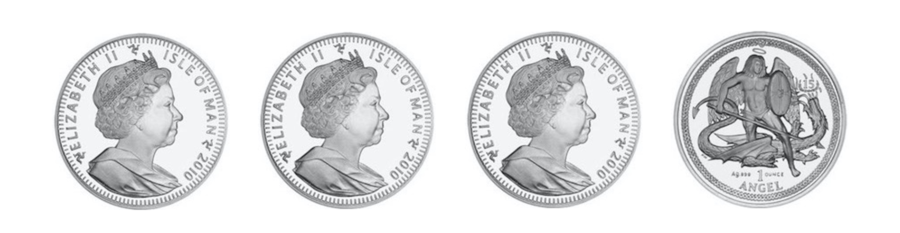

## 2.10 高斯分布

### 2.10.1 高斯分布的定义

如果连续随机变量![X](data:image/svg+xml;utf8,%3Csvg%20xmlns%3Axlink%3D%22http%3A%2F%2Fwww.w3.org%2F1999%2Fxlink%22%20width%3D%221.98ex%22%20height%3D%222.176ex%22%20style%3D%22font-size%3A14px%3Bvertical-align%3A%20-0.338ex%3B%22%20viewBox%3D%220%20-791.3%20852.5%20936.9%22%20role%3D%22img%22%20focusable%3D%22false%22%20xmlns%3D%22http%3A%2F%2Fwww.w3.org%2F2000%2Fsvg%22%20aria-labelledby%3D%22MathJax-SVG-1-Title%22%3E%0A%3Ctitle%20id%3D%22MathJax-SVG-1-Title%22%3EX%3C%2Ftitle%3E%0A%3Cdefs%20aria-hidden%3D%22true%22%3E%0A%3Cpath%20stroke-width%3D%221%22%20id%3D%22E1-MJMATHI-58%22%20d%3D%22M42%200H40Q26%200%2026%2011Q26%2015%2029%2027Q33%2041%2036%2043T55%2046Q141%2049%20190%2098Q200%20108%20306%20224T411%20342Q302%20620%20297%20625Q288%20636%20234%20637H206Q200%20643%20200%20645T202%20664Q206%20677%20212%20683H226Q260%20681%20347%20681Q380%20681%20408%20681T453%20682T473%20682Q490%20682%20490%20671Q490%20670%20488%20658Q484%20643%20481%20640T465%20637Q434%20634%20411%20620L488%20426L541%20485Q646%20598%20646%20610Q646%20628%20622%20635Q617%20635%20609%20637Q594%20637%20594%20648Q594%20650%20596%20664Q600%20677%20606%20683H618Q619%20683%20643%20683T697%20681T738%20680Q828%20680%20837%20683H845Q852%20676%20852%20672Q850%20647%20840%20637H824Q790%20636%20763%20628T722%20611T698%20593L687%20584Q687%20585%20592%20480L505%20384Q505%20383%20536%20304T601%20142T638%2056Q648%2047%20699%2046Q734%2046%20734%2037Q734%2035%20732%2023Q728%207%20725%204T711%201Q708%201%20678%201T589%202Q528%202%20496%202T461%201Q444%201%20444%2010Q444%2011%20446%2025Q448%2035%20450%2039T455%2044T464%2046T480%2047T506%2054Q523%2062%20523%2064Q522%2064%20476%20181L429%20299Q241%2095%20236%2084Q232%2076%20232%2072Q232%2053%20261%2047Q262%2047%20267%2047T273%2046Q276%2046%20277%2046T280%2045T283%2042T284%2035Q284%2026%20282%2019Q279%206%20276%204T261%201Q258%201%20243%201T201%202T142%202Q64%202%2042%200Z%22%3E%3C%2Fpath%3E%0A%3C%2Fdefs%3E%0A%3Cg%20stroke%3D%22currentColor%22%20fill%3D%22currentColor%22%20stroke-width%3D%220%22%20transform%3D%22matrix(1%200%200%20-1%200%200)%22%20aria-hidden%3D%22true%22%3E%0A%20%3Cuse%20xlink%3Ahref%3D%22%23E1-MJMATHI-58%22%20x%3D%220%22%20y%3D%220%22%3E%3C%2Fuse%3E%0A%3C%2Fg%3E%0A%3C%2Fsvg%3E)的概率密度函数为：

%3D%5Cfrac%7B1%7D%7B%5Csigma%5Csqrt%7B2%5Cpi%7D%7De%5E%7B-%5Cfrac%7B(x-%5Cmu)%5E2%7D%7B2%5Csigma%5E2%7D%7D%2C%5Cquad%20-%5Cinfty%20%26lt%3B%20x%20%26lt%3B%20%2B%5Cinfty%3C%2Ftitle%3E%0A%3Cdefs%20aria-hidden%3D%22true%22%3E%0A%3Cpath%20stroke-width%3D%221%22%20id%3D%22E1-MJMATHI-70%22%20d%3D%22M23%20287Q24%20290%2025%20295T30%20317T40%20348T55%20381T75%20411T101%20433T134%20442Q209%20442%20230%20378L240%20387Q302%20442%20358%20442Q423%20442%20460%20395T497%20281Q497%20173%20421%2082T249%20-10Q227%20-10%20210%20-4Q199%201%20187%2011T168%2028L161%2036Q160%2035%20139%20-51T118%20-138Q118%20-144%20126%20-145T163%20-148H188Q194%20-155%20194%20-157T191%20-175Q188%20-187%20185%20-190T172%20-194Q170%20-194%20161%20-194T127%20-193T65%20-192Q-5%20-192%20-24%20-194H-32Q-39%20-187%20-39%20-183Q-37%20-156%20-26%20-148H-6Q28%20-147%2033%20-136Q36%20-130%2094%20103T155%20350Q156%20355%20156%20364Q156%20405%20131%20405Q109%20405%2094%20377T71%20316T59%20280Q57%20278%2043%20278H29Q23%20284%2023%20287ZM178%20102Q200%2026%20252%2026Q282%2026%20310%2049T356%20107Q374%20141%20392%20215T411%20325V331Q411%20405%20350%20405Q339%20405%20328%20402T306%20393T286%20380T269%20365T254%20350T243%20336T235%20326L232%20322Q232%20321%20229%20308T218%20264T204%20212Q178%20106%20178%20102Z%22%3E%3C%2Fpath%3E%0A%3Cpath%20stroke-width%3D%221%22%20id%3D%22E1-MJMAIN-28%22%20d%3D%22M94%20250Q94%20319%20104%20381T127%20488T164%20576T202%20643T244%20695T277%20729T302%20750H315H319Q333%20750%20333%20741Q333%20738%20316%20720T275%20667T226%20581T184%20443T167%20250T184%2058T225%20-81T274%20-167T316%20-220T333%20-241Q333%20-250%20318%20-250H315H302L274%20-226Q180%20-141%20137%20-14T94%20250Z%22%3E%3C%2Fpath%3E%0A%3Cpath%20stroke-width%3D%221%22%20id%3D%22E1-MJMATHI-78%22%20d%3D%22M52%20289Q59%20331%20106%20386T222%20442Q257%20442%20286%20424T329%20379Q371%20442%20430%20442Q467%20442%20494%20420T522%20361Q522%20332%20508%20314T481%20292T458%20288Q439%20288%20427%20299T415%20328Q415%20374%20465%20391Q454%20404%20425%20404Q412%20404%20406%20402Q368%20386%20350%20336Q290%20115%20290%2078Q290%2050%20306%2038T341%2026Q378%2026%20414%2059T463%20140Q466%20150%20469%20151T485%20153H489Q504%20153%20504%20145Q504%20144%20502%20134Q486%2077%20440%2033T333%20-11Q263%20-11%20227%2052Q186%20-10%20133%20-10H127Q78%20-10%2057%2016T35%2071Q35%20103%2054%20123T99%20143Q142%20143%20142%20101Q142%2081%20130%2066T107%2046T94%2041L91%2040Q91%2039%2097%2036T113%2029T132%2026Q168%2026%20194%2071Q203%2087%20217%20139T245%20247T261%20313Q266%20340%20266%20352Q266%20380%20251%20392T217%20404Q177%20404%20142%20372T93%20290Q91%20281%2088%20280T72%20278H58Q52%20284%2052%20289Z%22%3E%3C%2Fpath%3E%0A%3Cpath%20stroke-width%3D%221%22%20id%3D%22E1-MJMAIN-29%22%20d%3D%22M60%20749L64%20750Q69%20750%2074%20750H86L114%20726Q208%20641%20251%20514T294%20250Q294%20182%20284%20119T261%2012T224%20-76T186%20-143T145%20-194T113%20-227T90%20-246Q87%20-249%2086%20-250H74Q66%20-250%2063%20-250T58%20-247T55%20-238Q56%20-237%2066%20-225Q221%20-64%20221%20250T66%20725Q56%20737%2055%20738Q55%20746%2060%20749Z%22%3E%3C%2Fpath%3E%0A%3Cpath%20stroke-width%3D%221%22%20id%3D%22E1-MJMAIN-3D%22%20d%3D%22M56%20347Q56%20360%2070%20367H707Q722%20359%20722%20347Q722%20336%20708%20328L390%20327H72Q56%20332%2056%20347ZM56%20153Q56%20168%2072%20173H708Q722%20163%20722%20153Q722%20140%20707%20133H70Q56%20140%2056%20153Z%22%3E%3C%2Fpath%3E%0A%3Cpath%20stroke-width%3D%221%22%20id%3D%22E1-MJMAIN-31%22%20d%3D%22M213%20578L200%20573Q186%20568%20160%20563T102%20556H83V602H102Q149%20604%20189%20617T245%20641T273%20663Q275%20666%20285%20666Q294%20666%20302%20660V361L303%2061Q310%2054%20315%2052T339%2048T401%2046H427V0H416Q395%203%20257%203Q121%203%20100%200H88V46H114Q136%2046%20152%2046T177%2047T193%2050T201%2052T207%2057T213%2061V578Z%22%3E%3C%2Fpath%3E%0A%3Cpath%20stroke-width%3D%221%22%20id%3D%22E1-MJMATHI-3C3%22%20d%3D%22M184%20-11Q116%20-11%2074%2034T31%20147Q31%20247%20104%20333T274%20430Q275%20431%20414%20431H552Q553%20430%20555%20429T559%20427T562%20425T565%20422T567%20420T569%20416T570%20412T571%20407T572%20401Q572%20357%20507%20357Q500%20357%20490%20357T476%20358H416L421%20348Q439%20310%20439%20263Q439%20153%20359%2071T184%20-11ZM361%20278Q361%20358%20276%20358Q152%20358%20115%20184Q114%20180%20114%20178Q106%20141%20106%20117Q106%2067%20131%2047T188%2026Q242%2026%20287%2073Q316%20103%20334%20153T356%20233T361%20278Z%22%3E%3C%2Fpath%3E%0A%3Cpath%20stroke-width%3D%221%22%20id%3D%22E1-MJMAIN-32%22%20d%3D%22M109%20429Q82%20429%2066%20447T50%20491Q50%20562%20103%20614T235%20666Q326%20666%20387%20610T449%20465Q449%20422%20429%20383T381%20315T301%20241Q265%20210%20201%20149L142%2093L218%2092Q375%2092%20385%2097Q392%2099%20409%20186V189H449V186Q448%20183%20436%2095T421%203V0H50V19V31Q50%2038%2056%2046T86%2081Q115%20113%20136%20137Q145%20147%20170%20174T204%20211T233%20244T261%20278T284%20308T305%20340T320%20369T333%20401T340%20431T343%20464Q343%20527%20309%20573T212%20619Q179%20619%20154%20602T119%20569T109%20550Q109%20549%20114%20549Q132%20549%20151%20535T170%20489Q170%20464%20154%20447T109%20429Z%22%3E%3C%2Fpath%3E%0A%3Cpath%20stroke-width%3D%221%22%20id%3D%22E1-MJMATHI-3C0%22%20d%3D%22M132%20-11Q98%20-11%2098%2022V33L111%2061Q186%20219%20220%20334L228%20358H196Q158%20358%20142%20355T103%20336Q92%20329%2081%20318T62%20297T53%20285Q51%20284%2038%20284Q19%20284%2019%20294Q19%20300%2038%20329T93%20391T164%20429Q171%20431%20389%20431Q549%20431%20553%20430Q573%20423%20573%20402Q573%20371%20541%20360Q535%20358%20472%20358H408L405%20341Q393%20269%20393%20222Q393%20170%20402%20129T421%2065T431%2037Q431%2020%20417%205T381%20-10Q370%20-10%20363%20-7T347%2017T331%2077Q330%2086%20330%20121Q330%20170%20339%20226T357%20318T367%20358H269L268%20354Q268%20351%20249%20275T206%20114T175%2017Q164%20-11%20132%20-11Z%22%3E%3C%2Fpath%3E%0A%3Cpath%20stroke-width%3D%221%22%20id%3D%22E1-MJMAIN-221A%22%20d%3D%22M95%20178Q89%20178%2081%20186T72%20200T103%20230T169%20280T207%20309Q209%20311%20212%20311H213Q219%20311%20227%20294T281%20177Q300%20134%20312%20108L397%20-77Q398%20-77%20501%20136T707%20565T814%20786Q820%20800%20834%20800Q841%20800%20846%20794T853%20782V776L620%20293L385%20-193Q381%20-200%20366%20-200Q357%20-200%20354%20-197Q352%20-195%20256%2015L160%20225L144%20214Q129%20202%20113%20190T95%20178Z%22%3E%3C%2Fpath%3E%0A%3Cpath%20stroke-width%3D%221%22%20id%3D%22E1-MJMATHI-65%22%20d%3D%22M39%20168Q39%20225%2058%20272T107%20350T174%20402T244%20433T307%20442H310Q355%20442%20388%20420T421%20355Q421%20265%20310%20237Q261%20224%20176%20223Q139%20223%20138%20221Q138%20219%20132%20186T125%20128Q125%2081%20146%2054T209%2026T302%2045T394%20111Q403%20121%20406%20121Q410%20121%20419%20112T429%2098T420%2082T390%2055T344%2024T281%20-1T205%20-11Q126%20-11%2083%2042T39%20168ZM373%20353Q367%20405%20305%20405Q272%20405%20244%20391T199%20357T170%20316T154%20280T149%20261Q149%20260%20169%20260Q282%20260%20327%20284T373%20353Z%22%3E%3C%2Fpath%3E%0A%3Cpath%20stroke-width%3D%221%22%20id%3D%22E1-MJMAIN-2212%22%20d%3D%22M84%20237T84%20250T98%20270H679Q694%20262%20694%20250T679%20230H98Q84%20237%2084%20250Z%22%3E%3C%2Fpath%3E%0A%3Cpath%20stroke-width%3D%221%22%20id%3D%22E1-MJMATHI-3BC%22%20d%3D%22M58%20-216Q44%20-216%2034%20-208T23%20-186Q23%20-176%2096%20116T173%20414Q186%20442%20219%20442Q231%20441%20239%20435T249%20423T251%20413Q251%20401%20220%20279T187%20142Q185%20131%20185%20107V99Q185%2026%20252%2026Q261%2026%20270%2027T287%2031T302%2038T315%2045T327%2055T338%2065T348%2077T356%2088T365%20100L372%20110L408%20253Q444%20395%20448%20404Q461%20431%20491%20431Q504%20431%20512%20424T523%20412T525%20402L449%2084Q448%2079%20448%2068Q448%2043%20455%2035T476%2026Q485%2027%20496%2035Q517%2055%20537%20131Q543%20151%20547%20152Q549%20153%20557%20153H561Q580%20153%20580%20144Q580%20138%20575%20117T555%2063T523%2013Q510%200%20491%20-8Q483%20-10%20467%20-10Q446%20-10%20429%20-4T402%2011T385%2029T376%2044T374%2051L368%2045Q362%2039%20350%2030T324%2012T288%20-4T246%20-11Q199%20-11%20153%2012L129%20-85Q108%20-167%20104%20-180T92%20-202Q76%20-216%2058%20-216Z%22%3E%3C%2Fpath%3E%0A%3Cpath%20stroke-width%3D%221%22%20id%3D%22E1-MJMAIN-2C%22%20d%3D%22M78%2035T78%2060T94%20103T137%20121Q165%20121%20187%2096T210%208Q210%20-27%20201%20-60T180%20-117T154%20-158T130%20-185T117%20-194Q113%20-194%20104%20-185T95%20-172Q95%20-168%20106%20-156T131%20-126T157%20-76T173%20-3V9L172%208Q170%207%20167%206T161%203T152%201T140%200Q113%200%2096%2017Z%22%3E%3C%2Fpath%3E%0A%3Cpath%20stroke-width%3D%221%22%20id%3D%22E1-MJMAIN-221E%22%20d%3D%22M55%20217Q55%20305%20111%20373T254%20442Q342%20442%20419%20381Q457%20350%20493%20303L507%20284L514%20294Q618%20442%20747%20442Q833%20442%20888%20374T944%20214Q944%20128%20889%2059T743%20-11Q657%20-11%20580%2050Q542%2081%20506%20128L492%20147L485%20137Q381%20-11%20252%20-11Q166%20-11%20111%2057T55%20217ZM907%20217Q907%20285%20869%20341T761%20397Q740%20397%20720%20392T682%20378T648%20359T619%20335T594%20310T574%20285T559%20263T548%20246L543%20238L574%20198Q605%20158%20622%20138T664%2094T714%2061T765%2051Q827%2051%20867%20100T907%20217ZM92%20214Q92%20145%20131%2089T239%2033Q357%2033%20456%20193L425%20233Q364%20312%20334%20337Q285%20380%20233%20380Q171%20380%20132%20331T92%20214Z%22%3E%3C%2Fpath%3E%0A%3Cpath%20stroke-width%3D%221%22%20id%3D%22E1-MJMAIN-3C%22%20d%3D%22M694%20-11T694%20-19T688%20-33T678%20-40Q671%20-40%20524%2029T234%20166L90%20235Q83%20240%2083%20250Q83%20261%2091%20266Q664%20540%20678%20540Q681%20540%20687%20534T694%20519T687%20505Q686%20504%20417%20376L151%20250L417%20124Q686%20-4%20687%20-5Q694%20-11%20694%20-19Z%22%3E%3C%2Fpath%3E%0A%3Cpath%20stroke-width%3D%221%22%20id%3D%22E1-MJMAIN-2B%22%20d%3D%22M56%20237T56%20250T70%20270H369V420L370%20570Q380%20583%20389%20583Q402%20583%20409%20568V270H707Q722%20262%20722%20250T707%20230H409V-68Q401%20-82%20391%20-82H389H387Q375%20-82%20369%20-68V230H70Q56%20237%2056%20250Z%22%3E%3C%2Fpath%3E%0A%3C%2Fdefs%3E%0A%3Cg%20stroke%3D%22currentColor%22%20fill%3D%22currentColor%22%20stroke-width%3D%220%22%20transform%3D%22matrix(1%200%200%20-1%200%200)%22%20aria-hidden%3D%22true%22%3E%0A%20%3Cuse%20xlink%3Ahref%3D%22%23E1-MJMATHI-70%22%20x%3D%220%22%20y%3D%220%22%3E%3C%2Fuse%3E%0A%20%3Cuse%20xlink%3Ahref%3D%22%23E1-MJMAIN-28%22%20x%3D%22503%22%20y%3D%220%22%3E%3C%2Fuse%3E%0A%20%3Cuse%20xlink%3Ahref%3D%22%23E1-MJMATHI-78%22%20x%3D%22893%22%20y%3D%220%22%3E%3C%2Fuse%3E%0A%20%3Cuse%20xlink%3Ahref%3D%22%23E1-MJMAIN-29%22%20x%3D%221465%22%20y%3D%220%22%3E%3C%2Fuse%3E%0A%20%3Cuse%20xlink%3Ahref%3D%22%23E1-MJMAIN-3D%22%20x%3D%222132%22%20y%3D%220%22%3E%3C%2Fuse%3E%0A%3Cg%20transform%3D%22translate(2911%2C0)%22%3E%0A%3Cg%20transform%3D%22translate(397%2C0)%22%3E%0A%3Crect%20stroke%3D%22none%22%20width%3D%222600%22%20height%3D%2260%22%20x%3D%220%22%20y%3D%22220%22%3E%3C%2Frect%3E%0A%20%3Cuse%20xlink%3Ahref%3D%22%23E1-MJMAIN-31%22%20x%3D%221049%22%20y%3D%22676%22%3E%3C%2Fuse%3E%0A%3Cg%20transform%3D%22translate(60%2C-915)%22%3E%0A%20%3Cuse%20xlink%3Ahref%3D%22%23E1-MJMATHI-3C3%22%20x%3D%220%22%20y%3D%220%22%3E%3C%2Fuse%3E%0A%3Cg%20transform%3D%22translate(572%2C0)%22%3E%0A%20%3Cuse%20xlink%3Ahref%3D%22%23E1-MJMAIN-221A%22%20x%3D%220%22%20y%3D%2233%22%3E%3C%2Fuse%3E%0A%3Crect%20stroke%3D%22none%22%20width%3D%221074%22%20height%3D%2260%22%20x%3D%22833%22%20y%3D%22774%22%3E%3C%2Frect%3E%0A%3Cg%20transform%3D%22translate(833%2C0)%22%3E%0A%20%3Cuse%20xlink%3Ahref%3D%22%23E1-MJMAIN-32%22%20x%3D%220%22%20y%3D%220%22%3E%3C%2Fuse%3E%0A%20%3Cuse%20xlink%3Ahref%3D%22%23E1-MJMATHI-3C0%22%20x%3D%22500%22%20y%3D%220%22%3E%3C%2Fuse%3E%0A%3C%2Fg%3E%0A%3C%2Fg%3E%0A%3C%2Fg%3E%0A%3C%2Fg%3E%0A%3C%2Fg%3E%0A%3Cg%20transform%3D%22translate(6029%2C0)%22%3E%0A%20%3Cuse%20xlink%3Ahref%3D%22%23E1-MJMATHI-65%22%20x%3D%220%22%20y%3D%220%22%3E%3C%2Fuse%3E%0A%3Cg%20transform%3D%22translate(466%2C681)%22%3E%0A%20%3Cuse%20transform%3D%22scale(0.707)%22%20xlink%3Ahref%3D%22%23E1-MJMAIN-2212%22%20x%3D%220%22%20y%3D%220%22%3E%3C%2Fuse%3E%0A%3Cg%20transform%3D%22translate(550%2C0)%22%3E%0A%3Cg%20transform%3D%22translate(120%2C0)%22%3E%0A%3Crect%20stroke%3D%22none%22%20width%3D%222033%22%20height%3D%2260%22%20x%3D%220%22%20y%3D%22146%22%3E%3C%2Frect%3E%0A%3Cg%20transform%3D%22translate(60%2C515)%22%3E%0A%20%3Cuse%20transform%3D%22scale(0.574)%22%20xlink%3Ahref%3D%22%23E1-MJMAIN-28%22%20x%3D%220%22%20y%3D%220%22%3E%3C%2Fuse%3E%0A%20%3Cuse%20transform%3D%22scale(0.574)%22%20xlink%3Ahref%3D%22%23E1-MJMATHI-78%22%20x%3D%22389%22%20y%3D%220%22%3E%3C%2Fuse%3E%0A%20%3Cuse%20transform%3D%22scale(0.574)%22%20xlink%3Ahref%3D%22%23E1-MJMAIN-2212%22%20x%3D%22962%22%20y%3D%220%22%3E%3C%2Fuse%3E%0A%20%3Cuse%20transform%3D%22scale(0.574)%22%20xlink%3Ahref%3D%22%23E1-MJMATHI-3BC%22%20x%3D%221740%22%20y%3D%220%22%3E%3C%2Fuse%3E%0A%3Cg%20transform%3D%22translate(1345%2C0)%22%3E%0A%20%3Cuse%20transform%3D%22scale(0.574)%22%20xlink%3Ahref%3D%22%23E1-MJMAIN-29%22%20x%3D%220%22%20y%3D%220%22%3E%3C%2Fuse%3E%0A%20%3Cuse%20transform%3D%22scale(0.574)%22%20xlink%3Ahref%3D%22%23E1-MJMAIN-32%22%20x%3D%22389%22%20y%3D%22364%22%3E%3C%2Fuse%3E%0A%3C%2Fg%3E%0A%3C%2Fg%3E%0A%3Cg%20transform%3D%22translate(536%2C-567)%22%3E%0A%20%3Cuse%20transform%3D%22scale(0.574)%22%20xlink%3Ahref%3D%22%23E1-MJMAIN-32%22%20x%3D%220%22%20y%3D%220%22%3E%3C%2Fuse%3E%0A%3Cg%20transform%3D%22translate(287%2C0)%22%3E%0A%20%3Cuse%20transform%3D%22scale(0.574)%22%20xlink%3Ahref%3D%22%23E1-MJMATHI-3C3%22%20x%3D%220%22%20y%3D%220%22%3E%3C%2Fuse%3E%0A%20%3Cuse%20transform%3D%22scale(0.574)%22%20xlink%3Ahref%3D%22%23E1-MJMAIN-32%22%20x%3D%22572%22%20y%3D%22288%22%3E%3C%2Fuse%3E%0A%3C%2Fg%3E%0A%3C%2Fg%3E%0A%3C%2Fg%3E%0A%3C%2Fg%3E%0A%3C%2Fg%3E%0A%3C%2Fg%3E%0A%20%3Cuse%20xlink%3Ahref%3D%22%23E1-MJMAIN-2C%22%20x%3D%229419%22%20y%3D%220%22%3E%3C%2Fuse%3E%0A%20%3Cuse%20xlink%3Ahref%3D%22%23E1-MJMAIN-2212%22%20x%3D%2210865%22%20y%3D%220%22%3E%3C%2Fuse%3E%0A%20%3Cuse%20xlink%3Ahref%3D%22%23E1-MJMAIN-221E%22%20x%3D%2211643%22%20y%3D%220%22%3E%3C%2Fuse%3E%0A%20%3Cuse%20xlink%3Ahref%3D%22%23E1-MJMAIN-3C%22%20x%3D%2212921%22%20y%3D%220%22%3E%3C%2Fuse%3E%0A%20%3Cuse%20xlink%3Ahref%3D%22%23E1-MJMATHI-78%22%20x%3D%2213978%22%20y%3D%220%22%3E%3C%2Fuse%3E%0A%20%3Cuse%20xlink%3Ahref%3D%22%23E1-MJMAIN-3C%22%20x%3D%2214828%22%20y%3D%220%22%3E%3C%2Fuse%3E%0A%20%3Cuse%20xlink%3Ahref%3D%22%23E1-MJMAIN-2B%22%20x%3D%2215884%22%20y%3D%220%22%3E%3C%2Fuse%3E%0A%20%3Cuse%20xlink%3Ahref%3D%22%23E1-MJMAIN-221E%22%20x%3D%2216663%22%20y%3D%220%22%3E%3C%2Fuse%3E%0A%3C%2Fg%3E%0A%3C%2Fsvg%3E)

则称![X](data:image/svg+xml;utf8,%3Csvg%20xmlns%3Axlink%3D%22http%3A%2F%2Fwww.w3.org%2F1999%2Fxlink%22%20width%3D%221.98ex%22%20height%3D%222.176ex%22%20style%3D%22font-size%3A14px%3Bvertical-align%3A%20-0.338ex%3B%22%20viewBox%3D%220%20-791.3%20852.5%20936.9%22%20role%3D%22img%22%20focusable%3D%22false%22%20xmlns%3D%22http%3A%2F%2Fwww.w3.org%2F2000%2Fsvg%22%20aria-labelledby%3D%22MathJax-SVG-1-Title%22%3E%0A%3Ctitle%20id%3D%22MathJax-SVG-1-Title%22%3EX%3C%2Ftitle%3E%0A%3Cdefs%20aria-hidden%3D%22true%22%3E%0A%3Cpath%20stroke-width%3D%221%22%20id%3D%22E1-MJMATHI-58%22%20d%3D%22M42%200H40Q26%200%2026%2011Q26%2015%2029%2027Q33%2041%2036%2043T55%2046Q141%2049%20190%2098Q200%20108%20306%20224T411%20342Q302%20620%20297%20625Q288%20636%20234%20637H206Q200%20643%20200%20645T202%20664Q206%20677%20212%20683H226Q260%20681%20347%20681Q380%20681%20408%20681T453%20682T473%20682Q490%20682%20490%20671Q490%20670%20488%20658Q484%20643%20481%20640T465%20637Q434%20634%20411%20620L488%20426L541%20485Q646%20598%20646%20610Q646%20628%20622%20635Q617%20635%20609%20637Q594%20637%20594%20648Q594%20650%20596%20664Q600%20677%20606%20683H618Q619%20683%20643%20683T697%20681T738%20680Q828%20680%20837%20683H845Q852%20676%20852%20672Q850%20647%20840%20637H824Q790%20636%20763%20628T722%20611T698%20593L687%20584Q687%20585%20592%20480L505%20384Q505%20383%20536%20304T601%20142T638%2056Q648%2047%20699%2046Q734%2046%20734%2037Q734%2035%20732%2023Q728%207%20725%204T711%201Q708%201%20678%201T589%202Q528%202%20496%202T461%201Q444%201%20444%2010Q444%2011%20446%2025Q448%2035%20450%2039T455%2044T464%2046T480%2047T506%2054Q523%2062%20523%2064Q522%2064%20476%20181L429%20299Q241%2095%20236%2084Q232%2076%20232%2072Q232%2053%20261%2047Q262%2047%20267%2047T273%2046Q276%2046%20277%2046T280%2045T283%2042T284%2035Q284%2026%20282%2019Q279%206%20276%204T261%201Q258%201%20243%201T201%202T142%202Q64%202%2042%200Z%22%3E%3C%2Fpath%3E%0A%3C%2Fdefs%3E%0A%3Cg%20stroke%3D%22currentColor%22%20fill%3D%22currentColor%22%20stroke-width%3D%220%22%20transform%3D%22matrix(1%200%200%20-1%200%200)%22%20aria-hidden%3D%22true%22%3E%0A%20%3Cuse%20xlink%3Ahref%3D%22%23E1-MJMATHI-58%22%20x%3D%220%22%20y%3D%220%22%3E%3C%2Fuse%3E%0A%3C%2Fg%3E%0A%3C%2Fsvg%3E)服从%22%20aria-hidden%3D%22true%22%3E%0A%3Cg%20fill%3D%22Salmon%22%20stroke%3D%22Salmon%22%3E%0A%3Cg%20fill%3D%22Salmon%22%20stroke%3D%22Salmon%22%3E%0A%3Cg%20fill%3D%22Salmon%22%20stroke%3D%22Salmon%22%3E%0A%3Cg%20fill%3D%22Salmon%22%20stroke%3D%22Salmon%22%3E%0A%3Cg%20fill%3D%22Salmon%22%20stroke%3D%22Salmon%22%3E%0A%3Ctext%20font-family%3D%22monospace%22%20stroke%3D%22none%22%20transform%3D%22scale(59.79916666666667)%20matrix(1%200%200%20-1%200%200)%22%3E%E6%AD%A3%3C%2Ftext%3E%0A%3C%2Fg%3E%0A%3C%2Fg%3E%0A%3C%2Fg%3E%0A%3Cg%20fill%3D%22Salmon%22%20stroke%3D%22Salmon%22%20transform%3D%22translate(777%2C0)%22%3E%0A%3Cg%20fill%3D%22Salmon%22%20stroke%3D%22Salmon%22%3E%0A%3Cg%20fill%3D%22Salmon%22%20stroke%3D%22Salmon%22%3E%0A%3Ctext%20font-family%3D%22monospace%22%20stroke%3D%22none%22%20transform%3D%22scale(59.79916666666667)%20matrix(1%200%200%20-1%200%200)%22%3E%E6%80%81%3C%2Ftext%3E%0A%3C%2Fg%3E%0A%3C%2Fg%3E%0A%3C%2Fg%3E%0A%3Cg%20fill%3D%22Salmon%22%20stroke%3D%22Salmon%22%20transform%3D%22translate(1554%2C0)%22%3E%0A%3Cg%20fill%3D%22Salmon%22%20stroke%3D%22Salmon%22%3E%0A%3Cg%20fill%3D%22Salmon%22%20stroke%3D%22Salmon%22%3E%0A%3Ctext%20font-family%3D%22monospace%22%20stroke%3D%22none%22%20transform%3D%22scale(59.79916666666667)%20matrix(1%200%200%20-1%200%200)%22%3E%E5%88%86%3C%2Ftext%3E%0A%3C%2Fg%3E%0A%3C%2Fg%3E%0A%3C%2Fg%3E%0A%3Cg%20fill%3D%22Salmon%22%20stroke%3D%22Salmon%22%20transform%3D%22translate(2332%2C0)%22%3E%0A%3Cg%20fill%3D%22Salmon%22%20stroke%3D%22Salmon%22%3E%0A%3Cg%20fill%3D%22Salmon%22%20stroke%3D%22Salmon%22%3E%0A%3Ctext%20font-family%3D%22monospace%22%20stroke%3D%22none%22%20transform%3D%22scale(59.79916666666667)%20matrix(1%200%200%20-1%200%200)%22%3E%E5%B8%83%3C%2Ftext%3E%0A%3C%2Fg%3E%0A%3C%2Fg%3E%0A%3C%2Fg%3E%0A%3C%2Fg%3E%0A%3C%2Fg%3E%0A%3C%2Fg%3E%0A%3C%2Fsvg%3E)（normal distribution），也称作%22%20aria-hidden%3D%22true%22%3E%0A%3Cg%20fill%3D%22Salmon%22%20stroke%3D%22Salmon%22%3E%0A%3Cg%20fill%3D%22Salmon%22%20stroke%3D%22Salmon%22%3E%0A%3Cg%20fill%3D%22Salmon%22%20stroke%3D%22Salmon%22%3E%0A%3Cg%20fill%3D%22Salmon%22%20stroke%3D%22Salmon%22%3E%0A%3Cg%20fill%3D%22Salmon%22%20stroke%3D%22Salmon%22%3E%0A%3Ctext%20font-family%3D%22monospace%22%20stroke%3D%22none%22%20transform%3D%22scale(59.79916666666667)%20matrix(1%200%200%20-1%200%200)%22%3E%E9%AB%98%3C%2Ftext%3E%0A%3C%2Fg%3E%0A%3C%2Fg%3E%0A%3C%2Fg%3E%0A%3Cg%20fill%3D%22Salmon%22%20stroke%3D%22Salmon%22%20transform%3D%22translate(777%2C0)%22%3E%0A%3Cg%20fill%3D%22Salmon%22%20stroke%3D%22Salmon%22%3E%0A%3Cg%20fill%3D%22Salmon%22%20stroke%3D%22Salmon%22%3E%0A%3Ctext%20font-family%3D%22monospace%22%20stroke%3D%22none%22%20transform%3D%22scale(59.79916666666667)%20matrix(1%200%200%20-1%200%200)%22%3E%E6%96%AF%3C%2Ftext%3E%0A%3C%2Fg%3E%0A%3C%2Fg%3E%0A%3C%2Fg%3E%0A%3Cg%20fill%3D%22Salmon%22%20stroke%3D%22Salmon%22%20transform%3D%22translate(1554%2C0)%22%3E%0A%3Cg%20fill%3D%22Salmon%22%20stroke%3D%22Salmon%22%3E%0A%3Cg%20fill%3D%22Salmon%22%20stroke%3D%22Salmon%22%3E%0A%3Ctext%20font-family%3D%22monospace%22%20stroke%3D%22none%22%20transform%3D%22scale(59.79916666666667)%20matrix(1%200%200%20-1%200%200)%22%3E%E5%88%86%3C%2Ftext%3E%0A%3C%2Fg%3E%0A%3C%2Fg%3E%0A%3C%2Fg%3E%0A%3Cg%20fill%3D%22Salmon%22%20stroke%3D%22Salmon%22%20transform%3D%22translate(2332%2C0)%22%3E%0A%3Cg%20fill%3D%22Salmon%22%20stroke%3D%22Salmon%22%3E%0A%3Cg%20fill%3D%22Salmon%22%20stroke%3D%22Salmon%22%3E%0A%3Ctext%20font-family%3D%22monospace%22%20stroke%3D%22none%22%20transform%3D%22scale(59.79916666666667)%20matrix(1%200%200%20-1%200%200)%22%3E%E5%B8%83%3C%2Ftext%3E%0A%3C%2Fg%3E%0A%3C%2Fg%3E%0A%3C%2Fg%3E%0A%3C%2Fg%3E%0A%3C%2Fg%3E%0A%3C%2Fg%3E%0A%3C%2Fsvg%3E)（Gaussian distribution），记作%3C%2Ftitle%3E%0A%3Cdefs%20aria-hidden%3D%22true%22%3E%0A%3Cpath%20stroke-width%3D%221%22%20id%3D%22E1-MJMATHI-58%22%20d%3D%22M42%200H40Q26%200%2026%2011Q26%2015%2029%2027Q33%2041%2036%2043T55%2046Q141%2049%20190%2098Q200%20108%20306%20224T411%20342Q302%20620%20297%20625Q288%20636%20234%20637H206Q200%20643%20200%20645T202%20664Q206%20677%20212%20683H226Q260%20681%20347%20681Q380%20681%20408%20681T453%20682T473%20682Q490%20682%20490%20671Q490%20670%20488%20658Q484%20643%20481%20640T465%20637Q434%20634%20411%20620L488%20426L541%20485Q646%20598%20646%20610Q646%20628%20622%20635Q617%20635%20609%20637Q594%20637%20594%20648Q594%20650%20596%20664Q600%20677%20606%20683H618Q619%20683%20643%20683T697%20681T738%20680Q828%20680%20837%20683H845Q852%20676%20852%20672Q850%20647%20840%20637H824Q790%20636%20763%20628T722%20611T698%20593L687%20584Q687%20585%20592%20480L505%20384Q505%20383%20536%20304T601%20142T638%2056Q648%2047%20699%2046Q734%2046%20734%2037Q734%2035%20732%2023Q728%207%20725%204T711%201Q708%201%20678%201T589%202Q528%202%20496%202T461%201Q444%201%20444%2010Q444%2011%20446%2025Q448%2035%20450%2039T455%2044T464%2046T480%2047T506%2054Q523%2062%20523%2064Q522%2064%20476%20181L429%20299Q241%2095%20236%2084Q232%2076%20232%2072Q232%2053%20261%2047Q262%2047%20267%2047T273%2046Q276%2046%20277%2046T280%2045T283%2042T284%2035Q284%2026%20282%2019Q279%206%20276%204T261%201Q258%201%20243%201T201%202T142%202Q64%202%2042%200Z%22%3E%3C%2Fpath%3E%0A%3Cpath%20stroke-width%3D%221%22%20id%3D%22E1-MJMAIN-223C%22%20d%3D%22M55%20166Q55%20241%20101%20304T222%20367Q260%20367%20296%20349T362%20304T421%20252T484%20208T554%20189Q616%20189%20655%20236T694%20338Q694%20350%20698%20358T708%20367Q722%20367%20722%20334Q722%20260%20677%20197T562%20134H554Q517%20134%20481%20152T414%20196T355%20248T292%20293T223%20311Q179%20311%20145%20286Q109%20257%2096%20218T80%20156T69%20133Q55%20133%2055%20166Z%22%3E%3C%2Fpath%3E%0A%3Cpath%20stroke-width%3D%221%22%20id%3D%22E1-MJMATHI-4E%22%20d%3D%22M234%20637Q231%20637%20226%20637Q201%20637%20196%20638T191%20649Q191%20676%20202%20682Q204%20683%20299%20683Q376%20683%20387%20683T401%20677Q612%20181%20616%20168L670%20381Q723%20592%20723%20606Q723%20633%20659%20637Q635%20637%20635%20648Q635%20650%20637%20660Q641%20676%20643%20679T653%20683Q656%20683%20684%20682T767%20680Q817%20680%20843%20681T873%20682Q888%20682%20888%20672Q888%20650%20880%20642Q878%20637%20858%20637Q787%20633%20769%20597L620%207Q618%200%20599%200Q585%200%20582%202Q579%205%20453%20305L326%20604L261%20344Q196%2088%20196%2079Q201%2046%20268%2046H278Q284%2041%20284%2038T282%2019Q278%206%20272%200H259Q228%202%20151%202Q123%202%20100%202T63%202T46%201Q31%201%2031%2010Q31%2014%2034%2026T39%2040Q41%2046%2062%2046Q130%2049%20150%2085Q154%2091%20221%20362L289%20634Q287%20635%20234%20637Z%22%3E%3C%2Fpath%3E%0A%3Cpath%20stroke-width%3D%221%22%20id%3D%22E1-MJMAIN-28%22%20d%3D%22M94%20250Q94%20319%20104%20381T127%20488T164%20576T202%20643T244%20695T277%20729T302%20750H315H319Q333%20750%20333%20741Q333%20738%20316%20720T275%20667T226%20581T184%20443T167%20250T184%2058T225%20-81T274%20-167T316%20-220T333%20-241Q333%20-250%20318%20-250H315H302L274%20-226Q180%20-141%20137%20-14T94%20250Z%22%3E%3C%2Fpath%3E%0A%3Cpath%20stroke-width%3D%221%22%20id%3D%22E1-MJMATHI-3BC%22%20d%3D%22M58%20-216Q44%20-216%2034%20-208T23%20-186Q23%20-176%2096%20116T173%20414Q186%20442%20219%20442Q231%20441%20239%20435T249%20423T251%20413Q251%20401%20220%20279T187%20142Q185%20131%20185%20107V99Q185%2026%20252%2026Q261%2026%20270%2027T287%2031T302%2038T315%2045T327%2055T338%2065T348%2077T356%2088T365%20100L372%20110L408%20253Q444%20395%20448%20404Q461%20431%20491%20431Q504%20431%20512%20424T523%20412T525%20402L449%2084Q448%2079%20448%2068Q448%2043%20455%2035T476%2026Q485%2027%20496%2035Q517%2055%20537%20131Q543%20151%20547%20152Q549%20153%20557%20153H561Q580%20153%20580%20144Q580%20138%20575%20117T555%2063T523%2013Q510%200%20491%20-8Q483%20-10%20467%20-10Q446%20-10%20429%20-4T402%2011T385%2029T376%2044T374%2051L368%2045Q362%2039%20350%2030T324%2012T288%20-4T246%20-11Q199%20-11%20153%2012L129%20-85Q108%20-167%20104%20-180T92%20-202Q76%20-216%2058%20-216Z%22%3E%3C%2Fpath%3E%0A%3Cpath%20stroke-width%3D%221%22%20id%3D%22E1-MJMAIN-2C%22%20d%3D%22M78%2035T78%2060T94%20103T137%20121Q165%20121%20187%2096T210%208Q210%20-27%20201%20-60T180%20-117T154%20-158T130%20-185T117%20-194Q113%20-194%20104%20-185T95%20-172Q95%20-168%20106%20-156T131%20-126T157%20-76T173%20-3V9L172%208Q170%207%20167%206T161%203T152%201T140%200Q113%200%2096%2017Z%22%3E%3C%2Fpath%3E%0A%3Cpath%20stroke-width%3D%221%22%20id%3D%22E1-MJMATHI-3C3%22%20d%3D%22M184%20-11Q116%20-11%2074%2034T31%20147Q31%20247%20104%20333T274%20430Q275%20431%20414%20431H552Q553%20430%20555%20429T559%20427T562%20425T565%20422T567%20420T569%20416T570%20412T571%20407T572%20401Q572%20357%20507%20357Q500%20357%20490%20357T476%20358H416L421%20348Q439%20310%20439%20263Q439%20153%20359%2071T184%20-11ZM361%20278Q361%20358%20276%20358Q152%20358%20115%20184Q114%20180%20114%20178Q106%20141%20106%20117Q106%2067%20131%2047T188%2026Q242%2026%20287%2073Q316%20103%20334%20153T356%20233T361%20278Z%22%3E%3C%2Fpath%3E%0A%3Cpath%20stroke-width%3D%221%22%20id%3D%22E1-MJMAIN-32%22%20d%3D%22M109%20429Q82%20429%2066%20447T50%20491Q50%20562%20103%20614T235%20666Q326%20666%20387%20610T449%20465Q449%20422%20429%20383T381%20315T301%20241Q265%20210%20201%20149L142%2093L218%2092Q375%2092%20385%2097Q392%2099%20409%20186V189H449V186Q448%20183%20436%2095T421%203V0H50V19V31Q50%2038%2056%2046T86%2081Q115%20113%20136%20137Q145%20147%20170%20174T204%20211T233%20244T261%20278T284%20308T305%20340T320%20369T333%20401T340%20431T343%20464Q343%20527%20309%20573T212%20619Q179%20619%20154%20602T119%20569T109%20550Q109%20549%20114%20549Q132%20549%20151%20535T170%20489Q170%20464%20154%20447T109%20429Z%22%3E%3C%2Fpath%3E%0A%3Cpath%20stroke-width%3D%221%22%20id%3D%22E1-MJMAIN-29%22%20d%3D%22M60%20749L64%20750Q69%20750%2074%20750H86L114%20726Q208%20641%20251%20514T294%20250Q294%20182%20284%20119T261%2012T224%20-76T186%20-143T145%20-194T113%20-227T90%20-246Q87%20-249%2086%20-250H74Q66%20-250%2063%20-250T58%20-247T55%20-238Q56%20-237%2066%20-225Q221%20-64%20221%20250T66%20725Q56%20737%2055%20738Q55%20746%2060%20749Z%22%3E%3C%2Fpath%3E%0A%3C%2Fdefs%3E%0A%3Cg%20stroke%3D%22currentColor%22%20fill%3D%22currentColor%22%20stroke-width%3D%220%22%20transform%3D%22matrix(1%200%200%20-1%200%200)%22%20aria-hidden%3D%22true%22%3E%0A%20%3Cuse%20xlink%3Ahref%3D%22%23E1-MJMATHI-58%22%20x%3D%220%22%20y%3D%220%22%3E%3C%2Fuse%3E%0A%20%3Cuse%20xlink%3Ahref%3D%22%23E1-MJMAIN-223C%22%20x%3D%221130%22%20y%3D%220%22%3E%3C%2Fuse%3E%0A%20%3Cuse%20xlink%3Ahref%3D%22%23E1-MJMATHI-4E%22%20x%3D%222186%22%20y%3D%220%22%3E%3C%2Fuse%3E%0A%20%3Cuse%20xlink%3Ahref%3D%22%23E1-MJMAIN-28%22%20x%3D%223075%22%20y%3D%220%22%3E%3C%2Fuse%3E%0A%20%3Cuse%20xlink%3Ahref%3D%22%23E1-MJMATHI-3BC%22%20x%3D%223464%22%20y%3D%220%22%3E%3C%2Fuse%3E%0A%20%3Cuse%20xlink%3Ahref%3D%22%23E1-MJMAIN-2C%22%20x%3D%224068%22%20y%3D%220%22%3E%3C%2Fuse%3E%0A%3Cg%20transform%3D%22translate(4513%2C0)%22%3E%0A%20%3Cuse%20xlink%3Ahref%3D%22%23E1-MJMATHI-3C3%22%20x%3D%220%22%20y%3D%220%22%3E%3C%2Fuse%3E%0A%20%3Cuse%20transform%3D%22scale(0.707)%22%20xlink%3Ahref%3D%22%23E1-MJMAIN-32%22%20x%3D%22810%22%20y%3D%22583%22%3E%3C%2Fuse%3E%0A%3C%2Fg%3E%0A%20%3Cuse%20xlink%3Ahref%3D%22%23E1-MJMAIN-29%22%20x%3D%225539%22%20y%3D%220%22%3E%3C%2Fuse%3E%0A%3C%2Fg%3E%0A%3C%2Fsvg%3E)，其累积分布函数为：

%3D%5Cfrac%7B1%7D%7B%5Csigma%5Csqrt%7B2%5Cpi%7D%7D%5Cint_%7B-%5Cinfty%7D%5E%7Bx%7De%5E%7B-%5Cfrac%7B(t-%5Cmu)%5E2%7D%7B2%5Csigma%5E2%7D%7D%5Cmathrm%7Bd%7Dt%3C%2Ftitle%3E%0A%3Cdefs%20aria-hidden%3D%22true%22%3E%0A%3Cpath%20stroke-width%3D%221%22%20id%3D%22E1-MJMATHI-46%22%20d%3D%22M48%201Q31%201%2031%2011Q31%2013%2034%2025Q38%2041%2042%2043T65%2046Q92%2046%20125%2049Q139%2052%20144%2061Q146%2066%20215%20342T285%20622Q285%20629%20281%20629Q273%20632%20228%20634H197Q191%20640%20191%20642T193%20659Q197%20676%20203%20680H742Q749%20676%20749%20669Q749%20664%20736%20557T722%20447Q720%20440%20702%20440H690Q683%20445%20683%20453Q683%20454%20686%20477T689%20530Q689%20560%20682%20579T663%20610T626%20626T575%20633T503%20634H480Q398%20633%20393%20631Q388%20629%20386%20623Q385%20622%20352%20492L320%20363H375Q378%20363%20398%20363T426%20364T448%20367T472%20374T489%20386Q502%20398%20511%20419T524%20457T529%20475Q532%20480%20548%20480H560Q567%20475%20567%20470Q567%20467%20536%20339T502%20207Q500%20200%20482%20200H470Q463%20206%20463%20212Q463%20215%20468%20234T473%20274Q473%20303%20453%20310T364%20317H309L277%20190Q245%2066%20245%2060Q245%2046%20334%2046H359Q365%2040%20365%2039T363%2019Q359%206%20353%200H336Q295%202%20185%202Q120%202%2086%202T48%201Z%22%3E%3C%2Fpath%3E%0A%3Cpath%20stroke-width%3D%221%22%20id%3D%22E1-MJMAIN-28%22%20d%3D%22M94%20250Q94%20319%20104%20381T127%20488T164%20576T202%20643T244%20695T277%20729T302%20750H315H319Q333%20750%20333%20741Q333%20738%20316%20720T275%20667T226%20581T184%20443T167%20250T184%2058T225%20-81T274%20-167T316%20-220T333%20-241Q333%20-250%20318%20-250H315H302L274%20-226Q180%20-141%20137%20-14T94%20250Z%22%3E%3C%2Fpath%3E%0A%3Cpath%20stroke-width%3D%221%22%20id%3D%22E1-MJMATHI-78%22%20d%3D%22M52%20289Q59%20331%20106%20386T222%20442Q257%20442%20286%20424T329%20379Q371%20442%20430%20442Q467%20442%20494%20420T522%20361Q522%20332%20508%20314T481%20292T458%20288Q439%20288%20427%20299T415%20328Q415%20374%20465%20391Q454%20404%20425%20404Q412%20404%20406%20402Q368%20386%20350%20336Q290%20115%20290%2078Q290%2050%20306%2038T341%2026Q378%2026%20414%2059T463%20140Q466%20150%20469%20151T485%20153H489Q504%20153%20504%20145Q504%20144%20502%20134Q486%2077%20440%2033T333%20-11Q263%20-11%20227%2052Q186%20-10%20133%20-10H127Q78%20-10%2057%2016T35%2071Q35%20103%2054%20123T99%20143Q142%20143%20142%20101Q142%2081%20130%2066T107%2046T94%2041L91%2040Q91%2039%2097%2036T113%2029T132%2026Q168%2026%20194%2071Q203%2087%20217%20139T245%20247T261%20313Q266%20340%20266%20352Q266%20380%20251%20392T217%20404Q177%20404%20142%20372T93%20290Q91%20281%2088%20280T72%20278H58Q52%20284%2052%20289Z%22%3E%3C%2Fpath%3E%0A%3Cpath%20stroke-width%3D%221%22%20id%3D%22E1-MJMAIN-29%22%20d%3D%22M60%20749L64%20750Q69%20750%2074%20750H86L114%20726Q208%20641%20251%20514T294%20250Q294%20182%20284%20119T261%2012T224%20-76T186%20-143T145%20-194T113%20-227T90%20-246Q87%20-249%2086%20-250H74Q66%20-250%2063%20-250T58%20-247T55%20-238Q56%20-237%2066%20-225Q221%20-64%20221%20250T66%20725Q56%20737%2055%20738Q55%20746%2060%20749Z%22%3E%3C%2Fpath%3E%0A%3Cpath%20stroke-width%3D%221%22%20id%3D%22E1-MJMAIN-3D%22%20d%3D%22M56%20347Q56%20360%2070%20367H707Q722%20359%20722%20347Q722%20336%20708%20328L390%20327H72Q56%20332%2056%20347ZM56%20153Q56%20168%2072%20173H708Q722%20163%20722%20153Q722%20140%20707%20133H70Q56%20140%2056%20153Z%22%3E%3C%2Fpath%3E%0A%3Cpath%20stroke-width%3D%221%22%20id%3D%22E1-MJMAIN-31%22%20d%3D%22M213%20578L200%20573Q186%20568%20160%20563T102%20556H83V602H102Q149%20604%20189%20617T245%20641T273%20663Q275%20666%20285%20666Q294%20666%20302%20660V361L303%2061Q310%2054%20315%2052T339%2048T401%2046H427V0H416Q395%203%20257%203Q121%203%20100%200H88V46H114Q136%2046%20152%2046T177%2047T193%2050T201%2052T207%2057T213%2061V578Z%22%3E%3C%2Fpath%3E%0A%3Cpath%20stroke-width%3D%221%22%20id%3D%22E1-MJMATHI-3C3%22%20d%3D%22M184%20-11Q116%20-11%2074%2034T31%20147Q31%20247%20104%20333T274%20430Q275%20431%20414%20431H552Q553%20430%20555%20429T559%20427T562%20425T565%20422T567%20420T569%20416T570%20412T571%20407T572%20401Q572%20357%20507%20357Q500%20357%20490%20357T476%20358H416L421%20348Q439%20310%20439%20263Q439%20153%20359%2071T184%20-11ZM361%20278Q361%20358%20276%20358Q152%20358%20115%20184Q114%20180%20114%20178Q106%20141%20106%20117Q106%2067%20131%2047T188%2026Q242%2026%20287%2073Q316%20103%20334%20153T356%20233T361%20278Z%22%3E%3C%2Fpath%3E%0A%3Cpath%20stroke-width%3D%221%22%20id%3D%22E1-MJMAIN-32%22%20d%3D%22M109%20429Q82%20429%2066%20447T50%20491Q50%20562%20103%20614T235%20666Q326%20666%20387%20610T449%20465Q449%20422%20429%20383T381%20315T301%20241Q265%20210%20201%20149L142%2093L218%2092Q375%2092%20385%2097Q392%2099%20409%20186V189H449V186Q448%20183%20436%2095T421%203V0H50V19V31Q50%2038%2056%2046T86%2081Q115%20113%20136%20137Q145%20147%20170%20174T204%20211T233%20244T261%20278T284%20308T305%20340T320%20369T333%20401T340%20431T343%20464Q343%20527%20309%20573T212%20619Q179%20619%20154%20602T119%20569T109%20550Q109%20549%20114%20549Q132%20549%20151%20535T170%20489Q170%20464%20154%20447T109%20429Z%22%3E%3C%2Fpath%3E%0A%3Cpath%20stroke-width%3D%221%22%20id%3D%22E1-MJMATHI-3C0%22%20d%3D%22M132%20-11Q98%20-11%2098%2022V33L111%2061Q186%20219%20220%20334L228%20358H196Q158%20358%20142%20355T103%20336Q92%20329%2081%20318T62%20297T53%20285Q51%20284%2038%20284Q19%20284%2019%20294Q19%20300%2038%20329T93%20391T164%20429Q171%20431%20389%20431Q549%20431%20553%20430Q573%20423%20573%20402Q573%20371%20541%20360Q535%20358%20472%20358H408L405%20341Q393%20269%20393%20222Q393%20170%20402%20129T421%2065T431%2037Q431%2020%20417%205T381%20-10Q370%20-10%20363%20-7T347%2017T331%2077Q330%2086%20330%20121Q330%20170%20339%20226T357%20318T367%20358H269L268%20354Q268%20351%20249%20275T206%20114T175%2017Q164%20-11%20132%20-11Z%22%3E%3C%2Fpath%3E%0A%3Cpath%20stroke-width%3D%221%22%20id%3D%22E1-MJMAIN-221A%22%20d%3D%22M95%20178Q89%20178%2081%20186T72%20200T103%20230T169%20280T207%20309Q209%20311%20212%20311H213Q219%20311%20227%20294T281%20177Q300%20134%20312%20108L397%20-77Q398%20-77%20501%20136T707%20565T814%20786Q820%20800%20834%20800Q841%20800%20846%20794T853%20782V776L620%20293L385%20-193Q381%20-200%20366%20-200Q357%20-200%20354%20-197Q352%20-195%20256%2015L160%20225L144%20214Q129%20202%20113%20190T95%20178Z%22%3E%3C%2Fpath%3E%0A%3Cpath%20stroke-width%3D%221%22%20id%3D%22E1-MJSZ2-222B%22%20d%3D%22M114%20-798Q132%20-824%20165%20-824H167Q195%20-824%20223%20-764T275%20-600T320%20-391T362%20-164Q365%20-143%20367%20-133Q439%20292%20523%20655T645%201127Q651%201145%20655%201157T672%201201T699%201257T733%201306T777%201346T828%201360Q884%201360%20912%201325T944%201245Q944%201220%20932%201205T909%201186T887%201183Q866%201183%20849%201198T832%201239Q832%201287%20885%201296L882%201300Q879%201303%20874%201307T866%201313Q851%201323%20833%201323Q819%201323%20807%201311T775%201255T736%201139T689%20936T633%20628Q574%20293%20510%20-5T410%20-437T355%20-629Q278%20-862%20165%20-862Q125%20-862%2092%20-831T55%20-746Q55%20-711%2074%20-698T112%20-685Q133%20-685%20150%20-700T167%20-741Q167%20-789%20114%20-798Z%22%3E%3C%2Fpath%3E%0A%3Cpath%20stroke-width%3D%221%22%20id%3D%22E1-MJMAIN-2212%22%20d%3D%22M84%20237T84%20250T98%20270H679Q694%20262%20694%20250T679%20230H98Q84%20237%2084%20250Z%22%3E%3C%2Fpath%3E%0A%3Cpath%20stroke-width%3D%221%22%20id%3D%22E1-MJMAIN-221E%22%20d%3D%22M55%20217Q55%20305%20111%20373T254%20442Q342%20442%20419%20381Q457%20350%20493%20303L507%20284L514%20294Q618%20442%20747%20442Q833%20442%20888%20374T944%20214Q944%20128%20889%2059T743%20-11Q657%20-11%20580%2050Q542%2081%20506%20128L492%20147L485%20137Q381%20-11%20252%20-11Q166%20-11%20111%2057T55%20217ZM907%20217Q907%20285%20869%20341T761%20397Q740%20397%20720%20392T682%20378T648%20359T619%20335T594%20310T574%20285T559%20263T548%20246L543%20238L574%20198Q605%20158%20622%20138T664%2094T714%2061T765%2051Q827%2051%20867%20100T907%20217ZM92%20214Q92%20145%20131%2089T239%2033Q357%2033%20456%20193L425%20233Q364%20312%20334%20337Q285%20380%20233%20380Q171%20380%20132%20331T92%20214Z%22%3E%3C%2Fpath%3E%0A%3Cpath%20stroke-width%3D%221%22%20id%3D%22E1-MJMATHI-65%22%20d%3D%22M39%20168Q39%20225%2058%20272T107%20350T174%20402T244%20433T307%20442H310Q355%20442%20388%20420T421%20355Q421%20265%20310%20237Q261%20224%20176%20223Q139%20223%20138%20221Q138%20219%20132%20186T125%20128Q125%2081%20146%2054T209%2026T302%2045T394%20111Q403%20121%20406%20121Q410%20121%20419%20112T429%2098T420%2082T390%2055T344%2024T281%20-1T205%20-11Q126%20-11%2083%2042T39%20168ZM373%20353Q367%20405%20305%20405Q272%20405%20244%20391T199%20357T170%20316T154%20280T149%20261Q149%20260%20169%20260Q282%20260%20327%20284T373%20353Z%22%3E%3C%2Fpath%3E%0A%3Cpath%20stroke-width%3D%221%22%20id%3D%22E1-MJMATHI-74%22%20d%3D%22M26%20385Q19%20392%2019%20395Q19%20399%2022%20411T27%20425Q29%20430%2036%20430T87%20431H140L159%20511Q162%20522%20166%20540T173%20566T179%20586T187%20603T197%20615T211%20624T229%20626Q247%20625%20254%20615T261%20596Q261%20589%20252%20549T232%20470L222%20433Q222%20431%20272%20431H323Q330%20424%20330%20420Q330%20398%20317%20385H210L174%20240Q135%2080%20135%2068Q135%2026%20162%2026Q197%2026%20230%2060T283%20144Q285%20150%20288%20151T303%20153H307Q322%20153%20322%20145Q322%20142%20319%20133Q314%20117%20301%2095T267%2048T216%206T155%20-11Q125%20-11%2098%204T59%2056Q57%2064%2057%2083V101L92%20241Q127%20382%20128%20383Q128%20385%2077%20385H26Z%22%3E%3C%2Fpath%3E%0A%3Cpath%20stroke-width%3D%221%22%20id%3D%22E1-MJMATHI-3BC%22%20d%3D%22M58%20-216Q44%20-216%2034%20-208T23%20-186Q23%20-176%2096%20116T173%20414Q186%20442%20219%20442Q231%20441%20239%20435T249%20423T251%20413Q251%20401%20220%20279T187%20142Q185%20131%20185%20107V99Q185%2026%20252%2026Q261%2026%20270%2027T287%2031T302%2038T315%2045T327%2055T338%2065T348%2077T356%2088T365%20100L372%20110L408%20253Q444%20395%20448%20404Q461%20431%20491%20431Q504%20431%20512%20424T523%20412T525%20402L449%2084Q448%2079%20448%2068Q448%2043%20455%2035T476%2026Q485%2027%20496%2035Q517%2055%20537%20131Q543%20151%20547%20152Q549%20153%20557%20153H561Q580%20153%20580%20144Q580%20138%20575%20117T555%2063T523%2013Q510%200%20491%20-8Q483%20-10%20467%20-10Q446%20-10%20429%20-4T402%2011T385%2029T376%2044T374%2051L368%2045Q362%2039%20350%2030T324%2012T288%20-4T246%20-11Q199%20-11%20153%2012L129%20-85Q108%20-167%20104%20-180T92%20-202Q76%20-216%2058%20-216Z%22%3E%3C%2Fpath%3E%0A%3Cpath%20stroke-width%3D%221%22%20id%3D%22E1-MJMAIN-64%22%20d%3D%22M376%20495Q376%20511%20376%20535T377%20568Q377%20613%20367%20624T316%20637H298V660Q298%20683%20300%20683L310%20684Q320%20685%20339%20686T376%20688Q393%20689%20413%20690T443%20693T454%20694H457V390Q457%2084%20458%2081Q461%2061%20472%2055T517%2046H535V0Q533%200%20459%20-5T380%20-11H373V44L365%2037Q307%20-11%20235%20-11Q158%20-11%2096%2050T34%20215Q34%20315%2097%20378T244%20442Q319%20442%20376%20393V495ZM373%20342Q328%20405%20260%20405Q211%20405%20173%20369Q146%20341%20139%20305T131%20211Q131%20155%20138%20120T173%2059Q203%2026%20251%2026Q322%2026%20373%20103V342Z%22%3E%3C%2Fpath%3E%0A%3C%2Fdefs%3E%0A%3Cg%20stroke%3D%22currentColor%22%20fill%3D%22currentColor%22%20stroke-width%3D%220%22%20transform%3D%22matrix(1%200%200%20-1%200%200)%22%20aria-hidden%3D%22true%22%3E%0A%20%3Cuse%20xlink%3Ahref%3D%22%23E1-MJMATHI-46%22%20x%3D%220%22%20y%3D%220%22%3E%3C%2Fuse%3E%0A%20%3Cuse%20xlink%3Ahref%3D%22%23E1-MJMAIN-28%22%20x%3D%22749%22%20y%3D%220%22%3E%3C%2Fuse%3E%0A%20%3Cuse%20xlink%3Ahref%3D%22%23E1-MJMATHI-78%22%20x%3D%221139%22%20y%3D%220%22%3E%3C%2Fuse%3E%0A%20%3Cuse%20xlink%3Ahref%3D%22%23E1-MJMAIN-29%22%20x%3D%221711%22%20y%3D%220%22%3E%3C%2Fuse%3E%0A%20%3Cuse%20xlink%3Ahref%3D%22%23E1-MJMAIN-3D%22%20x%3D%222378%22%20y%3D%220%22%3E%3C%2Fuse%3E%0A%3Cg%20transform%3D%22translate(3157%2C0)%22%3E%0A%3Cg%20transform%3D%22translate(397%2C0)%22%3E%0A%3Crect%20stroke%3D%22none%22%20width%3D%222600%22%20height%3D%2260%22%20x%3D%220%22%20y%3D%22220%22%3E%3C%2Frect%3E%0A%20%3Cuse%20xlink%3Ahref%3D%22%23E1-MJMAIN-31%22%20x%3D%221049%22%20y%3D%22676%22%3E%3C%2Fuse%3E%0A%3Cg%20transform%3D%22translate(60%2C-915)%22%3E%0A%20%3Cuse%20xlink%3Ahref%3D%22%23E1-MJMATHI-3C3%22%20x%3D%220%22%20y%3D%220%22%3E%3C%2Fuse%3E%0A%3Cg%20transform%3D%22translate(572%2C0)%22%3E%0A%20%3Cuse%20xlink%3Ahref%3D%22%23E1-MJMAIN-221A%22%20x%3D%220%22%20y%3D%2233%22%3E%3C%2Fuse%3E%0A%3Crect%20stroke%3D%22none%22%20width%3D%221074%22%20height%3D%2260%22%20x%3D%22833%22%20y%3D%22774%22%3E%3C%2Frect%3E%0A%3Cg%20transform%3D%22translate(833%2C0)%22%3E%0A%20%3Cuse%20xlink%3Ahref%3D%22%23E1-MJMAIN-32%22%20x%3D%220%22%20y%3D%220%22%3E%3C%2Fuse%3E%0A%20%3Cuse%20xlink%3Ahref%3D%22%23E1-MJMATHI-3C0%22%20x%3D%22500%22%20y%3D%220%22%3E%3C%2Fuse%3E%0A%3C%2Fg%3E%0A%3C%2Fg%3E%0A%3C%2Fg%3E%0A%3C%2Fg%3E%0A%3C%2Fg%3E%0A%3Cg%20transform%3D%22translate(6441%2C0)%22%3E%0A%20%3Cuse%20xlink%3Ahref%3D%22%23E1-MJSZ2-222B%22%20x%3D%220%22%20y%3D%220%22%3E%3C%2Fuse%3E%0A%20%3Cuse%20transform%3D%22scale(0.707)%22%20xlink%3Ahref%3D%22%23E1-MJMATHI-78%22%20x%3D%221500%22%20y%3D%221540%22%3E%3C%2Fuse%3E%0A%3Cg%20transform%3D%22translate(556%2C-898)%22%3E%0A%20%3Cuse%20transform%3D%22scale(0.707)%22%20xlink%3Ahref%3D%22%23E1-MJMAIN-2212%22%20x%3D%220%22%20y%3D%220%22%3E%3C%2Fuse%3E%0A%20%3Cuse%20transform%3D%22scale(0.707)%22%20xlink%3Ahref%3D%22%23E1-MJMAIN-221E%22%20x%3D%22778%22%20y%3D%220%22%3E%3C%2Fuse%3E%0A%3C%2Fg%3E%0A%3C%2Fg%3E%0A%3Cg%20transform%3D%22translate(8522%2C0)%22%3E%0A%20%3Cuse%20xlink%3Ahref%3D%22%23E1-MJMATHI-65%22%20x%3D%220%22%20y%3D%220%22%3E%3C%2Fuse%3E%0A%3Cg%20transform%3D%22translate(466%2C681)%22%3E%0A%20%3Cuse%20transform%3D%22scale(0.707)%22%20xlink%3Ahref%3D%22%23E1-MJMAIN-2212%22%20x%3D%220%22%20y%3D%220%22%3E%3C%2Fuse%3E%0A%3Cg%20transform%3D%22translate(550%2C0)%22%3E%0A%3Cg%20transform%3D%22translate(120%2C0)%22%3E%0A%3Crect%20stroke%3D%22none%22%20width%3D%221912%22%20height%3D%2260%22%20x%3D%220%22%20y%3D%22146%22%3E%3C%2Frect%3E%0A%3Cg%20transform%3D%22translate(60%2C515)%22%3E%0A%20%3Cuse%20transform%3D%22scale(0.574)%22%20xlink%3Ahref%3D%22%23E1-MJMAIN-28%22%20x%3D%220%22%20y%3D%220%22%3E%3C%2Fuse%3E%0A%20%3Cuse%20transform%3D%22scale(0.574)%22%20xlink%3Ahref%3D%22%23E1-MJMATHI-74%22%20x%3D%22389%22%20y%3D%220%22%3E%3C%2Fuse%3E%0A%20%3Cuse%20transform%3D%22scale(0.574)%22%20xlink%3Ahref%3D%22%23E1-MJMAIN-2212%22%20x%3D%22751%22%20y%3D%220%22%3E%3C%2Fuse%3E%0A%20%3Cuse%20transform%3D%22scale(0.574)%22%20xlink%3Ahref%3D%22%23E1-MJMATHI-3BC%22%20x%3D%221529%22%20y%3D%220%22%3E%3C%2Fuse%3E%0A%3Cg%20transform%3D%22translate(1224%2C0)%22%3E%0A%20%3Cuse%20transform%3D%22scale(0.574)%22%20xlink%3Ahref%3D%22%23E1-MJMAIN-29%22%20x%3D%220%22%20y%3D%220%22%3E%3C%2Fuse%3E%0A%20%3Cuse%20transform%3D%22scale(0.574)%22%20xlink%3Ahref%3D%22%23E1-MJMAIN-32%22%20x%3D%22389%22%20y%3D%22364%22%3E%3C%2Fuse%3E%0A%3C%2Fg%3E%0A%3C%2Fg%3E%0A%3Cg%20transform%3D%22translate(475%2C-567)%22%3E%0A%20%3Cuse%20transform%3D%22scale(0.574)%22%20xlink%3Ahref%3D%22%23E1-MJMAIN-32%22%20x%3D%220%22%20y%3D%220%22%3E%3C%2Fuse%3E%0A%3Cg%20transform%3D%22translate(287%2C0)%22%3E%0A%20%3Cuse%20transform%3D%22scale(0.574)%22%20xlink%3Ahref%3D%22%23E1-MJMATHI-3C3%22%20x%3D%220%22%20y%3D%220%22%3E%3C%2Fuse%3E%0A%20%3Cuse%20transform%3D%22scale(0.574)%22%20xlink%3Ahref%3D%22%23E1-MJMAIN-32%22%20x%3D%22572%22%20y%3D%22288%22%3E%3C%2Fuse%3E%0A%3C%2Fg%3E%0A%3C%2Fg%3E%0A%3C%2Fg%3E%0A%3C%2Fg%3E%0A%3C%2Fg%3E%0A%3C%2Fg%3E%0A%20%3Cuse%20xlink%3Ahref%3D%22%23E1-MJMAIN-64%22%20x%3D%2211792%22%20y%3D%220%22%3E%3C%2Fuse%3E%0A%20%3Cuse%20xlink%3Ahref%3D%22%23E1-MJMATHI-74%22%20x%3D%2212349%22%20y%3D%220%22%3E%3C%2Fuse%3E%0A%3C%2Fg%3E%0A%3C%2Fsvg%3E)

### 2.10.2 中心极限定理

因为要逼近二项分布才引入了高斯分布，但随着这个问题研究的深入，发现不光二项分布，很多别的分布最终也会变为高斯分布，甚至很多不同的分布混合在一起最终也会变为高斯分布：

![马同学高等数学](data:image/jpeg;base64,/9j/4AAQSkZJRgABAQEAYABgAAD/4QAiRXhpZgAASUkqAAgAAAABAABRBAABAAAAAAAAAAAAAAD/2wBDAAgGBgcGBQgHBwcJCQgKDBQNDAsLDBkSEw8UHRofHh0aHBwgJC4nICIsIxwcKDcpLDAxNDQ0Hyc5PTgyPC4zNDL/2wBDAQkJCQwLDBgNDRgyIRwhMjIyMjIyMjIyMjIyMjIyMjIyMjIyMjIyMjIyMjIyMjIyMjIyMjIyMjIyMjIyMjIyMjL/wAARCAC5AiQDASIAAhEBAxEB/8QAHwAAAQUBAQEBAQEAAAAAAAAAAAECAwQFBgcICQoL/8QAtRAAAgEDAwIEAwUFBAQAAAF9AQIDAAQRBRIhMUEGE1FhByJxFDKBkaEII0KxwRVS0fAkM2JyggkKFhcYGRolJicoKSo0NTY3ODk6Q0RFRkdISUpTVFVWV1hZWmNkZWZnaGlqc3R1dnd4eXqDhIWGh4iJipKTlJWWl5iZmqKjpKWmp6ipqrKztLW2t7i5usLDxMXGx8jJytLT1NXW19jZ2uHi4+Tl5ufo6erx8vP09fb3+Pn6/8QAHwEAAwEBAQEBAQEBAQAAAAAAAAECAwQFBgcICQoL/8QAtREAAgECBAQDBAcFBAQAAQJ3AAECAxEEBSExBhJBUQdhcRMiMoEIFEKRobHBCSMzUvAVYnLRChYkNOEl8RcYGRomJygpKjU2Nzg5OkNERUZHSElKU1RVVldYWVpjZGVmZ2hpanN0dXZ3eHl6goOEhYaHiImKkpOUlZaXmJmaoqOkpaanqKmqsrO0tba3uLm6wsPExcbHyMnK0tPU1dbX2Nna4uPk5ebn6Onq8vP09fb3+Pn6/9oADAMBAAIRAxEAPwD3+iisCbxn4XtriS3uPEmjxTxOUkjkv4lZGBwQQWyCDxigDforn/8AhO/CH/Q16H/4MYf/AIqj/hO/CH/Q16H/AODGH/4qgDoKK5//AITvwh/0Neh/+DGH/wCKo/4Tvwh/0Neh/wDgxh/+KoA6Ciuf/wCE78If9DXof/gxh/8AiqP+E78If9DXof8A4MYf/iqAOgorn/8AhO/CH/Q16H/4MYf/AIqj/hO/CH/Q16H/AODGH/4qgDoKK5//AITvwh/0Neh/+DGH/wCKqzp3iXQtXna30vWtOvp1Uu0drdJKwXIGSFJOMkDPuKANeisCbxn4XtriS3uPEmjxTxOUkjkv4lZGBwQQWyCDxik/4Tvwh/0Neh/+DGH/AOKoA6Ciuf8A+E78If8AQ16H/wCDGH/4qj/hO/CH/Q16H/4MYf8A4qgDoKK5/wD4Tvwh/wBDXof/AIMYf/iqP+E78If9DXof/gxh/wDiqAOgorn/APhO/CH/AENeh/8Agxh/+Ko/4Tvwh/0Neh/+DGH/AOKoA6Ciuf8A+E78If8AQ16H/wCDGH/4qj/hO/CH/Q16H/4MYf8A4qgDoKKyNO8S6Fq87W+l61p19Oql2jtbpJWC5AyQpJxkgZ9xVebxn4XtriS3uPEmjxTxOUkjkv4lZGBwQQWyCDxigDforn/+E78If9DXof8A4MYf/iqP+E78If8AQ16H/wCDGH/4qgDoKK5//hO/CH/Q16H/AODGH/4qj/hO/CH/AENeh/8Agxh/+KoA6Ciuf/4Tvwh/0Neh/wDgxh/+Ko/4Tvwh/wBDXof/AIMYf/iqAOgorn/+E78If9DXof8A4MYf/iqP+E78If8AQ16H/wCDGH/4qgDoKK5//hO/CH/Q16H/AODGH/4qrOneJdC1edrfS9a06+nVS7R2t0krBcgZIUk4yQM+4oA16KwJvGfhe2uJLe48SaPFPE5SSOS/iVkYHBBBbIIPGKT/AITvwh/0Neh/+DGH/wCKoA6Ciuf/AOE78If9DXof/gxh/wDiqP8AhO/CH/Q16H/4MYf/AIqgDoKK5/8A4Tvwh/0Neh/+DGH/AOKo/wCE78If9DXof/gxh/8AiqAOgorn/wDhO/CH/Q16H/4MYf8A4qj/AITvwh/0Neh/+DGH/wCKoA6Ciuf/AOE78If9DXof/gxh/wDiqP8AhO/CH/Q16H/4MYf/AIqgDoKKyNO8S6Fq87W+l61p19Oql2jtbpJWC5AyQpJxkgZ9xVebxn4XtriS3uPEmjxTxOUkjkv4lZGBwQQWyCDxigDforn/APhO/CH/AENeh/8Agxh/+Ko/4Tvwh/0Neh/+DGH/AOKoA6Ciuf8A+E78If8AQ16H/wCDGH/4qj/hO/CH/Q16H/4MYf8A4qgDoKK5/wD4Tvwh/wBDXof/AIMYf/iqP+E78If9DXof/gxh/wDiqAOgorn/APhO/CH/AENeh/8Agxh/+Ko/4Tvwh/0Neh/+DGH/AOKoA6Ciuf8A+E78If8AQ16H/wCDGH/4qrOneJdC1edrfS9a06+nVS7R2t0krBcgZIUk4yQM+4oA16KKKACiiigAooooAKKKKACiiigAooooAKKKKACue8G/8gS5/wCwrqX/AKWzV0Ncr4cuXs/C19cJby3Lx6nqTCGIZdz9tmwBmgB//CY2aaZNPLFMl7FctafYBhpnmB4VQOuRhgemDnpXQ27ySW8bzReVIygsm7dtPpnvXCW+gapp/iq08VXcSXN3en7Pe28CBhao2NjIcZO3GGbuD6Cui0O+1K61TWLfURABbTosKQ5IVGjDYJOMnn0oA2Li4gtYWmuJUijXq7sAB+NPjkSVFeNlZGGQynII9q4f4k3xS2tLFWx5jGVx6gcD+Z/Kp/h3qH2jSZrJ2y1u+V/3W5/nn8651XXtfZkc/vcp2tVbi/tbNoxcTxxGRtqB2A3H2qzXkvjnUje+InhVsx2oEYx/e6t+vH4U69b2UeYJy5Vc9apazNAvhqOhWVzkFmiAfH94cH9Qa0q1TTV0Wha569/5KHov/YKv/wD0baV0Nc9e/wDJRNF/7BV//wCjbSqAPB3GiXPGf+JrqX/pbNS/8JXpi6NJqTvKgSY25t2TMxmB2+UEHViegHrnpVXw7eLp/hW+u2imlEWp6k3lwoXdv9Nm4AHU1hWujajp/jC28UajZRudRYxPaRqWFg5AEb5HBYgbXfHGRjjOQD0GCQywo7I8bMoYo+Ny57HHepq5nStQ1Ztek02/ks7kLb+dKbVGUWrkjbGxJO4kEkHg/LnHNdNQAUGjNVb6+g060kubqQRxRjJJ/kPU0m7asCzS15fD4xuLzxdaXLsY7MP5SxZ4CtwSfU9D+Fen5rKlWjUvy9CYyUthaKKK2KOfvP8Akoejf9gq/wD/AEbaUng3/kCXP/YV1L/0tmpbz/koejf9gq//APRtpUHhic2/hm+nEUkxj1LUmEcYyz4vJ+APU0APbxfYxWt7JcxyQ3NncG2a0HzSu5+4EA+9vGCPr7Gty1klmtYpZ4DBK6gtEWDFD6Ejg1w39iatB4ksvGF3apNeysLeexiQN9ngbhWU9WdTyx9CwHArU07UdXg8Wpp9/c+dbXEEksbi3CRbgVISJgSWwpOd3pxQB1tFFFABRRRQAUUUUAFc/ef8lD0b/sFX/wD6NtK6CufvP+Sh6N/2Cr//ANG2lACeDf8AkCXP/YV1L/0tmpT4s0xNEk1ORpY1jma3a3ZczecG2+WEB5YnoB1BB6VV8O3a6f4Xvrt45pVi1PUm8uFC7t/ps3CqOpNYNtpN9YeLbXxVqtmhGov5MlrGC4sGKgRyehYhdrtjjIA4ByAehQyNLAjtG8TMoJR8bl9jjIzU1cvofika54ivrW3WP7BFAkltKGy02XdWbHZcrx6jnuK6igDnvFWvT6BZQzwQxyNJJsIkzgcE9q5P/hZOo/8APna/+Pf41rfEn/kEWf8A13/9lNea15WJr1IVXGL0OepOSlZM93sZ2urC2uGADSxK5A6AkA1Zqjo3/IEsf+veP/0EVe7V6cXeKZuthaKKKoZz95/yUPRv+wVf/wDo20pPBv8AyBLn/sK6l/6WzUt5/wAlD0b/ALBV/wD+jbSq3hq6Sx8MX1y6SusWpak5WJC7ti9n4CjkmgC2PFWmDSbjUZHkiW3ma3khdf3okBxsCjOWPBAHUEVrwStPAkrRPEXUExyY3LnscEjNefRaRqNt4vtPFuo2QK3jiGSyiUubMkbY5jjhnwNrHHAbjgZrZ8N65qt7qZg1dJLVpo3lgtpLExfKGHRy53EAjIKg80AdTPOlvBJNIcJGpdj6ADJriLL4ifadWSGW1SK1kfYH3EsuehPatXx1ffZPDcsanD3DCIfTqf0H615NXn4rEypzUYmFSo4uyPoDtS1z/hHVf7U0CF3bM0X7qTJ5JHQ/iMVv12wkpRUl1Nk7q4tFFFWMK5+8/wCSh6N/2Cr/AP8ARtpXQVz95/yUPRv+wVf/APo20oA6CiiigAooooAKKKKACiiigAooooAKKKKACiiigArnvBv/ACBLn/sK6l/6WzV0Nc94N/5Alz/2FdS/9LZqAOhqrFZwQXFzcRx7Zbkq0rZPzEAKPpwB0q1UckixRs7nCqCSfQCgDyXxxe/bPE0yKcpbqIh9Ryf1Jp/gO9+y+JY4icLcI0Z+vUfqP1rn7u4a7vJrlzlpXLn8Tmkt53tbmKeJirxsGUj1FeF7W1bn8zj5vf5j3W4mW3tpZ3ICRoXJ9gM14TcTNc3Ms7kl5HLsT6k5r0vxprCL4Wj8lhm+C7cf3cAn+g/GvMK6MdUu1FdC60rux6Z8ObvzdIubUnmCXcB6Bh/iDXaV5d8PLzyNdltieJ4jj6rz/LNeo12YSfNSXka03eKFrnr3/komi/8AYKv/AP0baV0Nc9e/8lE0X/sFX/8A6NtK6TQPBv8AyBLn/sK6l/6WzVvsNykZIyMZHasDwb/yBLn/ALCupf8ApbNXQ0AYejeG4NCZ/s17fSxvuJjnlDLuJyW6Alvcmtyioppo7eF5ZnVI0GWZjgAUANuruGytpLi4kEcUYyzHtXkXibxHLr12NoKWsRPlRnqfc+9SeKPE82uXJiiJjsYz8if3j/eP+eK56vIxeK53yR2/M5qlS+iCvafDmoDU9Ctbktl9mx/94cH+WfxrxavQPhvqH/H1p7N6TIP0b+lLA1OWpy9xUZWlY9Booor2DqOfvP8Akoejf9gq/wD/AEbaUng3/kCXP/YV1L/0tmpbz/koejf9gq//APRtpSeDf+QJc/8AYV1L/wBLZqAOgrgNWvdL8H6+Da6Q0k8kJcObp9sYdjuCIchclcnbiu/FeW/Eb/kYoP8Ar1X/ANDeubE1JU6fNHczqSajdGj/AMLMP/QIH/gT/wDYUf8ACzD/ANAgf+BP/wBhXAUV5n1yt/N+CMPay7nf/wDCzD/0CB/4E/8A2FH/AAsw/wDQIH/gT/8AYVwFFH1yt/N+CD2su53/APws1v8AoE/+TP8A9hXUeG9dPiDT5Lr7N9n2SmPbv35wAc5wPWvGK9P+HH/IAuf+vpv/AEBK6cLiKlSpyyehdOcnKzOyrn7z/koejf8AYKv/AP0baV0Fc/ef8lD0b/sFX/8A6NtK9M6BPBv/ACBLn/sK6l/6WzVvkAggjIPUGsDwb/yBLn/sK6l/6WzV0NAGRZ+HNJ0/U31CysYLe4khELGGNUG0EnoB1yf0HpWvTN6A4LL+dKGVujA/Q0XA4r4k/wDIJtP+u/8A7Ka81r0r4k/8gm0/67/+ymvNa8XGfxjkq/Ee5aN/yBLH/r3j/wDQRV/tVDRv+QJY/wDXvH/6CKuF1BwWAP1r14fCjq6D6KaGVujA/Q06rGc/ef8AJQ9G/wCwVf8A/o20pPBv/IEuf+wrqX/pbNS3n/JQ9G/7BV//AOjbSk8G/wDIEuf+wrqX/pbNQB0NYuneHbTTbr7THJcyuqGOETzFxChIJVAeg4HXJ461tUUAee/Eq4/48LUE/wAcjDt2A/rXAV1XxBuPO8SeVk4hhVcdsnJ/qK5WvCxUuarI46jvJnT+BtWGm64IJGxBdARn0Dfwn+Y/GvWRXgAJUggkEcgivaPDeqDWNDguiR5mNko9GHB/Pr+NdmAq3Tg+hrRlpymxRRRXom4Vz95/yUPRv+wVf/8Ao20roK5+8/5KHo3/AGCr/wD9G2lAHQUUUUAFFFVoNRsbq7ntbe9t5bm3OJoY5VZ4z/tAHI6jrQBZooooAKKrQajY3V3Pa297by3NucTQxyqzxn/aAOR1HWrNABRRVaDUbG6u57W3vbeW5tziaGOVWeM/7QByOo60AWaKKKACiiigArnvBv8AyBLn/sK6l/6WzV0Nc94N/wCQJc/9hXUv/S2agDoKyPE119j8OX0oOGMRRecct8o/nWvXC/EbUfLtLbTkPzSt5j/QdP1/lWVefJTbJm7RbPOaKKK+fOIc0jsiozsVX7oJ4H0ptFFAGloF39j1+ynzhVmUMf8AZJwf0Ne3V8/gkHIODXt+h3w1LRbS7ByXQbv94cH9RXp4CejgdFB7o0q569/5KJov/YKv/wD0baV0Nc9e/wDJRNF/7BV//wCjbSvSNw8G/wDIEuf+wrqX/pbNXQ1z3g7/AJAlz/2FdS/9LZq3XkWNGd2CqoySTgAetACTTRwRNJK6pGoyzMcACvKfFfimTWpzb2zMlih4HQyH1P8AQVL4u8UnVpTZWbEWaNywOPNPr9P/ANdcpXk4vFX9yGxzVKl9EFFFFcBiFavhvUP7M160uS2E3hJP908H/H8KyqKcZOMlJdBp2dz6ApaxfDGof2noFrcEgyBdkn+8vH/1/wAa2a+hjJSSkup2p3VzAvP+Sh6N/wBgq/8A/RtpSeDf+QJc/wDYV1L/ANLZqW8/5KHo3/YKv/8A0baUng3/AJAlz/2FdS/9LZqsZ0FeW/Eb/kYoP+vVf/Q3r1PvXlnxG/5GKD/r1X/0N648b/CMq3wnI0UUV4xyhRRRQAV6f8N/+QBc/wDX03/oCV5hXp/w3/5AFz/19N/6AldeB/imtH4jsq5+8/5KHo3/AGCr/wD9G2ldBXP3n/JQ9G/7BV//AOjbSvaOoTwb/wAgS5/7Cupf+ls1dCelc94N/wCQJc/9hXUv/S2auhPSgDwnVP8AkL3v/Xd//QjXT/Dj/kOXP/Xuf/QlrmNU/wCQve/9d3/9CNdP8OP+Q5c/9e5/9CWvEoP9+vU5YfGbHxJ/5BNp/wBd/wD2U15rXpXxJ/5BNp/13/8AZTXmtPGfxhVfiPctG/5Adj/17x/+givIfEn/ACMmo/8AXw/869e0b/kB2P8A17x/+givIfEn/Iyaj/18P/OujGfwomlX4Ub3w4/5Dtz/ANe5/wDQlr0815h8OP8AkO3P/Xuf/Qlr0+ujBfwUVS+E5+8/5KHo3/YKv/8A0baUng3/AJAlz/2FdS/9LZqW8/5KHo3/AGCr/wD9G2lJ4N/5Alz/ANhXUv8A0tmrqNToaKKhuJlgtZZ2+7Ghc/QDNDA8X8R3Iu/EV/MCCpmZVI6EDgH9KzKdJI0sryN95yWP1NNr5ypLmk2cLd3cK6bwXrw0nUzBO2LW4wrE9Ebsf6VzNFOnN05KSCLad0fQFFcL4O8VpPFHpl/IBMo2wyMeHHZT7/zruq92lVjUjzROyMlJXQtc/ef8lD0b/sFX/wD6NtK6CufvP+Sh6N/2Cr//ANG2lalHQUUUUAFeQeBPg7qPhH4hXOvz62Li0AkEIBJln39fOyMcdeCckA8dK9fooAKKKKAPIPAnwd1Hwj8QrnX59bFxaASCEAkyz7+vnZGOOvBOSAeOlev0UUAFeQeBPg7qPhH4hXOvz62Li0AkEIBJln39fOyMcdeCckA8dK9fooAKKKKACiiigArnvBv/ACBLn/sK6l/6WzV0Nc7/AMIbpPmTSRyapF50rzOkGr3cSb3YuxCrKFGWYngDrQBq6hqVrpls1xdzJGgBIBPLewHc141rWqSaxqs944IDnCL/AHVHQV6Nc/Dzw9eSCS6j1KdwNoaXV7tiB6ZMvuai/wCFYeFf+fS9/wDBpdf/AByuWvRlW0TsjOcHLQ8vor1H/hWHhT/n0vf/AAaXX/xyj/hWHhT/AJ9L3/waXX/xyuX+z3/MZewfc8uors9b8M+DtBniW50HxFPE67jcWl1dyxx84wxEuQfwqrZWnwnvpPKTUJIZu8Vzq13C4/B5BR/Z7/mD2D7nLV1vgnxEml3L2V5IEtJjlWY8I/v7Gt+H4ceELiMSQwXUiHoyatdMD+IlqX/hWHhT/n0vf/Bpdf8AxyrpYOdOSlGRUaUou6Z1kbpIgeNgyHkMpyDWFe/8lE0X/sFX/wD6NtKgtvAeh2cZjtm1aBCdxWLWbxQT64EvsKu6f4Z03TNRF/Cb57lYmiV7rULi42oxUsAJHYDJRen90V6Cv1NyDweQNDuScADVdSyf+32euR8X+LW1CSTT7Fytoh2ySA/6wj/2X+ddXL4K0aUz5/tOOO4kkklii1a6jjLSMWf5FlCjJZiQBjk1T/4Vh4V/59L3/wAGl1/8crGtTlUjyxdiJptWR5fRXqP/AArDwp/z6Xv/AINLr/45R/wrDwp/z6Xv/g0uv/jlcX9nv+Yx9g+55dRXo2pfD/wnpunzXZ0zVrkRLuMVtqF08jf7q+bzWVo2i/DXXZfIsprkXQHzWs2qXcUy+xRpAaP7Pf8AMHsH3OOor1H/AIVh4U/59L3/AMGl1/8AHKP+FYeFP+fS9/8ABpdf/HKP7Pf8wewfcyvhxqG2W609jww81PqOD/T8q9Erkofhz4atpRNBDqMUi8B49Wu1YduCJau/8Idpn/P1rn/g9vf/AI9XdRpypwUW7m8E4qzFvP8Akoejf9gq/wD/AEbaUng3/kCXP/YV1L/0tmqbT/DOnabqIv4TfSXKxNCr3WoXFxtRipYASuwGSi9PQVB/whuk+ZNJHJqkXnSvM6QavdxJvdi7EKsoUZZieAOtbFHQ15b8Rv8AkYoP+vVf/Q3rsv8AhDdM/wCfrXP/AAe3v/x6qlz8PPD15IJLpNSncDaGl1e7YgemTL7msK9J1YcqInHmVjyqivUf+FYeFP8An0vf/Bpdf/HKP+FYeFP+fS9/8Gl1/wDHK4v7Pf8AMY+wfc8uor0G08EeB7+/vbG2ivnubFlW4T+0rsbCwyOsnPHpWh/wrDwp/wA+l7/4NLr/AOOUf2e/5g9g+55dXp/w3/5AFx/19N/6AlL/AMKx8Kf8+l9/4NLr/wCOVZt/Aeh2kZjtm1aBCdxWLWbxQT64EvsK2w+EdKXM2XCk4u51Fc/ef8lD0b/sFX//AKNtKT/hDdM/5+tc/wDB7e//AB6ptP8ADOnabqIv4TfSXKxNCr3WoXFxtRipYASuwGSi9PQV3GxD4N/5Alz/ANhXUv8A0tmroT0rnf8AhDdJ8yaSOTVIvOleZ0g1e7iTe7F2IVZQoyzE8AdaX/hDdM/5+tc/8Ht7/wDHqAPKtU/5C97/ANd3/wDQjXT/AA4/5Dlz/wBe5/8AQlrff4aeF3dne2v2YnJY6rdEk/8Afypbf4e+HrNy9smpwMRgtFq92pI9OJa4KeDcKincxjSalcp/En/kE2n/AF3/APZTXmtes3PgLQruMLdtq0yKcgS6zeMAfXmWuT1DSfhzZXLWcKahqF8P+XTT9Qu55PxCy4H4kU62DdWfMmE6Tk7nouj/APIEsf8Ar3j/APQRXkPiT/kZNR/6+H/nXo1p4Q0p7SFkfXYFKKRG2t3qlBj7pAm4x0xVeX4beGZpWllg1CSRjlnfVbokn1J82tK+H9rBRvsVOHMrHPfDj/kOXP8A17n/ANCWvT65W3+Hnh6zkL2qanC5GC0Wr3akj0yJatf8Ibpn/P1rn/g9vf8A49WlCl7OHKOEeVWFvP8Akoejf9gq/wD/AEbaUng3/kCXP/YV1L/0tmqbT/DOnabqIv4TfSXKxNCr3WoXFxtRipYASuwGSi9PQVB/whuk+ZNJHJqkXnSvM6QavdxJvdi7EKsoUZZieAOtbFnQ4rnvGWoJY+HLlWbDzDykGeTnr+maX/hDtM/5+tc/8Ht7/wDHqrXXgDQL3Z9rGqT7M7fN1i7fbnrjMvHQVE05RaQmm1ZHlFFel3Pw88GWcRmuo7mGMdXl1e5UfmZawJdP+GCy+VbzXt9N08ux1C8uG/8AHJDXnf2e/wCY5/YPucnRXd6R4L8Lausrf2Br1mkeNpvb65i8zOfujzie3cDqK1v+FYeFP+fS9/8ABpdf/HKP7Pf8wewfc8uzg5FdTo3jjUNNRYbkfa4BwN7YdR7N/jXT/wDCsfCn/Ppe/wDg0uv/AI5S/wDCsPCv/Ppe/wDg0uv/AI5V08HUpu8ZWKVKUdmTW3j7RZ8eY80BPaSPj8xmmrqVlqPj7SHs7qKcLpV9u2MCVzLaYyOo6HrUX/CsfCv/AD6Xv/g0uv8A45V7RvBmh6BqH27TradLnymh3y3k02EYqSAJHYDJRenpXZBVF8TRqubqdHRRRWpQUUUUAFFFFABRRRQAUUUUAFFFFABRRRQAUUUUAFFFFABRRRQAVTvNLsNSj8u+sba5TptmiVx+oq5RQBx0/wAMvCzSmazsptNnJyZNPuXgOfopx+lMHhLxFYH/AIlXjS+KDGItQgjuBgdt2A3612lFAHF/afiHYD99p+h6sg720727n8HBX9aUePJrTI1nwrrthjrIkAuI/rujJP6V2dFAHLWHxE8JajJ5UOu2qTZwYrgmFwfQq4BrpIpYp4xJDIkiHoyMCD+IqtfaPpuqJs1DT7W6X0miV/5iubk+GHhgOZLC1n0uU/x6dcvBj8AcfpQB2VFcWPCfiSw/5BXjW9dR92PU4I7kf99AK360v2v4g2H+v0zRdVUd7S4e3c/g+R+tAHZ1ka14a0bxDAI9V023usDCs6/Mv0Ycj8Kwf+FgPZL/AMTvwxrunY+84txcIP8AgURP8qvWHxA8Kakwjg120WQ8eXOxhbP0fBoAoDwfrei/N4a8S3CRDpZaoPtMP0DcOo/E0g8Z6zo42+J/DNzDGBlr7TT9pg+pA+dfyNdlDNFPGHhkSRD0ZGBB/KpaAMjR/EejeIIfN0nU7e6GMlY3+Zfqp5H4iteud1jwR4f1yX7Rd6eiXg+7d25MUy/R1wayjoXjDQudF19NVtgP+PTWEy+PRZkwfzBoA7eiuJX4grpjCPxVo19or9DcFfPtj/20TOPxArqtP1Sw1a1W5068guoG6PDIGH6UAXKKhnnitoHmnkWOJBlnY4Cj1NSggjIORQAtFFZGteILDw9DBcanKYLeaUQ+eVykbHpuPYHpnpmgDnvCH/JQvHX/AF8Wv/oo13FeX6T4l0fQvFnjjUdQv4YrVp7QxuG3eZmI4CAcsT7V6VbzefbRTbGj8xA2xxhlyM4PvQBNRRUFzcw2dtLc3MqRQRKXeRzgKB1JoAnopquHQMvQjIrP1XXNK0SDztT1C3tEPQyuAW+g6n8KANKiuMHjS+1bC+GPD13fRtnF7d/6Lbj3G4bmH0WkXwz4g1ok+IPEkkUeObLRx5CD2Zzl2/MUAbGs+K9D0JwmoajFHO3CW6ZeVz6BFyT+VZQ1/wATa0MaH4f+xwHpeaw3l/isS5Y/jtrY0fwxonh9T/ZemwQO33pQuZH+rnk/ia2aAOQ/4QqXVCH8Ta1eankc2sbfZ7Yf8ATBb/gRNdFp2lafpFsttp1lBaQqMBIYwo/Sp57mC1jMlxPHCg6tI4UD8TWBcePPDUEphTVEuphx5dmj3DE+mIwaAOlorlf+Es1G7x/ZXhPVrhT/AMtLkx2qf+Ptu/8AHaAfHN720TS0Pr5l1IP/AEBf50AdVUM9zBaxmS4njhQdWkcKB+JrnP8AhFNRu+dU8V6tOO8drstUPt8g3f8Aj1SQeAvDMMwmfSobqYHPm3had8/VyaAEm8feGo5TFFqaXc3/ADyso2uGP/fANR/8JXqd2caX4U1SUHpLdmO2T/x5t3/jtdJBbw20YjghjiQdFjUKPyFTUAcrjxxenltF0xD6CS5kH/oC/wA6P+ESv7v/AJCvinVrhT1itylsh/74Xd/49XVUUAc3beBPDFtMJf7IgnmBz5t0TO+fq5JrfiiigjEcMaRoOiooAH4CpaKACiiigAooooAKKKKACiiigAooooAKKKKACiiigAooooAKKKKACiiigAooooAKKKKACiiigAooooAKKKKACiiigAooooAKKKKACs+/0PStVRk1DTLO7Vhg+fAr/wAxWhRQBxsnwy8Mh/MsILrS5OobTrqSDH4A4/SkHhXxPYJjS/Gl04HSPU7ZLgH6sNrfrXZ0UAcUb/4hadjz9F0fVkGctZ3TQOf+AuCP1riviP471bT9LstTh0jV9D1S0uBtNxGHgmVhho2ZSQRwD+Fe1Vxnif4d6d4y1OK41u8vJ7SEYhsY38uJT3Y45JPrQBn+APijo/ju1W0mMdrqwX97ZyHiT1KZ+8PbqK1tQ+HmgXdy15ZRTaRfnn7VpkhgfPqQPlb8Qau6J4K8N+Hgp0vRbO3kXpKIw0n/AH0cn9adc+LNMtr64smXUZZ7Vwk32XTLmdUYorgFo42XO11OM9xQBxfimfxL4R8OXx1TVNN1rRpImiYXn+jXJVhjAYZVzye2a5H4OfFlVEPhnxFcnqEsruVvyjc/yJ+npXpGq3PhDXLiOfVtD1W9eMYQXGg3zqv0UxY/SltrnwZZoEtvDV3CuMYTwvdD/wBoUAdvWV4i0O18R6Be6ReDMN1EUJ/unsw9wcH8KpjxjpYGBa64B/2Ab3/4zR/wmWmf8+uuf+CK9/8AjNAHz58Lvh5dXfxNuLfVYj5Ggy7pweQ0inEYHscbvoK+pK5eHxLocE880OnawktwwaZ10G9BcgYBP7nngYqf/hMtM/59dc/8EV7/APGaAN52WNC7sFVRkknAAr5q+J/xbTXNah0rS2eTQradWuSj7fthVgSM9k449ete6P4u0mRGR7PW2VhhlbQb0gj0P7msq6m8E3q4uvC9zMP9vwvdH/2hQBFp8fijxfZRX0mvWWmaZOAyR6PiWRl9DM3APbha2dL8C6BpU4ulsvtd71N5fObiYn13PnH4YrP0jUPC2gRyRaTpGr2cUhy0cOhXwTPrt8rAPvW1p/ibTtS1EWEIvo7lommVLrT7i33IpUMQZUUHBdenqKAOE+JfxhsfCccumaQ0V5rRBVsHMdsfVvU/7P50/wCHniHVpPB9rNbaLqer313uuLm8mkjhjkdj0DM2SFGF4Hauu1fwD4V13cdR0GylkbrKsYRyfXcuDUfhbwTY+Dnmj0i7vFsZefscsnmIjeqk8j8+aAE3eOL7pHoulIf7xkunH5bBQfCmp3g/4mnivVJQeqWYS1U+3ygtj/gVdVRQBzUHgLwzC4ll0uO8lBz5l8zXDfnITW9b2tvaRCO3gihQfwxoFH5Cp6KACiiigAooooAKKKKACiiigAooooAKKKKACiiigAooooAKKKKACiiigAooooAKKKKACiiigAooooAKKKKACiiigAooooAKKKKACiiigAooooAKKKKACiiigAooooAKKKKACiiigAooooAK57w/n+2vFuOv9qpj/wAArWuhrkrC8On3vjC5FvPcMuqR7YYF3O7GztQAPx7ngUAUv7dP9lPdyazqaXa3DWv9niG3aYzg/wCrA2c54IPTBzXZWrTNaQtMpSUxrvViCQ2OQSODz6VwsGhanpniu18V3sSXFzft9mvYII9wtVbAjZDjJ24AZu+fQV6FQAhrM1rW7TRLPz7liSeERfvOfatM8CvH/GOrHU9dkCtmC3zFH6HHU/if5CufE1vZQutyKk+VHTWfxGgmuxHc2RhhZsCQSbtoz1IxXcI6yIGUhlIyCOhFeA16d4A1f7ZpjWErZmtfu57oen5dPyrmwuKlOXLMzp1G3ZnZ0UUV6JuFc/ef8lD0b/sFX/8A6NtK6CufvP8Akoejf9gq/wD/AEbaUAdBRRRQAUUUUAFFFFABRRRQAUVCLu2MvlC4iMmdu3eM59MUoubcy+UJ4jJnGwOM5+lAEtFFFABRRRQAUVHLcQQECWaOMnpvYDNI11boiO88Sq4ypLgBvp60AS0UisrqGUgqRkEHgiloAKKKKACiiigAooooAKKKKACikZgqlmICgZJPQVHHdW8pIjnifAydrg4HrQBLRUUVxBOSIZo5COTsYHH5VLQAUUUUAFFFFABRRRQAUUUUAFFFFABRRRQAUUUUAFFFFABRRRQAUUUUAFFFFABRRRQAUUUUAFFFFABXP+Hv+Q34s/7Csf8A6RWtdBXP+Hv+Q34s/wCwrH/6RWtAHQUUUUAYvifVP7J0G4uFIErDZF/vH/Dk/hXjFdj8QdW+1apHp8bZjthl8Hq5/wAB/M1x1eLjavPOy2Ry1ZXlYK1PD2pnSdbtrnJEYbbJ/uHr/j+FZdFcsZOLUl0M07O57+rBlDA5B5Bp1cx4J1T+0dBSN2zNbHy355I/hP5cfhXTV9DCanFSXU7U7q4tc/ef8lD0b/sFX/8A6NtK6CufvP8Akoejf9gq/wD/AEbaVYzoKKKKACiuYn1+G/8AFI8ORT6rY6hHCbhhHDFtaLO0PucNkZGBjnnkelrR9U83UrzTc6pdPbS7JLm4hjWNTtBwrIFDcEdASM84oA3aKKKACiiq99PcW9q0ltZvdzdFiV1TP1LEAD8/pQB5544S28KeONA8XQW1uWuGbTbtDtQsJOY5M442vgM3Jw1drpmgWdhdTag9vbyapctvuLsRAMxxjA7hQOAM/XJJJxNT0C48QeCtTi1ewZtU1C3aNoFkRhCc/IqMTjCnDZ6kjJHQDV8MDVpPDVra+IrQJfRwLFcEusiTkDBYYPfuCB1oA2Ip4bhWaGVJArFSUYHDDqOO4qSuY8Doken6rHGqqi6xegKowAPNbitvUNJ03VkRNR0+0vFQ5RbiFZAp9RuBxQBXsrueXxDqts8mYYUgMa4Hylg2f5CtSuPsvB3h/wD4SLVfM8N6Z5HlweVusY9ucNu2/Lj0ziuqtbS2sbZLa0t4reCMYSKFAir34A4FAHP+PvDlt4n8G6lYzCFJRC0kE8mB5Ui/Mp3HoMgZ9s1l+EntfH3h7SdZ1SxtWitlxFZtGpEdwo2OzDHGCGCr2HJ5I27cY1LVtYaPUdMe10uBVkhDTI5nkB/jCk4A4IHIJ5OMAVk+GtK1bQvF/iALpzLoWpXIuoCJUzFMRiViuc7WIBHcelAHVm+sIblLE3dtHcHASDzFDHjoF69KtVwfiP8AseTztBj1OGF3v4768lmuNzwEOsgWJSc722gBQOAxPcBu5lijnieKVFkjdSro4yGB4II7igDO1q7ntZNMEMmwTXyRScD5lKsSP0FalcfrXg7w/wCZpf2fw3pmPtyeb5djH9za2c4Xp0robDQ9I0qR5NO0uxs3cbWa3t0jLD0JUDNAFx5okkSN5EV5CQilgCxAycDvxRJNFCFMsiIGYKu5gMk9APeq91pdje3tne3NrFLc2TM1tKwyYiwwxH1FGoaXY6rHCl/axXCQTLPEJBnZIv3WHuKALEsscETSzSJHGoyzuwAH1Jp9VdS02y1jT5rDULaO5tJgBJFIMqwByM/iBVgIojCBQEAxtxxj0oAzPEF3PZ6bDLbybHa+tIicA/K9xGjDn1ViPxrVrj/EPg7w/wD2bD9l8N6Z5n26zz5VjHnZ9pj39F6bd2fbOeK37Hw/oulzmfT9IsLSYrtMlvbJGxHpkAHHAoA0GVXUqwDKRggjIIrzCwiHhn4o6v4e09LaGLxBEt9BJtX9w4BEy47kgBgOgznpmu71y81a2tduj6Z9suH4DPKiJHz1OTknvjv6iub8X+Gb6XT9IuNAtWm1jT79bxZppVUuekokb/bXjgY4AGABQB1Wk6JpuhWa2umWcNtEBz5aAFj6se59zV+uc8S6pqdpodvc2SC1vJriGBIZwrku8ioFOCRtwSxIOcDtUmj6ncT+IdX0+a58+K1MaRsUCsZNgaUDA+6BJF75YjJoA36KKKACiiigAooooAKKKKACiiigAooooAKKKKACiiigAooooAKKKKACiiigAooooAKKKKACiiigArn/AA9/yG/Fn/YVj/8ASK1roK5/w9/yG/Fn/YVj/wDSK1oA36parqEel6bcXsnSJCQPU9h+dXa818f64t1dLpcD5jgbdMR0L9h+H8/pWFeqqUHImcuVXONnnkubiSeVt0kjF2PqTUdFFeC3c4gooooA6PwVqv8AZuvRxu2Ibr902egJPyn8/wCdeuivAASCCDgjoRXrnhPxAms6eElcfbIhiVe5H96vTwNZW5H8jooy+ydJXP3n/JQ9G/7BV/8A+jbSugrn7z/koejf9gq//wDRtpXpG50FFFVb+C5ubRorS8NnKf8AlssauVHsG4z9c0AeffEuc6fqWl+JLBpll0eTytSnhAPl2k2FYc9XGQ4GDjqcZGfRLOC3trOKK1VRAF+Tac5B5znuT1z3zmslvDYk8ITaBLeNL58LQzXLxqXk3Z3Mw6FiCcn15qx4d0iXQdFttMe/lvY7aNYopJVAcIowASOvHegC9eSXEVo72scMk4xtWeUxoeecsFYjj2NZH2/xD/z46J/4M5P/AIzWzc2tve27W91BFPA+N0cqBlbByMg8dazv+EW8Pf8AQB0v/wAA4/8ACgCzp019PE5vobSJw2FFtcNKCPclFwadqGoxabCsksN1KGbaBbW7zEfUICQPenWWnWOmxtHY2VvaoxyywRKgJ9TgVZoAw/8AhKbP/nx1n/wVXH/xFI/iexkRkfT9XZGGGVtJuCCPQ/JW7RQBzVrrOjWJY2mi6jblvvGLRZkz9cR1Z/4Smz/58dZ/8FVx/wDEVuUUAYf/AAlNn/z46z/4Krj/AOIo/wCEps/+fHWf/BVcf/EVuUUAYf8AwlNn/wA+Os/+Cq4/+Io/4Smz/wCfHWf/AAVXH/xFblFAHKtf+HnuvtTeHrxrjdv806HMX3eufLzn3q9/wlNn/wA+Os/+Cq4/+IrcooAw/wDhKbP/AJ8dZ/8ABVcf/EUf8JTZ/wDPjrP/AIKrj/4ityigDD/4Smz/AOfHWf8AwVXH/wARR/wlNn/z46z/AOCq4/8AiK3KKAMP/hKbP/nx1n/wVXH/AMRR/wAJTZ/8+Os/+Cq4/wDiK3KKAMP/AISmz/58dZ/8FVx/8RR/wlNn/wA+Os/+Cq4/+IrcooAw/wDhKbP/AJ8dZ/8ABVcf/EUf8JTZ/wDPjrP/AIKrj/4ityigDBk8SafLs8zTdWfY25d2k3B2n1HydaW21zTnvf3Wm6lHPcMqtK2lTJk9BuYoOB6k8Ct2igAooooAKKKKACiiigAooooAKKKKACiiigAooooAKKKKACiiigAooooAKKKKACiiigAooooAKKKKACuT0rVLHT9c8VC7u4YCdUjIDuASPsVtXWViXvhPw7qV3JeX+gaXd3UmN809nHI7YAAyxGTgAD8KTv0A53X/AB7AkL2+kkySMCPPYYVf93uTXnjMWYsxJJ5JPevYP+EF8If9Cron/gvh/wDiaP8AhBfCP/Qq6J/4L4f/AImuOrhZVXeUvw/4JlKm5bs8eor2H/hBfCP/AEKuif8Agvh/+Jo/4QXwj/0Kuif+C+H/AOJrH+zv734f8Ej2HmePUV7D/wAIL4R/6FXRP/BfD/8AE0f8IL4R/wChV0T/AMF8P/xNH9nf3vw/4Iew8zx6rFle3OnXcdzaymOVDwR/I+or1n/hBfCP/Qq6J/4L4f8A4mj/AIQXwj/0Kuif+C+H/wCJprANO6l+H/BH7HzMzSvH+n3UYW/BtZQOTgsp+mORVn7faX/j7SJLS4jnVdLv8mNgcfvbSrP/AAgvhH/oVdD/APBfD/8AE1Z07w1oWkTtcaZounWM7KUaS1tUiYrkHBKgHGQDj2Fd0IyStJ3+Rsk1uzYooorQYUUUUAFFFFABRRRQAUUUUAFFFFABRRRQAUUUUAFFFFAHAWENovijxRf30jSabpVvDFMH5jlmCPNLIy9CwEqgemMdhja8BGZfBunRXTMboRCWSM5PlCQmRY8/7Ksox2AFbaabZRxXUS2kIju3Z7hNgxKzDDFh3yABzUlraQWUAhtoljjHYf1PegCaiiigAooooAKKKKACiiigAooooAKKKKACiiigAooooAKKKKACiiigAooooAKKKKACiiigAooooAKKKKACiiigAooooAKKKKACiiigAooooAKKKKACiiigAooooAKKKKACiiigAooooAKKKKACiiigAooooAKKKKACiiigAooooAKKKKACiiigAooooAKKKKACiiigAooooAKKKKACiiigAooooAKKKKACiiigD//Z)

高斯分布是这些分布的最终归宿，这是一个很惊人的结论，这就导致高斯分布的地位大大提高，基本可以算是概率论的中心。

这个结论称为%22%20aria-hidden%3D%22true%22%3E%0A%3Cg%20fill%3D%22Salmon%22%20stroke%3D%22Salmon%22%3E%0A%3Cg%20fill%3D%22Salmon%22%20stroke%3D%22Salmon%22%3E%0A%3Cg%20fill%3D%22Salmon%22%20stroke%3D%22Salmon%22%3E%0A%3Cg%20fill%3D%22Salmon%22%20stroke%3D%22Salmon%22%3E%0A%3Cg%20fill%3D%22Salmon%22%20stroke%3D%22Salmon%22%3E%0A%3Ctext%20font-family%3D%22monospace%22%20stroke%3D%22none%22%20transform%3D%22scale(59.79916666666667)%20matrix(1%200%200%20-1%200%200)%22%3E%E4%B8%AD%3C%2Ftext%3E%0A%3C%2Fg%3E%0A%3C%2Fg%3E%0A%3C%2Fg%3E%0A%3Cg%20fill%3D%22Salmon%22%20stroke%3D%22Salmon%22%20transform%3D%22translate(777%2C0)%22%3E%0A%3Cg%20fill%3D%22Salmon%22%20stroke%3D%22Salmon%22%3E%0A%3Cg%20fill%3D%22Salmon%22%20stroke%3D%22Salmon%22%3E%0A%3Ctext%20font-family%3D%22monospace%22%20stroke%3D%22none%22%20transform%3D%22scale(59.79916666666667)%20matrix(1%200%200%20-1%200%200)%22%3E%E5%BF%83%3C%2Ftext%3E%0A%3C%2Fg%3E%0A%3C%2Fg%3E%0A%3C%2Fg%3E%0A%3Cg%20fill%3D%22Salmon%22%20stroke%3D%22Salmon%22%20transform%3D%22translate(1554%2C0)%22%3E%0A%3Cg%20fill%3D%22Salmon%22%20stroke%3D%22Salmon%22%3E%0A%3Cg%20fill%3D%22Salmon%22%20stroke%3D%22Salmon%22%3E%0A%3Ctext%20font-family%3D%22monospace%22%20stroke%3D%22none%22%20transform%3D%22scale(59.79916666666667)%20matrix(1%200%200%20-1%200%200)%22%3E%E6%9E%81%3C%2Ftext%3E%0A%3C%2Fg%3E%0A%3C%2Fg%3E%0A%3C%2Fg%3E%0A%3Cg%20fill%3D%22Salmon%22%20stroke%3D%22Salmon%22%20transform%3D%22translate(2332%2C0)%22%3E%0A%3Cg%20fill%3D%22Salmon%22%20stroke%3D%22Salmon%22%3E%0A%3Cg%20fill%3D%22Salmon%22%20stroke%3D%22Salmon%22%3E%0A%3Ctext%20font-family%3D%22monospace%22%20stroke%3D%22none%22%20transform%3D%22scale(59.79916666666667)%20matrix(1%200%200%20-1%200%200)%22%3E%E9%99%90%3C%2Ftext%3E%0A%3C%2Fg%3E%0A%3C%2Fg%3E%0A%3C%2Fg%3E%0A%3Cg%20fill%3D%22Salmon%22%20stroke%3D%22Salmon%22%20transform%3D%22translate(3109%2C0)%22%3E%0A%3Cg%20fill%3D%22Salmon%22%20stroke%3D%22Salmon%22%3E%0A%3Cg%20fill%3D%22Salmon%22%20stroke%3D%22Salmon%22%3E%0A%3Ctext%20font-family%3D%22monospace%22%20stroke%3D%22none%22%20transform%3D%22scale(59.79916666666667)%20matrix(1%200%200%20-1%200%200)%22%3E%E5%AE%9A%3C%2Ftext%3E%0A%3C%2Fg%3E%0A%3C%2Fg%3E%0A%3C%2Fg%3E%0A%3Cg%20fill%3D%22Salmon%22%20stroke%3D%22Salmon%22%20transform%3D%22translate(3886%2C0)%22%3E%0A%3Cg%20fill%3D%22Salmon%22%20stroke%3D%22Salmon%22%3E%0A%3Cg%20fill%3D%22Salmon%22%20stroke%3D%22Salmon%22%3E%0A%3Ctext%20font-family%3D%22monospace%22%20stroke%3D%22none%22%20transform%3D%22scale(59.79916666666667)%20matrix(1%200%200%20-1%200%200)%22%3E%E7%90%86%3C%2Ftext%3E%0A%3C%2Fg%3E%0A%3C%2Fg%3E%0A%3C%2Fg%3E%0A%3C%2Fg%3E%0A%3C%2Fg%3E%0A%3C%2Fg%3E%0A%3C%2Fsvg%3E)，它导致的结果是，我们在现实生活中会观察到非常非常多的高斯分布。

### 2.10.3 标准高斯分布

我们称![\mu=0](data:image/svg+xml;utf8,%3Csvg%20xmlns%3Axlink%3D%22http%3A%2F%2Fwww.w3.org%2F1999%2Fxlink%22%20width%3D%225.663ex%22%20height%3D%222.676ex%22%20style%3D%22font-size%3A14px%3Bvertical-align%3A%20-0.838ex%3B%22%20viewBox%3D%220%20-791.3%202438.1%201152.1%22%20role%3D%22img%22%20focusable%3D%22false%22%20xmlns%3D%22http%3A%2F%2Fwww.w3.org%2F2000%2Fsvg%22%20aria-labelledby%3D%22MathJax-SVG-1-Title%22%3E%0A%3Ctitle%20id%3D%22MathJax-SVG-1-Title%22%3E%5Cmu%3D0%3C%2Ftitle%3E%0A%3Cdefs%20aria-hidden%3D%22true%22%3E%0A%3Cpath%20stroke-width%3D%221%22%20id%3D%22E1-MJMATHI-3BC%22%20d%3D%22M58%20-216Q44%20-216%2034%20-208T23%20-186Q23%20-176%2096%20116T173%20414Q186%20442%20219%20442Q231%20441%20239%20435T249%20423T251%20413Q251%20401%20220%20279T187%20142Q185%20131%20185%20107V99Q185%2026%20252%2026Q261%2026%20270%2027T287%2031T302%2038T315%2045T327%2055T338%2065T348%2077T356%2088T365%20100L372%20110L408%20253Q444%20395%20448%20404Q461%20431%20491%20431Q504%20431%20512%20424T523%20412T525%20402L449%2084Q448%2079%20448%2068Q448%2043%20455%2035T476%2026Q485%2027%20496%2035Q517%2055%20537%20131Q543%20151%20547%20152Q549%20153%20557%20153H561Q580%20153%20580%20144Q580%20138%20575%20117T555%2063T523%2013Q510%200%20491%20-8Q483%20-10%20467%20-10Q446%20-10%20429%20-4T402%2011T385%2029T376%2044T374%2051L368%2045Q362%2039%20350%2030T324%2012T288%20-4T246%20-11Q199%20-11%20153%2012L129%20-85Q108%20-167%20104%20-180T92%20-202Q76%20-216%2058%20-216Z%22%3E%3C%2Fpath%3E%0A%3Cpath%20stroke-width%3D%221%22%20id%3D%22E1-MJMAIN-3D%22%20d%3D%22M56%20347Q56%20360%2070%20367H707Q722%20359%20722%20347Q722%20336%20708%20328L390%20327H72Q56%20332%2056%20347ZM56%20153Q56%20168%2072%20173H708Q722%20163%20722%20153Q722%20140%20707%20133H70Q56%20140%2056%20153Z%22%3E%3C%2Fpath%3E%0A%3Cpath%20stroke-width%3D%221%22%20id%3D%22E1-MJMAIN-30%22%20d%3D%22M96%20585Q152%20666%20249%20666Q297%20666%20345%20640T423%20548Q460%20465%20460%20320Q460%20165%20417%2083Q397%2041%20362%2016T301%20-15T250%20-22Q224%20-22%20198%20-16T137%2016T82%2083Q39%20165%2039%20320Q39%20494%2096%20585ZM321%20597Q291%20629%20250%20629Q208%20629%20178%20597Q153%20571%20145%20525T137%20333Q137%20175%20145%20125T181%2046Q209%2016%20250%2016Q290%2016%20318%2046Q347%2076%20354%20130T362%20333Q362%20478%20354%20524T321%20597Z%22%3E%3C%2Fpath%3E%0A%3C%2Fdefs%3E%0A%3Cg%20stroke%3D%22currentColor%22%20fill%3D%22currentColor%22%20stroke-width%3D%220%22%20transform%3D%22matrix(1%200%200%20-1%200%200)%22%20aria-hidden%3D%22true%22%3E%0A%20%3Cuse%20xlink%3Ahref%3D%22%23E1-MJMATHI-3BC%22%20x%3D%220%22%20y%3D%220%22%3E%3C%2Fuse%3E%0A%20%3Cuse%20xlink%3Ahref%3D%22%23E1-MJMAIN-3D%22%20x%3D%22881%22%20y%3D%220%22%3E%3C%2Fuse%3E%0A%20%3Cuse%20xlink%3Ahref%3D%22%23E1-MJMAIN-30%22%20x%3D%221937%22%20y%3D%220%22%3E%3C%2Fuse%3E%0A%3C%2Fg%3E%0A%3C%2Fsvg%3E)、![\sigma=1](data:image/svg+xml;utf8,%3Csvg%20xmlns%3Axlink%3D%22http%3A%2F%2Fwww.w3.org%2F1999%2Fxlink%22%20width%3D%225.591ex%22%20height%3D%222.176ex%22%20style%3D%22font-size%3A14px%3Bvertical-align%3A%20-0.338ex%3B%22%20viewBox%3D%220%20-791.3%202407.1%20936.9%22%20role%3D%22img%22%20focusable%3D%22false%22%20xmlns%3D%22http%3A%2F%2Fwww.w3.org%2F2000%2Fsvg%22%20aria-labelledby%3D%22MathJax-SVG-1-Title%22%3E%0A%3Ctitle%20id%3D%22MathJax-SVG-1-Title%22%3E%5Csigma%3D1%3C%2Ftitle%3E%0A%3Cdefs%20aria-hidden%3D%22true%22%3E%0A%3Cpath%20stroke-width%3D%221%22%20id%3D%22E1-MJMATHI-3C3%22%20d%3D%22M184%20-11Q116%20-11%2074%2034T31%20147Q31%20247%20104%20333T274%20430Q275%20431%20414%20431H552Q553%20430%20555%20429T559%20427T562%20425T565%20422T567%20420T569%20416T570%20412T571%20407T572%20401Q572%20357%20507%20357Q500%20357%20490%20357T476%20358H416L421%20348Q439%20310%20439%20263Q439%20153%20359%2071T184%20-11ZM361%20278Q361%20358%20276%20358Q152%20358%20115%20184Q114%20180%20114%20178Q106%20141%20106%20117Q106%2067%20131%2047T188%2026Q242%2026%20287%2073Q316%20103%20334%20153T356%20233T361%20278Z%22%3E%3C%2Fpath%3E%0A%3Cpath%20stroke-width%3D%221%22%20id%3D%22E1-MJMAIN-3D%22%20d%3D%22M56%20347Q56%20360%2070%20367H707Q722%20359%20722%20347Q722%20336%20708%20328L390%20327H72Q56%20332%2056%20347ZM56%20153Q56%20168%2072%20173H708Q722%20163%20722%20153Q722%20140%20707%20133H70Q56%20140%2056%20153Z%22%3E%3C%2Fpath%3E%0A%3Cpath%20stroke-width%3D%221%22%20id%3D%22E1-MJMAIN-31%22%20d%3D%22M213%20578L200%20573Q186%20568%20160%20563T102%20556H83V602H102Q149%20604%20189%20617T245%20641T273%20663Q275%20666%20285%20666Q294%20666%20302%20660V361L303%2061Q310%2054%20315%2052T339%2048T401%2046H427V0H416Q395%203%20257%203Q121%203%20100%200H88V46H114Q136%2046%20152%2046T177%2047T193%2050T201%2052T207%2057T213%2061V578Z%22%3E%3C%2Fpath%3E%0A%3C%2Fdefs%3E%0A%3Cg%20stroke%3D%22currentColor%22%20fill%3D%22currentColor%22%20stroke-width%3D%220%22%20transform%3D%22matrix(1%200%200%20-1%200%200)%22%20aria-hidden%3D%22true%22%3E%0A%20%3Cuse%20xlink%3Ahref%3D%22%23E1-MJMATHI-3C3%22%20x%3D%220%22%20y%3D%220%22%3E%3C%2Fuse%3E%0A%20%3Cuse%20xlink%3Ahref%3D%22%23E1-MJMAIN-3D%22%20x%3D%22850%22%20y%3D%220%22%3E%3C%2Fuse%3E%0A%20%3Cuse%20xlink%3Ahref%3D%22%23E1-MJMAIN-31%22%20x%3D%221906%22%20y%3D%220%22%3E%3C%2Fuse%3E%0A%3C%2Fg%3E%0A%3C%2Fsvg%3E)时的高斯分布%3C%2Ftitle%3E%0A%3Cdefs%20aria-hidden%3D%22true%22%3E%0A%3Cpath%20stroke-width%3D%221%22%20id%3D%22E1-MJMATHI-4E%22%20d%3D%22M234%20637Q231%20637%20226%20637Q201%20637%20196%20638T191%20649Q191%20676%20202%20682Q204%20683%20299%20683Q376%20683%20387%20683T401%20677Q612%20181%20616%20168L670%20381Q723%20592%20723%20606Q723%20633%20659%20637Q635%20637%20635%20648Q635%20650%20637%20660Q641%20676%20643%20679T653%20683Q656%20683%20684%20682T767%20680Q817%20680%20843%20681T873%20682Q888%20682%20888%20672Q888%20650%20880%20642Q878%20637%20858%20637Q787%20633%20769%20597L620%207Q618%200%20599%200Q585%200%20582%202Q579%205%20453%20305L326%20604L261%20344Q196%2088%20196%2079Q201%2046%20268%2046H278Q284%2041%20284%2038T282%2019Q278%206%20272%200H259Q228%202%20151%202Q123%202%20100%202T63%202T46%201Q31%201%2031%2010Q31%2014%2034%2026T39%2040Q41%2046%2062%2046Q130%2049%20150%2085Q154%2091%20221%20362L289%20634Q287%20635%20234%20637Z%22%3E%3C%2Fpath%3E%0A%3Cpath%20stroke-width%3D%221%22%20id%3D%22E1-MJMAIN-28%22%20d%3D%22M94%20250Q94%20319%20104%20381T127%20488T164%20576T202%20643T244%20695T277%20729T302%20750H315H319Q333%20750%20333%20741Q333%20738%20316%20720T275%20667T226%20581T184%20443T167%20250T184%2058T225%20-81T274%20-167T316%20-220T333%20-241Q333%20-250%20318%20-250H315H302L274%20-226Q180%20-141%20137%20-14T94%20250Z%22%3E%3C%2Fpath%3E%0A%3Cpath%20stroke-width%3D%221%22%20id%3D%22E1-MJMAIN-30%22%20d%3D%22M96%20585Q152%20666%20249%20666Q297%20666%20345%20640T423%20548Q460%20465%20460%20320Q460%20165%20417%2083Q397%2041%20362%2016T301%20-15T250%20-22Q224%20-22%20198%20-16T137%2016T82%2083Q39%20165%2039%20320Q39%20494%2096%20585ZM321%20597Q291%20629%20250%20629Q208%20629%20178%20597Q153%20571%20145%20525T137%20333Q137%20175%20145%20125T181%2046Q209%2016%20250%2016Q290%2016%20318%2046Q347%2076%20354%20130T362%20333Q362%20478%20354%20524T321%20597Z%22%3E%3C%2Fpath%3E%0A%3Cpath%20stroke-width%3D%221%22%20id%3D%22E1-MJMAIN-2C%22%20d%3D%22M78%2035T78%2060T94%20103T137%20121Q165%20121%20187%2096T210%208Q210%20-27%20201%20-60T180%20-117T154%20-158T130%20-185T117%20-194Q113%20-194%20104%20-185T95%20-172Q95%20-168%20106%20-156T131%20-126T157%20-76T173%20-3V9L172%208Q170%207%20167%206T161%203T152%201T140%200Q113%200%2096%2017Z%22%3E%3C%2Fpath%3E%0A%3Cpath%20stroke-width%3D%221%22%20id%3D%22E1-MJMAIN-31%22%20d%3D%22M213%20578L200%20573Q186%20568%20160%20563T102%20556H83V602H102Q149%20604%20189%20617T245%20641T273%20663Q275%20666%20285%20666Q294%20666%20302%20660V361L303%2061Q310%2054%20315%2052T339%2048T401%2046H427V0H416Q395%203%20257%203Q121%203%20100%200H88V46H114Q136%2046%20152%2046T177%2047T193%2050T201%2052T207%2057T213%2061V578Z%22%3E%3C%2Fpath%3E%0A%3Cpath%20stroke-width%3D%221%22%20id%3D%22E1-MJMAIN-29%22%20d%3D%22M60%20749L64%20750Q69%20750%2074%20750H86L114%20726Q208%20641%20251%20514T294%20250Q294%20182%20284%20119T261%2012T224%20-76T186%20-143T145%20-194T113%20-227T90%20-246Q87%20-249%2086%20-250H74Q66%20-250%2063%20-250T58%20-247T55%20-238Q56%20-237%2066%20-225Q221%20-64%20221%20250T66%20725Q56%20737%2055%20738Q55%20746%2060%20749Z%22%3E%3C%2Fpath%3E%0A%3C%2Fdefs%3E%0A%3Cg%20stroke%3D%22currentColor%22%20fill%3D%22currentColor%22%20stroke-width%3D%220%22%20transform%3D%22matrix(1%200%200%20-1%200%200)%22%20aria-hidden%3D%22true%22%3E%0A%20%3Cuse%20xlink%3Ahref%3D%22%23E1-MJMATHI-4E%22%20x%3D%220%22%20y%3D%220%22%3E%3C%2Fuse%3E%0A%20%3Cuse%20xlink%3Ahref%3D%22%23E1-MJMAIN-28%22%20x%3D%22888%22%20y%3D%220%22%3E%3C%2Fuse%3E%0A%20%3Cuse%20xlink%3Ahref%3D%22%23E1-MJMAIN-30%22%20x%3D%221278%22%20y%3D%220%22%3E%3C%2Fuse%3E%0A%20%3Cuse%20xlink%3Ahref%3D%22%23E1-MJMAIN-2C%22%20x%3D%221778%22%20y%3D%220%22%3E%3C%2Fuse%3E%0A%20%3Cuse%20xlink%3Ahref%3D%22%23E1-MJMAIN-31%22%20x%3D%222223%22%20y%3D%220%22%3E%3C%2Fuse%3E%0A%20%3Cuse%20xlink%3Ahref%3D%22%23E1-MJMAIN-29%22%20x%3D%222724%22%20y%3D%220%22%3E%3C%2Fuse%3E%0A%3C%2Fg%3E%0A%3C%2Fsvg%3E)为%22%20aria-hidden%3D%22true%22%3E%0A%3Cg%20fill%3D%22Salmon%22%20stroke%3D%22Salmon%22%3E%0A%3Cg%20fill%3D%22Salmon%22%20stroke%3D%22Salmon%22%3E%0A%3Cg%20fill%3D%22Salmon%22%20stroke%3D%22Salmon%22%3E%0A%3Cg%20fill%3D%22Salmon%22%20stroke%3D%22Salmon%22%3E%0A%3Cg%20fill%3D%22Salmon%22%20stroke%3D%22Salmon%22%3E%0A%3Ctext%20font-family%3D%22monospace%22%20stroke%3D%22none%22%20transform%3D%22scale(59.79916666666667)%20matrix(1%200%200%20-1%200%200)%22%3E%E6%A0%87%3C%2Ftext%3E%0A%3C%2Fg%3E%0A%3C%2Fg%3E%0A%3C%2Fg%3E%0A%3Cg%20fill%3D%22Salmon%22%20stroke%3D%22Salmon%22%20transform%3D%22translate(777%2C0)%22%3E%0A%3Cg%20fill%3D%22Salmon%22%20stroke%3D%22Salmon%22%3E%0A%3Cg%20fill%3D%22Salmon%22%20stroke%3D%22Salmon%22%3E%0A%3Ctext%20font-family%3D%22monospace%22%20stroke%3D%22none%22%20transform%3D%22scale(59.79916666666667)%20matrix(1%200%200%20-1%200%200)%22%3E%E5%87%86%3C%2Ftext%3E%0A%3C%2Fg%3E%0A%3C%2Fg%3E%0A%3C%2Fg%3E%0A%3Cg%20fill%3D%22Salmon%22%20stroke%3D%22Salmon%22%20transform%3D%22translate(1554%2C0)%22%3E%0A%3Cg%20fill%3D%22Salmon%22%20stroke%3D%22Salmon%22%3E%0A%3Cg%20fill%3D%22Salmon%22%20stroke%3D%22Salmon%22%3E%0A%3Ctext%20font-family%3D%22monospace%22%20stroke%3D%22none%22%20transform%3D%22scale(59.79916666666667)%20matrix(1%200%200%20-1%200%200)%22%3E%E6%AD%A3%3C%2Ftext%3E%0A%3C%2Fg%3E%0A%3C%2Fg%3E%0A%3C%2Fg%3E%0A%3Cg%20fill%3D%22Salmon%22%20stroke%3D%22Salmon%22%20transform%3D%22translate(2332%2C0)%22%3E%0A%3Cg%20fill%3D%22Salmon%22%20stroke%3D%22Salmon%22%3E%0A%3Cg%20fill%3D%22Salmon%22%20stroke%3D%22Salmon%22%3E%0A%3Ctext%20font-family%3D%22monospace%22%20stroke%3D%22none%22%20transform%3D%22scale(59.79916666666667)%20matrix(1%200%200%20-1%200%200)%22%3E%E6%80%81%3C%2Ftext%3E%0A%3C%2Fg%3E%0A%3C%2Fg%3E%0A%3C%2Fg%3E%0A%3Cg%20fill%3D%22Salmon%22%20stroke%3D%22Salmon%22%20transform%3D%22translate(3109%2C0)%22%3E%0A%3Cg%20fill%3D%22Salmon%22%20stroke%3D%22Salmon%22%3E%0A%3Cg%20fill%3D%22Salmon%22%20stroke%3D%22Salmon%22%3E%0A%3Ctext%20font-family%3D%22monospace%22%20stroke%3D%22none%22%20transform%3D%22scale(59.79916666666667)%20matrix(1%200%200%20-1%200%200)%22%3E%E5%88%86%3C%2Ftext%3E%0A%3C%2Fg%3E%0A%3C%2Fg%3E%0A%3C%2Fg%3E%0A%3Cg%20fill%3D%22Salmon%22%20stroke%3D%22Salmon%22%20transform%3D%22translate(3886%2C0)%22%3E%0A%3Cg%20fill%3D%22Salmon%22%20stroke%3D%22Salmon%22%3E%0A%3Cg%20fill%3D%22Salmon%22%20stroke%3D%22Salmon%22%3E%0A%3Ctext%20font-family%3D%22monospace%22%20stroke%3D%22none%22%20transform%3D%22scale(59.79916666666667)%20matrix(1%200%200%20-1%200%200)%22%3E%E5%B8%83%3C%2Ftext%3E%0A%3C%2Fg%3E%0A%3C%2Fg%3E%0A%3C%2Fg%3E%0A%3C%2Fg%3E%0A%3C%2Fg%3E%0A%3C%2Fg%3E%0A%3C%2Fsvg%3E)。

通常记标准正态变量为![Z](data:image/svg+xml;utf8,%3Csvg%20xmlns%3Axlink%3D%22http%3A%2F%2Fwww.w3.org%2F1999%2Fxlink%22%20width%3D%221.68ex%22%20height%3D%222.176ex%22%20style%3D%22font-size%3A14px%3Bvertical-align%3A%20-0.338ex%3B%22%20viewBox%3D%220%20-791.3%20723.5%20936.9%22%20role%3D%22img%22%20focusable%3D%22false%22%20xmlns%3D%22http%3A%2F%2Fwww.w3.org%2F2000%2Fsvg%22%20aria-labelledby%3D%22MathJax-SVG-1-Title%22%3E%0A%3Ctitle%20id%3D%22MathJax-SVG-1-Title%22%3EZ%3C%2Ftitle%3E%0A%3Cdefs%20aria-hidden%3D%22true%22%3E%0A%3Cpath%20stroke-width%3D%221%22%20id%3D%22E1-MJMATHI-5A%22%20d%3D%22M58%208Q58%2023%2064%2035Q64%2036%20329%20334T596%20635L586%20637Q575%20637%20512%20637H500H476Q442%20637%20420%20635T365%20624T311%20598T266%20548T228%20469Q227%20466%20226%20463T224%20458T223%20453T222%20450L221%20448Q218%20443%20202%20443Q185%20443%20182%20453L214%20561Q228%20606%20241%20651Q249%20679%20253%20681Q256%20683%20487%20683H718Q723%20678%20723%20675Q723%20673%20717%20649Q189%2054%20188%2052L185%2049H274Q369%2050%20377%2051Q452%2060%20500%20100T579%20247Q587%20272%20590%20277T603%20282H607Q628%20282%20628%20271Q547%205%20541%202Q538%200%20300%200H124Q58%200%2058%208Z%22%3E%3C%2Fpath%3E%0A%3C%2Fdefs%3E%0A%3Cg%20stroke%3D%22currentColor%22%20fill%3D%22currentColor%22%20stroke-width%3D%220%22%20transform%3D%22matrix(1%200%200%20-1%200%200)%22%20aria-hidden%3D%22true%22%3E%0A%20%3Cuse%20xlink%3Ahref%3D%22%23E1-MJMATHI-5A%22%20x%3D%220%22%20y%3D%220%22%3E%3C%2Fuse%3E%0A%3C%2Fg%3E%0A%3C%2Fsvg%3E)（Z Score），记标准高斯分布的概率密度函数为%3C%2Ftitle%3E%0A%3Cdefs%20aria-hidden%3D%22true%22%3E%0A%3Cpath%20stroke-width%3D%221%22%20id%3D%22E1-MJMATHI-3D5%22%20d%3D%22M409%20688Q413%20694%20421%20694H429H442Q448%20688%20448%20686Q448%20679%20418%20563Q411%20535%20404%20504T392%20458L388%20442Q388%20441%20397%20441T429%20435T477%20418Q521%20397%20550%20357T579%20260T548%20151T471%2065T374%2011T279%20-10H275L251%20-105Q245%20-128%20238%20-160Q230%20-192%20227%20-198T215%20-205H209Q189%20-205%20189%20-198Q189%20-193%20211%20-103L234%20-11Q234%20-10%20226%20-10Q221%20-10%20206%20-8T161%206T107%2036T62%2089T43%20171Q43%20231%2076%20284T157%20370T254%20422T342%20441Q347%20441%20348%20445L378%20567Q409%20686%20409%20688ZM122%20150Q122%20116%20134%2091T167%2053T203%2035T237%2027H244L337%20404Q333%20404%20326%20403T297%20395T255%20379T211%20350T170%20304Q152%20276%20137%20237Q122%20191%20122%20150ZM500%20282Q500%20320%20484%20347T444%20385T405%20400T381%20404H378L332%20217L284%2029Q284%2027%20285%2027Q293%2027%20317%2033T357%2047Q400%2066%20431%20100T475%20170T494%20234T500%20282Z%22%3E%3C%2Fpath%3E%0A%3Cpath%20stroke-width%3D%221%22%20id%3D%22E1-MJMAIN-28%22%20d%3D%22M94%20250Q94%20319%20104%20381T127%20488T164%20576T202%20643T244%20695T277%20729T302%20750H315H319Q333%20750%20333%20741Q333%20738%20316%20720T275%20667T226%20581T184%20443T167%20250T184%2058T225%20-81T274%20-167T316%20-220T333%20-241Q333%20-250%20318%20-250H315H302L274%20-226Q180%20-141%20137%20-14T94%20250Z%22%3E%3C%2Fpath%3E%0A%3Cpath%20stroke-width%3D%221%22%20id%3D%22E1-MJMATHI-78%22%20d%3D%22M52%20289Q59%20331%20106%20386T222%20442Q257%20442%20286%20424T329%20379Q371%20442%20430%20442Q467%20442%20494%20420T522%20361Q522%20332%20508%20314T481%20292T458%20288Q439%20288%20427%20299T415%20328Q415%20374%20465%20391Q454%20404%20425%20404Q412%20404%20406%20402Q368%20386%20350%20336Q290%20115%20290%2078Q290%2050%20306%2038T341%2026Q378%2026%20414%2059T463%20140Q466%20150%20469%20151T485%20153H489Q504%20153%20504%20145Q504%20144%20502%20134Q486%2077%20440%2033T333%20-11Q263%20-11%20227%2052Q186%20-10%20133%20-10H127Q78%20-10%2057%2016T35%2071Q35%20103%2054%20123T99%20143Q142%20143%20142%20101Q142%2081%20130%2066T107%2046T94%2041L91%2040Q91%2039%2097%2036T113%2029T132%2026Q168%2026%20194%2071Q203%2087%20217%20139T245%20247T261%20313Q266%20340%20266%20352Q266%20380%20251%20392T217%20404Q177%20404%20142%20372T93%20290Q91%20281%2088%20280T72%20278H58Q52%20284%2052%20289Z%22%3E%3C%2Fpath%3E%0A%3Cpath%20stroke-width%3D%221%22%20id%3D%22E1-MJMAIN-29%22%20d%3D%22M60%20749L64%20750Q69%20750%2074%20750H86L114%20726Q208%20641%20251%20514T294%20250Q294%20182%20284%20119T261%2012T224%20-76T186%20-143T145%20-194T113%20-227T90%20-246Q87%20-249%2086%20-250H74Q66%20-250%2063%20-250T58%20-247T55%20-238Q56%20-237%2066%20-225Q221%20-64%20221%20250T66%20725Q56%20737%2055%20738Q55%20746%2060%20749Z%22%3E%3C%2Fpath%3E%0A%3C%2Fdefs%3E%0A%3Cg%20stroke%3D%22currentColor%22%20fill%3D%22currentColor%22%20stroke-width%3D%220%22%20transform%3D%22matrix(1%200%200%20-1%200%200)%22%20aria-hidden%3D%22true%22%3E%0A%20%3Cuse%20xlink%3Ahref%3D%22%23E1-MJMATHI-3D5%22%20x%3D%220%22%20y%3D%220%22%3E%3C%2Fuse%3E%0A%20%3Cuse%20xlink%3Ahref%3D%22%23E1-MJMAIN-28%22%20x%3D%22596%22%20y%3D%220%22%3E%3C%2Fuse%3E%0A%20%3Cuse%20xlink%3Ahref%3D%22%23E1-MJMATHI-78%22%20x%3D%22986%22%20y%3D%220%22%3E%3C%2Fuse%3E%0A%20%3Cuse%20xlink%3Ahref%3D%22%23E1-MJMAIN-29%22%20x%3D%221558%22%20y%3D%220%22%3E%3C%2Fuse%3E%0A%3C%2Fg%3E%0A%3C%2Fsvg%3E)，累积分布函数为%3C%2Ftitle%3E%0A%3Cdefs%20aria-hidden%3D%22true%22%3E%0A%3Cpath%20stroke-width%3D%221%22%20id%3D%22E1-MJMAIN-3A6%22%20d%3D%22M312%20622Q310%20623%20307%20625T303%20629T297%20631T286%20634T270%20635T246%20636T211%20637H184V683H196Q220%20680%20361%20680T526%20683H538V637H511Q468%20637%20447%20635T422%20631T411%20622V533L425%20531Q525%20519%20595%20466T665%20342Q665%20301%20642%20267T583%20209T506%20172T425%20152L411%20150V61Q417%2055%20421%2053T447%2048T511%2046H538V0H526Q502%203%20361%203T196%200H184V46H211Q231%2046%20245%2046T270%2047T286%2048T297%2051T303%2054T307%2057T312%2061V150H310Q309%20151%20289%20153T232%20166T160%20195Q149%20201%20136%20210T103%20238T69%20284T56%20342Q56%20414%20128%20467T294%20530Q309%20532%20310%20533H312V622ZM170%20342Q170%20207%20307%20188H312V495H309Q301%20495%20282%20491T231%20469T186%20423Q170%20389%20170%20342ZM415%20188Q487%20199%20519%20236T551%20342Q551%20384%20539%20414T507%20459T470%20481T434%20491T415%20495H410V188H415Z%22%3E%3C%2Fpath%3E%0A%3Cpath%20stroke-width%3D%221%22%20id%3D%22E1-MJMAIN-28%22%20d%3D%22M94%20250Q94%20319%20104%20381T127%20488T164%20576T202%20643T244%20695T277%20729T302%20750H315H319Q333%20750%20333%20741Q333%20738%20316%20720T275%20667T226%20581T184%20443T167%20250T184%2058T225%20-81T274%20-167T316%20-220T333%20-241Q333%20-250%20318%20-250H315H302L274%20-226Q180%20-141%20137%20-14T94%20250Z%22%3E%3C%2Fpath%3E%0A%3Cpath%20stroke-width%3D%221%22%20id%3D%22E1-MJMATHI-78%22%20d%3D%22M52%20289Q59%20331%20106%20386T222%20442Q257%20442%20286%20424T329%20379Q371%20442%20430%20442Q467%20442%20494%20420T522%20361Q522%20332%20508%20314T481%20292T458%20288Q439%20288%20427%20299T415%20328Q415%20374%20465%20391Q454%20404%20425%20404Q412%20404%20406%20402Q368%20386%20350%20336Q290%20115%20290%2078Q290%2050%20306%2038T341%2026Q378%2026%20414%2059T463%20140Q466%20150%20469%20151T485%20153H489Q504%20153%20504%20145Q504%20144%20502%20134Q486%2077%20440%2033T333%20-11Q263%20-11%20227%2052Q186%20-10%20133%20-10H127Q78%20-10%2057%2016T35%2071Q35%20103%2054%20123T99%20143Q142%20143%20142%20101Q142%2081%20130%2066T107%2046T94%2041L91%2040Q91%2039%2097%2036T113%2029T132%2026Q168%2026%20194%2071Q203%2087%20217%20139T245%20247T261%20313Q266%20340%20266%20352Q266%20380%20251%20392T217%20404Q177%20404%20142%20372T93%20290Q91%20281%2088%20280T72%20278H58Q52%20284%2052%20289Z%22%3E%3C%2Fpath%3E%0A%3Cpath%20stroke-width%3D%221%22%20id%3D%22E1-MJMAIN-29%22%20d%3D%22M60%20749L64%20750Q69%20750%2074%20750H86L114%20726Q208%20641%20251%20514T294%20250Q294%20182%20284%20119T261%2012T224%20-76T186%20-143T145%20-194T113%20-227T90%20-246Q87%20-249%2086%20-250H74Q66%20-250%2063%20-250T58%20-247T55%20-238Q56%20-237%2066%20-225Q221%20-64%20221%20250T66%20725Q56%20737%2055%20738Q55%20746%2060%20749Z%22%3E%3C%2Fpath%3E%0A%3C%2Fdefs%3E%0A%3Cg%20stroke%3D%22currentColor%22%20fill%3D%22currentColor%22%20stroke-width%3D%220%22%20transform%3D%22matrix(1%200%200%20-1%200%200)%22%20aria-hidden%3D%22true%22%3E%0A%20%3Cuse%20xlink%3Ahref%3D%22%23E1-MJMAIN-3A6%22%20x%3D%220%22%20y%3D%220%22%3E%3C%2Fuse%3E%0A%20%3Cuse%20xlink%3Ahref%3D%22%23E1-MJMAIN-28%22%20x%3D%22722%22%20y%3D%220%22%3E%3C%2Fuse%3E%0A%20%3Cuse%20xlink%3Ahref%3D%22%23E1-MJMATHI-78%22%20x%3D%221112%22%20y%3D%220%22%3E%3C%2Fuse%3E%0A%20%3Cuse%20xlink%3Ahref%3D%22%23E1-MJMAIN-29%22%20x%3D%221684%22%20y%3D%220%22%3E%3C%2Fuse%3E%0A%3C%2Fg%3E%0A%3C%2Fsvg%3E)，即：

%3D%5Cfrac%7B1%7D%7B%5Csqrt%7B2%5Cpi%7D%7De%5E%7B-%5Cfrac%7Bx%5E2%7D%7B2%7D%7D%2C%5Cquad%20-%5Cinfty%20%26lt%3B%20x%20%26lt%3B%20%2B%5Cinfty%3C%2Ftitle%3E%0A%3Cdefs%20aria-hidden%3D%22true%22%3E%0A%3Cpath%20stroke-width%3D%221%22%20id%3D%22E1-MJMATHI-3D5%22%20d%3D%22M409%20688Q413%20694%20421%20694H429H442Q448%20688%20448%20686Q448%20679%20418%20563Q411%20535%20404%20504T392%20458L388%20442Q388%20441%20397%20441T429%20435T477%20418Q521%20397%20550%20357T579%20260T548%20151T471%2065T374%2011T279%20-10H275L251%20-105Q245%20-128%20238%20-160Q230%20-192%20227%20-198T215%20-205H209Q189%20-205%20189%20-198Q189%20-193%20211%20-103L234%20-11Q234%20-10%20226%20-10Q221%20-10%20206%20-8T161%206T107%2036T62%2089T43%20171Q43%20231%2076%20284T157%20370T254%20422T342%20441Q347%20441%20348%20445L378%20567Q409%20686%20409%20688ZM122%20150Q122%20116%20134%2091T167%2053T203%2035T237%2027H244L337%20404Q333%20404%20326%20403T297%20395T255%20379T211%20350T170%20304Q152%20276%20137%20237Q122%20191%20122%20150ZM500%20282Q500%20320%20484%20347T444%20385T405%20400T381%20404H378L332%20217L284%2029Q284%2027%20285%2027Q293%2027%20317%2033T357%2047Q400%2066%20431%20100T475%20170T494%20234T500%20282Z%22%3E%3C%2Fpath%3E%0A%3Cpath%20stroke-width%3D%221%22%20id%3D%22E1-MJMAIN-28%22%20d%3D%22M94%20250Q94%20319%20104%20381T127%20488T164%20576T202%20643T244%20695T277%20729T302%20750H315H319Q333%20750%20333%20741Q333%20738%20316%20720T275%20667T226%20581T184%20443T167%20250T184%2058T225%20-81T274%20-167T316%20-220T333%20-241Q333%20-250%20318%20-250H315H302L274%20-226Q180%20-141%20137%20-14T94%20250Z%22%3E%3C%2Fpath%3E%0A%3Cpath%20stroke-width%3D%221%22%20id%3D%22E1-MJMATHI-78%22%20d%3D%22M52%20289Q59%20331%20106%20386T222%20442Q257%20442%20286%20424T329%20379Q371%20442%20430%20442Q467%20442%20494%20420T522%20361Q522%20332%20508%20314T481%20292T458%20288Q439%20288%20427%20299T415%20328Q415%20374%20465%20391Q454%20404%20425%20404Q412%20404%20406%20402Q368%20386%20350%20336Q290%20115%20290%2078Q290%2050%20306%2038T341%2026Q378%2026%20414%2059T463%20140Q466%20150%20469%20151T485%20153H489Q504%20153%20504%20145Q504%20144%20502%20134Q486%2077%20440%2033T333%20-11Q263%20-11%20227%2052Q186%20-10%20133%20-10H127Q78%20-10%2057%2016T35%2071Q35%20103%2054%20123T99%20143Q142%20143%20142%20101Q142%2081%20130%2066T107%2046T94%2041L91%2040Q91%2039%2097%2036T113%2029T132%2026Q168%2026%20194%2071Q203%2087%20217%20139T245%20247T261%20313Q266%20340%20266%20352Q266%20380%20251%20392T217%20404Q177%20404%20142%20372T93%20290Q91%20281%2088%20280T72%20278H58Q52%20284%2052%20289Z%22%3E%3C%2Fpath%3E%0A%3Cpath%20stroke-width%3D%221%22%20id%3D%22E1-MJMAIN-29%22%20d%3D%22M60%20749L64%20750Q69%20750%2074%20750H86L114%20726Q208%20641%20251%20514T294%20250Q294%20182%20284%20119T261%2012T224%20-76T186%20-143T145%20-194T113%20-227T90%20-246Q87%20-249%2086%20-250H74Q66%20-250%2063%20-250T58%20-247T55%20-238Q56%20-237%2066%20-225Q221%20-64%20221%20250T66%20725Q56%20737%2055%20738Q55%20746%2060%20749Z%22%3E%3C%2Fpath%3E%0A%3Cpath%20stroke-width%3D%221%22%20id%3D%22E1-MJMAIN-3D%22%20d%3D%22M56%20347Q56%20360%2070%20367H707Q722%20359%20722%20347Q722%20336%20708%20328L390%20327H72Q56%20332%2056%20347ZM56%20153Q56%20168%2072%20173H708Q722%20163%20722%20153Q722%20140%20707%20133H70Q56%20140%2056%20153Z%22%3E%3C%2Fpath%3E%0A%3Cpath%20stroke-width%3D%221%22%20id%3D%22E1-MJMAIN-31%22%20d%3D%22M213%20578L200%20573Q186%20568%20160%20563T102%20556H83V602H102Q149%20604%20189%20617T245%20641T273%20663Q275%20666%20285%20666Q294%20666%20302%20660V361L303%2061Q310%2054%20315%2052T339%2048T401%2046H427V0H416Q395%203%20257%203Q121%203%20100%200H88V46H114Q136%2046%20152%2046T177%2047T193%2050T201%2052T207%2057T213%2061V578Z%22%3E%3C%2Fpath%3E%0A%3Cpath%20stroke-width%3D%221%22%20id%3D%22E1-MJMAIN-32%22%20d%3D%22M109%20429Q82%20429%2066%20447T50%20491Q50%20562%20103%20614T235%20666Q326%20666%20387%20610T449%20465Q449%20422%20429%20383T381%20315T301%20241Q265%20210%20201%20149L142%2093L218%2092Q375%2092%20385%2097Q392%2099%20409%20186V189H449V186Q448%20183%20436%2095T421%203V0H50V19V31Q50%2038%2056%2046T86%2081Q115%20113%20136%20137Q145%20147%20170%20174T204%20211T233%20244T261%20278T284%20308T305%20340T320%20369T333%20401T340%20431T343%20464Q343%20527%20309%20573T212%20619Q179%20619%20154%20602T119%20569T109%20550Q109%20549%20114%20549Q132%20549%20151%20535T170%20489Q170%20464%20154%20447T109%20429Z%22%3E%3C%2Fpath%3E%0A%3Cpath%20stroke-width%3D%221%22%20id%3D%22E1-MJMATHI-3C0%22%20d%3D%22M132%20-11Q98%20-11%2098%2022V33L111%2061Q186%20219%20220%20334L228%20358H196Q158%20358%20142%20355T103%20336Q92%20329%2081%20318T62%20297T53%20285Q51%20284%2038%20284Q19%20284%2019%20294Q19%20300%2038%20329T93%20391T164%20429Q171%20431%20389%20431Q549%20431%20553%20430Q573%20423%20573%20402Q573%20371%20541%20360Q535%20358%20472%20358H408L405%20341Q393%20269%20393%20222Q393%20170%20402%20129T421%2065T431%2037Q431%2020%20417%205T381%20-10Q370%20-10%20363%20-7T347%2017T331%2077Q330%2086%20330%20121Q330%20170%20339%20226T357%20318T367%20358H269L268%20354Q268%20351%20249%20275T206%20114T175%2017Q164%20-11%20132%20-11Z%22%3E%3C%2Fpath%3E%0A%3Cpath%20stroke-width%3D%221%22%20id%3D%22E1-MJMAIN-221A%22%20d%3D%22M95%20178Q89%20178%2081%20186T72%20200T103%20230T169%20280T207%20309Q209%20311%20212%20311H213Q219%20311%20227%20294T281%20177Q300%20134%20312%20108L397%20-77Q398%20-77%20501%20136T707%20565T814%20786Q820%20800%20834%20800Q841%20800%20846%20794T853%20782V776L620%20293L385%20-193Q381%20-200%20366%20-200Q357%20-200%20354%20-197Q352%20-195%20256%2015L160%20225L144%20214Q129%20202%20113%20190T95%20178Z%22%3E%3C%2Fpath%3E%0A%3Cpath%20stroke-width%3D%221%22%20id%3D%22E1-MJMATHI-65%22%20d%3D%22M39%20168Q39%20225%2058%20272T107%20350T174%20402T244%20433T307%20442H310Q355%20442%20388%20420T421%20355Q421%20265%20310%20237Q261%20224%20176%20223Q139%20223%20138%20221Q138%20219%20132%20186T125%20128Q125%2081%20146%2054T209%2026T302%2045T394%20111Q403%20121%20406%20121Q410%20121%20419%20112T429%2098T420%2082T390%2055T344%2024T281%20-1T205%20-11Q126%20-11%2083%2042T39%20168ZM373%20353Q367%20405%20305%20405Q272%20405%20244%20391T199%20357T170%20316T154%20280T149%20261Q149%20260%20169%20260Q282%20260%20327%20284T373%20353Z%22%3E%3C%2Fpath%3E%0A%3Cpath%20stroke-width%3D%221%22%20id%3D%22E1-MJMAIN-2212%22%20d%3D%22M84%20237T84%20250T98%20270H679Q694%20262%20694%20250T679%20230H98Q84%20237%2084%20250Z%22%3E%3C%2Fpath%3E%0A%3Cpath%20stroke-width%3D%221%22%20id%3D%22E1-MJMAIN-2C%22%20d%3D%22M78%2035T78%2060T94%20103T137%20121Q165%20121%20187%2096T210%208Q210%20-27%20201%20-60T180%20-117T154%20-158T130%20-185T117%20-194Q113%20-194%20104%20-185T95%20-172Q95%20-168%20106%20-156T131%20-126T157%20-76T173%20-3V9L172%208Q170%207%20167%206T161%203T152%201T140%200Q113%200%2096%2017Z%22%3E%3C%2Fpath%3E%0A%3Cpath%20stroke-width%3D%221%22%20id%3D%22E1-MJMAIN-221E%22%20d%3D%22M55%20217Q55%20305%20111%20373T254%20442Q342%20442%20419%20381Q457%20350%20493%20303L507%20284L514%20294Q618%20442%20747%20442Q833%20442%20888%20374T944%20214Q944%20128%20889%2059T743%20-11Q657%20-11%20580%2050Q542%2081%20506%20128L492%20147L485%20137Q381%20-11%20252%20-11Q166%20-11%20111%2057T55%20217ZM907%20217Q907%20285%20869%20341T761%20397Q740%20397%20720%20392T682%20378T648%20359T619%20335T594%20310T574%20285T559%20263T548%20246L543%20238L574%20198Q605%20158%20622%20138T664%2094T714%2061T765%2051Q827%2051%20867%20100T907%20217ZM92%20214Q92%20145%20131%2089T239%2033Q357%2033%20456%20193L425%20233Q364%20312%20334%20337Q285%20380%20233%20380Q171%20380%20132%20331T92%20214Z%22%3E%3C%2Fpath%3E%0A%3Cpath%20stroke-width%3D%221%22%20id%3D%22E1-MJMAIN-3C%22%20d%3D%22M694%20-11T694%20-19T688%20-33T678%20-40Q671%20-40%20524%2029T234%20166L90%20235Q83%20240%2083%20250Q83%20261%2091%20266Q664%20540%20678%20540Q681%20540%20687%20534T694%20519T687%20505Q686%20504%20417%20376L151%20250L417%20124Q686%20-4%20687%20-5Q694%20-11%20694%20-19Z%22%3E%3C%2Fpath%3E%0A%3Cpath%20stroke-width%3D%221%22%20id%3D%22E1-MJMAIN-2B%22%20d%3D%22M56%20237T56%20250T70%20270H369V420L370%20570Q380%20583%20389%20583Q402%20583%20409%20568V270H707Q722%20262%20722%20250T707%20230H409V-68Q401%20-82%20391%20-82H389H387Q375%20-82%20369%20-68V230H70Q56%20237%2056%20250Z%22%3E%3C%2Fpath%3E%0A%3C%2Fdefs%3E%0A%3Cg%20stroke%3D%22currentColor%22%20fill%3D%22currentColor%22%20stroke-width%3D%220%22%20transform%3D%22matrix(1%200%200%20-1%200%200)%22%20aria-hidden%3D%22true%22%3E%0A%20%3Cuse%20xlink%3Ahref%3D%22%23E1-MJMATHI-3D5%22%20x%3D%220%22%20y%3D%220%22%3E%3C%2Fuse%3E%0A%20%3Cuse%20xlink%3Ahref%3D%22%23E1-MJMAIN-28%22%20x%3D%22596%22%20y%3D%220%22%3E%3C%2Fuse%3E%0A%20%3Cuse%20xlink%3Ahref%3D%22%23E1-MJMATHI-78%22%20x%3D%22986%22%20y%3D%220%22%3E%3C%2Fuse%3E%0A%20%3Cuse%20xlink%3Ahref%3D%22%23E1-MJMAIN-29%22%20x%3D%221558%22%20y%3D%220%22%3E%3C%2Fuse%3E%0A%20%3Cuse%20xlink%3Ahref%3D%22%23E1-MJMAIN-3D%22%20x%3D%222225%22%20y%3D%220%22%3E%3C%2Fuse%3E%0A%3Cg%20transform%3D%22translate(3004%2C0)%22%3E%0A%3Cg%20transform%3D%22translate(397%2C0)%22%3E%0A%3Crect%20stroke%3D%22none%22%20width%3D%222027%22%20height%3D%2260%22%20x%3D%220%22%20y%3D%22220%22%3E%3C%2Frect%3E%0A%20%3Cuse%20xlink%3Ahref%3D%22%23E1-MJMAIN-31%22%20x%3D%22763%22%20y%3D%22676%22%3E%3C%2Fuse%3E%0A%3Cg%20transform%3D%22translate(60%2C-915)%22%3E%0A%20%3Cuse%20xlink%3Ahref%3D%22%23E1-MJMAIN-221A%22%20x%3D%220%22%20y%3D%2233%22%3E%3C%2Fuse%3E%0A%3Crect%20stroke%3D%22none%22%20width%3D%221074%22%20height%3D%2260%22%20x%3D%22833%22%20y%3D%22774%22%3E%3C%2Frect%3E%0A%3Cg%20transform%3D%22translate(833%2C0)%22%3E%0A%20%3Cuse%20xlink%3Ahref%3D%22%23E1-MJMAIN-32%22%20x%3D%220%22%20y%3D%220%22%3E%3C%2Fuse%3E%0A%20%3Cuse%20xlink%3Ahref%3D%22%23E1-MJMATHI-3C0%22%20x%3D%22500%22%20y%3D%220%22%3E%3C%2Fuse%3E%0A%3C%2Fg%3E%0A%3C%2Fg%3E%0A%3C%2Fg%3E%0A%3C%2Fg%3E%0A%3Cg%20transform%3D%22translate(5549%2C0)%22%3E%0A%20%3Cuse%20xlink%3Ahref%3D%22%23E1-MJMATHI-65%22%20x%3D%220%22%20y%3D%220%22%3E%3C%2Fuse%3E%0A%3Cg%20transform%3D%22translate(466%2C508)%22%3E%0A%20%3Cuse%20transform%3D%22scale(0.707)%22%20xlink%3Ahref%3D%22%23E1-MJMAIN-2212%22%20x%3D%220%22%20y%3D%220%22%3E%3C%2Fuse%3E%0A%3Cg%20transform%3D%22translate(550%2C0)%22%3E%0A%3Cg%20transform%3D%22translate(120%2C0)%22%3E%0A%3Crect%20stroke%3D%22none%22%20width%3D%22793%22%20height%3D%2260%22%20x%3D%220%22%20y%3D%22146%22%3E%3C%2Frect%3E%0A%3Cg%20transform%3D%22translate(60%2C378)%22%3E%0A%20%3Cuse%20transform%3D%22scale(0.574)%22%20xlink%3Ahref%3D%22%23E1-MJMATHI-78%22%20x%3D%220%22%20y%3D%220%22%3E%3C%2Fuse%3E%0A%20%3Cuse%20transform%3D%22scale(0.574)%22%20xlink%3Ahref%3D%22%23E1-MJMAIN-32%22%20x%3D%22572%22%20y%3D%22362%22%3E%3C%2Fuse%3E%0A%3C%2Fg%3E%0A%20%3Cuse%20transform%3D%22scale(0.574)%22%20xlink%3Ahref%3D%22%23E1-MJMAIN-32%22%20x%3D%22440%22%20y%3D%22-698%22%3E%3C%2Fuse%3E%0A%3C%2Fg%3E%0A%3C%2Fg%3E%0A%3C%2Fg%3E%0A%3C%2Fg%3E%0A%20%3Cuse%20xlink%3Ahref%3D%22%23E1-MJMAIN-2C%22%20x%3D%227699%22%20y%3D%220%22%3E%3C%2Fuse%3E%0A%20%3Cuse%20xlink%3Ahref%3D%22%23E1-MJMAIN-2212%22%20x%3D%229145%22%20y%3D%220%22%3E%3C%2Fuse%3E%0A%20%3Cuse%20xlink%3Ahref%3D%22%23E1-MJMAIN-221E%22%20x%3D%229923%22%20y%3D%220%22%3E%3C%2Fuse%3E%0A%20%3Cuse%20xlink%3Ahref%3D%22%23E1-MJMAIN-3C%22%20x%3D%2211201%22%20y%3D%220%22%3E%3C%2Fuse%3E%0A%20%3Cuse%20xlink%3Ahref%3D%22%23E1-MJMATHI-78%22%20x%3D%2212258%22%20y%3D%220%22%3E%3C%2Fuse%3E%0A%20%3Cuse%20xlink%3Ahref%3D%22%23E1-MJMAIN-3C%22%20x%3D%2213108%22%20y%3D%220%22%3E%3C%2Fuse%3E%0A%20%3Cuse%20xlink%3Ahref%3D%22%23E1-MJMAIN-2B%22%20x%3D%2214164%22%20y%3D%220%22%3E%3C%2Fuse%3E%0A%20%3Cuse%20xlink%3Ahref%3D%22%23E1-MJMAIN-221E%22%20x%3D%2214943%22%20y%3D%220%22%3E%3C%2Fuse%3E%0A%3C%2Fg%3E%0A%3C%2Fsvg%3E)

%3D%5Cfrac%7B1%7D%7B%5Csqrt%7B2%5Cpi%7D%7D%5Cint_%7B-%5Cinfty%7D%5E%7Bx%7De%5E%7B-%5Cfrac%7Bt%5E2%7D%7B2%7D%7D%5Cmathrm%7Bd%7Dt%3C%2Ftitle%3E%0A%3Cdefs%20aria-hidden%3D%22true%22%3E%0A%3Cpath%20stroke-width%3D%221%22%20id%3D%22E1-MJMAIN-3A6%22%20d%3D%22M312%20622Q310%20623%20307%20625T303%20629T297%20631T286%20634T270%20635T246%20636T211%20637H184V683H196Q220%20680%20361%20680T526%20683H538V637H511Q468%20637%20447%20635T422%20631T411%20622V533L425%20531Q525%20519%20595%20466T665%20342Q665%20301%20642%20267T583%20209T506%20172T425%20152L411%20150V61Q417%2055%20421%2053T447%2048T511%2046H538V0H526Q502%203%20361%203T196%200H184V46H211Q231%2046%20245%2046T270%2047T286%2048T297%2051T303%2054T307%2057T312%2061V150H310Q309%20151%20289%20153T232%20166T160%20195Q149%20201%20136%20210T103%20238T69%20284T56%20342Q56%20414%20128%20467T294%20530Q309%20532%20310%20533H312V622ZM170%20342Q170%20207%20307%20188H312V495H309Q301%20495%20282%20491T231%20469T186%20423Q170%20389%20170%20342ZM415%20188Q487%20199%20519%20236T551%20342Q551%20384%20539%20414T507%20459T470%20481T434%20491T415%20495H410V188H415Z%22%3E%3C%2Fpath%3E%0A%3Cpath%20stroke-width%3D%221%22%20id%3D%22E1-MJMAIN-28%22%20d%3D%22M94%20250Q94%20319%20104%20381T127%20488T164%20576T202%20643T244%20695T277%20729T302%20750H315H319Q333%20750%20333%20741Q333%20738%20316%20720T275%20667T226%20581T184%20443T167%20250T184%2058T225%20-81T274%20-167T316%20-220T333%20-241Q333%20-250%20318%20-250H315H302L274%20-226Q180%20-141%20137%20-14T94%20250Z%22%3E%3C%2Fpath%3E%0A%3Cpath%20stroke-width%3D%221%22%20id%3D%22E1-MJMATHI-78%22%20d%3D%22M52%20289Q59%20331%20106%20386T222%20442Q257%20442%20286%20424T329%20379Q371%20442%20430%20442Q467%20442%20494%20420T522%20361Q522%20332%20508%20314T481%20292T458%20288Q439%20288%20427%20299T415%20328Q415%20374%20465%20391Q454%20404%20425%20404Q412%20404%20406%20402Q368%20386%20350%20336Q290%20115%20290%2078Q290%2050%20306%2038T341%2026Q378%2026%20414%2059T463%20140Q466%20150%20469%20151T485%20153H489Q504%20153%20504%20145Q504%20144%20502%20134Q486%2077%20440%2033T333%20-11Q263%20-11%20227%2052Q186%20-10%20133%20-10H127Q78%20-10%2057%2016T35%2071Q35%20103%2054%20123T99%20143Q142%20143%20142%20101Q142%2081%20130%2066T107%2046T94%2041L91%2040Q91%2039%2097%2036T113%2029T132%2026Q168%2026%20194%2071Q203%2087%20217%20139T245%20247T261%20313Q266%20340%20266%20352Q266%20380%20251%20392T217%20404Q177%20404%20142%20372T93%20290Q91%20281%2088%20280T72%20278H58Q52%20284%2052%20289Z%22%3E%3C%2Fpath%3E%0A%3Cpath%20stroke-width%3D%221%22%20id%3D%22E1-MJMAIN-29%22%20d%3D%22M60%20749L64%20750Q69%20750%2074%20750H86L114%20726Q208%20641%20251%20514T294%20250Q294%20182%20284%20119T261%2012T224%20-76T186%20-143T145%20-194T113%20-227T90%20-246Q87%20-249%2086%20-250H74Q66%20-250%2063%20-250T58%20-247T55%20-238Q56%20-237%2066%20-225Q221%20-64%20221%20250T66%20725Q56%20737%2055%20738Q55%20746%2060%20749Z%22%3E%3C%2Fpath%3E%0A%3Cpath%20stroke-width%3D%221%22%20id%3D%22E1-MJMAIN-3D%22%20d%3D%22M56%20347Q56%20360%2070%20367H707Q722%20359%20722%20347Q722%20336%20708%20328L390%20327H72Q56%20332%2056%20347ZM56%20153Q56%20168%2072%20173H708Q722%20163%20722%20153Q722%20140%20707%20133H70Q56%20140%2056%20153Z%22%3E%3C%2Fpath%3E%0A%3Cpath%20stroke-width%3D%221%22%20id%3D%22E1-MJMAIN-31%22%20d%3D%22M213%20578L200%20573Q186%20568%20160%20563T102%20556H83V602H102Q149%20604%20189%20617T245%20641T273%20663Q275%20666%20285%20666Q294%20666%20302%20660V361L303%2061Q310%2054%20315%2052T339%2048T401%2046H427V0H416Q395%203%20257%203Q121%203%20100%200H88V46H114Q136%2046%20152%2046T177%2047T193%2050T201%2052T207%2057T213%2061V578Z%22%3E%3C%2Fpath%3E%0A%3Cpath%20stroke-width%3D%221%22%20id%3D%22E1-MJMAIN-32%22%20d%3D%22M109%20429Q82%20429%2066%20447T50%20491Q50%20562%20103%20614T235%20666Q326%20666%20387%20610T449%20465Q449%20422%20429%20383T381%20315T301%20241Q265%20210%20201%20149L142%2093L218%2092Q375%2092%20385%2097Q392%2099%20409%20186V189H449V186Q448%20183%20436%2095T421%203V0H50V19V31Q50%2038%2056%2046T86%2081Q115%20113%20136%20137Q145%20147%20170%20174T204%20211T233%20244T261%20278T284%20308T305%20340T320%20369T333%20401T340%20431T343%20464Q343%20527%20309%20573T212%20619Q179%20619%20154%20602T119%20569T109%20550Q109%20549%20114%20549Q132%20549%20151%20535T170%20489Q170%20464%20154%20447T109%20429Z%22%3E%3C%2Fpath%3E%0A%3Cpath%20stroke-width%3D%221%22%20id%3D%22E1-MJMATHI-3C0%22%20d%3D%22M132%20-11Q98%20-11%2098%2022V33L111%2061Q186%20219%20220%20334L228%20358H196Q158%20358%20142%20355T103%20336Q92%20329%2081%20318T62%20297T53%20285Q51%20284%2038%20284Q19%20284%2019%20294Q19%20300%2038%20329T93%20391T164%20429Q171%20431%20389%20431Q549%20431%20553%20430Q573%20423%20573%20402Q573%20371%20541%20360Q535%20358%20472%20358H408L405%20341Q393%20269%20393%20222Q393%20170%20402%20129T421%2065T431%2037Q431%2020%20417%205T381%20-10Q370%20-10%20363%20-7T347%2017T331%2077Q330%2086%20330%20121Q330%20170%20339%20226T357%20318T367%20358H269L268%20354Q268%20351%20249%20275T206%20114T175%2017Q164%20-11%20132%20-11Z%22%3E%3C%2Fpath%3E%0A%3Cpath%20stroke-width%3D%221%22%20id%3D%22E1-MJMAIN-221A%22%20d%3D%22M95%20178Q89%20178%2081%20186T72%20200T103%20230T169%20280T207%20309Q209%20311%20212%20311H213Q219%20311%20227%20294T281%20177Q300%20134%20312%20108L397%20-77Q398%20-77%20501%20136T707%20565T814%20786Q820%20800%20834%20800Q841%20800%20846%20794T853%20782V776L620%20293L385%20-193Q381%20-200%20366%20-200Q357%20-200%20354%20-197Q352%20-195%20256%2015L160%20225L144%20214Q129%20202%20113%20190T95%20178Z%22%3E%3C%2Fpath%3E%0A%3Cpath%20stroke-width%3D%221%22%20id%3D%22E1-MJSZ2-222B%22%20d%3D%22M114%20-798Q132%20-824%20165%20-824H167Q195%20-824%20223%20-764T275%20-600T320%20-391T362%20-164Q365%20-143%20367%20-133Q439%20292%20523%20655T645%201127Q651%201145%20655%201157T672%201201T699%201257T733%201306T777%201346T828%201360Q884%201360%20912%201325T944%201245Q944%201220%20932%201205T909%201186T887%201183Q866%201183%20849%201198T832%201239Q832%201287%20885%201296L882%201300Q879%201303%20874%201307T866%201313Q851%201323%20833%201323Q819%201323%20807%201311T775%201255T736%201139T689%20936T633%20628Q574%20293%20510%20-5T410%20-437T355%20-629Q278%20-862%20165%20-862Q125%20-862%2092%20-831T55%20-746Q55%20-711%2074%20-698T112%20-685Q133%20-685%20150%20-700T167%20-741Q167%20-789%20114%20-798Z%22%3E%3C%2Fpath%3E%0A%3Cpath%20stroke-width%3D%221%22%20id%3D%22E1-MJMAIN-2212%22%20d%3D%22M84%20237T84%20250T98%20270H679Q694%20262%20694%20250T679%20230H98Q84%20237%2084%20250Z%22%3E%3C%2Fpath%3E%0A%3Cpath%20stroke-width%3D%221%22%20id%3D%22E1-MJMAIN-221E%22%20d%3D%22M55%20217Q55%20305%20111%20373T254%20442Q342%20442%20419%20381Q457%20350%20493%20303L507%20284L514%20294Q618%20442%20747%20442Q833%20442%20888%20374T944%20214Q944%20128%20889%2059T743%20-11Q657%20-11%20580%2050Q542%2081%20506%20128L492%20147L485%20137Q381%20-11%20252%20-11Q166%20-11%20111%2057T55%20217ZM907%20217Q907%20285%20869%20341T761%20397Q740%20397%20720%20392T682%20378T648%20359T619%20335T594%20310T574%20285T559%20263T548%20246L543%20238L574%20198Q605%20158%20622%20138T664%2094T714%2061T765%2051Q827%2051%20867%20100T907%20217ZM92%20214Q92%20145%20131%2089T239%2033Q357%2033%20456%20193L425%20233Q364%20312%20334%20337Q285%20380%20233%20380Q171%20380%20132%20331T92%20214Z%22%3E%3C%2Fpath%3E%0A%3Cpath%20stroke-width%3D%221%22%20id%3D%22E1-MJMATHI-65%22%20d%3D%22M39%20168Q39%20225%2058%20272T107%20350T174%20402T244%20433T307%20442H310Q355%20442%20388%20420T421%20355Q421%20265%20310%20237Q261%20224%20176%20223Q139%20223%20138%20221Q138%20219%20132%20186T125%20128Q125%2081%20146%2054T209%2026T302%2045T394%20111Q403%20121%20406%20121Q410%20121%20419%20112T429%2098T420%2082T390%2055T344%2024T281%20-1T205%20-11Q126%20-11%2083%2042T39%20168ZM373%20353Q367%20405%20305%20405Q272%20405%20244%20391T199%20357T170%20316T154%20280T149%20261Q149%20260%20169%20260Q282%20260%20327%20284T373%20353Z%22%3E%3C%2Fpath%3E%0A%3Cpath%20stroke-width%3D%221%22%20id%3D%22E1-MJMATHI-74%22%20d%3D%22M26%20385Q19%20392%2019%20395Q19%20399%2022%20411T27%20425Q29%20430%2036%20430T87%20431H140L159%20511Q162%20522%20166%20540T173%20566T179%20586T187%20603T197%20615T211%20624T229%20626Q247%20625%20254%20615T261%20596Q261%20589%20252%20549T232%20470L222%20433Q222%20431%20272%20431H323Q330%20424%20330%20420Q330%20398%20317%20385H210L174%20240Q135%2080%20135%2068Q135%2026%20162%2026Q197%2026%20230%2060T283%20144Q285%20150%20288%20151T303%20153H307Q322%20153%20322%20145Q322%20142%20319%20133Q314%20117%20301%2095T267%2048T216%206T155%20-11Q125%20-11%2098%204T59%2056Q57%2064%2057%2083V101L92%20241Q127%20382%20128%20383Q128%20385%2077%20385H26Z%22%3E%3C%2Fpath%3E%0A%3Cpath%20stroke-width%3D%221%22%20id%3D%22E1-MJMAIN-64%22%20d%3D%22M376%20495Q376%20511%20376%20535T377%20568Q377%20613%20367%20624T316%20637H298V660Q298%20683%20300%20683L310%20684Q320%20685%20339%20686T376%20688Q393%20689%20413%20690T443%20693T454%20694H457V390Q457%2084%20458%2081Q461%2061%20472%2055T517%2046H535V0Q533%200%20459%20-5T380%20-11H373V44L365%2037Q307%20-11%20235%20-11Q158%20-11%2096%2050T34%20215Q34%20315%2097%20378T244%20442Q319%20442%20376%20393V495ZM373%20342Q328%20405%20260%20405Q211%20405%20173%20369Q146%20341%20139%20305T131%20211Q131%20155%20138%20120T173%2059Q203%2026%20251%2026Q322%2026%20373%20103V342Z%22%3E%3C%2Fpath%3E%0A%3C%2Fdefs%3E%0A%3Cg%20stroke%3D%22currentColor%22%20fill%3D%22currentColor%22%20stroke-width%3D%220%22%20transform%3D%22matrix(1%200%200%20-1%200%200)%22%20aria-hidden%3D%22true%22%3E%0A%20%3Cuse%20xlink%3Ahref%3D%22%23E1-MJMAIN-3A6%22%20x%3D%220%22%20y%3D%220%22%3E%3C%2Fuse%3E%0A%20%3Cuse%20xlink%3Ahref%3D%22%23E1-MJMAIN-28%22%20x%3D%22722%22%20y%3D%220%22%3E%3C%2Fuse%3E%0A%20%3Cuse%20xlink%3Ahref%3D%22%23E1-MJMATHI-78%22%20x%3D%221112%22%20y%3D%220%22%3E%3C%2Fuse%3E%0A%20%3Cuse%20xlink%3Ahref%3D%22%23E1-MJMAIN-29%22%20x%3D%221684%22%20y%3D%220%22%3E%3C%2Fuse%3E%0A%20%3Cuse%20xlink%3Ahref%3D%22%23E1-MJMAIN-3D%22%20x%3D%222351%22%20y%3D%220%22%3E%3C%2Fuse%3E%0A%3Cg%20transform%3D%22translate(3130%2C0)%22%3E%0A%3Cg%20transform%3D%22translate(397%2C0)%22%3E%0A%3Crect%20stroke%3D%22none%22%20width%3D%222027%22%20height%3D%2260%22%20x%3D%220%22%20y%3D%22220%22%3E%3C%2Frect%3E%0A%20%3Cuse%20xlink%3Ahref%3D%22%23E1-MJMAIN-31%22%20x%3D%22763%22%20y%3D%22676%22%3E%3C%2Fuse%3E%0A%3Cg%20transform%3D%22translate(60%2C-915)%22%3E%0A%20%3Cuse%20xlink%3Ahref%3D%22%23E1-MJMAIN-221A%22%20x%3D%220%22%20y%3D%2233%22%3E%3C%2Fuse%3E%0A%3Crect%20stroke%3D%22none%22%20width%3D%221074%22%20height%3D%2260%22%20x%3D%22833%22%20y%3D%22774%22%3E%3C%2Frect%3E%0A%3Cg%20transform%3D%22translate(833%2C0)%22%3E%0A%20%3Cuse%20xlink%3Ahref%3D%22%23E1-MJMAIN-32%22%20x%3D%220%22%20y%3D%220%22%3E%3C%2Fuse%3E%0A%20%3Cuse%20xlink%3Ahref%3D%22%23E1-MJMATHI-3C0%22%20x%3D%22500%22%20y%3D%220%22%3E%3C%2Fuse%3E%0A%3C%2Fg%3E%0A%3C%2Fg%3E%0A%3C%2Fg%3E%0A%3C%2Fg%3E%0A%3Cg%20transform%3D%22translate(5842%2C0)%22%3E%0A%20%3Cuse%20xlink%3Ahref%3D%22%23E1-MJSZ2-222B%22%20x%3D%220%22%20y%3D%220%22%3E%3C%2Fuse%3E%0A%20%3Cuse%20transform%3D%22scale(0.707)%22%20xlink%3Ahref%3D%22%23E1-MJMATHI-78%22%20x%3D%221500%22%20y%3D%221540%22%3E%3C%2Fuse%3E%0A%3Cg%20transform%3D%22translate(556%2C-898)%22%3E%0A%20%3Cuse%20transform%3D%22scale(0.707)%22%20xlink%3Ahref%3D%22%23E1-MJMAIN-2212%22%20x%3D%220%22%20y%3D%220%22%3E%3C%2Fuse%3E%0A%20%3Cuse%20transform%3D%22scale(0.707)%22%20xlink%3Ahref%3D%22%23E1-MJMAIN-221E%22%20x%3D%22778%22%20y%3D%220%22%3E%3C%2Fuse%3E%0A%3C%2Fg%3E%0A%3C%2Fg%3E%0A%3Cg%20transform%3D%22translate(7923%2C0)%22%3E%0A%20%3Cuse%20xlink%3Ahref%3D%22%23E1-MJMATHI-65%22%20x%3D%220%22%20y%3D%220%22%3E%3C%2Fuse%3E%0A%3Cg%20transform%3D%22translate(466%2C508)%22%3E%0A%20%3Cuse%20transform%3D%22scale(0.707)%22%20xlink%3Ahref%3D%22%23E1-MJMAIN-2212%22%20x%3D%220%22%20y%3D%220%22%3E%3C%2Fuse%3E%0A%3Cg%20transform%3D%22translate(550%2C0)%22%3E%0A%3Cg%20transform%3D%22translate(120%2C0)%22%3E%0A%3Crect%20stroke%3D%22none%22%20width%3D%22672%22%20height%3D%2260%22%20x%3D%220%22%20y%3D%22146%22%3E%3C%2Frect%3E%0A%3Cg%20transform%3D%22translate(60%2C378)%22%3E%0A%20%3Cuse%20transform%3D%22scale(0.574)%22%20xlink%3Ahref%3D%22%23E1-MJMATHI-74%22%20x%3D%220%22%20y%3D%220%22%3E%3C%2Fuse%3E%0A%20%3Cuse%20transform%3D%22scale(0.574)%22%20xlink%3Ahref%3D%22%23E1-MJMAIN-32%22%20x%3D%22361%22%20y%3D%22362%22%3E%3C%2Fuse%3E%0A%3C%2Fg%3E%0A%20%3Cuse%20transform%3D%22scale(0.574)%22%20xlink%3Ahref%3D%22%23E1-MJMAIN-32%22%20x%3D%22335%22%20y%3D%22-698%22%3E%3C%2Fuse%3E%0A%3C%2Fg%3E%0A%3C%2Fg%3E%0A%3C%2Fg%3E%0A%3C%2Fg%3E%0A%20%3Cuse%20xlink%3Ahref%3D%22%23E1-MJMAIN-64%22%20x%3D%229952%22%20y%3D%220%22%3E%3C%2Fuse%3E%0A%20%3Cuse%20xlink%3Ahref%3D%22%23E1-MJMATHI-74%22%20x%3D%2210509%22%20y%3D%220%22%3E%3C%2Fuse%3E%0A%3C%2Fg%3E%0A%3C%2Fsvg%3E)

### 2.10.4 转为标准高斯分布

#### 2.10.4.1 转化

高斯分布有一个重要结论：

如果%3C%2Ftitle%3E%0A%3Cdefs%20aria-hidden%3D%22true%22%3E%0A%3Cpath%20stroke-width%3D%221%22%20id%3D%22E1-MJMATHI-58%22%20d%3D%22M42%200H40Q26%200%2026%2011Q26%2015%2029%2027Q33%2041%2036%2043T55%2046Q141%2049%20190%2098Q200%20108%20306%20224T411%20342Q302%20620%20297%20625Q288%20636%20234%20637H206Q200%20643%20200%20645T202%20664Q206%20677%20212%20683H226Q260%20681%20347%20681Q380%20681%20408%20681T453%20682T473%20682Q490%20682%20490%20671Q490%20670%20488%20658Q484%20643%20481%20640T465%20637Q434%20634%20411%20620L488%20426L541%20485Q646%20598%20646%20610Q646%20628%20622%20635Q617%20635%20609%20637Q594%20637%20594%20648Q594%20650%20596%20664Q600%20677%20606%20683H618Q619%20683%20643%20683T697%20681T738%20680Q828%20680%20837%20683H845Q852%20676%20852%20672Q850%20647%20840%20637H824Q790%20636%20763%20628T722%20611T698%20593L687%20584Q687%20585%20592%20480L505%20384Q505%20383%20536%20304T601%20142T638%2056Q648%2047%20699%2046Q734%2046%20734%2037Q734%2035%20732%2023Q728%207%20725%204T711%201Q708%201%20678%201T589%202Q528%202%20496%202T461%201Q444%201%20444%2010Q444%2011%20446%2025Q448%2035%20450%2039T455%2044T464%2046T480%2047T506%2054Q523%2062%20523%2064Q522%2064%20476%20181L429%20299Q241%2095%20236%2084Q232%2076%20232%2072Q232%2053%20261%2047Q262%2047%20267%2047T273%2046Q276%2046%20277%2046T280%2045T283%2042T284%2035Q284%2026%20282%2019Q279%206%20276%204T261%201Q258%201%20243%201T201%202T142%202Q64%202%2042%200Z%22%3E%3C%2Fpath%3E%0A%3Cpath%20stroke-width%3D%221%22%20id%3D%22E1-MJMAIN-223C%22%20d%3D%22M55%20166Q55%20241%20101%20304T222%20367Q260%20367%20296%20349T362%20304T421%20252T484%20208T554%20189Q616%20189%20655%20236T694%20338Q694%20350%20698%20358T708%20367Q722%20367%20722%20334Q722%20260%20677%20197T562%20134H554Q517%20134%20481%20152T414%20196T355%20248T292%20293T223%20311Q179%20311%20145%20286Q109%20257%2096%20218T80%20156T69%20133Q55%20133%2055%20166Z%22%3E%3C%2Fpath%3E%0A%3Cpath%20stroke-width%3D%221%22%20id%3D%22E1-MJMATHI-4E%22%20d%3D%22M234%20637Q231%20637%20226%20637Q201%20637%20196%20638T191%20649Q191%20676%20202%20682Q204%20683%20299%20683Q376%20683%20387%20683T401%20677Q612%20181%20616%20168L670%20381Q723%20592%20723%20606Q723%20633%20659%20637Q635%20637%20635%20648Q635%20650%20637%20660Q641%20676%20643%20679T653%20683Q656%20683%20684%20682T767%20680Q817%20680%20843%20681T873%20682Q888%20682%20888%20672Q888%20650%20880%20642Q878%20637%20858%20637Q787%20633%20769%20597L620%207Q618%200%20599%200Q585%200%20582%202Q579%205%20453%20305L326%20604L261%20344Q196%2088%20196%2079Q201%2046%20268%2046H278Q284%2041%20284%2038T282%2019Q278%206%20272%200H259Q228%202%20151%202Q123%202%20100%202T63%202T46%201Q31%201%2031%2010Q31%2014%2034%2026T39%2040Q41%2046%2062%2046Q130%2049%20150%2085Q154%2091%20221%20362L289%20634Q287%20635%20234%20637Z%22%3E%3C%2Fpath%3E%0A%3Cpath%20stroke-width%3D%221%22%20id%3D%22E1-MJMAIN-28%22%20d%3D%22M94%20250Q94%20319%20104%20381T127%20488T164%20576T202%20643T244%20695T277%20729T302%20750H315H319Q333%20750%20333%20741Q333%20738%20316%20720T275%20667T226%20581T184%20443T167%20250T184%2058T225%20-81T274%20-167T316%20-220T333%20-241Q333%20-250%20318%20-250H315H302L274%20-226Q180%20-141%20137%20-14T94%20250Z%22%3E%3C%2Fpath%3E%0A%3Cpath%20stroke-width%3D%221%22%20id%3D%22E1-MJMATHI-3BC%22%20d%3D%22M58%20-216Q44%20-216%2034%20-208T23%20-186Q23%20-176%2096%20116T173%20414Q186%20442%20219%20442Q231%20441%20239%20435T249%20423T251%20413Q251%20401%20220%20279T187%20142Q185%20131%20185%20107V99Q185%2026%20252%2026Q261%2026%20270%2027T287%2031T302%2038T315%2045T327%2055T338%2065T348%2077T356%2088T365%20100L372%20110L408%20253Q444%20395%20448%20404Q461%20431%20491%20431Q504%20431%20512%20424T523%20412T525%20402L449%2084Q448%2079%20448%2068Q448%2043%20455%2035T476%2026Q485%2027%20496%2035Q517%2055%20537%20131Q543%20151%20547%20152Q549%20153%20557%20153H561Q580%20153%20580%20144Q580%20138%20575%20117T555%2063T523%2013Q510%200%20491%20-8Q483%20-10%20467%20-10Q446%20-10%20429%20-4T402%2011T385%2029T376%2044T374%2051L368%2045Q362%2039%20350%2030T324%2012T288%20-4T246%20-11Q199%20-11%20153%2012L129%20-85Q108%20-167%20104%20-180T92%20-202Q76%20-216%2058%20-216Z%22%3E%3C%2Fpath%3E%0A%3Cpath%20stroke-width%3D%221%22%20id%3D%22E1-MJMAIN-2C%22%20d%3D%22M78%2035T78%2060T94%20103T137%20121Q165%20121%20187%2096T210%208Q210%20-27%20201%20-60T180%20-117T154%20-158T130%20-185T117%20-194Q113%20-194%20104%20-185T95%20-172Q95%20-168%20106%20-156T131%20-126T157%20-76T173%20-3V9L172%208Q170%207%20167%206T161%203T152%201T140%200Q113%200%2096%2017Z%22%3E%3C%2Fpath%3E%0A%3Cpath%20stroke-width%3D%221%22%20id%3D%22E1-MJMATHI-3C3%22%20d%3D%22M184%20-11Q116%20-11%2074%2034T31%20147Q31%20247%20104%20333T274%20430Q275%20431%20414%20431H552Q553%20430%20555%20429T559%20427T562%20425T565%20422T567%20420T569%20416T570%20412T571%20407T572%20401Q572%20357%20507%20357Q500%20357%20490%20357T476%20358H416L421%20348Q439%20310%20439%20263Q439%20153%20359%2071T184%20-11ZM361%20278Q361%20358%20276%20358Q152%20358%20115%20184Q114%20180%20114%20178Q106%20141%20106%20117Q106%2067%20131%2047T188%2026Q242%2026%20287%2073Q316%20103%20334%20153T356%20233T361%20278Z%22%3E%3C%2Fpath%3E%0A%3Cpath%20stroke-width%3D%221%22%20id%3D%22E1-MJMAIN-32%22%20d%3D%22M109%20429Q82%20429%2066%20447T50%20491Q50%20562%20103%20614T235%20666Q326%20666%20387%20610T449%20465Q449%20422%20429%20383T381%20315T301%20241Q265%20210%20201%20149L142%2093L218%2092Q375%2092%20385%2097Q392%2099%20409%20186V189H449V186Q448%20183%20436%2095T421%203V0H50V19V31Q50%2038%2056%2046T86%2081Q115%20113%20136%20137Q145%20147%20170%20174T204%20211T233%20244T261%20278T284%20308T305%20340T320%20369T333%20401T340%20431T343%20464Q343%20527%20309%20573T212%20619Q179%20619%20154%20602T119%20569T109%20550Q109%20549%20114%20549Q132%20549%20151%20535T170%20489Q170%20464%20154%20447T109%20429Z%22%3E%3C%2Fpath%3E%0A%3Cpath%20stroke-width%3D%221%22%20id%3D%22E1-MJMAIN-29%22%20d%3D%22M60%20749L64%20750Q69%20750%2074%20750H86L114%20726Q208%20641%20251%20514T294%20250Q294%20182%20284%20119T261%2012T224%20-76T186%20-143T145%20-194T113%20-227T90%20-246Q87%20-249%2086%20-250H74Q66%20-250%2063%20-250T58%20-247T55%20-238Q56%20-237%2066%20-225Q221%20-64%20221%20250T66%20725Q56%20737%2055%20738Q55%20746%2060%20749Z%22%3E%3C%2Fpath%3E%0A%3C%2Fdefs%3E%0A%3Cg%20stroke%3D%22currentColor%22%20fill%3D%22currentColor%22%20stroke-width%3D%220%22%20transform%3D%22matrix(1%200%200%20-1%200%200)%22%20aria-hidden%3D%22true%22%3E%0A%20%3Cuse%20xlink%3Ahref%3D%22%23E1-MJMATHI-58%22%20x%3D%220%22%20y%3D%220%22%3E%3C%2Fuse%3E%0A%20%3Cuse%20xlink%3Ahref%3D%22%23E1-MJMAIN-223C%22%20x%3D%221130%22%20y%3D%220%22%3E%3C%2Fuse%3E%0A%20%3Cuse%20xlink%3Ahref%3D%22%23E1-MJMATHI-4E%22%20x%3D%222186%22%20y%3D%220%22%3E%3C%2Fuse%3E%0A%20%3Cuse%20xlink%3Ahref%3D%22%23E1-MJMAIN-28%22%20x%3D%223075%22%20y%3D%220%22%3E%3C%2Fuse%3E%0A%20%3Cuse%20xlink%3Ahref%3D%22%23E1-MJMATHI-3BC%22%20x%3D%223464%22%20y%3D%220%22%3E%3C%2Fuse%3E%0A%20%3Cuse%20xlink%3Ahref%3D%22%23E1-MJMAIN-2C%22%20x%3D%224068%22%20y%3D%220%22%3E%3C%2Fuse%3E%0A%3Cg%20transform%3D%22translate(4513%2C0)%22%3E%0A%20%3Cuse%20xlink%3Ahref%3D%22%23E1-MJMATHI-3C3%22%20x%3D%220%22%20y%3D%220%22%3E%3C%2Fuse%3E%0A%20%3Cuse%20transform%3D%22scale(0.707)%22%20xlink%3Ahref%3D%22%23E1-MJMAIN-32%22%20x%3D%22810%22%20y%3D%22583%22%3E%3C%2Fuse%3E%0A%3C%2Fg%3E%0A%20%3Cuse%20xlink%3Ahref%3D%22%23E1-MJMAIN-29%22%20x%3D%225539%22%20y%3D%220%22%3E%3C%2Fuse%3E%0A%3C%2Fg%3E%0A%3C%2Fsvg%3E)，那么有：

%3C%2Ftitle%3E%0A%3Cdefs%20aria-hidden%3D%22true%22%3E%0A%3Cpath%20stroke-width%3D%221%22%20id%3D%22E1-MJMATHI-61%22%20d%3D%22M33%20157Q33%20258%20109%20349T280%20441Q331%20441%20370%20392Q386%20422%20416%20422Q429%20422%20439%20414T449%20394Q449%20381%20412%20234T374%2068Q374%2043%20381%2035T402%2026Q411%2027%20422%2035Q443%2055%20463%20131Q469%20151%20473%20152Q475%20153%20483%20153H487Q506%20153%20506%20144Q506%20138%20501%20117T481%2063T449%2013Q436%200%20417%20-8Q409%20-10%20393%20-10Q359%20-10%20336%205T306%2036L300%2051Q299%2052%20296%2050Q294%2048%20292%2046Q233%20-10%20172%20-10Q117%20-10%2075%2030T33%20157ZM351%20328Q351%20334%20346%20350T323%20385T277%20405Q242%20405%20210%20374T160%20293Q131%20214%20119%20129Q119%20126%20119%20118T118%20106Q118%2061%20136%2044T179%2026Q217%2026%20254%2059T298%20110Q300%20114%20325%20217T351%20328Z%22%3E%3C%2Fpath%3E%0A%3Cpath%20stroke-width%3D%221%22%20id%3D%22E1-MJMATHI-58%22%20d%3D%22M42%200H40Q26%200%2026%2011Q26%2015%2029%2027Q33%2041%2036%2043T55%2046Q141%2049%20190%2098Q200%20108%20306%20224T411%20342Q302%20620%20297%20625Q288%20636%20234%20637H206Q200%20643%20200%20645T202%20664Q206%20677%20212%20683H226Q260%20681%20347%20681Q380%20681%20408%20681T453%20682T473%20682Q490%20682%20490%20671Q490%20670%20488%20658Q484%20643%20481%20640T465%20637Q434%20634%20411%20620L488%20426L541%20485Q646%20598%20646%20610Q646%20628%20622%20635Q617%20635%20609%20637Q594%20637%20594%20648Q594%20650%20596%20664Q600%20677%20606%20683H618Q619%20683%20643%20683T697%20681T738%20680Q828%20680%20837%20683H845Q852%20676%20852%20672Q850%20647%20840%20637H824Q790%20636%20763%20628T722%20611T698%20593L687%20584Q687%20585%20592%20480L505%20384Q505%20383%20536%20304T601%20142T638%2056Q648%2047%20699%2046Q734%2046%20734%2037Q734%2035%20732%2023Q728%207%20725%204T711%201Q708%201%20678%201T589%202Q528%202%20496%202T461%201Q444%201%20444%2010Q444%2011%20446%2025Q448%2035%20450%2039T455%2044T464%2046T480%2047T506%2054Q523%2062%20523%2064Q522%2064%20476%20181L429%20299Q241%2095%20236%2084Q232%2076%20232%2072Q232%2053%20261%2047Q262%2047%20267%2047T273%2046Q276%2046%20277%2046T280%2045T283%2042T284%2035Q284%2026%20282%2019Q279%206%20276%204T261%201Q258%201%20243%201T201%202T142%202Q64%202%2042%200Z%22%3E%3C%2Fpath%3E%0A%3Cpath%20stroke-width%3D%221%22%20id%3D%22E1-MJMAIN-2B%22%20d%3D%22M56%20237T56%20250T70%20270H369V420L370%20570Q380%20583%20389%20583Q402%20583%20409%20568V270H707Q722%20262%20722%20250T707%20230H409V-68Q401%20-82%20391%20-82H389H387Q375%20-82%20369%20-68V230H70Q56%20237%2056%20250Z%22%3E%3C%2Fpath%3E%0A%3Cpath%20stroke-width%3D%221%22%20id%3D%22E1-MJMATHI-62%22%20d%3D%22M73%20647Q73%20657%2077%20670T89%20683Q90%20683%20161%20688T234%20694Q246%20694%20246%20685T212%20542Q204%20508%20195%20472T180%20418L176%20399Q176%20396%20182%20402Q231%20442%20283%20442Q345%20442%20383%20396T422%20280Q422%20169%20343%2079T173%20-11Q123%20-11%2082%2027T40%20150V159Q40%20180%2048%20217T97%20414Q147%20611%20147%20623T109%20637Q104%20637%20101%20637H96Q86%20637%2083%20637T76%20640T73%20647ZM336%20325V331Q336%20405%20275%20405Q258%20405%20240%20397T207%20376T181%20352T163%20330L157%20322L136%20236Q114%20150%20114%20114Q114%2066%20138%2042Q154%2026%20178%2026Q211%2026%20245%2058Q270%2081%20285%20114T318%20219Q336%20291%20336%20325Z%22%3E%3C%2Fpath%3E%0A%3Cpath%20stroke-width%3D%221%22%20id%3D%22E1-MJMAIN-223C%22%20d%3D%22M55%20166Q55%20241%20101%20304T222%20367Q260%20367%20296%20349T362%20304T421%20252T484%20208T554%20189Q616%20189%20655%20236T694%20338Q694%20350%20698%20358T708%20367Q722%20367%20722%20334Q722%20260%20677%20197T562%20134H554Q517%20134%20481%20152T414%20196T355%20248T292%20293T223%20311Q179%20311%20145%20286Q109%20257%2096%20218T80%20156T69%20133Q55%20133%2055%20166Z%22%3E%3C%2Fpath%3E%0A%3Cpath%20stroke-width%3D%221%22%20id%3D%22E1-MJMATHI-4E%22%20d%3D%22M234%20637Q231%20637%20226%20637Q201%20637%20196%20638T191%20649Q191%20676%20202%20682Q204%20683%20299%20683Q376%20683%20387%20683T401%20677Q612%20181%20616%20168L670%20381Q723%20592%20723%20606Q723%20633%20659%20637Q635%20637%20635%20648Q635%20650%20637%20660Q641%20676%20643%20679T653%20683Q656%20683%20684%20682T767%20680Q817%20680%20843%20681T873%20682Q888%20682%20888%20672Q888%20650%20880%20642Q878%20637%20858%20637Q787%20633%20769%20597L620%207Q618%200%20599%200Q585%200%20582%202Q579%205%20453%20305L326%20604L261%20344Q196%2088%20196%2079Q201%2046%20268%2046H278Q284%2041%20284%2038T282%2019Q278%206%20272%200H259Q228%202%20151%202Q123%202%20100%202T63%202T46%201Q31%201%2031%2010Q31%2014%2034%2026T39%2040Q41%2046%2062%2046Q130%2049%20150%2085Q154%2091%20221%20362L289%20634Q287%20635%20234%20637Z%22%3E%3C%2Fpath%3E%0A%3Cpath%20stroke-width%3D%221%22%20id%3D%22E1-MJMAIN-28%22%20d%3D%22M94%20250Q94%20319%20104%20381T127%20488T164%20576T202%20643T244%20695T277%20729T302%20750H315H319Q333%20750%20333%20741Q333%20738%20316%20720T275%20667T226%20581T184%20443T167%20250T184%2058T225%20-81T274%20-167T316%20-220T333%20-241Q333%20-250%20318%20-250H315H302L274%20-226Q180%20-141%20137%20-14T94%20250Z%22%3E%3C%2Fpath%3E%0A%3Cpath%20stroke-width%3D%221%22%20id%3D%22E1-MJMATHI-3BC%22%20d%3D%22M58%20-216Q44%20-216%2034%20-208T23%20-186Q23%20-176%2096%20116T173%20414Q186%20442%20219%20442Q231%20441%20239%20435T249%20423T251%20413Q251%20401%20220%20279T187%20142Q185%20131%20185%20107V99Q185%2026%20252%2026Q261%2026%20270%2027T287%2031T302%2038T315%2045T327%2055T338%2065T348%2077T356%2088T365%20100L372%20110L408%20253Q444%20395%20448%20404Q461%20431%20491%20431Q504%20431%20512%20424T523%20412T525%20402L449%2084Q448%2079%20448%2068Q448%2043%20455%2035T476%2026Q485%2027%20496%2035Q517%2055%20537%20131Q543%20151%20547%20152Q549%20153%20557%20153H561Q580%20153%20580%20144Q580%20138%20575%20117T555%2063T523%2013Q510%200%20491%20-8Q483%20-10%20467%20-10Q446%20-10%20429%20-4T402%2011T385%2029T376%2044T374%2051L368%2045Q362%2039%20350%2030T324%2012T288%20-4T246%20-11Q199%20-11%20153%2012L129%20-85Q108%20-167%20104%20-180T92%20-202Q76%20-216%2058%20-216Z%22%3E%3C%2Fpath%3E%0A%3Cpath%20stroke-width%3D%221%22%20id%3D%22E1-MJMAIN-2C%22%20d%3D%22M78%2035T78%2060T94%20103T137%20121Q165%20121%20187%2096T210%208Q210%20-27%20201%20-60T180%20-117T154%20-158T130%20-185T117%20-194Q113%20-194%20104%20-185T95%20-172Q95%20-168%20106%20-156T131%20-126T157%20-76T173%20-3V9L172%208Q170%207%20167%206T161%203T152%201T140%200Q113%200%2096%2017Z%22%3E%3C%2Fpath%3E%0A%3Cpath%20stroke-width%3D%221%22%20id%3D%22E1-MJMAIN-32%22%20d%3D%22M109%20429Q82%20429%2066%20447T50%20491Q50%20562%20103%20614T235%20666Q326%20666%20387%20610T449%20465Q449%20422%20429%20383T381%20315T301%20241Q265%20210%20201%20149L142%2093L218%2092Q375%2092%20385%2097Q392%2099%20409%20186V189H449V186Q448%20183%20436%2095T421%203V0H50V19V31Q50%2038%2056%2046T86%2081Q115%20113%20136%20137Q145%20147%20170%20174T204%20211T233%20244T261%20278T284%20308T305%20340T320%20369T333%20401T340%20431T343%20464Q343%20527%20309%20573T212%20619Q179%20619%20154%20602T119%20569T109%20550Q109%20549%20114%20549Q132%20549%20151%20535T170%20489Q170%20464%20154%20447T109%20429Z%22%3E%3C%2Fpath%3E%0A%3Cpath%20stroke-width%3D%221%22%20id%3D%22E1-MJMATHI-3C3%22%20d%3D%22M184%20-11Q116%20-11%2074%2034T31%20147Q31%20247%20104%20333T274%20430Q275%20431%20414%20431H552Q553%20430%20555%20429T559%20427T562%20425T565%20422T567%20420T569%20416T570%20412T571%20407T572%20401Q572%20357%20507%20357Q500%20357%20490%20357T476%20358H416L421%20348Q439%20310%20439%20263Q439%20153%20359%2071T184%20-11ZM361%20278Q361%20358%20276%20358Q152%20358%20115%20184Q114%20180%20114%20178Q106%20141%20106%20117Q106%2067%20131%2047T188%2026Q242%2026%20287%2073Q316%20103%20334%20153T356%20233T361%20278Z%22%3E%3C%2Fpath%3E%0A%3Cpath%20stroke-width%3D%221%22%20id%3D%22E1-MJMAIN-29%22%20d%3D%22M60%20749L64%20750Q69%20750%2074%20750H86L114%20726Q208%20641%20251%20514T294%20250Q294%20182%20284%20119T261%2012T224%20-76T186%20-143T145%20-194T113%20-227T90%20-246Q87%20-249%2086%20-250H74Q66%20-250%2063%20-250T58%20-247T55%20-238Q56%20-237%2066%20-225Q221%20-64%20221%20250T66%20725Q56%20737%2055%20738Q55%20746%2060%20749Z%22%3E%3C%2Fpath%3E%0A%3C%2Fdefs%3E%0A%3Cg%20stroke%3D%22currentColor%22%20fill%3D%22currentColor%22%20stroke-width%3D%220%22%20transform%3D%22matrix(1%200%200%20-1%200%200)%22%20aria-hidden%3D%22true%22%3E%0A%20%3Cuse%20xlink%3Ahref%3D%22%23E1-MJMATHI-61%22%20x%3D%220%22%20y%3D%220%22%3E%3C%2Fuse%3E%0A%20%3Cuse%20xlink%3Ahref%3D%22%23E1-MJMATHI-58%22%20x%3D%22529%22%20y%3D%220%22%3E%3C%2Fuse%3E%0A%20%3Cuse%20xlink%3Ahref%3D%22%23E1-MJMAIN-2B%22%20x%3D%221604%22%20y%3D%220%22%3E%3C%2Fuse%3E%0A%20%3Cuse%20xlink%3Ahref%3D%22%23E1-MJMATHI-62%22%20x%3D%222604%22%20y%3D%220%22%3E%3C%2Fuse%3E%0A%20%3Cuse%20xlink%3Ahref%3D%22%23E1-MJMAIN-223C%22%20x%3D%223312%22%20y%3D%220%22%3E%3C%2Fuse%3E%0A%20%3Cuse%20xlink%3Ahref%3D%22%23E1-MJMATHI-4E%22%20x%3D%224368%22%20y%3D%220%22%3E%3C%2Fuse%3E%0A%20%3Cuse%20xlink%3Ahref%3D%22%23E1-MJMAIN-28%22%20x%3D%225257%22%20y%3D%220%22%3E%3C%2Fuse%3E%0A%20%3Cuse%20xlink%3Ahref%3D%22%23E1-MJMATHI-61%22%20x%3D%225646%22%20y%3D%220%22%3E%3C%2Fuse%3E%0A%20%3Cuse%20xlink%3Ahref%3D%22%23E1-MJMATHI-3BC%22%20x%3D%226176%22%20y%3D%220%22%3E%3C%2Fuse%3E%0A%20%3Cuse%20xlink%3Ahref%3D%22%23E1-MJMAIN-2B%22%20x%3D%227001%22%20y%3D%220%22%3E%3C%2Fuse%3E%0A%20%3Cuse%20xlink%3Ahref%3D%22%23E1-MJMATHI-62%22%20x%3D%228002%22%20y%3D%220%22%3E%3C%2Fuse%3E%0A%20%3Cuse%20xlink%3Ahref%3D%22%23E1-MJMAIN-2C%22%20x%3D%228431%22%20y%3D%220%22%3E%3C%2Fuse%3E%0A%3Cg%20transform%3D%22translate(8877%2C0)%22%3E%0A%20%3Cuse%20xlink%3Ahref%3D%22%23E1-MJMATHI-61%22%20x%3D%220%22%20y%3D%220%22%3E%3C%2Fuse%3E%0A%20%3Cuse%20transform%3D%22scale(0.707)%22%20xlink%3Ahref%3D%22%23E1-MJMAIN-32%22%20x%3D%22748%22%20y%3D%22583%22%3E%3C%2Fuse%3E%0A%3C%2Fg%3E%0A%3Cg%20transform%3D%22translate(9860%2C0)%22%3E%0A%20%3Cuse%20xlink%3Ahref%3D%22%23E1-MJMATHI-3C3%22%20x%3D%220%22%20y%3D%220%22%3E%3C%2Fuse%3E%0A%20%3Cuse%20transform%3D%22scale(0.707)%22%20xlink%3Ahref%3D%22%23E1-MJMAIN-32%22%20x%3D%22810%22%20y%3D%22583%22%3E%3C%2Fuse%3E%0A%3C%2Fg%3E%0A%20%3Cuse%20xlink%3Ahref%3D%22%23E1-MJMAIN-29%22%20x%3D%2210887%22%20y%3D%220%22%3E%3C%2Fuse%3E%0A%3C%2Fg%3E%0A%3C%2Fsvg%3E)

通过这个结论，我们知道，只需要设置合适![a](data:image/svg+xml;utf8,%3Csvg%20xmlns%3Axlink%3D%22http%3A%2F%2Fwww.w3.org%2F1999%2Fxlink%22%20width%3D%221.23ex%22%20height%3D%221.676ex%22%20style%3D%22font-size%3A14px%3Bvertical-align%3A%20-0.338ex%3B%22%20viewBox%3D%220%20-576.1%20529.5%20721.6%22%20role%3D%22img%22%20focusable%3D%22false%22%20xmlns%3D%22http%3A%2F%2Fwww.w3.org%2F2000%2Fsvg%22%20aria-labelledby%3D%22MathJax-SVG-1-Title%22%3E%0A%3Ctitle%20id%3D%22MathJax-SVG-1-Title%22%3Ea%3C%2Ftitle%3E%0A%3Cdefs%20aria-hidden%3D%22true%22%3E%0A%3Cpath%20stroke-width%3D%221%22%20id%3D%22E1-MJMATHI-61%22%20d%3D%22M33%20157Q33%20258%20109%20349T280%20441Q331%20441%20370%20392Q386%20422%20416%20422Q429%20422%20439%20414T449%20394Q449%20381%20412%20234T374%2068Q374%2043%20381%2035T402%2026Q411%2027%20422%2035Q443%2055%20463%20131Q469%20151%20473%20152Q475%20153%20483%20153H487Q506%20153%20506%20144Q506%20138%20501%20117T481%2063T449%2013Q436%200%20417%20-8Q409%20-10%20393%20-10Q359%20-10%20336%205T306%2036L300%2051Q299%2052%20296%2050Q294%2048%20292%2046Q233%20-10%20172%20-10Q117%20-10%2075%2030T33%20157ZM351%20328Q351%20334%20346%20350T323%20385T277%20405Q242%20405%20210%20374T160%20293Q131%20214%20119%20129Q119%20126%20119%20118T118%20106Q118%2061%20136%2044T179%2026Q217%2026%20254%2059T298%20110Q300%20114%20325%20217T351%20328Z%22%3E%3C%2Fpath%3E%0A%3C%2Fdefs%3E%0A%3Cg%20stroke%3D%22currentColor%22%20fill%3D%22currentColor%22%20stroke-width%3D%220%22%20transform%3D%22matrix(1%200%200%20-1%200%200)%22%20aria-hidden%3D%22true%22%3E%0A%20%3Cuse%20xlink%3Ahref%3D%22%23E1-MJMATHI-61%22%20x%3D%220%22%20y%3D%220%22%3E%3C%2Fuse%3E%0A%3C%2Fg%3E%0A%3C%2Fsvg%3E)、![b](data:image/svg+xml;utf8,%3Csvg%20xmlns%3Axlink%3D%22http%3A%2F%2Fwww.w3.org%2F1999%2Fxlink%22%20width%3D%220.998ex%22%20height%3D%222.176ex%22%20style%3D%22font-size%3A14px%3Bvertical-align%3A%20-0.338ex%3B%22%20viewBox%3D%220%20-791.3%20429.5%20936.9%22%20role%3D%22img%22%20focusable%3D%22false%22%20xmlns%3D%22http%3A%2F%2Fwww.w3.org%2F2000%2Fsvg%22%20aria-labelledby%3D%22MathJax-SVG-1-Title%22%3E%0A%3Ctitle%20id%3D%22MathJax-SVG-1-Title%22%3Eb%3C%2Ftitle%3E%0A%3Cdefs%20aria-hidden%3D%22true%22%3E%0A%3Cpath%20stroke-width%3D%221%22%20id%3D%22E1-MJMATHI-62%22%20d%3D%22M73%20647Q73%20657%2077%20670T89%20683Q90%20683%20161%20688T234%20694Q246%20694%20246%20685T212%20542Q204%20508%20195%20472T180%20418L176%20399Q176%20396%20182%20402Q231%20442%20283%20442Q345%20442%20383%20396T422%20280Q422%20169%20343%2079T173%20-11Q123%20-11%2082%2027T40%20150V159Q40%20180%2048%20217T97%20414Q147%20611%20147%20623T109%20637Q104%20637%20101%20637H96Q86%20637%2083%20637T76%20640T73%20647ZM336%20325V331Q336%20405%20275%20405Q258%20405%20240%20397T207%20376T181%20352T163%20330L157%20322L136%20236Q114%20150%20114%20114Q114%2066%20138%2042Q154%2026%20178%2026Q211%2026%20245%2058Q270%2081%20285%20114T318%20219Q336%20291%20336%20325Z%22%3E%3C%2Fpath%3E%0A%3C%2Fdefs%3E%0A%3Cg%20stroke%3D%22currentColor%22%20fill%3D%22currentColor%22%20stroke-width%3D%220%22%20transform%3D%22matrix(1%200%200%20-1%200%200)%22%20aria-hidden%3D%22true%22%3E%0A%20%3Cuse%20xlink%3Ahref%3D%22%23E1-MJMATHI-62%22%20x%3D%220%22%20y%3D%220%22%3E%3C%2Fuse%3E%0A%3C%2Fg%3E%0A%3C%2Fsvg%3E)就可以让![X](data:image/svg+xml;utf8,%3Csvg%20xmlns%3Axlink%3D%22http%3A%2F%2Fwww.w3.org%2F1999%2Fxlink%22%20width%3D%221.98ex%22%20height%3D%222.176ex%22%20style%3D%22font-size%3A14px%3Bvertical-align%3A%20-0.338ex%3B%22%20viewBox%3D%220%20-791.3%20852.5%20936.9%22%20role%3D%22img%22%20focusable%3D%22false%22%20xmlns%3D%22http%3A%2F%2Fwww.w3.org%2F2000%2Fsvg%22%20aria-labelledby%3D%22MathJax-SVG-1-Title%22%3E%0A%3Ctitle%20id%3D%22MathJax-SVG-1-Title%22%3EX%3C%2Ftitle%3E%0A%3Cdefs%20aria-hidden%3D%22true%22%3E%0A%3Cpath%20stroke-width%3D%221%22%20id%3D%22E1-MJMATHI-58%22%20d%3D%22M42%200H40Q26%200%2026%2011Q26%2015%2029%2027Q33%2041%2036%2043T55%2046Q141%2049%20190%2098Q200%20108%20306%20224T411%20342Q302%20620%20297%20625Q288%20636%20234%20637H206Q200%20643%20200%20645T202%20664Q206%20677%20212%20683H226Q260%20681%20347%20681Q380%20681%20408%20681T453%20682T473%20682Q490%20682%20490%20671Q490%20670%20488%20658Q484%20643%20481%20640T465%20637Q434%20634%20411%20620L488%20426L541%20485Q646%20598%20646%20610Q646%20628%20622%20635Q617%20635%20609%20637Q594%20637%20594%20648Q594%20650%20596%20664Q600%20677%20606%20683H618Q619%20683%20643%20683T697%20681T738%20680Q828%20680%20837%20683H845Q852%20676%20852%20672Q850%20647%20840%20637H824Q790%20636%20763%20628T722%20611T698%20593L687%20584Q687%20585%20592%20480L505%20384Q505%20383%20536%20304T601%20142T638%2056Q648%2047%20699%2046Q734%2046%20734%2037Q734%2035%20732%2023Q728%207%20725%204T711%201Q708%201%20678%201T589%202Q528%202%20496%202T461%201Q444%201%20444%2010Q444%2011%20446%2025Q448%2035%20450%2039T455%2044T464%2046T480%2047T506%2054Q523%2062%20523%2064Q522%2064%20476%20181L429%20299Q241%2095%20236%2084Q232%2076%20232%2072Q232%2053%20261%2047Q262%2047%20267%2047T273%2046Q276%2046%20277%2046T280%2045T283%2042T284%2035Q284%2026%20282%2019Q279%206%20276%204T261%201Q258%201%20243%201T201%202T142%202Q64%202%2042%200Z%22%3E%3C%2Fpath%3E%0A%3C%2Fdefs%3E%0A%3Cg%20stroke%3D%22currentColor%22%20fill%3D%22currentColor%22%20stroke-width%3D%220%22%20transform%3D%22matrix(1%200%200%20-1%200%200)%22%20aria-hidden%3D%22true%22%3E%0A%20%3Cuse%20xlink%3Ahref%3D%22%23E1-MJMATHI-58%22%20x%3D%220%22%20y%3D%220%22%3E%3C%2Fuse%3E%0A%3C%2Fg%3E%0A%3C%2Fsvg%3E)转为标准高斯分布，具体而言就是令（在概率与统计中，![Z](data:image/svg+xml;utf8,%3Csvg%20xmlns%3Axlink%3D%22http%3A%2F%2Fwww.w3.org%2F1999%2Fxlink%22%20width%3D%221.68ex%22%20height%3D%222.176ex%22%20style%3D%22font-size%3A14px%3Bvertical-align%3A%20-0.338ex%3B%22%20viewBox%3D%220%20-791.3%20723.5%20936.9%22%20role%3D%22img%22%20focusable%3D%22false%22%20xmlns%3D%22http%3A%2F%2Fwww.w3.org%2F2000%2Fsvg%22%20aria-labelledby%3D%22MathJax-SVG-1-Title%22%3E%0A%3Ctitle%20id%3D%22MathJax-SVG-1-Title%22%3EZ%3C%2Ftitle%3E%0A%3Cdefs%20aria-hidden%3D%22true%22%3E%0A%3Cpath%20stroke-width%3D%221%22%20id%3D%22E1-MJMATHI-5A%22%20d%3D%22M58%208Q58%2023%2064%2035Q64%2036%20329%20334T596%20635L586%20637Q575%20637%20512%20637H500H476Q442%20637%20420%20635T365%20624T311%20598T266%20548T228%20469Q227%20466%20226%20463T224%20458T223%20453T222%20450L221%20448Q218%20443%20202%20443Q185%20443%20182%20453L214%20561Q228%20606%20241%20651Q249%20679%20253%20681Q256%20683%20487%20683H718Q723%20678%20723%20675Q723%20673%20717%20649Q189%2054%20188%2052L185%2049H274Q369%2050%20377%2051Q452%2060%20500%20100T579%20247Q587%20272%20590%20277T603%20282H607Q628%20282%20628%20271Q547%205%20541%202Q538%200%20300%200H124Q58%200%2058%208Z%22%3E%3C%2Fpath%3E%0A%3C%2Fdefs%3E%0A%3Cg%20stroke%3D%22currentColor%22%20fill%3D%22currentColor%22%20stroke-width%3D%220%22%20transform%3D%22matrix(1%200%200%20-1%200%200)%22%20aria-hidden%3D%22true%22%3E%0A%20%3Cuse%20xlink%3Ahref%3D%22%23E1-MJMATHI-5A%22%20x%3D%220%22%20y%3D%220%22%3E%3C%2Fuse%3E%0A%3C%2Fg%3E%0A%3C%2Fsvg%3E)基本上就是标准高斯分布随机变量的专用符号）：

![Z=\frac{X-\mu}{\sigma}](data:image/svg+xml;utf8,%3Csvg%20xmlns%3Axlink%3D%22http%3A%2F%2Fwww.w3.org%2F1999%2Fxlink%22%20width%3D%2211.837ex%22%20height%3D%225.343ex%22%20style%3D%22font-size%3A14px%3Bvertical-align%3A%20-1.838ex%3B%22%20viewBox%3D%220%20-1508.9%205096.5%202300.3%22%20role%3D%22img%22%20focusable%3D%22false%22%20xmlns%3D%22http%3A%2F%2Fwww.w3.org%2F2000%2Fsvg%22%20aria-labelledby%3D%22MathJax-SVG-1-Title%22%3E%0A%3Ctitle%20id%3D%22MathJax-SVG-1-Title%22%3EZ%3D%5Cfrac%7BX-%5Cmu%7D%7B%5Csigma%7D%3C%2Ftitle%3E%0A%3Cdefs%20aria-hidden%3D%22true%22%3E%0A%3Cpath%20stroke-width%3D%221%22%20id%3D%22E1-MJMATHI-5A%22%20d%3D%22M58%208Q58%2023%2064%2035Q64%2036%20329%20334T596%20635L586%20637Q575%20637%20512%20637H500H476Q442%20637%20420%20635T365%20624T311%20598T266%20548T228%20469Q227%20466%20226%20463T224%20458T223%20453T222%20450L221%20448Q218%20443%20202%20443Q185%20443%20182%20453L214%20561Q228%20606%20241%20651Q249%20679%20253%20681Q256%20683%20487%20683H718Q723%20678%20723%20675Q723%20673%20717%20649Q189%2054%20188%2052L185%2049H274Q369%2050%20377%2051Q452%2060%20500%20100T579%20247Q587%20272%20590%20277T603%20282H607Q628%20282%20628%20271Q547%205%20541%202Q538%200%20300%200H124Q58%200%2058%208Z%22%3E%3C%2Fpath%3E%0A%3Cpath%20stroke-width%3D%221%22%20id%3D%22E1-MJMAIN-3D%22%20d%3D%22M56%20347Q56%20360%2070%20367H707Q722%20359%20722%20347Q722%20336%20708%20328L390%20327H72Q56%20332%2056%20347ZM56%20153Q56%20168%2072%20173H708Q722%20163%20722%20153Q722%20140%20707%20133H70Q56%20140%2056%20153Z%22%3E%3C%2Fpath%3E%0A%3Cpath%20stroke-width%3D%221%22%20id%3D%22E1-MJMATHI-58%22%20d%3D%22M42%200H40Q26%200%2026%2011Q26%2015%2029%2027Q33%2041%2036%2043T55%2046Q141%2049%20190%2098Q200%20108%20306%20224T411%20342Q302%20620%20297%20625Q288%20636%20234%20637H206Q200%20643%20200%20645T202%20664Q206%20677%20212%20683H226Q260%20681%20347%20681Q380%20681%20408%20681T453%20682T473%20682Q490%20682%20490%20671Q490%20670%20488%20658Q484%20643%20481%20640T465%20637Q434%20634%20411%20620L488%20426L541%20485Q646%20598%20646%20610Q646%20628%20622%20635Q617%20635%20609%20637Q594%20637%20594%20648Q594%20650%20596%20664Q600%20677%20606%20683H618Q619%20683%20643%20683T697%20681T738%20680Q828%20680%20837%20683H845Q852%20676%20852%20672Q850%20647%20840%20637H824Q790%20636%20763%20628T722%20611T698%20593L687%20584Q687%20585%20592%20480L505%20384Q505%20383%20536%20304T601%20142T638%2056Q648%2047%20699%2046Q734%2046%20734%2037Q734%2035%20732%2023Q728%207%20725%204T711%201Q708%201%20678%201T589%202Q528%202%20496%202T461%201Q444%201%20444%2010Q444%2011%20446%2025Q448%2035%20450%2039T455%2044T464%2046T480%2047T506%2054Q523%2062%20523%2064Q522%2064%20476%20181L429%20299Q241%2095%20236%2084Q232%2076%20232%2072Q232%2053%20261%2047Q262%2047%20267%2047T273%2046Q276%2046%20277%2046T280%2045T283%2042T284%2035Q284%2026%20282%2019Q279%206%20276%204T261%201Q258%201%20243%201T201%202T142%202Q64%202%2042%200Z%22%3E%3C%2Fpath%3E%0A%3Cpath%20stroke-width%3D%221%22%20id%3D%22E1-MJMAIN-2212%22%20d%3D%22M84%20237T84%20250T98%20270H679Q694%20262%20694%20250T679%20230H98Q84%20237%2084%20250Z%22%3E%3C%2Fpath%3E%0A%3Cpath%20stroke-width%3D%221%22%20id%3D%22E1-MJMATHI-3BC%22%20d%3D%22M58%20-216Q44%20-216%2034%20-208T23%20-186Q23%20-176%2096%20116T173%20414Q186%20442%20219%20442Q231%20441%20239%20435T249%20423T251%20413Q251%20401%20220%20279T187%20142Q185%20131%20185%20107V99Q185%2026%20252%2026Q261%2026%20270%2027T287%2031T302%2038T315%2045T327%2055T338%2065T348%2077T356%2088T365%20100L372%20110L408%20253Q444%20395%20448%20404Q461%20431%20491%20431Q504%20431%20512%20424T523%20412T525%20402L449%2084Q448%2079%20448%2068Q448%2043%20455%2035T476%2026Q485%2027%20496%2035Q517%2055%20537%20131Q543%20151%20547%20152Q549%20153%20557%20153H561Q580%20153%20580%20144Q580%20138%20575%20117T555%2063T523%2013Q510%200%20491%20-8Q483%20-10%20467%20-10Q446%20-10%20429%20-4T402%2011T385%2029T376%2044T374%2051L368%2045Q362%2039%20350%2030T324%2012T288%20-4T246%20-11Q199%20-11%20153%2012L129%20-85Q108%20-167%20104%20-180T92%20-202Q76%20-216%2058%20-216Z%22%3E%3C%2Fpath%3E%0A%3Cpath%20stroke-width%3D%221%22%20id%3D%22E1-MJMATHI-3C3%22%20d%3D%22M184%20-11Q116%20-11%2074%2034T31%20147Q31%20247%20104%20333T274%20430Q275%20431%20414%20431H552Q553%20430%20555%20429T559%20427T562%20425T565%20422T567%20420T569%20416T570%20412T571%20407T572%20401Q572%20357%20507%20357Q500%20357%20490%20357T476%20358H416L421%20348Q439%20310%20439%20263Q439%20153%20359%2071T184%20-11ZM361%20278Q361%20358%20276%20358Q152%20358%20115%20184Q114%20180%20114%20178Q106%20141%20106%20117Q106%2067%20131%2047T188%2026Q242%2026%20287%2073Q316%20103%20334%20153T356%20233T361%20278Z%22%3E%3C%2Fpath%3E%0A%3C%2Fdefs%3E%0A%3Cg%20stroke%3D%22currentColor%22%20fill%3D%22currentColor%22%20stroke-width%3D%220%22%20transform%3D%22matrix(1%200%200%20-1%200%200)%22%20aria-hidden%3D%22true%22%3E%0A%20%3Cuse%20xlink%3Ahref%3D%22%23E1-MJMATHI-5A%22%20x%3D%220%22%20y%3D%220%22%3E%3C%2Fuse%3E%0A%20%3Cuse%20xlink%3Ahref%3D%22%23E1-MJMAIN-3D%22%20x%3D%221001%22%20y%3D%220%22%3E%3C%2Fuse%3E%0A%3Cg%20transform%3D%22translate(1779%2C0)%22%3E%0A%3Cg%20transform%3D%22translate(397%2C0)%22%3E%0A%3Crect%20stroke%3D%22none%22%20width%3D%222798%22%20height%3D%2260%22%20x%3D%220%22%20y%3D%22220%22%3E%3C%2Frect%3E%0A%3Cg%20transform%3D%22translate(60%2C736)%22%3E%0A%20%3Cuse%20xlink%3Ahref%3D%22%23E1-MJMATHI-58%22%20x%3D%220%22%20y%3D%220%22%3E%3C%2Fuse%3E%0A%20%3Cuse%20xlink%3Ahref%3D%22%23E1-MJMAIN-2212%22%20x%3D%221074%22%20y%3D%220%22%3E%3C%2Fuse%3E%0A%20%3Cuse%20xlink%3Ahref%3D%22%23E1-MJMATHI-3BC%22%20x%3D%222075%22%20y%3D%220%22%3E%3C%2Fuse%3E%0A%3C%2Fg%3E%0A%20%3Cuse%20xlink%3Ahref%3D%22%23E1-MJMATHI-3C3%22%20x%3D%221113%22%20y%3D%22-686%22%3E%3C%2Fuse%3E%0A%3C%2Fg%3E%0A%3C%2Fg%3E%0A%3C%2Fg%3E%0A%3C%2Fsvg%3E)

则有（请自行验证）：

%3C%2Ftitle%3E%0A%3Cdefs%20aria-hidden%3D%22true%22%3E%0A%3Cpath%20stroke-width%3D%221%22%20id%3D%22E1-MJMATHI-5A%22%20d%3D%22M58%208Q58%2023%2064%2035Q64%2036%20329%20334T596%20635L586%20637Q575%20637%20512%20637H500H476Q442%20637%20420%20635T365%20624T311%20598T266%20548T228%20469Q227%20466%20226%20463T224%20458T223%20453T222%20450L221%20448Q218%20443%20202%20443Q185%20443%20182%20453L214%20561Q228%20606%20241%20651Q249%20679%20253%20681Q256%20683%20487%20683H718Q723%20678%20723%20675Q723%20673%20717%20649Q189%2054%20188%2052L185%2049H274Q369%2050%20377%2051Q452%2060%20500%20100T579%20247Q587%20272%20590%20277T603%20282H607Q628%20282%20628%20271Q547%205%20541%202Q538%200%20300%200H124Q58%200%2058%208Z%22%3E%3C%2Fpath%3E%0A%3Cpath%20stroke-width%3D%221%22%20id%3D%22E1-MJMAIN-223C%22%20d%3D%22M55%20166Q55%20241%20101%20304T222%20367Q260%20367%20296%20349T362%20304T421%20252T484%20208T554%20189Q616%20189%20655%20236T694%20338Q694%20350%20698%20358T708%20367Q722%20367%20722%20334Q722%20260%20677%20197T562%20134H554Q517%20134%20481%20152T414%20196T355%20248T292%20293T223%20311Q179%20311%20145%20286Q109%20257%2096%20218T80%20156T69%20133Q55%20133%2055%20166Z%22%3E%3C%2Fpath%3E%0A%3Cpath%20stroke-width%3D%221%22%20id%3D%22E1-MJMATHI-4E%22%20d%3D%22M234%20637Q231%20637%20226%20637Q201%20637%20196%20638T191%20649Q191%20676%20202%20682Q204%20683%20299%20683Q376%20683%20387%20683T401%20677Q612%20181%20616%20168L670%20381Q723%20592%20723%20606Q723%20633%20659%20637Q635%20637%20635%20648Q635%20650%20637%20660Q641%20676%20643%20679T653%20683Q656%20683%20684%20682T767%20680Q817%20680%20843%20681T873%20682Q888%20682%20888%20672Q888%20650%20880%20642Q878%20637%20858%20637Q787%20633%20769%20597L620%207Q618%200%20599%200Q585%200%20582%202Q579%205%20453%20305L326%20604L261%20344Q196%2088%20196%2079Q201%2046%20268%2046H278Q284%2041%20284%2038T282%2019Q278%206%20272%200H259Q228%202%20151%202Q123%202%20100%202T63%202T46%201Q31%201%2031%2010Q31%2014%2034%2026T39%2040Q41%2046%2062%2046Q130%2049%20150%2085Q154%2091%20221%20362L289%20634Q287%20635%20234%20637Z%22%3E%3C%2Fpath%3E%0A%3Cpath%20stroke-width%3D%221%22%20id%3D%22E1-MJMAIN-28%22%20d%3D%22M94%20250Q94%20319%20104%20381T127%20488T164%20576T202%20643T244%20695T277%20729T302%20750H315H319Q333%20750%20333%20741Q333%20738%20316%20720T275%20667T226%20581T184%20443T167%20250T184%2058T225%20-81T274%20-167T316%20-220T333%20-241Q333%20-250%20318%20-250H315H302L274%20-226Q180%20-141%20137%20-14T94%20250Z%22%3E%3C%2Fpath%3E%0A%3Cpath%20stroke-width%3D%221%22%20id%3D%22E1-MJMAIN-30%22%20d%3D%22M96%20585Q152%20666%20249%20666Q297%20666%20345%20640T423%20548Q460%20465%20460%20320Q460%20165%20417%2083Q397%2041%20362%2016T301%20-15T250%20-22Q224%20-22%20198%20-16T137%2016T82%2083Q39%20165%2039%20320Q39%20494%2096%20585ZM321%20597Q291%20629%20250%20629Q208%20629%20178%20597Q153%20571%20145%20525T137%20333Q137%20175%20145%20125T181%2046Q209%2016%20250%2016Q290%2016%20318%2046Q347%2076%20354%20130T362%20333Q362%20478%20354%20524T321%20597Z%22%3E%3C%2Fpath%3E%0A%3Cpath%20stroke-width%3D%221%22%20id%3D%22E1-MJMAIN-2C%22%20d%3D%22M78%2035T78%2060T94%20103T137%20121Q165%20121%20187%2096T210%208Q210%20-27%20201%20-60T180%20-117T154%20-158T130%20-185T117%20-194Q113%20-194%20104%20-185T95%20-172Q95%20-168%20106%20-156T131%20-126T157%20-76T173%20-3V9L172%208Q170%207%20167%206T161%203T152%201T140%200Q113%200%2096%2017Z%22%3E%3C%2Fpath%3E%0A%3Cpath%20stroke-width%3D%221%22%20id%3D%22E1-MJMAIN-31%22%20d%3D%22M213%20578L200%20573Q186%20568%20160%20563T102%20556H83V602H102Q149%20604%20189%20617T245%20641T273%20663Q275%20666%20285%20666Q294%20666%20302%20660V361L303%2061Q310%2054%20315%2052T339%2048T401%2046H427V0H416Q395%203%20257%203Q121%203%20100%200H88V46H114Q136%2046%20152%2046T177%2047T193%2050T201%2052T207%2057T213%2061V578Z%22%3E%3C%2Fpath%3E%0A%3Cpath%20stroke-width%3D%221%22%20id%3D%22E1-MJMAIN-29%22%20d%3D%22M60%20749L64%20750Q69%20750%2074%20750H86L114%20726Q208%20641%20251%20514T294%20250Q294%20182%20284%20119T261%2012T224%20-76T186%20-143T145%20-194T113%20-227T90%20-246Q87%20-249%2086%20-250H74Q66%20-250%2063%20-250T58%20-247T55%20-238Q56%20-237%2066%20-225Q221%20-64%20221%20250T66%20725Q56%20737%2055%20738Q55%20746%2060%20749Z%22%3E%3C%2Fpath%3E%0A%3C%2Fdefs%3E%0A%3Cg%20stroke%3D%22currentColor%22%20fill%3D%22currentColor%22%20stroke-width%3D%220%22%20transform%3D%22matrix(1%200%200%20-1%200%200)%22%20aria-hidden%3D%22true%22%3E%0A%20%3Cuse%20xlink%3Ahref%3D%22%23E1-MJMATHI-5A%22%20x%3D%220%22%20y%3D%220%22%3E%3C%2Fuse%3E%0A%20%3Cuse%20xlink%3Ahref%3D%22%23E1-MJMAIN-223C%22%20x%3D%221001%22%20y%3D%220%22%3E%3C%2Fuse%3E%0A%20%3Cuse%20xlink%3Ahref%3D%22%23E1-MJMATHI-4E%22%20x%3D%222057%22%20y%3D%220%22%3E%3C%2Fuse%3E%0A%20%3Cuse%20xlink%3Ahref%3D%22%23E1-MJMAIN-28%22%20x%3D%222946%22%20y%3D%220%22%3E%3C%2Fuse%3E%0A%20%3Cuse%20xlink%3Ahref%3D%22%23E1-MJMAIN-30%22%20x%3D%223335%22%20y%3D%220%22%3E%3C%2Fuse%3E%0A%20%3Cuse%20xlink%3Ahref%3D%22%23E1-MJMAIN-2C%22%20x%3D%223836%22%20y%3D%220%22%3E%3C%2Fuse%3E%0A%20%3Cuse%20xlink%3Ahref%3D%22%23E1-MJMAIN-31%22%20x%3D%224281%22%20y%3D%220%22%3E%3C%2Fuse%3E%0A%20%3Cuse%20xlink%3Ahref%3D%22%23E1-MJMAIN-29%22%20x%3D%224781%22%20y%3D%220%22%3E%3C%2Fuse%3E%0A%3C%2Fg%3E%0A%3C%2Fsvg%3E)

> 例题
>
> 如果![X](data:image/svg+xml;utf8,%3Csvg%20xmlns%3Axlink%3D%22http%3A%2F%2Fwww.w3.org%2F1999%2Fxlink%22%20width%3D%221.98ex%22%20height%3D%222.176ex%22%20style%3D%22font-size%3A14px%3Bvertical-align%3A%20-0.338ex%3B%22%20viewBox%3D%220%20-791.3%20852.5%20936.9%22%20role%3D%22img%22%20focusable%3D%22false%22%20xmlns%3D%22http%3A%2F%2Fwww.w3.org%2F2000%2Fsvg%22%20aria-labelledby%3D%22MathJax-SVG-1-Title%22%3E%0A%3Ctitle%20id%3D%22MathJax-SVG-1-Title%22%3EX%3C%2Ftitle%3E%0A%3Cdefs%20aria-hidden%3D%22true%22%3E%0A%3Cpath%20stroke-width%3D%221%22%20id%3D%22E1-MJMATHI-58%22%20d%3D%22M42%200H40Q26%200%2026%2011Q26%2015%2029%2027Q33%2041%2036%2043T55%2046Q141%2049%20190%2098Q200%20108%20306%20224T411%20342Q302%20620%20297%20625Q288%20636%20234%20637H206Q200%20643%20200%20645T202%20664Q206%20677%20212%20683H226Q260%20681%20347%20681Q380%20681%20408%20681T453%20682T473%20682Q490%20682%20490%20671Q490%20670%20488%20658Q484%20643%20481%20640T465%20637Q434%20634%20411%20620L488%20426L541%20485Q646%20598%20646%20610Q646%20628%20622%20635Q617%20635%20609%20637Q594%20637%20594%20648Q594%20650%20596%20664Q600%20677%20606%20683H618Q619%20683%20643%20683T697%20681T738%20680Q828%20680%20837%20683H845Q852%20676%20852%20672Q850%20647%20840%20637H824Q790%20636%20763%20628T722%20611T698%20593L687%20584Q687%20585%20592%20480L505%20384Q505%20383%20536%20304T601%20142T638%2056Q648%2047%20699%2046Q734%2046%20734%2037Q734%2035%20732%2023Q728%207%20725%204T711%201Q708%201%20678%201T589%202Q528%202%20496%202T461%201Q444%201%20444%2010Q444%2011%20446%2025Q448%2035%20450%2039T455%2044T464%2046T480%2047T506%2054Q523%2062%20523%2064Q522%2064%20476%20181L429%20299Q241%2095%20236%2084Q232%2076%20232%2072Q232%2053%20261%2047Q262%2047%20267%2047T273%2046Q276%2046%20277%2046T280%2045T283%2042T284%2035Q284%2026%20282%2019Q279%206%20276%204T261%201Q258%201%20243%201T201%202T142%202Q64%202%2042%200Z%22%3E%3C%2Fpath%3E%0A%3C%2Fdefs%3E%0A%3Cg%20stroke%3D%22currentColor%22%20fill%3D%22currentColor%22%20stroke-width%3D%220%22%20transform%3D%22matrix(1%200%200%20-1%200%200)%22%20aria-hidden%3D%22true%22%3E%0A%20%3Cuse%20xlink%3Ahref%3D%22%23E1-MJMATHI-58%22%20x%3D%220%22%20y%3D%220%22%3E%3C%2Fuse%3E%0A%3C%2Fg%3E%0A%3C%2Fsvg%3E)服从正态分布，参数![\mu=3](data:image/svg+xml;utf8,%3Csvg%20xmlns%3Axlink%3D%22http%3A%2F%2Fwww.w3.org%2F1999%2Fxlink%22%20width%3D%225.663ex%22%20height%3D%222.676ex%22%20style%3D%22font-size%3A14px%3Bvertical-align%3A%20-0.838ex%3B%22%20viewBox%3D%220%20-791.3%202438.1%201152.1%22%20role%3D%22img%22%20focusable%3D%22false%22%20xmlns%3D%22http%3A%2F%2Fwww.w3.org%2F2000%2Fsvg%22%20aria-labelledby%3D%22MathJax-SVG-1-Title%22%3E%0A%3Ctitle%20id%3D%22MathJax-SVG-1-Title%22%3E%5Cmu%3D3%3C%2Ftitle%3E%0A%3Cdefs%20aria-hidden%3D%22true%22%3E%0A%3Cpath%20stroke-width%3D%221%22%20id%3D%22E1-MJMATHI-3BC%22%20d%3D%22M58%20-216Q44%20-216%2034%20-208T23%20-186Q23%20-176%2096%20116T173%20414Q186%20442%20219%20442Q231%20441%20239%20435T249%20423T251%20413Q251%20401%20220%20279T187%20142Q185%20131%20185%20107V99Q185%2026%20252%2026Q261%2026%20270%2027T287%2031T302%2038T315%2045T327%2055T338%2065T348%2077T356%2088T365%20100L372%20110L408%20253Q444%20395%20448%20404Q461%20431%20491%20431Q504%20431%20512%20424T523%20412T525%20402L449%2084Q448%2079%20448%2068Q448%2043%20455%2035T476%2026Q485%2027%20496%2035Q517%2055%20537%20131Q543%20151%20547%20152Q549%20153%20557%20153H561Q580%20153%20580%20144Q580%20138%20575%20117T555%2063T523%2013Q510%200%20491%20-8Q483%20-10%20467%20-10Q446%20-10%20429%20-4T402%2011T385%2029T376%2044T374%2051L368%2045Q362%2039%20350%2030T324%2012T288%20-4T246%20-11Q199%20-11%20153%2012L129%20-85Q108%20-167%20104%20-180T92%20-202Q76%20-216%2058%20-216Z%22%3E%3C%2Fpath%3E%0A%3Cpath%20stroke-width%3D%221%22%20id%3D%22E1-MJMAIN-3D%22%20d%3D%22M56%20347Q56%20360%2070%20367H707Q722%20359%20722%20347Q722%20336%20708%20328L390%20327H72Q56%20332%2056%20347ZM56%20153Q56%20168%2072%20173H708Q722%20163%20722%20153Q722%20140%20707%20133H70Q56%20140%2056%20153Z%22%3E%3C%2Fpath%3E%0A%3Cpath%20stroke-width%3D%221%22%20id%3D%22E1-MJMAIN-33%22%20d%3D%22M127%20463Q100%20463%2085%20480T69%20524Q69%20579%20117%20622T233%20665Q268%20665%20277%20664Q351%20652%20390%20611T430%20522Q430%20470%20396%20421T302%20350L299%20348Q299%20347%20308%20345T337%20336T375%20315Q457%20262%20457%20175Q457%2096%20395%2037T238%20-22Q158%20-22%20100%2021T42%20130Q42%20158%2060%20175T105%20193Q133%20193%20151%20175T169%20130Q169%20119%20166%20110T159%2094T148%2082T136%2074T126%2070T118%2067L114%2066Q165%2021%20238%2021Q293%2021%20321%2074Q338%20107%20338%20175V195Q338%20290%20274%20322Q259%20328%20213%20329L171%20330L168%20332Q166%20335%20166%20348Q166%20366%20174%20366Q202%20366%20232%20371Q266%20376%20294%20413T322%20525V533Q322%20590%20287%20612Q265%20626%20240%20626Q208%20626%20181%20615T143%20592T132%20580H135Q138%20579%20143%20578T153%20573T165%20566T175%20555T183%20540T186%20520Q186%20498%20172%20481T127%20463Z%22%3E%3C%2Fpath%3E%0A%3C%2Fdefs%3E%0A%3Cg%20stroke%3D%22currentColor%22%20fill%3D%22currentColor%22%20stroke-width%3D%220%22%20transform%3D%22matrix(1%200%200%20-1%200%200)%22%20aria-hidden%3D%22true%22%3E%0A%20%3Cuse%20xlink%3Ahref%3D%22%23E1-MJMATHI-3BC%22%20x%3D%220%22%20y%3D%220%22%3E%3C%2Fuse%3E%0A%20%3Cuse%20xlink%3Ahref%3D%22%23E1-MJMAIN-3D%22%20x%3D%22881%22%20y%3D%220%22%3E%3C%2Fuse%3E%0A%20%3Cuse%20xlink%3Ahref%3D%22%23E1-MJMAIN-33%22%20x%3D%221937%22%20y%3D%220%22%3E%3C%2Fuse%3E%0A%3C%2Fg%3E%0A%3C%2Fsvg%3E)和![\sigma^2=9](data:image/svg+xml;utf8,%3Csvg%20xmlns%3Axlink%3D%22http%3A%2F%2Fwww.w3.org%2F1999%2Fxlink%22%20width%3D%226.646ex%22%20height%3D%222.676ex%22%20style%3D%22font-size%3A14px%3Bvertical-align%3A%20-0.338ex%3B%22%20viewBox%3D%220%20-1006.6%202861.3%201152.1%22%20role%3D%22img%22%20focusable%3D%22false%22%20xmlns%3D%22http%3A%2F%2Fwww.w3.org%2F2000%2Fsvg%22%20aria-labelledby%3D%22MathJax-SVG-1-Title%22%3E%0A%3Ctitle%20id%3D%22MathJax-SVG-1-Title%22%3E%5Csigma%5E2%3D9%3C%2Ftitle%3E%0A%3Cdefs%20aria-hidden%3D%22true%22%3E%0A%3Cpath%20stroke-width%3D%221%22%20id%3D%22E1-MJMATHI-3C3%22%20d%3D%22M184%20-11Q116%20-11%2074%2034T31%20147Q31%20247%20104%20333T274%20430Q275%20431%20414%20431H552Q553%20430%20555%20429T559%20427T562%20425T565%20422T567%20420T569%20416T570%20412T571%20407T572%20401Q572%20357%20507%20357Q500%20357%20490%20357T476%20358H416L421%20348Q439%20310%20439%20263Q439%20153%20359%2071T184%20-11ZM361%20278Q361%20358%20276%20358Q152%20358%20115%20184Q114%20180%20114%20178Q106%20141%20106%20117Q106%2067%20131%2047T188%2026Q242%2026%20287%2073Q316%20103%20334%20153T356%20233T361%20278Z%22%3E%3C%2Fpath%3E%0A%3Cpath%20stroke-width%3D%221%22%20id%3D%22E1-MJMAIN-32%22%20d%3D%22M109%20429Q82%20429%2066%20447T50%20491Q50%20562%20103%20614T235%20666Q326%20666%20387%20610T449%20465Q449%20422%20429%20383T381%20315T301%20241Q265%20210%20201%20149L142%2093L218%2092Q375%2092%20385%2097Q392%2099%20409%20186V189H449V186Q448%20183%20436%2095T421%203V0H50V19V31Q50%2038%2056%2046T86%2081Q115%20113%20136%20137Q145%20147%20170%20174T204%20211T233%20244T261%20278T284%20308T305%20340T320%20369T333%20401T340%20431T343%20464Q343%20527%20309%20573T212%20619Q179%20619%20154%20602T119%20569T109%20550Q109%20549%20114%20549Q132%20549%20151%20535T170%20489Q170%20464%20154%20447T109%20429Z%22%3E%3C%2Fpath%3E%0A%3Cpath%20stroke-width%3D%221%22%20id%3D%22E1-MJMAIN-3D%22%20d%3D%22M56%20347Q56%20360%2070%20367H707Q722%20359%20722%20347Q722%20336%20708%20328L390%20327H72Q56%20332%2056%20347ZM56%20153Q56%20168%2072%20173H708Q722%20163%20722%20153Q722%20140%20707%20133H70Q56%20140%2056%20153Z%22%3E%3C%2Fpath%3E%0A%3Cpath%20stroke-width%3D%221%22%20id%3D%22E1-MJMAIN-39%22%20d%3D%22M352%20287Q304%20211%20232%20211Q154%20211%20104%20270T44%20396Q42%20412%2042%20436V444Q42%20537%20111%20606Q171%20666%20243%20666Q245%20666%20249%20666T257%20665H261Q273%20665%20286%20663T323%20651T370%20619T413%20560Q456%20472%20456%20334Q456%20194%20396%2097Q361%2041%20312%2010T208%20-22Q147%20-22%20108%207T68%2093T121%20149Q143%20149%20158%20135T173%2096Q173%2078%20164%2065T148%2049T135%2044L131%2043Q131%2041%20138%2037T164%2027T206%2022H212Q272%2022%20313%2086Q352%20142%20352%20280V287ZM244%20248Q292%20248%20321%20297T351%20430Q351%20508%20343%20542Q341%20552%20337%20562T323%20588T293%20615T246%20625Q208%20625%20181%20598Q160%20576%20154%20546T147%20441Q147%20358%20152%20329T172%20282Q197%20248%20244%20248Z%22%3E%3C%2Fpath%3E%0A%3C%2Fdefs%3E%0A%3Cg%20stroke%3D%22currentColor%22%20fill%3D%22currentColor%22%20stroke-width%3D%220%22%20transform%3D%22matrix(1%200%200%20-1%200%200)%22%20aria-hidden%3D%22true%22%3E%0A%20%3Cuse%20xlink%3Ahref%3D%22%23E1-MJMATHI-3C3%22%20x%3D%220%22%20y%3D%220%22%3E%3C%2Fuse%3E%0A%20%3Cuse%20transform%3D%22scale(0.707)%22%20xlink%3Ahref%3D%22%23E1-MJMAIN-32%22%20x%3D%22810%22%20y%3D%22583%22%3E%3C%2Fuse%3E%0A%20%3Cuse%20xlink%3Ahref%3D%22%23E1-MJMAIN-3D%22%20x%3D%221304%22%20y%3D%220%22%3E%3C%2Fuse%3E%0A%20%3Cuse%20xlink%3Ahref%3D%22%23E1-MJMAIN-39%22%20x%3D%222360%22%20y%3D%220%22%3E%3C%2Fuse%3E%0A%3C%2Fg%3E%0A%3C%2Fsvg%3E),求%3C%2Ftitle%3E%0A%3Cdefs%20aria-hidden%3D%22true%22%3E%0A%3Cpath%20stroke-width%3D%221%22%20id%3D%22E1-MJMATHI-50%22%20d%3D%22M287%20628Q287%20635%20230%20637Q206%20637%20199%20638T192%20648Q192%20649%20194%20659Q200%20679%20203%20681T397%20683Q587%20682%20600%20680Q664%20669%20707%20631T751%20530Q751%20453%20685%20389Q616%20321%20507%20303Q500%20302%20402%20301H307L277%20182Q247%2066%20247%2059Q247%2055%20248%2054T255%2050T272%2048T305%2046H336Q342%2037%20342%2035Q342%2019%20335%205Q330%200%20319%200Q316%200%20282%201T182%202Q120%202%2087%202T51%201Q33%201%2033%2011Q33%2013%2036%2025Q40%2041%2044%2043T67%2046Q94%2046%20127%2049Q141%2052%20146%2061Q149%2065%20218%20339T287%20628ZM645%20554Q645%20567%20643%20575T634%20597T609%20619T560%20635Q553%20636%20480%20637Q463%20637%20445%20637T416%20636T404%20636Q391%20635%20386%20627Q384%20621%20367%20550T332%20412T314%20344Q314%20342%20395%20342H407H430Q542%20342%20590%20392Q617%20419%20631%20471T645%20554Z%22%3E%3C%2Fpath%3E%0A%3Cpath%20stroke-width%3D%221%22%20id%3D%22E1-MJMAIN-28%22%20d%3D%22M94%20250Q94%20319%20104%20381T127%20488T164%20576T202%20643T244%20695T277%20729T302%20750H315H319Q333%20750%20333%20741Q333%20738%20316%20720T275%20667T226%20581T184%20443T167%20250T184%2058T225%20-81T274%20-167T316%20-220T333%20-241Q333%20-250%20318%20-250H315H302L274%20-226Q180%20-141%20137%20-14T94%20250Z%22%3E%3C%2Fpath%3E%0A%3Cpath%20stroke-width%3D%221%22%20id%3D%22E1-MJMAIN-32%22%20d%3D%22M109%20429Q82%20429%2066%20447T50%20491Q50%20562%20103%20614T235%20666Q326%20666%20387%20610T449%20465Q449%20422%20429%20383T381%20315T301%20241Q265%20210%20201%20149L142%2093L218%2092Q375%2092%20385%2097Q392%2099%20409%20186V189H449V186Q448%20183%20436%2095T421%203V0H50V19V31Q50%2038%2056%2046T86%2081Q115%20113%20136%20137Q145%20147%20170%20174T204%20211T233%20244T261%20278T284%20308T305%20340T320%20369T333%20401T340%20431T343%20464Q343%20527%20309%20573T212%20619Q179%20619%20154%20602T119%20569T109%20550Q109%20549%20114%20549Q132%20549%20151%20535T170%20489Q170%20464%20154%20447T109%20429Z%22%3E%3C%2Fpath%3E%0A%3Cpath%20stroke-width%3D%221%22%20id%3D%22E1-MJMAIN-3C%22%20d%3D%22M694%20-11T694%20-19T688%20-33T678%20-40Q671%20-40%20524%2029T234%20166L90%20235Q83%20240%2083%20250Q83%20261%2091%20266Q664%20540%20678%20540Q681%20540%20687%20534T694%20519T687%20505Q686%20504%20417%20376L151%20250L417%20124Q686%20-4%20687%20-5Q694%20-11%20694%20-19Z%22%3E%3C%2Fpath%3E%0A%3Cpath%20stroke-width%3D%221%22%20id%3D%22E1-MJMATHI-58%22%20d%3D%22M42%200H40Q26%200%2026%2011Q26%2015%2029%2027Q33%2041%2036%2043T55%2046Q141%2049%20190%2098Q200%20108%20306%20224T411%20342Q302%20620%20297%20625Q288%20636%20234%20637H206Q200%20643%20200%20645T202%20664Q206%20677%20212%20683H226Q260%20681%20347%20681Q380%20681%20408%20681T453%20682T473%20682Q490%20682%20490%20671Q490%20670%20488%20658Q484%20643%20481%20640T465%20637Q434%20634%20411%20620L488%20426L541%20485Q646%20598%20646%20610Q646%20628%20622%20635Q617%20635%20609%20637Q594%20637%20594%20648Q594%20650%20596%20664Q600%20677%20606%20683H618Q619%20683%20643%20683T697%20681T738%20680Q828%20680%20837%20683H845Q852%20676%20852%20672Q850%20647%20840%20637H824Q790%20636%20763%20628T722%20611T698%20593L687%20584Q687%20585%20592%20480L505%20384Q505%20383%20536%20304T601%20142T638%2056Q648%2047%20699%2046Q734%2046%20734%2037Q734%2035%20732%2023Q728%207%20725%204T711%201Q708%201%20678%201T589%202Q528%202%20496%202T461%201Q444%201%20444%2010Q444%2011%20446%2025Q448%2035%20450%2039T455%2044T464%2046T480%2047T506%2054Q523%2062%20523%2064Q522%2064%20476%20181L429%20299Q241%2095%20236%2084Q232%2076%20232%2072Q232%2053%20261%2047Q262%2047%20267%2047T273%2046Q276%2046%20277%2046T280%2045T283%2042T284%2035Q284%2026%20282%2019Q279%206%20276%204T261%201Q258%201%20243%201T201%202T142%202Q64%202%2042%200Z%22%3E%3C%2Fpath%3E%0A%3Cpath%20stroke-width%3D%221%22%20id%3D%22E1-MJMAIN-35%22%20d%3D%22M164%20157Q164%20133%20148%20117T109%20101H102Q148%2022%20224%2022Q294%2022%20326%2082Q345%20115%20345%20210Q345%20313%20318%20349Q292%20382%20260%20382H254Q176%20382%20136%20314Q132%20307%20129%20306T114%20304Q97%20304%2095%20310Q93%20314%2093%20485V614Q93%20664%2098%20664Q100%20666%20102%20666Q103%20666%20123%20658T178%20642T253%20634Q324%20634%20389%20662Q397%20666%20402%20666Q410%20666%20410%20648V635Q328%20538%20205%20538Q174%20538%20149%20544L139%20546V374Q158%20388%20169%20396T205%20412T256%20420Q337%20420%20393%20355T449%20201Q449%20109%20385%2044T229%20-22Q148%20-22%2099%2032T50%20154Q50%20178%2061%20192T84%20210T107%20214Q132%20214%20148%20197T164%20157Z%22%3E%3C%2Fpath%3E%0A%3Cpath%20stroke-width%3D%221%22%20id%3D%22E1-MJMAIN-29%22%20d%3D%22M60%20749L64%20750Q69%20750%2074%20750H86L114%20726Q208%20641%20251%20514T294%20250Q294%20182%20284%20119T261%2012T224%20-76T186%20-143T145%20-194T113%20-227T90%20-246Q87%20-249%2086%20-250H74Q66%20-250%2063%20-250T58%20-247T55%20-238Q56%20-237%2066%20-225Q221%20-64%20221%20250T66%20725Q56%20737%2055%20738Q55%20746%2060%20749Z%22%3E%3C%2Fpath%3E%0A%3C%2Fdefs%3E%0A%3Cg%20stroke%3D%22currentColor%22%20fill%3D%22currentColor%22%20stroke-width%3D%220%22%20transform%3D%22matrix(1%200%200%20-1%200%200)%22%20aria-hidden%3D%22true%22%3E%0A%20%3Cuse%20xlink%3Ahref%3D%22%23E1-MJMATHI-50%22%20x%3D%220%22%20y%3D%220%22%3E%3C%2Fuse%3E%0A%20%3Cuse%20xlink%3Ahref%3D%22%23E1-MJMAIN-28%22%20x%3D%22751%22%20y%3D%220%22%3E%3C%2Fuse%3E%0A%20%3Cuse%20xlink%3Ahref%3D%22%23E1-MJMAIN-32%22%20x%3D%221141%22%20y%3D%220%22%3E%3C%2Fuse%3E%0A%20%3Cuse%20xlink%3Ahref%3D%22%23E1-MJMAIN-3C%22%20x%3D%221919%22%20y%3D%220%22%3E%3C%2Fuse%3E%0A%20%3Cuse%20xlink%3Ahref%3D%22%23E1-MJMATHI-58%22%20x%3D%222975%22%20y%3D%220%22%3E%3C%2Fuse%3E%0A%20%3Cuse%20xlink%3Ahref%3D%22%23E1-MJMAIN-3C%22%20x%3D%224105%22%20y%3D%220%22%3E%3C%2Fuse%3E%0A%20%3Cuse%20xlink%3Ahref%3D%22%23E1-MJMAIN-35%22%20x%3D%225162%22%20y%3D%220%22%3E%3C%2Fuse%3E%0A%20%3Cuse%20xlink%3Ahref%3D%22%23E1-MJMAIN-29%22%20x%3D%225662%22%20y%3D%220%22%3E%3C%2Fuse%3E%0A%3C%2Fg%3E%0A%3C%2Fsvg%3E)
>
> A
>
> -%5CPhi%5Cleft(%5Cfrac%7B1%7D%7B3%7D%5Cright)%3C%2Ftitle%3E%0A%3Cdefs%20aria-hidden%3D%22true%22%3E%0A%3Cpath%20stroke-width%3D%221%22%20id%3D%22E1-MJMAIN-3A6%22%20d%3D%22M312%20622Q310%20623%20307%20625T303%20629T297%20631T286%20634T270%20635T246%20636T211%20637H184V683H196Q220%20680%20361%20680T526%20683H538V637H511Q468%20637%20447%20635T422%20631T411%20622V533L425%20531Q525%20519%20595%20466T665%20342Q665%20301%20642%20267T583%20209T506%20172T425%20152L411%20150V61Q417%2055%20421%2053T447%2048T511%2046H538V0H526Q502%203%20361%203T196%200H184V46H211Q231%2046%20245%2046T270%2047T286%2048T297%2051T303%2054T307%2057T312%2061V150H310Q309%20151%20289%20153T232%20166T160%20195Q149%20201%20136%20210T103%20238T69%20284T56%20342Q56%20414%20128%20467T294%20530Q309%20532%20310%20533H312V622ZM170%20342Q170%20207%20307%20188H312V495H309Q301%20495%20282%20491T231%20469T186%20423Q170%20389%20170%20342ZM415%20188Q487%20199%20519%20236T551%20342Q551%20384%20539%20414T507%20459T470%20481T434%20491T415%20495H410V188H415Z%22%3E%3C%2Fpath%3E%0A%3Cpath%20stroke-width%3D%221%22%20id%3D%22E1-MJMAIN-28%22%20d%3D%22M94%20250Q94%20319%20104%20381T127%20488T164%20576T202%20643T244%20695T277%20729T302%20750H315H319Q333%20750%20333%20741Q333%20738%20316%20720T275%20667T226%20581T184%20443T167%20250T184%2058T225%20-81T274%20-167T316%20-220T333%20-241Q333%20-250%20318%20-250H315H302L274%20-226Q180%20-141%20137%20-14T94%20250Z%22%3E%3C%2Fpath%3E%0A%3Cpath%20stroke-width%3D%221%22%20id%3D%22E1-MJMAIN-32%22%20d%3D%22M109%20429Q82%20429%2066%20447T50%20491Q50%20562%20103%20614T235%20666Q326%20666%20387%20610T449%20465Q449%20422%20429%20383T381%20315T301%20241Q265%20210%20201%20149L142%2093L218%2092Q375%2092%20385%2097Q392%2099%20409%20186V189H449V186Q448%20183%20436%2095T421%203V0H50V19V31Q50%2038%2056%2046T86%2081Q115%20113%20136%20137Q145%20147%20170%20174T204%20211T233%20244T261%20278T284%20308T305%20340T320%20369T333%20401T340%20431T343%20464Q343%20527%20309%20573T212%20619Q179%20619%20154%20602T119%20569T109%20550Q109%20549%20114%20549Q132%20549%20151%20535T170%20489Q170%20464%20154%20447T109%20429Z%22%3E%3C%2Fpath%3E%0A%3Cpath%20stroke-width%3D%221%22%20id%3D%22E1-MJMAIN-33%22%20d%3D%22M127%20463Q100%20463%2085%20480T69%20524Q69%20579%20117%20622T233%20665Q268%20665%20277%20664Q351%20652%20390%20611T430%20522Q430%20470%20396%20421T302%20350L299%20348Q299%20347%20308%20345T337%20336T375%20315Q457%20262%20457%20175Q457%2096%20395%2037T238%20-22Q158%20-22%20100%2021T42%20130Q42%20158%2060%20175T105%20193Q133%20193%20151%20175T169%20130Q169%20119%20166%20110T159%2094T148%2082T136%2074T126%2070T118%2067L114%2066Q165%2021%20238%2021Q293%2021%20321%2074Q338%20107%20338%20175V195Q338%20290%20274%20322Q259%20328%20213%20329L171%20330L168%20332Q166%20335%20166%20348Q166%20366%20174%20366Q202%20366%20232%20371Q266%20376%20294%20413T322%20525V533Q322%20590%20287%20612Q265%20626%20240%20626Q208%20626%20181%20615T143%20592T132%20580H135Q138%20579%20143%20578T153%20573T165%20566T175%20555T183%20540T186%20520Q186%20498%20172%20481T127%20463Z%22%3E%3C%2Fpath%3E%0A%3Cpath%20stroke-width%3D%221%22%20id%3D%22E1-MJMAIN-29%22%20d%3D%22M60%20749L64%20750Q69%20750%2074%20750H86L114%20726Q208%20641%20251%20514T294%20250Q294%20182%20284%20119T261%2012T224%20-76T186%20-143T145%20-194T113%20-227T90%20-246Q87%20-249%2086%20-250H74Q66%20-250%2063%20-250T58%20-247T55%20-238Q56%20-237%2066%20-225Q221%20-64%20221%20250T66%20725Q56%20737%2055%20738Q55%20746%2060%20749Z%22%3E%3C%2Fpath%3E%0A%3Cpath%20stroke-width%3D%221%22%20id%3D%22E1-MJSZ3-28%22%20d%3D%22M701%20-940Q701%20-943%20695%20-949H664Q662%20-947%20636%20-922T591%20-879T537%20-818T475%20-737T412%20-636T350%20-511T295%20-362T250%20-186T221%2017T209%20251Q209%20962%20573%201361Q596%201386%20616%201405T649%201437T664%201450H695Q701%201444%20701%201441Q701%201436%20681%201415T629%201356T557%201261T476%201118T400%20927T340%20675T308%20359Q306%20321%20306%20250Q306%20-139%20400%20-430T690%20-924Q701%20-936%20701%20-940Z%22%3E%3C%2Fpath%3E%0A%3Cpath%20stroke-width%3D%221%22%20id%3D%22E1-MJSZ3-29%22%20d%3D%22M34%201438Q34%201446%2037%201448T50%201450H56H71Q73%201448%2099%201423T144%201380T198%201319T260%201238T323%201137T385%201013T440%20864T485%20688T514%20485T526%20251Q526%20134%20519%2053Q472%20-519%20162%20-860Q139%20-885%20119%20-904T86%20-936T71%20-949H56Q43%20-949%2039%20-947T34%20-937Q88%20-883%20140%20-813Q428%20-430%20428%20251Q428%20453%20402%20628T338%20922T245%201146T145%201309T46%201425Q44%201427%2042%201429T39%201433T36%201436L34%201438Z%22%3E%3C%2Fpath%3E%0A%3Cpath%20stroke-width%3D%221%22%20id%3D%22E1-MJMAIN-2212%22%20d%3D%22M84%20237T84%20250T98%20270H679Q694%20262%20694%20250T679%20230H98Q84%20237%2084%20250Z%22%3E%3C%2Fpath%3E%0A%3Cpath%20stroke-width%3D%221%22%20id%3D%22E1-MJMAIN-31%22%20d%3D%22M213%20578L200%20573Q186%20568%20160%20563T102%20556H83V602H102Q149%20604%20189%20617T245%20641T273%20663Q275%20666%20285%20666Q294%20666%20302%20660V361L303%2061Q310%2054%20315%2052T339%2048T401%2046H427V0H416Q395%203%20257%203Q121%203%20100%200H88V46H114Q136%2046%20152%2046T177%2047T193%2050T201%2052T207%2057T213%2061V578Z%22%3E%3C%2Fpath%3E%0A%3C%2Fdefs%3E%0A%3Cg%20stroke%3D%22currentColor%22%20fill%3D%22currentColor%22%20stroke-width%3D%220%22%20transform%3D%22matrix(1%200%200%20-1%200%200)%22%20aria-hidden%3D%22true%22%3E%0A%20%3Cuse%20xlink%3Ahref%3D%22%23E1-MJMAIN-3A6%22%20x%3D%220%22%20y%3D%220%22%3E%3C%2Fuse%3E%0A%3Cg%20transform%3D%22translate(889%2C0)%22%3E%0A%20%3Cuse%20xlink%3Ahref%3D%22%23E1-MJSZ3-28%22%3E%3C%2Fuse%3E%0A%3Cg%20transform%3D%22translate(736%2C0)%22%3E%0A%3Cg%20transform%3D%22translate(120%2C0)%22%3E%0A%3Crect%20stroke%3D%22none%22%20width%3D%22620%22%20height%3D%2260%22%20x%3D%220%22%20y%3D%22220%22%3E%3C%2Frect%3E%0A%20%3Cuse%20xlink%3Ahref%3D%22%23E1-MJMAIN-32%22%20x%3D%2260%22%20y%3D%22676%22%3E%3C%2Fuse%3E%0A%20%3Cuse%20xlink%3Ahref%3D%22%23E1-MJMAIN-33%22%20x%3D%2260%22%20y%3D%22-686%22%3E%3C%2Fuse%3E%0A%3C%2Fg%3E%0A%3C%2Fg%3E%0A%20%3Cuse%20xlink%3Ahref%3D%22%23E1-MJSZ3-29%22%20x%3D%221597%22%20y%3D%22-1%22%3E%3C%2Fuse%3E%0A%3C%2Fg%3E%0A%20%3Cuse%20xlink%3Ahref%3D%22%23E1-MJMAIN-2212%22%20x%3D%223444%22%20y%3D%220%22%3E%3C%2Fuse%3E%0A%20%3Cuse%20xlink%3Ahref%3D%22%23E1-MJMAIN-3A6%22%20x%3D%224445%22%20y%3D%220%22%3E%3C%2Fuse%3E%0A%3Cg%20transform%3D%22translate(5334%2C0)%22%3E%0A%20%3Cuse%20xlink%3Ahref%3D%22%23E1-MJSZ3-28%22%3E%3C%2Fuse%3E%0A%3Cg%20transform%3D%22translate(736%2C0)%22%3E%0A%3Cg%20transform%3D%22translate(120%2C0)%22%3E%0A%3Crect%20stroke%3D%22none%22%20width%3D%22620%22%20height%3D%2260%22%20x%3D%220%22%20y%3D%22220%22%3E%3C%2Frect%3E%0A%20%3Cuse%20xlink%3Ahref%3D%22%23E1-MJMAIN-31%22%20x%3D%2260%22%20y%3D%22676%22%3E%3C%2Fuse%3E%0A%20%3Cuse%20xlink%3Ahref%3D%22%23E1-MJMAIN-33%22%20x%3D%2260%22%20y%3D%22-686%22%3E%3C%2Fuse%3E%0A%3C%2Fg%3E%0A%3C%2Fg%3E%0A%20%3Cuse%20xlink%3Ahref%3D%22%23E1-MJSZ3-29%22%20x%3D%221597%22%20y%3D%22-1%22%3E%3C%2Fuse%3E%0A%3C%2Fg%3E%0A%3C%2Fg%3E%0A%3C%2Fsvg%3E)
>
> B正确
>
> -%5CPhi%5Cleft(-%5Cfrac%7B1%7D%7B3%7D%5Cright)%3C%2Ftitle%3E%0A%3Cdefs%20aria-hidden%3D%22true%22%3E%0A%3Cpath%20stroke-width%3D%221%22%20id%3D%22E1-MJMAIN-3A6%22%20d%3D%22M312%20622Q310%20623%20307%20625T303%20629T297%20631T286%20634T270%20635T246%20636T211%20637H184V683H196Q220%20680%20361%20680T526%20683H538V637H511Q468%20637%20447%20635T422%20631T411%20622V533L425%20531Q525%20519%20595%20466T665%20342Q665%20301%20642%20267T583%20209T506%20172T425%20152L411%20150V61Q417%2055%20421%2053T447%2048T511%2046H538V0H526Q502%203%20361%203T196%200H184V46H211Q231%2046%20245%2046T270%2047T286%2048T297%2051T303%2054T307%2057T312%2061V150H310Q309%20151%20289%20153T232%20166T160%20195Q149%20201%20136%20210T103%20238T69%20284T56%20342Q56%20414%20128%20467T294%20530Q309%20532%20310%20533H312V622ZM170%20342Q170%20207%20307%20188H312V495H309Q301%20495%20282%20491T231%20469T186%20423Q170%20389%20170%20342ZM415%20188Q487%20199%20519%20236T551%20342Q551%20384%20539%20414T507%20459T470%20481T434%20491T415%20495H410V188H415Z%22%3E%3C%2Fpath%3E%0A%3Cpath%20stroke-width%3D%221%22%20id%3D%22E1-MJMAIN-28%22%20d%3D%22M94%20250Q94%20319%20104%20381T127%20488T164%20576T202%20643T244%20695T277%20729T302%20750H315H319Q333%20750%20333%20741Q333%20738%20316%20720T275%20667T226%20581T184%20443T167%20250T184%2058T225%20-81T274%20-167T316%20-220T333%20-241Q333%20-250%20318%20-250H315H302L274%20-226Q180%20-141%20137%20-14T94%20250Z%22%3E%3C%2Fpath%3E%0A%3Cpath%20stroke-width%3D%221%22%20id%3D%22E1-MJMAIN-32%22%20d%3D%22M109%20429Q82%20429%2066%20447T50%20491Q50%20562%20103%20614T235%20666Q326%20666%20387%20610T449%20465Q449%20422%20429%20383T381%20315T301%20241Q265%20210%20201%20149L142%2093L218%2092Q375%2092%20385%2097Q392%2099%20409%20186V189H449V186Q448%20183%20436%2095T421%203V0H50V19V31Q50%2038%2056%2046T86%2081Q115%20113%20136%20137Q145%20147%20170%20174T204%20211T233%20244T261%20278T284%20308T305%20340T320%20369T333%20401T340%20431T343%20464Q343%20527%20309%20573T212%20619Q179%20619%20154%20602T119%20569T109%20550Q109%20549%20114%20549Q132%20549%20151%20535T170%20489Q170%20464%20154%20447T109%20429Z%22%3E%3C%2Fpath%3E%0A%3Cpath%20stroke-width%3D%221%22%20id%3D%22E1-MJMAIN-33%22%20d%3D%22M127%20463Q100%20463%2085%20480T69%20524Q69%20579%20117%20622T233%20665Q268%20665%20277%20664Q351%20652%20390%20611T430%20522Q430%20470%20396%20421T302%20350L299%20348Q299%20347%20308%20345T337%20336T375%20315Q457%20262%20457%20175Q457%2096%20395%2037T238%20-22Q158%20-22%20100%2021T42%20130Q42%20158%2060%20175T105%20193Q133%20193%20151%20175T169%20130Q169%20119%20166%20110T159%2094T148%2082T136%2074T126%2070T118%2067L114%2066Q165%2021%20238%2021Q293%2021%20321%2074Q338%20107%20338%20175V195Q338%20290%20274%20322Q259%20328%20213%20329L171%20330L168%20332Q166%20335%20166%20348Q166%20366%20174%20366Q202%20366%20232%20371Q266%20376%20294%20413T322%20525V533Q322%20590%20287%20612Q265%20626%20240%20626Q208%20626%20181%20615T143%20592T132%20580H135Q138%20579%20143%20578T153%20573T165%20566T175%20555T183%20540T186%20520Q186%20498%20172%20481T127%20463Z%22%3E%3C%2Fpath%3E%0A%3Cpath%20stroke-width%3D%221%22%20id%3D%22E1-MJMAIN-29%22%20d%3D%22M60%20749L64%20750Q69%20750%2074%20750H86L114%20726Q208%20641%20251%20514T294%20250Q294%20182%20284%20119T261%2012T224%20-76T186%20-143T145%20-194T113%20-227T90%20-246Q87%20-249%2086%20-250H74Q66%20-250%2063%20-250T58%20-247T55%20-238Q56%20-237%2066%20-225Q221%20-64%20221%20250T66%20725Q56%20737%2055%20738Q55%20746%2060%20749Z%22%3E%3C%2Fpath%3E%0A%3Cpath%20stroke-width%3D%221%22%20id%3D%22E1-MJSZ3-28%22%20d%3D%22M701%20-940Q701%20-943%20695%20-949H664Q662%20-947%20636%20-922T591%20-879T537%20-818T475%20-737T412%20-636T350%20-511T295%20-362T250%20-186T221%2017T209%20251Q209%20962%20573%201361Q596%201386%20616%201405T649%201437T664%201450H695Q701%201444%20701%201441Q701%201436%20681%201415T629%201356T557%201261T476%201118T400%20927T340%20675T308%20359Q306%20321%20306%20250Q306%20-139%20400%20-430T690%20-924Q701%20-936%20701%20-940Z%22%3E%3C%2Fpath%3E%0A%3Cpath%20stroke-width%3D%221%22%20id%3D%22E1-MJSZ3-29%22%20d%3D%22M34%201438Q34%201446%2037%201448T50%201450H56H71Q73%201448%2099%201423T144%201380T198%201319T260%201238T323%201137T385%201013T440%20864T485%20688T514%20485T526%20251Q526%20134%20519%2053Q472%20-519%20162%20-860Q139%20-885%20119%20-904T86%20-936T71%20-949H56Q43%20-949%2039%20-947T34%20-937Q88%20-883%20140%20-813Q428%20-430%20428%20251Q428%20453%20402%20628T338%20922T245%201146T145%201309T46%201425Q44%201427%2042%201429T39%201433T36%201436L34%201438Z%22%3E%3C%2Fpath%3E%0A%3Cpath%20stroke-width%3D%221%22%20id%3D%22E1-MJMAIN-2212%22%20d%3D%22M84%20237T84%20250T98%20270H679Q694%20262%20694%20250T679%20230H98Q84%20237%2084%20250Z%22%3E%3C%2Fpath%3E%0A%3Cpath%20stroke-width%3D%221%22%20id%3D%22E1-MJMAIN-31%22%20d%3D%22M213%20578L200%20573Q186%20568%20160%20563T102%20556H83V602H102Q149%20604%20189%20617T245%20641T273%20663Q275%20666%20285%20666Q294%20666%20302%20660V361L303%2061Q310%2054%20315%2052T339%2048T401%2046H427V0H416Q395%203%20257%203Q121%203%20100%200H88V46H114Q136%2046%20152%2046T177%2047T193%2050T201%2052T207%2057T213%2061V578Z%22%3E%3C%2Fpath%3E%0A%3C%2Fdefs%3E%0A%3Cg%20stroke%3D%22currentColor%22%20fill%3D%22currentColor%22%20stroke-width%3D%220%22%20transform%3D%22matrix(1%200%200%20-1%200%200)%22%20aria-hidden%3D%22true%22%3E%0A%20%3Cuse%20xlink%3Ahref%3D%22%23E1-MJMAIN-3A6%22%20x%3D%220%22%20y%3D%220%22%3E%3C%2Fuse%3E%0A%3Cg%20transform%3D%22translate(889%2C0)%22%3E%0A%20%3Cuse%20xlink%3Ahref%3D%22%23E1-MJSZ3-28%22%3E%3C%2Fuse%3E%0A%3Cg%20transform%3D%22translate(736%2C0)%22%3E%0A%3Cg%20transform%3D%22translate(120%2C0)%22%3E%0A%3Crect%20stroke%3D%22none%22%20width%3D%22620%22%20height%3D%2260%22%20x%3D%220%22%20y%3D%22220%22%3E%3C%2Frect%3E%0A%20%3Cuse%20xlink%3Ahref%3D%22%23E1-MJMAIN-32%22%20x%3D%2260%22%20y%3D%22676%22%3E%3C%2Fuse%3E%0A%20%3Cuse%20xlink%3Ahref%3D%22%23E1-MJMAIN-33%22%20x%3D%2260%22%20y%3D%22-686%22%3E%3C%2Fuse%3E%0A%3C%2Fg%3E%0A%3C%2Fg%3E%0A%20%3Cuse%20xlink%3Ahref%3D%22%23E1-MJSZ3-29%22%20x%3D%221597%22%20y%3D%22-1%22%3E%3C%2Fuse%3E%0A%3C%2Fg%3E%0A%20%3Cuse%20xlink%3Ahref%3D%22%23E1-MJMAIN-2212%22%20x%3D%223444%22%20y%3D%220%22%3E%3C%2Fuse%3E%0A%20%3Cuse%20xlink%3Ahref%3D%22%23E1-MJMAIN-3A6%22%20x%3D%224445%22%20y%3D%220%22%3E%3C%2Fuse%3E%0A%3Cg%20transform%3D%22translate(5334%2C0)%22%3E%0A%20%3Cuse%20xlink%3Ahref%3D%22%23E1-MJSZ3-28%22%3E%3C%2Fuse%3E%0A%20%3Cuse%20xlink%3Ahref%3D%22%23E1-MJMAIN-2212%22%20x%3D%22736%22%20y%3D%220%22%3E%3C%2Fuse%3E%0A%3Cg%20transform%3D%22translate(1515%2C0)%22%3E%0A%3Cg%20transform%3D%22translate(120%2C0)%22%3E%0A%3Crect%20stroke%3D%22none%22%20width%3D%22620%22%20height%3D%2260%22%20x%3D%220%22%20y%3D%22220%22%3E%3C%2Frect%3E%0A%20%3Cuse%20xlink%3Ahref%3D%22%23E1-MJMAIN-31%22%20x%3D%2260%22%20y%3D%22676%22%3E%3C%2Fuse%3E%0A%20%3Cuse%20xlink%3Ahref%3D%22%23E1-MJMAIN-33%22%20x%3D%2260%22%20y%3D%22-686%22%3E%3C%2Fuse%3E%0A%3C%2Fg%3E%0A%3C%2Fg%3E%0A%20%3Cuse%20xlink%3Ahref%3D%22%23E1-MJSZ3-29%22%20x%3D%222375%22%20y%3D%22-1%22%3E%3C%2Fuse%3E%0A%3C%2Fg%3E%0A%3C%2Fg%3E%0A%3C%2Fsvg%3E)
>
> 根据正态变量的标准化，将正态分布转换成标准正态分布
>
> %26amp%3B%3DP%5Cleft(%5Cfrac%7B2-3%7D%7B3%7D%26lt%3B%5Cfrac%7BX-3%7D%7B3%7D%26lt%3B%5Cfrac%7B5-3%7D%7B3%7D%5Cright)%5C%5C%5C%5C%0A%20%20%20%20%26amp%3B%3DP%5Cleft(-%5Cfrac%7B1%7D%7B3%7D%26lt%3BZ%26lt%3B%5Cfrac%7B2%7D%7B3%7D%5Cright)%5C%5C%5C%5C%0A%20%20%20%20%26amp%3B%3D%5CPhi%5Cleft(%5Cfrac%7B2%7D%7B3%7D%5Cright)-%5CPhi%5Cleft(-%5Cfrac%7B1%7D%7B3%7D%5Cright)%0A%5Cend%7Balign%7D%3C%2Ftitle%3E%0A%3Cdefs%20aria-hidden%3D%22true%22%3E%0A%3Cpath%20stroke-width%3D%221%22%20id%3D%22E1-MJMATHI-50%22%20d%3D%22M287%20628Q287%20635%20230%20637Q206%20637%20199%20638T192%20648Q192%20649%20194%20659Q200%20679%20203%20681T397%20683Q587%20682%20600%20680Q664%20669%20707%20631T751%20530Q751%20453%20685%20389Q616%20321%20507%20303Q500%20302%20402%20301H307L277%20182Q247%2066%20247%2059Q247%2055%20248%2054T255%2050T272%2048T305%2046H336Q342%2037%20342%2035Q342%2019%20335%205Q330%200%20319%200Q316%200%20282%201T182%202Q120%202%2087%202T51%201Q33%201%2033%2011Q33%2013%2036%2025Q40%2041%2044%2043T67%2046Q94%2046%20127%2049Q141%2052%20146%2061Q149%2065%20218%20339T287%20628ZM645%20554Q645%20567%20643%20575T634%20597T609%20619T560%20635Q553%20636%20480%20637Q463%20637%20445%20637T416%20636T404%20636Q391%20635%20386%20627Q384%20621%20367%20550T332%20412T314%20344Q314%20342%20395%20342H407H430Q542%20342%20590%20392Q617%20419%20631%20471T645%20554Z%22%3E%3C%2Fpath%3E%0A%3Cpath%20stroke-width%3D%221%22%20id%3D%22E1-MJMAIN-28%22%20d%3D%22M94%20250Q94%20319%20104%20381T127%20488T164%20576T202%20643T244%20695T277%20729T302%20750H315H319Q333%20750%20333%20741Q333%20738%20316%20720T275%20667T226%20581T184%20443T167%20250T184%2058T225%20-81T274%20-167T316%20-220T333%20-241Q333%20-250%20318%20-250H315H302L274%20-226Q180%20-141%20137%20-14T94%20250Z%22%3E%3C%2Fpath%3E%0A%3Cpath%20stroke-width%3D%221%22%20id%3D%22E1-MJMAIN-32%22%20d%3D%22M109%20429Q82%20429%2066%20447T50%20491Q50%20562%20103%20614T235%20666Q326%20666%20387%20610T449%20465Q449%20422%20429%20383T381%20315T301%20241Q265%20210%20201%20149L142%2093L218%2092Q375%2092%20385%2097Q392%2099%20409%20186V189H449V186Q448%20183%20436%2095T421%203V0H50V19V31Q50%2038%2056%2046T86%2081Q115%20113%20136%20137Q145%20147%20170%20174T204%20211T233%20244T261%20278T284%20308T305%20340T320%20369T333%20401T340%20431T343%20464Q343%20527%20309%20573T212%20619Q179%20619%20154%20602T119%20569T109%20550Q109%20549%20114%20549Q132%20549%20151%20535T170%20489Q170%20464%20154%20447T109%20429Z%22%3E%3C%2Fpath%3E%0A%3Cpath%20stroke-width%3D%221%22%20id%3D%22E1-MJMAIN-3C%22%20d%3D%22M694%20-11T694%20-19T688%20-33T678%20-40Q671%20-40%20524%2029T234%20166L90%20235Q83%20240%2083%20250Q83%20261%2091%20266Q664%20540%20678%20540Q681%20540%20687%20534T694%20519T687%20505Q686%20504%20417%20376L151%20250L417%20124Q686%20-4%20687%20-5Q694%20-11%20694%20-19Z%22%3E%3C%2Fpath%3E%0A%3Cpath%20stroke-width%3D%221%22%20id%3D%22E1-MJMATHI-58%22%20d%3D%22M42%200H40Q26%200%2026%2011Q26%2015%2029%2027Q33%2041%2036%2043T55%2046Q141%2049%20190%2098Q200%20108%20306%20224T411%20342Q302%20620%20297%20625Q288%20636%20234%20637H206Q200%20643%20200%20645T202%20664Q206%20677%20212%20683H226Q260%20681%20347%20681Q380%20681%20408%20681T453%20682T473%20682Q490%20682%20490%20671Q490%20670%20488%20658Q484%20643%20481%20640T465%20637Q434%20634%20411%20620L488%20426L541%20485Q646%20598%20646%20610Q646%20628%20622%20635Q617%20635%20609%20637Q594%20637%20594%20648Q594%20650%20596%20664Q600%20677%20606%20683H618Q619%20683%20643%20683T697%20681T738%20680Q828%20680%20837%20683H845Q852%20676%20852%20672Q850%20647%20840%20637H824Q790%20636%20763%20628T722%20611T698%20593L687%20584Q687%20585%20592%20480L505%20384Q505%20383%20536%20304T601%20142T638%2056Q648%2047%20699%2046Q734%2046%20734%2037Q734%2035%20732%2023Q728%207%20725%204T711%201Q708%201%20678%201T589%202Q528%202%20496%202T461%201Q444%201%20444%2010Q444%2011%20446%2025Q448%2035%20450%2039T455%2044T464%2046T480%2047T506%2054Q523%2062%20523%2064Q522%2064%20476%20181L429%20299Q241%2095%20236%2084Q232%2076%20232%2072Q232%2053%20261%2047Q262%2047%20267%2047T273%2046Q276%2046%20277%2046T280%2045T283%2042T284%2035Q284%2026%20282%2019Q279%206%20276%204T261%201Q258%201%20243%201T201%202T142%202Q64%202%2042%200Z%22%3E%3C%2Fpath%3E%0A%3Cpath%20stroke-width%3D%221%22%20id%3D%22E1-MJMAIN-35%22%20d%3D%22M164%20157Q164%20133%20148%20117T109%20101H102Q148%2022%20224%2022Q294%2022%20326%2082Q345%20115%20345%20210Q345%20313%20318%20349Q292%20382%20260%20382H254Q176%20382%20136%20314Q132%20307%20129%20306T114%20304Q97%20304%2095%20310Q93%20314%2093%20485V614Q93%20664%2098%20664Q100%20666%20102%20666Q103%20666%20123%20658T178%20642T253%20634Q324%20634%20389%20662Q397%20666%20402%20666Q410%20666%20410%20648V635Q328%20538%20205%20538Q174%20538%20149%20544L139%20546V374Q158%20388%20169%20396T205%20412T256%20420Q337%20420%20393%20355T449%20201Q449%20109%20385%2044T229%20-22Q148%20-22%2099%2032T50%20154Q50%20178%2061%20192T84%20210T107%20214Q132%20214%20148%20197T164%20157Z%22%3E%3C%2Fpath%3E%0A%3Cpath%20stroke-width%3D%221%22%20id%3D%22E1-MJMAIN-29%22%20d%3D%22M60%20749L64%20750Q69%20750%2074%20750H86L114%20726Q208%20641%20251%20514T294%20250Q294%20182%20284%20119T261%2012T224%20-76T186%20-143T145%20-194T113%20-227T90%20-246Q87%20-249%2086%20-250H74Q66%20-250%2063%20-250T58%20-247T55%20-238Q56%20-237%2066%20-225Q221%20-64%20221%20250T66%20725Q56%20737%2055%20738Q55%20746%2060%20749Z%22%3E%3C%2Fpath%3E%0A%3Cpath%20stroke-width%3D%221%22%20id%3D%22E1-MJMAIN-3D%22%20d%3D%22M56%20347Q56%20360%2070%20367H707Q722%20359%20722%20347Q722%20336%20708%20328L390%20327H72Q56%20332%2056%20347ZM56%20153Q56%20168%2072%20173H708Q722%20163%20722%20153Q722%20140%20707%20133H70Q56%20140%2056%20153Z%22%3E%3C%2Fpath%3E%0A%3Cpath%20stroke-width%3D%221%22%20id%3D%22E1-MJMAIN-2212%22%20d%3D%22M84%20237T84%20250T98%20270H679Q694%20262%20694%20250T679%20230H98Q84%20237%2084%20250Z%22%3E%3C%2Fpath%3E%0A%3Cpath%20stroke-width%3D%221%22%20id%3D%22E1-MJMAIN-33%22%20d%3D%22M127%20463Q100%20463%2085%20480T69%20524Q69%20579%20117%20622T233%20665Q268%20665%20277%20664Q351%20652%20390%20611T430%20522Q430%20470%20396%20421T302%20350L299%20348Q299%20347%20308%20345T337%20336T375%20315Q457%20262%20457%20175Q457%2096%20395%2037T238%20-22Q158%20-22%20100%2021T42%20130Q42%20158%2060%20175T105%20193Q133%20193%20151%20175T169%20130Q169%20119%20166%20110T159%2094T148%2082T136%2074T126%2070T118%2067L114%2066Q165%2021%20238%2021Q293%2021%20321%2074Q338%20107%20338%20175V195Q338%20290%20274%20322Q259%20328%20213%20329L171%20330L168%20332Q166%20335%20166%20348Q166%20366%20174%20366Q202%20366%20232%20371Q266%20376%20294%20413T322%20525V533Q322%20590%20287%20612Q265%20626%20240%20626Q208%20626%20181%20615T143%20592T132%20580H135Q138%20579%20143%20578T153%20573T165%20566T175%20555T183%20540T186%20520Q186%20498%20172%20481T127%20463Z%22%3E%3C%2Fpath%3E%0A%3Cpath%20stroke-width%3D%221%22%20id%3D%22E1-MJSZ3-28%22%20d%3D%22M701%20-940Q701%20-943%20695%20-949H664Q662%20-947%20636%20-922T591%20-879T537%20-818T475%20-737T412%20-636T350%20-511T295%20-362T250%20-186T221%2017T209%20251Q209%20962%20573%201361Q596%201386%20616%201405T649%201437T664%201450H695Q701%201444%20701%201441Q701%201436%20681%201415T629%201356T557%201261T476%201118T400%20927T340%20675T308%20359Q306%20321%20306%20250Q306%20-139%20400%20-430T690%20-924Q701%20-936%20701%20-940Z%22%3E%3C%2Fpath%3E%0A%3Cpath%20stroke-width%3D%221%22%20id%3D%22E1-MJSZ3-29%22%20d%3D%22M34%201438Q34%201446%2037%201448T50%201450H56H71Q73%201448%2099%201423T144%201380T198%201319T260%201238T323%201137T385%201013T440%20864T485%20688T514%20485T526%20251Q526%20134%20519%2053Q472%20-519%20162%20-860Q139%20-885%20119%20-904T86%20-936T71%20-949H56Q43%20-949%2039%20-947T34%20-937Q88%20-883%20140%20-813Q428%20-430%20428%20251Q428%20453%20402%20628T338%20922T245%201146T145%201309T46%201425Q44%201427%2042%201429T39%201433T36%201436L34%201438Z%22%3E%3C%2Fpath%3E%0A%3Cpath%20stroke-width%3D%221%22%20id%3D%22E1-MJMAIN-31%22%20d%3D%22M213%20578L200%20573Q186%20568%20160%20563T102%20556H83V602H102Q149%20604%20189%20617T245%20641T273%20663Q275%20666%20285%20666Q294%20666%20302%20660V361L303%2061Q310%2054%20315%2052T339%2048T401%2046H427V0H416Q395%203%20257%203Q121%203%20100%200H88V46H114Q136%2046%20152%2046T177%2047T193%2050T201%2052T207%2057T213%2061V578Z%22%3E%3C%2Fpath%3E%0A%3Cpath%20stroke-width%3D%221%22%20id%3D%22E1-MJMATHI-5A%22%20d%3D%22M58%208Q58%2023%2064%2035Q64%2036%20329%20334T596%20635L586%20637Q575%20637%20512%20637H500H476Q442%20637%20420%20635T365%20624T311%20598T266%20548T228%20469Q227%20466%20226%20463T224%20458T223%20453T222%20450L221%20448Q218%20443%20202%20443Q185%20443%20182%20453L214%20561Q228%20606%20241%20651Q249%20679%20253%20681Q256%20683%20487%20683H718Q723%20678%20723%20675Q723%20673%20717%20649Q189%2054%20188%2052L185%2049H274Q369%2050%20377%2051Q452%2060%20500%20100T579%20247Q587%20272%20590%20277T603%20282H607Q628%20282%20628%20271Q547%205%20541%202Q538%200%20300%200H124Q58%200%2058%208Z%22%3E%3C%2Fpath%3E%0A%3Cpath%20stroke-width%3D%221%22%20id%3D%22E1-MJMAIN-3A6%22%20d%3D%22M312%20622Q310%20623%20307%20625T303%20629T297%20631T286%20634T270%20635T246%20636T211%20637H184V683H196Q220%20680%20361%20680T526%20683H538V637H511Q468%20637%20447%20635T422%20631T411%20622V533L425%20531Q525%20519%20595%20466T665%20342Q665%20301%20642%20267T583%20209T506%20172T425%20152L411%20150V61Q417%2055%20421%2053T447%2048T511%2046H538V0H526Q502%203%20361%203T196%200H184V46H211Q231%2046%20245%2046T270%2047T286%2048T297%2051T303%2054T307%2057T312%2061V150H310Q309%20151%20289%20153T232%20166T160%20195Q149%20201%20136%20210T103%20238T69%20284T56%20342Q56%20414%20128%20467T294%20530Q309%20532%20310%20533H312V622ZM170%20342Q170%20207%20307%20188H312V495H309Q301%20495%20282%20491T231%20469T186%20423Q170%20389%20170%20342ZM415%20188Q487%20199%20519%20236T551%20342Q551%20384%20539%20414T507%20459T470%20481T434%20491T415%20495H410V188H415Z%22%3E%3C%2Fpath%3E%0A%3C%2Fdefs%3E%0A%3Cg%20stroke%3D%22currentColor%22%20fill%3D%22currentColor%22%20stroke-width%3D%220%22%20transform%3D%22matrix(1%200%200%20-1%200%200)%22%20aria-hidden%3D%22true%22%3E%0A%3Cg%20transform%3D%22translate(167%2C0)%22%3E%0A%3Cg%20transform%3D%22translate(-11%2C0)%22%3E%0A%3Cg%20transform%3D%22translate(0%2C4001)%22%3E%0A%20%3Cuse%20xlink%3Ahref%3D%22%23E1-MJMATHI-50%22%20x%3D%220%22%20y%3D%220%22%3E%3C%2Fuse%3E%0A%20%3Cuse%20xlink%3Ahref%3D%22%23E1-MJMAIN-28%22%20x%3D%22751%22%20y%3D%220%22%3E%3C%2Fuse%3E%0A%20%3Cuse%20xlink%3Ahref%3D%22%23E1-MJMAIN-32%22%20x%3D%221141%22%20y%3D%220%22%3E%3C%2Fuse%3E%0A%20%3Cuse%20xlink%3Ahref%3D%22%23E1-MJMAIN-3C%22%20x%3D%221919%22%20y%3D%220%22%3E%3C%2Fuse%3E%0A%20%3Cuse%20xlink%3Ahref%3D%22%23E1-MJMATHI-58%22%20x%3D%222975%22%20y%3D%220%22%3E%3C%2Fuse%3E%0A%20%3Cuse%20xlink%3Ahref%3D%22%23E1-MJMAIN-3C%22%20x%3D%224105%22%20y%3D%220%22%3E%3C%2Fuse%3E%0A%20%3Cuse%20xlink%3Ahref%3D%22%23E1-MJMAIN-35%22%20x%3D%225162%22%20y%3D%220%22%3E%3C%2Fuse%3E%0A%20%3Cuse%20xlink%3Ahref%3D%22%23E1-MJMAIN-29%22%20x%3D%225662%22%20y%3D%220%22%3E%3C%2Fuse%3E%0A%3C%2Fg%3E%0A%3C%2Fg%3E%0A%3Cg%20transform%3D%22translate(6041%2C0)%22%3E%0A%3Cg%20transform%3D%22translate(0%2C4001)%22%3E%0A%20%3Cuse%20xlink%3Ahref%3D%22%23E1-MJMAIN-3D%22%20x%3D%22277%22%20y%3D%220%22%3E%3C%2Fuse%3E%0A%20%3Cuse%20xlink%3Ahref%3D%22%23E1-MJMATHI-50%22%20x%3D%221334%22%20y%3D%220%22%3E%3C%2Fuse%3E%0A%3Cg%20transform%3D%22translate(2252%2C0)%22%3E%0A%20%3Cuse%20xlink%3Ahref%3D%22%23E1-MJSZ3-28%22%3E%3C%2Fuse%3E%0A%3Cg%20transform%3D%22translate(736%2C0)%22%3E%0A%3Cg%20transform%3D%22translate(120%2C0)%22%3E%0A%3Crect%20stroke%3D%22none%22%20width%3D%222343%22%20height%3D%2260%22%20x%3D%220%22%20y%3D%22220%22%3E%3C%2Frect%3E%0A%3Cg%20transform%3D%22translate(60%2C676)%22%3E%0A%20%3Cuse%20xlink%3Ahref%3D%22%23E1-MJMAIN-32%22%20x%3D%220%22%20y%3D%220%22%3E%3C%2Fuse%3E%0A%20%3Cuse%20xlink%3Ahref%3D%22%23E1-MJMAIN-2212%22%20x%3D%22722%22%20y%3D%220%22%3E%3C%2Fuse%3E%0A%20%3Cuse%20xlink%3Ahref%3D%22%23E1-MJMAIN-33%22%20x%3D%221723%22%20y%3D%220%22%3E%3C%2Fuse%3E%0A%3C%2Fg%3E%0A%20%3Cuse%20xlink%3Ahref%3D%22%23E1-MJMAIN-33%22%20x%3D%22921%22%20y%3D%22-686%22%3E%3C%2Fuse%3E%0A%3C%2Fg%3E%0A%3C%2Fg%3E%0A%20%3Cuse%20xlink%3Ahref%3D%22%23E1-MJMAIN-3C%22%20x%3D%223598%22%20y%3D%220%22%3E%3C%2Fuse%3E%0A%3Cg%20transform%3D%22translate(4376%2C0)%22%3E%0A%3Cg%20transform%3D%22translate(397%2C0)%22%3E%0A%3Crect%20stroke%3D%22none%22%20width%3D%222695%22%20height%3D%2260%22%20x%3D%220%22%20y%3D%22220%22%3E%3C%2Frect%3E%0A%3Cg%20transform%3D%22translate(60%2C676)%22%3E%0A%20%3Cuse%20xlink%3Ahref%3D%22%23E1-MJMATHI-58%22%20x%3D%220%22%20y%3D%220%22%3E%3C%2Fuse%3E%0A%20%3Cuse%20xlink%3Ahref%3D%22%23E1-MJMAIN-2212%22%20x%3D%221074%22%20y%3D%220%22%3E%3C%2Fuse%3E%0A%20%3Cuse%20xlink%3Ahref%3D%22%23E1-MJMAIN-33%22%20x%3D%222075%22%20y%3D%220%22%3E%3C%2Fuse%3E%0A%3C%2Fg%3E%0A%20%3Cuse%20xlink%3Ahref%3D%22%23E1-MJMAIN-33%22%20x%3D%221097%22%20y%3D%22-686%22%3E%3C%2Fuse%3E%0A%3C%2Fg%3E%0A%3C%2Fg%3E%0A%20%3Cuse%20xlink%3Ahref%3D%22%23E1-MJMAIN-3C%22%20x%3D%227868%22%20y%3D%220%22%3E%3C%2Fuse%3E%0A%3Cg%20transform%3D%22translate(8646%2C0)%22%3E%0A%3Cg%20transform%3D%22translate(397%2C0)%22%3E%0A%3Crect%20stroke%3D%22none%22%20width%3D%222343%22%20height%3D%2260%22%20x%3D%220%22%20y%3D%22220%22%3E%3C%2Frect%3E%0A%3Cg%20transform%3D%22translate(60%2C676)%22%3E%0A%20%3Cuse%20xlink%3Ahref%3D%22%23E1-MJMAIN-35%22%20x%3D%220%22%20y%3D%220%22%3E%3C%2Fuse%3E%0A%20%3Cuse%20xlink%3Ahref%3D%22%23E1-MJMAIN-2212%22%20x%3D%22722%22%20y%3D%220%22%3E%3C%2Fuse%3E%0A%20%3Cuse%20xlink%3Ahref%3D%22%23E1-MJMAIN-33%22%20x%3D%221723%22%20y%3D%220%22%3E%3C%2Fuse%3E%0A%3C%2Fg%3E%0A%20%3Cuse%20xlink%3Ahref%3D%22%23E1-MJMAIN-33%22%20x%3D%22921%22%20y%3D%22-686%22%3E%3C%2Fuse%3E%0A%3C%2Fg%3E%0A%3C%2Fg%3E%0A%20%3Cuse%20xlink%3Ahref%3D%22%23E1-MJSZ3-29%22%20x%3D%2211508%22%20y%3D%22-1%22%3E%3C%2Fuse%3E%0A%3C%2Fg%3E%0A%3C%2Fg%3E%0A%20%3Cuse%20xlink%3Ahref%3D%22%23E1-MJMAIN-3D%22%20x%3D%22277%22%20y%3D%220%22%3E%3C%2Fuse%3E%0A%20%3Cuse%20xlink%3Ahref%3D%22%23E1-MJMATHI-50%22%20x%3D%221334%22%20y%3D%220%22%3E%3C%2Fuse%3E%0A%3Cg%20transform%3D%22translate(2252%2C0)%22%3E%0A%20%3Cuse%20xlink%3Ahref%3D%22%23E1-MJSZ3-28%22%3E%3C%2Fuse%3E%0A%20%3Cuse%20xlink%3Ahref%3D%22%23E1-MJMAIN-2212%22%20x%3D%22736%22%20y%3D%220%22%3E%3C%2Fuse%3E%0A%3Cg%20transform%3D%22translate(1515%2C0)%22%3E%0A%3Cg%20transform%3D%22translate(120%2C0)%22%3E%0A%3Crect%20stroke%3D%22none%22%20width%3D%22620%22%20height%3D%2260%22%20x%3D%220%22%20y%3D%22220%22%3E%3C%2Frect%3E%0A%20%3Cuse%20xlink%3Ahref%3D%22%23E1-MJMAIN-31%22%20x%3D%2260%22%20y%3D%22676%22%3E%3C%2Fuse%3E%0A%20%3Cuse%20xlink%3Ahref%3D%22%23E1-MJMAIN-33%22%20x%3D%2260%22%20y%3D%22-686%22%3E%3C%2Fuse%3E%0A%3C%2Fg%3E%0A%3C%2Fg%3E%0A%20%3Cuse%20xlink%3Ahref%3D%22%23E1-MJMAIN-3C%22%20x%3D%222653%22%20y%3D%220%22%3E%3C%2Fuse%3E%0A%20%3Cuse%20xlink%3Ahref%3D%22%23E1-MJMATHI-5A%22%20x%3D%223709%22%20y%3D%220%22%3E%3C%2Fuse%3E%0A%20%3Cuse%20xlink%3Ahref%3D%22%23E1-MJMAIN-3C%22%20x%3D%224710%22%20y%3D%220%22%3E%3C%2Fuse%3E%0A%3Cg%20transform%3D%22translate(5489%2C0)%22%3E%0A%3Cg%20transform%3D%22translate(397%2C0)%22%3E%0A%3Crect%20stroke%3D%22none%22%20width%3D%22620%22%20height%3D%2260%22%20x%3D%220%22%20y%3D%22220%22%3E%3C%2Frect%3E%0A%20%3Cuse%20xlink%3Ahref%3D%22%23E1-MJMAIN-32%22%20x%3D%2260%22%20y%3D%22676%22%3E%3C%2Fuse%3E%0A%20%3Cuse%20xlink%3Ahref%3D%22%23E1-MJMAIN-33%22%20x%3D%2260%22%20y%3D%22-686%22%3E%3C%2Fuse%3E%0A%3C%2Fg%3E%0A%3C%2Fg%3E%0A%20%3Cuse%20xlink%3Ahref%3D%22%23E1-MJSZ3-29%22%20x%3D%226627%22%20y%3D%22-1%22%3E%3C%2Fuse%3E%0A%3C%2Fg%3E%0A%3Cg%20transform%3D%22translate(0%2C-4001)%22%3E%0A%20%3Cuse%20xlink%3Ahref%3D%22%23E1-MJMAIN-3D%22%20x%3D%22277%22%20y%3D%220%22%3E%3C%2Fuse%3E%0A%20%3Cuse%20xlink%3Ahref%3D%22%23E1-MJMAIN-3A6%22%20x%3D%221334%22%20y%3D%220%22%3E%3C%2Fuse%3E%0A%3Cg%20transform%3D%22translate(2223%2C0)%22%3E%0A%20%3Cuse%20xlink%3Ahref%3D%22%23E1-MJSZ3-28%22%3E%3C%2Fuse%3E%0A%3Cg%20transform%3D%22translate(736%2C0)%22%3E%0A%3Cg%20transform%3D%22translate(120%2C0)%22%3E%0A%3Crect%20stroke%3D%22none%22%20width%3D%22620%22%20height%3D%2260%22%20x%3D%220%22%20y%3D%22220%22%3E%3C%2Frect%3E%0A%20%3Cuse%20xlink%3Ahref%3D%22%23E1-MJMAIN-32%22%20x%3D%2260%22%20y%3D%22676%22%3E%3C%2Fuse%3E%0A%20%3Cuse%20xlink%3Ahref%3D%22%23E1-MJMAIN-33%22%20x%3D%2260%22%20y%3D%22-686%22%3E%3C%2Fuse%3E%0A%3C%2Fg%3E%0A%3C%2Fg%3E%0A%20%3Cuse%20xlink%3Ahref%3D%22%23E1-MJSZ3-29%22%20x%3D%221597%22%20y%3D%22-1%22%3E%3C%2Fuse%3E%0A%3C%2Fg%3E%0A%20%3Cuse%20xlink%3Ahref%3D%22%23E1-MJMAIN-2212%22%20x%3D%224778%22%20y%3D%220%22%3E%3C%2Fuse%3E%0A%20%3Cuse%20xlink%3Ahref%3D%22%23E1-MJMAIN-3A6%22%20x%3D%225779%22%20y%3D%220%22%3E%3C%2Fuse%3E%0A%3Cg%20transform%3D%22translate(6668%2C0)%22%3E%0A%20%3Cuse%20xlink%3Ahref%3D%22%23E1-MJSZ3-28%22%3E%3C%2Fuse%3E%0A%20%3Cuse%20xlink%3Ahref%3D%22%23E1-MJMAIN-2212%22%20x%3D%22736%22%20y%3D%220%22%3E%3C%2Fuse%3E%0A%3Cg%20transform%3D%22translate(1515%2C0)%22%3E%0A%3Cg%20transform%3D%22translate(120%2C0)%22%3E%0A%3Crect%20stroke%3D%22none%22%20width%3D%22620%22%20height%3D%2260%22%20x%3D%220%22%20y%3D%22220%22%3E%3C%2Frect%3E%0A%20%3Cuse%20xlink%3Ahref%3D%22%23E1-MJMAIN-31%22%20x%3D%2260%22%20y%3D%22676%22%3E%3C%2Fuse%3E%0A%20%3Cuse%20xlink%3Ahref%3D%22%23E1-MJMAIN-33%22%20x%3D%2260%22%20y%3D%22-686%22%3E%3C%2Fuse%3E%0A%3C%2Fg%3E%0A%3C%2Fg%3E%0A%20%3Cuse%20xlink%3Ahref%3D%22%23E1-MJSZ3-29%22%20x%3D%222375%22%20y%3D%22-1%22%3E%3C%2Fuse%3E%0A%3C%2Fg%3E%0A%3C%2Fg%3E%0A%3C%2Fg%3E%0A%3C%2Fg%3E%0A%3C%2Fg%3E%0A%3C%2Fsvg%3E)
>
> **2**
>
> 假设从你家到办公室索要花费的事件服从均值为40分钟，标准差为7分钟的正态分布。
>
> 如果你要参加一个下午1点的会议，地点就在办公室，那么想要做到![95\%](data:image/svg+xml;utf8,%3Csvg%20xmlns%3Axlink%3D%22http%3A%2F%2Fwww.w3.org%2F1999%2Fxlink%22%20width%3D%224.261ex%22%20height%3D%222.343ex%22%20style%3D%22font-size%3A14px%3Bvertical-align%3A%20-0.338ex%3B%22%20viewBox%3D%220%20-863.1%201834.5%201008.6%22%20role%3D%22img%22%20focusable%3D%22false%22%20xmlns%3D%22http%3A%2F%2Fwww.w3.org%2F2000%2Fsvg%22%20aria-labelledby%3D%22MathJax-SVG-1-Title%22%3E%0A%3Ctitle%20id%3D%22MathJax-SVG-1-Title%22%3E95%5C%25%3C%2Ftitle%3E%0A%3Cdefs%20aria-hidden%3D%22true%22%3E%0A%3Cpath%20stroke-width%3D%221%22%20id%3D%22E1-MJMAIN-39%22%20d%3D%22M352%20287Q304%20211%20232%20211Q154%20211%20104%20270T44%20396Q42%20412%2042%20436V444Q42%20537%20111%20606Q171%20666%20243%20666Q245%20666%20249%20666T257%20665H261Q273%20665%20286%20663T323%20651T370%20619T413%20560Q456%20472%20456%20334Q456%20194%20396%2097Q361%2041%20312%2010T208%20-22Q147%20-22%20108%207T68%2093T121%20149Q143%20149%20158%20135T173%2096Q173%2078%20164%2065T148%2049T135%2044L131%2043Q131%2041%20138%2037T164%2027T206%2022H212Q272%2022%20313%2086Q352%20142%20352%20280V287ZM244%20248Q292%20248%20321%20297T351%20430Q351%20508%20343%20542Q341%20552%20337%20562T323%20588T293%20615T246%20625Q208%20625%20181%20598Q160%20576%20154%20546T147%20441Q147%20358%20152%20329T172%20282Q197%20248%20244%20248Z%22%3E%3C%2Fpath%3E%0A%3Cpath%20stroke-width%3D%221%22%20id%3D%22E1-MJMAIN-35%22%20d%3D%22M164%20157Q164%20133%20148%20117T109%20101H102Q148%2022%20224%2022Q294%2022%20326%2082Q345%20115%20345%20210Q345%20313%20318%20349Q292%20382%20260%20382H254Q176%20382%20136%20314Q132%20307%20129%20306T114%20304Q97%20304%2095%20310Q93%20314%2093%20485V614Q93%20664%2098%20664Q100%20666%20102%20666Q103%20666%20123%20658T178%20642T253%20634Q324%20634%20389%20662Q397%20666%20402%20666Q410%20666%20410%20648V635Q328%20538%20205%20538Q174%20538%20149%20544L139%20546V374Q158%20388%20169%20396T205%20412T256%20420Q337%20420%20393%20355T449%20201Q449%20109%20385%2044T229%20-22Q148%20-22%2099%2032T50%20154Q50%20178%2061%20192T84%20210T107%20214Q132%20214%20148%20197T164%20157Z%22%3E%3C%2Fpath%3E%0A%3Cpath%20stroke-width%3D%221%22%20id%3D%22E1-MJMAIN-25%22%20d%3D%22M465%20605Q428%20605%20394%20614T340%20632T319%20641Q332%20608%20332%20548Q332%20458%20293%20403T202%20347Q145%20347%20101%20402T56%20548Q56%20637%20101%20693T202%20750Q241%20750%20272%20719Q359%20642%20464%20642Q580%20642%20650%20732Q662%20748%20668%20749Q670%20750%20673%20750Q682%20750%20688%20743T693%20726Q178%20-47%20170%20-52Q166%20-56%20160%20-56Q147%20-56%20142%20-45Q137%20-36%20142%20-27Q143%20-24%20363%20304Q469%20462%20525%20546T581%20630Q528%20605%20465%20605ZM207%20385Q235%20385%20263%20427T292%20548Q292%20617%20267%20664T200%20712Q193%20712%20186%20709T167%20698T147%20668T134%20615Q132%20595%20132%20548V527Q132%20436%20165%20403Q183%20385%20203%20385H207ZM500%20146Q500%20234%20544%20290T647%20347Q699%20347%20737%20292T776%20146T737%200T646%20-56Q590%20-56%20545%200T500%20146ZM651%20-18Q679%20-18%20707%2024T736%20146Q736%20215%20711%20262T644%20309Q637%20309%20630%20306T611%20295T591%20265T578%20212Q577%20200%20577%20146V124Q577%20-18%20647%20-18H651Z%22%3E%3C%2Fpath%3E%0A%3C%2Fdefs%3E%0A%3Cg%20stroke%3D%22currentColor%22%20fill%3D%22currentColor%22%20stroke-width%3D%220%22%20transform%3D%22matrix(1%200%200%20-1%200%200)%22%20aria-hidden%3D%22true%22%3E%0A%20%3Cuse%20xlink%3Ahref%3D%22%23E1-MJMAIN-39%22%3E%3C%2Fuse%3E%0A%20%3Cuse%20xlink%3Ahref%3D%22%23E1-MJMAIN-35%22%20x%3D%22500%22%20y%3D%220%22%3E%3C%2Fuse%3E%0A%20%3Cuse%20xlink%3Ahref%3D%22%23E1-MJMAIN-25%22%20x%3D%221001%22%20y%3D%220%22%3E%3C%2Fuse%3E%0A%3C%2Fg%3E%0A%3C%2Fsvg%3E)的把握不迟到，那么最晚何时出发
>
> 设![X](data:image/svg+xml;utf8,%3Csvg%20xmlns%3Axlink%3D%22http%3A%2F%2Fwww.w3.org%2F1999%2Fxlink%22%20width%3D%221.98ex%22%20height%3D%222.176ex%22%20style%3D%22font-size%3A14px%3Bvertical-align%3A%20-0.338ex%3B%22%20viewBox%3D%220%20-791.3%20852.5%20936.9%22%20role%3D%22img%22%20focusable%3D%22false%22%20xmlns%3D%22http%3A%2F%2Fwww.w3.org%2F2000%2Fsvg%22%20aria-labelledby%3D%22MathJax-SVG-1-Title%22%3E%0A%3Ctitle%20id%3D%22MathJax-SVG-1-Title%22%3EX%3C%2Ftitle%3E%0A%3Cdefs%20aria-hidden%3D%22true%22%3E%0A%3Cpath%20stroke-width%3D%221%22%20id%3D%22E1-MJMATHI-58%22%20d%3D%22M42%200H40Q26%200%2026%2011Q26%2015%2029%2027Q33%2041%2036%2043T55%2046Q141%2049%20190%2098Q200%20108%20306%20224T411%20342Q302%20620%20297%20625Q288%20636%20234%20637H206Q200%20643%20200%20645T202%20664Q206%20677%20212%20683H226Q260%20681%20347%20681Q380%20681%20408%20681T453%20682T473%20682Q490%20682%20490%20671Q490%20670%20488%20658Q484%20643%20481%20640T465%20637Q434%20634%20411%20620L488%20426L541%20485Q646%20598%20646%20610Q646%20628%20622%20635Q617%20635%20609%20637Q594%20637%20594%20648Q594%20650%20596%20664Q600%20677%20606%20683H618Q619%20683%20643%20683T697%20681T738%20680Q828%20680%20837%20683H845Q852%20676%20852%20672Q850%20647%20840%20637H824Q790%20636%20763%20628T722%20611T698%20593L687%20584Q687%20585%20592%20480L505%20384Q505%20383%20536%20304T601%20142T638%2056Q648%2047%20699%2046Q734%2046%20734%2037Q734%2035%20732%2023Q728%207%20725%204T711%201Q708%201%20678%201T589%202Q528%202%20496%202T461%201Q444%201%20444%2010Q444%2011%20446%2025Q448%2035%20450%2039T455%2044T464%2046T480%2047T506%2054Q523%2062%20523%2064Q522%2064%20476%20181L429%20299Q241%2095%20236%2084Q232%2076%20232%2072Q232%2053%20261%2047Q262%2047%20267%2047T273%2046Q276%2046%20277%2046T280%2045T283%2042T284%2035Q284%2026%20282%2019Q279%206%20276%204T261%201Q258%201%20243%201T201%202T142%202Q64%202%2042%200Z%22%3E%3C%2Fpath%3E%0A%3C%2Fdefs%3E%0A%3Cg%20stroke%3D%22currentColor%22%20fill%3D%22currentColor%22%20stroke-width%3D%220%22%20transform%3D%22matrix(1%200%200%20-1%200%200)%22%20aria-hidden%3D%22true%22%3E%0A%20%3Cuse%20xlink%3Ahref%3D%22%23E1-MJMATHI-58%22%20x%3D%220%22%20y%3D%220%22%3E%3C%2Fuse%3E%0A%3C%2Fg%3E%0A%3C%2Fsvg%3E)是路上花的事件，我们需要确定![x](data:image/svg+xml;utf8,%3Csvg%20xmlns%3Axlink%3D%22http%3A%2F%2Fwww.w3.org%2F1999%2Fxlink%22%20width%3D%221.33ex%22%20height%3D%221.676ex%22%20style%3D%22font-size%3A14px%3Bvertical-align%3A%20-0.338ex%3B%22%20viewBox%3D%220%20-576.1%20572.5%20721.6%22%20role%3D%22img%22%20focusable%3D%22false%22%20xmlns%3D%22http%3A%2F%2Fwww.w3.org%2F2000%2Fsvg%22%20aria-labelledby%3D%22MathJax-SVG-1-Title%22%3E%0A%3Ctitle%20id%3D%22MathJax-SVG-1-Title%22%3Ex%3C%2Ftitle%3E%0A%3Cdefs%20aria-hidden%3D%22true%22%3E%0A%3Cpath%20stroke-width%3D%221%22%20id%3D%22E1-MJMATHI-78%22%20d%3D%22M52%20289Q59%20331%20106%20386T222%20442Q257%20442%20286%20424T329%20379Q371%20442%20430%20442Q467%20442%20494%20420T522%20361Q522%20332%20508%20314T481%20292T458%20288Q439%20288%20427%20299T415%20328Q415%20374%20465%20391Q454%20404%20425%20404Q412%20404%20406%20402Q368%20386%20350%20336Q290%20115%20290%2078Q290%2050%20306%2038T341%2026Q378%2026%20414%2059T463%20140Q466%20150%20469%20151T485%20153H489Q504%20153%20504%20145Q504%20144%20502%20134Q486%2077%20440%2033T333%20-11Q263%20-11%20227%2052Q186%20-10%20133%20-10H127Q78%20-10%2057%2016T35%2071Q35%20103%2054%20123T99%20143Q142%20143%20142%20101Q142%2081%20130%2066T107%2046T94%2041L91%2040Q91%2039%2097%2036T113%2029T132%2026Q168%2026%20194%2071Q203%2087%20217%20139T245%20247T261%20313Q266%20340%20266%20352Q266%20380%20251%20392T217%20404Q177%20404%20142%20372T93%20290Q91%20281%2088%20280T72%20278H58Q52%20284%2052%20289Z%22%3E%3C%2Fpath%3E%0A%3C%2Fdefs%3E%0A%3Cg%20stroke%3D%22currentColor%22%20fill%3D%22currentColor%22%20stroke-width%3D%220%22%20transform%3D%22matrix(1%200%200%20-1%200%200)%22%20aria-hidden%3D%22true%22%3E%0A%20%3Cuse%20xlink%3Ahref%3D%22%23E1-MJMATHI-78%22%20x%3D%220%22%20y%3D%220%22%3E%3C%2Fuse%3E%0A%3C%2Fg%3E%0A%3C%2Fsvg%3E)，使
>
> P(X>x)=1-0.95=0.05
>
> 因为服从正态分布，所以它等价于
>
> %3D0.05%3C%2Ftitle%3E%0A%3Cdefs%20aria-hidden%3D%22true%22%3E%0A%3Cpath%20stroke-width%3D%221%22%20id%3D%22E1-MJMATHI-50%22%20d%3D%22M287%20628Q287%20635%20230%20637Q206%20637%20199%20638T192%20648Q192%20649%20194%20659Q200%20679%20203%20681T397%20683Q587%20682%20600%20680Q664%20669%20707%20631T751%20530Q751%20453%20685%20389Q616%20321%20507%20303Q500%20302%20402%20301H307L277%20182Q247%2066%20247%2059Q247%2055%20248%2054T255%2050T272%2048T305%2046H336Q342%2037%20342%2035Q342%2019%20335%205Q330%200%20319%200Q316%200%20282%201T182%202Q120%202%2087%202T51%201Q33%201%2033%2011Q33%2013%2036%2025Q40%2041%2044%2043T67%2046Q94%2046%20127%2049Q141%2052%20146%2061Q149%2065%20218%20339T287%20628ZM645%20554Q645%20567%20643%20575T634%20597T609%20619T560%20635Q553%20636%20480%20637Q463%20637%20445%20637T416%20636T404%20636Q391%20635%20386%20627Q384%20621%20367%20550T332%20412T314%20344Q314%20342%20395%20342H407H430Q542%20342%20590%20392Q617%20419%20631%20471T645%20554Z%22%3E%3C%2Fpath%3E%0A%3Cpath%20stroke-width%3D%221%22%20id%3D%22E1-MJMAIN-28%22%20d%3D%22M94%20250Q94%20319%20104%20381T127%20488T164%20576T202%20643T244%20695T277%20729T302%20750H315H319Q333%20750%20333%20741Q333%20738%20316%20720T275%20667T226%20581T184%20443T167%20250T184%2058T225%20-81T274%20-167T316%20-220T333%20-241Q333%20-250%20318%20-250H315H302L274%20-226Q180%20-141%20137%20-14T94%20250Z%22%3E%3C%2Fpath%3E%0A%3Cpath%20stroke-width%3D%221%22%20id%3D%22E1-MJMATHI-58%22%20d%3D%22M42%200H40Q26%200%2026%2011Q26%2015%2029%2027Q33%2041%2036%2043T55%2046Q141%2049%20190%2098Q200%20108%20306%20224T411%20342Q302%20620%20297%20625Q288%20636%20234%20637H206Q200%20643%20200%20645T202%20664Q206%20677%20212%20683H226Q260%20681%20347%20681Q380%20681%20408%20681T453%20682T473%20682Q490%20682%20490%20671Q490%20670%20488%20658Q484%20643%20481%20640T465%20637Q434%20634%20411%20620L488%20426L541%20485Q646%20598%20646%20610Q646%20628%20622%20635Q617%20635%20609%20637Q594%20637%20594%20648Q594%20650%20596%20664Q600%20677%20606%20683H618Q619%20683%20643%20683T697%20681T738%20680Q828%20680%20837%20683H845Q852%20676%20852%20672Q850%20647%20840%20637H824Q790%20636%20763%20628T722%20611T698%20593L687%20584Q687%20585%20592%20480L505%20384Q505%20383%20536%20304T601%20142T638%2056Q648%2047%20699%2046Q734%2046%20734%2037Q734%2035%20732%2023Q728%207%20725%204T711%201Q708%201%20678%201T589%202Q528%202%20496%202T461%201Q444%201%20444%2010Q444%2011%20446%2025Q448%2035%20450%2039T455%2044T464%2046T480%2047T506%2054Q523%2062%20523%2064Q522%2064%20476%20181L429%20299Q241%2095%20236%2084Q232%2076%20232%2072Q232%2053%20261%2047Q262%2047%20267%2047T273%2046Q276%2046%20277%2046T280%2045T283%2042T284%2035Q284%2026%20282%2019Q279%206%20276%204T261%201Q258%201%20243%201T201%202T142%202Q64%202%2042%200Z%22%3E%3C%2Fpath%3E%0A%3Cpath%20stroke-width%3D%221%22%20id%3D%22E1-MJMAIN-2212%22%20d%3D%22M84%20237T84%20250T98%20270H679Q694%20262%20694%20250T679%20230H98Q84%20237%2084%20250Z%22%3E%3C%2Fpath%3E%0A%3Cpath%20stroke-width%3D%221%22%20id%3D%22E1-MJMAIN-34%22%20d%3D%22M462%200Q444%203%20333%203Q217%203%20199%200H190V46H221Q241%2046%20248%2046T265%2048T279%2053T286%2061Q287%2063%20287%20115V165H28V211L179%20442Q332%20674%20334%20675Q336%20677%20355%20677H373L379%20671V211H471V165H379V114Q379%2073%20379%2066T385%2054Q393%2047%20442%2046H471V0H462ZM293%20211V545L74%20212L183%20211H293Z%22%3E%3C%2Fpath%3E%0A%3Cpath%20stroke-width%3D%221%22%20id%3D%22E1-MJMAIN-30%22%20d%3D%22M96%20585Q152%20666%20249%20666Q297%20666%20345%20640T423%20548Q460%20465%20460%20320Q460%20165%20417%2083Q397%2041%20362%2016T301%20-15T250%20-22Q224%20-22%20198%20-16T137%2016T82%2083Q39%20165%2039%20320Q39%20494%2096%20585ZM321%20597Q291%20629%20250%20629Q208%20629%20178%20597Q153%20571%20145%20525T137%20333Q137%20175%20145%20125T181%2046Q209%2016%20250%2016Q290%2016%20318%2046Q347%2076%20354%20130T362%20333Q362%20478%20354%20524T321%20597Z%22%3E%3C%2Fpath%3E%0A%3Cpath%20stroke-width%3D%221%22%20id%3D%22E1-MJMAIN-37%22%20d%3D%22M55%20458Q56%20460%2072%20567L88%20674Q88%20676%20108%20676H128V672Q128%20662%20143%20655T195%20646T364%20644H485V605L417%20512Q408%20500%20387%20472T360%20435T339%20403T319%20367T305%20330T292%20284T284%20230T278%20162T275%2080Q275%2066%20275%2052T274%2028V19Q270%202%20255%20-10T221%20-22Q210%20-22%20200%20-19T179%200T168%2040Q168%20198%20265%20368Q285%20400%20349%20489L395%20552H302Q128%20552%20119%20546Q113%20543%20108%20522T98%20479L95%20458V455H55V458Z%22%3E%3C%2Fpath%3E%0A%3Cpath%20stroke-width%3D%221%22%20id%3D%22E1-MJMAIN-3E%22%20d%3D%22M84%20520Q84%20528%2088%20533T96%20539L99%20540Q106%20540%20253%20471T544%20334L687%20265Q694%20260%20694%20250T687%20235Q685%20233%20395%2096L107%20-40H101Q83%20-38%2083%20-20Q83%20-19%2083%20-17Q82%20-10%2098%20-1Q117%209%20248%2071Q326%20108%20378%20132L626%20250L378%20368Q90%20504%2086%20509Q84%20513%2084%20520Z%22%3E%3C%2Fpath%3E%0A%3Cpath%20stroke-width%3D%221%22%20id%3D%22E1-MJMATHI-78%22%20d%3D%22M52%20289Q59%20331%20106%20386T222%20442Q257%20442%20286%20424T329%20379Q371%20442%20430%20442Q467%20442%20494%20420T522%20361Q522%20332%20508%20314T481%20292T458%20288Q439%20288%20427%20299T415%20328Q415%20374%20465%20391Q454%20404%20425%20404Q412%20404%20406%20402Q368%20386%20350%20336Q290%20115%20290%2078Q290%2050%20306%2038T341%2026Q378%2026%20414%2059T463%20140Q466%20150%20469%20151T485%20153H489Q504%20153%20504%20145Q504%20144%20502%20134Q486%2077%20440%2033T333%20-11Q263%20-11%20227%2052Q186%20-10%20133%20-10H127Q78%20-10%2057%2016T35%2071Q35%20103%2054%20123T99%20143Q142%20143%20142%20101Q142%2081%20130%2066T107%2046T94%2041L91%2040Q91%2039%2097%2036T113%2029T132%2026Q168%2026%20194%2071Q203%2087%20217%20139T245%20247T261%20313Q266%20340%20266%20352Q266%20380%20251%20392T217%20404Q177%20404%20142%20372T93%20290Q91%20281%2088%20280T72%20278H58Q52%20284%2052%20289Z%22%3E%3C%2Fpath%3E%0A%3Cpath%20stroke-width%3D%221%22%20id%3D%22E1-MJMAIN-29%22%20d%3D%22M60%20749L64%20750Q69%20750%2074%20750H86L114%20726Q208%20641%20251%20514T294%20250Q294%20182%20284%20119T261%2012T224%20-76T186%20-143T145%20-194T113%20-227T90%20-246Q87%20-249%2086%20-250H74Q66%20-250%2063%20-250T58%20-247T55%20-238Q56%20-237%2066%20-225Q221%20-64%20221%20250T66%20725Q56%20737%2055%20738Q55%20746%2060%20749Z%22%3E%3C%2Fpath%3E%0A%3Cpath%20stroke-width%3D%221%22%20id%3D%22E1-MJSZ3-28%22%20d%3D%22M701%20-940Q701%20-943%20695%20-949H664Q662%20-947%20636%20-922T591%20-879T537%20-818T475%20-737T412%20-636T350%20-511T295%20-362T250%20-186T221%2017T209%20251Q209%20962%20573%201361Q596%201386%20616%201405T649%201437T664%201450H695Q701%201444%20701%201441Q701%201436%20681%201415T629%201356T557%201261T476%201118T400%20927T340%20675T308%20359Q306%20321%20306%20250Q306%20-139%20400%20-430T690%20-924Q701%20-936%20701%20-940Z%22%3E%3C%2Fpath%3E%0A%3Cpath%20stroke-width%3D%221%22%20id%3D%22E1-MJSZ3-29%22%20d%3D%22M34%201438Q34%201446%2037%201448T50%201450H56H71Q73%201448%2099%201423T144%201380T198%201319T260%201238T323%201137T385%201013T440%20864T485%20688T514%20485T526%20251Q526%20134%20519%2053Q472%20-519%20162%20-860Q139%20-885%20119%20-904T86%20-936T71%20-949H56Q43%20-949%2039%20-947T34%20-937Q88%20-883%20140%20-813Q428%20-430%20428%20251Q428%20453%20402%20628T338%20922T245%201146T145%201309T46%201425Q44%201427%2042%201429T39%201433T36%201436L34%201438Z%22%3E%3C%2Fpath%3E%0A%3Cpath%20stroke-width%3D%221%22%20id%3D%22E1-MJMAIN-3D%22%20d%3D%22M56%20347Q56%20360%2070%20367H707Q722%20359%20722%20347Q722%20336%20708%20328L390%20327H72Q56%20332%2056%20347ZM56%20153Q56%20168%2072%20173H708Q722%20163%20722%20153Q722%20140%20707%20133H70Q56%20140%2056%20153Z%22%3E%3C%2Fpath%3E%0A%3Cpath%20stroke-width%3D%221%22%20id%3D%22E1-MJMAIN-2E%22%20d%3D%22M78%2060Q78%2084%2095%20102T138%20120Q162%20120%20180%20104T199%2061Q199%2036%20182%2018T139%200T96%2017T78%2060Z%22%3E%3C%2Fpath%3E%0A%3Cpath%20stroke-width%3D%221%22%20id%3D%22E1-MJMAIN-35%22%20d%3D%22M164%20157Q164%20133%20148%20117T109%20101H102Q148%2022%20224%2022Q294%2022%20326%2082Q345%20115%20345%20210Q345%20313%20318%20349Q292%20382%20260%20382H254Q176%20382%20136%20314Q132%20307%20129%20306T114%20304Q97%20304%2095%20310Q93%20314%2093%20485V614Q93%20664%2098%20664Q100%20666%20102%20666Q103%20666%20123%20658T178%20642T253%20634Q324%20634%20389%20662Q397%20666%20402%20666Q410%20666%20410%20648V635Q328%20538%20205%20538Q174%20538%20149%20544L139%20546V374Q158%20388%20169%20396T205%20412T256%20420Q337%20420%20393%20355T449%20201Q449%20109%20385%2044T229%20-22Q148%20-22%2099%2032T50%20154Q50%20178%2061%20192T84%20210T107%20214Q132%20214%20148%20197T164%20157Z%22%3E%3C%2Fpath%3E%0A%3C%2Fdefs%3E%0A%3Cg%20stroke%3D%22currentColor%22%20fill%3D%22currentColor%22%20stroke-width%3D%220%22%20transform%3D%22matrix(1%200%200%20-1%200%200)%22%20aria-hidden%3D%22true%22%3E%0A%20%3Cuse%20xlink%3Ahref%3D%22%23E1-MJMATHI-50%22%20x%3D%220%22%20y%3D%220%22%3E%3C%2Fuse%3E%0A%3Cg%20transform%3D%22translate(918%2C0)%22%3E%0A%20%3Cuse%20xlink%3Ahref%3D%22%23E1-MJSZ3-28%22%3E%3C%2Fuse%3E%0A%3Cg%20transform%3D%22translate(736%2C0)%22%3E%0A%3Cg%20transform%3D%22translate(120%2C0)%22%3E%0A%3Crect%20stroke%3D%22none%22%20width%3D%223196%22%20height%3D%2260%22%20x%3D%220%22%20y%3D%22220%22%3E%3C%2Frect%3E%0A%3Cg%20transform%3D%22translate(60%2C676)%22%3E%0A%20%3Cuse%20xlink%3Ahref%3D%22%23E1-MJMATHI-58%22%20x%3D%220%22%20y%3D%220%22%3E%3C%2Fuse%3E%0A%20%3Cuse%20xlink%3Ahref%3D%22%23E1-MJMAIN-2212%22%20x%3D%221074%22%20y%3D%220%22%3E%3C%2Fuse%3E%0A%3Cg%20transform%3D%22translate(2075%2C0)%22%3E%0A%20%3Cuse%20xlink%3Ahref%3D%22%23E1-MJMAIN-34%22%3E%3C%2Fuse%3E%0A%20%3Cuse%20xlink%3Ahref%3D%22%23E1-MJMAIN-30%22%20x%3D%22500%22%20y%3D%220%22%3E%3C%2Fuse%3E%0A%3C%2Fg%3E%0A%3C%2Fg%3E%0A%20%3Cuse%20xlink%3Ahref%3D%22%23E1-MJMAIN-37%22%20x%3D%221347%22%20y%3D%22-697%22%3E%3C%2Fuse%3E%0A%3C%2Fg%3E%0A%3C%2Fg%3E%0A%20%3Cuse%20xlink%3Ahref%3D%22%23E1-MJMAIN-3E%22%20x%3D%224450%22%20y%3D%220%22%3E%3C%2Fuse%3E%0A%3Cg%20transform%3D%22translate(5229%2C0)%22%3E%0A%3Cg%20transform%3D%22translate(397%2C0)%22%3E%0A%3Crect%20stroke%3D%22none%22%20width%3D%222916%22%20height%3D%2260%22%20x%3D%220%22%20y%3D%22220%22%3E%3C%2Frect%3E%0A%3Cg%20transform%3D%22translate(60%2C676)%22%3E%0A%20%3Cuse%20xlink%3Ahref%3D%22%23E1-MJMATHI-78%22%20x%3D%220%22%20y%3D%220%22%3E%3C%2Fuse%3E%0A%20%3Cuse%20xlink%3Ahref%3D%22%23E1-MJMAIN-2212%22%20x%3D%22794%22%20y%3D%220%22%3E%3C%2Fuse%3E%0A%3Cg%20transform%3D%22translate(1795%2C0)%22%3E%0A%20%3Cuse%20xlink%3Ahref%3D%22%23E1-MJMAIN-34%22%3E%3C%2Fuse%3E%0A%20%3Cuse%20xlink%3Ahref%3D%22%23E1-MJMAIN-30%22%20x%3D%22500%22%20y%3D%220%22%3E%3C%2Fuse%3E%0A%3C%2Fg%3E%0A%3C%2Fg%3E%0A%20%3Cuse%20xlink%3Ahref%3D%22%23E1-MJMAIN-37%22%20x%3D%221207%22%20y%3D%22-697%22%3E%3C%2Fuse%3E%0A%3C%2Fg%3E%0A%3C%2Fg%3E%0A%20%3Cuse%20xlink%3Ahref%3D%22%23E1-MJSZ3-29%22%20x%3D%228663%22%20y%3D%22-1%22%3E%3C%2Fuse%3E%0A%3C%2Fg%3E%0A%20%3Cuse%20xlink%3Ahref%3D%22%23E1-MJMAIN-3D%22%20x%3D%2210595%22%20y%3D%220%22%3E%3C%2Fuse%3E%0A%3Cg%20transform%3D%22translate(11652%2C0)%22%3E%0A%20%3Cuse%20xlink%3Ahref%3D%22%23E1-MJMAIN-30%22%3E%3C%2Fuse%3E%0A%20%3Cuse%20xlink%3Ahref%3D%22%23E1-MJMAIN-2E%22%20x%3D%22500%22%20y%3D%220%22%3E%3C%2Fuse%3E%0A%20%3Cuse%20xlink%3Ahref%3D%22%23E1-MJMAIN-30%22%20x%3D%22779%22%20y%3D%220%22%3E%3C%2Fuse%3E%0A%20%3Cuse%20xlink%3Ahref%3D%22%23E1-MJMAIN-35%22%20x%3D%221279%22%20y%3D%220%22%3E%3C%2Fuse%3E%0A%3C%2Fg%3E%0A%3C%2Fg%3E%0A%3C%2Fsvg%3E)
>
> 即我们需要求满足
>
> %3D0.05%3C%2Ftitle%3E%0A%3Cdefs%20aria-hidden%3D%22true%22%3E%0A%3Cpath%20stroke-width%3D%221%22%20id%3D%22E1-MJMATHI-50%22%20d%3D%22M287%20628Q287%20635%20230%20637Q206%20637%20199%20638T192%20648Q192%20649%20194%20659Q200%20679%20203%20681T397%20683Q587%20682%20600%20680Q664%20669%20707%20631T751%20530Q751%20453%20685%20389Q616%20321%20507%20303Q500%20302%20402%20301H307L277%20182Q247%2066%20247%2059Q247%2055%20248%2054T255%2050T272%2048T305%2046H336Q342%2037%20342%2035Q342%2019%20335%205Q330%200%20319%200Q316%200%20282%201T182%202Q120%202%2087%202T51%201Q33%201%2033%2011Q33%2013%2036%2025Q40%2041%2044%2043T67%2046Q94%2046%20127%2049Q141%2052%20146%2061Q149%2065%20218%20339T287%20628ZM645%20554Q645%20567%20643%20575T634%20597T609%20619T560%20635Q553%20636%20480%20637Q463%20637%20445%20637T416%20636T404%20636Q391%20635%20386%20627Q384%20621%20367%20550T332%20412T314%20344Q314%20342%20395%20342H407H430Q542%20342%20590%20392Q617%20419%20631%20471T645%20554Z%22%3E%3C%2Fpath%3E%0A%3Cpath%20stroke-width%3D%221%22%20id%3D%22E1-MJMAIN-28%22%20d%3D%22M94%20250Q94%20319%20104%20381T127%20488T164%20576T202%20643T244%20695T277%20729T302%20750H315H319Q333%20750%20333%20741Q333%20738%20316%20720T275%20667T226%20581T184%20443T167%20250T184%2058T225%20-81T274%20-167T316%20-220T333%20-241Q333%20-250%20318%20-250H315H302L274%20-226Q180%20-141%20137%20-14T94%20250Z%22%3E%3C%2Fpath%3E%0A%3Cpath%20stroke-width%3D%221%22%20id%3D%22E1-MJMATHI-5A%22%20d%3D%22M58%208Q58%2023%2064%2035Q64%2036%20329%20334T596%20635L586%20637Q575%20637%20512%20637H500H476Q442%20637%20420%20635T365%20624T311%20598T266%20548T228%20469Q227%20466%20226%20463T224%20458T223%20453T222%20450L221%20448Q218%20443%20202%20443Q185%20443%20182%20453L214%20561Q228%20606%20241%20651Q249%20679%20253%20681Q256%20683%20487%20683H718Q723%20678%20723%20675Q723%20673%20717%20649Q189%2054%20188%2052L185%2049H274Q369%2050%20377%2051Q452%2060%20500%20100T579%20247Q587%20272%20590%20277T603%20282H607Q628%20282%20628%20271Q547%205%20541%202Q538%200%20300%200H124Q58%200%2058%208Z%22%3E%3C%2Fpath%3E%0A%3Cpath%20stroke-width%3D%221%22%20id%3D%22E1-MJMAIN-3E%22%20d%3D%22M84%20520Q84%20528%2088%20533T96%20539L99%20540Q106%20540%20253%20471T544%20334L687%20265Q694%20260%20694%20250T687%20235Q685%20233%20395%2096L107%20-40H101Q83%20-38%2083%20-20Q83%20-19%2083%20-17Q82%20-10%2098%20-1Q117%209%20248%2071Q326%20108%20378%20132L626%20250L378%20368Q90%20504%2086%20509Q84%20513%2084%20520Z%22%3E%3C%2Fpath%3E%0A%3Cpath%20stroke-width%3D%221%22%20id%3D%22E1-MJMATHI-78%22%20d%3D%22M52%20289Q59%20331%20106%20386T222%20442Q257%20442%20286%20424T329%20379Q371%20442%20430%20442Q467%20442%20494%20420T522%20361Q522%20332%20508%20314T481%20292T458%20288Q439%20288%20427%20299T415%20328Q415%20374%20465%20391Q454%20404%20425%20404Q412%20404%20406%20402Q368%20386%20350%20336Q290%20115%20290%2078Q290%2050%20306%2038T341%2026Q378%2026%20414%2059T463%20140Q466%20150%20469%20151T485%20153H489Q504%20153%20504%20145Q504%20144%20502%20134Q486%2077%20440%2033T333%20-11Q263%20-11%20227%2052Q186%20-10%20133%20-10H127Q78%20-10%2057%2016T35%2071Q35%20103%2054%20123T99%20143Q142%20143%20142%20101Q142%2081%20130%2066T107%2046T94%2041L91%2040Q91%2039%2097%2036T113%2029T132%2026Q168%2026%20194%2071Q203%2087%20217%20139T245%20247T261%20313Q266%20340%20266%20352Q266%20380%20251%20392T217%20404Q177%20404%20142%20372T93%20290Q91%20281%2088%20280T72%20278H58Q52%20284%2052%20289Z%22%3E%3C%2Fpath%3E%0A%3Cpath%20stroke-width%3D%221%22%20id%3D%22E1-MJMAIN-2212%22%20d%3D%22M84%20237T84%20250T98%20270H679Q694%20262%20694%20250T679%20230H98Q84%20237%2084%20250Z%22%3E%3C%2Fpath%3E%0A%3Cpath%20stroke-width%3D%221%22%20id%3D%22E1-MJMAIN-34%22%20d%3D%22M462%200Q444%203%20333%203Q217%203%20199%200H190V46H221Q241%2046%20248%2046T265%2048T279%2053T286%2061Q287%2063%20287%20115V165H28V211L179%20442Q332%20674%20334%20675Q336%20677%20355%20677H373L379%20671V211H471V165H379V114Q379%2073%20379%2066T385%2054Q393%2047%20442%2046H471V0H462ZM293%20211V545L74%20212L183%20211H293Z%22%3E%3C%2Fpath%3E%0A%3Cpath%20stroke-width%3D%221%22%20id%3D%22E1-MJMAIN-30%22%20d%3D%22M96%20585Q152%20666%20249%20666Q297%20666%20345%20640T423%20548Q460%20465%20460%20320Q460%20165%20417%2083Q397%2041%20362%2016T301%20-15T250%20-22Q224%20-22%20198%20-16T137%2016T82%2083Q39%20165%2039%20320Q39%20494%2096%20585ZM321%20597Q291%20629%20250%20629Q208%20629%20178%20597Q153%20571%20145%20525T137%20333Q137%20175%20145%20125T181%2046Q209%2016%20250%2016Q290%2016%20318%2046Q347%2076%20354%20130T362%20333Q362%20478%20354%20524T321%20597Z%22%3E%3C%2Fpath%3E%0A%3Cpath%20stroke-width%3D%221%22%20id%3D%22E1-MJMAIN-37%22%20d%3D%22M55%20458Q56%20460%2072%20567L88%20674Q88%20676%20108%20676H128V672Q128%20662%20143%20655T195%20646T364%20644H485V605L417%20512Q408%20500%20387%20472T360%20435T339%20403T319%20367T305%20330T292%20284T284%20230T278%20162T275%2080Q275%2066%20275%2052T274%2028V19Q270%202%20255%20-10T221%20-22Q210%20-22%20200%20-19T179%200T168%2040Q168%20198%20265%20368Q285%20400%20349%20489L395%20552H302Q128%20552%20119%20546Q113%20543%20108%20522T98%20479L95%20458V455H55V458Z%22%3E%3C%2Fpath%3E%0A%3Cpath%20stroke-width%3D%221%22%20id%3D%22E1-MJMAIN-29%22%20d%3D%22M60%20749L64%20750Q69%20750%2074%20750H86L114%20726Q208%20641%20251%20514T294%20250Q294%20182%20284%20119T261%2012T224%20-76T186%20-143T145%20-194T113%20-227T90%20-246Q87%20-249%2086%20-250H74Q66%20-250%2063%20-250T58%20-247T55%20-238Q56%20-237%2066%20-225Q221%20-64%20221%20250T66%20725Q56%20737%2055%20738Q55%20746%2060%20749Z%22%3E%3C%2Fpath%3E%0A%3Cpath%20stroke-width%3D%221%22%20id%3D%22E1-MJSZ3-28%22%20d%3D%22M701%20-940Q701%20-943%20695%20-949H664Q662%20-947%20636%20-922T591%20-879T537%20-818T475%20-737T412%20-636T350%20-511T295%20-362T250%20-186T221%2017T209%20251Q209%20962%20573%201361Q596%201386%20616%201405T649%201437T664%201450H695Q701%201444%20701%201441Q701%201436%20681%201415T629%201356T557%201261T476%201118T400%20927T340%20675T308%20359Q306%20321%20306%20250Q306%20-139%20400%20-430T690%20-924Q701%20-936%20701%20-940Z%22%3E%3C%2Fpath%3E%0A%3Cpath%20stroke-width%3D%221%22%20id%3D%22E1-MJSZ3-29%22%20d%3D%22M34%201438Q34%201446%2037%201448T50%201450H56H71Q73%201448%2099%201423T144%201380T198%201319T260%201238T323%201137T385%201013T440%20864T485%20688T514%20485T526%20251Q526%20134%20519%2053Q472%20-519%20162%20-860Q139%20-885%20119%20-904T86%20-936T71%20-949H56Q43%20-949%2039%20-947T34%20-937Q88%20-883%20140%20-813Q428%20-430%20428%20251Q428%20453%20402%20628T338%20922T245%201146T145%201309T46%201425Q44%201427%2042%201429T39%201433T36%201436L34%201438Z%22%3E%3C%2Fpath%3E%0A%3Cpath%20stroke-width%3D%221%22%20id%3D%22E1-MJMAIN-3D%22%20d%3D%22M56%20347Q56%20360%2070%20367H707Q722%20359%20722%20347Q722%20336%20708%20328L390%20327H72Q56%20332%2056%20347ZM56%20153Q56%20168%2072%20173H708Q722%20163%20722%20153Q722%20140%20707%20133H70Q56%20140%2056%20153Z%22%3E%3C%2Fpath%3E%0A%3Cpath%20stroke-width%3D%221%22%20id%3D%22E1-MJMAIN-2E%22%20d%3D%22M78%2060Q78%2084%2095%20102T138%20120Q162%20120%20180%20104T199%2061Q199%2036%20182%2018T139%200T96%2017T78%2060Z%22%3E%3C%2Fpath%3E%0A%3Cpath%20stroke-width%3D%221%22%20id%3D%22E1-MJMAIN-35%22%20d%3D%22M164%20157Q164%20133%20148%20117T109%20101H102Q148%2022%20224%2022Q294%2022%20326%2082Q345%20115%20345%20210Q345%20313%20318%20349Q292%20382%20260%20382H254Q176%20382%20136%20314Q132%20307%20129%20306T114%20304Q97%20304%2095%20310Q93%20314%2093%20485V614Q93%20664%2098%20664Q100%20666%20102%20666Q103%20666%20123%20658T178%20642T253%20634Q324%20634%20389%20662Q397%20666%20402%20666Q410%20666%20410%20648V635Q328%20538%20205%20538Q174%20538%20149%20544L139%20546V374Q158%20388%20169%20396T205%20412T256%20420Q337%20420%20393%20355T449%20201Q449%20109%20385%2044T229%20-22Q148%20-22%2099%2032T50%20154Q50%20178%2061%20192T84%20210T107%20214Q132%20214%20148%20197T164%20157Z%22%3E%3C%2Fpath%3E%0A%3C%2Fdefs%3E%0A%3Cg%20stroke%3D%22currentColor%22%20fill%3D%22currentColor%22%20stroke-width%3D%220%22%20transform%3D%22matrix(1%200%200%20-1%200%200)%22%20aria-hidden%3D%22true%22%3E%0A%20%3Cuse%20xlink%3Ahref%3D%22%23E1-MJMATHI-50%22%20x%3D%220%22%20y%3D%220%22%3E%3C%2Fuse%3E%0A%3Cg%20transform%3D%22translate(918%2C0)%22%3E%0A%20%3Cuse%20xlink%3Ahref%3D%22%23E1-MJSZ3-28%22%3E%3C%2Fuse%3E%0A%20%3Cuse%20xlink%3Ahref%3D%22%23E1-MJMATHI-5A%22%20x%3D%22736%22%20y%3D%220%22%3E%3C%2Fuse%3E%0A%20%3Cuse%20xlink%3Ahref%3D%22%23E1-MJMAIN-3E%22%20x%3D%221737%22%20y%3D%220%22%3E%3C%2Fuse%3E%0A%3Cg%20transform%3D%22translate(2516%2C0)%22%3E%0A%3Cg%20transform%3D%22translate(397%2C0)%22%3E%0A%3Crect%20stroke%3D%22none%22%20width%3D%222916%22%20height%3D%2260%22%20x%3D%220%22%20y%3D%22220%22%3E%3C%2Frect%3E%0A%3Cg%20transform%3D%22translate(60%2C676)%22%3E%0A%20%3Cuse%20xlink%3Ahref%3D%22%23E1-MJMATHI-78%22%20x%3D%220%22%20y%3D%220%22%3E%3C%2Fuse%3E%0A%20%3Cuse%20xlink%3Ahref%3D%22%23E1-MJMAIN-2212%22%20x%3D%22794%22%20y%3D%220%22%3E%3C%2Fuse%3E%0A%3Cg%20transform%3D%22translate(1795%2C0)%22%3E%0A%20%3Cuse%20xlink%3Ahref%3D%22%23E1-MJMAIN-34%22%3E%3C%2Fuse%3E%0A%20%3Cuse%20xlink%3Ahref%3D%22%23E1-MJMAIN-30%22%20x%3D%22500%22%20y%3D%220%22%3E%3C%2Fuse%3E%0A%3C%2Fg%3E%0A%3C%2Fg%3E%0A%20%3Cuse%20xlink%3Ahref%3D%22%23E1-MJMAIN-37%22%20x%3D%221207%22%20y%3D%22-697%22%3E%3C%2Fuse%3E%0A%3C%2Fg%3E%0A%3C%2Fg%3E%0A%20%3Cuse%20xlink%3Ahref%3D%22%23E1-MJSZ3-29%22%20x%3D%225950%22%20y%3D%22-1%22%3E%3C%2Fuse%3E%0A%3C%2Fg%3E%0A%20%3Cuse%20xlink%3Ahref%3D%22%23E1-MJMAIN-3D%22%20x%3D%227882%22%20y%3D%220%22%3E%3C%2Fuse%3E%0A%3Cg%20transform%3D%22translate(8939%2C0)%22%3E%0A%20%3Cuse%20xlink%3Ahref%3D%22%23E1-MJMAIN-30%22%3E%3C%2Fuse%3E%0A%20%3Cuse%20xlink%3Ahref%3D%22%23E1-MJMAIN-2E%22%20x%3D%22500%22%20y%3D%220%22%3E%3C%2Fuse%3E%0A%20%3Cuse%20xlink%3Ahref%3D%22%23E1-MJMAIN-30%22%20x%3D%22779%22%20y%3D%220%22%3E%3C%2Fuse%3E%0A%20%3Cuse%20xlink%3Ahref%3D%22%23E1-MJMAIN-35%22%20x%3D%221279%22%20y%3D%220%22%3E%3C%2Fuse%3E%0A%3C%2Fg%3E%0A%3C%2Fg%3E%0A%3C%2Fsvg%3E)
>
> 的![x](data:image/svg+xml;utf8,%3Csvg%20xmlns%3Axlink%3D%22http%3A%2F%2Fwww.w3.org%2F1999%2Fxlink%22%20width%3D%221.33ex%22%20height%3D%221.676ex%22%20style%3D%22font-size%3A14px%3Bvertical-align%3A%20-0.338ex%3B%22%20viewBox%3D%220%20-576.1%20572.5%20721.6%22%20role%3D%22img%22%20focusable%3D%22false%22%20xmlns%3D%22http%3A%2F%2Fwww.w3.org%2F2000%2Fsvg%22%20aria-labelledby%3D%22MathJax-SVG-1-Title%22%3E%0A%3Ctitle%20id%3D%22MathJax-SVG-1-Title%22%3Ex%3C%2Ftitle%3E%0A%3Cdefs%20aria-hidden%3D%22true%22%3E%0A%3Cpath%20stroke-width%3D%221%22%20id%3D%22E1-MJMATHI-78%22%20d%3D%22M52%20289Q59%20331%20106%20386T222%20442Q257%20442%20286%20424T329%20379Q371%20442%20430%20442Q467%20442%20494%20420T522%20361Q522%20332%20508%20314T481%20292T458%20288Q439%20288%20427%20299T415%20328Q415%20374%20465%20391Q454%20404%20425%20404Q412%20404%20406%20402Q368%20386%20350%20336Q290%20115%20290%2078Q290%2050%20306%2038T341%2026Q378%2026%20414%2059T463%20140Q466%20150%20469%20151T485%20153H489Q504%20153%20504%20145Q504%20144%20502%20134Q486%2077%20440%2033T333%20-11Q263%20-11%20227%2052Q186%20-10%20133%20-10H127Q78%20-10%2057%2016T35%2071Q35%20103%2054%20123T99%20143Q142%20143%20142%20101Q142%2081%20130%2066T107%2046T94%2041L91%2040Q91%2039%2097%2036T113%2029T132%2026Q168%2026%20194%2071Q203%2087%20217%20139T245%20247T261%20313Q266%20340%20266%20352Q266%20380%20251%20392T217%20404Q177%20404%20142%20372T93%20290Q91%20281%2088%20280T72%20278H58Q52%20284%2052%20289Z%22%3E%3C%2Fpath%3E%0A%3C%2Fdefs%3E%0A%3Cg%20stroke%3D%22currentColor%22%20fill%3D%22currentColor%22%20stroke-width%3D%220%22%20transform%3D%22matrix(1%200%200%20-1%200%200)%22%20aria-hidden%3D%22true%22%3E%0A%20%3Cuse%20xlink%3Ahref%3D%22%23E1-MJMATHI-78%22%20x%3D%220%22%20y%3D%220%22%3E%3C%2Fuse%3E%0A%3C%2Fg%3E%0A%3C%2Fsvg%3E)，其中![Z](data:image/svg+xml;utf8,%3Csvg%20xmlns%3Axlink%3D%22http%3A%2F%2Fwww.w3.org%2F1999%2Fxlink%22%20width%3D%221.68ex%22%20height%3D%222.176ex%22%20style%3D%22font-size%3A14px%3Bvertical-align%3A%20-0.338ex%3B%22%20viewBox%3D%220%20-791.3%20723.5%20936.9%22%20role%3D%22img%22%20focusable%3D%22false%22%20xmlns%3D%22http%3A%2F%2Fwww.w3.org%2F2000%2Fsvg%22%20aria-labelledby%3D%22MathJax-SVG-1-Title%22%3E%0A%3Ctitle%20id%3D%22MathJax-SVG-1-Title%22%3EZ%3C%2Ftitle%3E%0A%3Cdefs%20aria-hidden%3D%22true%22%3E%0A%3Cpath%20stroke-width%3D%221%22%20id%3D%22E1-MJMATHI-5A%22%20d%3D%22M58%208Q58%2023%2064%2035Q64%2036%20329%20334T596%20635L586%20637Q575%20637%20512%20637H500H476Q442%20637%20420%20635T365%20624T311%20598T266%20548T228%20469Q227%20466%20226%20463T224%20458T223%20453T222%20450L221%20448Q218%20443%20202%20443Q185%20443%20182%20453L214%20561Q228%20606%20241%20651Q249%20679%20253%20681Q256%20683%20487%20683H718Q723%20678%20723%20675Q723%20673%20717%20649Q189%2054%20188%2052L185%2049H274Q369%2050%20377%2051Q452%2060%20500%20100T579%20247Q587%20272%20590%20277T603%20282H607Q628%20282%20628%20271Q547%205%20541%202Q538%200%20300%200H124Q58%200%2058%208Z%22%3E%3C%2Fpath%3E%0A%3C%2Fdefs%3E%0A%3Cg%20stroke%3D%22currentColor%22%20fill%3D%22currentColor%22%20stroke-width%3D%220%22%20transform%3D%22matrix(1%200%200%20-1%200%200)%22%20aria-hidden%3D%22true%22%3E%0A%20%3Cuse%20xlink%3Ahref%3D%22%23E1-MJMATHI-5A%22%20x%3D%220%22%20y%3D%220%22%3E%3C%2Fuse%3E%0A%3C%2Fg%3E%0A%3C%2Fsvg%3E)为标准正态随机变量
>
> 根据正态分布常用公式得
>
> %3D1-%5CPhi%5Cleft(%5Cfrac%7Bx-40%7D%7B7%7D%5Cright)%3C%2Ftitle%3E%0A%3Cdefs%20aria-hidden%3D%22true%22%3E%0A%3Cpath%20stroke-width%3D%221%22%20id%3D%22E1-MJMATHI-50%22%20d%3D%22M287%20628Q287%20635%20230%20637Q206%20637%20199%20638T192%20648Q192%20649%20194%20659Q200%20679%20203%20681T397%20683Q587%20682%20600%20680Q664%20669%20707%20631T751%20530Q751%20453%20685%20389Q616%20321%20507%20303Q500%20302%20402%20301H307L277%20182Q247%2066%20247%2059Q247%2055%20248%2054T255%2050T272%2048T305%2046H336Q342%2037%20342%2035Q342%2019%20335%205Q330%200%20319%200Q316%200%20282%201T182%202Q120%202%2087%202T51%201Q33%201%2033%2011Q33%2013%2036%2025Q40%2041%2044%2043T67%2046Q94%2046%20127%2049Q141%2052%20146%2061Q149%2065%20218%20339T287%20628ZM645%20554Q645%20567%20643%20575T634%20597T609%20619T560%20635Q553%20636%20480%20637Q463%20637%20445%20637T416%20636T404%20636Q391%20635%20386%20627Q384%20621%20367%20550T332%20412T314%20344Q314%20342%20395%20342H407H430Q542%20342%20590%20392Q617%20419%20631%20471T645%20554Z%22%3E%3C%2Fpath%3E%0A%3Cpath%20stroke-width%3D%221%22%20id%3D%22E1-MJMAIN-28%22%20d%3D%22M94%20250Q94%20319%20104%20381T127%20488T164%20576T202%20643T244%20695T277%20729T302%20750H315H319Q333%20750%20333%20741Q333%20738%20316%20720T275%20667T226%20581T184%20443T167%20250T184%2058T225%20-81T274%20-167T316%20-220T333%20-241Q333%20-250%20318%20-250H315H302L274%20-226Q180%20-141%20137%20-14T94%20250Z%22%3E%3C%2Fpath%3E%0A%3Cpath%20stroke-width%3D%221%22%20id%3D%22E1-MJMATHI-5A%22%20d%3D%22M58%208Q58%2023%2064%2035Q64%2036%20329%20334T596%20635L586%20637Q575%20637%20512%20637H500H476Q442%20637%20420%20635T365%20624T311%20598T266%20548T228%20469Q227%20466%20226%20463T224%20458T223%20453T222%20450L221%20448Q218%20443%20202%20443Q185%20443%20182%20453L214%20561Q228%20606%20241%20651Q249%20679%20253%20681Q256%20683%20487%20683H718Q723%20678%20723%20675Q723%20673%20717%20649Q189%2054%20188%2052L185%2049H274Q369%2050%20377%2051Q452%2060%20500%20100T579%20247Q587%20272%20590%20277T603%20282H607Q628%20282%20628%20271Q547%205%20541%202Q538%200%20300%200H124Q58%200%2058%208Z%22%3E%3C%2Fpath%3E%0A%3Cpath%20stroke-width%3D%221%22%20id%3D%22E1-MJMAIN-3E%22%20d%3D%22M84%20520Q84%20528%2088%20533T96%20539L99%20540Q106%20540%20253%20471T544%20334L687%20265Q694%20260%20694%20250T687%20235Q685%20233%20395%2096L107%20-40H101Q83%20-38%2083%20-20Q83%20-19%2083%20-17Q82%20-10%2098%20-1Q117%209%20248%2071Q326%20108%20378%20132L626%20250L378%20368Q90%20504%2086%20509Q84%20513%2084%20520Z%22%3E%3C%2Fpath%3E%0A%3Cpath%20stroke-width%3D%221%22%20id%3D%22E1-MJMATHI-78%22%20d%3D%22M52%20289Q59%20331%20106%20386T222%20442Q257%20442%20286%20424T329%20379Q371%20442%20430%20442Q467%20442%20494%20420T522%20361Q522%20332%20508%20314T481%20292T458%20288Q439%20288%20427%20299T415%20328Q415%20374%20465%20391Q454%20404%20425%20404Q412%20404%20406%20402Q368%20386%20350%20336Q290%20115%20290%2078Q290%2050%20306%2038T341%2026Q378%2026%20414%2059T463%20140Q466%20150%20469%20151T485%20153H489Q504%20153%20504%20145Q504%20144%20502%20134Q486%2077%20440%2033T333%20-11Q263%20-11%20227%2052Q186%20-10%20133%20-10H127Q78%20-10%2057%2016T35%2071Q35%20103%2054%20123T99%20143Q142%20143%20142%20101Q142%2081%20130%2066T107%2046T94%2041L91%2040Q91%2039%2097%2036T113%2029T132%2026Q168%2026%20194%2071Q203%2087%20217%20139T245%20247T261%20313Q266%20340%20266%20352Q266%20380%20251%20392T217%20404Q177%20404%20142%20372T93%20290Q91%20281%2088%20280T72%20278H58Q52%20284%2052%20289Z%22%3E%3C%2Fpath%3E%0A%3Cpath%20stroke-width%3D%221%22%20id%3D%22E1-MJMAIN-2212%22%20d%3D%22M84%20237T84%20250T98%20270H679Q694%20262%20694%20250T679%20230H98Q84%20237%2084%20250Z%22%3E%3C%2Fpath%3E%0A%3Cpath%20stroke-width%3D%221%22%20id%3D%22E1-MJMAIN-34%22%20d%3D%22M462%200Q444%203%20333%203Q217%203%20199%200H190V46H221Q241%2046%20248%2046T265%2048T279%2053T286%2061Q287%2063%20287%20115V165H28V211L179%20442Q332%20674%20334%20675Q336%20677%20355%20677H373L379%20671V211H471V165H379V114Q379%2073%20379%2066T385%2054Q393%2047%20442%2046H471V0H462ZM293%20211V545L74%20212L183%20211H293Z%22%3E%3C%2Fpath%3E%0A%3Cpath%20stroke-width%3D%221%22%20id%3D%22E1-MJMAIN-30%22%20d%3D%22M96%20585Q152%20666%20249%20666Q297%20666%20345%20640T423%20548Q460%20465%20460%20320Q460%20165%20417%2083Q397%2041%20362%2016T301%20-15T250%20-22Q224%20-22%20198%20-16T137%2016T82%2083Q39%20165%2039%20320Q39%20494%2096%20585ZM321%20597Q291%20629%20250%20629Q208%20629%20178%20597Q153%20571%20145%20525T137%20333Q137%20175%20145%20125T181%2046Q209%2016%20250%2016Q290%2016%20318%2046Q347%2076%20354%20130T362%20333Q362%20478%20354%20524T321%20597Z%22%3E%3C%2Fpath%3E%0A%3Cpath%20stroke-width%3D%221%22%20id%3D%22E1-MJMAIN-37%22%20d%3D%22M55%20458Q56%20460%2072%20567L88%20674Q88%20676%20108%20676H128V672Q128%20662%20143%20655T195%20646T364%20644H485V605L417%20512Q408%20500%20387%20472T360%20435T339%20403T319%20367T305%20330T292%20284T284%20230T278%20162T275%2080Q275%2066%20275%2052T274%2028V19Q270%202%20255%20-10T221%20-22Q210%20-22%20200%20-19T179%200T168%2040Q168%20198%20265%20368Q285%20400%20349%20489L395%20552H302Q128%20552%20119%20546Q113%20543%20108%20522T98%20479L95%20458V455H55V458Z%22%3E%3C%2Fpath%3E%0A%3Cpath%20stroke-width%3D%221%22%20id%3D%22E1-MJMAIN-29%22%20d%3D%22M60%20749L64%20750Q69%20750%2074%20750H86L114%20726Q208%20641%20251%20514T294%20250Q294%20182%20284%20119T261%2012T224%20-76T186%20-143T145%20-194T113%20-227T90%20-246Q87%20-249%2086%20-250H74Q66%20-250%2063%20-250T58%20-247T55%20-238Q56%20-237%2066%20-225Q221%20-64%20221%20250T66%20725Q56%20737%2055%20738Q55%20746%2060%20749Z%22%3E%3C%2Fpath%3E%0A%3Cpath%20stroke-width%3D%221%22%20id%3D%22E1-MJSZ3-28%22%20d%3D%22M701%20-940Q701%20-943%20695%20-949H664Q662%20-947%20636%20-922T591%20-879T537%20-818T475%20-737T412%20-636T350%20-511T295%20-362T250%20-186T221%2017T209%20251Q209%20962%20573%201361Q596%201386%20616%201405T649%201437T664%201450H695Q701%201444%20701%201441Q701%201436%20681%201415T629%201356T557%201261T476%201118T400%20927T340%20675T308%20359Q306%20321%20306%20250Q306%20-139%20400%20-430T690%20-924Q701%20-936%20701%20-940Z%22%3E%3C%2Fpath%3E%0A%3Cpath%20stroke-width%3D%221%22%20id%3D%22E1-MJSZ3-29%22%20d%3D%22M34%201438Q34%201446%2037%201448T50%201450H56H71Q73%201448%2099%201423T144%201380T198%201319T260%201238T323%201137T385%201013T440%20864T485%20688T514%20485T526%20251Q526%20134%20519%2053Q472%20-519%20162%20-860Q139%20-885%20119%20-904T86%20-936T71%20-949H56Q43%20-949%2039%20-947T34%20-937Q88%20-883%20140%20-813Q428%20-430%20428%20251Q428%20453%20402%20628T338%20922T245%201146T145%201309T46%201425Q44%201427%2042%201429T39%201433T36%201436L34%201438Z%22%3E%3C%2Fpath%3E%0A%3Cpath%20stroke-width%3D%221%22%20id%3D%22E1-MJMAIN-3D%22%20d%3D%22M56%20347Q56%20360%2070%20367H707Q722%20359%20722%20347Q722%20336%20708%20328L390%20327H72Q56%20332%2056%20347ZM56%20153Q56%20168%2072%20173H708Q722%20163%20722%20153Q722%20140%20707%20133H70Q56%20140%2056%20153Z%22%3E%3C%2Fpath%3E%0A%3Cpath%20stroke-width%3D%221%22%20id%3D%22E1-MJMAIN-31%22%20d%3D%22M213%20578L200%20573Q186%20568%20160%20563T102%20556H83V602H102Q149%20604%20189%20617T245%20641T273%20663Q275%20666%20285%20666Q294%20666%20302%20660V361L303%2061Q310%2054%20315%2052T339%2048T401%2046H427V0H416Q395%203%20257%203Q121%203%20100%200H88V46H114Q136%2046%20152%2046T177%2047T193%2050T201%2052T207%2057T213%2061V578Z%22%3E%3C%2Fpath%3E%0A%3Cpath%20stroke-width%3D%221%22%20id%3D%22E1-MJMAIN-3A6%22%20d%3D%22M312%20622Q310%20623%20307%20625T303%20629T297%20631T286%20634T270%20635T246%20636T211%20637H184V683H196Q220%20680%20361%20680T526%20683H538V637H511Q468%20637%20447%20635T422%20631T411%20622V533L425%20531Q525%20519%20595%20466T665%20342Q665%20301%20642%20267T583%20209T506%20172T425%20152L411%20150V61Q417%2055%20421%2053T447%2048T511%2046H538V0H526Q502%203%20361%203T196%200H184V46H211Q231%2046%20245%2046T270%2047T286%2048T297%2051T303%2054T307%2057T312%2061V150H310Q309%20151%20289%20153T232%20166T160%20195Q149%20201%20136%20210T103%20238T69%20284T56%20342Q56%20414%20128%20467T294%20530Q309%20532%20310%20533H312V622ZM170%20342Q170%20207%20307%20188H312V495H309Q301%20495%20282%20491T231%20469T186%20423Q170%20389%20170%20342ZM415%20188Q487%20199%20519%20236T551%20342Q551%20384%20539%20414T507%20459T470%20481T434%20491T415%20495H410V188H415Z%22%3E%3C%2Fpath%3E%0A%3C%2Fdefs%3E%0A%3Cg%20stroke%3D%22currentColor%22%20fill%3D%22currentColor%22%20stroke-width%3D%220%22%20transform%3D%22matrix(1%200%200%20-1%200%200)%22%20aria-hidden%3D%22true%22%3E%0A%20%3Cuse%20xlink%3Ahref%3D%22%23E1-MJMATHI-50%22%20x%3D%220%22%20y%3D%220%22%3E%3C%2Fuse%3E%0A%3Cg%20transform%3D%22translate(918%2C0)%22%3E%0A%20%3Cuse%20xlink%3Ahref%3D%22%23E1-MJSZ3-28%22%3E%3C%2Fuse%3E%0A%20%3Cuse%20xlink%3Ahref%3D%22%23E1-MJMATHI-5A%22%20x%3D%22736%22%20y%3D%220%22%3E%3C%2Fuse%3E%0A%20%3Cuse%20xlink%3Ahref%3D%22%23E1-MJMAIN-3E%22%20x%3D%221737%22%20y%3D%220%22%3E%3C%2Fuse%3E%0A%3Cg%20transform%3D%22translate(2516%2C0)%22%3E%0A%3Cg%20transform%3D%22translate(397%2C0)%22%3E%0A%3Crect%20stroke%3D%22none%22%20width%3D%222916%22%20height%3D%2260%22%20x%3D%220%22%20y%3D%22220%22%3E%3C%2Frect%3E%0A%3Cg%20transform%3D%22translate(60%2C676)%22%3E%0A%20%3Cuse%20xlink%3Ahref%3D%22%23E1-MJMATHI-78%22%20x%3D%220%22%20y%3D%220%22%3E%3C%2Fuse%3E%0A%20%3Cuse%20xlink%3Ahref%3D%22%23E1-MJMAIN-2212%22%20x%3D%22794%22%20y%3D%220%22%3E%3C%2Fuse%3E%0A%3Cg%20transform%3D%22translate(1795%2C0)%22%3E%0A%20%3Cuse%20xlink%3Ahref%3D%22%23E1-MJMAIN-34%22%3E%3C%2Fuse%3E%0A%20%3Cuse%20xlink%3Ahref%3D%22%23E1-MJMAIN-30%22%20x%3D%22500%22%20y%3D%220%22%3E%3C%2Fuse%3E%0A%3C%2Fg%3E%0A%3C%2Fg%3E%0A%20%3Cuse%20xlink%3Ahref%3D%22%23E1-MJMAIN-37%22%20x%3D%221207%22%20y%3D%22-697%22%3E%3C%2Fuse%3E%0A%3C%2Fg%3E%0A%3C%2Fg%3E%0A%20%3Cuse%20xlink%3Ahref%3D%22%23E1-MJSZ3-29%22%20x%3D%225950%22%20y%3D%22-1%22%3E%3C%2Fuse%3E%0A%3C%2Fg%3E%0A%20%3Cuse%20xlink%3Ahref%3D%22%23E1-MJMAIN-3D%22%20x%3D%227882%22%20y%3D%220%22%3E%3C%2Fuse%3E%0A%20%3Cuse%20xlink%3Ahref%3D%22%23E1-MJMAIN-31%22%20x%3D%228939%22%20y%3D%220%22%3E%3C%2Fuse%3E%0A%20%3Cuse%20xlink%3Ahref%3D%22%23E1-MJMAIN-2212%22%20x%3D%229661%22%20y%3D%220%22%3E%3C%2Fuse%3E%0A%20%3Cuse%20xlink%3Ahref%3D%22%23E1-MJMAIN-3A6%22%20x%3D%2210662%22%20y%3D%220%22%3E%3C%2Fuse%3E%0A%3Cg%20transform%3D%22translate(11551%2C0)%22%3E%0A%20%3Cuse%20xlink%3Ahref%3D%22%23E1-MJSZ3-28%22%3E%3C%2Fuse%3E%0A%3Cg%20transform%3D%22translate(736%2C0)%22%3E%0A%3Cg%20transform%3D%22translate(120%2C0)%22%3E%0A%3Crect%20stroke%3D%22none%22%20width%3D%222916%22%20height%3D%2260%22%20x%3D%220%22%20y%3D%22220%22%3E%3C%2Frect%3E%0A%3Cg%20transform%3D%22translate(60%2C676)%22%3E%0A%20%3Cuse%20xlink%3Ahref%3D%22%23E1-MJMATHI-78%22%20x%3D%220%22%20y%3D%220%22%3E%3C%2Fuse%3E%0A%20%3Cuse%20xlink%3Ahref%3D%22%23E1-MJMAIN-2212%22%20x%3D%22794%22%20y%3D%220%22%3E%3C%2Fuse%3E%0A%3Cg%20transform%3D%22translate(1795%2C0)%22%3E%0A%20%3Cuse%20xlink%3Ahref%3D%22%23E1-MJMAIN-34%22%3E%3C%2Fuse%3E%0A%20%3Cuse%20xlink%3Ahref%3D%22%23E1-MJMAIN-30%22%20x%3D%22500%22%20y%3D%220%22%3E%3C%2Fuse%3E%0A%3C%2Fg%3E%0A%3C%2Fg%3E%0A%20%3Cuse%20xlink%3Ahref%3D%22%23E1-MJMAIN-37%22%20x%3D%221207%22%20y%3D%22-697%22%3E%3C%2Fuse%3E%0A%3C%2Fg%3E%0A%3C%2Fg%3E%0A%20%3Cuse%20xlink%3Ahref%3D%22%23E1-MJSZ3-29%22%20x%3D%223892%22%20y%3D%22-1%22%3E%3C%2Fuse%3E%0A%3C%2Fg%3E%0A%3C%2Fg%3E%0A%3C%2Fsvg%3E)
>
> 再根据标准正态分布表得
>
> %20%26lt%3B%200.05%20%26lt%3B%20P(Z%26gt%3B1.64)%3C%2Ftitle%3E%0A%3Cdefs%20aria-hidden%3D%22true%22%3E%0A%3Cpath%20stroke-width%3D%221%22%20id%3D%22E1-MJMATHI-50%22%20d%3D%22M287%20628Q287%20635%20230%20637Q206%20637%20199%20638T192%20648Q192%20649%20194%20659Q200%20679%20203%20681T397%20683Q587%20682%20600%20680Q664%20669%20707%20631T751%20530Q751%20453%20685%20389Q616%20321%20507%20303Q500%20302%20402%20301H307L277%20182Q247%2066%20247%2059Q247%2055%20248%2054T255%2050T272%2048T305%2046H336Q342%2037%20342%2035Q342%2019%20335%205Q330%200%20319%200Q316%200%20282%201T182%202Q120%202%2087%202T51%201Q33%201%2033%2011Q33%2013%2036%2025Q40%2041%2044%2043T67%2046Q94%2046%20127%2049Q141%2052%20146%2061Q149%2065%20218%20339T287%20628ZM645%20554Q645%20567%20643%20575T634%20597T609%20619T560%20635Q553%20636%20480%20637Q463%20637%20445%20637T416%20636T404%20636Q391%20635%20386%20627Q384%20621%20367%20550T332%20412T314%20344Q314%20342%20395%20342H407H430Q542%20342%20590%20392Q617%20419%20631%20471T645%20554Z%22%3E%3C%2Fpath%3E%0A%3Cpath%20stroke-width%3D%221%22%20id%3D%22E1-MJMAIN-28%22%20d%3D%22M94%20250Q94%20319%20104%20381T127%20488T164%20576T202%20643T244%20695T277%20729T302%20750H315H319Q333%20750%20333%20741Q333%20738%20316%20720T275%20667T226%20581T184%20443T167%20250T184%2058T225%20-81T274%20-167T316%20-220T333%20-241Q333%20-250%20318%20-250H315H302L274%20-226Q180%20-141%20137%20-14T94%20250Z%22%3E%3C%2Fpath%3E%0A%3Cpath%20stroke-width%3D%221%22%20id%3D%22E1-MJMATHI-5A%22%20d%3D%22M58%208Q58%2023%2064%2035Q64%2036%20329%20334T596%20635L586%20637Q575%20637%20512%20637H500H476Q442%20637%20420%20635T365%20624T311%20598T266%20548T228%20469Q227%20466%20226%20463T224%20458T223%20453T222%20450L221%20448Q218%20443%20202%20443Q185%20443%20182%20453L214%20561Q228%20606%20241%20651Q249%20679%20253%20681Q256%20683%20487%20683H718Q723%20678%20723%20675Q723%20673%20717%20649Q189%2054%20188%2052L185%2049H274Q369%2050%20377%2051Q452%2060%20500%20100T579%20247Q587%20272%20590%20277T603%20282H607Q628%20282%20628%20271Q547%205%20541%202Q538%200%20300%200H124Q58%200%2058%208Z%22%3E%3C%2Fpath%3E%0A%3Cpath%20stroke-width%3D%221%22%20id%3D%22E1-MJMAIN-3E%22%20d%3D%22M84%20520Q84%20528%2088%20533T96%20539L99%20540Q106%20540%20253%20471T544%20334L687%20265Q694%20260%20694%20250T687%20235Q685%20233%20395%2096L107%20-40H101Q83%20-38%2083%20-20Q83%20-19%2083%20-17Q82%20-10%2098%20-1Q117%209%20248%2071Q326%20108%20378%20132L626%20250L378%20368Q90%20504%2086%20509Q84%20513%2084%20520Z%22%3E%3C%2Fpath%3E%0A%3Cpath%20stroke-width%3D%221%22%20id%3D%22E1-MJMAIN-31%22%20d%3D%22M213%20578L200%20573Q186%20568%20160%20563T102%20556H83V602H102Q149%20604%20189%20617T245%20641T273%20663Q275%20666%20285%20666Q294%20666%20302%20660V361L303%2061Q310%2054%20315%2052T339%2048T401%2046H427V0H416Q395%203%20257%203Q121%203%20100%200H88V46H114Q136%2046%20152%2046T177%2047T193%2050T201%2052T207%2057T213%2061V578Z%22%3E%3C%2Fpath%3E%0A%3Cpath%20stroke-width%3D%221%22%20id%3D%22E1-MJMAIN-2E%22%20d%3D%22M78%2060Q78%2084%2095%20102T138%20120Q162%20120%20180%20104T199%2061Q199%2036%20182%2018T139%200T96%2017T78%2060Z%22%3E%3C%2Fpath%3E%0A%3Cpath%20stroke-width%3D%221%22%20id%3D%22E1-MJMAIN-36%22%20d%3D%22M42%20313Q42%20476%20123%20571T303%20666Q372%20666%20402%20630T432%20550Q432%20525%20418%20510T379%20495Q356%20495%20341%20509T326%20548Q326%20592%20373%20601Q351%20623%20311%20626Q240%20626%20194%20566Q147%20500%20147%20364L148%20360Q153%20366%20156%20373Q197%20433%20263%20433H267Q313%20433%20348%20414Q372%20400%20396%20374T435%20317Q456%20268%20456%20210V192Q456%20169%20451%20149Q440%2090%20387%2034T253%20-22Q225%20-22%20199%20-14T143%2016T92%2075T56%20172T42%20313ZM257%20397Q227%20397%20205%20380T171%20335T154%20278T148%20216Q148%20133%20160%2097T198%2039Q222%2021%20251%2021Q302%2021%20329%2059Q342%2077%20347%20104T352%20209Q352%20289%20347%20316T329%20361Q302%20397%20257%20397Z%22%3E%3C%2Fpath%3E%0A%3Cpath%20stroke-width%3D%221%22%20id%3D%22E1-MJMAIN-35%22%20d%3D%22M164%20157Q164%20133%20148%20117T109%20101H102Q148%2022%20224%2022Q294%2022%20326%2082Q345%20115%20345%20210Q345%20313%20318%20349Q292%20382%20260%20382H254Q176%20382%20136%20314Q132%20307%20129%20306T114%20304Q97%20304%2095%20310Q93%20314%2093%20485V614Q93%20664%2098%20664Q100%20666%20102%20666Q103%20666%20123%20658T178%20642T253%20634Q324%20634%20389%20662Q397%20666%20402%20666Q410%20666%20410%20648V635Q328%20538%20205%20538Q174%20538%20149%20544L139%20546V374Q158%20388%20169%20396T205%20412T256%20420Q337%20420%20393%20355T449%20201Q449%20109%20385%2044T229%20-22Q148%20-22%2099%2032T50%20154Q50%20178%2061%20192T84%20210T107%20214Q132%20214%20148%20197T164%20157Z%22%3E%3C%2Fpath%3E%0A%3Cpath%20stroke-width%3D%221%22%20id%3D%22E1-MJMAIN-29%22%20d%3D%22M60%20749L64%20750Q69%20750%2074%20750H86L114%20726Q208%20641%20251%20514T294%20250Q294%20182%20284%20119T261%2012T224%20-76T186%20-143T145%20-194T113%20-227T90%20-246Q87%20-249%2086%20-250H74Q66%20-250%2063%20-250T58%20-247T55%20-238Q56%20-237%2066%20-225Q221%20-64%20221%20250T66%20725Q56%20737%2055%20738Q55%20746%2060%20749Z%22%3E%3C%2Fpath%3E%0A%3Cpath%20stroke-width%3D%221%22%20id%3D%22E1-MJMAIN-3C%22%20d%3D%22M694%20-11T694%20-19T688%20-33T678%20-40Q671%20-40%20524%2029T234%20166L90%20235Q83%20240%2083%20250Q83%20261%2091%20266Q664%20540%20678%20540Q681%20540%20687%20534T694%20519T687%20505Q686%20504%20417%20376L151%20250L417%20124Q686%20-4%20687%20-5Q694%20-11%20694%20-19Z%22%3E%3C%2Fpath%3E%0A%3Cpath%20stroke-width%3D%221%22%20id%3D%22E1-MJMAIN-30%22%20d%3D%22M96%20585Q152%20666%20249%20666Q297%20666%20345%20640T423%20548Q460%20465%20460%20320Q460%20165%20417%2083Q397%2041%20362%2016T301%20-15T250%20-22Q224%20-22%20198%20-16T137%2016T82%2083Q39%20165%2039%20320Q39%20494%2096%20585ZM321%20597Q291%20629%20250%20629Q208%20629%20178%20597Q153%20571%20145%20525T137%20333Q137%20175%20145%20125T181%2046Q209%2016%20250%2016Q290%2016%20318%2046Q347%2076%20354%20130T362%20333Q362%20478%20354%20524T321%20597Z%22%3E%3C%2Fpath%3E%0A%3Cpath%20stroke-width%3D%221%22%20id%3D%22E1-MJMAIN-34%22%20d%3D%22M462%200Q444%203%20333%203Q217%203%20199%200H190V46H221Q241%2046%20248%2046T265%2048T279%2053T286%2061Q287%2063%20287%20115V165H28V211L179%20442Q332%20674%20334%20675Q336%20677%20355%20677H373L379%20671V211H471V165H379V114Q379%2073%20379%2066T385%2054Q393%2047%20442%2046H471V0H462ZM293%20211V545L74%20212L183%20211H293Z%22%3E%3C%2Fpath%3E%0A%3C%2Fdefs%3E%0A%3Cg%20stroke%3D%22currentColor%22%20fill%3D%22currentColor%22%20stroke-width%3D%220%22%20transform%3D%22matrix(1%200%200%20-1%200%200)%22%20aria-hidden%3D%22true%22%3E%0A%20%3Cuse%20xlink%3Ahref%3D%22%23E1-MJMATHI-50%22%20x%3D%220%22%20y%3D%220%22%3E%3C%2Fuse%3E%0A%20%3Cuse%20xlink%3Ahref%3D%22%23E1-MJMAIN-28%22%20x%3D%22751%22%20y%3D%220%22%3E%3C%2Fuse%3E%0A%20%3Cuse%20xlink%3Ahref%3D%22%23E1-MJMATHI-5A%22%20x%3D%221141%22%20y%3D%220%22%3E%3C%2Fuse%3E%0A%20%3Cuse%20xlink%3Ahref%3D%22%23E1-MJMAIN-3E%22%20x%3D%222142%22%20y%3D%220%22%3E%3C%2Fuse%3E%0A%3Cg%20transform%3D%22translate(3198%2C0)%22%3E%0A%20%3Cuse%20xlink%3Ahref%3D%22%23E1-MJMAIN-31%22%3E%3C%2Fuse%3E%0A%20%3Cuse%20xlink%3Ahref%3D%22%23E1-MJMAIN-2E%22%20x%3D%22500%22%20y%3D%220%22%3E%3C%2Fuse%3E%0A%20%3Cuse%20xlink%3Ahref%3D%22%23E1-MJMAIN-36%22%20x%3D%22779%22%20y%3D%220%22%3E%3C%2Fuse%3E%0A%20%3Cuse%20xlink%3Ahref%3D%22%23E1-MJMAIN-35%22%20x%3D%221279%22%20y%3D%220%22%3E%3C%2Fuse%3E%0A%3C%2Fg%3E%0A%20%3Cuse%20xlink%3Ahref%3D%22%23E1-MJMAIN-29%22%20x%3D%224978%22%20y%3D%220%22%3E%3C%2Fuse%3E%0A%20%3Cuse%20xlink%3Ahref%3D%22%23E1-MJMAIN-3C%22%20x%3D%225645%22%20y%3D%220%22%3E%3C%2Fuse%3E%0A%3Cg%20transform%3D%22translate(6702%2C0)%22%3E%0A%20%3Cuse%20xlink%3Ahref%3D%22%23E1-MJMAIN-30%22%3E%3C%2Fuse%3E%0A%20%3Cuse%20xlink%3Ahref%3D%22%23E1-MJMAIN-2E%22%20x%3D%22500%22%20y%3D%220%22%3E%3C%2Fuse%3E%0A%20%3Cuse%20xlink%3Ahref%3D%22%23E1-MJMAIN-30%22%20x%3D%22779%22%20y%3D%220%22%3E%3C%2Fuse%3E%0A%20%3Cuse%20xlink%3Ahref%3D%22%23E1-MJMAIN-35%22%20x%3D%221279%22%20y%3D%220%22%3E%3C%2Fuse%3E%0A%3C%2Fg%3E%0A%20%3Cuse%20xlink%3Ahref%3D%22%23E1-MJMAIN-3C%22%20x%3D%228759%22%20y%3D%220%22%3E%3C%2Fuse%3E%0A%20%3Cuse%20xlink%3Ahref%3D%22%23E1-MJMATHI-50%22%20x%3D%229816%22%20y%3D%220%22%3E%3C%2Fuse%3E%0A%20%3Cuse%20xlink%3Ahref%3D%22%23E1-MJMAIN-28%22%20x%3D%2210567%22%20y%3D%220%22%3E%3C%2Fuse%3E%0A%20%3Cuse%20xlink%3Ahref%3D%22%23E1-MJMATHI-5A%22%20x%3D%2210957%22%20y%3D%220%22%3E%3C%2Fuse%3E%0A%20%3Cuse%20xlink%3Ahref%3D%22%23E1-MJMAIN-3E%22%20x%3D%2211958%22%20y%3D%220%22%3E%3C%2Fuse%3E%0A%3Cg%20transform%3D%22translate(13014%2C0)%22%3E%0A%20%3Cuse%20xlink%3Ahref%3D%22%23E1-MJMAIN-31%22%3E%3C%2Fuse%3E%0A%20%3Cuse%20xlink%3Ahref%3D%22%23E1-MJMAIN-2E%22%20x%3D%22500%22%20y%3D%220%22%3E%3C%2Fuse%3E%0A%20%3Cuse%20xlink%3Ahref%3D%22%23E1-MJMAIN-36%22%20x%3D%22779%22%20y%3D%220%22%3E%3C%2Fuse%3E%0A%20%3Cuse%20xlink%3Ahref%3D%22%23E1-MJMAIN-34%22%20x%3D%221279%22%20y%3D%220%22%3E%3C%2Fuse%3E%0A%3C%2Fg%3E%0A%20%3Cuse%20xlink%3Ahref%3D%22%23E1-MJMAIN-29%22%20x%3D%2214794%22%20y%3D%220%22%3E%3C%2Fuse%3E%0A%3C%2Fg%3E%0A%3C%2Fsvg%3E)
>
> 因此
>
> ![1.64<\frac{x-40}{7}<1.65](data:image/svg+xml;utf8,%3Csvg%20xmlns%3Axlink%3D%22http%3A%2F%2Fwww.w3.org%2F1999%2Fxlink%22%20width%3D%2221.796ex%22%20height%3D%225.343ex%22%20style%3D%22font-size%3A14px%3Bvertical-align%3A%20-2.005ex%3B%22%20viewBox%3D%220%20-1437.2%209384.6%202300.3%22%20role%3D%22img%22%20focusable%3D%22false%22%20xmlns%3D%22http%3A%2F%2Fwww.w3.org%2F2000%2Fsvg%22%20aria-labelledby%3D%22MathJax-SVG-1-Title%22%3E%0A%3Ctitle%20id%3D%22MathJax-SVG-1-Title%22%3E1.64%26lt%3B%5Cfrac%7Bx-40%7D%7B7%7D%26lt%3B1.65%3C%2Ftitle%3E%0A%3Cdefs%20aria-hidden%3D%22true%22%3E%0A%3Cpath%20stroke-width%3D%221%22%20id%3D%22E1-MJMAIN-31%22%20d%3D%22M213%20578L200%20573Q186%20568%20160%20563T102%20556H83V602H102Q149%20604%20189%20617T245%20641T273%20663Q275%20666%20285%20666Q294%20666%20302%20660V361L303%2061Q310%2054%20315%2052T339%2048T401%2046H427V0H416Q395%203%20257%203Q121%203%20100%200H88V46H114Q136%2046%20152%2046T177%2047T193%2050T201%2052T207%2057T213%2061V578Z%22%3E%3C%2Fpath%3E%0A%3Cpath%20stroke-width%3D%221%22%20id%3D%22E1-MJMAIN-2E%22%20d%3D%22M78%2060Q78%2084%2095%20102T138%20120Q162%20120%20180%20104T199%2061Q199%2036%20182%2018T139%200T96%2017T78%2060Z%22%3E%3C%2Fpath%3E%0A%3Cpath%20stroke-width%3D%221%22%20id%3D%22E1-MJMAIN-36%22%20d%3D%22M42%20313Q42%20476%20123%20571T303%20666Q372%20666%20402%20630T432%20550Q432%20525%20418%20510T379%20495Q356%20495%20341%20509T326%20548Q326%20592%20373%20601Q351%20623%20311%20626Q240%20626%20194%20566Q147%20500%20147%20364L148%20360Q153%20366%20156%20373Q197%20433%20263%20433H267Q313%20433%20348%20414Q372%20400%20396%20374T435%20317Q456%20268%20456%20210V192Q456%20169%20451%20149Q440%2090%20387%2034T253%20-22Q225%20-22%20199%20-14T143%2016T92%2075T56%20172T42%20313ZM257%20397Q227%20397%20205%20380T171%20335T154%20278T148%20216Q148%20133%20160%2097T198%2039Q222%2021%20251%2021Q302%2021%20329%2059Q342%2077%20347%20104T352%20209Q352%20289%20347%20316T329%20361Q302%20397%20257%20397Z%22%3E%3C%2Fpath%3E%0A%3Cpath%20stroke-width%3D%221%22%20id%3D%22E1-MJMAIN-34%22%20d%3D%22M462%200Q444%203%20333%203Q217%203%20199%200H190V46H221Q241%2046%20248%2046T265%2048T279%2053T286%2061Q287%2063%20287%20115V165H28V211L179%20442Q332%20674%20334%20675Q336%20677%20355%20677H373L379%20671V211H471V165H379V114Q379%2073%20379%2066T385%2054Q393%2047%20442%2046H471V0H462ZM293%20211V545L74%20212L183%20211H293Z%22%3E%3C%2Fpath%3E%0A%3Cpath%20stroke-width%3D%221%22%20id%3D%22E1-MJMAIN-3C%22%20d%3D%22M694%20-11T694%20-19T688%20-33T678%20-40Q671%20-40%20524%2029T234%20166L90%20235Q83%20240%2083%20250Q83%20261%2091%20266Q664%20540%20678%20540Q681%20540%20687%20534T694%20519T687%20505Q686%20504%20417%20376L151%20250L417%20124Q686%20-4%20687%20-5Q694%20-11%20694%20-19Z%22%3E%3C%2Fpath%3E%0A%3Cpath%20stroke-width%3D%221%22%20id%3D%22E1-MJMATHI-78%22%20d%3D%22M52%20289Q59%20331%20106%20386T222%20442Q257%20442%20286%20424T329%20379Q371%20442%20430%20442Q467%20442%20494%20420T522%20361Q522%20332%20508%20314T481%20292T458%20288Q439%20288%20427%20299T415%20328Q415%20374%20465%20391Q454%20404%20425%20404Q412%20404%20406%20402Q368%20386%20350%20336Q290%20115%20290%2078Q290%2050%20306%2038T341%2026Q378%2026%20414%2059T463%20140Q466%20150%20469%20151T485%20153H489Q504%20153%20504%20145Q504%20144%20502%20134Q486%2077%20440%2033T333%20-11Q263%20-11%20227%2052Q186%20-10%20133%20-10H127Q78%20-10%2057%2016T35%2071Q35%20103%2054%20123T99%20143Q142%20143%20142%20101Q142%2081%20130%2066T107%2046T94%2041L91%2040Q91%2039%2097%2036T113%2029T132%2026Q168%2026%20194%2071Q203%2087%20217%20139T245%20247T261%20313Q266%20340%20266%20352Q266%20380%20251%20392T217%20404Q177%20404%20142%20372T93%20290Q91%20281%2088%20280T72%20278H58Q52%20284%2052%20289Z%22%3E%3C%2Fpath%3E%0A%3Cpath%20stroke-width%3D%221%22%20id%3D%22E1-MJMAIN-2212%22%20d%3D%22M84%20237T84%20250T98%20270H679Q694%20262%20694%20250T679%20230H98Q84%20237%2084%20250Z%22%3E%3C%2Fpath%3E%0A%3Cpath%20stroke-width%3D%221%22%20id%3D%22E1-MJMAIN-30%22%20d%3D%22M96%20585Q152%20666%20249%20666Q297%20666%20345%20640T423%20548Q460%20465%20460%20320Q460%20165%20417%2083Q397%2041%20362%2016T301%20-15T250%20-22Q224%20-22%20198%20-16T137%2016T82%2083Q39%20165%2039%20320Q39%20494%2096%20585ZM321%20597Q291%20629%20250%20629Q208%20629%20178%20597Q153%20571%20145%20525T137%20333Q137%20175%20145%20125T181%2046Q209%2016%20250%2016Q290%2016%20318%2046Q347%2076%20354%20130T362%20333Q362%20478%20354%20524T321%20597Z%22%3E%3C%2Fpath%3E%0A%3Cpath%20stroke-width%3D%221%22%20id%3D%22E1-MJMAIN-37%22%20d%3D%22M55%20458Q56%20460%2072%20567L88%20674Q88%20676%20108%20676H128V672Q128%20662%20143%20655T195%20646T364%20644H485V605L417%20512Q408%20500%20387%20472T360%20435T339%20403T319%20367T305%20330T292%20284T284%20230T278%20162T275%2080Q275%2066%20275%2052T274%2028V19Q270%202%20255%20-10T221%20-22Q210%20-22%20200%20-19T179%200T168%2040Q168%20198%20265%20368Q285%20400%20349%20489L395%20552H302Q128%20552%20119%20546Q113%20543%20108%20522T98%20479L95%20458V455H55V458Z%22%3E%3C%2Fpath%3E%0A%3Cpath%20stroke-width%3D%221%22%20id%3D%22E1-MJMAIN-35%22%20d%3D%22M164%20157Q164%20133%20148%20117T109%20101H102Q148%2022%20224%2022Q294%2022%20326%2082Q345%20115%20345%20210Q345%20313%20318%20349Q292%20382%20260%20382H254Q176%20382%20136%20314Q132%20307%20129%20306T114%20304Q97%20304%2095%20310Q93%20314%2093%20485V614Q93%20664%2098%20664Q100%20666%20102%20666Q103%20666%20123%20658T178%20642T253%20634Q324%20634%20389%20662Q397%20666%20402%20666Q410%20666%20410%20648V635Q328%20538%20205%20538Q174%20538%20149%20544L139%20546V374Q158%20388%20169%20396T205%20412T256%20420Q337%20420%20393%20355T449%20201Q449%20109%20385%2044T229%20-22Q148%20-22%2099%2032T50%20154Q50%20178%2061%20192T84%20210T107%20214Q132%20214%20148%20197T164%20157Z%22%3E%3C%2Fpath%3E%0A%3C%2Fdefs%3E%0A%3Cg%20stroke%3D%22currentColor%22%20fill%3D%22currentColor%22%20stroke-width%3D%220%22%20transform%3D%22matrix(1%200%200%20-1%200%200)%22%20aria-hidden%3D%22true%22%3E%0A%20%3Cuse%20xlink%3Ahref%3D%22%23E1-MJMAIN-31%22%3E%3C%2Fuse%3E%0A%20%3Cuse%20xlink%3Ahref%3D%22%23E1-MJMAIN-2E%22%20x%3D%22500%22%20y%3D%220%22%3E%3C%2Fuse%3E%0A%20%3Cuse%20xlink%3Ahref%3D%22%23E1-MJMAIN-36%22%20x%3D%22779%22%20y%3D%220%22%3E%3C%2Fuse%3E%0A%20%3Cuse%20xlink%3Ahref%3D%22%23E1-MJMAIN-34%22%20x%3D%221279%22%20y%3D%220%22%3E%3C%2Fuse%3E%0A%20%3Cuse%20xlink%3Ahref%3D%22%23E1-MJMAIN-3C%22%20x%3D%222057%22%20y%3D%220%22%3E%3C%2Fuse%3E%0A%3Cg%20transform%3D%22translate(2836%2C0)%22%3E%0A%3Cg%20transform%3D%22translate(397%2C0)%22%3E%0A%3Crect%20stroke%3D%22none%22%20width%3D%222916%22%20height%3D%2260%22%20x%3D%220%22%20y%3D%22220%22%3E%3C%2Frect%3E%0A%3Cg%20transform%3D%22translate(60%2C676)%22%3E%0A%20%3Cuse%20xlink%3Ahref%3D%22%23E1-MJMATHI-78%22%20x%3D%220%22%20y%3D%220%22%3E%3C%2Fuse%3E%0A%20%3Cuse%20xlink%3Ahref%3D%22%23E1-MJMAIN-2212%22%20x%3D%22794%22%20y%3D%220%22%3E%3C%2Fuse%3E%0A%3Cg%20transform%3D%22translate(1795%2C0)%22%3E%0A%20%3Cuse%20xlink%3Ahref%3D%22%23E1-MJMAIN-34%22%3E%3C%2Fuse%3E%0A%20%3Cuse%20xlink%3Ahref%3D%22%23E1-MJMAIN-30%22%20x%3D%22500%22%20y%3D%220%22%3E%3C%2Fuse%3E%0A%3C%2Fg%3E%0A%3C%2Fg%3E%0A%20%3Cuse%20xlink%3Ahref%3D%22%23E1-MJMAIN-37%22%20x%3D%221207%22%20y%3D%22-697%22%3E%3C%2Fuse%3E%0A%3C%2Fg%3E%0A%3C%2Fg%3E%0A%20%3Cuse%20xlink%3Ahref%3D%22%23E1-MJMAIN-3C%22%20x%3D%226548%22%20y%3D%220%22%3E%3C%2Fuse%3E%0A%3Cg%20transform%3D%22translate(7604%2C0)%22%3E%0A%20%3Cuse%20xlink%3Ahref%3D%22%23E1-MJMAIN-31%22%3E%3C%2Fuse%3E%0A%20%3Cuse%20xlink%3Ahref%3D%22%23E1-MJMAIN-2E%22%20x%3D%22500%22%20y%3D%220%22%3E%3C%2Fuse%3E%0A%20%3Cuse%20xlink%3Ahref%3D%22%23E1-MJMAIN-36%22%20x%3D%22779%22%20y%3D%220%22%3E%3C%2Fuse%3E%0A%20%3Cuse%20xlink%3Ahref%3D%22%23E1-MJMAIN-35%22%20x%3D%221279%22%20y%3D%220%22%3E%3C%2Fuse%3E%0A%3C%2Fg%3E%0A%3C%2Fg%3E%0A%3C%2Fsvg%3E)
>
> 即
>
> ![51.48 < x < 51.55](data:image/svg+xml;utf8,%3Csvg%20xmlns%3Axlink%3D%22http%3A%2F%2Fwww.w3.org%2F1999%2Fxlink%22%20width%3D%2218.12ex%22%20height%3D%222.176ex%22%20style%3D%22font-size%3A14px%3Bvertical-align%3A%20-0.338ex%3B%22%20viewBox%3D%220%20-791.3%207801.6%20936.9%22%20role%3D%22img%22%20focusable%3D%22false%22%20xmlns%3D%22http%3A%2F%2Fwww.w3.org%2F2000%2Fsvg%22%20aria-labelledby%3D%22MathJax-SVG-1-Title%22%3E%0A%3Ctitle%20id%3D%22MathJax-SVG-1-Title%22%3E51.48%20%26lt%3B%20x%20%26lt%3B%2051.55%3C%2Ftitle%3E%0A%3Cdefs%20aria-hidden%3D%22true%22%3E%0A%3Cpath%20stroke-width%3D%221%22%20id%3D%22E1-MJMAIN-35%22%20d%3D%22M164%20157Q164%20133%20148%20117T109%20101H102Q148%2022%20224%2022Q294%2022%20326%2082Q345%20115%20345%20210Q345%20313%20318%20349Q292%20382%20260%20382H254Q176%20382%20136%20314Q132%20307%20129%20306T114%20304Q97%20304%2095%20310Q93%20314%2093%20485V614Q93%20664%2098%20664Q100%20666%20102%20666Q103%20666%20123%20658T178%20642T253%20634Q324%20634%20389%20662Q397%20666%20402%20666Q410%20666%20410%20648V635Q328%20538%20205%20538Q174%20538%20149%20544L139%20546V374Q158%20388%20169%20396T205%20412T256%20420Q337%20420%20393%20355T449%20201Q449%20109%20385%2044T229%20-22Q148%20-22%2099%2032T50%20154Q50%20178%2061%20192T84%20210T107%20214Q132%20214%20148%20197T164%20157Z%22%3E%3C%2Fpath%3E%0A%3Cpath%20stroke-width%3D%221%22%20id%3D%22E1-MJMAIN-31%22%20d%3D%22M213%20578L200%20573Q186%20568%20160%20563T102%20556H83V602H102Q149%20604%20189%20617T245%20641T273%20663Q275%20666%20285%20666Q294%20666%20302%20660V361L303%2061Q310%2054%20315%2052T339%2048T401%2046H427V0H416Q395%203%20257%203Q121%203%20100%200H88V46H114Q136%2046%20152%2046T177%2047T193%2050T201%2052T207%2057T213%2061V578Z%22%3E%3C%2Fpath%3E%0A%3Cpath%20stroke-width%3D%221%22%20id%3D%22E1-MJMAIN-2E%22%20d%3D%22M78%2060Q78%2084%2095%20102T138%20120Q162%20120%20180%20104T199%2061Q199%2036%20182%2018T139%200T96%2017T78%2060Z%22%3E%3C%2Fpath%3E%0A%3Cpath%20stroke-width%3D%221%22%20id%3D%22E1-MJMAIN-34%22%20d%3D%22M462%200Q444%203%20333%203Q217%203%20199%200H190V46H221Q241%2046%20248%2046T265%2048T279%2053T286%2061Q287%2063%20287%20115V165H28V211L179%20442Q332%20674%20334%20675Q336%20677%20355%20677H373L379%20671V211H471V165H379V114Q379%2073%20379%2066T385%2054Q393%2047%20442%2046H471V0H462ZM293%20211V545L74%20212L183%20211H293Z%22%3E%3C%2Fpath%3E%0A%3Cpath%20stroke-width%3D%221%22%20id%3D%22E1-MJMAIN-38%22%20d%3D%22M70%20417T70%20494T124%20618T248%20666Q319%20666%20374%20624T429%20515Q429%20485%20418%20459T392%20417T361%20389T335%20371T324%20363L338%20354Q352%20344%20366%20334T382%20323Q457%20264%20457%20174Q457%2095%20399%2037T249%20-22Q159%20-22%20101%2029T43%20155Q43%20263%20172%20335L154%20348Q133%20361%20127%20368Q70%20417%2070%20494ZM286%20386L292%20390Q298%20394%20301%20396T311%20403T323%20413T334%20425T345%20438T355%20454T364%20471T369%20491T371%20513Q371%20556%20342%20586T275%20624Q268%20625%20242%20625Q201%20625%20165%20599T128%20534Q128%20511%20141%20492T167%20463T217%20431Q224%20426%20228%20424L286%20386ZM250%2021Q308%2021%20350%2055T392%20137Q392%20154%20387%20169T375%20194T353%20216T330%20234T301%20253T274%20270Q260%20279%20244%20289T218%20306L210%20311Q204%20311%20181%20294T133%20239T107%20157Q107%2098%20150%2060T250%2021Z%22%3E%3C%2Fpath%3E%0A%3Cpath%20stroke-width%3D%221%22%20id%3D%22E1-MJMAIN-3C%22%20d%3D%22M694%20-11T694%20-19T688%20-33T678%20-40Q671%20-40%20524%2029T234%20166L90%20235Q83%20240%2083%20250Q83%20261%2091%20266Q664%20540%20678%20540Q681%20540%20687%20534T694%20519T687%20505Q686%20504%20417%20376L151%20250L417%20124Q686%20-4%20687%20-5Q694%20-11%20694%20-19Z%22%3E%3C%2Fpath%3E%0A%3Cpath%20stroke-width%3D%221%22%20id%3D%22E1-MJMATHI-78%22%20d%3D%22M52%20289Q59%20331%20106%20386T222%20442Q257%20442%20286%20424T329%20379Q371%20442%20430%20442Q467%20442%20494%20420T522%20361Q522%20332%20508%20314T481%20292T458%20288Q439%20288%20427%20299T415%20328Q415%20374%20465%20391Q454%20404%20425%20404Q412%20404%20406%20402Q368%20386%20350%20336Q290%20115%20290%2078Q290%2050%20306%2038T341%2026Q378%2026%20414%2059T463%20140Q466%20150%20469%20151T485%20153H489Q504%20153%20504%20145Q504%20144%20502%20134Q486%2077%20440%2033T333%20-11Q263%20-11%20227%2052Q186%20-10%20133%20-10H127Q78%20-10%2057%2016T35%2071Q35%20103%2054%20123T99%20143Q142%20143%20142%20101Q142%2081%20130%2066T107%2046T94%2041L91%2040Q91%2039%2097%2036T113%2029T132%2026Q168%2026%20194%2071Q203%2087%20217%20139T245%20247T261%20313Q266%20340%20266%20352Q266%20380%20251%20392T217%20404Q177%20404%20142%20372T93%20290Q91%20281%2088%20280T72%20278H58Q52%20284%2052%20289Z%22%3E%3C%2Fpath%3E%0A%3C%2Fdefs%3E%0A%3Cg%20stroke%3D%22currentColor%22%20fill%3D%22currentColor%22%20stroke-width%3D%220%22%20transform%3D%22matrix(1%200%200%20-1%200%200)%22%20aria-hidden%3D%22true%22%3E%0A%20%3Cuse%20xlink%3Ahref%3D%22%23E1-MJMAIN-35%22%3E%3C%2Fuse%3E%0A%20%3Cuse%20xlink%3Ahref%3D%22%23E1-MJMAIN-31%22%20x%3D%22500%22%20y%3D%220%22%3E%3C%2Fuse%3E%0A%20%3Cuse%20xlink%3Ahref%3D%22%23E1-MJMAIN-2E%22%20x%3D%221001%22%20y%3D%220%22%3E%3C%2Fuse%3E%0A%20%3Cuse%20xlink%3Ahref%3D%22%23E1-MJMAIN-34%22%20x%3D%221279%22%20y%3D%220%22%3E%3C%2Fuse%3E%0A%20%3Cuse%20xlink%3Ahref%3D%22%23E1-MJMAIN-38%22%20x%3D%221780%22%20y%3D%220%22%3E%3C%2Fuse%3E%0A%20%3Cuse%20xlink%3Ahref%3D%22%23E1-MJMAIN-3C%22%20x%3D%222558%22%20y%3D%220%22%3E%3C%2Fuse%3E%0A%20%3Cuse%20xlink%3Ahref%3D%22%23E1-MJMATHI-78%22%20x%3D%223614%22%20y%3D%220%22%3E%3C%2Fuse%3E%0A%20%3Cuse%20xlink%3Ahref%3D%22%23E1-MJMAIN-3C%22%20x%3D%224464%22%20y%3D%220%22%3E%3C%2Fuse%3E%0A%3Cg%20transform%3D%22translate(5521%2C0)%22%3E%0A%20%3Cuse%20xlink%3Ahref%3D%22%23E1-MJMAIN-35%22%3E%3C%2Fuse%3E%0A%20%3Cuse%20xlink%3Ahref%3D%22%23E1-MJMAIN-31%22%20x%3D%22500%22%20y%3D%220%22%3E%3C%2Fuse%3E%0A%20%3Cuse%20xlink%3Ahref%3D%22%23E1-MJMAIN-2E%22%20x%3D%221001%22%20y%3D%220%22%3E%3C%2Fuse%3E%0A%20%3Cuse%20xlink%3Ahref%3D%22%23E1-MJMAIN-35%22%20x%3D%221279%22%20y%3D%220%22%3E%3C%2Fuse%3E%0A%20%3Cuse%20xlink%3Ahref%3D%22%23E1-MJMAIN-35%22%20x%3D%221780%22%20y%3D%220%22%3E%3C%2Fuse%3E%0A%3C%2Fg%3E%0A%3C%2Fg%3E%0A%3C%2Fsvg%3E)
>
> 这样，你应该在12点过8.45分与12点过8.52分之间动身。

#### 2.10.4.2 上α分位点

因为高斯分布都可以转为标准高斯分布，所以对于标准高斯分布数学家们有更多的研究和定义：

如果有%3C%2Ftitle%3E%0A%3Cdefs%20aria-hidden%3D%22true%22%3E%0A%3Cpath%20stroke-width%3D%221%22%20id%3D%22E1-MJMATHI-5A%22%20d%3D%22M58%208Q58%2023%2064%2035Q64%2036%20329%20334T596%20635L586%20637Q575%20637%20512%20637H500H476Q442%20637%20420%20635T365%20624T311%20598T266%20548T228%20469Q227%20466%20226%20463T224%20458T223%20453T222%20450L221%20448Q218%20443%20202%20443Q185%20443%20182%20453L214%20561Q228%20606%20241%20651Q249%20679%20253%20681Q256%20683%20487%20683H718Q723%20678%20723%20675Q723%20673%20717%20649Q189%2054%20188%2052L185%2049H274Q369%2050%20377%2051Q452%2060%20500%20100T579%20247Q587%20272%20590%20277T603%20282H607Q628%20282%20628%20271Q547%205%20541%202Q538%200%20300%200H124Q58%200%2058%208Z%22%3E%3C%2Fpath%3E%0A%3Cpath%20stroke-width%3D%221%22%20id%3D%22E1-MJMAIN-223C%22%20d%3D%22M55%20166Q55%20241%20101%20304T222%20367Q260%20367%20296%20349T362%20304T421%20252T484%20208T554%20189Q616%20189%20655%20236T694%20338Q694%20350%20698%20358T708%20367Q722%20367%20722%20334Q722%20260%20677%20197T562%20134H554Q517%20134%20481%20152T414%20196T355%20248T292%20293T223%20311Q179%20311%20145%20286Q109%20257%2096%20218T80%20156T69%20133Q55%20133%2055%20166Z%22%3E%3C%2Fpath%3E%0A%3Cpath%20stroke-width%3D%221%22%20id%3D%22E1-MJMATHI-4E%22%20d%3D%22M234%20637Q231%20637%20226%20637Q201%20637%20196%20638T191%20649Q191%20676%20202%20682Q204%20683%20299%20683Q376%20683%20387%20683T401%20677Q612%20181%20616%20168L670%20381Q723%20592%20723%20606Q723%20633%20659%20637Q635%20637%20635%20648Q635%20650%20637%20660Q641%20676%20643%20679T653%20683Q656%20683%20684%20682T767%20680Q817%20680%20843%20681T873%20682Q888%20682%20888%20672Q888%20650%20880%20642Q878%20637%20858%20637Q787%20633%20769%20597L620%207Q618%200%20599%200Q585%200%20582%202Q579%205%20453%20305L326%20604L261%20344Q196%2088%20196%2079Q201%2046%20268%2046H278Q284%2041%20284%2038T282%2019Q278%206%20272%200H259Q228%202%20151%202Q123%202%20100%202T63%202T46%201Q31%201%2031%2010Q31%2014%2034%2026T39%2040Q41%2046%2062%2046Q130%2049%20150%2085Q154%2091%20221%20362L289%20634Q287%20635%20234%20637Z%22%3E%3C%2Fpath%3E%0A%3Cpath%20stroke-width%3D%221%22%20id%3D%22E1-MJMAIN-28%22%20d%3D%22M94%20250Q94%20319%20104%20381T127%20488T164%20576T202%20643T244%20695T277%20729T302%20750H315H319Q333%20750%20333%20741Q333%20738%20316%20720T275%20667T226%20581T184%20443T167%20250T184%2058T225%20-81T274%20-167T316%20-220T333%20-241Q333%20-250%20318%20-250H315H302L274%20-226Q180%20-141%20137%20-14T94%20250Z%22%3E%3C%2Fpath%3E%0A%3Cpath%20stroke-width%3D%221%22%20id%3D%22E1-MJMAIN-30%22%20d%3D%22M96%20585Q152%20666%20249%20666Q297%20666%20345%20640T423%20548Q460%20465%20460%20320Q460%20165%20417%2083Q397%2041%20362%2016T301%20-15T250%20-22Q224%20-22%20198%20-16T137%2016T82%2083Q39%20165%2039%20320Q39%20494%2096%20585ZM321%20597Q291%20629%20250%20629Q208%20629%20178%20597Q153%20571%20145%20525T137%20333Q137%20175%20145%20125T181%2046Q209%2016%20250%2016Q290%2016%20318%2046Q347%2076%20354%20130T362%20333Q362%20478%20354%20524T321%20597Z%22%3E%3C%2Fpath%3E%0A%3Cpath%20stroke-width%3D%221%22%20id%3D%22E1-MJMAIN-2C%22%20d%3D%22M78%2035T78%2060T94%20103T137%20121Q165%20121%20187%2096T210%208Q210%20-27%20201%20-60T180%20-117T154%20-158T130%20-185T117%20-194Q113%20-194%20104%20-185T95%20-172Q95%20-168%20106%20-156T131%20-126T157%20-76T173%20-3V9L172%208Q170%207%20167%206T161%203T152%201T140%200Q113%200%2096%2017Z%22%3E%3C%2Fpath%3E%0A%3Cpath%20stroke-width%3D%221%22%20id%3D%22E1-MJMAIN-31%22%20d%3D%22M213%20578L200%20573Q186%20568%20160%20563T102%20556H83V602H102Q149%20604%20189%20617T245%20641T273%20663Q275%20666%20285%20666Q294%20666%20302%20660V361L303%2061Q310%2054%20315%2052T339%2048T401%2046H427V0H416Q395%203%20257%203Q121%203%20100%200H88V46H114Q136%2046%20152%2046T177%2047T193%2050T201%2052T207%2057T213%2061V578Z%22%3E%3C%2Fpath%3E%0A%3Cpath%20stroke-width%3D%221%22%20id%3D%22E1-MJMAIN-29%22%20d%3D%22M60%20749L64%20750Q69%20750%2074%20750H86L114%20726Q208%20641%20251%20514T294%20250Q294%20182%20284%20119T261%2012T224%20-76T186%20-143T145%20-194T113%20-227T90%20-246Q87%20-249%2086%20-250H74Q66%20-250%2063%20-250T58%20-247T55%20-238Q56%20-237%2066%20-225Q221%20-64%20221%20250T66%20725Q56%20737%2055%20738Q55%20746%2060%20749Z%22%3E%3C%2Fpath%3E%0A%3C%2Fdefs%3E%0A%3Cg%20stroke%3D%22currentColor%22%20fill%3D%22currentColor%22%20stroke-width%3D%220%22%20transform%3D%22matrix(1%200%200%20-1%200%200)%22%20aria-hidden%3D%22true%22%3E%0A%20%3Cuse%20xlink%3Ahref%3D%22%23E1-MJMATHI-5A%22%20x%3D%220%22%20y%3D%220%22%3E%3C%2Fuse%3E%0A%20%3Cuse%20xlink%3Ahref%3D%22%23E1-MJMAIN-223C%22%20x%3D%221001%22%20y%3D%220%22%3E%3C%2Fuse%3E%0A%20%3Cuse%20xlink%3Ahref%3D%22%23E1-MJMATHI-4E%22%20x%3D%222057%22%20y%3D%220%22%3E%3C%2Fuse%3E%0A%20%3Cuse%20xlink%3Ahref%3D%22%23E1-MJMAIN-28%22%20x%3D%222946%22%20y%3D%220%22%3E%3C%2Fuse%3E%0A%20%3Cuse%20xlink%3Ahref%3D%22%23E1-MJMAIN-30%22%20x%3D%223335%22%20y%3D%220%22%3E%3C%2Fuse%3E%0A%20%3Cuse%20xlink%3Ahref%3D%22%23E1-MJMAIN-2C%22%20x%3D%223836%22%20y%3D%220%22%3E%3C%2Fuse%3E%0A%20%3Cuse%20xlink%3Ahref%3D%22%23E1-MJMAIN-31%22%20x%3D%224281%22%20y%3D%220%22%3E%3C%2Fuse%3E%0A%20%3Cuse%20xlink%3Ahref%3D%22%23E1-MJMAIN-29%22%20x%3D%224781%22%20y%3D%220%22%3E%3C%2Fuse%3E%0A%3C%2Fg%3E%0A%3C%2Fsvg%3E)，如果![z_\alpha](data:image/svg+xml;utf8,%3Csvg%20xmlns%3Axlink%3D%22http%3A%2F%2Fwww.w3.org%2F1999%2Fxlink%22%20width%3D%222.365ex%22%20height%3D%222.009ex%22%20style%3D%22font-size%3A14px%3Bvertical-align%3A%20-0.671ex%3B%22%20viewBox%3D%220%20-576.1%201018.4%20865.1%22%20role%3D%22img%22%20focusable%3D%22false%22%20xmlns%3D%22http%3A%2F%2Fwww.w3.org%2F2000%2Fsvg%22%20aria-labelledby%3D%22MathJax-SVG-1-Title%22%3E%0A%3Ctitle%20id%3D%22MathJax-SVG-1-Title%22%3Ez_%5Calpha%3C%2Ftitle%3E%0A%3Cdefs%20aria-hidden%3D%22true%22%3E%0A%3Cpath%20stroke-width%3D%221%22%20id%3D%22E1-MJMATHI-7A%22%20d%3D%22M347%20338Q337%20338%20294%20349T231%20360Q211%20360%20197%20356T174%20346T162%20335T155%20324L153%20320Q150%20317%20138%20317Q117%20317%20117%20325Q117%20330%20120%20339Q133%20378%20163%20406T229%20440Q241%20442%20246%20442Q271%20442%20291%20425T329%20392T367%20375Q389%20375%20411%20408T434%20441Q435%20442%20449%20442H462Q468%20436%20468%20434Q468%20430%20463%20420T449%20399T432%20377T418%20358L411%20349Q368%20298%20275%20214T160%20106L148%2094L163%2093Q185%2093%20227%2082T290%2071Q328%2071%20360%2090T402%20140Q406%20149%20409%20151T424%20153Q443%20153%20443%20143Q443%20138%20442%20134Q425%2072%20376%2031T278%20-11Q252%20-11%20232%206T193%2040T155%2057Q111%2057%2076%20-3Q70%20-11%2059%20-11H54H41Q35%20-5%2035%20-2Q35%2013%2093%2084Q132%20129%20225%20214T340%20322Q352%20338%20347%20338Z%22%3E%3C%2Fpath%3E%0A%3Cpath%20stroke-width%3D%221%22%20id%3D%22E1-MJMATHI-3B1%22%20d%3D%22M34%20156Q34%20270%20120%20356T309%20442Q379%20442%20421%20402T478%20304Q484%20275%20485%20237V208Q534%20282%20560%20374Q564%20388%20566%20390T582%20393Q603%20393%20603%20385Q603%20376%20594%20346T558%20261T497%20161L486%20147L487%20123Q489%2067%20495%2047T514%2026Q528%2028%20540%2037T557%2060Q559%2067%20562%2068T577%2070Q597%2070%20597%2062Q597%2056%20591%2043Q579%2019%20556%205T512%20-10H505Q438%20-10%20414%2062L411%2069L400%2061Q390%2053%20370%2041T325%2018T267%20-2T203%20-11Q124%20-11%2079%2039T34%20156ZM208%2026Q257%2026%20306%2047T379%2090L403%20112Q401%20255%20396%20290Q382%20405%20304%20405Q235%20405%20183%20332Q156%20292%20139%20224T121%20120Q121%2071%20146%2049T208%2026Z%22%3E%3C%2Fpath%3E%0A%3C%2Fdefs%3E%0A%3Cg%20stroke%3D%22currentColor%22%20fill%3D%22currentColor%22%20stroke-width%3D%220%22%20transform%3D%22matrix(1%200%200%20-1%200%200)%22%20aria-hidden%3D%22true%22%3E%0A%20%3Cuse%20xlink%3Ahref%3D%22%23E1-MJMATHI-7A%22%20x%3D%220%22%20y%3D%220%22%3E%3C%2Fuse%3E%0A%20%3Cuse%20transform%3D%22scale(0.707)%22%20xlink%3Ahref%3D%22%23E1-MJMATHI-3B1%22%20x%3D%22658%22%20y%3D%22-213%22%3E%3C%2Fuse%3E%0A%3C%2Fg%3E%0A%3C%2Fsvg%3E)满足：

%20%3D%20%5Calpha%2C%5Cquad%200%20%26lt%3B%20%5Calpha%20%26lt%3B%201%3C%2Ftitle%3E%0A%3Cdefs%20aria-hidden%3D%22true%22%3E%0A%3Cpath%20stroke-width%3D%221%22%20id%3D%22E1-MJMATHI-50%22%20d%3D%22M287%20628Q287%20635%20230%20637Q206%20637%20199%20638T192%20648Q192%20649%20194%20659Q200%20679%20203%20681T397%20683Q587%20682%20600%20680Q664%20669%20707%20631T751%20530Q751%20453%20685%20389Q616%20321%20507%20303Q500%20302%20402%20301H307L277%20182Q247%2066%20247%2059Q247%2055%20248%2054T255%2050T272%2048T305%2046H336Q342%2037%20342%2035Q342%2019%20335%205Q330%200%20319%200Q316%200%20282%201T182%202Q120%202%2087%202T51%201Q33%201%2033%2011Q33%2013%2036%2025Q40%2041%2044%2043T67%2046Q94%2046%20127%2049Q141%2052%20146%2061Q149%2065%20218%20339T287%20628ZM645%20554Q645%20567%20643%20575T634%20597T609%20619T560%20635Q553%20636%20480%20637Q463%20637%20445%20637T416%20636T404%20636Q391%20635%20386%20627Q384%20621%20367%20550T332%20412T314%20344Q314%20342%20395%20342H407H430Q542%20342%20590%20392Q617%20419%20631%20471T645%20554Z%22%3E%3C%2Fpath%3E%0A%3Cpath%20stroke-width%3D%221%22%20id%3D%22E1-MJMAIN-28%22%20d%3D%22M94%20250Q94%20319%20104%20381T127%20488T164%20576T202%20643T244%20695T277%20729T302%20750H315H319Q333%20750%20333%20741Q333%20738%20316%20720T275%20667T226%20581T184%20443T167%20250T184%2058T225%20-81T274%20-167T316%20-220T333%20-241Q333%20-250%20318%20-250H315H302L274%20-226Q180%20-141%20137%20-14T94%20250Z%22%3E%3C%2Fpath%3E%0A%3Cpath%20stroke-width%3D%221%22%20id%3D%22E1-MJMATHI-5A%22%20d%3D%22M58%208Q58%2023%2064%2035Q64%2036%20329%20334T596%20635L586%20637Q575%20637%20512%20637H500H476Q442%20637%20420%20635T365%20624T311%20598T266%20548T228%20469Q227%20466%20226%20463T224%20458T223%20453T222%20450L221%20448Q218%20443%20202%20443Q185%20443%20182%20453L214%20561Q228%20606%20241%20651Q249%20679%20253%20681Q256%20683%20487%20683H718Q723%20678%20723%20675Q723%20673%20717%20649Q189%2054%20188%2052L185%2049H274Q369%2050%20377%2051Q452%2060%20500%20100T579%20247Q587%20272%20590%20277T603%20282H607Q628%20282%20628%20271Q547%205%20541%202Q538%200%20300%200H124Q58%200%2058%208Z%22%3E%3C%2Fpath%3E%0A%3Cpath%20stroke-width%3D%221%22%20id%3D%22E1-MJMAIN-3E%22%20d%3D%22M84%20520Q84%20528%2088%20533T96%20539L99%20540Q106%20540%20253%20471T544%20334L687%20265Q694%20260%20694%20250T687%20235Q685%20233%20395%2096L107%20-40H101Q83%20-38%2083%20-20Q83%20-19%2083%20-17Q82%20-10%2098%20-1Q117%209%20248%2071Q326%20108%20378%20132L626%20250L378%20368Q90%20504%2086%20509Q84%20513%2084%20520Z%22%3E%3C%2Fpath%3E%0A%3Cpath%20stroke-width%3D%221%22%20id%3D%22E1-MJMATHI-7A%22%20d%3D%22M347%20338Q337%20338%20294%20349T231%20360Q211%20360%20197%20356T174%20346T162%20335T155%20324L153%20320Q150%20317%20138%20317Q117%20317%20117%20325Q117%20330%20120%20339Q133%20378%20163%20406T229%20440Q241%20442%20246%20442Q271%20442%20291%20425T329%20392T367%20375Q389%20375%20411%20408T434%20441Q435%20442%20449%20442H462Q468%20436%20468%20434Q468%20430%20463%20420T449%20399T432%20377T418%20358L411%20349Q368%20298%20275%20214T160%20106L148%2094L163%2093Q185%2093%20227%2082T290%2071Q328%2071%20360%2090T402%20140Q406%20149%20409%20151T424%20153Q443%20153%20443%20143Q443%20138%20442%20134Q425%2072%20376%2031T278%20-11Q252%20-11%20232%206T193%2040T155%2057Q111%2057%2076%20-3Q70%20-11%2059%20-11H54H41Q35%20-5%2035%20-2Q35%2013%2093%2084Q132%20129%20225%20214T340%20322Q352%20338%20347%20338Z%22%3E%3C%2Fpath%3E%0A%3Cpath%20stroke-width%3D%221%22%20id%3D%22E1-MJMATHI-3B1%22%20d%3D%22M34%20156Q34%20270%20120%20356T309%20442Q379%20442%20421%20402T478%20304Q484%20275%20485%20237V208Q534%20282%20560%20374Q564%20388%20566%20390T582%20393Q603%20393%20603%20385Q603%20376%20594%20346T558%20261T497%20161L486%20147L487%20123Q489%2067%20495%2047T514%2026Q528%2028%20540%2037T557%2060Q559%2067%20562%2068T577%2070Q597%2070%20597%2062Q597%2056%20591%2043Q579%2019%20556%205T512%20-10H505Q438%20-10%20414%2062L411%2069L400%2061Q390%2053%20370%2041T325%2018T267%20-2T203%20-11Q124%20-11%2079%2039T34%20156ZM208%2026Q257%2026%20306%2047T379%2090L403%20112Q401%20255%20396%20290Q382%20405%20304%20405Q235%20405%20183%20332Q156%20292%20139%20224T121%20120Q121%2071%20146%2049T208%2026Z%22%3E%3C%2Fpath%3E%0A%3Cpath%20stroke-width%3D%221%22%20id%3D%22E1-MJMAIN-29%22%20d%3D%22M60%20749L64%20750Q69%20750%2074%20750H86L114%20726Q208%20641%20251%20514T294%20250Q294%20182%20284%20119T261%2012T224%20-76T186%20-143T145%20-194T113%20-227T90%20-246Q87%20-249%2086%20-250H74Q66%20-250%2063%20-250T58%20-247T55%20-238Q56%20-237%2066%20-225Q221%20-64%20221%20250T66%20725Q56%20737%2055%20738Q55%20746%2060%20749Z%22%3E%3C%2Fpath%3E%0A%3Cpath%20stroke-width%3D%221%22%20id%3D%22E1-MJMAIN-3D%22%20d%3D%22M56%20347Q56%20360%2070%20367H707Q722%20359%20722%20347Q722%20336%20708%20328L390%20327H72Q56%20332%2056%20347ZM56%20153Q56%20168%2072%20173H708Q722%20163%20722%20153Q722%20140%20707%20133H70Q56%20140%2056%20153Z%22%3E%3C%2Fpath%3E%0A%3Cpath%20stroke-width%3D%221%22%20id%3D%22E1-MJMAIN-2C%22%20d%3D%22M78%2035T78%2060T94%20103T137%20121Q165%20121%20187%2096T210%208Q210%20-27%20201%20-60T180%20-117T154%20-158T130%20-185T117%20-194Q113%20-194%20104%20-185T95%20-172Q95%20-168%20106%20-156T131%20-126T157%20-76T173%20-3V9L172%208Q170%207%20167%206T161%203T152%201T140%200Q113%200%2096%2017Z%22%3E%3C%2Fpath%3E%0A%3Cpath%20stroke-width%3D%221%22%20id%3D%22E1-MJMAIN-30%22%20d%3D%22M96%20585Q152%20666%20249%20666Q297%20666%20345%20640T423%20548Q460%20465%20460%20320Q460%20165%20417%2083Q397%2041%20362%2016T301%20-15T250%20-22Q224%20-22%20198%20-16T137%2016T82%2083Q39%20165%2039%20320Q39%20494%2096%20585ZM321%20597Q291%20629%20250%20629Q208%20629%20178%20597Q153%20571%20145%20525T137%20333Q137%20175%20145%20125T181%2046Q209%2016%20250%2016Q290%2016%20318%2046Q347%2076%20354%20130T362%20333Q362%20478%20354%20524T321%20597Z%22%3E%3C%2Fpath%3E%0A%3Cpath%20stroke-width%3D%221%22%20id%3D%22E1-MJMAIN-3C%22%20d%3D%22M694%20-11T694%20-19T688%20-33T678%20-40Q671%20-40%20524%2029T234%20166L90%20235Q83%20240%2083%20250Q83%20261%2091%20266Q664%20540%20678%20540Q681%20540%20687%20534T694%20519T687%20505Q686%20504%20417%20376L151%20250L417%20124Q686%20-4%20687%20-5Q694%20-11%20694%20-19Z%22%3E%3C%2Fpath%3E%0A%3Cpath%20stroke-width%3D%221%22%20id%3D%22E1-MJMAIN-31%22%20d%3D%22M213%20578L200%20573Q186%20568%20160%20563T102%20556H83V602H102Q149%20604%20189%20617T245%20641T273%20663Q275%20666%20285%20666Q294%20666%20302%20660V361L303%2061Q310%2054%20315%2052T339%2048T401%2046H427V0H416Q395%203%20257%203Q121%203%20100%200H88V46H114Q136%2046%20152%2046T177%2047T193%2050T201%2052T207%2057T213%2061V578Z%22%3E%3C%2Fpath%3E%0A%3C%2Fdefs%3E%0A%3Cg%20stroke%3D%22currentColor%22%20fill%3D%22currentColor%22%20stroke-width%3D%220%22%20transform%3D%22matrix(1%200%200%20-1%200%200)%22%20aria-hidden%3D%22true%22%3E%0A%20%3Cuse%20xlink%3Ahref%3D%22%23E1-MJMATHI-50%22%20x%3D%220%22%20y%3D%220%22%3E%3C%2Fuse%3E%0A%20%3Cuse%20xlink%3Ahref%3D%22%23E1-MJMAIN-28%22%20x%3D%22751%22%20y%3D%220%22%3E%3C%2Fuse%3E%0A%20%3Cuse%20xlink%3Ahref%3D%22%23E1-MJMATHI-5A%22%20x%3D%221141%22%20y%3D%220%22%3E%3C%2Fuse%3E%0A%20%3Cuse%20xlink%3Ahref%3D%22%23E1-MJMAIN-3E%22%20x%3D%222142%22%20y%3D%220%22%3E%3C%2Fuse%3E%0A%3Cg%20transform%3D%22translate(3198%2C0)%22%3E%0A%20%3Cuse%20xlink%3Ahref%3D%22%23E1-MJMATHI-7A%22%20x%3D%220%22%20y%3D%220%22%3E%3C%2Fuse%3E%0A%20%3Cuse%20transform%3D%22scale(0.707)%22%20xlink%3Ahref%3D%22%23E1-MJMATHI-3B1%22%20x%3D%22658%22%20y%3D%22-213%22%3E%3C%2Fuse%3E%0A%3C%2Fg%3E%0A%20%3Cuse%20xlink%3Ahref%3D%22%23E1-MJMAIN-29%22%20x%3D%224216%22%20y%3D%220%22%3E%3C%2Fuse%3E%0A%20%3Cuse%20xlink%3Ahref%3D%22%23E1-MJMAIN-3D%22%20x%3D%224884%22%20y%3D%220%22%3E%3C%2Fuse%3E%0A%20%3Cuse%20xlink%3Ahref%3D%22%23E1-MJMATHI-3B1%22%20x%3D%225940%22%20y%3D%220%22%3E%3C%2Fuse%3E%0A%20%3Cuse%20xlink%3Ahref%3D%22%23E1-MJMAIN-2C%22%20x%3D%226581%22%20y%3D%220%22%3E%3C%2Fuse%3E%0A%20%3Cuse%20xlink%3Ahref%3D%22%23E1-MJMAIN-30%22%20x%3D%228026%22%20y%3D%220%22%3E%3C%2Fuse%3E%0A%20%3Cuse%20xlink%3Ahref%3D%22%23E1-MJMAIN-3C%22%20x%3D%228804%22%20y%3D%220%22%3E%3C%2Fuse%3E%0A%20%3Cuse%20xlink%3Ahref%3D%22%23E1-MJMATHI-3B1%22%20x%3D%229860%22%20y%3D%220%22%3E%3C%2Fuse%3E%0A%20%3Cuse%20xlink%3Ahref%3D%22%23E1-MJMAIN-3C%22%20x%3D%2210779%22%20y%3D%220%22%3E%3C%2Fuse%3E%0A%20%3Cuse%20xlink%3Ahref%3D%22%23E1-MJMAIN-31%22%20x%3D%2211835%22%20y%3D%220%22%3E%3C%2Fuse%3E%0A%3C%2Fg%3E%0A%3C%2Fsvg%3E)

那么称点![z_\alpha](data:image/svg+xml;utf8,%3Csvg%20xmlns%3Axlink%3D%22http%3A%2F%2Fwww.w3.org%2F1999%2Fxlink%22%20width%3D%222.365ex%22%20height%3D%222.009ex%22%20style%3D%22font-size%3A14px%3Bvertical-align%3A%20-0.671ex%3B%22%20viewBox%3D%220%20-576.1%201018.4%20865.1%22%20role%3D%22img%22%20focusable%3D%22false%22%20xmlns%3D%22http%3A%2F%2Fwww.w3.org%2F2000%2Fsvg%22%20aria-labelledby%3D%22MathJax-SVG-1-Title%22%3E%0A%3Ctitle%20id%3D%22MathJax-SVG-1-Title%22%3Ez_%5Calpha%3C%2Ftitle%3E%0A%3Cdefs%20aria-hidden%3D%22true%22%3E%0A%3Cpath%20stroke-width%3D%221%22%20id%3D%22E1-MJMATHI-7A%22%20d%3D%22M347%20338Q337%20338%20294%20349T231%20360Q211%20360%20197%20356T174%20346T162%20335T155%20324L153%20320Q150%20317%20138%20317Q117%20317%20117%20325Q117%20330%20120%20339Q133%20378%20163%20406T229%20440Q241%20442%20246%20442Q271%20442%20291%20425T329%20392T367%20375Q389%20375%20411%20408T434%20441Q435%20442%20449%20442H462Q468%20436%20468%20434Q468%20430%20463%20420T449%20399T432%20377T418%20358L411%20349Q368%20298%20275%20214T160%20106L148%2094L163%2093Q185%2093%20227%2082T290%2071Q328%2071%20360%2090T402%20140Q406%20149%20409%20151T424%20153Q443%20153%20443%20143Q443%20138%20442%20134Q425%2072%20376%2031T278%20-11Q252%20-11%20232%206T193%2040T155%2057Q111%2057%2076%20-3Q70%20-11%2059%20-11H54H41Q35%20-5%2035%20-2Q35%2013%2093%2084Q132%20129%20225%20214T340%20322Q352%20338%20347%20338Z%22%3E%3C%2Fpath%3E%0A%3Cpath%20stroke-width%3D%221%22%20id%3D%22E1-MJMATHI-3B1%22%20d%3D%22M34%20156Q34%20270%20120%20356T309%20442Q379%20442%20421%20402T478%20304Q484%20275%20485%20237V208Q534%20282%20560%20374Q564%20388%20566%20390T582%20393Q603%20393%20603%20385Q603%20376%20594%20346T558%20261T497%20161L486%20147L487%20123Q489%2067%20495%2047T514%2026Q528%2028%20540%2037T557%2060Q559%2067%20562%2068T577%2070Q597%2070%20597%2062Q597%2056%20591%2043Q579%2019%20556%205T512%20-10H505Q438%20-10%20414%2062L411%2069L400%2061Q390%2053%20370%2041T325%2018T267%20-2T203%20-11Q124%20-11%2079%2039T34%20156ZM208%2026Q257%2026%20306%2047T379%2090L403%20112Q401%20255%20396%20290Q382%20405%20304%20405Q235%20405%20183%20332Q156%20292%20139%20224T121%20120Q121%2071%20146%2049T208%2026Z%22%3E%3C%2Fpath%3E%0A%3C%2Fdefs%3E%0A%3Cg%20stroke%3D%22currentColor%22%20fill%3D%22currentColor%22%20stroke-width%3D%220%22%20transform%3D%22matrix(1%200%200%20-1%200%200)%22%20aria-hidden%3D%22true%22%3E%0A%20%3Cuse%20xlink%3Ahref%3D%22%23E1-MJMATHI-7A%22%20x%3D%220%22%20y%3D%220%22%3E%3C%2Fuse%3E%0A%20%3Cuse%20transform%3D%22scale(0.707)%22%20xlink%3Ahref%3D%22%23E1-MJMATHI-3B1%22%20x%3D%22658%22%20y%3D%22-213%22%3E%3C%2Fuse%3E%0A%3C%2Fg%3E%0A%3C%2Fsvg%3E)为标准高斯分布的![\color{Salmon}{上\alpha分位点}](data:image/svg+xml;utf8,%3Csvg%20xmlns%3Axlink%3D%22http%3A%2F%2Fwww.w3.org%2F1999%2Fxlink%22%20width%3D%228.71ex%22%20height%3D%222.843ex%22%20style%3D%22font-size%3A14px%3Bvertical-align%3A%20-1.005ex%3B%22%20viewBox%3D%220%20-791.3%203750.1%201223.9%22%20role%3D%22img%22%20focusable%3D%22false%22%20xmlns%3D%22http%3A%2F%2Fwww.w3.org%2F2000%2Fsvg%22%20aria-labelledby%3D%22MathJax-SVG-1-Title%22%3E%0A%3Ctitle%20id%3D%22MathJax-SVG-1-Title%22%3E%5Ccolor%7BSalmon%7D%7B%E4%B8%8A%5Calpha%E5%88%86%E4%BD%8D%E7%82%B9%7D%3C%2Ftitle%3E%0A%3Cdefs%20aria-hidden%3D%22true%22%3E%0A%3Cpath%20stroke-width%3D%221%22%20id%3D%22E1-MJMATHI-3B1%22%20d%3D%22M34%20156Q34%20270%20120%20356T309%20442Q379%20442%20421%20402T478%20304Q484%20275%20485%20237V208Q534%20282%20560%20374Q564%20388%20566%20390T582%20393Q603%20393%20603%20385Q603%20376%20594%20346T558%20261T497%20161L486%20147L487%20123Q489%2067%20495%2047T514%2026Q528%2028%20540%2037T557%2060Q559%2067%20562%2068T577%2070Q597%2070%20597%2062Q597%2056%20591%2043Q579%2019%20556%205T512%20-10H505Q438%20-10%20414%2062L411%2069L400%2061Q390%2053%20370%2041T325%2018T267%20-2T203%20-11Q124%20-11%2079%2039T34%20156ZM208%2026Q257%2026%20306%2047T379%2090L403%20112Q401%20255%20396%20290Q382%20405%20304%20405Q235%20405%20183%20332Q156%20292%20139%20224T121%20120Q121%2071%20146%2049T208%2026Z%22%3E%3C%2Fpath%3E%0A%3C%2Fdefs%3E%0A%3Cg%20stroke%3D%22currentColor%22%20fill%3D%22currentColor%22%20stroke-width%3D%220%22%20transform%3D%22matrix(1%200%200%20-1%200%200)%22%20aria-hidden%3D%22true%22%3E%0A%3Cg%20fill%3D%22Salmon%22%20stroke%3D%22Salmon%22%3E%0A%3Cg%20fill%3D%22Salmon%22%20stroke%3D%22Salmon%22%3E%0A%3Cg%20fill%3D%22Salmon%22%20stroke%3D%22Salmon%22%3E%0A%3Cg%20fill%3D%22Salmon%22%20stroke%3D%22Salmon%22%3E%0A%3Cg%20fill%3D%22Salmon%22%20stroke%3D%22Salmon%22%3E%0A%3Ctext%20font-family%3D%22monospace%22%20stroke%3D%22none%22%20transform%3D%22scale(59.79916666666667)%20matrix(1%200%200%20-1%200%200)%22%3E%E4%B8%8A%3C%2Ftext%3E%0A%3C%2Fg%3E%0A%3C%2Fg%3E%0A%3C%2Fg%3E%0A%3Cg%20fill%3D%22Salmon%22%20stroke%3D%22Salmon%22%20transform%3D%22translate(777%2C0)%22%3E%0A%20%3Cuse%20xlink%3Ahref%3D%22%23E1-MJMATHI-3B1%22%3E%3C%2Fuse%3E%0A%3C%2Fg%3E%0A%3Cg%20fill%3D%22Salmon%22%20stroke%3D%22Salmon%22%20transform%3D%22translate(1417%2C0)%22%3E%0A%3Cg%20fill%3D%22Salmon%22%20stroke%3D%22Salmon%22%3E%0A%3Cg%20fill%3D%22Salmon%22%20stroke%3D%22Salmon%22%3E%0A%3Ctext%20font-family%3D%22monospace%22%20stroke%3D%22none%22%20transform%3D%22scale(59.79916666666667)%20matrix(1%200%200%20-1%200%200)%22%3E%E5%88%86%3C%2Ftext%3E%0A%3C%2Fg%3E%0A%3C%2Fg%3E%0A%3C%2Fg%3E%0A%3Cg%20fill%3D%22Salmon%22%20stroke%3D%22Salmon%22%20transform%3D%22translate(2195%2C0)%22%3E%0A%3Cg%20fill%3D%22Salmon%22%20stroke%3D%22Salmon%22%3E%0A%3Cg%20fill%3D%22Salmon%22%20stroke%3D%22Salmon%22%3E%0A%3Ctext%20font-family%3D%22monospace%22%20stroke%3D%22none%22%20transform%3D%22scale(59.79916666666667)%20matrix(1%200%200%20-1%200%200)%22%3E%E4%BD%8D%3C%2Ftext%3E%0A%3C%2Fg%3E%0A%3C%2Fg%3E%0A%3C%2Fg%3E%0A%3Cg%20fill%3D%22Salmon%22%20stroke%3D%22Salmon%22%20transform%3D%22translate(2972%2C0)%22%3E%0A%3Cg%20fill%3D%22Salmon%22%20stroke%3D%22Salmon%22%3E%0A%3Cg%20fill%3D%22Salmon%22%20stroke%3D%22Salmon%22%3E%0A%3Ctext%20font-family%3D%22monospace%22%20stroke%3D%22none%22%20transform%3D%22scale(59.79916666666667)%20matrix(1%200%200%20-1%200%200)%22%3E%E7%82%B9%3C%2Ftext%3E%0A%3C%2Fg%3E%0A%3C%2Fg%3E%0A%3C%2Fg%3E%0A%3C%2Fg%3E%0A%3C%2Fg%3E%0A%3C%2Fg%3E%0A%3C%2Fsvg%3E)。

从几何上看，![z_\alpha](data:image/svg+xml;utf8,%3Csvg%20xmlns%3Axlink%3D%22http%3A%2F%2Fwww.w3.org%2F1999%2Fxlink%22%20width%3D%222.365ex%22%20height%3D%222.009ex%22%20style%3D%22font-size%3A14px%3Bvertical-align%3A%20-0.671ex%3B%22%20viewBox%3D%220%20-576.1%201018.4%20865.1%22%20role%3D%22img%22%20focusable%3D%22false%22%20xmlns%3D%22http%3A%2F%2Fwww.w3.org%2F2000%2Fsvg%22%20aria-labelledby%3D%22MathJax-SVG-1-Title%22%3E%0A%3Ctitle%20id%3D%22MathJax-SVG-1-Title%22%3Ez_%5Calpha%3C%2Ftitle%3E%0A%3Cdefs%20aria-hidden%3D%22true%22%3E%0A%3Cpath%20stroke-width%3D%221%22%20id%3D%22E1-MJMATHI-7A%22%20d%3D%22M347%20338Q337%20338%20294%20349T231%20360Q211%20360%20197%20356T174%20346T162%20335T155%20324L153%20320Q150%20317%20138%20317Q117%20317%20117%20325Q117%20330%20120%20339Q133%20378%20163%20406T229%20440Q241%20442%20246%20442Q271%20442%20291%20425T329%20392T367%20375Q389%20375%20411%20408T434%20441Q435%20442%20449%20442H462Q468%20436%20468%20434Q468%20430%20463%20420T449%20399T432%20377T418%20358L411%20349Q368%20298%20275%20214T160%20106L148%2094L163%2093Q185%2093%20227%2082T290%2071Q328%2071%20360%2090T402%20140Q406%20149%20409%20151T424%20153Q443%20153%20443%20143Q443%20138%20442%20134Q425%2072%20376%2031T278%20-11Q252%20-11%20232%206T193%2040T155%2057Q111%2057%2076%20-3Q70%20-11%2059%20-11H54H41Q35%20-5%2035%20-2Q35%2013%2093%2084Q132%20129%20225%20214T340%20322Q352%20338%20347%20338Z%22%3E%3C%2Fpath%3E%0A%3Cpath%20stroke-width%3D%221%22%20id%3D%22E1-MJMATHI-3B1%22%20d%3D%22M34%20156Q34%20270%20120%20356T309%20442Q379%20442%20421%20402T478%20304Q484%20275%20485%20237V208Q534%20282%20560%20374Q564%20388%20566%20390T582%20393Q603%20393%20603%20385Q603%20376%20594%20346T558%20261T497%20161L486%20147L487%20123Q489%2067%20495%2047T514%2026Q528%2028%20540%2037T557%2060Q559%2067%20562%2068T577%2070Q597%2070%20597%2062Q597%2056%20591%2043Q579%2019%20556%205T512%20-10H505Q438%20-10%20414%2062L411%2069L400%2061Q390%2053%20370%2041T325%2018T267%20-2T203%20-11Q124%20-11%2079%2039T34%20156ZM208%2026Q257%2026%20306%2047T379%2090L403%20112Q401%20255%20396%20290Q382%20405%20304%20405Q235%20405%20183%20332Q156%20292%20139%20224T121%20120Q121%2071%20146%2049T208%2026Z%22%3E%3C%2Fpath%3E%0A%3C%2Fdefs%3E%0A%3Cg%20stroke%3D%22currentColor%22%20fill%3D%22currentColor%22%20stroke-width%3D%220%22%20transform%3D%22matrix(1%200%200%20-1%200%200)%22%20aria-hidden%3D%22true%22%3E%0A%20%3Cuse%20xlink%3Ahref%3D%22%23E1-MJMATHI-7A%22%20x%3D%220%22%20y%3D%220%22%3E%3C%2Fuse%3E%0A%20%3Cuse%20transform%3D%22scale(0.707)%22%20xlink%3Ahref%3D%22%23E1-MJMATHI-3B1%22%20x%3D%22658%22%20y%3D%22-213%22%3E%3C%2Fuse%3E%0A%3C%2Fg%3E%0A%3C%2Fsvg%3E)就是满足下面要求的点：

![马同学高等数学](data:image/png;base64,iVBORw0KGgoAAAANSUhEUgAAAfEAAAFMCAIAAABUBBKBAAAACXBIWXMAAAsSAAALEgHS3X78AAAf4ElEQVR4nO2deYxVZZr/SfxLM8aJJpNMj5MYR3F0EmNrO5oYM8RfetwajXFpQzRqjIw6aKO2IopYgjsiOgKKgohouS9Y9etGpREXQJG9KPa1kFV2wXU5/T31lC/Hc5e6t+ou57zn88nJzV3P3c79nOc+7/M+p0cAAAC+gNOhIM3Nzb169dIpHwUATofUC71Hjx5yuk7ROgBOh9QLPXbKxwKA0yHFQg+3jx7hFoLWAXA6pJWGhganb3O6aV3X8+EA4HRI8/bxi9MBAKcDTgcAnA44HQBwOuB0AJwOgNMBcDrgdADA6YDTAQCnA04HAJwOOB0ApwPgdACcDjgdAHA64HQAwOmA0wEApwNOB8DpgNMBAKcDTgcAnA44HQBwOuB0AJwOgNMBcDrgdADA6YDTAQCnA04HAJwOOB0ApwNOBwCcDjgdAHA64HQAwOmA0wH4zfIRAE4HwOmA0wEApwNOBwCcDjgdAHA64HQAnA6A0wFwOuB0AMDpgNMBAKcDTgcAnA44HQCnA04HAJwOOB0AcDrgdADA6YDTAXA6AE4HwOmA0wEApwNOBwCcDjgdAHA64HQAnA44HQBwOuB0AMDpgNMBAKcDTgcAnA44HQCnA04HAJwOOB0AcDrgdADA6YDTAXA6ZJp9PwYztgVNG4NHlgV/GPOBTnVe1+h6AMDpkBokbhm87+yOZUhr0PvpaTp11+hW3QcAcDokmmV7goELQ2vrdMqWoG1fPPeia3S9u4/uDwA4HZLIK20dpp6eE4Pn5tN1HzP76JVkYwBwOiQJRd9DF4eCltbzCrrQGOk7G8JH6bHbvuNTBMDpkAyh958X/GlesURKkboXPUqP1RpcogYAcDrUB6VQpGONfxbPnxSvZZTNbQQ1N2kDADgdaid0K2vpNCHeaX261mClMmgdAKdDooVe4pwjrceidZIwADgdap1DL13opc8jNa2TWwfA6VDTCaLSrioRS69BLL03gNZpQ6ZUwgDgdKgFKj2UdssKpcvq96I1a/16FurWAXA6VJfn1nRlJLPcHl4qcLRqdwDA6VDdcdEuqLYLfRltVuq8nXzqADgdqoAS3Epzq+KwZr12bbyUDAwATofKI5srzd21ocuuOV3PpWfs2l4EAHA6FETNFJUJ0WmNj4lh2R61hQEAnA71z7p0/zhHo1aGWqe0EQCnQ/2zLt13ulWsk4EBwOlQsaxLN+tPunk80oq8BgDA6UwZ7W7WpVLHmNZroAYGAKdDtxjfPsOo+7ns7jvdOswwCwkAp0P9Ndp9p7tZSBzCFACnQ9eHRiuS7qiI0/VK1DiMwVIAnA5lowHJCh6hoiJOd+XqHDcDAKdD2RGxpuZXbPuokNOtYYBeGwDgdCgVO5x/BTPXFXS6tWzs8oxWAMDpWaxf1OzNSm4flXM6dY0AOB3KDtIrOxe/sk63ghyawADgdCgpSFdZeoW3j4o6vYKF8wCA05lkVH+n6xXqdVZ83wMAON2r/otVEmXFnU6oDoDToW6WrIbTCdUBcDp0osgqDTxWw+mE6gA4HYr5sVKdAGrmdEJ1AJwOtQ7Sq+d0QnUAnA51MGP1nE6oDoDTodZarJ7TCdUBcDrk6UteVSdW1emE6gA4Hao7cbSWTrdQnQ4wADgdqtLdpfZOr/YYLwBOB4L02jldqJEkoToATidID9sceuB0+qoD4PSsU7PDe9bA6dZXnUMgAeD0jGLH9qzNYfhr43QL1TlaKQBOzyJDF9cuqq2N0+2fB6E6AE7PHDUOaWvm9Fr++QDA6ZAUapx6rpnTazlIAIDTIRMdu+rr9NpU3APgdMhEW926O13vS++OVgEAOJ2OXT443XX1Yv4RAE6nGYAPTqdVAABOzwqaQK9p9LXePmrrdGsVQFEjAE5nnpEnTmf+EQBOZ56RP063oka9XwDA6cwz8sHpzD8CwOn+lzDWZ/uoh9MFRY0AOJ15Rv44nflHADidEkZ/nE5RIwBO97aEsY5ZiHo53R3/CABwOiWMPjidokYAnO5hCeOQ1rpuH/VzOkWNADidEkavnE5RIwBOpwujP06nUyMATvcE6Uwh6itt9d4+6up0oU+ATo0AOJ0SRk+cTlEjAE73AQ0P1r4LYwKdXvvD9QHgdKjK2OC8nTg9RJ9DQj4NAJwO6Y5Mk+B0Dj8NgNNT3+BlyhacTvsXAJzuRQljcio9EuL0hFQBAeB0KFte9W3wkkyn265OnwxFjQA4PX2jo237cDrtXwBwuhcljPVt8JJYpwt9MhQ1AuB0Grx44nTavwDgdI5R54/Taf8CgNNp8OKP02n/AoDTafDildNp/wKA01MzOprAqZJJczrtXwBwegpIbEuTBDo9Oc1wAHA6pCz2TKDTk9O0EgCnQ8pyxMl0Ou1fAHB6cklyLUcynW57Qdq/AOD0JJKoBi+pcLpr/wIAOD2JI36JnRuZWKfT/gUApyeRoYsTXZmXWKfbSKk+PQDA6UlB/RcTHmwm2elJ62EJgNNp8BI2MEnyTPckO532LwA4PXENXhKupCQ7PWnHhALA6ZlGRxxNfpF1wp2eqGO3AuB0GrwkfvtIttNp/wKA0xPU4CX5pXjJdzrtXwBwev1Ru5JURJfJd7rQSCntXwBwOg1ePHE67V8AcHr9G7ykwkGpcDrtXwBwOg1e/HE67V8AcDoNXrxyOu1fAHA6DV78cboY0kr7FwCcTjjpi9PT9QcIAKfT4AWn0/4FAKdTnpENpyf8iFEAON030lhGnS6np6jwHwCn+1DCmLrpjulyeoom6ALgdEoYcTpFjQA4nRLGLDmdY9oBTgeCR6+cTlEj4HSghNEfp1PUCDgdKMbwx+l0agScDnRh9MrpFDUCTodq5QFS1IXRG6e7To3MPwKcDozX+eB0ihoBp0NGDyTtpdOtUyPzjwCnQ+YOJO2r0zn8NOB0qCSK0NMeJ6ba6R78TwLA6UmhbV8YJE7ZgtPriT5/fQv6LgBwOmR0npFPTmf+EeB0oD7aH6enfX4AAE7HIzg99YciAcDpzDPC6cw/AsDpNBvJgNNtvJpWAYDToYvHM/Kmfs4Pp/tRVwqA02kGgNNpFQA4HZjk4p3TCdUBp0MXg3SfgkGfnO7ftwOA0znoaHadzqFKAadD1jO2njmdQ5UCTodMp2s9czpdvQCnQ6bLKvxzunX1IlQHnA5ZrKnwz+nW1YtQHXA6dBKkp72tbkac7ib6EqoDToeCQboHbXWz43R9UzfMDQZQqw44HQoF6b72EvHS6WHVaSuhOuB0yFiQ7rHT31wf/M/sYFAL2y/gdMhMkO6x05s2BPcQqgNOh0wF6X47/aW24Lo5wZ2E6oDTITut/jx2+mvrg3Grw29wyW62ZX/4+eefcTpQk55Rp2/6hlC9fUt+5JG33377p59+KutRt9xyy/jx47/7ruyDv5x44omjRo3au3dvNd5Lz549zz///OnTp1dqhaNHj37ppZd++OEHnE6QjtOT7vRd3wfPrgm/x5Zsh+oXXnihvujjjjvu888/L/1RY8eO1aMOP/zwpUuXlrtRiQcffDDswDN9+vz58+3677//XjuJ3ED7xx9/vPbaa1taStr3PvbYY7b+devW5d7aBTVfeumlWpt2Fe+//z5OJ0jH6Ul3uhbVqv95QaY35j59+pi2yrKz5HvyySfrgddcc03urRJ0ocD/4HYswB83bpzWMGLEiObm5ptuuknn9WLuu+++Z5555vlf0Ppt57FtW+cx1Lfffqt76v6ffvpp7KbFixfrJp0Weuy9996r5415//TTT7edBE6nTzpOT4fTJ7VPK31/s+df5Zo1a5T0mDlzZu5NV155pb7oe+65p9BjX3/99V27duVeP2zYMD1QQXRuZH3BBRfcfvvtedf2T+3Y+cbGRq3hjDPO6N+//2mnnabz/fr1u/vuu6+//noF8nrBtv6H2lm9erVbydNPP639wav50Ns58sgjX3jhheiVyp+Y63XTl19+mfeFLVy40P6vTJ061V2p++vKSy65hNyL5wczGtKajfGWDDhdy83zgxvnefLWZDoJSB6UHKOYm4TsFntI3759iztdgtbDp02btuLX/PWvf5WIFcDGrh8wYIA9l6Ls3LXJreb0r7/++q233tLd3njjDZc2+eSTT+bOnTtlyhRdo3eha/JmhBTa6yUpdS6DR9Ga9ZDjjz8+dn0UvZEiQwv2yv/yl7/oov5q2MUxY8bgdG/JVGO/jDh9Zvsfr/+/0Ye3tmPHDsW8cpMC1ShKd+jb1GlTU1PsIaZOc7qMHI1SozllPVbJlrI4++yzXeTuEuXmdGU5FIa//PLLuU5/9tln7fVcfvnlOrNkyZK873TixIlmXsdXX31lTlcCRxc3bdqk57WbPvzwQ2VRtm/fXvzTU3rHJH7uuefqopLydnHWrFk43U9Uit4/S139MuJ0LbcvDGtg/JhqsGfPHqWko+nsffv2mZuUts69v3P6zp07lVXX+dbWX/0PNbcqg9HlwkE91vYKtmtx2L+HmNOHDx+uM0p86/+Bzqxfv76Q091Yq3HHHXfomiFDhuiFKVmklffq1UsPV5Ld3pdOdb74S7344ot1T71lnX/33XftdX7zzTd5d5843ZOWfm37cLpvTp+zI/xmR63wpEa7d+/eGnLcPwI0fbq5yWJkqS2K86wFuZZTjq7wiiuuyHW69hmKxLW3iD27wuq83vzoo480Bjtp0iSTux4oLPeiV6VV2bPL6bfddptpVEbWmbypfFOqvVr9t3C7Dad4+28hJHrt4Wz/kXeXFkP7gMGDB2/cGP5rs92M8ku5d9NfBL2Lzz77DKenmG3fhT/78WuyNH8hM07Xcv/i4No54bfsAVKSjOMEZ4OZN954o4YZlapetWqV8hIO5d9166233uquiUWgeZ0ulKDQYGbsSolY9oxlRRw333yz7TzsoiSriyqL1JMOGjTInK5I2e6g9ehdFHmbyu3oIaqAtL8aNpipJPupp55qew7L9eu8dnKF9g0ay83dz8X2drk3ub8aesE4Pa3I5uoE4MdvHqfnOn3N3tDpD5VXbJ1cXnvtNTfWZ44rVH4ezafnxTldqXYNYEbHY3V9dIKPEtZOdnlTE1Z8Ilfareb0aO7l448/1gindgw2Pqmcu27SuK7GNnNTPXqIAnytSjstrVM7A+3GrIxH+4OVK1faAK8GGIpUpmv2k4ZAZX+9tShz5syxN6J9RuwmYbsToRQQTqddF05PotO1jFkVfstLfRkA11ChTCdLRtMpylbHplmW7nQVNSqktbyEDULqeo09unvamKfIWzS5aNEiZ3y9sEcffTTX6VZ5ourGN998U2e0N7J6x1jqPIqeSzkcK3jXfsvqXhYsWGAeP/PMM5988knV2JT76WkN9jrz7g8U+OtW7UsKPVxvTbuKQgO8OD0BHbcXhyWMHrfrwula1C2g31x/ZpNt2bLFZQ9U/NfRZ7jdlSpDLN3pNilJQpcZtUIJN1rEoptcqYzd0wYYc3n44Ydd4t7u2dDQoFPlu+Vim3OkFJA5XS62XPYNv6A8e2yFa9eu1Xq0NpstpSmpenmK8TXYq5y4HqvEi2Jqq4iXYcvqZHD//fdbvXzeW22+Vd4gfeTIkYceeujVV1+t/w16I3qPOD2h9YvzdmavH1DGnO6mIE3e5Mk7VcmgaVQxtZsfb6ORLovSqdMtJrWJlHbnCRMm2E02UUipcKs3t+fKO3Ko51U+RF62cVrtBnRPq2SXH5UHN0vqP4Requ6sWZ0ud5S3tueuu+6y3YOEvnnzZk1K0kXtCVQws3z5cjcsrHpErdD2PZaoKfGjs9fzwQcf6I9I7iRSq9hRYUzsehn82GOPdYVDmurlcu7aqdTgB4XTqV/E6fFFU5C8qWtUJtrUFi1PVOypaxRFluh0BZuuRlvdvqxSxTISVl4ik4afalOTZUuKlDNu2LDBzTlSziSae5Gmo01abFK+sijRvxSGJg3ZbklRuUXoulu0RNJehk1D1b4hDMumTLHrFUSX8rkpF+8SL7Z3Udy9e3dHYyCVvdvaoqMLQjsAXRmbAaD/Deedd579mtwacHo9eaUtW/WLOH3x7vAbH5n+ukYFzhafmuPcBBwLGF3xSadOt4jV7CmLRYNxdWd07QEKlbFbeaW0a9ln5/ToGKlUq1W5zLXc5+ycu0LF2uZrpbxdVkerVdmiVqgIWokmRe7ajbkdhpsuW+KQpg20qlLIqvsthaWKGlfvaK9t69at7iFK7Kge5qyzzspdlbSuWqPa/JpweidI5fp5S+sZ7cWcSadrGbHchx25jTc+8MADGiCNhqgWUKussESnW+mesvPRmZaWdrAYVqG0WdjF7zF0Z2Vp7Ka8Tlehoa7UHwLLjegaqyC07EfuClVgE42Rtc9wKX7zrw2oRjMt2sNpLEH/UfSxFP/clL2J/blRNt+usUBbuRS7GC3FsTSLPu3cbIycftFFF5FP50hGOL1uTrfB0lT3a1SnKhswVHjusupWsiLTST1ubmRxp2sCkck61ixX45C2KiuRVG1Jkb4oipFtZlAhp+v8ddddp/OqFlcVo4J6vXjbYcScrjIejdZqJ6F0Sl5ch5bcm4YOHVoo9s+dSqrR2mhpjdVHRqewxmZmzZgxI+8eyJz++OOP43SGRnF63Zyu5b3N4bf/+hdpfY/KhEiLbW3hf0ylqs1l8ma59enWrVDZ5GhpoyrTY6kVxdSSdd459IV6eLl4XA1e9GrdRB51p7HXoxSKK6pRtbiVYCqZbj79fQFsJUrOFLqDsIYwebGZrnqFsdy3/tx88UXH1jBw4MDcZo3KwxRxOnUviZg1qqHRUeGsBZyeRadrUVFjSmeWmg017chdY5NFRW5b8+JOt5hUni3ydFbEkrcLY16nu9mh7hAWCoE1fKq9hZvSqVSJ3WqW1MqLB9fR/uzRVHtZWDyuNRRps24171aIGbtegxY6LlL0Gn2qRxxxxFFHHWXl+fbnBqfXM+uSqVmjOD3vzNLU9VVW4Z2+uFgorXyF2TO3RtsOOlHI6Yox5Vm1PCx+pCRlS6KZdOVkLrvsMv0/yNs/3ZyuvYsN4eoaJaOtoN56vCjB4oxvTlceJqbLijtd84PssbNnzy5yN4vH8yZwtAZl3nW9kl0HHnjgCSecoH2h/UlSPueYY44hTq/zUS+Ue8n68Wqz7XQtL6wLt4QP91c3JB2lraXI3Ia6CnsVCytp4DIJaqqlOm65z0ZQNfGn0FzK4rUi1pA22qFXuw0rf1Rhe+6QqQXCdt5y6O6YRKoz0UWVS0ajeKsNV28Z5UxKOWiqedkdEq9ElNvRDkb/D3IfqGFhGVkfnZoEaJzZSm6KNBfT3bS2ev2UcDoF6Ti9kyVdbXgV55ZyhGWVhUQbUeXNnGhwVWoWmlKk/YTUr2A8F4u1o9e442/k1oG4o0y4PY3Nx9EZm0cand1jjdT1Oq1KUqhwpcTjnZbeMVGDwDqykh6iosNCf0dUm6+mMdGPK3dSK/1eksvolWFolvGsC06PZWCGJiYDowFJ1Q5KMWoUnntr8SRJDJOmBc7W8SpWCqkCRKUOFHcrNa9cs+L6conN23Sd3KNXSusSt5LRsS5jKgOP9ltXGWKnk/v1t8DubNmbTlFBpPZVKsAvNGE11l/XCb2sNgM4nawLTk+Q07VMXBtuFS/XdZqCMs5PPfWUugwedNBB+l7UjaQiq5VMJe7ooT6jBYiF0gvdmQYlTUcnc2rPIauq2qTQETb0EO1X3ISp4ugFm3ZdjUpx9B5z5/cXQq9Bfcdic0dxegpqXci64PTcZcCCMANT+39vKt1TJtflcI0i7QDLRSN+pR+uqCLEcuKycJFGuF37xGx6VEZ/s2gr1nwxyzOMcHqnGZg7Wmrx8jSvXU2yVEN92GGHxdqYRDssAuD0zo9Ll+UZRji9+PLOxnALebbKB7o655xzcj3uKLEFFeB0DnmRuePS4fRyna7lwSXhdtJazeZ6dlSHvCifzjYJOL3U4kVNLSHrgtOLL+oDo+xctUsbr7rqqlyh66CdbJCA08tIo2ezmy5OL3dRJ14l1u+sWmL9iSee0FFyDjjggKjQ3TEoAHB6Se3RVcIIOL3E5e32oZexecr/usXkyZNPOeUUfeZKqdsh3IwXX3yRTRFwehnV6Jltj47Tu7w8tDTcctS7sSLogAnqjqJP++ijj3YGt4P9l9i4CgCnh8kWqtFxepcX9QxQEqb7KTs1z7J4PNZFS3NhSpkKD4DT94+LUo2O07u82HEzru/GeKlCcgXm+pAVpOdOzQfA6WUInXFRnN5Np7vxUh0OqVytqyeU1aErga40Olsa4PTu9kZXMlQ16YDTu7lM3RpuS6pbLxEdFcE6ymqOqEpc2MYAp3eX59ZQ6ILTK+Z0LW98EW5RGjUtpU7RpvtL6zU45A3g9KwIXW0AAKdXyulaGtsPnTFieUl1ikq8sGkBTq+Y0GkAgNMr7nQtw9qrG3O7weStUwTA6Qgdpyfa6a5oXVtap3WKADi9Aj0XETpOr6rTtQxqCbe0x5dTpwg4nQgdp6ff6Vr6vTbrX0+jThFwOkLH6Sl3+rqtO6/tF9YpHvSPh5122xPKsAPg9EpOLLI6dA4uitNr4PSHH1M/xbBOUVqX3J9YEW57NHAGnF6xI4tqpih16Di9FvXpzZN/959hneLvzzpn6oxZ7vo32+vWb1lQh6OYAk737aBF1suFA9Hh9Ko6ff7SVX/sE9Yp/ttRR499/sXcO8zcFjYP0DE01tGFAnB611Cmxf7z0ssFp1fV6QMHd9Qp6kzxnjA3zA23yVfXs0EBTi8zgT56ZceIKElMnF49pyskV2CuD0dB+vylK0vp4NjQGm6ZygeyZQJOLyPfwogoTq+q05UuV9JcH4sS6Eqjl/XYF9r7BygP07KLLQtwetHw3I4/R74Fp1fV6f/7p5v1gai4RSUuXe7Ne9P8cFtVVQwBO+D0PGgUdOBC2nLh9Bo53eoUu3kkDc0y1RarsdMZFGUBTo9WK1r5ucJzOqHj9OTMIy1lWbS7I1V4TyuVjpB5p7tki6oVyZ7j9DQ63ZZxq8NoXVvyI0tJxUAmna7tvmljR4BDcQtOT7vToyUxGjtVn142aciK0/X/VLG5szl/V3G6H063Zc3e4P4lHUn2R5exeYPXTleu3KrOsTlO99XpMbNrGbwoLJIB8Mfpcrdy5VbTory5ylqwOU732+nO7CqMsTz7jfOCV9az5UOanW4qt4KWcOxoGU24cHq2nO6WSRuC29tjGi1/XhAeyRq5Q2qcrgSLBj+tk6IWhecyO1swTs+y013YPmFtx0wl6/KoDCTFu5BEp5vHXa7cKs1ROU7H6YXk/vzaYMAvkbvqZFQwI93jd6iP01WkpY1PytaBh1w8bh5XQYumg1LFhdNxeonlj80bwvIYF7yH8fv8cPqS8jP6lfFTyhQNDQ3Nzc3VdboCbW1Y83eGYbgMrpy41SDaogFPXaMxTzY+nF57Nm3adMUf+xzyD4do6XNJn2Vtm1Jqduf3aVuDMavCzLsid/cr03klMB9YEgbyGpHit+YxErp+p07rZf9izde2qFuFrK1FgbY0HXO3y4zret0BieP0JPC7/zh+8El/2HHFCC06c+Jxx6fa6bmKn7Uj+L8VwfBlYZbGimeii1yvH+mdLYGOlfrUqrBV5Hubwz6R9ovm5+mB1nuYlG1RatvUHF2smrD4YqG3Fo3eyN1KsGj7oEUiTk8ajY2NZ/X8bdB3jFvO7PnbcRMbfdJ63maQs7aH+lY4b4HXrQt+FdQXWnQoj9sWhP8AdP87WoJBLWH5jQrnn1wVjFwRPLM67G2gua/qMal/A8r1ayfx4rqgcV148eW2cJEN9Ddizs5g7s7w74JSrPr7/tn2YOGujkU3qfWNFl3fujtcFrafWbwnXHT9kj3homt0ulRX7g5PbbFrSllsj+XOeLlMeG/mP5/4XzrtEf0KL2yc3/vpabHlv4e/fVLfBrf07H3lb07qZcvBvznCjvMCkBb+37/8e9Tputip2lhYUrR4e4xpIE4vJU7XRV3JF13VygiWGizPvTdTcbZOcTpkOp+ui3zL4FU+nY8DMlj3cujBh2jRGV3kW4ZM170ATgeAbNWnA04HAHp4AU4HAJwOOB0AcDrgdACcDjgdAHA64HQAwOmA0wEApwNOB8DpADgdAKcDTgcAnA44HQBwOuB0AMDpgNMBcDrgdADA6YDTE8KufcHOvfsvzljGlws4HXB6Opm9quNgdU2zw4t/awneaT8DgNMBp6eMZRuCgY3Bso3BZyuCsX8LHmkK5Q6A0wGnp5KlG4Itu/dfROiA0wGn+8Deb8M4HQCnA073IaU+czlfKOB0wOleCP2m5wreqoFTJdm37em46M4A4HTA6UkcIx026VfX3P1q8N0P4Zm1XwbD3gmNL60rz75xR/v9N/K9A04HnJ5IvtgeRujy9eh3w7qXD1rDGhhXyDhy8n6D64zMriAdpwNOB5yeUKRyl2CR2fuN6yhRFwvWBrdMiITzG4NRk4OWdXzpgNMBpyeVtm37zysG/7495WKMeT9o/PhXTu8/PljUxpcOOB1wegp549P9Mbv4eEkwvIlvHHA64PR0ohFRm3808aNg6qLQ6TeM4xsHnA44PeV9YFZv6bjYuj5oeJUvHXA64HQAwOmA0wEApwNOBwCcDjgdAKcDTgcAnA44HQBwOuB0AMDpgNMB+M3yEQBOB8DpgNMBAKcDTgcAnA44HQBwOuB0AJwOgNMBcDrgdADA6YDTAQCnA04HAJwOOB0ApwNOBwCcDjgdAHA64HQAwOmA0wFwOgBOB8DpgNMBAKcDTgcAnA44HQBwOuB0AJwOOB0AcDrgdADA6YDTAQCnA04HAJwOOB0ApwNOBwCcDjgdAHA64HQAwOmA0wFwOgBOB8DpgNMBoK78HR7mVCC3KY1RAAAAAElFTkSuQmCC)

### 2.10.5 期望与方差

高斯分布%3C%2Ftitle%3E%0A%3Cdefs%20aria-hidden%3D%22true%22%3E%0A%3Cpath%20stroke-width%3D%221%22%20id%3D%22E1-MJMATHI-58%22%20d%3D%22M42%200H40Q26%200%2026%2011Q26%2015%2029%2027Q33%2041%2036%2043T55%2046Q141%2049%20190%2098Q200%20108%20306%20224T411%20342Q302%20620%20297%20625Q288%20636%20234%20637H206Q200%20643%20200%20645T202%20664Q206%20677%20212%20683H226Q260%20681%20347%20681Q380%20681%20408%20681T453%20682T473%20682Q490%20682%20490%20671Q490%20670%20488%20658Q484%20643%20481%20640T465%20637Q434%20634%20411%20620L488%20426L541%20485Q646%20598%20646%20610Q646%20628%20622%20635Q617%20635%20609%20637Q594%20637%20594%20648Q594%20650%20596%20664Q600%20677%20606%20683H618Q619%20683%20643%20683T697%20681T738%20680Q828%20680%20837%20683H845Q852%20676%20852%20672Q850%20647%20840%20637H824Q790%20636%20763%20628T722%20611T698%20593L687%20584Q687%20585%20592%20480L505%20384Q505%20383%20536%20304T601%20142T638%2056Q648%2047%20699%2046Q734%2046%20734%2037Q734%2035%20732%2023Q728%207%20725%204T711%201Q708%201%20678%201T589%202Q528%202%20496%202T461%201Q444%201%20444%2010Q444%2011%20446%2025Q448%2035%20450%2039T455%2044T464%2046T480%2047T506%2054Q523%2062%20523%2064Q522%2064%20476%20181L429%20299Q241%2095%20236%2084Q232%2076%20232%2072Q232%2053%20261%2047Q262%2047%20267%2047T273%2046Q276%2046%20277%2046T280%2045T283%2042T284%2035Q284%2026%20282%2019Q279%206%20276%204T261%201Q258%201%20243%201T201%202T142%202Q64%202%2042%200Z%22%3E%3C%2Fpath%3E%0A%3Cpath%20stroke-width%3D%221%22%20id%3D%22E1-MJMAIN-223C%22%20d%3D%22M55%20166Q55%20241%20101%20304T222%20367Q260%20367%20296%20349T362%20304T421%20252T484%20208T554%20189Q616%20189%20655%20236T694%20338Q694%20350%20698%20358T708%20367Q722%20367%20722%20334Q722%20260%20677%20197T562%20134H554Q517%20134%20481%20152T414%20196T355%20248T292%20293T223%20311Q179%20311%20145%20286Q109%20257%2096%20218T80%20156T69%20133Q55%20133%2055%20166Z%22%3E%3C%2Fpath%3E%0A%3Cpath%20stroke-width%3D%221%22%20id%3D%22E1-MJMATHI-4E%22%20d%3D%22M234%20637Q231%20637%20226%20637Q201%20637%20196%20638T191%20649Q191%20676%20202%20682Q204%20683%20299%20683Q376%20683%20387%20683T401%20677Q612%20181%20616%20168L670%20381Q723%20592%20723%20606Q723%20633%20659%20637Q635%20637%20635%20648Q635%20650%20637%20660Q641%20676%20643%20679T653%20683Q656%20683%20684%20682T767%20680Q817%20680%20843%20681T873%20682Q888%20682%20888%20672Q888%20650%20880%20642Q878%20637%20858%20637Q787%20633%20769%20597L620%207Q618%200%20599%200Q585%200%20582%202Q579%205%20453%20305L326%20604L261%20344Q196%2088%20196%2079Q201%2046%20268%2046H278Q284%2041%20284%2038T282%2019Q278%206%20272%200H259Q228%202%20151%202Q123%202%20100%202T63%202T46%201Q31%201%2031%2010Q31%2014%2034%2026T39%2040Q41%2046%2062%2046Q130%2049%20150%2085Q154%2091%20221%20362L289%20634Q287%20635%20234%20637Z%22%3E%3C%2Fpath%3E%0A%3Cpath%20stroke-width%3D%221%22%20id%3D%22E1-MJMAIN-28%22%20d%3D%22M94%20250Q94%20319%20104%20381T127%20488T164%20576T202%20643T244%20695T277%20729T302%20750H315H319Q333%20750%20333%20741Q333%20738%20316%20720T275%20667T226%20581T184%20443T167%20250T184%2058T225%20-81T274%20-167T316%20-220T333%20-241Q333%20-250%20318%20-250H315H302L274%20-226Q180%20-141%20137%20-14T94%20250Z%22%3E%3C%2Fpath%3E%0A%3Cpath%20stroke-width%3D%221%22%20id%3D%22E1-MJMATHI-3BC%22%20d%3D%22M58%20-216Q44%20-216%2034%20-208T23%20-186Q23%20-176%2096%20116T173%20414Q186%20442%20219%20442Q231%20441%20239%20435T249%20423T251%20413Q251%20401%20220%20279T187%20142Q185%20131%20185%20107V99Q185%2026%20252%2026Q261%2026%20270%2027T287%2031T302%2038T315%2045T327%2055T338%2065T348%2077T356%2088T365%20100L372%20110L408%20253Q444%20395%20448%20404Q461%20431%20491%20431Q504%20431%20512%20424T523%20412T525%20402L449%2084Q448%2079%20448%2068Q448%2043%20455%2035T476%2026Q485%2027%20496%2035Q517%2055%20537%20131Q543%20151%20547%20152Q549%20153%20557%20153H561Q580%20153%20580%20144Q580%20138%20575%20117T555%2063T523%2013Q510%200%20491%20-8Q483%20-10%20467%20-10Q446%20-10%20429%20-4T402%2011T385%2029T376%2044T374%2051L368%2045Q362%2039%20350%2030T324%2012T288%20-4T246%20-11Q199%20-11%20153%2012L129%20-85Q108%20-167%20104%20-180T92%20-202Q76%20-216%2058%20-216Z%22%3E%3C%2Fpath%3E%0A%3Cpath%20stroke-width%3D%221%22%20id%3D%22E1-MJMAIN-2C%22%20d%3D%22M78%2035T78%2060T94%20103T137%20121Q165%20121%20187%2096T210%208Q210%20-27%20201%20-60T180%20-117T154%20-158T130%20-185T117%20-194Q113%20-194%20104%20-185T95%20-172Q95%20-168%20106%20-156T131%20-126T157%20-76T173%20-3V9L172%208Q170%207%20167%206T161%203T152%201T140%200Q113%200%2096%2017Z%22%3E%3C%2Fpath%3E%0A%3Cpath%20stroke-width%3D%221%22%20id%3D%22E1-MJMATHI-3C3%22%20d%3D%22M184%20-11Q116%20-11%2074%2034T31%20147Q31%20247%20104%20333T274%20430Q275%20431%20414%20431H552Q553%20430%20555%20429T559%20427T562%20425T565%20422T567%20420T569%20416T570%20412T571%20407T572%20401Q572%20357%20507%20357Q500%20357%20490%20357T476%20358H416L421%20348Q439%20310%20439%20263Q439%20153%20359%2071T184%20-11ZM361%20278Q361%20358%20276%20358Q152%20358%20115%20184Q114%20180%20114%20178Q106%20141%20106%20117Q106%2067%20131%2047T188%2026Q242%2026%20287%2073Q316%20103%20334%20153T356%20233T361%20278Z%22%3E%3C%2Fpath%3E%0A%3Cpath%20stroke-width%3D%221%22%20id%3D%22E1-MJMAIN-32%22%20d%3D%22M109%20429Q82%20429%2066%20447T50%20491Q50%20562%20103%20614T235%20666Q326%20666%20387%20610T449%20465Q449%20422%20429%20383T381%20315T301%20241Q265%20210%20201%20149L142%2093L218%2092Q375%2092%20385%2097Q392%2099%20409%20186V189H449V186Q448%20183%20436%2095T421%203V0H50V19V31Q50%2038%2056%2046T86%2081Q115%20113%20136%20137Q145%20147%20170%20174T204%20211T233%20244T261%20278T284%20308T305%20340T320%20369T333%20401T340%20431T343%20464Q343%20527%20309%20573T212%20619Q179%20619%20154%20602T119%20569T109%20550Q109%20549%20114%20549Q132%20549%20151%20535T170%20489Q170%20464%20154%20447T109%20429Z%22%3E%3C%2Fpath%3E%0A%3Cpath%20stroke-width%3D%221%22%20id%3D%22E1-MJMAIN-29%22%20d%3D%22M60%20749L64%20750Q69%20750%2074%20750H86L114%20726Q208%20641%20251%20514T294%20250Q294%20182%20284%20119T261%2012T224%20-76T186%20-143T145%20-194T113%20-227T90%20-246Q87%20-249%2086%20-250H74Q66%20-250%2063%20-250T58%20-247T55%20-238Q56%20-237%2066%20-225Q221%20-64%20221%20250T66%20725Q56%20737%2055%20738Q55%20746%2060%20749Z%22%3E%3C%2Fpath%3E%0A%3C%2Fdefs%3E%0A%3Cg%20stroke%3D%22currentColor%22%20fill%3D%22currentColor%22%20stroke-width%3D%220%22%20transform%3D%22matrix(1%200%200%20-1%200%200)%22%20aria-hidden%3D%22true%22%3E%0A%20%3Cuse%20xlink%3Ahref%3D%22%23E1-MJMATHI-58%22%20x%3D%220%22%20y%3D%220%22%3E%3C%2Fuse%3E%0A%20%3Cuse%20xlink%3Ahref%3D%22%23E1-MJMAIN-223C%22%20x%3D%221130%22%20y%3D%220%22%3E%3C%2Fuse%3E%0A%20%3Cuse%20xlink%3Ahref%3D%22%23E1-MJMATHI-4E%22%20x%3D%222186%22%20y%3D%220%22%3E%3C%2Fuse%3E%0A%20%3Cuse%20xlink%3Ahref%3D%22%23E1-MJMAIN-28%22%20x%3D%223075%22%20y%3D%220%22%3E%3C%2Fuse%3E%0A%20%3Cuse%20xlink%3Ahref%3D%22%23E1-MJMATHI-3BC%22%20x%3D%223464%22%20y%3D%220%22%3E%3C%2Fuse%3E%0A%20%3Cuse%20xlink%3Ahref%3D%22%23E1-MJMAIN-2C%22%20x%3D%224068%22%20y%3D%220%22%3E%3C%2Fuse%3E%0A%3Cg%20transform%3D%22translate(4513%2C0)%22%3E%0A%20%3Cuse%20xlink%3Ahref%3D%22%23E1-MJMATHI-3C3%22%20x%3D%220%22%20y%3D%220%22%3E%3C%2Fuse%3E%0A%20%3Cuse%20transform%3D%22scale(0.707)%22%20xlink%3Ahref%3D%22%23E1-MJMAIN-32%22%20x%3D%22810%22%20y%3D%22583%22%3E%3C%2Fuse%3E%0A%3C%2Fg%3E%0A%20%3Cuse%20xlink%3Ahref%3D%22%23E1-MJMAIN-29%22%20x%3D%225539%22%20y%3D%220%22%3E%3C%2Fuse%3E%0A%3C%2Fg%3E%0A%3C%2Fsvg%3E)的期望和方差为：

%3D%5Cmu%2C%5Cquad%20Var(X)%3D%5Csigma%5E2%3C%2Ftitle%3E%0A%3Cdefs%20aria-hidden%3D%22true%22%3E%0A%3Cpath%20stroke-width%3D%221%22%20id%3D%22E1-MJMATHI-45%22%20d%3D%22M492%20213Q472%20213%20472%20226Q472%20230%20477%20250T482%20285Q482%20316%20461%20323T364%20330H312Q311%20328%20277%20192T243%2052Q243%2048%20254%2048T334%2046Q428%2046%20458%2048T518%2061Q567%2077%20599%20117T670%20248Q680%20270%20683%20272Q690%20274%20698%20274Q718%20274%20718%20261Q613%207%20608%202Q605%200%20322%200H133Q31%200%2031%2011Q31%2013%2034%2025Q38%2041%2042%2043T65%2046Q92%2046%20125%2049Q139%2052%20144%2061Q146%2066%20215%20342T285%20622Q285%20629%20281%20629Q273%20632%20228%20634H197Q191%20640%20191%20642T193%20659Q197%20676%20203%20680H757Q764%20676%20764%20669Q764%20664%20751%20557T737%20447Q735%20440%20717%20440H705Q698%20445%20698%20453L701%20476Q704%20500%20704%20528Q704%20558%20697%20578T678%20609T643%20625T596%20632T532%20634H485Q397%20633%20392%20631Q388%20629%20386%20622Q385%20619%20355%20499T324%20377Q347%20376%20372%20376H398Q464%20376%20489%20391T534%20472Q538%20488%20540%20490T557%20493Q562%20493%20565%20493T570%20492T572%20491T574%20487T577%20483L544%20351Q511%20218%20508%20216Q505%20213%20492%20213Z%22%3E%3C%2Fpath%3E%0A%3Cpath%20stroke-width%3D%221%22%20id%3D%22E1-MJMAIN-28%22%20d%3D%22M94%20250Q94%20319%20104%20381T127%20488T164%20576T202%20643T244%20695T277%20729T302%20750H315H319Q333%20750%20333%20741Q333%20738%20316%20720T275%20667T226%20581T184%20443T167%20250T184%2058T225%20-81T274%20-167T316%20-220T333%20-241Q333%20-250%20318%20-250H315H302L274%20-226Q180%20-141%20137%20-14T94%20250Z%22%3E%3C%2Fpath%3E%0A%3Cpath%20stroke-width%3D%221%22%20id%3D%22E1-MJMATHI-58%22%20d%3D%22M42%200H40Q26%200%2026%2011Q26%2015%2029%2027Q33%2041%2036%2043T55%2046Q141%2049%20190%2098Q200%20108%20306%20224T411%20342Q302%20620%20297%20625Q288%20636%20234%20637H206Q200%20643%20200%20645T202%20664Q206%20677%20212%20683H226Q260%20681%20347%20681Q380%20681%20408%20681T453%20682T473%20682Q490%20682%20490%20671Q490%20670%20488%20658Q484%20643%20481%20640T465%20637Q434%20634%20411%20620L488%20426L541%20485Q646%20598%20646%20610Q646%20628%20622%20635Q617%20635%20609%20637Q594%20637%20594%20648Q594%20650%20596%20664Q600%20677%20606%20683H618Q619%20683%20643%20683T697%20681T738%20680Q828%20680%20837%20683H845Q852%20676%20852%20672Q850%20647%20840%20637H824Q790%20636%20763%20628T722%20611T698%20593L687%20584Q687%20585%20592%20480L505%20384Q505%20383%20536%20304T601%20142T638%2056Q648%2047%20699%2046Q734%2046%20734%2037Q734%2035%20732%2023Q728%207%20725%204T711%201Q708%201%20678%201T589%202Q528%202%20496%202T461%201Q444%201%20444%2010Q444%2011%20446%2025Q448%2035%20450%2039T455%2044T464%2046T480%2047T506%2054Q523%2062%20523%2064Q522%2064%20476%20181L429%20299Q241%2095%20236%2084Q232%2076%20232%2072Q232%2053%20261%2047Q262%2047%20267%2047T273%2046Q276%2046%20277%2046T280%2045T283%2042T284%2035Q284%2026%20282%2019Q279%206%20276%204T261%201Q258%201%20243%201T201%202T142%202Q64%202%2042%200Z%22%3E%3C%2Fpath%3E%0A%3Cpath%20stroke-width%3D%221%22%20id%3D%22E1-MJMAIN-29%22%20d%3D%22M60%20749L64%20750Q69%20750%2074%20750H86L114%20726Q208%20641%20251%20514T294%20250Q294%20182%20284%20119T261%2012T224%20-76T186%20-143T145%20-194T113%20-227T90%20-246Q87%20-249%2086%20-250H74Q66%20-250%2063%20-250T58%20-247T55%20-238Q56%20-237%2066%20-225Q221%20-64%20221%20250T66%20725Q56%20737%2055%20738Q55%20746%2060%20749Z%22%3E%3C%2Fpath%3E%0A%3Cpath%20stroke-width%3D%221%22%20id%3D%22E1-MJMAIN-3D%22%20d%3D%22M56%20347Q56%20360%2070%20367H707Q722%20359%20722%20347Q722%20336%20708%20328L390%20327H72Q56%20332%2056%20347ZM56%20153Q56%20168%2072%20173H708Q722%20163%20722%20153Q722%20140%20707%20133H70Q56%20140%2056%20153Z%22%3E%3C%2Fpath%3E%0A%3Cpath%20stroke-width%3D%221%22%20id%3D%22E1-MJMATHI-3BC%22%20d%3D%22M58%20-216Q44%20-216%2034%20-208T23%20-186Q23%20-176%2096%20116T173%20414Q186%20442%20219%20442Q231%20441%20239%20435T249%20423T251%20413Q251%20401%20220%20279T187%20142Q185%20131%20185%20107V99Q185%2026%20252%2026Q261%2026%20270%2027T287%2031T302%2038T315%2045T327%2055T338%2065T348%2077T356%2088T365%20100L372%20110L408%20253Q444%20395%20448%20404Q461%20431%20491%20431Q504%20431%20512%20424T523%20412T525%20402L449%2084Q448%2079%20448%2068Q448%2043%20455%2035T476%2026Q485%2027%20496%2035Q517%2055%20537%20131Q543%20151%20547%20152Q549%20153%20557%20153H561Q580%20153%20580%20144Q580%20138%20575%20117T555%2063T523%2013Q510%200%20491%20-8Q483%20-10%20467%20-10Q446%20-10%20429%20-4T402%2011T385%2029T376%2044T374%2051L368%2045Q362%2039%20350%2030T324%2012T288%20-4T246%20-11Q199%20-11%20153%2012L129%20-85Q108%20-167%20104%20-180T92%20-202Q76%20-216%2058%20-216Z%22%3E%3C%2Fpath%3E%0A%3Cpath%20stroke-width%3D%221%22%20id%3D%22E1-MJMAIN-2C%22%20d%3D%22M78%2035T78%2060T94%20103T137%20121Q165%20121%20187%2096T210%208Q210%20-27%20201%20-60T180%20-117T154%20-158T130%20-185T117%20-194Q113%20-194%20104%20-185T95%20-172Q95%20-168%20106%20-156T131%20-126T157%20-76T173%20-3V9L172%208Q170%207%20167%206T161%203T152%201T140%200Q113%200%2096%2017Z%22%3E%3C%2Fpath%3E%0A%3Cpath%20stroke-width%3D%221%22%20id%3D%22E1-MJMATHI-56%22%20d%3D%22M52%20648Q52%20670%2065%20683H76Q118%20680%20181%20680Q299%20680%20320%20683H330Q336%20677%20336%20674T334%20656Q329%20641%20325%20637H304Q282%20635%20274%20635Q245%20630%20242%20620Q242%20618%20271%20369T301%20118L374%20235Q447%20352%20520%20471T595%20594Q599%20601%20599%20609Q599%20633%20555%20637Q537%20637%20537%20648Q537%20649%20539%20661Q542%20675%20545%20679T558%20683Q560%20683%20570%20683T604%20682T668%20681Q737%20681%20755%20683H762Q769%20676%20769%20672Q769%20655%20760%20640Q757%20637%20743%20637Q730%20636%20719%20635T698%20630T682%20623T670%20615T660%20608T652%20599T645%20592L452%20282Q272%20-9%20266%20-16Q263%20-18%20259%20-21L241%20-22H234Q216%20-22%20216%20-15Q213%20-9%20177%20305Q139%20623%20138%20626Q133%20637%2076%20637H59Q52%20642%2052%20648Z%22%3E%3C%2Fpath%3E%0A%3Cpath%20stroke-width%3D%221%22%20id%3D%22E1-MJMATHI-61%22%20d%3D%22M33%20157Q33%20258%20109%20349T280%20441Q331%20441%20370%20392Q386%20422%20416%20422Q429%20422%20439%20414T449%20394Q449%20381%20412%20234T374%2068Q374%2043%20381%2035T402%2026Q411%2027%20422%2035Q443%2055%20463%20131Q469%20151%20473%20152Q475%20153%20483%20153H487Q506%20153%20506%20144Q506%20138%20501%20117T481%2063T449%2013Q436%200%20417%20-8Q409%20-10%20393%20-10Q359%20-10%20336%205T306%2036L300%2051Q299%2052%20296%2050Q294%2048%20292%2046Q233%20-10%20172%20-10Q117%20-10%2075%2030T33%20157ZM351%20328Q351%20334%20346%20350T323%20385T277%20405Q242%20405%20210%20374T160%20293Q131%20214%20119%20129Q119%20126%20119%20118T118%20106Q118%2061%20136%2044T179%2026Q217%2026%20254%2059T298%20110Q300%20114%20325%20217T351%20328Z%22%3E%3C%2Fpath%3E%0A%3Cpath%20stroke-width%3D%221%22%20id%3D%22E1-MJMATHI-72%22%20d%3D%22M21%20287Q22%20290%2023%20295T28%20317T38%20348T53%20381T73%20411T99%20433T132%20442Q161%20442%20183%20430T214%20408T225%20388Q227%20382%20228%20382T236%20389Q284%20441%20347%20441H350Q398%20441%20422%20400Q430%20381%20430%20363Q430%20333%20417%20315T391%20292T366%20288Q346%20288%20334%20299T322%20328Q322%20376%20378%20392Q356%20405%20342%20405Q286%20405%20239%20331Q229%20315%20224%20298T190%20165Q156%2025%20151%2016Q138%20-11%20108%20-11Q95%20-11%2087%20-5T76%207T74%2017Q74%2030%20114%20189T154%20366Q154%20405%20128%20405Q107%20405%2092%20377T68%20316T57%20280Q55%20278%2041%20278H27Q21%20284%2021%20287Z%22%3E%3C%2Fpath%3E%0A%3Cpath%20stroke-width%3D%221%22%20id%3D%22E1-MJMATHI-3C3%22%20d%3D%22M184%20-11Q116%20-11%2074%2034T31%20147Q31%20247%20104%20333T274%20430Q275%20431%20414%20431H552Q553%20430%20555%20429T559%20427T562%20425T565%20422T567%20420T569%20416T570%20412T571%20407T572%20401Q572%20357%20507%20357Q500%20357%20490%20357T476%20358H416L421%20348Q439%20310%20439%20263Q439%20153%20359%2071T184%20-11ZM361%20278Q361%20358%20276%20358Q152%20358%20115%20184Q114%20180%20114%20178Q106%20141%20106%20117Q106%2067%20131%2047T188%2026Q242%2026%20287%2073Q316%20103%20334%20153T356%20233T361%20278Z%22%3E%3C%2Fpath%3E%0A%3Cpath%20stroke-width%3D%221%22%20id%3D%22E1-MJMAIN-32%22%20d%3D%22M109%20429Q82%20429%2066%20447T50%20491Q50%20562%20103%20614T235%20666Q326%20666%20387%20610T449%20465Q449%20422%20429%20383T381%20315T301%20241Q265%20210%20201%20149L142%2093L218%2092Q375%2092%20385%2097Q392%2099%20409%20186V189H449V186Q448%20183%20436%2095T421%203V0H50V19V31Q50%2038%2056%2046T86%2081Q115%20113%20136%20137Q145%20147%20170%20174T204%20211T233%20244T261%20278T284%20308T305%20340T320%20369T333%20401T340%20431T343%20464Q343%20527%20309%20573T212%20619Q179%20619%20154%20602T119%20569T109%20550Q109%20549%20114%20549Q132%20549%20151%20535T170%20489Q170%20464%20154%20447T109%20429Z%22%3E%3C%2Fpath%3E%0A%3C%2Fdefs%3E%0A%3Cg%20stroke%3D%22currentColor%22%20fill%3D%22currentColor%22%20stroke-width%3D%220%22%20transform%3D%22matrix(1%200%200%20-1%200%200)%22%20aria-hidden%3D%22true%22%3E%0A%20%3Cuse%20xlink%3Ahref%3D%22%23E1-MJMATHI-45%22%20x%3D%220%22%20y%3D%220%22%3E%3C%2Fuse%3E%0A%20%3Cuse%20xlink%3Ahref%3D%22%23E1-MJMAIN-28%22%20x%3D%22764%22%20y%3D%220%22%3E%3C%2Fuse%3E%0A%20%3Cuse%20xlink%3Ahref%3D%22%23E1-MJMATHI-58%22%20x%3D%221154%22%20y%3D%220%22%3E%3C%2Fuse%3E%0A%20%3Cuse%20xlink%3Ahref%3D%22%23E1-MJMAIN-29%22%20x%3D%222006%22%20y%3D%220%22%3E%3C%2Fuse%3E%0A%20%3Cuse%20xlink%3Ahref%3D%22%23E1-MJMAIN-3D%22%20x%3D%222673%22%20y%3D%220%22%3E%3C%2Fuse%3E%0A%20%3Cuse%20xlink%3Ahref%3D%22%23E1-MJMATHI-3BC%22%20x%3D%223730%22%20y%3D%220%22%3E%3C%2Fuse%3E%0A%20%3Cuse%20xlink%3Ahref%3D%22%23E1-MJMAIN-2C%22%20x%3D%224333%22%20y%3D%220%22%3E%3C%2Fuse%3E%0A%20%3Cuse%20xlink%3Ahref%3D%22%23E1-MJMATHI-56%22%20x%3D%225778%22%20y%3D%220%22%3E%3C%2Fuse%3E%0A%20%3Cuse%20xlink%3Ahref%3D%22%23E1-MJMATHI-61%22%20x%3D%226548%22%20y%3D%220%22%3E%3C%2Fuse%3E%0A%20%3Cuse%20xlink%3Ahref%3D%22%23E1-MJMATHI-72%22%20x%3D%227077%22%20y%3D%220%22%3E%3C%2Fuse%3E%0A%20%3Cuse%20xlink%3Ahref%3D%22%23E1-MJMAIN-28%22%20x%3D%227529%22%20y%3D%220%22%3E%3C%2Fuse%3E%0A%20%3Cuse%20xlink%3Ahref%3D%22%23E1-MJMATHI-58%22%20x%3D%227918%22%20y%3D%220%22%3E%3C%2Fuse%3E%0A%20%3Cuse%20xlink%3Ahref%3D%22%23E1-MJMAIN-29%22%20x%3D%228771%22%20y%3D%220%22%3E%3C%2Fuse%3E%0A%20%3Cuse%20xlink%3Ahref%3D%22%23E1-MJMAIN-3D%22%20x%3D%229438%22%20y%3D%220%22%3E%3C%2Fuse%3E%0A%3Cg%20transform%3D%22translate(10494%2C0)%22%3E%0A%20%3Cuse%20xlink%3Ahref%3D%22%23E1-MJMATHI-3C3%22%20x%3D%220%22%20y%3D%220%22%3E%3C%2Fuse%3E%0A%20%3Cuse%20transform%3D%22scale(0.707)%22%20xlink%3Ahref%3D%22%23E1-MJMAIN-32%22%20x%3D%22810%22%20y%3D%22583%22%3E%3C%2Fuse%3E%0A%3C%2Fg%3E%0A%3C%2Fg%3E%0A%3C%2Fsvg%3E)

## 2.11 指数分布

### 2.11.1 指数分布的推导与定义

馒头店每段时间内卖出的馒头数量服从泊松分布，而两次卖出馒头之间的时间间隔大于![t](data:image/svg+xml;utf8,%3Csvg%20xmlns%3Axlink%3D%22http%3A%2F%2Fwww.w3.org%2F1999%2Fxlink%22%20width%3D%220.84ex%22%20height%3D%222.009ex%22%20style%3D%22font-size%3A14px%3Bvertical-align%3A%20-0.338ex%3B%22%20viewBox%3D%220%20-719.6%20361.5%20865.1%22%20role%3D%22img%22%20focusable%3D%22false%22%20xmlns%3D%22http%3A%2F%2Fwww.w3.org%2F2000%2Fsvg%22%20aria-labelledby%3D%22MathJax-SVG-1-Title%22%3E%0A%3Ctitle%20id%3D%22MathJax-SVG-1-Title%22%3Et%3C%2Ftitle%3E%0A%3Cdefs%20aria-hidden%3D%22true%22%3E%0A%3Cpath%20stroke-width%3D%221%22%20id%3D%22E1-MJMATHI-74%22%20d%3D%22M26%20385Q19%20392%2019%20395Q19%20399%2022%20411T27%20425Q29%20430%2036%20430T87%20431H140L159%20511Q162%20522%20166%20540T173%20566T179%20586T187%20603T197%20615T211%20624T229%20626Q247%20625%20254%20615T261%20596Q261%20589%20252%20549T232%20470L222%20433Q222%20431%20272%20431H323Q330%20424%20330%20420Q330%20398%20317%20385H210L174%20240Q135%2080%20135%2068Q135%2026%20162%2026Q197%2026%20230%2060T283%20144Q285%20150%20288%20151T303%20153H307Q322%20153%20322%20145Q322%20142%20319%20133Q314%20117%20301%2095T267%2048T216%206T155%20-11Q125%20-11%2098%204T59%2056Q57%2064%2057%2083V101L92%20241Q127%20382%20128%20383Q128%20385%2077%20385H26Z%22%3E%3C%2Fpath%3E%0A%3C%2Fdefs%3E%0A%3Cg%20stroke%3D%22currentColor%22%20fill%3D%22currentColor%22%20stroke-width%3D%220%22%20transform%3D%22matrix(1%200%200%20-1%200%200)%22%20aria-hidden%3D%22true%22%3E%0A%20%3Cuse%20xlink%3Ahref%3D%22%23E1-MJMATHI-74%22%20x%3D%220%22%20y%3D%220%22%3E%3C%2Fuse%3E%0A%3C%2Fg%3E%0A%3C%2Fsvg%3E)的概率，根据分析，等同于![t](data:image/svg+xml;utf8,%3Csvg%20xmlns%3Axlink%3D%22http%3A%2F%2Fwww.w3.org%2F1999%2Fxlink%22%20width%3D%220.84ex%22%20height%3D%222.009ex%22%20style%3D%22font-size%3A14px%3Bvertical-align%3A%20-0.338ex%3B%22%20viewBox%3D%220%20-719.6%20361.5%20865.1%22%20role%3D%22img%22%20focusable%3D%22false%22%20xmlns%3D%22http%3A%2F%2Fwww.w3.org%2F2000%2Fsvg%22%20aria-labelledby%3D%22MathJax-SVG-1-Title%22%3E%0A%3Ctitle%20id%3D%22MathJax-SVG-1-Title%22%3Et%3C%2Ftitle%3E%0A%3Cdefs%20aria-hidden%3D%22true%22%3E%0A%3Cpath%20stroke-width%3D%221%22%20id%3D%22E1-MJMATHI-74%22%20d%3D%22M26%20385Q19%20392%2019%20395Q19%20399%2022%20411T27%20425Q29%20430%2036%20430T87%20431H140L159%20511Q162%20522%20166%20540T173%20566T179%20586T187%20603T197%20615T211%20624T229%20626Q247%20625%20254%20615T261%20596Q261%20589%20252%20549T232%20470L222%20433Q222%20431%20272%20431H323Q330%20424%20330%20420Q330%20398%20317%20385H210L174%20240Q135%2080%20135%2068Q135%2026%20162%2026Q197%2026%20230%2060T283%20144Q285%20150%20288%20151T303%20153H307Q322%20153%20322%20145Q322%20142%20319%20133Q314%20117%20301%2095T267%2048T216%206T155%20-11Q125%20-11%2098%204T59%2056Q57%2064%2057%2083V101L92%20241Q127%20382%20128%20383Q128%20385%2077%20385H26Z%22%3E%3C%2Fpath%3E%0A%3C%2Fdefs%3E%0A%3Cg%20stroke%3D%22currentColor%22%20fill%3D%22currentColor%22%20stroke-width%3D%220%22%20transform%3D%22matrix(1%200%200%20-1%200%200)%22%20aria-hidden%3D%22true%22%3E%0A%20%3Cuse%20xlink%3Ahref%3D%22%23E1-MJMATHI-74%22%20x%3D%220%22%20y%3D%220%22%3E%3C%2Fuse%3E%0A%3C%2Fg%3E%0A%3C%2Fsvg%3E)时间内没有卖出一个馒头的概率，而后者的概率可以由泊松过程给出。至此所需的条件都齐备了，那么开始解题吧，假设随机变量：

![Y=两次卖出馒头之间的时间间隔](data:image/svg+xml;utf8,%3Csvg%20xmlns%3Axlink%3D%22http%3A%2F%2Fwww.w3.org%2F1999%2Fxlink%22%20width%3D%2228.344ex%22%20height%3D%222.843ex%22%20style%3D%22font-size%3A14px%3Bvertical-align%3A%20-1.005ex%3B%22%20viewBox%3D%220%20-791.3%2012203.6%201223.9%22%20role%3D%22img%22%20focusable%3D%22false%22%20xmlns%3D%22http%3A%2F%2Fwww.w3.org%2F2000%2Fsvg%22%20aria-labelledby%3D%22MathJax-SVG-1-Title%22%3E%0A%3Ctitle%20id%3D%22MathJax-SVG-1-Title%22%3EY%3D%E4%B8%A4%E6%AC%A1%E5%8D%96%E5%87%BA%E9%A6%92%E5%A4%B4%E4%B9%8B%E9%97%B4%E7%9A%84%E6%97%B6%E9%97%B4%E9%97%B4%E9%9A%94%3C%2Ftitle%3E%0A%3Cdefs%20aria-hidden%3D%22true%22%3E%0A%3Cpath%20stroke-width%3D%221%22%20id%3D%22E1-MJMATHI-59%22%20d%3D%22M66%20637Q54%20637%2049%20637T39%20638T32%20641T30%20647T33%20664T42%20682Q44%20683%2056%20683Q104%20680%20165%20680Q288%20680%20306%20683H316Q322%20677%20322%20674T320%20656Q316%20643%20310%20637H298Q242%20637%20242%20624Q242%20619%20292%20477T343%20333L346%20336Q350%20340%20358%20349T379%20373T411%20410T454%20461Q546%20568%20561%20587T577%20618Q577%20634%20545%20637Q528%20637%20528%20647Q528%20649%20530%20661Q533%20676%20535%20679T549%20683Q551%20683%20578%20682T657%20680Q684%20680%20713%20681T746%20682Q763%20682%20763%20673Q763%20669%20760%20657T755%20643Q753%20637%20734%20637Q662%20632%20617%20587Q608%20578%20477%20424L348%20273L322%20169Q295%2062%20295%2057Q295%2046%20363%2046Q379%2046%20384%2045T390%2035Q390%2033%20388%2023Q384%206%20382%204T366%201Q361%201%20324%201T232%202Q170%202%20138%202T102%201Q84%201%2084%209Q84%2014%2087%2024Q88%2027%2089%2030T90%2035T91%2039T93%2042T96%2044T101%2045T107%2045T116%2046T129%2046Q168%2047%20180%2050T198%2063Q201%2068%20227%20171L252%20274L129%20623Q128%20624%20127%20625T125%20627T122%20629T118%20631T113%20633T105%20634T96%20635T83%20636T66%20637Z%22%3E%3C%2Fpath%3E%0A%3Cpath%20stroke-width%3D%221%22%20id%3D%22E1-MJMAIN-3D%22%20d%3D%22M56%20347Q56%20360%2070%20367H707Q722%20359%20722%20347Q722%20336%20708%20328L390%20327H72Q56%20332%2056%20347ZM56%20153Q56%20168%2072%20173H708Q722%20163%20722%20153Q722%20140%20707%20133H70Q56%20140%2056%20153Z%22%3E%3C%2Fpath%3E%0A%3C%2Fdefs%3E%0A%3Cg%20stroke%3D%22currentColor%22%20fill%3D%22currentColor%22%20stroke-width%3D%220%22%20transform%3D%22matrix(1%200%200%20-1%200%200)%22%20aria-hidden%3D%22true%22%3E%0A%20%3Cuse%20xlink%3Ahref%3D%22%23E1-MJMATHI-59%22%20x%3D%220%22%20y%3D%220%22%3E%3C%2Fuse%3E%0A%20%3Cuse%20xlink%3Ahref%3D%22%23E1-MJMAIN-3D%22%20x%3D%221041%22%20y%3D%220%22%3E%3C%2Fuse%3E%0A%3Cg%20transform%3D%22translate(2097%2C0)%22%3E%0A%3Ctext%20font-family%3D%22monospace%22%20stroke%3D%22none%22%20transform%3D%22scale(59.79916666666667)%20matrix(1%200%200%20-1%200%200)%22%3E%E4%B8%A4%3C%2Ftext%3E%0A%3C%2Fg%3E%0A%3Cg%20transform%3D%22translate(2874%2C0)%22%3E%0A%3Ctext%20font-family%3D%22monospace%22%20stroke%3D%22none%22%20transform%3D%22scale(59.79916666666667)%20matrix(1%200%200%20-1%200%200)%22%3E%E6%AC%A1%3C%2Ftext%3E%0A%3C%2Fg%3E%0A%3Cg%20transform%3D%22translate(3652%2C0)%22%3E%0A%3Ctext%20font-family%3D%22monospace%22%20stroke%3D%22none%22%20transform%3D%22scale(59.79916666666667)%20matrix(1%200%200%20-1%200%200)%22%3E%E5%8D%96%3C%2Ftext%3E%0A%3C%2Fg%3E%0A%3Cg%20transform%3D%22translate(4429%2C0)%22%3E%0A%3Ctext%20font-family%3D%22monospace%22%20stroke%3D%22none%22%20transform%3D%22scale(59.79916666666667)%20matrix(1%200%200%20-1%200%200)%22%3E%E5%87%BA%3C%2Ftext%3E%0A%3C%2Fg%3E%0A%3Cg%20transform%3D%22translate(5207%2C0)%22%3E%0A%3Ctext%20font-family%3D%22monospace%22%20stroke%3D%22none%22%20transform%3D%22scale(59.79916666666667)%20matrix(1%200%200%20-1%200%200)%22%3E%E9%A6%92%3C%2Ftext%3E%0A%3C%2Fg%3E%0A%3Cg%20transform%3D%22translate(5984%2C0)%22%3E%0A%3Ctext%20font-family%3D%22monospace%22%20stroke%3D%22none%22%20transform%3D%22scale(59.79916666666667)%20matrix(1%200%200%20-1%200%200)%22%3E%E5%A4%B4%3C%2Ftext%3E%0A%3C%2Fg%3E%0A%3Cg%20transform%3D%22translate(6761%2C0)%22%3E%0A%3Ctext%20font-family%3D%22monospace%22%20stroke%3D%22none%22%20transform%3D%22scale(59.79916666666667)%20matrix(1%200%200%20-1%200%200)%22%3E%E4%B9%8B%3C%2Ftext%3E%0A%3C%2Fg%3E%0A%3Cg%20transform%3D%22translate(7539%2C0)%22%3E%0A%3Ctext%20font-family%3D%22monospace%22%20stroke%3D%22none%22%20transform%3D%22scale(59.79916666666667)%20matrix(1%200%200%20-1%200%200)%22%3E%E9%97%B4%3C%2Ftext%3E%0A%3C%2Fg%3E%0A%3Cg%20transform%3D%22translate(8316%2C0)%22%3E%0A%3Ctext%20font-family%3D%22monospace%22%20stroke%3D%22none%22%20transform%3D%22scale(59.79916666666667)%20matrix(1%200%200%20-1%200%200)%22%3E%E7%9A%84%3C%2Ftext%3E%0A%3C%2Fg%3E%0A%3Cg%20transform%3D%22translate(9094%2C0)%22%3E%0A%3Ctext%20font-family%3D%22monospace%22%20stroke%3D%22none%22%20transform%3D%22scale(59.79916666666667)%20matrix(1%200%200%20-1%200%200)%22%3E%E6%97%B6%3C%2Ftext%3E%0A%3C%2Fg%3E%0A%3Cg%20transform%3D%22translate(9871%2C0)%22%3E%0A%3Ctext%20font-family%3D%22monospace%22%20stroke%3D%22none%22%20transform%3D%22scale(59.79916666666667)%20matrix(1%200%200%20-1%200%200)%22%3E%E9%97%B4%3C%2Ftext%3E%0A%3C%2Fg%3E%0A%3Cg%20transform%3D%22translate(10648%2C0)%22%3E%0A%3Ctext%20font-family%3D%22monospace%22%20stroke%3D%22none%22%20transform%3D%22scale(59.79916666666667)%20matrix(1%200%200%20-1%200%200)%22%3E%E9%97%B4%3C%2Ftext%3E%0A%3C%2Fg%3E%0A%3Cg%20transform%3D%22translate(11426%2C0)%22%3E%0A%3Ctext%20font-family%3D%22monospace%22%20stroke%3D%22none%22%20transform%3D%22scale(59.79916666666667)%20matrix(1%200%200%20-1%200%200)%22%3E%E9%9A%94%3C%2Ftext%3E%0A%3C%2Fg%3E%0A%3C%2Fg%3E%0A%3C%2Fsvg%3E)

这个随机变量的概率可以如下计算：

%3DP(X%3D0%2C%20t)%3D%5Cfrac%7B%5Cleft(%5Clambda%20t%5Cright)%5E0%7D%7B0!%7De%5E%7B-%5Clambda%20t%7D%3De%5E%7B-%5Clambda%20t%7D%2C%5Cquad%20t%20%5Cge%200%3C%2Ftitle%3E%0A%3Cdefs%20aria-hidden%3D%22true%22%3E%0A%3Cpath%20stroke-width%3D%221%22%20id%3D%22E1-MJMATHI-50%22%20d%3D%22M287%20628Q287%20635%20230%20637Q206%20637%20199%20638T192%20648Q192%20649%20194%20659Q200%20679%20203%20681T397%20683Q587%20682%20600%20680Q664%20669%20707%20631T751%20530Q751%20453%20685%20389Q616%20321%20507%20303Q500%20302%20402%20301H307L277%20182Q247%2066%20247%2059Q247%2055%20248%2054T255%2050T272%2048T305%2046H336Q342%2037%20342%2035Q342%2019%20335%205Q330%200%20319%200Q316%200%20282%201T182%202Q120%202%2087%202T51%201Q33%201%2033%2011Q33%2013%2036%2025Q40%2041%2044%2043T67%2046Q94%2046%20127%2049Q141%2052%20146%2061Q149%2065%20218%20339T287%20628ZM645%20554Q645%20567%20643%20575T634%20597T609%20619T560%20635Q553%20636%20480%20637Q463%20637%20445%20637T416%20636T404%20636Q391%20635%20386%20627Q384%20621%20367%20550T332%20412T314%20344Q314%20342%20395%20342H407H430Q542%20342%20590%20392Q617%20419%20631%20471T645%20554Z%22%3E%3C%2Fpath%3E%0A%3Cpath%20stroke-width%3D%221%22%20id%3D%22E1-MJMAIN-28%22%20d%3D%22M94%20250Q94%20319%20104%20381T127%20488T164%20576T202%20643T244%20695T277%20729T302%20750H315H319Q333%20750%20333%20741Q333%20738%20316%20720T275%20667T226%20581T184%20443T167%20250T184%2058T225%20-81T274%20-167T316%20-220T333%20-241Q333%20-250%20318%20-250H315H302L274%20-226Q180%20-141%20137%20-14T94%20250Z%22%3E%3C%2Fpath%3E%0A%3Cpath%20stroke-width%3D%221%22%20id%3D%22E1-MJMATHI-59%22%20d%3D%22M66%20637Q54%20637%2049%20637T39%20638T32%20641T30%20647T33%20664T42%20682Q44%20683%2056%20683Q104%20680%20165%20680Q288%20680%20306%20683H316Q322%20677%20322%20674T320%20656Q316%20643%20310%20637H298Q242%20637%20242%20624Q242%20619%20292%20477T343%20333L346%20336Q350%20340%20358%20349T379%20373T411%20410T454%20461Q546%20568%20561%20587T577%20618Q577%20634%20545%20637Q528%20637%20528%20647Q528%20649%20530%20661Q533%20676%20535%20679T549%20683Q551%20683%20578%20682T657%20680Q684%20680%20713%20681T746%20682Q763%20682%20763%20673Q763%20669%20760%20657T755%20643Q753%20637%20734%20637Q662%20632%20617%20587Q608%20578%20477%20424L348%20273L322%20169Q295%2062%20295%2057Q295%2046%20363%2046Q379%2046%20384%2045T390%2035Q390%2033%20388%2023Q384%206%20382%204T366%201Q361%201%20324%201T232%202Q170%202%20138%202T102%201Q84%201%2084%209Q84%2014%2087%2024Q88%2027%2089%2030T90%2035T91%2039T93%2042T96%2044T101%2045T107%2045T116%2046T129%2046Q168%2047%20180%2050T198%2063Q201%2068%20227%20171L252%20274L129%20623Q128%20624%20127%20625T125%20627T122%20629T118%20631T113%20633T105%20634T96%20635T83%20636T66%20637Z%22%3E%3C%2Fpath%3E%0A%3Cpath%20stroke-width%3D%221%22%20id%3D%22E1-MJMAIN-3E%22%20d%3D%22M84%20520Q84%20528%2088%20533T96%20539L99%20540Q106%20540%20253%20471T544%20334L687%20265Q694%20260%20694%20250T687%20235Q685%20233%20395%2096L107%20-40H101Q83%20-38%2083%20-20Q83%20-19%2083%20-17Q82%20-10%2098%20-1Q117%209%20248%2071Q326%20108%20378%20132L626%20250L378%20368Q90%20504%2086%20509Q84%20513%2084%20520Z%22%3E%3C%2Fpath%3E%0A%3Cpath%20stroke-width%3D%221%22%20id%3D%22E1-MJMATHI-74%22%20d%3D%22M26%20385Q19%20392%2019%20395Q19%20399%2022%20411T27%20425Q29%20430%2036%20430T87%20431H140L159%20511Q162%20522%20166%20540T173%20566T179%20586T187%20603T197%20615T211%20624T229%20626Q247%20625%20254%20615T261%20596Q261%20589%20252%20549T232%20470L222%20433Q222%20431%20272%20431H323Q330%20424%20330%20420Q330%20398%20317%20385H210L174%20240Q135%2080%20135%2068Q135%2026%20162%2026Q197%2026%20230%2060T283%20144Q285%20150%20288%20151T303%20153H307Q322%20153%20322%20145Q322%20142%20319%20133Q314%20117%20301%2095T267%2048T216%206T155%20-11Q125%20-11%2098%204T59%2056Q57%2064%2057%2083V101L92%20241Q127%20382%20128%20383Q128%20385%2077%20385H26Z%22%3E%3C%2Fpath%3E%0A%3Cpath%20stroke-width%3D%221%22%20id%3D%22E1-MJMAIN-29%22%20d%3D%22M60%20749L64%20750Q69%20750%2074%20750H86L114%20726Q208%20641%20251%20514T294%20250Q294%20182%20284%20119T261%2012T224%20-76T186%20-143T145%20-194T113%20-227T90%20-246Q87%20-249%2086%20-250H74Q66%20-250%2063%20-250T58%20-247T55%20-238Q56%20-237%2066%20-225Q221%20-64%20221%20250T66%20725Q56%20737%2055%20738Q55%20746%2060%20749Z%22%3E%3C%2Fpath%3E%0A%3Cpath%20stroke-width%3D%221%22%20id%3D%22E1-MJMAIN-3D%22%20d%3D%22M56%20347Q56%20360%2070%20367H707Q722%20359%20722%20347Q722%20336%20708%20328L390%20327H72Q56%20332%2056%20347ZM56%20153Q56%20168%2072%20173H708Q722%20163%20722%20153Q722%20140%20707%20133H70Q56%20140%2056%20153Z%22%3E%3C%2Fpath%3E%0A%3Cpath%20stroke-width%3D%221%22%20id%3D%22E1-MJMATHI-58%22%20d%3D%22M42%200H40Q26%200%2026%2011Q26%2015%2029%2027Q33%2041%2036%2043T55%2046Q141%2049%20190%2098Q200%20108%20306%20224T411%20342Q302%20620%20297%20625Q288%20636%20234%20637H206Q200%20643%20200%20645T202%20664Q206%20677%20212%20683H226Q260%20681%20347%20681Q380%20681%20408%20681T453%20682T473%20682Q490%20682%20490%20671Q490%20670%20488%20658Q484%20643%20481%20640T465%20637Q434%20634%20411%20620L488%20426L541%20485Q646%20598%20646%20610Q646%20628%20622%20635Q617%20635%20609%20637Q594%20637%20594%20648Q594%20650%20596%20664Q600%20677%20606%20683H618Q619%20683%20643%20683T697%20681T738%20680Q828%20680%20837%20683H845Q852%20676%20852%20672Q850%20647%20840%20637H824Q790%20636%20763%20628T722%20611T698%20593L687%20584Q687%20585%20592%20480L505%20384Q505%20383%20536%20304T601%20142T638%2056Q648%2047%20699%2046Q734%2046%20734%2037Q734%2035%20732%2023Q728%207%20725%204T711%201Q708%201%20678%201T589%202Q528%202%20496%202T461%201Q444%201%20444%2010Q444%2011%20446%2025Q448%2035%20450%2039T455%2044T464%2046T480%2047T506%2054Q523%2062%20523%2064Q522%2064%20476%20181L429%20299Q241%2095%20236%2084Q232%2076%20232%2072Q232%2053%20261%2047Q262%2047%20267%2047T273%2046Q276%2046%20277%2046T280%2045T283%2042T284%2035Q284%2026%20282%2019Q279%206%20276%204T261%201Q258%201%20243%201T201%202T142%202Q64%202%2042%200Z%22%3E%3C%2Fpath%3E%0A%3Cpath%20stroke-width%3D%221%22%20id%3D%22E1-MJMAIN-30%22%20d%3D%22M96%20585Q152%20666%20249%20666Q297%20666%20345%20640T423%20548Q460%20465%20460%20320Q460%20165%20417%2083Q397%2041%20362%2016T301%20-15T250%20-22Q224%20-22%20198%20-16T137%2016T82%2083Q39%20165%2039%20320Q39%20494%2096%20585ZM321%20597Q291%20629%20250%20629Q208%20629%20178%20597Q153%20571%20145%20525T137%20333Q137%20175%20145%20125T181%2046Q209%2016%20250%2016Q290%2016%20318%2046Q347%2076%20354%20130T362%20333Q362%20478%20354%20524T321%20597Z%22%3E%3C%2Fpath%3E%0A%3Cpath%20stroke-width%3D%221%22%20id%3D%22E1-MJMAIN-2C%22%20d%3D%22M78%2035T78%2060T94%20103T137%20121Q165%20121%20187%2096T210%208Q210%20-27%20201%20-60T180%20-117T154%20-158T130%20-185T117%20-194Q113%20-194%20104%20-185T95%20-172Q95%20-168%20106%20-156T131%20-126T157%20-76T173%20-3V9L172%208Q170%207%20167%206T161%203T152%201T140%200Q113%200%2096%2017Z%22%3E%3C%2Fpath%3E%0A%3Cpath%20stroke-width%3D%221%22%20id%3D%22E1-MJMATHI-3BB%22%20d%3D%22M166%20673Q166%20685%20183%20694H202Q292%20691%20316%20644Q322%20629%20373%20486T474%20207T524%2067Q531%2047%20537%2034T546%2015T551%206T555%202T556%20-2T550%20-11H482Q457%203%20450%2018T399%20152L354%20277L340%20262Q327%20246%20293%20207T236%20141Q211%20112%20174%2069Q123%209%20111%20-1T83%20-12Q47%20-12%2047%2020Q47%2037%2061%2052T199%20187Q229%20216%20266%20252T321%20306L338%20322Q338%20323%20288%20462T234%20612Q214%20657%20183%20657Q166%20657%20166%20673Z%22%3E%3C%2Fpath%3E%0A%3Cpath%20stroke-width%3D%221%22%20id%3D%22E1-MJMAIN-21%22%20d%3D%22M78%20661Q78%20682%2096%20699T138%20716T180%20700T199%20661Q199%20654%20179%20432T158%20206Q156%20198%20139%20198Q121%20198%20119%20206Q118%20209%2098%20431T78%20661ZM79%2061Q79%2089%2097%20105T141%20121Q164%20119%20181%20104T198%2061Q198%2031%20181%2016T139%201Q114%201%2097%2016T79%2061Z%22%3E%3C%2Fpath%3E%0A%3Cpath%20stroke-width%3D%221%22%20id%3D%22E1-MJMATHI-65%22%20d%3D%22M39%20168Q39%20225%2058%20272T107%20350T174%20402T244%20433T307%20442H310Q355%20442%20388%20420T421%20355Q421%20265%20310%20237Q261%20224%20176%20223Q139%20223%20138%20221Q138%20219%20132%20186T125%20128Q125%2081%20146%2054T209%2026T302%2045T394%20111Q403%20121%20406%20121Q410%20121%20419%20112T429%2098T420%2082T390%2055T344%2024T281%20-1T205%20-11Q126%20-11%2083%2042T39%20168ZM373%20353Q367%20405%20305%20405Q272%20405%20244%20391T199%20357T170%20316T154%20280T149%20261Q149%20260%20169%20260Q282%20260%20327%20284T373%20353Z%22%3E%3C%2Fpath%3E%0A%3Cpath%20stroke-width%3D%221%22%20id%3D%22E1-MJMAIN-2212%22%20d%3D%22M84%20237T84%20250T98%20270H679Q694%20262%20694%20250T679%20230H98Q84%20237%2084%20250Z%22%3E%3C%2Fpath%3E%0A%3Cpath%20stroke-width%3D%221%22%20id%3D%22E1-MJMAIN-2265%22%20d%3D%22M83%20616Q83%20624%2089%20630T99%20636Q107%20636%20253%20568T543%20431T687%20361Q694%20356%20694%20346T687%20331Q685%20329%20395%20192L107%2056H101Q83%2058%2083%2076Q83%2077%2083%2079Q82%2086%2098%2095Q117%20105%20248%20167Q326%20204%20378%20228L626%20346L360%20472Q291%20505%20200%20548Q112%20589%2098%20597T83%20616ZM84%20-118Q84%20-108%2099%20-98H678Q694%20-104%20694%20-118Q694%20-130%20679%20-138H98Q84%20-131%2084%20-118Z%22%3E%3C%2Fpath%3E%0A%3C%2Fdefs%3E%0A%3Cg%20stroke%3D%22currentColor%22%20fill%3D%22currentColor%22%20stroke-width%3D%220%22%20transform%3D%22matrix(1%200%200%20-1%200%200)%22%20aria-hidden%3D%22true%22%3E%0A%20%3Cuse%20xlink%3Ahref%3D%22%23E1-MJMATHI-50%22%20x%3D%220%22%20y%3D%220%22%3E%3C%2Fuse%3E%0A%20%3Cuse%20xlink%3Ahref%3D%22%23E1-MJMAIN-28%22%20x%3D%22751%22%20y%3D%220%22%3E%3C%2Fuse%3E%0A%20%3Cuse%20xlink%3Ahref%3D%22%23E1-MJMATHI-59%22%20x%3D%221141%22%20y%3D%220%22%3E%3C%2Fuse%3E%0A%20%3Cuse%20xlink%3Ahref%3D%22%23E1-MJMAIN-3E%22%20x%3D%222182%22%20y%3D%220%22%3E%3C%2Fuse%3E%0A%20%3Cuse%20xlink%3Ahref%3D%22%23E1-MJMATHI-74%22%20x%3D%223238%22%20y%3D%220%22%3E%3C%2Fuse%3E%0A%20%3Cuse%20xlink%3Ahref%3D%22%23E1-MJMAIN-29%22%20x%3D%223600%22%20y%3D%220%22%3E%3C%2Fuse%3E%0A%20%3Cuse%20xlink%3Ahref%3D%22%23E1-MJMAIN-3D%22%20x%3D%224267%22%20y%3D%220%22%3E%3C%2Fuse%3E%0A%20%3Cuse%20xlink%3Ahref%3D%22%23E1-MJMATHI-50%22%20x%3D%225323%22%20y%3D%220%22%3E%3C%2Fuse%3E%0A%20%3Cuse%20xlink%3Ahref%3D%22%23E1-MJMAIN-28%22%20x%3D%226075%22%20y%3D%220%22%3E%3C%2Fuse%3E%0A%20%3Cuse%20xlink%3Ahref%3D%22%23E1-MJMATHI-58%22%20x%3D%226464%22%20y%3D%220%22%3E%3C%2Fuse%3E%0A%20%3Cuse%20xlink%3Ahref%3D%22%23E1-MJMAIN-3D%22%20x%3D%227594%22%20y%3D%220%22%3E%3C%2Fuse%3E%0A%20%3Cuse%20xlink%3Ahref%3D%22%23E1-MJMAIN-30%22%20x%3D%228651%22%20y%3D%220%22%3E%3C%2Fuse%3E%0A%20%3Cuse%20xlink%3Ahref%3D%22%23E1-MJMAIN-2C%22%20x%3D%229151%22%20y%3D%220%22%3E%3C%2Fuse%3E%0A%20%3Cuse%20xlink%3Ahref%3D%22%23E1-MJMATHI-74%22%20x%3D%229596%22%20y%3D%220%22%3E%3C%2Fuse%3E%0A%20%3Cuse%20xlink%3Ahref%3D%22%23E1-MJMAIN-29%22%20x%3D%229958%22%20y%3D%220%22%3E%3C%2Fuse%3E%0A%20%3Cuse%20xlink%3Ahref%3D%22%23E1-MJMAIN-3D%22%20x%3D%2210625%22%20y%3D%220%22%3E%3C%2Fuse%3E%0A%3Cg%20transform%3D%22translate(11404%2C0)%22%3E%0A%3Cg%20transform%3D%22translate(397%2C0)%22%3E%0A%3Crect%20stroke%3D%22none%22%20width%3D%222297%22%20height%3D%2260%22%20x%3D%220%22%20y%3D%22220%22%3E%3C%2Frect%3E%0A%3Cg%20transform%3D%22translate(60%2C770)%22%3E%0A%20%3Cuse%20xlink%3Ahref%3D%22%23E1-MJMAIN-28%22%20x%3D%220%22%20y%3D%220%22%3E%3C%2Fuse%3E%0A%20%3Cuse%20xlink%3Ahref%3D%22%23E1-MJMATHI-3BB%22%20x%3D%22389%22%20y%3D%220%22%3E%3C%2Fuse%3E%0A%20%3Cuse%20xlink%3Ahref%3D%22%23E1-MJMATHI-74%22%20x%3D%22973%22%20y%3D%220%22%3E%3C%2Fuse%3E%0A%20%3Cuse%20xlink%3Ahref%3D%22%23E1-MJMAIN-29%22%20x%3D%221334%22%20y%3D%220%22%3E%3C%2Fuse%3E%0A%20%3Cuse%20transform%3D%22scale(0.707)%22%20xlink%3Ahref%3D%22%23E1-MJMAIN-30%22%20x%3D%222438%22%20y%3D%22675%22%3E%3C%2Fuse%3E%0A%3C%2Fg%3E%0A%3Cg%20transform%3D%22translate(759%2C-737)%22%3E%0A%20%3Cuse%20xlink%3Ahref%3D%22%23E1-MJMAIN-30%22%20x%3D%220%22%20y%3D%220%22%3E%3C%2Fuse%3E%0A%20%3Cuse%20xlink%3Ahref%3D%22%23E1-MJMAIN-21%22%20x%3D%22500%22%20y%3D%220%22%3E%3C%2Fuse%3E%0A%3C%2Fg%3E%0A%3C%2Fg%3E%0A%3C%2Fg%3E%0A%3Cg%20transform%3D%22translate(14219%2C0)%22%3E%0A%20%3Cuse%20xlink%3Ahref%3D%22%23E1-MJMATHI-65%22%20x%3D%220%22%20y%3D%220%22%3E%3C%2Fuse%3E%0A%3Cg%20transform%3D%22translate(466%2C412)%22%3E%0A%20%3Cuse%20transform%3D%22scale(0.707)%22%20xlink%3Ahref%3D%22%23E1-MJMAIN-2212%22%20x%3D%220%22%20y%3D%220%22%3E%3C%2Fuse%3E%0A%20%3Cuse%20transform%3D%22scale(0.707)%22%20xlink%3Ahref%3D%22%23E1-MJMATHI-3BB%22%20x%3D%22778%22%20y%3D%220%22%3E%3C%2Fuse%3E%0A%20%3Cuse%20transform%3D%22scale(0.707)%22%20xlink%3Ahref%3D%22%23E1-MJMATHI-74%22%20x%3D%221362%22%20y%3D%220%22%3E%3C%2Fuse%3E%0A%3C%2Fg%3E%0A%3C%2Fg%3E%0A%20%3Cuse%20xlink%3Ahref%3D%22%23E1-MJMAIN-3D%22%20x%3D%2216282%22%20y%3D%220%22%3E%3C%2Fuse%3E%0A%3Cg%20transform%3D%22translate(17339%2C0)%22%3E%0A%20%3Cuse%20xlink%3Ahref%3D%22%23E1-MJMATHI-65%22%20x%3D%220%22%20y%3D%220%22%3E%3C%2Fuse%3E%0A%3Cg%20transform%3D%22translate(466%2C412)%22%3E%0A%20%3Cuse%20transform%3D%22scale(0.707)%22%20xlink%3Ahref%3D%22%23E1-MJMAIN-2212%22%20x%3D%220%22%20y%3D%220%22%3E%3C%2Fuse%3E%0A%20%3Cuse%20transform%3D%22scale(0.707)%22%20xlink%3Ahref%3D%22%23E1-MJMATHI-3BB%22%20x%3D%22778%22%20y%3D%220%22%3E%3C%2Fuse%3E%0A%20%3Cuse%20transform%3D%22scale(0.707)%22%20xlink%3Ahref%3D%22%23E1-MJMATHI-74%22%20x%3D%221362%22%20y%3D%220%22%3E%3C%2Fuse%3E%0A%3C%2Fg%3E%0A%3C%2Fg%3E%0A%20%3Cuse%20xlink%3Ahref%3D%22%23E1-MJMAIN-2C%22%20x%3D%2219124%22%20y%3D%220%22%3E%3C%2Fuse%3E%0A%20%3Cuse%20xlink%3Ahref%3D%22%23E1-MJMATHI-74%22%20x%3D%2220569%22%20y%3D%220%22%3E%3C%2Fuse%3E%0A%20%3Cuse%20xlink%3Ahref%3D%22%23E1-MJMAIN-2265%22%20x%3D%2221208%22%20y%3D%220%22%3E%3C%2Fuse%3E%0A%20%3Cuse%20xlink%3Ahref%3D%22%23E1-MJMAIN-30%22%20x%3D%2222264%22%20y%3D%220%22%3E%3C%2Fuse%3E%0A%3C%2Fg%3E%0A%3C%2Fsvg%3E)

进而有：

%3D1-P(Y%20%26gt%3B%20t)%3D1-e%5E%7B-%5Clambda%20t%7D%3C%2Ftitle%3E%0A%3Cdefs%20aria-hidden%3D%22true%22%3E%0A%3Cpath%20stroke-width%3D%221%22%20id%3D%22E1-MJMATHI-50%22%20d%3D%22M287%20628Q287%20635%20230%20637Q206%20637%20199%20638T192%20648Q192%20649%20194%20659Q200%20679%20203%20681T397%20683Q587%20682%20600%20680Q664%20669%20707%20631T751%20530Q751%20453%20685%20389Q616%20321%20507%20303Q500%20302%20402%20301H307L277%20182Q247%2066%20247%2059Q247%2055%20248%2054T255%2050T272%2048T305%2046H336Q342%2037%20342%2035Q342%2019%20335%205Q330%200%20319%200Q316%200%20282%201T182%202Q120%202%2087%202T51%201Q33%201%2033%2011Q33%2013%2036%2025Q40%2041%2044%2043T67%2046Q94%2046%20127%2049Q141%2052%20146%2061Q149%2065%20218%20339T287%20628ZM645%20554Q645%20567%20643%20575T634%20597T609%20619T560%20635Q553%20636%20480%20637Q463%20637%20445%20637T416%20636T404%20636Q391%20635%20386%20627Q384%20621%20367%20550T332%20412T314%20344Q314%20342%20395%20342H407H430Q542%20342%20590%20392Q617%20419%20631%20471T645%20554Z%22%3E%3C%2Fpath%3E%0A%3Cpath%20stroke-width%3D%221%22%20id%3D%22E1-MJMAIN-28%22%20d%3D%22M94%20250Q94%20319%20104%20381T127%20488T164%20576T202%20643T244%20695T277%20729T302%20750H315H319Q333%20750%20333%20741Q333%20738%20316%20720T275%20667T226%20581T184%20443T167%20250T184%2058T225%20-81T274%20-167T316%20-220T333%20-241Q333%20-250%20318%20-250H315H302L274%20-226Q180%20-141%20137%20-14T94%20250Z%22%3E%3C%2Fpath%3E%0A%3Cpath%20stroke-width%3D%221%22%20id%3D%22E1-MJMATHI-59%22%20d%3D%22M66%20637Q54%20637%2049%20637T39%20638T32%20641T30%20647T33%20664T42%20682Q44%20683%2056%20683Q104%20680%20165%20680Q288%20680%20306%20683H316Q322%20677%20322%20674T320%20656Q316%20643%20310%20637H298Q242%20637%20242%20624Q242%20619%20292%20477T343%20333L346%20336Q350%20340%20358%20349T379%20373T411%20410T454%20461Q546%20568%20561%20587T577%20618Q577%20634%20545%20637Q528%20637%20528%20647Q528%20649%20530%20661Q533%20676%20535%20679T549%20683Q551%20683%20578%20682T657%20680Q684%20680%20713%20681T746%20682Q763%20682%20763%20673Q763%20669%20760%20657T755%20643Q753%20637%20734%20637Q662%20632%20617%20587Q608%20578%20477%20424L348%20273L322%20169Q295%2062%20295%2057Q295%2046%20363%2046Q379%2046%20384%2045T390%2035Q390%2033%20388%2023Q384%206%20382%204T366%201Q361%201%20324%201T232%202Q170%202%20138%202T102%201Q84%201%2084%209Q84%2014%2087%2024Q88%2027%2089%2030T90%2035T91%2039T93%2042T96%2044T101%2045T107%2045T116%2046T129%2046Q168%2047%20180%2050T198%2063Q201%2068%20227%20171L252%20274L129%20623Q128%20624%20127%20625T125%20627T122%20629T118%20631T113%20633T105%20634T96%20635T83%20636T66%20637Z%22%3E%3C%2Fpath%3E%0A%3Cpath%20stroke-width%3D%221%22%20id%3D%22E1-MJMAIN-2264%22%20d%3D%22M674%20636Q682%20636%20688%20630T694%20615T687%20601Q686%20600%20417%20472L151%20346L399%20228Q687%2092%20691%2087Q694%2081%20694%2076Q694%2058%20676%2056H670L382%20192Q92%20329%2090%20331Q83%20336%2083%20348Q84%20359%2096%20365Q104%20369%20382%20500T665%20634Q669%20636%20674%20636ZM84%20-118Q84%20-108%2099%20-98H678Q694%20-104%20694%20-118Q694%20-130%20679%20-138H98Q84%20-131%2084%20-118Z%22%3E%3C%2Fpath%3E%0A%3Cpath%20stroke-width%3D%221%22%20id%3D%22E1-MJMATHI-74%22%20d%3D%22M26%20385Q19%20392%2019%20395Q19%20399%2022%20411T27%20425Q29%20430%2036%20430T87%20431H140L159%20511Q162%20522%20166%20540T173%20566T179%20586T187%20603T197%20615T211%20624T229%20626Q247%20625%20254%20615T261%20596Q261%20589%20252%20549T232%20470L222%20433Q222%20431%20272%20431H323Q330%20424%20330%20420Q330%20398%20317%20385H210L174%20240Q135%2080%20135%2068Q135%2026%20162%2026Q197%2026%20230%2060T283%20144Q285%20150%20288%20151T303%20153H307Q322%20153%20322%20145Q322%20142%20319%20133Q314%20117%20301%2095T267%2048T216%206T155%20-11Q125%20-11%2098%204T59%2056Q57%2064%2057%2083V101L92%20241Q127%20382%20128%20383Q128%20385%2077%20385H26Z%22%3E%3C%2Fpath%3E%0A%3Cpath%20stroke-width%3D%221%22%20id%3D%22E1-MJMAIN-29%22%20d%3D%22M60%20749L64%20750Q69%20750%2074%20750H86L114%20726Q208%20641%20251%20514T294%20250Q294%20182%20284%20119T261%2012T224%20-76T186%20-143T145%20-194T113%20-227T90%20-246Q87%20-249%2086%20-250H74Q66%20-250%2063%20-250T58%20-247T55%20-238Q56%20-237%2066%20-225Q221%20-64%20221%20250T66%20725Q56%20737%2055%20738Q55%20746%2060%20749Z%22%3E%3C%2Fpath%3E%0A%3Cpath%20stroke-width%3D%221%22%20id%3D%22E1-MJMAIN-3D%22%20d%3D%22M56%20347Q56%20360%2070%20367H707Q722%20359%20722%20347Q722%20336%20708%20328L390%20327H72Q56%20332%2056%20347ZM56%20153Q56%20168%2072%20173H708Q722%20163%20722%20153Q722%20140%20707%20133H70Q56%20140%2056%20153Z%22%3E%3C%2Fpath%3E%0A%3Cpath%20stroke-width%3D%221%22%20id%3D%22E1-MJMAIN-31%22%20d%3D%22M213%20578L200%20573Q186%20568%20160%20563T102%20556H83V602H102Q149%20604%20189%20617T245%20641T273%20663Q275%20666%20285%20666Q294%20666%20302%20660V361L303%2061Q310%2054%20315%2052T339%2048T401%2046H427V0H416Q395%203%20257%203Q121%203%20100%200H88V46H114Q136%2046%20152%2046T177%2047T193%2050T201%2052T207%2057T213%2061V578Z%22%3E%3C%2Fpath%3E%0A%3Cpath%20stroke-width%3D%221%22%20id%3D%22E1-MJMAIN-2212%22%20d%3D%22M84%20237T84%20250T98%20270H679Q694%20262%20694%20250T679%20230H98Q84%20237%2084%20250Z%22%3E%3C%2Fpath%3E%0A%3Cpath%20stroke-width%3D%221%22%20id%3D%22E1-MJMAIN-3E%22%20d%3D%22M84%20520Q84%20528%2088%20533T96%20539L99%20540Q106%20540%20253%20471T544%20334L687%20265Q694%20260%20694%20250T687%20235Q685%20233%20395%2096L107%20-40H101Q83%20-38%2083%20-20Q83%20-19%2083%20-17Q82%20-10%2098%20-1Q117%209%20248%2071Q326%20108%20378%20132L626%20250L378%20368Q90%20504%2086%20509Q84%20513%2084%20520Z%22%3E%3C%2Fpath%3E%0A%3Cpath%20stroke-width%3D%221%22%20id%3D%22E1-MJMATHI-65%22%20d%3D%22M39%20168Q39%20225%2058%20272T107%20350T174%20402T244%20433T307%20442H310Q355%20442%20388%20420T421%20355Q421%20265%20310%20237Q261%20224%20176%20223Q139%20223%20138%20221Q138%20219%20132%20186T125%20128Q125%2081%20146%2054T209%2026T302%2045T394%20111Q403%20121%20406%20121Q410%20121%20419%20112T429%2098T420%2082T390%2055T344%2024T281%20-1T205%20-11Q126%20-11%2083%2042T39%20168ZM373%20353Q367%20405%20305%20405Q272%20405%20244%20391T199%20357T170%20316T154%20280T149%20261Q149%20260%20169%20260Q282%20260%20327%20284T373%20353Z%22%3E%3C%2Fpath%3E%0A%3Cpath%20stroke-width%3D%221%22%20id%3D%22E1-MJMATHI-3BB%22%20d%3D%22M166%20673Q166%20685%20183%20694H202Q292%20691%20316%20644Q322%20629%20373%20486T474%20207T524%2067Q531%2047%20537%2034T546%2015T551%206T555%202T556%20-2T550%20-11H482Q457%203%20450%2018T399%20152L354%20277L340%20262Q327%20246%20293%20207T236%20141Q211%20112%20174%2069Q123%209%20111%20-1T83%20-12Q47%20-12%2047%2020Q47%2037%2061%2052T199%20187Q229%20216%20266%20252T321%20306L338%20322Q338%20323%20288%20462T234%20612Q214%20657%20183%20657Q166%20657%20166%20673Z%22%3E%3C%2Fpath%3E%0A%3C%2Fdefs%3E%0A%3Cg%20stroke%3D%22currentColor%22%20fill%3D%22currentColor%22%20stroke-width%3D%220%22%20transform%3D%22matrix(1%200%200%20-1%200%200)%22%20aria-hidden%3D%22true%22%3E%0A%20%3Cuse%20xlink%3Ahref%3D%22%23E1-MJMATHI-50%22%20x%3D%220%22%20y%3D%220%22%3E%3C%2Fuse%3E%0A%20%3Cuse%20xlink%3Ahref%3D%22%23E1-MJMAIN-28%22%20x%3D%22751%22%20y%3D%220%22%3E%3C%2Fuse%3E%0A%20%3Cuse%20xlink%3Ahref%3D%22%23E1-MJMATHI-59%22%20x%3D%221141%22%20y%3D%220%22%3E%3C%2Fuse%3E%0A%20%3Cuse%20xlink%3Ahref%3D%22%23E1-MJMAIN-2264%22%20x%3D%222182%22%20y%3D%220%22%3E%3C%2Fuse%3E%0A%20%3Cuse%20xlink%3Ahref%3D%22%23E1-MJMATHI-74%22%20x%3D%223238%22%20y%3D%220%22%3E%3C%2Fuse%3E%0A%20%3Cuse%20xlink%3Ahref%3D%22%23E1-MJMAIN-29%22%20x%3D%223600%22%20y%3D%220%22%3E%3C%2Fuse%3E%0A%20%3Cuse%20xlink%3Ahref%3D%22%23E1-MJMAIN-3D%22%20x%3D%224267%22%20y%3D%220%22%3E%3C%2Fuse%3E%0A%20%3Cuse%20xlink%3Ahref%3D%22%23E1-MJMAIN-31%22%20x%3D%225323%22%20y%3D%220%22%3E%3C%2Fuse%3E%0A%20%3Cuse%20xlink%3Ahref%3D%22%23E1-MJMAIN-2212%22%20x%3D%226046%22%20y%3D%220%22%3E%3C%2Fuse%3E%0A%20%3Cuse%20xlink%3Ahref%3D%22%23E1-MJMATHI-50%22%20x%3D%227047%22%20y%3D%220%22%3E%3C%2Fuse%3E%0A%20%3Cuse%20xlink%3Ahref%3D%22%23E1-MJMAIN-28%22%20x%3D%227798%22%20y%3D%220%22%3E%3C%2Fuse%3E%0A%20%3Cuse%20xlink%3Ahref%3D%22%23E1-MJMATHI-59%22%20x%3D%228188%22%20y%3D%220%22%3E%3C%2Fuse%3E%0A%20%3Cuse%20xlink%3Ahref%3D%22%23E1-MJMAIN-3E%22%20x%3D%229229%22%20y%3D%220%22%3E%3C%2Fuse%3E%0A%20%3Cuse%20xlink%3Ahref%3D%22%23E1-MJMATHI-74%22%20x%3D%2210285%22%20y%3D%220%22%3E%3C%2Fuse%3E%0A%20%3Cuse%20xlink%3Ahref%3D%22%23E1-MJMAIN-29%22%20x%3D%2210647%22%20y%3D%220%22%3E%3C%2Fuse%3E%0A%20%3Cuse%20xlink%3Ahref%3D%22%23E1-MJMAIN-3D%22%20x%3D%2211314%22%20y%3D%220%22%3E%3C%2Fuse%3E%0A%20%3Cuse%20xlink%3Ahref%3D%22%23E1-MJMAIN-31%22%20x%3D%2212370%22%20y%3D%220%22%3E%3C%2Fuse%3E%0A%20%3Cuse%20xlink%3Ahref%3D%22%23E1-MJMAIN-2212%22%20x%3D%2213093%22%20y%3D%220%22%3E%3C%2Fuse%3E%0A%3Cg%20transform%3D%22translate(14094%2C0)%22%3E%0A%20%3Cuse%20xlink%3Ahref%3D%22%23E1-MJMATHI-65%22%20x%3D%220%22%20y%3D%220%22%3E%3C%2Fuse%3E%0A%3Cg%20transform%3D%22translate(466%2C412)%22%3E%0A%20%3Cuse%20transform%3D%22scale(0.707)%22%20xlink%3Ahref%3D%22%23E1-MJMAIN-2212%22%20x%3D%220%22%20y%3D%220%22%3E%3C%2Fuse%3E%0A%20%3Cuse%20transform%3D%22scale(0.707)%22%20xlink%3Ahref%3D%22%23E1-MJMATHI-3BB%22%20x%3D%22778%22%20y%3D%220%22%3E%3C%2Fuse%3E%0A%20%3Cuse%20transform%3D%22scale(0.707)%22%20xlink%3Ahref%3D%22%23E1-MJMATHI-74%22%20x%3D%221362%22%20y%3D%220%22%3E%3C%2Fuse%3E%0A%3C%2Fg%3E%0A%3C%2Fg%3E%0A%3C%2Fg%3E%0A%3C%2Fsvg%3E)

这其实已经得到了![Y](data:image/svg+xml;utf8,%3Csvg%20xmlns%3Axlink%3D%22http%3A%2F%2Fwww.w3.org%2F1999%2Fxlink%22%20width%3D%221.773ex%22%20height%3D%222.009ex%22%20style%3D%22font-size%3A14px%3Bvertical-align%3A%20-0.171ex%3B%22%20viewBox%3D%220%20-791.3%20763.5%20865.1%22%20role%3D%22img%22%20focusable%3D%22false%22%20xmlns%3D%22http%3A%2F%2Fwww.w3.org%2F2000%2Fsvg%22%20aria-labelledby%3D%22MathJax-SVG-1-Title%22%3E%0A%3Ctitle%20id%3D%22MathJax-SVG-1-Title%22%3EY%3C%2Ftitle%3E%0A%3Cdefs%20aria-hidden%3D%22true%22%3E%0A%3Cpath%20stroke-width%3D%221%22%20id%3D%22E1-MJMATHI-59%22%20d%3D%22M66%20637Q54%20637%2049%20637T39%20638T32%20641T30%20647T33%20664T42%20682Q44%20683%2056%20683Q104%20680%20165%20680Q288%20680%20306%20683H316Q322%20677%20322%20674T320%20656Q316%20643%20310%20637H298Q242%20637%20242%20624Q242%20619%20292%20477T343%20333L346%20336Q350%20340%20358%20349T379%20373T411%20410T454%20461Q546%20568%20561%20587T577%20618Q577%20634%20545%20637Q528%20637%20528%20647Q528%20649%20530%20661Q533%20676%20535%20679T549%20683Q551%20683%20578%20682T657%20680Q684%20680%20713%20681T746%20682Q763%20682%20763%20673Q763%20669%20760%20657T755%20643Q753%20637%20734%20637Q662%20632%20617%20587Q608%20578%20477%20424L348%20273L322%20169Q295%2062%20295%2057Q295%2046%20363%2046Q379%2046%20384%2045T390%2035Q390%2033%20388%2023Q384%206%20382%204T366%201Q361%201%20324%201T232%202Q170%202%20138%202T102%201Q84%201%2084%209Q84%2014%2087%2024Q88%2027%2089%2030T90%2035T91%2039T93%2042T96%2044T101%2045T107%2045T116%2046T129%2046Q168%2047%20180%2050T198%2063Q201%2068%20227%20171L252%20274L129%20623Q128%20624%20127%20625T125%20627T122%20629T118%20631T113%20633T105%20634T96%20635T83%20636T66%20637Z%22%3E%3C%2Fpath%3E%0A%3C%2Fdefs%3E%0A%3Cg%20stroke%3D%22currentColor%22%20fill%3D%22currentColor%22%20stroke-width%3D%220%22%20transform%3D%22matrix(1%200%200%20-1%200%200)%22%20aria-hidden%3D%22true%22%3E%0A%20%3Cuse%20xlink%3Ahref%3D%22%23E1-MJMATHI-59%22%20x%3D%220%22%20y%3D%220%22%3E%3C%2Fuse%3E%0A%3C%2Fg%3E%0A%3C%2Fsvg%3E)的累积分布函数了，所以我们可以得到一个概率分布：

**定义：**

若随机变量![X](data:image/svg+xml;utf8,%3Csvg%20xmlns%3Axlink%3D%22http%3A%2F%2Fwww.w3.org%2F1999%2Fxlink%22%20width%3D%221.98ex%22%20height%3D%222.176ex%22%20style%3D%22font-size%3A14px%3Bvertical-align%3A%20-0.338ex%3B%22%20viewBox%3D%220%20-791.3%20852.5%20936.9%22%20role%3D%22img%22%20focusable%3D%22false%22%20xmlns%3D%22http%3A%2F%2Fwww.w3.org%2F2000%2Fsvg%22%20aria-labelledby%3D%22MathJax-SVG-1-Title%22%3E%0A%3Ctitle%20id%3D%22MathJax-SVG-1-Title%22%3EX%3C%2Ftitle%3E%0A%3Cdefs%20aria-hidden%3D%22true%22%3E%0A%3Cpath%20stroke-width%3D%221%22%20id%3D%22E1-MJMATHI-58%22%20d%3D%22M42%200H40Q26%200%2026%2011Q26%2015%2029%2027Q33%2041%2036%2043T55%2046Q141%2049%20190%2098Q200%20108%20306%20224T411%20342Q302%20620%20297%20625Q288%20636%20234%20637H206Q200%20643%20200%20645T202%20664Q206%20677%20212%20683H226Q260%20681%20347%20681Q380%20681%20408%20681T453%20682T473%20682Q490%20682%20490%20671Q490%20670%20488%20658Q484%20643%20481%20640T465%20637Q434%20634%20411%20620L488%20426L541%20485Q646%20598%20646%20610Q646%20628%20622%20635Q617%20635%20609%20637Q594%20637%20594%20648Q594%20650%20596%20664Q600%20677%20606%20683H618Q619%20683%20643%20683T697%20681T738%20680Q828%20680%20837%20683H845Q852%20676%20852%20672Q850%20647%20840%20637H824Q790%20636%20763%20628T722%20611T698%20593L687%20584Q687%20585%20592%20480L505%20384Q505%20383%20536%20304T601%20142T638%2056Q648%2047%20699%2046Q734%2046%20734%2037Q734%2035%20732%2023Q728%207%20725%204T711%201Q708%201%20678%201T589%202Q528%202%20496%202T461%201Q444%201%20444%2010Q444%2011%20446%2025Q448%2035%20450%2039T455%2044T464%2046T480%2047T506%2054Q523%2062%20523%2064Q522%2064%20476%20181L429%20299Q241%2095%20236%2084Q232%2076%20232%2072Q232%2053%20261%2047Q262%2047%20267%2047T273%2046Q276%2046%20277%2046T280%2045T283%2042T284%2035Q284%2026%20282%2019Q279%206%20276%204T261%201Q258%201%20243%201T201%202T142%202Q64%202%2042%200Z%22%3E%3C%2Fpath%3E%0A%3C%2Fdefs%3E%0A%3Cg%20stroke%3D%22currentColor%22%20fill%3D%22currentColor%22%20stroke-width%3D%220%22%20transform%3D%22matrix(1%200%200%20-1%200%200)%22%20aria-hidden%3D%22true%22%3E%0A%20%3Cuse%20xlink%3Ahref%3D%22%23E1-MJMATHI-58%22%20x%3D%220%22%20y%3D%220%22%3E%3C%2Fuse%3E%0A%3C%2Fg%3E%0A%3C%2Fsvg%3E)的概率密度函数为：

%3D%5Cbegin%7Bcases%7D%0A%5Clambda%20e%5E%7B-%5Clambda%20x%7D%2C%20%26amp%3B%20x%20%5Cge%200%5C%5C%0A0%2C%26amp%3B%20x%20%26lt%3B%200%0A%5Cend%7Bcases%7D%0A%3C%2Ftitle%3E%0A%3Cdefs%20aria-hidden%3D%22true%22%3E%0A%3Cpath%20stroke-width%3D%221%22%20id%3D%22E1-MJMATHI-70%22%20d%3D%22M23%20287Q24%20290%2025%20295T30%20317T40%20348T55%20381T75%20411T101%20433T134%20442Q209%20442%20230%20378L240%20387Q302%20442%20358%20442Q423%20442%20460%20395T497%20281Q497%20173%20421%2082T249%20-10Q227%20-10%20210%20-4Q199%201%20187%2011T168%2028L161%2036Q160%2035%20139%20-51T118%20-138Q118%20-144%20126%20-145T163%20-148H188Q194%20-155%20194%20-157T191%20-175Q188%20-187%20185%20-190T172%20-194Q170%20-194%20161%20-194T127%20-193T65%20-192Q-5%20-192%20-24%20-194H-32Q-39%20-187%20-39%20-183Q-37%20-156%20-26%20-148H-6Q28%20-147%2033%20-136Q36%20-130%2094%20103T155%20350Q156%20355%20156%20364Q156%20405%20131%20405Q109%20405%2094%20377T71%20316T59%20280Q57%20278%2043%20278H29Q23%20284%2023%20287ZM178%20102Q200%2026%20252%2026Q282%2026%20310%2049T356%20107Q374%20141%20392%20215T411%20325V331Q411%20405%20350%20405Q339%20405%20328%20402T306%20393T286%20380T269%20365T254%20350T243%20336T235%20326L232%20322Q232%20321%20229%20308T218%20264T204%20212Q178%20106%20178%20102Z%22%3E%3C%2Fpath%3E%0A%3Cpath%20stroke-width%3D%221%22%20id%3D%22E1-MJMAIN-28%22%20d%3D%22M94%20250Q94%20319%20104%20381T127%20488T164%20576T202%20643T244%20695T277%20729T302%20750H315H319Q333%20750%20333%20741Q333%20738%20316%20720T275%20667T226%20581T184%20443T167%20250T184%2058T225%20-81T274%20-167T316%20-220T333%20-241Q333%20-250%20318%20-250H315H302L274%20-226Q180%20-141%20137%20-14T94%20250Z%22%3E%3C%2Fpath%3E%0A%3Cpath%20stroke-width%3D%221%22%20id%3D%22E1-MJMATHI-78%22%20d%3D%22M52%20289Q59%20331%20106%20386T222%20442Q257%20442%20286%20424T329%20379Q371%20442%20430%20442Q467%20442%20494%20420T522%20361Q522%20332%20508%20314T481%20292T458%20288Q439%20288%20427%20299T415%20328Q415%20374%20465%20391Q454%20404%20425%20404Q412%20404%20406%20402Q368%20386%20350%20336Q290%20115%20290%2078Q290%2050%20306%2038T341%2026Q378%2026%20414%2059T463%20140Q466%20150%20469%20151T485%20153H489Q504%20153%20504%20145Q504%20144%20502%20134Q486%2077%20440%2033T333%20-11Q263%20-11%20227%2052Q186%20-10%20133%20-10H127Q78%20-10%2057%2016T35%2071Q35%20103%2054%20123T99%20143Q142%20143%20142%20101Q142%2081%20130%2066T107%2046T94%2041L91%2040Q91%2039%2097%2036T113%2029T132%2026Q168%2026%20194%2071Q203%2087%20217%20139T245%20247T261%20313Q266%20340%20266%20352Q266%20380%20251%20392T217%20404Q177%20404%20142%20372T93%20290Q91%20281%2088%20280T72%20278H58Q52%20284%2052%20289Z%22%3E%3C%2Fpath%3E%0A%3Cpath%20stroke-width%3D%221%22%20id%3D%22E1-MJMAIN-29%22%20d%3D%22M60%20749L64%20750Q69%20750%2074%20750H86L114%20726Q208%20641%20251%20514T294%20250Q294%20182%20284%20119T261%2012T224%20-76T186%20-143T145%20-194T113%20-227T90%20-246Q87%20-249%2086%20-250H74Q66%20-250%2063%20-250T58%20-247T55%20-238Q56%20-237%2066%20-225Q221%20-64%20221%20250T66%20725Q56%20737%2055%20738Q55%20746%2060%20749Z%22%3E%3C%2Fpath%3E%0A%3Cpath%20stroke-width%3D%221%22%20id%3D%22E1-MJMAIN-3D%22%20d%3D%22M56%20347Q56%20360%2070%20367H707Q722%20359%20722%20347Q722%20336%20708%20328L390%20327H72Q56%20332%2056%20347ZM56%20153Q56%20168%2072%20173H708Q722%20163%20722%20153Q722%20140%20707%20133H70Q56%20140%2056%20153Z%22%3E%3C%2Fpath%3E%0A%3Cpath%20stroke-width%3D%221%22%20id%3D%22E1-MJMAIN-7B%22%20d%3D%22M434%20-231Q434%20-244%20428%20-250H410Q281%20-250%20230%20-184Q225%20-177%20222%20-172T217%20-161T213%20-148T211%20-133T210%20-111T209%20-84T209%20-47T209%200Q209%2021%20209%2053Q208%20142%20204%20153Q203%20154%20203%20155Q189%20191%20153%20211T82%20231Q71%20231%2068%20234T65%20250T68%20266T82%20269Q116%20269%20152%20289T203%20345Q208%20356%20208%20377T209%20529V579Q209%20634%20215%20656T244%20698Q270%20724%20324%20740Q361%20748%20377%20749Q379%20749%20390%20749T408%20750H428Q434%20744%20434%20732Q434%20719%20431%20716Q429%20713%20415%20713Q362%20710%20332%20689T296%20647Q291%20634%20291%20499V417Q291%20370%20288%20353T271%20314Q240%20271%20184%20255L170%20250L184%20245Q202%20239%20220%20230T262%20196T290%20137Q291%20131%20291%201Q291%20-134%20296%20-147Q306%20-174%20339%20-192T415%20-213Q429%20-213%20431%20-216Q434%20-219%20434%20-231Z%22%3E%3C%2Fpath%3E%0A%3Cpath%20stroke-width%3D%221%22%20id%3D%22E1-MJMATHI-3BB%22%20d%3D%22M166%20673Q166%20685%20183%20694H202Q292%20691%20316%20644Q322%20629%20373%20486T474%20207T524%2067Q531%2047%20537%2034T546%2015T551%206T555%202T556%20-2T550%20-11H482Q457%203%20450%2018T399%20152L354%20277L340%20262Q327%20246%20293%20207T236%20141Q211%20112%20174%2069Q123%209%20111%20-1T83%20-12Q47%20-12%2047%2020Q47%2037%2061%2052T199%20187Q229%20216%20266%20252T321%20306L338%20322Q338%20323%20288%20462T234%20612Q214%20657%20183%20657Q166%20657%20166%20673Z%22%3E%3C%2Fpath%3E%0A%3Cpath%20stroke-width%3D%221%22%20id%3D%22E1-MJMATHI-65%22%20d%3D%22M39%20168Q39%20225%2058%20272T107%20350T174%20402T244%20433T307%20442H310Q355%20442%20388%20420T421%20355Q421%20265%20310%20237Q261%20224%20176%20223Q139%20223%20138%20221Q138%20219%20132%20186T125%20128Q125%2081%20146%2054T209%2026T302%2045T394%20111Q403%20121%20406%20121Q410%20121%20419%20112T429%2098T420%2082T390%2055T344%2024T281%20-1T205%20-11Q126%20-11%2083%2042T39%20168ZM373%20353Q367%20405%20305%20405Q272%20405%20244%20391T199%20357T170%20316T154%20280T149%20261Q149%20260%20169%20260Q282%20260%20327%20284T373%20353Z%22%3E%3C%2Fpath%3E%0A%3Cpath%20stroke-width%3D%221%22%20id%3D%22E1-MJMAIN-2212%22%20d%3D%22M84%20237T84%20250T98%20270H679Q694%20262%20694%20250T679%20230H98Q84%20237%2084%20250Z%22%3E%3C%2Fpath%3E%0A%3Cpath%20stroke-width%3D%221%22%20id%3D%22E1-MJMAIN-2C%22%20d%3D%22M78%2035T78%2060T94%20103T137%20121Q165%20121%20187%2096T210%208Q210%20-27%20201%20-60T180%20-117T154%20-158T130%20-185T117%20-194Q113%20-194%20104%20-185T95%20-172Q95%20-168%20106%20-156T131%20-126T157%20-76T173%20-3V9L172%208Q170%207%20167%206T161%203T152%201T140%200Q113%200%2096%2017Z%22%3E%3C%2Fpath%3E%0A%3Cpath%20stroke-width%3D%221%22%20id%3D%22E1-MJMAIN-2265%22%20d%3D%22M83%20616Q83%20624%2089%20630T99%20636Q107%20636%20253%20568T543%20431T687%20361Q694%20356%20694%20346T687%20331Q685%20329%20395%20192L107%2056H101Q83%2058%2083%2076Q83%2077%2083%2079Q82%2086%2098%2095Q117%20105%20248%20167Q326%20204%20378%20228L626%20346L360%20472Q291%20505%20200%20548Q112%20589%2098%20597T83%20616ZM84%20-118Q84%20-108%2099%20-98H678Q694%20-104%20694%20-118Q694%20-130%20679%20-138H98Q84%20-131%2084%20-118Z%22%3E%3C%2Fpath%3E%0A%3Cpath%20stroke-width%3D%221%22%20id%3D%22E1-MJMAIN-30%22%20d%3D%22M96%20585Q152%20666%20249%20666Q297%20666%20345%20640T423%20548Q460%20465%20460%20320Q460%20165%20417%2083Q397%2041%20362%2016T301%20-15T250%20-22Q224%20-22%20198%20-16T137%2016T82%2083Q39%20165%2039%20320Q39%20494%2096%20585ZM321%20597Q291%20629%20250%20629Q208%20629%20178%20597Q153%20571%20145%20525T137%20333Q137%20175%20145%20125T181%2046Q209%2016%20250%2016Q290%2016%20318%2046Q347%2076%20354%20130T362%20333Q362%20478%20354%20524T321%20597Z%22%3E%3C%2Fpath%3E%0A%3Cpath%20stroke-width%3D%221%22%20id%3D%22E1-MJMAIN-3C%22%20d%3D%22M694%20-11T694%20-19T688%20-33T678%20-40Q671%20-40%20524%2029T234%20166L90%20235Q83%20240%2083%20250Q83%20261%2091%20266Q664%20540%20678%20540Q681%20540%20687%20534T694%20519T687%20505Q686%20504%20417%20376L151%20250L417%20124Q686%20-4%20687%20-5Q694%20-11%20694%20-19Z%22%3E%3C%2Fpath%3E%0A%3Cpath%20stroke-width%3D%221%22%20id%3D%22E1-MJSZ3-7B%22%20d%3D%22M618%20-943L612%20-949H582L568%20-943Q472%20-903%20411%20-841T332%20-703Q327%20-682%20327%20-653T325%20-350Q324%20-28%20323%20-18Q317%2024%20301%2061T264%20124T221%20171T179%20205T147%20225T132%20234Q130%20238%20130%20250Q130%20255%20130%20258T131%20264T132%20267T134%20269T139%20272T144%20275Q207%20308%20256%20367Q310%20436%20323%20519Q324%20529%20325%20851Q326%201124%20326%201154T332%201205Q369%201358%20566%201443L582%201450H612L618%201444V1429Q618%201413%20616%201411L608%201406Q599%201402%20585%201393T552%201372T515%201343T479%201305T449%201257T429%201200Q425%201180%20425%201152T423%20851Q422%20579%20422%20549T416%20498Q407%20459%20388%20424T346%20364T297%20318T250%20284T214%20264T197%20254L188%20251L205%20242Q290%20200%20345%20138T416%203Q421%20-18%20421%20-48T423%20-349Q423%20-397%20423%20-472Q424%20-677%20428%20-694Q429%20-697%20429%20-699Q434%20-722%20443%20-743T465%20-782T491%20-816T519%20-845T548%20-868T574%20-886T595%20-899T610%20-908L616%20-910Q618%20-912%20618%20-928V-943Z%22%3E%3C%2Fpath%3E%0A%3C%2Fdefs%3E%0A%3Cg%20stroke%3D%22currentColor%22%20fill%3D%22currentColor%22%20stroke-width%3D%220%22%20transform%3D%22matrix(1%200%200%20-1%200%200)%22%20aria-hidden%3D%22true%22%3E%0A%20%3Cuse%20xlink%3Ahref%3D%22%23E1-MJMATHI-70%22%20x%3D%220%22%20y%3D%220%22%3E%3C%2Fuse%3E%0A%20%3Cuse%20xlink%3Ahref%3D%22%23E1-MJMAIN-28%22%20x%3D%22503%22%20y%3D%220%22%3E%3C%2Fuse%3E%0A%20%3Cuse%20xlink%3Ahref%3D%22%23E1-MJMATHI-78%22%20x%3D%22893%22%20y%3D%220%22%3E%3C%2Fuse%3E%0A%20%3Cuse%20xlink%3Ahref%3D%22%23E1-MJMAIN-29%22%20x%3D%221465%22%20y%3D%220%22%3E%3C%2Fuse%3E%0A%20%3Cuse%20xlink%3Ahref%3D%22%23E1-MJMAIN-3D%22%20x%3D%222132%22%20y%3D%220%22%3E%3C%2Fuse%3E%0A%3Cg%20transform%3D%22translate(3189%2C0)%22%3E%0A%20%3Cuse%20xlink%3Ahref%3D%22%23E1-MJSZ3-7B%22%3E%3C%2Fuse%3E%0A%3Cg%20transform%3D%22translate(917%2C0)%22%3E%0A%3Cg%20transform%3D%22translate(-11%2C0)%22%3E%0A%3Cg%20transform%3D%22translate(0%2C522)%22%3E%0A%20%3Cuse%20xlink%3Ahref%3D%22%23E1-MJMATHI-3BB%22%20x%3D%220%22%20y%3D%220%22%3E%3C%2Fuse%3E%0A%3Cg%20transform%3D%22translate(583%2C0)%22%3E%0A%20%3Cuse%20xlink%3Ahref%3D%22%23E1-MJMATHI-65%22%20x%3D%220%22%20y%3D%220%22%3E%3C%2Fuse%3E%0A%3Cg%20transform%3D%22translate(466%2C362)%22%3E%0A%20%3Cuse%20transform%3D%22scale(0.707)%22%20xlink%3Ahref%3D%22%23E1-MJMAIN-2212%22%20x%3D%220%22%20y%3D%220%22%3E%3C%2Fuse%3E%0A%20%3Cuse%20transform%3D%22scale(0.707)%22%20xlink%3Ahref%3D%22%23E1-MJMATHI-3BB%22%20x%3D%22778%22%20y%3D%220%22%3E%3C%2Fuse%3E%0A%20%3Cuse%20transform%3D%22scale(0.707)%22%20xlink%3Ahref%3D%22%23E1-MJMATHI-78%22%20x%3D%221362%22%20y%3D%220%22%3E%3C%2Fuse%3E%0A%3C%2Fg%3E%0A%3C%2Fg%3E%0A%20%3Cuse%20xlink%3Ahref%3D%22%23E1-MJMAIN-2C%22%20x%3D%222517%22%20y%3D%220%22%3E%3C%2Fuse%3E%0A%3C%2Fg%3E%0A%3Cg%20transform%3D%22translate(0%2C-678)%22%3E%0A%20%3Cuse%20xlink%3Ahref%3D%22%23E1-MJMAIN-30%22%20x%3D%220%22%20y%3D%220%22%3E%3C%2Fuse%3E%0A%20%3Cuse%20xlink%3Ahref%3D%22%23E1-MJMAIN-2C%22%20x%3D%22500%22%20y%3D%220%22%3E%3C%2Fuse%3E%0A%3C%2Fg%3E%0A%3C%2Fg%3E%0A%3Cg%20transform%3D%22translate(3785%2C0)%22%3E%0A%3Cg%20transform%3D%22translate(0%2C522)%22%3E%0A%20%3Cuse%20xlink%3Ahref%3D%22%23E1-MJMATHI-78%22%20x%3D%220%22%20y%3D%220%22%3E%3C%2Fuse%3E%0A%20%3Cuse%20xlink%3Ahref%3D%22%23E1-MJMAIN-2265%22%20x%3D%22850%22%20y%3D%220%22%3E%3C%2Fuse%3E%0A%20%3Cuse%20xlink%3Ahref%3D%22%23E1-MJMAIN-30%22%20x%3D%221906%22%20y%3D%220%22%3E%3C%2Fuse%3E%0A%3C%2Fg%3E%0A%3Cg%20transform%3D%22translate(0%2C-678)%22%3E%0A%20%3Cuse%20xlink%3Ahref%3D%22%23E1-MJMATHI-78%22%20x%3D%220%22%20y%3D%220%22%3E%3C%2Fuse%3E%0A%20%3Cuse%20xlink%3Ahref%3D%22%23E1-MJMAIN-3C%22%20x%3D%22850%22%20y%3D%220%22%3E%3C%2Fuse%3E%0A%20%3Cuse%20xlink%3Ahref%3D%22%23E1-MJMAIN-30%22%20x%3D%221906%22%20y%3D%220%22%3E%3C%2Fuse%3E%0A%3C%2Fg%3E%0A%3C%2Fg%3E%0A%3C%2Fg%3E%0A%3C%2Fg%3E%0A%3C%2Fg%3E%0A%3C%2Fsvg%3E)

其中![\lambda > 0](data:image/svg+xml;utf8,%3Csvg%20xmlns%3Axlink%3D%22http%3A%2F%2Fwww.w3.org%2F1999%2Fxlink%22%20width%3D%225.616ex%22%20height%3D%222.176ex%22%20style%3D%22font-size%3A14px%3Bvertical-align%3A%20-0.338ex%3B%22%20viewBox%3D%220%20-791.3%202418.1%20936.9%22%20role%3D%22img%22%20focusable%3D%22false%22%20xmlns%3D%22http%3A%2F%2Fwww.w3.org%2F2000%2Fsvg%22%20aria-labelledby%3D%22MathJax-SVG-1-Title%22%3E%0A%3Ctitle%20id%3D%22MathJax-SVG-1-Title%22%3E%5Clambda%20%26gt%3B%200%3C%2Ftitle%3E%0A%3Cdefs%20aria-hidden%3D%22true%22%3E%0A%3Cpath%20stroke-width%3D%221%22%20id%3D%22E1-MJMATHI-3BB%22%20d%3D%22M166%20673Q166%20685%20183%20694H202Q292%20691%20316%20644Q322%20629%20373%20486T474%20207T524%2067Q531%2047%20537%2034T546%2015T551%206T555%202T556%20-2T550%20-11H482Q457%203%20450%2018T399%20152L354%20277L340%20262Q327%20246%20293%20207T236%20141Q211%20112%20174%2069Q123%209%20111%20-1T83%20-12Q47%20-12%2047%2020Q47%2037%2061%2052T199%20187Q229%20216%20266%20252T321%20306L338%20322Q338%20323%20288%20462T234%20612Q214%20657%20183%20657Q166%20657%20166%20673Z%22%3E%3C%2Fpath%3E%0A%3Cpath%20stroke-width%3D%221%22%20id%3D%22E1-MJMAIN-3E%22%20d%3D%22M84%20520Q84%20528%2088%20533T96%20539L99%20540Q106%20540%20253%20471T544%20334L687%20265Q694%20260%20694%20250T687%20235Q685%20233%20395%2096L107%20-40H101Q83%20-38%2083%20-20Q83%20-19%2083%20-17Q82%20-10%2098%20-1Q117%209%20248%2071Q326%20108%20378%20132L626%20250L378%20368Q90%20504%2086%20509Q84%20513%2084%20520Z%22%3E%3C%2Fpath%3E%0A%3Cpath%20stroke-width%3D%221%22%20id%3D%22E1-MJMAIN-30%22%20d%3D%22M96%20585Q152%20666%20249%20666Q297%20666%20345%20640T423%20548Q460%20465%20460%20320Q460%20165%20417%2083Q397%2041%20362%2016T301%20-15T250%20-22Q224%20-22%20198%20-16T137%2016T82%2083Q39%20165%2039%20320Q39%20494%2096%20585ZM321%20597Q291%20629%20250%20629Q208%20629%20178%20597Q153%20571%20145%20525T137%20333Q137%20175%20145%20125T181%2046Q209%2016%20250%2016Q290%2016%20318%2046Q347%2076%20354%20130T362%20333Q362%20478%20354%20524T321%20597Z%22%3E%3C%2Fpath%3E%0A%3C%2Fdefs%3E%0A%3Cg%20stroke%3D%22currentColor%22%20fill%3D%22currentColor%22%20stroke-width%3D%220%22%20transform%3D%22matrix(1%200%200%20-1%200%200)%22%20aria-hidden%3D%22true%22%3E%0A%20%3Cuse%20xlink%3Ahref%3D%22%23E1-MJMATHI-3BB%22%20x%3D%220%22%20y%3D%220%22%3E%3C%2Fuse%3E%0A%20%3Cuse%20xlink%3Ahref%3D%22%23E1-MJMAIN-3E%22%20x%3D%22861%22%20y%3D%220%22%3E%3C%2Fuse%3E%0A%20%3Cuse%20xlink%3Ahref%3D%22%23E1-MJMAIN-30%22%20x%3D%221917%22%20y%3D%220%22%3E%3C%2Fuse%3E%0A%3C%2Fg%3E%0A%3C%2Fsvg%3E)，称![X](data:image/svg+xml;utf8,%3Csvg%20xmlns%3Axlink%3D%22http%3A%2F%2Fwww.w3.org%2F1999%2Fxlink%22%20width%3D%221.98ex%22%20height%3D%222.176ex%22%20style%3D%22font-size%3A14px%3Bvertical-align%3A%20-0.338ex%3B%22%20viewBox%3D%220%20-791.3%20852.5%20936.9%22%20role%3D%22img%22%20focusable%3D%22false%22%20xmlns%3D%22http%3A%2F%2Fwww.w3.org%2F2000%2Fsvg%22%20aria-labelledby%3D%22MathJax-SVG-1-Title%22%3E%0A%3Ctitle%20id%3D%22MathJax-SVG-1-Title%22%3EX%3C%2Ftitle%3E%0A%3Cdefs%20aria-hidden%3D%22true%22%3E%0A%3Cpath%20stroke-width%3D%221%22%20id%3D%22E1-MJMATHI-58%22%20d%3D%22M42%200H40Q26%200%2026%2011Q26%2015%2029%2027Q33%2041%2036%2043T55%2046Q141%2049%20190%2098Q200%20108%20306%20224T411%20342Q302%20620%20297%20625Q288%20636%20234%20637H206Q200%20643%20200%20645T202%20664Q206%20677%20212%20683H226Q260%20681%20347%20681Q380%20681%20408%20681T453%20682T473%20682Q490%20682%20490%20671Q490%20670%20488%20658Q484%20643%20481%20640T465%20637Q434%20634%20411%20620L488%20426L541%20485Q646%20598%20646%20610Q646%20628%20622%20635Q617%20635%20609%20637Q594%20637%20594%20648Q594%20650%20596%20664Q600%20677%20606%20683H618Q619%20683%20643%20683T697%20681T738%20680Q828%20680%20837%20683H845Q852%20676%20852%20672Q850%20647%20840%20637H824Q790%20636%20763%20628T722%20611T698%20593L687%20584Q687%20585%20592%20480L505%20384Q505%20383%20536%20304T601%20142T638%2056Q648%2047%20699%2046Q734%2046%20734%2037Q734%2035%20732%2023Q728%207%20725%204T711%201Q708%201%20678%201T589%202Q528%202%20496%202T461%201Q444%201%20444%2010Q444%2011%20446%2025Q448%2035%20450%2039T455%2044T464%2046T480%2047T506%2054Q523%2062%20523%2064Q522%2064%20476%20181L429%20299Q241%2095%20236%2084Q232%2076%20232%2072Q232%2053%20261%2047Q262%2047%20267%2047T273%2046Q276%2046%20277%2046T280%2045T283%2042T284%2035Q284%2026%20282%2019Q279%206%20276%204T261%201Q258%201%20243%201T201%202T142%202Q64%202%2042%200Z%22%3E%3C%2Fpath%3E%0A%3C%2Fdefs%3E%0A%3Cg%20stroke%3D%22currentColor%22%20fill%3D%22currentColor%22%20stroke-width%3D%220%22%20transform%3D%22matrix(1%200%200%20-1%200%200)%22%20aria-hidden%3D%22true%22%3E%0A%20%3Cuse%20xlink%3Ahref%3D%22%23E1-MJMATHI-58%22%20x%3D%220%22%20y%3D%220%22%3E%3C%2Fuse%3E%0A%3C%2Fg%3E%0A%3C%2Fsvg%3E)服从%22%20aria-hidden%3D%22true%22%3E%0A%3Cg%20fill%3D%22Salmon%22%20stroke%3D%22Salmon%22%3E%0A%3Cg%20fill%3D%22Salmon%22%20stroke%3D%22Salmon%22%3E%0A%3Cg%20fill%3D%22Salmon%22%20stroke%3D%22Salmon%22%3E%0A%3Cg%20fill%3D%22Salmon%22%20stroke%3D%22Salmon%22%3E%0A%3Cg%20fill%3D%22Salmon%22%20stroke%3D%22Salmon%22%3E%0A%3Ctext%20font-family%3D%22monospace%22%20stroke%3D%22none%22%20transform%3D%22scale(59.79916666666667)%20matrix(1%200%200%20-1%200%200)%22%3E%E6%8C%87%3C%2Ftext%3E%0A%3C%2Fg%3E%0A%3C%2Fg%3E%0A%3C%2Fg%3E%0A%3Cg%20fill%3D%22Salmon%22%20stroke%3D%22Salmon%22%20transform%3D%22translate(777%2C0)%22%3E%0A%3Cg%20fill%3D%22Salmon%22%20stroke%3D%22Salmon%22%3E%0A%3Cg%20fill%3D%22Salmon%22%20stroke%3D%22Salmon%22%3E%0A%3Ctext%20font-family%3D%22monospace%22%20stroke%3D%22none%22%20transform%3D%22scale(59.79916666666667)%20matrix(1%200%200%20-1%200%200)%22%3E%E6%95%B0%3C%2Ftext%3E%0A%3C%2Fg%3E%0A%3C%2Fg%3E%0A%3C%2Fg%3E%0A%3Cg%20fill%3D%22Salmon%22%20stroke%3D%22Salmon%22%20transform%3D%22translate(1554%2C0)%22%3E%0A%3Cg%20fill%3D%22Salmon%22%20stroke%3D%22Salmon%22%3E%0A%3Cg%20fill%3D%22Salmon%22%20stroke%3D%22Salmon%22%3E%0A%3Ctext%20font-family%3D%22monospace%22%20stroke%3D%22none%22%20transform%3D%22scale(59.79916666666667)%20matrix(1%200%200%20-1%200%200)%22%3E%E5%88%86%3C%2Ftext%3E%0A%3C%2Fg%3E%0A%3C%2Fg%3E%0A%3C%2Fg%3E%0A%3Cg%20fill%3D%22Salmon%22%20stroke%3D%22Salmon%22%20transform%3D%22translate(2332%2C0)%22%3E%0A%3Cg%20fill%3D%22Salmon%22%20stroke%3D%22Salmon%22%3E%0A%3Cg%20fill%3D%22Salmon%22%20stroke%3D%22Salmon%22%3E%0A%3Ctext%20font-family%3D%22monospace%22%20stroke%3D%22none%22%20transform%3D%22scale(59.79916666666667)%20matrix(1%200%200%20-1%200%200)%22%3E%E5%B8%83%3C%2Ftext%3E%0A%3C%2Fg%3E%0A%3C%2Fg%3E%0A%3C%2Fg%3E%0A%3C%2Fg%3E%0A%3C%2Fg%3E%0A%3C%2Fg%3E%0A%3C%2Fsvg%3E)，也可以记为：

%3C%2Ftitle%3E%0A%3Cdefs%20aria-hidden%3D%22true%22%3E%0A%3Cpath%20stroke-width%3D%221%22%20id%3D%22E1-MJMATHI-58%22%20d%3D%22M42%200H40Q26%200%2026%2011Q26%2015%2029%2027Q33%2041%2036%2043T55%2046Q141%2049%20190%2098Q200%20108%20306%20224T411%20342Q302%20620%20297%20625Q288%20636%20234%20637H206Q200%20643%20200%20645T202%20664Q206%20677%20212%20683H226Q260%20681%20347%20681Q380%20681%20408%20681T453%20682T473%20682Q490%20682%20490%20671Q490%20670%20488%20658Q484%20643%20481%20640T465%20637Q434%20634%20411%20620L488%20426L541%20485Q646%20598%20646%20610Q646%20628%20622%20635Q617%20635%20609%20637Q594%20637%20594%20648Q594%20650%20596%20664Q600%20677%20606%20683H618Q619%20683%20643%20683T697%20681T738%20680Q828%20680%20837%20683H845Q852%20676%20852%20672Q850%20647%20840%20637H824Q790%20636%20763%20628T722%20611T698%20593L687%20584Q687%20585%20592%20480L505%20384Q505%20383%20536%20304T601%20142T638%2056Q648%2047%20699%2046Q734%2046%20734%2037Q734%2035%20732%2023Q728%207%20725%204T711%201Q708%201%20678%201T589%202Q528%202%20496%202T461%201Q444%201%20444%2010Q444%2011%20446%2025Q448%2035%20450%2039T455%2044T464%2046T480%2047T506%2054Q523%2062%20523%2064Q522%2064%20476%20181L429%20299Q241%2095%20236%2084Q232%2076%20232%2072Q232%2053%20261%2047Q262%2047%20267%2047T273%2046Q276%2046%20277%2046T280%2045T283%2042T284%2035Q284%2026%20282%2019Q279%206%20276%204T261%201Q258%201%20243%201T201%202T142%202Q64%202%2042%200Z%22%3E%3C%2Fpath%3E%0A%3Cpath%20stroke-width%3D%221%22%20id%3D%22E1-MJMAIN-223C%22%20d%3D%22M55%20166Q55%20241%20101%20304T222%20367Q260%20367%20296%20349T362%20304T421%20252T484%20208T554%20189Q616%20189%20655%20236T694%20338Q694%20350%20698%20358T708%20367Q722%20367%20722%20334Q722%20260%20677%20197T562%20134H554Q517%20134%20481%20152T414%20196T355%20248T292%20293T223%20311Q179%20311%20145%20286Q109%20257%2096%20218T80%20156T69%20133Q55%20133%2055%20166Z%22%3E%3C%2Fpath%3E%0A%3Cpath%20stroke-width%3D%221%22%20id%3D%22E1-MJMATHI-45%22%20d%3D%22M492%20213Q472%20213%20472%20226Q472%20230%20477%20250T482%20285Q482%20316%20461%20323T364%20330H312Q311%20328%20277%20192T243%2052Q243%2048%20254%2048T334%2046Q428%2046%20458%2048T518%2061Q567%2077%20599%20117T670%20248Q680%20270%20683%20272Q690%20274%20698%20274Q718%20274%20718%20261Q613%207%20608%202Q605%200%20322%200H133Q31%200%2031%2011Q31%2013%2034%2025Q38%2041%2042%2043T65%2046Q92%2046%20125%2049Q139%2052%20144%2061Q146%2066%20215%20342T285%20622Q285%20629%20281%20629Q273%20632%20228%20634H197Q191%20640%20191%20642T193%20659Q197%20676%20203%20680H757Q764%20676%20764%20669Q764%20664%20751%20557T737%20447Q735%20440%20717%20440H705Q698%20445%20698%20453L701%20476Q704%20500%20704%20528Q704%20558%20697%20578T678%20609T643%20625T596%20632T532%20634H485Q397%20633%20392%20631Q388%20629%20386%20622Q385%20619%20355%20499T324%20377Q347%20376%20372%20376H398Q464%20376%20489%20391T534%20472Q538%20488%20540%20490T557%20493Q562%20493%20565%20493T570%20492T572%20491T574%20487T577%20483L544%20351Q511%20218%20508%20216Q505%20213%20492%20213Z%22%3E%3C%2Fpath%3E%0A%3Cpath%20stroke-width%3D%221%22%20id%3D%22E1-MJMATHI-78%22%20d%3D%22M52%20289Q59%20331%20106%20386T222%20442Q257%20442%20286%20424T329%20379Q371%20442%20430%20442Q467%20442%20494%20420T522%20361Q522%20332%20508%20314T481%20292T458%20288Q439%20288%20427%20299T415%20328Q415%20374%20465%20391Q454%20404%20425%20404Q412%20404%20406%20402Q368%20386%20350%20336Q290%20115%20290%2078Q290%2050%20306%2038T341%2026Q378%2026%20414%2059T463%20140Q466%20150%20469%20151T485%20153H489Q504%20153%20504%20145Q504%20144%20502%20134Q486%2077%20440%2033T333%20-11Q263%20-11%20227%2052Q186%20-10%20133%20-10H127Q78%20-10%2057%2016T35%2071Q35%20103%2054%20123T99%20143Q142%20143%20142%20101Q142%2081%20130%2066T107%2046T94%2041L91%2040Q91%2039%2097%2036T113%2029T132%2026Q168%2026%20194%2071Q203%2087%20217%20139T245%20247T261%20313Q266%20340%20266%20352Q266%20380%20251%20392T217%20404Q177%20404%20142%20372T93%20290Q91%20281%2088%20280T72%20278H58Q52%20284%2052%20289Z%22%3E%3C%2Fpath%3E%0A%3Cpath%20stroke-width%3D%221%22%20id%3D%22E1-MJMATHI-70%22%20d%3D%22M23%20287Q24%20290%2025%20295T30%20317T40%20348T55%20381T75%20411T101%20433T134%20442Q209%20442%20230%20378L240%20387Q302%20442%20358%20442Q423%20442%20460%20395T497%20281Q497%20173%20421%2082T249%20-10Q227%20-10%20210%20-4Q199%201%20187%2011T168%2028L161%2036Q160%2035%20139%20-51T118%20-138Q118%20-144%20126%20-145T163%20-148H188Q194%20-155%20194%20-157T191%20-175Q188%20-187%20185%20-190T172%20-194Q170%20-194%20161%20-194T127%20-193T65%20-192Q-5%20-192%20-24%20-194H-32Q-39%20-187%20-39%20-183Q-37%20-156%20-26%20-148H-6Q28%20-147%2033%20-136Q36%20-130%2094%20103T155%20350Q156%20355%20156%20364Q156%20405%20131%20405Q109%20405%2094%20377T71%20316T59%20280Q57%20278%2043%20278H29Q23%20284%2023%20287ZM178%20102Q200%2026%20252%2026Q282%2026%20310%2049T356%20107Q374%20141%20392%20215T411%20325V331Q411%20405%20350%20405Q339%20405%20328%20402T306%20393T286%20380T269%20365T254%20350T243%20336T235%20326L232%20322Q232%20321%20229%20308T218%20264T204%20212Q178%20106%20178%20102Z%22%3E%3C%2Fpath%3E%0A%3Cpath%20stroke-width%3D%221%22%20id%3D%22E1-MJMAIN-28%22%20d%3D%22M94%20250Q94%20319%20104%20381T127%20488T164%20576T202%20643T244%20695T277%20729T302%20750H315H319Q333%20750%20333%20741Q333%20738%20316%20720T275%20667T226%20581T184%20443T167%20250T184%2058T225%20-81T274%20-167T316%20-220T333%20-241Q333%20-250%20318%20-250H315H302L274%20-226Q180%20-141%20137%20-14T94%20250Z%22%3E%3C%2Fpath%3E%0A%3Cpath%20stroke-width%3D%221%22%20id%3D%22E1-MJMATHI-3BB%22%20d%3D%22M166%20673Q166%20685%20183%20694H202Q292%20691%20316%20644Q322%20629%20373%20486T474%20207T524%2067Q531%2047%20537%2034T546%2015T551%206T555%202T556%20-2T550%20-11H482Q457%203%20450%2018T399%20152L354%20277L340%20262Q327%20246%20293%20207T236%20141Q211%20112%20174%2069Q123%209%20111%20-1T83%20-12Q47%20-12%2047%2020Q47%2037%2061%2052T199%20187Q229%20216%20266%20252T321%20306L338%20322Q338%20323%20288%20462T234%20612Q214%20657%20183%20657Q166%20657%20166%20673Z%22%3E%3C%2Fpath%3E%0A%3Cpath%20stroke-width%3D%221%22%20id%3D%22E1-MJMAIN-29%22%20d%3D%22M60%20749L64%20750Q69%20750%2074%20750H86L114%20726Q208%20641%20251%20514T294%20250Q294%20182%20284%20119T261%2012T224%20-76T186%20-143T145%20-194T113%20-227T90%20-246Q87%20-249%2086%20-250H74Q66%20-250%2063%20-250T58%20-247T55%20-238Q56%20-237%2066%20-225Q221%20-64%20221%20250T66%20725Q56%20737%2055%20738Q55%20746%2060%20749Z%22%3E%3C%2Fpath%3E%0A%3C%2Fdefs%3E%0A%3Cg%20stroke%3D%22currentColor%22%20fill%3D%22currentColor%22%20stroke-width%3D%220%22%20transform%3D%22matrix(1%200%200%20-1%200%200)%22%20aria-hidden%3D%22true%22%3E%0A%20%3Cuse%20xlink%3Ahref%3D%22%23E1-MJMATHI-58%22%20x%3D%220%22%20y%3D%220%22%3E%3C%2Fuse%3E%0A%20%3Cuse%20xlink%3Ahref%3D%22%23E1-MJMAIN-223C%22%20x%3D%221130%22%20y%3D%220%22%3E%3C%2Fuse%3E%0A%20%3Cuse%20xlink%3Ahref%3D%22%23E1-MJMATHI-45%22%20x%3D%222186%22%20y%3D%220%22%3E%3C%2Fuse%3E%0A%20%3Cuse%20xlink%3Ahref%3D%22%23E1-MJMATHI-78%22%20x%3D%222951%22%20y%3D%220%22%3E%3C%2Fuse%3E%0A%20%3Cuse%20xlink%3Ahref%3D%22%23E1-MJMATHI-70%22%20x%3D%223523%22%20y%3D%220%22%3E%3C%2Fuse%3E%0A%20%3Cuse%20xlink%3Ahref%3D%22%23E1-MJMAIN-28%22%20x%3D%224027%22%20y%3D%220%22%3E%3C%2Fuse%3E%0A%20%3Cuse%20xlink%3Ahref%3D%22%23E1-MJMATHI-3BB%22%20x%3D%224416%22%20y%3D%220%22%3E%3C%2Fuse%3E%0A%20%3Cuse%20xlink%3Ahref%3D%22%23E1-MJMAIN-29%22%20x%3D%225000%22%20y%3D%220%22%3E%3C%2Fuse%3E%0A%3C%2Fg%3E%0A%3C%2Fsvg%3E)

累积分布函数为：

%3D%5Cbegin%7Bcases%7D%0A1-e%5E%7B-%5Clambda%20x%7D%2C%20%26amp%3B%20x%20%5Cge%200%5C%5C%0A0%2C%26amp%3B%20x%20%26lt%3B%200%0A%5Cend%7Bcases%7D%0A%3C%2Ftitle%3E%0A%3Cdefs%20aria-hidden%3D%22true%22%3E%0A%3Cpath%20stroke-width%3D%221%22%20id%3D%22E1-MJMATHI-46%22%20d%3D%22M48%201Q31%201%2031%2011Q31%2013%2034%2025Q38%2041%2042%2043T65%2046Q92%2046%20125%2049Q139%2052%20144%2061Q146%2066%20215%20342T285%20622Q285%20629%20281%20629Q273%20632%20228%20634H197Q191%20640%20191%20642T193%20659Q197%20676%20203%20680H742Q749%20676%20749%20669Q749%20664%20736%20557T722%20447Q720%20440%20702%20440H690Q683%20445%20683%20453Q683%20454%20686%20477T689%20530Q689%20560%20682%20579T663%20610T626%20626T575%20633T503%20634H480Q398%20633%20393%20631Q388%20629%20386%20623Q385%20622%20352%20492L320%20363H375Q378%20363%20398%20363T426%20364T448%20367T472%20374T489%20386Q502%20398%20511%20419T524%20457T529%20475Q532%20480%20548%20480H560Q567%20475%20567%20470Q567%20467%20536%20339T502%20207Q500%20200%20482%20200H470Q463%20206%20463%20212Q463%20215%20468%20234T473%20274Q473%20303%20453%20310T364%20317H309L277%20190Q245%2066%20245%2060Q245%2046%20334%2046H359Q365%2040%20365%2039T363%2019Q359%206%20353%200H336Q295%202%20185%202Q120%202%2086%202T48%201Z%22%3E%3C%2Fpath%3E%0A%3Cpath%20stroke-width%3D%221%22%20id%3D%22E1-MJMAIN-28%22%20d%3D%22M94%20250Q94%20319%20104%20381T127%20488T164%20576T202%20643T244%20695T277%20729T302%20750H315H319Q333%20750%20333%20741Q333%20738%20316%20720T275%20667T226%20581T184%20443T167%20250T184%2058T225%20-81T274%20-167T316%20-220T333%20-241Q333%20-250%20318%20-250H315H302L274%20-226Q180%20-141%20137%20-14T94%20250Z%22%3E%3C%2Fpath%3E%0A%3Cpath%20stroke-width%3D%221%22%20id%3D%22E1-MJMATHI-78%22%20d%3D%22M52%20289Q59%20331%20106%20386T222%20442Q257%20442%20286%20424T329%20379Q371%20442%20430%20442Q467%20442%20494%20420T522%20361Q522%20332%20508%20314T481%20292T458%20288Q439%20288%20427%20299T415%20328Q415%20374%20465%20391Q454%20404%20425%20404Q412%20404%20406%20402Q368%20386%20350%20336Q290%20115%20290%2078Q290%2050%20306%2038T341%2026Q378%2026%20414%2059T463%20140Q466%20150%20469%20151T485%20153H489Q504%20153%20504%20145Q504%20144%20502%20134Q486%2077%20440%2033T333%20-11Q263%20-11%20227%2052Q186%20-10%20133%20-10H127Q78%20-10%2057%2016T35%2071Q35%20103%2054%20123T99%20143Q142%20143%20142%20101Q142%2081%20130%2066T107%2046T94%2041L91%2040Q91%2039%2097%2036T113%2029T132%2026Q168%2026%20194%2071Q203%2087%20217%20139T245%20247T261%20313Q266%20340%20266%20352Q266%20380%20251%20392T217%20404Q177%20404%20142%20372T93%20290Q91%20281%2088%20280T72%20278H58Q52%20284%2052%20289Z%22%3E%3C%2Fpath%3E%0A%3Cpath%20stroke-width%3D%221%22%20id%3D%22E1-MJMAIN-29%22%20d%3D%22M60%20749L64%20750Q69%20750%2074%20750H86L114%20726Q208%20641%20251%20514T294%20250Q294%20182%20284%20119T261%2012T224%20-76T186%20-143T145%20-194T113%20-227T90%20-246Q87%20-249%2086%20-250H74Q66%20-250%2063%20-250T58%20-247T55%20-238Q56%20-237%2066%20-225Q221%20-64%20221%20250T66%20725Q56%20737%2055%20738Q55%20746%2060%20749Z%22%3E%3C%2Fpath%3E%0A%3Cpath%20stroke-width%3D%221%22%20id%3D%22E1-MJMAIN-3D%22%20d%3D%22M56%20347Q56%20360%2070%20367H707Q722%20359%20722%20347Q722%20336%20708%20328L390%20327H72Q56%20332%2056%20347ZM56%20153Q56%20168%2072%20173H708Q722%20163%20722%20153Q722%20140%20707%20133H70Q56%20140%2056%20153Z%22%3E%3C%2Fpath%3E%0A%3Cpath%20stroke-width%3D%221%22%20id%3D%22E1-MJMAIN-7B%22%20d%3D%22M434%20-231Q434%20-244%20428%20-250H410Q281%20-250%20230%20-184Q225%20-177%20222%20-172T217%20-161T213%20-148T211%20-133T210%20-111T209%20-84T209%20-47T209%200Q209%2021%20209%2053Q208%20142%20204%20153Q203%20154%20203%20155Q189%20191%20153%20211T82%20231Q71%20231%2068%20234T65%20250T68%20266T82%20269Q116%20269%20152%20289T203%20345Q208%20356%20208%20377T209%20529V579Q209%20634%20215%20656T244%20698Q270%20724%20324%20740Q361%20748%20377%20749Q379%20749%20390%20749T408%20750H428Q434%20744%20434%20732Q434%20719%20431%20716Q429%20713%20415%20713Q362%20710%20332%20689T296%20647Q291%20634%20291%20499V417Q291%20370%20288%20353T271%20314Q240%20271%20184%20255L170%20250L184%20245Q202%20239%20220%20230T262%20196T290%20137Q291%20131%20291%201Q291%20-134%20296%20-147Q306%20-174%20339%20-192T415%20-213Q429%20-213%20431%20-216Q434%20-219%20434%20-231Z%22%3E%3C%2Fpath%3E%0A%3Cpath%20stroke-width%3D%221%22%20id%3D%22E1-MJMAIN-31%22%20d%3D%22M213%20578L200%20573Q186%20568%20160%20563T102%20556H83V602H102Q149%20604%20189%20617T245%20641T273%20663Q275%20666%20285%20666Q294%20666%20302%20660V361L303%2061Q310%2054%20315%2052T339%2048T401%2046H427V0H416Q395%203%20257%203Q121%203%20100%200H88V46H114Q136%2046%20152%2046T177%2047T193%2050T201%2052T207%2057T213%2061V578Z%22%3E%3C%2Fpath%3E%0A%3Cpath%20stroke-width%3D%221%22%20id%3D%22E1-MJMAIN-2212%22%20d%3D%22M84%20237T84%20250T98%20270H679Q694%20262%20694%20250T679%20230H98Q84%20237%2084%20250Z%22%3E%3C%2Fpath%3E%0A%3Cpath%20stroke-width%3D%221%22%20id%3D%22E1-MJMATHI-65%22%20d%3D%22M39%20168Q39%20225%2058%20272T107%20350T174%20402T244%20433T307%20442H310Q355%20442%20388%20420T421%20355Q421%20265%20310%20237Q261%20224%20176%20223Q139%20223%20138%20221Q138%20219%20132%20186T125%20128Q125%2081%20146%2054T209%2026T302%2045T394%20111Q403%20121%20406%20121Q410%20121%20419%20112T429%2098T420%2082T390%2055T344%2024T281%20-1T205%20-11Q126%20-11%2083%2042T39%20168ZM373%20353Q367%20405%20305%20405Q272%20405%20244%20391T199%20357T170%20316T154%20280T149%20261Q149%20260%20169%20260Q282%20260%20327%20284T373%20353Z%22%3E%3C%2Fpath%3E%0A%3Cpath%20stroke-width%3D%221%22%20id%3D%22E1-MJMATHI-3BB%22%20d%3D%22M166%20673Q166%20685%20183%20694H202Q292%20691%20316%20644Q322%20629%20373%20486T474%20207T524%2067Q531%2047%20537%2034T546%2015T551%206T555%202T556%20-2T550%20-11H482Q457%203%20450%2018T399%20152L354%20277L340%20262Q327%20246%20293%20207T236%20141Q211%20112%20174%2069Q123%209%20111%20-1T83%20-12Q47%20-12%2047%2020Q47%2037%2061%2052T199%20187Q229%20216%20266%20252T321%20306L338%20322Q338%20323%20288%20462T234%20612Q214%20657%20183%20657Q166%20657%20166%20673Z%22%3E%3C%2Fpath%3E%0A%3Cpath%20stroke-width%3D%221%22%20id%3D%22E1-MJMAIN-2C%22%20d%3D%22M78%2035T78%2060T94%20103T137%20121Q165%20121%20187%2096T210%208Q210%20-27%20201%20-60T180%20-117T154%20-158T130%20-185T117%20-194Q113%20-194%20104%20-185T95%20-172Q95%20-168%20106%20-156T131%20-126T157%20-76T173%20-3V9L172%208Q170%207%20167%206T161%203T152%201T140%200Q113%200%2096%2017Z%22%3E%3C%2Fpath%3E%0A%3Cpath%20stroke-width%3D%221%22%20id%3D%22E1-MJMAIN-2265%22%20d%3D%22M83%20616Q83%20624%2089%20630T99%20636Q107%20636%20253%20568T543%20431T687%20361Q694%20356%20694%20346T687%20331Q685%20329%20395%20192L107%2056H101Q83%2058%2083%2076Q83%2077%2083%2079Q82%2086%2098%2095Q117%20105%20248%20167Q326%20204%20378%20228L626%20346L360%20472Q291%20505%20200%20548Q112%20589%2098%20597T83%20616ZM84%20-118Q84%20-108%2099%20-98H678Q694%20-104%20694%20-118Q694%20-130%20679%20-138H98Q84%20-131%2084%20-118Z%22%3E%3C%2Fpath%3E%0A%3Cpath%20stroke-width%3D%221%22%20id%3D%22E1-MJMAIN-30%22%20d%3D%22M96%20585Q152%20666%20249%20666Q297%20666%20345%20640T423%20548Q460%20465%20460%20320Q460%20165%20417%2083Q397%2041%20362%2016T301%20-15T250%20-22Q224%20-22%20198%20-16T137%2016T82%2083Q39%20165%2039%20320Q39%20494%2096%20585ZM321%20597Q291%20629%20250%20629Q208%20629%20178%20597Q153%20571%20145%20525T137%20333Q137%20175%20145%20125T181%2046Q209%2016%20250%2016Q290%2016%20318%2046Q347%2076%20354%20130T362%20333Q362%20478%20354%20524T321%20597Z%22%3E%3C%2Fpath%3E%0A%3Cpath%20stroke-width%3D%221%22%20id%3D%22E1-MJMAIN-3C%22%20d%3D%22M694%20-11T694%20-19T688%20-33T678%20-40Q671%20-40%20524%2029T234%20166L90%20235Q83%20240%2083%20250Q83%20261%2091%20266Q664%20540%20678%20540Q681%20540%20687%20534T694%20519T687%20505Q686%20504%20417%20376L151%20250L417%20124Q686%20-4%20687%20-5Q694%20-11%20694%20-19Z%22%3E%3C%2Fpath%3E%0A%3Cpath%20stroke-width%3D%221%22%20id%3D%22E1-MJSZ3-7B%22%20d%3D%22M618%20-943L612%20-949H582L568%20-943Q472%20-903%20411%20-841T332%20-703Q327%20-682%20327%20-653T325%20-350Q324%20-28%20323%20-18Q317%2024%20301%2061T264%20124T221%20171T179%20205T147%20225T132%20234Q130%20238%20130%20250Q130%20255%20130%20258T131%20264T132%20267T134%20269T139%20272T144%20275Q207%20308%20256%20367Q310%20436%20323%20519Q324%20529%20325%20851Q326%201124%20326%201154T332%201205Q369%201358%20566%201443L582%201450H612L618%201444V1429Q618%201413%20616%201411L608%201406Q599%201402%20585%201393T552%201372T515%201343T479%201305T449%201257T429%201200Q425%201180%20425%201152T423%20851Q422%20579%20422%20549T416%20498Q407%20459%20388%20424T346%20364T297%20318T250%20284T214%20264T197%20254L188%20251L205%20242Q290%20200%20345%20138T416%203Q421%20-18%20421%20-48T423%20-349Q423%20-397%20423%20-472Q424%20-677%20428%20-694Q429%20-697%20429%20-699Q434%20-722%20443%20-743T465%20-782T491%20-816T519%20-845T548%20-868T574%20-886T595%20-899T610%20-908L616%20-910Q618%20-912%20618%20-928V-943Z%22%3E%3C%2Fpath%3E%0A%3C%2Fdefs%3E%0A%3Cg%20stroke%3D%22currentColor%22%20fill%3D%22currentColor%22%20stroke-width%3D%220%22%20transform%3D%22matrix(1%200%200%20-1%200%200)%22%20aria-hidden%3D%22true%22%3E%0A%20%3Cuse%20xlink%3Ahref%3D%22%23E1-MJMATHI-46%22%20x%3D%220%22%20y%3D%220%22%3E%3C%2Fuse%3E%0A%20%3Cuse%20xlink%3Ahref%3D%22%23E1-MJMAIN-28%22%20x%3D%22749%22%20y%3D%220%22%3E%3C%2Fuse%3E%0A%20%3Cuse%20xlink%3Ahref%3D%22%23E1-MJMATHI-78%22%20x%3D%221139%22%20y%3D%220%22%3E%3C%2Fuse%3E%0A%20%3Cuse%20xlink%3Ahref%3D%22%23E1-MJMAIN-29%22%20x%3D%221711%22%20y%3D%220%22%3E%3C%2Fuse%3E%0A%20%3Cuse%20xlink%3Ahref%3D%22%23E1-MJMAIN-3D%22%20x%3D%222378%22%20y%3D%220%22%3E%3C%2Fuse%3E%0A%3Cg%20transform%3D%22translate(3435%2C0)%22%3E%0A%20%3Cuse%20xlink%3Ahref%3D%22%23E1-MJSZ3-7B%22%3E%3C%2Fuse%3E%0A%3Cg%20transform%3D%22translate(917%2C0)%22%3E%0A%3Cg%20transform%3D%22translate(-11%2C0)%22%3E%0A%3Cg%20transform%3D%22translate(0%2C522)%22%3E%0A%20%3Cuse%20xlink%3Ahref%3D%22%23E1-MJMAIN-31%22%20x%3D%220%22%20y%3D%220%22%3E%3C%2Fuse%3E%0A%20%3Cuse%20xlink%3Ahref%3D%22%23E1-MJMAIN-2212%22%20x%3D%22722%22%20y%3D%220%22%3E%3C%2Fuse%3E%0A%3Cg%20transform%3D%22translate(1723%2C0)%22%3E%0A%20%3Cuse%20xlink%3Ahref%3D%22%23E1-MJMATHI-65%22%20x%3D%220%22%20y%3D%220%22%3E%3C%2Fuse%3E%0A%3Cg%20transform%3D%22translate(466%2C362)%22%3E%0A%20%3Cuse%20transform%3D%22scale(0.707)%22%20xlink%3Ahref%3D%22%23E1-MJMAIN-2212%22%20x%3D%220%22%20y%3D%220%22%3E%3C%2Fuse%3E%0A%20%3Cuse%20transform%3D%22scale(0.707)%22%20xlink%3Ahref%3D%22%23E1-MJMATHI-3BB%22%20x%3D%22778%22%20y%3D%220%22%3E%3C%2Fuse%3E%0A%20%3Cuse%20transform%3D%22scale(0.707)%22%20xlink%3Ahref%3D%22%23E1-MJMATHI-78%22%20x%3D%221362%22%20y%3D%220%22%3E%3C%2Fuse%3E%0A%3C%2Fg%3E%0A%3C%2Fg%3E%0A%20%3Cuse%20xlink%3Ahref%3D%22%23E1-MJMAIN-2C%22%20x%3D%223657%22%20y%3D%220%22%3E%3C%2Fuse%3E%0A%3C%2Fg%3E%0A%3Cg%20transform%3D%22translate(0%2C-678)%22%3E%0A%20%3Cuse%20xlink%3Ahref%3D%22%23E1-MJMAIN-30%22%20x%3D%220%22%20y%3D%220%22%3E%3C%2Fuse%3E%0A%20%3Cuse%20xlink%3Ahref%3D%22%23E1-MJMAIN-2C%22%20x%3D%22500%22%20y%3D%220%22%3E%3C%2Fuse%3E%0A%3C%2Fg%3E%0A%3C%2Fg%3E%0A%3Cg%20transform%3D%22translate(4925%2C0)%22%3E%0A%3Cg%20transform%3D%22translate(0%2C522)%22%3E%0A%20%3Cuse%20xlink%3Ahref%3D%22%23E1-MJMATHI-78%22%20x%3D%220%22%20y%3D%220%22%3E%3C%2Fuse%3E%0A%20%3Cuse%20xlink%3Ahref%3D%22%23E1-MJMAIN-2265%22%20x%3D%22850%22%20y%3D%220%22%3E%3C%2Fuse%3E%0A%20%3Cuse%20xlink%3Ahref%3D%22%23E1-MJMAIN-30%22%20x%3D%221906%22%20y%3D%220%22%3E%3C%2Fuse%3E%0A%3C%2Fg%3E%0A%3Cg%20transform%3D%22translate(0%2C-678)%22%3E%0A%20%3Cuse%20xlink%3Ahref%3D%22%23E1-MJMATHI-78%22%20x%3D%220%22%20y%3D%220%22%3E%3C%2Fuse%3E%0A%20%3Cuse%20xlink%3Ahref%3D%22%23E1-MJMAIN-3C%22%20x%3D%22850%22%20y%3D%220%22%3E%3C%2Fuse%3E%0A%20%3Cuse%20xlink%3Ahref%3D%22%23E1-MJMAIN-30%22%20x%3D%221906%22%20y%3D%220%22%3E%3C%2Fuse%3E%0A%3C%2Fg%3E%0A%3C%2Fg%3E%0A%3C%2Fg%3E%0A%3C%2Fg%3E%0A%3C%2Fg%3E%0A%3C%2Fsvg%3E)

由以上可得，指数分布可以用于描述相邻随机事件发生的时间间隔，即可以理解为连续的几何分布。

> 例题：
>
> **1**
>
> 某站台上，两辆公交车到站的时间间隔是否服从指数分布？
>
> 这个问题其实是问，在一段时间内到达站台的公交车数量是否满足泊松分布的三个条件：
>
> - **平稳性**：在一段时间内公交车到达的数量还是差不多的（可能需要分时段统计，比如白天和夜间，高峰与低谷）
> - **普通性**：可以认为公交车进站总有先后，不会在同一瞬间到达两辆公交车
> - **独立性**：公交车到达车站的事件彼此独立
>
> 因此符合泊松分布，进而两辆公交车之间的时间间隔也符合指数分布。
>
> **2**
>
> 电气设备的寿命是否服从指数分布？
>
> 假想电器的内部有一枚硬币，抛出反面的概率很大，而正面很不容易抛出。每一秒抛一次硬币，如果是反面，那么电器还可以使用，如果是正面，那么电器就寿终正寝。那么它的寿命就可以看作是二项分布（或者说几何分布，抛到一次正面就结束），由于抛硬币的次数很多（即![n](data:image/svg+xml;utf8,%3Csvg%20xmlns%3Axlink%3D%22http%3A%2F%2Fwww.w3.org%2F1999%2Fxlink%22%20width%3D%221.395ex%22%20height%3D%221.676ex%22%20style%3D%22font-size%3A14px%3Bvertical-align%3A%20-0.338ex%3B%22%20viewBox%3D%220%20-576.1%20600.5%20721.6%22%20role%3D%22img%22%20focusable%3D%22false%22%20xmlns%3D%22http%3A%2F%2Fwww.w3.org%2F2000%2Fsvg%22%20aria-labelledby%3D%22MathJax-SVG-1-Title%22%3E%0A%3Ctitle%20id%3D%22MathJax-SVG-1-Title%22%3En%3C%2Ftitle%3E%0A%3Cdefs%20aria-hidden%3D%22true%22%3E%0A%3Cpath%20stroke-width%3D%221%22%20id%3D%22E1-MJMATHI-6E%22%20d%3D%22M21%20287Q22%20293%2024%20303T36%20341T56%20388T89%20425T135%20442Q171%20442%20195%20424T225%20390T231%20369Q231%20367%20232%20367L243%20378Q304%20442%20382%20442Q436%20442%20469%20415T503%20336T465%20179T427%2052Q427%2026%20444%2026Q450%2026%20453%2027Q482%2032%20505%2065T540%20145Q542%20153%20560%20153Q580%20153%20580%20145Q580%20144%20576%20130Q568%20101%20554%2073T508%2017T439%20-10Q392%20-10%20371%2017T350%2073Q350%2092%20386%20193T423%20345Q423%20404%20379%20404H374Q288%20404%20229%20303L222%20291L189%20157Q156%2026%20151%2016Q138%20-11%20108%20-11Q95%20-11%2087%20-5T76%207T74%2017Q74%2030%20112%20180T152%20343Q153%20348%20153%20366Q153%20405%20129%20405Q91%20405%2066%20305Q60%20285%2060%20284Q58%20278%2041%20278H27Q21%20284%2021%20287Z%22%3E%3C%2Fpath%3E%0A%3C%2Fdefs%3E%0A%3Cg%20stroke%3D%22currentColor%22%20fill%3D%22currentColor%22%20stroke-width%3D%220%22%20transform%3D%22matrix(1%200%200%20-1%200%200)%22%20aria-hidden%3D%22true%22%3E%0A%20%3Cuse%20xlink%3Ahref%3D%22%23E1-MJMATHI-6E%22%20x%3D%220%22%20y%3D%220%22%3E%3C%2Fuse%3E%0A%3C%2Fg%3E%0A%3C%2Fsvg%3E)很大），所以最终可以看作是泊松分布。那么它的寿命相当于时间间隔，确实会服从指数分布。

### 2.11.2 指数分布的期望与方差

指数分布%3C%2Ftitle%3E%0A%3Cdefs%20aria-hidden%3D%22true%22%3E%0A%3Cpath%20stroke-width%3D%221%22%20id%3D%22E1-MJMATHI-58%22%20d%3D%22M42%200H40Q26%200%2026%2011Q26%2015%2029%2027Q33%2041%2036%2043T55%2046Q141%2049%20190%2098Q200%20108%20306%20224T411%20342Q302%20620%20297%20625Q288%20636%20234%20637H206Q200%20643%20200%20645T202%20664Q206%20677%20212%20683H226Q260%20681%20347%20681Q380%20681%20408%20681T453%20682T473%20682Q490%20682%20490%20671Q490%20670%20488%20658Q484%20643%20481%20640T465%20637Q434%20634%20411%20620L488%20426L541%20485Q646%20598%20646%20610Q646%20628%20622%20635Q617%20635%20609%20637Q594%20637%20594%20648Q594%20650%20596%20664Q600%20677%20606%20683H618Q619%20683%20643%20683T697%20681T738%20680Q828%20680%20837%20683H845Q852%20676%20852%20672Q850%20647%20840%20637H824Q790%20636%20763%20628T722%20611T698%20593L687%20584Q687%20585%20592%20480L505%20384Q505%20383%20536%20304T601%20142T638%2056Q648%2047%20699%2046Q734%2046%20734%2037Q734%2035%20732%2023Q728%207%20725%204T711%201Q708%201%20678%201T589%202Q528%202%20496%202T461%201Q444%201%20444%2010Q444%2011%20446%2025Q448%2035%20450%2039T455%2044T464%2046T480%2047T506%2054Q523%2062%20523%2064Q522%2064%20476%20181L429%20299Q241%2095%20236%2084Q232%2076%20232%2072Q232%2053%20261%2047Q262%2047%20267%2047T273%2046Q276%2046%20277%2046T280%2045T283%2042T284%2035Q284%2026%20282%2019Q279%206%20276%204T261%201Q258%201%20243%201T201%202T142%202Q64%202%2042%200Z%22%3E%3C%2Fpath%3E%0A%3Cpath%20stroke-width%3D%221%22%20id%3D%22E1-MJMAIN-223C%22%20d%3D%22M55%20166Q55%20241%20101%20304T222%20367Q260%20367%20296%20349T362%20304T421%20252T484%20208T554%20189Q616%20189%20655%20236T694%20338Q694%20350%20698%20358T708%20367Q722%20367%20722%20334Q722%20260%20677%20197T562%20134H554Q517%20134%20481%20152T414%20196T355%20248T292%20293T223%20311Q179%20311%20145%20286Q109%20257%2096%20218T80%20156T69%20133Q55%20133%2055%20166Z%22%3E%3C%2Fpath%3E%0A%3Cpath%20stroke-width%3D%221%22%20id%3D%22E1-MJMATHI-45%22%20d%3D%22M492%20213Q472%20213%20472%20226Q472%20230%20477%20250T482%20285Q482%20316%20461%20323T364%20330H312Q311%20328%20277%20192T243%2052Q243%2048%20254%2048T334%2046Q428%2046%20458%2048T518%2061Q567%2077%20599%20117T670%20248Q680%20270%20683%20272Q690%20274%20698%20274Q718%20274%20718%20261Q613%207%20608%202Q605%200%20322%200H133Q31%200%2031%2011Q31%2013%2034%2025Q38%2041%2042%2043T65%2046Q92%2046%20125%2049Q139%2052%20144%2061Q146%2066%20215%20342T285%20622Q285%20629%20281%20629Q273%20632%20228%20634H197Q191%20640%20191%20642T193%20659Q197%20676%20203%20680H757Q764%20676%20764%20669Q764%20664%20751%20557T737%20447Q735%20440%20717%20440H705Q698%20445%20698%20453L701%20476Q704%20500%20704%20528Q704%20558%20697%20578T678%20609T643%20625T596%20632T532%20634H485Q397%20633%20392%20631Q388%20629%20386%20622Q385%20619%20355%20499T324%20377Q347%20376%20372%20376H398Q464%20376%20489%20391T534%20472Q538%20488%20540%20490T557%20493Q562%20493%20565%20493T570%20492T572%20491T574%20487T577%20483L544%20351Q511%20218%20508%20216Q505%20213%20492%20213Z%22%3E%3C%2Fpath%3E%0A%3Cpath%20stroke-width%3D%221%22%20id%3D%22E1-MJMATHI-78%22%20d%3D%22M52%20289Q59%20331%20106%20386T222%20442Q257%20442%20286%20424T329%20379Q371%20442%20430%20442Q467%20442%20494%20420T522%20361Q522%20332%20508%20314T481%20292T458%20288Q439%20288%20427%20299T415%20328Q415%20374%20465%20391Q454%20404%20425%20404Q412%20404%20406%20402Q368%20386%20350%20336Q290%20115%20290%2078Q290%2050%20306%2038T341%2026Q378%2026%20414%2059T463%20140Q466%20150%20469%20151T485%20153H489Q504%20153%20504%20145Q504%20144%20502%20134Q486%2077%20440%2033T333%20-11Q263%20-11%20227%2052Q186%20-10%20133%20-10H127Q78%20-10%2057%2016T35%2071Q35%20103%2054%20123T99%20143Q142%20143%20142%20101Q142%2081%20130%2066T107%2046T94%2041L91%2040Q91%2039%2097%2036T113%2029T132%2026Q168%2026%20194%2071Q203%2087%20217%20139T245%20247T261%20313Q266%20340%20266%20352Q266%20380%20251%20392T217%20404Q177%20404%20142%20372T93%20290Q91%20281%2088%20280T72%20278H58Q52%20284%2052%20289Z%22%3E%3C%2Fpath%3E%0A%3Cpath%20stroke-width%3D%221%22%20id%3D%22E1-MJMATHI-70%22%20d%3D%22M23%20287Q24%20290%2025%20295T30%20317T40%20348T55%20381T75%20411T101%20433T134%20442Q209%20442%20230%20378L240%20387Q302%20442%20358%20442Q423%20442%20460%20395T497%20281Q497%20173%20421%2082T249%20-10Q227%20-10%20210%20-4Q199%201%20187%2011T168%2028L161%2036Q160%2035%20139%20-51T118%20-138Q118%20-144%20126%20-145T163%20-148H188Q194%20-155%20194%20-157T191%20-175Q188%20-187%20185%20-190T172%20-194Q170%20-194%20161%20-194T127%20-193T65%20-192Q-5%20-192%20-24%20-194H-32Q-39%20-187%20-39%20-183Q-37%20-156%20-26%20-148H-6Q28%20-147%2033%20-136Q36%20-130%2094%20103T155%20350Q156%20355%20156%20364Q156%20405%20131%20405Q109%20405%2094%20377T71%20316T59%20280Q57%20278%2043%20278H29Q23%20284%2023%20287ZM178%20102Q200%2026%20252%2026Q282%2026%20310%2049T356%20107Q374%20141%20392%20215T411%20325V331Q411%20405%20350%20405Q339%20405%20328%20402T306%20393T286%20380T269%20365T254%20350T243%20336T235%20326L232%20322Q232%20321%20229%20308T218%20264T204%20212Q178%20106%20178%20102Z%22%3E%3C%2Fpath%3E%0A%3Cpath%20stroke-width%3D%221%22%20id%3D%22E1-MJMAIN-28%22%20d%3D%22M94%20250Q94%20319%20104%20381T127%20488T164%20576T202%20643T244%20695T277%20729T302%20750H315H319Q333%20750%20333%20741Q333%20738%20316%20720T275%20667T226%20581T184%20443T167%20250T184%2058T225%20-81T274%20-167T316%20-220T333%20-241Q333%20-250%20318%20-250H315H302L274%20-226Q180%20-141%20137%20-14T94%20250Z%22%3E%3C%2Fpath%3E%0A%3Cpath%20stroke-width%3D%221%22%20id%3D%22E1-MJMATHI-3BB%22%20d%3D%22M166%20673Q166%20685%20183%20694H202Q292%20691%20316%20644Q322%20629%20373%20486T474%20207T524%2067Q531%2047%20537%2034T546%2015T551%206T555%202T556%20-2T550%20-11H482Q457%203%20450%2018T399%20152L354%20277L340%20262Q327%20246%20293%20207T236%20141Q211%20112%20174%2069Q123%209%20111%20-1T83%20-12Q47%20-12%2047%2020Q47%2037%2061%2052T199%20187Q229%20216%20266%20252T321%20306L338%20322Q338%20323%20288%20462T234%20612Q214%20657%20183%20657Q166%20657%20166%20673Z%22%3E%3C%2Fpath%3E%0A%3Cpath%20stroke-width%3D%221%22%20id%3D%22E1-MJMAIN-29%22%20d%3D%22M60%20749L64%20750Q69%20750%2074%20750H86L114%20726Q208%20641%20251%20514T294%20250Q294%20182%20284%20119T261%2012T224%20-76T186%20-143T145%20-194T113%20-227T90%20-246Q87%20-249%2086%20-250H74Q66%20-250%2063%20-250T58%20-247T55%20-238Q56%20-237%2066%20-225Q221%20-64%20221%20250T66%20725Q56%20737%2055%20738Q55%20746%2060%20749Z%22%3E%3C%2Fpath%3E%0A%3C%2Fdefs%3E%0A%3Cg%20stroke%3D%22currentColor%22%20fill%3D%22currentColor%22%20stroke-width%3D%220%22%20transform%3D%22matrix(1%200%200%20-1%200%200)%22%20aria-hidden%3D%22true%22%3E%0A%20%3Cuse%20xlink%3Ahref%3D%22%23E1-MJMATHI-58%22%20x%3D%220%22%20y%3D%220%22%3E%3C%2Fuse%3E%0A%20%3Cuse%20xlink%3Ahref%3D%22%23E1-MJMAIN-223C%22%20x%3D%221130%22%20y%3D%220%22%3E%3C%2Fuse%3E%0A%20%3Cuse%20xlink%3Ahref%3D%22%23E1-MJMATHI-45%22%20x%3D%222186%22%20y%3D%220%22%3E%3C%2Fuse%3E%0A%20%3Cuse%20xlink%3Ahref%3D%22%23E1-MJMATHI-78%22%20x%3D%222951%22%20y%3D%220%22%3E%3C%2Fuse%3E%0A%20%3Cuse%20xlink%3Ahref%3D%22%23E1-MJMATHI-70%22%20x%3D%223523%22%20y%3D%220%22%3E%3C%2Fuse%3E%0A%20%3Cuse%20xlink%3Ahref%3D%22%23E1-MJMAIN-28%22%20x%3D%224027%22%20y%3D%220%22%3E%3C%2Fuse%3E%0A%20%3Cuse%20xlink%3Ahref%3D%22%23E1-MJMATHI-3BB%22%20x%3D%224416%22%20y%3D%220%22%3E%3C%2Fuse%3E%0A%20%3Cuse%20xlink%3Ahref%3D%22%23E1-MJMAIN-29%22%20x%3D%225000%22%20y%3D%220%22%3E%3C%2Fuse%3E%0A%3C%2Fg%3E%0A%3C%2Fsvg%3E)的期望和方差为：

%3D%5Cfrac%7B1%7D%7B%5Clambda%7D%2C%5Cquad%20Var(X)%3D%5Cfrac%7B1%7D%7B%5Clambda%5E2%7D%3C%2Ftitle%3E%0A%3Cdefs%20aria-hidden%3D%22true%22%3E%0A%3Cpath%20stroke-width%3D%221%22%20id%3D%22E1-MJMATHI-45%22%20d%3D%22M492%20213Q472%20213%20472%20226Q472%20230%20477%20250T482%20285Q482%20316%20461%20323T364%20330H312Q311%20328%20277%20192T243%2052Q243%2048%20254%2048T334%2046Q428%2046%20458%2048T518%2061Q567%2077%20599%20117T670%20248Q680%20270%20683%20272Q690%20274%20698%20274Q718%20274%20718%20261Q613%207%20608%202Q605%200%20322%200H133Q31%200%2031%2011Q31%2013%2034%2025Q38%2041%2042%2043T65%2046Q92%2046%20125%2049Q139%2052%20144%2061Q146%2066%20215%20342T285%20622Q285%20629%20281%20629Q273%20632%20228%20634H197Q191%20640%20191%20642T193%20659Q197%20676%20203%20680H757Q764%20676%20764%20669Q764%20664%20751%20557T737%20447Q735%20440%20717%20440H705Q698%20445%20698%20453L701%20476Q704%20500%20704%20528Q704%20558%20697%20578T678%20609T643%20625T596%20632T532%20634H485Q397%20633%20392%20631Q388%20629%20386%20622Q385%20619%20355%20499T324%20377Q347%20376%20372%20376H398Q464%20376%20489%20391T534%20472Q538%20488%20540%20490T557%20493Q562%20493%20565%20493T570%20492T572%20491T574%20487T577%20483L544%20351Q511%20218%20508%20216Q505%20213%20492%20213Z%22%3E%3C%2Fpath%3E%0A%3Cpath%20stroke-width%3D%221%22%20id%3D%22E1-MJMAIN-28%22%20d%3D%22M94%20250Q94%20319%20104%20381T127%20488T164%20576T202%20643T244%20695T277%20729T302%20750H315H319Q333%20750%20333%20741Q333%20738%20316%20720T275%20667T226%20581T184%20443T167%20250T184%2058T225%20-81T274%20-167T316%20-220T333%20-241Q333%20-250%20318%20-250H315H302L274%20-226Q180%20-141%20137%20-14T94%20250Z%22%3E%3C%2Fpath%3E%0A%3Cpath%20stroke-width%3D%221%22%20id%3D%22E1-MJMATHI-58%22%20d%3D%22M42%200H40Q26%200%2026%2011Q26%2015%2029%2027Q33%2041%2036%2043T55%2046Q141%2049%20190%2098Q200%20108%20306%20224T411%20342Q302%20620%20297%20625Q288%20636%20234%20637H206Q200%20643%20200%20645T202%20664Q206%20677%20212%20683H226Q260%20681%20347%20681Q380%20681%20408%20681T453%20682T473%20682Q490%20682%20490%20671Q490%20670%20488%20658Q484%20643%20481%20640T465%20637Q434%20634%20411%20620L488%20426L541%20485Q646%20598%20646%20610Q646%20628%20622%20635Q617%20635%20609%20637Q594%20637%20594%20648Q594%20650%20596%20664Q600%20677%20606%20683H618Q619%20683%20643%20683T697%20681T738%20680Q828%20680%20837%20683H845Q852%20676%20852%20672Q850%20647%20840%20637H824Q790%20636%20763%20628T722%20611T698%20593L687%20584Q687%20585%20592%20480L505%20384Q505%20383%20536%20304T601%20142T638%2056Q648%2047%20699%2046Q734%2046%20734%2037Q734%2035%20732%2023Q728%207%20725%204T711%201Q708%201%20678%201T589%202Q528%202%20496%202T461%201Q444%201%20444%2010Q444%2011%20446%2025Q448%2035%20450%2039T455%2044T464%2046T480%2047T506%2054Q523%2062%20523%2064Q522%2064%20476%20181L429%20299Q241%2095%20236%2084Q232%2076%20232%2072Q232%2053%20261%2047Q262%2047%20267%2047T273%2046Q276%2046%20277%2046T280%2045T283%2042T284%2035Q284%2026%20282%2019Q279%206%20276%204T261%201Q258%201%20243%201T201%202T142%202Q64%202%2042%200Z%22%3E%3C%2Fpath%3E%0A%3Cpath%20stroke-width%3D%221%22%20id%3D%22E1-MJMAIN-29%22%20d%3D%22M60%20749L64%20750Q69%20750%2074%20750H86L114%20726Q208%20641%20251%20514T294%20250Q294%20182%20284%20119T261%2012T224%20-76T186%20-143T145%20-194T113%20-227T90%20-246Q87%20-249%2086%20-250H74Q66%20-250%2063%20-250T58%20-247T55%20-238Q56%20-237%2066%20-225Q221%20-64%20221%20250T66%20725Q56%20737%2055%20738Q55%20746%2060%20749Z%22%3E%3C%2Fpath%3E%0A%3Cpath%20stroke-width%3D%221%22%20id%3D%22E1-MJMAIN-3D%22%20d%3D%22M56%20347Q56%20360%2070%20367H707Q722%20359%20722%20347Q722%20336%20708%20328L390%20327H72Q56%20332%2056%20347ZM56%20153Q56%20168%2072%20173H708Q722%20163%20722%20153Q722%20140%20707%20133H70Q56%20140%2056%20153Z%22%3E%3C%2Fpath%3E%0A%3Cpath%20stroke-width%3D%221%22%20id%3D%22E1-MJMAIN-31%22%20d%3D%22M213%20578L200%20573Q186%20568%20160%20563T102%20556H83V602H102Q149%20604%20189%20617T245%20641T273%20663Q275%20666%20285%20666Q294%20666%20302%20660V361L303%2061Q310%2054%20315%2052T339%2048T401%2046H427V0H416Q395%203%20257%203Q121%203%20100%200H88V46H114Q136%2046%20152%2046T177%2047T193%2050T201%2052T207%2057T213%2061V578Z%22%3E%3C%2Fpath%3E%0A%3Cpath%20stroke-width%3D%221%22%20id%3D%22E1-MJMATHI-3BB%22%20d%3D%22M166%20673Q166%20685%20183%20694H202Q292%20691%20316%20644Q322%20629%20373%20486T474%20207T524%2067Q531%2047%20537%2034T546%2015T551%206T555%202T556%20-2T550%20-11H482Q457%203%20450%2018T399%20152L354%20277L340%20262Q327%20246%20293%20207T236%20141Q211%20112%20174%2069Q123%209%20111%20-1T83%20-12Q47%20-12%2047%2020Q47%2037%2061%2052T199%20187Q229%20216%20266%20252T321%20306L338%20322Q338%20323%20288%20462T234%20612Q214%20657%20183%20657Q166%20657%20166%20673Z%22%3E%3C%2Fpath%3E%0A%3Cpath%20stroke-width%3D%221%22%20id%3D%22E1-MJMAIN-2C%22%20d%3D%22M78%2035T78%2060T94%20103T137%20121Q165%20121%20187%2096T210%208Q210%20-27%20201%20-60T180%20-117T154%20-158T130%20-185T117%20-194Q113%20-194%20104%20-185T95%20-172Q95%20-168%20106%20-156T131%20-126T157%20-76T173%20-3V9L172%208Q170%207%20167%206T161%203T152%201T140%200Q113%200%2096%2017Z%22%3E%3C%2Fpath%3E%0A%3Cpath%20stroke-width%3D%221%22%20id%3D%22E1-MJMATHI-56%22%20d%3D%22M52%20648Q52%20670%2065%20683H76Q118%20680%20181%20680Q299%20680%20320%20683H330Q336%20677%20336%20674T334%20656Q329%20641%20325%20637H304Q282%20635%20274%20635Q245%20630%20242%20620Q242%20618%20271%20369T301%20118L374%20235Q447%20352%20520%20471T595%20594Q599%20601%20599%20609Q599%20633%20555%20637Q537%20637%20537%20648Q537%20649%20539%20661Q542%20675%20545%20679T558%20683Q560%20683%20570%20683T604%20682T668%20681Q737%20681%20755%20683H762Q769%20676%20769%20672Q769%20655%20760%20640Q757%20637%20743%20637Q730%20636%20719%20635T698%20630T682%20623T670%20615T660%20608T652%20599T645%20592L452%20282Q272%20-9%20266%20-16Q263%20-18%20259%20-21L241%20-22H234Q216%20-22%20216%20-15Q213%20-9%20177%20305Q139%20623%20138%20626Q133%20637%2076%20637H59Q52%20642%2052%20648Z%22%3E%3C%2Fpath%3E%0A%3Cpath%20stroke-width%3D%221%22%20id%3D%22E1-MJMATHI-61%22%20d%3D%22M33%20157Q33%20258%20109%20349T280%20441Q331%20441%20370%20392Q386%20422%20416%20422Q429%20422%20439%20414T449%20394Q449%20381%20412%20234T374%2068Q374%2043%20381%2035T402%2026Q411%2027%20422%2035Q443%2055%20463%20131Q469%20151%20473%20152Q475%20153%20483%20153H487Q506%20153%20506%20144Q506%20138%20501%20117T481%2063T449%2013Q436%200%20417%20-8Q409%20-10%20393%20-10Q359%20-10%20336%205T306%2036L300%2051Q299%2052%20296%2050Q294%2048%20292%2046Q233%20-10%20172%20-10Q117%20-10%2075%2030T33%20157ZM351%20328Q351%20334%20346%20350T323%20385T277%20405Q242%20405%20210%20374T160%20293Q131%20214%20119%20129Q119%20126%20119%20118T118%20106Q118%2061%20136%2044T179%2026Q217%2026%20254%2059T298%20110Q300%20114%20325%20217T351%20328Z%22%3E%3C%2Fpath%3E%0A%3Cpath%20stroke-width%3D%221%22%20id%3D%22E1-MJMATHI-72%22%20d%3D%22M21%20287Q22%20290%2023%20295T28%20317T38%20348T53%20381T73%20411T99%20433T132%20442Q161%20442%20183%20430T214%20408T225%20388Q227%20382%20228%20382T236%20389Q284%20441%20347%20441H350Q398%20441%20422%20400Q430%20381%20430%20363Q430%20333%20417%20315T391%20292T366%20288Q346%20288%20334%20299T322%20328Q322%20376%20378%20392Q356%20405%20342%20405Q286%20405%20239%20331Q229%20315%20224%20298T190%20165Q156%2025%20151%2016Q138%20-11%20108%20-11Q95%20-11%2087%20-5T76%207T74%2017Q74%2030%20114%20189T154%20366Q154%20405%20128%20405Q107%20405%2092%20377T68%20316T57%20280Q55%20278%2041%20278H27Q21%20284%2021%20287Z%22%3E%3C%2Fpath%3E%0A%3Cpath%20stroke-width%3D%221%22%20id%3D%22E1-MJMAIN-32%22%20d%3D%22M109%20429Q82%20429%2066%20447T50%20491Q50%20562%20103%20614T235%20666Q326%20666%20387%20610T449%20465Q449%20422%20429%20383T381%20315T301%20241Q265%20210%20201%20149L142%2093L218%2092Q375%2092%20385%2097Q392%2099%20409%20186V189H449V186Q448%20183%20436%2095T421%203V0H50V19V31Q50%2038%2056%2046T86%2081Q115%20113%20136%20137Q145%20147%20170%20174T204%20211T233%20244T261%20278T284%20308T305%20340T320%20369T333%20401T340%20431T343%20464Q343%20527%20309%20573T212%20619Q179%20619%20154%20602T119%20569T109%20550Q109%20549%20114%20549Q132%20549%20151%20535T170%20489Q170%20464%20154%20447T109%20429Z%22%3E%3C%2Fpath%3E%0A%3C%2Fdefs%3E%0A%3Cg%20stroke%3D%22currentColor%22%20fill%3D%22currentColor%22%20stroke-width%3D%220%22%20transform%3D%22matrix(1%200%200%20-1%200%200)%22%20aria-hidden%3D%22true%22%3E%0A%20%3Cuse%20xlink%3Ahref%3D%22%23E1-MJMATHI-45%22%20x%3D%220%22%20y%3D%220%22%3E%3C%2Fuse%3E%0A%20%3Cuse%20xlink%3Ahref%3D%22%23E1-MJMAIN-28%22%20x%3D%22764%22%20y%3D%220%22%3E%3C%2Fuse%3E%0A%20%3Cuse%20xlink%3Ahref%3D%22%23E1-MJMATHI-58%22%20x%3D%221154%22%20y%3D%220%22%3E%3C%2Fuse%3E%0A%20%3Cuse%20xlink%3Ahref%3D%22%23E1-MJMAIN-29%22%20x%3D%222006%22%20y%3D%220%22%3E%3C%2Fuse%3E%0A%20%3Cuse%20xlink%3Ahref%3D%22%23E1-MJMAIN-3D%22%20x%3D%222673%22%20y%3D%220%22%3E%3C%2Fuse%3E%0A%3Cg%20transform%3D%22translate(3452%2C0)%22%3E%0A%3Cg%20transform%3D%22translate(397%2C0)%22%3E%0A%3Crect%20stroke%3D%22none%22%20width%3D%22703%22%20height%3D%2260%22%20x%3D%220%22%20y%3D%22220%22%3E%3C%2Frect%3E%0A%20%3Cuse%20xlink%3Ahref%3D%22%23E1-MJMAIN-31%22%20x%3D%22101%22%20y%3D%22676%22%3E%3C%2Fuse%3E%0A%20%3Cuse%20xlink%3Ahref%3D%22%23E1-MJMATHI-3BB%22%20x%3D%2260%22%20y%3D%22-715%22%3E%3C%2Fuse%3E%0A%3C%2Fg%3E%0A%3C%2Fg%3E%0A%20%3Cuse%20xlink%3Ahref%3D%22%23E1-MJMAIN-2C%22%20x%3D%224673%22%20y%3D%220%22%3E%3C%2Fuse%3E%0A%20%3Cuse%20xlink%3Ahref%3D%22%23E1-MJMATHI-56%22%20x%3D%226118%22%20y%3D%220%22%3E%3C%2Fuse%3E%0A%20%3Cuse%20xlink%3Ahref%3D%22%23E1-MJMATHI-61%22%20x%3D%226888%22%20y%3D%220%22%3E%3C%2Fuse%3E%0A%20%3Cuse%20xlink%3Ahref%3D%22%23E1-MJMATHI-72%22%20x%3D%227417%22%20y%3D%220%22%3E%3C%2Fuse%3E%0A%20%3Cuse%20xlink%3Ahref%3D%22%23E1-MJMAIN-28%22%20x%3D%227869%22%20y%3D%220%22%3E%3C%2Fuse%3E%0A%20%3Cuse%20xlink%3Ahref%3D%22%23E1-MJMATHI-58%22%20x%3D%228258%22%20y%3D%220%22%3E%3C%2Fuse%3E%0A%20%3Cuse%20xlink%3Ahref%3D%22%23E1-MJMAIN-29%22%20x%3D%229111%22%20y%3D%220%22%3E%3C%2Fuse%3E%0A%20%3Cuse%20xlink%3Ahref%3D%22%23E1-MJMAIN-3D%22%20x%3D%229778%22%20y%3D%220%22%3E%3C%2Fuse%3E%0A%3Cg%20transform%3D%22translate(10557%2C0)%22%3E%0A%3Cg%20transform%3D%22translate(397%2C0)%22%3E%0A%3Crect%20stroke%3D%22none%22%20width%3D%221157%22%20height%3D%2260%22%20x%3D%220%22%20y%3D%22220%22%3E%3C%2Frect%3E%0A%20%3Cuse%20xlink%3Ahref%3D%22%23E1-MJMAIN-31%22%20x%3D%22328%22%20y%3D%22676%22%3E%3C%2Fuse%3E%0A%3Cg%20transform%3D%22translate(60%2C-780)%22%3E%0A%20%3Cuse%20xlink%3Ahref%3D%22%23E1-MJMATHI-3BB%22%20x%3D%220%22%20y%3D%220%22%3E%3C%2Fuse%3E%0A%20%3Cuse%20transform%3D%22scale(0.707)%22%20xlink%3Ahref%3D%22%23E1-MJMAIN-32%22%20x%3D%22825%22%20y%3D%22408%22%3E%3C%2Fuse%3E%0A%3C%2Fg%3E%0A%3C%2Fg%3E%0A%3C%2Fg%3E%0A%3C%2Fg%3E%0A%3C%2Fsvg%3E)

先计算：

%0A%20%20%20%20%20%20%20%20%26amp%3B%3D%5Cint_%7B0%7D%5E%7B%2B%5Cinfty%7Dx%5Clambda%20e%5E%7B-%5Clambda%20x%7D%5Cmathrm%7Bd%7Dx%5C%5C%0A%20%20%20%20%20%20%20%20%5C%5C%0A%20%20%20%20%20%20%20%20%26amp%3B%3D%5Cint_%7B0%7D%5E%7B%2B%5Cinfty%7Dx%5Cmathrm%7Bd%7D%5Cleft(-e%5E%7B-%5Clambda%20x%7D%5Cright)%5C%5C%0A%20%20%20%20%20%20%20%20%5C%5C%0A%20%20%20%20%20%20%20%20%26amp%3B%3D%5Cleft.-xe%5E%7B-%5Clambda%20x%7D%5Cright%7C_%7B0%7D%5E%7B%2B%5Cinfty%7D%2B%5Cint_%7B0%7D%5E%7B%2B%5Cinfty%7De%5E%7B-%5Clambda%20x%7D%5Cmathrm%7Bd%7Dx%3D%5Cfrac%7B1%7D%7B%5Clambda%7D%0A%5Cend%7Baligned%7D%0A%3C%2Ftitle%3E%0A%3Cdefs%20aria-hidden%3D%22true%22%3E%0A%3Cpath%20stroke-width%3D%221%22%20id%3D%22E1-MJMATHI-45%22%20d%3D%22M492%20213Q472%20213%20472%20226Q472%20230%20477%20250T482%20285Q482%20316%20461%20323T364%20330H312Q311%20328%20277%20192T243%2052Q243%2048%20254%2048T334%2046Q428%2046%20458%2048T518%2061Q567%2077%20599%20117T670%20248Q680%20270%20683%20272Q690%20274%20698%20274Q718%20274%20718%20261Q613%207%20608%202Q605%200%20322%200H133Q31%200%2031%2011Q31%2013%2034%2025Q38%2041%2042%2043T65%2046Q92%2046%20125%2049Q139%2052%20144%2061Q146%2066%20215%20342T285%20622Q285%20629%20281%20629Q273%20632%20228%20634H197Q191%20640%20191%20642T193%20659Q197%20676%20203%20680H757Q764%20676%20764%20669Q764%20664%20751%20557T737%20447Q735%20440%20717%20440H705Q698%20445%20698%20453L701%20476Q704%20500%20704%20528Q704%20558%20697%20578T678%20609T643%20625T596%20632T532%20634H485Q397%20633%20392%20631Q388%20629%20386%20622Q385%20619%20355%20499T324%20377Q347%20376%20372%20376H398Q464%20376%20489%20391T534%20472Q538%20488%20540%20490T557%20493Q562%20493%20565%20493T570%20492T572%20491T574%20487T577%20483L544%20351Q511%20218%20508%20216Q505%20213%20492%20213Z%22%3E%3C%2Fpath%3E%0A%3Cpath%20stroke-width%3D%221%22%20id%3D%22E1-MJMAIN-28%22%20d%3D%22M94%20250Q94%20319%20104%20381T127%20488T164%20576T202%20643T244%20695T277%20729T302%20750H315H319Q333%20750%20333%20741Q333%20738%20316%20720T275%20667T226%20581T184%20443T167%20250T184%2058T225%20-81T274%20-167T316%20-220T333%20-241Q333%20-250%20318%20-250H315H302L274%20-226Q180%20-141%20137%20-14T94%20250Z%22%3E%3C%2Fpath%3E%0A%3Cpath%20stroke-width%3D%221%22%20id%3D%22E1-MJMATHI-58%22%20d%3D%22M42%200H40Q26%200%2026%2011Q26%2015%2029%2027Q33%2041%2036%2043T55%2046Q141%2049%20190%2098Q200%20108%20306%20224T411%20342Q302%20620%20297%20625Q288%20636%20234%20637H206Q200%20643%20200%20645T202%20664Q206%20677%20212%20683H226Q260%20681%20347%20681Q380%20681%20408%20681T453%20682T473%20682Q490%20682%20490%20671Q490%20670%20488%20658Q484%20643%20481%20640T465%20637Q434%20634%20411%20620L488%20426L541%20485Q646%20598%20646%20610Q646%20628%20622%20635Q617%20635%20609%20637Q594%20637%20594%20648Q594%20650%20596%20664Q600%20677%20606%20683H618Q619%20683%20643%20683T697%20681T738%20680Q828%20680%20837%20683H845Q852%20676%20852%20672Q850%20647%20840%20637H824Q790%20636%20763%20628T722%20611T698%20593L687%20584Q687%20585%20592%20480L505%20384Q505%20383%20536%20304T601%20142T638%2056Q648%2047%20699%2046Q734%2046%20734%2037Q734%2035%20732%2023Q728%207%20725%204T711%201Q708%201%20678%201T589%202Q528%202%20496%202T461%201Q444%201%20444%2010Q444%2011%20446%2025Q448%2035%20450%2039T455%2044T464%2046T480%2047T506%2054Q523%2062%20523%2064Q522%2064%20476%20181L429%20299Q241%2095%20236%2084Q232%2076%20232%2072Q232%2053%20261%2047Q262%2047%20267%2047T273%2046Q276%2046%20277%2046T280%2045T283%2042T284%2035Q284%2026%20282%2019Q279%206%20276%204T261%201Q258%201%20243%201T201%202T142%202Q64%202%2042%200Z%22%3E%3C%2Fpath%3E%0A%3Cpath%20stroke-width%3D%221%22%20id%3D%22E1-MJMAIN-29%22%20d%3D%22M60%20749L64%20750Q69%20750%2074%20750H86L114%20726Q208%20641%20251%20514T294%20250Q294%20182%20284%20119T261%2012T224%20-76T186%20-143T145%20-194T113%20-227T90%20-246Q87%20-249%2086%20-250H74Q66%20-250%2063%20-250T58%20-247T55%20-238Q56%20-237%2066%20-225Q221%20-64%20221%20250T66%20725Q56%20737%2055%20738Q55%20746%2060%20749Z%22%3E%3C%2Fpath%3E%0A%3Cpath%20stroke-width%3D%221%22%20id%3D%22E1-MJMAIN-3D%22%20d%3D%22M56%20347Q56%20360%2070%20367H707Q722%20359%20722%20347Q722%20336%20708%20328L390%20327H72Q56%20332%2056%20347ZM56%20153Q56%20168%2072%20173H708Q722%20163%20722%20153Q722%20140%20707%20133H70Q56%20140%2056%20153Z%22%3E%3C%2Fpath%3E%0A%3Cpath%20stroke-width%3D%221%22%20id%3D%22E1-MJSZ2-222B%22%20d%3D%22M114%20-798Q132%20-824%20165%20-824H167Q195%20-824%20223%20-764T275%20-600T320%20-391T362%20-164Q365%20-143%20367%20-133Q439%20292%20523%20655T645%201127Q651%201145%20655%201157T672%201201T699%201257T733%201306T777%201346T828%201360Q884%201360%20912%201325T944%201245Q944%201220%20932%201205T909%201186T887%201183Q866%201183%20849%201198T832%201239Q832%201287%20885%201296L882%201300Q879%201303%20874%201307T866%201313Q851%201323%20833%201323Q819%201323%20807%201311T775%201255T736%201139T689%20936T633%20628Q574%20293%20510%20-5T410%20-437T355%20-629Q278%20-862%20165%20-862Q125%20-862%2092%20-831T55%20-746Q55%20-711%2074%20-698T112%20-685Q133%20-685%20150%20-700T167%20-741Q167%20-789%20114%20-798Z%22%3E%3C%2Fpath%3E%0A%3Cpath%20stroke-width%3D%221%22%20id%3D%22E1-MJMAIN-2B%22%20d%3D%22M56%20237T56%20250T70%20270H369V420L370%20570Q380%20583%20389%20583Q402%20583%20409%20568V270H707Q722%20262%20722%20250T707%20230H409V-68Q401%20-82%20391%20-82H389H387Q375%20-82%20369%20-68V230H70Q56%20237%2056%20250Z%22%3E%3C%2Fpath%3E%0A%3Cpath%20stroke-width%3D%221%22%20id%3D%22E1-MJMAIN-221E%22%20d%3D%22M55%20217Q55%20305%20111%20373T254%20442Q342%20442%20419%20381Q457%20350%20493%20303L507%20284L514%20294Q618%20442%20747%20442Q833%20442%20888%20374T944%20214Q944%20128%20889%2059T743%20-11Q657%20-11%20580%2050Q542%2081%20506%20128L492%20147L485%20137Q381%20-11%20252%20-11Q166%20-11%20111%2057T55%20217ZM907%20217Q907%20285%20869%20341T761%20397Q740%20397%20720%20392T682%20378T648%20359T619%20335T594%20310T574%20285T559%20263T548%20246L543%20238L574%20198Q605%20158%20622%20138T664%2094T714%2061T765%2051Q827%2051%20867%20100T907%20217ZM92%20214Q92%20145%20131%2089T239%2033Q357%2033%20456%20193L425%20233Q364%20312%20334%20337Q285%20380%20233%20380Q171%20380%20132%20331T92%20214Z%22%3E%3C%2Fpath%3E%0A%3Cpath%20stroke-width%3D%221%22%20id%3D%22E1-MJMAIN-30%22%20d%3D%22M96%20585Q152%20666%20249%20666Q297%20666%20345%20640T423%20548Q460%20465%20460%20320Q460%20165%20417%2083Q397%2041%20362%2016T301%20-15T250%20-22Q224%20-22%20198%20-16T137%2016T82%2083Q39%20165%2039%20320Q39%20494%2096%20585ZM321%20597Q291%20629%20250%20629Q208%20629%20178%20597Q153%20571%20145%20525T137%20333Q137%20175%20145%20125T181%2046Q209%2016%20250%2016Q290%2016%20318%2046Q347%2076%20354%20130T362%20333Q362%20478%20354%20524T321%20597Z%22%3E%3C%2Fpath%3E%0A%3Cpath%20stroke-width%3D%221%22%20id%3D%22E1-MJMATHI-78%22%20d%3D%22M52%20289Q59%20331%20106%20386T222%20442Q257%20442%20286%20424T329%20379Q371%20442%20430%20442Q467%20442%20494%20420T522%20361Q522%20332%20508%20314T481%20292T458%20288Q439%20288%20427%20299T415%20328Q415%20374%20465%20391Q454%20404%20425%20404Q412%20404%20406%20402Q368%20386%20350%20336Q290%20115%20290%2078Q290%2050%20306%2038T341%2026Q378%2026%20414%2059T463%20140Q466%20150%20469%20151T485%20153H489Q504%20153%20504%20145Q504%20144%20502%20134Q486%2077%20440%2033T333%20-11Q263%20-11%20227%2052Q186%20-10%20133%20-10H127Q78%20-10%2057%2016T35%2071Q35%20103%2054%20123T99%20143Q142%20143%20142%20101Q142%2081%20130%2066T107%2046T94%2041L91%2040Q91%2039%2097%2036T113%2029T132%2026Q168%2026%20194%2071Q203%2087%20217%20139T245%20247T261%20313Q266%20340%20266%20352Q266%20380%20251%20392T217%20404Q177%20404%20142%20372T93%20290Q91%20281%2088%20280T72%20278H58Q52%20284%2052%20289Z%22%3E%3C%2Fpath%3E%0A%3Cpath%20stroke-width%3D%221%22%20id%3D%22E1-MJMATHI-3BB%22%20d%3D%22M166%20673Q166%20685%20183%20694H202Q292%20691%20316%20644Q322%20629%20373%20486T474%20207T524%2067Q531%2047%20537%2034T546%2015T551%206T555%202T556%20-2T550%20-11H482Q457%203%20450%2018T399%20152L354%20277L340%20262Q327%20246%20293%20207T236%20141Q211%20112%20174%2069Q123%209%20111%20-1T83%20-12Q47%20-12%2047%2020Q47%2037%2061%2052T199%20187Q229%20216%20266%20252T321%20306L338%20322Q338%20323%20288%20462T234%20612Q214%20657%20183%20657Q166%20657%20166%20673Z%22%3E%3C%2Fpath%3E%0A%3Cpath%20stroke-width%3D%221%22%20id%3D%22E1-MJMATHI-65%22%20d%3D%22M39%20168Q39%20225%2058%20272T107%20350T174%20402T244%20433T307%20442H310Q355%20442%20388%20420T421%20355Q421%20265%20310%20237Q261%20224%20176%20223Q139%20223%20138%20221Q138%20219%20132%20186T125%20128Q125%2081%20146%2054T209%2026T302%2045T394%20111Q403%20121%20406%20121Q410%20121%20419%20112T429%2098T420%2082T390%2055T344%2024T281%20-1T205%20-11Q126%20-11%2083%2042T39%20168ZM373%20353Q367%20405%20305%20405Q272%20405%20244%20391T199%20357T170%20316T154%20280T149%20261Q149%20260%20169%20260Q282%20260%20327%20284T373%20353Z%22%3E%3C%2Fpath%3E%0A%3Cpath%20stroke-width%3D%221%22%20id%3D%22E1-MJMAIN-2212%22%20d%3D%22M84%20237T84%20250T98%20270H679Q694%20262%20694%20250T679%20230H98Q84%20237%2084%20250Z%22%3E%3C%2Fpath%3E%0A%3Cpath%20stroke-width%3D%221%22%20id%3D%22E1-MJMAIN-64%22%20d%3D%22M376%20495Q376%20511%20376%20535T377%20568Q377%20613%20367%20624T316%20637H298V660Q298%20683%20300%20683L310%20684Q320%20685%20339%20686T376%20688Q393%20689%20413%20690T443%20693T454%20694H457V390Q457%2084%20458%2081Q461%2061%20472%2055T517%2046H535V0Q533%200%20459%20-5T380%20-11H373V44L365%2037Q307%20-11%20235%20-11Q158%20-11%2096%2050T34%20215Q34%20315%2097%20378T244%20442Q319%20442%20376%20393V495ZM373%20342Q328%20405%20260%20405Q211%20405%20173%20369Q146%20341%20139%20305T131%20211Q131%20155%20138%20120T173%2059Q203%2026%20251%2026Q322%2026%20373%20103V342Z%22%3E%3C%2Fpath%3E%0A%3Cpath%20stroke-width%3D%221%22%20id%3D%22E1-MJSZ1-28%22%20d%3D%22M152%20251Q152%20646%20388%20850H416Q422%20844%20422%20841Q422%20837%20403%20816T357%20753T302%20649T255%20482T236%20250Q236%20124%20255%2019T301%20-147T356%20-251T403%20-315T422%20-340Q422%20-343%20416%20-349H388Q359%20-325%20332%20-296T271%20-213T212%20-97T170%2056T152%20251Z%22%3E%3C%2Fpath%3E%0A%3Cpath%20stroke-width%3D%221%22%20id%3D%22E1-MJSZ1-29%22%20d%3D%22M305%20251Q305%20-145%2069%20-349H56Q43%20-349%2039%20-347T35%20-338Q37%20-333%2060%20-307T108%20-239T160%20-136T204%2027T221%20250T204%20473T160%20636T108%20740T60%20807T35%20839Q35%20850%2050%20850H56H69Q197%20743%20256%20566Q305%20425%20305%20251Z%22%3E%3C%2Fpath%3E%0A%3Cpath%20stroke-width%3D%221%22%20id%3D%22E1-MJMAIN-7C%22%20d%3D%22M139%20-249H137Q125%20-249%20119%20-235V251L120%20737Q130%20750%20139%20750Q152%20750%20159%20735V-235Q151%20-249%20141%20-249H139Z%22%3E%3C%2Fpath%3E%0A%3Cpath%20stroke-width%3D%221%22%20id%3D%22E1-MJMAIN-2223%22%20d%3D%22M139%20-249H137Q125%20-249%20119%20-235V251L120%20737Q130%20750%20139%20750Q152%20750%20159%20735V-235Q151%20-249%20141%20-249H139Z%22%3E%3C%2Fpath%3E%0A%3Cpath%20stroke-width%3D%221%22%20id%3D%22E1-MJMAIN-31%22%20d%3D%22M213%20578L200%20573Q186%20568%20160%20563T102%20556H83V602H102Q149%20604%20189%20617T245%20641T273%20663Q275%20666%20285%20666Q294%20666%20302%20660V361L303%2061Q310%2054%20315%2052T339%2048T401%2046H427V0H416Q395%203%20257%203Q121%203%20100%200H88V46H114Q136%2046%20152%2046T177%2047T193%2050T201%2052T207%2057T213%2061V578Z%22%3E%3C%2Fpath%3E%0A%3C%2Fdefs%3E%0A%3Cg%20stroke%3D%22currentColor%22%20fill%3D%22currentColor%22%20stroke-width%3D%220%22%20transform%3D%22matrix(1%200%200%20-1%200%200)%22%20aria-hidden%3D%22true%22%3E%0A%3Cg%20transform%3D%22translate(167%2C0)%22%3E%0A%3Cg%20transform%3D%22translate(-11%2C0)%22%3E%0A%3Cg%20transform%3D%22translate(0%2C3972)%22%3E%0A%20%3Cuse%20xlink%3Ahref%3D%22%23E1-MJMATHI-45%22%20x%3D%220%22%20y%3D%220%22%3E%3C%2Fuse%3E%0A%20%3Cuse%20xlink%3Ahref%3D%22%23E1-MJMAIN-28%22%20x%3D%22764%22%20y%3D%220%22%3E%3C%2Fuse%3E%0A%20%3Cuse%20xlink%3Ahref%3D%22%23E1-MJMATHI-58%22%20x%3D%221154%22%20y%3D%220%22%3E%3C%2Fuse%3E%0A%20%3Cuse%20xlink%3Ahref%3D%22%23E1-MJMAIN-29%22%20x%3D%222006%22%20y%3D%220%22%3E%3C%2Fuse%3E%0A%3C%2Fg%3E%0A%3C%2Fg%3E%0A%3Cg%20transform%3D%22translate(2385%2C0)%22%3E%0A%3Cg%20transform%3D%22translate(0%2C3972)%22%3E%0A%20%3Cuse%20xlink%3Ahref%3D%22%23E1-MJMAIN-3D%22%20x%3D%22277%22%20y%3D%220%22%3E%3C%2Fuse%3E%0A%3Cg%20transform%3D%22translate(1334%2C0)%22%3E%0A%20%3Cuse%20xlink%3Ahref%3D%22%23E1-MJSZ2-222B%22%20x%3D%220%22%20y%3D%220%22%3E%3C%2Fuse%3E%0A%3Cg%20transform%3D%22translate(1060%2C1089)%22%3E%0A%20%3Cuse%20transform%3D%22scale(0.707)%22%20xlink%3Ahref%3D%22%23E1-MJMAIN-2B%22%20x%3D%220%22%20y%3D%220%22%3E%3C%2Fuse%3E%0A%20%3Cuse%20transform%3D%22scale(0.707)%22%20xlink%3Ahref%3D%22%23E1-MJMAIN-221E%22%20x%3D%22778%22%20y%3D%220%22%3E%3C%2Fuse%3E%0A%3C%2Fg%3E%0A%20%3Cuse%20transform%3D%22scale(0.707)%22%20xlink%3Ahref%3D%22%23E1-MJMAIN-30%22%20x%3D%22787%22%20y%3D%22-1270%22%3E%3C%2Fuse%3E%0A%3C%2Fg%3E%0A%20%3Cuse%20xlink%3Ahref%3D%22%23E1-MJMATHI-78%22%20x%3D%223919%22%20y%3D%220%22%3E%3C%2Fuse%3E%0A%20%3Cuse%20xlink%3Ahref%3D%22%23E1-MJMATHI-3BB%22%20x%3D%224492%22%20y%3D%220%22%3E%3C%2Fuse%3E%0A%3Cg%20transform%3D%22translate(5075%2C0)%22%3E%0A%20%3Cuse%20xlink%3Ahref%3D%22%23E1-MJMATHI-65%22%20x%3D%220%22%20y%3D%220%22%3E%3C%2Fuse%3E%0A%3Cg%20transform%3D%22translate(466%2C412)%22%3E%0A%20%3Cuse%20transform%3D%22scale(0.707)%22%20xlink%3Ahref%3D%22%23E1-MJMAIN-2212%22%20x%3D%220%22%20y%3D%220%22%3E%3C%2Fuse%3E%0A%20%3Cuse%20transform%3D%22scale(0.707)%22%20xlink%3Ahref%3D%22%23E1-MJMATHI-3BB%22%20x%3D%22778%22%20y%3D%220%22%3E%3C%2Fuse%3E%0A%20%3Cuse%20transform%3D%22scale(0.707)%22%20xlink%3Ahref%3D%22%23E1-MJMATHI-78%22%20x%3D%221362%22%20y%3D%220%22%3E%3C%2Fuse%3E%0A%3C%2Fg%3E%0A%3C%2Fg%3E%0A%20%3Cuse%20xlink%3Ahref%3D%22%23E1-MJMAIN-64%22%20x%3D%227010%22%20y%3D%220%22%3E%3C%2Fuse%3E%0A%20%3Cuse%20xlink%3Ahref%3D%22%23E1-MJMATHI-78%22%20x%3D%227566%22%20y%3D%220%22%3E%3C%2Fuse%3E%0A%3C%2Fg%3E%0A%3Cg%20transform%3D%22translate(0%2C-45)%22%3E%0A%20%3Cuse%20xlink%3Ahref%3D%22%23E1-MJMAIN-3D%22%20x%3D%22277%22%20y%3D%220%22%3E%3C%2Fuse%3E%0A%3Cg%20transform%3D%22translate(1334%2C0)%22%3E%0A%20%3Cuse%20xlink%3Ahref%3D%22%23E1-MJSZ2-222B%22%20x%3D%220%22%20y%3D%220%22%3E%3C%2Fuse%3E%0A%3Cg%20transform%3D%22translate(1060%2C1089)%22%3E%0A%20%3Cuse%20transform%3D%22scale(0.707)%22%20xlink%3Ahref%3D%22%23E1-MJMAIN-2B%22%20x%3D%220%22%20y%3D%220%22%3E%3C%2Fuse%3E%0A%20%3Cuse%20transform%3D%22scale(0.707)%22%20xlink%3Ahref%3D%22%23E1-MJMAIN-221E%22%20x%3D%22778%22%20y%3D%220%22%3E%3C%2Fuse%3E%0A%3C%2Fg%3E%0A%20%3Cuse%20transform%3D%22scale(0.707)%22%20xlink%3Ahref%3D%22%23E1-MJMAIN-30%22%20x%3D%22787%22%20y%3D%22-1270%22%3E%3C%2Fuse%3E%0A%3C%2Fg%3E%0A%20%3Cuse%20xlink%3Ahref%3D%22%23E1-MJMATHI-78%22%20x%3D%223919%22%20y%3D%220%22%3E%3C%2Fuse%3E%0A%20%3Cuse%20xlink%3Ahref%3D%22%23E1-MJMAIN-64%22%20x%3D%224492%22%20y%3D%220%22%3E%3C%2Fuse%3E%0A%3Cg%20transform%3D%22translate(5215%2C0)%22%3E%0A%20%3Cuse%20xlink%3Ahref%3D%22%23E1-MJSZ1-28%22%3E%3C%2Fuse%3E%0A%20%3Cuse%20xlink%3Ahref%3D%22%23E1-MJMAIN-2212%22%20x%3D%22458%22%20y%3D%220%22%3E%3C%2Fuse%3E%0A%3Cg%20transform%3D%22translate(1237%2C0)%22%3E%0A%20%3Cuse%20xlink%3Ahref%3D%22%23E1-MJMATHI-65%22%20x%3D%220%22%20y%3D%220%22%3E%3C%2Fuse%3E%0A%3Cg%20transform%3D%22translate(466%2C412)%22%3E%0A%20%3Cuse%20transform%3D%22scale(0.707)%22%20xlink%3Ahref%3D%22%23E1-MJMAIN-2212%22%20x%3D%220%22%20y%3D%220%22%3E%3C%2Fuse%3E%0A%20%3Cuse%20transform%3D%22scale(0.707)%22%20xlink%3Ahref%3D%22%23E1-MJMATHI-3BB%22%20x%3D%22778%22%20y%3D%220%22%3E%3C%2Fuse%3E%0A%20%3Cuse%20transform%3D%22scale(0.707)%22%20xlink%3Ahref%3D%22%23E1-MJMATHI-78%22%20x%3D%221362%22%20y%3D%220%22%3E%3C%2Fuse%3E%0A%3C%2Fg%3E%0A%3C%2Fg%3E%0A%20%3Cuse%20xlink%3Ahref%3D%22%23E1-MJSZ1-29%22%20x%3D%223171%22%20y%3D%22-1%22%3E%3C%2Fuse%3E%0A%3C%2Fg%3E%0A%3C%2Fg%3E%0A%3Cg%20transform%3D%22translate(0%2C-4061)%22%3E%0A%20%3Cuse%20xlink%3Ahref%3D%22%23E1-MJMAIN-3D%22%20x%3D%22277%22%20y%3D%220%22%3E%3C%2Fuse%3E%0A%3Cg%20transform%3D%22translate(1334%2C0)%22%3E%0A%20%3Cuse%20xlink%3Ahref%3D%22%23E1-MJMAIN-2212%22%20x%3D%220%22%20y%3D%220%22%3E%3C%2Fuse%3E%0A%20%3Cuse%20xlink%3Ahref%3D%22%23E1-MJMATHI-78%22%20x%3D%22778%22%20y%3D%220%22%3E%3C%2Fuse%3E%0A%3Cg%20transform%3D%22translate(1351%2C0)%22%3E%0A%20%3Cuse%20xlink%3Ahref%3D%22%23E1-MJMATHI-65%22%20x%3D%220%22%20y%3D%220%22%3E%3C%2Fuse%3E%0A%3Cg%20transform%3D%22translate(466%2C412)%22%3E%0A%20%3Cuse%20transform%3D%22scale(0.707)%22%20xlink%3Ahref%3D%22%23E1-MJMAIN-2212%22%20x%3D%220%22%20y%3D%220%22%3E%3C%2Fuse%3E%0A%20%3Cuse%20transform%3D%22scale(0.707)%22%20xlink%3Ahref%3D%22%23E1-MJMATHI-3BB%22%20x%3D%22778%22%20y%3D%220%22%3E%3C%2Fuse%3E%0A%20%3Cuse%20transform%3D%22scale(0.707)%22%20xlink%3Ahref%3D%22%23E1-MJMATHI-78%22%20x%3D%221362%22%20y%3D%220%22%3E%3C%2Fuse%3E%0A%3C%2Fg%3E%0A%3C%2Fg%3E%0A%3Cg%20transform%3D%22translate(3285%2C904)%22%3E%0A%20%3Cuse%20xlink%3Ahref%3D%22%23E1-MJMAIN-2223%22%20x%3D%220%22%20y%3D%22-751%22%3E%3C%2Fuse%3E%0A%20%3Cuse%20xlink%3Ahref%3D%22%23E1-MJMAIN-2223%22%20x%3D%220%22%20y%3D%22-1059%22%3E%3C%2Fuse%3E%0A%3C%2Fg%3E%0A%3Cg%20transform%3D%22translate(3563%2C631)%22%3E%0A%20%3Cuse%20transform%3D%22scale(0.707)%22%20xlink%3Ahref%3D%22%23E1-MJMAIN-2B%22%20x%3D%220%22%20y%3D%220%22%3E%3C%2Fuse%3E%0A%20%3Cuse%20transform%3D%22scale(0.707)%22%20xlink%3Ahref%3D%22%23E1-MJMAIN-221E%22%20x%3D%22778%22%20y%3D%220%22%3E%3C%2Fuse%3E%0A%3C%2Fg%3E%0A%20%3Cuse%20transform%3D%22scale(0.707)%22%20xlink%3Ahref%3D%22%23E1-MJMAIN-30%22%20x%3D%225040%22%20y%3D%22-622%22%3E%3C%2Fuse%3E%0A%3C%2Fg%3E%0A%20%3Cuse%20xlink%3Ahref%3D%22%23E1-MJMAIN-2B%22%20x%3D%226478%22%20y%3D%220%22%3E%3C%2Fuse%3E%0A%3Cg%20transform%3D%22translate(7478%2C0)%22%3E%0A%20%3Cuse%20xlink%3Ahref%3D%22%23E1-MJSZ2-222B%22%20x%3D%220%22%20y%3D%220%22%3E%3C%2Fuse%3E%0A%3Cg%20transform%3D%22translate(1060%2C1089)%22%3E%0A%20%3Cuse%20transform%3D%22scale(0.707)%22%20xlink%3Ahref%3D%22%23E1-MJMAIN-2B%22%20x%3D%220%22%20y%3D%220%22%3E%3C%2Fuse%3E%0A%20%3Cuse%20transform%3D%22scale(0.707)%22%20xlink%3Ahref%3D%22%23E1-MJMAIN-221E%22%20x%3D%22778%22%20y%3D%220%22%3E%3C%2Fuse%3E%0A%3C%2Fg%3E%0A%20%3Cuse%20transform%3D%22scale(0.707)%22%20xlink%3Ahref%3D%22%23E1-MJMAIN-30%22%20x%3D%22787%22%20y%3D%22-1270%22%3E%3C%2Fuse%3E%0A%3C%2Fg%3E%0A%3Cg%20transform%3D%22translate(10064%2C0)%22%3E%0A%20%3Cuse%20xlink%3Ahref%3D%22%23E1-MJMATHI-65%22%20x%3D%220%22%20y%3D%220%22%3E%3C%2Fuse%3E%0A%3Cg%20transform%3D%22translate(466%2C412)%22%3E%0A%20%3Cuse%20transform%3D%22scale(0.707)%22%20xlink%3Ahref%3D%22%23E1-MJMAIN-2212%22%20x%3D%220%22%20y%3D%220%22%3E%3C%2Fuse%3E%0A%20%3Cuse%20transform%3D%22scale(0.707)%22%20xlink%3Ahref%3D%22%23E1-MJMATHI-3BB%22%20x%3D%22778%22%20y%3D%220%22%3E%3C%2Fuse%3E%0A%20%3Cuse%20transform%3D%22scale(0.707)%22%20xlink%3Ahref%3D%22%23E1-MJMATHI-78%22%20x%3D%221362%22%20y%3D%220%22%3E%3C%2Fuse%3E%0A%3C%2Fg%3E%0A%3C%2Fg%3E%0A%20%3Cuse%20xlink%3Ahref%3D%22%23E1-MJMAIN-64%22%20x%3D%2211998%22%20y%3D%220%22%3E%3C%2Fuse%3E%0A%20%3Cuse%20xlink%3Ahref%3D%22%23E1-MJMATHI-78%22%20x%3D%2212555%22%20y%3D%220%22%3E%3C%2Fuse%3E%0A%20%3Cuse%20xlink%3Ahref%3D%22%23E1-MJMAIN-3D%22%20x%3D%2213405%22%20y%3D%220%22%3E%3C%2Fuse%3E%0A%3Cg%20transform%3D%22translate(14184%2C0)%22%3E%0A%3Cg%20transform%3D%22translate(397%2C0)%22%3E%0A%3Crect%20stroke%3D%22none%22%20width%3D%22703%22%20height%3D%2260%22%20x%3D%220%22%20y%3D%22220%22%3E%3C%2Frect%3E%0A%20%3Cuse%20xlink%3Ahref%3D%22%23E1-MJMAIN-31%22%20x%3D%22101%22%20y%3D%22676%22%3E%3C%2Fuse%3E%0A%20%3Cuse%20xlink%3Ahref%3D%22%23E1-MJMATHI-3BB%22%20x%3D%2260%22%20y%3D%22-715%22%3E%3C%2Fuse%3E%0A%3C%2Fg%3E%0A%3C%2Fg%3E%0A%3C%2Fg%3E%0A%3C%2Fg%3E%0A%3C%2Fg%3E%0A%3C%2Fg%3E%0A%3C%2Fsvg%3E)

又有：

%0A%20%20%20%20%20%20%20%20%26amp%3B%3D%5Cint_%7B0%7D%5E%7B%2B%5Cinfty%7Dx%5E2%5Clambda%20e%5E%7B-%5Clambda%20x%7D%5Cmathrm%7Bd%7Dx%5C%5C%0A%20%20%20%20%20%20%20%20%5C%5C%0A%20%20%20%20%20%20%20%20%26amp%3B%3D%5Cint_%7B0%7D%5E%7B%2B%5Cinfty%7Dx%5E2%5Cmathrm%7Bd%7D%5Cleft(-e%5E%7B-%5Clambda%20x%7D%5Cright)%5C%5C%0A%20%20%20%20%20%20%20%20%5C%5C%0A%20%20%20%20%20%20%20%20%26amp%3B%3D%5Cleft.-x%5E2e%5E%7B-%5Clambda%20x%7D%5Cright%7C_%7B0%7D%5E%7B%2B%5Cinfty%7D%2B2%5Cint_%7B0%7D%5E%7B%2B%5Cinfty%7Dxe%5E%7B-%5Clambda%20x%7D%5Cmathrm%7Bd%7Dx%3D%5Cfrac%7B2%7D%7B%5Clambda%5E2%7D%0A%5Cend%7Baligned%7D%0A%3C%2Ftitle%3E%0A%3Cdefs%20aria-hidden%3D%22true%22%3E%0A%3Cpath%20stroke-width%3D%221%22%20id%3D%22E1-MJMATHI-45%22%20d%3D%22M492%20213Q472%20213%20472%20226Q472%20230%20477%20250T482%20285Q482%20316%20461%20323T364%20330H312Q311%20328%20277%20192T243%2052Q243%2048%20254%2048T334%2046Q428%2046%20458%2048T518%2061Q567%2077%20599%20117T670%20248Q680%20270%20683%20272Q690%20274%20698%20274Q718%20274%20718%20261Q613%207%20608%202Q605%200%20322%200H133Q31%200%2031%2011Q31%2013%2034%2025Q38%2041%2042%2043T65%2046Q92%2046%20125%2049Q139%2052%20144%2061Q146%2066%20215%20342T285%20622Q285%20629%20281%20629Q273%20632%20228%20634H197Q191%20640%20191%20642T193%20659Q197%20676%20203%20680H757Q764%20676%20764%20669Q764%20664%20751%20557T737%20447Q735%20440%20717%20440H705Q698%20445%20698%20453L701%20476Q704%20500%20704%20528Q704%20558%20697%20578T678%20609T643%20625T596%20632T532%20634H485Q397%20633%20392%20631Q388%20629%20386%20622Q385%20619%20355%20499T324%20377Q347%20376%20372%20376H398Q464%20376%20489%20391T534%20472Q538%20488%20540%20490T557%20493Q562%20493%20565%20493T570%20492T572%20491T574%20487T577%20483L544%20351Q511%20218%20508%20216Q505%20213%20492%20213Z%22%3E%3C%2Fpath%3E%0A%3Cpath%20stroke-width%3D%221%22%20id%3D%22E1-MJMAIN-28%22%20d%3D%22M94%20250Q94%20319%20104%20381T127%20488T164%20576T202%20643T244%20695T277%20729T302%20750H315H319Q333%20750%20333%20741Q333%20738%20316%20720T275%20667T226%20581T184%20443T167%20250T184%2058T225%20-81T274%20-167T316%20-220T333%20-241Q333%20-250%20318%20-250H315H302L274%20-226Q180%20-141%20137%20-14T94%20250Z%22%3E%3C%2Fpath%3E%0A%3Cpath%20stroke-width%3D%221%22%20id%3D%22E1-MJMATHI-58%22%20d%3D%22M42%200H40Q26%200%2026%2011Q26%2015%2029%2027Q33%2041%2036%2043T55%2046Q141%2049%20190%2098Q200%20108%20306%20224T411%20342Q302%20620%20297%20625Q288%20636%20234%20637H206Q200%20643%20200%20645T202%20664Q206%20677%20212%20683H226Q260%20681%20347%20681Q380%20681%20408%20681T453%20682T473%20682Q490%20682%20490%20671Q490%20670%20488%20658Q484%20643%20481%20640T465%20637Q434%20634%20411%20620L488%20426L541%20485Q646%20598%20646%20610Q646%20628%20622%20635Q617%20635%20609%20637Q594%20637%20594%20648Q594%20650%20596%20664Q600%20677%20606%20683H618Q619%20683%20643%20683T697%20681T738%20680Q828%20680%20837%20683H845Q852%20676%20852%20672Q850%20647%20840%20637H824Q790%20636%20763%20628T722%20611T698%20593L687%20584Q687%20585%20592%20480L505%20384Q505%20383%20536%20304T601%20142T638%2056Q648%2047%20699%2046Q734%2046%20734%2037Q734%2035%20732%2023Q728%207%20725%204T711%201Q708%201%20678%201T589%202Q528%202%20496%202T461%201Q444%201%20444%2010Q444%2011%20446%2025Q448%2035%20450%2039T455%2044T464%2046T480%2047T506%2054Q523%2062%20523%2064Q522%2064%20476%20181L429%20299Q241%2095%20236%2084Q232%2076%20232%2072Q232%2053%20261%2047Q262%2047%20267%2047T273%2046Q276%2046%20277%2046T280%2045T283%2042T284%2035Q284%2026%20282%2019Q279%206%20276%204T261%201Q258%201%20243%201T201%202T142%202Q64%202%2042%200Z%22%3E%3C%2Fpath%3E%0A%3Cpath%20stroke-width%3D%221%22%20id%3D%22E1-MJMAIN-32%22%20d%3D%22M109%20429Q82%20429%2066%20447T50%20491Q50%20562%20103%20614T235%20666Q326%20666%20387%20610T449%20465Q449%20422%20429%20383T381%20315T301%20241Q265%20210%20201%20149L142%2093L218%2092Q375%2092%20385%2097Q392%2099%20409%20186V189H449V186Q448%20183%20436%2095T421%203V0H50V19V31Q50%2038%2056%2046T86%2081Q115%20113%20136%20137Q145%20147%20170%20174T204%20211T233%20244T261%20278T284%20308T305%20340T320%20369T333%20401T340%20431T343%20464Q343%20527%20309%20573T212%20619Q179%20619%20154%20602T119%20569T109%20550Q109%20549%20114%20549Q132%20549%20151%20535T170%20489Q170%20464%20154%20447T109%20429Z%22%3E%3C%2Fpath%3E%0A%3Cpath%20stroke-width%3D%221%22%20id%3D%22E1-MJMAIN-29%22%20d%3D%22M60%20749L64%20750Q69%20750%2074%20750H86L114%20726Q208%20641%20251%20514T294%20250Q294%20182%20284%20119T261%2012T224%20-76T186%20-143T145%20-194T113%20-227T90%20-246Q87%20-249%2086%20-250H74Q66%20-250%2063%20-250T58%20-247T55%20-238Q56%20-237%2066%20-225Q221%20-64%20221%20250T66%20725Q56%20737%2055%20738Q55%20746%2060%20749Z%22%3E%3C%2Fpath%3E%0A%3Cpath%20stroke-width%3D%221%22%20id%3D%22E1-MJMAIN-3D%22%20d%3D%22M56%20347Q56%20360%2070%20367H707Q722%20359%20722%20347Q722%20336%20708%20328L390%20327H72Q56%20332%2056%20347ZM56%20153Q56%20168%2072%20173H708Q722%20163%20722%20153Q722%20140%20707%20133H70Q56%20140%2056%20153Z%22%3E%3C%2Fpath%3E%0A%3Cpath%20stroke-width%3D%221%22%20id%3D%22E1-MJSZ2-222B%22%20d%3D%22M114%20-798Q132%20-824%20165%20-824H167Q195%20-824%20223%20-764T275%20-600T320%20-391T362%20-164Q365%20-143%20367%20-133Q439%20292%20523%20655T645%201127Q651%201145%20655%201157T672%201201T699%201257T733%201306T777%201346T828%201360Q884%201360%20912%201325T944%201245Q944%201220%20932%201205T909%201186T887%201183Q866%201183%20849%201198T832%201239Q832%201287%20885%201296L882%201300Q879%201303%20874%201307T866%201313Q851%201323%20833%201323Q819%201323%20807%201311T775%201255T736%201139T689%20936T633%20628Q574%20293%20510%20-5T410%20-437T355%20-629Q278%20-862%20165%20-862Q125%20-862%2092%20-831T55%20-746Q55%20-711%2074%20-698T112%20-685Q133%20-685%20150%20-700T167%20-741Q167%20-789%20114%20-798Z%22%3E%3C%2Fpath%3E%0A%3Cpath%20stroke-width%3D%221%22%20id%3D%22E1-MJMAIN-2B%22%20d%3D%22M56%20237T56%20250T70%20270H369V420L370%20570Q380%20583%20389%20583Q402%20583%20409%20568V270H707Q722%20262%20722%20250T707%20230H409V-68Q401%20-82%20391%20-82H389H387Q375%20-82%20369%20-68V230H70Q56%20237%2056%20250Z%22%3E%3C%2Fpath%3E%0A%3Cpath%20stroke-width%3D%221%22%20id%3D%22E1-MJMAIN-221E%22%20d%3D%22M55%20217Q55%20305%20111%20373T254%20442Q342%20442%20419%20381Q457%20350%20493%20303L507%20284L514%20294Q618%20442%20747%20442Q833%20442%20888%20374T944%20214Q944%20128%20889%2059T743%20-11Q657%20-11%20580%2050Q542%2081%20506%20128L492%20147L485%20137Q381%20-11%20252%20-11Q166%20-11%20111%2057T55%20217ZM907%20217Q907%20285%20869%20341T761%20397Q740%20397%20720%20392T682%20378T648%20359T619%20335T594%20310T574%20285T559%20263T548%20246L543%20238L574%20198Q605%20158%20622%20138T664%2094T714%2061T765%2051Q827%2051%20867%20100T907%20217ZM92%20214Q92%20145%20131%2089T239%2033Q357%2033%20456%20193L425%20233Q364%20312%20334%20337Q285%20380%20233%20380Q171%20380%20132%20331T92%20214Z%22%3E%3C%2Fpath%3E%0A%3Cpath%20stroke-width%3D%221%22%20id%3D%22E1-MJMAIN-30%22%20d%3D%22M96%20585Q152%20666%20249%20666Q297%20666%20345%20640T423%20548Q460%20465%20460%20320Q460%20165%20417%2083Q397%2041%20362%2016T301%20-15T250%20-22Q224%20-22%20198%20-16T137%2016T82%2083Q39%20165%2039%20320Q39%20494%2096%20585ZM321%20597Q291%20629%20250%20629Q208%20629%20178%20597Q153%20571%20145%20525T137%20333Q137%20175%20145%20125T181%2046Q209%2016%20250%2016Q290%2016%20318%2046Q347%2076%20354%20130T362%20333Q362%20478%20354%20524T321%20597Z%22%3E%3C%2Fpath%3E%0A%3Cpath%20stroke-width%3D%221%22%20id%3D%22E1-MJMATHI-78%22%20d%3D%22M52%20289Q59%20331%20106%20386T222%20442Q257%20442%20286%20424T329%20379Q371%20442%20430%20442Q467%20442%20494%20420T522%20361Q522%20332%20508%20314T481%20292T458%20288Q439%20288%20427%20299T415%20328Q415%20374%20465%20391Q454%20404%20425%20404Q412%20404%20406%20402Q368%20386%20350%20336Q290%20115%20290%2078Q290%2050%20306%2038T341%2026Q378%2026%20414%2059T463%20140Q466%20150%20469%20151T485%20153H489Q504%20153%20504%20145Q504%20144%20502%20134Q486%2077%20440%2033T333%20-11Q263%20-11%20227%2052Q186%20-10%20133%20-10H127Q78%20-10%2057%2016T35%2071Q35%20103%2054%20123T99%20143Q142%20143%20142%20101Q142%2081%20130%2066T107%2046T94%2041L91%2040Q91%2039%2097%2036T113%2029T132%2026Q168%2026%20194%2071Q203%2087%20217%20139T245%20247T261%20313Q266%20340%20266%20352Q266%20380%20251%20392T217%20404Q177%20404%20142%20372T93%20290Q91%20281%2088%20280T72%20278H58Q52%20284%2052%20289Z%22%3E%3C%2Fpath%3E%0A%3Cpath%20stroke-width%3D%221%22%20id%3D%22E1-MJMATHI-3BB%22%20d%3D%22M166%20673Q166%20685%20183%20694H202Q292%20691%20316%20644Q322%20629%20373%20486T474%20207T524%2067Q531%2047%20537%2034T546%2015T551%206T555%202T556%20-2T550%20-11H482Q457%203%20450%2018T399%20152L354%20277L340%20262Q327%20246%20293%20207T236%20141Q211%20112%20174%2069Q123%209%20111%20-1T83%20-12Q47%20-12%2047%2020Q47%2037%2061%2052T199%20187Q229%20216%20266%20252T321%20306L338%20322Q338%20323%20288%20462T234%20612Q214%20657%20183%20657Q166%20657%20166%20673Z%22%3E%3C%2Fpath%3E%0A%3Cpath%20stroke-width%3D%221%22%20id%3D%22E1-MJMATHI-65%22%20d%3D%22M39%20168Q39%20225%2058%20272T107%20350T174%20402T244%20433T307%20442H310Q355%20442%20388%20420T421%20355Q421%20265%20310%20237Q261%20224%20176%20223Q139%20223%20138%20221Q138%20219%20132%20186T125%20128Q125%2081%20146%2054T209%2026T302%2045T394%20111Q403%20121%20406%20121Q410%20121%20419%20112T429%2098T420%2082T390%2055T344%2024T281%20-1T205%20-11Q126%20-11%2083%2042T39%20168ZM373%20353Q367%20405%20305%20405Q272%20405%20244%20391T199%20357T170%20316T154%20280T149%20261Q149%20260%20169%20260Q282%20260%20327%20284T373%20353Z%22%3E%3C%2Fpath%3E%0A%3Cpath%20stroke-width%3D%221%22%20id%3D%22E1-MJMAIN-2212%22%20d%3D%22M84%20237T84%20250T98%20270H679Q694%20262%20694%20250T679%20230H98Q84%20237%2084%20250Z%22%3E%3C%2Fpath%3E%0A%3Cpath%20stroke-width%3D%221%22%20id%3D%22E1-MJMAIN-64%22%20d%3D%22M376%20495Q376%20511%20376%20535T377%20568Q377%20613%20367%20624T316%20637H298V660Q298%20683%20300%20683L310%20684Q320%20685%20339%20686T376%20688Q393%20689%20413%20690T443%20693T454%20694H457V390Q457%2084%20458%2081Q461%2061%20472%2055T517%2046H535V0Q533%200%20459%20-5T380%20-11H373V44L365%2037Q307%20-11%20235%20-11Q158%20-11%2096%2050T34%20215Q34%20315%2097%20378T244%20442Q319%20442%20376%20393V495ZM373%20342Q328%20405%20260%20405Q211%20405%20173%20369Q146%20341%20139%20305T131%20211Q131%20155%20138%20120T173%2059Q203%2026%20251%2026Q322%2026%20373%20103V342Z%22%3E%3C%2Fpath%3E%0A%3Cpath%20stroke-width%3D%221%22%20id%3D%22E1-MJSZ1-28%22%20d%3D%22M152%20251Q152%20646%20388%20850H416Q422%20844%20422%20841Q422%20837%20403%20816T357%20753T302%20649T255%20482T236%20250Q236%20124%20255%2019T301%20-147T356%20-251T403%20-315T422%20-340Q422%20-343%20416%20-349H388Q359%20-325%20332%20-296T271%20-213T212%20-97T170%2056T152%20251Z%22%3E%3C%2Fpath%3E%0A%3Cpath%20stroke-width%3D%221%22%20id%3D%22E1-MJSZ1-29%22%20d%3D%22M305%20251Q305%20-145%2069%20-349H56Q43%20-349%2039%20-347T35%20-338Q37%20-333%2060%20-307T108%20-239T160%20-136T204%2027T221%20250T204%20473T160%20636T108%20740T60%20807T35%20839Q35%20850%2050%20850H56H69Q197%20743%20256%20566Q305%20425%20305%20251Z%22%3E%3C%2Fpath%3E%0A%3Cpath%20stroke-width%3D%221%22%20id%3D%22E1-MJMAIN-7C%22%20d%3D%22M139%20-249H137Q125%20-249%20119%20-235V251L120%20737Q130%20750%20139%20750Q152%20750%20159%20735V-235Q151%20-249%20141%20-249H139Z%22%3E%3C%2Fpath%3E%0A%3Cpath%20stroke-width%3D%221%22%20id%3D%22E1-MJMAIN-2223%22%20d%3D%22M139%20-249H137Q125%20-249%20119%20-235V251L120%20737Q130%20750%20139%20750Q152%20750%20159%20735V-235Q151%20-249%20141%20-249H139Z%22%3E%3C%2Fpath%3E%0A%3C%2Fdefs%3E%0A%3Cg%20stroke%3D%22currentColor%22%20fill%3D%22currentColor%22%20stroke-width%3D%220%22%20transform%3D%22matrix(1%200%200%20-1%200%200)%22%20aria-hidden%3D%22true%22%3E%0A%3Cg%20transform%3D%22translate(167%2C0)%22%3E%0A%3Cg%20transform%3D%22translate(-11%2C0)%22%3E%0A%3Cg%20transform%3D%22translate(0%2C3972)%22%3E%0A%20%3Cuse%20xlink%3Ahref%3D%22%23E1-MJMATHI-45%22%20x%3D%220%22%20y%3D%220%22%3E%3C%2Fuse%3E%0A%20%3Cuse%20xlink%3Ahref%3D%22%23E1-MJMAIN-28%22%20x%3D%22764%22%20y%3D%220%22%3E%3C%2Fuse%3E%0A%3Cg%20transform%3D%22translate(1154%2C0)%22%3E%0A%20%3Cuse%20xlink%3Ahref%3D%22%23E1-MJMATHI-58%22%20x%3D%220%22%20y%3D%220%22%3E%3C%2Fuse%3E%0A%20%3Cuse%20transform%3D%22scale(0.707)%22%20xlink%3Ahref%3D%22%23E1-MJMAIN-32%22%20x%3D%221215%22%20y%3D%22583%22%3E%3C%2Fuse%3E%0A%3C%2Fg%3E%0A%20%3Cuse%20xlink%3Ahref%3D%22%23E1-MJMAIN-29%22%20x%3D%222467%22%20y%3D%220%22%3E%3C%2Fuse%3E%0A%3C%2Fg%3E%0A%3C%2Fg%3E%0A%3Cg%20transform%3D%22translate(2846%2C0)%22%3E%0A%3Cg%20transform%3D%22translate(0%2C3972)%22%3E%0A%20%3Cuse%20xlink%3Ahref%3D%22%23E1-MJMAIN-3D%22%20x%3D%22277%22%20y%3D%220%22%3E%3C%2Fuse%3E%0A%3Cg%20transform%3D%22translate(1334%2C0)%22%3E%0A%20%3Cuse%20xlink%3Ahref%3D%22%23E1-MJSZ2-222B%22%20x%3D%220%22%20y%3D%220%22%3E%3C%2Fuse%3E%0A%3Cg%20transform%3D%22translate(1060%2C1089)%22%3E%0A%20%3Cuse%20transform%3D%22scale(0.707)%22%20xlink%3Ahref%3D%22%23E1-MJMAIN-2B%22%20x%3D%220%22%20y%3D%220%22%3E%3C%2Fuse%3E%0A%20%3Cuse%20transform%3D%22scale(0.707)%22%20xlink%3Ahref%3D%22%23E1-MJMAIN-221E%22%20x%3D%22778%22%20y%3D%220%22%3E%3C%2Fuse%3E%0A%3C%2Fg%3E%0A%20%3Cuse%20transform%3D%22scale(0.707)%22%20xlink%3Ahref%3D%22%23E1-MJMAIN-30%22%20x%3D%22787%22%20y%3D%22-1270%22%3E%3C%2Fuse%3E%0A%3C%2Fg%3E%0A%3Cg%20transform%3D%22translate(3919%2C0)%22%3E%0A%20%3Cuse%20xlink%3Ahref%3D%22%23E1-MJMATHI-78%22%20x%3D%220%22%20y%3D%220%22%3E%3C%2Fuse%3E%0A%20%3Cuse%20transform%3D%22scale(0.707)%22%20xlink%3Ahref%3D%22%23E1-MJMAIN-32%22%20x%3D%22809%22%20y%3D%22583%22%3E%3C%2Fuse%3E%0A%3C%2Fg%3E%0A%20%3Cuse%20xlink%3Ahref%3D%22%23E1-MJMATHI-3BB%22%20x%3D%224946%22%20y%3D%220%22%3E%3C%2Fuse%3E%0A%3Cg%20transform%3D%22translate(5529%2C0)%22%3E%0A%20%3Cuse%20xlink%3Ahref%3D%22%23E1-MJMATHI-65%22%20x%3D%220%22%20y%3D%220%22%3E%3C%2Fuse%3E%0A%3Cg%20transform%3D%22translate(466%2C412)%22%3E%0A%20%3Cuse%20transform%3D%22scale(0.707)%22%20xlink%3Ahref%3D%22%23E1-MJMAIN-2212%22%20x%3D%220%22%20y%3D%220%22%3E%3C%2Fuse%3E%0A%20%3Cuse%20transform%3D%22scale(0.707)%22%20xlink%3Ahref%3D%22%23E1-MJMATHI-3BB%22%20x%3D%22778%22%20y%3D%220%22%3E%3C%2Fuse%3E%0A%20%3Cuse%20transform%3D%22scale(0.707)%22%20xlink%3Ahref%3D%22%23E1-MJMATHI-78%22%20x%3D%221362%22%20y%3D%220%22%3E%3C%2Fuse%3E%0A%3C%2Fg%3E%0A%3C%2Fg%3E%0A%20%3Cuse%20xlink%3Ahref%3D%22%23E1-MJMAIN-64%22%20x%3D%227463%22%20y%3D%220%22%3E%3C%2Fuse%3E%0A%20%3Cuse%20xlink%3Ahref%3D%22%23E1-MJMATHI-78%22%20x%3D%228020%22%20y%3D%220%22%3E%3C%2Fuse%3E%0A%3C%2Fg%3E%0A%3Cg%20transform%3D%22translate(0%2C-45)%22%3E%0A%20%3Cuse%20xlink%3Ahref%3D%22%23E1-MJMAIN-3D%22%20x%3D%22277%22%20y%3D%220%22%3E%3C%2Fuse%3E%0A%3Cg%20transform%3D%22translate(1334%2C0)%22%3E%0A%20%3Cuse%20xlink%3Ahref%3D%22%23E1-MJSZ2-222B%22%20x%3D%220%22%20y%3D%220%22%3E%3C%2Fuse%3E%0A%3Cg%20transform%3D%22translate(1060%2C1089)%22%3E%0A%20%3Cuse%20transform%3D%22scale(0.707)%22%20xlink%3Ahref%3D%22%23E1-MJMAIN-2B%22%20x%3D%220%22%20y%3D%220%22%3E%3C%2Fuse%3E%0A%20%3Cuse%20transform%3D%22scale(0.707)%22%20xlink%3Ahref%3D%22%23E1-MJMAIN-221E%22%20x%3D%22778%22%20y%3D%220%22%3E%3C%2Fuse%3E%0A%3C%2Fg%3E%0A%20%3Cuse%20transform%3D%22scale(0.707)%22%20xlink%3Ahref%3D%22%23E1-MJMAIN-30%22%20x%3D%22787%22%20y%3D%22-1270%22%3E%3C%2Fuse%3E%0A%3C%2Fg%3E%0A%3Cg%20transform%3D%22translate(3919%2C0)%22%3E%0A%20%3Cuse%20xlink%3Ahref%3D%22%23E1-MJMATHI-78%22%20x%3D%220%22%20y%3D%220%22%3E%3C%2Fuse%3E%0A%20%3Cuse%20transform%3D%22scale(0.707)%22%20xlink%3Ahref%3D%22%23E1-MJMAIN-32%22%20x%3D%22809%22%20y%3D%22583%22%3E%3C%2Fuse%3E%0A%3C%2Fg%3E%0A%20%3Cuse%20xlink%3Ahref%3D%22%23E1-MJMAIN-64%22%20x%3D%224946%22%20y%3D%220%22%3E%3C%2Fuse%3E%0A%3Cg%20transform%3D%22translate(5669%2C0)%22%3E%0A%20%3Cuse%20xlink%3Ahref%3D%22%23E1-MJSZ1-28%22%3E%3C%2Fuse%3E%0A%20%3Cuse%20xlink%3Ahref%3D%22%23E1-MJMAIN-2212%22%20x%3D%22458%22%20y%3D%220%22%3E%3C%2Fuse%3E%0A%3Cg%20transform%3D%22translate(1237%2C0)%22%3E%0A%20%3Cuse%20xlink%3Ahref%3D%22%23E1-MJMATHI-65%22%20x%3D%220%22%20y%3D%220%22%3E%3C%2Fuse%3E%0A%3Cg%20transform%3D%22translate(466%2C412)%22%3E%0A%20%3Cuse%20transform%3D%22scale(0.707)%22%20xlink%3Ahref%3D%22%23E1-MJMAIN-2212%22%20x%3D%220%22%20y%3D%220%22%3E%3C%2Fuse%3E%0A%20%3Cuse%20transform%3D%22scale(0.707)%22%20xlink%3Ahref%3D%22%23E1-MJMATHI-3BB%22%20x%3D%22778%22%20y%3D%220%22%3E%3C%2Fuse%3E%0A%20%3Cuse%20transform%3D%22scale(0.707)%22%20xlink%3Ahref%3D%22%23E1-MJMATHI-78%22%20x%3D%221362%22%20y%3D%220%22%3E%3C%2Fuse%3E%0A%3C%2Fg%3E%0A%3C%2Fg%3E%0A%20%3Cuse%20xlink%3Ahref%3D%22%23E1-MJSZ1-29%22%20x%3D%223171%22%20y%3D%22-1%22%3E%3C%2Fuse%3E%0A%3C%2Fg%3E%0A%3C%2Fg%3E%0A%3Cg%20transform%3D%22translate(0%2C-4061)%22%3E%0A%20%3Cuse%20xlink%3Ahref%3D%22%23E1-MJMAIN-3D%22%20x%3D%22277%22%20y%3D%220%22%3E%3C%2Fuse%3E%0A%3Cg%20transform%3D%22translate(1334%2C0)%22%3E%0A%20%3Cuse%20xlink%3Ahref%3D%22%23E1-MJMAIN-2212%22%20x%3D%220%22%20y%3D%220%22%3E%3C%2Fuse%3E%0A%3Cg%20transform%3D%22translate(778%2C0)%22%3E%0A%20%3Cuse%20xlink%3Ahref%3D%22%23E1-MJMATHI-78%22%20x%3D%220%22%20y%3D%220%22%3E%3C%2Fuse%3E%0A%20%3Cuse%20transform%3D%22scale(0.707)%22%20xlink%3Ahref%3D%22%23E1-MJMAIN-32%22%20x%3D%22809%22%20y%3D%22583%22%3E%3C%2Fuse%3E%0A%3C%2Fg%3E%0A%3Cg%20transform%3D%22translate(1804%2C0)%22%3E%0A%20%3Cuse%20xlink%3Ahref%3D%22%23E1-MJMATHI-65%22%20x%3D%220%22%20y%3D%220%22%3E%3C%2Fuse%3E%0A%3Cg%20transform%3D%22translate(466%2C412)%22%3E%0A%20%3Cuse%20transform%3D%22scale(0.707)%22%20xlink%3Ahref%3D%22%23E1-MJMAIN-2212%22%20x%3D%220%22%20y%3D%220%22%3E%3C%2Fuse%3E%0A%20%3Cuse%20transform%3D%22scale(0.707)%22%20xlink%3Ahref%3D%22%23E1-MJMATHI-3BB%22%20x%3D%22778%22%20y%3D%220%22%3E%3C%2Fuse%3E%0A%20%3Cuse%20transform%3D%22scale(0.707)%22%20xlink%3Ahref%3D%22%23E1-MJMATHI-78%22%20x%3D%221362%22%20y%3D%220%22%3E%3C%2Fuse%3E%0A%3C%2Fg%3E%0A%3C%2Fg%3E%0A%3Cg%20transform%3D%22translate(3739%2C904)%22%3E%0A%20%3Cuse%20xlink%3Ahref%3D%22%23E1-MJMAIN-2223%22%20x%3D%220%22%20y%3D%22-751%22%3E%3C%2Fuse%3E%0A%20%3Cuse%20xlink%3Ahref%3D%22%23E1-MJMAIN-2223%22%20x%3D%220%22%20y%3D%22-1059%22%3E%3C%2Fuse%3E%0A%3C%2Fg%3E%0A%3Cg%20transform%3D%22translate(4017%2C631)%22%3E%0A%20%3Cuse%20transform%3D%22scale(0.707)%22%20xlink%3Ahref%3D%22%23E1-MJMAIN-2B%22%20x%3D%220%22%20y%3D%220%22%3E%3C%2Fuse%3E%0A%20%3Cuse%20transform%3D%22scale(0.707)%22%20xlink%3Ahref%3D%22%23E1-MJMAIN-221E%22%20x%3D%22778%22%20y%3D%220%22%3E%3C%2Fuse%3E%0A%3C%2Fg%3E%0A%20%3Cuse%20transform%3D%22scale(0.707)%22%20xlink%3Ahref%3D%22%23E1-MJMAIN-30%22%20x%3D%225682%22%20y%3D%22-622%22%3E%3C%2Fuse%3E%0A%3C%2Fg%3E%0A%20%3Cuse%20xlink%3Ahref%3D%22%23E1-MJMAIN-2B%22%20x%3D%226932%22%20y%3D%220%22%3E%3C%2Fuse%3E%0A%20%3Cuse%20xlink%3Ahref%3D%22%23E1-MJMAIN-32%22%20x%3D%227932%22%20y%3D%220%22%3E%3C%2Fuse%3E%0A%3Cg%20transform%3D%22translate(8599%2C0)%22%3E%0A%20%3Cuse%20xlink%3Ahref%3D%22%23E1-MJSZ2-222B%22%20x%3D%220%22%20y%3D%220%22%3E%3C%2Fuse%3E%0A%3Cg%20transform%3D%22translate(1060%2C1089)%22%3E%0A%20%3Cuse%20transform%3D%22scale(0.707)%22%20xlink%3Ahref%3D%22%23E1-MJMAIN-2B%22%20x%3D%220%22%20y%3D%220%22%3E%3C%2Fuse%3E%0A%20%3Cuse%20transform%3D%22scale(0.707)%22%20xlink%3Ahref%3D%22%23E1-MJMAIN-221E%22%20x%3D%22778%22%20y%3D%220%22%3E%3C%2Fuse%3E%0A%3C%2Fg%3E%0A%20%3Cuse%20transform%3D%22scale(0.707)%22%20xlink%3Ahref%3D%22%23E1-MJMAIN-30%22%20x%3D%22787%22%20y%3D%22-1270%22%3E%3C%2Fuse%3E%0A%3C%2Fg%3E%0A%20%3Cuse%20xlink%3Ahref%3D%22%23E1-MJMATHI-78%22%20x%3D%2211185%22%20y%3D%220%22%3E%3C%2Fuse%3E%0A%3Cg%20transform%3D%22translate(11757%2C0)%22%3E%0A%20%3Cuse%20xlink%3Ahref%3D%22%23E1-MJMATHI-65%22%20x%3D%220%22%20y%3D%220%22%3E%3C%2Fuse%3E%0A%3Cg%20transform%3D%22translate(466%2C412)%22%3E%0A%20%3Cuse%20transform%3D%22scale(0.707)%22%20xlink%3Ahref%3D%22%23E1-MJMAIN-2212%22%20x%3D%220%22%20y%3D%220%22%3E%3C%2Fuse%3E%0A%20%3Cuse%20transform%3D%22scale(0.707)%22%20xlink%3Ahref%3D%22%23E1-MJMATHI-3BB%22%20x%3D%22778%22%20y%3D%220%22%3E%3C%2Fuse%3E%0A%20%3Cuse%20transform%3D%22scale(0.707)%22%20xlink%3Ahref%3D%22%23E1-MJMATHI-78%22%20x%3D%221362%22%20y%3D%220%22%3E%3C%2Fuse%3E%0A%3C%2Fg%3E%0A%3C%2Fg%3E%0A%20%3Cuse%20xlink%3Ahref%3D%22%23E1-MJMAIN-64%22%20x%3D%2213692%22%20y%3D%220%22%3E%3C%2Fuse%3E%0A%20%3Cuse%20xlink%3Ahref%3D%22%23E1-MJMATHI-78%22%20x%3D%2214248%22%20y%3D%220%22%3E%3C%2Fuse%3E%0A%20%3Cuse%20xlink%3Ahref%3D%22%23E1-MJMAIN-3D%22%20x%3D%2215099%22%20y%3D%220%22%3E%3C%2Fuse%3E%0A%3Cg%20transform%3D%22translate(15877%2C0)%22%3E%0A%3Cg%20transform%3D%22translate(397%2C0)%22%3E%0A%3Crect%20stroke%3D%22none%22%20width%3D%221157%22%20height%3D%2260%22%20x%3D%220%22%20y%3D%22220%22%3E%3C%2Frect%3E%0A%20%3Cuse%20xlink%3Ahref%3D%22%23E1-MJMAIN-32%22%20x%3D%22328%22%20y%3D%22676%22%3E%3C%2Fuse%3E%0A%3Cg%20transform%3D%22translate(60%2C-780)%22%3E%0A%20%3Cuse%20xlink%3Ahref%3D%22%23E1-MJMATHI-3BB%22%20x%3D%220%22%20y%3D%220%22%3E%3C%2Fuse%3E%0A%20%3Cuse%20transform%3D%22scale(0.707)%22%20xlink%3Ahref%3D%22%23E1-MJMAIN-32%22%20x%3D%22825%22%20y%3D%22408%22%3E%3C%2Fuse%3E%0A%3C%2Fg%3E%0A%3C%2Fg%3E%0A%3C%2Fg%3E%0A%3C%2Fg%3E%0A%3C%2Fg%3E%0A%3C%2Fg%3E%0A%3C%2Fg%3E%0A%3C%2Fsvg%3E)

所以：

%3DE(X%5E2)-%5Cmu%5E2%3D%5Cfrac%7B1%7D%7B%5Clambda%5E2%7D%3C%2Ftitle%3E%0A%3Cdefs%20aria-hidden%3D%22true%22%3E%0A%3Cpath%20stroke-width%3D%221%22%20id%3D%22E1-MJMATHI-56%22%20d%3D%22M52%20648Q52%20670%2065%20683H76Q118%20680%20181%20680Q299%20680%20320%20683H330Q336%20677%20336%20674T334%20656Q329%20641%20325%20637H304Q282%20635%20274%20635Q245%20630%20242%20620Q242%20618%20271%20369T301%20118L374%20235Q447%20352%20520%20471T595%20594Q599%20601%20599%20609Q599%20633%20555%20637Q537%20637%20537%20648Q537%20649%20539%20661Q542%20675%20545%20679T558%20683Q560%20683%20570%20683T604%20682T668%20681Q737%20681%20755%20683H762Q769%20676%20769%20672Q769%20655%20760%20640Q757%20637%20743%20637Q730%20636%20719%20635T698%20630T682%20623T670%20615T660%20608T652%20599T645%20592L452%20282Q272%20-9%20266%20-16Q263%20-18%20259%20-21L241%20-22H234Q216%20-22%20216%20-15Q213%20-9%20177%20305Q139%20623%20138%20626Q133%20637%2076%20637H59Q52%20642%2052%20648Z%22%3E%3C%2Fpath%3E%0A%3Cpath%20stroke-width%3D%221%22%20id%3D%22E1-MJMATHI-61%22%20d%3D%22M33%20157Q33%20258%20109%20349T280%20441Q331%20441%20370%20392Q386%20422%20416%20422Q429%20422%20439%20414T449%20394Q449%20381%20412%20234T374%2068Q374%2043%20381%2035T402%2026Q411%2027%20422%2035Q443%2055%20463%20131Q469%20151%20473%20152Q475%20153%20483%20153H487Q506%20153%20506%20144Q506%20138%20501%20117T481%2063T449%2013Q436%200%20417%20-8Q409%20-10%20393%20-10Q359%20-10%20336%205T306%2036L300%2051Q299%2052%20296%2050Q294%2048%20292%2046Q233%20-10%20172%20-10Q117%20-10%2075%2030T33%20157ZM351%20328Q351%20334%20346%20350T323%20385T277%20405Q242%20405%20210%20374T160%20293Q131%20214%20119%20129Q119%20126%20119%20118T118%20106Q118%2061%20136%2044T179%2026Q217%2026%20254%2059T298%20110Q300%20114%20325%20217T351%20328Z%22%3E%3C%2Fpath%3E%0A%3Cpath%20stroke-width%3D%221%22%20id%3D%22E1-MJMATHI-72%22%20d%3D%22M21%20287Q22%20290%2023%20295T28%20317T38%20348T53%20381T73%20411T99%20433T132%20442Q161%20442%20183%20430T214%20408T225%20388Q227%20382%20228%20382T236%20389Q284%20441%20347%20441H350Q398%20441%20422%20400Q430%20381%20430%20363Q430%20333%20417%20315T391%20292T366%20288Q346%20288%20334%20299T322%20328Q322%20376%20378%20392Q356%20405%20342%20405Q286%20405%20239%20331Q229%20315%20224%20298T190%20165Q156%2025%20151%2016Q138%20-11%20108%20-11Q95%20-11%2087%20-5T76%207T74%2017Q74%2030%20114%20189T154%20366Q154%20405%20128%20405Q107%20405%2092%20377T68%20316T57%20280Q55%20278%2041%20278H27Q21%20284%2021%20287Z%22%3E%3C%2Fpath%3E%0A%3Cpath%20stroke-width%3D%221%22%20id%3D%22E1-MJMAIN-28%22%20d%3D%22M94%20250Q94%20319%20104%20381T127%20488T164%20576T202%20643T244%20695T277%20729T302%20750H315H319Q333%20750%20333%20741Q333%20738%20316%20720T275%20667T226%20581T184%20443T167%20250T184%2058T225%20-81T274%20-167T316%20-220T333%20-241Q333%20-250%20318%20-250H315H302L274%20-226Q180%20-141%20137%20-14T94%20250Z%22%3E%3C%2Fpath%3E%0A%3Cpath%20stroke-width%3D%221%22%20id%3D%22E1-MJMATHI-58%22%20d%3D%22M42%200H40Q26%200%2026%2011Q26%2015%2029%2027Q33%2041%2036%2043T55%2046Q141%2049%20190%2098Q200%20108%20306%20224T411%20342Q302%20620%20297%20625Q288%20636%20234%20637H206Q200%20643%20200%20645T202%20664Q206%20677%20212%20683H226Q260%20681%20347%20681Q380%20681%20408%20681T453%20682T473%20682Q490%20682%20490%20671Q490%20670%20488%20658Q484%20643%20481%20640T465%20637Q434%20634%20411%20620L488%20426L541%20485Q646%20598%20646%20610Q646%20628%20622%20635Q617%20635%20609%20637Q594%20637%20594%20648Q594%20650%20596%20664Q600%20677%20606%20683H618Q619%20683%20643%20683T697%20681T738%20680Q828%20680%20837%20683H845Q852%20676%20852%20672Q850%20647%20840%20637H824Q790%20636%20763%20628T722%20611T698%20593L687%20584Q687%20585%20592%20480L505%20384Q505%20383%20536%20304T601%20142T638%2056Q648%2047%20699%2046Q734%2046%20734%2037Q734%2035%20732%2023Q728%207%20725%204T711%201Q708%201%20678%201T589%202Q528%202%20496%202T461%201Q444%201%20444%2010Q444%2011%20446%2025Q448%2035%20450%2039T455%2044T464%2046T480%2047T506%2054Q523%2062%20523%2064Q522%2064%20476%20181L429%20299Q241%2095%20236%2084Q232%2076%20232%2072Q232%2053%20261%2047Q262%2047%20267%2047T273%2046Q276%2046%20277%2046T280%2045T283%2042T284%2035Q284%2026%20282%2019Q279%206%20276%204T261%201Q258%201%20243%201T201%202T142%202Q64%202%2042%200Z%22%3E%3C%2Fpath%3E%0A%3Cpath%20stroke-width%3D%221%22%20id%3D%22E1-MJMAIN-29%22%20d%3D%22M60%20749L64%20750Q69%20750%2074%20750H86L114%20726Q208%20641%20251%20514T294%20250Q294%20182%20284%20119T261%2012T224%20-76T186%20-143T145%20-194T113%20-227T90%20-246Q87%20-249%2086%20-250H74Q66%20-250%2063%20-250T58%20-247T55%20-238Q56%20-237%2066%20-225Q221%20-64%20221%20250T66%20725Q56%20737%2055%20738Q55%20746%2060%20749Z%22%3E%3C%2Fpath%3E%0A%3Cpath%20stroke-width%3D%221%22%20id%3D%22E1-MJMAIN-3D%22%20d%3D%22M56%20347Q56%20360%2070%20367H707Q722%20359%20722%20347Q722%20336%20708%20328L390%20327H72Q56%20332%2056%20347ZM56%20153Q56%20168%2072%20173H708Q722%20163%20722%20153Q722%20140%20707%20133H70Q56%20140%2056%20153Z%22%3E%3C%2Fpath%3E%0A%3Cpath%20stroke-width%3D%221%22%20id%3D%22E1-MJMATHI-45%22%20d%3D%22M492%20213Q472%20213%20472%20226Q472%20230%20477%20250T482%20285Q482%20316%20461%20323T364%20330H312Q311%20328%20277%20192T243%2052Q243%2048%20254%2048T334%2046Q428%2046%20458%2048T518%2061Q567%2077%20599%20117T670%20248Q680%20270%20683%20272Q690%20274%20698%20274Q718%20274%20718%20261Q613%207%20608%202Q605%200%20322%200H133Q31%200%2031%2011Q31%2013%2034%2025Q38%2041%2042%2043T65%2046Q92%2046%20125%2049Q139%2052%20144%2061Q146%2066%20215%20342T285%20622Q285%20629%20281%20629Q273%20632%20228%20634H197Q191%20640%20191%20642T193%20659Q197%20676%20203%20680H757Q764%20676%20764%20669Q764%20664%20751%20557T737%20447Q735%20440%20717%20440H705Q698%20445%20698%20453L701%20476Q704%20500%20704%20528Q704%20558%20697%20578T678%20609T643%20625T596%20632T532%20634H485Q397%20633%20392%20631Q388%20629%20386%20622Q385%20619%20355%20499T324%20377Q347%20376%20372%20376H398Q464%20376%20489%20391T534%20472Q538%20488%20540%20490T557%20493Q562%20493%20565%20493T570%20492T572%20491T574%20487T577%20483L544%20351Q511%20218%20508%20216Q505%20213%20492%20213Z%22%3E%3C%2Fpath%3E%0A%3Cpath%20stroke-width%3D%221%22%20id%3D%22E1-MJMAIN-32%22%20d%3D%22M109%20429Q82%20429%2066%20447T50%20491Q50%20562%20103%20614T235%20666Q326%20666%20387%20610T449%20465Q449%20422%20429%20383T381%20315T301%20241Q265%20210%20201%20149L142%2093L218%2092Q375%2092%20385%2097Q392%2099%20409%20186V189H449V186Q448%20183%20436%2095T421%203V0H50V19V31Q50%2038%2056%2046T86%2081Q115%20113%20136%20137Q145%20147%20170%20174T204%20211T233%20244T261%20278T284%20308T305%20340T320%20369T333%20401T340%20431T343%20464Q343%20527%20309%20573T212%20619Q179%20619%20154%20602T119%20569T109%20550Q109%20549%20114%20549Q132%20549%20151%20535T170%20489Q170%20464%20154%20447T109%20429Z%22%3E%3C%2Fpath%3E%0A%3Cpath%20stroke-width%3D%221%22%20id%3D%22E1-MJMAIN-2212%22%20d%3D%22M84%20237T84%20250T98%20270H679Q694%20262%20694%20250T679%20230H98Q84%20237%2084%20250Z%22%3E%3C%2Fpath%3E%0A%3Cpath%20stroke-width%3D%221%22%20id%3D%22E1-MJMATHI-3BC%22%20d%3D%22M58%20-216Q44%20-216%2034%20-208T23%20-186Q23%20-176%2096%20116T173%20414Q186%20442%20219%20442Q231%20441%20239%20435T249%20423T251%20413Q251%20401%20220%20279T187%20142Q185%20131%20185%20107V99Q185%2026%20252%2026Q261%2026%20270%2027T287%2031T302%2038T315%2045T327%2055T338%2065T348%2077T356%2088T365%20100L372%20110L408%20253Q444%20395%20448%20404Q461%20431%20491%20431Q504%20431%20512%20424T523%20412T525%20402L449%2084Q448%2079%20448%2068Q448%2043%20455%2035T476%2026Q485%2027%20496%2035Q517%2055%20537%20131Q543%20151%20547%20152Q549%20153%20557%20153H561Q580%20153%20580%20144Q580%20138%20575%20117T555%2063T523%2013Q510%200%20491%20-8Q483%20-10%20467%20-10Q446%20-10%20429%20-4T402%2011T385%2029T376%2044T374%2051L368%2045Q362%2039%20350%2030T324%2012T288%20-4T246%20-11Q199%20-11%20153%2012L129%20-85Q108%20-167%20104%20-180T92%20-202Q76%20-216%2058%20-216Z%22%3E%3C%2Fpath%3E%0A%3Cpath%20stroke-width%3D%221%22%20id%3D%22E1-MJMAIN-31%22%20d%3D%22M213%20578L200%20573Q186%20568%20160%20563T102%20556H83V602H102Q149%20604%20189%20617T245%20641T273%20663Q275%20666%20285%20666Q294%20666%20302%20660V361L303%2061Q310%2054%20315%2052T339%2048T401%2046H427V0H416Q395%203%20257%203Q121%203%20100%200H88V46H114Q136%2046%20152%2046T177%2047T193%2050T201%2052T207%2057T213%2061V578Z%22%3E%3C%2Fpath%3E%0A%3Cpath%20stroke-width%3D%221%22%20id%3D%22E1-MJMATHI-3BB%22%20d%3D%22M166%20673Q166%20685%20183%20694H202Q292%20691%20316%20644Q322%20629%20373%20486T474%20207T524%2067Q531%2047%20537%2034T546%2015T551%206T555%202T556%20-2T550%20-11H482Q457%203%20450%2018T399%20152L354%20277L340%20262Q327%20246%20293%20207T236%20141Q211%20112%20174%2069Q123%209%20111%20-1T83%20-12Q47%20-12%2047%2020Q47%2037%2061%2052T199%20187Q229%20216%20266%20252T321%20306L338%20322Q338%20323%20288%20462T234%20612Q214%20657%20183%20657Q166%20657%20166%20673Z%22%3E%3C%2Fpath%3E%0A%3C%2Fdefs%3E%0A%3Cg%20stroke%3D%22currentColor%22%20fill%3D%22currentColor%22%20stroke-width%3D%220%22%20transform%3D%22matrix(1%200%200%20-1%200%200)%22%20aria-hidden%3D%22true%22%3E%0A%20%3Cuse%20xlink%3Ahref%3D%22%23E1-MJMATHI-56%22%20x%3D%220%22%20y%3D%220%22%3E%3C%2Fuse%3E%0A%20%3Cuse%20xlink%3Ahref%3D%22%23E1-MJMATHI-61%22%20x%3D%22769%22%20y%3D%220%22%3E%3C%2Fuse%3E%0A%20%3Cuse%20xlink%3Ahref%3D%22%23E1-MJMATHI-72%22%20x%3D%221299%22%20y%3D%220%22%3E%3C%2Fuse%3E%0A%20%3Cuse%20xlink%3Ahref%3D%22%23E1-MJMAIN-28%22%20x%3D%221750%22%20y%3D%220%22%3E%3C%2Fuse%3E%0A%20%3Cuse%20xlink%3Ahref%3D%22%23E1-MJMATHI-58%22%20x%3D%222140%22%20y%3D%220%22%3E%3C%2Fuse%3E%0A%20%3Cuse%20xlink%3Ahref%3D%22%23E1-MJMAIN-29%22%20x%3D%222992%22%20y%3D%220%22%3E%3C%2Fuse%3E%0A%20%3Cuse%20xlink%3Ahref%3D%22%23E1-MJMAIN-3D%22%20x%3D%223659%22%20y%3D%220%22%3E%3C%2Fuse%3E%0A%20%3Cuse%20xlink%3Ahref%3D%22%23E1-MJMATHI-45%22%20x%3D%224716%22%20y%3D%220%22%3E%3C%2Fuse%3E%0A%20%3Cuse%20xlink%3Ahref%3D%22%23E1-MJMAIN-28%22%20x%3D%225480%22%20y%3D%220%22%3E%3C%2Fuse%3E%0A%3Cg%20transform%3D%22translate(5870%2C0)%22%3E%0A%20%3Cuse%20xlink%3Ahref%3D%22%23E1-MJMATHI-58%22%20x%3D%220%22%20y%3D%220%22%3E%3C%2Fuse%3E%0A%20%3Cuse%20transform%3D%22scale(0.707)%22%20xlink%3Ahref%3D%22%23E1-MJMAIN-32%22%20x%3D%221215%22%20y%3D%22583%22%3E%3C%2Fuse%3E%0A%3C%2Fg%3E%0A%20%3Cuse%20xlink%3Ahref%3D%22%23E1-MJMAIN-29%22%20x%3D%227183%22%20y%3D%220%22%3E%3C%2Fuse%3E%0A%20%3Cuse%20xlink%3Ahref%3D%22%23E1-MJMAIN-2212%22%20x%3D%227795%22%20y%3D%220%22%3E%3C%2Fuse%3E%0A%3Cg%20transform%3D%22translate(8796%2C0)%22%3E%0A%20%3Cuse%20xlink%3Ahref%3D%22%23E1-MJMATHI-3BC%22%20x%3D%220%22%20y%3D%220%22%3E%3C%2Fuse%3E%0A%20%3Cuse%20transform%3D%22scale(0.707)%22%20xlink%3Ahref%3D%22%23E1-MJMAIN-32%22%20x%3D%22853%22%20y%3D%22583%22%3E%3C%2Fuse%3E%0A%3C%2Fg%3E%0A%20%3Cuse%20xlink%3Ahref%3D%22%23E1-MJMAIN-3D%22%20x%3D%2210131%22%20y%3D%220%22%3E%3C%2Fuse%3E%0A%3Cg%20transform%3D%22translate(10909%2C0)%22%3E%0A%3Cg%20transform%3D%22translate(397%2C0)%22%3E%0A%3Crect%20stroke%3D%22none%22%20width%3D%221157%22%20height%3D%2260%22%20x%3D%220%22%20y%3D%22220%22%3E%3C%2Frect%3E%0A%20%3Cuse%20xlink%3Ahref%3D%22%23E1-MJMAIN-31%22%20x%3D%22328%22%20y%3D%22676%22%3E%3C%2Fuse%3E%0A%3Cg%20transform%3D%22translate(60%2C-780)%22%3E%0A%20%3Cuse%20xlink%3Ahref%3D%22%23E1-MJMATHI-3BB%22%20x%3D%220%22%20y%3D%220%22%3E%3C%2Fuse%3E%0A%20%3Cuse%20transform%3D%22scale(0.707)%22%20xlink%3Ahref%3D%22%23E1-MJMAIN-32%22%20x%3D%22825%22%20y%3D%22408%22%3E%3C%2Fuse%3E%0A%3C%2Fg%3E%0A%3C%2Fg%3E%0A%3C%2Fg%3E%0A%3C%2Fg%3E%0A%3C%2Fsvg%3E)

### 2.11.3 指数分布的无记忆性

如果已经有一天没有卖出馒头了，那么明天卖不出馒头的概率会不会减少？

把这个问题抽象下，假设卖出馒头的时间间隔![X](data:image/svg+xml;utf8,%3Csvg%20xmlns%3Axlink%3D%22http%3A%2F%2Fwww.w3.org%2F1999%2Fxlink%22%20width%3D%221.98ex%22%20height%3D%222.176ex%22%20style%3D%22font-size%3A14px%3Bvertical-align%3A%20-0.338ex%3B%22%20viewBox%3D%220%20-791.3%20852.5%20936.9%22%20role%3D%22img%22%20focusable%3D%22false%22%20xmlns%3D%22http%3A%2F%2Fwww.w3.org%2F2000%2Fsvg%22%20aria-labelledby%3D%22MathJax-SVG-1-Title%22%3E%0A%3Ctitle%20id%3D%22MathJax-SVG-1-Title%22%3EX%3C%2Ftitle%3E%0A%3Cdefs%20aria-hidden%3D%22true%22%3E%0A%3Cpath%20stroke-width%3D%221%22%20id%3D%22E1-MJMATHI-58%22%20d%3D%22M42%200H40Q26%200%2026%2011Q26%2015%2029%2027Q33%2041%2036%2043T55%2046Q141%2049%20190%2098Q200%20108%20306%20224T411%20342Q302%20620%20297%20625Q288%20636%20234%20637H206Q200%20643%20200%20645T202%20664Q206%20677%20212%20683H226Q260%20681%20347%20681Q380%20681%20408%20681T453%20682T473%20682Q490%20682%20490%20671Q490%20670%20488%20658Q484%20643%20481%20640T465%20637Q434%20634%20411%20620L488%20426L541%20485Q646%20598%20646%20610Q646%20628%20622%20635Q617%20635%20609%20637Q594%20637%20594%20648Q594%20650%20596%20664Q600%20677%20606%20683H618Q619%20683%20643%20683T697%20681T738%20680Q828%20680%20837%20683H845Q852%20676%20852%20672Q850%20647%20840%20637H824Q790%20636%20763%20628T722%20611T698%20593L687%20584Q687%20585%20592%20480L505%20384Q505%20383%20536%20304T601%20142T638%2056Q648%2047%20699%2046Q734%2046%20734%2037Q734%2035%20732%2023Q728%207%20725%204T711%201Q708%201%20678%201T589%202Q528%202%20496%202T461%201Q444%201%20444%2010Q444%2011%20446%2025Q448%2035%20450%2039T455%2044T464%2046T480%2047T506%2054Q523%2062%20523%2064Q522%2064%20476%20181L429%20299Q241%2095%20236%2084Q232%2076%20232%2072Q232%2053%20261%2047Q262%2047%20267%2047T273%2046Q276%2046%20277%2046T280%2045T283%2042T284%2035Q284%2026%20282%2019Q279%206%20276%204T261%201Q258%201%20243%201T201%202T142%202Q64%202%2042%200Z%22%3E%3C%2Fpath%3E%0A%3C%2Fdefs%3E%0A%3Cg%20stroke%3D%22currentColor%22%20fill%3D%22currentColor%22%20stroke-width%3D%220%22%20transform%3D%22matrix(1%200%200%20-1%200%200)%22%20aria-hidden%3D%22true%22%3E%0A%20%3Cuse%20xlink%3Ahref%3D%22%23E1-MJMATHI-58%22%20x%3D%220%22%20y%3D%220%22%3E%3C%2Fuse%3E%0A%3C%2Fg%3E%0A%3C%2Fsvg%3E)服从指数分布：

%3C%2Ftitle%3E%0A%3Cdefs%20aria-hidden%3D%22true%22%3E%0A%3Cpath%20stroke-width%3D%221%22%20id%3D%22E1-MJMATHI-58%22%20d%3D%22M42%200H40Q26%200%2026%2011Q26%2015%2029%2027Q33%2041%2036%2043T55%2046Q141%2049%20190%2098Q200%20108%20306%20224T411%20342Q302%20620%20297%20625Q288%20636%20234%20637H206Q200%20643%20200%20645T202%20664Q206%20677%20212%20683H226Q260%20681%20347%20681Q380%20681%20408%20681T453%20682T473%20682Q490%20682%20490%20671Q490%20670%20488%20658Q484%20643%20481%20640T465%20637Q434%20634%20411%20620L488%20426L541%20485Q646%20598%20646%20610Q646%20628%20622%20635Q617%20635%20609%20637Q594%20637%20594%20648Q594%20650%20596%20664Q600%20677%20606%20683H618Q619%20683%20643%20683T697%20681T738%20680Q828%20680%20837%20683H845Q852%20676%20852%20672Q850%20647%20840%20637H824Q790%20636%20763%20628T722%20611T698%20593L687%20584Q687%20585%20592%20480L505%20384Q505%20383%20536%20304T601%20142T638%2056Q648%2047%20699%2046Q734%2046%20734%2037Q734%2035%20732%2023Q728%207%20725%204T711%201Q708%201%20678%201T589%202Q528%202%20496%202T461%201Q444%201%20444%2010Q444%2011%20446%2025Q448%2035%20450%2039T455%2044T464%2046T480%2047T506%2054Q523%2062%20523%2064Q522%2064%20476%20181L429%20299Q241%2095%20236%2084Q232%2076%20232%2072Q232%2053%20261%2047Q262%2047%20267%2047T273%2046Q276%2046%20277%2046T280%2045T283%2042T284%2035Q284%2026%20282%2019Q279%206%20276%204T261%201Q258%201%20243%201T201%202T142%202Q64%202%2042%200Z%22%3E%3C%2Fpath%3E%0A%3Cpath%20stroke-width%3D%221%22%20id%3D%22E1-MJMAIN-223C%22%20d%3D%22M55%20166Q55%20241%20101%20304T222%20367Q260%20367%20296%20349T362%20304T421%20252T484%20208T554%20189Q616%20189%20655%20236T694%20338Q694%20350%20698%20358T708%20367Q722%20367%20722%20334Q722%20260%20677%20197T562%20134H554Q517%20134%20481%20152T414%20196T355%20248T292%20293T223%20311Q179%20311%20145%20286Q109%20257%2096%20218T80%20156T69%20133Q55%20133%2055%20166Z%22%3E%3C%2Fpath%3E%0A%3Cpath%20stroke-width%3D%221%22%20id%3D%22E1-MJMATHI-45%22%20d%3D%22M492%20213Q472%20213%20472%20226Q472%20230%20477%20250T482%20285Q482%20316%20461%20323T364%20330H312Q311%20328%20277%20192T243%2052Q243%2048%20254%2048T334%2046Q428%2046%20458%2048T518%2061Q567%2077%20599%20117T670%20248Q680%20270%20683%20272Q690%20274%20698%20274Q718%20274%20718%20261Q613%207%20608%202Q605%200%20322%200H133Q31%200%2031%2011Q31%2013%2034%2025Q38%2041%2042%2043T65%2046Q92%2046%20125%2049Q139%2052%20144%2061Q146%2066%20215%20342T285%20622Q285%20629%20281%20629Q273%20632%20228%20634H197Q191%20640%20191%20642T193%20659Q197%20676%20203%20680H757Q764%20676%20764%20669Q764%20664%20751%20557T737%20447Q735%20440%20717%20440H705Q698%20445%20698%20453L701%20476Q704%20500%20704%20528Q704%20558%20697%20578T678%20609T643%20625T596%20632T532%20634H485Q397%20633%20392%20631Q388%20629%20386%20622Q385%20619%20355%20499T324%20377Q347%20376%20372%20376H398Q464%20376%20489%20391T534%20472Q538%20488%20540%20490T557%20493Q562%20493%20565%20493T570%20492T572%20491T574%20487T577%20483L544%20351Q511%20218%20508%20216Q505%20213%20492%20213Z%22%3E%3C%2Fpath%3E%0A%3Cpath%20stroke-width%3D%221%22%20id%3D%22E1-MJMATHI-78%22%20d%3D%22M52%20289Q59%20331%20106%20386T222%20442Q257%20442%20286%20424T329%20379Q371%20442%20430%20442Q467%20442%20494%20420T522%20361Q522%20332%20508%20314T481%20292T458%20288Q439%20288%20427%20299T415%20328Q415%20374%20465%20391Q454%20404%20425%20404Q412%20404%20406%20402Q368%20386%20350%20336Q290%20115%20290%2078Q290%2050%20306%2038T341%2026Q378%2026%20414%2059T463%20140Q466%20150%20469%20151T485%20153H489Q504%20153%20504%20145Q504%20144%20502%20134Q486%2077%20440%2033T333%20-11Q263%20-11%20227%2052Q186%20-10%20133%20-10H127Q78%20-10%2057%2016T35%2071Q35%20103%2054%20123T99%20143Q142%20143%20142%20101Q142%2081%20130%2066T107%2046T94%2041L91%2040Q91%2039%2097%2036T113%2029T132%2026Q168%2026%20194%2071Q203%2087%20217%20139T245%20247T261%20313Q266%20340%20266%20352Q266%20380%20251%20392T217%20404Q177%20404%20142%20372T93%20290Q91%20281%2088%20280T72%20278H58Q52%20284%2052%20289Z%22%3E%3C%2Fpath%3E%0A%3Cpath%20stroke-width%3D%221%22%20id%3D%22E1-MJMATHI-70%22%20d%3D%22M23%20287Q24%20290%2025%20295T30%20317T40%20348T55%20381T75%20411T101%20433T134%20442Q209%20442%20230%20378L240%20387Q302%20442%20358%20442Q423%20442%20460%20395T497%20281Q497%20173%20421%2082T249%20-10Q227%20-10%20210%20-4Q199%201%20187%2011T168%2028L161%2036Q160%2035%20139%20-51T118%20-138Q118%20-144%20126%20-145T163%20-148H188Q194%20-155%20194%20-157T191%20-175Q188%20-187%20185%20-190T172%20-194Q170%20-194%20161%20-194T127%20-193T65%20-192Q-5%20-192%20-24%20-194H-32Q-39%20-187%20-39%20-183Q-37%20-156%20-26%20-148H-6Q28%20-147%2033%20-136Q36%20-130%2094%20103T155%20350Q156%20355%20156%20364Q156%20405%20131%20405Q109%20405%2094%20377T71%20316T59%20280Q57%20278%2043%20278H29Q23%20284%2023%20287ZM178%20102Q200%2026%20252%2026Q282%2026%20310%2049T356%20107Q374%20141%20392%20215T411%20325V331Q411%20405%20350%20405Q339%20405%20328%20402T306%20393T286%20380T269%20365T254%20350T243%20336T235%20326L232%20322Q232%20321%20229%20308T218%20264T204%20212Q178%20106%20178%20102Z%22%3E%3C%2Fpath%3E%0A%3Cpath%20stroke-width%3D%221%22%20id%3D%22E1-MJMAIN-28%22%20d%3D%22M94%20250Q94%20319%20104%20381T127%20488T164%20576T202%20643T244%20695T277%20729T302%20750H315H319Q333%20750%20333%20741Q333%20738%20316%20720T275%20667T226%20581T184%20443T167%20250T184%2058T225%20-81T274%20-167T316%20-220T333%20-241Q333%20-250%20318%20-250H315H302L274%20-226Q180%20-141%20137%20-14T94%20250Z%22%3E%3C%2Fpath%3E%0A%3Cpath%20stroke-width%3D%221%22%20id%3D%22E1-MJMATHI-3BB%22%20d%3D%22M166%20673Q166%20685%20183%20694H202Q292%20691%20316%20644Q322%20629%20373%20486T474%20207T524%2067Q531%2047%20537%2034T546%2015T551%206T555%202T556%20-2T550%20-11H482Q457%203%20450%2018T399%20152L354%20277L340%20262Q327%20246%20293%20207T236%20141Q211%20112%20174%2069Q123%209%20111%20-1T83%20-12Q47%20-12%2047%2020Q47%2037%2061%2052T199%20187Q229%20216%20266%20252T321%20306L338%20322Q338%20323%20288%20462T234%20612Q214%20657%20183%20657Q166%20657%20166%20673Z%22%3E%3C%2Fpath%3E%0A%3Cpath%20stroke-width%3D%221%22%20id%3D%22E1-MJMAIN-29%22%20d%3D%22M60%20749L64%20750Q69%20750%2074%20750H86L114%20726Q208%20641%20251%20514T294%20250Q294%20182%20284%20119T261%2012T224%20-76T186%20-143T145%20-194T113%20-227T90%20-246Q87%20-249%2086%20-250H74Q66%20-250%2063%20-250T58%20-247T55%20-238Q56%20-237%2066%20-225Q221%20-64%20221%20250T66%20725Q56%20737%2055%20738Q55%20746%2060%20749Z%22%3E%3C%2Fpath%3E%0A%3C%2Fdefs%3E%0A%3Cg%20stroke%3D%22currentColor%22%20fill%3D%22currentColor%22%20stroke-width%3D%220%22%20transform%3D%22matrix(1%200%200%20-1%200%200)%22%20aria-hidden%3D%22true%22%3E%0A%20%3Cuse%20xlink%3Ahref%3D%22%23E1-MJMATHI-58%22%20x%3D%220%22%20y%3D%220%22%3E%3C%2Fuse%3E%0A%20%3Cuse%20xlink%3Ahref%3D%22%23E1-MJMAIN-223C%22%20x%3D%221130%22%20y%3D%220%22%3E%3C%2Fuse%3E%0A%20%3Cuse%20xlink%3Ahref%3D%22%23E1-MJMATHI-45%22%20x%3D%222186%22%20y%3D%220%22%3E%3C%2Fuse%3E%0A%20%3Cuse%20xlink%3Ahref%3D%22%23E1-MJMATHI-78%22%20x%3D%222951%22%20y%3D%220%22%3E%3C%2Fuse%3E%0A%20%3Cuse%20xlink%3Ahref%3D%22%23E1-MJMATHI-70%22%20x%3D%223523%22%20y%3D%220%22%3E%3C%2Fuse%3E%0A%20%3Cuse%20xlink%3Ahref%3D%22%23E1-MJMAIN-28%22%20x%3D%224027%22%20y%3D%220%22%3E%3C%2Fuse%3E%0A%20%3Cuse%20xlink%3Ahref%3D%22%23E1-MJMATHI-3BB%22%20x%3D%224416%22%20y%3D%220%22%3E%3C%2Fuse%3E%0A%20%3Cuse%20xlink%3Ahref%3D%22%23E1-MJMAIN-29%22%20x%3D%225000%22%20y%3D%220%22%3E%3C%2Fuse%3E%0A%3C%2Fg%3E%0A%3C%2Fsvg%3E)

已经![s](data:image/svg+xml;utf8,%3Csvg%20xmlns%3Axlink%3D%22http%3A%2F%2Fwww.w3.org%2F1999%2Fxlink%22%20width%3D%221.09ex%22%20height%3D%221.676ex%22%20style%3D%22font-size%3A14px%3Bvertical-align%3A%20-0.338ex%3B%22%20viewBox%3D%220%20-576.1%20469.5%20721.6%22%20role%3D%22img%22%20focusable%3D%22false%22%20xmlns%3D%22http%3A%2F%2Fwww.w3.org%2F2000%2Fsvg%22%20aria-labelledby%3D%22MathJax-SVG-1-Title%22%3E%0A%3Ctitle%20id%3D%22MathJax-SVG-1-Title%22%3Es%3C%2Ftitle%3E%0A%3Cdefs%20aria-hidden%3D%22true%22%3E%0A%3Cpath%20stroke-width%3D%221%22%20id%3D%22E1-MJMATHI-73%22%20d%3D%22M131%20289Q131%20321%20147%20354T203%20415T300%20442Q362%20442%20390%20415T419%20355Q419%20323%20402%20308T364%20292Q351%20292%20340%20300T328%20326Q328%20342%20337%20354T354%20372T367%20378Q368%20378%20368%20379Q368%20382%20361%20388T336%20399T297%20405Q249%20405%20227%20379T204%20326Q204%20301%20223%20291T278%20274T330%20259Q396%20230%20396%20163Q396%20135%20385%20107T352%2051T289%207T195%20-10Q118%20-10%2086%2019T53%2087Q53%20126%2074%20143T118%20160Q133%20160%20146%20151T160%20120Q160%2094%20142%2076T111%2058Q109%2057%20108%2057T107%2055Q108%2052%20115%2047T146%2034T201%2027Q237%2027%20263%2038T301%2066T318%2097T323%20122Q323%20150%20302%20164T254%20181T195%20196T148%20231Q131%20256%20131%20289Z%22%3E%3C%2Fpath%3E%0A%3C%2Fdefs%3E%0A%3Cg%20stroke%3D%22currentColor%22%20fill%3D%22currentColor%22%20stroke-width%3D%220%22%20transform%3D%22matrix(1%200%200%20-1%200%200)%22%20aria-hidden%3D%22true%22%3E%0A%20%3Cuse%20xlink%3Ahref%3D%22%23E1-MJMATHI-73%22%20x%3D%220%22%20y%3D%220%22%3E%3C%2Fuse%3E%0A%3C%2Fg%3E%0A%3C%2Fsvg%3E)天没有卖出馒头的概率为：

%3De%5E%7B-%5Clambda%20s%7D%3C%2Ftitle%3E%0A%3Cdefs%20aria-hidden%3D%22true%22%3E%0A%3Cpath%20stroke-width%3D%221%22%20id%3D%22E1-MJMATHI-50%22%20d%3D%22M287%20628Q287%20635%20230%20637Q206%20637%20199%20638T192%20648Q192%20649%20194%20659Q200%20679%20203%20681T397%20683Q587%20682%20600%20680Q664%20669%20707%20631T751%20530Q751%20453%20685%20389Q616%20321%20507%20303Q500%20302%20402%20301H307L277%20182Q247%2066%20247%2059Q247%2055%20248%2054T255%2050T272%2048T305%2046H336Q342%2037%20342%2035Q342%2019%20335%205Q330%200%20319%200Q316%200%20282%201T182%202Q120%202%2087%202T51%201Q33%201%2033%2011Q33%2013%2036%2025Q40%2041%2044%2043T67%2046Q94%2046%20127%2049Q141%2052%20146%2061Q149%2065%20218%20339T287%20628ZM645%20554Q645%20567%20643%20575T634%20597T609%20619T560%20635Q553%20636%20480%20637Q463%20637%20445%20637T416%20636T404%20636Q391%20635%20386%20627Q384%20621%20367%20550T332%20412T314%20344Q314%20342%20395%20342H407H430Q542%20342%20590%20392Q617%20419%20631%20471T645%20554Z%22%3E%3C%2Fpath%3E%0A%3Cpath%20stroke-width%3D%221%22%20id%3D%22E1-MJMAIN-28%22%20d%3D%22M94%20250Q94%20319%20104%20381T127%20488T164%20576T202%20643T244%20695T277%20729T302%20750H315H319Q333%20750%20333%20741Q333%20738%20316%20720T275%20667T226%20581T184%20443T167%20250T184%2058T225%20-81T274%20-167T316%20-220T333%20-241Q333%20-250%20318%20-250H315H302L274%20-226Q180%20-141%20137%20-14T94%20250Z%22%3E%3C%2Fpath%3E%0A%3Cpath%20stroke-width%3D%221%22%20id%3D%22E1-MJMATHI-58%22%20d%3D%22M42%200H40Q26%200%2026%2011Q26%2015%2029%2027Q33%2041%2036%2043T55%2046Q141%2049%20190%2098Q200%20108%20306%20224T411%20342Q302%20620%20297%20625Q288%20636%20234%20637H206Q200%20643%20200%20645T202%20664Q206%20677%20212%20683H226Q260%20681%20347%20681Q380%20681%20408%20681T453%20682T473%20682Q490%20682%20490%20671Q490%20670%20488%20658Q484%20643%20481%20640T465%20637Q434%20634%20411%20620L488%20426L541%20485Q646%20598%20646%20610Q646%20628%20622%20635Q617%20635%20609%20637Q594%20637%20594%20648Q594%20650%20596%20664Q600%20677%20606%20683H618Q619%20683%20643%20683T697%20681T738%20680Q828%20680%20837%20683H845Q852%20676%20852%20672Q850%20647%20840%20637H824Q790%20636%20763%20628T722%20611T698%20593L687%20584Q687%20585%20592%20480L505%20384Q505%20383%20536%20304T601%20142T638%2056Q648%2047%20699%2046Q734%2046%20734%2037Q734%2035%20732%2023Q728%207%20725%204T711%201Q708%201%20678%201T589%202Q528%202%20496%202T461%201Q444%201%20444%2010Q444%2011%20446%2025Q448%2035%20450%2039T455%2044T464%2046T480%2047T506%2054Q523%2062%20523%2064Q522%2064%20476%20181L429%20299Q241%2095%20236%2084Q232%2076%20232%2072Q232%2053%20261%2047Q262%2047%20267%2047T273%2046Q276%2046%20277%2046T280%2045T283%2042T284%2035Q284%2026%20282%2019Q279%206%20276%204T261%201Q258%201%20243%201T201%202T142%202Q64%202%2042%200Z%22%3E%3C%2Fpath%3E%0A%3Cpath%20stroke-width%3D%221%22%20id%3D%22E1-MJMAIN-3E%22%20d%3D%22M84%20520Q84%20528%2088%20533T96%20539L99%20540Q106%20540%20253%20471T544%20334L687%20265Q694%20260%20694%20250T687%20235Q685%20233%20395%2096L107%20-40H101Q83%20-38%2083%20-20Q83%20-19%2083%20-17Q82%20-10%2098%20-1Q117%209%20248%2071Q326%20108%20378%20132L626%20250L378%20368Q90%20504%2086%20509Q84%20513%2084%20520Z%22%3E%3C%2Fpath%3E%0A%3Cpath%20stroke-width%3D%221%22%20id%3D%22E1-MJMATHI-73%22%20d%3D%22M131%20289Q131%20321%20147%20354T203%20415T300%20442Q362%20442%20390%20415T419%20355Q419%20323%20402%20308T364%20292Q351%20292%20340%20300T328%20326Q328%20342%20337%20354T354%20372T367%20378Q368%20378%20368%20379Q368%20382%20361%20388T336%20399T297%20405Q249%20405%20227%20379T204%20326Q204%20301%20223%20291T278%20274T330%20259Q396%20230%20396%20163Q396%20135%20385%20107T352%2051T289%207T195%20-10Q118%20-10%2086%2019T53%2087Q53%20126%2074%20143T118%20160Q133%20160%20146%20151T160%20120Q160%2094%20142%2076T111%2058Q109%2057%20108%2057T107%2055Q108%2052%20115%2047T146%2034T201%2027Q237%2027%20263%2038T301%2066T318%2097T323%20122Q323%20150%20302%20164T254%20181T195%20196T148%20231Q131%20256%20131%20289Z%22%3E%3C%2Fpath%3E%0A%3Cpath%20stroke-width%3D%221%22%20id%3D%22E1-MJMAIN-29%22%20d%3D%22M60%20749L64%20750Q69%20750%2074%20750H86L114%20726Q208%20641%20251%20514T294%20250Q294%20182%20284%20119T261%2012T224%20-76T186%20-143T145%20-194T113%20-227T90%20-246Q87%20-249%2086%20-250H74Q66%20-250%2063%20-250T58%20-247T55%20-238Q56%20-237%2066%20-225Q221%20-64%20221%20250T66%20725Q56%20737%2055%20738Q55%20746%2060%20749Z%22%3E%3C%2Fpath%3E%0A%3Cpath%20stroke-width%3D%221%22%20id%3D%22E1-MJMAIN-3D%22%20d%3D%22M56%20347Q56%20360%2070%20367H707Q722%20359%20722%20347Q722%20336%20708%20328L390%20327H72Q56%20332%2056%20347ZM56%20153Q56%20168%2072%20173H708Q722%20163%20722%20153Q722%20140%20707%20133H70Q56%20140%2056%20153Z%22%3E%3C%2Fpath%3E%0A%3Cpath%20stroke-width%3D%221%22%20id%3D%22E1-MJMATHI-65%22%20d%3D%22M39%20168Q39%20225%2058%20272T107%20350T174%20402T244%20433T307%20442H310Q355%20442%20388%20420T421%20355Q421%20265%20310%20237Q261%20224%20176%20223Q139%20223%20138%20221Q138%20219%20132%20186T125%20128Q125%2081%20146%2054T209%2026T302%2045T394%20111Q403%20121%20406%20121Q410%20121%20419%20112T429%2098T420%2082T390%2055T344%2024T281%20-1T205%20-11Q126%20-11%2083%2042T39%20168ZM373%20353Q367%20405%20305%20405Q272%20405%20244%20391T199%20357T170%20316T154%20280T149%20261Q149%20260%20169%20260Q282%20260%20327%20284T373%20353Z%22%3E%3C%2Fpath%3E%0A%3Cpath%20stroke-width%3D%221%22%20id%3D%22E1-MJMAIN-2212%22%20d%3D%22M84%20237T84%20250T98%20270H679Q694%20262%20694%20250T679%20230H98Q84%20237%2084%20250Z%22%3E%3C%2Fpath%3E%0A%3Cpath%20stroke-width%3D%221%22%20id%3D%22E1-MJMATHI-3BB%22%20d%3D%22M166%20673Q166%20685%20183%20694H202Q292%20691%20316%20644Q322%20629%20373%20486T474%20207T524%2067Q531%2047%20537%2034T546%2015T551%206T555%202T556%20-2T550%20-11H482Q457%203%20450%2018T399%20152L354%20277L340%20262Q327%20246%20293%20207T236%20141Q211%20112%20174%2069Q123%209%20111%20-1T83%20-12Q47%20-12%2047%2020Q47%2037%2061%2052T199%20187Q229%20216%20266%20252T321%20306L338%20322Q338%20323%20288%20462T234%20612Q214%20657%20183%20657Q166%20657%20166%20673Z%22%3E%3C%2Fpath%3E%0A%3C%2Fdefs%3E%0A%3Cg%20stroke%3D%22currentColor%22%20fill%3D%22currentColor%22%20stroke-width%3D%220%22%20transform%3D%22matrix(1%200%200%20-1%200%200)%22%20aria-hidden%3D%22true%22%3E%0A%20%3Cuse%20xlink%3Ahref%3D%22%23E1-MJMATHI-50%22%20x%3D%220%22%20y%3D%220%22%3E%3C%2Fuse%3E%0A%20%3Cuse%20xlink%3Ahref%3D%22%23E1-MJMAIN-28%22%20x%3D%22751%22%20y%3D%220%22%3E%3C%2Fuse%3E%0A%20%3Cuse%20xlink%3Ahref%3D%22%23E1-MJMATHI-58%22%20x%3D%221141%22%20y%3D%220%22%3E%3C%2Fuse%3E%0A%20%3Cuse%20xlink%3Ahref%3D%22%23E1-MJMAIN-3E%22%20x%3D%222271%22%20y%3D%220%22%3E%3C%2Fuse%3E%0A%20%3Cuse%20xlink%3Ahref%3D%22%23E1-MJMATHI-73%22%20x%3D%223327%22%20y%3D%220%22%3E%3C%2Fuse%3E%0A%20%3Cuse%20xlink%3Ahref%3D%22%23E1-MJMAIN-29%22%20x%3D%223797%22%20y%3D%220%22%3E%3C%2Fuse%3E%0A%20%3Cuse%20xlink%3Ahref%3D%22%23E1-MJMAIN-3D%22%20x%3D%224464%22%20y%3D%220%22%3E%3C%2Fuse%3E%0A%3Cg%20transform%3D%22translate(5520%2C0)%22%3E%0A%20%3Cuse%20xlink%3Ahref%3D%22%23E1-MJMATHI-65%22%20x%3D%220%22%20y%3D%220%22%3E%3C%2Fuse%3E%0A%3Cg%20transform%3D%22translate(466%2C412)%22%3E%0A%20%3Cuse%20transform%3D%22scale(0.707)%22%20xlink%3Ahref%3D%22%23E1-MJMAIN-2212%22%20x%3D%220%22%20y%3D%220%22%3E%3C%2Fuse%3E%0A%20%3Cuse%20transform%3D%22scale(0.707)%22%20xlink%3Ahref%3D%22%23E1-MJMATHI-3BB%22%20x%3D%22778%22%20y%3D%220%22%3E%3C%2Fuse%3E%0A%20%3Cuse%20transform%3D%22scale(0.707)%22%20xlink%3Ahref%3D%22%23E1-MJMATHI-73%22%20x%3D%221362%22%20y%3D%220%22%3E%3C%2Fuse%3E%0A%3C%2Fg%3E%0A%3C%2Fg%3E%0A%3C%2Fg%3E%0A%3C%2Fsvg%3E)

在这个条件下，![t](data:image/svg+xml;utf8,%3Csvg%20xmlns%3Axlink%3D%22http%3A%2F%2Fwww.w3.org%2F1999%2Fxlink%22%20width%3D%220.84ex%22%20height%3D%222.009ex%22%20style%3D%22font-size%3A14px%3Bvertical-align%3A%20-0.338ex%3B%22%20viewBox%3D%220%20-719.6%20361.5%20865.1%22%20role%3D%22img%22%20focusable%3D%22false%22%20xmlns%3D%22http%3A%2F%2Fwww.w3.org%2F2000%2Fsvg%22%20aria-labelledby%3D%22MathJax-SVG-1-Title%22%3E%0A%3Ctitle%20id%3D%22MathJax-SVG-1-Title%22%3Et%3C%2Ftitle%3E%0A%3Cdefs%20aria-hidden%3D%22true%22%3E%0A%3Cpath%20stroke-width%3D%221%22%20id%3D%22E1-MJMATHI-74%22%20d%3D%22M26%20385Q19%20392%2019%20395Q19%20399%2022%20411T27%20425Q29%20430%2036%20430T87%20431H140L159%20511Q162%20522%20166%20540T173%20566T179%20586T187%20603T197%20615T211%20624T229%20626Q247%20625%20254%20615T261%20596Q261%20589%20252%20549T232%20470L222%20433Q222%20431%20272%20431H323Q330%20424%20330%20420Q330%20398%20317%20385H210L174%20240Q135%2080%20135%2068Q135%2026%20162%2026Q197%2026%20230%2060T283%20144Q285%20150%20288%20151T303%20153H307Q322%20153%20322%20145Q322%20142%20319%20133Q314%20117%20301%2095T267%2048T216%206T155%20-11Q125%20-11%2098%204T59%2056Q57%2064%2057%2083V101L92%20241Q127%20382%20128%20383Q128%20385%2077%20385H26Z%22%3E%3C%2Fpath%3E%0A%3C%2Fdefs%3E%0A%3Cg%20stroke%3D%22currentColor%22%20fill%3D%22currentColor%22%20stroke-width%3D%220%22%20transform%3D%22matrix(1%200%200%20-1%200%200)%22%20aria-hidden%3D%22true%22%3E%0A%20%3Cuse%20xlink%3Ahref%3D%22%23E1-MJMATHI-74%22%20x%3D%220%22%20y%3D%220%22%3E%3C%2Fuse%3E%0A%3C%2Fg%3E%0A%3C%2Fsvg%3E)天后还是卖不出馒头的概率为：

%0A%20%20%20%20%20%20%20%20%26amp%3B%3D%5Cfrac%7BP(X%26gt%3Bs%2Bt)%7D%7BP(X%20%26gt%3B%20s)%7D%3D%5Cfrac%7Be%5E%7B-%5Clambda%20(s%2Bt)%7D%7D%7Be%5E%7B-%5Clambda%20s%7D%7D%5C%5C%0A%20%20%20%20%20%20%20%20%5C%5C%0A%20%20%20%20%20%20%20%20%26amp%3B%3De%5E%7B-%5Clambda%20t%7D%3DP(X%20%26gt%3B%20t)%0A%5Cend%7Baligned%7D%0A%3C%2Ftitle%3E%0A%3Cdefs%20aria-hidden%3D%22true%22%3E%0A%3Cpath%20stroke-width%3D%221%22%20id%3D%22E1-MJMATHI-50%22%20d%3D%22M287%20628Q287%20635%20230%20637Q206%20637%20199%20638T192%20648Q192%20649%20194%20659Q200%20679%20203%20681T397%20683Q587%20682%20600%20680Q664%20669%20707%20631T751%20530Q751%20453%20685%20389Q616%20321%20507%20303Q500%20302%20402%20301H307L277%20182Q247%2066%20247%2059Q247%2055%20248%2054T255%2050T272%2048T305%2046H336Q342%2037%20342%2035Q342%2019%20335%205Q330%200%20319%200Q316%200%20282%201T182%202Q120%202%2087%202T51%201Q33%201%2033%2011Q33%2013%2036%2025Q40%2041%2044%2043T67%2046Q94%2046%20127%2049Q141%2052%20146%2061Q149%2065%20218%20339T287%20628ZM645%20554Q645%20567%20643%20575T634%20597T609%20619T560%20635Q553%20636%20480%20637Q463%20637%20445%20637T416%20636T404%20636Q391%20635%20386%20627Q384%20621%20367%20550T332%20412T314%20344Q314%20342%20395%20342H407H430Q542%20342%20590%20392Q617%20419%20631%20471T645%20554Z%22%3E%3C%2Fpath%3E%0A%3Cpath%20stroke-width%3D%221%22%20id%3D%22E1-MJMAIN-28%22%20d%3D%22M94%20250Q94%20319%20104%20381T127%20488T164%20576T202%20643T244%20695T277%20729T302%20750H315H319Q333%20750%20333%20741Q333%20738%20316%20720T275%20667T226%20581T184%20443T167%20250T184%2058T225%20-81T274%20-167T316%20-220T333%20-241Q333%20-250%20318%20-250H315H302L274%20-226Q180%20-141%20137%20-14T94%20250Z%22%3E%3C%2Fpath%3E%0A%3Cpath%20stroke-width%3D%221%22%20id%3D%22E1-MJMATHI-58%22%20d%3D%22M42%200H40Q26%200%2026%2011Q26%2015%2029%2027Q33%2041%2036%2043T55%2046Q141%2049%20190%2098Q200%20108%20306%20224T411%20342Q302%20620%20297%20625Q288%20636%20234%20637H206Q200%20643%20200%20645T202%20664Q206%20677%20212%20683H226Q260%20681%20347%20681Q380%20681%20408%20681T453%20682T473%20682Q490%20682%20490%20671Q490%20670%20488%20658Q484%20643%20481%20640T465%20637Q434%20634%20411%20620L488%20426L541%20485Q646%20598%20646%20610Q646%20628%20622%20635Q617%20635%20609%20637Q594%20637%20594%20648Q594%20650%20596%20664Q600%20677%20606%20683H618Q619%20683%20643%20683T697%20681T738%20680Q828%20680%20837%20683H845Q852%20676%20852%20672Q850%20647%20840%20637H824Q790%20636%20763%20628T722%20611T698%20593L687%20584Q687%20585%20592%20480L505%20384Q505%20383%20536%20304T601%20142T638%2056Q648%2047%20699%2046Q734%2046%20734%2037Q734%2035%20732%2023Q728%207%20725%204T711%201Q708%201%20678%201T589%202Q528%202%20496%202T461%201Q444%201%20444%2010Q444%2011%20446%2025Q448%2035%20450%2039T455%2044T464%2046T480%2047T506%2054Q523%2062%20523%2064Q522%2064%20476%20181L429%20299Q241%2095%20236%2084Q232%2076%20232%2072Q232%2053%20261%2047Q262%2047%20267%2047T273%2046Q276%2046%20277%2046T280%2045T283%2042T284%2035Q284%2026%20282%2019Q279%206%20276%204T261%201Q258%201%20243%201T201%202T142%202Q64%202%2042%200Z%22%3E%3C%2Fpath%3E%0A%3Cpath%20stroke-width%3D%221%22%20id%3D%22E1-MJMAIN-3E%22%20d%3D%22M84%20520Q84%20528%2088%20533T96%20539L99%20540Q106%20540%20253%20471T544%20334L687%20265Q694%20260%20694%20250T687%20235Q685%20233%20395%2096L107%20-40H101Q83%20-38%2083%20-20Q83%20-19%2083%20-17Q82%20-10%2098%20-1Q117%209%20248%2071Q326%20108%20378%20132L626%20250L378%20368Q90%20504%2086%20509Q84%20513%2084%20520Z%22%3E%3C%2Fpath%3E%0A%3Cpath%20stroke-width%3D%221%22%20id%3D%22E1-MJMATHI-73%22%20d%3D%22M131%20289Q131%20321%20147%20354T203%20415T300%20442Q362%20442%20390%20415T419%20355Q419%20323%20402%20308T364%20292Q351%20292%20340%20300T328%20326Q328%20342%20337%20354T354%20372T367%20378Q368%20378%20368%20379Q368%20382%20361%20388T336%20399T297%20405Q249%20405%20227%20379T204%20326Q204%20301%20223%20291T278%20274T330%20259Q396%20230%20396%20163Q396%20135%20385%20107T352%2051T289%207T195%20-10Q118%20-10%2086%2019T53%2087Q53%20126%2074%20143T118%20160Q133%20160%20146%20151T160%20120Q160%2094%20142%2076T111%2058Q109%2057%20108%2057T107%2055Q108%2052%20115%2047T146%2034T201%2027Q237%2027%20263%2038T301%2066T318%2097T323%20122Q323%20150%20302%20164T254%20181T195%20196T148%20231Q131%20256%20131%20289Z%22%3E%3C%2Fpath%3E%0A%3Cpath%20stroke-width%3D%221%22%20id%3D%22E1-MJMAIN-2B%22%20d%3D%22M56%20237T56%20250T70%20270H369V420L370%20570Q380%20583%20389%20583Q402%20583%20409%20568V270H707Q722%20262%20722%20250T707%20230H409V-68Q401%20-82%20391%20-82H389H387Q375%20-82%20369%20-68V230H70Q56%20237%2056%20250Z%22%3E%3C%2Fpath%3E%0A%3Cpath%20stroke-width%3D%221%22%20id%3D%22E1-MJMATHI-74%22%20d%3D%22M26%20385Q19%20392%2019%20395Q19%20399%2022%20411T27%20425Q29%20430%2036%20430T87%20431H140L159%20511Q162%20522%20166%20540T173%20566T179%20586T187%20603T197%20615T211%20624T229%20626Q247%20625%20254%20615T261%20596Q261%20589%20252%20549T232%20470L222%20433Q222%20431%20272%20431H323Q330%20424%20330%20420Q330%20398%20317%20385H210L174%20240Q135%2080%20135%2068Q135%2026%20162%2026Q197%2026%20230%2060T283%20144Q285%20150%20288%20151T303%20153H307Q322%20153%20322%20145Q322%20142%20319%20133Q314%20117%20301%2095T267%2048T216%206T155%20-11Q125%20-11%2098%204T59%2056Q57%2064%2057%2083V101L92%20241Q127%20382%20128%20383Q128%20385%2077%20385H26Z%22%3E%3C%2Fpath%3E%0A%3Cpath%20stroke-width%3D%221%22%20id%3D%22E1-MJMAIN-7C%22%20d%3D%22M139%20-249H137Q125%20-249%20119%20-235V251L120%20737Q130%20750%20139%20750Q152%20750%20159%20735V-235Q151%20-249%20141%20-249H139Z%22%3E%3C%2Fpath%3E%0A%3Cpath%20stroke-width%3D%221%22%20id%3D%22E1-MJMAIN-29%22%20d%3D%22M60%20749L64%20750Q69%20750%2074%20750H86L114%20726Q208%20641%20251%20514T294%20250Q294%20182%20284%20119T261%2012T224%20-76T186%20-143T145%20-194T113%20-227T90%20-246Q87%20-249%2086%20-250H74Q66%20-250%2063%20-250T58%20-247T55%20-238Q56%20-237%2066%20-225Q221%20-64%20221%20250T66%20725Q56%20737%2055%20738Q55%20746%2060%20749Z%22%3E%3C%2Fpath%3E%0A%3Cpath%20stroke-width%3D%221%22%20id%3D%22E1-MJMAIN-3D%22%20d%3D%22M56%20347Q56%20360%2070%20367H707Q722%20359%20722%20347Q722%20336%20708%20328L390%20327H72Q56%20332%2056%20347ZM56%20153Q56%20168%2072%20173H708Q722%20163%20722%20153Q722%20140%20707%20133H70Q56%20140%2056%20153Z%22%3E%3C%2Fpath%3E%0A%3Cpath%20stroke-width%3D%221%22%20id%3D%22E1-MJMATHI-65%22%20d%3D%22M39%20168Q39%20225%2058%20272T107%20350T174%20402T244%20433T307%20442H310Q355%20442%20388%20420T421%20355Q421%20265%20310%20237Q261%20224%20176%20223Q139%20223%20138%20221Q138%20219%20132%20186T125%20128Q125%2081%20146%2054T209%2026T302%2045T394%20111Q403%20121%20406%20121Q410%20121%20419%20112T429%2098T420%2082T390%2055T344%2024T281%20-1T205%20-11Q126%20-11%2083%2042T39%20168ZM373%20353Q367%20405%20305%20405Q272%20405%20244%20391T199%20357T170%20316T154%20280T149%20261Q149%20260%20169%20260Q282%20260%20327%20284T373%20353Z%22%3E%3C%2Fpath%3E%0A%3Cpath%20stroke-width%3D%221%22%20id%3D%22E1-MJMAIN-2212%22%20d%3D%22M84%20237T84%20250T98%20270H679Q694%20262%20694%20250T679%20230H98Q84%20237%2084%20250Z%22%3E%3C%2Fpath%3E%0A%3Cpath%20stroke-width%3D%221%22%20id%3D%22E1-MJMATHI-3BB%22%20d%3D%22M166%20673Q166%20685%20183%20694H202Q292%20691%20316%20644Q322%20629%20373%20486T474%20207T524%2067Q531%2047%20537%2034T546%2015T551%206T555%202T556%20-2T550%20-11H482Q457%203%20450%2018T399%20152L354%20277L340%20262Q327%20246%20293%20207T236%20141Q211%20112%20174%2069Q123%209%20111%20-1T83%20-12Q47%20-12%2047%2020Q47%2037%2061%2052T199%20187Q229%20216%20266%20252T321%20306L338%20322Q338%20323%20288%20462T234%20612Q214%20657%20183%20657Q166%20657%20166%20673Z%22%3E%3C%2Fpath%3E%0A%3C%2Fdefs%3E%0A%3Cg%20stroke%3D%22currentColor%22%20fill%3D%22currentColor%22%20stroke-width%3D%220%22%20transform%3D%22matrix(1%200%200%20-1%200%200)%22%20aria-hidden%3D%22true%22%3E%0A%3Cg%20transform%3D%22translate(167%2C0)%22%3E%0A%3Cg%20transform%3D%22translate(-11%2C0)%22%3E%0A%3Cg%20transform%3D%22translate(0%2C1353)%22%3E%0A%20%3Cuse%20xlink%3Ahref%3D%22%23E1-MJMATHI-50%22%20x%3D%220%22%20y%3D%220%22%3E%3C%2Fuse%3E%0A%20%3Cuse%20xlink%3Ahref%3D%22%23E1-MJMAIN-28%22%20x%3D%22751%22%20y%3D%220%22%3E%3C%2Fuse%3E%0A%20%3Cuse%20xlink%3Ahref%3D%22%23E1-MJMATHI-58%22%20x%3D%221141%22%20y%3D%220%22%3E%3C%2Fuse%3E%0A%20%3Cuse%20xlink%3Ahref%3D%22%23E1-MJMAIN-3E%22%20x%3D%222271%22%20y%3D%220%22%3E%3C%2Fuse%3E%0A%20%3Cuse%20xlink%3Ahref%3D%22%23E1-MJMATHI-73%22%20x%3D%223327%22%20y%3D%220%22%3E%3C%2Fuse%3E%0A%20%3Cuse%20xlink%3Ahref%3D%22%23E1-MJMAIN-2B%22%20x%3D%224019%22%20y%3D%220%22%3E%3C%2Fuse%3E%0A%20%3Cuse%20xlink%3Ahref%3D%22%23E1-MJMATHI-74%22%20x%3D%225020%22%20y%3D%220%22%3E%3C%2Fuse%3E%0A%20%3Cuse%20xlink%3Ahref%3D%22%23E1-MJMAIN-7C%22%20x%3D%225381%22%20y%3D%220%22%3E%3C%2Fuse%3E%0A%20%3Cuse%20xlink%3Ahref%3D%22%23E1-MJMATHI-58%22%20x%3D%225660%22%20y%3D%220%22%3E%3C%2Fuse%3E%0A%20%3Cuse%20xlink%3Ahref%3D%22%23E1-MJMAIN-3E%22%20x%3D%226790%22%20y%3D%220%22%3E%3C%2Fuse%3E%0A%20%3Cuse%20xlink%3Ahref%3D%22%23E1-MJMATHI-73%22%20x%3D%227846%22%20y%3D%220%22%3E%3C%2Fuse%3E%0A%20%3Cuse%20xlink%3Ahref%3D%22%23E1-MJMAIN-29%22%20x%3D%228316%22%20y%3D%220%22%3E%3C%2Fuse%3E%0A%3C%2Fg%3E%0A%3C%2Fg%3E%0A%3Cg%20transform%3D%22translate(8695%2C0)%22%3E%0A%3Cg%20transform%3D%22translate(0%2C1353)%22%3E%0A%20%3Cuse%20xlink%3Ahref%3D%22%23E1-MJMAIN-3D%22%20x%3D%22277%22%20y%3D%220%22%3E%3C%2Fuse%3E%0A%3Cg%20transform%3D%22translate(1056%2C0)%22%3E%0A%3Cg%20transform%3D%22translate(397%2C0)%22%3E%0A%3Crect%20stroke%3D%22none%22%20width%3D%225891%22%20height%3D%2260%22%20x%3D%220%22%20y%3D%22220%22%3E%3C%2Frect%3E%0A%3Cg%20transform%3D%22translate(60%2C770)%22%3E%0A%20%3Cuse%20xlink%3Ahref%3D%22%23E1-MJMATHI-50%22%20x%3D%220%22%20y%3D%220%22%3E%3C%2Fuse%3E%0A%20%3Cuse%20xlink%3Ahref%3D%22%23E1-MJMAIN-28%22%20x%3D%22751%22%20y%3D%220%22%3E%3C%2Fuse%3E%0A%20%3Cuse%20xlink%3Ahref%3D%22%23E1-MJMATHI-58%22%20x%3D%221141%22%20y%3D%220%22%3E%3C%2Fuse%3E%0A%20%3Cuse%20xlink%3Ahref%3D%22%23E1-MJMAIN-3E%22%20x%3D%222271%22%20y%3D%220%22%3E%3C%2Fuse%3E%0A%20%3Cuse%20xlink%3Ahref%3D%22%23E1-MJMATHI-73%22%20x%3D%223327%22%20y%3D%220%22%3E%3C%2Fuse%3E%0A%20%3Cuse%20xlink%3Ahref%3D%22%23E1-MJMAIN-2B%22%20x%3D%224019%22%20y%3D%220%22%3E%3C%2Fuse%3E%0A%20%3Cuse%20xlink%3Ahref%3D%22%23E1-MJMATHI-74%22%20x%3D%225020%22%20y%3D%220%22%3E%3C%2Fuse%3E%0A%20%3Cuse%20xlink%3Ahref%3D%22%23E1-MJMAIN-29%22%20x%3D%225381%22%20y%3D%220%22%3E%3C%2Fuse%3E%0A%3C%2Fg%3E%0A%3Cg%20transform%3D%22translate(852%2C-771)%22%3E%0A%20%3Cuse%20xlink%3Ahref%3D%22%23E1-MJMATHI-50%22%20x%3D%220%22%20y%3D%220%22%3E%3C%2Fuse%3E%0A%20%3Cuse%20xlink%3Ahref%3D%22%23E1-MJMAIN-28%22%20x%3D%22751%22%20y%3D%220%22%3E%3C%2Fuse%3E%0A%20%3Cuse%20xlink%3Ahref%3D%22%23E1-MJMATHI-58%22%20x%3D%221141%22%20y%3D%220%22%3E%3C%2Fuse%3E%0A%20%3Cuse%20xlink%3Ahref%3D%22%23E1-MJMAIN-3E%22%20x%3D%222271%22%20y%3D%220%22%3E%3C%2Fuse%3E%0A%20%3Cuse%20xlink%3Ahref%3D%22%23E1-MJMATHI-73%22%20x%3D%223327%22%20y%3D%220%22%3E%3C%2Fuse%3E%0A%20%3Cuse%20xlink%3Ahref%3D%22%23E1-MJMAIN-29%22%20x%3D%223797%22%20y%3D%220%22%3E%3C%2Fuse%3E%0A%3C%2Fg%3E%0A%3C%2Fg%3E%0A%3C%2Fg%3E%0A%20%3Cuse%20xlink%3Ahref%3D%22%23E1-MJMAIN-3D%22%20x%3D%227742%22%20y%3D%220%22%3E%3C%2Fuse%3E%0A%3Cg%20transform%3D%22translate(8521%2C0)%22%3E%0A%3Cg%20transform%3D%22translate(397%2C0)%22%3E%0A%3Crect%20stroke%3D%22none%22%20width%3D%223338%22%20height%3D%2260%22%20x%3D%220%22%20y%3D%22220%22%3E%3C%2Frect%3E%0A%3Cg%20transform%3D%22translate(60%2C676)%22%3E%0A%20%3Cuse%20xlink%3Ahref%3D%22%23E1-MJMATHI-65%22%20x%3D%220%22%20y%3D%220%22%3E%3C%2Fuse%3E%0A%3Cg%20transform%3D%22translate(466%2C362)%22%3E%0A%20%3Cuse%20transform%3D%22scale(0.707)%22%20xlink%3Ahref%3D%22%23E1-MJMAIN-2212%22%20x%3D%220%22%20y%3D%220%22%3E%3C%2Fuse%3E%0A%20%3Cuse%20transform%3D%22scale(0.707)%22%20xlink%3Ahref%3D%22%23E1-MJMATHI-3BB%22%20x%3D%22778%22%20y%3D%220%22%3E%3C%2Fuse%3E%0A%20%3Cuse%20transform%3D%22scale(0.707)%22%20xlink%3Ahref%3D%22%23E1-MJMAIN-28%22%20x%3D%221362%22%20y%3D%220%22%3E%3C%2Fuse%3E%0A%20%3Cuse%20transform%3D%22scale(0.707)%22%20xlink%3Ahref%3D%22%23E1-MJMATHI-73%22%20x%3D%221751%22%20y%3D%220%22%3E%3C%2Fuse%3E%0A%20%3Cuse%20transform%3D%22scale(0.707)%22%20xlink%3Ahref%3D%22%23E1-MJMAIN-2B%22%20x%3D%222221%22%20y%3D%220%22%3E%3C%2Fuse%3E%0A%20%3Cuse%20transform%3D%22scale(0.707)%22%20xlink%3Ahref%3D%22%23E1-MJMATHI-74%22%20x%3D%222999%22%20y%3D%220%22%3E%3C%2Fuse%3E%0A%20%3Cuse%20transform%3D%22scale(0.707)%22%20xlink%3Ahref%3D%22%23E1-MJMAIN-29%22%20x%3D%223361%22%20y%3D%220%22%3E%3C%2Fuse%3E%0A%3C%2Fg%3E%0A%3C%2Fg%3E%0A%3Cg%20transform%3D%22translate(738%2C-800)%22%3E%0A%20%3Cuse%20xlink%3Ahref%3D%22%23E1-MJMATHI-65%22%20x%3D%220%22%20y%3D%220%22%3E%3C%2Fuse%3E%0A%3Cg%20transform%3D%22translate(466%2C288)%22%3E%0A%20%3Cuse%20transform%3D%22scale(0.707)%22%20xlink%3Ahref%3D%22%23E1-MJMAIN-2212%22%20x%3D%220%22%20y%3D%220%22%3E%3C%2Fuse%3E%0A%20%3Cuse%20transform%3D%22scale(0.707)%22%20xlink%3Ahref%3D%22%23E1-MJMATHI-3BB%22%20x%3D%22778%22%20y%3D%220%22%3E%3C%2Fuse%3E%0A%20%3Cuse%20transform%3D%22scale(0.707)%22%20xlink%3Ahref%3D%22%23E1-MJMATHI-73%22%20x%3D%221362%22%20y%3D%220%22%3E%3C%2Fuse%3E%0A%3C%2Fg%3E%0A%3C%2Fg%3E%0A%3C%2Fg%3E%0A%3C%2Fg%3E%0A%3C%2Fg%3E%0A%3Cg%20transform%3D%22translate(0%2C-2173)%22%3E%0A%20%3Cuse%20xlink%3Ahref%3D%22%23E1-MJMAIN-3D%22%20x%3D%22277%22%20y%3D%220%22%3E%3C%2Fuse%3E%0A%3Cg%20transform%3D%22translate(1334%2C0)%22%3E%0A%20%3Cuse%20xlink%3Ahref%3D%22%23E1-MJMATHI-65%22%20x%3D%220%22%20y%3D%220%22%3E%3C%2Fuse%3E%0A%3Cg%20transform%3D%22translate(466%2C412)%22%3E%0A%20%3Cuse%20transform%3D%22scale(0.707)%22%20xlink%3Ahref%3D%22%23E1-MJMAIN-2212%22%20x%3D%220%22%20y%3D%220%22%3E%3C%2Fuse%3E%0A%20%3Cuse%20transform%3D%22scale(0.707)%22%20xlink%3Ahref%3D%22%23E1-MJMATHI-3BB%22%20x%3D%22778%22%20y%3D%220%22%3E%3C%2Fuse%3E%0A%20%3Cuse%20transform%3D%22scale(0.707)%22%20xlink%3Ahref%3D%22%23E1-MJMATHI-74%22%20x%3D%221362%22%20y%3D%220%22%3E%3C%2Fuse%3E%0A%3C%2Fg%3E%0A%3C%2Fg%3E%0A%20%3Cuse%20xlink%3Ahref%3D%22%23E1-MJMAIN-3D%22%20x%3D%223397%22%20y%3D%220%22%3E%3C%2Fuse%3E%0A%20%3Cuse%20xlink%3Ahref%3D%22%23E1-MJMATHI-50%22%20x%3D%224453%22%20y%3D%220%22%3E%3C%2Fuse%3E%0A%20%3Cuse%20xlink%3Ahref%3D%22%23E1-MJMAIN-28%22%20x%3D%225204%22%20y%3D%220%22%3E%3C%2Fuse%3E%0A%20%3Cuse%20xlink%3Ahref%3D%22%23E1-MJMATHI-58%22%20x%3D%225594%22%20y%3D%220%22%3E%3C%2Fuse%3E%0A%20%3Cuse%20xlink%3Ahref%3D%22%23E1-MJMAIN-3E%22%20x%3D%226724%22%20y%3D%220%22%3E%3C%2Fuse%3E%0A%20%3Cuse%20xlink%3Ahref%3D%22%23E1-MJMATHI-74%22%20x%3D%227780%22%20y%3D%220%22%3E%3C%2Fuse%3E%0A%20%3Cuse%20xlink%3Ahref%3D%22%23E1-MJMAIN-29%22%20x%3D%228142%22%20y%3D%220%22%3E%3C%2Fuse%3E%0A%3C%2Fg%3E%0A%3C%2Fg%3E%0A%3C%2Fg%3E%0A%3C%2Fg%3E%0A%3C%2Fsvg%3E)

就好像之前![s](data:image/svg+xml;utf8,%3Csvg%20xmlns%3Axlink%3D%22http%3A%2F%2Fwww.w3.org%2F1999%2Fxlink%22%20width%3D%221.09ex%22%20height%3D%221.676ex%22%20style%3D%22font-size%3A14px%3Bvertical-align%3A%20-0.338ex%3B%22%20viewBox%3D%220%20-576.1%20469.5%20721.6%22%20role%3D%22img%22%20focusable%3D%22false%22%20xmlns%3D%22http%3A%2F%2Fwww.w3.org%2F2000%2Fsvg%22%20aria-labelledby%3D%22MathJax-SVG-1-Title%22%3E%0A%3Ctitle%20id%3D%22MathJax-SVG-1-Title%22%3Es%3C%2Ftitle%3E%0A%3Cdefs%20aria-hidden%3D%22true%22%3E%0A%3Cpath%20stroke-width%3D%221%22%20id%3D%22E1-MJMATHI-73%22%20d%3D%22M131%20289Q131%20321%20147%20354T203%20415T300%20442Q362%20442%20390%20415T419%20355Q419%20323%20402%20308T364%20292Q351%20292%20340%20300T328%20326Q328%20342%20337%20354T354%20372T367%20378Q368%20378%20368%20379Q368%20382%20361%20388T336%20399T297%20405Q249%20405%20227%20379T204%20326Q204%20301%20223%20291T278%20274T330%20259Q396%20230%20396%20163Q396%20135%20385%20107T352%2051T289%207T195%20-10Q118%20-10%2086%2019T53%2087Q53%20126%2074%20143T118%20160Q133%20160%20146%20151T160%20120Q160%2094%20142%2076T111%2058Q109%2057%20108%2057T107%2055Q108%2052%20115%2047T146%2034T201%2027Q237%2027%20263%2038T301%2066T318%2097T323%20122Q323%20150%20302%20164T254%20181T195%20196T148%20231Q131%20256%20131%20289Z%22%3E%3C%2Fpath%3E%0A%3C%2Fdefs%3E%0A%3Cg%20stroke%3D%22currentColor%22%20fill%3D%22currentColor%22%20stroke-width%3D%220%22%20transform%3D%22matrix(1%200%200%20-1%200%200)%22%20aria-hidden%3D%22true%22%3E%0A%20%3Cuse%20xlink%3Ahref%3D%22%23E1-MJMATHI-73%22%20x%3D%220%22%20y%3D%220%22%3E%3C%2Fuse%3E%0A%3C%2Fg%3E%0A%3C%2Fsvg%3E)天没有卖出馒头这个事情不存在一样，这就叫作%22%20aria-hidden%3D%22true%22%3E%0A%3Cg%20fill%3D%22Salmon%22%20stroke%3D%22Salmon%22%3E%0A%3Cg%20fill%3D%22Salmon%22%20stroke%3D%22Salmon%22%3E%0A%3Cg%20fill%3D%22Salmon%22%20stroke%3D%22Salmon%22%3E%0A%3Cg%20fill%3D%22Salmon%22%20stroke%3D%22Salmon%22%3E%0A%3Cg%20fill%3D%22Salmon%22%20stroke%3D%22Salmon%22%3E%0A%3Ctext%20font-family%3D%22monospace%22%20stroke%3D%22none%22%20transform%3D%22scale(59.79916666666667)%20matrix(1%200%200%20-1%200%200)%22%3E%E6%8C%87%3C%2Ftext%3E%0A%3C%2Fg%3E%0A%3C%2Fg%3E%0A%3C%2Fg%3E%0A%3Cg%20fill%3D%22Salmon%22%20stroke%3D%22Salmon%22%20transform%3D%22translate(777%2C0)%22%3E%0A%3Cg%20fill%3D%22Salmon%22%20stroke%3D%22Salmon%22%3E%0A%3Cg%20fill%3D%22Salmon%22%20stroke%3D%22Salmon%22%3E%0A%3Ctext%20font-family%3D%22monospace%22%20stroke%3D%22none%22%20transform%3D%22scale(59.79916666666667)%20matrix(1%200%200%20-1%200%200)%22%3E%E6%95%B0%3C%2Ftext%3E%0A%3C%2Fg%3E%0A%3C%2Fg%3E%0A%3C%2Fg%3E%0A%3Cg%20fill%3D%22Salmon%22%20stroke%3D%22Salmon%22%20transform%3D%22translate(1554%2C0)%22%3E%0A%3Cg%20fill%3D%22Salmon%22%20stroke%3D%22Salmon%22%3E%0A%3Cg%20fill%3D%22Salmon%22%20stroke%3D%22Salmon%22%3E%0A%3Ctext%20font-family%3D%22monospace%22%20stroke%3D%22none%22%20transform%3D%22scale(59.79916666666667)%20matrix(1%200%200%20-1%200%200)%22%3E%E5%88%86%3C%2Ftext%3E%0A%3C%2Fg%3E%0A%3C%2Fg%3E%0A%3C%2Fg%3E%0A%3Cg%20fill%3D%22Salmon%22%20stroke%3D%22Salmon%22%20transform%3D%22translate(2332%2C0)%22%3E%0A%3Cg%20fill%3D%22Salmon%22%20stroke%3D%22Salmon%22%3E%0A%3Cg%20fill%3D%22Salmon%22%20stroke%3D%22Salmon%22%3E%0A%3Ctext%20font-family%3D%22monospace%22%20stroke%3D%22none%22%20transform%3D%22scale(59.79916666666667)%20matrix(1%200%200%20-1%200%200)%22%3E%E5%B8%83%3C%2Ftext%3E%0A%3C%2Fg%3E%0A%3C%2Fg%3E%0A%3C%2Fg%3E%0A%3Cg%20fill%3D%22Salmon%22%20stroke%3D%22Salmon%22%20transform%3D%22translate(3109%2C0)%22%3E%0A%3Cg%20fill%3D%22Salmon%22%20stroke%3D%22Salmon%22%3E%0A%3Cg%20fill%3D%22Salmon%22%20stroke%3D%22Salmon%22%3E%0A%3Ctext%20font-family%3D%22monospace%22%20stroke%3D%22none%22%20transform%3D%22scale(59.79916666666667)%20matrix(1%200%200%20-1%200%200)%22%3E%E7%9A%84%3C%2Ftext%3E%0A%3C%2Fg%3E%0A%3C%2Fg%3E%0A%3C%2Fg%3E%0A%3Cg%20fill%3D%22Salmon%22%20stroke%3D%22Salmon%22%20transform%3D%22translate(3886%2C0)%22%3E%0A%3Cg%20fill%3D%22Salmon%22%20stroke%3D%22Salmon%22%3E%0A%3Cg%20fill%3D%22Salmon%22%20stroke%3D%22Salmon%22%3E%0A%3Ctext%20font-family%3D%22monospace%22%20stroke%3D%22none%22%20transform%3D%22scale(59.79916666666667)%20matrix(1%200%200%20-1%200%200)%22%3E%E6%97%A0%3C%2Ftext%3E%0A%3C%2Fg%3E%0A%3C%2Fg%3E%0A%3C%2Fg%3E%0A%3Cg%20fill%3D%22Salmon%22%20stroke%3D%22Salmon%22%20transform%3D%22translate(4664%2C0)%22%3E%0A%3Cg%20fill%3D%22Salmon%22%20stroke%3D%22Salmon%22%3E%0A%3Cg%20fill%3D%22Salmon%22%20stroke%3D%22Salmon%22%3E%0A%3Ctext%20font-family%3D%22monospace%22%20stroke%3D%22none%22%20transform%3D%22scale(59.79916666666667)%20matrix(1%200%200%20-1%200%200)%22%3E%E8%AE%B0%3C%2Ftext%3E%0A%3C%2Fg%3E%0A%3C%2Fg%3E%0A%3C%2Fg%3E%0A%3Cg%20fill%3D%22Salmon%22%20stroke%3D%22Salmon%22%20transform%3D%22translate(5441%2C0)%22%3E%0A%3Cg%20fill%3D%22Salmon%22%20stroke%3D%22Salmon%22%3E%0A%3Cg%20fill%3D%22Salmon%22%20stroke%3D%22Salmon%22%3E%0A%3Ctext%20font-family%3D%22monospace%22%20stroke%3D%22none%22%20transform%3D%22scale(59.79916666666667)%20matrix(1%200%200%20-1%200%200)%22%3E%E5%BF%86%3C%2Ftext%3E%0A%3C%2Fg%3E%0A%3C%2Fg%3E%0A%3C%2Fg%3E%0A%3Cg%20fill%3D%22Salmon%22%20stroke%3D%22Salmon%22%20transform%3D%22translate(6219%2C0)%22%3E%0A%3Cg%20fill%3D%22Salmon%22%20stroke%3D%22Salmon%22%3E%0A%3Cg%20fill%3D%22Salmon%22%20stroke%3D%22Salmon%22%3E%0A%3Ctext%20font-family%3D%22monospace%22%20stroke%3D%22none%22%20transform%3D%22scale(59.79916666666667)%20matrix(1%200%200%20-1%200%200)%22%3E%E6%80%A7%3C%2Ftext%3E%0A%3C%2Fg%3E%0A%3C%2Fg%3E%0A%3C%2Fg%3E%0A%3C%2Fg%3E%0A%3C%2Fg%3E%0A%3C%2Fg%3E%0A%3C%2Fsvg%3E)。

### 2.11.4 指数分布与几何分布

几何分布大概描述的是抛硬币，扔了无数次反面之后终于得到正面：

卖馒头也可以看作扔硬币，没有卖出相当于得到反面，卖出相当于得到正面，那么两次卖馒头之间相当于有一个几何分布：

![马同学高等数学](data:image/png;base64,iVBORw0KGgoAAAANSUhEUgAAAoUAAAEoCAIAAAChIRwuAAAACXBIWXMAAAsSAAALEgHS3X78AAA9SklEQVR4nO29B3xc5Z3vLbJ7c3Pfuzdw72723XdL7s3ebG7KZpNNNoRL4AZYumEJxYSXsgYDjkMgYMuY2ASMKzY2tuVWZMkycpfVbElWH00vamXURxrNqJXp9Uw77f6PjhlkWbZlsGUZ/b6f5zOfmTP9nOc83/O0/5MiAgAAAOB6Ax8DAAAA8DEAAAAA4GMAAAAAPgYAAAAAfAwAAADAxwAAAACAjwEAAAD4GAAAAADwMQAAAAAfAwAAAAA+BgAAAOBjAAAAAMDHAAAAAHwMAAAAAPgYAAAAgI8BAAAAAB8DAAAA8DEAAAAA4GMAAAAAPgYAAAAAfAwAAADAxwAAAACAjwEAAAD4GAAAAADwMQAAAAAfAwAAAAA+BgAAAOBjAAAAAMDHAAAAAHwMAAAAAPgYAAAAgI8BAAAAAB8DAAAA8PGcQsAuAAAAAB/PBiMLPM9jNwAAAICPZxqe5+Q7oVAouUUQUFcGAAAAH1/zarAEz3FybTgSiZgMleaGiqKC7La29k+tTJCYebgZAAAAfHz1TZysEMvYbLYG01kx0iyGGx2NOUc+Xl5dWjgw6pzsbx5iBgAAAB9fHRN/1jc8NDRUXq4tLcpvNBWK0Tbere6vOxjsyq/Iejd/78qjW1fuWPuusqrE0t0VCDATGrfRuwwAAAA+/rxw3Lk6MdWGS87kFp7cX120u7v+KDOq4AO1dnNuZKym7PjqyFBV2F5cuG9Jbc6GztJdxRmrirLXH96zquBYeru55ZySOfQuAwAAgI8/b7XY4XAcP7In99BGR3d5wqUJOypajfuCQ2cbFXtaNOluW0nJ0VWcVyP41LHRqry9S3y9Z3w9Z4abT/Qbs7rLtlakv39839b29g5UlAEAAMDHVzp2+pw1zxYqM7a+P9KWx3tVYlgfdZY363a2GDPa67JzD68UGaO+bLuxbLsYMsQcCjGgIw3XVe4Q/brEiDLcc9bVeLxPnWku33tkxztFuUfk+nGyzg0AAADAx5eX8aGsfcXHVsWHy0S/nvcoWG8556sSw2r/UElH3aGEXxMYKi849E5wqJT3ahIuJe9WRYbKe2uz4o4a3qUVxtTx/kqH+dSAId1StUOXsy1z54dDww4oGQAAAHw8XRnvT9tiKNvDOSpEXxXr0fJeg+DTCH4176OeY6UY1XFBTbs+w2HJFwNazqsmJQsedcKhSIwpWJeScyoEh0pwGhLDKn9r/rD2gF2R3lJ2YN/mlVarVe5Oxt4GAAAAH0/dZywHv9y740N92Zb4mFJwaTlXDedX8X6t6NMLfq0QVPFBVSKkSASVrK9G9KsFn0oIUNIKPi3vUXNycisFp4p36kSXLjFY7WnNHdJkWKv3tlfs3r/5bautH7VkAAAA8PGlQm59knmgMmcTM1ROtV7Wq+T9Ss5fzQeoe7hGDKqEkEYMqYWwiqPbkIYP0q2UeKo9k4+9GpIx61ZxLo3gUgsuheBWim5VdKDMZc4Z0qT3K9Lay/Zk7dgQi8WkKwAeI64BAAA+BhdMbaqp1BzenuroOMU5lJxHxflUPFV//UohWC2GFGJQLQa1YkgrMjohqBMCeiGokWRMSqYKtF9HSh6vHJOJqbFaJTqVIt2R+pI1TG+xq+HIgHJvb/nuloIdOYf2f1ojBwAAAB+Dz1qqRZfLtXXNW326rOhIheBWUeMz79XyPkm0YlAjhqlmrBeDRjFklG6DhvGkp41CWCt5mlqzfRreK7VXf+pjulXyTnqoY0cUgc7CMdNhW9U+S9nuimNbS4sL0JEMAADwMZg8jCtjT1p98UbGelpwq3mPUko+pRhQC1Kd2EDzncRQrRhqkFKwXgjWi0GTIMnYQEmqOlM3s4/eQhaXfMxT5ZiU7JDuCG4N79JE+ys95lND+kPdFWntVbsLsjabzd2YlAwAAPAx+EzGDQ0d+9YtGTLu40YqE2593FOZ8FbyfhpNXcOHlEJYJ4bIvg1CiAJWt4hMixBuFsINXNjAMwaB0Uv9ygENNW6TjzmfmqW2bpc0pOtcFZn07NZwY8pA9+nRusNW5a6uiu2ejpqCY9nY/wAAAB+Dz3ycvnNLU9H2cHceDahmA3oxXifGjVxIlfDXkGvHfWwUQvVChGRsFsOtQqiVlMyH6wXGyIa0bEjDBsnHUkcySxOfPErOTbOQJR+PK1lF90nMMXup13xqWJfRU7nb16PWlpzUVldjrDUAAMDHkLEk464u++4PX7Npt8Vs5axPP2wr0ms+aTefioXqhHhjIqznw1QDNopMgxhpHU/tQrhTZFoFppENmcRYg8ibxURjIljLBupEponz61kaXD3Bx1Jd2aXihquDnQUjxiy7Opt87LSaco9nyl3YOBYAAAAfz2Efj1dMj32SrTi2YbTpEOuoifv17y5/+f0VSzP3fbRt8wpbb7XAtSbCRj5SxzPNYqRDYDr5WDcX72Rpfad4uyh0e1y11ZXZ+3av/nDdsuWpr6xYvrivs5hGe3HOmnMylkZZU1IKo8qI5exo3bGxhlyfReW1GkpOpHd3oxcZAADg4zk/rJpl2bS177QX7/B1nBIcNQln9YilPMG0iFzb8EDVtm1LO9tLRbYjwTTx0Xae6eKYbjbWk4hZRH4gEbGWnD7w0aY/nD2zv7utdKhP3dNZsXPbO62Nx0XGwDnO87E0sMupivVVOBtP+borfFaNu1dnbao6eyYfPgYAAPh4rjdWG43mPWsW91TvCfeWkD45F80zNiQClXF/hZioY0J1BzNXDdqVYryTj3bwkW6OscSZXoEdHhlo3LH1/Zqqk9FQjyiSnhtE1iCleD0b1LFeqb2a+oylwCDSlCea+CRZOUbhurqKwgMGf3+ty6L29OhPfZKOYwEAAPDxXI4BwtJt4an8kgPL+/WHGFsV61QnXNqEV8GRTf0qlgZzRY3OMWVbS56Y6OCofhzp5pleUZJx04G960eGa0WxNx6tTwRMfMjABymYVw2N56JEy0tIY7gmJmcNTWuODtaEbKrIcJPPXue1qPw92oJDuwYGBhAeBAAA4OM5HSDzQNrHppOrhnWH4oPVnKead5tEn473a6QUVCeCKo56juPN8UgjG23lI51CtIeP292OlnCwQxR64mFjPKLnGLUYqRFDlWKgivMppJAg5OPzlUzhuqiuHB/RJhzNkeEWf1+dp1vp79Uq8z+pqKjAKGsAAICP5zQ7161oO73eZcpmh87y7tLEoCo+XMk6KwVfjRBQ8kENF9InwgaWqeOoC5mRlMxFurhYFxfvSjDNNMiLD9fxYR3Jm/NTvGsVRc0UaLknGk0tKZkmH9PEpxopSpcUq0vHeRp5Twcz3OzrN3ksSqofN9QUFhUVwscAAAAfz93BXJKPN7zXfmary5QlDJdH+s46G06GGk8GzSdDttOsp4oPatmIgYvVitFmjmnhoi3Ui8wyHVzEzEbMfKSF8+ijA+Xh3jNBS0GgOz9oKQz3lbAOBS2/SCFBxqcdSyOrqfM47qB5yfViqCvh7goPt3j7Da5elbdX26otyjl+GLEzAQAAPp67PmaY6JbVqeaij8cMmdxQKTdSE+wq8jXneJpOjJiPu60FXEDDRfTOwXKHrTIWbEhEW1imhQ+38hSiK9oS8WgdXfnettxg68lw2/FQ69Gg+Ziz8Yi357RAiyJThzFNeZIWQlYlqGfaWc+HOrlwb8zdHR5t8vbrnb01bouyg8KCHJUCdcHHAAAAH89RH9Nt9v6Puyr2DGn3x+1FooMkqmWHq6L9pYy9JEILS4R03pHy2rLd7YYTPqc+xtSzkUY+3MyFG/lIfcSpcnbkejvyAmaqUh8NtGQHWo4E2k9FhyvGW6cVlERaKsqhjbvqhFC3GLYnAraIq40ZrgvYDS6LgmYht6qKsg9moL0aADDDpSB2AXw8u8hOT+s3Hrcq9zF9Z3jJnTQ0Wil61JQEv4ZiYfqtJRnrXn/87ltH+1VsrJajwJnBWiFsGl9GQs+6ldGh8qj9TNhWEBkoSAwX885qaqyWZhs7lMKYinPo4i4TH2xnQzY+NMQG7BFnOzNUF7DpXJ1VXovSWJZTXSmN54rFohhiDQCYyXoJIh/Ax7No/vHB/fuG6ottumxH20lqYaaVj1m3gqY8CXTrU3JR41hH0a+/+zcpKSm68myRa+JoKSdaeJFWfKL1FmktZFqHMaziwlqqSQu0+ISvhqX1JNxq1qUUx9TcqCHhpfp0Jx/uY8P9fMjO+ftiY+3MYIO3V+fsqPRaagoOpd391HNhhpnUsQ0AANdoXgkRCoWSW1DswMfXe/4xK80/zs7Oris97OssGzIdjdvPCk6ScXXcS3OFlTFvNRettTeffvRrKV9LSTmVuZFCVbOBGloOWQhopRRUCUElH1Kw0sxjleClVRprWLeKZBxzKlkXDbRuIhmzYRsXGhAi/VzAmnB2MkMtQVuDx6JztJePtFXu3PCHj1cvfXPhr/PypUBd0ukh4IoVAHA1u+cIGqEiV0IikYjJUGluqCgqyG5ra0/WT8bFzMPN8PF160KmWBxZu7f5ewyhropgz9nYGAm1JuGhoVgK1lMtRIy2+uMP3ZRyS0rKke0rhXBdIqCgpY6FgJoPKGlCFPlYCKj4gIL3VQk0HtutSrg0CZeR8zcJ4Q4h3COEbFywnwtRsiW8lthYa2iw3ttnpPUWPR2lDcqiPauXluz849sP3/HuwiffXZ4ajUZRSwYAXK1SLlkhlrHZbA2ms2KElo5tdDTmHPl4eXVp4cCoc7K/eYgZPp7R+FxSNg0GQ488Nr9TWxG067wOXdhtYh1KGg4tOBSsu1JkdCPteY9++2Zqr1bn76H6cTxQJQYUQrCG81dLGg7QHQXrVSaojdqj5Twm1tfMBbuEUB+N3hJC/UJwkKfKsdRS3RNztkZHGwP9JleP3tFa7u1Q5WbszPjjotTbv//SV7+65tl5e1alpi55Aw3XAICrYeLPWtqGhobKy7WlRfmNpkKR1sJxq/vrDga78iuy3s3fu/Lo1pU71r6rrCqxdHcFAuf6zhBXHz6eURk7Xa4lL7+4ackrGWkbHZb6YJ8u4axNBJtZfzPnrot6DbTcU3xMteLFh8jH1vrTIlMf91HEDwrgpeX8Gs6no/UZOZ+J9zVwfrMQaKdB1ELYylNXcXBADA0KwQE+IHUb80FL3N0WGW0IDRq9Vp2ro3qso7RNU/7e7xakLX1m6WN3rnzuwdcfe+DNhS/k5Z7E0QEAfPHyTa4Nl5zJLTy5v7pod3f9UWaUqhC1dnNuZKym7PjqyFBV2F5cuG9Jbc6GztJdxRmrirLXH96zquBYeru5JbkIHuoG8PE1z6x91r5nH7jn/pSUnNVvHXjvzTN5JwJWTbSnjHG2saEejunhIxY23E6rHdub8+uqMoMDmjhNPqYQXUFqiKbFj9v4cDsforWQO0SmR4j0CoyNZ+wkYzFEMpYTydjG+a2suzM61hwerPX1aV1dSldr6Zilat37yx6//85F8x98/eUX9uzd1dTUnEgkkDsBAF+8WuxwOI4f2ZN7aKOju5w60cKOilbjvuDQ2UbFnhZNuttWUnJ0FUeRBH3q2GhV3t4lvt4zvp4zw80n+o1Z3WVbK9LfP75va3t7ByrK8PE1H1Y9Mjr6q3vvW3zfvy780XefviUlb9PKP/7uBa0yx9unC3ea4iPtrL+Pp9Zmxs5QeEu30T+i7e+sFlk7H7XxkSEh2k+Jj9r5CDnYyjF9HGPjmH4+PCCE+4WwjZLI2KjVmvVbou7OyKiZuo19fQZXt2qsrdLZqcn5ZOdNN920bu3q2vrGiXl9UmcPAABcUeFGnC1UZmx9f6Qtj/eqxLA+6ixv1u1sMWa012XnHl4pMkZ92XZj2XaaJxJzKMSAjjRcV7lD9OsSI8pwz1lX4/E+daa5fO+RHe8U5R6R68cIkAAfX6ssS8O4Nm/8MG3LR6mLFz10220v3fvP21578pXnf62tORvq1YasemaoiXd3icE+NmgbsCqbTXl+TxuX6GOjvXxkkJNTdIAjKzP9XNjOMQMsM0C3ZGIubOPJxyRjrzXmaqdoXIGBRp/V6OqsdncpHZ2qY5nbVi5fMzY6kvxVtAwzsjsA4IvL+FDWvuJjq+LDZaJfz3todEs556sSw2r/UElH3aGEXxMYKi849E5wqJT30uBTJY1CjQyV99ZmxR0UbF8rjKnj/ZUO86kBQ7qlaocuZ1vmzg+Hhh1QMnx8bYNXy9j7+3fu3v3UvAeef/S+R+76eVlehqfHFLYawzY9Db+Ku7upjitSr3B0IB61czEbF+njI5KGSbrjDdTk4EGeGaA7PI3hCtvYcF/C1825OsJjncHBpnCfytdNo6lp/LZ6uFW5Y9P7Bw8eTLacI4sDAK6WjPenbTGU7eEcFaKvikaY8l6D4NMIfjXvo55jpRjVcUFNuz7DYckXA1qOwvpSk7VHnXAoEmMKmqjJORWCFOLXkBhW+Vvzh7UH7Ir0lrID+zavtFqtCOsLH18rJZMIJzYU+/3+zMwD9911Bw3d2rL67U5juafX5LMb/f2m8FBjwtHOuq28b1DwDwsB6hjuFUM9lISgVQj2CkG608sHeji/Je7tYhzmyFAdM2D02k0ui9ZnqfL0KMe6labK3G0b1tTX18smRpcMAOAqVTCkOsbeHR/qy7bEx2hpVy3noqkfKhp5Kvr0gl8KlsAHVYmQIhFUsr4a0a8WaGhqgJKWlqTjaf0bObmVFG+fVqITXbrEYLWnNXdIk2Gt3ttesXv/5rettn7UkuHjaz78gZqL5Ycul2vDhnWk5F/87KeZOzc1K/MdncqQzRC0G4L9xtBALYW6jAw3xsaa4s7mBCWHOTbWGB1tiIw0MMP11EkcsJt8Vh0FwvR2V3t71G6LZthcbSg7vnvburQMKU613DqNPQ8AuIohtz7JPFCZs4kZKqdaL83A5P0UpEiakylKIYxUQkgjhtQCBROk25C0uLsg3aF6Mw3pomq0hmRMsYw4F60VqxZcFKBQKbpV0YEylzlnSJPer0hrL9uTtWNDLBaTik0eI67h42ss5qQmzS0t85/41Tf+7E8eu+/2jSteL87e064uGjYr/H3a4IDO368ODehDA+OSllSt99t0AZuekt+q81u1vl6dy2IYaFWY1fmnMrfu2rwuKz07EAhAxgCAazFbpKZSc3h7qqPjFEX85Twqzqfiqfrrp4BF1WJIIVKU36BWiu/L6IQgRfbVCxRkkGRMSqYKtF9HSh6vHJOJpfXoRKdSpDtSX7KG6S12NRwZUO7tLd/dUrAj59B+REeAj2euG0bO33SbmZE+775fLnji7jeeeyD1pX9b//arGVvey8/arMjf11h9rF2b22Uo6DGdsdYVW0xnunSF5pqThrOHq/P2FmRt3r525UvPPr3o3xcUFxdPPHOQjwEAV3coDLXqbV3zVp8uK0pL0rlV1PjMe7W8TxItBfeVYuxTyP2gUQwZpVsKvC8lCsKvF8JaydPUmu3T8F6pvfpTH9MtrVBHD3XsiCLQWThmOmyr2mcp211xbGtpcQE6kuHj6zCb3tzSvODZZ15/8Z7t780/uv2VwvQ38/Yuy9z4xq41v9ny3sJtqxZt/2DxxhUv7Vz72uaVC9NWLTyw8bfbV7763KN3pPxpyva0XTAxAOBaD+PK2JNWX7yRsZ4W3GreQ1H0lbxPKQbUglQnNtB8JzFUK4YapBSsF4L1YtAkSDI2jC9Sp6YAwPR63kcWl3xMa9ORj2nhdmmROreGd2mi/ZUe86kh/aHuirT2qt1U3zCbuzEpGT6+Dlam7uWtW9MevuMn61+7N3/ny/UF63oVu7ur0zoVaV2VlHZ1Ve7srN5pVeztVe0yFq/fvOzFpx5+sKWlGSYGAFxrGTc0dOxbt2TIuI8bqUy49XFPZcJbyfulUL58SCmEdWKI7NsghChgdYvItAjhZiHcwIUNPGMQGL3UrxzQUOM2+ZijtemordslDek6V0UmPbs13Jgy0H16tO6wVbmrq2I7xd4vOJaN/Q8fX7eKcl1Dw789+OCrT96164OnK48uMZ9Z352ztuPEB+YTq1sPrzHufbdmxzJV1gcrFj186z33jDnG0E8MAJgBH6fv3NJUtD3cnUcDqtmAXozXiXEjF1Il/DXk2nEfG4VQvRAhGZtFCiwYaiUl8+F6gTHS+u5sSMMGycdSRzJLE588Ss5Ns5AlH48rWUX3Scwxe6nXfGpYl9FTudvXo9aWnNRWV2OsNXx83cZ5MQyTuuydp+f9dN3SRz547v7lP/x26g+/9co3b/nN17/yRErK8kf+ZfmCeS+8uCgej9OLEfkSAHCtZdzVZd/94Ws27baYrZxi6Q/bivSaT9rNp2KhOiHemAjr+TDVgI0i0yBGWscTxfftFBkK99vIhky0QI7Im8VEYyJYywbqRKaJ8+tZGlw9wcdSXdml4oarg50FI8YsuzqbfOy0mnKPZ8oFJI4FfDzTJCu7ufmFD9xx29pn5q28+9Ynbrpp4Te+Pj8lZdOv5m3+3XOLU98ke6NmDAC45j4er5ge+yRbcWzDaNMh1lFDi9+8u/zl91cszdz30bbNK2y91QLXmggb+UgdzzSLkQ6B6eRj3Vy8k6X1neLtotDtcdVWV2bv2736w3XLlqe+smL54r7OYhrtxTlrzslYGmVNSSmMKiOWs6N1x8Yacn0WlddqKDmR3t2NXmT4+HoHarfb7C8/+8yq5x/aMP/ep7/ylfVP3b9/yWupqakIvA4AmLFh1XTdn7b2nfbiHb6OU4KjJuGsHrGUJ5gWkWsbHqjatm1pZ3upyHYkmCY+2s4zXRzTzcZ6EjGLyA8kItaS0wc+2vSHs2f2d7eVDvWpezordm57p7XxuMgYOMd5PpYGdjlVsb4KZ+MpX3eFz6px9+qsTVVnz+SjxIOPr+dpIDdEU7DpZWvXvP7oXenLFp386I/Ll0PGAIAZbaw2Gs171izuqd4T7i0hfXIummdsSAQq4/4KMVHHhOoOZq4atCvFeCcf7eAj3RxjiTO9Ajs8MtC4Y+v7NVUnoxRkUCQ9N4isQUrxejaoY71SezX1GUuBQaQpTzTxSbJyjMJ1dRWFBwz+/lqXRe3p0Z/6JB3HAj6eLYO8ckpKFr/43B/eTo0npAZqkjR2DgDg2hdBUoFTeCq/5MDyfv0hxlbFOtUJlzbhVXBkU7+KpcFcUaNzTNnWkicmOjiqH0e6eaZXlGTcdGDv+pHhWlHsjUfrEwETHzLwQQrmVUPjuSjR8hLSGK6JyVlD05qjgzUhmyoy3OSz13ktKn+PtuDQLlqYB+FB4OPZ0nZN2dHj8WCcIQBghgNkHkj72HRy1bDuUHywmvNU826T6NPxfo2UgupEUMVRz3G8OR5pZKOtfKRTiPbwcbvb0RIOdohCTzxsjEf0HKMWIzViqFIMVHE+hRQShHx8vpIpXBfVleMj2oSjOTLc4u+r83Qr/b1aZf4nFRUVKP3g49k1yAvN1ACAGWbnuhVtp9e7TNns0FneXZoYVMWHK1lnpeCrEQJKPqjhQvpE2MAydRx1ITOSkrlIFxfr4uJdCaaZBnnx4To+rCN5c36Kd62iqJkCLfdEo6klJdPkY5r4VCNF6ZJidek4TyNPi8EPN/v6TR6LkurHDTWFRUWF8DF8PGsqyjyPthoAwMwvF7tzw3vtZ7a6TFnCcHmk76yz4WSo8WTQfDJkO816qviglo0YuFitGG3mmBYu2kK9yCzTwUXMbMTMR1o4jz46UB7uPRO0FAS684OWwnBfCetQ0PKLFBJkfNqxNLKaOo/jDpqXXC+GuhLurvBwi7ff4OpVeXu1rdqinOOHETsTPgYAgLnrY4aJblmdai76eMyQyQ2VciM1wa4iX3OOp+nEiPm421rABTRcRO8cLHfYKmPBhkS0hWVa+HArTyG6oi0Rj9bRle9tyw22ngy3HQ+1Hg2ajzkbj3h7Tgu0KDJ1GNOUJ2khZFWCeqad9Xyokwv3xtzd4dEmb7/e2Vvjtig7KCzIUSlQF3wMHwMAwBz1Md1m7/+4q2LPkHZ/3F4kOkiiWna4KtpfythLIrSwREjnHSmvLdvdbjjhc+pjTD0baeTDzVy4kY/UR5wqZ0eutyMvYKYq9dFAS3ag5Uig/VR0uGK8dVpBSaSlohzauKtOCHWLYXsiYIu42pjhuoDd4LIoaBZyq6oo+6C0hizaq+Hj602cFQ+rpUR3AABgZslOT+s3Hrcq9zF9Z3jJnTQ0Wil61JQEv4ZiYfqtJRnrXn/87ltH+1VsrJajwJnBWiFsGl9GQs+6ldGh8qj9TNhWEBkoSAwX885qaqyWZhs7lMKYinPo4i4TH2xnQzY+NMQG7BFnOy0AH7DpXJ1VtMS7sSynulIazxWLRdFtBx9fVyyj4q4yKdEdAACY2fnHB/fvG6ovtumyHW0nqYWZVj5m3Qqa8iTQrU/JRY1jHUW//u7fpKSk6MqzRa6Jo6WcaOFFWvGJ1luktZBpHcawigtrqSYt0OITvhqW1pNwq1mXUhxTc6OGhJfq0518uI8N9/MhO+fvi421M4MN3l6ds6PSa6kpOJR291PPhRlmUsc2gI9nnCHPOR/THQAAmLH5x+MzO7Kzs+tKD/s6y4ZMR+P2s4KTZFwd99JcYWXMW81Fa+3Npx/9WsrXUlJOZW6kUNVsoIaWQxYCWikFVUJQyYcUrDTzWCV4aZXGGtatIhnHnErWRQOtm0jGbNjGhQaESD8XsCacncxQS9DW4LHoHO3lI22VOzf84ePVS99c+Ou8fClQl3ShIGCmCXwMHwMA5lgXMgU/yNq9zd9jCHVVBHvOxsZIqDUJDw3FUrCeaiFitNUff+imlFtSUo5sXymE6xIBBS11LATUfEBJE6LIx0JAxQcUvK9KoPHYblXCpUm4jJy/SQh3COEeIWTjgv1ciJIt4bXExlpDg/XePiOtt+jpKG1QFu1ZvbRk5x/ffviOdxc++e7y1Gg0iloyfAwfAwDmXIjAYDD0yGPzO7UVQbvO69CF3SbWoaTh0IJDwborRUY30p736LdvpvZqdf4eqh/HA1ViQCEEazh/taThAN1RsF5lgtqoPVrOY2J9zVywSwj10egtIdQvBAd5qhxLLdU9MWdrdLQx0G9y9egdreXeDlVuxs6MPy5Kvf37L331q2uenbdnVWrqkjfQcA0fw8cAgLklY6fLteTlFzcteSUjbaPDUh/s0yWctYlgM+tv5tx1Ua+BlnuKj6lWvPgQ+dhaf1pk6uM+ivhBAby0nF/D+XS0PiPnM/G+Bs5vFgLtNIhaCFt56ioODoihQSE4wAekbmM+aIm72yKjDaFBo9eqc3VUj3WUtmnK3/vdgrSlzyx97M6Vzz34+mMPvLnwhbzckzg68DF8DACYQzLus/Y9+8A996ek5Kx+68B7b57JOxGwaqI9ZYyzjQ31cEwPH7Gw4XZa7djenF9XlRkc0MRp8jGF6ApSQzQtftzGh9v5EK2F3CEyPUKkV2BsPGMnGYshkrGcSMY2zm9l3Z3RsebwYK2vT+vqUrpaS8csVeveX/b4/Xcumv/g6y+/sGfvrqamZqz4Dh/DxwCAuTWsemR09Ff33rf4vn9d+KPvPn1LSt6mlX/83QtaZY63TxfuNMVH2ll/H0+tzYydofCWbqN/RNvfWS2ydj5q4yNDQrSfEh+18xFysJVj+jjGxjH9fHhACPcLYRslkbFRqzXrt0TdnZFRM3Ub+/oMrm7VWFuls1OT88nOm266ad3a1bX1jRNDBctRtQF8DB8DAOaEj2kY1+aNH6Zt+Sh18aKHbrvtpXv/edtrT77y/K+1NWdDvdqQVc8MNfHuLjHYxwZtA1ZlsynP72njEn1stJePDHJyig5wZGWmnwvbOWaAZQbolkzMhW08+Zhk7LXGXO0UjSsw0OizGl2d1e4upaNTdSxz28rla8ZGRyaG8Uc8EPgYPgYAzNHg1TL2/v6du3c/Ne+B5x+975G7fl6Wl+HpMYWtxrBNT8Ov4u5uquOK1CscHYhH7VzMxkX6+IikYZLueAM1OXiQZwboDk9juMI2NtyX8HVzro7wWGdwsCncp/J102hqGr+tHm5V7tj0/sGDB5Mt59AwfAwfAwDmtJJJhBMbiv1+f2bmgfvuuoOGbm1Z/XansdzTa/LZjf5+U3ioMeFoZ91W3jco+IeFAHUM94qhHkpC0CoEe4Ug3enlAz2c3xL3djEOc2Sojhkweu0ml0Xrs1R5epRj3UpTZe62DWvq6+tlE2NFO/gYPgYAgPNWYU+u+upyuTZsWEdK/sXPfpq5c1OzMt/RqQzZDEG7IdhvDA3UUqjLyHBjbKwp7mxOUHKYY2ON0dGGyEgDM1xPncQBu8ln1VEgTG93tbdH7bZohs3VhrLju7etS8uQ4lRPXGQWwMfwMQAATBZzUpPmlpb5T/zqG3/2J4/dd/vGFa8XZ+9pVxcNmxX+Pm1wQOfvV4cG9KGBcUlLqtb7bbqATU/Jb9X5rVpfr85lMQy0Kszq/FOZW3dtXpeVnh0IBCBj+Bg+BgCA6Y72kjt06TYzI33efb9c8MTdbzz3QOpL/7b+7VcztryXn7VZkb+vsfpYuza3y1DQYzpjrSu2mM506QrNNScNZw9X5+0tyNq8fe3Kl559etG/LyguLp44zwpRPuBj+BgAAK5sgvJ4Rbl5wbPPvP7iPdvfm390+yuF6W/m7V2WufGNXWt+s+W9hdtWLdr+weKNK17aufa1zSsXpq1aeGDjb7evfPW5R+9I+dOU7Wm7YGL4GD4GAICrY2XqXt66Ne3hO36y/rV783e+XF+wrlexu7s6rVOR1lVJaVdX5c7O6p1Wxd5e1S5j8frNy1586uEHW1qaYWL4GD4GAICrXFGua2j4twcffPXJu3Z98HTl0SXmM+u7c9Z2nPjAfGJ16+E1xr3v1uxYpsr6YMWih2+9554xxxj6ieFj+BgAAK7JOC+GYVKXvfP0vJ+uW/rIB8/dv/yH30794bde+eYtv/n6V55ISVn+yL8sXzDvhRcXxeNxejEiX8LH8DEAAFx9kpXd3PzCB+64be0z81befesTN9208Btfn5+SsulX8zb/7rnFqW+SvVEzho/hYwAAuOYzlaV4Xjb7y88+s+r5hzbMv/fpr3xl/VP371/yWmpq6sR4nAA+ho8BAOAaKlluiKZg08vWrnn90bvSly06+dEfly+HjOFj+BgAAK7TIK+ckpLFLz73h7dT4wmpgZokjZ0DH8PHAABwHdquaZ0oj0cqu7AsBHwMHwMAwHUe5IVmavgYPgYAgOtaUeZ5hPuAj+FjAAAAAD6GjwEAAMDH8DEAAAAAH8PHAAAA4GP4GAAAAICP4WMAAADwMXwMAAAAwMfwMQAAAPgYPgYAgFlBMCIlAB/DxwAAcN0IR8+VXXQHwMfwMQAAoOwC8DHyNAAAZRfKLvgYeRoAAFB2AfgYeRoAgLILZRd8jDwNAAAouwB8jDwNAEDZhbILPkaeBgAAlF0APkaeBgCg7ELZBR8jTwMAAMouAB8jTwMAUHah7IKPkacBAABlF4CPkacBAABlF3yMPA0AACi7AHyMPA0AACi74GPkaQAAQNkF4GPkaQAAQNkFHyNPAwAAyi4AHyNPAwAAyi74GHkaAABQdgH4GHkaAABQdsHHyNMAAICyC8DHyNMAAICyCz5GngYAAJRdAD5GngYAAJRd8DHyNAAAoOwC8DHyNAAAoOyCj5GnAQAAZReAj5GnAQAAZRd8jDwNAAAouwB8jDwNAAAou+Bj5GkAAEDZBeBj5GkAAEDZBR8jTwMAAMouAB8jTwMAAMou+Bh5GgAAUHYB+Bh5GgAAUHbBx8jTAACAsgvAx8jTAACAsgs+Rp4GAACUXWAO+ripqemtt96qqalBnp55srKyaOf7fD6cVDMM7fMPPvigoKAAu2Lmod1O2d5ms8HHM5/tac9TsQMfz1IWLFiQkpLyy1/+Enn6OuSkcb5kp8cNwapVq2jP33LLLdgVM8/NN99MO3/btm3w8cxXAOQyBz6epZCJ4ePr62NyA8ro6+LjL1nBhGyPsmsOZnv4GD5GwQQfA/gYPoaP4WMUTAAFE7I9fIxsDx/DxyiY4GMAH8PH8PGXwcfxeHxD6orHf3AbpQ2pK1EwoYxGwYRsf0NwQ5dd8DF8PJlGvemrf/ofPvjpo/n3Lab0wU8foR/Q2WhGwQRQMCHbz2Zu9LILPoaPz8NoNN79rR+Ii/ZPSnf+9+91dnaiYAIomJDtZydfgrILPoaPP4PjuP/93R8GX0y7ME+3z1/18+/8IwomgIIJ2X4W8uUou+Dj2c7tt99Oh+d73/vesWvPu+++e+ff/a8LM7ScfvSX31y/fv0M/IzZg3xuPPnkk3PqX88GaJ/LOx+7Atl+7pRdyWwPH89Svv3tb9Ph+fM///NHrz0/+MEPNt76+MXy9Hdv/qtvfOMbM/AzZg/yufGd73xnTv3r2QDtc3nnY1cg28+dsiuZ7RmGgY9nIz/+8Y9nzMc/+clPnvz7n1wsT9/5V/9APwYFE4CPke1nG1+OsiuZ7VE/Rv+xSKMenvjpnRfL0/N+dJvT6URHGkBHGrL9bOPLUXah/xg+Po/U195492ePXpihX/3HX258fzUKJoCCCdl+dvIlKLvgY/h4Mkuff+X3P7rP+cIWOTc7Xti8+Id3rfntEhRMAAUTsv1s5kYvu+Bj+HgKPv7wo//xV3/9d7f8BaV/+Jtv7tq6HQUTQMGEbD/7uaHLLvgYPp4aQRAGxqE7KJhQRqNgQra/Ubhxyy74GD4GX3If8zyPggmHA5ehyPbwMXwMH08j7m5jY21t7TX68G3bttG/eOutt1Aw4XDc0D6WZwQFAoEv8iGJROIvx6E7yPbw8Zfcx1+mc2ZmCiaz2Sx/0Z49eyY99d577/2Xi2CxWKb5+d///vfpww8fPgwf43Dc0D7+27/9W/phXq93mq+PxWJut5tuJ5Ut8h+cVLaEQqELXwwfw8c3to+/TOfMzBRMkUjk1Vdflb+L7rAsm3zq7bfflrdfCGlj0ueMjo42XEBOTo78+urq6gufnUh/fz98jMMxG3xMJ/jF9vPFmLLAOXHiBD31+uuvT6dsWbRoEW2kAwQfw8cXJSsriw7Pm2++Odt+2Fw4Z370ox/dfPPNTU1NM/BdmZmZ8l+eP39+8oJDFsCBAwcmvvIXv/jFlAL4+OOPr/SITOSuu+6aPbmrpqaGftJjjz12vX7AXD4ctNvpB9AhuI5rGP/9VMh75sLt1CAXDocvVrZQoTH9soXech2zPRU1VOBQsQMfA5wz15ny8nL6d9T42dXVJW958cUXaUtxcfF0BHD27Nl55yO3VRAPPPDApKcu5J133kGuxuH4MrW9oWyBj3HO4Jz5/KjV6uRIIlpCTr6+mbQzLyaASVBD689+9jN65dNPP41sicNxo+D3+8cuAg0ooR1IoTGnfJY6s1C2wMc4Z3DOfCHa29uXLFlC3ZaTtqenp9OfpUJ80nZZAFR7u/THrlu3Tt6Hvb29yLE4HDcKd9555+dr4afRdihb4GOcMzhnPj9UbZJbFGiXJiteND+VOinlPXDkyJFJb3njjTfkp+Qh6A899NCUM3aS+/y+S7J69ZwLS47DMZuhTvrLNuZPQt6xu3btQtkCH+OcwTnzhWhubpYdQDNhhoaGkv2UxJSdiNT2QB2QyfKdVpqb9AJaPFWeVDMdaLwS8jMOxyzEbrevXLmSdu/EjTTsnC6AJs0Wk5cp7Ovrm7Js+ad/+ie6yklCVYJk3WDidvkYwcfwMc6ZuX7OUEu+3LlIFayenp7W1lZSwqX/JlXaKNLThcGeaNAcVbOS5fuKFStoePCUmEwmCACHY9by/PPPJ1sUTp8+LU880+l0tOXZZ59Nvqyurk4uQC42NuWKgI/hY5wzOGdEah2lqhWNGBocHKSHx48fp3gUl4Z6NCe1H1AYlmRXwm9/+9tLzyKVG1EhAByO2UY0GvV4PHRLsz2TTQt0SURX8xeWLdTZT1vWr19/4efQtVTGBezbt0/+QLpz4bPDw8PY//AxzhmcM5IDKIiEfJ+uXaZzaTJxV9DhkGt1BB0C+UKHDs3ii/D4449DADgcs5Df//73ckwCKhyovaGyspI6vCjw35TX+nJvArVhTD/235R9YQA+xjmDc+Y8rFZrMg7M0qVL5Z2wadOmLedD+1l+KhgMJjspk86g/T/9hgcIAIdjtkFX4fI0DXl6GLWuJZ8qLS2ljQsWLJgUm+jCD6Fp4hQkXN750yxbqqqq6C2T5pcD+BjnzFw8Z1paWugv33PPPckuSbmCNaknntok5M54igA1sf9SrmAld2Yy8BldME0J9S9AADgcs7b5bf/+/ckIKjRORd5OF0P0cDqj0OUxKBMPymXLFjmk2oVzQAB8jHNmzp0zcivCxNChFONJHlXk8/km7TTq2qQQaRPfTq+hPshJHfPosMThuIGgoCuqCdCsbrrWp/idyS3yUHYaLjrxZUkmLmODsgU+xjmDc+ZzQsuny3+Z4lFMrGbJA4LoVo42Sq2jyQUJphP4jDosl1+EF154AQLA4ZhV0F79IkG/DQYDyhb4GOcMzpkvCpXIcmTjSdtdLpccppFGsKempsq7ZToraqDDEofjRozHQmtqUVfXhdB4FHkX0TXNlC8gqNkfZQt8jHMG58wXHcor/19qEb3wWYqwSKsaXOl0L1kAdKSoIXRKaA4PBIDDcUNA4+NefvlleYdT40RhYSF1lqEvDD4GOGeuPnKPO1W8qC9g0lMOh4OCSEysQlHVjTZOUwDosMThuNGv/gsKCuQRc/JBke/QJRFNEqMFPyYFYJlUtlDYcCqXJkL9+vIn0J1JT3344YfwMXyMc2ZOnzN01SKPVN+9e3dyI0V6MhqN8rxtGepfpLFFEyOBt7W1fREB0MpFEAAOx2we37527dpkYXLbbbdRHEAqSajDi0qV5J6neWXUtHDhhXsyxt8Xj7EP4GOcM3PlnDl48KD8p+SRbnRxQ1Wu5FwygpYooKDKydWH6GHyKdrzVF2TwyxPUwB05bRmzZrNmzfLcRwXLlyIbIzDMXvIzMykbq+JO5xKFSo9JrVV0CgWCg2UnNxBd2iO+IVlC1UJ6KlpAh/Dxzhn5vo5U1RURN3tFG4iuUWOL0G7hUyQLPonItfVkr2YFG95+gLYuHHjxCsbCuSC/IzDMavWqpF3BS1kSVcqDQ0Nl3gxzTGjpbfkYmHHjh0Tn3r//fen7Au7BOg/ho9xzuCckSbSTJy9SiOGaCTRZWOTUdWNim+KI3GxGTt5eXkXNqJSZydNUSPovRPn0QIcjtkALZFO0X6uaFdQrCG63JGD5ydxu93UBTAyMnJF4/joLXLEcgAf45zBOQMAAPAxAAAAAOBjAAAAAD4GAAAAAHwMAAAAwMcAAAAAgI8BAAAA+BgAAAAA8DEAAAAAHwMAAAAAPgYAAADgYwAAAADAxwAAAAB8DAAAAAD4GAAAAICPAQAAAAAfAwAAAPAxAAAAAOBjAAAAAD4GAAAAAHwMvkxsahb7gtgNAIBLsd0sdvrgYwCuJV8/KP44V4zz2BMAgKnZahZT9osneuFjAK4lq+qlM21BjcgJ2BkAgMmUD4p/ki7+IEdk59hVO3wMZpowK/7P45KSby8URxjsDwDAZ5yyil/LEG/aLza60H8MwLWHuoX+U4ak5P+aJR6fY01SAIApGWbEFxRSsUApvQPjuQCYKbSj4n85eO7c++EpqbvI4sdeAWDOEePEJre4RC/+xwPnCoQNjRhfDcDM0uYV/+7IuTNQTn/5ifjLM9NN/5wr3nVmivTzgqm3/7Loyl5/se3/mDP19n/JE2/Ln2L7bQUX3U5vmfKjbp3q9ZRm21+mcXk/z7/MYbq7SHxeIa5pENWjn3PEQH9I3NMu/lYjPlBy+Vzxi0Ic5ev8l6kfit4ynVP4/5wW//6Y1DSdLAFuzhKL+zHfCYDrgTsqPlhynpKvIO2bejud0ldl+1X8SVe8/QrTbPzLU6W/+ET8g0ny63SgEfjZFqnQv7Jd8WmjC47yDfeXn6qYbt6AjwG4VtCshofPSoM44OMvt4/lRENn51eK1sClTLyxSZL359kV8PGN9pep3+rpSlE3hoIQPgazqRupckhc2yBNiJpOeq566u0vK6/OdpqRdUXb39SLb+quwvbP8dXX6y8v1lz0LyTT+3Xib9TS9da3jp1XClNn4UfNU2SDZrf4D+PD7yeW19S2SSN9VpgunysW4ihf77+8zHj5XEGJ4gJR+4dyREwgFAF8DACYYRwR8ViP+Gip+B8+HblDzuAndCpXD382yo+mn65vFM2e814AAHwMAABXjcGweP+n4waWGc5t7PCJ/zlT2vLXh8XcPuwkAB8DAMCMkNUlfnW8onyyV4oSIzdoU8t2II59A+BjAACYQYwO8b8dktLj5ZKMX9eKaJwG8DEAAFwHWjznRgK/pcfOAPAxAABcP2qd4t527AYAHwMAAAAAPgYAAAAAfAwAAADAxwAAAACAjwEAVxdvbNZNIK4ZxmEB8DEAYI7xSKm0YsR9xVJ0zKvL7rbPuUg2xcqm1UpeVSH0JoCPAQA3CMuN4paWKba/VycW2qb1CV//NAA1fdSlMTmkGJmXQDsq6ics+/P9k9LHfuOTK/tHtO6y/HtIybYgjjCAjwEANwK0njypi1ZYonWpk4liTdOi8ZSWXi5kR73rnPxeUl5+6WsS5P+TKY4yF33N/zwufmW/+EH9uYe09hd98o9OXdk/erJCehd9DjWkT7mqGC1ccYnFHwGAjwEA14F7iyV7/dcsycHJdMfpc5b93wWXeftjZefWUqRaMq3UdEvWRRO9Rv7M/+/w1B9FKzvJLyCVyvVaciddE/w498r+EdWnL/HLvzde56bfw7A4+AA+BgDMGqjfl/xEteSJUKsybaRe4csiR76kMNQUb2uxWszsEk/0TpG+eVR6GdW86X7V0NQf9dM86TX/KUMS88QaMym5PzR14zb9Qkq0mGMy/Wn6Z1KfuH3Ss9O51AAAPgYAzHT9+IGSz+PjZrf0Mlqy6bLDpqiJmF75hvaiLzhllV5A6q0YPG97cf+lmqxzrOIRi9T4TMKWEzW80+t/kifdp+FgGxo/e2pSCiVw8AF8DACYNfyf8aZpWm3pc/j4H8cte2v+uYd/d0QaBTaxZfj/r5qWj0nn8qCwKV/wt0ekp/5dcfn/QjVv+WcPj3dRy23p1GNN48gAgI8BALOa2wslaT1XfcU+LrB91vYrD+aiTlm6Ty3Y1Bstt2NTovr3ZX0s/4Z/vkg/Mf0Yue/5mU/tfjH+5rD0suRFAN2hh3/xiZjgPxtTNqn+DQB8DACYFVDTLkmLun6v1MfkOdm49DI5HghpmB4uM4iHusWVtdJ96q9tHe8MvoSP5VosqfQSjd7pHee6fkn5Bzqnfg11YMsjy6hyTDOhKf163MdUTZcfUpJ7o1+YRlUbAPgYADCjyOONJ00dvqyPV5ikF8jCo3FSMrKPy8YroPI8KKolX7q9mq4D5B5osmnpgPTeC1NWlyTR/35U+j3JK4ALR2Mlp0GTueVE75q0hQZ5yb3UaMEG8DEAYHbxrWOSojY2XYGPaaYQGZRETjXaL+LjVfXnup/nlZ4L35F0qnxfTsmJUk+US9vlSnC25byP+q3m3Gv+c+ZnGyk+F22hr05CU7loy78W4bAD+BgAMMv4y/Fm50l6u7SPHy2VNElW/iI+pgox1VZpolRySJdselmrE8N4yXVx+aNoUDQNBd9uPu/30BwqqvKSiafpY7lLGwD4GAAwi5BrnIbz22+n9DHF1ZLHLdM8IrlXWCpQJvhYHs810cek7Yv5+Pc6yaOToMuCie+SeWo83ta3j190tBc1RNOsZcUwfAzgYwDADYvcyTppLNWUPl6onDxNeVL9+M/Ga6g0A/jnBeIPT50L7jHN+cfJmveFk6GpQZs23nl66pZzkjf5mPqD6RIBPgbwMQDghoSqxXJ37IWVzgt9TEOoaADXJXwsV7VJnBRBWp7WnHxqmj6W+4/lGvakWUwv1kzx+v91QroIkON5wccAPgYA3KjIfqJllKbjY/LipEUjJvlYnpIkh8OkT6DuYaooT9/HNI56YpfzpBZ1aiSfRF6fNOg6uWiEHP760j6Wg5HBxwA+BgDMImhslDyD6MJ+XIpAKc8Lmoi8yPFEaNrxRB/TehIXqn2aPqaPksdRk5UnrQolj/C67IpMcvBOisZ1oY//+rD4V9lSDG35ioHCaAMAHwMAZgVUtf3OiSlWkpChSqdswUdKpQjSlOSaNCl54mIPNLxLnt17WS7rY3kxCZp8NQk5rsh0Vrag5SXkiVIX+pjWiXpL/1k0MYouAgB8DAC4/lClM7ng0sWgWm9SYBNToe2z13RdcloUTfOlSFhrGsRUw7m678V8TH3Dckv1UPhcQzStmUjzm2mlRbkGT7XbaQav/n8nvJIGoE1sjScx06UDhQ8DAD4GAFx/yI6kJYp2ecZ+md5cEhjNTiY1kg7/x1FpnPOkt9SMTzGifuIp698UvkNeijiZaLWlC5upae0m2ZrJnmCCIm5SI3PyjclpypeG3jWR5xXSe7/7qY8pivVl16ECAD4GAMwENCqKFEuxOK4KtNbhxXyc5GjPOaf+t0NSvXwiFNaD4nzR9ikbkC3+cx8+Kbb29KFFq6ZsAwcAPgYAfKmgiUk0Q4m6Zi/N3x8TX1FNsZ2CXNKyx5eAljemRSA+N+8Ypa++dDMAAPAxAAAAAB8DAAAAAD4GAAAA4GMAAAAAwMcAAAAAfIxdAAAAAMDHAAAAAICPAQAAAPgYAAAAAPAxAAAAAB8DAAAAAD4GAAAA4GMAAAAAwMcAAAAAfAwAAAAA+BgAAACAjwEAAAAAHwMAAADwMQAAAADgYwAAAAA+BgAAAAB8DAAAAMDHAAAAAICPAQAAAPgYAAAAAPAxAAAAAB8DAAAAAD4GAAAAZin/FyaaFZ8Q/hmlAAAAAElFTkSuQmCC)

所以指数分布和几何分布内在都是相同的，因此都具有无记忆性；这两者也是唯二具有无记忆性的分布。

## 2.12 一维分布总结

**离散随机变量**的概率分布：

![ \begin{array}{c|c}     \hline     \\     \quad 伯努利分布\quad&\quad 抛硬币，二选一 \quad\\      \quad 二项分布\quad&\quad n重伯努利，出现k次“是” \quad\\      \quad 泊松分布\quad&\quad 二项分布的极限 \quad\\      \quad 几何分布\quad&\quad n重伯努利，第k次首次出现“是” \quad\\      \quad 负二项分布\quad&\quad 几何分布的和 \quad\\      \quad 超几何分布\quad&\quad 不放回抽样的二项分布 \quad\\      \\     \hline \end{array} ](data:image/svg+xml;utf8,%3Csvg%20xmlns%3Axlink%3D%22http%3A%2F%2Fwww.w3.org%2F1999%2Fxlink%22%20width%3D%2249.42ex%22%20height%3D%2229.176ex%22%20style%3D%22font-size%3A14px%3Bvertical-align%3A%20-14.005ex%3B%22%20viewBox%3D%220%20-6532.1%2021278.2%2012561.8%22%20role%3D%22img%22%20focusable%3D%22false%22%20xmlns%3D%22http%3A%2F%2Fwww.w3.org%2F2000%2Fsvg%22%20aria-labelledby%3D%22MathJax-SVG-1-Title%22%3E%0A%3Ctitle%20id%3D%22MathJax-SVG-1-Title%22%3E%0A%5Cbegin%7Barray%7D%7Bc%7Cc%7D%0A%20%20%20%20%5Chline%0A%20%20%20%20%5C%5C%0A%20%20%20%20%5Cquad%20%E4%BC%AF%E5%8A%AA%E5%88%A9%E5%88%86%E5%B8%83%5Cquad%26amp%3B%5Cquad%20%E6%8A%9B%E7%A1%AC%E5%B8%81%EF%BC%8C%E4%BA%8C%E9%80%89%E4%B8%80%20%5Cquad%5C%5C%20%0A%20%20%20%20%5Cquad%20%E4%BA%8C%E9%A1%B9%E5%88%86%E5%B8%83%5Cquad%26amp%3B%5Cquad%20n%E9%87%8D%E4%BC%AF%E5%8A%AA%E5%88%A9%EF%BC%8C%E5%87%BA%E7%8E%B0k%E6%AC%A1%E2%80%9C%E6%98%AF%E2%80%9D%20%5Cquad%5C%5C%20%0A%20%20%20%20%5Cquad%20%E6%B3%8A%E6%9D%BE%E5%88%86%E5%B8%83%5Cquad%26amp%3B%5Cquad%20%E4%BA%8C%E9%A1%B9%E5%88%86%E5%B8%83%E7%9A%84%E6%9E%81%E9%99%90%20%5Cquad%5C%5C%20%0A%20%20%20%20%5Cquad%20%E5%87%A0%E4%BD%95%E5%88%86%E5%B8%83%5Cquad%26amp%3B%5Cquad%20n%E9%87%8D%E4%BC%AF%E5%8A%AA%E5%88%A9%EF%BC%8C%E7%AC%ACk%E6%AC%A1%E9%A6%96%E6%AC%A1%E5%87%BA%E7%8E%B0%E2%80%9C%E6%98%AF%E2%80%9D%20%5Cquad%5C%5C%20%0A%20%20%20%20%5Cquad%20%E8%B4%9F%E4%BA%8C%E9%A1%B9%E5%88%86%E5%B8%83%5Cquad%26amp%3B%5Cquad%20%E5%87%A0%E4%BD%95%E5%88%86%E5%B8%83%E7%9A%84%E5%92%8C%20%5Cquad%5C%5C%20%0A%20%20%20%20%5Cquad%20%E8%B6%85%E5%87%A0%E4%BD%95%E5%88%86%E5%B8%83%5Cquad%26amp%3B%5Cquad%20%E4%B8%8D%E6%94%BE%E5%9B%9E%E6%8A%BD%E6%A0%B7%E7%9A%84%E4%BA%8C%E9%A1%B9%E5%88%86%E5%B8%83%20%5Cquad%5C%5C%20%0A%20%20%20%20%5C%5C%0A%20%20%20%20%5Chline%0A%5Cend%7Barray%7D%0A%3C%2Ftitle%3E%0A%3Cdefs%20aria-hidden%3D%22true%22%3E%0A%3Cpath%20stroke-width%3D%221%22%20id%3D%22E1-MJMATHI-6E%22%20d%3D%22M21%20287Q22%20293%2024%20303T36%20341T56%20388T89%20425T135%20442Q171%20442%20195%20424T225%20390T231%20369Q231%20367%20232%20367L243%20378Q304%20442%20382%20442Q436%20442%20469%20415T503%20336T465%20179T427%2052Q427%2026%20444%2026Q450%2026%20453%2027Q482%2032%20505%2065T540%20145Q542%20153%20560%20153Q580%20153%20580%20145Q580%20144%20576%20130Q568%20101%20554%2073T508%2017T439%20-10Q392%20-10%20371%2017T350%2073Q350%2092%20386%20193T423%20345Q423%20404%20379%20404H374Q288%20404%20229%20303L222%20291L189%20157Q156%2026%20151%2016Q138%20-11%20108%20-11Q95%20-11%2087%20-5T76%207T74%2017Q74%2030%20112%20180T152%20343Q153%20348%20153%20366Q153%20405%20129%20405Q91%20405%2066%20305Q60%20285%2060%20284Q58%20278%2041%20278H27Q21%20284%2021%20287Z%22%3E%3C%2Fpath%3E%0A%3Cpath%20stroke-width%3D%221%22%20id%3D%22E1-MJMATHI-6B%22%20d%3D%22M121%20647Q121%20657%20125%20670T137%20683Q138%20683%20209%20688T282%20694Q294%20694%20294%20686Q294%20679%20244%20477Q194%20279%20194%20272Q213%20282%20223%20291Q247%20309%20292%20354T362%20415Q402%20442%20438%20442Q468%20442%20485%20423T503%20369Q503%20344%20496%20327T477%20302T456%20291T438%20288Q418%20288%20406%20299T394%20328Q394%20353%20410%20369T442%20390L458%20393Q446%20405%20434%20405H430Q398%20402%20367%20380T294%20316T228%20255Q230%20254%20243%20252T267%20246T293%20238T320%20224T342%20206T359%20180T365%20147Q365%20130%20360%20106T354%2066Q354%2026%20381%2026Q429%2026%20459%20145Q461%20153%20479%20153H483Q499%20153%20499%20144Q499%20139%20496%20130Q455%20-11%20378%20-11Q333%20-11%20305%2015T277%2090Q277%20108%20280%20121T283%20145Q283%20167%20269%20183T234%20206T200%20217T182%20220H180Q168%20178%20159%20139T145%2081T136%2044T129%2020T122%207T111%20-2Q98%20-11%2083%20-11Q66%20-11%2057%20-1T48%2016Q48%2026%2085%20176T158%20471L195%20616Q196%20629%20188%20632T149%20637H144Q134%20637%20131%20637T124%20640T121%20647Z%22%3E%3C%2Fpath%3E%0A%3Cpath%20stroke-width%3D%221%22%20id%3D%22E1-MJMAIN-201C%22%20d%3D%22M128%20494Q128%20528%20137%20560T158%20616T185%20658T209%20685T223%20694T236%20685T245%20670Q244%20668%20231%20654T204%20622T178%20571T164%20501Q164%20489%20165%20489T170%20491T183%20497T201%20500Q226%20500%20244%20483T262%20440T245%20397T202%20379Q173%20379%20151%20405T128%20494ZM332%20494Q332%20528%20341%20560T362%20616T389%20658T413%20685T427%20694T439%20685T449%20672Q449%20669%20437%20656T411%20625T383%20573T368%20501Q368%20489%20369%20489T374%20491T387%20497T405%20500Q430%20500%20448%20483T466%20440T449%20397T406%20379Q377%20379%20355%20405T332%20494Z%22%3E%3C%2Fpath%3E%0A%3Cpath%20stroke-width%3D%221%22%20id%3D%22E1-MJMAIN-201D%22%20d%3D%22M34%20634Q34%20659%2050%20676T93%20694Q121%20694%20144%20668T168%20579Q168%20525%20146%20476T101%20403T73%20379Q69%20379%2060%20388T50%20401Q50%20404%2062%20417T88%20448T116%20500T131%20572Q131%20584%20130%20584T125%20581T112%20576T94%20573Q69%20573%2052%20590T34%20634ZM238%20634Q238%20659%20254%20676T297%20694Q325%20694%20348%20668T372%20579Q372%20525%20350%20476T305%20403T277%20379Q273%20379%20264%20388T254%20401Q254%20404%20266%20417T292%20448T320%20500T335%20572Q335%20584%20334%20584T329%20581T316%20576T298%20573Q273%20573%20256%20590T238%20634Z%22%3E%3C%2Fpath%3E%0A%3C%2Fdefs%3E%0A%3Cg%20stroke%3D%22currentColor%22%20fill%3D%22currentColor%22%20stroke-width%3D%220%22%20transform%3D%22matrix(1%200%200%20-1%200%200)%22%20aria-hidden%3D%22true%22%3E%0A%3Cg%20transform%3D%22translate(75%2C0)%22%3E%0A%3Cg%20transform%3D%22translate(389%2C0)%22%3E%0A%3Cg%20transform%3D%22translate(0%2C3926)%22%3E%0A%3Cg%20transform%3D%22translate(1000%2C0)%22%3E%0A%3Ctext%20font-family%3D%22monospace%22%20stroke%3D%22none%22%20transform%3D%22scale(59.79916666666667)%20matrix(1%200%200%20-1%200%200)%22%3E%E4%BC%AF%3C%2Ftext%3E%0A%3C%2Fg%3E%0A%3Cg%20transform%3D%22translate(1777%2C0)%22%3E%0A%3Ctext%20font-family%3D%22monospace%22%20stroke%3D%22none%22%20transform%3D%22scale(59.79916666666667)%20matrix(1%200%200%20-1%200%200)%22%3E%E5%8A%AA%3C%2Ftext%3E%0A%3C%2Fg%3E%0A%3Cg%20transform%3D%22translate(2554%2C0)%22%3E%0A%3Ctext%20font-family%3D%22monospace%22%20stroke%3D%22none%22%20transform%3D%22scale(59.79916666666667)%20matrix(1%200%200%20-1%200%200)%22%3E%E5%88%A9%3C%2Ftext%3E%0A%3C%2Fg%3E%0A%3Cg%20transform%3D%22translate(3332%2C0)%22%3E%0A%3Ctext%20font-family%3D%22monospace%22%20stroke%3D%22none%22%20transform%3D%22scale(59.79916666666667)%20matrix(1%200%200%20-1%200%200)%22%3E%E5%88%86%3C%2Ftext%3E%0A%3C%2Fg%3E%0A%3Cg%20transform%3D%22translate(4109%2C0)%22%3E%0A%3Ctext%20font-family%3D%22monospace%22%20stroke%3D%22none%22%20transform%3D%22scale(59.79916666666667)%20matrix(1%200%200%20-1%200%200)%22%3E%E5%B8%83%3C%2Ftext%3E%0A%3C%2Fg%3E%0A%3C%2Fg%3E%0A%3Cg%20transform%3D%22translate(388%2C2367)%22%3E%0A%3Cg%20transform%3D%22translate(1000%2C0)%22%3E%0A%3Ctext%20font-family%3D%22monospace%22%20stroke%3D%22none%22%20transform%3D%22scale(59.79916666666667)%20matrix(1%200%200%20-1%200%200)%22%3E%E4%BA%8C%3C%2Ftext%3E%0A%3C%2Fg%3E%0A%3Cg%20transform%3D%22translate(1777%2C0)%22%3E%0A%3Ctext%20font-family%3D%22monospace%22%20stroke%3D%22none%22%20transform%3D%22scale(59.79916666666667)%20matrix(1%200%200%20-1%200%200)%22%3E%E9%A1%B9%3C%2Ftext%3E%0A%3C%2Fg%3E%0A%3Cg%20transform%3D%22translate(2554%2C0)%22%3E%0A%3Ctext%20font-family%3D%22monospace%22%20stroke%3D%22none%22%20transform%3D%22scale(59.79916666666667)%20matrix(1%200%200%20-1%200%200)%22%3E%E5%88%86%3C%2Ftext%3E%0A%3C%2Fg%3E%0A%3Cg%20transform%3D%22translate(3332%2C0)%22%3E%0A%3Ctext%20font-family%3D%22monospace%22%20stroke%3D%22none%22%20transform%3D%22scale(59.79916666666667)%20matrix(1%200%200%20-1%200%200)%22%3E%E5%B8%83%3C%2Ftext%3E%0A%3C%2Fg%3E%0A%3C%2Fg%3E%0A%3Cg%20transform%3D%22translate(388%2C808)%22%3E%0A%3Cg%20transform%3D%22translate(1000%2C0)%22%3E%0A%3Ctext%20font-family%3D%22monospace%22%20stroke%3D%22none%22%20transform%3D%22scale(59.79916666666667)%20matrix(1%200%200%20-1%200%200)%22%3E%E6%B3%8A%3C%2Ftext%3E%0A%3C%2Fg%3E%0A%3Cg%20transform%3D%22translate(1777%2C0)%22%3E%0A%3Ctext%20font-family%3D%22monospace%22%20stroke%3D%22none%22%20transform%3D%22scale(59.79916666666667)%20matrix(1%200%200%20-1%200%200)%22%3E%E6%9D%BE%3C%2Ftext%3E%0A%3C%2Fg%3E%0A%3Cg%20transform%3D%22translate(2554%2C0)%22%3E%0A%3Ctext%20font-family%3D%22monospace%22%20stroke%3D%22none%22%20transform%3D%22scale(59.79916666666667)%20matrix(1%200%200%20-1%200%200)%22%3E%E5%88%86%3C%2Ftext%3E%0A%3C%2Fg%3E%0A%3Cg%20transform%3D%22translate(3332%2C0)%22%3E%0A%3Ctext%20font-family%3D%22monospace%22%20stroke%3D%22none%22%20transform%3D%22scale(59.79916666666667)%20matrix(1%200%200%20-1%200%200)%22%3E%E5%B8%83%3C%2Ftext%3E%0A%3C%2Fg%3E%0A%3C%2Fg%3E%0A%3Cg%20transform%3D%22translate(388%2C-750)%22%3E%0A%3Cg%20transform%3D%22translate(1000%2C0)%22%3E%0A%3Ctext%20font-family%3D%22monospace%22%20stroke%3D%22none%22%20transform%3D%22scale(59.79916666666667)%20matrix(1%200%200%20-1%200%200)%22%3E%E5%87%A0%3C%2Ftext%3E%0A%3C%2Fg%3E%0A%3Cg%20transform%3D%22translate(1777%2C0)%22%3E%0A%3Ctext%20font-family%3D%22monospace%22%20stroke%3D%22none%22%20transform%3D%22scale(59.79916666666667)%20matrix(1%200%200%20-1%200%200)%22%3E%E4%BD%95%3C%2Ftext%3E%0A%3C%2Fg%3E%0A%3Cg%20transform%3D%22translate(2554%2C0)%22%3E%0A%3Ctext%20font-family%3D%22monospace%22%20stroke%3D%22none%22%20transform%3D%22scale(59.79916666666667)%20matrix(1%200%200%20-1%200%200)%22%3E%E5%88%86%3C%2Ftext%3E%0A%3C%2Fg%3E%0A%3Cg%20transform%3D%22translate(3332%2C0)%22%3E%0A%3Ctext%20font-family%3D%22monospace%22%20stroke%3D%22none%22%20transform%3D%22scale(59.79916666666667)%20matrix(1%200%200%20-1%200%200)%22%3E%E5%B8%83%3C%2Ftext%3E%0A%3C%2Fg%3E%0A%3C%2Fg%3E%0A%3Cg%20transform%3D%22translate(0%2C-2309)%22%3E%0A%3Cg%20transform%3D%22translate(1000%2C0)%22%3E%0A%3Ctext%20font-family%3D%22monospace%22%20stroke%3D%22none%22%20transform%3D%22scale(59.79916666666667)%20matrix(1%200%200%20-1%200%200)%22%3E%E8%B4%9F%3C%2Ftext%3E%0A%3C%2Fg%3E%0A%3Cg%20transform%3D%22translate(1777%2C0)%22%3E%0A%3Ctext%20font-family%3D%22monospace%22%20stroke%3D%22none%22%20transform%3D%22scale(59.79916666666667)%20matrix(1%200%200%20-1%200%200)%22%3E%E4%BA%8C%3C%2Ftext%3E%0A%3C%2Fg%3E%0A%3Cg%20transform%3D%22translate(2554%2C0)%22%3E%0A%3Ctext%20font-family%3D%22monospace%22%20stroke%3D%22none%22%20transform%3D%22scale(59.79916666666667)%20matrix(1%200%200%20-1%200%200)%22%3E%E9%A1%B9%3C%2Ftext%3E%0A%3C%2Fg%3E%0A%3Cg%20transform%3D%22translate(3332%2C0)%22%3E%0A%3Ctext%20font-family%3D%22monospace%22%20stroke%3D%22none%22%20transform%3D%22scale(59.79916666666667)%20matrix(1%200%200%20-1%200%200)%22%3E%E5%88%86%3C%2Ftext%3E%0A%3C%2Fg%3E%0A%3Cg%20transform%3D%22translate(4109%2C0)%22%3E%0A%3Ctext%20font-family%3D%22monospace%22%20stroke%3D%22none%22%20transform%3D%22scale(59.79916666666667)%20matrix(1%200%200%20-1%200%200)%22%3E%E5%B8%83%3C%2Ftext%3E%0A%3C%2Fg%3E%0A%3C%2Fg%3E%0A%3Cg%20transform%3D%22translate(0%2C-3868)%22%3E%0A%3Cg%20transform%3D%22translate(1000%2C0)%22%3E%0A%3Ctext%20font-family%3D%22monospace%22%20stroke%3D%22none%22%20transform%3D%22scale(59.79916666666667)%20matrix(1%200%200%20-1%200%200)%22%3E%E8%B6%85%3C%2Ftext%3E%0A%3C%2Fg%3E%0A%3Cg%20transform%3D%22translate(1777%2C0)%22%3E%0A%3Ctext%20font-family%3D%22monospace%22%20stroke%3D%22none%22%20transform%3D%22scale(59.79916666666667)%20matrix(1%200%200%20-1%200%200)%22%3E%E5%87%A0%3C%2Ftext%3E%0A%3C%2Fg%3E%0A%3Cg%20transform%3D%22translate(2554%2C0)%22%3E%0A%3Ctext%20font-family%3D%22monospace%22%20stroke%3D%22none%22%20transform%3D%22scale(59.79916666666667)%20matrix(1%200%200%20-1%200%200)%22%3E%E4%BD%95%3C%2Ftext%3E%0A%3C%2Fg%3E%0A%3Cg%20transform%3D%22translate(3332%2C0)%22%3E%0A%3Ctext%20font-family%3D%22monospace%22%20stroke%3D%22none%22%20transform%3D%22scale(59.79916666666667)%20matrix(1%200%200%20-1%200%200)%22%3E%E5%88%86%3C%2Ftext%3E%0A%3C%2Fg%3E%0A%3Cg%20transform%3D%22translate(4109%2C0)%22%3E%0A%3Ctext%20font-family%3D%22monospace%22%20stroke%3D%22none%22%20transform%3D%22scale(59.79916666666667)%20matrix(1%200%200%20-1%200%200)%22%3E%E5%B8%83%3C%2Ftext%3E%0A%3C%2Fg%3E%0A%3C%2Fg%3E%0A%3C%2Fg%3E%0A%3Cline%20stroke-linecap%3D%22square%22%20stroke-width%3D%2220.9%22%20y1%3D%2210%22%20x2%3D%2210%22%20x1%3D%2210%22%20y2%3D%2212172%22%20transform%3D%22translate(6776%2C-5842)%22%3E%3C%2Fline%3E%0A%3Cg%20transform%3D%22translate(7276%2C0)%22%3E%0A%3Cg%20transform%3D%22translate(3004%2C3926)%22%3E%0A%3Cg%20transform%3D%22translate(1000%2C0)%22%3E%0A%3Ctext%20font-family%3D%22monospace%22%20stroke%3D%22none%22%20transform%3D%22scale(59.79916666666667)%20matrix(1%200%200%20-1%200%200)%22%3E%E6%8A%9B%3C%2Ftext%3E%0A%3C%2Fg%3E%0A%3Cg%20transform%3D%22translate(1777%2C0)%22%3E%0A%3Ctext%20font-family%3D%22monospace%22%20stroke%3D%22none%22%20transform%3D%22scale(59.79916666666667)%20matrix(1%200%200%20-1%200%200)%22%3E%E7%A1%AC%3C%2Ftext%3E%0A%3C%2Fg%3E%0A%3Cg%20transform%3D%22translate(2554%2C0)%22%3E%0A%3Ctext%20font-family%3D%22monospace%22%20stroke%3D%22none%22%20transform%3D%22scale(59.79916666666667)%20matrix(1%200%200%20-1%200%200)%22%3E%E5%B8%81%3C%2Ftext%3E%0A%3C%2Fg%3E%0A%3Cg%20transform%3D%22translate(3332%2C0)%22%3E%0A%3Ctext%20font-family%3D%22monospace%22%20stroke%3D%22none%22%20transform%3D%22scale(59.79916666666667)%20matrix(1%200%200%20-1%200%200)%22%3E%EF%BC%8C%3C%2Ftext%3E%0A%3C%2Fg%3E%0A%3Cg%20transform%3D%22translate(4109%2C0)%22%3E%0A%3Ctext%20font-family%3D%22monospace%22%20stroke%3D%22none%22%20transform%3D%22scale(59.79916666666667)%20matrix(1%200%200%20-1%200%200)%22%3E%E4%BA%8C%3C%2Ftext%3E%0A%3C%2Fg%3E%0A%3Cg%20transform%3D%22translate(4886%2C0)%22%3E%0A%3Ctext%20font-family%3D%22monospace%22%20stroke%3D%22none%22%20transform%3D%22scale(59.79916666666667)%20matrix(1%200%200%20-1%200%200)%22%3E%E9%80%89%3C%2Ftext%3E%0A%3C%2Fg%3E%0A%3Cg%20transform%3D%22translate(5664%2C0)%22%3E%0A%3Ctext%20font-family%3D%22monospace%22%20stroke%3D%22none%22%20transform%3D%22scale(59.79916666666667)%20matrix(1%200%200%20-1%200%200)%22%3E%E4%B8%80%3C%2Ftext%3E%0A%3C%2Fg%3E%0A%3C%2Fg%3E%0A%3Cg%20transform%3D%22translate(1166%2C2367)%22%3E%0A%20%3Cuse%20xlink%3Ahref%3D%22%23E1-MJMATHI-6E%22%20x%3D%221000%22%20y%3D%220%22%3E%3C%2Fuse%3E%0A%3Cg%20transform%3D%22translate(1600%2C0)%22%3E%0A%3Ctext%20font-family%3D%22monospace%22%20stroke%3D%22none%22%20transform%3D%22scale(59.79916666666667)%20matrix(1%200%200%20-1%200%200)%22%3E%E9%87%8D%3C%2Ftext%3E%0A%3C%2Fg%3E%0A%3Cg%20transform%3D%22translate(2377%2C0)%22%3E%0A%3Ctext%20font-family%3D%22monospace%22%20stroke%3D%22none%22%20transform%3D%22scale(59.79916666666667)%20matrix(1%200%200%20-1%200%200)%22%3E%E4%BC%AF%3C%2Ftext%3E%0A%3C%2Fg%3E%0A%3Cg%20transform%3D%22translate(3155%2C0)%22%3E%0A%3Ctext%20font-family%3D%22monospace%22%20stroke%3D%22none%22%20transform%3D%22scale(59.79916666666667)%20matrix(1%200%200%20-1%200%200)%22%3E%E5%8A%AA%3C%2Ftext%3E%0A%3C%2Fg%3E%0A%3Cg%20transform%3D%22translate(3932%2C0)%22%3E%0A%3Ctext%20font-family%3D%22monospace%22%20stroke%3D%22none%22%20transform%3D%22scale(59.79916666666667)%20matrix(1%200%200%20-1%200%200)%22%3E%E5%88%A9%3C%2Ftext%3E%0A%3C%2Fg%3E%0A%3Cg%20transform%3D%22translate(4710%2C0)%22%3E%0A%3Ctext%20font-family%3D%22monospace%22%20stroke%3D%22none%22%20transform%3D%22scale(59.79916666666667)%20matrix(1%200%200%20-1%200%200)%22%3E%EF%BC%8C%3C%2Ftext%3E%0A%3C%2Fg%3E%0A%3Cg%20transform%3D%22translate(5487%2C0)%22%3E%0A%3Ctext%20font-family%3D%22monospace%22%20stroke%3D%22none%22%20transform%3D%22scale(59.79916666666667)%20matrix(1%200%200%20-1%200%200)%22%3E%E5%87%BA%3C%2Ftext%3E%0A%3C%2Fg%3E%0A%3Cg%20transform%3D%22translate(6264%2C0)%22%3E%0A%3Ctext%20font-family%3D%22monospace%22%20stroke%3D%22none%22%20transform%3D%22scale(59.79916666666667)%20matrix(1%200%200%20-1%200%200)%22%3E%E7%8E%B0%3C%2Ftext%3E%0A%3C%2Fg%3E%0A%20%3Cuse%20xlink%3Ahref%3D%22%23E1-MJMATHI-6B%22%20x%3D%227042%22%20y%3D%220%22%3E%3C%2Fuse%3E%0A%3Cg%20transform%3D%22translate(7563%2C0)%22%3E%0A%3Ctext%20font-family%3D%22monospace%22%20stroke%3D%22none%22%20transform%3D%22scale(59.79916666666667)%20matrix(1%200%200%20-1%200%200)%22%3E%E6%AC%A1%3C%2Ftext%3E%0A%3C%2Fg%3E%0A%20%3Cuse%20xlink%3Ahref%3D%22%23E1-MJMAIN-201C%22%20x%3D%228341%22%20y%3D%220%22%3E%3C%2Fuse%3E%0A%3Cg%20transform%3D%22translate(8841%2C0)%22%3E%0A%3Ctext%20font-family%3D%22monospace%22%20stroke%3D%22none%22%20transform%3D%22scale(59.79916666666667)%20matrix(1%200%200%20-1%200%200)%22%3E%E6%98%AF%3C%2Ftext%3E%0A%3C%2Fg%3E%0A%20%3Cuse%20xlink%3Ahref%3D%22%23E1-MJMAIN-201D%22%20x%3D%229619%22%20y%3D%220%22%3E%3C%2Fuse%3E%0A%3C%2Fg%3E%0A%3Cg%20transform%3D%22translate(3004%2C808)%22%3E%0A%3Cg%20transform%3D%22translate(1000%2C0)%22%3E%0A%3Ctext%20font-family%3D%22monospace%22%20stroke%3D%22none%22%20transform%3D%22scale(59.79916666666667)%20matrix(1%200%200%20-1%200%200)%22%3E%E4%BA%8C%3C%2Ftext%3E%0A%3C%2Fg%3E%0A%3Cg%20transform%3D%22translate(1777%2C0)%22%3E%0A%3Ctext%20font-family%3D%22monospace%22%20stroke%3D%22none%22%20transform%3D%22scale(59.79916666666667)%20matrix(1%200%200%20-1%200%200)%22%3E%E9%A1%B9%3C%2Ftext%3E%0A%3C%2Fg%3E%0A%3Cg%20transform%3D%22translate(2554%2C0)%22%3E%0A%3Ctext%20font-family%3D%22monospace%22%20stroke%3D%22none%22%20transform%3D%22scale(59.79916666666667)%20matrix(1%200%200%20-1%200%200)%22%3E%E5%88%86%3C%2Ftext%3E%0A%3C%2Fg%3E%0A%3Cg%20transform%3D%22translate(3332%2C0)%22%3E%0A%3Ctext%20font-family%3D%22monospace%22%20stroke%3D%22none%22%20transform%3D%22scale(59.79916666666667)%20matrix(1%200%200%20-1%200%200)%22%3E%E5%B8%83%3C%2Ftext%3E%0A%3C%2Fg%3E%0A%3Cg%20transform%3D%22translate(4109%2C0)%22%3E%0A%3Ctext%20font-family%3D%22monospace%22%20stroke%3D%22none%22%20transform%3D%22scale(59.79916666666667)%20matrix(1%200%200%20-1%200%200)%22%3E%E7%9A%84%3C%2Ftext%3E%0A%3C%2Fg%3E%0A%3Cg%20transform%3D%22translate(4886%2C0)%22%3E%0A%3Ctext%20font-family%3D%22monospace%22%20stroke%3D%22none%22%20transform%3D%22scale(59.79916666666667)%20matrix(1%200%200%20-1%200%200)%22%3E%E6%9E%81%3C%2Ftext%3E%0A%3C%2Fg%3E%0A%3Cg%20transform%3D%22translate(5664%2C0)%22%3E%0A%3Ctext%20font-family%3D%22monospace%22%20stroke%3D%22none%22%20transform%3D%22scale(59.79916666666667)%20matrix(1%200%200%20-1%200%200)%22%3E%E9%99%90%3C%2Ftext%3E%0A%3C%2Fg%3E%0A%3C%2Fg%3E%0A%3Cg%20transform%3D%22translate(0%2C-750)%22%3E%0A%20%3Cuse%20xlink%3Ahref%3D%22%23E1-MJMATHI-6E%22%20x%3D%221000%22%20y%3D%220%22%3E%3C%2Fuse%3E%0A%3Cg%20transform%3D%22translate(1600%2C0)%22%3E%0A%3Ctext%20font-family%3D%22monospace%22%20stroke%3D%22none%22%20transform%3D%22scale(59.79916666666667)%20matrix(1%200%200%20-1%200%200)%22%3E%E9%87%8D%3C%2Ftext%3E%0A%3C%2Fg%3E%0A%3Cg%20transform%3D%22translate(2377%2C0)%22%3E%0A%3Ctext%20font-family%3D%22monospace%22%20stroke%3D%22none%22%20transform%3D%22scale(59.79916666666667)%20matrix(1%200%200%20-1%200%200)%22%3E%E4%BC%AF%3C%2Ftext%3E%0A%3C%2Fg%3E%0A%3Cg%20transform%3D%22translate(3155%2C0)%22%3E%0A%3Ctext%20font-family%3D%22monospace%22%20stroke%3D%22none%22%20transform%3D%22scale(59.79916666666667)%20matrix(1%200%200%20-1%200%200)%22%3E%E5%8A%AA%3C%2Ftext%3E%0A%3C%2Fg%3E%0A%3Cg%20transform%3D%22translate(3932%2C0)%22%3E%0A%3Ctext%20font-family%3D%22monospace%22%20stroke%3D%22none%22%20transform%3D%22scale(59.79916666666667)%20matrix(1%200%200%20-1%200%200)%22%3E%E5%88%A9%3C%2Ftext%3E%0A%3C%2Fg%3E%0A%3Cg%20transform%3D%22translate(4710%2C0)%22%3E%0A%3Ctext%20font-family%3D%22monospace%22%20stroke%3D%22none%22%20transform%3D%22scale(59.79916666666667)%20matrix(1%200%200%20-1%200%200)%22%3E%EF%BC%8C%3C%2Ftext%3E%0A%3C%2Fg%3E%0A%3Cg%20transform%3D%22translate(5487%2C0)%22%3E%0A%3Ctext%20font-family%3D%22monospace%22%20stroke%3D%22none%22%20transform%3D%22scale(59.79916666666667)%20matrix(1%200%200%20-1%200%200)%22%3E%E7%AC%AC%3C%2Ftext%3E%0A%3C%2Fg%3E%0A%20%3Cuse%20xlink%3Ahref%3D%22%23E1-MJMATHI-6B%22%20x%3D%226264%22%20y%3D%220%22%3E%3C%2Fuse%3E%0A%3Cg%20transform%3D%22translate(6786%2C0)%22%3E%0A%3Ctext%20font-family%3D%22monospace%22%20stroke%3D%22none%22%20transform%3D%22scale(59.79916666666667)%20matrix(1%200%200%20-1%200%200)%22%3E%E6%AC%A1%3C%2Ftext%3E%0A%3C%2Fg%3E%0A%3Cg%20transform%3D%22translate(7563%2C0)%22%3E%0A%3Ctext%20font-family%3D%22monospace%22%20stroke%3D%22none%22%20transform%3D%22scale(59.79916666666667)%20matrix(1%200%200%20-1%200%200)%22%3E%E9%A6%96%3C%2Ftext%3E%0A%3C%2Fg%3E%0A%3Cg%20transform%3D%22translate(8341%2C0)%22%3E%0A%3Ctext%20font-family%3D%22monospace%22%20stroke%3D%22none%22%20transform%3D%22scale(59.79916666666667)%20matrix(1%200%200%20-1%200%200)%22%3E%E6%AC%A1%3C%2Ftext%3E%0A%3C%2Fg%3E%0A%3Cg%20transform%3D%22translate(9118%2C0)%22%3E%0A%3Ctext%20font-family%3D%22monospace%22%20stroke%3D%22none%22%20transform%3D%22scale(59.79916666666667)%20matrix(1%200%200%20-1%200%200)%22%3E%E5%87%BA%3C%2Ftext%3E%0A%3C%2Fg%3E%0A%3Cg%20transform%3D%22translate(9895%2C0)%22%3E%0A%3Ctext%20font-family%3D%22monospace%22%20stroke%3D%22none%22%20transform%3D%22scale(59.79916666666667)%20matrix(1%200%200%20-1%200%200)%22%3E%E7%8E%B0%3C%2Ftext%3E%0A%3C%2Fg%3E%0A%20%3Cuse%20xlink%3Ahref%3D%22%23E1-MJMAIN-201C%22%20x%3D%2210673%22%20y%3D%220%22%3E%3C%2Fuse%3E%0A%3Cg%20transform%3D%22translate(11173%2C0)%22%3E%0A%3Ctext%20font-family%3D%22monospace%22%20stroke%3D%22none%22%20transform%3D%22scale(59.79916666666667)%20matrix(1%200%200%20-1%200%200)%22%3E%E6%98%AF%3C%2Ftext%3E%0A%3C%2Fg%3E%0A%20%3Cuse%20xlink%3Ahref%3D%22%23E1-MJMAIN-201D%22%20x%3D%2211951%22%20y%3D%220%22%3E%3C%2Fuse%3E%0A%3C%2Fg%3E%0A%3Cg%20transform%3D%22translate(3393%2C-2309)%22%3E%0A%3Cg%20transform%3D%22translate(1000%2C0)%22%3E%0A%3Ctext%20font-family%3D%22monospace%22%20stroke%3D%22none%22%20transform%3D%22scale(59.79916666666667)%20matrix(1%200%200%20-1%200%200)%22%3E%E5%87%A0%3C%2Ftext%3E%0A%3C%2Fg%3E%0A%3Cg%20transform%3D%22translate(1777%2C0)%22%3E%0A%3Ctext%20font-family%3D%22monospace%22%20stroke%3D%22none%22%20transform%3D%22scale(59.79916666666667)%20matrix(1%200%200%20-1%200%200)%22%3E%E4%BD%95%3C%2Ftext%3E%0A%3C%2Fg%3E%0A%3Cg%20transform%3D%22translate(2554%2C0)%22%3E%0A%3Ctext%20font-family%3D%22monospace%22%20stroke%3D%22none%22%20transform%3D%22scale(59.79916666666667)%20matrix(1%200%200%20-1%200%200)%22%3E%E5%88%86%3C%2Ftext%3E%0A%3C%2Fg%3E%0A%3Cg%20transform%3D%22translate(3332%2C0)%22%3E%0A%3Ctext%20font-family%3D%22monospace%22%20stroke%3D%22none%22%20transform%3D%22scale(59.79916666666667)%20matrix(1%200%200%20-1%200%200)%22%3E%E5%B8%83%3C%2Ftext%3E%0A%3C%2Fg%3E%0A%3Cg%20transform%3D%22translate(4109%2C0)%22%3E%0A%3Ctext%20font-family%3D%22monospace%22%20stroke%3D%22none%22%20transform%3D%22scale(59.79916666666667)%20matrix(1%200%200%20-1%200%200)%22%3E%E7%9A%84%3C%2Ftext%3E%0A%3C%2Fg%3E%0A%3Cg%20transform%3D%22translate(4886%2C0)%22%3E%0A%3Ctext%20font-family%3D%22monospace%22%20stroke%3D%22none%22%20transform%3D%22scale(59.79916666666667)%20matrix(1%200%200%20-1%200%200)%22%3E%E5%92%8C%3C%2Ftext%3E%0A%3C%2Fg%3E%0A%3C%2Fg%3E%0A%3Cg%20transform%3D%22translate(1838%2C-3868)%22%3E%0A%3Cg%20transform%3D%22translate(1000%2C0)%22%3E%0A%3Ctext%20font-family%3D%22monospace%22%20stroke%3D%22none%22%20transform%3D%22scale(59.79916666666667)%20matrix(1%200%200%20-1%200%200)%22%3E%E4%B8%8D%3C%2Ftext%3E%0A%3C%2Fg%3E%0A%3Cg%20transform%3D%22translate(1777%2C0)%22%3E%0A%3Ctext%20font-family%3D%22monospace%22%20stroke%3D%22none%22%20transform%3D%22scale(59.79916666666667)%20matrix(1%200%200%20-1%200%200)%22%3E%E6%94%BE%3C%2Ftext%3E%0A%3C%2Fg%3E%0A%3Cg%20transform%3D%22translate(2554%2C0)%22%3E%0A%3Ctext%20font-family%3D%22monospace%22%20stroke%3D%22none%22%20transform%3D%22scale(59.79916666666667)%20matrix(1%200%200%20-1%200%200)%22%3E%E5%9B%9E%3C%2Ftext%3E%0A%3C%2Fg%3E%0A%3Cg%20transform%3D%22translate(3332%2C0)%22%3E%0A%3Ctext%20font-family%3D%22monospace%22%20stroke%3D%22none%22%20transform%3D%22scale(59.79916666666667)%20matrix(1%200%200%20-1%200%200)%22%3E%E6%8A%BD%3C%2Ftext%3E%0A%3C%2Fg%3E%0A%3Cg%20transform%3D%22translate(4109%2C0)%22%3E%0A%3Ctext%20font-family%3D%22monospace%22%20stroke%3D%22none%22%20transform%3D%22scale(59.79916666666667)%20matrix(1%200%200%20-1%200%200)%22%3E%E6%A0%B7%3C%2Ftext%3E%0A%3C%2Fg%3E%0A%3Cg%20transform%3D%22translate(4886%2C0)%22%3E%0A%3Ctext%20font-family%3D%22monospace%22%20stroke%3D%22none%22%20transform%3D%22scale(59.79916666666667)%20matrix(1%200%200%20-1%200%200)%22%3E%E7%9A%84%3C%2Ftext%3E%0A%3C%2Fg%3E%0A%3Cg%20transform%3D%22translate(5664%2C0)%22%3E%0A%3Ctext%20font-family%3D%22monospace%22%20stroke%3D%22none%22%20transform%3D%22scale(59.79916666666667)%20matrix(1%200%200%20-1%200%200)%22%3E%E4%BA%8C%3C%2Ftext%3E%0A%3C%2Fg%3E%0A%3Cg%20transform%3D%22translate(6441%2C0)%22%3E%0A%3Ctext%20font-family%3D%22monospace%22%20stroke%3D%22none%22%20transform%3D%22scale(59.79916666666667)%20matrix(1%200%200%20-1%200%200)%22%3E%E9%A1%B9%3C%2Ftext%3E%0A%3C%2Fg%3E%0A%3Cg%20transform%3D%22translate(7219%2C0)%22%3E%0A%3Ctext%20font-family%3D%22monospace%22%20stroke%3D%22none%22%20transform%3D%22scale(59.79916666666667)%20matrix(1%200%200%20-1%200%200)%22%3E%E5%88%86%3C%2Ftext%3E%0A%3C%2Fg%3E%0A%3Cg%20transform%3D%22translate(7996%2C0)%22%3E%0A%3Ctext%20font-family%3D%22monospace%22%20stroke%3D%22none%22%20transform%3D%22scale(59.79916666666667)%20matrix(1%200%200%20-1%200%200)%22%3E%E5%B8%83%3C%2Ftext%3E%0A%3C%2Fg%3E%0A%3C%2Fg%3E%0A%3C%2Fg%3E%0A%3C%2Fg%3E%0A%3Cline%20stroke-linecap%3D%22square%22%20stroke-width%3D%2275%22%20y2%3D%2237%22%20y1%3D%2237%22%20x1%3D%2237%22%20x2%3D%2221240%22%20transform%3D%22translate(0%2C6341)%22%3E%3C%2Fline%3E%0A%3Cline%20stroke-linecap%3D%22square%22%20stroke-width%3D%2275%22%20y2%3D%2237%22%20y1%3D%2237%22%20x1%3D%2237%22%20x2%3D%2221240%22%20transform%3D%22translate(0%2C-5917)%22%3E%3C%2Fline%3E%0A%3C%2Fg%3E%0A%3C%2Fsvg%3E)

**连续随机变量**的概率分布：

![ \begin{array}{c|c}     \hline     \\     \quad 均匀分布\quad&\quad 古典派中的几何概型 \quad\\      \quad 正态分布\quad&\quad 二项分布的另外一种极限 \quad\\      \quad 指数分布\quad&\quad 泊松分布的间隔，连续的几何分布 \quad\\      \\     \hline \end{array} ](data:image/svg+xml;utf8,%3Csvg%20xmlns%3Axlink%3D%22http%3A%2F%2Fwww.w3.org%2F1999%2Fxlink%22%20width%3D%2248.101ex%22%20height%3D%2218.176ex%22%20style%3D%22font-size%3A14px%3Bvertical-align%3A%20-8.505ex%3B%22%20viewBox%3D%220%20-4164%2020709.9%207825.7%22%20role%3D%22img%22%20focusable%3D%22false%22%20xmlns%3D%22http%3A%2F%2Fwww.w3.org%2F2000%2Fsvg%22%20aria-labelledby%3D%22MathJax-SVG-1-Title%22%3E%0A%3Ctitle%20id%3D%22MathJax-SVG-1-Title%22%3E%0A%5Cbegin%7Barray%7D%7Bc%7Cc%7D%0A%20%20%20%20%5Chline%0A%20%20%20%20%5C%5C%0A%20%20%20%20%5Cquad%20%E5%9D%87%E5%8C%80%E5%88%86%E5%B8%83%5Cquad%26amp%3B%5Cquad%20%E5%8F%A4%E5%85%B8%E6%B4%BE%E4%B8%AD%E7%9A%84%E5%87%A0%E4%BD%95%E6%A6%82%E5%9E%8B%20%5Cquad%5C%5C%20%0A%20%20%20%20%5Cquad%20%E6%AD%A3%E6%80%81%E5%88%86%E5%B8%83%5Cquad%26amp%3B%5Cquad%20%E4%BA%8C%E9%A1%B9%E5%88%86%E5%B8%83%E7%9A%84%E5%8F%A6%E5%A4%96%E4%B8%80%E7%A7%8D%E6%9E%81%E9%99%90%20%5Cquad%5C%5C%20%0A%20%20%20%20%5Cquad%20%E6%8C%87%E6%95%B0%E5%88%86%E5%B8%83%5Cquad%26amp%3B%5Cquad%20%E6%B3%8A%E6%9D%BE%E5%88%86%E5%B8%83%E7%9A%84%E9%97%B4%E9%9A%94%EF%BC%8C%E8%BF%9E%E7%BB%AD%E7%9A%84%E5%87%A0%E4%BD%95%E5%88%86%E5%B8%83%20%5Cquad%5C%5C%20%0A%20%20%20%20%5C%5C%0A%20%20%20%20%5Chline%0A%5Cend%7Barray%7D%0A%3C%2Ftitle%3E%0A%3Cdefs%20aria-hidden%3D%22true%22%3E%3C%2Fdefs%3E%0A%3Cg%20stroke%3D%22currentColor%22%20fill%3D%22currentColor%22%20stroke-width%3D%220%22%20transform%3D%22matrix(1%200%200%20-1%200%200)%22%20aria-hidden%3D%22true%22%3E%0A%3Cg%20transform%3D%22translate(75%2C0)%22%3E%0A%3Cg%20transform%3D%22translate(389%2C0)%22%3E%0A%3Cg%20transform%3D%22translate(0%2C1588)%22%3E%0A%3Cg%20transform%3D%22translate(1000%2C0)%22%3E%0A%3Ctext%20font-family%3D%22monospace%22%20stroke%3D%22none%22%20transform%3D%22scale(59.79916666666667)%20matrix(1%200%200%20-1%200%200)%22%3E%E5%9D%87%3C%2Ftext%3E%0A%3C%2Fg%3E%0A%3Cg%20transform%3D%22translate(1777%2C0)%22%3E%0A%3Ctext%20font-family%3D%22monospace%22%20stroke%3D%22none%22%20transform%3D%22scale(59.79916666666667)%20matrix(1%200%200%20-1%200%200)%22%3E%E5%8C%80%3C%2Ftext%3E%0A%3C%2Fg%3E%0A%3Cg%20transform%3D%22translate(2554%2C0)%22%3E%0A%3Ctext%20font-family%3D%22monospace%22%20stroke%3D%22none%22%20transform%3D%22scale(59.79916666666667)%20matrix(1%200%200%20-1%200%200)%22%3E%E5%88%86%3C%2Ftext%3E%0A%3C%2Fg%3E%0A%3Cg%20transform%3D%22translate(3332%2C0)%22%3E%0A%3Ctext%20font-family%3D%22monospace%22%20stroke%3D%22none%22%20transform%3D%22scale(59.79916666666667)%20matrix(1%200%200%20-1%200%200)%22%3E%E5%B8%83%3C%2Ftext%3E%0A%3C%2Fg%3E%0A%3C%2Fg%3E%0A%3Cg%20transform%3D%22translate(0%2C29)%22%3E%0A%3Cg%20transform%3D%22translate(1000%2C0)%22%3E%0A%3Ctext%20font-family%3D%22monospace%22%20stroke%3D%22none%22%20transform%3D%22scale(59.79916666666667)%20matrix(1%200%200%20-1%200%200)%22%3E%E6%AD%A3%3C%2Ftext%3E%0A%3C%2Fg%3E%0A%3Cg%20transform%3D%22translate(1777%2C0)%22%3E%0A%3Ctext%20font-family%3D%22monospace%22%20stroke%3D%22none%22%20transform%3D%22scale(59.79916666666667)%20matrix(1%200%200%20-1%200%200)%22%3E%E6%80%81%3C%2Ftext%3E%0A%3C%2Fg%3E%0A%3Cg%20transform%3D%22translate(2554%2C0)%22%3E%0A%3Ctext%20font-family%3D%22monospace%22%20stroke%3D%22none%22%20transform%3D%22scale(59.79916666666667)%20matrix(1%200%200%20-1%200%200)%22%3E%E5%88%86%3C%2Ftext%3E%0A%3C%2Fg%3E%0A%3Cg%20transform%3D%22translate(3332%2C0)%22%3E%0A%3Ctext%20font-family%3D%22monospace%22%20stroke%3D%22none%22%20transform%3D%22scale(59.79916666666667)%20matrix(1%200%200%20-1%200%200)%22%3E%E5%B8%83%3C%2Ftext%3E%0A%3C%2Fg%3E%0A%3C%2Fg%3E%0A%3Cg%20transform%3D%22translate(0%2C-1530)%22%3E%0A%3Cg%20transform%3D%22translate(1000%2C0)%22%3E%0A%3Ctext%20font-family%3D%22monospace%22%20stroke%3D%22none%22%20transform%3D%22scale(59.79916666666667)%20matrix(1%200%200%20-1%200%200)%22%3E%E6%8C%87%3C%2Ftext%3E%0A%3C%2Fg%3E%0A%3Cg%20transform%3D%22translate(1777%2C0)%22%3E%0A%3Ctext%20font-family%3D%22monospace%22%20stroke%3D%22none%22%20transform%3D%22scale(59.79916666666667)%20matrix(1%200%200%20-1%200%200)%22%3E%E6%95%B0%3C%2Ftext%3E%0A%3C%2Fg%3E%0A%3Cg%20transform%3D%22translate(2554%2C0)%22%3E%0A%3Ctext%20font-family%3D%22monospace%22%20stroke%3D%22none%22%20transform%3D%22scale(59.79916666666667)%20matrix(1%200%200%20-1%200%200)%22%3E%E5%88%86%3C%2Ftext%3E%0A%3C%2Fg%3E%0A%3Cg%20transform%3D%22translate(3332%2C0)%22%3E%0A%3Ctext%20font-family%3D%22monospace%22%20stroke%3D%22none%22%20transform%3D%22scale(59.79916666666667)%20matrix(1%200%200%20-1%200%200)%22%3E%E5%B8%83%3C%2Ftext%3E%0A%3C%2Fg%3E%0A%3C%2Fg%3E%0A%3C%2Fg%3E%0A%3Cline%20stroke-linecap%3D%22square%22%20stroke-width%3D%2220.9%22%20y1%3D%2210%22%20x2%3D%2210%22%20x1%3D%2210%22%20y2%3D%227496%22%20transform%3D%22translate(5999%2C-3504)%22%3E%3C%2Fline%3E%0A%3Cg%20transform%3D%22translate(6499%2C0)%22%3E%0A%3Cg%20transform%3D%22translate(2332%2C1588)%22%3E%0A%3Cg%20transform%3D%22translate(1000%2C0)%22%3E%0A%3Ctext%20font-family%3D%22monospace%22%20stroke%3D%22none%22%20transform%3D%22scale(59.79916666666667)%20matrix(1%200%200%20-1%200%200)%22%3E%E5%8F%A4%3C%2Ftext%3E%0A%3C%2Fg%3E%0A%3Cg%20transform%3D%22translate(1777%2C0)%22%3E%0A%3Ctext%20font-family%3D%22monospace%22%20stroke%3D%22none%22%20transform%3D%22scale(59.79916666666667)%20matrix(1%200%200%20-1%200%200)%22%3E%E5%85%B8%3C%2Ftext%3E%0A%3C%2Fg%3E%0A%3Cg%20transform%3D%22translate(2554%2C0)%22%3E%0A%3Ctext%20font-family%3D%22monospace%22%20stroke%3D%22none%22%20transform%3D%22scale(59.79916666666667)%20matrix(1%200%200%20-1%200%200)%22%3E%E6%B4%BE%3C%2Ftext%3E%0A%3C%2Fg%3E%0A%3Cg%20transform%3D%22translate(3332%2C0)%22%3E%0A%3Ctext%20font-family%3D%22monospace%22%20stroke%3D%22none%22%20transform%3D%22scale(59.79916666666667)%20matrix(1%200%200%20-1%200%200)%22%3E%E4%B8%AD%3C%2Ftext%3E%0A%3C%2Fg%3E%0A%3Cg%20transform%3D%22translate(4109%2C0)%22%3E%0A%3Ctext%20font-family%3D%22monospace%22%20stroke%3D%22none%22%20transform%3D%22scale(59.79916666666667)%20matrix(1%200%200%20-1%200%200)%22%3E%E7%9A%84%3C%2Ftext%3E%0A%3C%2Fg%3E%0A%3Cg%20transform%3D%22translate(4886%2C0)%22%3E%0A%3Ctext%20font-family%3D%22monospace%22%20stroke%3D%22none%22%20transform%3D%22scale(59.79916666666667)%20matrix(1%200%200%20-1%200%200)%22%3E%E5%87%A0%3C%2Ftext%3E%0A%3C%2Fg%3E%0A%3Cg%20transform%3D%22translate(5664%2C0)%22%3E%0A%3Ctext%20font-family%3D%22monospace%22%20stroke%3D%22none%22%20transform%3D%22scale(59.79916666666667)%20matrix(1%200%200%20-1%200%200)%22%3E%E4%BD%95%3C%2Ftext%3E%0A%3C%2Fg%3E%0A%3Cg%20transform%3D%22translate(6441%2C0)%22%3E%0A%3Ctext%20font-family%3D%22monospace%22%20stroke%3D%22none%22%20transform%3D%22scale(59.79916666666667)%20matrix(1%200%200%20-1%200%200)%22%3E%E6%A6%82%3C%2Ftext%3E%0A%3C%2Fg%3E%0A%3Cg%20transform%3D%22translate(7219%2C0)%22%3E%0A%3Ctext%20font-family%3D%22monospace%22%20stroke%3D%22none%22%20transform%3D%22scale(59.79916666666667)%20matrix(1%200%200%20-1%200%200)%22%3E%E5%9E%8B%3C%2Ftext%3E%0A%3C%2Fg%3E%0A%3C%2Fg%3E%0A%3Cg%20transform%3D%22translate(1554%2C29)%22%3E%0A%3Cg%20transform%3D%22translate(1000%2C0)%22%3E%0A%3Ctext%20font-family%3D%22monospace%22%20stroke%3D%22none%22%20transform%3D%22scale(59.79916666666667)%20matrix(1%200%200%20-1%200%200)%22%3E%E4%BA%8C%3C%2Ftext%3E%0A%3C%2Fg%3E%0A%3Cg%20transform%3D%22translate(1777%2C0)%22%3E%0A%3Ctext%20font-family%3D%22monospace%22%20stroke%3D%22none%22%20transform%3D%22scale(59.79916666666667)%20matrix(1%200%200%20-1%200%200)%22%3E%E9%A1%B9%3C%2Ftext%3E%0A%3C%2Fg%3E%0A%3Cg%20transform%3D%22translate(2554%2C0)%22%3E%0A%3Ctext%20font-family%3D%22monospace%22%20stroke%3D%22none%22%20transform%3D%22scale(59.79916666666667)%20matrix(1%200%200%20-1%200%200)%22%3E%E5%88%86%3C%2Ftext%3E%0A%3C%2Fg%3E%0A%3Cg%20transform%3D%22translate(3332%2C0)%22%3E%0A%3Ctext%20font-family%3D%22monospace%22%20stroke%3D%22none%22%20transform%3D%22scale(59.79916666666667)%20matrix(1%200%200%20-1%200%200)%22%3E%E5%B8%83%3C%2Ftext%3E%0A%3C%2Fg%3E%0A%3Cg%20transform%3D%22translate(4109%2C0)%22%3E%0A%3Ctext%20font-family%3D%22monospace%22%20stroke%3D%22none%22%20transform%3D%22scale(59.79916666666667)%20matrix(1%200%200%20-1%200%200)%22%3E%E7%9A%84%3C%2Ftext%3E%0A%3C%2Fg%3E%0A%3Cg%20transform%3D%22translate(4886%2C0)%22%3E%0A%3Ctext%20font-family%3D%22monospace%22%20stroke%3D%22none%22%20transform%3D%22scale(59.79916666666667)%20matrix(1%200%200%20-1%200%200)%22%3E%E5%8F%A6%3C%2Ftext%3E%0A%3C%2Fg%3E%0A%3Cg%20transform%3D%22translate(5664%2C0)%22%3E%0A%3Ctext%20font-family%3D%22monospace%22%20stroke%3D%22none%22%20transform%3D%22scale(59.79916666666667)%20matrix(1%200%200%20-1%200%200)%22%3E%E5%A4%96%3C%2Ftext%3E%0A%3C%2Fg%3E%0A%3Cg%20transform%3D%22translate(6441%2C0)%22%3E%0A%3Ctext%20font-family%3D%22monospace%22%20stroke%3D%22none%22%20transform%3D%22scale(59.79916666666667)%20matrix(1%200%200%20-1%200%200)%22%3E%E4%B8%80%3C%2Ftext%3E%0A%3C%2Fg%3E%0A%3Cg%20transform%3D%22translate(7219%2C0)%22%3E%0A%3Ctext%20font-family%3D%22monospace%22%20stroke%3D%22none%22%20transform%3D%22scale(59.79916666666667)%20matrix(1%200%200%20-1%200%200)%22%3E%E7%A7%8D%3C%2Ftext%3E%0A%3C%2Fg%3E%0A%3Cg%20transform%3D%22translate(7996%2C0)%22%3E%0A%3Ctext%20font-family%3D%22monospace%22%20stroke%3D%22none%22%20transform%3D%22scale(59.79916666666667)%20matrix(1%200%200%20-1%200%200)%22%3E%E6%9E%81%3C%2Ftext%3E%0A%3C%2Fg%3E%0A%3Cg%20transform%3D%22translate(8773%2C0)%22%3E%0A%3Ctext%20font-family%3D%22monospace%22%20stroke%3D%22none%22%20transform%3D%22scale(59.79916666666667)%20matrix(1%200%200%20-1%200%200)%22%3E%E9%99%90%3C%2Ftext%3E%0A%3C%2Fg%3E%0A%3C%2Fg%3E%0A%3Cg%20transform%3D%22translate(0%2C-1530)%22%3E%0A%3Cg%20transform%3D%22translate(1000%2C0)%22%3E%0A%3Ctext%20font-family%3D%22monospace%22%20stroke%3D%22none%22%20transform%3D%22scale(59.79916666666667)%20matrix(1%200%200%20-1%200%200)%22%3E%E6%B3%8A%3C%2Ftext%3E%0A%3C%2Fg%3E%0A%3Cg%20transform%3D%22translate(1777%2C0)%22%3E%0A%3Ctext%20font-family%3D%22monospace%22%20stroke%3D%22none%22%20transform%3D%22scale(59.79916666666667)%20matrix(1%200%200%20-1%200%200)%22%3E%E6%9D%BE%3C%2Ftext%3E%0A%3C%2Fg%3E%0A%3Cg%20transform%3D%22translate(2554%2C0)%22%3E%0A%3Ctext%20font-family%3D%22monospace%22%20stroke%3D%22none%22%20transform%3D%22scale(59.79916666666667)%20matrix(1%200%200%20-1%200%200)%22%3E%E5%88%86%3C%2Ftext%3E%0A%3C%2Fg%3E%0A%3Cg%20transform%3D%22translate(3332%2C0)%22%3E%0A%3Ctext%20font-family%3D%22monospace%22%20stroke%3D%22none%22%20transform%3D%22scale(59.79916666666667)%20matrix(1%200%200%20-1%200%200)%22%3E%E5%B8%83%3C%2Ftext%3E%0A%3C%2Fg%3E%0A%3Cg%20transform%3D%22translate(4109%2C0)%22%3E%0A%3Ctext%20font-family%3D%22monospace%22%20stroke%3D%22none%22%20transform%3D%22scale(59.79916666666667)%20matrix(1%200%200%20-1%200%200)%22%3E%E7%9A%84%3C%2Ftext%3E%0A%3C%2Fg%3E%0A%3Cg%20transform%3D%22translate(4886%2C0)%22%3E%0A%3Ctext%20font-family%3D%22monospace%22%20stroke%3D%22none%22%20transform%3D%22scale(59.79916666666667)%20matrix(1%200%200%20-1%200%200)%22%3E%E9%97%B4%3C%2Ftext%3E%0A%3C%2Fg%3E%0A%3Cg%20transform%3D%22translate(5664%2C0)%22%3E%0A%3Ctext%20font-family%3D%22monospace%22%20stroke%3D%22none%22%20transform%3D%22scale(59.79916666666667)%20matrix(1%200%200%20-1%200%200)%22%3E%E9%9A%94%3C%2Ftext%3E%0A%3C%2Fg%3E%0A%3Cg%20transform%3D%22translate(6441%2C0)%22%3E%0A%3Ctext%20font-family%3D%22monospace%22%20stroke%3D%22none%22%20transform%3D%22scale(59.79916666666667)%20matrix(1%200%200%20-1%200%200)%22%3E%EF%BC%8C%3C%2Ftext%3E%0A%3C%2Fg%3E%0A%3Cg%20transform%3D%22translate(7219%2C0)%22%3E%0A%3Ctext%20font-family%3D%22monospace%22%20stroke%3D%22none%22%20transform%3D%22scale(59.79916666666667)%20matrix(1%200%200%20-1%200%200)%22%3E%E8%BF%9E%3C%2Ftext%3E%0A%3C%2Fg%3E%0A%3Cg%20transform%3D%22translate(7996%2C0)%22%3E%0A%3Ctext%20font-family%3D%22monospace%22%20stroke%3D%22none%22%20transform%3D%22scale(59.79916666666667)%20matrix(1%200%200%20-1%200%200)%22%3E%E7%BB%AD%3C%2Ftext%3E%0A%3C%2Fg%3E%0A%3Cg%20transform%3D%22translate(8773%2C0)%22%3E%0A%3Ctext%20font-family%3D%22monospace%22%20stroke%3D%22none%22%20transform%3D%22scale(59.79916666666667)%20matrix(1%200%200%20-1%200%200)%22%3E%E7%9A%84%3C%2Ftext%3E%0A%3C%2Fg%3E%0A%3Cg%20transform%3D%22translate(9551%2C0)%22%3E%0A%3Ctext%20font-family%3D%22monospace%22%20stroke%3D%22none%22%20transform%3D%22scale(59.79916666666667)%20matrix(1%200%200%20-1%200%200)%22%3E%E5%87%A0%3C%2Ftext%3E%0A%3C%2Fg%3E%0A%3Cg%20transform%3D%22translate(10328%2C0)%22%3E%0A%3Ctext%20font-family%3D%22monospace%22%20stroke%3D%22none%22%20transform%3D%22scale(59.79916666666667)%20matrix(1%200%200%20-1%200%200)%22%3E%E4%BD%95%3C%2Ftext%3E%0A%3C%2Fg%3E%0A%3Cg%20transform%3D%22translate(11106%2C0)%22%3E%0A%3Ctext%20font-family%3D%22monospace%22%20stroke%3D%22none%22%20transform%3D%22scale(59.79916666666667)%20matrix(1%200%200%20-1%200%200)%22%3E%E5%88%86%3C%2Ftext%3E%0A%3C%2Fg%3E%0A%3Cg%20transform%3D%22translate(11883%2C0)%22%3E%0A%3Ctext%20font-family%3D%22monospace%22%20stroke%3D%22none%22%20transform%3D%22scale(59.79916666666667)%20matrix(1%200%200%20-1%200%200)%22%3E%E5%B8%83%3C%2Ftext%3E%0A%3C%2Fg%3E%0A%3C%2Fg%3E%0A%3C%2Fg%3E%0A%3C%2Fg%3E%0A%3Cline%20stroke-linecap%3D%22square%22%20stroke-width%3D%2275%22%20y2%3D%2237%22%20y1%3D%2237%22%20x1%3D%2237%22%20x2%3D%2220672%22%20transform%3D%22translate(0%2C4003)%22%3E%3C%2Fline%3E%0A%3Cline%20stroke-linecap%3D%22square%22%20stroke-width%3D%2275%22%20y2%3D%2237%22%20y1%3D%2237%22%20x1%3D%2237%22%20x2%3D%2220672%22%20transform%3D%22translate(0%2C-3579)%22%3E%3C%2Fline%3E%0A%3C%2Fg%3E%0A%3C%2Fsvg%3E)