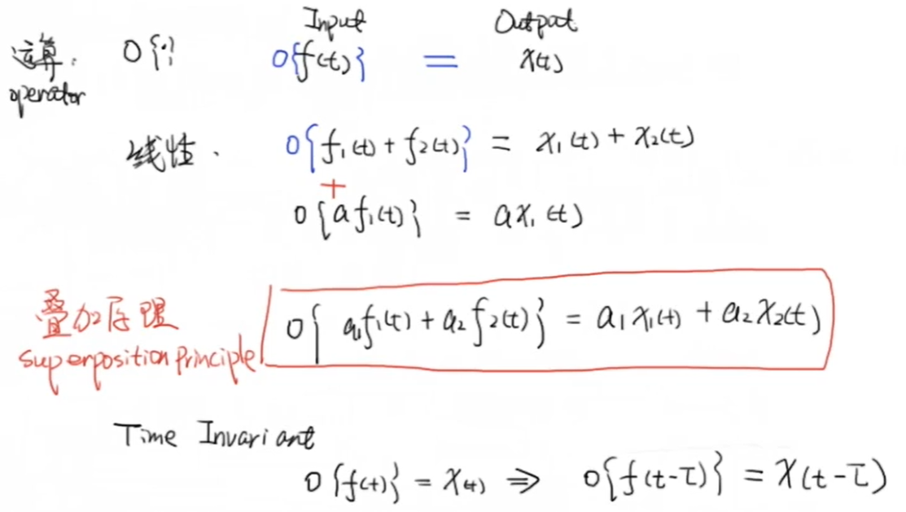
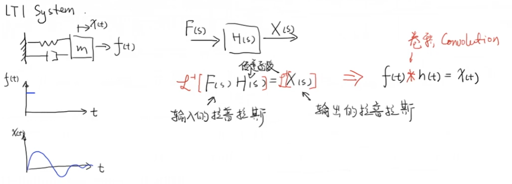
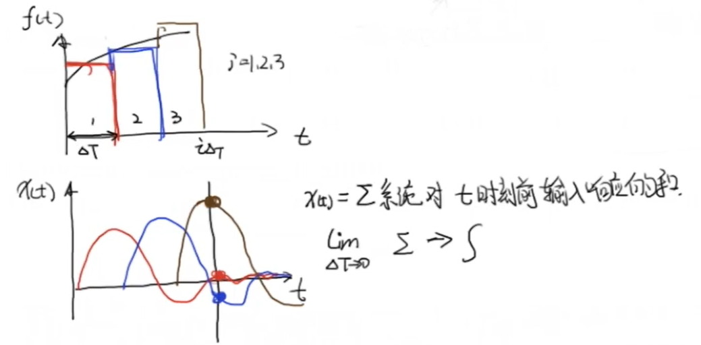
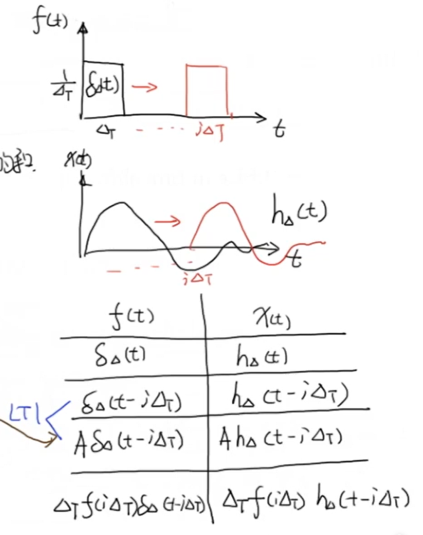

# 1 卷积定义

[函数](https://zh.wikipedia.org/wiki/函数) 是定义在 上的[可测函数](https://zh.wikipedia.org/wiki/可测函数)（measurable function），与的卷积记作$f * g$，它是其中一个函数[翻转](https://zh.wikipedia.org/w/index.php?title=翻转&action=edit&redlink=1)，并[平移](https://zh.wikipedia.org/wiki/平移)后，与另一个函数的乘积的积分，是一个对平移量的函数，也就是：
$$
(f * g)(t) \stackrel{\text { def }}{=} \int_{\mathbb{R}^{n}} f(\tau) g(t-\tau) d \tau
$$
如果函数不是定义在  上，可以把函数定义域以外的值都规定成零，这样就变成一个定义在 上的函数。

# 2 冲激响应定义

在[信号处理](https://zh.wikipedia.org/wiki/信号处理)中，**冲激响应**（英语：Impulse response）一般是指[系统](https://zh.wikipedia.org/wiki/系统)在输入为[单位脉冲函数](https://zh.wikipedia.org/wiki/单位脉冲函数)时的输出（响应），是[暂态响应](https://zh.wikipedia.org/wiki/暫態響應)中的一种。对于[连续时间系统](https://zh.wikipedia.org/w/index.php?title=连续时间系统&action=edit&redlink=1)来说，脉冲响应一般用函数来表示，相对应的输入信号，也就是单位脉冲函数满足[狄拉克δ函数](https://zh.wikipedia.org/wiki/狄拉克δ函数)的形式，其函数定义如下：
$$
\delta(t)=0, t \neq 0\\
\int_{-\infty}^{\infty} \delta(t) d t=1 
$$
在输入为[狄拉克δ函数](https://zh.wikipedia.org/wiki/狄拉克δ函数)时，系统的脉冲响应包含了系统的所有信息。所以对于任意输入信号，可以用连续域[卷积](https://zh.wikipedia.org/wiki/卷积)的方法得出所对应的输出。也就是：
$$
y(t)=\int_{-\infty}^{\infty} x(\tau) h(t-\tau) d \tau=x(t) * h(t)
$$
对于离散时间系统来说，脉冲响应一般用序列![h[n]](卷积.images/89981bbbb05ffd469eeadb828c18359965985e46.svg)来表示，相对应的离散输入信号，也就是单位脉冲函数满足[克罗内克δ](https://zh.wikipedia.org/wiki/克罗内克δ)的形式，在信号与系统科学中可以定义函数如下：
$$
\delta[n]=\left\{\begin{array}{ll}
1, & n=0 \\
0, & n \neq 0
\end{array}\right.
$$
同样道理，在输入为![\delta [n]](卷积.images/f2a6caf535cb44fa3526b2f320330a805edfdfaa.svg)时，离散系统的脉冲响应![h[n]](卷积.images/89981bbbb05ffd469eeadb828c18359965985e46-1587270131899.svg)包含了系统的所有信息。所以对于任意输入信号![x[n]](卷积.images/864cbbefbdcb55af4d9390911de1bf70167c4a3d.svg)，可以用离散域卷积（求和）的方法得出所对应的输出信号![y[n]](卷积.images/305428e6d1fb59cd0163a7a96ace52292a262afa.svg)。也就是：
$$
y[n]=\sum_{k=0}^{\infty} x[k] h[n-k]
$$

#  3 线性非时变系统

# 4 弹簧阻尼系统的例子

对于一个线性系统来说，他的输出相应 $x(t)$ 就等于输入 $f(t)$ 与其传递函数 $H(s)$ 经过拉普拉斯逆变换后得到的冲激响应 $h(t)$ 的卷积：

我们将输入信号的一段离散分成三个 $\Delta T$ ，这三个部分分别会对系统产生作用，并且作用之间相互独立，即产生对应的相互独立的输入响应，也就是输出。而某一时刻 $t$ 系统的输出，即为 $t$ 时刻前各输入响应的加和，当 $\Delta T \rightarrow 0$ 时，这个加和就变成了积分：

同样的，当 $\Delta T \rightarrow 0$ 时， $t$ 时刻的这一小段输入就可以近似为冲激函数的 $f(t)$ 倍。根据线性非时变系统的性质，我们可以得到这个输入与输出的表格：

其中第一行即为一个冲击产生的影响，可以理解为一个基本形式

第二行表示这个冲击延后 $i\Delta T$ 时间后，输入响应也将延后 $i\Delta T$ 

第三行则意味着冲激强度（图像面积）为 $A$ 时，并且延后 $i\Delta T$ 后，系统的输入响应将为基本形式延后 $i\Delta T$ 的 $A$ 倍

第四行即为第三行的推广，**通过把 $A$ 替换成输入函数在 $i\Delta T$ 时刻下， $\Delta T$ 小段的面积。他表示这个系统对一个面积为 $\Delta T f(i\Delta T)$ 的冲击输入在延迟 $i\Delta T$ 之后的输入响应**

根据叠加原理，我们可以将这个时刻以前所有的输入都加在一起，这样就得到了这一时刻系统的响应。就可以写成：
$$
 x(t)=\sum_{i=0}^{j} \Delta T f\left(i \Delta  T\right) h_{0}(t-i \Delta T) \quad t=j \Delta T
$$
当 $\Delta T \rightarrow 0$ 时， $i\Delta T = \tau$ ，上式就可以写成**卷积**的形式：
$$
x(t)=\int_{-\infty}^{\infty} f(\tau) h(t-\tau) d \tau=f(t) * h(t)
$$

# 5 启发

通过以上分析，我们可以发现，对于线性非时变系统，冲激响应 $h(t)$ 可以完全定义系统。这也就是我们把传递函数表示为 $H(s)$ 的原因，即冲激响应 $h(t)$ 经过拉普拉斯变换后得到传递函数 $H(s)$ 。