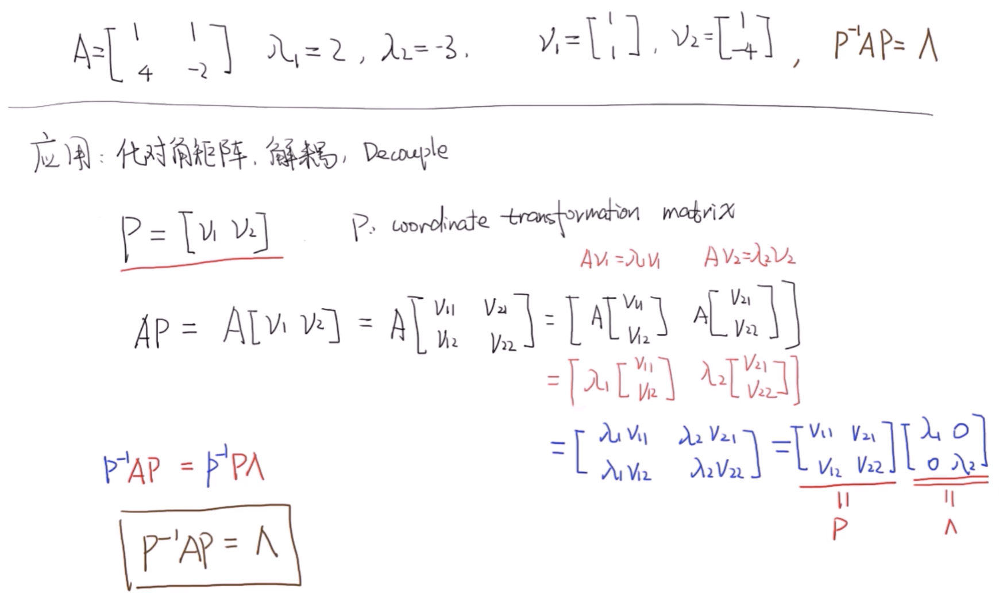
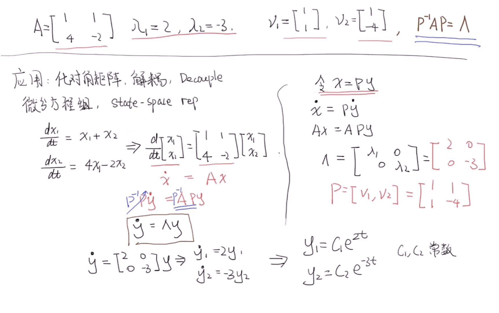
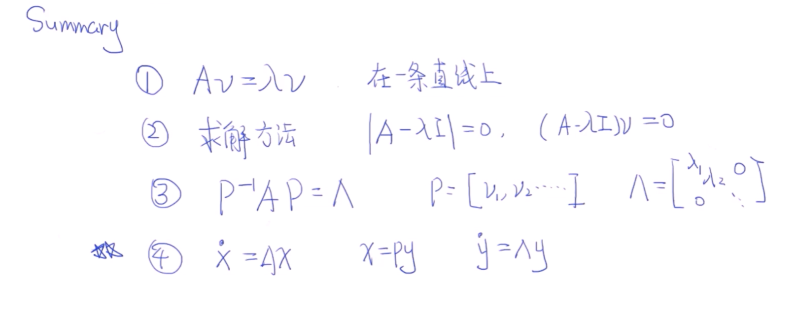

# 1 定义

在数学上，特别是线性代数中，对于一个给定的方阵 $A$ ，它的**特征向量**（eigenvector，也译**固有向量**或**本征向量**）$v$ 经过这个线性变换之后，得到的新向量仍然与原来的 $v$ 保持在同一条直线上，但其长度或方向也许会改变。即
$$
A v=\lambda v
$$
$\lambda$ 为标量，即特征向量的长度在该线性变换下缩放的比例，称$\lambda$为其**特征值**（本征值）。

# 2 应用

## 2.1 化对角阵

## 2.2 求解微分方程组

# 3 总结

