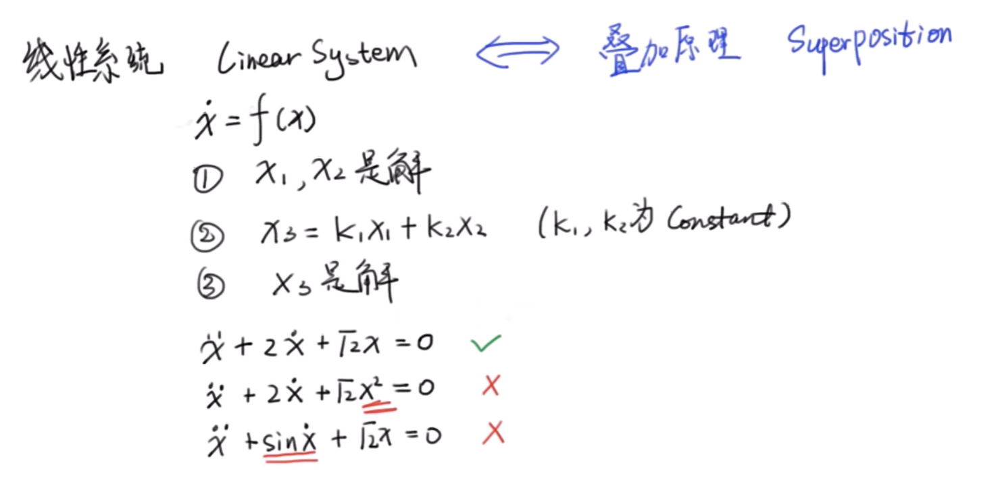
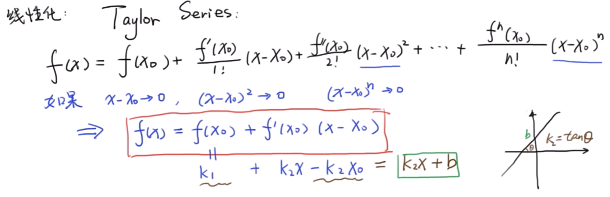
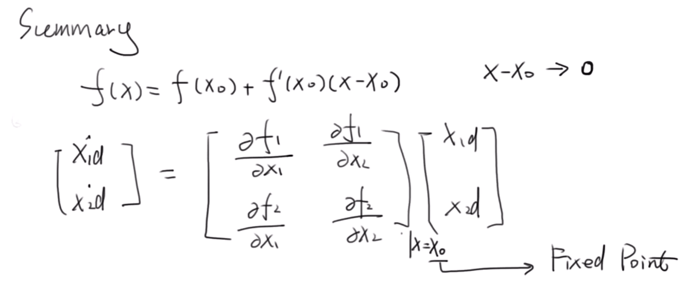

# 1 定义

数学上的**线性化**（linearization）是找[函数](https://zh.wikipedia.org/wiki/函数)在特定点的[线性近似](https://zh.wikipedia.org/wiki/线性近似)，也就是函数在该点的一阶[泰勒级数](https://zh.wikipedia.org/wiki/泰勒级数)。在[动力系统](https://zh.wikipedia.org/wiki/动力系统)研究中，线性化是分析[非线性](https://zh.wikipedia.org/wiki/非線性系統)[微分方程](https://zh.wikipedia.org/wiki/微分方程)系统或是非线性离散系统，在特定[平衡点](https://zh.wikipedia.org/wiki/平衡点)局部[稳定性](https://zh.wikipedia.org/wiki/穩定性理論)的一种方法[[1\]](https://zh.wikipedia.org/wiki/線性化#cite_note-1)。

# 2 线性系统

# 3 泰勒级数

# 4 总结

